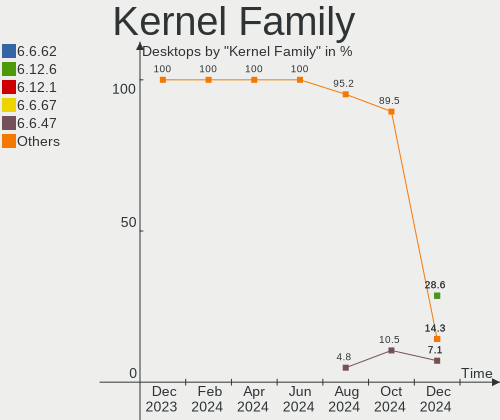
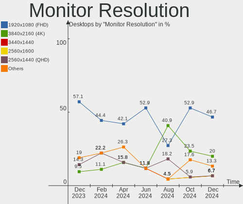
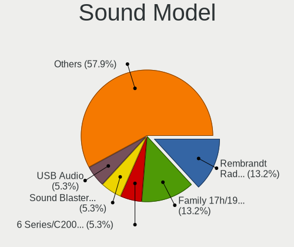

Gentoo Hardware Trends (Desktop)
--------------------------------

A project to identify most popular hardware characteristics and track their change
over time based on data collected by Gentoo users at https://Linux-Hardware.org.

Anyone can contribute to the study by uploading probes of their computers by
the [hw-probe](https://github.com/linuxhw/hw-probe) tool:

    sudo -E hw-probe -all -upload

Full-feature report is available here: https://linux-hardware.org/?view=trends&formfactor=desktop

Period: May, 2021.

Contents
--------

- [ OS                       ](#os)
- [ OS Family                ](#os-family)
- [ Kernel                   ](#kernel)
- [ Kernel Family            ](#kernel-family)
- [ Kernel Major Ver.        ](#kernel-major-ver)
- [ Arch                     ](#arch)
- [ DE                       ](#de)
- [ Display Server           ](#display-server)
- [ Display Manager          ](#display-manager)
- [ OS Lang                  ](#os-lang)
- [ Boot Mode                ](#boot-mode)
- [ Filesystem               ](#filesystem)
- [ Part. scheme             ](#part-scheme)
- [ Dual Boot with Linux/BSD ](#dual-boot-with-linux/bsd)
- [ Dual Boot (Win)          ](#dual-boot-win)
- [ Country                  ](#country)
- [ City                     ](#city)
- [ Vendor                   ](#vendor)
- [ Model                    ](#model)
- [ Model Family             ](#model-family)
- [ MFG Year                 ](#mfg-year)
- [ Form Factor              ](#form-factor)
- [ Secure Boot              ](#secure-boot)
- [ Coreboot                 ](#coreboot)
- [ RAM Size                 ](#ram-size)
- [ RAM Used                 ](#ram-used)
- [ Has CD-ROM               ](#has-cd-rom)
- [ Total Drives             ](#total-drives)
- [ Has Ethernet             ](#has-ethernet)
- [ Has WiFi                 ](#has-wifi)
- [ Has Bluetooth            ](#has-bluetooth)
- [ Drive Vendor             ](#drive-vendor)
- [ Drive Model              ](#drive-model)
- [ HDD Vendor               ](#hdd-vendor)
- [ SSD Vendor               ](#ssd-vendor)
- [ Drive Kind               ](#drive-kind)
- [ Drive Connector          ](#drive-connector)
- [ Drive Size               ](#drive-size)
- [ Space Total              ](#space-total)
- [ Space Used               ](#space-used)
- [ Malfunc. Drives          ](#malfunc-drives)
- [ Malfunc. Drive Vendor    ](#malfunc-drive-vendor)
- [ Malfunc. HDD Vendor      ](#malfunc-hdd-vendor)
- [ Malfunc. Drive Kind      ](#malfunc-drive-kind)
- [ Failed Drives            ](#failed-drives)
- [ Failed Drive Vendor      ](#failed-drive-vendor)
- [ Drive Status             ](#drive-status)
- [ Storage Vendor           ](#storage-vendor)
- [ Storage Model            ](#storage-model)
- [ Storage Kind             ](#storage-kind)
- [ CPU Vendor               ](#cpu-vendor)
- [ CPU Model                ](#cpu-model)
- [ CPU Model Family         ](#cpu-model-family)
- [ CPU Cores                ](#cpu-cores)
- [ CPU Sockets              ](#cpu-sockets)
- [ CPU Threads              ](#cpu-threads)
- [ CPU Op-Modes             ](#cpu-op-modes)
- [ CPU Microcode            ](#cpu-microcode)
- [ CPU Microarch            ](#cpu-microarch)
- [ GPU Vendor               ](#gpu-vendor)
- [ GPU Model                ](#gpu-model)
- [ GPU Combo                ](#gpu-combo)
- [ GPU Driver               ](#gpu-driver)
- [ GPU Memory               ](#gpu-memory)
- [ Monitor Vendor           ](#monitor-vendor)
- [ Monitor Model            ](#monitor-model)
- [ Monitor Resolution       ](#monitor-resolution)
- [ Monitor Diagonal         ](#monitor-diagonal)
- [ Monitor Width            ](#monitor-width)
- [ Aspect Ratio             ](#aspect-ratio)
- [ Monitor Area             ](#monitor-area)
- [ Pixel Density            ](#pixel-density)
- [ Multiple Monitors        ](#multiple-monitors)
- [ Net Controller Vendor    ](#net-controller-vendor)
- [ Net Controller Model     ](#net-controller-model)
- [ Wireless Vendor          ](#wireless-vendor)
- [ Wireless Model           ](#wireless-model)
- [ Ethernet Vendor          ](#ethernet-vendor)
- [ Ethernet Model           ](#ethernet-model)
- [ Net Controller Kind      ](#net-controller-kind)
- [ Used Controller          ](#used-controller)
- [ NICs                     ](#nics)
- [ IPv6                     ](#ipv6)
- [ Memory Vendor            ](#memory-vendor)
- [ Memory Model             ](#memory-model)
- [ Memory Kind              ](#memory-kind)
- [ Memory Form Factor       ](#memory-form-factor)
- [ Memory Size              ](#memory-size)
- [ Memory Speed             ](#memory-speed)
- [ Sound Vendor             ](#sound-vendor)
- [ Sound Model              ](#sound-model)
- [ Camera Vendor            ](#camera-vendor)
- [ Camera Model             ](#camera-model)
- [ Fingerprint Vendor       ](#fingerprint-vendor)
- [ Fingerprint Model        ](#fingerprint-model)
- [ Chipcard Vendor          ](#chipcard-vendor)
- [ Chipcard Model           ](#chipcard-model)
- [ Printer Vendor           ](#printer-vendor)
- [ Printer Model            ](#printer-model)
- [ Scanner Vendor           ](#scanner-vendor)
- [ Scanner Model            ](#scanner-model)
- [ Bluetooth Vendor         ](#bluetooth-vendor)
- [ Bluetooth Model          ](#bluetooth-model)
- [ Unsupported Devices      ](#unsupported-devices)
- [ Unsupported Device Types ](#unsupported-device-types)

OS
--

Installed operating systems

| Name       | Desktops | Percent |
|------------|----------|---------|
| Gentoo     | 12       | 57.14%  |
| Gentoo 2.7 | 9        | 42.86%  |

OS Family
---------

OS without a version

| Name   | Desktops | Percent |
|--------|----------|---------|
| Gentoo | 21       | 100%    |

Kernel
------

Version of the Linux kernel

| Version                      | Desktops | Percent |
|------------------------------|----------|---------|
| 5.10.27-gentoo               | 8        | 38.1%   |
| 5.12.5-gentoo                | 2        | 9.52%   |
| 5.11.21-gentoo-dist          | 2        | 9.52%   |
| 5.10.33-gentoo-67.P4_drivers | 2        | 9.52%   |
| 5.4.109-gentoo               | 1        | 4.76%   |
| 5.12.5-gentoo-x86_64         | 1        | 4.76%   |
| 5.12.4-zen1                  | 1        | 4.76%   |
| 5.12.3-gentoo                | 1        | 4.76%   |
| 5.10.34-gentoo-dist          | 1        | 4.76%   |
| 5.10.32-1-lts                | 1        | 4.76%   |
| 5.10.27-gentoo-cubieboard2   | 1        | 4.76%   |

Kernel Family
-------------

Linux kernel without a distro release

| Version | Desktops | Percent |
|---------|----------|---------|
| 5.10.27 | 9        | 42.86%  |
| 5.12.5  | 3        | 14.29%  |
| 5.11.21 | 2        | 9.52%   |
| 5.10.33 | 2        | 9.52%   |
| 5.4.109 | 1        | 4.76%   |
| 5.12.4  | 1        | 4.76%   |
| 5.12.3  | 1        | 4.76%   |
| 5.10.34 | 1        | 4.76%   |
| 5.10.32 | 1        | 4.76%   |

Kernel Major Ver.
-----------------

Linux kernel major version

| Version | Desktops | Percent |
|---------|----------|---------|
| 5.10    | 13       | 61.9%   |
| 5.12    | 5        | 23.81%  |
| 5.11    | 2        | 9.52%   |
| 5.4     | 1        | 4.76%   |

Arch
----

OS architecture (x86_64, i586, etc.)

| Name   | Desktops | Percent |
|--------|----------|---------|
| x86_64 | 18       | 85.71%  |
| i686   | 2        | 9.52%   |
| armv7l | 1        | 4.76%   |

DE
--

Desktop Environment

| Name       | Desktops | Percent |
|------------|----------|---------|
| Unknown    | 10       | 47.62%  |
| KDE5       | 5        | 23.81%  |
| GNOME      | 2        | 9.52%   |
| XFCE       | 1        | 4.76%   |
| X-Cinnamon | 1        | 4.76%   |
| sway       | 1        | 4.76%   |
| MATE       | 1        | 4.76%   |

Display Server
--------------

X11 or Wayland

| Name    | Desktops | Percent |
|---------|----------|---------|
| X11     | 8        | 38.1%   |
| Unknown | 7        | 33.33%  |
| Tty     | 5        | 23.81%  |
| Wayland | 1        | 4.76%   |

Display Manager
---------------

SDDM, LightDM, etc.

| Name    | Desktops | Percent |
|---------|----------|---------|
| Unknown | 12       | 57.14%  |
| SDDM    | 4        | 19.05%  |
| LightDM | 4        | 19.05%  |
| GDM     | 1        | 4.76%   |

OS Lang
-------

Language

| Lang    | Desktops | Percent |
|---------|----------|---------|
| en_US   | 10       | 47.62%  |
| en_GB   | 3        | 14.29%  |
| sv_SE   | 2        | 9.52%   |
| pl_PL   | 2        | 9.52%   |
| Unknown | 2        | 9.52%   |
| ru_RU   | 1        | 4.76%   |
| ca_ES   | 1        | 4.76%   |

Boot Mode
---------

EFI or BIOS

| Mode | Desktops | Percent |
|------|----------|---------|
| EFI  | 14       | 66.67%  |
| BIOS | 7        | 33.33%  |

Filesystem
----------

Type of filesystem

| Type  | Desktops | Percent |
|-------|----------|---------|
| Btrfs | 8        | 38.1%   |
| Ext4  | 7        | 33.33%  |
| F2fs  | 4        | 19.05%  |
| Zfs   | 1        | 4.76%   |
| Xfs   | 1        | 4.76%   |

Part. scheme
------------

Scheme of partitioning

| Type    | Desktops | Percent |
|---------|----------|---------|
| GPT     | 18       | 85.71%  |
| Unknown | 2        | 9.52%   |
| MBR     | 1        | 4.76%   |

Dual Boot with Linux/BSD
------------------------

Hosting more than one Linux/BSD

| Dual boot | Desktops | Percent |
|-----------|----------|---------|
| No        | 12       | 57.14%  |
| Yes       | 9        | 42.86%  |

Dual Boot (Win)
---------------

Hosting Linux and Windows

| Dual boot | Desktops | Percent |
|-----------|----------|---------|
| No        | 14       | 66.67%  |
| Yes       | 7        | 33.33%  |

Country
-------

Geographic location (country)

| Country | Desktops | Percent |
|---------|----------|---------|
| Poland  | 4        | 19.05%  |
| USA     | 3        | 14.29%  |
| UK      | 3        | 14.29%  |
| Greece  | 3        | 14.29%  |
| Sweden  | 2        | 9.52%   |
| Germany | 2        | 9.52%   |
| Ukraine | 1        | 4.76%   |
| Tunisia | 1        | 4.76%   |
| Spain   | 1        | 4.76%   |
| China   | 1        | 4.76%   |

City
----

Geographic location (city)

| City                  | Desktops | Percent |
|-----------------------|----------|---------|
| Warsaw                | 4        | 19.05%  |
| Athens                | 2        | 9.52%   |
| Visby                 | 1        | 4.76%   |
| Vilanova i la Geltrú | 1        | 4.76%   |
| Tunis                 | 1        | 4.76%   |
| Swansea               | 1        | 4.76%   |
| South Elmsall         | 1        | 4.76%   |
| Nemea                 | 1        | 4.76%   |
| Munich                | 1        | 4.76%   |
| London                | 1        | 4.76%   |
| Livingston            | 1        | 4.76%   |
| Karlstad              | 1        | 4.76%   |
| Huxi                  | 1        | 4.76%   |
| Hackettstown          | 1        | 4.76%   |
| Berlin                | 1        | 4.76%   |
| Austin                | 1        | 4.76%   |
| Alchevs'k             | 1        | 4.76%   |

Vendor
------

Motherboard manufacturer

| Name                | Desktops | Percent |
|---------------------|----------|---------|
| ASUSTek Computer    | 8        | 38.1%   |
| MSI                 | 4        | 19.05%  |
| Hewlett-Packard     | 2        | 9.52%   |
| Gigabyte Technology | 2        | 9.52%   |
| QDI                 | 1        | 4.76%   |
| Lenovo              | 1        | 4.76%   |
| ASRock              | 1        | 4.76%   |
| Apple               | 1        | 4.76%   |
| Unknown             | 1        | 4.76%   |

Model
-----

Motherboard model

| Name                                 | Desktops | Percent |
|--------------------------------------|----------|---------|
| ASUS P5LD2-Deluxe                    | 2        | 9.52%   |
| QDI P4I865A                          | 1        | 4.76%   |
| MSI MS-7D09                          | 1        | 4.76%   |
| MSI MS-7C84                          | 1        | 4.76%   |
| MSI MS-7C37                          | 1        | 4.76%   |
| MSI MS-7C02                          | 1        | 4.76%   |
| Lenovo ThinkCentre E73 10DU0015UK    | 1        | 4.76%   |
| HP Pavilion ZV6100 (EE984EA#ABZ)     | 1        | 4.76%   |
| HP Pavilion Gaming Desktop TG01-0xxx | 1        | 4.76%   |
| Gigabyte X570 AORUS ULTRA            | 1        | 4.76%   |
| Gigabyte AB350-Gaming                | 1        | 4.76%   |
| ASUS ROG STRIX Z490-I GAMING         | 1        | 4.76%   |
| ASUS ROG CROSSHAIR VIII HERO         | 1        | 4.76%   |
| ASUS PRIME X470-PRO                  | 1        | 4.76%   |
| ASUS PRIME B450M-K                   | 1        | 4.76%   |
| ASUS PRIME B350-PLUS                 | 1        | 4.76%   |
| ASUS M3A78-CM                        | 1        | 4.76%   |
| ASRock B450 Pro4                     | 1        | 4.76%   |
| Apple MacPro4,1                      | 1        | 4.76%   |
| Unknown                              | 1        | 4.76%   |

Model Family
------------

Motherboard model prefix

| Name                  | Desktops | Percent |
|-----------------------|----------|---------|
| ASUS PRIME            | 3        | 14.29%  |
| HP Pavilion           | 2        | 9.52%   |
| ASUS ROG              | 2        | 9.52%   |
| ASUS P5LD2-Deluxe     | 2        | 9.52%   |
| QDI P4I865A           | 1        | 4.76%   |
| MSI MS-7D09           | 1        | 4.76%   |
| MSI MS-7C84           | 1        | 4.76%   |
| MSI MS-7C37           | 1        | 4.76%   |
| MSI MS-7C02           | 1        | 4.76%   |
| Lenovo ThinkCentre    | 1        | 4.76%   |
| Gigabyte X570         | 1        | 4.76%   |
| Gigabyte AB350-Gaming | 1        | 4.76%   |
| ASUS M3A78-CM         | 1        | 4.76%   |
| ASRock B450           | 1        | 4.76%   |
| Apple MacPro4         | 1        | 4.76%   |
| Unknown               | 1        | 4.76%   |

MFG Year
--------

Motherboard manufacture year

| Year    | Desktops | Percent |
|---------|----------|---------|
| 2020    | 8        | 38.1%   |
| 2019    | 3        | 14.29%  |
| 2006    | 3        | 14.29%  |
| 2021    | 2        | 9.52%   |
| 2009    | 2        | 9.52%   |
| 2015    | 1        | 4.76%   |
| 2003    | 1        | 4.76%   |
| Unknown | 1        | 4.76%   |

Form Factor
-----------

Physical design of the computer

| Name    | Desktops | Percent |
|---------|----------|---------|
| Desktop | 21       | 100%    |

Secure Boot
-----------

Enabled or disabled

| State    | Desktops | Percent |
|----------|----------|---------|
| Disabled | 21       | 100%    |

Coreboot
--------

Have coreboot on board

| Used | Desktops | Percent |
|------|----------|---------|
| No   | 21       | 100%    |

RAM Size
--------

Total RAM memory

| Size in GB  | Desktops | Percent |
|-------------|----------|---------|
| 64.01-256.0 | 5        | 23.81%  |
| 32.01-64.0  | 4        | 19.05%  |
| 16.01-24.0  | 4        | 19.05%  |
| 3.01-4.0    | 2        | 9.52%   |
| 4.01-8.0    | 1        | 4.76%   |
| 24.01-32.0  | 1        | 4.76%   |
| 2.01-3.0    | 1        | 4.76%   |
| 1.01-2.0    | 1        | 4.76%   |
| 8.01-16.0   | 1        | 4.76%   |
| 0.51-1.0    | 1        | 4.76%   |

RAM Used
--------

Used RAM memory

| Used GB    | Desktops | Percent |
|------------|----------|---------|
| 4.01-8.0   | 4        | 19.05%  |
| 1.01-2.0   | 4        | 19.05%  |
| 0.01-0.5   | 4        | 19.05%  |
| 3.01-4.0   | 2        | 9.52%   |
| 2.01-3.0   | 2        | 9.52%   |
| 8.01-16.0  | 2        | 9.52%   |
| 0.51-1.0   | 2        | 9.52%   |
| 32.01-64.0 | 1        | 4.76%   |

Has CD-ROM
----------

Has CD-ROM on board

| Presented | Desktops | Percent |
|-----------|----------|---------|
| No        | 15       | 71.43%  |
| Yes       | 6        | 28.57%  |

Total Drives
------------

Number of drives on board

| Drives | Desktops | Percent |
|--------|----------|---------|
| 1      | 8        | 38.1%   |
| 3      | 5        | 23.81%  |
| 2      | 4        | 19.05%  |
| 5      | 2        | 9.52%   |
| 11     | 1        | 4.76%   |
| 6      | 1        | 4.76%   |

Has Ethernet
------------

Has Ethernet on board

| Presented | Desktops | Percent |
|-----------|----------|---------|
| Yes       | 20       | 95.24%  |
| No        | 1        | 4.76%   |

Has WiFi
--------

Has WiFi module

| Presented | Desktops | Percent |
|-----------|----------|---------|
| Yes       | 12       | 57.14%  |
| No        | 9        | 42.86%  |

Has Bluetooth
-------------

Has Bluetooth module

| Presented | Desktops | Percent |
|-----------|----------|---------|
| No        | 14       | 66.67%  |
| Yes       | 7        | 33.33%  |

Drive Vendor
------------

Hard drive vendors

| Vendor              | Desktops | Drives | Percent |
|---------------------|----------|--------|---------|
| WDC                 | 9        | 16     | 21.95%  |
| Samsung Electronics | 8        | 14     | 19.51%  |
| Seagate             | 7        | 7      | 17.07%  |
| Hitachi             | 3        | 7      | 7.32%   |
| Phison              | 2        | 2      | 4.88%   |
| GOODRAM             | 2        | 2      | 4.88%   |
| Unknown             | 1        | 1      | 2.44%   |
| Toshiba             | 1        | 1      | 2.44%   |
| SK Hynix            | 1        | 1      | 2.44%   |
| SanDisk             | 1        | 1      | 2.44%   |
| OCZ                 | 1        | 1      | 2.44%   |
| Intel               | 1        | 1      | 2.44%   |
| EMTEC               | 1        | 1      | 2.44%   |
| Crucial             | 1        | 1      | 2.44%   |
| Apacer              | 1        | 1      | 2.44%   |
| AMD-RAID            | 1        | 2      | 2.44%   |

Drive Model
-----------

Hard drive models

| Model                                   | Desktops | Percent |
|-----------------------------------------|----------|---------|
| WDC WD10EZEX-08M2NA0 1TB                | 3        | 6.12%   |
| GOODRAM SSDPR-CL100-480-G2 480GB        | 2        | 4.08%   |
| WDC WDS500G2X0C-00L350 500GB            | 1        | 2.04%   |
| WDC WDBRPG0010BNC-WRSN 1TB              | 1        | 2.04%   |
| WDC WD5000AAKX-60U6AA0 500GB            | 1        | 2.04%   |
| WDC WD40EFRX-68WT0N0 4TB                | 1        | 2.04%   |
| WDC WD40EFRX-68N32N0 4TB                | 1        | 2.04%   |
| WDC WD30EFRX-68AX9N0 3TB                | 1        | 2.04%   |
| WDC WD20EZRZ-00Z5HB0 2TB                | 1        | 2.04%   |
| WDC WD10EZEX-08WN4A0 1TB                | 1        | 2.04%   |
| Unknown MMC Card  32GB                  | 1        | 2.04%   |
| Toshiba HDWE150 5TB                     | 1        | 2.04%   |
| SK Hynix BC501 HFM512GDJTNG-8310A 512GB | 1        | 2.04%   |
| Seagate ST4000DM004-2CV104 4TB          | 1        | 2.04%   |
| Seagate ST3250310AS 250GB               | 1        | 2.04%   |
| Seagate ST31500341AS 1TB                | 1        | 2.04%   |
| Seagate ST2000DX001-1NS164 2TB          | 1        | 2.04%   |
| Seagate ST2000DM008-2FR102 2TB          | 1        | 2.04%   |
| Seagate ST2000DM001-1ER164 2TB          | 1        | 2.04%   |
| Seagate ST12000NM0008-2H3101 12TB       | 1        | 2.04%   |
| SanDisk SD9SN8W-128G-1006 128GB SSD     | 1        | 2.04%   |
| Samsung SSD 980 PRO 250GB               | 1        | 2.04%   |
| Samsung SSD 970 PRO 1TB                 | 1        | 2.04%   |
| Samsung SSD 970 EVO Plus 500GB          | 1        | 2.04%   |
| Samsung SSD 970 EVO Plus 250GB          | 1        | 2.04%   |
| Samsung SSD 970 EVO Plus 1TB            | 1        | 2.04%   |
| Samsung SSD 870 QVO 1TB                 | 1        | 2.04%   |
| Samsung SSD 850 EVO 500GB               | 1        | 2.04%   |
| Samsung SSD 850 EVO 1TB                 | 1        | 2.04%   |
| Samsung SSD 840 PRO Series 256GB        | 1        | 2.04%   |
| Samsung SSD 840 EVO 500GB               | 1        | 2.04%   |
| Samsung SSD 840 EVO 250GB               | 1        | 2.04%   |
| Samsung SSD 830 Series 128GB            | 1        | 2.04%   |
| Samsung NVMe SSD Drive 500GB            | 1        | 2.04%   |
| Phison Sabrent Rocket 4.0 1TB           | 1        | 2.04%   |
| Phison NVMe SSD Drive 1TB               | 1        | 2.04%   |
| OCZ ARC100 240GB SSD                    | 1        | 2.04%   |
| Intel SSDSC2BB080G4 80GB                | 1        | 2.04%   |
| Hitachi HUS724030ALE641 3TB             | 1        | 2.04%   |
| Hitachi HDS722020ALA330 2TB             | 1        | 2.04%   |
| Hitachi HDE721064SLA360 640GB           | 1        | 2.04%   |
| EMTEC X250 512GB SSD                    | 1        | 2.04%   |
| Crucial CT480BX500SSD1 480GB            | 1        | 2.04%   |
| Apacer AS340 240GB SSD                  | 1        | 2.04%   |
| AMD-RAID Array 02 2TB SSD               | 1        | 2.04%   |
| AMD-RAID Array 01 4TB SSD               | 1        | 2.04%   |

HDD Vendor
----------

Hard disk drive vendors

| Vendor  | Desktops | Drives | Percent |
|---------|----------|--------|---------|
| WDC     | 7        | 14     | 38.89%  |
| Seagate | 7        | 7      | 38.89%  |
| Hitachi | 3        | 7      | 16.67%  |
| Toshiba | 1        | 1      | 5.56%   |

SSD Vendor
----------

Solid state drive vendors

| Vendor              | Desktops | Drives | Percent |
|---------------------|----------|--------|---------|
| Samsung Electronics | 4        | 7      | 30.77%  |
| GOODRAM             | 2        | 2      | 15.38%  |
| SanDisk             | 1        | 1      | 7.69%   |
| OCZ                 | 1        | 1      | 7.69%   |
| Intel               | 1        | 1      | 7.69%   |
| EMTEC               | 1        | 1      | 7.69%   |
| Crucial             | 1        | 1      | 7.69%   |
| Apacer              | 1        | 1      | 7.69%   |
| AMD-RAID            | 1        | 2      | 7.69%   |

Drive Kind
----------

HDD or SSD

| Kind | Desktops | Drives | Percent |
|------|----------|--------|---------|
| SSD  | 12       | 17     | 35.29%  |
| HDD  | 12       | 29     | 35.29%  |
| NVMe | 9        | 12     | 26.47%  |
| MMC  | 1        | 1      | 2.94%   |

Drive Connector
---------------

SATA, SAS, NVMe, etc.

| Type | Desktops | Drives | Percent |
|------|----------|--------|---------|
| SATA | 17       | 44     | 60.71%  |
| NVMe | 9        | 12     | 32.14%  |
| SAS  | 1        | 2      | 3.57%   |
| MMC  | 1        | 1      | 3.57%   |

Drive Size
----------

Size of hard drive

| Size in TB | Desktops | Drives | Percent |
|------------|----------|--------|---------|
| 0.01-0.5   | 10       | 14     | 34.48%  |
| 0.51-1.0   | 8        | 10     | 27.59%  |
| 1.01-2.0   | 4        | 7      | 13.79%  |
| 3.01-4.0   | 3        | 9      | 10.34%  |
| 2.01-3.0   | 2        | 4      | 6.9%    |
| 10.01-20.0 | 1        | 1      | 3.45%   |
| 4.01-10.0  | 1        | 1      | 3.45%   |

Space Total
-----------

Amount of disk space available on the file system

| Size in GB     | Desktops | Percent |
|----------------|----------|---------|
| 501-1000       | 5        | 23.81%  |
| 251-500        | 4        | 19.05%  |
| 2001-3000      | 4        | 19.05%  |
| More than 3000 | 3        | 14.29%  |
| Unknown        | 2        | 9.52%   |
| 21-50          | 1        | 4.76%   |
| 101-250        | 1        | 4.76%   |
| 1001-2000      | 1        | 4.76%   |

Space Used
----------

Amount of used disk space

| Used GB        | Desktops | Percent |
|----------------|----------|---------|
| 101-250        | 5        | 23.81%  |
| 1-20           | 5        | 23.81%  |
| More than 3000 | 2        | 9.52%   |
| 251-500        | 2        | 9.52%   |
| 501-1000       | 2        | 9.52%   |
| Unknown        | 2        | 9.52%   |
| 2001-3000      | 1        | 4.76%   |
| 1001-2000      | 1        | 4.76%   |
| 51-100         | 1        | 4.76%   |

Malfunc. Drives
---------------

Drive models with a malfunction

| Model                               | Desktops | Drives | Percent |
|-------------------------------------|----------|--------|---------|
| WDC WD40EFRX-68WT0N0 4TB            | 1        | 6      | 20%     |
| WDC WD40EFRX-68N32N0 4TB            | 1        | 1      | 20%     |
| WDC WD30EFRX-68AX9N0 3TB            | 1        | 1      | 20%     |
| SanDisk SD9SN8W-128G-1006 128GB SSD | 1        | 1      | 20%     |
| Hitachi HDS722020ALA330 2TB         | 1        | 2      | 20%     |

Malfunc. Drive Vendor
---------------------

Vendors of faulty drives

| Vendor  | Desktops | Drives | Percent |
|---------|----------|--------|---------|
| WDC     | 1        | 8      | 33.33%  |
| SanDisk | 1        | 1      | 33.33%  |
| Hitachi | 1        | 2      | 33.33%  |

Malfunc. HDD Vendor
-------------------

Vendors of faulty HDD drives

| Vendor  | Desktops | Drives | Percent |
|---------|----------|--------|---------|
| WDC     | 1        | 8      | 50%     |
| Hitachi | 1        | 2      | 50%     |

Malfunc. Drive Kind
-------------------

Kinds of faulty drives

| Kind | Desktops | Drives | Percent |
|------|----------|--------|---------|
| HDD  | 2        | 10     | 66.67%  |
| SSD  | 1        | 1      | 33.33%  |

Failed Drives
-------------

Failed drive models

| Model                    | Desktops | Drives | Percent |
|--------------------------|----------|--------|---------|
| Seagate ST31500341AS 1TB | 1        | 1      | 100%    |

Failed Drive Vendor
-------------------

Failed drive vendors

| Vendor  | Desktops | Drives | Percent |
|---------|----------|--------|---------|
| Seagate | 1        | 1      | 100%    |

Drive Status
------------

Number of failed and malfunc. drives

| Status   | Desktops | Drives | Percent |
|----------|----------|--------|---------|
| Works    | 17       | 40     | 70.83%  |
| Detected | 3        | 7      | 12.5%   |
| Malfunc  | 3        | 11     | 12.5%   |
| Failed   | 1        | 1      | 4.17%   |

Storage Vendor
--------------

Storage controller vendors

| Vendor                    | Desktops | Percent |
|---------------------------|----------|---------|
| AMD                       | 13       | 37.14%  |
| Intel                     | 7        | 20%     |
| Samsung Electronics       | 5        | 14.29%  |
| Silicon Image             | 2        | 5.71%   |
| Sandisk                   | 2        | 5.71%   |
| Phison Electronics        | 2        | 5.71%   |
| ASMedia Technology        | 2        | 5.71%   |
| SK Hynix                  | 1        | 2.86%   |
| LSI Logic / Symbios Logic | 1        | 2.86%   |

Storage Model
-------------

Storage controller models

| Model                                                                          | Desktops | Percent |
|--------------------------------------------------------------------------------|----------|---------|
| AMD FCH SATA Controller [AHCI mode]                                            | 8        | 18.18%  |
| Samsung NVMe SSD Controller SM981/PM981/PM983                                  | 5        | 11.36%  |
| AMD 400 Series Chipset SATA Controller                                         | 5        | 11.36%  |
| Silicon Image SiI 3132 Serial ATA Raid II Controller                           | 2        | 4.55%   |
| Phison E16 PCIe4 NVMe Controller                                               | 2        | 4.55%   |
| Intel 82801G (ICH7 Family) IDE Controller                                      | 2        | 4.55%   |
| ASMedia ASM1062 Serial ATA Controller                                          | 2        | 4.55%   |
| AMD 300 Series Chipset SATA Controller                                         | 2        | 4.55%   |
| SK Hynix BC501 NVMe Solid State Drive 512GB                                    | 1        | 2.27%   |
| Sandisk WD Black SN750 / PC SN730 NVMe SSD                                     | 1        | 2.27%   |
| Sandisk WD Black 2018/SN750 / PC SN720 NVMe SSD                                | 1        | 2.27%   |
| Samsung NVMe SSD Controller PM9A1/PM9A3/980PRO                                 | 1        | 2.27%   |
| LSI Logic / Symbios Logic SAS2308 PCI-Express Fusion-MPT SAS-2                 | 1        | 2.27%   |
| Intel NM10/ICH7 Family SATA Controller [IDE mode]                              | 1        | 2.27%   |
| Intel NM10/ICH7 Family SATA Controller [AHCI mode]                             | 1        | 2.27%   |
| Intel Comet Lake SATA AHCI Controller                                          | 1        | 2.27%   |
| Intel 82801JI (ICH10 Family) SATA AHCI Controller                              | 1        | 2.27%   |
| Intel 82801EB (ICH5) SATA Controller                                           | 1        | 2.27%   |
| Intel 8 Series/C220 Series Chipset Family 6-port SATA Controller 1 [AHCI mode] | 1        | 2.27%   |
| Intel 500 Series Chipset Family SATA AHCI Controller                           | 1        | 2.27%   |
| AMD SB7x0/SB8x0/SB9x0 SATA Controller [IDE mode]                               | 1        | 2.27%   |
| AMD SB7x0/SB8x0/SB9x0 IDE Controller                                           | 1        | 2.27%   |
| AMD RS690 PCI to PCI Bridge (PCI Express Port 2)                               | 1        | 2.27%   |
| AMD IXP SB4x0 IDE Controller                                                   | 1        | 2.27%   |

Storage Kind
------------

Kind of storage controller (IDE, SATA, NVMe, SAS, ...)

| Kind | Desktops | Percent |
|------|----------|---------|
| SATA | 16       | 47.06%  |
| NVMe | 9        | 26.47%  |
| IDE  | 5        | 14.71%  |
| RAID | 3        | 8.82%   |
| SAS  | 1        | 2.94%   |

CPU Vendor
----------

Processor vendors

| Vendor | Desktops | Percent |
|--------|----------|---------|
| AMD    | 13       | 61.9%   |
| Intel  | 7        | 33.33%  |
| ARM    | 1        | 4.76%   |

CPU Model
---------

Processor models

| Model                                      | Desktops | Percent |
|--------------------------------------------|----------|---------|
| Intel Pentium 4 CPU 3.20GHz                | 3        | 14.29%  |
| AMD Ryzen 9 5950X 16-Core Processor        | 2        | 9.52%   |
| AMD Ryzen 5 3600 6-Core Processor          | 2        | 9.52%   |
| Intel Xeon CPU E5520 @ 2.27GHz             | 1        | 4.76%   |
| Intel Core i9-10850K CPU @ 3.60GHz         | 1        | 4.76%   |
| Intel Core i5-10600KF CPU @ 4.10GHz        | 1        | 4.76%   |
| Intel Core i3-4170 CPU @ 3.70GHz           | 1        | 4.76%   |
| ARM Allwinner sun7i (A20) Family Processor | 1        | 4.76%   |
| AMD Ryzen 9 3950X 16-Core Processor        | 1        | 4.76%   |
| AMD Ryzen 7 5800X 8-Core Processor         | 1        | 4.76%   |
| AMD Ryzen 7 3700X 8-Core Processor         | 1        | 4.76%   |
| AMD Ryzen 7 2700 Eight-Core Processor      | 1        | 4.76%   |
| AMD Ryzen 5 5600X 6-Core Processor         | 1        | 4.76%   |
| AMD Ryzen 5 3600XT 6-Core Processor        | 1        | 4.76%   |
| AMD Ryzen 5 2600 Six-Core Processor        | 1        | 4.76%   |
| AMD Phenom II X4 955 Processor             | 1        | 4.76%   |
| AMD Athlon 64 Processor 3200+              | 1        | 4.76%   |

CPU Model Family
----------------

Processor model prefix

| Model            | Desktops | Percent |
|------------------|----------|---------|
| AMD Ryzen 5      | 5        | 23.81%  |
| Intel Pentium 4  | 3        | 14.29%  |
| AMD Ryzen 9      | 3        | 14.29%  |
| AMD Ryzen 7      | 3        | 14.29%  |
| Intel Xeon       | 1        | 4.76%   |
| Intel Core i9    | 1        | 4.76%   |
| Intel Core i5    | 1        | 4.76%   |
| Intel Core i3    | 1        | 4.76%   |
| ARM Allwinner    | 1        | 4.76%   |
| AMD Phenom II X4 | 1        | 4.76%   |
| AMD Athlon 64    | 1        | 4.76%   |

CPU Cores
---------

Number of processor cores

| Number | Desktops | Percent |
|--------|----------|---------|
| 6      | 6        | 28.57%  |
| 8      | 4        | 19.05%  |
| 1      | 4        | 19.05%  |
| 16     | 3        | 14.29%  |
| 2      | 2        | 9.52%   |
| 10     | 1        | 4.76%   |
| 4      | 1        | 4.76%   |

CPU Sockets
-----------

Number of sockets

| Number | Desktops | Percent |
|--------|----------|---------|
| 1      | 20       | 95.24%  |
| 2      | 1        | 4.76%   |

CPU Threads
-----------

Threads per core (Hyper-Threading)

| Number | Desktops | Percent |
|--------|----------|---------|
| 2      | 17       | 80.95%  |
| 1      | 4        | 19.05%  |

CPU Op-Modes
------------

CPU Operation Modes (32-bit, 64-bit)

| Op mode        | Desktops | Percent |
|----------------|----------|---------|
| 32-bit, 64-bit | 19       | 90.48%  |
| 32-bit         | 1        | 4.76%   |
| Unknown        | 1        | 4.76%   |

CPU Microcode
-------------

Microcode number

| Number     | Desktops | Percent |
|------------|----------|---------|
| 0x0a201009 | 4        | 19.05%  |
| 0x08701021 | 4        | 19.05%  |
| 0xf43      | 2        | 9.52%   |
| 0xa0655    | 2        | 9.52%   |
| 0x0800820d | 2        | 9.52%   |
| Unknown    | 2        | 9.52%   |
| 0xf29      | 1        | 4.76%   |
| 0x306c3    | 1        | 4.76%   |
| 0x106a5    | 1        | 4.76%   |
| 0x08701013 | 1        | 4.76%   |
| 0x010000db | 1        | 4.76%   |

CPU Microarch
-------------

Microarchitecture

| Name      | Desktops | Percent |
|-----------|----------|---------|
| Zen 2     | 5        | 23.81%  |
| Zen 3     | 4        | 19.05%  |
| NetBurst  | 3        | 14.29%  |
| Zen+      | 2        | 9.52%   |
| CometLake | 2        | 9.52%   |
| Nehalem   | 1        | 4.76%   |
| K8 Hammer | 1        | 4.76%   |
| K10       | 1        | 4.76%   |
| Haswell   | 1        | 4.76%   |
| Unknown   | 1        | 4.76%   |

GPU Vendor
----------

Vendors of graphics cards

| Vendor | Desktops | Percent |
|--------|----------|---------|
| Nvidia | 11       | 57.89%  |
| AMD    | 6        | 31.58%  |
| Intel  | 2        | 10.53%  |

GPU Model
---------

Graphics card models

| Model                                                                     | Desktops | Percent |
|---------------------------------------------------------------------------|----------|---------|
| Nvidia GM206 [GeForce GTX 960]                                            | 2        | 10%     |
| Nvidia G96C [GeForce 9400 GT]                                             | 2        | 10%     |
| Nvidia TU117 [GeForce GTX 1650]                                           | 1        | 5%      |
| Nvidia TU116 [GeForce GTX 1660 SUPER]                                     | 1        | 5%      |
| Nvidia TU106 [GeForce RTX 2060 SUPER]                                     | 1        | 5%      |
| Nvidia GT200GL [Quadro FX 4800]                                           | 1        | 5%      |
| Nvidia GP106 [GeForce GTX 1060 6GB]                                       | 1        | 5%      |
| Nvidia GP104 [GeForce GTX 1060 6GB]                                       | 1        | 5%      |
| Nvidia G73 [GeForce 7300 GT]                                              | 1        | 5%      |
| Intel CometLake-S GT2 [UHD Graphics 630]                                  | 1        | 5%      |
| Intel 4th Generation Core Processor Family Integrated Graphics Controller | 1        | 5%      |
| AMD Vega 10 XL/XT [Radeon RX Vega 56/64]                                  | 1        | 5%      |
| AMD RV350 [Radeon 9550/9600/X1050 Series] (Secondary)                     | 1        | 5%      |
| AMD RV350 [Radeon 9550/9600/X1050 Series]                                 | 1        | 5%      |
| AMD RS780C [Radeon 3100]                                                  | 1        | 5%      |
| AMD RS480M [Mobility Radeon Xpress 200]                                   | 1        | 5%      |
| AMD Navi 22 [Radeon RX 6700/6700 XT / 6800M]                              | 1        | 5%      |
| AMD Navi 21 [Radeon RX 6800/6800 XT / 6900 XT]                            | 1        | 5%      |

GPU Combo
---------

Combinations of graphics cards

| Name       | Desktops | Percent |
|------------|----------|---------|
| 1 x Nvidia | 11       | 52.38%  |
| 1 x AMD    | 5        | 23.81%  |
| Other      | 2        | 9.52%   |
| 1 x Intel  | 2        | 9.52%   |
| 2 x AMD    | 1        | 4.76%   |

GPU Driver
----------

Free vs proprietary

| Driver      | Desktops | Percent |
|-------------|----------|---------|
| Free        | 11       | 52.38%  |
| Proprietary | 6        | 28.57%  |
| Unknown     | 4        | 19.05%  |

GPU Memory
----------

Total video memory

| Size in GB | Desktops | Percent |
|------------|----------|---------|
| Unknown    | 10       | 47.62%  |
| 0.01-0.5   | 3        | 14.29%  |
| 7.01-8.0   | 2        | 9.52%   |
| 3.01-4.0   | 2        | 9.52%   |
| 8.01-16.0  | 2        | 9.52%   |
| 5.01-6.0   | 1        | 4.76%   |
| 1.01-2.0   | 1        | 4.76%   |

Monitor Vendor
--------------

Monitor vendors

| Vendor              | Desktops | Percent |
|---------------------|----------|---------|
| Goldstar            | 3        | 20%     |
| Dell                | 2        | 13.33%  |
| Samsung Electronics | 1        | 6.67%   |
| Philips             | 1        | 6.67%   |
| Packard Bell        | 1        | 6.67%   |
| MSI                 | 1        | 6.67%   |
| Iiyama              | 1        | 6.67%   |
| Idek Iiyama         | 1        | 6.67%   |
| FUN                 | 1        | 6.67%   |
| Eizo                | 1        | 6.67%   |
| BenQ                | 1        | 6.67%   |
| Apple               | 1        | 6.67%   |

Monitor Model
-------------

Monitor models

| Model                                                             | Desktops | Percent |
|-------------------------------------------------------------------|----------|---------|
| Samsung Electronics S22B300 SAM08C8 1920x1080 480x270mm 21.7-inch | 1        | 5.56%   |
| Philips PHL 275B1 PHL0946 2560x1440 597x336mm 27.0-inch           | 1        | 5.56%   |
| Packard Bell PKB VIS220WS PKB5064 1680x1050 460x290mm 21.4-inch   | 1        | 5.56%   |
| MSI Optix MAG27CQ MSI1462 2560x1440 597x336mm 27.0-inch           | 1        | 5.56%   |
| Iiyama PL2473HD IVM6107 1920x1080 521x293mm 23.5-inch             | 1        | 5.56%   |
| Idek Iiyama LCD Monitor PL3461WQ 3440x1440                        | 1        | 5.56%   |
| Goldstar LG ULTRAWIDE GSM59F1 1920x1080 580x240mm 24.7-inch       | 1        | 5.56%   |
| Goldstar L2000C GSM4E39 1600x1200 408x306mm 20.1-inch             | 1        | 5.56%   |
| Goldstar HDR 4K GSM7707 3840x2160 600x340mm 27.2-inch             | 1        | 5.56%   |
| Goldstar 27MB85Z GSM5A72 2560x1440 597x336mm 27.0-inch            | 1        | 5.56%   |
| FUN HDMI Monitor FUN9D31 3840x2160 480x270mm 21.7-inch            | 1        | 5.56%   |
| Eizo EV2495 ENC3156 1920x1200 519x324mm 24.1-inch                 | 1        | 5.56%   |
| Eizo EV2436W ENC2385 1920x1200 519x324mm 24.1-inch                | 1        | 5.56%   |
| Dell U2312HM DEL4072 1920x1080 510x290mm 23.1-inch                | 1        | 5.56%   |
| Dell LCD Monitor 2407WFP 1920x1200                                | 1        | 5.56%   |
| BenQ PD3200U BNQ8025 3840x2160 708x399mm 32.0-inch                | 1        | 5.56%   |
| BenQ LCD BNQ801E 1920x1080 600x340mm 27.2-inch                    | 1        | 5.56%   |
| Apple LED Cinema APP9236 1920x1200 518x324mm 24.1-inch            | 1        | 5.56%   |

Monitor Resolution
------------------

Monitor screen resolution

| Resolution         | Desktops | Percent |
|--------------------|----------|---------|
| 3840x2160 (4K)     | 3        | 18.75%  |
| 1920x1200 (WUXGA)  | 3        | 18.75%  |
| 1920x1080 (FHD)    | 3        | 18.75%  |
| 3440x1440          | 2        | 12.5%   |
| 2560x1440 (QHD)    | 2        | 12.5%   |
| 2560x1080          | 1        | 6.25%   |
| 1680x1050 (WSXGA+) | 1        | 6.25%   |
| 1600x1200          | 1        | 6.25%   |

Monitor Diagonal
----------------

Diagonal size in inches

| Inches  | Desktops | Percent |
|---------|----------|---------|
| 27      | 4        | 23.53%  |
| 21      | 3        | 17.65%  |
| 34      | 2        | 11.76%  |
| 24      | 2        | 11.76%  |
| 23      | 2        | 11.76%  |
| Unknown | 2        | 11.76%  |
| 32      | 1        | 5.88%   |
| 20      | 1        | 5.88%   |

Monitor Width
-------------

Physical width

| Width in mm | Desktops | Percent |
|-------------|----------|---------|
| 501-600     | 8        | 47.06%  |
| 401-500     | 4        | 23.53%  |
| 701-800     | 3        | 17.65%  |
| Unknown     | 2        | 11.76%  |

Aspect Ratio
------------

Proportional relationship between the width and the height

| Ratio   | Desktops | Percent |
|---------|----------|---------|
| 16/9    | 8        | 50%     |
| 16/10   | 3        | 18.75%  |
| 21/9    | 2        | 12.5%   |
| Unknown | 2        | 12.5%   |
| 4/3     | 1        | 6.25%   |

Monitor Area
------------

Area in inch²

| Area in inch² | Desktops | Percent |
|----------------|----------|---------|
| 201-250        | 5        | 29.41%  |
| 301-350        | 4        | 23.53%  |
| 351-500        | 3        | 17.65%  |
| 251-300        | 2        | 11.76%  |
| Unknown        | 2        | 11.76%  |
| 151-200        | 1        | 5.88%   |

Pixel Density
-------------

Pixels per inch

| Density | Desktops | Percent |
|---------|----------|---------|
| 51-100  | 7        | 41.18%  |
| 101-120 | 4        | 23.53%  |
| 161-240 | 3        | 17.65%  |
| Unknown | 2        | 11.76%  |
| 121-160 | 1        | 5.88%   |

Multiple Monitors
-----------------

Total monitors connected

| Total | Desktops | Percent |
|-------|----------|---------|
| 1     | 12       | 57.14%  |
| 0     | 5        | 23.81%  |
| 2     | 4        | 19.05%  |

Net Controller Vendor
---------------------

Controller vendors

| Vendor                   | Desktops | Percent |
|--------------------------|----------|---------|
| Realtek Semiconductor    | 13       | 40.63%  |
| Intel                    | 11       | 34.38%  |
| Qualcomm Atheros         | 3        | 9.38%   |
| Marvell Technology Group | 2        | 6.25%   |
| Broadcom                 | 2        | 6.25%   |
| AMD                      | 1        | 3.13%   |

Net Controller Model
--------------------

Controller models

| Model                                                               | Desktops | Percent |
|---------------------------------------------------------------------|----------|---------|
| Realtek RTL8111/8168/8411 PCI Express Gigabit Ethernet Controller   | 9        | 23.68%  |
| Intel Wi-Fi 6 AX200                                                 | 4        | 10.53%  |
| Qualcomm Atheros AR9227 Wireless Network Adapter                    | 3        | 7.89%   |
| Intel PRO/Wireless 2200BG [Calexico2] Network Connection            | 3        | 7.89%   |
| Intel I211 Gigabit Network Connection                               | 3        | 7.89%   |
| Realtek RTL8125 2.5GbE Controller                                   | 2        | 5.26%   |
| Realtek RTL-8100/8101L/8139 PCI Fast Ethernet Adapter               | 2        | 5.26%   |
| Marvell Group 88E8053 PCI-E Gigabit Ethernet Controller             | 2        | 5.26%   |
| Intel Ethernet Controller I225-V                                    | 2        | 5.26%   |
| Realtek RTL8822CE 802.11ac PCIe Wireless Network Adapter            | 1        | 2.63%   |
| Realtek 802.11n                                                     | 1        | 2.63%   |
| Qualcomm Atheros AR5212/5213/2414 Wireless Network Adapter          | 1        | 2.63%   |
| Intel Comet Lake PCH CNVi WiFi                                      | 1        | 2.63%   |
| Intel 82574L Gigabit Network Connection                             | 1        | 2.63%   |
| Broadcom BCM4322 802.11a/b/g/n Wireless LAN Controller              | 1        | 2.63%   |
| Broadcom BCM4318 [AirForce One 54g] 802.11g Wireless LAN Controller | 1        | 2.63%   |
| AMD IXP SB400 AC'97 Modem Controller                                | 1        | 2.63%   |

Wireless Vendor
---------------

Wireless vendors

| Vendor                | Desktops | Percent |
|-----------------------|----------|---------|
| Intel                 | 8        | 53.33%  |
| Qualcomm Atheros      | 3        | 20%     |
| Realtek Semiconductor | 2        | 13.33%  |
| Broadcom              | 2        | 13.33%  |

Wireless Model
--------------

Wireless models

| Model                                                               | Desktops | Percent |
|---------------------------------------------------------------------|----------|---------|
| Intel Wi-Fi 6 AX200                                                 | 4        | 25%     |
| Qualcomm Atheros AR9227 Wireless Network Adapter                    | 3        | 18.75%  |
| Intel PRO/Wireless 2200BG [Calexico2] Network Connection            | 3        | 18.75%  |
| Realtek RTL8822CE 802.11ac PCIe Wireless Network Adapter            | 1        | 6.25%   |
| Realtek 802.11n                                                     | 1        | 6.25%   |
| Qualcomm Atheros AR5212/5213/2414 Wireless Network Adapter          | 1        | 6.25%   |
| Intel Comet Lake PCH CNVi WiFi                                      | 1        | 6.25%   |
| Broadcom BCM4322 802.11a/b/g/n Wireless LAN Controller              | 1        | 6.25%   |
| Broadcom BCM4318 [AirForce One 54g] 802.11g Wireless LAN Controller | 1        | 6.25%   |

Ethernet Vendor
---------------

Ethernet vendors

| Vendor                   | Desktops | Percent |
|--------------------------|----------|---------|
| Realtek Semiconductor    | 13       | 61.9%   |
| Intel                    | 6        | 28.57%  |
| Marvell Technology Group | 2        | 9.52%   |

Ethernet Model
--------------

Ethernet models

| Model                                                             | Desktops | Percent |
|-------------------------------------------------------------------|----------|---------|
| Realtek RTL8111/8168/8411 PCI Express Gigabit Ethernet Controller | 9        | 42.86%  |
| Intel I211 Gigabit Network Connection                             | 3        | 14.29%  |
| Realtek RTL8125 2.5GbE Controller                                 | 2        | 9.52%   |
| Realtek RTL-8100/8101L/8139 PCI Fast Ethernet Adapter             | 2        | 9.52%   |
| Marvell Group 88E8053 PCI-E Gigabit Ethernet Controller           | 2        | 9.52%   |
| Intel Ethernet Controller I225-V                                  | 2        | 9.52%   |
| Intel 82574L Gigabit Network Connection                           | 1        | 4.76%   |

Net Controller Kind
-------------------

Ethernet, WiFi or modem

| Kind     | Desktops | Percent |
|----------|----------|---------|
| Ethernet | 20       | 60.61%  |
| WiFi     | 12       | 36.36%  |
| Modem    | 1        | 3.03%   |

Used Controller
---------------

Currently used network controller

| Kind     | Desktops | Percent |
|----------|----------|---------|
| Ethernet | 14       | 63.64%  |
| WiFi     | 8        | 36.36%  |

NICs
----

Total network controllers on board

| Total | Desktops | Percent |
|-------|----------|---------|
| 1     | 9        | 42.86%  |
| 2     | 6        | 28.57%  |
| 3     | 4        | 19.05%  |
| 4     | 1        | 4.76%   |
| 0     | 1        | 4.76%   |

IPv6
----

IPv6 vs IPv4

| Used | Desktops | Percent |
|------|----------|---------|
| No   | 19       | 90.48%  |
| Yes  | 2        | 9.52%   |

Memory Vendor
-------------

Memory module vendors

| Vendor              | Desktops | Percent |
|---------------------|----------|---------|
| Unknown             | 5        | 23.81%  |
| Kingston            | 4        | 19.05%  |
| G.Skill             | 3        | 14.29%  |
| SK Hynix            | 2        | 9.52%   |
| Samsung Electronics | 2        | 9.52%   |
| Corsair             | 2        | 9.52%   |
| Ramaxel Technology  | 1        | 4.76%   |
| Patriot             | 1        | 4.76%   |
| A-DATA Technology   | 1        | 4.76%   |

Memory Model
------------

Memory module models

| Model                                                     | Desktops | Percent |
|-----------------------------------------------------------|----------|---------|
| Unknown RAM Module 512MB DIMM SDRAM                       | 3        | 11.11%  |
| Unknown RAM Module 1024MB DIMM SDRAM                      | 3        | 11.11%  |
| Kingston RAM KHX3200C16D4/16GX 16GB DIMM DDR4 3600MT/s    | 2        | 7.41%   |
| Unknown RAM Module 2GB DIMM DDR2 667MT/s                  | 1        | 3.7%    |
| Unknown RAM Module 256MB SODIMM DRAM                      | 1        | 3.7%    |
| Unknown RAM Module 2048MB DIMM DDR2 667MT/s               | 1        | 3.7%    |
| Unknown RAM Module 1GB SODIMM DRAM                        | 1        | 3.7%    |
| Unknown RAM Module 1024MB SODIMM DRAM                     | 1        | 3.7%    |
| SK Hynix RAM Module 2GB DIMM DDR3 1066MT/s                | 1        | 3.7%    |
| SK Hynix RAM HMT451U6AFR8A-PB 4GB DIMM DDR3 1600MT/s      | 1        | 3.7%    |
| Samsung RAM Module 4GB DIMM DDR3 1066MT/s                 | 1        | 3.7%    |
| Samsung RAM M378A2K43CB1-CTD 16GB DIMM DDR4 2667MT/s      | 1        | 3.7%    |
| Ramaxel RAM RMR5030KQ68F9F1600 4GB DIMM DDR3 1600MT/s     | 1        | 3.7%    |
| Patriot RAM 3000 C15 Series 8192MB DIMM DDR4 3000MT/s     | 1        | 3.7%    |
| Kingston RAM KHX2666C16D4/16GX 16384MB DIMM DDR4 2667MT/s | 1        | 3.7%    |
| Kingston RAM 9965745-002.A00G 16GB DIMM DDR4 3600MT/s     | 1        | 3.7%    |
| G.Skill RAM F4-3600C16-8GVKC 8GB DIMM DDR4 3600MT/s       | 1        | 3.7%    |
| G.Skill RAM F4-3200C16-32GVK 32GB DIMM DDR4 3200MT/s      | 1        | 3.7%    |
| G.Skill RAM F4-3200C14-16GVK 16GB DIMM DDR4 3200MT/s      | 1        | 3.7%    |
| Corsair RAM CMK32GX4M2D3600C18 16384MB DIMM DDR4 3600MT/s | 1        | 3.7%    |
| Corsair RAM CMK32GX4M2B3200C16 16GB DIMM DDR4 3400MT/s    | 1        | 3.7%    |
| A-DATA RAM DDR4 3200 8GB DIMM DDR4 3200MT/s               | 1        | 3.7%    |

Memory Kind
-----------

Memory module kinds

| Kind  | Desktops | Percent |
|-------|----------|---------|
| DDR4  | 12       | 63.16%  |
| SDRAM | 3        | 15.79%  |
| DDR3  | 2        | 10.53%  |
| DRAM  | 1        | 5.26%   |
| DDR2  | 1        | 5.26%   |

Memory Form Factor
------------------

Physical design of the memory module

| Name   | Desktops | Percent |
|--------|----------|---------|
| DIMM   | 18       | 94.74%  |
| SODIMM | 1        | 5.26%   |

Memory Size
-----------

Memory module size

| Size  | Desktops | Percent |
|-------|----------|---------|
| 16384 | 8        | 33.33%  |
| 1024  | 4        | 16.67%  |
| 512   | 3        | 12.5%   |
| 32768 | 2        | 8.33%   |
| 8192  | 2        | 8.33%   |
| 4096  | 2        | 8.33%   |
| 2048  | 2        | 8.33%   |
| 256   | 1        | 4.17%   |

Memory Speed
------------

Memory module speed

| Speed   | Desktops | Percent |
|---------|----------|---------|
| 3600    | 5        | 26.32%  |
| Unknown | 4        | 21.05%  |
| 3200    | 3        | 15.79%  |
| 2667    | 2        | 10.53%  |
| 3400    | 1        | 5.26%   |
| 3000    | 1        | 5.26%   |
| 1600    | 1        | 5.26%   |
| 1066    | 1        | 5.26%   |
| 667     | 1        | 5.26%   |

Sound Vendor
------------

Sound card vendors

| Vendor              | Desktops | Percent |
|---------------------|----------|---------|
| AMD                 | 12       | 41.38%  |
| Nvidia              | 7        | 24.14%  |
| Intel               | 7        | 24.14%  |
| Elgato Systems      | 1        | 3.45%   |
| Creative Technology | 1        | 3.45%   |
| Creative Labs       | 1        | 3.45%   |

Sound Model
-----------

Sound card models

| Model                                                            | Desktops | Percent |
|------------------------------------------------------------------|----------|---------|
| AMD Starship/Matisse HD Audio Controller                         | 9        | 28.13%  |
| Nvidia GM206 High Definition Audio Controller                    | 2        | 6.25%   |
| Intel NM10/ICH7 Family High Definition Audio Controller          | 2        | 6.25%   |
| AMD Navi 21 HDMI Audio [Radeon RX 6800/6800 XT / 6900 XT]        | 2        | 6.25%   |
| Nvidia TU116 High Definition Audio Controller                    | 1        | 3.13%   |
| Nvidia TU107 GeForce GTX 1650 High Definition Audio Controller   | 1        | 3.13%   |
| Nvidia TU106 High Definition Audio Controller                    | 1        | 3.13%   |
| Nvidia GP106 High Definition Audio Controller                    | 1        | 3.13%   |
| Nvidia GP104 High Definition Audio Controller                    | 1        | 3.13%   |
| Intel Xeon E3-1200 v3/4th Gen Core Processor HD Audio Controller | 1        | 3.13%   |
| Intel Comet Lake PCH cAVS                                        | 1        | 3.13%   |
| Intel Audio device                                               | 1        | 3.13%   |
| Intel 82801JI (ICH10 Family) HD Audio Controller                 | 1        | 3.13%   |
| Intel 82801EB/ER (ICH5/ICH5R) AC'97 Audio Controller             | 1        | 3.13%   |
| Elgato Systems Elgato Wave:3                                     | 1        | 3.13%   |
| Creative Technology Sound Blaster Play! 3                        | 1        | 3.13%   |
| Creative Labs EMU20k1 [Sound Blaster X-Fi Series]                | 1        | 3.13%   |
| AMD Vega 10 HDMI Audio [Radeon Vega 56/64]                       | 1        | 3.13%   |
| AMD SBx00 Azalia (Intel HDA)                                     | 1        | 3.13%   |
| AMD IXP SB400 AC'97 Audio Controller                             | 1        | 3.13%   |
| AMD Family 17h (Models 00h-0fh) HD Audio Controller              | 1        | 3.13%   |

Camera Vendor
-------------

Camera device vendors

| Vendor                  | Desktops | Percent |
|-------------------------|----------|---------|
| Z-Star Microelectronics | 3        | 75%     |
| MACROSILICON            | 1        | 25%     |

Camera Model
------------

Camera device models

| Model                      | Desktops | Percent |
|----------------------------|----------|---------|
| Z-Star Venus USB2.0 Camera | 3        | 75%     |
| MACROSILICON USB Video     | 1        | 25%     |

Fingerprint Vendor
------------------

Fingerprint sensor vendors

Zero info for selected period =(

Fingerprint Model
-----------------

Fingerprint sensor models

Zero info for selected period =(

Chipcard Vendor
---------------

Chipcard module vendors

Zero info for selected period =(

Chipcard Model
--------------

Chipcard module models

Zero info for selected period =(

Printer Vendor
--------------

Printer device vendors

| Vendor          | Desktops | Percent |
|-----------------|----------|---------|
| Seiko Epson     | 1        | 50%     |
| Hewlett-Packard | 1        | 50%     |

Printer Model
-------------

Printer device models

| Model                 | Desktops | Percent |
|-----------------------|----------|---------|
| Seiko Epson AL-M310DN | 1        | 50%     |
| HP LaserJet M14-M17   | 1        | 50%     |

Scanner Vendor
--------------

Scanner device vendors

Zero info for selected period =(

Scanner Model
-------------

Scanner device models

Zero info for selected period =(

Bluetooth Vendor
----------------

Controller vendors

| Vendor                | Desktops | Percent |
|-----------------------|----------|---------|
| Intel                 | 5        | 71.43%  |
| Realtek Semiconductor | 1        | 14.29%  |
| Apple                 | 1        | 14.29%  |

Bluetooth Model
---------------

Controller models

| Model                                | Desktops | Percent |
|--------------------------------------|----------|---------|
| Intel AX200 Bluetooth                | 4        | 57.14%  |
| Realtek Bluetooth Radio              | 1        | 14.29%  |
| Intel Bluetooth Device               | 1        | 14.29%  |
| Apple Built-in Bluetooth 2.0+EDR HCI | 1        | 14.29%  |

Unsupported Devices
-------------------

Total unsupported devices on board

| Total | Desktops | Percent |
|-------|----------|---------|
| 0     | 13       | 61.9%   |
| 1     | 4        | 19.05%  |
| 3     | 2        | 9.52%   |
| 2     | 2        | 9.52%   |

Unsupported Device Types
------------------------

Types of unsupported devices

| Type                     | Desktops | Percent |
|--------------------------|----------|---------|
| Graphics card            | 3        | 21.43%  |
| Sound                    | 2        | 14.29%  |
| Net/wireless             | 2        | 14.29%  |
| Communication controller | 2        | 14.29%  |
| Storage/raid             | 1        | 7.14%   |
| Net/ethernet             | 1        | 7.14%   |
| Modem                    | 1        | 7.14%   |
| Firewire controller      | 1        | 7.14%   |
| Bluetooth                | 1        | 7.14%   |

