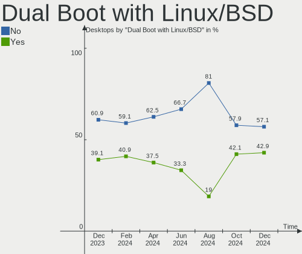
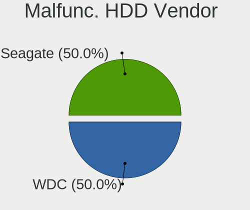
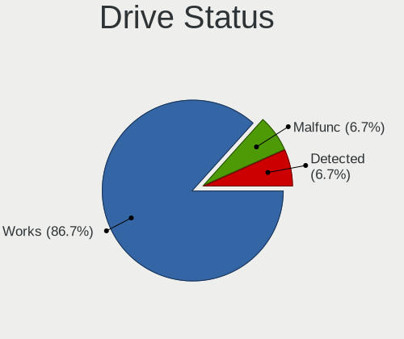

Gentoo - Hardware Trends (Desktops)
-----------------------------------

A project to identify most popular hardware characteristics and track their change
over time based on data collected by Linux users at https://Linux-Hardware.org.

Anyone can contribute to this report by the [hw-probe](https://github.com/linuxhw/hw-probe) tool:

    sudo -E hw-probe -all -upload

This report is for one last month. Overall report since the beginning of time: [TestDays](https://github.com/linuxhw/TestDays)

Period: Oct, 2023.

Contents
--------

* [ System ](#system)
  - [ OS                       ](#os)
  - [ OS Family                ](#os-family)
  - [ Kernel                   ](#kernel)
  - [ Kernel Family            ](#kernel-family)
  - [ Kernel Major Ver.        ](#kernel-major-ver)
  - [ Arch                     ](#arch)
  - [ DE                       ](#de)
  - [ Display Server           ](#display-server)
  - [ Display Manager          ](#display-manager)
  - [ OS Lang                  ](#os-lang)
  - [ Boot Mode                ](#boot-mode)
  - [ Filesystem               ](#filesystem)
  - [ Part. scheme             ](#part-scheme)
  - [ Dual Boot with Linux/BSD ](#dual-boot-with-linuxbsd)
  - [ Dual Boot (Win)          ](#dual-boot-win)

* [ Board ](#board)
  - [ Vendor                   ](#vendor)
  - [ Model                    ](#model)
  - [ Model Family             ](#model-family)
  - [ MFG Year                 ](#mfg-year)
  - [ Form Factor              ](#form-factor)
  - [ Secure Boot              ](#secure-boot)
  - [ Coreboot                 ](#coreboot)
  - [ RAM Size                 ](#ram-size)
  - [ RAM Used                 ](#ram-used)
  - [ Total Drives             ](#total-drives)
  - [ Has CD-ROM               ](#has-cd-rom)
  - [ Has Ethernet             ](#has-ethernet)
  - [ Has WiFi                 ](#has-wifi)
  - [ Has Bluetooth            ](#has-bluetooth)

* [ Location ](#location)
  - [ Country                  ](#country)
  - [ City                     ](#city)

* [ Drives ](#drives)
  - [ Drive Vendor             ](#drive-vendor)
  - [ Drive Model              ](#drive-model)
  - [ HDD Vendor               ](#hdd-vendor)
  - [ SSD Vendor               ](#ssd-vendor)
  - [ Drive Kind               ](#drive-kind)
  - [ Drive Connector          ](#drive-connector)
  - [ Drive Size               ](#drive-size)
  - [ Space Total              ](#space-total)
  - [ Space Used               ](#space-used)
  - [ Malfunc. Drives          ](#malfunc-drives)
  - [ Malfunc. Drive Vendor    ](#malfunc-drive-vendor)
  - [ Malfunc. HDD Vendor      ](#malfunc-hdd-vendor)
  - [ Malfunc. Drive Kind      ](#malfunc-drive-kind)
  - [ Failed Drives            ](#failed-drives)
  - [ Failed Drive Vendor      ](#failed-drive-vendor)
  - [ Drive Status             ](#drive-status)

* [ Storage controller ](#storage-controller)
  - [ Storage Vendor           ](#storage-vendor)
  - [ Storage Model            ](#storage-model)
  - [ Storage Kind             ](#storage-kind)

* [ Processor ](#processor)
  - [ CPU Vendor               ](#cpu-vendor)
  - [ CPU Model                ](#cpu-model)
  - [ CPU Model Family         ](#cpu-model-family)
  - [ CPU Cores                ](#cpu-cores)
  - [ CPU Sockets              ](#cpu-sockets)
  - [ CPU Threads              ](#cpu-threads)
  - [ CPU Op-Modes             ](#cpu-op-modes)
  - [ CPU Microcode            ](#cpu-microcode)
  - [ CPU Microarch            ](#cpu-microarch)

* [ Graphics ](#graphics)
  - [ GPU Vendor               ](#gpu-vendor)
  - [ GPU Model                ](#gpu-model)
  - [ GPU Combo                ](#gpu-combo)
  - [ GPU Driver               ](#gpu-driver)
  - [ GPU Memory               ](#gpu-memory)

* [ Monitor ](#monitor)
  - [ Monitor Vendor           ](#monitor-vendor)
  - [ Monitor Model            ](#monitor-model)
  - [ Monitor Resolution       ](#monitor-resolution)
  - [ Monitor Diagonal         ](#monitor-diagonal)
  - [ Monitor Width            ](#monitor-width)
  - [ Aspect Ratio             ](#aspect-ratio)
  - [ Monitor Area             ](#monitor-area)
  - [ Pixel Density            ](#pixel-density)
  - [ Multiple Monitors        ](#multiple-monitors)

* [ Network ](#network)
  - [ Net Controller Vendor    ](#net-controller-vendor)
  - [ Net Controller Model     ](#net-controller-model)
  - [ Wireless Vendor          ](#wireless-vendor)
  - [ Wireless Model           ](#wireless-model)
  - [ Ethernet Vendor          ](#ethernet-vendor)
  - [ Ethernet Model           ](#ethernet-model)
  - [ Net Controller Kind      ](#net-controller-kind)
  - [ Used Controller          ](#used-controller)
  - [ NICs                     ](#nics)
  - [ IPv6                     ](#ipv6)

* [ Bluetooth ](#bluetooth)
  - [ Bluetooth Vendor         ](#bluetooth-vendor)
  - [ Bluetooth Model          ](#bluetooth-model)

* [ Sound ](#sound)
  - [ Sound Vendor             ](#sound-vendor)
  - [ Sound Model              ](#sound-model)

* [ Memory ](#memory)
  - [ Memory Vendor            ](#memory-vendor)
  - [ Memory Model             ](#memory-model)
  - [ Memory Kind              ](#memory-kind)
  - [ Memory Form Factor       ](#memory-form-factor)
  - [ Memory Size              ](#memory-size)
  - [ Memory Speed             ](#memory-speed)

* [ Printers & scanners ](#printers--scanners)
  - [ Printer Vendor           ](#printer-vendor)
  - [ Printer Model            ](#printer-model)
  - [ Scanner Vendor           ](#scanner-vendor)
  - [ Scanner Model            ](#scanner-model)

* [ Camera ](#camera)
  - [ Camera Vendor            ](#camera-vendor)
  - [ Camera Model             ](#camera-model)

* [ Security ](#security)
  - [ Fingerprint Vendor       ](#fingerprint-vendor)
  - [ Fingerprint Model        ](#fingerprint-model)
  - [ Chipcard Vendor          ](#chipcard-vendor)
  - [ Chipcard Model           ](#chipcard-model)

* [ Unsupported ](#unsupported)
  - [ Unsupported Devices      ](#unsupported-devices)
  - [ Unsupported Device Types ](#unsupported-device-types)

System
------

OS
--

Installed operating systems

| Name        | Desktops | Percent |
|-------------|----------|---------|
| Gentoo 2.14 | 28       | 96.55%  |
| Gentoo 2.9  | 1        | 3.45%   |

OS Family
---------

OS without a version

| Name   | Desktops | Percent |
|--------|----------|---------|
| Gentoo | 29       | 100%    |

Kernel
------

Version of the Linux kernel

| Version                             | Desktops | Percent |
|-------------------------------------|----------|---------|
| 6.1.53-gentoo-r1                    | 5        | 17.24%  |
| 6.1.57-gentoo                       | 4        | 13.79%  |
| 6.5.7-gentoo                        | 2        | 6.9%    |
| 6.5.9-cachyos                       | 1        | 3.45%   |
| 6.5.8-gentoo-r1-x86_64              | 1        | 3.45%   |
| 6.5.8-gentoo                        | 1        | 3.45%   |
| 6.5.7-nidix-sys                     | 1        | 3.45%   |
| 6.5.7-gentoo-x86_64                 | 1        | 3.45%   |
| 6.5.6-gentoo                        | 1        | 3.45%   |
| 6.5.5-gentooc                       | 1        | 3.45%   |
| 6.5.5-gentoo-x86_64                 | 1        | 3.45%   |
| 6.5.5-gentoo-Ryzen                  | 1        | 3.45%   |
| 6.5.3-gentoo-r1_22_09_2023_b        | 1        | 3.45%   |
| 6.5.3                               | 1        | 3.45%   |
| 6.5.0-gentoo                        | 1        | 3.45%   |
| 6.4.3-gentoo                        | 1        | 3.45%   |
| 6.4.10-gentoo-x86_64                | 1        | 3.45%   |
| 6.1.57-gentoo-x86_64                | 1        | 3.45%   |
| 6.1.55-gentoo-dist                  | 1        | 3.45%   |
| 6.1.53-gentoo-r1-wireless_bluetooth | 1        | 3.45%   |
| 6.1.19-gentoo                       | 1        | 3.45%   |

Kernel Family
-------------

Linux kernel without a distro release

| Version | Desktops | Percent |
|---------|----------|---------|
| 6.1.53  | 6        | 20.69%  |
| 6.1.57  | 5        | 17.24%  |
| 6.5.7   | 4        | 13.79%  |
| 6.5.5   | 3        | 10.34%  |
| 6.5.8   | 2        | 6.9%    |
| 6.5.3   | 2        | 6.9%    |
| 6.5.9   | 1        | 3.45%   |
| 6.5.6   | 1        | 3.45%   |
| 6.5.0   | 1        | 3.45%   |
| 6.4.3   | 1        | 3.45%   |
| 6.4.10  | 1        | 3.45%   |
| 6.1.55  | 1        | 3.45%   |
| 6.1.19  | 1        | 3.45%   |

Kernel Major Ver.
-----------------

Linux kernel major version

| Version | Desktops | Percent |
|---------|----------|---------|
| 6.5     | 14       | 48.28%  |
| 6.1     | 13       | 44.83%  |
| 6.4     | 2        | 6.9%    |

Arch
----

OS architecture (x86_64, i586, etc.)

| Name   | Desktops | Percent |
|--------|----------|---------|
| x86_64 | 29       | 100%    |

DE
--

Desktop Environment

| Name       | Desktops | Percent |
|------------|----------|---------|
| Unknown    | 10       | 34.48%  |
| KDE5       | 7        | 24.14%  |
| GNOME      | 4        | 13.79%  |
| XFCE       | 3        | 10.34%  |
| MATE       | 2        | 6.9%    |
| X-Cinnamon | 1        | 3.45%   |
| i3         | 1        | 3.45%   |
| Hyprland   | 1        | 3.45%   |

Display Server
--------------

X11 or Wayland

| Name    | Desktops | Percent |
|---------|----------|---------|
| X11     | 11       | 37.93%  |
| Wayland | 7        | 24.14%  |
| Tty     | 7        | 24.14%  |
| Unknown | 4        | 13.79%  |

Display Manager
---------------

SDDM, LightDM, etc.

| Name    | Desktops | Percent |
|---------|----------|---------|
| Unknown | 13       | 44.83%  |
| SDDM    | 7        | 24.14%  |
| LightDM | 5        | 17.24%  |
| GDM     | 3        | 10.34%  |
| LXDM    | 1        | 3.45%   |

OS Lang
-------

Language

| Lang       | Desktops | Percent |
|------------|----------|---------|
| en_US      | 7        | 24.14%  |
| en_GB      | 7        | 24.14%  |
| C.UTF8     | 3        | 10.34%  |
| lt_LT      | 1        | 3.45%   |
| it_IT      | 1        | 3.45%   |
| fr_FR      | 1        | 3.45%   |
| fr_CA      | 1        | 3.45%   |
| es_ES.UTF8 | 1        | 3.45%   |
| en_IE@euro | 1        | 3.45%   |
| en         | 1        | 3.45%   |
| de_DE      | 1        | 3.45%   |
| de_CH      | 1        | 3.45%   |
| ca_ES      | 1        | 3.45%   |
| bg_BG      | 1        | 3.45%   |
| Unknown    | 1        | 3.45%   |

Boot Mode
---------

EFI or BIOS

| Mode | Desktops | Percent |
|------|----------|---------|
| EFI  | 27       | 93.1%   |
| BIOS | 2        | 6.9%    |

Filesystem
----------

Type of filesystem

| Type  | Desktops | Percent |
|-------|----------|---------|
| Ext4  | 13       | 44.83%  |
| Btrfs | 6        | 20.69%  |
| F2fs  | 5        | 17.24%  |
| Xfs   | 3        | 10.34%  |
| Zfs   | 2        | 6.9%    |

Part. scheme
------------

Scheme of partitioning

| Type    | Desktops | Percent |
|---------|----------|---------|
| GPT     | 25       | 86.21%  |
| Unknown | 3        | 10.34%  |
| MBR     | 1        | 3.45%   |

Dual Boot with Linux/BSD
------------------------

Hosting more than one Linux/BSD

| Dual boot | Desktops | Percent |
|-----------|----------|---------|
| No        | 19       | 65.52%  |
| Yes       | 10       | 34.48%  |

Dual Boot (Win)
---------------

Hosting Linux and Windows

| Dual boot | Desktops | Percent |
|-----------|----------|---------|
| No        | 21       | 72.41%  |
| Yes       | 8        | 27.59%  |

Board
-----

Vendor
------

Motherboard manufacturer

| Name                | Desktops | Percent |
|---------------------|----------|---------|
| ASUSTek Computer    | 11       | 37.93%  |
| Gigabyte Technology | 7        | 24.14%  |
| MSI                 | 4        | 13.79%  |
| Hewlett-Packard     | 2        | 6.9%    |
| Dell                | 2        | 6.9%    |
| SZMZ                | 1        | 3.45%   |
| ASRock              | 1        | 3.45%   |
| Unknown             | 1        | 3.45%   |

Model
-----

Motherboard model

| Name                               | Desktops | Percent |
|------------------------------------|----------|---------|
| ASUS TUF Gaming B550-PLUS          | 2        | 6.9%    |
| ASUS PRIME B660-PLUS D4            | 2        | 6.9%    |
| SZMZ X99M-G2                       | 1        | 3.45%   |
| MSI MS-7D67                        | 1        | 3.45%   |
| MSI MS-7D50                        | 1        | 3.45%   |
| MSI MS-7C37                        | 1        | 3.45%   |
| MSI MS-7C02                        | 1        | 3.45%   |
| HP Z420 Workstation                | 1        | 3.45%   |
| HP Compaq Elite 8300 SFF           | 1        | 3.45%   |
| Gigabyte Z590 UD                   | 1        | 3.45%   |
| Gigabyte X570S AORUS ELITE AX      | 1        | 3.45%   |
| Gigabyte X570 AORUS ELITE          | 1        | 3.45%   |
| Gigabyte B550 AORUS ELITE V2       | 1        | 3.45%   |
| Gigabyte B450M DS3H                | 1        | 3.45%   |
| Gigabyte AB350-Gaming              | 1        | 3.45%   |
| Gigabyte A520 AORUS ELITE          | 1        | 3.45%   |
| Dell Precision T3600               | 1        | 3.45%   |
| Dell OptiPlex 790                  | 1        | 3.45%   |
| ASUS ROG STRIX Z590-F GAMING WIFI  | 1        | 3.45%   |
| ASUS ROG STRIX X670E-F GAMING WIFI | 1        | 3.45%   |
| ASUS ROG STRIX X670E-E GAMING WIFI | 1        | 3.45%   |
| ASUS ROG STRIX X370-F GAMING       | 1        | 3.45%   |
| ASUS PRIME X670E-PRO WIFI          | 1        | 3.45%   |
| ASUS PRIME X670-P                  | 1        | 3.45%   |
| ASUS M3A78-CM                      | 1        | 3.45%   |
| ASRock H170 Pro4S                  | 1        | 3.45%   |
| Unknown                            | 1        | 3.45%   |

Model Family
------------

Motherboard model prefix

| Name                  | Desktops | Percent |
|-----------------------|----------|---------|
| ASUS ROG              | 4        | 13.79%  |
| ASUS PRIME            | 4        | 13.79%  |
| ASUS TUF              | 2        | 6.9%    |
| SZMZ X99M-G2          | 1        | 3.45%   |
| MSI MS-7D67           | 1        | 3.45%   |
| MSI MS-7D50           | 1        | 3.45%   |
| MSI MS-7C37           | 1        | 3.45%   |
| MSI MS-7C02           | 1        | 3.45%   |
| HP Z420               | 1        | 3.45%   |
| HP Compaq             | 1        | 3.45%   |
| Gigabyte Z590         | 1        | 3.45%   |
| Gigabyte X570S        | 1        | 3.45%   |
| Gigabyte X570         | 1        | 3.45%   |
| Gigabyte B550         | 1        | 3.45%   |
| Gigabyte B450M        | 1        | 3.45%   |
| Gigabyte AB350-Gaming | 1        | 3.45%   |
| Gigabyte A520         | 1        | 3.45%   |
| Dell Precision        | 1        | 3.45%   |
| Dell OptiPlex         | 1        | 3.45%   |
| ASUS M3A78-CM         | 1        | 3.45%   |
| ASRock H170           | 1        | 3.45%   |
| Unknown               | 1        | 3.45%   |

MFG Year
--------

Motherboard manufacture year

| Year | Desktops | Percent |
|------|----------|---------|
| 2022 | 7        | 24.14%  |
| 2020 | 5        | 17.24%  |
| 2021 | 4        | 13.79%  |
| 2018 | 3        | 10.34%  |
| 2019 | 2        | 6.9%    |
| 2012 | 2        | 6.9%    |
| 2023 | 1        | 3.45%   |
| 2017 | 1        | 3.45%   |
| 2016 | 1        | 3.45%   |
| 2013 | 1        | 3.45%   |
| 2011 | 1        | 3.45%   |
| 2008 | 1        | 3.45%   |

Form Factor
-----------

Physical design of the computer

| Name    | Desktops | Percent |
|---------|----------|---------|
| Desktop | 29       | 100%    |

Secure Boot
-----------

Enabled or disabled

| State    | Desktops | Percent |
|----------|----------|---------|
| Disabled | 29       | 100%    |

Coreboot
--------

Have coreboot on board

| Used | Desktops | Percent |
|------|----------|---------|
| No   | 29       | 100%    |

RAM Size
--------

Total RAM memory

| Size in GB  | Desktops | Percent |
|-------------|----------|---------|
| 32.01-64.0  | 14       | 48.28%  |
| 64.01-256.0 | 8        | 27.59%  |
| 16.01-24.0  | 3        | 10.34%  |
| 4.01-8.0    | 2        | 6.9%    |
| 24.01-32.0  | 2        | 6.9%    |

RAM Used
--------

Used RAM memory

| Used GB    | Desktops | Percent |
|------------|----------|---------|
| 4.01-8.0   | 7        | 24.14%  |
| 2.01-3.0   | 5        | 17.24%  |
| 1.01-2.0   | 5        | 17.24%  |
| 16.01-24.0 | 4        | 13.79%  |
| 8.01-16.0  | 3        | 10.34%  |
| 0.51-1.0   | 3        | 10.34%  |
| 3.01-4.0   | 2        | 6.9%    |

Total Drives
------------

Number of drives on board

| Drives | Desktops | Percent |
|--------|----------|---------|
| 2      | 9        | 31.03%  |
| 3      | 7        | 24.14%  |
| 1      | 5        | 17.24%  |
| 6      | 3        | 10.34%  |
| 7      | 2        | 6.9%    |
| 8      | 1        | 3.45%   |
| 5      | 1        | 3.45%   |
| 4      | 1        | 3.45%   |

Has CD-ROM
----------

Has CD-ROM on board

| Presented | Desktops | Percent |
|-----------|----------|---------|
| No        | 23       | 79.31%  |
| Yes       | 6        | 20.69%  |

Has Ethernet
------------

Has Ethernet on board

| Presented | Desktops | Percent |
|-----------|----------|---------|
| Yes       | 28       | 96.55%  |
| No        | 1        | 3.45%   |

Has WiFi
--------

Has WiFi module

| Presented | Desktops | Percent |
|-----------|----------|---------|
| No        | 15       | 51.72%  |
| Yes       | 14       | 48.28%  |

Has Bluetooth
-------------

Has Bluetooth module

| Presented | Desktops | Percent |
|-----------|----------|---------|
| No        | 16       | 55.17%  |
| Yes       | 13       | 44.83%  |

Location
--------

Country
-------

Geographic location (country)

| Country     | Desktops | Percent |
|-------------|----------|---------|
| USA         | 4        | 13.79%  |
| UK          | 4        | 13.79%  |
| Poland      | 4        | 13.79%  |
| Italy       | 4        | 13.79%  |
| France      | 4        | 13.79%  |
| Spain       | 2        | 6.9%    |
| Greece      | 2        | 6.9%    |
| Switzerland | 1        | 3.45%   |
| Canada      | 1        | 3.45%   |
| Bulgaria    | 1        | 3.45%   |
| Belgium     | 1        | 3.45%   |
| Austria     | 1        | 3.45%   |

City
----

Geographic location (city)

| City                  | Desktops | Percent |
|-----------------------|----------|---------|
| Warsaw                | 3        | 10.34%  |
| Oulx                  | 2        | 6.9%    |
| Milano                | 2        | 6.9%    |
| Le Boulou             | 2        | 6.9%    |
| Athens                | 2        | 6.9%    |
| Vienna                | 1        | 3.45%   |
| Teufen AR             | 1        | 3.45%   |
| Springfield           | 1        | 3.45%   |
| Sofia                 | 1        | 3.45%   |
| Paris                 | 1        | 3.45%   |
| Orange                | 1        | 3.45%   |
| North Fort Myers      | 1        | 3.45%   |
| Montignies-sur-Sambre | 1        | 3.45%   |
| Limoges               | 1        | 3.45%   |
| Leeds                 | 1        | 3.45%   |
| Igualada              | 1        | 3.45%   |
| Flint                 | 1        | 3.45%   |
| Dumfries              | 1        | 3.45%   |
| Cieszyn               | 1        | 3.45%   |
| Belfast               | 1        | 3.45%   |
| Baton Rouge           | 1        | 3.45%   |
| Barcelona             | 1        | 3.45%   |
| Baie-Comeau           | 1        | 3.45%   |

Drives
------

Drive Vendor
------------

Hard drive vendors

| Vendor                      | Desktops | Drives | Percent |
|-----------------------------|----------|--------|---------|
| Samsung Electronics         | 15       | 33     | 22.06%  |
| Seagate                     | 8        | 9      | 11.76%  |
| Phison Electronics          | 8        | 8      | 11.76%  |
| WDC                         | 7        | 9      | 10.29%  |
| Micron/Crucial Technology   | 5        | 6      | 7.35%   |
| Kingston                    | 4        | 4      | 5.88%   |
| GOODRAM                     | 3        | 3      | 4.41%   |
| Toshiba                     | 2        | 2      | 2.94%   |
| Silicon Motion              | 2        | 2      | 2.94%   |
| Sandisk                     | 2        | 2      | 2.94%   |
| Kingston Technology Company | 2        | 2      | 2.94%   |
| Crucial                     | 2        | 2      | 2.94%   |
| Transcend                   | 1        | 1      | 1.47%   |
| SK hynix                    | 1        | 1      | 1.47%   |
| Kingchuxing                 | 1        | 2      | 1.47%   |
| Intel                       | 1        | 1      | 1.47%   |
| Hitachi                     | 1        | 3      | 1.47%   |
| China                       | 1        | 1      | 1.47%   |
| A-DATA Technology           | 1        | 1      | 1.47%   |
| Unknown                     | 1        | 1      | 1.47%   |

Drive Model
-----------

Hard drive models

| Model                                                 | Desktops | Percent |
|-------------------------------------------------------|----------|---------|
| Samsung NVMe SSD Controller SM981/PM981/PM983 1TB     | 7        | 8.33%   |
| Samsung NVMe SSD Controller PM9A1/PM9A3/980PRO 1TB    | 3        | 3.57%   |
| Phison E7 NVMe Controller 120GB                       | 3        | 3.57%   |
| Micron/Crucial P2 NVMe PCIe SSD 500GB                 | 3        | 3.57%   |
| Silicon Motion SM2263EN/SM2263XT SSD Controller 256GB | 2        | 2.38%   |
| Seagate ST2000DM008-2UB102 2TB                        | 2        | 2.38%   |
| Samsung SSD 980 500GB                                 | 2        | 2.38%   |
| Samsung SSD 850 PRO 512GB                             | 2        | 2.38%   |
| Samsung SSD 850 EVO 250GB                             | 2        | 2.38%   |
| Phison Corsair MP600 PRO XT 2TB                       | 2        | 2.38%   |
| Kingston Company A2000 NVMe SSD 250GB                 | 2        | 2.38%   |
| Kingston SKC3000D2048G 2TB                            | 2        | 2.38%   |
| GOODRAM SSDPR-CL100-480-G2 480GB                      | 2        | 2.38%   |
| WDC WDS500G2B0A-00SM50 500GB SSD                      | 1        | 1.19%   |
| WDC WD8003FFBX-68B9AN0 8TB                            | 1        | 1.19%   |
| WDC WD40EFAX-68JH4N0 4TB                              | 1        | 1.19%   |
| WDC WD30EURS-63SPKY0 3TB                              | 1        | 1.19%   |
| WDC WD120EFBX-68B0EN0 12TB                            | 1        | 1.19%   |
| WDC WD10EZEX-60M2NA0 1TB                              | 1        | 1.19%   |
| WDC WD10EZEX-08WN4A0 1TB                              | 1        | 1.19%   |
| WDC WD10EFRX-68PJCN0 1TB                              | 1        | 1.19%   |
| Transcend TS128GMTS430S 128GB SSD                     | 1        | 1.19%   |
| Toshiba HDWE150 5TB                                   | 1        | 1.19%   |
| Toshiba A100 120GB SSD                                | 1        | 1.19%   |
| SK hynix PC601 NVMe 256GB                             | 1        | 1.19%   |
| Seagate ST6000DM003-2CY186 6TB                        | 1        | 1.19%   |
| Seagate ST500DM002-1BD142 500GB                       | 1        | 1.19%   |
| Seagate ST4000VN008-2DR166 4TB                        | 1        | 1.19%   |
| Seagate ST4000DM004-2CV104 4TB                        | 1        | 1.19%   |
| Seagate ST2000DM008-2FR102 2TB                        | 1        | 1.19%   |
| Seagate ST12000NM0008-2H3101 12TB                     | 1        | 1.19%   |
| Sandisk WD Black SN850 1TB                            | 1        | 1.19%   |
| SanDisk SDSSDP128G 128GB                              | 1        | 1.19%   |
| Samsung SSD 990 PRO 1TB                               | 1        | 1.19%   |
| Samsung SSD 980 1TB                                   | 1        | 1.19%   |
| Samsung SSD 870 QVO 4TB                               | 1        | 1.19%   |
| Samsung SSD 870 QVO 1TB                               | 1        | 1.19%   |
| Samsung SSD 860 QVO 1TB                               | 1        | 1.19%   |
| Samsung SSD 860 EVO 250GB                             | 1        | 1.19%   |
| Samsung SSD 850 PRO 256GB                             | 1        | 1.19%   |

HDD Vendor
----------

Hard disk drive vendors

| Vendor              | Desktops | Drives | Percent |
|---------------------|----------|--------|---------|
| Seagate             | 8        | 9      | 44.44%  |
| WDC                 | 6        | 8      | 33.33%  |
| Samsung Electronics | 2        | 3      | 11.11%  |
| Toshiba             | 1        | 1      | 5.56%   |
| Hitachi             | 1        | 3      | 5.56%   |

SSD Vendor
----------

Solid state drive vendors

| Vendor              | Desktops | Drives | Percent |
|---------------------|----------|--------|---------|
| Samsung Electronics | 8        | 12     | 36.36%  |
| GOODRAM             | 3        | 3      | 13.64%  |
| Crucial             | 2        | 2      | 9.09%   |
| WDC                 | 1        | 1      | 4.55%   |
| Transcend           | 1        | 1      | 4.55%   |
| Toshiba             | 1        | 1      | 4.55%   |
| SanDisk             | 1        | 1      | 4.55%   |
| Kingston            | 1        | 1      | 4.55%   |
| Kingchuxing         | 1        | 2      | 4.55%   |
| China               | 1        | 1      | 4.55%   |
| A-DATA Technology   | 1        | 1      | 4.55%   |
| Unknown             | 1        | 1      | 4.55%   |

Drive Kind
----------

HDD or SSD

| Kind | Desktops | Drives | Percent |
|------|----------|--------|---------|
| NVMe | 23       | 42     | 41.82%  |
| SSD  | 18       | 27     | 32.73%  |
| HDD  | 14       | 24     | 25.45%  |

Drive Connector
---------------

SATA, SAS, NVMe, etc.

| Type | Desktops | Drives | Percent |
|------|----------|--------|---------|
| NVMe | 23       | 42     | 50%     |
| SATA | 23       | 51     | 50%     |

Drive Size
----------

Size of hard drive

| Size in TB | Desktops | Drives | Percent |
|------------|----------|--------|---------|
| 0.01-0.5   | 13       | 18     | 33.33%  |
| 0.51-1.0   | 12       | 15     | 30.77%  |
| 3.01-4.0   | 4        | 5      | 10.26%  |
| 1.01-2.0   | 3        | 3      | 7.69%   |
| 4.01-10.0  | 3        | 3      | 7.69%   |
| 2.01-3.0   | 2        | 4      | 5.13%   |
| 10.01-20.0 | 2        | 3      | 5.13%   |

Space Total
-----------

Amount of disk space available on the file system

| Size in GB     | Desktops | Percent |
|----------------|----------|---------|
| More than 3000 | 9        | 31.03%  |
| 251-500        | 5        | 17.24%  |
| 1001-2000      | 4        | 13.79%  |
| 501-1000       | 3        | 10.34%  |
| 2001-3000      | 2        | 6.9%    |
| 101-250        | 2        | 6.9%    |
| 1-20           | 2        | 6.9%    |
| 51-100         | 1        | 3.45%   |
| Unknown        | 1        | 3.45%   |

Space Used
----------

Amount of used disk space

| Used GB        | Desktops | Percent |
|----------------|----------|---------|
| 1001-2000      | 6        | 20.69%  |
| 1-20           | 6        | 20.69%  |
| 251-500        | 4        | 13.79%  |
| More than 3000 | 3        | 10.34%  |
| 51-100         | 3        | 10.34%  |
| 2001-3000      | 2        | 6.9%    |
| 101-250        | 2        | 6.9%    |
| 21-50          | 1        | 3.45%   |
| 501-1000       | 1        | 3.45%   |
| Unknown        | 1        | 3.45%   |

Malfunc. Drives
---------------

Drive models with a malfunction

| Model                    | Desktops | Drives | Percent |
|--------------------------|----------|--------|---------|
| WDC WD10EFRX-68PJCN0 1TB | 1        | 1      | 100%    |

Malfunc. Drive Vendor
---------------------

Vendors of faulty drives

| Vendor | Desktops | Drives | Percent |
|--------|----------|--------|---------|
| WDC    | 1        | 1      | 100%    |

Malfunc. HDD Vendor
-------------------

Vendors of faulty HDD drives

| Vendor | Desktops | Drives | Percent |
|--------|----------|--------|---------|
| WDC    | 1        | 1      | 100%    |

Malfunc. Drive Kind
-------------------

Kinds of faulty drives

| Kind | Desktops | Drives | Percent |
|------|----------|--------|---------|
| HDD  | 1        | 1      | 100%    |

Failed Drives
-------------

Failed drive models

Zero info for selected period =(

Failed Drive Vendor
-------------------

Failed drive vendors

Zero info for selected period =(

Drive Status
------------

Number of failed and malfunc. drives

| Status   | Desktops | Drives | Percent |
|----------|----------|--------|---------|
| Works    | 26       | 81     | 86.67%  |
| Detected | 3        | 11     | 10%     |
| Malfunc  | 1        | 1      | 3.33%   |

Storage controller
------------------

Storage Vendor
--------------

Storage controller vendors

| Vendor                      | Desktops | Percent |
|-----------------------------|----------|---------|
| AMD                         | 18       | 26.87%  |
| Intel                       | 12       | 17.91%  |
| Samsung Electronics         | 10       | 14.93%  |
| Phison Electronics          | 8        | 11.94%  |
| Micron/Crucial Technology   | 5        | 7.46%   |
| Kingston Technology Company | 5        | 7.46%   |
| ASMedia Technology          | 3        | 4.48%   |
| Silicon Motion              | 2        | 2.99%   |
| JMicron Technology          | 2        | 2.99%   |
| SK hynix                    | 1        | 1.49%   |
| SanDisk                     | 1        | 1.49%   |

Storage Model
-------------

Storage controller models

| Model                                                                          | Desktops | Percent |
|--------------------------------------------------------------------------------|----------|---------|
| AMD FCH SATA Controller [AHCI mode]                                            | 11       | 13.41%  |
| Samsung NVMe SSD Controller SM981/PM981/PM983                                  | 7        | 8.54%   |
| Samsung NVMe SSD Controller 980 (DRAM-less)                                    | 4        | 4.88%   |
| AMD 500 Series Chipset SATA Controller                                         | 4        | 4.88%   |
| Samsung NVMe SSD Controller PM9A1/PM9A3/980PRO                                 | 3        | 3.66%   |
| Phison E7 NVMe Controller                                                      | 3        | 3.66%   |
| Phison E18 PCIe4 NVMe Controller                                               | 3        | 3.66%   |
| Micron/Crucial P2 [Nick P2] / P3 / P3 Plus NVMe PCIe SSD (DRAM-less)           | 3        | 3.66%   |
| Silicon Motion SM2263EN/SM2263XT (DRAM-less) NVMe SSD Controllers              | 2        | 2.44%   |
| Kingston Company KC3000/FURY Renegade NVMe SSD E18                             | 2        | 2.44%   |
| Kingston Company A2000 NVMe SSD SM2263EN                                       | 2        | 2.44%   |
| JMicron JMB368 IDE controller                                                  | 2        | 2.44%   |
| JMicron JMB363 SATA/IDE Controller                                             | 2        | 2.44%   |
| Intel C600/X79 series chipset 6-Port SATA AHCI Controller                      | 2        | 2.44%   |
| Intel Alder Lake-S PCH SATA Controller [AHCI Mode]                             | 2        | 2.44%   |
| Intel 500 Series Chipset Family SATA AHCI Controller                           | 2        | 2.44%   |
| ASMedia ASM1062 Serial ATA Controller                                          | 2        | 2.44%   |
| AMD 400 Series Chipset SATA Controller                                         | 2        | 2.44%   |
| SK hynix PC601 NVMe Solid State Drive                                          | 1        | 1.22%   |
| SanDisk WD PC SN810 / Black SN850 NVMe SSD                                     | 1        | 1.22%   |
| Samsung NVMe SSD Controller SM961/PM961/SM963                                  | 1        | 1.22%   |
| Samsung NVMe SSD Controller S4LV008[Pascal]                                    | 1        | 1.22%   |
| Phison E16 PCIe4 NVMe Controller                                               | 1        | 1.22%   |
| Phison E12 NVMe Controller                                                     | 1        | 1.22%   |
| Micron/Crucial P5 Plus NVMe PCIe SSD                                           | 1        | 1.22%   |
| Micron/Crucial Non-Volatile memory controller                                  | 1        | 1.22%   |
| Kingston Company NV1 NVMe SSD SM2263XT                                         | 1        | 1.22%   |
| Intel Tiger Lake SATA AHCI Controller                                          | 1        | 1.22%   |
| Intel SSD 600P Series                                                          | 1        | 1.22%   |
| Intel Q170/Q150/B150/H170/H110/Z170/CM236 Chipset SATA Controller [AHCI Mode]  | 1        | 1.22%   |
| Intel NVMe Optane Memory Series                                                | 1        | 1.22%   |
| Intel C608 chipset Dual 4-Port SATA/SAS Storage Control Unit                   | 1        | 1.22%   |
| Intel C602 chipset 4-Port SATA Storage Control Unit                            | 1        | 1.22%   |
| Intel C600/X79 series chipset IDE-r Controller                                 | 1        | 1.22%   |
| Intel 8 Series/C220 Series Chipset Family 6-port SATA Controller 1 [AHCI mode] | 1        | 1.22%   |
| Intel 7 Series/C210 Series Chipset Family 6-port SATA Controller [AHCI mode]   | 1        | 1.22%   |
| Intel 6 Series/C200 Series Chipset Family 6 port Desktop SATA AHCI Controller  | 1        | 1.22%   |
| ASMedia 1064 SATA Controller                                                   | 1        | 1.22%   |
| AMD X370 Series Chipset SATA Controller                                        | 1        | 1.22%   |
| AMD SB7x0/SB8x0/SB9x0 SATA Controller [IDE mode]                               | 1        | 1.22%   |

Storage Kind
------------

Kind of storage controller (IDE, SATA, NVMe, SAS, ...)

| Kind | Desktops | Percent |
|------|----------|---------|
| SATA | 29       | 49.15%  |
| NVMe | 24       | 40.68%  |
| IDE  | 4        | 6.78%   |
| SAS  | 2        | 3.39%   |

Processor
---------

CPU Vendor
----------

Processor vendors

| Vendor | Desktops | Percent |
|--------|----------|---------|
| AMD    | 18       | 62.07%  |
| Intel  | 11       | 37.93%  |

CPU Model
---------

Processor models

| Model                                       | Desktops | Percent |
|---------------------------------------------|----------|---------|
| Intel 12th Gen Core i5-12400                | 2        | 6.9%    |
| AMD Ryzen 9 7950X 16-Core Processor         | 2        | 6.9%    |
| AMD Ryzen 7 5800X 8-Core Processor          | 2        | 6.9%    |
| Intel Xeon CPU E5-2690 0 @ 2.90GHz          | 1        | 3.45%   |
| Intel Xeon CPU E5-2670 v3 @ 2.30GHz         | 1        | 3.45%   |
| Intel Xeon CPU E5-1680 v2 @ 3.00GHz         | 1        | 3.45%   |
| Intel Core i9-10850K CPU @ 3.60GHz          | 1        | 3.45%   |
| Intel Core i7-7700 CPU @ 3.60GHz            | 1        | 3.45%   |
| Intel Core i5-3470 CPU @ 3.20GHz            | 1        | 3.45%   |
| Intel Core i5-2400 CPU @ 3.10GHz            | 1        | 3.45%   |
| Intel 11th Gen Core i7-11800H @ 2.30GHz     | 1        | 3.45%   |
| Intel 11th Gen Core i7-11700K @ 3.60GHz     | 1        | 3.45%   |
| AMD Ryzen 9 7950X3D 16-Core Processor       | 1        | 3.45%   |
| AMD Ryzen 9 7900X 12-Core Processor         | 1        | 3.45%   |
| AMD Ryzen 9 5950X 16-Core Processor         | 1        | 3.45%   |
| AMD Ryzen 9 5900X 12-Core Processor         | 1        | 3.45%   |
| AMD Ryzen 9 3900X 12-Core Processor         | 1        | 3.45%   |
| AMD Ryzen 7 5700G with Radeon Graphics      | 1        | 3.45%   |
| AMD Ryzen 5 7600X 6-Core Processor          | 1        | 3.45%   |
| AMD Ryzen 5 5600X 6-Core Processor          | 1        | 3.45%   |
| AMD Ryzen 5 5500                            | 1        | 3.45%   |
| AMD Ryzen 5 3600 6-Core Processor           | 1        | 3.45%   |
| AMD Ryzen 5 2600 Six-Core Processor         | 1        | 3.45%   |
| AMD Ryzen 5 2400G with Radeon Vega Graphics | 1        | 3.45%   |
| AMD Ryzen 5 1600X Six-Core Processor        | 1        | 3.45%   |
| AMD Phenom II X4 955 Processor              | 1        | 3.45%   |

CPU Model Family
----------------

Processor model prefix

| Model            | Desktops | Percent |
|------------------|----------|---------|
| AMD Ryzen 9      | 7        | 24.14%  |
| AMD Ryzen 5      | 7        | 24.14%  |
| Other            | 4        | 13.79%  |
| Intel Xeon       | 3        | 10.34%  |
| AMD Ryzen 7      | 3        | 10.34%  |
| Intel Core i5    | 2        | 6.9%    |
| Intel Core i9    | 1        | 3.45%   |
| Intel Core i7    | 1        | 3.45%   |
| AMD Phenom II X4 | 1        | 3.45%   |

CPU Cores
---------

Number of processor cores

| Number | Desktops | Percent |
|--------|----------|---------|
| 6      | 8        | 27.59%  |
| 8      | 7        | 24.14%  |
| 4      | 5        | 17.24%  |
| 16     | 4        | 13.79%  |
| 12     | 4        | 13.79%  |
| 10     | 1        | 3.45%   |

CPU Sockets
-----------

Number of sockets

| Number | Desktops | Percent |
|--------|----------|---------|
| 1      | 29       | 100%    |

CPU Threads
-----------

Threads per core (Hyper-Threading)

| Number | Desktops | Percent |
|--------|----------|---------|
| 2      | 26       | 89.66%  |
| 1      | 3        | 10.34%  |

CPU Op-Modes
------------

CPU Operation Modes (32-bit, 64-bit)

| Op mode        | Desktops | Percent |
|----------------|----------|---------|
| 32-bit, 64-bit | 29       | 100%    |

CPU Microcode
-------------

Microcode number

| Number     | Desktops | Percent |
|------------|----------|---------|
| Unknown    | 8        | 27.59%  |
| 0x0a601206 | 3        | 10.34%  |
| 0x0a601203 | 2        | 6.9%    |
| 0x0a50000d | 2        | 6.9%    |
| 0x0a201016 | 2        | 6.9%    |
| 0x08701021 | 2        | 6.9%    |
| 0x306f2    | 1        | 3.45%   |
| 0x306e4    | 1        | 3.45%   |
| 0x306a9    | 1        | 3.45%   |
| 0x206d7    | 1        | 3.45%   |
| 0x206a7    | 1        | 3.45%   |
| 0x0a20120a | 1        | 3.45%   |
| 0x0a201205 | 1        | 3.45%   |
| 0x08101016 | 1        | 3.45%   |
| 0x0800820d | 1        | 3.45%   |
| 0x08001138 | 1        | 3.45%   |

CPU Microarch
-------------

Microarchitecture

| Name             | Desktops | Percent |
|------------------|----------|---------|
| Zen 3            | 7        | 24.14%  |
| Unknown          | 6        | 20.69%  |
| Zen 2            | 2        | 6.9%    |
| Zen              | 2        | 6.9%    |
| SandyBridge      | 2        | 6.9%    |
| IvyBridge        | 2        | 6.9%    |
| Icelake          | 2        | 6.9%    |
| Zen+             | 1        | 3.45%   |
| KabyLake         | 1        | 3.45%   |
| K10              | 1        | 3.45%   |
| Haswell          | 1        | 3.45%   |
| CometLake        | 1        | 3.45%   |
| Alderlake Hybrid | 1        | 3.45%   |

Graphics
--------

GPU Vendor
----------

Vendors of graphics cards

| Vendor | Desktops | Percent |
|--------|----------|---------|
| AMD    | 21       | 70%     |
| Nvidia | 6        | 20%     |
| Intel  | 3        | 10%     |

GPU Model
---------

Graphics card models

| Model                                                               | Desktops | Percent |
|---------------------------------------------------------------------|----------|---------|
| AMD Raphael                                                         | 3        | 9.38%   |
| AMD Ellesmere [Radeon RX 470/480/570/570X/580/580X/590]             | 3        | 9.38%   |
| Nvidia GP107GL [Quadro P620]                                        | 2        | 6.25%   |
| AMD Navi 22 [Radeon RX 6700/6700 XT/6750 XT / 6800M/6850M XT]       | 2        | 6.25%   |
| AMD Navi 10 [Radeon RX 5600 OEM/5600 XT / 5700/5700 XT]             | 2        | 6.25%   |
| AMD Lexa PRO [Radeon 540/540X/550/550X / RX 540X/550/550X]          | 2        | 6.25%   |
| AMD Cedar [Radeon HD 5000/6000/7350/8350 Series]                    | 2        | 6.25%   |
| Nvidia GA106 [Geforce RTX 3050]                                     | 1        | 3.13%   |
| Nvidia GA104 [GeForce RTX 3060 Ti Lite Hash Rate]                   | 1        | 3.13%   |
| Nvidia GA102 [GeForce RTX 3080 Ti]                                  | 1        | 3.13%   |
| Nvidia AD104 [GeForce RTX 4070]                                     | 1        | 3.13%   |
| Intel Xeon E3-1200 v2/3rd Gen Core processor Graphics Controller    | 1        | 3.13%   |
| Intel TigerLake-H GT1 [UHD Graphics]                                | 1        | 3.13%   |
| Intel HD Graphics 630                                               | 1        | 3.13%   |
| AMD RS780C [Radeon 3100]                                            | 1        | 3.13%   |
| AMD Raven Ridge [Radeon Vega Series / Radeon Vega Mobile Series]    | 1        | 3.13%   |
| AMD Polaris 20 XL [Radeon RX 580 2048SP]                            | 1        | 3.13%   |
| AMD Navi 31 [Radeon RX 7900 XT/7900 XTX]                            | 1        | 3.13%   |
| AMD Navi 24 [Radeon PRO W6400]                                      | 1        | 3.13%   |
| AMD Navi 23 [Radeon RX 6600/6600 XT/6600M]                          | 1        | 3.13%   |
| AMD Navi 21 [Radeon RX 6800/6800 XT / 6900 XT]                      | 1        | 3.13%   |
| AMD Cezanne [Radeon Vega Series / Radeon Vega Mobile Series]        | 1        | 3.13%   |
| AMD Baffin [Radeon RX 460/560D / Pro 450/455/460/555/555X/560/560X] | 1        | 3.13%   |

GPU Combo
---------

Combinations of graphics cards

| Name        | Desktops | Percent |
|-------------|----------|---------|
| 1 x AMD     | 18       | 62.07%  |
| 1 x Nvidia  | 6        | 20.69%  |
| 2 x AMD     | 2        | 6.9%    |
| 1 x Intel   | 2        | 6.9%    |
| Intel + AMD | 1        | 3.45%   |

GPU Driver
----------

Free vs proprietary

| Driver      | Desktops | Percent |
|-------------|----------|---------|
| Free        | 21       | 72.41%  |
| Proprietary | 6        | 20.69%  |
| Unknown     | 2        | 6.9%    |

GPU Memory
----------

Total video memory

| Size in GB | Desktops | Percent |
|------------|----------|---------|
| Unknown    | 8        | 27.59%  |
| 7.01-8.0   | 6        | 20.69%  |
| 1.01-2.0   | 4        | 13.79%  |
| 8.01-16.0  | 4        | 13.79%  |
| 3.01-4.0   | 2        | 6.9%    |
| 0.01-0.5   | 2        | 6.9%    |
| 5.01-6.0   | 1        | 3.45%   |
| 16.01-24.0 | 1        | 3.45%   |
| 0.51-1.0   | 1        | 3.45%   |

Monitor
-------

Monitor Vendor
--------------

Monitor vendors

| Vendor               | Desktops | Percent |
|----------------------|----------|---------|
| Samsung Electronics  | 5        | 14.29%  |
| BenQ                 | 4        | 11.43%  |
| Lenovo               | 3        | 8.57%   |
| ASUSTek Computer     | 3        | 8.57%   |
| Acer                 | 3        | 8.57%   |
| Philips              | 2        | 5.71%   |
| Mi                   | 2        | 5.71%   |
| Hewlett-Packard      | 2        | 5.71%   |
| Goldstar             | 2        | 5.71%   |
| ViewSonic            | 1        | 2.86%   |
| Unknown              | 1        | 2.86%   |
| Iiyama               | 1        | 2.86%   |
| Gigabyte Technology  | 1        | 2.86%   |
| Fujitsu Siemens      | 1        | 2.86%   |
| Dell                 | 1        | 2.86%   |
| AOC                  | 1        | 2.86%   |
| Ancor Communications | 1        | 2.86%   |
| Unknown              | 1        | 2.86%   |

Monitor Model
-------------

Monitor models

| Model                                                                   | Desktops | Percent |
|-------------------------------------------------------------------------|----------|---------|
| Philips 17S PHL0877 1280x1024 337x270mm 17.0-inch                       | 2        | 5.26%   |
| Mi 27 NFGL XMIB004 1920x1080 598x336mm 27.0-inch                        | 2        | 5.26%   |
| Hewlett-Packard S230tm HWP3115 1920x1080 509x286mm 23.0-inch            | 2        | 5.26%   |
| Hewlett-Packard LA2206 HWP2946 1920x1080 476x268mm 21.5-inch            | 2        | 5.26%   |
| BenQ PD2700U BNQ802E 3840x2160 597x336mm 27.0-inch                      | 2        | 5.26%   |
| ASUSTek Computer VA24E AUS24D1 1920x1080 527x296mm 23.8-inch            | 2        | 5.26%   |
| ViewSonic VX2250 SERIES VSCCB25 1920x1080 477x268mm 21.5-inch           | 1        | 2.63%   |
| Unknown LCD Monitor FFFF 2288x1287 2550x2550mm 142.0-inch               | 1        | 2.63%   |
| Samsung Electronics SyncMaster SAM059A 1920x1080 477x268mm 21.5-inch    | 1        | 2.63%   |
| Samsung Electronics S22B300 SAM08C8 1920x1080 477x268mm 21.5-inch       | 1        | 2.63%   |
| Samsung Electronics LCD Monitor SAM7003 3840x2160 1872x1053mm 84.6-inch | 1        | 2.63%   |
| Samsung Electronics LC49G95T SAM7053 3840x1080 1193x336mm 48.8-inch     | 1        | 2.63%   |
| Samsung Electronics C24F390 SAM0D2D 1920x1080 521x293mm 23.5-inch       | 1        | 2.63%   |
| Lenovo LEN S24q-10 LEN61E7 2560x1440 527x296mm 23.8-inch                | 1        | 2.63%   |
| Lenovo G27q-20 LEN66C3 2560x1440 597x336mm 27.0-inch                    | 1        | 2.63%   |
| Lenovo D24-20 LEN66AE 1920x1080 527x296mm 23.8-inch                     | 1        | 2.63%   |
| Iiyama PL2395W IVM5639 1920x1200 488x297mm 22.5-inch                    | 1        | 2.63%   |
| Goldstar ULTRAWIDE GSM76F9 2560x1080 531x298mm 24.0-inch                | 1        | 2.63%   |
| Goldstar HDR WFHD GSM7714 2560x1080 798x334mm 34.1-inch                 | 1        | 2.63%   |
| Gigabyte Technology AORUS FI27Q-P GBT2707 2560x1440 596x335mm 26.9-inch | 1        | 2.63%   |
| Fujitsu Siemens B19-5 FUS06AB 1280x1024 376x301mm 19.0-inch             | 1        | 2.63%   |
| Dell E2222H DELF130 1920x1080 478x260mm 21.4-inch                       | 1        | 2.63%   |
| BenQ PD3200U BNQ8025 3840x2160 708x399mm 32.0-inch                      | 1        | 2.63%   |
| BenQ GW2780 BNQ78E6 1920x1080 598x336mm 27.0-inch                       | 1        | 2.63%   |
| ASUSTek Computer PA278QV AUS2700 2560x1440 597x336mm 27.0-inch          | 1        | 2.63%   |
| AOC 22B2WG5 AOC2202 1920x1080 477x268mm 21.5-inch                       | 1        | 2.63%   |
| Ancor Communications ASUS MX239 ACI23C2 1920x1080 528x310mm 24.1-inch   | 1        | 2.63%   |
| Acer XF243Y P ACR0852 1920x1080 527x296mm 23.8-inch                     | 1        | 2.63%   |
| Acer SB220Q ACR06AB 1920x1080 476x268mm 21.5-inch                       | 1        | 2.63%   |
| Acer K222HQL ACR040D 1920x1080 477x268mm 21.5-inch                      | 1        | 2.63%   |
| Acer K222HQL ACR03E1 1920x1080 477x268mm 21.5-inch                      | 1        | 2.63%   |
| Unknown                                                                 | 1        | 2.63%   |

Monitor Resolution
------------------

Monitor screen resolution

| Resolution       | Desktops | Percent |
|------------------|----------|---------|
| 1920x1080 (FHD)  | 13       | 46.43%  |
| 3840x2160 (4K)   | 5        | 17.86%  |
| 2560x1440 (QHD)  | 3        | 10.71%  |
| 1280x1024 (SXGA) | 3        | 10.71%  |
| 2560x1080        | 2        | 7.14%   |
| 3840x1080        | 1        | 3.57%   |
| 2288x1287        | 1        | 3.57%   |

Monitor Diagonal
----------------

Diagonal size in inches

| Inches  | Desktops | Percent |
|---------|----------|---------|
| 27      | 8        | 22.86%  |
| 21      | 7        | 20%     |
| 24      | 4        | 11.43%  |
| 23      | 4        | 11.43%  |
| 34      | 2        | 5.71%   |
| 17      | 2        | 5.71%   |
| 142     | 1        | 2.86%   |
| 84      | 1        | 2.86%   |
| 48      | 1        | 2.86%   |
| 32      | 1        | 2.86%   |
| 26      | 1        | 2.86%   |
| 22      | 1        | 2.86%   |
| 19      | 1        | 2.86%   |
| Unknown | 1        | 2.86%   |

Monitor Width
-------------

Physical width

| Width in mm    | Desktops | Percent |
|----------------|----------|---------|
| 501-600        | 13       | 40.63%  |
| 401-500        | 8        | 25%     |
| 701-800        | 3        | 9.38%   |
| 301-350        | 2        | 6.25%   |
| More than 2000 | 1        | 3.13%   |
| 601-700        | 1        | 3.13%   |
| 351-400        | 1        | 3.13%   |
| 1501-2000      | 1        | 3.13%   |
| 1001-1500      | 1        | 3.13%   |
| Unknown        | 1        | 3.13%   |

Aspect Ratio
------------

Proportional relationship between the width and the height

| Ratio   | Desktops | Percent |
|---------|----------|---------|
| 16/9    | 19       | 67.86%  |
| 5/4     | 3        | 10.71%  |
| 21/9    | 2        | 7.14%   |
| 32/9    | 1        | 3.57%   |
| 16/10   | 1        | 3.57%   |
| 1.00    | 1        | 3.57%   |
| Unknown | 1        | 3.57%   |

Monitor Area
------------

Area in inch

| Area in inch | Desktops | Percent |
|----------------|----------|---------|
| 301-350        | 9        | 29.03%  |
| 201-250        | 9        | 29.03%  |
| 351-500        | 3        | 9.68%   |
| 151-200        | 3        | 9.68%   |
| More than 1000 | 2        | 6.45%   |
| 141-150        | 2        | 6.45%   |
| 251-300        | 1        | 3.23%   |
| 501-1000       | 1        | 3.23%   |
| Unknown        | 1        | 3.23%   |

Pixel Density
-------------

Pixels per inch

| Density | Desktops | Percent |
|---------|----------|---------|
| 51-100  | 13       | 43.33%  |
| 101-120 | 11       | 36.67%  |
| 161-240 | 2        | 6.67%   |
| 121-160 | 2        | 6.67%   |
| 1-50    | 1        | 3.33%   |
| Unknown | 1        | 3.33%   |

Multiple Monitors
-----------------

Total monitors connected

| Total | Desktops | Percent |
|-------|----------|---------|
| 1     | 18       | 62.07%  |
| 2     | 5        | 17.24%  |
| 0     | 3        | 10.34%  |
| 4     | 2        | 6.9%    |
| 3     | 1        | 3.45%   |

Network
-------

Net Controller Vendor
---------------------

Controller vendors

| Vendor                | Desktops | Percent |
|-----------------------|----------|---------|
| Realtek Semiconductor | 17       | 41.46%  |
| Intel                 | 16       | 39.02%  |
| MediaTek              | 3        | 7.32%   |
| Qualcomm Atheros      | 1        | 2.44%   |
| NetGear               | 1        | 2.44%   |
| Huawei Technologies   | 1        | 2.44%   |
| Broadcom              | 1        | 2.44%   |
| ASIX Electronics      | 1        | 2.44%   |

Net Controller Model
--------------------

Controller models

| Model                                                                         | Desktops | Percent |
|-------------------------------------------------------------------------------|----------|---------|
| Realtek RTL8125 2.5GbE Controller                                             | 9        | 18.75%  |
| Realtek RTL8111/8168/8411 PCI Express Gigabit Ethernet Controller             | 8        | 16.67%  |
| Intel Wi-Fi 6 AX210/AX211/AX411 160MHz                                        | 4        | 8.33%   |
| Intel 82579LM Gigabit Network Connection (Lewisville)                         | 4        | 8.33%   |
| Intel Ethernet Controller I225-V                                              | 3        | 6.25%   |
| MediaTek MT7921K (RZ608) Wi-Fi 6E 80MHz                                       | 2        | 4.17%   |
| Intel I211 Gigabit Network Connection                                         | 2        | 4.17%   |
| Realtek RTL88x2bu [AC1200 Techkey]                                            | 1        | 2.08%   |
| Realtek RTL8852BE PCIe 802.11ax Wireless Network Controller                   | 1        | 2.08%   |
| Realtek RTL8812AE 802.11ac PCIe Wireless Network Adapter                      | 1        | 2.08%   |
| Realtek RTL8153 Gigabit Ethernet Adapter                                      | 1        | 2.08%   |
| Qualcomm Atheros QCA9377 802.11ac Wireless Network Adapter                    | 1        | 2.08%   |
| NetGear WG111v3 54 Mbps Wireless [realtek RTL8187B]                           | 1        | 2.08%   |
| MediaTek MT7922 802.11ax PCI Express Wireless Network Adapter                 | 1        | 2.08%   |
| Intel Wi-Fi 6 AX200                                                           | 1        | 2.08%   |
| Intel Ethernet Controller X550                                                | 1        | 2.08%   |
| Intel Ethernet Controller 10-Gigabit X540-AT2                                 | 1        | 2.08%   |
| Intel Ethernet Connection (2) I219-V                                          | 1        | 2.08%   |
| Intel Alder Lake-S PCH CNVi WiFi                                              | 1        | 2.08%   |
| Intel 82571EB/82571GB Gigabit Ethernet Controller D0/D1 (copper applications) | 1        | 2.08%   |
| Huawei ALP-AL00                                                               | 1        | 2.08%   |
| Broadcom NetXtreme BCM5715 Gigabit Ethernet                                   | 1        | 2.08%   |
| ASIX AX88179 Gigabit Ethernet                                                 | 1        | 2.08%   |

Wireless Vendor
---------------

Wireless vendors

| Vendor                | Desktops | Percent |
|-----------------------|----------|---------|
| Intel                 | 6        | 42.86%  |
| Realtek Semiconductor | 3        | 21.43%  |
| MediaTek              | 3        | 21.43%  |
| Qualcomm Atheros      | 1        | 7.14%   |
| NetGear               | 1        | 7.14%   |

Wireless Model
--------------

Wireless models

| Model                                                         | Desktops | Percent |
|---------------------------------------------------------------|----------|---------|
| Intel Wi-Fi 6 AX210/AX211/AX411 160MHz                        | 4        | 28.57%  |
| MediaTek MT7921K (RZ608) Wi-Fi 6E 80MHz                       | 2        | 14.29%  |
| Realtek RTL88x2bu [AC1200 Techkey]                            | 1        | 7.14%   |
| Realtek RTL8852BE PCIe 802.11ax Wireless Network Controller   | 1        | 7.14%   |
| Realtek RTL8812AE 802.11ac PCIe Wireless Network Adapter      | 1        | 7.14%   |
| Qualcomm Atheros QCA9377 802.11ac Wireless Network Adapter    | 1        | 7.14%   |
| NetGear WG111v3 54 Mbps Wireless [realtek RTL8187B]           | 1        | 7.14%   |
| MediaTek MT7922 802.11ax PCI Express Wireless Network Adapter | 1        | 7.14%   |
| Intel Wi-Fi 6 AX200                                           | 1        | 7.14%   |
| Intel Alder Lake-S PCH CNVi WiFi                              | 1        | 7.14%   |

Ethernet Vendor
---------------

Ethernet vendors

| Vendor                | Desktops | Percent |
|-----------------------|----------|---------|
| Realtek Semiconductor | 17       | 51.52%  |
| Intel                 | 13       | 39.39%  |
| Huawei Technologies   | 1        | 3.03%   |
| Broadcom              | 1        | 3.03%   |
| ASIX Electronics      | 1        | 3.03%   |

Ethernet Model
--------------

Ethernet models

| Model                                                                         | Desktops | Percent |
|-------------------------------------------------------------------------------|----------|---------|
| Realtek RTL8125 2.5GbE Controller                                             | 9        | 26.47%  |
| Realtek RTL8111/8168/8411 PCI Express Gigabit Ethernet Controller             | 8        | 23.53%  |
| Intel 82579LM Gigabit Network Connection (Lewisville)                         | 4        | 11.76%  |
| Intel Ethernet Controller I225-V                                              | 3        | 8.82%   |
| Intel I211 Gigabit Network Connection                                         | 2        | 5.88%   |
| Realtek RTL8153 Gigabit Ethernet Adapter                                      | 1        | 2.94%   |
| Intel Ethernet Controller X550                                                | 1        | 2.94%   |
| Intel Ethernet Controller 10-Gigabit X540-AT2                                 | 1        | 2.94%   |
| Intel Ethernet Connection (2) I219-V                                          | 1        | 2.94%   |
| Intel 82571EB/82571GB Gigabit Ethernet Controller D0/D1 (copper applications) | 1        | 2.94%   |
| Huawei ALP-AL00                                                               | 1        | 2.94%   |
| Broadcom NetXtreme BCM5715 Gigabit Ethernet                                   | 1        | 2.94%   |
| ASIX AX88179 Gigabit Ethernet                                                 | 1        | 2.94%   |

Net Controller Kind
-------------------

Ethernet, WiFi or modem

| Kind     | Desktops | Percent |
|----------|----------|---------|
| Ethernet | 28       | 66.67%  |
| WiFi     | 14       | 33.33%  |

Used Controller
---------------

Currently used network controller

| Kind     | Desktops | Percent |
|----------|----------|---------|
| Ethernet | 22       | 78.57%  |
| WiFi     | 6        | 21.43%  |

NICs
----

Total network controllers on board

| Total | Desktops | Percent |
|-------|----------|---------|
| 1     | 15       | 51.72%  |
| 2     | 10       | 34.48%  |
| 4     | 2        | 6.9%    |
| 7     | 1        | 3.45%   |
| 0     | 1        | 3.45%   |

IPv6
----

IPv6 vs IPv4

| Used | Desktops | Percent |
|------|----------|---------|
| No   | 23       | 79.31%  |
| Yes  | 6        | 20.69%  |

Bluetooth
---------

Bluetooth Vendor
----------------

Controller vendors

| Vendor                  | Desktops | Percent |
|-------------------------|----------|---------|
| Intel                   | 6        | 46.15%  |
| MediaTek                | 3        | 23.08%  |
| Realtek Semiconductor   | 2        | 15.38%  |
| Edimax Technology       | 1        | 7.69%   |
| Cambridge Silicon Radio | 1        | 7.69%   |

Bluetooth Model
---------------

Controller models

| Model                                               | Desktops | Percent |
|-----------------------------------------------------|----------|---------|
| Intel AX210 Bluetooth                               | 4        | 30.77%  |
| MediaTek Wireless_Device                            | 3        | 23.08%  |
| Realtek Bluetooth Radio                             | 2        | 15.38%  |
| Intel Bluetooth 9460/9560 Jefferson Peak (JfP)      | 1        | 7.69%   |
| Intel AX200 Bluetooth                               | 1        | 7.69%   |
| Edimax Bluetooth Adapter                            | 1        | 7.69%   |
| Cambridge Silicon Radio Bluetooth Dongle (HCI mode) | 1        | 7.69%   |

Sound
-----

Sound Vendor
------------

Sound card vendors

| Vendor                                       | Desktops | Percent |
|----------------------------------------------|----------|---------|
| AMD                                          | 23       | 38.98%  |
| Intel                                        | 11       | 18.64%  |
| Nvidia                                       | 6        | 10.17%  |
| Micro Star International                     | 2        | 3.39%   |
| JMTek                                        | 2        | 3.39%   |
| GN Netcom                                    | 2        | 3.39%   |
| C-Media Electronics                          | 2        | 3.39%   |
| ASUSTek Computer                             | 2        | 3.39%   |
| Zoran Co. Personal Media Division (Nogatech) | 1        | 1.69%   |
| Thesycon Systemsoftware & Consulting         | 1        | 1.69%   |
| Texas Instruments                            | 1        | 1.69%   |
| SteelSeries ApS                              | 1        | 1.69%   |
| Logitech                                     | 1        | 1.69%   |
| Kingston Technology                          | 1        | 1.69%   |
| JOUNIVO                                      | 1        | 1.69%   |
| iCreate Technologies                         | 1        | 1.69%   |
| AKG C44-USB Microphone                       | 1        | 1.69%   |

Sound Model
-----------

Sound card models

| Model                                                                      | Desktops | Percent |
|----------------------------------------------------------------------------|----------|---------|
| AMD Starship/Matisse HD Audio Controller                                   | 6        | 8.11%   |
| AMD Family 17h/19h HD Audio Controller                                     | 6        | 8.11%   |
| AMD Navi 21/23 HDMI/DP Audio Controller                                    | 5        | 6.76%   |
| AMD Ellesmere HDMI Audio [Radeon RX 470/480 / 570/580/590]                 | 4        | 5.41%   |
| AMD Rembrandt Radeon High Definition Audio Controller                      | 3        | 4.05%   |
| AMD Baffin HDMI/DP Audio [Radeon RX 550 640SP / RX 560/560X]               | 3        | 4.05%   |
| Nvidia GP107GL High Definition Audio Controller                            | 2        | 2.7%    |
| Micro Star International USB Audio                                         | 2        | 2.7%    |
| JMTek USB PnP Audio Device                                                 | 2        | 2.7%    |
| Intel Tiger Lake-H HD Audio Controller                                     | 2        | 2.7%    |
| Intel C600/X79 series chipset High Definition Audio Controller             | 2        | 2.7%    |
| Intel Alder Lake-S HD Audio Controller                                     | 2        | 2.7%    |
| ASUSTek Computer USB Audio                                                 | 2        | 2.7%    |
| AMD Renoir Radeon High Definition Audio Controller                         | 2        | 2.7%    |
| AMD Navi 10 HDMI Audio                                                     | 2        | 2.7%    |
| AMD Family 17h (Models 00h-0fh) HD Audio Controller                        | 2        | 2.7%    |
| AMD Cedar HDMI Audio [Radeon HD 5400/6300/7300 Series]                     | 2        | 2.7%    |
| Zoran Co. Personal Media Division (Nogatech) USB Audio and HID             | 1        | 1.35%   |
| Thesycon Systemsoftware & Consulting SABAJ USB AUDIO                       | 1        | 1.35%   |
| Texas Instruments PCM2902 Audio Codec                                      | 1        | 1.35%   |
| SteelSeries ApS SteelSeries Arctis 5                                       | 1        | 1.35%   |
| Nvidia GA106 High Definition Audio Controller                              | 1        | 1.35%   |
| Nvidia GA104 High Definition Audio Controller                              | 1        | 1.35%   |
| Nvidia GA102 High Definition Audio Controller                              | 1        | 1.35%   |
| Nvidia Audio device                                                        | 1        | 1.35%   |
| Logitech PRO                                                               | 1        | 1.35%   |
| Kingston Technology HyperX Cloud Flight Wireless                           | 1        | 1.35%   |
| JOUNIVO JV601                                                              | 1        | 1.35%   |
| Intel Smart Sound Technology (SST) Audio Controller                        | 1        | 1.35%   |
| Intel 8 Series/C220 Series Chipset High Definition Audio Controller        | 1        | 1.35%   |
| Intel 7 Series/C216 Chipset Family High Definition Audio Controller        | 1        | 1.35%   |
| Intel 6 Series/C200 Series Chipset Family High Definition Audio Controller | 1        | 1.35%   |
| Intel 100 Series/C230 Series Chipset Family HD Audio Controller            | 1        | 1.35%   |
| iCreate Technologies Xonar U7                                              | 1        | 1.35%   |
| GN Netcom Jabra Link 380                                                   | 1        | 1.35%   |
| GN Netcom Jabra Link 370                                                   | 1        | 1.35%   |
| C-Media Electronics USB Advanced Audio Device                              | 1        | 1.35%   |
| C-Media Electronics Audio Adapter (Unitek Y-247A)                          | 1        | 1.35%   |
| AMD SBx00 Azalia (Intel HDA)                                               | 1        | 1.35%   |
| AMD Raven/Raven2/Fenghuang HDMI/DP Audio Controller                        | 1        | 1.35%   |

Memory
------

Memory Vendor
-------------

Memory module vendors

| Vendor              | Desktops | Percent |
|---------------------|----------|---------|
| Kingston            | 7        | 23.33%  |
| Corsair             | 6        | 20%     |
| G.Skill             | 5        | 16.67%  |
| Crucial             | 4        | 13.33%  |
| Samsung Electronics | 2        | 6.67%   |
| Unknown             | 1        | 3.33%   |
| Transcend           | 1        | 3.33%   |
| SK hynix            | 1        | 3.33%   |
| Micron Technology   | 1        | 3.33%   |
| A-DATA Technology   | 1        | 3.33%   |
| Unknown             | 1        | 3.33%   |

Memory Model
------------

Memory module models

| Model                                                     | Desktops | Percent |
|-----------------------------------------------------------|----------|---------|
| Unknown RAM Module 2GB DIMM DDR2 667MT/s                  | 1        | 3.23%   |
| Transcend RAM JM2666HLE-16G 16GB DIMM DDR4 2666MT/s       | 1        | 3.23%   |
| SK hynix RAM HMT325U6CFR8C-PB 2GB DIMM DDR3 1600MT/s      | 1        | 3.23%   |
| Samsung RAM M393B5273DH0-CK0 4GB DIMM DDR3 1600MT/s       | 1        | 3.23%   |
| Samsung RAM M378B1G73DB0-CK0 8GB DIMM DDR3 2133MT/s       | 1        | 3.23%   |
| Micron RAM 36JSF2G72PZ-1G9N1 16GB DIMM DDR3               | 1        | 3.23%   |
| Micron RAM 36JSF2G72PZ-1G9E1 16GB DIMM DDR3 1866MT/s      | 1        | 3.23%   |
| Kingston RAM KHX2133C14D4/8G 8GB DIMM DDR4 2667MT/s       | 1        | 3.23%   |
| Kingston RAM KF556C36-32 32GB DIMM DDR5 5600MT/s          | 1        | 3.23%   |
| Kingston RAM KF3600C17D4/8GX 8GB DIMM DDR4 3600MT/s       | 1        | 3.23%   |
| Kingston RAM KF3200C16D4/16GX 16GB DIMM DDR4 3200MT/s     | 1        | 3.23%   |
| Kingston RAM 99U5595-003.A00LF 2GB DIMM DDR3 1600MT/s     | 1        | 3.23%   |
| Kingston RAM 9965794-029.A00G 32GB DIMM DDR5 5200MT/s     | 1        | 3.23%   |
| Kingston RAM 9905734-082.A00G 16GB DIMM DDR4 3200MT/s     | 1        | 3.23%   |
| G.Skill RAM F4-4400C19-16GVK 16GB DIMM DDR4 4000MT/s      | 1        | 3.23%   |
| G.Skill RAM F4-3600C18-32GVK 32GB DIMM DDR4 3600MT/s      | 1        | 3.23%   |
| G.Skill RAM F4-3200C16-8GIS 8GB DIMM DDR4 3200MT/s        | 1        | 3.23%   |
| G.Skill RAM F4-3200C14-16GVK 16GB DIMM DDR4 3200MT/s      | 1        | 3.23%   |
| G.Skill RAM F4-2400C15-8GNT 8GB DIMM DDR4 2666MT/s        | 1        | 3.23%   |
| Crucial RAM CT32G4SFD832A.M16FE 32GB SODIMM DDR4 3200MT/s | 1        | 3.23%   |
| Crucial RAM CT102464BD160B.M16 8GB DIMM DDR3 1600MT/s     | 1        | 3.23%   |
| Crucial RAM BL32G32C16U4B.M16FB1 32GB DIMM DDR4 3200MT/s  | 1        | 3.23%   |
| Crucial RAM BL16G32C16U4W.M16FE1 16GB DIMM DDR4 3200MT/s  | 1        | 3.23%   |
| Corsair RAM CMT64GX5M2B5600Z40 32GB DIMM DDR5 4800MT/s    | 1        | 3.23%   |
| Corsair RAM CMK8GX4M2B3200C16 4GB DIMM DDR4 3200MT/s      | 1        | 3.23%   |
| Corsair RAM CMK64GX4M2E3200C16 32GB DIMM DDR4 3200MT/s    | 1        | 3.23%   |
| Corsair RAM CMK32GX4M2Z3600C18 16GB DIMM DDR4 3800MT/s    | 1        | 3.23%   |
| Corsair RAM CMH64GX5M2B6000Z30 32GB DIMM DDR5 4800MT/s    | 1        | 3.23%   |
| Corsair RAM CMH32GX5M2D6000Z36 16GB DIMM DDR5 4800MT/s    | 1        | 3.23%   |
| A-DATA RAM DDR4 3200 8GB DIMM DDR4 3600MT/s               | 1        | 3.23%   |
| Unknown                                                   | 1        | 3.23%   |

Memory Kind
-----------

Memory module kinds

| Kind | Desktops | Percent |
|------|----------|---------|
| DDR4 | 16       | 61.54%  |
| DDR5 | 5        | 19.23%  |
| DDR3 | 4        | 15.38%  |
| DDR2 | 1        | 3.85%   |

Memory Form Factor
------------------

Physical design of the memory module

| Name   | Desktops | Percent |
|--------|----------|---------|
| DIMM   | 25       | 96.15%  |
| SODIMM | 1        | 3.85%   |

Memory Size
-----------

Memory module size

| Size  | Desktops | Percent |
|-------|----------|---------|
| 16384 | 10       | 37.04%  |
| 32768 | 9        | 33.33%  |
| 8192  | 4        | 14.81%  |
| 4096  | 2        | 7.41%   |
| 2048  | 2        | 7.41%   |

Memory Speed
------------

Memory module speed

| Speed | Desktops | Percent |
|-------|----------|---------|
| 3200  | 8        | 28.57%  |
| 4800  | 3        | 10.71%  |
| 3600  | 3        | 10.71%  |
| 1600  | 3        | 10.71%  |
| 2666  | 2        | 7.14%   |
| 2133  | 2        | 7.14%   |
| 5600  | 1        | 3.57%   |
| 5200  | 1        | 3.57%   |
| 4000  | 1        | 3.57%   |
| 3800  | 1        | 3.57%   |
| 2667  | 1        | 3.57%   |
| 1866  | 1        | 3.57%   |
| 667   | 1        | 3.57%   |

Printers & scanners
-------------------

Printer Vendor
--------------

Printer device vendors

| Vendor          | Desktops | Percent |
|-----------------|----------|---------|
| Hewlett-Packard | 1        | 100%    |

Printer Model
-------------

Printer device models

| Model               | Desktops | Percent |
|---------------------|----------|---------|
| HP LaserJet M14-M17 | 1        | 100%    |

Scanner Vendor
--------------

Scanner device vendors

Zero info for selected period =(

Scanner Model
-------------

Scanner device models

Zero info for selected period =(

Camera
------

Camera Vendor
-------------

Camera device vendors

| Vendor                 | Desktops | Percent |
|------------------------|----------|---------|
| Microdia               | 2        | 28.57%  |
| Logitech               | 2        | 28.57%  |
| Chicony Electronics    | 2        | 28.57%  |
| Generalplus Technology | 1        | 14.29%  |

Camera Model
------------

Camera device models

| Model                             | Desktops | Percent |
|-----------------------------------|----------|---------|
| Chicony HP 720p HD Monitor Webcam | 2        | 28.57%  |
| Microdia Webcam Vitade AF         | 1        | 14.29%  |
| Microdia USB 2.0 Camera           | 1        | 14.29%  |
| Logitech Webcam C270              | 1        | 14.29%  |
| Logitech C922 Pro Stream Webcam   | 1        | 14.29%  |
| Generalplus WEB CAM               | 1        | 14.29%  |

Security
--------

Fingerprint Vendor
------------------

Fingerprint sensor vendors

Zero info for selected period =(

Fingerprint Model
-----------------

Fingerprint sensor models

Zero info for selected period =(

Chipcard Vendor
---------------

Chipcard module vendors

Zero info for selected period =(

Chipcard Model
--------------

Chipcard module models

Zero info for selected period =(

Unsupported
-----------

Unsupported Devices
-------------------

Total unsupported devices on board

| Total | Desktops | Percent |
|-------|----------|---------|
| 0     | 17       | 58.62%  |
| 1     | 8        | 27.59%  |
| 2     | 3        | 10.34%  |
| 5     | 1        | 3.45%   |

Unsupported Device Types
------------------------

Types of unsupported devices

| Type                     | Desktops | Percent |
|--------------------------|----------|---------|
| Graphics card            | 5        | 27.78%  |
| Communication controller | 4        | 22.22%  |
| Net/wireless             | 2        | 11.11%  |
| Bluetooth                | 2        | 11.11%  |
| Storage/nvme             | 1        | 5.56%   |
| Storage/ide              | 1        | 5.56%   |
| Sound                    | 1        | 5.56%   |
| Net/ethernet             | 1        | 5.56%   |
| Firewire controller      | 1        | 5.56%   |

