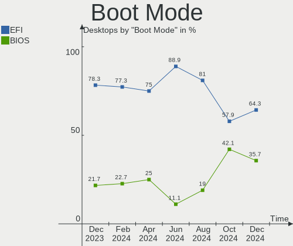
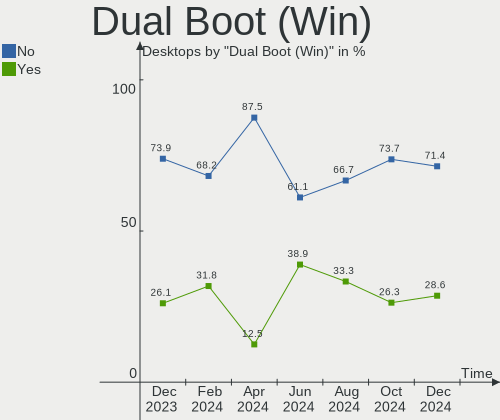
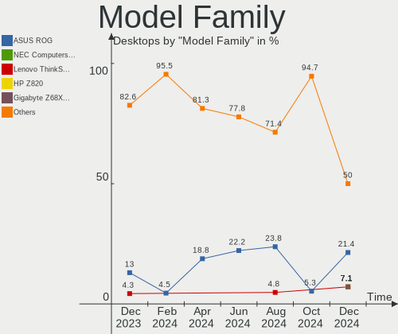
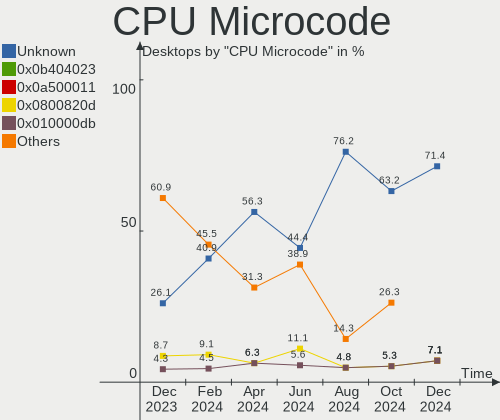
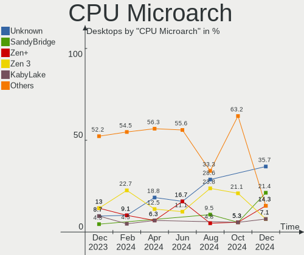
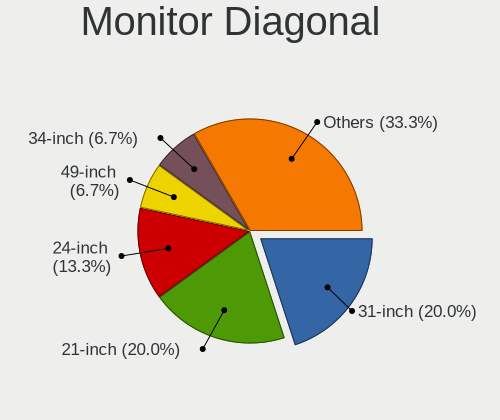
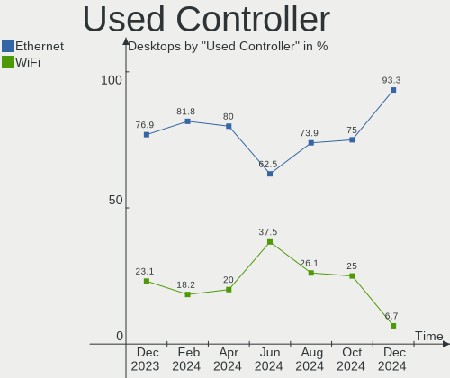
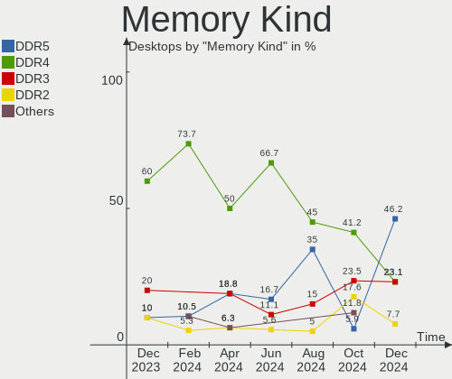

Gentoo Hardware Trends (Desktops)
---------------------------------

A project to identify most popular hardware characteristics and track their change
over time based on data collected by Gentoo users at https://Linux-Hardware.org.

Anyone can contribute to this report by the [hw-probe](https://github.com/linuxhw/hw-probe) tool:

    sudo -E hw-probe -all -upload

Full-feature report is available here: https://linux-hardware.org/?view=trends&formfactor=desktop

Period: Aug, 2021.

Contents
--------

* [ System ](#system)
  - [ OS                       ](#os)
  - [ OS Family                ](#os-family)
  - [ Kernel                   ](#kernel)
  - [ Kernel Family            ](#kernel-family)
  - [ Kernel Major Ver.        ](#kernel-major-ver)
  - [ Arch                     ](#arch)
  - [ DE                       ](#de)
  - [ Display Server           ](#display-server)
  - [ Display Manager          ](#display-manager)
  - [ OS Lang                  ](#os-lang)
  - [ Boot Mode                ](#boot-mode)
  - [ Filesystem               ](#filesystem)
  - [ Part. scheme             ](#part-scheme)
  - [ Dual Boot with Linux/BSD ](#dual-boot-with-linuxbsd)
  - [ Dual Boot (Win)          ](#dual-boot-win)

* [ Board ](#board)
  - [ Vendor                   ](#vendor)
  - [ Model                    ](#model)
  - [ Model Family             ](#model-family)
  - [ MFG Year                 ](#mfg-year)
  - [ Form Factor              ](#form-factor)
  - [ Secure Boot              ](#secure-boot)
  - [ Coreboot                 ](#coreboot)
  - [ RAM Size                 ](#ram-size)
  - [ RAM Used                 ](#ram-used)
  - [ Total Drives             ](#total-drives)
  - [ Has CD-ROM               ](#has-cd-rom)
  - [ Has Ethernet             ](#has-ethernet)
  - [ Has WiFi                 ](#has-wifi)
  - [ Has Bluetooth            ](#has-bluetooth)

* [ Location ](#location)
  - [ Country                  ](#country)
  - [ City                     ](#city)

* [ Drives ](#drives)
  - [ Drive Vendor             ](#drive-vendor)
  - [ Drive Model              ](#drive-model)
  - [ HDD Vendor               ](#hdd-vendor)
  - [ SSD Vendor               ](#ssd-vendor)
  - [ Drive Kind               ](#drive-kind)
  - [ Drive Connector          ](#drive-connector)
  - [ Drive Size               ](#drive-size)
  - [ Space Total              ](#space-total)
  - [ Space Used               ](#space-used)
  - [ Malfunc. Drives          ](#malfunc-drives)
  - [ Malfunc. Drive Vendor    ](#malfunc-drive-vendor)
  - [ Malfunc. HDD Vendor      ](#malfunc-hdd-vendor)
  - [ Malfunc. Drive Kind      ](#malfunc-drive-kind)
  - [ Failed Drives            ](#failed-drives)
  - [ Failed Drive Vendor      ](#failed-drive-vendor)
  - [ Drive Status             ](#drive-status)

* [ Storage controller ](#storage-controller)
  - [ Storage Vendor           ](#storage-vendor)
  - [ Storage Model            ](#storage-model)
  - [ Storage Kind             ](#storage-kind)

* [ Processor ](#processor)
  - [ CPU Vendor               ](#cpu-vendor)
  - [ CPU Model                ](#cpu-model)
  - [ CPU Model Family         ](#cpu-model-family)
  - [ CPU Cores                ](#cpu-cores)
  - [ CPU Sockets              ](#cpu-sockets)
  - [ CPU Threads              ](#cpu-threads)
  - [ CPU Op-Modes             ](#cpu-op-modes)
  - [ CPU Microcode            ](#cpu-microcode)
  - [ CPU Microarch            ](#cpu-microarch)

* [ Graphics ](#graphics)
  - [ GPU Vendor               ](#gpu-vendor)
  - [ GPU Model                ](#gpu-model)
  - [ GPU Combo                ](#gpu-combo)
  - [ GPU Driver               ](#gpu-driver)
  - [ GPU Memory               ](#gpu-memory)

* [ Monitor ](#monitor)
  - [ Monitor Vendor           ](#monitor-vendor)
  - [ Monitor Model            ](#monitor-model)
  - [ Monitor Resolution       ](#monitor-resolution)
  - [ Monitor Diagonal         ](#monitor-diagonal)
  - [ Monitor Width            ](#monitor-width)
  - [ Aspect Ratio             ](#aspect-ratio)
  - [ Monitor Area             ](#monitor-area)
  - [ Pixel Density            ](#pixel-density)
  - [ Multiple Monitors        ](#multiple-monitors)

* [ Network ](#network)
  - [ Net Controller Vendor    ](#net-controller-vendor)
  - [ Net Controller Model     ](#net-controller-model)
  - [ Wireless Vendor          ](#wireless-vendor)
  - [ Wireless Model           ](#wireless-model)
  - [ Ethernet Vendor          ](#ethernet-vendor)
  - [ Ethernet Model           ](#ethernet-model)
  - [ Net Controller Kind      ](#net-controller-kind)
  - [ Used Controller          ](#used-controller)
  - [ NICs                     ](#nics)
  - [ IPv6                     ](#ipv6)

* [ Bluetooth ](#bluetooth)
  - [ Bluetooth Vendor         ](#bluetooth-vendor)
  - [ Bluetooth Model          ](#bluetooth-model)

* [ Sound ](#sound)
  - [ Sound Vendor             ](#sound-vendor)
  - [ Sound Model              ](#sound-model)

* [ Memory ](#memory)
  - [ Memory Vendor            ](#memory-vendor)
  - [ Memory Model             ](#memory-model)
  - [ Memory Kind              ](#memory-kind)
  - [ Memory Form Factor       ](#memory-form-factor)
  - [ Memory Size              ](#memory-size)
  - [ Memory Speed             ](#memory-speed)

* [ Printers & scanners ](#printers--scanners)
  - [ Printer Vendor           ](#printer-vendor)
  - [ Printer Model            ](#printer-model)
  - [ Scanner Vendor           ](#scanner-vendor)
  - [ Scanner Model            ](#scanner-model)

* [ Camera ](#camera)
  - [ Camera Vendor            ](#camera-vendor)
  - [ Camera Model             ](#camera-model)

* [ Security ](#security)
  - [ Fingerprint Vendor       ](#fingerprint-vendor)
  - [ Fingerprint Model        ](#fingerprint-model)
  - [ Chipcard Vendor          ](#chipcard-vendor)
  - [ Chipcard Model           ](#chipcard-model)

* [ Unsupported ](#unsupported)
  - [ Unsupported Devices      ](#unsupported-devices)
  - [ Unsupported Device Types ](#unsupported-device-types)

System
------

OS
--

Installed operating systems

| Name       | Desktops | Percent |
|------------|----------|---------|
| Gentoo     | 13       | 52%     |
| Gentoo 2.7 | 11       | 44%     |
| Gentoo 1   | 1        | 4%      |

OS Family
---------

OS without a version

| Name   | Desktops | Percent |
|--------|----------|---------|
| Gentoo | 25       | 100%    |

Kernel
------

Version of the Linux kernel

| Version                      | Desktops | Percent |
|------------------------------|----------|---------|
| 5.10.52-gentoo               | 7        | 28%     |
| 5.10.52-gentoo-P6B40-A4X     | 2        | 8%      |
| 5.9.11                       | 1        | 4%      |
| 5.4.97-gentoo-x86_64         | 1        | 4%      |
| 5.4.66-gentoo-x86_64         | 1        | 4%      |
| 5.2.11_1                     | 1        | 4%      |
| 5.13.9-gentoo-hpz820-mgreene | 1        | 4%      |
| 5.13.9-gentoo-dist           | 1        | 4%      |
| 5.13.7-gentoo                | 1        | 4%      |
| 5.13.13-gentoo               | 1        | 4%      |
| 5.13.12-gentoo-limelight     | 1        | 4%      |
| 5.13.12                      | 1        | 4%      |
| 5.13.11-gentoo-dist          | 1        | 4%      |
| 5.13.11-gentoo               | 1        | 4%      |
| 5.12.15-ck                   | 1        | 4%      |
| 5.10.52-gentoo-x86_64        | 1        | 4%      |
| 5.10.52-1-lts                | 1        | 4%      |
| 5.10.27-gentoo               | 1        | 4%      |

Kernel Family
-------------

Linux kernel without a distro release

| Version | Desktops | Percent |
|---------|----------|---------|
| 5.10.52 | 11       | 44%     |
| 5.13.9  | 2        | 8%      |
| 5.13.12 | 2        | 8%      |
| 5.13.11 | 2        | 8%      |
| 5.9.11  | 1        | 4%      |
| 5.4.97  | 1        | 4%      |
| 5.4.66  | 1        | 4%      |
| 5.2.11  | 1        | 4%      |
| 5.13.7  | 1        | 4%      |
| 5.13.13 | 1        | 4%      |
| 5.12.15 | 1        | 4%      |
| 5.10.27 | 1        | 4%      |

Kernel Major Ver.
-----------------

Linux kernel major version

| Version | Desktops | Percent |
|---------|----------|---------|
| 5.10    | 12       | 48%     |
| 5.13    | 8        | 32%     |
| 5.4     | 2        | 8%      |
| 5.9     | 1        | 4%      |
| 5.2     | 1        | 4%      |
| 5.12    | 1        | 4%      |

Arch
----

OS architecture (x86_64, i586, etc.)

| Name   | Desktops | Percent |
|--------|----------|---------|
| x86_64 | 21       | 84%     |
| i686   | 3        | 12%     |
| ppc    | 1        | 4%      |

DE
--

Desktop Environment

| Name    | Desktops | Percent |
|---------|----------|---------|
| Unknown | 7        | 28%     |
| KDE5    | 6        | 24%     |
| MATE    | 5        | 20%     |
| GNOME   | 3        | 12%     |
| XFCE    | 2        | 8%      |
| sway    | 1        | 4%      |
| LXDE    | 1        | 4%      |

Display Server
--------------

X11 or Wayland

| Name    | Desktops | Percent |
|---------|----------|---------|
| X11     | 14       | 56%     |
| Tty     | 7        | 28%     |
| Wayland | 2        | 8%      |
| Unknown | 2        | 8%      |

Display Manager
---------------

SDDM, LightDM, etc.

| Name    | Desktops | Percent |
|---------|----------|---------|
| LightDM | 8        | 32%     |
| Unknown | 8        | 32%     |
| SDDM    | 7        | 28%     |
| LXDM    | 1        | 4%      |
| GDM     | 1        | 4%      |

OS Lang
-------

Language

| Lang       | Desktops | Percent |
|------------|----------|---------|
| en_US      | 14       | 56%     |
| en_GB      | 3        | 12%     |
| ru_RU.UTF8 | 2        | 8%      |
| pt_BR      | 1        | 4%      |
| pl_PL      | 1        | 4%      |
| fr_FR      | 1        | 4%      |
| es_ES      | 1        | 4%      |
| en_DK      | 1        | 4%      |
| Unknown    | 1        | 4%      |

Boot Mode
---------

EFI or BIOS

| Mode | Desktops | Percent |
|------|----------|---------|
| BIOS | 16       | 64%     |
| EFI  | 9        | 36%     |

Filesystem
----------

Type of filesystem

| Type  | Desktops | Percent |
|-------|----------|---------|
| Ext4  | 18       | 72%     |
| F2fs  | 3        | 12%     |
| Btrfs | 3        | 12%     |
| Jfs   | 1        | 4%      |

Part. scheme
------------

Scheme of partitioning

| Type | Desktops | Percent |
|------|----------|---------|
| GPT  | 16       | 64%     |
| MBR  | 9        | 36%     |

Dual Boot with Linux/BSD
------------------------

Hosting more than one Linux/BSD

| Dual boot | Desktops | Percent |
|-----------|----------|---------|
| Yes       | 13       | 52%     |
| No        | 12       | 48%     |

Dual Boot (Win)
---------------

Hosting Linux and Windows

| Dual boot | Desktops | Percent |
|-----------|----------|---------|
| No        | 19       | 76%     |
| Yes       | 6        | 24%     |

Board
-----

Vendor
------

Motherboard manufacturer

| Name                | Desktops | Percent |
|---------------------|----------|---------|
| ASUSTek Computer    | 9        | 36%     |
| Gigabyte Technology | 4        | 16%     |
| Tekram Technology   | 2        | 8%      |
| MSI                 | 2        | 8%      |
| Hewlett-Packard     | 2        | 8%      |
| Packard Bell        | 1        | 4%      |
| NZXT                | 1        | 4%      |
| Intel               | 1        | 4%      |
| Fujitsu             | 1        | 4%      |
| Dell                | 1        | 4%      |
| Unknown             | 1        | 4%      |

Model
-----

Motherboard model

| Name                             | Desktops | Percent |
|----------------------------------|----------|---------|
| Tekram P6B40-A4X-i440BX Rev      | 2        | 8%      |
| Packard Bell IMEDIA X5705 GE     | 1        | 4%      |
| NZXT N7 Z370                     | 1        | 4%      |
| MSI MS-7C56                      | 1        | 4%      |
| MSI MS-7369                      | 1        | 4%      |
| Intel D525MW AAE93082-301        | 1        | 4%      |
| HP Z820 Workstation              | 1        | 4%      |
| HP Pavilion ZV6100 (EE984EA#ABZ) | 1        | 4%      |
| Gigabyte Z170-Gaming K3          | 1        | 4%      |
| Gigabyte X570 AORUS ELITE        | 1        | 4%      |
| Gigabyte EP43-DS3                | 1        | 4%      |
| Gigabyte AB350-Gaming            | 1        | 4%      |
| Fujitsu ESPRIMO P7935            | 1        | 4%      |
| Dell OptiPlex GX270              | 1        | 4%      |
| ASUS ROG STRIX Z390-F GAMING     | 1        | 4%      |
| ASUS ROG STRIX B550-F GAMING     | 1        | 4%      |
| ASUS ROG Maximus XIII APEX       | 1        | 4%      |
| ASUS PRIME X470-PRO              | 1        | 4%      |
| ASUS P9X79 WS                    | 1        | 4%      |
| ASUS P6T DELUXE V2               | 1        | 4%      |
| ASUS P5P41C                      | 1        | 4%      |
| ASUS M4A89GTD-PRO/USB3           | 1        | 4%      |
| ASUS M3A78-CM                    | 1        | 4%      |
| Unknown                          | 1        | 4%      |

Model Family
------------

Motherboard model prefix

| Name                    | Desktops | Percent |
|-------------------------|----------|---------|
| ASUS ROG                | 3        | 12%     |
| Tekram P6B40-A4X-i440BX | 2        | 8%      |
| Packard Bell IMEDIA     | 1        | 4%      |
| NZXT N7                 | 1        | 4%      |
| MSI MS-7C56             | 1        | 4%      |
| MSI MS-7369             | 1        | 4%      |
| Intel D525MW            | 1        | 4%      |
| HP Z820                 | 1        | 4%      |
| HP Pavilion             | 1        | 4%      |
| Gigabyte Z170-Gaming    | 1        | 4%      |
| Gigabyte X570           | 1        | 4%      |
| Gigabyte EP43-DS3       | 1        | 4%      |
| Gigabyte AB350-Gaming   | 1        | 4%      |
| Fujitsu ESPRIMO         | 1        | 4%      |
| Dell OptiPlex           | 1        | 4%      |
| ASUS PRIME              | 1        | 4%      |
| ASUS P9X79              | 1        | 4%      |
| ASUS P6T                | 1        | 4%      |
| ASUS P5P41C             | 1        | 4%      |
| ASUS M4A89GTD-PRO       | 1        | 4%      |
| ASUS M3A78-CM           | 1        | 4%      |
| Unknown                 | 1        | 4%      |

MFG Year
--------

Motherboard manufacture year

| Year    | Desktops | Percent |
|---------|----------|---------|
| 2021    | 5        | 20%     |
| 2010    | 3        | 12%     |
| 2019    | 2        | 8%      |
| 2017    | 2        | 8%      |
| 2009    | 2        | 8%      |
| 2008    | 2        | 8%      |
| 2000    | 2        | 8%      |
| 2020    | 1        | 4%      |
| 2018    | 1        | 4%      |
| 2013    | 1        | 4%      |
| 2012    | 1        | 4%      |
| 2006    | 1        | 4%      |
| 2004    | 1        | 4%      |
| Unknown | 1        | 4%      |

Form Factor
-----------

Physical design of the computer

| Name    | Desktops | Percent |
|---------|----------|---------|
| Desktop | 25       | 100%    |

Secure Boot
-----------

Enabled or disabled

| State    | Desktops | Percent |
|----------|----------|---------|
| Disabled | 24       | 96%     |
| Enabled  | 1        | 4%      |

Coreboot
--------

Have coreboot on board

| Used | Desktops | Percent |
|------|----------|---------|
| No   | 25       | 100%    |

RAM Size
--------

Total RAM memory

| Size in GB  | Desktops | Percent |
|-------------|----------|---------|
| 64.01-256.0 | 5        | 20%     |
| 32.01-64.0  | 4        | 16%     |
| 16.01-24.0  | 4        | 16%     |
| 3.01-4.0    | 3        | 12%     |
| 8.01-16.0   | 3        | 12%     |
| 0.51-1.0    | 2        | 8%      |
| 4.01-8.0    | 1        | 4%      |
| 24.01-32.0  | 1        | 4%      |
| 2.01-3.0    | 1        | 4%      |
| 1.01-2.0    | 1        | 4%      |

RAM Used
--------

Used RAM memory

| Used GB    | Desktops | Percent |
|------------|----------|---------|
| 1.01-2.0   | 5        | 20%     |
| 0.01-0.5   | 5        | 20%     |
| 4.01-8.0   | 4        | 16%     |
| 3.01-4.0   | 3        | 12%     |
| 8.01-16.0  | 3        | 12%     |
| 2.01-3.0   | 2        | 8%      |
| 0.51-1.0   | 2        | 8%      |
| 16.01-24.0 | 1        | 4%      |

Total Drives
------------

Number of drives on board

| Drives | Desktops | Percent |
|--------|----------|---------|
| 2      | 8        | 32%     |
| 4      | 4        | 16%     |
| 1      | 4        | 16%     |
| 5      | 3        | 12%     |
| 3      | 3        | 12%     |
| 17     | 1        | 4%      |
| 7      | 1        | 4%      |
| 6      | 1        | 4%      |

Has CD-ROM
----------

Has CD-ROM on board

| Presented | Desktops | Percent |
|-----------|----------|---------|
| No        | 14       | 56%     |
| Yes       | 11       | 44%     |

Has Ethernet
------------

Has Ethernet on board

| Presented | Desktops | Percent |
|-----------|----------|---------|
| Yes       | 25       | 100%    |

Has WiFi
--------

Has WiFi module

| Presented | Desktops | Percent |
|-----------|----------|---------|
| No        | 21       | 84%     |
| Yes       | 4        | 16%     |

Has Bluetooth
-------------

Has Bluetooth module

| Presented | Desktops | Percent |
|-----------|----------|---------|
| No        | 16       | 64%     |
| Yes       | 9        | 36%     |

Location
--------

Country
-------

Geographic location (country)

| Country     | Desktops | Percent |
|-------------|----------|---------|
| Germany     | 6        | 24%     |
| USA         | 5        | 20%     |
| Poland      | 3        | 12%     |
| UK          | 2        | 8%      |
| Russia      | 2        | 8%      |
| France      | 2        | 8%      |
| Switzerland | 1        | 4%      |
| Spain       | 1        | 4%      |
| Netherlands | 1        | 4%      |
| Finland     | 1        | 4%      |
| Brazil      | 1        | 4%      |

City
----

Geographic location (city)

| City          | Desktops | Percent |
|---------------|----------|---------|
| Rodgau        | 4        | 16%     |
| Warsaw        | 2        | 8%      |
| Vladivostok   | 2        | 8%      |
| Berlin        | 2        | 8%      |
| Zurich        | 1        | 4%      |
| Zbuczyn       | 1        | 4%      |
| Warrington    | 1        | 4%      |
| Suffolk       | 1        | 4%      |
| Santa Brigida | 1        | 4%      |
| Reims         | 1        | 4%      |
| Pontcharra    | 1        | 4%      |
| Oulu          | 1        | 4%      |
| New York      | 1        | 4%      |
| Los Angeles   | 1        | 4%      |
| Itanhaem      | 1        | 4%      |
| Irvine        | 1        | 4%      |
| Haarlem       | 1        | 4%      |
| Dickson       | 1        | 4%      |
| Chiswick      | 1        | 4%      |

Drives
------

Drive Vendor
------------

Hard drive vendors

| Vendor              | Desktops | Drives | Percent |
|---------------------|----------|--------|---------|
| Seagate             | 14       | 26     | 22.22%  |
| Samsung Electronics | 12       | 18     | 19.05%  |
| WDC                 | 11       | 18     | 17.46%  |
| Crucial             | 5        | 5      | 7.94%   |
| Kingston            | 4        | 5      | 6.35%   |
| Intel               | 3        | 3      | 4.76%   |
| Toshiba             | 2        | 3      | 3.17%   |
| SanDisk             | 2        | 2      | 3.17%   |
| IBM                 | 2        | 2      | 3.17%   |
| Hitachi             | 2        | 4      | 3.17%   |
| GOODRAM             | 2        | 2      | 3.17%   |
| MDT                 | 1        | 1      | 1.59%   |
| LITEONIT            | 1        | 1      | 1.59%   |
| LaCie               | 1        | 1      | 1.59%   |
| Dogfish             | 1        | 1      | 1.59%   |

Drive Model
-----------

Hard drive models

| Model                                 | Desktops | Percent |
|---------------------------------------|----------|---------|
| Samsung SSD 840 EVO 120GB             | 3        | 3.85%   |
| WDC WDS200T2B0A-00SM50 2TB SSD        | 2        | 2.56%   |
| Seagate ST31000340NS 1TB              | 2        | 2.56%   |
| Samsung SSD 860 EVO 1TB               | 2        | 2.56%   |
| Kingston SA400S37480G 480GB SSD       | 2        | 2.56%   |
| IBM DJSA-220 12GB                     | 2        | 2.56%   |
| GOODRAM SSDPR-CL100-480-G2 480GB      | 2        | 2.56%   |
| WDC WDS200T2B0B-00YS70 2TB SSD        | 1        | 1.28%   |
| WDC WD80EFZX-68UW8N0 8TB              | 1        | 1.28%   |
| WDC WD80EFAX-68KNBN0 8TB              | 1        | 1.28%   |
| WDC WD6401AALS-00L3B2 640GB           | 1        | 1.28%   |
| WDC WD40EZRZ-00GXCB0 4TB              | 1        | 1.28%   |
| WDC WD3200AAJB-00WGA0 320GB           | 1        | 1.28%   |
| WDC WD30EZRX-00MMMB0 3TB              | 1        | 1.28%   |
| WDC WD30EFRX-68EUZN0 3TB              | 1        | 1.28%   |
| WDC WD1600AAJS-75B4A0 160GB           | 1        | 1.28%   |
| WDC WD10EZEX-60WN4A1 1TB              | 1        | 1.28%   |
| WDC WD10EZEX-21M2NA0 1TB              | 1        | 1.28%   |
| WDC WD10EZEX-00WN4A0 1TB              | 1        | 1.28%   |
| WDC WD100EJRX-89SYHY0 10TB            | 1        | 1.28%   |
| Toshiba MG06ACA800E 8TB               | 1        | 1.28%   |
| Toshiba HDWE150 5TB                   | 1        | 1.28%   |
| Seagate ST8000VX0022-2EJ112 8TB       | 1        | 1.28%   |
| Seagate ST8000AS0003-2HH188 8TB       | 1        | 1.28%   |
| Seagate ST8000AS0002-1NA17Z 8TB       | 1        | 1.28%   |
| Seagate ST500DM002-1BC142 500GB       | 1        | 1.28%   |
| Seagate ST4000DM004-2CV104 4TB        | 1        | 1.28%   |
| Seagate ST373207LW 73GB               | 1        | 1.28%   |
| Seagate ST336607LW 37GB               | 1        | 1.28%   |
| Seagate ST3320620AS 320GB             | 1        | 1.28%   |
| Seagate ST3250824AS 250GB             | 1        | 1.28%   |
| Seagate ST3250318AS 250GB             | 1        | 1.28%   |
| Seagate ST3160310CS 160GB             | 1        | 1.28%   |
| Seagate ST2000DM001-1ER164 2TB        | 1        | 1.28%   |
| Seagate ST12000NM0008-2H3101 12TB     | 1        | 1.28%   |
| Seagate ST1000NM0011 1TB              | 1        | 1.28%   |
| Seagate ST1000DM010-2EP102 1TB        | 1        | 1.28%   |
| Seagate ST1000DM005 HD103SJ 1TB       | 1        | 1.28%   |
| Seagate ST1000DM003-1CH162 1TB        | 1        | 1.28%   |
| Seagate Backup+ Desk 5TB              | 1        | 1.28%   |
| SanDisk SDSSDA480G 480GB              | 1        | 1.28%   |
| SanDisk SD9SN8W-128G-1006 128GB SSD   | 1        | 1.28%   |
| Samsung SSD 980 PRO 500GB             | 1        | 1.28%   |
| Samsung SSD 980 PRO 2TB               | 1        | 1.28%   |
| Samsung SSD 970 EVO Plus 250GB        | 1        | 1.28%   |
| Samsung SSD 960 PRO 1TB               | 1        | 1.28%   |
| Samsung SSD 950 PRO 512GB             | 1        | 1.28%   |
| Samsung SSD 860 PRO 4TB               | 1        | 1.28%   |
| Samsung SSD 860 EVO 2TB               | 1        | 1.28%   |
| Samsung SSD 860 EVO 250GB             | 1        | 1.28%   |
| Samsung SSD 850 EVO 250GB             | 1        | 1.28%   |
| Samsung SP1203N 120GB                 | 1        | 1.28%   |
| Samsung MZ7LN256HCHP-00000 256GB SSD  | 1        | 1.28%   |
| Samsung HD250HJ 250GB                 | 1        | 1.28%   |
| MDT MD2000KS-00MJB0 200GB             | 1        | 1.28%   |
| LITEONIT LCT-128M3S 2.5 7mm 128GB SSD | 1        | 1.28%   |
| LaCie Rugged THB USB3 2TB             | 1        | 1.28%   |
| Kingston SHFS37A120G 120GB SSD        | 1        | 1.28%   |
| Kingston SA2000M81000G 1TB            | 1        | 1.28%   |
| Intel SSDSC2KB240G8 240GB             | 1        | 1.28%   |

HDD Vendor
----------

Hard disk drive vendors

| Vendor              | Desktops | Drives | Percent |
|---------------------|----------|--------|---------|
| Seagate             | 13       | 25     | 39.39%  |
| WDC                 | 10       | 15     | 30.3%   |
| Toshiba             | 2        | 3      | 6.06%   |
| Samsung Electronics | 2        | 2      | 6.06%   |
| IBM                 | 2        | 2      | 6.06%   |
| Hitachi             | 2        | 4      | 6.06%   |
| MDT                 | 1        | 1      | 3.03%   |
| LaCie               | 1        | 1      | 3.03%   |

SSD Vendor
----------

Solid state drive vendors

| Vendor              | Desktops | Drives | Percent |
|---------------------|----------|--------|---------|
| Samsung Electronics | 7        | 10     | 29.17%  |
| Crucial             | 5        | 5      | 20.83%  |
| Kingston            | 3        | 4      | 12.5%   |
| WDC                 | 2        | 3      | 8.33%   |
| SanDisk             | 2        | 2      | 8.33%   |
| GOODRAM             | 2        | 2      | 8.33%   |
| LITEONIT            | 1        | 1      | 4.17%   |
| Intel               | 1        | 1      | 4.17%   |
| Dogfish             | 1        | 1      | 4.17%   |

Drive Kind
----------

HDD or SSD

| Kind    | Desktops | Drives | Percent |
|---------|----------|--------|---------|
| HDD     | 21       | 53     | 45.65%  |
| SSD     | 17       | 29     | 36.96%  |
| NVMe    | 7        | 9      | 15.22%  |
| Unknown | 1        | 1      | 2.17%   |

Drive Connector
---------------

SATA, SAS, NVMe, etc.

| Type | Desktops | Drives | Percent |
|------|----------|--------|---------|
| SATA | 24       | 78     | 68.57%  |
| NVMe | 7        | 9      | 20%     |
| SAS  | 4        | 5      | 11.43%  |

Drive Size
----------

Size of hard drive

| Size in TB | Desktops | Drives | Percent |
|------------|----------|--------|---------|
| 0.01-0.5   | 21       | 36     | 43.75%  |
| 0.51-1.0   | 12       | 17     | 25%     |
| 1.01-2.0   | 5        | 6      | 10.42%  |
| 3.01-4.0   | 3        | 3      | 6.25%   |
| 2.01-3.0   | 3        | 5      | 6.25%   |
| 4.01-10.0  | 3        | 14     | 6.25%   |
| 10.01-20.0 | 1        | 1      | 2.08%   |

Space Total
-----------

Amount of disk space available on the file system

| Size in GB     | Desktops | Percent |
|----------------|----------|---------|
| 1001-2000      | 6        | 24%     |
| More than 3000 | 4        | 16%     |
| 251-500        | 4        | 16%     |
| 101-250        | 3        | 12%     |
| 2001-3000      | 2        | 8%      |
| 1-20           | 2        | 8%      |
| 501-1000       | 2        | 8%      |
| 21-50          | 1        | 4%      |
| Unknown        | 1        | 4%      |

Space Used
----------

Amount of used disk space

| Used GB        | Desktops | Percent |
|----------------|----------|---------|
| 1001-2000      | 4        | 16%     |
| 1-20           | 4        | 16%     |
| 251-500        | 3        | 12%     |
| 101-250        | 3        | 12%     |
| 501-1000       | 3        | 12%     |
| More than 3000 | 2        | 8%      |
| 21-50          | 2        | 8%      |
| 2001-3000      | 2        | 8%      |
| 51-100         | 1        | 4%      |
| Unknown        | 1        | 4%      |

Malfunc. Drives
---------------

Drive models with a malfunction

| Model                               | Desktops | Drives | Percent |
|-------------------------------------|----------|--------|---------|
| Seagate ST31000340NS 1TB            | 2        | 2      | 11.76%  |
| IBM DJSA-220 12GB                   | 2        | 2      | 11.76%  |
| WDC WD80EFZX-68UW8N0 8TB            | 1        | 2      | 5.88%   |
| WDC WD1600AAJS-75B4A0 160GB         | 1        | 1      | 5.88%   |
| Seagate ST8000VX0022-2EJ112 8TB     | 1        | 1      | 5.88%   |
| Seagate ST8000AS0002-1NA17Z 8TB     | 1        | 1      | 5.88%   |
| Seagate ST500DM002-1BC142 500GB     | 1        | 1      | 5.88%   |
| Seagate ST3250824AS 250GB           | 1        | 1      | 5.88%   |
| Seagate ST3250318AS 250GB           | 1        | 1      | 5.88%   |
| Seagate ST1000NM0011 1TB            | 1        | 2      | 5.88%   |
| SanDisk SD9SN8W-128G-1006 128GB SSD | 1        | 1      | 5.88%   |
| Samsung Electronics SSD 960 PRO 1TB | 1        | 2      | 5.88%   |
| MDT MD2000KS-00MJB0 200GB           | 1        | 1      | 5.88%   |
| Crucial CT256M550SSD1 256GB         | 1        | 1      | 5.88%   |
| Crucial CT120M500SSD1 120GB         | 1        | 1      | 5.88%   |

Malfunc. Drive Vendor
---------------------

Vendors of faulty drives

| Vendor              | Desktops | Drives | Percent |
|---------------------|----------|--------|---------|
| Seagate             | 5        | 9      | 35.71%  |
| WDC                 | 2        | 3      | 14.29%  |
| IBM                 | 2        | 2      | 14.29%  |
| Crucial             | 2        | 2      | 14.29%  |
| SanDisk             | 1        | 1      | 7.14%   |
| Samsung Electronics | 1        | 2      | 7.14%   |
| MDT                 | 1        | 1      | 7.14%   |

Malfunc. HDD Vendor
-------------------

Vendors of faulty HDD drives

| Vendor  | Desktops | Drives | Percent |
|---------|----------|--------|---------|
| Seagate | 5        | 9      | 50%     |
| WDC     | 2        | 3      | 20%     |
| IBM     | 2        | 2      | 20%     |
| MDT     | 1        | 1      | 10%     |

Malfunc. Drive Kind
-------------------

Kinds of faulty drives

| Kind | Desktops | Drives | Percent |
|------|----------|--------|---------|
| HDD  | 9        | 15     | 69.23%  |
| SSD  | 3        | 3      | 23.08%  |
| NVMe | 1        | 2      | 7.69%   |

Failed Drives
-------------

Failed drive models

| Model                                            | Desktops | Drives | Percent |
|--------------------------------------------------|----------|--------|---------|
| Samsung Electronics MZ7LN256HCHP-00000 256GB SSD | 1        | 1      | 100%    |

Failed Drive Vendor
-------------------

Failed drive vendors

| Vendor              | Desktops | Drives | Percent |
|---------------------|----------|--------|---------|
| Samsung Electronics | 1        | 1      | 100%    |

Drive Status
------------

Number of failed and malfunc. drives

| Status   | Desktops | Drives | Percent |
|----------|----------|--------|---------|
| Works    | 20       | 69     | 55.56%  |
| Malfunc  | 13       | 20     | 36.11%  |
| Detected | 2        | 2      | 5.56%   |
| Failed   | 1        | 1      | 2.78%   |

Storage controller
------------------

Storage Vendor
--------------

Storage controller vendors

| Vendor                        | Desktops | Percent |
|-------------------------------|----------|---------|
| Intel                         | 14       | 36.84%  |
| AMD                           | 8        | 21.05%  |
| Samsung Electronics           | 5        | 13.16%  |
| Nvidia                        | 2        | 5.26%   |
| Broadcom / LSI                | 2        | 5.26%   |
| Adaptec                       | 2        | 5.26%   |
| Marvell Technology Group      | 1        | 2.63%   |
| Kingston Technology Company   | 1        | 2.63%   |
| JMicron Technology            | 1        | 2.63%   |
| Integrated Technology Express | 1        | 2.63%   |
| ASMedia Technology            | 1        | 2.63%   |

Storage Model
-------------

Storage controller models

| Model                                                                         | Desktops | Percent |
|-------------------------------------------------------------------------------|----------|---------|
| AMD FCH SATA Controller [AHCI mode]                                           | 5        | 9.8%    |
| Samsung NVMe SSD Controller PM9A1/PM9A3/980PRO                                | 2        | 3.92%   |
| Intel SATA Controller [RAID mode]                                             | 2        | 3.92%   |
| Intel C600/X79 series chipset 6-Port SATA AHCI Controller                     | 2        | 3.92%   |
| Intel 82801JI (ICH10 Family) SATA AHCI Controller                             | 2        | 3.92%   |
| Intel 82371AB/EB/MB PIIX4 IDE                                                 | 2        | 3.92%   |
| Broadcom / LSI SAS2308 PCI-Express Fusion-MPT SAS-2                           | 2        | 3.92%   |
| AMD Starship/Matisse Chipset SATA Controller [AHCI mode]                      | 2        | 3.92%   |
| AMD 400 Series Chipset SATA Controller                                        | 2        | 3.92%   |
| Samsung NVMe SSD Controller SM981/PM981/PM983                                 | 1        | 1.96%   |
| Samsung NVMe SSD Controller SM961/PM961/SM963                                 | 1        | 1.96%   |
| Samsung NVMe SSD Controller SM951/PM951                                       | 1        | 1.96%   |
| Nvidia MCP79 RAID Controller                                                  | 1        | 1.96%   |
| Nvidia MCP65 SATA Controller                                                  | 1        | 1.96%   |
| Marvell Group 88SE9128 PCIe SATA 6 Gb/s RAID controller with HyperDuo         | 1        | 1.96%   |
| Kingston Company A2000 NVMe SSD                                               | 1        | 1.96%   |
| JMicron JMB368 IDE controller                                                 | 1        | 1.96%   |
| JMicron JMB361 AHCI/IDE                                                       | 1        | 1.96%   |
| Intel Q170/Q150/B150/H170/H110/Z170/CM236 Chipset SATA Controller [AHCI Mode] | 1        | 1.96%   |
| Intel PCIe Data Center SSD                                                    | 1        | 1.96%   |
| Intel Optane SSD 900P Series                                                  | 1        | 1.96%   |
| Intel NM10/ICH7 Family SATA Controller [IDE mode]                             | 1        | 1.96%   |
| Intel NM10/ICH7 Family SATA Controller [AHCI mode]                            | 1        | 1.96%   |
| Intel C602 chipset 4-Port SATA Storage Control Unit                           | 1        | 1.96%   |
| Intel 82801G (ICH7 Family) IDE Controller                                     | 1        | 1.96%   |
| Intel 82801EB/ER (ICH5/ICH5R) IDE Controller                                  | 1        | 1.96%   |
| Intel 82801EB (ICH5) SATA Controller                                          | 1        | 1.96%   |
| Intel 500 Series Chipset Family SATA AHCI Controller                          | 1        | 1.96%   |
| Intel 4 Series Chipset PT IDER Controller                                     | 1        | 1.96%   |
| Intel 200 Series PCH SATA controller [AHCI mode]                              | 1        | 1.96%   |
| Integrated Express IT8213 IDE Controller                                      | 1        | 1.96%   |
| ASMedia ASM1062 Serial ATA Controller                                         | 1        | 1.96%   |
| AMD SB7x0/SB8x0/SB9x0 SATA Controller [IDE mode]                              | 1        | 1.96%   |
| AMD SB7x0/SB8x0/SB9x0 SATA Controller [AHCI mode]                             | 1        | 1.96%   |
| AMD SB7x0/SB8x0/SB9x0 IDE Controller                                          | 1        | 1.96%   |
| AMD IXP SB4x0 IDE Controller                                                  | 1        | 1.96%   |
| AMD 300 Series Chipset SATA Controller                                        | 1        | 1.96%   |
| Adaptec AIC-7892A U160/m                                                      | 1        | 1.96%   |
| Adaptec AHA-2940U2/U2W                                                        | 1        | 1.96%   |

Storage Kind
------------

Kind of storage controller (IDE, SATA, NVMe, SAS, ...)

| Kind | Desktops | Percent |
|------|----------|---------|
| SATA | 15       | 38.46%  |
| IDE  | 10       | 25.64%  |
| NVMe | 7        | 17.95%  |
| RAID | 3        | 7.69%   |
| SAS  | 2        | 5.13%   |
| SCSI | 2        | 5.13%   |

Processor
---------

CPU Vendor
----------

Processor vendors

| Vendor       | Desktops | Percent |
|--------------|----------|---------|
| Intel        | 15       | 60%     |
| AMD          | 9        | 36%     |
| PowerBook5,5 | 1        | 4%      |

CPU Model
---------

Processor models

| Model                                      | Desktops | Percent |
|--------------------------------------------|----------|---------|
| Intel Pentium III (Katmai)                 | 2        | 8%      |
| PowerBook5,5 7447A, altivec supported      | 1        | 4%      |
| Intel Xeon CPU E5-2690 0 @ 2.90GHz         | 1        | 4%      |
| Intel Pentium 4 CPU 3.00GHz                | 1        | 4%      |
| Intel Core i9-9900K CPU @ 3.60GHz          | 1        | 4%      |
| Intel Core i7-8700K CPU @ 3.70GHz          | 1        | 4%      |
| Intel Core i7-4960X CPU @ 3.60GHz          | 1        | 4%      |
| Intel Core i7 CPU 980 @ 3.33GHz            | 1        | 4%      |
| Intel Core i5-6400 CPU @ 2.70GHz           | 1        | 4%      |
| Intel Core 2 Quad CPU Q9650 @ 3.00GHz      | 1        | 4%      |
| Intel Core 2 Quad CPU Q9550 @ 2.83GHz      | 1        | 4%      |
| Intel Core 2 Quad CPU Q8400 @ 2.66GHz      | 1        | 4%      |
| Intel Core 2 Quad CPU Q6600 @ 2.40GHz      | 1        | 4%      |
| Intel Atom CPU D525 @ 1.80GHz              | 1        | 4%      |
| Intel 11th Gen Core i9-11900K @ 3.50GHz    | 1        | 4%      |
| AMD Ryzen 9 3950X 16-Core Processor        | 1        | 4%      |
| AMD Ryzen 7 3700X 8-Core Processor         | 1        | 4%      |
| AMD Ryzen 7 2700X Eight-Core Processor     | 1        | 4%      |
| AMD Ryzen 5 5600X 6-Core Processor         | 1        | 4%      |
| AMD Ryzen 5 3500X 6-Core Processor         | 1        | 4%      |
| AMD Ryzen 5 2600 Six-Core Processor        | 1        | 4%      |
| AMD Phenom II X4 955 Processor             | 1        | 4%      |
| AMD Athlon 64 X2 Dual Core Processor 5200+ | 1        | 4%      |
| AMD Athlon 64 Processor 3200+              | 1        | 4%      |

CPU Model Family
----------------

Processor model prefix

| Model             | Desktops | Percent |
|-------------------|----------|---------|
| Intel Core 2 Quad | 4        | 16%     |
| Intel Core i7     | 3        | 12%     |
| AMD Ryzen 5       | 3        | 12%     |
| Other             | 2        | 8%      |
| Intel Pentium III | 2        | 8%      |
| AMD Ryzen 7       | 2        | 8%      |
| Intel Xeon        | 1        | 4%      |
| Intel Pentium 4   | 1        | 4%      |
| Intel Core i9     | 1        | 4%      |
| Intel Core i5     | 1        | 4%      |
| Intel Atom        | 1        | 4%      |
| AMD Ryzen 9       | 1        | 4%      |
| AMD Phenom II X4  | 1        | 4%      |
| AMD Athlon 64 X2  | 1        | 4%      |
| AMD Athlon 64     | 1        | 4%      |

CPU Cores
---------

Number of processor cores

| Number | Desktops | Percent |
|--------|----------|---------|
| 6      | 6        | 24%     |
| 4      | 6        | 24%     |
| 1      | 5        | 20%     |
| 8      | 4        | 16%     |
| 16     | 2        | 8%      |
| 2      | 2        | 8%      |

CPU Sockets
-----------

Number of sockets

| Number | Desktops | Percent |
|--------|----------|---------|
| 1      | 24       | 96%     |
| 2      | 1        | 4%      |

CPU Threads
-----------

Threads per core (Hyper-Threading)

| Number | Desktops | Percent |
|--------|----------|---------|
| 2      | 13       | 52%     |
| 1      | 12       | 48%     |

CPU Op-Modes
------------

CPU Operation Modes (32-bit, 64-bit)

| Op mode        | Desktops | Percent |
|----------------|----------|---------|
| 32-bit, 64-bit | 21       | 84%     |
| 32-bit         | 4        | 16%     |

CPU Microcode
-------------

Microcode number

| Number     | Desktops | Percent |
|------------|----------|---------|
| Unknown    | 7        | 28%     |
| 0x1067a    | 3        | 12%     |
| 0x673      | 2        | 8%      |
| 0x08701021 | 2        | 8%      |
| 0x0800820d | 2        | 8%      |
| 0x906ed    | 1        | 4%      |
| 0x906ea    | 1        | 4%      |
| 0x506e3    | 1        | 4%      |
| 0x306e4    | 1        | 4%      |
| 0x206d7    | 1        | 4%      |
| 0x206c2    | 1        | 4%      |
| 0x0a201016 | 1        | 4%      |
| 0x08701013 | 1        | 4%      |
| 0x010000db | 1        | 4%      |

CPU Microarch
-------------

Microarchitecture

| Name        | Desktops | Percent |
|-------------|----------|---------|
| Zen 2       | 3        | 12%     |
| Penryn      | 3        | 12%     |
| Zen+        | 2        | 8%      |
| P6          | 2        | 8%      |
| KabyLake    | 2        | 8%      |
| K8 Hammer   | 2        | 8%      |
| Unknown     | 2        | 8%      |
| Zen 3       | 1        | 4%      |
| Westmere    | 1        | 4%      |
| Skylake     | 1        | 4%      |
| SandyBridge | 1        | 4%      |
| NetBurst    | 1        | 4%      |
| K10         | 1        | 4%      |
| IvyBridge   | 1        | 4%      |
| Core        | 1        | 4%      |
| Bonnell     | 1        | 4%      |

Graphics
--------

GPU Vendor
----------

Vendors of graphics cards

| Vendor | Desktops | Percent |
|--------|----------|---------|
| Nvidia | 15       | 55.56%  |
| AMD    | 10       | 37.04%  |
| Intel  | 2        | 7.41%   |

GPU Model
---------

Graphics card models

| Model                                                                   | Desktops | Percent |
|-------------------------------------------------------------------------|----------|---------|
| Nvidia G72 [GeForce 7300 LE]                                            | 2        | 7.14%   |
| AMD Ellesmere [Radeon RX 470/480/570/570X/580/580X/590]                 | 2        | 7.14%   |
| Nvidia TU106 [GeForce RTX 2060 Rev. A]                                  | 1        | 3.57%   |
| Nvidia TU104 [GeForce RTX 2070 SUPER]                                   | 1        | 3.57%   |
| Nvidia NV5 [Riva TNT2 Model 64 / Model 64 Pro]                          | 1        | 3.57%   |
| Nvidia NV5 [Riva TNT2 / TNT2 Pro]                                       | 1        | 3.57%   |
| Nvidia NV43 [GeForce 6600 GT]                                           | 1        | 3.57%   |
| Nvidia GT218 [GeForce 210]                                              | 1        | 3.57%   |
| Nvidia GP104 [GeForce GTX 1070]                                         | 1        | 3.57%   |
| Nvidia GP102 [GeForce GTX 1080 Ti]                                      | 1        | 3.57%   |
| Nvidia GM107 [GeForce GTX 750]                                          | 1        | 3.57%   |
| Nvidia GF108 [GeForce GT 430]                                           | 1        | 3.57%   |
| Nvidia GA102 [GeForce RTX 3090]                                         | 1        | 3.57%   |
| Nvidia GA102 [GeForce RTX 3080 Ti]                                      | 1        | 3.57%   |
| Nvidia G73 [GeForce 7300 GT]                                            | 1        | 3.57%   |
| Intel CometLake-S GT2 [UHD Graphics 630]                                | 1        | 3.57%   |
| Intel Atom Processor D4xx/D5xx/N4xx/N5xx Integrated Graphics Controller | 1        | 3.57%   |
| AMD Vega 10 XL/XT [Radeon RX Vega 56/64]                                | 1        | 3.57%   |
| AMD Tahiti PRO [Radeon HD 7950/8950 OEM / R9 280]                       | 1        | 3.57%   |
| AMD RV515 [Radeon X1300/X1550]                                          | 1        | 3.57%   |
| AMD RV515 [Radeon X1300/X1550 Series] (Secondary)                       | 1        | 3.57%   |
| AMD RV350/M10 / RV360/M11 [Mobility Radeon 9600 (PRO) / 9700]           | 1        | 3.57%   |
| AMD RS880 [Radeon HD 4290]                                              | 1        | 3.57%   |
| AMD RS780C [Radeon 3100]                                                | 1        | 3.57%   |
| AMD RS480M [Mobility Radeon Xpress 200]                                 | 1        | 3.57%   |
| AMD Lexa PRO [Radeon 540/540X/550/550X / RX 540X/550/550X]              | 1        | 3.57%   |

GPU Combo
---------

Combinations of graphics cards

| Name           | Desktops | Percent |
|----------------|----------|---------|
| 1 x Nvidia     | 14       | 56%     |
| 1 x AMD        | 8        | 32%     |
| 2 x AMD        | 1        | 4%      |
| Intel + Nvidia | 1        | 4%      |
| 1 x Intel      | 1        | 4%      |

GPU Driver
----------

Free vs proprietary

| Driver      | Desktops | Percent |
|-------------|----------|---------|
| Free        | 19       | 76%     |
| Proprietary | 5        | 20%     |
| Unknown     | 1        | 4%      |

GPU Memory
----------

Total video memory

| Size in GB | Desktops | Percent |
|------------|----------|---------|
| 0.01-0.5   | 10       | 40%     |
| 7.01-8.0   | 5        | 20%     |
| Unknown    | 3        | 12%     |
| 0.51-1.0   | 2        | 8%      |
| 5.01-6.0   | 1        | 4%      |
| 2.01-3.0   | 1        | 4%      |
| 16.01-24.0 | 1        | 4%      |
| 1.01-2.0   | 1        | 4%      |
| 8.01-16.0  | 1        | 4%      |

Monitor
-------

Monitor Vendor
--------------

Monitor vendors

| Vendor               | Desktops | Percent |
|----------------------|----------|---------|
| Fujitsu Siemens      | 4        | 16.67%  |
| Samsung Electronics  | 3        | 12.5%   |
| Iiyama               | 3        | 12.5%   |
| BenQ                 | 3        | 12.5%   |
| Lenovo               | 2        | 8.33%   |
| Goldstar             | 2        | 8.33%   |
| Dell                 | 2        | 8.33%   |
| ViewSonic            | 1        | 4.17%   |
| Envision Peripherals | 1        | 4.17%   |
| Apple                | 1        | 4.17%   |
| AOC                  | 1        | 4.17%   |
| Acer                 | 1        | 4.17%   |

Monitor Model
-------------

Monitor models

| Model                                                               | Desktops | Percent |
|---------------------------------------------------------------------|----------|---------|
| Fujitsu Siemens P24W-6 IPS FUS07EA 1920x1200 520x320mm 24.0-inch    | 4        | 16%     |
| Iiyama PL2473HD IVM6107 1920x1080 521x293mm 23.5-inch               | 2        | 8%      |
| ViewSonic VG3448 VSC0D38 3440x1440 800x330mm 34.1-inch              | 1        | 4%      |
| Samsung Electronics SME2020N SAM06A6 1600x900 443x249mm 20.0-inch   | 1        | 4%      |
| Samsung Electronics S22B300 SAM08C8 1920x1080 480x270mm 21.7-inch   | 1        | 4%      |
| Samsung Electronics LC49G95T SAM7053 3840x1080 1193x336mm 48.8-inch | 1        | 4%      |
| Lenovo Y25f LEN2450 1920x1080 544x303mm 24.5-inch                   | 1        | 4%      |
| Lenovo LEN L201p LEN2404 1600x1200 400x300mm 19.7-inch              | 1        | 4%      |
| Iiyama PLB2403WS IVM5601 1920x1200 519x324mm 24.1-inch              | 1        | 4%      |
| Goldstar Ultra HD GSM5B09 3840x2160 600x340mm 27.2-inch             | 1        | 4%      |
| Goldstar HDR 4K GSM7707 3840x2160 600x340mm 27.2-inch               | 1        | 4%      |
| Goldstar 24EB23 GSM59B5 1920x1200 520x330mm 24.2-inch               | 1        | 4%      |
| Envision Peripherals LCD2361 ENV2361 1920x1080 521x293mm 23.5-inch  | 1        | 4%      |
| Dell P2418D DELD0C1 2560x1440 526x296mm 23.8-inch                   | 1        | 4%      |
| Dell LCD Monitor DELA0F8 2560x1080 800x340mm 34.2-inch              | 1        | 4%      |
| BenQ G2400W BNQ780A 1920x1200 519x324mm 24.1-inch                   | 1        | 4%      |
| BenQ EX3203R BNQ7F66 2560x1440 698x393mm 31.5-inch                  | 1        | 4%      |
| BenQ EW3270U BNQ7950 3840x2160 698x393mm 31.5-inch                  | 1        | 4%      |
| Apple Color LCD APP9C2C 1440x900 367x230mm 17.1-inch                | 1        | 4%      |
| AOC F19 AOC1900 1366x768 410x230mm 18.5-inch                        | 1        | 4%      |
| Acer SA220Q ACR057D 1920x1080 476x268mm 21.5-inch                   | 1        | 4%      |

Monitor Resolution
------------------

Monitor screen resolution

| Resolution        | Desktops | Percent |
|-------------------|----------|---------|
| 1920x1200 (WUXGA) | 6        | 25%     |
| 1920x1080 (FHD)   | 6        | 25%     |
| 3840x2160 (4K)    | 3        | 12.5%   |
| 2560x1440 (QHD)   | 2        | 8.33%   |
| 3840x1080         | 1        | 4.17%   |
| 3440x1440         | 1        | 4.17%   |
| 2560x1080         | 1        | 4.17%   |
| 1600x900 (HD+)    | 1        | 4.17%   |
| 1600x1200         | 1        | 4.17%   |
| 1440x900 (WXGA+)  | 1        | 4.17%   |
| 1366x768 (WXGA)   | 1        | 4.17%   |

Monitor Diagonal
----------------

Diagonal size in inches

| Inches | Desktops | Percent |
|--------|----------|---------|
| 24     | 8        | 33.33%  |
| 23     | 3        | 12.5%   |
| 34     | 2        | 8.33%   |
| 31     | 2        | 8.33%   |
| 27     | 2        | 8.33%   |
| 21     | 2        | 8.33%   |
| 48     | 1        | 4.17%   |
| 20     | 1        | 4.17%   |
| 19     | 1        | 4.17%   |
| 18     | 1        | 4.17%   |
| 17     | 1        | 4.17%   |

Monitor Width
-------------

Physical width

| Width in mm | Desktops | Percent |
|-------------|----------|---------|
| 501-600     | 12       | 52.17%  |
| 401-500     | 4        | 17.39%  |
| 701-800     | 2        | 8.7%    |
| 601-700     | 2        | 8.7%    |
| 351-400     | 2        | 8.7%    |
| 1001-1500   | 1        | 4.35%   |

Aspect Ratio
------------

Proportional relationship between the width and the height

| Ratio | Desktops | Percent |
|-------|----------|---------|
| 16/9  | 12       | 52.17%  |
| 16/10 | 7        | 30.43%  |
| 21/9  | 2        | 8.7%    |
| 4/3   | 1        | 4.35%   |
| 32/9  | 1        | 4.35%   |

Monitor Area
------------

Area in inch

| Area in inch | Desktops | Percent |
|----------------|----------|---------|
| 251-300        | 7        | 29.17%  |
| 201-250        | 5        | 20.83%  |
| 351-500        | 4        | 16.67%  |
| 151-200        | 3        | 12.5%   |
| 301-350        | 2        | 8.33%   |
| 141-150        | 1        | 4.17%   |
| 131-140        | 1        | 4.17%   |
| 501-1000       | 1        | 4.17%   |

Pixel Density
-------------

Pixels per inch

| Density | Desktops | Percent |
|---------|----------|---------|
| 51-100  | 15       | 65.22%  |
| 101-120 | 4        | 17.39%  |
| 161-240 | 2        | 8.7%    |
| 121-160 | 2        | 8.7%    |

Multiple Monitors
-----------------

Total monitors connected

| Total | Desktops | Percent |
|-------|----------|---------|
| 1     | 19       | 76%     |
| 2     | 4        | 16%     |
| 0     | 2        | 8%      |

Network
-------

Net Controller Vendor
---------------------

Controller vendors

| Vendor                   | Desktops | Percent |
|--------------------------|----------|---------|
| Intel                    | 11       | 34.38%  |
| Realtek Semiconductor    | 10       | 31.25%  |
| Broadcom                 | 3        | 9.38%   |
| Qualcomm Atheros         | 2        | 6.25%   |
| 3Com                     | 2        | 6.25%   |
| Nvidia                   | 1        | 3.13%   |
| Marvell Technology Group | 1        | 3.13%   |
| Apple                    | 1        | 3.13%   |
| AMD                      | 1        | 3.13%   |

Net Controller Model
--------------------

Controller models

| Model                                                               | Desktops | Percent |
|---------------------------------------------------------------------|----------|---------|
| Realtek RTL8111/8168/8411 PCI Express Gigabit Ethernet Controller   | 8        | 21.62%  |
| Realtek RTL8169 PCI Gigabit Ethernet Controller                     | 2        | 5.41%   |
| Intel I211 Gigabit Network Connection                               | 2        | 5.41%   |
| Intel Ethernet Controller I225-V                                    | 2        | 5.41%   |
| Intel 82599ES 10-Gigabit SFI/SFP+ Network Connection                | 2        | 5.41%   |
| Intel 82574L Gigabit Network Connection                             | 2        | 5.41%   |
| Realtek RTL-8100/8101L/8139 PCI Fast Ethernet Adapter               | 1        | 2.7%    |
| Realtek RTL-8029(AS)                                                | 1        | 2.7%    |
| Qualcomm Atheros Killer E2400 Gigabit Ethernet Controller           | 1        | 2.7%    |
| Qualcomm Atheros AR5212/5213/2414 Wireless Network Adapter          | 1        | 2.7%    |
| Nvidia MCP79 Ethernet                                               | 1        | 2.7%    |
| Marvell Group 88E8056 PCI-E Gigabit Ethernet Controller             | 1        | 2.7%    |
| Intel Ethernet Connection (7) I219-V                                | 1        | 2.7%    |
| Intel Ethernet Connection (2) I219-V                                | 1        | 2.7%    |
| Intel 82579V Gigabit Network Connection                             | 1        | 2.7%    |
| Intel 82579LM Gigabit Network Connection (Lewisville)               | 1        | 2.7%    |
| Intel 82567LM-3 Gigabit Network Connection                          | 1        | 2.7%    |
| Intel 82540EM Gigabit Ethernet Controller                           | 1        | 2.7%    |
| Broadcom BCM43602 802.11ac Wireless LAN SoC                         | 1        | 2.7%    |
| Broadcom BCM4318 [AirForce One 54g] 802.11g Wireless LAN Controller | 1        | 2.7%    |
| Broadcom BCM4306 802.11b/g Wireless LAN Controller                  | 1        | 2.7%    |
| Apple UniNorth 2 GMAC (Sun GEM)                                     | 1        | 2.7%    |
| AMD IXP SB400 AC'97 Modem Controller                                | 1        | 2.7%    |
| 3Com 3c905B 100BaseTX [Cyclone]                                     | 1        | 2.7%    |
| 3Com 3c900B-Combo Etherlink XL [Cyclone]                            | 1        | 2.7%    |

Wireless Vendor
---------------

Wireless vendors

| Vendor           | Desktops | Percent |
|------------------|----------|---------|
| Broadcom         | 3        | 75%     |
| Qualcomm Atheros | 1        | 25%     |

Wireless Model
--------------

Wireless models

| Model                                                               | Desktops | Percent |
|---------------------------------------------------------------------|----------|---------|
| Qualcomm Atheros AR5212/5213/2414 Wireless Network Adapter          | 1        | 25%     |
| Broadcom BCM43602 802.11ac Wireless LAN SoC                         | 1        | 25%     |
| Broadcom BCM4318 [AirForce One 54g] 802.11g Wireless LAN Controller | 1        | 25%     |
| Broadcom BCM4306 802.11b/g Wireless LAN Controller                  | 1        | 25%     |

Ethernet Vendor
---------------

Ethernet vendors

| Vendor                   | Desktops | Percent |
|--------------------------|----------|---------|
| Intel                    | 11       | 40.74%  |
| Realtek Semiconductor    | 10       | 37.04%  |
| 3Com                     | 2        | 7.41%   |
| Qualcomm Atheros         | 1        | 3.7%    |
| Nvidia                   | 1        | 3.7%    |
| Marvell Technology Group | 1        | 3.7%    |
| Apple                    | 1        | 3.7%    |

Ethernet Model
--------------

Ethernet models

| Model                                                             | Desktops | Percent |
|-------------------------------------------------------------------|----------|---------|
| Realtek RTL8111/8168/8411 PCI Express Gigabit Ethernet Controller | 8        | 25%     |
| Realtek RTL8169 PCI Gigabit Ethernet Controller                   | 2        | 6.25%   |
| Intel I211 Gigabit Network Connection                             | 2        | 6.25%   |
| Intel Ethernet Controller I225-V                                  | 2        | 6.25%   |
| Intel 82599ES 10-Gigabit SFI/SFP+ Network Connection              | 2        | 6.25%   |
| Intel 82574L Gigabit Network Connection                           | 2        | 6.25%   |
| Realtek RTL-8100/8101L/8139 PCI Fast Ethernet Adapter             | 1        | 3.13%   |
| Realtek RTL-8029(AS)                                              | 1        | 3.13%   |
| Qualcomm Atheros Killer E2400 Gigabit Ethernet Controller         | 1        | 3.13%   |
| Nvidia MCP79 Ethernet                                             | 1        | 3.13%   |
| Marvell Group 88E8056 PCI-E Gigabit Ethernet Controller           | 1        | 3.13%   |
| Intel Ethernet Connection (7) I219-V                              | 1        | 3.13%   |
| Intel Ethernet Connection (2) I219-V                              | 1        | 3.13%   |
| Intel 82579V Gigabit Network Connection                           | 1        | 3.13%   |
| Intel 82579LM Gigabit Network Connection (Lewisville)             | 1        | 3.13%   |
| Intel 82567LM-3 Gigabit Network Connection                        | 1        | 3.13%   |
| Intel 82540EM Gigabit Ethernet Controller                         | 1        | 3.13%   |
| Apple UniNorth 2 GMAC (Sun GEM)                                   | 1        | 3.13%   |
| 3Com 3c905B 100BaseTX [Cyclone]                                   | 1        | 3.13%   |
| 3Com 3c900B-Combo Etherlink XL [Cyclone]                          | 1        | 3.13%   |

Net Controller Kind
-------------------

Ethernet, WiFi or modem

| Kind     | Desktops | Percent |
|----------|----------|---------|
| Ethernet | 25       | 83.33%  |
| WiFi     | 4        | 13.33%  |
| Modem    | 1        | 3.33%   |

Used Controller
---------------

Currently used network controller

| Kind     | Desktops | Percent |
|----------|----------|---------|
| Ethernet | 24       | 92.31%  |
| WiFi     | 2        | 7.69%   |

NICs
----

Total network controllers on board

| Total | Desktops | Percent |
|-------|----------|---------|
| 1     | 16       | 64%     |
| 2     | 7        | 28%     |
| 4     | 1        | 4%      |
| 3     | 1        | 4%      |

IPv6
----

IPv6 vs IPv4

| Used | Desktops | Percent |
|------|----------|---------|
| No   | 21       | 84%     |
| Yes  | 4        | 16%     |

Bluetooth
---------

Bluetooth Vendor
----------------

Controller vendors

| Vendor                  | Desktops | Percent |
|-------------------------|----------|---------|
| Cambridge Silicon Radio | 5        | 55.56%  |
| Intel                   | 2        | 22.22%  |
| Apple                   | 2        | 22.22%  |

Bluetooth Model
---------------

Controller models

| Model                                               | Desktops | Percent |
|-----------------------------------------------------|----------|---------|
| Cambridge Silicon Radio Bluetooth Dongle (HCI mode) | 5        | 55.56%  |
| Intel Bluetooth Device                              | 1        | 11.11%  |
| Intel AX200 Bluetooth                               | 1        | 11.11%  |
| Apple Bluetooth Host Controller                     | 1        | 11.11%  |
| Apple Bluetooth HCI                                 | 1        | 11.11%  |

Sound
-----

Sound Vendor
------------

Sound card vendors

| Vendor                  | Desktops | Percent |
|-------------------------|----------|---------|
| Intel                   | 11       | 23.91%  |
| AMD                     | 11       | 23.91%  |
| Nvidia                  | 10       | 21.74%  |
| Creative Technology     | 2        | 4.35%   |
| C-Media Electronics     | 2        | 4.35%   |
| Razer USA               | 1        | 2.17%   |
| Nektar                  | 1        | 2.17%   |
| Logitech                | 1        | 2.17%   |
| Focusrite-Novation      | 1        | 2.17%   |
| Ensoniq                 | 1        | 2.17%   |
| Creative Labs           | 1        | 2.17%   |
| Cirrus Logic            | 1        | 2.17%   |
| BEHRINGER International | 1        | 2.17%   |
| Aureal Semiconductor    | 1        | 2.17%   |
| ASUSTek Computer        | 1        | 2.17%   |

Sound Model
-----------

Sound card models

| Model                                                                      | Desktops | Percent |
|----------------------------------------------------------------------------|----------|---------|
| AMD Starship/Matisse HD Audio Controller                                   | 4        | 7.69%   |
| Nvidia GA102 High Definition Audio Controller                              | 2        | 3.85%   |
| Intel NM10/ICH7 Family High Definition Audio Controller                    | 2        | 3.85%   |
| Intel C600/X79 series chipset High Definition Audio Controller             | 2        | 3.85%   |
| AMD SBx00 Azalia (Intel HDA)                                               | 2        | 3.85%   |
| AMD Family 17h (Models 00h-0fh) HD Audio Controller                        | 2        | 3.85%   |
| AMD Ellesmere HDMI Audio [Radeon RX 470/480 / 570/580/590]                 | 2        | 3.85%   |
| Razer USA Razer Seiren Elite                                               | 1        | 1.92%   |
| Razer USA ManO'War                                                         | 1        | 1.92%   |
| Nvidia TU106 High Definition Audio Controller                              | 1        | 1.92%   |
| Nvidia TU104 HD Audio Controller                                           | 1        | 1.92%   |
| Nvidia MCP79 High Definition Audio                                         | 1        | 1.92%   |
| Nvidia High Definition Audio Controller                                    | 1        | 1.92%   |
| Nvidia GP104 High Definition Audio Controller                              | 1        | 1.92%   |
| Nvidia GP102 HDMI Audio Controller                                         | 1        | 1.92%   |
| Nvidia GM107 High Definition Audio Controller [GeForce 940MX]              | 1        | 1.92%   |
| Nvidia GF108 High Definition Audio Controller                              | 1        | 1.92%   |
| Nektar Impact LX61+                                                        | 1        | 1.92%   |
| Logitech Blue Microphones                                                  | 1        | 1.92%   |
| Intel USB PnP Sound Device                                                 | 1        | 1.92%   |
| Intel Cannon Lake PCH cAVS                                                 | 1        | 1.92%   |
| Intel 82801JI (ICH10 Family) HD Audio Controller                           | 1        | 1.92%   |
| Intel 82801JD/DO (ICH10 Family) HD Audio Controller                        | 1        | 1.92%   |
| Intel 82801EB/ER (ICH5/ICH5R) AC'97 Audio Controller                       | 1        | 1.92%   |
| Intel 200 Series PCH HD Audio                                              | 1        | 1.92%   |
| Intel 100 Series/C230 Series Chipset Family HD Audio Controller            | 1        | 1.92%   |
| Focusrite-Novation Scarlett Solo USB                                       | 1        | 1.92%   |
| Ensoniq ES1371/ES1373 / Creative Labs CT2518                               | 1        | 1.92%   |
| Creative Technology Sound Blaster Premium HD [SBX]                         | 1        | 1.92%   |
| Creative Technology Sound Blaster Play! 3                                  | 1        | 1.92%   |
| Creative Technology SB Omni Surround 5.1                                   | 1        | 1.92%   |
| Creative Labs EMU10k1 [Sound Blaster Live! Series]                         | 1        | 1.92%   |
| Cirrus Logic CS 4614/22/24/30 [CrystalClear SoundFusion Audio Accelerator] | 1        | 1.92%   |
| C-Media Electronics Digital Hifi Audio                                     | 1        | 1.92%   |
| C-Media Electronics Audio Adapter (Unitek Y-247A)                          | 1        | 1.92%   |
| BEHRINGER International UMC202HD 192k                                      | 1        | 1.92%   |
| Aureal Semiconductor Vortex 1                                              | 1        | 1.92%   |
| ASUSTek Computer USB Audio                                                 | 1        | 1.92%   |
| AMD Vega 10 HDMI Audio [Radeon Vega 56/64]                                 | 1        | 1.92%   |
| AMD Tahiti HDMI Audio [Radeon HD 7870 XT / 7950/7970]                      | 1        | 1.92%   |
| AMD RS880 HDMI Audio [Radeon HD 4200 Series]                               | 1        | 1.92%   |
| AMD IXP SB400 AC'97 Audio Controller                                       | 1        | 1.92%   |
| AMD Baffin HDMI/DP Audio [Radeon RX 550 640SP / RX 560/560X]               | 1        | 1.92%   |

Memory
------

Memory Vendor
-------------

Memory module vendors

| Vendor              | Desktops | Percent |
|---------------------|----------|---------|
| Unknown             | 8        | 33.33%  |
| Kingston            | 5        | 20.83%  |
| Crucial             | 3        | 12.5%   |
| G.Skill             | 2        | 8.33%   |
| Corsair             | 2        | 8.33%   |
| Samsung Electronics | 1        | 4.17%   |
| Patriot             | 1        | 4.17%   |
| Micron Technology   | 1        | 4.17%   |
| A-DATA Technology   | 1        | 4.17%   |

Memory Model
------------

Memory module models

| Model                                                                   | Desktops | Percent |
|-------------------------------------------------------------------------|----------|---------|
| Unknown RAM Module 4GB DIMM 1333MT/s                                    | 1        | 3.45%   |
| Unknown RAM Module 2GB DIMM DDR3 800MT/s                                | 1        | 3.45%   |
| Unknown RAM Module 2GB DIMM DDR2 667MT/s                                | 1        | 3.45%   |
| Unknown RAM Module 2GB DIMM DDR2                                        | 1        | 3.45%   |
| Unknown RAM Module 2GB DIMM 800MT/s                                     | 1        | 3.45%   |
| Unknown RAM Module 2GB DIMM 1333MT/s                                    | 1        | 3.45%   |
| Unknown RAM Module 256MB SODIMM DRAM                                    | 1        | 3.45%   |
| Unknown RAM Module 1GB SODIMM DRAM                                      | 1        | 3.45%   |
| Unknown RAM Module 1GB DIMM SDRAM 400MT/s                               | 1        | 3.45%   |
| Samsung RAM M393B5270DH0-YK0 4GB DIMM DDR3 1600MT/s                     | 1        | 3.45%   |
| Patriot RAM 3600 C18 Series 16GB DIMM DDR4 3600MT/s                     | 1        | 3.45%   |
| Micron RAM 16JTF1G64AZ-1G6E1 8GB DIMM DDR3 1600MT/s                     | 1        | 3.45%   |
| Kingston RAM Module 2GB DIMM DDR2 800MT/s                               | 1        | 3.45%   |
| Kingston RAM KHX2666C16/16G 16384MB DIMM DDR4 3200MT/s                  | 1        | 3.45%   |
| Kingston RAM 99U5471-020.A00LF 4096MB DIMM DDR3 1600MT/s                | 1        | 3.45%   |
| Kingston RAM 99U5471-013.A00LF 2GB DIMM DDR2 800MT/s                    | 1        | 3.45%   |
| Kingston RAM 9965426-088.A00LF 4096MB DIMM DDR3 1600MT/s                | 1        | 3.45%   |
| Kingston RAM 9965426-079.A00LF 4096MB DIMM DDR3 1600MT/s                | 1        | 3.45%   |
| Kingston RAM 393930353331362D3135332E4130304C4620 4GB DIMM DDR2 800MT/s | 1        | 3.45%   |
| G.Skill RAM F4-4400C19-32GTRS 32GB DIMM DDR4 2667MT/s                   | 1        | 3.45%   |
| G.Skill RAM F4-3200C16-8GTZR 8192MB DIMM DDR4 3200MT/s                  | 1        | 3.45%   |
| Crucial RAM CT8G4DFS824A.C8FE 8GB DIMM DDR4 3000MT/s                    | 1        | 3.45%   |
| Crucial RAM CT4G4DFS8213.C8FAD11 4096MB DIMM DDR4 2133MT/s              | 1        | 3.45%   |
| Crucial RAM CT16G4DFD8266.C16FE 16GB DIMM DDR4 2667MT/s                 | 1        | 3.45%   |
| Crucial RAM CT102464BD160B.C16 8GB DIMM DDR3 1600MT/s                   | 1        | 3.45%   |
| Crucial RAM BLS16G4D32AESE.M16FE 16GB DIMM DDR4 3733MT/s                | 1        | 3.45%   |
| Corsair RAM CMK64GX4M2E3200C16 32GB DIMM DDR4 3200MT/s                  | 1        | 3.45%   |
| Corsair RAM CMK16GX4M2B3000C15 8GB DIMM DDR4 3466MT/s                   | 1        | 3.45%   |
| A-DATA RAM DDR4 3200 8GB DIMM DDR4 3200MT/s                             | 1        | 3.45%   |

Memory Kind
-----------

Memory module kinds

| Kind    | Desktops | Percent |
|---------|----------|---------|
| DDR4    | 10       | 43.48%  |
| DDR3    | 4        | 17.39%  |
| DDR2    | 4        | 17.39%  |
| Unknown | 3        | 13.04%  |
| SDRAM   | 1        | 4.35%   |
| DRAM    | 1        | 4.35%   |

Memory Form Factor
------------------

Physical design of the memory module

| Name   | Desktops | Percent |
|--------|----------|---------|
| DIMM   | 21       | 95.45%  |
| SODIMM | 1        | 4.55%   |

Memory Size
-----------

Memory module size

| Size  | Desktops | Percent |
|-------|----------|---------|
| 2048  | 6        | 23.08%  |
| 8192  | 5        | 19.23%  |
| 4096  | 5        | 19.23%  |
| 32768 | 4        | 15.38%  |
| 16384 | 3        | 11.54%  |
| 1024  | 2        | 7.69%   |
| 256   | 1        | 3.85%   |

Memory Speed
------------

Memory module speed

| Speed   | Desktops | Percent |
|---------|----------|---------|
| 800     | 4        | 16.67%  |
| 3200    | 3        | 12.5%   |
| 1600    | 3        | 12.5%   |
| 3600    | 2        | 8.33%   |
| 2667    | 2        | 8.33%   |
| 1333    | 2        | 8.33%   |
| Unknown | 2        | 8.33%   |
| 3733    | 1        | 4.17%   |
| 3466    | 1        | 4.17%   |
| 3000    | 1        | 4.17%   |
| 2133    | 1        | 4.17%   |
| 667     | 1        | 4.17%   |
| 400     | 1        | 4.17%   |

Printers & scanners
-------------------

Printer Vendor
--------------

Printer device vendors

| Vendor          | Desktops | Percent |
|-----------------|----------|---------|
| Seiko Epson     | 1        | 50%     |
| Hewlett-Packard | 1        | 50%     |

Printer Model
-------------

Printer device models

| Model                 | Desktops | Percent |
|-----------------------|----------|---------|
| Seiko Epson AL-M310DN | 1        | 50%     |
| HP LaserJet M14-M17   | 1        | 50%     |

Scanner Vendor
--------------

Scanner device vendors

Zero info for selected period =(

Scanner Model
-------------

Scanner device models

Zero info for selected period =(

Camera
------

Camera Vendor
-------------

Camera device vendors

| Vendor              | Desktops | Percent |
|---------------------|----------|---------|
| Logitech            | 2        | 66.67%  |
| Samsung Electronics | 1        | 33.33%  |

Camera Model
------------

Camera device models

| Model                                   | Desktops | Percent |
|-----------------------------------------|----------|---------|
| Samsung Galaxy series, misc. (MTP mode) | 1        | 33.33%  |
| Logitech HD Pro Webcam C920             | 1        | 33.33%  |
| Logitech BRIO Ultra HD Webcam           | 1        | 33.33%  |

Security
--------

Fingerprint Vendor
------------------

Fingerprint sensor vendors

| Vendor         | Desktops | Percent |
|----------------|----------|---------|
| DigitalPersona | 1        | 100%    |

Fingerprint Model
-----------------

Fingerprint sensor models

| Model                             | Desktops | Percent |
|-----------------------------------|----------|---------|
| DigitalPersona Fingerprint Reader | 1        | 100%    |

Chipcard Vendor
---------------

Chipcard module vendors

Zero info for selected period =(

Chipcard Model
--------------

Chipcard module models

Zero info for selected period =(

Unsupported
-----------

Unsupported Devices
-------------------

Total unsupported devices on board

| Total | Desktops | Percent |
|-------|----------|---------|
| 0     | 15       | 60%     |
| 1     | 8        | 32%     |
| 3     | 1        | 4%      |
| 2     | 1        | 4%      |

Unsupported Device Types
------------------------

Types of unsupported devices

| Type                     | Desktops | Percent |
|--------------------------|----------|---------|
| Firewire controller      | 3        | 23.08%  |
| Communication controller | 2        | 15.38%  |
| Tv card                  | 1        | 7.69%   |
| Storage                  | 1        | 7.69%   |
| Net/wireless             | 1        | 7.69%   |
| Modem                    | 1        | 7.69%   |
| Graphics card            | 1        | 7.69%   |
| Fingerprint reader       | 1        | 7.69%   |
| Camera                   | 1        | 7.69%   |
| Bluetooth                | 1        | 7.69%   |

