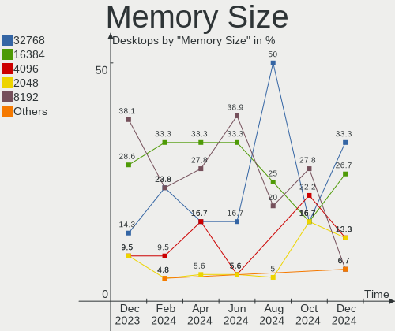
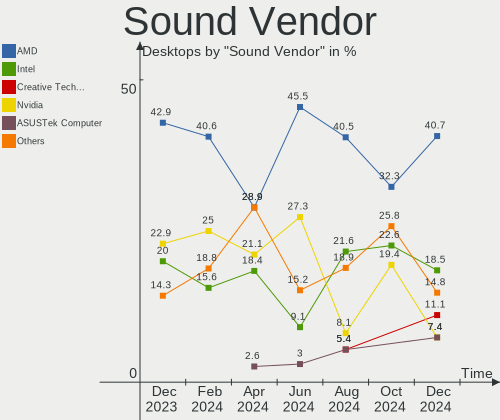
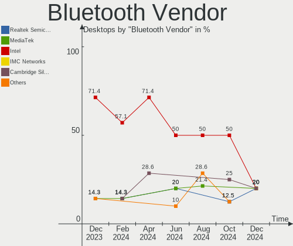

Gentoo Hardware Trends (Desktop)
--------------------------------

A project to identify most popular hardware characteristics and track their change
over time based on data collected by Gentoo users at https://Linux-Hardware.org.

Anyone can contribute to the study by uploading probes of their computers by
the [hw-probe](https://github.com/linuxhw/hw-probe) tool:

    sudo -E hw-probe -all -upload

Full-feature report is available here: https://linux-hardware.org/?view=trends&formfactor=desktop

Period: Apr, 2021.

Contents
--------

- [ OS                       ](#os)
- [ OS Family                ](#os-family)
- [ Kernel                   ](#kernel)
- [ Kernel Family            ](#kernel-family)
- [ Kernel Major Ver.        ](#kernel-major-ver)
- [ Arch                     ](#arch)
- [ DE                       ](#de)
- [ Display Server           ](#display-server)
- [ Display Manager          ](#display-manager)
- [ OS Lang                  ](#os-lang)
- [ Boot Mode                ](#boot-mode)
- [ Filesystem               ](#filesystem)
- [ Part. scheme             ](#part-scheme)
- [ Dual Boot with Linux/BSD ](#dual-boot-with-linux/bsd)
- [ Dual Boot (Win)          ](#dual-boot-win)
- [ Country                  ](#country)
- [ City                     ](#city)
- [ Vendor                   ](#vendor)
- [ Model                    ](#model)
- [ Model Family             ](#model-family)
- [ MFG Year                 ](#mfg-year)
- [ Form Factor              ](#form-factor)
- [ Secure Boot              ](#secure-boot)
- [ Coreboot                 ](#coreboot)
- [ RAM Size                 ](#ram-size)
- [ RAM Used                 ](#ram-used)
- [ Has CD-ROM               ](#has-cd-rom)
- [ Total Drives             ](#total-drives)
- [ Has Ethernet             ](#has-ethernet)
- [ Has WiFi                 ](#has-wifi)
- [ Has Bluetooth            ](#has-bluetooth)
- [ Drive Vendor             ](#drive-vendor)
- [ Drive Model              ](#drive-model)
- [ HDD Vendor               ](#hdd-vendor)
- [ SSD Vendor               ](#ssd-vendor)
- [ Drive Kind               ](#drive-kind)
- [ Drive Connector          ](#drive-connector)
- [ Drive Size               ](#drive-size)
- [ Space Total              ](#space-total)
- [ Space Used               ](#space-used)
- [ Malfunc. Drives          ](#malfunc-drives)
- [ Malfunc. Drive Vendor    ](#malfunc-drive-vendor)
- [ Malfunc. HDD Vendor      ](#malfunc-hdd-vendor)
- [ Malfunc. Drive Kind      ](#malfunc-drive-kind)
- [ Failed Drives            ](#failed-drives)
- [ Failed Drive Vendor      ](#failed-drive-vendor)
- [ Drive Status             ](#drive-status)
- [ Storage Vendor           ](#storage-vendor)
- [ Storage Model            ](#storage-model)
- [ Storage Kind             ](#storage-kind)
- [ CPU Vendor               ](#cpu-vendor)
- [ CPU Model                ](#cpu-model)
- [ CPU Model Family         ](#cpu-model-family)
- [ CPU Cores                ](#cpu-cores)
- [ CPU Sockets              ](#cpu-sockets)
- [ CPU Threads              ](#cpu-threads)
- [ CPU Op-Modes             ](#cpu-op-modes)
- [ CPU Microcode            ](#cpu-microcode)
- [ CPU Microarch            ](#cpu-microarch)
- [ GPU Vendor               ](#gpu-vendor)
- [ GPU Model                ](#gpu-model)
- [ GPU Combo                ](#gpu-combo)
- [ GPU Driver               ](#gpu-driver)
- [ GPU Memory               ](#gpu-memory)
- [ Monitor Vendor           ](#monitor-vendor)
- [ Monitor Model            ](#monitor-model)
- [ Monitor Resolution       ](#monitor-resolution)
- [ Monitor Diagonal         ](#monitor-diagonal)
- [ Monitor Width            ](#monitor-width)
- [ Aspect Ratio             ](#aspect-ratio)
- [ Monitor Area             ](#monitor-area)
- [ Pixel Density            ](#pixel-density)
- [ Multiple Monitors        ](#multiple-monitors)
- [ Net Controller Vendor    ](#net-controller-vendor)
- [ Net Controller Model     ](#net-controller-model)
- [ Wireless Vendor          ](#wireless-vendor)
- [ Wireless Model           ](#wireless-model)
- [ Ethernet Vendor          ](#ethernet-vendor)
- [ Ethernet Model           ](#ethernet-model)
- [ Net Controller Kind      ](#net-controller-kind)
- [ Used Controller          ](#used-controller)
- [ NICs                     ](#nics)
- [ IPv6                     ](#ipv6)
- [ Memory Vendor            ](#memory-vendor)
- [ Memory Model             ](#memory-model)
- [ Memory Kind              ](#memory-kind)
- [ Memory Form Factor       ](#memory-form-factor)
- [ Memory Size              ](#memory-size)
- [ Memory Speed             ](#memory-speed)
- [ Sound Vendor             ](#sound-vendor)
- [ Sound Model              ](#sound-model)
- [ Camera Vendor            ](#camera-vendor)
- [ Camera Model             ](#camera-model)
- [ Fingerprint Vendor       ](#fingerprint-vendor)
- [ Fingerprint Model        ](#fingerprint-model)
- [ Chipcard Vendor          ](#chipcard-vendor)
- [ Chipcard Model           ](#chipcard-model)
- [ Printer Vendor           ](#printer-vendor)
- [ Printer Model            ](#printer-model)
- [ Scanner Vendor           ](#scanner-vendor)
- [ Scanner Model            ](#scanner-model)
- [ Bluetooth Vendor         ](#bluetooth-vendor)
- [ Bluetooth Model          ](#bluetooth-model)
- [ Unsupported Devices      ](#unsupported-devices)
- [ Unsupported Device Types ](#unsupported-device-types)

OS
--

Installed operating systems

| Name       | Desktops | Percent |
|------------|----------|---------|
| Gentoo     | 14       | 73.68%  |
| Gentoo 2.7 | 5        | 26.32%  |

OS Family
---------

OS without a version

| Name   | Desktops | Percent |
|--------|----------|---------|
| Gentoo | 19       | 100%    |

Kernel
------

Version of the Linux kernel

| Version                    | Desktops | Percent |
|----------------------------|----------|---------|
| 5.10.27-gentoo-x86_64      | 3        | 15.79%  |
| 5.4.97-gentoo              | 2        | 10.53%  |
| 5.11.11-gentoo             | 2        | 10.53%  |
| 5.10.27-gentoo             | 2        | 10.53%  |
| 5.8.18-gentoo-compact-0.3  | 1        | 5.26%   |
| 5.6.14-gentoo              | 1        | 5.26%   |
| 5.4.97-gentoo-x86_64       | 1        | 5.26%   |
| 5.4.92-gentoo-x86_64       | 1        | 5.26%   |
| 5.4.66-gentoo              | 1        | 5.26%   |
| 5.11.10-gentoo-x86_64.00   | 1        | 5.26%   |
| 5.11.10-gentoo             | 1        | 5.26%   |
| 5.10.27-gentoo-silverstore | 1        | 5.26%   |
| 5.10.27-gentoo-dist        | 1        | 5.26%   |
| 4.9.230-mainline-rev1      | 1        | 5.26%   |

Kernel Family
-------------

Linux kernel without a distro release

| Version | Desktops | Percent |
|---------|----------|---------|
| 5.10.27 | 7        | 36.84%  |
| 5.4.97  | 3        | 15.79%  |
| 5.11.11 | 2        | 10.53%  |
| 5.11.10 | 2        | 10.53%  |
| 5.8.18  | 1        | 5.26%   |
| 5.6.14  | 1        | 5.26%   |
| 5.4.92  | 1        | 5.26%   |
| 5.4.66  | 1        | 5.26%   |
| 4.9.230 | 1        | 5.26%   |

Kernel Major Ver.
-----------------

Linux kernel major version

| Version | Desktops | Percent |
|---------|----------|---------|
| 5.10    | 7        | 36.84%  |
| 5.4     | 5        | 26.32%  |
| 5.11    | 4        | 21.05%  |
| 5.8     | 1        | 5.26%   |
| 5.6     | 1        | 5.26%   |
| 4.9     | 1        | 5.26%   |

Arch
----

OS architecture (x86_64, i586, etc.)

| Name     | Desktops | Percent |
|----------|----------|---------|
| x86_64   | 17       | 89.47%  |
| armv7l   | 1        | 5.26%   |
| armv5tel | 1        | 5.26%   |

DE
--

Desktop Environment

| Name    | Desktops | Percent |
|---------|----------|---------|
| Unknown | 9        | 47.37%  |
| KDE5    | 5        | 26.32%  |
| GNOME   | 2        | 10.53%  |
| XFCE    | 1        | 5.26%   |
| MATE    | 1        | 5.26%   |
| DWM     | 1        | 5.26%   |

Display Server
--------------

X11 or Wayland

| Name    | Desktops | Percent |
|---------|----------|---------|
| X11     | 12       | 63.16%  |
| Unknown | 7        | 36.84%  |

Display Manager
---------------

SDDM, LightDM, etc.

| Name    | Desktops | Percent |
|---------|----------|---------|
| Unknown | 7        | 36.84%  |
| SDDM    | 5        | 26.32%  |
| LightDM | 5        | 26.32%  |
| XDM     | 1        | 5.26%   |
| GDM     | 1        | 5.26%   |

OS Lang
-------

Language

| Lang       | Desktops | Percent |
|------------|----------|---------|
| en_US      | 7        | 36.84%  |
| C.UTF8     | 3        | 15.79%  |
| Unknown    | 3        | 15.79%  |
| pl_PL      | 1        | 5.26%   |
| es_ES      | 1        | 5.26%   |
| en_US.UTF8 | 1        | 5.26%   |
| en_EN      | 1        | 5.26%   |
| de_DE      | 1        | 5.26%   |
| de_CH      | 1        | 5.26%   |

Boot Mode
---------

EFI or BIOS

| Mode | Desktops | Percent |
|------|----------|---------|
| EFI  | 12       | 63.16%  |
| BIOS | 7        | 36.84%  |

Filesystem
----------

Type of filesystem

| Type     | Desktops | Percent |
|----------|----------|---------|
| Ext4     | 10       | 52.63%  |
| F2fs     | 4        | 21.05%  |
| Btrfs    | 2        | 10.53%  |
| Zfs      | 1        | 5.26%   |
| Reiserfs | 1        | 5.26%   |
| Unknown  | 1        | 5.26%   |

Part. scheme
------------

Scheme of partitioning

| Type    | Desktops | Percent |
|---------|----------|---------|
| GPT     | 15       | 78.95%  |
| MBR     | 2        | 10.53%  |
| Unknown | 2        | 10.53%  |

Dual Boot with Linux/BSD
------------------------

Hosting more than one Linux/BSD

| Dual boot | Desktops | Percent |
|-----------|----------|---------|
| Yes       | 10       | 52.63%  |
| No        | 9        | 47.37%  |

Dual Boot (Win)
---------------

Hosting Linux and Windows

| Dual boot | Desktops | Percent |
|-----------|----------|---------|
| No        | 14       | 73.68%  |
| Yes       | 5        | 26.32%  |

Country
-------

Geographic location (country)

| Country     | Desktops | Percent |
|-------------|----------|---------|
| Poland      | 4        | 21.05%  |
| France      | 4        | 21.05%  |
| Ukraine     | 2        | 10.53%  |
| Spain       | 2        | 10.53%  |
| Germany     | 2        | 10.53%  |
| USA         | 1        | 5.26%   |
| Switzerland | 1        | 5.26%   |
| Norway      | 1        | 5.26%   |
| Finland     | 1        | 5.26%   |
| Brazil      | 1        | 5.26%   |

City
----

Geographic location (city)

| City                 | Desktops | Percent |
|----------------------|----------|---------|
| Warsaw               | 4        | 21.05%  |
| Pont-l'Abbé         | 3        | 15.79%  |
| Sevastopol           | 1        | 5.26%   |
| Rissa                | 1        | 5.26%   |
| Ribeirão Preto      | 1        | 5.26%   |
| O Milladoiro         | 1        | 5.26%   |
| Le Perreux-sur-Marne | 1        | 5.26%   |
| Kyiv                 | 1        | 5.26%   |
| Horgen               | 1        | 5.26%   |
| Helsinki             | 1        | 5.26%   |
| Ferrol               | 1        | 5.26%   |
| Cologne              | 1        | 5.26%   |
| Bradenton            | 1        | 5.26%   |
| Berlin               | 1        | 5.26%   |

Vendor
------

Motherboard manufacturer

| Name                | Desktops | Percent |
|---------------------|----------|---------|
| ASUSTek Computer    | 7        | 36.84%  |
| MSI                 | 4        | 21.05%  |
| Gigabyte Technology | 3        | 15.79%  |
| Unknown             | 2        | 10.53%  |
| Hewlett-Packard     | 1        | 5.26%   |
| ASRockRack          | 1        | 5.26%   |
| ASRock              | 1        | 5.26%   |

Model
-----

Motherboard model

| Name                             | Desktops | Percent |
|----------------------------------|----------|---------|
| MSI MS-7C35                      | 2        | 10.53%  |
| Unknown                          | 2        | 10.53%  |
| MSI MS-7C13                      | 1        | 5.26%   |
| MSI MS-7A40                      | 1        | 5.26%   |
| HP Pavilion ZV6100 (EE984EA#ABZ) | 1        | 5.26%   |
| Gigabyte X570 AORUS XTREME       | 1        | 5.26%   |
| Gigabyte B450M AORUS ELITE       | 1        | 5.26%   |
| Gigabyte AB350-Gaming            | 1        | 5.26%   |
| ASUS TUF B450-PRO GAMING         | 1        | 5.26%   |
| ASUS ROG ZENITH II EXTREME       | 1        | 5.26%   |
| ASUS PRIME Z270-A                | 1        | 5.26%   |
| ASUS PRIME X570-PRO              | 1        | 5.26%   |
| ASUS PRIME X470-PRO              | 1        | 5.26%   |
| ASUS PRIME H270M-PLUS            | 1        | 5.26%   |
| ASUS M3A78-CM                    | 1        | 5.26%   |
| ASRockRack E3C232D2I             | 1        | 5.26%   |
| ASRock C2550D4I                  | 1        | 5.26%   |

Model Family
------------

Motherboard model prefix

| Name                  | Desktops | Percent |
|-----------------------|----------|---------|
| ASUS PRIME            | 4        | 21.05%  |
| MSI MS-7C35           | 2        | 10.53%  |
| Unknown               | 2        | 10.53%  |
| MSI MS-7C13           | 1        | 5.26%   |
| MSI MS-7A40           | 1        | 5.26%   |
| HP Pavilion           | 1        | 5.26%   |
| Gigabyte X570         | 1        | 5.26%   |
| Gigabyte B450M        | 1        | 5.26%   |
| Gigabyte AB350-Gaming | 1        | 5.26%   |
| ASUS TUF              | 1        | 5.26%   |
| ASUS ROG              | 1        | 5.26%   |
| ASUS M3A78-CM         | 1        | 5.26%   |
| ASRockRack E3C232D2I  | 1        | 5.26%   |
| ASRock C2550D4I       | 1        | 5.26%   |

MFG Year
--------

Motherboard manufacture year

| Year    | Desktops | Percent |
|---------|----------|---------|
| 2020    | 6        | 31.58%  |
| 2018    | 4        | 21.05%  |
| 2021    | 2        | 10.53%  |
| 2019    | 2        | 10.53%  |
| Unknown | 2        | 10.53%  |
| 2016    | 1        | 5.26%   |
| 2009    | 1        | 5.26%   |
| 2006    | 1        | 5.26%   |

Form Factor
-----------

Physical design of the computer

| Name    | Desktops | Percent |
|---------|----------|---------|
| Desktop | 19       | 100%    |

Secure Boot
-----------

Enabled or disabled

| State    | Desktops | Percent |
|----------|----------|---------|
| Disabled | 19       | 100%    |

Coreboot
--------

Have coreboot on board

| Used | Desktops | Percent |
|------|----------|---------|
| No   | 19       | 100%    |

RAM Size
--------

Total RAM memory

| Size in GB  | Desktops | Percent |
|-------------|----------|---------|
| 32.01-64.0  | 10       | 52.63%  |
| 16.01-24.0  | 3        | 15.79%  |
| 64.01-256.0 | 2        | 10.53%  |
| 4.01-8.0    | 1        | 5.26%   |
| 2.01-3.0    | 1        | 5.26%   |
| 1.01-2.0    | 1        | 5.26%   |
| 0.01-0.5    | 1        | 5.26%   |

RAM Used
--------

Used RAM memory

| Used GB    | Desktops | Percent |
|------------|----------|---------|
| 4.01-8.0   | 5        | 26.32%  |
| 0.01-0.5   | 4        | 21.05%  |
| 3.01-4.0   | 3        | 15.79%  |
| 2.01-3.0   | 2        | 10.53%  |
| 1.01-2.0   | 2        | 10.53%  |
| 8.01-16.0  | 2        | 10.53%  |
| 16.01-24.0 | 1        | 5.26%   |

Has CD-ROM
----------

Has CD-ROM on board

| Presented | Desktops | Percent |
|-----------|----------|---------|
| No        | 17       | 89.47%  |
| Yes       | 2        | 10.53%  |

Total Drives
------------

Number of drives on board

| Drives | Desktops | Percent |
|--------|----------|---------|
| 2      | 6        | 31.58%  |
| 3      | 5        | 26.32%  |
| 1      | 3        | 15.79%  |
| 6      | 2        | 10.53%  |
| 5      | 1        | 5.26%   |
| 4      | 1        | 5.26%   |
| 0      | 1        | 5.26%   |

Has Ethernet
------------

Has Ethernet on board

| Presented | Desktops | Percent |
|-----------|----------|---------|
| Yes       | 17       | 89.47%  |
| No        | 2        | 10.53%  |

Has WiFi
--------

Has WiFi module

| Presented | Desktops | Percent |
|-----------|----------|---------|
| No        | 12       | 63.16%  |
| Yes       | 7        | 36.84%  |

Has Bluetooth
-------------

Has Bluetooth module

| Presented | Desktops | Percent |
|-----------|----------|---------|
| No        | 11       | 57.89%  |
| Yes       | 8        | 42.11%  |

Drive Vendor
------------

Hard drive vendors

| Vendor              | Desktops | Drives | Percent |
|---------------------|----------|--------|---------|
| Samsung Electronics | 7        | 15     | 18.92%  |
| Seagate             | 6        | 6      | 16.22%  |
| WDC                 | 3        | 4      | 8.11%   |
| SanDisk             | 3        | 3      | 8.11%   |
| Kingston            | 3        | 3      | 8.11%   |
| Toshiba             | 2        | 2      | 5.41%   |
| Hitachi             | 2        | 4      | 5.41%   |
| GOODRAM             | 2        | 2      | 5.41%   |
| Crucial             | 2        | 4      | 5.41%   |
| Corsair             | 2        | 2      | 5.41%   |
| Patriot             | 1        | 1      | 2.7%    |
| Intel               | 1        | 2      | 2.7%    |
| HGST                | 1        | 1      | 2.7%    |
| AMD                 | 1        | 1      | 2.7%    |
| A-DATA Technology   | 1        | 1      | 2.7%    |

Drive Model
-----------

Hard drive models

| Model                               | Desktops | Percent |
|-------------------------------------|----------|---------|
| WDC WD30EFRX-68EUZN0 3TB            | 2        | 4.88%   |
| SanDisk SSD PLUS 120GB              | 2        | 4.88%   |
| GOODRAM SSDPR-CL100-480-G2 480GB    | 2        | 4.88%   |
| WDC WD10EZEX-00WN4A0 1TB            | 1        | 2.44%   |
| Toshiba HDWE150 5TB                 | 1        | 2.44%   |
| Toshiba DT01ACA300 3TB              | 1        | 2.44%   |
| Seagate ST9500420ASG 500GB          | 1        | 2.44%   |
| Seagate ST6000DM003-2CY186 6TB      | 1        | 2.44%   |
| Seagate ST4000DM004-2CV104 4TB      | 1        | 2.44%   |
| Seagate ST3500413AS 500GB           | 1        | 2.44%   |
| Seagate ST2000DX002-2DV164 2TB      | 1        | 2.44%   |
| Seagate ST12000NM0008-2H3101 12TB   | 1        | 2.44%   |
| SanDisk SD9SN8W-128G-1006 128GB SSD | 1        | 2.44%   |
| Samsung SSD 970 PRO 512GB           | 1        | 2.44%   |
| Samsung SSD 970 EVO Plus 1TB        | 1        | 2.44%   |
| Samsung SSD 970 EVO 500GB           | 1        | 2.44%   |
| Samsung SSD 860 QVO 4TB             | 1        | 2.44%   |
| Samsung SSD 860 EVO 250GB           | 1        | 2.44%   |
| Samsung SSD 850 PRO 256GB           | 1        | 2.44%   |
| Samsung SSD 850 EVO 500GB           | 1        | 2.44%   |
| Samsung SSD 850 EVO 250GB           | 1        | 2.44%   |
| Samsung SSD 850 EVO 1TB             | 1        | 2.44%   |
| Samsung NVMe SSD Drive 256GB        | 1        | 2.44%   |
| Samsung HD502HI 500GB               | 1        | 2.44%   |
| Patriot Ignite 480GB SSD            | 1        | 2.44%   |
| Kingston SUV400S37120G 120GB SSD    | 1        | 2.44%   |
| Kingston SA400S37240G 240GB SSD     | 1        | 2.44%   |
| Kingston SA2000M81000G 1TB          | 1        | 2.44%   |
| Intel SSDPEKNW512G8 512GB           | 1        | 2.44%   |
| Hitachi HUS724030ALE641 3TB         | 1        | 2.44%   |
| Hitachi HDP725050GLA360 500GB       | 1        | 2.44%   |
| HGST HTS545050A7E380 500GB          | 1        | 2.44%   |
| Crucial CT525MX300SSD1 528GB        | 1        | 2.44%   |
| Crucial CT500P5SSD8 500GB           | 1        | 2.44%   |
| Corsair Force MP600 500GB           | 1        | 2.44%   |
| Corsair Force MP600 1TB             | 1        | 2.44%   |
| AMD R5SL480G 480GB SSD              | 1        | 2.44%   |
| A-DATA SX8200PNP 1TB                | 1        | 2.44%   |

HDD Vendor
----------

Hard disk drive vendors

| Vendor              | Desktops | Drives | Percent |
|---------------------|----------|--------|---------|
| Seagate             | 6        | 6      | 40%     |
| WDC                 | 3        | 4      | 20%     |
| Toshiba             | 2        | 2      | 13.33%  |
| Hitachi             | 2        | 4      | 13.33%  |
| Samsung Electronics | 1        | 3      | 6.67%   |
| HGST                | 1        | 1      | 6.67%   |

SSD Vendor
----------

Solid state drive vendors

| Vendor              | Desktops | Drives | Percent |
|---------------------|----------|--------|---------|
| Samsung Electronics | 5        | 7      | 33.33%  |
| SanDisk             | 3        | 3      | 20%     |
| Kingston            | 2        | 2      | 13.33%  |
| GOODRAM             | 2        | 2      | 13.33%  |
| Patriot             | 1        | 1      | 6.67%   |
| Crucial             | 1        | 1      | 6.67%   |
| AMD                 | 1        | 1      | 6.67%   |

Drive Kind
----------

HDD or SSD

| Kind | Desktops | Drives | Percent |
|------|----------|--------|---------|
| SSD  | 13       | 17     | 39.39%  |
| NVMe | 10       | 14     | 30.3%   |
| HDD  | 10       | 20     | 30.3%   |

Drive Connector
---------------

SATA, SAS, NVMe, etc.

| Type | Desktops | Drives | Percent |
|------|----------|--------|---------|
| SATA | 16       | 37     | 61.54%  |
| NVMe | 10       | 14     | 38.46%  |

Drive Size
----------

Size of hard drive

| Size in TB | Desktops | Drives | Percent |
|------------|----------|--------|---------|
| 0.01-0.5   | 12       | 21     | 48%     |
| 2.01-3.0   | 4        | 7      | 16%     |
| 0.51-1.0   | 3        | 3      | 12%     |
| 3.01-4.0   | 2        | 2      | 8%      |
| 4.01-10.0  | 2        | 2      | 8%      |
| 10.01-20.0 | 1        | 1      | 4%      |
| 1.01-2.0   | 1        | 1      | 4%      |

Space Total
-----------

Amount of disk space available on the file system

| Size in GB     | Desktops | Percent |
|----------------|----------|---------|
| 501-1000       | 4        | 21.05%  |
| 101-250        | 3        | 15.79%  |
| 1001-2000      | 3        | 15.79%  |
| Unknown        | 3        | 15.79%  |
| More than 3000 | 2        | 10.53%  |
| 251-500        | 2        | 10.53%  |
| 1-20           | 2        | 10.53%  |

Space Used
----------

Amount of used disk space

| Used GB        | Desktops | Percent |
|----------------|----------|---------|
| 1-20           | 4        | 21.05%  |
| 21-50          | 3        | 15.79%  |
| 101-250        | 3        | 15.79%  |
| Unknown        | 3        | 15.79%  |
| 251-500        | 2        | 10.53%  |
| 501-1000       | 2        | 10.53%  |
| More than 3000 | 1        | 5.26%   |
| 2001-3000      | 1        | 5.26%   |

Malfunc. Drives
---------------

Drive models with a malfunction

| Model                               | Desktops | Drives | Percent |
|-------------------------------------|----------|--------|---------|
| Toshiba DT01ACA300 3TB              | 1        | 1      | 33.33%  |
| Seagate ST2000DX002-2DV164 2TB      | 1        | 1      | 33.33%  |
| SanDisk SD9SN8W-128G-1006 128GB SSD | 1        | 1      | 33.33%  |

Malfunc. Drive Vendor
---------------------

Vendors of faulty drives

| Vendor  | Desktops | Drives | Percent |
|---------|----------|--------|---------|
| Toshiba | 1        | 1      | 33.33%  |
| Seagate | 1        | 1      | 33.33%  |
| SanDisk | 1        | 1      | 33.33%  |

Malfunc. HDD Vendor
-------------------

Vendors of faulty HDD drives

| Vendor  | Desktops | Drives | Percent |
|---------|----------|--------|---------|
| Toshiba | 1        | 1      | 50%     |
| Seagate | 1        | 1      | 50%     |

Malfunc. Drive Kind
-------------------

Kinds of faulty drives

| Kind | Desktops | Drives | Percent |
|------|----------|--------|---------|
| HDD  | 2        | 2      | 66.67%  |
| SSD  | 1        | 1      | 33.33%  |

Failed Drives
-------------

Failed drive models

Zero info for selected period =(

Failed Drive Vendor
-------------------

Failed drive vendors

Zero info for selected period =(

Drive Status
------------

Number of failed and malfunc. drives

| Status   | Desktops | Drives | Percent |
|----------|----------|--------|---------|
| Works    | 15       | 39     | 71.43%  |
| Detected | 3        | 9      | 14.29%  |
| Malfunc  | 3        | 3      | 14.29%  |

Storage Vendor
--------------

Storage controller vendors

| Vendor                      | Desktops | Percent |
|-----------------------------|----------|---------|
| AMD                         | 12       | 42.86%  |
| Intel                       | 5        | 17.86%  |
| Samsung Electronics         | 4        | 14.29%  |
| Phison Electronics          | 2        | 7.14%   |
| Micron/Crucial Technology   | 1        | 3.57%   |
| Marvell Technology Group    | 1        | 3.57%   |
| Kingston Technology Company | 1        | 3.57%   |
| ASMedia Technology          | 1        | 3.57%   |
| ADATA Technology            | 1        | 3.57%   |

Storage Model
-------------

Storage controller models

| Model                                                                         | Desktops | Percent |
|-------------------------------------------------------------------------------|----------|---------|
| AMD FCH SATA Controller [AHCI mode]                                           | 10       | 27.03%  |
| AMD 400 Series Chipset SATA Controller                                        | 4        | 10.81%  |
| Samsung NVMe SSD Controller SM981/PM981/PM983                                 | 3        | 8.11%   |
| Intel 200 Series PCH SATA controller [AHCI mode]                              | 3        | 8.11%   |
| Phison E16 PCIe4 NVMe Controller                                              | 2        | 5.41%   |
| Samsung NVMe SSD Controller SM951/PM951                                       | 1        | 2.7%    |
| Micron/Crucial Non-Volatile memory controller                                 | 1        | 2.7%    |
| Marvell Group 88SE9230 PCIe 2.0 x2 4-port SATA 6 Gb/s RAID Controller         | 1        | 2.7%    |
| Marvell Group 88SE9172 SATA 6Gb/s Controller                                  | 1        | 2.7%    |
| Kingston Company A2000 NVMe SSD                                               | 1        | 2.7%    |
| Intel SSD 660P Series                                                         | 1        | 2.7%    |
| Intel Q170/Q150/B150/H170/H110/Z170/CM236 Chipset SATA Controller [AHCI Mode] | 1        | 2.7%    |
| Intel Atom processor C2000 AHCI SATA3 Controller                              | 1        | 2.7%    |
| Intel Atom processor C2000 AHCI SATA2 Controller                              | 1        | 2.7%    |
| ASMedia ASM1062 Serial ATA Controller                                         | 1        | 2.7%    |
| AMD SB7x0/SB8x0/SB9x0 SATA Controller [IDE mode]                              | 1        | 2.7%    |
| AMD SB7x0/SB8x0/SB9x0 IDE Controller                                          | 1        | 2.7%    |
| AMD IXP SB4x0 IDE Controller                                                  | 1        | 2.7%    |
| AMD 300 Series Chipset SATA Controller                                        | 1        | 2.7%    |
| ADATA XPG SX8200 Pro PCIe Gen3x4 M.2 2280 Solid State Drive                   | 1        | 2.7%    |

Storage Kind
------------

Kind of storage controller (IDE, SATA, NVMe, SAS, ...)

| Kind | Desktops | Percent |
|------|----------|---------|
| SATA | 16       | 57.14%  |
| NVMe | 10       | 35.71%  |
| IDE  | 2        | 7.14%   |

CPU Vendor
----------

Processor vendors

| Vendor                | Desktops | Percent |
|-----------------------|----------|---------|
| AMD                   | 12       | 63.16%  |
| Intel                 | 5        | 26.32%  |
| Marvell Semiconductor | 2        | 10.53%  |

CPU Model
---------

Processor models

| Model                                                                    | Desktops | Percent |
|--------------------------------------------------------------------------|----------|---------|
| AMD Ryzen 9 3950X 16-Core Processor                                      | 2        | 10.53%  |
| Marvell Semiconductor Marvell Kirkwood (Flattened Device Tree) Processor | 1        | 5.26%   |
| Marvell Semiconductor Marvell Armada 370/XP (Device Tree) Processor      | 1        | 5.26%   |
| Intel Xeon CPU E3-1220 v6 @ 3.00GHz                                      | 1        | 5.26%   |
| Intel Core i7-7700K CPU @ 4.20GHz                                        | 1        | 5.26%   |
| Intel Core i5-7600K CPU @ 3.80GHz                                        | 1        | 5.26%   |
| Intel Core i3-9100F CPU @ 3.60GHz                                        | 1        | 5.26%   |
| Intel Atom CPU C2550 @ 2.40GHz                                           | 1        | 5.26%   |
| AMD Ryzen Threadripper 3960X 24-Core Processor                           | 1        | 5.26%   |
| AMD Ryzen 9 5900X 12-Core Processor                                      | 1        | 5.26%   |
| AMD Ryzen 7 3800XT 8-Core Processor                                      | 1        | 5.26%   |
| AMD Ryzen 7 3700X 8-Core Processor                                       | 1        | 5.26%   |
| AMD Ryzen 7 2700X Eight-Core Processor                                   | 1        | 5.26%   |
| AMD Ryzen 5 3600 6-Core Processor                                        | 1        | 5.26%   |
| AMD Ryzen 5 2600 Six-Core Processor                                      | 1        | 5.26%   |
| AMD Ryzen 5 1600 Six-Core Processor                                      | 1        | 5.26%   |
| AMD Phenom II X4 955 Processor                                           | 1        | 5.26%   |
| AMD Athlon 64 Processor 3200+                                            | 1        | 5.26%   |

CPU Model Family
----------------

Processor model prefix

| Model                  | Desktops | Percent |
|------------------------|----------|---------|
| AMD Ryzen 9            | 3        | 15.79%  |
| AMD Ryzen 7            | 3        | 15.79%  |
| AMD Ryzen 5            | 3        | 15.79%  |
| Other                  | 2        | 10.53%  |
| Intel Xeon             | 1        | 5.26%   |
| Intel Core i7          | 1        | 5.26%   |
| Intel Core i5          | 1        | 5.26%   |
| Intel Core i3          | 1        | 5.26%   |
| Intel Atom             | 1        | 5.26%   |
| AMD Ryzen Threadripper | 1        | 5.26%   |
| AMD Phenom II X4       | 1        | 5.26%   |
| AMD Athlon 64          | 1        | 5.26%   |

CPU Cores
---------

Number of processor cores

| Number | Desktops | Percent |
|--------|----------|---------|
| 4      | 7        | 36.84%  |
| 8      | 3        | 15.79%  |
| 6      | 3        | 15.79%  |
| 16     | 2        | 10.53%  |
| 1      | 2        | 10.53%  |
| 24     | 1        | 5.26%   |
| 12     | 1        | 5.26%   |

CPU Sockets
-----------

Number of sockets

| Number | Desktops | Percent |
|--------|----------|---------|
| 1      | 19       | 100%    |

CPU Threads
-----------

Threads per core (Hyper-Threading)

| Number | Desktops | Percent |
|--------|----------|---------|
| 2      | 11       | 57.89%  |
| 1      | 8        | 42.11%  |

CPU Op-Modes
------------

CPU Operation Modes (32-bit, 64-bit)

| Op mode        | Desktops | Percent |
|----------------|----------|---------|
| 32-bit, 64-bit | 17       | 89.47%  |
| Unknown        | 2        | 10.53%  |

CPU Microcode
-------------

Microcode number

| Number     | Desktops | Percent |
|------------|----------|---------|
| 0x08701021 | 4        | 21.05%  |
| Unknown    | 4        | 21.05%  |
| 0x906e9    | 3        | 15.79%  |
| 0x0800820d | 2        | 10.53%  |
| 0x906ea    | 1        | 5.26%   |
| 0x0a201009 | 1        | 5.26%   |
| 0x08701013 | 1        | 5.26%   |
| 0x08301039 | 1        | 5.26%   |
| 0x08001138 | 1        | 5.26%   |
| 0x010000db | 1        | 5.26%   |

CPU Microarch
-------------

Microarchitecture

| Name       | Desktops | Percent |
|------------|----------|---------|
| Zen 2      | 6        | 31.58%  |
| KabyLake   | 4        | 21.05%  |
| Zen+       | 3        | 15.79%  |
| Unknown    | 2        | 10.53%  |
| Zen 3      | 1        | 5.26%   |
| Silvermont | 1        | 5.26%   |
| K8 Hammer  | 1        | 5.26%   |
| K10        | 1        | 5.26%   |

GPU Vendor
----------

Vendors of graphics cards

| Vendor            | Desktops | Percent |
|-------------------|----------|---------|
| Nvidia            | 8        | 44.44%  |
| AMD               | 8        | 44.44%  |
| ASPEED Technology | 2        | 11.11%  |

GPU Model
---------

Graphics card models

| Model                                                   | Desktops | Percent |
|---------------------------------------------------------|----------|---------|
| ASPEED Technology ASPEED Graphics Family                | 2        | 10.53%  |
| AMD Vega 10 XL/XT [Radeon RX Vega 56/64]                | 2        | 10.53%  |
| AMD Navi 21 [Radeon RX 6800/6800 XT / 6900 XT]          | 2        | 10.53%  |
| Nvidia TU106 [GeForce RTX 2060 Rev. A]                  | 1        | 5.26%   |
| Nvidia TU102 [GeForce RTX 2080 Ti Rev. A]               | 1        | 5.26%   |
| Nvidia GP104 [GeForce GTX 1060 3GB]                     | 1        | 5.26%   |
| Nvidia GP102 [GeForce GTX 1080 Ti]                      | 1        | 5.26%   |
| Nvidia GM206 [GeForce GTX 960]                          | 1        | 5.26%   |
| Nvidia GK208B [GeForce GT 710]                          | 1        | 5.26%   |
| Nvidia GA106 [GeForce RTX 3060]                         | 1        | 5.26%   |
| Nvidia GA104 [GeForce RTX 3070]                         | 1        | 5.26%   |
| Nvidia G73 [GeForce 7300 GT]                            | 1        | 5.26%   |
| AMD RS780C [Radeon 3100]                                | 1        | 5.26%   |
| AMD RS480M [Mobility Radeon Xpress 200]                 | 1        | 5.26%   |
| AMD Ellesmere [Radeon RX 470/480/570/570X/580/580X/590] | 1        | 5.26%   |
| AMD Baffin [Radeon RX 550 640SP / RX 560/560X]          | 1        | 5.26%   |

GPU Combo
---------

Combinations of graphics cards

| Name         | Desktops | Percent |
|--------------|----------|---------|
| 1 x AMD      | 7        | 36.84%  |
| 1 x Nvidia   | 6        | 31.58%  |
| Other        | 2        | 10.53%  |
| 1 x ASPEED   | 2        | 10.53%  |
| 2 x Nvidia   | 1        | 5.26%   |
| AMD + Nvidia | 1        | 5.26%   |

GPU Driver
----------

Free vs proprietary

| Driver      | Desktops | Percent |
|-------------|----------|---------|
| Free        | 10       | 52.63%  |
| Proprietary | 5        | 26.32%  |
| Unknown     | 4        | 21.05%  |

GPU Memory
----------

Total video memory

| Size in GB | Desktops | Percent |
|------------|----------|---------|
| Unknown    | 6        | 31.58%  |
| 8.01-16.0  | 3        | 15.79%  |
| 0.01-0.5   | 3        | 15.79%  |
| 7.01-8.0   | 2        | 10.53%  |
| 1.01-2.0   | 2        | 10.53%  |
| 5.01-6.0   | 1        | 5.26%   |
| 3.01-4.0   | 1        | 5.26%   |
| 2.01-3.0   | 1        | 5.26%   |

Monitor Vendor
--------------

Monitor vendors

| Vendor               | Desktops | Percent |
|----------------------|----------|---------|
| Samsung Electronics  | 4        | 25%     |
| Ancor Communications | 3        | 18.75%  |
| Philips              | 2        | 12.5%   |
| Goldstar             | 2        | 12.5%   |
| Unknown              | 1        | 6.25%   |
| Iiyama               | 1        | 6.25%   |
| Gigabyte Technology  | 1        | 6.25%   |
| Eizo                 | 1        | 6.25%   |
| Dell                 | 1        | 6.25%   |

Monitor Model
-------------

Monitor models

| Model                                                                 | Desktops | Percent |
|-----------------------------------------------------------------------|----------|---------|
| Goldstar 27GL850 GSM5B7F 2560x1440 597x336mm 27.0-inch                | 2        | 11.11%  |
| Unknown LCD Monitor XMI Mi Monitor 3440x1440                          | 1        | 5.56%   |
| Samsung Electronics SyncMaster SAM05FC 1920x1080                      | 1        | 5.56%   |
| Samsung Electronics S22B300 SAM08C8 1920x1080 480x270mm 21.7-inch     | 1        | 5.56%   |
| Samsung Electronics C49HG9x SAM0E5E 3840x1080 1196x336mm 48.9-inch    | 1        | 5.56%   |
| Samsung Electronics C32HG7x SAM0E14 2560x1440 700x390mm 31.5-inch     | 1        | 5.56%   |
| Philips PHL 288P6L PHL08F2 3840x2160 621x341mm 27.9-inch              | 1        | 5.56%   |
| Philips LCD Monitor PHL 275E1 3926x1440                               | 1        | 5.56%   |
| Philips LCD Monitor PHL 193V5                                         | 1        | 5.56%   |
| Iiyama PLX2483H IVM6114 1920x1080 531x299mm 24.0-inch                 | 1        | 5.56%   |
| Gigabyte Technology AORUS FI27Q GBT2706 2560x1440 610x350mm 27.7-inch | 1        | 5.56%   |
| Eizo S1901 ENC1837 1280x1024 376x301mm 19.0-inch                      | 1        | 5.56%   |
| Eizo EV2416W ENC2388 1920x1200 519x324mm 24.1-inch                    | 1        | 5.56%   |
| Dell 2209WA DELF011 1680x1050 474x296mm 22.0-inch                     | 1        | 5.56%   |
| Ancor Communications VG248 ACI24A4 1920x1080 530x300mm 24.0-inch      | 1        | 5.56%   |
| Ancor Communications ROG PG279Q ACI27EC 2560x1440 598x336mm 27.0-inch | 1        | 5.56%   |
| Ancor Communications ASUS MX239 ACI23C2 1920x1080 530x310mm 24.2-inch | 1        | 5.56%   |

Monitor Resolution
------------------

Monitor screen resolution

| Resolution         | Desktops | Percent |
|--------------------|----------|---------|
| 2560x1440 (QHD)    | 5        | 27.78%  |
| 1920x1080 (FHD)    | 5        | 27.78%  |
| 3926x1440          | 1        | 5.56%   |
| 3840x2160 (4K)     | 1        | 5.56%   |
| 3840x1080          | 1        | 5.56%   |
| 3440x1440          | 1        | 5.56%   |
| 1920x1200 (WUXGA)  | 1        | 5.56%   |
| 1680x1050 (WSXGA+) | 1        | 5.56%   |
| 1280x1024 (SXGA)   | 1        | 5.56%   |
| Unknown            | 1        | 5.56%   |

Monitor Diagonal
----------------

Diagonal size in inches

| Inches  | Desktops | Percent |
|---------|----------|---------|
| 27      | 5        | 29.41%  |
| 24      | 4        | 23.53%  |
| Unknown | 3        | 17.65%  |
| 49      | 1        | 5.88%   |
| 31      | 1        | 5.88%   |
| 22      | 1        | 5.88%   |
| 21      | 1        | 5.88%   |
| 19      | 1        | 5.88%   |

Monitor Width
-------------

Physical width

| Width in mm | Desktops | Percent |
|-------------|----------|---------|
| 501-600     | 6        | 37.5%   |
| 601-700     | 3        | 18.75%  |
| Unknown     | 3        | 18.75%  |
| 401-500     | 2        | 12.5%   |
| 351-400     | 1        | 6.25%   |
| 1001-1500   | 1        | 6.25%   |

Aspect Ratio
------------

Proportional relationship between the width and the height

| Ratio   | Desktops | Percent |
|---------|----------|---------|
| 16/9    | 9        | 60%     |
| 16/10   | 2        | 13.33%  |
| Unknown | 2        | 13.33%  |
| 5/4     | 1        | 6.67%   |
| 32/9    | 1        | 6.67%   |

Monitor Area
------------

Area in inch²

| Area in inch² | Desktops | Percent |
|----------------|----------|---------|
| 301-350        | 5        | 29.41%  |
| 201-250        | 4        | 23.53%  |
| Unknown        | 3        | 17.65%  |
| 251-300        | 2        | 11.76%  |
| 351-500        | 1        | 5.88%   |
| 151-200        | 1        | 5.88%   |
| 501-1000       | 1        | 5.88%   |

Pixel Density
-------------

Pixels per inch

| Density | Desktops | Percent |
|---------|----------|---------|
| 101-120 | 5        | 33.33%  |
| 51-100  | 5        | 33.33%  |
| Unknown | 3        | 20%     |
| 1-50    | 1        | 6.67%   |
| 121-160 | 1        | 6.67%   |

Multiple Monitors
-----------------

Total monitors connected

| Total | Desktops | Percent |
|-------|----------|---------|
| 1     | 9        | 47.37%  |
| 0     | 5        | 26.32%  |
| 2     | 4        | 21.05%  |
| 3     | 1        | 5.26%   |

Net Controller Vendor
---------------------

Controller vendors

| Vendor                 | Desktops | Percent |
|------------------------|----------|---------|
| Intel                  | 12       | 48%     |
| Realtek Semiconductor  | 9        | 36%     |
| Metrologic Instruments | 1        | 4%      |
| Broadcom               | 1        | 4%      |
| Aquantia               | 1        | 4%      |
| AMD                    | 1        | 4%      |

Net Controller Model
--------------------

Controller models

| Model                                                               | Desktops | Percent |
|---------------------------------------------------------------------|----------|---------|
| Realtek RTL8111/8168/8411 PCI Express Gigabit Ethernet Controller   | 6        | 20.69%  |
| Intel Wi-Fi 6 AX200                                                 | 5        | 17.24%  |
| Intel I211 Gigabit Network Connection                               | 4        | 13.79%  |
| Realtek RTL8125 2.5GbE Controller                                   | 2        | 6.9%    |
| Intel I210 Gigabit Network Connection                               | 2        | 6.9%    |
| Intel Ethernet Connection (2) I219-V                                | 2        | 6.9%    |
| Realtek RTL-8100/8101L/8139 PCI Fast Ethernet Adapter               | 1        | 3.45%   |
| Metrologic Instruments Voyager-1202                                 | 1        | 3.45%   |
| Intel I350 Gigabit Network Connection                               | 1        | 3.45%   |
| Intel Ethernet Connection (2) I219-LM                               | 1        | 3.45%   |
| Intel Dual Band Wireless-AC 3168NGW [Stone Peak]                    | 1        | 3.45%   |
| Broadcom BCM4318 [AirForce One 54g] 802.11g Wireless LAN Controller | 1        | 3.45%   |
| Aquantia AQC107 NBase-T/IEEE 802.3bz Ethernet Controller [AQtion]   | 1        | 3.45%   |
| AMD IXP SB400 AC'97 Modem Controller                                | 1        | 3.45%   |

Wireless Vendor
---------------

Wireless vendors

| Vendor   | Desktops | Percent |
|----------|----------|---------|
| Intel    | 6        | 85.71%  |
| Broadcom | 1        | 14.29%  |

Wireless Model
--------------

Wireless models

| Model                                                               | Desktops | Percent |
|---------------------------------------------------------------------|----------|---------|
| Intel Wi-Fi 6 AX200                                                 | 5        | 71.43%  |
| Intel Dual Band Wireless-AC 3168NGW [Stone Peak]                    | 1        | 14.29%  |
| Broadcom BCM4318 [AirForce One 54g] 802.11g Wireless LAN Controller | 1        | 14.29%  |

Ethernet Vendor
---------------

Ethernet vendors

| Vendor                | Desktops | Percent |
|-----------------------|----------|---------|
| Realtek Semiconductor | 9        | 47.37%  |
| Intel                 | 9        | 47.37%  |
| Aquantia              | 1        | 5.26%   |

Ethernet Model
--------------

Ethernet models

| Model                                                             | Desktops | Percent |
|-------------------------------------------------------------------|----------|---------|
| Realtek RTL8111/8168/8411 PCI Express Gigabit Ethernet Controller | 6        | 30%     |
| Intel I211 Gigabit Network Connection                             | 4        | 20%     |
| Realtek RTL8125 2.5GbE Controller                                 | 2        | 10%     |
| Intel I210 Gigabit Network Connection                             | 2        | 10%     |
| Intel Ethernet Connection (2) I219-V                              | 2        | 10%     |
| Realtek RTL-8100/8101L/8139 PCI Fast Ethernet Adapter             | 1        | 5%      |
| Intel I350 Gigabit Network Connection                             | 1        | 5%      |
| Intel Ethernet Connection (2) I219-LM                             | 1        | 5%      |
| Aquantia AQC107 NBase-T/IEEE 802.3bz Ethernet Controller [AQtion] | 1        | 5%      |

Net Controller Kind
-------------------

Ethernet, WiFi or modem

| Kind     | Desktops | Percent |
|----------|----------|---------|
| Ethernet | 17       | 65.38%  |
| WiFi     | 7        | 26.92%  |
| Modem    | 2        | 7.69%   |

Used Controller
---------------

Currently used network controller

| Kind     | Desktops | Percent |
|----------|----------|---------|
| Ethernet | 15       | 78.95%  |
| WiFi     | 4        | 21.05%  |

NICs
----

Total network controllers on board

| Total | Desktops | Percent |
|-------|----------|---------|
| 2     | 8        | 42.11%  |
| 1     | 7        | 36.84%  |
| 0     | 2        | 10.53%  |
| 5     | 1        | 5.26%   |
| 3     | 1        | 5.26%   |

IPv6
----

IPv6 vs IPv4

| Used | Desktops | Percent |
|------|----------|---------|
| No   | 15       | 78.95%  |
| Yes  | 4        | 21.05%  |

Memory Vendor
-------------

Memory module vendors

| Vendor            | Desktops | Percent |
|-------------------|----------|---------|
| G.Skill           | 4        | 25%     |
| Crucial           | 3        | 18.75%  |
| Corsair           | 3        | 18.75%  |
| Unknown           | 2        | 12.5%   |
| Kingston          | 2        | 12.5%   |
| Toshiba           | 1        | 6.25%   |
| A-DATA Technology | 1        | 6.25%   |

Memory Model
------------

Memory module models

| Model                                                       | Desktops | Percent |
|-------------------------------------------------------------|----------|---------|
| Unknown RAM Module 256MB SODIMM DRAM                        | 1        | 5.56%   |
| Unknown RAM Module 2048MB DIMM DDR2 667MT/s                 | 1        | 5.56%   |
| Unknown RAM Module 1024MB SODIMM DRAM                       | 1        | 5.56%   |
| Toshiba RAM KHX1600C10D3/8G 4096MB DIMM DDR3 1600MT/s       | 1        | 5.56%   |
| Kingston RAM KHX2666C16D4/16GX 16384MB DIMM DDR4 2667MT/s   | 1        | 5.56%   |
| Kingston RAM CL16-18-18 D4-3000 8GB DIMM DDR4 3000MT/s      | 1        | 5.56%   |
| G.Skill RAM F4-3600C17-16GTZR 16GB DIMM DDR4 3666MT/s       | 1        | 5.56%   |
| G.Skill RAM F4-3600C16-16GTZN 16384MB DIMM DDR4 3733MT/s    | 1        | 5.56%   |
| G.Skill RAM F4-3200C16-8GTZB 8192MB DIMM DDR4 3200MT/s      | 1        | 5.56%   |
| G.Skill RAM F4-3200C14-16GTZKW 16384MB DIMM DDR4 3200MT/s   | 1        | 5.56%   |
| Crucial RAM BLS8G4D26BFSBK.8FD 8192MB DIMM DDR4 2933MT/s    | 1        | 5.56%   |
| Crucial RAM BLS16G4D32AESB.M16FE 16GB DIMM DDR4 3200MT/s    | 1        | 5.56%   |
| Crucial RAM BL16G36C16U4BL.M16FE 16384MB DIMM DDR4 3600MT/s | 1        | 5.56%   |
| Corsair RAM CMW32GX4M2C3200C16 16384MB DIMM DDR4 3200MT/s   | 1        | 5.56%   |
| Corsair RAM CMR16GX4M2C3200C16 8192MB DIMM DDR4 3000MT/s    | 1        | 5.56%   |
| Corsair RAM CMR16GX4M2C3000C15 8192MB DIMM DDR4 3066MT/s    | 1        | 5.56%   |
| Corsair RAM CMK32GX4M2A2400C16 16GB DIMM DDR4 2400MT/s      | 1        | 5.56%   |
| A-DATA RAM DDR4 3200 8192MB DIMM DDR4 3200MT/s              | 1        | 5.56%   |

Memory Kind
-----------

Memory module kinds

| Kind | Desktops | Percent |
|------|----------|---------|
| DDR4 | 13       | 81.25%  |
| DRAM | 1        | 6.25%   |
| DDR3 | 1        | 6.25%   |
| DDR2 | 1        | 6.25%   |

Memory Form Factor
------------------

Physical design of the memory module

| Name   | Desktops | Percent |
|--------|----------|---------|
| DIMM   | 15       | 93.75%  |
| SODIMM | 1        | 6.25%   |

Memory Size
-----------

Memory module size

| Size  | Desktops | Percent |
|-------|----------|---------|
| 16384 | 9        | 52.94%  |
| 8192  | 3        | 17.65%  |
| 32768 | 1        | 5.88%   |
| 4096  | 1        | 5.88%   |
| 2048  | 1        | 5.88%   |
| 1024  | 1        | 5.88%   |
| 256   | 1        | 5.88%   |

Memory Speed
------------

Memory module speed

| Speed   | Desktops | Percent |
|---------|----------|---------|
| 3200    | 5        | 29.41%  |
| 3000    | 2        | 11.76%  |
| 3733    | 1        | 5.88%   |
| 3666    | 1        | 5.88%   |
| 3600    | 1        | 5.88%   |
| 3066    | 1        | 5.88%   |
| 2933    | 1        | 5.88%   |
| 2667    | 1        | 5.88%   |
| 2400    | 1        | 5.88%   |
| 1600    | 1        | 5.88%   |
| 667     | 1        | 5.88%   |
| Unknown | 1        | 5.88%   |

Sound Vendor
------------

Sound card vendors

| Vendor              | Desktops | Percent |
|---------------------|----------|---------|
| AMD                 | 12       | 37.5%   |
| Nvidia              | 7        | 21.88%  |
| Intel               | 2        | 6.25%   |
| C-Media Electronics | 2        | 6.25%   |
| Texas Instruments   | 1        | 3.13%   |
| Syntek              | 1        | 3.13%   |
| SteelSeries ApS     | 1        | 3.13%   |
| SAVITECH            | 1        | 3.13%   |
| QinHeng Electronics | 1        | 3.13%   |
| Logitech            | 1        | 3.13%   |
| Kingston Technology | 1        | 3.13%   |
| Creative Technology | 1        | 3.13%   |
| ASUSTek Computer    | 1        | 3.13%   |

Sound Model
-----------

Sound card models

| Model                                                        | Desktops | Percent |
|--------------------------------------------------------------|----------|---------|
| AMD Starship/Matisse HD Audio Controller                     | 7        | 17.95%  |
| AMD Family 17h (Models 00h-0fh) HD Audio Controller          | 3        | 7.69%   |
| Intel 200 Series PCH HD Audio                                | 2        | 5.13%   |
| AMD Vega 10 HDMI Audio [Radeon Vega 56/64]                   | 2        | 5.13%   |
| AMD Navi 21 HDMI Audio [Radeon RX 6800/6800 XT / 6900 XT]    | 2        | 5.13%   |
| Texas Instruments PCM2902 Audio Codec                        | 1        | 2.56%   |
| Syntek STK1160 Video Capture Device                          | 1        | 2.56%   |
| SteelSeries ApS SteelSeries Arctis 7                         | 1        | 2.56%   |
| SAVITECH SA9023 audio controller                             | 1        | 2.56%   |
| QinHeng Electronics CH345 MIDI adapter                       | 1        | 2.56%   |
| Nvidia TU106 High Definition Audio Controller                | 1        | 2.56%   |
| Nvidia TU102 High Definition Audio Controller                | 1        | 2.56%   |
| Nvidia GP104 High Definition Audio Controller                | 1        | 2.56%   |
| Nvidia GP102 HDMI Audio Controller                           | 1        | 2.56%   |
| Nvidia GM206 High Definition Audio Controller                | 1        | 2.56%   |
| Nvidia GK208 HDMI/DP Audio Controller                        | 1        | 2.56%   |
| Nvidia GA104 High Definition Audio Controller                | 1        | 2.56%   |
| Nvidia Audio device                                          | 1        | 2.56%   |
| Logitech Z-5 Speakers                                        | 1        | 2.56%   |
| Kingston Technology HyperX QuadCast                          | 1        | 2.56%   |
| Creative Technology Sound Blaster Play! 3                    | 1        | 2.56%   |
| C-Media Electronics USB Audio Device                         | 1        | 2.56%   |
| C-Media Electronics USB Advanced Audio Device                | 1        | 2.56%   |
| ASUSTek Computer USB Audio                                   | 1        | 2.56%   |
| AMD SBx00 Azalia (Intel HDA)                                 | 1        | 2.56%   |
| AMD IXP SB400 AC'97 Audio Controller                         | 1        | 2.56%   |
| AMD Ellesmere HDMI Audio [Radeon RX 470/480 / 570/580/590]   | 1        | 2.56%   |
| AMD Baffin HDMI/DP Audio [Radeon RX 550 640SP / RX 560/560X] | 1        | 2.56%   |

Camera Vendor
-------------

Camera device vendors

| Vendor   | Desktops | Percent |
|----------|----------|---------|
| Logitech | 3        | 75%     |
| Microdia | 1        | 25%     |

Camera Model
------------

Camera device models

| Model                                       | Desktops | Percent |
|---------------------------------------------|----------|---------|
| Microdia Defender G-Lens 2577 HD720p Camera | 1        | 25%     |
| Logitech Webcam C270                        | 1        | 25%     |
| Logitech C922 Pro Stream Webcam             | 1        | 25%     |
| Logitech BRIO                               | 1        | 25%     |

Fingerprint Vendor
------------------

Fingerprint sensor vendors

Zero info for selected period =(

Fingerprint Model
-----------------

Fingerprint sensor models

Zero info for selected period =(

Chipcard Vendor
---------------

Chipcard module vendors

Zero info for selected period =(

Chipcard Model
--------------

Chipcard module models

Zero info for selected period =(

Printer Vendor
--------------

Printer device vendors

| Vendor          | Desktops | Percent |
|-----------------|----------|---------|
| Seiko Epson     | 1        | 50%     |
| Hewlett-Packard | 1        | 50%     |

Printer Model
-------------

Printer device models

| Model                 | Desktops | Percent |
|-----------------------|----------|---------|
| Seiko Epson AL-M310DN | 1        | 50%     |
| HP LaserJet M14-M17   | 1        | 50%     |

Scanner Vendor
--------------

Scanner device vendors

Zero info for selected period =(

Scanner Model
-------------

Scanner device models

Zero info for selected period =(

Bluetooth Vendor
----------------

Controller vendors

| Vendor                  | Desktops | Percent |
|-------------------------|----------|---------|
| Intel                   | 6        | 75%     |
| Cambridge Silicon Radio | 2        | 25%     |

Bluetooth Model
---------------

Controller models

| Model                                               | Desktops | Percent |
|-----------------------------------------------------|----------|---------|
| Intel Bluetooth Device                              | 5        | 62.5%   |
| Cambridge Silicon Radio Bluetooth Dongle (HCI mode) | 2        | 25%     |
| Intel Wireless-AC 3168 Bluetooth                    | 1        | 12.5%   |

Unsupported Devices
-------------------

Total unsupported devices on board

| Total | Desktops | Percent |
|-------|----------|---------|
| 0     | 11       | 57.89%  |
| 1     | 6        | 31.58%  |
| 3     | 1        | 5.26%   |
| 2     | 1        | 5.26%   |

Unsupported Device Types
------------------------

Types of unsupported devices

| Type                     | Desktops | Percent |
|--------------------------|----------|---------|
| Communication controller | 3        | 30%     |
| Sound                    | 2        | 20%     |
| Graphics card            | 2        | 20%     |
| Network                  | 1        | 10%     |
| Modem                    | 1        | 10%     |
| Bluetooth                | 1        | 10%     |

