Gentoo - Hardware Trends (Notebooks)
------------------------------------

A project to identify most popular hardware characteristics and track their change
over time based on data collected by Linux users at https://Linux-Hardware.org.

Anyone can contribute to this report by the [hw-probe](https://github.com/linuxhw/hw-probe) tool:

    sudo -E hw-probe -all -upload

This report is for one last month. Overall report since the beginning of time: [TestDays](https://github.com/linuxhw/TestDays)

Period: Dec, 2025.

Contents
--------

* [ System ](#system)
  - [ OS                       ](#os)
  - [ OS Family                ](#os-family)
  - [ Kernel                   ](#kernel)
  - [ Kernel Family            ](#kernel-family)
  - [ Kernel Major Ver.        ](#kernel-major-ver)
  - [ Arch                     ](#arch)
  - [ DE                       ](#de)
  - [ Display Server           ](#display-server)
  - [ Display Manager          ](#display-manager)
  - [ OS Lang                  ](#os-lang)
  - [ Boot Mode                ](#boot-mode)
  - [ Filesystem               ](#filesystem)
  - [ Part. scheme             ](#part-scheme)
  - [ Dual Boot with Linux/BSD ](#dual-boot-with-linuxbsd)
  - [ Dual Boot (Win)          ](#dual-boot-win)

* [ Board ](#board)
  - [ Vendor                   ](#vendor)
  - [ Model                    ](#model)
  - [ Model Family             ](#model-family)
  - [ MFG Year                 ](#mfg-year)
  - [ Form Factor              ](#form-factor)
  - [ Secure Boot              ](#secure-boot)
  - [ Coreboot                 ](#coreboot)
  - [ RAM Size                 ](#ram-size)
  - [ RAM Used                 ](#ram-used)
  - [ Total Drives             ](#total-drives)
  - [ Has CD-ROM               ](#has-cd-rom)
  - [ Has Ethernet             ](#has-ethernet)
  - [ Has WiFi                 ](#has-wifi)
  - [ Has Bluetooth            ](#has-bluetooth)

* [ Location ](#location)
  - [ Country                  ](#country)
  - [ City                     ](#city)

* [ Drives ](#drives)
  - [ Drive Vendor             ](#drive-vendor)
  - [ Drive Model              ](#drive-model)
  - [ HDD Vendor               ](#hdd-vendor)
  - [ SSD Vendor               ](#ssd-vendor)
  - [ Drive Kind               ](#drive-kind)
  - [ Drive Connector          ](#drive-connector)
  - [ Drive Size               ](#drive-size)
  - [ Space Total              ](#space-total)
  - [ Space Used               ](#space-used)
  - [ Malfunc. Drives          ](#malfunc-drives)
  - [ Malfunc. Drive Vendor    ](#malfunc-drive-vendor)
  - [ Malfunc. HDD Vendor      ](#malfunc-hdd-vendor)
  - [ Malfunc. Drive Kind      ](#malfunc-drive-kind)
  - [ Failed Drives            ](#failed-drives)
  - [ Failed Drive Vendor      ](#failed-drive-vendor)
  - [ Drive Status             ](#drive-status)

* [ Storage controller ](#storage-controller)
  - [ Storage Vendor           ](#storage-vendor)
  - [ Storage Model            ](#storage-model)
  - [ Storage Kind             ](#storage-kind)

* [ Processor ](#processor)
  - [ CPU Vendor               ](#cpu-vendor)
  - [ CPU Model                ](#cpu-model)
  - [ CPU Model Family         ](#cpu-model-family)
  - [ CPU Cores                ](#cpu-cores)
  - [ CPU Sockets              ](#cpu-sockets)
  - [ CPU Threads              ](#cpu-threads)
  - [ CPU Op-Modes             ](#cpu-op-modes)
  - [ CPU Microcode            ](#cpu-microcode)
  - [ CPU Microarch            ](#cpu-microarch)

* [ Graphics ](#graphics)
  - [ GPU Vendor               ](#gpu-vendor)
  - [ GPU Model                ](#gpu-model)
  - [ GPU Combo                ](#gpu-combo)
  - [ GPU Driver               ](#gpu-driver)
  - [ GPU Memory               ](#gpu-memory)

* [ Monitor ](#monitor)
  - [ Monitor Vendor           ](#monitor-vendor)
  - [ Monitor Model            ](#monitor-model)
  - [ Monitor Resolution       ](#monitor-resolution)
  - [ Monitor Diagonal         ](#monitor-diagonal)
  - [ Monitor Width            ](#monitor-width)
  - [ Aspect Ratio             ](#aspect-ratio)
  - [ Monitor Area             ](#monitor-area)
  - [ Pixel Density            ](#pixel-density)
  - [ Multiple Monitors        ](#multiple-monitors)

* [ Network ](#network)
  - [ Net Controller Vendor    ](#net-controller-vendor)
  - [ Net Controller Model     ](#net-controller-model)
  - [ Wireless Vendor          ](#wireless-vendor)
  - [ Wireless Model           ](#wireless-model)
  - [ Ethernet Vendor          ](#ethernet-vendor)
  - [ Ethernet Model           ](#ethernet-model)
  - [ Net Controller Kind      ](#net-controller-kind)
  - [ Used Controller          ](#used-controller)
  - [ NICs                     ](#nics)
  - [ IPv6                     ](#ipv6)

* [ Bluetooth ](#bluetooth)
  - [ Bluetooth Vendor         ](#bluetooth-vendor)
  - [ Bluetooth Model          ](#bluetooth-model)

* [ Sound ](#sound)
  - [ Sound Vendor             ](#sound-vendor)
  - [ Sound Model              ](#sound-model)

* [ Memory ](#memory)
  - [ Memory Vendor            ](#memory-vendor)
  - [ Memory Model             ](#memory-model)
  - [ Memory Kind              ](#memory-kind)
  - [ Memory Form Factor       ](#memory-form-factor)
  - [ Memory Size              ](#memory-size)
  - [ Memory Speed             ](#memory-speed)

* [ Printers & scanners ](#printers--scanners)
  - [ Printer Vendor           ](#printer-vendor)
  - [ Printer Model            ](#printer-model)
  - [ Scanner Vendor           ](#scanner-vendor)
  - [ Scanner Model            ](#scanner-model)

* [ Camera ](#camera)
  - [ Camera Vendor            ](#camera-vendor)
  - [ Camera Model             ](#camera-model)

* [ Security ](#security)
  - [ Fingerprint Vendor       ](#fingerprint-vendor)
  - [ Fingerprint Model        ](#fingerprint-model)
  - [ Chipcard Vendor          ](#chipcard-vendor)
  - [ Chipcard Model           ](#chipcard-model)

* [ Unsupported ](#unsupported)
  - [ Unsupported Devices      ](#unsupported-devices)
  - [ Unsupported Device Types ](#unsupported-device-types)

System
------

OS
--

Installed operating systems

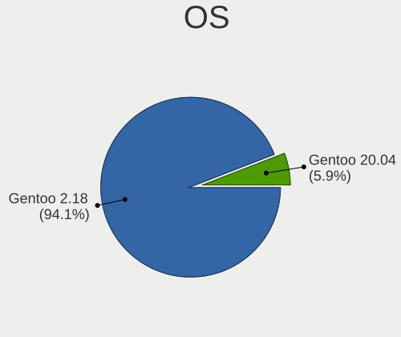

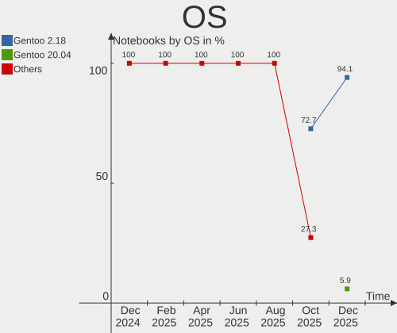

| Name         | Notebooks | Percent |
|--------------|-----------|---------|
| Gentoo 2.18  | 16        | 94.12%  |
| Gentoo 20.04 | 1         | 5.88%   |

OS Family
---------

OS without a version

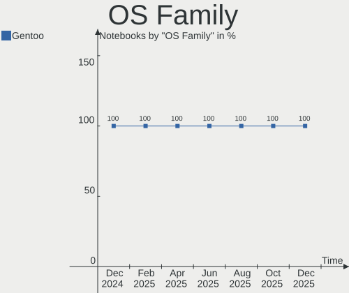

| Name   | Notebooks | Percent |
|--------|-----------|---------|
| Gentoo | 17        | 100%    |

Kernel
------

Version of the Linux kernel

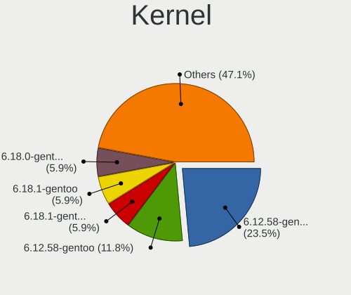

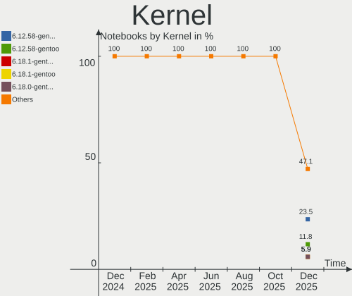

| Version                    | Notebooks | Percent |
|----------------------------|-----------|---------|
| 6.12.58-gentoo-dist        | 4         | 23.53%  |
| 6.12.58-gentoo             | 2         | 11.76%  |
| 6.18.1-gentoo-x86_64       | 1         | 5.88%   |
| 6.18.1-gentoo              | 1         | 5.88%   |
| 6.18.0-gentoo-x86_64       | 1         | 5.88%   |
| 6.18.0-gentoo              | 1         | 5.88%   |
| 6.17.9-gentoo-firmware     | 1         | 5.88%   |
| 6.17.9-gentoo-dist         | 1         | 5.88%   |
| 6.17.7-p2-asahi-dist       | 1         | 5.88%   |
| 6.17.5-gentoo-x86_64       | 1         | 5.88%   |
| 6.17.11-gentoo             | 1         | 5.88%   |
| 6.12.58-gentoo-gentoo-dist | 1         | 5.88%   |
| 4.14.83-gentoo             | 1         | 5.88%   |

Kernel Family
-------------

Linux kernel without a distro release

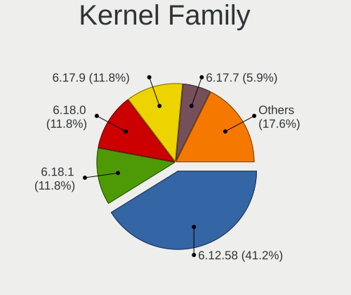

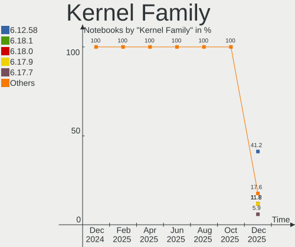

| Version | Notebooks | Percent |
|---------|-----------|---------|
| 6.12.58 | 7         | 41.18%  |
| 6.18.1  | 2         | 11.76%  |
| 6.18.0  | 2         | 11.76%  |
| 6.17.9  | 2         | 11.76%  |
| 6.17.7  | 1         | 5.88%   |
| 6.17.5  | 1         | 5.88%   |
| 6.17.11 | 1         | 5.88%   |
| 4.14.83 | 1         | 5.88%   |

Kernel Major Ver.
-----------------

Linux kernel major version

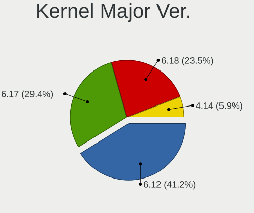

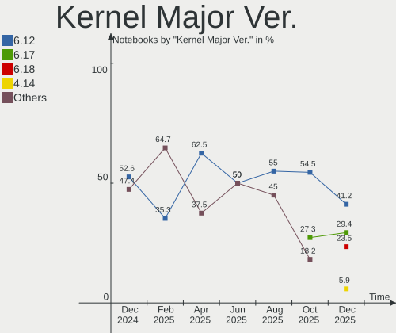

| Version | Notebooks | Percent |
|---------|-----------|---------|
| 6.12    | 7         | 41.18%  |
| 6.17    | 5         | 29.41%  |
| 6.18    | 4         | 23.53%  |
| 4.14    | 1         | 5.88%   |

Arch
----

OS architecture (x86_64, i586, etc.)

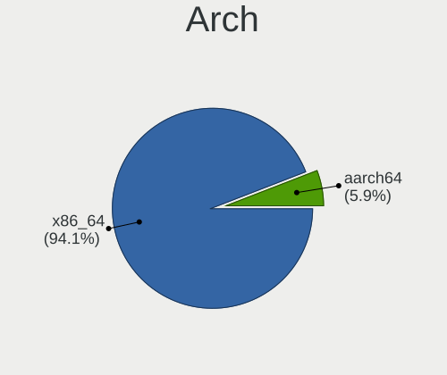

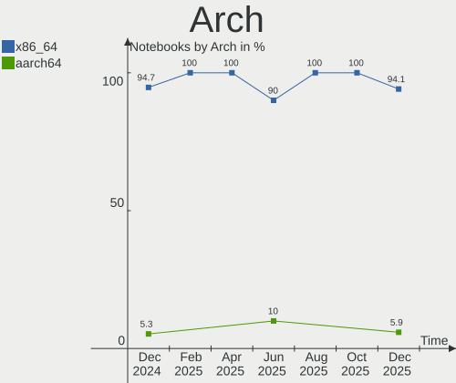

| Name    | Notebooks | Percent |
|---------|-----------|---------|
| x86_64  | 16        | 94.12%  |
| aarch64 | 1         | 5.88%   |

DE
--

Desktop Environment

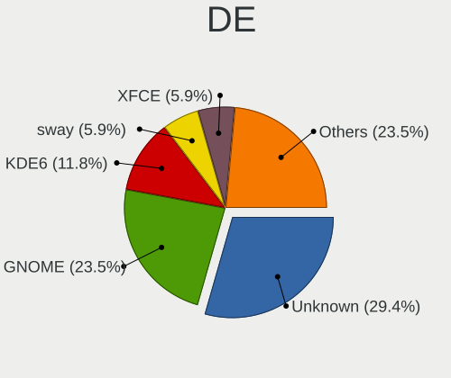

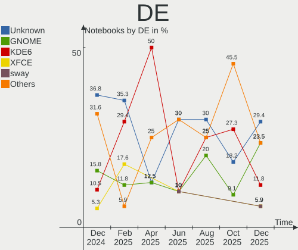

| Name     | Notebooks | Percent |
|----------|-----------|---------|
| Unknown  | 5         | 29.41%  |
| GNOME    | 4         | 23.53%  |
| KDE6     | 2         | 11.76%  |
| XFCE     | 1         | 5.88%   |
| sway     | 1         | 5.88%   |
| KDE5     | 1         | 5.88%   |
| KDE      | 1         | 5.88%   |
| Hyprland | 1         | 5.88%   |
| DWM      | 1         | 5.88%   |

Display Server
--------------

X11 or Wayland

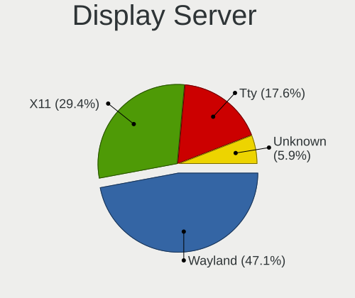

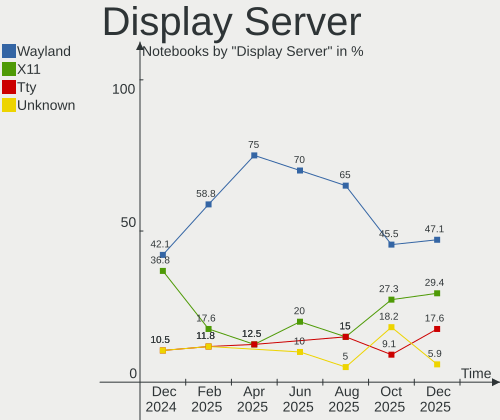

| Name    | Notebooks | Percent |
|---------|-----------|---------|
| Wayland | 8         | 47.06%  |
| X11     | 5         | 29.41%  |
| Tty     | 3         | 17.65%  |
| Unknown | 1         | 5.88%   |

Display Manager
---------------

SDDM, LightDM, etc.

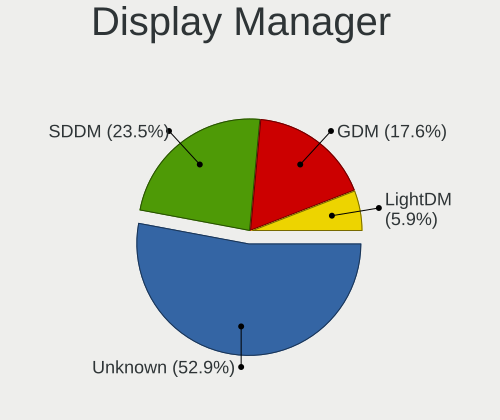

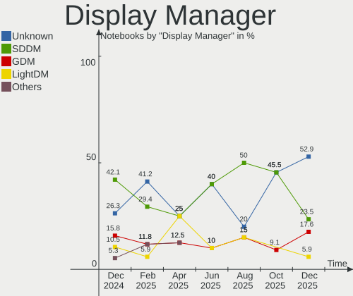

| Name    | Notebooks | Percent |
|---------|-----------|---------|
| Unknown | 9         | 52.94%  |
| SDDM    | 4         | 23.53%  |
| GDM     | 3         | 17.65%  |
| LightDM | 1         | 5.88%   |

OS Lang
-------

Language

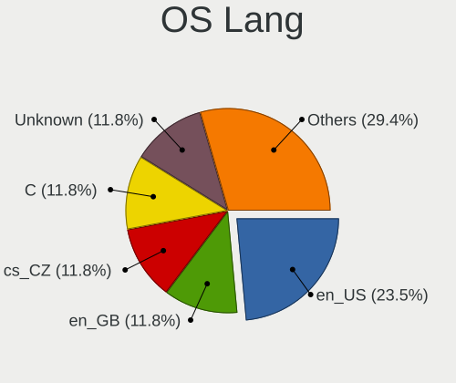

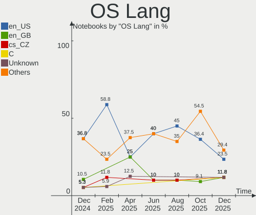

| Lang    | Notebooks | Percent |
|---------|-----------|---------|
| en_US   | 4         | 23.53%  |
| en_GB   | 2         | 11.76%  |
| cs_CZ   | 2         | 11.76%  |
| C       | 2         | 11.76%  |
| Unknown | 2         | 11.76%  |
| tr_TR   | 1         | 5.88%   |
| pl_PL   | 1         | 5.88%   |
| it_IT   | 1         | 5.88%   |
| ca_AD   | 1         | 5.88%   |
| C.UTF8  | 1         | 5.88%   |

Boot Mode
---------

EFI or BIOS

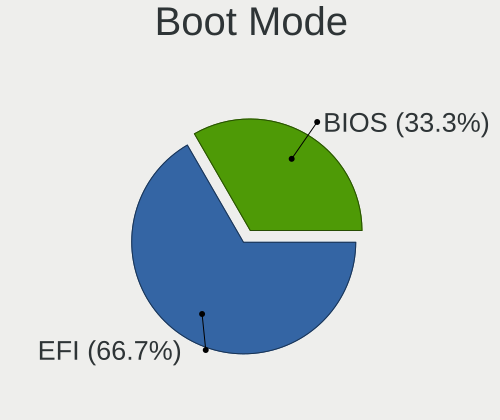

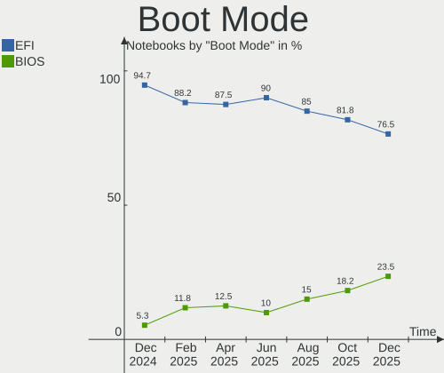

| Mode | Notebooks | Percent |
|------|-----------|---------|
| EFI  | 13        | 76.47%  |
| BIOS | 4         | 23.53%  |

Filesystem
----------

Type of filesystem

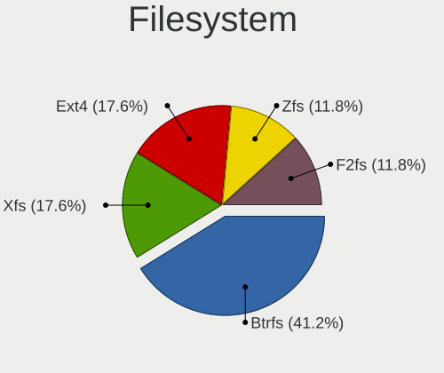

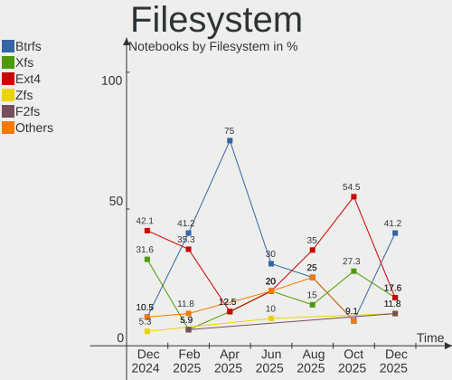

| Type  | Notebooks | Percent |
|-------|-----------|---------|
| Btrfs | 7         | 41.18%  |
| Xfs   | 3         | 17.65%  |
| Ext4  | 3         | 17.65%  |
| Zfs   | 2         | 11.76%  |
| F2fs  | 2         | 11.76%  |

Part. scheme
------------

Scheme of partitioning

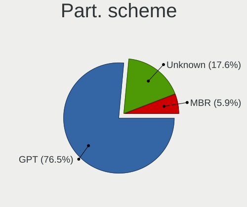

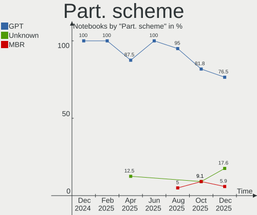

| Type    | Notebooks | Percent |
|---------|-----------|---------|
| GPT     | 13        | 76.47%  |
| Unknown | 3         | 17.65%  |
| MBR     | 1         | 5.88%   |

Dual Boot with Linux/BSD
------------------------

Hosting more than one Linux/BSD

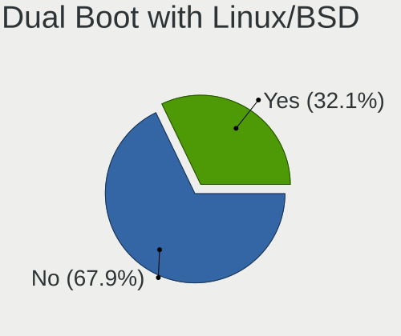

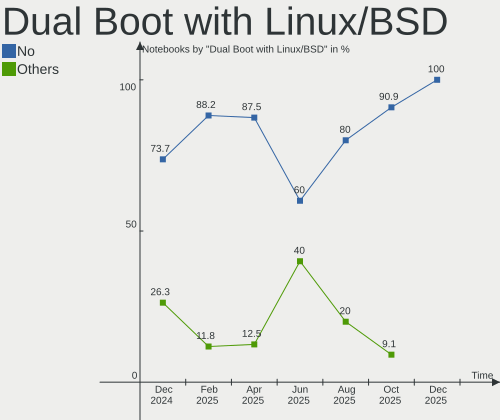

| Dual boot | Notebooks | Percent |
|-----------|-----------|---------|
| No        | 17        | 100%    |

Dual Boot (Win)
---------------

Hosting Linux and Windows

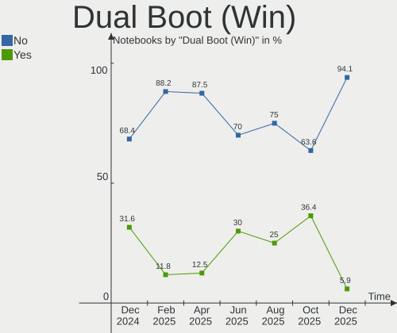

| Dual boot | Notebooks | Percent |
|-----------|-----------|---------|
| No        | 16        | 94.12%  |
| Yes       | 1         | 5.88%   |

Board
-----

Vendor
------

Motherboard manufacturer

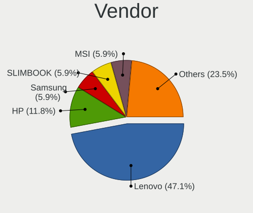

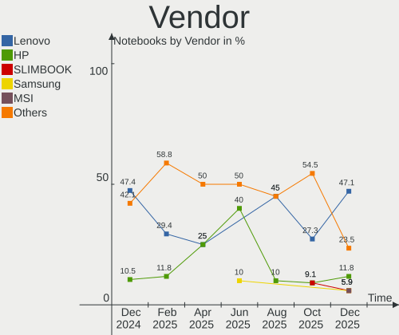

| Name                | Notebooks | Percent |
|---------------------|-----------|---------|
| Lenovo              | 8         | 47.06%  |
| Hewlett-Packard     | 2         | 11.76%  |
| SLIMBOOK            | 1         | 5.88%   |
| Samsung Electronics | 1         | 5.88%   |
| MSI                 | 1         | 5.88%   |
| Framework           | 1         | 5.88%   |
| Dell                | 1         | 5.88%   |
| ASUSTek Computer    | 1         | 5.88%   |
| Unknown             | 1         | 5.88%   |

Model
-----

Motherboard model

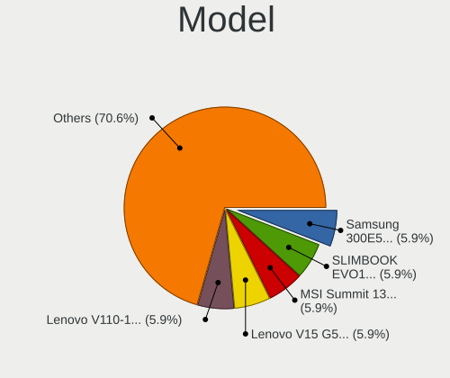

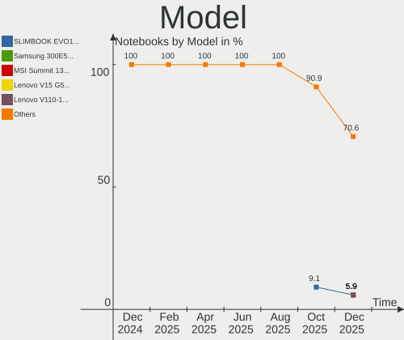

| Name                                          | Notebooks | Percent |
|-----------------------------------------------|-----------|---------|
| SLIMBOOK EVO15-A8                             | 1         | 5.88%   |
| Samsung 300E5EV/300E4EV/270E5EV/270E4EV       | 1         | 5.88%   |
| MSI Summit 13 AI+ Evo A2VMTG                  | 1         | 5.88%   |
| Lenovo V15 G5 IRL 83GW                        | 1         | 5.88%   |
| Lenovo V110-17IKB 80V2                        | 1         | 5.88%   |
| Lenovo ThinkPad X13 Gen 3 21CNS1M600          | 1         | 5.88%   |
| Lenovo ThinkPad P14s Gen 6 AMD 21RV0010GE     | 1         | 5.88%   |
| Lenovo ThinkPad P14s Gen 6 AMD 21QL0020US     | 1         | 5.88%   |
| Lenovo ThinkPad P14s Gen 2a 21A1S0J600        | 1         | 5.88%   |
| Lenovo ThinkPad E14 Gen 2 20TA009HID          | 1         | 5.88%   |
| Lenovo IdeaPad 3 15ALC6 82KU                  | 1         | 5.88%   |
| HP ProBook 4 G1iR 16 inch Notebook PC         | 1         | 5.88%   |
| HP Laptop 15s-eq2xxx                          | 1         | 5.88%   |
| Framework Laptop 16 (AMD Ryzen AI 300 Series) | 1         | 5.88%   |
| Dell XPS 15 9530                              | 1         | 5.88%   |
| ASUS ASUS TUF Gaming F15 FX507VU_FX507VU      | 1         | 5.88%   |
| Unknown                                       | 1         | 5.88%   |

Model Family
------------

Motherboard model prefix

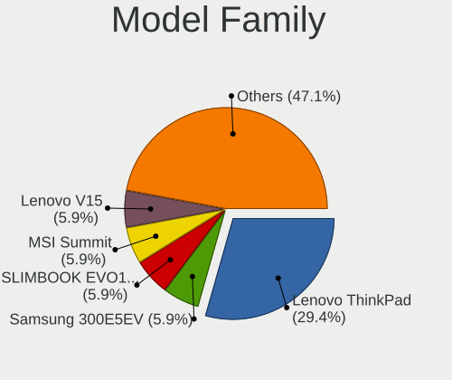

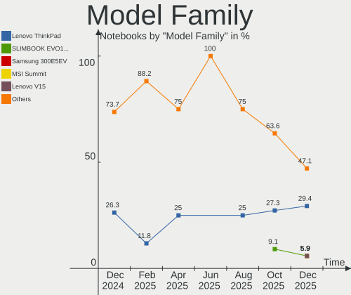

| Name              | Notebooks | Percent |
|-------------------|-----------|---------|
| Lenovo ThinkPad   | 5         | 29.41%  |
| SLIMBOOK EVO15-A8 | 1         | 5.88%   |
| Samsung 300E5EV   | 1         | 5.88%   |
| MSI Summit        | 1         | 5.88%   |
| Lenovo V15        | 1         | 5.88%   |
| Lenovo V110-17IKB | 1         | 5.88%   |
| Lenovo IdeaPad    | 1         | 5.88%   |
| HP ProBook        | 1         | 5.88%   |
| HP Laptop         | 1         | 5.88%   |
| Framework Laptop  | 1         | 5.88%   |
| Dell XPS          | 1         | 5.88%   |
| ASUS ASUS         | 1         | 5.88%   |
| Unknown           | 1         | 5.88%   |

MFG Year
--------

Motherboard manufacture year

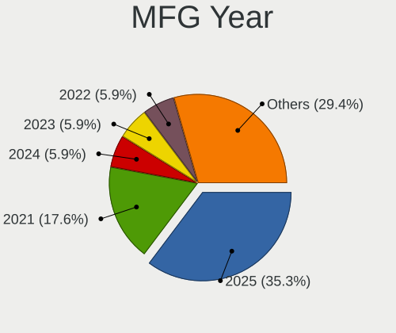

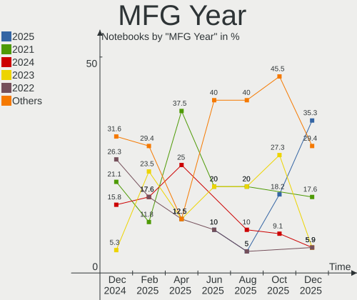

| Year    | Notebooks | Percent |
|---------|-----------|---------|
| 2025    | 6         | 35.29%  |
| 2021    | 3         | 17.65%  |
| 2024    | 1         | 5.88%   |
| 2023    | 1         | 5.88%   |
| 2022    | 1         | 5.88%   |
| 2020    | 1         | 5.88%   |
| 2017    | 1         | 5.88%   |
| 2014    | 1         | 5.88%   |
| 2013    | 1         | 5.88%   |
| Unknown | 1         | 5.88%   |

Form Factor
-----------

Physical design of the computer

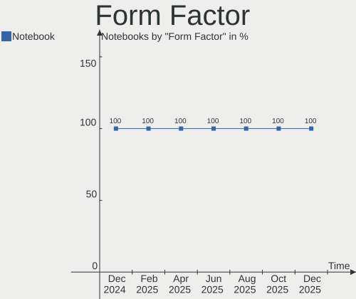

| Name     | Notebooks | Percent |
|----------|-----------|---------|
| Notebook | 17        | 100%    |

Secure Boot
-----------

Enabled or disabled

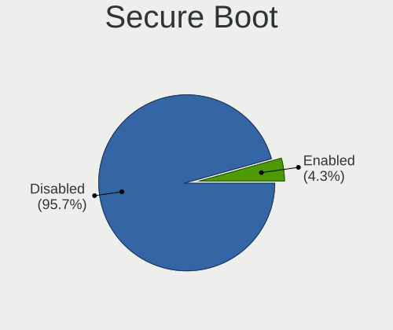

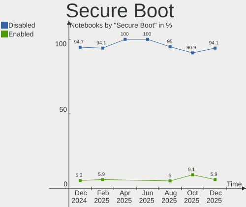

| State    | Notebooks | Percent |
|----------|-----------|---------|
| Disabled | 16        | 94.12%  |
| Enabled  | 1         | 5.88%   |

Coreboot
--------

Have coreboot on board

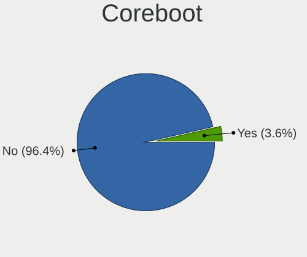

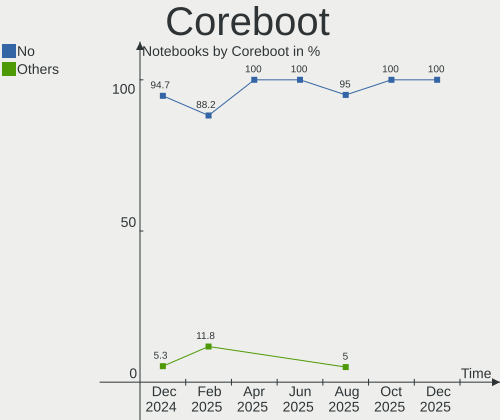

| Used | Notebooks | Percent |
|------|-----------|---------|
| No   | 17        | 100%    |

RAM Size
--------

Total RAM memory

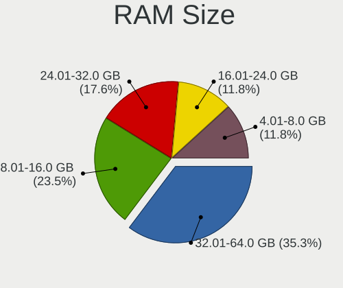

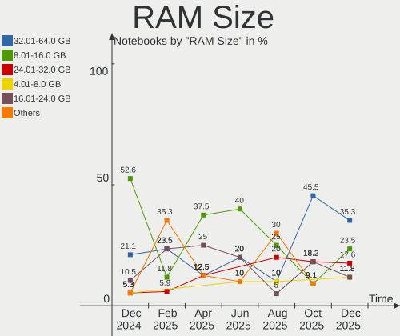

| Size in GB | Notebooks | Percent |
|------------|-----------|---------|
| 32.01-64.0 | 6         | 35.29%  |
| 8.01-16.0  | 4         | 23.53%  |
| 24.01-32.0 | 3         | 17.65%  |
| 4.01-8.0   | 2         | 11.76%  |
| 16.01-24.0 | 2         | 11.76%  |

RAM Used
--------

Used RAM memory

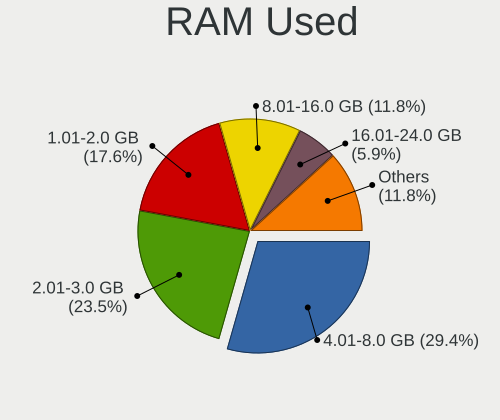

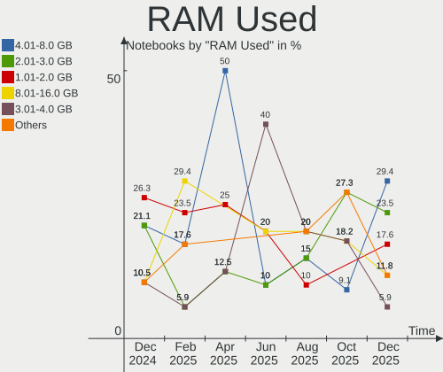

| Used GB    | Notebooks | Percent |
|------------|-----------|---------|
| 4.01-8.0   | 5         | 29.41%  |
| 2.01-3.0   | 4         | 23.53%  |
| 1.01-2.0   | 3         | 17.65%  |
| 8.01-16.0  | 2         | 11.76%  |
| 3.01-4.0   | 1         | 5.88%   |
| 16.01-24.0 | 1         | 5.88%   |
| 0.51-1.0   | 1         | 5.88%   |

Total Drives
------------

Number of drives on board

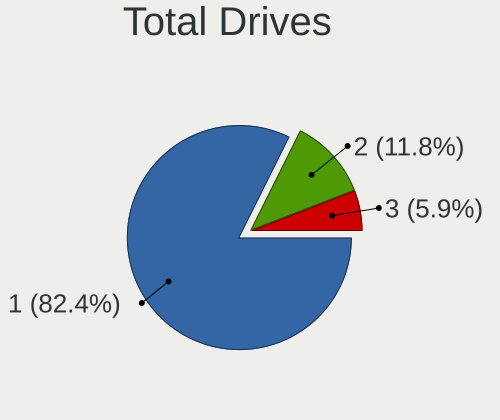

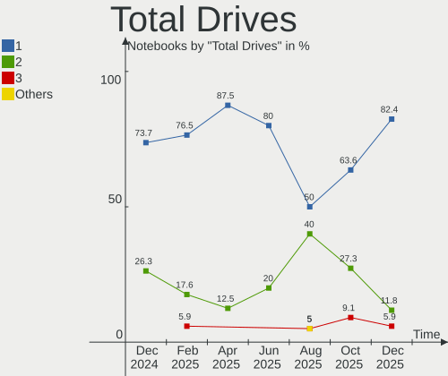

| Drives | Notebooks | Percent |
|--------|-----------|---------|
| 1      | 14        | 82.35%  |
| 2      | 2         | 11.76%  |
| 3      | 1         | 5.88%   |

Has CD-ROM
----------

Has CD-ROM on board

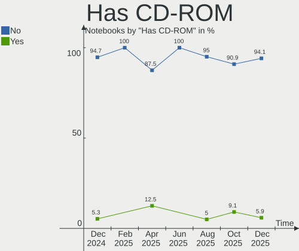

| Presented | Notebooks | Percent |
|-----------|-----------|---------|
| No        | 16        | 94.12%  |
| Yes       | 1         | 5.88%   |

Has Ethernet
------------

Has Ethernet on board

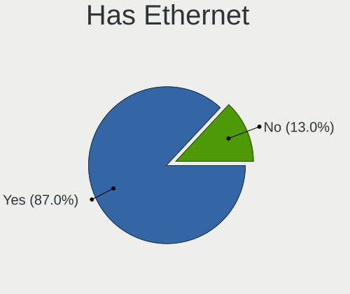

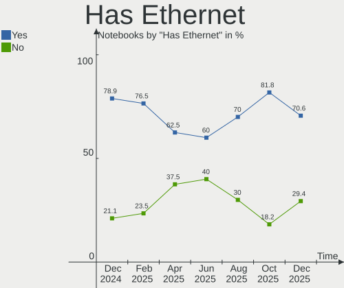

| Presented | Notebooks | Percent |
|-----------|-----------|---------|
| Yes       | 12        | 70.59%  |
| No        | 5         | 29.41%  |

Has WiFi
--------

Has WiFi module

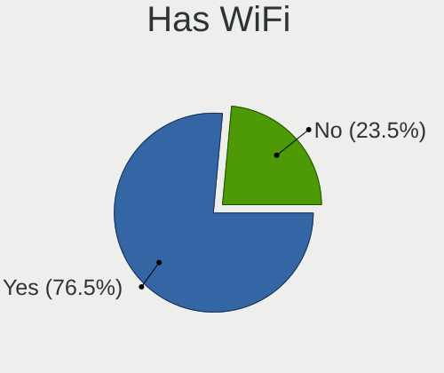

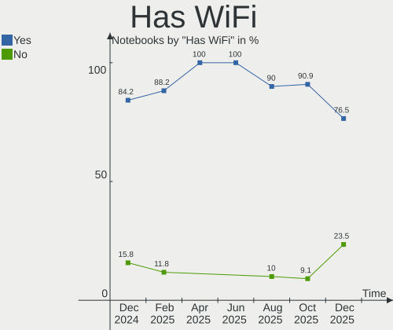

| Presented | Notebooks | Percent |
|-----------|-----------|---------|
| Yes       | 13        | 76.47%  |
| No        | 4         | 23.53%  |

Has Bluetooth
-------------

Has Bluetooth module

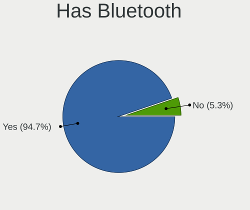

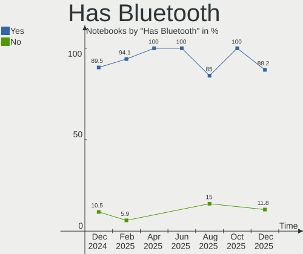

| Presented | Notebooks | Percent |
|-----------|-----------|---------|
| Yes       | 15        | 88.24%  |
| No        | 2         | 11.76%  |

Location
--------

Country
-------

Geographic location (country)

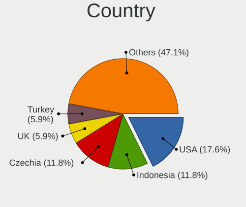

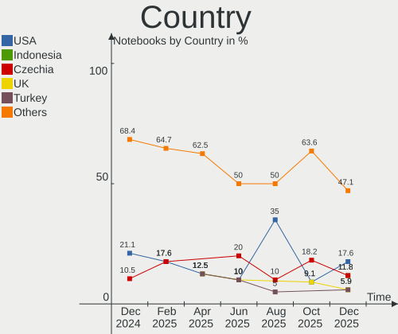

| Country     | Notebooks | Percent |
|-------------|-----------|---------|
| USA         | 3         | 17.65%  |
| Indonesia   | 2         | 11.76%  |
| Czechia     | 2         | 11.76%  |
| UK          | 1         | 5.88%   |
| Turkey      | 1         | 5.88%   |
| Switzerland | 1         | 5.88%   |
| Spain       | 1         | 5.88%   |
| Réunion    | 1         | 5.88%   |
| Poland      | 1         | 5.88%   |
| Italy       | 1         | 5.88%   |
| India       | 1         | 5.88%   |
| Germany     | 1         | 5.88%   |
| Canada      | 1         | 5.88%   |

City
----

Geographic location (city)

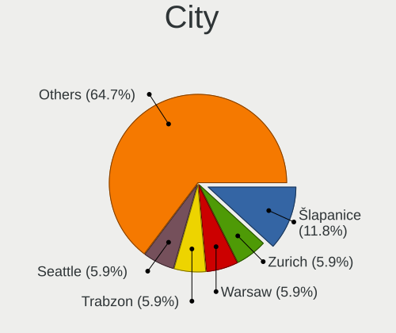

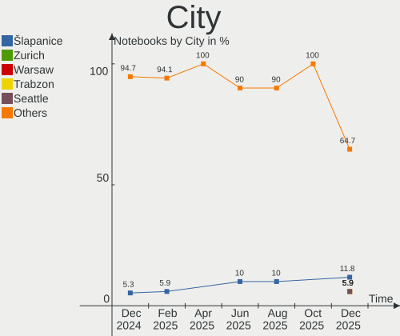

| City        | Notebooks | Percent |
|-------------|-----------|---------|
| Šlapanice  | 2         | 11.76%  |
| Zurich      | 1         | 5.88%   |
| Warsaw      | 1         | 5.88%   |
| Trabzon     | 1         | 5.88%   |
| Seattle     | 1         | 5.88%   |
| Saint-Denis | 1         | 5.88%   |
| North Adams | 1         | 5.88%   |
| Montreal    | 1         | 5.88%   |
| London      | 1         | 5.88%   |
| Cikini      | 1         | 5.88%   |
| Chennai     | 1         | 5.88%   |
| Cagliari    | 1         | 5.88%   |
| Bothell     | 1         | 5.88%   |
| Berlin      | 1         | 5.88%   |
| Barcelona   | 1         | 5.88%   |
| Bandung     | 1         | 5.88%   |

Drives
------

Drive Vendor
------------

Hard drive vendors

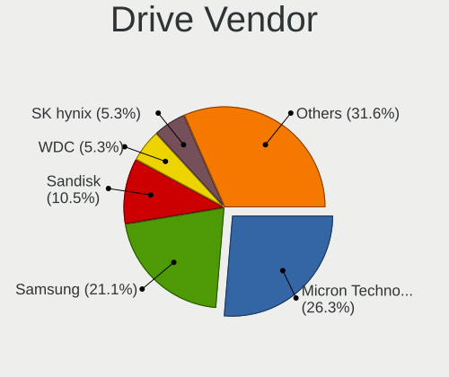

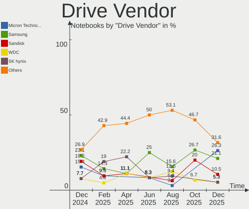

| Vendor                      | Notebooks | Drives | Percent |
|-----------------------------|-----------|--------|---------|
| Micron Technology           | 5         | 5      | 26.32%  |
| Samsung Electronics         | 4         | 4      | 21.05%  |
| Sandisk                     | 2         | 2      | 10.53%  |
| WDC                         | 1         | 1      | 5.26%   |
| SK hynix                    | 1         | 1      | 5.26%   |
| Realtek Semiconductor       | 1         | 1      | 5.26%   |
| MAXIO Technology (Hangzhou) | 1         | 2      | 5.26%   |
| KIOXIA                      | 1         | 1      | 5.26%   |
| Kingston                    | 1         | 1      | 5.26%   |
| Intel                       | 1         | 1      | 5.26%   |
| Apple                       | 1         | 3      | 5.26%   |

Drive Model
-----------

Hard drive models

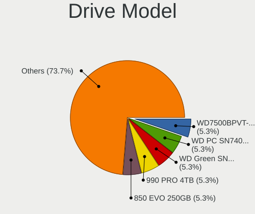

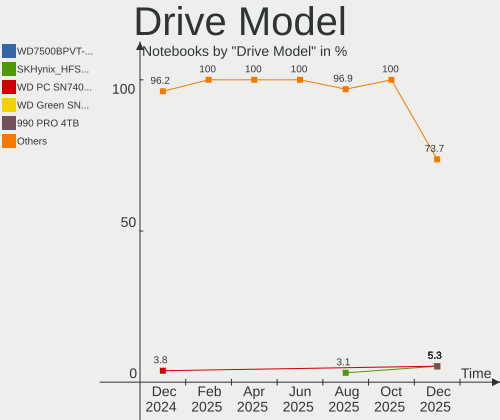

| Model                                            | Notebooks | Percent |
|--------------------------------------------------|-----------|---------|
| WDC WD7500BPVT-35HXZT3 752GB                     | 1         | 5.26%   |
| SK hynix SKHynix_HFS001TEJ9X162N 1024GB          | 1         | 5.26%   |
| Sandisk WD PC SN740 SDDPNQD-512G-1002 512GB      | 1         | 5.26%   |
| Sandisk WD Green SN350 1TB 2G0C                  | 1         | 5.26%   |
| Samsung SSD 990 PRO 4TB                          | 1         | 5.26%   |
| Samsung SSD 850 EVO 250GB                        | 1         | 5.26%   |
| Samsung MZVLQ256HAJD-000H1 256GB                 | 1         | 5.26%   |
| Samsung MZALQ512HALU-000L1 512GB                 | 1         | 5.26%   |
| Realtek Patriot M.2 P300 1024GB                  | 1         | 5.26%   |
| Micron MTFDKCD512QGN-1BN1AABLA 512GB             | 1         | 5.26%   |
| Micron MTFDKBA256TFK 256GB                       | 1         | 5.26%   |
| Micron MTFDKBA1T0TGD-2BK15ABLT 1024GB            | 1         | 5.26%   |
| Micron MTFDKBA1T0QGN-1BN1AABGA 1024GB            | 1         | 5.26%   |
| Micron 2500_MTFDKBA1T0QGN 1TB                    | 1         | 5.26%   |
| MAXIO (Hangzhou) NVMe SSD Controller MAP1202 2TB | 1         | 5.26%   |
| KIOXIA KXG80ZNV1T02 NVMe 1024GB                  | 1         | 5.26%   |
| Kingston SV300S37A120G 120GB SSD                 | 1         | 5.26%   |
| Intel SSDPEKNU512GZH 512GB                       | 1         | 5.26%   |
| Apple SSD AP2048Z 134MB                          | 1         | 5.26%   |

HDD Vendor
----------

Hard disk drive vendors

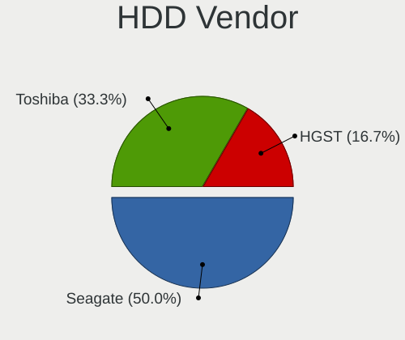

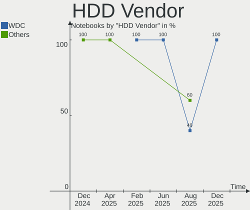

| Vendor | Notebooks | Drives | Percent |
|--------|-----------|--------|---------|
| WDC    | 1         | 1      | 100%    |

SSD Vendor
----------

Solid state drive vendors

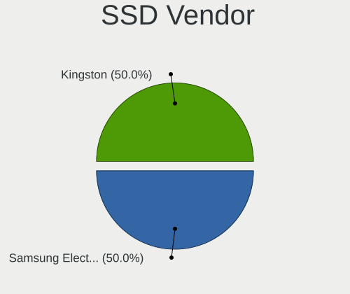

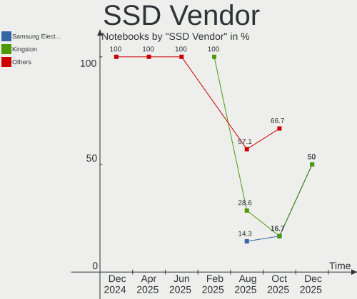

| Vendor              | Notebooks | Drives | Percent |
|---------------------|-----------|--------|---------|
| Samsung Electronics | 1         | 1      | 50%     |
| Kingston            | 1         | 1      | 50%     |

Drive Kind
----------

HDD or SSD

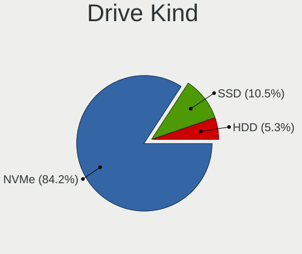

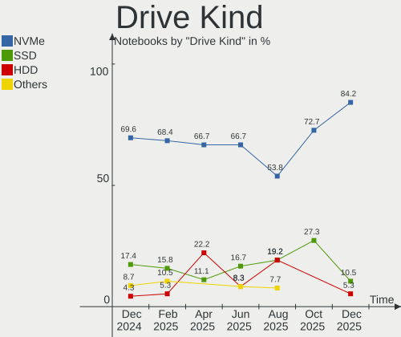

| Kind | Notebooks | Drives | Percent |
|------|-----------|--------|---------|
| NVMe | 16        | 19     | 84.21%  |
| SSD  | 2         | 2      | 10.53%  |
| HDD  | 1         | 1      | 5.26%   |

Drive Connector
---------------

SATA, SAS, NVMe, etc.

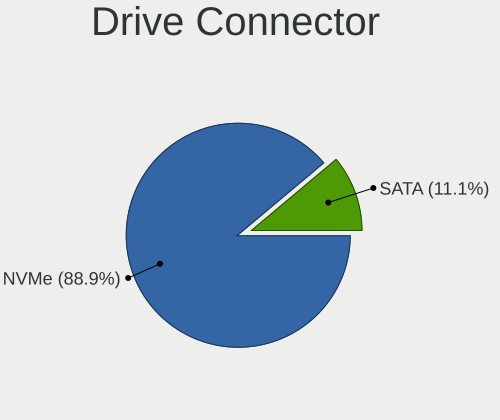

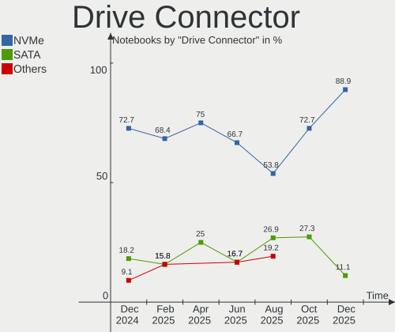

| Type | Notebooks | Drives | Percent |
|------|-----------|--------|---------|
| NVMe | 16        | 19     | 88.89%  |
| SATA | 2         | 3      | 11.11%  |

Drive Size
----------

Size of hard drive

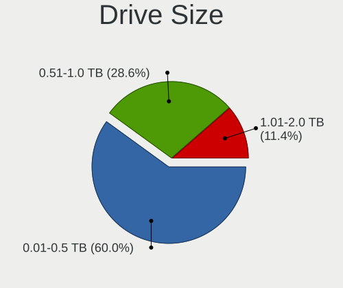

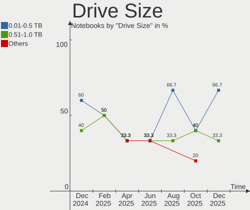

| Size in TB | Notebooks | Drives | Percent |
|------------|-----------|--------|---------|
| 0.01-0.5   | 2         | 2      | 66.67%  |
| 0.51-1.0   | 1         | 1      | 33.33%  |

Space Total
-----------

Amount of disk space available on the file system

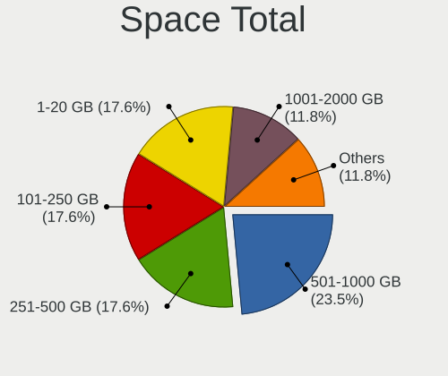

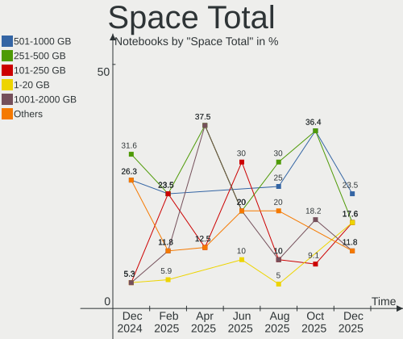

| Size in GB | Notebooks | Percent |
|------------|-----------|---------|
| 501-1000   | 4         | 23.53%  |
| 251-500    | 3         | 17.65%  |
| 101-250    | 3         | 17.65%  |
| 1-20       | 3         | 17.65%  |
| 1001-2000  | 2         | 11.76%  |
| Unknown    | 2         | 11.76%  |

Space Used
----------

Amount of used disk space

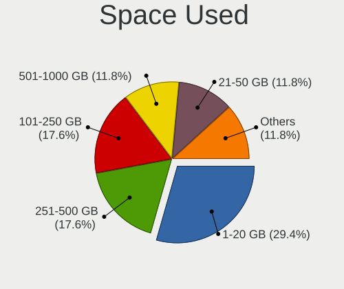

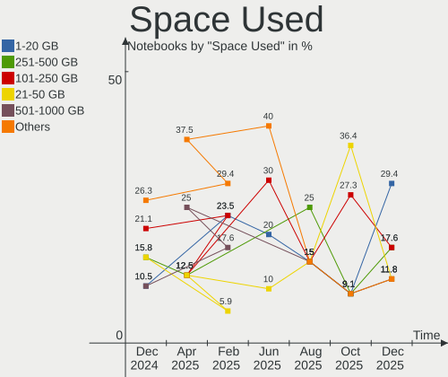

| Used GB  | Notebooks | Percent |
|----------|-----------|---------|
| 1-20     | 5         | 29.41%  |
| 251-500  | 3         | 17.65%  |
| 101-250  | 3         | 17.65%  |
| 21-50    | 2         | 11.76%  |
| 501-1000 | 2         | 11.76%  |
| Unknown  | 2         | 11.76%  |

Malfunc. Drives
---------------

Drive models with a malfunction

Zero info for selected period =(

Malfunc. Drive Vendor
---------------------

Vendors of faulty drives

Zero info for selected period =(

Malfunc. HDD Vendor
-------------------

Vendors of faulty HDD drives

Zero info for selected period =(

Malfunc. Drive Kind
-------------------

Kinds of faulty drives

Zero info for selected period =(

Failed Drives
-------------

Failed drive models

Zero info for selected period =(

Failed Drive Vendor
-------------------

Failed drive vendors

Zero info for selected period =(

Drive Status
------------

Number of failed and malfunc. drives

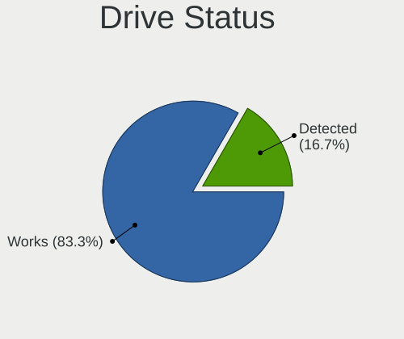

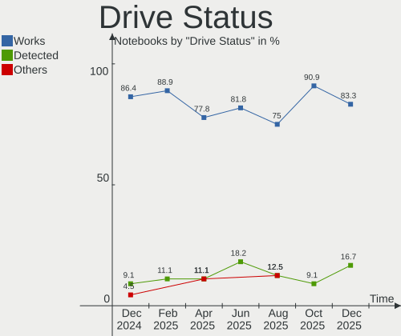

| Status   | Notebooks | Drives | Percent |
|----------|-----------|--------|---------|
| Works    | 15        | 19     | 83.33%  |
| Detected | 3         | 3      | 16.67%  |

Storage controller
------------------

Storage Vendor
--------------

Storage controller vendors

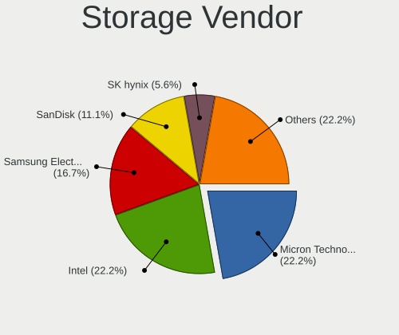

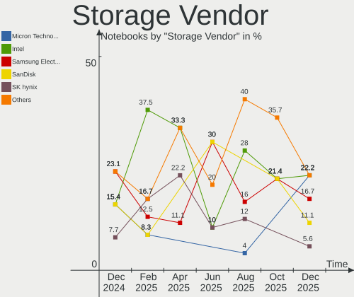

| Vendor                      | Notebooks | Percent |
|-----------------------------|-----------|---------|
| Micron Technology           | 4         | 22.22%  |
| Intel                       | 4         | 22.22%  |
| Samsung Electronics         | 3         | 16.67%  |
| SanDisk                     | 2         | 11.11%  |
| SK hynix                    | 1         | 5.56%   |
| Realtek Semiconductor       | 1         | 5.56%   |
| MAXIO Technology (Hangzhou) | 1         | 5.56%   |
| KIOXIA                      | 1         | 5.56%   |
| AMD                         | 1         | 5.56%   |

Storage Model
-------------

Storage controller models

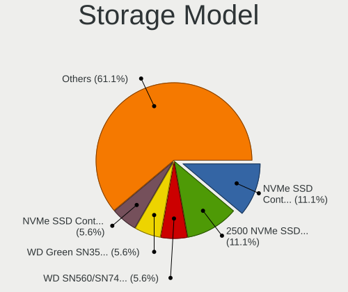

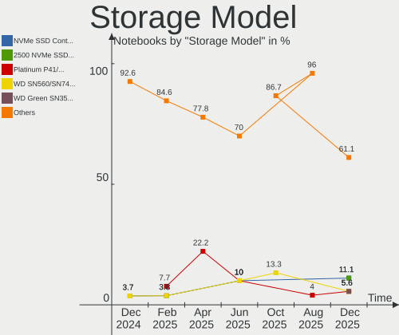

| Model                                                            | Notebooks | Percent |
|------------------------------------------------------------------|-----------|---------|
| Samsung NVMe SSD Controller 980 (DRAM-less)                      | 2         | 11.11%  |
| Micron 2500 NVMe SSD (DRAM-less)                                 | 2         | 11.11%  |
| SK hynix Platinum P41/PC801 NVMe Solid State Drive               | 1         | 5.56%   |
| SanDisk WD SN560/SN740/SN770/SN5000 NVMe SSD                     | 1         | 5.56%   |
| SanDisk WD Green SN350 240GB (DRAM-less) / SN560E NVMe SSD       | 1         | 5.56%   |
| Samsung NVMe SSD Controller S4LV008[Pascal]                      | 1         | 5.56%   |
| Realtek RTS5765DL NVMe SSD Controller (DRAM-less)                | 1         | 5.56%   |
| Micron 3500 NVMe SSD                                             | 1         | 5.56%   |
| Micron 2450 NVMe SSD [HendrixV] (DRAM-less)                      | 1         | 5.56%   |
| MAXIO (Hangzhou) NVMe SSD Controller MAP1202 (DRAM-less)         | 1         | 5.56%   |
| KIOXIA NVMe SSD Controller XG8                                   | 1         | 5.56%   |
| Intel Sunrise Point-LP SATA Controller [AHCI mode]               | 1         | 5.56%   |
| Intel SSD 670p Series [Keystone Harbor]                          | 1         | 5.56%   |
| Intel RST Volume Management Device Controller                    | 1         | 5.56%   |
| Intel 7 Series Chipset Family 6-port SATA Controller [AHCI mode] | 1         | 5.56%   |
| AMD FCH SATA Controller [AHCI mode]                              | 1         | 5.56%   |

Storage Kind
------------

Kind of storage controller (IDE, SATA, NVMe, SAS, ...)

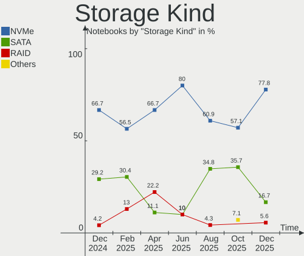

| Kind | Notebooks | Percent |
|------|-----------|---------|
| NVMe | 14        | 77.78%  |
| SATA | 3         | 16.67%  |
| RAID | 1         | 5.56%   |

Processor
---------

CPU Vendor
----------

Processor vendors

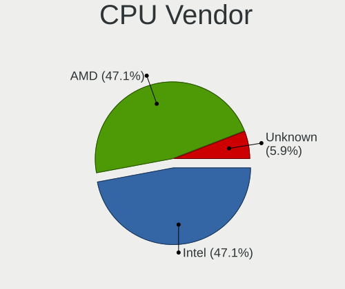

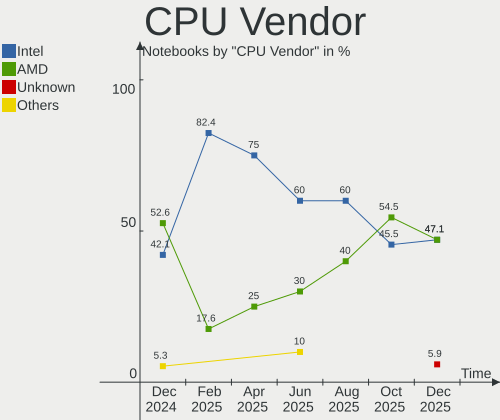

| Vendor  | Notebooks | Percent |
|---------|-----------|---------|
| Intel   | 8         | 47.06%  |
| AMD     | 8         | 47.06%  |
| Unknown | 1         | 5.88%   |

CPU Model
---------

Processor models

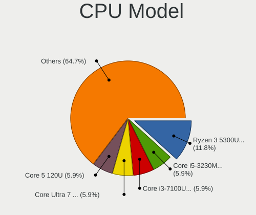

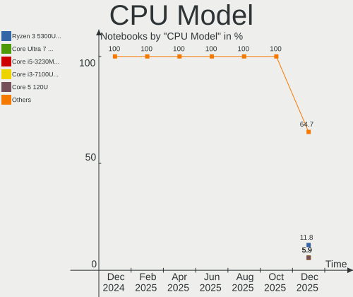

| Model                                      | Notebooks | Percent |
|--------------------------------------------|-----------|---------|
| AMD Ryzen 3 5300U with Radeon Graphics     | 2         | 11.76%  |
| Intel Core Ultra 7 258V                    | 1         | 5.88%   |
| Intel Core i5-3230M CPU @ 2.60GHz          | 1         | 5.88%   |
| Intel Core i3-7100U CPU @ 2.40GHz          | 1         | 5.88%   |
| Intel Core 5 120U                          | 1         | 5.88%   |
| Intel Core 3 100U                          | 1         | 5.88%   |
| Intel 13th Gen Core i7-13700H              | 1         | 5.88%   |
| Intel 13th Gen Core i7-13620H              | 1         | 5.88%   |
| Intel 11th Gen Core i7-1165G7 @ 2.80GHz    | 1         | 5.88%   |
| AMD Ryzen AI 9 HX PRO 370 w/ Radeon 890M   | 1         | 5.88%   |
| AMD Ryzen AI 9 HX 370 w/ Radeon 890M       | 1         | 5.88%   |
| AMD Ryzen AI 7 PRO 350 w/ Radeon 860M      | 1         | 5.88%   |
| AMD Ryzen 7 PRO 5850U with Radeon Graphics | 1         | 5.88%   |
| AMD Ryzen 7 8845HS w/ Radeon 780M Graphics | 1         | 5.88%   |
| AMD Ryzen 5 PRO 6650U with Radeon Graphics | 1         | 5.88%   |
|                                            | 1         | 5.88%   |

CPU Model Family
----------------

Processor model prefix

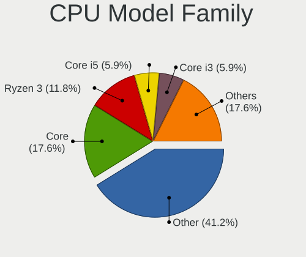

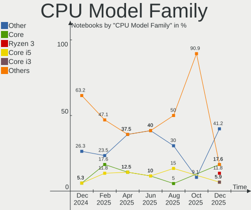

| Model           | Notebooks | Percent |
|-----------------|-----------|---------|
| Other           | 7         | 41.18%  |
| Intel Core      | 3         | 17.65%  |
| AMD Ryzen 3     | 2         | 11.76%  |
| Intel Core i5   | 1         | 5.88%   |
| Intel Core i3   | 1         | 5.88%   |
| AMD Ryzen 7 PRO | 1         | 5.88%   |
| AMD Ryzen 7     | 1         | 5.88%   |
| AMD Ryzen 5 PRO | 1         | 5.88%   |

CPU Cores
---------

Number of processor cores

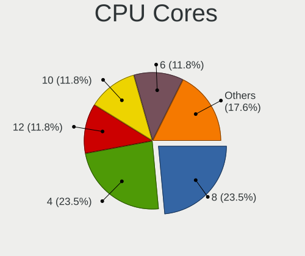

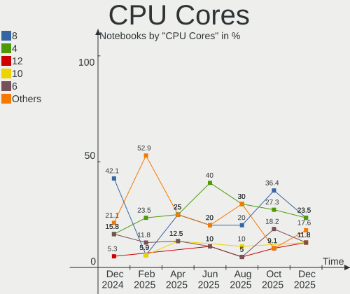

| Number | Notebooks | Percent |
|--------|-----------|---------|
| 8      | 4         | 23.53%  |
| 4      | 4         | 23.53%  |
| 12     | 2         | 11.76%  |
| 10     | 2         | 11.76%  |
| 6      | 2         | 11.76%  |
| 2      | 2         | 11.76%  |
| 14     | 1         | 5.88%   |

CPU Sockets
-----------

Number of sockets

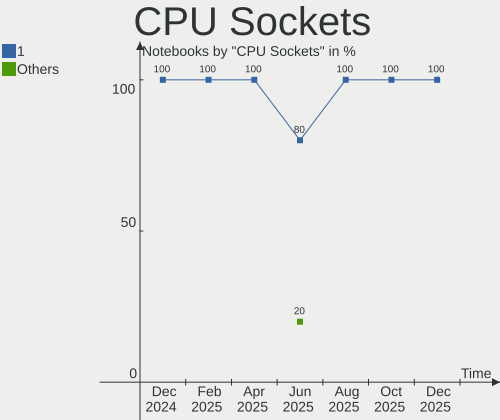

| Number | Notebooks | Percent |
|--------|-----------|---------|
| 1      | 17        | 100%    |

CPU Threads
-----------

Threads per core (Hyper-Threading)

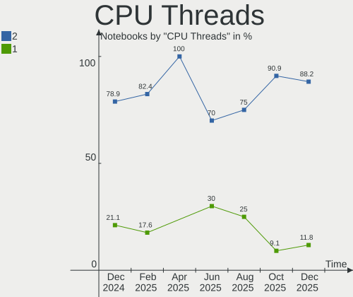

| Number | Notebooks | Percent |
|--------|-----------|---------|
| 2      | 15        | 88.24%  |
| 1      | 2         | 11.76%  |

CPU Op-Modes
------------

CPU Operation Modes (32-bit, 64-bit)

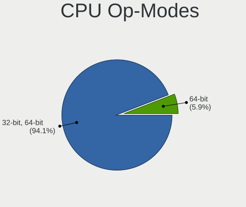

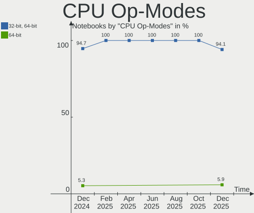

| Op mode        | Notebooks | Percent |
|----------------|-----------|---------|
| 32-bit, 64-bit | 16        | 94.12%  |
| 64-bit         | 1         | 5.88%   |

CPU Microcode
-------------

Microcode number

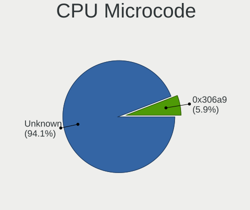

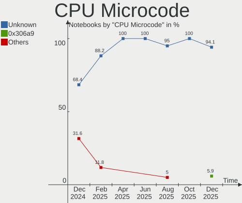

| Number  | Notebooks | Percent |
|---------|-----------|---------|
| Unknown | 16        | 94.12%  |
| 0x306a9 | 1         | 5.88%   |

CPU Microarch
-------------

Microarchitecture

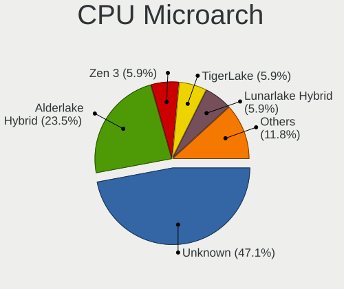

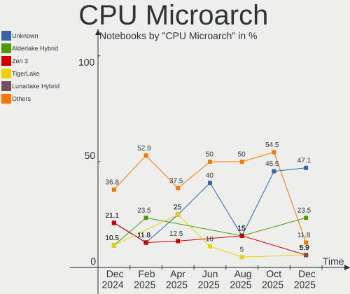

| Name             | Notebooks | Percent |
|------------------|-----------|---------|
| Unknown          | 8         | 47.06%  |
| Alderlake Hybrid | 4         | 23.53%  |
| Zen 3            | 1         | 5.88%   |
| TigerLake        | 1         | 5.88%   |
| Lunarlake Hybrid | 1         | 5.88%   |
| KabyLake         | 1         | 5.88%   |
| IvyBridge        | 1         | 5.88%   |

Graphics
--------

GPU Vendor
----------

Vendors of graphics cards

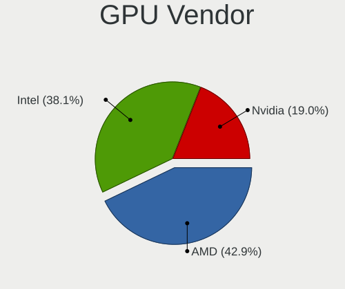

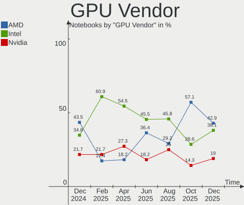

| Vendor | Notebooks | Percent |
|--------|-----------|---------|
| AMD    | 9         | 42.86%  |
| Intel  | 8         | 38.1%   |
| Nvidia | 4         | 19.05%  |

GPU Model
---------

Graphics card models

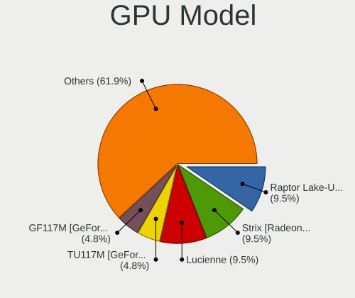

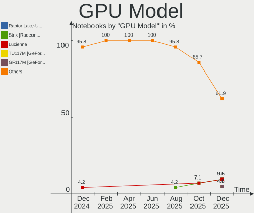

| Model                                                                         | Notebooks | Percent |
|-------------------------------------------------------------------------------|-----------|---------|
| Intel Raptor Lake-U [Intel Graphics]                                          | 2         | 9.52%   |
| AMD Strix [Radeon 880M / 890M]                                                | 2         | 9.52%   |
| AMD Lucienne                                                                  | 2         | 9.52%   |
| Nvidia TU117M [GeForce MX450]                                                 | 1         | 4.76%   |
| Nvidia GF117M [GeForce 610M/710M/810M/820M / GT 620M/625M/630M/720M]          | 1         | 4.76%   |
| Nvidia GB206M [GeForce RTX 5070 Max-Q / Mobile]                               | 1         | 4.76%   |
| Nvidia AD107M [GeForce RTX 4050 Max-Q / Mobile]                               | 1         | 4.76%   |
| Intel TigerLake-LP GT2 [Iris Xe Graphics]                                     | 1         | 4.76%   |
| Intel Raptor Lake-P [UHD Graphics]                                            | 1         | 4.76%   |
| Intel Raptor Lake-P [Iris Xe Graphics]                                        | 1         | 4.76%   |
| Intel Lunar Lake [Intel Arc Graphics 130V / 140V]                             | 1         | 4.76%   |
| Intel Kaby Lake-U GT2 [HD Graphics 620]                                       | 1         | 4.76%   |
| Intel 3rd Gen Core processor Graphics Controller                              | 1         | 4.76%   |
| AMD Sun XT [Radeon HD 8670A/8670M/8690M / R5 M330 / M430 / Radeon 520 Mobile] | 1         | 4.76%   |
| AMD Rembrandt [Radeon 680M]                                                   | 1         | 4.76%   |
| AMD Krackan [Radeon 840M / 860M Graphics]                                     | 1         | 4.76%   |
| AMD HawkPoint1                                                                | 1         | 4.76%   |
| AMD Cezanne [Radeon Vega Series / Radeon Vega Mobile Series]                  | 1         | 4.76%   |

GPU Combo
---------

Combinations of graphics cards

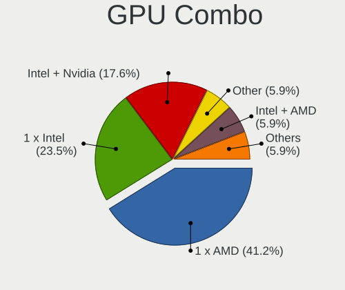

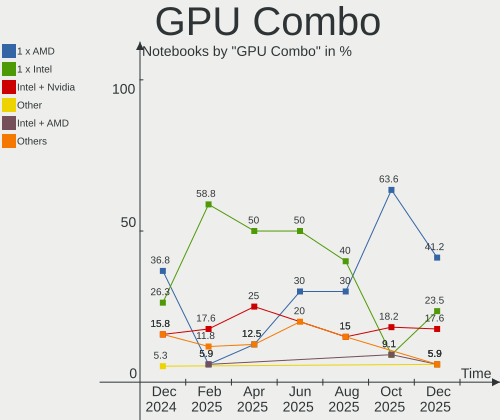

| Name           | Notebooks | Percent |
|----------------|-----------|---------|
| 1 x AMD        | 7         | 41.18%  |
| 1 x Intel      | 4         | 23.53%  |
| Intel + Nvidia | 3         | 17.65%  |
| Other          | 1         | 5.88%   |
| Intel + AMD    | 1         | 5.88%   |
| AMD + Nvidia   | 1         | 5.88%   |

GPU Driver
----------

Free vs proprietary

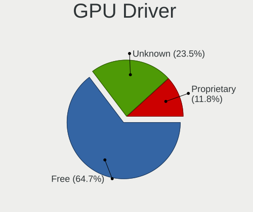

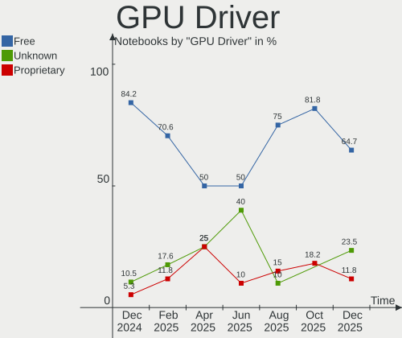

| Driver      | Notebooks | Percent |
|-------------|-----------|---------|
| Free        | 11        | 64.71%  |
| Unknown     | 4         | 23.53%  |
| Proprietary | 2         | 11.76%  |

GPU Memory
----------

Total video memory

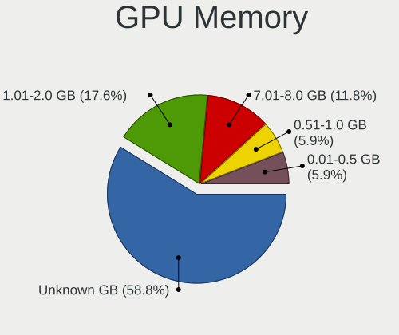

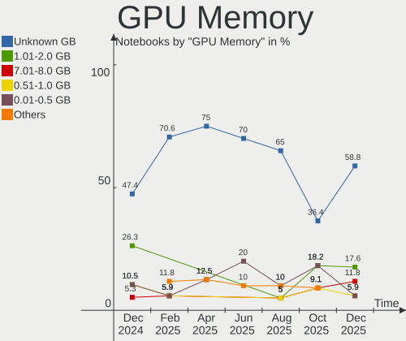

| Size in GB | Notebooks | Percent |
|------------|-----------|---------|
| Unknown    | 10        | 58.82%  |
| 1.01-2.0   | 3         | 17.65%  |
| 7.01-8.0   | 2         | 11.76%  |
| 0.51-1.0   | 1         | 5.88%   |
| 0.01-0.5   | 1         | 5.88%   |

Monitor
-------

Monitor Vendor
--------------

Monitor vendors

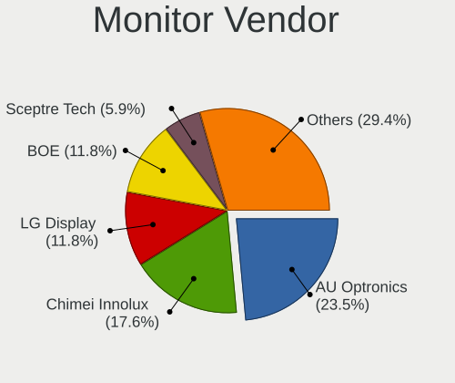

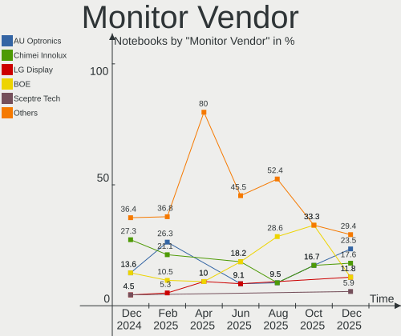

| Vendor                  | Notebooks | Percent |
|-------------------------|-----------|---------|
| AU Optronics            | 4         | 23.53%  |
| Chimei Innolux          | 3         | 17.65%  |
| LG Display              | 2         | 11.76%  |
| BOE                     | 2         | 11.76%  |
| Sceptre Tech            | 1         | 5.88%   |
| Lenovo                  | 1         | 5.88%   |
| InfoVision              | 1         | 5.88%   |
| HKC                     | 1         | 5.88%   |
| CSW                     | 1         | 5.88%   |
| Chi Mei Optoelectronics | 1         | 5.88%   |

Monitor Model
-------------

Monitor models

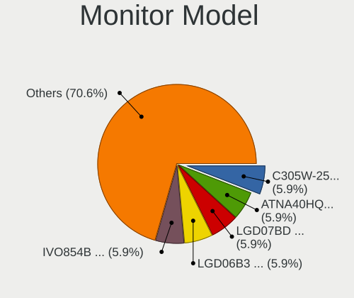

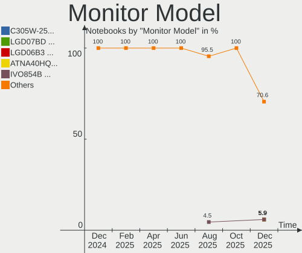

| Model                                                                    | Notebooks | Percent |
|--------------------------------------------------------------------------|-----------|---------|
| Sceptre Tech C305W-2560UN SPT0C0D 2560x1080 690x291mm 29.5-inch          | 1         | 5.88%   |
| LG Display LCD Monitor LGD07BD 1920x1200 345x215mm 16.0-inch             | 1         | 5.88%   |
| LG Display LCD Monitor LGD06B3 1920x1200 336x210mm 15.6-inch             | 1         | 5.88%   |
| Lenovo ATNA40HQ02-0  LEN414D                                             | 1         | 5.88%   |
| InfoVision LCD Monitor IVO854B 1920x1200 286x179mm 13.3-inch             | 1         | 5.88%   |
| HKC LCD Monitor HKC3CFC 1920x1080 344x194mm 15.5-inch                    | 1         | 5.88%   |
| CSW MNE007ZA3-2 CSW1431 2880x1800 301x188mm 14.0-inch                    | 1         | 5.88%   |
| Chimei Innolux N156HMA-GA1 CMN1556 1920x1080 344x193mm 15.5-inch         | 1         | 5.88%   |
| Chimei Innolux LCD Monitor CMN14D4 1920x1080 309x173mm 13.9-inch         | 1         | 5.88%   |
| Chimei Innolux LCD Monitor CMN13C6 1920x1200 286x178mm 13.3-inch         | 1         | 5.88%   |
| Chi Mei Optoelectronics LCD Monitor CMO15A3 1366x768 344x193mm 15.5-inch | 1         | 5.88%   |
| BOE NE160QDM-NZ6 BOE0D79 2560x1600 345x215mm 16.0-inch                   | 1         | 5.88%   |
| BOE LCD Monitor BOE0685 1600x900 382x215mm 17.3-inch                     | 1         | 5.88%   |
| AU Optronics LCD Monitor AUO499F 1920x1080 344x194mm 15.5-inch           | 1         | 5.88%   |
| AU Optronics LCD Monitor AUO408D 1920x1080 309x174mm 14.0-inch           | 1         | 5.88%   |
| AU Optronics LCD Monitor AUO323D 1920x1080 309x174mm 14.0-inch           | 1         | 5.88%   |
| AU Optronics B140UAN02.7 AUO0FB2 1920x1200 301x188mm 14.0-inch           | 1         | 5.88%   |

Monitor Resolution
------------------

Monitor screen resolution

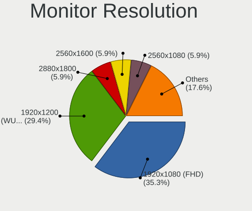

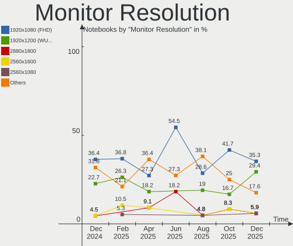

| Resolution        | Notebooks | Percent |
|-------------------|-----------|---------|
| 1920x1080 (FHD)   | 6         | 35.29%  |
| 1920x1200 (WUXGA) | 5         | 29.41%  |
| 2880x1800         | 1         | 5.88%   |
| 2560x1600         | 1         | 5.88%   |
| 2560x1080         | 1         | 5.88%   |
| 1600x900 (HD+)    | 1         | 5.88%   |
| 1366x768 (WXGA)   | 1         | 5.88%   |
| Unknown           | 1         | 5.88%   |

Monitor Diagonal
----------------

Diagonal size in inches

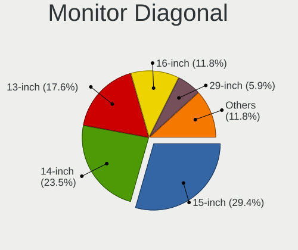

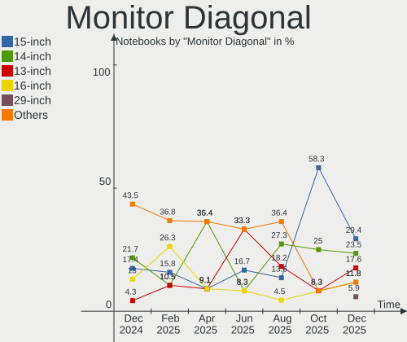

| Inches  | Notebooks | Percent |
|---------|-----------|---------|
| 15      | 5         | 29.41%  |
| 14      | 4         | 23.53%  |
| 13      | 3         | 17.65%  |
| 16      | 2         | 11.76%  |
| 29      | 1         | 5.88%   |
| 17      | 1         | 5.88%   |
| Unknown | 1         | 5.88%   |

Monitor Width
-------------

Physical width

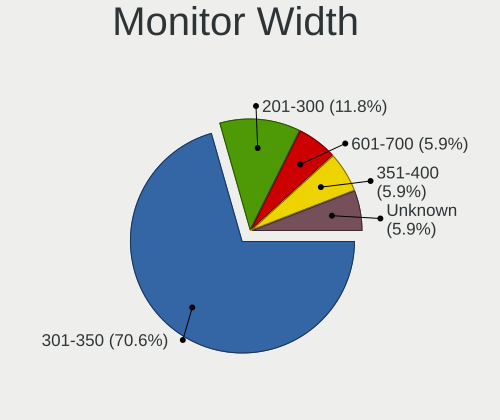

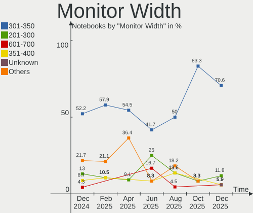

| Width in mm | Notebooks | Percent |
|-------------|-----------|---------|
| 301-350     | 12        | 70.59%  |
| 201-300     | 2         | 11.76%  |
| 601-700     | 1         | 5.88%   |
| 351-400     | 1         | 5.88%   |
| Unknown     | 1         | 5.88%   |

Aspect Ratio
------------

Proportional relationship between the width and the height

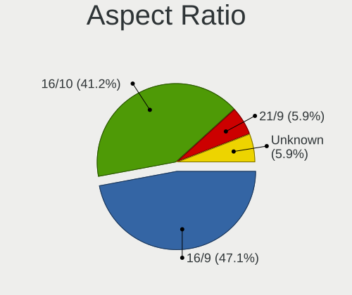

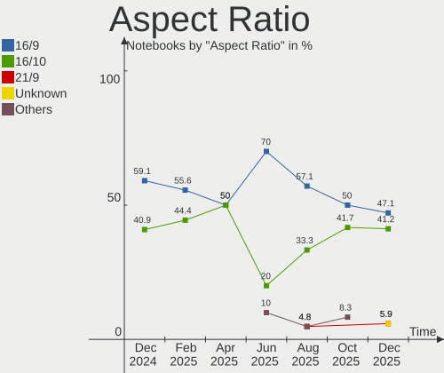

| Ratio   | Notebooks | Percent |
|---------|-----------|---------|
| 16/9    | 8         | 47.06%  |
| 16/10   | 7         | 41.18%  |
| 21/9    | 1         | 5.88%   |
| Unknown | 1         | 5.88%   |

Monitor Area
------------

Area in inch²

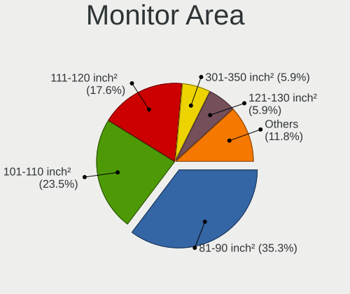

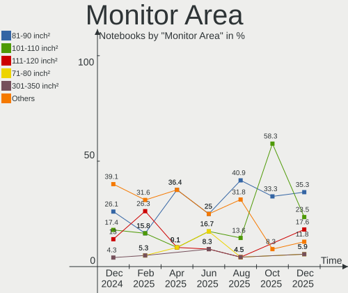

| Area in inch² | Notebooks | Percent |
|----------------|-----------|---------|
| 81-90          | 6         | 35.29%  |
| 101-110        | 4         | 23.53%  |
| 111-120        | 3         | 17.65%  |
| 71-80          | 1         | 5.88%   |
| 301-350        | 1         | 5.88%   |
| 121-130        | 1         | 5.88%   |
| Unknown        | 1         | 5.88%   |

Pixel Density
-------------

Pixels per inch

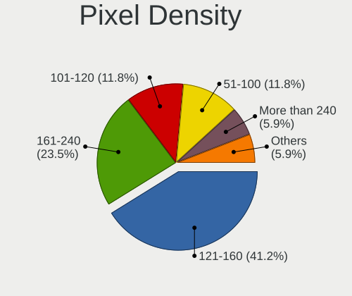

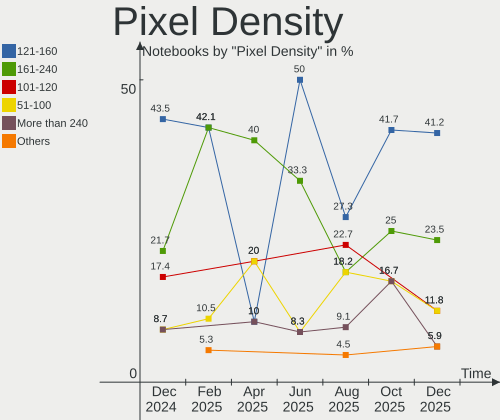

| Density       | Notebooks | Percent |
|---------------|-----------|---------|
| 121-160       | 7         | 41.18%  |
| 161-240       | 4         | 23.53%  |
| 101-120       | 2         | 11.76%  |
| 51-100        | 2         | 11.76%  |
| More than 240 | 1         | 5.88%   |
| Unknown       | 1         | 5.88%   |

Multiple Monitors
-----------------

Total monitors connected

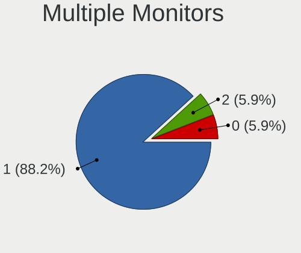

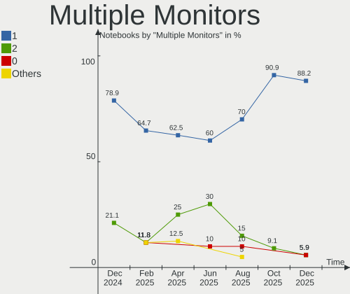

| Total | Notebooks | Percent |
|-------|-----------|---------|
| 1     | 15        | 88.24%  |
| 2     | 1         | 5.88%   |
| 0     | 1         | 5.88%   |

Network
-------

Net Controller Vendor
---------------------

Controller vendors

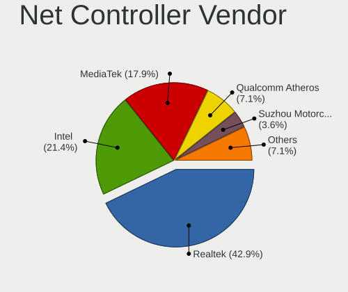

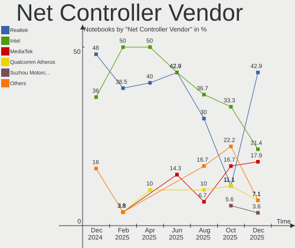

| Vendor                                 | Notebooks | Percent |
|----------------------------------------|-----------|---------|
| Realtek Semiconductor                  | 12        | 42.86%  |
| Intel                                  | 6         | 21.43%  |
| MediaTek                               | 5         | 17.86%  |
| Qualcomm Atheros                       | 2         | 7.14%   |
| Suzhou Motorcomm Electronic Technology | 1         | 3.57%   |
| Qualcomm                               | 1         | 3.57%   |
| Broadcom                               | 1         | 3.57%   |

Net Controller Model
--------------------

Controller models

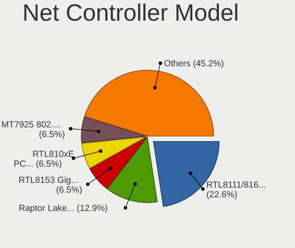

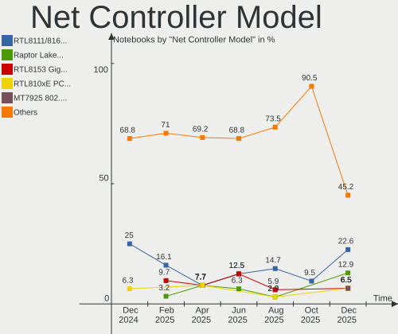

| Model                                                                           | Notebooks | Percent |
|---------------------------------------------------------------------------------|-----------|---------|
| Realtek RTL8111/8168/8211/8411 PCI Express Gigabit Ethernet Controller          | 7         | 22.58%  |
| Intel Raptor Lake PCH CNVi WiFi                                                 | 4         | 12.9%   |
| Realtek RTL8153 Gigabit Ethernet Adapter                                        | 2         | 6.45%   |
| Realtek RTL810xE PCI Express Fast Ethernet controller                           | 2         | 6.45%   |
| MediaTek MT7925 802.11be 160MHz 2x2 PCIe Wireless Network Adapter [Filogic 360] | 2         | 6.45%   |
| Suzhou Motorcomm Electronic YT6801 Gigabit Ethernet Controller                  | 1         | 3.23%   |
| Realtek USB 10/100/1G/2.5 LAN                                                   | 1         | 3.23%   |
| Realtek RTL8822CE 802.11ac PCIe Wireless Network Adapter                        | 1         | 3.23%   |
| Realtek RTL8821CE 802.11ac PCIe Wireless Network Adapter                        | 1         | 3.23%   |
| Qualcomm QCNFA765 Wireless Network Adapter                                      | 1         | 3.23%   |
| Qualcomm Atheros QCA9377 802.11ac Wireless Network Adapter                      | 1         | 3.23%   |
| Qualcomm Atheros AR9485 Wireless Network Adapter                                | 1         | 3.23%   |
| MediaTek MT7925 (RZ717) Wi-Fi 7 160MHz                                          | 1         | 3.23%   |
| MediaTek MT7922 802.11ax PCI Express Wireless Network Adapter                   | 1         | 3.23%   |
| MediaTek MT7921 802.11ax PCIe Wireless Network Adapter [Filogic 330]            | 1         | 3.23%   |
| Intel Wi-Fi 6 AX201                                                             | 1         | 3.23%   |
| Intel BE201 320MHz                                                              | 1         | 3.23%   |
| Broadcom BRCM4387 Bluetooth Controller                                          | 1         | 3.23%   |
| Broadcom BCM4387 802.11ax Dual Band Wireless LAN Controller                     | 1         | 3.23%   |

Wireless Vendor
---------------

Wireless vendors

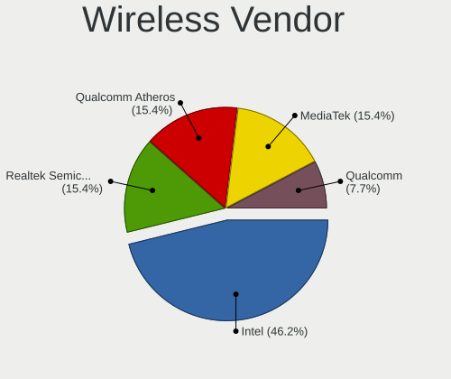

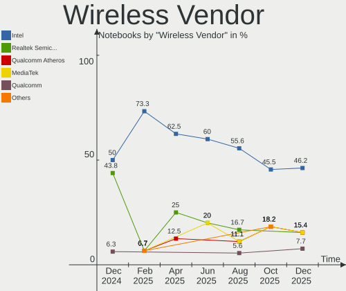

| Vendor                | Notebooks | Percent |
|-----------------------|-----------|---------|
| Intel                 | 6         | 46.15%  |
| Realtek Semiconductor | 2         | 15.38%  |
| Qualcomm Atheros      | 2         | 15.38%  |
| MediaTek              | 2         | 15.38%  |
| Qualcomm              | 1         | 7.69%   |

Wireless Model
--------------

Wireless models

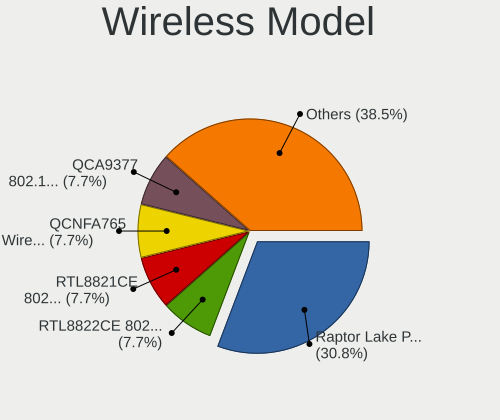

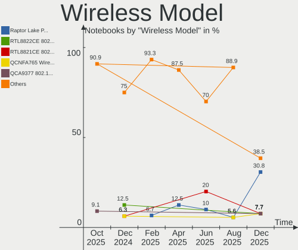

| Model                                                                | Notebooks | Percent |
|----------------------------------------------------------------------|-----------|---------|
| Intel Raptor Lake PCH CNVi WiFi                                      | 4         | 30.77%  |
| Realtek RTL8822CE 802.11ac PCIe Wireless Network Adapter             | 1         | 7.69%   |
| Realtek RTL8821CE 802.11ac PCIe Wireless Network Adapter             | 1         | 7.69%   |
| Qualcomm QCNFA765 Wireless Network Adapter                           | 1         | 7.69%   |
| Qualcomm Atheros QCA9377 802.11ac Wireless Network Adapter           | 1         | 7.69%   |
| Qualcomm Atheros AR9485 Wireless Network Adapter                     | 1         | 7.69%   |
| MediaTek MT7925 (RZ717) Wi-Fi 7 160MHz                               | 1         | 7.69%   |
| MediaTek MT7921 802.11ax PCIe Wireless Network Adapter [Filogic 330] | 1         | 7.69%   |
| Intel Wi-Fi 6 AX201                                                  | 1         | 7.69%   |
| Intel BE201 320MHz                                                   | 1         | 7.69%   |

Ethernet Vendor
---------------

Ethernet vendors

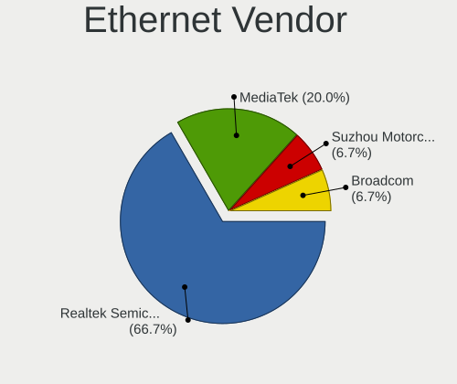

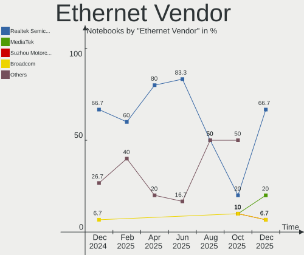

| Vendor                                 | Notebooks | Percent |
|----------------------------------------|-----------|---------|
| Realtek Semiconductor                  | 10        | 66.67%  |
| MediaTek                               | 3         | 20%     |
| Suzhou Motorcomm Electronic Technology | 1         | 6.67%   |
| Broadcom                               | 1         | 6.67%   |

Ethernet Model
--------------

Ethernet models

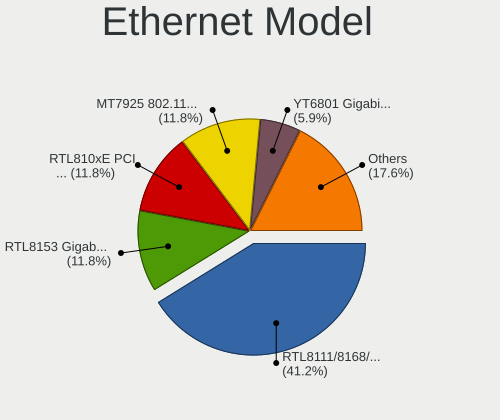

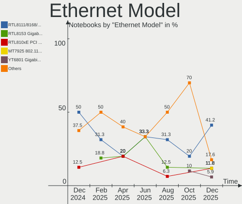

| Model                                                                           | Notebooks | Percent |
|---------------------------------------------------------------------------------|-----------|---------|
| Realtek RTL8111/8168/8211/8411 PCI Express Gigabit Ethernet Controller          | 7         | 41.18%  |
| Realtek RTL8153 Gigabit Ethernet Adapter                                        | 2         | 11.76%  |
| Realtek RTL810xE PCI Express Fast Ethernet controller                           | 2         | 11.76%  |
| MediaTek MT7925 802.11be 160MHz 2x2 PCIe Wireless Network Adapter [Filogic 360] | 2         | 11.76%  |
| Suzhou Motorcomm Electronic YT6801 Gigabit Ethernet Controller                  | 1         | 5.88%   |
| Realtek USB 10/100/1G/2.5 LAN                                                   | 1         | 5.88%   |
| MediaTek MT7922 802.11ax PCI Express Wireless Network Adapter                   | 1         | 5.88%   |
| Broadcom BCM4387 802.11ax Dual Band Wireless LAN Controller                     | 1         | 5.88%   |

Net Controller Kind
-------------------

Ethernet, WiFi or modem

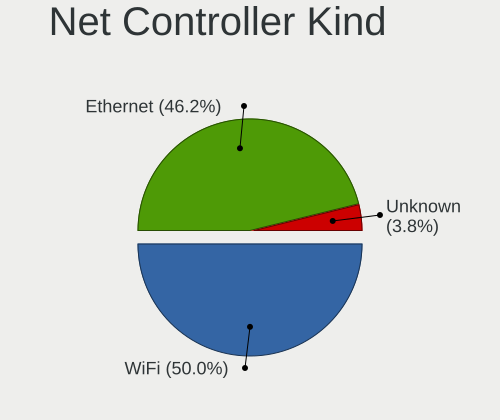

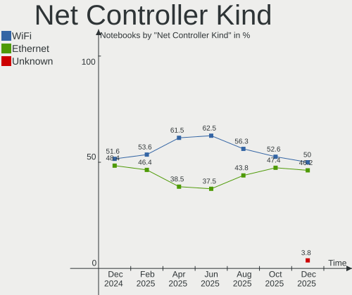

| Kind     | Notebooks | Percent |
|----------|-----------|---------|
| WiFi     | 13        | 50%     |
| Ethernet | 12        | 46.15%  |
| Unknown  | 1         | 3.85%   |

Used Controller
---------------

Currently used network controller

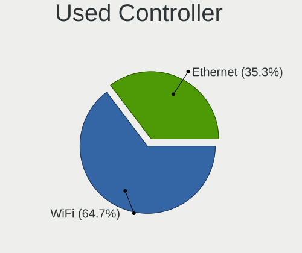

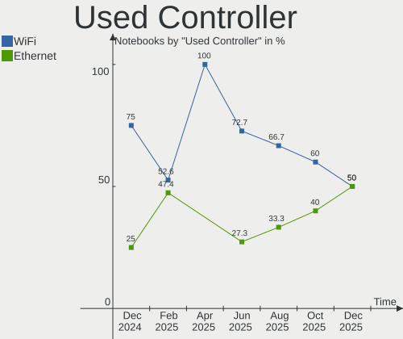

| Kind     | Notebooks | Percent |
|----------|-----------|---------|
| WiFi     | 8         | 50%     |
| Ethernet | 8         | 50%     |

NICs
----

Total network controllers on board

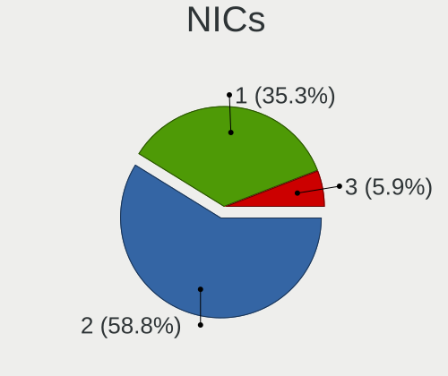

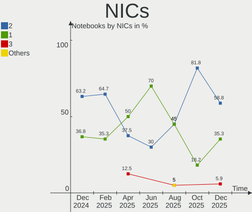

| Total | Notebooks | Percent |
|-------|-----------|---------|
| 2     | 10        | 58.82%  |
| 1     | 6         | 35.29%  |
| 3     | 1         | 5.88%   |

IPv6
----

IPv6 vs IPv4

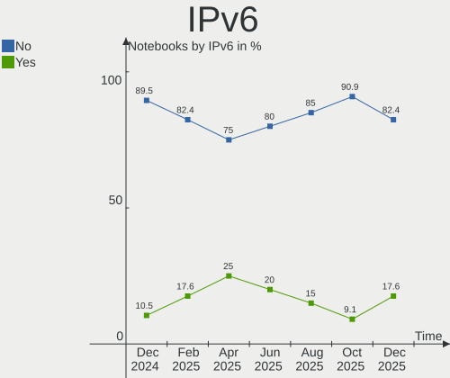

| Used | Notebooks | Percent |
|------|-----------|---------|
| No   | 14        | 82.35%  |
| Yes  | 3         | 17.65%  |

Bluetooth
---------

Bluetooth Vendor
----------------

Controller vendors

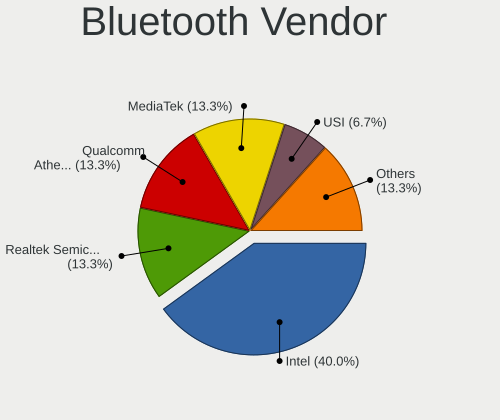

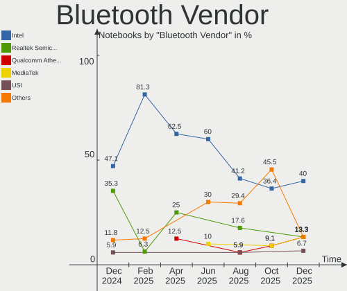

| Vendor                          | Notebooks | Percent |
|---------------------------------|-----------|---------|
| Intel                           | 6         | 40%     |
| Realtek Semiconductor           | 2         | 13.33%  |
| Qualcomm Atheros Communications | 2         | 13.33%  |
| MediaTek                        | 2         | 13.33%  |
| USI                             | 1         | 6.67%   |
| IMC Networks                    | 1         | 6.67%   |
| Foxconn / Hon Hai               | 1         | 6.67%   |

Bluetooth Model
---------------

Controller models

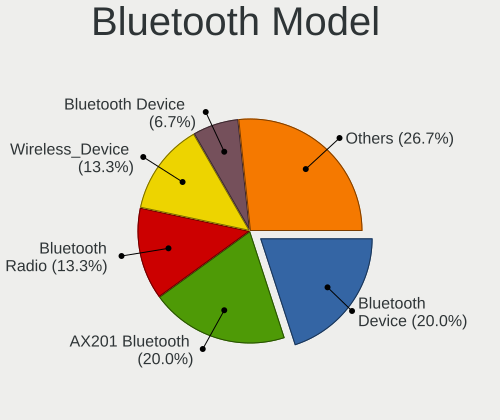

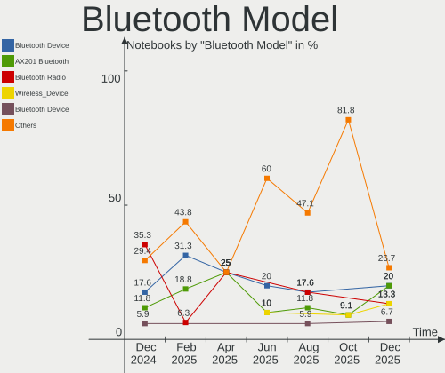

| Model                                        | Notebooks | Percent |
|----------------------------------------------|-----------|---------|
| Intel Bluetooth Device                       | 3         | 20%     |
| Intel AX201 Bluetooth                        | 3         | 20%     |
| Realtek Bluetooth Radio                      | 2         | 13.33%  |
| MediaTek Wireless_Device                     | 2         | 13.33%  |
| USI Bluetooth Device                         | 1         | 6.67%   |
| Qualcomm Atheros  Bluetooth Device           | 1         | 6.67%   |
| Qualcomm Atheros AR3012 Bluetooth 4.0        | 1         | 6.67%   |
| IMC Networks Wireless_Device                 | 1         | 6.67%   |
| Foxconn / Hon Hai MediaTek Bluetooth Adapter | 1         | 6.67%   |

Sound
-----

Sound Vendor
------------

Sound card vendors

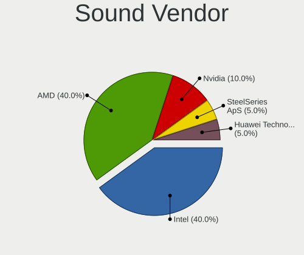

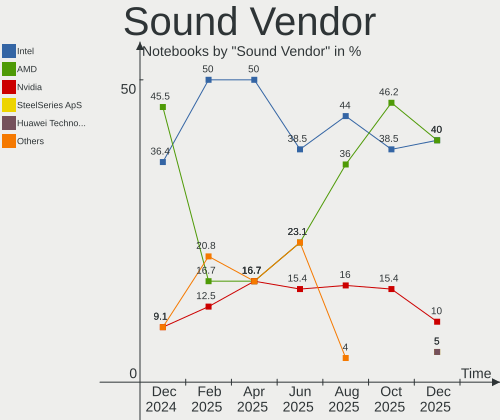

| Vendor              | Notebooks | Percent |
|---------------------|-----------|---------|
| Intel               | 8         | 40%     |
| AMD                 | 8         | 40%     |
| Nvidia              | 2         | 10%     |
| SteelSeries ApS     | 1         | 5%      |
| Huawei Technologies | 1         | 5%      |

Sound Model
-----------

Sound card models

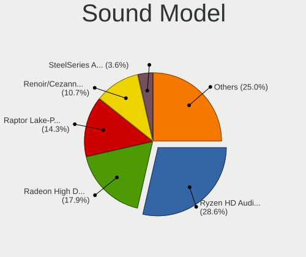

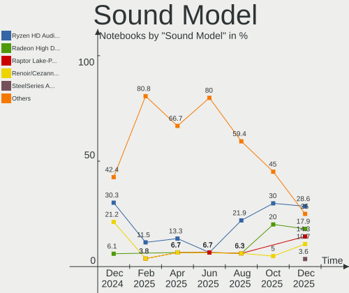

| Model                                                               | Notebooks | Percent |
|---------------------------------------------------------------------|-----------|---------|
| AMD Ryzen HD Audio Controller                                       | 8         | 28.57%  |
| AMD Radeon High Definition Audio Controller                         | 5         | 17.86%  |
| Intel Raptor Lake-P/U/H cAVS                                        | 4         | 14.29%  |
| AMD Renoir/Cezanne HDMI/DP Audio Controller                         | 3         | 10.71%  |
| SteelSeries ApS SteelSeries Arctis 5                                | 1         | 3.57%   |
| Nvidia GB206 High Definition Audio Controller                       | 1         | 3.57%   |
| Nvidia AD107 High Definition Audio Controller                       | 1         | 3.57%   |
| Intel Tiger Lake-LP Smart Sound Technology Audio Controller         | 1         | 3.57%   |
| Intel Sunrise Point-LP HD Audio                                     | 1         | 3.57%   |
| Intel Lunar Lake-M HD Audio Controller                              | 1         | 3.57%   |
| Intel 7 Series/C216 Chipset Family High Definition Audio Controller | 1         | 3.57%   |
| Huawei Technologies KT USB Audio                                    | 1         | 3.57%   |

Memory
------

Memory Vendor
-------------

Memory module vendors

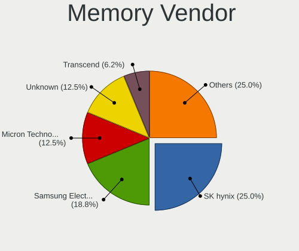

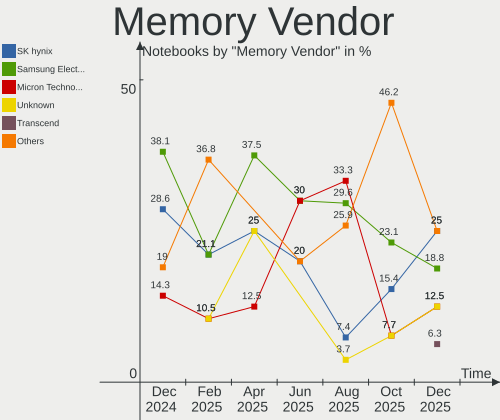

| Vendor              | Notebooks | Percent |
|---------------------|-----------|---------|
| SK hynix            | 4         | 25%     |
| Samsung Electronics | 3         | 18.75%  |
| Micron Technology   | 2         | 12.5%   |
| Unknown             | 2         | 12.5%   |
| Transcend           | 1         | 6.25%   |
| Team                | 1         | 6.25%   |
| Ramaxel Technology  | 1         | 6.25%   |
| Kingston            | 1         | 6.25%   |
| A-DATA Technology   | 1         | 6.25%   |

Memory Model
------------

Memory module models

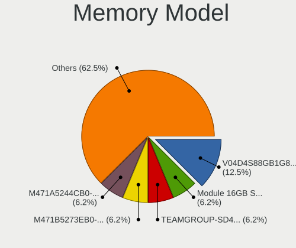

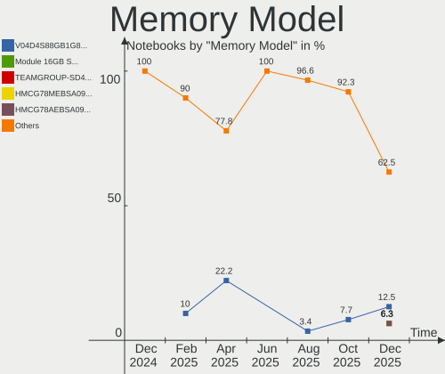

| Model                                                       | Notebooks | Percent |
|-------------------------------------------------------------|-----------|---------|
| Unknown                                                     | 2         | 12.5%   |
| Transcend RAM Module 16GB SODIMM DDR5 4800MT/s              | 1         | 6.25%   |
| Team RAM TEAMGROUP-SD4-3200 16GB SODIMM DDR4 3200MT/s       | 1         | 6.25%   |
| SK hynix RAM HMCG78MEBSA092N 16GB SODIMM DDR5 4800MT/s      | 1         | 6.25%   |
| SK hynix RAM HMCG78AEBSA095N 16GB SODIMM DDR5 4800MT/s      | 1         | 6.25%   |
| SK hynix RAM HMA851S6AFR6N-UH 4GB SODIMM DDR4 2667MT/s      | 1         | 6.25%   |
| SK hynix RAM H9JCNNNCP3MLYR-N6E 4GB SODIMM LPDDR5 6400MT/s  | 1         | 6.25%   |
| Samsung RAM M471B5273EB0-CK0 4GB SODIMM DDR3 4199MT/s       | 1         | 6.25%   |
| Samsung RAM M471A5244CB0-CWE 4GB Row Of Chips DDR4 3200MT/s | 1         | 6.25%   |
| Samsung RAM M425R1GB4PB0-CWMOD 8GiB SODIMM DDR5 5600MT/s    | 1         | 6.25%   |
| Ramaxel RAM RMSB3420MD88ICF-5600 32GB SODIMM DDR5 5600MT/s  | 1         | 6.25%   |
| Micron RAM Module 4GB Row Of Chips LPDDR5 8533MT/s          | 1         | 6.25%   |
| Micron RAM 4ATF51264HZ-2G3B1 4GB SODIMM DDR4 3200MT/s       | 1         | 6.25%   |
| Kingston RAM HP32D4S2S8MR-8 8GB SODIMM DDR4 3200MT/s        | 1         | 6.25%   |
| A-DATA RAM AD5S560048G-SF2 48GB SODIMM DDR5 5600MT/s        | 1         | 6.25%   |

Memory Kind
-----------

Memory module kinds

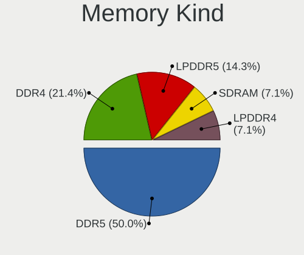

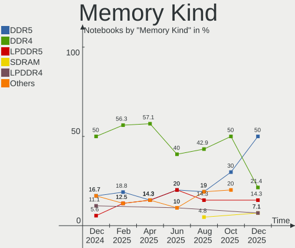

| Kind   | Notebooks | Percent |
|--------|-----------|---------|
| DDR5   | 7         | 50%     |
| DDR4   | 3         | 21.43%  |
| LPDDR5 | 2         | 14.29%  |
| SDRAM  | 1         | 7.14%   |
| LPDDR4 | 1         | 7.14%   |

Memory Form Factor
------------------

Physical design of the memory module

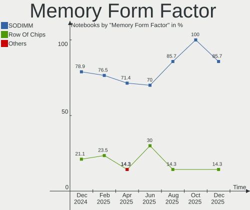

| Name         | Notebooks | Percent |
|--------------|-----------|---------|
| SODIMM       | 12        | 85.71%  |
| Row Of Chips | 2         | 14.29%  |

Memory Size
-----------

Memory module size

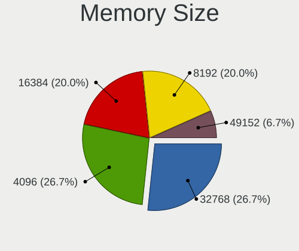

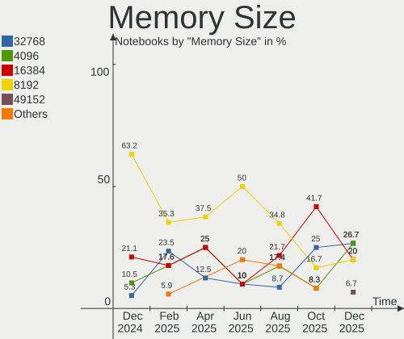

| Size  | Notebooks | Percent |
|-------|-----------|---------|
| 32768 | 4         | 26.67%  |
| 4096  | 4         | 26.67%  |
| 16384 | 3         | 20%     |
| 8192  | 3         | 20%     |
| 49152 | 1         | 6.67%   |

Memory Speed
------------

Memory module speed

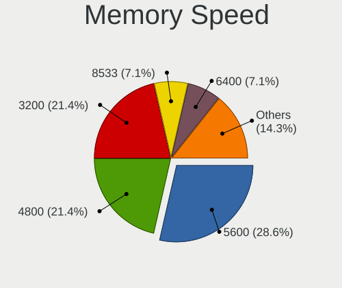

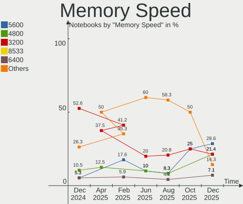

| Speed | Notebooks | Percent |
|-------|-----------|---------|
| 5600  | 4         | 28.57%  |
| 4800  | 3         | 21.43%  |
| 3200  | 3         | 21.43%  |
| 8533  | 1         | 7.14%   |
| 6400  | 1         | 7.14%   |
| 4199  | 1         | 7.14%   |
| 2667  | 1         | 7.14%   |

Printers & scanners
-------------------

Printer Vendor
--------------

Printer device vendors

Zero info for selected period =(

Printer Model
-------------

Printer device models

Zero info for selected period =(

Scanner Vendor
--------------

Scanner device vendors

Zero info for selected period =(

Scanner Model
-------------

Scanner device models

Zero info for selected period =(

Camera
------

Camera Vendor
-------------

Camera device vendors

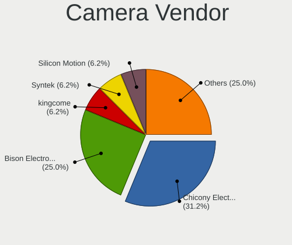

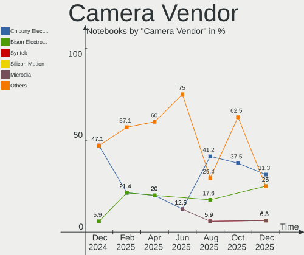

| Vendor                      | Notebooks | Percent |
|-----------------------------|-----------|---------|
| Chicony Electronics         | 5         | 31.25%  |
| Bison Electronics           | 4         | 25%     |
| Syntek                      | 1         | 6.25%   |
| Silicon Motion              | 1         | 6.25%   |
| Microdia                    | 1         | 6.25%   |
| Luxvisions Innotech Limited | 1         | 6.25%   |
| kingcome                    | 1         | 6.25%   |
| IMC Networks                | 1         | 6.25%   |
| Framework                   | 1         | 6.25%   |

Camera Model
------------

Camera device models

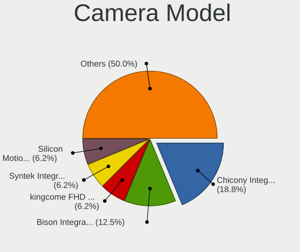

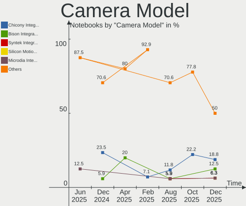

| Model                                             | Notebooks | Percent |
|---------------------------------------------------|-----------|---------|
| Chicony Integrated Camera                         | 3         | 18.75%  |
| Bison Integrated Camera                           | 2         | 12.5%   |
| Syntek Integrated Camera                          | 1         | 6.25%   |
| Silicon Motion WebCam SC-10HDD12636N              | 1         | 6.25%   |
| Microdia Integrated_Webcam_HD                     | 1         | 6.25%   |
| Luxvisions Innotech Limited Integrated RGB Camera | 1         | 6.25%   |
| kingcome FHD WebCam                               | 1         | 6.25%   |
| IMC Networks USB2.0 HD UVC WebCam                 | 1         | 6.25%   |
| Framework Laptop Webcam Module (2nd Gen)          | 1         | 6.25%   |
| Chicony HP TrueVision HD Camera                   | 1         | 6.25%   |
| Chicony HP FHD Camera                             | 1         | 6.25%   |
| Bison FHD Camera                                  | 1         | 6.25%   |
| Bison EasyCamera                                  | 1         | 6.25%   |

Security
--------

Fingerprint Vendor
------------------

Fingerprint sensor vendors

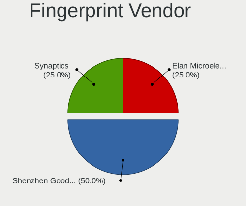

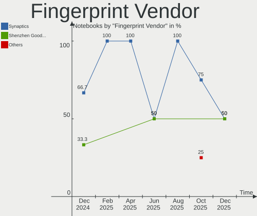

| Vendor                     | Notebooks | Percent |
|----------------------------|-----------|---------|
| Synaptics                  | 1         | 50%     |
| Shenzhen Goodix Technology | 1         | 50%     |

Fingerprint Model
-----------------

Fingerprint sensor models

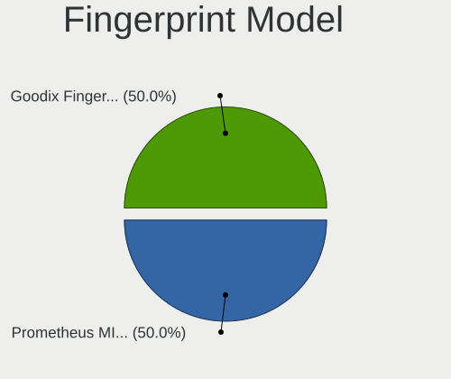

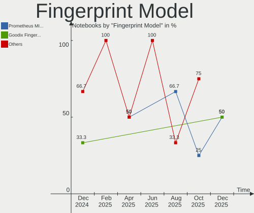

| Model                                             | Notebooks | Percent |
|---------------------------------------------------|-----------|---------|
| Synaptics Prometheus MIS Touch Fingerprint Reader | 1         | 50%     |
| Shenzhen Goodix  FingerPrint Device               | 1         | 50%     |

Chipcard Vendor
---------------

Chipcard module vendors

Zero info for selected period =(

Chipcard Model
--------------

Chipcard module models

Zero info for selected period =(

Unsupported
-----------

Unsupported Devices
-------------------

Total unsupported devices on board

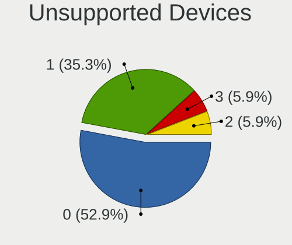

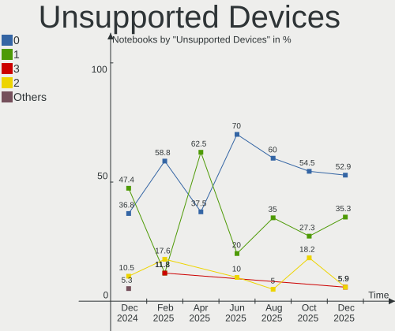

| Total | Notebooks | Percent |
|-------|-----------|---------|
| 0     | 9         | 52.94%  |
| 1     | 6         | 35.29%  |
| 3     | 1         | 5.88%   |
| 2     | 1         | 5.88%   |

Unsupported Device Types
------------------------

Types of unsupported devices

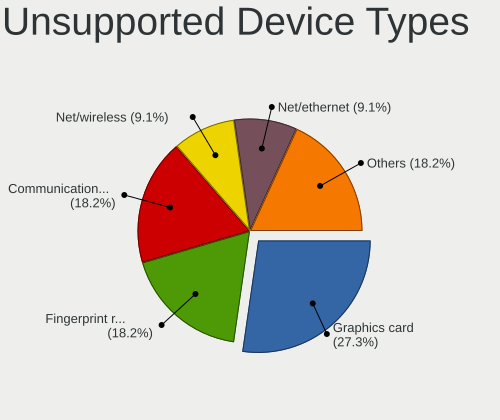

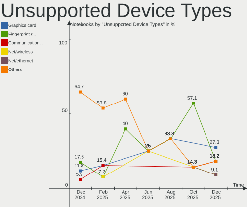

| Type                     | Notebooks | Percent |
|--------------------------|-----------|---------|
| Graphics card            | 3         | 27.27%  |
| Fingerprint reader       | 2         | 18.18%  |
| Communication controller | 2         | 18.18%  |
| Net/wireless             | 1         | 9.09%   |
| Net/ethernet             | 1         | 9.09%   |
| Multimedia controller    | 1         | 9.09%   |
| Card reader              | 1         | 9.09%   |

