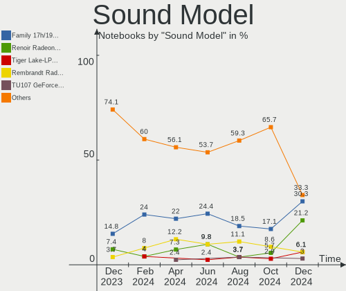

Gentoo - Hardware Trends (Notebooks)
------------------------------------

A project to identify most popular hardware characteristics and track their change
over time based on data collected by Linux users at https://Linux-Hardware.org.

Anyone can contribute to this report by the [hw-probe](https://github.com/linuxhw/hw-probe) tool:

    sudo -E hw-probe -all -upload

This report is for one last month. Overall report since the beginning of time: [TestDays](https://github.com/linuxhw/TestDays)

Period: Apr, 2024.

Contents
--------

* [ System ](#system)
  - [ OS                       ](#os)
  - [ OS Family                ](#os-family)
  - [ Kernel                   ](#kernel)
  - [ Kernel Family            ](#kernel-family)
  - [ Kernel Major Ver.        ](#kernel-major-ver)
  - [ Arch                     ](#arch)
  - [ DE                       ](#de)
  - [ Display Server           ](#display-server)
  - [ Display Manager          ](#display-manager)
  - [ OS Lang                  ](#os-lang)
  - [ Boot Mode                ](#boot-mode)
  - [ Filesystem               ](#filesystem)
  - [ Part. scheme             ](#part-scheme)
  - [ Dual Boot with Linux/BSD ](#dual-boot-with-linuxbsd)
  - [ Dual Boot (Win)          ](#dual-boot-win)

* [ Board ](#board)
  - [ Vendor                   ](#vendor)
  - [ Model                    ](#model)
  - [ Model Family             ](#model-family)
  - [ MFG Year                 ](#mfg-year)
  - [ Form Factor              ](#form-factor)
  - [ Secure Boot              ](#secure-boot)
  - [ Coreboot                 ](#coreboot)
  - [ RAM Size                 ](#ram-size)
  - [ RAM Used                 ](#ram-used)
  - [ Total Drives             ](#total-drives)
  - [ Has CD-ROM               ](#has-cd-rom)
  - [ Has Ethernet             ](#has-ethernet)
  - [ Has WiFi                 ](#has-wifi)
  - [ Has Bluetooth            ](#has-bluetooth)

* [ Location ](#location)
  - [ Country                  ](#country)
  - [ City                     ](#city)

* [ Drives ](#drives)
  - [ Drive Vendor             ](#drive-vendor)
  - [ Drive Model              ](#drive-model)
  - [ HDD Vendor               ](#hdd-vendor)
  - [ SSD Vendor               ](#ssd-vendor)
  - [ Drive Kind               ](#drive-kind)
  - [ Drive Connector          ](#drive-connector)
  - [ Drive Size               ](#drive-size)
  - [ Space Total              ](#space-total)
  - [ Space Used               ](#space-used)
  - [ Malfunc. Drives          ](#malfunc-drives)
  - [ Malfunc. Drive Vendor    ](#malfunc-drive-vendor)
  - [ Malfunc. HDD Vendor      ](#malfunc-hdd-vendor)
  - [ Malfunc. Drive Kind      ](#malfunc-drive-kind)
  - [ Failed Drives            ](#failed-drives)
  - [ Failed Drive Vendor      ](#failed-drive-vendor)
  - [ Drive Status             ](#drive-status)

* [ Storage controller ](#storage-controller)
  - [ Storage Vendor           ](#storage-vendor)
  - [ Storage Model            ](#storage-model)
  - [ Storage Kind             ](#storage-kind)

* [ Processor ](#processor)
  - [ CPU Vendor               ](#cpu-vendor)
  - [ CPU Model                ](#cpu-model)
  - [ CPU Model Family         ](#cpu-model-family)
  - [ CPU Cores                ](#cpu-cores)
  - [ CPU Sockets              ](#cpu-sockets)
  - [ CPU Threads              ](#cpu-threads)
  - [ CPU Op-Modes             ](#cpu-op-modes)
  - [ CPU Microcode            ](#cpu-microcode)
  - [ CPU Microarch            ](#cpu-microarch)

* [ Graphics ](#graphics)
  - [ GPU Vendor               ](#gpu-vendor)
  - [ GPU Model                ](#gpu-model)
  - [ GPU Combo                ](#gpu-combo)
  - [ GPU Driver               ](#gpu-driver)
  - [ GPU Memory               ](#gpu-memory)

* [ Monitor ](#monitor)
  - [ Monitor Vendor           ](#monitor-vendor)
  - [ Monitor Model            ](#monitor-model)
  - [ Monitor Resolution       ](#monitor-resolution)
  - [ Monitor Diagonal         ](#monitor-diagonal)
  - [ Monitor Width            ](#monitor-width)
  - [ Aspect Ratio             ](#aspect-ratio)
  - [ Monitor Area             ](#monitor-area)
  - [ Pixel Density            ](#pixel-density)
  - [ Multiple Monitors        ](#multiple-monitors)

* [ Network ](#network)
  - [ Net Controller Vendor    ](#net-controller-vendor)
  - [ Net Controller Model     ](#net-controller-model)
  - [ Wireless Vendor          ](#wireless-vendor)
  - [ Wireless Model           ](#wireless-model)
  - [ Ethernet Vendor          ](#ethernet-vendor)
  - [ Ethernet Model           ](#ethernet-model)
  - [ Net Controller Kind      ](#net-controller-kind)
  - [ Used Controller          ](#used-controller)
  - [ NICs                     ](#nics)
  - [ IPv6                     ](#ipv6)

* [ Bluetooth ](#bluetooth)
  - [ Bluetooth Vendor         ](#bluetooth-vendor)
  - [ Bluetooth Model          ](#bluetooth-model)

* [ Sound ](#sound)
  - [ Sound Vendor             ](#sound-vendor)
  - [ Sound Model              ](#sound-model)

* [ Memory ](#memory)
  - [ Memory Vendor            ](#memory-vendor)
  - [ Memory Model             ](#memory-model)
  - [ Memory Kind              ](#memory-kind)
  - [ Memory Form Factor       ](#memory-form-factor)
  - [ Memory Size              ](#memory-size)
  - [ Memory Speed             ](#memory-speed)

* [ Printers & scanners ](#printers--scanners)
  - [ Printer Vendor           ](#printer-vendor)
  - [ Printer Model            ](#printer-model)
  - [ Scanner Vendor           ](#scanner-vendor)
  - [ Scanner Model            ](#scanner-model)

* [ Camera ](#camera)
  - [ Camera Vendor            ](#camera-vendor)
  - [ Camera Model             ](#camera-model)

* [ Security ](#security)
  - [ Fingerprint Vendor       ](#fingerprint-vendor)
  - [ Fingerprint Model        ](#fingerprint-model)
  - [ Chipcard Vendor          ](#chipcard-vendor)
  - [ Chipcard Model           ](#chipcard-model)

* [ Unsupported ](#unsupported)
  - [ Unsupported Devices      ](#unsupported-devices)
  - [ Unsupported Device Types ](#unsupported-device-types)

System
------

OS
--

Installed operating systems

| Name        | Notebooks | Percent |
|-------------|-----------|---------|
| Gentoo 2.14 | 15        | 65.22%  |
| Gentoo 2.15 | 7         | 30.43%  |
| Gentoo 2.13 | 1         | 4.35%   |

OS Family
---------

OS without a version

| Name   | Notebooks | Percent |
|--------|-----------|---------|
| Gentoo | 23        | 100%    |

Kernel
------

Version of the Linux kernel

| Version                  | Notebooks | Percent |
|--------------------------|-----------|---------|
| 6.8.4-gentoo             | 3         | 13.04%  |
| 6.6.21-gentoo-dist       | 3         | 13.04%  |
| 6.8.7-gentoo             | 2         | 8.7%    |
| 6.7.4-gentoo             | 2         | 8.7%    |
| 6.6.21-gentoo            | 2         | 8.7%    |
| 6.8.8-gentoo-dist        | 1         | 4.35%   |
| 6.8.5-gentoo-r1-x86_64   | 1         | 4.35%   |
| 6.8.4-cachyos-x86_64     | 1         | 4.35%   |
| 6.8.1-gentoo             | 1         | 4.35%   |
| 6.6.3-gentoo             | 1         | 4.35%   |
| 6.6.21-gentoo-x86_64     | 1         | 4.35%   |
| 6.6.21-gentoo-md-a15     | 1         | 4.35%   |
| 6.6.16-gentoo-dist       | 1         | 4.35%   |
| 6.6.13-gentoo            | 1         | 4.35%   |
| 6.6.12-gentoo            | 1         | 4.35%   |
| 6.1.67-gentoo-fomys-work | 1         | 4.35%   |

Kernel Family
-------------

Linux kernel without a distro release

| Version | Notebooks | Percent |
|---------|-----------|---------|
| 6.6.21  | 7         | 30.43%  |
| 6.8.4   | 4         | 17.39%  |
| 6.8.7   | 2         | 8.7%    |
| 6.7.4   | 2         | 8.7%    |
| 6.8.8   | 1         | 4.35%   |
| 6.8.5   | 1         | 4.35%   |
| 6.8.1   | 1         | 4.35%   |
| 6.6.3   | 1         | 4.35%   |
| 6.6.16  | 1         | 4.35%   |
| 6.6.13  | 1         | 4.35%   |
| 6.6.12  | 1         | 4.35%   |
| 6.1.67  | 1         | 4.35%   |

Kernel Major Ver.
-----------------

Linux kernel major version

| Version | Notebooks | Percent |
|---------|-----------|---------|
| 6.6     | 11        | 47.83%  |
| 6.8     | 9         | 39.13%  |
| 6.7     | 2         | 8.7%    |
| 6.1     | 1         | 4.35%   |

Arch
----

OS architecture (x86_64, i586, etc.)

| Name   | Notebooks | Percent |
|--------|-----------|---------|
| x86_64 | 22        | 95.65%  |
| i686   | 1         | 4.35%   |

DE
--

Desktop Environment

| Name    | Notebooks | Percent |
|---------|-----------|---------|
| Unknown | 7         | 30.43%  |
| sway    | 3         | 13.04%  |
| KDE5    | 3         | 13.04%  |
| GNOME   | 3         | 13.04%  |
| LXQt    | 2         | 8.7%    |
| XFCE    | 1         | 4.35%   |
| KDE6    | 1         | 4.35%   |
| KDE     | 1         | 4.35%   |
| fluxbox | 1         | 4.35%   |
| DWM     | 1         | 4.35%   |

Display Server
--------------

X11 or Wayland

| Name    | Notebooks | Percent |
|---------|-----------|---------|
| Wayland | 14        | 60.87%  |
| X11     | 5         | 21.74%  |
| Tty     | 2         | 8.7%    |
| Unknown | 2         | 8.7%    |

Display Manager
---------------

SDDM, LightDM, etc.

| Name    | Notebooks | Percent |
|---------|-----------|---------|
| Unknown | 10        | 43.48%  |
| SDDM    | 7         | 30.43%  |
| LightDM | 3         | 13.04%  |
| GDM     | 2         | 8.7%    |
| Ly      | 1         | 4.35%   |

OS Lang
-------

Language

| Lang    | Notebooks | Percent |
|---------|-----------|---------|
| en_US   | 8         | 34.78%  |
| Unknown | 7         | 30.43%  |
| C.UTF8  | 3         | 13.04%  |
| pl_PL   | 1         | 4.35%   |
| fr_FR   | 1         | 4.35%   |
| en_AU   | 1         | 4.35%   |
| de_DE   | 1         | 4.35%   |
| C       | 1         | 4.35%   |

Boot Mode
---------

EFI or BIOS

| Mode | Notebooks | Percent |
|------|-----------|---------|
| EFI  | 19        | 82.61%  |
| BIOS | 4         | 17.39%  |

Filesystem
----------

Type of filesystem

| Type  | Notebooks | Percent |
|-------|-----------|---------|
| Btrfs | 9         | 39.13%  |
| Ext4  | 7         | 30.43%  |
| Xfs   | 5         | 21.74%  |
| Zfs   | 1         | 4.35%   |
| F2fs  | 1         | 4.35%   |

Part. scheme
------------

Scheme of partitioning

| Type | Notebooks | Percent |
|------|-----------|---------|
| GPT  | 22        | 95.65%  |
| MBR  | 1         | 4.35%   |

Dual Boot with Linux/BSD
------------------------

Hosting more than one Linux/BSD

| Dual boot | Notebooks | Percent |
|-----------|-----------|---------|
| No        | 20        | 86.96%  |
| Yes       | 3         | 13.04%  |

Dual Boot (Win)
---------------

Hosting Linux and Windows

| Dual boot | Notebooks | Percent |
|-----------|-----------|---------|
| No        | 17        | 73.91%  |
| Yes       | 6         | 26.09%  |

Board
-----

Vendor
------

Motherboard manufacturer

| Name             | Notebooks | Percent |
|------------------|-----------|---------|
| Lenovo           | 6         | 26.09%  |
| Dell             | 5         | 21.74%  |
| ASUSTek Computer | 5         | 21.74%  |
| Hewlett-Packard  | 2         | 8.7%    |
| Framework        | 2         | 8.7%    |
| Maibenben        | 1         | 4.35%   |
| IBM              | 1         | 4.35%   |
| Chuwi            | 1         | 4.35%   |

Model
-----

Motherboard model

| Name                                       | Notebooks | Percent |
|--------------------------------------------|-----------|---------|
| HP EliteBook 845 14 inch G10 Notebook PC   | 2         | 8.7%    |
| ASUS ROG Zephyrus G14 GA401II_GA401II      | 2         | 8.7%    |
| Maibenben MaiBook M                        | 1         | 4.35%   |
| Lenovo ZHAOYANG E43                        | 1         | 4.35%   |
| Lenovo ThinkPad T480 20L6SAYX00            | 1         | 4.35%   |
| Lenovo ThinkPad T14 Gen 3 21CGS0LG00       | 1         | 4.35%   |
| Lenovo ThinkPad P16 Gen 2 21FA000VPB       | 1         | 4.35%   |
| Lenovo ThinkPad E15 Gen 2 20T8000MPB       | 1         | 4.35%   |
| Lenovo G50-30 80G0                         | 1         | 4.35%   |
| IBM ThinkPad T41 23737JU                   | 1         | 4.35%   |
| Framework Laptop 13 (AMD Ryzen 7040Series) | 1         | 4.35%   |
| Framework Laptop (13th Gen Intel Core)     | 1         | 4.35%   |
| Dell Precision 5530                        | 1         | 4.35%   |
| Dell Precision 5480                        | 1         | 4.35%   |
| Dell Latitude 5440                         | 1         | 4.35%   |
| Dell G3 3590                               | 1         | 4.35%   |
| Dell G15 5510                              | 1         | 4.35%   |
| Chuwi GemiBook XPro                        | 1         | 4.35%   |
| ASUS X550ZA                                | 1         | 4.35%   |
| ASUS TUF Gaming FX505DV_FX505DV            | 1         | 4.35%   |
| ASUS ASUS TUF Gaming A15 FA507NU_FA507NU   | 1         | 4.35%   |

Model Family
------------

Motherboard model prefix

| Name              | Notebooks | Percent |
|-------------------|-----------|---------|
| Lenovo ThinkPad   | 4         | 17.39%  |
| HP EliteBook      | 2         | 8.7%    |
| Framework Laptop  | 2         | 8.7%    |
| Dell Precision    | 2         | 8.7%    |
| ASUS ROG          | 2         | 8.7%    |
| Maibenben MaiBook | 1         | 4.35%   |
| Lenovo ZHAOYANG   | 1         | 4.35%   |
| Lenovo G50-30     | 1         | 4.35%   |
| IBM ThinkPad      | 1         | 4.35%   |
| Dell Latitude     | 1         | 4.35%   |
| Dell G3           | 1         | 4.35%   |
| Dell G15          | 1         | 4.35%   |
| Chuwi GemiBook    | 1         | 4.35%   |
| ASUS X550ZA       | 1         | 4.35%   |
| ASUS TUF          | 1         | 4.35%   |
| ASUS ASUS         | 1         | 4.35%   |

MFG Year
--------

Motherboard manufacture year

| Year | Notebooks | Percent |
|------|-----------|---------|
| 2023 | 9         | 39.13%  |
| 2018 | 4         | 17.39%  |
| 2020 | 2         | 8.7%    |
| 2019 | 2         | 8.7%    |
| 2014 | 2         | 8.7%    |
| 2022 | 1         | 4.35%   |
| 2021 | 1         | 4.35%   |
| 2008 | 1         | 4.35%   |
| 2004 | 1         | 4.35%   |

Form Factor
-----------

Physical design of the computer

| Name     | Notebooks | Percent |
|----------|-----------|---------|
| Notebook | 23        | 100%    |

Secure Boot
-----------

Enabled or disabled

| State    | Notebooks | Percent |
|----------|-----------|---------|
| Disabled | 21        | 91.3%   |
| Enabled  | 2         | 8.7%    |

Coreboot
--------

Have coreboot on board

| Used | Notebooks | Percent |
|------|-----------|---------|
| No   | 23        | 100%    |

RAM Size
--------

Total RAM memory

| Size in GB  | Notebooks | Percent |
|-------------|-----------|---------|
| 8.01-16.0   | 7         | 30.43%  |
| 32.01-64.0  | 5         | 21.74%  |
| 64.01-256.0 | 4         | 17.39%  |
| 4.01-8.0    | 2         | 8.7%    |
| 24.01-32.0  | 2         | 8.7%    |
| 3.01-4.0    | 1         | 4.35%   |
| 16.01-24.0  | 1         | 4.35%   |
| 1.01-2.0    | 1         | 4.35%   |

RAM Used
--------

Used RAM memory

| Used GB    | Notebooks | Percent |
|------------|-----------|---------|
| 2.01-3.0   | 7         | 30.43%  |
| 1.01-2.0   | 7         | 30.43%  |
| 4.01-8.0   | 4         | 17.39%  |
| 0.01-0.5   | 2         | 8.7%    |
| 3.01-4.0   | 1         | 4.35%   |
| 16.01-24.0 | 1         | 4.35%   |
| 8.01-16.0  | 1         | 4.35%   |

Total Drives
------------

Number of drives on board

| Drives | Notebooks | Percent |
|--------|-----------|---------|
| 1      | 17        | 73.91%  |
| 2      | 5         | 21.74%  |
| 3      | 1         | 4.35%   |

Has CD-ROM
----------

Has CD-ROM on board

| Presented | Notebooks | Percent |
|-----------|-----------|---------|
| No        | 20        | 86.96%  |
| Yes       | 3         | 13.04%  |

Has Ethernet
------------

Has Ethernet on board

| Presented | Notebooks | Percent |
|-----------|-----------|---------|
| Yes       | 19        | 82.61%  |
| No        | 4         | 17.39%  |

Has WiFi
--------

Has WiFi module

| Presented | Notebooks | Percent |
|-----------|-----------|---------|
| Yes       | 23        | 100%    |

Has Bluetooth
-------------

Has Bluetooth module

| Presented | Notebooks | Percent |
|-----------|-----------|---------|
| Yes       | 19        | 82.61%  |
| No        | 4         | 17.39%  |

Location
--------

Country
-------

Geographic location (country)

| Country         | Notebooks | Percent |
|-----------------|-----------|---------|
| Russia          | 6         | 26.09%  |
| Poland          | 4         | 17.39%  |
| USA             | 3         | 13.04%  |
| UK              | 1         | 4.35%   |
| The Netherlands | 1         | 4.35%   |
| Switzerland     | 1         | 4.35%   |
| Spain           | 1         | 4.35%   |
| South Africa    | 1         | 4.35%   |
| Serbia          | 1         | 4.35%   |
| India           | 1         | 4.35%   |
| Germany         | 1         | 4.35%   |
| France          | 1         | 4.35%   |
| China           | 1         | 4.35%   |

City
----

Geographic location (city)

| City          | Notebooks | Percent |
|---------------|-----------|---------|
| Moscow        | 2         | 8.7%    |
| Wroclaw       | 1         | 4.35%   |
| Whitefish     | 1         | 4.35%   |
| Toulouse      | 1         | 4.35%   |
| Tianjin       | 1         | 4.35%   |
| St Petersburg | 1         | 4.35%   |
| Sellersville  | 1         | 4.35%   |
| Poznan        | 1         | 4.35%   |
| Omsk          | 1         | 4.35%   |
| Miami         | 1         | 4.35%   |
| Krasnodar     | 1         | 4.35%   |
| Johannesburg  | 1         | 4.35%   |
| Irkutsk       | 1         | 4.35%   |
| Gliwice       | 1         | 4.35%   |
| Glasgow       | 1         | 4.35%   |
| Delhi         | 1         | 4.35%   |
| Cieszyn       | 1         | 4.35%   |
| Bochum        | 1         | 4.35%   |
| Bern          | 1         | 4.35%   |
| Belgrade      | 1         | 4.35%   |
| Amsterdam     | 1         | 4.35%   |
| Alicante      | 1         | 4.35%   |

Drives
------

Drive Vendor
------------

Hard drive vendors

| Vendor                         | Notebooks | Drives | Percent |
|--------------------------------|-----------|--------|---------|
| Sandisk                        | 6         | 6      | 20.69%  |
| Samsung Electronics            | 5         | 5      | 17.24%  |
| Kingston                       | 3         | 3      | 10.34%  |
| Unknown                        | 2         | 2      | 6.9%    |
| KIOXIA                         | 2         | 2      | 6.9%    |
| WDC                            | 1         | 1      | 3.45%   |
| Union Memory                   | 1         | 1      | 3.45%   |
| Solid State Storage Technology | 1         | 1      | 3.45%   |
| Shenzhen Longsys Electronics   | 1         | 2      | 3.45%   |
| SCCTS-603-256G                 | 1         | 1      | 3.45%   |
| Netac                          | 1         | 1      | 3.45%   |
| Micron Technology              | 1         | 1      | 3.45%   |
| MAXIO Technology (Hangzhou)    | 1         | 1      | 3.45%   |
| Intenso                        | 1         | 1      | 3.45%   |
| Intel                          | 1         | 1      | 3.45%   |
| HGST                           | 1         | 1      | 3.45%   |

Drive Model
-----------

Hard drive models

| Model                                              | Notebooks | Percent |
|----------------------------------------------------|-----------|---------|
| Samsung NVMe SSD Controller SM981/PM981/PM983 1TB  | 3         | 10.34%  |
| Sandisk WD Blue SN550 NVMe SSD 2TB                 | 2         | 6.9%    |
| KIOXIA KXG80ZNV1T02 1TB                            | 2         | 6.9%    |
| WDC WD42 EJRX-89BFNY0 4TB                          | 1         | 3.45%   |
| Unknown NVMe SSD Drive 2TB                         | 1         | 3.45%   |
| Unknown MMC Card  8GB                              | 1         | 3.45%   |
| Union Memory UMIS RPJTJ512MEE1OWX 512GB            | 1         | 3.45%   |
| Solid State Storage CL4-3D256-Q11 NVMe SSSTC 256GB | 1         | 3.45%   |
| Shenzhen Longsys Lexar SSD NM710 2TB               | 1         | 3.45%   |
| SCCTS-603-256G SSD 256GB                           | 1         | 3.45%   |
| Sandisk WD_BLACK SN850X 2000GB                     | 1         | 3.45%   |
| Sandisk WD PC SN540 SDDPNPF-512G                   | 1         | 3.45%   |
| Sandisk WD Black SN850 512GB                       | 1         | 3.45%   |
| Sandisk PC SN530 NVMe WDC 512GB                    | 1         | 3.45%   |
| Samsung SSD 990 PRO 1TB                            | 1         | 3.45%   |
| Samsung NVMe SSD Controller PM9A1/PM9A3/980PRO 1TB | 1         | 3.45%   |
| Netac SSD 960GB                                    | 1         | 3.45%   |
| Micron 2400_MTFDKBA512QFM 512GB                    | 1         | 3.45%   |
| MAXIO (Hangzhou) Predator SSD GM7 M.2 2TB          | 1         | 3.45%   |
| Kingston SV300S37A120G 120GB SSD                   | 1         | 3.45%   |
| Kingston SKC6002048G 2TB SSD                       | 1         | 3.45%   |
| Kingston SA400S37480G 480GB SSD                    | 1         | 3.45%   |
| Intenso JAJMS600M128G 128GB SSD                    | 1         | 3.45%   |
| Intel SSDSC2KW128G8 128GB                          | 1         | 3.45%   |
| HGST HTS541010A9E680 1TB                           | 1         | 3.45%   |

HDD Vendor
----------

Hard disk drive vendors

| Vendor | Notebooks | Drives | Percent |
|--------|-----------|--------|---------|
| WDC    | 1         | 1      | 50%     |
| HGST   | 1         | 1      | 50%     |

SSD Vendor
----------

Solid state drive vendors

| Vendor         | Notebooks | Drives | Percent |
|----------------|-----------|--------|---------|
| Kingston       | 3         | 3      | 42.86%  |
| SCCTS-603-256G | 1         | 1      | 14.29%  |
| Netac          | 1         | 1      | 14.29%  |
| Intenso        | 1         | 1      | 14.29%  |
| Intel          | 1         | 1      | 14.29%  |

Drive Kind
----------

HDD or SSD

| Kind | Notebooks | Drives | Percent |
|------|-----------|--------|---------|
| NVMe | 18        | 20     | 64.29%  |
| SSD  | 7         | 7      | 25%     |
| HDD  | 2         | 2      | 7.14%   |
| MMC  | 1         | 1      | 3.57%   |

Drive Connector
---------------

SATA, SAS, NVMe, etc.

| Type | Notebooks | Drives | Percent |
|------|-----------|--------|---------|
| NVMe | 18        | 20     | 66.67%  |
| SATA | 7         | 8      | 25.93%  |
| SAS  | 1         | 1      | 3.7%    |
| MMC  | 1         | 1      | 3.7%    |

Drive Size
----------

Size of hard drive

| Size in TB | Notebooks | Drives | Percent |
|------------|-----------|--------|---------|
| 0.01-0.5   | 5         | 5      | 55.56%  |
| 0.51-1.0   | 2         | 2      | 22.22%  |
| 3.01-4.0   | 1         | 1      | 11.11%  |
| 1.01-2.0   | 1         | 1      | 11.11%  |

Space Total
-----------

Amount of disk space available on the file system

| Size in GB     | Notebooks | Percent |
|----------------|-----------|---------|
| 251-500        | 5         | 21.74%  |
| 1001-2000      | 5         | 21.74%  |
| More than 3000 | 3         | 13.04%  |
| 101-250        | 3         | 13.04%  |
| 501-1000       | 3         | 13.04%  |
| Unknown        | 2         | 8.7%    |
| 1-20           | 1         | 4.35%   |
| 51-100         | 1         | 4.35%   |

Space Used
----------

Amount of used disk space

| Used GB        | Notebooks | Percent |
|----------------|-----------|---------|
| 21-50          | 5         | 21.74%  |
| 101-250        | 4         | 17.39%  |
| More than 3000 | 3         | 13.04%  |
| 251-500        | 3         | 13.04%  |
| 1-20           | 3         | 13.04%  |
| 51-100         | 2         | 8.7%    |
| Unknown        | 2         | 8.7%    |
| 1001-2000      | 1         | 4.35%   |

Malfunc. Drives
---------------

Drive models with a malfunction

Zero info for selected period =(

Malfunc. Drive Vendor
---------------------

Vendors of faulty drives

Zero info for selected period =(

Malfunc. HDD Vendor
-------------------

Vendors of faulty HDD drives

Zero info for selected period =(

Malfunc. Drive Kind
-------------------

Kinds of faulty drives

Zero info for selected period =(

Failed Drives
-------------

Failed drive models

Zero info for selected period =(

Failed Drive Vendor
-------------------

Failed drive vendors

Zero info for selected period =(

Drive Status
------------

Number of failed and malfunc. drives

| Status   | Notebooks | Drives | Percent |
|----------|-----------|--------|---------|
| Works    | 22        | 28     | 91.67%  |
| Detected | 2         | 2      | 8.33%   |

Storage controller
------------------

Storage Vendor
--------------

Storage controller vendors

| Vendor                         | Notebooks | Percent |
|--------------------------------|-----------|---------|
| Intel                          | 7         | 23.33%  |
| Sandisk                        | 6         | 20%     |
| Samsung Electronics            | 5         | 16.67%  |
| AMD                            | 4         | 13.33%  |
| KIOXIA                         | 2         | 6.67%   |
| Union Memory (Shenzhen)        | 1         | 3.33%   |
| Solid State Storage Technology | 1         | 3.33%   |
| Shenzhen Longsys Electronics   | 1         | 3.33%   |
| Micron Technology              | 1         | 3.33%   |
| MAXIO Technology (Hangzhou)    | 1         | 3.33%   |
| INNOGRIT                       | 1         | 3.33%   |

Storage Model
-------------

Storage controller models

| Model                                                                 | Notebooks | Percent |
|-----------------------------------------------------------------------|-----------|---------|
| AMD FCH SATA Controller [AHCI mode]                                   | 4         | 13.33%  |
| Samsung NVMe SSD Controller SM981/PM981/PM983                         | 3         | 10%     |
| SanDisk Ultra 3D / WD Blue SN550 NVMe SSD                             | 2         | 6.67%   |
| KIOXIA NVMe SSD Controller XG8                                        | 2         | 6.67%   |
| Intel Cannon Lake Mobile PCH SATA AHCI Controller                     | 2         | 6.67%   |
| Union Memory (Shenzhen) AM620 PCIe 3.0 NVMe SSD 512GB                 | 1         | 3.33%   |
| Solid State Storage CL4-8D512 NVMe SSD M.2 (DRAM-less)                | 1         | 3.33%   |
| Shenzhen Longsys Lexar NM790 NVME SSD (DRAM-less)                     | 1         | 3.33%   |
| SanDisk WD PC SN810 / Black SN850 NVMe SSD                            | 1         | 3.33%   |
| SanDisk WD PC SN540 / Green SN350 NVMe SSD 1 TB (DRAM-less)           | 1         | 3.33%   |
| Sandisk WD Black SN850X NVMe SSD                                      | 1         | 3.33%   |
| SanDisk IX SN530 NVMe SSD (DRAM-less)                                 | 1         | 3.33%   |
| Samsung NVMe SSD Controller S4LV008[Pascal]                           | 1         | 3.33%   |
| Samsung NVMe SSD Controller PM9A1/PM9A3/980PRO                        | 1         | 3.33%   |
| Micron 2400 NVMe SSD (DRAM-less)                                      | 1         | 3.33%   |
| MAXIO (Hangzhou) NVMe SSD Controller MAP1602 (DRAM-less)              | 1         | 3.33%   |
| Intel Volume Management Device NVMe RAID Controller Intel Corporation | 1         | 3.33%   |
| Intel SATA controller                                                 | 1         | 3.33%   |
| Intel Atom Processor E3800 Series SATA AHCI Controller                | 1         | 3.33%   |
| Intel 82801IBM/IEM (ICH9M/ICH9M-E) 4 port SATA Controller [AHCI mode] | 1         | 3.33%   |
| Intel 82801DBM (ICH4-M) IDE Controller                                | 1         | 3.33%   |
| INNOGRIT NVMe SSD Controller IG5236                                   | 1         | 3.33%   |

Storage Kind
------------

Kind of storage controller (IDE, SATA, NVMe, SAS, ...)

| Kind | Notebooks | Percent |
|------|-----------|---------|
| NVMe | 18        | 62.07%  |
| SATA | 9         | 31.03%  |
| RAID | 1         | 3.45%   |
| IDE  | 1         | 3.45%   |

Processor
---------

CPU Vendor
----------

Processor vendors

| Vendor | Notebooks | Percent |
|--------|-----------|---------|
| Intel  | 12        | 52.17%  |
| AMD    | 11        | 47.83%  |

CPU Model
---------

Processor models

| Model                                          | Notebooks | Percent |
|------------------------------------------------|-----------|---------|
| AMD Ryzen 9 PRO 7940HS w/ Radeon 780M Graphics | 2         | 8.7%    |
| AMD Ryzen 7 4800HS with Radeon Graphics        | 2         | 8.7%    |
| Intel Pentium M processor 2.26GHz              | 1         | 4.35%   |
| Intel Pentium CPU N3540 @ 2.16GHz              | 1         | 4.35%   |
| Intel N100                                     | 1         | 4.35%   |
| Intel Core i7-8850H CPU @ 2.60GHz              | 1         | 4.35%   |
| Intel Core i7-8550U CPU @ 1.80GHz              | 1         | 4.35%   |
| Intel Core i5-9300H CPU @ 2.40GHz              | 1         | 4.35%   |
| Intel Core i5-10200H CPU @ 2.40GHz             | 1         | 4.35%   |
| Intel Core 2 Duo CPU P9700 @ 2.80GHz           | 1         | 4.35%   |
| Intel 13th Gen Core i7-13850HX                 | 1         | 4.35%   |
| Intel 13th Gen Core i7-13800H                  | 1         | 4.35%   |
| Intel 13th Gen Core i7-1370P                   | 1         | 4.35%   |
| Intel 13th Gen Core i5-1335U                   | 1         | 4.35%   |
| AMD Ryzen 7 PRO 6850U with Radeon Graphics     | 1         | 4.35%   |
| AMD Ryzen 7 7840U w/ Radeon 780M Graphics      | 1         | 4.35%   |
| AMD Ryzen 7 7735HS with Radeon Graphics        | 1         | 4.35%   |
| AMD Ryzen 7 4700U with Radeon Graphics         | 1         | 4.35%   |
| AMD Ryzen 7 3750H with Radeon Vega Mobile Gfx  | 1         | 4.35%   |
| AMD Ryzen 5 4500U with Radeon Graphics         | 1         | 4.35%   |
| AMD A8-7200P Radeon R5, 8 Compute Cores 4C+4G  | 1         | 4.35%   |

CPU Model Family
----------------

Processor model prefix

| Model            | Notebooks | Percent |
|------------------|-----------|---------|
| AMD Ryzen 7      | 6         | 26.09%  |
| Other            | 5         | 21.74%  |
| Intel Core i7    | 2         | 8.7%    |
| Intel Core i5    | 2         | 8.7%    |
| AMD Ryzen 9      | 2         | 8.7%    |
| Intel Pentium M  | 1         | 4.35%   |
| Intel Pentium    | 1         | 4.35%   |
| Intel Core 2 Duo | 1         | 4.35%   |
| AMD Ryzen 7 PRO  | 1         | 4.35%   |
| AMD Ryzen 5      | 1         | 4.35%   |
| AMD A8           | 1         | 4.35%   |

CPU Cores
---------

Number of processor cores

| Number | Notebooks | Percent |
|--------|-----------|---------|
| 8      | 8         | 34.78%  |
| 4      | 6         | 26.09%  |
| 14     | 2         | 8.7%    |
| 6      | 2         | 8.7%    |
| 2      | 2         | 8.7%    |
| 20     | 1         | 4.35%   |
| 10     | 1         | 4.35%   |
| 1      | 1         | 4.35%   |

CPU Sockets
-----------

Number of sockets

| Number | Notebooks | Percent |
|--------|-----------|---------|
| 1      | 23        | 100%    |

CPU Threads
-----------

Threads per core (Hyper-Threading)

| Number | Notebooks | Percent |
|--------|-----------|---------|
| 2      | 17        | 73.91%  |
| 1      | 6         | 26.09%  |

CPU Op-Modes
------------

CPU Operation Modes (32-bit, 64-bit)

| Op mode        | Notebooks | Percent |
|----------------|-----------|---------|
| 32-bit, 64-bit | 22        | 95.65%  |
| 32-bit         | 1         | 4.35%   |

CPU Microcode
-------------

Microcode number

| Number     | Notebooks | Percent |
|------------|-----------|---------|
| Unknown    | 18        | 78.26%  |
| 0x0a404102 | 2         | 8.7%    |
| 0xb06a2    | 1         | 4.35%   |
| 0x08600104 | 1         | 4.35%   |
| 0x08600103 | 1         | 4.35%   |

CPU Microarch
-------------

Microarchitecture

| Name             | Notebooks | Percent |
|------------------|-----------|---------|
| Unknown          | 5         | 21.74%  |
| Zen 2            | 4         | 17.39%  |
| Alderlake Hybrid | 4         | 17.39%  |
| KabyLake         | 3         | 13.04%  |
| Zen+             | 1         | 4.35%   |
| Steamroller      | 1         | 4.35%   |
| Silvermont       | 1         | 4.35%   |
| Penryn           | 1         | 4.35%   |
| P6               | 1         | 4.35%   |
| Gracemont        | 1         | 4.35%   |
| CometLake        | 1         | 4.35%   |

Graphics
--------

GPU Vendor
----------

Vendors of graphics cards

| Vendor | Notebooks | Percent |
|--------|-----------|---------|
| AMD    | 12        | 37.5%   |
| Nvidia | 10        | 31.25%  |
| Intel  | 10        | 31.25%  |

GPU Model
---------

Graphics card models

| Model                                                                | Notebooks | Percent |
|----------------------------------------------------------------------|-----------|---------|
| AMD Renoir [Radeon RX Vega 6 (Ryzen 4000/5000 Mobile Series)]        | 4         | 12.5%   |
| Intel Raptor Lake-P [Iris Xe Graphics]                               | 3         | 9.38%   |
| AMD Phoenix1                                                         | 3         | 9.38%   |
| Nvidia TU116M [GeForce GTX 1650 Ti Mobile]                           | 2         | 6.25%   |
| Intel CoffeeLake-H GT2 [UHD Graphics 630]                            | 2         | 6.25%   |
| AMD Rembrandt [Radeon 680M]                                          | 2         | 6.25%   |
| Nvidia TU117M [GeForce GTX 1650 Mobile / Max-Q]                      | 1         | 3.13%   |
| Nvidia TU106M [GeForce RTX 2060 Mobile]                              | 1         | 3.13%   |
| Nvidia GP107GLM [Quadro P2000 Mobile]                                | 1         | 3.13%   |
| Nvidia GF117M [GeForce 610M/710M/810M/820M / GT 620M/625M/630M/720M] | 1         | 3.13%   |
| Nvidia GA107M [GeForce RTX 3050 Mobile]                              | 1         | 3.13%   |
| Nvidia G98M [Quadro NVS 160M]                                        | 1         | 3.13%   |
| Nvidia AD107M [GeForce RTX 4050 Max-Q / Mobile]                      | 1         | 3.13%   |
| Nvidia AD107GLM [RTX 2000 Ada Generation Laptop GPU]                 | 1         | 3.13%   |
| Intel UHD Graphics 620                                               | 1         | 3.13%   |
| Intel Raptor Lake-S UHD Graphics                                     | 1         | 3.13%   |
| Intel Comet Lake-H GT1 [UHD Graphics 610]                            | 1         | 3.13%   |
| Intel Atom Processor Z36xxx/Z37xxx Series Graphics & Display         | 1         | 3.13%   |
| Intel Alder Lake-N [UHD Graphics]                                    | 1         | 3.13%   |
| AMD RV200/M7 [Mobility Radeon 7500]                                  | 1         | 3.13%   |
| AMD Picasso/Raven 2 [Radeon Vega Series / Radeon Vega Mobile Series] | 1         | 3.13%   |
| AMD Kaveri [Radeon R5 Graphics]                                      | 1         | 3.13%   |

GPU Combo
---------

Combinations of graphics cards

| Name           | Notebooks | Percent |
|----------------|-----------|---------|
| 1 x AMD        | 8         | 34.78%  |
| Intel + Nvidia | 5         | 21.74%  |
| 1 x Intel      | 5         | 21.74%  |
| AMD + Nvidia   | 4         | 17.39%  |
| 1 x Nvidia     | 1         | 4.35%   |

GPU Driver
----------

Free vs proprietary

| Driver      | Notebooks | Percent |
|-------------|-----------|---------|
| Free        | 16        | 69.57%  |
| Proprietary | 6         | 26.09%  |
| Unknown     | 1         | 4.35%   |

GPU Memory
----------

Total video memory

| Size in GB | Notebooks | Percent |
|------------|-----------|---------|
| Unknown    | 12        | 52.17%  |
| 0.01-0.5   | 8         | 34.78%  |
| 0.51-1.0   | 2         | 8.7%    |
| 1.01-2.0   | 1         | 4.35%   |

Monitor
-------

Monitor Vendor
--------------

Monitor vendors

| Vendor              | Notebooks | Percent |
|---------------------|-----------|---------|
| BOE                 | 7         | 24.14%  |
| AU Optronics        | 5         | 17.24%  |
| Samsung Electronics | 2         | 6.9%    |
| PANDA               | 2         | 6.9%    |
| Dell                | 2         | 6.9%    |
| AOC                 | 2         | 6.9%    |
| ViewSonic           | 1         | 3.45%   |
| Sharp               | 1         | 3.45%   |
| Nvidia              | 1         | 3.45%   |
| LG Display          | 1         | 3.45%   |
| Lenovo              | 1         | 3.45%   |
| HKC                 | 1         | 3.45%   |
| Goldstar            | 1         | 3.45%   |
| CSO                 | 1         | 3.45%   |
| Chimei Innolux      | 1         | 3.45%   |

Monitor Model
-------------

Monitor models

| Model                                                                   | Notebooks | Percent |
|-------------------------------------------------------------------------|-----------|---------|
| BOE LCD Monitor BOE0BCA 2256x1504 285x190mm 13.5-inch                   | 2         | 6.9%    |
| AU Optronics LCD Monitor AUO6DA8 2560x1600 301x188mm 14.0-inch          | 2         | 6.9%    |
| ViewSonic VX3276-QHD VSCE635 2560x1440 698x393mm 31.5-inch              | 1         | 3.45%   |
| Sharp LCD Monitor SHP148D 3840x2160 344x194mm 15.5-inch                 | 1         | 3.45%   |
| Samsung Electronics LCD Monitor SDC4852 1366x768 344x194mm 15.5-inch    | 1         | 3.45%   |
| Samsung Electronics LCD Monitor SAM0F9F 3840x2160 1872x1053mm 84.6-inch | 1         | 3.45%   |
| PANDA LCD Monitor NCP0050 1920x1080 309x174mm 14.0-inch                 | 1         | 3.45%   |
| PANDA LCD Monitor NCP002D 1920x1080 344x194mm 15.5-inch                 | 1         | 3.45%   |
| Nvidia LCD Monitor Default Flat Panel 1280x800                          | 1         | 3.45%   |
| LG Display LCD Monitor LGD045D 1366x768 345x194mm 15.6-inch             | 1         | 3.45%   |
| Lenovo LCD Monitor LEN40BA 1920x1080 344x194mm 15.5-inch                | 1         | 3.45%   |
| HKC GF40 HKC2413 1920x1080 521x297mm 23.6-inch                          | 1         | 3.45%   |
| Goldstar HDR 4K GSM774F 3840x2160 697x392mm 31.5-inch                   | 1         | 3.45%   |
| Dell U3821DW DELA1AE 3840x1600 880x367mm 37.5-inch                      | 1         | 3.45%   |
| Dell P2418D DELD0C1 2560x1440 526x296mm 23.8-inch                       | 1         | 3.45%   |
| CSO LCD Monitor CSO142E 1920x1080 309x174mm 14.0-inch                   | 1         | 3.45%   |
| Chimei Innolux N156HMA-GA1 CMN1556 1920x1080 344x193mm 15.5-inch        | 1         | 3.45%   |
| BOE LCD Monitor BOE0AFC 1920x1080 480x270mm 21.7-inch                   | 1         | 3.45%   |
| BOE LCD Monitor BOE0AE0 2560x1600 344x215mm 16.0-inch                   | 1         | 3.45%   |
| BOE LCD Monitor BOE092A 1920x1080 344x194mm 15.5-inch                   | 1         | 3.45%   |
| BOE LCD Monitor BOE0819 1920x1080 344x194mm 15.5-inch                   | 1         | 3.45%   |
| BOE LCD Monitor BOE0700 1920x1080 344x194mm 15.5-inch                   | 1         | 3.45%   |
| AU Optronics LCD Monitor AUOE3A0 3840x2400 301x188mm 14.0-inch          | 1         | 3.45%   |
| AU Optronics LCD Monitor AUO4F9B 2560x1600 301x188mm 14.0-inch          | 1         | 3.45%   |
| AU Optronics LCD Monitor AUO2036 2560x1440 309x174mm 14.0-inch          | 1         | 3.45%   |
| AOC 24V2W1G5 AOC2402 1920x1080 530x300mm 24.0-inch                      | 1         | 3.45%   |
| AOC 24B2W1 AOC2402 1920x1080 527x296mm 23.8-inch                        | 1         | 3.45%   |

Monitor Resolution
------------------

Monitor screen resolution

| Resolution      | Notebooks | Percent |
|-----------------|-----------|---------|
| 1920x1080 (FHD) | 9         | 33.33%  |
| 2560x1440 (QHD) | 5         | 18.52%  |
| 2560x1600       | 4         | 14.81%  |
| 3840x2160 (4K)  | 3         | 11.11%  |
| 2256x1504       | 2         | 7.41%   |
| 3840x2400       | 1         | 3.7%    |
| 3840x1600       | 1         | 3.7%    |
| 1366x768 (WXGA) | 1         | 3.7%    |
| 1280x800 (WXGA) | 1         | 3.7%    |

Monitor Diagonal
----------------

Diagonal size in inches

| Inches  | Notebooks | Percent |
|---------|-----------|---------|
| 15      | 9         | 31.03%  |
| 14      | 7         | 24.14%  |
| 24      | 3         | 10.34%  |
| 31      | 2         | 6.9%    |
| 13      | 2         | 6.9%    |
| 84      | 1         | 3.45%   |
| 37      | 1         | 3.45%   |
| 23      | 1         | 3.45%   |
| 21      | 1         | 3.45%   |
| 16      | 1         | 3.45%   |
| Unknown | 1         | 3.45%   |

Monitor Width
-------------

Physical width

| Width in mm | Notebooks | Percent |
|-------------|-----------|---------|
| 301-350     | 17        | 58.62%  |
| 501-600     | 4         | 13.79%  |
| 601-700     | 2         | 6.9%    |
| 201-300     | 2         | 6.9%    |
| 801-900     | 1         | 3.45%   |
| 401-500     | 1         | 3.45%   |
| 1501-2000   | 1         | 3.45%   |
| Unknown     | 1         | 3.45%   |

Aspect Ratio
------------

Proportional relationship between the width and the height

| Ratio   | Notebooks | Percent |
|---------|-----------|---------|
| 16/9    | 16        | 64%     |
| 16/10   | 5         | 20%     |
| 3/2     | 2         | 8%      |
| 21/9    | 1         | 4%      |
| Unknown | 1         | 4%      |

Monitor Area
------------

Area in inch²

| Area in inch² | Notebooks | Percent |
|----------------|-----------|---------|
| 81-90          | 9         | 31.03%  |
| 101-110        | 9         | 31.03%  |
| 201-250        | 4         | 13.79%  |
| 351-500        | 2         | 6.9%    |
| More than 1000 | 1         | 3.45%   |
| 251-300        | 1         | 3.45%   |
| 111-120        | 1         | 3.45%   |
| 501-1000       | 1         | 3.45%   |
| Unknown        | 1         | 3.45%   |

Pixel Density
-------------

Pixels per inch

| Density       | Notebooks | Percent |
|---------------|-----------|---------|
| 121-160       | 9         | 33.33%  |
| 161-240       | 7         | 25.93%  |
| 51-100        | 5         | 18.52%  |
| 101-120       | 3         | 11.11%  |
| More than 240 | 2         | 7.41%   |
| Unknown       | 1         | 3.7%    |

Multiple Monitors
-----------------

Total monitors connected

| Total | Notebooks | Percent |
|-------|-----------|---------|
| 1     | 15        | 65.22%  |
| 2     | 6         | 26.09%  |
| 3     | 1         | 4.35%   |
| 0     | 1         | 4.35%   |

Network
-------

Net Controller Vendor
---------------------

Controller vendors

| Vendor                                | Notebooks | Percent |
|---------------------------------------|-----------|---------|
| Intel                                 | 17        | 40.48%  |
| Realtek Semiconductor                 | 13        | 30.95%  |
| MediaTek                              | 3         | 7.14%   |
| ASIX Electronics                      | 2         | 4.76%   |
| Xiaomi                                | 1         | 2.38%   |
| Ralink Technology                     | 1         | 2.38%   |
| Qualcomm Atheros                      | 1         | 2.38%   |
| Qualcomm                              | 1         | 2.38%   |
| Cisco Aironet Wireless Communications | 1         | 2.38%   |
| Broadcom Limited                      | 1         | 2.38%   |
| Broadcom                              | 1         | 2.38%   |

Net Controller Model
--------------------

Controller models

| Model                                                                  | Notebooks | Percent |
|------------------------------------------------------------------------|-----------|---------|
| Realtek RTL8111/8168/8211/8411 PCI Express Gigabit Ethernet Controller | 9         | 19.57%  |
| Intel Wi-Fi 6E(802.11ax) AX210/AX1675* 2x2 [Typhoon Peak]              | 4         | 8.7%    |
| Realtek USB 10/100/1G/2.5G LAN                                         | 3         | 6.52%   |
| MediaTek MT7922 802.11ax PCI Express Wireless Network Adapter          | 3         | 6.52%   |
| Intel Wi-Fi 6 AX200                                                    | 3         | 6.52%   |
| Intel Raptor Lake PCH CNVi WiFi                                        | 2         | 4.35%   |
| ASIX AX88179 Gigabit Ethernet                                          | 2         | 4.35%   |
| Xiaomi Mi/Redmi series (RNDIS + ADB)                                   | 1         | 2.17%   |
| Realtek RTL8852BE PCIe 802.11ax Wireless Network Controller            | 1         | 2.17%   |
| Realtek RTL8153 Gigabit Ethernet Adapter                               | 1         | 2.17%   |
| Ralink RT5572 Wireless Adapter                                         | 1         | 2.17%   |
| Qualcomm QCNFA765 Wireless Network Adapter                             | 1         | 2.17%   |
| Qualcomm Atheros AR93xx Wireless Network Adapter                       | 1         | 2.17%   |
| Intel Wi-Fi 5(802.11ac) Wireless-AC 9x6x [Thunder Peak]                | 1         | 2.17%   |
| Intel Raptor Lake-S PCH CNVi WiFi                                      | 1         | 2.17%   |
| Intel PRO/Wireless 5100 AGN [Shiloh] Network Connection                | 1         | 2.17%   |
| Intel Ethernet Controller (2) I225-LMvP                                | 1         | 2.17%   |
| Intel Ethernet Connection (4) I219-LM                                  | 1         | 2.17%   |
| Intel Ethernet Connection (23) I219-LM                                 | 1         | 2.17%   |
| Intel Dual Band Wireless-AC 3168NGW [Stone Peak]                       | 1         | 2.17%   |
| Intel Comet Lake PCH CNVi WiFi                                         | 1         | 2.17%   |
| Intel CNVi: Wi-Fi                                                      | 1         | 2.17%   |
| Intel 82801DB/DBL/DBM (ICH4/ICH4-L/ICH4-M) AC'97 Modem Controller      | 1         | 2.17%   |
| Intel 82540EP Gigabit Ethernet Controller (Mobile)                     | 1         | 2.17%   |
| Cisco Aironet Wireless Cisco Aironet Wireless 802.11b                  | 1         | 2.17%   |
| Broadcom Limited NetLink BCM5784M Gigabit Ethernet PCIe                | 1         | 2.17%   |
| Broadcom BCM43142 802.11b/g/n                                          | 1         | 2.17%   |

Wireless Vendor
---------------

Wireless vendors

| Vendor                                | Notebooks | Percent |
|---------------------------------------|-----------|---------|
| Intel                                 | 15        | 62.5%   |
| MediaTek                              | 3         | 12.5%   |
| Realtek Semiconductor                 | 1         | 4.17%   |
| Ralink Technology                     | 1         | 4.17%   |
| Qualcomm Atheros                      | 1         | 4.17%   |
| Qualcomm                              | 1         | 4.17%   |
| Cisco Aironet Wireless Communications | 1         | 4.17%   |
| Broadcom                              | 1         | 4.17%   |

Wireless Model
--------------

Wireless models

| Model                                                         | Notebooks | Percent |
|---------------------------------------------------------------|-----------|---------|
| Intel Wi-Fi 6E(802.11ax) AX210/AX1675* 2x2 [Typhoon Peak]     | 4         | 16.67%  |
| MediaTek MT7922 802.11ax PCI Express Wireless Network Adapter | 3         | 12.5%   |
| Intel Wi-Fi 6 AX200                                           | 3         | 12.5%   |
| Intel Raptor Lake PCH CNVi WiFi                               | 2         | 8.33%   |
| Realtek RTL8852BE PCIe 802.11ax Wireless Network Controller   | 1         | 4.17%   |
| Ralink RT5572 Wireless Adapter                                | 1         | 4.17%   |
| Qualcomm QCNFA765 Wireless Network Adapter                    | 1         | 4.17%   |
| Qualcomm Atheros AR93xx Wireless Network Adapter              | 1         | 4.17%   |
| Intel Wi-Fi 5(802.11ac) Wireless-AC 9x6x [Thunder Peak]       | 1         | 4.17%   |
| Intel Raptor Lake-S PCH CNVi WiFi                             | 1         | 4.17%   |
| Intel PRO/Wireless 5100 AGN [Shiloh] Network Connection       | 1         | 4.17%   |
| Intel Dual Band Wireless-AC 3168NGW [Stone Peak]              | 1         | 4.17%   |
| Intel Comet Lake PCH CNVi WiFi                                | 1         | 4.17%   |
| Intel CNVi: Wi-Fi                                             | 1         | 4.17%   |
| Cisco Aironet Wireless Cisco Aironet Wireless 802.11b         | 1         | 4.17%   |
| Broadcom BCM43142 802.11b/g/n                                 | 1         | 4.17%   |

Ethernet Vendor
---------------

Ethernet vendors

| Vendor                | Notebooks | Percent |
|-----------------------|-----------|---------|
| Realtek Semiconductor | 13        | 61.9%   |
| Intel                 | 4         | 19.05%  |
| ASIX Electronics      | 2         | 9.52%   |
| Xiaomi                | 1         | 4.76%   |
| Broadcom Limited      | 1         | 4.76%   |

Ethernet Model
--------------

Ethernet models

| Model                                                                  | Notebooks | Percent |
|------------------------------------------------------------------------|-----------|---------|
| Realtek RTL8111/8168/8211/8411 PCI Express Gigabit Ethernet Controller | 9         | 42.86%  |
| Realtek USB 10/100/1G/2.5G LAN                                         | 3         | 14.29%  |
| ASIX AX88179 Gigabit Ethernet                                          | 2         | 9.52%   |
| Xiaomi Mi/Redmi series (RNDIS + ADB)                                   | 1         | 4.76%   |
| Realtek RTL8153 Gigabit Ethernet Adapter                               | 1         | 4.76%   |
| Intel Ethernet Controller (2) I225-LMvP                                | 1         | 4.76%   |
| Intel Ethernet Connection (4) I219-LM                                  | 1         | 4.76%   |
| Intel Ethernet Connection (23) I219-LM                                 | 1         | 4.76%   |
| Intel 82540EP Gigabit Ethernet Controller (Mobile)                     | 1         | 4.76%   |
| Broadcom Limited NetLink BCM5784M Gigabit Ethernet PCIe                | 1         | 4.76%   |

Net Controller Kind
-------------------

Ethernet, WiFi or modem

| Kind     | Notebooks | Percent |
|----------|-----------|---------|
| WiFi     | 23        | 53.49%  |
| Ethernet | 19        | 44.19%  |
| Modem    | 1         | 2.33%   |

Used Controller
---------------

Currently used network controller

| Kind     | Notebooks | Percent |
|----------|-----------|---------|
| WiFi     | 19        | 82.61%  |
| Ethernet | 4         | 17.39%  |

NICs
----

Total network controllers on board

| Total | Notebooks | Percent |
|-------|-----------|---------|
| 2     | 14        | 60.87%  |
| 1     | 9         | 39.13%  |

IPv6
----

IPv6 vs IPv4

| Used | Notebooks | Percent |
|------|-----------|---------|
| No   | 16        | 69.57%  |
| Yes  | 7         | 30.43%  |

Bluetooth
---------

Bluetooth Vendor
----------------

Controller vendors

| Vendor                | Notebooks | Percent |
|-----------------------|-----------|---------|
| Intel                 | 13        | 68.42%  |
| Foxconn / Hon Hai     | 2         | 10.53%  |
| USI                   | 1         | 5.26%   |
| MediaTek              | 1         | 5.26%   |
| IMC Networks          | 1         | 5.26%   |
| Foxconn International | 1         | 5.26%   |

Bluetooth Model
---------------

Controller models

| Model                                             | Notebooks | Percent |
|---------------------------------------------------|-----------|---------|
| Intel AX210 Bluetooth                             | 4         | 21.05%  |
| Intel AX211 Bluetooth                             | 3         | 15.79%  |
| Intel AX201 Bluetooth                             | 2         | 10.53%  |
| Intel AX200 Bluetooth                             | 2         | 10.53%  |
| Foxconn / Hon Hai Wireless_Device                 | 2         | 10.53%  |
| USI Bluetooth Device                              | 1         | 5.26%   |
| MediaTek Wireless_Device                          | 1         | 5.26%   |
| Intel Wireless-AC 9260 Bluetooth Adapter          | 1         | 5.26%   |
| Intel Wireless-AC 3168 Bluetooth                  | 1         | 5.26%   |
| IMC Networks Bluetooth Radio                      | 1         | 5.26%   |
| Foxconn International BCM43142A0 Bluetooth module | 1         | 5.26%   |

Sound
-----

Sound Vendor
------------

Sound card vendors

| Vendor    | Notebooks | Percent |
|-----------|-----------|---------|
| Intel     | 12        | 35.29%  |
| AMD       | 11        | 32.35%  |
| Nvidia    | 6         | 17.65%  |
| Razer USA | 1         | 2.94%   |
| Lenovo    | 1         | 2.94%   |
| JMTek     | 1         | 2.94%   |
| DSEA A/S  | 1         | 2.94%   |
| Unknown   | 1         | 2.94%   |

Sound Model
-----------

Sound card models

| Model                                                                      | Notebooks | Percent |
|----------------------------------------------------------------------------|-----------|---------|
| AMD Family 17h/19h HD Audio Controller                                     | 10        | 22.73%  |
| AMD Rembrandt Radeon High Definition Audio Controller                      | 5         | 11.36%  |
| AMD Renoir Radeon High Definition Audio Controller                         | 4         | 9.09%   |
| Intel Raptor Lake-P/U/H cAVS                                               | 3         | 6.82%   |
| Nvidia TU116 High Definition Audio Controller                              | 2         | 4.55%   |
| Nvidia Audio device                                                        | 2         | 4.55%   |
| Intel Cannon Lake PCH cAVS                                                 | 2         | 4.55%   |
| Razer USA Razer Kaira Pro 2.4                                              | 1         | 2.27%   |
| Nvidia TU107 GeForce GTX 1650 High Definition Audio Controller             | 1         | 2.27%   |
| Nvidia TU106 High Definition Audio Controller                              | 1         | 2.27%   |
| Lenovo ThinkPad Thunderbolt 4 Dock USB Audio                               | 1         | 2.27%   |
| JMTek USB PnP Audio Device                                                 | 1         | 2.27%   |
| Intel Sunrise Point-LP HD Audio                                            | 1         | 2.27%   |
| Intel Raptor Lake High Definition Audio Controller                         | 1         | 2.27%   |
| Intel Comet Lake PCH cAVS                                                  | 1         | 2.27%   |
| Intel Atom Processor Z36xxx/Z37xxx Series High Definition Audio Controller | 1         | 2.27%   |
| Intel Alder Lake-N PCH High Definition Audio Controller                    | 1         | 2.27%   |
| Intel 82801I (ICH9 Family) HD Audio Controller                             | 1         | 2.27%   |
| Intel 82801DB/DBL/DBM (ICH4/ICH4-L/ICH4-M) AC'97 Audio Controller          | 1         | 2.27%   |
| DSEA A/S Headset [PC 8]                                                    | 1         | 2.27%   |
| AMD Kaveri HDMI/DP Audio Controller                                        | 1         | 2.27%   |
| AMD FCH Azalia Controller                                                  | 1         | 2.27%   |
| Unknown                                                                    | 1         | 2.27%   |

Memory
------

Memory Vendor
-------------

Memory module vendors

| Vendor              | Notebooks | Percent |
|---------------------|-----------|---------|
| Samsung Electronics | 6         | 26.09%  |
| Micron Technology   | 5         | 21.74%  |
| Crucial             | 5         | 21.74%  |
| Unknown             | 2         | 8.7%    |
| SK hynix            | 1         | 4.35%   |
| Kingston            | 1         | 4.35%   |
| G.Skill             | 1         | 4.35%   |
| AMD                 | 1         | 4.35%   |
| Unknown             | 1         | 4.35%   |

Memory Model
------------

Memory module models

| Model                                                       | Notebooks | Percent |
|-------------------------------------------------------------|-----------|---------|
| Samsung RAM M471A1G44AB0-CWE 8192MB SODIMM DDR4 3200MT/s    | 2         | 8%      |
| Micron RAM 8ATF1G64HZ-3G2J1 8GB SODIMM DDR4 3200MT/s        | 2         | 8%      |
| Crucial RAM CT32G48C40S5.C16A1 32GB SODIMM DDR5 4800MT/s    | 2         | 8%      |
| Unknown RAM Module 2GB SODIMM DDR2 667MT/s                  | 1         | 4%      |
| Unknown RAM Module 1GB SODIMM DDR                           | 1         | 4%      |
| SK hynix RAM HMAA1GS6CJR6N-XN 8GB SODIMM DDR4 3200MT/s      | 1         | 4%      |
| Samsung RAM M471B1G73BD0-YK0 8GB SODIMM DDR3 1333MT/s       | 1         | 4%      |
| Samsung RAM M471A2K43DB1-CTD 16GB SODIMM DDR4 2667MT/s      | 1         | 4%      |
| Samsung RAM M471A2K43CB1-CTD 16GB SODIMM DDR4 8400MT/s      | 1         | 4%      |
| Samsung RAM M471A2K43AB1-CTD 16GB SODIMM DDR4 2667MT/s      | 1         | 4%      |
| Samsung RAM M471A1K43EB1-CWE 8GB SODIMM DDR4 3200MT/s       | 1         | 4%      |
| Samsung RAM M425R4GA3BB0-CWMOL 32GB SODIMM DDR5 5600MT/s    | 1         | 4%      |
| Micron RAM MTC4C10163S1SC48BA1 8GB SODIMM DDR5 4800MT/s     | 1         | 4%      |
| Micron RAM MT62F2G32D8DR-031 WT 8GB SODIMM LPDDR5 6400MT/s  | 1         | 4%      |
| Micron RAM Module 2GB Row Of Chips LPDDR5 6400MT/s          | 1         | 4%      |
| Kingston RAM KHX1866C11S3L/8G 8GB SODIMM DDR3 1867MT/s      | 1         | 4%      |
| G.Skill RAM F5-5600S4040A32G 32GB SODIMM DDR5 5600MT/s      | 1         | 4%      |
| Crucial RAM CT8G4SFS832A.C8FR 8GB SODIMM DDR4 3200MT/s      | 1         | 4%      |
| Crucial RAM CT16G4SFRA32A.C8FE 16384MB SODIMM DDR4 3200MT/s | 1         | 4%      |
| Crucial RAM CT16G4SFD8266.M16FE 16GB SODIMM DDR4 2667MT/s   | 1         | 4%      |
| AMD RAM R7S416G2400S2S 16GB SODIMM DDR4 2400MT/s            | 1         | 4%      |
| Unknown                                                     | 1         | 4%      |

Memory Kind
-----------

Memory module kinds

| Kind   | Notebooks | Percent |
|--------|-----------|---------|
| DDR4   | 11        | 47.83%  |
| DDR5   | 5         | 21.74%  |
| LPDDR5 | 3         | 13.04%  |
| DDR3   | 2         | 8.7%    |
| DDR2   | 1         | 4.35%   |
| DDR    | 1         | 4.35%   |

Memory Form Factor
------------------

Physical design of the memory module

| Name         | Notebooks | Percent |
|--------------|-----------|---------|
| SODIMM       | 21        | 91.3%   |
| Row Of Chips | 2         | 8.7%    |

Memory Size
-----------

Memory module size

| Size  | Notebooks | Percent |
|-------|-----------|---------|
| 8192  | 10        | 43.48%  |
| 16384 | 5         | 21.74%  |
| 32768 | 4         | 17.39%  |
| 2048  | 2         | 8.7%    |
| 4096  | 1         | 4.35%   |
| 1024  | 1         | 4.35%   |

Memory Speed
------------

Memory module speed

| Speed   | Notebooks | Percent |
|---------|-----------|---------|
| 3200    | 7         | 29.17%  |
| 4800    | 3         | 12.5%   |
| 2667    | 3         | 12.5%   |
| 6400    | 2         | 8.33%   |
| 5600    | 2         | 8.33%   |
| 8600    | 1         | 4.17%   |
| 8400    | 1         | 4.17%   |
| 2400    | 1         | 4.17%   |
| 1867    | 1         | 4.17%   |
| 1333    | 1         | 4.17%   |
| 667     | 1         | 4.17%   |
| Unknown | 1         | 4.17%   |

Printers & scanners
-------------------

Printer Vendor
--------------

Printer device vendors

Zero info for selected period =(

Printer Model
-------------

Printer device models

Zero info for selected period =(

Scanner Vendor
--------------

Scanner device vendors

Zero info for selected period =(

Scanner Model
-------------

Scanner device models

Zero info for selected period =(

Camera
------

Camera Vendor
-------------

Camera device vendors

| Vendor                                 | Notebooks | Percent |
|----------------------------------------|-----------|---------|
| Realtek Semiconductor                  | 4         | 23.53%  |
| Chicony Electronics                    | 3         | 17.65%  |
| Microdia                               | 2         | 11.76%  |
| Cheng Uei Precision Industry (Foxlink) | 2         | 11.76%  |
| Tripath Technology                     | 1         | 5.88%   |
| Sonix Technology                       | 1         | 5.88%   |
| Quanta                                 | 1         | 5.88%   |
| MacroSilicon                           | 1         | 5.88%   |
| IMC Networks                           | 1         | 5.88%   |
| Acer                                   | 1         | 5.88%   |

Camera Model
------------

Camera device models

| Model                                                | Notebooks | Percent |
|------------------------------------------------------|-----------|---------|
| Microdia Integrated_Webcam_HD                        | 2         | 11.11%  |
| Chicony Integrated Camera                            | 2         | 11.11%  |
| Cheng Uei Precision Industry (Foxlink) HP 5MP Camera | 2         | 11.11%  |
| Tripath USB Camera                                   | 1         | 5.56%   |
| Sonix USB2.0 HD UVC WebCam                           | 1         | 5.56%   |
| Realtek Lenovo EasyCamera                            | 1         | 5.56%   |
| Realtek Laptop Camera                                | 1         | 5.56%   |
| Realtek Integrated_Webcam_HD                         | 1         | 5.56%   |
| Realtek Integrated_Webcam_FHD                        | 1         | 5.56%   |
| Quanta USB HD Webcam                                 | 1         | 5.56%   |
| MacroSilicon MiraBox Capture                         | 1         | 5.56%   |
| IMC Networks USB2.0 HD UVC WebCam                    | 1         | 5.56%   |
| Chicony USB2.0 VGA UVC WebCam                        | 1         | 5.56%   |
| Chicony Integrated IR Camera                         | 1         | 5.56%   |
| Acer Integrated RGB Camera                           | 1         | 5.56%   |

Security
--------

Fingerprint Vendor
------------------

Fingerprint sensor vendors

| Vendor           | Notebooks | Percent |
|------------------|-----------|---------|
| Validity Sensors | 1         | 33.33%  |
| Upek             | 1         | 33.33%  |
| Synaptics        | 1         | 33.33%  |

Fingerprint Model
-----------------

Fingerprint sensor models

| Model                                                  | Notebooks | Percent |
|--------------------------------------------------------|-----------|---------|
| Validity Sensors Synaptics WBDI                        | 1         | 33.33%  |
| Upek Biometric Touchchip/Touchstrip Fingerprint Sensor | 1         | 33.33%  |
| Synaptics UWP WBDI Device                              | 1         | 33.33%  |

Chipcard Vendor
---------------

Chipcard module vendors

| Vendor      | Notebooks | Percent |
|-------------|-----------|---------|
| Broadcom    | 2         | 66.67%  |
| Alcor Micro | 1         | 33.33%  |

Chipcard Model
--------------

Chipcard module models

| Model                               | Notebooks | Percent |
|-------------------------------------|-----------|---------|
| Broadcom 58200                      | 2         | 66.67%  |
| Alcor Micro AU9540 Smartcard Reader | 1         | 33.33%  |

Unsupported
-----------

Unsupported Devices
-------------------

Total unsupported devices on board

| Total | Notebooks | Percent |
|-------|-----------|---------|
| 0     | 9         | 39.13%  |
| 1     | 7         | 30.43%  |
| 2     | 3         | 13.04%  |
| 4     | 2         | 8.7%    |
| 3     | 2         | 8.7%    |

Unsupported Device Types
------------------------

Types of unsupported devices

| Type                     | Notebooks | Percent |
|--------------------------|-----------|---------|
| Graphics card            | 4         | 15.38%  |
| Net/wireless             | 3         | 11.54%  |
| Multimedia controller    | 3         | 11.54%  |
| Fingerprint reader       | 3         | 11.54%  |
| Chipcard                 | 3         | 11.54%  |
| Bluetooth                | 3         | 11.54%  |
| Camera                   | 2         | 7.69%   |
| Sound                    | 1         | 3.85%   |
| Network                  | 1         | 3.85%   |
| Net/ethernet             | 1         | 3.85%   |
| Communication controller | 1         | 3.85%   |
| Card reader              | 1         | 3.85%   |

