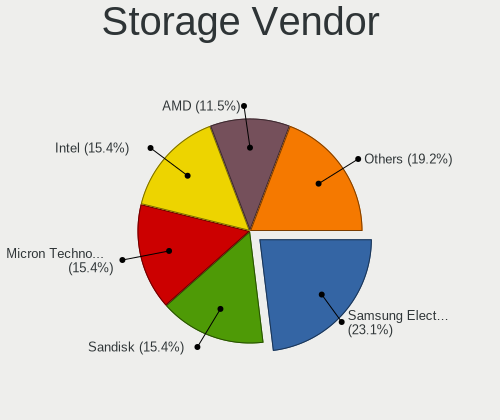

Gentoo Hardware Trends (Notebook)
---------------------------------

A project to identify most popular hardware characteristics and track their change
over time based on data collected by Gentoo users at https://Linux-Hardware.org.

Anyone can contribute to the study by uploading probes of their computers by
the [hw-probe](https://github.com/linuxhw/hw-probe) tool:

    sudo -E hw-probe -all -upload

Full-feature report is available here: https://linux-hardware.org/?view=trends&formfactor=notebook

Period: May, 2020.

Contents
--------

- [ OS                       ](#os)
- [ OS Family                ](#os-family)
- [ Kernel                   ](#kernel)
- [ Kernel Family            ](#kernel-family)
- [ Kernel Major Ver.        ](#kernel-major-ver)
- [ Arch                     ](#arch)
- [ DE                       ](#de)
- [ Display Server           ](#display-server)
- [ Display Manager          ](#display-manager)
- [ OS Lang                  ](#os-lang)
- [ Boot Mode                ](#boot-mode)
- [ Filesystem               ](#filesystem)
- [ Part. scheme             ](#part-scheme)
- [ Dual Boot with Linux/BSD ](#dual-boot-with-linux/bsd)
- [ Dual Boot (Win)          ](#dual-boot-win)
- [ Country                  ](#country)
- [ City                     ](#city)
- [ Vendor                   ](#vendor)
- [ Model                    ](#model)
- [ Model Family             ](#model-family)
- [ MFG Year                 ](#mfg-year)
- [ Form Factor              ](#form-factor)
- [ Secure Boot              ](#secure-boot)
- [ Coreboot                 ](#coreboot)
- [ RAM Size                 ](#ram-size)
- [ RAM Used                 ](#ram-used)
- [ Drive Vendor             ](#drive-vendor)
- [ Drive Model              ](#drive-model)
- [ Drive Kind               ](#drive-kind)
- [ Drive Connector          ](#drive-connector)
- [ Drive Size               ](#drive-size)
- [ Space Total              ](#space-total)
- [ Space Used               ](#space-used)
- [ Malfunc. Drives          ](#malfunc-drives)
- [ Malfunc. Drive Vendor    ](#malfunc-drive-vendor)
- [ Malfunc. Drive Kind      ](#malfunc-drive-kind)
- [ Failed Drives            ](#failed-drives)
- [ Failed Drive Vendor      ](#failed-drive-vendor)
- [ Drive Status             ](#drive-status)
- [ Storage Vendor           ](#storage-vendor)
- [ Storage Model            ](#storage-model)
- [ Storage Kind             ](#storage-kind)
- [ CPU Vendor               ](#cpu-vendor)
- [ CPU Model                ](#cpu-model)
- [ CPU Model Family         ](#cpu-model-family)
- [ CPU Cores                ](#cpu-cores)
- [ CPU Sockets              ](#cpu-sockets)
- [ CPU Threads              ](#cpu-threads)
- [ CPU Op-Modes             ](#cpu-op-modes)
- [ CPU Microcode            ](#cpu-microcode)
- [ CPU Microarch            ](#cpu-microarch)
- [ GPU Vendor               ](#gpu-vendor)
- [ GPU Model                ](#gpu-model)
- [ GPU Combo                ](#gpu-combo)
- [ GPU Driver               ](#gpu-driver)
- [ GPU Memory               ](#gpu-memory)
- [ Monitor Vendor           ](#monitor-vendor)
- [ Monitor Model            ](#monitor-model)
- [ Monitor Resolution       ](#monitor-resolution)
- [ Monitor Diagonal         ](#monitor-diagonal)
- [ Monitor Width            ](#monitor-width)
- [ Aspect Ratio             ](#aspect-ratio)
- [ Monitor Area             ](#monitor-area)
- [ Pixel Density            ](#pixel-density)
- [ Multiple Monitors        ](#multiple-monitors)
- [ Net Controller Vendor    ](#net-controller-vendor)
- [ Net Controller Model     ](#net-controller-model)
- [ Net Controller Kind      ](#net-controller-kind)
- [ Used Controller          ](#used-controller)
- [ NICs                     ](#nics)
- [ Unsupported Devices      ](#unsupported-devices)
- [ Unsupported Device Types ](#unsupported-device-types)

OS
--

Installed operating systems

| Name       | Computers | Percent |
|------------|-----------|---------|
| Gentoo     | 17        | 58.62%  |
| Gentoo 2.6 | 9         | 31.03%  |
| Gentoo 2.7 | 3         | 10.34%  |

OS Family
---------

OS without a version

| Name   | Computers | Percent |
|--------|-----------|---------|
| Gentoo | 29        | 100%    |

Kernel
------

Version of the Linux kernel

| Version                                  | Computers | Percent |
|------------------------------------------|-----------|---------|
| 5.4.38-gentoo                            | 3         | 10.34%  |
| 5.4.28-gentoo                            | 2         | 6.9%    |
| 5.6.8-x86_64                             | 1         | 3.45%   |
| 5.6.7-gentoo                             | 1         | 3.45%   |
| 5.6.7                                    | 1         | 3.45%   |
| 5.6.6-gentoo                             | 1         | 3.45%   |
| 5.6.2-gentoo                             | 1         | 3.45%   |
| 5.6.14-gentoo-x86_64                     | 1         | 3.45%   |
| 5.6.13-gentoo-x86_64                     | 1         | 3.45%   |
| 5.6.12-gentoo-x86_64                     | 1         | 3.45%   |
| 5.6.11-gentoo.87-Bluetooth               | 1         | 3.45%   |
| 5.6.11-gentoo-namica                     | 1         | 3.45%   |
| 5.6.10-gentoo-x86_64                     | 1         | 3.45%   |
| 5.4.7-gentoo                             | 1         | 3.45%   |
| 5.4.39-gentoo-58-crypt                   | 1         | 3.45%   |
| 5.4.39-gentoo                            | 1         | 3.45%   |
| 5.4.38-gentoo_PowerBook5,4               | 1         | 3.45%   |
| 5.4.38-gentoo_PowerBook3,4               | 1         | 3.45%   |
| 5.4.38-gentoo-x86_64                     | 1         | 3.45%   |
| 5.4.37-gentoo.59-Bluetooth.              | 1         | 3.45%   |
| 5.4.32                                   | 1         | 3.45%   |
| 5.4.28-gentoo_Mac-94245A3940C91C80       | 1         | 3.45%   |
| 5.4.28-gentoo-Lenovo_L450                | 1         | 3.45%   |
| 5.4.0-rc1-beryllium4-00133-g4ea655343ce4 | 1         | 3.45%   |
| 4.19.72-gentoo                           | 1         | 3.45%   |
| 4.14.83-gentoo                           | 1         | 3.45%   |

Kernel Family
-------------

Linux kernel without a distro release

| Version | Computers | Percent |
|---------|-----------|---------|
| 5.4.38  | 6         | 20.69%  |
| 5.4.28  | 4         | 13.79%  |
| 5.6.7   | 2         | 6.9%    |
| 5.6.11  | 2         | 6.9%    |
| 5.4.39  | 2         | 6.9%    |
| 5.6.8   | 1         | 3.45%   |
| 5.6.6   | 1         | 3.45%   |
| 5.6.2   | 1         | 3.45%   |
| 5.6.14  | 1         | 3.45%   |
| 5.6.13  | 1         | 3.45%   |
| 5.6.12  | 1         | 3.45%   |
| 5.6.10  | 1         | 3.45%   |
| 5.4.7   | 1         | 3.45%   |
| 5.4.37  | 1         | 3.45%   |
| 5.4.32  | 1         | 3.45%   |
| 5.4.0   | 1         | 3.45%   |
| 4.19.72 | 1         | 3.45%   |
| 4.14.83 | 1         | 3.45%   |

Kernel Major Ver.
-----------------

Linux kernel major version

| Version | Computers | Percent |
|---------|-----------|---------|
| 5.4     | 16        | 55.17%  |
| 5.6     | 11        | 37.93%  |
| 4.19    | 1         | 3.45%   |
| 4.14    | 1         | 3.45%   |

Arch
----

OS architecture (x86_64, i586, etc.)

| Name   | Computers | Percent |
|--------|-----------|---------|
| x86_64 | 26        | 89.66%  |
| ppc    | 2         | 6.9%    |
| i686   | 1         | 3.45%   |

DE
--

Desktop Environment

| Name    | Computers | Percent |
|---------|-----------|---------|
| Unknown | 22        | 75.86%  |
| XFCE    | 4         | 13.79%  |
| KDE5    | 2         | 6.9%    |
| KDE     | 1         | 3.45%   |

Display Server
--------------

X11 or Wayland

| Name    | Computers | Percent |
|---------|-----------|---------|
| X11     | 24        | 82.76%  |
| Tty     | 3         | 10.34%  |
| Unknown | 2         | 6.9%    |

Display Manager
---------------

SDDM, LightDM, etc.

| Name    | Computers | Percent |
|---------|-----------|---------|
| Unknown | 20        | 68.97%  |
| SDDM    | 4         | 13.79%  |
| LightDM | 3         | 10.34%  |
| XDM     | 1         | 3.45%   |
| SLiM    | 1         | 3.45%   |

OS Lang
-------

Language

| Lang       | Computers | Percent |
|------------|-----------|---------|
| en_US.utf8 | 10        | 34.48%  |
| de_DE.utf8 | 3         | 10.34%  |
| Unknown    | 3         | 10.34%  |
| ru_RU.utf8 | 2         | 6.9%    |
| POSIX      | 2         | 6.9%    |
| en_MX      | 2         | 6.9%    |
| el_GR.utf8 | 2         | 6.9%    |
| tr_TR.UTF8 | 1         | 3.45%   |
| it_IT.utf8 | 1         | 3.45%   |
| fr_FR      | 1         | 3.45%   |
| de_DE      | 1         | 3.45%   |
| C.utf8     | 1         | 3.45%   |

Boot Mode
---------

EFI or BIOS

| Mode | Computers | Percent |
|------|-----------|---------|
| EFI  | 15        | 51.72%  |
| BIOS | 14        | 48.28%  |

Filesystem
----------

Type of filesystem

| Type  | Computers | Percent |
|-------|-----------|---------|
| Ext4  | 18        | 62.07%  |
| Btrfs | 9         | 31.03%  |
| F2fs  | 2         | 6.9%    |

Part. scheme
------------

Scheme of partitioning

| Type    | Computers | Percent |
|---------|-----------|---------|
| Unknown | 18        | 62.07%  |
| GPT     | 7         | 24.14%  |
| MBR     | 4         | 13.79%  |

Dual Boot with Linux/BSD
------------------------

Hosting more than one Linux/BSD

| Dual boot | Computers | Percent |
|-----------|-----------|---------|
| No        | 16        | 55.17%  |
| Yes       | 13        | 44.83%  |

Dual Boot (Win)
---------------

Hosting Linux and Windows

| Dual boot | Computers | Percent |
|-----------|-----------|---------|
| No        | 19        | 65.52%  |
| Yes       | 10        | 34.48%  |

Country
-------

Geographic location (country)

| Country     | Computers | Percent |
|-------------|-----------|---------|
| Germany     | 7         | 24.14%  |
| USA         | 3         | 10.34%  |
| Greece      | 3         | 10.34%  |
| Sweden      | 2         | 6.9%    |
| Slovenia    | 2         | 6.9%    |
| Russia      | 2         | 6.9%    |
| Mexico      | 2         | 6.9%    |
| Italy       | 2         | 6.9%    |
| Turkey      | 1         | 3.45%   |
| Portugal    | 1         | 3.45%   |
| Poland      | 1         | 3.45%   |
| New Zealand | 1         | 3.45%   |
| France      | 1         | 3.45%   |
| Belarus     | 1         | 3.45%   |

City
----

Geographic location (city)

| City                 | Computers | Percent |
|----------------------|-----------|---------|
| Berlin               | 4         | 13.79%  |
| Athens               | 3         | 10.34%  |
| Saltillo             | 2         | 6.9%    |
| Ljubljana            | 2         | 6.9%    |
| Warsaw               | 1         | 3.45%   |
| St Petersburg        | 1         | 3.45%   |
| Salvaterra de Magos  | 1         | 3.45%   |
| Moscow               | 1         | 3.45%   |
| Mirano               | 1         | 3.45%   |
| Minsk                | 1         | 3.45%   |
| Leipzig              | 1         | 3.45%   |
| Knob Noster          | 1         | 3.45%   |
| Istanbul             | 1         | 3.45%   |
| Hudson               | 1         | 3.45%   |
| Hanover              | 1         | 3.45%   |
| Hamburg              | 1         | 3.45%   |
| Gretz-Armainvilliers | 1         | 3.45%   |
| Fredonia             | 1         | 3.45%   |
| Falun                | 1         | 3.45%   |
| Cassano d'Adda       | 1         | 3.45%   |
| Bromma               | 1         | 3.45%   |
| Auckland             | 1         | 3.45%   |

Vendor
------

Motherboard manufacturer

| Name             | Computers | Percent |
|------------------|-----------|---------|
| Lenovo           | 9         | 31.03%  |
| Dell             | 4         | 13.79%  |
| Hewlett-Packard  | 3         | 10.34%  |
| Unknown          | 3         | 10.34%  |
| Toshiba          | 2         | 6.9%    |
| ASUSTek Computer | 2         | 6.9%    |
| Acer             | 2         | 6.9%    |
| Timi             | 1         | 3.45%   |
| SECO             | 1         | 3.45%   |
| MSI              | 1         | 3.45%   |
| Apple            | 1         | 3.45%   |

Model
-----

Motherboard model

| Name                                      | Computers | Percent |
|-------------------------------------------|-----------|---------|
| Unknown                                   | 4         | 13.79%  |
| Toshiba Satellite L50-A-16G               | 1         | 3.45%   |
| Toshiba NB100                             | 1         | 3.45%   |
| Timi Mi Laptop Air 12.5                   | 1         | 3.45%   |
| SECO UDOO x86                             | 1         | 3.45%   |
| MSI GT63 Titan 8SG                        | 1         | 3.45%   |
| Lenovo ThinkPad X250 20CM004ESC           | 1         | 3.45%   |
| Lenovo ThinkPad X1 Extreme 2nd 20QV001GPB | 1         | 3.45%   |
| Lenovo ThinkPad T490s 20NXCTO1WW          | 1         | 3.45%   |
| Lenovo ThinkPad L450 20DTS01R00           | 1         | 3.45%   |
| Lenovo ThinkPad 20F6CTO1WW                | 1         | 3.45%   |
| Lenovo Legion Y540-15IRH-PG0 81SY         | 1         | 3.45%   |
| Lenovo IdeaPad Z370                       | 1         | 3.45%   |
| Lenovo IdeaPad L340-17IRH Gaming 81LL     | 1         | 3.45%   |
| Lenovo IdeaPad 100-15IBY 80MJ             | 1         | 3.45%   |
| HP Pavilion ZV6100 (EE984EA#ABZ)          | 1         | 3.45%   |
| HP Pavilion Notebook                      | 1         | 3.45%   |
| Dell Latitude E6520                       | 1         | 3.45%   |
| Dell Latitude E6440                       | 1         | 3.45%   |
| Dell Latitude E5540                       | 1         | 3.45%   |
| Dell Latitude 3400                        | 1         | 3.45%   |
| ASUS Zephyrus M GU502GV_GU502GV           | 1         | 3.45%   |
| ASUS E402NA                               | 1         | 3.45%   |
| Apple MacBookPro8,2                       | 1         | 3.45%   |
| Acer Aspire VN7-592G                      | 1         | 3.45%   |
| Acer Aspire V3-771                        | 1         | 3.45%   |

Model Family
------------

Motherboard model prefix

| Name              | Computers | Percent |
|-------------------|-----------|---------|
| Lenovo ThinkPad   | 5         | 17.24%  |
| Dell Latitude     | 4         | 13.79%  |
| Unknown           | 4         | 13.79%  |
| Lenovo IdeaPad    | 3         | 10.34%  |
| HP Pavilion       | 2         | 6.9%    |
| Acer Aspire       | 2         | 6.9%    |
| Toshiba Satellite | 1         | 3.45%   |
| Toshiba NB100     | 1         | 3.45%   |
| Timi Mi           | 1         | 3.45%   |
| SECO UDOO         | 1         | 3.45%   |
| MSI GT63          | 1         | 3.45%   |
| Lenovo Legion     | 1         | 3.45%   |
| ASUS Zephyrus     | 1         | 3.45%   |
| ASUS E402NA       | 1         | 3.45%   |
| Apple MacBookPro8 | 1         | 3.45%   |

MFG Year
--------

Motherboard manufacture year

| Year    | Computers | Percent |
|---------|-----------|---------|
| 2019    | 7         | 24.14%  |
| 2020    | 4         | 13.79%  |
| 2018    | 3         | 10.34%  |
| 2017    | 3         | 10.34%  |
| 2016    | 2         | 6.9%    |
| 2015    | 2         | 6.9%    |
| Unknown | 2         | 6.9%    |
| 2014    | 1         | 3.45%   |
| 2013    | 1         | 3.45%   |
| 2012    | 1         | 3.45%   |
| 2011    | 1         | 3.45%   |
| 2009    | 1         | 3.45%   |
| 2006    | 1         | 3.45%   |

Form Factor
-----------

Physical design of the computer

| Name     | Computers | Percent |
|----------|-----------|---------|
| Notebook | 29        | 100%    |

Secure Boot
-----------

Enabled or disabled

| State    | Computers | Percent |
|----------|-----------|---------|
| Disabled | 29        | 100%    |

Coreboot
--------

Have coreboot on board

| Used | Computers | Percent |
|------|-----------|---------|
| No   | 29        | 100%    |

RAM Size
--------

Total RAM memory

| Size in GB | Computers | Percent |
|------------|-----------|---------|
| 16.01-24.0 | 6         | 20.69%  |
| 8.01-16.0  | 6         | 20.69%  |
| 32.01-64.0 | 5         | 17.24%  |
| 4.01-8.0   | 4         | 13.79%  |
| 3.01-4.0   | 3         | 10.34%  |
| 1.01-2.0   | 3         | 10.34%  |
| 0.01-1.0   | 2         | 6.9%    |

RAM Used
--------

Used RAM memory

| Used GB   | Computers | Percent |
|-----------|-----------|---------|
| 0.01-1.0  | 11        | 37.93%  |
| 1.01-2.0  | 7         | 24.14%  |
| 4.01-8.0  | 4         | 13.79%  |
| 2.01-3.0  | 4         | 13.79%  |
| 8.01-16.0 | 2         | 6.9%    |
| 3.01-4.0  | 1         | 3.45%   |

Drive Vendor
------------

Hard drive vendors

| Vendor              | Computers | Drives | Percent |
|---------------------|-----------|--------|---------|
| Samsung Electronics | 8         | 9      | 19.05%  |
| WDC                 | 6         | 6      | 14.29%  |
| Intel               | 5         | 5      | 11.9%   |
| Seagate             | 3         | 3      | 7.14%   |
| WDC WD16            | 2         | 2      | 4.76%   |
| Unknown             | 2         | 2      | 4.76%   |
| Toshiba             | 2         | 2      | 4.76%   |
| SanDisk             | 2         | 2      | 4.76%   |
| HGST                | 2         | 2      | 4.76%   |
| Union Memory        | 1         | 1      | 2.38%   |
| Transcend           | 1         | 1      | 2.38%   |
| OCZ                 | 1         | 1      | 2.38%   |
| Netac               | 1         | 1      | 2.38%   |
| KIOXIA              | 1         | 1      | 2.38%   |
| Kingston            | 1         | 1      | 2.38%   |
| Hitachi             | 1         | 1      | 2.38%   |
| Fujitsu             | 1         | 1      | 2.38%   |
| Crucial             | 1         | 1      | 2.38%   |
| China               | 1         | 1      | 2.38%   |

Drive Model
-----------

Hard drive models

| Model                            | Computers | Percent |
|----------------------------------|-----------|---------|
| SSDPEKNW010T8 1TB                | 2         | 4.65%   |
| 00BB-55GUA0 160GB                | 2         | 4.65%   |
| WDS500G2B0B-00YS70 500GB SSD     | 1         | 2.33%   |
| WDS240G2G0A-00JH30 240GB SSD     | 1         | 2.33%   |
| WD3200BEKX-75B7WT0 320GB         | 1         | 2.33%   |
| WD10JPVX-22JC3T0 1TB             | 1         | 2.33%   |
| TS128GMTS400S 128GB SSD          | 1         | 2.33%   |
| ST1500LM006 HN-M151RAD 1TB       | 1         | 2.33%   |
| ST1000LM049-2GH172 1TB           | 1         | 2.33%   |
| ST1000LM035-1RK172 1TB           | 1         | 2.33%   |
| SSDSC2BP240G4 240GB              | 1         | 2.33%   |
| SSDPEKKF256G8L 256GB             | 1         | 2.33%   |
| SSDPEKKF010T8 1TB                | 1         | 2.33%   |
| SSD PM810 2.5 7mm 256GB          | 1         | 2.33%   |
| SSD 970 PRO 1TB                  | 1         | 2.33%   |
| SSD 960 PRO 512GB                | 1         | 2.33%   |
| SSD 860 EVO 1TB                  | 1         | 2.33%   |
| SSD 850 EVO 500GB                | 1         | 2.33%   |
| SSD 840 EVO 500GB                | 1         | 2.33%   |
| SSD 840 EVO 1TB                  | 1         | 2.33%   |
| SSD 840 EVO 120GB mSATA          | 1         | 2.33%   |
| SSD 256GB                        | 1         | 2.33%   |
| SD7SB2Q512G1001 512GB SSD        | 1         | 2.33%   |
| SD128  128GB                     | 1         | 2.33%   |
| SATA SSD 1TB                     | 1         | 2.33%   |
| SA400S37480G 480GB SSD           | 1         | 2.33%   |
| RPFTJ128PDD2EWX 128GB            | 1         | 2.33%   |
| PC SN720 SDAPNTW-512G            | 1         | 2.33%   |
| PC SN520 SDAPMUW-128G-1101 128GB | 1         | 2.33%   |
| MZVLB512HBJQ-000L7 512GB         | 1         | 2.33%   |
| MQ01ABF050 500GB                 | 1         | 2.33%   |
| MMC Card  32GB                   | 1         | 2.33%   |
| MK4026GAX 40GB                   | 1         | 2.33%   |
| MHV2080AH 80GB                   | 1         | 2.33%   |
| KBG40ZNS256G NVMe 256GB          | 1         | 2.33%   |
| HTS725032A7E630 320GB            | 1         | 2.33%   |
| HTS721010A9E630 1TB              | 1         | 2.33%   |
| HTS547575A9E384 752GB            | 1         | 2.33%   |
| DF4032  32GB                     | 1         | 2.33%   |
| CT500MX200SSD3 500GB             | 1         | 2.33%   |
| AGILITY3 120GB SSD               | 1         | 2.33%   |

Drive Kind
----------

HDD or SSD

| Kind | Computers | Drives | Percent |
|------|-----------|--------|---------|
| SSD  | 15        | 16     | 40.54%  |
| NVMe | 10        | 11     | 27.03%  |
| HDD  | 9         | 13     | 24.32%  |
| MMC  | 3         | 3      | 8.11%   |

Drive Connector
---------------

SATA, SAS, NVMe, etc.

| Type | Computers | Drives | Percent |
|------|-----------|--------|---------|
| SATA | 22        | 27     | 59.46%  |
| NVMe | 10        | 11     | 27.03%  |
| MMC  | 3         | 3      | 8.11%   |
| SAS  | 2         | 2      | 5.41%   |

Drive Size
----------

Size of hard drive

| Size in TB | Computers | Drives | Percent |
|------------|-----------|--------|---------|
| 0.01-0.5   | 21        | 26     | 60%     |
| 0.51-1.0   | 10        | 13     | 28.57%  |
| 1.01-2.0   | 4         | 4      | 11.43%  |

Space Total
-----------

Amount of disk space available on the file system

| Size in GB     | Computers | Percent |
|----------------|-----------|---------|
| 101-250        | 8         | 27.59%  |
| 251-500        | 7         | 24.14%  |
| 1001-2000      | 4         | 13.79%  |
| 501-1000       | 4         | 13.79%  |
| Unknown        | 3         | 10.34%  |
| More than 3000 | 1         | 3.45%   |
| 21-50          | 1         | 3.45%   |
| 1-20           | 1         | 3.45%   |

Space Used
----------

Amount of used disk space

| Used GB   | Computers | Percent |
|-----------|-----------|---------|
| 1-20      | 6         | 20.69%  |
| 251-500   | 4         | 13.79%  |
| 21-50     | 4         | 13.79%  |
| 101-250   | 4         | 13.79%  |
| 501-1000  | 3         | 10.34%  |
| 51-100    | 3         | 10.34%  |
| Unknown   | 3         | 10.34%  |
| 2001-3000 | 1         | 3.45%   |
| 1001-2000 | 1         | 3.45%   |

Malfunc. Drives
---------------

Drive models with a malfunction

| Model                     | Computers | Drives | Percent |
|---------------------------|-----------|--------|---------|
| SD7SB2Q512G1001 512GB SSD | 1         | 1      | 33.33%  |
| MQ01ABF050 500GB          | 1         | 1      | 33.33%  |
| MK4026GAX 40GB            | 1         | 1      | 33.33%  |

Malfunc. Drive Vendor
---------------------

Vendors of faulty drives

| Vendor  | Computers | Drives | Percent |
|---------|-----------|--------|---------|
| Toshiba | 2         | 2      | 66.67%  |
| SanDisk | 1         | 1      | 33.33%  |

Malfunc. Drive Kind
-------------------

Kinds of faulty drives

| Kind | Computers | Drives | Percent |
|------|-----------|--------|---------|
| HDD  | 2         | 2      | 66.67%  |
| SSD  | 1         | 1      | 33.33%  |

Failed Drives
-------------

Failed drive models

Zero info for selected period =(

Failed Drive Vendor
-------------------

Failed drive vendors

Zero info for selected period =(

Drive Status
------------

Number of failed and malfunc. drives

| Status   | Computers | Drives | Percent |
|----------|-----------|--------|---------|
| Works    | 24        | 34     | 72.73%  |
| Detected | 6         | 6      | 18.18%  |
| Malfunc  | 3         | 3      | 9.09%   |

Storage Vendor
--------------

Storage controller vendors

| Vendor                  | Computers | Percent |
|-------------------------|-----------|---------|
| Intel                   | 25        | 78.13%  |
| Sandisk                 | 2         | 6.25%   |
| Samsung Electronics     | 2         | 6.25%   |
| Union Memory (Shenzhen) | 1         | 3.13%   |
| KIOXIA                  | 1         | 3.13%   |
| AMD                     | 1         | 3.13%   |

Storage Model
-------------

Storage controller models

| Model                                                                      | Computers | Percent |
|----------------------------------------------------------------------------|-----------|---------|
| Wildcat Point-LP SATA Controller [AHCI Mode]                               | 3         | 8.57%   |
| Non-Volatile memory controller                                             | 3         | 8.57%   |
| Cannon Lake Mobile PCH SATA AHCI Controller                                | 3         | 8.57%   |
| SSD Pro 7600p/760p/E 6100p Series                                          | 2         | 5.71%   |
| SSD 660P Series                                                            | 2         | 5.71%   |
| 82801 Mobile SATA Controller [RAID mode]                                   | 2         | 5.71%   |
| 7 Series Chipset Family 6-port SATA Controller [AHCI mode]                 | 2         | 5.71%   |
| 6 Series/C200 Series Chipset Family 6 port Mobile SATA AHCI Controller     | 2         | 5.71%   |
| WD Black 2018/PC SN720 NVMe SSD                                            | 1         | 2.86%   |
| Sunrise Point-LP SATA Controller [AHCI mode]                               | 1         | 2.86%   |
| SATA controller                                                            | 1         | 2.86%   |
| NVMe SSD Controller SM981/PM981/PM983                                      | 1         | 2.86%   |
| NVMe SSD Controller SM961/PM961                                            | 1         | 2.86%   |
| IXP SB4x0 IDE Controller                                                   | 1         | 2.86%   |
| HM170/QM170 Chipset SATA Controller [AHCI Mode]                            | 1         | 2.86%   |
| Celeron N3350/Pentium N4200/Atom E3900 Series SATA AHCI Controller         | 1         | 2.86%   |
| Cannon Point-LP SATA Controller [AHCI Mode]                                | 1         | 2.86%   |
| Atom/Celeron/Pentium Processor x5-E8000/J3xxx/N3xxx Series SATA Controller | 1         | 2.86%   |
| Atom Processor E3800 Series SATA AHCI Controller                           | 1         | 2.86%   |
| 82801HM/HEM (ICH8M/ICH8M-E) SATA Controller [AHCI mode]                    | 1         | 2.86%   |
| 82801HM/HEM (ICH8M/ICH8M-E) IDE Controller                                 | 1         | 2.86%   |
| 82801GBM/GHM (ICH7-M Family) SATA Controller [AHCI mode]                   | 1         | 2.86%   |
| 82801G (ICH7 Family) IDE Controller                                        | 1         | 2.86%   |
| 8 Series/C220 Series Chipset Family 6-port SATA Controller 1 [AHCI mode]   | 1         | 2.86%   |

Storage Kind
------------

Kind of storage controller (IDE, SATA, NVMe, SAS, ...)

| Kind | Computers | Percent |
|------|-----------|---------|
| SATA | 20        | 57.14%  |
| NVMe | 10        | 28.57%  |
| IDE  | 3         | 8.57%   |
| RAID | 2         | 5.71%   |

CPU Vendor
----------

Processor vendors

| Vendor       | Computers | Percent |
|--------------|-----------|---------|
| Intel        | 26        | 89.66%  |
| PowerBook5,4 | 1         | 3.45%   |
| PowerBook3,4 | 1         | 3.45%   |
| AMD          | 1         | 3.45%   |

CPU Model
---------

Processor models

| Model                                 | Computers | Percent |
|---------------------------------------|-----------|---------|
| Intel Core i7-9750H CPU @ 2.60GHz     | 3         | 10.34%  |
| Intel Core i5-8265U CPU @ 1.60GHz     | 2         | 6.9%    |
| Intel Core i5-5200U CPU @ 2.20GHz     | 2         | 6.9%    |
| PowerBook5,4 7447A, altivec supported | 1         | 3.45%   |
| PowerBook3,4 7455, altivec supported  | 1         | 3.45%   |
| Intel Core m3-8100Y CPU @ 1.10GHz     | 1         | 3.45%   |
| Intel Core i7-9750HF CPU @ 2.60GHz    | 1         | 3.45%   |
| Intel Core i7-8750H CPU @ 2.20GHz     | 1         | 3.45%   |
| Intel Core i7-6700HQ CPU @ 2.60GHz    | 1         | 3.45%   |
| Intel Core i7-6600U CPU @ 2.60GHz     | 1         | 3.45%   |
| Intel Core i7-5600U CPU @ 2.60GHz     | 1         | 3.45%   |
| Intel Core i7-4900MQ CPU @ 2.80GHz    | 1         | 3.45%   |
| Intel Core i7-4600U CPU @ 2.10GHz     | 1         | 3.45%   |
| Intel Core i7-3610QM CPU @ 2.30GHz    | 1         | 3.45%   |
| Intel Core i7-2720QM CPU @ 2.20GHz    | 1         | 3.45%   |
| Intel Core i7-2675QM CPU @ 2.20GHz    | 1         | 3.45%   |
| Intel Core i5-3230M CPU @ 2.60GHz     | 1         | 3.45%   |
| Intel Core i5-2410M CPU @ 2.30GHz     | 1         | 3.45%   |
| Intel Core 2 Duo CPU T7500 @ 2.20GHz  | 1         | 3.45%   |
| Intel Celeron N4100 CPU @ 1.10GHz     | 1         | 3.45%   |
| Intel Celeron CPU N3350 @ 1.10GHz     | 1         | 3.45%   |
| Intel Celeron CPU N3160 @ 1.60GHz     | 1         | 3.45%   |
| Intel Celeron CPU N2840 @ 2.16GHz     | 1         | 3.45%   |
| Intel Atom CPU N270 @ 1.60GHz         | 1         | 3.45%   |
| AMD Athlon 64 Processor 3200+         | 1         | 3.45%   |

CPU Model Family
----------------

Processor model prefix

| Model            | Computers | Percent |
|------------------|-----------|---------|
| Intel Core i7    | 13        | 44.83%  |
| Intel Core i5    | 6         | 20.69%  |
| Intel Celeron    | 4         | 13.79%  |
| Other            | 2         | 6.9%    |
| Intel Core m3    | 1         | 3.45%   |
| Intel Core 2 Duo | 1         | 3.45%   |
| Intel Atom       | 1         | 3.45%   |
| AMD Athlon 64    | 1         | 3.45%   |

CPU Cores
---------

Number of processor cores

| Number  | Computers | Percent |
|---------|-----------|---------|
| 2       | 11        | 37.93%  |
| 4       | 9         | 31.03%  |
| 6       | 5         | 17.24%  |
| 1       | 3         | 10.34%  |
| Unknown | 1         | 3.45%   |

CPU Sockets
-----------

Number of sockets

| Number  | Computers | Percent |
|---------|-----------|---------|
| 1       | 28        | 96.55%  |
| Unknown | 1         | 3.45%   |

CPU Threads
-----------

Threads per core (Hyper-Threading)

| Number  | Computers | Percent |
|---------|-----------|---------|
| 2       | 20        | 68.97%  |
| 1       | 8         | 27.59%  |
| Unknown | 1         | 3.45%   |

CPU Op-Modes
------------

CPU Operation Modes (32-bit, 64-bit)

| Op mode        | Computers | Percent |
|----------------|-----------|---------|
| 32-bit, 64-bit | 26        | 89.66%  |
| 32-bit         | 2         | 6.9%    |
| Unknown        | 1         | 3.45%   |

CPU Microcode
-------------

Microcode number

| Number  | Computers | Percent |
|---------|-----------|---------|
| Unknown | 7         | 24.14%  |
| 0x906ea | 3         | 10.34%  |
| 0x206a7 | 3         | 10.34%  |
| 0x806ec | 2         | 6.9%    |
| 0x306d4 | 2         | 6.9%    |
| 0x306a9 | 2         | 6.9%    |
| 0x906ed | 1         | 3.45%   |
| 0x706a1 | 1         | 3.45%   |
| 0x6fb   | 1         | 3.45%   |
| 0x506e3 | 1         | 3.45%   |
| 0x406e3 | 1         | 3.45%   |
| 0x406c4 | 1         | 3.45%   |
| 0x40651 | 1         | 3.45%   |
| 0x306c3 | 1         | 3.45%   |
| 0x30678 | 1         | 3.45%   |
| 0x106c2 | 1         | 3.45%   |

CPU Microarch
-------------

Microarchitecture

| Name          | Computers | Percent |
|---------------|-----------|---------|
| Skylake       | 8         | 27.59%  |
| SandyBridge   | 3         | 10.34%  |
| Broadwell     | 3         | 10.34%  |
| Silvermont    | 2         | 6.9%    |
| KabyLake      | 2         | 6.9%    |
| IvyBridge     | 2         | 6.9%    |
| Haswell       | 2         | 6.9%    |
| Unknown       | 2         | 6.9%    |
| K8 Hammer     | 1         | 3.45%   |
| Goldmont plus | 1         | 3.45%   |
| Goldmont      | 1         | 3.45%   |
| Core          | 1         | 3.45%   |
| Bonnell       | 1         | 3.45%   |

GPU Vendor
----------

Vendors of graphics cards

| Vendor | Computers | Percent |
|--------|-----------|---------|
| Intel  | 23        | 58.97%  |
| Nvidia | 12        | 30.77%  |
| AMD    | 4         | 10.26%  |

GPU Model
---------

Graphics card models

| Model                                                                              | Computers | Percent |
|------------------------------------------------------------------------------------|-----------|---------|
| TU117M [GeForce GTX 1650 Mobile / Max-Q]                                           | 3         | 7.32%   |
| HD Graphics 5500                                                                   | 3         | 7.32%   |
| 2nd Generation Core Processor Family Integrated Graphics Controller                | 3         | 7.32%   |
| UHD Graphics 630 (Mobile)                                                          | 2         | 4.88%   |
| UHD Graphics 620 (Whiskey Lake)                                                    | 2         | 4.88%   |
| 3rd Gen Core processor Graphics Controller                                         | 2         | 4.88%   |
| UHD Graphics 615                                                                   | 1         | 2.44%   |
| UHD Graphics 605                                                                   | 1         | 2.44%   |
| TU106M [GeForce RTX 2060 Mobile]                                                   | 1         | 2.44%   |
| TU104M [GeForce RTX 2080 Mobile]                                                   | 1         | 2.44%   |
| Skylake GT2 [HD Graphics 520]                                                      | 1         | 2.44%   |
| RV350/M10 / RV360/M11 [Mobility Radeon 9600 (PRO) / 9700]                          | 1         | 2.44%   |
| RV200/M7 [Mobility Radeon 7500]                                                    | 1         | 2.44%   |
| RS480M [Mobility Radeon Xpress 200]                                                | 1         | 2.44%   |
| Mobile GM965/GL960 Integrated Graphics Controller (secondary)                      | 1         | 2.44%   |
| Mobile GM965/GL960 Integrated Graphics Controller (primary)                        | 1         | 2.44%   |
| Mobile 945GSE Express Integrated Graphics Controller                               | 1         | 2.44%   |
| Mobile 945GM/GMS/GME, 943/940GML Express Integrated Graphics Controller            | 1         | 2.44%   |
| Jet XT [Radeon R5 M240]                                                            | 1         | 2.44%   |
| HD Graphics 530                                                                    | 1         | 2.44%   |
| HD Graphics 500                                                                    | 1         | 2.44%   |
| Haswell-ULT Integrated Graphics Controller                                         | 1         | 2.44%   |
| GM108M [GeForce MX130]                                                             | 1         | 2.44%   |
| GM108M [GeForce 940M]                                                              | 1         | 2.44%   |
| GM107M [GeForce GTX 960M]                                                          | 1         | 2.44%   |
| GK208M [GeForce GT 740M]                                                           | 1         | 2.44%   |
| GK107M [GeForce GT 650M]                                                           | 1         | 2.44%   |
| GF119M [NVS 4200M]                                                                 | 1         | 2.44%   |
| GF117M [GeForce 610M/710M/810M/820M / GT 620M/625M/630M/720M]                      | 1         | 2.44%   |
| Atom/Celeron/Pentium Processor x5-E8000/J3xxx/N3xxx Integrated Graphics Controller | 1         | 2.44%   |
| Atom Processor Z36xxx/Z37xxx Series Graphics & Display                             | 1         | 2.44%   |
| 4th Gen Core Processor Integrated Graphics Controller                              | 1         | 2.44%   |

GPU Combo
---------

Combinations of graphics cards

| Name           | Computers | Percent |
|----------------|-----------|---------|
| 1 x Intel      | 13        | 44.83%  |
| Intel + Nvidia | 9         | 31.03%  |
| 1 x Nvidia     | 3         | 10.34%  |
| 1 x AMD        | 3         | 10.34%  |
| Intel + AMD    | 1         | 3.45%   |

GPU Driver
----------

Free vs proprietary

| Driver      | Computers | Percent |
|-------------|-----------|---------|
| Free        | 21        | 72.41%  |
| Proprietary | 8         | 27.59%  |

GPU Memory
----------

Total video memory

| Size in GB | Computers | Percent |
|------------|-----------|---------|
| Unknown    | 19        | 65.52%  |
| 0.01-0.5   | 4         | 13.79%  |
| 3.01-4.0   | 2         | 6.9%    |
| 1.01-2.0   | 2         | 6.9%    |
| 7.01-8.0   | 1         | 3.45%   |
| 5.01-6.0   | 1         | 3.45%   |

Monitor Vendor
--------------

Monitor vendors

| Vendor                  | Computers | Percent |
|-------------------------|-----------|---------|
| LG Display              | 5         | 16.13%  |
| BOE                     | 5         | 16.13%  |
| AU Optronics            | 4         | 12.9%   |
| Samsung Electronics     | 3         | 9.68%   |
| Chimei Innolux          | 3         | 9.68%   |
| Apple                   | 3         | 9.68%   |
| Chi Mei Optoelectronics | 2         | 6.45%   |
| Sharp                   | 1         | 3.23%   |
| LGD                     | 1         | 3.23%   |
| Goldstar                | 1         | 3.23%   |
| Eizo                    | 1         | 3.23%   |
| Dell                    | 1         | 3.23%   |
| Ancor Communications    | 1         | 3.23%   |

Monitor Model
-------------

Monitor models

| Model                                             | Computers | Percent |
|---------------------------------------------------|-----------|---------|
| LCD Monitor SDC4E51 1366x768 340x190mm 15.3-inch  | 2         | 6.25%   |
| LCD Monitor AUO21ED 1920x1080 344x194mm 15.5-inch | 2         | 6.25%   |
| Color LCD APP9C20 1280x854 321x214mm 15.2-inch    | 2         | 6.25%   |
| S1910 ENC1787 1280x1024 380x300mm 19.1-inch       | 1         | 3.13%   |
| P2214H DELA098 1920x1080 480x270mm 21.7-inch      | 1         | 3.13%   |
| LQ156M1JW09 SHP14D3 1920x1080 344x194mm 15.5-inch | 1         | 3.13%   |
| LCD Monitor SDC4147 1366x768 344x194mm 15.5-inch  | 1         | 3.13%   |
| LCD Monitor LGD05E5 1920x1080 344x194mm 15.5-inch | 1         | 3.13%   |
| LCD Monitor LGD04D4 3840x2160 344x194mm 15.5-inch | 1         | 3.13%   |
| LCD Monitor LGD046F 1920x1080 344x194mm 15.5-inch | 1         | 3.13%   |
| LCD Monitor LGD0468 1366x768 340x190mm 15.3-inch  | 1         | 3.13%   |
| LCD Monitor LGD0437 1920x1080 276x156mm 12.5-inch | 1         | 3.13%   |
| LCD Monitor CMO1720 1920x1080 382x215mm 17.3-inch | 1         | 3.13%   |
| LCD Monitor CMO1333 1366x768 293x164mm 13.2-inch  | 1         | 3.13%   |
| LCD Monitor CMN14E4 1920x1080 309x173mm 13.9-inch | 1         | 3.13%   |
| LCD Monitor CMN14B1 1920x1080 308x173mm 13.9-inch | 1         | 3.13%   |
| LCD Monitor CMN1239 1920x1080 276x155mm 12.5-inch | 1         | 3.13%   |
| LCD Monitor BOE082E 1920x1080 309x174mm 14.0-inch | 1         | 3.13%   |
| LCD Monitor BOE07EC 1920x1080 309x174mm 14.0-inch | 1         | 3.13%   |
| LCD Monitor BOE0696 1366x768 309x173mm 13.9-inch  | 1         | 3.13%   |
| LCD Monitor BOE0691 1920x1080 280x165mm 12.8-inch | 1         | 3.13%   |
| LCD Monitor BOE05C8 1366x768 309x173mm 13.9-inch  | 1         | 3.13%   |
| LCD Monitor AUO2074 1280x800 331x207mm 15.4-inch  | 1         | 3.13%   |
| LCD Monitor AUO11C2 1024x600 195x113mm 8.9-inch   | 1         | 3.13%   |
| LCD Monitor 1920x1080                             | 1         | 3.13%   |
| IPS FULLHD GSM5AB8 1920x1080 480x270mm 21.7-inch  | 1         | 3.13%   |
| FX2431 ENC2081 1920x1200 519x324mm 24.1-inch      | 1         | 3.13%   |
| Color LCD APP9CA4 1440x900 331x207mm 15.4-inch    | 1         | 3.13%   |
| ASUS MG279 ACI27A7 2560x1440 597x336mm 27.0-inch  | 1         | 3.13%   |

Monitor Resolution
------------------

Monitor screen resolution

| Resolution        | Computers | Percent |
|-------------------|-----------|---------|
| 1920x1080 (FHD)   | 14        | 46.67%  |
| 1366x768 (WXGA)   | 7         | 23.33%  |
| 1280x854          | 2         | 6.67%   |
| 3840x2160 (4K)    | 1         | 3.33%   |
| 2560x1440 (QHD)   | 1         | 3.33%   |
| 1920x1200 (WUXGA) | 1         | 3.33%   |
| 1440x900 (WXGA+)  | 1         | 3.33%   |
| 1280x800 (WXGA)   | 1         | 3.33%   |
| 1280x1024 (SXGA)  | 1         | 3.33%   |
| 1024x600          | 1         | 3.33%   |

Monitor Diagonal
----------------

Diagonal size in inches

| Inches  | Computers | Percent |
|---------|-----------|---------|
| 15      | 13        | 41.94%  |
| 13      | 5         | 16.13%  |
| 12      | 3         | 9.68%   |
| 21      | 2         | 6.45%   |
| 14      | 2         | 6.45%   |
| 27      | 1         | 3.23%   |
| 24      | 1         | 3.23%   |
| 19      | 1         | 3.23%   |
| 17      | 1         | 3.23%   |
| 8       | 1         | 3.23%   |
| Unknown | 1         | 3.23%   |

Monitor Width
-------------

Physical width

| Width in mm | Computers | Percent |
|-------------|-----------|---------|
| 301-350     | 19        | 61.29%  |
| 201-300     | 4         | 12.9%   |
| 501-600     | 2         | 6.45%   |
| 401-500     | 2         | 6.45%   |
| 351-400     | 2         | 6.45%   |
| 101-200     | 1         | 3.23%   |
| Unknown     | 1         | 3.23%   |

Aspect Ratio
------------

Proportional relationship between the width and the height

| Ratio   | Computers | Percent |
|---------|-----------|---------|
| 16/9    | 23        | 76.67%  |
| 16/10   | 3         | 10%     |
| 3/2     | 2         | 6.67%   |
| 5/4     | 1         | 3.33%   |
| Unknown | 1         | 3.33%   |

Monitor Area
------------

Area in inch²

| Area in inch² | Computers | Percent |
|----------------|-----------|---------|
| 101-110        | 12        | 38.71%  |
| 81-90          | 6         | 19.35%  |
| 71-80          | 2         | 6.45%   |
| 61-70          | 2         | 6.45%   |
| 151-200        | 2         | 6.45%   |
| 1-40           | 1         | 3.23%   |
| 301-350        | 1         | 3.23%   |
| 251-300        | 1         | 3.23%   |
| 201-250        | 1         | 3.23%   |
| 121-130        | 1         | 3.23%   |
| 91-100         | 1         | 3.23%   |
| Unknown        | 1         | 3.23%   |

Pixel Density
-------------

Pixels per inch

| Density       | Computers | Percent |
|---------------|-----------|---------|
| 101-120       | 13        | 41.94%  |
| 121-160       | 11        | 35.48%  |
| 161-240       | 3         | 9.68%   |
| 51-100        | 2         | 6.45%   |
| More than 240 | 1         | 3.23%   |
| Unknown       | 1         | 3.23%   |

Multiple Monitors
-----------------

Total monitors connected

| Total | Computers | Percent |
|-------|-----------|---------|
| 1     | 23        | 79.31%  |
| 2     | 3         | 10.34%  |
| 3     | 2         | 6.9%    |
| 0     | 1         | 3.45%   |

Net Controller Vendor
---------------------

Controller vendors

| Vendor                         | Computers | Percent |
|--------------------------------|-----------|---------|
| Intel                          | 5         | 41.67%  |
| Sierra Wireless                | 2         | 16.67%  |
| Apple                          | 2         | 16.67%  |
| Realtek Semiconductor          | 1         | 8.33%   |
| Broadcom Inc. and subsidiaries | 1         | 8.33%   |
| AMD                            | 1         | 8.33%   |

Net Controller Model
--------------------

Controller models

| Model                                           | Computers | Percent |
|-------------------------------------------------|-----------|---------|
| Wi-Fi 6 AX200                                   | 2         | 15.38%  |
| UniNorth GMAC (Sun GEM)                         | 1         | 7.69%   |
| UniNorth 2 GMAC (Sun GEM)                       | 1         | 7.69%   |
| UDOO X86                                        | 1         | 7.69%   |
| RTL8153 Gigabit Ethernet Adapter                | 1         | 7.69%   |
| IXP SB400 AC'97 Modem Controller                | 1         | 7.69%   |
| EM7455 Qualcomm Snapdragon X7 LTE-A             | 1         | 7.69%   |
| EM7345 4G LTE                                   | 1         | 7.69%   |
| Centrino Advanced-N 6235                        | 1         | 7.69%   |
| Centrino Advanced-N 6205 [Taylor Peak]          | 1         | 7.69%   |
| BCM4331 802.11a/b/g/n                           | 1         | 7.69%   |
| 82579LM Gigabit Network Connection (Lewisville) | 1         | 7.69%   |

Net Controller Kind
-------------------

Ethernet, WiFi or modem

| Kind     | Computers | Percent |
|----------|-----------|---------|
| WiFi     | 6         | 50%     |
| Ethernet | 4         | 33.33%  |
| Modem    | 2         | 16.67%  |

Used Controller
---------------

Currently used network controller

| Kind     | Computers | Percent |
|----------|-----------|---------|
| WiFi     | 4         | 66.67%  |
| Ethernet | 2         | 33.33%  |

NICs
----

Total network controllers on board

| Total | Computers | Percent |
|-------|-----------|---------|
| 2     | 24        | 82.76%  |
| 1     | 5         | 17.24%  |

Unsupported Devices
-------------------

Total unsupported devices on board

| Total | Computers | Percent |
|-------|-----------|---------|
| 0     | 11        | 37.93%  |
| 1     | 9         | 31.03%  |
| 2     | 6         | 20.69%  |
| 7     | 1         | 3.45%   |
| 6     | 1         | 3.45%   |
| 3     | 1         | 3.45%   |

Unsupported Device Types
------------------------

Types of unsupported devices

| Type                     | Computers | Percent |
|--------------------------|-----------|---------|
| Fingerprint reader       | 7         | 19.44%  |
| Chipcard                 | 7         | 19.44%  |
| Communication controller | 5         | 13.89%  |
| Camera                   | 4         | 11.11%  |
| Bluetooth                | 4         | 11.11%  |
| Graphics card            | 3         | 8.33%   |
| Card reader              | 2         | 5.56%   |
| Storage                  | 1         | 2.78%   |
| Net/wireless             | 1         | 2.78%   |
| Net/ethernet             | 1         | 2.78%   |
| Modem                    | 1         | 2.78%   |

