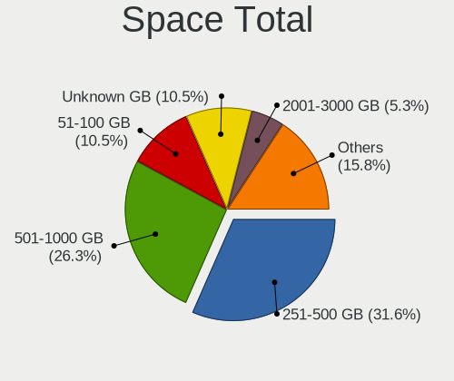
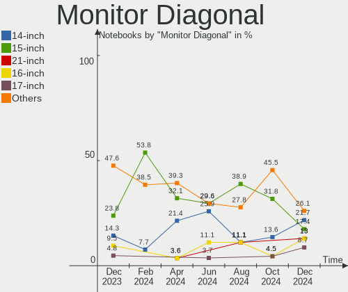
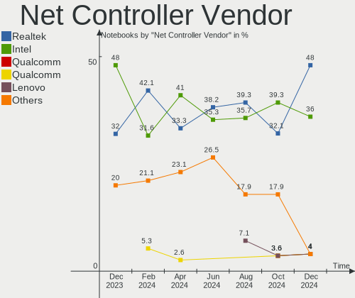
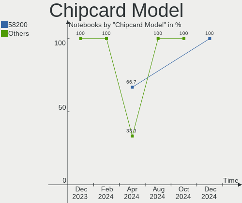

Gentoo - Hardware Trends (Notebooks)
------------------------------------

A project to identify most popular hardware characteristics and track their change
over time based on data collected by Linux users at https://Linux-Hardware.org.

Anyone can contribute to this report by the [hw-probe](https://github.com/linuxhw/hw-probe) tool:

    sudo -E hw-probe -all -upload

This report is for one last month. Overall report since the beginning of time: [TestCoverage](https://github.com/linuxhw/TestCoverage)

Period: Oct, 2022.

Contents
--------

* [ System ](#system)
  - [ OS                       ](#os)
  - [ OS Family                ](#os-family)
  - [ Kernel                   ](#kernel)
  - [ Kernel Family            ](#kernel-family)
  - [ Kernel Major Ver.        ](#kernel-major-ver)
  - [ Arch                     ](#arch)
  - [ DE                       ](#de)
  - [ Display Server           ](#display-server)
  - [ Display Manager          ](#display-manager)
  - [ OS Lang                  ](#os-lang)
  - [ Boot Mode                ](#boot-mode)
  - [ Filesystem               ](#filesystem)
  - [ Part. scheme             ](#part-scheme)
  - [ Dual Boot with Linux/BSD ](#dual-boot-with-linuxbsd)
  - [ Dual Boot (Win)          ](#dual-boot-win)

* [ Board ](#board)
  - [ Vendor                   ](#vendor)
  - [ Model                    ](#model)
  - [ Model Family             ](#model-family)
  - [ MFG Year                 ](#mfg-year)
  - [ Form Factor              ](#form-factor)
  - [ Secure Boot              ](#secure-boot)
  - [ Coreboot                 ](#coreboot)
  - [ RAM Size                 ](#ram-size)
  - [ RAM Used                 ](#ram-used)
  - [ Total Drives             ](#total-drives)
  - [ Has CD-ROM               ](#has-cd-rom)
  - [ Has Ethernet             ](#has-ethernet)
  - [ Has WiFi                 ](#has-wifi)
  - [ Has Bluetooth            ](#has-bluetooth)

* [ Location ](#location)
  - [ Country                  ](#country)
  - [ City                     ](#city)

* [ Drives ](#drives)
  - [ Drive Vendor             ](#drive-vendor)
  - [ Drive Model              ](#drive-model)
  - [ HDD Vendor               ](#hdd-vendor)
  - [ SSD Vendor               ](#ssd-vendor)
  - [ Drive Kind               ](#drive-kind)
  - [ Drive Connector          ](#drive-connector)
  - [ Drive Size               ](#drive-size)
  - [ Space Total              ](#space-total)
  - [ Space Used               ](#space-used)
  - [ Malfunc. Drives          ](#malfunc-drives)
  - [ Malfunc. Drive Vendor    ](#malfunc-drive-vendor)
  - [ Malfunc. HDD Vendor      ](#malfunc-hdd-vendor)
  - [ Malfunc. Drive Kind      ](#malfunc-drive-kind)
  - [ Failed Drives            ](#failed-drives)
  - [ Failed Drive Vendor      ](#failed-drive-vendor)
  - [ Drive Status             ](#drive-status)

* [ Storage controller ](#storage-controller)
  - [ Storage Vendor           ](#storage-vendor)
  - [ Storage Model            ](#storage-model)
  - [ Storage Kind             ](#storage-kind)

* [ Processor ](#processor)
  - [ CPU Vendor               ](#cpu-vendor)
  - [ CPU Model                ](#cpu-model)
  - [ CPU Model Family         ](#cpu-model-family)
  - [ CPU Cores                ](#cpu-cores)
  - [ CPU Sockets              ](#cpu-sockets)
  - [ CPU Threads              ](#cpu-threads)
  - [ CPU Op-Modes             ](#cpu-op-modes)
  - [ CPU Microcode            ](#cpu-microcode)
  - [ CPU Microarch            ](#cpu-microarch)

* [ Graphics ](#graphics)
  - [ GPU Vendor               ](#gpu-vendor)
  - [ GPU Model                ](#gpu-model)
  - [ GPU Combo                ](#gpu-combo)
  - [ GPU Driver               ](#gpu-driver)
  - [ GPU Memory               ](#gpu-memory)

* [ Monitor ](#monitor)
  - [ Monitor Vendor           ](#monitor-vendor)
  - [ Monitor Model            ](#monitor-model)
  - [ Monitor Resolution       ](#monitor-resolution)
  - [ Monitor Diagonal         ](#monitor-diagonal)
  - [ Monitor Width            ](#monitor-width)
  - [ Aspect Ratio             ](#aspect-ratio)
  - [ Monitor Area             ](#monitor-area)
  - [ Pixel Density            ](#pixel-density)
  - [ Multiple Monitors        ](#multiple-monitors)

* [ Network ](#network)
  - [ Net Controller Vendor    ](#net-controller-vendor)
  - [ Net Controller Model     ](#net-controller-model)
  - [ Wireless Vendor          ](#wireless-vendor)
  - [ Wireless Model           ](#wireless-model)
  - [ Ethernet Vendor          ](#ethernet-vendor)
  - [ Ethernet Model           ](#ethernet-model)
  - [ Net Controller Kind      ](#net-controller-kind)
  - [ Used Controller          ](#used-controller)
  - [ NICs                     ](#nics)
  - [ IPv6                     ](#ipv6)

* [ Bluetooth ](#bluetooth)
  - [ Bluetooth Vendor         ](#bluetooth-vendor)
  - [ Bluetooth Model          ](#bluetooth-model)

* [ Sound ](#sound)
  - [ Sound Vendor             ](#sound-vendor)
  - [ Sound Model              ](#sound-model)

* [ Memory ](#memory)
  - [ Memory Vendor            ](#memory-vendor)
  - [ Memory Model             ](#memory-model)
  - [ Memory Kind              ](#memory-kind)
  - [ Memory Form Factor       ](#memory-form-factor)
  - [ Memory Size              ](#memory-size)
  - [ Memory Speed             ](#memory-speed)

* [ Printers & scanners ](#printers--scanners)
  - [ Printer Vendor           ](#printer-vendor)
  - [ Printer Model            ](#printer-model)
  - [ Scanner Vendor           ](#scanner-vendor)
  - [ Scanner Model            ](#scanner-model)

* [ Camera ](#camera)
  - [ Camera Vendor            ](#camera-vendor)
  - [ Camera Model             ](#camera-model)

* [ Security ](#security)
  - [ Fingerprint Vendor       ](#fingerprint-vendor)
  - [ Fingerprint Model        ](#fingerprint-model)
  - [ Chipcard Vendor          ](#chipcard-vendor)
  - [ Chipcard Model           ](#chipcard-model)

* [ Unsupported ](#unsupported)
  - [ Unsupported Devices      ](#unsupported-devices)
  - [ Unsupported Device Types ](#unsupported-device-types)

System
------

OS
--

Installed operating systems

| Name       | Notebooks | Percent |
|------------|-----------|---------|
| Gentoo 2.8 | 28        | 84.85%  |
| Gentoo 2.9 | 4         | 12.12%  |
| Gentoo 1   | 1         | 3.03%   |

OS Family
---------

OS without a version

| Name   | Notebooks | Percent |
|--------|-----------|---------|
| Gentoo | 33        | 100%    |

Kernel
------

Version of the Linux kernel

| Version                          | Notebooks | Percent |
|----------------------------------|-----------|---------|
| 5.15.72-gentoo-x86_64            | 4         | 12.12%  |
| 5.15.72-gentoo                   | 4         | 12.12%  |
| 5.15.74-gentoo                   | 3         | 9.09%   |
| 5.15.69-gentoo                   | 3         | 9.09%   |
| 6.0.0-pf2                        | 2         | 6.06%   |
| 6.0.0-gentoo-x86_64              | 2         | 6.06%   |
| 6.0.0-gentoo                     | 2         | 6.06%   |
| 6.0.6-gentoo-x86_64              | 1         | 3.03%   |
| 6.0.2-gentoo-x86_64              | 1         | 3.03%   |
| 5.19.12-gentoo-groovin           | 1         | 3.03%   |
| 5.19.12-gentoo                   | 1         | 3.03%   |
| 5.19.11-gentoo-x86_64            | 1         | 3.03%   |
| 5.15.72-gentoo-dist-hardened     | 1         | 3.03%   |
| 5.15.72-gentoo-dist              | 1         | 3.03%   |
| 5.15.69-gentoo-x86               | 1         | 3.03%   |
| 5.15.69-gentoo-proart-studiobook | 1         | 3.03%   |
| 5.15.52-gentoo-x86_64            | 1         | 3.03%   |
| 5.15.52-gentoo                   | 1         | 3.03%   |
| 5.15.19-gentoo-x86_64            | 1         | 3.03%   |
| 5.10.61-gentoo-x86_64            | 1         | 3.03%   |

Kernel Family
-------------

Linux kernel without a distro release

| Version | Notebooks | Percent |
|---------|-----------|---------|
| 5.15.72 | 10        | 30.3%   |
| 6.0.0   | 6         | 18.18%  |
| 5.15.69 | 5         | 15.15%  |
| 5.15.74 | 3         | 9.09%   |
| 5.19.12 | 2         | 6.06%   |
| 5.15.52 | 2         | 6.06%   |
| 6.0.6   | 1         | 3.03%   |
| 6.0.2   | 1         | 3.03%   |
| 5.19.11 | 1         | 3.03%   |
| 5.15.19 | 1         | 3.03%   |
| 5.10.61 | 1         | 3.03%   |

Kernel Major Ver.
-----------------

Linux kernel major version

| Version | Notebooks | Percent |
|---------|-----------|---------|
| 5.15    | 21        | 63.64%  |
| 6.0     | 8         | 24.24%  |
| 5.19    | 3         | 9.09%   |
| 5.10    | 1         | 3.03%   |

Arch
----

OS architecture (x86_64, i586, etc.)

| Name   | Notebooks | Percent |
|--------|-----------|---------|
| x86_64 | 31        | 93.94%  |
| i686   | 2         | 6.06%   |

DE
--

Desktop Environment

| Name    | Notebooks | Percent |
|---------|-----------|---------|
| Unknown | 15        | 45.45%  |
| KDE5    | 10        | 30.3%   |
| GNOME   | 6         | 18.18%  |
| DWM     | 1         | 3.03%   |
| bspwm   | 1         | 3.03%   |

Display Server
--------------

X11 or Wayland

| Name    | Notebooks | Percent |
|---------|-----------|---------|
| X11     | 19        | 57.58%  |
| Tty     | 5         | 15.15%  |
| Unknown | 5         | 15.15%  |
| Wayland | 4         | 12.12%  |

Display Manager
---------------

SDDM, LightDM, etc.

| Name    | Notebooks | Percent |
|---------|-----------|---------|
| Unknown | 15        | 45.45%  |
| SDDM    | 11        | 33.33%  |
| GDM     | 4         | 12.12%  |
| XDM     | 1         | 3.03%   |
| LXDM    | 1         | 3.03%   |
| LightDM | 1         | 3.03%   |

OS Lang
-------

Language

| Lang    | Notebooks | Percent |
|---------|-----------|---------|
| C.UTF8  | 8         | 24.24%  |
| en_US   | 7         | 21.21%  |
| Unknown | 4         | 12.12%  |
| en_GB   | 3         | 9.09%   |
| ru_RU   | 2         | 6.06%   |
| zh_CN   | 1         | 3.03%   |
| nl_BE   | 1         | 3.03%   |
| it_IT   | 1         | 3.03%   |
| en_IE   | 1         | 3.03%   |
| en_CA   | 1         | 3.03%   |
| en_AU   | 1         | 3.03%   |
| de_DE   | 1         | 3.03%   |
| ca_ES   | 1         | 3.03%   |
| C       | 1         | 3.03%   |

Boot Mode
---------

EFI or BIOS

| Mode | Notebooks | Percent |
|------|-----------|---------|
| EFI  | 27        | 81.82%  |
| BIOS | 6         | 18.18%  |

Filesystem
----------

Type of filesystem

| Type    | Notebooks | Percent |
|---------|-----------|---------|
| Ext4    | 23        | 69.7%   |
| Btrfs   | 6         | 18.18%  |
| XXXXXXX | 2         | 6.06%   |
| Xfs     | 1         | 3.03%   |
| F2fs    | 1         | 3.03%   |

Part. scheme
------------

Scheme of partitioning

| Type    | Notebooks | Percent |
|---------|-----------|---------|
| GPT     | 27        | 81.82%  |
| MBR     | 4         | 12.12%  |
| Unknown | 2         | 6.06%   |

Dual Boot with Linux/BSD
------------------------

Hosting more than one Linux/BSD

| Dual boot | Notebooks | Percent |
|-----------|-----------|---------|
| No        | 24        | 72.73%  |
| Yes       | 9         | 27.27%  |

Dual Boot (Win)
---------------

Hosting Linux and Windows

| Dual boot | Notebooks | Percent |
|-----------|-----------|---------|
| No        | 25        | 75.76%  |
| Yes       | 8         | 24.24%  |

Board
-----

Vendor
------

Motherboard manufacturer

| Name                 | Notebooks | Percent |
|----------------------|-----------|---------|
| Hewlett-Packard      | 7         | 21.21%  |
| Lenovo               | 5         | 15.15%  |
| Dell                 | 4         | 12.12%  |
| ASUSTek Computer     | 4         | 12.12%  |
| Notebook             | 2         | 6.06%   |
| MSI                  | 2         | 6.06%   |
| Valve                | 1         | 3.03%   |
| Sony                 | 1         | 3.03%   |
| Intel Client Systems | 1         | 3.03%   |
| IBM                  | 1         | 3.03%   |
| HUAWEI               | 1         | 3.03%   |
| Gigabyte Technology  | 1         | 3.03%   |
| Apple                | 1         | 3.03%   |
| Alienware            | 1         | 3.03%   |
| Acer                 | 1         | 3.03%   |

Model
-----

Motherboard model

| Name                                   | Notebooks | Percent |
|----------------------------------------|-----------|---------|
| HP EliteBook 840 G7 Notebook PC        | 2         | 6.06%   |
| Valve Jupiter                          | 1         | 3.03%   |
| Sony PCG-GRT230(UC)                    | 1         | 3.03%   |
| Notebook NS5x_NS7xPU                   | 1         | 3.03%   |
| Notebook NS50_70MU                     | 1         | 3.03%   |
| MSI Pulse GL66 11UGK                   | 1         | 3.03%   |
| MSI GE66 Raider 11UE                   | 1         | 3.03%   |
| Lenovo ThinkPad Z16 Gen 1 21D4CTO1WW   | 1         | 3.03%   |
| Lenovo ThinkPad R500 2714CTO           | 1         | 3.03%   |
| Lenovo ThinkPad E15 Gen 2 20T9S00K00   | 1         | 3.03%   |
| Lenovo IdeaPad S145-15IWL 81MV         | 1         | 3.03%   |
| Lenovo IdeaPad 5 15ITL05 82FG          | 1         | 3.03%   |
| Intel Client Systems LAPBC710          | 1         | 3.03%   |
| IBM ThinkPad T42 2373K1U               | 1         | 3.03%   |
| HUAWEI NBLK-WAX9X                      | 1         | 3.03%   |
| HP Pavilion Notebook                   | 1         | 3.03%   |
| HP Laptop 15-ra0xx                     | 1         | 3.03%   |
| HP Laptop 14-dk1xxx                    | 1         | 3.03%   |
| HP EliteBook 845 G7 Notebook PC        | 1         | 3.03%   |
| HP EliteBook 830 G6                    | 1         | 3.03%   |
| Gigabyte G5 KD                         | 1         | 3.03%   |
| Dell XPS 15 7590                       | 1         | 3.03%   |
| Dell Vostro 5490                       | 1         | 3.03%   |
| Dell Precision 7760                    | 1         | 3.03%   |
| Dell G3 3500                           | 1         | 3.03%   |
| ASUS Zenbook UM5302TA_UM5302TA         | 1         | 3.03%   |
| ASUS TUF Gaming FX705GD_FX705GD        | 1         | 3.03%   |
| ASUS ROG Strix G513QY_G513QY           | 1         | 3.03%   |
| ASUS ProArt Studiobook H7600ZM_H7600ZM | 1         | 3.03%   |
| Apple MacBookPro8,1                    | 1         | 3.03%   |
| Alienware x14                          | 1         | 3.03%   |
| Acer AOD257                            | 1         | 3.03%   |

Model Family
------------

Motherboard model prefix

| Name                          | Notebooks | Percent |
|-------------------------------|-----------|---------|
| HP EliteBook                  | 4         | 12.12%  |
| Lenovo ThinkPad               | 3         | 9.09%   |
| Lenovo IdeaPad                | 2         | 6.06%   |
| HP Laptop                     | 2         | 6.06%   |
| Valve Jupiter                 | 1         | 3.03%   |
| Sony PCG-GRT230(UC)           | 1         | 3.03%   |
| Notebook NS5x                 | 1         | 3.03%   |
| Notebook NS50                 | 1         | 3.03%   |
| MSI Pulse                     | 1         | 3.03%   |
| MSI GE66                      | 1         | 3.03%   |
| Intel Client Systems LAPBC710 | 1         | 3.03%   |
| IBM ThinkPad                  | 1         | 3.03%   |
| HUAWEI NBLK-WAX9X             | 1         | 3.03%   |
| HP Pavilion                   | 1         | 3.03%   |
| Gigabyte G5                   | 1         | 3.03%   |
| Dell XPS                      | 1         | 3.03%   |
| Dell Vostro                   | 1         | 3.03%   |
| Dell Precision                | 1         | 3.03%   |
| Dell G3                       | 1         | 3.03%   |
| ASUS Zenbook                  | 1         | 3.03%   |
| ASUS TUF                      | 1         | 3.03%   |
| ASUS ROG                      | 1         | 3.03%   |
| ASUS ProArt                   | 1         | 3.03%   |
| Apple MacBookPro8             | 1         | 3.03%   |
| Alienware x14                 | 1         | 3.03%   |
| Acer AOD257                   | 1         | 3.03%   |

MFG Year
--------

Motherboard manufacture year

| Year | Notebooks | Percent |
|------|-----------|---------|
| 2019 | 8         | 24.24%  |
| 2022 | 7         | 21.21%  |
| 2020 | 7         | 21.21%  |
| 2021 | 5         | 15.15%  |
| 2011 | 2         | 6.06%   |
| 2018 | 1         | 3.03%   |
| 2008 | 1         | 3.03%   |
| 2004 | 1         | 3.03%   |
| 2003 | 1         | 3.03%   |

Form Factor
-----------

Physical design of the computer

| Name     | Notebooks | Percent |
|----------|-----------|---------|
| Notebook | 33        | 100%    |

Secure Boot
-----------

Enabled or disabled

| State    | Notebooks | Percent |
|----------|-----------|---------|
| Disabled | 32        | 96.97%  |
| Enabled  | 1         | 3.03%   |

Coreboot
--------

Have coreboot on board

| Used | Notebooks | Percent |
|------|-----------|---------|
| No   | 33        | 100%    |

RAM Size
--------

Total RAM memory

| Size in GB  | Notebooks | Percent |
|-------------|-----------|---------|
| 32.01-64.0  | 9         | 27.27%  |
| 16.01-24.0  | 7         | 21.21%  |
| 8.01-16.0   | 7         | 21.21%  |
| 64.01-256.0 | 3         | 9.09%   |
| 24.01-32.0  | 2         | 6.06%   |
| 2.01-3.0    | 2         | 6.06%   |
| 4.01-8.0    | 1         | 3.03%   |
| 0.51-1.0    | 1         | 3.03%   |
| 0.01-0.5    | 1         | 3.03%   |

RAM Used
--------

Used RAM memory

| Used GB    | Notebooks | Percent |
|------------|-----------|---------|
| 1.01-2.0   | 8         | 24.24%  |
| 2.01-3.0   | 6         | 18.18%  |
| 4.01-8.0   | 5         | 15.15%  |
| 0.01-0.5   | 4         | 12.12%  |
| 3.01-4.0   | 3         | 9.09%   |
| 8.01-16.0  | 3         | 9.09%   |
| 0.51-1.0   | 3         | 9.09%   |
| 16.01-24.0 | 1         | 3.03%   |

Total Drives
------------

Number of drives on board

| Drives | Notebooks | Percent |
|--------|-----------|---------|
| 1      | 22        | 66.67%  |
| 2      | 10        | 30.3%   |
| 3      | 1         | 3.03%   |

Has CD-ROM
----------

Has CD-ROM on board

| Presented | Notebooks | Percent |
|-----------|-----------|---------|
| No        | 29        | 87.88%  |
| Yes       | 4         | 12.12%  |

Has Ethernet
------------

Has Ethernet on board

| Presented | Notebooks | Percent |
|-----------|-----------|---------|
| Yes       | 27        | 81.82%  |
| No        | 6         | 18.18%  |

Has WiFi
--------

Has WiFi module

| Presented | Notebooks | Percent |
|-----------|-----------|---------|
| Yes       | 33        | 100%    |

Has Bluetooth
-------------

Has Bluetooth module

| Presented | Notebooks | Percent |
|-----------|-----------|---------|
| Yes       | 29        | 87.88%  |
| No        | 4         | 12.12%  |

Location
--------

Country
-------

Geographic location (country)

| Country     | Notebooks | Percent |
|-------------|-----------|---------|
| USA         | 7         | 21.21%  |
| Germany     | 6         | 18.18%  |
| Russia      | 3         | 9.09%   |
| France      | 3         | 9.09%   |
| Australia   | 3         | 9.09%   |
| China       | 2         | 6.06%   |
| Canada      | 2         | 6.06%   |
| Belgium     | 2         | 6.06%   |
| Turkey      | 1         | 3.03%   |
| Netherlands | 1         | 3.03%   |
| Italy       | 1         | 3.03%   |
| India       | 1         | 3.03%   |
| Greece      | 1         | 3.03%   |

City
----

Geographic location (city)

| City          | Notebooks | Percent |
|---------------|-----------|---------|
| Sydney        | 3         | 9.09%   |
| Berlin        | 3         | 9.09%   |
| Weatherford   | 2         | 6.06%   |
| Vancouver     | 2         | 6.06%   |
| Winter Park   | 1         | 3.03%   |
| Ulyanovsk     | 1         | 3.03%   |
| Tangshan      | 1         | 3.03%   |
| Stokkem       | 1         | 3.03%   |
| St Petersburg | 1         | 3.03%   |
| Seattle       | 1         | 3.03%   |
| Salinas       | 1         | 3.03%   |
| New York      | 1         | 3.03%   |
| New Delhi     | 1         | 3.03%   |
| Munich        | 1         | 3.03%   |
| Moscow        | 1         | 3.03%   |
| Montpellier   | 1         | 3.03%   |
| Milan         | 1         | 3.03%   |
| Leefdaal      | 1         | 3.03%   |
| Herdecke      | 1         | 3.03%   |
| Guangzhou     | 1         | 3.03%   |
| Grasse        | 1         | 3.03%   |
| Fort Worth    | 1         | 3.03%   |
| Dwingeloo     | 1         | 3.03%   |
| Düsseldorf   | 1         | 3.03%   |
| Athens        | 1         | 3.03%   |
| Arcueil       | 1         | 3.03%   |
| Ankara        | 1         | 3.03%   |

Drives
------

Drive Vendor
------------

Hard drive vendors

| Vendor                      | Notebooks | Drives | Percent |
|-----------------------------|-----------|--------|---------|
| Samsung Electronics         | 16        | 20     | 39.02%  |
| Sandisk                     | 5         | 5      | 12.2%   |
| Intel                       | 4         | 4      | 9.76%   |
| Seagate                     | 3         | 3      | 7.32%   |
| Kingston                    | 3         | 3      | 7.32%   |
| WDC                         | 1         | 1      | 2.44%   |
| Toshiba                     | 1         | 1      | 2.44%   |
| SK hynix                    | 1         | 1      | 2.44%   |
| Phison Electronics          | 1         | 1      | 2.44%   |
| Micron Technology           | 1         | 1      | 2.44%   |
| Kingston Technology Company | 1         | 1      | 2.44%   |
| IBM/Hitachi                 | 1         | 1      | 2.44%   |
| Hitachi                     | 1         | 1      | 2.44%   |
| HGST                        | 1         | 1      | 2.44%   |
| Crucial                     | 1         | 1      | 2.44%   |

Drive Model
-----------

Hard drive models

| Model                                                | Notebooks | Percent |
|------------------------------------------------------|-----------|---------|
| Samsung NVMe SSD Controller SM981/PM981/PM983 500GB  | 4         | 8.89%   |
| Samsung NVMe SSD Controller PM9A1/PM9A3/980PRO 250GB | 4         | 8.89%   |
| Samsung SSD 980 1TB                                  | 3         | 6.67%   |
| Intel SSD 660P Series 1024GB                         | 2         | 4.44%   |
| WDC WDS500G2B0B-00YS70 500GB SSD                     | 1         | 2.22%   |
| Toshiba MQ01ABF050 500GB                             | 1         | 2.22%   |
| SK hynix PC801 NVMe 2TB                              | 1         | 2.22%   |
| Seagate ST2000LM015-2E8174 2TB                       | 1         | 2.22%   |
| Seagate ST1000LM024 HN-M101MBB 1TB                   | 1         | 2.22%   |
| Seagate ST1000LM 014-1EJ164-SSHD 1TB                 | 1         | 2.22%   |
| Sandisk WDC PC SN540 SDDPNPF-1T00-1032 1024GB        | 1         | 2.22%   |
| Sandisk WD Blue SN550 NVMe SSD 1TB                   | 1         | 2.22%   |
| Sandisk WD Black SN850 1TB                           | 1         | 2.22%   |
| Sandisk WD Black SN750 / PC SN730 NVMe SSD 1TB       | 1         | 2.22%   |
| SanDisk NVMe SSD Drive 512GB                         | 1         | 2.22%   |
| Samsung SSD 980 500GB                                | 1         | 2.22%   |
| Samsung SSD 860 EVO 2TB                              | 1         | 2.22%   |
| Samsung SSD 840 Series 250GB                         | 1         | 2.22%   |
| Samsung SSD 840 PRO Series 128GB                     | 1         | 2.22%   |
| Samsung PSSD T7 1TB                                  | 1         | 2.22%   |
| Samsung PM9A1 NVMe 1024GB                            | 1         | 2.22%   |
| Samsung PM991 NVMe 512GB                             | 1         | 2.22%   |
| Samsung MZALQ512HALU-000L2 512GB                     | 1         | 2.22%   |
| Samsung MZALQ512HALU-000L1 512GB                     | 1         | 2.22%   |
| Phison E16 PCIe4 NVMe Controller 1TB                 | 1         | 2.22%   |
| Micron M600_MTFDDAV256MBF 256GB SSD                  | 1         | 2.22%   |
| Kingston Company OM3PDP3 NVMe SSD 512GB              | 1         | 2.22%   |
| Kingston SV300S37A120G 120GB SSD                     | 1         | 2.22%   |
| Kingston SFYRS1000G 1TB                              | 1         | 2.22%   |
| Kingston RBU-SNS8350DES3128GP 128GB SSD              | 1         | 2.22%   |
| Intel SSDPEKNW512G8H 512GB                           | 1         | 2.22%   |
| Intel SSDPEKNU512GZ 512GB                            | 1         | 2.22%   |
| IBM/Hitachi IC25N040ATMR04-0 40GB                    | 1         | 2.22%   |
| Hitachi HTS721080G9AT00 80GB                         | 1         | 2.22%   |
| HGST HTS721010A9E630 1TB                             | 1         | 2.22%   |
| Crucial CT525MX300SSD1 528GB                         | 1         | 2.22%   |

HDD Vendor
----------

Hard disk drive vendors

| Vendor      | Notebooks | Drives | Percent |
|-------------|-----------|--------|---------|
| Seagate     | 3         | 3      | 42.86%  |
| Toshiba     | 1         | 1      | 14.29%  |
| IBM/Hitachi | 1         | 1      | 14.29%  |
| Hitachi     | 1         | 1      | 14.29%  |
| HGST        | 1         | 1      | 14.29%  |

SSD Vendor
----------

Solid state drive vendors

| Vendor              | Notebooks | Drives | Percent |
|---------------------|-----------|--------|---------|
| Samsung Electronics | 3         | 4      | 37.5%   |
| Kingston            | 2         | 2      | 25%     |
| WDC                 | 1         | 1      | 12.5%   |
| Micron Technology   | 1         | 1      | 12.5%   |
| Crucial             | 1         | 1      | 12.5%   |

Drive Kind
----------

HDD or SSD

| Kind | Notebooks | Drives | Percent |
|------|-----------|--------|---------|
| NVMe | 24        | 29     | 63.16%  |
| SSD  | 7         | 9      | 18.42%  |
| HDD  | 7         | 7      | 18.42%  |

Drive Connector
---------------

SATA, SAS, NVMe, etc.

| Type | Notebooks | Drives | Percent |
|------|-----------|--------|---------|
| NVMe | 24        | 29     | 64.86%  |
| SATA | 11        | 14     | 29.73%  |
| SAS  | 2         | 2      | 5.41%   |

Drive Size
----------

Size of hard drive

| Size in TB | Notebooks | Drives | Percent |
|------------|-----------|--------|---------|
| 0.01-0.5   | 8         | 9      | 53.33%  |
| 0.51-1.0   | 5         | 5      | 33.33%  |
| 1.01-2.0   | 2         | 2      | 13.33%  |

Space Total
-----------

Amount of disk space available on the file system

| Size in GB | Notebooks | Percent |
|------------|-----------|---------|
| 501-1000   | 10        | 30.3%   |
| 251-500    | 7         | 21.21%  |
| 1001-2000  | 5         | 15.15%  |
| 101-250    | 4         | 12.12%  |
| 1-20       | 3         | 9.09%   |
| 51-100     | 2         | 6.06%   |
| 21-50      | 1         | 3.03%   |
| Unknown    | 1         | 3.03%   |

Space Used
----------

Amount of used disk space

| Used GB  | Notebooks | Percent |
|----------|-----------|---------|
| 1-20     | 8         | 24.24%  |
| 51-100   | 6         | 18.18%  |
| 21-50    | 5         | 15.15%  |
| 101-250  | 5         | 15.15%  |
| 251-500  | 4         | 12.12%  |
| 501-1000 | 4         | 12.12%  |
| Unknown  | 1         | 3.03%   |

Malfunc. Drives
---------------

Drive models with a malfunction

| Model                                   | Notebooks | Drives | Percent |
|-----------------------------------------|-----------|--------|---------|
| Kingston RBU-SNS8350DES3128GP 128GB SSD | 1         | 1      | 50%     |
| HGST HTS721010A9E630 1TB                | 1         | 1      | 50%     |

Malfunc. Drive Vendor
---------------------

Vendors of faulty drives

| Vendor   | Notebooks | Drives | Percent |
|----------|-----------|--------|---------|
| Kingston | 1         | 1      | 50%     |
| HGST     | 1         | 1      | 50%     |

Malfunc. HDD Vendor
-------------------

Vendors of faulty HDD drives

| Vendor | Notebooks | Drives | Percent |
|--------|-----------|--------|---------|
| HGST   | 1         | 1      | 100%    |

Malfunc. Drive Kind
-------------------

Kinds of faulty drives

| Kind | Notebooks | Drives | Percent |
|------|-----------|--------|---------|
| SSD  | 1         | 1      | 50%     |
| HDD  | 1         | 1      | 50%     |

Failed Drives
-------------

Failed drive models

Zero info for selected period =(

Failed Drive Vendor
-------------------

Failed drive vendors

Zero info for selected period =(

Drive Status
------------

Number of failed and malfunc. drives

| Status   | Notebooks | Drives | Percent |
|----------|-----------|--------|---------|
| Works    | 29        | 39     | 82.86%  |
| Detected | 4         | 4      | 11.43%  |
| Malfunc  | 2         | 2      | 5.71%   |

Storage controller
------------------

Storage Vendor
--------------

Storage controller vendors

| Vendor                           | Notebooks | Percent |
|----------------------------------|-----------|---------|
| Intel                            | 19        | 43.18%  |
| Samsung Electronics              | 14        | 31.82%  |
| SanDisk                          | 5         | 11.36%  |
| Kingston Technology Company      | 2         | 4.55%   |
| SK hynix                         | 1         | 2.27%   |
| Silicon Integrated Systems [SiS] | 1         | 2.27%   |
| Phison Electronics               | 1         | 2.27%   |
| AMD                              | 1         | 2.27%   |

Storage Model
-------------

Storage controller models

| Model                                                                                  | Notebooks | Percent |
|----------------------------------------------------------------------------------------|-----------|---------|
| Samsung NVMe SSD Controller 980                                                        | 6         | 13.33%  |
| Samsung NVMe SSD Controller PM9A1/PM9A3/980PRO                                         | 5         | 11.11%  |
| Samsung NVMe SSD Controller SM981/PM981/PM983                                          | 4         | 8.89%   |
| Intel SSD 660P Series                                                                  | 3         | 6.67%   |
| SanDisk Non-Volatile memory controller                                                 | 2         | 4.44%   |
| Intel 500 Series Chipset Family SATA AHCI Controller                                   | 2         | 4.44%   |
| SK hynix Non-Volatile memory controller                                                | 1         | 2.22%   |
| Silicon Integrated Systems [SiS] 5513 IDE Controller                                   | 1         | 2.22%   |
| SanDisk WD PC SN810 / Black SN850 NVMe SSD                                             | 1         | 2.22%   |
| SanDisk WD Blue SN550 NVMe SSD                                                         | 1         | 2.22%   |
| SanDisk WD Black SN750 / PC SN730 NVMe SSD                                             | 1         | 2.22%   |
| Phison E16 PCIe4 NVMe Controller                                                       | 1         | 2.22%   |
| Kingston Company Company Non-Volatile memory controller                                | 1         | 2.22%   |
| Kingston Company OM3PDP3 NVMe SSD                                                      | 1         | 2.22%   |
| Intel Volume Management Device NVMe RAID Controller                                    | 1         | 2.22%   |
| Intel Tiger Lake-LP SATA Controller                                                    | 1         | 2.22%   |
| Intel Non-Volatile memory controller                                                   | 1         | 2.22%   |
| Intel NM10/ICH7 Family SATA Controller [AHCI mode]                                     | 1         | 2.22%   |
| Intel HM170/QM170 Chipset SATA Controller [AHCI Mode]                                  | 1         | 2.22%   |
| Intel Comet Lake SATA AHCI Controller                                                  | 1         | 2.22%   |
| Intel Cannon Point-LP SATA Controller [AHCI Mode]                                      | 1         | 2.22%   |
| Intel Cannon Lake Mobile PCH SATA AHCI Controller                                      | 1         | 2.22%   |
| Intel Atom/Celeron/Pentium Processor x5-E8000/J3xxx/N3xxx Series SATA Controller       | 1         | 2.22%   |
| Intel 82801IBM/IEM (ICH9M/ICH9M-E) 4 port SATA Controller [AHCI mode]                  | 1         | 2.22%   |
| Intel 82801DBM (ICH4-M) IDE Controller                                                 | 1         | 2.22%   |
| Intel 82801 Mobile SATA Controller [RAID mode]                                         | 1         | 2.22%   |
| Intel 6 Series/C200 Series Chipset Family Mobile SATA Controller (IDE mode, ports 0-3) | 1         | 2.22%   |
| Intel 400 Series Chipset Family SATA AHCI Controller                                   | 1         | 2.22%   |
| AMD FCH SATA Controller [AHCI mode]                                                    | 1         | 2.22%   |

Storage Kind
------------

Kind of storage controller (IDE, SATA, NVMe, SAS, ...)

| Kind | Notebooks | Percent |
|------|-----------|---------|
| NVMe | 24        | 58.54%  |
| SATA | 12        | 29.27%  |
| IDE  | 3         | 7.32%   |
| RAID | 2         | 4.88%   |

Processor
---------

CPU Vendor
----------

Processor vendors

| Vendor | Notebooks | Percent |
|--------|-----------|---------|
| Intel  | 25        | 75.76%  |
| AMD    | 8         | 24.24%  |

CPU Model
---------

Processor models

| Model                                         | Notebooks | Percent |
|-----------------------------------------------|-----------|---------|
| Intel Core i7-10610U CPU @ 1.80GHz            | 2         | 6.06%   |
| Intel 12th Gen Core i7-12700H                 | 2         | 6.06%   |
| Intel 11th Gen Core i7-11800H @ 2.30GHz       | 2         | 6.06%   |
| Intel 11th Gen Core i7-1165G7 @ 2.80GHz       | 2         | 6.06%   |
| Intel Xeon W-11955M CPU @ 2.60GHz             | 1         | 3.03%   |
| Intel Pentium M processor 1.70GHz             | 1         | 3.03%   |
| Intel Pentium CPU 5405U @ 2.30GHz             | 1         | 3.03%   |
| Intel Pentium 4 CPU 2.40GHz                   | 1         | 3.03%   |
| Intel Core i7-9750H CPU @ 2.60GHz             | 1         | 3.03%   |
| Intel Core i7-8750H CPU @ 2.20GHz             | 1         | 3.03%   |
| Intel Core i7-8565U CPU @ 1.80GHz             | 1         | 3.03%   |
| Intel Core i7-6700HQ CPU @ 2.60GHz            | 1         | 3.03%   |
| Intel Core i5-2415M CPU @ 2.30GHz             | 1         | 3.03%   |
| Intel Core i5-10300H CPU @ 2.50GHz            | 1         | 3.03%   |
| Intel Core i5-10210U CPU @ 1.60GHz            | 1         | 3.03%   |
| Intel Core 2 Duo CPU P8600 @ 2.40GHz          | 1         | 3.03%   |
| Intel Celeron CPU N3060 @ 1.60GHz             | 1         | 3.03%   |
| Intel Atom CPU N570 @ 1.66GHz                 | 1         | 3.03%   |
| Intel 12th Gen Core i7-1260P                  | 1         | 3.03%   |
| Intel 11th Gen Core i5-11400H @ 2.70GHz       | 1         | 3.03%   |
| Intel 11th Gen Core i5-1135G7 @ 2.40GHz       | 1         | 3.03%   |
| AMD Ryzen 9 PRO 6950H with Radeon Graphics    | 1         | 3.03%   |
| AMD Ryzen 9 5900HX with Radeon Graphics       | 1         | 3.03%   |
| AMD Ryzen 7 PRO 4750U with Radeon Graphics    | 1         | 3.03%   |
| AMD Ryzen 7 6800U with Radeon Graphics        | 1         | 3.03%   |
| AMD Ryzen 7 4700U with Radeon Graphics        | 1         | 3.03%   |
| AMD Ryzen 5 3500U with Radeon Vega Mobile Gfx | 1         | 3.03%   |
| AMD Ryzen 3 3250U with Radeon Graphics        | 1         | 3.03%   |
| AMD Custom APU 0405                           | 1         | 3.03%   |

CPU Model Family
----------------

Processor model prefix

| Model            | Notebooks | Percent |
|------------------|-----------|---------|
| Other            | 10        | 30.3%   |
| Intel Core i7    | 6         | 18.18%  |
| Intel Core i5    | 3         | 9.09%   |
| AMD Ryzen 9      | 2         | 6.06%   |
| AMD Ryzen 7      | 2         | 6.06%   |
| Intel Xeon       | 1         | 3.03%   |
| Intel Pentium M  | 1         | 3.03%   |
| Intel Pentium 4  | 1         | 3.03%   |
| Intel Pentium    | 1         | 3.03%   |
| Intel Core 2 Duo | 1         | 3.03%   |
| Intel Celeron    | 1         | 3.03%   |
| Intel Atom       | 1         | 3.03%   |
| AMD Ryzen 7 PRO  | 1         | 3.03%   |
| AMD Ryzen 5      | 1         | 3.03%   |
| AMD Ryzen 3      | 1         | 3.03%   |

CPU Cores
---------

Number of processor cores

| Number | Notebooks | Percent |
|--------|-----------|---------|
| 4      | 11        | 33.33%  |
| 8      | 8         | 24.24%  |
| 2      | 6         | 18.18%  |
| 6      | 3         | 9.09%   |
| 14     | 2         | 6.06%   |
| 1      | 2         | 6.06%   |
| 12     | 1         | 3.03%   |

CPU Sockets
-----------

Number of sockets

| Number | Notebooks | Percent |
|--------|-----------|---------|
| 1      | 33        | 100%    |

CPU Threads
-----------

Threads per core (Hyper-Threading)

| Number | Notebooks | Percent |
|--------|-----------|---------|
| 2      | 28        | 84.85%  |
| 1      | 5         | 15.15%  |

CPU Op-Modes
------------

CPU Operation Modes (32-bit, 64-bit)

| Op mode        | Notebooks | Percent |
|----------------|-----------|---------|
| 32-bit, 64-bit | 31        | 93.94%  |
| 32-bit         | 2         | 6.06%   |

CPU Microcode
-------------

Microcode number

| Number     | Notebooks | Percent |
|------------|-----------|---------|
| 0x806ec    | 4         | 12.12%  |
| 0x806d1    | 4         | 12.12%  |
| 0x906a3    | 3         | 9.09%   |
| 0x806c1    | 3         | 9.09%   |
| 0x08108109 | 2         | 6.06%   |
| Unknown    | 2         | 6.06%   |
| 0xf29      | 1         | 3.03%   |
| 0xa0652    | 1         | 3.03%   |
| 0x906ea    | 1         | 3.03%   |
| 0x806eb    | 1         | 3.03%   |
| 0x506e3    | 1         | 3.03%   |
| 0x406c4    | 1         | 3.03%   |
| 0x206a7    | 1         | 3.03%   |
| 0x106ca    | 1         | 3.03%   |
| 0x1067a    | 1         | 3.03%   |
| 0x0a50000c | 1         | 3.03%   |
| 0x0a404102 | 1         | 3.03%   |
| 0x0a404101 | 1         | 3.03%   |
| 0x08900201 | 1         | 3.03%   |
| 0x08600106 | 1         | 3.03%   |
| 0x08600103 | 1         | 3.03%   |

CPU Microarch
-------------

Microarchitecture

| Name             | Notebooks | Percent |
|------------------|-----------|---------|
| KabyLake         | 7         | 21.21%  |
| Icelake          | 4         | 12.12%  |
| TigerLake        | 3         | 9.09%   |
| Alderlake Hybrid | 3         | 9.09%   |
| Unknown          | 3         | 9.09%   |
| Zen+             | 2         | 6.06%   |
| Zen 2            | 2         | 6.06%   |
| Zen 3            | 1         | 3.03%   |
| Skylake          | 1         | 3.03%   |
| Silvermont       | 1         | 3.03%   |
| SandyBridge      | 1         | 3.03%   |
| Penryn           | 1         | 3.03%   |
| P6               | 1         | 3.03%   |
| NetBurst         | 1         | 3.03%   |
| CometLake        | 1         | 3.03%   |
| Bonnell          | 1         | 3.03%   |

Graphics
--------

GPU Vendor
----------

Vendors of graphics cards

| Vendor | Notebooks | Percent |
|--------|-----------|---------|
| Intel  | 23        | 53.49%  |
| Nvidia | 11        | 25.58%  |
| AMD    | 9         | 20.93%  |

GPU Model
---------

Graphics card models

| Model                                                                                    | Notebooks | Percent |
|------------------------------------------------------------------------------------------|-----------|---------|
| Nvidia GA106M [GeForce RTX 3060 Mobile / Max-Q]                                          | 4         | 8.89%   |
| Intel TigerLake-LP GT2 [Iris Xe Graphics]                                                | 3         | 6.67%   |
| Intel TigerLake-H GT1 [UHD Graphics]                                                     | 3         | 6.67%   |
| Intel CometLake-U GT2 [UHD Graphics]                                                     | 3         | 6.67%   |
| Intel Alder Lake-P Integrated Graphics Controller                                        | 3         | 6.67%   |
| Intel CoffeeLake-H GT2 [UHD Graphics 630]                                                | 2         | 4.44%   |
| AMD Renoir                                                                               | 2         | 4.44%   |
| AMD Rembrandt [Radeon 680M]                                                              | 2         | 4.44%   |
| AMD Picasso/Raven 2 [Radeon Vega Series / Radeon Vega Mobile Series]                     | 2         | 4.44%   |
| Nvidia TU117M [GeForce GTX 1650 Mobile / Max-Q]                                          | 1         | 2.22%   |
| Nvidia TU117M                                                                            | 1         | 2.22%   |
| Nvidia NV17M [GeForce4 420 Go]                                                           | 1         | 2.22%   |
| Nvidia GP107M [GeForce GTX 1050 Mobile]                                                  | 1         | 2.22%   |
| Nvidia GM107M [GeForce GTX 960M]                                                         | 1         | 2.22%   |
| Nvidia GA104M [GeForce RTX 3070 Mobile / Max-Q]                                          | 1         | 2.22%   |
| Nvidia GA104GLM [RTX A5000 Mobile]                                                       | 1         | 2.22%   |
| Intel WhiskeyLake-U GT2 [UHD Graphics 620]                                               | 1         | 2.22%   |
| Intel VGA compatible controller                                                          | 1         | 2.22%   |
| Intel Mobile 4 Series Chipset Integrated Graphics Controller                             | 1         | 2.22%   |
| Intel HD Graphics 530                                                                    | 1         | 2.22%   |
| Intel CometLake-H GT2 [UHD Graphics]                                                     | 1         | 2.22%   |
| Intel Coffee Lake UHD 610 Graphics Controller                                            | 1         | 2.22%   |
| Intel Atom/Celeron/Pentium Processor x5-E8000/J3xxx/N3xxx Integrated Graphics Controller | 1         | 2.22%   |
| Intel Atom Processor D4xx/D5xx/N4xx/N5xx Integrated Graphics Controller                  | 1         | 2.22%   |
| Intel 2nd Generation Core Processor Family Integrated Graphics Controller                | 1         | 2.22%   |
| AMD VanGogh [AMD Custom GPU 0405]                                                        | 1         | 2.22%   |
| AMD RV200/M7 [Mobility Radeon 7500]                                                      | 1         | 2.22%   |
| AMD Navi 24 [Radeon RX 6400 / 6500 XT]                                                   | 1         | 2.22%   |
| AMD Navi 22 [Radeon RX 6700/6700 XT/6750 XT / 6800M]                                     | 1         | 2.22%   |
| AMD Cezanne                                                                              | 1         | 2.22%   |

GPU Combo
---------

Combinations of graphics cards

| Name           | Notebooks | Percent |
|----------------|-----------|---------|
| 1 x Intel      | 11        | 33.33%  |
| Intel + Nvidia | 10        | 30.3%   |
| 1 x AMD        | 7         | 21.21%  |
| 2 x Intel      | 2         | 6.06%   |
| 2 x AMD        | 2         | 6.06%   |
| 1 x Nvidia     | 1         | 3.03%   |

GPU Driver
----------

Free vs proprietary

| Driver      | Notebooks | Percent |
|-------------|-----------|---------|
| Free        | 26        | 78.79%  |
| Proprietary | 6         | 18.18%  |
| Unknown     | 1         | 3.03%   |

GPU Memory
----------

Total video memory

| Size in GB | Notebooks | Percent |
|------------|-----------|---------|
| Unknown    | 22        | 66.67%  |
| 0.01-0.5   | 4         | 12.12%  |
| 3.01-4.0   | 2         | 6.06%   |
| 8.01-16.0  | 2         | 6.06%   |
| 0.51-1.0   | 2         | 6.06%   |
| 1.01-2.0   | 1         | 3.03%   |

Monitor
-------

Monitor Vendor
--------------

Monitor vendors

| Vendor              | Notebooks | Percent |
|---------------------|-----------|---------|
| BOE                 | 10        | 27.78%  |
| AU Optronics        | 9         | 25%     |
| Samsung Electronics | 4         | 11.11%  |
| Sharp               | 2         | 5.56%   |
| MSI                 | 1         | 2.78%   |
| LG Display          | 1         | 2.78%   |
| Lenovo              | 1         | 2.78%   |
| InfoVision          | 1         | 2.78%   |
| Iiyama              | 1         | 2.78%   |
| Hewlett-Packard     | 1         | 2.78%   |
| Chimei Innolux      | 1         | 2.78%   |
| BenQ                | 1         | 2.78%   |
| Apple               | 1         | 2.78%   |
| Analogix            | 1         | 2.78%   |
| Acer                | 1         | 2.78%   |

Monitor Model
-------------

Monitor models

| Model                                                                 | Notebooks | Percent |
|-----------------------------------------------------------------------|-----------|---------|
| BOE LCD Monitor BOE07D8 1920x1080 344x194mm 15.5-inch                 | 2         | 5.56%   |
| Sharp LCD Monitor SHP154D 1920x1080 309x174mm 14.0-inch               | 1         | 2.78%   |
| Sharp LCD Monitor SHP1453 1920x1080 346x194mm 15.6-inch               | 1         | 2.78%   |
| Samsung Electronics LCD Monitor SDCA029 3840x2160 344x194mm 15.5-inch | 1         | 2.78%   |
| Samsung Electronics LCD Monitor SDC4172 2880x1800 289x186mm 13.5-inch | 1         | 2.78%   |
| Samsung Electronics LCD Monitor SDC4165 3840x2400 344x215mm 16.0-inch | 1         | 2.78%   |
| Samsung Electronics LCD Monitor SDC415F 3840x2160 344x194mm 15.5-inch | 1         | 2.78%   |
| MSI MAG274QRF-QD MSI3CA8 2560x1440 596x335mm 26.9-inch                | 1         | 2.78%   |
| LG Display LCD Monitor LGD0519 1920x1080 344x194mm 15.5-inch          | 1         | 2.78%   |
| Lenovo LCD Monitor LEN4050 1280x800 331x207mm 15.4-inch               | 1         | 2.78%   |
| InfoVision LCD Monitor IVO8C78 1920x1080 309x174mm 14.0-inch          | 1         | 2.78%   |
| Iiyama PL2792UH IVM664C 1920x1080 600x340mm 27.2-inch                 | 1         | 2.78%   |
| Hewlett-Packard 22es HWP331B 1920x1080 476x268mm 21.5-inch            | 1         | 2.78%   |
| Chimei Innolux LCD Monitor CMN14D4 1920x1080 309x173mm 13.9-inch      | 1         | 2.78%   |
| BOE LCD Monitor BOE09C2 2560x1440 344x194mm 15.5-inch                 | 1         | 2.78%   |
| BOE LCD Monitor BOE0973 2560x1440 344x194mm 15.5-inch                 | 1         | 2.78%   |
| BOE LCD Monitor BOE08F5 1920x1080 344x194mm 15.5-inch                 | 1         | 2.78%   |
| BOE LCD Monitor BOE08DA 1920x1080 309x174mm 14.0-inch                 | 1         | 2.78%   |
| BOE LCD Monitor BOE08C5 1920x1080 382x215mm 17.3-inch                 | 1         | 2.78%   |
| BOE LCD Monitor BOE0877 1920x1080 309x173mm 13.9-inch                 | 1         | 2.78%   |
| BOE LCD Monitor BOE0819 1920x1080 344x194mm 15.5-inch                 | 1         | 2.78%   |
| BOE LCD Monitor BOE0757 1366x768 344x194mm 15.5-inch                  | 1         | 2.78%   |
| BenQ GL2250 BNQ789B 1920x1080 477x268mm 21.5-inch                     | 1         | 2.78%   |
| AU Optronics LCD Monitor AUOE495 2560x1600 344x215mm 16.0-inch        | 1         | 2.78%   |
| AU Optronics LCD Monitor AUOE48D 1920x1080 344x194mm 15.5-inch        | 1         | 2.78%   |
| AU Optronics LCD Monitor AUOAF90 1920x1080 344x193mm 15.5-inch        | 1         | 2.78%   |
| AU Optronics LCD Monitor AUO818B 1920x1080 309x174mm 14.0-inch        | 1         | 2.78%   |
| AU Optronics LCD Monitor AUO71EC 1366x768 344x193mm 15.5-inch         | 1         | 2.78%   |
| AU Optronics LCD Monitor AUO61D2 1024x600 222x125mm 10.0-inch         | 1         | 2.78%   |
| AU Optronics LCD Monitor AUO5D2D 1920x1080 293x165mm 13.2-inch        | 1         | 2.78%   |
| AU Optronics LCD Monitor AUO429D 1920x1080 382x215mm 17.3-inch        | 1         | 2.78%   |
| AU Optronics LCD Monitor AUO2E8D 1920x1080 344x194mm 15.5-inch        | 1         | 2.78%   |
| Apple LCD Monitor APP9CCB 1280x800 286x179mm 13.3-inch                | 1         | 2.78%   |
| Analogix ANX7530 U ANX7539 800x1280                                   | 1         | 2.78%   |
| Acer T232HL ACR041F 1920x1080 509x286mm 23.0-inch                     | 1         | 2.78%   |

Monitor Resolution
------------------

Monitor screen resolution

| Resolution      | Notebooks | Percent |
|-----------------|-----------|---------|
| 1920x1080 (FHD) | 19        | 55.88%  |
| 3840x2160 (4K)  | 3         | 8.82%   |
| 2560x1440 (QHD) | 3         | 8.82%   |
| 1366x768 (WXGA) | 2         | 5.88%   |
| 1280x800 (WXGA) | 2         | 5.88%   |
| 800x1280        | 1         | 2.94%   |
| 3840x2400       | 1         | 2.94%   |
| 2880x1800       | 1         | 2.94%   |
| 2560x1600       | 1         | 2.94%   |
| 1024x600        | 1         | 2.94%   |

Monitor Diagonal
----------------

Diagonal size in inches

| Inches  | Notebooks | Percent |
|---------|-----------|---------|
| 15      | 16        | 44.44%  |
| 13      | 5         | 13.89%  |
| 14      | 4         | 11.11%  |
| 27      | 2         | 5.56%   |
| 23      | 2         | 5.56%   |
| 17      | 2         | 5.56%   |
| 16      | 2         | 5.56%   |
| 21      | 1         | 2.78%   |
| 10      | 1         | 2.78%   |
| Unknown | 1         | 2.78%   |

Monitor Width
-------------

Physical width

| Width in mm | Notebooks | Percent |
|-------------|-----------|---------|
| 301-350     | 24        | 66.67%  |
| 201-300     | 4         | 11.11%  |
| 501-600     | 3         | 8.33%   |
| 401-500     | 2         | 5.56%   |
| 351-400     | 2         | 5.56%   |
| Unknown     | 1         | 2.78%   |

Aspect Ratio
------------

Proportional relationship between the width and the height

| Ratio | Notebooks | Percent |
|-------|-----------|---------|
| 16/9  | 26        | 81.25%  |
| 16/10 | 5         | 15.63%  |
| 0.62  | 1         | 3.13%   |

Monitor Area
------------

Area in inch²

| Area in inch² | Notebooks | Percent |
|----------------|-----------|---------|
| 101-110        | 16        | 44.44%  |
| 81-90          | 7         | 19.44%  |
| 201-250        | 3         | 8.33%   |
| 71-80          | 2         | 5.56%   |
| 301-350        | 2         | 5.56%   |
| 121-130        | 2         | 5.56%   |
| 111-120        | 2         | 5.56%   |
| 41-50          | 1         | 2.78%   |
| Unknown        | 1         | 2.78%   |

Pixel Density
-------------

Pixels per inch

| Density       | Notebooks | Percent |
|---------------|-----------|---------|
| 121-160       | 17        | 47.22%  |
| 101-120       | 6         | 16.67%  |
| More than 240 | 4         | 11.11%  |
| 161-240       | 4         | 11.11%  |
| 51-100        | 4         | 11.11%  |
| Unknown       | 1         | 2.78%   |

Multiple Monitors
-----------------

Total monitors connected

| Total | Notebooks | Percent |
|-------|-----------|---------|
| 1     | 27        | 81.82%  |
| 2     | 4         | 12.12%  |
| 0     | 2         | 6.06%   |

Network
-------

Net Controller Vendor
---------------------

Controller vendors

| Vendor                           | Notebooks | Percent |
|----------------------------------|-----------|---------|
| Realtek Semiconductor            | 24        | 43.64%  |
| Intel                            | 23        | 41.82%  |
| MediaTek                         | 2         | 3.64%   |
| Broadcom                         | 2         | 3.64%   |
| Silicon Integrated Systems [SiS] | 1         | 1.82%   |
| Qualcomm                         | 1         | 1.82%   |
| Lenovo                           | 1         | 1.82%   |
| ASIX Electronics                 | 1         | 1.82%   |

Net Controller Model
--------------------

Controller models

| Model                                                             | Notebooks | Percent |
|-------------------------------------------------------------------|-----------|---------|
| Realtek RTL8111/8168/8411 PCI Express Gigabit Ethernet Controller | 11        | 16.92%  |
| Realtek RTL8153 Gigabit Ethernet Adapter                          | 7         | 10.77%  |
| Intel Wi-Fi 6 AX200                                               | 5         | 7.69%   |
| Intel Comet Lake PCH-LP CNVi WiFi                                 | 3         | 4.62%   |
| Intel Alder Lake-P PCH CNVi WiFi                                  | 3         | 4.62%   |
| Realtek RTL8822CE 802.11ac PCIe Wireless Network Adapter          | 2         | 3.08%   |
| Realtek RTL8821CE 802.11ac PCIe Wireless Network Adapter          | 2         | 3.08%   |
| Intel Wi-Fi 6 AX210/AX211/AX411 160MHz                            | 2         | 3.08%   |
| Intel Wi-Fi 6 AX201                                               | 2         | 3.08%   |
| Intel Tiger Lake PCH CNVi WiFi                                    | 2         | 3.08%   |
| Silicon Integrated Systems [SiS] SiS900 PCI Fast Ethernet         | 1         | 1.54%   |
| Silicon Integrated Systems [SiS] AC'97 Modem Controller           | 1         | 1.54%   |
| Realtek RTL8723DE Wireless Network Adapter                        | 1         | 1.54%   |
| Realtek RTL8125 2.5GbE Controller                                 | 1         | 1.54%   |
| Realtek RTL810xE PCI Express Fast Ethernet controller             | 1         | 1.54%   |
| Realtek RTL-8185 IEEE 802.11a/b/g Wireless LAN Controller         | 1         | 1.54%   |
| Realtek Killer E3000 2.5GbE Controller                            | 1         | 1.54%   |
| Qualcomm QCNFA765 Wireless Network Adapter                        | 1         | 1.54%   |
| MediaTek MT7922 802.11ax PCI Express Wireless Network Adapter     | 1         | 1.54%   |
| MediaTek MT7921 802.11ax PCI Express Wireless Network Adapter     | 1         | 1.54%   |
| Lenovo USB-C Dock Ethernet                                        | 1         | 1.54%   |
| Intel Wireless 7265                                               | 1         | 1.54%   |
| Intel PRO/Wireless 5100 AGN [Shiloh] Network Connection           | 1         | 1.54%   |
| Intel PRO/Wireless 2200BG [Calexico2] Network Connection          | 1         | 1.54%   |
| Intel Ethernet Connection (6) I219-V                              | 1         | 1.54%   |
| Intel Ethernet Connection (14) I219-V                             | 1         | 1.54%   |
| Intel Ethernet Connection (14) I219-LM                            | 1         | 1.54%   |
| Intel Comet Lake PCH CNVi WiFi                                    | 1         | 1.54%   |
| Intel Centrino Wireless-N 100                                     | 1         | 1.54%   |
| Intel Cannon Lake PCH CNVi WiFi                                   | 1         | 1.54%   |
| Intel 82801DB/DBL/DBM (ICH4/ICH4-L/ICH4-M) AC'97 Modem Controller | 1         | 1.54%   |
| Intel 82540EP Gigabit Ethernet Controller (Mobile)                | 1         | 1.54%   |
| Broadcom NetXtreme BCM57765 Gigabit Ethernet PCIe                 | 1         | 1.54%   |
| Broadcom NetLink BCM5787M Gigabit Ethernet PCI Express            | 1         | 1.54%   |
| Broadcom BCM4331 802.11a/b/g/n                                    | 1         | 1.54%   |
| ASIX AX88179 Gigabit Ethernet                                     | 1         | 1.54%   |

Wireless Vendor
---------------

Wireless vendors

| Vendor                | Notebooks | Percent |
|-----------------------|-----------|---------|
| Intel                 | 23        | 69.7%   |
| Realtek Semiconductor | 6         | 18.18%  |
| MediaTek              | 2         | 6.06%   |
| Qualcomm              | 1         | 3.03%   |
| Broadcom              | 1         | 3.03%   |

Wireless Model
--------------

Wireless models

| Model                                                         | Notebooks | Percent |
|---------------------------------------------------------------|-----------|---------|
| Intel Wi-Fi 6 AX200                                           | 5         | 15.15%  |
| Intel Comet Lake PCH-LP CNVi WiFi                             | 3         | 9.09%   |
| Intel Alder Lake-P PCH CNVi WiFi                              | 3         | 9.09%   |
| Realtek RTL8822CE 802.11ac PCIe Wireless Network Adapter      | 2         | 6.06%   |
| Realtek RTL8821CE 802.11ac PCIe Wireless Network Adapter      | 2         | 6.06%   |
| Intel Wi-Fi 6 AX210/AX211/AX411 160MHz                        | 2         | 6.06%   |
| Intel Wi-Fi 6 AX201                                           | 2         | 6.06%   |
| Intel Tiger Lake PCH CNVi WiFi                                | 2         | 6.06%   |
| Realtek RTL8723DE Wireless Network Adapter                    | 1         | 3.03%   |
| Realtek RTL-8185 IEEE 802.11a/b/g Wireless LAN Controller     | 1         | 3.03%   |
| Qualcomm QCNFA765 Wireless Network Adapter                    | 1         | 3.03%   |
| MediaTek MT7922 802.11ax PCI Express Wireless Network Adapter | 1         | 3.03%   |
| MediaTek MT7921 802.11ax PCI Express Wireless Network Adapter | 1         | 3.03%   |
| Intel Wireless 7265                                           | 1         | 3.03%   |
| Intel PRO/Wireless 5100 AGN [Shiloh] Network Connection       | 1         | 3.03%   |
| Intel PRO/Wireless 2200BG [Calexico2] Network Connection      | 1         | 3.03%   |
| Intel Comet Lake PCH CNVi WiFi                                | 1         | 3.03%   |
| Intel Centrino Wireless-N 100                                 | 1         | 3.03%   |
| Intel Cannon Lake PCH CNVi WiFi                               | 1         | 3.03%   |
| Broadcom BCM4331 802.11a/b/g/n                                | 1         | 3.03%   |

Ethernet Vendor
---------------

Ethernet vendors

| Vendor                           | Notebooks | Percent |
|----------------------------------|-----------|---------|
| Realtek Semiconductor            | 20        | 68.97%  |
| Intel                            | 4         | 13.79%  |
| Broadcom                         | 2         | 6.9%    |
| Silicon Integrated Systems [SiS] | 1         | 3.45%   |
| Lenovo                           | 1         | 3.45%   |
| ASIX Electronics                 | 1         | 3.45%   |

Ethernet Model
--------------

Ethernet models

| Model                                                             | Notebooks | Percent |
|-------------------------------------------------------------------|-----------|---------|
| Realtek RTL8111/8168/8411 PCI Express Gigabit Ethernet Controller | 11        | 36.67%  |
| Realtek RTL8153 Gigabit Ethernet Adapter                          | 7         | 23.33%  |
| Silicon Integrated Systems [SiS] SiS900 PCI Fast Ethernet         | 1         | 3.33%   |
| Realtek RTL8125 2.5GbE Controller                                 | 1         | 3.33%   |
| Realtek RTL810xE PCI Express Fast Ethernet controller             | 1         | 3.33%   |
| Realtek Killer E3000 2.5GbE Controller                            | 1         | 3.33%   |
| Lenovo USB-C Dock Ethernet                                        | 1         | 3.33%   |
| Intel Ethernet Connection (6) I219-V                              | 1         | 3.33%   |
| Intel Ethernet Connection (14) I219-V                             | 1         | 3.33%   |
| Intel Ethernet Connection (14) I219-LM                            | 1         | 3.33%   |
| Intel 82540EP Gigabit Ethernet Controller (Mobile)                | 1         | 3.33%   |
| Broadcom NetXtreme BCM57765 Gigabit Ethernet PCIe                 | 1         | 3.33%   |
| Broadcom NetLink BCM5787M Gigabit Ethernet PCI Express            | 1         | 3.33%   |
| ASIX AX88179 Gigabit Ethernet                                     | 1         | 3.33%   |

Net Controller Kind
-------------------

Ethernet, WiFi or modem

| Kind     | Notebooks | Percent |
|----------|-----------|---------|
| WiFi     | 33        | 53.23%  |
| Ethernet | 27        | 43.55%  |
| Modem    | 2         | 3.23%   |

Used Controller
---------------

Currently used network controller

| Kind     | Notebooks | Percent |
|----------|-----------|---------|
| WiFi     | 22        | 64.71%  |
| Ethernet | 12        | 35.29%  |

NICs
----

Total network controllers on board

| Total | Notebooks | Percent |
|-------|-----------|---------|
| 2     | 21        | 63.64%  |
| 1     | 12        | 36.36%  |

IPv6
----

IPv6 vs IPv4

| Used | Notebooks | Percent |
|------|-----------|---------|
| No   | 25        | 75.76%  |
| Yes  | 8         | 24.24%  |

Bluetooth
---------

Bluetooth Vendor
----------------

Controller vendors

| Vendor                | Notebooks | Percent |
|-----------------------|-----------|---------|
| Intel                 | 19        | 65.52%  |
| Realtek Semiconductor | 3         | 10.34%  |
| IMC Networks          | 2         | 6.9%    |
| Realtek               | 1         | 3.45%   |
| Foxconn / Hon Hai     | 1         | 3.45%   |
| Broadcom              | 1         | 3.45%   |
| Apple                 | 1         | 3.45%   |
| Actiontec Electronics | 1         | 3.45%   |

Bluetooth Model
---------------

Controller models

| Model                                              | Notebooks | Percent |
|----------------------------------------------------|-----------|---------|
| Intel AX201 Bluetooth                              | 7         | 24.14%  |
| Intel AX200 Bluetooth                              | 4         | 13.79%  |
| Intel Bluetooth 9460/9560 Jefferson Peak (JfP)     | 3         | 10.34%  |
| Realtek  Bluetooth 4.2 Adapter                     | 2         | 6.9%    |
| Intel Bluetooth Device                             | 2         | 6.9%    |
| Intel AX210 Bluetooth                              | 2         | 6.9%    |
| Realtek Bluetooth Radio                            | 1         | 3.45%   |
| Realtek Bluetooth Radio                            | 1         | 3.45%   |
| Intel Bluetooth wireless interface                 | 1         | 3.45%   |
| IMC Networks Wireless_Device                       | 1         | 3.45%   |
| IMC Networks Bluetooth Radio                       | 1         | 3.45%   |
| Foxconn / Hon Hai Wireless_Device                  | 1         | 3.45%   |
| Broadcom BCM2045B (BDC-2.1) [Bluetooth Controller] | 1         | 3.45%   |
| Apple Bluetooth Host Controller                    | 1         | 3.45%   |
| Actiontec BMDC-2 IBM Bluetooth III w.56k           | 1         | 3.45%   |

Sound
-----

Sound Vendor
------------

Sound card vendors

| Vendor                               | Notebooks | Percent |
|--------------------------------------|-----------|---------|
| Intel                                | 24        | 48%     |
| Nvidia                               | 9         | 18%     |
| AMD                                  | 8         | 16%     |
| Hewlett-Packard                      | 2         | 4%      |
| Generalplus Technology               | 2         | 4%      |
| Thesycon Systemsoftware & Consulting | 1         | 2%      |
| Silicon Integrated Systems [SiS]     | 1         | 2%      |
| Lenovo                               | 1         | 2%      |
| Kingston Technology                  | 1         | 2%      |
| Corsair                              | 1         | 2%      |

Sound Model
-----------

Sound card models

| Model                                                                                             | Notebooks | Percent |
|---------------------------------------------------------------------------------------------------|-----------|---------|
| AMD Family 17h/19h HD Audio Controller                                                            | 7         | 12.07%  |
| Nvidia GA106 High Definition Audio Controller                                                     | 4         | 6.9%    |
| Intel Tiger Lake-H HD Audio Controller                                                            | 4         | 6.9%    |
| Intel Tiger Lake-LP Smart Sound Technology Audio Controller                                       | 3         | 5.17%   |
| Intel Comet Lake PCH-LP cAVS                                                                      | 3         | 5.17%   |
| Intel Alder Lake PCH-P High Definition Audio Controller                                           | 3         | 5.17%   |
| AMD Renoir Radeon High Definition Audio Controller                                                | 3         | 5.17%   |
| AMD Rembrandt Radeon High Definition Audio Controller                                             | 3         | 5.17%   |
| Nvidia GA104 High Definition Audio Controller                                                     | 2         | 3.45%   |
| Intel Cannon Point-LP High Definition Audio Controller                                            | 2         | 3.45%   |
| Intel Cannon Lake PCH cAVS                                                                        | 2         | 3.45%   |
| Hewlett-Packard USB Audio                                                                         | 2         | 3.45%   |
| Generalplus Technology USB Audio Device                                                           | 2         | 3.45%   |
| AMD Raven/Raven2/Fenghuang HDMI/DP Audio Controller                                               | 2         | 3.45%   |
| Thesycon Systemsoftware & Consulting D10s                                                         | 1         | 1.72%   |
| Silicon Integrated Systems [SiS] SiS7012 AC'97 Sound Controller                                   | 1         | 1.72%   |
| Nvidia TU107 GeForce GTX 1650 High Definition Audio Controller                                    | 1         | 1.72%   |
| Nvidia GP107GL High Definition Audio Controller                                                   | 1         | 1.72%   |
| Nvidia GM107 High Definition Audio Controller [GeForce 940MX]                                     | 1         | 1.72%   |
| Lenovo ThinkPad USB-C Dock Gen2 USB Audio                                                         | 1         | 1.72%   |
| Kingston Technology HyperX QuadCast                                                               | 1         | 1.72%   |
| Intel NM10/ICH7 Family High Definition Audio Controller                                           | 1         | 1.72%   |
| Intel Comet Lake PCH cAVS                                                                         | 1         | 1.72%   |
| Intel Atom/Celeron/Pentium Processor x5-E8000/J3xxx/N3xxx Series High Definition Audio Controller | 1         | 1.72%   |
| Intel 82801I (ICH9 Family) HD Audio Controller                                                    | 1         | 1.72%   |
| Intel 82801DB/DBL/DBM (ICH4/ICH4-L/ICH4-M) AC'97 Audio Controller                                 | 1         | 1.72%   |
| Intel 6 Series/C200 Series Chipset Family High Definition Audio Controller                        | 1         | 1.72%   |
| Intel 100 Series/C230 Series Chipset Family HD Audio Controller                                   | 1         | 1.72%   |
| Corsair Corsair ST100 Headset Output                                                             | 1         | 1.72%   |
| AMD Navi 21/23 HDMI/DP Audio Controller                                                           | 1         | 1.72%   |

Memory
------

Memory Vendor
-------------

Memory module vendors

| Vendor              | Notebooks | Percent |
|---------------------|-----------|---------|
| Samsung Electronics | 11        | 30.56%  |
| SK hynix            | 6         | 16.67%  |
| Micron Technology   | 5         | 13.89%  |
| Crucial             | 4         | 11.11%  |
| Kingston            | 3         | 8.33%   |
| Unknown             | 2         | 5.56%   |
| Transcend           | 1         | 2.78%   |
| Team                | 1         | 2.78%   |
| Corsair             | 1         | 2.78%   |
| Apacer              | 1         | 2.78%   |
| AMD                 | 1         | 2.78%   |

Memory Model
------------

Memory module models

| Model                                                        | Notebooks | Percent |
|--------------------------------------------------------------|-----------|---------|
| Samsung RAM Module 16GB SODIMM DDR4 3200MT/s                 | 2         | 5.56%   |
| Samsung RAM M471A1K43DB1-CWE 8GB SODIMM DDR4 3200MT/s        | 2         | 5.56%   |
| Unknown RAM Module 256MB SODIMM DDR 133MT/s                  | 1         | 2.78%   |
| Unknown RAM Module 1GB SODIMM DDR                            | 1         | 2.78%   |
| Transcend RAM Module 4GB SODIMM DDR3 1333MT/s                | 1         | 2.78%   |
| Team RAM TEAMGROUP-SD4-2666 8GB SODIMM DDR4 2667MT/s         | 1         | 2.78%   |
| SK hynix RAM Module 16GB SODIMM DDR4 2667MT/s                | 1         | 2.78%   |
| SK hynix RAM HMAA1GS6CMR6N-XN 8GB SODIMM DDR4 3200MT/s       | 1         | 2.78%   |
| SK hynix RAM HMAA1GS6CJR6N-XN 8GB Row Of Chips DDR4 3200MT/s | 1         | 2.78%   |
| SK hynix RAM HMA851S6CJR6N-VK 4GB Row Of Chips DDR4 2667MT/s | 1         | 2.78%   |
| SK hynix RAM HMA82GS6JJR8N-VK 16GB SODIMM DDR4 2667MT/s      | 1         | 2.78%   |
| SK hynix RAM HMA41GS6AFR8N-TF 8192MB SODIMM DDR4 2667MT/s    | 1         | 2.78%   |
| Samsung RAM Module 16GB SODIMM DDR4 2667MT/s                 | 1         | 2.78%   |
| Samsung RAM M474A2G43BB2-CWE 16GB SODIMM DDR4 3200MT/s       | 1         | 2.78%   |
| Samsung RAM M471B2874EH1-CF8 1GB SODIMM DDR3 1067MT/s        | 1         | 2.78%   |
| Samsung RAM M471A2K43DB1-CWE 16GB SODIMM DDR4 3200MT/s       | 1         | 2.78%   |
| Samsung RAM M471A2K43BB1-CPB 16GB SODIMM DDR4 2133MT/s       | 1         | 2.78%   |
| Samsung RAM M471A1K43BB1-CTD 8GB SODIMM DDR4 2667MT/s        | 1         | 2.78%   |
| Samsung RAM K3LKBKB0BM-MGCP 4GB SODIMM LPDDR5 6400MT/s       | 1         | 2.78%   |
| Micron RAM MT62F512M32D2DR-031 4GB Row Of Chips 6400MT/s     | 1         | 2.78%   |
| Micron RAM MT62F2G32D8DR-031 WT 8GB SODIMM LPDDR5 6400MT/s   | 1         | 2.78%   |
| Micron RAM Module 16GB SODIMM DDR4 3200MT/s                  | 1         | 2.78%   |
| Micron RAM 53E1G32D4NQ-046 2GB Row Of Chips LPDDR4 4267MT/s  | 1         | 2.78%   |
| Micron RAM 16JSF25664HZ-1G1F1 2GB SODIMM DDR3 1067MT/s       | 1         | 2.78%   |
| Kingston RAM KF3200C20S4/16G 16GB SODIMM DDR4 3200MT/s       | 1         | 2.78%   |
| Kingston RAM 9905744-066.A00G 32GB SODIMM DDR4 3200MT/s      | 1         | 2.78%   |
| Kingston RAM 9905700-119.A00G 8GB SODIMM DDR4 2667MT/s       | 1         | 2.78%   |
| Crucial RAM CT8G4SFS832A.M8FRS 8GB SODIMM DDR4 3200MT/s      | 1         | 2.78%   |
| Crucial RAM CT32G48C40S5.M16A1 32GB SODIMM DDR5 4800MT/s     | 1         | 2.78%   |
| Crucial RAM CT16G4SFRA32A.C16FR 16GB SODIMM DDR4 3200MT/s    | 1         | 2.78%   |
| Crucial RAM CT16G4SFD8266.C16FN 16GB SODIMM DDR4 2667MT/s    | 1         | 2.78%   |
| Corsair RAM CMSX64GX4M2A2933C19 32GB SODIMM DDR4 2933MT/s    | 1         | 2.78%   |
| Apacer RAM 78.C2GCZ.AU30C 8GB SODIMM DDR3 1600MT/s           | 1         | 2.78%   |
| AMD RAM R9416G3206S2S 16GB SODIMM DDR4 3200MT/s              | 1         | 2.78%   |

Memory Kind
-----------

Memory module kinds

| Kind    | Notebooks | Percent |
|---------|-----------|---------|
| DDR4    | 21        | 67.74%  |
| DDR3    | 3         | 9.68%   |
| LPDDR5  | 2         | 6.45%   |
| DDR     | 2         | 6.45%   |
| LPDDR4  | 1         | 3.23%   |
| DDR5    | 1         | 3.23%   |
| Unknown | 1         | 3.23%   |

Memory Form Factor
------------------

Physical design of the memory module

| Name         | Notebooks | Percent |
|--------------|-----------|---------|
| SODIMM       | 27        | 87.1%   |
| Row Of Chips | 4         | 12.9%   |

Memory Size
-----------

Memory module size

| Size  | Notebooks | Percent |
|-------|-----------|---------|
| 16384 | 13        | 39.39%  |
| 8192  | 8         | 24.24%  |
| 4096  | 4         | 12.12%  |
| 32768 | 3         | 9.09%   |
| 2048  | 2         | 6.06%   |
| 1024  | 2         | 6.06%   |
| 256   | 1         | 3.03%   |

Memory Speed
------------

Memory module speed

| Speed   | Notebooks | Percent |
|---------|-----------|---------|
| 3200    | 12        | 37.5%   |
| 2667    | 8         | 25%     |
| 6400    | 3         | 9.38%   |
| 4800    | 1         | 3.13%   |
| 4267    | 1         | 3.13%   |
| 2933    | 1         | 3.13%   |
| 2133    | 1         | 3.13%   |
| 1600    | 1         | 3.13%   |
| 1333    | 1         | 3.13%   |
| 1067    | 1         | 3.13%   |
| 133     | 1         | 3.13%   |
| Unknown | 1         | 3.13%   |

Printers & scanners
-------------------

Printer Vendor
--------------

Printer device vendors

| Vendor          | Notebooks | Percent |
|-----------------|-----------|---------|
| Hewlett-Packard | 1         | 100%    |

Printer Model
-------------

Printer device models

| Model                    | Notebooks | Percent |
|--------------------------|-----------|---------|
| HP LaserJet P2055 series | 1         | 100%    |

Scanner Vendor
--------------

Scanner device vendors

Zero info for selected period =(

Scanner Model
-------------

Scanner device models

Zero info for selected period =(

Camera
------

Camera Vendor
-------------

Camera device vendors

| Vendor                                 | Notebooks | Percent |
|----------------------------------------|-----------|---------|
| Chicony Electronics                    | 8         | 32%     |
| IMC Networks                           | 5         | 20%     |
| Realtek Semiconductor                  | 3         | 12%     |
| Microdia                               | 2         | 8%      |
| Luxvisions Innotech Limited            | 2         | 8%      |
| Syntek                                 | 1         | 4%      |
| Suyin                                  | 1         | 4%      |
| Cheng Uei Precision Industry (Foxlink) | 1         | 4%      |
| Apple                                  | 1         | 4%      |
| Acer                                   | 1         | 4%      |

Camera Model
------------

Camera device models

| Model                                                                      | Notebooks | Percent |
|----------------------------------------------------------------------------|-----------|---------|
| IMC Networks USB2.0 HD UVC WebCam                                          | 3         | 11.54%  |
| Chicony USB2.0 Camera                                                      | 3         | 11.54%  |
| Chicony HP HD Camera                                                       | 3         | 11.54%  |
| Realtek Integrated_Webcam_HD                                               | 2         | 7.69%   |
| Microdia Integrated_Webcam_HD                                              | 2         | 7.69%   |
| Chicony Integrated Camera                                                  | 2         | 7.69%   |
| Syntek Integrated Camera                                                   | 1         | 3.85%   |
| Suyin WebCam                                                               | 1         | 3.85%   |
| Realtek HP Webcam                                                          | 1         | 3.85%   |
| Luxvisions Innotech Limited Integrated Camera                              | 1         | 3.85%   |
| Luxvisions Innotech Limited HP HD Camera                                   | 1         | 3.85%   |
| IMC Networks ov9734_azurewave_camera                                       | 1         | 3.85%   |
| IMC Networks Integrated Camera                                             | 1         | 3.85%   |
| Chicony Integrated IR Camera                                               | 1         | 3.85%   |
| Cheng Uei Precision Industry (Foxlink) HP Wide Vision HD integrated webcam | 1         | 3.85%   |
| Apple FaceTime HD Camera                                                   | 1         | 3.85%   |
| Acer Integrated Camera                                                     | 1         | 3.85%   |

Security
--------

Fingerprint Vendor
------------------

Fingerprint sensor vendors

| Vendor                     | Notebooks | Percent |
|----------------------------|-----------|---------|
| Synaptics                  | 3         | 42.86%  |
| Shenzhen Goodix Technology | 3         | 42.86%  |
| STMicroelectronics         | 1         | 14.29%  |

Fingerprint Model
-----------------

Fingerprint sensor models

| Model                                                      | Notebooks | Percent |
|------------------------------------------------------------|-----------|---------|
| Shenzhen Goodix  FingerPrint Device                        | 3         | 42.86%  |
| Synaptics  FS7604 Touch Fingerprint Sensor with PurePrint  | 2         | 28.57%  |
| Synaptics  VFS7552 Touch Fingerprint Sensor with PurePrint | 1         | 14.29%  |
| STMicroelectronics Fingerprint Reader                      | 1         | 14.29%  |

Chipcard Vendor
---------------

Chipcard module vendors

| Vendor   | Notebooks | Percent |
|----------|-----------|---------|
| Broadcom | 1         | 100%    |

Chipcard Model
--------------

Chipcard module models

| Model          | Notebooks | Percent |
|----------------|-----------|---------|
| Broadcom 58200 | 1         | 100%    |

Unsupported
-----------

Unsupported Devices
-------------------

Total unsupported devices on board

| Total | Notebooks | Percent |
|-------|-----------|---------|
| 0     | 13        | 39.39%  |
| 1     | 9         | 27.27%  |
| 2     | 4         | 12.12%  |
| 3     | 3         | 9.09%   |
| 5     | 2         | 6.06%   |
| 6     | 1         | 3.03%   |
| 4     | 1         | 3.03%   |

Unsupported Device Types
------------------------

Types of unsupported devices

| Type                     | Notebooks | Percent |
|--------------------------|-----------|---------|
| Camera                   | 8         | 16.67%  |
| Fingerprint reader       | 7         | 14.58%  |
| Communication controller | 7         | 14.58%  |
| Bluetooth                | 6         | 12.5%   |
| Net/wireless             | 5         | 10.42%  |
| Graphics card            | 5         | 10.42%  |
| Sound                    | 3         | 6.25%   |
| Network                  | 2         | 4.17%   |
| Multimedia controller    | 2         | 4.17%   |
| Net/ethernet             | 1         | 2.08%   |
| Modem                    | 1         | 2.08%   |
| Chipcard                 | 1         | 2.08%   |

