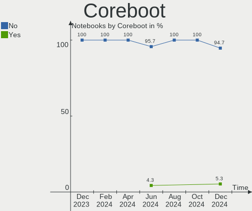
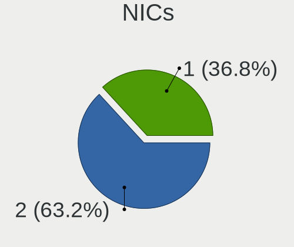

Gentoo Hardware Trends (Notebooks)
----------------------------------

A project to identify most popular hardware characteristics and track their change
over time based on data collected by Gentoo users at https://Linux-Hardware.org.

Anyone can contribute to this report by the [hw-probe](https://github.com/linuxhw/hw-probe) tool:

    sudo -E hw-probe -all -upload

Full-feature report is available here: https://linux-hardware.org/?view=trends&formfactor=notebook

Period: Aug, 2021.

Contents
--------

* [ System ](#system)
  - [ OS                       ](#os)
  - [ OS Family                ](#os-family)
  - [ Kernel                   ](#kernel)
  - [ Kernel Family            ](#kernel-family)
  - [ Kernel Major Ver.        ](#kernel-major-ver)
  - [ Arch                     ](#arch)
  - [ DE                       ](#de)
  - [ Display Server           ](#display-server)
  - [ Display Manager          ](#display-manager)
  - [ OS Lang                  ](#os-lang)
  - [ Boot Mode                ](#boot-mode)
  - [ Filesystem               ](#filesystem)
  - [ Part. scheme             ](#part-scheme)
  - [ Dual Boot with Linux/BSD ](#dual-boot-with-linuxbsd)
  - [ Dual Boot (Win)          ](#dual-boot-win)

* [ Board ](#board)
  - [ Vendor                   ](#vendor)
  - [ Model                    ](#model)
  - [ Model Family             ](#model-family)
  - [ MFG Year                 ](#mfg-year)
  - [ Form Factor              ](#form-factor)
  - [ Secure Boot              ](#secure-boot)
  - [ Coreboot                 ](#coreboot)
  - [ RAM Size                 ](#ram-size)
  - [ RAM Used                 ](#ram-used)
  - [ Total Drives             ](#total-drives)
  - [ Has CD-ROM               ](#has-cd-rom)
  - [ Has Ethernet             ](#has-ethernet)
  - [ Has WiFi                 ](#has-wifi)
  - [ Has Bluetooth            ](#has-bluetooth)

* [ Location ](#location)
  - [ Country                  ](#country)
  - [ City                     ](#city)

* [ Drives ](#drives)
  - [ Drive Vendor             ](#drive-vendor)
  - [ Drive Model              ](#drive-model)
  - [ HDD Vendor               ](#hdd-vendor)
  - [ SSD Vendor               ](#ssd-vendor)
  - [ Drive Kind               ](#drive-kind)
  - [ Drive Connector          ](#drive-connector)
  - [ Drive Size               ](#drive-size)
  - [ Space Total              ](#space-total)
  - [ Space Used               ](#space-used)
  - [ Malfunc. Drives          ](#malfunc-drives)
  - [ Malfunc. Drive Vendor    ](#malfunc-drive-vendor)
  - [ Malfunc. HDD Vendor      ](#malfunc-hdd-vendor)
  - [ Malfunc. Drive Kind      ](#malfunc-drive-kind)
  - [ Failed Drives            ](#failed-drives)
  - [ Failed Drive Vendor      ](#failed-drive-vendor)
  - [ Drive Status             ](#drive-status)

* [ Storage controller ](#storage-controller)
  - [ Storage Vendor           ](#storage-vendor)
  - [ Storage Model            ](#storage-model)
  - [ Storage Kind             ](#storage-kind)

* [ Processor ](#processor)
  - [ CPU Vendor               ](#cpu-vendor)
  - [ CPU Model                ](#cpu-model)
  - [ CPU Model Family         ](#cpu-model-family)
  - [ CPU Cores                ](#cpu-cores)
  - [ CPU Sockets              ](#cpu-sockets)
  - [ CPU Threads              ](#cpu-threads)
  - [ CPU Op-Modes             ](#cpu-op-modes)
  - [ CPU Microcode            ](#cpu-microcode)
  - [ CPU Microarch            ](#cpu-microarch)

* [ Graphics ](#graphics)
  - [ GPU Vendor               ](#gpu-vendor)
  - [ GPU Model                ](#gpu-model)
  - [ GPU Combo                ](#gpu-combo)
  - [ GPU Driver               ](#gpu-driver)
  - [ GPU Memory               ](#gpu-memory)

* [ Monitor ](#monitor)
  - [ Monitor Vendor           ](#monitor-vendor)
  - [ Monitor Model            ](#monitor-model)
  - [ Monitor Resolution       ](#monitor-resolution)
  - [ Monitor Diagonal         ](#monitor-diagonal)
  - [ Monitor Width            ](#monitor-width)
  - [ Aspect Ratio             ](#aspect-ratio)
  - [ Monitor Area             ](#monitor-area)
  - [ Pixel Density            ](#pixel-density)
  - [ Multiple Monitors        ](#multiple-monitors)

* [ Network ](#network)
  - [ Net Controller Vendor    ](#net-controller-vendor)
  - [ Net Controller Model     ](#net-controller-model)
  - [ Wireless Vendor          ](#wireless-vendor)
  - [ Wireless Model           ](#wireless-model)
  - [ Ethernet Vendor          ](#ethernet-vendor)
  - [ Ethernet Model           ](#ethernet-model)
  - [ Net Controller Kind      ](#net-controller-kind)
  - [ Used Controller          ](#used-controller)
  - [ NICs                     ](#nics)
  - [ IPv6                     ](#ipv6)

* [ Bluetooth ](#bluetooth)
  - [ Bluetooth Vendor         ](#bluetooth-vendor)
  - [ Bluetooth Model          ](#bluetooth-model)

* [ Sound ](#sound)
  - [ Sound Vendor             ](#sound-vendor)
  - [ Sound Model              ](#sound-model)

* [ Memory ](#memory)
  - [ Memory Vendor            ](#memory-vendor)
  - [ Memory Model             ](#memory-model)
  - [ Memory Kind              ](#memory-kind)
  - [ Memory Form Factor       ](#memory-form-factor)
  - [ Memory Size              ](#memory-size)
  - [ Memory Speed             ](#memory-speed)

* [ Printers & scanners ](#printers--scanners)
  - [ Printer Vendor           ](#printer-vendor)
  - [ Printer Model            ](#printer-model)
  - [ Scanner Vendor           ](#scanner-vendor)
  - [ Scanner Model            ](#scanner-model)

* [ Camera ](#camera)
  - [ Camera Vendor            ](#camera-vendor)
  - [ Camera Model             ](#camera-model)

* [ Security ](#security)
  - [ Fingerprint Vendor       ](#fingerprint-vendor)
  - [ Fingerprint Model        ](#fingerprint-model)
  - [ Chipcard Vendor          ](#chipcard-vendor)
  - [ Chipcard Model           ](#chipcard-model)

* [ Unsupported ](#unsupported)
  - [ Unsupported Devices      ](#unsupported-devices)
  - [ Unsupported Device Types ](#unsupported-device-types)

System
------

OS
--

Installed operating systems

| Name       | Notebooks | Percent |
|------------|-----------|---------|
| Gentoo     | 10        | 71.43%  |
| Gentoo 2.7 | 4         | 28.57%  |

OS Family
---------

OS without a version

| Name   | Notebooks | Percent |
|--------|-----------|---------|
| Gentoo | 14        | 100%    |

Kernel
------

Version of the Linux kernel

| Version                       | Notebooks | Percent |
|-------------------------------|-----------|---------|
| 5.10.52-gentoo                | 4         | 28.57%  |
| 5.13.12-gentoo-dist           | 2         | 14.29%  |
| 5.13.9-gentoo-x86_64          | 1         | 7.14%   |
| 5.13.7-gentoo-x86_64          | 1         | 7.14%   |
| 5.13.7-gentoo                 | 1         | 7.14%   |
| 5.13.12-gentoo-x86_64         | 1         | 7.14%   |
| 5.13.12-gentoo                | 1         | 7.14%   |
| 5.10.52-gentoo-x86_64-generic | 1         | 7.14%   |
| 5.10.52-gentoo-x86_64         | 1         | 7.14%   |
| 5.10.27-gentoo-x86_64         | 1         | 7.14%   |

Kernel Family
-------------

Linux kernel without a distro release

| Version | Notebooks | Percent |
|---------|-----------|---------|
| 5.10.52 | 6         | 42.86%  |
| 5.13.12 | 4         | 28.57%  |
| 5.13.7  | 2         | 14.29%  |
| 5.13.9  | 1         | 7.14%   |
| 5.10.27 | 1         | 7.14%   |

Kernel Major Ver.
-----------------

Linux kernel major version

| Version | Notebooks | Percent |
|---------|-----------|---------|
| 5.13    | 7         | 50%     |
| 5.10    | 7         | 50%     |

Arch
----

OS architecture (x86_64, i586, etc.)

| Name   | Notebooks | Percent |
|--------|-----------|---------|
| x86_64 | 12        | 85.71%  |
| i686   | 2         | 14.29%  |

DE
--

Desktop Environment

| Name    | Notebooks | Percent |
|---------|-----------|---------|
| GNOME   | 5         | 35.71%  |
| KDE5    | 4         | 28.57%  |
| MATE    | 2         | 14.29%  |
| Unknown | 2         | 14.29%  |
| bspwm   | 1         | 7.14%   |

Display Server
--------------

X11 or Wayland

| Name    | Notebooks | Percent |
|---------|-----------|---------|
| X11     | 7         | 50%     |
| Tty     | 4         | 28.57%  |
| Wayland | 2         | 14.29%  |
| Unknown | 1         | 7.14%   |

Display Manager
---------------

SDDM, LightDM, etc.

| Name    | Notebooks | Percent |
|---------|-----------|---------|
| SDDM    | 4         | 28.57%  |
| Unknown | 4         | 28.57%  |
| LightDM | 3         | 21.43%  |
| GDM     | 3         | 21.43%  |

OS Lang
-------

Language

| Lang       | Notebooks | Percent |
|------------|-----------|---------|
| en_US      | 6         | 42.86%  |
| es_ES      | 2         | 14.29%  |
| ru_RU      | 1         | 7.14%   |
| nl_BE      | 1         | 7.14%   |
| en_US.UTF8 | 1         | 7.14%   |
| en_GB      | 1         | 7.14%   |
| en_CA      | 1         | 7.14%   |
| de_DE      | 1         | 7.14%   |

Boot Mode
---------

EFI or BIOS

| Mode | Notebooks | Percent |
|------|-----------|---------|
| EFI  | 11        | 78.57%  |
| BIOS | 3         | 21.43%  |

Filesystem
----------

Type of filesystem

| Type  | Notebooks | Percent |
|-------|-----------|---------|
| Ext4  | 9         | 64.29%  |
| Btrfs | 3         | 21.43%  |
| F2fs  | 1         | 7.14%   |
| Ext3  | 1         | 7.14%   |

Part. scheme
------------

Scheme of partitioning

| Type    | Notebooks | Percent |
|---------|-----------|---------|
| GPT     | 10        | 71.43%  |
| MBR     | 3         | 21.43%  |
| Unknown | 1         | 7.14%   |

Dual Boot with Linux/BSD
------------------------

Hosting more than one Linux/BSD

| Dual boot | Notebooks | Percent |
|-----------|-----------|---------|
| No        | 11        | 78.57%  |
| Yes       | 3         | 21.43%  |

Dual Boot (Win)
---------------

Hosting Linux and Windows

| Dual boot | Notebooks | Percent |
|-----------|-----------|---------|
| No        | 9         | 64.29%  |
| Yes       | 5         | 35.71%  |

Board
-----

Vendor
------

Motherboard manufacturer

| Name             | Notebooks | Percent |
|------------------|-----------|---------|
| Lenovo           | 3         | 21.43%  |
| ASUSTek Computer | 3         | 21.43%  |
| TUXEDO           | 2         | 14.29%  |
| IBM              | 2         | 14.29%  |
| MSI              | 1         | 7.14%   |
| Jumper           | 1         | 7.14%   |
| Hewlett-Packard  | 1         | 7.14%   |
| Dell             | 1         | 7.14%   |

Model
-----

Motherboard model

| Name                                       | Notebooks | Percent |
|--------------------------------------------|-----------|---------|
| TUXEDO TUXEDO_Book_XA1510                  | 1         | 7.14%   |
| TUXEDO Book XC1711                         | 1         | 7.14%   |
| MSI GF63 Thin 9SCSR                        | 1         | 7.14%   |
| Lenovo ThinkPad X230 23259H1               | 1         | 7.14%   |
| Lenovo ThinkPad X1 Carbon Gen 9 20XXS0HW00 | 1         | 7.14%   |
| Lenovo Legion 5P 15IMH05 82AW              | 1         | 7.14%   |
| Jumper EZpad                               | 1         | 7.14%   |
| IBM ThinkPad T43 2668Z3S                   | 1         | 7.14%   |
| IBM ThinkPad T42 2373V4F                   | 1         | 7.14%   |
| HP 255 G6 Notebook PC                      | 1         | 7.14%   |
| Dell Inspiron 5415                         | 1         | 7.14%   |
| ASUS ZenBook UX325EA_UX325EA               | 1         | 7.14%   |
| ASUS X510UR                                | 1         | 7.14%   |
| ASUS ROG Strix G533QR_G533QR               | 1         | 7.14%   |

Model Family
------------

Motherboard model prefix

| Name            | Notebooks | Percent |
|-----------------|-----------|---------|
| Lenovo ThinkPad | 2         | 14.29%  |
| IBM ThinkPad    | 2         | 14.29%  |
| TUXEDO TUXEDO   | 1         | 7.14%   |
| TUXEDO Book     | 1         | 7.14%   |
| MSI GF63        | 1         | 7.14%   |
| Lenovo Legion   | 1         | 7.14%   |
| Jumper EZpad    | 1         | 7.14%   |
| HP 255          | 1         | 7.14%   |
| Dell Inspiron   | 1         | 7.14%   |
| ASUS ZenBook    | 1         | 7.14%   |
| ASUS X510UR     | 1         | 7.14%   |
| ASUS ROG        | 1         | 7.14%   |

MFG Year
--------

Motherboard manufacture year

| Year | Notebooks | Percent |
|------|-----------|---------|
| 2021 | 6         | 42.86%  |
| 2020 | 4         | 28.57%  |
| 2019 | 1         | 7.14%   |
| 2017 | 1         | 7.14%   |
| 2007 | 1         | 7.14%   |
| 2006 | 1         | 7.14%   |

Form Factor
-----------

Physical design of the computer

| Name     | Notebooks | Percent |
|----------|-----------|---------|
| Notebook | 14        | 100%    |

Secure Boot
-----------

Enabled or disabled

| State    | Notebooks | Percent |
|----------|-----------|---------|
| Disabled | 13        | 92.86%  |
| Enabled  | 1         | 7.14%   |

Coreboot
--------

Have coreboot on board

| Used | Notebooks | Percent |
|------|-----------|---------|
| No   | 13        | 92.86%  |
| Yes  | 1         | 7.14%   |

RAM Size
--------

Total RAM memory

| Size in GB  | Notebooks | Percent |
|-------------|-----------|---------|
| 4.01-8.0    | 5         | 35.71%  |
| 32.01-64.0  | 2         | 14.29%  |
| 2.01-3.0    | 2         | 14.29%  |
| 16.01-24.0  | 2         | 14.29%  |
| 8.01-16.0   | 2         | 14.29%  |
| 64.01-256.0 | 1         | 7.14%   |

RAM Used
--------

Used RAM memory

| Used GB  | Notebooks | Percent |
|----------|-----------|---------|
| 1.01-2.0 | 5         | 35.71%  |
| 2.01-3.0 | 3         | 21.43%  |
| 0.01-0.5 | 3         | 21.43%  |
| 4.01-8.0 | 2         | 14.29%  |
| 3.01-4.0 | 1         | 7.14%   |

Total Drives
------------

Number of drives on board

| Drives | Notebooks | Percent |
|--------|-----------|---------|
| 1      | 9         | 64.29%  |
| 2      | 5         | 35.71%  |

Has CD-ROM
----------

Has CD-ROM on board

| Presented | Notebooks | Percent |
|-----------|-----------|---------|
| No        | 10        | 71.43%  |
| Yes       | 4         | 28.57%  |

Has Ethernet
------------

Has Ethernet on board

| Presented | Notebooks | Percent |
|-----------|-----------|---------|
| Yes       | 11        | 78.57%  |
| No        | 3         | 21.43%  |

Has WiFi
--------

Has WiFi module

| Presented | Notebooks | Percent |
|-----------|-----------|---------|
| Yes       | 14        | 100%    |

Has Bluetooth
-------------

Has Bluetooth module

| Presented | Notebooks | Percent |
|-----------|-----------|---------|
| Yes       | 11        | 78.57%  |
| No        | 3         | 21.43%  |

Location
--------

Country
-------

Geographic location (country)

| Country | Notebooks | Percent |
|---------|-----------|---------|
| Germany | 5         | 35.71%  |
| Spain   | 2         | 14.29%  |
| Russia  | 1         | 7.14%   |
| Italy   | 1         | 7.14%   |
| Czechia | 1         | 7.14%   |
| Canada  | 1         | 7.14%   |
| Brazil  | 1         | 7.14%   |
| Belgium | 1         | 7.14%   |
| Belarus | 1         | 7.14%   |

City
----

Geographic location (city)

| City                  | Notebooks | Percent |
|-----------------------|-----------|---------|
| Rodgau                | 2         | 14.29%  |
| Zaragoza              | 1         | 7.14%   |
| Winnipeg              | 1         | 7.14%   |
| S??o Jos?© dos Campos | 1         | 7.14%   |
| Santa Brigida         | 1         | 7.14%   |
| Ratingen              | 1         | 7.14%   |
| Paderno Dugnano       | 1         | 7.14%   |
| Oberhausen            | 1         | 7.14%   |
| Munich                | 1         | 7.14%   |
| Moscow                | 1         | 7.14%   |
| Minsk                 | 1         | 7.14%   |
| Eisden                | 1         | 7.14%   |
| Brno                  | 1         | 7.14%   |

Drives
------

Drive Vendor
------------

Hard drive vendors

| Vendor              | Notebooks | Drives | Percent |
|---------------------|-----------|--------|---------|
| Samsung Electronics | 5         | 7      | 26.32%  |
| SK Hynix            | 3         | 3      | 15.79%  |
| WDC                 | 2         | 2      | 10.53%  |
| Unknown             | 2         | 2      | 10.53%  |
| Toshiba             | 1         | 1      | 5.26%   |
| Seagate             | 1         | 1      | 5.26%   |
| SanDisk             | 1         | 1      | 5.26%   |
| Kingston            | 1         | 1      | 5.26%   |
| IBM/Hitachi         | 1         | 1      | 5.26%   |
| HGST                | 1         | 1      | 5.26%   |
| faspeed             | 1         | 1      | 5.26%   |

Drive Model
-----------

Hard drive models

| Model                                | Notebooks | Percent |
|--------------------------------------|-----------|---------|
| WDC WDBRPG5000ANC-WRSN 500GB         | 1         | 4.76%   |
| WDC PC SN530 SDBPNPZ-256G-1032 256GB | 1         | 4.76%   |
| Unknown MMC Card  997GB              | 1         | 4.76%   |
| Unknown MMC Card  128GB              | 1         | 4.76%   |
| Toshiba MQ01ABD100 1TB               | 1         | 4.76%   |
| SK Hynix HFM256GDJTNG-8310A 256GB    | 1         | 4.76%   |
| SK Hynix HFM001TD3JX013N 1TB         | 1         | 4.76%   |
| SK Hynix BC711 NVMe 512GB            | 1         | 4.76%   |
| Seagate ST1000LM048-2E7172 1TB       | 1         | 4.76%   |
| SanDisk SSD PLUS 480GB               | 1         | 4.76%   |
| Samsung SSD 980 1TB                  | 1         | 4.76%   |
| Samsung SSD 970 PRO 512GB            | 1         | 4.76%   |
| Samsung SSD 970 EVO Plus 250GB       | 1         | 4.76%   |
| Samsung NVMe SSD Drive 512GB         | 1         | 4.76%   |
| Samsung NVMe SSD Drive 1TB           | 1         | 4.76%   |
| Samsung MZVL21T0HCLR-00BL7 1TB       | 1         | 4.76%   |
| Samsung HM160HC 160GB                | 1         | 4.76%   |
| Kingston SA400S37240G 240GB SSD      | 1         | 4.76%   |
| IBM/Hitachi IC25N080ATMR04-0 80GB    | 1         | 4.76%   |
| HGST HTS721010A9E630 1TB             | 1         | 4.76%   |
| faspeed K7N8-256GF 256GB SSD         | 1         | 4.76%   |

HDD Vendor
----------

Hard disk drive vendors

| Vendor              | Notebooks | Drives | Percent |
|---------------------|-----------|--------|---------|
| Toshiba             | 1         | 1      | 20%     |
| Seagate             | 1         | 1      | 20%     |
| Samsung Electronics | 1         | 1      | 20%     |
| IBM/Hitachi         | 1         | 1      | 20%     |
| HGST                | 1         | 1      | 20%     |

SSD Vendor
----------

Solid state drive vendors

| Vendor   | Notebooks | Drives | Percent |
|----------|-----------|--------|---------|
| SanDisk  | 1         | 1      | 33.33%  |
| Kingston | 1         | 1      | 33.33%  |
| faspeed  | 1         | 1      | 33.33%  |

Drive Kind
----------

HDD or SSD

| Kind | Notebooks | Drives | Percent |
|------|-----------|--------|---------|
| NVMe | 8         | 11     | 44.44%  |
| HDD  | 5         | 5      | 27.78%  |
| SSD  | 3         | 3      | 16.67%  |
| MMC  | 2         | 2      | 11.11%  |

Drive Connector
---------------

SATA, SAS, NVMe, etc.

| Type | Notebooks | Drives | Percent |
|------|-----------|--------|---------|
| NVMe | 8         | 11     | 44.44%  |
| SATA | 8         | 8      | 44.44%  |
| MMC  | 2         | 2      | 11.11%  |

Drive Size
----------

Size of hard drive

| Size in TB | Notebooks | Drives | Percent |
|------------|-----------|--------|---------|
| 0.01-0.5   | 5         | 5      | 62.5%   |
| 0.51-1.0   | 3         | 3      | 37.5%   |

Space Total
-----------

Amount of disk space available on the file system

| Size in GB | Notebooks | Percent |
|------------|-----------|---------|
| 501-1000   | 4         | 28.57%  |
| 251-500    | 3         | 21.43%  |
| 101-250    | 3         | 21.43%  |
| 1001-2000  | 2         | 14.29%  |
| 51-100     | 2         | 14.29%  |

Space Used
----------

Amount of used disk space

| Used GB | Notebooks | Percent |
|---------|-----------|---------|
| 251-500 | 3         | 21.43%  |
| 101-250 | 3         | 21.43%  |
| 1-20    | 3         | 21.43%  |
| 51-100  | 3         | 21.43%  |
| 21-50   | 2         | 14.29%  |

Malfunc. Drives
---------------

Drive models with a malfunction

| Model                             | Notebooks | Drives | Percent |
|-----------------------------------|-----------|--------|---------|
| SanDisk SSD PLUS 480GB            | 1         | 1      | 33.33%  |
| Samsung Electronics HM160HC 160GB | 1         | 1      | 33.33%  |
| IBM/Hitachi IC25N080ATMR04-0 80GB | 1         | 1      | 33.33%  |

Malfunc. Drive Vendor
---------------------

Vendors of faulty drives

| Vendor              | Notebooks | Drives | Percent |
|---------------------|-----------|--------|---------|
| SanDisk             | 1         | 1      | 33.33%  |
| Samsung Electronics | 1         | 1      | 33.33%  |
| IBM/Hitachi         | 1         | 1      | 33.33%  |

Malfunc. HDD Vendor
-------------------

Vendors of faulty HDD drives

| Vendor              | Notebooks | Drives | Percent |
|---------------------|-----------|--------|---------|
| Samsung Electronics | 1         | 1      | 50%     |
| IBM/Hitachi         | 1         | 1      | 50%     |

Malfunc. Drive Kind
-------------------

Kinds of faulty drives

| Kind | Notebooks | Drives | Percent |
|------|-----------|--------|---------|
| HDD  | 2         | 2      | 66.67%  |
| SSD  | 1         | 1      | 33.33%  |

Failed Drives
-------------

Failed drive models

Zero info for selected period =(

Failed Drive Vendor
-------------------

Failed drive vendors

Zero info for selected period =(

Drive Status
------------

Number of failed and malfunc. drives

| Status   | Notebooks | Drives | Percent |
|----------|-----------|--------|---------|
| Works    | 10        | 14     | 62.5%   |
| Detected | 3         | 4      | 18.75%  |
| Malfunc  | 3         | 3      | 18.75%  |

Storage controller
------------------

Storage Vendor
--------------

Storage controller vendors

| Vendor              | Notebooks | Percent |
|---------------------|-----------|---------|
| Intel               | 9         | 42.86%  |
| Samsung Electronics | 4         | 19.05%  |
| SK Hynix            | 3         | 14.29%  |
| AMD                 | 3         | 14.29%  |
| Sandisk             | 2         | 9.52%   |

Storage Model
-------------

Storage controller models

| Model                                                            | Notebooks | Percent |
|------------------------------------------------------------------|-----------|---------|
| Samsung NVMe SSD Controller SM981/PM981/PM983                    | 3         | 12.5%   |
| AMD FCH SATA Controller [AHCI mode]                              | 3         | 12.5%   |
| SK Hynix NVMe SSD Controller                                     | 2         | 8.33%   |
| Samsung NVMe Controller                                          | 2         | 8.33%   |
| Intel Sunrise Point-LP SATA Controller [AHCI mode]               | 2         | 8.33%   |
| Intel 400 Series Chipset Family SATA AHCI Controller             | 2         | 8.33%   |
| SK Hynix BC501 NVMe Solid State Drive                            | 1         | 4.17%   |
| Sandisk WD Blue SN550 NVMe SSD                                   | 1         | 4.17%   |
| Sandisk WD Black SN750 / PC SN730 NVMe SSD                       | 1         | 4.17%   |
| Samsung NVMe SSD Controller PM9A1/PM9A3/980PRO                   | 1         | 4.17%   |
| Intel Volume Management Device NVMe RAID Controller              | 1         | 4.17%   |
| Intel Cannon Lake Mobile PCH SATA AHCI Controller                | 1         | 4.17%   |
| Intel 82801FBM (ICH6M) SATA Controller                           | 1         | 4.17%   |
| Intel 82801DBM (ICH4-M) IDE Controller                           | 1         | 4.17%   |
| Intel 7 Series Chipset Family 6-port SATA Controller [AHCI mode] | 1         | 4.17%   |
| AMD 400 Series Chipset SATA Controller                           | 1         | 4.17%   |

Storage Kind
------------

Kind of storage controller (IDE, SATA, NVMe, SAS, ...)

| Kind | Notebooks | Percent |
|------|-----------|---------|
| SATA | 9         | 45%     |
| NVMe | 8         | 40%     |
| IDE  | 2         | 10%     |
| RAID | 1         | 5%      |

Processor
---------

CPU Vendor
----------

Processor vendors

| Vendor | Notebooks | Percent |
|--------|-----------|---------|
| Intel  | 10        | 71.43%  |
| AMD    | 4         | 28.57%  |

CPU Model
---------

Processor models

| Model                                        | Notebooks | Percent |
|----------------------------------------------|-----------|---------|
| Intel Core i7-10875H CPU @ 2.30GHz           | 2         | 14.29%  |
| Intel Pentium M processor 1.86GHz            | 1         | 7.14%   |
| Intel Pentium M processor 1.70GHz            | 1         | 7.14%   |
| Intel Core i7-9750H CPU @ 2.60GHz            | 1         | 7.14%   |
| Intel Core i7-7Y75 CPU @ 1.30GHz             | 1         | 7.14%   |
| Intel Core i7-7500U CPU @ 2.70GHz            | 1         | 7.14%   |
| Intel Core i5-3320M CPU @ 2.60GHz            | 1         | 7.14%   |
| Intel 11th Gen Core i7-1165G7 @ 2.80GHz      | 1         | 7.14%   |
| Intel 11th Gen Core i5-1135G7 @ 2.40GHz      | 1         | 7.14%   |
| AMD Ryzen 9 5900HX with Radeon Graphics      | 1         | 7.14%   |
| AMD Ryzen 9 3900 12-Core Processor           | 1         | 7.14%   |
| AMD Ryzen 5 5500U with Radeon Graphics       | 1         | 7.14%   |
| AMD A6-9220 RADEON R4, 5 COMPUTE CORES 2C+3G | 1         | 7.14%   |

CPU Model Family
----------------

Processor model prefix

| Model           | Notebooks | Percent |
|-----------------|-----------|---------|
| Intel Core i7   | 5         | 35.71%  |
| Other           | 2         | 14.29%  |
| Intel Pentium M | 2         | 14.29%  |
| AMD Ryzen 9     | 2         | 14.29%  |
| Intel Core i5   | 1         | 7.14%   |
| AMD Ryzen 5     | 1         | 7.14%   |
| AMD A6          | 1         | 7.14%   |

CPU Cores
---------

Number of processor cores

| Number | Notebooks | Percent |
|--------|-----------|---------|
| 2      | 4         | 28.57%  |
| 8      | 3         | 21.43%  |
| 6      | 2         | 14.29%  |
| 4      | 2         | 14.29%  |
| 1      | 2         | 14.29%  |
| 12     | 1         | 7.14%   |

CPU Sockets
-----------

Number of sockets

| Number | Notebooks | Percent |
|--------|-----------|---------|
| 1      | 14        | 100%    |

CPU Threads
-----------

Threads per core (Hyper-Threading)

| Number | Notebooks | Percent |
|--------|-----------|---------|
| 2      | 11        | 78.57%  |
| 1      | 3         | 21.43%  |

CPU Op-Modes
------------

CPU Operation Modes (32-bit, 64-bit)

| Op mode        | Notebooks | Percent |
|----------------|-----------|---------|
| 32-bit, 64-bit | 12        | 85.71%  |
| 32-bit         | 2         | 14.29%  |

CPU Microcode
-------------

Microcode number

| Number     | Notebooks | Percent |
|------------|-----------|---------|
| 0xa0652    | 2         | 14.29%  |
| 0x806e9    | 2         | 14.29%  |
| 0x806c1    | 2         | 14.29%  |
| 0x906ed    | 1         | 7.14%   |
| 0x6d8      | 1         | 7.14%   |
| 0x6d6      | 1         | 7.14%   |
| 0x306a9    | 1         | 7.14%   |
| 0x0a50000b | 1         | 7.14%   |
| 0x08701013 | 1         | 7.14%   |
| 0x08608103 | 1         | 7.14%   |
| 0x06006705 | 1         | 7.14%   |

CPU Microarch
-------------

Microarchitecture

| Name      | Notebooks | Percent |
|-----------|-----------|---------|
| KabyLake  | 3         | 21.43%  |
| TigerLake | 2         | 14.29%  |
| P6        | 2         | 14.29%  |
| CometLake | 2         | 14.29%  |
| Zen 3     | 1         | 7.14%   |
| Zen 2     | 1         | 7.14%   |
| IvyBridge | 1         | 7.14%   |
| Excavator | 1         | 7.14%   |
| Unknown   | 1         | 7.14%   |

Graphics
--------

GPU Vendor
----------

Vendors of graphics cards

| Vendor | Notebooks | Percent |
|--------|-----------|---------|
| Intel  | 7         | 38.89%  |
| Nvidia | 6         | 33.33%  |
| AMD    | 5         | 27.78%  |

GPU Model
---------

Graphics card models

| Model                                            | Notebooks | Percent |
|--------------------------------------------------|-----------|---------|
| Nvidia TU106M [GeForce RTX 2060 Mobile]          | 2         | 11.11%  |
| Intel TigerLake-LP GT2 [Iris Xe Graphics]        | 2         | 11.11%  |
| Nvidia TU117M [GeForce GTX 1650 Ti Mobile]       | 1         | 5.56%   |
| Nvidia TU116M [GeForce GTX 1660 Ti Mobile]       | 1         | 5.56%   |
| Nvidia GM108M [GeForce 930MX]                    | 1         | 5.56%   |
| Nvidia GA104M [GeForce RTX 3070 Mobile / Max-Q]  | 1         | 5.56%   |
| Intel HD Graphics 620                            | 1         | 5.56%   |
| Intel HD Graphics 615                            | 1         | 5.56%   |
| Intel CometLake-H GT2 [UHD Graphics]             | 1         | 5.56%   |
| Intel CoffeeLake-H GT2 [UHD Graphics 630]        | 1         | 5.56%   |
| Intel 3rd Gen Core processor Graphics Controller | 1         | 5.56%   |
| AMD Stoney [Radeon R2/R3/R4/R5 Graphics]         | 1         | 5.56%   |
| AMD RV370/M22 [Mobility Radeon X300]             | 1         | 5.56%   |
| AMD RV200/M7 [Mobility Radeon 7500]              | 1         | 5.56%   |
| AMD Lucienne                                     | 1         | 5.56%   |
| AMD Cezanne                                      | 1         | 5.56%   |

GPU Combo
---------

Combinations of graphics cards

| Name           | Notebooks | Percent |
|----------------|-----------|---------|
| 1 x Intel      | 4         | 28.57%  |
| 1 x AMD        | 4         | 28.57%  |
| Intel + Nvidia | 3         | 21.43%  |
| 1 x Nvidia     | 2         | 14.29%  |
| AMD + Nvidia   | 1         | 7.14%   |

GPU Driver
----------

Free vs proprietary

| Driver      | Notebooks | Percent |
|-------------|-----------|---------|
| Free        | 10        | 71.43%  |
| Proprietary | 4         | 28.57%  |

GPU Memory
----------

Total video memory

| Size in GB | Notebooks | Percent |
|------------|-----------|---------|
| Unknown    | 6         | 42.86%  |
| 0.01-0.5   | 4         | 28.57%  |
| 5.01-6.0   | 2         | 14.29%  |
| 3.01-4.0   | 1         | 7.14%   |
| 1.01-2.0   | 1         | 7.14%   |

Monitor
-------

Monitor Vendor
--------------

Monitor vendors

| Vendor              | Notebooks | Percent |
|---------------------|-----------|---------|
| LG Display          | 5         | 25%     |
| Samsung Electronics | 3         | 15%     |
| Fujitsu Siemens     | 2         | 10%     |
| Dell                | 2         | 10%     |
| WST                 | 1         | 5%      |
| Unknown             | 1         | 5%      |
| Sharp               | 1         | 5%      |
| PANDA               | 1         | 5%      |
| LGD                 | 1         | 5%      |
| CSO                 | 1         | 5%      |
| Chimei Innolux      | 1         | 5%      |
| BOE                 | 1         | 5%      |

Monitor Model
-------------

Monitor models

| Model                                                                 | Notebooks | Percent |
|-----------------------------------------------------------------------|-----------|---------|
| Fujitsu Siemens P24W-6 IPS FUS07EA 1920x1200 520x320mm 24.0-inch      | 2         | 10%     |
| WST LCD Monitor WST2216 2160x1440 254x169mm 12.0-inch                 | 1         | 5%      |
| Unknown LCD Monitor FFFF 2288x1287 2550x2550mm 142.0-inch             | 1         | 5%      |
| Sharp LQ156M1JW25 SHP152C 1920x1080 344x194mm 15.5-inch               | 1         | 5%      |
| Samsung Electronics SME2320 SAM06B2 1920x1080 510x287mm 23.0-inch     | 1         | 5%      |
| Samsung Electronics LCD Monitor SDC4155 1920x1080 294x165mm 13.3-inch | 1         | 5%      |
| Samsung Electronics C27F390 SAM0D32 1920x1080 600x340mm 27.2-inch     | 1         | 5%      |
| PANDA LCD Monitor NCP004B 1920x1080 344x194mm 15.5-inch               | 1         | 5%      |
| LGD LCD Monitor 1920x1080                                             | 1         | 5%      |
| LG Display LCD Monitor LGD0657 1920x1080 344x194mm 15.5-inch          | 1         | 5%      |
| LG Display LCD Monitor LGD0615 1920x1080 382x215mm 17.3-inch          | 1         | 5%      |
| LG Display LCD Monitor LGD05E5 1920x1080 344x194mm 15.5-inch          | 1         | 5%      |
| LG Display LCD Monitor LGD0573 1920x1080 344x194mm 15.5-inch          | 1         | 5%      |
| LG Display LCD Monitor LGD037A 1366x768 277x156mm 12.5-inch           | 1         | 5%      |
| Dell U2421E DEL41EE 1920x1200 518x324mm 24.1-inch                     | 1         | 5%      |
| Dell U2414H DELA0A3 1920x1080 530x300mm 24.0-inch                     | 1         | 5%      |
| CSO LCD Monitor CSO1404 1920x1200 302x189mm 14.0-inch                 | 1         | 5%      |
| Chimei Innolux LCD Monitor CMN14E7 1920x1080 309x173mm 13.9-inch      | 1         | 5%      |
| BOE LCD Monitor BOE0687 1920x1080 344x193mm 15.5-inch                 | 1         | 5%      |

Monitor Resolution
------------------

Monitor screen resolution

| Resolution        | Notebooks | Percent |
|-------------------|-----------|---------|
| 1920x1080 (FHD)   | 9         | 60%     |
| 1920x1200 (WUXGA) | 3         | 20%     |
| 2288x1287         | 1         | 6.67%   |
| 2160x1440         | 1         | 6.67%   |
| 1366x768 (WXGA)   | 1         | 6.67%   |

Monitor Diagonal
----------------

Diagonal size in inches

| Inches  | Notebooks | Percent |
|---------|-----------|---------|
| 15      | 6         | 30%     |
| 24      | 4         | 20%     |
| 13      | 2         | 10%     |
| 12      | 2         | 10%     |
| 142     | 1         | 5%      |
| 27      | 1         | 5%      |
| 23      | 1         | 5%      |
| 17      | 1         | 5%      |
| 14      | 1         | 5%      |
| Unknown | 1         | 5%      |

Monitor Width
-------------

Physical width

| Width in mm    | Notebooks | Percent |
|----------------|-----------|---------|
| 301-350        | 8         | 40%     |
| 501-600        | 6         | 30%     |
| 201-300        | 3         | 15%     |
| More than 2000 | 1         | 5%      |
| 351-400        | 1         | 5%      |
| Unknown        | 1         | 5%      |

Aspect Ratio
------------

Proportional relationship between the width and the height

| Ratio   | Notebooks | Percent |
|---------|-----------|---------|
| 16/9    | 10        | 58.82%  |
| 16/10   | 4         | 23.53%  |
| 3/2     | 1         | 5.88%   |
| 1.00    | 1         | 5.88%   |
| Unknown | 1         | 5.88%   |

Monitor Area
------------

Area in inch²

| Area in inch² | Notebooks | Percent |
|----------------|-----------|---------|
| 101-110        | 6         | 30%     |
| 251-300        | 3         | 15%     |
| 81-90          | 2         | 10%     |
| 61-70          | 2         | 10%     |
| 201-250        | 2         | 10%     |
| More than 1000 | 1         | 5%      |
| 71-80          | 1         | 5%      |
| 301-350        | 1         | 5%      |
| 121-130        | 1         | 5%      |
| Unknown        | 1         | 5%      |

Pixel Density
-------------

Pixels per inch

| Density | Notebooks | Percent |
|---------|-----------|---------|
| 121-160 | 9         | 45%     |
| 51-100  | 6         | 30%     |
| 161-240 | 3         | 15%     |
| 1-50    | 1         | 5%      |
| Unknown | 1         | 5%      |

Multiple Monitors
-----------------

Total monitors connected

| Total | Notebooks | Percent |
|-------|-----------|---------|
| 1     | 10        | 71.43%  |
| 2     | 4         | 28.57%  |

Network
-------

Net Controller Vendor
---------------------

Controller vendors

| Vendor                            | Notebooks | Percent |
|-----------------------------------|-----------|---------|
| Intel                             | 13        | 52%     |
| Realtek Semiconductor             | 7         | 28%     |
| Qualcomm Atheros                  | 1         | 4%      |
| MEDIATEK                          | 1         | 4%      |
| Ericsson Business Mobile Networks | 1         | 4%      |
| Broadcom                          | 1         | 4%      |
| ASIX Electronics                  | 1         | 4%      |

Net Controller Model
--------------------

Controller models

| Model                                                              | Notebooks | Percent |
|--------------------------------------------------------------------|-----------|---------|
| Realtek RTL8111/8168/8411 PCI Express Gigabit Ethernet Controller  | 6         | 20.69%  |
| Intel Wi-Fi 6 AX200                                                | 3         | 10.34%  |
| Realtek RTL8153 Gigabit Ethernet Adapter                           | 2         | 6.9%    |
| Intel Wi-Fi 6 AX201                                                | 2         | 6.9%    |
| Qualcomm Atheros AR5212 802.11abg NIC                              | 1         | 3.45%   |
| MEDIATEK Network controller                                        | 1         | 3.45%   |
| Intel Wireless 7265                                                | 1         | 3.45%   |
| Intel Wireless 7260                                                | 1         | 3.45%   |
| Intel Wireless 3165                                                | 1         | 3.45%   |
| Intel PRO/Wireless 2915ABG [Calexico2] Network Connection          | 1         | 3.45%   |
| Intel Dual Band Wireless-AC 3168NGW [Stone Peak]                   | 1         | 3.45%   |
| Intel Comet Lake PCH CNVi WiFi                                     | 1         | 3.45%   |
| Intel Cannon Lake PCH CNVi WiFi                                    | 1         | 3.45%   |
| Intel 82801FB/FBM/FR/FW/FRW (ICH6 Family) AC'97 Modem Controller   | 1         | 3.45%   |
| Intel 82801DB/DBL/DBM (ICH4/ICH4-L/ICH4-M) AC'97 Modem Controller  | 1         | 3.45%   |
| Intel 82579LM Gigabit Network Connection (Lewisville)              | 1         | 3.45%   |
| Intel 82540EP Gigabit Ethernet Controller (Mobile)                 | 1         | 3.45%   |
| Ericsson Business Mobile Networks H5321 gw Mobile Broadband Module | 1         | 3.45%   |
| Broadcom NetXtreme BCM5751M Gigabit Ethernet PCI Express           | 1         | 3.45%   |
| ASIX AX88772                                                       | 1         | 3.45%   |

Wireless Vendor
---------------

Wireless vendors

| Vendor           | Notebooks | Percent |
|------------------|-----------|---------|
| Intel            | 12        | 85.71%  |
| Qualcomm Atheros | 1         | 7.14%   |
| MEDIATEK         | 1         | 7.14%   |

Wireless Model
--------------

Wireless models

| Model                                                     | Notebooks | Percent |
|-----------------------------------------------------------|-----------|---------|
| Intel Wi-Fi 6 AX200                                       | 3         | 21.43%  |
| Intel Wi-Fi 6 AX201                                       | 2         | 14.29%  |
| Qualcomm Atheros AR5212 802.11abg NIC                     | 1         | 7.14%   |
| MEDIATEK Network controller                               | 1         | 7.14%   |
| Intel Wireless 7265                                       | 1         | 7.14%   |
| Intel Wireless 7260                                       | 1         | 7.14%   |
| Intel Wireless 3165                                       | 1         | 7.14%   |
| Intel PRO/Wireless 2915ABG [Calexico2] Network Connection | 1         | 7.14%   |
| Intel Dual Band Wireless-AC 3168NGW [Stone Peak]          | 1         | 7.14%   |
| Intel Comet Lake PCH CNVi WiFi                            | 1         | 7.14%   |
| Intel Cannon Lake PCH CNVi WiFi                           | 1         | 7.14%   |

Ethernet Vendor
---------------

Ethernet vendors

| Vendor                | Notebooks | Percent |
|-----------------------|-----------|---------|
| Realtek Semiconductor | 7         | 63.64%  |
| Intel                 | 2         | 18.18%  |
| Broadcom              | 1         | 9.09%   |
| ASIX Electronics      | 1         | 9.09%   |

Ethernet Model
--------------

Ethernet models

| Model                                                             | Notebooks | Percent |
|-------------------------------------------------------------------|-----------|---------|
| Realtek RTL8111/8168/8411 PCI Express Gigabit Ethernet Controller | 6         | 50%     |
| Realtek RTL8153 Gigabit Ethernet Adapter                          | 2         | 16.67%  |
| Intel 82579LM Gigabit Network Connection (Lewisville)             | 1         | 8.33%   |
| Intel 82540EP Gigabit Ethernet Controller (Mobile)                | 1         | 8.33%   |
| Broadcom NetXtreme BCM5751M Gigabit Ethernet PCI Express          | 1         | 8.33%   |
| ASIX AX88772                                                      | 1         | 8.33%   |

Net Controller Kind
-------------------

Ethernet, WiFi or modem

| Kind     | Notebooks | Percent |
|----------|-----------|---------|
| WiFi     | 14        | 50%     |
| Ethernet | 11        | 39.29%  |
| Modem    | 3         | 10.71%  |

Used Controller
---------------

Currently used network controller

| Kind     | Notebooks | Percent |
|----------|-----------|---------|
| WiFi     | 12        | 63.16%  |
| Ethernet | 7         | 36.84%  |

NICs
----

Total network controllers on board

| Total | Notebooks | Percent |
|-------|-----------|---------|
| 2     | 9         | 64.29%  |
| 1     | 5         | 35.71%  |

IPv6
----

IPv6 vs IPv4

| Used | Notebooks | Percent |
|------|-----------|---------|
| No   | 10        | 71.43%  |
| Yes  | 4         | 28.57%  |

Bluetooth
---------

Bluetooth Vendor
----------------

Controller vendors

| Vendor       | Notebooks | Percent |
|--------------|-----------|---------|
| Intel        | 10        | 90.91%  |
| IMC Networks | 1         | 9.09%   |

Bluetooth Model
---------------

Controller models

| Model                                          | Notebooks | Percent |
|------------------------------------------------|-----------|---------|
| Intel Bluetooth Device                         | 3         | 27.27%  |
| Intel AX200 Bluetooth                          | 3         | 27.27%  |
| Intel Bluetooth wireless interface             | 2         | 18.18%  |
| Intel Wireless-AC 3168 Bluetooth               | 1         | 9.09%   |
| Intel Bluetooth 9460/9560 Jefferson Peak (JfP) | 1         | 9.09%   |
| IMC Networks Wireless_Device                   | 1         | 9.09%   |

Sound
-----

Sound Vendor
------------

Sound card vendors

| Vendor                      | Notebooks | Percent |
|-----------------------------|-----------|---------|
| Intel                       | 10        | 45.45%  |
| Nvidia                      | 4         | 18.18%  |
| AMD                         | 4         | 18.18%  |
| Realtek Semiconductor       | 1         | 4.55%   |
| FiiO Electronics Technology | 1         | 4.55%   |
| Dell                        | 1         | 4.55%   |
| C-Media Electronics         | 1         | 4.55%   |

Sound Model
-----------

Sound card models

| Model                                                               | Notebooks | Percent |
|---------------------------------------------------------------------|-----------|---------|
| Nvidia TU106 High Definition Audio Controller                       | 2         | 8%      |
| Intel Tiger Lake-LP Smart Sound Technology Audio Controller         | 2         | 8%      |
| Intel Sunrise Point-LP HD Audio                                     | 2         | 8%      |
| Intel Comet Lake PCH cAVS                                           | 2         | 8%      |
| AMD Renoir Radeon High Definition Audio Controller                  | 2         | 8%      |
| AMD Family 17h (Models 10h-1fh) HD Audio Controller                 | 2         | 8%      |
| Realtek Semiconductor USB Audio                                     | 1         | 4%      |
| Nvidia TU116 High Definition Audio Controller                       | 1         | 4%      |
| Nvidia GA104 High Definition Audio Controller                       | 1         | 4%      |
| Intel Cannon Lake PCH cAVS                                          | 1         | 4%      |
| Intel 82801FB/FBM/FR/FW/FRW (ICH6 Family) AC'97 Audio Controller    | 1         | 4%      |
| Intel 82801DB/DBL/DBM (ICH4/ICH4-L/ICH4-M) AC'97 Audio Controller   | 1         | 4%      |
| Intel 7 Series/C216 Chipset Family High Definition Audio Controller | 1         | 4%      |
| FiiO Electronics Technology K3                                      | 1         | 4%      |
| Dell AC511 Sound Bar                                                | 1         | 4%      |
| C-Media Electronics CM108 Audio Controller                          | 1         | 4%      |
| AMD Starship/Matisse HD Audio Controller                            | 1         | 4%      |
| AMD High Definition Audio Controller                                | 1         | 4%      |
| AMD Family 15h (Models 60h-6fh) Audio Controller                    | 1         | 4%      |

Memory
------

Memory Vendor
-------------

Memory module vendors

| Vendor              | Notebooks | Percent |
|---------------------|-----------|---------|
| Micron Technology   | 5         | 35.71%  |
| Unknown             | 3         | 21.43%  |
| Samsung Electronics | 3         | 21.43%  |
| SK Hynix            | 2         | 14.29%  |
| Crucial             | 1         | 7.14%   |

Memory Model
------------

Memory module models

| Model                                                            | Notebooks | Percent |
|------------------------------------------------------------------|-----------|---------|
| Unknown RAM Module 1GB SODIMM DDR                                | 2         | 14.29%  |
| Unknown RAM Module 8GB SODIMM DDR3 800MT/s                       | 1         | 7.14%   |
| SK Hynix RAM MS4012NSE-HA3G3 00 8GB SODIMM DDR4 2400MT/s         | 1         | 7.14%   |
| SK Hynix RAM HMAA1GS6CJR6N-XN 8192MB SODIMM DDR4 3200MT/s        | 1         | 7.14%   |
| Samsung RAM M471A4G43AB1-CWE 32GB SODIMM DDR4 3200MT/s           | 1         | 7.14%   |
| Samsung RAM M471A1K43DB1-CWE 8GB SODIMM DDR4 3200MT/s            | 1         | 7.14%   |
| Samsung RAM M471A1K43BB1-CRC 8192MB SODIMM DDR4 2667MT/s         | 1         | 7.14%   |
| Micron RAM Module 4096MB Row Of Chips LPDDR3 1867MT/s            | 1         | 7.14%   |
| Micron RAM 8ATF2G64HZ-3G2E2 16GB SODIMM DDR4 3200MT/s            | 1         | 7.14%   |
| Micron RAM 53E512M32D2NP-046 1024MB Row Of Chips LPDDR4 4267MT/s | 1         | 7.14%   |
| Micron RAM 53E1G32D2NP-046 2GB Row Of Chips LPDDR4 4267MT/s      | 1         | 7.14%   |
| Micron RAM 4ATF1G64HZ-3G2E2 8GB SODIMM DDR4 3200MT/s             | 1         | 7.14%   |
| Crucial RAM CT16G4SFRA266.M16FJ 16384MB SODIMM DDR4 2667MT/s     | 1         | 7.14%   |

Memory Kind
-----------

Memory module kinds

| Kind   | Notebooks | Percent |
|--------|-----------|---------|
| DDR4   | 7         | 53.85%  |
| LPDDR4 | 2         | 15.38%  |
| DDR    | 2         | 15.38%  |
| LPDDR3 | 1         | 7.69%   |
| DDR3   | 1         | 7.69%   |

Memory Form Factor
------------------

Physical design of the memory module

| Name         | Notebooks | Percent |
|--------------|-----------|---------|
| SODIMM       | 10        | 76.92%  |
| Row Of Chips | 3         | 23.08%  |

Memory Size
-----------

Memory module size

| Size  | Notebooks | Percent |
|-------|-----------|---------|
| 8192  | 5         | 38.46%  |
| 1024  | 3         | 23.08%  |
| 16384 | 2         | 15.38%  |
| 32768 | 1         | 7.69%   |
| 4096  | 1         | 7.69%   |
| 2048  | 1         | 7.69%   |

Memory Speed
------------

Memory module speed

| Speed   | Notebooks | Percent |
|---------|-----------|---------|
| 3200    | 4         | 30.77%  |
| 4267    | 2         | 15.38%  |
| 2667    | 2         | 15.38%  |
| Unknown | 2         | 15.38%  |
| 2400    | 1         | 7.69%   |
| 1867    | 1         | 7.69%   |
| 800     | 1         | 7.69%   |

Printers & scanners
-------------------

Printer Vendor
--------------

Printer device vendors

Zero info for selected period =(

Printer Model
-------------

Printer device models

Zero info for selected period =(

Scanner Vendor
--------------

Scanner device vendors

Zero info for selected period =(

Scanner Model
-------------

Scanner device models

Zero info for selected period =(

Camera
------

Camera Vendor
-------------

Camera device vendors

| Vendor                        | Notebooks | Percent |
|-------------------------------|-----------|---------|
| Chicony Electronics           | 4         | 50%     |
| IMC Networks                  | 2         | 25%     |
| Sunplus Innovation Technology | 1         | 12.5%   |
| Acer                          | 1         | 12.5%   |

Camera Model
------------

Camera device models

| Model                             | Notebooks | Percent |
|-----------------------------------|-----------|---------|
| Chicony USB2.0 Camera             | 2         | 25%     |
| Sunplus Integrated_Webcam_HD      | 1         | 12.5%   |
| IMC Networks VGA UVC WebCam       | 1         | 12.5%   |
| IMC Networks USB2.0 HD UVC WebCam | 1         | 12.5%   |
| Chicony Integrated Camera         | 1         | 12.5%   |
| Chicony HP Webcam                 | 1         | 12.5%   |
| Acer ThinkPad Integrated Camera   | 1         | 12.5%   |

Security
--------

Fingerprint Vendor
------------------

Fingerprint sensor vendors

| Vendor             | Notebooks | Percent |
|--------------------|-----------|---------|
| Synaptics          | 2         | 66.67%  |
| STMicroelectronics | 1         | 33.33%  |

Fingerprint Model
-----------------

Fingerprint sensor models

| Model                                 | Notebooks | Percent |
|---------------------------------------|-----------|---------|
| Unknown                               | 2         | 66.67%  |
| STMicroelectronics Fingerprint Reader | 1         | 33.33%  |

Chipcard Vendor
---------------

Chipcard module vendors

Zero info for selected period =(

Chipcard Model
--------------

Chipcard module models

Zero info for selected period =(

Unsupported
-----------

Unsupported Devices
-------------------

Total unsupported devices on board

| Total | Notebooks | Percent |
|-------|-----------|---------|
| 0     | 8         | 57.14%  |
| 1     | 3         | 21.43%  |
| 4     | 1         | 7.14%   |
| 3     | 1         | 7.14%   |
| 2     | 1         | 7.14%   |

Unsupported Device Types
------------------------

Types of unsupported devices

| Type                     | Notebooks | Percent |
|--------------------------|-----------|---------|
| Fingerprint reader       | 3         | 25%     |
| Camera                   | 2         | 16.67%  |
| Bluetooth                | 2         | 16.67%  |
| Net/wireless             | 1         | 8.33%   |
| Modem                    | 1         | 8.33%   |
| Graphics card            | 1         | 8.33%   |
| Communication controller | 1         | 8.33%   |
| Card reader              | 1         | 8.33%   |

