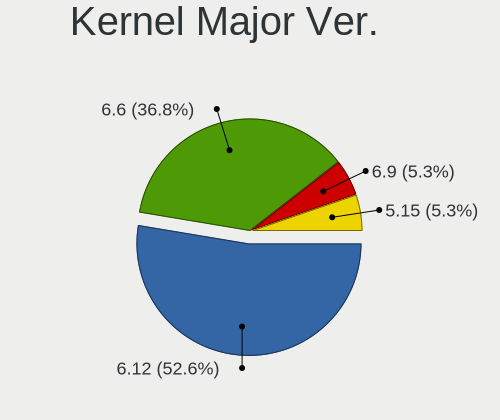
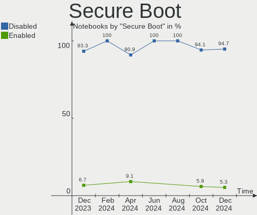
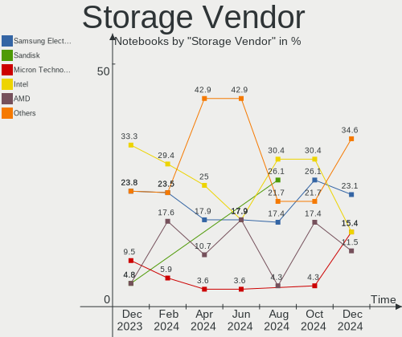
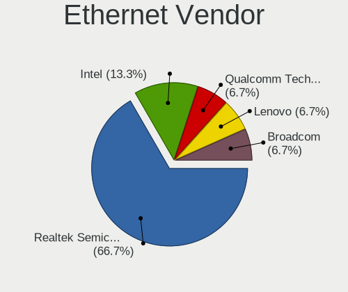
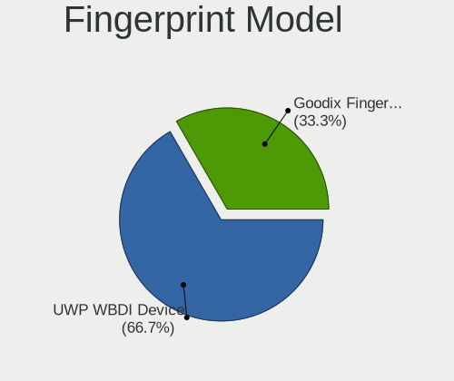

Gentoo Hardware Trends (Notebooks)
----------------------------------

A project to identify most popular hardware characteristics and track their change
over time based on data collected by Gentoo users at https://Linux-Hardware.org.

Anyone can contribute to this report by the [hw-probe](https://github.com/linuxhw/hw-probe) tool:

    sudo -E hw-probe -all -upload

Full-feature report is available here: https://linux-hardware.org/?view=trends&formfactor=notebook

Period: Sep, 2021.

Contents
--------

* [ System ](#system)
  - [ OS                       ](#os)
  - [ OS Family                ](#os-family)
  - [ Kernel                   ](#kernel)
  - [ Kernel Family            ](#kernel-family)
  - [ Kernel Major Ver.        ](#kernel-major-ver)
  - [ Arch                     ](#arch)
  - [ DE                       ](#de)
  - [ Display Server           ](#display-server)
  - [ Display Manager          ](#display-manager)
  - [ OS Lang                  ](#os-lang)
  - [ Boot Mode                ](#boot-mode)
  - [ Filesystem               ](#filesystem)
  - [ Part. scheme             ](#part-scheme)
  - [ Dual Boot with Linux/BSD ](#dual-boot-with-linuxbsd)
  - [ Dual Boot (Win)          ](#dual-boot-win)

* [ Board ](#board)
  - [ Vendor                   ](#vendor)
  - [ Model                    ](#model)
  - [ Model Family             ](#model-family)
  - [ MFG Year                 ](#mfg-year)
  - [ Form Factor              ](#form-factor)
  - [ Secure Boot              ](#secure-boot)
  - [ Coreboot                 ](#coreboot)
  - [ RAM Size                 ](#ram-size)
  - [ RAM Used                 ](#ram-used)
  - [ Total Drives             ](#total-drives)
  - [ Has CD-ROM               ](#has-cd-rom)
  - [ Has Ethernet             ](#has-ethernet)
  - [ Has WiFi                 ](#has-wifi)
  - [ Has Bluetooth            ](#has-bluetooth)

* [ Location ](#location)
  - [ Country                  ](#country)
  - [ City                     ](#city)

* [ Drives ](#drives)
  - [ Drive Vendor             ](#drive-vendor)
  - [ Drive Model              ](#drive-model)
  - [ HDD Vendor               ](#hdd-vendor)
  - [ SSD Vendor               ](#ssd-vendor)
  - [ Drive Kind               ](#drive-kind)
  - [ Drive Connector          ](#drive-connector)
  - [ Drive Size               ](#drive-size)
  - [ Space Total              ](#space-total)
  - [ Space Used               ](#space-used)
  - [ Malfunc. Drives          ](#malfunc-drives)
  - [ Malfunc. Drive Vendor    ](#malfunc-drive-vendor)
  - [ Malfunc. HDD Vendor      ](#malfunc-hdd-vendor)
  - [ Malfunc. Drive Kind      ](#malfunc-drive-kind)
  - [ Failed Drives            ](#failed-drives)
  - [ Failed Drive Vendor      ](#failed-drive-vendor)
  - [ Drive Status             ](#drive-status)

* [ Storage controller ](#storage-controller)
  - [ Storage Vendor           ](#storage-vendor)
  - [ Storage Model            ](#storage-model)
  - [ Storage Kind             ](#storage-kind)

* [ Processor ](#processor)
  - [ CPU Vendor               ](#cpu-vendor)
  - [ CPU Model                ](#cpu-model)
  - [ CPU Model Family         ](#cpu-model-family)
  - [ CPU Cores                ](#cpu-cores)
  - [ CPU Sockets              ](#cpu-sockets)
  - [ CPU Threads              ](#cpu-threads)
  - [ CPU Op-Modes             ](#cpu-op-modes)
  - [ CPU Microcode            ](#cpu-microcode)
  - [ CPU Microarch            ](#cpu-microarch)

* [ Graphics ](#graphics)
  - [ GPU Vendor               ](#gpu-vendor)
  - [ GPU Model                ](#gpu-model)
  - [ GPU Combo                ](#gpu-combo)
  - [ GPU Driver               ](#gpu-driver)
  - [ GPU Memory               ](#gpu-memory)

* [ Monitor ](#monitor)
  - [ Monitor Vendor           ](#monitor-vendor)
  - [ Monitor Model            ](#monitor-model)
  - [ Monitor Resolution       ](#monitor-resolution)
  - [ Monitor Diagonal         ](#monitor-diagonal)
  - [ Monitor Width            ](#monitor-width)
  - [ Aspect Ratio             ](#aspect-ratio)
  - [ Monitor Area             ](#monitor-area)
  - [ Pixel Density            ](#pixel-density)
  - [ Multiple Monitors        ](#multiple-monitors)

* [ Network ](#network)
  - [ Net Controller Vendor    ](#net-controller-vendor)
  - [ Net Controller Model     ](#net-controller-model)
  - [ Wireless Vendor          ](#wireless-vendor)
  - [ Wireless Model           ](#wireless-model)
  - [ Ethernet Vendor          ](#ethernet-vendor)
  - [ Ethernet Model           ](#ethernet-model)
  - [ Net Controller Kind      ](#net-controller-kind)
  - [ Used Controller          ](#used-controller)
  - [ NICs                     ](#nics)
  - [ IPv6                     ](#ipv6)

* [ Bluetooth ](#bluetooth)
  - [ Bluetooth Vendor         ](#bluetooth-vendor)
  - [ Bluetooth Model          ](#bluetooth-model)

* [ Sound ](#sound)
  - [ Sound Vendor             ](#sound-vendor)
  - [ Sound Model              ](#sound-model)

* [ Memory ](#memory)
  - [ Memory Vendor            ](#memory-vendor)
  - [ Memory Model             ](#memory-model)
  - [ Memory Kind              ](#memory-kind)
  - [ Memory Form Factor       ](#memory-form-factor)
  - [ Memory Size              ](#memory-size)
  - [ Memory Speed             ](#memory-speed)

* [ Printers & scanners ](#printers--scanners)
  - [ Printer Vendor           ](#printer-vendor)
  - [ Printer Model            ](#printer-model)
  - [ Scanner Vendor           ](#scanner-vendor)
  - [ Scanner Model            ](#scanner-model)

* [ Camera ](#camera)
  - [ Camera Vendor            ](#camera-vendor)
  - [ Camera Model             ](#camera-model)

* [ Security ](#security)
  - [ Fingerprint Vendor       ](#fingerprint-vendor)
  - [ Fingerprint Model        ](#fingerprint-model)
  - [ Chipcard Vendor          ](#chipcard-vendor)
  - [ Chipcard Model           ](#chipcard-model)

* [ Unsupported ](#unsupported)
  - [ Unsupported Devices      ](#unsupported-devices)
  - [ Unsupported Device Types ](#unsupported-device-types)

System
------

OS
--

Installed operating systems

| Name       | Notebooks | Percent |
|------------|-----------|---------|
| Gentoo 2.7 | 23        | 95.83%  |
| Gentoo 2.6 | 1         | 4.17%   |

OS Family
---------

OS without a version

| Name   | Notebooks | Percent |
|--------|-----------|---------|
| Gentoo | 24        | 100%    |

Kernel
------

Version of the Linux kernel

| Version               | Notebooks | Percent |
|-----------------------|-----------|---------|
| 5.10.61-gentoo        | 8         | 33.33%  |
| 5.10.52-gentoo        | 3         | 12.5%   |
| 5.13.13-gentoo        | 2         | 8.33%   |
| 5.10.61-gentoo-x86_64 | 2         | 8.33%   |
| 5.4.80-gentoo-r1      | 1         | 4.17%   |
| 5.14.7-gentoo-x86_64  | 1         | 4.17%   |
| 5.14.6-gentoo-dist    | 1         | 4.17%   |
| 5.14.2-gentoo         | 1         | 4.17%   |
| 5.14.1-xanmod1-cacule | 1         | 4.17%   |
| 5.14.1-gentoo         | 1         | 4.17%   |
| 5.13.15-gentoo-dist   | 1         | 4.17%   |
| 5.12.13-gentoo        | 1         | 4.17%   |
| 5.10.27-gentoo-x86_64 | 1         | 4.17%   |

Kernel Family
-------------

Linux kernel without a distro release

| Version | Notebooks | Percent |
|---------|-----------|---------|
| 5.10.61 | 10        | 41.67%  |
| 5.10.52 | 3         | 12.5%   |
| 5.14.1  | 2         | 8.33%   |
| 5.13.13 | 2         | 8.33%   |
| 5.4.80  | 1         | 4.17%   |
| 5.14.7  | 1         | 4.17%   |
| 5.14.6  | 1         | 4.17%   |
| 5.14.2  | 1         | 4.17%   |
| 5.13.15 | 1         | 4.17%   |
| 5.12.13 | 1         | 4.17%   |
| 5.10.27 | 1         | 4.17%   |

Kernel Major Ver.
-----------------

Linux kernel major version

| Version | Notebooks | Percent |
|---------|-----------|---------|
| 5.10    | 14        | 58.33%  |
| 5.14    | 5         | 20.83%  |
| 5.13    | 3         | 12.5%   |
| 5.4     | 1         | 4.17%   |
| 5.12    | 1         | 4.17%   |

Arch
----

OS architecture (x86_64, i586, etc.)

| Name   | Notebooks | Percent |
|--------|-----------|---------|
| x86_64 | 24        | 100%    |

DE
--

Desktop Environment

| Name          | Notebooks | Percent |
|---------------|-----------|---------|
| KDE5          | 7         | 29.17%  |
| GNOME         | 5         | 20.83%  |
| Unknown       | 5         | 20.83%  |
| MATE          | 3         | 12.5%   |
| XFCE          | 1         | 4.17%   |
| sway          | 1         | 4.17%   |
| GNOME Classic | 1         | 4.17%   |
| DWM           | 1         | 4.17%   |

Display Server
--------------

X11 or Wayland

| Name    | Notebooks | Percent |
|---------|-----------|---------|
| X11     | 13        | 54.17%  |
| Tty     | 6         | 25%     |
| Unknown | 4         | 16.67%  |
| Wayland | 1         | 4.17%   |

Display Manager
---------------

SDDM, LightDM, etc.

| Name    | Notebooks | Percent |
|---------|-----------|---------|
| Unknown | 10        | 41.67%  |
| SDDM    | 7         | 29.17%  |
| LightDM | 4         | 16.67%  |
| GDM     | 2         | 8.33%   |
| LXDM    | 1         | 4.17%   |

OS Lang
-------

Language

| Lang    | Notebooks | Percent |
|---------|-----------|---------|
| en_US   | 11        | 45.83%  |
| ru_RU   | 2         | 8.33%   |
| fr_FR   | 2         | 8.33%   |
| de_DE   | 2         | 8.33%   |
| Unknown | 2         | 8.33%   |
| zh_CN   | 1         | 4.17%   |
| it_IT   | 1         | 4.17%   |
| cs_CZ   | 1         | 4.17%   |
| C.UTF8  | 1         | 4.17%   |
| C       | 1         | 4.17%   |

Boot Mode
---------

EFI or BIOS

| Mode | Notebooks | Percent |
|------|-----------|---------|
| EFI  | 17        | 70.83%  |
| BIOS | 7         | 29.17%  |

Filesystem
----------

Type of filesystem

| Type     | Notebooks | Percent |
|----------|-----------|---------|
| Ext4     | 17        | 70.83%  |
| Btrfs    | 4         | 16.67%  |
| Zfs      | 1         | 4.17%   |
| Xfs      | 1         | 4.17%   |
| Reiserfs | 1         | 4.17%   |

Part. scheme
------------

Scheme of partitioning

| Type    | Notebooks | Percent |
|---------|-----------|---------|
| GPT     | 20        | 83.33%  |
| MBR     | 2         | 8.33%   |
| Unknown | 2         | 8.33%   |

Dual Boot with Linux/BSD
------------------------

Hosting more than one Linux/BSD

| Dual boot | Notebooks | Percent |
|-----------|-----------|---------|
| No        | 17        | 70.83%  |
| Yes       | 7         | 29.17%  |

Dual Boot (Win)
---------------

Hosting Linux and Windows

| Dual boot | Notebooks | Percent |
|-----------|-----------|---------|
| No        | 17        | 70.83%  |
| Yes       | 7         | 29.17%  |

Board
-----

Vendor
------

Motherboard manufacturer

| Name                | Notebooks | Percent |
|---------------------|-----------|---------|
| Lenovo              | 7         | 29.17%  |
| Hewlett-Packard     | 5         | 20.83%  |
| ASUSTek Computer    | 5         | 20.83%  |
| Dell                | 4         | 16.67%  |
| Timi                | 1         | 4.17%   |
| Samsung Electronics | 1         | 4.17%   |
| Notebook            | 1         | 4.17%   |

Model
-----

Motherboard model

| Name                                        | Notebooks | Percent |
|---------------------------------------------|-----------|---------|
| Timi Mi Laptop Pro 15                       | 1         | 4.17%   |
| Samsung RC530/RC730                         | 1         | 4.17%   |
| Notebook P65xHP                             | 1         | 4.17%   |
| Lenovo Yoga Slim 7 Pro 14IHU5 O 82NH        | 1         | 4.17%   |
| Lenovo ThinkPad X240 20AMS1LN00             | 1         | 4.17%   |
| Lenovo ThinkPad X1 Extreme Gen 3 20TK001JUS | 1         | 4.17%   |
| Lenovo ThinkPad X1 Carbon Gen 9 20XXS0HW00  | 1         | 4.17%   |
| Lenovo ThinkPad P14s Gen 1 20Y10018US       | 1         | 4.17%   |
| Lenovo ThinkPad P1 Gen 4i 20Y3CTO1WW        | 1         | 4.17%   |
| Lenovo B51-80 80LM                          | 1         | 4.17%   |
| HP ZBook 15 G3                              | 1         | 4.17%   |
| HP ProBook 430 G5                           | 1         | 4.17%   |
| HP Pavilion g6                              | 1         | 4.17%   |
| HP OMEN by HP Laptop 15-dc0xxx              | 1         | 4.17%   |
| HP 255 G6 Notebook PC                       | 1         | 4.17%   |
| Dell Precision 7560                         | 1         | 4.17%   |
| Dell Latitude E6510                         | 1         | 4.17%   |
| Dell Latitude 5410                          | 1         | 4.17%   |
| Dell Inspiron 5577                          | 1         | 4.17%   |
| ASUS ZenBook UX425IA_U4700IA                | 1         | 4.17%   |
| ASUS ZenBook UX333FN_UX333FN                | 1         | 4.17%   |
| ASUS X550ZA                                 | 1         | 4.17%   |
| ASUS ROG Zephyrus G14 GA401II_GA401II       | 1         | 4.17%   |
| ASUS GX501VIK                               | 1         | 4.17%   |

Model Family
------------

Motherboard model prefix

| Name            | Notebooks | Percent |
|-----------------|-----------|---------|
| Lenovo ThinkPad | 5         | 20.83%  |
| Dell Latitude   | 2         | 8.33%   |
| ASUS ZenBook    | 2         | 8.33%   |
| Timi Mi         | 1         | 4.17%   |
| Samsung RC530   | 1         | 4.17%   |
| Notebook P65xHP | 1         | 4.17%   |
| Lenovo Yoga     | 1         | 4.17%   |
| Lenovo B51-80   | 1         | 4.17%   |
| HP ZBook        | 1         | 4.17%   |
| HP ProBook      | 1         | 4.17%   |
| HP Pavilion     | 1         | 4.17%   |
| HP OMEN         | 1         | 4.17%   |
| HP 255          | 1         | 4.17%   |
| Dell Precision  | 1         | 4.17%   |
| Dell Inspiron   | 1         | 4.17%   |
| ASUS X550ZA     | 1         | 4.17%   |
| ASUS ROG        | 1         | 4.17%   |
| ASUS GX501VIK   | 1         | 4.17%   |

MFG Year
--------

Motherboard manufacture year

| Year | Notebooks | Percent |
|------|-----------|---------|
| 2021 | 8         | 33.33%  |
| 2020 | 5         | 20.83%  |
| 2018 | 2         | 8.33%   |
| 2017 | 2         | 8.33%   |
| 2016 | 2         | 8.33%   |
| 2019 | 1         | 4.17%   |
| 2015 | 1         | 4.17%   |
| 2014 | 1         | 4.17%   |
| 2012 | 1         | 4.17%   |
| 2011 | 1         | 4.17%   |

Form Factor
-----------

Physical design of the computer

| Name     | Notebooks | Percent |
|----------|-----------|---------|
| Notebook | 24        | 100%    |

Secure Boot
-----------

Enabled or disabled

| State    | Notebooks | Percent |
|----------|-----------|---------|
| Disabled | 23        | 95.83%  |
| Enabled  | 1         | 4.17%   |

Coreboot
--------

Have coreboot on board

| Used | Notebooks | Percent |
|------|-----------|---------|
| No   | 24        | 100%    |

RAM Size
--------

Total RAM memory

| Size in GB  | Notebooks | Percent |
|-------------|-----------|---------|
| 16.01-24.0  | 8         | 33.33%  |
| 8.01-16.0   | 6         | 25%     |
| 4.01-8.0    | 4         | 16.67%  |
| 32.01-64.0  | 2         | 8.33%   |
| 64.01-256.0 | 2         | 8.33%   |
| 3.01-4.0    | 1         | 4.17%   |
| 24.01-32.0  | 1         | 4.17%   |

RAM Used
--------

Used RAM memory

| Used GB    | Notebooks | Percent |
|------------|-----------|---------|
| 1.01-2.0   | 7         | 29.17%  |
| 4.01-8.0   | 4         | 16.67%  |
| 8.01-16.0  | 4         | 16.67%  |
| 2.01-3.0   | 3         | 12.5%   |
| 3.01-4.0   | 2         | 8.33%   |
| 0.01-0.5   | 2         | 8.33%   |
| 16.01-24.0 | 1         | 4.17%   |
| 0.51-1.0   | 1         | 4.17%   |

Total Drives
------------

Number of drives on board

| Drives | Notebooks | Percent |
|--------|-----------|---------|
| 1      | 17        | 70.83%  |
| 2      | 5         | 20.83%  |
| 4      | 1         | 4.17%   |
| 3      | 1         | 4.17%   |

Has CD-ROM
----------

Has CD-ROM on board

| Presented | Notebooks | Percent |
|-----------|-----------|---------|
| No        | 17        | 70.83%  |
| Yes       | 7         | 29.17%  |

Has Ethernet
------------

Has Ethernet on board

| Presented | Notebooks | Percent |
|-----------|-----------|---------|
| Yes       | 16        | 66.67%  |
| No        | 8         | 33.33%  |

Has WiFi
--------

Has WiFi module

| Presented | Notebooks | Percent |
|-----------|-----------|---------|
| Yes       | 23        | 95.83%  |
| No        | 1         | 4.17%   |

Has Bluetooth
-------------

Has Bluetooth module

| Presented | Notebooks | Percent |
|-----------|-----------|---------|
| Yes       | 22        | 91.67%  |
| No        | 2         | 8.33%   |

Location
--------

Country
-------

Geographic location (country)

| Country   | Notebooks | Percent |
|-----------|-----------|---------|
| USA       | 5         | 20.83%  |
| Germany   | 4         | 16.67%  |
| Russia    | 3         | 12.5%   |
| France    | 3         | 12.5%   |
| Czechia   | 2         | 8.33%   |
| China     | 2         | 8.33%   |
| Spain     | 1         | 4.17%   |
| Japan     | 1         | 4.17%   |
| Italy     | 1         | 4.17%   |
| Indonesia | 1         | 4.17%   |
| Australia | 1         | 4.17%   |

City
----

Geographic location (city)

| City            | Notebooks | Percent |
|-----------------|-----------|---------|
| St Petersburg   | 2         | 8.33%   |
| Zhengzhou       | 1         | 4.17%   |
| Shelby          | 1         | 4.17%   |
| Rome            | 1         | 4.17%   |
| Rennes          | 1         | 4.17%   |
| Prague          | 1         | 4.17%   |
| Paris           | 1         | 4.17%   |
| Osaka           | 1         | 4.17%   |
| Omsk            | 1         | 4.17%   |
| Middletown      | 1         | 4.17%   |
| Melbourne       | 1         | 4.17%   |
| Marburg         | 1         | 4.17%   |
| Madrid          | 1         | 4.17%   |
| Le Chesnay      | 1         | 4.17%   |
| Jakarta         | 1         | 4.17%   |
| Hattingen       | 1         | 4.17%   |
| Hamm            | 1         | 4.17%   |
| Guangzhou       | 1         | 4.17%   |
| Friedrichsdorf  | 1         | 4.17%   |
| College Station | 1         | 4.17%   |
| Chomutov        | 1         | 4.17%   |
| Beaverton       | 1         | 4.17%   |
| Azle            | 1         | 4.17%   |

Drives
------

Drive Vendor
------------

Hard drive vendors

| Vendor              | Notebooks | Drives | Percent |
|---------------------|-----------|--------|---------|
| Samsung Electronics | 8         | 9      | 25%     |
| Intel               | 4         | 4      | 12.5%   |
| SK Hynix            | 3         | 3      | 9.38%   |
| Seagate             | 3         | 3      | 9.38%   |
| WDC                 | 2         | 2      | 6.25%   |
| Toshiba             | 2         | 2      | 6.25%   |
| Unknown             | 1         | 1      | 3.13%   |
| SanDisk             | 1         | 1      | 3.13%   |
| Micron Technology   | 1         | 1      | 3.13%   |
| LITEON              | 1         | 1      | 3.13%   |
| Lite-On             | 1         | 1      | 3.13%   |
| Lenovo              | 1         | 2      | 3.13%   |
| KIOXIA-EXCERIA      | 1         | 1      | 3.13%   |
| KIOXIA              | 1         | 1      | 3.13%   |
| Kingston            | 1         | 1      | 3.13%   |
| HGST                | 1         | 1      | 3.13%   |

Drive Model
-----------

Hard drive models

| Model                                    | Notebooks | Percent |
|------------------------------------------|-----------|---------|
| Toshiba MQ01ABD100 1TB                   | 2         | 5.88%   |
| WDC WDS500G2B0B-00YS70 500GB SSD         | 1         | 2.94%   |
| WDC PC SN730 SDBQNTY-1T00-1001 1TB       | 1         | 2.94%   |
| Unknown MMC Card  4GB                    | 1         | 2.94%   |
| SK Hynix SKHynix_HFS001TDE9X084N 1TB     | 1         | 2.94%   |
| SK Hynix PC711 NVMe 1TB                  | 1         | 2.94%   |
| SK Hynix PC401 HFS256GD9TNG-62A0A 256GB  | 1         | 2.94%   |
| Seagate ST9750420AS 752GB                | 1         | 2.94%   |
| Seagate ST320LT007-9ZV142 320GB          | 1         | 2.94%   |
| Seagate ST1000LM014-SSHD-8GB             | 1         | 2.94%   |
| SanDisk SDSSDH3 1T00 1TB                 | 1         | 2.94%   |
| Samsung SSD 980 PRO 2TB                  | 1         | 2.94%   |
| Samsung SSD 980 PRO 1TB                  | 1         | 2.94%   |
| Samsung SSD 850 EVO 250GB                | 1         | 2.94%   |
| Samsung MZVLB512HBJQ-000L7 512GB         | 1         | 2.94%   |
| Samsung MZVL21T0HCLR-00BL7 1TB           | 1         | 2.94%   |
| Samsung MZVKW512HMJP-00000 512GB         | 1         | 2.94%   |
| Samsung MZ7TE128HMGR-000L1 128GB SSD     | 1         | 2.94%   |
| Samsung MZ7TD256HAFV-000 256GB SSD       | 1         | 2.94%   |
| Samsung MZ7LN256HMJP-000H1 256GB SSD     | 1         | 2.94%   |
| Micron MTFDDAV256MBF-1AN15ABHA 256GB SSD | 1         | 2.94%   |
| LITEON CA3-8D128-HP 128GB                | 1         | 2.94%   |
| Lite-On PH4-8E256 256GB SSD              | 1         | 2.94%   |
| Lenovo Thinklife ST600 M.2 256G SSD      | 1         | 2.94%   |
| Lenovo SSD SL700 1TB                     | 1         | 2.94%   |
| KIOXIA-EXCERIA SSD 500GB                 | 1         | 2.94%   |
| KIOXIA KBG40ZNS512G NVMe 512GB           | 1         | 2.94%   |
| Kingston OM8PCP3512F-AB 512GB            | 1         | 2.94%   |
| Intel SSDSC2KW128G8 128GB                | 1         | 2.94%   |
| Intel SSDPEKNW512G8 512GB                | 1         | 2.94%   |
| Intel SSDPEKNW010T8 1TB                  | 1         | 2.94%   |
| Intel NVMe SSD Drive 512GB               | 1         | 2.94%   |
| HGST HTS541010A9E680 1TB                 | 1         | 2.94%   |

HDD Vendor
----------

Hard disk drive vendors

| Vendor  | Notebooks | Drives | Percent |
|---------|-----------|--------|---------|
| Seagate | 3         | 3      | 50%     |
| Toshiba | 2         | 2      | 33.33%  |
| HGST    | 1         | 1      | 16.67%  |

SSD Vendor
----------

Solid state drive vendors

| Vendor              | Notebooks | Drives | Percent |
|---------------------|-----------|--------|---------|
| Samsung Electronics | 4         | 4      | 40%     |
| WDC                 | 1         | 1      | 10%     |
| SanDisk             | 1         | 1      | 10%     |
| Micron Technology   | 1         | 1      | 10%     |
| Lite-On             | 1         | 1      | 10%     |
| Lenovo              | 1         | 2      | 10%     |
| Intel               | 1         | 1      | 10%     |

Drive Kind
----------

HDD or SSD

| Kind | Notebooks | Drives | Percent |
|------|-----------|--------|---------|
| NVMe | 15        | 16     | 50%     |
| SSD  | 8         | 11     | 26.67%  |
| HDD  | 6         | 6      | 20%     |
| MMC  | 1         | 1      | 3.33%   |

Drive Connector
---------------

SATA, SAS, NVMe, etc.

| Type | Notebooks | Drives | Percent |
|------|-----------|--------|---------|
| NVMe | 15        | 16     | 53.57%  |
| SATA | 11        | 16     | 39.29%  |
| SAS  | 1         | 1      | 3.57%   |
| MMC  | 1         | 1      | 3.57%   |

Drive Size
----------

Size of hard drive

| Size in TB | Notebooks | Drives | Percent |
|------------|-----------|--------|---------|
| 0.01-0.5   | 8         | 10     | 53.33%  |
| 0.51-1.0   | 7         | 7      | 46.67%  |

Space Total
-----------

Amount of disk space available on the file system

| Size in GB | Notebooks | Percent |
|------------|-----------|---------|
| 501-1000   | 10        | 41.67%  |
| 101-250    | 7         | 29.17%  |
| 251-500    | 3         | 12.5%   |
| Unknown    | 2         | 8.33%   |
| 1001-2000  | 1         | 4.17%   |
| 51-100     | 1         | 4.17%   |

Space Used
----------

Amount of used disk space

| Used GB  | Notebooks | Percent |
|----------|-----------|---------|
| 21-50    | 6         | 25%     |
| 251-500  | 5         | 20.83%  |
| 1-20     | 4         | 16.67%  |
| 51-100   | 3         | 12.5%   |
| 101-250  | 2         | 8.33%   |
| 501-1000 | 2         | 8.33%   |
| Unknown  | 2         | 8.33%   |

Malfunc. Drives
---------------

Drive models with a malfunction

| Model                           | Notebooks | Drives | Percent |
|---------------------------------|-----------|--------|---------|
| Seagate ST9750420AS 752GB       | 1         | 1      | 50%     |
| Seagate ST320LT007-9ZV142 320GB | 1         | 1      | 50%     |

Malfunc. Drive Vendor
---------------------

Vendors of faulty drives

| Vendor  | Notebooks | Drives | Percent |
|---------|-----------|--------|---------|
| Seagate | 2         | 2      | 100%    |

Malfunc. HDD Vendor
-------------------

Vendors of faulty HDD drives

| Vendor  | Notebooks | Drives | Percent |
|---------|-----------|--------|---------|
| Seagate | 2         | 2      | 100%    |

Malfunc. Drive Kind
-------------------

Kinds of faulty drives

| Kind | Notebooks | Drives | Percent |
|------|-----------|--------|---------|
| HDD  | 2         | 2      | 100%    |

Failed Drives
-------------

Failed drive models

Zero info for selected period =(

Failed Drive Vendor
-------------------

Failed drive vendors

Zero info for selected period =(

Drive Status
------------

Number of failed and malfunc. drives

| Status   | Notebooks | Drives | Percent |
|----------|-----------|--------|---------|
| Works    | 20        | 28     | 76.92%  |
| Detected | 4         | 4      | 15.38%  |
| Malfunc  | 2         | 2      | 7.69%   |

Storage controller
------------------

Storage Vendor
--------------

Storage controller vendors

| Vendor                      | Notebooks | Percent |
|-----------------------------|-----------|---------|
| Intel                       | 13        | 41.94%  |
| Samsung Electronics         | 5         | 16.13%  |
| AMD                         | 5         | 16.13%  |
| SK Hynix                    | 3         | 9.68%   |
| KIOXIA                      | 2         | 6.45%   |
| Sandisk                     | 1         | 3.23%   |
| Lite-On Technology          | 1         | 3.23%   |
| Kingston Technology Company | 1         | 3.23%   |

Storage Model
-------------

Storage controller models

| Model                                                                         | Notebooks | Percent |
|-------------------------------------------------------------------------------|-----------|---------|
| AMD FCH SATA Controller [AHCI mode]                                           | 4         | 12.9%   |
| Samsung NVMe SSD Controller PM9A1/PM9A3/980PRO                                | 3         | 9.68%   |
| Intel SSD 660P Series                                                         | 3         | 9.68%   |
| SK Hynix Gold P31 SSD                                                         | 2         | 6.45%   |
| Intel Sunrise Point-LP SATA Controller [AHCI mode]                            | 2         | 6.45%   |
| Intel HM170/QM170 Chipset SATA Controller [AHCI Mode]                         | 2         | 6.45%   |
| SK Hynix PC401 NVMe Solid State Drive 256GB                                   | 1         | 3.23%   |
| Sandisk WD Black SN750 / PC SN730 NVMe SSD                                    | 1         | 3.23%   |
| Samsung NVMe SSD Controller SM981/PM981/PM983                                 | 1         | 3.23%   |
| Samsung NVMe SSD Controller SM961/PM961/SM963                                 | 1         | 3.23%   |
| Lite-On Non-Volatile memory controller                                        | 1         | 3.23%   |
| KIOXIA NVMe SSD                                                               | 1         | 3.23%   |
| KIOXIA Non-Volatile memory controller                                         | 1         | 3.23%   |
| Kingston Company Company Non-Volatile memory controller                       | 1         | 3.23%   |
| Intel Q170/Q150/B150/H170/H110/Z170/CM236 Chipset SATA Controller [AHCI Mode] | 1         | 3.23%   |
| Intel Comet Lake SATA AHCI Controller                                         | 1         | 3.23%   |
| Intel 82801 Mobile SATA Controller [RAID mode]                                | 1         | 3.23%   |
| Intel 8 Series SATA Controller 1 [AHCI mode]                                  | 1         | 3.23%   |
| Intel 6 Series/C200 Series Chipset Family 6 port Mobile SATA AHCI Controller  | 1         | 3.23%   |
| Intel 5 Series/3400 Series Chipset 6 port SATA AHCI Controller                | 1         | 3.23%   |
| AMD FCH SATA Controller [IDE mode]                                            | 1         | 3.23%   |

Storage Kind
------------

Kind of storage controller (IDE, SATA, NVMe, SAS, ...)

| Kind | Notebooks | Percent |
|------|-----------|---------|
| NVMe | 15        | 50%     |
| SATA | 14        | 46.67%  |
| RAID | 1         | 3.33%   |

Processor
---------

CPU Vendor
----------

Processor vendors

| Vendor | Notebooks | Percent |
|--------|-----------|---------|
| Intel  | 18        | 75%     |
| AMD    | 6         | 25%     |

CPU Model
---------

Processor models

| Model                                         | Notebooks | Percent |
|-----------------------------------------------|-----------|---------|
| Intel Core i5-7300HQ CPU @ 2.50GHz            | 2         | 8.33%   |
| Intel 11th Gen Core i9-11950H @ 2.60GHz       | 2         | 8.33%   |
| Intel Core i9-10885H CPU @ 2.40GHz            | 1         | 4.17%   |
| Intel Core i7-8565U CPU @ 1.80GHz             | 1         | 4.17%   |
| Intel Core i7-7700HQ CPU @ 2.80GHz            | 1         | 4.17%   |
| Intel Core i7-6700HQ CPU @ 2.60GHz            | 1         | 4.17%   |
| Intel Core i7-6500U CPU @ 2.50GHz             | 1         | 4.17%   |
| Intel Core i7-2670QM CPU @ 2.20GHz            | 1         | 4.17%   |
| Intel Core i7-10510U CPU @ 1.80GHz            | 1         | 4.17%   |
| Intel Core i5-8300H CPU @ 2.30GHz             | 1         | 4.17%   |
| Intel Core i5-8250U CPU @ 1.60GHz             | 1         | 4.17%   |
| Intel Core i5-4300U CPU @ 1.90GHz             | 1         | 4.17%   |
| Intel Core i5-10210U CPU @ 1.60GHz            | 1         | 4.17%   |
| Intel Core i5 CPU M 460 @ 2.53GHz             | 1         | 4.17%   |
| Intel 11th Gen Core i7-1165G7 @ 2.80GHz       | 1         | 4.17%   |
| Intel 11th Gen Core i7-11370H @ 3.30GHz       | 1         | 4.17%   |
| AMD Ryzen 7 PRO 4750U with Radeon Graphics    | 1         | 4.17%   |
| AMD Ryzen 7 4800HS with Radeon Graphics       | 1         | 4.17%   |
| AMD Ryzen 7 4700U with Radeon Graphics        | 1         | 4.17%   |
| AMD A8-7200P Radeon R5, 8 Compute Cores 4C+4G | 1         | 4.17%   |
| AMD A6-9220 RADEON R4, 5 COMPUTE CORES 2C+3G  | 1         | 4.17%   |
| AMD A6-3420M APU with Radeon HD Graphics      | 1         | 4.17%   |

CPU Model Family
----------------

Processor model prefix

| Model           | Notebooks | Percent |
|-----------------|-----------|---------|
| Intel Core i5   | 7         | 29.17%  |
| Intel Core i7   | 6         | 25%     |
| Other           | 4         | 16.67%  |
| AMD Ryzen 7     | 2         | 8.33%   |
| AMD A6          | 2         | 8.33%   |
| Intel Core i9   | 1         | 4.17%   |
| AMD Ryzen 7 PRO | 1         | 4.17%   |
| AMD A8          | 1         | 4.17%   |

CPU Cores
---------

Number of processor cores

| Number | Notebooks | Percent |
|--------|-----------|---------|
| 4      | 13        | 54.17%  |
| 8      | 6         | 25%     |
| 2      | 5         | 20.83%  |

CPU Sockets
-----------

Number of sockets

| Number | Notebooks | Percent |
|--------|-----------|---------|
| 1      | 24        | 100%    |

CPU Threads
-----------

Threads per core (Hyper-Threading)

| Number | Notebooks | Percent |
|--------|-----------|---------|
| 2      | 18        | 75%     |
| 1      | 6         | 25%     |

CPU Op-Modes
------------

CPU Operation Modes (32-bit, 64-bit)

| Op mode        | Notebooks | Percent |
|----------------|-----------|---------|
| 32-bit, 64-bit | 24        | 100%    |

CPU Microcode
-------------

Microcode number

| Number     | Notebooks | Percent |
|------------|-----------|---------|
| 0x906e9    | 3         | 12.5%   |
| 0x806ec    | 2         | 8.33%   |
| 0x806d1    | 2         | 8.33%   |
| 0x806c1    | 2         | 8.33%   |
| Unknown    | 2         | 8.33%   |
| 0xa0652    | 1         | 4.17%   |
| 0x906ea    | 1         | 4.17%   |
| 0x806eb    | 1         | 4.17%   |
| 0x506e3    | 1         | 4.17%   |
| 0x406e3    | 1         | 4.17%   |
| 0x40651    | 1         | 4.17%   |
| 0x206a7    | 1         | 4.17%   |
| 0x20655    | 1         | 4.17%   |
| 0x08600106 | 1         | 4.17%   |
| 0x08600104 | 1         | 4.17%   |
| 0x06006705 | 1         | 4.17%   |
| 0x06003106 | 1         | 4.17%   |
| 0x03000027 | 1         | 4.17%   |

CPU Microarch
-------------

Microarchitecture

| Name        | Notebooks | Percent |
|-------------|-----------|---------|
| KabyLake    | 8         | 33.33%  |
| Zen 2       | 3         | 12.5%   |
| TigerLake   | 2         | 8.33%   |
| Skylake     | 2         | 8.33%   |
| Westmere    | 1         | 4.17%   |
| Steamroller | 1         | 4.17%   |
| SandyBridge | 1         | 4.17%   |
| K10 Llano   | 1         | 4.17%   |
| Icelake     | 1         | 4.17%   |
| Haswell     | 1         | 4.17%   |
| Excavator   | 1         | 4.17%   |
| CometLake   | 1         | 4.17%   |
| Unknown     | 1         | 4.17%   |

Graphics
--------

GPU Vendor
----------

Vendors of graphics cards

| Vendor | Notebooks | Percent |
|--------|-----------|---------|
| Nvidia | 14        | 41.18%  |
| Intel  | 14        | 41.18%  |
| AMD    | 6         | 17.65%  |

GPU Model
---------

Graphics card models

| Model                                                                     | Notebooks | Percent |
|---------------------------------------------------------------------------|-----------|---------|
| AMD Renoir                                                                | 3         | 8.82%   |
| Nvidia GP106M [GeForce GTX 1060 Mobile]                                   | 2         | 5.88%   |
| Intel TigerLake-LP GT2 [Iris Xe Graphics]                                 | 2         | 5.88%   |
| Intel TigerLake-H GT1 [UHD Graphics]                                      | 2         | 5.88%   |
| Intel CometLake-U GT2 [UHD Graphics]                                      | 2         | 5.88%   |
| Nvidia TU117M [GeForce MX450]                                             | 1         | 2.94%   |
| Nvidia TU117M [GeForce GTX 1650 Ti Mobile]                                | 1         | 2.94%   |
| Nvidia TU116M [GeForce GTX 1650 Ti Mobile]                                | 1         | 2.94%   |
| Nvidia GT218M [NVS 3100M]                                                 | 1         | 2.94%   |
| Nvidia GP108M [GeForce MX250]                                             | 1         | 2.94%   |
| Nvidia GP108M [GeForce MX150]                                             | 1         | 2.94%   |
| Nvidia GP107M [GeForce GTX 1050 Mobile]                                   | 1         | 2.94%   |
| Nvidia GP104BM [GeForce GTX 1080 Mobile]                                  | 1         | 2.94%   |
| Nvidia GM107GLM [Quadro M2000M]                                           | 1         | 2.94%   |
| Nvidia GF108M [GeForce GT 540M]                                           | 1         | 2.94%   |
| Nvidia GA107GLM [RTX A2000 Mobile]                                        | 1         | 2.94%   |
| Nvidia GA104M [GeForce RTX 3080 Mobile / Max-Q 8GB/16GB]                  | 1         | 2.94%   |
| Intel WhiskeyLake-U GT2 [UHD Graphics 620]                                | 1         | 2.94%   |
| Intel UHD Graphics 620                                                    | 1         | 2.94%   |
| Intel Skylake GT2 [HD Graphics 520]                                       | 1         | 2.94%   |
| Intel HD Graphics 630                                                     | 1         | 2.94%   |
| Intel HD Graphics 530                                                     | 1         | 2.94%   |
| Intel Haswell-ULT Integrated Graphics Controller                          | 1         | 2.94%   |
| Intel CometLake-H GT2 [UHD Graphics]                                      | 1         | 2.94%   |
| Intel 2nd Generation Core Processor Family Integrated Graphics Controller | 1         | 2.94%   |
| AMD Sumo [Radeon HD 6520G]                                                | 1         | 2.94%   |
| AMD Stoney [Radeon R2/R3/R4/R5 Graphics]                                  | 1         | 2.94%   |
| AMD Kaveri [Radeon R5 Graphics]                                           | 1         | 2.94%   |

GPU Combo
---------

Combinations of graphics cards

| Name           | Notebooks | Percent |
|----------------|-----------|---------|
| Intel + Nvidia | 9         | 37.5%   |
| 1 x Intel      | 5         | 20.83%  |
| 1 x AMD        | 5         | 20.83%  |
| 1 x Nvidia     | 4         | 16.67%  |
| AMD + Nvidia   | 1         | 4.17%   |

GPU Driver
----------

Free vs proprietary

| Driver      | Notebooks | Percent |
|-------------|-----------|---------|
| Free        | 16        | 66.67%  |
| Proprietary | 8         | 33.33%  |

GPU Memory
----------

Total video memory

| Size in GB | Notebooks | Percent |
|------------|-----------|---------|
| Unknown    | 11        | 45.83%  |
| 0.01-0.5   | 4         | 16.67%  |
| 3.01-4.0   | 3         | 12.5%   |
| 1.01-2.0   | 2         | 8.33%   |
| 7.01-8.0   | 1         | 4.17%   |
| 2.01-3.0   | 1         | 4.17%   |
| 8.01-16.0  | 1         | 4.17%   |
| 0.51-1.0   | 1         | 4.17%   |

Monitor
-------

Monitor Vendor
--------------

Monitor vendors

| Vendor                  | Notebooks | Percent |
|-------------------------|-----------|---------|
| LG Display              | 5         | 16.13%  |
| AU Optronics            | 5         | 16.13%  |
| BOE                     | 4         | 12.9%   |
| Dell                    | 3         | 9.68%   |
| Chimei Innolux          | 3         | 9.68%   |
| Samsung Electronics     | 2         | 6.45%   |
| PANDA                   | 2         | 6.45%   |
| Sharp                   | 1         | 3.23%   |
| Philips                 | 1         | 3.23%   |
| Hewlett-Packard         | 1         | 3.23%   |
| Goldstar                | 1         | 3.23%   |
| Gigabyte Technology     | 1         | 3.23%   |
| CSO                     | 1         | 3.23%   |
| Chi Mei Optoelectronics | 1         | 3.23%   |

Monitor Model
-------------

Monitor models

| Model                                                                    | Notebooks | Percent |
|--------------------------------------------------------------------------|-----------|---------|
| Sharp LQ156M1JW01 SHP14C3 1920x1080 344x194mm 15.5-inch                  | 1         | 3.03%   |
| Samsung Electronics LCD Monitor SEC3245 1366x768 344x194mm 15.5-inch     | 1         | 3.03%   |
| Samsung Electronics LCD Monitor SDC4152 2880x1800 302x189mm 14.0-inch    | 1         | 3.03%   |
| Philips 200V4 PHLC0BF 1600x900 432x240mm 19.5-inch                       | 1         | 3.03%   |
| PANDA LCD Monitor NCP0050 1920x1080 309x174mm 14.0-inch                  | 1         | 3.03%   |
| PANDA LCD Monitor NCP0035 1920x1080 309x174mm 14.0-inch                  | 1         | 3.03%   |
| LG Display LCD Monitor LGD06AA 3840x2400 344x215mm 16.0-inch             | 1         | 3.03%   |
| LG Display LCD Monitor LGD0533 1920x1080 344x194mm 15.5-inch             | 1         | 3.03%   |
| LG Display LCD Monitor LGD045D 1366x768 345x194mm 15.6-inch              | 1         | 3.03%   |
| LG Display LCD Monitor LGD03CD 1366x768 277x156mm 12.5-inch              | 1         | 3.03%   |
| LG Display LCD Monitor LGD029E 1600x900 340x190mm 15.3-inch              | 1         | 3.03%   |
| Hewlett-Packard E243i HPN3464 1920x1200 518x324mm 24.1-inch              | 1         | 3.03%   |
| Goldstar HDR 4K GSM7707 3840x2160 600x340mm 27.2-inch                    | 1         | 3.03%   |
| Gigabyte Technology G34WQC GBT3400 3440x1440 797x334mm 34.0-inch         | 1         | 3.03%   |
| Dell U3415W DELA0A7 3440x1440 798x335mm 34.1-inch                        | 1         | 3.03%   |
| Dell U3415W DELA0A6 1920x1080 800x330mm 34.1-inch                        | 1         | 3.03%   |
| Dell U2715H DELD065 2560x1440 597x336mm 27.0-inch                        | 1         | 3.03%   |
| Dell U2412M DELA07B 1920x1200 518x324mm 24.1-inch                        | 1         | 3.03%   |
| CSO LCD Monitor CSO1404 1920x1200 302x189mm 14.0-inch                    | 1         | 3.03%   |
| Chimei Innolux LCD Monitor CMN15C4 1920x1080 344x193mm 15.5-inch         | 1         | 3.03%   |
| Chimei Innolux LCD Monitor CMN15C3 1920x1080 340x190mm 15.3-inch         | 1         | 3.03%   |
| Chimei Innolux LCD Monitor CMN150C 1920x1080 344x193mm 15.5-inch         | 1         | 3.03%   |
| Chi Mei Optoelectronics LCD Monitor CMO15A2 1366x768 344x193mm 15.5-inch | 1         | 3.03%   |
| BOE LCD Monitor BOE097D 1920x1080 344x194mm 15.5-inch                    | 1         | 3.03%   |
| BOE LCD Monitor BOE097D 1920x1080 340x190mm 15.3-inch                    | 1         | 3.03%   |
| BOE LCD Monitor BOE07BB 1920x1080 309x173mm 13.9-inch                    | 1         | 3.03%   |
| BOE LCD Monitor BOE06F8 1366x768 293x165mm 13.2-inch                     | 1         | 3.03%   |
| BOE LCD Monitor BOE0687 1920x1080 344x193mm 15.5-inch                    | 1         | 3.03%   |
| AU Optronics LCD Monitor AUO5C2D 1920x1080 293x165mm 13.2-inch           | 1         | 3.03%   |
| AU Optronics LCD Monitor AUO573D 1920x1080 309x174mm 14.0-inch           | 1         | 3.03%   |
| AU Optronics LCD Monitor AUO38ED 1920x1080 340x190mm 15.3-inch           | 1         | 3.03%   |
| AU Optronics LCD Monitor AUO23ED 1920x1080 344x193mm 15.5-inch           | 1         | 3.03%   |
| AU Optronics LCD Monitor 1920x1080                                       | 1         | 3.03%   |

Monitor Resolution
------------------

Monitor screen resolution

| Resolution        | Notebooks | Percent |
|-------------------|-----------|---------|
| 1920x1080 (FHD)   | 16        | 51.61%  |
| 1366x768 (WXGA)   | 4         | 12.9%   |
| 1600x900 (HD+)    | 3         | 9.68%   |
| 3440x1440         | 2         | 6.45%   |
| 1920x1200 (WUXGA) | 2         | 6.45%   |
| 3840x2400         | 1         | 3.23%   |
| 3840x2160 (4K)    | 1         | 3.23%   |
| 2880x1800         | 1         | 3.23%   |
| 2560x1440 (QHD)   | 1         | 3.23%   |

Monitor Diagonal
----------------

Diagonal size in inches

| Inches  | Notebooks | Percent |
|---------|-----------|---------|
| 15      | 14        | 45.16%  |
| 14      | 4         | 12.9%   |
| 13      | 3         | 9.68%   |
| 34      | 2         | 6.45%   |
| 27      | 2         | 6.45%   |
| 24      | 2         | 6.45%   |
| 19      | 1         | 3.23%   |
| 16      | 1         | 3.23%   |
| 12      | 1         | 3.23%   |
| Unknown | 1         | 3.23%   |

Monitor Width
-------------

Physical width

| Width in mm | Notebooks | Percent |
|-------------|-----------|---------|
| 301-350     | 20        | 64.52%  |
| 501-600     | 4         | 12.9%   |
| 201-300     | 3         | 9.68%   |
| 701-800     | 2         | 6.45%   |
| 401-500     | 1         | 3.23%   |
| Unknown     | 1         | 3.23%   |

Aspect Ratio
------------

Proportional relationship between the width and the height

| Ratio   | Notebooks | Percent |
|---------|-----------|---------|
| 16/9    | 20        | 71.43%  |
| 16/10   | 5         | 17.86%  |
| 21/9    | 2         | 7.14%   |
| Unknown | 1         | 3.57%   |

Monitor Area
------------

Area in inch

| Area in inch | Notebooks | Percent |
|----------------|-----------|---------|
| 101-110        | 14        | 43.75%  |
| 81-90          | 5         | 15.63%  |
| 71-80          | 2         | 6.25%   |
| 351-500        | 2         | 6.25%   |
| 301-350        | 2         | 6.25%   |
| 251-300        | 2         | 6.25%   |
| 61-70          | 1         | 3.13%   |
| 151-200        | 1         | 3.13%   |
| 111-120        | 1         | 3.13%   |
| 91-100         | 1         | 3.13%   |
| Unknown        | 1         | 3.13%   |

Pixel Density
-------------

Pixels per inch

| Density       | Notebooks | Percent |
|---------------|-----------|---------|
| 121-160       | 14        | 46.67%  |
| 101-120       | 5         | 16.67%  |
| 51-100        | 5         | 16.67%  |
| 161-240       | 3         | 10%     |
| More than 240 | 2         | 6.67%   |
| Unknown       | 1         | 3.33%   |

Multiple Monitors
-----------------

Total monitors connected

| Total | Notebooks | Percent |
|-------|-----------|---------|
| 1     | 18        | 75%     |
| 2     | 4         | 16.67%  |
| 3     | 2         | 8.33%   |

Network
-------

Net Controller Vendor
---------------------

Controller vendors

| Vendor                | Notebooks | Percent |
|-----------------------|-----------|---------|
| Intel                 | 22        | 56.41%  |
| Realtek Semiconductor | 10        | 25.64%  |
| Lenovo                | 2         | 5.13%   |
| Sierra Wireless       | 1         | 2.56%   |
| Qualcomm Atheros      | 1         | 2.56%   |
| Dell                  | 1         | 2.56%   |
| D-Link System         | 1         | 2.56%   |
| Broadcom              | 1         | 2.56%   |

Net Controller Model
--------------------

Controller models

| Model                                                                | Notebooks | Percent |
|----------------------------------------------------------------------|-----------|---------|
| Realtek RTL8111/8168/8411 PCI Express Gigabit Ethernet Controller    | 8         | 18.6%   |
| Intel Wi-Fi 6 AX200                                                  | 3         | 6.98%   |
| Intel Wireless 8265 / 8275                                           | 2         | 4.65%   |
| Intel Wireless 3165                                                  | 2         | 4.65%   |
| Intel Wi-Fi 6 AX210/AX211/AX411 160MHz                               | 2         | 4.65%   |
| Intel Wi-Fi 6 AX201                                                  | 2         | 4.65%   |
| Intel Comet Lake PCH-LP CNVi WiFi                                    | 2         | 4.65%   |
| Sierra Wireless EM7345 4G LTE                                        | 1         | 2.33%   |
| Realtek RTL8153 Gigabit Ethernet Adapter                             | 1         | 2.33%   |
| Realtek RTL810xE PCI Express Fast Ethernet controller                | 1         | 2.33%   |
| Qualcomm Atheros AR93xx Wireless Network Adapter                     | 1         | 2.33%   |
| Lenovo USB-C to LAN                                                  | 1         | 2.33%   |
| Lenovo USB-C Dock Ethernet                                           | 1         | 2.33%   |
| Intel Wireless 8260                                                  | 1         | 2.33%   |
| Intel Wireless 7260                                                  | 1         | 2.33%   |
| Intel Ethernet Connection I218-LM                                    | 1         | 2.33%   |
| Intel Ethernet Connection (2) I219-LM                                | 1         | 2.33%   |
| Intel Ethernet Connection (14) I219-LM                               | 1         | 2.33%   |
| Intel Ethernet Connection (10) I219-V                                | 1         | 2.33%   |
| Intel Dual Band Wireless-AC 3168NGW [Stone Peak]                     | 1         | 2.33%   |
| Intel Dual Band Wireless-AC 3165 Plus Bluetooth                      | 1         | 2.33%   |
| Intel Comet Lake PCH CNVi WiFi                                       | 1         | 2.33%   |
| Intel Centrino Wireless-N 130                                        | 1         | 2.33%   |
| Intel Cannon Point-LP CNVi [Wireless-AC]                             | 1         | 2.33%   |
| Intel Cannon Lake PCH CNVi WiFi                                      | 1         | 2.33%   |
| Intel 82577LM Gigabit Network Connection                             | 1         | 2.33%   |
| Dell F3607gw v2 Mobile Broadband Module                              | 1         | 2.33%   |
| D-Link System DWA-140 RangeBooster N Adapter(rev.B2) [Ralink RT3072] | 1         | 2.33%   |
| Broadcom BCM4313 802.11bgn Wireless Network Adapter                  | 1         | 2.33%   |

Wireless Vendor
---------------

Wireless vendors

| Vendor           | Notebooks | Percent |
|------------------|-----------|---------|
| Intel            | 20        | 83.33%  |
| Sierra Wireless  | 1         | 4.17%   |
| Qualcomm Atheros | 1         | 4.17%   |
| D-Link System    | 1         | 4.17%   |
| Broadcom         | 1         | 4.17%   |

Wireless Model
--------------

Wireless models

| Model                                                                | Notebooks | Percent |
|----------------------------------------------------------------------|-----------|---------|
| Intel Wi-Fi 6 AX200                                                  | 3         | 12.5%   |
| Intel Wireless 8265 / 8275                                           | 2         | 8.33%   |
| Intel Wireless 3165                                                  | 2         | 8.33%   |
| Intel Wi-Fi 6 AX210/AX211/AX411 160MHz                               | 2         | 8.33%   |
| Intel Wi-Fi 6 AX201                                                  | 2         | 8.33%   |
| Intel Comet Lake PCH-LP CNVi WiFi                                    | 2         | 8.33%   |
| Sierra Wireless EM7345 4G LTE                                        | 1         | 4.17%   |
| Qualcomm Atheros AR93xx Wireless Network Adapter                     | 1         | 4.17%   |
| Intel Wireless 8260                                                  | 1         | 4.17%   |
| Intel Wireless 7260                                                  | 1         | 4.17%   |
| Intel Dual Band Wireless-AC 3168NGW [Stone Peak]                     | 1         | 4.17%   |
| Intel Dual Band Wireless-AC 3165 Plus Bluetooth                      | 1         | 4.17%   |
| Intel Centrino Wireless-N 130                                        | 1         | 4.17%   |
| Intel Cannon Point-LP CNVi [Wireless-AC]                             | 1         | 4.17%   |
| Intel Cannon Lake PCH CNVi WiFi                                      | 1         | 4.17%   |
| D-Link System DWA-140 RangeBooster N Adapter(rev.B2) [Ralink RT3072] | 1         | 4.17%   |
| Broadcom BCM4313 802.11bgn Wireless Network Adapter                  | 1         | 4.17%   |

Ethernet Vendor
---------------

Ethernet vendors

| Vendor                | Notebooks | Percent |
|-----------------------|-----------|---------|
| Realtek Semiconductor | 10        | 55.56%  |
| Intel                 | 6         | 33.33%  |
| Lenovo                | 2         | 11.11%  |

Ethernet Model
--------------

Ethernet models

| Model                                                             | Notebooks | Percent |
|-------------------------------------------------------------------|-----------|---------|
| Realtek RTL8111/8168/8411 PCI Express Gigabit Ethernet Controller | 8         | 44.44%  |
| Realtek RTL8153 Gigabit Ethernet Adapter                          | 1         | 5.56%   |
| Realtek RTL810xE PCI Express Fast Ethernet controller             | 1         | 5.56%   |
| Lenovo USB-C to LAN                                               | 1         | 5.56%   |
| Lenovo USB-C Dock Ethernet                                        | 1         | 5.56%   |
| Intel Ethernet Connection I218-LM                                 | 1         | 5.56%   |
| Intel Ethernet Connection (2) I219-LM                             | 1         | 5.56%   |
| Intel Ethernet Connection (14) I219-LM                            | 1         | 5.56%   |
| Intel Ethernet Connection (10) I219-V                             | 1         | 5.56%   |
| Intel Comet Lake PCH CNVi WiFi                                    | 1         | 5.56%   |
| Intel 82577LM Gigabit Network Connection                          | 1         | 5.56%   |

Net Controller Kind
-------------------

Ethernet, WiFi or modem

| Kind     | Notebooks | Percent |
|----------|-----------|---------|
| WiFi     | 23        | 57.5%   |
| Ethernet | 16        | 40%     |
| Modem    | 1         | 2.5%    |

Used Controller
---------------

Currently used network controller

| Kind     | Notebooks | Percent |
|----------|-----------|---------|
| WiFi     | 19        | 73.08%  |
| Ethernet | 7         | 26.92%  |

NICs
----

Total network controllers on board

| Total | Notebooks | Percent |
|-------|-----------|---------|
| 2     | 12        | 50%     |
| 1     | 11        | 45.83%  |
| 3     | 1         | 4.17%   |

IPv6
----

IPv6 vs IPv4

| Used | Notebooks | Percent |
|------|-----------|---------|
| No   | 21        | 87.5%   |
| Yes  | 3         | 12.5%   |

Bluetooth
---------

Bluetooth Vendor
----------------

Controller vendors

| Vendor | Notebooks | Percent |
|--------|-----------|---------|
| Intel  | 21        | 95.45%  |
| Dell   | 1         | 4.55%   |

Bluetooth Model
---------------

Controller models

| Model                                            | Notebooks | Percent |
|--------------------------------------------------|-----------|---------|
| Intel Bluetooth wireless interface               | 4         | 18.18%  |
| Intel Bluetooth Device                           | 4         | 18.18%  |
| Intel AX201 Bluetooth                            | 4         | 18.18%  |
| Intel Bluetooth 9460/9560 Jefferson Peak (JfP)   | 3         | 13.64%  |
| Intel AX200 Bluetooth                            | 3         | 13.64%  |
| Intel AX210 Bluetooth                            | 2         | 9.09%   |
| Intel Centrino Advanced-N 6230 Bluetooth adapter | 1         | 4.55%   |
| Dell DW375 Bluetooth Module                      | 1         | 4.55%   |

Sound
-----

Sound Vendor
------------

Sound card vendors

| Vendor           | Notebooks | Percent |
|------------------|-----------|---------|
| Intel            | 18        | 47.37%  |
| Nvidia           | 10        | 26.32%  |
| AMD              | 6         | 15.79%  |
| RODE Microphones | 1         | 2.63%   |
| Logitech         | 1         | 2.63%   |
| Lenovo           | 1         | 2.63%   |
| ACTIONS          | 1         | 2.63%   |

Sound Model
-----------

Sound card models

| Model                                                                      | Notebooks | Percent |
|----------------------------------------------------------------------------|-----------|---------|
| Intel CM238 HD Audio Controller                                            | 3         | 6.67%   |
| AMD Renoir Radeon High Definition Audio Controller                         | 3         | 6.67%   |
| AMD Family 17h (Models 10h-1fh) HD Audio Controller                        | 3         | 6.67%   |
| Nvidia GP106 High Definition Audio Controller                              | 2         | 4.44%   |
| Intel Tiger Lake-LP Smart Sound Technology Audio Controller                | 2         | 4.44%   |
| Intel Tiger Lake-H HD Audio Controller                                     | 2         | 4.44%   |
| Intel Sunrise Point-LP HD Audio                                            | 2         | 4.44%   |
| Intel Comet Lake PCH-LP cAVS                                               | 2         | 4.44%   |
| AMD FCH Azalia Controller                                                  | 2         | 4.44%   |
| RODE Microphones RODE NT-USB                                               | 1         | 2.22%   |
| Nvidia TU116 High Definition Audio Controller                              | 1         | 2.22%   |
| Nvidia TU107 GeForce GTX 1650 High Definition Audio Controller             | 1         | 2.22%   |
| Nvidia High Definition Audio Controller                                    | 1         | 2.22%   |
| Nvidia GP104 High Definition Audio Controller                              | 1         | 2.22%   |
| Nvidia GM107 High Definition Audio Controller [GeForce 940MX]              | 1         | 2.22%   |
| Nvidia GF108 High Definition Audio Controller                              | 1         | 2.22%   |
| Nvidia GA104 High Definition Audio Controller                              | 1         | 2.22%   |
| Nvidia Audio device                                                        | 1         | 2.22%   |
| Logitech G935 Gaming Headset                                               | 1         | 2.22%   |
| Lenovo ThinkPad USB-C Dock Gen2 USB Audio                                  | 1         | 2.22%   |
| Intel Haswell-ULT HD Audio Controller                                      | 1         | 2.22%   |
| Intel Comet Lake PCH cAVS                                                  | 1         | 2.22%   |
| Intel Cannon Point-LP High Definition Audio Controller                     | 1         | 2.22%   |
| Intel Cannon Lake PCH cAVS                                                 | 1         | 2.22%   |
| Intel 8 Series HD Audio Controller                                         | 1         | 2.22%   |
| Intel 6 Series/C200 Series Chipset Family High Definition Audio Controller | 1         | 2.22%   |
| Intel 5 Series/3400 Series Chipset High Definition Audio                   | 1         | 2.22%   |
| Intel 100 Series/C230 Series Chipset Family HD Audio Controller            | 1         | 2.22%   |
| AMD Kaveri HDMI/DP Audio Controller                                        | 1         | 2.22%   |
| AMD High Definition Audio Controller                                       | 1         | 2.22%   |
| AMD Family 15h (Models 60h-6fh) Audio Controller                           | 1         | 2.22%   |
| AMD BeaverCreek HDMI Audio [Radeon HD 6500D and 6400G-6600G series]        | 1         | 2.22%   |
| ACTIONS EDIFIER M380                                                       | 1         | 2.22%   |

Memory
------

Memory Vendor
-------------

Memory module vendors

| Vendor              | Notebooks | Percent |
|---------------------|-----------|---------|
| Samsung Electronics | 8         | 30.77%  |
| SK Hynix            | 6         | 23.08%  |
| Micron Technology   | 5         | 19.23%  |
| Kingston            | 3         | 11.54%  |
| Crucial             | 3         | 11.54%  |
| Ramaxel Technology  | 1         | 3.85%   |

Memory Model
------------

Memory module models

| Model                                                          | Notebooks | Percent |
|----------------------------------------------------------------|-----------|---------|
| SK Hynix RAM HMAA4GS6AJR8N-XN 32GB SODIMM DDR4 3200MT/s        | 2         | 7.41%   |
| Micron RAM 53E1G32D2NP-046 2048MB Row Of Chips LPDDR4 4267MT/s | 2         | 7.41%   |
| SK Hynix RAM Module 8GB SODIMM DDR4 2400MT/s                   | 1         | 3.7%    |
| SK Hynix RAM HMT351S6CFR8C-PB 4GB SODIMM DDR3 1600MT/s         | 1         | 3.7%    |
| SK Hynix RAM HMA81GS6DJR8N-XN 8GB SODIMM DDR4 3200MT/s         | 1         | 3.7%    |
| SK Hynix RAM HMA81GS6AFR8N-UH 8192MB SODIMM DDR4 2667MT/s      | 1         | 3.7%    |
| Samsung RAM Module 8GB SODIMM DDR4 2133MT/s                    | 1         | 3.7%    |
| Samsung RAM Module 16GB SODIMM DDR4 2133MT/s                   | 1         | 3.7%    |
| Samsung RAM M471B5273DH0-CH9 4096MB SODIMM DDR3 1334MT/s       | 1         | 3.7%    |
| Samsung RAM M471B1G73BH0-YK0 8GB SODIMM DDR3 1600MT/s          | 1         | 3.7%    |
| Samsung RAM M471A2G44AM0-CWE 16GB SODIMM DDR4 3200MT/s         | 1         | 3.7%    |
| Samsung RAM M471A1K43CB1-CRC 8192MB SODIMM DDR4 2667MT/s       | 1         | 3.7%    |
| Samsung RAM M471A1K43BB1-CRC 8GB SODIMM DDR4 2667MT/s          | 1         | 3.7%    |
| Samsung RAM M471A1G44AB0-CTD 8GB SODIMM DDR4 2667MT/s          | 1         | 3.7%    |
| Samsung RAM K4UBE3D4AA-MGCL 8GB SODIMM LPDDR4 4266MT/s         | 1         | 3.7%    |
| Ramaxel RAM RMSA3330MJ78HBF-3200 16GB SODIMM DDR4 3200MT/s     | 1         | 3.7%    |
| Micron RAM MTA8ATF51264HZ-2G3A1 8GB SODIMM DDR4 2400MT/s       | 1         | 3.7%    |
| Micron RAM 8ATF1G64HZ-3G2J1 8GB SODIMM DDR4 3200MT/s           | 1         | 3.7%    |
| Micron RAM 8ATF1G64HZ-2G6E1 8192MB SODIMM DDR4 2667MT/s        | 1         | 3.7%    |
| Kingston RAM KHX1866C11S3L/8G 8GB SODIMM DDR3 1867MT/s         | 1         | 3.7%    |
| Kingston RAM 99U5428-018.A00LF 8GB SODIMM DDR3 1600MT/s        | 1         | 3.7%    |
| Kingston RAM 9905744-066.A00G 32GB SODIMM DDR4 3200MT/s        | 1         | 3.7%    |
| Crucial RAM CT8G4SFS8266.M8FE 8192MB SODIMM DDR4 2667MT/s      | 1         | 3.7%    |
| Crucial RAM CT8G4SFS824A.M8FE 8GB SODIMM DDR4 2667MT/s         | 1         | 3.7%    |
| Crucial RAM CT8G4SFD824A.C16FBD1 8GB SODIMM DDR4 2400MT/s      | 1         | 3.7%    |

Memory Kind
-----------

Memory module kinds

| Kind   | Notebooks | Percent |
|--------|-----------|---------|
| DDR4   | 14        | 63.64%  |
| DDR3   | 5         | 22.73%  |
| LPDDR4 | 3         | 13.64%  |

Memory Form Factor
------------------

Physical design of the memory module

| Name         | Notebooks | Percent |
|--------------|-----------|---------|
| SODIMM       | 20        | 90.91%  |
| Row Of Chips | 2         | 9.09%   |

Memory Size
-----------

Memory module size

| Size  | Notebooks | Percent |
|-------|-----------|---------|
| 8192  | 14        | 60.87%  |
| 32768 | 3         | 13.04%  |
| 16384 | 2         | 8.7%    |
| 4096  | 2         | 8.7%    |
| 2048  | 2         | 8.7%    |

Memory Speed
------------

Memory module speed

| Speed | Notebooks | Percent |
|-------|-----------|---------|
| 3200  | 6         | 27.27%  |
| 2667  | 5         | 22.73%  |
| 1600  | 3         | 13.64%  |
| 4267  | 2         | 9.09%   |
| 2400  | 2         | 9.09%   |
| 4266  | 1         | 4.55%   |
| 2133  | 1         | 4.55%   |
| 1867  | 1         | 4.55%   |
| 1334  | 1         | 4.55%   |

Printers & scanners
-------------------

Printer Vendor
--------------

Printer device vendors

Zero info for selected period =(

Printer Model
-------------

Printer device models

Zero info for selected period =(

Scanner Vendor
--------------

Scanner device vendors

Zero info for selected period =(

Scanner Model
-------------

Scanner device models

Zero info for selected period =(

Camera
------

Camera Vendor
-------------

Camera device vendors

| Vendor                                 | Notebooks | Percent |
|----------------------------------------|-----------|---------|
| Chicony Electronics                    | 7         | 31.82%  |
| IMC Networks                           | 3         | 13.64%  |
| Realtek Semiconductor                  | 2         | 9.09%   |
| Logitech                               | 2         | 9.09%   |
| Lite-On Technology                     | 2         | 9.09%   |
| Samsung Electronics                    | 1         | 4.55%   |
| Microdia                               | 1         | 4.55%   |
| DigiTech                               | 1         | 4.55%   |
| Cheng Uei Precision Industry (Foxlink) | 1         | 4.55%   |
| Alcor Micro                            | 1         | 4.55%   |
| Acer                                   | 1         | 4.55%   |

Camera Model
------------

Camera device models

| Model                                               | Notebooks | Percent |
|-----------------------------------------------------|-----------|---------|
| Chicony Integrated Camera                           | 3         | 13.64%  |
| Samsung Galaxy A5 (MTP)                             | 1         | 4.55%   |
| Realtek USB2.0 HD UVC WebCam                        | 1         | 4.55%   |
| Realtek Integrated_Webcam_HD                        | 1         | 4.55%   |
| Microdia Integrated_Webcam_HD                       | 1         | 4.55%   |
| Logitech StreamCam                                  | 1         | 4.55%   |
| Logitech HD Pro Webcam C920                         | 1         | 4.55%   |
| Lite-On HP Wide Vision HD Camera                    | 1         | 4.55%   |
| Lite-On HP HD Camera                                | 1         | 4.55%   |
| IMC Networks USB2.0 HD IR UVC WebCam                | 1         | 4.55%   |
| IMC Networks Integrated RGB Camera                  | 1         | 4.55%   |
| IMC Networks Integrated Camera                      | 1         | 4.55%   |
| DigiTech WebCam SCB-1110M                           | 1         | 4.55%   |
| Chicony XiaoMi USB 2.0 Webcam                       | 1         | 4.55%   |
| Chicony USB 2.0 Camera                              | 1         | 4.55%   |
| Chicony Lenovo EasyCamera                           | 1         | 4.55%   |
| Chicony HP Webcam                                   | 1         | 4.55%   |
| Cheng Uei Precision Industry (Foxlink) HP HD Camera | 1         | 4.55%   |
| Alcor Micro HP Webcam-101                           | 1         | 4.55%   |
| Acer Integrated Camera                              | 1         | 4.55%   |

Security
--------

Fingerprint Vendor
------------------

Fingerprint sensor vendors

| Vendor                | Notebooks | Percent |
|-----------------------|-----------|---------|
| Validity Sensors      | 2         | 40%     |
| Synaptics             | 2         | 40%     |
| Elan Microelectronics | 1         | 20%     |

Fingerprint Model
-----------------

Fingerprint sensor models

| Model                                             | Notebooks | Percent |
|---------------------------------------------------|-----------|---------|
| Synaptics Prometheus MIS Touch Fingerprint Reader | 2         | 40%     |
| Validity Sensors VFS5011 Fingerprint Reader       | 1         | 20%     |
| Validity Sensors VFS495 Fingerprint Reader        | 1         | 20%     |
| Elan ELAN:Fingerprint                             | 1         | 20%     |

Chipcard Vendor
---------------

Chipcard module vendors

| Vendor      | Notebooks | Percent |
|-------------|-----------|---------|
| Alcor Micro | 2         | 66.67%  |
| Broadcom    | 1         | 33.33%  |

Chipcard Model
--------------

Chipcard module models

| Model                                                                        | Notebooks | Percent |
|------------------------------------------------------------------------------|-----------|---------|
| Alcor Micro AU9540 Smartcard Reader                                          | 2         | 66.67%  |
| Broadcom BCM5880 Secure Applications Processor with fingerprint swipe sensor | 1         | 33.33%  |

Unsupported
-----------

Unsupported Devices
-------------------

Total unsupported devices on board

| Total | Notebooks | Percent |
|-------|-----------|---------|
| 1     | 12        | 50%     |
| 0     | 5         | 20.83%  |
| 3     | 3         | 12.5%   |
| 2     | 3         | 12.5%   |
| 6     | 1         | 4.17%   |

Unsupported Device Types
------------------------

Types of unsupported devices

| Type                     | Notebooks | Percent |
|--------------------------|-----------|---------|
| Communication controller | 7         | 21.88%  |
| Fingerprint reader       | 5         | 15.63%  |
| Bluetooth                | 5         | 15.63%  |
| Camera                   | 4         | 12.5%   |
| Graphics card            | 3         | 9.38%   |
| Chipcard                 | 3         | 9.38%   |
| Card reader              | 2         | 6.25%   |
| Net/ethernet             | 1         | 3.13%   |
| Multimedia controller    | 1         | 3.13%   |
| Modem                    | 1         | 3.13%   |

