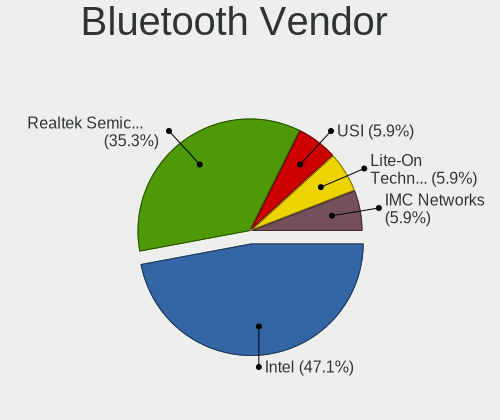
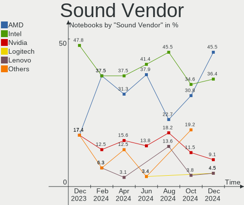

Gentoo - Hardware Trends (Notebooks)
------------------------------------

A project to identify most popular hardware characteristics and track their change
over time based on data collected by Linux users at https://Linux-Hardware.org.

Anyone can contribute to this report by the [hw-probe](https://github.com/linuxhw/hw-probe) tool:

    sudo -E hw-probe -all -upload

This report is for one last month. Overall report since the beginning of time: [TestDays](https://github.com/linuxhw/TestDays)

Period: Oct, 2023.

Contents
--------

* [ System ](#system)
  - [ OS                       ](#os)
  - [ OS Family                ](#os-family)
  - [ Kernel                   ](#kernel)
  - [ Kernel Family            ](#kernel-family)
  - [ Kernel Major Ver.        ](#kernel-major-ver)
  - [ Arch                     ](#arch)
  - [ DE                       ](#de)
  - [ Display Server           ](#display-server)
  - [ Display Manager          ](#display-manager)
  - [ OS Lang                  ](#os-lang)
  - [ Boot Mode                ](#boot-mode)
  - [ Filesystem               ](#filesystem)
  - [ Part. scheme             ](#part-scheme)
  - [ Dual Boot with Linux/BSD ](#dual-boot-with-linuxbsd)
  - [ Dual Boot (Win)          ](#dual-boot-win)

* [ Board ](#board)
  - [ Vendor                   ](#vendor)
  - [ Model                    ](#model)
  - [ Model Family             ](#model-family)
  - [ MFG Year                 ](#mfg-year)
  - [ Form Factor              ](#form-factor)
  - [ Secure Boot              ](#secure-boot)
  - [ Coreboot                 ](#coreboot)
  - [ RAM Size                 ](#ram-size)
  - [ RAM Used                 ](#ram-used)
  - [ Total Drives             ](#total-drives)
  - [ Has CD-ROM               ](#has-cd-rom)
  - [ Has Ethernet             ](#has-ethernet)
  - [ Has WiFi                 ](#has-wifi)
  - [ Has Bluetooth            ](#has-bluetooth)

* [ Location ](#location)
  - [ Country                  ](#country)
  - [ City                     ](#city)

* [ Drives ](#drives)
  - [ Drive Vendor             ](#drive-vendor)
  - [ Drive Model              ](#drive-model)
  - [ HDD Vendor               ](#hdd-vendor)
  - [ SSD Vendor               ](#ssd-vendor)
  - [ Drive Kind               ](#drive-kind)
  - [ Drive Connector          ](#drive-connector)
  - [ Drive Size               ](#drive-size)
  - [ Space Total              ](#space-total)
  - [ Space Used               ](#space-used)
  - [ Malfunc. Drives          ](#malfunc-drives)
  - [ Malfunc. Drive Vendor    ](#malfunc-drive-vendor)
  - [ Malfunc. HDD Vendor      ](#malfunc-hdd-vendor)
  - [ Malfunc. Drive Kind      ](#malfunc-drive-kind)
  - [ Failed Drives            ](#failed-drives)
  - [ Failed Drive Vendor      ](#failed-drive-vendor)
  - [ Drive Status             ](#drive-status)

* [ Storage controller ](#storage-controller)
  - [ Storage Vendor           ](#storage-vendor)
  - [ Storage Model            ](#storage-model)
  - [ Storage Kind             ](#storage-kind)

* [ Processor ](#processor)
  - [ CPU Vendor               ](#cpu-vendor)
  - [ CPU Model                ](#cpu-model)
  - [ CPU Model Family         ](#cpu-model-family)
  - [ CPU Cores                ](#cpu-cores)
  - [ CPU Sockets              ](#cpu-sockets)
  - [ CPU Threads              ](#cpu-threads)
  - [ CPU Op-Modes             ](#cpu-op-modes)
  - [ CPU Microcode            ](#cpu-microcode)
  - [ CPU Microarch            ](#cpu-microarch)

* [ Graphics ](#graphics)
  - [ GPU Vendor               ](#gpu-vendor)
  - [ GPU Model                ](#gpu-model)
  - [ GPU Combo                ](#gpu-combo)
  - [ GPU Driver               ](#gpu-driver)
  - [ GPU Memory               ](#gpu-memory)

* [ Monitor ](#monitor)
  - [ Monitor Vendor           ](#monitor-vendor)
  - [ Monitor Model            ](#monitor-model)
  - [ Monitor Resolution       ](#monitor-resolution)
  - [ Monitor Diagonal         ](#monitor-diagonal)
  - [ Monitor Width            ](#monitor-width)
  - [ Aspect Ratio             ](#aspect-ratio)
  - [ Monitor Area             ](#monitor-area)
  - [ Pixel Density            ](#pixel-density)
  - [ Multiple Monitors        ](#multiple-monitors)

* [ Network ](#network)
  - [ Net Controller Vendor    ](#net-controller-vendor)
  - [ Net Controller Model     ](#net-controller-model)
  - [ Wireless Vendor          ](#wireless-vendor)
  - [ Wireless Model           ](#wireless-model)
  - [ Ethernet Vendor          ](#ethernet-vendor)
  - [ Ethernet Model           ](#ethernet-model)
  - [ Net Controller Kind      ](#net-controller-kind)
  - [ Used Controller          ](#used-controller)
  - [ NICs                     ](#nics)
  - [ IPv6                     ](#ipv6)

* [ Bluetooth ](#bluetooth)
  - [ Bluetooth Vendor         ](#bluetooth-vendor)
  - [ Bluetooth Model          ](#bluetooth-model)

* [ Sound ](#sound)
  - [ Sound Vendor             ](#sound-vendor)
  - [ Sound Model              ](#sound-model)

* [ Memory ](#memory)
  - [ Memory Vendor            ](#memory-vendor)
  - [ Memory Model             ](#memory-model)
  - [ Memory Kind              ](#memory-kind)
  - [ Memory Form Factor       ](#memory-form-factor)
  - [ Memory Size              ](#memory-size)
  - [ Memory Speed             ](#memory-speed)

* [ Printers & scanners ](#printers--scanners)
  - [ Printer Vendor           ](#printer-vendor)
  - [ Printer Model            ](#printer-model)
  - [ Scanner Vendor           ](#scanner-vendor)
  - [ Scanner Model            ](#scanner-model)

* [ Camera ](#camera)
  - [ Camera Vendor            ](#camera-vendor)
  - [ Camera Model             ](#camera-model)

* [ Security ](#security)
  - [ Fingerprint Vendor       ](#fingerprint-vendor)
  - [ Fingerprint Model        ](#fingerprint-model)
  - [ Chipcard Vendor          ](#chipcard-vendor)
  - [ Chipcard Model           ](#chipcard-model)

* [ Unsupported ](#unsupported)
  - [ Unsupported Devices      ](#unsupported-devices)
  - [ Unsupported Device Types ](#unsupported-device-types)

System
------

OS
--

Installed operating systems

| Name        | Notebooks | Percent |
|-------------|-----------|---------|
| Gentoo 2.14 | 20        | 95.24%  |
| Gentoo 23   | 1         | 4.76%   |

OS Family
---------

OS without a version

| Name   | Notebooks | Percent |
|--------|-----------|---------|
| Gentoo | 21        | 100%    |

Kernel
------

Version of the Linux kernel

| Version                      | Notebooks | Percent |
|------------------------------|-----------|---------|
| 6.1.57-gentoo-dist           | 3         | 14.29%  |
| 6.1.53-gentoo-r1             | 2         | 9.52%   |
| 6.6.0-gentoo                 | 1         | 4.76%   |
| 6.5.9-gentoo                 | 1         | 4.76%   |
| 6.5.8-gentoo-r1-x86_64       | 1         | 4.76%   |
| 6.5.8-gentoo-r1              | 1         | 4.76%   |
| 6.5.8-gentoo-dist            | 1         | 4.76%   |
| 6.5.7-gentoo-x86_64          | 1         | 4.76%   |
| 6.5.7-gentoo                 | 1         | 4.76%   |
| 6.5.6-calculate              | 1         | 4.76%   |
| 6.5.5-gentoo-x86_64          | 1         | 4.76%   |
| 6.1.57-gentoolake            | 1         | 4.76%   |
| 6.1.57-gentoo-x86_64         | 1         | 4.76%   |
| 6.1.55-gentoo-dist           | 1         | 4.76%   |
| 6.1.53-gentoo-r1-gentoo-dist | 1         | 4.76%   |
| 6.1.53-gentoo-r1-fomys-work  | 1         | 4.76%   |
| 6.1.46-gentoo-Zenbook        | 1         | 4.76%   |
| 6.1.31-gentoo-dist           | 1         | 4.76%   |

Kernel Family
-------------

Linux kernel without a distro release

| Version | Notebooks | Percent |
|---------|-----------|---------|
| 6.1.57  | 5         | 23.81%  |
| 6.1.53  | 4         | 19.05%  |
| 6.5.8   | 3         | 14.29%  |
| 6.5.7   | 2         | 9.52%   |
| 6.6.0   | 1         | 4.76%   |
| 6.5.9   | 1         | 4.76%   |
| 6.5.6   | 1         | 4.76%   |
| 6.5.5   | 1         | 4.76%   |
| 6.1.55  | 1         | 4.76%   |
| 6.1.46  | 1         | 4.76%   |
| 6.1.31  | 1         | 4.76%   |

Kernel Major Ver.
-----------------

Linux kernel major version

| Version | Notebooks | Percent |
|---------|-----------|---------|
| 6.1     | 12        | 57.14%  |
| 6.5     | 8         | 38.1%   |
| 6.6     | 1         | 4.76%   |

Arch
----

OS architecture (x86_64, i586, etc.)

| Name   | Notebooks | Percent |
|--------|-----------|---------|
| x86_64 | 21        | 100%    |

DE
--

Desktop Environment

| Name     | Notebooks | Percent |
|----------|-----------|---------|
| KDE5     | 9         | 42.86%  |
| Unknown  | 5         | 23.81%  |
| GNOME    | 2         | 9.52%   |
| DWM      | 2         | 9.52%   |
| XFCE     | 1         | 4.76%   |
| LXQt     | 1         | 4.76%   |
| Hyprland | 1         | 4.76%   |

Display Server
--------------

X11 or Wayland

| Name    | Notebooks | Percent |
|---------|-----------|---------|
| X11     | 8         | 38.1%   |
| Wayland | 8         | 38.1%   |
| Unknown | 3         | 14.29%  |
| Tty     | 2         | 9.52%   |

Display Manager
---------------

SDDM, LightDM, etc.

| Name    | Notebooks | Percent |
|---------|-----------|---------|
| SDDM    | 10        | 47.62%  |
| Unknown | 9         | 42.86%  |
| LightDM | 1         | 4.76%   |
| GDM     | 1         | 4.76%   |

OS Lang
-------

Language

| Lang           | Notebooks | Percent |
|----------------|-----------|---------|
| en_US          | 6         | 28.57%  |
| Unknown        | 4         | 19.05%  |
| ru_RU          | 2         | 9.52%   |
| fr_FR          | 2         | 9.52%   |
| it_IT.iso88591 | 1         | 4.76%   |
| fi_FI          | 1         | 4.76%   |
| en_IE          | 1         | 4.76%   |
| en_GB          | 1         | 4.76%   |
| de_DE          | 1         | 4.76%   |
| C.UTF8         | 1         | 4.76%   |
| C              | 1         | 4.76%   |

Boot Mode
---------

EFI or BIOS

| Mode | Notebooks | Percent |
|------|-----------|---------|
| EFI  | 21        | 100%    |

Filesystem
----------

Type of filesystem

| Type  | Notebooks | Percent |
|-------|-----------|---------|
| Btrfs | 9         | 42.86%  |
| Ext4  | 6         | 28.57%  |
| Xfs   | 5         | 23.81%  |
| Zfs   | 1         | 4.76%   |

Part. scheme
------------

Scheme of partitioning

| Type | Notebooks | Percent |
|------|-----------|---------|
| GPT  | 21        | 100%    |

Dual Boot with Linux/BSD
------------------------

Hosting more than one Linux/BSD

| Dual boot | Notebooks | Percent |
|-----------|-----------|---------|
| No        | 18        | 85.71%  |
| Yes       | 3         | 14.29%  |

Dual Boot (Win)
---------------

Hosting Linux and Windows

| Dual boot | Notebooks | Percent |
|-----------|-----------|---------|
| No        | 15        | 71.43%  |
| Yes       | 6         | 28.57%  |

Board
-----

Vendor
------

Motherboard manufacturer

| Name             | Notebooks | Percent |
|------------------|-----------|---------|
| ASUSTek Computer | 7         | 33.33%  |
| Lenovo           | 5         | 23.81%  |
| Hewlett-Packard  | 5         | 23.81%  |
| Dell             | 2         | 9.52%   |
| Framework        | 1         | 4.76%   |
| Acer             | 1         | 4.76%   |

Model
-----

Motherboard model

| Name                                             | Notebooks | Percent |
|--------------------------------------------------|-----------|---------|
| Lenovo ThinkPad T14 Gen 1 20UES1Y200             | 1         | 4.76%   |
| Lenovo Legion Pro 5 16ARX8 82WM                  | 1         | 4.76%   |
| Lenovo Legion 5 Pro 16ACH6H 82JQ                 | 1         | 4.76%   |
| Lenovo IdeaPad 5 15ABA7 82SG                     | 1         | 4.76%   |
| Lenovo G50-30 80G0                               | 1         | 4.76%   |
| HP ZBook Studio 16 inch G9 Mobile Workstation PC | 1         | 4.76%   |
| HP OMEN by Laptop 16-c0xxx                       | 1         | 4.76%   |
| HP EliteBook 845 14 inch G10 Notebook PC         | 1         | 4.76%   |
| HP EliteBook 840 G6                              | 1         | 4.76%   |
| HP EliteBook 830 G6                              | 1         | 4.76%   |
| Framework Laptop (13th Gen Intel Core)           | 1         | 4.76%   |
| Dell XPS 15 9530                                 | 1         | 4.76%   |
| Dell Latitude 7320                               | 1         | 4.76%   |
| ASUS Zenbook UX7602VI_UX7602VI                   | 1         | 4.76%   |
| ASUS ZenBook UX434DA_UM433DA                     | 1         | 4.76%   |
| ASUS ZenBook UX425UA_UM425UA                     | 1         | 4.76%   |
| ASUS VivoBook_ASUSLaptop X512DA_X512DA           | 1         | 4.76%   |
| ASUS VivoBook_ASUSLaptop M1603QA_M1603QA         | 1         | 4.76%   |
| ASUS VivoBook_ASUSLaptop K6502VV_K6502VV         | 1         | 4.76%   |
| ASUS ROG Zephyrus G14 GA401II_GA401II            | 1         | 4.76%   |
| Acer Swift SFX14-41G                             | 1         | 4.76%   |

Model Family
------------

Motherboard model prefix

| Name             | Notebooks | Percent |
|------------------|-----------|---------|
| HP EliteBook     | 3         | 14.29%  |
| ASUS ZenBook     | 3         | 14.29%  |
| ASUS VivoBook    | 3         | 14.29%  |
| Lenovo Legion    | 2         | 9.52%   |
| Lenovo ThinkPad  | 1         | 4.76%   |
| Lenovo IdeaPad   | 1         | 4.76%   |
| Lenovo G50-30    | 1         | 4.76%   |
| HP ZBook         | 1         | 4.76%   |
| HP OMEN          | 1         | 4.76%   |
| Framework Laptop | 1         | 4.76%   |
| Dell XPS         | 1         | 4.76%   |
| Dell Latitude    | 1         | 4.76%   |
| ASUS ROG         | 1         | 4.76%   |
| Acer Swift       | 1         | 4.76%   |

MFG Year
--------

Motherboard manufacture year

| Year | Notebooks | Percent |
|------|-----------|---------|
| 2023 | 5         | 23.81%  |
| 2021 | 5         | 23.81%  |
| 2019 | 4         | 19.05%  |
| 2022 | 3         | 14.29%  |
| 2014 | 2         | 9.52%   |
| 2020 | 1         | 4.76%   |
| 2018 | 1         | 4.76%   |

Form Factor
-----------

Physical design of the computer

| Name     | Notebooks | Percent |
|----------|-----------|---------|
| Notebook | 21        | 100%    |

Secure Boot
-----------

Enabled or disabled

| State    | Notebooks | Percent |
|----------|-----------|---------|
| Disabled | 21        | 100%    |

Coreboot
--------

Have coreboot on board

| Used | Notebooks | Percent |
|------|-----------|---------|
| No   | 21        | 100%    |

RAM Size
--------

Total RAM memory

| Size in GB  | Notebooks | Percent |
|-------------|-----------|---------|
| 8.01-16.0   | 8         | 38.1%   |
| 32.01-64.0  | 6         | 28.57%  |
| 4.01-8.0    | 4         | 19.05%  |
| 64.01-256.0 | 3         | 14.29%  |

RAM Used
--------

Used RAM memory

| Used GB   | Notebooks | Percent |
|-----------|-----------|---------|
| 1.01-2.0  | 7         | 33.33%  |
| 3.01-4.0  | 4         | 19.05%  |
| 4.01-8.0  | 3         | 14.29%  |
| 8.01-16.0 | 3         | 14.29%  |
| 0.51-1.0  | 2         | 9.52%   |
| 2.01-3.0  | 1         | 4.76%   |
| 0.01-0.5  | 1         | 4.76%   |

Total Drives
------------

Number of drives on board

| Drives | Notebooks | Percent |
|--------|-----------|---------|
| 1      | 17        | 80.95%  |
| 2      | 3         | 14.29%  |
| 3      | 1         | 4.76%   |

Has CD-ROM
----------

Has CD-ROM on board

| Presented | Notebooks | Percent |
|-----------|-----------|---------|
| No        | 20        | 95.24%  |
| Yes       | 1         | 4.76%   |

Has Ethernet
------------

Has Ethernet on board

| Presented | Notebooks | Percent |
|-----------|-----------|---------|
| Yes       | 12        | 57.14%  |
| No        | 9         | 42.86%  |

Has WiFi
--------

Has WiFi module

| Presented | Notebooks | Percent |
|-----------|-----------|---------|
| Yes       | 21        | 100%    |

Has Bluetooth
-------------

Has Bluetooth module

| Presented | Notebooks | Percent |
|-----------|-----------|---------|
| Yes       | 20        | 95.24%  |
| No        | 1         | 4.76%   |

Location
--------

Country
-------

Geographic location (country)

| Country     | Notebooks | Percent |
|-------------|-----------|---------|
| Russia      | 5         | 23.81%  |
| USA         | 2         | 9.52%   |
| France      | 2         | 9.52%   |
| Ukraine     | 1         | 4.76%   |
| UK          | 1         | 4.76%   |
| Switzerland | 1         | 4.76%   |
| Spain       | 1         | 4.76%   |
| Slovakia    | 1         | 4.76%   |
| Italy       | 1         | 4.76%   |
| Ireland     | 1         | 4.76%   |
| Indonesia   | 1         | 4.76%   |
| Germany     | 1         | 4.76%   |
| Finland     | 1         | 4.76%   |
| China       | 1         | 4.76%   |
| Belgium     | 1         | 4.76%   |

City
----

Geographic location (city)

| City                  | Notebooks | Percent |
|-----------------------|-----------|---------|
| Moscow                | 2         | 9.52%   |
| Zhengzhou             | 1         | 4.76%   |
| West Orange           | 1         | 4.76%   |
| Turku                 | 1         | 4.76%   |
| St Laurent des Arbres | 1         | 4.76%   |
| Samarinda             | 1         | 4.76%   |
| Pfaeffikon            | 1         | 4.76%   |
| Pau                   | 1         | 4.76%   |
| Novosibirsk           | 1         | 4.76%   |
| Novara                | 1         | 4.76%   |
| Nashville             | 1         | 4.76%   |
| Murino                | 1         | 4.76%   |
| Kyiv                  | 1         | 4.76%   |
| Krefeld               | 1         | 4.76%   |
| Croydon               | 1         | 4.76%   |
| Bray                  | 1         | 4.76%   |
| Bratislava            | 1         | 4.76%   |
| Belgorod              | 1         | 4.76%   |
| Barcelona             | 1         | 4.76%   |
| Antwerp               | 1         | 4.76%   |

Drives
------

Drive Vendor
------------

Hard drive vendors

| Vendor                      | Notebooks | Drives | Percent |
|-----------------------------|-----------|--------|---------|
| Sandisk                     | 5         | 5      | 19.23%  |
| SK hynix                    | 4         | 4      | 15.38%  |
| Micron Technology           | 3         | 3      | 11.54%  |
| Intel                       | 3         | 3      | 11.54%  |
| Samsung Electronics         | 2         | 2      | 7.69%   |
| KIOXIA                      | 2         | 2      | 7.69%   |
| Kingston                    | 2         | 2      | 7.69%   |
| Yangtze Memory Technologies | 1         | 1      | 3.85%   |
| Unknown                     | 1         | 1      | 3.85%   |
| Seagate                     | 1         | 1      | 3.85%   |
| Phison                      | 1         | 1      | 3.85%   |
| ADATA Technology            | 1         | 1      | 3.85%   |

Drive Model
-----------

Hard drive models

| Model                                                             | Notebooks | Percent |
|-------------------------------------------------------------------|-----------|---------|
| Sandisk WD Blue SN550 NVMe SSD 1TB                                | 2         | 7.69%   |
| Samsung NVMe SSD Controller PM9A1/PM9A3/980PRO 1TB                | 2         | 7.69%   |
| Intel SSD 660P Series 1024GB                                      | 2         | 7.69%   |
| Yangtze Memory ZHITAI TiPlus5000 2TB                              | 1         | 3.85%   |
| Unknown MMC Card  128GB                                           | 1         | 3.85%   |
| SK hynix SKHynix_HFS001TDE9X084N 1TB                              | 1         | 3.85%   |
| SK hynix SKHynix_HFS001TDE9X081N 1TB                              | 1         | 3.85%   |
| SK hynix HFM512GD3JX013N 512GB                                    | 1         | 3.85%   |
| SK hynix BC501 NVMe Solid State Drive 512GB                       | 1         | 3.85%   |
| Seagate ST1000LM035-1RK172 1TB                                    | 1         | 3.85%   |
| Sandisk WD_BLACK SN850X 2000GB                                    | 1         | 3.85%   |
| Sandisk WD Black SN850 1TB                                        | 1         | 3.85%   |
| Sandisk WD Black SN750 / PC SN730 NVMe SSD 1024GB                 | 1         | 3.85%   |
| Phison Sabrent SB-RKT4P-4TB                                       | 1         | 3.85%   |
| Micron MTFDKBA512TFH 512GB                                        | 1         | 3.85%   |
| Micron 2450_MTFDKBA512TFK 512GB                                   | 1         | 3.85%   |
| Micron 2300 NVMe 1024GB                                           | 1         | 3.85%   |
| KIOXIA KXG80ZNV512G NVMe 512GB                                    | 1         | 3.85%   |
| KIOXIA KBG40ZNV512G 512GB                                         | 1         | 3.85%   |
| Kingston SA400S37480G 480GB SSD                                   | 1         | 3.85%   |
| Kingston OM8PCP3512F-AB 512GB                                     | 1         | 3.85%   |
| Intel SSDPEKNU512GZ 512GB                                         | 1         | 3.85%   |
| ADATA XPG SX8200 Pro PCIe Gen3x4 M.2 2280 Solid State Drive 512GB | 1         | 3.85%   |

HDD Vendor
----------

Hard disk drive vendors

| Vendor  | Notebooks | Drives | Percent |
|---------|-----------|--------|---------|
| Seagate | 1         | 1      | 100%    |

SSD Vendor
----------

Solid state drive vendors

| Vendor   | Notebooks | Drives | Percent |
|----------|-----------|--------|---------|
| Kingston | 1         | 1      | 100%    |

Drive Kind
----------

HDD or SSD

| Kind | Notebooks | Drives | Percent |
|------|-----------|--------|---------|
| NVMe | 20        | 23     | 86.96%  |
| MMC  | 1         | 1      | 4.35%   |
| SSD  | 1         | 1      | 4.35%   |
| HDD  | 1         | 1      | 4.35%   |

Drive Connector
---------------

SATA, SAS, NVMe, etc.

| Type | Notebooks | Drives | Percent |
|------|-----------|--------|---------|
| NVMe | 20        | 23     | 86.96%  |
| SATA | 2         | 2      | 8.7%    |
| MMC  | 1         | 1      | 4.35%   |

Drive Size
----------

Size of hard drive

| Size in TB | Notebooks | Drives | Percent |
|------------|-----------|--------|---------|
| 0.51-1.0   | 1         | 1      | 50%     |
| 0.01-0.5   | 1         | 1      | 50%     |

Space Total
-----------

Amount of disk space available on the file system

| Size in GB     | Notebooks | Percent |
|----------------|-----------|---------|
| 251-500        | 8         | 38.1%   |
| 501-1000       | 4         | 19.05%  |
| Unknown        | 4         | 19.05%  |
| More than 3000 | 2         | 9.52%   |
| 1001-2000      | 2         | 9.52%   |
| 101-250        | 1         | 4.76%   |

Space Used
----------

Amount of used disk space

| Used GB  | Notebooks | Percent |
|----------|-----------|---------|
| 21-50    | 6         | 28.57%  |
| 101-250  | 4         | 19.05%  |
| Unknown  | 4         | 19.05%  |
| 251-500  | 3         | 14.29%  |
| 501-1000 | 2         | 9.52%   |
| 1-20     | 1         | 4.76%   |
| 51-100   | 1         | 4.76%   |

Malfunc. Drives
---------------

Drive models with a malfunction

Zero info for selected period =(

Malfunc. Drive Vendor
---------------------

Vendors of faulty drives

Zero info for selected period =(

Malfunc. HDD Vendor
-------------------

Vendors of faulty HDD drives

Zero info for selected period =(

Malfunc. Drive Kind
-------------------

Kinds of faulty drives

Zero info for selected period =(

Failed Drives
-------------

Failed drive models

Zero info for selected period =(

Failed Drive Vendor
-------------------

Failed drive vendors

Zero info for selected period =(

Drive Status
------------

Number of failed and malfunc. drives

| Status   | Notebooks | Drives | Percent |
|----------|-----------|--------|---------|
| Works    | 21        | 25     | 95.45%  |
| Detected | 1         | 1      | 4.55%   |

Storage controller
------------------

Storage Vendor
--------------

Storage controller vendors

| Vendor                      | Notebooks | Percent |
|-----------------------------|-----------|---------|
| Intel                       | 6         | 18.75%  |
| AMD                         | 6         | 18.75%  |
| SanDisk                     | 5         | 15.63%  |
| SK hynix                    | 4         | 12.5%   |
| Micron Technology           | 3         | 9.38%   |
| Samsung Electronics         | 2         | 6.25%   |
| KIOXIA                      | 2         | 6.25%   |
| Yangtze Memory Technologies | 1         | 3.13%   |
| Phison Electronics          | 1         | 3.13%   |
| Kingston Technology Company | 1         | 3.13%   |
| ADATA Technology            | 1         | 3.13%   |

Storage Model
-------------

Storage controller models

| Model                                                                 | Notebooks | Percent |
|-----------------------------------------------------------------------|-----------|---------|
| AMD FCH SATA Controller [AHCI mode]                                   | 6         | 18.75%  |
| SK hynix Gold P31/BC711/PC711 NVMe Solid State Drive                  | 3         | 9.38%   |
| SanDisk Ultra 3D / WD Blue SN550 NVMe SSD                             | 2         | 6.25%   |
| Samsung NVMe SSD Controller PM9A1/PM9A3/980PRO                        | 2         | 6.25%   |
| Intel Volume Management Device NVMe RAID Controller Intel Corporation | 2         | 6.25%   |
| Intel SSD 660P Series                                                 | 2         | 6.25%   |
| Yangtze Memory ZHITAI TiPro5000 NVMe SSD                              | 1         | 3.13%   |
| SK hynix BC501 NVMe Solid State Drive                                 | 1         | 3.13%   |
| SanDisk WD PC SN810 / Black SN850 NVMe SSD                            | 1         | 3.13%   |
| Sandisk WD Black SN850X NVMe SSD                                      | 1         | 3.13%   |
| SanDisk Extreme Pro / WD Black SN750 / PC SN730 / Red SN700 NVMe SSD  | 1         | 3.13%   |
| Phison E18 PCIe4 NVMe Controller                                      | 1         | 3.13%   |
| Micron 3400 NVMe SSD [Hendrix]                                        | 1         | 3.13%   |
| Micron 2450 NVMe SSD [HendrixV] (DRAM-less)                           | 1         | 3.13%   |
| Micron 2300 NVMe SSD [Santana]                                        | 1         | 3.13%   |
| KIOXIA NVMe SSD Controller XG8                                        | 1         | 3.13%   |
| KIOXIA NVMe SSD Controller BG4 (DRAM-less)                            | 1         | 3.13%   |
| Kingston Company OM8PCP Design-In PCIe 3 NVMe SSD (DRAM-less)         | 1         | 3.13%   |
| Intel SSD 670p Series [Keystone Harbor]                               | 1         | 3.13%   |
| Intel Atom Processor E3800 Series SATA AHCI Controller                | 1         | 3.13%   |
| ADATA XPG SX8200 Pro PCIe Gen3x4 M.2 2280 Solid State Drive           | 1         | 3.13%   |

Storage Kind
------------

Kind of storage controller (IDE, SATA, NVMe, SAS, ...)

| Kind | Notebooks | Percent |
|------|-----------|---------|
| NVMe | 20        | 68.97%  |
| SATA | 7         | 24.14%  |
| RAID | 2         | 6.9%    |

Processor
---------

CPU Vendor
----------

Processor vendors

| Vendor | Notebooks | Percent |
|--------|-----------|---------|
| AMD    | 12        | 57.14%  |
| Intel  | 9         | 42.86%  |

CPU Model
---------

Processor models

| Model                                         | Notebooks | Percent |
|-----------------------------------------------|-----------|---------|
| Intel Core i5-8365U CPU @ 1.60GHz             | 2         | 9.52%   |
| AMD Ryzen 7 5800H with Radeon Graphics        | 2         | 9.52%   |
| Intel Pentium CPU N3540 @ 2.16GHz             | 1         | 4.76%   |
| Intel 13th Gen Core i9-13900H                 | 1         | 4.76%   |
| Intel 13th Gen Core i7-1370P                  | 1         | 4.76%   |
| Intel 13th Gen Core i7-13700H                 | 1         | 4.76%   |
| Intel 13th Gen Core i5-13500H                 | 1         | 4.76%   |
| Intel 12th Gen Core i7-12700H                 | 1         | 4.76%   |
| Intel 11th Gen Core i7-1185G7 @ 3.00GHz       | 1         | 4.76%   |
| AMD Ryzen 7 PRO 4750U with Radeon Graphics    | 1         | 4.76%   |
| AMD Ryzen 7 7745HX with Radeon Graphics       | 1         | 4.76%   |
| AMD Ryzen 7 5825U with Radeon Graphics        | 1         | 4.76%   |
| AMD Ryzen 7 5800HS with Radeon Graphics       | 1         | 4.76%   |
| AMD Ryzen 7 5700U with Radeon Graphics        | 1         | 4.76%   |
| AMD Ryzen 7 4800HS with Radeon Graphics       | 1         | 4.76%   |
| AMD Ryzen 7 3700U with Radeon Vega Mobile Gfx | 1         | 4.76%   |
| AMD Ryzen 5 7540U w/ Radeon 740M Graphics     | 1         | 4.76%   |
| AMD Ryzen 5 5600U with Radeon Graphics        | 1         | 4.76%   |
| AMD Ryzen 5 3500U with Radeon Vega Mobile Gfx | 1         | 4.76%   |

CPU Model Family
----------------

Processor model prefix

| Model           | Notebooks | Percent |
|-----------------|-----------|---------|
| AMD Ryzen 7     | 8         | 38.1%   |
| Other           | 6         | 28.57%  |
| AMD Ryzen 5     | 3         | 14.29%  |
| Intel Core i5   | 2         | 9.52%   |
| Intel Pentium   | 1         | 4.76%   |
| AMD Ryzen 7 PRO | 1         | 4.76%   |

CPU Cores
---------

Number of processor cores

| Number | Notebooks | Percent |
|--------|-----------|---------|
| 8      | 8         | 38.1%   |
| 4      | 6         | 28.57%  |
| 14     | 4         | 19.05%  |
| 6      | 2         | 9.52%   |
| 12     | 1         | 4.76%   |

CPU Sockets
-----------

Number of sockets

| Number | Notebooks | Percent |
|--------|-----------|---------|
| 1      | 21        | 100%    |

CPU Threads
-----------

Threads per core (Hyper-Threading)

| Number | Notebooks | Percent |
|--------|-----------|---------|
| 2      | 20        | 95.24%  |
| 1      | 1         | 4.76%   |

CPU Op-Modes
------------

CPU Operation Modes (32-bit, 64-bit)

| Op mode        | Notebooks | Percent |
|----------------|-----------|---------|
| 32-bit, 64-bit | 21        | 100%    |

CPU Microcode
-------------

Microcode number

| Number     | Notebooks | Percent |
|------------|-----------|---------|
| Unknown    | 4         | 19.05%  |
| 0xb06a2    | 3         | 14.29%  |
| 0x0a50000c | 3         | 14.29%  |
| 0x0a50000d | 2         | 9.52%   |
| 0x08108109 | 2         | 9.52%   |
| 0x906a3    | 1         | 4.76%   |
| 0x806ec    | 1         | 4.76%   |
| 0x0a704103 | 1         | 4.76%   |
| 0x0a601203 | 1         | 4.76%   |
| 0x08608103 | 1         | 4.76%   |
| 0x08600106 | 1         | 4.76%   |
| 0x08600104 | 1         | 4.76%   |

CPU Microarch
-------------

Microarchitecture

| Name             | Notebooks | Percent |
|------------------|-----------|---------|
| Zen 3            | 5         | 23.81%  |
| Alderlake Hybrid | 5         | 23.81%  |
| Unknown          | 3         | 14.29%  |
| Zen+             | 2         | 9.52%   |
| Zen 2            | 2         | 9.52%   |
| KabyLake         | 2         | 9.52%   |
| TigerLake        | 1         | 4.76%   |
| Silvermont       | 1         | 4.76%   |

Graphics
--------

GPU Vendor
----------

Vendors of graphics cards

| Vendor | Notebooks | Percent |
|--------|-----------|---------|
| AMD    | 11        | 39.29%  |
| Intel  | 9         | 32.14%  |
| Nvidia | 8         | 28.57%  |

GPU Model
---------

Graphics card models

| Model                                                                | Notebooks | Percent |
|----------------------------------------------------------------------|-----------|---------|
| Intel Raptor Lake-P [Iris Xe Graphics]                               | 4         | 13.79%  |
| AMD Cezanne [Radeon Vega Series / Radeon Vega Mobile Series]         | 3         | 10.34%  |
| Nvidia AD107M [GeForce RTX 4060 Max-Q / Mobile]                      | 2         | 6.9%    |
| Intel WhiskeyLake-U GT2 [UHD Graphics 620]                           | 2         | 6.9%    |
| AMD Renoir [Radeon RX Vega 6 (Ryzen 4000/5000 Mobile Series)]        | 2         | 6.9%    |
| AMD Picasso/Raven 2 [Radeon Vega Series / Radeon Vega Mobile Series] | 2         | 6.9%    |
| Nvidia TU116M [GeForce GTX 1650 Ti Mobile]                           | 1         | 3.45%   |
| Nvidia GF117M [GeForce 610M/710M/810M/820M / GT 620M/625M/630M/720M] | 1         | 3.45%   |
| Nvidia GA107M [GeForce RTX 3050 Mobile]                              | 1         | 3.45%   |
| Nvidia GA104M [GeForce RTX 3070 Mobile / Max-Q]                      | 1         | 3.45%   |
| Nvidia AD107M [GeForce RTX 4050 Max-Q / Mobile]                      | 1         | 3.45%   |
| Nvidia AD106M [GeForce RTX 4070 Max-Q / Mobile]                      | 1         | 3.45%   |
| Intel TigerLake-LP GT2 [Iris Xe Graphics]                            | 1         | 3.45%   |
| Intel Atom Processor Z36xxx/Z37xxx Series Graphics & Display         | 1         | 3.45%   |
| Intel Alder Lake-P GT2 [Iris Xe Graphics]                            | 1         | 3.45%   |
| AMD Raphael                                                          | 1         | 3.45%   |
| AMD Phoenix1                                                         | 1         | 3.45%   |
| AMD Navi 23 [Radeon RX 6600/6600 XT/6600M]                           | 1         | 3.45%   |
| AMD Lucienne                                                         | 1         | 3.45%   |
| AMD Barcelo                                                          | 1         | 3.45%   |

GPU Combo
---------

Combinations of graphics cards

| Name           | Notebooks | Percent |
|----------------|-----------|---------|
| 1 x AMD        | 7         | 33.33%  |
| 1 x Intel      | 5         | 23.81%  |
| Intel + Nvidia | 4         | 19.05%  |
| AMD + Nvidia   | 3         | 14.29%  |
| 2 x AMD        | 1         | 4.76%   |
| 1 x Nvidia     | 1         | 4.76%   |

GPU Driver
----------

Free vs proprietary

| Driver      | Notebooks | Percent |
|-------------|-----------|---------|
| Free        | 14        | 66.67%  |
| Proprietary | 6         | 28.57%  |
| Unknown     | 1         | 4.76%   |

GPU Memory
----------

Total video memory

| Size in GB | Notebooks | Percent |
|------------|-----------|---------|
| Unknown    | 8         | 38.1%   |
| 0.01-0.5   | 7         | 33.33%  |
| 1.01-2.0   | 3         | 14.29%  |
| 7.01-8.0   | 2         | 9.52%   |
| 0.51-1.0   | 1         | 4.76%   |

Monitor
-------

Monitor Vendor
--------------

Monitor vendors

| Vendor              | Notebooks | Percent |
|---------------------|-----------|---------|
| AU Optronics        | 9         | 34.62%  |
| Samsung Electronics | 3         | 11.54%  |
| Dell                | 3         | 11.54%  |
| PANDA               | 2         | 7.69%   |
| CSO                 | 2         | 7.69%   |
| BOE                 | 2         | 7.69%   |
| Sharp               | 1         | 3.85%   |
| NEC Computers       | 1         | 3.85%   |
| LG Display          | 1         | 3.85%   |
| HUAWEI              | 1         | 3.85%   |
| Chimei Innolux      | 1         | 3.85%   |

Monitor Model
-------------

Monitor models

| Model                                                                 | Notebooks | Percent |
|-----------------------------------------------------------------------|-----------|---------|
| Sharp LCD Monitor SHP1515 1920x1200 336x210mm 15.6-inch               | 1         | 3.85%   |
| Samsung Electronics LCD Monitor SDC4852 1366x768 344x194mm 15.5-inch  | 1         | 3.85%   |
| Samsung Electronics LCD Monitor SDC4180 2880x1620 344x194mm 15.5-inch | 1         | 3.85%   |
| Samsung Electronics LCD Monitor SDC4178 3200x2000 344x215mm 16.0-inch | 1         | 3.85%   |
| PANDA LCD Monitor NCP0050 1920x1080 309x174mm 14.0-inch               | 1         | 3.85%   |
| PANDA LCD Monitor NCP0035 1920x1080 309x174mm 14.0-inch               | 1         | 3.85%   |
| NEC Computers LCD190V NEC66D3 1280x1024 376x301mm 19.0-inch           | 1         | 3.85%   |
| LG Display LCD Monitor LGD06C4 1920x1080 294x165mm 13.3-inch          | 1         | 3.85%   |
| HUAWEI SSN-24 HWV6E4E 1920x1080 527x296mm 23.8-inch                   | 1         | 3.85%   |
| Dell U3415W DELA0AA 3440x1440 798x335mm 34.1-inch                     | 1         | 3.85%   |
| Dell U2415 DELA0BA 1920x1200 518x324mm 24.1-inch                      | 1         | 3.85%   |
| Dell S2316H DELD07E 1920x1080 509x286mm 23.0-inch                     | 1         | 3.85%   |
| CSO LCD Monitor CSO161B 2560x1600 344x215mm 16.0-inch                 | 1         | 3.85%   |
| CSO LCD Monitor CSO1609 2560x1600 345x215mm 16.0-inch                 | 1         | 3.85%   |
| Chimei Innolux LCD Monitor CMN15E7 1920x1080 344x193mm 15.5-inch      | 1         | 3.85%   |
| BOE LCD Monitor BOE0BCA 2256x1504 285x190mm 13.5-inch                 | 1         | 3.85%   |
| BOE LCD Monitor BOE09BE 1920x1080 355x200mm 16.0-inch                 | 1         | 3.85%   |
| AU Optronics LCD Monitor AUOE48D 1920x1080 344x194mm 15.5-inch        | 1         | 3.85%   |
| AU Optronics LCD Monitor AUOAB9B 1920x1200 344x215mm 16.0-inch        | 1         | 3.85%   |
| AU Optronics LCD Monitor AUO6DA8 2560x1600 301x188mm 14.0-inch        | 1         | 3.85%   |
| AU Optronics LCD Monitor AUO683D 1920x1080 309x174mm 14.0-inch        | 1         | 3.85%   |
| AU Optronics LCD Monitor AUO573D 1920x1080 309x174mm 14.0-inch        | 1         | 3.85%   |
| AU Optronics LCD Monitor AUO4B2D 1920x1080 293x165mm 13.2-inch        | 1         | 3.85%   |
| AU Optronics LCD Monitor AUO459D 1920x1200 344x215mm 16.0-inch        | 1         | 3.85%   |
| AU Optronics LCD Monitor AUO403D 1920x1080 309x173mm 13.9-inch        | 1         | 3.85%   |
| AU Optronics LCD Monitor AUO323D 1920x1080 309x174mm 14.0-inch        | 1         | 3.85%   |

Monitor Resolution
------------------

Monitor screen resolution

| Resolution        | Notebooks | Percent |
|-------------------|-----------|---------|
| 1920x1080 (FHD)   | 12        | 50%     |
| 2560x1600         | 3         | 12.5%   |
| 1920x1200 (WUXGA) | 3         | 12.5%   |
| 3840x2160 (4K)    | 1         | 4.17%   |
| 3440x1440         | 1         | 4.17%   |
| 3200x2000         | 1         | 4.17%   |
| 2880x1620         | 1         | 4.17%   |
| 2256x1504         | 1         | 4.17%   |
| 1280x1024 (SXGA)  | 1         | 4.17%   |

Monitor Diagonal
----------------

Diagonal size in inches

| Inches | Notebooks | Percent |
|--------|-----------|---------|
| 15     | 7         | 26.92%  |
| 16     | 6         | 23.08%  |
| 14     | 6         | 23.08%  |
| 24     | 2         | 7.69%   |
| 13     | 2         | 7.69%   |
| 34     | 1         | 3.85%   |
| 23     | 1         | 3.85%   |
| 19     | 1         | 3.85%   |

Monitor Width
-------------

Physical width

| Width in mm | Notebooks | Percent |
|-------------|-----------|---------|
| 301-350     | 18        | 69.23%  |
| 501-600     | 3         | 11.54%  |
| 351-400     | 2         | 7.69%   |
| 201-300     | 2         | 7.69%   |
| 701-800     | 1         | 3.85%   |

Aspect Ratio
------------

Proportional relationship between the width and the height

| Ratio | Notebooks | Percent |
|-------|-----------|---------|
| 16/9  | 13        | 54.17%  |
| 16/10 | 8         | 33.33%  |
| 5/4   | 1         | 4.17%   |
| 3/2   | 1         | 4.17%   |
| 21/9  | 1         | 4.17%   |

Monitor Area
------------

Area in inch²

| Area in inch² | Notebooks | Percent |
|----------------|-----------|---------|
| 81-90          | 7         | 26.92%  |
| 101-110        | 7         | 26.92%  |
| 111-120        | 6         | 23.08%  |
| 201-250        | 2         | 7.69%   |
| 71-80          | 1         | 3.85%   |
| 351-500        | 1         | 3.85%   |
| 251-300        | 1         | 3.85%   |
| 151-200        | 1         | 3.85%   |

Pixel Density
-------------

Pixels per inch

| Density | Notebooks | Percent |
|---------|-----------|---------|
| 121-160 | 13        | 50%     |
| 161-240 | 7         | 26.92%  |
| 51-100  | 4         | 15.38%  |
| 101-120 | 2         | 7.69%   |

Multiple Monitors
-----------------

Total monitors connected

| Total | Notebooks | Percent |
|-------|-----------|---------|
| 1     | 16        | 76.19%  |
| 2     | 5         | 23.81%  |

Network
-------

Net Controller Vendor
---------------------

Controller vendors

| Vendor                | Notebooks | Percent |
|-----------------------|-----------|---------|
| Intel                 | 14        | 43.75%  |
| Realtek Semiconductor | 10        | 31.25%  |
| Xiaomi                | 2         | 6.25%   |
| Texas Instruments     | 1         | 3.13%   |
| Samsung Electronics   | 1         | 3.13%   |
| Ralink Technology     | 1         | 3.13%   |
| MediaTek              | 1         | 3.13%   |
| Broadcom              | 1         | 3.13%   |
| ASIX Electronics      | 1         | 3.13%   |

Net Controller Model
--------------------

Controller models

| Model                                                             | Notebooks | Percent |
|-------------------------------------------------------------------|-----------|---------|
| Realtek RTL8111/8168/8411 PCI Express Gigabit Ethernet Controller | 6         | 15.79%  |
| Intel Wi-Fi 6 AX200                                               | 4         | 10.53%  |
| Intel Raptor Lake PCH CNVi WiFi                                   | 3         | 7.89%   |
| Realtek RTL8852BE PCIe 802.11ax Wireless Network Controller       | 2         | 5.26%   |
| Realtek RTL8153 Gigabit Ethernet Adapter                          | 2         | 5.26%   |
| Intel Wireless 8265 / 8275                                        | 2         | 5.26%   |
| Intel Wi-Fi 6 AX210/AX211/AX411 160MHz                            | 2         | 5.26%   |
| Intel Ethernet Connection (6) I219-LM                             | 2         | 5.26%   |
| Xiaomi Mi/Redmi series (RNDIS)                                    | 1         | 2.63%   |
| Xiaomi Mi/Redmi series (RNDIS + ADB)                              | 1         | 2.63%   |
| Texas Instruments XDS2xx USB Emulator - Composit                  | 1         | 2.63%   |
| Samsung Galaxy series, misc. (tethering mode)                     | 1         | 2.63%   |
| Realtek USB 10/100/1G/2.5G LAN                                    | 1         | 2.63%   |
| Realtek RTL8852AE 802.11ax PCIe Wireless Network Adapter          | 1         | 2.63%   |
| Realtek RTL8821CE 802.11ac PCIe Wireless Network Adapter          | 1         | 2.63%   |
| Realtek Realtek WLAN controller                                   | 1         | 2.63%   |
| Ralink RT5572 Wireless Adapter                                    | 1         | 2.63%   |
| MediaTek MT7921 802.11ax PCI Express Wireless Network Adapter     | 1         | 2.63%   |
| Intel Wi-Fi 6 AX201                                               | 1         | 2.63%   |
| Intel Cannon Point-LP CNVi [Wireless-AC]                          | 1         | 2.63%   |
| Intel Alder Lake-P PCH CNVi WiFi                                  | 1         | 2.63%   |
| Broadcom BCM43142 802.11b/g/n                                     | 1         | 2.63%   |
| ASIX AX88179 Gigabit Ethernet                                     | 1         | 2.63%   |

Wireless Vendor
---------------

Wireless vendors

| Vendor                | Notebooks | Percent |
|-----------------------|-----------|---------|
| Intel                 | 14        | 63.64%  |
| Realtek Semiconductor | 5         | 22.73%  |
| Ralink Technology     | 1         | 4.55%   |
| MediaTek              | 1         | 4.55%   |
| Broadcom              | 1         | 4.55%   |

Wireless Model
--------------

Wireless models

| Model                                                         | Notebooks | Percent |
|---------------------------------------------------------------|-----------|---------|
| Intel Wi-Fi 6 AX200                                           | 4         | 18.18%  |
| Intel Raptor Lake PCH CNVi WiFi                               | 3         | 13.64%  |
| Realtek RTL8852BE PCIe 802.11ax Wireless Network Controller   | 2         | 9.09%   |
| Intel Wireless 8265 / 8275                                    | 2         | 9.09%   |
| Intel Wi-Fi 6 AX210/AX211/AX411 160MHz                        | 2         | 9.09%   |
| Realtek RTL8852AE 802.11ax PCIe Wireless Network Adapter      | 1         | 4.55%   |
| Realtek RTL8821CE 802.11ac PCIe Wireless Network Adapter      | 1         | 4.55%   |
| Realtek Realtek WLAN controller                               | 1         | 4.55%   |
| Ralink RT5572 Wireless Adapter                                | 1         | 4.55%   |
| MediaTek MT7921 802.11ax PCI Express Wireless Network Adapter | 1         | 4.55%   |
| Intel Wi-Fi 6 AX201                                           | 1         | 4.55%   |
| Intel Cannon Point-LP CNVi [Wireless-AC]                      | 1         | 4.55%   |
| Intel Alder Lake-P PCH CNVi WiFi                              | 1         | 4.55%   |
| Broadcom BCM43142 802.11b/g/n                                 | 1         | 4.55%   |

Ethernet Vendor
---------------

Ethernet vendors

| Vendor                | Notebooks | Percent |
|-----------------------|-----------|---------|
| Realtek Semiconductor | 8         | 57.14%  |
| Xiaomi                | 2         | 14.29%  |
| Intel                 | 2         | 14.29%  |
| Samsung Electronics   | 1         | 7.14%   |
| ASIX Electronics      | 1         | 7.14%   |

Ethernet Model
--------------

Ethernet models

| Model                                                             | Notebooks | Percent |
|-------------------------------------------------------------------|-----------|---------|
| Realtek RTL8111/8168/8411 PCI Express Gigabit Ethernet Controller | 6         | 40%     |
| Realtek RTL8153 Gigabit Ethernet Adapter                          | 2         | 13.33%  |
| Intel Ethernet Connection (6) I219-LM                             | 2         | 13.33%  |
| Xiaomi Mi/Redmi series (RNDIS)                                    | 1         | 6.67%   |
| Xiaomi Mi/Redmi series (RNDIS + ADB)                              | 1         | 6.67%   |
| Samsung Galaxy series, misc. (tethering mode)                     | 1         | 6.67%   |
| Realtek USB 10/100/1G/2.5G LAN                                    | 1         | 6.67%   |
| ASIX AX88179 Gigabit Ethernet                                     | 1         | 6.67%   |

Net Controller Kind
-------------------

Ethernet, WiFi or modem

| Kind     | Notebooks | Percent |
|----------|-----------|---------|
| WiFi     | 21        | 61.76%  |
| Ethernet | 12        | 35.29%  |
| Modem    | 1         | 2.94%   |

Used Controller
---------------

Currently used network controller

| Kind     | Notebooks | Percent |
|----------|-----------|---------|
| WiFi     | 16        | 80%     |
| Ethernet | 4         | 20%     |

NICs
----

Total network controllers on board

| Total | Notebooks | Percent |
|-------|-----------|---------|
| 1     | 13        | 61.9%   |
| 2     | 7         | 33.33%  |
| 3     | 1         | 4.76%   |

IPv6
----

IPv6 vs IPv4

| Used | Notebooks | Percent |
|------|-----------|---------|
| No   | 15        | 71.43%  |
| Yes  | 6         | 28.57%  |

Bluetooth
---------

Bluetooth Vendor
----------------

Controller vendors

| Vendor                | Notebooks | Percent |
|-----------------------|-----------|---------|
| Intel                 | 14        | 70%     |
| Realtek Semiconductor | 2         | 10%     |
| IMC Networks          | 2         | 10%     |
| Lite-On Technology    | 1         | 5%      |
| Foxconn International | 1         | 5%      |

Bluetooth Model
---------------

Controller models

| Model                                             | Notebooks | Percent |
|---------------------------------------------------|-----------|---------|
| Intel Bluetooth Device                            | 4         | 20%     |
| Intel AX200 Bluetooth                             | 4         | 20%     |
| Realtek Bluetooth Radio                           | 2         | 10%     |
| Intel Bluetooth wireless interface                | 2         | 10%     |
| Intel AX210 Bluetooth                             | 2         | 10%     |
| IMC Networks Bluetooth Radio                      | 2         | 10%     |
| Lite-On Wireless_Device                           | 1         | 5%      |
| Intel Bluetooth 9460/9560 Jefferson Peak (JfP)    | 1         | 5%      |
| Intel AX201 Bluetooth                             | 1         | 5%      |
| Foxconn International BCM43142A0 Bluetooth module | 1         | 5%      |

Sound
-----

Sound Vendor
------------

Sound card vendors

| Vendor              | Notebooks | Percent |
|---------------------|-----------|---------|
| AMD                 | 12        | 44.44%  |
| Intel               | 9         | 33.33%  |
| Nvidia              | 5         | 18.52%  |
| C-Media Electronics | 1         | 3.7%    |

Sound Model
-----------

Sound card models

| Model                                                                      | Notebooks | Percent |
|----------------------------------------------------------------------------|-----------|---------|
| AMD Family 17h/19h HD Audio Controller                                     | 12        | 31.58%  |
| AMD Renoir Radeon High Definition Audio Controller                         | 7         | 18.42%  |
| Intel Raptor Lake-P/U/H cAVS                                               | 4         | 10.53%  |
| Nvidia Audio device                                                        | 3         | 7.89%   |
| Intel Cannon Point-LP High Definition Audio Controller                     | 2         | 5.26%   |
| AMD Raven/Raven2/Fenghuang HDMI/DP Audio Controller                        | 2         | 5.26%   |
| Nvidia TU116 High Definition Audio Controller                              | 1         | 2.63%   |
| Nvidia GA104 High Definition Audio Controller                              | 1         | 2.63%   |
| Intel Tiger Lake-LP Smart Sound Technology Audio Controller                | 1         | 2.63%   |
| Intel Atom Processor Z36xxx/Z37xxx Series High Definition Audio Controller | 1         | 2.63%   |
| Intel Alder Lake PCH-P High Definition Audio Controller                    | 1         | 2.63%   |
| C-Media Electronics Audio Adapter                                          | 1         | 2.63%   |
| AMD Rembrandt Radeon High Definition Audio Controller                      | 1         | 2.63%   |
| AMD Navi 21/23 HDMI/DP Audio Controller                                    | 1         | 2.63%   |

Memory
------

Memory Vendor
-------------

Memory module vendors

| Vendor              | Notebooks | Percent |
|---------------------|-----------|---------|
| Samsung Electronics | 13        | 52%     |
| SK hynix            | 4         | 16%     |
| Micron Technology   | 4         | 16%     |
| Crucial             | 2         | 8%      |
| Ramaxel Technology  | 1         | 4%      |
| Kingston            | 1         | 4%      |

Memory Model
------------

Memory module models

| Model                                                       | Notebooks | Percent |
|-------------------------------------------------------------|-----------|---------|
| Samsung RAM M471A5244CB0-CTD 4GB SODIMM DDR4 3266MT/s       | 2         | 7.41%   |
| SK hynix RAM Module 4GB SODIMM DDR4 2400MT/s                | 1         | 3.7%    |
| SK hynix RAM HMAB2GS6AMR6N-XN 16GB SODIMM DDR4 3200MT/s     | 1         | 3.7%    |
| SK hynix RAM HMA851S6CJR6N-XN 4GB SODIMM DDR4 3200MT/s      | 1         | 3.7%    |
| SK hynix RAM H9HCNNNCPMMLXR-NEE 8GB SODIMM LPDDR4 4266MT/s  | 1         | 3.7%    |
| Samsung RAM Module 4GB SODIMM DDR4 2667MT/s                 | 1         | 3.7%    |
| Samsung RAM Module 32GB SODIMM DDR5 5600MT/s                | 1         | 3.7%    |
| Samsung RAM M471B1G73BD0-YK0 8GB SODIMM DDR3 1333MT/s       | 1         | 3.7%    |
| Samsung RAM M471A5244CB0-CWE 4GB SODIMM DDR4 3200MT/s       | 1         | 3.7%    |
| Samsung RAM M471A2G43AB2-CWE 16GB SODIMM DDR4 3200MT/s      | 1         | 3.7%    |
| Samsung RAM M471A1K43DB1-CWE 8GB SODIMM DDR4 3200MT/s       | 1         | 3.7%    |
| Samsung RAM M471A1G44BB0-CWE 8GB Row Of Chips DDR4 3200MT/s | 1         | 3.7%    |
| Samsung RAM M425R4GA3BB0-CQKOL 32GB SODIMM DDR5 4800MT/s    | 1         | 3.7%    |
| Samsung RAM M425R1GB4BB0-CWMOD 8GB SODIMM DDR5 5600MT/s     | 1         | 3.7%    |
| Samsung RAM M425R1GB4BB0-CQKOL 8GB SODIMM DDR5 4800MT/s     | 1         | 3.7%    |
| Samsung RAM M425R1GB4BB0-CQKOD 8GB SODIMM DDR5 4800MT/s     | 1         | 3.7%    |
| Samsung RAM K4UBE3D4AA-MGCR 8GB SODIMM LPDDR4 4266MT/s      | 1         | 3.7%    |
| Ramaxel RAM RMSA3320ME88HBF-3200 16GB SODIMM DDR4 3200MT/s  | 1         | 3.7%    |
| Micron RAM Module 4GB Row Of Chips LPDDR5 6400MT/s          | 1         | 3.7%    |
| Micron RAM 8ATF1G64HZ-3G2J1 8GB SODIMM DDR4 3200MT/s        | 1         | 3.7%    |
| Micron RAM 53E2G32D4NQ-046 4GB Row Of Chips LPDDR4 4267MT/s | 1         | 3.7%    |
| Micron RAM 4ATF1G64HZ-3G2F1 8GB SODIMM DDR4 3200MT/s        | 1         | 3.7%    |
| Kingston RAM Module 32GB SODIMM DDR5 4800MT/s               | 1         | 3.7%    |
| Crucial RAM CT16G4SFRA32A.M16FR 16GB SODIMM DDR4 3200MT/s   | 1         | 3.7%    |
| Crucial RAM CT16G4SFRA32A.C8FF 16GB SODIMM DDR4 3200MT/s    | 1         | 3.7%    |
| Crucial RAM CT16G4SFRA32A.C8FE 16GB SODIMM DDR4 3200MT/s    | 1         | 3.7%    |

Memory Kind
-----------

Memory module kinds

| Kind   | Notebooks | Percent |
|--------|-----------|---------|
| DDR4   | 11        | 52.38%  |
| DDR5   | 5         | 23.81%  |
| LPDDR4 | 3         | 14.29%  |
| LPDDR5 | 1         | 4.76%   |
| DDR3   | 1         | 4.76%   |

Memory Form Factor
------------------

Physical design of the memory module

| Name         | Notebooks | Percent |
|--------------|-----------|---------|
| SODIMM       | 18        | 85.71%  |
| Row Of Chips | 3         | 14.29%  |

Memory Size
-----------

Memory module size

| Size  | Notebooks | Percent |
|-------|-----------|---------|
| 8192  | 9         | 40.91%  |
| 16384 | 5         | 22.73%  |
| 4096  | 5         | 22.73%  |
| 32768 | 3         | 13.64%  |

Memory Speed
------------

Memory module speed

| Speed | Notebooks | Percent |
|-------|-----------|---------|
| 3200  | 9         | 39.13%  |
| 4800  | 3         | 13.04%  |
| 5600  | 2         | 8.7%    |
| 4266  | 2         | 8.7%    |
| 3266  | 2         | 8.7%    |
| 6400  | 1         | 4.35%   |
| 4267  | 1         | 4.35%   |
| 2667  | 1         | 4.35%   |
| 2400  | 1         | 4.35%   |
| 1333  | 1         | 4.35%   |

Printers & scanners
-------------------

Printer Vendor
--------------

Printer device vendors

Zero info for selected period =(

Printer Model
-------------

Printer device models

Zero info for selected period =(

Scanner Vendor
--------------

Scanner device vendors

Zero info for selected period =(

Scanner Model
-------------

Scanner device models

Zero info for selected period =(

Camera
------

Camera Vendor
-------------

Camera device vendors

| Vendor                                 | Notebooks | Percent |
|----------------------------------------|-----------|---------|
| IMC Networks                           | 3         | 16.67%  |
| Realtek Semiconductor                  | 2         | 11.11%  |
| Quanta                                 | 2         | 11.11%  |
| Lite-On Technology                     | 2         | 11.11%  |
| Chicony Electronics                    | 2         | 11.11%  |
| Cheng Uei Precision Industry (Foxlink) | 2         | 11.11%  |
| Bison Electronics                      | 2         | 11.11%  |
| Sunplus Innovation Technology          | 1         | 5.56%   |
| Sonix Technology                       | 1         | 5.56%   |
| Microdia                               | 1         | 5.56%   |

Camera Model
------------

Camera device models

| Model                                                           | Notebooks | Percent |
|-----------------------------------------------------------------|-----------|---------|
| Lite-On HP HD Camera                                            | 2         | 11.11%  |
| Chicony Integrated Camera                                       | 2         | 11.11%  |
| Bison Integrated Camera                                         | 2         | 11.11%  |
| Sunplus Integrated_Webcam_FHD                                   | 1         | 5.56%   |
| Sonix USB2.0 FHD UVC WebCam                                     | 1         | 5.56%   |
| Realtek Lenovo EasyCamera                                       | 1         | 5.56%   |
| Realtek Bluetooth Radio                                         | 1         | 5.56%   |
| Quanta USB2.0 HD UVC WebCam                                     | 1         | 5.56%   |
| Quanta HD User Facing                                           | 1         | 5.56%   |
| Microdia Integrated_Webcam_HD                                   | 1         | 5.56%   |
| IMC Networks USB2.0 HD UVC WebCam                               | 1         | 5.56%   |
| IMC Networks USB2.0 HD IR UVC WebCam                            | 1         | 5.56%   |
| IMC Networks USB2.0 FHD UVC WebCam                              | 1         | 5.56%   |
| Cheng Uei Precision Industry (Foxlink) HP Wide Vision HD Camera | 1         | 5.56%   |
| Cheng Uei Precision Industry (Foxlink) HP 5MP Camera            | 1         | 5.56%   |

Security
--------

Fingerprint Vendor
------------------

Fingerprint sensor vendors

| Vendor                     | Notebooks | Percent |
|----------------------------|-----------|---------|
| Synaptics                  | 4         | 80%     |
| Shenzhen Goodix Technology | 1         | 20%     |

Fingerprint Model
-----------------

Fingerprint sensor models

| Model                                                    | Notebooks | Percent |
|----------------------------------------------------------|-----------|---------|
| Synaptics FS7604 Touch Fingerprint Sensor with PurePrint | 2         | 40%     |
| Synaptics Prometheus MIS Touch Fingerprint Reader        | 1         | 20%     |
| Synaptics Fingerprint reader [HP G6]                     | 1         | 20%     |
| Shenzhen Goodix  FingerPrint Device                      | 1         | 20%     |

Chipcard Vendor
---------------

Chipcard module vendors

| Vendor   | Notebooks | Percent |
|----------|-----------|---------|
| Broadcom | 1         | 100%    |

Chipcard Model
--------------

Chipcard module models

| Model          | Notebooks | Percent |
|----------------|-----------|---------|
| Broadcom 58200 | 1         | 100%    |

Unsupported
-----------

Unsupported Devices
-------------------

Total unsupported devices on board

| Total | Notebooks | Percent |
|-------|-----------|---------|
| 0     | 10        | 47.62%  |
| 1     | 5         | 23.81%  |
| 5     | 3         | 14.29%  |
| 4     | 1         | 4.76%   |
| 3     | 1         | 4.76%   |
| 2     | 1         | 4.76%   |

Unsupported Device Types
------------------------

Types of unsupported devices

| Type                     | Notebooks | Percent |
|--------------------------|-----------|---------|
| Fingerprint reader       | 5         | 20%     |
| Bluetooth                | 5         | 20%     |
| Net/wireless             | 4         | 16%     |
| Graphics card            | 3         | 12%     |
| Communication controller | 2         | 8%      |
| Card reader              | 2         | 8%      |
| Camera                   | 2         | 8%      |
| Multimedia controller    | 1         | 4%      |
| Chipcard                 | 1         | 4%      |

