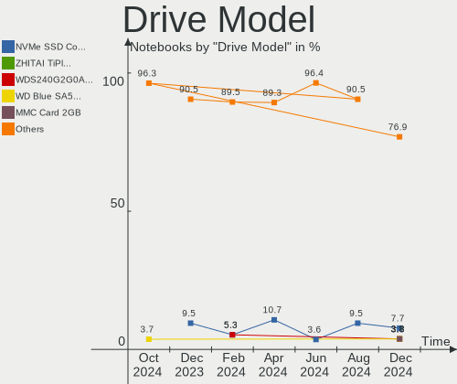

Gentoo Hardware Trends (Notebooks)
----------------------------------

A project to identify most popular hardware characteristics and track their change
over time based on data collected by Gentoo users at https://Linux-Hardware.org.

Anyone can contribute to this report by the [hw-probe](https://github.com/linuxhw/hw-probe) tool:

    sudo -E hw-probe -all -upload

Full-feature report is available here: https://linux-hardware.org/?view=trends

Period: Mar, 2022.

Contents
--------

* [ System ](#system)
  - [ OS                       ](#os)
  - [ OS Family                ](#os-family)
  - [ Kernel                   ](#kernel)
  - [ Kernel Family            ](#kernel-family)
  - [ Kernel Major Ver.        ](#kernel-major-ver)
  - [ Arch                     ](#arch)
  - [ DE                       ](#de)
  - [ Display Server           ](#display-server)
  - [ Display Manager          ](#display-manager)
  - [ OS Lang                  ](#os-lang)
  - [ Boot Mode                ](#boot-mode)
  - [ Filesystem               ](#filesystem)
  - [ Part. scheme             ](#part-scheme)
  - [ Dual Boot with Linux/BSD ](#dual-boot-with-linuxbsd)
  - [ Dual Boot (Win)          ](#dual-boot-win)

* [ Board ](#board)
  - [ Vendor                   ](#vendor)
  - [ Model                    ](#model)
  - [ Model Family             ](#model-family)
  - [ MFG Year                 ](#mfg-year)
  - [ Form Factor              ](#form-factor)
  - [ Secure Boot              ](#secure-boot)
  - [ Coreboot                 ](#coreboot)
  - [ RAM Size                 ](#ram-size)
  - [ RAM Used                 ](#ram-used)
  - [ Total Drives             ](#total-drives)
  - [ Has CD-ROM               ](#has-cd-rom)
  - [ Has Ethernet             ](#has-ethernet)
  - [ Has WiFi                 ](#has-wifi)
  - [ Has Bluetooth            ](#has-bluetooth)

* [ Location ](#location)
  - [ Country                  ](#country)
  - [ City                     ](#city)

* [ Drives ](#drives)
  - [ Drive Vendor             ](#drive-vendor)
  - [ Drive Model              ](#drive-model)
  - [ HDD Vendor               ](#hdd-vendor)
  - [ SSD Vendor               ](#ssd-vendor)
  - [ Drive Kind               ](#drive-kind)
  - [ Drive Connector          ](#drive-connector)
  - [ Drive Size               ](#drive-size)
  - [ Space Total              ](#space-total)
  - [ Space Used               ](#space-used)
  - [ Malfunc. Drives          ](#malfunc-drives)
  - [ Malfunc. Drive Vendor    ](#malfunc-drive-vendor)
  - [ Malfunc. HDD Vendor      ](#malfunc-hdd-vendor)
  - [ Malfunc. Drive Kind      ](#malfunc-drive-kind)
  - [ Failed Drives            ](#failed-drives)
  - [ Failed Drive Vendor      ](#failed-drive-vendor)
  - [ Drive Status             ](#drive-status)

* [ Storage controller ](#storage-controller)
  - [ Storage Vendor           ](#storage-vendor)
  - [ Storage Model            ](#storage-model)
  - [ Storage Kind             ](#storage-kind)

* [ Processor ](#processor)
  - [ CPU Vendor               ](#cpu-vendor)
  - [ CPU Model                ](#cpu-model)
  - [ CPU Model Family         ](#cpu-model-family)
  - [ CPU Cores                ](#cpu-cores)
  - [ CPU Sockets              ](#cpu-sockets)
  - [ CPU Threads              ](#cpu-threads)
  - [ CPU Op-Modes             ](#cpu-op-modes)
  - [ CPU Microcode            ](#cpu-microcode)
  - [ CPU Microarch            ](#cpu-microarch)

* [ Graphics ](#graphics)
  - [ GPU Vendor               ](#gpu-vendor)
  - [ GPU Model                ](#gpu-model)
  - [ GPU Combo                ](#gpu-combo)
  - [ GPU Driver               ](#gpu-driver)
  - [ GPU Memory               ](#gpu-memory)

* [ Monitor ](#monitor)
  - [ Monitor Vendor           ](#monitor-vendor)
  - [ Monitor Model            ](#monitor-model)
  - [ Monitor Resolution       ](#monitor-resolution)
  - [ Monitor Diagonal         ](#monitor-diagonal)
  - [ Monitor Width            ](#monitor-width)
  - [ Aspect Ratio             ](#aspect-ratio)
  - [ Monitor Area             ](#monitor-area)
  - [ Pixel Density            ](#pixel-density)
  - [ Multiple Monitors        ](#multiple-monitors)

* [ Network ](#network)
  - [ Net Controller Vendor    ](#net-controller-vendor)
  - [ Net Controller Model     ](#net-controller-model)
  - [ Wireless Vendor          ](#wireless-vendor)
  - [ Wireless Model           ](#wireless-model)
  - [ Ethernet Vendor          ](#ethernet-vendor)
  - [ Ethernet Model           ](#ethernet-model)
  - [ Net Controller Kind      ](#net-controller-kind)
  - [ Used Controller          ](#used-controller)
  - [ NICs                     ](#nics)
  - [ IPv6                     ](#ipv6)

* [ Bluetooth ](#bluetooth)
  - [ Bluetooth Vendor         ](#bluetooth-vendor)
  - [ Bluetooth Model          ](#bluetooth-model)

* [ Sound ](#sound)
  - [ Sound Vendor             ](#sound-vendor)
  - [ Sound Model              ](#sound-model)

* [ Memory ](#memory)
  - [ Memory Vendor            ](#memory-vendor)
  - [ Memory Model             ](#memory-model)
  - [ Memory Kind              ](#memory-kind)
  - [ Memory Form Factor       ](#memory-form-factor)
  - [ Memory Size              ](#memory-size)
  - [ Memory Speed             ](#memory-speed)

* [ Printers & scanners ](#printers--scanners)
  - [ Printer Vendor           ](#printer-vendor)
  - [ Printer Model            ](#printer-model)
  - [ Scanner Vendor           ](#scanner-vendor)
  - [ Scanner Model            ](#scanner-model)

* [ Camera ](#camera)
  - [ Camera Vendor            ](#camera-vendor)
  - [ Camera Model             ](#camera-model)

* [ Security ](#security)
  - [ Fingerprint Vendor       ](#fingerprint-vendor)
  - [ Fingerprint Model        ](#fingerprint-model)
  - [ Chipcard Vendor          ](#chipcard-vendor)
  - [ Chipcard Model           ](#chipcard-model)

* [ Unsupported ](#unsupported)
  - [ Unsupported Devices      ](#unsupported-devices)
  - [ Unsupported Device Types ](#unsupported-device-types)

System
------

OS
--

Installed operating systems

| Name       | Notebooks | Percent |
|------------|-----------|---------|
| Gentoo 2.7 | 6         | 33.33%  |
| Gentoo 2.6 | 6         | 33.33%  |
| Gentoo 2.8 | 5         | 27.78%  |
| Gentoo 1   | 1         | 5.56%   |

OS Family
---------

OS without a version

| Name   | Notebooks | Percent |
|--------|-----------|---------|
| Gentoo | 18        | 100%    |

Kernel
------

Version of the Linux kernel

| Version                   | Notebooks | Percent |
|---------------------------|-----------|---------|
| 5.15.26-gentoo-x86_64     | 2         | 11.11%  |
| 5.15.26-gentoo            | 2         | 11.11%  |
| 5.15.23-gentoo            | 2         | 11.11%  |
| 5.17.1-gentoo-r1-groovin  | 1         | 5.56%   |
| 5.17.1-gentoo-r1          | 1         | 5.56%   |
| 5.17.0-gentoo-x86_64      | 1         | 5.56%   |
| 5.16.9-gentoo-dist        | 1         | 5.56%   |
| 5.16.16-gentoo            | 1         | 5.56%   |
| 5.16.14-gentoo-x86_64-lto | 1         | 5.56%   |
| 5.16.14-gentoo            | 1         | 5.56%   |
| 5.16.11-gentoo-x86_64     | 1         | 5.56%   |
| 5.16.11-gentoo-dist       | 1         | 5.56%   |
| 5.16.10-zen1              | 1         | 5.56%   |
| 5.15.30-gentoo-dist       | 1         | 5.56%   |
| 5.15.23-gentoo-x86_64     | 1         | 5.56%   |

Kernel Family
-------------

Linux kernel without a distro release

| Version | Notebooks | Percent |
|---------|-----------|---------|
| 5.15.26 | 4         | 22.22%  |
| 5.15.23 | 3         | 16.67%  |
| 5.17.1  | 2         | 11.11%  |
| 5.16.14 | 2         | 11.11%  |
| 5.16.11 | 2         | 11.11%  |
| 5.17.0  | 1         | 5.56%   |
| 5.16.9  | 1         | 5.56%   |
| 5.16.16 | 1         | 5.56%   |
| 5.16.10 | 1         | 5.56%   |
| 5.15.30 | 1         | 5.56%   |

Kernel Major Ver.
-----------------

Linux kernel major version

| Version | Notebooks | Percent |
|---------|-----------|---------|
| 5.15    | 8         | 44.44%  |
| 5.16    | 7         | 38.89%  |
| 5.17    | 3         | 16.67%  |

Arch
----

OS architecture (x86_64, i586, etc.)

| Name   | Notebooks | Percent |
|--------|-----------|---------|
| x86_64 | 18        | 100%    |

DE
--

Desktop Environment

| Name     | Notebooks | Percent |
|----------|-----------|---------|
| Unknown  | 6         | 33.33%  |
| KDE5     | 3         | 16.67%  |
| GNOME    | 3         | 16.67%  |
| MATE     | 2         | 11.11%  |
| XFCE     | 1         | 5.56%   |
| openbox  | 1         | 5.56%   |
| KDE      | 1         | 5.56%   |
| Cinnamon | 1         | 5.56%   |

Display Server
--------------

X11 or Wayland

| Name    | Notebooks | Percent |
|---------|-----------|---------|
| X11     | 10        | 55.56%  |
| Unknown | 6         | 33.33%  |
| Wayland | 1         | 5.56%   |
| Tty     | 1         | 5.56%   |

Display Manager
---------------

SDDM, LightDM, etc.

| Name    | Notebooks | Percent |
|---------|-----------|---------|
| Unknown | 12        | 66.67%  |
| SDDM    | 3         | 16.67%  |
| LightDM | 2         | 11.11%  |
| GDM     | 1         | 5.56%   |

OS Lang
-------

Language

| Lang    | Notebooks | Percent |
|---------|-----------|---------|
| en_US   | 6         | 33.33%  |
| C.UTF8  | 3         | 16.67%  |
| Unknown | 3         | 16.67%  |
| en_GB   | 2         | 11.11%  |
| ru_RU   | 1         | 5.56%   |
| fr_CA   | 1         | 5.56%   |
| es_AR   | 1         | 5.56%   |
| C       | 1         | 5.56%   |

Boot Mode
---------

EFI or BIOS

| Mode | Notebooks | Percent |
|------|-----------|---------|
| EFI  | 14        | 77.78%  |
| BIOS | 4         | 22.22%  |

Filesystem
----------

Type of filesystem

| Type  | Notebooks | Percent |
|-------|-----------|---------|
| Ext4  | 13        | 72.22%  |
| Btrfs | 4         | 22.22%  |
| F2fs  | 1         | 5.56%   |

Part. scheme
------------

Scheme of partitioning

| Type    | Notebooks | Percent |
|---------|-----------|---------|
| GPT     | 17        | 94.44%  |
| Unknown | 1         | 5.56%   |

Dual Boot with Linux/BSD
------------------------

Hosting more than one Linux/BSD

| Dual boot | Notebooks | Percent |
|-----------|-----------|---------|
| No        | 15        | 83.33%  |
| Yes       | 3         | 16.67%  |

Dual Boot (Win)
---------------

Hosting Linux and Windows

| Dual boot | Notebooks | Percent |
|-----------|-----------|---------|
| No        | 12        | 66.67%  |
| Yes       | 6         | 33.33%  |

Board
-----

Vendor
------

Motherboard manufacturer

| Name            | Notebooks | Percent |
|-----------------|-----------|---------|
| Hewlett-Packard | 4         | 22.22%  |
| Timi            | 2         | 11.11%  |
| MSI             | 2         | 11.11%  |
| Lenovo          | 2         | 11.11%  |
| TUXEDO          | 1         | 5.56%   |
| Toshiba         | 1         | 5.56%   |
| Razer           | 1         | 5.56%   |
| HUAWEI          | 1         | 5.56%   |
| Framework       | 1         | 5.56%   |
| Dell            | 1         | 5.56%   |
| BANGHO          | 1         | 5.56%   |
| Apple           | 1         | 5.56%   |

Model
-----

Motherboard model

| Name                              | Notebooks | Percent |
|-----------------------------------|-----------|---------|
| TUXEDO InfinityBook Pro 14 Gen6   | 1         | 5.56%   |
| Toshiba Satellite L50-C           | 1         | 5.56%   |
| Timi RedmiBook Air 13             | 1         | 5.56%   |
| Timi Mi Laptop Pro 15             | 1         | 5.56%   |
| Razer Blade 15 (2022) - RZ09-0421 | 1         | 5.56%   |
| MSI MS-7A34                       | 1         | 5.56%   |
| MSI GE66 Raider 11UE              | 1         | 5.56%   |
| Lenovo Legion Y740-17IRHg 81UJ    | 1         | 5.56%   |
| Lenovo Legion Y530-15ICH 81FV     | 1         | 5.56%   |
| HUAWEI NBLK-WAX9X                 | 1         | 5.56%   |
| HP Victus by Laptop 16-e0xxx      | 1         | 5.56%   |
| HP Pavilion ZV6100 (EE984EA#ABZ)  | 1         | 5.56%   |
| HP OMEN Laptop 15-en0xxx          | 1         | 5.56%   |
| HP EliteBook 850 G8 Notebook PC   | 1         | 5.56%   |
| Framework Laptop                  | 1         | 5.56%   |
| Dell XPS 12-9Q33                  | 1         | 5.56%   |
| BANGHO MAX G0101                  | 1         | 5.56%   |
| Apple MacBookPro11,3              | 1         | 5.56%   |

Model Family
------------

Motherboard model prefix

| Name                | Notebooks | Percent |
|---------------------|-----------|---------|
| Lenovo Legion       | 2         | 11.11%  |
| TUXEDO InfinityBook | 1         | 5.56%   |
| Toshiba Satellite   | 1         | 5.56%   |
| Timi RedmiBook      | 1         | 5.56%   |
| Timi Mi             | 1         | 5.56%   |
| Razer Blade         | 1         | 5.56%   |
| MSI MS-7A34         | 1         | 5.56%   |
| MSI GE66            | 1         | 5.56%   |
| HUAWEI NBLK-WAX9X   | 1         | 5.56%   |
| HP Victus           | 1         | 5.56%   |
| HP Pavilion         | 1         | 5.56%   |
| HP OMEN             | 1         | 5.56%   |
| HP EliteBook        | 1         | 5.56%   |
| Framework Laptop    | 1         | 5.56%   |
| Dell XPS            | 1         | 5.56%   |
| BANGHO MAX          | 1         | 5.56%   |
| Apple MacBookPro11  | 1         | 5.56%   |

MFG Year
--------

Motherboard manufacture year

| Year | Notebooks | Percent |
|------|-----------|---------|
| 2021 | 5         | 27.78%  |
| 2019 | 3         | 16.67%  |
| 2014 | 3         | 16.67%  |
| 2020 | 2         | 11.11%  |
| 2022 | 1         | 5.56%   |
| 2018 | 1         | 5.56%   |
| 2017 | 1         | 5.56%   |
| 2015 | 1         | 5.56%   |
| 2006 | 1         | 5.56%   |

Form Factor
-----------

Physical design of the computer

| Name     | Notebooks | Percent |
|----------|-----------|---------|
| Notebook | 18        | 100%    |

Secure Boot
-----------

Enabled or disabled

| State    | Notebooks | Percent |
|----------|-----------|---------|
| Disabled | 18        | 100%    |

Coreboot
--------

Have coreboot on board

| Used | Notebooks | Percent |
|------|-----------|---------|
| No   | 18        | 100%    |

RAM Size
--------

Total RAM memory

| Size in GB  | Notebooks | Percent |
|-------------|-----------|---------|
| 16.01-24.0  | 8         | 44.44%  |
| 4.01-8.0    | 3         | 16.67%  |
| 8.01-16.0   | 3         | 16.67%  |
| 64.01-256.0 | 2         | 11.11%  |
| 32.01-64.0  | 1         | 5.56%   |
| 1.01-2.0    | 1         | 5.56%   |

RAM Used
--------

Used RAM memory

| Used GB   | Notebooks | Percent |
|-----------|-----------|---------|
| 2.01-3.0  | 5         | 27.78%  |
| 4.01-8.0  | 3         | 16.67%  |
| 3.01-4.0  | 3         | 16.67%  |
| 1.01-2.0  | 2         | 11.11%  |
| 0.51-1.0  | 2         | 11.11%  |
| 0.01-0.5  | 2         | 11.11%  |
| 8.01-16.0 | 1         | 5.56%   |

Total Drives
------------

Number of drives on board

| Drives | Notebooks | Percent |
|--------|-----------|---------|
| 1      | 12        | 66.67%  |
| 2      | 6         | 33.33%  |

Has CD-ROM
----------

Has CD-ROM on board

| Presented | Notebooks | Percent |
|-----------|-----------|---------|
| No        | 15        | 83.33%  |
| Yes       | 3         | 16.67%  |

Has Ethernet
------------

Has Ethernet on board

| Presented | Notebooks | Percent |
|-----------|-----------|---------|
| Yes       | 9         | 50%     |
| No        | 9         | 50%     |

Has WiFi
--------

Has WiFi module

| Presented | Notebooks | Percent |
|-----------|-----------|---------|
| Yes       | 18        | 100%    |

Has Bluetooth
-------------

Has Bluetooth module

| Presented | Notebooks | Percent |
|-----------|-----------|---------|
| Yes       | 14        | 77.78%  |
| No        | 4         | 22.22%  |

Location
--------

Country
-------

Geographic location (country)

| Country     | Notebooks | Percent |
|-------------|-----------|---------|
| USA         | 4         | 22.22%  |
| Russia      | 2         | 11.11%  |
| China       | 2         | 11.11%  |
| UK          | 1         | 5.56%   |
| Turkey      | 1         | 5.56%   |
| Sweden      | 1         | 5.56%   |
| Romania     | 1         | 5.56%   |
| Poland      | 1         | 5.56%   |
| Netherlands | 1         | 5.56%   |
| Nepal       | 1         | 5.56%   |
| Germany     | 1         | 5.56%   |
| Canada      | 1         | 5.56%   |
| Argentina   | 1         | 5.56%   |

City
----

Geographic location (city)

| City              | Notebooks | Percent |
|-------------------|-----------|---------|
| Warsaw            | 1         | 5.56%   |
| Unterschleissheim | 1         | 5.56%   |
| Stockholm         | 1         | 5.56%   |
| St Petersburg     | 1         | 5.56%   |
| Québec           | 1         | 5.56%   |
| Ocala             | 1         | 5.56%   |
| Oakland           | 1         | 5.56%   |
| Magadan           | 1         | 5.56%   |
| Leidschendam      | 1         | 5.56%   |
| Kathmandu         | 1         | 5.56%   |
| Houston           | 1         | 5.56%   |
| Garden Grove      | 1         | 5.56%   |
| Foshan            | 1         | 5.56%   |
| Farnborough       | 1         | 5.56%   |
| Cluj-Napoca       | 1         | 5.56%   |
| Bernal            | 1         | 5.56%   |
| Beijing           | 1         | 5.56%   |
| Balıkesir        | 1         | 5.56%   |

Drives
------

Drive Vendor
------------

Hard drive vendors

| Vendor                         | Notebooks | Drives | Percent |
|--------------------------------|-----------|--------|---------|
| Samsung Electronics            | 6         | 8      | 25%     |
| WDC                            | 5         | 5      | 20.83%  |
| SanDisk                        | 2         | 2      | 8.33%   |
| XrayDisk                       | 1         | 1      | 4.17%   |
| Toshiba                        | 1         | 1      | 4.17%   |
| Solid State Storage Technology | 1         | 1      | 4.17%   |
| SK Hynix                       | 1         | 1      | 4.17%   |
| Seagate                        | 1         | 1      | 4.17%   |
| Micron Technology              | 1         | 1      | 4.17%   |
| KIOXIA-EXCERIA                 | 1         | 1      | 4.17%   |
| Kingston                       | 1         | 1      | 4.17%   |
| Intel                          | 1         | 1      | 4.17%   |
| Crucial                        | 1         | 1      | 4.17%   |
| Apple                          | 1         | 1      | 4.17%   |

Drive Model
-----------

Hard drive models

| Model                                  | Notebooks | Percent |
|----------------------------------------|-----------|---------|
| XrayDisk SSD 128GB                     | 1         | 3.85%   |
| WDC WDS500G3X0C-00SJG0 500GB           | 1         | 3.85%   |
| WDC WDS200T2B0C-00PXH0 2TB             | 1         | 3.85%   |
| WDC WD3200LPVX-22V0TT0 320GB           | 1         | 3.85%   |
| WDC WD10EZEX-08M2NA0 1TB               | 1         | 3.85%   |
| WDC PC SN730 SDBPNTY-1T00-1006 1TB     | 1         | 3.85%   |
| Toshiba MQ01ABD100 1TB                 | 1         | 3.85%   |
| Solid State Storage NVMe SSD Drive 1TB | 1         | 3.85%   |
| SK Hynix SH920 mSATA 256GB SSD         | 1         | 3.85%   |
| Seagate ST1000LM049-2GH172 1TB         | 1         | 3.85%   |
| SanDisk SD9SN8W-128G-1006 128GB SSD    | 1         | 3.85%   |
| Sandisk NVMe SSD Drive 2TB             | 1         | 3.85%   |
| Samsung SSD 980 PRO 500GB              | 1         | 3.85%   |
| Samsung SSD 980 PRO 2TB                | 1         | 3.85%   |
| Samsung SSD 970 EVO Plus 500GB         | 1         | 3.85%   |
| Samsung SSD 870 EVO 1TB                | 1         | 3.85%   |
| Samsung PSSD T7 500GB                  | 1         | 3.85%   |
| Samsung MZVLB512HAJQ-00000 512GB       | 1         | 3.85%   |
| Samsung MZVL21T0HCLR-00B00 1TB         | 1         | 3.85%   |
| Samsung MZNLH512HALU-00000 512GB SSD   | 1         | 3.85%   |
| Micron 2300 NVMe 1024GB                | 1         | 3.85%   |
| KIOXIA-EXCERIA SSD 500GB               | 1         | 3.85%   |
| Kingston SA2000M8500G 500GB            | 1         | 3.85%   |
| Intel SSDPEKNW010T8 1TB                | 1         | 3.85%   |
| Crucial CT500MX500SSD1 500GB           | 1         | 3.85%   |
| Apple SSD SM0512F 500GB                | 1         | 3.85%   |

HDD Vendor
----------

Hard disk drive vendors

| Vendor  | Notebooks | Drives | Percent |
|---------|-----------|--------|---------|
| WDC     | 2         | 2      | 50%     |
| Toshiba | 1         | 1      | 25%     |
| Seagate | 1         | 1      | 25%     |

SSD Vendor
----------

Solid state drive vendors

| Vendor              | Notebooks | Drives | Percent |
|---------------------|-----------|--------|---------|
| Samsung Electronics | 3         | 3      | 37.5%   |
| XrayDisk            | 1         | 1      | 12.5%   |
| SK Hynix            | 1         | 1      | 12.5%   |
| SanDisk             | 1         | 1      | 12.5%   |
| Crucial             | 1         | 1      | 12.5%   |
| Apple               | 1         | 1      | 12.5%   |

Drive Kind
----------

HDD or SSD

| Kind | Notebooks | Drives | Percent |
|------|-----------|--------|---------|
| NVMe | 11        | 14     | 47.83%  |
| SSD  | 8         | 8      | 34.78%  |
| HDD  | 4         | 4      | 17.39%  |

Drive Connector
---------------

SATA, SAS, NVMe, etc.

| Type | Notebooks | Drives | Percent |
|------|-----------|--------|---------|
| NVMe | 11        | 14     | 52.38%  |
| SATA | 9         | 11     | 42.86%  |
| SAS  | 1         | 1      | 4.76%   |

Drive Size
----------

Size of hard drive

| Size in TB | Notebooks | Drives | Percent |
|------------|-----------|--------|---------|
| 0.01-0.5   | 6         | 7      | 54.55%  |
| 0.51-1.0   | 5         | 5      | 45.45%  |

Space Total
-----------

Amount of disk space available on the file system

| Size in GB     | Notebooks | Percent |
|----------------|-----------|---------|
| 251-500        | 8         | 44.44%  |
| 501-1000       | 4         | 22.22%  |
| 1001-2000      | 2         | 11.11%  |
| 1-20           | 2         | 11.11%  |
| More than 3000 | 1         | 5.56%   |
| Unknown        | 1         | 5.56%   |

Space Used
----------

Amount of used disk space

| Used GB | Notebooks | Percent |
|---------|-----------|---------|
| 251-500 | 5         | 27.78%  |
| 1-20    | 5         | 27.78%  |
| 21-50   | 3         | 16.67%  |
| 51-100  | 3         | 16.67%  |
| 101-250 | 1         | 5.56%   |
| Unknown | 1         | 5.56%   |

Malfunc. Drives
---------------

Drive models with a malfunction

| Model                          | Notebooks | Drives | Percent |
|--------------------------------|-----------|--------|---------|
| WDC WD10EZEX-08M2NA0 1TB       | 1         | 1      | 50%     |
| SK Hynix SH920 mSATA 256GB SSD | 1         | 1      | 50%     |

Malfunc. Drive Vendor
---------------------

Vendors of faulty drives

| Vendor   | Notebooks | Drives | Percent |
|----------|-----------|--------|---------|
| WDC      | 1         | 1      | 50%     |
| SK Hynix | 1         | 1      | 50%     |

Malfunc. HDD Vendor
-------------------

Vendors of faulty HDD drives

| Vendor | Notebooks | Drives | Percent |
|--------|-----------|--------|---------|
| WDC    | 1         | 1      | 100%    |

Malfunc. Drive Kind
-------------------

Kinds of faulty drives

| Kind | Notebooks | Drives | Percent |
|------|-----------|--------|---------|
| SSD  | 1         | 1      | 50%     |
| HDD  | 1         | 1      | 50%     |

Failed Drives
-------------

Failed drive models

Zero info for selected period =(

Failed Drive Vendor
-------------------

Failed drive vendors

Zero info for selected period =(

Drive Status
------------

Number of failed and malfunc. drives

| Status   | Notebooks | Drives | Percent |
|----------|-----------|--------|---------|
| Works    | 16        | 21     | 76.19%  |
| Detected | 3         | 3      | 14.29%  |
| Malfunc  | 2         | 2      | 9.52%   |

Storage controller
------------------

Storage Vendor
--------------

Storage controller vendors

| Vendor                         | Notebooks | Percent |
|--------------------------------|-----------|---------|
| Intel                          | 9         | 36%     |
| Samsung Electronics            | 6         | 24%     |
| Sandisk                        | 3         | 12%     |
| AMD                            | 3         | 12%     |
| Solid State Storage Technology | 1         | 4%      |
| Micron Technology              | 1         | 4%      |
| KIOXIA                         | 1         | 4%      |
| Kingston Technology Company    | 1         | 4%      |

Storage Model
-------------

Storage controller models

| Model                                                                          | Notebooks | Percent |
|--------------------------------------------------------------------------------|-----------|---------|
| Samsung NVMe SSD Controller PM9A1/PM9A3/980PRO                                 | 3         | 11.54%  |
| Sandisk WD Black SN750 / PC SN730 NVMe SSD                                     | 2         | 7.69%   |
| Samsung NVMe SSD Controller SM981/PM981/PM983                                  | 2         | 7.69%   |
| Intel Volume Management Device NVMe RAID Controller                            | 2         | 7.69%   |
| Intel Sunrise Point-LP SATA Controller [AHCI mode]                             | 2         | 7.69%   |
| Intel Cannon Lake Mobile PCH SATA AHCI Controller                              | 2         | 7.69%   |
| AMD FCH SATA Controller [AHCI mode]                                            | 2         | 7.69%   |
| Solid State Storage Non-Volatile memory controller                             | 1         | 3.85%   |
| Sandisk Non-Volatile memory controller                                         | 1         | 3.85%   |
| Samsung Apple PCIe SSD                                                         | 1         | 3.85%   |
| Micron Non-Volatile memory controller                                          | 1         | 3.85%   |
| KIOXIA NVMe SSD                                                                | 1         | 3.85%   |
| Kingston Company A2000 NVMe SSD                                                | 1         | 3.85%   |
| Intel SSD 660P Series                                                          | 1         | 3.85%   |
| Intel 8 Series/C220 Series Chipset Family 6-port SATA Controller 1 [AHCI mode] | 1         | 3.85%   |
| Intel 8 Series SATA Controller 1 [AHCI mode]                                   | 1         | 3.85%   |
| AMD IXP SB4x0 IDE Controller                                                   | 1         | 3.85%   |
| AMD 300 Series Chipset SATA Controller                                         | 1         | 3.85%   |

Storage Kind
------------

Kind of storage controller (IDE, SATA, NVMe, SAS, ...)

| Kind | Notebooks | Percent |
|------|-----------|---------|
| NVMe | 11        | 47.83%  |
| SATA | 9         | 39.13%  |
| RAID | 2         | 8.7%    |
| IDE  | 1         | 4.35%   |

Processor
---------

CPU Vendor
----------

Processor vendors

| Vendor | Notebooks | Percent |
|--------|-----------|---------|
| Intel  | 13        | 72.22%  |
| AMD    | 5         | 27.78%  |

CPU Model
---------

Processor models

| Model                                         | Notebooks | Percent |
|-----------------------------------------------|-----------|---------|
| Intel 11th Gen Core i7-1165G7 @ 2.80GHz       | 2         | 11.11%  |
| Intel Core i7-9750H CPU @ 2.60GHz             | 1         | 5.56%   |
| Intel Core i7-8750H CPU @ 2.20GHz             | 1         | 5.56%   |
| Intel Core i7-6500U CPU @ 2.50GHz             | 1         | 5.56%   |
| Intel Core i7-4870HQ CPU @ 2.50GHz            | 1         | 5.56%   |
| Intel Core i7-4500U CPU @ 1.80GHz             | 1         | 5.56%   |
| Intel Core i7-10510U CPU @ 1.80GHz            | 1         | 5.56%   |
| Intel Core i5-10210Y CPU @ 1.00GHz            | 1         | 5.56%   |
| Intel Core i3-4000M CPU @ 2.40GHz             | 1         | 5.56%   |
| Intel 12th Gen Core i7-12800H                 | 1         | 5.56%   |
| Intel 11th Gen Core i7-11800H @ 2.30GHz       | 1         | 5.56%   |
| Intel 11th Gen Core i7-11370H @ 3.30GHz       | 1         | 5.56%   |
| AMD Ryzen 7 5800H with Radeon Graphics        | 1         | 5.56%   |
| AMD Ryzen 7 4800H with Radeon Graphics        | 1         | 5.56%   |
| AMD Ryzen 5 3500U with Radeon Vega Mobile Gfx | 1         | 5.56%   |
| AMD Ryzen 5 1500X Quad-Core Processor         | 1         | 5.56%   |
| AMD Athlon 64 Processor 3200+                 | 1         | 5.56%   |

CPU Model Family
----------------

Processor model prefix

| Model         | Notebooks | Percent |
|---------------|-----------|---------|
| Intel Core i7 | 6         | 33.33%  |
| Other         | 5         | 27.78%  |
| AMD Ryzen 7   | 2         | 11.11%  |
| AMD Ryzen 5   | 2         | 11.11%  |
| Intel Core i5 | 1         | 5.56%   |
| Intel Core i3 | 1         | 5.56%   |
| AMD Athlon 64 | 1         | 5.56%   |

CPU Cores
---------

Number of processor cores

| Number | Notebooks | Percent |
|--------|-----------|---------|
| 4      | 8         | 44.44%  |
| 8      | 3         | 16.67%  |
| 2      | 3         | 16.67%  |
| 6      | 2         | 11.11%  |
| 14     | 1         | 5.56%   |
| 1      | 1         | 5.56%   |

CPU Sockets
-----------

Number of sockets

| Number | Notebooks | Percent |
|--------|-----------|---------|
| 1      | 18        | 100%    |

CPU Threads
-----------

Threads per core (Hyper-Threading)

| Number | Notebooks | Percent |
|--------|-----------|---------|
| 2      | 17        | 94.44%  |
| 1      | 1         | 5.56%   |

CPU Op-Modes
------------

CPU Operation Modes (32-bit, 64-bit)

| Op mode        | Notebooks | Percent |
|----------------|-----------|---------|
| 32-bit, 64-bit | 18        | 100%    |

CPU Microcode
-------------

Microcode number

| Number     | Notebooks | Percent |
|------------|-----------|---------|
| 0x806c1    | 3         | 16.67%  |
| 0x806ec    | 2         | 11.11%  |
| Unknown    | 2         | 11.11%  |
| 0x906ea    | 1         | 5.56%   |
| 0x906a3    | 1         | 5.56%   |
| 0x806d1    | 1         | 5.56%   |
| 0x406e3    | 1         | 5.56%   |
| 0x40661    | 1         | 5.56%   |
| 0x40651    | 1         | 5.56%   |
| 0x306c3    | 1         | 5.56%   |
| 0x0a50000c | 1         | 5.56%   |
| 0x08600106 | 1         | 5.56%   |
| 0x08108109 | 1         | 5.56%   |
| 0x08001105 | 1         | 5.56%   |

CPU Microarch
-------------

Microarchitecture

| Name             | Notebooks | Percent |
|------------------|-----------|---------|
| KabyLake         | 4         | 22.22%  |
| TigerLake        | 3         | 16.67%  |
| Haswell          | 3         | 16.67%  |
| Zen+             | 1         | 5.56%   |
| Zen 3            | 1         | 5.56%   |
| Zen 2            | 1         | 5.56%   |
| Zen              | 1         | 5.56%   |
| Skylake          | 1         | 5.56%   |
| K8 Hammer        | 1         | 5.56%   |
| Alderlake Hybrid | 1         | 5.56%   |
| Unknown          | 1         | 5.56%   |

Graphics
--------

GPU Vendor
----------

Vendors of graphics cards

| Vendor | Notebooks | Percent |
|--------|-----------|---------|
| Intel  | 12        | 48%     |
| Nvidia | 9         | 36%     |
| AMD    | 4         | 16%     |

GPU Model
---------

Graphics card models

| Model                                                                | Notebooks | Percent |
|----------------------------------------------------------------------|-----------|---------|
| Intel TigerLake-LP GT2 [Iris Xe Graphics]                            | 3         | 11.54%  |
| Intel CoffeeLake-H GT2 [UHD Graphics 630]                            | 2         | 7.69%   |
| Nvidia TU116M [GeForce GTX 1660 Ti Mobile]                           | 1         | 3.85%   |
| Nvidia TU106BM [GeForce RTX 2070 Mobile / Max-Q]                     | 1         | 3.85%   |
| Nvidia GP108M [GeForce MX250]                                        | 1         | 3.85%   |
| Nvidia GP107M [GeForce GTX 1050 Ti Mobile]                           | 1         | 3.85%   |
| Nvidia GP106 [GeForce GTX 1060 3GB]                                  | 1         | 3.85%   |
| Nvidia GM108M [GeForce 930M]                                         | 1         | 3.85%   |
| Nvidia GK107M [GeForce GT 750M Mac Edition]                          | 1         | 3.85%   |
| Nvidia GA106M [GeForce RTX 3060 Mobile / Max-Q]                      | 1         | 3.85%   |
| Nvidia GA104M [Geforce RTX 3070 Ti Laptop GPU]                       | 1         | 3.85%   |
| Intel UHD Graphics 615                                               | 1         | 3.85%   |
| Intel TigerLake-H GT1 [UHD Graphics]                                 | 1         | 3.85%   |
| Intel Skylake GT2 [HD Graphics 520]                                  | 1         | 3.85%   |
| Intel Haswell-ULT Integrated Graphics Controller                     | 1         | 3.85%   |
| Intel CometLake-U GT2 [UHD Graphics]                                 | 1         | 3.85%   |
| Intel Alder Lake-P Integrated Graphics Controller                    | 1         | 3.85%   |
| Intel 4th Gen Core Processor Integrated Graphics Controller          | 1         | 3.85%   |
| AMD RS480M [Mobility Radeon Xpress 200]                              | 1         | 3.85%   |
| AMD Renoir                                                           | 1         | 3.85%   |
| AMD Picasso/Raven 2 [Radeon Vega Series / Radeon Vega Mobile Series] | 1         | 3.85%   |
| AMD Navi 14 [Radeon RX 5500/5500M / Pro 5500M]                       | 1         | 3.85%   |
| AMD Cezanne                                                          | 1         | 3.85%   |

GPU Combo
---------

Combinations of graphics cards

| Name           | Notebooks | Percent |
|----------------|-----------|---------|
| Intel + Nvidia | 6         | 33.33%  |
| 1 x Intel      | 6         | 33.33%  |
| 1 x Nvidia     | 2         | 11.11%  |
| 1 x AMD        | 2         | 11.11%  |
| 2 x AMD        | 1         | 5.56%   |
| AMD + Nvidia   | 1         | 5.56%   |

GPU Driver
----------

Free vs proprietary

| Driver      | Notebooks | Percent |
|-------------|-----------|---------|
| Free        | 10        | 55.56%  |
| Proprietary | 7         | 38.89%  |
| Unknown     | 1         | 5.56%   |

GPU Memory
----------

Total video memory

| Size in GB | Notebooks | Percent |
|------------|-----------|---------|
| Unknown    | 11        | 61.11%  |
| 3.01-4.0   | 2         | 11.11%  |
| 1.01-2.0   | 2         | 11.11%  |
| 0.01-0.5   | 2         | 11.11%  |
| 0.51-1.0   | 1         | 5.56%   |

Monitor
-------

Monitor Vendor
--------------

Monitor vendors

| Vendor              | Notebooks | Percent |
|---------------------|-----------|---------|
| LG Display          | 3         | 16.67%  |
| Sharp               | 2         | 11.11%  |
| CSO                 | 2         | 11.11%  |
| Chimei Innolux      | 2         | 11.11%  |
| BOE                 | 2         | 11.11%  |
| ViewSonic           | 1         | 5.56%   |
| Samsung Electronics | 1         | 5.56%   |
| InfoVision          | 1         | 5.56%   |
| Goldstar            | 1         | 5.56%   |
| AU Optronics        | 1         | 5.56%   |
| ASUSTek Computer    | 1         | 5.56%   |
| Apple               | 1         | 5.56%   |

Monitor Model
-------------

Monitor models

| Model                                                                 | Notebooks | Percent |
|-----------------------------------------------------------------------|-----------|---------|
| ViewSonic LCD Monitor VSC1B35 1920x1080 530x300mm 24.0-inch           | 1         | 5.56%   |
| Sharp LQ156T1JW03 SHP1529 2560x1440 344x194mm 15.5-inch               | 1         | 5.56%   |
| Sharp LQ156M1JW01 SHP14C3 1920x1080 344x194mm 15.5-inch               | 1         | 5.56%   |
| Samsung Electronics LCD Monitor SDC415F 3840x2160 344x194mm 15.5-inch | 1         | 5.56%   |
| LG Display LCD Monitor LGD05FE 1920x1080 344x194mm 15.5-inch          | 1         | 5.56%   |
| LG Display LCD Monitor LGD05E5 1920x1080 344x194mm 15.5-inch          | 1         | 5.56%   |
| LG Display LCD Monitor LGD03FD 1920x1080 276x156mm 12.5-inch          | 1         | 5.56%   |
| InfoVision LCD Monitor IVO3D41 1920x1080 344x194mm 15.5-inch          | 1         | 5.56%   |
| Goldstar LG HDR 4K GSM7707 3840x2160 600x340mm 27.2-inch              | 1         | 5.56%   |
| CSO LCD Monitor CSO1402 2880x1800 302x188mm 14.0-inch                 | 1         | 5.56%   |
| CSO LCD Monitor CSO1302 2560x1600 286x179mm 13.3-inch                 | 1         | 5.56%   |
| Chimei Innolux LCD Monitor CMN15CA 1366x768 344x193mm 15.5-inch       | 1         | 5.56%   |
| Chimei Innolux LCD Monitor CMN15AB 1366x768 344x193mm 15.5-inch       | 1         | 5.56%   |
| BOE LCD Monitor BOE095F 2256x1504 285x190mm 13.5-inch                 | 1         | 5.56%   |
| BOE LCD Monitor BOE0877 1920x1080 309x173mm 13.9-inch                 | 1         | 5.56%   |
| AU Optronics LCD Monitor AUO329D 1920x1080 382x214mm 17.2-inch        | 1         | 5.56%   |
| ASUSTek Computer VG248 AUS24AC 1920x1080 530x300mm 24.0-inch          | 1         | 5.56%   |
| Apple Color LCD APPA022 2880x1800 331x207mm 15.4-inch                 | 1         | 5.56%   |

Monitor Resolution
------------------

Monitor screen resolution

| Resolution      | Notebooks | Percent |
|-----------------|-----------|---------|
| 1920x1080 (FHD) | 8         | 47.06%  |
| 3840x2160 (4K)  | 2         | 11.76%  |
| 2880x1800       | 2         | 11.76%  |
| 1366x768 (WXGA) | 2         | 11.76%  |
| 2560x1600       | 1         | 5.88%   |
| 2560x1440 (QHD) | 1         | 5.88%   |
| 2256x1504       | 1         | 5.88%   |

Monitor Diagonal
----------------

Diagonal size in inches

| Inches | Notebooks | Percent |
|--------|-----------|---------|
| 15     | 9         | 52.94%  |
| 13     | 3         | 17.65%  |
| 27     | 1         | 5.88%   |
| 24     | 1         | 5.88%   |
| 17     | 1         | 5.88%   |
| 14     | 1         | 5.88%   |
| 12     | 1         | 5.88%   |

Monitor Width
-------------

Physical width

| Width in mm | Notebooks | Percent |
|-------------|-----------|---------|
| 301-350     | 11        | 64.71%  |
| 201-300     | 3         | 17.65%  |
| 501-600     | 2         | 11.76%  |
| 351-400     | 1         | 5.88%   |

Aspect Ratio
------------

Proportional relationship between the width and the height

| Ratio | Notebooks | Percent |
|-------|-----------|---------|
| 16/9  | 12        | 75%     |
| 16/10 | 3         | 18.75%  |
| 3/2   | 1         | 6.25%   |

Monitor Area
------------

Area in inch²

| Area in inch² | Notebooks | Percent |
|----------------|-----------|---------|
| 101-110        | 9         | 52.94%  |
| 81-90          | 3         | 17.65%  |
| 71-80          | 1         | 5.88%   |
| 61-70          | 1         | 5.88%   |
| 301-350        | 1         | 5.88%   |
| 201-250        | 1         | 5.88%   |
| 121-130        | 1         | 5.88%   |

Pixel Density
-------------

Pixels per inch

| Density       | Notebooks | Percent |
|---------------|-----------|---------|
| 161-240       | 6         | 35.29%  |
| 121-160       | 6         | 35.29%  |
| More than 240 | 2         | 11.76%  |
| 51-100        | 2         | 11.76%  |
| 101-120       | 1         | 5.88%   |

Multiple Monitors
-----------------

Total monitors connected

| Total | Notebooks | Percent |
|-------|-----------|---------|
| 1     | 15        | 83.33%  |
| 2     | 2         | 11.11%  |
| 0     | 1         | 5.56%   |

Network
-------

Net Controller Vendor
---------------------

Controller vendors

| Vendor                | Notebooks | Percent |
|-----------------------|-----------|---------|
| Intel                 | 12        | 48%     |
| Realtek Semiconductor | 10        | 40%     |
| Broadcom              | 2         | 8%      |
| AMD                   | 1         | 4%      |

Net Controller Model
--------------------

Controller models

| Model                                                               | Notebooks | Percent |
|---------------------------------------------------------------------|-----------|---------|
| Realtek RTL8111/8168/8411 PCI Express Gigabit Ethernet Controller   | 7         | 25%     |
| Intel Wi-Fi 6 AX210/AX211/AX411 160MHz                              | 2         | 7.14%   |
| Intel Wi-Fi 6 AX201                                                 | 2         | 7.14%   |
| Intel Wi-Fi 6 AX200                                                 | 2         | 7.14%   |
| Realtek RTL88x2bu [AC1200 Techkey]                                  | 1         | 3.57%   |
| Realtek RTL8852AE 802.11ax PCIe Wireless Network Adapter            | 1         | 3.57%   |
| Realtek RTL8822CE 802.11ac PCIe Wireless Network Adapter            | 1         | 3.57%   |
| Realtek RTL8822BE 802.11a/b/g/n/ac WiFi adapter                     | 1         | 3.57%   |
| Realtek RTL-8100/8101L/8139 PCI Fast Ethernet Adapter               | 1         | 3.57%   |
| Realtek Killer E3000 2.5GbE Controller                              | 1         | 3.57%   |
| Intel Wireless 7260                                                 | 1         | 3.57%   |
| Intel Wireless 3165                                                 | 1         | 3.57%   |
| Intel Wireless 3160                                                 | 1         | 3.57%   |
| Intel Comet Lake PCH-LP CNVi WiFi                                   | 1         | 3.57%   |
| Intel Cannon Lake PCH CNVi WiFi                                     | 1         | 3.57%   |
| Intel Alder Lake-P PCH CNVi WiFi                                    | 1         | 3.57%   |
| Broadcom BCM43602 802.11ac Wireless LAN SoC                         | 1         | 3.57%   |
| Broadcom BCM4318 [AirForce One 54g] 802.11g Wireless LAN Controller | 1         | 3.57%   |
| AMD IXP SB400 AC'97 Modem Controller                                | 1         | 3.57%   |

Wireless Vendor
---------------

Wireless vendors

| Vendor                | Notebooks | Percent |
|-----------------------|-----------|---------|
| Intel                 | 12        | 66.67%  |
| Realtek Semiconductor | 4         | 22.22%  |
| Broadcom              | 2         | 11.11%  |

Wireless Model
--------------

Wireless models

| Model                                                               | Notebooks | Percent |
|---------------------------------------------------------------------|-----------|---------|
| Intel Wi-Fi 6 AX210/AX211/AX411 160MHz                              | 2         | 11.11%  |
| Intel Wi-Fi 6 AX201                                                 | 2         | 11.11%  |
| Intel Wi-Fi 6 AX200                                                 | 2         | 11.11%  |
| Realtek RTL88x2bu [AC1200 Techkey]                                  | 1         | 5.56%   |
| Realtek RTL8852AE 802.11ax PCIe Wireless Network Adapter            | 1         | 5.56%   |
| Realtek RTL8822CE 802.11ac PCIe Wireless Network Adapter            | 1         | 5.56%   |
| Realtek RTL8822BE 802.11a/b/g/n/ac WiFi adapter                     | 1         | 5.56%   |
| Intel Wireless 7260                                                 | 1         | 5.56%   |
| Intel Wireless 3165                                                 | 1         | 5.56%   |
| Intel Wireless 3160                                                 | 1         | 5.56%   |
| Intel Comet Lake PCH-LP CNVi WiFi                                   | 1         | 5.56%   |
| Intel Cannon Lake PCH CNVi WiFi                                     | 1         | 5.56%   |
| Intel Alder Lake-P PCH CNVi WiFi                                    | 1         | 5.56%   |
| Broadcom BCM43602 802.11ac Wireless LAN SoC                         | 1         | 5.56%   |
| Broadcom BCM4318 [AirForce One 54g] 802.11g Wireless LAN Controller | 1         | 5.56%   |

Ethernet Vendor
---------------

Ethernet vendors

| Vendor                | Notebooks | Percent |
|-----------------------|-----------|---------|
| Realtek Semiconductor | 9         | 100%    |

Ethernet Model
--------------

Ethernet models

| Model                                                             | Notebooks | Percent |
|-------------------------------------------------------------------|-----------|---------|
| Realtek RTL8111/8168/8411 PCI Express Gigabit Ethernet Controller | 7         | 77.78%  |
| Realtek RTL-8100/8101L/8139 PCI Fast Ethernet Adapter             | 1         | 11.11%  |
| Realtek Killer E3000 2.5GbE Controller                            | 1         | 11.11%  |

Net Controller Kind
-------------------

Ethernet, WiFi or modem

| Kind     | Notebooks | Percent |
|----------|-----------|---------|
| WiFi     | 18        | 64.29%  |
| Ethernet | 9         | 32.14%  |
| Modem    | 1         | 3.57%   |

Used Controller
---------------

Currently used network controller

| Kind     | Notebooks | Percent |
|----------|-----------|---------|
| WiFi     | 17        | 94.44%  |
| Ethernet | 1         | 5.56%   |

NICs
----

Total network controllers on board

| Total | Notebooks | Percent |
|-------|-----------|---------|
| 1     | 10        | 55.56%  |
| 2     | 8         | 44.44%  |

IPv6
----

IPv6 vs IPv4

| Used | Notebooks | Percent |
|------|-----------|---------|
| No   | 15        | 83.33%  |
| Yes  | 3         | 16.67%  |

Bluetooth
---------

Bluetooth Vendor
----------------

Controller vendors

| Vendor                | Notebooks | Percent |
|-----------------------|-----------|---------|
| Intel                 | 11        | 78.57%  |
| Realtek Semiconductor | 1         | 7.14%   |
| Realtek               | 1         | 7.14%   |
| Apple                 | 1         | 7.14%   |

Bluetooth Model
---------------

Controller models

| Model                                          | Notebooks | Percent |
|------------------------------------------------|-----------|---------|
| Intel Bluetooth wireless interface             | 3         | 21.43%  |
| Intel Bluetooth 9460/9560 Jefferson Peak (JfP) | 2         | 14.29%  |
| Intel AX210 Bluetooth                          | 2         | 14.29%  |
| Intel AX200 Bluetooth                          | 2         | 14.29%  |
| Realtek Bluetooth Radio                        | 1         | 7.14%   |
| Realtek Bluetooth Radio                        | 1         | 7.14%   |
| Intel Bluetooth Device                         | 1         | 7.14%   |
| Intel AX201 Bluetooth                          | 1         | 7.14%   |
| Apple Bluetooth Host Controller                | 1         | 7.14%   |

Sound
-----

Sound Vendor
------------

Sound card vendors

| Vendor              | Notebooks | Percent |
|---------------------|-----------|---------|
| Intel               | 13        | 44.83%  |
| Nvidia              | 7         | 24.14%  |
| AMD                 | 5         | 17.24%  |
| Kingston Technology | 1         | 3.45%   |
| Creative Technology | 1         | 3.45%   |
| Blue Microphones    | 1         | 3.45%   |
| ACTIONS             | 1         | 3.45%   |

Sound Model
-----------

Sound card models

| Model                                                               | Notebooks | Percent |
|---------------------------------------------------------------------|-----------|---------|
| Intel Tiger Lake-LP Smart Sound Technology Audio Controller         | 3         | 8.82%   |
| AMD Family 17h/19h HD Audio Controller                              | 3         | 8.82%   |
| Intel Sunrise Point-LP HD Audio                                     | 2         | 5.88%   |
| Intel Cannon Lake PCH cAVS                                          | 2         | 5.88%   |
| Intel 8 Series/C220 Series Chipset High Definition Audio Controller | 2         | 5.88%   |
| Nvidia TU116 High Definition Audio Controller                       | 1         | 2.94%   |
| Nvidia TU106 High Definition Audio Controller                       | 1         | 2.94%   |
| Nvidia GP107GL High Definition Audio Controller                     | 1         | 2.94%   |
| Nvidia GP106 High Definition Audio Controller                       | 1         | 2.94%   |
| Nvidia GK107 HDMI Audio Controller                                  | 1         | 2.94%   |
| Nvidia GA104 High Definition Audio Controller                       | 1         | 2.94%   |
| Nvidia Audio device                                                 | 1         | 2.94%   |
| Kingston Technology HyperX 7.1 Audio                                | 1         | 2.94%   |
| Intel Xeon E3-1200 v3/4th Gen Core Processor HD Audio Controller    | 1         | 2.94%   |
| Intel Tiger Lake-H HD Audio Controller                              | 1         | 2.94%   |
| Intel Haswell-ULT HD Audio Controller                               | 1         | 2.94%   |
| Intel Comet Lake PCH-LP cAVS                                        | 1         | 2.94%   |
| Intel Alder Lake PCH-P High Definition Audio Controller             | 1         | 2.94%   |
| Intel 8 Series HD Audio Controller                                  | 1         | 2.94%   |
| Creative Technology Sound Blaster Play! 3                           | 1         | 2.94%   |
| Blue Microphones Yeti Stereo Microphone                             | 1         | 2.94%   |
| AMD Renoir Radeon High Definition Audio Controller                  | 1         | 2.94%   |
| AMD Raven/Raven2/Fenghuang HDMI/DP Audio Controller                 | 1         | 2.94%   |
| AMD Navi 10 HDMI Audio                                              | 1         | 2.94%   |
| AMD IXP SB400 AC'97 Audio Controller                                | 1         | 2.94%   |
| AMD Family 17h (Models 00h-0fh) HD Audio Controller                 | 1         | 2.94%   |
| ACTIONS EDIFIER M380                                                | 1         | 2.94%   |

Memory
------

Memory Vendor
-------------

Memory module vendors

| Vendor              | Notebooks | Percent |
|---------------------|-----------|---------|
| Samsung Electronics | 5         | 26.32%  |
| SK Hynix            | 4         | 21.05%  |
| Kingston            | 2         | 10.53%  |
| Unknown             | 1         | 5.26%   |
| Transcend           | 1         | 5.26%   |
| Ramaxel Technology  | 1         | 5.26%   |
| Micron Technology   | 1         | 5.26%   |
| Magnum Tech         | 1         | 5.26%   |
| G.Skill             | 1         | 5.26%   |
| Crucial             | 1         | 5.26%   |
| Corsair             | 1         | 5.26%   |

Memory Model
------------

Memory module models

| Model                                                            | Notebooks | Percent |
|------------------------------------------------------------------|-----------|---------|
| Unknown RAM Module 256MB SODIMM DRAM                             | 1         | 5%      |
| Unknown RAM Module 1GB SODIMM DRAM                               | 1         | 5%      |
| Transcend RAM JM3200HSB-8G 8GB SODIMM DDR4 3200MT/s              | 1         | 5%      |
| SK Hynix RAM Module 8GB SODIMM DDR3 1600MT/s                     | 1         | 5%      |
| SK Hynix RAM HMA851S6CJR6N-VK 4GB Row Of Chips DDR4 2667MT/s     | 1         | 5%      |
| SK Hynix RAM HMA81GS6DJR8N-XN 8GB SODIMM DDR4 3200MT/s           | 1         | 5%      |
| SK Hynix RAM H9CCNNNCLGALAR-NVD 8GB Row Of Chips LPDDR3 2133MT/s | 1         | 5%      |
| Samsung RAM M471B1G73DB0-YK0 8GB SODIMM DDR3 1600MT/s            | 1         | 5%      |
| Samsung RAM M471A1K43EB1-CWE 8GB SODIMM DDR4 3200MT/s            | 1         | 5%      |
| Samsung RAM M471A1K43DB1-CWE 8192MB SODIMM DDR4 3200MT/s         | 1         | 5%      |
| Samsung RAM M471A1G44AB0-CTD 8GB SODIMM DDR4 2667MT/s            | 1         | 5%      |
| Samsung RAM M425R1GB4BB0-CQKOD 8GB SODIMM 4800MT/s               | 1         | 5%      |
| Ramaxel RAM RMSA3260MD78HAF-2666 8192MB SODIMM DDR4 2667MT/s     | 1         | 5%      |
| Micron RAM Module 4096MB SODIMM DDR3 1600MT/s                    | 1         | 5%      |
| Magnum Tech RAM MAGNUMTECH 4096MB SODIMM DDR3 1600MT/s           | 1         | 5%      |
| Kingston RAM KHX2666C15S4/16G 16GB SODIMM DDR4 2667MT/s          | 1         | 5%      |
| Kingston RAM 9905744-066.A00G 32GB SODIMM DDR4 3200MT/s          | 1         | 5%      |
| G.Skill RAM F4-3200C 8GB SODIMM DDR4 1067MT/s                    | 1         | 5%      |
| Crucial RAM CT8G4SFRA32A.M8FRS 8GB SODIMM DDR4 3200MT/s          | 1         | 5%      |
| Corsair RAM CMSX64GX4M2A2933C19 32GB SODIMM DDR4 2933MT/s        | 1         | 5%      |

Memory Kind
-----------

Memory module kinds

| Kind    | Notebooks | Percent |
|---------|-----------|---------|
| DDR4    | 11        | 61.11%  |
| DDR3    | 4         | 22.22%  |
| LPDDR3  | 1         | 5.56%   |
| DRAM    | 1         | 5.56%   |
| Unknown | 1         | 5.56%   |

Memory Form Factor
------------------

Physical design of the memory module

| Name         | Notebooks | Percent |
|--------------|-----------|---------|
| SODIMM       | 16        | 88.89%  |
| Row Of Chips | 2         | 11.11%  |

Memory Size
-----------

Memory module size

| Size  | Notebooks | Percent |
|-------|-----------|---------|
| 8192  | 13        | 65%     |
| 32768 | 2         | 10%     |
| 4096  | 2         | 10%     |
| 16384 | 1         | 5%      |
| 1024  | 1         | 5%      |
| 256   | 1         | 5%      |

Memory Speed
------------

Memory module speed

| Speed   | Notebooks | Percent |
|---------|-----------|---------|
| 3200    | 6         | 31.58%  |
| 2667    | 4         | 21.05%  |
| 1600    | 4         | 21.05%  |
| 4800    | 1         | 5.26%   |
| 2933    | 1         | 5.26%   |
| 2133    | 1         | 5.26%   |
| 1067    | 1         | 5.26%   |
| Unknown | 1         | 5.26%   |

Printers & scanners
-------------------

Printer Vendor
--------------

Printer device vendors

| Vendor      | Notebooks | Percent |
|-------------|-----------|---------|
| Seiko Epson | 1         | 100%    |

Printer Model
-------------

Printer device models

| Model                 | Notebooks | Percent |
|-----------------------|-----------|---------|
| Seiko Epson AL-M310DN | 1         | 100%    |

Scanner Vendor
--------------

Scanner device vendors

Zero info for selected period =(

Scanner Model
-------------

Scanner device models

Zero info for selected period =(

Camera
------

Camera Vendor
-------------

Camera device vendors

| Vendor                | Notebooks | Percent |
|-----------------------|-----------|---------|
| IMC Networks          | 3         | 23.08%  |
| Chicony Electronics   | 3         | 23.08%  |
| Realtek Semiconductor | 2         | 15.38%  |
| DJKANA1BIFZTDM        | 2         | 15.38%  |
| Logitech              | 1         | 7.69%   |
| Lite-On Technology    | 1         | 7.69%   |
| Acer                  | 1         | 7.69%   |

Camera Model
------------

Camera device models

| Model                                   | Notebooks | Percent |
|-----------------------------------------|-----------|---------|
| DJKANA1BIFZTDM HP Wide Vision HD Camera | 2         | 15.38%  |
| Realtek Laptop Camera                   | 1         | 7.69%   |
| Realtek Integrated Webcam               | 1         | 7.69%   |
| Logitech HD Pro Webcam C920             | 1         | 7.69%   |
| Lite-On TOSHIBA Web Camera - HD         | 1         | 7.69%   |
| IMC Networks ov9734_azurewave_camera    | 1         | 7.69%   |
| IMC Networks Integrated RGB Camera      | 1         | 7.69%   |
| IMC Networks Integrated Camera          | 1         | 7.69%   |
| Chicony XiaoMi USB 2.0 Webcam           | 1         | 7.69%   |
| Chicony USB 2.0 Camera                  | 1         | 7.69%   |
| Chicony Integrated Camera (1280x720@30) | 1         | 7.69%   |
| Acer Integrated Camera                  | 1         | 7.69%   |

Security
--------

Fingerprint Vendor
------------------

Fingerprint sensor vendors

| Vendor                     | Notebooks | Percent |
|----------------------------|-----------|---------|
| Shenzhen Goodix Technology | 1         | 50%     |
| Elan Microelectronics      | 1         | 50%     |

Fingerprint Model
-----------------

Fingerprint sensor models

| Model                               | Notebooks | Percent |
|-------------------------------------|-----------|---------|
| Shenzhen Goodix  Fingerprint Device | 1         | 50%     |
| Elan ELAN:Fingerprint               | 1         | 50%     |

Chipcard Vendor
---------------

Chipcard module vendors

Zero info for selected period =(

Chipcard Model
--------------

Chipcard module models

Zero info for selected period =(

Unsupported
-----------

Unsupported Devices
-------------------

Total unsupported devices on board

| Total | Notebooks | Percent |
|-------|-----------|---------|
| 0     | 9         | 50%     |
| 1     | 5         | 27.78%  |
| 2     | 2         | 11.11%  |
| 4     | 1         | 5.56%   |
| 3     | 1         | 5.56%   |

Unsupported Device Types
------------------------

Types of unsupported devices

| Type                     | Notebooks | Percent |
|--------------------------|-----------|---------|
| Bluetooth                | 4         | 25%     |
| Communication controller | 3         | 18.75%  |
| Multimedia controller    | 2         | 12.5%   |
| Graphics card            | 2         | 12.5%   |
| Fingerprint reader       | 2         | 12.5%   |
| Storage/raid             | 1         | 6.25%   |
| Modem                    | 1         | 6.25%   |
| Camera                   | 1         | 6.25%   |

