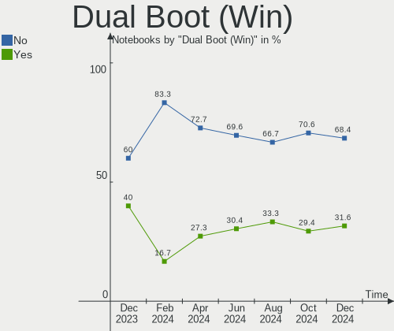
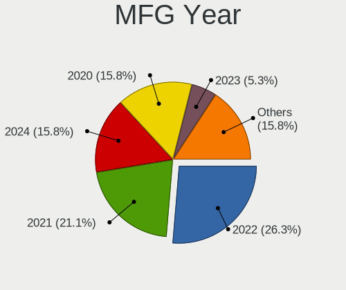
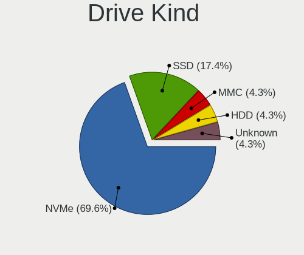
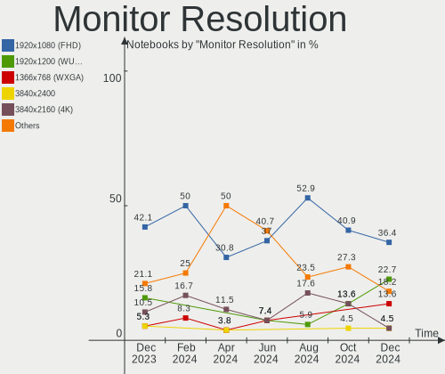

Gentoo Hardware Trends (Notebook)
---------------------------------

A project to identify most popular hardware characteristics and track their change
over time based on data collected by Gentoo users at https://Linux-Hardware.org.

Anyone can contribute to the study by uploading probes of their computers by
the [hw-probe](https://github.com/linuxhw/hw-probe) tool:

    sudo -E hw-probe -all -upload

Full-feature report is available here: https://linux-hardware.org/?view=trends&formfactor=notebook

Period: Mar, 2021.

Contents
--------

- [ OS                       ](#os)
- [ OS Family                ](#os-family)
- [ Kernel                   ](#kernel)
- [ Kernel Family            ](#kernel-family)
- [ Kernel Major Ver.        ](#kernel-major-ver)
- [ Arch                     ](#arch)
- [ DE                       ](#de)
- [ Display Server           ](#display-server)
- [ Display Manager          ](#display-manager)
- [ OS Lang                  ](#os-lang)
- [ Boot Mode                ](#boot-mode)
- [ Filesystem               ](#filesystem)
- [ Part. scheme             ](#part-scheme)
- [ Dual Boot with Linux/BSD ](#dual-boot-with-linux/bsd)
- [ Dual Boot (Win)          ](#dual-boot-win)
- [ Country                  ](#country)
- [ City                     ](#city)
- [ Vendor                   ](#vendor)
- [ Model                    ](#model)
- [ Model Family             ](#model-family)
- [ MFG Year                 ](#mfg-year)
- [ Form Factor              ](#form-factor)
- [ Secure Boot              ](#secure-boot)
- [ Coreboot                 ](#coreboot)
- [ RAM Size                 ](#ram-size)
- [ RAM Used                 ](#ram-used)
- [ Has CD-ROM               ](#has-cd-rom)
- [ Total Drives             ](#total-drives)
- [ Has Ethernet             ](#has-ethernet)
- [ Has WiFi                 ](#has-wifi)
- [ Has Bluetooth            ](#has-bluetooth)
- [ Drive Vendor             ](#drive-vendor)
- [ Drive Model              ](#drive-model)
- [ HDD Vendor               ](#hdd-vendor)
- [ SSD Vendor               ](#ssd-vendor)
- [ Drive Kind               ](#drive-kind)
- [ Drive Connector          ](#drive-connector)
- [ Drive Size               ](#drive-size)
- [ Space Total              ](#space-total)
- [ Space Used               ](#space-used)
- [ Malfunc. Drives          ](#malfunc-drives)
- [ Malfunc. Drive Vendor    ](#malfunc-drive-vendor)
- [ Malfunc. HDD Vendor      ](#malfunc-hdd-vendor)
- [ Malfunc. Drive Kind      ](#malfunc-drive-kind)
- [ Failed Drives            ](#failed-drives)
- [ Failed Drive Vendor      ](#failed-drive-vendor)
- [ Drive Status             ](#drive-status)
- [ Storage Vendor           ](#storage-vendor)
- [ Storage Model            ](#storage-model)
- [ Storage Kind             ](#storage-kind)
- [ CPU Vendor               ](#cpu-vendor)
- [ CPU Model                ](#cpu-model)
- [ CPU Model Family         ](#cpu-model-family)
- [ CPU Cores                ](#cpu-cores)
- [ CPU Sockets              ](#cpu-sockets)
- [ CPU Threads              ](#cpu-threads)
- [ CPU Op-Modes             ](#cpu-op-modes)
- [ CPU Microcode            ](#cpu-microcode)
- [ CPU Microarch            ](#cpu-microarch)
- [ GPU Vendor               ](#gpu-vendor)
- [ GPU Model                ](#gpu-model)
- [ GPU Combo                ](#gpu-combo)
- [ GPU Driver               ](#gpu-driver)
- [ GPU Memory               ](#gpu-memory)
- [ Monitor Vendor           ](#monitor-vendor)
- [ Monitor Model            ](#monitor-model)
- [ Monitor Resolution       ](#monitor-resolution)
- [ Monitor Diagonal         ](#monitor-diagonal)
- [ Monitor Width            ](#monitor-width)
- [ Aspect Ratio             ](#aspect-ratio)
- [ Monitor Area             ](#monitor-area)
- [ Pixel Density            ](#pixel-density)
- [ Multiple Monitors        ](#multiple-monitors)
- [ Net Controller Vendor    ](#net-controller-vendor)
- [ Net Controller Model     ](#net-controller-model)
- [ Wireless Vendor          ](#wireless-vendor)
- [ Wireless Model           ](#wireless-model)
- [ Ethernet Vendor          ](#ethernet-vendor)
- [ Ethernet Model           ](#ethernet-model)
- [ Net Controller Kind      ](#net-controller-kind)
- [ Used Controller          ](#used-controller)
- [ NICs                     ](#nics)
- [ IPv6                     ](#ipv6)
- [ Memory Vendor            ](#memory-vendor)
- [ Memory Model             ](#memory-model)
- [ Memory Kind              ](#memory-kind)
- [ Memory Form Factor       ](#memory-form-factor)
- [ Memory Size              ](#memory-size)
- [ Memory Speed             ](#memory-speed)
- [ Sound Vendor             ](#sound-vendor)
- [ Sound Model              ](#sound-model)
- [ Camera Vendor            ](#camera-vendor)
- [ Camera Model             ](#camera-model)
- [ Fingerprint Vendor       ](#fingerprint-vendor)
- [ Fingerprint Model        ](#fingerprint-model)
- [ Chipcard Vendor          ](#chipcard-vendor)
- [ Chipcard Model           ](#chipcard-model)
- [ Printer Vendor           ](#printer-vendor)
- [ Printer Model            ](#printer-model)
- [ Scanner Vendor           ](#scanner-vendor)
- [ Scanner Model            ](#scanner-model)
- [ Bluetooth Vendor         ](#bluetooth-vendor)
- [ Bluetooth Model          ](#bluetooth-model)
- [ Unsupported Devices      ](#unsupported-devices)
- [ Unsupported Device Types ](#unsupported-device-types)

OS
--

Installed operating systems

| Name       | Notebooks | Percent |
|------------|-----------|---------|
| Gentoo     | 13        | 65%     |
| Gentoo 2.7 | 6         | 30%     |
| Gentoo 2.6 | 1         | 5%      |

OS Family
---------

OS without a version

| Name   | Notebooks | Percent |
|--------|-----------|---------|
| Gentoo | 20        | 100%    |

Kernel
------

Version of the Linux kernel

| Version                       | Notebooks | Percent |
|-------------------------------|-----------|---------|
| 5.4.97-gentoo                 | 4         | 20%     |
| 5.11.4-gentoo                 | 2         | 10%     |
| 5.4.96                        | 1         | 5%      |
| 5.4.77-gentoo-61-DH__keyutils | 1         | 5%      |
| 5.12.0-rc2-x86_64             | 1         | 5%      |
| 5.11.6-gentoo                 | 1         | 5%      |
| 5.11.3-gentoo                 | 1         | 5%      |
| 5.11.2-gentoo-x86_64          | 1         | 5%      |
| 5.11.10-gentoo                | 1         | 5%      |
| 5.11.0-pf4                    | 1         | 5%      |
| 5.10.6                        | 1         | 5%      |
| 5.10.22-gentoo                | 1         | 5%      |
| 5.10.20-gentoo-x86_64         | 1         | 5%      |
| 5.10.2-gentoo                 | 1         | 5%      |
| 5.10.15-gentoo-x86_64         | 1         | 5%      |
| 5.10.11-gentoo-yoshi          | 1         | 5%      |

Kernel Family
-------------

Linux kernel without a distro release

| Version | Notebooks | Percent |
|---------|-----------|---------|
| 5.4.97  | 4         | 20%     |
| 5.11.4  | 2         | 10%     |
| 5.4.96  | 1         | 5%      |
| 5.4.77  | 1         | 5%      |
| 5.12.0  | 1         | 5%      |
| 5.11.6  | 1         | 5%      |
| 5.11.3  | 1         | 5%      |
| 5.11.2  | 1         | 5%      |
| 5.11.10 | 1         | 5%      |
| 5.11.0  | 1         | 5%      |
| 5.10.6  | 1         | 5%      |
| 5.10.22 | 1         | 5%      |
| 5.10.20 | 1         | 5%      |
| 5.10.2  | 1         | 5%      |
| 5.10.15 | 1         | 5%      |
| 5.10.11 | 1         | 5%      |

Kernel Major Ver.
-----------------

Linux kernel major version

| Version | Notebooks | Percent |
|---------|-----------|---------|
| 5.11    | 7         | 35%     |
| 5.4     | 6         | 30%     |
| 5.10    | 6         | 30%     |
| 5.12    | 1         | 5%      |

Arch
----

OS architecture (x86_64, i586, etc.)

| Name   | Notebooks | Percent |
|--------|-----------|---------|
| x86_64 | 18        | 90%     |
| i686   | 2         | 10%     |

DE
--

Desktop Environment

| Name       | Notebooks | Percent |
|------------|-----------|---------|
| Unknown    | 7         | 35%     |
| KDE5       | 4         | 20%     |
| GNOME      | 3         | 15%     |
| XFCE       | 1         | 5%      |
| X-Cinnamon | 1         | 5%      |
| openbox    | 1         | 5%      |
| MATE       | 1         | 5%      |
| LXDE       | 1         | 5%      |
| KDE        | 1         | 5%      |

Display Server
--------------

X11 or Wayland

| Name    | Notebooks | Percent |
|---------|-----------|---------|
| X11     | 14        | 70%     |
| Wayland | 3         | 15%     |
| Tty     | 2         | 10%     |
| Unknown | 1         | 5%      |

Display Manager
---------------

SDDM, LightDM, etc.

| Name    | Notebooks | Percent |
|---------|-----------|---------|
| SDDM    | 9         | 45%     |
| Unknown | 6         | 30%     |
| LightDM | 3         | 15%     |
| XDM     | 2         | 10%     |

OS Lang
-------

Language

| Lang    | Notebooks | Percent |
|---------|-----------|---------|
| en_US   | 7         | 35%     |
| en_GB   | 5         | 25%     |
| ru_RU   | 2         | 10%     |
| es_ES   | 2         | 10%     |
| Unknown | 2         | 10%     |
| ja_JP   | 1         | 5%      |
| it_IT   | 1         | 5%      |

Boot Mode
---------

EFI or BIOS

| Mode | Notebooks | Percent |
|------|-----------|---------|
| EFI  | 16        | 80%     |
| BIOS | 4         | 20%     |

Filesystem
----------

Type of filesystem

| Type    | Notebooks | Percent |
|---------|-----------|---------|
| Ext4    | 10        | 50%     |
| Btrfs   | 5         | 25%     |
| Xfs     | 3         | 15%     |
| Zfs     | 1         | 5%      |
| Unknown | 1         | 5%      |

Part. scheme
------------

Scheme of partitioning

| Type    | Notebooks | Percent |
|---------|-----------|---------|
| GPT     | 15        | 75%     |
| Unknown | 3         | 15%     |
| MBR     | 2         | 10%     |

Dual Boot with Linux/BSD
------------------------

Hosting more than one Linux/BSD

| Dual boot | Notebooks | Percent |
|-----------|-----------|---------|
| No        | 16        | 80%     |
| Yes       | 4         | 20%     |

Dual Boot (Win)
---------------

Hosting Linux and Windows

| Dual boot | Notebooks | Percent |
|-----------|-----------|---------|
| No        | 15        | 75%     |
| Yes       | 5         | 25%     |

Country
-------

Geographic location (country)

| Country     | Notebooks | Percent |
|-------------|-----------|---------|
| UK          | 2         | 10%     |
| Switzerland | 2         | 10%     |
| Spain       | 2         | 10%     |
| Russia      | 2         | 10%     |
| Portugal    | 2         | 10%     |
| Vietnam     | 1         | 5%      |
| Ukraine     | 1         | 5%      |
| Poland      | 1         | 5%      |
| Japan       | 1         | 5%      |
| Italy       | 1         | 5%      |
| Indonesia   | 1         | 5%      |
| Greece      | 1         | 5%      |
| Germany     | 1         | 5%      |
| France      | 1         | 5%      |
| China       | 1         | 5%      |

City
----

Geographic location (city)

| City                | Notebooks | Percent |
|---------------------|-----------|---------|
| Lisbon              | 2         | 10%     |
| Zurich              | 1         | 5%      |
| Vladivostok         | 1         | 5%      |
| Sumy                | 1         | 5%      |
| Rivas-Vaciamadrid   | 1         | 5%      |
| Porza               | 1         | 5%      |
| Odintsovo           | 1         | 5%      |
| Nagoya              | 1         | 5%      |
| Madrid              | 1         | 5%      |
| London              | 1         | 5%      |
| Jakarta             | 1         | 5%      |
| Ho Chi Minh City    | 1         | 5%      |
| Gaimersheim         | 1         | 5%      |
| Dalian              | 1         | 5%      |
| Cieszyn             | 1         | 5%      |
| Ceyrat              | 1         | 5%      |
| Cadelbosco di Sopra | 1         | 5%      |
| Bristol             | 1         | 5%      |
| Athens              | 1         | 5%      |

Vendor
------

Motherboard manufacturer

| Name             | Notebooks | Percent |
|------------------|-----------|---------|
| Hewlett-Packard  | 8         | 40%     |
| Dell             | 4         | 20%     |
| Lenovo           | 3         | 15%     |
| ASUSTek Computer | 3         | 15%     |
| Toshiba          | 1         | 5%      |
| Acer             | 1         | 5%      |

Model
-----

Motherboard model

| Name                                 | Notebooks | Percent |
|--------------------------------------|-----------|---------|
| Toshiba NB100                        | 1         | 5%      |
| Lenovo ThinkPad T470s 20HFCTO1WW     | 1         | 5%      |
| Lenovo ThinkPad T14 Gen 1 20S1SANU00 | 1         | 5%      |
| Lenovo IdeaPad 330-15IKB 81DE        | 1         | 5%      |
| HP ZBook Power G7 Mobile Workstation | 1         | 5%      |
| HP ProBook 450 G5                    | 1         | 5%      |
| HP ProBook 430 G7                    | 1         | 5%      |
| HP Pavilion Notebook                 | 1         | 5%      |
| HP Pavilion Gaming Laptop 15-ec1xxx  | 1         | 5%      |
| HP OMEN by HP Laptop 15-dc1xxx       | 1         | 5%      |
| HP Laptop 15s-eq0xxx                 | 1         | 5%      |
| HP Laptop 15-bs1xx                   | 1         | 5%      |
| Dell XPS 13 9380                     | 1         | 5%      |
| Dell XPS 13 9310                     | 1         | 5%      |
| Dell Latitude 5410                   | 1         | 5%      |
| Dell Inspiron 3537                   | 1         | 5%      |
| ASUS ZenBook UX333FN_UX333FN         | 1         | 5%      |
| ASUS N501VW                          | 1         | 5%      |
| ASUS 1000H                           | 1         | 5%      |
| Acer Aspire E5-571G                  | 1         | 5%      |

Model Family
------------

Motherboard model prefix

| Name            | Notebooks | Percent |
|-----------------|-----------|---------|
| Lenovo ThinkPad | 2         | 10%     |
| HP ProBook      | 2         | 10%     |
| HP Pavilion     | 2         | 10%     |
| HP Laptop       | 2         | 10%     |
| Dell XPS        | 2         | 10%     |
| Toshiba NB100   | 1         | 5%      |
| Lenovo IdeaPad  | 1         | 5%      |
| HP ZBook        | 1         | 5%      |
| HP OMEN         | 1         | 5%      |
| Dell Latitude   | 1         | 5%      |
| Dell Inspiron   | 1         | 5%      |
| ASUS ZenBook    | 1         | 5%      |
| ASUS N501VW     | 1         | 5%      |
| ASUS 1000H      | 1         | 5%      |
| Acer Aspire     | 1         | 5%      |

MFG Year
--------

Motherboard manufacture year

| Year | Notebooks | Percent |
|------|-----------|---------|
| 2020 | 8         | 40%     |
| 2019 | 5         | 25%     |
| 2017 | 2         | 10%     |
| 2021 | 1         | 5%      |
| 2018 | 1         | 5%      |
| 2015 | 1         | 5%      |
| 2009 | 1         | 5%      |
| 2008 | 1         | 5%      |

Form Factor
-----------

Physical design of the computer

| Name     | Notebooks | Percent |
|----------|-----------|---------|
| Notebook | 20        | 100%    |

Secure Boot
-----------

Enabled or disabled

| State    | Notebooks | Percent |
|----------|-----------|---------|
| Disabled | 19        | 95%     |
| Enabled  | 1         | 5%      |

Coreboot
--------

Have coreboot on board

| Used | Notebooks | Percent |
|------|-----------|---------|
| No   | 20        | 100%    |

RAM Size
--------

Total RAM memory

| Size in GB | Notebooks | Percent |
|------------|-----------|---------|
| 4.01-8.0   | 6         | 30%     |
| 16.01-24.0 | 6         | 30%     |
| 8.01-16.0  | 3         | 15%     |
| 32.01-64.0 | 2         | 10%     |
| 2.01-3.0   | 2         | 10%     |
| 24.01-32.0 | 1         | 5%      |

RAM Used
--------

Used RAM memory

| Used GB   | Notebooks | Percent |
|-----------|-----------|---------|
| 1.01-2.0  | 6         | 30%     |
| 4.01-8.0  | 5         | 25%     |
| 2.01-3.0  | 4         | 20%     |
| 0.51-1.0  | 2         | 10%     |
| 3.01-4.0  | 1         | 5%      |
| 8.01-16.0 | 1         | 5%      |
| 0.01-0.5  | 1         | 5%      |

Has CD-ROM
----------

Has CD-ROM on board

| Presented | Notebooks | Percent |
|-----------|-----------|---------|
| No        | 20        | 100%    |

Total Drives
------------

Number of drives on board

| Drives | Notebooks | Percent |
|--------|-----------|---------|
| 1      | 11        | 55%     |
| 2      | 9         | 45%     |

Has Ethernet
------------

Has Ethernet on board

| Presented | Notebooks | Percent |
|-----------|-----------|---------|
| Yes       | 15        | 75%     |
| No        | 5         | 25%     |

Has WiFi
--------

Has WiFi module

| Presented | Notebooks | Percent |
|-----------|-----------|---------|
| Yes       | 20        | 100%    |

Has Bluetooth
-------------

Has Bluetooth module

| Presented | Notebooks | Percent |
|-----------|-----------|---------|
| Yes       | 19        | 95%     |
| No        | 1         | 5%      |

Drive Vendor
------------

Hard drive vendors

| Vendor              | Notebooks | Drives | Percent |
|---------------------|-----------|--------|---------|
| WDC                 | 6         | 6      | 21.43%  |
| Samsung Electronics | 5         | 5      | 17.86%  |
| Toshiba             | 3         | 4      | 10.71%  |
| Intel               | 3         | 3      | 10.71%  |
| SanDisk             | 2         | 2      | 7.14%   |
| Unknown             | 1         | 1      | 3.57%   |
| SK Hynix            | 1         | 1      | 3.57%   |
| Seagate             | 1         | 1      | 3.57%   |
| LITEON              | 1         | 1      | 3.57%   |
| KIOXIA              | 1         | 1      | 3.57%   |
| Kingston            | 1         | 2      | 3.57%   |
| Kingmax             | 1         | 1      | 3.57%   |
| Hitachi             | 1         | 1      | 3.57%   |
| A-DATA Technology   | 1         | 1      | 3.57%   |

Drive Model
-----------

Hard drive models

| Model                                  | Notebooks | Percent |
|----------------------------------------|-----------|---------|
| WDC WDS100T2B0A-00SM50 1TB SSD         | 1         | 3.33%   |
| WDC WD5000LPVX-22V0TT0 500GB           | 1         | 3.33%   |
| WDC WD5000LPVX-08V0TT5 500GB           | 1         | 3.33%   |
| WDC WD1600BEVS-22RST0 160GB            | 1         | 3.33%   |
| WDC WD10JPVX-75JC3T0 1TB               | 1         | 3.33%   |
| WDC PC SN520 SDAPNUW-256G-1006 256GB   | 1         | 3.33%   |
| Unknown Y032V  32GB                    | 1         | 3.33%   |
| Toshiba NVMe SSD Drive 512GB           | 1         | 3.33%   |
| Toshiba KXG60ZNV512G NVMe KIOXIA 512GB | 1         | 3.33%   |
| Toshiba KXG60ZNV512G 512GB             | 1         | 3.33%   |
| Toshiba KBG30ZMV256G KIOXIA 256GB      | 1         | 3.33%   |
| SK Hynix HFS256G39MND-2300A 256GB SSD  | 1         | 3.33%   |
| Seagate ST2000LM015-2E8174 2TB         | 1         | 3.33%   |
| SanDisk SDSSDH3500G 500GB              | 1         | 3.33%   |
| SanDisk SDSSDA240G 240GB               | 1         | 3.33%   |
| Samsung SSD 970 EVO Plus 500GB         | 1         | 3.33%   |
| Samsung SSD 860 EVO 500GB              | 1         | 3.33%   |
| Samsung MZVLW512HMJP-000L7 512GB       | 1         | 3.33%   |
| Samsung MZVLB512HBJQ-000H1 512GB       | 1         | 3.33%   |
| Samsung MZVLB256HBHQ-000L7 256GB       | 1         | 3.33%   |
| LITEON CV8-8E128-HP 128GB SSD          | 1         | 3.33%   |
| KIOXIA KBG40ZNS512G NVMe 512GB         | 1         | 3.33%   |
| Kingston SV300S37A240G 240GB SSD       | 1         | 3.33%   |
| Kingston SA400S37120G 120GB SSD        | 1         | 3.33%   |
| Kingmax SSD 120GB                      | 1         | 3.33%   |
| Intel SSDSCKKF256G8H 256GB             | 1         | 3.33%   |
| Intel SSDPEKKF256G7H 256GB             | 1         | 3.33%   |
| Intel NVMe SSD Drive 512GB             | 1         | 3.33%   |
| Hitachi HTS545050B9A300 500GB          | 1         | 3.33%   |
| A-DATA SX930 120GB SSD                 | 1         | 3.33%   |

HDD Vendor
----------

Hard disk drive vendors

| Vendor  | Notebooks | Drives | Percent |
|---------|-----------|--------|---------|
| WDC     | 4         | 4      | 66.67%  |
| Seagate | 1         | 1      | 16.67%  |
| Hitachi | 1         | 1      | 16.67%  |

SSD Vendor
----------

Solid state drive vendors

| Vendor              | Notebooks | Drives | Percent |
|---------------------|-----------|--------|---------|
| SanDisk             | 2         | 2      | 20%     |
| WDC                 | 1         | 1      | 10%     |
| SK Hynix            | 1         | 1      | 10%     |
| Samsung Electronics | 1         | 1      | 10%     |
| LITEON              | 1         | 1      | 10%     |
| Kingston            | 1         | 2      | 10%     |
| Kingmax             | 1         | 1      | 10%     |
| Intel               | 1         | 1      | 10%     |
| A-DATA Technology   | 1         | 1      | 10%     |

Drive Kind
----------

HDD or SSD

| Kind | Notebooks | Drives | Percent |
|------|-----------|--------|---------|
| NVMe | 11        | 12     | 40.74%  |
| SSD  | 9         | 11     | 33.33%  |
| HDD  | 6         | 6      | 22.22%  |
| MMC  | 1         | 1      | 3.7%    |

Drive Connector
---------------

SATA, SAS, NVMe, etc.

| Type | Notebooks | Drives | Percent |
|------|-----------|--------|---------|
| NVMe | 11        | 12     | 47.83%  |
| SATA | 11        | 17     | 47.83%  |
| MMC  | 1         | 1      | 4.35%   |

Drive Size
----------

Size of hard drive

| Size in TB | Notebooks | Drives | Percent |
|------------|-----------|--------|---------|
| 0.01-0.5   | 9         | 14     | 75%     |
| 0.51-1.0   | 2         | 2      | 16.67%  |
| 1.01-2.0   | 1         | 1      | 8.33%   |

Space Total
-----------

Amount of disk space available on the file system

| Size in GB     | Notebooks | Percent |
|----------------|-----------|---------|
| 101-250        | 7         | 35%     |
| 251-500        | 4         | 20%     |
| 501-1000       | 3         | 15%     |
| Unknown        | 3         | 15%     |
| More than 3000 | 1         | 5%      |
| 1-20           | 1         | 5%      |
| 51-100         | 1         | 5%      |

Space Used
----------

Amount of used disk space

| Used GB        | Notebooks | Percent |
|----------------|-----------|---------|
| 21-50          | 4         | 20%     |
| 101-250        | 4         | 20%     |
| 251-500        | 3         | 15%     |
| Unknown        | 3         | 15%     |
| 1-20           | 2         | 10%     |
| 51-100         | 2         | 10%     |
| More than 3000 | 1         | 5%      |
| 501-1000       | 1         | 5%      |

Malfunc. Drives
---------------

Drive models with a malfunction

| Model                                 | Notebooks | Drives | Percent |
|---------------------------------------|-----------|--------|---------|
| WDC WD10JPVX-75JC3T0 1TB              | 1         | 1      | 20%     |
| SK Hynix HFS256G39MND-2300A 256GB SSD | 1         | 1      | 20%     |
| LITEON CV8-8E128-HP 128GB SSD         | 1         | 1      | 20%     |
| Intel SSDSCKKF256G8H 256GB            | 1         | 1      | 20%     |
| Hitachi HTS545050B9A300 500GB         | 1         | 1      | 20%     |

Malfunc. Drive Vendor
---------------------

Vendors of faulty drives

| Vendor   | Notebooks | Drives | Percent |
|----------|-----------|--------|---------|
| WDC      | 1         | 1      | 20%     |
| SK Hynix | 1         | 1      | 20%     |
| LITEON   | 1         | 1      | 20%     |
| Intel    | 1         | 1      | 20%     |
| Hitachi  | 1         | 1      | 20%     |

Malfunc. HDD Vendor
-------------------

Vendors of faulty HDD drives

| Vendor  | Notebooks | Drives | Percent |
|---------|-----------|--------|---------|
| WDC     | 1         | 1      | 50%     |
| Hitachi | 1         | 1      | 50%     |

Malfunc. Drive Kind
-------------------

Kinds of faulty drives

| Kind | Notebooks | Drives | Percent |
|------|-----------|--------|---------|
| SSD  | 3         | 3      | 60%     |
| HDD  | 2         | 2      | 40%     |

Failed Drives
-------------

Failed drive models

Zero info for selected period =(

Failed Drive Vendor
-------------------

Failed drive vendors

Zero info for selected period =(

Drive Status
------------

Number of failed and malfunc. drives

| Status   | Notebooks | Drives | Percent |
|----------|-----------|--------|---------|
| Works    | 17        | 22     | 70.83%  |
| Malfunc  | 4         | 5      | 16.67%  |
| Detected | 3         | 3      | 12.5%   |

Storage Vendor
--------------

Storage controller vendors

| Vendor                       | Notebooks | Percent |
|------------------------------|-----------|---------|
| Intel                        | 13        | 56.52%  |
| Samsung Electronics          | 4         | 17.39%  |
| Toshiba America Info Systems | 3         | 13.04%  |
| Sandisk                      | 1         | 4.35%   |
| KIOXIA                       | 1         | 4.35%   |
| AMD                          | 1         | 4.35%   |

Storage Model
-------------

Storage controller models

| Model                                                          | Notebooks | Percent |
|----------------------------------------------------------------|-----------|---------|
| Intel Sunrise Point-LP SATA Controller [AHCI mode]             | 4         | 15.38%  |
| Samsung NVMe SSD Controller SM981/PM981/PM983                  | 3         | 11.54%  |
| Toshiba America Info Systems XG6 NVMe SSD Controller           | 2         | 7.69%   |
| Intel Comet Lake SATA AHCI Controller                          | 2         | 7.69%   |
| Intel 82801GBM/GHM (ICH7-M Family) SATA Controller [AHCI mode] | 2         | 7.69%   |
| Intel 82801G (ICH7 Family) IDE Controller                      | 2         | 7.69%   |
| Intel 8 Series SATA Controller 1 [AHCI mode]                   | 2         | 7.69%   |
| Toshiba America Info Systems BG3 NVMe SSD Controller           | 1         | 3.85%   |
| Sandisk WD Blue SN500 / PC SN520 NVMe SSD                      | 1         | 3.85%   |
| Samsung NVMe SSD Controller SM961/PM961/SM963                  | 1         | 3.85%   |
| KIOXIA Non-Volatile memory controller                          | 1         | 3.85%   |
| Intel SSD 660P Series                                          | 1         | 3.85%   |
| Intel SSD 600P Series                                          | 1         | 3.85%   |
| Intel HM170/QM170 Chipset SATA Controller [AHCI Mode]          | 1         | 3.85%   |
| Intel 82801 Mobile SATA Controller [RAID mode]                 | 1         | 3.85%   |
| AMD FCH SATA Controller [AHCI mode]                            | 1         | 3.85%   |

Storage Kind
------------

Kind of storage controller (IDE, SATA, NVMe, SAS, ...)

| Kind | Notebooks | Percent |
|------|-----------|---------|
| SATA | 12        | 46.15%  |
| NVMe | 11        | 42.31%  |
| IDE  | 2         | 7.69%   |
| RAID | 1         | 3.85%   |

CPU Vendor
----------

Processor vendors

| Vendor | Notebooks | Percent |
|--------|-----------|---------|
| Intel  | 18        | 90%     |
| AMD    | 2         | 10%     |

CPU Model
---------

Processor models

| Model                                         | Notebooks | Percent |
|-----------------------------------------------|-----------|---------|
| Intel Core i5-8250U CPU @ 1.60GHz             | 2         | 10%     |
| Intel Core i5-10210U CPU @ 1.60GHz            | 2         | 10%     |
| Intel Atom CPU N270 @ 1.60GHz                 | 2         | 10%     |
| Intel Core i7-9750H CPU @ 2.60GHz             | 1         | 5%      |
| Intel Core i7-8565U CPU @ 1.80GHz             | 1         | 5%      |
| Intel Core i7-8550U CPU @ 1.80GHz             | 1         | 5%      |
| Intel Core i7-7500U CPU @ 2.70GHz             | 1         | 5%      |
| Intel Core i7-6700HQ CPU @ 2.60GHz            | 1         | 5%      |
| Intel Core i7-4500U CPU @ 1.80GHz             | 1         | 5%      |
| Intel Core i7-10750H CPU @ 2.60GHz            | 1         | 5%      |
| Intel Core i7-10510U CPU @ 1.80GHz            | 1         | 5%      |
| Intel Core i5-8265U CPU @ 1.60GHz             | 1         | 5%      |
| Intel Core i5-7200U CPU @ 2.50GHz             | 1         | 5%      |
| Intel Core i5-4210U CPU @ 1.70GHz             | 1         | 5%      |
| Intel 11th Gen Core i7-1165G7 @ 2.80GHz       | 1         | 5%      |
| AMD Ryzen 5 4600H with Radeon Graphics        | 1         | 5%      |
| AMD Ryzen 3 3200U with Radeon Vega Mobile Gfx | 1         | 5%      |

CPU Model Family
----------------

Processor model prefix

| Model         | Notebooks | Percent |
|---------------|-----------|---------|
| Intel Core i7 | 8         | 40%     |
| Intel Core i5 | 7         | 35%     |
| Intel Atom    | 2         | 10%     |
| Other         | 1         | 5%      |
| AMD Ryzen 5   | 1         | 5%      |
| AMD Ryzen 3   | 1         | 5%      |

CPU Cores
---------

Number of processor cores

| Number | Notebooks | Percent |
|--------|-----------|---------|
| 4      | 10        | 50%     |
| 2      | 5         | 25%     |
| 6      | 3         | 15%     |
| 1      | 2         | 10%     |

CPU Sockets
-----------

Number of sockets

| Number | Notebooks | Percent |
|--------|-----------|---------|
| 1      | 20        | 100%    |

CPU Threads
-----------

Threads per core (Hyper-Threading)

| Number | Notebooks | Percent |
|--------|-----------|---------|
| 2      | 20        | 100%    |

CPU Op-Modes
------------

CPU Operation Modes (32-bit, 64-bit)

| Op mode        | Notebooks | Percent |
|----------------|-----------|---------|
| 32-bit, 64-bit | 18        | 90%     |
| 32-bit         | 2         | 10%     |

CPU Microcode
-------------

Microcode number

| Number     | Notebooks | Percent |
|------------|-----------|---------|
| 0x806ec    | 4         | 20%     |
| 0x806ea    | 3         | 15%     |
| 0x806e9    | 2         | 10%     |
| 0x40651    | 2         | 10%     |
| 0xa0652    | 1         | 5%      |
| 0x906ea    | 1         | 5%      |
| 0x806eb    | 1         | 5%      |
| 0x806c1    | 1         | 5%      |
| 0x506e3    | 1         | 5%      |
| 0x106c2    | 1         | 5%      |
| 0x08600106 | 1         | 5%      |
| 0x08108109 | 1         | 5%      |
| Unknown    | 1         | 5%      |

CPU Microarch
-------------

Microarchitecture

| Name      | Notebooks | Percent |
|-----------|-----------|---------|
| KabyLake  | 11        | 55%     |
| Haswell   | 2         | 10%     |
| Bonnell   | 2         | 10%     |
| Zen+      | 1         | 5%      |
| Zen 2     | 1         | 5%      |
| TigerLake | 1         | 5%      |
| Skylake   | 1         | 5%      |
| CometLake | 1         | 5%      |

GPU Vendor
----------

Vendors of graphics cards

| Vendor | Notebooks | Percent |
|--------|-----------|---------|
| Intel  | 18        | 62.07%  |
| Nvidia | 8         | 27.59%  |
| AMD    | 3         | 10.34%  |

GPU Model
---------

Graphics card models

| Model                                                                                 | Notebooks | Percent |
|---------------------------------------------------------------------------------------|-----------|---------|
| Intel UHD Graphics 620                                                                | 3         | 9.68%   |
| Intel CometLake-U GT2 [UHD Graphics]                                                  | 3         | 9.68%   |
| Intel WhiskeyLake-U GT2 [UHD Graphics 620]                                            | 2         | 6.45%   |
| Intel Mobile 945GSE Express Integrated Graphics Controller                            | 2         | 6.45%   |
| Intel Mobile 945GM/GMS/GME, 943/940GML Express Integrated Graphics Controller         | 2         | 6.45%   |
| Intel HD Graphics 620                                                                 | 2         | 6.45%   |
| Intel Haswell-ULT Integrated Graphics Controller                                      | 2         | 6.45%   |
| Nvidia TU117M [GeForce GTX 1650 Mobile / Max-Q]                                       | 1         | 3.23%   |
| Nvidia TU117M                                                                         | 1         | 3.23%   |
| Nvidia TU117GLM [Quadro T1000 Mobile]                                                 | 1         | 3.23%   |
| Nvidia GP108M [GeForce MX150]                                                         | 1         | 3.23%   |
| Nvidia GM108M [GeForce 940MX]                                                         | 1         | 3.23%   |
| Nvidia GM108M [GeForce 930MX]                                                         | 1         | 3.23%   |
| Nvidia GM108M [GeForce 840M]                                                          | 1         | 3.23%   |
| Nvidia GM107M [GeForce GTX 960M]                                                      | 1         | 3.23%   |
| Intel TigerLake GT2 [Iris Xe Graphics]                                                | 1         | 3.23%   |
| Intel HD Graphics 530                                                                 | 1         | 3.23%   |
| Intel CometLake-H GT2 [UHD Graphics]                                                  | 1         | 3.23%   |
| Intel CoffeeLake-H GT2 [UHD Graphics 630]                                             | 1         | 3.23%   |
| AMD Topaz XT [Radeon R7 M260/M265 / M340/M360 / M440/M445 / 530/535 / 620/625 Mobile] | 1         | 3.23%   |
| AMD Renoir                                                                            | 1         | 3.23%   |
| AMD Picasso                                                                           | 1         | 3.23%   |

GPU Combo
---------

Combinations of graphics cards

| Name           | Notebooks | Percent |
|----------------|-----------|---------|
| 1 x Intel      | 10        | 50%     |
| Intel + Nvidia | 7         | 35%     |
| Intel + AMD    | 1         | 5%      |
| AMD + Nvidia   | 1         | 5%      |
| 1 x AMD        | 1         | 5%      |

GPU Driver
----------

Free vs proprietary

| Driver      | Notebooks | Percent |
|-------------|-----------|---------|
| Free        | 16        | 80%     |
| Proprietary | 3         | 15%     |
| Unknown     | 1         | 5%      |

GPU Memory
----------

Total video memory

| Size in GB | Notebooks | Percent |
|------------|-----------|---------|
| Unknown    | 13        | 65%     |
| 1.01-2.0   | 4         | 20%     |
| 3.01-4.0   | 2         | 10%     |
| 0.01-0.5   | 1         | 5%      |

Monitor Vendor
--------------

Monitor vendors

| Vendor               | Notebooks | Percent |
|----------------------|-----------|---------|
| AU Optronics         | 7         | 28%     |
| Samsung Electronics  | 5         | 20%     |
| Chimei Innolux       | 3         | 12%     |
| BOE                  | 3         | 12%     |
| LG Display           | 2         | 8%      |
| ViewSonic            | 1         | 4%      |
| Sharp                | 1         | 4%      |
| HannStar             | 1         | 4%      |
| Dell                 | 1         | 4%      |
| Ancor Communications | 1         | 4%      |

Monitor Model
-------------

Monitor models

| Model                                                                 | Notebooks | Percent |
|-----------------------------------------------------------------------|-----------|---------|
| AU Optronics LCD Monitor AUO38ED 1920x1080 340x190mm 15.3-inch        | 2         | 8%      |
| ViewSonic VA2248 SERIES VSC0E28 1920x1080 477x268mm 21.5-inch         | 1         | 4%      |
| Sharp LCD Monitor SHP14F9 1920x1200 288x180mm 13.4-inch               | 1         | 4%      |
| Samsung Electronics SMS27A350H SAM07CE 1920x1080 598x336mm 27.0-inch  | 1         | 4%      |
| Samsung Electronics S24F350 SAM0D20 1920x1080 521x293mm 23.5-inch     | 1         | 4%      |
| Samsung Electronics LCD Monitor SDC5441 1366x768 340x190mm 15.3-inch  | 1         | 4%      |
| Samsung Electronics LCD Monitor SDC324C 1920x1080 344x194mm 15.5-inch | 1         | 4%      |
| Samsung Electronics C27F390 SAM0D32 1920x1080 600x340mm 27.2-inch     | 1         | 4%      |
| LG Display LCD Monitor LGD0650 1920x1080 344x194mm 15.5-inch          | 1         | 4%      |
| LG Display LCD Monitor LGD0521 1920x1080 309x174mm 14.0-inch          | 1         | 4%      |
| HannStar LCD Monitor HSD03E9 1024x600 220x129mm 10.0-inch             | 1         | 4%      |
| Dell U2715H DELD066 1920x1080 600x340mm 27.2-inch                     | 1         | 4%      |
| Chimei Innolux LCD Monitor CMN15E8 1920x1080 344x193mm 15.5-inch      | 1         | 4%      |
| Chimei Innolux LCD Monitor CMN15C4 1920x1080 344x193mm 15.5-inch      | 1         | 4%      |
| Chimei Innolux LCD Monitor CMN15C2 1920x1080 344x194mm 15.5-inch      | 1         | 4%      |
| BOE LCD Monitor BOE0852 1920x1080 344x194mm 15.5-inch                 | 1         | 4%      |
| BOE LCD Monitor BOE07BB 1920x1080 309x173mm 13.9-inch                 | 1         | 4%      |
| BOE LCD Monitor BOE07AD 1366x768 294x165mm 13.3-inch                  | 1         | 4%      |
| AU Optronics LCD Monitor AUO61ED 1920x1080 340x190mm 15.3-inch        | 1         | 4%      |
| AU Optronics LCD Monitor AUO5C2D 1920x1080 293x165mm 13.2-inch        | 1         | 4%      |
| AU Optronics LCD Monitor AUO5B2D 1920x1080 293x162mm 13.2-inch        | 1         | 4%      |
| AU Optronics LCD Monitor AUO41ED 1920x1080 344x193mm 15.5-inch        | 1         | 4%      |
| AU Optronics LCD Monitor AUO403D 1920x1080 309x173mm 13.9-inch        | 1         | 4%      |
| Ancor Communications ASUS VH242 ACI24FA 1920x1080 521x293mm 23.5-inch | 1         | 4%      |

Monitor Resolution
------------------

Monitor screen resolution

| Resolution        | Notebooks | Percent |
|-------------------|-----------|---------|
| 1920x1080 (FHD)   | 16        | 76.19%  |
| 1366x768 (WXGA)   | 2         | 9.52%   |
| 2560x1440 (QHD)   | 1         | 4.76%   |
| 1920x1200 (WUXGA) | 1         | 4.76%   |
| 1024x600          | 1         | 4.76%   |

Monitor Diagonal
----------------

Diagonal size in inches

| Inches | Notebooks | Percent |
|--------|-----------|---------|
| 15     | 11        | 44%     |
| 13     | 5         | 20%     |
| 27     | 3         | 12%     |
| 23     | 2         | 8%      |
| 14     | 2         | 8%      |
| 21     | 1         | 4%      |
| 10     | 1         | 4%      |

Monitor Width
-------------

Physical width

| Width in mm | Notebooks | Percent |
|-------------|-----------|---------|
| 301-350     | 14        | 56%     |
| 501-600     | 5         | 20%     |
| 201-300     | 5         | 20%     |
| 401-500     | 1         | 4%      |

Aspect Ratio
------------

Proportional relationship between the width and the height

| Ratio | Notebooks | Percent |
|-------|-----------|---------|
| 16/9  | 18        | 94.74%  |
| 16/10 | 1         | 5.26%   |

Monitor Area
------------

Area in inch²

| Area in inch² | Notebooks | Percent |
|----------------|-----------|---------|
| 101-110        | 11        | 44%     |
| 71-80          | 4         | 16%     |
| 81-90          | 3         | 12%     |
| 301-350        | 3         | 12%     |
| 201-250        | 3         | 12%     |
| 41-50          | 1         | 4%      |

Pixel Density
-------------

Pixels per inch

| Density | Notebooks | Percent |
|---------|-----------|---------|
| 121-160 | 13        | 54.17%  |
| 101-120 | 4         | 16.67%  |
| 51-100  | 4         | 16.67%  |
| 161-240 | 3         | 12.5%   |

Multiple Monitors
-----------------

Total monitors connected

| Total | Notebooks | Percent |
|-------|-----------|---------|
| 1     | 13        | 65%     |
| 2     | 6         | 30%     |
| 0     | 1         | 5%      |

Net Controller Vendor
---------------------

Controller vendors

| Vendor                          | Notebooks | Percent |
|---------------------------------|-----------|---------|
| Realtek Semiconductor           | 11        | 35.48%  |
| Intel                           | 11        | 35.48%  |
| Qualcomm Atheros                | 5         | 16.13%  |
| Qualcomm Atheros Communications | 1         | 3.23%   |
| Prusa                           | 1         | 3.23%   |
| Lenovo                          | 1         | 3.23%   |
| ASIX Electronics                | 1         | 3.23%   |

Net Controller Model
--------------------

Controller models

| Model                                                                   | Notebooks | Percent |
|-------------------------------------------------------------------------|-----------|---------|
| Realtek RTL8111/8168/8411 PCI Express Gigabit Ethernet Controller       | 7         | 17.95%  |
| Realtek RTL810xE PCI Express Fast Ethernet controller                   | 3         | 7.69%   |
| Intel Comet Lake PCH-LP CNVi WiFi                                       | 3         | 7.69%   |
| Qualcomm Atheros AR242x / AR542x Wireless Network Adapter (PCI-Express) | 2         | 5.13%   |
| Intel Wireless 8265 / 8275                                              | 2         | 5.13%   |
| Intel Ethernet Connection (10) I219-V                                   | 2         | 5.13%   |
| Realtek RTL8822CE 802.11ac PCIe Wireless Network Adapter                | 1         | 2.56%   |
| Realtek RTL8821CE 802.11ac PCIe Wireless Network Adapter                | 1         | 2.56%   |
| Realtek RTL8723DE Wireless Network Adapter                              | 1         | 2.56%   |
| Realtek RTL8723BE PCIe Wireless Network Adapter                         | 1         | 2.56%   |
| Qualcomm Atheros QCA9565 / AR9565 Wireless Network Adapter              | 1         | 2.56%   |
| Qualcomm Atheros QCA9377 802.11ac Wireless Network Adapter              | 1         | 2.56%   |
| Qualcomm Atheros QCA6174 802.11ac Wireless Network Adapter              | 1         | 2.56%   |
| Qualcomm Atheros AR9271 802.11n                                         | 1         | 2.56%   |
| Qualcomm Atheros AR8121/AR8113/AR8114 Gigabit or Fast Ethernet          | 1         | 2.56%   |
| Prusa Original Prusa i3 MK3                                             | 1         | 2.56%   |
| Lenovo ThinkPad Dock Ethernet [Realtek RTL8153B]                        | 1         | 2.56%   |
| Intel Wireless-AC 9560 [Jefferson Peak]                                 | 1         | 2.56%   |
| Intel Wireless 7265                                                     | 1         | 2.56%   |
| Intel Wi-Fi 6 AX201                                                     | 1         | 2.56%   |
| Intel Ethernet Connection (4) I219-V                                    | 1         | 2.56%   |
| Intel Ethernet Connection (10) I219-LM                                  | 1         | 2.56%   |
| Intel Comet Lake PCH CNVi WiFi                                          | 1         | 2.56%   |
| Intel Centrino Advanced-N 6200                                          | 1         | 2.56%   |
| Intel Cannon Point-LP CNVi [Wireless-AC]                                | 1         | 2.56%   |
| ASIX AX88179 Gigabit Ethernet                                           | 1         | 2.56%   |

Wireless Vendor
---------------

Wireless vendors

| Vendor                          | Notebooks | Percent |
|---------------------------------|-----------|---------|
| Intel                           | 11        | 52.38%  |
| Qualcomm Atheros                | 5         | 23.81%  |
| Realtek Semiconductor           | 4         | 19.05%  |
| Qualcomm Atheros Communications | 1         | 4.76%   |

Wireless Model
--------------

Wireless models

| Model                                                                   | Notebooks | Percent |
|-------------------------------------------------------------------------|-----------|---------|
| Intel Comet Lake PCH-LP CNVi WiFi                                       | 3         | 14.29%  |
| Qualcomm Atheros AR242x / AR542x Wireless Network Adapter (PCI-Express) | 2         | 9.52%   |
| Intel Wireless 8265 / 8275                                              | 2         | 9.52%   |
| Realtek RTL8822CE 802.11ac PCIe Wireless Network Adapter                | 1         | 4.76%   |
| Realtek RTL8821CE 802.11ac PCIe Wireless Network Adapter                | 1         | 4.76%   |
| Realtek RTL8723DE Wireless Network Adapter                              | 1         | 4.76%   |
| Realtek RTL8723BE PCIe Wireless Network Adapter                         | 1         | 4.76%   |
| Qualcomm Atheros QCA9565 / AR9565 Wireless Network Adapter              | 1         | 4.76%   |
| Qualcomm Atheros QCA9377 802.11ac Wireless Network Adapter              | 1         | 4.76%   |
| Qualcomm Atheros QCA6174 802.11ac Wireless Network Adapter              | 1         | 4.76%   |
| Qualcomm Atheros AR9271 802.11n                                         | 1         | 4.76%   |
| Intel Wireless-AC 9560 [Jefferson Peak]                                 | 1         | 4.76%   |
| Intel Wireless 7265                                                     | 1         | 4.76%   |
| Intel Wi-Fi 6 AX201                                                     | 1         | 4.76%   |
| Intel Comet Lake PCH CNVi WiFi                                          | 1         | 4.76%   |
| Intel Centrino Advanced-N 6200                                          | 1         | 4.76%   |
| Intel Cannon Point-LP CNVi [Wireless-AC]                                | 1         | 4.76%   |

Ethernet Vendor
---------------

Ethernet vendors

| Vendor                | Notebooks | Percent |
|-----------------------|-----------|---------|
| Realtek Semiconductor | 10        | 58.82%  |
| Intel                 | 4         | 23.53%  |
| Qualcomm Atheros      | 1         | 5.88%   |
| Lenovo                | 1         | 5.88%   |
| ASIX Electronics      | 1         | 5.88%   |

Ethernet Model
--------------

Ethernet models

| Model                                                             | Notebooks | Percent |
|-------------------------------------------------------------------|-----------|---------|
| Realtek RTL8111/8168/8411 PCI Express Gigabit Ethernet Controller | 7         | 41.18%  |
| Realtek RTL810xE PCI Express Fast Ethernet controller             | 3         | 17.65%  |
| Intel Ethernet Connection (10) I219-V                             | 2         | 11.76%  |
| Qualcomm Atheros AR8121/AR8113/AR8114 Gigabit or Fast Ethernet    | 1         | 5.88%   |
| Lenovo ThinkPad Dock Ethernet [Realtek RTL8153B]                  | 1         | 5.88%   |
| Intel Ethernet Connection (4) I219-V                              | 1         | 5.88%   |
| Intel Ethernet Connection (10) I219-LM                            | 1         | 5.88%   |
| ASIX AX88179 Gigabit Ethernet                                     | 1         | 5.88%   |

Net Controller Kind
-------------------

Ethernet, WiFi or modem

| Kind     | Notebooks | Percent |
|----------|-----------|---------|
| WiFi     | 20        | 55.56%  |
| Ethernet | 15        | 41.67%  |
| Modem    | 1         | 2.78%   |

Used Controller
---------------

Currently used network controller

| Kind     | Notebooks | Percent |
|----------|-----------|---------|
| WiFi     | 14        | 60.87%  |
| Ethernet | 9         | 39.13%  |

NICs
----

Total network controllers on board

| Total | Notebooks | Percent |
|-------|-----------|---------|
| 2     | 15        | 75%     |
| 1     | 5         | 25%     |

IPv6
----

IPv6 vs IPv4

| Used | Notebooks | Percent |
|------|-----------|---------|
| No   | 16        | 80%     |
| Yes  | 4         | 20%     |

Memory Vendor
-------------

Memory module vendors

| Vendor              | Notebooks | Percent |
|---------------------|-----------|---------|
| SK Hynix            | 9         | 32.14%  |
| Samsung Electronics | 7         | 25%     |
| Micron Technology   | 3         | 10.71%  |
| Kingston            | 3         | 10.71%  |
| Unknown             | 2         | 7.14%   |
| Crucial             | 2         | 7.14%   |
| Transcend           | 1         | 3.57%   |
| A-DATA Technology   | 1         | 3.57%   |

Memory Model
------------

Memory module models

| Model                                                               | Notebooks | Percent |
|---------------------------------------------------------------------|-----------|---------|
| Unknown RAM Module 2048MB SODIMM SDRAM                              | 1         | 3.57%   |
| Unknown RAM Module 2048MB Row Of Chips LPDDR4 4267MT/s              | 1         | 3.57%   |
| Transcend RAM Module 2048MB SODIMM DDR2 533MT/s                     | 1         | 3.57%   |
| SK Hynix RAM Module 8192MB SODIMM DDR4 2667MT/s                     | 1         | 3.57%   |
| SK Hynix RAM Module 8192MB SODIMM DDR4 2400MT/s                     | 1         | 3.57%   |
| SK Hynix RAM Module 16GB SODIMM DDR4 3200MT/s                       | 1         | 3.57%   |
| SK Hynix RAM HMT451S6AFR8A-PB 4096MB SODIMM DDR3 1600MT/s           | 1         | 3.57%   |
| SK Hynix RAM HMA82GS6AFR8N-UH 16384MB SODIMM DDR4 2400MT/s          | 1         | 3.57%   |
| SK Hynix RAM HMA81GS6DJR8N-XN 8GB SODIMM DDR4 3200MT/s              | 1         | 3.57%   |
| SK Hynix RAM HMA81GS6AFR8N-UH 8GB SODIMM DDR4 2667MT/s              | 1         | 3.57%   |
| SK Hynix RAM HMA41GS6AFR8N-TF 8192MB SODIMM DDR4 2133MT/s           | 1         | 3.57%   |
| SK Hynix RAM H9CCNNNBJTALAR-NVD 4096MB Row Of Chips LPDDR3 2133MT/s | 1         | 3.57%   |
| Samsung RAM M471B5173DB0-YK0 4GB SODIMM DDR3 1600MT/s               | 1         | 3.57%   |
| Samsung RAM M471A5244CB0-CWE 4096MB SODIMM DDR4 3200MT/s            | 1         | 3.57%   |
| Samsung RAM M471A5244CB0-CRC 4GB SODIMM DDR4 2667MT/s               | 1         | 3.57%   |
| Samsung RAM M471A2K43DB1-CWE 16384MB SODIMM DDR4 3200MT/s           | 1         | 3.57%   |
| Samsung RAM M471A1K43CB1-CTD 8192MB SODIMM DDR4 2667MT/s            | 1         | 3.57%   |
| Samsung RAM M471A1K43CB1-CRC 8GB SODIMM DDR4 2667MT/s               | 1         | 3.57%   |
| Samsung RAM M471A1K43BB0-CPB 8192MB SODIMM DDR4 2133MT/s            | 1         | 3.57%   |
| Micron RAM 8ATF1G64HZ-2G6E1 8192MB SODIMM DDR4 2667MT/s             | 1         | 3.57%   |
| Micron RAM 4ATS2G64HZ-3G2B1 16384MB SODIMM DDR4 3200MT/s            | 1         | 3.57%   |
| Micron RAM 4ATF51264HZ-2G3B2 4GB SODIMM DDR4 2400MT/s               | 1         | 3.57%   |
| Kingston RAM KHX2400C14S4/4G 4096MB SODIMM DDR4 2400MT/s            | 1         | 3.57%   |
| Kingston RAM 99U5624-013.A00G 8GB SODIMM DDR4 2400MT/s              | 1         | 3.57%   |
| Kingston RAM 9905700-048.A00G 16GB SODIMM DDR4 2933MT/s             | 1         | 3.57%   |
| Crucial RAM CT8G4SFS824A.C8FBD1 8GB SODIMM DDR4 2400MT/s            | 1         | 3.57%   |
| Crucial RAM CT16G4SFD8266.C16FD1 16384MB SODIMM DDR4 2667MT/s       | 1         | 3.57%   |
| A-DATA RAM Module 8192MB SODIMM DDR4 2667MT/s                       | 1         | 3.57%   |

Memory Kind
-----------

Memory module kinds

| Kind   | Notebooks | Percent |
|--------|-----------|---------|
| DDR4   | 13        | 68.42%  |
| DDR3   | 2         | 10.53%  |
| SDRAM  | 1         | 5.26%   |
| LPDDR4 | 1         | 5.26%   |
| LPDDR3 | 1         | 5.26%   |
| DDR2   | 1         | 5.26%   |

Memory Form Factor
------------------

Physical design of the memory module

| Name         | Notebooks | Percent |
|--------------|-----------|---------|
| SODIMM       | 17        | 89.47%  |
| Row Of Chips | 2         | 10.53%  |

Memory Size
-----------

Memory module size

| Size  | Notebooks | Percent |
|-------|-----------|---------|
| 8192  | 8         | 38.1%   |
| 4096  | 6         | 28.57%  |
| 16384 | 4         | 19.05%  |
| 2048  | 3         | 14.29%  |

Memory Speed
------------

Memory module speed

| Speed   | Notebooks | Percent |
|---------|-----------|---------|
| 2667    | 6         | 26.09%  |
| 2400    | 5         | 21.74%  |
| 3200    | 4         | 17.39%  |
| 2133    | 2         | 8.7%    |
| 1600    | 2         | 8.7%    |
| 4267    | 1         | 4.35%   |
| 2933    | 1         | 4.35%   |
| 533     | 1         | 4.35%   |
| Unknown | 1         | 4.35%   |

Sound Vendor
------------

Sound card vendors

| Vendor    | Notebooks | Percent |
|-----------|-----------|---------|
| Intel     | 18        | 75%     |
| Nvidia    | 2         | 8.33%   |
| AMD       | 2         | 8.33%   |
| Razer USA | 1         | 4.17%   |
| Lenovo    | 1         | 4.17%   |

Sound Model
-----------

Sound card models

| Model                                                           | Notebooks | Percent |
|-----------------------------------------------------------------|-----------|---------|
| Intel Sunrise Point-LP HD Audio                                 | 5         | 18.52%  |
| Intel Comet Lake PCH-LP cAVS                                    | 3         | 11.11%  |
| Nvidia TU107 GeForce GTX 1650 High Definition Audio Controller  | 2         | 7.41%   |
| Intel NM10/ICH7 Family High Definition Audio Controller         | 2         | 7.41%   |
| Intel Haswell-ULT HD Audio Controller                           | 2         | 7.41%   |
| Intel Cannon Point-LP High Definition Audio Controller          | 2         | 7.41%   |
| Intel 8 Series HD Audio Controller                              | 2         | 7.41%   |
| AMD Family 17h (Models 10h-1fh) HD Audio Controller             | 2         | 7.41%   |
| Razer USA Razer Kraken X USB                                    | 1         | 3.7%    |
| Lenovo ThinkPad Dock Audio                                      | 1         | 3.7%    |
| Intel Tiger Lake-LP Smart Sound Technology Audio Controller     | 1         | 3.7%    |
| Intel Comet Lake PCH cAVS                                       | 1         | 3.7%    |
| Intel Cannon Lake PCH cAVS                                      | 1         | 3.7%    |
| Intel 100 Series/C230 Series Chipset Family HD Audio Controller | 1         | 3.7%    |
| AMD Raven/Raven2/Fenghuang HDMI/DP Audio Controller             | 1         | 3.7%    |

Camera Vendor
-------------

Camera device vendors

| Vendor                                 | Notebooks | Percent |
|----------------------------------------|-----------|---------|
| Chicony Electronics                    | 5         | 27.78%  |
| Realtek Semiconductor                  | 2         | 11.11%  |
| Quanta                                 | 2         | 11.11%  |
| Microdia                               | 2         | 11.11%  |
| Luxvisions Innotech Limited            | 2         | 11.11%  |
| Cheng Uei Precision Industry (Foxlink) | 2         | 11.11%  |
| Z-Star Microelectronics                | 1         | 5.56%   |
| Lite-On Technology                     | 1         | 5.56%   |
| IMC Networks                           | 1         | 5.56%   |

Camera Model
------------

Camera device models

| Model                                                                      | Notebooks | Percent |
|----------------------------------------------------------------------------|-----------|---------|
| Microdia Integrated_Webcam_HD                                              | 2         | 11.11%  |
| Luxvisions Innotech Limited HP TrueVision HD Camera                        | 2         | 11.11%  |
| Z-Star Venus USB2.0 Camera                                                 | 1         | 5.56%   |
| Realtek USB2.0 HD UVC WebCam                                               | 1         | 5.56%   |
| Realtek Integrated_Webcam_HD                                               | 1         | 5.56%   |
| Quanta HP Wide Vision HD Camera                                            | 1         | 5.56%   |
| Quanta HP HD Camera                                                        | 1         | 5.56%   |
| Lite-On Integrated Camera                                                  | 1         | 5.56%   |
| IMC Networks USB2.0 HD IR UVC WebCam                                       | 1         | 5.56%   |
| Chicony Integrated Camera                                                  | 1         | 5.56%   |
| Chicony HP HD Camera                                                       | 1         | 5.56%   |
| Chicony EasyCamera                                                         | 1         | 5.56%   |
| Chicony CNF8029                                                            | 1         | 5.56%   |
| Chicony 2.0M UVC Webcam / CNF7129                                          | 1         | 5.56%   |
| Cheng Uei Precision Industry (Foxlink) HP Wide Vision HD integrated webcam | 1         | 5.56%   |
| Cheng Uei Precision Industry (Foxlink) HP Webcam                           | 1         | 5.56%   |

Fingerprint Vendor
------------------

Fingerprint sensor vendors

| Vendor                     | Notebooks | Percent |
|----------------------------|-----------|---------|
| Validity Sensors           | 2         | 50%     |
| Synaptics                  | 1         | 25%     |
| Shenzhen Goodix Technology | 1         | 25%     |

Fingerprint Model
-----------------

Fingerprint sensor models

| Model                                             | Notebooks | Percent |
|---------------------------------------------------|-----------|---------|
| Validity Sensors VFS495 Fingerprint Reader        | 1         | 25%     |
| Validity Sensors Synaptics WBDI                   | 1         | 25%     |
| Synaptics Prometheus MIS Touch Fingerprint Reader | 1         | 25%     |
| Shenzhen Goodix FingerPrint                       | 1         | 25%     |

Chipcard Vendor
---------------

Chipcard module vendors

| Vendor      | Notebooks | Percent |
|-------------|-----------|---------|
| Alcor Micro | 1         | 100%    |

Chipcard Model
--------------

Chipcard module models

| Model                               | Notebooks | Percent |
|-------------------------------------|-----------|---------|
| Alcor Micro AU9540 Smartcard Reader | 1         | 100%    |

Printer Vendor
--------------

Printer device vendors

| Vendor          | Notebooks | Percent |
|-----------------|-----------|---------|
| Hewlett-Packard | 1         | 50%     |
| Canon           | 1         | 50%     |

Printer Model
-------------

Printer device models

| Model           | Notebooks | Percent |
|-----------------|-----------|---------|
| HP DeskJet 5440 | 1         | 50%     |
| Canon LiDE 300  | 1         | 50%     |

Scanner Vendor
--------------

Scanner device vendors

Zero info for selected period =(

Scanner Model
-------------

Scanner device models

Zero info for selected period =(

Bluetooth Vendor
----------------

Controller vendors

| Vendor                          | Notebooks | Percent |
|---------------------------------|-----------|---------|
| Intel                           | 10        | 52.63%  |
| Realtek Semiconductor           | 4         | 21.05%  |
| Toshiba                         | 1         | 5.26%   |
| Qualcomm Atheros Communications | 1         | 5.26%   |
| Lite-On Technology              | 1         | 5.26%   |
| Foxconn / Hon Hai               | 1         | 5.26%   |
| ASUSTek Computer                | 1         | 5.26%   |

Bluetooth Model
---------------

Controller models

| Model                                          | Notebooks | Percent |
|------------------------------------------------|-----------|---------|
| Intel Bluetooth Device                         | 4         | 21.05%  |
| Intel Bluetooth wireless interface             | 3         | 15.79%  |
| Intel Bluetooth 9460/9560 Jefferson Peak (JfP) | 3         | 15.79%  |
| Realtek Bluetooth Radio                        | 2         | 10.53%  |
| Toshiba Integrated Bluetooth (Taiyo Yuden)     | 1         | 5.26%   |
| Realtek  Bluetooth 4.2 Adapter                 | 1         | 5.26%   |
| Realtek 802.11n WLAN Adapter                   | 1         | 5.26%   |
| Qualcomm Atheros  Bluetooth Device             | 1         | 5.26%   |
| Lite-On Atheros AR3012 Bluetooth               | 1         | 5.26%   |
| Foxconn / Hon Hai Bluetooth Device             | 1         | 5.26%   |
| ASUS Broadcom Bluetooth 2.1                    | 1         | 5.26%   |

Unsupported Devices
-------------------

Total unsupported devices on board

| Total | Notebooks | Percent |
|-------|-----------|---------|
| 0     | 9         | 45%     |
| 1     | 5         | 25%     |
| 2     | 4         | 20%     |
| 4     | 1         | 5%      |
| 3     | 1         | 5%      |

Unsupported Device Types
------------------------

Types of unsupported devices

| Type                     | Notebooks | Percent |
|--------------------------|-----------|---------|
| Graphics card            | 4         | 19.05%  |
| Fingerprint reader       | 4         | 19.05%  |
| Communication controller | 3         | 14.29%  |
| Bluetooth                | 3         | 14.29%  |
| Multimedia controller    | 2         | 9.52%   |
| Card reader              | 2         | 9.52%   |
| Net/wireless             | 1         | 4.76%   |
| Modem                    | 1         | 4.76%   |
| Chipcard                 | 1         | 4.76%   |

