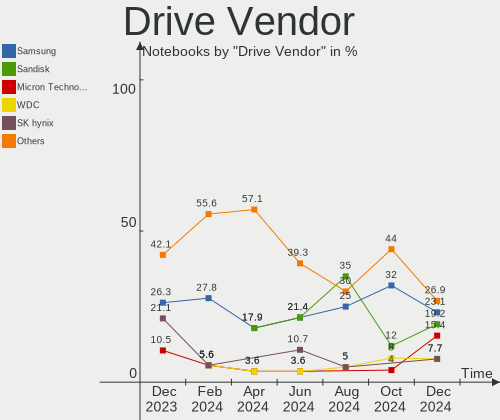
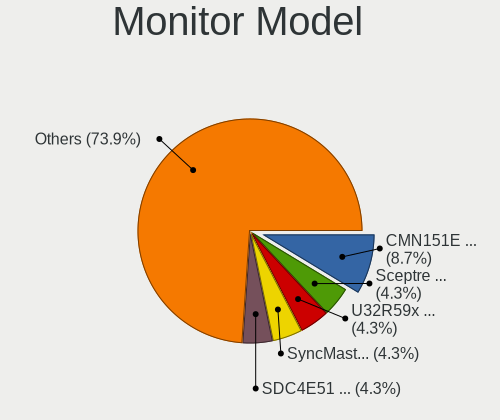

Gentoo Hardware Trends (Notebooks)
----------------------------------

A project to identify most popular hardware characteristics and track their change
over time based on data collected by Gentoo users at https://Linux-Hardware.org.

Anyone can contribute to this report by the [hw-probe](https://github.com/linuxhw/hw-probe) tool:

    sudo -E hw-probe -all -upload

This report is for one last month. Overall report since the beginning of time: [TestCoverage](https://github.com/linuxhw/TestCoverage)

Period: Apr, 2022.

Contents
--------

* [ System ](#system)
  - [ OS                       ](#os)
  - [ OS Family                ](#os-family)
  - [ Kernel                   ](#kernel)
  - [ Kernel Family            ](#kernel-family)
  - [ Kernel Major Ver.        ](#kernel-major-ver)
  - [ Arch                     ](#arch)
  - [ DE                       ](#de)
  - [ Display Server           ](#display-server)
  - [ Display Manager          ](#display-manager)
  - [ OS Lang                  ](#os-lang)
  - [ Boot Mode                ](#boot-mode)
  - [ Filesystem               ](#filesystem)
  - [ Part. scheme             ](#part-scheme)
  - [ Dual Boot with Linux/BSD ](#dual-boot-with-linuxbsd)
  - [ Dual Boot (Win)          ](#dual-boot-win)

* [ Board ](#board)
  - [ Vendor                   ](#vendor)
  - [ Model                    ](#model)
  - [ Model Family             ](#model-family)
  - [ MFG Year                 ](#mfg-year)
  - [ Form Factor              ](#form-factor)
  - [ Secure Boot              ](#secure-boot)
  - [ Coreboot                 ](#coreboot)
  - [ RAM Size                 ](#ram-size)
  - [ RAM Used                 ](#ram-used)
  - [ Total Drives             ](#total-drives)
  - [ Has CD-ROM               ](#has-cd-rom)
  - [ Has Ethernet             ](#has-ethernet)
  - [ Has WiFi                 ](#has-wifi)
  - [ Has Bluetooth            ](#has-bluetooth)

* [ Location ](#location)
  - [ Country                  ](#country)
  - [ City                     ](#city)

* [ Drives ](#drives)
  - [ Drive Vendor             ](#drive-vendor)
  - [ Drive Model              ](#drive-model)
  - [ HDD Vendor               ](#hdd-vendor)
  - [ SSD Vendor               ](#ssd-vendor)
  - [ Drive Kind               ](#drive-kind)
  - [ Drive Connector          ](#drive-connector)
  - [ Drive Size               ](#drive-size)
  - [ Space Total              ](#space-total)
  - [ Space Used               ](#space-used)
  - [ Malfunc. Drives          ](#malfunc-drives)
  - [ Malfunc. Drive Vendor    ](#malfunc-drive-vendor)
  - [ Malfunc. HDD Vendor      ](#malfunc-hdd-vendor)
  - [ Malfunc. Drive Kind      ](#malfunc-drive-kind)
  - [ Failed Drives            ](#failed-drives)
  - [ Failed Drive Vendor      ](#failed-drive-vendor)
  - [ Drive Status             ](#drive-status)

* [ Storage controller ](#storage-controller)
  - [ Storage Vendor           ](#storage-vendor)
  - [ Storage Model            ](#storage-model)
  - [ Storage Kind             ](#storage-kind)

* [ Processor ](#processor)
  - [ CPU Vendor               ](#cpu-vendor)
  - [ CPU Model                ](#cpu-model)
  - [ CPU Model Family         ](#cpu-model-family)
  - [ CPU Cores                ](#cpu-cores)
  - [ CPU Sockets              ](#cpu-sockets)
  - [ CPU Threads              ](#cpu-threads)
  - [ CPU Op-Modes             ](#cpu-op-modes)
  - [ CPU Microcode            ](#cpu-microcode)
  - [ CPU Microarch            ](#cpu-microarch)

* [ Graphics ](#graphics)
  - [ GPU Vendor               ](#gpu-vendor)
  - [ GPU Model                ](#gpu-model)
  - [ GPU Combo                ](#gpu-combo)
  - [ GPU Driver               ](#gpu-driver)
  - [ GPU Memory               ](#gpu-memory)

* [ Monitor ](#monitor)
  - [ Monitor Vendor           ](#monitor-vendor)
  - [ Monitor Model            ](#monitor-model)
  - [ Monitor Resolution       ](#monitor-resolution)
  - [ Monitor Diagonal         ](#monitor-diagonal)
  - [ Monitor Width            ](#monitor-width)
  - [ Aspect Ratio             ](#aspect-ratio)
  - [ Monitor Area             ](#monitor-area)
  - [ Pixel Density            ](#pixel-density)
  - [ Multiple Monitors        ](#multiple-monitors)

* [ Network ](#network)
  - [ Net Controller Vendor    ](#net-controller-vendor)
  - [ Net Controller Model     ](#net-controller-model)
  - [ Wireless Vendor          ](#wireless-vendor)
  - [ Wireless Model           ](#wireless-model)
  - [ Ethernet Vendor          ](#ethernet-vendor)
  - [ Ethernet Model           ](#ethernet-model)
  - [ Net Controller Kind      ](#net-controller-kind)
  - [ Used Controller          ](#used-controller)
  - [ NICs                     ](#nics)
  - [ IPv6                     ](#ipv6)

* [ Bluetooth ](#bluetooth)
  - [ Bluetooth Vendor         ](#bluetooth-vendor)
  - [ Bluetooth Model          ](#bluetooth-model)

* [ Sound ](#sound)
  - [ Sound Vendor             ](#sound-vendor)
  - [ Sound Model              ](#sound-model)

* [ Memory ](#memory)
  - [ Memory Vendor            ](#memory-vendor)
  - [ Memory Model             ](#memory-model)
  - [ Memory Kind              ](#memory-kind)
  - [ Memory Form Factor       ](#memory-form-factor)
  - [ Memory Size              ](#memory-size)
  - [ Memory Speed             ](#memory-speed)

* [ Printers & scanners ](#printers--scanners)
  - [ Printer Vendor           ](#printer-vendor)
  - [ Printer Model            ](#printer-model)
  - [ Scanner Vendor           ](#scanner-vendor)
  - [ Scanner Model            ](#scanner-model)

* [ Camera ](#camera)
  - [ Camera Vendor            ](#camera-vendor)
  - [ Camera Model             ](#camera-model)

* [ Security ](#security)
  - [ Fingerprint Vendor       ](#fingerprint-vendor)
  - [ Fingerprint Model        ](#fingerprint-model)
  - [ Chipcard Vendor          ](#chipcard-vendor)
  - [ Chipcard Model           ](#chipcard-model)

* [ Unsupported ](#unsupported)
  - [ Unsupported Devices      ](#unsupported-devices)
  - [ Unsupported Device Types ](#unsupported-device-types)

System
------

OS
--

Installed operating systems

| Name       | Notebooks | Percent |
|------------|-----------|---------|
| Gentoo 2.6 | 9         | 39.13%  |
| Gentoo 2.8 | 7         | 30.43%  |
| Gentoo 2.7 | 7         | 30.43%  |

OS Family
---------

OS without a version

| Name   | Notebooks | Percent |
|--------|-----------|---------|
| Gentoo | 23        | 100%    |

Kernel
------

Version of the Linux kernel

| Version                        | Notebooks | Percent |
|--------------------------------|-----------|---------|
| 5.17.3-gentoo                  | 3         | 13.04%  |
| 5.15.32-gentoo-r1              | 3         | 13.04%  |
| 5.15.32-gentoo-r1-x86_64       | 2         | 8.7%    |
| 5.15.26-gentoo                 | 2         | 8.7%    |
| 5.17.2-gentoo-yoshi-hp         | 1         | 4.35%   |
| 5.17.2-gentoo-groovin          | 1         | 4.35%   |
| 5.17.1-gentoo-r1-x86_64        | 1         | 4.35%   |
| 5.17.1-gentoo-r1               | 1         | 4.35%   |
| 5.16.0-pf5                     | 1         | 4.35%   |
| 5.15.35-adry                   | 1         | 4.35%   |
| 5.15.33-gentoo-x86_64          | 1         | 4.35%   |
| 5.15.33-gentoo-113-eee_drivers | 1         | 4.35%   |
| 5.15.32-gentoo-r1-genbook      | 1         | 4.35%   |
| 5.15.32-gentoo-dist            | 1         | 4.35%   |
| 5.15.26-gentoo-x86_64          | 1         | 4.35%   |
| 5.12.19-gentoo-dist            | 1         | 4.35%   |
| 5.10.52-gentoo-amd64-fomys     | 1         | 4.35%   |

Kernel Family
-------------

Linux kernel without a distro release

| Version | Notebooks | Percent |
|---------|-----------|---------|
| 5.15.32 | 7         | 30.43%  |
| 5.17.3  | 3         | 13.04%  |
| 5.15.26 | 3         | 13.04%  |
| 5.17.2  | 2         | 8.7%    |
| 5.17.1  | 2         | 8.7%    |
| 5.15.33 | 2         | 8.7%    |
| 5.16.0  | 1         | 4.35%   |
| 5.15.35 | 1         | 4.35%   |
| 5.12.19 | 1         | 4.35%   |
| 5.10.52 | 1         | 4.35%   |

Kernel Major Ver.
-----------------

Linux kernel major version

| Version | Notebooks | Percent |
|---------|-----------|---------|
| 5.15    | 13        | 56.52%  |
| 5.17    | 7         | 30.43%  |
| 5.16    | 1         | 4.35%   |
| 5.12    | 1         | 4.35%   |
| 5.10    | 1         | 4.35%   |

Arch
----

OS architecture (x86_64, i586, etc.)

| Name   | Notebooks | Percent |
|--------|-----------|---------|
| x86_64 | 23        | 100%    |

DE
--

Desktop Environment

| Name    | Notebooks | Percent |
|---------|-----------|---------|
| KDE5    | 5         | 21.74%  |
| GNOME   | 5         | 21.74%  |
| Unknown | 5         | 21.74%  |
| XFCE    | 4         | 17.39%  |
| MATE    | 3         | 13.04%  |
| LXQt    | 1         | 4.35%   |

Display Server
--------------

X11 or Wayland

| Name    | Notebooks | Percent |
|---------|-----------|---------|
| X11     | 12        | 52.17%  |
| Wayland | 5         | 21.74%  |
| Tty     | 4         | 17.39%  |
| Unknown | 2         | 8.7%    |

Display Manager
---------------

SDDM, LightDM, etc.

| Name    | Notebooks | Percent |
|---------|-----------|---------|
| SDDM    | 7         | 30.43%  |
| LightDM | 6         | 26.09%  |
| GDM     | 4         | 17.39%  |
| Unknown | 4         | 17.39%  |
| XDM     | 1         | 4.35%   |
| GREETD  | 1         | 4.35%   |

OS Lang
-------

Language

| Lang    | Notebooks | Percent |
|---------|-----------|---------|
| en_US   | 8         | 34.78%  |
| en_GB   | 5         | 21.74%  |
| Unknown | 4         | 17.39%  |
| C.UTF8  | 3         | 13.04%  |
| fr_FR   | 1         | 4.35%   |
| el_GR   | 1         | 4.35%   |
| de_CH   | 1         | 4.35%   |

Boot Mode
---------

EFI or BIOS

| Mode | Notebooks | Percent |
|------|-----------|---------|
| EFI  | 18        | 78.26%  |
| BIOS | 5         | 21.74%  |

Filesystem
----------

Type of filesystem

| Type    | Notebooks | Percent |
|---------|-----------|---------|
| Ext4    | 11        | 47.83%  |
| Btrfs   | 6         | 26.09%  |
| Zfs     | 3         | 13.04%  |
| XXXXXXX | 1         | 4.35%   |
| Xfs     | 1         | 4.35%   |
| F2fs    | 1         | 4.35%   |

Part. scheme
------------

Scheme of partitioning

| Type    | Notebooks | Percent |
|---------|-----------|---------|
| GPT     | 19        | 82.61%  |
| MBR     | 2         | 8.7%    |
| Unknown | 2         | 8.7%    |

Dual Boot with Linux/BSD
------------------------

Hosting more than one Linux/BSD

| Dual boot | Notebooks | Percent |
|-----------|-----------|---------|
| No        | 14        | 60.87%  |
| Yes       | 9         | 39.13%  |

Dual Boot (Win)
---------------

Hosting Linux and Windows

| Dual boot | Notebooks | Percent |
|-----------|-----------|---------|
| No        | 20        | 86.96%  |
| Yes       | 3         | 13.04%  |

Board
-----

Vendor
------

Motherboard manufacturer

| Name             | Notebooks | Percent |
|------------------|-----------|---------|
| Hewlett-Packard  | 6         | 26.09%  |
| Dell             | 4         | 17.39%  |
| Lenovo           | 2         | 8.7%    |
| ASUSTek Computer | 2         | 8.7%    |
| Apple            | 2         | 8.7%    |
| Acer             | 2         | 8.7%    |
| TUXEDO           | 1         | 4.35%   |
| Timi             | 1         | 4.35%   |
| System76         | 1         | 4.35%   |
| MSI              | 1         | 4.35%   |
| HUAWEI           | 1         | 4.35%   |

Model
-----

Motherboard model

| Name                                    | Notebooks | Percent |
|-----------------------------------------|-----------|---------|
| HP Pavilion Notebook                    | 2         | 8.7%    |
| TUXEDO Pulse 15 Gen1                    | 1         | 4.35%   |
| Timi A35                                | 1         | 4.35%   |
| System76 Gazelle                        | 1         | 4.35%   |
| MSI GE66 Raider 11UE                    | 1         | 4.35%   |
| Lenovo ThinkPad Yoga 11e 20DAS05100     | 1         | 4.35%   |
| Lenovo ThinkPad X220 4291QT1            | 1         | 4.35%   |
| HUAWEI CREM-WXX9                        | 1         | 4.35%   |
| HP ZBook 15 G3                          | 1         | 4.35%   |
| HP ProBook 6570b                        | 1         | 4.35%   |
| HP Pavilion ZV6100 (EE984EA#ABZ)        | 1         | 4.35%   |
| HP EliteBook 840 G1                     | 1         | 4.35%   |
| Dell XPS 15 9510                        | 1         | 4.35%   |
| Dell Precision 7560                     | 1         | 4.35%   |
| Dell G5 5505                            | 1         | 4.35%   |
| Dell G3 3500                            | 1         | 4.35%   |
| ASUS ZenBook UX333FN_UX333FN            | 1         | 4.35%   |
| ASUS VivoBook_ASUS Laptop E210MA_E210MA | 1         | 4.35%   |
| Apple MacBookPro11,3                    | 1         | 4.35%   |
| Apple MacBookAir3,1                     | 1         | 4.35%   |
| Acer Aspire VX5-591G                    | 1         | 4.35%   |
| Acer Aspire E5-571G                     | 1         | 4.35%   |

Model Family
------------

Motherboard model prefix

| Name               | Notebooks | Percent |
|--------------------|-----------|---------|
| HP Pavilion        | 3         | 13.04%  |
| Lenovo ThinkPad    | 2         | 8.7%    |
| Acer Aspire        | 2         | 8.7%    |
| TUXEDO Pulse       | 1         | 4.35%   |
| Timi A35           | 1         | 4.35%   |
| System76 Gazelle   | 1         | 4.35%   |
| MSI GE66           | 1         | 4.35%   |
| HUAWEI CREM-WXX9   | 1         | 4.35%   |
| HP ZBook           | 1         | 4.35%   |
| HP ProBook         | 1         | 4.35%   |
| HP EliteBook       | 1         | 4.35%   |
| Dell XPS           | 1         | 4.35%   |
| Dell Precision     | 1         | 4.35%   |
| Dell G5            | 1         | 4.35%   |
| Dell G3            | 1         | 4.35%   |
| ASUS ZenBook       | 1         | 4.35%   |
| ASUS VivoBook      | 1         | 4.35%   |
| Apple MacBookPro11 | 1         | 4.35%   |
| Apple MacBookAir3  | 1         | 4.35%   |

MFG Year
--------

Motherboard manufacture year

| Year | Notebooks | Percent |
|------|-----------|---------|
| 2021 | 6         | 26.09%  |
| 2020 | 4         | 17.39%  |
| 2014 | 3         | 13.04%  |
| 2019 | 2         | 8.7%    |
| 2018 | 1         | 4.35%   |
| 2017 | 1         | 4.35%   |
| 2016 | 1         | 4.35%   |
| 2013 | 1         | 4.35%   |
| 2012 | 1         | 4.35%   |
| 2011 | 1         | 4.35%   |
| 2010 | 1         | 4.35%   |
| 2006 | 1         | 4.35%   |

Form Factor
-----------

Physical design of the computer

| Name     | Notebooks | Percent |
|----------|-----------|---------|
| Notebook | 23        | 100%    |

Secure Boot
-----------

Enabled or disabled

| State    | Notebooks | Percent |
|----------|-----------|---------|
| Disabled | 21        | 91.3%   |
| Enabled  | 2         | 8.7%    |

Coreboot
--------

Have coreboot on board

| Used | Notebooks | Percent |
|------|-----------|---------|
| No   | 22        | 95.65%  |
| Yes  | 1         | 4.35%   |

RAM Size
--------

Total RAM memory

| Size in GB  | Notebooks | Percent |
|-------------|-----------|---------|
| 16.01-24.0  | 7         | 30.43%  |
| 8.01-16.0   | 4         | 17.39%  |
| 4.01-8.0    | 3         | 13.04%  |
| 32.01-64.0  | 3         | 13.04%  |
| 3.01-4.0    | 2         | 8.7%    |
| 64.01-256.0 | 2         | 8.7%    |
| 1.01-2.0    | 2         | 8.7%    |

RAM Used
--------

Used RAM memory

| Used GB    | Notebooks | Percent |
|------------|-----------|---------|
| 2.01-3.0   | 8         | 34.78%  |
| 4.01-8.0   | 4         | 17.39%  |
| 1.01-2.0   | 3         | 13.04%  |
| 0.01-0.5   | 3         | 13.04%  |
| 8.01-16.0  | 2         | 8.7%    |
| 3.01-4.0   | 1         | 4.35%   |
| 16.01-24.0 | 1         | 4.35%   |
| 0.51-1.0   | 1         | 4.35%   |

Total Drives
------------

Number of drives on board

| Drives | Notebooks | Percent |
|--------|-----------|---------|
| 1      | 16        | 69.57%  |
| 2      | 5         | 21.74%  |
| 3      | 2         | 8.7%    |

Has CD-ROM
----------

Has CD-ROM on board

| Presented | Notebooks | Percent |
|-----------|-----------|---------|
| No        | 20        | 86.96%  |
| Yes       | 3         | 13.04%  |

Has Ethernet
------------

Has Ethernet on board

| Presented | Notebooks | Percent |
|-----------|-----------|---------|
| Yes       | 19        | 82.61%  |
| No        | 4         | 17.39%  |

Has WiFi
--------

Has WiFi module

| Presented | Notebooks | Percent |
|-----------|-----------|---------|
| Yes       | 23        | 100%    |

Has Bluetooth
-------------

Has Bluetooth module

| Presented | Notebooks | Percent |
|-----------|-----------|---------|
| Yes       | 21        | 91.3%   |
| No        | 2         | 8.7%    |

Location
--------

Country
-------

Geographic location (country)

| Country     | Notebooks | Percent |
|-------------|-----------|---------|
| USA         | 6         | 26.09%  |
| France      | 4         | 17.39%  |
| UK          | 3         | 13.04%  |
| Poland      | 2         | 8.7%    |
| Ukraine     | 1         | 4.35%   |
| Taiwan      | 1         | 4.35%   |
| Switzerland | 1         | 4.35%   |
| Russia      | 1         | 4.35%   |
| Iran        | 1         | 4.35%   |
| Indonesia   | 1         | 4.35%   |
| Greece      | 1         | 4.35%   |
| Germany     | 1         | 4.35%   |

City
----

Geographic location (city)

| City           | Notebooks | Percent |
|----------------|-----------|---------|
| San Jose       | 3         | 13.04%  |
| Warsaw         | 1         | 4.35%   |
| Ternopil       | 1         | 4.35%   |
| Tehran         | 1         | 4.35%   |
| Taipei         | 1         | 4.35%   |
| St Petersburg  | 1         | 4.35%   |
| Roubaix        | 1         | 4.35%   |
| Pujaut         | 1         | 4.35%   |
| Paris          | 1         | 4.35%   |
| Ocala          | 1         | 4.35%   |
| New York       | 1         | 4.35%   |
| Neath          | 1         | 4.35%   |
| Milton Keynes  | 1         | 4.35%   |
| Marburg        | 1         | 4.35%   |
| La Chevroliere | 1         | 4.35%   |
| Jakarta        | 1         | 4.35%   |
| Erskine        | 1         | 4.35%   |
| Cieszyn        | 1         | 4.35%   |
| Boise          | 1         | 4.35%   |
| Athens         | 1         | 4.35%   |
| Altendorf      | 1         | 4.35%   |

Drives
------

Drive Vendor
------------

Hard drive vendors

| Vendor              | Notebooks | Drives | Percent |
|---------------------|-----------|--------|---------|
| Samsung Electronics | 6         | 8      | 20.69%  |
| WDC                 | 4         | 4      | 13.79%  |
| Micron Technology   | 3         | 3      | 10.34%  |
| Crucial             | 3         | 3      | 10.34%  |
| SK Hynix            | 2         | 2      | 6.9%    |
| Intel               | 2         | 2      | 6.9%    |
| Apple               | 2         | 2      | 6.9%    |
| Unknown             | 1         | 1      | 3.45%   |
| Toshiba             | 1         | 1      | 3.45%   |
| Seagate             | 1         | 1      | 3.45%   |
| SanDisk             | 1         | 1      | 3.45%   |
| PLEXTOR             | 1         | 1      | 3.45%   |
| China               | 1         | 2      | 3.45%   |
| A-DATA Technology   | 1         | 1      | 3.45%   |

Drive Model
-----------

Hard drive models

| Model                                    | Notebooks | Percent |
|------------------------------------------|-----------|---------|
| SK Hynix PC711 NVMe 1TB                  | 2         | 6.45%   |
| WDC WDS500G2B0C-00PXH0 500GB             | 1         | 3.23%   |
| WDC WDS240G2G0A-00JH30 240GB SSD         | 1         | 3.23%   |
| WDC WDS100T2B0A-00SM50 1TB SSD           | 1         | 3.23%   |
| WDC PC SN730 SDBPNTY-512G                | 1         | 3.23%   |
| Unknown MMC Card  64GB                   | 1         | 3.23%   |
| Toshiba MQ01ABD100 1TB                   | 1         | 3.23%   |
| Seagate ST2000LM015-2E8174 2TB           | 1         | 3.23%   |
| SanDisk SD9SN8W-128G-1006 128GB SSD      | 1         | 3.23%   |
| Samsung SSD 980 PRO 1TB                  | 1         | 3.23%   |
| Samsung SSD 970 EVO Plus 250GB           | 1         | 3.23%   |
| Samsung SSD 860 QVO 1TB                  | 1         | 3.23%   |
| Samsung SSD 860 EVO 500GB                | 1         | 3.23%   |
| Samsung SSD 860 EVO 250GB                | 1         | 3.23%   |
| Samsung PSSD T7 500GB                    | 1         | 3.23%   |
| Samsung PM991 NVMe 512GB                 | 1         | 3.23%   |
| Samsung MZVL21T0HCLR-00B00 1TB           | 1         | 3.23%   |
| PLEXTOR PX-128S2G 128GB SSD              | 1         | 3.23%   |
| Micron MTFDHBA512TCK 512GB               | 1         | 3.23%   |
| Micron MTFDDAV256MBF-1AN15ABHA 256GB SSD | 1         | 3.23%   |
| Micron 2200S NVMe 1024GB                 | 1         | 3.23%   |
| Intel SSDPEKNW010T8 1TB                  | 1         | 3.23%   |
| Intel NVMe SSD Drive 512GB               | 1         | 3.23%   |
| Crucial CT500P2SSD8 500GB                | 1         | 3.23%   |
| Crucial CT500MX500SSD1 500GB             | 1         | 3.23%   |
| Crucial CT2000MX500SSD1 2TB              | 1         | 3.23%   |
| China SSD 512GB                          | 1         | 3.23%   |
| Apple SSD TS064C 64GB                    | 1         | 3.23%   |
| Apple SSD SM0512F 500GB                  | 1         | 3.23%   |
| A-DATA SP550 240GB SSD                   | 1         | 3.23%   |

HDD Vendor
----------

Hard disk drive vendors

| Vendor  | Notebooks | Drives | Percent |
|---------|-----------|--------|---------|
| Toshiba | 1         | 1      | 50%     |
| Seagate | 1         | 1      | 50%     |

SSD Vendor
----------

Solid state drive vendors

| Vendor              | Notebooks | Drives | Percent |
|---------------------|-----------|--------|---------|
| Samsung Electronics | 4         | 4      | 26.67%  |
| WDC                 | 2         | 2      | 13.33%  |
| Crucial             | 2         | 2      | 13.33%  |
| Apple               | 2         | 2      | 13.33%  |
| SanDisk             | 1         | 1      | 6.67%   |
| PLEXTOR             | 1         | 1      | 6.67%   |
| Micron Technology   | 1         | 1      | 6.67%   |
| China               | 1         | 2      | 6.67%   |
| A-DATA Technology   | 1         | 1      | 6.67%   |

Drive Kind
----------

HDD or SSD

| Kind | Notebooks | Drives | Percent |
|------|-----------|--------|---------|
| SSD  | 14        | 16     | 48.28%  |
| NVMe | 12        | 13     | 41.38%  |
| HDD  | 2         | 2      | 6.9%    |
| MMC  | 1         | 1      | 3.45%   |

Drive Connector
---------------

SATA, SAS, NVMe, etc.

| Type | Notebooks | Drives | Percent |
|------|-----------|--------|---------|
| SATA | 14        | 17     | 50%     |
| NVMe | 12        | 13     | 42.86%  |
| SAS  | 1         | 1      | 3.57%   |
| MMC  | 1         | 1      | 3.57%   |

Drive Size
----------

Size of hard drive

| Size in TB | Notebooks | Drives | Percent |
|------------|-----------|--------|---------|
| 0.01-0.5   | 11        | 11     | 64.71%  |
| 0.51-1.0   | 4         | 5      | 23.53%  |
| 1.01-2.0   | 2         | 2      | 11.76%  |

Space Total
-----------

Amount of disk space available on the file system

| Size in GB | Notebooks | Percent |
|------------|-----------|---------|
| 251-500    | 5         | 21.74%  |
| 501-1000   | 5         | 21.74%  |
| 101-250    | 4         | 17.39%  |
| 1-20       | 3         | 13.04%  |
| 2001-3000  | 2         | 8.7%    |
| 51-100     | 2         | 8.7%    |
| 1001-2000  | 1         | 4.35%   |
| Unknown    | 1         | 4.35%   |

Space Used
----------

Amount of used disk space

| Used GB   | Notebooks | Percent |
|-----------|-----------|---------|
| 251-500   | 5         | 21.74%  |
| 101-250   | 5         | 21.74%  |
| 1-20      | 4         | 17.39%  |
| 21-50     | 3         | 13.04%  |
| 1001-2000 | 2         | 8.7%    |
| 51-100    | 2         | 8.7%    |
| 501-1000  | 1         | 4.35%   |
| Unknown   | 1         | 4.35%   |

Malfunc. Drives
---------------

Drive models with a malfunction

| Model                             | Notebooks | Drives | Percent |
|-----------------------------------|-----------|--------|---------|
| A-DATA Technology SP550 240GB SSD | 1         | 1      | 100%    |

Malfunc. Drive Vendor
---------------------

Vendors of faulty drives

| Vendor            | Notebooks | Drives | Percent |
|-------------------|-----------|--------|---------|
| A-DATA Technology | 1         | 1      | 100%    |

Malfunc. HDD Vendor
-------------------

Vendors of faulty HDD drives

Zero info for selected period =(

Malfunc. Drive Kind
-------------------

Kinds of faulty drives

| Kind | Notebooks | Drives | Percent |
|------|-----------|--------|---------|
| SSD  | 1         | 1      | 100%    |

Failed Drives
-------------

Failed drive models

Zero info for selected period =(

Failed Drive Vendor
-------------------

Failed drive vendors

Zero info for selected period =(

Drive Status
------------

Number of failed and malfunc. drives

| Status   | Notebooks | Drives | Percent |
|----------|-----------|--------|---------|
| Works    | 21        | 28     | 84%     |
| Detected | 3         | 3      | 12%     |
| Malfunc  | 1         | 1      | 4%      |

Storage controller
------------------

Storage Vendor
--------------

Storage controller vendors

| Vendor                    | Notebooks | Percent |
|---------------------------|-----------|---------|
| Intel                     | 15        | 46.88%  |
| Samsung Electronics       | 5         | 15.63%  |
| AMD                       | 4         | 12.5%   |
| SK Hynix                  | 2         | 6.25%   |
| Sandisk                   | 2         | 6.25%   |
| Micron Technology         | 2         | 6.25%   |
| Nvidia                    | 1         | 3.13%   |
| Micron/Crucial Technology | 1         | 3.13%   |

Storage Model
-------------

Storage controller models

| Model                                                                         | Notebooks | Percent |
|-------------------------------------------------------------------------------|-----------|---------|
| AMD FCH SATA Controller [AHCI mode]                                           | 3         | 9.38%   |
| SK Hynix Gold P31 SSD                                                         | 2         | 6.25%   |
| Samsung NVMe SSD Controller PM9A1/PM9A3/980PRO                                | 2         | 6.25%   |
| Micron Non-Volatile memory controller                                         | 2         | 6.25%   |
| Intel SSD 660P Series                                                         | 2         | 6.25%   |
| Intel 8 Series SATA Controller 1 [AHCI mode]                                  | 2         | 6.25%   |
| Sandisk WD Blue SN550 NVMe SSD                                                | 1         | 3.13%   |
| Sandisk WD Black SN750 / PC SN730 NVMe SSD                                    | 1         | 3.13%   |
| Samsung NVMe SSD Controller SM981/PM981/PM983                                 | 1         | 3.13%   |
| Samsung NVMe SSD Controller 980                                               | 1         | 3.13%   |
| Samsung Apple PCIe SSD                                                        | 1         | 3.13%   |
| Nvidia MCP89 SATA Controller (AHCI mode)                                      | 1         | 3.13%   |
| Micron/Crucial P2 NVMe PCIe SSD                                               | 1         | 3.13%   |
| Intel Wildcat Point-LP SATA Controller [AHCI Mode]                            | 1         | 3.13%   |
| Intel Volume Management Device NVMe RAID Controller                           | 1         | 3.13%   |
| Intel Sunrise Point-LP SATA Controller [AHCI mode]                            | 1         | 3.13%   |
| Intel Q170/Q150/B150/H170/H110/Z170/CM236 Chipset SATA Controller [AHCI Mode] | 1         | 3.13%   |
| Intel HM170/QM170 Chipset SATA Controller [AHCI Mode]                         | 1         | 3.13%   |
| Intel Celeron/Pentium Silver Processor SATA Controller                        | 1         | 3.13%   |
| Intel Atom Processor E3800 Series SATA AHCI Controller                        | 1         | 3.13%   |
| Intel 7 Series Chipset Family 6-port SATA Controller [AHCI mode]              | 1         | 3.13%   |
| Intel 6 Series/C200 Series Chipset Family 6 port Mobile SATA AHCI Controller  | 1         | 3.13%   |
| Intel 500 Series Chipset Family SATA AHCI Controller                          | 1         | 3.13%   |
| Intel 400 Series Chipset Family SATA AHCI Controller                          | 1         | 3.13%   |
| AMD IXP SB4x0 IDE Controller                                                  | 1         | 3.13%   |

Storage Kind
------------

Kind of storage controller (IDE, SATA, NVMe, SAS, ...)

| Kind | Notebooks | Percent |
|------|-----------|---------|
| SATA | 17        | 54.84%  |
| NVMe | 12        | 38.71%  |
| RAID | 1         | 3.23%   |
| IDE  | 1         | 3.23%   |

Processor
---------

CPU Vendor
----------

Processor vendors

| Vendor | Notebooks | Percent |
|--------|-----------|---------|
| Intel  | 19        | 82.61%  |
| AMD    | 4         | 17.39%  |

CPU Model
---------

Processor models

| Model                                   | Notebooks | Percent |
|-----------------------------------------|-----------|---------|
| Intel 11th Gen Core i7-11800H @ 2.30GHz | 3         | 13.04%  |
| AMD Ryzen 7 4800H with Radeon Graphics  | 2         | 8.7%    |
| Intel Core i7-8565U CPU @ 1.80GHz       | 1         | 4.35%   |
| Intel Core i7-7700HQ CPU @ 2.80GHz      | 1         | 4.35%   |
| Intel Core i7-7500U CPU @ 2.70GHz       | 1         | 4.35%   |
| Intel Core i7-6700HQ CPU @ 2.60GHz      | 1         | 4.35%   |
| Intel Core i7-4870HQ CPU @ 2.50GHz      | 1         | 4.35%   |
| Intel Core i5-5200U CPU @ 2.20GHz       | 1         | 4.35%   |
| Intel Core i5-4210U CPU @ 1.70GHz       | 1         | 4.35%   |
| Intel Core i5-4200U CPU @ 1.60GHz       | 1         | 4.35%   |
| Intel Core i5-3210M CPU @ 2.50GHz       | 1         | 4.35%   |
| Intel Core i5-2520M CPU @ 2.50GHz       | 1         | 4.35%   |
| Intel Core i5-10300H CPU @ 2.50GHz      | 1         | 4.35%   |
| Intel Core 2 Duo CPU U9400 @ 1.40GHz    | 1         | 4.35%   |
| Intel Celeron N4020 CPU @ 1.10GHz       | 1         | 4.35%   |
| Intel Celeron CPU N2940 @ 1.83GHz       | 1         | 4.35%   |
| Intel 11th Gen Core i9-11950H @ 2.60GHz | 1         | 4.35%   |
| Intel 11th Gen Core i5-11300H @ 3.10GHz | 1         | 4.35%   |
| AMD Ryzen 7 5800H with Radeon Graphics  | 1         | 4.35%   |
| AMD Athlon 64 Processor 3200+           | 1         | 4.35%   |

CPU Model Family
----------------

Processor model prefix

| Model            | Notebooks | Percent |
|------------------|-----------|---------|
| Intel Core i5    | 6         | 26.09%  |
| Other            | 5         | 21.74%  |
| Intel Core i7    | 5         | 21.74%  |
| AMD Ryzen 7      | 3         | 13.04%  |
| Intel Celeron    | 2         | 8.7%    |
| Intel Core 2 Duo | 1         | 4.35%   |
| AMD Athlon 64    | 1         | 4.35%   |

CPU Cores
---------

Number of processor cores

| Number | Notebooks | Percent |
|--------|-----------|---------|
| 2      | 8         | 34.78%  |
| 8      | 7         | 30.43%  |
| 4      | 7         | 30.43%  |
| 1      | 1         | 4.35%   |

CPU Sockets
-----------

Number of sockets

| Number | Notebooks | Percent |
|--------|-----------|---------|
| 1      | 23        | 100%    |

CPU Threads
-----------

Threads per core (Hyper-Threading)

| Number | Notebooks | Percent |
|--------|-----------|---------|
| 2      | 18        | 78.26%  |
| 1      | 5         | 21.74%  |

CPU Op-Modes
------------

CPU Operation Modes (32-bit, 64-bit)

| Op mode        | Notebooks | Percent |
|----------------|-----------|---------|
| 32-bit, 64-bit | 23        | 100%    |

CPU Microcode
-------------

Microcode number

| Number     | Notebooks | Percent |
|------------|-----------|---------|
| 0x806d1    | 3         | 13.04%  |
| 0x40651    | 2         | 8.7%    |
| Unknown    | 2         | 8.7%    |
| 0xa0652    | 1         | 4.35%   |
| 0x906e9    | 1         | 4.35%   |
| 0x806eb    | 1         | 4.35%   |
| 0x806e9    | 1         | 4.35%   |
| 0x806c1    | 1         | 4.35%   |
| 0x706a8    | 1         | 4.35%   |
| 0x506e3    | 1         | 4.35%   |
| 0x40661    | 1         | 4.35%   |
| 0x306d4    | 1         | 4.35%   |
| 0x306a9    | 1         | 4.35%   |
| 0x30678    | 1         | 4.35%   |
| 0x206a7    | 1         | 4.35%   |
| 0x1067a    | 1         | 4.35%   |
| 0x0a50000c | 1         | 4.35%   |
| 0x08600103 | 1         | 4.35%   |
| 0x08600102 | 1         | 4.35%   |

CPU Microarch
-------------

Microarchitecture

| Name          | Notebooks | Percent |
|---------------|-----------|---------|
| KabyLake      | 3         | 13.04%  |
| Icelake       | 3         | 13.04%  |
| Haswell       | 3         | 13.04%  |
| Zen 2         | 2         | 8.7%    |
| Zen 3         | 1         | 4.35%   |
| TigerLake     | 1         | 4.35%   |
| Skylake       | 1         | 4.35%   |
| Silvermont    | 1         | 4.35%   |
| SandyBridge   | 1         | 4.35%   |
| Penryn        | 1         | 4.35%   |
| K8 Hammer     | 1         | 4.35%   |
| IvyBridge     | 1         | 4.35%   |
| Goldmont plus | 1         | 4.35%   |
| CometLake     | 1         | 4.35%   |
| Broadwell     | 1         | 4.35%   |
| Unknown       | 1         | 4.35%   |

Graphics
--------

GPU Vendor
----------

Vendors of graphics cards

| Vendor | Notebooks | Percent |
|--------|-----------|---------|
| Intel  | 15        | 45.45%  |
| Nvidia | 13        | 39.39%  |
| AMD    | 5         | 15.15%  |

GPU Model
---------

Graphics card models

| Model                                                                     | Notebooks | Percent |
|---------------------------------------------------------------------------|-----------|---------|
| Intel TigerLake-H GT1 [UHD Graphics]                                      | 3         | 8.82%   |
| Nvidia GA106M [GeForce RTX 3060 Mobile / Max-Q]                           | 2         | 5.88%   |
| Intel Haswell-ULT Integrated Graphics Controller                          | 2         | 5.88%   |
| AMD Renoir                                                                | 2         | 5.88%   |
| Nvidia TU117M                                                             | 1         | 2.94%   |
| Nvidia MCP89 [GeForce 320M]                                               | 1         | 2.94%   |
| Nvidia GP108M [GeForce MX150]                                             | 1         | 2.94%   |
| Nvidia GP107M [GeForce GTX 1050 Mobile]                                   | 1         | 2.94%   |
| Nvidia GM108M [GeForce 940M]                                              | 1         | 2.94%   |
| Nvidia GM108M [GeForce 940MX]                                             | 1         | 2.94%   |
| Nvidia GM108M [GeForce 840M]                                              | 1         | 2.94%   |
| Nvidia GM107GLM [Quadro M2000M]                                           | 1         | 2.94%   |
| Nvidia GK107M [GeForce GT 750M Mac Edition]                               | 1         | 2.94%   |
| Nvidia GA107M [GeForce RTX 3050 Ti Mobile]                                | 1         | 2.94%   |
| Nvidia GA107GLM [RTX A2000 Mobile]                                        | 1         | 2.94%   |
| Intel WhiskeyLake-U GT2 [UHD Graphics 620]                                | 1         | 2.94%   |
| Intel TigerLake-LP GT2 [Iris Xe Graphics]                                 | 1         | 2.94%   |
| Intel HD Graphics 630                                                     | 1         | 2.94%   |
| Intel HD Graphics 620                                                     | 1         | 2.94%   |
| Intel HD Graphics 5500                                                    | 1         | 2.94%   |
| Intel HD Graphics 530                                                     | 1         | 2.94%   |
| Intel GeminiLake [UHD Graphics 600]                                       | 1         | 2.94%   |
| Intel CometLake-H GT2 [UHD Graphics]                                      | 1         | 2.94%   |
| Intel Atom Processor Z36xxx/Z37xxx Series Graphics & Display              | 1         | 2.94%   |
| Intel 2nd Generation Core Processor Family Integrated Graphics Controller | 1         | 2.94%   |
| AMD Thames [Radeon HD 7550M/7570M/7650M]                                  | 1         | 2.94%   |
| AMD RS480M [Mobility Radeon Xpress 200]                                   | 1         | 2.94%   |
| AMD Navi 10 [Radeon RX 5600 OEM/5600 XT / 5700/5700 XT]                   | 1         | 2.94%   |
| AMD Cezanne                                                               | 1         | 2.94%   |

GPU Combo
---------

Combinations of graphics cards

| Name           | Notebooks | Percent |
|----------------|-----------|---------|
| Intel + Nvidia | 10        | 43.48%  |
| 1 x Intel      | 5         | 21.74%  |
| 1 x AMD        | 4         | 17.39%  |
| 1 x Nvidia     | 3         | 13.04%  |
| 2 x AMD        | 1         | 4.35%   |

GPU Driver
----------

Free vs proprietary

| Driver      | Notebooks | Percent |
|-------------|-----------|---------|
| Free        | 16        | 69.57%  |
| Proprietary | 7         | 30.43%  |

GPU Memory
----------

Total video memory

| Size in GB | Notebooks | Percent |
|------------|-----------|---------|
| Unknown    | 14        | 60.87%  |
| 0.01-0.5   | 4         | 17.39%  |
| 3.01-4.0   | 2         | 8.7%    |
| 5.01-6.0   | 1         | 4.35%   |
| 1.01-2.0   | 1         | 4.35%   |
| 0.51-1.0   | 1         | 4.35%   |

Monitor
-------

Monitor Vendor
--------------

Monitor vendors

| Vendor              | Notebooks | Percent |
|---------------------|-----------|---------|
| BOE                 | 6         | 25%     |
| AU Optronics        | 4         | 16.67%  |
| Samsung Electronics | 3         | 12.5%   |
| Chimei Innolux      | 3         | 12.5%   |
| Sharp               | 2         | 8.33%   |
| LG Display          | 2         | 8.33%   |
| Apple               | 2         | 8.33%   |
| Dell                | 1         | 4.17%   |
| BenQ                | 1         | 4.17%   |

Monitor Model
-------------

Monitor models

| Model                                                                 | Notebooks | Percent |
|-----------------------------------------------------------------------|-----------|---------|
| Sharp LQ156M1JW01 SHP14C3 1920x1080 344x194mm 15.5-inch               | 1         | 4.17%   |
| Sharp LCD Monitor SHP1515 1920x1200 336x210mm 15.6-inch               | 1         | 4.17%   |
| Samsung Electronics LCD Monitor SDC4E51 1366x768 344x194mm 15.5-inch  | 1         | 4.17%   |
| Samsung Electronics LCD Monitor SDC415F 3840x2160 344x194mm 15.5-inch | 1         | 4.17%   |
| Samsung Electronics LCD Monitor SDC4150 3456x2160 336x210mm 15.6-inch | 1         | 4.17%   |
| LG Display LCD Monitor LGD05E4 1920x1080 344x194mm 15.5-inch          | 1         | 4.17%   |
| LG Display LCD Monitor LGD0258 1600x900 345x194mm 15.6-inch           | 1         | 4.17%   |
| Dell E170S DELA04A 1280x1024 338x270mm 17.0-inch                      | 1         | 4.17%   |
| Chimei Innolux LCD Monitor CMN15C4 1920x1080 344x193mm 15.5-inch      | 1         | 4.17%   |
| Chimei Innolux LCD Monitor CMN15C3 1920x1080 344x193mm 15.5-inch      | 1         | 4.17%   |
| Chimei Innolux LCD Monitor CMN14A3 1600x900 309x174mm 14.0-inch       | 1         | 4.17%   |
| BOE LCD Monitor BOE097D 1920x1080 340x190mm 15.3-inch                 | 1         | 4.17%   |
| BOE LCD Monitor BOE092F 2520x1680 338x226mm 16.0-inch                 | 1         | 4.17%   |
| BOE LCD Monitor BOE0910 1920x1080 344x194mm 15.5-inch                 | 1         | 4.17%   |
| BOE LCD Monitor BOE0819 1920x1080 344x194mm 15.5-inch                 | 1         | 4.17%   |
| BOE LCD Monitor BOE06BA 1920x1080 344x193mm 15.5-inch                 | 1         | 4.17%   |
| BOE LCD Monitor BOE05E9 1366x768 256x144mm 11.6-inch                  | 1         | 4.17%   |
| BenQ PD2500Q BNQ802A 2560x1440 553x311mm 25.0-inch                    | 1         | 4.17%   |
| AU Optronics LCD Monitor AUO5C2D 1920x1080 293x165mm 13.2-inch        | 1         | 4.17%   |
| AU Optronics LCD Monitor AUO38ED 1920x1080 344x193mm 15.5-inch        | 1         | 4.17%   |
| AU Optronics LCD Monitor AUO235C 1366x768 256x144mm 11.6-inch         | 1         | 4.17%   |
| AU Optronics LCD Monitor AUO106C 1366x768 277x156mm 12.5-inch         | 1         | 4.17%   |
| Apple Color LCD APPA022 2880x1800 331x207mm 15.4-inch                 | 1         | 4.17%   |
| Apple Color LCD APP9CF3 1366x768 260x140mm 11.6-inch                  | 1         | 4.17%   |

Monitor Resolution
------------------

Monitor screen resolution

| Resolution        | Notebooks | Percent |
|-------------------|-----------|---------|
| 1920x1080 (FHD)   | 10        | 41.67%  |
| 1366x768 (WXGA)   | 5         | 20.83%  |
| 1600x900 (HD+)    | 2         | 8.33%   |
| 3840x2160 (4K)    | 1         | 4.17%   |
| 3456x2160         | 1         | 4.17%   |
| 2880x1800         | 1         | 4.17%   |
| 2560x1440 (QHD)   | 1         | 4.17%   |
| 2520x1680         | 1         | 4.17%   |
| 1920x1200 (WUXGA) | 1         | 4.17%   |
| 1280x1024 (SXGA)  | 1         | 4.17%   |

Monitor Diagonal
----------------

Diagonal size in inches

| Inches | Notebooks | Percent |
|--------|-----------|---------|
| 15     | 15        | 62.5%   |
| 11     | 3         | 12.5%   |
| 25     | 1         | 4.17%   |
| 17     | 1         | 4.17%   |
| 16     | 1         | 4.17%   |
| 14     | 1         | 4.17%   |
| 13     | 1         | 4.17%   |
| 12     | 1         | 4.17%   |

Monitor Width
-------------

Physical width

| Width in mm | Notebooks | Percent |
|-------------|-----------|---------|
| 301-350     | 17        | 73.91%  |
| 201-300     | 5         | 21.74%  |
| 501-600     | 1         | 4.35%   |

Aspect Ratio
------------

Proportional relationship between the width and the height

| Ratio | Notebooks | Percent |
|-------|-----------|---------|
| 16/9  | 19        | 79.17%  |
| 16/10 | 3         | 12.5%   |
| 5/4   | 1         | 4.17%   |
| 3/2   | 1         | 4.17%   |

Monitor Area
------------

Area in inch²

| Area in inch² | Notebooks | Percent |
|----------------|-----------|---------|
| 101-110        | 14        | 58.33%  |
| 51-60          | 3         | 12.5%   |
| 81-90          | 1         | 4.17%   |
| 71-80          | 1         | 4.17%   |
| 61-70          | 1         | 4.17%   |
| 251-300        | 1         | 4.17%   |
| 141-150        | 1         | 4.17%   |
| 111-120        | 1         | 4.17%   |
| 91-100         | 1         | 4.17%   |

Pixel Density
-------------

Pixels per inch

| Density       | Notebooks | Percent |
|---------------|-----------|---------|
| 121-160       | 15        | 62.5%   |
| 161-240       | 3         | 12.5%   |
| 101-120       | 3         | 12.5%   |
| More than 240 | 2         | 8.33%   |
| 51-100        | 1         | 4.17%   |

Multiple Monitors
-----------------

Total monitors connected

| Total | Notebooks | Percent |
|-------|-----------|---------|
| 1     | 21        | 91.3%   |
| 2     | 2         | 8.7%    |

Network
-------

Net Controller Vendor
---------------------

Controller vendors

| Vendor                            | Notebooks | Percent |
|-----------------------------------|-----------|---------|
| Intel                             | 15        | 38.46%  |
| Realtek Semiconductor             | 14        | 35.9%   |
| Broadcom                          | 4         | 10.26%  |
| ASIX Electronics                  | 2         | 5.13%   |
| Qualcomm Atheros                  | 1         | 2.56%   |
| Ericsson Business Mobile Networks | 1         | 2.56%   |
| Apple                             | 1         | 2.56%   |
| AMD                               | 1         | 2.56%   |

Net Controller Model
--------------------

Controller models

| Model                                                               | Notebooks | Percent |
|---------------------------------------------------------------------|-----------|---------|
| Realtek RTL8111/8168/8411 PCI Express Gigabit Ethernet Controller   | 6         | 13.04%  |
| Realtek RTL8723BE PCIe Wireless Network Adapter                     | 2         | 4.35%   |
| Realtek RTL810xE PCI Express Fast Ethernet controller               | 2         | 4.35%   |
| Intel Wi-Fi 6 AX210/AX211/AX411 160MHz                              | 2         | 4.35%   |
| Intel Wi-Fi 6 AX200                                                 | 2         | 4.35%   |
| Intel Tiger Lake PCH CNVi WiFi                                      | 2         | 4.35%   |
| ASIX AX88179 Gigabit Ethernet                                       | 2         | 4.35%   |
| Realtek RTL8822CE 802.11ac PCIe Wireless Network Adapter            | 1         | 2.17%   |
| Realtek RTL8821CE 802.11ac PCIe Wireless Network Adapter            | 1         | 2.17%   |
| Realtek RTL8188EUS 802.11n Wireless Network Adapter                 | 1         | 2.17%   |
| Realtek RTL8188CE 802.11b/g/n WiFi Adapter                          | 1         | 2.17%   |
| Realtek RTL-8100/8101L/8139 PCI Fast Ethernet Adapter               | 1         | 2.17%   |
| Realtek Killer E3000 2.5GbE Controller                              | 1         | 2.17%   |
| Qualcomm Atheros QCA9565 / AR9565 Wireless Network Adapter          | 1         | 2.17%   |
| Intel Wireless 8260                                                 | 1         | 2.17%   |
| Intel Wireless 7265                                                 | 1         | 2.17%   |
| Intel Wireless 7260                                                 | 1         | 2.17%   |
| Intel Wi-Fi 6 AX201                                                 | 1         | 2.17%   |
| Intel Ethernet Connection I218-LM                                   | 1         | 2.17%   |
| Intel Ethernet Connection (2) I219-LM                               | 1         | 2.17%   |
| Intel Ethernet Connection (14) I219-V                               | 1         | 2.17%   |
| Intel Ethernet Connection (14) I219-LM                              | 1         | 2.17%   |
| Intel Comet Lake PCH CNVi WiFi                                      | 1         | 2.17%   |
| Intel Centrino Advanced-N 6205 [Taylor Peak]                        | 1         | 2.17%   |
| Intel Cannon Point-LP CNVi [Wireless-AC]                            | 1         | 2.17%   |
| Intel 82579V Gigabit Network Connection                             | 1         | 2.17%   |
| Intel 82579LM Gigabit Network Connection (Lewisville)               | 1         | 2.17%   |
| Ericsson Business Mobile Networks F5521gw                           | 1         | 2.17%   |
| Broadcom NetXtreme BCM57762 Gigabit Ethernet PCIe                   | 1         | 2.17%   |
| Broadcom BCM43602 802.11ac Wireless LAN SoC                         | 1         | 2.17%   |
| Broadcom BCM43228 802.11a/b/g/n                                     | 1         | 2.17%   |
| Broadcom BCM43224 802.11a/b/g/n                                     | 1         | 2.17%   |
| Broadcom BCM4318 [AirForce One 54g] 802.11g Wireless LAN Controller | 1         | 2.17%   |
| Apple Ethernet Adapter [A1277]                                      | 1         | 2.17%   |
| AMD IXP SB400 AC'97 Modem Controller                                | 1         | 2.17%   |

Wireless Vendor
---------------

Wireless vendors

| Vendor                | Notebooks | Percent |
|-----------------------|-----------|---------|
| Intel                 | 13        | 54.17%  |
| Realtek Semiconductor | 6         | 25%     |
| Broadcom              | 4         | 16.67%  |
| Qualcomm Atheros      | 1         | 4.17%   |

Wireless Model
--------------

Wireless models

| Model                                                               | Notebooks | Percent |
|---------------------------------------------------------------------|-----------|---------|
| Realtek RTL8723BE PCIe Wireless Network Adapter                     | 2         | 8.33%   |
| Intel Wi-Fi 6 AX210/AX211/AX411 160MHz                              | 2         | 8.33%   |
| Intel Wi-Fi 6 AX200                                                 | 2         | 8.33%   |
| Intel Tiger Lake PCH CNVi WiFi                                      | 2         | 8.33%   |
| Realtek RTL8822CE 802.11ac PCIe Wireless Network Adapter            | 1         | 4.17%   |
| Realtek RTL8821CE 802.11ac PCIe Wireless Network Adapter            | 1         | 4.17%   |
| Realtek RTL8188EUS 802.11n Wireless Network Adapter                 | 1         | 4.17%   |
| Realtek RTL8188CE 802.11b/g/n WiFi Adapter                          | 1         | 4.17%   |
| Qualcomm Atheros QCA9565 / AR9565 Wireless Network Adapter          | 1         | 4.17%   |
| Intel Wireless 8260                                                 | 1         | 4.17%   |
| Intel Wireless 7265                                                 | 1         | 4.17%   |
| Intel Wireless 7260                                                 | 1         | 4.17%   |
| Intel Wi-Fi 6 AX201                                                 | 1         | 4.17%   |
| Intel Comet Lake PCH CNVi WiFi                                      | 1         | 4.17%   |
| Intel Centrino Advanced-N 6205 [Taylor Peak]                        | 1         | 4.17%   |
| Intel Cannon Point-LP CNVi [Wireless-AC]                            | 1         | 4.17%   |
| Broadcom BCM43602 802.11ac Wireless LAN SoC                         | 1         | 4.17%   |
| Broadcom BCM43228 802.11a/b/g/n                                     | 1         | 4.17%   |
| Broadcom BCM43224 802.11a/b/g/n                                     | 1         | 4.17%   |
| Broadcom BCM4318 [AirForce One 54g] 802.11g Wireless LAN Controller | 1         | 4.17%   |

Ethernet Vendor
---------------

Ethernet vendors

| Vendor                | Notebooks | Percent |
|-----------------------|-----------|---------|
| Realtek Semiconductor | 10        | 50%     |
| Intel                 | 6         | 30%     |
| ASIX Electronics      | 2         | 10%     |
| Broadcom              | 1         | 5%      |
| Apple                 | 1         | 5%      |

Ethernet Model
--------------

Ethernet models

| Model                                                             | Notebooks | Percent |
|-------------------------------------------------------------------|-----------|---------|
| Realtek RTL8111/8168/8411 PCI Express Gigabit Ethernet Controller | 6         | 30%     |
| Realtek RTL810xE PCI Express Fast Ethernet controller             | 2         | 10%     |
| ASIX AX88179 Gigabit Ethernet                                     | 2         | 10%     |
| Realtek RTL-8100/8101L/8139 PCI Fast Ethernet Adapter             | 1         | 5%      |
| Realtek Killer E3000 2.5GbE Controller                            | 1         | 5%      |
| Intel Ethernet Connection I218-LM                                 | 1         | 5%      |
| Intel Ethernet Connection (2) I219-LM                             | 1         | 5%      |
| Intel Ethernet Connection (14) I219-V                             | 1         | 5%      |
| Intel Ethernet Connection (14) I219-LM                            | 1         | 5%      |
| Intel 82579V Gigabit Network Connection                           | 1         | 5%      |
| Intel 82579LM Gigabit Network Connection (Lewisville)             | 1         | 5%      |
| Broadcom NetXtreme BCM57762 Gigabit Ethernet PCIe                 | 1         | 5%      |
| Apple Ethernet Adapter [A1277]                                    | 1         | 5%      |

Net Controller Kind
-------------------

Ethernet, WiFi or modem

| Kind     | Notebooks | Percent |
|----------|-----------|---------|
| WiFi     | 23        | 52.27%  |
| Ethernet | 19        | 43.18%  |
| Modem    | 2         | 4.55%   |

Used Controller
---------------

Currently used network controller

| Kind     | Notebooks | Percent |
|----------|-----------|---------|
| WiFi     | 20        | 74.07%  |
| Ethernet | 7         | 25.93%  |

NICs
----

Total network controllers on board

| Total | Notebooks | Percent |
|-------|-----------|---------|
| 2     | 17        | 73.91%  |
| 1     | 6         | 26.09%  |

IPv6
----

IPv6 vs IPv4

| Used | Notebooks | Percent |
|------|-----------|---------|
| No   | 19        | 82.61%  |
| Yes  | 4         | 17.39%  |

Bluetooth
---------

Bluetooth Vendor
----------------

Controller vendors

| Vendor                  | Notebooks | Percent |
|-------------------------|-----------|---------|
| Intel                   | 12        | 54.55%  |
| Realtek Semiconductor   | 2         | 9.09%   |
| Broadcom                | 2         | 9.09%   |
| Apple                   | 2         | 9.09%   |
| Realtek                 | 1         | 4.55%   |
| Lite-On Technology      | 1         | 4.55%   |
| IMC Networks            | 1         | 4.55%   |
| Cambridge Silicon Radio | 1         | 4.55%   |

Bluetooth Model
---------------

Controller models

| Model                                               | Notebooks | Percent |
|-----------------------------------------------------|-----------|---------|
| Intel Bluetooth wireless interface                  | 3         | 13.64%  |
| Intel Bluetooth Device                              | 3         | 13.64%  |
| Realtek Bluetooth Radio                             | 2         | 9.09%   |
| Intel Bluetooth 9460/9560 Jefferson Peak (JfP)      | 2         | 9.09%   |
| Intel AX210 Bluetooth                               | 2         | 9.09%   |
| Intel AX200 Bluetooth                               | 2         | 9.09%   |
| Realtek Bluetooth Radio                             | 1         | 4.55%   |
| Lite-On Atheros AR3012 Bluetooth                    | 1         | 4.55%   |
| IMC Networks Bluetooth Radio                        | 1         | 4.55%   |
| Cambridge Silicon Radio Bluetooth Dongle (HCI mode) | 1         | 4.55%   |
| Broadcom HP Portable SoftSailing                    | 1         | 4.55%   |
| Broadcom HP Portable Bumble Bee                     | 1         | 4.55%   |
| Apple Bluetooth USB Host Controller                 | 1         | 4.55%   |
| Apple Bluetooth Host Controller                     | 1         | 4.55%   |

Sound
-----

Sound Vendor
------------

Sound card vendors

| Vendor              | Notebooks | Percent |
|---------------------|-----------|---------|
| Intel               | 18        | 58.06%  |
| Nvidia              | 7         | 22.58%  |
| AMD                 | 5         | 16.13%  |
| Creative Technology | 1         | 3.23%   |

Sound Model
-----------

Sound card models

| Model                                                                      | Notebooks | Percent |
|----------------------------------------------------------------------------|-----------|---------|
| Intel Tiger Lake-H HD Audio Controller                                     | 4         | 10.53%  |
| Nvidia Audio device                                                        | 3         | 7.89%   |
| AMD Renoir Radeon High Definition Audio Controller                         | 3         | 7.89%   |
| AMD Family 17h/19h HD Audio Controller                                     | 3         | 7.89%   |
| Intel Haswell-ULT HD Audio Controller                                      | 2         | 5.26%   |
| Intel 8 Series HD Audio Controller                                         | 2         | 5.26%   |
| Nvidia TU107 GeForce GTX 1650 High Definition Audio Controller             | 1         | 2.63%   |
| Nvidia MCP89 High Definition Audio                                         | 1         | 2.63%   |
| Nvidia GM107 High Definition Audio Controller [GeForce 940MX]              | 1         | 2.63%   |
| Nvidia GK107 HDMI Audio Controller                                         | 1         | 2.63%   |
| Intel Wildcat Point-LP High Definition Audio Controller                    | 1         | 2.63%   |
| Intel Tiger Lake-LP Smart Sound Technology Audio Controller                | 1         | 2.63%   |
| Intel Sunrise Point-LP HD Audio                                            | 1         | 2.63%   |
| Intel Comet Lake PCH cAVS                                                  | 1         | 2.63%   |
| Intel CM238 HD Audio Controller                                            | 1         | 2.63%   |
| Intel Celeron/Pentium Silver Processor High Definition Audio               | 1         | 2.63%   |
| Intel Cannon Point-LP High Definition Audio Controller                     | 1         | 2.63%   |
| Intel Broadwell-U Audio Controller                                         | 1         | 2.63%   |
| Intel Atom Processor Z36xxx/Z37xxx Series High Definition Audio Controller | 1         | 2.63%   |
| Intel 8 Series/C220 Series Chipset High Definition Audio Controller        | 1         | 2.63%   |
| Intel 7 Series/C216 Chipset Family High Definition Audio Controller        | 1         | 2.63%   |
| Intel 6 Series/C200 Series Chipset Family High Definition Audio Controller | 1         | 2.63%   |
| Intel 100 Series/C230 Series Chipset Family HD Audio Controller            | 1         | 2.63%   |
| Creative Technology Sound Blaster Play! 3                                  | 1         | 2.63%   |
| AMD Turks HDMI Audio [Radeon HD 6500/6600 / 6700M Series]                  | 1         | 2.63%   |
| AMD Navi 10 HDMI Audio                                                     | 1         | 2.63%   |
| AMD IXP SB400 AC'97 Audio Controller                                       | 1         | 2.63%   |

Memory
------

Memory Vendor
-------------

Memory module vendors

| Vendor              | Notebooks | Percent |
|---------------------|-----------|---------|
| Samsung Electronics | 9         | 37.5%   |
| SK Hynix            | 4         | 16.67%  |
| Unknown             | 3         | 12.5%   |
| Crucial             | 3         | 12.5%   |
| Micron Technology   | 1         | 4.17%   |
| Kingston            | 1         | 4.17%   |
| GOODRAM             | 1         | 4.17%   |
| Elpida              | 1         | 4.17%   |
| Corsair             | 1         | 4.17%   |

Memory Model
------------

Memory module models

| Model                                                       | Notebooks | Percent |
|-------------------------------------------------------------|-----------|---------|
| Samsung RAM M471B5173DB0-YK0 4096MB SODIMM DDR3 1600MT/s    | 2         | 7.41%   |
| Unknown RAM Module 8GB SODIMM DDR3 1333MT/s                 | 1         | 3.7%    |
| Unknown RAM Module 4GB SODIMM DDR4 2400MT/s                 | 1         | 3.7%    |
| Unknown RAM Module 256MB SODIMM DRAM                        | 1         | 3.7%    |
| Unknown RAM Module 1GB SODIMM DRAM                          | 1         | 3.7%    |
| SK Hynix RAM Module 8GB SODIMM DDR3 1600MT/s                | 1         | 3.7%    |
| SK Hynix RAM HMT351S6CFR8C-PB 4GB SODIMM DDR3 1600MT/s      | 1         | 3.7%    |
| SK Hynix RAM HMAA4GS6AJR8N-XN 32GB SODIMM DDR4 3200MT/s     | 1         | 3.7%    |
| SK Hynix RAM HMAA1GS6CJR6N-XN 8GB SODIMM DDR4 3200MT/s      | 1         | 3.7%    |
| Samsung RAM Module 8GB SODIMM DDR4 2133MT/s                 | 1         | 3.7%    |
| Samsung RAM Module 8GB SODIMM DDR3 1333MT/s                 | 1         | 3.7%    |
| Samsung RAM Module 16GB SODIMM DDR4 2133MT/s                | 1         | 3.7%    |
| Samsung RAM M471B1G73QH0-YK0 8GB SODIMM DDR3 1600MT/s       | 1         | 3.7%    |
| Samsung RAM M471B1G73DB0-YK0 8GB SODIMM DDR3 1600MT/s       | 1         | 3.7%    |
| Samsung RAM M471A2K43DB1-CWE 16GB SODIMM DDR4 3200MT/s      | 1         | 3.7%    |
| Samsung RAM M471A1K43DB1-CWE 8192MB SODIMM DDR4 3200MT/s    | 1         | 3.7%    |
| Samsung RAM M471A1K43CB1-CRC 8GB SODIMM DDR4 2667MT/s       | 1         | 3.7%    |
| Samsung RAM M471A1G44AB0-CWE 8GB Row Of Chips DDR4 3200MT/s | 1         | 3.7%    |
| Micron RAM 4ATF1G64HZ-3G2E1 8GB Row Of Chips DDR4 3200MT/s  | 1         | 3.7%    |
| Kingston RAM ACR24D4S7S8MB-8 8GB SODIMM DDR4 2400MT/s       | 1         | 3.7%    |
| GOODRAM RAM GR1600S3V64L11S/4G 4GB SODIMM DDR3 1600MT/s     | 1         | 3.7%    |
| Elpida RAM Module 1GB SODIMM DDR3 1067MT/s                  | 1         | 3.7%    |
| Crucial RAM CT8G4SFRA32A.C8FR 8GB SODIMM DDR4 3200MT/s      | 1         | 3.7%    |
| Crucial RAM CT16G4SFRA32A.C16FR 16GB SODIMM DDR4 3200MT/s   | 1         | 3.7%    |
| Crucial RAM CT102464BF160B.M16 8GB SODIMM DDR3 1600MT/s     | 1         | 3.7%    |
| Corsair RAM CMSX64GX4M2A2933C19 32GB SODIMM DDR4 2933MT/s   | 1         | 3.7%    |

Memory Kind
-----------

Memory module kinds

| Kind | Notebooks | Percent |
|------|-----------|---------|
| DDR4 | 13        | 59.09%  |
| DDR3 | 8         | 36.36%  |
| DRAM | 1         | 4.55%   |

Memory Form Factor
------------------

Physical design of the memory module

| Name         | Notebooks | Percent |
|--------------|-----------|---------|
| SODIMM       | 20        | 90.91%  |
| Row Of Chips | 2         | 9.09%   |

Memory Size
-----------

Memory module size

| Size  | Notebooks | Percent |
|-------|-----------|---------|
| 8192  | 13        | 52%     |
| 4096  | 4         | 16%     |
| 16384 | 3         | 12%     |
| 32768 | 2         | 8%      |
| 1024  | 2         | 8%      |
| 256   | 1         | 4%      |

Memory Speed
------------

Memory module speed

| Speed   | Notebooks | Percent |
|---------|-----------|---------|
| 3200    | 8         | 34.78%  |
| 1600    | 5         | 21.74%  |
| 2667    | 2         | 8.7%    |
| 2400    | 2         | 8.7%    |
| 1333    | 2         | 8.7%    |
| 2933    | 1         | 4.35%   |
| 2133    | 1         | 4.35%   |
| 1067    | 1         | 4.35%   |
| Unknown | 1         | 4.35%   |

Printers & scanners
-------------------

Printer Vendor
--------------

Printer device vendors

| Vendor      | Notebooks | Percent |
|-------------|-----------|---------|
| Seiko Epson | 1         | 100%    |

Printer Model
-------------

Printer device models

| Model                 | Notebooks | Percent |
|-----------------------|-----------|---------|
| Seiko Epson AL-M310DN | 1         | 100%    |

Scanner Vendor
--------------

Scanner device vendors

Zero info for selected period =(

Scanner Model
-------------

Scanner device models

Zero info for selected period =(

Camera
------

Camera Vendor
-------------

Camera device vendors

| Vendor                                 | Notebooks | Percent |
|----------------------------------------|-----------|---------|
| Chicony Electronics                    | 7         | 43.75%  |
| IMC Networks                           | 3         | 18.75%  |
| Microdia                               | 2         | 12.5%   |
| ShineTech                              | 1         | 6.25%   |
| Cheng Uei Precision Industry (Foxlink) | 1         | 6.25%   |
| Apple                                  | 1         | 6.25%   |
| Acer                                   | 1         | 6.25%   |

Camera Model
------------

Camera device models

| Model                                                                      | Notebooks | Percent |
|----------------------------------------------------------------------------|-----------|---------|
| Microdia Integrated_Webcam_HD                                              | 2         | 12.5%   |
| Chicony HD Webcam                                                          | 2         | 12.5%   |
| ShineTech HD Camera                                                        | 1         | 6.25%   |
| IMC Networks XiaoMi Webcam                                                 | 1         | 6.25%   |
| IMC Networks USB2.0 VGA UVC WebCam                                         | 1         | 6.25%   |
| IMC Networks USB2.0 HD IR UVC WebCam                                       | 1         | 6.25%   |
| Chicony USB2.0 Camera                                                      | 1         | 6.25%   |
| Chicony Integrated Camera                                                  | 1         | 6.25%   |
| Chicony HP Truevision HD                                                   | 1         | 6.25%   |
| Chicony HP HD Webcam                                                       | 1         | 6.25%   |
| Chicony HP HD Camera                                                       | 1         | 6.25%   |
| Cheng Uei Precision Industry (Foxlink) HP Wide Vision HD integrated webcam | 1         | 6.25%   |
| Apple FaceTime Camera                                                      | 1         | 6.25%   |
| Acer Integrated Camera                                                     | 1         | 6.25%   |

Security
--------

Fingerprint Vendor
------------------

Fingerprint sensor vendors

| Vendor                     | Notebooks | Percent |
|----------------------------|-----------|---------|
| Validity Sensors           | 1         | 50%     |
| Shenzhen Goodix Technology | 1         | 50%     |

Fingerprint Model
-----------------

Fingerprint sensor models

| Model                                      | Notebooks | Percent |
|--------------------------------------------|-----------|---------|
| Validity Sensors VFS495 Fingerprint Reader | 1         | 50%     |
| Shenzhen Goodix  Fingerprint Device        | 1         | 50%     |

Chipcard Vendor
---------------

Chipcard module vendors

| Vendor      | Notebooks | Percent |
|-------------|-----------|---------|
| Alcor Micro | 1         | 100%    |

Chipcard Model
--------------

Chipcard module models

| Model                               | Notebooks | Percent |
|-------------------------------------|-----------|---------|
| Alcor Micro AU9540 Smartcard Reader | 1         | 100%    |

Unsupported
-----------

Unsupported Devices
-------------------

Total unsupported devices on board

| Total | Notebooks | Percent |
|-------|-----------|---------|
| 0     | 9         | 39.13%  |
| 2     | 5         | 21.74%  |
| 1     | 4         | 17.39%  |
| 3     | 3         | 13.04%  |
| 4     | 2         | 8.7%    |

Unsupported Device Types
------------------------

Types of unsupported devices

| Type                     | Notebooks | Percent |
|--------------------------|-----------|---------|
| Bluetooth                | 7         | 22.58%  |
| Communication controller | 6         | 19.35%  |
| Camera                   | 4         | 12.9%   |
| Net/wireless             | 3         | 9.68%   |
| Graphics card            | 3         | 9.68%   |
| Modem                    | 2         | 6.45%   |
| Fingerprint reader       | 2         | 6.45%   |
| Network                  | 1         | 3.23%   |
| Multimedia controller    | 1         | 3.23%   |
| Firewire controller      | 1         | 3.23%   |
| Card reader              | 1         | 3.23%   |

