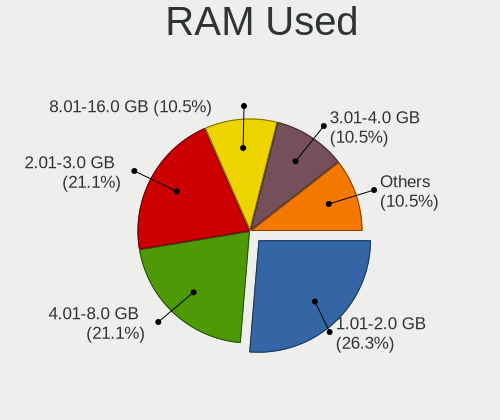
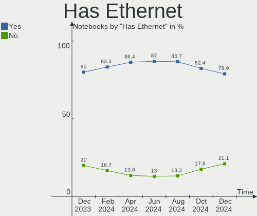
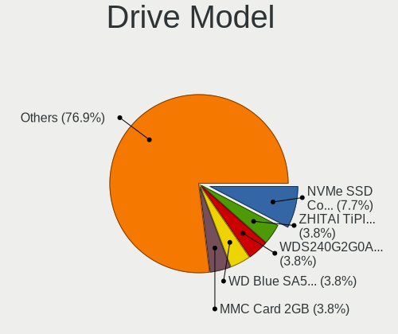
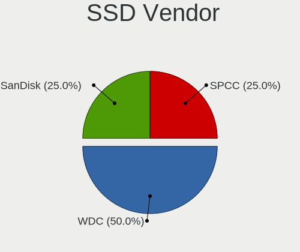
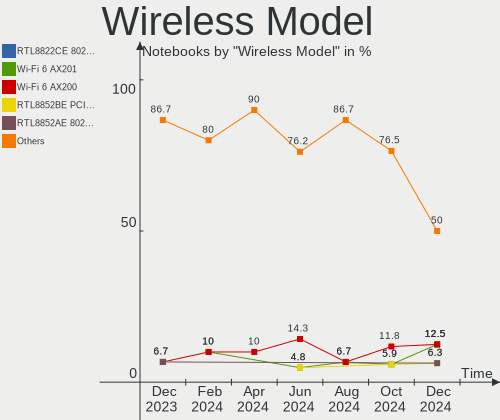
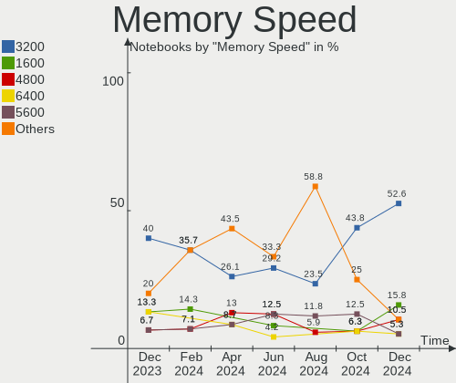

Gentoo - Hardware Trends (Notebooks)
------------------------------------

A project to identify most popular hardware characteristics and track their change
over time based on data collected by Linux users at https://Linux-Hardware.org.

Anyone can contribute to this report by the [hw-probe](https://github.com/linuxhw/hw-probe) tool:

    sudo -E hw-probe -all -upload

This report is for one last month. Overall report since the beginning of time: [TestCoverage](https://github.com/linuxhw/TestCoverage)

Period: Dec, 2022.

Contents
--------

* [ System ](#system)
  - [ OS                       ](#os)
  - [ OS Family                ](#os-family)
  - [ Kernel                   ](#kernel)
  - [ Kernel Family            ](#kernel-family)
  - [ Kernel Major Ver.        ](#kernel-major-ver)
  - [ Arch                     ](#arch)
  - [ DE                       ](#de)
  - [ Display Server           ](#display-server)
  - [ Display Manager          ](#display-manager)
  - [ OS Lang                  ](#os-lang)
  - [ Boot Mode                ](#boot-mode)
  - [ Filesystem               ](#filesystem)
  - [ Part. scheme             ](#part-scheme)
  - [ Dual Boot with Linux/BSD ](#dual-boot-with-linuxbsd)
  - [ Dual Boot (Win)          ](#dual-boot-win)

* [ Board ](#board)
  - [ Vendor                   ](#vendor)
  - [ Model                    ](#model)
  - [ Model Family             ](#model-family)
  - [ MFG Year                 ](#mfg-year)
  - [ Form Factor              ](#form-factor)
  - [ Secure Boot              ](#secure-boot)
  - [ Coreboot                 ](#coreboot)
  - [ RAM Size                 ](#ram-size)
  - [ RAM Used                 ](#ram-used)
  - [ Total Drives             ](#total-drives)
  - [ Has CD-ROM               ](#has-cd-rom)
  - [ Has Ethernet             ](#has-ethernet)
  - [ Has WiFi                 ](#has-wifi)
  - [ Has Bluetooth            ](#has-bluetooth)

* [ Location ](#location)
  - [ Country                  ](#country)
  - [ City                     ](#city)

* [ Drives ](#drives)
  - [ Drive Vendor             ](#drive-vendor)
  - [ Drive Model              ](#drive-model)
  - [ HDD Vendor               ](#hdd-vendor)
  - [ SSD Vendor               ](#ssd-vendor)
  - [ Drive Kind               ](#drive-kind)
  - [ Drive Connector          ](#drive-connector)
  - [ Drive Size               ](#drive-size)
  - [ Space Total              ](#space-total)
  - [ Space Used               ](#space-used)
  - [ Malfunc. Drives          ](#malfunc-drives)
  - [ Malfunc. Drive Vendor    ](#malfunc-drive-vendor)
  - [ Malfunc. HDD Vendor      ](#malfunc-hdd-vendor)
  - [ Malfunc. Drive Kind      ](#malfunc-drive-kind)
  - [ Failed Drives            ](#failed-drives)
  - [ Failed Drive Vendor      ](#failed-drive-vendor)
  - [ Drive Status             ](#drive-status)

* [ Storage controller ](#storage-controller)
  - [ Storage Vendor           ](#storage-vendor)
  - [ Storage Model            ](#storage-model)
  - [ Storage Kind             ](#storage-kind)

* [ Processor ](#processor)
  - [ CPU Vendor               ](#cpu-vendor)
  - [ CPU Model                ](#cpu-model)
  - [ CPU Model Family         ](#cpu-model-family)
  - [ CPU Cores                ](#cpu-cores)
  - [ CPU Sockets              ](#cpu-sockets)
  - [ CPU Threads              ](#cpu-threads)
  - [ CPU Op-Modes             ](#cpu-op-modes)
  - [ CPU Microcode            ](#cpu-microcode)
  - [ CPU Microarch            ](#cpu-microarch)

* [ Graphics ](#graphics)
  - [ GPU Vendor               ](#gpu-vendor)
  - [ GPU Model                ](#gpu-model)
  - [ GPU Combo                ](#gpu-combo)
  - [ GPU Driver               ](#gpu-driver)
  - [ GPU Memory               ](#gpu-memory)

* [ Monitor ](#monitor)
  - [ Monitor Vendor           ](#monitor-vendor)
  - [ Monitor Model            ](#monitor-model)
  - [ Monitor Resolution       ](#monitor-resolution)
  - [ Monitor Diagonal         ](#monitor-diagonal)
  - [ Monitor Width            ](#monitor-width)
  - [ Aspect Ratio             ](#aspect-ratio)
  - [ Monitor Area             ](#monitor-area)
  - [ Pixel Density            ](#pixel-density)
  - [ Multiple Monitors        ](#multiple-monitors)

* [ Network ](#network)
  - [ Net Controller Vendor    ](#net-controller-vendor)
  - [ Net Controller Model     ](#net-controller-model)
  - [ Wireless Vendor          ](#wireless-vendor)
  - [ Wireless Model           ](#wireless-model)
  - [ Ethernet Vendor          ](#ethernet-vendor)
  - [ Ethernet Model           ](#ethernet-model)
  - [ Net Controller Kind      ](#net-controller-kind)
  - [ Used Controller          ](#used-controller)
  - [ NICs                     ](#nics)
  - [ IPv6                     ](#ipv6)

* [ Bluetooth ](#bluetooth)
  - [ Bluetooth Vendor         ](#bluetooth-vendor)
  - [ Bluetooth Model          ](#bluetooth-model)

* [ Sound ](#sound)
  - [ Sound Vendor             ](#sound-vendor)
  - [ Sound Model              ](#sound-model)

* [ Memory ](#memory)
  - [ Memory Vendor            ](#memory-vendor)
  - [ Memory Model             ](#memory-model)
  - [ Memory Kind              ](#memory-kind)
  - [ Memory Form Factor       ](#memory-form-factor)
  - [ Memory Size              ](#memory-size)
  - [ Memory Speed             ](#memory-speed)

* [ Printers & scanners ](#printers--scanners)
  - [ Printer Vendor           ](#printer-vendor)
  - [ Printer Model            ](#printer-model)
  - [ Scanner Vendor           ](#scanner-vendor)
  - [ Scanner Model            ](#scanner-model)

* [ Camera ](#camera)
  - [ Camera Vendor            ](#camera-vendor)
  - [ Camera Model             ](#camera-model)

* [ Security ](#security)
  - [ Fingerprint Vendor       ](#fingerprint-vendor)
  - [ Fingerprint Model        ](#fingerprint-model)
  - [ Chipcard Vendor          ](#chipcard-vendor)
  - [ Chipcard Model           ](#chipcard-model)

* [ Unsupported ](#unsupported)
  - [ Unsupported Devices      ](#unsupported-devices)
  - [ Unsupported Device Types ](#unsupported-device-types)

System
------

OS
--

Installed operating systems

| Name       | Notebooks | Percent |
|------------|-----------|---------|
| Gentoo 2.9 | 24        | 88.89%  |
| Gentoo 2.8 | 3         | 11.11%  |

OS Family
---------

OS without a version

| Name   | Notebooks | Percent |
|--------|-----------|---------|
| Gentoo | 27        | 100%    |

Kernel
------

Version of the Linux kernel

| Version               | Notebooks | Percent |
|-----------------------|-----------|---------|
| 5.15.80-gentoo-x86_64 | 8         | 29.63%  |
| 5.15.75-gentoo        | 4         | 14.81%  |
| 5.15.80-gentoo        | 3         | 11.11%  |
| 6.1.1-gentoo-dist     | 1         | 3.7%    |
| 6.1.1-gentoo          | 1         | 3.7%    |
| 6.1.0-pf1             | 1         | 3.7%    |
| 6.0.8                 | 1         | 3.7%    |
| 6.0.12-gentoo-dist    | 1         | 3.7%    |
| 6.0.11-gentoo         | 1         | 3.7%    |
| 6.0.0-pf5             | 1         | 3.7%    |
| 5.19.10-xanmod1       | 1         | 3.7%    |
| 5.16.7                | 1         | 3.7%    |
| 5.15.75-gentoo-ver_4  | 1         | 3.7%    |
| 5.15.74-gentoo-x86_64 | 1         | 3.7%    |
| 5.15.41-gentoo        | 1         | 3.7%    |

Kernel Family
-------------

Linux kernel without a distro release

| Version | Notebooks | Percent |
|---------|-----------|---------|
| 5.15.80 | 11        | 40.74%  |
| 5.15.75 | 5         | 18.52%  |
| 6.1.1   | 2         | 7.41%   |
| 6.1.0   | 1         | 3.7%    |
| 6.0.8   | 1         | 3.7%    |
| 6.0.12  | 1         | 3.7%    |
| 6.0.11  | 1         | 3.7%    |
| 6.0.0   | 1         | 3.7%    |
| 5.19.10 | 1         | 3.7%    |
| 5.16.7  | 1         | 3.7%    |
| 5.15.74 | 1         | 3.7%    |
| 5.15.41 | 1         | 3.7%    |

Kernel Major Ver.
-----------------

Linux kernel major version

| Version | Notebooks | Percent |
|---------|-----------|---------|
| 5.15    | 18        | 66.67%  |
| 6.0     | 4         | 14.81%  |
| 6.1     | 3         | 11.11%  |
| 5.19    | 1         | 3.7%    |
| 5.16    | 1         | 3.7%    |

Arch
----

OS architecture (x86_64, i586, etc.)

| Name   | Notebooks | Percent |
|--------|-----------|---------|
| x86_64 | 27        | 100%    |

DE
--

Desktop Environment

| Name     | Notebooks | Percent |
|----------|-----------|---------|
| KDE5     | 7         | 25.93%  |
| XFCE     | 5         | 18.52%  |
| Unknown  | 5         | 18.52%  |
| MATE     | 2         | 7.41%   |
| GNOME    | 2         | 7.41%   |
| Trinity  | 1         | 3.7%    |
| sway     | 1         | 3.7%    |
| Hyprland | 1         | 3.7%    |
| dwm      | 1         | 3.7%    |
| bspwm    | 1         | 3.7%    |
| awesome  | 1         | 3.7%    |

Display Server
--------------

X11 or Wayland

| Name    | Notebooks | Percent |
|---------|-----------|---------|
| X11     | 17        | 62.96%  |
| Tty     | 4         | 14.81%  |
| Unknown | 4         | 14.81%  |
| Wayland | 2         | 7.41%   |

Display Manager
---------------

SDDM, LightDM, etc.

| Name    | Notebooks | Percent |
|---------|-----------|---------|
| SDDM    | 10        | 37.04%  |
| LightDM | 7         | 25.93%  |
| Unknown | 6         | 22.22%  |
| GDM     | 2         | 7.41%   |
| XDM     | 1         | 3.7%    |
| TDM     | 1         | 3.7%    |

OS Lang
-------

Language

| Lang           | Notebooks | Percent |
|----------------|-----------|---------|
| en_US          | 12        | 44.44%  |
| ru_RU          | 2         | 7.41%   |
| en_GB          | 2         | 7.41%   |
| en_CA          | 2         | 7.41%   |
| C.UTF8         | 2         | 7.41%   |
| pl_PL          | 1         | 3.7%    |
| mi_NZ          | 1         | 3.7%    |
| it_IT          | 1         | 3.7%    |
| fr_FR          | 1         | 3.7%    |
| en_GB.iso88591 | 1         | 3.7%    |
| cs_CZ          | 1         | 3.7%    |
| Unknown        | 1         | 3.7%    |

Boot Mode
---------

EFI or BIOS

| Mode | Notebooks | Percent |
|------|-----------|---------|
| EFI  | 21        | 77.78%  |
| BIOS | 6         | 22.22%  |

Filesystem
----------

Type of filesystem

| Type     | Notebooks | Percent |
|----------|-----------|---------|
| Ext4     | 18        | 66.67%  |
| Btrfs    | 6         | 22.22%  |
| XXXXXXX  | 1         | 3.7%    |
| Xfs      | 1         | 3.7%    |
| Reiserfs | 1         | 3.7%    |

Part. scheme
------------

Scheme of partitioning

| Type | Notebooks | Percent |
|------|-----------|---------|
| GPT  | 23        | 85.19%  |
| MBR  | 4         | 14.81%  |

Dual Boot with Linux/BSD
------------------------

Hosting more than one Linux/BSD

| Dual boot | Notebooks | Percent |
|-----------|-----------|---------|
| No        | 21        | 77.78%  |
| Yes       | 6         | 22.22%  |

Dual Boot (Win)
---------------

Hosting Linux and Windows

| Dual boot | Notebooks | Percent |
|-----------|-----------|---------|
| No        | 16        | 59.26%  |
| Yes       | 11        | 40.74%  |

Board
-----

Vendor
------

Motherboard manufacturer

| Name            | Notebooks | Percent |
|-----------------|-----------|---------|
| Lenovo          | 7         | 25.93%  |
| Dell            | 7         | 25.93%  |
| Hewlett-Packard | 6         | 22.22%  |
| Acer            | 2         | 7.41%   |
| Toshiba         | 1         | 3.7%    |
| Star Labs       | 1         | 3.7%    |
| HUAWEI          | 1         | 3.7%    |
| Google          | 1         | 3.7%    |
| Unknown         | 1         | 3.7%    |

Model
-----

Motherboard model

| Name                                        | Notebooks | Percent |
|---------------------------------------------|-----------|---------|
| Toshiba Satellite L50-B                     | 1         | 3.7%    |
| Star Labs StarLite                          | 1         | 3.7%    |
| Lenovo ThinkPad X1 Carbon Gen 10 21CCS8QS00 | 1         | 3.7%    |
| Lenovo ThinkPad W540 20BG0033RT             | 1         | 3.7%    |
| Lenovo ThinkPad T470p 20J7S25C00            | 1         | 3.7%    |
| Lenovo ThinkPad T16 Gen 1 21CHCTO1WW        | 1         | 3.7%    |
| Lenovo Legion Y540-15IRH-PG0 81SY           | 1         | 3.7%    |
| Lenovo Legion 5 Pro 16IAH7H 82RF            | 1         | 3.7%    |
| Lenovo IdeaPad Gaming 3 15ACH6 82K2         | 1         | 3.7%    |
| HUAWEI NBLB-WAX9N                           | 1         | 3.7%    |
| HP ProBook 6570b                            | 1         | 3.7%    |
| HP Pavilion Laptop 15-cs0xxx                | 1         | 3.7%    |
| HP Pavilion Aero Laptop 13-be0xxx           | 1         | 3.7%    |
| HP G62                                      | 1         | 3.7%    |
| HP EliteBook 820 G3                         | 1         | 3.7%    |
| HP 250 G7 Notebook PC                       | 1         | 3.7%    |
| Google Eve                                  | 1         | 3.7%    |
| Dell Vostro 5490                            | 1         | 3.7%    |
| Dell Precision 7720                         | 1         | 3.7%    |
| Dell Inspiron 3501                          | 1         | 3.7%    |
| Dell Inspiron 15 7000 Gaming                | 1         | 3.7%    |
| Dell Inspiron 15 3511                       | 1         | 3.7%    |
| Dell G5 5505                                | 1         | 3.7%    |
| Dell G3 3500                                | 1         | 3.7%    |
| Acer Predator PH315-53                      | 1         | 3.7%    |
| Acer Predator PH315-51                      | 1         | 3.7%    |
| Unknown                                     | 1         | 3.7%    |

Model Family
------------

Motherboard model prefix

| Name               | Notebooks | Percent |
|--------------------|-----------|---------|
| Lenovo ThinkPad    | 4         | 14.81%  |
| Dell Inspiron      | 3         | 11.11%  |
| Lenovo Legion      | 2         | 7.41%   |
| HP Pavilion        | 2         | 7.41%   |
| Acer Predator      | 2         | 7.41%   |
| Toshiba Satellite  | 1         | 3.7%    |
| Star Labs StarLite | 1         | 3.7%    |
| Lenovo IdeaPad     | 1         | 3.7%    |
| HUAWEI NBLB-WAX9N  | 1         | 3.7%    |
| HP ProBook         | 1         | 3.7%    |
| HP G62             | 1         | 3.7%    |
| HP EliteBook       | 1         | 3.7%    |
| HP 250             | 1         | 3.7%    |
| Google Eve         | 1         | 3.7%    |
| Dell Vostro        | 1         | 3.7%    |
| Dell Precision     | 1         | 3.7%    |
| Dell G5            | 1         | 3.7%    |
| Dell G3            | 1         | 3.7%    |
| Unknown            | 1         | 3.7%    |

MFG Year
--------

Motherboard manufacture year

| Year | Notebooks | Percent |
|------|-----------|---------|
| 2020 | 5         | 18.52%  |
| 2022 | 4         | 14.81%  |
| 2021 | 4         | 14.81%  |
| 2019 | 3         | 11.11%  |
| 2018 | 3         | 11.11%  |
| 2017 | 3         | 11.11%  |
| 2014 | 2         | 7.41%   |
| 2015 | 1         | 3.7%    |
| 2012 | 1         | 3.7%    |
| 2010 | 1         | 3.7%    |

Form Factor
-----------

Physical design of the computer

| Name     | Notebooks | Percent |
|----------|-----------|---------|
| Notebook | 27        | 100%    |

Secure Boot
-----------

Enabled or disabled

| State    | Notebooks | Percent |
|----------|-----------|---------|
| Disabled | 27        | 100%    |

Coreboot
--------

Have coreboot on board

| Used | Notebooks | Percent |
|------|-----------|---------|
| No   | 26        | 96.3%   |
| Yes  | 1         | 3.7%    |

RAM Size
--------

Total RAM memory

| Size in GB | Notebooks | Percent |
|------------|-----------|---------|
| 16.01-24.0 | 7         | 25.93%  |
| 4.01-8.0   | 5         | 18.52%  |
| 8.01-16.0  | 5         | 18.52%  |
| 32.01-64.0 | 4         | 14.81%  |
| 3.01-4.0   | 4         | 14.81%  |
| 24.01-32.0 | 1         | 3.7%    |
| 1.01-2.0   | 1         | 3.7%    |

RAM Used
--------

Used RAM memory

| Used GB   | Notebooks | Percent |
|-----------|-----------|---------|
| 1.01-2.0  | 7         | 25.93%  |
| 0.51-1.0  | 7         | 25.93%  |
| 0.01-0.5  | 5         | 18.52%  |
| 4.01-8.0  | 3         | 11.11%  |
| 2.01-3.0  | 3         | 11.11%  |
| 3.01-4.0  | 1         | 3.7%    |
| 8.01-16.0 | 1         | 3.7%    |

Total Drives
------------

Number of drives on board

| Drives | Notebooks | Percent |
|--------|-----------|---------|
| 1      | 16        | 59.26%  |
| 2      | 9         | 33.33%  |
| 3      | 2         | 7.41%   |

Has CD-ROM
----------

Has CD-ROM on board

| Presented | Notebooks | Percent |
|-----------|-----------|---------|
| No        | 24        | 88.89%  |
| Yes       | 3         | 11.11%  |

Has Ethernet
------------

Has Ethernet on board

| Presented | Notebooks | Percent |
|-----------|-----------|---------|
| Yes       | 21        | 77.78%  |
| No        | 6         | 22.22%  |

Has WiFi
--------

Has WiFi module

| Presented | Notebooks | Percent |
|-----------|-----------|---------|
| Yes       | 26        | 96.3%   |
| No        | 1         | 3.7%    |

Has Bluetooth
-------------

Has Bluetooth module

| Presented | Notebooks | Percent |
|-----------|-----------|---------|
| Yes       | 23        | 85.19%  |
| No        | 4         | 14.81%  |

Location
--------

Country
-------

Geographic location (country)

| Country     | Notebooks | Percent |
|-------------|-----------|---------|
| USA         | 7         | 25.93%  |
| UK          | 2         | 7.41%   |
| Russia      | 2         | 7.41%   |
| France      | 2         | 7.41%   |
| Canada      | 2         | 7.41%   |
| Poland      | 1         | 3.7%    |
| New Zealand | 1         | 3.7%    |
| Netherlands | 1         | 3.7%    |
| Nepal       | 1         | 3.7%    |
| Malaysia    | 1         | 3.7%    |
| Lithuania   | 1         | 3.7%    |
| Italy       | 1         | 3.7%    |
| India       | 1         | 3.7%    |
| Georgia     | 1         | 3.7%    |
| Czechia     | 1         | 3.7%    |
| Cyprus      | 1         | 3.7%    |
| China       | 1         | 3.7%    |

City
----

Geographic location (city)

| City         | Notebooks | Percent |
|--------------|-----------|---------|
| Saskatoon    | 2         | 7.41%   |
| Pittsburgh   | 2         | 7.41%   |
| Warsaw       | 1         | 3.7%    |
| Tbilisi      | 1         | 3.7%    |
| Taganrog     | 1         | 3.7%    |
| Purmerend    | 1         | 3.7%    |
| Pokhara      | 1         | 3.7%    |
| Paris        | 1         | 3.7%    |
| Oviedo       | 1         | 3.7%    |
| Norristown   | 1         | 3.7%    |
| Nicosia      | 1         | 3.7%    |
| New York     | 1         | 3.7%    |
| Milan        | 1         | 3.7%    |
| Marseille    | 1         | 3.7%    |
| Livermore    | 1         | 3.7%    |
| Kolkata      | 1         | 3.7%    |
| Klaipėda    | 1         | 3.7%    |
| Ipoh         | 1         | 3.7%    |
| Huddersfield | 1         | 3.7%    |
| Hangzhou     | 1         | 3.7%    |
| Christchurch | 1         | 3.7%    |
| Chomutov     | 1         | 3.7%    |
| Bishopton    | 1         | 3.7%    |
| Berlin       | 1         | 3.7%    |
| Astrakhan    | 1         | 3.7%    |

Drives
------

Drive Vendor
------------

Hard drive vendors

| Vendor              | Notebooks | Drives | Percent |
|---------------------|-----------|--------|---------|
| Samsung Electronics | 10        | 11     | 25.64%  |
| Sandisk             | 5         | 5      | 12.82%  |
| Toshiba             | 4         | 4      | 10.26%  |
| Seagate             | 3         | 3      | 7.69%   |
| Intel               | 3         | 3      | 7.69%   |
| Unknown             | 2         | 2      | 5.13%   |
| Crucial             | 2         | 2      | 5.13%   |
| WDC                 | 1         | 1      | 2.56%   |
| Star                | 1         | 1      | 2.56%   |
| SK hynix            | 1         | 1      | 2.56%   |
| Silicon Motion      | 1         | 1      | 2.56%   |
| Hitachi             | 1         | 1      | 2.56%   |
| HGST HTS            | 1         | 1      | 2.56%   |
| HGST                | 1         | 1      | 2.56%   |
| Dogfish             | 1         | 1      | 2.56%   |
| China               | 1         | 1      | 2.56%   |
| Unknown             | 1         | 1      | 2.56%   |

Drive Model
-----------

Hard drive models

| Model                                                  | Notebooks | Percent |
|--------------------------------------------------------|-----------|---------|
| Samsung NVMe SSD Controller SM981/PM981/PM983 500GB    | 6         | 15.38%  |
| Seagate ST1000LM049-2GH172 1TB                         | 2         | 5.13%   |
| Samsung NVMe SSD Controller PM9A1/PM9A3/980PRO 2TB     | 2         | 5.13%   |
| WDC WDS100T2B0A-00SM50 1TB SSD                         | 1         | 2.56%   |
| Unknown MMC Card  32GB                                 | 1         | 2.56%   |
| Unknown MMC Card  128GB                                | 1         | 2.56%   |
| Toshiba MQ04ABF100 1TB                                 | 1         | 2.56%   |
| Toshiba MQ02ABD100H 1TB                                | 1         | 2.56%   |
| Toshiba MQ01ABF050 500GB                               | 1         | 2.56%   |
| Toshiba BG3 NVMe SSD Controller 256GB                  | 1         | 2.56%   |
| Star Drive SATA SSD 480GB                              | 1         | 2.56%   |
| SK hynix BC501 NVMe Solid State Drive 512GB            | 1         | 2.56%   |
| Silicon Motion SM2263EN/SM2263XT SSD Controller 1024GB | 1         | 2.56%   |
| Seagate ST1000LM014-SSHD-8GB                           | 1         | 2.56%   |
| Sandisk WD_BLACK SN850X 1000GB                         | 1         | 2.56%   |
| Sandisk WD Black SN850 1TB                             | 1         | 2.56%   |
| Sandisk WD Black SN750 / PC SN730 NVMe SSD 512GB       | 1         | 2.56%   |
| SanDisk SD7TN3Q-256G-1006 256GB SSD                    | 1         | 2.56%   |
| Sandisk PC SN520 NVMe SSD 128GB                        | 1         | 2.56%   |
| Samsung SSD 860 PRO 1TB                                | 1         | 2.56%   |
| Samsung PM991 NVMe 512GB                               | 1         | 2.56%   |
| Intel SSDPEKNU512GZH 512GB                             | 1         | 2.56%   |
| Intel SSD Pro 7600p/760p/E 6100p Series 1024GB         | 1         | 2.56%   |
| Intel SSD 660P Series 1024GB                           | 1         | 2.56%   |
| Hitachi HTS725050A9A364 500GB                          | 1         | 2.56%   |
| HGST HTS721010A9E630 1TB                               | 1         | 2.56%   |
| HGST HTS 541075A9E680 752GB                            | 1         | 2.56%   |
| Dogfish SSD 1TB                                        | 1         | 2.56%   |
| Crucial CT250BX100SSD1 250GB                           | 1         | 2.56%   |
| Crucial CT2000MX500SSD1 2TB                            | 1         | 2.56%   |
| China SSD 1TB                                          | 1         | 2.56%   |
| Unknown                                                | 1         | 2.56%   |

HDD Vendor
----------

Hard disk drive vendors

| Vendor   | Notebooks | Drives | Percent |
|----------|-----------|--------|---------|
| Toshiba  | 3         | 3      | 33.33%  |
| Seagate  | 3         | 3      | 33.33%  |
| Hitachi  | 1         | 1      | 11.11%  |
| HGST HTS | 1         | 1      | 11.11%  |
| HGST     | 1         | 1      | 11.11%  |

SSD Vendor
----------

Solid state drive vendors

| Vendor              | Notebooks | Drives | Percent |
|---------------------|-----------|--------|---------|
| Crucial             | 2         | 2      | 22.22%  |
| WDC                 | 1         | 1      | 11.11%  |
| Star                | 1         | 1      | 11.11%  |
| SanDisk             | 1         | 1      | 11.11%  |
| Samsung Electronics | 1         | 1      | 11.11%  |
| Dogfish             | 1         | 1      | 11.11%  |
| China               | 1         | 1      | 11.11%  |
| Unknown             | 1         | 1      | 11.11%  |

Drive Kind
----------

HDD or SSD

| Kind | Notebooks | Drives | Percent |
|------|-----------|--------|---------|
| NVMe | 18        | 20     | 48.65%  |
| HDD  | 9         | 9      | 24.32%  |
| SSD  | 8         | 9      | 21.62%  |
| MMC  | 2         | 2      | 5.41%   |

Drive Connector
---------------

SATA, SAS, NVMe, etc.

| Type | Notebooks | Drives | Percent |
|------|-----------|--------|---------|
| NVMe | 18        | 20     | 48.65%  |
| SATA | 16        | 17     | 43.24%  |
| MMC  | 2         | 2      | 5.41%   |
| SAS  | 1         | 1      | 2.7%    |

Drive Size
----------

Size of hard drive

| Size in TB | Notebooks | Drives | Percent |
|------------|-----------|--------|---------|
| 0.51-1.0   | 10        | 10     | 55.56%  |
| 0.01-0.5   | 6         | 6      | 33.33%  |
| 1.01-2.0   | 2         | 2      | 11.11%  |

Space Total
-----------

Amount of disk space available on the file system

| Size in GB | Notebooks | Percent |
|------------|-----------|---------|
| 101-250    | 7         | 25.93%  |
| 501-1000   | 7         | 25.93%  |
| 251-500    | 6         | 22.22%  |
| 1001-2000  | 4         | 14.81%  |
| 2001-3000  | 2         | 7.41%   |
| 51-100     | 1         | 3.7%    |

Space Used
----------

Amount of used disk space

| Used GB   | Notebooks | Percent |
|-----------|-----------|---------|
| 21-50     | 8         | 29.63%  |
| 1-20      | 7         | 25.93%  |
| 251-500   | 3         | 11.11%  |
| 101-250   | 3         | 11.11%  |
| 501-1000  | 3         | 11.11%  |
| 1001-2000 | 2         | 7.41%   |
| 51-100    | 1         | 3.7%    |

Malfunc. Drives
---------------

Drive models with a malfunction

| Model                                       | Notebooks | Drives | Percent |
|---------------------------------------------|-----------|--------|---------|
| Toshiba MQ02ABD100H 1TB                     | 1         | 1      | 20%     |
| SK hynix BC501 NVMe Solid State Drive 512GB | 1         | 1      | 20%     |
| Seagate ST1000LM049-2GH172 1TB              | 1         | 1      | 20%     |
| Hitachi HTS725050A9A364 500GB               | 1         | 1      | 20%     |
| HGST HTS 541075A9E680 752GB                 | 1         | 1      | 20%     |

Malfunc. Drive Vendor
---------------------

Vendors of faulty drives

| Vendor   | Notebooks | Drives | Percent |
|----------|-----------|--------|---------|
| Toshiba  | 1         | 1      | 20%     |
| SK hynix | 1         | 1      | 20%     |
| Seagate  | 1         | 1      | 20%     |
| Hitachi  | 1         | 1      | 20%     |
| HGST HTS | 1         | 1      | 20%     |

Malfunc. HDD Vendor
-------------------

Vendors of faulty HDD drives

| Vendor   | Notebooks | Drives | Percent |
|----------|-----------|--------|---------|
| Toshiba  | 1         | 1      | 25%     |
| Seagate  | 1         | 1      | 25%     |
| Hitachi  | 1         | 1      | 25%     |
| HGST HTS | 1         | 1      | 25%     |

Malfunc. Drive Kind
-------------------

Kinds of faulty drives

| Kind | Notebooks | Drives | Percent |
|------|-----------|--------|---------|
| HDD  | 4         | 4      | 80%     |
| NVMe | 1         | 1      | 20%     |

Failed Drives
-------------

Failed drive models

Zero info for selected period =(

Failed Drive Vendor
-------------------

Failed drive vendors

Zero info for selected period =(

Drive Status
------------

Number of failed and malfunc. drives

| Status   | Notebooks | Drives | Percent |
|----------|-----------|--------|---------|
| Works    | 23        | 33     | 79.31%  |
| Malfunc  | 4         | 5      | 13.79%  |
| Detected | 2         | 2      | 6.9%    |

Storage controller
------------------

Storage Vendor
--------------

Storage controller vendors

| Vendor                       | Notebooks | Percent |
|------------------------------|-----------|---------|
| Intel                        | 20        | 51.28%  |
| Samsung Electronics          | 9         | 23.08%  |
| SanDisk                      | 4         | 10.26%  |
| AMD                          | 3         | 7.69%   |
| Toshiba America Info Systems | 1         | 2.56%   |
| SK hynix                     | 1         | 2.56%   |
| Silicon Motion               | 1         | 2.56%   |

Storage Model
-------------

Storage controller models

| Model                                                                          | Notebooks | Percent |
|--------------------------------------------------------------------------------|-----------|---------|
| Samsung NVMe SSD Controller SM981/PM981/PM983                                  | 6         | 14.29%  |
| Samsung NVMe SSD Controller PM9A1/PM9A3/980PRO                                 | 2         | 4.76%   |
| Intel Sunrise Point-LP SATA Controller [AHCI mode]                             | 2         | 4.76%   |
| Intel Comet Lake SATA AHCI Controller                                          | 2         | 4.76%   |
| Intel Cannon Lake Mobile PCH SATA AHCI Controller                              | 2         | 4.76%   |
| Intel 82801 Mobile SATA Controller [RAID mode]                                 | 2         | 4.76%   |
| Intel 7 Series Chipset Family 6-port SATA Controller [AHCI mode]               | 2         | 4.76%   |
| Intel 400 Series Chipset Family SATA AHCI Controller                           | 2         | 4.76%   |
| AMD FCH SATA Controller [AHCI mode]                                            | 2         | 4.76%   |
| Toshiba America Info Systems BG3 NVMe SSD Controller                           | 1         | 2.38%   |
| SK hynix BC501 NVMe Solid State Drive                                          | 1         | 2.38%   |
| Silicon Motion SM2263EN/SM2263XT SSD Controller                                | 1         | 2.38%   |
| SanDisk WD PC SN810 / Black SN850 NVMe SSD                                     | 1         | 2.38%   |
| SanDisk WD Black SN750 / PC SN730 NVMe SSD                                     | 1         | 2.38%   |
| SanDisk PC SN520 NVMe SSD                                                      | 1         | 2.38%   |
| Sandisk Non-Volatile memory controller                                         | 1         | 2.38%   |
| Samsung NVMe SSD Controller 980                                                | 1         | 2.38%   |
| Intel Wildcat Point-LP SATA Controller [AHCI Mode]                             | 1         | 2.38%   |
| Intel Volume Management Device NVMe RAID Controller                            | 1         | 2.38%   |
| Intel Tiger Lake-LP SATA Controller                                            | 1         | 2.38%   |
| Intel SSD Pro 7600p/760p/E 6100p Series                                        | 1         | 2.38%   |
| Intel SSD 660P Series                                                          | 1         | 2.38%   |
| Intel Q170/Q150/B150/H170/H110/Z170/CM236 Chipset SATA Controller [AHCI Mode]  | 1         | 2.38%   |
| Intel Non-Volatile memory controller                                           | 1         | 2.38%   |
| Intel Ice Lake-LP SATA Controller [AHCI mode]                                  | 1         | 2.38%   |
| Intel HM170/QM170 Chipset SATA Controller [AHCI Mode]                          | 1         | 2.38%   |
| Intel Celeron/Pentium Silver Processor SATA Controller                         | 1         | 2.38%   |
| Intel 8 Series/C220 Series Chipset Family 6-port SATA Controller 1 [AHCI mode] | 1         | 2.38%   |
| AMD SB7x0/SB8x0/SB9x0 SATA Controller [AHCI mode]                              | 1         | 2.38%   |

Storage Kind
------------

Kind of storage controller (IDE, SATA, NVMe, SAS, ...)

| Kind | Notebooks | Percent |
|------|-----------|---------|
| SATA | 20        | 48.78%  |
| NVMe | 18        | 43.9%   |
| RAID | 3         | 7.32%   |

Processor
---------

CPU Vendor
----------

Processor vendors

| Vendor | Notebooks | Percent |
|--------|-----------|---------|
| Intel  | 22        | 81.48%  |
| AMD    | 5         | 18.52%  |

CPU Model
---------

Processor models

| Model                                      | Notebooks | Percent |
|--------------------------------------------|-----------|---------|
| Intel Pentium Silver N5030 CPU @ 1.10GHz   | 1         | 3.7%    |
| Intel Core i7-9750H CPU @ 2.60GHz          | 1         | 3.7%    |
| Intel Core i7-8750H CPU @ 2.20GHz          | 1         | 3.7%    |
| Intel Core i7-8550U CPU @ 1.80GHz          | 1         | 3.7%    |
| Intel Core i7-7920HQ CPU @ 3.10GHz         | 1         | 3.7%    |
| Intel Core i7-7820HQ CPU @ 2.90GHz         | 1         | 3.7%    |
| Intel Core i7-6600U CPU @ 2.60GHz          | 1         | 3.7%    |
| Intel Core i7-4700MQ CPU @ 2.40GHz         | 1         | 3.7%    |
| Intel Core i7-2670QM CPU @ 2.20GHz         | 1         | 3.7%    |
| Intel Core i7-10750H CPU @ 2.60GHz         | 1         | 3.7%    |
| Intel Core i7-10510U CPU @ 1.80GHz         | 1         | 3.7%    |
| Intel Core i5-7Y57 CPU @ 1.20GHz           | 1         | 3.7%    |
| Intel Core i5-7300HQ CPU @ 2.50GHz         | 1         | 3.7%    |
| Intel Core i5-5200U CPU @ 2.20GHz          | 1         | 3.7%    |
| Intel Core i5-3210M CPU @ 2.50GHz          | 1         | 3.7%    |
| Intel Core i5-10300H CPU @ 2.50GHz         | 1         | 3.7%    |
| Intel Core i5-10210U CPU @ 1.60GHz         | 1         | 3.7%    |
| Intel Core i3-8130U CPU @ 2.20GHz          | 1         | 3.7%    |
| Intel Core i3-1005G1 CPU @ 1.20GHz         | 1         | 3.7%    |
| Intel 12th Gen Core i7-1280P               | 1         | 3.7%    |
| Intel 12th Gen Core i7-12700H              | 1         | 3.7%    |
| Intel 11th Gen Core i5-1135G7 @ 2.40GHz    | 1         | 3.7%    |
| AMD Ryzen 7 PRO 6850U with Radeon Graphics | 1         | 3.7%    |
| AMD Ryzen 7 5800H with Radeon Graphics     | 1         | 3.7%    |
| AMD Ryzen 7 4800H with Radeon Graphics     | 1         | 3.7%    |
| AMD Ryzen 5 5600U with Radeon Graphics     | 1         | 3.7%    |
| AMD Athlon II P320 Dual-Core Processor     | 1         | 3.7%    |

CPU Model Family
----------------

Processor model prefix

| Model                | Notebooks | Percent |
|----------------------|-----------|---------|
| Intel Core i7        | 10        | 37.04%  |
| Intel Core i5        | 6         | 22.22%  |
| Other                | 3         | 11.11%  |
| Intel Core i3        | 2         | 7.41%   |
| AMD Ryzen 7          | 2         | 7.41%   |
| Intel Pentium Silver | 1         | 3.7%    |
| AMD Ryzen 7 PRO      | 1         | 3.7%    |
| AMD Ryzen 5          | 1         | 3.7%    |
| AMD Athlon II        | 1         | 3.7%    |

CPU Cores
---------

Number of processor cores

| Number | Notebooks | Percent |
|--------|-----------|---------|
| 4      | 11        | 40.74%  |
| 2      | 7         | 25.93%  |
| 6      | 4         | 14.81%  |
| 8      | 3         | 11.11%  |
| 14     | 2         | 7.41%   |

CPU Sockets
-----------

Number of sockets

| Number | Notebooks | Percent |
|--------|-----------|---------|
| 1      | 27        | 100%    |

CPU Threads
-----------

Threads per core (Hyper-Threading)

| Number | Notebooks | Percent |
|--------|-----------|---------|
| 2      | 23        | 85.19%  |
| 1      | 4         | 14.81%  |

CPU Op-Modes
------------

CPU Operation Modes (32-bit, 64-bit)

| Op mode        | Notebooks | Percent |
|----------------|-----------|---------|
| 32-bit, 64-bit | 27        | 100%    |

CPU Microcode
-------------

Microcode number

| Number     | Notebooks | Percent |
|------------|-----------|---------|
| Unknown    | 5         | 18.52%  |
| 0x906e9    | 3         | 11.11%  |
| 0xa0652    | 2         | 7.41%   |
| 0x906ea    | 2         | 7.41%   |
| 0x806ec    | 2         | 7.41%   |
| 0x806ea    | 2         | 7.41%   |
| 0x906a3    | 1         | 3.7%    |
| 0x806e9    | 1         | 3.7%    |
| 0x706a8    | 1         | 3.7%    |
| 0x406e3    | 1         | 3.7%    |
| 0x306a9    | 1         | 3.7%    |
| 0x206a7    | 1         | 3.7%    |
| 0x0a50000d | 1         | 3.7%    |
| 0x0a50000c | 1         | 3.7%    |
| 0x0a404102 | 1         | 3.7%    |
| 0x08600104 | 1         | 3.7%    |
| 0x010000c8 | 1         | 3.7%    |

CPU Microarch
-------------

Microarchitecture

| Name             | Notebooks | Percent |
|------------------|-----------|---------|
| KabyLake         | 10        | 37.04%  |
| Zen 3            | 2         | 7.41%   |
| CometLake        | 2         | 7.41%   |
| Alderlake Hybrid | 2         | 7.41%   |
| Zen 2            | 1         | 3.7%    |
| TigerLake        | 1         | 3.7%    |
| Skylake          | 1         | 3.7%    |
| SandyBridge      | 1         | 3.7%    |
| K10              | 1         | 3.7%    |
| IvyBridge        | 1         | 3.7%    |
| IceLake          | 1         | 3.7%    |
| Haswell          | 1         | 3.7%    |
| Goldmont plus    | 1         | 3.7%    |
| Broadwell        | 1         | 3.7%    |
| Unknown          | 1         | 3.7%    |

Graphics
--------

GPU Vendor
----------

Vendors of graphics cards

| Vendor | Notebooks | Percent |
|--------|-----------|---------|
| Intel  | 19        | 51.35%  |
| Nvidia | 11        | 29.73%  |
| AMD    | 7         | 18.92%  |

GPU Model
---------

Graphics card models

| Model                                                                     | Notebooks | Percent |
|---------------------------------------------------------------------------|-----------|---------|
| Intel UHD Graphics 620                                                    | 2         | 5.26%   |
| Intel HD Graphics 630                                                     | 2         | 5.26%   |
| Intel CometLake-U GT2 [UHD Graphics]                                      | 2         | 5.26%   |
| Intel CometLake-H GT2 [UHD Graphics]                                      | 2         | 5.26%   |
| Intel Alder Lake-P Integrated Graphics Controller                         | 2         | 5.26%   |
| AMD Cezanne [Radeon Vega Series / Radeon Vega Mobile Series]              | 2         | 5.26%   |
| Nvidia TU117M [GeForce GTX 1650 Mobile / Max-Q]                           | 1         | 2.63%   |
| Nvidia TU117M                                                             | 1         | 2.63%   |
| Nvidia TU106M [GeForce RTX 2060 Mobile]                                   | 1         | 2.63%   |
| Nvidia GP108M [GeForce MX250]                                             | 1         | 2.63%   |
| Nvidia GP108M [GeForce MX150]                                             | 1         | 2.63%   |
| Nvidia GP107M [GeForce GTX 1050 Mobile]                                   | 1         | 2.63%   |
| Nvidia GP106M [GeForce GTX 1060 Mobile]                                   | 1         | 2.63%   |
| Nvidia GP104GLM [Quadro P4000 Mobile]                                     | 1         | 2.63%   |
| Nvidia GM108M [GeForce 940MX]                                             | 1         | 2.63%   |
| Nvidia GK106GLM [Quadro K2100M]                                           | 1         | 2.63%   |
| Nvidia GA104M [Geforce RTX 3070 Ti Laptop GPU]                            | 1         | 2.63%   |
| Intel TigerLake-LP GT2 [Iris Xe Graphics]                                 | 1         | 2.63%   |
| Intel Skylake GT2 [HD Graphics 520]                                       | 1         | 2.63%   |
| Intel Iris Plus Graphics G1 (Ice Lake)                                    | 1         | 2.63%   |
| Intel HD Graphics 615                                                     | 1         | 2.63%   |
| Intel HD Graphics 5500                                                    | 1         | 2.63%   |
| Intel GeminiLake [UHD Graphics 605]                                       | 1         | 2.63%   |
| Intel CoffeeLake-H GT2 [UHD Graphics 630]                                 | 1         | 2.63%   |
| Intel 4th Gen Core Processor Integrated Graphics Controller               | 1         | 2.63%   |
| Intel 2nd Generation Core Processor Family Integrated Graphics Controller | 1         | 2.63%   |
| AMD Thames [Radeon HD 7550M/7570M/7650M]                                  | 1         | 2.63%   |
| AMD RS880M [Mobility Radeon HD 4225/4250]                                 | 1         | 2.63%   |
| AMD Renoir                                                                | 1         | 2.63%   |
| AMD Rembrandt [Radeon 680M]                                               | 1         | 2.63%   |
| AMD Navi 10 [Radeon RX 5600 OEM/5600 XT / 5700/5700 XT]                   | 1         | 2.63%   |
| AMD Jet PRO [Radeon R5 M230 / R7 M260DX / Radeon 520 Mobile]              | 1         | 2.63%   |

GPU Combo
---------

Combinations of graphics cards

| Name           | Notebooks | Percent |
|----------------|-----------|---------|
| 1 x Intel      | 10        | 37.04%  |
| Intel + Nvidia | 8         | 29.63%  |
| 1 x AMD        | 5         | 18.52%  |
| 1 x Nvidia     | 2         | 7.41%   |
| 2 x AMD        | 1         | 3.7%    |
| Intel + AMD    | 1         | 3.7%    |

GPU Driver
----------

Free vs proprietary

| Driver      | Notebooks | Percent |
|-------------|-----------|---------|
| Free        | 19        | 70.37%  |
| Proprietary | 7         | 25.93%  |
| Unknown     | 1         | 3.7%    |

GPU Memory
----------

Total video memory

| Size in GB | Notebooks | Percent |
|------------|-----------|---------|
| Unknown    | 18        | 66.67%  |
| 0.51-1.0   | 3         | 11.11%  |
| 1.01-2.0   | 2         | 7.41%   |
| 0.01-0.5   | 2         | 7.41%   |
| 7.01-8.0   | 1         | 3.7%    |
| 3.01-4.0   | 1         | 3.7%    |

Monitor
-------

Monitor Vendor
--------------

Monitor vendors

| Vendor              | Notebooks | Percent |
|---------------------|-----------|---------|
| AU Optronics        | 7         | 25.93%  |
| LG Display          | 5         | 18.52%  |
| BOE                 | 5         | 18.52%  |
| Chimei Innolux      | 3         | 11.11%  |
| Sharp               | 1         | 3.7%    |
| Samsung Electronics | 1         | 3.7%    |
| Philips             | 1         | 3.7%    |
| PANDA               | 1         | 3.7%    |
| Panasonic           | 1         | 3.7%    |
| InnoLux Display     | 1         | 3.7%    |
| Hewlett-Packard     | 1         | 3.7%    |

Monitor Model
-------------

Monitor models

| Model                                                             | Notebooks | Percent |
|-------------------------------------------------------------------|-----------|---------|
| Sharp LQ123P1JX32 SHP148A 2400x1600 259x173mm 12.3-inch           | 1         | 3.7%    |
| Samsung Electronics S27B350 SAM08DC 1920x1080 598x336mm 27.0-inch | 1         | 3.7%    |
| Philips PHL19PFL3405 PHLD071 1360x768 477x268mm 21.5-inch         | 1         | 3.7%    |
| PANDA LCD Monitor NCP0035 1920x1080 309x174mm 14.0-inch           | 1         | 3.7%    |
| Panasonic LCD Monitor MEI96A2 2880x1620 344x193mm 15.5-inch       | 1         | 3.7%    |
| LG Display LCD Monitor LGD06FF 1920x1080 344x194mm 15.5-inch      | 1         | 3.7%    |
| LG Display LCD Monitor LGD05E5 1920x1080 340x190mm 15.3-inch      | 1         | 3.7%    |
| LG Display LCD Monitor LGD048A 1920x1080 276x156mm 12.5-inch      | 1         | 3.7%    |
| LG Display LCD Monitor LGD045C 1366x768 345x194mm 15.6-inch       | 1         | 3.7%    |
| LG Display LCD Monitor LGD0258 1600x900 345x194mm 15.6-inch       | 1         | 3.7%    |
| InnoLux Display BT156GW01 INL0007 1366x768 344x194mm 15.5-inch    | 1         | 3.7%    |
| Hewlett-Packard 22es HWP331B 1920x1080 476x268mm 21.5-inch        | 1         | 3.7%    |
| Chimei Innolux LCD Monitor CMN1614 1920x1200 344x215mm 16.0-inch  | 1         | 3.7%    |
| Chimei Innolux LCD Monitor CMN14D4 1920x1080 309x173mm 13.9-inch  | 1         | 3.7%    |
| Chimei Innolux LCD Monitor CMN1404 1920x1080 309x173mm 13.9-inch  | 1         | 3.7%    |
| BOE LCD Monitor BOE0AC9 2240x1400 302x189mm 14.0-inch             | 1         | 3.7%    |
| BOE LCD Monitor BOE0A1F 2560x1600 344x215mm 16.0-inch             | 1         | 3.7%    |
| BOE LCD Monitor BOE096F 1920x1080 309x173mm 13.9-inch             | 1         | 3.7%    |
| BOE LCD Monitor BOE08B3 1920x1080 344x193mm 15.5-inch             | 1         | 3.7%    |
| BOE LCD Monitor BOE0819 1920x1080 344x194mm 15.5-inch             | 1         | 3.7%    |
| AU Optronics LCD Monitor AUOB69B 1920x1080 344x193mm 15.5-inch    | 1         | 3.7%    |
| AU Optronics LCD Monitor AUO71ED 1920x1080 340x190mm 15.3-inch    | 1         | 3.7%    |
| AU Optronics LCD Monitor AUO6496 1920x1200 286x178mm 13.3-inch    | 1         | 3.7%    |
| AU Optronics LCD Monitor AUO38ED 1920x1080 344x193mm 15.5-inch    | 1         | 3.7%    |
| AU Optronics LCD Monitor AUO243D 1920x1080 309x173mm 13.9-inch    | 1         | 3.7%    |
| AU Optronics LCD Monitor AUO22ED 1920x1080 344x193mm 15.5-inch    | 1         | 3.7%    |
| AU Optronics LCD Monitor AUO109D 1920x1080 381x214mm 17.2-inch    | 1         | 3.7%    |

Monitor Resolution
------------------

Monitor screen resolution

| Resolution        | Notebooks | Percent |
|-------------------|-----------|---------|
| 1920x1080 (FHD)   | 15        | 60%     |
| 1920x1200 (WUXGA) | 2         | 8%      |
| 1366x768 (WXGA)   | 2         | 8%      |
| 3840x2160 (4K)    | 1         | 4%      |
| 2560x1600         | 1         | 4%      |
| 2400x1600         | 1         | 4%      |
| 2240x1400         | 1         | 4%      |
| 1600x900 (HD+)    | 1         | 4%      |
| 1360x768          | 1         | 4%      |

Monitor Diagonal
----------------

Diagonal size in inches

| Inches | Notebooks | Percent |
|--------|-----------|---------|
| 15     | 12        | 44.44%  |
| 13     | 4         | 14.81%  |
| 17     | 2         | 7.41%   |
| 16     | 2         | 7.41%   |
| 14     | 2         | 7.41%   |
| 12     | 2         | 7.41%   |
| 27     | 1         | 3.7%    |
| 23     | 1         | 3.7%    |
| 21     | 1         | 3.7%    |

Monitor Width
-------------

Physical width

| Width in mm | Notebooks | Percent |
|-------------|-----------|---------|
| 301-350     | 19        | 70.37%  |
| 201-300     | 3         | 11.11%  |
| 401-500     | 2         | 7.41%   |
| 351-400     | 2         | 7.41%   |
| 501-600     | 1         | 3.7%    |

Aspect Ratio
------------

Proportional relationship between the width and the height

| Ratio | Notebooks | Percent |
|-------|-----------|---------|
| 16/9  | 20        | 80%     |
| 16/10 | 4         | 16%     |
| 3/2   | 1         | 4%      |

Monitor Area
------------

Area in inch²

| Area in inch² | Notebooks | Percent |
|----------------|-----------|---------|
| 101-110        | 12        | 44.44%  |
| 81-90          | 5         | 18.52%  |
| 61-70          | 2         | 7.41%   |
| 121-130        | 2         | 7.41%   |
| 111-120        | 2         | 7.41%   |
| 71-80          | 1         | 3.7%    |
| 301-350        | 1         | 3.7%    |
| 201-250        | 1         | 3.7%    |
| 151-200        | 1         | 3.7%    |

Pixel Density
-------------

Pixels per inch

| Density       | Notebooks | Percent |
|---------------|-----------|---------|
| 121-160       | 15        | 55.56%  |
| 161-240       | 5         | 18.52%  |
| 51-100        | 4         | 14.81%  |
| 101-120       | 2         | 7.41%   |
| More than 240 | 1         | 3.7%    |

Multiple Monitors
-----------------

Total monitors connected

| Total | Notebooks | Percent |
|-------|-----------|---------|
| 1     | 23        | 85.19%  |
| 2     | 2         | 7.41%   |
| 0     | 2         | 7.41%   |

Network
-------

Net Controller Vendor
---------------------

Controller vendors

| Vendor                | Notebooks | Percent |
|-----------------------|-----------|---------|
| Intel                 | 20        | 50%     |
| Realtek Semiconductor | 17        | 42.5%   |
| Qualcomm Atheros      | 1         | 2.5%    |
| Qualcomm              | 1         | 2.5%    |
| Broadcom              | 1         | 2.5%    |

Net Controller Model
--------------------

Controller models

| Model                                                             | Notebooks | Percent |
|-------------------------------------------------------------------|-----------|---------|
| Realtek RTL8111/8168/8411 PCI Express Gigabit Ethernet Controller | 13        | 27.66%  |
| Realtek RTL8821CE 802.11ac PCIe Wireless Network Adapter          | 2         | 4.26%   |
| Intel Wireless 8265 / 8275                                        | 2         | 4.26%   |
| Intel Wireless 7265                                               | 2         | 4.26%   |
| Intel Ethernet Connection (5) I219-LM                             | 2         | 4.26%   |
| Intel Comet Lake PCH-LP CNVi WiFi                                 | 2         | 4.26%   |
| Intel Comet Lake PCH CNVi WiFi                                    | 2         | 4.26%   |
| Intel Cannon Lake PCH CNVi WiFi                                   | 2         | 4.26%   |
| Intel Alder Lake-P PCH CNVi WiFi                                  | 2         | 4.26%   |
| Realtek RTL8852AE 802.11ax PCIe Wireless Network Adapter          | 1         | 2.13%   |
| Realtek RTL8152 Fast Ethernet Adapter                             | 1         | 2.13%   |
| Realtek RTL810xE PCI Express Fast Ethernet controller             | 1         | 2.13%   |
| Realtek Killer E2600 Gigabit Ethernet Controller                  | 1         | 2.13%   |
| Qualcomm QCNFA765 Wireless Network Adapter                        | 1         | 2.13%   |
| Qualcomm Atheros QCA9377 802.11ac Wireless Network Adapter        | 1         | 2.13%   |
| Intel Wireless 8260                                               | 1         | 2.13%   |
| Intel Wireless 7260                                               | 1         | 2.13%   |
| Intel Wireless 3165                                               | 1         | 2.13%   |
| Intel Wireless 3160                                               | 1         | 2.13%   |
| Intel Wi-Fi 6 AX200                                               | 1         | 2.13%   |
| Intel Gemini Lake PCH CNVi WiFi                                   | 1         | 2.13%   |
| Intel Ethernet Connection I219-LM                                 | 1         | 2.13%   |
| Intel Ethernet Connection I217-LM                                 | 1         | 2.13%   |
| Intel Centrino Advanced-N 6235                                    | 1         | 2.13%   |
| Intel Centrino Advanced-N 6205 [Taylor Peak]                      | 1         | 2.13%   |
| Intel 82579V Gigabit Network Connection                           | 1         | 2.13%   |
| Broadcom BCM4313 802.11bgn Wireless Network Adapter               | 1         | 2.13%   |

Wireless Vendor
---------------

Wireless vendors

| Vendor                | Notebooks | Percent |
|-----------------------|-----------|---------|
| Intel                 | 20        | 76.92%  |
| Realtek Semiconductor | 3         | 11.54%  |
| Qualcomm Atheros      | 1         | 3.85%   |
| Qualcomm              | 1         | 3.85%   |
| Broadcom              | 1         | 3.85%   |

Wireless Model
--------------

Wireless models

| Model                                                      | Notebooks | Percent |
|------------------------------------------------------------|-----------|---------|
| Realtek RTL8821CE 802.11ac PCIe Wireless Network Adapter   | 2         | 7.69%   |
| Intel Wireless 8265 / 8275                                 | 2         | 7.69%   |
| Intel Wireless 7265                                        | 2         | 7.69%   |
| Intel Comet Lake PCH-LP CNVi WiFi                          | 2         | 7.69%   |
| Intel Comet Lake PCH CNVi WiFi                             | 2         | 7.69%   |
| Intel Cannon Lake PCH CNVi WiFi                            | 2         | 7.69%   |
| Intel Alder Lake-P PCH CNVi WiFi                           | 2         | 7.69%   |
| Realtek RTL8852AE 802.11ax PCIe Wireless Network Adapter   | 1         | 3.85%   |
| Qualcomm QCNFA765 Wireless Network Adapter                 | 1         | 3.85%   |
| Qualcomm Atheros QCA9377 802.11ac Wireless Network Adapter | 1         | 3.85%   |
| Intel Wireless 8260                                        | 1         | 3.85%   |
| Intel Wireless 7260                                        | 1         | 3.85%   |
| Intel Wireless 3165                                        | 1         | 3.85%   |
| Intel Wireless 3160                                        | 1         | 3.85%   |
| Intel Wi-Fi 6 AX200                                        | 1         | 3.85%   |
| Intel Gemini Lake PCH CNVi WiFi                            | 1         | 3.85%   |
| Intel Centrino Advanced-N 6235                             | 1         | 3.85%   |
| Intel Centrino Advanced-N 6205 [Taylor Peak]               | 1         | 3.85%   |
| Broadcom BCM4313 802.11bgn Wireless Network Adapter        | 1         | 3.85%   |

Ethernet Vendor
---------------

Ethernet vendors

| Vendor                | Notebooks | Percent |
|-----------------------|-----------|---------|
| Realtek Semiconductor | 16        | 76.19%  |
| Intel                 | 5         | 23.81%  |

Ethernet Model
--------------

Ethernet models

| Model                                                             | Notebooks | Percent |
|-------------------------------------------------------------------|-----------|---------|
| Realtek RTL8111/8168/8411 PCI Express Gigabit Ethernet Controller | 13        | 61.9%   |
| Intel Ethernet Connection (5) I219-LM                             | 2         | 9.52%   |
| Realtek RTL8152 Fast Ethernet Adapter                             | 1         | 4.76%   |
| Realtek RTL810xE PCI Express Fast Ethernet controller             | 1         | 4.76%   |
| Realtek Killer E2600 Gigabit Ethernet Controller                  | 1         | 4.76%   |
| Intel Ethernet Connection I219-LM                                 | 1         | 4.76%   |
| Intel Ethernet Connection I217-LM                                 | 1         | 4.76%   |
| Intel 82579V Gigabit Network Connection                           | 1         | 4.76%   |

Net Controller Kind
-------------------

Ethernet, WiFi or modem

| Kind     | Notebooks | Percent |
|----------|-----------|---------|
| WiFi     | 26        | 55.32%  |
| Ethernet | 21        | 44.68%  |

Used Controller
---------------

Currently used network controller

| Kind     | Notebooks | Percent |
|----------|-----------|---------|
| WiFi     | 22        | 75.86%  |
| Ethernet | 7         | 24.14%  |

NICs
----

Total network controllers on board

| Total | Notebooks | Percent |
|-------|-----------|---------|
| 2     | 19        | 70.37%  |
| 1     | 8         | 29.63%  |

IPv6
----

IPv6 vs IPv4

| Used | Notebooks | Percent |
|------|-----------|---------|
| No   | 20        | 74.07%  |
| Yes  | 7         | 25.93%  |

Bluetooth
---------

Bluetooth Vendor
----------------

Controller vendors

| Vendor                | Notebooks | Percent |
|-----------------------|-----------|---------|
| Intel                 | 18        | 78.26%  |
| Realtek Semiconductor | 2         | 8.7%    |
| USI                   | 1         | 4.35%   |
| Foxconn / Hon Hai     | 1         | 4.35%   |
| Broadcom              | 1         | 4.35%   |

Bluetooth Model
---------------

Controller models

| Model                                          | Notebooks | Percent |
|------------------------------------------------|-----------|---------|
| Intel Bluetooth wireless interface             | 8         | 34.78%  |
| Intel Bluetooth 9460/9560 Jefferson Peak (JfP) | 6         | 26.09%  |
| Realtek Bluetooth Radio                        | 2         | 8.7%    |
| USI Bluetooth Device                           | 1         | 4.35%   |
| Intel Centrino Bluetooth Wireless Transceiver  | 1         | 4.35%   |
| Intel Bluetooth Device                         | 1         | 4.35%   |
| Intel AX201 Bluetooth                          | 1         | 4.35%   |
| Intel AX200 Bluetooth                          | 1         | 4.35%   |
| Foxconn / Hon Hai Wireless_Device              | 1         | 4.35%   |
| Broadcom HP Portable SoftSailing               | 1         | 4.35%   |

Sound
-----

Sound Vendor
------------

Sound card vendors

| Vendor | Notebooks | Percent |
|--------|-----------|---------|
| Intel  | 22        | 61.11%  |
| Nvidia | 8         | 22.22%  |
| AMD    | 6         | 16.67%  |

Sound Model
-----------

Sound card models

| Model                                                               | Notebooks | Percent |
|---------------------------------------------------------------------|-----------|---------|
| Intel Sunrise Point-LP HD Audio                                     | 4         | 9.09%   |
| AMD Family 17h/19h HD Audio Controller                              | 4         | 9.09%   |
| Intel CM238 HD Audio Controller                                     | 3         | 6.82%   |
| AMD Renoir Radeon High Definition Audio Controller                  | 3         | 6.82%   |
| Nvidia TU107 GeForce GTX 1650 High Definition Audio Controller      | 2         | 4.55%   |
| Intel Comet Lake PCH-LP cAVS                                        | 2         | 4.55%   |
| Intel Comet Lake PCH cAVS                                           | 2         | 4.55%   |
| Intel Cannon Lake PCH cAVS                                          | 2         | 4.55%   |
| Intel Alder Lake PCH-P High Definition Audio Controller             | 2         | 4.55%   |
| Intel 7 Series/C216 Chipset Family High Definition Audio Controller | 2         | 4.55%   |
| Nvidia TU106 High Definition Audio Controller                       | 1         | 2.27%   |
| Nvidia GP107GL High Definition Audio Controller                     | 1         | 2.27%   |
| Nvidia GP106 High Definition Audio Controller                       | 1         | 2.27%   |
| Nvidia GP104 High Definition Audio Controller                       | 1         | 2.27%   |
| Nvidia GK106 HDMI Audio Controller                                  | 1         | 2.27%   |
| Nvidia GA104 High Definition Audio Controller                       | 1         | 2.27%   |
| Intel Xeon E3-1200 v3/4th Gen Core Processor HD Audio Controller    | 1         | 2.27%   |
| Intel Wildcat Point-LP High Definition Audio Controller             | 1         | 2.27%   |
| Intel Tiger Lake-LP Smart Sound Technology Audio Controller         | 1         | 2.27%   |
| Intel Ice Lake-LP Smart Sound Technology Audio Controller           | 1         | 2.27%   |
| Intel Celeron/Pentium Silver Processor High Definition Audio        | 1         | 2.27%   |
| Intel Broadwell-U Audio Controller                                  | 1         | 2.27%   |
| Intel 8 Series/C220 Series Chipset High Definition Audio Controller | 1         | 2.27%   |
| AMD Turks HDMI Audio [Radeon HD 6500/6600 / 6700M Series]           | 1         | 2.27%   |
| AMD SBx00 Azalia (Intel HDA)                                        | 1         | 2.27%   |
| AMD RS880 HDMI Audio [Radeon HD 4200 Series]                        | 1         | 2.27%   |
| AMD Rembrandt Radeon High Definition Audio Controller               | 1         | 2.27%   |
| AMD Navi 10 HDMI Audio                                              | 1         | 2.27%   |

Memory
------

Memory Vendor
-------------

Memory module vendors

| Vendor              | Notebooks | Percent |
|---------------------|-----------|---------|
| Samsung Electronics | 10        | 35.71%  |
| SK hynix            | 6         | 21.43%  |
| Kingston            | 5         | 17.86%  |
| Micron Technology   | 3         | 10.71%  |
| Unknown (ABCD)      | 1         | 3.57%   |
| Crucial             | 1         | 3.57%   |
| Apacer              | 1         | 3.57%   |
| A-DATA Technology   | 1         | 3.57%   |

Memory Model
------------

Memory module models

| Model                                                            | Notebooks | Percent |
|------------------------------------------------------------------|-----------|---------|
| Samsung RAM M471A5244CB0-CTD 4GB SODIMM DDR4 3266MT/s            | 2         | 6.9%    |
| Unknown (ABCD) RAM 123456789012345678 2GB SODIMM LPDDR4 2400MT/s | 1         | 3.45%   |
| SK hynix RAM HMT41GS6AFR8A-PB 8GB SODIMM DDR3 1600MT/s           | 1         | 3.45%   |
| SK hynix RAM HMT351S6CFR8C-PB 4GB SODIMM DDR3 1600MT/s           | 1         | 3.45%   |
| SK hynix RAM HMAA1GS6CMR8N-VK 8GB SODIMM DDR4 2667MT/s           | 1         | 3.45%   |
| SK hynix RAM HMA81GS6DJR8N-XN 8GB SODIMM DDR4 3200MT/s           | 1         | 3.45%   |
| SK hynix RAM HMA81GS6AFR8N-UH 8GB SODIMM DDR4 2667MT/s           | 1         | 3.45%   |
| SK hynix RAM H9JCNNNFA5MLYR-N6E 8GB SODIMM LPDDR5 6400MT/s       | 1         | 3.45%   |
| Samsung RAM Module 8GB SODIMM DDR4 2133MT/s                      | 1         | 3.45%   |
| Samsung RAM M471A5244CB0-CWE 4GB SODIMM DDR4 3200MT/s            | 1         | 3.45%   |
| Samsung RAM M471A1K43DB1-CWE 8GB SODIMM DDR4 3200MT/s            | 1         | 3.45%   |
| Samsung RAM M471A1K43DB1-CTD 8GB SODIMM DDR4 2667MT/s            | 1         | 3.45%   |
| Samsung RAM M471A1K43BB1-CTD 8GB SODIMM DDR4 2667MT/s            | 1         | 3.45%   |
| Samsung RAM M471A1G44AB0-CWE 8GB SODIMM DDR4 3200MT/s            | 1         | 3.45%   |
| Samsung RAM M425R2GA3BB0-CQKOL 16GB SODIMM 4800MT/s              | 1         | 3.45%   |
| Samsung RAM K4E6E304EB-EGCF 4GB 1867MT/s                         | 1         | 3.45%   |
| Samsung RAM K3LKCKC0BM-MGCP 4GB Row Of Chips LPDDR5 6400MT/s     | 1         | 3.45%   |
| Micron RAM 4ATF1G64HZ-3G2E1 8GB SODIMM DDR4 3200MT/s             | 1         | 3.45%   |
| Micron RAM 16ATF2G64HZ-2G6H1 16GB SODIMM DDR4 2667MT/s           | 1         | 3.45%   |
| Micron RAM 16ATF2G64HZ-2G3E1 16GB SODIMM DDR4 2667MT/s           | 1         | 3.45%   |
| Kingston RAM TSB16D3LS1KFG/4G 4GB SODIMM DDR3 1600MT/s           | 1         | 3.45%   |
| Kingston RAM KKRVFX-MIE 8GB SODIMM DDR4 3200MT/s                 | 1         | 3.45%   |
| Kingston RAM HP594908-HR1-ELD 2GB SODIMM DDR3 1333MT/s           | 1         | 3.45%   |
| Kingston RAM ACR26D4S9S8ME-8 8GB SODIMM DDR4 2667MT/s            | 1         | 3.45%   |
| Kingston RAM 9905700-119.A00G 8GB SODIMM DDR4 2667MT/s           | 1         | 3.45%   |
| Crucial RAM CT16G4SFRA32A.C16FR 16GB SODIMM DDR4 3200MT/s        | 1         | 3.45%   |
| Apacer RAM D22.2356BS.001 8GB SODIMM DDR4 2667MT/s               | 1         | 3.45%   |
| A-DATA RAM AO1P24HC8T1-BPGS 8GB SODIMM DDR4 2400MT/s             | 1         | 3.45%   |

Memory Kind
-----------

Memory module kinds

| Kind   | Notebooks | Percent |
|--------|-----------|---------|
| DDR4   | 17        | 65.38%  |
| DDR3   | 4         | 15.38%  |
| LPDDR5 | 2         | 7.69%   |
| LPDDR4 | 1         | 3.85%   |
| LPDDR3 | 1         | 3.85%   |
| DDR5   | 1         | 3.85%   |

Memory Form Factor
------------------

Physical design of the memory module

| Name         | Notebooks | Percent |
|--------------|-----------|---------|
| SODIMM       | 24        | 92.31%  |
| Row Of Chips | 1         | 3.85%   |
| Unknown      | 1         | 3.85%   |

Memory Size
-----------

Memory module size

| Size  | Notebooks | Percent |
|-------|-----------|---------|
| 8192  | 15        | 55.56%  |
| 4096  | 7         | 25.93%  |
| 16384 | 4         | 14.81%  |
| 2048  | 1         | 3.7%    |

Memory Speed
------------

Memory module speed

| Speed | Notebooks | Percent |
|-------|-----------|---------|
| 2667  | 8         | 28.57%  |
| 3200  | 7         | 25%     |
| 1600  | 3         | 10.71%  |
| 6400  | 2         | 7.14%   |
| 3266  | 2         | 7.14%   |
| 2400  | 2         | 7.14%   |
| 4800  | 1         | 3.57%   |
| 2133  | 1         | 3.57%   |
| 1867  | 1         | 3.57%   |
| 1333  | 1         | 3.57%   |

Printers & scanners
-------------------

Printer Vendor
--------------

Printer device vendors

Zero info for selected period =(

Printer Model
-------------

Printer device models

Zero info for selected period =(

Scanner Vendor
--------------

Scanner device vendors

Zero info for selected period =(

Scanner Model
-------------

Scanner device models

Zero info for selected period =(

Camera
------

Camera Vendor
-------------

Camera device vendors

| Vendor                                 | Notebooks | Percent |
|----------------------------------------|-----------|---------|
| Microdia                               | 4         | 14.81%  |
| IMC Networks                           | 4         | 14.81%  |
| Sunplus Innovation Technology          | 3         | 11.11%  |
| Realtek Semiconductor                  | 3         | 11.11%  |
| Quanta                                 | 3         | 11.11%  |
| Chicony Electronics                    | 3         | 11.11%  |
| Lite-On Technology                     | 2         | 7.41%   |
| Syntek                                 | 1         | 3.7%    |
| Luxvisions Innotech Limited            | 1         | 3.7%    |
| Logitech                               | 1         | 3.7%    |
| Cheng Uei Precision Industry (Foxlink) | 1         | 3.7%    |
| Acer                                   | 1         | 3.7%    |

Camera Model
------------

Camera device models

| Model                                                           | Notebooks | Percent |
|-----------------------------------------------------------------|-----------|---------|
| Microdia Integrated_Webcam_HD                                   | 3         | 11.11%  |
| IMC Networks Integrated Camera                                  | 2         | 7.41%   |
| Syntek Integrated Camera                                        | 1         | 3.7%    |
| Sunplus Integrated_Webcam_HD                                    | 1         | 3.7%    |
| Sunplus Integrated Webcam                                       | 1         | 3.7%    |
| Sunplus HP Universal Camera                                     | 1         | 3.7%    |
| Realtek WebCamera                                               | 1         | 3.7%    |
| Realtek USB Boot                                                | 1         | 3.7%    |
| Realtek Integrated_Webcam_HD                                    | 1         | 3.7%    |
| Quanta HP Webcam                                                | 1         | 3.7%    |
| Quanta HD Webcam                                                | 1         | 3.7%    |
| Quanta HD User Facing                                           | 1         | 3.7%    |
| Microdia USB 2.0 Camera                                         | 1         | 3.7%    |
| Luxvisions Innotech Limited Integrated Camera                   | 1         | 3.7%    |
| Logitech Webcam C310                                            | 1         | 3.7%    |
| Lite-On Integrated Camera                                       | 1         | 3.7%    |
| Lite-On HP HD Webcam                                            | 1         | 3.7%    |
| IMC Networks TOSHIBA Web Camera - HD                            | 1         | 3.7%    |
| IMC Networks ov9734_azurewave_camera                            | 1         | 3.7%    |
| Chicony Webcam-101                                              | 1         | 3.7%    |
| Chicony Integrated Camera                                       | 1         | 3.7%    |
| Chicony HP Wide Vision HD Camera                                | 1         | 3.7%    |
| Cheng Uei Precision Industry (Foxlink) HP Wide Vision HD Camera | 1         | 3.7%    |
| Acer Integrated RGB Camera                                      | 1         | 3.7%    |

Security
--------

Fingerprint Vendor
------------------

Fingerprint sensor vendors

| Vendor                | Notebooks | Percent |
|-----------------------|-----------|---------|
| Validity Sensors      | 3         | 75%     |
| Elan Microelectronics | 1         | 25%     |

Fingerprint Model
-----------------

Fingerprint sensor models

| Model                                        | Notebooks | Percent |
|----------------------------------------------|-----------|---------|
| Validity Sensors VFS495 Fingerprint Reader   | 1         | 25%     |
| Validity Sensors VFS 5011 fingerprint sensor | 1         | 25%     |
| Validity Sensors Synaptics WBDI              | 1         | 25%     |
| Elan ELAN:ARM-M4                             | 1         | 25%     |

Chipcard Vendor
---------------

Chipcard module vendors

| Vendor   | Notebooks | Percent |
|----------|-----------|---------|
| Broadcom | 1         | 100%    |

Chipcard Model
--------------

Chipcard module models

| Model         | Notebooks | Percent |
|---------------|-----------|---------|
| Broadcom 5880 | 1         | 100%    |

Unsupported
-----------

Unsupported Devices
-------------------

Total unsupported devices on board

| Total | Notebooks | Percent |
|-------|-----------|---------|
| 0     | 10        | 37.04%  |
| 1     | 6         | 22.22%  |
| 3     | 4         | 14.81%  |
| 5     | 3         | 11.11%  |
| 2     | 2         | 7.41%   |
| 6     | 1         | 3.7%    |
| 4     | 1         | 3.7%    |

Unsupported Device Types
------------------------

Types of unsupported devices

| Type                     | Notebooks | Percent |
|--------------------------|-----------|---------|
| Communication controller | 10        | 22.22%  |
| Camera                   | 9         | 20%     |
| Graphics card            | 6         | 13.33%  |
| Bluetooth                | 6         | 13.33%  |
| Fingerprint reader       | 4         | 8.89%   |
| Card reader              | 4         | 8.89%   |
| Net/wireless             | 2         | 4.44%   |
| Storage/raid             | 1         | 2.22%   |
| Net/ethernet             | 1         | 2.22%   |
| Multimedia controller    | 1         | 2.22%   |
| Chipcard                 | 1         | 2.22%   |

