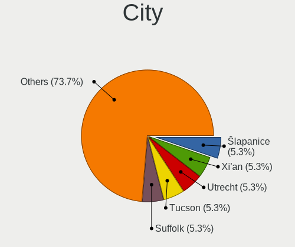
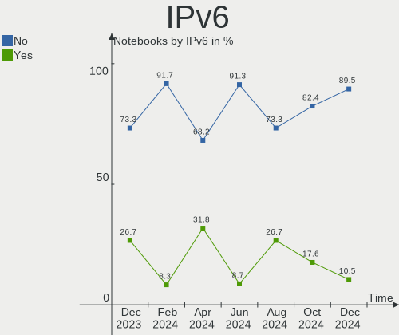
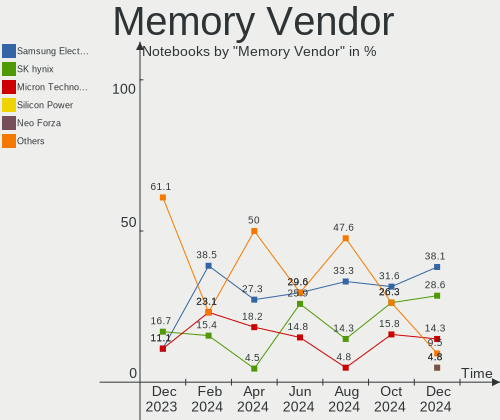
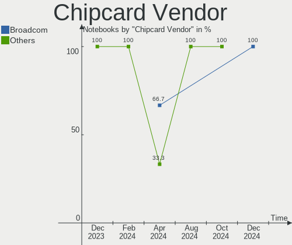

Gentoo - Hardware Trends (Notebooks)
------------------------------------

A project to identify most popular hardware characteristics and track their change
over time based on data collected by Linux users at https://Linux-Hardware.org.

Anyone can contribute to this report by the [hw-probe](https://github.com/linuxhw/hw-probe) tool:

    sudo -E hw-probe -all -upload

This report is for one last month. Overall report since the beginning of time: [TestCoverage](https://github.com/linuxhw/TestCoverage)

Period: Jul, 2022.

Contents
--------

* [ System ](#system)
  - [ OS                       ](#os)
  - [ OS Family                ](#os-family)
  - [ Kernel                   ](#kernel)
  - [ Kernel Family            ](#kernel-family)
  - [ Kernel Major Ver.        ](#kernel-major-ver)
  - [ Arch                     ](#arch)
  - [ DE                       ](#de)
  - [ Display Server           ](#display-server)
  - [ Display Manager          ](#display-manager)
  - [ OS Lang                  ](#os-lang)
  - [ Boot Mode                ](#boot-mode)
  - [ Filesystem               ](#filesystem)
  - [ Part. scheme             ](#part-scheme)
  - [ Dual Boot with Linux/BSD ](#dual-boot-with-linuxbsd)
  - [ Dual Boot (Win)          ](#dual-boot-win)

* [ Board ](#board)
  - [ Vendor                   ](#vendor)
  - [ Model                    ](#model)
  - [ Model Family             ](#model-family)
  - [ MFG Year                 ](#mfg-year)
  - [ Form Factor              ](#form-factor)
  - [ Secure Boot              ](#secure-boot)
  - [ Coreboot                 ](#coreboot)
  - [ RAM Size                 ](#ram-size)
  - [ RAM Used                 ](#ram-used)
  - [ Total Drives             ](#total-drives)
  - [ Has CD-ROM               ](#has-cd-rom)
  - [ Has Ethernet             ](#has-ethernet)
  - [ Has WiFi                 ](#has-wifi)
  - [ Has Bluetooth            ](#has-bluetooth)

* [ Location ](#location)
  - [ Country                  ](#country)
  - [ City                     ](#city)

* [ Drives ](#drives)
  - [ Drive Vendor             ](#drive-vendor)
  - [ Drive Model              ](#drive-model)
  - [ HDD Vendor               ](#hdd-vendor)
  - [ SSD Vendor               ](#ssd-vendor)
  - [ Drive Kind               ](#drive-kind)
  - [ Drive Connector          ](#drive-connector)
  - [ Drive Size               ](#drive-size)
  - [ Space Total              ](#space-total)
  - [ Space Used               ](#space-used)
  - [ Malfunc. Drives          ](#malfunc-drives)
  - [ Malfunc. Drive Vendor    ](#malfunc-drive-vendor)
  - [ Malfunc. HDD Vendor      ](#malfunc-hdd-vendor)
  - [ Malfunc. Drive Kind      ](#malfunc-drive-kind)
  - [ Failed Drives            ](#failed-drives)
  - [ Failed Drive Vendor      ](#failed-drive-vendor)
  - [ Drive Status             ](#drive-status)

* [ Storage controller ](#storage-controller)
  - [ Storage Vendor           ](#storage-vendor)
  - [ Storage Model            ](#storage-model)
  - [ Storage Kind             ](#storage-kind)

* [ Processor ](#processor)
  - [ CPU Vendor               ](#cpu-vendor)
  - [ CPU Model                ](#cpu-model)
  - [ CPU Model Family         ](#cpu-model-family)
  - [ CPU Cores                ](#cpu-cores)
  - [ CPU Sockets              ](#cpu-sockets)
  - [ CPU Threads              ](#cpu-threads)
  - [ CPU Op-Modes             ](#cpu-op-modes)
  - [ CPU Microcode            ](#cpu-microcode)
  - [ CPU Microarch            ](#cpu-microarch)

* [ Graphics ](#graphics)
  - [ GPU Vendor               ](#gpu-vendor)
  - [ GPU Model                ](#gpu-model)
  - [ GPU Combo                ](#gpu-combo)
  - [ GPU Driver               ](#gpu-driver)
  - [ GPU Memory               ](#gpu-memory)

* [ Monitor ](#monitor)
  - [ Monitor Vendor           ](#monitor-vendor)
  - [ Monitor Model            ](#monitor-model)
  - [ Monitor Resolution       ](#monitor-resolution)
  - [ Monitor Diagonal         ](#monitor-diagonal)
  - [ Monitor Width            ](#monitor-width)
  - [ Aspect Ratio             ](#aspect-ratio)
  - [ Monitor Area             ](#monitor-area)
  - [ Pixel Density            ](#pixel-density)
  - [ Multiple Monitors        ](#multiple-monitors)

* [ Network ](#network)
  - [ Net Controller Vendor    ](#net-controller-vendor)
  - [ Net Controller Model     ](#net-controller-model)
  - [ Wireless Vendor          ](#wireless-vendor)
  - [ Wireless Model           ](#wireless-model)
  - [ Ethernet Vendor          ](#ethernet-vendor)
  - [ Ethernet Model           ](#ethernet-model)
  - [ Net Controller Kind      ](#net-controller-kind)
  - [ Used Controller          ](#used-controller)
  - [ NICs                     ](#nics)
  - [ IPv6                     ](#ipv6)

* [ Bluetooth ](#bluetooth)
  - [ Bluetooth Vendor         ](#bluetooth-vendor)
  - [ Bluetooth Model          ](#bluetooth-model)

* [ Sound ](#sound)
  - [ Sound Vendor             ](#sound-vendor)
  - [ Sound Model              ](#sound-model)

* [ Memory ](#memory)
  - [ Memory Vendor            ](#memory-vendor)
  - [ Memory Model             ](#memory-model)
  - [ Memory Kind              ](#memory-kind)
  - [ Memory Form Factor       ](#memory-form-factor)
  - [ Memory Size              ](#memory-size)
  - [ Memory Speed             ](#memory-speed)

* [ Printers & scanners ](#printers--scanners)
  - [ Printer Vendor           ](#printer-vendor)
  - [ Printer Model            ](#printer-model)
  - [ Scanner Vendor           ](#scanner-vendor)
  - [ Scanner Model            ](#scanner-model)

* [ Camera ](#camera)
  - [ Camera Vendor            ](#camera-vendor)
  - [ Camera Model             ](#camera-model)

* [ Security ](#security)
  - [ Fingerprint Vendor       ](#fingerprint-vendor)
  - [ Fingerprint Model        ](#fingerprint-model)
  - [ Chipcard Vendor          ](#chipcard-vendor)
  - [ Chipcard Model           ](#chipcard-model)

* [ Unsupported ](#unsupported)
  - [ Unsupported Devices      ](#unsupported-devices)
  - [ Unsupported Device Types ](#unsupported-device-types)

System
------

OS
--

Installed operating systems

| Name       | Notebooks | Percent |
|------------|-----------|---------|
| Gentoo 2.8 | 17        | 94.44%  |
| Gentoo 2.7 | 1         | 5.56%   |

OS Family
---------

OS without a version

| Name   | Notebooks | Percent |
|--------|-----------|---------|
| Gentoo | 18        | 100%    |

Kernel
------

Version of the Linux kernel

| Version                     | Notebooks | Percent |
|-----------------------------|-----------|---------|
| 5.18.7-gentoo               | 2         | 11.11%  |
| 5.15.52-gentoo              | 2         | 11.11%  |
| 5.19.0-rc2-p+               | 1         | 5.56%   |
| 5.18.9-gentoo               | 1         | 5.56%   |
| 5.18.8-gentoo-dist          | 1         | 5.56%   |
| 5.18.6-gentoo-venus         | 1         | 5.56%   |
| 5.18.10-k08                 | 1         | 5.56%   |
| 5.18.0-gbfc780ef1ca0        | 1         | 5.56%   |
| 5.16.0-kali7-amd64          | 1         | 5.56%   |
| 5.15.52-gentoo-XXX          | 1         | 5.56%   |
| 5.15.52-gentoo-x86_64       | 1         | 5.56%   |
| 5.15.52-gentoo-dist         | 1         | 5.56%   |
| 5.15.41-gentoo-x86_64       | 1         | 5.56%   |
| 5.15.41-gentoo              | 1         | 5.56%   |
| 5.10.69-gentoo-111-powertop | 1         | 5.56%   |
| 5.10.27-gentoo              | 1         | 5.56%   |

Kernel Family
-------------

Linux kernel without a distro release

| Version | Notebooks | Percent |
|---------|-----------|---------|
| 5.15.52 | 5         | 27.78%  |
| 5.18.7  | 2         | 11.11%  |
| 5.15.41 | 2         | 11.11%  |
| 5.19.0  | 1         | 5.56%   |
| 5.18.9  | 1         | 5.56%   |
| 5.18.8  | 1         | 5.56%   |
| 5.18.6  | 1         | 5.56%   |
| 5.18.10 | 1         | 5.56%   |
| 5.18.0  | 1         | 5.56%   |
| 5.16.0  | 1         | 5.56%   |
| 5.10.69 | 1         | 5.56%   |
| 5.10.27 | 1         | 5.56%   |

Kernel Major Ver.
-----------------

Linux kernel major version

| Version | Notebooks | Percent |
|---------|-----------|---------|
| 5.18    | 7         | 38.89%  |
| 5.15    | 7         | 38.89%  |
| 5.10    | 2         | 11.11%  |
| 5.19    | 1         | 5.56%   |
| 5.16    | 1         | 5.56%   |

Arch
----

OS architecture (x86_64, i586, etc.)

| Name   | Notebooks | Percent |
|--------|-----------|---------|
| x86_64 | 17        | 94.44%  |
| i686   | 1         | 5.56%   |

DE
--

Desktop Environment

| Name    | Notebooks | Percent |
|---------|-----------|---------|
| Unknown | 9         | 50%     |
| KDE5    | 4         | 22.22%  |
| GNOME   | 3         | 16.67%  |
| XFCE    | 2         | 11.11%  |

Display Server
--------------

X11 or Wayland

| Name    | Notebooks | Percent |
|---------|-----------|---------|
| X11     | 8         | 44.44%  |
| Unknown | 5         | 27.78%  |
| Tty     | 4         | 22.22%  |
| Wayland | 1         | 5.56%   |

Display Manager
---------------

SDDM, LightDM, etc.

| Name    | Notebooks | Percent |
|---------|-----------|---------|
| Unknown | 8         | 44.44%  |
| SDDM    | 5         | 27.78%  |
| LightDM | 3         | 16.67%  |
| SLiM    | 1         | 5.56%   |
| GDM     | 1         | 5.56%   |

OS Lang
-------

Language

| Lang    | Notebooks | Percent |
|---------|-----------|---------|
| en_US   | 9         | 50%     |
| C.UTF8  | 3         | 16.67%  |
| Unknown | 2         | 11.11%  |
| zh_CN   | 1         | 5.56%   |
| es_MX   | 1         | 5.56%   |
| en_GB   | 1         | 5.56%   |
| el_GR   | 1         | 5.56%   |

Boot Mode
---------

EFI or BIOS

| Mode | Notebooks | Percent |
|------|-----------|---------|
| EFI  | 16        | 88.89%  |
| BIOS | 2         | 11.11%  |

Filesystem
----------

Type of filesystem

| Type     | Notebooks | Percent |
|----------|-----------|---------|
| Ext4     | 8         | 44.44%  |
| Btrfs    | 6         | 33.33%  |
| Zfs      | 2         | 11.11%  |
| Overlay  | 1         | 5.56%   |
| Bcachefs | 1         | 5.56%   |

Part. scheme
------------

Scheme of partitioning

| Type | Notebooks | Percent |
|------|-----------|---------|
| GPT  | 17        | 94.44%  |
| MBR  | 1         | 5.56%   |

Dual Boot with Linux/BSD
------------------------

Hosting more than one Linux/BSD

| Dual boot | Notebooks | Percent |
|-----------|-----------|---------|
| No        | 12        | 66.67%  |
| Yes       | 6         | 33.33%  |

Dual Boot (Win)
---------------

Hosting Linux and Windows

| Dual boot | Notebooks | Percent |
|-----------|-----------|---------|
| No        | 16        | 88.89%  |
| Yes       | 2         | 11.11%  |

Board
-----

Vendor
------

Motherboard manufacturer

| Name             | Notebooks | Percent |
|------------------|-----------|---------|
| Lenovo           | 4         | 22.22%  |
| Hewlett-Packard  | 4         | 22.22%  |
| ASUSTek Computer | 3         | 16.67%  |
| Dell             | 2         | 11.11%  |
| TUXEDO           | 1         | 5.56%   |
| Toshiba          | 1         | 5.56%   |
| Timi             | 1         | 5.56%   |
| Razer            | 1         | 5.56%   |
| MSI              | 1         | 5.56%   |

Model
-----

Motherboard model

| Name                                      | Notebooks | Percent |
|-------------------------------------------|-----------|---------|
| TUXEDO InfinityBook Pro 14 Gen6           | 1         | 5.56%   |
| Toshiba Satellite A200                    | 1         | 5.56%   |
| Timi Mi Laptop Pro 15 2020                | 1         | 5.56%   |
| Razer Blade 15 Studio Edition - Late 2019 | 1         | 5.56%   |
| MSI GS63VR 6RF                            | 1         | 5.56%   |
| Lenovo ThinkPad T14 Gen 2a 20XK000YRI     | 1         | 5.56%   |
| Lenovo IdeaPad 3 15ALC6 82KU              | 1         | 5.56%   |
| Lenovo IdeaPad 100-15IBD 80QQ             | 1         | 5.56%   |
| Lenovo G510 20238                         | 1         | 5.56%   |
| HP OMEN by Laptop 16-c0xxx                | 1         | 5.56%   |
| HP Laptop 17-ca1xxx                       | 1         | 5.56%   |
| HP EliteBook 845 G7 Notebook PC           | 1         | 5.56%   |
| HP EliteBook 2560p                        | 1         | 5.56%   |
| Dell XPS 15 9570                          | 1         | 5.56%   |
| Dell Latitude D420                        | 1         | 5.56%   |
| ASUS VivoBook_ASUSLaptop M7600QE_M7600QE  | 1         | 5.56%   |
| ASUS ROG Zephyrus G14 GA402RJ_GA402RJ     | 1         | 5.56%   |
| ASUS ROG G703GI_G7BI                      | 1         | 5.56%   |

Model Family
------------

Motherboard model prefix

| Name                | Notebooks | Percent |
|---------------------|-----------|---------|
| Lenovo IdeaPad      | 2         | 11.11%  |
| HP EliteBook        | 2         | 11.11%  |
| ASUS ROG            | 2         | 11.11%  |
| TUXEDO InfinityBook | 1         | 5.56%   |
| Toshiba Satellite   | 1         | 5.56%   |
| Timi Mi             | 1         | 5.56%   |
| Razer Blade         | 1         | 5.56%   |
| MSI GS63VR          | 1         | 5.56%   |
| Lenovo ThinkPad     | 1         | 5.56%   |
| Lenovo G510         | 1         | 5.56%   |
| HP OMEN             | 1         | 5.56%   |
| HP Laptop           | 1         | 5.56%   |
| Dell XPS            | 1         | 5.56%   |
| Dell Latitude       | 1         | 5.56%   |
| ASUS VivoBook       | 1         | 5.56%   |

MFG Year
--------

Motherboard manufacture year

| Year | Notebooks | Percent |
|------|-----------|---------|
| 2021 | 6         | 33.33%  |
| 2020 | 2         | 11.11%  |
| 2019 | 2         | 11.11%  |
| 2022 | 1         | 5.56%   |
| 2018 | 1         | 5.56%   |
| 2016 | 1         | 5.56%   |
| 2015 | 1         | 5.56%   |
| 2013 | 1         | 5.56%   |
| 2011 | 1         | 5.56%   |
| 2007 | 1         | 5.56%   |
| 2006 | 1         | 5.56%   |

Form Factor
-----------

Physical design of the computer

| Name     | Notebooks | Percent |
|----------|-----------|---------|
| Notebook | 18        | 100%    |

Secure Boot
-----------

Enabled or disabled

| State    | Notebooks | Percent |
|----------|-----------|---------|
| Disabled | 18        | 100%    |

Coreboot
--------

Have coreboot on board

| Used | Notebooks | Percent |
|------|-----------|---------|
| No   | 18        | 100%    |

RAM Size
--------

Total RAM memory

| Size in GB | Notebooks | Percent |
|------------|-----------|---------|
| 32.01-64.0 | 6         | 33.33%  |
| 8.01-16.0  | 5         | 27.78%  |
| 16.01-24.0 | 3         | 16.67%  |
| 3.01-4.0   | 2         | 11.11%  |
| 4.01-8.0   | 1         | 5.56%   |
| 2.01-3.0   | 1         | 5.56%   |

RAM Used
--------

Used RAM memory

| Used GB   | Notebooks | Percent |
|-----------|-----------|---------|
| 4.01-8.0  | 3         | 16.67%  |
| 3.01-4.0  | 3         | 16.67%  |
| 1.01-2.0  | 3         | 16.67%  |
| 0.51-1.0  | 3         | 16.67%  |
| 2.01-3.0  | 2         | 11.11%  |
| 8.01-16.0 | 2         | 11.11%  |
| 0.01-0.5  | 2         | 11.11%  |

Total Drives
------------

Number of drives on board

| Drives | Notebooks | Percent |
|--------|-----------|---------|
| 1      | 14        | 77.78%  |
| 2      | 3         | 16.67%  |
| 3      | 1         | 5.56%   |

Has CD-ROM
----------

Has CD-ROM on board

| Presented | Notebooks | Percent |
|-----------|-----------|---------|
| No        | 15        | 83.33%  |
| Yes       | 3         | 16.67%  |

Has Ethernet
------------

Has Ethernet on board

| Presented | Notebooks | Percent |
|-----------|-----------|---------|
| Yes       | 13        | 72.22%  |
| No        | 5         | 27.78%  |

Has WiFi
--------

Has WiFi module

| Presented | Notebooks | Percent |
|-----------|-----------|---------|
| Yes       | 18        | 100%    |

Has Bluetooth
-------------

Has Bluetooth module

| Presented | Notebooks | Percent |
|-----------|-----------|---------|
| Yes       | 15        | 83.33%  |
| No        | 3         | 16.67%  |

Location
--------

Country
-------

Geographic location (country)

| Country     | Notebooks | Percent |
|-------------|-----------|---------|
| China       | 3         | 16.67%  |
| USA         | 2         | 11.11%  |
| Germany     | 2         | 11.11%  |
| UK          | 1         | 5.56%   |
| Tunisia     | 1         | 5.56%   |
| Switzerland | 1         | 5.56%   |
| Sweden      | 1         | 5.56%   |
| Slovakia    | 1         | 5.56%   |
| Russia      | 1         | 5.56%   |
| Romania     | 1         | 5.56%   |
| Poland      | 1         | 5.56%   |
| Mexico      | 1         | 5.56%   |
| Greece      | 1         | 5.56%   |
| France      | 1         | 5.56%   |

City
----

Geographic location (city)

| City         | Notebooks | Percent |
|--------------|-----------|---------|
| Zacapu       | 1         | 5.56%   |
| Tunis        | 1         | 5.56%   |
| Trnava       | 1         | 5.56%   |
| Taby         | 1         | 5.56%   |
| Shenzhen     | 1         | 5.56%   |
| Orlando      | 1         | 5.56%   |
| Nizhny Tagil | 1         | 5.56%   |
| Minden       | 1         | 5.56%   |
| Marcoussis   | 1         | 5.56%   |
| Lincoln      | 1         | 5.56%   |
| Huangpu      | 1         | 5.56%   |
| Frick        | 1         | 5.56%   |
| Foshan       | 1         | 5.56%   |
| Düsseldorf  | 1         | 5.56%   |
| Croydon      | 1         | 5.56%   |
| Cluj-Napoca  | 1         | 5.56%   |
| Cieszyn      | 1         | 5.56%   |
| Athens       | 1         | 5.56%   |

Drives
------

Drive Vendor
------------

Hard drive vendors

| Vendor              | Notebooks | Drives | Percent |
|---------------------|-----------|--------|---------|
| Samsung Electronics | 6         | 6      | 27.27%  |
| WDC                 | 3         | 3      | 13.64%  |
| SK hynix            | 3         | 3      | 13.64%  |
| Seagate             | 3         | 3      | 13.64%  |
| Intel               | 3         | 4      | 13.64%  |
| Toshiba             | 1         | 1      | 4.55%   |
| SanDisk             | 1         | 1      | 4.55%   |
| Micron Technology   | 1         | 1      | 4.55%   |
| Fujitsu             | 1         | 1      | 4.55%   |

Drive Model
-----------

Hard drive models

| Model                                  | Notebooks | Percent |
|----------------------------------------|-----------|---------|
| WDC WDS100T2B0A-00SM50 1TB SSD         | 1         | 4.55%   |
| WDC WD10SPZX-60Z10T0 1TB               | 1         | 4.55%   |
| WDC PC SN530 SDBPMPZ-512G-1101 512GB   | 1         | 4.55%   |
| Toshiba MK6008GAH 64GB                 | 1         | 4.55%   |
| SK hynix SKHynix_HFS512GDE9X081N 512GB | 1         | 4.55%   |
| SK hynix HFS128G39MNC-3510A 128GB SSD  | 1         | 4.55%   |
| SK hynix HFM001TD3JX013N 1TB           | 1         | 4.55%   |
| Seagate ST2000LX001-1RG174 2TB         | 1         | 4.55%   |
| Seagate ST1000LM048-2E7172 1TB         | 1         | 4.55%   |
| Seagate ST1000LM024 HN-M101MBB 1TB     | 1         | 4.55%   |
| SanDisk SD9SN8W-128G-1006 128GB SSD    | 1         | 4.55%   |
| Samsung SSD 980 PRO 500GB              | 1         | 4.55%   |
| Samsung SSD 970 PRO 1TB                | 1         | 4.55%   |
| Samsung SSD 970 EVO 1TB                | 1         | 4.55%   |
| Samsung SSD 860 EVO 250GB              | 1         | 4.55%   |
| Samsung MZVLB1T0HBLR-000H1 1TB         | 1         | 4.55%   |
| Samsung MZVLB1T0HALR-00000 1TB         | 1         | 4.55%   |
| Micron 2450_MTFDKBA1T0TFK 1TB          | 1         | 4.55%   |
| Intel SSDSC2BF180A4H 180GB             | 1         | 4.55%   |
| Intel SSDPEKNW010T8 1TB                | 1         | 4.55%   |
| Intel SSDPEKKW256G8 256GB              | 1         | 4.55%   |
| Fujitsu MHY2200BH 200GB                | 1         | 4.55%   |

HDD Vendor
----------

Hard disk drive vendors

| Vendor  | Notebooks | Drives | Percent |
|---------|-----------|--------|---------|
| Seagate | 3         | 3      | 50%     |
| WDC     | 1         | 1      | 16.67%  |
| Toshiba | 1         | 1      | 16.67%  |
| Fujitsu | 1         | 1      | 16.67%  |

SSD Vendor
----------

Solid state drive vendors

| Vendor              | Notebooks | Drives | Percent |
|---------------------|-----------|--------|---------|
| WDC                 | 1         | 1      | 20%     |
| SK hynix            | 1         | 1      | 20%     |
| SanDisk             | 1         | 1      | 20%     |
| Samsung Electronics | 1         | 1      | 20%     |
| Intel               | 1         | 1      | 20%     |

Drive Kind
----------

HDD or SSD

| Kind | Notebooks | Drives | Percent |
|------|-----------|--------|---------|
| NVMe | 11        | 12     | 52.38%  |
| HDD  | 6         | 6      | 28.57%  |
| SSD  | 4         | 5      | 19.05%  |

Drive Connector
---------------

SATA, SAS, NVMe, etc.

| Type | Notebooks | Drives | Percent |
|------|-----------|--------|---------|
| NVMe | 11        | 12     | 57.89%  |
| SATA | 8         | 11     | 42.11%  |

Drive Size
----------

Size of hard drive

| Size in TB | Notebooks | Drives | Percent |
|------------|-----------|--------|---------|
| 0.01-0.5   | 6         | 6      | 54.55%  |
| 0.51-1.0   | 4         | 4      | 36.36%  |
| 1.01-2.0   | 1         | 1      | 9.09%   |

Space Total
-----------

Amount of disk space available on the file system

| Size in GB | Notebooks | Percent |
|------------|-----------|---------|
| 101-250    | 5         | 27.78%  |
| 251-500    | 4         | 22.22%  |
| Unknown    | 3         | 16.67%  |
| 501-1000   | 2         | 11.11%  |
| 21-50      | 1         | 5.56%   |
| 2001-3000  | 1         | 5.56%   |
| 1001-2000  | 1         | 5.56%   |
| 1-20       | 1         | 5.56%   |

Space Used
----------

Amount of used disk space

| Used GB  | Notebooks | Percent |
|----------|-----------|---------|
| 1-20     | 7         | 38.89%  |
| 21-50    | 3         | 16.67%  |
| Unknown  | 3         | 16.67%  |
| 51-100   | 2         | 11.11%  |
| 251-500  | 1         | 5.56%   |
| 101-250  | 1         | 5.56%   |
| 501-1000 | 1         | 5.56%   |

Malfunc. Drives
---------------

Drive models with a malfunction

| Model                              | Notebooks | Drives | Percent |
|------------------------------------|-----------|--------|---------|
| Toshiba MK6008GAH 64GB             | 1         | 1      | 50%     |
| Seagate ST1000LM024 HN-M101MBB 1TB | 1         | 1      | 50%     |

Malfunc. Drive Vendor
---------------------

Vendors of faulty drives

| Vendor  | Notebooks | Drives | Percent |
|---------|-----------|--------|---------|
| Toshiba | 1         | 1      | 50%     |
| Seagate | 1         | 1      | 50%     |

Malfunc. HDD Vendor
-------------------

Vendors of faulty HDD drives

| Vendor  | Notebooks | Drives | Percent |
|---------|-----------|--------|---------|
| Toshiba | 1         | 1      | 50%     |
| Seagate | 1         | 1      | 50%     |

Malfunc. Drive Kind
-------------------

Kinds of faulty drives

| Kind | Notebooks | Drives | Percent |
|------|-----------|--------|---------|
| HDD  | 2         | 2      | 100%    |

Failed Drives
-------------

Failed drive models

Zero info for selected period =(

Failed Drive Vendor
-------------------

Failed drive vendors

Zero info for selected period =(

Drive Status
------------

Number of failed and malfunc. drives

| Status  | Notebooks | Drives | Percent |
|---------|-----------|--------|---------|
| Works   | 16        | 21     | 88.89%  |
| Malfunc | 2         | 2      | 11.11%  |

Storage controller
------------------

Storage Vendor
--------------

Storage controller vendors

| Vendor              | Notebooks | Percent |
|---------------------|-----------|---------|
| Intel               | 9         | 42.86%  |
| Samsung Electronics | 5         | 23.81%  |
| AMD                 | 3         | 14.29%  |
| SK hynix            | 2         | 9.52%   |
| SanDisk             | 1         | 4.76%   |
| Micron Technology   | 1         | 4.76%   |

Storage Model
-------------

Storage controller models

| Model                                                                          | Notebooks | Percent |
|--------------------------------------------------------------------------------|-----------|---------|
| Samsung NVMe SSD Controller SM981/PM981/PM983                                  | 4         | 18.18%  |
| AMD FCH SATA Controller [AHCI mode]                                            | 3         | 13.64%  |
| SK hynix Gold P31 SSD                                                          | 2         | 9.09%   |
| SanDisk Non-Volatile memory controller                                         | 1         | 4.55%   |
| Samsung NVMe SSD Controller PM9A1/PM9A3/980PRO                                 | 1         | 4.55%   |
| Micron Non-Volatile memory controller                                          | 1         | 4.55%   |
| Intel Wildcat Point-LP SATA Controller [AHCI Mode]                             | 1         | 4.55%   |
| Intel SSD Pro 7600p/760p/E 6100p Series                                        | 1         | 4.55%   |
| Intel SSD 660P Series                                                          | 1         | 4.55%   |
| Intel HM170/QM170 Chipset SATA Controller [AHCI Mode]                          | 1         | 4.55%   |
| Intel Cannon Lake Mobile PCH SATA AHCI Controller                              | 1         | 4.55%   |
| Intel 82801GBM/GHM (ICH7-M Family) SATA Controller [IDE mode]                  | 1         | 4.55%   |
| Intel 82801G (ICH7 Family) IDE Controller                                      | 1         | 4.55%   |
| Intel 82801 Mobile SATA Controller [RAID mode]                                 | 1         | 4.55%   |
| Intel 8 Series/C220 Series Chipset Family 6-port SATA Controller 1 [AHCI mode] | 1         | 4.55%   |
| Intel 6 Series/C200 Series Chipset Family 6 port Mobile SATA AHCI Controller   | 1         | 4.55%   |

Storage Kind
------------

Kind of storage controller (IDE, SATA, NVMe, SAS, ...)

| Kind | Notebooks | Percent |
|------|-----------|---------|
| NVMe | 11        | 50%     |
| SATA | 8         | 36.36%  |
| IDE  | 2         | 9.09%   |
| RAID | 1         | 4.55%   |

Processor
---------

CPU Vendor
----------

Processor vendors

| Vendor | Notebooks | Percent |
|--------|-----------|---------|
| Intel  | 11        | 61.11%  |
| AMD    | 7         | 38.89%  |

CPU Model
---------

Processor models

| Model                                         | Notebooks | Percent |
|-----------------------------------------------|-----------|---------|
| Intel Core i9-8950HK CPU @ 2.90GHz            | 1         | 5.56%   |
| Intel Core i7-9750H CPU @ 2.60GHz             | 1         | 5.56%   |
| Intel Core i7-8750H CPU @ 2.20GHz             | 1         | 5.56%   |
| Intel Core i7-6700HQ CPU @ 2.60GHz            | 1         | 5.56%   |
| Intel Core i7-10510U CPU @ 1.80GHz            | 1         | 5.56%   |
| Intel Core i5-4210M CPU @ 2.60GHz             | 1         | 5.56%   |
| Intel Core i5-2430M CPU @ 2.40GHz             | 1         | 5.56%   |
| Intel Core i3-5005U CPU @ 2.00GHz             | 1         | 5.56%   |
| Intel Core Duo CPU U2500 @ 1.20GHz            | 1         | 5.56%   |
| Intel Core 2 CPU T7400 @ 2.16GHz              | 1         | 5.56%   |
| Intel 11th Gen Core i7-11370H @ 3.30GHz       | 1         | 5.56%   |
| AMD Ryzen 9 6900HS with Radeon Graphics       | 1         | 5.56%   |
| AMD Ryzen 9 5900HX with Radeon Graphics       | 1         | 5.56%   |
| AMD Ryzen 7 PRO 5850U with Radeon Graphics    | 1         | 5.56%   |
| AMD Ryzen 7 PRO 4750U with Radeon Graphics    | 1         | 5.56%   |
| AMD Ryzen 7 5800H with Radeon Graphics        | 1         | 5.56%   |
| AMD Ryzen 7 5700U with Radeon Graphics        | 1         | 5.56%   |
| AMD Ryzen 7 3700U with Radeon Vega Mobile Gfx | 1         | 5.56%   |

CPU Model Family
----------------

Processor model prefix

| Model           | Notebooks | Percent |
|-----------------|-----------|---------|
| Intel Core i7   | 4         | 22.22%  |
| AMD Ryzen 7     | 3         | 16.67%  |
| Intel Core i5   | 2         | 11.11%  |
| AMD Ryzen 9     | 2         | 11.11%  |
| AMD Ryzen 7 PRO | 2         | 11.11%  |
| Other           | 1         | 5.56%   |
| Intel Core i9   | 1         | 5.56%   |
| Intel Core i3   | 1         | 5.56%   |
| Intel Core Duo  | 1         | 5.56%   |
| Intel Core 2    | 1         | 5.56%   |

CPU Cores
---------

Number of processor cores

| Number | Notebooks | Percent |
|--------|-----------|---------|
| 8      | 6         | 33.33%  |
| 2      | 5         | 27.78%  |
| 4      | 4         | 22.22%  |
| 6      | 3         | 16.67%  |

CPU Sockets
-----------

Number of sockets

| Number | Notebooks | Percent |
|--------|-----------|---------|
| 1      | 18        | 100%    |

CPU Threads
-----------

Threads per core (Hyper-Threading)

| Number | Notebooks | Percent |
|--------|-----------|---------|
| 2      | 16        | 88.89%  |
| 1      | 2         | 11.11%  |

CPU Op-Modes
------------

CPU Operation Modes (32-bit, 64-bit)

| Op mode        | Notebooks | Percent |
|----------------|-----------|---------|
| 32-bit, 64-bit | 17        | 94.44%  |
| 32-bit         | 1         | 5.56%   |

CPU Microcode
-------------

Microcode number

| Number     | Notebooks | Percent |
|------------|-----------|---------|
| 0x906ea    | 3         | 16.67%  |
| 0x0a50000c | 3         | 16.67%  |
| 0x806ec    | 1         | 5.56%   |
| 0x806c1    | 1         | 5.56%   |
| 0x6f6      | 1         | 5.56%   |
| 0x6ec      | 1         | 5.56%   |
| 0x506e3    | 1         | 5.56%   |
| 0x306d4    | 1         | 5.56%   |
| 0x306c3    | 1         | 5.56%   |
| 0x206a7    | 1         | 5.56%   |
| 0x0a404101 | 1         | 5.56%   |
| 0x08608103 | 1         | 5.56%   |
| 0x08600106 | 1         | 5.56%   |
| 0x08108109 | 1         | 5.56%   |

CPU Microarch
-------------

Microarchitecture

| Name        | Notebooks | Percent |
|-------------|-----------|---------|
| KabyLake    | 4         | 22.22%  |
| Zen 3       | 3         | 16.67%  |
| Unknown     | 2         | 11.11%  |
| Zen+        | 1         | 5.56%   |
| Zen 2       | 1         | 5.56%   |
| TigerLake   | 1         | 5.56%   |
| Skylake     | 1         | 5.56%   |
| SandyBridge | 1         | 5.56%   |
| P6          | 1         | 5.56%   |
| Haswell     | 1         | 5.56%   |
| Core        | 1         | 5.56%   |
| Broadwell   | 1         | 5.56%   |

Graphics
--------

GPU Vendor
----------

Vendors of graphics cards

| Vendor | Notebooks | Percent |
|--------|-----------|---------|
| Intel  | 9         | 37.5%   |
| AMD    | 8         | 33.33%  |
| Nvidia | 7         | 29.17%  |

GPU Model
---------

Graphics card models

| Model                                                                         | Notebooks | Percent |
|-------------------------------------------------------------------------------|-----------|---------|
| AMD Cezanne                                                                   | 3         | 11.11%  |
| Intel CoffeeLake-H GT2 [UHD Graphics 630]                                     | 2         | 7.41%   |
| Nvidia TU104GLM [Quadro RTX 5000 Mobile / Max-Q]                              | 1         | 3.7%    |
| Nvidia GP107M [GeForce MX350]                                                 | 1         | 3.7%    |
| Nvidia GP107M [GeForce GTX 1050 Ti Mobile]                                    | 1         | 3.7%    |
| Nvidia GP106M [GeForce GTX 1060 Mobile]                                       | 1         | 3.7%    |
| Nvidia GP104BM [GeForce GTX 1080 Mobile]                                      | 1         | 3.7%    |
| Nvidia GA107M [GeForce RTX 3050 Ti Mobile]                                    | 1         | 3.7%    |
| Nvidia G72M [Quadro NVS 110M/GeForce Go 7300]                                 | 1         | 3.7%    |
| Intel TigerLake-LP GT2 [Iris Xe Graphics]                                     | 1         | 3.7%    |
| Intel Mobile 945GM/GMS/GME, 943/940GML Express Integrated Graphics Controller | 1         | 3.7%    |
| Intel Mobile 945GM/GMS, 943/940GML Express Integrated Graphics Controller     | 1         | 3.7%    |
| Intel HD Graphics 5500                                                        | 1         | 3.7%    |
| Intel HD Graphics 530                                                         | 1         | 3.7%    |
| Intel CometLake-U GT2 [UHD Graphics]                                          | 1         | 3.7%    |
| Intel 4th Gen Core Processor Integrated Graphics Controller                   | 1         | 3.7%    |
| Intel 2nd Generation Core Processor Family Integrated Graphics Controller     | 1         | 3.7%    |
| AMD Renoir                                                                    | 1         | 3.7%    |
| AMD Rembrandt [Radeon 680M]                                                   | 1         | 3.7%    |
| AMD Picasso/Raven 2 [Radeon Vega Series / Radeon Vega Mobile Series]          | 1         | 3.7%    |
| AMD Navi 23 [Radeon RX 6650 XT]                                               | 1         | 3.7%    |
| AMD Navi 23 [Radeon RX 6600/6600 XT/6600M]                                    | 1         | 3.7%    |
| AMD Lucienne                                                                  | 1         | 3.7%    |
| AMD Jet PRO [Radeon R5 M230 / R7 M260DX / Radeon 520 Mobile]                  | 1         | 3.7%    |

GPU Combo
---------

Combinations of graphics cards

| Name           | Notebooks | Percent |
|----------------|-----------|---------|
| Intel + Nvidia | 4         | 22.22%  |
| 1 x AMD        | 4         | 22.22%  |
| 1 x Intel      | 3         | 16.67%  |
| 2 x AMD        | 2         | 11.11%  |
| 1 x Nvidia     | 2         | 11.11%  |
| 2 x Intel      | 1         | 5.56%   |
| Intel + AMD    | 1         | 5.56%   |
| AMD + Nvidia   | 1         | 5.56%   |

GPU Driver
----------

Free vs proprietary

| Driver      | Notebooks | Percent |
|-------------|-----------|---------|
| Free        | 15        | 83.33%  |
| Proprietary | 3         | 16.67%  |

GPU Memory
----------

Total video memory

| Size in GB | Notebooks | Percent |
|------------|-----------|---------|
| Unknown    | 6         | 33.33%  |
| 7.01-8.0   | 3         | 16.67%  |
| 1.01-2.0   | 3         | 16.67%  |
| 0.01-0.5   | 3         | 16.67%  |
| 5.01-6.0   | 1         | 5.56%   |
| 8.01-16.0  | 1         | 5.56%   |
| 0.51-1.0   | 1         | 5.56%   |

Monitor
-------

Monitor Vendor
--------------

Monitor vendors

| Vendor              | Notebooks | Percent |
|---------------------|-----------|---------|
| Samsung Electronics | 6         | 30%     |
| BOE                 | 3         | 15%     |
| AU Optronics        | 3         | 15%     |
| Sharp               | 2         | 10%     |
| Xiaomi              | 1         | 5%      |
| MSI                 | 1         | 5%      |
| LG Display          | 1         | 5%      |
| InfoVision          | 1         | 5%      |
| CSO                 | 1         | 5%      |
| Chimei Innolux      | 1         | 5%      |

Monitor Model
-------------

Monitor models

| Model                                                                 | Notebooks | Percent |
|-----------------------------------------------------------------------|-----------|---------|
| Xiaomi Mi TV XMD0002 1920x1080 708x398mm 32.0-inch                    | 1         | 5%      |
| Sharp LQ156M1JW01 SHP14C3 1920x1080 344x194mm 15.5-inch               | 1         | 5%      |
| Sharp LCD Monitor SHP149A 1920x1080 344x194mm 15.5-inch               | 1         | 5%      |
| Samsung Electronics LCD Monitor SEC4149 1366x768 292x174mm 13.4-inch  | 1         | 5%      |
| Samsung Electronics LCD Monitor SEC3645 1280x800 331x207mm 15.4-inch  | 1         | 5%      |
| Samsung Electronics LCD Monitor SEC3157 1280x800 303x190mm 14.1-inch  | 1         | 5%      |
| Samsung Electronics LCD Monitor SDCA029 3840x2160 344x194mm 15.5-inch | 1         | 5%      |
| Samsung Electronics LCD Monitor SDC4752 1366x768 344x194mm 15.5-inch  | 1         | 5%      |
| Samsung Electronics LCD Monitor SDC415D 3840x2400 344x215mm 16.0-inch | 1         | 5%      |
| MSI MAG272QP MSI3CA8 2560x1440 597x336mm 27.0-inch                    | 1         | 5%      |
| LG Display LCD Monitor LGD04A7 1920x1080 344x194mm 15.5-inch          | 1         | 5%      |
| InfoVision LCD Monitor IVO8C78 1920x1080 309x174mm 14.0-inch          | 1         | 5%      |
| CSO LCD Monitor CSO1402 2880x1800 302x188mm 14.0-inch                 | 1         | 5%      |
| Chimei Innolux LCD Monitor CMN15C6 1366x768 344x193mm 15.5-inch       | 1         | 5%      |
| BOE LCD Monitor BOE0A1D 2560x1600 302x189mm 14.0-inch                 | 1         | 5%      |
| BOE LCD Monitor BOE09E5 2560x1440 355x200mm 16.0-inch                 | 1         | 5%      |
| BOE LCD Monitor BOE09DE 1920x1080 309x174mm 14.0-inch                 | 1         | 5%      |
| AU Optronics LCD Monitor AUO369F 1920x1080 344x194mm 15.5-inch        | 1         | 5%      |
| AU Optronics LCD Monitor AUO329D 1920x1080 380x210mm 17.1-inch        | 1         | 5%      |
| AU Optronics LCD Monitor AUO109D 1920x1080 381x214mm 17.2-inch        | 1         | 5%      |

Monitor Resolution
------------------

Monitor screen resolution

| Resolution       | Notebooks | Percent |
|------------------|-----------|---------|
| 1920x1080 (FHD)  | 9         | 45%     |
| 1366x768 (WXGA)  | 3         | 15%     |
| 2560x1440 (QHD)  | 2         | 10%     |
| 3840x2400        | 1         | 5%      |
| 3840x2160 (4K)   | 1         | 5%      |
| 2880x1800        | 1         | 5%      |
| 2560x1600        | 1         | 5%      |
| 1440x900 (WXGA+) | 1         | 5%      |
| 1280x800 (WXGA)  | 1         | 5%      |

Monitor Diagonal
----------------

Diagonal size in inches

| Inches | Notebooks | Percent |
|--------|-----------|---------|
| 15     | 8         | 40%     |
| 14     | 5         | 25%     |
| 17     | 2         | 10%     |
| 16     | 2         | 10%     |
| 65     | 1         | 5%      |
| 27     | 1         | 5%      |
| 13     | 1         | 5%      |

Monitor Width
-------------

Physical width

| Width in mm | Notebooks | Percent |
|-------------|-----------|---------|
| 301-350     | 14        | 70%     |
| 351-400     | 3         | 15%     |
| 501-600     | 1         | 5%      |
| 201-300     | 1         | 5%      |
| 1001-1500   | 1         | 5%      |

Aspect Ratio
------------

Proportional relationship between the width and the height

| Ratio | Notebooks | Percent |
|-------|-----------|---------|
| 16/9  | 13        | 72.22%  |
| 16/10 | 5         | 27.78%  |

Monitor Area
------------

Area in inch²

| Area in inch² | Notebooks | Percent |
|----------------|-----------|---------|
| 101-110        | 9         | 45%     |
| 81-90          | 5         | 25%     |
| 121-130        | 2         | 10%     |
| More than 1000 | 1         | 5%      |
| 71-80          | 1         | 5%      |
| 301-350        | 1         | 5%      |
| 111-120        | 1         | 5%      |

Pixel Density
-------------

Pixels per inch

| Density       | Notebooks | Percent |
|---------------|-----------|---------|
| 121-160       | 8         | 40%     |
| 101-120       | 5         | 25%     |
| More than 240 | 3         | 15%     |
| 161-240       | 2         | 10%     |
| 1-50          | 1         | 5%      |
| 51-100        | 1         | 5%      |

Multiple Monitors
-----------------

Total monitors connected

| Total | Notebooks | Percent |
|-------|-----------|---------|
| 1     | 16        | 88.89%  |
| 2     | 2         | 11.11%  |

Network
-------

Net Controller Vendor
---------------------

Controller vendors

| Vendor                | Notebooks | Percent |
|-----------------------|-----------|---------|
| Realtek Semiconductor | 9         | 34.62%  |
| Intel                 | 9         | 34.62%  |
| Qualcomm Atheros      | 2         | 7.69%   |
| MediaTek              | 2         | 7.69%   |
| Broadcom              | 2         | 7.69%   |
| Broadcom Limited      | 1         | 3.85%   |
| Aquantia              | 1         | 3.85%   |

Net Controller Model
--------------------

Controller models

| Model                                                             | Notebooks | Percent |
|-------------------------------------------------------------------|-----------|---------|
| Realtek RTL8111/8168/8411 PCI Express Gigabit Ethernet Controller | 4         | 12.9%   |
| Realtek RTL8852AE 802.11ax PCIe Wireless Network Adapter          | 2         | 6.45%   |
| Realtek RTL8153 Gigabit Ethernet Adapter                          | 2         | 6.45%   |
| Realtek RTL810xE PCI Express Fast Ethernet controller             | 2         | 6.45%   |
| Intel Wi-Fi 6 AX200                                               | 2         | 6.45%   |
| Realtek RTL8822CE 802.11ac PCIe Wireless Network Adapter          | 1         | 3.23%   |
| Realtek RTL8723DE Wireless Network Adapter                        | 1         | 3.23%   |
| Realtek RTL8723BE PCIe Wireless Network Adapter                   | 1         | 3.23%   |
| Qualcomm Atheros QCA8172 Fast Ethernet                            | 1         | 3.23%   |
| Qualcomm Atheros Killer E2400 Gigabit Ethernet Controller         | 1         | 3.23%   |
| MediaTek WLAN controller                                          | 1         | 3.23%   |
| MediaTek MT7921 802.11ax PCI Express Wireless Network Adapter     | 1         | 3.23%   |
| Intel Wireless 8260                                               | 1         | 3.23%   |
| Intel Wi-Fi 6 AX201                                               | 1         | 3.23%   |
| Intel PRO/Wireless 4965 AG or AGN [Kedron] Network Connection     | 1         | 3.23%   |
| Intel PRO/Wireless 3945ABG [Golan] Network Connection             | 1         | 3.23%   |
| Intel Comet Lake PCH-LP CNVi WiFi                                 | 1         | 3.23%   |
| Intel Centrino Ultimate-N 6300                                    | 1         | 3.23%   |
| Intel Cannon Lake PCH CNVi WiFi                                   | 1         | 3.23%   |
| Intel 82579LM Gigabit Network Connection (Lewisville)             | 1         | 3.23%   |
| Broadcom NetXtreme BCM5752 Gigabit Ethernet PCI Express           | 1         | 3.23%   |
| Broadcom Limited BCM4360 802.11ac Wireless Network Adapter        | 1         | 3.23%   |
| Broadcom BCM43142 802.11b/g/n                                     | 1         | 3.23%   |
| Aquantia 5G USB Ethernet Adapter                                  | 1         | 3.23%   |

Wireless Vendor
---------------

Wireless vendors

| Vendor                | Notebooks | Percent |
|-----------------------|-----------|---------|
| Intel                 | 9         | 50%     |
| Realtek Semiconductor | 5         | 27.78%  |
| MediaTek              | 2         | 11.11%  |
| Broadcom Limited      | 1         | 5.56%   |
| Broadcom              | 1         | 5.56%   |

Wireless Model
--------------

Wireless models

| Model                                                         | Notebooks | Percent |
|---------------------------------------------------------------|-----------|---------|
| Realtek RTL8852AE 802.11ax PCIe Wireless Network Adapter      | 2         | 11.11%  |
| Intel Wi-Fi 6 AX200                                           | 2         | 11.11%  |
| Realtek RTL8822CE 802.11ac PCIe Wireless Network Adapter      | 1         | 5.56%   |
| Realtek RTL8723DE Wireless Network Adapter                    | 1         | 5.56%   |
| Realtek RTL8723BE PCIe Wireless Network Adapter               | 1         | 5.56%   |
| MediaTek WLAN controller                                      | 1         | 5.56%   |
| MediaTek MT7921 802.11ax PCI Express Wireless Network Adapter | 1         | 5.56%   |
| Intel Wireless 8260                                           | 1         | 5.56%   |
| Intel Wi-Fi 6 AX201                                           | 1         | 5.56%   |
| Intel PRO/Wireless 4965 AG or AGN [Kedron] Network Connection | 1         | 5.56%   |
| Intel PRO/Wireless 3945ABG [Golan] Network Connection         | 1         | 5.56%   |
| Intel Comet Lake PCH-LP CNVi WiFi                             | 1         | 5.56%   |
| Intel Centrino Ultimate-N 6300                                | 1         | 5.56%   |
| Intel Cannon Lake PCH CNVi WiFi                               | 1         | 5.56%   |
| Broadcom Limited BCM4360 802.11ac Wireless Network Adapter    | 1         | 5.56%   |
| Broadcom BCM43142 802.11b/g/n                                 | 1         | 5.56%   |

Ethernet Vendor
---------------

Ethernet vendors

| Vendor                | Notebooks | Percent |
|-----------------------|-----------|---------|
| Realtek Semiconductor | 8         | 61.54%  |
| Qualcomm Atheros      | 2         | 15.38%  |
| Intel                 | 1         | 7.69%   |
| Broadcom              | 1         | 7.69%   |
| Aquantia              | 1         | 7.69%   |

Ethernet Model
--------------

Ethernet models

| Model                                                             | Notebooks | Percent |
|-------------------------------------------------------------------|-----------|---------|
| Realtek RTL8111/8168/8411 PCI Express Gigabit Ethernet Controller | 4         | 30.77%  |
| Realtek RTL8153 Gigabit Ethernet Adapter                          | 2         | 15.38%  |
| Realtek RTL810xE PCI Express Fast Ethernet controller             | 2         | 15.38%  |
| Qualcomm Atheros QCA8172 Fast Ethernet                            | 1         | 7.69%   |
| Qualcomm Atheros Killer E2400 Gigabit Ethernet Controller         | 1         | 7.69%   |
| Intel 82579LM Gigabit Network Connection (Lewisville)             | 1         | 7.69%   |
| Broadcom NetXtreme BCM5752 Gigabit Ethernet PCI Express           | 1         | 7.69%   |
| Aquantia 5G USB Ethernet Adapter                                  | 1         | 7.69%   |

Net Controller Kind
-------------------

Ethernet, WiFi or modem

| Kind     | Notebooks | Percent |
|----------|-----------|---------|
| WiFi     | 18        | 58.06%  |
| Ethernet | 13        | 41.94%  |

Used Controller
---------------

Currently used network controller

| Kind     | Notebooks | Percent |
|----------|-----------|---------|
| WiFi     | 12        | 66.67%  |
| Ethernet | 6         | 33.33%  |

NICs
----

Total network controllers on board

| Total | Notebooks | Percent |
|-------|-----------|---------|
| 2     | 9         | 50%     |
| 1     | 8         | 44.44%  |
| 3     | 1         | 5.56%   |

IPv6
----

IPv6 vs IPv4

| Used | Notebooks | Percent |
|------|-----------|---------|
| No   | 12        | 66.67%  |
| Yes  | 6         | 33.33%  |

Bluetooth
---------

Bluetooth Vendor
----------------

Controller vendors

| Vendor                | Notebooks | Percent |
|-----------------------|-----------|---------|
| Realtek Semiconductor | 5         | 33.33%  |
| Intel                 | 5         | 33.33%  |
| IMC Networks          | 2         | 13.33%  |
| Hewlett-Packard       | 1         | 6.67%   |
| Foxconn International | 1         | 6.67%   |
| Apple                 | 1         | 6.67%   |

Bluetooth Model
---------------

Controller models

| Model                                             | Notebooks | Percent |
|---------------------------------------------------|-----------|---------|
| Realtek Bluetooth Radio                           | 3         | 20%     |
| Intel Bluetooth 9460/9560 Jefferson Peak (JfP)    | 2         | 13.33%  |
| IMC Networks Wireless_Device                      | 2         | 13.33%  |
| Realtek RTL8723B Bluetooth                        | 1         | 6.67%   |
| Realtek  Bluetooth 4.2 Adapter                    | 1         | 6.67%   |
| Intel Bluetooth wireless interface                | 1         | 6.67%   |
| Intel AX201 Bluetooth                             | 1         | 6.67%   |
| Intel AX200 Bluetooth                             | 1         | 6.67%   |
| HP Broadcom 2070 Bluetooth Combo                  | 1         | 6.67%   |
| Foxconn International BCM43142A0 Bluetooth module | 1         | 6.67%   |
| Apple Bluetooth USB Host Controller               | 1         | 6.67%   |

Sound
-----

Sound Vendor
------------

Sound card vendors

| Vendor                               | Notebooks | Percent |
|--------------------------------------|-----------|---------|
| Intel                                | 11        | 47.83%  |
| AMD                                  | 7         | 30.43%  |
| Nvidia                               | 3         | 13.04%  |
| Thesycon Systemsoftware & Consulting | 1         | 4.35%   |
| Hewlett-Packard                      | 1         | 4.35%   |

Sound Model
-----------

Sound card models

| Model                                                                      | Notebooks | Percent |
|----------------------------------------------------------------------------|-----------|---------|
| AMD Family 17h/19h HD Audio Controller                                     | 7         | 20.59%  |
| AMD Renoir Radeon High Definition Audio Controller                         | 5         | 14.71%  |
| Intel Cannon Lake PCH cAVS                                                 | 3         | 8.82%   |
| Intel NM10/ICH7 Family High Definition Audio Controller                    | 2         | 5.88%   |
| AMD Navi 21/23 HDMI/DP Audio Controller                                    | 2         | 5.88%   |
| Thesycon Systemsoftware & Consulting DX3 Pro                               | 1         | 2.94%   |
| Nvidia TU104 HD Audio Controller                                           | 1         | 2.94%   |
| Nvidia GP106 High Definition Audio Controller                              | 1         | 2.94%   |
| Nvidia GP104 High Definition Audio Controller                              | 1         | 2.94%   |
| Intel Xeon E3-1200 v3/4th Gen Core Processor HD Audio Controller           | 1         | 2.94%   |
| Intel Wildcat Point-LP High Definition Audio Controller                    | 1         | 2.94%   |
| Intel Tiger Lake-LP Smart Sound Technology Audio Controller                | 1         | 2.94%   |
| Intel Comet Lake PCH-LP cAVS                                               | 1         | 2.94%   |
| Intel Broadwell-U Audio Controller                                         | 1         | 2.94%   |
| Intel 8 Series/C220 Series Chipset High Definition Audio Controller        | 1         | 2.94%   |
| Intel 6 Series/C200 Series Chipset Family High Definition Audio Controller | 1         | 2.94%   |
| Intel 100 Series/C230 Series Chipset Family HD Audio Controller            | 1         | 2.94%   |
| Hewlett-Packard USB Audio                                                  | 1         | 2.94%   |
| AMD Rembrandt Radeon High Definition Audio Controller                      | 1         | 2.94%   |
| AMD Raven/Raven2/Fenghuang HDMI/DP Audio Controller                        | 1         | 2.94%   |

Memory
------

Memory Vendor
-------------

Memory module vendors

| Vendor              | Notebooks | Percent |
|---------------------|-----------|---------|
| Samsung Electronics | 10        | 50%     |
| Micron Technology   | 3         | 15%     |
| Kingston            | 3         | 15%     |
| Unknown             | 1         | 5%      |
| Ramaxel Technology  | 1         | 5%      |
| A-DATA Technology   | 1         | 5%      |
| Unknown             | 1         | 5%      |

Memory Model
------------

Memory module models

| Model                                                       | Notebooks | Percent |
|-------------------------------------------------------------|-----------|---------|
| Unknown RAM Module 2GB SODIMM DDR                           | 1         | 4.35%   |
| Unknown RAM Module 1GB SODIMM DDR                           | 1         | 4.35%   |
| Samsung RAM Module 16GB SODIMM DDR4 3200MT/s                | 1         | 4.35%   |
| Samsung RAM M471B1G73QH0-YK0 8GB SODIMM DDR3 1600MT/s       | 1         | 4.35%   |
| Samsung RAM M471A2K43DB1-CTD 16GB SODIMM DDR4 2667MT/s      | 1         | 4.35%   |
| Samsung RAM M471A2K43CB1-CTD 16GB SODIMM DDR4 8400MT/s      | 1         | 4.35%   |
| Samsung RAM M471A2G44AM0-CWE 16GB SODIMM DDR4 3200MT/s      | 1         | 4.35%   |
| Samsung RAM M471A1K43EB1-CWE 8192MB SODIMM DDR4 3200MT/s    | 1         | 4.35%   |
| Samsung RAM M471A1K43DB1-CWE 8GB SODIMM DDR4 3200MT/s       | 1         | 4.35%   |
| Samsung RAM M471A1G44AB0-CWE 8GB Row Of Chips DDR4 3200MT/s | 1         | 4.35%   |
| Samsung RAM M471A1G44AB0-CWE 8192MB SODIMM DDR4 3200MT/s    | 1         | 4.35%   |
| Samsung RAM M471A1G44AB0-CTD 8GB SODIMM DDR4 2667MT/s       | 1         | 4.35%   |
| Samsung RAM M425R1GB4BB0-CQKOL 8GB SODIMM 4800MT/s          | 1         | 4.35%   |
| Samsung RAM M425R1GB4BB0-CQKOD 8GB SODIMM 4800MT/s          | 1         | 4.35%   |
| Ramaxel RAM RMT3170MN68F9F1600 4GB SODIMM DDR3 1600MT/s     | 1         | 4.35%   |
| Micron RAM Module 16GB SODIMM DDR4 3200MT/s                 | 1         | 4.35%   |
| Micron RAM 4ATS2G64HZ-3G2B1 16384MB SODIMM DDR4 3200MT/s    | 1         | 4.35%   |
| Micron RAM 16ATF2G64HZ-2G6E1 16GB SODIMM DDR4 2667MT/s      | 1         | 4.35%   |
| Kingston RAM KHX2666C15S4/16G 16GB SODIMM DDR4 2667MT/s     | 1         | 4.35%   |
| Kingston RAM HP26D4S9S8ME-8 8GB SODIMM DDR4 2667MT/s        | 1         | 4.35%   |
| Kingston RAM 99U5428-063.A00LF 8GB SODIMM DDR3 1600MT/s     | 1         | 4.35%   |
| A-DATA RAM DOVF1B163GEG 2GB SODIMM DDR 667MT/s              | 1         | 4.35%   |
| Unknown                                                     | 1         | 4.35%   |

Memory Kind
-----------

Memory module kinds

| Kind    | Notebooks | Percent |
|---------|-----------|---------|
| DDR4    | 12        | 66.67%  |
| DDR3    | 3         | 16.67%  |
| DDR     | 2         | 11.11%  |
| Unknown | 1         | 5.56%   |

Memory Form Factor
------------------

Physical design of the memory module

| Name         | Notebooks | Percent |
|--------------|-----------|---------|
| SODIMM       | 18        | 90%     |
| Row Of Chips | 1         | 5%      |
| Chip         | 1         | 5%      |

Memory Size
-----------

Memory module size

| Size  | Notebooks | Percent |
|-------|-----------|---------|
| 8192  | 8         | 40%     |
| 16384 | 7         | 35%     |
| 2048  | 2         | 10%     |
| 4096  | 1         | 5%      |
| 1024  | 1         | 5%      |
| 512   | 1         | 5%      |

Memory Speed
------------

Memory module speed

| Speed   | Notebooks | Percent |
|---------|-----------|---------|
| 3200    | 6         | 31.58%  |
| 2667    | 6         | 31.58%  |
| 1600    | 2         | 10.53%  |
| 8400    | 1         | 5.26%   |
| 4800    | 1         | 5.26%   |
| 667     | 1         | 5.26%   |
| 533     | 1         | 5.26%   |
| Unknown | 1         | 5.26%   |

Printers & scanners
-------------------

Printer Vendor
--------------

Printer device vendors

Zero info for selected period =(

Printer Model
-------------

Printer device models

Zero info for selected period =(

Scanner Vendor
--------------

Scanner device vendors

Zero info for selected period =(

Scanner Model
-------------

Scanner device models

Zero info for selected period =(

Camera
------

Camera Vendor
-------------

Camera device vendors

| Vendor                                 | Notebooks | Percent |
|----------------------------------------|-----------|---------|
| IMC Networks                           | 5         | 31.25%  |
| Chicony Electronics                    | 3         | 18.75%  |
| Syntek                                 | 2         | 12.5%   |
| Acer                                   | 2         | 12.5%   |
| Quanta                                 | 1         | 6.25%   |
| Microdia                               | 1         | 6.25%   |
| Lite-On Technology                     | 1         | 6.25%   |
| Cheng Uei Precision Industry (Foxlink) | 1         | 6.25%   |

Camera Model
------------

Camera device models

| Model                                                        | Notebooks | Percent |
|--------------------------------------------------------------|-----------|---------|
| IMC Networks USB2.0 HD UVC WebCam                            | 3         | 18.75%  |
| Syntek Lenovo EasyCamera                                     | 1         | 6.25%   |
| Syntek Integrated Camera                                     | 1         | 6.25%   |
| Quanta HP Wide Vision HD Camera                              | 1         | 6.25%   |
| Microdia Integrated_Webcam_HD                                | 1         | 6.25%   |
| Lite-On HP Webcam                                            | 1         | 6.25%   |
| IMC Networks Lenovo EasyCamera                               | 1         | 6.25%   |
| IMC Networks Integrated Camera                               | 1         | 6.25%   |
| Chicony USB 2.0 Camera                                       | 1         | 6.25%   |
| Chicony Integrated HP HD Webcam                              | 1         | 6.25%   |
| Chicony HP HD Camera                                         | 1         | 6.25%   |
| Cheng Uei Precision Industry (Foxlink) XiaoMi USB 2.0 Webcam | 1         | 6.25%   |
| Acer NEC HD WebCam                                           | 1         | 6.25%   |
| Acer Integrated Camera                                       | 1         | 6.25%   |

Security
--------

Fingerprint Vendor
------------------

Fingerprint sensor vendors

| Vendor                | Notebooks | Percent |
|-----------------------|-----------|---------|
| Validity Sensors      | 1         | 50%     |
| Elan Microelectronics | 1         | 50%     |

Fingerprint Model
-----------------

Fingerprint sensor models

| Model                                      | Notebooks | Percent |
|--------------------------------------------|-----------|---------|
| Validity Sensors VFS471 Fingerprint Reader | 1         | 50%     |
| Elan ELAN:Fingerprint                      | 1         | 50%     |

Chipcard Vendor
---------------

Chipcard module vendors

| Vendor      | Notebooks | Percent |
|-------------|-----------|---------|
| O2 Micro    | 1         | 50%     |
| Alcor Micro | 1         | 50%     |

Chipcard Model
--------------

Chipcard module models

| Model                               | Notebooks | Percent |
|-------------------------------------|-----------|---------|
| O2 Micro Oz776 SmartCard Reader     | 1         | 50%     |
| Alcor Micro AU9540 Smartcard Reader | 1         | 50%     |

Unsupported
-----------

Unsupported Devices
-------------------

Total unsupported devices on board

| Total | Notebooks | Percent |
|-------|-----------|---------|
| 0     | 8         | 44.44%  |
| 1     | 6         | 33.33%  |
| 4     | 2         | 11.11%  |
| 5     | 1         | 5.56%   |
| 2     | 1         | 5.56%   |

Unsupported Device Types
------------------------

Types of unsupported devices

| Type                     | Notebooks | Percent |
|--------------------------|-----------|---------|
| Net/wireless             | 4         | 19.05%  |
| Graphics card            | 3         | 14.29%  |
| Bluetooth                | 3         | 14.29%  |
| Fingerprint reader       | 2         | 9.52%   |
| Card reader              | 2         | 9.52%   |
| Sound                    | 1         | 4.76%   |
| Multimedia controller    | 1         | 4.76%   |
| Modem                    | 1         | 4.76%   |
| Firewire controller      | 1         | 4.76%   |
| Communication controller | 1         | 4.76%   |
| Chipcard                 | 1         | 4.76%   |
| Camera                   | 1         | 4.76%   |

