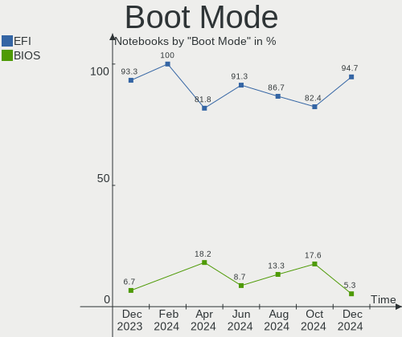
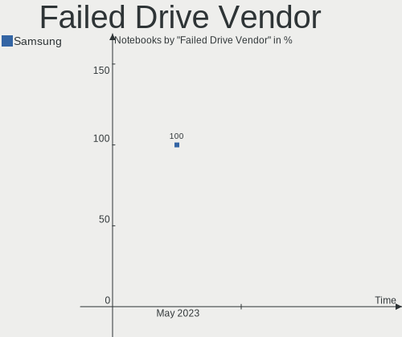
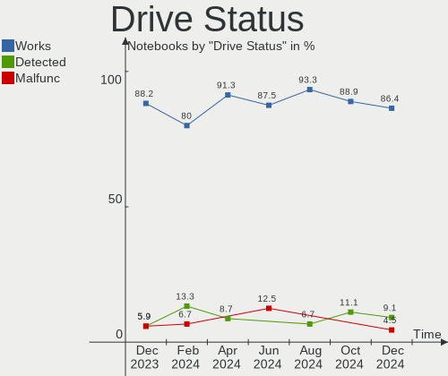
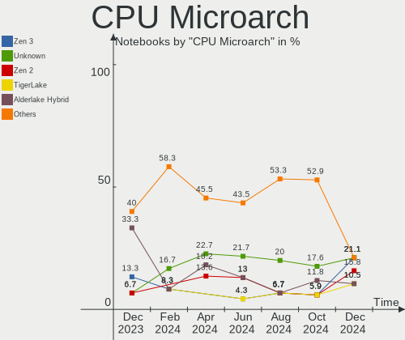
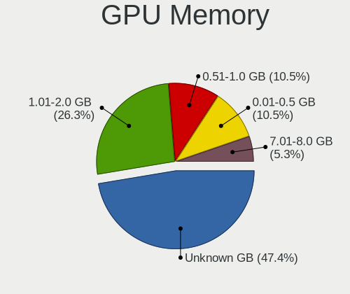

Gentoo - Hardware Trends (Notebooks)
------------------------------------

A project to identify most popular hardware characteristics and track their change
over time based on data collected by Linux users at https://Linux-Hardware.org.

Anyone can contribute to this report by the [hw-probe](https://github.com/linuxhw/hw-probe) tool:

    sudo -E hw-probe -all -upload

This report is for one last month. Overall report since the beginning of time: [TestDays](https://github.com/linuxhw/TestDays)

Period: May, 2023.

Contents
--------

* [ System ](#system)
  - [ OS                       ](#os)
  - [ OS Family                ](#os-family)
  - [ Kernel                   ](#kernel)
  - [ Kernel Family            ](#kernel-family)
  - [ Kernel Major Ver.        ](#kernel-major-ver)
  - [ Arch                     ](#arch)
  - [ DE                       ](#de)
  - [ Display Server           ](#display-server)
  - [ Display Manager          ](#display-manager)
  - [ OS Lang                  ](#os-lang)
  - [ Boot Mode                ](#boot-mode)
  - [ Filesystem               ](#filesystem)
  - [ Part. scheme             ](#part-scheme)
  - [ Dual Boot with Linux/BSD ](#dual-boot-with-linuxbsd)
  - [ Dual Boot (Win)          ](#dual-boot-win)

* [ Board ](#board)
  - [ Vendor                   ](#vendor)
  - [ Model                    ](#model)
  - [ Model Family             ](#model-family)
  - [ MFG Year                 ](#mfg-year)
  - [ Form Factor              ](#form-factor)
  - [ Secure Boot              ](#secure-boot)
  - [ Coreboot                 ](#coreboot)
  - [ RAM Size                 ](#ram-size)
  - [ RAM Used                 ](#ram-used)
  - [ Total Drives             ](#total-drives)
  - [ Has CD-ROM               ](#has-cd-rom)
  - [ Has Ethernet             ](#has-ethernet)
  - [ Has WiFi                 ](#has-wifi)
  - [ Has Bluetooth            ](#has-bluetooth)

* [ Location ](#location)
  - [ Country                  ](#country)
  - [ City                     ](#city)

* [ Drives ](#drives)
  - [ Drive Vendor             ](#drive-vendor)
  - [ Drive Model              ](#drive-model)
  - [ HDD Vendor               ](#hdd-vendor)
  - [ SSD Vendor               ](#ssd-vendor)
  - [ Drive Kind               ](#drive-kind)
  - [ Drive Connector          ](#drive-connector)
  - [ Drive Size               ](#drive-size)
  - [ Space Total              ](#space-total)
  - [ Space Used               ](#space-used)
  - [ Malfunc. Drives          ](#malfunc-drives)
  - [ Malfunc. Drive Vendor    ](#malfunc-drive-vendor)
  - [ Malfunc. HDD Vendor      ](#malfunc-hdd-vendor)
  - [ Malfunc. Drive Kind      ](#malfunc-drive-kind)
  - [ Failed Drives            ](#failed-drives)
  - [ Failed Drive Vendor      ](#failed-drive-vendor)
  - [ Drive Status             ](#drive-status)

* [ Storage controller ](#storage-controller)
  - [ Storage Vendor           ](#storage-vendor)
  - [ Storage Model            ](#storage-model)
  - [ Storage Kind             ](#storage-kind)

* [ Processor ](#processor)
  - [ CPU Vendor               ](#cpu-vendor)
  - [ CPU Model                ](#cpu-model)
  - [ CPU Model Family         ](#cpu-model-family)
  - [ CPU Cores                ](#cpu-cores)
  - [ CPU Sockets              ](#cpu-sockets)
  - [ CPU Threads              ](#cpu-threads)
  - [ CPU Op-Modes             ](#cpu-op-modes)
  - [ CPU Microcode            ](#cpu-microcode)
  - [ CPU Microarch            ](#cpu-microarch)

* [ Graphics ](#graphics)
  - [ GPU Vendor               ](#gpu-vendor)
  - [ GPU Model                ](#gpu-model)
  - [ GPU Combo                ](#gpu-combo)
  - [ GPU Driver               ](#gpu-driver)
  - [ GPU Memory               ](#gpu-memory)

* [ Monitor ](#monitor)
  - [ Monitor Vendor           ](#monitor-vendor)
  - [ Monitor Model            ](#monitor-model)
  - [ Monitor Resolution       ](#monitor-resolution)
  - [ Monitor Diagonal         ](#monitor-diagonal)
  - [ Monitor Width            ](#monitor-width)
  - [ Aspect Ratio             ](#aspect-ratio)
  - [ Monitor Area             ](#monitor-area)
  - [ Pixel Density            ](#pixel-density)
  - [ Multiple Monitors        ](#multiple-monitors)

* [ Network ](#network)
  - [ Net Controller Vendor    ](#net-controller-vendor)
  - [ Net Controller Model     ](#net-controller-model)
  - [ Wireless Vendor          ](#wireless-vendor)
  - [ Wireless Model           ](#wireless-model)
  - [ Ethernet Vendor          ](#ethernet-vendor)
  - [ Ethernet Model           ](#ethernet-model)
  - [ Net Controller Kind      ](#net-controller-kind)
  - [ Used Controller          ](#used-controller)
  - [ NICs                     ](#nics)
  - [ IPv6                     ](#ipv6)

* [ Bluetooth ](#bluetooth)
  - [ Bluetooth Vendor         ](#bluetooth-vendor)
  - [ Bluetooth Model          ](#bluetooth-model)

* [ Sound ](#sound)
  - [ Sound Vendor             ](#sound-vendor)
  - [ Sound Model              ](#sound-model)

* [ Memory ](#memory)
  - [ Memory Vendor            ](#memory-vendor)
  - [ Memory Model             ](#memory-model)
  - [ Memory Kind              ](#memory-kind)
  - [ Memory Form Factor       ](#memory-form-factor)
  - [ Memory Size              ](#memory-size)
  - [ Memory Speed             ](#memory-speed)

* [ Printers & scanners ](#printers--scanners)
  - [ Printer Vendor           ](#printer-vendor)
  - [ Printer Model            ](#printer-model)
  - [ Scanner Vendor           ](#scanner-vendor)
  - [ Scanner Model            ](#scanner-model)

* [ Camera ](#camera)
  - [ Camera Vendor            ](#camera-vendor)
  - [ Camera Model             ](#camera-model)

* [ Security ](#security)
  - [ Fingerprint Vendor       ](#fingerprint-vendor)
  - [ Fingerprint Model        ](#fingerprint-model)
  - [ Chipcard Vendor          ](#chipcard-vendor)
  - [ Chipcard Model           ](#chipcard-model)

* [ Unsupported ](#unsupported)
  - [ Unsupported Devices      ](#unsupported-devices)
  - [ Unsupported Device Types ](#unsupported-device-types)

System
------

OS
--

Installed operating systems

| Name        | Notebooks | Percent |
|-------------|-----------|---------|
| Gentoo 2.13 | 17        | 94.44%  |
| Gentoo 23   | 1         | 5.56%   |

OS Family
---------

OS without a version

| Name   | Notebooks | Percent |
|--------|-----------|---------|
| Gentoo | 18        | 100%    |

Kernel
------

Version of the Linux kernel

| Version                   | Notebooks | Percent |
|---------------------------|-----------|---------|
| 6.1.19-gentoo-x86_64      | 3         | 16.67%  |
| 6.1.24-gentoo-dist        | 2         | 11.11%  |
| 6.3.4-gentoo              | 1         | 5.56%   |
| 6.3.2-gentoo-dist         | 1         | 5.56%   |
| 6.3.0-gentoo              | 1         | 5.56%   |
| 6.3.0                     | 1         | 5.56%   |
| 6.2.14-gentoo-dist        | 1         | 5.56%   |
| 6.2.14-calculate          | 1         | 5.56%   |
| 6.1.30-gentoo-120-yes_ibt | 1         | 5.56%   |
| 6.1.28-gentoo.ae          | 1         | 5.56%   |
| 6.1.28-gentoo             | 1         | 5.56%   |
| 6.1.27-gentoo-dist        | 1         | 5.56%   |
| 6.1.19-gentoo             | 1         | 5.56%   |
| 5.15.88-gentoo-x86_64     | 1         | 5.56%   |
| 5.15.72-gentoo            | 1         | 5.56%   |

Kernel Family
-------------

Linux kernel without a distro release

| Version | Notebooks | Percent |
|---------|-----------|---------|
| 6.1.19  | 4         | 22.22%  |
| 6.3.0   | 2         | 11.11%  |
| 6.2.14  | 2         | 11.11%  |
| 6.1.28  | 2         | 11.11%  |
| 6.1.24  | 2         | 11.11%  |
| 6.3.4   | 1         | 5.56%   |
| 6.3.2   | 1         | 5.56%   |
| 6.1.30  | 1         | 5.56%   |
| 6.1.27  | 1         | 5.56%   |
| 5.15.88 | 1         | 5.56%   |
| 5.15.72 | 1         | 5.56%   |

Kernel Major Ver.
-----------------

Linux kernel major version

| Version | Notebooks | Percent |
|---------|-----------|---------|
| 6.1     | 10        | 55.56%  |
| 6.3     | 4         | 22.22%  |
| 6.2     | 2         | 11.11%  |
| 5.15    | 2         | 11.11%  |

Arch
----

OS architecture (x86_64, i586, etc.)

| Name   | Notebooks | Percent |
|--------|-----------|---------|
| x86_64 | 18        | 100%    |

DE
--

Desktop Environment

| Name     | Notebooks | Percent |
|----------|-----------|---------|
| KDE5     | 5         | 27.78%  |
| Unknown  | 5         | 27.78%  |
| XFCE     | 2         | 11.11%  |
| Xsession | 1         | 5.56%   |
| Trinity  | 1         | 5.56%   |
| LXQt     | 1         | 5.56%   |
| ICEWM    | 1         | 5.56%   |
| GNOME    | 1         | 5.56%   |
| awesome  | 1         | 5.56%   |

Display Server
--------------

X11 or Wayland

| Name    | Notebooks | Percent |
|---------|-----------|---------|
| X11     | 11        | 61.11%  |
| Wayland | 4         | 22.22%  |
| Unknown | 3         | 16.67%  |

Display Manager
---------------

SDDM, LightDM, etc.

| Name    | Notebooks | Percent |
|---------|-----------|---------|
| SDDM    | 5         | 27.78%  |
| LightDM | 5         | 27.78%  |
| Unknown | 4         | 22.22%  |
| XDM     | 1         | 5.56%   |
| TDM     | 1         | 5.56%   |
| LXDM    | 1         | 5.56%   |
| GDM     | 1         | 5.56%   |

OS Lang
-------

Language

| Lang    | Notebooks | Percent |
|---------|-----------|---------|
| en_US   | 7         | 38.89%  |
| Unknown | 3         | 16.67%  |
| ru_RU   | 2         | 11.11%  |
| fr_CA   | 1         | 5.56%   |
| en_GB   | 1         | 5.56%   |
| el_GR   | 1         | 5.56%   |
| de_DE   | 1         | 5.56%   |
| C.UTF8  | 1         | 5.56%   |
| C       | 1         | 5.56%   |

Boot Mode
---------

EFI or BIOS

| Mode | Notebooks | Percent |
|------|-----------|---------|
| EFI  | 17        | 94.44%  |
| BIOS | 1         | 5.56%   |

Filesystem
----------

Type of filesystem

| Type  | Notebooks | Percent |
|-------|-----------|---------|
| Ext4  | 11        | 61.11%  |
| Btrfs | 4         | 22.22%  |
| Xfs   | 1         | 5.56%   |
| Jfs   | 1         | 5.56%   |
| F2fs  | 1         | 5.56%   |

Part. scheme
------------

Scheme of partitioning

| Type    | Notebooks | Percent |
|---------|-----------|---------|
| GPT     | 16        | 88.89%  |
| MBR     | 1         | 5.56%   |
| Unknown | 1         | 5.56%   |

Dual Boot with Linux/BSD
------------------------

Hosting more than one Linux/BSD

| Dual boot | Notebooks | Percent |
|-----------|-----------|---------|
| No        | 14        | 77.78%  |
| Yes       | 4         | 22.22%  |

Dual Boot (Win)
---------------

Hosting Linux and Windows

| Dual boot | Notebooks | Percent |
|-----------|-----------|---------|
| No        | 11        | 61.11%  |
| Yes       | 7         | 38.89%  |

Board
-----

Vendor
------

Motherboard manufacturer

| Name             | Notebooks | Percent |
|------------------|-----------|---------|
| Lenovo           | 4         | 22.22%  |
| ASUSTek Computer | 4         | 22.22%  |
| Hewlett-Packard  | 3         | 16.67%  |
| HUAWEI           | 2         | 11.11%  |
| Acer             | 2         | 11.11%  |
| MSI              | 1         | 5.56%   |
| Fujitsu          | 1         | 5.56%   |
| Unknown          | 1         | 5.56%   |

Model
-----

Motherboard model

| Name                                      | Notebooks | Percent |
|-------------------------------------------|-----------|---------|
| ASUS ROG Zephyrus G14 GA401II_GA401II     | 2         | 11.11%  |
| ASUS ROG Strix G513QY_G513QY              | 2         | 11.11%  |
| MSI GE76 Raider 11UH                      | 1         | 5.56%   |
| Lenovo ThinkPad X13 Gen 3 21CM0024US      | 1         | 5.56%   |
| Lenovo ThinkPad X1 Extreme 2nd 20QVCTO1WW | 1         | 5.56%   |
| Lenovo ThinkPad T14 Gen 2i 20W1SCBN00     | 1         | 5.56%   |
| Lenovo ThinkPad E15 Gen 2 20T9S00K00      | 1         | 5.56%   |
| HUAWEI NBLK-WAX9X                         | 1         | 5.56%   |
| HUAWEI CREM-WXX9                          | 1         | 5.56%   |
| HP Pavilion Notebook                      | 1         | 5.56%   |
| HP EliteBook 8570w                        | 1         | 5.56%   |
| HP EliteBook 840 G3                       | 1         | 5.56%   |
| Fujitsu CELSIUS H760                      | 1         | 5.56%   |
| Acer Swift SF314-41                       | 1         | 5.56%   |
| Acer Aspire A515-45G                      | 1         | 5.56%   |
| Unknown                                   | 1         | 5.56%   |

Model Family
------------

Motherboard model prefix

| Name              | Notebooks | Percent |
|-------------------|-----------|---------|
| Lenovo ThinkPad   | 4         | 22.22%  |
| ASUS ROG          | 4         | 22.22%  |
| HP EliteBook      | 2         | 11.11%  |
| MSI GE76          | 1         | 5.56%   |
| HUAWEI NBLK-WAX9X | 1         | 5.56%   |
| HUAWEI CREM-WXX9  | 1         | 5.56%   |
| HP Pavilion       | 1         | 5.56%   |
| Fujitsu CELSIUS   | 1         | 5.56%   |
| Acer Swift        | 1         | 5.56%   |
| Acer Aspire       | 1         | 5.56%   |
| Unknown           | 1         | 5.56%   |

MFG Year
--------

Motherboard manufacture year

| Year | Notebooks | Percent |
|------|-----------|---------|
| 2021 | 6         | 33.33%  |
| 2019 | 5         | 27.78%  |
| 2018 | 2         | 11.11%  |
| 2016 | 2         | 11.11%  |
| 2022 | 1         | 5.56%   |
| 2020 | 1         | 5.56%   |
| 2012 | 1         | 5.56%   |

Form Factor
-----------

Physical design of the computer

| Name     | Notebooks | Percent |
|----------|-----------|---------|
| Notebook | 18        | 100%    |

Secure Boot
-----------

Enabled or disabled

| State    | Notebooks | Percent |
|----------|-----------|---------|
| Disabled | 18        | 100%    |

Coreboot
--------

Have coreboot on board

| Used | Notebooks | Percent |
|------|-----------|---------|
| No   | 18        | 100%    |

RAM Size
--------

Total RAM memory

| Size in GB  | Notebooks | Percent |
|-------------|-----------|---------|
| 8.01-16.0   | 6         | 33.33%  |
| 16.01-24.0  | 5         | 27.78%  |
| 4.01-8.0    | 3         | 16.67%  |
| 32.01-64.0  | 2         | 11.11%  |
| 24.01-32.0  | 1         | 5.56%   |
| 64.01-256.0 | 1         | 5.56%   |

RAM Used
--------

Used RAM memory

| Used GB    | Notebooks | Percent |
|------------|-----------|---------|
| 2.01-3.0   | 4         | 22.22%  |
| 4.01-8.0   | 3         | 16.67%  |
| 1.01-2.0   | 3         | 16.67%  |
| 0.51-1.0   | 3         | 16.67%  |
| 3.01-4.0   | 2         | 11.11%  |
| 32.01-64.0 | 1         | 5.56%   |
| 8.01-16.0  | 1         | 5.56%   |
| 0.01-0.5   | 1         | 5.56%   |

Total Drives
------------

Number of drives on board

| Drives | Notebooks | Percent |
|--------|-----------|---------|
| 1      | 10        | 55.56%  |
| 2      | 7         | 38.89%  |
| 3      | 1         | 5.56%   |

Has CD-ROM
----------

Has CD-ROM on board

| Presented | Notebooks | Percent |
|-----------|-----------|---------|
| No        | 16        | 88.89%  |
| Yes       | 2         | 11.11%  |

Has Ethernet
------------

Has Ethernet on board

| Presented | Notebooks | Percent |
|-----------|-----------|---------|
| Yes       | 14        | 77.78%  |
| No        | 4         | 22.22%  |

Has WiFi
--------

Has WiFi module

| Presented | Notebooks | Percent |
|-----------|-----------|---------|
| Yes       | 18        | 100%    |

Has Bluetooth
-------------

Has Bluetooth module

| Presented | Notebooks | Percent |
|-----------|-----------|---------|
| Yes       | 17        | 94.44%  |
| No        | 1         | 5.56%   |

Location
--------

Country
-------

Geographic location (country)

| Country | Notebooks | Percent |
|---------|-----------|---------|
| Russia  | 5         | 27.78%  |
| USA     | 3         | 16.67%  |
| Spain   | 2         | 11.11%  |
| Germany | 2         | 11.11%  |
| Canada  | 2         | 11.11%  |
| UK      | 1         | 5.56%   |
| Poland  | 1         | 5.56%   |
| Greece  | 1         | 5.56%   |
| Belarus | 1         | 5.56%   |

City
----

Geographic location (city)

| City          | Notebooks | Percent |
|---------------|-----------|---------|
| St Petersburg | 2         | 11.11%  |
| Berlin        | 2         | 11.11%  |
| Wlodawa       | 1         | 5.56%   |
| Whitby        | 1         | 5.56%   |
| Taganrog      | 1         | 5.56%   |
| Sun Prairie   | 1         | 5.56%   |
| Ryazan        | 1         | 5.56%   |
| Roland        | 1         | 5.56%   |
| Québec       | 1         | 5.56%   |
| Pittsburgh    | 1         | 5.56%   |
| Piraeus       | 1         | 5.56%   |
| Minsk         | 1         | 5.56%   |
| Irkutsk       | 1         | 5.56%   |
| Girona        | 1         | 5.56%   |
| Calgary       | 1         | 5.56%   |
| Barcelona     | 1         | 5.56%   |

Drives
------

Drive Vendor
------------

Hard drive vendors

| Vendor                      | Notebooks | Drives | Percent |
|-----------------------------|-----------|--------|---------|
| Samsung Electronics         | 7         | 9      | 29.17%  |
| Sandisk                     | 4         | 4      | 16.67%  |
| SK hynix                    | 2         | 2      | 8.33%   |
| Seagate                     | 2         | 2      | 8.33%   |
| Intel                       | 2         | 2      | 8.33%   |
| WDC                         | 1         | 1      | 4.17%   |
| Unknown                     | 1         | 1      | 4.17%   |
| Micron/Crucial Technology   | 1         | 1      | 4.17%   |
| Kingston Technology Company | 1         | 1      | 4.17%   |
| Kingston                    | 1         | 1      | 4.17%   |
| GOODRAM                     | 1         | 1      | 4.17%   |
| China                       | 1         | 2      | 4.17%   |

Drive Model
-----------

Hard drive models

| Model                                               | Notebooks | Percent |
|-----------------------------------------------------|-----------|---------|
| Samsung NVMe SSD Controller PM9A1/PM9A3/980PRO 1TB  | 3         | 12%     |
| Sandisk WD Blue SN550 NVMe SSD 512GB                | 2         | 8%      |
| Samsung NVMe SSD Controller SM981/PM981/PM983 256GB | 2         | 8%      |
| WDC WDS240G2G0A-00JH30 240GB SSD                    | 1         | 4%      |
| Unknown MMC Card  128GB                             | 1         | 4%      |
| SK hynix HFM001TD3JX013N 1TB                        | 1         | 4%      |
| SK hynix BC501 NVMe Solid State Drive 512GB         | 1         | 4%      |
| Seagate ST500LX025-1U717D 500GB                     | 1         | 4%      |
| Seagate ST1000LM024 HN-M101MBB 1TB                  | 1         | 4%      |
| Sandisk WD Black SN750 / PC SN730 NVMe SSD 256GB    | 1         | 4%      |
| SanDisk SD8SN8U-256G-1006 256GB SSD                 | 1         | 4%      |
| Samsung SSD 980 1TB                                 | 1         | 4%      |
| Samsung MZALQ512HALU-000L1 512GB                    | 1         | 4%      |
| Samsung MZ7TE256HMHP-000H1 256GB SSD                | 1         | 4%      |
| Micron/Crucial P1 NVMe PCIe SSD 500GB               | 1         | 4%      |
| Kingston Company SNV2S1000G 1TB                     | 1         | 4%      |
| Kingston SNVS1000G 1TB                              | 1         | 4%      |
| Intel SSDSC2BF180A5L 180GB                          | 1         | 4%      |
| Intel SSDPEKNU512GZ 512GB                           | 1         | 4%      |
| GOODRAM SSDPR-CX400-512 512GB                       | 1         | 4%      |
| China SSD 1TB                                       | 1         | 4%      |

HDD Vendor
----------

Hard disk drive vendors

| Vendor  | Notebooks | Drives | Percent |
|---------|-----------|--------|---------|
| Seagate | 2         | 2      | 100%    |

SSD Vendor
----------

Solid state drive vendors

| Vendor              | Notebooks | Drives | Percent |
|---------------------|-----------|--------|---------|
| WDC                 | 1         | 1      | 16.67%  |
| SanDisk             | 1         | 1      | 16.67%  |
| Samsung Electronics | 1         | 1      | 16.67%  |
| Intel               | 1         | 1      | 16.67%  |
| GOODRAM             | 1         | 1      | 16.67%  |
| China               | 1         | 2      | 16.67%  |

Drive Kind
----------

HDD or SSD

| Kind | Notebooks | Drives | Percent |
|------|-----------|--------|---------|
| NVMe | 13        | 17     | 61.9%   |
| SSD  | 5         | 7      | 23.81%  |
| HDD  | 2         | 2      | 9.52%   |
| MMC  | 1         | 1      | 4.76%   |

Drive Connector
---------------

SATA, SAS, NVMe, etc.

| Type | Notebooks | Drives | Percent |
|------|-----------|--------|---------|
| NVMe | 13        | 17     | 65%     |
| SATA | 6         | 9      | 30%     |
| MMC  | 1         | 1      | 5%      |

Drive Size
----------

Size of hard drive

| Size in TB | Notebooks | Drives | Percent |
|------------|-----------|--------|---------|
| 0.01-0.5   | 4         | 5      | 57.14%  |
| 0.51-1.0   | 2         | 2      | 28.57%  |
| 1.01-2.0   | 1         | 2      | 14.29%  |

Space Total
-----------

Amount of disk space available on the file system

| Size in GB | Notebooks | Percent |
|------------|-----------|---------|
| 251-500    | 6         | 33.33%  |
| 501-1000   | 5         | 27.78%  |
| 101-250    | 4         | 22.22%  |
| 2001-3000  | 1         | 5.56%   |
| 1-20       | 1         | 5.56%   |
| 51-100     | 1         | 5.56%   |

Space Used
----------

Amount of used disk space

| Used GB   | Notebooks | Percent |
|-----------|-----------|---------|
| 51-100    | 5         | 27.78%  |
| 101-250   | 4         | 22.22%  |
| 251-500   | 2         | 11.11%  |
| 21-50     | 2         | 11.11%  |
| 1-20      | 2         | 11.11%  |
| 501-1000  | 2         | 11.11%  |
| 1001-2000 | 1         | 5.56%   |

Malfunc. Drives
---------------

Drive models with a malfunction

| Model                              | Notebooks | Drives | Percent |
|------------------------------------|-----------|--------|---------|
| Seagate ST1000LM024 HN-M101MBB 1TB | 1         | 1      | 50%     |
| Intel SSDSC2BF180A5L 180GB         | 1         | 1      | 50%     |

Malfunc. Drive Vendor
---------------------

Vendors of faulty drives

| Vendor  | Notebooks | Drives | Percent |
|---------|-----------|--------|---------|
| Seagate | 1         | 1      | 50%     |
| Intel   | 1         | 1      | 50%     |

Malfunc. HDD Vendor
-------------------

Vendors of faulty HDD drives

| Vendor  | Notebooks | Drives | Percent |
|---------|-----------|--------|---------|
| Seagate | 1         | 1      | 100%    |

Malfunc. Drive Kind
-------------------

Kinds of faulty drives

| Kind | Notebooks | Drives | Percent |
|------|-----------|--------|---------|
| SSD  | 1         | 1      | 50%     |
| HDD  | 1         | 1      | 50%     |

Failed Drives
-------------

Failed drive models

| Model                           | Notebooks | Drives | Percent |
|---------------------------------|-----------|--------|---------|
| Samsung Electronics SSD 980 1TB | 1         | 1      | 100%    |

Failed Drive Vendor
-------------------

Failed drive vendors

| Vendor              | Notebooks | Drives | Percent |
|---------------------|-----------|--------|---------|
| Samsung Electronics | 1         | 1      | 100%    |

Drive Status
------------

Number of failed and malfunc. drives

| Status   | Notebooks | Drives | Percent |
|----------|-----------|--------|---------|
| Works    | 16        | 21     | 76.19%  |
| Detected | 2         | 3      | 9.52%   |
| Malfunc  | 2         | 2      | 9.52%   |
| Failed   | 1         | 1      | 4.76%   |

Storage controller
------------------

Storage Vendor
--------------

Storage controller vendors

| Vendor                      | Notebooks | Percent |
|-----------------------------|-----------|---------|
| Samsung Electronics         | 6         | 24%     |
| Intel                       | 6         | 24%     |
| AMD                         | 5         | 20%     |
| SanDisk                     | 3         | 12%     |
| SK hynix                    | 2         | 8%      |
| Kingston Technology Company | 2         | 8%      |
| Micron/Crucial Technology   | 1         | 4%      |

Storage Model
-------------

Storage controller models

| Model                                                            | Notebooks | Percent |
|------------------------------------------------------------------|-----------|---------|
| AMD FCH SATA Controller [AHCI mode]                              | 5         | 20%     |
| Samsung NVMe SSD Controller PM9A1/PM9A3/980PRO                   | 3         | 12%     |
| SanDisk WD Blue SN550 NVMe SSD                                   | 2         | 8%      |
| Samsung NVMe SSD Controller SM981/PM981/PM983                    | 2         | 8%      |
| Intel 7 Series Chipset Family 6-port SATA Controller [AHCI mode] | 2         | 8%      |
| SK hynix Gold P31/PC711 NVMe Solid State Drive                   | 1         | 4%      |
| SK hynix BC501 NVMe Solid State Drive                            | 1         | 4%      |
| SanDisk WD Black SN750 / PC SN730 NVMe SSD                       | 1         | 4%      |
| Samsung NVMe SSD Controller 980                                  | 1         | 4%      |
| Micron/Crucial P1 NVMe PCIe SSD                                  | 1         | 4%      |
| Kingston Company Company Non-Volatile memory controller          | 1         | 4%      |
| Kingston Company NVMe Controller                                 | 1         | 4%      |
| Intel Wildcat Point-LP SATA Controller [AHCI Mode]               | 1         | 4%      |
| Intel Sunrise Point-LP SATA Controller [AHCI mode]               | 1         | 4%      |
| Intel Non-Volatile memory controller                             | 1         | 4%      |
| Intel HM170/QM170 Chipset SATA Controller [AHCI Mode]            | 1         | 4%      |

Storage Kind
------------

Kind of storage controller (IDE, SATA, NVMe, SAS, ...)

| Kind | Notebooks | Percent |
|------|-----------|---------|
| NVMe | 13        | 56.52%  |
| SATA | 10        | 43.48%  |

Processor
---------

CPU Vendor
----------

Processor vendors

| Vendor | Notebooks | Percent |
|--------|-----------|---------|
| AMD    | 10        | 55.56%  |
| Intel  | 8         | 44.44%  |

CPU Model
---------

Processor models

| Model                                         | Notebooks | Percent |
|-----------------------------------------------|-----------|---------|
| AMD Ryzen 9 5900HX with Radeon Graphics       | 2         | 11.11%  |
| AMD Ryzen 7 4800HS with Radeon Graphics       | 2         | 11.11%  |
| AMD Ryzen 5 3500U with Radeon Vega Mobile Gfx | 2         | 11.11%  |
| Intel Core i7-9750H CPU @ 2.60GHz             | 1         | 5.56%   |
| Intel Core i7-6820HQ CPU @ 2.70GHz            | 1         | 5.56%   |
| Intel Core i7-2670QM CPU @ 2.20GHz            | 1         | 5.56%   |
| Intel Core i5-6200U CPU @ 2.30GHz             | 1         | 5.56%   |
| Intel Core i5-5200U CPU @ 2.20GHz             | 1         | 5.56%   |
| Intel Core i5-3360M CPU @ 2.80GHz             | 1         | 5.56%   |
| Intel 11th Gen Core i7-1185G7 @ 3.00GHz       | 1         | 5.56%   |
| Intel 11th Gen Core i7-11800H @ 2.30GHz       | 1         | 5.56%   |
| AMD Ryzen 7 PRO 6850U with Radeon Graphics    | 1         | 5.56%   |
| AMD Ryzen 7 5800H with Radeon Graphics        | 1         | 5.56%   |
| AMD Ryzen 7 5700U with Radeon Graphics        | 1         | 5.56%   |
| AMD Ryzen 7 4700U with Radeon Graphics        | 1         | 5.56%   |

CPU Model Family
----------------

Processor model prefix

| Model           | Notebooks | Percent |
|-----------------|-----------|---------|
| AMD Ryzen 7     | 5         | 27.78%  |
| Intel Core i7   | 3         | 16.67%  |
| Intel Core i5   | 3         | 16.67%  |
| Other           | 2         | 11.11%  |
| AMD Ryzen 9     | 2         | 11.11%  |
| AMD Ryzen 5     | 2         | 11.11%  |
| AMD Ryzen 7 PRO | 1         | 5.56%   |

CPU Cores
---------

Number of processor cores

| Number | Notebooks | Percent |
|--------|-----------|---------|
| 8      | 9         | 50%     |
| 4      | 5         | 27.78%  |
| 2      | 3         | 16.67%  |
| 6      | 1         | 5.56%   |

CPU Sockets
-----------

Number of sockets

| Number | Notebooks | Percent |
|--------|-----------|---------|
| 1      | 18        | 100%    |

CPU Threads
-----------

Threads per core (Hyper-Threading)

| Number | Notebooks | Percent |
|--------|-----------|---------|
| 2      | 17        | 94.44%  |
| 1      | 1         | 5.56%   |

CPU Op-Modes
------------

CPU Operation Modes (32-bit, 64-bit)

| Op mode        | Notebooks | Percent |
|----------------|-----------|---------|
| 32-bit, 64-bit | 18        | 100%    |

CPU Microcode
-------------

Microcode number

| Number     | Notebooks | Percent |
|------------|-----------|---------|
| Unknown    | 4         | 22.22%  |
| 0x0a50000c | 3         | 16.67%  |
| 0x08600104 | 2         | 11.11%  |
| 0x906ea    | 1         | 5.56%   |
| 0x806d1    | 1         | 5.56%   |
| 0x806c1    | 1         | 5.56%   |
| 0x406e3    | 1         | 5.56%   |
| 0x306d4    | 1         | 5.56%   |
| 0x0a404102 | 1         | 5.56%   |
| 0x08608102 | 1         | 5.56%   |
| 0x08600103 | 1         | 5.56%   |
| 0x08108109 | 1         | 5.56%   |

CPU Microarch
-------------

Microarchitecture

| Name        | Notebooks | Percent |
|-------------|-----------|---------|
| Zen 3       | 3         | 16.67%  |
| Zen 2       | 3         | 16.67%  |
| Zen+        | 2         | 11.11%  |
| Skylake     | 2         | 11.11%  |
| Unknown     | 2         | 11.11%  |
| TigerLake   | 1         | 5.56%   |
| SandyBridge | 1         | 5.56%   |
| KabyLake    | 1         | 5.56%   |
| IvyBridge   | 1         | 5.56%   |
| Icelake     | 1         | 5.56%   |
| Broadwell   | 1         | 5.56%   |

Graphics
--------

GPU Vendor
----------

Vendors of graphics cards

| Vendor | Notebooks | Percent |
|--------|-----------|---------|
| AMD    | 10        | 41.67%  |
| Nvidia | 8         | 33.33%  |
| Intel  | 6         | 25%     |

GPU Model
---------

Graphics card models

| Model                                                                     | Notebooks | Percent |
|---------------------------------------------------------------------------|-----------|---------|
| AMD Renoir                                                                | 3         | 11.11%  |
| AMD Cezanne [Radeon Vega Series / Radeon Vega Mobile Series]              | 3         | 11.11%  |
| Nvidia TU116M [GeForce GTX 1650 Ti Mobile]                                | 2         | 7.41%   |
| AMD Picasso/Raven 2 [Radeon Vega Series / Radeon Vega Mobile Series]      | 2         | 7.41%   |
| AMD Navi 22 [Radeon RX 6700/6700 XT/6750 XT / 6800M/6850M XT]             | 2         | 7.41%   |
| Nvidia TU117M [GeForce MX450]                                             | 1         | 3.7%    |
| Nvidia TU117M [GeForce GTX 1650 Mobile / Max-Q]                           | 1         | 3.7%    |
| Nvidia GM108M [GeForce 940M]                                              | 1         | 3.7%    |
| Nvidia GM107GLM [Quadro M2000M]                                           | 1         | 3.7%    |
| Nvidia GK107GLM [Quadro K2000M]                                           | 1         | 3.7%    |
| Nvidia GA104M [GeForce RTX 3080 Mobile / Max-Q 8GB/16GB]                  | 1         | 3.7%    |
| Intel TigerLake-LP GT2 [Iris Xe Graphics]                                 | 1         | 3.7%    |
| Intel TigerLake-H GT1 [UHD Graphics]                                      | 1         | 3.7%    |
| Intel Skylake GT2 [HD Graphics 520]                                       | 1         | 3.7%    |
| Intel HD Graphics 5500                                                    | 1         | 3.7%    |
| Intel HD Graphics 530                                                     | 1         | 3.7%    |
| Intel 2nd Generation Core Processor Family Integrated Graphics Controller | 1         | 3.7%    |
| AMD Rembrandt [Radeon 680M]                                               | 1         | 3.7%    |
| AMD Lucienne                                                              | 1         | 3.7%    |
| AMD Lexa [Radeon 540X/550X/630 / RX 640 / E9171 MCM]                      | 1         | 3.7%    |

GPU Combo
---------

Combinations of graphics cards

| Name           | Notebooks | Percent |
|----------------|-----------|---------|
| 1 x AMD        | 5         | 27.78%  |
| Intel + Nvidia | 4         | 22.22%  |
| 2 x AMD        | 3         | 16.67%  |
| 1 x Nvidia     | 2         | 11.11%  |
| 1 x Intel      | 2         | 11.11%  |
| AMD + Nvidia   | 2         | 11.11%  |

GPU Driver
----------

Free vs proprietary

| Driver      | Notebooks | Percent |
|-------------|-----------|---------|
| Free        | 11        | 61.11%  |
| Proprietary | 5         | 27.78%  |
| Unknown     | 2         | 11.11%  |

GPU Memory
----------

Total video memory

| Size in GB | Notebooks | Percent |
|------------|-----------|---------|
| Unknown    | 8         | 44.44%  |
| 1.01-2.0   | 3         | 16.67%  |
| 0.01-0.5   | 3         | 16.67%  |
| 8.01-16.0  | 2         | 11.11%  |
| 3.01-4.0   | 1         | 5.56%   |
| 0.51-1.0   | 1         | 5.56%   |

Monitor
-------

Monitor Vendor
--------------

Monitor vendors

| Vendor              | Notebooks | Percent |
|---------------------|-----------|---------|
| BOE                 | 7         | 36.84%  |
| AU Optronics        | 3         | 15.79%  |
| Chimei Innolux      | 2         | 10.53%  |
| Samsung Electronics | 1         | 5.26%   |
| PANDA               | 1         | 5.26%   |
| LG Display          | 1         | 5.26%   |
| ELSA                | 1         | 5.26%   |
| Eizo                | 1         | 5.26%   |
| BenQ                | 1         | 5.26%   |
| AOC                 | 1         | 5.26%   |

Monitor Model
-------------

Monitor models

| Model                                                                | Notebooks | Percent |
|----------------------------------------------------------------------|-----------|---------|
| BOE LCD Monitor BOE0973 2560x1440 344x194mm 15.5-inch                | 2         | 10%     |
| Samsung Electronics LCD Monitor SDC4E51 1366x768 344x194mm 15.5-inch | 1         | 5%      |
| PANDA LCD Monitor NCP0050 1920x1080 309x174mm 14.0-inch              | 1         | 5%      |
| LG Display LCD Monitor LGD046F 1920x1080 345x194mm 15.6-inch         | 1         | 5%      |
| ELSA EL271Q ELS0270 1920x1080 597x336mm 27.0-inch                    | 1         | 5%      |
| Eizo FS2434 ENC2635 1920x1080 528x297mm 23.9-inch                    | 1         | 5%      |
| Eizo FS2434 ENC2634 1920x1080 528x297mm 23.9-inch                    | 1         | 5%      |
| Chimei Innolux LCD Monitor CMN176E 1920x1080 381x214mm 17.2-inch     | 1         | 5%      |
| Chimei Innolux LCD Monitor CMN14C0 1920x1080 308x173mm 13.9-inch     | 1         | 5%      |
| BOE LCD Monitor BOE0A56 1920x1080 344x194mm 15.5-inch                | 1         | 5%      |
| BOE LCD Monitor BOE0982 3840x2160 309x174mm 14.0-inch                | 1         | 5%      |
| BOE LCD Monitor BOE092F 2520x1680 338x226mm 16.0-inch                | 1         | 5%      |
| BOE LCD Monitor BOE0877 1920x1080 309x173mm 13.9-inch                | 1         | 5%      |
| BOE LCD Monitor BOE0853 1920x1080 340x190mm 15.3-inch                | 1         | 5%      |
| BenQ GL2250 BNQ789B 1920x1080 477x268mm 21.5-inch                    | 1         | 5%      |
| AU Optronics LCD Monitor AUO403D 1920x1080 309x173mm 13.9-inch       | 1         | 5%      |
| AU Optronics LCD Monitor AUO2E8D 1920x1080 344x194mm 15.5-inch       | 1         | 5%      |
| AU Optronics LCD Monitor AUO13ED 1920x1080 344x193mm 15.5-inch       | 1         | 5%      |
| AOC 24B2W1G5 AOC2402 1920x1080 527x296mm 23.8-inch                   | 1         | 5%      |

Monitor Resolution
------------------

Monitor screen resolution

| Resolution      | Notebooks | Percent |
|-----------------|-----------|---------|
| 1920x1080 (FHD) | 12        | 66.67%  |
| 2560x1440 (QHD) | 3         | 16.67%  |
| 3840x2160 (4K)  | 1         | 5.56%   |
| 2520x1680       | 1         | 5.56%   |
| 1366x768 (WXGA) | 1         | 5.56%   |

Monitor Diagonal
----------------

Diagonal size in inches

| Inches | Notebooks | Percent |
|--------|-----------|---------|
| 15     | 8         | 40%     |
| 14     | 3         | 15%     |
| 23     | 2         | 10%     |
| 13     | 2         | 10%     |
| 27     | 1         | 5%      |
| 24     | 1         | 5%      |
| 21     | 1         | 5%      |
| 17     | 1         | 5%      |
| 16     | 1         | 5%      |

Monitor Width
-------------

Physical width

| Width in mm | Notebooks | Percent |
|-------------|-----------|---------|
| 301-350     | 14        | 73.68%  |
| 501-600     | 3         | 15.79%  |
| 401-500     | 1         | 5.26%   |
| 351-400     | 1         | 5.26%   |

Aspect Ratio
------------

Proportional relationship between the width and the height

| Ratio | Notebooks | Percent |
|-------|-----------|---------|
| 16/9  | 15        | 93.75%  |
| 3/2   | 1         | 6.25%   |

Monitor Area
------------

Area in inch²

| Area in inch² | Notebooks | Percent |
|----------------|-----------|---------|
| 101-110        | 7         | 36.84%  |
| 81-90          | 5         | 26.32%  |
| 201-250        | 3         | 15.79%  |
| 301-350        | 1         | 5.26%   |
| 121-130        | 1         | 5.26%   |
| 111-120        | 1         | 5.26%   |
| 91-100         | 1         | 5.26%   |

Pixel Density
-------------

Pixels per inch

| Density       | Notebooks | Percent |
|---------------|-----------|---------|
| 121-160       | 10        | 52.63%  |
| 161-240       | 3         | 15.79%  |
| 51-100        | 3         | 15.79%  |
| 101-120       | 2         | 10.53%  |
| More than 240 | 1         | 5.26%   |

Multiple Monitors
-----------------

Total monitors connected

| Total | Notebooks | Percent |
|-------|-----------|---------|
| 1     | 13        | 72.22%  |
| 2     | 2         | 11.11%  |
| 0     | 2         | 11.11%  |
| 3     | 1         | 5.56%   |

Network
-------

Net Controller Vendor
---------------------

Controller vendors

| Vendor                | Notebooks | Percent |
|-----------------------|-----------|---------|
| Realtek Semiconductor | 10        | 33.33%  |
| Intel                 | 10        | 33.33%  |
| MediaTek              | 3         | 10%     |
| ASIX Electronics      | 2         | 6.67%   |
| Xiaomi                | 1         | 3.33%   |
| Sierra Wireless       | 1         | 3.33%   |
| Qualcomm Atheros      | 1         | 3.33%   |
| Qualcomm              | 1         | 3.33%   |
| Lenovo                | 1         | 3.33%   |

Net Controller Model
--------------------

Controller models

| Model                                                             | Notebooks | Percent |
|-------------------------------------------------------------------|-----------|---------|
| Realtek RTL8111/8168/8411 PCI Express Gigabit Ethernet Controller | 5         | 13.89%  |
| Intel Wi-Fi 6 AX200                                               | 4         | 11.11%  |
| MediaTek MT7921 802.11ax PCI Express Wireless Network Adapter     | 3         | 8.33%   |
| Realtek RTL8822CE 802.11ac PCIe Wireless Network Adapter          | 2         | 5.56%   |
| Intel Wireless 8260                                               | 2         | 5.56%   |
| ASIX AX88179 Gigabit Ethernet                                     | 2         | 5.56%   |
| Xiaomi Mi/Redmi series (RNDIS)                                    | 1         | 2.78%   |
| Sierra Wireless EM7305 Modem                                      | 1         | 2.78%   |
| Realtek RTL8723BE PCIe Wireless Network Adapter                   | 1         | 2.78%   |
| Realtek RTL8153 Gigabit Ethernet Adapter                          | 1         | 2.78%   |
| Realtek RTL810xE PCI Express Fast Ethernet controller             | 1         | 2.78%   |
| Realtek Killer E3000 2.5GbE Controller                            | 1         | 2.78%   |
| Qualcomm QCNFA765 Wireless Network Adapter                        | 1         | 2.78%   |
| Qualcomm Atheros QCA6174 802.11ac Wireless Network Adapter        | 1         | 2.78%   |
| Lenovo USB-C Dock Ethernet                                        | 1         | 2.78%   |
| Intel Wi-Fi 6 AX210/AX211/AX411 160MHz                            | 1         | 2.78%   |
| Intel Wi-Fi 6 AX201                                               | 1         | 2.78%   |
| Intel Ethernet Controller (2) I225-LMvP                           | 1         | 2.78%   |
| Intel Ethernet Connection I219-V                                  | 1         | 2.78%   |
| Intel Ethernet Connection (2) I219-LM                             | 1         | 2.78%   |
| Intel Ethernet Connection (13) I219-LM                            | 1         | 2.78%   |
| Intel Centrino Advanced-N 6235                                    | 1         | 2.78%   |
| Intel Centrino Advanced-N 6205 [Taylor Peak]                      | 1         | 2.78%   |
| Intel 82579LM Gigabit Network Connection (Lewisville)             | 1         | 2.78%   |

Wireless Vendor
---------------

Wireless vendors

| Vendor                | Notebooks | Percent |
|-----------------------|-----------|---------|
| Intel                 | 10        | 52.63%  |
| Realtek Semiconductor | 3         | 15.79%  |
| MediaTek              | 3         | 15.79%  |
| Sierra Wireless       | 1         | 5.26%   |
| Qualcomm Atheros      | 1         | 5.26%   |
| Qualcomm              | 1         | 5.26%   |

Wireless Model
--------------

Wireless models

| Model                                                         | Notebooks | Percent |
|---------------------------------------------------------------|-----------|---------|
| Intel Wi-Fi 6 AX200                                           | 4         | 21.05%  |
| MediaTek MT7921 802.11ax PCI Express Wireless Network Adapter | 3         | 15.79%  |
| Realtek RTL8822CE 802.11ac PCIe Wireless Network Adapter      | 2         | 10.53%  |
| Intel Wireless 8260                                           | 2         | 10.53%  |
| Sierra Wireless EM7305 Modem                                  | 1         | 5.26%   |
| Realtek RTL8723BE PCIe Wireless Network Adapter               | 1         | 5.26%   |
| Qualcomm QCNFA765 Wireless Network Adapter                    | 1         | 5.26%   |
| Qualcomm Atheros QCA6174 802.11ac Wireless Network Adapter    | 1         | 5.26%   |
| Intel Wi-Fi 6 AX210/AX211/AX411 160MHz                        | 1         | 5.26%   |
| Intel Wi-Fi 6 AX201                                           | 1         | 5.26%   |
| Intel Centrino Advanced-N 6235                                | 1         | 5.26%   |
| Intel Centrino Advanced-N 6205 [Taylor Peak]                  | 1         | 5.26%   |

Ethernet Vendor
---------------

Ethernet vendors

| Vendor                | Notebooks | Percent |
|-----------------------|-----------|---------|
| Realtek Semiconductor | 8         | 50%     |
| Intel                 | 4         | 25%     |
| ASIX Electronics      | 2         | 12.5%   |
| Xiaomi                | 1         | 6.25%   |
| Lenovo                | 1         | 6.25%   |

Ethernet Model
--------------

Ethernet models

| Model                                                             | Notebooks | Percent |
|-------------------------------------------------------------------|-----------|---------|
| Realtek RTL8111/8168/8411 PCI Express Gigabit Ethernet Controller | 5         | 29.41%  |
| ASIX AX88179 Gigabit Ethernet                                     | 2         | 11.76%  |
| Xiaomi Mi/Redmi series (RNDIS)                                    | 1         | 5.88%   |
| Realtek RTL8153 Gigabit Ethernet Adapter                          | 1         | 5.88%   |
| Realtek RTL810xE PCI Express Fast Ethernet controller             | 1         | 5.88%   |
| Realtek Killer E3000 2.5GbE Controller                            | 1         | 5.88%   |
| Lenovo USB-C Dock Ethernet                                        | 1         | 5.88%   |
| Intel Ethernet Controller (2) I225-LMvP                           | 1         | 5.88%   |
| Intel Ethernet Connection I219-V                                  | 1         | 5.88%   |
| Intel Ethernet Connection (2) I219-LM                             | 1         | 5.88%   |
| Intel Ethernet Connection (13) I219-LM                            | 1         | 5.88%   |
| Intel 82579LM Gigabit Network Connection (Lewisville)             | 1         | 5.88%   |

Net Controller Kind
-------------------

Ethernet, WiFi or modem

| Kind     | Notebooks | Percent |
|----------|-----------|---------|
| WiFi     | 18        | 56.25%  |
| Ethernet | 14        | 43.75%  |

Used Controller
---------------

Currently used network controller

| Kind     | Notebooks | Percent |
|----------|-----------|---------|
| WiFi     | 12        | 70.59%  |
| Ethernet | 5         | 29.41%  |

NICs
----

Total network controllers on board

| Total | Notebooks | Percent |
|-------|-----------|---------|
| 2     | 9         | 50%     |
| 1     | 7         | 38.89%  |
| 3     | 2         | 11.11%  |

IPv6
----

IPv6 vs IPv4

| Used | Notebooks | Percent |
|------|-----------|---------|
| No   | 16        | 88.89%  |
| Yes  | 2         | 11.11%  |

Bluetooth
---------

Bluetooth Vendor
----------------

Controller vendors

| Vendor                | Notebooks | Percent |
|-----------------------|-----------|---------|
| Intel                 | 8         | 47.06%  |
| Realtek               | 2         | 11.76%  |
| Lite-On Technology    | 2         | 11.76%  |
| IMC Networks          | 2         | 11.76%  |
| USI                   | 1         | 5.88%   |
| Realtek Semiconductor | 1         | 5.88%   |
| Broadcom              | 1         | 5.88%   |

Bluetooth Model
---------------

Controller models

| Model                                         | Notebooks | Percent |
|-----------------------------------------------|-----------|---------|
| Intel AX200 Bluetooth                         | 4         | 23.53%  |
| Realtek Bluetooth Radio                       | 2         | 11.76%  |
| Intel Bluetooth wireless interface            | 2         | 11.76%  |
| IMC Networks Wireless_Device                  | 2         | 11.76%  |
| USI Bluetooth Device                          | 1         | 5.88%   |
| Realtek Bluetooth Radio                       | 1         | 5.88%   |
| Lite-On Wireless_Device                       | 1         | 5.88%   |
| Lite-On Bluetooth Device                      | 1         | 5.88%   |
| Intel Centrino Bluetooth Wireless Transceiver | 1         | 5.88%   |
| Intel AX210 Bluetooth                         | 1         | 5.88%   |
| Broadcom HP Portable SoftSailing              | 1         | 5.88%   |

Sound
-----

Sound Vendor
------------

Sound card vendors

| Vendor              | Notebooks | Percent |
|---------------------|-----------|---------|
| AMD                 | 10        | 37.04%  |
| Intel               | 8         | 29.63%  |
| Nvidia              | 6         | 22.22%  |
| Lenovo              | 2         | 7.41%   |
| Kingston Technology | 1         | 3.7%    |

Sound Model
-----------

Sound card models

| Model                                                               | Notebooks | Percent |
|---------------------------------------------------------------------|-----------|---------|
| AMD Family 17h/19h HD Audio Controller                              | 10        | 25%     |
| AMD Renoir Radeon High Definition Audio Controller                  | 7         | 17.5%   |
| Nvidia TU116 High Definition Audio Controller                       | 2         | 5%      |
| Intel 7 Series/C216 Chipset Family High Definition Audio Controller | 2         | 5%      |
| AMD Raven/Raven2/Fenghuang HDMI/DP Audio Controller                 | 2         | 5%      |
| AMD Navi 21/23 HDMI/DP Audio Controller                             | 2         | 5%      |
| Nvidia TU107 GeForce GTX 1650 High Definition Audio Controller      | 1         | 2.5%    |
| Nvidia GM107 High Definition Audio Controller [GeForce 940MX]       | 1         | 2.5%    |
| Nvidia GK107 HDMI Audio Controller                                  | 1         | 2.5%    |
| Nvidia GA104 High Definition Audio Controller                       | 1         | 2.5%    |
| Lenovo ThinkPad USB-C Dock Gen2 USB Audio                           | 1         | 2.5%    |
| Lenovo ThinkPad Thunderbolt 4 Dock USB Audio                        | 1         | 2.5%    |
| Kingston Technology HyperX Quadcast                                 | 1         | 2.5%    |
| Intel Wildcat Point-LP High Definition Audio Controller             | 1         | 2.5%    |
| Intel Tiger Lake-LP Smart Sound Technology Audio Controller         | 1         | 2.5%    |
| Intel Tiger Lake-H HD Audio Controller                              | 1         | 2.5%    |
| Intel Sunrise Point-LP HD Audio                                     | 1         | 2.5%    |
| Intel Cannon Lake PCH cAVS                                          | 1         | 2.5%    |
| Intel Broadwell-U Audio Controller                                  | 1         | 2.5%    |
| Intel 100 Series/C230 Series Chipset Family HD Audio Controller     | 1         | 2.5%    |
| AMD Rembrandt Radeon High Definition Audio Controller               | 1         | 2.5%    |

Memory
------

Memory Vendor
-------------

Memory module vendors

| Vendor              | Notebooks | Percent |
|---------------------|-----------|---------|
| SK hynix            | 7         | 36.84%  |
| Micron Technology   | 5         | 26.32%  |
| Samsung Electronics | 3         | 15.79%  |
| Kingston            | 1         | 5.26%   |
| G.Skill             | 1         | 5.26%   |
| Crucial             | 1         | 5.26%   |
| Corsair             | 1         | 5.26%   |

Memory Model
------------

Memory module models

| Model                                                        | Notebooks | Percent |
|--------------------------------------------------------------|-----------|---------|
| Micron RAM 8ATF1G64HZ-3G2J1 8GB SODIMM DDR4 3200MT/s         | 3         | 14.29%  |
| SK hynix RAM HMAA4GS6CJR8N-XN 32GB SODIMM DDR4 3200MT/s      | 1         | 4.76%   |
| SK hynix RAM HMAA1GS6CMR6N-XN 8GB SODIMM DDR4 3200MT/s       | 1         | 4.76%   |
| SK hynix RAM HMAA1GS6CJR6N-XN 8GB SODIMM DDR4 3200MT/s       | 1         | 4.76%   |
| SK hynix RAM HMA851S6JJR6N-VK 4GB SODIMM DDR4 2667MT/s       | 1         | 4.76%   |
| SK hynix RAM HMA851S6CJR6N-VK 4GB SODIMM DDR4 2667MT/s       | 1         | 4.76%   |
| SK hynix RAM HMA851S6CJR6N-VK 4GB Row Of Chips DDR4 2667MT/s | 1         | 4.76%   |
| SK hynix RAM HMA81GS6DJR8N-XN 8GB SODIMM DDR4 3200MT/s       | 1         | 4.76%   |
| SK hynix RAM H9JCNNNFA5MLYR-N6E 8GB SODIMM LPDDR5 6400MT/s   | 1         | 4.76%   |
| Samsung RAM M471B5173DB0-YK0 4GB SODIMM DDR3 1600MT/s        | 1         | 4.76%   |
| Samsung RAM M471B1G73QH0-YK0 8GB SODIMM DDR3 1867MT/s        | 1         | 4.76%   |
| Samsung RAM M471A1K43DB1-CWE 8GB SODIMM DDR4 3200MT/s        | 1         | 4.76%   |
| Samsung RAM M471A1G43DB0-CPB 8GB SODIMM DDR4 2667MT/s        | 1         | 4.76%   |
| Micron RAM 4ATS2G64HZ-3G2B1 16GB SODIMM DDR4 3200MT/s        | 1         | 4.76%   |
| Micron RAM 4ATF1G64HZ-3G2E1 8GB Row Of Chips DDR4 3200MT/s   | 1         | 4.76%   |
| Kingston RAM 9905700-046.A00G 16GB SODIMM DDR4 3200MT/s      | 1         | 4.76%   |
| G.Skill RAM F3-1600C11-8GRSL 8GB SODIMM DDR3 1600MT/s        | 1         | 4.76%   |
| Crucial RAM CT16G4SFD8266.M16FJ 16GB SODIMM DDR4 2667MT/s    | 1         | 4.76%   |
| Corsair RAM CMSX32GX4M1A3200C22 32GB SODIMM DDR4 3200MT/s    | 1         | 4.76%   |

Memory Kind
-----------

Memory module kinds

| Kind   | Notebooks | Percent |
|--------|-----------|---------|
| DDR4   | 13        | 81.25%  |
| DDR3   | 2         | 12.5%   |
| LPDDR5 | 1         | 6.25%   |

Memory Form Factor
------------------

Physical design of the memory module

| Name         | Notebooks | Percent |
|--------------|-----------|---------|
| SODIMM       | 14        | 87.5%   |
| Row Of Chips | 2         | 12.5%   |

Memory Size
-----------

Memory module size

| Size  | Notebooks | Percent |
|-------|-----------|---------|
| 8192  | 11        | 57.89%  |
| 16384 | 3         | 15.79%  |
| 4096  | 3         | 15.79%  |
| 32768 | 2         | 10.53%  |

Memory Speed
------------

Memory module speed

| Speed | Notebooks | Percent |
|-------|-----------|---------|
| 3200  | 9         | 52.94%  |
| 2667  | 5         | 29.41%  |
| 1600  | 2         | 11.76%  |
| 6400  | 1         | 5.88%   |

Printers & scanners
-------------------

Printer Vendor
--------------

Printer device vendors

Zero info for selected period =(

Printer Model
-------------

Printer device models

Zero info for selected period =(

Scanner Vendor
--------------

Scanner device vendors

Zero info for selected period =(

Scanner Model
-------------

Scanner device models

Zero info for selected period =(

Camera
------

Camera Vendor
-------------

Camera device vendors

| Vendor                      | Notebooks | Percent |
|-----------------------------|-----------|---------|
| Chicony Electronics         | 6         | 46.15%  |
| ShineTech                   | 1         | 7.69%   |
| Quanta                      | 1         | 7.69%   |
| Microdia                    | 1         | 7.69%   |
| Luxvisions Innotech Limited | 1         | 7.69%   |
| Lite-On Technology          | 1         | 7.69%   |
| IMC Networks                | 1         | 7.69%   |
| Bison Electronics           | 1         | 7.69%   |

Camera Model
------------

Camera device models

| Model                                             | Notebooks | Percent |
|---------------------------------------------------|-----------|---------|
| Chicony Integrated Camera                         | 4         | 30.77%  |
| ShineTech HD Camera                               | 1         | 7.69%   |
| Quanta HD User Facing                             | 1         | 7.69%   |
| Microdia CameraA                                  | 1         | 7.69%   |
| Luxvisions Innotech Limited Integrated RGB Camera | 1         | 7.69%   |
| Lite-On HP HD Camera                              | 1         | 7.69%   |
| IMC Networks ov9734_azurewave_camera              | 1         | 7.69%   |
| Chicony HP Truevision HD                          | 1         | 7.69%   |
| Chicony HD WebCam                                 | 1         | 7.69%   |
| Bison Integrated Camera                           | 1         | 7.69%   |

Security
--------

Fingerprint Vendor
------------------

Fingerprint sensor vendors

| Vendor                     | Notebooks | Percent |
|----------------------------|-----------|---------|
| Shenzhen Goodix Technology | 3         | 50%     |
| Validity Sensors           | 1         | 16.67%  |
| Synaptics                  | 1         | 16.67%  |
| LighTuning Technology      | 1         | 16.67%  |

Fingerprint Model
-----------------

Fingerprint sensor models

| Model                                       | Notebooks | Percent |
|---------------------------------------------|-----------|---------|
| Shenzhen Goodix  Fingerprint Device         | 3         | 50%     |
| Validity Sensors VFS495 Fingerprint Reader  | 1         | 16.67%  |
| Synaptics UWP WBDI Device                   | 1         | 16.67%  |
| LighTuning EgisTec Touch Fingerprint Sensor | 1         | 16.67%  |

Chipcard Vendor
---------------

Chipcard module vendors

| Vendor      | Notebooks | Percent |
|-------------|-----------|---------|
| O2 Micro    | 1         | 50%     |
| Alcor Micro | 1         | 50%     |

Chipcard Model
--------------

Chipcard module models

| Model                                | Notebooks | Percent |
|--------------------------------------|-----------|---------|
| O2 Micro OZ776 CCID Smartcard Reader | 1         | 50%     |
| Alcor Micro AU9540 Smartcard Reader  | 1         | 50%     |

Unsupported
-----------

Unsupported Devices
-------------------

Total unsupported devices on board

| Total | Notebooks | Percent |
|-------|-----------|---------|
| 1     | 7         | 38.89%  |
| 0     | 6         | 33.33%  |
| 5     | 2         | 11.11%  |
| 2     | 2         | 11.11%  |
| 6     | 1         | 5.56%   |

Unsupported Device Types
------------------------

Types of unsupported devices

| Type                  | Notebooks | Percent |
|-----------------------|-----------|---------|
| Fingerprint reader    | 6         | 23.08%  |
| Multimedia controller | 5         | 19.23%  |
| Bluetooth             | 5         | 19.23%  |
| Net/wireless          | 3         | 11.54%  |
| Graphics card         | 3         | 11.54%  |
| Chipcard              | 2         | 7.69%   |
| Camera                | 2         | 7.69%   |

