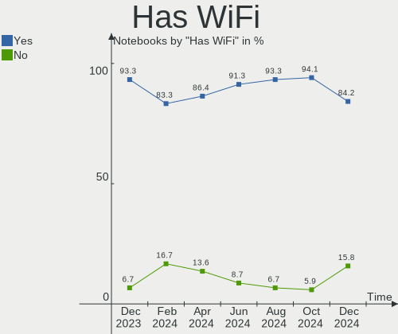
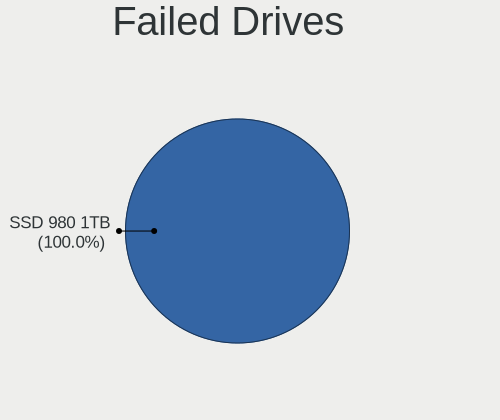
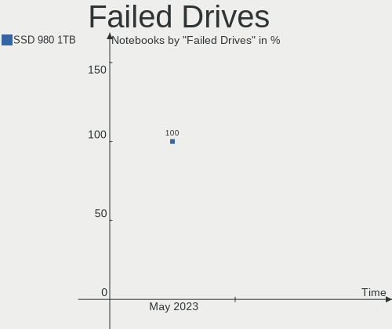
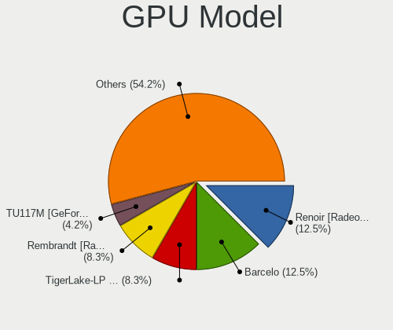
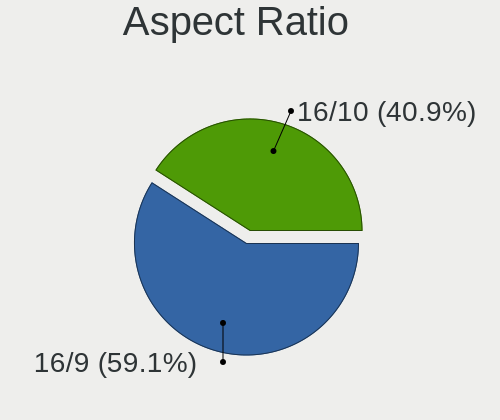
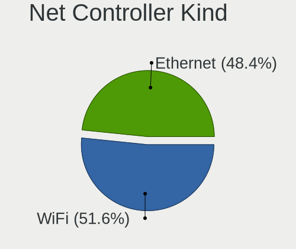
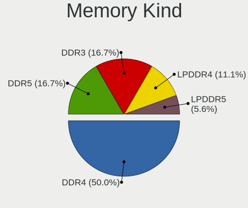
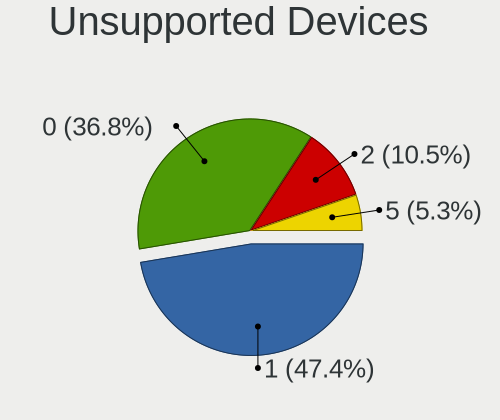

Gentoo Hardware Trends (Notebook)
---------------------------------

A project to identify most popular hardware characteristics and track their change
over time based on data collected by Gentoo users at https://Linux-Hardware.org.

Anyone can contribute to the study by uploading probes of their computers by
the [hw-probe](https://github.com/linuxhw/hw-probe) tool:

    sudo -E hw-probe -all -upload

Full-feature report is available here: https://linux-hardware.org/?view=trends&formfactor=notebook

Period: May, 2021.

Contents
--------

- [ OS                       ](#os)
- [ OS Family                ](#os-family)
- [ Kernel                   ](#kernel)
- [ Kernel Family            ](#kernel-family)
- [ Kernel Major Ver.        ](#kernel-major-ver)
- [ Arch                     ](#arch)
- [ DE                       ](#de)
- [ Display Server           ](#display-server)
- [ Display Manager          ](#display-manager)
- [ OS Lang                  ](#os-lang)
- [ Boot Mode                ](#boot-mode)
- [ Filesystem               ](#filesystem)
- [ Part. scheme             ](#part-scheme)
- [ Dual Boot with Linux/BSD ](#dual-boot-with-linux/bsd)
- [ Dual Boot (Win)          ](#dual-boot-win)
- [ Country                  ](#country)
- [ City                     ](#city)
- [ Vendor                   ](#vendor)
- [ Model                    ](#model)
- [ Model Family             ](#model-family)
- [ MFG Year                 ](#mfg-year)
- [ Form Factor              ](#form-factor)
- [ Secure Boot              ](#secure-boot)
- [ Coreboot                 ](#coreboot)
- [ RAM Size                 ](#ram-size)
- [ RAM Used                 ](#ram-used)
- [ Has CD-ROM               ](#has-cd-rom)
- [ Total Drives             ](#total-drives)
- [ Has Ethernet             ](#has-ethernet)
- [ Has WiFi                 ](#has-wifi)
- [ Has Bluetooth            ](#has-bluetooth)
- [ Drive Vendor             ](#drive-vendor)
- [ Drive Model              ](#drive-model)
- [ HDD Vendor               ](#hdd-vendor)
- [ SSD Vendor               ](#ssd-vendor)
- [ Drive Kind               ](#drive-kind)
- [ Drive Connector          ](#drive-connector)
- [ Drive Size               ](#drive-size)
- [ Space Total              ](#space-total)
- [ Space Used               ](#space-used)
- [ Malfunc. Drives          ](#malfunc-drives)
- [ Malfunc. Drive Vendor    ](#malfunc-drive-vendor)
- [ Malfunc. HDD Vendor      ](#malfunc-hdd-vendor)
- [ Malfunc. Drive Kind      ](#malfunc-drive-kind)
- [ Failed Drives            ](#failed-drives)
- [ Failed Drive Vendor      ](#failed-drive-vendor)
- [ Drive Status             ](#drive-status)
- [ Storage Vendor           ](#storage-vendor)
- [ Storage Model            ](#storage-model)
- [ Storage Kind             ](#storage-kind)
- [ CPU Vendor               ](#cpu-vendor)
- [ CPU Model                ](#cpu-model)
- [ CPU Model Family         ](#cpu-model-family)
- [ CPU Cores                ](#cpu-cores)
- [ CPU Sockets              ](#cpu-sockets)
- [ CPU Threads              ](#cpu-threads)
- [ CPU Op-Modes             ](#cpu-op-modes)
- [ CPU Microcode            ](#cpu-microcode)
- [ CPU Microarch            ](#cpu-microarch)
- [ GPU Vendor               ](#gpu-vendor)
- [ GPU Model                ](#gpu-model)
- [ GPU Combo                ](#gpu-combo)
- [ GPU Driver               ](#gpu-driver)
- [ GPU Memory               ](#gpu-memory)
- [ Monitor Vendor           ](#monitor-vendor)
- [ Monitor Model            ](#monitor-model)
- [ Monitor Resolution       ](#monitor-resolution)
- [ Monitor Diagonal         ](#monitor-diagonal)
- [ Monitor Width            ](#monitor-width)
- [ Aspect Ratio             ](#aspect-ratio)
- [ Monitor Area             ](#monitor-area)
- [ Pixel Density            ](#pixel-density)
- [ Multiple Monitors        ](#multiple-monitors)
- [ Net Controller Vendor    ](#net-controller-vendor)
- [ Net Controller Model     ](#net-controller-model)
- [ Wireless Vendor          ](#wireless-vendor)
- [ Wireless Model           ](#wireless-model)
- [ Ethernet Vendor          ](#ethernet-vendor)
- [ Ethernet Model           ](#ethernet-model)
- [ Net Controller Kind      ](#net-controller-kind)
- [ Used Controller          ](#used-controller)
- [ NICs                     ](#nics)
- [ IPv6                     ](#ipv6)
- [ Memory Vendor            ](#memory-vendor)
- [ Memory Model             ](#memory-model)
- [ Memory Kind              ](#memory-kind)
- [ Memory Form Factor       ](#memory-form-factor)
- [ Memory Size              ](#memory-size)
- [ Memory Speed             ](#memory-speed)
- [ Sound Vendor             ](#sound-vendor)
- [ Sound Model              ](#sound-model)
- [ Camera Vendor            ](#camera-vendor)
- [ Camera Model             ](#camera-model)
- [ Fingerprint Vendor       ](#fingerprint-vendor)
- [ Fingerprint Model        ](#fingerprint-model)
- [ Chipcard Vendor          ](#chipcard-vendor)
- [ Chipcard Model           ](#chipcard-model)
- [ Printer Vendor           ](#printer-vendor)
- [ Printer Model            ](#printer-model)
- [ Scanner Vendor           ](#scanner-vendor)
- [ Scanner Model            ](#scanner-model)
- [ Bluetooth Vendor         ](#bluetooth-vendor)
- [ Bluetooth Model          ](#bluetooth-model)
- [ Unsupported Devices      ](#unsupported-devices)
- [ Unsupported Device Types ](#unsupported-device-types)

OS
--

Installed operating systems

| Name       | Notebooks | Percent |
|------------|-----------|---------|
| Gentoo     | 14        | 60.87%  |
| Gentoo 2.7 | 9         | 39.13%  |

OS Family
---------

OS without a version

| Name   | Notebooks | Percent |
|--------|-----------|---------|
| Gentoo | 23        | 100%    |

Kernel
------

Version of the Linux kernel

| Version                                      | Notebooks | Percent |
|----------------------------------------------|-----------|---------|
| 5.10.27-gentoo                               | 5         | 21.74%  |
| 5.12.4-gentoo                                | 2         | 8.7%    |
| 5.9.8-gentoo-compact-0.1                     | 1         | 4.35%   |
| 5.4.80-gentoo-r1                             | 1         | 4.35%   |
| 5.12.6-gentoo-x86_64                         | 1         | 4.35%   |
| 5.12.4-xanmod1-cacule                        | 1         | 4.35%   |
| 5.12.4-gentoo-gentoo-dist                    | 1         | 4.35%   |
| 5.12.0-gentoo.104                            | 1         | 4.35%   |
| 5.12.0-gentoo-x86_64                         | 1         | 4.35%   |
| 5.11.15-zen1                                 | 1         | 4.35%   |
| 5.11.15-gentoo                               | 1         | 4.35%   |
| 5.11.11-dist                                 | 1         | 4.35%   |
| 5.11.0-gentoo                                | 1         | 4.35%   |
| 5.10.32-gentoo-66.readded_some_media_drivers | 1         | 4.35%   |
| 5.10.31-gentoo.97                            | 1         | 4.35%   |
| 5.10.31-gentoo.02                            | 1         | 4.35%   |
| 5.10.27-gentoo.1                             | 1         | 4.35%   |
| 5.10.27-gentoo-amd64-fomys                   | 1         | 4.35%   |

Kernel Family
-------------

Linux kernel without a distro release

| Version | Notebooks | Percent |
|---------|-----------|---------|
| 5.10.27 | 7         | 30.43%  |
| 5.12.4  | 4         | 17.39%  |
| 5.12.0  | 2         | 8.7%    |
| 5.11.15 | 2         | 8.7%    |
| 5.10.31 | 2         | 8.7%    |
| 5.9.8   | 1         | 4.35%   |
| 5.4.80  | 1         | 4.35%   |
| 5.12.6  | 1         | 4.35%   |
| 5.11.11 | 1         | 4.35%   |
| 5.11.0  | 1         | 4.35%   |
| 5.10.32 | 1         | 4.35%   |

Kernel Major Ver.
-----------------

Linux kernel major version

| Version | Notebooks | Percent |
|---------|-----------|---------|
| 5.10    | 10        | 43.48%  |
| 5.12    | 7         | 30.43%  |
| 5.11    | 4         | 17.39%  |
| 5.9     | 1         | 4.35%   |
| 5.4     | 1         | 4.35%   |

Arch
----

OS architecture (x86_64, i586, etc.)

| Name   | Notebooks | Percent |
|--------|-----------|---------|
| x86_64 | 22        | 95.65%  |
| i686   | 1         | 4.35%   |

DE
--

Desktop Environment

| Name       | Notebooks | Percent |
|------------|-----------|---------|
| Unknown    | 11        | 47.83%  |
| GNOME      | 6         | 26.09%  |
| KDE5       | 2         | 8.7%    |
| Xsession   | 1         | 4.35%   |
| XFCE       | 1         | 4.35%   |
| X-Cinnamon | 1         | 4.35%   |
| sway       | 1         | 4.35%   |

Display Server
--------------

X11 or Wayland

| Name    | Notebooks | Percent |
|---------|-----------|---------|
| X11     | 11        | 47.83%  |
| Wayland | 4         | 17.39%  |
| Tty     | 4         | 17.39%  |
| Unknown | 4         | 17.39%  |

Display Manager
---------------

SDDM, LightDM, etc.

| Name    | Notebooks | Percent |
|---------|-----------|---------|
| Unknown | 11        | 47.83%  |
| SDDM    | 4         | 17.39%  |
| LightDM | 4         | 17.39%  |
| GDM     | 3         | 13.04%  |
| SLiM    | 1         | 4.35%   |

OS Lang
-------

Language

| Lang    | Notebooks | Percent |
|---------|-----------|---------|
| en_US   | 13        | 56.52%  |
| ru_RU   | 3         | 13.04%  |
| de_DE   | 2         | 8.7%    |
| it_IT   | 1         | 4.35%   |
| fr_FR   | 1         | 4.35%   |
| el_GR   | 1         | 4.35%   |
| C       | 1         | 4.35%   |
| Unknown | 1         | 4.35%   |

Boot Mode
---------

EFI or BIOS

| Mode | Notebooks | Percent |
|------|-----------|---------|
| EFI  | 17        | 73.91%  |
| BIOS | 6         | 26.09%  |

Filesystem
----------

Type of filesystem

| Type  | Notebooks | Percent |
|-------|-----------|---------|
| Ext4  | 12        | 52.17%  |
| Btrfs | 9         | 39.13%  |
| Zfs   | 1         | 4.35%   |
| F2fs  | 1         | 4.35%   |

Part. scheme
------------

Scheme of partitioning

| Type    | Notebooks | Percent |
|---------|-----------|---------|
| GPT     | 17        | 73.91%  |
| Unknown | 4         | 17.39%  |
| MBR     | 2         | 8.7%    |

Dual Boot with Linux/BSD
------------------------

Hosting more than one Linux/BSD

| Dual boot | Notebooks | Percent |
|-----------|-----------|---------|
| No        | 15        | 65.22%  |
| Yes       | 8         | 34.78%  |

Dual Boot (Win)
---------------

Hosting Linux and Windows

| Dual boot | Notebooks | Percent |
|-----------|-----------|---------|
| No        | 18        | 78.26%  |
| Yes       | 5         | 21.74%  |

Country
-------

Geographic location (country)

| Country     | Notebooks | Percent |
|-------------|-----------|---------|
| USA         | 4         | 17.39%  |
| Greece      | 4         | 17.39%  |
| Russia      | 2         | 8.7%    |
| Netherlands | 2         | 8.7%    |
| Germany     | 2         | 8.7%    |
| Ukraine     | 1         | 4.35%   |
| Tunisia     | 1         | 4.35%   |
| Norway      | 1         | 4.35%   |
| Italy       | 1         | 4.35%   |
| Hungary     | 1         | 4.35%   |
| France      | 1         | 4.35%   |
| Finland     | 1         | 4.35%   |
| China       | 1         | 4.35%   |
| Canada      | 1         | 4.35%   |

City
----

Geographic location (city)

| City          | Notebooks | Percent |
|---------------|-----------|---------|
| Nemea         | 2         | 8.7%    |
| Tunis         | 1         | 4.35%   |
| Tromsø       | 1         | 4.35%   |
| Toulouse      | 1         | 4.35%   |
| Sumy          | 1         | 4.35%   |
| St Petersburg | 1         | 4.35%   |
| Rome          | 1         | 4.35%   |
| Omsk          | 1         | 4.35%   |
| Neu-Isenburg  | 1         | 4.35%   |
| Manitowoc     | 1         | 4.35%   |
| Lahti         | 1         | 4.35%   |
| Huxi          | 1         | 4.35%   |
| Heraklion     | 1         | 4.35%   |
| Heeze         | 1         | 4.35%   |
| Haarlem       | 1         | 4.35%   |
| Fuquay-Varina | 1         | 4.35%   |
| Columbia      | 1         | 4.35%   |
| Budapest      | 1         | 4.35%   |
| Brooklyn      | 1         | 4.35%   |
| Brampton      | 1         | 4.35%   |
| Berlin        | 1         | 4.35%   |
| Athens        | 1         | 4.35%   |

Vendor
------

Motherboard manufacturer

| Name                | Notebooks | Percent |
|---------------------|-----------|---------|
| Lenovo              | 6         | 26.09%  |
| Hewlett-Packard     | 6         | 26.09%  |
| Dell                | 4         | 17.39%  |
| Toshiba             | 2         | 8.7%    |
| ASUSTek Computer    | 2         | 8.7%    |
| Samsung Electronics | 1         | 4.35%   |
| Razer               | 1         | 4.35%   |
| HUAWEI              | 1         | 4.35%   |

Model
-----

Motherboard model

| Name                                               | Notebooks | Percent |
|----------------------------------------------------|-----------|---------|
| Toshiba Satellite A200                             | 1         | 4.35%   |
| Toshiba NB100                                      | 1         | 4.35%   |
| Samsung RC530/RC730                                | 1         | 4.35%   |
| Razer Blade 15 Base Model (Early 2020) - RZ09-0328 | 1         | 4.35%   |
| Lenovo Yoga 2 13 20344                             | 1         | 4.35%   |
| Lenovo ThinkPad X230 2325BF1                       | 1         | 4.35%   |
| Lenovo ThinkPad T61p 8891CTO                       | 1         | 4.35%   |
| Lenovo ThinkPad T14 Gen 1 20UD0013GE               | 1         | 4.35%   |
| Lenovo IdeaPad L340-15IRH Gaming 81LK              | 1         | 4.35%   |
| Lenovo IdeaPad 100-15IBD 80QQ                      | 1         | 4.35%   |
| HUAWEI BOHK-WAX9X                                  | 1         | 4.35%   |
| HP ProBook 445 G7                                  | 1         | 4.35%   |
| HP Pavilion Notebook                               | 1         | 4.35%   |
| HP Pavilion Gaming Laptop 15-ec1xxx                | 1         | 4.35%   |
| HP Laptop 15-dw2xxx                                | 1         | 4.35%   |
| HP EliteBook 855 G7 Notebook PC                    | 1         | 4.35%   |
| Dell XPS 13 9310                                   | 1         | 4.35%   |
| Dell Inspiron 5415                                 | 1         | 4.35%   |
| Dell Inspiron 3135                                 | 1         | 4.35%   |
| Dell G3 3500                                       | 1         | 4.35%   |
| ASUS X550ZA                                        | 1         | 4.35%   |
| ASUS ROG Zephyrus G14 GA401II_GA401II              | 1         | 4.35%   |
| Unknown                                            | 1         | 4.35%   |

Model Family
------------

Motherboard model prefix

| Name              | Notebooks | Percent |
|-------------------|-----------|---------|
| Lenovo ThinkPad   | 3         | 13.04%  |
| Lenovo IdeaPad    | 2         | 8.7%    |
| HP Pavilion       | 2         | 8.7%    |
| Dell Inspiron     | 2         | 8.7%    |
| Toshiba Satellite | 1         | 4.35%   |
| Toshiba NB100     | 1         | 4.35%   |
| Samsung RC530     | 1         | 4.35%   |
| Razer Blade       | 1         | 4.35%   |
| Lenovo Yoga       | 1         | 4.35%   |
| HUAWEI BOHK-WAX9X | 1         | 4.35%   |
| HP ProBook        | 1         | 4.35%   |
| HP Laptop         | 1         | 4.35%   |
| HP EliteBook      | 1         | 4.35%   |
| Dell XPS          | 1         | 4.35%   |
| Dell G3           | 1         | 4.35%   |
| ASUS X550ZA       | 1         | 4.35%   |
| ASUS ROG          | 1         | 4.35%   |
| Unknown           | 1         | 4.35%   |

MFG Year
--------

Motherboard manufacture year

| Year | Notebooks | Percent |
|------|-----------|---------|
| 2020 | 9         | 39.13%  |
| 2019 | 3         | 13.04%  |
| 2021 | 2         | 8.7%    |
| 2014 | 2         | 8.7%    |
| 2011 | 2         | 8.7%    |
| 2016 | 1         | 4.35%   |
| 2015 | 1         | 4.35%   |
| 2012 | 1         | 4.35%   |
| 2008 | 1         | 4.35%   |
| 2007 | 1         | 4.35%   |

Form Factor
-----------

Physical design of the computer

| Name     | Notebooks | Percent |
|----------|-----------|---------|
| Notebook | 23        | 100%    |

Secure Boot
-----------

Enabled or disabled

| State    | Notebooks | Percent |
|----------|-----------|---------|
| Disabled | 22        | 95.65%  |
| Enabled  | 1         | 4.35%   |

Coreboot
--------

Have coreboot on board

| Used | Notebooks | Percent |
|------|-----------|---------|
| No   | 23        | 100%    |

RAM Size
--------

Total RAM memory

| Size in GB | Notebooks | Percent |
|------------|-----------|---------|
| 8.01-16.0  | 7         | 30.43%  |
| 4.01-8.0   | 6         | 26.09%  |
| 3.01-4.0   | 6         | 26.09%  |
| 32.01-64.0 | 2         | 8.7%    |
| 2.01-3.0   | 1         | 4.35%   |
| 16.01-24.0 | 1         | 4.35%   |

RAM Used
--------

Used RAM memory

| Used GB  | Notebooks | Percent |
|----------|-----------|---------|
| 1.01-2.0 | 10        | 43.48%  |
| 2.01-3.0 | 4         | 17.39%  |
| 0.51-1.0 | 3         | 13.04%  |
| 4.01-8.0 | 2         | 8.7%    |
| 3.01-4.0 | 2         | 8.7%    |
| 0.01-0.5 | 2         | 8.7%    |

Has CD-ROM
----------

Has CD-ROM on board

| Presented | Notebooks | Percent |
|-----------|-----------|---------|
| No        | 17        | 73.91%  |
| Yes       | 6         | 26.09%  |

Total Drives
------------

Number of drives on board

| Drives | Notebooks | Percent |
|--------|-----------|---------|
| 1      | 15        | 65.22%  |
| 2      | 8         | 34.78%  |

Has Ethernet
------------

Has Ethernet on board

| Presented | Notebooks | Percent |
|-----------|-----------|---------|
| Yes       | 17        | 73.91%  |
| No        | 6         | 26.09%  |

Has WiFi
--------

Has WiFi module

| Presented | Notebooks | Percent |
|-----------|-----------|---------|
| Yes       | 23        | 100%    |

Has Bluetooth
-------------

Has Bluetooth module

| Presented | Notebooks | Percent |
|-----------|-----------|---------|
| Yes       | 20        | 86.96%  |
| No        | 3         | 13.04%  |

Drive Vendor
------------

Hard drive vendors

| Vendor              | Notebooks | Drives | Percent |
|---------------------|-----------|--------|---------|
| WDC                 | 6         | 6      | 18.75%  |
| Seagate             | 6         | 6      | 18.75%  |
| Samsung Electronics | 5         | 5      | 15.63%  |
| Unknown             | 2         | 2      | 6.25%   |
| SK Hynix            | 2         | 2      | 6.25%   |
| Intel               | 2         | 2      | 6.25%   |
| XPG                 | 1         | 1      | 3.13%   |
| Toshiba             | 1         | 1      | 3.13%   |
| OCZ                 | 1         | 1      | 3.13%   |
| Micron Technology   | 1         | 1      | 3.13%   |
| Kingston            | 1         | 1      | 3.13%   |
| Hitachi             | 1         | 1      | 3.13%   |
| HGST                | 1         | 1      | 3.13%   |
| Fujitsu             | 1         | 1      | 3.13%   |
| A-DATA Technology   | 1         | 1      | 3.13%   |

Drive Model
-----------

Hard drive models

| Model                                   | Notebooks | Percent |
|-----------------------------------------|-----------|---------|
| Seagate ST2000LM015-2E8174 2TB          | 2         | 6.25%   |
| Seagate ST1000LM024 HN-M101MBB 1TB      | 2         | 6.25%   |
| XPG NVMe SSD Drive 256GB                | 1         | 3.13%   |
| WDC WDS240G2G0A-00JH30 240GB SSD        | 1         | 3.13%   |
| WDC WDBNCE2500PNC 250GB SSD             | 1         | 3.13%   |
| WDC WD1600BEVS-22RST0 160GB             | 1         | 3.13%   |
| WDC WD10SPZX-24Z10 1TB                  | 1         | 3.13%   |
| WDC PC SN530 SDBPNPZ-512G-1006 512GB    | 1         | 3.13%   |
| WDC PC SN520 SDAPNUW-256G-1006 256GB    | 1         | 3.13%   |
| Unknown MMC Card  64GB                  | 1         | 3.13%   |
| Unknown MMC Card  2GB                   | 1         | 3.13%   |
| Toshiba KXG60ZNV1T02 NVMe KIOXIA 1024GB | 1         | 3.13%   |
| SK Hynix HFM256GDHTNG-8310A 256GB       | 1         | 3.13%   |
| SK Hynix BC711 NVMe 512GB               | 1         | 3.13%   |
| Seagate ST500LM034-2GH17A 500GB         | 1         | 3.13%   |
| Seagate ST1000LM049-2GH172 1TB          | 1         | 3.13%   |
| Samsung SSD 850 EVO 250GB               | 1         | 3.13%   |
| Samsung PM991 NVMe 512GB                | 1         | 3.13%   |
| Samsung NVMe SSD Drive 2TB              | 1         | 3.13%   |
| Samsung MZVLB512HBJQ-00A00 512GB        | 1         | 3.13%   |
| Samsung MZVLB512HAJQ-00000 512GB        | 1         | 3.13%   |
| OCZ AGILITY3 64GB SSD                   | 1         | 3.13%   |
| Micron 1100 SATA 256GB SSD              | 1         | 3.13%   |
| Kingston SA400S37480G 480GB SSD         | 1         | 3.13%   |
| Intel SSDSC2KW128G8 128GB               | 1         | 3.13%   |
| Intel SSDPEKNW512G8 512GB               | 1         | 3.13%   |
| Hitachi HTS721010G9SA00 100GB           | 1         | 3.13%   |
| HGST HTS541010A9E680 1TB                | 1         | 3.13%   |
| Fujitsu MHY2200BH 200GB                 | 1         | 3.13%   |
| A-DATA SU655 240GB SSD                  | 1         | 3.13%   |

HDD Vendor
----------

Hard disk drive vendors

| Vendor  | Notebooks | Drives | Percent |
|---------|-----------|--------|---------|
| Seagate | 6         | 6      | 54.55%  |
| WDC     | 2         | 2      | 18.18%  |
| Hitachi | 1         | 1      | 9.09%   |
| HGST    | 1         | 1      | 9.09%   |
| Fujitsu | 1         | 1      | 9.09%   |

SSD Vendor
----------

Solid state drive vendors

| Vendor              | Notebooks | Drives | Percent |
|---------------------|-----------|--------|---------|
| WDC                 | 2         | 2      | 25%     |
| Samsung Electronics | 1         | 1      | 12.5%   |
| OCZ                 | 1         | 1      | 12.5%   |
| Micron Technology   | 1         | 1      | 12.5%   |
| Kingston            | 1         | 1      | 12.5%   |
| Intel               | 1         | 1      | 12.5%   |
| A-DATA Technology   | 1         | 1      | 12.5%   |

Drive Kind
----------

HDD or SSD

| Kind | Notebooks | Drives | Percent |
|------|-----------|--------|---------|
| NVMe | 11        | 11     | 34.38%  |
| HDD  | 11        | 11     | 34.38%  |
| SSD  | 8         | 8      | 25%     |
| MMC  | 2         | 2      | 6.25%   |

Drive Connector
---------------

SATA, SAS, NVMe, etc.

| Type | Notebooks | Drives | Percent |
|------|-----------|--------|---------|
| SATA | 17        | 19     | 56.67%  |
| NVMe | 11        | 11     | 36.67%  |
| MMC  | 2         | 2      | 6.67%   |

Drive Size
----------

Size of hard drive

| Size in TB | Notebooks | Drives | Percent |
|------------|-----------|--------|---------|
| 0.01-0.5   | 12        | 12     | 63.16%  |
| 0.51-1.0   | 5         | 5      | 26.32%  |
| 1.01-2.0   | 2         | 2      | 10.53%  |

Space Total
-----------

Amount of disk space available on the file system

| Size in GB     | Notebooks | Percent |
|----------------|-----------|---------|
| 251-500        | 5         | 21.74%  |
| 101-250        | 5         | 21.74%  |
| 1001-2000      | 4         | 17.39%  |
| 501-1000       | 3         | 13.04%  |
| More than 3000 | 1         | 4.35%   |
| 21-50          | 1         | 4.35%   |
| 2001-3000      | 1         | 4.35%   |
| 1-20           | 1         | 4.35%   |
| 51-100         | 1         | 4.35%   |
| Unknown        | 1         | 4.35%   |

Space Used
----------

Amount of used disk space

| Used GB        | Notebooks | Percent |
|----------------|-----------|---------|
| 101-250        | 7         | 30.43%  |
| 21-50          | 5         | 21.74%  |
| 251-500        | 3         | 13.04%  |
| 1-20           | 3         | 13.04%  |
| 1001-2000      | 2         | 8.7%    |
| More than 3000 | 1         | 4.35%   |
| 51-100         | 1         | 4.35%   |
| Unknown        | 1         | 4.35%   |

Malfunc. Drives
---------------

Drive models with a malfunction

| Model                              | Notebooks | Drives | Percent |
|------------------------------------|-----------|--------|---------|
| Seagate ST1000LM024 HN-M101MBB 1TB | 1         | 1      | 100%    |

Malfunc. Drive Vendor
---------------------

Vendors of faulty drives

| Vendor  | Notebooks | Drives | Percent |
|---------|-----------|--------|---------|
| Seagate | 1         | 1      | 100%    |

Malfunc. HDD Vendor
-------------------

Vendors of faulty HDD drives

| Vendor  | Notebooks | Drives | Percent |
|---------|-----------|--------|---------|
| Seagate | 1         | 1      | 100%    |

Malfunc. Drive Kind
-------------------

Kinds of faulty drives

| Kind | Notebooks | Drives | Percent |
|------|-----------|--------|---------|
| HDD  | 1         | 1      | 100%    |

Failed Drives
-------------

Failed drive models

| Model                         | Notebooks | Drives | Percent |
|-------------------------------|-----------|--------|---------|
| Hitachi HTS721010G9SA00 100GB | 1         | 1      | 100%    |

Failed Drive Vendor
-------------------

Failed drive vendors

| Vendor  | Notebooks | Drives | Percent |
|---------|-----------|--------|---------|
| Hitachi | 1         | 1      | 100%    |

Drive Status
------------

Number of failed and malfunc. drives

| Status   | Notebooks | Drives | Percent |
|----------|-----------|--------|---------|
| Works    | 19        | 24     | 73.08%  |
| Detected | 5         | 6      | 19.23%  |
| Malfunc  | 1         | 1      | 3.85%   |
| Failed   | 1         | 1      | 3.85%   |

Storage Vendor
--------------

Storage controller vendors

| Vendor                       | Notebooks | Percent |
|------------------------------|-----------|---------|
| Intel                        | 14        | 46.67%  |
| AMD                          | 6         | 20%     |
| Samsung Electronics          | 4         | 13.33%  |
| SK Hynix                     | 2         | 6.67%   |
| Sandisk                      | 2         | 6.67%   |
| Toshiba America Info Systems | 1         | 3.33%   |
| ADATA Technology             | 1         | 3.33%   |

Storage Model
-------------

Storage controller models

| Model                                                                        | Notebooks | Percent |
|------------------------------------------------------------------------------|-----------|---------|
| AMD FCH SATA Controller [AHCI mode]                                          | 6         | 18.18%  |
| Samsung NVMe SSD Controller SM981/PM981/PM983                                | 3         | 9.09%   |
| Intel Wildcat Point-LP SATA Controller [AHCI Mode]                           | 2         | 6.06%   |
| Intel 82801HM/HEM (ICH8M/ICH8M-E) SATA Controller [AHCI mode]                | 2         | 6.06%   |
| Intel 82801HM/HEM (ICH8M/ICH8M-E) IDE Controller                             | 2         | 6.06%   |
| Intel 400 Series Chipset Family SATA AHCI Controller                         | 2         | 6.06%   |
| Toshiba America Info Systems XG6 NVMe SSD Controller                         | 1         | 3.03%   |
| SK Hynix NVMe SSD Controller                                                 | 1         | 3.03%   |
| SK Hynix BC501 NVMe Solid State Drive 512GB                                  | 1         | 3.03%   |
| Sandisk WD Blue SN550 NVMe SSD                                               | 1         | 3.03%   |
| Sandisk WD Blue SN500 / PC SN520 NVMe SSD                                    | 1         | 3.03%   |
| Samsung NVMe Controller                                                      | 1         | 3.03%   |
| Intel SSD 660P Series                                                        | 1         | 3.03%   |
| Intel Cannon Lake Mobile PCH SATA AHCI Controller                            | 1         | 3.03%   |
| Intel 82801GBM/GHM (ICH7-M Family) SATA Controller [IDE mode]                | 1         | 3.03%   |
| Intel 82801GBM/GHM (ICH7-M Family) SATA Controller [AHCI mode]               | 1         | 3.03%   |
| Intel 82801G (ICH7 Family) IDE Controller                                    | 1         | 3.03%   |
| Intel 82801 Mobile SATA Controller [RAID mode]                               | 1         | 3.03%   |
| Intel 8 Series SATA Controller 1 [AHCI mode]                                 | 1         | 3.03%   |
| Intel 7 Series Chipset Family 6-port SATA Controller [AHCI mode]             | 1         | 3.03%   |
| Intel 6 Series/C200 Series Chipset Family 6 port Mobile SATA AHCI Controller | 1         | 3.03%   |
| ADATA XPG SX8200 Pro PCIe Gen3x4 M.2 2280 Solid State Drive                  | 1         | 3.03%   |

Storage Kind
------------

Kind of storage controller (IDE, SATA, NVMe, SAS, ...)

| Kind | Notebooks | Percent |
|------|-----------|---------|
| SATA | 17        | 51.52%  |
| NVMe | 11        | 33.33%  |
| IDE  | 4         | 12.12%  |
| RAID | 1         | 3.03%   |

CPU Vendor
----------

Processor vendors

| Vendor | Notebooks | Percent |
|--------|-----------|---------|
| Intel  | 14        | 60.87%  |
| AMD    | 9         | 39.13%  |

CPU Model
---------

Processor models

| Model                                         | Notebooks | Percent |
|-----------------------------------------------|-----------|---------|
| Intel Core 2 Duo CPU T7500 @ 2.20GHz          | 2         | 8.7%    |
| AMD Ryzen 7 PRO 4750U with Radeon Graphics    | 2         | 8.7%    |
| Intel Core i7-9750H CPU @ 2.60GHz             | 1         | 4.35%   |
| Intel Core i7-2670QM CPU @ 2.20GHz            | 1         | 4.35%   |
| Intel Core i7-10750H CPU @ 2.60GHz            | 1         | 4.35%   |
| Intel Core i5-5200U CPU @ 2.20GHz             | 1         | 4.35%   |
| Intel Core i5-4200U CPU @ 1.60GHz             | 1         | 4.35%   |
| Intel Core i5-3320M CPU @ 2.60GHz             | 1         | 4.35%   |
| Intel Core i5-10300H CPU @ 2.50GHz            | 1         | 4.35%   |
| Intel Core i3-5005U CPU @ 2.00GHz             | 1         | 4.35%   |
| Intel Core i3-1005G1 CPU @ 1.20GHz            | 1         | 4.35%   |
| Intel Core 2 CPU T7400 @ 2.16GHz              | 1         | 4.35%   |
| Intel Atom CPU N270 @ 1.60GHz                 | 1         | 4.35%   |
| Intel 11th Gen Core i7-1185G7 @ 3.00GHz       | 1         | 4.35%   |
| AMD Ryzen 7 4800HS with Radeon Graphics       | 1         | 4.35%   |
| AMD Ryzen 5 PRO 4650U with Radeon Graphics    | 1         | 4.35%   |
| AMD Ryzen 5 5500U with Radeon Graphics        | 1         | 4.35%   |
| AMD Ryzen 5 4600H with Radeon Graphics        | 1         | 4.35%   |
| AMD Ryzen 5 3500U with Radeon Vega Mobile Gfx | 1         | 4.35%   |
| AMD A8-7200P Radeon R5, 8 Compute Cores 4C+4G | 1         | 4.35%   |
| AMD A6-1450 APU with Radeon HD Graphics       | 1         | 4.35%   |

CPU Model Family
----------------

Processor model prefix

| Model            | Notebooks | Percent |
|------------------|-----------|---------|
| Intel Core i5    | 4         | 17.39%  |
| Intel Core i7    | 3         | 13.04%  |
| AMD Ryzen 5      | 3         | 13.04%  |
| Intel Core i3    | 2         | 8.7%    |
| Intel Core 2 Duo | 2         | 8.7%    |
| AMD Ryzen 7 PRO  | 2         | 8.7%    |
| Other            | 1         | 4.35%   |
| Intel Core 2     | 1         | 4.35%   |
| Intel Atom       | 1         | 4.35%   |
| AMD Ryzen 7      | 1         | 4.35%   |
| AMD Ryzen 5 PRO  | 1         | 4.35%   |
| AMD A8           | 1         | 4.35%   |
| AMD A6           | 1         | 4.35%   |

CPU Cores
---------

Number of processor cores

| Number | Notebooks | Percent |
|--------|-----------|---------|
| 2      | 9         | 39.13%  |
| 6      | 5         | 21.74%  |
| 4      | 5         | 21.74%  |
| 8      | 3         | 13.04%  |
| 1      | 1         | 4.35%   |

CPU Sockets
-----------

Number of sockets

| Number | Notebooks | Percent |
|--------|-----------|---------|
| 1      | 23        | 100%    |

CPU Threads
-----------

Threads per core (Hyper-Threading)

| Number | Notebooks | Percent |
|--------|-----------|---------|
| 2      | 19        | 82.61%  |
| 1      | 4         | 17.39%  |

CPU Op-Modes
------------

CPU Operation Modes (32-bit, 64-bit)

| Op mode        | Notebooks | Percent |
|----------------|-----------|---------|
| 32-bit, 64-bit | 22        | 95.65%  |
| 32-bit         | 1         | 4.35%   |

CPU Microcode
-------------

Microcode number

| Number     | Notebooks | Percent |
|------------|-----------|---------|
| 0x08600106 | 4         | 17.39%  |
| 0xa0652    | 2         | 8.7%    |
| 0x6fb      | 2         | 8.7%    |
| 0x306d4    | 2         | 8.7%    |
| 0x906ea    | 1         | 4.35%   |
| 0x806c1    | 1         | 4.35%   |
| 0x706e5    | 1         | 4.35%   |
| 0x6f6      | 1         | 4.35%   |
| 0x40651    | 1         | 4.35%   |
| 0x306a9    | 1         | 4.35%   |
| 0x206a7    | 1         | 4.35%   |
| 0x08608103 | 1         | 4.35%   |
| 0x08600104 | 1         | 4.35%   |
| 0x08108109 | 1         | 4.35%   |
| 0x0700010b | 1         | 4.35%   |
| 0x06003106 | 1         | 4.35%   |
| Unknown    | 1         | 4.35%   |

CPU Microarch
-------------

Microarchitecture

| Name        | Notebooks | Percent |
|-------------|-----------|---------|
| Zen 2       | 5         | 21.74%  |
| Core        | 3         | 13.04%  |
| CometLake   | 2         | 8.7%    |
| Broadwell   | 2         | 8.7%    |
| Zen+        | 1         | 4.35%   |
| TigerLake   | 1         | 4.35%   |
| Steamroller | 1         | 4.35%   |
| SandyBridge | 1         | 4.35%   |
| KabyLake    | 1         | 4.35%   |
| Jaguar      | 1         | 4.35%   |
| IvyBridge   | 1         | 4.35%   |
| IceLake     | 1         | 4.35%   |
| Haswell     | 1         | 4.35%   |
| Bonnell     | 1         | 4.35%   |
| Unknown     | 1         | 4.35%   |

GPU Vendor
----------

Vendors of graphics cards

| Vendor | Notebooks | Percent |
|--------|-----------|---------|
| Intel  | 12        | 40%     |
| Nvidia | 9         | 30%     |
| AMD    | 9         | 30%     |

GPU Model
---------

Graphics card models

| Model                                                                         | Notebooks | Percent |
|-------------------------------------------------------------------------------|-----------|---------|
| AMD Renoir                                                                    | 5         | 15.63%  |
| Nvidia TU117M                                                                 | 2         | 6.25%   |
| Intel HD Graphics 5500                                                        | 2         | 6.25%   |
| Intel CometLake-H GT2 [UHD Graphics]                                          | 2         | 6.25%   |
| Nvidia TU117M [GeForce GTX 1650 Mobile / Max-Q]                               | 1         | 3.13%   |
| Nvidia TU116M [GeForce GTX 1650 Ti Mobile]                                    | 1         | 3.13%   |
| Nvidia TU106M [GeForce RTX 2060 Mobile]                                       | 1         | 3.13%   |
| Nvidia GM108M [GeForce 940M]                                                  | 1         | 3.13%   |
| Nvidia GF108M [GeForce GT 540M]                                               | 1         | 3.13%   |
| Nvidia G84GLM [Quadro FX 570M]                                                | 1         | 3.13%   |
| Nvidia G72M [Quadro NVS 110M/GeForce Go 7300]                                 | 1         | 3.13%   |
| Intel TigerLake-LP GT2 [Iris Xe Graphics]                                     | 1         | 3.13%   |
| Intel Mobile GM965/GL960 Integrated Graphics Controller (secondary)           | 1         | 3.13%   |
| Intel Mobile GM965/GL960 Integrated Graphics Controller (primary)             | 1         | 3.13%   |
| Intel Mobile 945GSE Express Integrated Graphics Controller                    | 1         | 3.13%   |
| Intel Mobile 945GM/GMS/GME, 943/940GML Express Integrated Graphics Controller | 1         | 3.13%   |
| Intel Iris Plus Graphics G1 (Ice Lake)                                        | 1         | 3.13%   |
| Intel Haswell-ULT Integrated Graphics Controller                              | 1         | 3.13%   |
| Intel CoffeeLake-H GT2 [UHD Graphics 630]                                     | 1         | 3.13%   |
| Intel 3rd Gen Core processor Graphics Controller                              | 1         | 3.13%   |
| Intel 2nd Generation Core Processor Family Integrated Graphics Controller     | 1         | 3.13%   |
| AMD Temash [Radeon HD 8250/8280G]                                             | 1         | 3.13%   |
| AMD Picasso                                                                   | 1         | 3.13%   |
| AMD Lucienne                                                                  | 1         | 3.13%   |
| AMD Kaveri [Radeon R5 Graphics]                                               | 1         | 3.13%   |

GPU Combo
---------

Combinations of graphics cards

| Name           | Notebooks | Percent |
|----------------|-----------|---------|
| 1 x Intel      | 7         | 30.43%  |
| 1 x AMD        | 7         | 30.43%  |
| Intel + Nvidia | 5         | 21.74%  |
| 1 x Nvidia     | 2         | 8.7%    |
| AMD + Nvidia   | 2         | 8.7%    |

GPU Driver
----------

Free vs proprietary

| Driver      | Notebooks | Percent |
|-------------|-----------|---------|
| Free        | 18        | 78.26%  |
| Proprietary | 5         | 21.74%  |

GPU Memory
----------

Total video memory

| Size in GB | Notebooks | Percent |
|------------|-----------|---------|
| Unknown    | 10        | 43.48%  |
| 0.01-0.5   | 9         | 39.13%  |
| 0.51-1.0   | 2         | 8.7%    |
| 5.01-6.0   | 1         | 4.35%   |
| 3.01-4.0   | 1         | 4.35%   |

Monitor Vendor
--------------

Monitor vendors

| Vendor                  | Notebooks | Percent |
|-------------------------|-----------|---------|
| BOE                     | 6         | 23.08%  |
| AU Optronics            | 5         | 19.23%  |
| Samsung Electronics     | 3         | 11.54%  |
| Chimei Innolux          | 3         | 11.54%  |
| LG Display              | 2         | 7.69%   |
| Sharp                   | 1         | 3.85%   |
| PANDA                   | 1         | 3.85%   |
| Lenovo                  | 1         | 3.85%   |
| Dell                    | 1         | 3.85%   |
| Chi Mei Optoelectronics | 1         | 3.85%   |
| BenQ                    | 1         | 3.85%   |
| AOC                     | 1         | 3.85%   |

Monitor Model
-------------

Monitor models

| Model                                                                   | Notebooks | Percent |
|-------------------------------------------------------------------------|-----------|---------|
| Sharp LCD Monitor SHP14FA 3840x2400 288x180mm 13.4-inch                 | 1         | 3.85%   |
| Samsung Electronics LCD Monitor SEC3645 1280x800 331x207mm 15.4-inch    | 1         | 3.85%   |
| Samsung Electronics LCD Monitor SEC3245 1366x768 344x194mm 15.5-inch    | 1         | 3.85%   |
| Samsung Electronics LCD Monitor SDC4E51 1366x768 340x190mm 15.3-inch    | 1         | 3.85%   |
| PANDA LCD Monitor NCP0050 1920x1080 309x174mm 14.0-inch                 | 1         | 3.85%   |
| LG Display LCD Monitor LGD060F 1920x1080 309x174mm 14.0-inch            | 1         | 3.85%   |
| LG Display LCD Monitor LGD045D 1366x768 345x194mm 15.6-inch             | 1         | 3.85%   |
| Lenovo LCD Monitor LEN4022 1400x1050 287x215mm 14.1-inch                | 1         | 3.85%   |
| Dell U2414H DELA0A3 1920x1080 530x300mm 24.0-inch                       | 1         | 3.85%   |
| Chimei Innolux LCD Monitor CMN15C6 1366x768 340x190mm 15.3-inch         | 1         | 3.85%   |
| Chimei Innolux LCD Monitor CMN14F3 1920x1080 309x173mm 13.9-inch        | 1         | 3.85%   |
| Chimei Innolux LCD Monitor CMN14E7 1920x1080 309x173mm 13.9-inch        | 1         | 3.85%   |
| Chi Mei Optoelectronics LCD Monitor CMO0209 1024x600 195x113mm 8.9-inch | 1         | 3.85%   |
| BOE LCD Monitor BOE08D5 1920x1080 344x194mm 15.5-inch                   | 1         | 3.85%   |
| BOE LCD Monitor BOE0872 1920x1080 344x194mm 15.5-inch                   | 1         | 3.85%   |
| BOE LCD Monitor BOE0852 1920x1080 344x194mm 15.5-inch                   | 1         | 3.85%   |
| BOE LCD Monitor BOE0819 1920x1080 344x194mm 15.5-inch                   | 1         | 3.85%   |
| BOE LCD Monitor BOE0804 1920x1080 344x193mm 15.5-inch                   | 1         | 3.85%   |
| BOE LCD Monitor BOE0700 1920x1080 344x194mm 15.5-inch                   | 1         | 3.85%   |
| BenQ GW2480 BNQ78E7 1920x1080 527x296mm 23.8-inch                       | 1         | 3.85%   |
| AU Optronics LCD Monitor AUOC48A 1920x1080 344x194mm 15.5-inch          | 1         | 3.85%   |
| AU Optronics LCD Monitor AUO305C 1366x768 256x144mm 11.6-inch           | 1         | 3.85%   |
| AU Optronics LCD Monitor AUO2074 1280x800 331x207mm 15.4-inch           | 1         | 3.85%   |
| AU Optronics LCD Monitor AUO202D 1920x1080 293x165mm 13.2-inch          | 1         | 3.85%   |
| AU Optronics LCD Monitor AUO106C 1366x768 277x156mm 12.5-inch           | 1         | 3.85%   |
| AOC 2481W AOC2481 1920x1080 527x296mm 23.8-inch                         | 1         | 3.85%   |

Monitor Resolution
------------------

Monitor screen resolution

| Resolution      | Notebooks | Percent |
|-----------------|-----------|---------|
| 1920x1080 (FHD) | 13        | 54.17%  |
| 1366x768 (WXGA) | 5         | 20.83%  |
| 1280x800 (WXGA) | 2         | 8.33%   |
| 3840x2400       | 1         | 4.17%   |
| 1600x900 (HD+)  | 1         | 4.17%   |
| 1400x1050       | 1         | 4.17%   |
| 1024x600        | 1         | 4.17%   |

Monitor Diagonal
----------------

Diagonal size in inches

| Inches | Notebooks | Percent |
|--------|-----------|---------|
| 15     | 13        | 50%     |
| 13     | 4         | 15.38%  |
| 14     | 3         | 11.54%  |
| 24     | 2         | 7.69%   |
| 23     | 1         | 3.85%   |
| 12     | 1         | 3.85%   |
| 11     | 1         | 3.85%   |
| 8      | 1         | 3.85%   |

Monitor Width
-------------

Physical width

| Width in mm | Notebooks | Percent |
|-------------|-----------|---------|
| 301-350     | 17        | 65.38%  |
| 201-300     | 5         | 19.23%  |
| 501-600     | 3         | 11.54%  |
| 101-200     | 1         | 3.85%   |

Aspect Ratio
------------

Proportional relationship between the width and the height

| Ratio | Notebooks | Percent |
|-------|-----------|---------|
| 16/9  | 19        | 82.61%  |
| 16/10 | 3         | 13.04%  |
| 4/3   | 1         | 4.35%   |

Monitor Area
------------

Area in inch²

| Area in inch² | Notebooks | Percent |
|----------------|-----------|---------|
| 101-110        | 13        | 50%     |
| 81-90          | 4         | 15.38%  |
| 201-250        | 3         | 11.54%  |
| 71-80          | 2         | 7.69%   |
| 61-70          | 1         | 3.85%   |
| 51-60          | 1         | 3.85%   |
| 1-40           | 1         | 3.85%   |
| 91-100         | 1         | 3.85%   |

Pixel Density
-------------

Pixels per inch

| Density       | Notebooks | Percent |
|---------------|-----------|---------|
| 121-160       | 15        | 57.69%  |
| 51-100        | 6         | 23.08%  |
| 101-120       | 3         | 11.54%  |
| More than 240 | 1         | 3.85%   |
| 161-240       | 1         | 3.85%   |

Multiple Monitors
-----------------

Total monitors connected

| Total | Notebooks | Percent |
|-------|-----------|---------|
| 1     | 20        | 86.96%  |
| 2     | 3         | 13.04%  |

Net Controller Vendor
---------------------

Controller vendors

| Vendor                          | Notebooks | Percent |
|---------------------------------|-----------|---------|
| Realtek Semiconductor           | 17        | 45.95%  |
| Intel                           | 11        | 29.73%  |
| Qualcomm Atheros                | 5         | 13.51%  |
| TP-Link                         | 1         | 2.7%    |
| Qualcomm Atheros Communications | 1         | 2.7%    |
| Qualcomm                        | 1         | 2.7%    |
| MediaTek                        | 1         | 2.7%    |

Net Controller Model
--------------------

Controller models

| Model                                                                   | Notebooks | Percent |
|-------------------------------------------------------------------------|-----------|---------|
| Realtek RTL8111/8168/8411 PCI Express Gigabit Ethernet Controller       | 9         | 20.93%  |
| Realtek RTL810xE PCI Express Fast Ethernet controller                   | 4         | 9.3%    |
| Intel Wi-Fi 6 AX200                                                     | 4         | 9.3%    |
| Realtek RTL8822CE 802.11ac PCIe Wireless Network Adapter                | 3         | 6.98%   |
| Realtek RTL8723BE PCIe Wireless Network Adapter                         | 3         | 6.98%   |
| Realtek RTL8153 Gigabit Ethernet Adapter                                | 2         | 4.65%   |
| Intel Comet Lake PCH CNVi WiFi                                          | 2         | 4.65%   |
| TP-Link 802.11ac WLAN Adapter                                           | 1         | 2.33%   |
| Realtek RTL8821CE 802.11ac PCIe Wireless Network Adapter                | 1         | 2.33%   |
| Qualcomm QCA6390 Wireless Network Adapter [AX500-DBS (2x2)]             | 1         | 2.33%   |
| Qualcomm Atheros QCA9565 / AR9565 Wireless Network Adapter              | 1         | 2.33%   |
| Qualcomm Atheros QCA9377 802.11ac Wireless Network Adapter              | 1         | 2.33%   |
| Qualcomm Atheros AR9271 802.11n                                         | 1         | 2.33%   |
| Qualcomm Atheros AR93xx Wireless Network Adapter                        | 1         | 2.33%   |
| Qualcomm Atheros AR5212 802.11abg NIC                                   | 1         | 2.33%   |
| Qualcomm Atheros AR242x / AR542x Wireless Network Adapter (PCI-Express) | 1         | 2.33%   |
| MediaTek Qstarz BT-Q1000XT                                              | 1         | 2.33%   |
| Intel PRO/Wireless 4965 AG or AGN [Kedron] Network Connection           | 1         | 2.33%   |
| Intel PRO/Wireless 3945ABG [Golan] Network Connection                   | 1         | 2.33%   |
| Intel Centrino Wireless-N 130                                           | 1         | 2.33%   |
| Intel Centrino Advanced-N 6205 [Taylor Peak]                            | 1         | 2.33%   |
| Intel 82579LM Gigabit Network Connection (Lewisville)                   | 1         | 2.33%   |
| Intel 82566MM Gigabit Network Connection                                | 1         | 2.33%   |

Wireless Vendor
---------------

Wireless vendors

| Vendor                          | Notebooks | Percent |
|---------------------------------|-----------|---------|
| Intel                           | 10        | 40%     |
| Realtek Semiconductor           | 7         | 28%     |
| Qualcomm Atheros                | 5         | 20%     |
| TP-Link                         | 1         | 4%      |
| Qualcomm Atheros Communications | 1         | 4%      |
| Qualcomm                        | 1         | 4%      |

Wireless Model
--------------

Wireless models

| Model                                                                   | Notebooks | Percent |
|-------------------------------------------------------------------------|-----------|---------|
| Intel Wi-Fi 6 AX200                                                     | 4         | 16%     |
| Realtek RTL8822CE 802.11ac PCIe Wireless Network Adapter                | 3         | 12%     |
| Realtek RTL8723BE PCIe Wireless Network Adapter                         | 3         | 12%     |
| Intel Comet Lake PCH CNVi WiFi                                          | 2         | 8%      |
| TP-Link 802.11ac WLAN Adapter                                           | 1         | 4%      |
| Realtek RTL8821CE 802.11ac PCIe Wireless Network Adapter                | 1         | 4%      |
| Qualcomm QCA6390 Wireless Network Adapter [AX500-DBS (2x2)]             | 1         | 4%      |
| Qualcomm Atheros QCA9565 / AR9565 Wireless Network Adapter              | 1         | 4%      |
| Qualcomm Atheros QCA9377 802.11ac Wireless Network Adapter              | 1         | 4%      |
| Qualcomm Atheros AR9271 802.11n                                         | 1         | 4%      |
| Qualcomm Atheros AR93xx Wireless Network Adapter                        | 1         | 4%      |
| Qualcomm Atheros AR5212 802.11abg NIC                                   | 1         | 4%      |
| Qualcomm Atheros AR242x / AR542x Wireless Network Adapter (PCI-Express) | 1         | 4%      |
| Intel PRO/Wireless 4965 AG or AGN [Kedron] Network Connection           | 1         | 4%      |
| Intel PRO/Wireless 3945ABG [Golan] Network Connection                   | 1         | 4%      |
| Intel Centrino Wireless-N 130                                           | 1         | 4%      |
| Intel Centrino Advanced-N 6205 [Taylor Peak]                            | 1         | 4%      |

Ethernet Vendor
---------------

Ethernet vendors

| Vendor                | Notebooks | Percent |
|-----------------------|-----------|---------|
| Realtek Semiconductor | 15        | 88.24%  |
| Intel                 | 2         | 11.76%  |

Ethernet Model
--------------

Ethernet models

| Model                                                             | Notebooks | Percent |
|-------------------------------------------------------------------|-----------|---------|
| Realtek RTL8111/8168/8411 PCI Express Gigabit Ethernet Controller | 9         | 52.94%  |
| Realtek RTL810xE PCI Express Fast Ethernet controller             | 4         | 23.53%  |
| Realtek RTL8153 Gigabit Ethernet Adapter                          | 2         | 11.76%  |
| Intel 82579LM Gigabit Network Connection (Lewisville)             | 1         | 5.88%   |
| Intel 82566MM Gigabit Network Connection                          | 1         | 5.88%   |

Net Controller Kind
-------------------

Ethernet, WiFi or modem

| Kind     | Notebooks | Percent |
|----------|-----------|---------|
| WiFi     | 23        | 56.1%   |
| Ethernet | 17        | 41.46%  |
| Modem    | 1         | 2.44%   |

Used Controller
---------------

Currently used network controller

| Kind     | Notebooks | Percent |
|----------|-----------|---------|
| WiFi     | 20        | 66.67%  |
| Ethernet | 10        | 33.33%  |

NICs
----

Total network controllers on board

| Total | Notebooks | Percent |
|-------|-----------|---------|
| 2     | 15        | 65.22%  |
| 1     | 8         | 34.78%  |

IPv6
----

IPv6 vs IPv4

| Used | Notebooks | Percent |
|------|-----------|---------|
| No   | 19        | 82.61%  |
| Yes  | 4         | 17.39%  |

Memory Vendor
-------------

Memory module vendors

| Vendor              | Notebooks | Percent |
|---------------------|-----------|---------|
| Samsung Electronics | 8         | 34.78%  |
| SK Hynix            | 4         | 17.39%  |
| Unknown             | 3         | 13.04%  |
| Ramaxel Technology  | 2         | 8.7%    |
| Micron Technology   | 2         | 8.7%    |
| Transcend           | 1         | 4.35%   |
| Patriot             | 1         | 4.35%   |
| Nanya Technology    | 1         | 4.35%   |
| Kingston            | 1         | 4.35%   |

Memory Model
------------

Memory module models

| Model                                                        | Notebooks | Percent |
|--------------------------------------------------------------|-----------|---------|
| Samsung RAM M471B5173DB0-YK0 4096MB SODIMM DDR3 1600MT/s     | 2         | 8%      |
| Samsung RAM M471A5244CB0-CWE 4GB SODIMM DDR4 3200MT/s        | 2         | 8%      |
| Unknown RAM Module 4096MB Row Of Chips LPDDR4 4267MT/s       | 1         | 4%      |
| Unknown RAM Module 2GB SODIMM DDR2 667MT/s                   | 1         | 4%      |
| Unknown RAM Module 2048MB SODIMM DDR                         | 1         | 4%      |
| Unknown RAM Module 1024MB SODIMM DDR                         | 1         | 4%      |
| Transcend RAM Module 2048MB SODIMM DDR2 533MT/s              | 1         | 4%      |
| SK Hynix RAM HYMP125S64CP8-Y5 2GB SODIMM DDR2 667MT/s        | 1         | 4%      |
| SK Hynix RAM HMT351S6EFR8C-PB 4096MB SODIMM DDR3 1600MT/s    | 1         | 4%      |
| SK Hynix RAM HMAA1GS6CJR6N-XN 8GB SODIMM DDR4 3200MT/s       | 1         | 4%      |
| SK Hynix RAM HMA851S6CJR6N-VK 4GB Row Of Chips DDR4 2667MT/s | 1         | 4%      |
| Samsung RAM Module 8GB SODIMM DDR4 3200MT/s                  | 1         | 4%      |
| Samsung RAM Module 8192MB SODIMM DDR4 3200MT/s               | 1         | 4%      |
| Samsung RAM Module 2048MB SODIMM DDR3 1600MT/s               | 1         | 4%      |
| Samsung RAM M471B1G73QH0-YK0 8GB SODIMM DDR3 1600MT/s        | 1         | 4%      |
| Samsung RAM M471A1K43DB1-CWE 8192MB SODIMM DDR4 3200MT/s     | 1         | 4%      |
| Ramaxel RAM RMT3170MN68F9F1600 4GB SODIMM DDR3 1600MT/s      | 1         | 4%      |
| Ramaxel RAM RMSA3260ME78HAF-2666 8192MB SODIMM DDR4 2667MT/s | 1         | 4%      |
| Patriot RAM PSD34G1600L81S 4096MB SODIMM DDR3 1600MT/s       | 1         | 4%      |
| Nanya RAM NT2GT64U8HD0BN-3C 2GB SODIMM DDR2 667MT/s          | 1         | 4%      |
| Micron RAM 8ATF1G64HZ-3G2J1 8192MB SODIMM DDR4 3200MT/s      | 1         | 4%      |
| Micron RAM 4ATF1G64HZ-3G2E2 8GB SODIMM DDR4 3200MT/s         | 1         | 4%      |
| Kingston RAM KHX1866C11S3L/8G 8GB SODIMM DDR3 1867MT/s       | 1         | 4%      |

Memory Kind
-----------

Memory module kinds

| Kind   | Notebooks | Percent |
|--------|-----------|---------|
| DDR4   | 9         | 45%     |
| DDR3   | 6         | 30%     |
| DDR2   | 3         | 15%     |
| LPDDR4 | 1         | 5%      |
| DDR    | 1         | 5%      |

Memory Form Factor
------------------

Physical design of the memory module

| Name         | Notebooks | Percent |
|--------------|-----------|---------|
| SODIMM       | 18        | 90%     |
| Row Of Chips | 2         | 10%     |

Memory Size
-----------

Memory module size

| Size | Notebooks | Percent |
|------|-----------|---------|
| 8192 | 8         | 36.36%  |
| 4096 | 8         | 36.36%  |
| 2048 | 5         | 22.73%  |
| 1024 | 1         | 4.55%   |

Memory Speed
------------

Memory module speed

| Speed   | Notebooks | Percent |
|---------|-----------|---------|
| 3200    | 7         | 35%     |
| 1600    | 5         | 25%     |
| 2667    | 2         | 10%     |
| 667     | 2         | 10%     |
| 4267    | 1         | 5%      |
| 1867    | 1         | 5%      |
| 533     | 1         | 5%      |
| Unknown | 1         | 5%      |

Sound Vendor
------------

Sound card vendors

| Vendor                | Notebooks | Percent |
|-----------------------|-----------|---------|
| Intel                 | 14        | 45.16%  |
| AMD                   | 9         | 29.03%  |
| Nvidia                | 6         | 19.35%  |
| Realtek Semiconductor | 1         | 3.23%   |
| Dell                  | 1         | 3.23%   |

Sound Model
-----------

Sound card models

| Model                                                                      | Notebooks | Percent |
|----------------------------------------------------------------------------|-----------|---------|
| AMD Family 17h (Models 10h-1fh) HD Audio Controller                        | 7         | 16.67%  |
| AMD Renoir Radeon High Definition Audio Controller                         | 5         | 11.9%   |
| Nvidia TU107 GeForce GTX 1650 High Definition Audio Controller             | 3         | 7.14%   |
| Intel Wildcat Point-LP High Definition Audio Controller                    | 2         | 4.76%   |
| Intel NM10/ICH7 Family High Definition Audio Controller                    | 2         | 4.76%   |
| Intel Comet Lake PCH cAVS                                                  | 2         | 4.76%   |
| Intel Broadwell-U Audio Controller                                         | 2         | 4.76%   |
| Intel 82801H (ICH8 Family) HD Audio Controller                             | 2         | 4.76%   |
| AMD FCH Azalia Controller                                                  | 2         | 4.76%   |
| Realtek Semiconductor USB Audio                                            | 1         | 2.38%   |
| Nvidia TU116 High Definition Audio Controller                              | 1         | 2.38%   |
| Nvidia TU106 High Definition Audio Controller                              | 1         | 2.38%   |
| Nvidia GF108 High Definition Audio Controller                              | 1         | 2.38%   |
| Intel Tiger Lake-LP Smart Sound Technology Audio Controller                | 1         | 2.38%   |
| Intel Ice Lake-LP Smart Sound Technology Audio Controller                  | 1         | 2.38%   |
| Intel Haswell-ULT HD Audio Controller                                      | 1         | 2.38%   |
| Intel Cannon Lake PCH cAVS                                                 | 1         | 2.38%   |
| Intel 8 Series HD Audio Controller                                         | 1         | 2.38%   |
| Intel 7 Series/C216 Chipset Family High Definition Audio Controller        | 1         | 2.38%   |
| Intel 6 Series/C200 Series Chipset Family High Definition Audio Controller | 1         | 2.38%   |
| Dell AC511 USB SoundBar                                                    | 1         | 2.38%   |
| AMD Raven/Raven2/Fenghuang HDMI/DP Audio Controller                        | 1         | 2.38%   |
| AMD Kaveri HDMI/DP Audio Controller                                        | 1         | 2.38%   |
| AMD Kabini HDMI/DP Audio                                                   | 1         | 2.38%   |

Camera Vendor
-------------

Camera device vendors

| Vendor                        | Notebooks | Percent |
|-------------------------------|-----------|---------|
| Chicony Electronics           | 7         | 30.43%  |
| IMC Networks                  | 4         | 17.39%  |
| Realtek Semiconductor         | 2         | 8.7%    |
| Luxvisions Innotech Limited   | 2         | 8.7%    |
| Acer                          | 2         | 8.7%    |
| Z-Star Microelectronics       | 1         | 4.35%   |
| USB3.0 HD Audio Capture       | 1         | 4.35%   |
| Sunplus Innovation Technology | 1         | 4.35%   |
| Microsoft                     | 1         | 4.35%   |
| Microdia                      | 1         | 4.35%   |
| DigiTech                      | 1         | 4.35%   |

Camera Model
------------

Camera device models

| Model                                               | Notebooks | Percent |
|-----------------------------------------------------|-----------|---------|
| Z-Star Venus USB2.0 Camera                          | 1         | 4.35%   |
| USB3.0 HD Audio Capture USB3.0 HD Video Capture     | 1         | 4.35%   |
| Sunplus Integrated_Webcam_HD                        | 1         | 4.35%   |
| Realtek Integrated_Webcam_HD                        | 1         | 4.35%   |
| Realtek Integrated Webcam                           | 1         | 4.35%   |
| Microsoft Microsoft LifeCam Studio                | 1         | 4.35%   |
| Microdia Integrated_Webcam_HD                       | 1         | 4.35%   |
| Luxvisions Innotech Limited HP TrueVision HD Camera | 1         | 4.35%   |
| Luxvisions Innotech Limited HP HD Camera            | 1         | 4.35%   |
| IMC Networks USB Camera                             | 1         | 4.35%   |
| IMC Networks ov9734_azurewave_camera                | 1         | 4.35%   |
| IMC Networks Lenovo EasyCamera                      | 1         | 4.35%   |
| IMC Networks HP TrueVision HD Camera                | 1         | 4.35%   |
| DigiTech WebCam SCB-1110M                           | 1         | 4.35%   |
| Chicony USB2.0 VGA UVC WebCam                       | 1         | 4.35%   |
| Chicony USB 2.0 Camera                              | 1         | 4.35%   |
| Chicony Lenovo EasyCamera                           | 1         | 4.35%   |
| Chicony Integrated Camera                           | 1         | 4.35%   |
| Chicony HP Truevision HD                            | 1         | 4.35%   |
| Chicony HP HD Camera                                | 1         | 4.35%   |
| Chicony CNF8029                                     | 1         | 4.35%   |
| Acer SunplusIT Integrated Camera                    | 1         | 4.35%   |
| Acer Integrated Camera                              | 1         | 4.35%   |

Fingerprint Vendor
------------------

Fingerprint sensor vendors

| Vendor                     | Notebooks | Percent |
|----------------------------|-----------|---------|
| Shenzhen Goodix Technology | 2         | 50%     |
| Synaptics                  | 1         | 25%     |
| STMicroelectronics         | 1         | 25%     |

Fingerprint Model
-----------------

Fingerprint sensor models

| Model                                             | Notebooks | Percent |
|---------------------------------------------------|-----------|---------|
| Synaptics Prometheus MIS Touch Fingerprint Reader | 1         | 25%     |
| STMicroelectronics Fingerprint Reader             | 1         | 25%     |
| Shenzhen Goodix  Fingerprint Device               | 1         | 25%     |
| Shenzhen Goodix FingerPrint                       | 1         | 25%     |

Chipcard Vendor
---------------

Chipcard module vendors

| Vendor | Notebooks | Percent |
|--------|-----------|---------|
| Upek   | 1         | 100%    |

Chipcard Model
--------------

Chipcard module models

| Model                                                      | Notebooks | Percent |
|------------------------------------------------------------|-----------|---------|
| Upek TouchChip Fingerprint Coprocessor (WBF advanced mode) | 1         | 100%    |

Printer Vendor
--------------

Printer device vendors

Zero info for selected period =(

Printer Model
-------------

Printer device models

Zero info for selected period =(

Scanner Vendor
--------------

Scanner device vendors

Zero info for selected period =(

Scanner Model
-------------

Scanner device models

Zero info for selected period =(

Bluetooth Vendor
----------------

Controller vendors

| Vendor                          | Notebooks | Percent |
|---------------------------------|-----------|---------|
| Intel                           | 7         | 35%     |
| Realtek Semiconductor           | 6         | 30%     |
| Qualcomm Atheros Communications | 2         | 10%     |
| Broadcom                        | 2         | 10%     |
| Toshiba                         | 1         | 5%      |
| Realtek                         | 1         | 5%      |
| Hewlett-Packard                 | 1         | 5%      |

Bluetooth Model
---------------

Controller models

| Model                                            | Notebooks | Percent |
|--------------------------------------------------|-----------|---------|
| Realtek Bluetooth Radio                          | 4         | 20%     |
| Intel AX200 Bluetooth                            | 4         | 20%     |
| Realtek RTL8723B Bluetooth                       | 2         | 10%     |
| Intel Bluetooth Device                           | 2         | 10%     |
| Toshiba Integrated Bluetooth (Taiyo Yuden)       | 1         | 5%      |
| Realtek Bluetooth Radio                          | 1         | 5%      |
| Qualcomm Atheros  Bluetooth Device               | 1         | 5%      |
| Qualcomm Atheros AR9462 Bluetooth                | 1         | 5%      |
| Intel Bluetooth 9460/9560 Jefferson Peak (JfP)   | 1         | 5%      |
| HP Bluetooth 2.0 Interface [Broadcom BCM2045]    | 1         | 5%      |
| Broadcom BCM20702 Bluetooth 4.0 [ThinkPad]       | 1         | 5%      |
| Broadcom BCM2045B (BDC-2) [Bluetooth Controller] | 1         | 5%      |

Unsupported Devices
-------------------

Total unsupported devices on board

| Total | Notebooks | Percent |
|-------|-----------|---------|
| 1     | 11        | 47.83%  |
| 0     | 5         | 21.74%  |
| 2     | 3         | 13.04%  |
| 4     | 2         | 8.7%    |
| 3     | 2         | 8.7%    |

Unsupported Device Types
------------------------

Types of unsupported devices

| Type                     | Notebooks | Percent |
|--------------------------|-----------|---------|
| Bluetooth                | 7         | 22.58%  |
| Communication controller | 5         | 16.13%  |
| Camera                   | 5         | 16.13%  |
| Multimedia controller    | 4         | 12.9%   |
| Fingerprint reader       | 4         | 12.9%   |
| Net/wireless             | 2         | 6.45%   |
| Graphics card            | 2         | 6.45%   |
| Chipcard                 | 1         | 3.23%   |
| Card reader              | 1         | 3.23%   |

