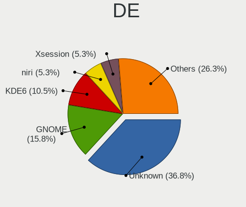
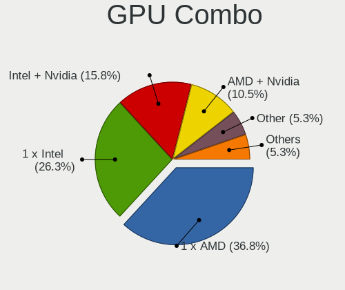
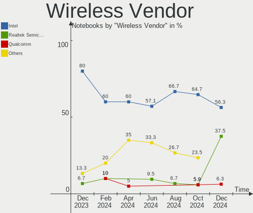
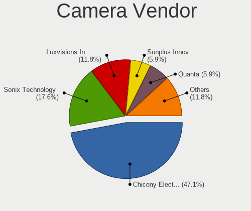

Gentoo Hardware Trends (Notebooks)
----------------------------------

A project to identify most popular hardware characteristics and track their change
over time based on data collected by Gentoo users at https://Linux-Hardware.org.

Anyone can contribute to this report by the [hw-probe](https://github.com/linuxhw/hw-probe) tool:

    sudo -E hw-probe -all -upload

Full-feature report is available here: https://linux-hardware.org/?view=trends

Period: Dec, 2021.

Contents
--------

* [ System ](#system)
  - [ OS                       ](#os)
  - [ OS Family                ](#os-family)
  - [ Kernel                   ](#kernel)
  - [ Kernel Family            ](#kernel-family)
  - [ Kernel Major Ver.        ](#kernel-major-ver)
  - [ Arch                     ](#arch)
  - [ DE                       ](#de)
  - [ Display Server           ](#display-server)
  - [ Display Manager          ](#display-manager)
  - [ OS Lang                  ](#os-lang)
  - [ Boot Mode                ](#boot-mode)
  - [ Filesystem               ](#filesystem)
  - [ Part. scheme             ](#part-scheme)
  - [ Dual Boot with Linux/BSD ](#dual-boot-with-linuxbsd)
  - [ Dual Boot (Win)          ](#dual-boot-win)

* [ Board ](#board)
  - [ Vendor                   ](#vendor)
  - [ Model                    ](#model)
  - [ Model Family             ](#model-family)
  - [ MFG Year                 ](#mfg-year)
  - [ Form Factor              ](#form-factor)
  - [ Secure Boot              ](#secure-boot)
  - [ Coreboot                 ](#coreboot)
  - [ RAM Size                 ](#ram-size)
  - [ RAM Used                 ](#ram-used)
  - [ Total Drives             ](#total-drives)
  - [ Has CD-ROM               ](#has-cd-rom)
  - [ Has Ethernet             ](#has-ethernet)
  - [ Has WiFi                 ](#has-wifi)
  - [ Has Bluetooth            ](#has-bluetooth)

* [ Location ](#location)
  - [ Country                  ](#country)
  - [ City                     ](#city)

* [ Drives ](#drives)
  - [ Drive Vendor             ](#drive-vendor)
  - [ Drive Model              ](#drive-model)
  - [ HDD Vendor               ](#hdd-vendor)
  - [ SSD Vendor               ](#ssd-vendor)
  - [ Drive Kind               ](#drive-kind)
  - [ Drive Connector          ](#drive-connector)
  - [ Drive Size               ](#drive-size)
  - [ Space Total              ](#space-total)
  - [ Space Used               ](#space-used)
  - [ Malfunc. Drives          ](#malfunc-drives)
  - [ Malfunc. Drive Vendor    ](#malfunc-drive-vendor)
  - [ Malfunc. HDD Vendor      ](#malfunc-hdd-vendor)
  - [ Malfunc. Drive Kind      ](#malfunc-drive-kind)
  - [ Failed Drives            ](#failed-drives)
  - [ Failed Drive Vendor      ](#failed-drive-vendor)
  - [ Drive Status             ](#drive-status)

* [ Storage controller ](#storage-controller)
  - [ Storage Vendor           ](#storage-vendor)
  - [ Storage Model            ](#storage-model)
  - [ Storage Kind             ](#storage-kind)

* [ Processor ](#processor)
  - [ CPU Vendor               ](#cpu-vendor)
  - [ CPU Model                ](#cpu-model)
  - [ CPU Model Family         ](#cpu-model-family)
  - [ CPU Cores                ](#cpu-cores)
  - [ CPU Sockets              ](#cpu-sockets)
  - [ CPU Threads              ](#cpu-threads)
  - [ CPU Op-Modes             ](#cpu-op-modes)
  - [ CPU Microcode            ](#cpu-microcode)
  - [ CPU Microarch            ](#cpu-microarch)

* [ Graphics ](#graphics)
  - [ GPU Vendor               ](#gpu-vendor)
  - [ GPU Model                ](#gpu-model)
  - [ GPU Combo                ](#gpu-combo)
  - [ GPU Driver               ](#gpu-driver)
  - [ GPU Memory               ](#gpu-memory)

* [ Monitor ](#monitor)
  - [ Monitor Vendor           ](#monitor-vendor)
  - [ Monitor Model            ](#monitor-model)
  - [ Monitor Resolution       ](#monitor-resolution)
  - [ Monitor Diagonal         ](#monitor-diagonal)
  - [ Monitor Width            ](#monitor-width)
  - [ Aspect Ratio             ](#aspect-ratio)
  - [ Monitor Area             ](#monitor-area)
  - [ Pixel Density            ](#pixel-density)
  - [ Multiple Monitors        ](#multiple-monitors)

* [ Network ](#network)
  - [ Net Controller Vendor    ](#net-controller-vendor)
  - [ Net Controller Model     ](#net-controller-model)
  - [ Wireless Vendor          ](#wireless-vendor)
  - [ Wireless Model           ](#wireless-model)
  - [ Ethernet Vendor          ](#ethernet-vendor)
  - [ Ethernet Model           ](#ethernet-model)
  - [ Net Controller Kind      ](#net-controller-kind)
  - [ Used Controller          ](#used-controller)
  - [ NICs                     ](#nics)
  - [ IPv6                     ](#ipv6)

* [ Bluetooth ](#bluetooth)
  - [ Bluetooth Vendor         ](#bluetooth-vendor)
  - [ Bluetooth Model          ](#bluetooth-model)

* [ Sound ](#sound)
  - [ Sound Vendor             ](#sound-vendor)
  - [ Sound Model              ](#sound-model)

* [ Memory ](#memory)
  - [ Memory Vendor            ](#memory-vendor)
  - [ Memory Model             ](#memory-model)
  - [ Memory Kind              ](#memory-kind)
  - [ Memory Form Factor       ](#memory-form-factor)
  - [ Memory Size              ](#memory-size)
  - [ Memory Speed             ](#memory-speed)

* [ Printers & scanners ](#printers--scanners)
  - [ Printer Vendor           ](#printer-vendor)
  - [ Printer Model            ](#printer-model)
  - [ Scanner Vendor           ](#scanner-vendor)
  - [ Scanner Model            ](#scanner-model)

* [ Camera ](#camera)
  - [ Camera Vendor            ](#camera-vendor)
  - [ Camera Model             ](#camera-model)

* [ Security ](#security)
  - [ Fingerprint Vendor       ](#fingerprint-vendor)
  - [ Fingerprint Model        ](#fingerprint-model)
  - [ Chipcard Vendor          ](#chipcard-vendor)
  - [ Chipcard Model           ](#chipcard-model)

* [ Unsupported ](#unsupported)
  - [ Unsupported Devices      ](#unsupported-devices)
  - [ Unsupported Device Types ](#unsupported-device-types)

System
------

OS
--

Installed operating systems

| Name       | Notebooks | Percent |
|------------|-----------|---------|
| Gentoo 2.7 | 16        | 59.26%  |
| Gentoo 2.6 | 7         | 25.93%  |
| Gentoo 2.8 | 4         | 14.81%  |

OS Family
---------

OS without a version

| Name   | Notebooks | Percent |
|--------|-----------|---------|
| Gentoo | 27        | 100%    |

Kernel
------

Version of the Linux kernel

| Version                               | Notebooks | Percent |
|---------------------------------------|-----------|---------|
| 5.10.76-gentoo-r1-x86_64              | 6         | 22.22%  |
| 5.10.76-gentoo-r1                     | 6         | 22.22%  |
| 5.15.7-gentoo                         | 2         | 7.41%   |
| 5.15.6-gentoo                         | 2         | 7.41%   |
| 5.15.5-gentoo                         | 2         | 7.41%   |
| 5.15.10-gentoo-x86_64                 | 2         | 7.41%   |
| 5.15.9-gentoo-x86_64                  | 1         | 3.7%    |
| 5.15.11-gentoo-x86_64                 | 1         | 3.7%    |
| 5.15.10-zen1_pulankured               | 1         | 3.7%    |
| 5.15.10-gentoo-x86_64-20211221_224447 | 1         | 3.7%    |
| 5.15.10-gentoo                        | 1         | 3.7%    |
| 5.10.83-gentoo-dist                   | 1         | 3.7%    |
| 5.10.61-gentoo                        | 1         | 3.7%    |

Kernel Family
-------------

Linux kernel without a distro release

| Version | Notebooks | Percent |
|---------|-----------|---------|
| 5.10.76 | 12        | 44.44%  |
| 5.15.10 | 5         | 18.52%  |
| 5.15.7  | 2         | 7.41%   |
| 5.15.6  | 2         | 7.41%   |
| 5.15.5  | 2         | 7.41%   |
| 5.15.9  | 1         | 3.7%    |
| 5.15.11 | 1         | 3.7%    |
| 5.10.83 | 1         | 3.7%    |
| 5.10.61 | 1         | 3.7%    |

Kernel Major Ver.
-----------------

Linux kernel major version

| Version | Notebooks | Percent |
|---------|-----------|---------|
| 5.10    | 14        | 51.85%  |
| 5.15    | 13        | 48.15%  |

Arch
----

OS architecture (x86_64, i586, etc.)

| Name   | Notebooks | Percent |
|--------|-----------|---------|
| x86_64 | 27        | 100%    |

DE
--

Desktop Environment

| Name       | Notebooks | Percent |
|------------|-----------|---------|
| Unknown    | 16        | 59.26%  |
| GNOME      | 4         | 14.81%  |
| KDE5       | 3         | 11.11%  |
| XFCE       | 1         | 3.7%    |
| X-Cinnamon | 1         | 3.7%    |
| LXQt       | 1         | 3.7%    |
| KDE        | 1         | 3.7%    |

Display Server
--------------

X11 or Wayland

| Name    | Notebooks | Percent |
|---------|-----------|---------|
| X11     | 11        | 40.74%  |
| Wayland | 6         | 22.22%  |
| Unknown | 6         | 22.22%  |
| Tty     | 4         | 14.81%  |

Display Manager
---------------

SDDM, LightDM, etc.

| Name    | Notebooks | Percent |
|---------|-----------|---------|
| Unknown | 17        | 62.96%  |
| SDDM    | 5         | 18.52%  |
| LightDM | 2         | 7.41%   |
| GDM     | 2         | 7.41%   |
| SLiM    | 1         | 3.7%    |

OS Lang
-------

Language

| Lang    | Notebooks | Percent |
|---------|-----------|---------|
| en_US   | 16        | 59.26%  |
| it_IT   | 2         | 7.41%   |
| en_GB   | 2         | 7.41%   |
| ru_UA   | 1         | 3.7%    |
| ru_RU   | 1         | 3.7%    |
| pt_BR   | 1         | 3.7%    |
| fr_FR   | 1         | 3.7%    |
| en_NZ   | 1         | 3.7%    |
| C.UTF8  | 1         | 3.7%    |
| Unknown | 1         | 3.7%    |

Boot Mode
---------

EFI or BIOS

| Mode | Notebooks | Percent |
|------|-----------|---------|
| EFI  | 23        | 85.19%  |
| BIOS | 4         | 14.81%  |

Filesystem
----------

Type of filesystem

| Type     | Notebooks | Percent |
|----------|-----------|---------|
| Ext4     | 21        | 77.78%  |
| Btrfs    | 4         | 14.81%  |
| Reiserfs | 1         | 3.7%    |
| F2fs     | 1         | 3.7%    |

Part. scheme
------------

Scheme of partitioning

| Type    | Notebooks | Percent |
|---------|-----------|---------|
| GPT     | 23        | 85.19%  |
| MBR     | 3         | 11.11%  |
| Unknown | 1         | 3.7%    |

Dual Boot with Linux/BSD
------------------------

Hosting more than one Linux/BSD

| Dual boot | Notebooks | Percent |
|-----------|-----------|---------|
| No        | 22        | 81.48%  |
| Yes       | 5         | 18.52%  |

Dual Boot (Win)
---------------

Hosting Linux and Windows

| Dual boot | Notebooks | Percent |
|-----------|-----------|---------|
| No        | 18        | 66.67%  |
| Yes       | 9         | 33.33%  |

Board
-----

Vendor
------

Motherboard manufacturer

| Name                | Notebooks | Percent |
|---------------------|-----------|---------|
| Dell                | 6         | 22.22%  |
| Lenovo              | 5         | 18.52%  |
| Hewlett-Packard     | 4         | 14.81%  |
| ASUSTek Computer    | 4         | 14.81%  |
| Samsung Electronics | 2         | 7.41%   |
| Toshiba             | 1         | 3.7%    |
| Timi                | 1         | 3.7%    |
| MSI                 | 1         | 3.7%    |
| Framework           | 1         | 3.7%    |
| Apple               | 1         | 3.7%    |
| Acer                | 1         | 3.7%    |

Model
-----

Motherboard model

| Name                                   | Notebooks | Percent |
|----------------------------------------|-----------|---------|
| Dell XPS 17 9710                       | 2         | 7.41%   |
| Toshiba Satellite C850D-118            | 1         | 3.7%    |
| Timi A35                               | 1         | 3.7%    |
| Samsung RC530/RC730                    | 1         | 3.7%    |
| Samsung 700T1C                         | 1         | 3.7%    |
| MSI Delta 15 A5EFK                     | 1         | 3.7%    |
| Lenovo ThinkPad T480s 20L7001MRT       | 1         | 3.7%    |
| Lenovo ThinkPad E15 Gen 2 20T8005CUS   | 1         | 3.7%    |
| Lenovo Legion Y740-17IRHg 81UJ         | 1         | 3.7%    |
| Lenovo Legion 5 15ACH6 82JW            | 1         | 3.7%    |
| Lenovo IdeaPad S145-15IWL 81S9         | 1         | 3.7%    |
| HP Pavilion ZV6100 (EE984EA#ABZ)       | 1         | 3.7%    |
| HP Pavilion Gaming Laptop 15-ec1xxx    | 1         | 3.7%    |
| HP Pavilion Gaming Laptop 15-dk0xxx    | 1         | 3.7%    |
| HP EliteBook 830 G5                    | 1         | 3.7%    |
| Framework Laptop                       | 1         | 3.7%    |
| Dell XPS 15 9570                       | 1         | 3.7%    |
| Dell Vostro 3500                       | 1         | 3.7%    |
| Dell Latitude 5420                     | 1         | 3.7%    |
| Dell Inspiron 15 5510                  | 1         | 3.7%    |
| ASUS ZenBook UX425QA_UM425QA           | 1         | 3.7%    |
| ASUS X200MA                            | 1         | 3.7%    |
| ASUS VivoBook_ASUSLaptop X509DA_M509DA | 1         | 3.7%    |
| ASUS ROG Strix G513QY_G513QY           | 1         | 3.7%    |
| Apple MacBook10,1                      | 1         | 3.7%    |
| Acer Aspire E5-571G                    | 1         | 3.7%    |

Model Family
------------

Motherboard model prefix

| Name              | Notebooks | Percent |
|-------------------|-----------|---------|
| HP Pavilion       | 3         | 11.11%  |
| Dell XPS          | 3         | 11.11%  |
| Lenovo ThinkPad   | 2         | 7.41%   |
| Lenovo Legion     | 2         | 7.41%   |
| Toshiba Satellite | 1         | 3.7%    |
| Timi A35          | 1         | 3.7%    |
| Samsung RC530     | 1         | 3.7%    |
| Samsung 700T1C    | 1         | 3.7%    |
| MSI Delta         | 1         | 3.7%    |
| Lenovo IdeaPad    | 1         | 3.7%    |
| HP EliteBook      | 1         | 3.7%    |
| Framework Laptop  | 1         | 3.7%    |
| Dell Vostro       | 1         | 3.7%    |
| Dell Latitude     | 1         | 3.7%    |
| Dell Inspiron     | 1         | 3.7%    |
| ASUS ZenBook      | 1         | 3.7%    |
| ASUS X200MA       | 1         | 3.7%    |
| ASUS VivoBook     | 1         | 3.7%    |
| ASUS ROG          | 1         | 3.7%    |
| Apple MacBook10   | 1         | 3.7%    |
| Acer Aspire       | 1         | 3.7%    |

MFG Year
--------

Motherboard manufacture year

| Year | Notebooks | Percent |
|------|-----------|---------|
| 2021 | 14        | 51.85%  |
| 2019 | 4         | 14.81%  |
| 2020 | 3         | 11.11%  |
| 2014 | 2         | 7.41%   |
| 2015 | 1         | 3.7%    |
| 2012 | 1         | 3.7%    |
| 2011 | 1         | 3.7%    |
| 2006 | 1         | 3.7%    |

Form Factor
-----------

Physical design of the computer

| Name     | Notebooks | Percent |
|----------|-----------|---------|
| Notebook | 27        | 100%    |

Secure Boot
-----------

Enabled or disabled

| State    | Notebooks | Percent |
|----------|-----------|---------|
| Disabled | 26        | 96.3%   |
| Enabled  | 1         | 3.7%    |

Coreboot
--------

Have coreboot on board

| Used | Notebooks | Percent |
|------|-----------|---------|
| No   | 27        | 100%    |

RAM Size
--------

Total RAM memory

| Size in GB  | Notebooks | Percent |
|-------------|-----------|---------|
| 4.01-8.0    | 7         | 25.93%  |
| 32.01-64.0  | 6         | 22.22%  |
| 8.01-16.0   | 5         | 18.52%  |
| 16.01-24.0  | 3         | 11.11%  |
| 1.01-2.0    | 3         | 11.11%  |
| 3.01-4.0    | 1         | 3.7%    |
| 24.01-32.0  | 1         | 3.7%    |
| 64.01-256.0 | 1         | 3.7%    |

RAM Used
--------

Used RAM memory

| Used GB   | Notebooks | Percent |
|-----------|-----------|---------|
| 1.01-2.0  | 6         | 22.22%  |
| 2.01-3.0  | 5         | 18.52%  |
| 0.51-1.0  | 5         | 18.52%  |
| 0.01-0.5  | 4         | 14.81%  |
| 4.01-8.0  | 3         | 11.11%  |
| 3.01-4.0  | 2         | 7.41%   |
| 8.01-16.0 | 2         | 7.41%   |

Total Drives
------------

Number of drives on board

| Drives | Notebooks | Percent |
|--------|-----------|---------|
| 1      | 17        | 62.96%  |
| 2      | 9         | 33.33%  |
| 4      | 1         | 3.7%    |

Has CD-ROM
----------

Has CD-ROM on board

| Presented | Notebooks | Percent |
|-----------|-----------|---------|
| No        | 23        | 85.19%  |
| Yes       | 4         | 14.81%  |

Has Ethernet
------------

Has Ethernet on board

| Presented | Notebooks | Percent |
|-----------|-----------|---------|
| Yes       | 16        | 59.26%  |
| No        | 11        | 40.74%  |

Has WiFi
--------

Has WiFi module

| Presented | Notebooks | Percent |
|-----------|-----------|---------|
| Yes       | 27        | 100%    |

Has Bluetooth
-------------

Has Bluetooth module

| Presented | Notebooks | Percent |
|-----------|-----------|---------|
| Yes       | 23        | 85.19%  |
| No        | 4         | 14.81%  |

Location
--------

Country
-------

Geographic location (country)

| Country     | Notebooks | Percent |
|-------------|-----------|---------|
| USA         | 6         | 22.22%  |
| Italy       | 3         | 11.11%  |
| Ukraine     | 2         | 7.41%   |
| Poland      | 2         | 7.41%   |
| Canada      | 2         | 7.41%   |
| Vietnam     | 1         | 3.7%    |
| Turkey      | 1         | 3.7%    |
| Russia      | 1         | 3.7%    |
| Romania     | 1         | 3.7%    |
| New Zealand | 1         | 3.7%    |
| Indonesia   | 1         | 3.7%    |
| India       | 1         | 3.7%    |
| Hong Kong   | 1         | 3.7%    |
| Greece      | 1         | 3.7%    |
| France      | 1         | 3.7%    |
| Bulgaria    | 1         | 3.7%    |
| Brazil      | 1         | 3.7%    |

City
----

Geographic location (city)

| City             | Notebooks | Percent |
|------------------|-----------|---------|
| Warsaw           | 1         | 3.7%    |
| Vernon           | 1         | 3.7%    |
| Tomarovka        | 1         | 3.7%    |
| Surabaya         | 1         | 3.7%    |
| Sofia            | 1         | 3.7%    |
| Senise           | 1         | 3.7%    |
| Savonera         | 1         | 3.7%    |
| San Francisco    | 1         | 3.7%    |
| Reghin           | 1         | 3.7%    |
| Redmond          | 1         | 3.7%    |
| Noida            | 1         | 3.7%    |
| Markham          | 1         | 3.7%    |
| Lakeland         | 1         | 3.7%    |
| Kyiv             | 1         | 3.7%    |
| Kowloon          | 1         | 3.7%    |
| Istanbul         | 1         | 3.7%    |
| Hoboken          | 1         | 3.7%    |
| Ho Chi Minh City | 1         | 3.7%    |
| Dorval           | 1         | 3.7%    |
| Dnipro           | 1         | 3.7%    |
| Divin??polis     | 1         | 3.7%    |
| Cieszyn          | 1         | 3.7%    |
| Chicago          | 1         | 3.7%    |
| Cerritos         | 1         | 3.7%    |
| Brescia          | 1         | 3.7%    |
| Auckland         | 1         | 3.7%    |
| Athens           | 1         | 3.7%    |

Drives
------

Drive Vendor
------------

Hard drive vendors

| Vendor              | Notebooks | Drives | Percent |
|---------------------|-----------|--------|---------|
| WDC                 | 8         | 9      | 22.86%  |
| Samsung Electronics | 7         | 8      | 20%     |
| Unknown             | 3         | 5      | 8.57%   |
| SK Hynix            | 3         | 3      | 8.57%   |
| SanDisk             | 2         | 2      | 5.71%   |
| Intel               | 2         | 2      | 5.71%   |
| Toshiba             | 1         | 1      | 2.86%   |
| Seagate             | 1         | 1      | 2.86%   |
| OSCOO               | 1         | 1      | 2.86%   |
| Micron Technology   | 1         | 1      | 2.86%   |
| LITEONIT            | 1         | 1      | 2.86%   |
| LITEON              | 1         | 1      | 2.86%   |
| Kingston            | 1         | 1      | 2.86%   |
| Crucial             | 1         | 1      | 2.86%   |
| Apple               | 1         | 2      | 2.86%   |
| A-DATA Technology   | 1         | 1      | 2.86%   |

Drive Model
-----------

Hard drive models

| Model                                  | Notebooks | Percent |
|----------------------------------------|-----------|---------|
| SK Hynix PC711 NVMe 1TB                | 2         | 5.41%   |
| SanDisk SD9SN8W-128G-1006 128GB SSD    | 2         | 5.41%   |
| Samsung MZVLQ512HALU-00000 512GB       | 2         | 5.41%   |
| WDC WDS100T2B0C 1TB                    | 1         | 2.7%    |
| WDC WD5000LPVX-80V0TT0 500GB           | 1         | 2.7%    |
| WDC WD5000LPVX-22V0TT0 500GB           | 1         | 2.7%    |
| WDC WD2500BEVS-22UST0 250GB            | 1         | 2.7%    |
| WDC WD10SPZX-24Z10 1TB                 | 1         | 2.7%    |
| WDC WD My Passport 264F 1TB            | 1         | 2.7%    |
| WDC PC SN530 NVMe 512GB                | 1         | 2.7%    |
| WDC PC SN520 SDAPNUW-256G-1006 256GB   | 1         | 2.7%    |
| WDC PC SN520 SDAPNUW-128G-1006 128GB   | 1         | 2.7%    |
| Unknown USB DISK 3.2 1TB               | 1         | 2.7%    |
| Unknown MMC Card  32GB                 | 1         | 2.7%    |
| Unknown MMC Card  16GB                 | 1         | 2.7%    |
| Toshiba MQ04ABF100 1TB                 | 1         | 2.7%    |
| SK Hynix SKHynix_HFS512GDE9X084N 512GB | 1         | 2.7%    |
| Seagate FireCuda 530 ZP4000GM30013 4TB | 1         | 2.7%    |
| Samsung SSD 980 PRO 2TB                | 1         | 2.7%    |
| Samsung SSD 970 EVO Plus 500GB         | 1         | 2.7%    |
| Samsung SSD 970 EVO Plus 1TB           | 1         | 2.7%    |
| Samsung SSD 870 EVO 1TB                | 1         | 2.7%    |
| Samsung SSD 850 PRO 256GB              | 1         | 2.7%    |
| Samsung SSD 850 EVO 250GB              | 1         | 2.7%    |
| OSCOO OSC PCIe 256GB                   | 1         | 2.7%    |
| Micron 2210_MTFDHBA1T0QFD 1TB          | 1         | 2.7%    |
| LITEONIT LMT-128M6M 128GB SSD          | 1         | 2.7%    |
| LITEON CA3-8D256 256GB                 | 1         | 2.7%    |
| Kingston NVMe SSD Drive 256GB          | 1         | 2.7%    |
| Intel SSDPEKNW010T8 1TB                | 1         | 2.7%    |
| Intel SSDPEKNU512GZ 512GB              | 1         | 2.7%    |
| Crucial CT1000P1SSD8 1TB               | 1         | 2.7%    |
| Apple SSD AP0256J 8.1KB                | 1         | 2.7%    |
| A-DATA SX930 120GB SSD                 | 1         | 2.7%    |

HDD Vendor
----------

Hard disk drive vendors

| Vendor  | Notebooks | Drives | Percent |
|---------|-----------|--------|---------|
| WDC     | 4         | 4      | 80%     |
| Toshiba | 1         | 1      | 20%     |

SSD Vendor
----------

Solid state drive vendors

| Vendor              | Notebooks | Drives | Percent |
|---------------------|-----------|--------|---------|
| Samsung Electronics | 3         | 3      | 42.86%  |
| SanDisk             | 2         | 2      | 28.57%  |
| LITEONIT            | 1         | 1      | 14.29%  |
| A-DATA Technology   | 1         | 1      | 14.29%  |

Drive Kind
----------

HDD or SSD

| Kind    | Notebooks | Drives | Percent |
|---------|-----------|--------|---------|
| NVMe    | 20        | 22     | 55.56%  |
| SSD     | 7         | 7      | 19.44%  |
| HDD     | 5         | 5      | 13.89%  |
| MMC     | 2         | 2      | 5.56%   |
| Unknown | 2         | 4      | 5.56%   |

Drive Connector
---------------

SATA, SAS, NVMe, etc.

| Type | Notebooks | Drives | Percent |
|------|-----------|--------|---------|
| NVMe | 20        | 22     | 57.14%  |
| SATA | 11        | 12     | 31.43%  |
| SAS  | 2         | 4      | 5.71%   |
| MMC  | 2         | 2      | 5.71%   |

Drive Size
----------

Size of hard drive

| Size in TB | Notebooks | Drives | Percent |
|------------|-----------|--------|---------|
| 0.01-0.5   | 8         | 9      | 72.73%  |
| 0.51-1.0   | 3         | 3      | 27.27%  |

Space Total
-----------

Amount of disk space available on the file system

| Size in GB     | Notebooks | Percent |
|----------------|-----------|---------|
| 251-500        | 6         | 22.22%  |
| 501-1000       | 6         | 22.22%  |
| 101-250        | 5         | 18.52%  |
| Unknown        | 3         | 11.11%  |
| 21-50          | 2         | 7.41%   |
| 1001-2000      | 2         | 7.41%   |
| More than 3000 | 1         | 3.7%    |
| 1-20           | 1         | 3.7%    |
| 51-100         | 1         | 3.7%    |

Space Used
----------

Amount of used disk space

| Used GB  | Notebooks | Percent |
|----------|-----------|---------|
| 1-20     | 13        | 48.15%  |
| 251-500  | 5         | 18.52%  |
| 101-250  | 3         | 11.11%  |
| Unknown  | 3         | 11.11%  |
| 21-50    | 1         | 3.7%    |
| 501-1000 | 1         | 3.7%    |
| 51-100   | 1         | 3.7%    |

Malfunc. Drives
---------------

Drive models with a malfunction

| Model                               | Notebooks | Drives | Percent |
|-------------------------------------|-----------|--------|---------|
| SanDisk SD9SN8W-128G-1006 128GB SSD | 2         | 2      | 66.67%  |
| Crucial CT1000P1SSD8 1TB            | 1         | 1      | 33.33%  |

Malfunc. Drive Vendor
---------------------

Vendors of faulty drives

| Vendor  | Notebooks | Drives | Percent |
|---------|-----------|--------|---------|
| SanDisk | 2         | 2      | 66.67%  |
| Crucial | 1         | 1      | 33.33%  |

Malfunc. HDD Vendor
-------------------

Vendors of faulty HDD drives

Zero info for selected period =(

Malfunc. Drive Kind
-------------------

Kinds of faulty drives

| Kind | Notebooks | Drives | Percent |
|------|-----------|--------|---------|
| SSD  | 2         | 2      | 66.67%  |
| NVMe | 1         | 1      | 33.33%  |

Failed Drives
-------------

Failed drive models

Zero info for selected period =(

Failed Drive Vendor
-------------------

Failed drive vendors

Zero info for selected period =(

Drive Status
------------

Number of failed and malfunc. drives

| Status   | Notebooks | Drives | Percent |
|----------|-----------|--------|---------|
| Works    | 22        | 29     | 73.33%  |
| Detected | 5         | 8      | 16.67%  |
| Malfunc  | 3         | 3      | 10%     |

Storage controller
------------------

Storage Vendor
--------------

Storage controller vendors

| Vendor                      | Notebooks | Percent |
|-----------------------------|-----------|---------|
| Intel                       | 13        | 35.14%  |
| Samsung Electronics         | 5         | 13.51%  |
| AMD                         | 5         | 13.51%  |
| Sandisk                     | 4         | 10.81%  |
| SK Hynix                    | 3         | 8.11%   |
| Silicon Motion              | 1         | 2.7%    |
| Seagate Technology          | 1         | 2.7%    |
| Micron/Crucial Technology   | 1         | 2.7%    |
| Micron Technology           | 1         | 2.7%    |
| Lite-On Technology          | 1         | 2.7%    |
| Kingston Technology Company | 1         | 2.7%    |
| Apple                       | 1         | 2.7%    |

Storage Model
-------------

Storage controller models

| Model                                                                        | Notebooks | Percent |
|------------------------------------------------------------------------------|-----------|---------|
| AMD FCH SATA Controller [AHCI mode]                                          | 4         | 10.53%  |
| SK Hynix Gold P31 SSD                                                        | 3         | 7.89%   |
| Sandisk WD Blue SN500 / PC SN520 NVMe SSD                                    | 2         | 5.26%   |
| Samsung NVMe SSD Controller SM981/PM981/PM983                                | 2         | 5.26%   |
| Samsung NVMe SSD Controller 980                                              | 2         | 5.26%   |
| Intel Cannon Lake Mobile PCH SATA AHCI Controller                            | 2         | 5.26%   |
| Silicon Motion SM2263EN/SM2263XT SSD Controller                              | 1         | 2.63%   |
| Seagate Non-Volatile memory controller                                       | 1         | 2.63%   |
| Sandisk WD Blue SN550 NVMe SSD                                               | 1         | 2.63%   |
| Sandisk Non-Volatile memory controller                                       | 1         | 2.63%   |
| Samsung NVMe SSD Controller PM9A1/PM9A3/980PRO                               | 1         | 2.63%   |
| Micron/Crucial P1 NVMe PCIe SSD                                              | 1         | 2.63%   |
| Micron Non-Volatile memory controller                                        | 1         | 2.63%   |
| Lite-On Non-Volatile memory controller                                       | 1         | 2.63%   |
| Kingston Company OM3PDP3 NVMe SSD                                            | 1         | 2.63%   |
| Intel Volume Management Device NVMe RAID Controller                          | 1         | 2.63%   |
| Intel Tiger Lake-LP SATA Controller [AHCI mode]                              | 1         | 2.63%   |
| Intel Sunrise Point-LP SATA Controller [AHCI mode]                           | 1         | 2.63%   |
| Intel SSD 660P Series                                                        | 1         | 2.63%   |
| Intel Non-Volatile memory controller                                         | 1         | 2.63%   |
| Intel Cannon Point-LP SATA Controller [AHCI Mode]                            | 1         | 2.63%   |
| Intel Atom Processor E3800 Series SATA AHCI Controller                       | 1         | 2.63%   |
| Intel 82801 Mobile SATA Controller [RAID mode]                               | 1         | 2.63%   |
| Intel 8 Series SATA Controller 1 [AHCI mode]                                 | 1         | 2.63%   |
| Intel 7 Series Chipset Family 4-port SATA Controller [IDE mode]              | 1         | 2.63%   |
| Intel 7 Series Chipset Family 2-port SATA Controller [IDE mode]              | 1         | 2.63%   |
| Intel 6 Series/C200 Series Chipset Family 6 port Mobile SATA AHCI Controller | 1         | 2.63%   |
| Apple S3X NVMe Controller                                                    | 1         | 2.63%   |
| AMD IXP SB4x0 IDE Controller                                                 | 1         | 2.63%   |

Storage Kind
------------

Kind of storage controller (IDE, SATA, NVMe, SAS, ...)

| Kind | Notebooks | Percent |
|------|-----------|---------|
| NVMe | 20        | 55.56%  |
| SATA | 12        | 33.33%  |
| RAID | 2         | 5.56%   |
| IDE  | 2         | 5.56%   |

Processor
---------

CPU Vendor
----------

Processor vendors

| Vendor | Notebooks | Percent |
|--------|-----------|---------|
| Intel  | 18        | 66.67%  |
| AMD    | 9         | 33.33%  |

CPU Model
---------

Processor models

| Model                                         | Notebooks | Percent |
|-----------------------------------------------|-----------|---------|
| Intel Core i7-9750H CPU @ 2.60GHz             | 2         | 7.41%   |
| Intel 11th Gen Core i7-1185G7 @ 3.00GHz       | 2         | 7.41%   |
| AMD Ryzen 7 5800H with Radeon Graphics        | 2         | 7.41%   |
| Intel Core m3-7Y32 CPU @ 1.10GHz              | 1         | 3.7%    |
| Intel Core i7-8750H CPU @ 2.20GHz             | 1         | 3.7%    |
| Intel Core i7-8565U CPU @ 1.80GHz             | 1         | 3.7%    |
| Intel Core i7-8550U CPU @ 1.80GHz             | 1         | 3.7%    |
| Intel Core i7-2670QM CPU @ 2.20GHz            | 1         | 3.7%    |
| Intel Core i5-8250U CPU @ 1.60GHz             | 1         | 3.7%    |
| Intel Core i5-4210U CPU @ 1.70GHz             | 1         | 3.7%    |
| Intel Core i5-3317U CPU @ 1.70GHz             | 1         | 3.7%    |
| Intel Celeron CPU N2830 @ 2.16GHz             | 1         | 3.7%    |
| Intel 11th Gen Core i9-11900H @ 2.50GHz       | 1         | 3.7%    |
| Intel 11th Gen Core i7-11800H @ 2.30GHz       | 1         | 3.7%    |
| Intel 11th Gen Core i5-1135G7 @ 2.40GHz       | 1         | 3.7%    |
| Intel 11th Gen Core i5-11320H @ 3.20GHz       | 1         | 3.7%    |
| Intel 11th Gen Core i5-11300H @ 3.10GHz       | 1         | 3.7%    |
| AMD Ryzen 9 5900HX with Radeon Graphics       | 1         | 3.7%    |
| AMD Ryzen 7 4700U with Radeon Graphics        | 1         | 3.7%    |
| AMD Ryzen 7 3700U with Radeon Vega Mobile Gfx | 1         | 3.7%    |
| AMD Ryzen 5 5600H with Radeon Graphics        | 1         | 3.7%    |
| AMD Ryzen 5 4600H with Radeon Graphics        | 1         | 3.7%    |
| AMD E1-1200 APU with Radeon HD Graphics       | 1         | 3.7%    |
| AMD Athlon 64 Processor 3200+                 | 1         | 3.7%    |

CPU Model Family
----------------

Processor model prefix

| Model         | Notebooks | Percent |
|---------------|-----------|---------|
| Other         | 7         | 25.93%  |
| Intel Core i7 | 6         | 22.22%  |
| AMD Ryzen 7   | 4         | 14.81%  |
| Intel Core i5 | 3         | 11.11%  |
| AMD Ryzen 5   | 2         | 7.41%   |
| Intel Core m3 | 1         | 3.7%    |
| Intel Celeron | 1         | 3.7%    |
| AMD Ryzen 9   | 1         | 3.7%    |
| AMD E1        | 1         | 3.7%    |
| AMD Athlon 64 | 1         | 3.7%    |

CPU Cores
---------

Number of processor cores

| Number | Notebooks | Percent |
|--------|-----------|---------|
| 4      | 10        | 37.04%  |
| 8      | 6         | 22.22%  |
| 6      | 5         | 18.52%  |
| 2      | 5         | 18.52%  |
| 1      | 1         | 3.7%    |

CPU Sockets
-----------

Number of sockets

| Number | Notebooks | Percent |
|--------|-----------|---------|
| 1      | 27        | 100%    |

CPU Threads
-----------

Threads per core (Hyper-Threading)

| Number | Notebooks | Percent |
|--------|-----------|---------|
| 2      | 22        | 81.48%  |
| 1      | 5         | 18.52%  |

CPU Op-Modes
------------

CPU Operation Modes (32-bit, 64-bit)

| Op mode        | Notebooks | Percent |
|----------------|-----------|---------|
| 32-bit, 64-bit | 27        | 100%    |

CPU Microcode
-------------

Microcode number

| Number     | Notebooks | Percent |
|------------|-----------|---------|
| 0x0a50000c | 4         | 14.81%  |
| Unknown    | 4         | 14.81%  |
| 0x806c1    | 3         | 11.11%  |
| 0x906ea    | 2         | 7.41%   |
| 0x806d1    | 2         | 7.41%   |
| 0x806ec    | 1         | 3.7%    |
| 0x806ea    | 1         | 3.7%    |
| 0x806e9    | 1         | 3.7%    |
| 0x806c2    | 1         | 3.7%    |
| 0x40651    | 1         | 3.7%    |
| 0x306a9    | 1         | 3.7%    |
| 0x30678    | 1         | 3.7%    |
| 0x206a7    | 1         | 3.7%    |
| 0x08600106 | 1         | 3.7%    |
| 0x08600103 | 1         | 3.7%    |
| 0x08108109 | 1         | 3.7%    |
| 0x05000119 | 1         | 3.7%    |

CPU Microarch
-------------

Microarchitecture

| Name        | Notebooks | Percent |
|-------------|-----------|---------|
| KabyLake    | 7         | 25.93%  |
| TigerLake   | 5         | 18.52%  |
| Zen 3       | 4         | 14.81%  |
| Zen 2       | 2         | 7.41%   |
| Icelake     | 2         | 7.41%   |
| Zen+        | 1         | 3.7%    |
| Silvermont  | 1         | 3.7%    |
| SandyBridge | 1         | 3.7%    |
| K8 Hammer   | 1         | 3.7%    |
| IvyBridge   | 1         | 3.7%    |
| Haswell     | 1         | 3.7%    |
| Bobcat      | 1         | 3.7%    |

Graphics
--------

GPU Vendor
----------

Vendors of graphics cards

| Vendor | Notebooks | Percent |
|--------|-----------|---------|
| Intel  | 18        | 51.43%  |
| Nvidia | 9         | 25.71%  |
| AMD    | 8         | 22.86%  |

GPU Model
---------

Graphics card models

| Model                                                                     | Notebooks | Percent |
|---------------------------------------------------------------------------|-----------|---------|
| Intel TigerLake-LP GT2 [Iris Xe Graphics]                                 | 5         | 13.51%  |
| Intel CoffeeLake-H GT2 [UHD Graphics 630]                                 | 3         | 8.11%   |
| AMD Cezanne                                                               | 3         | 8.11%   |
| Nvidia GA106M [GeForce RTX 3060 Mobile / Max-Q]                           | 2         | 5.41%   |
| Intel UHD Graphics 620                                                    | 2         | 5.41%   |
| Intel TigerLake-H GT1 [UHD Graphics]                                      | 2         | 5.41%   |
| AMD Renoir                                                                | 2         | 5.41%   |
| AMD Navi 22 [Radeon RX 6700/6700 XT / 6800M]                              | 2         | 5.41%   |
| Nvidia TU117M [GeForce GTX 1650 Mobile / Max-Q]                           | 1         | 2.7%    |
| Nvidia TU117M                                                             | 1         | 2.7%    |
| Nvidia TU117BM [GeForce GTX 1650 Mobile Refresh]                          | 1         | 2.7%    |
| Nvidia TU106BM [GeForce RTX 2070 Mobile / Max-Q]                          | 1         | 2.7%    |
| Nvidia GP107M [GeForce GTX 1050 Ti Mobile]                                | 1         | 2.7%    |
| Nvidia GM108M [GeForce 840M]                                              | 1         | 2.7%    |
| Nvidia GF108M [GeForce GT 540M]                                           | 1         | 2.7%    |
| Intel WhiskeyLake-U GT2 [UHD Graphics 620]                                | 1         | 2.7%    |
| Intel HD Graphics 615                                                     | 1         | 2.7%    |
| Intel Haswell-ULT Integrated Graphics Controller                          | 1         | 2.7%    |
| Intel Atom Processor Z36xxx/Z37xxx Series Graphics & Display              | 1         | 2.7%    |
| Intel 3rd Gen Core processor Graphics Controller                          | 1         | 2.7%    |
| Intel 2nd Generation Core Processor Family Integrated Graphics Controller | 1         | 2.7%    |
| AMD Wrestler [Radeon HD 7310]                                             | 1         | 2.7%    |
| AMD RS480M [Mobility Radeon Xpress 200]                                   | 1         | 2.7%    |
| AMD Picasso/Raven 2 [Radeon Vega Series / Radeon Vega Mobile Series]      | 1         | 2.7%    |

GPU Combo
---------

Combinations of graphics cards

| Name           | Notebooks | Percent |
|----------------|-----------|---------|
| 1 x Intel      | 11        | 40.74%  |
| Intel + Nvidia | 7         | 25.93%  |
| 1 x AMD        | 5         | 18.52%  |
| 2 x AMD        | 2         | 7.41%   |
| 1 x Nvidia     | 1         | 3.7%    |
| AMD + Nvidia   | 1         | 3.7%    |

GPU Driver
----------

Free vs proprietary

| Driver      | Notebooks | Percent |
|-------------|-----------|---------|
| Free        | 23        | 85.19%  |
| Proprietary | 4         | 14.81%  |

GPU Memory
----------

Total video memory

| Size in GB | Notebooks | Percent |
|------------|-----------|---------|
| Unknown    | 17        | 62.96%  |
| 0.01-0.5   | 5         | 18.52%  |
| 1.01-2.0   | 2         | 7.41%   |
| 8.01-16.0  | 2         | 7.41%   |
| 5.01-6.0   | 1         | 3.7%    |

Monitor
-------

Monitor Vendor
--------------

Monitor vendors

| Vendor              | Notebooks | Percent |
|---------------------|-----------|---------|
| AU Optronics        | 6         | 20%     |
| Chimei Innolux      | 5         | 16.67%  |
| BOE                 | 5         | 16.67%  |
| Sharp               | 4         | 13.33%  |
| Samsung Electronics | 4         | 13.33%  |
| Lenovo              | 2         | 6.67%   |
| LG Display          | 1         | 3.33%   |
| Iiyama              | 1         | 3.33%   |
| Goldstar            | 1         | 3.33%   |
| Apple               | 1         | 3.33%   |

Monitor Model
-------------

Monitor models

| Model                                                                 | Notebooks | Percent |
|-----------------------------------------------------------------------|-----------|---------|
| Sharp LCD Monitor SHP1517 3840x2400 366x229mm 17.0-inch               | 2         | 6.67%   |
| Sharp LQ156M1JW03 SHP155D 1920x1080 344x194mm 15.5-inch               | 1         | 3.33%   |
| Sharp LCD Monitor SHP148D 3840x2160 344x194mm 15.5-inch               | 1         | 3.33%   |
| Samsung Electronics U28E570 SAM0D71 3840x2160 608x345mm 27.5-inch     | 1         | 3.33%   |
| Samsung Electronics LCD Monitor SEC3245 1366x768 344x194mm 15.5-inch  | 1         | 3.33%   |
| Samsung Electronics LCD Monitor SEC3150 1366x768 344x193mm 15.5-inch  | 1         | 3.33%   |
| Samsung Electronics LCD Monitor SDC4150 3456x2160 336x210mm 15.6-inch | 1         | 3.33%   |
| LG Display LCD Monitor LGD06E0 1920x1080 344x194mm 15.5-inch          | 1         | 3.33%   |
| Lenovo LEN S24q-10 LEN61E7 2560x1440 527x296mm 23.8-inch              | 1         | 3.33%   |
| Lenovo LCD Monitor LEN40BA 1920x1080 344x194mm 15.5-inch              | 1         | 3.33%   |
| Iiyama PL2792Q IVM6637 2560x1440 597x336mm 27.0-inch                  | 1         | 3.33%   |
| Goldstar UltraFine GSM5B74 3840x2160 600x340mm 27.2-inch              | 1         | 3.33%   |
| Chimei Innolux LCD Monitor CMN15C4 1920x1080 344x193mm 15.5-inch      | 1         | 3.33%   |
| Chimei Innolux LCD Monitor CMN150D 1920x1080 344x193mm 15.5-inch      | 1         | 3.33%   |
| Chimei Innolux LCD Monitor CMN14D5 1920x1080 309x173mm 13.9-inch      | 1         | 3.33%   |
| Chimei Innolux LCD Monitor CMN1416 1920x1080 309x173mm 13.9-inch      | 1         | 3.33%   |
| Chimei Innolux LCD Monitor CMN1375 1920x1080 293x165mm 13.2-inch      | 1         | 3.33%   |
| BOE LCD Monitor BOE0973 2560x1440 344x194mm 15.5-inch                 | 1         | 3.33%   |
| BOE LCD Monitor BOE095F 2256x1504 285x190mm 13.5-inch                 | 1         | 3.33%   |
| BOE LCD Monitor BOE0852 1920x1080 344x194mm 15.5-inch                 | 1         | 3.33%   |
| BOE LCD Monitor BOE0812 1920x1080 344x194mm 15.5-inch                 | 1         | 3.33%   |
| BOE LCD Monitor BOE07F1 1920x1080 344x193mm 15.5-inch                 | 1         | 3.33%   |
| AU Optronics LCD Monitor AUO4199 1920x1080 344x193mm 15.5-inch        | 1         | 3.33%   |
| AU Optronics LCD Monitor AUO329D 1920x1080 382x214mm 17.2-inch        | 1         | 3.33%   |
| AU Optronics LCD Monitor AUO315D 1920x1080 256x144mm 11.6-inch        | 1         | 3.33%   |
| AU Optronics LCD Monitor AUO305C 1366x768 256x144mm 11.6-inch         | 1         | 3.33%   |
| AU Optronics LCD Monitor AUO243D 1920x1080 309x173mm 13.9-inch        | 1         | 3.33%   |
| AU Optronics LCD Monitor 1920x1080                                    | 1         | 3.33%   |
| Apple Color LCD APPA027 2304x1440 259x162mm 12.0-inch                 | 1         | 3.33%   |

Monitor Resolution
------------------

Monitor screen resolution

| Resolution      | Notebooks | Percent |
|-----------------|-----------|---------|
| 1920x1080 (FHD) | 16        | 53.33%  |
| 3840x2160 (4K)  | 4         | 13.33%  |
| 3840x2400       | 2         | 6.67%   |
| 2560x1440 (QHD) | 2         | 6.67%   |
| 1366x768 (WXGA) | 2         | 6.67%   |
| 3456x2160       | 1         | 3.33%   |
| 2304x1440       | 1         | 3.33%   |
| 2256x1504       | 1         | 3.33%   |
| 1600x900 (HD+)  | 1         | 3.33%   |

Monitor Diagonal
----------------

Diagonal size in inches

| Inches  | Notebooks | Percent |
|---------|-----------|---------|
| 15      | 14        | 46.67%  |
| 27      | 4         | 13.33%  |
| 13      | 4         | 13.33%  |
| 17      | 3         | 10%     |
| 11      | 2         | 6.67%   |
| 14      | 1         | 3.33%   |
| 12      | 1         | 3.33%   |
| Unknown | 1         | 3.33%   |

Monitor Width
-------------

Physical width

| Width in mm | Notebooks | Percent |
|-------------|-----------|---------|
| 301-350     | 17        | 56.67%  |
| 201-300     | 5         | 16.67%  |
| 351-400     | 3         | 10%     |
| 601-700     | 2         | 6.67%   |
| 501-600     | 2         | 6.67%   |
| Unknown     | 1         | 3.33%   |

Aspect Ratio
------------

Proportional relationship between the width and the height

| Ratio   | Notebooks | Percent |
|---------|-----------|---------|
| 16/9    | 22        | 78.57%  |
| 16/10   | 4         | 14.29%  |
| 3/2     | 1         | 3.57%   |
| Unknown | 1         | 3.57%   |

Monitor Area
------------

Area in inch

| Area in inch | Notebooks | Percent |
|----------------|-----------|---------|
| 101-110        | 14        | 46.67%  |
| 81-90          | 4         | 13.33%  |
| 301-350        | 4         | 13.33%  |
| 121-130        | 3         | 10%     |
| 51-60          | 2         | 6.67%   |
| 71-80          | 1         | 3.33%   |
| 61-70          | 1         | 3.33%   |
| Unknown        | 1         | 3.33%   |

Pixel Density
-------------

Pixels per inch

| Density       | Notebooks | Percent |
|---------------|-----------|---------|
| 121-160       | 15        | 50%     |
| 161-240       | 7         | 23.33%  |
| More than 240 | 4         | 13.33%  |
| 101-120       | 3         | 10%     |
| Unknown       | 1         | 3.33%   |

Multiple Monitors
-----------------

Total monitors connected

| Total | Notebooks | Percent |
|-------|-----------|---------|
| 1     | 23        | 85.19%  |
| 2     | 4         | 14.81%  |

Network
-------

Net Controller Vendor
---------------------

Controller vendors

| Vendor                | Notebooks | Percent |
|-----------------------|-----------|---------|
| Intel                 | 16        | 42.11%  |
| Realtek Semiconductor | 15        | 39.47%  |
| Qualcomm Atheros      | 2         | 5.26%   |
| Broadcom              | 2         | 5.26%   |
| Samsung Electronics   | 1         | 2.63%   |
| MEDIATEK              | 1         | 2.63%   |
| AMD                   | 1         | 2.63%   |

Net Controller Model
--------------------

Controller models

| Model                                                               | Notebooks | Percent |
|---------------------------------------------------------------------|-----------|---------|
| Realtek RTL8111/8168/8411 PCI Express Gigabit Ethernet Controller   | 9         | 19.57%  |
| Intel Wi-Fi 6 AX201                                                 | 4         | 8.7%    |
| Realtek RTL8822CE 802.11ac PCIe Wireless Network Adapter            | 3         | 6.52%   |
| Intel Wireless 8265 / 8275                                          | 3         | 6.52%   |
| Realtek RTL8153 Gigabit Ethernet Adapter                            | 2         | 4.35%   |
| Realtek RTL810xE PCI Express Fast Ethernet controller               | 2         | 4.35%   |
| Intel Wi-Fi 6 AX210/AX211/AX411 160MHz                              | 2         | 4.35%   |
| Intel Tiger Lake PCH CNVi WiFi                                      | 2         | 4.35%   |
| Intel Ethernet Connection (4) I219-V                                | 2         | 4.35%   |
| Samsung Galaxy series, misc. (tethering mode)                       | 1         | 2.17%   |
| Realtek RTL8822BE 802.11a/b/g/n/ac WiFi adapter                     | 1         | 2.17%   |
| Realtek RTL8821CE 802.11ac PCIe Wireless Network Adapter            | 1         | 2.17%   |
| Realtek RTL8723AE PCIe Wireless Network Adapter                     | 1         | 2.17%   |
| Realtek RTL-8100/8101L/8139 PCI Fast Ethernet Adapter               | 1         | 2.17%   |
| Qualcomm Atheros QCA9565 / AR9565 Wireless Network Adapter          | 1         | 2.17%   |
| Qualcomm Atheros AR9485 Wireless Network Adapter                    | 1         | 2.17%   |
| MEDIATEK Network controller                                         | 1         | 2.17%   |
| Intel Wireless-AC 9260                                              | 1         | 2.17%   |
| Intel Ethernet Connection (13) I219-LM                              | 1         | 2.17%   |
| Intel Dual Band Wireless-AC 3165 Plus Bluetooth                     | 1         | 2.17%   |
| Intel Centrino Wireless-N 130                                       | 1         | 2.17%   |
| Intel Centrino Advanced-N 6235                                      | 1         | 2.17%   |
| Intel Cannon Lake PCH CNVi WiFi                                     | 1         | 2.17%   |
| Broadcom BCM4350 802.11ac Wireless Network Adapter                  | 1         | 2.17%   |
| Broadcom BCM4318 [AirForce One 54g] 802.11g Wireless LAN Controller | 1         | 2.17%   |
| AMD IXP SB400 AC'97 Modem Controller                                | 1         | 2.17%   |

Wireless Vendor
---------------

Wireless vendors

| Vendor                | Notebooks | Percent |
|-----------------------|-----------|---------|
| Intel                 | 16        | 59.26%  |
| Realtek Semiconductor | 6         | 22.22%  |
| Qualcomm Atheros      | 2         | 7.41%   |
| Broadcom              | 2         | 7.41%   |
| MEDIATEK              | 1         | 3.7%    |

Wireless Model
--------------

Wireless models

| Model                                                               | Notebooks | Percent |
|---------------------------------------------------------------------|-----------|---------|
| Intel Wi-Fi 6 AX201                                                 | 4         | 14.81%  |
| Realtek RTL8822CE 802.11ac PCIe Wireless Network Adapter            | 3         | 11.11%  |
| Intel Wireless 8265 / 8275                                          | 3         | 11.11%  |
| Intel Wi-Fi 6 AX210/AX211/AX411 160MHz                              | 2         | 7.41%   |
| Intel Tiger Lake PCH CNVi WiFi                                      | 2         | 7.41%   |
| Realtek RTL8822BE 802.11a/b/g/n/ac WiFi adapter                     | 1         | 3.7%    |
| Realtek RTL8821CE 802.11ac PCIe Wireless Network Adapter            | 1         | 3.7%    |
| Realtek RTL8723AE PCIe Wireless Network Adapter                     | 1         | 3.7%    |
| Qualcomm Atheros QCA9565 / AR9565 Wireless Network Adapter          | 1         | 3.7%    |
| Qualcomm Atheros AR9485 Wireless Network Adapter                    | 1         | 3.7%    |
| MEDIATEK Network controller                                         | 1         | 3.7%    |
| Intel Wireless-AC 9260                                              | 1         | 3.7%    |
| Intel Dual Band Wireless-AC 3165 Plus Bluetooth                     | 1         | 3.7%    |
| Intel Centrino Wireless-N 130                                       | 1         | 3.7%    |
| Intel Centrino Advanced-N 6235                                      | 1         | 3.7%    |
| Intel Cannon Lake PCH CNVi WiFi                                     | 1         | 3.7%    |
| Broadcom BCM4350 802.11ac Wireless Network Adapter                  | 1         | 3.7%    |
| Broadcom BCM4318 [AirForce One 54g] 802.11g Wireless LAN Controller | 1         | 3.7%    |

Ethernet Vendor
---------------

Ethernet vendors

| Vendor                | Notebooks | Percent |
|-----------------------|-----------|---------|
| Realtek Semiconductor | 14        | 77.78%  |
| Intel                 | 3         | 16.67%  |
| Samsung Electronics   | 1         | 5.56%   |

Ethernet Model
--------------

Ethernet models

| Model                                                             | Notebooks | Percent |
|-------------------------------------------------------------------|-----------|---------|
| Realtek RTL8111/8168/8411 PCI Express Gigabit Ethernet Controller | 9         | 50%     |
| Realtek RTL8153 Gigabit Ethernet Adapter                          | 2         | 11.11%  |
| Realtek RTL810xE PCI Express Fast Ethernet controller             | 2         | 11.11%  |
| Intel Ethernet Connection (4) I219-V                              | 2         | 11.11%  |
| Samsung Galaxy series, misc. (tethering mode)                     | 1         | 5.56%   |
| Realtek RTL-8100/8101L/8139 PCI Fast Ethernet Adapter             | 1         | 5.56%   |
| Intel Ethernet Connection (13) I219-LM                            | 1         | 5.56%   |

Net Controller Kind
-------------------

Ethernet, WiFi or modem

| Kind     | Notebooks | Percent |
|----------|-----------|---------|
| WiFi     | 27        | 61.36%  |
| Ethernet | 16        | 36.36%  |
| Modem    | 1         | 2.27%   |

Used Controller
---------------

Currently used network controller

| Kind     | Notebooks | Percent |
|----------|-----------|---------|
| WiFi     | 23        | 69.7%   |
| Ethernet | 10        | 30.3%   |

NICs
----

Total network controllers on board

| Total | Notebooks | Percent |
|-------|-----------|---------|
| 2     | 15        | 55.56%  |
| 1     | 12        | 44.44%  |

IPv6
----

IPv6 vs IPv4

| Used | Notebooks | Percent |
|------|-----------|---------|
| No   | 24        | 88.89%  |
| Yes  | 3         | 11.11%  |

Bluetooth
---------

Bluetooth Vendor
----------------

Controller vendors

| Vendor                  | Notebooks | Percent |
|-------------------------|-----------|---------|
| Intel                   | 14        | 60.87%  |
| Realtek Semiconductor   | 4         | 17.39%  |
| IMC Networks            | 2         | 8.7%    |
| Toshiba                 | 1         | 4.35%   |
| Lite-On Technology      | 1         | 4.35%   |
| Cambridge Silicon Radio | 1         | 4.35%   |

Bluetooth Model
---------------

Controller models

| Model                                               | Notebooks | Percent |
|-----------------------------------------------------|-----------|---------|
| Intel Bluetooth Device                              | 10        | 43.48%  |
| Realtek Bluetooth Radio                             | 3         | 13.04%  |
| Toshiba RT Bluetooth Radio                          | 1         | 4.35%   |
| Realtek  Bluetooth 4.2 Adapter                      | 1         | 4.35%   |
| Lite-On Atheros AR3012 Bluetooth                    | 1         | 4.35%   |
| Intel Wireless-AC 9260 Bluetooth Adapter            | 1         | 4.35%   |
| Intel Centrino Bluetooth Wireless Transceiver       | 1         | 4.35%   |
| Intel Centrino Advanced-N 6230 Bluetooth adapter    | 1         | 4.35%   |
| Intel Bluetooth wireless interface                  | 1         | 4.35%   |
| IMC Networks Wireless_Device                        | 1         | 4.35%   |
| IMC Networks Bluetooth Radio                        | 1         | 4.35%   |
| Cambridge Silicon Radio Bluetooth Dongle (HCI mode) | 1         | 4.35%   |

Sound
-----

Sound Vendor
------------

Sound card vendors

| Vendor                | Notebooks | Percent |
|-----------------------|-----------|---------|
| Intel                 | 18        | 47.37%  |
| AMD                   | 9         | 23.68%  |
| Nvidia                | 7         | 18.42%  |
| Realtek Semiconductor | 1         | 2.63%   |
| Plantronics           | 1         | 2.63%   |
| LG Electronics        | 1         | 2.63%   |
| Creative Technology   | 1         | 2.63%   |

Sound Model
-----------

Sound card models

| Model                                                                      | Notebooks | Percent |
|----------------------------------------------------------------------------|-----------|---------|
| AMD Family 17h (Models 10h-1fh) HD Audio Controller                        | 7         | 14.89%  |
| Intel Tiger Lake-LP Smart Sound Technology Audio Controller                | 5         | 10.64%  |
| AMD Renoir Radeon High Definition Audio Controller                         | 4         | 8.51%   |
| Nvidia TU107 GeForce GTX 1650 High Definition Audio Controller             | 3         | 6.38%   |
| Intel Sunrise Point-LP HD Audio                                            | 3         | 6.38%   |
| Intel Cannon Lake PCH cAVS                                                 | 3         | 6.38%   |
| Nvidia Audio device                                                        | 2         | 4.26%   |
| Intel Tiger Lake-H HD Audio Controller                                     | 2         | 4.26%   |
| AMD Navi 21 HDMI Audio [Radeon RX 6800/6800 XT / 6900 XT]                  | 2         | 4.26%   |
| Realtek Semiconductor USB Audio                                            | 1         | 2.13%   |
| Plantronics BT600                                                          | 1         | 2.13%   |
| Nvidia TU106 High Definition Audio Controller                              | 1         | 2.13%   |
| Nvidia GF108 High Definition Audio Controller                              | 1         | 2.13%   |
| LG Electronics LG UltraFine Display Audio                                  | 1         | 2.13%   |
| Intel Haswell-ULT HD Audio Controller                                      | 1         | 2.13%   |
| Intel Cannon Point-LP High Definition Audio Controller                     | 1         | 2.13%   |
| Intel Atom Processor Z36xxx/Z37xxx Series High Definition Audio Controller | 1         | 2.13%   |
| Intel 8 Series HD Audio Controller                                         | 1         | 2.13%   |
| Intel 7 Series/C216 Chipset Family High Definition Audio Controller        | 1         | 2.13%   |
| Intel 6 Series/C200 Series Chipset Family High Definition Audio Controller | 1         | 2.13%   |
| Creative Technology Sound Blaster Play! 3                                  | 1         | 2.13%   |
| AMD Wrestler HDMI Audio                                                    | 1         | 2.13%   |
| AMD Raven/Raven2/Fenghuang HDMI/DP Audio Controller                        | 1         | 2.13%   |
| AMD IXP SB400 AC'97 Audio Controller                                       | 1         | 2.13%   |
| AMD FCH Azalia Controller                                                  | 1         | 2.13%   |

Memory
------

Memory Vendor
-------------

Memory module vendors

| Vendor              | Notebooks | Percent |
|---------------------|-----------|---------|
| Samsung Electronics | 11        | 35.48%  |
| SK Hynix            | 6         | 19.35%  |
| Micron Technology   | 6         | 19.35%  |
| Kingston            | 2         | 6.45%   |
| Unknown             | 1         | 3.23%   |
| Patriot             | 1         | 3.23%   |
| GOODRAM             | 1         | 3.23%   |
| Crucial             | 1         | 3.23%   |
| AMD                 | 1         | 3.23%   |
| A-DATA Technology   | 1         | 3.23%   |

Memory Model
------------

Memory module models

| Model                                                       | Notebooks | Percent |
|-------------------------------------------------------------|-----------|---------|
| Samsung RAM M471A5244CB0-CWE 4GB SODIMM DDR4 3200MT/s       | 2         | 6.25%   |
| Samsung RAM M471A5244CB0-CTD 4GB SODIMM DDR4 3266MT/s       | 2         | 6.25%   |
| Unknown RAM Module 256MB SODIMM DRAM                        | 1         | 3.13%   |
| Unknown RAM Module 1GB SODIMM DRAM                          | 1         | 3.13%   |
| SK Hynix RAM Module 4GB SODIMM DDR4 2400MT/s                | 1         | 3.13%   |
| SK Hynix RAM HMT425S2AFR6R-PB 2GB SODIMM DDR3 1333MT/s      | 1         | 3.13%   |
| SK Hynix RAM HMAA2GS6CJR8N-XN 16384MB SODIMM DDR4 3200MT/s  | 1         | 3.13%   |
| SK Hynix RAM HMAA1GS6CJR6N-XN 8GB SODIMM DDR4 3200MT/s      | 1         | 3.13%   |
| SK Hynix RAM HMAA1GS6CJR6N-XN 8192MB SODIMM DDR4 3200MT/s   | 1         | 3.13%   |
| SK Hynix RAM H9HCNNNCPMMLXR-NEE 8GB SODIMM LPDDR4 4266MT/s  | 1         | 3.13%   |
| Samsung RAM M471B5773CHS-CK0 2GB SODIMM DDR3 1600MT/s       | 1         | 3.13%   |
| Samsung RAM M471B5173DB0-YK0 4096MB SODIMM DDR3 1600MT/s    | 1         | 3.13%   |
| Samsung RAM M471A2G43AB2-CWE 16GB SODIMM DDR4 3200MT/s      | 1         | 3.13%   |
| Samsung RAM M471A1K43EB1-CWE 8GB SODIMM DDR4 3200MT/s       | 1         | 3.13%   |
| Samsung RAM M471A1K43CB1-CTD 8192MB SODIMM DDR4 2667MT/s    | 1         | 3.13%   |
| Samsung RAM M471A1G44AB0-CWE 8GB SODIMM DDR4 3200MT/s       | 1         | 3.13%   |
| Samsung RAM M471A1G44AB0-CWE 8GB Row Of Chips DDR4 3200MT/s | 1         | 3.13%   |
| Patriot RAM PSD416G24002S 16GB SODIMM DDR4 2667MT/s         | 1         | 3.13%   |
| Micron RAM Module 4GB SODIMM LPDDR3 1867MT/s                | 1         | 3.13%   |
| Micron RAM 8ATF2G64HZ-3G2E2 16GB SODIMM DDR4 3200MT/s       | 1         | 3.13%   |
| Micron RAM 8ATF1G64HZ-3G2J1 8GB SODIMM DDR4 3200MT/s        | 1         | 3.13%   |
| Micron RAM 4ATS1G64HZ-2G3A1 8GB SODIMM DDR4 2400MT/s        | 1         | 3.13%   |
| Micron RAM 4ATF51264HZ-2G6E1 4GB SODIMM DDR4 2667MT/s       | 1         | 3.13%   |
| Micron RAM 16KTF1G64HZ-1G6E1 8GB SODIMM DDR3 1600MT/s       | 1         | 3.13%   |
| Kingston RAM KHX2666C15S4/16G 16384MB SODIMM DDR4 2667MT/s  | 1         | 3.13%   |
| Kingston RAM KF3200C20S4/32GX 32GB SODIMM DDR4 3200MT/s     | 1         | 3.13%   |
| GOODRAM RAM GR1600S3V64L11S/4G 4GB SODIMM DDR3 1600MT/s     | 1         | 3.13%   |
| Crucial RAM CT32G4SFD8266.C16FB 32GB SODIMM DDR4 2667MT/s   | 1         | 3.13%   |
| AMD RAM R7416G2400S2S 16GB SODIMM DDR4 2400MT/s             | 1         | 3.13%   |
| A-DATA RAM Module 16384MB SODIMM DDR4 3200MT/s              | 1         | 3.13%   |

Memory Kind
-----------

Memory module kinds

| Kind   | Notebooks | Percent |
|--------|-----------|---------|
| DDR4   | 19        | 73.08%  |
| DDR3   | 4         | 15.38%  |
| LPDDR4 | 1         | 3.85%   |
| LPDDR3 | 1         | 3.85%   |
| DRAM   | 1         | 3.85%   |

Memory Form Factor
------------------

Physical design of the memory module

| Name         | Notebooks | Percent |
|--------------|-----------|---------|
| SODIMM       | 25        | 96.15%  |
| Row Of Chips | 1         | 3.85%   |

Memory Size
-----------

Memory module size

| Size  | Notebooks | Percent |
|-------|-----------|---------|
| 8192  | 10        | 33.33%  |
| 16384 | 7         | 23.33%  |
| 4096  | 7         | 23.33%  |
| 32768 | 2         | 6.67%   |
| 2048  | 2         | 6.67%   |
| 1024  | 1         | 3.33%   |
| 256   | 1         | 3.33%   |

Memory Speed
------------

Memory module speed

| Speed   | Notebooks | Percent |
|---------|-----------|---------|
| 3200    | 13        | 44.83%  |
| 2667    | 5         | 17.24%  |
| 1600    | 3         | 10.34%  |
| 3266    | 2         | 6.9%    |
| 2400    | 2         | 6.9%    |
| 4266    | 1         | 3.45%   |
| 1867    | 1         | 3.45%   |
| 1333    | 1         | 3.45%   |
| Unknown | 1         | 3.45%   |

Printers & scanners
-------------------

Printer Vendor
--------------

Printer device vendors

| Vendor      | Notebooks | Percent |
|-------------|-----------|---------|
| Seiko Epson | 1         | 100%    |

Printer Model
-------------

Printer device models

| Model                 | Notebooks | Percent |
|-----------------------|-----------|---------|
| Seiko Epson AL-M310DN | 1         | 100%    |

Scanner Vendor
--------------

Scanner device vendors

Zero info for selected period =(

Scanner Model
-------------

Scanner device models

Zero info for selected period =(

Camera
------

Camera Vendor
-------------

Camera device vendors

| Vendor                                 | Notebooks | Percent |
|----------------------------------------|-----------|---------|
| Microdia                               | 5         | 20.83%  |
| Chicony Electronics                    | 4         | 16.67%  |
| IMC Networks                           | 3         | 12.5%   |
| Lite-On Technology                     | 2         | 8.33%   |
| Acer                                   | 2         | 8.33%   |
| Syntek                                 | 1         | 4.17%   |
| Sunplus Innovation Technology          | 1         | 4.17%   |
| Silicon Motion                         | 1         | 4.17%   |
| Omnivision                             | 1         | 4.17%   |
| Luxvisions Innotech Limited            | 1         | 4.17%   |
| LG Electronics                         | 1         | 4.17%   |
| DigiTech                               | 1         | 4.17%   |
| Cheng Uei Precision Industry (Foxlink) | 1         | 4.17%   |

Camera Model
------------

Camera device models

| Model                                               | Notebooks | Percent |
|-----------------------------------------------------|-----------|---------|
| Microdia Integrated_Webcam_HD                       | 5         | 20%     |
| Chicony Integrated Camera                           | 2         | 8%      |
| Syntek Integrated Camera                            | 1         | 4%      |
| Sunplus Integrated_Webcam_FHD                       | 1         | 4%      |
| Silicon Motion WebCam SC-50AFL11C54N                | 1         | 4%      |
| Silicon Motion WebCam SC-20HDM12347N                | 1         | 4%      |
| Omnivision Scanner Mouse                            | 1         | 4%      |
| Luxvisions Innotech Limited HP TrueVision HD Camera | 1         | 4%      |
| Lite-On TOSHIBA Web Camera - HD                     | 1         | 4%      |
| Lite-On HP Wide Vision HD Camera                    | 1         | 4%      |
| LG LG UltraFine Display Camera                      | 1         | 4%      |
| IMC Networks XiaoMi Webcam                          | 1         | 4%      |
| IMC Networks USB2.0 VGA UVC WebCam                  | 1         | 4%      |
| IMC Networks USB2.0 HD UVC WebCam                   | 1         | 4%      |
| DigiTech WebCam SCB-1110M                           | 1         | 4%      |
| Chicony USB2.0 HD UVC WebCam                        | 1         | 4%      |
| Chicony Integrated Camera (1280x720@30)             | 1         | 4%      |
| Cheng Uei Precision Industry (Foxlink) HP HD Camera | 1         | 4%      |
| Acer SunplusIT Integrated Camera                    | 1         | 4%      |
| Acer HD Webcam                                      | 1         | 4%      |

Security
--------

Fingerprint Vendor
------------------

Fingerprint sensor vendors

| Vendor    | Notebooks | Percent |
|-----------|-----------|---------|
| Synaptics | 1         | 100%    |

Fingerprint Model
-----------------

Fingerprint sensor models

| Model                                            | Notebooks | Percent |
|--------------------------------------------------|-----------|---------|
| Synaptics Metallica MIS Touch Fingerprint Reader | 1         | 100%    |

Chipcard Vendor
---------------

Chipcard module vendors

| Vendor      | Notebooks | Percent |
|-------------|-----------|---------|
| Broadcom    | 1         | 50%     |
| Alcor Micro | 1         | 50%     |

Chipcard Model
--------------

Chipcard module models

| Model                               | Notebooks | Percent |
|-------------------------------------|-----------|---------|
| Broadcom 58200                      | 1         | 50%     |
| Alcor Micro AU9540 Smartcard Reader | 1         | 50%     |

Unsupported
-----------

Unsupported Devices
-------------------

Total unsupported devices on board

| Total | Notebooks | Percent |
|-------|-----------|---------|
| 0     | 9         | 33.33%  |
| 1     | 7         | 25.93%  |
| 3     | 4         | 14.81%  |
| 2     | 4         | 14.81%  |
| 4     | 2         | 7.41%   |
| 5     | 1         | 3.7%    |

Unsupported Device Types
------------------------

Types of unsupported devices

| Type                     | Notebooks | Percent |
|--------------------------|-----------|---------|
| Camera                   | 9         | 23.68%  |
| Communication controller | 6         | 15.79%  |
| Graphics card            | 5         | 13.16%  |
| Bluetooth                | 5         | 13.16%  |
| Multimedia controller    | 4         | 10.53%  |
| Net/wireless             | 3         | 7.89%   |
| Chipcard                 | 2         | 5.26%   |
| Sound                    | 1         | 2.63%   |
| Modem                    | 1         | 2.63%   |
| Fingerprint reader       | 1         | 2.63%   |
| Dvb card                 | 1         | 2.63%   |

