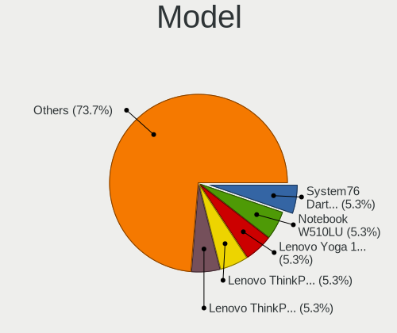
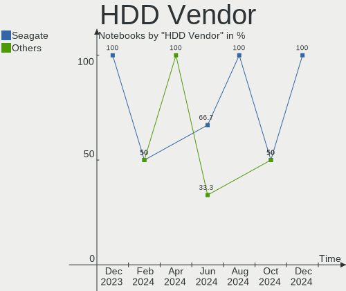
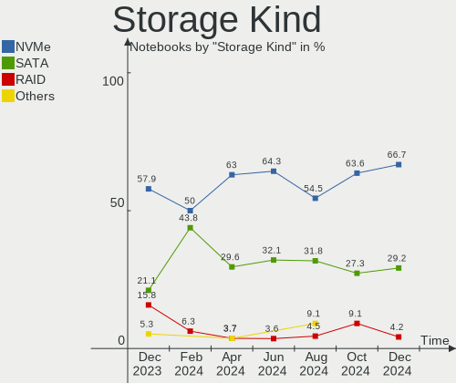
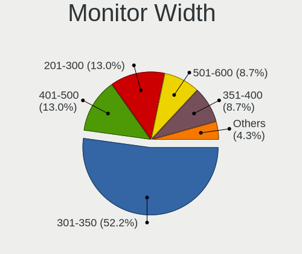
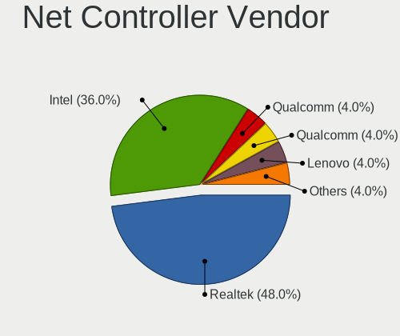
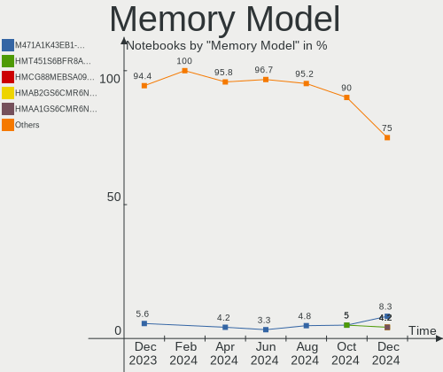

Gentoo - Hardware Trends (Notebooks)
------------------------------------

A project to identify most popular hardware characteristics and track their change
over time based on data collected by Linux users at https://Linux-Hardware.org.

Anyone can contribute to this report by the [hw-probe](https://github.com/linuxhw/hw-probe) tool:

    sudo -E hw-probe -all -upload

This report is for one last month. Overall report since the beginning of time: [TestDays](https://github.com/linuxhw/TestDays)

Period: Dec, 2023.

Contents
--------

* [ System ](#system)
  - [ OS                       ](#os)
  - [ OS Family                ](#os-family)
  - [ Kernel                   ](#kernel)
  - [ Kernel Family            ](#kernel-family)
  - [ Kernel Major Ver.        ](#kernel-major-ver)
  - [ Arch                     ](#arch)
  - [ DE                       ](#de)
  - [ Display Server           ](#display-server)
  - [ Display Manager          ](#display-manager)
  - [ OS Lang                  ](#os-lang)
  - [ Boot Mode                ](#boot-mode)
  - [ Filesystem               ](#filesystem)
  - [ Part. scheme             ](#part-scheme)
  - [ Dual Boot with Linux/BSD ](#dual-boot-with-linuxbsd)
  - [ Dual Boot (Win)          ](#dual-boot-win)

* [ Board ](#board)
  - [ Vendor                   ](#vendor)
  - [ Model                    ](#model)
  - [ Model Family             ](#model-family)
  - [ MFG Year                 ](#mfg-year)
  - [ Form Factor              ](#form-factor)
  - [ Secure Boot              ](#secure-boot)
  - [ Coreboot                 ](#coreboot)
  - [ RAM Size                 ](#ram-size)
  - [ RAM Used                 ](#ram-used)
  - [ Total Drives             ](#total-drives)
  - [ Has CD-ROM               ](#has-cd-rom)
  - [ Has Ethernet             ](#has-ethernet)
  - [ Has WiFi                 ](#has-wifi)
  - [ Has Bluetooth            ](#has-bluetooth)

* [ Location ](#location)
  - [ Country                  ](#country)
  - [ City                     ](#city)

* [ Drives ](#drives)
  - [ Drive Vendor             ](#drive-vendor)
  - [ Drive Model              ](#drive-model)
  - [ HDD Vendor               ](#hdd-vendor)
  - [ SSD Vendor               ](#ssd-vendor)
  - [ Drive Kind               ](#drive-kind)
  - [ Drive Connector          ](#drive-connector)
  - [ Drive Size               ](#drive-size)
  - [ Space Total              ](#space-total)
  - [ Space Used               ](#space-used)
  - [ Malfunc. Drives          ](#malfunc-drives)
  - [ Malfunc. Drive Vendor    ](#malfunc-drive-vendor)
  - [ Malfunc. HDD Vendor      ](#malfunc-hdd-vendor)
  - [ Malfunc. Drive Kind      ](#malfunc-drive-kind)
  - [ Failed Drives            ](#failed-drives)
  - [ Failed Drive Vendor      ](#failed-drive-vendor)
  - [ Drive Status             ](#drive-status)

* [ Storage controller ](#storage-controller)
  - [ Storage Vendor           ](#storage-vendor)
  - [ Storage Model            ](#storage-model)
  - [ Storage Kind             ](#storage-kind)

* [ Processor ](#processor)
  - [ CPU Vendor               ](#cpu-vendor)
  - [ CPU Model                ](#cpu-model)
  - [ CPU Model Family         ](#cpu-model-family)
  - [ CPU Cores                ](#cpu-cores)
  - [ CPU Sockets              ](#cpu-sockets)
  - [ CPU Threads              ](#cpu-threads)
  - [ CPU Op-Modes             ](#cpu-op-modes)
  - [ CPU Microcode            ](#cpu-microcode)
  - [ CPU Microarch            ](#cpu-microarch)

* [ Graphics ](#graphics)
  - [ GPU Vendor               ](#gpu-vendor)
  - [ GPU Model                ](#gpu-model)
  - [ GPU Combo                ](#gpu-combo)
  - [ GPU Driver               ](#gpu-driver)
  - [ GPU Memory               ](#gpu-memory)

* [ Monitor ](#monitor)
  - [ Monitor Vendor           ](#monitor-vendor)
  - [ Monitor Model            ](#monitor-model)
  - [ Monitor Resolution       ](#monitor-resolution)
  - [ Monitor Diagonal         ](#monitor-diagonal)
  - [ Monitor Width            ](#monitor-width)
  - [ Aspect Ratio             ](#aspect-ratio)
  - [ Monitor Area             ](#monitor-area)
  - [ Pixel Density            ](#pixel-density)
  - [ Multiple Monitors        ](#multiple-monitors)

* [ Network ](#network)
  - [ Net Controller Vendor    ](#net-controller-vendor)
  - [ Net Controller Model     ](#net-controller-model)
  - [ Wireless Vendor          ](#wireless-vendor)
  - [ Wireless Model           ](#wireless-model)
  - [ Ethernet Vendor          ](#ethernet-vendor)
  - [ Ethernet Model           ](#ethernet-model)
  - [ Net Controller Kind      ](#net-controller-kind)
  - [ Used Controller          ](#used-controller)
  - [ NICs                     ](#nics)
  - [ IPv6                     ](#ipv6)

* [ Bluetooth ](#bluetooth)
  - [ Bluetooth Vendor         ](#bluetooth-vendor)
  - [ Bluetooth Model          ](#bluetooth-model)

* [ Sound ](#sound)
  - [ Sound Vendor             ](#sound-vendor)
  - [ Sound Model              ](#sound-model)

* [ Memory ](#memory)
  - [ Memory Vendor            ](#memory-vendor)
  - [ Memory Model             ](#memory-model)
  - [ Memory Kind              ](#memory-kind)
  - [ Memory Form Factor       ](#memory-form-factor)
  - [ Memory Size              ](#memory-size)
  - [ Memory Speed             ](#memory-speed)

* [ Printers & scanners ](#printers--scanners)
  - [ Printer Vendor           ](#printer-vendor)
  - [ Printer Model            ](#printer-model)
  - [ Scanner Vendor           ](#scanner-vendor)
  - [ Scanner Model            ](#scanner-model)

* [ Camera ](#camera)
  - [ Camera Vendor            ](#camera-vendor)
  - [ Camera Model             ](#camera-model)

* [ Security ](#security)
  - [ Fingerprint Vendor       ](#fingerprint-vendor)
  - [ Fingerprint Model        ](#fingerprint-model)
  - [ Chipcard Vendor          ](#chipcard-vendor)
  - [ Chipcard Model           ](#chipcard-model)

* [ Unsupported ](#unsupported)
  - [ Unsupported Devices      ](#unsupported-devices)
  - [ Unsupported Device Types ](#unsupported-device-types)

System
------

OS
--

Installed operating systems

| Name        | Notebooks | Percent |
|-------------|-----------|---------|
| Gentoo 2.14 | 16        | 100%    |

OS Family
---------

OS without a version

| Name   | Notebooks | Percent |
|--------|-----------|---------|
| Gentoo | 16        | 100%    |

Kernel
------

Version of the Linux kernel

| Version                                | Notebooks | Percent |
|----------------------------------------|-----------|---------|
| 6.6.8-gentoo                           | 2         | 12.5%   |
| 6.1.67-gentoo-dist                     | 2         | 12.5%   |
| 6.1.57-gentoo-x86_64                   | 2         | 12.5%   |
| 6.1.57-gentoo                          | 2         | 12.5%   |
| 6.7.0-rc5                              | 1         | 6.25%   |
| 6.6.8-gentoo-x86_64                    | 1         | 6.25%   |
| 6.6.7-gentoo-dist                      | 1         | 6.25%   |
| 6.6.3-gentoo-r1                        | 1         | 6.25%   |
| 6.6.0-waltercool                       | 1         | 6.25%   |
| 6.5.7-gentoo_minimal_2023-12-06-234521 | 1         | 6.25%   |
| 6.1.67-gentoo-fomys-work               | 1         | 6.25%   |
| 6.1.66-gentoo-dist                     | 1         | 6.25%   |

Kernel Family
-------------

Linux kernel without a distro release

| Version | Notebooks | Percent |
|---------|-----------|---------|
| 6.1.57  | 4         | 25%     |
| 6.6.8   | 3         | 18.75%  |
| 6.1.67  | 3         | 18.75%  |
| 6.7.0   | 1         | 6.25%   |
| 6.6.7   | 1         | 6.25%   |
| 6.6.3   | 1         | 6.25%   |
| 6.6.0   | 1         | 6.25%   |
| 6.5.7   | 1         | 6.25%   |
| 6.1.66  | 1         | 6.25%   |

Kernel Major Ver.
-----------------

Linux kernel major version

| Version | Notebooks | Percent |
|---------|-----------|---------|
| 6.1     | 8         | 50%     |
| 6.6     | 6         | 37.5%   |
| 6.7     | 1         | 6.25%   |
| 6.5     | 1         | 6.25%   |

Arch
----

OS architecture (x86_64, i586, etc.)

| Name   | Notebooks | Percent |
|--------|-----------|---------|
| x86_64 | 16        | 100%    |

DE
--

Desktop Environment

| Name    | Notebooks | Percent |
|---------|-----------|---------|
| KDE5    | 6         | 37.5%   |
| Unknown | 6         | 37.5%   |
| XFCE    | 2         | 12.5%   |
| GNOME   | 2         | 12.5%   |

Display Server
--------------

X11 or Wayland

| Name    | Notebooks | Percent |
|---------|-----------|---------|
| X11     | 6         | 37.5%   |
| Wayland | 6         | 37.5%   |
| Unknown | 3         | 18.75%  |
| Tty     | 1         | 6.25%   |

Display Manager
---------------

SDDM, LightDM, etc.

| Name    | Notebooks | Percent |
|---------|-----------|---------|
| SDDM    | 9         | 56.25%  |
| Unknown | 4         | 25%     |
| LightDM | 2         | 12.5%   |
| GDM     | 1         | 6.25%   |

OS Lang
-------

Language

| Lang    | Notebooks | Percent |
|---------|-----------|---------|
| en_US   | 6         | 37.5%   |
| C.UTF8  | 2         | 12.5%   |
| Unknown | 2         | 12.5%   |
| zh_CN   | 1         | 6.25%   |
| fr_FR   | 1         | 6.25%   |
| es_AR   | 1         | 6.25%   |
| en_GB   | 1         | 6.25%   |
| de_DE   | 1         | 6.25%   |
| de_CH   | 1         | 6.25%   |

Boot Mode
---------

EFI or BIOS

| Mode | Notebooks | Percent |
|------|-----------|---------|
| EFI  | 15        | 93.75%  |
| BIOS | 1         | 6.25%   |

Filesystem
----------

Type of filesystem

| Type     | Notebooks | Percent |
|----------|-----------|---------|
| Ext4     | 9         | 56.25%  |
| Btrfs    | 3         | 18.75%  |
| Xfs      | 2         | 12.5%   |
| F2fs     | 1         | 6.25%   |
| Bcachefs | 1         | 6.25%   |

Part. scheme
------------

Scheme of partitioning

| Type | Notebooks | Percent |
|------|-----------|---------|
| GPT  | 15        | 93.75%  |
| MBR  | 1         | 6.25%   |

Dual Boot with Linux/BSD
------------------------

Hosting more than one Linux/BSD

| Dual boot | Notebooks | Percent |
|-----------|-----------|---------|
| No        | 13        | 81.25%  |
| Yes       | 3         | 18.75%  |

Dual Boot (Win)
---------------

Hosting Linux and Windows

| Dual boot | Notebooks | Percent |
|-----------|-----------|---------|
| No        | 10        | 62.5%   |
| Yes       | 6         | 37.5%   |

Board
-----

Vendor
------

Motherboard manufacturer

| Name             | Notebooks | Percent |
|------------------|-----------|---------|
| Dell             | 4         | 25%     |
| ASUSTek Computer | 4         | 25%     |
| Lenovo           | 3         | 18.75%  |
| MSI              | 2         | 12.5%   |
| TULPAR           | 1         | 6.25%   |
| Framework        | 1         | 6.25%   |
| BANGHO           | 1         | 6.25%   |

Model
-----

Motherboard model

| Name                                     | Notebooks | Percent |
|------------------------------------------|-----------|---------|
| TULPAR A5 V20.3                          | 1         | 6.25%   |
| MSI Stealth 16Studio A13VF               | 1         | 6.25%   |
| MSI Delta 15 A5EFK                       | 1         | 6.25%   |
| Lenovo ThinkPad T460 20FNCTO1WW          | 1         | 6.25%   |
| Lenovo Legion R9000P2021H 82JQ           | 1         | 6.25%   |
| Lenovo IdeaPad 5 14ARE05 81YM            | 1         | 6.25%   |
| Framework Laptop (13th Gen Intel Core)   | 1         | 6.25%   |
| Dell XPS 9320                            | 1         | 6.25%   |
| Dell Precision 5560                      | 1         | 6.25%   |
| Dell Precision 5480                      | 1         | 6.25%   |
| Dell Latitude D630                       | 1         | 6.25%   |
| BANGHO MAX L4                            | 1         | 6.25%   |
| ASUS VivoBook_ASUSLaptop X571LI_X571LI   | 1         | 6.25%   |
| ASUS ROG Zephyrus G14 GA401II_GA401II    | 1         | 6.25%   |
| ASUS G750JX                              | 1         | 6.25%   |
| ASUS ASUS TUF Gaming A15 FA507NU_FA507NU | 1         | 6.25%   |

Model Family
------------

Motherboard model prefix

| Name             | Notebooks | Percent |
|------------------|-----------|---------|
| Dell Precision   | 2         | 12.5%   |
| TULPAR A5        | 1         | 6.25%   |
| MSI Stealth      | 1         | 6.25%   |
| MSI Delta        | 1         | 6.25%   |
| Lenovo ThinkPad  | 1         | 6.25%   |
| Lenovo Legion    | 1         | 6.25%   |
| Lenovo IdeaPad   | 1         | 6.25%   |
| Framework Laptop | 1         | 6.25%   |
| Dell XPS         | 1         | 6.25%   |
| Dell Latitude    | 1         | 6.25%   |
| BANGHO MAX       | 1         | 6.25%   |
| ASUS VivoBook    | 1         | 6.25%   |
| ASUS ROG         | 1         | 6.25%   |
| ASUS G750JX      | 1         | 6.25%   |
| ASUS ASUS        | 1         | 6.25%   |

MFG Year
--------

Motherboard manufacture year

| Year | Notebooks | Percent |
|------|-----------|---------|
| 2023 | 5         | 31.25%  |
| 2021 | 3         | 18.75%  |
| 2022 | 2         | 12.5%   |
| 2020 | 2         | 12.5%   |
| 2018 | 1         | 6.25%   |
| 2016 | 1         | 6.25%   |
| 2013 | 1         | 6.25%   |
| 2007 | 1         | 6.25%   |

Form Factor
-----------

Physical design of the computer

| Name     | Notebooks | Percent |
|----------|-----------|---------|
| Notebook | 16        | 100%    |

Secure Boot
-----------

Enabled or disabled

| State    | Notebooks | Percent |
|----------|-----------|---------|
| Disabled | 15        | 93.75%  |
| Enabled  | 1         | 6.25%   |

Coreboot
--------

Have coreboot on board

| Used | Notebooks | Percent |
|------|-----------|---------|
| No   | 16        | 100%    |

RAM Size
--------

Total RAM memory

| Size in GB | Notebooks | Percent |
|------------|-----------|---------|
| 32.01-64.0 | 5         | 31.25%  |
| 8.01-16.0  | 5         | 31.25%  |
| 16.01-24.0 | 4         | 25%     |
| 3.01-4.0   | 1         | 6.25%   |
| 24.01-32.0 | 1         | 6.25%   |

RAM Used
--------

Used RAM memory

| Used GB   | Notebooks | Percent |
|-----------|-----------|---------|
| 2.01-3.0  | 4         | 25%     |
| 4.01-8.0  | 3         | 18.75%  |
| 3.01-4.0  | 2         | 12.5%   |
| 1.01-2.0  | 2         | 12.5%   |
| 8.01-16.0 | 2         | 12.5%   |
| 0.01-0.5  | 2         | 12.5%   |
| 0.51-1.0  | 1         | 6.25%   |

Total Drives
------------

Number of drives on board

| Drives | Notebooks | Percent |
|--------|-----------|---------|
| 1      | 10        | 62.5%   |
| 2      | 5         | 31.25%  |
| 3      | 1         | 6.25%   |

Has CD-ROM
----------

Has CD-ROM on board

| Presented | Notebooks | Percent |
|-----------|-----------|---------|
| No        | 14        | 87.5%   |
| Yes       | 2         | 12.5%   |

Has Ethernet
------------

Has Ethernet on board

| Presented | Notebooks | Percent |
|-----------|-----------|---------|
| Yes       | 13        | 81.25%  |
| No        | 3         | 18.75%  |

Has WiFi
--------

Has WiFi module

| Presented | Notebooks | Percent |
|-----------|-----------|---------|
| Yes       | 16        | 100%    |

Has Bluetooth
-------------

Has Bluetooth module

| Presented | Notebooks | Percent |
|-----------|-----------|---------|
| Yes       | 15        | 93.75%  |
| No        | 1         | 6.25%   |

Location
--------

Country
-------

Geographic location (country)

| Country     | Notebooks | Percent |
|-------------|-----------|---------|
| USA         | 5         | 31.25%  |
| Germany     | 2         | 12.5%   |
| Switzerland | 1         | 6.25%   |
| Spain       | 1         | 6.25%   |
| Poland      | 1         | 6.25%   |
| Paraguay    | 1         | 6.25%   |
| Italy       | 1         | 6.25%   |
| France      | 1         | 6.25%   |
| China       | 1         | 6.25%   |
| Canada      | 1         | 6.25%   |
| Bulgaria    | 1         | 6.25%   |

City
----

Geographic location (city)

| City             | Notebooks | Percent |
|------------------|-----------|---------|
| St. John's       | 1         | 6.25%   |
| Sofia            | 1         | 6.25%   |
| San Antonio      | 1         | 6.25%   |
| New York         | 1         | 6.25%   |
| Mönchengladbach | 1         | 6.25%   |
| Milan            | 1         | 6.25%   |
| Lucerne          | 1         | 6.25%   |
| L'Union          | 1         | 6.25%   |
| Iowa City        | 1         | 6.25%   |
| Girona           | 1         | 6.25%   |
| Fort Morgan      | 1         | 6.25%   |
| Duyun            | 1         | 6.25%   |
| Cohoes           | 1         | 6.25%   |
| Cieszyn          | 1         | 6.25%   |
| Berlin           | 1         | 6.25%   |
| Asunción        | 1         | 6.25%   |

Drives
------

Drive Vendor
------------

Hard drive vendors

| Vendor              | Notebooks | Drives | Percent |
|---------------------|-----------|--------|---------|
| Samsung Electronics | 5         | 7      | 25%     |
| SK hynix            | 4         | 4      | 20%     |
| Sandisk             | 3         | 3      | 15%     |
| Micron Technology   | 2         | 2      | 10%     |
| Kingston            | 2         | 3      | 10%     |
| Seagate             | 1         | 1      | 5%      |
| LITEONIT            | 1         | 1      | 5%      |
| Crucial             | 1         | 1      | 5%      |
| China               | 1         | 1      | 5%      |

Drive Model
-----------

Hard drive models

| Model                                               | Notebooks | Percent |
|-----------------------------------------------------|-----------|---------|
| Samsung NVMe SSD Controller SM981/PM981/PM983 512GB | 2         | 9.09%   |
| Samsung NVMe SSD Controller PM9A1/PM9A3/980PRO 2TB  | 2         | 9.09%   |
| SK hynix SKHynix_HFS512GDE9X084N 512GB              | 1         | 4.55%   |
| SK hynix PC801 NVMe 2TB                             | 1         | 4.55%   |
| SK hynix PC801 NVMe 1TB                             | 1         | 4.55%   |
| SK hynix PC601 SED NVMe 1TB                         | 1         | 4.55%   |
| Seagate ST1000LM024 HN-M101MBB 1TB                  | 1         | 4.55%   |
| Sandisk WD_BLACK SN850X 2000GB                      | 1         | 4.55%   |
| Sandisk WD Blue SN550 NVMe SSD 1TB                  | 1         | 4.55%   |
| SanDisk Extreme SSD 500GB                           | 1         | 4.55%   |
| Samsung MZVL41T0HBLB-00BTW 1TB                      | 1         | 4.55%   |
| Samsung MZALQ512HALU-000L2 512GB                    | 1         | 4.55%   |
| Micron CT1000P3PSSD8 1TB                            | 1         | 4.55%   |
| Micron 2400_MTFDKBA512QFM 512GB                     | 1         | 4.55%   |
| LITEONIT LCM-256M3S 256GB SSD                       | 1         | 4.55%   |
| Kingston SHFS37A240G 240GB SSD                      | 1         | 4.55%   |
| Kingston SA400M8240G 240GB SSD                      | 1         | 4.55%   |
| Kingston OM8PCP3512F-AB 512GB                       | 1         | 4.55%   |
| Crucial CT1000MX500SSD1 1TB                         | 1         | 4.55%   |
| China SSD 240GB                                     | 1         | 4.55%   |

HDD Vendor
----------

Hard disk drive vendors

| Vendor  | Notebooks | Drives | Percent |
|---------|-----------|--------|---------|
| Seagate | 1         | 1      | 100%    |

SSD Vendor
----------

Solid state drive vendors

| Vendor   | Notebooks | Drives | Percent |
|----------|-----------|--------|---------|
| Kingston | 2         | 2      | 33.33%  |
| SanDisk  | 1         | 1      | 16.67%  |
| LITEONIT | 1         | 1      | 16.67%  |
| Crucial  | 1         | 1      | 16.67%  |
| China    | 1         | 1      | 16.67%  |

Drive Kind
----------

HDD or SSD

| Kind | Notebooks | Drives | Percent |
|------|-----------|--------|---------|
| NVMe | 12        | 16     | 63.16%  |
| SSD  | 6         | 6      | 31.58%  |
| HDD  | 1         | 1      | 5.26%   |

Drive Connector
---------------

SATA, SAS, NVMe, etc.

| Type | Notebooks | Drives | Percent |
|------|-----------|--------|---------|
| NVMe | 12        | 16     | 66.67%  |
| SATA | 5         | 6      | 27.78%  |
| SAS  | 1         | 1      | 5.56%   |

Drive Size
----------

Size of hard drive

| Size in TB | Notebooks | Drives | Percent |
|------------|-----------|--------|---------|
| 0.01-0.5   | 5         | 5      | 71.43%  |
| 0.51-1.0   | 2         | 2      | 28.57%  |

Space Total
-----------

Amount of disk space available on the file system

| Size in GB     | Notebooks | Percent |
|----------------|-----------|---------|
| 251-500        | 4         | 25%     |
| 501-1000       | 4         | 25%     |
| 101-250        | 2         | 12.5%   |
| 1001-2000      | 2         | 12.5%   |
| 1-20           | 2         | 12.5%   |
| More than 3000 | 1         | 6.25%   |
| 51-100         | 1         | 6.25%   |

Space Used
----------

Amount of used disk space

| Used GB        | Notebooks | Percent |
|----------------|-----------|---------|
| 21-50          | 4         | 25%     |
| 1-20           | 4         | 25%     |
| 101-250        | 3         | 18.75%  |
| 501-1000       | 2         | 12.5%   |
| 51-100         | 2         | 12.5%   |
| More than 3000 | 1         | 6.25%   |

Malfunc. Drives
---------------

Drive models with a malfunction

| Model                                                          | Notebooks | Drives | Percent |
|----------------------------------------------------------------|-----------|--------|---------|
| Samsung Electronics NVMe SSD Controller PM9A1/PM9A3/980PRO 2TB | 1         | 1      | 100%    |

Malfunc. Drive Vendor
---------------------

Vendors of faulty drives

| Vendor              | Notebooks | Drives | Percent |
|---------------------|-----------|--------|---------|
| Samsung Electronics | 1         | 1      | 100%    |

Malfunc. HDD Vendor
-------------------

Vendors of faulty HDD drives

Zero info for selected period =(

Malfunc. Drive Kind
-------------------

Kinds of faulty drives

| Kind | Notebooks | Drives | Percent |
|------|-----------|--------|---------|
| NVMe | 1         | 1      | 100%    |

Failed Drives
-------------

Failed drive models

Zero info for selected period =(

Failed Drive Vendor
-------------------

Failed drive vendors

Zero info for selected period =(

Drive Status
------------

Number of failed and malfunc. drives

| Status   | Notebooks | Drives | Percent |
|----------|-----------|--------|---------|
| Works    | 16        | 21     | 88.89%  |
| Detected | 1         | 1      | 5.56%   |
| Malfunc  | 1         | 1      | 5.56%   |

Storage controller
------------------

Storage Vendor
--------------

Storage controller vendors

| Vendor                      | Notebooks | Percent |
|-----------------------------|-----------|---------|
| Intel                       | 7         | 30.43%  |
| Samsung Electronics         | 5         | 21.74%  |
| SK hynix                    | 4         | 17.39%  |
| SanDisk                     | 2         | 8.7%    |
| Micron Technology           | 2         | 8.7%    |
| AMD                         | 2         | 8.7%    |
| Kingston Technology Company | 1         | 4.35%   |

Storage Model
-------------

Storage controller models

| Model                                                                          | Notebooks | Percent |
|--------------------------------------------------------------------------------|-----------|---------|
| SK hynix Platinum P41/PC801 NVMe Solid State Drive                             | 2         | 8%      |
| Samsung NVMe SSD Controller SM981/PM981/PM983                                  | 2         | 8%      |
| Samsung NVMe SSD Controller PM9A1/PM9A3/980PRO                                 | 2         | 8%      |
| Intel Volume Management Device NVMe RAID Controller Intel Corporation          | 2         | 8%      |
| AMD FCH SATA Controller [AHCI mode]                                            | 2         | 8%      |
| SK hynix PC601 NVMe Solid State Drive                                          | 1         | 4%      |
| SK hynix Gold P31/BC711/PC711 NVMe Solid State Drive                           | 1         | 4%      |
| Sandisk WD Black SN850X NVMe SSD                                               | 1         | 4%      |
| SanDisk Ultra 3D / WD Blue SN550 NVMe SSD                                      | 1         | 4%      |
| Samsung NVMe SSD Controller PM9B1 (DRAM-less)                                  | 1         | 4%      |
| Samsung NVMe SSD Controller 980 (DRAM-less)                                    | 1         | 4%      |
| Micron 2550 NVMe SSD (DRAM-less)                                               | 1         | 4%      |
| Micron 2400 NVMe SSD (DRAM-less)                                               | 1         | 4%      |
| Kingston Company OM8PCP Design-In PCIe 3 NVMe SSD (DRAM-less)                  | 1         | 4%      |
| Intel Sunrise Point-LP SATA Controller [AHCI mode]                             | 1         | 4%      |
| Intel Comet Lake SATA AHCI Controller                                          | 1         | 4%      |
| Intel 82801HM/HEM (ICH8M/ICH8M-E) SATA Controller [IDE mode]                   | 1         | 4%      |
| Intel 82801HM/HEM (ICH8M/ICH8M-E) IDE Controller                               | 1         | 4%      |
| Intel 82801 Mobile SATA Controller [RAID mode]                                 | 1         | 4%      |
| Intel 8 Series/C220 Series Chipset Family 6-port SATA Controller 1 [AHCI mode] | 1         | 4%      |

Storage Kind
------------

Kind of storage controller (IDE, SATA, NVMe, SAS, ...)

| Kind | Notebooks | Percent |
|------|-----------|---------|
| NVMe | 12        | 57.14%  |
| SATA | 5         | 23.81%  |
| RAID | 3         | 14.29%  |
| IDE  | 1         | 4.76%   |

Processor
---------

CPU Vendor
----------

Processor vendors

| Vendor | Notebooks | Percent |
|--------|-----------|---------|
| Intel  | 11        | 68.75%  |
| AMD    | 5         | 31.25%  |

CPU Model
---------

Processor models

| Model                                   | Notebooks | Percent |
|-----------------------------------------|-----------|---------|
| Intel 13th Gen Core i9-13900H           | 2         | 12.5%   |
| AMD Ryzen 7 5800H with Radeon Graphics  | 2         | 12.5%   |
| Intel Core i7-4700HQ CPU @ 2.40GHz      | 1         | 6.25%   |
| Intel Core i5-6200U CPU @ 2.30GHz       | 1         | 6.25%   |
| Intel Core i5-10300H CPU @ 2.50GHz      | 1         | 6.25%   |
| Intel Core i5-10210U CPU @ 1.60GHz      | 1         | 6.25%   |
| Intel Core 2 Duo CPU T7250 @ 2.00GHz    | 1         | 6.25%   |
| Intel 13th Gen Core i7-1370P            | 1         | 6.25%   |
| Intel 13th Gen Core i7-13700H           | 1         | 6.25%   |
| Intel 12th Gen Core i7-1260P            | 1         | 6.25%   |
| Intel 11th Gen Core i7-11850H @ 2.50GHz | 1         | 6.25%   |
| AMD Ryzen 7 7735HS with Radeon Graphics | 1         | 6.25%   |
| AMD Ryzen 7 4800HS with Radeon Graphics | 1         | 6.25%   |
| AMD Ryzen 7 4700U with Radeon Graphics  | 1         | 6.25%   |

CPU Model Family
----------------

Processor model prefix

| Model            | Notebooks | Percent |
|------------------|-----------|---------|
| Other            | 6         | 37.5%   |
| AMD Ryzen 7      | 5         | 31.25%  |
| Intel Core i5    | 3         | 18.75%  |
| Intel Core i7    | 1         | 6.25%   |
| Intel Core 2 Duo | 1         | 6.25%   |

CPU Cores
---------

Number of processor cores

| Number | Notebooks | Percent |
|--------|-----------|---------|
| 8      | 6         | 37.5%   |
| 14     | 4         | 25%     |
| 4      | 3         | 18.75%  |
| 2      | 2         | 12.5%   |
| 12     | 1         | 6.25%   |

CPU Sockets
-----------

Number of sockets

| Number | Notebooks | Percent |
|--------|-----------|---------|
| 1      | 16        | 100%    |

CPU Threads
-----------

Threads per core (Hyper-Threading)

| Number | Notebooks | Percent |
|--------|-----------|---------|
| 2      | 14        | 87.5%   |
| 1      | 2         | 12.5%   |

CPU Op-Modes
------------

CPU Operation Modes (32-bit, 64-bit)

| Op mode        | Notebooks | Percent |
|----------------|-----------|---------|
| 32-bit, 64-bit | 16        | 100%    |

CPU Microcode
-------------

Microcode number

| Number     | Notebooks | Percent |
|------------|-----------|---------|
| Unknown    | 5         | 31.25%  |
| 0xb06a2    | 2         | 12.5%   |
| 0x0a50000c | 2         | 12.5%   |
| 0xa0652    | 1         | 6.25%   |
| 0x806ec    | 1         | 6.25%   |
| 0x406e3    | 1         | 6.25%   |
| 0x306c3    | 1         | 6.25%   |
| 0x0a404102 | 1         | 6.25%   |
| 0x08600106 | 1         | 6.25%   |
| 0x08600104 | 1         | 6.25%   |

CPU Microarch
-------------

Microarchitecture

| Name             | Notebooks | Percent |
|------------------|-----------|---------|
| Alderlake Hybrid | 5         | 31.25%  |
| Zen 3            | 2         | 12.5%   |
| Zen 2            | 2         | 12.5%   |
| Skylake          | 1         | 6.25%   |
| KabyLake         | 1         | 6.25%   |
| Icelake          | 1         | 6.25%   |
| Haswell          | 1         | 6.25%   |
| Core             | 1         | 6.25%   |
| CometLake        | 1         | 6.25%   |
| Unknown          | 1         | 6.25%   |

Graphics
--------

GPU Vendor
----------

Vendors of graphics cards

| Vendor | Notebooks | Percent |
|--------|-----------|---------|
| Nvidia | 9         | 39.13%  |
| Intel  | 9         | 39.13%  |
| AMD    | 5         | 21.74%  |

GPU Model
---------

Graphics card models

| Model                                                               | Notebooks | Percent |
|---------------------------------------------------------------------|-----------|---------|
| Intel Raptor Lake-P [Iris Xe Graphics]                              | 3         | 12%     |
| Nvidia AD107M [GeForce RTX 4050 Max-Q / Mobile]                     | 2         | 8%      |
| AMD Renoir [Radeon RX Vega 6 (Ryzen 4000/5000 Mobile Series)]       | 2         | 8%      |
| AMD Cezanne [Radeon Vega Series / Radeon Vega Mobile Series]        | 2         | 8%      |
| Nvidia TU117M [GeForce GTX 1650 Ti Mobile]                          | 1         | 4%      |
| Nvidia TU117GLM [T1200 Laptop GPU]                                  | 1         | 4%      |
| Nvidia TU116M [GeForce GTX 1650 Ti Mobile]                          | 1         | 4%      |
| Nvidia GK106M [GeForce GTX 770M]                                    | 1         | 4%      |
| Nvidia GA107GLM [RTX A1000 6GB Laptop GPU]                          | 1         | 4%      |
| Nvidia GA106M [GeForce RTX 3060 Mobile / Max-Q]                     | 1         | 4%      |
| Nvidia AD107M [GeForce RTX 4060 Max-Q / Mobile]                     | 1         | 4%      |
| Intel TigerLake-H GT1 [UHD Graphics]                                | 1         | 4%      |
| Intel Skylake GT2 [HD Graphics 520]                                 | 1         | 4%      |
| Intel Mobile GM965/GL960 Integrated Graphics Controller (secondary) | 1         | 4%      |
| Intel Mobile GM965/GL960 Integrated Graphics Controller (primary)   | 1         | 4%      |
| Intel CometLake-U GT2 [UHD Graphics]                                | 1         | 4%      |
| Intel CometLake-H GT2 [UHD Graphics]                                | 1         | 4%      |
| Intel Alder Lake-P GT2 [Iris Xe Graphics]                           | 1         | 4%      |
| AMD Rembrandt [Radeon 680M]                                         | 1         | 4%      |
| AMD Navi 22 [Radeon RX 6700/6700 XT/6750 XT / 6800M/6850M XT]       | 1         | 4%      |

GPU Combo
---------

Combinations of graphics cards

| Name           | Notebooks | Percent |
|----------------|-----------|---------|
| Intel + Nvidia | 4         | 25%     |
| 1 x Intel      | 4         | 25%     |
| AMD + Nvidia   | 3         | 18.75%  |
| 1 x Nvidia     | 2         | 12.5%   |
| 2 x Intel      | 1         | 6.25%   |
| 2 x AMD        | 1         | 6.25%   |
| 1 x AMD        | 1         | 6.25%   |

GPU Driver
----------

Free vs proprietary

| Driver      | Notebooks | Percent |
|-------------|-----------|---------|
| Proprietary | 8         | 50%     |
| Free        | 8         | 50%     |

GPU Memory
----------

Total video memory

| Size in GB | Notebooks | Percent |
|------------|-----------|---------|
| Unknown    | 11        | 68.75%  |
| 0.01-0.5   | 2         | 12.5%   |
| 5.01-6.0   | 1         | 6.25%   |
| 1.01-2.0   | 1         | 6.25%   |
| 8.01-16.0  | 1         | 6.25%   |

Monitor
-------

Monitor Vendor
--------------

Monitor vendors

| Vendor                  | Notebooks | Percent |
|-------------------------|-----------|---------|
| Chimei Innolux          | 5         | 22.73%  |
| Sharp                   | 3         | 13.64%  |
| Goldstar                | 3         | 13.64%  |
| Dell                    | 2         | 9.09%   |
| AU Optronics            | 2         | 9.09%   |
| Samsung Electronics     | 1         | 4.55%   |
| PANDA                   | 1         | 4.55%   |
| LG Display              | 1         | 4.55%   |
| HKC                     | 1         | 4.55%   |
| CSO                     | 1         | 4.55%   |
| Chi Mei Optoelectronics | 1         | 4.55%   |
| BOE                     | 1         | 4.55%   |

Monitor Model
-------------

Monitor models

| Model                                                                     | Notebooks | Percent |
|---------------------------------------------------------------------------|-----------|---------|
| Sharp LQ156M1JW03 SHP14C5 1920x1080 344x194mm 15.5-inch                   | 1         | 4.55%   |
| Sharp LCD Monitor SHP1548 1920x1200 288x180mm 13.4-inch                   | 1         | 4.55%   |
| Sharp LCD Monitor SHP1516 3840x2400 336x210mm 15.6-inch                   | 1         | 4.55%   |
| Samsung Electronics LCD Monitor SEC3157 1280x800 303x190mm 14.1-inch      | 1         | 4.55%   |
| PANDA LCD Monitor NCP0050 1920x1080 309x174mm 14.0-inch                   | 1         | 4.55%   |
| LG Display LCD Monitor LGD0563 1920x1080 344x194mm 15.5-inch              | 1         | 4.55%   |
| HKC 24E6C HKC2401 1920x1080 522x294mm 23.6-inch                           | 1         | 4.55%   |
| Goldstar HDR 4K GSM7750 3840x2160 697x392mm 31.5-inch                     | 1         | 4.55%   |
| Goldstar HDR 4K GSM774F 3840x2160 697x392mm 31.5-inch                     | 1         | 4.55%   |
| Goldstar 24GM77 GSM5A91 1920x1080 531x298mm 24.0-inch                     | 1         | 4.55%   |
| Dell U2415 DELA0BA 1920x1200 518x324mm 24.1-inch                          | 1         | 4.55%   |
| Dell P2418D DELD0C2 2560x1440 526x296mm 23.8-inch                         | 1         | 4.55%   |
| CSO LCD Monitor CSO1600 2560x1600 345x215mm 16.0-inch                     | 1         | 4.55%   |
| Chimei Innolux N156HMA-GA1 CMN1556 1920x1080 344x193mm 15.5-inch          | 1         | 4.55%   |
| Chimei Innolux LCD Monitor CMN1621 1920x1200 344x215mm 16.0-inch          | 1         | 4.55%   |
| Chimei Innolux LCD Monitor CMN1521 1920x1080 344x193mm 15.5-inch          | 1         | 4.55%   |
| Chimei Innolux LCD Monitor CMN14E5 1920x1080 309x173mm 13.9-inch          | 1         | 4.55%   |
| Chimei Innolux LCD Monitor CMN14C3 1366x768 309x173mm 13.9-inch           | 1         | 4.55%   |
| Chi Mei Optoelectronics LCD Monitor CMO1720 1920x1080 380x210mm 17.1-inch | 1         | 4.55%   |
| BOE LCD Monitor BOE0BCA 2256x1504 285x190mm 13.5-inch                     | 1         | 4.55%   |
| AU Optronics LCD Monitor AUOF99A 1920x1200 301x188mm 14.0-inch            | 1         | 4.55%   |
| AU Optronics LCD Monitor AUO408D 1920x1080 309x174mm 14.0-inch            | 1         | 4.55%   |

Monitor Resolution
------------------

Monitor screen resolution

| Resolution        | Notebooks | Percent |
|-------------------|-----------|---------|
| 1920x1080 (FHD)   | 9         | 45%     |
| 1920x1200 (WUXGA) | 3         | 15%     |
| 3840x2160 (4K)    | 2         | 10%     |
| 3840x2400         | 1         | 5%      |
| 2560x1600         | 1         | 5%      |
| 2560x1440 (QHD)   | 1         | 5%      |
| 2256x1504         | 1         | 5%      |
| 1440x900 (WXGA+)  | 1         | 5%      |
| 1366x768 (WXGA)   | 1         | 5%      |

Monitor Diagonal
----------------

Diagonal size in inches

| Inches | Notebooks | Percent |
|--------|-----------|---------|
| 15     | 5         | 22.73%  |
| 14     | 4         | 18.18%  |
| 13     | 4         | 18.18%  |
| 24     | 3         | 13.64%  |
| 31     | 2         | 9.09%   |
| 16     | 2         | 9.09%   |
| 23     | 1         | 4.55%   |
| 17     | 1         | 4.55%   |

Monitor Width
-------------

Physical width

| Width in mm | Notebooks | Percent |
|-------------|-----------|---------|
| 301-350     | 13        | 59.09%  |
| 501-600     | 4         | 18.18%  |
| 601-700     | 2         | 9.09%   |
| 201-300     | 2         | 9.09%   |
| 351-400     | 1         | 4.55%   |

Aspect Ratio
------------

Proportional relationship between the width and the height

| Ratio | Notebooks | Percent |
|-------|-----------|---------|
| 16/9  | 11        | 61.11%  |
| 16/10 | 6         | 33.33%  |
| 3/2   | 1         | 5.56%   |

Monitor Area
------------

Area in inch²

| Area in inch² | Notebooks | Percent |
|----------------|-----------|---------|
| 81-90          | 7         | 31.82%  |
| 101-110        | 4         | 18.18%  |
| 201-250        | 3         | 13.64%  |
| 111-120        | 3         | 13.64%  |
| 351-500        | 2         | 9.09%   |
| 71-80          | 1         | 4.55%   |
| 251-300        | 1         | 4.55%   |
| 121-130        | 1         | 4.55%   |

Pixel Density
-------------

Pixels per inch

| Density       | Notebooks | Percent |
|---------------|-----------|---------|
| 121-160       | 11        | 52.38%  |
| 161-240       | 4         | 19.05%  |
| 51-100        | 3         | 14.29%  |
| 101-120       | 2         | 9.52%   |
| More than 240 | 1         | 4.76%   |

Multiple Monitors
-----------------

Total monitors connected

| Total | Notebooks | Percent |
|-------|-----------|---------|
| 1     | 10        | 62.5%   |
| 2     | 6         | 37.5%   |

Network
-------

Net Controller Vendor
---------------------

Controller vendors

| Vendor                | Notebooks | Percent |
|-----------------------|-----------|---------|
| Intel                 | 13        | 46.43%  |
| Realtek Semiconductor | 8         | 28.57%  |
| Broadcom              | 2         | 7.14%   |
| ASIX Electronics      | 2         | 7.14%   |
| Ralink Technology     | 1         | 3.57%   |
| Qualcomm Atheros      | 1         | 3.57%   |
| MediaTek              | 1         | 3.57%   |

Net Controller Model
--------------------

Controller models

| Model                                                             | Notebooks | Percent |
|-------------------------------------------------------------------|-----------|---------|
| Realtek RTL8111/8168/8411 PCI Express Gigabit Ethernet Controller | 5         | 15.63%  |
| Intel Raptor Lake PCH CNVi WiFi                                   | 3         | 9.38%   |
| Intel Wi-Fi 6 AX210/AX211/AX411 160MHz                            | 2         | 6.25%   |
| Intel Wi-Fi 6 AX200                                               | 2         | 6.25%   |
| ASIX AX88179 Gigabit Ethernet                                     | 2         | 6.25%   |
| Realtek USB 10/100/1G/2.5G LAN                                    | 1         | 3.13%   |
| Realtek RTL8852BE PCIe 802.11ax Wireless Network Controller       | 1         | 3.13%   |
| Realtek RTL8852AE 802.11ax PCIe Wireless Network Adapter          | 1         | 3.13%   |
| Realtek RTL8153 Gigabit Ethernet Adapter                          | 1         | 3.13%   |
| Realtek Killer E3000 2.5GbE Controller                            | 1         | 3.13%   |
| Ralink RT5370 Wireless Adapter                                    | 1         | 3.13%   |
| Qualcomm Atheros QCA8171 Gigabit Ethernet                         | 1         | 3.13%   |
| MediaTek WiFi                                                     | 1         | 3.13%   |
| Intel Wireless 8260                                               | 1         | 3.13%   |
| Intel Tiger Lake PCH CNVi WiFi                                    | 1         | 3.13%   |
| Intel PRO/Wireless 3945ABG [Golan] Network Connection             | 1         | 3.13%   |
| Intel I210 Gigabit Network Connection                             | 1         | 3.13%   |
| Intel Ethernet Connection I219-V                                  | 1         | 3.13%   |
| Intel Comet Lake PCH-LP CNVi WiFi                                 | 1         | 3.13%   |
| Intel Comet Lake PCH CNVi WiFi                                    | 1         | 3.13%   |
| Intel Alder Lake-P PCH CNVi WiFi                                  | 1         | 3.13%   |
| Broadcom NetXtreme BCM5755M Gigabit Ethernet PCI Express          | 1         | 3.13%   |
| Broadcom BCM4352 802.11ac Dual Band Wireless Network Adapter      | 1         | 3.13%   |

Wireless Vendor
---------------

Wireless vendors

| Vendor                | Notebooks | Percent |
|-----------------------|-----------|---------|
| Intel                 | 13        | 72.22%  |
| Realtek Semiconductor | 2         | 11.11%  |
| Ralink Technology     | 1         | 5.56%   |
| MediaTek              | 1         | 5.56%   |
| Broadcom              | 1         | 5.56%   |

Wireless Model
--------------

Wireless models

| Model                                                        | Notebooks | Percent |
|--------------------------------------------------------------|-----------|---------|
| Intel Raptor Lake PCH CNVi WiFi                              | 3         | 16.67%  |
| Intel Wi-Fi 6 AX210/AX211/AX411 160MHz                       | 2         | 11.11%  |
| Intel Wi-Fi 6 AX200                                          | 2         | 11.11%  |
| Realtek RTL8852BE PCIe 802.11ax Wireless Network Controller  | 1         | 5.56%   |
| Realtek RTL8852AE 802.11ax PCIe Wireless Network Adapter     | 1         | 5.56%   |
| Ralink RT5370 Wireless Adapter                               | 1         | 5.56%   |
| MediaTek WiFi                                                | 1         | 5.56%   |
| Intel Wireless 8260                                          | 1         | 5.56%   |
| Intel Tiger Lake PCH CNVi WiFi                               | 1         | 5.56%   |
| Intel PRO/Wireless 3945ABG [Golan] Network Connection        | 1         | 5.56%   |
| Intel Comet Lake PCH-LP CNVi WiFi                            | 1         | 5.56%   |
| Intel Comet Lake PCH CNVi WiFi                               | 1         | 5.56%   |
| Intel Alder Lake-P PCH CNVi WiFi                             | 1         | 5.56%   |
| Broadcom BCM4352 802.11ac Dual Band Wireless Network Adapter | 1         | 5.56%   |

Ethernet Vendor
---------------

Ethernet vendors

| Vendor                | Notebooks | Percent |
|-----------------------|-----------|---------|
| Realtek Semiconductor | 8         | 57.14%  |
| Intel                 | 2         | 14.29%  |
| ASIX Electronics      | 2         | 14.29%  |
| Qualcomm Atheros      | 1         | 7.14%   |
| Broadcom              | 1         | 7.14%   |

Ethernet Model
--------------

Ethernet models

| Model                                                             | Notebooks | Percent |
|-------------------------------------------------------------------|-----------|---------|
| Realtek RTL8111/8168/8411 PCI Express Gigabit Ethernet Controller | 5         | 35.71%  |
| ASIX AX88179 Gigabit Ethernet                                     | 2         | 14.29%  |
| Realtek USB 10/100/1G/2.5G LAN                                    | 1         | 7.14%   |
| Realtek RTL8153 Gigabit Ethernet Adapter                          | 1         | 7.14%   |
| Realtek Killer E3000 2.5GbE Controller                            | 1         | 7.14%   |
| Qualcomm Atheros QCA8171 Gigabit Ethernet                         | 1         | 7.14%   |
| Intel I210 Gigabit Network Connection                             | 1         | 7.14%   |
| Intel Ethernet Connection I219-V                                  | 1         | 7.14%   |
| Broadcom NetXtreme BCM5755M Gigabit Ethernet PCI Express          | 1         | 7.14%   |

Net Controller Kind
-------------------

Ethernet, WiFi or modem

| Kind     | Notebooks | Percent |
|----------|-----------|---------|
| WiFi     | 16        | 55.17%  |
| Ethernet | 13        | 44.83%  |

Used Controller
---------------

Currently used network controller

| Kind     | Notebooks | Percent |
|----------|-----------|---------|
| WiFi     | 11        | 57.89%  |
| Ethernet | 8         | 42.11%  |

NICs
----

Total network controllers on board

| Total | Notebooks | Percent |
|-------|-----------|---------|
| 2     | 10        | 62.5%   |
| 1     | 6         | 37.5%   |

IPv6
----

IPv6 vs IPv4

| Used | Notebooks | Percent |
|------|-----------|---------|
| No   | 12        | 75%     |
| Yes  | 4         | 25%     |

Bluetooth
---------

Bluetooth Vendor
----------------

Controller vendors

| Vendor                | Notebooks | Percent |
|-----------------------|-----------|---------|
| Intel                 | 12        | 80%     |
| IMC Networks          | 2         | 13.33%  |
| Realtek Semiconductor | 1         | 6.67%   |

Bluetooth Model
---------------

Controller models

| Model                                          | Notebooks | Percent |
|------------------------------------------------|-----------|---------|
| Intel Bluetooth Device                         | 6         | 40%     |
| Intel AX210 Bluetooth                          | 2         | 13.33%  |
| Intel AX200 Bluetooth                          | 2         | 13.33%  |
| Realtek Bluetooth Radio                        | 1         | 6.67%   |
| Intel Bluetooth wireless interface             | 1         | 6.67%   |
| Intel Bluetooth 9460/9560 Jefferson Peak (JfP) | 1         | 6.67%   |
| IMC Networks Bluetooth Radio                   | 1         | 6.67%   |
| IMC Networks BCM20702A0                        | 1         | 6.67%   |

Sound
-----

Sound Vendor
------------

Sound card vendors

| Vendor              | Notebooks | Percent |
|---------------------|-----------|---------|
| Intel               | 11        | 44%     |
| Nvidia              | 5         | 20%     |
| AMD                 | 5         | 20%     |
| No brand            | 1         | 4%      |
| JBL                 | 1         | 4%      |
| Creative Technology | 1         | 4%      |
| C-Media Electronics | 1         | 4%      |

Sound Model
-----------

Sound card models

| Model                                                               | Notebooks | Percent |
|---------------------------------------------------------------------|-----------|---------|
| AMD Family 17h/19h HD Audio Controller                              | 5         | 16.67%  |
| Intel Raptor Lake-P/U/H cAVS                                        | 4         | 13.33%  |
| Nvidia Audio device                                                 | 3         | 10%     |
| AMD Renoir Radeon High Definition Audio Controller                  | 3         | 10%     |
| Nvidia TU116 High Definition Audio Controller                       | 1         | 3.33%   |
| Nvidia GK106 HDMI Audio Controller                                  | 1         | 3.33%   |
| No brand CalDigit Thunderbolt 3 Audio                               | 1         | 3.33%   |
| JBL Quantum 400                                                     | 1         | 3.33%   |
| Intel Tiger Lake-H HD Audio Controller                              | 1         | 3.33%   |
| Intel Sunrise Point-LP HD Audio                                     | 1         | 3.33%   |
| Intel Comet Lake PCH-LP cAVS                                        | 1         | 3.33%   |
| Intel Comet Lake PCH cAVS                                           | 1         | 3.33%   |
| Intel Alder Lake PCH-P High Definition Audio Controller             | 1         | 3.33%   |
| Intel 82801H (ICH8 Family) HD Audio Controller                      | 1         | 3.33%   |
| Intel 8 Series/C220 Series Chipset High Definition Audio Controller | 1         | 3.33%   |
| Creative Technology SB X-Fi Surround 5.1 Pro                        | 1         | 3.33%   |
| C-Media Electronics USB Advanced Audio Device                       | 1         | 3.33%   |
| AMD Rembrandt Radeon High Definition Audio Controller               | 1         | 3.33%   |
| AMD Navi 21/23 HDMI/DP Audio Controller                             | 1         | 3.33%   |

Memory
------

Memory Vendor
-------------

Memory module vendors

| Vendor              | Notebooks | Percent |
|---------------------|-----------|---------|
| Crucial             | 4         | 21.05%  |
| SK hynix            | 3         | 15.79%  |
| Micron Technology   | 3         | 15.79%  |
| Samsung Electronics | 2         | 10.53%  |
| Kingston            | 2         | 10.53%  |
| Unknown             | 2         | 10.53%  |
| Unknown             | 1         | 5.26%   |
| Team                | 1         | 5.26%   |
| Corsair             | 1         | 5.26%   |

Memory Model
------------

Memory module models

| Model                                                     | Notebooks | Percent |
|-----------------------------------------------------------|-----------|---------|
| Unknown                                                   | 2         | 10.53%  |
| Unknown RAM Module 8GB SODIMM DDR4 2667MT/s               | 1         | 5.26%   |
| Team RAM TEAMGROUP-SD4-3200 16GB SODIMM DDR4 3200MT/s     | 1         | 5.26%   |
| SK hynix RAM HMT451S6AFR8A-PB 4096MB SODIMM DDR3 1600MT/s | 1         | 5.26%   |
| SK hynix RAM HMCG78AGBSA095N 16GB SODIMM DDR5 5600MT/s    | 1         | 5.26%   |
| SK hynix RAM HMAA2GS6CJR8N-XN 16GB SODIMM DDR4 3200MT/s   | 1         | 5.26%   |
| Samsung RAM M471B1G73EB0-YK0 8192MB SODIMM DDR3 1600MT/s  | 1         | 5.26%   |
| Samsung RAM M471A1K43EB1-CWE 8GB SODIMM DDR4 3200MT/s     | 1         | 5.26%   |
| Micron RAM MTC4C10163S1SC48BA1 8GB SODIMM DDR5 4800MT/s   | 1         | 5.26%   |
| Micron RAM 8ATF1G64HZ-3G2J1 8GB SODIMM DDR4 3200MT/s      | 1         | 5.26%   |
| Micron RAM 4ATF1G64HZ-3G2E1 8GB SODIMM DDR4 3200MT/s      | 1         | 5.26%   |
| Kingston RAM 99U5700-027.A00G 8GB SODIMM DDR4 2667MT/s    | 1         | 5.26%   |
| Kingston RAM 99U5295-011.A00LF 2GB SODIMM DDR 667MT/s     | 1         | 5.26%   |
| Crucial RAM CT8G4SFS832A.M8FR 8GB SODIMM DDR4 3200MT/s    | 1         | 5.26%   |
| Crucial RAM CT16G4SFRA32A.C8FE 16GB SODIMM DDR4 3200MT/s  | 1         | 5.26%   |
| Crucial RAM CT102464BF160B.C16 8GB SODIMM DDR3 1600MT/s   | 1         | 5.26%   |
| Crucial RAM CB8GS2666.C8RT 8GB SODIMM DDR4 2667MT/s       | 1         | 5.26%   |
| Corsair RAM CMSX16GX4M1A2666C18 16GB SODIMM DDR4 2667MT/s | 1         | 5.26%   |

Memory Kind
-----------

Memory module kinds

| Kind   | Notebooks | Percent |
|--------|-----------|---------|
| DDR4   | 9         | 56.25%  |
| LPDDR5 | 2         | 12.5%   |
| DDR5   | 2         | 12.5%   |
| DDR3   | 2         | 12.5%   |
| DDR2   | 1         | 6.25%   |

Memory Form Factor
------------------

Physical design of the memory module

| Name         | Notebooks | Percent |
|--------------|-----------|---------|
| SODIMM       | 14        | 87.5%   |
| Row Of Chips | 2         | 12.5%   |

Memory Size
-----------

Memory module size

| Size  | Notebooks | Percent |
|-------|-----------|---------|
| 8192  | 8         | 47.06%  |
| 16384 | 4         | 23.53%  |
| 4096  | 2         | 11.76%  |
| 2048  | 2         | 11.76%  |
| 32768 | 1         | 5.88%   |

Memory Speed
------------

Memory module speed

| Speed | Notebooks | Percent |
|-------|-----------|---------|
| 3200  | 7         | 43.75%  |
| 6400  | 2         | 12.5%   |
| 2667  | 2         | 12.5%   |
| 1600  | 2         | 12.5%   |
| 5600  | 1         | 6.25%   |
| 4800  | 1         | 6.25%   |
| 667   | 1         | 6.25%   |

Printers & scanners
-------------------

Printer Vendor
--------------

Printer device vendors

Zero info for selected period =(

Printer Model
-------------

Printer device models

Zero info for selected period =(

Scanner Vendor
--------------

Scanner device vendors

Zero info for selected period =(

Scanner Model
-------------

Scanner device models

Zero info for selected period =(

Camera
------

Camera Vendor
-------------

Camera device vendors

| Vendor                | Notebooks | Percent |
|-----------------------|-----------|---------|
| IMC Networks          | 3         | 27.27%  |
| Chicony Electronics   | 2         | 18.18%  |
| Sonix Technology      | 1         | 9.09%   |
| Realtek Semiconductor | 1         | 9.09%   |
| Logitech              | 1         | 9.09%   |
| kingcome              | 1         | 9.09%   |
| Bison Electronics     | 1         | 9.09%   |
| Acer                  | 1         | 9.09%   |

Camera Model
------------

Camera device models

| Model                             | Notebooks | Percent |
|-----------------------------------|-----------|---------|
| Chicony Integrated Camera         | 2         | 18.18%  |
| Sonix USB2.0 HD UVC WebCam        | 1         | 9.09%   |
| Realtek Laptop Camera             | 1         | 9.09%   |
| Logitech BRIO Ultra HD Webcam     | 1         | 9.09%   |
| kingcome HD Webcam                | 1         | 9.09%   |
| IMC Networks USB2.0 UVC HD Webcam | 1         | 9.09%   |
| IMC Networks USB2.0 HD UVC WebCam | 1         | 9.09%   |
| IMC Networks Integrated Camera    | 1         | 9.09%   |
| Bison FHD Camera                  | 1         | 9.09%   |
| Acer BisonCam,NB Pro              | 1         | 9.09%   |

Security
--------

Fingerprint Vendor
------------------

Fingerprint sensor vendors

Zero info for selected period =(

Fingerprint Model
-----------------

Fingerprint sensor models

Zero info for selected period =(

Chipcard Vendor
---------------

Chipcard module vendors

| Vendor   | Notebooks | Percent |
|----------|-----------|---------|
| O2 Micro | 1         | 100%    |

Chipcard Model
--------------

Chipcard module models

| Model                                | Notebooks | Percent |
|--------------------------------------|-----------|---------|
| O2 Micro OZ776 CCID Smartcard Reader | 1         | 100%    |

Unsupported
-----------

Unsupported Devices
-------------------

Total unsupported devices on board

| Total | Notebooks | Percent |
|-------|-----------|---------|
| 0     | 8         | 50%     |
| 1     | 4         | 25%     |
| 4     | 2         | 12.5%   |
| 5     | 1         | 6.25%   |
| 2     | 1         | 6.25%   |

Unsupported Device Types
------------------------

Types of unsupported devices

| Type                     | Notebooks | Percent |
|--------------------------|-----------|---------|
| Multimedia controller    | 4         | 22.22%  |
| Graphics card            | 3         | 16.67%  |
| Net/wireless             | 2         | 11.11%  |
| Camera                   | 2         | 11.11%  |
| Bluetooth                | 2         | 11.11%  |
| Sound                    | 1         | 5.56%   |
| Network                  | 1         | 5.56%   |
| Firewire controller      | 1         | 5.56%   |
| Communication controller | 1         | 5.56%   |
| Chipcard                 | 1         | 5.56%   |

