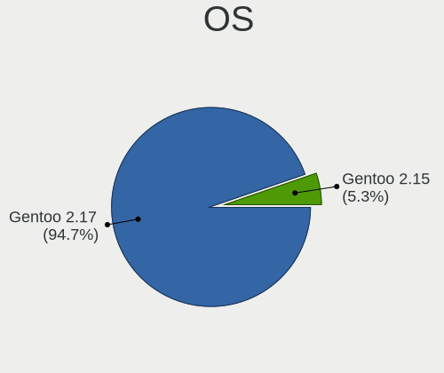
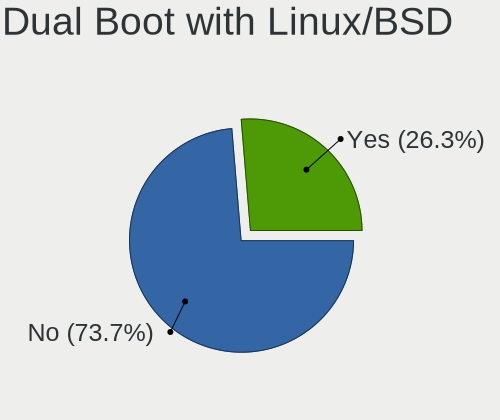
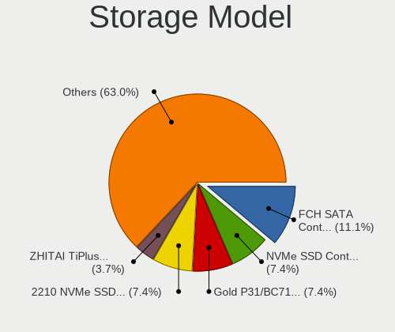
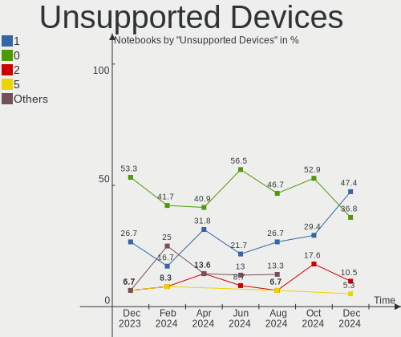

Gentoo Hardware Trends (Notebooks)
----------------------------------

A project to identify most popular hardware characteristics and track their change
over time based on data collected by Gentoo users at https://Linux-Hardware.org.

Anyone can contribute to this report by the [hw-probe](https://github.com/linuxhw/hw-probe) tool:

    sudo -E hw-probe -all -upload

Full-feature report is available here: https://linux-hardware.org/?view=trends

Period: Jan, 2022.

Contents
--------

* [ System ](#system)
  - [ OS                       ](#os)
  - [ OS Family                ](#os-family)
  - [ Kernel                   ](#kernel)
  - [ Kernel Family            ](#kernel-family)
  - [ Kernel Major Ver.        ](#kernel-major-ver)
  - [ Arch                     ](#arch)
  - [ DE                       ](#de)
  - [ Display Server           ](#display-server)
  - [ Display Manager          ](#display-manager)
  - [ OS Lang                  ](#os-lang)
  - [ Boot Mode                ](#boot-mode)
  - [ Filesystem               ](#filesystem)
  - [ Part. scheme             ](#part-scheme)
  - [ Dual Boot with Linux/BSD ](#dual-boot-with-linuxbsd)
  - [ Dual Boot (Win)          ](#dual-boot-win)

* [ Board ](#board)
  - [ Vendor                   ](#vendor)
  - [ Model                    ](#model)
  - [ Model Family             ](#model-family)
  - [ MFG Year                 ](#mfg-year)
  - [ Form Factor              ](#form-factor)
  - [ Secure Boot              ](#secure-boot)
  - [ Coreboot                 ](#coreboot)
  - [ RAM Size                 ](#ram-size)
  - [ RAM Used                 ](#ram-used)
  - [ Total Drives             ](#total-drives)
  - [ Has CD-ROM               ](#has-cd-rom)
  - [ Has Ethernet             ](#has-ethernet)
  - [ Has WiFi                 ](#has-wifi)
  - [ Has Bluetooth            ](#has-bluetooth)

* [ Location ](#location)
  - [ Country                  ](#country)
  - [ City                     ](#city)

* [ Drives ](#drives)
  - [ Drive Vendor             ](#drive-vendor)
  - [ Drive Model              ](#drive-model)
  - [ HDD Vendor               ](#hdd-vendor)
  - [ SSD Vendor               ](#ssd-vendor)
  - [ Drive Kind               ](#drive-kind)
  - [ Drive Connector          ](#drive-connector)
  - [ Drive Size               ](#drive-size)
  - [ Space Total              ](#space-total)
  - [ Space Used               ](#space-used)
  - [ Malfunc. Drives          ](#malfunc-drives)
  - [ Malfunc. Drive Vendor    ](#malfunc-drive-vendor)
  - [ Malfunc. HDD Vendor      ](#malfunc-hdd-vendor)
  - [ Malfunc. Drive Kind      ](#malfunc-drive-kind)
  - [ Failed Drives            ](#failed-drives)
  - [ Failed Drive Vendor      ](#failed-drive-vendor)
  - [ Drive Status             ](#drive-status)

* [ Storage controller ](#storage-controller)
  - [ Storage Vendor           ](#storage-vendor)
  - [ Storage Model            ](#storage-model)
  - [ Storage Kind             ](#storage-kind)

* [ Processor ](#processor)
  - [ CPU Vendor               ](#cpu-vendor)
  - [ CPU Model                ](#cpu-model)
  - [ CPU Model Family         ](#cpu-model-family)
  - [ CPU Cores                ](#cpu-cores)
  - [ CPU Sockets              ](#cpu-sockets)
  - [ CPU Threads              ](#cpu-threads)
  - [ CPU Op-Modes             ](#cpu-op-modes)
  - [ CPU Microcode            ](#cpu-microcode)
  - [ CPU Microarch            ](#cpu-microarch)

* [ Graphics ](#graphics)
  - [ GPU Vendor               ](#gpu-vendor)
  - [ GPU Model                ](#gpu-model)
  - [ GPU Combo                ](#gpu-combo)
  - [ GPU Driver               ](#gpu-driver)
  - [ GPU Memory               ](#gpu-memory)

* [ Monitor ](#monitor)
  - [ Monitor Vendor           ](#monitor-vendor)
  - [ Monitor Model            ](#monitor-model)
  - [ Monitor Resolution       ](#monitor-resolution)
  - [ Monitor Diagonal         ](#monitor-diagonal)
  - [ Monitor Width            ](#monitor-width)
  - [ Aspect Ratio             ](#aspect-ratio)
  - [ Monitor Area             ](#monitor-area)
  - [ Pixel Density            ](#pixel-density)
  - [ Multiple Monitors        ](#multiple-monitors)

* [ Network ](#network)
  - [ Net Controller Vendor    ](#net-controller-vendor)
  - [ Net Controller Model     ](#net-controller-model)
  - [ Wireless Vendor          ](#wireless-vendor)
  - [ Wireless Model           ](#wireless-model)
  - [ Ethernet Vendor          ](#ethernet-vendor)
  - [ Ethernet Model           ](#ethernet-model)
  - [ Net Controller Kind      ](#net-controller-kind)
  - [ Used Controller          ](#used-controller)
  - [ NICs                     ](#nics)
  - [ IPv6                     ](#ipv6)

* [ Bluetooth ](#bluetooth)
  - [ Bluetooth Vendor         ](#bluetooth-vendor)
  - [ Bluetooth Model          ](#bluetooth-model)

* [ Sound ](#sound)
  - [ Sound Vendor             ](#sound-vendor)
  - [ Sound Model              ](#sound-model)

* [ Memory ](#memory)
  - [ Memory Vendor            ](#memory-vendor)
  - [ Memory Model             ](#memory-model)
  - [ Memory Kind              ](#memory-kind)
  - [ Memory Form Factor       ](#memory-form-factor)
  - [ Memory Size              ](#memory-size)
  - [ Memory Speed             ](#memory-speed)

* [ Printers & scanners ](#printers--scanners)
  - [ Printer Vendor           ](#printer-vendor)
  - [ Printer Model            ](#printer-model)
  - [ Scanner Vendor           ](#scanner-vendor)
  - [ Scanner Model            ](#scanner-model)

* [ Camera ](#camera)
  - [ Camera Vendor            ](#camera-vendor)
  - [ Camera Model             ](#camera-model)

* [ Security ](#security)
  - [ Fingerprint Vendor       ](#fingerprint-vendor)
  - [ Fingerprint Model        ](#fingerprint-model)
  - [ Chipcard Vendor          ](#chipcard-vendor)
  - [ Chipcard Model           ](#chipcard-model)

* [ Unsupported ](#unsupported)
  - [ Unsupported Devices      ](#unsupported-devices)
  - [ Unsupported Device Types ](#unsupported-device-types)

System
------

OS
--

Installed operating systems

| Name       | Notebooks | Percent |
|------------|-----------|---------|
| Gentoo 2.8 | 13        | 39.39%  |
| Gentoo 2.6 | 11        | 33.33%  |
| Gentoo 2.7 | 9         | 27.27%  |

OS Family
---------

OS without a version

| Name   | Notebooks | Percent |
|--------|-----------|---------|
| Gentoo | 33        | 100%    |

Kernel
------

Version of the Linux kernel

| Version                        | Notebooks | Percent |
|--------------------------------|-----------|---------|
| 5.15.16-gentoo                 | 4         | 12.12%  |
| 5.15.13-gentoo                 | 3         | 9.09%   |
| 5.16.0-gentoo-x86_64           | 2         | 6.06%   |
| 5.15.12-gentoo                 | 2         | 6.06%   |
| 5.16.2-gentoo-x86_64           | 1         | 3.03%   |
| 5.16.2-gentoo                  | 1         | 3.03%   |
| 5.16.1-gentoo-x86_64           | 1         | 3.03%   |
| 5.16.1-gentoo                  | 1         | 3.03%   |
| 5.16.0-xanmod1                 | 1         | 3.03%   |
| 5.16.0-gentoo-gentoo-dist      | 1         | 3.03%   |
| 5.16.0-gentoo                  | 1         | 3.03%   |
| 5.15.3-gentoo                  | 1         | 3.03%   |
| 5.15.13-gentoo-dist            | 1         | 3.03%   |
| 5.15.12-gentoo-x86_64          | 1         | 3.03%   |
| 5.15.11-gentoo_Mac-F22586C8    | 1         | 3.03%   |
| 5.15.11-gentoo-x86_64-usbc-tb1 | 1         | 3.03%   |
| 5.15.11-gentoo-x86_64+         | 1         | 3.03%   |
| 5.15.11-gentoo-x86_64          | 1         | 3.03%   |
| 5.15.11-gentoo-rZ165           | 1         | 3.03%   |
| 5.15.11-gentoo-dist            | 1         | 3.03%   |
| 5.15.11-gentoo                 | 1         | 3.03%   |
| 5.15.10-gentoo-x86_64          | 1         | 3.03%   |
| 5.11.12-cwx                    | 1         | 3.03%   |
| 5.11.0-27-generic              | 1         | 3.03%   |
| 5.10.76-gentoo-r1              | 1         | 3.03%   |
| 5.10.61-gentoo                 | 1         | 3.03%   |

Kernel Family
-------------

Linux kernel without a distro release

| Version | Notebooks | Percent |
|---------|-----------|---------|
| 5.15.11 | 7         | 21.21%  |
| 5.16.0  | 5         | 15.15%  |
| 5.15.16 | 4         | 12.12%  |
| 5.15.13 | 4         | 12.12%  |
| 5.15.12 | 3         | 9.09%   |
| 5.16.2  | 2         | 6.06%   |
| 5.16.1  | 2         | 6.06%   |
| 5.15.3  | 1         | 3.03%   |
| 5.15.10 | 1         | 3.03%   |
| 5.11.12 | 1         | 3.03%   |
| 5.11.0  | 1         | 3.03%   |
| 5.10.76 | 1         | 3.03%   |
| 5.10.61 | 1         | 3.03%   |

Kernel Major Ver.
-----------------

Linux kernel major version

| Version | Notebooks | Percent |
|---------|-----------|---------|
| 5.15    | 20        | 60.61%  |
| 5.16    | 9         | 27.27%  |
| 5.11    | 2         | 6.06%   |
| 5.10    | 2         | 6.06%   |

Arch
----

OS architecture (x86_64, i586, etc.)

| Name   | Notebooks | Percent |
|--------|-----------|---------|
| x86_64 | 33        | 100%    |

DE
--

Desktop Environment

| Name       | Notebooks | Percent |
|------------|-----------|---------|
| Unknown    | 11        | 33.33%  |
| GNOME      | 7         | 21.21%  |
| KDE5       | 6         | 18.18%  |
| XFCE       | 5         | 15.15%  |
| X-Cinnamon | 1         | 3.03%   |
| sway       | 1         | 3.03%   |
| LXQt       | 1         | 3.03%   |
| fvwm       | 1         | 3.03%   |

Display Server
--------------

X11 or Wayland

| Name    | Notebooks | Percent |
|---------|-----------|---------|
| X11     | 17        | 51.52%  |
| Wayland | 8         | 24.24%  |
| Tty     | 5         | 15.15%  |
| Unknown | 3         | 9.09%   |

Display Manager
---------------

SDDM, LightDM, etc.

| Name    | Notebooks | Percent |
|---------|-----------|---------|
| Unknown | 11        | 33.33%  |
| SDDM    | 10        | 30.3%   |
| GDM     | 5         | 15.15%  |
| LightDM | 3         | 9.09%   |
| XDM     | 1         | 3.03%   |
| SLiM    | 1         | 3.03%   |
| GREETD  | 1         | 3.03%   |
| GDM3    | 1         | 3.03%   |

OS Lang
-------

Language

| Lang    | Notebooks | Percent |
|---------|-----------|---------|
| en_US   | 12        | 36.36%  |
| Unknown | 5         | 15.15%  |
| C.UTF8  | 3         | 9.09%   |
| C       | 2         | 6.06%   |
| ru_UA   | 1         | 3.03%   |
| pt_BR   | 1         | 3.03%   |
| nl_BE   | 1         | 3.03%   |
| ja_JP   | 1         | 3.03%   |
| it_IT   | 1         | 3.03%   |
| fr_FR   | 1         | 3.03%   |
| es_AR   | 1         | 3.03%   |
| en_GB   | 1         | 3.03%   |
| en_AU   | 1         | 3.03%   |
| de_DE   | 1         | 3.03%   |
| de_CH   | 1         | 3.03%   |

Boot Mode
---------

EFI or BIOS

| Mode | Notebooks | Percent |
|------|-----------|---------|
| EFI  | 29        | 87.88%  |
| BIOS | 4         | 12.12%  |

Filesystem
----------

Type of filesystem

| Type  | Notebooks | Percent |
|-------|-----------|---------|
| Ext4  | 20        | 60.61%  |
| Btrfs | 7         | 21.21%  |
| F2fs  | 3         | 9.09%   |
| Xfs   | 2         | 6.06%   |
| Zfs   | 1         | 3.03%   |

Part. scheme
------------

Scheme of partitioning

| Type    | Notebooks | Percent |
|---------|-----------|---------|
| GPT     | 31        | 93.94%  |
| Unknown | 2         | 6.06%   |

Dual Boot with Linux/BSD
------------------------

Hosting more than one Linux/BSD

| Dual boot | Notebooks | Percent |
|-----------|-----------|---------|
| No        | 27        | 81.82%  |
| Yes       | 6         | 18.18%  |

Dual Boot (Win)
---------------

Hosting Linux and Windows

| Dual boot | Notebooks | Percent |
|-----------|-----------|---------|
| No        | 24        | 72.73%  |
| Yes       | 9         | 27.27%  |

Board
-----

Vendor
------

Motherboard manufacturer

| Name                | Notebooks | Percent |
|---------------------|-----------|---------|
| Lenovo              | 8         | 24.24%  |
| Dell                | 6         | 18.18%  |
| Hewlett-Packard     | 4         | 12.12%  |
| Acer                | 3         | 9.09%   |
| Timi                | 2         | 6.06%   |
| Samsung Electronics | 2         | 6.06%   |
| MSI                 | 2         | 6.06%   |
| HUAWEI              | 2         | 6.06%   |
| Apple               | 2         | 6.06%   |
| TUXEDO              | 1         | 3.03%   |
| ASUSTek Computer    | 1         | 3.03%   |

Model
-----

Motherboard model

| Name                                     | Notebooks | Percent |
|------------------------------------------|-----------|---------|
| TUXEDO Pulse 15 Gen1                     | 1         | 3.03%   |
| Timi RedmiBook 13                        | 1         | 3.03%   |
| Timi Mi Laptop Pro 15                    | 1         | 3.03%   |
| Samsung RC530/RC730                      | 1         | 3.03%   |
| Samsung 700T1C                           | 1         | 3.03%   |
| MSI GS63VR 6RF                           | 1         | 3.03%   |
| MSI GE73 Raider RGB 8RF                  | 1         | 3.03%   |
| Lenovo Yoga S740-14IIL 81RS              | 1         | 3.03%   |
| Lenovo ThinkPad X1 Carbon 7th 20QD0039RI | 1         | 3.03%   |
| Lenovo ThinkPad T480s 20L8S02E00         | 1         | 3.03%   |
| Lenovo ThinkPad 20FMCT01WW               | 1         | 3.03%   |
| Lenovo Legion R7000 2020 82B6            | 1         | 3.03%   |
| Lenovo Legion 5P 15IMH05 82AW            | 1         | 3.03%   |
| Lenovo Legion 5 Pro 16ACH6H 82JQ         | 1         | 3.03%   |
| Lenovo IdeaPad 5 15ITL05 82FG            | 1         | 3.03%   |
| HUAWEI NBLK-WAX9X                        | 1         | 3.03%   |
| HUAWEI HVY-WXX9                          | 1         | 3.03%   |
| HP ProBook 430 G7                        | 1         | 3.03%   |
| HP Pavilion ZV6100 (EE984EA#ABZ)         | 1         | 3.03%   |
| HP Pavilion Gaming Laptop 17-cd0xxx      | 1         | 3.03%   |
| HP Pavilion Gaming Laptop 15-ec1xxx      | 1         | 3.03%   |
| Dell XPS 17 9710                         | 1         | 3.03%   |
| Dell XPS 15 9570                         | 1         | 3.03%   |
| Dell Precision 7560                      | 1         | 3.03%   |
| Dell Precision 7520                      | 1         | 3.03%   |
| Dell Precision 3561                      | 1         | 3.03%   |
| Dell Inspiron 5402                       | 1         | 3.03%   |
| ASUS ROG Zephyrus G14 GA401QE_GA401QE    | 1         | 3.03%   |
| Apple MacBookPro6,2                      | 1         | 3.03%   |
| Apple MacBookPro16,1                     | 1         | 3.03%   |
| Acer Swift SF314-59                      | 1         | 3.03%   |
| Acer Nitro AN515-54                      | 1         | 3.03%   |
| Acer Aspire E5-571G                      | 1         | 3.03%   |

Model Family
------------

Motherboard model prefix

| Name               | Notebooks | Percent |
|--------------------|-----------|---------|
| Lenovo ThinkPad    | 3         | 9.09%   |
| Lenovo Legion      | 3         | 9.09%   |
| HP Pavilion        | 3         | 9.09%   |
| Dell Precision     | 3         | 9.09%   |
| Dell XPS           | 2         | 6.06%   |
| TUXEDO Pulse       | 1         | 3.03%   |
| Timi RedmiBook     | 1         | 3.03%   |
| Timi Mi            | 1         | 3.03%   |
| Samsung RC530      | 1         | 3.03%   |
| Samsung 700T1C     | 1         | 3.03%   |
| MSI GS63VR         | 1         | 3.03%   |
| MSI GE73           | 1         | 3.03%   |
| Lenovo Yoga        | 1         | 3.03%   |
| Lenovo IdeaPad     | 1         | 3.03%   |
| HUAWEI NBLK-WAX9X  | 1         | 3.03%   |
| HUAWEI HVY-WXX9    | 1         | 3.03%   |
| HP ProBook         | 1         | 3.03%   |
| Dell Inspiron      | 1         | 3.03%   |
| ASUS ROG           | 1         | 3.03%   |
| Apple MacBookPro6  | 1         | 3.03%   |
| Apple MacBookPro16 | 1         | 3.03%   |
| Acer Swift         | 1         | 3.03%   |
| Acer Nitro         | 1         | 3.03%   |
| Acer Aspire        | 1         | 3.03%   |

MFG Year
--------

Motherboard manufacture year

| Year | Notebooks | Percent |
|------|-----------|---------|
| 2021 | 8         | 24.24%  |
| 2020 | 8         | 24.24%  |
| 2019 | 7         | 21.21%  |
| 2018 | 3         | 9.09%   |
| 2017 | 1         | 3.03%   |
| 2016 | 1         | 3.03%   |
| 2014 | 1         | 3.03%   |
| 2013 | 1         | 3.03%   |
| 2011 | 1         | 3.03%   |
| 2010 | 1         | 3.03%   |
| 2006 | 1         | 3.03%   |

Form Factor
-----------

Physical design of the computer

| Name     | Notebooks | Percent |
|----------|-----------|---------|
| Notebook | 33        | 100%    |

Secure Boot
-----------

Enabled or disabled

| State    | Notebooks | Percent |
|----------|-----------|---------|
| Disabled | 30        | 90.91%  |
| Enabled  | 3         | 9.09%   |

Coreboot
--------

Have coreboot on board

| Used | Notebooks | Percent |
|------|-----------|---------|
| No   | 33        | 100%    |

RAM Size
--------

Total RAM memory

| Size in GB  | Notebooks | Percent |
|-------------|-----------|---------|
| 4.01-8.0    | 8         | 24.24%  |
| 32.01-64.0  | 7         | 21.21%  |
| 16.01-24.0  | 7         | 21.21%  |
| 8.01-16.0   | 5         | 15.15%  |
| 24.01-32.0  | 2         | 6.06%   |
| 64.01-256.0 | 2         | 6.06%   |
| 3.01-4.0    | 1         | 3.03%   |
| 1.01-2.0    | 1         | 3.03%   |

RAM Used
--------

Used RAM memory

| Used GB   | Notebooks | Percent |
|-----------|-----------|---------|
| 1.01-2.0  | 8         | 24.24%  |
| 4.01-8.0  | 7         | 21.21%  |
| 2.01-3.0  | 7         | 21.21%  |
| 3.01-4.0  | 4         | 12.12%  |
| 8.01-16.0 | 3         | 9.09%   |
| 0.51-1.0  | 2         | 6.06%   |
| 0.01-0.5  | 2         | 6.06%   |

Total Drives
------------

Number of drives on board

| Drives | Notebooks | Percent |
|--------|-----------|---------|
| 1      | 22        | 66.67%  |
| 2      | 10        | 30.3%   |
| 3      | 1         | 3.03%   |

Has CD-ROM
----------

Has CD-ROM on board

| Presented | Notebooks | Percent |
|-----------|-----------|---------|
| No        | 29        | 87.88%  |
| Yes       | 4         | 12.12%  |

Has Ethernet
------------

Has Ethernet on board

| Presented | Notebooks | Percent |
|-----------|-----------|---------|
| Yes       | 21        | 63.64%  |
| No        | 12        | 36.36%  |

Has WiFi
--------

Has WiFi module

| Presented | Notebooks | Percent |
|-----------|-----------|---------|
| Yes       | 33        | 100%    |

Has Bluetooth
-------------

Has Bluetooth module

| Presented | Notebooks | Percent |
|-----------|-----------|---------|
| Yes       | 30        | 90.91%  |
| No        | 3         | 9.09%   |

Location
--------

Country
-------

Geographic location (country)

| Country     | Notebooks | Percent |
|-------------|-----------|---------|
| USA         | 4         | 12.12%  |
| Russia      | 4         | 12.12%  |
| Germany     | 4         | 12.12%  |
| Poland      | 3         | 9.09%   |
| France      | 2         | 6.06%   |
| Uruguay     | 1         | 3.03%   |
| Ukraine     | 1         | 3.03%   |
| Switzerland | 1         | 3.03%   |
| Sweden      | 1         | 3.03%   |
| Spain       | 1         | 3.03%   |
| Romania     | 1         | 3.03%   |
| Philippines | 1         | 3.03%   |
| Netherlands | 1         | 3.03%   |
| Japan       | 1         | 3.03%   |
| Italy       | 1         | 3.03%   |
| India       | 1         | 3.03%   |
| Hong Kong   | 1         | 3.03%   |
| China       | 1         | 3.03%   |
| Brazil      | 1         | 3.03%   |
| Belgium     | 1         | 3.03%   |
| Australia   | 1         | 3.03%   |

City
----

Geographic location (city)

| City               | Notebooks | Percent |
|--------------------|-----------|---------|
| Berlin             | 2         | 6.06%   |
| Yekaterinburg      | 1         | 3.03%   |
| Wroclaw            | 1         | 3.03%   |
| West Orange        | 1         | 3.03%   |
| Warsaw             | 1         | 3.03%   |
| Takarazuka         | 1         | 3.03%   |
| Sydney             | 1         | 3.03%   |
| Stokkem            | 1         | 3.03%   |
| St Petersburg      | 1         | 3.03%   |
| Sestao             | 1         | 3.03%   |
| Nyk?¶ping          | 1         | 3.03%   |
| Novosibirsk        | 1         | 3.03%   |
| Milan              | 1         | 3.03%   |
| Maldonado          | 1         | 3.03%   |
| Lyon               | 1         | 3.03%   |
| Lakeland           | 1         | 3.03%   |
| Lachen             | 1         | 3.03%   |
| Kulmbach           | 1         | 3.03%   |
| Ingolstadt         | 1         | 3.03%   |
| Hyderabad          | 1         | 3.03%   |
| Hoboken            | 1         | 3.03%   |
| Foshan             | 1         | 3.03%   |
| Eugene             | 1         | 3.03%   |
| Dnipro             | 1         | 3.03%   |
| Cieszyn            | 1         | 3.03%   |
| Central            | 1         | 3.03%   |
| Calamba            | 1         | 3.03%   |
| Brasov             | 1         | 3.03%   |
| Belo Horizonte     | 1         | 3.03%   |
| Belgorod           | 1         | 3.03%   |
| Asnieres-sur-Seine | 1         | 3.03%   |
| Amsterdam          | 1         | 3.03%   |

Drives
------

Drive Vendor
------------

Hard drive vendors

| Vendor              | Notebooks | Drives | Percent |
|---------------------|-----------|--------|---------|
| Samsung Electronics | 14        | 16     | 33.33%  |
| Intel               | 6         | 6      | 14.29%  |
| WDC                 | 4         | 4      | 9.52%   |
| Seagate             | 3         | 3      | 7.14%   |
| SK Hynix            | 2         | 2      | 4.76%   |
| SanDisk             | 2         | 2      | 4.76%   |
| Kingston            | 2         | 2      | 4.76%   |
| Toshiba             | 1         | 1      | 2.38%   |
| Micron Technology   | 1         | 1      | 2.38%   |
| LITEONIT            | 1         | 1      | 2.38%   |
| LITEON              | 1         | 1      | 2.38%   |
| KIOXIA-EXCERIA      | 1         | 1      | 2.38%   |
| KIOXIA              | 1         | 1      | 2.38%   |
| HGST                | 1         | 1      | 2.38%   |
| China               | 1         | 1      | 2.38%   |
| Apple               | 1         | 1      | 2.38%   |

Drive Model
-----------

Hard drive models

| Model                                | Notebooks | Percent |
|--------------------------------------|-----------|---------|
| Intel SSDPEKNW010T8 1TB              | 2         | 4.55%   |
| Intel SSDPEKNU512GZ 512GB            | 2         | 4.55%   |
| WDC WDS250G2X0C-00L350 250GB         | 1         | 2.27%   |
| WDC WDS100T2B0C-00PXH0 1TB           | 1         | 2.27%   |
| WDC PC SN730 SDBPNTY-512G-1027 512GB | 1         | 2.27%   |
| WDC PC SN520 SDAPNUW-256G-1006 256GB | 1         | 2.27%   |
| Toshiba KXG50ZNV512G NVMe 512GB      | 1         | 2.27%   |
| SK Hynix SKHynix_HFS001TDE9X084N 1TB | 1         | 2.27%   |
| SK Hynix PC711 NVMe 512GB            | 1         | 2.27%   |
| Seagate ST1000LM049-2GH172 1TB       | 1         | 2.27%   |
| Seagate ST1000LM035-1RK172 1TB       | 1         | 2.27%   |
| Seagate ST1000LM035-1RK1 1TB         | 1         | 2.27%   |
| SanDisk SDSSDH3500G 500GB            | 1         | 2.27%   |
| SanDisk SD9SN8W-128G-1006 128GB SSD  | 1         | 2.27%   |
| Samsung SSD 980 PRO 2TB              | 1         | 2.27%   |
| Samsung SSD 970 EVO Plus 250GB       | 1         | 2.27%   |
| Samsung SSD 970 EVO 500GB            | 1         | 2.27%   |
| Samsung SSD 870 EVO 1TB              | 1         | 2.27%   |
| Samsung SSD 860 PRO 1TB              | 1         | 2.27%   |
| Samsung SSD 850 PRO 256GB            | 1         | 2.27%   |
| Samsung SSD 850 EVO 250GB            | 1         | 2.27%   |
| Samsung SSD 840 EVO 120GB            | 1         | 2.27%   |
| Samsung PM961 NVMe 256GB             | 1         | 2.27%   |
| Samsung NVMe SSD Drive 512GB         | 1         | 2.27%   |
| Samsung NVMe SSD Drive 1TB           | 1         | 2.27%   |
| Samsung MZVLB512HBJQ-000L2 512GB     | 1         | 2.27%   |
| Samsung MZVLB512HAJQ-000L7 512GB     | 1         | 2.27%   |
| Samsung MZVLB512HAJQ-00000 512GB     | 1         | 2.27%   |
| Samsung MZNLN512HAJQ-00000 512GB SSD | 1         | 2.27%   |
| Samsung MZALQ512HALU-000L2 512GB     | 1         | 2.27%   |
| Micron 2300 NVMe 1024GB              | 1         | 2.27%   |
| LITEONIT LMT-128M6M 128GB SSD        | 1         | 2.27%   |
| LITEON CV8-8E128-HP 128GB SSD        | 1         | 2.27%   |
| KIOXIA-EXCERIA SSD 500GB             | 1         | 2.27%   |
| KIOXIA KXG70PNV2T04 NVMe 2048GB      | 1         | 2.27%   |
| Kingston RBUSNS8154P3256GJ 256GB     | 1         | 2.27%   |
| Kingston OM8PCP3512F-AA 512GB        | 1         | 2.27%   |
| Intel SSDPEKNW020T8 2TB              | 1         | 2.27%   |
| Intel SSDPEKKF256G8L 256GB           | 1         | 2.27%   |
| HGST HTS721010A9E630 1TB             | 1         | 2.27%   |
| China SSD 512GB                      | 1         | 2.27%   |
| Apple SSD AP1024N 1TB                | 1         | 2.27%   |

HDD Vendor
----------

Hard disk drive vendors

| Vendor  | Notebooks | Drives | Percent |
|---------|-----------|--------|---------|
| Seagate | 3         | 3      | 75%     |
| HGST    | 1         | 1      | 25%     |

SSD Vendor
----------

Solid state drive vendors

| Vendor              | Notebooks | Drives | Percent |
|---------------------|-----------|--------|---------|
| Samsung Electronics | 6         | 6      | 54.55%  |
| SanDisk             | 2         | 2      | 18.18%  |
| LITEONIT            | 1         | 1      | 9.09%   |
| LITEON              | 1         | 1      | 9.09%   |
| China               | 1         | 1      | 9.09%   |

Drive Kind
----------

HDD or SSD

| Kind | Notebooks | Drives | Percent |
|------|-----------|--------|---------|
| NVMe | 24        | 29     | 63.16%  |
| SSD  | 10        | 11     | 26.32%  |
| HDD  | 4         | 4      | 10.53%  |

Drive Connector
---------------

SATA, SAS, NVMe, etc.

| Type | Notebooks | Drives | Percent |
|------|-----------|--------|---------|
| NVMe | 24        | 29     | 63.16%  |
| SATA | 14        | 15     | 36.84%  |

Drive Size
----------

Size of hard drive

| Size in TB | Notebooks | Drives | Percent |
|------------|-----------|--------|---------|
| 0.51-1.0   | 8         | 8      | 57.14%  |
| 0.01-0.5   | 6         | 7      | 42.86%  |

Space Total
-----------

Amount of disk space available on the file system

| Size in GB | Notebooks | Percent |
|------------|-----------|---------|
| 251-500    | 10        | 30.3%   |
| 101-250    | 6         | 18.18%  |
| 1001-2000  | 6         | 18.18%  |
| 501-1000   | 6         | 18.18%  |
| 2001-3000  | 2         | 6.06%   |
| Unknown    | 2         | 6.06%   |
| 1-20       | 1         | 3.03%   |

Space Used
----------

Amount of used disk space

| Used GB   | Notebooks | Percent |
|-----------|-----------|---------|
| 101-250   | 9         | 27.27%  |
| 1-20      | 8         | 24.24%  |
| 21-50     | 4         | 12.12%  |
| 501-1000  | 4         | 12.12%  |
| 1001-2000 | 3         | 9.09%   |
| 51-100    | 2         | 6.06%   |
| Unknown   | 2         | 6.06%   |
| 251-500   | 1         | 3.03%   |

Malfunc. Drives
---------------

Drive models with a malfunction

| Model                               | Notebooks | Drives | Percent |
|-------------------------------------|-----------|--------|---------|
| Seagate ST1000LM049-2GH172 1TB      | 1         | 1      | 20%     |
| Seagate ST1000LM035-1RK172 1TB      | 1         | 1      | 20%     |
| SanDisk SD9SN8W-128G-1006 128GB SSD | 1         | 1      | 20%     |
| LITEON CV8-8E128-HP 128GB SSD       | 1         | 1      | 20%     |
| Intel SSDPEKKF256G8L 256GB          | 1         | 1      | 20%     |

Malfunc. Drive Vendor
---------------------

Vendors of faulty drives

| Vendor  | Notebooks | Drives | Percent |
|---------|-----------|--------|---------|
| Seagate | 2         | 2      | 40%     |
| SanDisk | 1         | 1      | 20%     |
| LITEON  | 1         | 1      | 20%     |
| Intel   | 1         | 1      | 20%     |

Malfunc. HDD Vendor
-------------------

Vendors of faulty HDD drives

| Vendor  | Notebooks | Drives | Percent |
|---------|-----------|--------|---------|
| Seagate | 2         | 2      | 100%    |

Malfunc. Drive Kind
-------------------

Kinds of faulty drives

| Kind | Notebooks | Drives | Percent |
|------|-----------|--------|---------|
| SSD  | 2         | 2      | 40%     |
| HDD  | 2         | 2      | 40%     |
| NVMe | 1         | 1      | 20%     |

Failed Drives
-------------

Failed drive models

Zero info for selected period =(

Failed Drive Vendor
-------------------

Failed drive vendors

Zero info for selected period =(

Drive Status
------------

Number of failed and malfunc. drives

| Status   | Notebooks | Drives | Percent |
|----------|-----------|--------|---------|
| Works    | 29        | 36     | 80.56%  |
| Malfunc  | 5         | 5      | 13.89%  |
| Detected | 2         | 3      | 5.56%   |

Storage controller
------------------

Storage Vendor
--------------

Storage controller vendors

| Vendor                       | Notebooks | Percent |
|------------------------------|-----------|---------|
| Intel                        | 22        | 44.9%   |
| Samsung Electronics          | 9         | 18.37%  |
| AMD                          | 5         | 10.2%   |
| Sandisk                      | 4         | 8.16%   |
| SK Hynix                     | 2         | 4.08%   |
| KIOXIA                       | 2         | 4.08%   |
| Kingston Technology Company  | 2         | 4.08%   |
| Toshiba America Info Systems | 1         | 2.04%   |
| Micron Technology            | 1         | 2.04%   |
| Apple                        | 1         | 2.04%   |

Storage Model
-------------

Storage controller models

| Model                                                                            | Notebooks | Percent |
|----------------------------------------------------------------------------------|-----------|---------|
| Samsung NVMe SSD Controller SM981/PM981/PM983                                    | 6         | 11.32%  |
| AMD FCH SATA Controller [AHCI mode]                                              | 4         | 7.55%   |
| Intel Volume Management Device NVMe RAID Controller                              | 3         | 5.66%   |
| Intel SSD 660P Series                                                            | 3         | 5.66%   |
| SK Hynix Gold P31 SSD                                                            | 2         | 3.77%   |
| Samsung NVMe SSD Controller 980                                                  | 2         | 3.77%   |
| Intel Non-Volatile memory controller                                             | 2         | 3.77%   |
| Intel Comet Lake SATA AHCI Controller                                            | 2         | 3.77%   |
| Intel Cannon Lake Mobile PCH SATA AHCI Controller                                | 2         | 3.77%   |
| Intel 82801 Mobile SATA Controller [RAID mode]                                   | 2         | 3.77%   |
| Toshiba America Info Systems Toshiba America Info Non-Volatile memory controller | 1         | 1.89%   |
| Sandisk WD Blue SN550 NVMe SSD                                                   | 1         | 1.89%   |
| Sandisk WD Blue SN500 / PC SN520 NVMe SSD                                        | 1         | 1.89%   |
| Sandisk WD Black SN750 / PC SN730 NVMe SSD                                       | 1         | 1.89%   |
| Sandisk WD Black 2018/SN750 / PC SN720 NVMe SSD                                  | 1         | 1.89%   |
| Samsung NVMe SSD Controller SM961/PM961/SM963                                    | 1         | 1.89%   |
| Samsung NVMe SSD Controller PM9A1/PM9A3/980PRO                                   | 1         | 1.89%   |
| Micron Non-Volatile memory controller                                            | 1         | 1.89%   |
| KIOXIA NVMe SSD                                                                  | 1         | 1.89%   |
| KIOXIA Non-Volatile memory controller                                            | 1         | 1.89%   |
| Kingston Company U-SNS8154P3 NVMe SSD                                            | 1         | 1.89%   |
| Kingston Company Company Non-Volatile memory controller                          | 1         | 1.89%   |
| Intel Tiger Lake-LP SATA Controller [AHCI mode]                                  | 1         | 1.89%   |
| Intel SSD Pro 7600p/760p/E 6100p Series                                          | 1         | 1.89%   |
| Intel Q170/Q150/B150/H170/H110/Z170/CM236 Chipset SATA Controller [AHCI Mode]    | 1         | 1.89%   |
| Intel HM170/QM170 Chipset SATA Controller [AHCI Mode]                            | 1         | 1.89%   |
| Intel 8 Series SATA Controller 1 [AHCI mode]                                     | 1         | 1.89%   |
| Intel 7 Series Chipset Family 4-port SATA Controller [IDE mode]                  | 1         | 1.89%   |
| Intel 7 Series Chipset Family 2-port SATA Controller [IDE mode]                  | 1         | 1.89%   |
| Intel 6 Series/C200 Series Chipset Family 6 port Mobile SATA AHCI Controller     | 1         | 1.89%   |
| Intel 500 Series Chipset Family SATA AHCI Controller                             | 1         | 1.89%   |
| Intel 5 Series/3400 Series Chipset 4 port SATA AHCI Controller                   | 1         | 1.89%   |
| Intel 400 Series Chipset Family SATA AHCI Controller                             | 1         | 1.89%   |
| Apple ANS2 NVMe Controller                                                       | 1         | 1.89%   |
| AMD IXP SB4x0 IDE Controller                                                     | 1         | 1.89%   |

Storage Kind
------------

Kind of storage controller (IDE, SATA, NVMe, SAS, ...)

| Kind | Notebooks | Percent |
|------|-----------|---------|
| NVMe | 24        | 51.06%  |
| SATA | 17        | 36.17%  |
| RAID | 4         | 8.51%   |
| IDE  | 2         | 4.26%   |

Processor
---------

CPU Vendor
----------

Processor vendors

| Vendor | Notebooks | Percent |
|--------|-----------|---------|
| Intel  | 25        | 75.76%  |
| AMD    | 8         | 24.24%  |

CPU Model
---------

Processor models

| Model                                         | Notebooks | Percent |
|-----------------------------------------------|-----------|---------|
| Intel Core i7-8750H CPU @ 2.20GHz             | 3         | 9.09%   |
| Intel 11th Gen Core i5-1135G7 @ 2.40GHz       | 3         | 9.09%   |
| Intel Core i5-9300H CPU @ 2.40GHz             | 2         | 6.06%   |
| Intel Core i5-10210U CPU @ 1.60GHz            | 2         | 6.06%   |
| Intel 11th Gen Core i7-11850H @ 2.50GHz       | 2         | 6.06%   |
| AMD Ryzen 7 4800H with Radeon Graphics        | 2         | 6.06%   |
| AMD Ryzen 5 4600H with Radeon Graphics        | 2         | 6.06%   |
| Intel Core i9-9880H CPU @ 2.30GHz             | 1         | 3.03%   |
| Intel Core i7-8565U CPU @ 1.80GHz             | 1         | 3.03%   |
| Intel Core i7-8550U CPU @ 1.80GHz             | 1         | 3.03%   |
| Intel Core i7-7820HQ CPU @ 2.90GHz            | 1         | 3.03%   |
| Intel Core i7-6700HQ CPU @ 2.60GHz            | 1         | 3.03%   |
| Intel Core i7-2670QM CPU @ 2.20GHz            | 1         | 3.03%   |
| Intel Core i7-10875H CPU @ 2.30GHz            | 1         | 3.03%   |
| Intel Core i7-1065G7 CPU @ 1.30GHz            | 1         | 3.03%   |
| Intel Core i7-10510U CPU @ 1.80GHz            | 1         | 3.03%   |
| Intel Core i7 CPU M 640 @ 2.80GHz             | 1         | 3.03%   |
| Intel Core i5-4210U CPU @ 1.70GHz             | 1         | 3.03%   |
| Intel Core i5-3317U CPU @ 1.70GHz             | 1         | 3.03%   |
| Intel 11th Gen Core i7-11800H @ 2.30GHz       | 1         | 3.03%   |
| AMD Ryzen 7 5800HS with Radeon Graphics       | 1         | 3.03%   |
| AMD Ryzen 7 5800H with Radeon Graphics        | 1         | 3.03%   |
| AMD Ryzen 5 3500U with Radeon Vega Mobile Gfx | 1         | 3.03%   |
| AMD Athlon 64 Processor 3200+                 | 1         | 3.03%   |

CPU Model Family
----------------

Processor model prefix

| Model         | Notebooks | Percent |
|---------------|-----------|---------|
| Intel Core i7 | 12        | 36.36%  |
| Other         | 6         | 18.18%  |
| Intel Core i5 | 6         | 18.18%  |
| AMD Ryzen 7   | 4         | 12.12%  |
| AMD Ryzen 5   | 3         | 9.09%   |
| Intel Core i9 | 1         | 3.03%   |
| AMD Athlon 64 | 1         | 3.03%   |

CPU Cores
---------

Number of processor cores

| Number | Notebooks | Percent |
|--------|-----------|---------|
| 4      | 15        | 45.45%  |
| 8      | 9         | 27.27%  |
| 6      | 5         | 15.15%  |
| 2      | 3         | 9.09%   |
| 1      | 1         | 3.03%   |

CPU Sockets
-----------

Number of sockets

| Number | Notebooks | Percent |
|--------|-----------|---------|
| 1      | 33        | 100%    |

CPU Threads
-----------

Threads per core (Hyper-Threading)

| Number | Notebooks | Percent |
|--------|-----------|---------|
| 2      | 31        | 93.94%  |
| 1      | 2         | 6.06%   |

CPU Op-Modes
------------

CPU Operation Modes (32-bit, 64-bit)

| Op mode        | Notebooks | Percent |
|----------------|-----------|---------|
| 32-bit, 64-bit | 33        | 100%    |

CPU Microcode
-------------

Microcode number

| Number     | Notebooks | Percent |
|------------|-----------|---------|
| 0x906ea    | 4         | 12.12%  |
| 0x806ec    | 4         | 12.12%  |
| 0x806c1    | 3         | 9.09%   |
| Unknown    | 3         | 9.09%   |
| 0x906ed    | 2         | 6.06%   |
| 0x806d1    | 2         | 6.06%   |
| 0x0a50000c | 2         | 6.06%   |
| 0x08600106 | 2         | 6.06%   |
| 0x08600103 | 2         | 6.06%   |
| 0x906e9    | 1         | 3.03%   |
| 0x806ea    | 1         | 3.03%   |
| 0x706e5    | 1         | 3.03%   |
| 0x506e3    | 1         | 3.03%   |
| 0x40651    | 1         | 3.03%   |
| 0x306a9    | 1         | 3.03%   |
| 0x206a7    | 1         | 3.03%   |
| 0x20655    | 1         | 3.03%   |
| 0x08108109 | 1         | 3.03%   |

CPU Microarch
-------------

Microarchitecture

| Name        | Notebooks | Percent |
|-------------|-----------|---------|
| KabyLake    | 12        | 36.36%  |
| Zen 2       | 4         | 12.12%  |
| TigerLake   | 3         | 9.09%   |
| Icelake     | 3         | 9.09%   |
| Zen 3       | 2         | 6.06%   |
| Zen+        | 1         | 3.03%   |
| Westmere    | 1         | 3.03%   |
| Skylake     | 1         | 3.03%   |
| SandyBridge | 1         | 3.03%   |
| K8 Hammer   | 1         | 3.03%   |
| IvyBridge   | 1         | 3.03%   |
| Haswell     | 1         | 3.03%   |
| CometLake   | 1         | 3.03%   |
| Unknown     | 1         | 3.03%   |

Graphics
--------

GPU Vendor
----------

Vendors of graphics cards

| Vendor | Notebooks | Percent |
|--------|-----------|---------|
| Intel  | 22        | 43.14%  |
| Nvidia | 21        | 41.18%  |
| AMD    | 8         | 15.69%  |

GPU Model
---------

Graphics card models

| Model                                                                     | Notebooks | Percent |
|---------------------------------------------------------------------------|-----------|---------|
| Intel CoffeeLake-H GT2 [UHD Graphics 630]                                 | 5         | 9.8%    |
| Nvidia GP108M [GeForce MX250]                                             | 3         | 5.88%   |
| Intel TigerLake-LP GT2 [Iris Xe Graphics]                                 | 3         | 5.88%   |
| Intel CometLake-U GT2 [UHD Graphics]                                      | 3         | 5.88%   |
| AMD Renoir                                                                | 3         | 5.88%   |
| Nvidia TU117M [GeForce GTX 1650 Mobile / Max-Q]                           | 2         | 3.92%   |
| Nvidia GP107M [GeForce GTX 1050 Ti Mobile]                                | 2         | 3.92%   |
| Intel TigerLake-H GT1 [UHD Graphics]                                      | 2         | 3.92%   |
| AMD Cezanne                                                               | 2         | 3.92%   |
| Nvidia TU117M [GeForce GTX 1650 Ti Mobile]                                | 1         | 1.96%   |
| Nvidia TU117M                                                             | 1         | 1.96%   |
| Nvidia TU117GLM [T600 Mobile]                                             | 1         | 1.96%   |
| Nvidia TU116M [GeForce GTX 1660 Ti Mobile]                                | 1         | 1.96%   |
| Nvidia GT216M [GeForce GT 330M]                                           | 1         | 1.96%   |
| Nvidia GP108M [GeForce MX150]                                             | 1         | 1.96%   |
| Nvidia GP106M [GeForce GTX 1060 Mobile]                                   | 1         | 1.96%   |
| Nvidia GP104M [GeForce GTX 1070 Mobile]                                   | 1         | 1.96%   |
| Nvidia GM108M [GeForce 840M]                                              | 1         | 1.96%   |
| Nvidia GF108M [GeForce GT 540M]                                           | 1         | 1.96%   |
| Nvidia GA107M [GeForce RTX 3050 Ti Mobile]                                | 1         | 1.96%   |
| Nvidia GA107M [GeForce RTX 3050 Mobile]                                   | 1         | 1.96%   |
| Nvidia GA104M [GeForce RTX 3070 Mobile / Max-Q]                           | 1         | 1.96%   |
| Nvidia GA104GLM [RTX A4000 Mobile]                                        | 1         | 1.96%   |
| Intel WhiskeyLake-U GT2 [UHD Graphics 620]                                | 1         | 1.96%   |
| Intel UHD Graphics 620                                                    | 1         | 1.96%   |
| Intel Iris Plus Graphics G7                                               | 1         | 1.96%   |
| Intel HD Graphics 630                                                     | 1         | 1.96%   |
| Intel HD Graphics 530                                                     | 1         | 1.96%   |
| Intel Haswell-ULT Integrated Graphics Controller                          | 1         | 1.96%   |
| Intel Core Processor Integrated Graphics Controller                       | 1         | 1.96%   |
| Intel 3rd Gen Core processor Graphics Controller                          | 1         | 1.96%   |
| Intel 2nd Generation Core Processor Family Integrated Graphics Controller | 1         | 1.96%   |
| AMD RS480M [Mobility Radeon Xpress 200]                                   | 1         | 1.96%   |
| AMD Picasso/Raven 2 [Radeon Vega Series / Radeon Vega Mobile Series]      | 1         | 1.96%   |
| AMD Navi 14 [Radeon RX 5500/5500M / Pro 5500M]                            | 1         | 1.96%   |

GPU Combo
---------

Combinations of graphics cards

| Name           | Notebooks | Percent |
|----------------|-----------|---------|
| Intel + Nvidia | 15        | 45.45%  |
| 1 x Intel      | 7         | 21.21%  |
| 1 x AMD        | 5         | 15.15%  |
| 1 x Nvidia     | 3         | 9.09%   |
| AMD + Nvidia   | 3         | 9.09%   |

GPU Driver
----------

Free vs proprietary

| Driver      | Notebooks | Percent |
|-------------|-----------|---------|
| Free        | 20        | 60.61%  |
| Proprietary | 13        | 39.39%  |

GPU Memory
----------

Total video memory

| Size in GB | Notebooks | Percent |
|------------|-----------|---------|
| Unknown    | 14        | 42.42%  |
| 3.01-4.0   | 6         | 18.18%  |
| 0.01-0.5   | 6         | 18.18%  |
| 5.01-6.0   | 3         | 9.09%   |
| 1.01-2.0   | 3         | 9.09%   |
| 0.51-1.0   | 1         | 3.03%   |

Monitor
-------

Monitor Vendor
--------------

Monitor vendors

| Vendor              | Notebooks | Percent |
|---------------------|-----------|---------|
| BOE                 | 9         | 21.95%  |
| Sharp               | 6         | 14.63%  |
| AU Optronics        | 5         | 12.2%   |
| LG Display          | 4         | 9.76%   |
| Chimei Innolux      | 4         | 9.76%   |
| Dell                | 2         | 4.88%   |
| Apple               | 2         | 4.88%   |
| Samsung Electronics | 1         | 2.44%   |
| Philips             | 1         | 2.44%   |
| Lenovo              | 1         | 2.44%   |
| Iiyama              | 1         | 2.44%   |
| Goldstar            | 1         | 2.44%   |
| CSO                 | 1         | 2.44%   |
| BenQ                | 1         | 2.44%   |
| ASUSTek Computer    | 1         | 2.44%   |
| AOC                 | 1         | 2.44%   |

Monitor Model
-------------

Monitor models

| Model                                                                | Notebooks | Percent |
|----------------------------------------------------------------------|-----------|---------|
| Sharp LQ156M1JW01 SHP14C3 1920x1080 344x194mm 15.5-inch              | 2         | 4.76%   |
| Sharp LQ140M1JW49 SHP1523 1920x1080 309x174mm 14.0-inch              | 1         | 2.38%   |
| Sharp LCD Monitor SHP14D6 3840x2400 366x229mm 17.0-inch              | 1         | 2.38%   |
| Sharp LCD Monitor SHP149A 1920x1080 344x194mm 15.5-inch              | 1         | 2.38%   |
| Sharp LCD Monitor SHP1430 3840x2160 350x190mm 15.7-inch              | 1         | 2.38%   |
| Samsung Electronics LCD Monitor SEC3245 1366x768 344x194mm 15.5-inch | 1         | 2.38%   |
| Philips PHL 276E8V PHLC18F 3840x2160 600x340mm 27.2-inch             | 1         | 2.38%   |
| LG Display LCD Monitor LGD0657 1920x1080 344x194mm 15.5-inch         | 1         | 2.38%   |
| LG Display LCD Monitor LGD063F 1920x1080 382x215mm 17.3-inch         | 1         | 2.38%   |
| LG Display LCD Monitor LGD05F3 1920x1080 309x174mm 14.0-inch         | 1         | 2.38%   |
| LG Display LCD Monitor LGD04A7 1920x1080 344x194mm 15.5-inch         | 1         | 2.38%   |
| Lenovo Q27q-10 LEN65F4 2560x1440 597x336mm 27.0-inch                 | 1         | 2.38%   |
| Iiyama PL3466WQ IVM761A 3440x1440 797x334mm 34.0-inch                | 1         | 2.38%   |
| Goldstar HDR 4K GSM7707 3840x2160 600x340mm 27.2-inch                | 1         | 2.38%   |
| Dell U2414H DELA0A3 1920x1080 527x296mm 23.8-inch                    | 1         | 2.38%   |
| Dell U2414H DELA0A2 1920x1080 527x296mm 23.8-inch                    | 1         | 2.38%   |
| Dell U2412M DELA07A 1920x1200 518x324mm 24.1-inch                    | 1         | 2.38%   |
| CSO LCD Monitor CSO1609 2560x1600 345x215mm 16.0-inch                | 1         | 2.38%   |
| Chimei Innolux LCD Monitor CMN1747 1920x1080 380x210mm 17.1-inch     | 1         | 2.38%   |
| Chimei Innolux LCD Monitor CMN1604 1920x1080 355x199mm 16.0-inch     | 1         | 2.38%   |
| Chimei Innolux LCD Monitor CMN15C4 1920x1080 344x193mm 15.5-inch     | 1         | 2.38%   |
| Chimei Innolux LCD Monitor CMN14D4 1920x1080 309x173mm 13.9-inch     | 1         | 2.38%   |
| BOE LCD Monitor BOE0928 1920x1080 344x194mm 15.5-inch                | 1         | 2.38%   |
| BOE LCD Monitor BOE0900 1920x1080 344x194mm 15.5-inch                | 1         | 2.38%   |
| BOE LCD Monitor BOE08EB 1920x1080 344x194mm 15.5-inch                | 1         | 2.38%   |
| BOE LCD Monitor BOE08E2 1920x1080 344x194mm 15.5-inch                | 1         | 2.38%   |
| BOE LCD Monitor BOE0898 1920x1080 294x165mm 13.3-inch                | 1         | 2.38%   |
| BOE LCD Monitor BOE0877 1920x1080 309x173mm 13.9-inch                | 1         | 2.38%   |
| BOE LCD Monitor BOE0852 1920x1080 344x194mm 15.5-inch                | 1         | 2.38%   |
| BOE LCD Monitor BOE0821 3840x2160 309x174mm 14.0-inch                | 1         | 2.38%   |
| BOE LCD Monitor BOE07AD 1366x768 294x165mm 13.3-inch                 | 1         | 2.38%   |
| BenQ EX2780Q BNQ7F76 2560x1440 597x336mm 27.0-inch                   | 1         | 2.38%   |
| AU Optronics LCD Monitor AUO32EB 3840x2160 344x193mm 15.5-inch       | 1         | 2.38%   |
| AU Optronics LCD Monitor AUO315D 1920x1080 256x144mm 11.6-inch       | 1         | 2.38%   |
| AU Optronics LCD Monitor AUO233D 1920x1080 309x174mm 14.0-inch       | 1         | 2.38%   |
| AU Optronics LCD Monitor AUO2336 2560x1440 309x174mm 14.0-inch       | 1         | 2.38%   |
| AU Optronics LCD Monitor AUO21ED 1920x1080 344x193mm 15.5-inch       | 1         | 2.38%   |
| ASUSTek Computer VG27AQL1A AUS2704 2560x1440 596x336mm 26.9-inch     | 1         | 2.38%   |
| Apple LCD Monitor APP9CBA 1680x1050 331x207mm 15.4-inch              | 1         | 2.38%   |
| Apple Color LCD APPA044 3072x1920 345x215mm 16.0-inch                | 1         | 2.38%   |
| AOC U34G2G1 AOC3402 3440x1440 797x334mm 34.0-inch                    | 1         | 2.38%   |

Monitor Resolution
------------------

Monitor screen resolution

| Resolution         | Notebooks | Percent |
|--------------------|-----------|---------|
| 1920x1080 (FHD)    | 23        | 57.5%   |
| 3840x2160 (4K)     | 5         | 12.5%   |
| 2560x1440 (QHD)    | 3         | 7.5%    |
| 3440x1440          | 2         | 5%      |
| 3840x2400          | 1         | 2.5%    |
| 3072x1920          | 1         | 2.5%    |
| 2560x1600          | 1         | 2.5%    |
| 1920x1200 (WUXGA)  | 1         | 2.5%    |
| 1680x1050 (WSXGA+) | 1         | 2.5%    |
| 1600x900 (HD+)     | 1         | 2.5%    |
| 1366x768 (WXGA)    | 1         | 2.5%    |

Monitor Diagonal
----------------

Diagonal size in inches

| Inches | Notebooks | Percent |
|--------|-----------|---------|
| 15     | 16        | 40%     |
| 14     | 5         | 12.5%   |
| 27     | 4         | 10%     |
| 13     | 4         | 10%     |
| 17     | 3         | 7.5%    |
| 16     | 3         | 7.5%    |
| 34     | 2         | 5%      |
| 24     | 2         | 5%      |
| 11     | 1         | 2.5%    |

Monitor Width
-------------

Physical width

| Width in mm | Notebooks | Percent |
|-------------|-----------|---------|
| 301-350     | 25        | 62.5%   |
| 501-600     | 6         | 15%     |
| 351-400     | 4         | 10%     |
| 201-300     | 3         | 7.5%    |
| 701-800     | 2         | 5%      |

Aspect Ratio
------------

Proportional relationship between the width and the height

| Ratio | Notebooks | Percent |
|-------|-----------|---------|
| 16/9  | 28        | 80%     |
| 16/10 | 5         | 14.29%  |
| 21/9  | 2         | 5.71%   |

Monitor Area
------------

Area in inch²

| Area in inch² | Notebooks | Percent |
|----------------|-----------|---------|
| 101-110        | 17        | 42.5%   |
| 81-90          | 7         | 17.5%   |
| 301-350        | 4         | 10%     |
| 121-130        | 3         | 7.5%    |
| 71-80          | 2         | 5%      |
| 351-500        | 2         | 5%      |
| 111-120        | 2         | 5%      |
| 51-60          | 1         | 2.5%    |
| 251-300        | 1         | 2.5%    |
| 201-250        | 1         | 2.5%    |

Pixel Density
-------------

Pixels per inch

| Density       | Notebooks | Percent |
|---------------|-----------|---------|
| 121-160       | 21        | 52.5%   |
| 161-240       | 7         | 17.5%   |
| 101-120       | 5         | 12.5%   |
| More than 240 | 4         | 10%     |
| 51-100        | 3         | 7.5%    |

Multiple Monitors
-----------------

Total monitors connected

| Total | Notebooks | Percent |
|-------|-----------|---------|
| 1     | 25        | 75.76%  |
| 2     | 6         | 18.18%  |
| 3     | 2         | 6.06%   |

Network
-------

Net Controller Vendor
---------------------

Controller vendors

| Vendor                     | Notebooks | Percent |
|----------------------------|-----------|---------|
| Intel                      | 27        | 52.94%  |
| Realtek Semiconductor      | 13        | 25.49%  |
| Qualcomm Atheros           | 3         | 5.88%   |
| Broadcom                   | 3         | 5.88%   |
| Shenzhen Goodix Technology | 1         | 1.96%   |
| Lenovo                     | 1         | 1.96%   |
| Google                     | 1         | 1.96%   |
| Apple                      | 1         | 1.96%   |
| AMD                        | 1         | 1.96%   |

Net Controller Model
--------------------

Controller models

| Model                                                               | Notebooks | Percent |
|---------------------------------------------------------------------|-----------|---------|
| Realtek RTL8111/8168/8411 PCI Express Gigabit Ethernet Controller   | 10        | 16.95%  |
| Intel Wi-Fi 6 AX200                                                 | 5         | 8.47%   |
| Intel Wi-Fi 6 AX201                                                 | 3         | 5.08%   |
| Intel Comet Lake PCH-LP CNVi WiFi                                   | 3         | 5.08%   |
| Intel Cannon Lake PCH CNVi WiFi                                     | 3         | 5.08%   |
| Realtek RTL8822CE 802.11ac PCIe Wireless Network Adapter            | 2         | 3.39%   |
| Intel Wireless 8265 / 8275                                          | 2         | 3.39%   |
| Intel Wi-Fi 6 AX210/AX211/AX411 160MHz                              | 2         | 3.39%   |
| Intel Tiger Lake PCH CNVi WiFi                                      | 2         | 3.39%   |
| Intel Ethernet Connection (14) I219-LM                              | 2         | 3.39%   |
| Shenzhen Goodix Unknow device                                       | 1         | 1.69%   |
| Realtek RTL8153 Gigabit Ethernet Adapter                            | 1         | 1.69%   |
| Realtek RTL-8100/8101L/8139 PCI Fast Ethernet Adapter               | 1         | 1.69%   |
| Qualcomm Atheros QCA9565 / AR9565 Wireless Network Adapter          | 1         | 1.69%   |
| Qualcomm Atheros Killer E2500 Gigabit Ethernet Controller           | 1         | 1.69%   |
| Qualcomm Atheros Killer E2400 Gigabit Ethernet Controller           | 1         | 1.69%   |
| Lenovo USB-C Dock Ethernet                                          | 1         | 1.69%   |
| Intel Wireless-AC 9260                                              | 1         | 1.69%   |
| Intel Wireless 8260                                                 | 1         | 1.69%   |
| Intel Ice Lake-LP PCH CNVi WiFi                                     | 1         | 1.69%   |
| Intel Ethernet Connection (7) I219-V                                | 1         | 1.69%   |
| Intel Ethernet Connection (6) I219-V                                | 1         | 1.69%   |
| Intel Ethernet Connection (5) I219-LM                               | 1         | 1.69%   |
| Intel Ethernet Connection (4) I219-V                                | 1         | 1.69%   |
| Intel Comet Lake PCH CNVi WiFi                                      | 1         | 1.69%   |
| Intel Centrino Wireless-N 130                                       | 1         | 1.69%   |
| Intel Centrino Advanced-N 6235                                      | 1         | 1.69%   |
| Intel Cannon Point-LP CNVi [Wireless-AC]                            | 1         | 1.69%   |
| Google Nexus/Pixel Device (tether+ debug)                           | 1         | 1.69%   |
| Broadcom NetXtreme BCM5764M Gigabit Ethernet PCIe                   | 1         | 1.69%   |
| Broadcom BCM4364 802.11ac Wireless Network Adapter                  | 1         | 1.69%   |
| Broadcom BCM43224 802.11a/b/g/n                                     | 1         | 1.69%   |
| Broadcom BCM4318 [AirForce One 54g] 802.11g Wireless LAN Controller | 1         | 1.69%   |
| Apple iPad 4/Mini1                                                  | 1         | 1.69%   |
| AMD IXP SB400 AC'97 Modem Controller                                | 1         | 1.69%   |

Wireless Vendor
---------------

Wireless vendors

| Vendor                | Notebooks | Percent |
|-----------------------|-----------|---------|
| Intel                 | 27        | 81.82%  |
| Broadcom              | 3         | 9.09%   |
| Realtek Semiconductor | 2         | 6.06%   |
| Qualcomm Atheros      | 1         | 3.03%   |

Wireless Model
--------------

Wireless models

| Model                                                               | Notebooks | Percent |
|---------------------------------------------------------------------|-----------|---------|
| Intel Wi-Fi 6 AX200                                                 | 5         | 15.15%  |
| Intel Wi-Fi 6 AX201                                                 | 3         | 9.09%   |
| Intel Comet Lake PCH-LP CNVi WiFi                                   | 3         | 9.09%   |
| Intel Cannon Lake PCH CNVi WiFi                                     | 3         | 9.09%   |
| Realtek RTL8822CE 802.11ac PCIe Wireless Network Adapter            | 2         | 6.06%   |
| Intel Wireless 8265 / 8275                                          | 2         | 6.06%   |
| Intel Wi-Fi 6 AX210/AX211/AX411 160MHz                              | 2         | 6.06%   |
| Intel Tiger Lake PCH CNVi WiFi                                      | 2         | 6.06%   |
| Qualcomm Atheros QCA9565 / AR9565 Wireless Network Adapter          | 1         | 3.03%   |
| Intel Wireless-AC 9260                                              | 1         | 3.03%   |
| Intel Wireless 8260                                                 | 1         | 3.03%   |
| Intel Ice Lake-LP PCH CNVi WiFi                                     | 1         | 3.03%   |
| Intel Comet Lake PCH CNVi WiFi                                      | 1         | 3.03%   |
| Intel Centrino Wireless-N 130                                       | 1         | 3.03%   |
| Intel Centrino Advanced-N 6235                                      | 1         | 3.03%   |
| Intel Cannon Point-LP CNVi [Wireless-AC]                            | 1         | 3.03%   |
| Broadcom BCM4364 802.11ac Wireless Network Adapter                  | 1         | 3.03%   |
| Broadcom BCM43224 802.11a/b/g/n                                     | 1         | 3.03%   |
| Broadcom BCM4318 [AirForce One 54g] 802.11g Wireless LAN Controller | 1         | 3.03%   |

Ethernet Vendor
---------------

Ethernet vendors

| Vendor                | Notebooks | Percent |
|-----------------------|-----------|---------|
| Realtek Semiconductor | 12        | 52.17%  |
| Intel                 | 6         | 26.09%  |
| Qualcomm Atheros      | 2         | 8.7%    |
| Lenovo                | 1         | 4.35%   |
| Broadcom              | 1         | 4.35%   |
| Apple                 | 1         | 4.35%   |

Ethernet Model
--------------

Ethernet models

| Model                                                             | Notebooks | Percent |
|-------------------------------------------------------------------|-----------|---------|
| Realtek RTL8111/8168/8411 PCI Express Gigabit Ethernet Controller | 10        | 43.48%  |
| Intel Ethernet Connection (14) I219-LM                            | 2         | 8.7%    |
| Realtek RTL8153 Gigabit Ethernet Adapter                          | 1         | 4.35%   |
| Realtek RTL-8100/8101L/8139 PCI Fast Ethernet Adapter             | 1         | 4.35%   |
| Qualcomm Atheros Killer E2500 Gigabit Ethernet Controller         | 1         | 4.35%   |
| Qualcomm Atheros Killer E2400 Gigabit Ethernet Controller         | 1         | 4.35%   |
| Lenovo USB-C Dock Ethernet                                        | 1         | 4.35%   |
| Intel Ethernet Connection (7) I219-V                              | 1         | 4.35%   |
| Intel Ethernet Connection (6) I219-V                              | 1         | 4.35%   |
| Intel Ethernet Connection (5) I219-LM                             | 1         | 4.35%   |
| Intel Ethernet Connection (4) I219-V                              | 1         | 4.35%   |
| Broadcom NetXtreme BCM5764M Gigabit Ethernet PCIe                 | 1         | 4.35%   |
| Apple iPad 4/Mini1                                                | 1         | 4.35%   |

Net Controller Kind
-------------------

Ethernet, WiFi or modem

| Kind     | Notebooks | Percent |
|----------|-----------|---------|
| WiFi     | 33        | 57.89%  |
| Ethernet | 21        | 36.84%  |
| Modem    | 2         | 3.51%   |
| Unknown  | 1         | 1.75%   |

Used Controller
---------------

Currently used network controller

| Kind     | Notebooks | Percent |
|----------|-----------|---------|
| WiFi     | 29        | 78.38%  |
| Ethernet | 8         | 21.62%  |

NICs
----

Total network controllers on board

| Total | Notebooks | Percent |
|-------|-----------|---------|
| 2     | 20        | 60.61%  |
| 1     | 13        | 39.39%  |

IPv6
----

IPv6 vs IPv4

| Used | Notebooks | Percent |
|------|-----------|---------|
| No   | 27        | 81.82%  |
| Yes  | 6         | 18.18%  |

Bluetooth
---------

Bluetooth Vendor
----------------

Controller vendors

| Vendor                | Notebooks | Percent |
|-----------------------|-----------|---------|
| Intel                 | 26        | 86.67%  |
| Realtek Semiconductor | 1         | 3.33%   |
| Realtek               | 1         | 3.33%   |
| Lite-On Technology    | 1         | 3.33%   |
| Apple                 | 1         | 3.33%   |

Bluetooth Model
---------------

Controller models

| Model                                            | Notebooks | Percent |
|--------------------------------------------------|-----------|---------|
| Intel Bluetooth Device                           | 11        | 36.67%  |
| Intel Bluetooth 9460/9560 Jefferson Peak (JfP)   | 7         | 23.33%  |
| Intel Bluetooth wireless interface               | 3         | 10%     |
| Intel AX210 Bluetooth                            | 2         | 6.67%   |
| Realtek Bluetooth Radio                          | 1         | 3.33%   |
| Realtek Bluetooth Radio                          | 1         | 3.33%   |
| Lite-On Atheros AR3012 Bluetooth                 | 1         | 3.33%   |
| Intel Wireless-AC 9260 Bluetooth Adapter         | 1         | 3.33%   |
| Intel Centrino Bluetooth Wireless Transceiver    | 1         | 3.33%   |
| Intel Centrino Advanced-N 6230 Bluetooth adapter | 1         | 3.33%   |
| Apple Bluetooth Host Controller                  | 1         | 3.33%   |

Sound
-----

Sound Vendor
------------

Sound card vendors

| Vendor                | Notebooks | Percent |
|-----------------------|-----------|---------|
| Intel                 | 24        | 47.06%  |
| Nvidia                | 12        | 23.53%  |
| AMD                   | 9         | 17.65%  |
| Realtek Semiconductor | 1         | 1.96%   |
| Lenovo                | 1         | 1.96%   |
| Creative Technology   | 1         | 1.96%   |
| Apple                 | 1         | 1.96%   |
| ACTIONS               | 1         | 1.96%   |
| A4Tech                | 1         | 1.96%   |

Sound Model
-----------

Sound card models

| Model                                                                      | Notebooks | Percent |
|----------------------------------------------------------------------------|-----------|---------|
| AMD Family 17h (Models 10h-1fh) HD Audio Controller                        | 7         | 12.5%   |
| Intel Cannon Lake PCH cAVS                                                 | 5         | 8.93%   |
| Nvidia TU107 GeForce GTX 1650 High Definition Audio Controller             | 4         | 7.14%   |
| Intel Tiger Lake-LP Smart Sound Technology Audio Controller                | 3         | 5.36%   |
| Intel Tiger Lake-H HD Audio Controller                                     | 3         | 5.36%   |
| Intel Comet Lake PCH-LP cAVS                                               | 3         | 5.36%   |
| AMD Renoir Radeon High Definition Audio Controller                         | 3         | 5.36%   |
| Realtek Semiconductor USB Audio                                            | 1         | 1.79%   |
| Nvidia TU116 High Definition Audio Controller                              | 1         | 1.79%   |
| Nvidia GT216 HDMI Audio Controller                                         | 1         | 1.79%   |
| Nvidia GP107GL High Definition Audio Controller                            | 1         | 1.79%   |
| Nvidia GP106 High Definition Audio Controller                              | 1         | 1.79%   |
| Nvidia GP104 High Definition Audio Controller                              | 1         | 1.79%   |
| Nvidia GF108 High Definition Audio Controller                              | 1         | 1.79%   |
| Nvidia GA104 High Definition Audio Controller                              | 1         | 1.79%   |
| Nvidia Audio device                                                        | 1         | 1.79%   |
| Lenovo ThinkPad USB-C Dock Gen2 USB Audio                                  | 1         | 1.79%   |
| Intel Sunrise Point-LP HD Audio                                            | 1         | 1.79%   |
| Intel Ice Lake-LP Smart Sound Technology Audio Controller                  | 1         | 1.79%   |
| Intel Haswell-ULT HD Audio Controller                                      | 1         | 1.79%   |
| Intel Comet Lake PCH cAVS                                                  | 1         | 1.79%   |
| Intel CM238 HD Audio Controller                                            | 1         | 1.79%   |
| Intel Cannon Point-LP High Definition Audio Controller                     | 1         | 1.79%   |
| Intel 8 Series HD Audio Controller                                         | 1         | 1.79%   |
| Intel 7 Series/C216 Chipset Family High Definition Audio Controller        | 1         | 1.79%   |
| Intel 6 Series/C200 Series Chipset Family High Definition Audio Controller | 1         | 1.79%   |
| Intel 5 Series/3400 Series Chipset High Definition Audio                   | 1         | 1.79%   |
| Intel 100 Series/C230 Series Chipset Family HD Audio Controller            | 1         | 1.79%   |
| Creative Technology Sound Blaster Play! 3                                  | 1         | 1.79%   |
| Apple Audio Device                                                         | 1         | 1.79%   |
| AMD Raven/Raven2/Fenghuang HDMI/DP Audio Controller                        | 1         | 1.79%   |
| AMD Navi 10 HDMI Audio                                                     | 1         | 1.79%   |
| AMD IXP SB400 AC'97 Audio Controller                                       | 1         | 1.79%   |
| ACTIONS EDIFIER M380                                                       | 1         | 1.79%   |
| A4Tech Bloody Gaming Audio Device                                          | 1         | 1.79%   |

Memory
------

Memory Vendor
-------------

Memory module vendors

| Vendor              | Notebooks | Percent |
|---------------------|-----------|---------|
| Samsung Electronics | 15        | 40.54%  |
| SK Hynix            | 11        | 29.73%  |
| Micron Technology   | 5         | 13.51%  |
| Crucial             | 3         | 8.11%   |
| Unknown             | 1         | 2.7%    |
| Kingston            | 1         | 2.7%    |
| GOODRAM             | 1         | 2.7%    |

Memory Model
------------

Memory module models

| Model                                                            | Notebooks | Percent |
|------------------------------------------------------------------|-----------|---------|
| Samsung RAM M471A1K43BB1-CRC 8192MB SODIMM DDR4 2667MT/s         | 2         | 5.26%   |
| Samsung RAM M471A1G44AB0-CTD 8GB SODIMM DDR4 2667MT/s            | 2         | 5.26%   |
| Crucial RAM CT16G4SFD8266.C16FD1 16384MB SODIMM DDR4 2667MT/s    | 2         | 5.26%   |
| Unknown RAM Module 256MB SODIMM DRAM                             | 1         | 2.63%   |
| Unknown RAM Module 1GB SODIMM DRAM                               | 1         | 2.63%   |
| SK Hynix RAM Module 8GB SODIMM DDR4 2667MT/s                     | 1         | 2.63%   |
| SK Hynix RAM HMAA4GS6CJR8N-XN 32GB SODIMM DDR4 3200MT/s          | 1         | 2.63%   |
| SK Hynix RAM HMAA2GS6CJR8N-XN 16GB SODIMM DDR4 3200MT/s          | 1         | 2.63%   |
| SK Hynix RAM HMAA2GS6AJR8N-XN 16384MB SODIMM DDR4 3200MT/s       | 1         | 2.63%   |
| SK Hynix RAM HMA851S6CJR6N-VK 4096MB Row Of Chips DDR4 2667MT/s  | 1         | 2.63%   |
| SK Hynix RAM HMA82GS6AFR8N-UH 16GB SODIMM DDR4 2667MT/s          | 1         | 2.63%   |
| SK Hynix RAM HMA81GS6JJR8N-VK 8GB SODIMM DDR4 2667MT/s           | 1         | 2.63%   |
| SK Hynix RAM HMA81GS6CJR8N-XN 8GB SODIMM DDR4 3200MT/s           | 1         | 2.63%   |
| SK Hynix RAM HMA81GS6AFR8N-UH 8192MB SODIMM DDR4 2667MT/s        | 1         | 2.63%   |
| SK Hynix RAM HCNNNBKMBLHR-NEE 1GB Row Of Chips LPDDR4 4267MT/s   | 1         | 2.63%   |
| SK Hynix RAM H9HCNNNCPMALHR-NEE 8GB Row Of Chips LPDDR4 4267MT/s | 1         | 2.63%   |
| Samsung RAM Module 8GB Row Of Chips LPDDR3 2133MT/s              | 1         | 2.63%   |
| Samsung RAM M471B5173DB0-YK0 4GB SODIMM DDR3 1600MT/s            | 1         | 2.63%   |
| Samsung RAM M471A5244CB0-CWE 4GB SODIMM DDR4 3200MT/s            | 1         | 2.63%   |
| Samsung RAM M471A5244CB0-CWE 4GB Row Of Chips DDR4 3200MT/s      | 1         | 2.63%   |
| Samsung RAM M471A2K43DB1-CWE 16GB SODIMM DDR4 3200MT/s           | 1         | 2.63%   |
| Samsung RAM M471A2K43CB1-CTD 16384MB SODIMM DDR4 2667MT/s        | 1         | 2.63%   |
| Samsung RAM M471A2G43BB2-CWE 16GB SODIMM DDR4 3200MT/s           | 1         | 2.63%   |
| Samsung RAM M471A2G43AB2-CWE 16GB SODIMM DDR4 3200MT/s           | 1         | 2.63%   |
| Samsung RAM M471A1K43DB1-CWE 8GB SODIMM DDR4 3200MT/s            | 1         | 2.63%   |
| Samsung RAM M471A1K43CB1-CTD 8GB SODIMM DDR4 2667MT/s            | 1         | 2.63%   |
| Samsung RAM M471A1G44AB0-CWE 8192MB SODIMM DDR4 3200MT/s         | 1         | 2.63%   |
| Micron RAM MT40A4G8BAF-062E:B 32GB SODIMM DDR4 2667MT/s          | 1         | 2.63%   |
| Micron RAM Module 16GB SODIMM DDR4 2667MT/s                      | 1         | 2.63%   |
| Micron RAM 8ATF1G64HZ-3G2J1 8GB SODIMM DDR4 3200MT/s             | 1         | 2.63%   |
| Micron RAM 4ATF1G64HZ-3G2E1 8192MB Row Of Chips DDR4 3200MT/s    | 1         | 2.63%   |
| Micron RAM 16KTF1G64HZ-1G6E1 8192MB SODIMM DDR3 1600MT/s         | 1         | 2.63%   |
| Kingston RAM Module 4GB SODIMM DDR3 1067MT/s                     | 1         | 2.63%   |
| GOODRAM RAM GR1600S3V64L11S/4G 4GB SODIMM DDR3 1600MT/s          | 1         | 2.63%   |
| Crucial RAM CT32G4SFD832A.C16FE 32GB SODIMM DDR4 3200MT/s        | 1         | 2.63%   |

Memory Kind
-----------

Memory module kinds

| Kind   | Notebooks | Percent |
|--------|-----------|---------|
| DDR4   | 24        | 77.42%  |
| DDR3   | 3         | 9.68%   |
| LPDDR4 | 2         | 6.45%   |
| LPDDR3 | 1         | 3.23%   |
| DRAM   | 1         | 3.23%   |

Memory Form Factor
------------------

Physical design of the memory module

| Name         | Notebooks | Percent |
|--------------|-----------|---------|
| SODIMM       | 25        | 80.65%  |
| Row Of Chips | 6         | 19.35%  |

Memory Size
-----------

Memory module size

| Size  | Notebooks | Percent |
|-------|-----------|---------|
| 8192  | 15        | 44.12%  |
| 16384 | 8         | 23.53%  |
| 4096  | 5         | 14.71%  |
| 32768 | 3         | 8.82%   |
| 1024  | 2         | 5.88%   |
| 256   | 1         | 2.94%   |

Memory Speed
------------

Memory module speed

| Speed   | Notebooks | Percent |
|---------|-----------|---------|
| 3200    | 12        | 38.71%  |
| 2667    | 12        | 38.71%  |
| 4267    | 2         | 6.45%   |
| 1600    | 2         | 6.45%   |
| 2133    | 1         | 3.23%   |
| 1067    | 1         | 3.23%   |
| Unknown | 1         | 3.23%   |

Printers & scanners
-------------------

Printer Vendor
--------------

Printer device vendors

| Vendor      | Notebooks | Percent |
|-------------|-----------|---------|
| Seiko Epson | 1         | 100%    |

Printer Model
-------------

Printer device models

| Model                 | Notebooks | Percent |
|-----------------------|-----------|---------|
| Seiko Epson AL-M310DN | 1         | 100%    |

Scanner Vendor
--------------

Scanner device vendors

Zero info for selected period =(

Scanner Model
-------------

Scanner device models

Zero info for selected period =(

Camera
------

Camera Vendor
-------------

Camera device vendors

| Vendor                                 | Notebooks | Percent |
|----------------------------------------|-----------|---------|
| Chicony Electronics                    | 7         | 28%     |
| Microdia                               | 3         | 12%     |
| Sunplus Innovation Technology          | 2         | 8%      |
| Quanta                                 | 2         | 8%      |
| IMC Networks                           | 2         | 8%      |
| Acer                                   | 2         | 8%      |
| Syntek                                 | 1         | 4%      |
| Silicon Motion                         | 1         | 4%      |
| Realtek Semiconductor                  | 1         | 4%      |
| Luxvisions Innotech Limited            | 1         | 4%      |
| DigiTech                               | 1         | 4%      |
| Cheng Uei Precision Industry (Foxlink) | 1         | 4%      |
| Apple                                  | 1         | 4%      |

Camera Model
------------

Camera device models

| Model                                               | Notebooks | Percent |
|-----------------------------------------------------|-----------|---------|
| Microdia Integrated_Webcam_HD                       | 3         | 11.54%  |
| Chicony Integrated Camera                           | 2         | 7.69%   |
| Syntek Integrated Camera                            | 1         | 3.85%   |
| Sunplus Integrated_Webcam_HD                        | 1         | 3.85%   |
| Sunplus FHD Camera Microphone                       | 1         | 3.85%   |
| Silicon Motion WebCam SC-50AFL11C54N                | 1         | 3.85%   |
| Silicon Motion WebCam SC-20HDM12347N                | 1         | 3.85%   |
| Realtek Integrated Webcam_HD                        | 1         | 3.85%   |
| Quanta HP Wide Vision HD Camera                     | 1         | 3.85%   |
| Quanta HD User Facing                               | 1         | 3.85%   |
| Luxvisions Innotech Limited HP TrueVision HD Camera | 1         | 3.85%   |
| IMC Networks ov9734_azurewave_camera                | 1         | 3.85%   |
| IMC Networks Integrated Camera                      | 1         | 3.85%   |
| DigiTech WebCam SCB-1110M                           | 1         | 3.85%   |
| Chicony XiaoMi USB 2.0 Webcam                       | 1         | 3.85%   |
| Chicony Integrated Camera (1280x720@30)             | 1         | 3.85%   |
| Chicony HP HD Camera                                | 1         | 3.85%   |
| Chicony HD Webcam                                   | 1         | 3.85%   |
| Chicony HD User Facing                              | 1         | 3.85%   |
| Cheng Uei Precision Industry (Foxlink) HD Camera    | 1         | 3.85%   |
| Apple Built-in iSight                               | 1         | 3.85%   |
| Acer NEC HD WebCam                                  | 1         | 3.85%   |
| Acer HD Webcam                                      | 1         | 3.85%   |

Security
--------

Fingerprint Vendor
------------------

Fingerprint sensor vendors

| Vendor                     | Notebooks | Percent |
|----------------------------|-----------|---------|
| Shenzhen Goodix Technology | 2         | 50%     |
| Synaptics                  | 1         | 25%     |
| Elan Microelectronics      | 1         | 25%     |

Fingerprint Model
-----------------

Fingerprint sensor models

| Model                                            | Notebooks | Percent |
|--------------------------------------------------|-----------|---------|
| Shenzhen Goodix  FingerPrint Device              | 2         | 50%     |
| Synaptics Metallica MIS Touch Fingerprint Reader | 1         | 25%     |
| Elan ELAN:Fingerprint                            | 1         | 25%     |

Chipcard Vendor
---------------

Chipcard module vendors

| Vendor   | Notebooks | Percent |
|----------|-----------|---------|
| Broadcom | 3         | 100%    |

Chipcard Model
--------------

Chipcard module models

| Model          | Notebooks | Percent |
|----------------|-----------|---------|
| Broadcom 58200 | 2         | 66.67%  |
| Broadcom 5880  | 1         | 33.33%  |

Unsupported
-----------

Unsupported Devices
-------------------

Total unsupported devices on board

| Total | Notebooks | Percent |
|-------|-----------|---------|
| 0     | 18        | 54.55%  |
| 1     | 6         | 18.18%  |
| 3     | 4         | 12.12%  |
| 4     | 2         | 6.06%   |
| 2     | 2         | 6.06%   |
| 5     | 1         | 3.03%   |

Unsupported Device Types
------------------------

Types of unsupported devices

| Type                     | Notebooks | Percent |
|--------------------------|-----------|---------|
| Graphics card            | 5         | 14.71%  |
| Communication controller | 5         | 14.71%  |
| Fingerprint reader       | 4         | 11.76%  |
| Camera                   | 4         | 11.76%  |
| Multimedia controller    | 3         | 8.82%   |
| Bluetooth                | 3         | 8.82%   |
| Sound                    | 2         | 5.88%   |
| Card reader              | 2         | 5.88%   |
| Wireless                 | 1         | 2.94%   |
| Storage/ata              | 1         | 2.94%   |
| Network                  | 1         | 2.94%   |
| Net/wireless             | 1         | 2.94%   |
| Modem                    | 1         | 2.94%   |
| Chipcard                 | 1         | 2.94%   |

