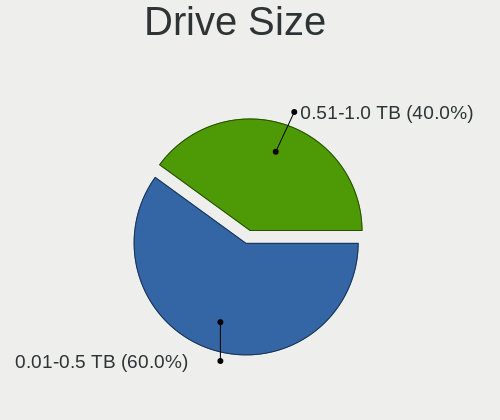
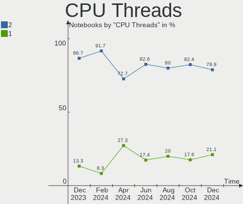
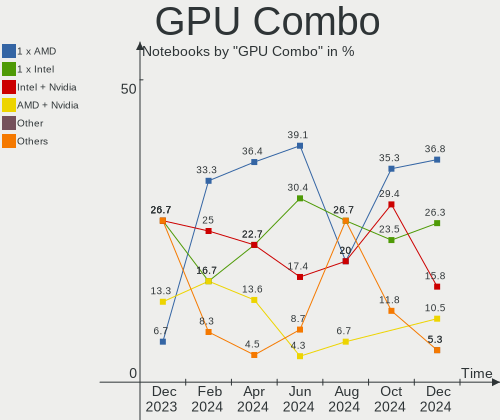
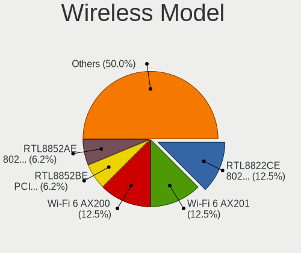
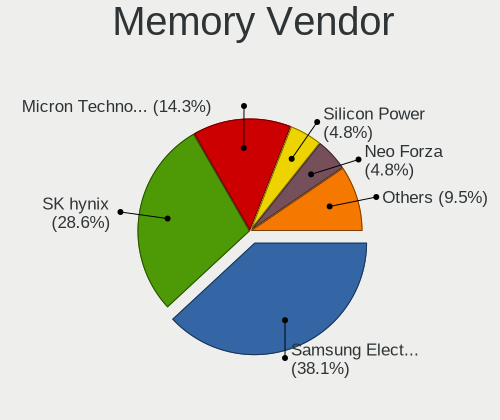
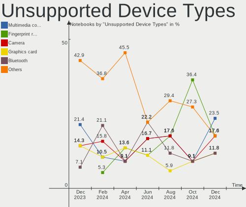

Gentoo Hardware Trends (Notebook)
---------------------------------

A project to identify most popular hardware characteristics and track their change
over time based on data collected by Gentoo users at https://Linux-Hardware.org.

Anyone can contribute to the study by uploading probes of their computers by
the [hw-probe](https://github.com/linuxhw/hw-probe) tool:

    sudo -E hw-probe -all -upload

Full-feature report is available here: https://linux-hardware.org/?view=trends&formfactor=notebook

Period: Oct, 2020.

Contents
--------

- [ OS                       ](#os)
- [ OS Family                ](#os-family)
- [ Kernel                   ](#kernel)
- [ Kernel Family            ](#kernel-family)
- [ Kernel Major Ver.        ](#kernel-major-ver)
- [ Arch                     ](#arch)
- [ DE                       ](#de)
- [ Display Server           ](#display-server)
- [ Display Manager          ](#display-manager)
- [ OS Lang                  ](#os-lang)
- [ Boot Mode                ](#boot-mode)
- [ Filesystem               ](#filesystem)
- [ Part. scheme             ](#part-scheme)
- [ Dual Boot with Linux/BSD ](#dual-boot-with-linux/bsd)
- [ Dual Boot (Win)          ](#dual-boot-win)
- [ Country                  ](#country)
- [ City                     ](#city)
- [ Vendor                   ](#vendor)
- [ Model                    ](#model)
- [ Model Family             ](#model-family)
- [ MFG Year                 ](#mfg-year)
- [ Form Factor              ](#form-factor)
- [ Secure Boot              ](#secure-boot)
- [ Coreboot                 ](#coreboot)
- [ RAM Size                 ](#ram-size)
- [ RAM Used                 ](#ram-used)
- [ Has CD-ROM               ](#has-cd-rom)
- [ Total Drives             ](#total-drives)
- [ Has Ethernet             ](#has-ethernet)
- [ Drive Vendor             ](#drive-vendor)
- [ HDD Vendor               ](#hdd-vendor)
- [ SSD Vendor               ](#ssd-vendor)
- [ Drive Model              ](#drive-model)
- [ Drive Kind               ](#drive-kind)
- [ Drive Connector          ](#drive-connector)
- [ Drive Size               ](#drive-size)
- [ Space Total              ](#space-total)
- [ Space Used               ](#space-used)
- [ Malfunc. Drives          ](#malfunc-drives)
- [ Malfunc. Drive Vendor    ](#malfunc-drive-vendor)
- [ Malfunc. HDD Vendor      ](#malfunc-hdd-vendor)
- [ Malfunc. Drive Kind      ](#malfunc-drive-kind)
- [ Failed Drives            ](#failed-drives)
- [ Failed Drive Vendor      ](#failed-drive-vendor)
- [ Drive Status             ](#drive-status)
- [ Storage Vendor           ](#storage-vendor)
- [ Storage Model            ](#storage-model)
- [ Storage Kind             ](#storage-kind)
- [ CPU Vendor               ](#cpu-vendor)
- [ CPU Model                ](#cpu-model)
- [ CPU Model Family         ](#cpu-model-family)
- [ CPU Cores                ](#cpu-cores)
- [ CPU Sockets              ](#cpu-sockets)
- [ CPU Threads              ](#cpu-threads)
- [ CPU Op-Modes             ](#cpu-op-modes)
- [ CPU Microcode            ](#cpu-microcode)
- [ CPU Microarch            ](#cpu-microarch)
- [ GPU Vendor               ](#gpu-vendor)
- [ GPU Model                ](#gpu-model)
- [ GPU Combo                ](#gpu-combo)
- [ GPU Driver               ](#gpu-driver)
- [ GPU Memory               ](#gpu-memory)
- [ Monitor Vendor           ](#monitor-vendor)
- [ Monitor Model            ](#monitor-model)
- [ Monitor Resolution       ](#monitor-resolution)
- [ Monitor Diagonal         ](#monitor-diagonal)
- [ Monitor Width            ](#monitor-width)
- [ Aspect Ratio             ](#aspect-ratio)
- [ Monitor Area             ](#monitor-area)
- [ Pixel Density            ](#pixel-density)
- [ Multiple Monitors        ](#multiple-monitors)
- [ Net Controller Vendor    ](#net-controller-vendor)
- [ Net Controller Model     ](#net-controller-model)
- [ Wireless Vendor          ](#wireless-vendor)
- [ Wireless Model           ](#wireless-model)
- [ Ethernet Vendor          ](#ethernet-vendor)
- [ Ethernet Model           ](#ethernet-model)
- [ Net Controller Kind      ](#net-controller-kind)
- [ Used Controller          ](#used-controller)
- [ NICs                     ](#nics)
- [ Memory Vendor            ](#memory-vendor)
- [ Memory Model             ](#memory-model)
- [ Memory Kind              ](#memory-kind)
- [ Memory Form Factor       ](#memory-form-factor)
- [ Memory Size              ](#memory-size)
- [ Memory Speed             ](#memory-speed)
- [ Sound Vendor             ](#sound-vendor)
- [ Sound Model              ](#sound-model)
- [ Camera Vendor            ](#camera-vendor)
- [ Camera Model             ](#camera-model)
- [ Fingerprint Vendor       ](#fingerprint-vendor)
- [ Fingerprint Model        ](#fingerprint-model)
- [ Chipcard Vendor          ](#chipcard-vendor)
- [ Chipcard Model           ](#chipcard-model)
- [ Printer Vendor           ](#printer-vendor)
- [ Printer Model            ](#printer-model)
- [ Scanner Vendor           ](#scanner-vendor)
- [ Scanner Model            ](#scanner-model)
- [ Bluetooth Vendor         ](#bluetooth-vendor)
- [ Bluetooth Model          ](#bluetooth-model)
- [ Unsupported Devices      ](#unsupported-devices)
- [ Unsupported Device Types ](#unsupported-device-types)

OS
--

Installed operating systems

| Name       | Notebooks | Percent |
|------------|-----------|---------|
| Gentoo     | 16        | 69.57%  |
| Gentoo 2.7 | 7         | 30.43%  |

OS Family
---------

OS without a version

| Name   | Notebooks | Percent |
|--------|-----------|---------|
| Gentoo | 23        | 100%    |

Kernel
------

Version of the Linux kernel

| Version                | Notebooks | Percent |
|------------------------|-----------|---------|
| 5.8.16-gentoo          | 2         | 8.7%    |
| 5.4.66-gentoo          | 2         | 8.7%    |
| 5.9.1-gentoo-x86_64    | 1         | 4.35%   |
| 5.9.1-gentoo-r1        | 1         | 4.35%   |
| 5.9.1                  | 1         | 4.35%   |
| 5.9.0-gentoo.w0rm      | 1         | 4.35%   |
| 5.9.0-gentoo.92-5.9.x  | 1         | 4.35%   |
| 5.9.0-gentoo-alf       | 1         | 4.35%   |
| 5.9.0-gentoo           | 1         | 4.35%   |
| 5.8.15-gentoo          | 1         | 4.35%   |
| 5.8.14-gentoo          | 1         | 4.35%   |
| 5.8.12                 | 1         | 4.35%   |
| 5.8.0-mainline-t14     | 1         | 4.35%   |
| 5.4.72-gentoo-x86_64   | 1         | 4.35%   |
| 5.4.72-gentoo          | 1         | 4.35%   |
| 5.4.72                 | 1         | 4.35%   |
| 5.4.66-gentoo-bala-025 | 1         | 4.35%   |
| 5.4.65-gentoo          | 1         | 4.35%   |
| 5.4.60-gentoo          | 1         | 4.35%   |
| 5.4.48-gentoo          | 1         | 4.35%   |
| 4.19.44-gentoo         | 1         | 4.35%   |

Kernel Family
-------------

Linux kernel without a distro release

| Version | Notebooks | Percent |
|---------|-----------|---------|
| 5.9.0   | 4         | 17.39%  |
| 5.9.1   | 3         | 13.04%  |
| 5.4.72  | 3         | 13.04%  |
| 5.4.66  | 3         | 13.04%  |
| 5.8.16  | 2         | 8.7%    |
| 5.8.15  | 1         | 4.35%   |
| 5.8.14  | 1         | 4.35%   |
| 5.8.12  | 1         | 4.35%   |
| 5.8.0   | 1         | 4.35%   |
| 5.4.65  | 1         | 4.35%   |
| 5.4.60  | 1         | 4.35%   |
| 5.4.48  | 1         | 4.35%   |
| 4.19.44 | 1         | 4.35%   |

Kernel Major Ver.
-----------------

Linux kernel major version

| Version | Notebooks | Percent |
|---------|-----------|---------|
| 5.4     | 9         | 39.13%  |
| 5.9     | 7         | 30.43%  |
| 5.8     | 6         | 26.09%  |
| 4.19    | 1         | 4.35%   |

Arch
----

OS architecture (x86_64, i586, etc.)

| Name   | Notebooks | Percent |
|--------|-----------|---------|
| x86_64 | 23        | 100%    |

DE
--

Desktop Environment

| Name     | Notebooks | Percent |
|----------|-----------|---------|
| Unknown  | 9         | 39.13%  |
| KDE      | 5         | 21.74%  |
| KDE5     | 4         | 17.39%  |
| Xsession | 1         | 4.35%   |
| XFCE     | 1         | 4.35%   |
| i3       | 1         | 4.35%   |
| GNOME    | 1         | 4.35%   |
| fluxbox  | 1         | 4.35%   |

Display Server
--------------

X11 or Wayland

| Name    | Notebooks | Percent |
|---------|-----------|---------|
| X11     | 18        | 78.26%  |
| Wayland | 2         | 8.7%    |
| Unknown | 2         | 8.7%    |
| Tty     | 1         | 4.35%   |

Display Manager
---------------

SDDM, LightDM, etc.

| Name    | Notebooks | Percent |
|---------|-----------|---------|
| Unknown | 14        | 60.87%  |
| SDDM    | 5         | 21.74%  |
| LightDM | 3         | 13.04%  |
| LXDM    | 1         | 4.35%   |

OS Lang
-------

Language

| Lang       | Notebooks | Percent |
|------------|-----------|---------|
| en_US.utf8 | 6         | 26.09%  |
| en_GB.utf8 | 3         | 13.04%  |
| ru_RU.utf8 | 2         | 8.7%    |
| ru_RU      | 2         | 8.7%    |
| en_US      | 2         | 8.7%    |
| uk_UA.utf8 | 1         | 4.35%   |
| pt_BR.utf8 | 1         | 4.35%   |
| pl_PL      | 1         | 4.35%   |
| fr_FR.utf8 | 1         | 4.35%   |
| es_CL      | 1         | 4.35%   |
| en_GB      | 1         | 4.35%   |
| el_GR.utf8 | 1         | 4.35%   |
| cs_CZ      | 1         | 4.35%   |

Boot Mode
---------

EFI or BIOS

| Mode | Notebooks | Percent |
|------|-----------|---------|
| EFI  | 14        | 60.87%  |
| BIOS | 9         | 39.13%  |

Filesystem
----------

Type of filesystem

| Type     | Notebooks | Percent |
|----------|-----------|---------|
| Ext4     | 16        | 69.57%  |
| Btrfs    | 3         | 13.04%  |
| Zfs      | 2         | 8.7%    |
| Xfs      | 1         | 4.35%   |
| Reiserfs | 1         | 4.35%   |

Part. scheme
------------

Scheme of partitioning

| Type    | Notebooks | Percent |
|---------|-----------|---------|
| GPT     | 18        | 78.26%  |
| MBR     | 4         | 17.39%  |
| Unknown | 1         | 4.35%   |

Dual Boot with Linux/BSD
------------------------

Hosting more than one Linux/BSD

| Dual boot | Notebooks | Percent |
|-----------|-----------|---------|
| No        | 21        | 91.3%   |
| Yes       | 2         | 8.7%    |

Dual Boot (Win)
---------------

Hosting Linux and Windows

| Dual boot | Notebooks | Percent |
|-----------|-----------|---------|
| No        | 14        | 60.87%  |
| Yes       | 9         | 39.13%  |

Country
-------

Geographic location (country)

| Country        | Notebooks | Percent |
|----------------|-----------|---------|
| Russia         | 6         | 26.09%  |
| USA            | 3         | 13.04%  |
| Poland         | 2         | 8.7%    |
| Czech Republic | 2         | 8.7%    |
| Ukraine        | 1         | 4.35%   |
| UK             | 1         | 4.35%   |
| Netherlands    | 1         | 4.35%   |
| Hong Kong      | 1         | 4.35%   |
| Greece         | 1         | 4.35%   |
| France         | 1         | 4.35%   |
| China          | 1         | 4.35%   |
| Chile          | 1         | 4.35%   |
| Brazil         | 1         | 4.35%   |
| Belgium        | 1         | 4.35%   |

City
----

Geographic location (city)

| City          | Notebooks | Percent |
|---------------|-----------|---------|
| St Petersburg | 3         | 13.04%  |
| Moscow        | 2         | 8.7%    |
| Utica         | 1         | 4.35%   |
| Thessaloniki  | 1         | 4.35%   |
| San Francisco | 1         | 4.35%   |
| Quillota      | 1         | 4.35%   |
| Nottingham    | 1         | 4.35%   |
| Manitowoc     | 1         | 4.35%   |
| Lyubertsy     | 1         | 4.35%   |
| Kalisz        | 1         | 4.35%   |
| Hengelo       | 1         | 4.35%   |
| Goiânia      | 1         | 4.35%   |
| Ghent         | 1         | 4.35%   |
| Discovery Bay | 1         | 4.35%   |
| Cieszyn       | 1         | 4.35%   |
| Chomutov      | 1         | 4.35%   |
| Chernihiv     | 1         | 4.35%   |
| Chengdu       | 1         | 4.35%   |
| Brno          | 1         | 4.35%   |
| Allonnes      | 1         | 4.35%   |

Vendor
------

Motherboard manufacturer

| Name             | Notebooks | Percent |
|------------------|-----------|---------|
| Lenovo           | 8         | 34.78%  |
| Hewlett-Packard  | 7         | 30.43%  |
| Dell             | 3         | 13.04%  |
| ASUSTek Computer | 2         | 8.7%    |
| Sony             | 1         | 4.35%   |
| Fujitsu          | 1         | 4.35%   |
| Acer             | 1         | 4.35%   |

Model
-----

Motherboard model

| Name                                     | Notebooks | Percent |
|------------------------------------------|-----------|---------|
| Sony VPCSC41FM                           | 1         | 4.35%   |
| Lenovo ThinkPad X13 Gen 1 20UFCTO1WW     | 1         | 4.35%   |
| Lenovo ThinkPad X1 Carbon 7th 20QES2P41V | 1         | 4.35%   |
| Lenovo ThinkPad T470s 20HGS0W100         | 1         | 4.35%   |
| Lenovo ThinkPad T14 Gen 1 20UES06X00     | 1         | 4.35%   |
| Lenovo ThinkPad P53 20QN001JUS           | 1         | 4.35%   |
| Lenovo ThinkPad P1 Gen 3 20THCTO1WW      | 1         | 4.35%   |
| Lenovo Legion R7000P2020H 82GR           | 1         | 4.35%   |
| Lenovo B51-80 80LM                       | 1         | 4.35%   |
| HP ProBook 455 G7                        | 1         | 4.35%   |
| HP ProBook 430 G5                        | 1         | 4.35%   |
| HP Pavilion Notebook                     | 1         | 4.35%   |
| HP Pavilion g7                           | 1         | 4.35%   |
| HP Pavilion dv7                          | 1         | 4.35%   |
| HP Laptop 14-cf0xxx                      | 1         | 4.35%   |
| HP EliteBook 820 G4                      | 1         | 4.35%   |
| Fujitsu LIFEBOOK P770                    | 1         | 4.35%   |
| Dell XPS 15 7590                         | 1         | 4.35%   |
| Dell Latitude E7270                      | 1         | 4.35%   |
| Dell G5 5587                             | 1         | 4.35%   |
| ASUS X555LJ                              | 1         | 4.35%   |
| ASUS ROG Zephyrus G14 GA401II_GA401II    | 1         | 4.35%   |
| Acer Aspire E5-571G                      | 1         | 4.35%   |

Model Family
------------

Motherboard model prefix

| Name             | Notebooks | Percent |
|------------------|-----------|---------|
| Lenovo ThinkPad  | 6         | 26.09%  |
| HP Pavilion      | 3         | 13.04%  |
| HP ProBook       | 2         | 8.7%    |
| Sony VPCSC41FM   | 1         | 4.35%   |
| Lenovo Legion    | 1         | 4.35%   |
| Lenovo B51-80    | 1         | 4.35%   |
| HP Laptop        | 1         | 4.35%   |
| HP EliteBook     | 1         | 4.35%   |
| Fujitsu LIFEBOOK | 1         | 4.35%   |
| Dell XPS         | 1         | 4.35%   |
| Dell Latitude    | 1         | 4.35%   |
| Dell G5          | 1         | 4.35%   |
| ASUS X555LJ      | 1         | 4.35%   |
| ASUS ROG         | 1         | 4.35%   |
| Acer Aspire      | 1         | 4.35%   |

MFG Year
--------

Motherboard manufacture year

| Year | Notebooks | Percent |
|------|-----------|---------|
| 2020 | 10        | 43.48%  |
| 2019 | 4         | 17.39%  |
| 2018 | 2         | 8.7%    |
| 2015 | 2         | 8.7%    |
| 2016 | 1         | 4.35%   |
| 2013 | 1         | 4.35%   |
| 2012 | 1         | 4.35%   |
| 2011 | 1         | 4.35%   |
| 2010 | 1         | 4.35%   |

Form Factor
-----------

Physical design of the computer

| Name     | Notebooks | Percent |
|----------|-----------|---------|
| Notebook | 23        | 100%    |

Secure Boot
-----------

Enabled or disabled

| State    | Notebooks | Percent |
|----------|-----------|---------|
| Disabled | 23        | 100%    |

Coreboot
--------

Have coreboot on board

| Used | Notebooks | Percent |
|------|-----------|---------|
| No   | 23        | 100%    |

RAM Size
--------

Total RAM memory

| Size in GB  | Notebooks | Percent |
|-------------|-----------|---------|
| 8.01-16.0   | 7         | 30.43%  |
| 4.01-8.0    | 4         | 17.39%  |
| 3.01-4.0    | 4         | 17.39%  |
| 16.01-24.0  | 4         | 17.39%  |
| 32.01-64.0  | 2         | 8.7%    |
| 64.01-256.0 | 2         | 8.7%    |

RAM Used
--------

Used RAM memory

| Used GB    | Notebooks | Percent |
|------------|-----------|---------|
| 1.01-2.0   | 6         | 26.09%  |
| 3.01-4.0   | 4         | 17.39%  |
| 8.01-16.0  | 4         | 17.39%  |
| 0.01-1.0   | 4         | 17.39%  |
| 4.01-8.0   | 2         | 8.7%    |
| 2.01-3.0   | 2         | 8.7%    |
| 24.01-32.0 | 1         | 4.35%   |

Has CD-ROM
----------

Has CD-ROM on board

| Presented | Notebooks | Percent |
|-----------|-----------|---------|
| No        | 18        | 78.26%  |
| Yes       | 5         | 21.74%  |

Total Drives
------------

Number of drives on board

| Drives | Notebooks | Percent |
|--------|-----------|---------|
| 1      | 16        | 69.57%  |
| 2      | 7         | 30.43%  |

Has Ethernet
------------

Has Ethernet on board

| Presented | Notebooks | Percent |
|-----------|-----------|---------|
| Yes       | 20        | 86.96%  |
| No        | 3         | 13.04%  |

Drive Vendor
------------

Hard drive vendors

| Vendor              | Notebooks | Drives | Percent |
|---------------------|-----------|--------|---------|
| Samsung Electronics | 9         | 10     | 32.14%  |
| WDC                 | 6         | 7      | 21.43%  |
| Toshiba             | 3         | 3      | 10.71%  |
| SK Hynix            | 2         | 2      | 7.14%   |
| Intel               | 2         | 2      | 7.14%   |
| Unknown             | 1         | 1      | 3.57%   |
| Seagate             | 1         | 1      | 3.57%   |
| SanDisk             | 1         | 1      | 3.57%   |
| Hitachi             | 1         | 1      | 3.57%   |
| HGST                | 1         | 1      | 3.57%   |
| A-DATA Technology   | 1         | 1      | 3.57%   |

HDD Vendor
----------

Hard disk drive vendors

| Vendor  | Notebooks | Drives | Percent |
|---------|-----------|--------|---------|
| WDC     | 2         | 2      | 40%     |
| Seagate | 1         | 1      | 20%     |
| Hitachi | 1         | 1      | 20%     |
| HGST    | 1         | 1      | 20%     |

SSD Vendor
----------

Solid state drive vendors

| Vendor              | Notebooks | Drives | Percent |
|---------------------|-----------|--------|---------|
| Samsung Electronics | 3         | 3      | 37.5%   |
| WDC                 | 1         | 1      | 12.5%   |
| Toshiba             | 1         | 1      | 12.5%   |
| SK Hynix            | 1         | 1      | 12.5%   |
| SanDisk             | 1         | 1      | 12.5%   |
| A-DATA Technology   | 1         | 1      | 12.5%   |

Drive Model
-----------

Hard drive models

| Model                            | Notebooks | Percent |
|----------------------------------|-----------|---------|
| SSD 850 EVO 250GB                | 3         | 10.34%  |
| PC SN730 SDBQNTY-1T00-1001 1TB   | 2         | 6.9%    |
| WDS500G3X0C-00SJG0 500GB         | 1         | 3.45%   |
| WDS240G2G0A-00JH30 240GB SSD     | 1         | 3.45%   |
| WD7500BPVT-80HXZT3 752GB         | 1         | 3.45%   |
| WD5000LPVX-22V0TT0 500GB         | 1         | 3.45%   |
| THNS128GG4BBAA 128GB SSD         | 1         | 3.45%   |
| SX930 120GB SSD                  | 1         | 3.45%   |
| ST1000LM014-SSHD-8GB             | 1         | 3.45%   |
| SSDPEKNW512G8 512GB              | 1         | 3.45%   |
| SSDPEKNW010T8 1TB                | 1         | 3.45%   |
| SSD PLUS 120 GB                  | 1         | 3.45%   |
| SSD 970 EVO 1TB                  | 1         | 3.45%   |
| SC311 SATA 256GB SSD             | 1         | 3.45%   |
| PM981a NVMe 2048GB               | 1         | 3.45%   |
| PC401 HFS256GD9TNG-62A0A 256GB   | 1         | 3.45%   |
| PC SN520 SDAPNUW-512G-1006 512GB | 1         | 3.45%   |
| N/A  2GB                         | 1         | 3.45%   |
| MZVLW512HMJP-000L7 512GB         | 1         | 3.45%   |
| MZVLB512HBJQ-000L7 512GB         | 1         | 3.45%   |
| MZVLB512HBJQ-000L2 512GB         | 1         | 3.45%   |
| MZVLB2T0HALB-000L7 2TB           | 1         | 3.45%   |
| KXG6AZNV256G 256GB               | 1         | 3.45%   |
| KXG60ZNV512G NVMe 512GB          | 1         | 3.45%   |
| HTS547550A9E384 500GB            | 1         | 3.45%   |
| HTS541010B7E610 1TB              | 1         | 3.45%   |

Drive Kind
----------

HDD or SSD

| Kind | Notebooks | Drives | Percent |
|------|-----------|--------|---------|
| NVMe | 13        | 16     | 50%     |
| SSD  | 7         | 8      | 26.92%  |
| HDD  | 5         | 5      | 19.23%  |
| MMC  | 1         | 1      | 3.85%   |

Drive Connector
---------------

SATA, SAS, NVMe, etc.

| Type | Notebooks | Drives | Percent |
|------|-----------|--------|---------|
| NVMe | 13        | 16     | 52%     |
| SATA | 11        | 13     | 44%     |
| MMC  | 1         | 1      | 4%      |

Drive Size
----------

Size of hard drive

| Size in TB | Notebooks | Drives | Percent |
|------------|-----------|--------|---------|
| 0.01-0.5   | 8         | 10     | 72.73%  |
| 0.51-1.0   | 3         | 3      | 27.27%  |

Space Total
-----------

Amount of disk space available on the file system

| Size in GB | Notebooks | Percent |
|------------|-----------|---------|
| 101-250    | 9         | 39.13%  |
| 251-500    | 7         | 30.43%  |
| 501-1000   | 3         | 13.04%  |
| 1001-2000  | 2         | 8.7%    |
| 1-20       | 2         | 8.7%    |

Space Used
----------

Amount of used disk space

| Used GB  | Notebooks | Percent |
|----------|-----------|---------|
| 101-250  | 8         | 34.78%  |
| 1-20     | 5         | 21.74%  |
| 51-100   | 4         | 17.39%  |
| 251-500  | 2         | 8.7%    |
| 21-50    | 2         | 8.7%    |
| 501-1000 | 2         | 8.7%    |

Malfunc. Drives
---------------

Drive models with a malfunction

| Model                 | Notebooks | Drives | Percent |
|-----------------------|-----------|--------|---------|
| HTS547550A9E384 500GB | 1         | 1      | 50%     |
| HTS541010B7E610 1TB   | 1         | 1      | 50%     |

Malfunc. Drive Vendor
---------------------

Vendors of faulty drives

| Vendor  | Notebooks | Drives | Percent |
|---------|-----------|--------|---------|
| Hitachi | 1         | 1      | 50%     |
| HGST    | 1         | 1      | 50%     |

Malfunc. HDD Vendor
-------------------

Vendors of faulty HDD drives

| Vendor  | Notebooks | Drives | Percent |
|---------|-----------|--------|---------|
| Hitachi | 1         | 1      | 50%     |
| HGST    | 1         | 1      | 50%     |

Malfunc. Drive Kind
-------------------

Kinds of faulty drives

| Kind | Notebooks | Drives | Percent |
|------|-----------|--------|---------|
| HDD  | 2         | 2      | 100%    |

Failed Drives
-------------

Failed drive models

Zero info for selected period =(

Failed Drive Vendor
-------------------

Failed drive vendors

Zero info for selected period =(

Drive Status
------------

Number of failed and malfunc. drives

| Status   | Notebooks | Drives | Percent |
|----------|-----------|--------|---------|
| Works    | 20        | 26     | 83.33%  |
| Detected | 2         | 2      | 8.33%   |
| Malfunc  | 2         | 2      | 8.33%   |

Storage Vendor
--------------

Storage controller vendors

| Vendor                       | Notebooks | Percent |
|------------------------------|-----------|---------|
| Intel                        | 15        | 46.88%  |
| Samsung Electronics          | 6         | 18.75%  |
| Sandisk                      | 4         | 12.5%   |
| AMD                          | 4         | 12.5%   |
| Toshiba America Info Systems | 2         | 6.25%   |
| SK Hynix                     | 1         | 3.13%   |

Storage Model
-------------

Storage controller models

| Model                                                                  | Notebooks | Percent |
|------------------------------------------------------------------------|-----------|---------|
| NVMe SSD Controller SM981/PM981/PM983                                  | 5         | 14.71%  |
| Sunrise Point-LP SATA Controller [AHCI mode]                           | 4         | 11.76%  |
| FCH SATA Controller [AHCI mode]                                        | 4         | 11.76%  |
| WD Black 2019/PC SN750 NVMe SSD                                        | 3         | 8.82%   |
| Wildcat Point-LP SATA Controller [AHCI Mode]                           | 2         | 5.88%   |
| Toshiba America Info Non-Volatile memory controller                    | 2         | 5.88%   |
| SSD 660P Series                                                        | 2         | 5.88%   |
| Cannon Lake Mobile PCH SATA AHCI Controller                            | 2         | 5.88%   |
| 6 Series/C200 Series Chipset Family 6 port Mobile SATA AHCI Controller | 2         | 5.88%   |
| WD Black 2018 / PC SN520 NVMe SSD                                      | 1         | 2.94%   |
| NVMe SSD Controller SM961/PM961                                        | 1         | 2.94%   |
| Non-Volatile memory controller                                         | 1         | 2.94%   |
| FCH IDE Controller                                                     | 1         | 2.94%   |
| 82801 Mobile SATA Controller [RAID mode]                               | 1         | 2.94%   |
| 8 Series SATA Controller 1 [AHCI mode]                                 | 1         | 2.94%   |
| 5 Series/3400 Series Chipset PT IDER Controller                        | 1         | 2.94%   |
| 5 Series/3400 Series Chipset 6 port SATA AHCI Controller               | 1         | 2.94%   |

Storage Kind
------------

Kind of storage controller (IDE, SATA, NVMe, SAS, ...)

| Kind | Notebooks | Percent |
|------|-----------|---------|
| SATA | 16        | 50%     |
| NVMe | 13        | 40.63%  |
| IDE  | 2         | 6.25%   |
| RAID | 1         | 3.13%   |

CPU Vendor
----------

Processor vendors

| Vendor | Notebooks | Percent |
|--------|-----------|---------|
| Intel  | 17        | 73.91%  |
| AMD    | 6         | 26.09%  |

CPU Model
---------

Processor models

| Model                                      | Notebooks | Percent |
|--------------------------------------------|-----------|---------|
| Intel Core i7-9750H CPU @ 2.60GHz          | 2         | 8.7%    |
| Intel Core i5-8250U CPU @ 1.60GHz          | 2         | 8.7%    |
| Intel Core i5-2450M CPU @ 2.50GHz          | 2         | 8.7%    |
| Intel Xeon W-10855M CPU @ 2.80GHz          | 1         | 4.35%   |
| Intel Core i7-8750H CPU @ 2.20GHz          | 1         | 4.35%   |
| Intel Core i7-8665U CPU @ 1.90GHz          | 1         | 4.35%   |
| Intel Core i7-7600U CPU @ 2.80GHz          | 1         | 4.35%   |
| Intel Core i7-6600U CPU @ 2.60GHz          | 1         | 4.35%   |
| Intel Core i7-6500U CPU @ 2.50GHz          | 1         | 4.35%   |
| Intel Core i7-5500U CPU @ 2.40GHz          | 1         | 4.35%   |
| Intel Core i7 CPU U 620 @ 1.07GHz          | 1         | 4.35%   |
| Intel Core i5-7300U CPU @ 2.60GHz          | 1         | 4.35%   |
| Intel Core i5-5200U CPU @ 2.20GHz          | 1         | 4.35%   |
| Intel Core i5-4210U CPU @ 1.70GHz          | 1         | 4.35%   |
| AMD Ryzen 7 PRO 4750U with Radeon Graphics | 1         | 4.35%   |
| AMD Ryzen 7 4800HS with Radeon Graphics    | 1         | 4.35%   |
| AMD Ryzen 7 4800H with Radeon Graphics     | 1         | 4.35%   |
| AMD Ryzen 7 4700U with Radeon Graphics     | 1         | 4.35%   |
| AMD Ryzen 5 PRO 4650U with Radeon Graphics | 1         | 4.35%   |
| AMD A6-3410MX APU with Radeon HD Graphics  | 1         | 4.35%   |

CPU Model Family
----------------

Processor model prefix

| Model           | Notebooks | Percent |
|-----------------|-----------|---------|
| Intel Core i7   | 9         | 39.13%  |
| Intel Core i5   | 7         | 30.43%  |
| AMD Ryzen 7     | 3         | 13.04%  |
| Intel Xeon      | 1         | 4.35%   |
| AMD Ryzen 7 PRO | 1         | 4.35%   |
| AMD Ryzen 5 PRO | 1         | 4.35%   |
| AMD A6          | 1         | 4.35%   |

CPU Cores
---------

Number of processor cores

| Number | Notebooks | Percent |
|--------|-----------|---------|
| 2      | 10        | 43.48%  |
| 6      | 5         | 21.74%  |
| 8      | 4         | 17.39%  |
| 4      | 4         | 17.39%  |

CPU Sockets
-----------

Number of sockets

| Number | Notebooks | Percent |
|--------|-----------|---------|
| 1      | 23        | 100%    |

CPU Threads
-----------

Threads per core (Hyper-Threading)

| Number | Notebooks | Percent |
|--------|-----------|---------|
| 2      | 20        | 86.96%  |
| 1      | 3         | 13.04%  |

CPU Op-Modes
------------

CPU Operation Modes (32-bit, 64-bit)

| Op mode        | Notebooks | Percent |
|----------------|-----------|---------|
| 32-bit, 64-bit | 23        | 100%    |

CPU Microcode
-------------

Microcode number

| Number     | Notebooks | Percent |
|------------|-----------|---------|
| Unknown    | 6         | 26.09%  |
| 0x08600104 | 3         | 13.04%  |
| 0x906ea    | 2         | 8.7%    |
| 0x806ea    | 2         | 8.7%    |
| 0x406e3    | 2         | 8.7%    |
| 0x206a7    | 2         | 8.7%    |
| 0xa0652    | 1         | 4.35%   |
| 0x806e9    | 1         | 4.35%   |
| 0x40651    | 1         | 4.35%   |
| 0x306d4    | 1         | 4.35%   |
| 0x08600106 | 1         | 4.35%   |
| 0x0300000f | 1         | 4.35%   |

CPU Microarch
-------------

Microarchitecture

| Name        | Notebooks | Percent |
|-------------|-----------|---------|
| KabyLake    | 8         | 34.78%  |
| Zen 2       | 5         | 21.74%  |
| Skylake     | 2         | 8.7%    |
| SandyBridge | 2         | 8.7%    |
| Broadwell   | 2         | 8.7%    |
| Westmere    | 1         | 4.35%   |
| K10 Llano   | 1         | 4.35%   |
| Haswell     | 1         | 4.35%   |
| CometLake   | 1         | 4.35%   |

GPU Vendor
----------

Vendors of graphics cards

| Vendor | Notebooks | Percent |
|--------|-----------|---------|
| Intel  | 17        | 50%     |
| Nvidia | 9         | 26.47%  |
| AMD    | 8         | 23.53%  |

GPU Model
---------

Graphics card models

| Model                                                                             | Notebooks | Percent |
|-----------------------------------------------------------------------------------|-----------|---------|
| Renoir                                                                            | 4         | 11.43%  |
| UHD Graphics 630 (Mobile)                                                         | 3         | 8.57%   |
| UHD Graphics 620                                                                  | 2         | 5.71%   |
| Skylake GT2 [HD Graphics 520]                                                     | 2         | 5.71%   |
| Seymour [Radeon HD 6400M/7400M Series]                                            | 2         | 5.71%   |
| HD Graphics 620                                                                   | 2         | 5.71%   |
| HD Graphics 5500                                                                  | 2         | 5.71%   |
| 2nd Generation Core Processor Family Integrated Graphics Controller               | 2         | 5.71%   |
| Whistler [Radeon HD 6630M/6650M/6750M/7670M/7690M]                                | 1         | 2.86%   |
| UHD Graphics 620 (Whiskey Lake)                                                   | 1         | 2.86%   |
| TU117M [GeForce GTX 1650 Mobile / Max-Q]                                          | 1         | 2.86%   |
| TU117GLM [Quadro T2000 Mobile / Max-Q]                                            | 1         | 2.86%   |
| TU117GLM [Quadro T1000 Mobile]                                                    | 1         | 2.86%   |
| TU116M [GeForce GTX 1650 Ti Mobile]                                               | 1         | 2.86%   |
| TU106M [GeForce RTX 2060 Mobile]                                                  | 1         | 2.86%   |
| Topaz XT [Radeon R7 M260/M265 / M340/M360 / M440/M445 / 530/535 / 620/625 Mobile] | 1         | 2.86%   |
| Sumo [Radeon HD 6520G]                                                            | 1         | 2.86%   |
| Haswell-ULT Integrated Graphics Controller                                        | 1         | 2.86%   |
| GP106M [GeForce GTX 1060 Mobile]                                                  | 1         | 2.86%   |
| GM108M [GeForce 940M]                                                             | 1         | 2.86%   |
| GM108M [GeForce 840M]                                                             | 1         | 2.86%   |
| GK208BM [GeForce 920M]                                                            | 1         | 2.86%   |
| Core Processor Integrated Graphics Controller                                     | 1         | 2.86%   |
| Comet Lake-H WS GT2 Integrated UHD Graphics Controller                            | 1         | 2.86%   |

GPU Combo
---------

Combinations of graphics cards

| Name           | Notebooks | Percent |
|----------------|-----------|---------|
| Intel + Nvidia | 7         | 30.43%  |
| 1 x Intel      | 7         | 30.43%  |
| Intel + AMD    | 3         | 13.04%  |
| 1 x AMD        | 3         | 13.04%  |
| 2 x AMD        | 1         | 4.35%   |
| 1 x Nvidia     | 1         | 4.35%   |
| AMD + Nvidia   | 1         | 4.35%   |

GPU Driver
----------

Free vs proprietary

| Driver      | Notebooks | Percent |
|-------------|-----------|---------|
| Free        | 15        | 65.22%  |
| Proprietary | 8         | 34.78%  |

GPU Memory
----------

Total video memory

| Size in GB | Notebooks | Percent |
|------------|-----------|---------|
| Unknown    | 15        | 65.22%  |
| 0.01-0.5   | 5         | 21.74%  |
| 5.01-6.0   | 2         | 8.7%    |
| 1.01-2.0   | 1         | 4.35%   |

Monitor Vendor
--------------

Monitor vendors

| Vendor                  | Notebooks | Percent |
|-------------------------|-----------|---------|
| Chimei Innolux          | 4         | 15.38%  |
| AU Optronics            | 4         | 15.38%  |
| LG Display              | 3         | 11.54%  |
| BOE                     | 3         | 11.54%  |
| Samsung Electronics     | 2         | 7.69%   |
| Dell                    | 2         | 7.69%   |
| Ancor Communications    | 2         | 7.69%   |
| Sharp                   | 1         | 3.85%   |
| Philips                 | 1         | 3.85%   |
| PANDA                   | 1         | 3.85%   |
| InfoVision              | 1         | 3.85%   |
| Goldstar                | 1         | 3.85%   |
| Chi Mei Optoelectronics | 1         | 3.85%   |

Monitor Model
-------------

Monitor models

| Model                                             | Notebooks | Percent |
|---------------------------------------------------|-----------|---------|
| LCD Monitor CMN15C4 1920x1080 344x193mm 15.5-inch | 2         | 7.69%   |
| U2715H DELD066 1920x1080 600x340mm 27.2-inch      | 1         | 3.85%   |
| U2412M DELA07A 1920x1200 518x324mm 24.1-inch      | 1         | 3.85%   |
| M2280A GSM57EC 1920x1080 476x268mm 21.5-inch      | 1         | 3.85%   |
| LCD Monitor SHP14B9 3840x2160 344x194mm 15.5-inch | 1         | 3.85%   |
| LCD Monitor SDC4E51 1366x768 340x190mm 15.3-inch  | 1         | 3.85%   |
| LCD Monitor SDC4141 1366x768 340x190mm 15.3-inch  | 1         | 3.85%   |
| LCD Monitor NCP0050 1920x1080 309x174mm 14.0-inch | 1         | 3.85%   |
| LCD Monitor LGD053F 1920x1080 344x194mm 15.5-inch | 1         | 3.85%   |
| LCD Monitor LGD0450 1366x768 277x156mm 12.5-inch  | 1         | 3.85%   |
| LCD Monitor LGD027A 1600x900 380x210mm 17.1-inch  | 1         | 3.85%   |
| LCD Monitor IVO057D 1920x1080 309x174mm 14.0-inch | 1         | 3.85%   |
| LCD Monitor CMO1719 1600x900 382x215mm 17.3-inch  | 1         | 3.85%   |
| LCD Monitor CMN15E8 1920x1080 344x193mm 15.5-inch | 1         | 3.85%   |
| LCD Monitor CMN15AB 1366x768 350x190mm 15.7-inch  | 1         | 3.85%   |
| LCD Monitor BOE08DF 1920x1080 340x190mm 15.3-inch | 1         | 3.85%   |
| LCD Monitor BOE07DB 1920x1080 309x174mm 14.0-inch | 1         | 3.85%   |
| LCD Monitor BOE06F8 1366x768 293x165mm 13.2-inch  | 1         | 3.85%   |
| LCD Monitor AUO733C 1366x768 309x173mm 13.9-inch  | 1         | 3.85%   |
| LCD Monitor AUO5A2D 1920x1080 293x165mm 13.2-inch | 1         | 3.85%   |
| LCD Monitor AUO323D 1920x1080 309x174mm 14.0-inch | 1         | 3.85%   |
| LCD Monitor AUO226D 1920x1080 276x155mm 12.5-inch | 1         | 3.85%   |
| ASUS VS229 ACI22D3 1920x1080 480x270mm 21.7-inch  | 1         | 3.85%   |
| ASUS PB277 ACI27B5 2560x1440 600x340mm 27.2-inch  | 1         | 3.85%   |
| 200V4 PHLC0BF 1600x900 432x240mm 19.5-inch        | 1         | 3.85%   |

Monitor Resolution
------------------

Monitor screen resolution

| Resolution        | Notebooks | Percent |
|-------------------|-----------|---------|
| 1920x1080 (FHD)   | 13        | 50%     |
| 1366x768 (WXGA)   | 5         | 19.23%  |
| 1600x900 (HD+)    | 3         | 11.54%  |
| 3840x2160 (4K)    | 2         | 7.69%   |
| 2560x1440 (QHD)   | 2         | 7.69%   |
| 1920x1200 (WUXGA) | 1         | 3.85%   |

Monitor Diagonal
----------------

Diagonal size in inches

| Inches | Notebooks | Percent |
|--------|-----------|---------|
| 15     | 9         | 34.62%  |
| 14     | 4         | 15.38%  |
| 13     | 3         | 11.54%  |
| 27     | 2         | 7.69%   |
| 21     | 2         | 7.69%   |
| 17     | 2         | 7.69%   |
| 12     | 2         | 7.69%   |
| 24     | 1         | 3.85%   |
| 19     | 1         | 3.85%   |

Monitor Width
-------------

Physical width

| Width in mm | Notebooks | Percent |
|-------------|-----------|---------|
| 301-350     | 14        | 53.85%  |
| 201-300     | 4         | 15.38%  |
| 501-600     | 3         | 11.54%  |
| 401-500     | 3         | 11.54%  |
| 351-400     | 2         | 7.69%   |

Aspect Ratio
------------

Proportional relationship between the width and the height

| Ratio | Notebooks | Percent |
|-------|-----------|---------|
| 16/9  | 22        | 95.65%  |
| 16/10 | 1         | 4.35%   |

Monitor Area
------------

Area in inch²

| Area in inch² | Notebooks | Percent |
|----------------|-----------|---------|
| 101-110        | 8         | 30.77%  |
| 81-90          | 5         | 19.23%  |
| 71-80          | 2         | 7.69%   |
| 61-70          | 2         | 7.69%   |
| 301-350        | 2         | 7.69%   |
| 151-200        | 2         | 7.69%   |
| 251-300        | 1         | 3.85%   |
| 201-250        | 1         | 3.85%   |
| 131-140        | 1         | 3.85%   |
| 121-130        | 1         | 3.85%   |
| 91-100         | 1         | 3.85%   |

Pixel Density
-------------

Pixels per inch

| Density       | Notebooks | Percent |
|---------------|-----------|---------|
| 121-160       | 10        | 38.46%  |
| 101-120       | 9         | 34.62%  |
| 51-100        | 3         | 11.54%  |
| More than 240 | 2         | 7.69%   |
| 161-240       | 2         | 7.69%   |

Multiple Monitors
-----------------

Total monitors connected

| Total | Notebooks | Percent |
|-------|-----------|---------|
| 1     | 19        | 82.61%  |
| 2     | 4         | 17.39%  |

Net Controller Vendor
---------------------

Controller vendors

| Vendor                         | Notebooks | Percent |
|--------------------------------|-----------|---------|
| Intel                          | 16        | 41.03%  |
| Realtek Semiconductor          | 13        | 33.33%  |
| Qualcomm Atheros               | 5         | 12.82%  |
| Lenovo                         | 2         | 5.13%   |
| Ralink                         | 1         | 2.56%   |
| Dell                           | 1         | 2.56%   |
| Broadcom Inc. and subsidiaries | 1         | 2.56%   |

Net Controller Model
--------------------

Controller models

| Model                                                     | Notebooks | Percent |
|-----------------------------------------------------------|-----------|---------|
| RTL8111/8168/8411 PCI Express Gigabit Ethernet Controller | 11        | 23.91%  |
| Wi-Fi 6 AX200                                             | 7         | 15.22%  |
| Wireless 8265 / 8275                                      | 3         | 6.52%   |
| ThinkPad TBT 3 Dock                                       | 2         | 4.35%   |
| RTL810xE PCI Express Fast Ethernet controller             | 2         | 4.35%   |
| Ethernet Connection (4) I219-LM                           | 2         | 4.35%   |
| AR9485 Wireless Network Adapter                           | 2         | 4.35%   |
| Wireless-AC 9560 [Jefferson Peak]                         | 1         | 2.17%   |
| Wireless 8260                                             | 1         | 2.17%   |
| RTL8723DE Wireless Network Adapter                        | 1         | 2.17%   |
| RTL8723BE PCIe Wireless Network Adapter                   | 1         | 2.17%   |
| RT5390 Wireless 802.11n 1T/1R PCIe                        | 1         | 2.17%   |
| QCA9565 / AR9565 Wireless Network Adapter                 | 1         | 2.17%   |
| Killer E2400 Gigabit Ethernet Controller                  | 1         | 2.17%   |
| Ethernet Connection I219-LM                               | 1         | 2.17%   |
| Ethernet Connection (7) I219-V                            | 1         | 2.17%   |
| Ethernet Connection (6) I219-LM                           | 1         | 2.17%   |
| DW5811e Snapdragon™ X7 LTE                           | 1         | 2.17%   |
| Dual Band Wireless-AC 3165 Plus Bluetooth                 | 1         | 2.17%   |
| Comet Lake PCH CNVi WiFi                                  | 1         | 2.17%   |
| Cannon Point-LP CNVi [Wireless-AC]                        | 1         | 2.17%   |
| BCM4313 802.11bgn Wireless Network Adapter                | 1         | 2.17%   |
| AR9287 Wireless Network Adapter (PCI-Express)             | 1         | 2.17%   |
| 82577LM Gigabit Network Connection                        | 1         | 2.17%   |

Wireless Vendor
---------------

Wireless vendors

| Vendor                         | Notebooks | Percent |
|--------------------------------|-----------|---------|
| Intel                          | 15        | 62.5%   |
| Qualcomm Atheros               | 4         | 16.67%  |
| Realtek Semiconductor          | 2         | 8.33%   |
| Ralink                         | 1         | 4.17%   |
| Dell                           | 1         | 4.17%   |
| Broadcom Inc. and subsidiaries | 1         | 4.17%   |

Wireless Model
--------------

Wireless models

| Model                                         | Notebooks | Percent |
|-----------------------------------------------|-----------|---------|
| Wi-Fi 6 AX200                                 | 7         | 29.17%  |
| Wireless 8265 / 8275                          | 3         | 12.5%   |
| AR9485 Wireless Network Adapter               | 2         | 8.33%   |
| Wireless-AC 9560 [Jefferson Peak]             | 1         | 4.17%   |
| Wireless 8260                                 | 1         | 4.17%   |
| RTL8723DE Wireless Network Adapter            | 1         | 4.17%   |
| RTL8723BE PCIe Wireless Network Adapter       | 1         | 4.17%   |
| RT5390 Wireless 802.11n 1T/1R PCIe            | 1         | 4.17%   |
| QCA9565 / AR9565 Wireless Network Adapter     | 1         | 4.17%   |
| DW5811e Snapdragon™ X7 LTE               | 1         | 4.17%   |
| Dual Band Wireless-AC 3165 Plus Bluetooth     | 1         | 4.17%   |
| Comet Lake PCH CNVi WiFi                      | 1         | 4.17%   |
| Cannon Point-LP CNVi [Wireless-AC]            | 1         | 4.17%   |
| BCM4313 802.11bgn Wireless Network Adapter    | 1         | 4.17%   |
| AR9287 Wireless Network Adapter (PCI-Express) | 1         | 4.17%   |

Ethernet Vendor
---------------

Ethernet vendors

| Vendor                | Notebooks | Percent |
|-----------------------|-----------|---------|
| Realtek Semiconductor | 13        | 59.09%  |
| Intel                 | 6         | 27.27%  |
| Lenovo                | 2         | 9.09%   |
| Qualcomm Atheros      | 1         | 4.55%   |

Ethernet Model
--------------

Ethernet models

| Model                                                     | Notebooks | Percent |
|-----------------------------------------------------------|-----------|---------|
| RTL8111/8168/8411 PCI Express Gigabit Ethernet Controller | 11        | 50%     |
| ThinkPad TBT 3 Dock                                       | 2         | 9.09%   |
| RTL810xE PCI Express Fast Ethernet controller             | 2         | 9.09%   |
| Ethernet Connection (4) I219-LM                           | 2         | 9.09%   |
| Killer E2400 Gigabit Ethernet Controller                  | 1         | 4.55%   |
| Ethernet Connection I219-LM                               | 1         | 4.55%   |
| Ethernet Connection (7) I219-V                            | 1         | 4.55%   |
| Ethernet Connection (6) I219-LM                           | 1         | 4.55%   |
| 82577LM Gigabit Network Connection                        | 1         | 4.55%   |

Net Controller Kind
-------------------

Ethernet, WiFi or modem

| Kind     | Notebooks | Percent |
|----------|-----------|---------|
| WiFi     | 23        | 53.49%  |
| Ethernet | 20        | 46.51%  |

Used Controller
---------------

Currently used network controller

| Kind     | Notebooks | Percent |
|----------|-----------|---------|
| WiFi     | 17        | 60.71%  |
| Ethernet | 11        | 39.29%  |

NICs
----

Total network controllers on board

| Total | Notebooks | Percent |
|-------|-----------|---------|
| 2     | 19        | 82.61%  |
| 1     | 3         | 13.04%  |
| 3     | 1         | 4.35%   |

Memory Vendor
-------------

Memory module vendors

| Vendor              | Notebooks | Percent |
|---------------------|-----------|---------|
| Samsung Electronics | 10        | 41.67%  |
| SK Hynix            | 7         | 29.17%  |
| Micron Technology   | 4         | 16.67%  |
| Transcend           | 1         | 4.17%   |
| Kingston            | 1         | 4.17%   |
| A-DATA Technology   | 1         | 4.17%   |

Memory Model
------------

Memory module models

| Model                                             | Notebooks | Percent |
|---------------------------------------------------|-----------|---------|
| RAM M471B5173DB0-YK0 4096MB SODIMM DDR3 1600MT/s  | 3         | 12%     |
| RAM Module 8192MB SODIMM DDR4 2400MT/s            | 1         | 4%      |
| RAM Module 8192MB SODIMM DDR4 2133MT/s            | 1         | 4%      |
| RAM Module 8192MB Row Of Chips LPDDR3 2133MT/s    | 1         | 4%      |
| RAM Module 16GB SODIMM DDR4 3200MT/s              | 1         | 4%      |
| RAM M471B5773DH0-CH9 2048MB SODIMM DDR3 1600MT/s  | 1         | 4%      |
| RAM M471B5673FH0-CH9 2GB SODIMM 1333MT/s          | 1         | 4%      |
| RAM M471B1G73QH0-YK0 8GB SODIMM DDR3 1600MT/s     | 1         | 4%      |
| RAM M471A5244CB0-CRC 4GB SODIMM DDR4 2667MT/s     | 1         | 4%      |
| RAM M471A4G43MB1-CTD 32GB SODIMM DDR4 2667MT/s    | 1         | 4%      |
| RAM M471A2G44AM0-CWE 16GB SODIMM DDR4 3200MT/s    | 1         | 4%      |
| RAM LV32D4S2S8HD-8 8GB SODIMM DDR4 3200MT/s       | 1         | 4%      |
| RAM JM2666HSE-32G 32GB SODIMM DDR4 2667MT/s       | 1         | 4%      |
| RAM HMT41GS6BFR8A-PB 8GB SODIMM DDR3 1600MT/s     | 1         | 4%      |
| RAM HMAA4GS7AJR8N-WM 32GB SODIMM DDR4 2933MT/s    | 1         | 4%      |
| RAM HMAA1GS6CMR6N-XN 8GB SODIMM DDR4 3200MT/s     | 1         | 4%      |
| RAM HMA82GS6AFR8N-UH 16GB SODIMM DDR4 2400MT/s    | 1         | 4%      |
| RAM HMA81GS6AFR8N-VK 8192MB SODIMM DDR4 2667MT/s  | 1         | 4%      |
| RAM HMA41GS6AFR8N-TF 8192MB SODIMM DDR4 2133MT/s  | 1         | 4%      |
| RAM AD73I1C1674EV 4096MB SODIMM DDR3 1334MT/s     | 1         | 4%      |
| RAM 8ATF1G64HZ-3G2J1 8192MB SODIMM DDR4 3200MT/s  | 1         | 4%      |
| RAM 4ATF51264HZ-2G3B2 4096MB SODIMM DDR4 2400MT/s | 1         | 4%      |
| RAM 16ATF4G64HZ-2G6B2 32GB SODIMM DDR4 2667MT/s   | 1         | 4%      |

Memory Kind
-----------

Memory module kinds

| Kind   | Notebooks | Percent |
|--------|-----------|---------|
| DDR4   | 14        | 63.64%  |
| DDR3   | 7         | 31.82%  |
| LPDDR3 | 1         | 4.55%   |

Memory Form Factor
------------------

Physical design of the memory module

| Name         | Notebooks | Percent |
|--------------|-----------|---------|
| SODIMM       | 21        | 95.45%  |
| Row Of Chips | 1         | 4.55%   |

Memory Size
-----------

Memory module size

| Size  | Notebooks | Percent |
|-------|-----------|---------|
| 8192  | 10        | 41.67%  |
| 4096  | 6         | 25%     |
| 32768 | 3         | 12.5%   |
| 16384 | 3         | 12.5%   |
| 2048  | 2         | 8.33%   |

Memory Speed
------------

Memory module speed

| Speed | Notebooks | Percent |
|-------|-----------|---------|
| 3200  | 5         | 22.73%  |
| 1600  | 5         | 22.73%  |
| 2667  | 4         | 18.18%  |
| 2133  | 3         | 13.64%  |
| 2400  | 2         | 9.09%   |
| 1334  | 2         | 9.09%   |
| 2933  | 1         | 4.55%   |

Sound Vendor
------------

Sound card vendors

| Vendor              | Notebooks | Percent |
|---------------------|-----------|---------|
| Intel               | 17        | 48.57%  |
| Nvidia              | 6         | 17.14%  |
| AMD                 | 6         | 17.14%  |
| Lenovo              | 2         | 5.71%   |
| SteelSeries ApS     | 1         | 2.86%   |
| Logitech            | 1         | 2.86%   |
| GYROCOM C&C         | 1         | 2.86%   |
| C-Media Electronics | 1         | 2.86%   |

Sound Model
-----------

Sound card models

| Model                                                                | Notebooks | Percent |
|----------------------------------------------------------------------|-----------|---------|
| Sunrise Point-LP HD Audio                                            | 6         | 13.95%  |
| Family 17h (Models 10h-1fh) HD Audio Controller                      | 5         | 11.63%  |
| Renoir Radeon High Definition Audio Controller                       | 4         | 9.3%    |
| Cannon Lake PCH cAVS                                                 | 3         | 6.98%   |
| Wildcat Point-LP High Definition Audio Controller                    | 2         | 4.65%   |
| TU107 GeForce GTX 1650 High Definition Audio Controller              | 2         | 4.65%   |
| ThinkPad Thunderbolt 3 Dock USB Audio                                | 2         | 4.65%   |
| Broadwell-U Audio Controller                                         | 2         | 4.65%   |
| 6 Series/C200 Series Chipset Family High Definition Audio Controller | 2         | 4.65%   |
| TU116 High Definition Audio Controller                               | 1         | 2.33%   |
| TU106 High Definition Audio Controller                               | 1         | 2.33%   |
| SteelSeries Arctis 7                                                 | 1         | 2.33%   |
| Haswell-ULT HD Audio Controller                                      | 1         | 2.33%   |
| GP106 High Definition Audio Controller                               | 1         | 2.33%   |
| GK208 HDMI/DP Audio Controller                                       | 1         | 2.33%   |
| Fiio E10                                                             | 1         | 2.33%   |
| FCH Azalia Controller                                                | 1         | 2.33%   |
| Comet Lake PCH cAVS                                                  | 1         | 2.33%   |
| Cannon Point-LP High Definition Audio Controller                     | 1         | 2.33%   |
| BeaverCreek HDMI Audio [Radeon HD 6500D and 6400G-6600G series]      | 1         | 2.33%   |
| Audio Adapter                                                        | 1         | 2.33%   |
| 960 Headset                                                          | 1         | 2.33%   |
| 8 Series HD Audio Controller                                         | 1         | 2.33%   |
| 5 Series/3400 Series Chipset High Definition Audio                   | 1         | 2.33%   |

Camera Vendor
-------------

Camera device vendors

| Vendor                                 | Notebooks | Percent |
|----------------------------------------|-----------|---------|
| Chicony Electronics                    | 6         | 28.57%  |
| Lite-On Technology                     | 3         | 14.29%  |
| Realtek Semiconductor                  | 2         | 9.52%   |
| Microdia                               | 2         | 9.52%   |
| Logitech                               | 2         | 9.52%   |
| Cheng Uei Precision Industry (Foxlink) | 2         | 9.52%   |
| Acer                                   | 2         | 9.52%   |
| Suyin                                  | 1         | 4.76%   |
| IMC Networks                           | 1         | 4.76%   |

Camera Model
------------

Camera device models

| Model                   | Notebooks | Percent |
|-------------------------|-----------|---------|
| Integrated Camera       | 6         | 28.57%  |
| HP HD Camera            | 3         | 14.29%  |
| Integrated_Webcam_HD    | 2         | 9.52%   |
| HP Truevision HD        | 2         | 9.52%   |
| Webcam C310             | 1         | 4.76%   |
| USB Camera              | 1         | 4.76%   |
| USB 2.0 Camera          | 1         | 4.76%   |
| Lenovo EasyCamera       | 1         | 4.76%   |
| HP Webcam-101           | 1         | 4.76%   |
| HP TrueVision HD Camera | 1         | 4.76%   |
| HD Webcam C525          | 1         | 4.76%   |
| CNF8248                 | 1         | 4.76%   |

Fingerprint Vendor
------------------

Fingerprint sensor vendors

| Vendor           | Notebooks | Percent |
|------------------|-----------|---------|
| Synaptics        | 5         | 50%     |
| Validity Sensors | 4         | 40%     |
| AuthenTec        | 1         | 10%     |

Fingerprint Model
-----------------

Fingerprint sensor models

| Model                                   | Notebooks | Percent |
|-----------------------------------------|-----------|---------|
| Prometheus MIS Touch Fingerprint Reader | 4         | 40%     |
| VFS5011 Fingerprint Reader              | 1         | 10%     |
| VFS495 Fingerprint Reader               | 1         | 10%     |
| Synaptics WBDI                          | 1         | 10%     |
| Fingerprint scanner                     | 1         | 10%     |
| AES2550 Fingerprint Sensor              | 1         | 10%     |
| Unknown                                 | 1         | 10%     |

Chipcard Vendor
---------------

Chipcard module vendors

| Vendor   | Notebooks | Percent |
|----------|-----------|---------|
| Broadcom | 1         | 100%    |

Chipcard Model
--------------

Chipcard module models

| Model | Notebooks | Percent |
|-------|-----------|---------|
| 5880  | 1         | 100%    |

Printer Vendor
--------------

Printer device vendors

Zero info for selected period =(

Printer Model
-------------

Printer device models

Zero info for selected period =(

Scanner Vendor
--------------

Scanner device vendors

Zero info for selected period =(

Scanner Model
-------------

Scanner device models

Zero info for selected period =(

Bluetooth Vendor
----------------

Controller vendors

| Vendor                | Notebooks | Percent |
|-----------------------|-----------|---------|
| Intel                 | 15        | 71.43%  |
| Realtek Semiconductor | 2         | 9.52%   |
| Lite-On Technology    | 1         | 4.76%   |
| Foxconn / Hon Hai     | 1         | 4.76%   |
| Broadcom              | 1         | 4.76%   |
| Askey Computer        | 1         | 4.76%   |

Bluetooth Model
---------------

Controller models

| Model                                                             | Notebooks | Percent |
|-------------------------------------------------------------------|-----------|---------|
| AX200 Bluetooth                                                   | 7         | 33.33%  |
| Bluetooth wireless interface                                      | 5         | 23.81%  |
| Bluetooth Device                                                  | 2         | 9.52%   |
| Bluetooth 9460/9560 Jefferson Peak (JfP)                          | 2         | 9.52%   |
| Realtek Bluetooth 4.2 Adapter                                     | 1         | 4.76%   |
| Foxconn T77H114 BCM2070 [Single-Chip Bluetooth 2.1 + EDR Adapter] | 1         | 4.76%   |
| Bluetooth Radio                                                   | 1         | 4.76%   |
| BCM2070 Bluetooth 2.1 + EDR                                       | 1         | 4.76%   |
| Atheros AR3012 Bluetooth                                          | 1         | 4.76%   |

Unsupported Devices
-------------------

Total unsupported devices on board

| Total | Notebooks | Percent |
|-------|-----------|---------|
| 2     | 6         | 26.09%  |
| 1     | 5         | 21.74%  |
| 0     | 5         | 21.74%  |
| 3     | 4         | 17.39%  |
| 4     | 2         | 8.7%    |
| 5     | 1         | 4.35%   |

Unsupported Device Types
------------------------

Types of unsupported devices

| Type                     | Notebooks | Percent |
|--------------------------|-----------|---------|
| Fingerprint reader       | 10        | 23.81%  |
| Multimedia controller    | 5         | 11.9%   |
| Graphics card            | 5         | 11.9%   |
| Communication controller | 5         | 11.9%   |
| Bluetooth                | 5         | 11.9%   |
| Card reader              | 4         | 9.52%   |
| Camera                   | 3         | 7.14%   |
| Storage/ide              | 2         | 4.76%   |
| Net/wireless             | 1         | 2.38%   |
| Modem                    | 1         | 2.38%   |
| Chipcard                 | 1         | 2.38%   |

