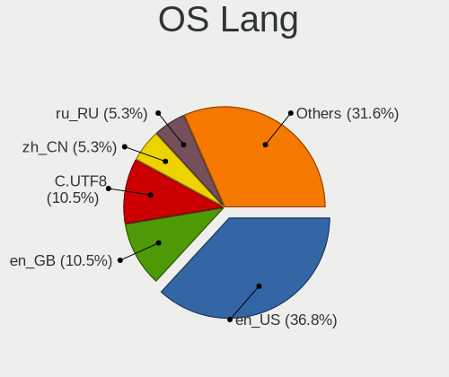
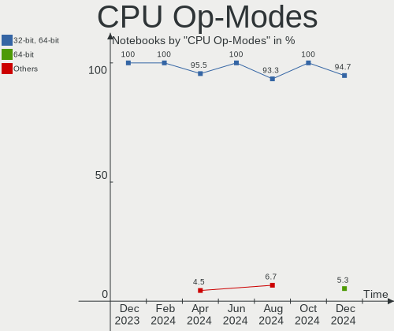
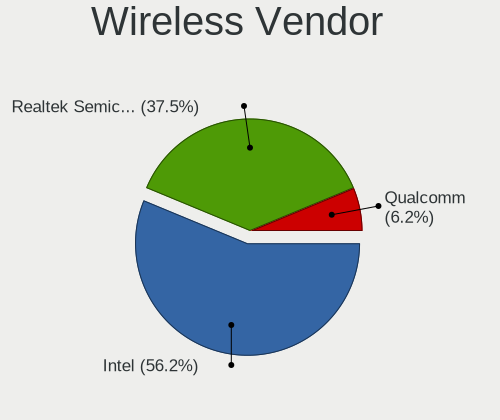

Gentoo - Hardware Trends (Notebooks)
------------------------------------

A project to identify most popular hardware characteristics and track their change
over time based on data collected by Linux users at https://Linux-Hardware.org.

Anyone can contribute to this report by the [hw-probe](https://github.com/linuxhw/hw-probe) tool:

    sudo -E hw-probe -all -upload

This report is for one last month. Overall report since the beginning of time: [TestDays](https://github.com/linuxhw/TestDays)

Period: Jul, 2023.

Contents
--------

* [ System ](#system)
  - [ OS                       ](#os)
  - [ OS Family                ](#os-family)
  - [ Kernel                   ](#kernel)
  - [ Kernel Family            ](#kernel-family)
  - [ Kernel Major Ver.        ](#kernel-major-ver)
  - [ Arch                     ](#arch)
  - [ DE                       ](#de)
  - [ Display Server           ](#display-server)
  - [ Display Manager          ](#display-manager)
  - [ OS Lang                  ](#os-lang)
  - [ Boot Mode                ](#boot-mode)
  - [ Filesystem               ](#filesystem)
  - [ Part. scheme             ](#part-scheme)
  - [ Dual Boot with Linux/BSD ](#dual-boot-with-linuxbsd)
  - [ Dual Boot (Win)          ](#dual-boot-win)

* [ Board ](#board)
  - [ Vendor                   ](#vendor)
  - [ Model                    ](#model)
  - [ Model Family             ](#model-family)
  - [ MFG Year                 ](#mfg-year)
  - [ Form Factor              ](#form-factor)
  - [ Secure Boot              ](#secure-boot)
  - [ Coreboot                 ](#coreboot)
  - [ RAM Size                 ](#ram-size)
  - [ RAM Used                 ](#ram-used)
  - [ Total Drives             ](#total-drives)
  - [ Has CD-ROM               ](#has-cd-rom)
  - [ Has Ethernet             ](#has-ethernet)
  - [ Has WiFi                 ](#has-wifi)
  - [ Has Bluetooth            ](#has-bluetooth)

* [ Location ](#location)
  - [ Country                  ](#country)
  - [ City                     ](#city)

* [ Drives ](#drives)
  - [ Drive Vendor             ](#drive-vendor)
  - [ Drive Model              ](#drive-model)
  - [ HDD Vendor               ](#hdd-vendor)
  - [ SSD Vendor               ](#ssd-vendor)
  - [ Drive Kind               ](#drive-kind)
  - [ Drive Connector          ](#drive-connector)
  - [ Drive Size               ](#drive-size)
  - [ Space Total              ](#space-total)
  - [ Space Used               ](#space-used)
  - [ Malfunc. Drives          ](#malfunc-drives)
  - [ Malfunc. Drive Vendor    ](#malfunc-drive-vendor)
  - [ Malfunc. HDD Vendor      ](#malfunc-hdd-vendor)
  - [ Malfunc. Drive Kind      ](#malfunc-drive-kind)
  - [ Failed Drives            ](#failed-drives)
  - [ Failed Drive Vendor      ](#failed-drive-vendor)
  - [ Drive Status             ](#drive-status)

* [ Storage controller ](#storage-controller)
  - [ Storage Vendor           ](#storage-vendor)
  - [ Storage Model            ](#storage-model)
  - [ Storage Kind             ](#storage-kind)

* [ Processor ](#processor)
  - [ CPU Vendor               ](#cpu-vendor)
  - [ CPU Model                ](#cpu-model)
  - [ CPU Model Family         ](#cpu-model-family)
  - [ CPU Cores                ](#cpu-cores)
  - [ CPU Sockets              ](#cpu-sockets)
  - [ CPU Threads              ](#cpu-threads)
  - [ CPU Op-Modes             ](#cpu-op-modes)
  - [ CPU Microcode            ](#cpu-microcode)
  - [ CPU Microarch            ](#cpu-microarch)

* [ Graphics ](#graphics)
  - [ GPU Vendor               ](#gpu-vendor)
  - [ GPU Model                ](#gpu-model)
  - [ GPU Combo                ](#gpu-combo)
  - [ GPU Driver               ](#gpu-driver)
  - [ GPU Memory               ](#gpu-memory)

* [ Monitor ](#monitor)
  - [ Monitor Vendor           ](#monitor-vendor)
  - [ Monitor Model            ](#monitor-model)
  - [ Monitor Resolution       ](#monitor-resolution)
  - [ Monitor Diagonal         ](#monitor-diagonal)
  - [ Monitor Width            ](#monitor-width)
  - [ Aspect Ratio             ](#aspect-ratio)
  - [ Monitor Area             ](#monitor-area)
  - [ Pixel Density            ](#pixel-density)
  - [ Multiple Monitors        ](#multiple-monitors)

* [ Network ](#network)
  - [ Net Controller Vendor    ](#net-controller-vendor)
  - [ Net Controller Model     ](#net-controller-model)
  - [ Wireless Vendor          ](#wireless-vendor)
  - [ Wireless Model           ](#wireless-model)
  - [ Ethernet Vendor          ](#ethernet-vendor)
  - [ Ethernet Model           ](#ethernet-model)
  - [ Net Controller Kind      ](#net-controller-kind)
  - [ Used Controller          ](#used-controller)
  - [ NICs                     ](#nics)
  - [ IPv6                     ](#ipv6)

* [ Bluetooth ](#bluetooth)
  - [ Bluetooth Vendor         ](#bluetooth-vendor)
  - [ Bluetooth Model          ](#bluetooth-model)

* [ Sound ](#sound)
  - [ Sound Vendor             ](#sound-vendor)
  - [ Sound Model              ](#sound-model)

* [ Memory ](#memory)
  - [ Memory Vendor            ](#memory-vendor)
  - [ Memory Model             ](#memory-model)
  - [ Memory Kind              ](#memory-kind)
  - [ Memory Form Factor       ](#memory-form-factor)
  - [ Memory Size              ](#memory-size)
  - [ Memory Speed             ](#memory-speed)

* [ Printers & scanners ](#printers--scanners)
  - [ Printer Vendor           ](#printer-vendor)
  - [ Printer Model            ](#printer-model)
  - [ Scanner Vendor           ](#scanner-vendor)
  - [ Scanner Model            ](#scanner-model)

* [ Camera ](#camera)
  - [ Camera Vendor            ](#camera-vendor)
  - [ Camera Model             ](#camera-model)

* [ Security ](#security)
  - [ Fingerprint Vendor       ](#fingerprint-vendor)
  - [ Fingerprint Model        ](#fingerprint-model)
  - [ Chipcard Vendor          ](#chipcard-vendor)
  - [ Chipcard Model           ](#chipcard-model)

* [ Unsupported ](#unsupported)
  - [ Unsupported Devices      ](#unsupported-devices)
  - [ Unsupported Device Types ](#unsupported-device-types)

System
------

OS
--

Installed operating systems

| Name        | Notebooks | Percent |
|-------------|-----------|---------|
| Gentoo 2.13 | 17        | 89.47%  |
| Gentoo 2.7  | 1         | 5.26%   |
| Gentoo 2.14 | 1         | 5.26%   |

OS Family
---------

OS without a version

| Name   | Notebooks | Percent |
|--------|-----------|---------|
| Gentoo | 19        | 100%    |

Kernel
------

Version of the Linux kernel

| Version                      | Notebooks | Percent |
|------------------------------|-----------|---------|
| 6.1.38-gentoo                | 3         | 15.79%  |
| 6.4.0-gentoo                 | 2         | 10.53%  |
| 6.1.38-gentoo-x86_64         | 2         | 10.53%  |
| 6.4.4-gentoo-x86_64          | 1         | 5.26%   |
| 6.4.1-gentoo-r1-x86_64       | 1         | 5.26%   |
| 6.4.1-gentoo-r1              | 1         | 5.26%   |
| 6.1.41-gentoomultilib-nvidia | 1         | 5.26%   |
| 6.1.38-x86_64                | 1         | 5.26%   |
| 6.1.38-gentoo-MAC_MIK.2      | 1         | 5.26%   |
| 6.1.38-gentoo-dist           | 1         | 5.26%   |
| 6.1.31-gentoo-dist-hardened  | 1         | 5.26%   |
| 6.1.31-gentoo-dist           | 1         | 5.26%   |
| 6.1.31-gentoo-custom         | 1         | 5.26%   |
| 5.15.59-gentoo-x86_64-k01    | 1         | 5.26%   |
| 5.10.52-gentoo-x86_64        | 1         | 5.26%   |

Kernel Family
-------------

Linux kernel without a distro release

| Version | Notebooks | Percent |
|---------|-----------|---------|
| 6.1.38  | 8         | 42.11%  |
| 6.1.31  | 3         | 15.79%  |
| 6.4.1   | 2         | 10.53%  |
| 6.4.0   | 2         | 10.53%  |
| 6.4.4   | 1         | 5.26%   |
| 6.1.41  | 1         | 5.26%   |
| 5.15.59 | 1         | 5.26%   |
| 5.10.52 | 1         | 5.26%   |

Kernel Major Ver.
-----------------

Linux kernel major version

| Version | Notebooks | Percent |
|---------|-----------|---------|
| 6.1     | 12        | 63.16%  |
| 6.4     | 5         | 26.32%  |
| 5.15    | 1         | 5.26%   |
| 5.10    | 1         | 5.26%   |

Arch
----

OS architecture (x86_64, i586, etc.)

| Name   | Notebooks | Percent |
|--------|-----------|---------|
| x86_64 | 19        | 100%    |

DE
--

Desktop Environment

| Name     | Notebooks | Percent |
|----------|-----------|---------|
| KDE5     | 5         | 26.32%  |
| Unknown  | 5         | 26.32%  |
| GNOME    | 4         | 21.05%  |
| XFCE     | 1         | 5.26%   |
| MATE     | 1         | 5.26%   |
| i3       | 1         | 5.26%   |
| Hyprland | 1         | 5.26%   |
| DWM      | 1         | 5.26%   |

Display Server
--------------

X11 or Wayland

| Name    | Notebooks | Percent |
|---------|-----------|---------|
| X11     | 7         | 36.84%  |
| Wayland | 7         | 36.84%  |
| Unknown | 3         | 15.79%  |
| Tty     | 2         | 10.53%  |

Display Manager
---------------

SDDM, LightDM, etc.

| Name    | Notebooks | Percent |
|---------|-----------|---------|
| SDDM    | 6         | 31.58%  |
| GDM     | 4         | 21.05%  |
| Unknown | 4         | 21.05%  |
| LightDM | 2         | 10.53%  |
| GREETD  | 2         | 10.53%  |
| SLiM    | 1         | 5.26%   |

OS Lang
-------

Language

| Lang    | Notebooks | Percent |
|---------|-----------|---------|
| en_US   | 7         | 36.84%  |
| en_GB   | 3         | 15.79%  |
| ru_RU   | 2         | 10.53%  |
| C.UTF8  | 2         | 10.53%  |
| it_IT   | 1         | 5.26%   |
| es_AR   | 1         | 5.26%   |
| de_DE   | 1         | 5.26%   |
| ca_ES   | 1         | 5.26%   |
| Unknown | 1         | 5.26%   |

Boot Mode
---------

EFI or BIOS

| Mode | Notebooks | Percent |
|------|-----------|---------|
| EFI  | 17        | 89.47%  |
| BIOS | 2         | 10.53%  |

Filesystem
----------

Type of filesystem

| Type  | Notebooks | Percent |
|-------|-----------|---------|
| Ext4  | 14        | 73.68%  |
| Btrfs | 3         | 15.79%  |
| F2fs  | 2         | 10.53%  |

Part. scheme
------------

Scheme of partitioning

| Type | Notebooks | Percent |
|------|-----------|---------|
| GPT  | 17        | 89.47%  |
| MBR  | 2         | 10.53%  |

Dual Boot with Linux/BSD
------------------------

Hosting more than one Linux/BSD

| Dual boot | Notebooks | Percent |
|-----------|-----------|---------|
| No        | 16        | 84.21%  |
| Yes       | 3         | 15.79%  |

Dual Boot (Win)
---------------

Hosting Linux and Windows

| Dual boot | Notebooks | Percent |
|-----------|-----------|---------|
| No        | 12        | 63.16%  |
| Yes       | 7         | 36.84%  |

Board
-----

Vendor
------

Motherboard manufacturer

| Name              | Notebooks | Percent |
|-------------------|-----------|---------|
| Lenovo            | 5         | 26.32%  |
| Hewlett-Packard   | 5         | 26.32%  |
| Dell              | 3         | 15.79%  |
| Apple             | 2         | 10.53%  |
| Jumper            | 1         | 5.26%   |
| Fujitsu           | 1         | 5.26%   |
| ASUSTek Computer  | 1         | 5.26%   |
| A-DATA Technology | 1         | 5.26%   |

Model
-----

Motherboard model

| Name                                             | Notebooks | Percent |
|--------------------------------------------------|-----------|---------|
| Lenovo Yoga 14sACH 2021 82MS                     | 1         | 5.26%   |
| Lenovo ThinkPad T430 2344BZU                     | 1         | 5.26%   |
| Lenovo ThinkPad P15 Gen 1 20SUS0S000             | 1         | 5.26%   |
| Lenovo Legion Y530-15ICH-1060 81LB               | 1         | 5.26%   |
| Lenovo IdeaPad 5 15ABA7 82SG                     | 1         | 5.26%   |
| Jumper EZbook                                    | 1         | 5.26%   |
| HP ZBook Studio 16 inch G9 Mobile Workstation PC | 1         | 5.26%   |
| HP ProBook 450 G5                                | 1         | 5.26%   |
| HP ProBook 440 G7                                | 1         | 5.26%   |
| HP EliteBook 8540w                               | 1         | 5.26%   |
| HP 255 G6 Notebook PC                            | 1         | 5.26%   |
| Fujitsu LIFEBOOK U758                            | 1         | 5.26%   |
| Dell XPS 15 9520                                 | 1         | 5.26%   |
| Dell XPS 15 7590                                 | 1         | 5.26%   |
| Dell Inspiron 16 5625                            | 1         | 5.26%   |
| ASUS TUF Gaming FX705GD_FX705GD                  | 1         | 5.26%   |
| Apple MacBookPro12,1                             | 1         | 5.26%   |
| Apple MacBookPro11,1                             | 1         | 5.26%   |
| A-DATA XENIA 15                                  | 1         | 5.26%   |

Model Family
------------

Motherboard model prefix

| Name               | Notebooks | Percent |
|--------------------|-----------|---------|
| Lenovo ThinkPad    | 2         | 10.53%  |
| HP ProBook         | 2         | 10.53%  |
| Dell XPS           | 2         | 10.53%  |
| Lenovo Yoga        | 1         | 5.26%   |
| Lenovo Legion      | 1         | 5.26%   |
| Lenovo IdeaPad     | 1         | 5.26%   |
| Jumper EZbook      | 1         | 5.26%   |
| HP ZBook           | 1         | 5.26%   |
| HP EliteBook       | 1         | 5.26%   |
| HP 255             | 1         | 5.26%   |
| Fujitsu LIFEBOOK   | 1         | 5.26%   |
| Dell Inspiron      | 1         | 5.26%   |
| ASUS TUF           | 1         | 5.26%   |
| Apple MacBookPro12 | 1         | 5.26%   |
| Apple MacBookPro11 | 1         | 5.26%   |
| A-DATA XENIA       | 1         | 5.26%   |

MFG Year
--------

Motherboard manufacture year

| Year | Notebooks | Percent |
|------|-----------|---------|
| 2021 | 4         | 21.05%  |
| 2022 | 3         | 15.79%  |
| 2019 | 3         | 15.79%  |
| 2018 | 2         | 10.53%  |
| 2017 | 2         | 10.53%  |
| 2020 | 1         | 5.26%   |
| 2015 | 1         | 5.26%   |
| 2014 | 1         | 5.26%   |
| 2012 | 1         | 5.26%   |
| 2010 | 1         | 5.26%   |

Form Factor
-----------

Physical design of the computer

| Name     | Notebooks | Percent |
|----------|-----------|---------|
| Notebook | 19        | 100%    |

Secure Boot
-----------

Enabled or disabled

| State    | Notebooks | Percent |
|----------|-----------|---------|
| Disabled | 19        | 100%    |

Coreboot
--------

Have coreboot on board

| Used | Notebooks | Percent |
|------|-----------|---------|
| No   | 18        | 94.74%  |
| Yes  | 1         | 5.26%   |

RAM Size
--------

Total RAM memory

| Size in GB  | Notebooks | Percent |
|-------------|-----------|---------|
| 8.01-16.0   | 7         | 36.84%  |
| 32.01-64.0  | 5         | 26.32%  |
| 16.01-24.0  | 3         | 15.79%  |
| 4.01-8.0    | 2         | 10.53%  |
| 64.01-256.0 | 2         | 10.53%  |

RAM Used
--------

Used RAM memory

| Used GB  | Notebooks | Percent |
|----------|-----------|---------|
| 4.01-8.0 | 6         | 31.58%  |
| 1.01-2.0 | 5         | 26.32%  |
| 2.01-3.0 | 3         | 15.79%  |
| 0.51-1.0 | 3         | 15.79%  |
| 3.01-4.0 | 1         | 5.26%   |
| 0.01-0.5 | 1         | 5.26%   |

Total Drives
------------

Number of drives on board

| Drives | Notebooks | Percent |
|--------|-----------|---------|
| 1      | 12        | 63.16%  |
| 2      | 5         | 26.32%  |
| 4      | 1         | 5.26%   |
| 3      | 1         | 5.26%   |

Has CD-ROM
----------

Has CD-ROM on board

| Presented | Notebooks | Percent |
|-----------|-----------|---------|
| No        | 17        | 89.47%  |
| Yes       | 2         | 10.53%  |

Has Ethernet
------------

Has Ethernet on board

| Presented | Notebooks | Percent |
|-----------|-----------|---------|
| Yes       | 12        | 63.16%  |
| No        | 7         | 36.84%  |

Has WiFi
--------

Has WiFi module

| Presented | Notebooks | Percent |
|-----------|-----------|---------|
| Yes       | 19        | 100%    |

Has Bluetooth
-------------

Has Bluetooth module

| Presented | Notebooks | Percent |
|-----------|-----------|---------|
| Yes       | 18        | 94.74%  |
| No        | 1         | 5.26%   |

Location
--------

Country
-------

Geographic location (country)

| Country     | Notebooks | Percent |
|-------------|-----------|---------|
| USA         | 3         | 15.79%  |
| UK          | 2         | 10.53%  |
| Slovakia    | 2         | 10.53%  |
| Germany     | 2         | 10.53%  |
| Turkey      | 1         | 5.26%   |
| Russia      | 1         | 5.26%   |
| Romania     | 1         | 5.26%   |
| Netherlands | 1         | 5.26%   |
| Italy       | 1         | 5.26%   |
| Iran        | 1         | 5.26%   |
| France      | 1         | 5.26%   |
| Canada      | 1         | 5.26%   |
| Belgium     | 1         | 5.26%   |
| Argentina   | 1         | 5.26%   |

City
----

Geographic location (city)

| City           | Notebooks | Percent |
|----------------|-----------|---------|
| Bratislava     | 2         | 10.53%  |
| Vancouver      | 1         | 5.26%   |
| Ulm            | 1         | 5.26%   |
| Thousand Oaks  | 1         | 5.26%   |
| Târgu Mureş  | 1         | 5.26%   |
| Sun Prairie    | 1         | 5.26%   |
| Shrewsbury     | 1         | 5.26%   |
| Rome           | 1         | 5.26%   |
| Lipetsk        | 1         | 5.26%   |
| Isfahan        | 1         | 5.26%   |
| Huntsville     | 1         | 5.26%   |
| Córdoba       | 1         | 5.26%   |
| Burnham-on-Sea | 1         | 5.26%   |
| Beckum         | 1         | 5.26%   |
| Assen          | 1         | 5.26%   |
| Antwerp        | 1         | 5.26%   |
| Antalya        | 1         | 5.26%   |
| Angres         | 1         | 5.26%   |

Drives
------

Drive Vendor
------------

Hard drive vendors

| Vendor                      | Notebooks | Drives | Percent |
|-----------------------------|-----------|--------|---------|
| Samsung Electronics         | 6         | 7      | 23.08%  |
| Unknown                     | 2         | 2      | 7.69%   |
| Sandisk                     | 2         | 2      | 7.69%   |
| Micron Technology           | 2         | 2      | 7.69%   |
| KIOXIA                      | 2         | 2      | 7.69%   |
| XPG                         | 1         | 1      | 3.85%   |
| Teleplan                    | 1         | 1      | 3.85%   |
| SK hynix                    | 1         | 1      | 3.85%   |
| Seagate                     | 1         | 1      | 3.85%   |
| PNY                         | 1         | 2      | 3.85%   |
| Micron/Crucial Technology   | 1         | 1      | 3.85%   |
| MAXIO Technology (Hangzhou) | 1         | 1      | 3.85%   |
| Kingston                    | 1         | 1      | 3.85%   |
| Intel                       | 1         | 1      | 3.85%   |
| ASMT                        | 1         | 2      | 3.85%   |
| Apple                       | 1         | 1      | 3.85%   |
| ADATA Technology            | 1         | 1      | 3.85%   |

Drive Model
-----------

Hard drive models

| Model                                                              | Notebooks | Percent |
|--------------------------------------------------------------------|-----------|---------|
| Samsung NVMe SSD Controller PM9A1/PM9A3/980PRO 1TB                 | 3         | 11.11%  |
| Sandisk WD Black SN750 / PC SN730 NVMe SSD 1024GB                  | 2         | 7.41%   |
| XPG GAMMIX S70 1TB                                                 | 1         | 3.7%    |
| Unknown MMC Card  8GB                                              | 1         | 3.7%    |
| Unknown MMC Card  512GB                                            | 1         | 3.7%    |
| Teleplan TP1000G 1TB                                               | 1         | 3.7%    |
| SK hynix PC801 NVMe 1TB                                            | 1         | 3.7%    |
| Seagate ST1000LM035-1RK172 1TB                                     | 1         | 3.7%    |
| Samsung SSD 870 EVO 4TB                                            | 1         | 3.7%    |
| Samsung SSD 860 EVO 500GB                                          | 1         | 3.7%    |
| Samsung SSD 860 EVO 2TB                                            | 1         | 3.7%    |
| Samsung NVMe SSD Controller SM981/PM981/PM983 500GB                | 1         | 3.7%    |
| PNY CS900 1TB SSD                                                  | 1         | 3.7%    |
| Micron/Crucial P2 NVMe PCIe SSD 1TB                                | 1         | 3.7%    |
| Micron MTFDKBA512TFH 512GB                                         | 1         | 3.7%    |
| Micron M600_MTFDDAV256MBF 256GB SSD                                | 1         | 3.7%    |
| MAXIO (Hangzhou) NVMe SSD Controller MAP1202 256GB                 | 1         | 3.7%    |
| KIOXIA KBG50ZNS1T02 NVMe 1024GB                                    | 1         | 3.7%    |
| KIOXIA KBG40ZNV256G 256GB                                          | 1         | 3.7%    |
| Kingston SNVS1000G 1TB                                             | 1         | 3.7%    |
| Intel SSD 600P Series 512GB                                        | 1         | 3.7%    |
| ASMT ASM1352R-PM 4TB                                               | 1         | 3.7%    |
| Apple SSD SM0512G 500GB                                            | 1         | 3.7%    |
| ADATA XPG SX8200 Pro PCIe Gen3x4 M.2 2280 Solid State Drive 1024GB | 1         | 3.7%    |

HDD Vendor
----------

Hard disk drive vendors

| Vendor   | Notebooks | Drives | Percent |
|----------|-----------|--------|---------|
| Teleplan | 1         | 1      | 33.33%  |
| Seagate  | 1         | 1      | 33.33%  |
| ASMT     | 1         | 2      | 33.33%  |

SSD Vendor
----------

Solid state drive vendors

| Vendor              | Notebooks | Drives | Percent |
|---------------------|-----------|--------|---------|
| Samsung Electronics | 3         | 3      | 50%     |
| PNY                 | 1         | 2      | 16.67%  |
| Micron Technology   | 1         | 1      | 16.67%  |
| Apple               | 1         | 1      | 16.67%  |

Drive Kind
----------

HDD or SSD

| Kind | Notebooks | Drives | Percent |
|------|-----------|--------|---------|
| NVMe | 14        | 16     | 58.33%  |
| SSD  | 5         | 7      | 20.83%  |
| HDD  | 3         | 4      | 12.5%   |
| MMC  | 2         | 2      | 8.33%   |

Drive Connector
---------------

SATA, SAS, NVMe, etc.

| Type | Notebooks | Drives | Percent |
|------|-----------|--------|---------|
| NVMe | 14        | 16     | 58.33%  |
| SATA | 7         | 9      | 29.17%  |
| MMC  | 2         | 2      | 8.33%   |
| SAS  | 1         | 2      | 4.17%   |

Drive Size
----------

Size of hard drive

| Size in TB | Notebooks | Drives | Percent |
|------------|-----------|--------|---------|
| 0.51-1.0   | 3         | 4      | 33.33%  |
| 0.01-0.5   | 3         | 3      | 33.33%  |
| 3.01-4.0   | 2         | 3      | 22.22%  |
| 1.01-2.0   | 1         | 1      | 11.11%  |

Space Total
-----------

Amount of disk space available on the file system

| Size in GB     | Notebooks | Percent |
|----------------|-----------|---------|
| 501-1000       | 5         | 26.32%  |
| More than 3000 | 3         | 15.79%  |
| 251-500        | 3         | 15.79%  |
| 1-20           | 3         | 15.79%  |
| 101-250        | 2         | 10.53%  |
| 1001-2000      | 2         | 10.53%  |
| 2001-3000      | 1         | 5.26%   |

Space Used
----------

Amount of used disk space

| Used GB        | Notebooks | Percent |
|----------------|-----------|---------|
| 1-20           | 5         | 26.32%  |
| 251-500        | 3         | 15.79%  |
| 101-250        | 3         | 15.79%  |
| 21-50          | 2         | 10.53%  |
| 1001-2000      | 2         | 10.53%  |
| 51-100         | 2         | 10.53%  |
| More than 3000 | 1         | 5.26%   |
| 501-1000       | 1         | 5.26%   |

Malfunc. Drives
---------------

Drive models with a malfunction

Zero info for selected period =(

Malfunc. Drive Vendor
---------------------

Vendors of faulty drives

Zero info for selected period =(

Malfunc. HDD Vendor
-------------------

Vendors of faulty HDD drives

Zero info for selected period =(

Malfunc. Drive Kind
-------------------

Kinds of faulty drives

Zero info for selected period =(

Failed Drives
-------------

Failed drive models

Zero info for selected period =(

Failed Drive Vendor
-------------------

Failed drive vendors

Zero info for selected period =(

Drive Status
------------

Number of failed and malfunc. drives

| Status   | Notebooks | Drives | Percent |
|----------|-----------|--------|---------|
| Works    | 19        | 25     | 86.36%  |
| Detected | 3         | 4      | 13.64%  |

Storage controller
------------------

Storage Vendor
--------------

Storage controller vendors

| Vendor                      | Notebooks | Percent |
|-----------------------------|-----------|---------|
| Intel                       | 9         | 32.14%  |
| Samsung Electronics         | 5         | 17.86%  |
| AMD                         | 3         | 10.71%  |
| SanDisk                     | 2         | 7.14%   |
| KIOXIA                      | 2         | 7.14%   |
| SK hynix                    | 1         | 3.57%   |
| Micron/Crucial Technology   | 1         | 3.57%   |
| Micron Technology           | 1         | 3.57%   |
| MAXIO Technology (Hangzhou) | 1         | 3.57%   |
| Kingston Technology Company | 1         | 3.57%   |
| INNOGRIT                    | 1         | 3.57%   |
| ADATA Technology            | 1         | 3.57%   |

Storage Model
-------------

Storage controller models

| Model                                                                | Notebooks | Percent |
|----------------------------------------------------------------------|-----------|---------|
| Samsung NVMe SSD Controller PM9A1/PM9A3/980PRO                       | 3         | 10.34%  |
| Intel Sunrise Point-LP SATA Controller [AHCI mode]                   | 3         | 10.34%  |
| AMD FCH SATA Controller [AHCI mode]                                  | 3         | 10.34%  |
| SanDisk WD Black SN750 / PC SN730 NVMe SSD                           | 2         | 6.9%    |
| Intel Cannon Lake Mobile PCH SATA AHCI Controller                    | 2         | 6.9%    |
| SK hynix Platinum P41/PC801 NVMe Solid State Drive                   | 1         | 3.45%   |
| Samsung S4LN058A01[SSUBX] AHCI SSD Controller (Apple slot)           | 1         | 3.45%   |
| Samsung NVMe SSD Controller SM981/PM981/PM983                        | 1         | 3.45%   |
| Micron/Crucial P2 [Nick P2] / P3 / P3 Plus NVMe PCIe SSD (DRAM-less) | 1         | 3.45%   |
| Micron 3400 NVMe SSD [Hendrix]                                       | 1         | 3.45%   |
| MAXIO (Hangzhou) NVMe SSD Controller MAP1202                         | 1         | 3.45%   |
| KIOXIA NVMe SSD Controller BG5 (DRAM-less)                           | 1         | 3.45%   |
| KIOXIA NVMe SSD Controller BG4 (DRAM-less)                           | 1         | 3.45%   |
| Kingston Company NV1 NVMe SSD                                        | 1         | 3.45%   |
| Intel SSD 600P Series                                                | 1         | 3.45%   |
| Intel Comet Lake SATA AHCI Controller                                | 1         | 3.45%   |
| Intel 82801 Mobile SATA Controller [RAID mode]                       | 1         | 3.45%   |
| Intel 7 Series Chipset Family 6-port SATA Controller [AHCI mode]     | 1         | 3.45%   |
| Intel 5 Series/3400 Series Chipset 6 port SATA AHCI Controller       | 1         | 3.45%   |
| INNOGRIT NVMe SSD Controller IG5236                                  | 1         | 3.45%   |
| ADATA XPG SX8200 Pro PCIe Gen3x4 M.2 2280 Solid State Drive          | 1         | 3.45%   |

Storage Kind
------------

Kind of storage controller (IDE, SATA, NVMe, SAS, ...)

| Kind | Notebooks | Percent |
|------|-----------|---------|
| NVMe | 14        | 51.85%  |
| SATA | 12        | 44.44%  |
| RAID | 1         | 3.7%    |

Processor
---------

CPU Vendor
----------

Processor vendors

| Vendor | Notebooks | Percent |
|--------|-----------|---------|
| Intel  | 15        | 78.95%  |
| AMD    | 4         | 21.05%  |

CPU Model
---------

Processor models

| Model                                        | Notebooks | Percent |
|----------------------------------------------|-----------|---------|
| Intel Core i7-8750H CPU @ 2.20GHz            | 2         | 10.53%  |
| Intel 12th Gen Core i7-12700H                | 2         | 10.53%  |
| AMD Ryzen 7 5825U with Radeon Graphics       | 2         | 10.53%  |
| Intel Core i7-9750H CPU @ 2.60GHz            | 1         | 5.26%   |
| Intel Core i7-8550U CPU @ 1.80GHz            | 1         | 5.26%   |
| Intel Core i7-5557U CPU @ 3.10GHz            | 1         | 5.26%   |
| Intel Core i7-10850H CPU @ 2.70GHz           | 1         | 5.26%   |
| Intel Core i7 CPU M 620 @ 2.67GHz            | 1         | 5.26%   |
| Intel Core i5-8250U CPU @ 1.60GHz            | 1         | 5.26%   |
| Intel Core i5-4258U CPU @ 2.40GHz            | 1         | 5.26%   |
| Intel Core i5-3320M CPU @ 2.60GHz            | 1         | 5.26%   |
| Intel Core i5-10210U CPU @ 1.60GHz           | 1         | 5.26%   |
| Intel Core i3-6157U CPU @ 2.40GHz            | 1         | 5.26%   |
| Intel 11th Gen Core i7-11800H @ 2.30GHz      | 1         | 5.26%   |
| AMD Ryzen 7 5800H with Radeon Graphics       | 1         | 5.26%   |
| AMD A6-9225 RADEON R4, 5 COMPUTE CORES 2C+3G | 1         | 5.26%   |

CPU Model Family
----------------

Processor model prefix

| Model         | Notebooks | Percent |
|---------------|-----------|---------|
| Intel Core i7 | 7         | 36.84%  |
| Intel Core i5 | 4         | 21.05%  |
| Other         | 3         | 15.79%  |
| AMD Ryzen 7   | 3         | 15.79%  |
| Intel Core i3 | 1         | 5.26%   |
| AMD A6        | 1         | 5.26%   |

CPU Cores
---------

Number of processor cores

| Number | Notebooks | Percent |
|--------|-----------|---------|
| 2      | 6         | 31.58%  |
| 8      | 4         | 21.05%  |
| 6      | 4         | 21.05%  |
| 4      | 3         | 15.79%  |
| 14     | 2         | 10.53%  |

CPU Sockets
-----------

Number of sockets

| Number | Notebooks | Percent |
|--------|-----------|---------|
| 1      | 19        | 100%    |

CPU Threads
-----------

Threads per core (Hyper-Threading)

| Number | Notebooks | Percent |
|--------|-----------|---------|
| 2      | 18        | 94.74%  |
| 1      | 1         | 5.26%   |

CPU Op-Modes
------------

CPU Operation Modes (32-bit, 64-bit)

| Op mode        | Notebooks | Percent |
|----------------|-----------|---------|
| 32-bit, 64-bit | 19        | 100%    |

CPU Microcode
-------------

Microcode number

| Number     | Notebooks | Percent |
|------------|-----------|---------|
| Unknown    | 5         | 26.32%  |
| 0x906ea    | 2         | 10.53%  |
| 0x806ea    | 2         | 10.53%  |
| 0xa0652    | 1         | 5.26%   |
| 0x806ec    | 1         | 5.26%   |
| 0x406e3    | 1         | 5.26%   |
| 0x40651    | 1         | 5.26%   |
| 0x306d4    | 1         | 5.26%   |
| 0x306a9    | 1         | 5.26%   |
| 0x20655    | 1         | 5.26%   |
| 0x0a50000d | 1         | 5.26%   |
| 0x0a50000c | 1         | 5.26%   |
| 0x0a50000b | 1         | 5.26%   |

CPU Microarch
-------------

Microarchitecture

| Name             | Notebooks | Percent |
|------------------|-----------|---------|
| KabyLake         | 6         | 31.58%  |
| Zen 3            | 3         | 15.79%  |
| Alderlake Hybrid | 2         | 10.53%  |
| Westmere         | 1         | 5.26%   |
| Skylake          | 1         | 5.26%   |
| IvyBridge        | 1         | 5.26%   |
| Icelake          | 1         | 5.26%   |
| Haswell          | 1         | 5.26%   |
| Excavator        | 1         | 5.26%   |
| CometLake        | 1         | 5.26%   |
| Broadwell        | 1         | 5.26%   |

Graphics
--------

GPU Vendor
----------

Vendors of graphics cards

| Vendor | Notebooks | Percent |
|--------|-----------|---------|
| Intel  | 14        | 51.85%  |
| Nvidia | 9         | 33.33%  |
| AMD    | 4         | 14.81%  |

GPU Model
---------

Graphics card models

| Model                                                        | Notebooks | Percent |
|--------------------------------------------------------------|-----------|---------|
| Intel CoffeeLake-H GT2 [UHD Graphics 630]                    | 3         | 11.11%  |
| Intel UHD Graphics 620                                       | 2         | 7.41%   |
| Intel Alder Lake-P Integrated Graphics Controller            | 2         | 7.41%   |
| AMD Barcelo                                                  | 2         | 7.41%   |
| Nvidia TU117M [GeForce GTX 1650 Mobile / Max-Q]              | 1         | 3.7%    |
| Nvidia TU117GLM [Quadro T2000 Mobile / Max-Q]                | 1         | 3.7%    |
| Nvidia GT216GLM [Quadro FX 880M]                             | 1         | 3.7%    |
| Nvidia GP107M [GeForce GTX 1050 Mobile]                      | 1         | 3.7%    |
| Nvidia GP106M [GeForce GTX 1060 Mobile]                      | 1         | 3.7%    |
| Nvidia GM108M [GeForce 930MX]                                | 1         | 3.7%    |
| Nvidia GA107M [GeForce RTX 3050 Ti Mobile]                   | 1         | 3.7%    |
| Nvidia GA107GLM [RTX A1000 Laptop GPU]                       | 1         | 3.7%    |
| Nvidia GA104M [GeForce RTX 3070 Mobile / Max-Q]              | 1         | 3.7%    |
| Intel TigerLake-H GT1 [UHD Graphics]                         | 1         | 3.7%    |
| Intel Iris Graphics 6100                                     | 1         | 3.7%    |
| Intel Iris Graphics 550                                      | 1         | 3.7%    |
| Intel Haswell-ULT Integrated Graphics Controller             | 1         | 3.7%    |
| Intel CometLake-U GT2 [UHD Graphics]                         | 1         | 3.7%    |
| Intel CometLake-H GT2 [UHD Graphics]                         | 1         | 3.7%    |
| Intel 3rd Gen Core processor Graphics Controller             | 1         | 3.7%    |
| AMD Stoney [Radeon R2/R3/R4/R5 Graphics]                     | 1         | 3.7%    |
| AMD Cezanne [Radeon Vega Series / Radeon Vega Mobile Series] | 1         | 3.7%    |

GPU Combo
---------

Combinations of graphics cards

| Name           | Notebooks | Percent |
|----------------|-----------|---------|
| Intel + Nvidia | 8         | 42.11%  |
| 1 x Intel      | 6         | 31.58%  |
| 1 x AMD        | 4         | 21.05%  |
| 1 x Nvidia     | 1         | 5.26%   |

GPU Driver
----------

Free vs proprietary

| Driver      | Notebooks | Percent |
|-------------|-----------|---------|
| Free        | 13        | 68.42%  |
| Proprietary | 6         | 31.58%  |

GPU Memory
----------

Total video memory

| Size in GB | Notebooks | Percent |
|------------|-----------|---------|
| Unknown    | 14        | 73.68%  |
| 1.01-2.0   | 2         | 10.53%  |
| 0.01-0.5   | 2         | 10.53%  |
| 0.51-1.0   | 1         | 5.26%   |

Monitor
-------

Monitor Vendor
--------------

Monitor vendors

| Vendor              | Notebooks | Percent |
|---------------------|-----------|---------|
| AU Optronics        | 5         | 21.74%  |
| BOE                 | 4         | 17.39%  |
| LG Display          | 3         | 13.04%  |
| Samsung Electronics | 2         | 8.7%    |
| Chimei Innolux      | 2         | 8.7%    |
| Apple               | 2         | 8.7%    |
| MSI                 | 1         | 4.35%   |
| Mi                  | 1         | 4.35%   |
| Goldstar            | 1         | 4.35%   |
| CSO                 | 1         | 4.35%   |
| ASUSTek Computer    | 1         | 4.35%   |

Monitor Model
-------------

Monitor models

| Model                                                                 | Notebooks | Percent |
|-----------------------------------------------------------------------|-----------|---------|
| Samsung Electronics LCD Monitor SDCA029 3840x2160 344x194mm 15.5-inch | 1         | 4.35%   |
| Samsung Electronics LCD Monitor SDC414D 3456x2160 336x210mm 15.6-inch | 1         | 4.35%   |
| MSI MAG274QRF-QD MSI3CA8 2560x1440 597x336mm 27.0-inch                | 1         | 4.35%   |
| Mi Redmi Monitor XMI23C3 1920x1080 527x293mm 23.7-inch                | 1         | 4.35%   |
| LG Display LCD Monitor LGD05CF 1920x1080 344x194mm 15.5-inch          | 1         | 4.35%   |
| LG Display LCD Monitor LGD046F 1920x1080 344x194mm 15.5-inch          | 1         | 4.35%   |
| LG Display LCD Monitor LGD0259 1920x1080 345x194mm 15.6-inch          | 1         | 4.35%   |
| Goldstar LG ULTRAWIDE GSM5A6E 2560x1080 670x280mm 28.6-inch           | 1         | 4.35%   |
| CSO LCD Monitor CSO1402 2880x1800 302x188mm 14.0-inch                 | 1         | 4.35%   |
| Chimei Innolux LCD Monitor CMN1613 1920x1200 344x215mm 16.0-inch      | 1         | 4.35%   |
| Chimei Innolux LCD Monitor CMN1520 1920x1080 344x193mm 15.5-inch      | 1         | 4.35%   |
| BOE LCD Monitor BOE0974 2560x1440 344x194mm 15.5-inch                 | 1         | 4.35%   |
| BOE LCD Monitor BOE0868 1920x1080 309x174mm 14.0-inch                 | 1         | 4.35%   |
| BOE LCD Monitor BOE0828 1920x1080 309x174mm 14.0-inch                 | 1         | 4.35%   |
| BOE LCD Monitor BOE06A5 1366x768 344x194mm 15.5-inch                  | 1         | 4.35%   |
| AU Optronics LCD Monitor AUOE48D 1920x1080 344x194mm 15.5-inch        | 1         | 4.35%   |
| AU Optronics LCD Monitor AUOAB9B 1920x1200 344x215mm 16.0-inch        | 1         | 4.35%   |
| AU Optronics LCD Monitor AUO429D 1920x1080 382x215mm 17.3-inch        | 1         | 4.35%   |
| AU Optronics LCD Monitor AUO41ED 1920x1080 344x193mm 15.5-inch        | 1         | 4.35%   |
| AU Optronics LCD Monitor AUO213E 1600x900 309x174mm 14.0-inch         | 1         | 4.35%   |
| ASUSTek Computer VG27A AUS2722 2560x1440 597x336mm 27.0-inch          | 1         | 4.35%   |
| Apple Color LCD APPA02A 2560x1600 286x179mm 13.3-inch                 | 1         | 4.35%   |
| Apple Color LCD APPA020 2560x1600 286x179mm 13.3-inch                 | 1         | 4.35%   |

Monitor Resolution
------------------

Monitor screen resolution

| Resolution        | Notebooks | Percent |
|-------------------|-----------|---------|
| 1920x1080 (FHD)   | 9         | 42.86%  |
| 2560x1600         | 2         | 9.52%   |
| 2560x1440 (QHD)   | 2         | 9.52%   |
| 1920x1200 (WUXGA) | 2         | 9.52%   |
| 3840x2160 (4K)    | 1         | 4.76%   |
| 3456x2160         | 1         | 4.76%   |
| 2880x1800         | 1         | 4.76%   |
| 2560x1080         | 1         | 4.76%   |
| 1600x900 (HD+)    | 1         | 4.76%   |
| 1366x768 (WXGA)   | 1         | 4.76%   |

Monitor Diagonal
----------------

Diagonal size in inches

| Inches | Notebooks | Percent |
|--------|-----------|---------|
| 15     | 10        | 43.48%  |
| 14     | 4         | 17.39%  |
| 27     | 2         | 8.7%    |
| 16     | 2         | 8.7%    |
| 13     | 2         | 8.7%    |
| 28     | 1         | 4.35%   |
| 23     | 1         | 4.35%   |
| 17     | 1         | 4.35%   |

Monitor Width
-------------

Physical width

| Width in mm | Notebooks | Percent |
|-------------|-----------|---------|
| 301-350     | 16        | 69.57%  |
| 501-600     | 3         | 13.04%  |
| 201-300     | 2         | 8.7%    |
| 601-700     | 1         | 4.35%   |
| 351-400     | 1         | 4.35%   |

Aspect Ratio
------------

Proportional relationship between the width and the height

| Ratio | Notebooks | Percent |
|-------|-----------|---------|
| 16/9  | 13        | 65%     |
| 16/10 | 6         | 30%     |
| 21/9  | 1         | 5%      |

Monitor Area
------------

Area in inch²

| Area in inch² | Notebooks | Percent |
|----------------|-----------|---------|
| 101-110        | 10        | 43.48%  |
| 81-90          | 5         | 21.74%  |
| 301-350        | 2         | 8.7%    |
| 111-120        | 2         | 8.7%    |
| 71-80          | 1         | 4.35%   |
| 251-300        | 1         | 4.35%   |
| 201-250        | 1         | 4.35%   |
| 121-130        | 1         | 4.35%   |

Pixel Density
-------------

Pixels per inch

| Density       | Notebooks | Percent |
|---------------|-----------|---------|
| 121-160       | 12        | 52.17%  |
| More than 240 | 3         | 13.04%  |
| 161-240       | 3         | 13.04%  |
| 101-120       | 3         | 13.04%  |
| 51-100        | 2         | 8.7%    |

Multiple Monitors
-----------------

Total monitors connected

| Total | Notebooks | Percent |
|-------|-----------|---------|
| 1     | 15        | 78.95%  |
| 2     | 4         | 21.05%  |

Network
-------

Net Controller Vendor
---------------------

Controller vendors

| Vendor                | Notebooks | Percent |
|-----------------------|-----------|---------|
| Intel                 | 13        | 44.83%  |
| Realtek Semiconductor | 8         | 27.59%  |
| TP-Link               | 1         | 3.45%   |
| Sierra Wireless       | 1         | 3.45%   |
| Samsung Electronics   | 1         | 3.45%   |
| MediaTek              | 1         | 3.45%   |
| Broadcom Limited      | 1         | 3.45%   |
| Broadcom              | 1         | 3.45%   |
| ASUSTek Computer      | 1         | 3.45%   |
| ASIX Electronics      | 1         | 3.45%   |

Net Controller Model
--------------------

Controller models

| Model                                                             | Notebooks | Percent |
|-------------------------------------------------------------------|-----------|---------|
| Realtek RTL8111/8168/8411 PCI Express Gigabit Ethernet Controller | 5         | 14.71%  |
| Intel Wireless 8265 / 8275                                        | 2         | 5.88%   |
| Intel Cannon Lake PCH CNVi WiFi                                   | 2         | 5.88%   |
| Intel Alder Lake-P PCH CNVi WiFi                                  | 2         | 5.88%   |
| TP-Link UE300 10/100/1000 LAN (ethernet mode) [Realtek RTL8153]   | 1         | 2.94%   |
| Sierra Wireless EM7305 Modem                                      | 1         | 2.94%   |
| Samsung Galaxy series, misc. (tethering mode)                     | 1         | 2.94%   |
| Realtek RTL8852BE PCIe 802.11ax Wireless Network Controller       | 1         | 2.94%   |
| Realtek RTL8852AE 802.11ax PCIe Wireless Network Adapter          | 1         | 2.94%   |
| Realtek RTL8821CE 802.11ac PCIe Wireless Network Adapter          | 1         | 2.94%   |
| MediaTek MT7921 802.11ax PCI Express Wireless Network Adapter     | 1         | 2.94%   |
| Intel Wi-Fi 6 AX200                                               | 1         | 2.94%   |
| Intel Tiger Lake PCH CNVi WiFi                                    | 1         | 2.94%   |
| Intel Ethernet Controller I225-V                                  | 1         | 2.94%   |
| Intel Ethernet Connection (4) I219-LM                             | 1         | 2.94%   |
| Intel Ethernet Connection (11) I219-LM                            | 1         | 2.94%   |
| Intel Dual Band Wireless-AC 3168NGW [Stone Peak]                  | 1         | 2.94%   |
| Intel Comet Lake PCH-LP CNVi WiFi                                 | 1         | 2.94%   |
| Intel Comet Lake PCH CNVi WiFi                                    | 1         | 2.94%   |
| Intel Centrino Ultimate-N 6300                                    | 1         | 2.94%   |
| Intel Centrino Advanced-N 6205 [Taylor Peak]                      | 1         | 2.94%   |
| Intel 82579LM Gigabit Network Connection (Lewisville)             | 1         | 2.94%   |
| Intel 82577LM Gigabit Network Connection                          | 1         | 2.94%   |
| Broadcom Limited BCM4360 802.11ac Wireless Network Adapter        | 1         | 2.94%   |
| Broadcom BCM43602 802.11ac Wireless LAN SoC                       | 1         | 2.94%   |
| ASUS N10 Nano 802.11n Network Adapter [Realtek RTL8192CU]         | 1         | 2.94%   |
| ASIX AX88179 Gigabit Ethernet                                     | 1         | 2.94%   |

Wireless Vendor
---------------

Wireless vendors

| Vendor                | Notebooks | Percent |
|-----------------------|-----------|---------|
| Intel                 | 13        | 61.9%   |
| Realtek Semiconductor | 3         | 14.29%  |
| Sierra Wireless       | 1         | 4.76%   |
| MediaTek              | 1         | 4.76%   |
| Broadcom Limited      | 1         | 4.76%   |
| Broadcom              | 1         | 4.76%   |
| ASUSTek Computer      | 1         | 4.76%   |

Wireless Model
--------------

Wireless models

| Model                                                         | Notebooks | Percent |
|---------------------------------------------------------------|-----------|---------|
| Intel Wireless 8265 / 8275                                    | 2         | 9.52%   |
| Intel Cannon Lake PCH CNVi WiFi                               | 2         | 9.52%   |
| Intel Alder Lake-P PCH CNVi WiFi                              | 2         | 9.52%   |
| Sierra Wireless EM7305 Modem                                  | 1         | 4.76%   |
| Realtek RTL8852BE PCIe 802.11ax Wireless Network Controller   | 1         | 4.76%   |
| Realtek RTL8852AE 802.11ax PCIe Wireless Network Adapter      | 1         | 4.76%   |
| Realtek RTL8821CE 802.11ac PCIe Wireless Network Adapter      | 1         | 4.76%   |
| MediaTek MT7921 802.11ax PCI Express Wireless Network Adapter | 1         | 4.76%   |
| Intel Wi-Fi 6 AX200                                           | 1         | 4.76%   |
| Intel Tiger Lake PCH CNVi WiFi                                | 1         | 4.76%   |
| Intel Dual Band Wireless-AC 3168NGW [Stone Peak]              | 1         | 4.76%   |
| Intel Comet Lake PCH-LP CNVi WiFi                             | 1         | 4.76%   |
| Intel Comet Lake PCH CNVi WiFi                                | 1         | 4.76%   |
| Intel Centrino Ultimate-N 6300                                | 1         | 4.76%   |
| Intel Centrino Advanced-N 6205 [Taylor Peak]                  | 1         | 4.76%   |
| Broadcom Limited BCM4360 802.11ac Wireless Network Adapter    | 1         | 4.76%   |
| Broadcom BCM43602 802.11ac Wireless LAN SoC                   | 1         | 4.76%   |
| ASUS N10 Nano 802.11n Network Adapter [Realtek RTL8192CU]     | 1         | 4.76%   |

Ethernet Vendor
---------------

Ethernet vendors

| Vendor                | Notebooks | Percent |
|-----------------------|-----------|---------|
| Realtek Semiconductor | 5         | 38.46%  |
| Intel                 | 5         | 38.46%  |
| TP-Link               | 1         | 7.69%   |
| Samsung Electronics   | 1         | 7.69%   |
| ASIX Electronics      | 1         | 7.69%   |

Ethernet Model
--------------

Ethernet models

| Model                                                             | Notebooks | Percent |
|-------------------------------------------------------------------|-----------|---------|
| Realtek RTL8111/8168/8411 PCI Express Gigabit Ethernet Controller | 5         | 38.46%  |
| TP-Link UE300 10/100/1000 LAN (ethernet mode) [Realtek RTL8153]   | 1         | 7.69%   |
| Samsung Galaxy series, misc. (tethering mode)                     | 1         | 7.69%   |
| Intel Ethernet Controller I225-V                                  | 1         | 7.69%   |
| Intel Ethernet Connection (4) I219-LM                             | 1         | 7.69%   |
| Intel Ethernet Connection (11) I219-LM                            | 1         | 7.69%   |
| Intel 82579LM Gigabit Network Connection (Lewisville)             | 1         | 7.69%   |
| Intel 82577LM Gigabit Network Connection                          | 1         | 7.69%   |
| ASIX AX88179 Gigabit Ethernet                                     | 1         | 7.69%   |

Net Controller Kind
-------------------

Ethernet, WiFi or modem

| Kind     | Notebooks | Percent |
|----------|-----------|---------|
| WiFi     | 19        | 61.29%  |
| Ethernet | 12        | 38.71%  |

Used Controller
---------------

Currently used network controller

| Kind     | Notebooks | Percent |
|----------|-----------|---------|
| WiFi     | 15        | 78.95%  |
| Ethernet | 4         | 21.05%  |

NICs
----

Total network controllers on board

| Total | Notebooks | Percent |
|-------|-----------|---------|
| 2     | 10        | 52.63%  |
| 1     | 9         | 47.37%  |

IPv6
----

IPv6 vs IPv4

| Used | Notebooks | Percent |
|------|-----------|---------|
| No   | 14        | 73.68%  |
| Yes  | 5         | 26.32%  |

Bluetooth
---------

Bluetooth Vendor
----------------

Controller vendors

| Vendor                | Notebooks | Percent |
|-----------------------|-----------|---------|
| Intel                 | 11        | 61.11%  |
| Realtek Semiconductor | 3         | 16.67%  |
| Apple                 | 2         | 11.11%  |
| Foxconn / Hon Hai     | 1         | 5.56%   |
| Broadcom              | 1         | 5.56%   |

Bluetooth Model
---------------

Controller models

| Model                                          | Notebooks | Percent |
|------------------------------------------------|-----------|---------|
| Realtek Bluetooth Radio                        | 3         | 16.67%  |
| Intel AX201 Bluetooth                          | 3         | 16.67%  |
| Intel Bluetooth wireless interface             | 2         | 11.11%  |
| Intel Bluetooth Device                         | 2         | 11.11%  |
| Intel Bluetooth 9460/9560 Jefferson Peak (JfP) | 2         | 11.11%  |
| Apple Bluetooth Host Controller                | 2         | 11.11%  |
| Intel Wireless-AC 3168 Bluetooth               | 1         | 5.56%   |
| Intel AX200 Bluetooth                          | 1         | 5.56%   |
| Foxconn / Hon Hai MediaTek MT7921 Bluetooth    | 1         | 5.56%   |
| Broadcom BCM20702 Bluetooth 4.0 [ThinkPad]     | 1         | 5.56%   |

Sound
-----

Sound Vendor
------------

Sound card vendors

| Vendor | Notebooks | Percent |
|--------|-----------|---------|
| Intel  | 15        | 60%     |
| Nvidia | 6         | 24%     |
| AMD    | 4         | 16%     |

Sound Model
-----------

Sound card models

| Model                                                               | Notebooks | Percent |
|---------------------------------------------------------------------|-----------|---------|
| Intel Sunrise Point-LP HD Audio                                     | 3         | 9.68%   |
| Intel Cannon Lake PCH cAVS                                          | 3         | 9.68%   |
| AMD Renoir Radeon High Definition Audio Controller                  | 3         | 9.68%   |
| AMD Family 17h/19h HD Audio Controller                              | 3         | 9.68%   |
| Intel Alder Lake PCH-P High Definition Audio Controller             | 2         | 6.45%   |
| Nvidia TU107 GeForce GTX 1650 High Definition Audio Controller      | 1         | 3.23%   |
| Nvidia GT216 HDMI Audio Controller                                  | 1         | 3.23%   |
| Nvidia GP107GL High Definition Audio Controller                     | 1         | 3.23%   |
| Nvidia GP106 High Definition Audio Controller                       | 1         | 3.23%   |
| Nvidia GA104 High Definition Audio Controller                       | 1         | 3.23%   |
| Nvidia Audio device                                                 | 1         | 3.23%   |
| Intel Wildcat Point-LP High Definition Audio Controller             | 1         | 3.23%   |
| Intel Tiger Lake-H HD Audio Controller                              | 1         | 3.23%   |
| Intel Haswell-ULT HD Audio Controller                               | 1         | 3.23%   |
| Intel Comet Lake PCH-LP cAVS                                        | 1         | 3.23%   |
| Intel Comet Lake PCH cAVS                                           | 1         | 3.23%   |
| Intel Broadwell-U Audio Controller                                  | 1         | 3.23%   |
| Intel 8 Series HD Audio Controller                                  | 1         | 3.23%   |
| Intel 7 Series/C216 Chipset Family High Definition Audio Controller | 1         | 3.23%   |
| Intel 5 Series/3400 Series Chipset High Definition Audio            | 1         | 3.23%   |
| AMD High Definition Audio Controller                                | 1         | 3.23%   |
| AMD Family 15h (Models 60h-6fh) Audio Controller                    | 1         | 3.23%   |

Memory
------

Memory Vendor
-------------

Memory module vendors

| Vendor              | Notebooks | Percent |
|---------------------|-----------|---------|
| Samsung Electronics | 9         | 40.91%  |
| SK hynix            | 5         | 22.73%  |
| Kingston            | 2         | 9.09%   |
| Crucial             | 2         | 9.09%   |
| Unknown             | 1         | 4.55%   |
| Micron Technology   | 1         | 4.55%   |
| Elpida              | 1         | 4.55%   |
| A-DATA Technology   | 1         | 4.55%   |

Memory Model
------------

Memory module models

| Model                                                        | Notebooks | Percent |
|--------------------------------------------------------------|-----------|---------|
| Unknown RAM DDR4 NB 16G 2666 16384MB SODIMM DDR4 2667MT/s    | 1         | 4.55%   |
| SK hynix RAM Module 8GB SODIMM DDR4 2400MT/s                 | 1         | 4.55%   |
| SK hynix RAM Module 4GB SODIMM DDR3 1867MT/s                 | 1         | 4.55%   |
| SK hynix RAM Module 4GB SODIMM DDR3 1600MT/s                 | 1         | 4.55%   |
| SK hynix RAM HMAA1GS6CMR6N-XN 8GB Row Of Chips DDR4 3200MT/s | 1         | 4.55%   |
| SK hynix RAM HMA82GS6JJR8N-VK 16GB SODIMM DDR4 2667MT/s      | 1         | 4.55%   |
| Samsung RAM Module 8GB SODIMM DDR4 2667MT/s                  | 1         | 4.55%   |
| Samsung RAM M471B5273DH0-CH9 4GB SODIMM DDR3 1334MT/s        | 1         | 4.55%   |
| Samsung RAM M471A4G43AB1-CWE 32GB SODIMM DDR4 3200MT/s       | 1         | 4.55%   |
| Samsung RAM M471A2K43CB1-CTD 16GB SODIMM DDR4 8400MT/s       | 1         | 4.55%   |
| Samsung RAM M471A2K43CB1-CRC 16GB SODIMM DDR4 2667MT/s       | 1         | 4.55%   |
| Samsung RAM M471A2K43BB1-CPB 16GB SODIMM DDR4 2133MT/s       | 1         | 4.55%   |
| Samsung RAM M471A1G44BB0-CWE 8GB Row Of Chips DDR4 3200MT/s  | 1         | 4.55%   |
| Samsung RAM M471A1G44AB0-CWE 8GB SODIMM DDR4 3200MT/s        | 1         | 4.55%   |
| Samsung RAM M425R2GA3BB0-CQKOL 16GB SODIMM DDR5 4800MT/s     | 1         | 4.55%   |
| Micron RAM 4ATF51264HZ-2G6E1 4GB SODIMM DDR4 2667MT/s        | 1         | 4.55%   |
| Kingston RAM Module 32GB SODIMM DDR5 4800MT/s                | 1         | 4.55%   |
| Kingston RAM 9905711-032.A00G 8GB SODIMM DDR4 2667MT/s       | 1         | 4.55%   |
| Elpida RAM EBJ41UF8BCS0-DJ-F 4GB SODIMM DDR3 1334MT/s        | 1         | 4.55%   |
| Crucial RAM CT8G4SFRA266.C8FD1 8GB SODIMM DDR4 2667MT/s      | 1         | 4.55%   |
| Crucial RAM CT8G3S1339M 8GB SODIMM DDR3 1333MT/s             | 1         | 4.55%   |
| A-DATA RAM Module 32GB SODIMM DDR4 3200MT/s                  | 1         | 4.55%   |

Memory Kind
-----------

Memory module kinds

| Kind | Notebooks | Percent |
|------|-----------|---------|
| DDR4 | 13        | 68.42%  |
| DDR3 | 4         | 21.05%  |
| DDR5 | 2         | 10.53%  |

Memory Form Factor
------------------

Physical design of the memory module

| Name         | Notebooks | Percent |
|--------------|-----------|---------|
| SODIMM       | 17        | 89.47%  |
| Row Of Chips | 2         | 10.53%  |

Memory Size
-----------

Memory module size

| Size  | Notebooks | Percent |
|-------|-----------|---------|
| 8192  | 8         | 38.1%   |
| 16384 | 6         | 28.57%  |
| 4096  | 4         | 19.05%  |
| 32768 | 3         | 14.29%  |

Memory Speed
------------

Memory module speed

| Speed | Notebooks | Percent |
|-------|-----------|---------|
| 3200  | 5         | 26.32%  |
| 2667  | 5         | 26.32%  |
| 4800  | 2         | 10.53%  |
| 8400  | 1         | 5.26%   |
| 2400  | 1         | 5.26%   |
| 2133  | 1         | 5.26%   |
| 1867  | 1         | 5.26%   |
| 1600  | 1         | 5.26%   |
| 1334  | 1         | 5.26%   |
| 1333  | 1         | 5.26%   |

Printers & scanners
-------------------

Printer Vendor
--------------

Printer device vendors

Zero info for selected period =(

Printer Model
-------------

Printer device models

Zero info for selected period =(

Scanner Vendor
--------------

Scanner device vendors

Zero info for selected period =(

Scanner Model
-------------

Scanner device models

Zero info for selected period =(

Camera
------

Camera Vendor
-------------

Camera device vendors

| Vendor                      | Notebooks | Percent |
|-----------------------------|-----------|---------|
| Chicony Electronics         | 5         | 31.25%  |
| Microdia                    | 3         | 18.75%  |
| Quanta                      | 2         | 12.5%   |
| IMC Networks                | 2         | 12.5%   |
| Silicon Motion              | 1         | 6.25%   |
| Luxvisions Innotech Limited | 1         | 6.25%   |
| icSpring                    | 1         | 6.25%   |
| Bison Electronics           | 1         | 6.25%   |

Camera Model
------------

Camera device models

| Model                                         | Notebooks | Percent |
|-----------------------------------------------|-----------|---------|
| Microdia Integrated_Webcam_HD                 | 2         | 12.5%   |
| Silicon Motion 300k Pixel Camera              | 1         | 6.25%   |
| Quanta HP Webcam                              | 1         | 6.25%   |
| Quanta HP HD Camera                           | 1         | 6.25%   |
| Microdia Integrated_Webcam_FHD                | 1         | 6.25%   |
| Luxvisions Innotech Limited Integrated Camera | 1         | 6.25%   |
| IMC Networks USB2.0 HD UVC WebCam             | 1         | 6.25%   |
| IMC Networks Integrated Camera                | 1         | 6.25%   |
| icSpring camera                               | 1         | 6.25%   |
| Chicony thinkpad t430s camera                 | 1         | 6.25%   |
| Chicony Integrated IR Camera                  | 1         | 6.25%   |
| Chicony Integrated Camera (1280x720@30)       | 1         | 6.25%   |
| Chicony HP HD Camera                          | 1         | 6.25%   |
| Chicony FJ Camera                             | 1         | 6.25%   |
| Bison Integrated Camera                       | 1         | 6.25%   |

Security
--------

Fingerprint Vendor
------------------

Fingerprint sensor vendors

| Vendor                     | Notebooks | Percent |
|----------------------------|-----------|---------|
| Validity Sensors           | 1         | 33.33%  |
| Synaptics                  | 1         | 33.33%  |
| Shenzhen Goodix Technology | 1         | 33.33%  |

Fingerprint Model
-----------------

Fingerprint sensor models

| Model                                                    | Notebooks | Percent |
|----------------------------------------------------------|-----------|---------|
| Validity Sensors VFS495 Fingerprint Reader               | 1         | 33.33%  |
| Synaptics FS7604 Touch Fingerprint Sensor with PurePrint | 1         | 33.33%  |
| Shenzhen Goodix  FingerPrint Device                      | 1         | 33.33%  |

Chipcard Vendor
---------------

Chipcard module vendors

| Vendor      | Notebooks | Percent |
|-------------|-----------|---------|
| Alcor Micro | 2         | 66.67%  |
| Upek        | 1         | 33.33%  |

Chipcard Model
--------------

Chipcard module models

| Model                                                      | Notebooks | Percent |
|------------------------------------------------------------|-----------|---------|
| Alcor Micro AU9540 Smartcard Reader                        | 2         | 66.67%  |
| Upek TouchChip Fingerprint Coprocessor (WBF advanced mode) | 1         | 33.33%  |

Unsupported
-----------

Unsupported Devices
-------------------

Total unsupported devices on board

| Total | Notebooks | Percent |
|-------|-----------|---------|
| 0     | 8         | 42.11%  |
| 2     | 6         | 31.58%  |
| 1     | 5         | 26.32%  |

Unsupported Device Types
------------------------

Types of unsupported devices

| Type                     | Notebooks | Percent |
|--------------------------|-----------|---------|
| Communication controller | 4         | 23.53%  |
| Fingerprint reader       | 3         | 17.65%  |
| Chipcard                 | 3         | 17.65%  |
| Multimedia controller    | 2         | 11.76%  |
| Graphics card            | 2         | 11.76%  |
| Sound                    | 1         | 5.88%   |
| Modem                    | 1         | 5.88%   |
| Camera                   | 1         | 5.88%   |

