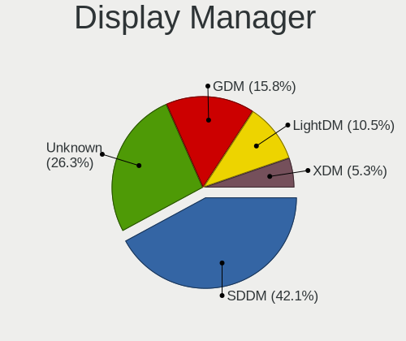
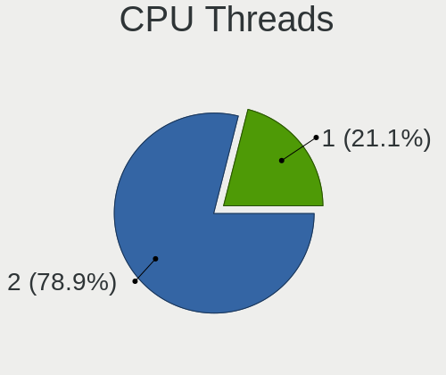
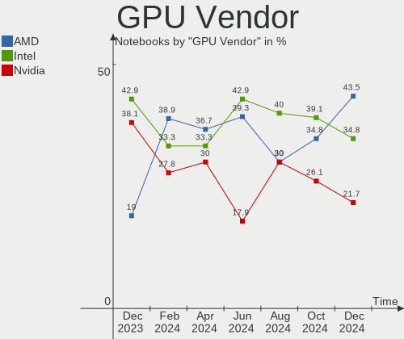
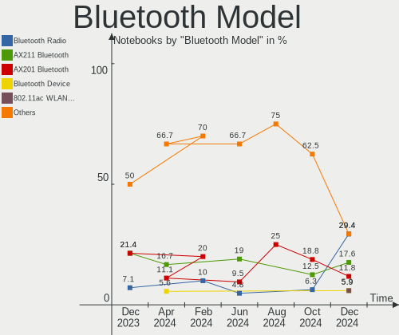

Gentoo - Hardware Trends (Notebooks)
------------------------------------

A project to identify most popular hardware characteristics and track their change
over time based on data collected by Linux users at https://Linux-Hardware.org.

Anyone can contribute to this report by the [hw-probe](https://github.com/linuxhw/hw-probe) tool:

    sudo -E hw-probe -all -upload

This report is for one last month. Overall report since the beginning of time: [TestDays](https://github.com/linuxhw/TestDays)

Period: Sep, 2023.

Contents
--------

* [ System ](#system)
  - [ OS                       ](#os)
  - [ OS Family                ](#os-family)
  - [ Kernel                   ](#kernel)
  - [ Kernel Family            ](#kernel-family)
  - [ Kernel Major Ver.        ](#kernel-major-ver)
  - [ Arch                     ](#arch)
  - [ DE                       ](#de)
  - [ Display Server           ](#display-server)
  - [ Display Manager          ](#display-manager)
  - [ OS Lang                  ](#os-lang)
  - [ Boot Mode                ](#boot-mode)
  - [ Filesystem               ](#filesystem)
  - [ Part. scheme             ](#part-scheme)
  - [ Dual Boot with Linux/BSD ](#dual-boot-with-linuxbsd)
  - [ Dual Boot (Win)          ](#dual-boot-win)

* [ Board ](#board)
  - [ Vendor                   ](#vendor)
  - [ Model                    ](#model)
  - [ Model Family             ](#model-family)
  - [ MFG Year                 ](#mfg-year)
  - [ Form Factor              ](#form-factor)
  - [ Secure Boot              ](#secure-boot)
  - [ Coreboot                 ](#coreboot)
  - [ RAM Size                 ](#ram-size)
  - [ RAM Used                 ](#ram-used)
  - [ Total Drives             ](#total-drives)
  - [ Has CD-ROM               ](#has-cd-rom)
  - [ Has Ethernet             ](#has-ethernet)
  - [ Has WiFi                 ](#has-wifi)
  - [ Has Bluetooth            ](#has-bluetooth)

* [ Location ](#location)
  - [ Country                  ](#country)
  - [ City                     ](#city)

* [ Drives ](#drives)
  - [ Drive Vendor             ](#drive-vendor)
  - [ Drive Model              ](#drive-model)
  - [ HDD Vendor               ](#hdd-vendor)
  - [ SSD Vendor               ](#ssd-vendor)
  - [ Drive Kind               ](#drive-kind)
  - [ Drive Connector          ](#drive-connector)
  - [ Drive Size               ](#drive-size)
  - [ Space Total              ](#space-total)
  - [ Space Used               ](#space-used)
  - [ Malfunc. Drives          ](#malfunc-drives)
  - [ Malfunc. Drive Vendor    ](#malfunc-drive-vendor)
  - [ Malfunc. HDD Vendor      ](#malfunc-hdd-vendor)
  - [ Malfunc. Drive Kind      ](#malfunc-drive-kind)
  - [ Failed Drives            ](#failed-drives)
  - [ Failed Drive Vendor      ](#failed-drive-vendor)
  - [ Drive Status             ](#drive-status)

* [ Storage controller ](#storage-controller)
  - [ Storage Vendor           ](#storage-vendor)
  - [ Storage Model            ](#storage-model)
  - [ Storage Kind             ](#storage-kind)

* [ Processor ](#processor)
  - [ CPU Vendor               ](#cpu-vendor)
  - [ CPU Model                ](#cpu-model)
  - [ CPU Model Family         ](#cpu-model-family)
  - [ CPU Cores                ](#cpu-cores)
  - [ CPU Sockets              ](#cpu-sockets)
  - [ CPU Threads              ](#cpu-threads)
  - [ CPU Op-Modes             ](#cpu-op-modes)
  - [ CPU Microcode            ](#cpu-microcode)
  - [ CPU Microarch            ](#cpu-microarch)

* [ Graphics ](#graphics)
  - [ GPU Vendor               ](#gpu-vendor)
  - [ GPU Model                ](#gpu-model)
  - [ GPU Combo                ](#gpu-combo)
  - [ GPU Driver               ](#gpu-driver)
  - [ GPU Memory               ](#gpu-memory)

* [ Monitor ](#monitor)
  - [ Monitor Vendor           ](#monitor-vendor)
  - [ Monitor Model            ](#monitor-model)
  - [ Monitor Resolution       ](#monitor-resolution)
  - [ Monitor Diagonal         ](#monitor-diagonal)
  - [ Monitor Width            ](#monitor-width)
  - [ Aspect Ratio             ](#aspect-ratio)
  - [ Monitor Area             ](#monitor-area)
  - [ Pixel Density            ](#pixel-density)
  - [ Multiple Monitors        ](#multiple-monitors)

* [ Network ](#network)
  - [ Net Controller Vendor    ](#net-controller-vendor)
  - [ Net Controller Model     ](#net-controller-model)
  - [ Wireless Vendor          ](#wireless-vendor)
  - [ Wireless Model           ](#wireless-model)
  - [ Ethernet Vendor          ](#ethernet-vendor)
  - [ Ethernet Model           ](#ethernet-model)
  - [ Net Controller Kind      ](#net-controller-kind)
  - [ Used Controller          ](#used-controller)
  - [ NICs                     ](#nics)
  - [ IPv6                     ](#ipv6)

* [ Bluetooth ](#bluetooth)
  - [ Bluetooth Vendor         ](#bluetooth-vendor)
  - [ Bluetooth Model          ](#bluetooth-model)

* [ Sound ](#sound)
  - [ Sound Vendor             ](#sound-vendor)
  - [ Sound Model              ](#sound-model)

* [ Memory ](#memory)
  - [ Memory Vendor            ](#memory-vendor)
  - [ Memory Model             ](#memory-model)
  - [ Memory Kind              ](#memory-kind)
  - [ Memory Form Factor       ](#memory-form-factor)
  - [ Memory Size              ](#memory-size)
  - [ Memory Speed             ](#memory-speed)

* [ Printers & scanners ](#printers--scanners)
  - [ Printer Vendor           ](#printer-vendor)
  - [ Printer Model            ](#printer-model)
  - [ Scanner Vendor           ](#scanner-vendor)
  - [ Scanner Model            ](#scanner-model)

* [ Camera ](#camera)
  - [ Camera Vendor            ](#camera-vendor)
  - [ Camera Model             ](#camera-model)

* [ Security ](#security)
  - [ Fingerprint Vendor       ](#fingerprint-vendor)
  - [ Fingerprint Model        ](#fingerprint-model)
  - [ Chipcard Vendor          ](#chipcard-vendor)
  - [ Chipcard Model           ](#chipcard-model)

* [ Unsupported ](#unsupported)
  - [ Unsupported Devices      ](#unsupported-devices)
  - [ Unsupported Device Types ](#unsupported-device-types)

System
------

OS
--

Installed operating systems

| Name        | Notebooks | Percent |
|-------------|-----------|---------|
| Gentoo 2.14 | 22        | 100%    |

OS Family
---------

OS without a version

| Name   | Notebooks | Percent |
|--------|-----------|---------|
| Gentoo | 22        | 100%    |

Kernel
------

Version of the Linux kernel

| Version                            | Notebooks | Percent |
|------------------------------------|-----------|---------|
| 6.1.46-gentoo                      | 5         | 22.73%  |
| 6.5.1-gentoo                       | 2         | 9.09%   |
| 6.5.4-gentoo-x86_64                | 1         | 4.55%   |
| 6.5.4-gentoo                       | 1         | 4.55%   |
| 6.5.3-gentoo-dist                  | 1         | 4.55%   |
| 6.5.3-gentoo-ali                   | 1         | 4.55%   |
| 6.5.2-gentoo                       | 1         | 4.55%   |
| 6.5.1-gentoo-x86_64                | 1         | 4.55%   |
| 6.5.0-gentoo                       | 1         | 4.55%   |
| 6.4.14-gentoo-dist                 | 1         | 4.55%   |
| 6.4.13-gentoo                      | 1         | 4.55%   |
| 6.4.11-gentoo-hardened1            | 1         | 4.55%   |
| 6.1.53-gentoo-r1                   | 1         | 4.55%   |
| 6.1.46-gentoo-fomys-work           | 1         | 4.55%   |
| 6.1.46-gentoo-dist                 | 1         | 4.55%   |
| 6.1.41-gentoo-gentoo-dist-hardened | 1         | 4.55%   |
| 6.1.1-gentoo-x86_64                | 1         | 4.55%   |

Kernel Family
-------------

Linux kernel without a distro release

| Version | Notebooks | Percent |
|---------|-----------|---------|
| 6.1.46  | 7         | 31.82%  |
| 6.5.1   | 3         | 13.64%  |
| 6.5.4   | 2         | 9.09%   |
| 6.5.3   | 2         | 9.09%   |
| 6.5.2   | 1         | 4.55%   |
| 6.5.0   | 1         | 4.55%   |
| 6.4.14  | 1         | 4.55%   |
| 6.4.13  | 1         | 4.55%   |
| 6.4.11  | 1         | 4.55%   |
| 6.1.53  | 1         | 4.55%   |
| 6.1.41  | 1         | 4.55%   |
| 6.1.1   | 1         | 4.55%   |

Kernel Major Ver.
-----------------

Linux kernel major version

| Version | Notebooks | Percent |
|---------|-----------|---------|
| 6.1     | 10        | 45.45%  |
| 6.5     | 9         | 40.91%  |
| 6.4     | 3         | 13.64%  |

Arch
----

OS architecture (x86_64, i586, etc.)

| Name   | Notebooks | Percent |
|--------|-----------|---------|
| x86_64 | 22        | 100%    |

DE
--

Desktop Environment

| Name     | Notebooks | Percent |
|----------|-----------|---------|
| Unknown  | 8         | 36.36%  |
| KDE5     | 4         | 18.18%  |
| XFCE     | 3         | 13.64%  |
| Hyprland | 2         | 9.09%   |
| LXQt     | 1         | 4.55%   |
| i3       | 1         | 4.55%   |
| GNOME    | 1         | 4.55%   |
| DWM      | 1         | 4.55%   |
| awesome  | 1         | 4.55%   |

Display Server
--------------

X11 or Wayland

| Name    | Notebooks | Percent |
|---------|-----------|---------|
| X11     | 10        | 45.45%  |
| Wayland | 6         | 27.27%  |
| Tty     | 4         | 18.18%  |
| Unknown | 2         | 9.09%   |

Display Manager
---------------

SDDM, LightDM, etc.

| Name    | Notebooks | Percent |
|---------|-----------|---------|
| SDDM    | 6         | 27.27%  |
| Unknown | 6         | 27.27%  |
| LightDM | 4         | 18.18%  |
| GREETD  | 3         | 13.64%  |
| SLiM    | 2         | 9.09%   |
| GDM     | 1         | 4.55%   |

OS Lang
-------

Language

| Lang    | Notebooks | Percent |
|---------|-----------|---------|
| en_US   | 11        | 50%     |
| Unknown | 3         | 13.64%  |
| fr_FR   | 2         | 9.09%   |
| C.UTF8  | 2         | 9.09%   |
| ru_RU   | 1         | 4.55%   |
| de_DE   | 1         | 4.55%   |
| cs_CZ   | 1         | 4.55%   |
| C       | 1         | 4.55%   |

Boot Mode
---------

EFI or BIOS

| Mode | Notebooks | Percent |
|------|-----------|---------|
| EFI  | 20        | 90.91%  |
| BIOS | 2         | 9.09%   |

Filesystem
----------

Type of filesystem

| Type  | Notebooks | Percent |
|-------|-----------|---------|
| Ext4  | 11        | 50%     |
| Btrfs | 8         | 36.36%  |
| Zfs   | 1         | 4.55%   |
| Xfs   | 1         | 4.55%   |
| F2fs  | 1         | 4.55%   |

Part. scheme
------------

Scheme of partitioning

| Type | Notebooks | Percent |
|------|-----------|---------|
| GPT  | 21        | 95.45%  |
| MBR  | 1         | 4.55%   |

Dual Boot with Linux/BSD
------------------------

Hosting more than one Linux/BSD

| Dual boot | Notebooks | Percent |
|-----------|-----------|---------|
| No        | 16        | 72.73%  |
| Yes       | 6         | 27.27%  |

Dual Boot (Win)
---------------

Hosting Linux and Windows

| Dual boot | Notebooks | Percent |
|-----------|-----------|---------|
| No        | 20        | 90.91%  |
| Yes       | 2         | 9.09%   |

Board
-----

Vendor
------

Motherboard manufacturer

| Name                | Notebooks | Percent |
|---------------------|-----------|---------|
| Lenovo              | 6         | 27.27%  |
| Hewlett-Packard     | 6         | 27.27%  |
| Dell                | 2         | 9.09%   |
| ASUSTek Computer    | 2         | 9.09%   |
| Timi                | 1         | 4.55%   |
| System76            | 1         | 4.55%   |
| Gigabyte Technology | 1         | 4.55%   |
| Framework           | 1         | 4.55%   |
| Apple               | 1         | 4.55%   |
| Acer                | 1         | 4.55%   |

Model
-----

Motherboard model

| Name                                      | Notebooks | Percent |
|-------------------------------------------|-----------|---------|
| Timi RedmiBook Pro 15S                    | 1         | 4.55%   |
| System76 Pangolin                         | 1         | 4.55%   |
| Lenovo ThinkPad X1 Extreme 2nd 20QVS10E00 | 1         | 4.55%   |
| Lenovo ThinkPad T16 Gen 1 21CHCTO1WW      | 1         | 4.55%   |
| Lenovo ThinkPad T15p Gen 3 21DACTO1WW     | 1         | 4.55%   |
| Lenovo ThinkPad P43s 20RHCTO1WW           | 1         | 4.55%   |
| Lenovo ThinkPad E15 Gen 2 20T8000MPB      | 1         | 4.55%   |
| Lenovo Legion 5 15ACH6H 82JU              | 1         | 4.55%   |
| HP ProBook 450 G5                         | 1         | 4.55%   |
| HP ProBook 430 G5                         | 1         | 4.55%   |
| HP Laptop 14s-dq2xxx                      | 1         | 4.55%   |
| HP EliteBook 8540w                        | 1         | 4.55%   |
| HP EliteBook 845 G7 Notebook PC           | 1         | 4.55%   |
| HP EliteBook 830 G6                       | 1         | 4.55%   |
| Gigabyte AORUS 17 XE4                     | 1         | 4.55%   |
| Framework Laptop (13th Gen Intel Core)    | 1         | 4.55%   |
| Dell Precision M4800                      | 1         | 4.55%   |
| Dell Inspiron 16 5625                     | 1         | 4.55%   |
| ASUS ROG Zephyrus G14 GA401II_GA401II     | 1         | 4.55%   |
| ASUS ROG Strix G814JI_G814JI              | 1         | 4.55%   |
| Apple MacBookPro11,2                      | 1         | 4.55%   |
| Acer Aspire A515-45                       | 1         | 4.55%   |

Model Family
------------

Motherboard model prefix

| Name               | Notebooks | Percent |
|--------------------|-----------|---------|
| Lenovo ThinkPad    | 5         | 22.73%  |
| HP EliteBook       | 3         | 13.64%  |
| HP ProBook         | 2         | 9.09%   |
| ASUS ROG           | 2         | 9.09%   |
| Timi RedmiBook     | 1         | 4.55%   |
| System76 Pangolin  | 1         | 4.55%   |
| Lenovo Legion      | 1         | 4.55%   |
| HP Laptop          | 1         | 4.55%   |
| Gigabyte AORUS     | 1         | 4.55%   |
| Framework Laptop   | 1         | 4.55%   |
| Dell Precision     | 1         | 4.55%   |
| Dell Inspiron      | 1         | 4.55%   |
| Apple MacBookPro11 | 1         | 4.55%   |
| Acer Aspire        | 1         | 4.55%   |

MFG Year
--------

Motherboard manufacture year

| Year | Notebooks | Percent |
|------|-----------|---------|
| 2021 | 5         | 22.73%  |
| 2023 | 3         | 13.64%  |
| 2022 | 3         | 13.64%  |
| 2019 | 3         | 13.64%  |
| 2020 | 2         | 9.09%   |
| 2017 | 2         | 9.09%   |
| 2013 | 2         | 9.09%   |
| 2018 | 1         | 4.55%   |
| 2010 | 1         | 4.55%   |

Form Factor
-----------

Physical design of the computer

| Name     | Notebooks | Percent |
|----------|-----------|---------|
| Notebook | 22        | 100%    |

Secure Boot
-----------

Enabled or disabled

| State    | Notebooks | Percent |
|----------|-----------|---------|
| Disabled | 20        | 90.91%  |
| Enabled  | 2         | 9.09%   |

Coreboot
--------

Have coreboot on board

| Used | Notebooks | Percent |
|------|-----------|---------|
| No   | 22        | 100%    |

RAM Size
--------

Total RAM memory

| Size in GB  | Notebooks | Percent |
|-------------|-----------|---------|
| 32.01-64.0  | 9         | 40.91%  |
| 8.01-16.0   | 5         | 22.73%  |
| 4.01-8.0    | 4         | 18.18%  |
| 24.01-32.0  | 2         | 9.09%   |
| 64.01-256.0 | 1         | 4.55%   |
| 16.01-24.0  | 1         | 4.55%   |

RAM Used
--------

Used RAM memory

| Used GB    | Notebooks | Percent |
|------------|-----------|---------|
| 4.01-8.0   | 6         | 27.27%  |
| 2.01-3.0   | 5         | 22.73%  |
| 1.01-2.0   | 4         | 18.18%  |
| 3.01-4.0   | 2         | 9.09%   |
| 0.51-1.0   | 2         | 9.09%   |
| 16.01-24.0 | 1         | 4.55%   |
| 8.01-16.0  | 1         | 4.55%   |
| 0.01-0.5   | 1         | 4.55%   |

Total Drives
------------

Number of drives on board

| Drives | Notebooks | Percent |
|--------|-----------|---------|
| 1      | 17        | 77.27%  |
| 2      | 5         | 22.73%  |

Has CD-ROM
----------

Has CD-ROM on board

| Presented | Notebooks | Percent |
|-----------|-----------|---------|
| No        | 20        | 90.91%  |
| Yes       | 2         | 9.09%   |

Has Ethernet
------------

Has Ethernet on board

| Presented | Notebooks | Percent |
|-----------|-----------|---------|
| Yes       | 17        | 77.27%  |
| No        | 5         | 22.73%  |

Has WiFi
--------

Has WiFi module

| Presented | Notebooks | Percent |
|-----------|-----------|---------|
| Yes       | 21        | 95.45%  |
| No        | 1         | 4.55%   |

Has Bluetooth
-------------

Has Bluetooth module

| Presented | Notebooks | Percent |
|-----------|-----------|---------|
| Yes       | 18        | 81.82%  |
| No        | 4         | 18.18%  |

Location
--------

Country
-------

Geographic location (country)

| Country     | Notebooks | Percent |
|-------------|-----------|---------|
| USA         | 4         | 18.18%  |
| Germany     | 3         | 13.64%  |
| Spain       | 2         | 9.09%   |
| Russia      | 2         | 9.09%   |
| Netherlands | 2         | 9.09%   |
| France      | 2         | 9.09%   |
| UK          | 1         | 4.55%   |
| Sweden      | 1         | 4.55%   |
| Portugal    | 1         | 4.55%   |
| Poland      | 1         | 4.55%   |
| Iran        | 1         | 4.55%   |
| China       | 1         | 4.55%   |
| Canada      | 1         | 4.55%   |

City
----

Geographic location (city)

| City          | Notebooks | Percent |
|---------------|-----------|---------|
| Xiaolou       | 1         | 4.55%   |
| Toulouse      | 1         | 4.55%   |
| Stockholm     | 1         | 4.55%   |
| St Petersburg | 1         | 4.55%   |
| Purmerend     | 1         | 4.55%   |
| Olympia       | 1         | 4.55%   |
| Nuremberg     | 1         | 4.55%   |
| Moscow        | 1         | 4.55%   |
| Marshall      | 1         | 4.55%   |
| Madrid        | 1         | 4.55%   |
| London        | 1         | 4.55%   |
| Lisbon        | 1         | 4.55%   |
| Lesigny       | 1         | 4.55%   |
| Krefeld       | 1         | 4.55%   |
| Isfahan       | 1         | 4.55%   |
| Huntsville    | 1         | 4.55%   |
| Girona        | 1         | 4.55%   |
| Dumfries      | 1         | 4.55%   |
| Detmold       | 1         | 4.55%   |
| Cieszyn       | 1         | 4.55%   |
| Amsterdam     | 1         | 4.55%   |
| Ajax          | 1         | 4.55%   |

Drives
------

Drive Vendor
------------

Hard drive vendors

| Vendor                    | Notebooks | Drives | Percent |
|---------------------------|-----------|--------|---------|
| Samsung Electronics       | 7         | 7      | 25.93%  |
| Sandisk                   | 4         | 4      | 14.81%  |
| Micron Technology         | 3         | 4      | 11.11%  |
| Intel                     | 3         | 3      | 11.11%  |
| SK hynix                  | 2         | 2      | 7.41%   |
| Phison Electronics        | 2         | 2      | 7.41%   |
| KIOXIA                    | 2         | 2      | 7.41%   |
| Union Memory              | 1         | 1      | 3.7%    |
| Teleplan                  | 1         | 1      | 3.7%    |
| Micron/Crucial Technology | 1         | 1      | 3.7%    |
| Kingston                  | 1         | 2      | 3.7%    |

Drive Model
-----------

Hard drive models

| Model                                               | Notebooks | Percent |
|-----------------------------------------------------|-----------|---------|
| Samsung NVMe SSD Controller SM981/PM981/PM983 256GB | 3         | 11.11%  |
| Sandisk WD Blue SN550 NVMe SSD 512GB                | 2         | 7.41%   |
| Samsung SSD 860 EVO 500GB                           | 2         | 7.41%   |
| Intel SSD 660P Series 1024GB                        | 2         | 7.41%   |
| Union Memory UMIS RPJTJ512MEE1OWX 512GB             | 1         | 3.7%    |
| Teleplan TP1000G 1TB                                | 1         | 3.7%    |
| SK hynix SKHynix_HFS512GD9TNG-L5B0B 512GB           | 1         | 3.7%    |
| SK hynix PC401 NVMe Solid State Drive 256GB         | 1         | 3.7%    |
| Sandisk WD_BLACK SN850X 2000GB                      | 1         | 3.7%    |
| Sandisk WD Blue SN570 1TB                           | 1         | 3.7%    |
| Samsung NVMe SSD Controller PM9A1/PM9A3/980PRO 1TB  | 1         | 3.7%    |
| Samsung MZVLQ256HAJD-000H1 256GB                    | 1         | 3.7%    |
| Phison ESR01TBMFCT-E8GBTOEM4                        | 1         | 3.7%    |
| Phison E12 NVMe Controller 2TB                      | 1         | 3.7%    |
| Micron/Crucial P2 NVMe PCIe SSD 1TB                 | 1         | 3.7%    |
| Micron MTFDKBA256TFK 256GB                          | 1         | 3.7%    |
| Micron 2400_MTFDKBA1T0QFM 1024GB                    | 1         | 3.7%    |
| Micron 2210_MTFDHBA512QFD 512GB                     | 1         | 3.7%    |
| KIOXIA KBG50ZNS1T02 NVMe 1024GB                     | 1         | 3.7%    |
| KIOXIA KBG40ZNV512G 512GB                           | 1         | 3.7%    |
| Kingston SFYRD2000G 2TB                             | 1         | 3.7%    |
| Intel SSD 600P Series 256GB                         | 1         | 3.7%    |

HDD Vendor
----------

Hard disk drive vendors

| Vendor   | Notebooks | Drives | Percent |
|----------|-----------|--------|---------|
| Teleplan | 1         | 1      | 100%    |

SSD Vendor
----------

Solid state drive vendors

| Vendor              | Notebooks | Drives | Percent |
|---------------------|-----------|--------|---------|
| Samsung Electronics | 2         | 2      | 100%    |

Drive Kind
----------

HDD or SSD

| Kind | Notebooks | Drives | Percent |
|------|-----------|--------|---------|
| NVMe | 20        | 26     | 86.96%  |
| SSD  | 2         | 2      | 8.7%    |
| HDD  | 1         | 1      | 4.35%   |

Drive Connector
---------------

SATA, SAS, NVMe, etc.

| Type | Notebooks | Drives | Percent |
|------|-----------|--------|---------|
| NVMe | 20        | 26     | 86.96%  |
| SATA | 3         | 3      | 13.04%  |

Drive Size
----------

Size of hard drive

| Size in TB | Notebooks | Drives | Percent |
|------------|-----------|--------|---------|
| 0.01-0.5   | 2         | 2      | 66.67%  |
| 0.51-1.0   | 1         | 1      | 33.33%  |

Space Total
-----------

Amount of disk space available on the file system

| Size in GB     | Notebooks | Percent |
|----------------|-----------|---------|
| 501-1000       | 8         | 36.36%  |
| 251-500        | 5         | 22.73%  |
| More than 3000 | 2         | 9.09%   |
| 101-250        | 2         | 9.09%   |
| 1-20           | 2         | 9.09%   |
| Unknown        | 2         | 9.09%   |
| 51-100         | 1         | 4.55%   |

Space Used
----------

Amount of used disk space

| Used GB        | Notebooks | Percent |
|----------------|-----------|---------|
| 1-20           | 5         | 22.73%  |
| 21-50          | 4         | 18.18%  |
| 101-250        | 4         | 18.18%  |
| 251-500        | 3         | 13.64%  |
| 501-1000       | 2         | 9.09%   |
| Unknown        | 2         | 9.09%   |
| More than 3000 | 1         | 4.55%   |
| 51-100         | 1         | 4.55%   |

Malfunc. Drives
---------------

Drive models with a malfunction

Zero info for selected period =(

Malfunc. Drive Vendor
---------------------

Vendors of faulty drives

Zero info for selected period =(

Malfunc. HDD Vendor
-------------------

Vendors of faulty HDD drives

Zero info for selected period =(

Malfunc. Drive Kind
-------------------

Kinds of faulty drives

Zero info for selected period =(

Failed Drives
-------------

Failed drive models

Zero info for selected period =(

Failed Drive Vendor
-------------------

Failed drive vendors

Zero info for selected period =(

Drive Status
------------

Number of failed and malfunc. drives

| Status | Notebooks | Drives | Percent |
|--------|-----------|--------|---------|
| Works  | 22        | 29     | 100%    |

Storage controller
------------------

Storage Vendor
--------------

Storage controller vendors

| Vendor                      | Notebooks | Percent |
|-----------------------------|-----------|---------|
| Intel                       | 7         | 21.21%  |
| Samsung Electronics         | 5         | 15.15%  |
| AMD                         | 5         | 15.15%  |
| SanDisk                     | 4         | 12.12%  |
| Micron Technology           | 3         | 9.09%   |
| SK hynix                    | 2         | 6.06%   |
| Phison Electronics          | 2         | 6.06%   |
| KIOXIA                      | 2         | 6.06%   |
| Union Memory (Shenzhen)     | 1         | 3.03%   |
| Micron/Crucial Technology   | 1         | 3.03%   |
| Kingston Technology Company | 1         | 3.03%   |

Storage Model
-------------

Storage controller models

| Model                                                                          | Notebooks | Percent |
|--------------------------------------------------------------------------------|-----------|---------|
| AMD FCH SATA Controller [AHCI mode]                                            | 5         | 14.29%  |
| Samsung NVMe SSD Controller SM981/PM981/PM983                                  | 3         | 8.57%   |
| SanDisk WD Blue SN550 NVMe SSD                                                 | 2         | 5.71%   |
| Intel Sunrise Point-LP SATA Controller [AHCI mode]                             | 2         | 5.71%   |
| Intel SSD 660P Series                                                          | 2         | 5.71%   |
| Union Memory (Shenzhen) AM620 PCIe 3.0 NVMe SSD 512GB                          | 1         | 2.86%   |
| SK hynix PC601 NVMe Solid State Drive                                          | 1         | 2.86%   |
| SK hynix PC401 NVMe Solid State Drive 256GB                                    | 1         | 2.86%   |
| Sandisk Western Digital WD Black SN850X NVMe SSD                               | 1         | 2.86%   |
| SanDisk WD Blue SN570 NVMe SSD 1TB                                             | 1         | 2.86%   |
| Samsung NVMe SSD Controller PM9A1/PM9A3/980PRO                                 | 1         | 2.86%   |
| Samsung NVMe SSD Controller 980                                                | 1         | 2.86%   |
| Phison E18 PCIe4 NVMe Controller                                               | 1         | 2.86%   |
| Phison E12 NVMe Controller                                                     | 1         | 2.86%   |
| Micron/Crucial P2 [Nick P2] / P3 / P3 Plus NVMe PCIe SSD (DRAM-less)           | 1         | 2.86%   |
| Micron 2450 NVMe SSD [HendrixV] (DRAM-less)                                    | 1         | 2.86%   |
| Micron 2400 NVMe SSD (DRAM-less)                                               | 1         | 2.86%   |
| Micron 2210 NVMe SSD [Cobain]                                                  | 1         | 2.86%   |
| KIOXIA NVMe SSD Controller BG5 (DRAM-less)                                     | 1         | 2.86%   |
| KIOXIA NVMe SSD Controller BG4 (DRAM-less)                                     | 1         | 2.86%   |
| Kingston Company KC3000/Renegade NVMe SSD                                      | 1         | 2.86%   |
| Intel Volume Management Device NVMe RAID Controller Intel Corporation          | 1         | 2.86%   |
| Intel Volume Management Device NVMe RAID Controller                            | 1         | 2.86%   |
| Intel SSD 600P Series                                                          | 1         | 2.86%   |
| Intel 8 Series/C220 Series Chipset Family 6-port SATA Controller 1 [AHCI mode] | 1         | 2.86%   |
| Intel 5 Series/3400 Series Chipset 6 port SATA AHCI Controller                 | 1         | 2.86%   |

Storage Kind
------------

Kind of storage controller (IDE, SATA, NVMe, SAS, ...)

| Kind | Notebooks | Percent |
|------|-----------|---------|
| NVMe | 20        | 64.52%  |
| SATA | 9         | 29.03%  |
| RAID | 2         | 6.45%   |

Processor
---------

CPU Vendor
----------

Processor vendors

| Vendor | Notebooks | Percent |
|--------|-----------|---------|
| Intel  | 13        | 59.09%  |
| AMD    | 9         | 40.91%  |

CPU Model
---------

Processor models

| Model                                      | Notebooks | Percent |
|--------------------------------------------|-----------|---------|
| Intel 12th Gen Core i7-12700H              | 2         | 9.09%   |
| AMD Ryzen 7 5800H with Radeon Graphics     | 2         | 9.09%   |
| Intel Core i7-9750H CPU @ 2.60GHz          | 1         | 4.55%   |
| Intel Core i7-8665U CPU @ 1.90GHz          | 1         | 4.55%   |
| Intel Core i7-8550U CPU @ 1.80GHz          | 1         | 4.55%   |
| Intel Core i7-4910MQ CPU @ 2.90GHz         | 1         | 4.55%   |
| Intel Core i7-4750HQ CPU @ 2.00GHz         | 1         | 4.55%   |
| Intel Core i7 CPU M 620 @ 2.67GHz          | 1         | 4.55%   |
| Intel Core i5-8365U CPU @ 1.60GHz          | 1         | 4.55%   |
| Intel Core i5-8250U CPU @ 1.60GHz          | 1         | 4.55%   |
| Intel 13th Gen Core i9-13980HX             | 1         | 4.55%   |
| Intel 13th Gen Core i7-1370P               | 1         | 4.55%   |
| Intel 11th Gen Core i5-1135G7 @ 2.40GHz    | 1         | 4.55%   |
| AMD Ryzen 7 PRO 6850U with Radeon Graphics | 1         | 4.55%   |
| AMD Ryzen 7 6800U with Radeon Graphics     | 1         | 4.55%   |
| AMD Ryzen 7 5825U with Radeon Graphics     | 1         | 4.55%   |
| AMD Ryzen 7 4800HS with Radeon Graphics    | 1         | 4.55%   |
| AMD Ryzen 5 PRO 4650U with Radeon Graphics | 1         | 4.55%   |
| AMD Ryzen 5 5500U with Radeon Graphics     | 1         | 4.55%   |
| AMD Ryzen 5 4500U with Radeon Graphics     | 1         | 4.55%   |

CPU Model Family
----------------

Processor model prefix

| Model           | Notebooks | Percent |
|-----------------|-----------|---------|
| Intel Core i7   | 6         | 27.27%  |
| Other           | 5         | 22.73%  |
| AMD Ryzen 7     | 5         | 22.73%  |
| Intel Core i5   | 2         | 9.09%   |
| AMD Ryzen 5     | 2         | 9.09%   |
| AMD Ryzen 7 PRO | 1         | 4.55%   |
| AMD Ryzen 5 PRO | 1         | 4.55%   |

CPU Cores
---------

Number of processor cores

| Number | Notebooks | Percent |
|--------|-----------|---------|
| 4      | 7         | 31.82%  |
| 8      | 6         | 27.27%  |
| 6      | 4         | 18.18%  |
| 14     | 3         | 13.64%  |
| 24     | 1         | 4.55%   |
| 1      | 1         | 4.55%   |

CPU Sockets
-----------

Number of sockets

| Number | Notebooks | Percent |
|--------|-----------|---------|
| 1      | 22        | 100%    |

CPU Threads
-----------

Threads per core (Hyper-Threading)

| Number | Notebooks | Percent |
|--------|-----------|---------|
| 2      | 20        | 90.91%  |
| 4      | 1         | 4.55%   |
| 1      | 1         | 4.55%   |

CPU Op-Modes
------------

CPU Operation Modes (32-bit, 64-bit)

| Op mode        | Notebooks | Percent |
|----------------|-----------|---------|
| 32-bit, 64-bit | 22        | 100%    |

CPU Microcode
-------------

Microcode number

| Number     | Notebooks | Percent |
|------------|-----------|---------|
| Unknown    | 6         | 27.27%  |
| 0x806ea    | 2         | 9.09%   |
| 0x0a50000c | 2         | 9.09%   |
| 0x0a404102 | 2         | 9.09%   |
| 0xb06a2    | 1         | 4.55%   |
| 0x906a3    | 1         | 4.55%   |
| 0x806ec    | 1         | 4.55%   |
| 0x806c1    | 1         | 4.55%   |
| 0x306c3    | 1         | 4.55%   |
| 0x0a50000d | 1         | 4.55%   |
| 0x08608102 | 1         | 4.55%   |
| 0x08600106 | 1         | 4.55%   |
| 0x08600104 | 1         | 4.55%   |
| 0x08600103 | 1         | 4.55%   |

CPU Microarch
-------------

Microarchitecture

| Name             | Notebooks | Percent |
|------------------|-----------|---------|
| KabyLake         | 5         | 22.73%  |
| Unknown          | 5         | 22.73%  |
| Zen 3            | 3         | 13.64%  |
| Zen 2            | 3         | 13.64%  |
| Haswell          | 2         | 9.09%   |
| Alderlake Hybrid | 2         | 9.09%   |
| Westmere         | 1         | 4.55%   |
| TigerLake        | 1         | 4.55%   |

Graphics
--------

GPU Vendor
----------

Vendors of graphics cards

| Vendor | Notebooks | Percent |
|--------|-----------|---------|
| Intel  | 11        | 36.67%  |
| Nvidia | 10        | 33.33%  |
| AMD    | 9         | 30%     |

GPU Model
---------

Graphics card models

| Model                                                        | Notebooks | Percent |
|--------------------------------------------------------------|-----------|---------|
| AMD Renoir                                                   | 3         | 10%     |
| Intel WhiskeyLake-U GT2 [UHD Graphics 620]                   | 2         | 6.67%   |
| Intel UHD Graphics 620                                       | 2         | 6.67%   |
| Intel Alder Lake-P Integrated Graphics Controller            | 2         | 6.67%   |
| AMD Rembrandt [Radeon 680M]                                  | 2         | 6.67%   |
| AMD Cezanne [Radeon Vega Series / Radeon Vega Mobile Series] | 2         | 6.67%   |
| Nvidia TU117M [GeForce GTX 1650 Mobile / Max-Q]              | 1         | 3.33%   |
| Nvidia TU116M [GeForce GTX 1650 Ti Mobile]                   | 1         | 3.33%   |
| Nvidia GT216GLM [Quadro FX 880M]                             | 1         | 3.33%   |
| Nvidia GP108GLM [Quadro P520]                                | 1         | 3.33%   |
| Nvidia GM108M [GeForce 930MX]                                | 1         | 3.33%   |
| Nvidia GK106GLM [Quadro K2100M]                              | 1         | 3.33%   |
| Nvidia GA107M [GeForce RTX 3050 Mobile]                      | 1         | 3.33%   |
| Nvidia GA104M [GeForce RTX 3070 Mobile / Max-Q]              | 1         | 3.33%   |
| Nvidia GA104 [Geforce RTX 3070 Ti Laptop GPU]                | 1         | 3.33%   |
| Nvidia AD106M [GeForce RTX 4070 Max-Q / Mobile]              | 1         | 3.33%   |
| Intel TigerLake-LP GT2 [Iris Xe Graphics]                    | 1         | 3.33%   |
| Intel Raptor Lake-S UHD Graphics                             | 1         | 3.33%   |
| Intel Raptor Lake-P [Iris Xe Graphics]                       | 1         | 3.33%   |
| Intel Crystal Well Integrated Graphics Controller            | 1         | 3.33%   |
| Intel CoffeeLake-H GT2 [UHD Graphics 630]                    | 1         | 3.33%   |
| AMD Lucienne                                                 | 1         | 3.33%   |
| AMD Barcelo                                                  | 1         | 3.33%   |

GPU Combo
---------

Combinations of graphics cards

| Name           | Notebooks | Percent |
|----------------|-----------|---------|
| 1 x AMD        | 7         | 31.82%  |
| Intel + Nvidia | 6         | 27.27%  |
| 1 x Intel      | 5         | 22.73%  |
| 1 x Nvidia     | 2         | 9.09%   |
| AMD + Nvidia   | 2         | 9.09%   |

GPU Driver
----------

Free vs proprietary

| Driver      | Notebooks | Percent |
|-------------|-----------|---------|
| Free        | 15        | 68.18%  |
| Proprietary | 5         | 22.73%  |
| Unknown     | 2         | 9.09%   |

GPU Memory
----------

Total video memory

| Size in GB | Notebooks | Percent |
|------------|-----------|---------|
| Unknown    | 12        | 54.55%  |
| 0.01-0.5   | 6         | 27.27%  |
| 1.01-2.0   | 2         | 9.09%   |
| 0.51-1.0   | 2         | 9.09%   |

Monitor
-------

Monitor Vendor
--------------

Monitor vendors

| Vendor              | Notebooks | Percent |
|---------------------|-----------|---------|
| AU Optronics        | 7         | 24.14%  |
| Goldstar            | 3         | 10.34%  |
| Chimei Innolux      | 3         | 10.34%  |
| BOE                 | 3         | 10.34%  |
| PANDA               | 2         | 6.9%    |
| LG Display          | 2         | 6.9%    |
| Dell                | 2         | 6.9%    |
| TMX                 | 1         | 3.45%   |
| Sharp               | 1         | 3.45%   |
| Samsung Electronics | 1         | 3.45%   |
| Lenovo              | 1         | 3.45%   |
| Iiyama              | 1         | 3.45%   |
| BenQ                | 1         | 3.45%   |
| Apple               | 1         | 3.45%   |

Monitor Model
-------------

Monitor models

| Model                                                             | Notebooks | Percent |
|-------------------------------------------------------------------|-----------|---------|
| TMX TL156MDMP01-0 TMX1560 3200x2000 336x210mm 15.6-inch           | 1         | 3.33%   |
| Sharp LQ173M1JW12 SHP1563 1920x1080 382x215mm 17.3-inch           | 1         | 3.33%   |
| Samsung Electronics S22C200 SAM09B6 1920x1080 477x268mm 21.5-inch | 1         | 3.33%   |
| PANDA LCD Monitor NCP0063 1920x1080 344x194mm 15.5-inch           | 1         | 3.33%   |
| PANDA LCD Monitor NCP0050 1920x1080 309x174mm 14.0-inch           | 1         | 3.33%   |
| LG Display LCD Monitor LGD06CA 1920x1080 309x174mm 14.0-inch      | 1         | 3.33%   |
| LG Display LCD Monitor LGD0259 1920x1080 345x194mm 15.6-inch      | 1         | 3.33%   |
| Lenovo LCD Monitor LEN40BA 1920x1080 344x194mm 15.5-inch          | 1         | 3.33%   |
| Iiyama PL2209HD IVM560B 1920x1080 478x269mm 21.6-inch             | 1         | 3.33%   |
| Goldstar ULTRAWIDE GSM5AFB 2560x1080 798x334mm 34.1-inch          | 1         | 3.33%   |
| Goldstar ULTRAWIDE GSM59F1 2560x1080 673x284mm 28.8-inch          | 1         | 3.33%   |
| Goldstar LG HDR 4K GSM774F 3840x2160 700x400mm 31.7-inch          | 1         | 3.33%   |
| Goldstar FULL HD GSM5ABB 1920x1080 480x270mm 21.7-inch            | 1         | 3.33%   |
| Dell U2415 DELA0BA 1920x1200 518x324mm 24.1-inch                  | 1         | 3.33%   |
| Dell U2410 DELF016 1920x1200 520x320mm 24.0-inch                  | 1         | 3.33%   |
| Chimei Innolux LCD Monitor CMN1614 1920x1200 344x215mm 16.0-inch  | 1         | 3.33%   |
| Chimei Innolux LCD Monitor CMN1613 1920x1200 344x215mm 16.0-inch  | 1         | 3.33%   |
| Chimei Innolux LCD Monitor CMN1521 1920x1080 344x193mm 15.5-inch  | 1         | 3.33%   |
| BOE NE180QDM-NZ2 BOE0B35 2560x1600 388x242mm 18.0-inch            | 1         | 3.33%   |
| BOE LCD Monitor BOE0BCA 2256x1504 285x190mm 13.5-inch             | 1         | 3.33%   |
| BOE LCD Monitor BOE07DB 1920x1080 309x174mm 14.0-inch             | 1         | 3.33%   |
| BenQ GL2780 BNQ78EC 1920x1080 600x340mm 27.2-inch                 | 1         | 3.33%   |
| AU Optronics LCD Monitor AUOE48D 1920x1080 344x194mm 15.5-inch    | 1         | 3.33%   |
| AU Optronics LCD Monitor AUODC90 1920x1080 309x174mm 14.0-inch    | 1         | 3.33%   |
| AU Optronics LCD Monitor AUOB69B 1920x1080 344x193mm 15.5-inch    | 1         | 3.33%   |
| AU Optronics LCD Monitor AUO4B2D 1920x1080 293x165mm 13.2-inch    | 1         | 3.33%   |
| AU Optronics LCD Monitor AUO42EB 3840x2160 344x193mm 15.5-inch    | 1         | 3.33%   |
| AU Optronics LCD Monitor AUO41ED 1920x1080 344x193mm 15.5-inch    | 1         | 3.33%   |
| AU Optronics LCD Monitor AUO162C 1366x768 293x164mm 13.2-inch     | 1         | 3.33%   |
| Apple Color LCD APPA022 2880x1800 331x207mm 15.4-inch             | 1         | 3.33%   |

Monitor Resolution
------------------

Monitor screen resolution

| Resolution        | Notebooks | Percent |
|-------------------|-----------|---------|
| 1920x1080 (FHD)   | 13        | 54.17%  |
| 1920x1200 (WUXGA) | 3         | 12.5%   |
| 3840x2160 (4K)    | 2         | 8.33%   |
| 3200x2000         | 1         | 4.17%   |
| 2880x1800         | 1         | 4.17%   |
| 2560x1600         | 1         | 4.17%   |
| 2560x1080         | 1         | 4.17%   |
| 2256x1504         | 1         | 4.17%   |
| 1366x768 (WXGA)   | 1         | 4.17%   |

Monitor Diagonal
----------------

Diagonal size in inches

| Inches | Notebooks | Percent |
|--------|-----------|---------|
| 15     | 10        | 34.48%  |
| 14     | 4         | 13.79%  |
| 21     | 3         | 10.34%  |
| 13     | 3         | 10.34%  |
| 24     | 2         | 6.9%    |
| 16     | 2         | 6.9%    |
| 34     | 1         | 3.45%   |
| 31     | 1         | 3.45%   |
| 27     | 1         | 3.45%   |
| 18     | 1         | 3.45%   |
| 17     | 1         | 3.45%   |

Monitor Width
-------------

Physical width

| Width in mm | Notebooks | Percent |
|-------------|-----------|---------|
| 301-350     | 16        | 55.17%  |
| 501-600     | 3         | 10.34%  |
| 401-500     | 3         | 10.34%  |
| 201-300     | 3         | 10.34%  |
| 351-400     | 2         | 6.9%    |
| 701-800     | 1         | 3.45%   |
| 601-700     | 1         | 3.45%   |

Aspect Ratio
------------

Proportional relationship between the width and the height

| Ratio | Notebooks | Percent |
|-------|-----------|---------|
| 16/9  | 16        | 64%     |
| 16/10 | 7         | 28%     |
| 3/2   | 1         | 4%      |
| 21/9  | 1         | 4%      |

Monitor Area
------------

Area in inch²

| Area in inch² | Notebooks | Percent |
|----------------|-----------|---------|
| 101-110        | 10        | 34.48%  |
| 81-90          | 5         | 17.24%  |
| 71-80          | 2         | 6.9%    |
| 351-500        | 2         | 6.9%    |
| 251-300        | 2         | 6.9%    |
| 201-250        | 2         | 6.9%    |
| 111-120        | 2         | 6.9%    |
| 301-350        | 1         | 3.45%   |
| 151-200        | 1         | 3.45%   |
| 141-150        | 1         | 3.45%   |
| 121-130        | 1         | 3.45%   |

Pixel Density
-------------

Pixels per inch

| Density       | Notebooks | Percent |
|---------------|-----------|---------|
| 121-160       | 15        | 51.72%  |
| 161-240       | 4         | 13.79%  |
| 101-120       | 4         | 13.79%  |
| 51-100        | 4         | 13.79%  |
| More than 240 | 2         | 6.9%    |

Multiple Monitors
-----------------

Total monitors connected

| Total | Notebooks | Percent |
|-------|-----------|---------|
| 1     | 16        | 72.73%  |
| 3     | 3         | 13.64%  |
| 2     | 2         | 9.09%   |
| 0     | 1         | 4.55%   |

Network
-------

Net Controller Vendor
---------------------

Controller vendors

| Vendor                | Notebooks | Percent |
|-----------------------|-----------|---------|
| Intel                 | 14        | 41.18%  |
| Realtek Semiconductor | 11        | 32.35%  |
| MediaTek              | 3         | 8.82%   |
| ASIX Electronics      | 3         | 8.82%   |
| Samsung Electronics   | 1         | 2.94%   |
| Qualcomm              | 1         | 2.94%   |
| Broadcom              | 1         | 2.94%   |

Net Controller Model
--------------------

Controller models

| Model                                                             | Notebooks | Percent |
|-------------------------------------------------------------------|-----------|---------|
| Realtek RTL8111/8168/8411 PCI Express Gigabit Ethernet Controller | 8         | 19.05%  |
| Intel Wi-Fi 6 AX200                                               | 4         | 9.52%   |
| ASIX AX88179 Gigabit Ethernet                                     | 3         | 7.14%   |
| MediaTek MT7921 802.11ax PCI Express Wireless Network Adapter     | 2         | 4.76%   |
| Intel Wireless 8265 / 8275                                        | 2         | 4.76%   |
| Intel Ethernet Connection (6) I219-LM                             | 2         | 4.76%   |
| Intel Cannon Point-LP CNVi [Wireless-AC]                          | 2         | 4.76%   |
| Intel Alder Lake-P PCH CNVi WiFi                                  | 2         | 4.76%   |
| Samsung Galaxy series, misc. (tethering mode)                     | 1         | 2.38%   |
| Realtek USB 10/100/1G/2.5G LAN                                    | 1         | 2.38%   |
| Realtek RTL8852AE 802.11ax PCIe Wireless Network Adapter          | 1         | 2.38%   |
| Realtek RTL8821CE 802.11ac PCIe Wireless Network Adapter          | 1         | 2.38%   |
| Realtek RTL8153 Gigabit Ethernet Adapter                          | 1         | 2.38%   |
| Realtek RTL8125 2.5GbE Controller                                 | 1         | 2.38%   |
| Qualcomm QCNFA765 Wireless Network Adapter                        | 1         | 2.38%   |
| MediaTek MT7921K (RZ608) Wi-Fi 6E 80MHz                           | 1         | 2.38%   |
| Intel Wireless 7260                                               | 1         | 2.38%   |
| Intel Wi-Fi 6 AX210/AX211/AX411 160MHz                            | 1         | 2.38%   |
| Intel Ethernet Connection I217-LM                                 | 1         | 2.38%   |
| Intel Ethernet Connection (7) I219-V                              | 1         | 2.38%   |
| Intel Ethernet Connection (16) I219-V                             | 1         | 2.38%   |
| Intel Centrino Ultimate-N 6300                                    | 1         | 2.38%   |
| Intel 82577LM Gigabit Network Connection                          | 1         | 2.38%   |
| Intel 700 Series Chipset Family Wi-Fi                             | 1         | 2.38%   |
| Broadcom BCM4360 802.11ac Wireless Network Adapter                | 1         | 2.38%   |

Wireless Vendor
---------------

Wireless vendors

| Vendor                | Notebooks | Percent |
|-----------------------|-----------|---------|
| Intel                 | 14        | 66.67%  |
| MediaTek              | 3         | 14.29%  |
| Realtek Semiconductor | 2         | 9.52%   |
| Qualcomm              | 1         | 4.76%   |
| Broadcom              | 1         | 4.76%   |

Wireless Model
--------------

Wireless models

| Model                                                         | Notebooks | Percent |
|---------------------------------------------------------------|-----------|---------|
| Intel Wi-Fi 6 AX200                                           | 4         | 19.05%  |
| MediaTek MT7921 802.11ax PCI Express Wireless Network Adapter | 2         | 9.52%   |
| Intel Wireless 8265 / 8275                                    | 2         | 9.52%   |
| Intel Cannon Point-LP CNVi [Wireless-AC]                      | 2         | 9.52%   |
| Intel Alder Lake-P PCH CNVi WiFi                              | 2         | 9.52%   |
| Realtek RTL8852AE 802.11ax PCIe Wireless Network Adapter      | 1         | 4.76%   |
| Realtek RTL8821CE 802.11ac PCIe Wireless Network Adapter      | 1         | 4.76%   |
| Qualcomm QCNFA765 Wireless Network Adapter                    | 1         | 4.76%   |
| MediaTek MT7921K (RZ608) Wi-Fi 6E 80MHz                       | 1         | 4.76%   |
| Intel Wireless 7260                                           | 1         | 4.76%   |
| Intel Wi-Fi 6 AX210/AX211/AX411 160MHz                        | 1         | 4.76%   |
| Intel Centrino Ultimate-N 6300                                | 1         | 4.76%   |
| Intel 700 Series Chipset Family Wi-Fi                         | 1         | 4.76%   |
| Broadcom BCM4360 802.11ac Wireless Network Adapter            | 1         | 4.76%   |

Ethernet Vendor
---------------

Ethernet vendors

| Vendor                | Notebooks | Percent |
|-----------------------|-----------|---------|
| Realtek Semiconductor | 10        | 50%     |
| Intel                 | 6         | 30%     |
| ASIX Electronics      | 3         | 15%     |
| Samsung Electronics   | 1         | 5%      |

Ethernet Model
--------------

Ethernet models

| Model                                                             | Notebooks | Percent |
|-------------------------------------------------------------------|-----------|---------|
| Realtek RTL8111/8168/8411 PCI Express Gigabit Ethernet Controller | 8         | 38.1%   |
| ASIX AX88179 Gigabit Ethernet                                     | 3         | 14.29%  |
| Intel Ethernet Connection (6) I219-LM                             | 2         | 9.52%   |
| Samsung Galaxy series, misc. (tethering mode)                     | 1         | 4.76%   |
| Realtek USB 10/100/1G/2.5G LAN                                    | 1         | 4.76%   |
| Realtek RTL8153 Gigabit Ethernet Adapter                          | 1         | 4.76%   |
| Realtek RTL8125 2.5GbE Controller                                 | 1         | 4.76%   |
| Intel Ethernet Connection I217-LM                                 | 1         | 4.76%   |
| Intel Ethernet Connection (7) I219-V                              | 1         | 4.76%   |
| Intel Ethernet Connection (16) I219-V                             | 1         | 4.76%   |
| Intel 82577LM Gigabit Network Connection                          | 1         | 4.76%   |

Net Controller Kind
-------------------

Ethernet, WiFi or modem

| Kind     | Notebooks | Percent |
|----------|-----------|---------|
| WiFi     | 21        | 55.26%  |
| Ethernet | 17        | 44.74%  |

Used Controller
---------------

Currently used network controller

| Kind     | Notebooks | Percent |
|----------|-----------|---------|
| WiFi     | 19        | 86.36%  |
| Ethernet | 3         | 13.64%  |

NICs
----

Total network controllers on board

| Total | Notebooks | Percent |
|-------|-----------|---------|
| 2     | 15        | 68.18%  |
| 1     | 6         | 27.27%  |
| 0     | 1         | 4.55%   |

IPv6
----

IPv6 vs IPv4

| Used | Notebooks | Percent |
|------|-----------|---------|
| No   | 17        | 77.27%  |
| Yes  | 5         | 22.73%  |

Bluetooth
---------

Bluetooth Vendor
----------------

Controller vendors

| Vendor                | Notebooks | Percent |
|-----------------------|-----------|---------|
| Intel                 | 11        | 61.11%  |
| Realtek Semiconductor | 2         | 11.11%  |
| USI                   | 1         | 5.56%   |
| MediaTek              | 1         | 5.56%   |
| Lite-On Technology    | 1         | 5.56%   |
| Foxconn / Hon Hai     | 1         | 5.56%   |
| Apple                 | 1         | 5.56%   |

Bluetooth Model
---------------

Controller models

| Model                                          | Notebooks | Percent |
|------------------------------------------------|-----------|---------|
| Intel Bluetooth wireless interface             | 3         | 16.67%  |
| Intel Bluetooth Device                         | 3         | 16.67%  |
| Realtek Bluetooth Radio                        | 2         | 11.11%  |
| Intel Bluetooth 9460/9560 Jefferson Peak (JfP) | 2         | 11.11%  |
| Intel AX200 Bluetooth                          | 2         | 11.11%  |
| USI Bluetooth Device                           | 1         | 5.56%   |
| MediaTek Wireless_Device                       | 1         | 5.56%   |
| Lite-On Wireless_Device                        | 1         | 5.56%   |
| Intel AX210 Bluetooth                          | 1         | 5.56%   |
| Foxconn / Hon Hai MediaTek MT7921 Bluetooth    | 1         | 5.56%   |
| Apple Bluetooth Host Controller                | 1         | 5.56%   |

Sound
-----

Sound Vendor
------------

Sound card vendors

| Vendor                | Notebooks | Percent |
|-----------------------|-----------|---------|
| Intel                 | 13        | 39.39%  |
| AMD                   | 9         | 27.27%  |
| Nvidia                | 7         | 21.21%  |
| SteelSeries ApS       | 1         | 3.03%   |
| Realtek Semiconductor | 1         | 3.03%   |
| Razer USA             | 1         | 3.03%   |
| JBL                   | 1         | 3.03%   |

Sound Model
-----------

Sound card models

| Model                                                               | Notebooks | Percent |
|---------------------------------------------------------------------|-----------|---------|
| AMD Family 17h/19h HD Audio Controller                              | 9         | 21.43%  |
| AMD Renoir Radeon High Definition Audio Controller                  | 6         | 14.29%  |
| Nvidia GA104 High Definition Audio Controller                       | 2         | 4.76%   |
| Intel Sunrise Point-LP HD Audio                                     | 2         | 4.76%   |
| Intel Cannon Point-LP High Definition Audio Controller              | 2         | 4.76%   |
| Intel Alder Lake PCH-P High Definition Audio Controller             | 2         | 4.76%   |
| Intel 8 Series/C220 Series Chipset High Definition Audio Controller | 2         | 4.76%   |
| AMD Rembrandt Radeon High Definition Audio Controller               | 2         | 4.76%   |
| SteelSeries ApS SteelSeries Arctis 1 Wireless                       | 1         | 2.38%   |
| Realtek Semiconductor USB Audio                                     | 1         | 2.38%   |
| Razer USA Kraken Tournament Edition                                 | 1         | 2.38%   |
| Nvidia TU116 High Definition Audio Controller                       | 1         | 2.38%   |
| Nvidia TU107 GeForce GTX 1650 High Definition Audio Controller      | 1         | 2.38%   |
| Nvidia GT216 HDMI Audio Controller                                  | 1         | 2.38%   |
| Nvidia GK106 HDMI Audio Controller                                  | 1         | 2.38%   |
| Nvidia Audio device                                                 | 1         | 2.38%   |
| JBL Quantum 400                                                     | 1         | 2.38%   |
| Intel Tiger Lake-LP Smart Sound Technology Audio Controller         | 1         | 2.38%   |
| Intel Raptor Lake-P/U/H cAVS                                        | 1         | 2.38%   |
| Intel Crystal Well HD Audio Controller                              | 1         | 2.38%   |
| Intel Cannon Lake PCH cAVS                                          | 1         | 2.38%   |
| Intel 700 Series Chipset Family Precise Touch and Stylus Port #1    | 1         | 2.38%   |
| Intel 5 Series/3400 Series Chipset High Definition Audio            | 1         | 2.38%   |

Memory
------

Memory Vendor
-------------

Memory module vendors

| Vendor              | Notebooks | Percent |
|---------------------|-----------|---------|
| Samsung Electronics | 8         | 32%     |
| SK hynix            | 5         | 20%     |
| Crucial             | 5         | 20%     |
| Micron Technology   | 4         | 16%     |
| Elpida              | 2         | 8%      |
| Kingston            | 1         | 4%      |

Memory Model
------------

Memory module models

| Model                                                        | Notebooks | Percent |
|--------------------------------------------------------------|-----------|---------|
| SK hynix RAM Module 8GB SODIMM DDR4 2400MT/s                 | 2         | 7.41%   |
| SK hynix RAM HMAA1GS6CJR6N-XN 8GB SODIMM DDR4 3200MT/s       | 2         | 7.41%   |
| Samsung RAM M471A1G44AB0-CWE 8GB SODIMM DDR4 3200MT/s        | 2         | 7.41%   |
| Crucial RAM CT16G4SFRA32A.M16FR 16GB SODIMM DDR4 3200MT/s    | 2         | 7.41%   |
| SK hynix RAM H9JCNNNFA5MLYR-N6E 8GB SODIMM LPDDR5 6400MT/s   | 1         | 3.7%    |
| Samsung RAM Module 16GB SODIMM DDR4 2667MT/s                 | 1         | 3.7%    |
| Samsung RAM M471B5273DH0-CH9 4GB SODIMM DDR3 1334MT/s        | 1         | 3.7%    |
| Samsung RAM M471B1G73QH0-YK0 8GB SODIMM DDR3 1867MT/s        | 1         | 3.7%    |
| Samsung RAM M471A2K43DB1-CTD 16GB SODIMM DDR4 2667MT/s       | 1         | 3.7%    |
| Samsung RAM M471A2G44AM0-CWE 16GB Row Of Chips DDR4 3200MT/s | 1         | 3.7%    |
| Samsung RAM M471A1K43EB1-CWE 8GB SODIMM DDR4 3200MT/s        | 1         | 3.7%    |
| Samsung RAM M471A1K43BB1-CTD 8GB SODIMM DDR4 2667MT/s        | 1         | 3.7%    |
| Micron RAM MTC8C1084S1SC48BA1 16GB SODIMM DDR5 4800MT/s      | 1         | 3.7%    |
| Micron RAM MTC4C10163S1SC48BA1 8GB SODIMM DDR5 4800MT/s      | 1         | 3.7%    |
| Micron RAM MT62F2G32D8DR-031 WT 8GB SODIMM LPDDR5 6400MT/s   | 1         | 3.7%    |
| Micron RAM 8ATF1G64HZ-3G2J1 8GB SODIMM DDR4 3200MT/s         | 1         | 3.7%    |
| Kingston RAM KF556S40-32 32GB SODIMM DDR5 5600MT/s           | 1         | 3.7%    |
| Elpida RAM Module 4GB SODIMM DDR3 1600MT/s                   | 1         | 3.7%    |
| Elpida RAM EBJ41UF8BCS0-DJ-F 4GB SODIMM DDR3 1334MT/s        | 1         | 3.7%    |
| Crucial RAM CT32G4SFD832A.16FB2 32GB SODIMM DDR4 3200MT/s    | 1         | 3.7%    |
| Crucial RAM CT32G4SFD8266.C16FE 32GB SODIMM DDR4 2667MT/s    | 1         | 3.7%    |
| Crucial RAM CT16G4SFRA32A.C8FF 16GB SODIMM DDR4 3200MT/s     | 1         | 3.7%    |
| Crucial RAM CT16G4SFRA32A.C8FE 16GB SODIMM DDR4 3200MT/s     | 1         | 3.7%    |

Memory Kind
-----------

Memory module kinds

| Kind   | Notebooks | Percent |
|--------|-----------|---------|
| DDR4   | 15        | 68.18%  |
| DDR3   | 3         | 13.64%  |
| LPDDR5 | 2         | 9.09%   |
| DDR5   | 2         | 9.09%   |

Memory Form Factor
------------------

Physical design of the memory module

| Name         | Notebooks | Percent |
|--------------|-----------|---------|
| SODIMM       | 21        | 95.45%  |
| Row Of Chips | 1         | 4.55%   |

Memory Size
-----------

Memory module size

| Size  | Notebooks | Percent |
|-------|-----------|---------|
| 8192  | 13        | 52%     |
| 16384 | 7         | 28%     |
| 32768 | 3         | 12%     |
| 4096  | 2         | 8%      |

Memory Speed
------------

Memory module speed

| Speed | Notebooks | Percent |
|-------|-----------|---------|
| 3200  | 10        | 43.48%  |
| 2667  | 4         | 17.39%  |
| 6400  | 2         | 8.7%    |
| 4800  | 2         | 8.7%    |
| 2400  | 2         | 8.7%    |
| 5600  | 1         | 4.35%   |
| 1600  | 1         | 4.35%   |
| 1334  | 1         | 4.35%   |

Printers & scanners
-------------------

Printer Vendor
--------------

Printer device vendors

Zero info for selected period =(

Printer Model
-------------

Printer device models

Zero info for selected period =(

Scanner Vendor
--------------

Scanner device vendors

Zero info for selected period =(

Scanner Model
-------------

Scanner device models

Zero info for selected period =(

Camera
------

Camera Vendor
-------------

Camera device vendors

| Vendor                        | Notebooks | Percent |
|-------------------------------|-----------|---------|
| Chicony Electronics           | 3         | 17.65%  |
| Microdia                      | 2         | 11.76%  |
| Luxvisions Innotech Limited   | 2         | 11.76%  |
| Lite-On Technology            | 2         | 11.76%  |
| Sunplus Innovation Technology | 1         | 5.88%   |
| Sonix Technology              | 1         | 5.88%   |
| Silicon Motion                | 1         | 5.88%   |
| Realtek Semiconductor         | 1         | 5.88%   |
| Quanta                        | 1         | 5.88%   |
| Logitech                      | 1         | 5.88%   |
| IMC Networks                  | 1         | 5.88%   |
| Goodong                       | 1         | 5.88%   |

Camera Model
------------

Camera device models

| Model                                         | Notebooks | Percent |
|-----------------------------------------------|-----------|---------|
| Lite-On HP HD Camera                          | 2         | 11.76%  |
| Sunplus XiaoMi USB 2.0 Webcam                 | 1         | 5.88%   |
| Sonix USB2.0 HD UVC WebCam                    | 1         | 5.88%   |
| Silicon Motion 300k Pixel Camera              | 1         | 5.88%   |
| Realtek Laptop Camera                         | 1         | 5.88%   |
| Quanta HP TrueVision HD Camera                | 1         | 5.88%   |
| Microdia Laptop_Integrated_Webcam_HD          | 1         | 5.88%   |
| Microdia Integrated_Webcam_FHD                | 1         | 5.88%   |
| Luxvisions Innotech Limited Integrated Camera | 1         | 5.88%   |
| Luxvisions Innotech Limited HP HD Camera      | 1         | 5.88%   |
| Logitech HD Webcam C525                       | 1         | 5.88%   |
| IMC Networks Integrated Camera                | 1         | 5.88%   |
| Goodong USB Camera                            | 1         | 5.88%   |
| Chicony ThinkPad T490 Webcam                  | 1         | 5.88%   |
| Chicony Integrated Camera                     | 1         | 5.88%   |
| Chicony HD User Facing                        | 1         | 5.88%   |

Security
--------

Fingerprint Vendor
------------------

Fingerprint sensor vendors

| Vendor           | Notebooks | Percent |
|------------------|-----------|---------|
| Synaptics        | 5         | 71.43%  |
| Validity Sensors | 2         | 28.57%  |

Fingerprint Model
-----------------

Fingerprint sensor models

| Model                                                     | Notebooks | Percent |
|-----------------------------------------------------------|-----------|---------|
| Synaptics Prometheus MIS Touch Fingerprint Reader         | 3         | 42.86%  |
| Validity Sensors VFS495 Fingerprint Reader                | 2         | 28.57%  |
| Synaptics  FS7604 Touch Fingerprint Sensor with PurePrint | 1         | 14.29%  |
| Synaptics Fingerprint reader [HP G6]                      | 1         | 14.29%  |

Chipcard Vendor
---------------

Chipcard module vendors

| Vendor      | Notebooks | Percent |
|-------------|-----------|---------|
| Alcor Micro | 2         | 50%     |
| OmniKey     | 1         | 25%     |
| Broadcom    | 1         | 25%     |

Chipcard Model
--------------

Chipcard module models

| Model                                          | Notebooks | Percent |
|------------------------------------------------|-----------|---------|
| Alcor Micro AU9540 Smartcard Reader            | 2         | 50%     |
| OmniKey CardMan 3021 / 3121                    | 1         | 25%     |
| Broadcom BCM5880 Secure Applications Processor | 1         | 25%     |

Unsupported
-----------

Unsupported Devices
-------------------

Total unsupported devices on board

| Total | Notebooks | Percent |
|-------|-----------|---------|
| 0     | 7         | 31.82%  |
| 1     | 6         | 27.27%  |
| 3     | 3         | 13.64%  |
| 2     | 3         | 13.64%  |
| 6     | 1         | 4.55%   |
| 5     | 1         | 4.55%   |
| 4     | 1         | 4.55%   |

Unsupported Device Types
------------------------

Types of unsupported devices

| Type                     | Notebooks | Percent |
|--------------------------|-----------|---------|
| Fingerprint reader       | 7         | 20.59%  |
| Graphics card            | 4         | 11.76%  |
| Communication controller | 4         | 11.76%  |
| Chipcard                 | 4         | 11.76%  |
| Bluetooth                | 4         | 11.76%  |
| Multimedia controller    | 3         | 8.82%   |
| Network                  | 2         | 5.88%   |
| Net/wireless             | 2         | 5.88%   |
| Card reader              | 2         | 5.88%   |
| Storage/ata              | 1         | 2.94%   |
| Camera                   | 1         | 2.94%   |

