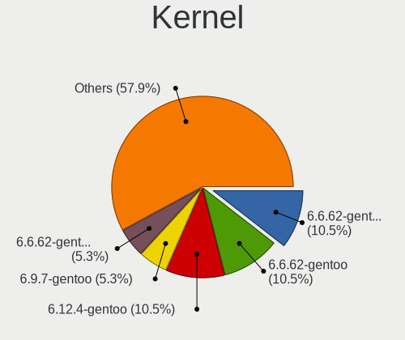
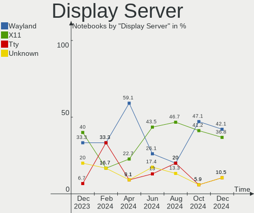
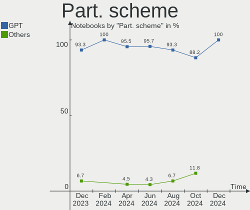
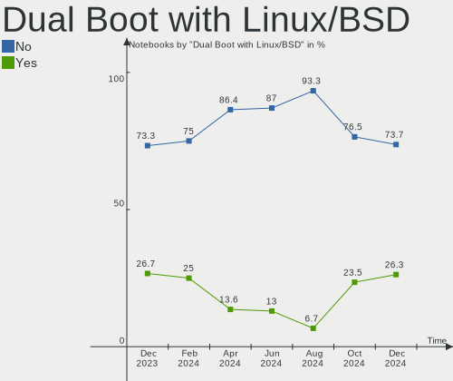
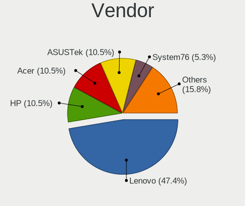
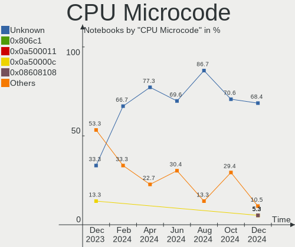
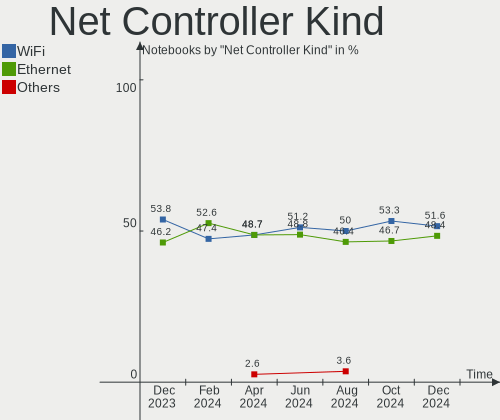

Gentoo - Hardware Trends (Notebooks)
------------------------------------

A project to identify most popular hardware characteristics and track their change
over time based on data collected by Linux users at https://Linux-Hardware.org.

Anyone can contribute to this report by the [hw-probe](https://github.com/linuxhw/hw-probe) tool:

    sudo -E hw-probe -all -upload

This report is for one last month. Overall report since the beginning of time: [TestCoverage](https://github.com/linuxhw/TestCoverage)

Period: Jan, 2023.

Contents
--------

* [ System ](#system)
  - [ OS                       ](#os)
  - [ OS Family                ](#os-family)
  - [ Kernel                   ](#kernel)
  - [ Kernel Family            ](#kernel-family)
  - [ Kernel Major Ver.        ](#kernel-major-ver)
  - [ Arch                     ](#arch)
  - [ DE                       ](#de)
  - [ Display Server           ](#display-server)
  - [ Display Manager          ](#display-manager)
  - [ OS Lang                  ](#os-lang)
  - [ Boot Mode                ](#boot-mode)
  - [ Filesystem               ](#filesystem)
  - [ Part. scheme             ](#part-scheme)
  - [ Dual Boot with Linux/BSD ](#dual-boot-with-linuxbsd)
  - [ Dual Boot (Win)          ](#dual-boot-win)

* [ Board ](#board)
  - [ Vendor                   ](#vendor)
  - [ Model                    ](#model)
  - [ Model Family             ](#model-family)
  - [ MFG Year                 ](#mfg-year)
  - [ Form Factor              ](#form-factor)
  - [ Secure Boot              ](#secure-boot)
  - [ Coreboot                 ](#coreboot)
  - [ RAM Size                 ](#ram-size)
  - [ RAM Used                 ](#ram-used)
  - [ Total Drives             ](#total-drives)
  - [ Has CD-ROM               ](#has-cd-rom)
  - [ Has Ethernet             ](#has-ethernet)
  - [ Has WiFi                 ](#has-wifi)
  - [ Has Bluetooth            ](#has-bluetooth)

* [ Location ](#location)
  - [ Country                  ](#country)
  - [ City                     ](#city)

* [ Drives ](#drives)
  - [ Drive Vendor             ](#drive-vendor)
  - [ Drive Model              ](#drive-model)
  - [ HDD Vendor               ](#hdd-vendor)
  - [ SSD Vendor               ](#ssd-vendor)
  - [ Drive Kind               ](#drive-kind)
  - [ Drive Connector          ](#drive-connector)
  - [ Drive Size               ](#drive-size)
  - [ Space Total              ](#space-total)
  - [ Space Used               ](#space-used)
  - [ Malfunc. Drives          ](#malfunc-drives)
  - [ Malfunc. Drive Vendor    ](#malfunc-drive-vendor)
  - [ Malfunc. HDD Vendor      ](#malfunc-hdd-vendor)
  - [ Malfunc. Drive Kind      ](#malfunc-drive-kind)
  - [ Failed Drives            ](#failed-drives)
  - [ Failed Drive Vendor      ](#failed-drive-vendor)
  - [ Drive Status             ](#drive-status)

* [ Storage controller ](#storage-controller)
  - [ Storage Vendor           ](#storage-vendor)
  - [ Storage Model            ](#storage-model)
  - [ Storage Kind             ](#storage-kind)

* [ Processor ](#processor)
  - [ CPU Vendor               ](#cpu-vendor)
  - [ CPU Model                ](#cpu-model)
  - [ CPU Model Family         ](#cpu-model-family)
  - [ CPU Cores                ](#cpu-cores)
  - [ CPU Sockets              ](#cpu-sockets)
  - [ CPU Threads              ](#cpu-threads)
  - [ CPU Op-Modes             ](#cpu-op-modes)
  - [ CPU Microcode            ](#cpu-microcode)
  - [ CPU Microarch            ](#cpu-microarch)

* [ Graphics ](#graphics)
  - [ GPU Vendor               ](#gpu-vendor)
  - [ GPU Model                ](#gpu-model)
  - [ GPU Combo                ](#gpu-combo)
  - [ GPU Driver               ](#gpu-driver)
  - [ GPU Memory               ](#gpu-memory)

* [ Monitor ](#monitor)
  - [ Monitor Vendor           ](#monitor-vendor)
  - [ Monitor Model            ](#monitor-model)
  - [ Monitor Resolution       ](#monitor-resolution)
  - [ Monitor Diagonal         ](#monitor-diagonal)
  - [ Monitor Width            ](#monitor-width)
  - [ Aspect Ratio             ](#aspect-ratio)
  - [ Monitor Area             ](#monitor-area)
  - [ Pixel Density            ](#pixel-density)
  - [ Multiple Monitors        ](#multiple-monitors)

* [ Network ](#network)
  - [ Net Controller Vendor    ](#net-controller-vendor)
  - [ Net Controller Model     ](#net-controller-model)
  - [ Wireless Vendor          ](#wireless-vendor)
  - [ Wireless Model           ](#wireless-model)
  - [ Ethernet Vendor          ](#ethernet-vendor)
  - [ Ethernet Model           ](#ethernet-model)
  - [ Net Controller Kind      ](#net-controller-kind)
  - [ Used Controller          ](#used-controller)
  - [ NICs                     ](#nics)
  - [ IPv6                     ](#ipv6)

* [ Bluetooth ](#bluetooth)
  - [ Bluetooth Vendor         ](#bluetooth-vendor)
  - [ Bluetooth Model          ](#bluetooth-model)

* [ Sound ](#sound)
  - [ Sound Vendor             ](#sound-vendor)
  - [ Sound Model              ](#sound-model)

* [ Memory ](#memory)
  - [ Memory Vendor            ](#memory-vendor)
  - [ Memory Model             ](#memory-model)
  - [ Memory Kind              ](#memory-kind)
  - [ Memory Form Factor       ](#memory-form-factor)
  - [ Memory Size              ](#memory-size)
  - [ Memory Speed             ](#memory-speed)

* [ Printers & scanners ](#printers--scanners)
  - [ Printer Vendor           ](#printer-vendor)
  - [ Printer Model            ](#printer-model)
  - [ Scanner Vendor           ](#scanner-vendor)
  - [ Scanner Model            ](#scanner-model)

* [ Camera ](#camera)
  - [ Camera Vendor            ](#camera-vendor)
  - [ Camera Model             ](#camera-model)

* [ Security ](#security)
  - [ Fingerprint Vendor       ](#fingerprint-vendor)
  - [ Fingerprint Model        ](#fingerprint-model)
  - [ Chipcard Vendor          ](#chipcard-vendor)
  - [ Chipcard Model           ](#chipcard-model)

* [ Unsupported ](#unsupported)
  - [ Unsupported Devices      ](#unsupported-devices)
  - [ Unsupported Device Types ](#unsupported-device-types)

System
------

OS
--

Installed operating systems

| Name       | Notebooks | Percent |
|------------|-----------|---------|
| Gentoo 2.9 | 27        | 96.43%  |
| Gentoo     | 1         | 3.57%   |

OS Family
---------

OS without a version

| Name   | Notebooks | Percent |
|--------|-----------|---------|
| Gentoo | 28        | 100%    |

Kernel
------

Version of the Linux kernel

| Version               | Notebooks | Percent |
|-----------------------|-----------|---------|
| 6.1.7-gentoo          | 3         | 10.71%  |
| 6.1.2-gentoo-x86_64   | 2         | 7.14%   |
| 5.15.85-gentoo-dist   | 2         | 7.14%   |
| 6.1.8-gentoo-x86_64   | 1         | 3.57%   |
| 6.1.8-gentoo-dist     | 1         | 3.57%   |
| 6.1.7-xanmod1         | 1         | 3.57%   |
| 6.1.7-gentoo-x86_64   | 1         | 3.57%   |
| 6.1.7-gentoo-dist     | 1         | 3.57%   |
| 6.1.6-gentoo-x86_64   | 1         | 3.57%   |
| 6.1.6-gentoo          | 1         | 3.57%   |
| 6.1.4-gentoo-dist     | 1         | 3.57%   |
| 6.1.3-gentoosystemd   | 1         | 3.57%   |
| 6.1.3-gentoo-x86_64   | 1         | 3.57%   |
| 6.1.3-gentoo-dist     | 1         | 3.57%   |
| 6.1.1-gentoo-x86_64   | 1         | 3.57%   |
| 6.1.0-pf1             | 1         | 3.57%   |
| 6.0.19-gentoo         | 1         | 3.57%   |
| 5.15.88-gentoo-x86_64 | 1         | 3.57%   |
| 5.15.88-gentoo        | 1         | 3.57%   |
| 5.15.80-gentoo-x86_64 | 1         | 3.57%   |
| 5.15.80-gentoo        | 1         | 3.57%   |
| 5.15.75-gentoo-x86_64 | 1         | 3.57%   |
| 5.15.74-gentoo-x86    | 1         | 3.57%   |
| 5.10.76-gentoo-r1     | 1         | 3.57%   |

Kernel Family
-------------

Linux kernel without a distro release

| Version | Notebooks | Percent |
|---------|-----------|---------|
| 6.1.7   | 6         | 21.43%  |
| 6.1.3   | 3         | 10.71%  |
| 6.1.8   | 2         | 7.14%   |
| 6.1.6   | 2         | 7.14%   |
| 6.1.2   | 2         | 7.14%   |
| 5.15.88 | 2         | 7.14%   |
| 5.15.85 | 2         | 7.14%   |
| 5.15.80 | 2         | 7.14%   |
| 6.1.4   | 1         | 3.57%   |
| 6.1.1   | 1         | 3.57%   |
| 6.1.0   | 1         | 3.57%   |
| 6.0.19  | 1         | 3.57%   |
| 5.15.75 | 1         | 3.57%   |
| 5.15.74 | 1         | 3.57%   |
| 5.10.76 | 1         | 3.57%   |

Kernel Major Ver.
-----------------

Linux kernel major version

| Version | Notebooks | Percent |
|---------|-----------|---------|
| 6.1     | 18        | 64.29%  |
| 5.15    | 8         | 28.57%  |
| 6.0     | 1         | 3.57%   |
| 5.10    | 1         | 3.57%   |

Arch
----

OS architecture (x86_64, i586, etc.)

| Name   | Notebooks | Percent |
|--------|-----------|---------|
| x86_64 | 27        | 96.43%  |
| i686   | 1         | 3.57%   |

DE
--

Desktop Environment

| Name       | Notebooks | Percent |
|------------|-----------|---------|
| KDE5       | 9         | 32.14%  |
| Unknown    | 5         | 17.86%  |
| MATE       | 4         | 14.29%  |
| XFCE       | 3         | 10.71%  |
| X-Cinnamon | 2         | 7.14%   |
| GNOME      | 2         | 7.14%   |
| Hyprland   | 1         | 3.57%   |
| DWM        | 1         | 3.57%   |
| bspwm      | 1         | 3.57%   |

Display Server
--------------

X11 or Wayland

| Name    | Notebooks | Percent |
|---------|-----------|---------|
| X11     | 19        | 67.86%  |
| Tty     | 4         | 14.29%  |
| Wayland | 3         | 10.71%  |
| Unknown | 2         | 7.14%   |

Display Manager
---------------

SDDM, LightDM, etc.

| Name    | Notebooks | Percent |
|---------|-----------|---------|
| SDDM    | 13        | 46.43%  |
| Unknown | 6         | 21.43%  |
| LightDM | 4         | 14.29%  |
| SLiM    | 2         | 7.14%   |
| GDM     | 2         | 7.14%   |
| XDM     | 1         | 3.57%   |

OS Lang
-------

Language

| Lang    | Notebooks | Percent |
|---------|-----------|---------|
| en_US   | 10        | 35.71%  |
| cs_CZ   | 4         | 14.29%  |
| C.UTF8  | 3         | 10.71%  |
| Unknown | 3         | 10.71%  |
| ru_RU   | 2         | 7.14%   |
| C       | 2         | 7.14%   |
| ru_UA   | 1         | 3.57%   |
| mi_NZ   | 1         | 3.57%   |
| ja_JP   | 1         | 3.57%   |
| fr_FR   | 1         | 3.57%   |

Boot Mode
---------

EFI or BIOS

| Mode | Notebooks | Percent |
|------|-----------|---------|
| EFI  | 24        | 85.71%  |
| BIOS | 4         | 14.29%  |

Filesystem
----------

Type of filesystem

| Type    | Notebooks | Percent |
|---------|-----------|---------|
| Ext4    | 13        | 46.43%  |
| Btrfs   | 12        | 42.86%  |
| XXXXXXX | 1         | 3.57%   |
| Xfs     | 1         | 3.57%   |
| F2fs    | 1         | 3.57%   |

Part. scheme
------------

Scheme of partitioning

| Type    | Notebooks | Percent |
|---------|-----------|---------|
| GPT     | 25        | 89.29%  |
| MBR     | 2         | 7.14%   |
| Unknown | 1         | 3.57%   |

Dual Boot with Linux/BSD
------------------------

Hosting more than one Linux/BSD

| Dual boot | Notebooks | Percent |
|-----------|-----------|---------|
| No        | 19        | 67.86%  |
| Yes       | 9         | 32.14%  |

Dual Boot (Win)
---------------

Hosting Linux and Windows

| Dual boot | Notebooks | Percent |
|-----------|-----------|---------|
| Yes       | 14        | 50%     |
| No        | 14        | 50%     |

Board
-----

Vendor
------

Motherboard manufacturer

| Name             | Notebooks | Percent |
|------------------|-----------|---------|
| Lenovo           | 7         | 25%     |
| Dell             | 7         | 25%     |
| Hewlett-Packard  | 3         | 10.71%  |
| ASUSTek Computer | 3         | 10.71%  |
| Google           | 2         | 7.14%   |
| Acer             | 2         | 7.14%   |
| Timi             | 1         | 3.57%   |
| Sony             | 1         | 3.57%   |
| Schenker         | 1         | 3.57%   |
| MSI              | 1         | 3.57%   |

Model
-----

Motherboard model

| Name                                     | Notebooks | Percent |
|------------------------------------------|-----------|---------|
| Dell XPS 9320                            | 2         | 7.14%   |
| Timi Mi Laptop Pro 15                    | 1         | 3.57%   |
| Sony PCG-GRT230(UC)                      | 1         | 3.57%   |
| Schenker XMG PRO (E22)                   | 1         | 3.57%   |
| MSI Bravo 15 B5DD                        | 1         | 3.57%   |
| Lenovo ThinkPad T480 20L6S04Q00          | 1         | 3.57%   |
| Lenovo ThinkPad T470s 20HGS27Y0V         | 1         | 3.57%   |
| Lenovo Legion Y540-15IRH-PG0 81SY        | 1         | 3.57%   |
| Lenovo Legion 5 Pro 16IAH7H 82RF         | 1         | 3.57%   |
| Lenovo Legion 5 Pro 16ACH6H 82JQ         | 1         | 3.57%   |
| Lenovo IdeaPad S145-15IWL 81MV           | 1         | 3.57%   |
| Lenovo IdeaPad 5 15ARE05 81YQ            | 1         | 3.57%   |
| HP Victus by Gaming Laptop 15-fb0xxx     | 1         | 3.57%   |
| HP Pavilion Gaming Laptop 17-cd1xxx      | 1         | 3.57%   |
| HP Pavilion Gaming Laptop 15-ec1xxx      | 1         | 3.57%   |
| Google Sasuke                            | 1         | 3.57%   |
| Google Helios                            | 1         | 3.57%   |
| Dell XPS 17 9700                         | 1         | 3.57%   |
| Dell Precision 7770                      | 1         | 3.57%   |
| Dell Precision 7720                      | 1         | 3.57%   |
| Dell Latitude 5530                       | 1         | 3.57%   |
| Dell Latitude 5410                       | 1         | 3.57%   |
| ASUS VivoBook_ASUSLaptop X515JA_P1511CJA | 1         | 3.57%   |
| ASUS TUF Gaming FX505DT_FX505DT          | 1         | 3.57%   |
| ASUS ROG Strix G732LXS_G732LXS           | 1         | 3.57%   |
| Acer TravelMate B115-M                   | 1         | 3.57%   |
| Acer Predator PH315-51                   | 1         | 3.57%   |

Model Family
------------

Motherboard model prefix

| Name                | Notebooks | Percent |
|---------------------|-----------|---------|
| Lenovo Legion       | 3         | 10.71%  |
| Dell XPS            | 3         | 10.71%  |
| Lenovo ThinkPad     | 2         | 7.14%   |
| Lenovo IdeaPad      | 2         | 7.14%   |
| HP Pavilion         | 2         | 7.14%   |
| Dell Precision      | 2         | 7.14%   |
| Dell Latitude       | 2         | 7.14%   |
| Timi Mi             | 1         | 3.57%   |
| Sony PCG-GRT230(UC) | 1         | 3.57%   |
| Schenker XMG        | 1         | 3.57%   |
| MSI Bravo           | 1         | 3.57%   |
| HP Victus           | 1         | 3.57%   |
| Google Sasuke       | 1         | 3.57%   |
| Google Helios       | 1         | 3.57%   |
| ASUS VivoBook       | 1         | 3.57%   |
| ASUS TUF            | 1         | 3.57%   |
| ASUS ROG            | 1         | 3.57%   |
| Acer TravelMate     | 1         | 3.57%   |
| Acer Predator       | 1         | 3.57%   |

MFG Year
--------

Motherboard manufacture year

| Year | Notebooks | Percent |
|------|-----------|---------|
| 2022 | 8         | 28.57%  |
| 2021 | 5         | 17.86%  |
| 2020 | 5         | 17.86%  |
| 2019 | 4         | 14.29%  |
| 2018 | 2         | 7.14%   |
| 2017 | 2         | 7.14%   |
| 2014 | 1         | 3.57%   |
| 2003 | 1         | 3.57%   |

Form Factor
-----------

Physical design of the computer

| Name     | Notebooks | Percent |
|----------|-----------|---------|
| Notebook | 28        | 100%    |

Secure Boot
-----------

Enabled or disabled

| State    | Notebooks | Percent |
|----------|-----------|---------|
| Disabled | 28        | 100%    |

Coreboot
--------

Have coreboot on board

| Used | Notebooks | Percent |
|------|-----------|---------|
| No   | 26        | 92.86%  |
| Yes  | 2         | 7.14%   |

RAM Size
--------

Total RAM memory

| Size in GB  | Notebooks | Percent |
|-------------|-----------|---------|
| 32.01-64.0  | 9         | 32.14%  |
| 16.01-24.0  | 6         | 21.43%  |
| 8.01-16.0   | 6         | 21.43%  |
| 4.01-8.0    | 3         | 10.71%  |
| 3.01-4.0    | 2         | 7.14%   |
| 64.01-256.0 | 1         | 3.57%   |
| 0.01-0.5    | 1         | 3.57%   |

RAM Used
--------

Used RAM memory

| Used GB   | Notebooks | Percent |
|-----------|-----------|---------|
| 2.01-3.0  | 7         | 25%     |
| 1.01-2.0  | 5         | 17.86%  |
| 4.01-8.0  | 4         | 14.29%  |
| 3.01-4.0  | 4         | 14.29%  |
| 8.01-16.0 | 4         | 14.29%  |
| 0.01-0.5  | 3         | 10.71%  |
| 0.51-1.0  | 1         | 3.57%   |

Total Drives
------------

Number of drives on board

| Drives | Notebooks | Percent |
|--------|-----------|---------|
| 1      | 16        | 57.14%  |
| 2      | 11        | 39.29%  |
| 3      | 1         | 3.57%   |

Has CD-ROM
----------

Has CD-ROM on board

| Presented | Notebooks | Percent |
|-----------|-----------|---------|
| No        | 27        | 96.43%  |
| Yes       | 1         | 3.57%   |

Has Ethernet
------------

Has Ethernet on board

| Presented | Notebooks | Percent |
|-----------|-----------|---------|
| Yes       | 22        | 78.57%  |
| No        | 6         | 21.43%  |

Has WiFi
--------

Has WiFi module

| Presented | Notebooks | Percent |
|-----------|-----------|---------|
| Yes       | 27        | 96.43%  |
| No        | 1         | 3.57%   |

Has Bluetooth
-------------

Has Bluetooth module

| Presented | Notebooks | Percent |
|-----------|-----------|---------|
| Yes       | 25        | 89.29%  |
| No        | 3         | 10.71%  |

Location
--------

Country
-------

Geographic location (country)

| Country     | Notebooks | Percent |
|-------------|-----------|---------|
| USA         | 10        | 35.71%  |
| Czechia     | 3         | 10.71%  |
| Turkey      | 1         | 3.57%   |
| Taiwan      | 1         | 3.57%   |
| Spain       | 1         | 3.57%   |
| Russia      | 1         | 3.57%   |
| Portugal    | 1         | 3.57%   |
| Poland      | 1         | 3.57%   |
| New Zealand | 1         | 3.57%   |
| Netherlands | 1         | 3.57%   |
| Mexico      | 1         | 3.57%   |
| Japan       | 1         | 3.57%   |
| Hungary     | 1         | 3.57%   |
| Germany     | 1         | 3.57%   |
| Georgia     | 1         | 3.57%   |
| France      | 1         | 3.57%   |
| Canada      | 1         | 3.57%   |

City
----

Geographic location (city)

| City         | Notebooks | Percent |
|--------------|-----------|---------|
| Oviedo       | 2         | 7.14%   |
| Woodbridge   | 1         | 3.57%   |
| Warsaw       | 1         | 3.57%   |
| Vitkov       | 1         | 3.57%   |
| Vechelde     | 1         | 3.57%   |
| Tbilisi      | 1         | 3.57%   |
| Taipei       | 1         | 3.57%   |
| St. Claude   | 1         | 3.57%   |
| Renton       | 1         | 3.57%   |
| Prague       | 1         | 3.57%   |
| Ponetovice   | 1         | 3.57%   |
| Paris        | 1         | 3.57%   |
| Minato-ku    | 1         | 3.57%   |
| Melgaço     | 1         | 3.57%   |
| Madrid       | 1         | 3.57%   |
| Isparta      | 1         | 3.57%   |
| Felsoszolnok | 1         | 3.57%   |
| El Arenal    | 1         | 3.57%   |
| Denton       | 1         | 3.57%   |
| Dallas       | 1         | 3.57%   |
| Crowley      | 1         | 3.57%   |
| Cleveland    | 1         | 3.57%   |
| Christchurch | 1         | 3.57%   |
| Borovichi    | 1         | 3.57%   |
| Aurora       | 1         | 3.57%   |
| Amsterdam    | 1         | 3.57%   |
| Aledo        | 1         | 3.57%   |

Drives
------

Drive Vendor
------------

Hard drive vendors

| Vendor              | Notebooks | Drives | Percent |
|---------------------|-----------|--------|---------|
| Samsung Electronics | 9         | 12     | 24.32%  |
| Sandisk             | 5         | 5      | 13.51%  |
| SK hynix            | 3         | 3      | 8.11%   |
| KIOXIA              | 3         | 3      | 8.11%   |
| Intel               | 3         | 4      | 8.11%   |
| Unknown             | 2         | 2      | 5.41%   |
| Phison Electronics  | 2         | 2      | 5.41%   |
| Micron Technology   | 2         | 2      | 5.41%   |
| Kingston            | 2         | 2      | 5.41%   |
| Toshiba             | 1         | 1      | 2.7%    |
| Solid State Storage | 1         | 1      | 2.7%    |
| Smartbuy            | 1         | 1      | 2.7%    |
| Seagate             | 1         | 1      | 2.7%    |
| IBM/Hitachi         | 1         | 1      | 2.7%    |
| HGST                | 1         | 1      | 2.7%    |

Drive Model
-----------

Hard drive models

| Model                                                | Notebooks | Percent |
|------------------------------------------------------|-----------|---------|
| Samsung NVMe SSD Controller PM9A1/PM9A3/980PRO 512GB | 4         | 10.26%  |
| Samsung NVMe SSD Controller SM981/PM981/PM983 500GB  | 3         | 7.69%   |
| Unknown MMC Card  32GB                               | 2         | 5.13%   |
| Intel SSD 660P Series 512GB                          | 2         | 5.13%   |
| Toshiba MQ01ACF050 500GB                             | 1         | 2.56%   |
| Solid State Storage SSSTC CL1-4D256 256GB            | 1         | 2.56%   |
| Smartbuy SSD 240GB                                   | 1         | 2.56%   |
| SK hynix PC801 NVMe 2TB                              | 1         | 2.56%   |
| SK hynix PC801 NVMe 1TB                              | 1         | 2.56%   |
| SK hynix BC501 NVMe Solid State Drive 512GB          | 1         | 2.56%   |
| Seagate ST1000LM049-2GH172 1TB                       | 1         | 2.56%   |
| Sandisk WD_BLACK SN850X 1000GB                       | 1         | 2.56%   |
| Sandisk WD Blue SN550 NVMe SSD 1TB                   | 1         | 2.56%   |
| Sandisk WD Blue SN500 / PC SN520 NVMe SSD 512GB      | 1         | 2.56%   |
| Sandisk WD Black SN750 / PC SN730 NVMe SSD 1TB       | 1         | 2.56%   |
| Sandisk PC SN520 NVMe SSD 256GB                      | 1         | 2.56%   |
| Samsung SSD 860 PRO 1TB                              | 1         | 2.56%   |
| Samsung SSD 850 PRO 256GB                            | 1         | 2.56%   |
| Samsung PM9A1 NVMe 2048GB                            | 1         | 2.56%   |
| Samsung MZVLQ256HAJD-00000 256GB                     | 1         | 2.56%   |
| Phison E12 NVMe Controller 1TB                       | 1         | 2.56%   |
| Phison Corsair MP600 PRO NH 1TB                      | 1         | 2.56%   |
| Micron 2200V_MTFDHBA512TCK  512GB                    | 1         | 2.56%   |
| Micron 1100_MTFDDAV256TBN 256GB SSD                  | 1         | 2.56%   |
| KIOXIA NVMe SSD 500GB                                | 1         | 2.56%   |
| KIOXIA KBG40ZNV256G 256GB                            | 1         | 2.56%   |
| KIOXIA KBG40ZNS512G NVMe 512GB                       | 1         | 2.56%   |
| Kingston SA400S37240G 240GB SSD                      | 1         | 2.56%   |
| Kingston OM8PCP3512F-AI1 512GB                       | 1         | 2.56%   |
| Intel SSD Pro 7600p/760p/E 6100p Series 256GB        | 1         | 2.56%   |
| IBM/Hitachi IC25N040ATMR04-0 40GB                    | 1         | 2.56%   |
| HGST HTS721010A9E630 1TB                             | 1         | 2.56%   |

HDD Vendor
----------

Hard disk drive vendors

| Vendor      | Notebooks | Drives | Percent |
|-------------|-----------|--------|---------|
| Toshiba     | 1         | 1      | 25%     |
| Seagate     | 1         | 1      | 25%     |
| IBM/Hitachi | 1         | 1      | 25%     |
| HGST        | 1         | 1      | 25%     |

SSD Vendor
----------

Solid state drive vendors

| Vendor              | Notebooks | Drives | Percent |
|---------------------|-----------|--------|---------|
| Samsung Electronics | 2         | 2      | 40%     |
| Smartbuy            | 1         | 1      | 20%     |
| Micron Technology   | 1         | 1      | 20%     |
| Kingston            | 1         | 1      | 20%     |

Drive Kind
----------

HDD or SSD

| Kind | Notebooks | Drives | Percent |
|------|-----------|--------|---------|
| NVMe | 24        | 30     | 68.57%  |
| SSD  | 5         | 5      | 14.29%  |
| HDD  | 4         | 4      | 11.43%  |
| MMC  | 2         | 2      | 5.71%   |

Drive Connector
---------------

SATA, SAS, NVMe, etc.

| Type | Notebooks | Drives | Percent |
|------|-----------|--------|---------|
| NVMe | 24        | 30     | 68.57%  |
| SATA | 9         | 9      | 25.71%  |
| MMC  | 2         | 2      | 5.71%   |

Drive Size
----------

Size of hard drive

| Size in TB | Notebooks | Drives | Percent |
|------------|-----------|--------|---------|
| 0.01-0.5   | 6         | 6      | 66.67%  |
| 0.51-1.0   | 3         | 3      | 33.33%  |

Space Total
-----------

Amount of disk space available on the file system

| Size in GB     | Notebooks | Percent |
|----------------|-----------|---------|
| 251-500        | 7         | 25%     |
| 101-250        | 7         | 25%     |
| 1001-2000      | 3         | 10.71%  |
| 501-1000       | 3         | 10.71%  |
| 51-100         | 3         | 10.71%  |
| Unknown        | 2         | 7.14%   |
| More than 3000 | 1         | 3.57%   |
| 21-50          | 1         | 3.57%   |
| 1-20           | 1         | 3.57%   |

Space Used
----------

Amount of used disk space

| Used GB   | Notebooks | Percent |
|-----------|-----------|---------|
| 21-50     | 6         | 21.43%  |
| 251-500   | 4         | 14.29%  |
| 1-20      | 4         | 14.29%  |
| 501-1000  | 4         | 14.29%  |
| 51-100    | 4         | 14.29%  |
| 101-250   | 2         | 7.14%   |
| 1001-2000 | 2         | 7.14%   |
| Unknown   | 2         | 7.14%   |

Malfunc. Drives
---------------

Drive models with a malfunction

| Model                                 | Notebooks | Drives | Percent |
|---------------------------------------|-----------|--------|---------|
| Samsung Electronics PM9A1 NVMe 2048GB | 1         | 1      | 50%     |
| IBM/Hitachi IC25N040ATMR04-0 40GB     | 1         | 1      | 50%     |

Malfunc. Drive Vendor
---------------------

Vendors of faulty drives

| Vendor              | Notebooks | Drives | Percent |
|---------------------|-----------|--------|---------|
| Samsung Electronics | 1         | 1      | 50%     |
| IBM/Hitachi         | 1         | 1      | 50%     |

Malfunc. HDD Vendor
-------------------

Vendors of faulty HDD drives

| Vendor      | Notebooks | Drives | Percent |
|-------------|-----------|--------|---------|
| IBM/Hitachi | 1         | 1      | 100%    |

Malfunc. Drive Kind
-------------------

Kinds of faulty drives

| Kind | Notebooks | Drives | Percent |
|------|-----------|--------|---------|
| NVMe | 1         | 1      | 50%     |
| HDD  | 1         | 1      | 50%     |

Failed Drives
-------------

Failed drive models

Zero info for selected period =(

Failed Drive Vendor
-------------------

Failed drive vendors

Zero info for selected period =(

Drive Status
------------

Number of failed and malfunc. drives

| Status   | Notebooks | Drives | Percent |
|----------|-----------|--------|---------|
| Works    | 24        | 35     | 82.76%  |
| Detected | 3         | 4      | 10.34%  |
| Malfunc  | 2         | 2      | 6.9%    |

Storage controller
------------------

Storage Vendor
--------------

Storage controller vendors

| Vendor                           | Notebooks | Percent |
|----------------------------------|-----------|---------|
| Intel                            | 14        | 33.33%  |
| Samsung Electronics              | 8         | 19.05%  |
| SanDisk                          | 5         | 11.9%   |
| SK hynix                         | 3         | 7.14%   |
| KIOXIA                           | 3         | 7.14%   |
| AMD                              | 3         | 7.14%   |
| Phison Electronics               | 2         | 4.76%   |
| Solid State Storage Technology   | 1         | 2.38%   |
| Silicon Integrated Systems [SiS] | 1         | 2.38%   |
| Micron Technology                | 1         | 2.38%   |
| Kingston Technology Company      | 1         | 2.38%   |

Storage Model
-------------

Storage controller models

| Model                                                                         | Notebooks | Percent |
|-------------------------------------------------------------------------------|-----------|---------|
| Samsung NVMe SSD Controller PM9A1/PM9A3/980PRO                                | 5         | 11.63%  |
| Samsung NVMe SSD Controller SM981/PM981/PM983                                 | 3         | 6.98%   |
| AMD FCH SATA Controller [AHCI mode]                                           | 3         | 6.98%   |
| SK hynix Non-Volatile memory controller                                       | 2         | 4.65%   |
| KIOXIA NVMe SSD Controller BG4                                                | 2         | 4.65%   |
| Intel Volume Management Device NVMe RAID Controller                           | 2         | 4.65%   |
| Intel SSD 660P Series                                                         | 2         | 4.65%   |
| Intel Comet Lake SATA AHCI Controller                                         | 2         | 4.65%   |
| Intel Cannon Lake Mobile PCH SATA AHCI Controller                             | 2         | 4.65%   |
| Intel 82801 Mobile SATA Controller [RAID mode]                                | 2         | 4.65%   |
| Solid State Storage Non-Volatile memory controller                            | 1         | 2.33%   |
| SK hynix BC501 NVMe Solid State Drive                                         | 1         | 2.33%   |
| Silicon Integrated Systems [SiS] 5513 IDE Controller                          | 1         | 2.33%   |
| SanDisk WD Blue SN550 NVMe SSD                                                | 1         | 2.33%   |
| SanDisk WD Blue SN500 / PC SN520 NVMe SSD                                     | 1         | 2.33%   |
| SanDisk WD Black SN750 / PC SN730 NVMe SSD                                    | 1         | 2.33%   |
| SanDisk PC SN520 NVMe SSD                                                     | 1         | 2.33%   |
| Sandisk Non-Volatile memory controller                                        | 1         | 2.33%   |
| Samsung NVMe SSD Controller 980                                               | 1         | 2.33%   |
| Phison E18 PCIe4 NVMe Controller                                              | 1         | 2.33%   |
| Phison E12 NVMe Controller                                                    | 1         | 2.33%   |
| Micron Non-Volatile memory controller                                         | 1         | 2.33%   |
| KIOXIA NVMe SSD                                                               | 1         | 2.33%   |
| Kingston Company Company Non-Volatile memory controller                       | 1         | 2.33%   |
| Intel SSD Pro 7600p/760p/E 6100p Series                                       | 1         | 2.33%   |
| Intel Q170/Q150/B150/H170/H110/Z170/CM236 Chipset SATA Controller [AHCI Mode] | 1         | 2.33%   |
| Intel Cannon Point-LP SATA Controller [AHCI Mode]                             | 1         | 2.33%   |
| Intel Atom Processor E3800 Series SATA AHCI Controller                        | 1         | 2.33%   |

Storage Kind
------------

Kind of storage controller (IDE, SATA, NVMe, SAS, ...)

| Kind | Notebooks | Percent |
|------|-----------|---------|
| NVMe | 24        | 61.54%  |
| SATA | 10        | 25.64%  |
| RAID | 4         | 10.26%  |
| IDE  | 1         | 2.56%   |

Processor
---------

CPU Vendor
----------

Processor vendors

| Vendor | Notebooks | Percent |
|--------|-----------|---------|
| Intel  | 22        | 78.57%  |
| AMD    | 6         | 21.43%  |

CPU Model
---------

Processor models

| Model                                         | Notebooks | Percent |
|-----------------------------------------------|-----------|---------|
| Intel 12th Gen Core i7-12700H                 | 2         | 7.14%   |
| AMD Ryzen 7 5800H with Radeon Graphics        | 2         | 7.14%   |
| Intel Pentium CPU 5405U @ 2.30GHz             | 1         | 3.57%   |
| Intel Pentium 4 CPU 2.40GHz                   | 1         | 3.57%   |
| Intel Core i9-10885H CPU @ 2.40GHz            | 1         | 3.57%   |
| Intel Core i7-9750H CPU @ 2.60GHz             | 1         | 3.57%   |
| Intel Core i7-8750H CPU @ 2.20GHz             | 1         | 3.57%   |
| Intel Core i7-7920HQ CPU @ 3.10GHz            | 1         | 3.57%   |
| Intel Core i7-10875H CPU @ 2.30GHz            | 1         | 3.57%   |
| Intel Core i7-10750H CPU @ 2.60GHz            | 1         | 3.57%   |
| Intel Core i7-10510U CPU @ 1.80GHz            | 1         | 3.57%   |
| Intel Core i5-8350U CPU @ 1.70GHz             | 1         | 3.57%   |
| Intel Core i5-7300U CPU @ 2.60GHz             | 1         | 3.57%   |
| Intel Core i5-1035G1 CPU @ 1.00GHz            | 1         | 3.57%   |
| Intel Core i5-10210U CPU @ 1.60GHz            | 1         | 3.57%   |
| Intel Core i3-10110U CPU @ 2.10GHz            | 1         | 3.57%   |
| Intel Celeron N4500 @ 1.10GHz                 | 1         | 3.57%   |
| Intel Celeron CPU N2930 @ 1.83GHz             | 1         | 3.57%   |
| Intel 12th Gen Core i7-12850HX                | 1         | 3.57%   |
| Intel 12th Gen Core i7-1280P                  | 1         | 3.57%   |
| Intel 12th Gen Core i7-1265U                  | 1         | 3.57%   |
| Intel 12th Gen Core i7-1260P                  | 1         | 3.57%   |
| AMD Ryzen 7 3750H with Radeon Vega Mobile Gfx | 1         | 3.57%   |
| AMD Ryzen 5 5600H with Radeon Graphics        | 1         | 3.57%   |
| AMD Ryzen 5 4600H with Radeon Graphics        | 1         | 3.57%   |
| AMD Ryzen 5 4500U with Radeon Graphics        | 1         | 3.57%   |

CPU Model Family
----------------

Processor model prefix

| Model           | Notebooks | Percent |
|-----------------|-----------|---------|
| Other           | 6         | 21.43%  |
| Intel Core i7   | 6         | 21.43%  |
| Intel Core i5   | 4         | 14.29%  |
| AMD Ryzen 7     | 3         | 10.71%  |
| AMD Ryzen 5     | 3         | 10.71%  |
| Intel Celeron   | 2         | 7.14%   |
| Intel Pentium 4 | 1         | 3.57%   |
| Intel Pentium   | 1         | 3.57%   |
| Intel Core i9   | 1         | 3.57%   |
| Intel Core i3   | 1         | 3.57%   |

CPU Cores
---------

Number of processor cores

| Number | Notebooks | Percent |
|--------|-----------|---------|
| 4      | 7         | 25%     |
| 6      | 6         | 21.43%  |
| 8      | 4         | 14.29%  |
| 2      | 4         | 14.29%  |
| 14     | 3         | 10.71%  |
| 16     | 1         | 3.57%   |
| 12     | 1         | 3.57%   |
| 10     | 1         | 3.57%   |
| 1      | 1         | 3.57%   |

CPU Sockets
-----------

Number of sockets

| Number | Notebooks | Percent |
|--------|-----------|---------|
| 1      | 28        | 100%    |

CPU Threads
-----------

Threads per core (Hyper-Threading)

| Number | Notebooks | Percent |
|--------|-----------|---------|
| 2      | 24        | 85.71%  |
| 1      | 4         | 14.29%  |

CPU Op-Modes
------------

CPU Operation Modes (32-bit, 64-bit)

| Op mode        | Notebooks | Percent |
|----------------|-----------|---------|
| 32-bit, 64-bit | 27        | 96.43%  |
| 32-bit         | 1         | 3.57%   |

CPU Microcode
-------------

Microcode number

| Number     | Notebooks | Percent |
|------------|-----------|---------|
| 0x906a3    | 3         | 10.71%  |
| 0x806ec    | 3         | 10.71%  |
| 0xa0652    | 2         | 7.14%   |
| 0x906ea    | 2         | 7.14%   |
| 0x0a50000c | 2         | 7.14%   |
| 0x08600106 | 2         | 7.14%   |
| Unknown    | 2         | 7.14%   |
| 0xf29      | 1         | 3.57%   |
| 0x906e9    | 1         | 3.57%   |
| 0x906c0    | 1         | 3.57%   |
| 0x906a4    | 1         | 3.57%   |
| 0x90672    | 1         | 3.57%   |
| 0x806eb    | 1         | 3.57%   |
| 0x806ea    | 1         | 3.57%   |
| 0x806e9    | 1         | 3.57%   |
| 0x706e5    | 1         | 3.57%   |
| 0x30678    | 1         | 3.57%   |
| 0x0a50000d | 1         | 3.57%   |
| 0x08108102 | 1         | 3.57%   |

CPU Microarch
-------------

Microarchitecture

| Name             | Notebooks | Percent |
|------------------|-----------|---------|
| KabyLake         | 9         | 32.14%  |
| Alderlake Hybrid | 5         | 17.86%  |
| Zen 3            | 3         | 10.71%  |
| CometLake        | 3         | 10.71%  |
| Zen 2            | 2         | 7.14%   |
| Zen+             | 1         | 3.57%   |
| Tremont          | 1         | 3.57%   |
| Silvermont       | 1         | 3.57%   |
| NetBurst         | 1         | 3.57%   |
| IceLake          | 1         | 3.57%   |
| Unknown          | 1         | 3.57%   |

Graphics
--------

GPU Vendor
----------

Vendors of graphics cards

| Vendor | Notebooks | Percent |
|--------|-----------|---------|
| Intel  | 19        | 48.72%  |
| Nvidia | 15        | 38.46%  |
| AMD    | 5         | 12.82%  |

GPU Model
---------

Graphics card models

| Model                                                                | Notebooks | Percent |
|----------------------------------------------------------------------|-----------|---------|
| Intel Alder Lake-P Integrated Graphics Controller                    | 4         | 9.76%   |
| Intel CometLake-U GT2 [UHD Graphics]                                 | 3         | 7.32%   |
| Intel CometLake-H GT2 [UHD Graphics]                                 | 3         | 7.32%   |
| Nvidia TU117M [GeForce GTX 1650 Mobile / Max-Q]                      | 2         | 4.88%   |
| Nvidia GA104M [Geforce RTX 3070 Ti Laptop GPU]                       | 2         | 4.88%   |
| AMD Renoir                                                           | 2         | 4.88%   |
| AMD Cezanne [Radeon Vega Series / Radeon Vega Mobile Series]         | 2         | 4.88%   |
| Nvidia TU117M                                                        | 1         | 2.44%   |
| Nvidia TU116M [GeForce GTX 1660 Ti Mobile]                           | 1         | 2.44%   |
| Nvidia TU106M [GeForce RTX 2060 Max-Q]                               | 1         | 2.44%   |
| Nvidia TU106 [GeForce RTX 2070]                                      | 1         | 2.44%   |
| Nvidia TU104M [GeForce RTX 2080 SUPER Mobile / Max-Q]                | 1         | 2.44%   |
| Nvidia NV17M [GeForce4 420 Go]                                       | 1         | 2.44%   |
| Nvidia GP108M [GeForce MX250]                                        | 1         | 2.44%   |
| Nvidia GP106M [GeForce GTX 1060 Mobile]                              | 1         | 2.44%   |
| Nvidia GP104GLM [Quadro P4000 Mobile]                                | 1         | 2.44%   |
| Nvidia GA106M [GeForce RTX 3060 Mobile / Max-Q]                      | 1         | 2.44%   |
| Nvidia GA104GLM [RTX A3000 12GB Laptop GPU]                          | 1         | 2.44%   |
| Intel Whiskey Lake-U GT1 [UHD Graphics 610]                          | 1         | 2.44%   |
| Intel UHD Graphics 620                                               | 1         | 2.44%   |
| Intel JasperLake [UHD Graphics]                                      | 1         | 2.44%   |
| Intel Iris Plus Graphics G1 (Ice Lake)                               | 1         | 2.44%   |
| Intel HD Graphics 620                                                | 1         | 2.44%   |
| Intel CoffeeLake-H GT2 [UHD Graphics 630]                            | 1         | 2.44%   |
| Intel Atom Processor Z36xxx/Z37xxx Series Graphics & Display         | 1         | 2.44%   |
| Intel Alder Lake-UP3 GT2 [Iris Xe Graphics]                          | 1         | 2.44%   |
| Intel Alder Lake-HX GT1 [UHD Graphics 770]                           | 1         | 2.44%   |
| AMD Picasso/Raven 2 [Radeon Vega Series / Radeon Vega Mobile Series] | 1         | 2.44%   |
| AMD Navi 24 [Radeon RX 6400/6500 XT/6500M]                           | 1         | 2.44%   |
| AMD Navi 14 [Radeon RX 5500/5500M / Pro 5500M]                       | 1         | 2.44%   |

GPU Combo
---------

Combinations of graphics cards

| Name           | Notebooks | Percent |
|----------------|-----------|---------|
| 1 x Intel      | 10        | 35.71%  |
| Intel + Nvidia | 9         | 32.14%  |
| 1 x Nvidia     | 4         | 14.29%  |
| 2 x AMD        | 2         | 7.14%   |
| AMD + Nvidia   | 2         | 7.14%   |
| 1 x AMD        | 1         | 3.57%   |

GPU Driver
----------

Free vs proprietary

| Driver      | Notebooks | Percent |
|-------------|-----------|---------|
| Free        | 17        | 60.71%  |
| Proprietary | 10        | 35.71%  |
| Unknown     | 1         | 3.57%   |

GPU Memory
----------

Total video memory

| Size in GB | Notebooks | Percent |
|------------|-----------|---------|
| Unknown    | 19        | 67.86%  |
| 3.01-4.0   | 3         | 10.71%  |
| 0.01-0.5   | 3         | 10.71%  |
| 7.01-8.0   | 1         | 3.57%   |
| 5.01-6.0   | 1         | 3.57%   |
| 0.51-1.0   | 1         | 3.57%   |

Monitor
-------

Monitor Vendor
--------------

Monitor vendors

| Vendor              | Notebooks | Percent |
|---------------------|-----------|---------|
| BOE                 | 8         | 25%     |
| AU Optronics        | 7         | 21.88%  |
| Sharp               | 4         | 12.5%   |
| Samsung Electronics | 2         | 6.25%   |
| LG Display          | 2         | 6.25%   |
| Goldstar            | 2         | 6.25%   |
| Chimei Innolux      | 2         | 6.25%   |
| Viotek              | 1         | 3.13%   |
| PANDA               | 1         | 3.13%   |
| Hewlett-Packard     | 1         | 3.13%   |
| Dell                | 1         | 3.13%   |
| CSO                 | 1         | 3.13%   |

Monitor Model
-------------

Monitor models

| Model                                                                 | Notebooks | Percent |
|-----------------------------------------------------------------------|-----------|---------|
| AU Optronics LCD Monitor AUO61ED 1920x1080 344x194mm 15.5-inch        | 2         | 6.25%   |
| Viotek GNV34DBE VTK3400 3440x1440 797x334mm 34.0-inch                 | 1         | 3.13%   |
| Sharp LQ173M1JW03 SHP14DC 1920x1080 382x215mm 17.3-inch               | 1         | 3.13%   |
| Sharp LQ156M1JW01 SHP14C3 1920x1080 344x194mm 15.5-inch               | 1         | 3.13%   |
| Sharp LCD Monitor SHP1551 3840x2400 288x180mm 13.4-inch               | 1         | 3.13%   |
| Sharp LCD Monitor SHP14D6 3840x2400 366x229mm 17.0-inch               | 1         | 3.13%   |
| Samsung Electronics S27B350 SAM08DC 1920x1080 598x336mm 27.0-inch     | 1         | 3.13%   |
| Samsung Electronics LCD Monitor SDC4163 3456x2160 288x180mm 13.4-inch | 1         | 3.13%   |
| PANDA LCD Monitor NCP002D 1920x1080 344x194mm 15.5-inch               | 1         | 3.13%   |
| LG Display LCD Monitor LGD05E5 1920x1080 344x194mm 15.5-inch          | 1         | 3.13%   |
| LG Display LCD Monitor LGD0521 1920x1080 309x174mm 14.0-inch          | 1         | 3.13%   |
| Hewlett-Packard 22m HPN3575 1920x1080 476x268mm 21.5-inch             | 1         | 3.13%   |
| Goldstar HDR WQHD GSM772E 3440x1440 800x335mm 34.1-inch               | 1         | 3.13%   |
| Goldstar HDR 4K GSM7707 3840x2160 600x340mm 27.2-inch                 | 1         | 3.13%   |
| Dell S2421NX DEL41FB 1920x1080 527x296mm 23.8-inch                    | 1         | 3.13%   |
| CSO LCD Monitor CSO1600 2560x1600 345x215mm 16.0-inch                 | 1         | 3.13%   |
| Chimei Innolux LCD Monitor CMN175D 1920x1080 381x214mm 17.2-inch      | 1         | 3.13%   |
| Chimei Innolux LCD Monitor CMN151E 1920x1080 344x193mm 15.5-inch      | 1         | 3.13%   |
| BOE LCD Monitor BOE0A5C 1920x1080 382x215mm 17.3-inch                 | 1         | 3.13%   |
| BOE LCD Monitor BOE0A1F 2560x1600 344x215mm 16.0-inch                 | 1         | 3.13%   |
| BOE LCD Monitor BOE09F3 1366x768 309x174mm 14.0-inch                  | 1         | 3.13%   |
| BOE LCD Monitor BOE099D 2560x1440 381x214mm 17.2-inch                 | 1         | 3.13%   |
| BOE LCD Monitor BOE0957 1920x1080 344x194mm 15.5-inch                 | 1         | 3.13%   |
| BOE LCD Monitor BOE0852 1920x1080 344x194mm 15.5-inch                 | 1         | 3.13%   |
| BOE LCD Monitor BOE07BB 1920x1080 309x173mm 13.9-inch                 | 1         | 3.13%   |
| BOE LCD Monitor BOE0757 1366x768 344x194mm 15.5-inch                  | 1         | 3.13%   |
| AU Optronics LCD Monitor AUO623D 1920x1080 309x174mm 14.0-inch        | 1         | 3.13%   |
| AU Optronics LCD Monitor AUO2992 1920x1080 344x193mm 15.5-inch        | 1         | 3.13%   |
| AU Optronics LCD Monitor AUO243D 1920x1080 309x173mm 13.9-inch        | 1         | 3.13%   |
| AU Optronics LCD Monitor AUO215C 1366x768 256x144mm 11.6-inch         | 1         | 3.13%   |
| AU Optronics LCD Monitor AUO109D 1920x1080 380x210mm 17.1-inch        | 1         | 3.13%   |

Monitor Resolution
------------------

Monitor screen resolution

| Resolution      | Notebooks | Percent |
|-----------------|-----------|---------|
| 1920x1080 (FHD) | 18        | 60%     |
| 1366x768 (WXGA) | 3         | 10%     |
| 3840x2400       | 2         | 6.67%   |
| 3840x2160 (4K)  | 2         | 6.67%   |
| 2560x1600       | 2         | 6.67%   |
| 3456x2160       | 1         | 3.33%   |
| 3440x1440       | 1         | 3.33%   |
| 2560x1440 (QHD) | 1         | 3.33%   |

Monitor Diagonal
----------------

Diagonal size in inches

| Inches | Notebooks | Percent |
|--------|-----------|---------|
| 15     | 10        | 31.25%  |
| 17     | 6         | 18.75%  |
| 14     | 4         | 12.5%   |
| 13     | 3         | 9.38%   |
| 34     | 2         | 6.25%   |
| 27     | 2         | 6.25%   |
| 16     | 2         | 6.25%   |
| 24     | 1         | 3.13%   |
| 21     | 1         | 3.13%   |
| 11     | 1         | 3.13%   |

Monitor Width
-------------

Physical width

| Width in mm | Notebooks | Percent |
|-------------|-----------|---------|
| 301-350     | 17        | 53.13%  |
| 351-400     | 6         | 18.75%  |
| 501-600     | 3         | 9.38%   |
| 201-300     | 3         | 9.38%   |
| 701-800     | 2         | 6.25%   |
| 401-500     | 1         | 3.13%   |

Aspect Ratio
------------

Proportional relationship between the width and the height

| Ratio | Notebooks | Percent |
|-------|-----------|---------|
| 16/9  | 22        | 75.86%  |
| 16/10 | 5         | 17.24%  |
| 21/9  | 2         | 6.9%    |

Monitor Area
------------

Area in inch²

| Area in inch² | Notebooks | Percent |
|----------------|-----------|---------|
| 101-110        | 10        | 31.25%  |
| 121-130        | 6         | 18.75%  |
| 81-90          | 5         | 15.63%  |
| 71-80          | 2         | 6.25%   |
| 351-500        | 2         | 6.25%   |
| 301-350        | 2         | 6.25%   |
| 111-120        | 2         | 6.25%   |
| 51-60          | 1         | 3.13%   |
| 201-250        | 1         | 3.13%   |
| 151-200        | 1         | 3.13%   |

Pixel Density
-------------

Pixels per inch

| Density       | Notebooks | Percent |
|---------------|-----------|---------|
| 121-160       | 18        | 56.25%  |
| 101-120       | 5         | 15.63%  |
| 161-240       | 4         | 12.5%   |
| More than 240 | 3         | 9.38%   |
| 51-100        | 2         | 6.25%   |

Multiple Monitors
-----------------

Total monitors connected

| Total | Notebooks | Percent |
|-------|-----------|---------|
| 1     | 21        | 75%     |
| 2     | 4         | 14.29%  |
| 0     | 2         | 7.14%   |
| 3     | 1         | 3.57%   |

Network
-------

Net Controller Vendor
---------------------

Controller vendors

| Vendor                           | Notebooks | Percent |
|----------------------------------|-----------|---------|
| Intel                            | 20        | 48.78%  |
| Realtek Semiconductor            | 17        | 41.46%  |
| Silicon Integrated Systems [SiS] | 1         | 2.44%   |
| Qualcomm                         | 1         | 2.44%   |
| MediaTek                         | 1         | 2.44%   |
| Fibocom                          | 1         | 2.44%   |

Net Controller Model
--------------------

Controller models

| Model                                                             | Notebooks | Percent |
|-------------------------------------------------------------------|-----------|---------|
| Realtek RTL8111/8168/8411 PCI Express Gigabit Ethernet Controller | 12        | 23.53%  |
| Intel Alder Lake-P PCH CNVi WiFi                                  | 4         | 7.84%   |
| Realtek RTL8822CE 802.11ac PCIe Wireless Network Adapter          | 3         | 5.88%   |
| Realtek RTL8153 Gigabit Ethernet Adapter                          | 3         | 5.88%   |
| Intel Wireless 8265 / 8275                                        | 3         | 5.88%   |
| Intel Comet Lake PCH-LP CNVi WiFi                                 | 3         | 5.88%   |
| Realtek RTL8821CE 802.11ac PCIe Wireless Network Adapter          | 2         | 3.92%   |
| Intel Wi-Fi 6 AX200                                               | 2         | 3.92%   |
| Intel Ethernet Connection (4) I219-LM                             | 2         | 3.92%   |
| Intel Comet Lake PCH CNVi WiFi                                    | 2         | 3.92%   |
| Intel Cannon Lake PCH CNVi WiFi                                   | 2         | 3.92%   |
| Silicon Integrated Systems [SiS] SiS900 PCI Fast Ethernet         | 1         | 1.96%   |
| Silicon Integrated Systems [SiS] AC'97 Modem Controller           | 1         | 1.96%   |
| Qualcomm QCA6390 Wireless Network Adapter                         | 1         | 1.96%   |
| MediaTek MT7921 802.11ax PCI Express Wireless Network Adapter     | 1         | 1.96%   |
| Intel Wireless 7260                                               | 1         | 1.96%   |
| Intel Wi-Fi 6 AX210/AX211/AX411 160MHz                            | 1         | 1.96%   |
| Intel Wi-Fi 6 AX201 160MHz                                        | 1         | 1.96%   |
| Intel Ethernet Connection (5) I219-LM                             | 1         | 1.96%   |
| Intel Ethernet Connection (17) I219-LM                            | 1         | 1.96%   |
| Intel Ethernet Connection (16) I219-LM                            | 1         | 1.96%   |
| Intel Ethernet Connection (10) I219-V                             | 1         | 1.96%   |
| Intel Alder Lake-S PCH CNVi WiFi                                  | 1         | 1.96%   |
| Fibocom L830-EB-00 LTE WWAN Modem                                 | 1         | 1.96%   |

Wireless Vendor
---------------

Wireless vendors

| Vendor                | Notebooks | Percent |
|-----------------------|-----------|---------|
| Intel                 | 20        | 71.43%  |
| Realtek Semiconductor | 5         | 17.86%  |
| Qualcomm              | 1         | 3.57%   |
| MediaTek              | 1         | 3.57%   |
| Fibocom               | 1         | 3.57%   |

Wireless Model
--------------

Wireless models

| Model                                                         | Notebooks | Percent |
|---------------------------------------------------------------|-----------|---------|
| Intel Alder Lake-P PCH CNVi WiFi                              | 4         | 14.29%  |
| Realtek RTL8822CE 802.11ac PCIe Wireless Network Adapter      | 3         | 10.71%  |
| Intel Wireless 8265 / 8275                                    | 3         | 10.71%  |
| Intel Comet Lake PCH-LP CNVi WiFi                             | 3         | 10.71%  |
| Realtek RTL8821CE 802.11ac PCIe Wireless Network Adapter      | 2         | 7.14%   |
| Intel Wi-Fi 6 AX200                                           | 2         | 7.14%   |
| Intel Comet Lake PCH CNVi WiFi                                | 2         | 7.14%   |
| Intel Cannon Lake PCH CNVi WiFi                               | 2         | 7.14%   |
| Qualcomm QCA6390 Wireless Network Adapter                     | 1         | 3.57%   |
| MediaTek MT7921 802.11ax PCI Express Wireless Network Adapter | 1         | 3.57%   |
| Intel Wireless 7260                                           | 1         | 3.57%   |
| Intel Wi-Fi 6 AX210/AX211/AX411 160MHz                        | 1         | 3.57%   |
| Intel Wi-Fi 6 AX201 160MHz                                    | 1         | 3.57%   |
| Intel Alder Lake-S PCH CNVi WiFi                              | 1         | 3.57%   |
| Fibocom L830-EB-00 LTE WWAN Modem                             | 1         | 3.57%   |

Ethernet Vendor
---------------

Ethernet vendors

| Vendor                           | Notebooks | Percent |
|----------------------------------|-----------|---------|
| Realtek Semiconductor            | 15        | 68.18%  |
| Intel                            | 6         | 27.27%  |
| Silicon Integrated Systems [SiS] | 1         | 4.55%   |

Ethernet Model
--------------

Ethernet models

| Model                                                             | Notebooks | Percent |
|-------------------------------------------------------------------|-----------|---------|
| Realtek RTL8111/8168/8411 PCI Express Gigabit Ethernet Controller | 12        | 54.55%  |
| Realtek RTL8153 Gigabit Ethernet Adapter                          | 3         | 13.64%  |
| Intel Ethernet Connection (4) I219-LM                             | 2         | 9.09%   |
| Silicon Integrated Systems [SiS] SiS900 PCI Fast Ethernet         | 1         | 4.55%   |
| Intel Ethernet Connection (5) I219-LM                             | 1         | 4.55%   |
| Intel Ethernet Connection (17) I219-LM                            | 1         | 4.55%   |
| Intel Ethernet Connection (16) I219-LM                            | 1         | 4.55%   |
| Intel Ethernet Connection (10) I219-V                             | 1         | 4.55%   |

Net Controller Kind
-------------------

Ethernet, WiFi or modem

| Kind     | Notebooks | Percent |
|----------|-----------|---------|
| WiFi     | 27        | 54%     |
| Ethernet | 22        | 44%     |
| Modem    | 1         | 2%      |

Used Controller
---------------

Currently used network controller

| Kind     | Notebooks | Percent |
|----------|-----------|---------|
| WiFi     | 24        | 82.76%  |
| Ethernet | 5         | 17.24%  |

NICs
----

Total network controllers on board

| Total | Notebooks | Percent |
|-------|-----------|---------|
| 2     | 18        | 64.29%  |
| 1     | 10        | 35.71%  |

IPv6
----

IPv6 vs IPv4

| Used | Notebooks | Percent |
|------|-----------|---------|
| No   | 23        | 82.14%  |
| Yes  | 5         | 17.86%  |

Bluetooth
---------

Bluetooth Vendor
----------------

Controller vendors

| Vendor                | Notebooks | Percent |
|-----------------------|-----------|---------|
| Intel                 | 19        | 76%     |
| Realtek Semiconductor | 3         | 12%     |
| IMC Networks          | 3         | 12%     |

Bluetooth Model
---------------

Controller models

| Model                                          | Notebooks | Percent |
|------------------------------------------------|-----------|---------|
| Intel Bluetooth Device                         | 9         | 36%     |
| Intel Bluetooth wireless interface             | 4         | 16%     |
| Realtek Bluetooth Radio                        | 3         | 12%     |
| Intel Bluetooth 9460/9560 Jefferson Peak (JfP) | 3         | 12%     |
| Intel AX200 Bluetooth                          | 2         | 8%      |
| IMC Networks Bluetooth Radio                   | 2         | 8%      |
| Intel AX210 Bluetooth                          | 1         | 4%      |
| IMC Networks Wireless_Device                   | 1         | 4%      |

Sound
-----

Sound Vendor
------------

Sound card vendors

| Vendor                           | Notebooks | Percent |
|----------------------------------|-----------|---------|
| Intel                            | 20        | 47.62%  |
| Nvidia                           | 13        | 30.95%  |
| AMD                              | 6         | 14.29%  |
| Silicon Integrated Systems [SiS] | 1         | 2.38%   |
| Lenovo                           | 1         | 2.38%   |
| DSEA A/S                         | 1         | 2.38%   |

Sound Model
-----------

Sound card models

| Model                                                                      | Notebooks | Percent |
|----------------------------------------------------------------------------|-----------|---------|
| AMD Family 17h/19h HD Audio Controller                                     | 6         | 12.77%  |
| Intel Alder Lake PCH-P High Definition Audio Controller                    | 4         | 8.51%   |
| Nvidia TU107 GeForce GTX 1650 High Definition Audio Controller             | 3         | 6.38%   |
| Nvidia GA104 High Definition Audio Controller                              | 3         | 6.38%   |
| Intel Comet Lake PCH-LP cAVS                                               | 3         | 6.38%   |
| Intel Comet Lake PCH cAVS                                                  | 3         | 6.38%   |
| AMD Renoir Radeon High Definition Audio Controller                         | 3         | 6.38%   |
| Nvidia TU106 High Definition Audio Controller                              | 2         | 4.26%   |
| Intel Sunrise Point-LP HD Audio                                            | 2         | 4.26%   |
| Intel Cannon Lake PCH cAVS                                                 | 2         | 4.26%   |
| Silicon Integrated Systems [SiS] SiS7012 AC'97 Sound Controller            | 1         | 2.13%   |
| Nvidia TU116 High Definition Audio Controller                              | 1         | 2.13%   |
| Nvidia TU104 HD Audio Controller                                           | 1         | 2.13%   |
| Nvidia GP106 High Definition Audio Controller                              | 1         | 2.13%   |
| Nvidia GP104 High Definition Audio Controller                              | 1         | 2.13%   |
| Nvidia GA106 High Definition Audio Controller                              | 1         | 2.13%   |
| Lenovo ThinkPad Dock USB Audio                                             | 1         | 2.13%   |
| Intel Jasper Lake HD Audio                                                 | 1         | 2.13%   |
| Intel Ice Lake-LP Smart Sound Technology Audio Controller                  | 1         | 2.13%   |
| Intel CM238 HD Audio Controller                                            | 1         | 2.13%   |
| Intel Cannon Point-LP High Definition Audio Controller                     | 1         | 2.13%   |
| Intel Atom Processor Z36xxx/Z37xxx Series High Definition Audio Controller | 1         | 2.13%   |
| Intel Alder Lake-S HD Audio Controller                                     | 1         | 2.13%   |
| DSEA A/S SC60 for Lync                                                     | 1         | 2.13%   |
| AMD Navi 21/23 HDMI/DP Audio Controller                                    | 1         | 2.13%   |
| AMD Navi 10 HDMI Audio                                                     | 1         | 2.13%   |

Memory
------

Memory Vendor
-------------

Memory module vendors

| Vendor              | Notebooks | Percent |
|---------------------|-----------|---------|
| Samsung Electronics | 9         | 30%     |
| SK hynix            | 7         | 23.33%  |
| Micron Technology   | 5         | 16.67%  |
| Kingston            | 3         | 10%     |
| Timetec             | 2         | 6.67%   |
| Unknown             | 2         | 6.67%   |
| Unknown             | 1         | 3.33%   |
| Crucial             | 1         | 3.33%   |

Memory Model
------------

Memory module models

| Model                                                     | Notebooks | Percent |
|-----------------------------------------------------------|-----------|---------|
| Unknown                                                   | 2         | 6.45%   |
| Unknown RAM Module 256MB SODIMM DDR 133MT/s               | 1         | 3.23%   |
| Timetec RAM SD4-3200 16GB SODIMM DDR4 3200MT/s            | 1         | 3.23%   |
| Timetec RAM SD4-2400 8GB SODIMM DDR4 2400MT/s             | 1         | 3.23%   |
| SK hynix RAM HMCG78MEBSA092N 16GB SODIMM DDR5 4800MT/s    | 1         | 3.23%   |
| SK hynix RAM HMAA4GS6CJR8N-XN 32GB SODIMM DDR4 3200MT/s   | 1         | 3.23%   |
| SK hynix RAM HMA851S6DJR6N-XN 4GB SODIMM DDR4 3200MT/s    | 1         | 3.23%   |
| SK hynix RAM HMA82GS6CJR8N-VK 16GB SODIMM DDR4 2667MT/s   | 1         | 3.23%   |
| SK hynix RAM HMA81GS6JJR8N-VK 8GB SODIMM DDR4 2667MT/s    | 1         | 3.23%   |
| SK hynix RAM HMA81GS6DJR8N-XN 8GB SODIMM DDR4 3200MT/s    | 1         | 3.23%   |
| SK hynix RAM HMA81GS6AFR8N-UH 8192MB SODIMM DDR4 2667MT/s | 1         | 3.23%   |
| Samsung RAM Module 4GB Row Of Chips LPDDR3 2133MT/s       | 1         | 3.23%   |
| Samsung RAM M471A5244CB0-CTD 4GB SODIMM DDR4 3266MT/s     | 1         | 3.23%   |
| Samsung RAM M471A2K43EB1-CWE 16GB SODIMM DDR4 3200MT/s    | 1         | 3.23%   |
| Samsung RAM M471A2G43BB2-CWE 16GB SODIMM DDR4 3200MT/s    | 1         | 3.23%   |
| Samsung RAM M471A1K43EB1-CWE 8GB SODIMM DDR4 3200MT/s     | 1         | 3.23%   |
| Samsung RAM M471A1K43DB1-CWE 8GB SODIMM DDR4 3200MT/s     | 1         | 3.23%   |
| Samsung RAM M471A1K43DB1-CTD 8GB SODIMM DDR4 2667MT/s     | 1         | 3.23%   |
| Samsung RAM M471A1G44AB0-CTD 8GB SODIMM DDR4 2667MT/s     | 1         | 3.23%   |
| Samsung RAM M425R2GA3BB0-CQKOL 16GB SODIMM DDR5 4800MT/s  | 1         | 3.23%   |
| Samsung RAM K4U6E3S4AA-MGCR 4GB LPDDR4 2933MT/s           | 1         | 3.23%   |
| Micron RAM 8ATF1G64HZ-3G2R1 8192MB SODIMM DDR4 3200MT/s   | 1         | 3.23%   |
| Micron RAM 4ATS1G64HZ-2G3A1 8GB SODIMM DDR4 2400MT/s      | 1         | 3.23%   |
| Micron RAM 4ATF51264HZ-3G2J1 4GB SODIMM DDR4 3200MT/s     | 1         | 3.23%   |
| Micron RAM 16ATF2G64HZ-3G2J1 16GB SODIMM DDR4 3200MT/s    | 1         | 3.23%   |
| Micron RAM 16ATF2G64HZ-2G3E1 16GB SODIMM DDR4 2667MT/s    | 1         | 3.23%   |
| Kingston RAM KF3200C20S4/16G 16GB SODIMM DDR4 3200MT/s    | 1         | 3.23%   |
| Kingston RAM ACR16D3LS1KFG/4G 4GB SODIMM DDR3 1600MT/s    | 1         | 3.23%   |
| Kingston RAM 9905711-035.A00G 8GB SODIMM DDR4 3200MT/s    | 1         | 3.23%   |
| Crucial RAM CT16G4SFD8266.C16FN 16GB SODIMM DDR4 2667MT/s | 1         | 3.23%   |

Memory Kind
-----------

Memory module kinds

| Kind   | Notebooks | Percent |
|--------|-----------|---------|
| DDR4   | 19        | 70.37%  |
| LPDDR5 | 2         | 7.41%   |
| DDR5   | 2         | 7.41%   |
| LPDDR4 | 1         | 3.7%    |
| LPDDR3 | 1         | 3.7%    |
| DDR3   | 1         | 3.7%    |
| DDR    | 1         | 3.7%    |

Memory Form Factor
------------------

Physical design of the memory module

| Name         | Notebooks | Percent |
|--------------|-----------|---------|
| SODIMM       | 23        | 85.19%  |
| Row Of Chips | 3         | 11.11%  |
| Unknown      | 1         | 3.7%    |

Memory Size
-----------

Memory module size

| Size  | Notebooks | Percent |
|-------|-----------|---------|
| 16384 | 10        | 34.48%  |
| 8192  | 10        | 34.48%  |
| 4096  | 6         | 20.69%  |
| 32768 | 1         | 3.45%   |
| 2048  | 1         | 3.45%   |
| 256   | 1         | 3.45%   |

Memory Speed
------------

Memory module speed

| Speed | Notebooks | Percent |
|-------|-----------|---------|
| 3200  | 11        | 37.93%  |
| 2667  | 7         | 24.14%  |
| 6400  | 2         | 6.9%    |
| 4800  | 2         | 6.9%    |
| 2400  | 2         | 6.9%    |
| 3266  | 1         | 3.45%   |
| 2933  | 1         | 3.45%   |
| 2133  | 1         | 3.45%   |
| 1600  | 1         | 3.45%   |
| 133   | 1         | 3.45%   |

Printers & scanners
-------------------

Printer Vendor
--------------

Printer device vendors

Zero info for selected period =(

Printer Model
-------------

Printer device models

Zero info for selected period =(

Scanner Vendor
--------------

Scanner device vendors

Zero info for selected period =(

Scanner Model
-------------

Scanner device models

Zero info for selected period =(

Camera
------

Camera Vendor
-------------

Camera device vendors

| Vendor                        | Notebooks | Percent |
|-------------------------------|-----------|---------|
| IMC Networks                  | 5         | 20.83%  |
| Chicony Electronics           | 4         | 16.67%  |
| Acer                          | 4         | 16.67%  |
| Microdia                      | 3         | 12.5%   |
| Syntek                        | 2         | 8.33%   |
| Sunplus Innovation Technology | 2         | 8.33%   |
| Luxvisions Innotech Limited   | 2         | 8.33%   |
| Realtek Semiconductor         | 1         | 4.17%   |
| Quanta                        | 1         | 4.17%   |

Camera Model
------------

Camera device models

| Model                                                | Notebooks | Percent |
|------------------------------------------------------|-----------|---------|
| Syntek Integrated Camera                             | 2         | 8.33%   |
| Microdia Integrated_Webcam_FHD                       | 2         | 8.33%   |
| IMC Networks USB2.0 HD UVC WebCam                    | 2         | 8.33%   |
| IMC Networks Integrated Camera                       | 2         | 8.33%   |
| Sunplus Integrated_Webcam_HD                         | 1         | 4.17%   |
| Sunplus HD WebCam                                    | 1         | 4.17%   |
| Realtek Integrated_Webcam_HD                         | 1         | 4.17%   |
| Quanta HD Webcam                                     | 1         | 4.17%   |
| Microdia Integrated_Webcam_HD                        | 1         | 4.17%   |
| Luxvisions Innotech Limited HP Wide Vision HD Camera | 1         | 4.17%   |
| Luxvisions Innotech Limited HP TrueVision HD Camera  | 1         | 4.17%   |
| IMC Networks USB2.0 VGA UVC WebCam                   | 1         | 4.17%   |
| Chicony XiaoMi USB 2.0 Webcam                        | 1         | 4.17%   |
| Chicony Integrated Camera                            | 1         | 4.17%   |
| Chicony HP Wide Vision HD Camera                     | 1         | 4.17%   |
| Chicony 720p HD Camera                               | 1         | 4.17%   |
| Acer SunplusIT Integrated Camera                     | 1         | 4.17%   |
| Acer Integrated Camera                               | 1         | 4.17%   |
| Acer HD Webcam                                       | 1         | 4.17%   |
| Acer BisonCam,NB Pro                                 | 1         | 4.17%   |

Security
--------

Fingerprint Vendor
------------------

Fingerprint sensor vendors

| Vendor                     | Notebooks | Percent |
|----------------------------|-----------|---------|
| Validity Sensors           | 1         | 33.33%  |
| Shenzhen Goodix Technology | 1         | 33.33%  |
| Elan Microelectronics      | 1         | 33.33%  |

Fingerprint Model
-----------------

Fingerprint sensor models

| Model                           | Notebooks | Percent |
|---------------------------------|-----------|---------|
| Validity Sensors Synaptics WBDI | 1         | 33.33%  |
| Shenzhen Goodix FingerPrint     | 1         | 33.33%  |
| Elan ELAN:Fingerprint           | 1         | 33.33%  |

Chipcard Vendor
---------------

Chipcard module vendors

| Vendor   | Notebooks | Percent |
|----------|-----------|---------|
| Broadcom | 3         | 100%    |

Chipcard Model
--------------

Chipcard module models

| Model          | Notebooks | Percent |
|----------------|-----------|---------|
| Broadcom 58200 | 2         | 66.67%  |
| Broadcom 5880  | 1         | 33.33%  |

Unsupported
-----------

Unsupported Devices
-------------------

Total unsupported devices on board

| Total | Notebooks | Percent |
|-------|-----------|---------|
| 1     | 13        | 46.43%  |
| 0     | 11        | 39.29%  |
| 3     | 2         | 7.14%   |
| 6     | 1         | 3.57%   |
| 2     | 1         | 3.57%   |

Unsupported Device Types
------------------------

Types of unsupported devices

| Type                     | Notebooks | Percent |
|--------------------------|-----------|---------|
| Graphics card            | 5         | 20%     |
| Multimedia controller    | 4         | 16%     |
| Camera                   | 4         | 16%     |
| Fingerprint reader       | 3         | 12%     |
| Card reader              | 3         | 12%     |
| Net/wireless             | 2         | 8%      |
| Communication controller | 2         | 8%      |
| Sound                    | 1         | 4%      |
| Chipcard                 | 1         | 4%      |

