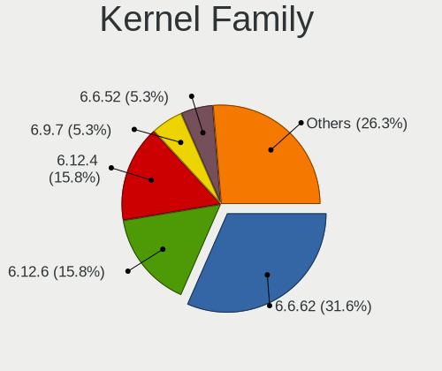
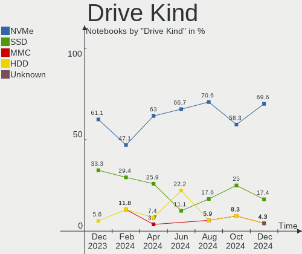
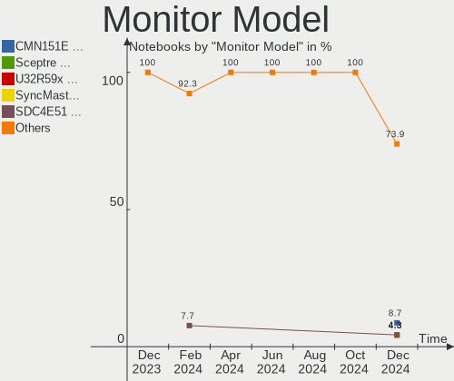
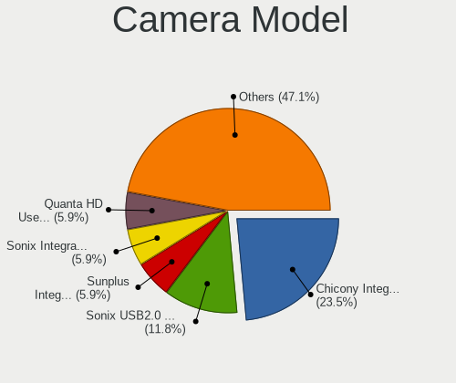

Gentoo - Hardware Trends (Notebooks)
------------------------------------

A project to identify most popular hardware characteristics and track their change
over time based on data collected by Linux users at https://Linux-Hardware.org.

Anyone can contribute to this report by the [hw-probe](https://github.com/linuxhw/hw-probe) tool:

    sudo -E hw-probe -all -upload

This report is for one last month. Overall report since the beginning of time: [TestDays](https://github.com/linuxhw/TestDays)

Period: Dec, 2024.

Contents
--------

* [ System ](#system)
  - [ OS                       ](#os)
  - [ OS Family                ](#os-family)
  - [ Kernel                   ](#kernel)
  - [ Kernel Family            ](#kernel-family)
  - [ Kernel Major Ver.        ](#kernel-major-ver)
  - [ Arch                     ](#arch)
  - [ DE                       ](#de)
  - [ Display Server           ](#display-server)
  - [ Display Manager          ](#display-manager)
  - [ OS Lang                  ](#os-lang)
  - [ Boot Mode                ](#boot-mode)
  - [ Filesystem               ](#filesystem)
  - [ Part. scheme             ](#part-scheme)
  - [ Dual Boot with Linux/BSD ](#dual-boot-with-linuxbsd)
  - [ Dual Boot (Win)          ](#dual-boot-win)

* [ Board ](#board)
  - [ Vendor                   ](#vendor)
  - [ Model                    ](#model)
  - [ Model Family             ](#model-family)
  - [ MFG Year                 ](#mfg-year)
  - [ Form Factor              ](#form-factor)
  - [ Secure Boot              ](#secure-boot)
  - [ Coreboot                 ](#coreboot)
  - [ RAM Size                 ](#ram-size)
  - [ RAM Used                 ](#ram-used)
  - [ Total Drives             ](#total-drives)
  - [ Has CD-ROM               ](#has-cd-rom)
  - [ Has Ethernet             ](#has-ethernet)
  - [ Has WiFi                 ](#has-wifi)
  - [ Has Bluetooth            ](#has-bluetooth)

* [ Location ](#location)
  - [ Country                  ](#country)
  - [ City                     ](#city)

* [ Drives ](#drives)
  - [ Drive Vendor             ](#drive-vendor)
  - [ Drive Model              ](#drive-model)
  - [ HDD Vendor               ](#hdd-vendor)
  - [ SSD Vendor               ](#ssd-vendor)
  - [ Drive Kind               ](#drive-kind)
  - [ Drive Connector          ](#drive-connector)
  - [ Drive Size               ](#drive-size)
  - [ Space Total              ](#space-total)
  - [ Space Used               ](#space-used)
  - [ Malfunc. Drives          ](#malfunc-drives)
  - [ Malfunc. Drive Vendor    ](#malfunc-drive-vendor)
  - [ Malfunc. HDD Vendor      ](#malfunc-hdd-vendor)
  - [ Malfunc. Drive Kind      ](#malfunc-drive-kind)
  - [ Failed Drives            ](#failed-drives)
  - [ Failed Drive Vendor      ](#failed-drive-vendor)
  - [ Drive Status             ](#drive-status)

* [ Storage controller ](#storage-controller)
  - [ Storage Vendor           ](#storage-vendor)
  - [ Storage Model            ](#storage-model)
  - [ Storage Kind             ](#storage-kind)

* [ Processor ](#processor)
  - [ CPU Vendor               ](#cpu-vendor)
  - [ CPU Model                ](#cpu-model)
  - [ CPU Model Family         ](#cpu-model-family)
  - [ CPU Cores                ](#cpu-cores)
  - [ CPU Sockets              ](#cpu-sockets)
  - [ CPU Threads              ](#cpu-threads)
  - [ CPU Op-Modes             ](#cpu-op-modes)
  - [ CPU Microcode            ](#cpu-microcode)
  - [ CPU Microarch            ](#cpu-microarch)

* [ Graphics ](#graphics)
  - [ GPU Vendor               ](#gpu-vendor)
  - [ GPU Model                ](#gpu-model)
  - [ GPU Combo                ](#gpu-combo)
  - [ GPU Driver               ](#gpu-driver)
  - [ GPU Memory               ](#gpu-memory)

* [ Monitor ](#monitor)
  - [ Monitor Vendor           ](#monitor-vendor)
  - [ Monitor Model            ](#monitor-model)
  - [ Monitor Resolution       ](#monitor-resolution)
  - [ Monitor Diagonal         ](#monitor-diagonal)
  - [ Monitor Width            ](#monitor-width)
  - [ Aspect Ratio             ](#aspect-ratio)
  - [ Monitor Area             ](#monitor-area)
  - [ Pixel Density            ](#pixel-density)
  - [ Multiple Monitors        ](#multiple-monitors)

* [ Network ](#network)
  - [ Net Controller Vendor    ](#net-controller-vendor)
  - [ Net Controller Model     ](#net-controller-model)
  - [ Wireless Vendor          ](#wireless-vendor)
  - [ Wireless Model           ](#wireless-model)
  - [ Ethernet Vendor          ](#ethernet-vendor)
  - [ Ethernet Model           ](#ethernet-model)
  - [ Net Controller Kind      ](#net-controller-kind)
  - [ Used Controller          ](#used-controller)
  - [ NICs                     ](#nics)
  - [ IPv6                     ](#ipv6)

* [ Bluetooth ](#bluetooth)
  - [ Bluetooth Vendor         ](#bluetooth-vendor)
  - [ Bluetooth Model          ](#bluetooth-model)

* [ Sound ](#sound)
  - [ Sound Vendor             ](#sound-vendor)
  - [ Sound Model              ](#sound-model)

* [ Memory ](#memory)
  - [ Memory Vendor            ](#memory-vendor)
  - [ Memory Model             ](#memory-model)
  - [ Memory Kind              ](#memory-kind)
  - [ Memory Form Factor       ](#memory-form-factor)
  - [ Memory Size              ](#memory-size)
  - [ Memory Speed             ](#memory-speed)

* [ Printers & scanners ](#printers--scanners)
  - [ Printer Vendor           ](#printer-vendor)
  - [ Printer Model            ](#printer-model)
  - [ Scanner Vendor           ](#scanner-vendor)
  - [ Scanner Model            ](#scanner-model)

* [ Camera ](#camera)
  - [ Camera Vendor            ](#camera-vendor)
  - [ Camera Model             ](#camera-model)

* [ Security ](#security)
  - [ Fingerprint Vendor       ](#fingerprint-vendor)
  - [ Fingerprint Model        ](#fingerprint-model)
  - [ Chipcard Vendor          ](#chipcard-vendor)
  - [ Chipcard Model           ](#chipcard-model)

* [ Unsupported ](#unsupported)
  - [ Unsupported Devices      ](#unsupported-devices)
  - [ Unsupported Device Types ](#unsupported-device-types)

System
------

OS
--

Installed operating systems

| Name        | Notebooks | Percent |
|-------------|-----------|---------|
| Gentoo 2.17 | 18        | 94.74%  |
| Gentoo 2.15 | 1         | 5.26%   |

OS Family
---------

OS without a version

| Name   | Notebooks | Percent |
|--------|-----------|---------|
| Gentoo | 19        | 100%    |

Kernel
------

Version of the Linux kernel

| Version                   | Notebooks | Percent |
|---------------------------|-----------|---------|
| 6.6.62-gentoo-dist        | 2         | 10.53%  |
| 6.6.62-gentoo             | 2         | 10.53%  |
| 6.12.4-gentoo             | 2         | 10.53%  |
| 6.9.7-gentoo              | 1         | 5.26%   |
| 6.6.62-gentoo-x86_64      | 1         | 5.26%   |
| 6.6.62-gentoo-gentoo-dist | 1         | 5.26%   |
| 6.6.52-gentoo-x86_64      | 1         | 5.26%   |
| 6.12.7-tkg-eevdf          | 1         | 5.26%   |
| 6.12.6-zen1               | 1         | 5.26%   |
| 6.12.6-gentoo-system76    | 1         | 5.26%   |
| 6.12.6-gentoo             | 1         | 5.26%   |
| 6.12.4-gentoo-125         | 1         | 5.26%   |
| 6.12.3-gentoo             | 1         | 5.26%   |
| 6.12.1-gentoo             | 1         | 5.26%   |
| 6.12.0-rc7                | 1         | 5.26%   |
| 5.15.174-gentoo-dist      | 1         | 5.26%   |

Kernel Family
-------------

Linux kernel without a distro release

| Version  | Notebooks | Percent |
|----------|-----------|---------|
| 6.6.62   | 6         | 31.58%  |
| 6.12.6   | 3         | 15.79%  |
| 6.12.4   | 3         | 15.79%  |
| 6.9.7    | 1         | 5.26%   |
| 6.6.52   | 1         | 5.26%   |
| 6.12.7   | 1         | 5.26%   |
| 6.12.3   | 1         | 5.26%   |
| 6.12.1   | 1         | 5.26%   |
| 6.12.0   | 1         | 5.26%   |
| 5.15.174 | 1         | 5.26%   |

Kernel Major Ver.
-----------------

Linux kernel major version

| Version | Notebooks | Percent |
|---------|-----------|---------|
| 6.12    | 10        | 52.63%  |
| 6.6     | 7         | 36.84%  |
| 6.9     | 1         | 5.26%   |
| 5.15    | 1         | 5.26%   |

Arch
----

OS architecture (x86_64, i586, etc.)

| Name    | Notebooks | Percent |
|---------|-----------|---------|
| x86_64  | 18        | 94.74%  |
| aarch64 | 1         | 5.26%   |

DE
--

Desktop Environment

| Name       | Notebooks | Percent |
|------------|-----------|---------|
| Unknown    | 7         | 36.84%  |
| GNOME      | 3         | 15.79%  |
| KDE6       | 2         | 10.53%  |
| Xsession   | 1         | 5.26%   |
| XFCE       | 1         | 5.26%   |
| X-Cinnamon | 1         | 5.26%   |
| Sway       | 1         | 5.26%   |
| niri       | 1         | 5.26%   |
| LXQt       | 1         | 5.26%   |
| ICEWM      | 1         | 5.26%   |

Display Server
--------------

X11 or Wayland

| Name    | Notebooks | Percent |
|---------|-----------|---------|
| Wayland | 8         | 42.11%  |
| X11     | 7         | 36.84%  |
| Tty     | 2         | 10.53%  |
| Unknown | 2         | 10.53%  |

Display Manager
---------------

SDDM, LightDM, etc.

| Name    | Notebooks | Percent |
|---------|-----------|---------|
| SDDM    | 8         | 42.11%  |
| Unknown | 5         | 26.32%  |
| GDM     | 3         | 15.79%  |
| LightDM | 2         | 10.53%  |
| XDM     | 1         | 5.26%   |

OS Lang
-------

Language

| Lang    | Notebooks | Percent |
|---------|-----------|---------|
| en_US   | 7         | 36.84%  |
| en_GB   | 2         | 10.53%  |
| C.UTF8  | 2         | 10.53%  |
| zh_CN   | 1         | 5.26%   |
| ru_RU   | 1         | 5.26%   |
| pl_PL   | 1         | 5.26%   |
| el_GR   | 1         | 5.26%   |
| cs_CZ   | 1         | 5.26%   |
| ca_ES   | 1         | 5.26%   |
| C       | 1         | 5.26%   |
| Unknown | 1         | 5.26%   |

Boot Mode
---------

EFI or BIOS

| Mode | Notebooks | Percent |
|------|-----------|---------|
| EFI  | 18        | 94.74%  |
| BIOS | 1         | 5.26%   |

Filesystem
----------

Type of filesystem

| Type     | Notebooks | Percent |
|----------|-----------|---------|
| Ext4     | 8         | 42.11%  |
| Xfs      | 6         | 31.58%  |
| Btrfs    | 2         | 10.53%  |
| Zfs      | 1         | 5.26%   |
| Jfs      | 1         | 5.26%   |
| Bcachefs | 1         | 5.26%   |

Part. scheme
------------

Scheme of partitioning

| Type | Notebooks | Percent |
|------|-----------|---------|
| GPT  | 19        | 100%    |

Dual Boot with Linux/BSD
------------------------

Hosting more than one Linux/BSD

| Dual boot | Notebooks | Percent |
|-----------|-----------|---------|
| No        | 14        | 73.68%  |
| Yes       | 5         | 26.32%  |

Dual Boot (Win)
---------------

Hosting Linux and Windows

| Dual boot | Notebooks | Percent |
|-----------|-----------|---------|
| No        | 13        | 68.42%  |
| Yes       | 6         | 31.58%  |

Board
-----

Vendor
------

Motherboard manufacturer

| Name             | Notebooks | Percent |
|------------------|-----------|---------|
| Lenovo           | 9         | 47.37%  |
| Hewlett-Packard  | 2         | 10.53%  |
| ASUSTek Computer | 2         | 10.53%  |
| Acer             | 2         | 10.53%  |
| System76         | 1         | 5.26%   |
| Notebook         | 1         | 5.26%   |
| Infinix          | 1         | 5.26%   |
| Dell             | 1         | 5.26%   |

Model
-----

Motherboard model

| Name                                      | Notebooks | Percent |
|-------------------------------------------|-----------|---------|
| System76 Darter Pro                       | 1         | 5.26%   |
| Notebook W510LU                           | 1         | 5.26%   |
| Lenovo Yoga 14sARH 2021 82LB              | 1         | 5.26%   |
| Lenovo ThinkPad T14s Gen 6 21N1000SYA     | 1         | 5.26%   |
| Lenovo ThinkPad T14 Gen 3 21CGS06G0L      | 1         | 5.26%   |
| Lenovo ThinkPad T14 Gen 3 21AJS2C81M      | 1         | 5.26%   |
| Lenovo ThinkPad P16 Gen 1 21D6004XUS      | 1         | 5.26%   |
| Lenovo ThinkPad E15 Gen 2 20T8000MPB      | 1         | 5.26%   |
| Lenovo ThinkBook 15 G4 ABA 21DL           | 1         | 5.26%   |
| Lenovo Legion R9000P2021H 82JQ            | 1         | 5.26%   |
| Lenovo IdeaPad 5 15ALC05 82LN             | 1         | 5.26%   |
| Infinix YL51A5                            | 1         | 5.26%   |
| HP Pavilion Notebook                      | 1         | 5.26%   |
| HP EliteBook 655 15.6 inch G9 Notebook PC | 1         | 5.26%   |
| Dell Latitude 7420                        | 1         | 5.26%   |
| ASUS ASUS TUF Gaming A17 FA706IH_FA706IH  | 1         | 5.26%   |
| ASUS ASUS TUF Gaming A16 FA617NT_FA617NT  | 1         | 5.26%   |
| Acer TravelMate B113                      | 1         | 5.26%   |
| Acer Aspire A517-52G                      | 1         | 5.26%   |

Model Family
------------

Motherboard model prefix

| Name             | Notebooks | Percent |
|------------------|-----------|---------|
| Lenovo ThinkPad  | 5         | 26.32%  |
| ASUS ASUS        | 2         | 10.53%  |
| System76 Darter  | 1         | 5.26%   |
| Notebook W510LU  | 1         | 5.26%   |
| Lenovo Yoga      | 1         | 5.26%   |
| Lenovo ThinkBook | 1         | 5.26%   |
| Lenovo Legion    | 1         | 5.26%   |
| Lenovo IdeaPad   | 1         | 5.26%   |
| Infinix YL51A5   | 1         | 5.26%   |
| HP Pavilion      | 1         | 5.26%   |
| HP EliteBook     | 1         | 5.26%   |
| Dell Latitude    | 1         | 5.26%   |
| Acer TravelMate  | 1         | 5.26%   |
| Acer Aspire      | 1         | 5.26%   |

MFG Year
--------

Motherboard manufacture year

| Year | Notebooks | Percent |
|------|-----------|---------|
| 2022 | 5         | 26.32%  |
| 2021 | 4         | 21.05%  |
| 2024 | 3         | 15.79%  |
| 2020 | 3         | 15.79%  |
| 2023 | 1         | 5.26%   |
| 2019 | 1         | 5.26%   |
| 2015 | 1         | 5.26%   |
| 2012 | 1         | 5.26%   |

Form Factor
-----------

Physical design of the computer

| Name     | Notebooks | Percent |
|----------|-----------|---------|
| Notebook | 19        | 100%    |

Secure Boot
-----------

Enabled or disabled

| State    | Notebooks | Percent |
|----------|-----------|---------|
| Disabled | 18        | 94.74%  |
| Enabled  | 1         | 5.26%   |

Coreboot
--------

Have coreboot on board

| Used | Notebooks | Percent |
|------|-----------|---------|
| No   | 18        | 94.74%  |
| Yes  | 1         | 5.26%   |

RAM Size
--------

Total RAM memory

| Size in GB  | Notebooks | Percent |
|-------------|-----------|---------|
| 8.01-16.0   | 10        | 52.63%  |
| 32.01-64.0  | 4         | 21.05%  |
| 16.01-24.0  | 2         | 10.53%  |
| 4.01-8.0    | 1         | 5.26%   |
| 24.01-32.0  | 1         | 5.26%   |
| 64.01-256.0 | 1         | 5.26%   |

RAM Used
--------

Used RAM memory

| Used GB   | Notebooks | Percent |
|-----------|-----------|---------|
| 1.01-2.0  | 5         | 26.32%  |
| 4.01-8.0  | 4         | 21.05%  |
| 2.01-3.0  | 4         | 21.05%  |
| 3.01-4.0  | 2         | 10.53%  |
| 8.01-16.0 | 2         | 10.53%  |
| 0.51-1.0  | 2         | 10.53%  |

Total Drives
------------

Number of drives on board

| Drives | Notebooks | Percent |
|--------|-----------|---------|
| 1      | 14        | 73.68%  |
| 2      | 5         | 26.32%  |

Has CD-ROM
----------

Has CD-ROM on board

| Presented | Notebooks | Percent |
|-----------|-----------|---------|
| No        | 17        | 89.47%  |
| Yes       | 2         | 10.53%  |

Has Ethernet
------------

Has Ethernet on board

| Presented | Notebooks | Percent |
|-----------|-----------|---------|
| Yes       | 15        | 78.95%  |
| No        | 4         | 21.05%  |

Has WiFi
--------

Has WiFi module

| Presented | Notebooks | Percent |
|-----------|-----------|---------|
| Yes       | 16        | 84.21%  |
| No        | 3         | 15.79%  |

Has Bluetooth
-------------

Has Bluetooth module

| Presented | Notebooks | Percent |
|-----------|-----------|---------|
| Yes       | 17        | 89.47%  |
| No        | 2         | 10.53%  |

Location
--------

Country
-------

Geographic location (country)

| Country     | Notebooks | Percent |
|-------------|-----------|---------|
| USA         | 4         | 21.05%  |
| Spain       | 2         | 10.53%  |
| Poland      | 2         | 10.53%  |
| Czechia     | 2         | 10.53%  |
| China       | 2         | 10.53%  |
| Serbia      | 1         | 5.26%   |
| Russia      | 1         | 5.26%   |
| Netherlands | 1         | 5.26%   |
| India       | 1         | 5.26%   |
| Greece      | 1         | 5.26%   |
| Germany     | 1         | 5.26%   |
| Egypt       | 1         | 5.26%   |

City
----

Geographic location (city)

| City          | Notebooks | Percent |
|---------------|-----------|---------|
| Xi'an         | 1         | 5.26%   |
| Utrecht       | 1         | 5.26%   |
| Tucson        | 1         | 5.26%   |
| Suffolk       | 1         | 5.26%   |
| Šlapanice    | 1         | 5.26%   |
| Ramenskoye    | 1         | 5.26%   |
| Mahon         | 1         | 5.26%   |
| Leverkusen    | 1         | 5.26%   |
| Kollam        | 1         | 5.26%   |
| Gdansk        | 1         | 5.26%   |
| Cieszyn       | 1         | 5.26%   |
| Chomutov      | 1         | 5.26%   |
| Carl Junction | 1         | 5.26%   |
| Cairo         | 1         | 5.26%   |
| Bijie         | 1         | 5.26%   |
| Belgrade      | 1         | 5.26%   |
| Barcelona     | 1         | 5.26%   |
| Athens        | 1         | 5.26%   |
| Albany        | 1         | 5.26%   |

Drives
------

Drive Vendor
------------

Hard drive vendors

| Vendor                       | Notebooks | Drives | Percent |
|------------------------------|-----------|--------|---------|
| Samsung Electronics          | 6         | 6      | 23.08%  |
| Sandisk                      | 5         | 5      | 19.23%  |
| Micron Technology            | 4         | 4      | 15.38%  |
| WDC                          | 2         | 2      | 7.69%   |
| SK hynix                     | 2         | 2      | 7.69%   |
| Yangtze Memory Technologies  | 1         | 1      | 3.85%   |
| Unknown                      | 1         | 1      | 3.85%   |
| Union Memory                 | 1         | 1      | 3.85%   |
| SPCC                         | 1         | 1      | 3.85%   |
| Shenzhen Longsys Electronics | 1         | 1      | 3.85%   |
| Seagate                      | 1         | 1      | 3.85%   |
| 2.5S1T                       | 1         | 1      | 3.85%   |

Drive Model
-----------

Hard drive models

| Model                                                | Notebooks | Percent |
|------------------------------------------------------|-----------|---------|
| Samsung NVMe SSD Controller SM981/PM981/PM983 512GB  | 2         | 7.69%   |
| Yangtze Memory ZHITAI TiPlus7100 1TB                 | 1         | 3.85%   |
| WDC WDS240G2G0A-00JH30 240GB SSD                     | 1         | 3.85%   |
| WDC WD Blue SA510 2.5 1000GB SSD                     | 1         | 3.85%   |
| Unknown MMC Card  2GB                                | 1         | 3.85%   |
| Union Memory UMIS RPJTJ512MEE1OWX 512GB              | 1         | 3.85%   |
| SPCC Solid State Disk 240GB                          | 1         | 3.85%   |
| SK hynix SKHynix_HFS512GDE9X084N 512GB               | 1         | 3.85%   |
| SK hynix PC711 NVMe 512GB                            | 1         | 3.85%   |
| Shenzhen Longsys FORESEE XP1000F512G 512GB           | 1         | 3.85%   |
| Seagate ST1000LM024 HN-M101MBB 1TB                   | 1         | 3.85%   |
| Sandisk WD_BLACK SN850X 2000GB                       | 1         | 3.85%   |
| Sandisk WDC PC SN530 SDBPMPZ-512G-1101 512GB         | 1         | 3.85%   |
| Sandisk WD PC SN740 SDDPNQD-512G-1002 512GB          | 1         | 3.85%   |
| Sandisk WD Blue SN550 NVMe SSD 256GB                 | 1         | 3.85%   |
| SanDisk SD7SB3Q128G1002 128GB SSD                    | 1         | 3.85%   |
| Samsung SSD 990 PRO 2TB                              | 1         | 3.85%   |
| Samsung NVMe SSD Controller PM9A1/PM9A3/980PRO 512GB | 1         | 3.85%   |
| Samsung MZVLQ256HBJD-00BH1 256GB                     | 1         | 3.85%   |
| Samsung MZAL81T0HDLB-00BLL 1024GB                    | 1         | 3.85%   |
| Micron MTFDKCD512TFK 512GB                           | 1         | 3.85%   |
| Micron MTFDKBA1T0TFH 1TB                             | 1         | 3.85%   |
| Micron 2210_MTFDHBA512QFD 512GB                      | 1         | 3.85%   |
| Micron 2210_MTFDHBA1T0QFD 1TB                        | 1         | 3.85%   |
| 2.5S1T Disk 1TB                                      | 1         | 3.85%   |

HDD Vendor
----------

Hard disk drive vendors

| Vendor  | Notebooks | Drives | Percent |
|---------|-----------|--------|---------|
| Seagate | 1         | 1      | 100%    |

SSD Vendor
----------

Solid state drive vendors

| Vendor  | Notebooks | Drives | Percent |
|---------|-----------|--------|---------|
| WDC     | 2         | 2      | 50%     |
| SPCC    | 1         | 1      | 25%     |
| SanDisk | 1         | 1      | 25%     |

Drive Kind
----------

HDD or SSD

| Kind    | Notebooks | Drives | Percent |
|---------|-----------|--------|---------|
| NVMe    | 16        | 19     | 69.57%  |
| SSD     | 4         | 4      | 17.39%  |
| MMC     | 1         | 1      | 4.35%   |
| HDD     | 1         | 1      | 4.35%   |
| Unknown | 1         | 1      | 4.35%   |

Drive Connector
---------------

SATA, SAS, NVMe, etc.

| Type | Notebooks | Drives | Percent |
|------|-----------|--------|---------|
| NVMe | 16        | 19     | 72.73%  |
| SATA | 4         | 5      | 18.18%  |
| SAS  | 1         | 1      | 4.55%   |
| MMC  | 1         | 1      | 4.55%   |

Drive Size
----------

Size of hard drive

| Size in TB | Notebooks | Drives | Percent |
|------------|-----------|--------|---------|
| 0.01-0.5   | 3         | 3      | 60%     |
| 0.51-1.0   | 2         | 2      | 40%     |

Space Total
-----------

Amount of disk space available on the file system

| Size in GB | Notebooks | Percent |
|------------|-----------|---------|
| 251-500    | 6         | 31.58%  |
| 501-1000   | 5         | 26.32%  |
| 51-100     | 2         | 10.53%  |
| Unknown    | 2         | 10.53%  |
| 2001-3000  | 1         | 5.26%   |
| 101-250    | 1         | 5.26%   |
| 1001-2000  | 1         | 5.26%   |
| 1-20       | 1         | 5.26%   |

Space Used
----------

Amount of used disk space

| Used GB  | Notebooks | Percent |
|----------|-----------|---------|
| 101-250  | 4         | 21.05%  |
| 251-500  | 3         | 15.79%  |
| 21-50    | 3         | 15.79%  |
| 51-100   | 3         | 15.79%  |
| 1-20     | 2         | 10.53%  |
| 501-1000 | 2         | 10.53%  |
| Unknown  | 2         | 10.53%  |

Malfunc. Drives
---------------

Drive models with a malfunction

| Model                              | Notebooks | Drives | Percent |
|------------------------------------|-----------|--------|---------|
| Seagate ST1000LM024 HN-M101MBB 1TB | 1         | 1      | 100%    |

Malfunc. Drive Vendor
---------------------

Vendors of faulty drives

| Vendor  | Notebooks | Drives | Percent |
|---------|-----------|--------|---------|
| Seagate | 1         | 1      | 100%    |

Malfunc. HDD Vendor
-------------------

Vendors of faulty HDD drives

| Vendor  | Notebooks | Drives | Percent |
|---------|-----------|--------|---------|
| Seagate | 1         | 1      | 100%    |

Malfunc. Drive Kind
-------------------

Kinds of faulty drives

| Kind | Notebooks | Drives | Percent |
|------|-----------|--------|---------|
| HDD  | 1         | 1      | 100%    |

Failed Drives
-------------

Failed drive models

Zero info for selected period =(

Failed Drive Vendor
-------------------

Failed drive vendors

Zero info for selected period =(

Drive Status
------------

Number of failed and malfunc. drives

| Status   | Notebooks | Drives | Percent |
|----------|-----------|--------|---------|
| Works    | 19        | 23     | 86.36%  |
| Detected | 2         | 2      | 9.09%   |
| Malfunc  | 1         | 1      | 4.55%   |

Storage controller
------------------

Storage Vendor
--------------

Storage controller vendors

| Vendor                       | Notebooks | Percent |
|------------------------------|-----------|---------|
| Samsung Electronics          | 6         | 23.08%  |
| Sandisk                      | 4         | 15.38%  |
| Micron Technology            | 4         | 15.38%  |
| Intel                        | 4         | 15.38%  |
| AMD                          | 3         | 11.54%  |
| SK hynix                     | 2         | 7.69%   |
| Yangtze Memory Technologies  | 1         | 3.85%   |
| Union Memory (Shenzhen)      | 1         | 3.85%   |
| Shenzhen Longsys Electronics | 1         | 3.85%   |

Storage Model
-------------

Storage controller models

| Model                                                                                                              | Notebooks | Percent |
|--------------------------------------------------------------------------------------------------------------------|-----------|---------|
| AMD FCH SATA Controller [AHCI mode]                                                                                | 3         | 11.11%  |
| SK hynix Gold P31/BC711/PC711 NVMe Solid State Drive                                                               | 2         | 7.41%   |
| Samsung NVMe SSD Controller SM981/PM981/PM983                                                                      | 2         | 7.41%   |
| Micron 2210 NVMe SSD [Cobain]                                                                                      | 2         | 7.41%   |
| Yangtze Memory ZHITAI TiPlus7100                                                                                   | 1         | 3.7%    |
| Union Memory (Shenzhen) AM620 PCIe 3.0 NVMe SSD 512GB                                                              | 1         | 3.7%    |
| Shenzhen Longsys FORESEE XP1000 / Lexar Professional CFexpress Type B Gold series, NM620 PCIe NVME SSD (DRAM-less) | 1         | 3.7%    |
| Sandisk WD Black SN850X NVMe SSD                                                                                   | 1         | 3.7%    |
| SanDisk WD Black SN770 / PC SN740 256GB / PC SN560 (DRAM-less) NVMe SSD                                            | 1         | 3.7%    |
| SanDisk Ultra 3D / WD PC SN530, IX SN530, Blue SN550 NVMe SSD (DRAM-less)                                          | 1         | 3.7%    |
| SanDisk PC SN530 NVMe SSD (DRAM-less)                                                                              | 1         | 3.7%    |
| Samsung NVMe SSD Controller S4LV008[Pascal]                                                                        | 1         | 3.7%    |
| Samsung NVMe SSD Controller PM9C1a (DRAM-less)                                                                     | 1         | 3.7%    |
| Samsung NVMe SSD Controller PM9A1/PM9A3/980PRO                                                                     | 1         | 3.7%    |
| Samsung NVMe SSD Controller 980 (DRAM-less)                                                                        | 1         | 3.7%    |
| Micron 3400 NVMe SSD [Hendrix]                                                                                     | 1         | 3.7%    |
| Micron 2450 NVMe SSD [HendrixV] (DRAM-less)                                                                        | 1         | 3.7%    |
| Intel Wildcat Point-LP SATA Controller [AHCI Mode]                                                                 | 1         | 3.7%    |
| Intel Volume Management Device NVMe RAID Controller                                                                | 1         | 3.7%    |
| Intel Tiger Lake-LP SATA Controller                                                                                | 1         | 3.7%    |
| Intel Atom/Celeron/Pentium Processor x5-E8000/J3xxx/N3xxx Series SATA Controller                                   | 1         | 3.7%    |
| Intel 7 Series Chipset Family 6-port SATA Controller [AHCI mode]                                                   | 1         | 3.7%    |

Storage Kind
------------

Kind of storage controller (IDE, SATA, NVMe, SAS, ...)

| Kind | Notebooks | Percent |
|------|-----------|---------|
| NVMe | 16        | 66.67%  |
| SATA | 7         | 29.17%  |
| RAID | 1         | 4.17%   |

Processor
---------

CPU Vendor
----------

Processor vendors

| Vendor   | Notebooks | Percent |
|----------|-----------|---------|
| AMD      | 10        | 52.63%  |
| Intel    | 8         | 42.11%  |
| Qualcomm | 1         | 5.26%   |

CPU Model
---------

Processor models

| Model                                      | Notebooks | Percent |
|--------------------------------------------|-----------|---------|
| AMD Ryzen 7 5825U with Radeon Graphics     | 2         | 10.53%  |
| Qualcomm Processor                         | 1         | 5.26%   |
| Intel Pentium CPU N3700 @ 1.60GHz          | 1         | 5.26%   |
| Intel Core Ultra 7 155H                    | 1         | 5.26%   |
| Intel Core i5-5200U CPU @ 2.20GHz          | 1         | 5.26%   |
| Intel Celeron CPU 1017U @ 1.60GHz          | 1         | 5.26%   |
| Intel 12th Gen Core i9-12900HX             | 1         | 5.26%   |
| Intel 12th Gen Core i7-1270P               | 1         | 5.26%   |
| Intel 11th Gen Core i7-1185G7 @ 3.00GHz    | 1         | 5.26%   |
| Intel 11th Gen Core i7-1165G7 @ 2.80GHz    | 1         | 5.26%   |
| AMD Ryzen 7 PRO 6850U with Radeon Graphics | 1         | 5.26%   |
| AMD Ryzen 7 7735HS with Radeon Graphics    | 1         | 5.26%   |
| AMD Ryzen 7 5800H with Radeon Graphics     | 1         | 5.26%   |
| AMD Ryzen 7 5700U with Radeon Graphics     | 1         | 5.26%   |
| AMD Ryzen 7 4800H with Radeon Graphics     | 1         | 5.26%   |
| AMD Ryzen 5 5625U with Radeon Graphics     | 1         | 5.26%   |
| AMD Ryzen 5 4600H with Radeon Graphics     | 1         | 5.26%   |
| AMD Ryzen 5 4500U with Radeon Graphics     | 1         | 5.26%   |

CPU Model Family
----------------

Processor model prefix

| Model           | Notebooks | Percent |
|-----------------|-----------|---------|
| AMD Ryzen 7     | 6         | 31.58%  |
| Other           | 5         | 26.32%  |
| AMD Ryzen 5     | 3         | 15.79%  |
| Intel Pentium   | 1         | 5.26%   |
| Intel Core i5   | 1         | 5.26%   |
| Intel Core      | 1         | 5.26%   |
| Intel Celeron   | 1         | 5.26%   |
| AMD Ryzen 7 PRO | 1         | 5.26%   |

CPU Cores
---------

Number of processor cores

| Number | Notebooks | Percent |
|--------|-----------|---------|
| 8      | 8         | 42.11%  |
| 6      | 3         | 15.79%  |
| 4      | 3         | 15.79%  |
| 16     | 2         | 10.53%  |
| 2      | 2         | 10.53%  |
| 12     | 1         | 5.26%   |

CPU Sockets
-----------

Number of sockets

| Number | Notebooks | Percent |
|--------|-----------|---------|
| 1      | 19        | 100%    |

CPU Threads
-----------

Threads per core (Hyper-Threading)

| Number | Notebooks | Percent |
|--------|-----------|---------|
| 2      | 15        | 78.95%  |
| 1      | 4         | 21.05%  |

CPU Op-Modes
------------

CPU Operation Modes (32-bit, 64-bit)

| Op mode        | Notebooks | Percent |
|----------------|-----------|---------|
| 32-bit, 64-bit | 18        | 94.74%  |
| 64-bit         | 1         | 5.26%   |

CPU Microcode
-------------

Microcode number

| Number     | Notebooks | Percent |
|------------|-----------|---------|
| Unknown    | 13        | 68.42%  |
| 0x806c1    | 1         | 5.26%   |
| 0x0a500011 | 1         | 5.26%   |
| 0x0a50000c | 1         | 5.26%   |
| 0x08608108 | 1         | 5.26%   |
| 0x0860010d | 1         | 5.26%   |
| 0x08600103 | 1         | 5.26%   |

CPU Microarch
-------------

Microarchitecture

| Name              | Notebooks | Percent |
|-------------------|-----------|---------|
| Zen 3             | 4         | 21.05%  |
| Unknown           | 4         | 21.05%  |
| Zen 2             | 3         | 15.79%  |
| TigerLake         | 2         | 10.53%  |
| Alderlake Hybrid  | 2         | 10.53%  |
| Silvermont        | 1         | 5.26%   |
| Meteorlake Hybrid | 1         | 5.26%   |
| IvyBridge         | 1         | 5.26%   |
| Broadwell         | 1         | 5.26%   |

Graphics
--------

GPU Vendor
----------

Vendors of graphics cards

| Vendor | Notebooks | Percent |
|--------|-----------|---------|
| AMD    | 10        | 43.48%  |
| Intel  | 8         | 34.78%  |
| Nvidia | 5         | 21.74%  |

GPU Model
---------

Graphics card models

| Model                                                                                    | Notebooks | Percent |
|------------------------------------------------------------------------------------------|-----------|---------|
| AMD Renoir [Radeon Vega Series / Radeon Vega Mobile Series]                              | 3         | 12.5%   |
| AMD Barcelo                                                                              | 3         | 12.5%   |
| Intel TigerLake-LP GT2 [Iris Xe Graphics]                                                | 2         | 8.33%   |
| AMD Rembrandt [Radeon 680M]                                                              | 2         | 8.33%   |
| Nvidia TU117M [GeForce GTX 1650 Mobile / Max-Q]                                          | 1         | 4.17%   |
| Nvidia GP107M [GeForce MX350]                                                            | 1         | 4.17%   |
| Nvidia GM108M [GeForce 940M]                                                             | 1         | 4.17%   |
| Nvidia GA106M [GeForce RTX 3060 Mobile / Max-Q]                                          | 1         | 4.17%   |
| Nvidia GA104GLM [RTX A4500 Laptop GPU]                                                   | 1         | 4.17%   |
| Intel Meteor Lake-P [Intel Arc Graphics]                                                 | 1         | 4.17%   |
| Intel HD Graphics 5500                                                                   | 1         | 4.17%   |
| Intel Atom/Celeron/Pentium Processor x5-E8000/J3xxx/N3xxx Integrated Graphics Controller | 1         | 4.17%   |
| Intel Alder Lake-P GT2 [Iris Xe Graphics]                                                | 1         | 4.17%   |
| Intel Alder Lake-HX GT1 [UHD Graphics 770]                                               | 1         | 4.17%   |
| Intel 3rd Gen Core processor Graphics Controller                                         | 1         | 4.17%   |
| AMD Navi 33 [Radeon RX 7600/7600 XT/7600M XT/7600S/7700S / PRO W7600]                    | 1         | 4.17%   |
| AMD Lucienne                                                                             | 1         | 4.17%   |
| AMD Cezanne [Radeon Vega Series / Radeon Vega Mobile Series]                             | 1         | 4.17%   |

GPU Combo
---------

Combinations of graphics cards

| Name           | Notebooks | Percent |
|----------------|-----------|---------|
| 1 x AMD        | 7         | 36.84%  |
| 1 x Intel      | 5         | 26.32%  |
| Intel + Nvidia | 3         | 15.79%  |
| AMD + Nvidia   | 2         | 10.53%  |
| Other          | 1         | 5.26%   |
| 2 x AMD        | 1         | 5.26%   |

GPU Driver
----------

Free vs proprietary

| Driver      | Notebooks | Percent |
|-------------|-----------|---------|
| Free        | 14        | 73.68%  |
| Proprietary | 3         | 15.79%  |
| Unknown     | 2         | 10.53%  |

GPU Memory
----------

Total video memory

| Size in GB | Notebooks | Percent |
|------------|-----------|---------|
| Unknown    | 9         | 47.37%  |
| 1.01-2.0   | 5         | 26.32%  |
| 0.51-1.0   | 2         | 10.53%  |
| 0.01-0.5   | 2         | 10.53%  |
| 7.01-8.0   | 1         | 5.26%   |

Monitor
-------

Monitor Vendor
--------------

Monitor vendors

| Vendor              | Notebooks | Percent |
|---------------------|-----------|---------|
| Chimei Innolux      | 6         | 27.27%  |
| CSO                 | 3         | 13.64%  |
| BOE                 | 3         | 13.64%  |
| AU Optronics        | 3         | 13.64%  |
| Samsung Electronics | 2         | 9.09%   |
| Sceptre Tech        | 1         | 4.55%   |
| MDT                 | 1         | 4.55%   |
| LG Display          | 1         | 4.55%   |
| Lenovo              | 1         | 4.55%   |
| Apple               | 1         | 4.55%   |

Monitor Model
-------------

Monitor models

| Model                                                                | Notebooks | Percent |
|----------------------------------------------------------------------|-----------|---------|
| Chimei Innolux LCD Monitor CMN151E 1920x1080 344x193mm 15.5-inch     | 2         | 8.7%    |
| Sceptre Tech Sceptre M27 SPT6C03 1920x1080 530x300mm 24.0-inch       | 1         | 4.35%   |
| Samsung Electronics U32R59x SAM0F94 3840x2160 697x392mm 31.5-inch    | 1         | 4.35%   |
| Samsung Electronics SyncMaster SAM0352 1680x1050 459x296mm 21.5-inch | 1         | 4.35%   |
| Samsung Electronics LCD Monitor SDC4E51 1366x768 344x194mm 15.5-inch | 1         | 4.35%   |
| MDT Internal Display MDT1F41 1920x1080 344x194mm 15.5-inch           | 1         | 4.35%   |
| LG Display LCD Monitor LGD06AA 3840x2400 344x215mm 16.0-inch         | 1         | 4.35%   |
| Lenovo LEN S27q-10 LEN61E8 2560x1440 597x336mm 27.0-inch             | 1         | 4.35%   |
| CSO LCD Monitor CSO1600 2560x1600 345x215mm 16.0-inch                | 1         | 4.35%   |
| CSO LCD Monitor CSO1506 1920x1080 344x194mm 15.5-inch                | 1         | 4.35%   |
| CSO LCD Monitor CSO1402 2880x1800 302x188mm 14.0-inch                | 1         | 4.35%   |
| Chimei Innolux N160JME_GE1 CMN1624 1920x1200 344x215mm 16.0-inch     | 1         | 4.35%   |
| Chimei Innolux LCD Monitor CMN15E7 1920x1080 344x193mm 15.5-inch     | 1         | 4.35%   |
| Chimei Innolux LCD Monitor CMN1457 1920x1200 301x188mm 14.0-inch     | 1         | 4.35%   |
| Chimei Innolux LCD Monitor CMN1418 1920x1080 309x173mm 13.9-inch     | 1         | 4.35%   |
| BOE LCD Monitor BOE0C26 1920x1200 300x190mm 14.0-inch                | 1         | 4.35%   |
| BOE LCD Monitor BOE0A35 1920x1200 302x189mm 14.0-inch                | 1         | 4.35%   |
| BOE LCD Monitor BOE0825 1920x1080 382x215mm 17.3-inch                | 1         | 4.35%   |
| AU Optronics LCD Monitor AUOD291 1920x1200 301x188mm 14.0-inch       | 1         | 4.35%   |
| AU Optronics LCD Monitor AUO8294 1920x1080 382x215mm 17.3-inch       | 1         | 4.35%   |
| AU Optronics LCD Monitor AUO405C 1366x768 256x144mm 11.6-inch        | 1         | 4.35%   |
| Apple LCD Monitor APP9CF4 1366x768 256x144mm 11.6-inch               | 1         | 4.35%   |

Monitor Resolution
------------------

Monitor screen resolution

| Resolution         | Notebooks | Percent |
|--------------------|-----------|---------|
| 1920x1080 (FHD)    | 8         | 36.36%  |
| 1920x1200 (WUXGA)  | 5         | 22.73%  |
| 1366x768 (WXGA)    | 3         | 13.64%  |
| 3840x2400          | 1         | 4.55%   |
| 3840x2160 (4K)     | 1         | 4.55%   |
| 2880x1800          | 1         | 4.55%   |
| 2560x1600          | 1         | 4.55%   |
| 2560x1440 (QHD)    | 1         | 4.55%   |
| 1680x1050 (WSXGA+) | 1         | 4.55%   |

Monitor Diagonal
----------------

Diagonal size in inches

| Inches | Notebooks | Percent |
|--------|-----------|---------|
| 14     | 5         | 21.74%  |
| 15     | 4         | 17.39%  |
| 21     | 3         | 13.04%  |
| 16     | 3         | 13.04%  |
| 17     | 2         | 8.7%    |
| 11     | 2         | 8.7%    |
| 31     | 1         | 4.35%   |
| 27     | 1         | 4.35%   |
| 24     | 1         | 4.35%   |
| 13     | 1         | 4.35%   |

Monitor Width
-------------

Physical width

| Width in mm | Notebooks | Percent |
|-------------|-----------|---------|
| 301-350     | 12        | 52.17%  |
| 401-500     | 3         | 13.04%  |
| 201-300     | 3         | 13.04%  |
| 501-600     | 2         | 8.7%    |
| 351-400     | 2         | 8.7%    |
| 601-700     | 1         | 4.35%   |

Aspect Ratio
------------

Proportional relationship between the width and the height

| Ratio | Notebooks | Percent |
|-------|-----------|---------|
| 16/9  | 13        | 59.09%  |
| 16/10 | 9         | 40.91%  |

Monitor Area
------------

Area in inch²

| Area in inch² | Notebooks | Percent |
|----------------|-----------|---------|
| 81-90          | 6         | 26.09%  |
| 201-250        | 4         | 17.39%  |
| 101-110        | 4         | 17.39%  |
| 111-120        | 3         | 13.04%  |
| 51-60          | 2         | 8.7%    |
| 121-130        | 2         | 8.7%    |
| 351-500        | 1         | 4.35%   |
| 301-350        | 1         | 4.35%   |

Pixel Density
-------------

Pixels per inch

| Density       | Notebooks | Percent |
|---------------|-----------|---------|
| 121-160       | 10        | 43.48%  |
| 161-240       | 5         | 21.74%  |
| 101-120       | 4         | 17.39%  |
| More than 240 | 2         | 8.7%    |
| 51-100        | 2         | 8.7%    |

Multiple Monitors
-----------------

Total monitors connected

| Total | Notebooks | Percent |
|-------|-----------|---------|
| 1     | 15        | 78.95%  |
| 2     | 4         | 21.05%  |

Network
-------

Net Controller Vendor
---------------------

Controller vendors

| Vendor                | Notebooks | Percent |
|-----------------------|-----------|---------|
| Realtek Semiconductor | 12        | 48%     |
| Intel                 | 9         | 36%     |
| Qualcomm Technologies | 1         | 4%      |
| Qualcomm              | 1         | 4%      |
| Lenovo                | 1         | 4%      |
| Broadcom              | 1         | 4%      |

Net Controller Model
--------------------

Controller models

| Model                                                                  | Notebooks | Percent |
|------------------------------------------------------------------------|-----------|---------|
| Realtek RTL8111/8168/8211/8411 PCI Express Gigabit Ethernet Controller | 8         | 25%     |
| Realtek RTL8852BE PCIe 802.11ax Wireless Network Controller            | 2         | 6.25%   |
| Realtek RTL8822CE 802.11ac PCIe Wireless Network Adapter               | 2         | 6.25%   |
| Realtek RTL810xE PCI Express Fast Ethernet controller                  | 2         | 6.25%   |
| Intel Wi-Fi 6 AX201                                                    | 2         | 6.25%   |
| Intel Wi-Fi 6 AX200                                                    | 2         | 6.25%   |
| Realtek RTL8852AE 802.11ax PCIe Wireless Network Adapter               | 1         | 3.13%   |
| Realtek RTL8821CE 802.11ac PCIe Wireless Network Adapter               | 1         | 3.13%   |
| Realtek RTL8723BE PCIe Wireless Network Adapter                        | 1         | 3.13%   |
| Qualcomm WCN785x Wi-Fi 7(802.11be) 320MHz 2x2 [FastConnect 7800]       | 1         | 3.13%   |
| Qualcomm QCNFA765 Wireless Network Adapter                             | 1         | 3.13%   |
| Lenovo USB-C Dock Ethernet                                             | 1         | 3.13%   |
| Intel Wireless 7265                                                    | 1         | 3.13%   |
| Intel Meteor Lake PCH CNVi WiFi                                        | 1         | 3.13%   |
| Intel Ethernet Controller I219-LM                                      | 1         | 3.13%   |
| Intel Ethernet Connection (16) I219-LM                                 | 1         | 3.13%   |
| Intel Centrino Advanced-N 6235                                         | 1         | 3.13%   |
| Intel Alder Lake-S PCH CNVi WiFi                                       | 1         | 3.13%   |
| Intel Alder Lake-P PCH CNVi WiFi                                       | 1         | 3.13%   |
| Broadcom NetLink BCM57785 Gigabit Ethernet PCIe                        | 1         | 3.13%   |

Wireless Vendor
---------------

Wireless vendors

| Vendor                | Notebooks | Percent |
|-----------------------|-----------|---------|
| Intel                 | 9         | 56.25%  |
| Realtek Semiconductor | 6         | 37.5%   |
| Qualcomm              | 1         | 6.25%   |

Wireless Model
--------------

Wireless models

| Model                                                       | Notebooks | Percent |
|-------------------------------------------------------------|-----------|---------|
| Realtek RTL8822CE 802.11ac PCIe Wireless Network Adapter    | 2         | 12.5%   |
| Intel Wi-Fi 6 AX201                                         | 2         | 12.5%   |
| Intel Wi-Fi 6 AX200                                         | 2         | 12.5%   |
| Realtek RTL8852BE PCIe 802.11ax Wireless Network Controller | 1         | 6.25%   |
| Realtek RTL8852AE 802.11ax PCIe Wireless Network Adapter    | 1         | 6.25%   |
| Realtek RTL8821CE 802.11ac PCIe Wireless Network Adapter    | 1         | 6.25%   |
| Realtek RTL8723BE PCIe Wireless Network Adapter             | 1         | 6.25%   |
| Qualcomm QCNFA765 Wireless Network Adapter                  | 1         | 6.25%   |
| Intel Wireless 7265                                         | 1         | 6.25%   |
| Intel Meteor Lake PCH CNVi WiFi                             | 1         | 6.25%   |
| Intel Centrino Advanced-N 6235                              | 1         | 6.25%   |
| Intel Alder Lake-S PCH CNVi WiFi                            | 1         | 6.25%   |
| Intel Alder Lake-P PCH CNVi WiFi                            | 1         | 6.25%   |

Ethernet Vendor
---------------

Ethernet vendors

| Vendor                | Notebooks | Percent |
|-----------------------|-----------|---------|
| Realtek Semiconductor | 10        | 66.67%  |
| Intel                 | 2         | 13.33%  |
| Qualcomm Technologies | 1         | 6.67%   |
| Lenovo                | 1         | 6.67%   |
| Broadcom              | 1         | 6.67%   |

Ethernet Model
--------------

Ethernet models

| Model                                                                  | Notebooks | Percent |
|------------------------------------------------------------------------|-----------|---------|
| Realtek RTL8111/8168/8211/8411 PCI Express Gigabit Ethernet Controller | 8         | 50%     |
| Realtek RTL810xE PCI Express Fast Ethernet controller                  | 2         | 12.5%   |
| Realtek RTL8852BE PCIe 802.11ax Wireless Network Controller            | 1         | 6.25%   |
| Qualcomm WCN785x Wi-Fi 7(802.11be) 320MHz 2x2 [FastConnect 7800]       | 1         | 6.25%   |
| Lenovo USB-C Dock Ethernet                                             | 1         | 6.25%   |
| Intel Ethernet Controller I219-LM                                      | 1         | 6.25%   |
| Intel Ethernet Connection (16) I219-LM                                 | 1         | 6.25%   |
| Broadcom NetLink BCM57785 Gigabit Ethernet PCIe                        | 1         | 6.25%   |

Net Controller Kind
-------------------

Ethernet, WiFi or modem

| Kind     | Notebooks | Percent |
|----------|-----------|---------|
| WiFi     | 16        | 51.61%  |
| Ethernet | 15        | 48.39%  |

Used Controller
---------------

Currently used network controller

| Kind     | Notebooks | Percent |
|----------|-----------|---------|
| WiFi     | 15        | 71.43%  |
| Ethernet | 6         | 28.57%  |

NICs
----

Total network controllers on board

| Total | Notebooks | Percent |
|-------|-----------|---------|
| 2     | 12        | 63.16%  |
| 1     | 7         | 36.84%  |

IPv6
----

IPv6 vs IPv4

| Used | Notebooks | Percent |
|------|-----------|---------|
| No   | 17        | 89.47%  |
| Yes  | 2         | 10.53%  |

Bluetooth
---------

Bluetooth Vendor
----------------

Controller vendors

| Vendor                | Notebooks | Percent |
|-----------------------|-----------|---------|
| Intel                 | 8         | 47.06%  |
| Realtek Semiconductor | 6         | 35.29%  |
| USI                   | 1         | 5.88%   |
| Lite-On Technology    | 1         | 5.88%   |
| IMC Networks          | 1         | 5.88%   |

Bluetooth Model
---------------

Controller models

| Model                                         | Notebooks | Percent |
|-----------------------------------------------|-----------|---------|
| Realtek Bluetooth Radio                       | 5         | 29.41%  |
| Intel AX211 Bluetooth                         | 3         | 17.65%  |
| Intel AX201 Bluetooth                         | 2         | 11.76%  |
| USI Bluetooth Device                          | 1         | 5.88%   |
| Realtek 802.11ac WLAN Adapter                 | 1         | 5.88%   |
| Lite-On Bluetooth Radio                       | 1         | 5.88%   |
| Intel Centrino Bluetooth Wireless Transceiver | 1         | 5.88%   |
| Intel Bluetooth wireless interface            | 1         | 5.88%   |
| Intel AX200 Bluetooth                         | 1         | 5.88%   |
| IMC Networks Bluetooth Radio                  | 1         | 5.88%   |

Sound
-----

Sound Vendor
------------

Sound card vendors

| Vendor   | Notebooks | Percent |
|----------|-----------|---------|
| AMD      | 10        | 45.45%  |
| Intel    | 8         | 36.36%  |
| Nvidia   | 2         | 9.09%   |
| Logitech | 1         | 4.55%   |
| Lenovo   | 1         | 4.55%   |

Sound Model
-----------

Sound card models

| Model                                                                                             | Notebooks | Percent |
|---------------------------------------------------------------------------------------------------|-----------|---------|
| AMD Family 17h/19h/1ah HD Audio Controller                                                        | 10        | 30.3%   |
| AMD Renoir Radeon High Definition Audio Controller                                                | 7         | 21.21%  |
| Intel Tiger Lake-LP Smart Sound Technology Audio Controller                                       | 2         | 6.06%   |
| AMD Rembrandt Radeon High Definition Audio Controller                                             | 2         | 6.06%   |
| Nvidia TU107 GeForce GTX 1650 High Definition Audio Controller                                    | 1         | 3.03%   |
| Nvidia GA104 High Definition Audio Controller                                                     | 1         | 3.03%   |
| Logitech Logitech G PRO X Gaming Headset                                                          | 1         | 3.03%   |
| Lenovo ThinkPad USB-C Dock Gen2 USB Audio                                                         | 1         | 3.03%   |
| Intel Wildcat Point-LP High Definition Audio Controller                                           | 1         | 3.03%   |
| Intel Meteor Lake-P HD Audio Controller                                                           | 1         | 3.03%   |
| Intel Broadwell-U Audio Controller                                                                | 1         | 3.03%   |
| Intel Atom/Celeron/Pentium Processor x5-E8000/J3xxx/N3xxx Series High Definition Audio Controller | 1         | 3.03%   |
| Intel Alder Lake-S HD Audio Controller                                                            | 1         | 3.03%   |
| Intel Alder Lake PCH-P High Definition Audio Controller                                           | 1         | 3.03%   |
| Intel 7 Series/C216 Chipset Family High Definition Audio Controller                               | 1         | 3.03%   |
| AMD Navi 31 HDMI/DP Audio                                                                         | 1         | 3.03%   |

Memory
------

Memory Vendor
-------------

Memory module vendors

| Vendor              | Notebooks | Percent |
|---------------------|-----------|---------|
| Samsung Electronics | 8         | 38.1%   |
| SK hynix            | 6         | 28.57%  |
| Micron Technology   | 3         | 14.29%  |
| Silicon Power       | 1         | 4.76%   |
| Neo Forza           | 1         | 4.76%   |
| Kingston            | 1         | 4.76%   |
| Crucial             | 1         | 4.76%   |

Memory Model
------------

Memory module models

| Model                                                        | Notebooks | Percent |
|--------------------------------------------------------------|-----------|---------|
| Samsung RAM M471A1K43EB1-CWE 8GB SODIMM DDR4 3200MT/s        | 2         | 8.33%   |
| SK hynix RAM HMT451S6BFR8A-PB 4GB SODIMM DDR3 1600MT/s       | 1         | 4.17%   |
| SK hynix RAM HMCG88MEBSA092N 32GB SODIMM DDR5 4800MT/s       | 1         | 4.17%   |
| SK hynix RAM HMAB2GS6CMR6N-XN 16GB SODIMM DDR4 3200MT/s      | 1         | 4.17%   |
| SK hynix RAM HMAA1GS6CMR6N-XN 8GB Row Of Chips DDR4 3200MT/s | 1         | 4.17%   |
| SK hynix RAM HMAA1GS6CJR6N-XN 8GB SODIMM DDR4 3200MT/s       | 1         | 4.17%   |
| SK hynix RAM HMAA1GS6CJR6N-XN 8GB Row Of Chips DDR4 3200MT/s | 1         | 4.17%   |
| SK hynix RAM H9JCNNNFA5MLYR-N6E 8GB SODIMM LPDDR5 6400MT/s   | 1         | 4.17%   |
| Silicon Power RAM SP008GLSTU160N02 8GB SODIMM DDR3 1600MT/s  | 1         | 4.17%   |
| Samsung RAM Module 16GB SODIMM DDR4 3200MT/s                 | 1         | 4.17%   |
| Samsung RAM M471B5173DB0-YK0 4GB SODIMM DDR3 1600MT/s        | 1         | 4.17%   |
| Samsung RAM M471B1G73QH0-YK0 8GB SODIMM DDR3 1600MT/s        | 1         | 4.17%   |
| Samsung RAM M471A2G43BB2-CWE 16GB SODIMM DDR4 3200MT/s       | 1         | 4.17%   |
| Samsung RAM M471A1K43DB1-CWE 8GB SODIMM DDR4 3200MT/s        | 1         | 4.17%   |
| Samsung RAM M471A1G44AB0-CWE 8GB SODIMM DDR4 3200MT/s        | 1         | 4.17%   |
| Samsung RAM M425R1GB4BB0-CQKOL 8GB SODIMM DDR5 4800MT/s      | 1         | 4.17%   |
| Samsung RAM K4UBE3D4AA-MGCR 2GB Row Of Chips LPDDR4 4267MT/s | 1         | 4.17%   |
| Neo Forza RAM NMSO516F81-5600J 16GB SODIMM DDR5 5600MT/s     | 1         | 4.17%   |
| Micron RAM MT53E1G32D4NQ-046WTE 8GB SODIMM LPDDR4 3200MT/s   | 1         | 4.17%   |
| Micron RAM MT40A1G16RC-062E:B 8GB Row Of Chips DDR4 3200MT/s | 1         | 4.17%   |
| Micron RAM 4ATF1G64HZ-3G2E1 8GB SODIMM DDR4 3200MT/s         | 1         | 4.17%   |
| Kingston RAM ACR16D3LS1KFG/4G 4GB SODIMM DDR3 1600MT/s       | 1         | 4.17%   |
| Crucial RAM CT16G4SFRA32A.M16FE 16GB SODIMM DDR4 3200MT/s    | 1         | 4.17%   |

Memory Kind
-----------

Memory module kinds

| Kind   | Notebooks | Percent |
|--------|-----------|---------|
| DDR4   | 9         | 50%     |
| DDR5   | 3         | 16.67%  |
| DDR3   | 3         | 16.67%  |
| LPDDR4 | 2         | 11.11%  |
| LPDDR5 | 1         | 5.56%   |

Memory Form Factor
------------------

Physical design of the memory module

| Name         | Notebooks | Percent |
|--------------|-----------|---------|
| SODIMM       | 15        | 78.95%  |
| Row Of Chips | 4         | 21.05%  |

Memory Size
-----------

Memory module size

| Size  | Notebooks | Percent |
|-------|-----------|---------|
| 8192  | 12        | 63.16%  |
| 16384 | 4         | 21.05%  |
| 4096  | 2         | 10.53%  |
| 32768 | 1         | 5.26%   |

Memory Speed
------------

Memory module speed

| Speed | Notebooks | Percent |
|-------|-----------|---------|
| 3200  | 10        | 52.63%  |
| 1600  | 3         | 15.79%  |
| 4800  | 2         | 10.53%  |
| 6400  | 1         | 5.26%   |
| 5600  | 1         | 5.26%   |
| 4267  | 1         | 5.26%   |
| 2667  | 1         | 5.26%   |

Printers & scanners
-------------------

Printer Vendor
--------------

Printer device vendors

Zero info for selected period =(

Printer Model
-------------

Printer device models

Zero info for selected period =(

Scanner Vendor
--------------

Scanner device vendors

Zero info for selected period =(

Scanner Model
-------------

Scanner device models

Zero info for selected period =(

Camera
------

Camera Vendor
-------------

Camera device vendors

| Vendor                        | Notebooks | Percent |
|-------------------------------|-----------|---------|
| Chicony Electronics           | 8         | 47.06%  |
| Sonix Technology              | 3         | 17.65%  |
| Luxvisions Innotech Limited   | 2         | 11.76%  |
| Sunplus Innovation Technology | 1         | 5.88%   |
| Quanta                        | 1         | 5.88%   |
| IMC Networks                  | 1         | 5.88%   |
| Bison Electronics             | 1         | 5.88%   |

Camera Model
------------

Camera device models

| Model                                             | Notebooks | Percent |
|---------------------------------------------------|-----------|---------|
| Chicony Integrated Camera                         | 4         | 23.53%  |
| Sonix USB2.0 HD UVC WebCam                        | 2         | 11.76%  |
| Sunplus Integrated_Webcam_FHD                     | 1         | 5.88%   |
| Sonix Integrated Webcam_FHD                       | 1         | 5.88%   |
| Quanta HD User Facing                             | 1         | 5.88%   |
| Luxvisions Innotech Limited Integrated RGB Camera | 1         | 5.88%   |
| Luxvisions Innotech Limited HP HD Camera          | 1         | 5.88%   |
| IMC Networks Integrated Camera                    | 1         | 5.88%   |
| Chicony HP Truevision HD                          | 1         | 5.88%   |
| Chicony HD WebCam (Acer)                          | 1         | 5.88%   |
| Chicony Chicony USB2.0 Camera                     | 1         | 5.88%   |
| Chicony Chicony USB 2.0 Camera                    | 1         | 5.88%   |
| Bison Integrated Camera                           | 1         | 5.88%   |

Security
--------

Fingerprint Vendor
------------------

Fingerprint sensor vendors

| Vendor                     | Notebooks | Percent |
|----------------------------|-----------|---------|
| Synaptics                  | 2         | 66.67%  |
| Shenzhen Goodix Technology | 1         | 33.33%  |

Fingerprint Model
-----------------

Fingerprint sensor models

| Model                               | Notebooks | Percent |
|-------------------------------------|-----------|---------|
| Synaptics UWP WBDI Device           | 2         | 66.67%  |
| Shenzhen Goodix  FingerPrint Device | 1         | 33.33%  |

Chipcard Vendor
---------------

Chipcard module vendors

| Vendor   | Notebooks | Percent |
|----------|-----------|---------|
| Broadcom | 1         | 100%    |

Chipcard Model
--------------

Chipcard module models

| Model          | Notebooks | Percent |
|----------------|-----------|---------|
| Broadcom 58200 | 1         | 100%    |

Unsupported
-----------

Unsupported Devices
-------------------

Total unsupported devices on board

| Total | Notebooks | Percent |
|-------|-----------|---------|
| 1     | 9         | 47.37%  |
| 0     | 7         | 36.84%  |
| 2     | 2         | 10.53%  |
| 5     | 1         | 5.26%   |

Unsupported Device Types
------------------------

Types of unsupported devices

| Type                     | Notebooks | Percent |
|--------------------------|-----------|---------|
| Multimedia controller    | 4         | 23.53%  |
| Fingerprint reader       | 3         | 17.65%  |
| Camera                   | 3         | 17.65%  |
| Graphics card            | 2         | 11.76%  |
| Bluetooth                | 2         | 11.76%  |
| Sound                    | 1         | 5.88%   |
| Communication controller | 1         | 5.88%   |
| Chipcard                 | 1         | 5.88%   |

