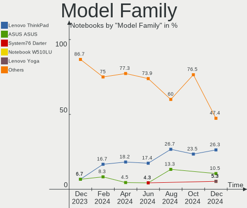
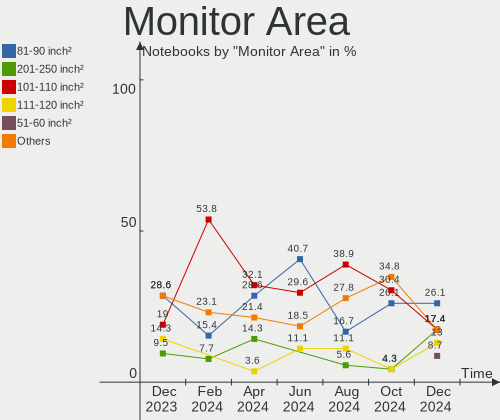
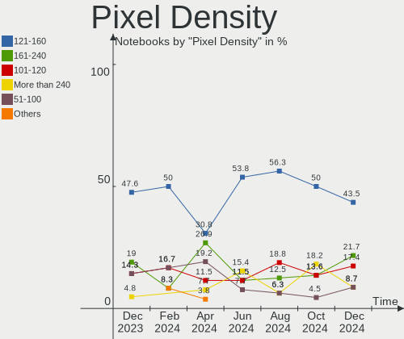
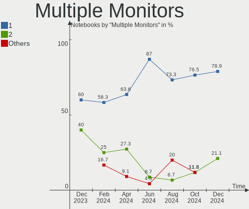
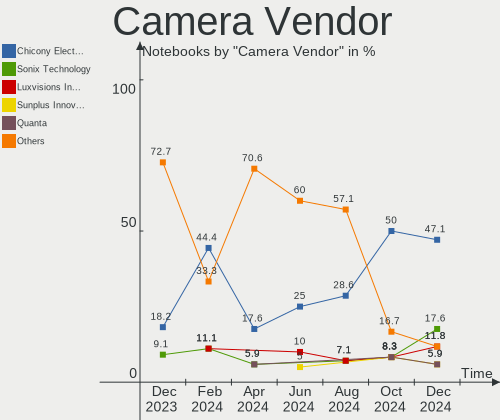

Gentoo Hardware Trends (Notebook)
---------------------------------

A project to identify most popular hardware characteristics and track their change
over time based on data collected by Gentoo users at https://Linux-Hardware.org.

Anyone can contribute to the study by uploading probes of their computers by
the [hw-probe](https://github.com/linuxhw/hw-probe) tool:

    sudo -E hw-probe -all -upload

Full-feature report is available here: https://linux-hardware.org/?view=trends&formfactor=notebook

Period: Sep, 2020.

Contents
--------

- [ OS                       ](#os)
- [ OS Family                ](#os-family)
- [ Kernel                   ](#kernel)
- [ Kernel Family            ](#kernel-family)
- [ Kernel Major Ver.        ](#kernel-major-ver)
- [ Arch                     ](#arch)
- [ DE                       ](#de)
- [ Display Server           ](#display-server)
- [ Display Manager          ](#display-manager)
- [ OS Lang                  ](#os-lang)
- [ Boot Mode                ](#boot-mode)
- [ Filesystem               ](#filesystem)
- [ Part. scheme             ](#part-scheme)
- [ Dual Boot with Linux/BSD ](#dual-boot-with-linux/bsd)
- [ Dual Boot (Win)          ](#dual-boot-win)
- [ Country                  ](#country)
- [ City                     ](#city)
- [ Vendor                   ](#vendor)
- [ Model                    ](#model)
- [ Model Family             ](#model-family)
- [ MFG Year                 ](#mfg-year)
- [ Form Factor              ](#form-factor)
- [ Secure Boot              ](#secure-boot)
- [ Coreboot                 ](#coreboot)
- [ RAM Size                 ](#ram-size)
- [ RAM Used                 ](#ram-used)
- [ Has CD-ROM               ](#has-cd-rom)
- [ Total Drives             ](#total-drives)
- [ Has Ethernet             ](#has-ethernet)
- [ Drive Vendor             ](#drive-vendor)
- [ HDD Vendor               ](#hdd-vendor)
- [ SSD Vendor               ](#ssd-vendor)
- [ Drive Model              ](#drive-model)
- [ Drive Kind               ](#drive-kind)
- [ Drive Connector          ](#drive-connector)
- [ Drive Size               ](#drive-size)
- [ Space Total              ](#space-total)
- [ Space Used               ](#space-used)
- [ Malfunc. Drives          ](#malfunc-drives)
- [ Malfunc. Drive Vendor    ](#malfunc-drive-vendor)
- [ Malfunc. HDD Vendor      ](#malfunc-hdd-vendor)
- [ Malfunc. Drive Kind      ](#malfunc-drive-kind)
- [ Failed Drives            ](#failed-drives)
- [ Failed Drive Vendor      ](#failed-drive-vendor)
- [ Drive Status             ](#drive-status)
- [ Storage Vendor           ](#storage-vendor)
- [ Storage Model            ](#storage-model)
- [ Storage Kind             ](#storage-kind)
- [ CPU Vendor               ](#cpu-vendor)
- [ CPU Model                ](#cpu-model)
- [ CPU Model Family         ](#cpu-model-family)
- [ CPU Cores                ](#cpu-cores)
- [ CPU Sockets              ](#cpu-sockets)
- [ CPU Threads              ](#cpu-threads)
- [ CPU Op-Modes             ](#cpu-op-modes)
- [ CPU Microcode            ](#cpu-microcode)
- [ CPU Microarch            ](#cpu-microarch)
- [ GPU Vendor               ](#gpu-vendor)
- [ GPU Model                ](#gpu-model)
- [ GPU Combo                ](#gpu-combo)
- [ GPU Driver               ](#gpu-driver)
- [ GPU Memory               ](#gpu-memory)
- [ Monitor Vendor           ](#monitor-vendor)
- [ Monitor Model            ](#monitor-model)
- [ Monitor Resolution       ](#monitor-resolution)
- [ Monitor Diagonal         ](#monitor-diagonal)
- [ Monitor Width            ](#monitor-width)
- [ Aspect Ratio             ](#aspect-ratio)
- [ Monitor Area             ](#monitor-area)
- [ Pixel Density            ](#pixel-density)
- [ Multiple Monitors        ](#multiple-monitors)
- [ Net Controller Vendor    ](#net-controller-vendor)
- [ Net Controller Model     ](#net-controller-model)
- [ Wireless Vendor          ](#wireless-vendor)
- [ Wireless Model           ](#wireless-model)
- [ Ethernet Vendor          ](#ethernet-vendor)
- [ Ethernet Model           ](#ethernet-model)
- [ Net Controller Kind      ](#net-controller-kind)
- [ Used Controller          ](#used-controller)
- [ NICs                     ](#nics)
- [ Memory Vendor            ](#memory-vendor)
- [ Memory Model             ](#memory-model)
- [ Memory Kind              ](#memory-kind)
- [ Memory Form Factor       ](#memory-form-factor)
- [ Memory Size              ](#memory-size)
- [ Memory Speed             ](#memory-speed)
- [ Sound Vendor             ](#sound-vendor)
- [ Sound Model              ](#sound-model)
- [ Camera Vendor            ](#camera-vendor)
- [ Camera Model             ](#camera-model)
- [ Fingerprint Vendor       ](#fingerprint-vendor)
- [ Fingerprint Model        ](#fingerprint-model)
- [ Chipcard Vendor          ](#chipcard-vendor)
- [ Chipcard Model           ](#chipcard-model)
- [ Printer Vendor           ](#printer-vendor)
- [ Printer Model            ](#printer-model)
- [ Scanner Vendor           ](#scanner-vendor)
- [ Scanner Model            ](#scanner-model)
- [ Bluetooth Vendor         ](#bluetooth-vendor)
- [ Bluetooth Model          ](#bluetooth-model)
- [ Unsupported Devices      ](#unsupported-devices)
- [ Unsupported Device Types ](#unsupported-device-types)

OS
--

Installed operating systems

| Name       | Notebooks | Percent |
|------------|-----------|---------|
| Gentoo     | 8         | 66.67%  |
| Gentoo 2.7 | 4         | 33.33%  |

OS Family
---------

OS without a version

| Name   | Notebooks | Percent |
|--------|-----------|---------|
| Gentoo | 12        | 100%    |

Kernel
------

Version of the Linux kernel

| Version                  | Notebooks | Percent |
|--------------------------|-----------|---------|
| 5.4.60-gentoo            | 2         | 16.67%  |
| 5.8.9-gentoo.90          | 1         | 8.33%   |
| 5.8.9                    | 1         | 8.33%   |
| 5.8.7-gentoo-x86_64      | 1         | 8.33%   |
| 5.8.5-latitude-5501      | 1         | 8.33%   |
| 5.8.5-gentoo             | 1         | 8.33%   |
| 5.8.2-gentoofomys        | 1         | 8.33%   |
| 5.7.19-gentoo            | 1         | 8.33%   |
| 5.4.65                   | 1         | 8.33%   |
| 5.4.48-gentoo.jinliming2 | 1         | 8.33%   |
| 5.4.48-ck-green          | 1         | 8.33%   |

Kernel Family
-------------

Linux kernel without a distro release

| Version | Notebooks | Percent |
|---------|-----------|---------|
| 5.8.9   | 2         | 16.67%  |
| 5.8.5   | 2         | 16.67%  |
| 5.4.60  | 2         | 16.67%  |
| 5.4.48  | 2         | 16.67%  |
| 5.8.7   | 1         | 8.33%   |
| 5.8.2   | 1         | 8.33%   |
| 5.7.19  | 1         | 8.33%   |
| 5.4.65  | 1         | 8.33%   |

Kernel Major Ver.
-----------------

Linux kernel major version

| Version | Notebooks | Percent |
|---------|-----------|---------|
| 5.8     | 6         | 50%     |
| 5.4     | 5         | 41.67%  |
| 5.7     | 1         | 8.33%   |

Arch
----

OS architecture (x86_64, i586, etc.)

| Name   | Notebooks | Percent |
|--------|-----------|---------|
| x86_64 | 12        | 100%    |

DE
--

Desktop Environment

| Name    | Notebooks | Percent |
|---------|-----------|---------|
| Unknown | 6         | 50%     |
| GNOME   | 3         | 25%     |
| XFCE    | 1         | 8.33%   |
| LXQt    | 1         | 8.33%   |
| KDE     | 1         | 8.33%   |

Display Server
--------------

X11 or Wayland

| Name    | Notebooks | Percent |
|---------|-----------|---------|
| X11     | 9         | 75%     |
| Unknown | 2         | 16.67%  |
| Tty     | 1         | 8.33%   |

Display Manager
---------------

SDDM, LightDM, etc.

| Name    | Notebooks | Percent |
|---------|-----------|---------|
| LightDM | 5         | 41.67%  |
| Unknown | 5         | 41.67%  |
| SLiM    | 1         | 8.33%   |
| SDDM    | 1         | 8.33%   |

OS Lang
-------

Language

| Lang       | Notebooks | Percent |
|------------|-----------|---------|
| en_US.utf8 | 5         | 41.67%  |
| nl_BE.utf8 | 1         | 8.33%   |
| fr_FR.utf8 | 1         | 8.33%   |
| en_US      | 1         | 8.33%   |
| en_GB.utf8 | 1         | 8.33%   |
| el_GR.utf8 | 1         | 8.33%   |
| ca_ES      | 1         | 8.33%   |
| Unknown    | 1         | 8.33%   |

Boot Mode
---------

EFI or BIOS

| Mode | Notebooks | Percent |
|------|-----------|---------|
| EFI  | 8         | 66.67%  |
| BIOS | 4         | 33.33%  |

Filesystem
----------

Type of filesystem

| Type  | Notebooks | Percent |
|-------|-----------|---------|
| Ext4  | 6         | 50%     |
| Btrfs | 4         | 33.33%  |
| Zfs   | 1         | 8.33%   |
| F2fs  | 1         | 8.33%   |

Part. scheme
------------

Scheme of partitioning

| Type    | Notebooks | Percent |
|---------|-----------|---------|
| GPT     | 10        | 83.33%  |
| MBR     | 1         | 8.33%   |
| Unknown | 1         | 8.33%   |

Dual Boot with Linux/BSD
------------------------

Hosting more than one Linux/BSD

| Dual boot | Notebooks | Percent |
|-----------|-----------|---------|
| No        | 11        | 91.67%  |
| Yes       | 1         | 8.33%   |

Dual Boot (Win)
---------------

Hosting Linux and Windows

| Dual boot | Notebooks | Percent |
|-----------|-----------|---------|
| No        | 8         | 66.67%  |
| Yes       | 4         | 33.33%  |

Country
-------

Geographic location (country)

| Country  | Notebooks | Percent |
|----------|-----------|---------|
| USA      | 3         | 25%     |
| Poland   | 2         | 16.67%  |
| Spain    | 1         | 8.33%   |
| Romania  | 1         | 8.33%   |
| Greece   | 1         | 8.33%   |
| Germany  | 1         | 8.33%   |
| France   | 1         | 8.33%   |
| Bulgaria | 1         | 8.33%   |
| Belgium  | 1         | 8.33%   |

City
----

Geographic location (city)

| City                 | Notebooks | Percent |
|----------------------|-----------|---------|
| Warsaw               | 1         | 8.33%   |
| Utica                | 1         | 8.33%   |
| Toulouse             | 1         | 8.33%   |
| Sofia                | 1         | 8.33%   |
| Santa Fe del Penedes | 1         | 8.33%   |
| Pruszków            | 1         | 8.33%   |
| Merritt Island       | 1         | 8.33%   |
| Los Angeles          | 1         | 8.33%   |
| Ingolstadt           | 1         | 8.33%   |
| Bucharest            | 1         | 8.33%   |
| Bree                 | 1         | 8.33%   |
| Athens               | 1         | 8.33%   |

Vendor
------

Motherboard manufacturer

| Name             | Notebooks | Percent |
|------------------|-----------|---------|
| Lenovo           | 4         | 33.33%  |
| Hewlett-Packard  | 3         | 25%     |
| Dell             | 2         | 16.67%  |
| PC Specialist    | 1         | 8.33%   |
| HUAWEI           | 1         | 8.33%   |
| ASUSTek Computer | 1         | 8.33%   |

Model
-----

Motherboard model

| Name                                   | Notebooks | Percent |
|----------------------------------------|-----------|---------|
| PC Specialist GK7NP5R                  | 1         | 8.33%   |
| Lenovo ThinkPad X220 429029G           | 1         | 8.33%   |
| Lenovo ThinkPad P53 20QN001JUS         | 1         | 8.33%   |
| Lenovo Legion 5P 15IMH05H 82AW         | 1         | 8.33%   |
| HUAWEI HLY-WX9XX                       | 1         | 8.33%   |
| HP ProBook 450 G5                      | 1         | 8.33%   |
| HP Pavilion ZV6100 (EE984EA#ABZ)       | 1         | 8.33%   |
| HP Pavilion Notebook                   | 1         | 8.33%   |
| Dell Latitude 5501                     | 1         | 8.33%   |
| Dell G3 3500                           | 1         | 8.33%   |
| ASUS VivoBook_ASUSLaptop X509DA_M509DA | 1         | 8.33%   |
| Unknown                                | 1         | 8.33%   |

Model Family
------------

Motherboard model prefix

| Name                  | Notebooks | Percent |
|-----------------------|-----------|---------|
| Lenovo ThinkPad       | 2         | 16.67%  |
| HP Pavilion           | 2         | 16.67%  |
| PC Specialist GK7NP5R | 1         | 8.33%   |
| Lenovo Legion         | 1         | 8.33%   |
| HUAWEI HLY-WX9XX      | 1         | 8.33%   |
| HP ProBook            | 1         | 8.33%   |
| Dell Latitude         | 1         | 8.33%   |
| Dell G3               | 1         | 8.33%   |
| ASUS VivoBook         | 1         | 8.33%   |
| Unknown               | 1         | 8.33%   |

MFG Year
--------

Motherboard manufacture year

| Year | Notebooks | Percent |
|------|-----------|---------|
| 2020 | 6         | 50%     |
| 2019 | 4         | 33.33%  |
| 2012 | 1         | 8.33%   |
| 2006 | 1         | 8.33%   |

Form Factor
-----------

Physical design of the computer

| Name     | Notebooks | Percent |
|----------|-----------|---------|
| Notebook | 12        | 100%    |

Secure Boot
-----------

Enabled or disabled

| State    | Notebooks | Percent |
|----------|-----------|---------|
| Disabled | 12        | 100%    |

Coreboot
--------

Have coreboot on board

| Used | Notebooks | Percent |
|------|-----------|---------|
| No   | 12        | 100%    |

RAM Size
--------

Total RAM memory

| Size in GB | Notebooks | Percent |
|------------|-----------|---------|
| 8.01-16.0  | 4         | 33.33%  |
| 4.01-8.0   | 3         | 25%     |
| 32.01-64.0 | 2         | 16.67%  |
| 24.01-32.0 | 1         | 8.33%   |
| 16.01-24.0 | 1         | 8.33%   |
| 1.01-2.0   | 1         | 8.33%   |

RAM Used
--------

Used RAM memory

| Used GB   | Notebooks | Percent |
|-----------|-----------|---------|
| 4.01-8.0  | 3         | 25%     |
| 1.01-2.0  | 3         | 25%     |
| 8.01-16.0 | 3         | 25%     |
| 0.01-1.0  | 2         | 16.67%  |
| 2.01-3.0  | 1         | 8.33%   |

Has CD-ROM
----------

Has CD-ROM on board

| Presented | Notebooks | Percent |
|-----------|-----------|---------|
| No        | 10        | 83.33%  |
| Yes       | 2         | 16.67%  |

Total Drives
------------

Number of drives on board

| Drives | Notebooks | Percent |
|--------|-----------|---------|
| 1      | 8         | 66.67%  |
| 2      | 3         | 25%     |
| 0      | 1         | 8.33%   |

Has Ethernet
------------

Has Ethernet on board

| Presented | Notebooks | Percent |
|-----------|-----------|---------|
| Yes       | 11        | 91.67%  |
| No        | 1         | 8.33%   |

Drive Vendor
------------

Hard drive vendors

| Vendor              | Notebooks | Drives | Percent |
|---------------------|-----------|--------|---------|
| Samsung Electronics | 6         | 7      | 42.86%  |
| Intel               | 3         | 3      | 21.43%  |
| WDC                 | 2         | 2      | 14.29%  |
| Unknown             | 1         | 1      | 7.14%   |
| SPCC                | 1         | 1      | 7.14%   |
| LITEONIT            | 1         | 1      | 7.14%   |

HDD Vendor
----------

Hard disk drive vendors

Zero info for selected period =(

SSD Vendor
----------

Solid state drive vendors

| Vendor              | Notebooks | Drives | Percent |
|---------------------|-----------|--------|---------|
| Samsung Electronics | 2         | 2      | 40%     |
| WDC                 | 1         | 1      | 20%     |
| SPCC                | 1         | 1      | 20%     |
| LITEONIT            | 1         | 1      | 20%     |

Drive Model
-----------

Hard drive models

| Model                          | Notebooks | Percent |
|--------------------------------|-----------|---------|
| WDS240G2G0A-00JH30 240GB SSD   | 1         | 6.67%   |
| SSDPEMKF512G8 NVMe 512GB       | 1         | 6.67%   |
| SSDPEKNW010T8 1TB              | 1         | 6.67%   |
| SSDPEKKF256G7H 256GB           | 1         | 6.67%   |
| SSD 970 EVO Plus 250GB         | 1         | 6.67%   |
| SSD 860 EVO 500GB              | 1         | 6.67%   |
| SSD 850 EVO M.2 120GB          | 1         | 6.67%   |
| Solid State Disk 256GB         | 1         | 6.67%   |
| PM991 NVMe 512GB               | 1         | 6.67%   |
| PC SN730 SDBQNTY-1T00-1001 1TB | 1         | 6.67%   |
| NVMe SSD Drive 512GB           | 1         | 6.67%   |
| N/A  2GB                       | 1         | 6.67%   |
| MZVLQ512HALU-00000 512GB       | 1         | 6.67%   |
| MZVLB512HAJQ-00000 512GB       | 1         | 6.67%   |
| LCS-256M6S 2.5 7mm 256GB SSD   | 1         | 6.67%   |

Drive Kind
----------

HDD or SSD

| Kind | Notebooks | Drives | Percent |
|------|-----------|--------|---------|
| NVMe | 8         | 9      | 57.14%  |
| SSD  | 5         | 5      | 35.71%  |
| MMC  | 1         | 1      | 7.14%   |

Drive Connector
---------------

SATA, SAS, NVMe, etc.

| Type | Notebooks | Drives | Percent |
|------|-----------|--------|---------|
| NVMe | 8         | 9      | 57.14%  |
| SATA | 5         | 5      | 35.71%  |
| MMC  | 1         | 1      | 7.14%   |

Drive Size
----------

Size of hard drive

| Size in TB | Notebooks | Drives | Percent |
|------------|-----------|--------|---------|
| 0.51-1.0   | 6         | 6      | 46.15%  |
| 0.01-0.5   | 6         | 8      | 46.15%  |
| 1.01-2.0   | 1         | 1      | 7.69%   |

Space Total
-----------

Amount of disk space available on the file system

| Size in GB | Notebooks | Percent |
|------------|-----------|---------|
| 251-500    | 3         | 25%     |
| 101-250    | 3         | 25%     |
| 1-20       | 3         | 25%     |
| 501-1000   | 3         | 25%     |

Space Used
----------

Amount of used disk space

| Used GB  | Notebooks | Percent |
|----------|-----------|---------|
| 101-250  | 4         | 33.33%  |
| 1-20     | 4         | 33.33%  |
| 251-500  | 2         | 16.67%  |
| 21-50    | 1         | 8.33%   |
| 501-1000 | 1         | 8.33%   |

Malfunc. Drives
---------------

Drive models with a malfunction

Zero info for selected period =(

Malfunc. Drive Vendor
---------------------

Vendors of faulty drives

Zero info for selected period =(

Malfunc. HDD Vendor
-------------------

Vendors of faulty HDD drives

Zero info for selected period =(

Malfunc. Drive Kind
-------------------

Kinds of faulty drives

Zero info for selected period =(

Failed Drives
-------------

Failed drive models

Zero info for selected period =(

Failed Drive Vendor
-------------------

Failed drive vendors

Zero info for selected period =(

Drive Status
------------

Number of failed and malfunc. drives

| Status   | Notebooks | Drives | Percent |
|----------|-----------|--------|---------|
| Works    | 10        | 12     | 83.33%  |
| Detected | 2         | 3      | 16.67%  |

Storage Vendor
--------------

Storage controller vendors

| Vendor              | Notebooks | Percent |
|---------------------|-----------|---------|
| Intel               | 8         | 50%     |
| Samsung Electronics | 5         | 31.25%  |
| AMD                 | 2         | 12.5%   |
| Sandisk             | 1         | 6.25%   |

Storage Model
-------------

Storage controller models

| Model                                                                  | Notebooks | Percent |
|------------------------------------------------------------------------|-----------|---------|
| NVMe SSD Controller SM981/PM981/PM983                                  | 3         | 16.67%  |
| Sunrise Point-LP SATA Controller [AHCI mode]                           | 2         | 11.11%  |
| Electronics Non-Volatile memory controller                             | 2         | 11.11%  |
| 400 Series Chipset Family SATA AHCI Controller                         | 2         | 11.11%  |
| Wildcat Point-LP SATA Controller [AHCI Mode]                           | 1         | 5.56%   |
| SSD Pro 7600p/760p/E 6100p Series                                      | 1         | 5.56%   |
| SSD 660P Series                                                        | 1         | 5.56%   |
| SSD 600P Series                                                        | 1         | 5.56%   |
| Non-Volatile memory controller                                         | 1         | 5.56%   |
| IXP SB4x0 IDE Controller                                               | 1         | 5.56%   |
| FCH SATA Controller [AHCI mode]                                        | 1         | 5.56%   |
| Cannon Lake Mobile PCH SATA AHCI Controller                            | 1         | 5.56%   |
| 6 Series/C200 Series Chipset Family 6 port Mobile SATA AHCI Controller | 1         | 5.56%   |

Storage Kind
------------

Kind of storage controller (IDE, SATA, NVMe, SAS, ...)

| Kind | Notebooks | Percent |
|------|-----------|---------|
| NVMe | 8         | 47.06%  |
| SATA | 8         | 47.06%  |
| IDE  | 1         | 5.88%   |

CPU Vendor
----------

Processor vendors

| Vendor | Notebooks | Percent |
|--------|-----------|---------|
| Intel  | 8         | 66.67%  |
| AMD    | 4         | 33.33%  |

CPU Model
---------

Processor models

| Model                                         | Notebooks | Percent |
|-----------------------------------------------|-----------|---------|
| Intel Core i5-10300H CPU @ 2.50GHz            | 2         | 16.67%  |
| Intel Core i7-9850H CPU @ 2.60GHz             | 1         | 8.33%   |
| Intel Core i7-9750H CPU @ 2.60GHz             | 1         | 8.33%   |
| Intel Core i7-8550U CPU @ 1.80GHz             | 1         | 8.33%   |
| Intel Core i5-8350U CPU @ 1.70GHz             | 1         | 8.33%   |
| Intel Core i5-5200U CPU @ 2.20GHz             | 1         | 8.33%   |
| Intel Core i5-2520M CPU @ 2.50GHz             | 1         | 8.33%   |
| AMD Ryzen 7 4800H with Radeon Graphics        | 1         | 8.33%   |
| AMD Ryzen 7 3750H with Radeon Vega Mobile Gfx | 1         | 8.33%   |
| AMD Ryzen 7 3700U with Radeon Vega Mobile Gfx | 1         | 8.33%   |
| AMD Athlon 64 Processor 3200+                 | 1         | 8.33%   |

CPU Model Family
----------------

Processor model prefix

| Model         | Notebooks | Percent |
|---------------|-----------|---------|
| Intel Core i5 | 5         | 41.67%  |
| Intel Core i7 | 3         | 25%     |
| AMD Ryzen 7   | 3         | 25%     |
| AMD Athlon 64 | 1         | 8.33%   |

CPU Cores
---------

Number of processor cores

| Number | Notebooks | Percent |
|--------|-----------|---------|
| 4      | 6         | 50%     |
| 6      | 2         | 16.67%  |
| 2      | 2         | 16.67%  |
| 8      | 1         | 8.33%   |
| 1      | 1         | 8.33%   |

CPU Sockets
-----------

Number of sockets

| Number | Notebooks | Percent |
|--------|-----------|---------|
| 1      | 12        | 100%    |

CPU Threads
-----------

Threads per core (Hyper-Threading)

| Number | Notebooks | Percent |
|--------|-----------|---------|
| 2      | 11        | 91.67%  |
| 1      | 1         | 8.33%   |

CPU Op-Modes
------------

CPU Operation Modes (32-bit, 64-bit)

| Op mode        | Notebooks | Percent |
|----------------|-----------|---------|
| 32-bit, 64-bit | 12        | 100%    |

CPU Microcode
-------------

Microcode number

| Number     | Notebooks | Percent |
|------------|-----------|---------|
| 0xa0652    | 2         | 16.67%  |
| 0x806ea    | 2         | 16.67%  |
| 0x906ed    | 1         | 8.33%   |
| 0x906ea    | 1         | 8.33%   |
| 0x306d4    | 1         | 8.33%   |
| 0x206a7    | 1         | 8.33%   |
| 0x08600103 | 1         | 8.33%   |
| 0x08108109 | 1         | 8.33%   |
| 0x08108102 | 1         | 8.33%   |
| Unknown    | 1         | 8.33%   |

CPU Microarch
-------------

Microarchitecture

| Name        | Notebooks | Percent |
|-------------|-----------|---------|
| Skylake     | 6         | 50%     |
| Zen+        | 2         | 16.67%  |
| Zen 2       | 1         | 8.33%   |
| SandyBridge | 1         | 8.33%   |
| K8 Hammer   | 1         | 8.33%   |
| Broadwell   | 1         | 8.33%   |

GPU Vendor
----------

Vendors of graphics cards

| Vendor | Notebooks | Percent |
|--------|-----------|---------|
| Nvidia | 7         | 38.89%  |
| Intel  | 7         | 38.89%  |
| AMD    | 4         | 22.22%  |

GPU Model
---------

Graphics card models

| Model                                                               | Notebooks | Percent |
|---------------------------------------------------------------------|-----------|---------|
| UHD Graphics 630 (Mobile)                                           | 2         | 11.11%  |
| UHD Graphics 620                                                    | 2         | 11.11%  |
| TU117M                                                              | 2         | 11.11%  |
| Picasso                                                             | 2         | 11.11%  |
| UHD Graphics                                                        | 1         | 5.56%   |
| TU117GLM [Quadro T1000 Mobile]                                      | 1         | 5.56%   |
| TU116M [GeForce GTX 1660 Ti Mobile]                                 | 1         | 5.56%   |
| RS480M [Mobility Radeon Xpress 200]                                 | 1         | 5.56%   |
| Renoir                                                              | 1         | 5.56%   |
| HD Graphics 5500                                                    | 1         | 5.56%   |
| GP107M [GeForce MX150]                                              | 1         | 5.56%   |
| GM108M [GeForce 940M]                                               | 1         | 5.56%   |
| GM108M [GeForce 930MX]                                              | 1         | 5.56%   |
| 2nd Generation Core Processor Family Integrated Graphics Controller | 1         | 5.56%   |

GPU Combo
---------

Combinations of graphics cards

| Name           | Notebooks | Percent |
|----------------|-----------|---------|
| Intel + Nvidia | 5         | 41.67%  |
| 1 x AMD        | 3         | 25%     |
| 1 x Intel      | 2         | 16.67%  |
| 1 x Nvidia     | 1         | 8.33%   |
| AMD + Nvidia   | 1         | 8.33%   |

GPU Driver
----------

Free vs proprietary

| Driver      | Notebooks | Percent |
|-------------|-----------|---------|
| Free        | 7         | 58.33%  |
| Proprietary | 5         | 41.67%  |

GPU Memory
----------

Total video memory

| Size in GB | Notebooks | Percent |
|------------|-----------|---------|
| Unknown    | 6         | 50%     |
| 1.01-2.0   | 3         | 25%     |
| 3.01-4.0   | 1         | 8.33%   |
| 0.51-1.0   | 1         | 8.33%   |
| 0.01-0.5   | 1         | 8.33%   |

Monitor Vendor
--------------

Monitor vendors

| Vendor              | Notebooks | Percent |
|---------------------|-----------|---------|
| BOE                 | 5         | 38.46%  |
| Samsung Electronics | 2         | 15.38%  |
| Dell                | 2         | 15.38%  |
| Chimei Innolux      | 2         | 15.38%  |
| LG Display          | 1         | 7.69%   |
| AU Optronics        | 1         | 7.69%   |

Monitor Model
-------------

Monitor models

| Model                                             | Notebooks | Percent |
|---------------------------------------------------|-----------|---------|
| U2715H DELD066 1920x1080 600x340mm 27.2-inch      | 1         | 7.69%   |
| SyncMaster SAM0588 1920x1080 521x293mm 23.5-inch  | 1         | 7.69%   |
| S2440L DELA08B 1920x1080 530x300mm 24.0-inch      | 1         | 7.69%   |
| LCD Monitor SDC4E51 1366x768 340x190mm 15.3-inch  | 1         | 7.69%   |
| LCD Monitor LGD02D3 1366x768 277x156mm 12.5-inch  | 1         | 7.69%   |
| LCD Monitor CMN1603 1920x1080 355x199mm 16.0-inch | 1         | 7.69%   |
| LCD Monitor CMN15E8 1920x1080 344x193mm 15.5-inch | 1         | 7.69%   |
| LCD Monitor BOE08BE 1920x1080 382x215mm 17.3-inch | 1         | 7.69%   |
| LCD Monitor BOE0869 1920x1080 344x194mm 15.5-inch | 1         | 7.69%   |
| LCD Monitor BOE0819 1920x1080 344x194mm 15.5-inch | 1         | 7.69%   |
| LCD Monitor BOE07F1 1920x1080 344x193mm 15.5-inch | 1         | 7.69%   |
| LCD Monitor BOE0791 1920x1080 309x173mm 13.9-inch | 1         | 7.69%   |
| LCD Monitor AUO41ED 1920x1080 344x193mm 15.5-inch | 1         | 7.69%   |

Monitor Resolution
------------------

Monitor screen resolution

| Resolution      | Notebooks | Percent |
|-----------------|-----------|---------|
| 1920x1080 (FHD) | 8         | 72.73%  |
| 1366x768 (WXGA) | 2         | 18.18%  |
| 2560x1440 (QHD) | 1         | 9.09%   |

Monitor Diagonal
----------------

Diagonal size in inches

| Inches | Notebooks | Percent |
|--------|-----------|---------|
| 15     | 6         | 46.15%  |
| 27     | 1         | 7.69%   |
| 24     | 1         | 7.69%   |
| 23     | 1         | 7.69%   |
| 17     | 1         | 7.69%   |
| 16     | 1         | 7.69%   |
| 13     | 1         | 7.69%   |
| 12     | 1         | 7.69%   |

Monitor Width
-------------

Physical width

| Width in mm | Notebooks | Percent |
|-------------|-----------|---------|
| 301-350     | 7         | 53.85%  |
| 501-600     | 3         | 23.08%  |
| 351-400     | 2         | 15.38%  |
| 201-300     | 1         | 7.69%   |

Aspect Ratio
------------

Proportional relationship between the width and the height

| Ratio | Notebooks | Percent |
|-------|-----------|---------|
| 16/9  | 10        | 100%    |

Monitor Area
------------

Area in inch²

| Area in inch² | Notebooks | Percent |
|----------------|-----------|---------|
| 101-110        | 7         | 53.85%  |
| 201-250        | 2         | 15.38%  |
| 81-90          | 1         | 7.69%   |
| 61-70          | 1         | 7.69%   |
| 301-350        | 1         | 7.69%   |
| 121-130        | 1         | 7.69%   |

Pixel Density
-------------

Pixels per inch

| Density | Notebooks | Percent |
|---------|-----------|---------|
| 121-160 | 9         | 69.23%  |
| 101-120 | 2         | 15.38%  |
| 51-100  | 2         | 15.38%  |

Multiple Monitors
-----------------

Total monitors connected

| Total | Notebooks | Percent |
|-------|-----------|---------|
| 1     | 7         | 58.33%  |
| 2     | 4         | 33.33%  |
| 0     | 1         | 8.33%   |

Net Controller Vendor
---------------------

Controller vendors

| Vendor                         | Notebooks | Percent |
|--------------------------------|-----------|---------|
| Realtek Semiconductor          | 8         | 38.1%   |
| Intel                          | 8         | 38.1%   |
| Microsoft                      | 1         | 4.76%   |
| Lenovo                         | 1         | 4.76%   |
| Broadcom Inc. and subsidiaries | 1         | 4.76%   |
| ASIX Electronics               | 1         | 4.76%   |
| AMD                            | 1         | 4.76%   |

Net Controller Model
--------------------

Controller models

| Model                                                      | Notebooks | Percent |
|------------------------------------------------------------|-----------|---------|
| RTL8111/8168/8411 PCI Express Gigabit Ethernet Controller  | 4         | 15.38%  |
| Wireless 8265 / 8275                                       | 2         | 7.69%   |
| Wi-Fi 6 AX200                                              | 2         | 7.69%   |
| Comet Lake PCH CNVi WiFi                                   | 2         | 7.69%   |
| Xbox 360 Wireless Adapter                                  | 1         | 3.85%   |
| Wireless-AC 9560 [Jefferson Peak]                          | 1         | 3.85%   |
| ThinkPad TBT 3 Dock                                        | 1         | 3.85%   |
| RTL8822CE 802.11ac PCIe Wireless Network Adapter           | 1         | 3.85%   |
| RTL8821CE 802.11ac PCIe Wireless Network Adapter           | 1         | 3.85%   |
| RTL8723BE PCIe Wireless Network Adapter                    | 1         | 3.85%   |
| RTL810xE PCI Express Fast Ethernet controller              | 1         | 3.85%   |
| RTL-8100/8101L/8139 PCI Fast Ethernet Adapter              | 1         | 3.85%   |
| IXP SB400 AC'97 Modem Controller                           | 1         | 3.85%   |
| Ethernet Connection (7) I219-V                             | 1         | 3.85%   |
| Ethernet Connection (7) I219-LM                            | 1         | 3.85%   |
| Ethernet Connection (4) I219-LM                            | 1         | 3.85%   |
| Centrino Advanced-N 6205 [Taylor Peak]                     | 1         | 3.85%   |
| BCM4318 [AirForce One 54g] 802.11g Wireless LAN Controller | 1         | 3.85%   |
| AX88772B                                                   | 1         | 3.85%   |
| 82579LM Gigabit Network Connection (Lewisville)            | 1         | 3.85%   |

Wireless Vendor
---------------

Wireless vendors

| Vendor                         | Notebooks | Percent |
|--------------------------------|-----------|---------|
| Intel                          | 7         | 58.33%  |
| Realtek Semiconductor          | 3         | 25%     |
| Microsoft                      | 1         | 8.33%   |
| Broadcom Inc. and subsidiaries | 1         | 8.33%   |

Wireless Model
--------------

Wireless models

| Model                                                      | Notebooks | Percent |
|------------------------------------------------------------|-----------|---------|
| Wireless 8265 / 8275                                       | 2         | 16.67%  |
| Wi-Fi 6 AX200                                              | 2         | 16.67%  |
| Xbox 360 Wireless Adapter                                  | 1         | 8.33%   |
| Wireless-AC 9560 [Jefferson Peak]                          | 1         | 8.33%   |
| RTL8822CE 802.11ac PCIe Wireless Network Adapter           | 1         | 8.33%   |
| RTL8821CE 802.11ac PCIe Wireless Network Adapter           | 1         | 8.33%   |
| RTL8723BE PCIe Wireless Network Adapter                    | 1         | 8.33%   |
| Comet Lake PCH CNVi WiFi                                   | 1         | 8.33%   |
| Centrino Advanced-N 6205 [Taylor Peak]                     | 1         | 8.33%   |
| BCM4318 [AirForce One 54g] 802.11g Wireless LAN Controller | 1         | 8.33%   |

Ethernet Vendor
---------------

Ethernet vendors

| Vendor                | Notebooks | Percent |
|-----------------------|-----------|---------|
| Realtek Semiconductor | 6         | 46.15%  |
| Intel                 | 5         | 38.46%  |
| Lenovo                | 1         | 7.69%   |
| ASIX Electronics      | 1         | 7.69%   |

Ethernet Model
--------------

Ethernet models

| Model                                                     | Notebooks | Percent |
|-----------------------------------------------------------|-----------|---------|
| RTL8111/8168/8411 PCI Express Gigabit Ethernet Controller | 4         | 30.77%  |
| ThinkPad TBT 3 Dock                                       | 1         | 7.69%   |
| RTL810xE PCI Express Fast Ethernet controller             | 1         | 7.69%   |
| RTL-8100/8101L/8139 PCI Fast Ethernet Adapter             | 1         | 7.69%   |
| Ethernet Connection (7) I219-V                            | 1         | 7.69%   |
| Ethernet Connection (7) I219-LM                           | 1         | 7.69%   |
| Ethernet Connection (4) I219-LM                           | 1         | 7.69%   |
| Comet Lake PCH CNVi WiFi                                  | 1         | 7.69%   |
| AX88772B                                                  | 1         | 7.69%   |
| 82579LM Gigabit Network Connection (Lewisville)           | 1         | 7.69%   |

Net Controller Kind
-------------------

Ethernet, WiFi or modem

| Kind     | Notebooks | Percent |
|----------|-----------|---------|
| WiFi     | 11        | 47.83%  |
| Ethernet | 11        | 47.83%  |
| Modem    | 1         | 4.35%   |

Used Controller
---------------

Currently used network controller

| Kind     | Notebooks | Percent |
|----------|-----------|---------|
| WiFi     | 11        | 68.75%  |
| Ethernet | 5         | 31.25%  |

NICs
----

Total network controllers on board

| Total | Notebooks | Percent |
|-------|-----------|---------|
| 2     | 10        | 83.33%  |
| 1     | 2         | 16.67%  |

Memory Vendor
-------------

Memory module vendors

| Vendor              | Notebooks | Percent |
|---------------------|-----------|---------|
| SK Hynix            | 4         | 33.33%  |
| Samsung Electronics | 4         | 33.33%  |
| Corsair             | 2         | 16.67%  |
| Unknown             | 1         | 8.33%   |
| Crucial             | 1         | 8.33%   |

Memory Model
------------

Memory module models

| Model                                                  | Notebooks | Percent |
|--------------------------------------------------------|-----------|---------|
| RAM Module 8192MB SODIMM DDR4 2400MT/s                 | 1         | 6.67%   |
| RAM Module 256MB DIMM DRAM                             | 1         | 6.67%   |
| RAM Module 1024MB DIMM DRAM                            | 1         | 6.67%   |
| RAM M471B5173DB0-YK0 4096MB SODIMM DDR3 1600MT/s       | 1         | 6.67%   |
| RAM M471B1G73QH0-YK0 8192MB SODIMM DDR3 1600MT/s       | 1         | 6.67%   |
| RAM M471A5244CB0-CWE 4096MB Row Of Chips DDR4 3200MT/s | 1         | 6.67%   |
| RAM M471A5244CB0-CTD 4096MB SODIMM DDR4 2667MT/s       | 1         | 6.67%   |
| RAM M471A4G43MB1-CTD 32GB SODIMM DDR4 2667MT/s         | 1         | 6.67%   |
| RAM HMAA1GS6CMR6N-VK 8GB SODIMM DDR4 2667MT/s          | 1         | 6.67%   |
| RAM HMA851S6JJR6N-VK 4GB SODIMM DDR4 2667MT/s          | 1         | 6.67%   |
| RAM HMA82GS6AFR8N-UH 16384MB SODIMM DDR4 2400MT/s      | 1         | 6.67%   |
| RAM HMA81GS6AFR8N-VK 8192MB SODIMM DDR4 2667MT/s       | 1         | 6.67%   |
| RAM CT16G4SFD824A.M16FE 16384MB SODIMM DDR4 2400MT/s   | 1         | 6.67%   |
| RAM CMSX8GX3M1A1600C10 8192MB SODIMM DDR3 1600MT/s     | 1         | 6.67%   |
| RAM CM4X8GF2666C18S2 8192MB SODIMM DDR4 2667MT/s       | 1         | 6.67%   |

Memory Kind
-----------

Memory module kinds

| Kind | Notebooks | Percent |
|------|-----------|---------|
| DDR4 | 8         | 72.73%  |
| DDR3 | 2         | 18.18%  |
| DRAM | 1         | 9.09%   |

Memory Form Factor
------------------

Physical design of the memory module

| Name         | Notebooks | Percent |
|--------------|-----------|---------|
| SODIMM       | 9         | 81.82%  |
| Row Of Chips | 1         | 9.09%   |
| DIMM         | 1         | 9.09%   |

Memory Size
-----------

Memory module size

| Size  | Notebooks | Percent |
|-------|-----------|---------|
| 8192  | 5         | 33.33%  |
| 4096  | 3         | 20%     |
| 16384 | 2         | 13.33%  |
| 32000 | 1         | 6.67%   |
| 8000  | 1         | 6.67%   |
| 4000  | 1         | 6.67%   |
| 1024  | 1         | 6.67%   |
| 256   | 1         | 6.67%   |

Memory Speed
------------

Memory module speed

| Speed   | Notebooks | Percent |
|---------|-----------|---------|
| 2667    | 5         | 41.67%  |
| 2400    | 2         | 16.67%  |
| 1600    | 2         | 16.67%  |
| 3200    | 1         | 8.33%   |
| 2133    | 1         | 8.33%   |
| Unknown | 1         | 8.33%   |

Sound Vendor
------------

Sound card vendors

| Vendor              | Notebooks | Percent |
|---------------------|-----------|---------|
| Intel               | 8         | 40%     |
| Nvidia              | 4         | 20%     |
| AMD                 | 4         | 20%     |
| Lenovo              | 1         | 5%      |
| JMTek               | 1         | 5%      |
| Creative Technology | 1         | 5%      |
| AVer Information    | 1         | 5%      |

Sound Model
-----------

Sound card models

| Model                                                                | Notebooks | Percent |
|----------------------------------------------------------------------|-----------|---------|
| TU107 GeForce GTX 1650 High Definition Audio Controller              | 3         | 13.04%  |
| Family 17h (Models 10h-1fh) HD Audio Controller                      | 3         | 13.04%  |
| Sunrise Point-LP HD Audio                                            | 2         | 8.7%    |
| Raven/Raven2/Fenghuang HDMI/DP Audio Controller                      | 2         | 8.7%    |
| Comet Lake PCH cAVS                                                  | 2         | 8.7%    |
| Cannon Lake PCH cAVS                                                 | 2         | 8.7%    |
| Wildcat Point-LP High Definition Audio Controller                    | 1         | 4.35%   |
| TU116 High Definition Audio Controller                               | 1         | 4.35%   |
| ThinkPad Thunderbolt 3 Dock USB Audio                                | 1         | 4.35%   |
| Sound Blaster Play! 3                                                | 1         | 4.35%   |
| KLIM Talk                                                            | 1         | 4.35%   |
| IXP SB400 AC'97 Audio Controller                                     | 1         | 4.35%   |
| Broadwell-U Audio Controller                                         | 1         | 4.35%   |
| AVer CAM340+                                                         | 1         | 4.35%   |
| 6 Series/C200 Series Chipset Family High Definition Audio Controller | 1         | 4.35%   |

Camera Vendor
-------------

Camera device vendors

| Vendor                | Notebooks | Percent |
|-----------------------|-----------|---------|
| IMC Networks          | 3         | 30%     |
| Chicony Electronics   | 3         | 30%     |
| Realtek Semiconductor | 2         | 20%     |
| Lite-On Technology    | 1         | 10%     |
| AVer Information      | 1         | 10%     |

Camera Model
------------

Camera device models

| Model                            | Notebooks | Percent |
|----------------------------------|-----------|---------|
| Integrated_Webcam_HD             | 2         | 20%     |
| Integrated Camera                | 2         | 20%     |
| USB2.0 VGA UVC WebCam            | 1         | 10%     |
| Lenovo Integrated Camera (0.3MP) | 1         | 10%     |
| HP Truevision HD                 | 1         | 10%     |
| HD Webcam                        | 1         | 10%     |
| HD Camera                        | 1         | 10%     |
| AVer CAM340+                     | 1         | 10%     |

Fingerprint Vendor
------------------

Fingerprint sensor vendors

| Vendor                     | Notebooks | Percent |
|----------------------------|-----------|---------|
| Synaptics                  | 2         | 50%     |
| Validity Sensors           | 1         | 25%     |
| Shenzhen Goodix Technology | 1         | 25%     |

Fingerprint Model
-----------------

Fingerprint sensor models

| Model                                   | Notebooks | Percent |
|-----------------------------------------|-----------|---------|
| VFS495 Fingerprint Reader               | 1         | 25%     |
| Prometheus MIS Touch Fingerprint Reader | 1         | 25%     |
| Metallica MIS Touch Fingerprint Reader  | 1         | 25%     |
| Fingerprint Reader                      | 1         | 25%     |

Chipcard Vendor
---------------

Chipcard module vendors

| Vendor      | Notebooks | Percent |
|-------------|-----------|---------|
| Broadcom    | 1         | 50%     |
| Alcor Micro | 1         | 50%     |

Chipcard Model
--------------

Chipcard module models

| Model                   | Notebooks | Percent |
|-------------------------|-----------|---------|
| AU9540 Smartcard Reader | 1         | 50%     |
| 58200                   | 1         | 50%     |

Printer Vendor
--------------

Printer device vendors

Zero info for selected period =(

Printer Model
-------------

Printer device models

Zero info for selected period =(

Scanner Vendor
--------------

Scanner device vendors

Zero info for selected period =(

Scanner Model
-------------

Scanner device models

Zero info for selected period =(

Bluetooth Vendor
----------------

Controller vendors

| Vendor                | Notebooks | Percent |
|-----------------------|-----------|---------|
| Intel                 | 7         | 63.64%  |
| Realtek Semiconductor | 1         | 9.09%   |
| Realtek               | 1         | 9.09%   |
| IMC Networks          | 1         | 9.09%   |
| Broadcom              | 1         | 9.09%   |

Bluetooth Model
---------------

Controller models

| Model              | Notebooks | Percent |
|--------------------|-----------|---------|
| Bluetooth Device   | 7         | 63.64%  |
| Bluetooth Radio    | 3         | 27.27%  |
| BCM2045B (BDC-2.1) | 1         | 9.09%   |

Unsupported Devices
-------------------

Total unsupported devices on board

| Total | Notebooks | Percent |
|-------|-----------|---------|
| 1     | 6         | 50%     |
| 0     | 3         | 25%     |
| 2     | 2         | 16.67%  |
| 3     | 1         | 8.33%   |

Unsupported Device Types
------------------------

Types of unsupported devices

| Type                     | Notebooks | Percent |
|--------------------------|-----------|---------|
| Fingerprint reader       | 4         | 28.57%  |
| Communication controller | 4         | 28.57%  |
| Chipcard                 | 2         | 14.29%  |
| Multimedia controller    | 1         | 7.14%   |
| Modem                    | 1         | 7.14%   |
| Graphics card            | 1         | 7.14%   |
| Bluetooth                | 1         | 7.14%   |

