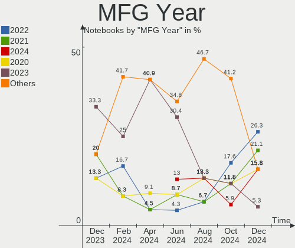
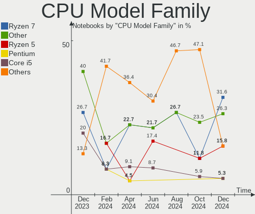

Gentoo - Hardware Trends (Notebooks)
------------------------------------

A project to identify most popular hardware characteristics and track their change
over time based on data collected by Linux users at https://Linux-Hardware.org.

Anyone can contribute to this report by the [hw-probe](https://github.com/linuxhw/hw-probe) tool:

    sudo -E hw-probe -all -upload

This report is for one last month. Overall report since the beginning of time: [TestDays](https://github.com/linuxhw/TestDays)

Period: Jan, 2024.

Contents
--------

* [ System ](#system)
  - [ OS                       ](#os)
  - [ OS Family                ](#os-family)
  - [ Kernel                   ](#kernel)
  - [ Kernel Family            ](#kernel-family)
  - [ Kernel Major Ver.        ](#kernel-major-ver)
  - [ Arch                     ](#arch)
  - [ DE                       ](#de)
  - [ Display Server           ](#display-server)
  - [ Display Manager          ](#display-manager)
  - [ OS Lang                  ](#os-lang)
  - [ Boot Mode                ](#boot-mode)
  - [ Filesystem               ](#filesystem)
  - [ Part. scheme             ](#part-scheme)
  - [ Dual Boot with Linux/BSD ](#dual-boot-with-linuxbsd)
  - [ Dual Boot (Win)          ](#dual-boot-win)

* [ Board ](#board)
  - [ Vendor                   ](#vendor)
  - [ Model                    ](#model)
  - [ Model Family             ](#model-family)
  - [ MFG Year                 ](#mfg-year)
  - [ Form Factor              ](#form-factor)
  - [ Secure Boot              ](#secure-boot)
  - [ Coreboot                 ](#coreboot)
  - [ RAM Size                 ](#ram-size)
  - [ RAM Used                 ](#ram-used)
  - [ Total Drives             ](#total-drives)
  - [ Has CD-ROM               ](#has-cd-rom)
  - [ Has Ethernet             ](#has-ethernet)
  - [ Has WiFi                 ](#has-wifi)
  - [ Has Bluetooth            ](#has-bluetooth)

* [ Location ](#location)
  - [ Country                  ](#country)
  - [ City                     ](#city)

* [ Drives ](#drives)
  - [ Drive Vendor             ](#drive-vendor)
  - [ Drive Model              ](#drive-model)
  - [ HDD Vendor               ](#hdd-vendor)
  - [ SSD Vendor               ](#ssd-vendor)
  - [ Drive Kind               ](#drive-kind)
  - [ Drive Connector          ](#drive-connector)
  - [ Drive Size               ](#drive-size)
  - [ Space Total              ](#space-total)
  - [ Space Used               ](#space-used)
  - [ Malfunc. Drives          ](#malfunc-drives)
  - [ Malfunc. Drive Vendor    ](#malfunc-drive-vendor)
  - [ Malfunc. HDD Vendor      ](#malfunc-hdd-vendor)
  - [ Malfunc. Drive Kind      ](#malfunc-drive-kind)
  - [ Failed Drives            ](#failed-drives)
  - [ Failed Drive Vendor      ](#failed-drive-vendor)
  - [ Drive Status             ](#drive-status)

* [ Storage controller ](#storage-controller)
  - [ Storage Vendor           ](#storage-vendor)
  - [ Storage Model            ](#storage-model)
  - [ Storage Kind             ](#storage-kind)

* [ Processor ](#processor)
  - [ CPU Vendor               ](#cpu-vendor)
  - [ CPU Model                ](#cpu-model)
  - [ CPU Model Family         ](#cpu-model-family)
  - [ CPU Cores                ](#cpu-cores)
  - [ CPU Sockets              ](#cpu-sockets)
  - [ CPU Threads              ](#cpu-threads)
  - [ CPU Op-Modes             ](#cpu-op-modes)
  - [ CPU Microcode            ](#cpu-microcode)
  - [ CPU Microarch            ](#cpu-microarch)

* [ Graphics ](#graphics)
  - [ GPU Vendor               ](#gpu-vendor)
  - [ GPU Model                ](#gpu-model)
  - [ GPU Combo                ](#gpu-combo)
  - [ GPU Driver               ](#gpu-driver)
  - [ GPU Memory               ](#gpu-memory)

* [ Monitor ](#monitor)
  - [ Monitor Vendor           ](#monitor-vendor)
  - [ Monitor Model            ](#monitor-model)
  - [ Monitor Resolution       ](#monitor-resolution)
  - [ Monitor Diagonal         ](#monitor-diagonal)
  - [ Monitor Width            ](#monitor-width)
  - [ Aspect Ratio             ](#aspect-ratio)
  - [ Monitor Area             ](#monitor-area)
  - [ Pixel Density            ](#pixel-density)
  - [ Multiple Monitors        ](#multiple-monitors)

* [ Network ](#network)
  - [ Net Controller Vendor    ](#net-controller-vendor)
  - [ Net Controller Model     ](#net-controller-model)
  - [ Wireless Vendor          ](#wireless-vendor)
  - [ Wireless Model           ](#wireless-model)
  - [ Ethernet Vendor          ](#ethernet-vendor)
  - [ Ethernet Model           ](#ethernet-model)
  - [ Net Controller Kind      ](#net-controller-kind)
  - [ Used Controller          ](#used-controller)
  - [ NICs                     ](#nics)
  - [ IPv6                     ](#ipv6)

* [ Bluetooth ](#bluetooth)
  - [ Bluetooth Vendor         ](#bluetooth-vendor)
  - [ Bluetooth Model          ](#bluetooth-model)

* [ Sound ](#sound)
  - [ Sound Vendor             ](#sound-vendor)
  - [ Sound Model              ](#sound-model)

* [ Memory ](#memory)
  - [ Memory Vendor            ](#memory-vendor)
  - [ Memory Model             ](#memory-model)
  - [ Memory Kind              ](#memory-kind)
  - [ Memory Form Factor       ](#memory-form-factor)
  - [ Memory Size              ](#memory-size)
  - [ Memory Speed             ](#memory-speed)

* [ Printers & scanners ](#printers--scanners)
  - [ Printer Vendor           ](#printer-vendor)
  - [ Printer Model            ](#printer-model)
  - [ Scanner Vendor           ](#scanner-vendor)
  - [ Scanner Model            ](#scanner-model)

* [ Camera ](#camera)
  - [ Camera Vendor            ](#camera-vendor)
  - [ Camera Model             ](#camera-model)

* [ Security ](#security)
  - [ Fingerprint Vendor       ](#fingerprint-vendor)
  - [ Fingerprint Model        ](#fingerprint-model)
  - [ Chipcard Vendor          ](#chipcard-vendor)
  - [ Chipcard Model           ](#chipcard-model)

* [ Unsupported ](#unsupported)
  - [ Unsupported Devices      ](#unsupported-devices)
  - [ Unsupported Device Types ](#unsupported-device-types)

System
------

OS
--

Installed operating systems

| Name        | Notebooks | Percent |
|-------------|-----------|---------|
| Gentoo 2.14 | 23        | 95.83%  |
| Gentoo 2.7  | 1         | 4.17%   |

OS Family
---------

OS without a version

| Name   | Notebooks | Percent |
|--------|-----------|---------|
| Gentoo | 24        | 100%    |

Kernel
------

Version of the Linux kernel

| Version                   | Notebooks | Percent |
|---------------------------|-----------|---------|
| 6.6.9-gentoo              | 3         | 12.5%   |
| 6.1.67-gentoo-dist        | 3         | 12.5%   |
| 6.1.67-gentoo             | 3         | 12.5%   |
| 6.7.0-gentoo              | 2         | 8.33%   |
| 6.7.0-gentoox64.efi       | 1         | 4.17%   |
| 6.6.8-gentoo-x86_64       | 1         | 4.17%   |
| 6.6.8-gentoo              | 1         | 4.17%   |
| 6.6.8                     | 1         | 4.17%   |
| 6.6.7-gentoo-md-a15       | 1         | 4.17%   |
| 6.6.13-gentoo             | 1         | 4.17%   |
| 6.6.11-gentoo-x86_64      | 1         | 4.17%   |
| 6.6.10-gentoo-dist        | 1         | 4.17%   |
| 6.1.69-gentoo-dist        | 1         | 4.17%   |
| 6.1.67-gentoo-x86_64      | 1         | 4.17%   |
| 6.1.57-gentoo-gentoo-dist | 1         | 4.17%   |
| 5.15.0-76-generic         | 1         | 4.17%   |
| 5.10.52-gentoo-x86_64     | 1         | 4.17%   |

Kernel Family
-------------

Linux kernel without a distro release

| Version | Notebooks | Percent |
|---------|-----------|---------|
| 6.1.67  | 7         | 29.17%  |
| 6.7.0   | 3         | 12.5%   |
| 6.6.9   | 3         | 12.5%   |
| 6.6.8   | 3         | 12.5%   |
| 6.6.7   | 1         | 4.17%   |
| 6.6.13  | 1         | 4.17%   |
| 6.6.11  | 1         | 4.17%   |
| 6.6.10  | 1         | 4.17%   |
| 6.1.69  | 1         | 4.17%   |
| 6.1.57  | 1         | 4.17%   |
| 5.15.0  | 1         | 4.17%   |
| 5.10.52 | 1         | 4.17%   |

Kernel Major Ver.
-----------------

Linux kernel major version

| Version | Notebooks | Percent |
|---------|-----------|---------|
| 6.6     | 10        | 41.67%  |
| 6.1     | 9         | 37.5%   |
| 6.7     | 3         | 12.5%   |
| 5.15    | 1         | 4.17%   |
| 5.10    | 1         | 4.17%   |

Arch
----

OS architecture (x86_64, i586, etc.)

| Name   | Notebooks | Percent |
|--------|-----------|---------|
| x86_64 | 24        | 100%    |

DE
--

Desktop Environment

| Name          | Notebooks | Percent |
|---------------|-----------|---------|
| Unknown       | 7         | 29.17%  |
| KDE5          | 5         | 20.83%  |
| XFCE          | 2         | 8.33%   |
| Hyprland      | 2         | 8.33%   |
| GNOME         | 2         | 8.33%   |
| DWM           | 2         | 8.33%   |
| LXQt          | 1         | 4.17%   |
| LXDE          | 1         | 4.17%   |
| KDE6          | 1         | 4.17%   |
| GNOME Classic | 1         | 4.17%   |

Display Server
--------------

X11 or Wayland

| Name    | Notebooks | Percent |
|---------|-----------|---------|
| Wayland | 10        | 41.67%  |
| X11     | 6         | 25%     |
| Tty     | 5         | 20.83%  |
| Unknown | 3         | 12.5%   |

Display Manager
---------------

SDDM, LightDM, etc.

| Name    | Notebooks | Percent |
|---------|-----------|---------|
| Unknown | 11        | 45.83%  |
| SDDM    | 7         | 29.17%  |
| LightDM | 4         | 16.67%  |
| GDM     | 2         | 8.33%   |

OS Lang
-------

Language

| Lang    | Notebooks | Percent |
|---------|-----------|---------|
| en_US   | 10        | 41.67%  |
| de_DE   | 3         | 12.5%   |
| C.UTF8  | 3         | 12.5%   |
| Unknown | 3         | 12.5%   |
| en_GB   | 2         | 8.33%   |
| ru_RU   | 1         | 4.17%   |
| es_MX   | 1         | 4.17%   |
| de_CH   | 1         | 4.17%   |

Boot Mode
---------

EFI or BIOS

| Mode | Notebooks | Percent |
|------|-----------|---------|
| EFI  | 21        | 87.5%   |
| BIOS | 3         | 12.5%   |

Filesystem
----------

Type of filesystem

| Type  | Notebooks | Percent |
|-------|-----------|---------|
| Ext4  | 11        | 45.83%  |
| Btrfs | 9         | 37.5%   |
| Xfs   | 4         | 16.67%  |

Part. scheme
------------

Scheme of partitioning

| Type | Notebooks | Percent |
|------|-----------|---------|
| GPT  | 24        | 100%    |

Dual Boot with Linux/BSD
------------------------

Hosting more than one Linux/BSD

| Dual boot | Notebooks | Percent |
|-----------|-----------|---------|
| No        | 22        | 91.67%  |
| Yes       | 2         | 8.33%   |

Dual Boot (Win)
---------------

Hosting Linux and Windows

| Dual boot | Notebooks | Percent |
|-----------|-----------|---------|
| No        | 14        | 58.33%  |
| Yes       | 10        | 41.67%  |

Board
-----

Vendor
------

Motherboard manufacturer

| Name             | Notebooks | Percent |
|------------------|-----------|---------|
| Lenovo           | 6         | 25%     |
| Hewlett-Packard  | 6         | 25%     |
| ASUSTek Computer | 4         | 16.67%  |
| Star Labs        | 2         | 8.33%   |
| Framework        | 2         | 8.33%   |
| Acer             | 2         | 8.33%   |
| MSI              | 1         | 4.17%   |
| DEXP             | 1         | 4.17%   |

Model
-----

Motherboard model

| Name                                             | Notebooks | Percent |
|--------------------------------------------------|-----------|---------|
| Framework Laptop 13 (AMD Ryzen 7040Series)       | 2         | 8.33%   |
| Star Labs StarLite                               | 1         | 4.17%   |
| Star Labs StarBook                               | 1         | 4.17%   |
| MSI Pulse 15 B13VFK                              | 1         | 4.17%   |
| Lenovo Yoga 14sACH 2021 82MS                     | 1         | 4.17%   |
| Lenovo V14 G2 ALC 82KC                           | 1         | 4.17%   |
| Lenovo ThinkPad X395 20NLCTO1WW                  | 1         | 4.17%   |
| Lenovo ThinkPad X1 Carbon 7th 20QES01M00         | 1         | 4.17%   |
| Lenovo ThinkPad P16s Gen 2 21K9CTO1WW            | 1         | 4.17%   |
| Lenovo ThinkPad L15 Gen 1 20U70029UK             | 1         | 4.17%   |
| HP ZBook Studio 16 inch G9 Mobile Workstation PC | 1         | 4.17%   |
| HP Victus by Laptop 16-e0xxx                     | 1         | 4.17%   |
| HP Laptop 15t-dy100                              | 1         | 4.17%   |
| HP Laptop 15s-eq2xxx                             | 1         | 4.17%   |
| HP Laptop 15 da0018nk                            | 1         | 4.17%   |
| HP EliteBook 830 G6                              | 1         | 4.17%   |
| DEXP Aquilon C14                                 | 1         | 4.17%   |
| ASUS ZenBook UX425UA_UM425UA                     | 1         | 4.17%   |
| ASUS VivoBook_ASUSLaptop X509DA_M509DA           | 1         | 4.17%   |
| ASUS VivoBook_ASUSLaptop M6501RM_M6501RM         | 1         | 4.17%   |
| ASUS ASUS TUF Gaming A15 FA507NU_FA507NU         | 1         | 4.17%   |
| Acer Aspire A517-52G                             | 1         | 4.17%   |
| Acer Aspire A514-54                              | 1         | 4.17%   |

Model Family
------------

Motherboard model prefix

| Name               | Notebooks | Percent |
|--------------------|-----------|---------|
| Lenovo ThinkPad    | 4         | 16.67%  |
| HP Laptop          | 3         | 12.5%   |
| Framework Laptop   | 2         | 8.33%   |
| ASUS VivoBook      | 2         | 8.33%   |
| Acer Aspire        | 2         | 8.33%   |
| Star Labs StarLite | 1         | 4.17%   |
| Star Labs StarBook | 1         | 4.17%   |
| MSI Pulse          | 1         | 4.17%   |
| Lenovo Yoga        | 1         | 4.17%   |
| Lenovo V14         | 1         | 4.17%   |
| HP ZBook           | 1         | 4.17%   |
| HP Victus          | 1         | 4.17%   |
| HP EliteBook       | 1         | 4.17%   |
| DEXP Aquilon       | 1         | 4.17%   |
| ASUS ZenBook       | 1         | 4.17%   |
| ASUS ASUS          | 1         | 4.17%   |

MFG Year
--------

Motherboard manufacture year

| Year | Notebooks | Percent |
|------|-----------|---------|
| 2023 | 7         | 29.17%  |
| 2021 | 6         | 25%     |
| 2022 | 5         | 20.83%  |
| 2019 | 4         | 16.67%  |
| 2020 | 2         | 8.33%   |

Form Factor
-----------

Physical design of the computer

| Name     | Notebooks | Percent |
|----------|-----------|---------|
| Notebook | 24        | 100%    |

Secure Boot
-----------

Enabled or disabled

| State    | Notebooks | Percent |
|----------|-----------|---------|
| Disabled | 22        | 91.67%  |
| Enabled  | 2         | 8.33%   |

Coreboot
--------

Have coreboot on board

| Used | Notebooks | Percent |
|------|-----------|---------|
| No   | 24        | 100%    |

RAM Size
--------

Total RAM memory

| Size in GB  | Notebooks | Percent |
|-------------|-----------|---------|
| 8.01-16.0   | 8         | 33.33%  |
| 4.01-8.0    | 5         | 20.83%  |
| 32.01-64.0  | 4         | 16.67%  |
| 64.01-256.0 | 3         | 12.5%   |
| 16.01-24.0  | 3         | 12.5%   |
| 24.01-32.0  | 1         | 4.17%   |

RAM Used
--------

Used RAM memory

| Used GB  | Notebooks | Percent |
|----------|-----------|---------|
| 2.01-3.0 | 6         | 25%     |
| 3.01-4.0 | 5         | 20.83%  |
| 1.01-2.0 | 5         | 20.83%  |
| 4.01-8.0 | 4         | 16.67%  |
| 0.51-1.0 | 3         | 12.5%   |
| 0.01-0.5 | 1         | 4.17%   |

Total Drives
------------

Number of drives on board

| Drives | Notebooks | Percent |
|--------|-----------|---------|
| 1      | 16        | 66.67%  |
| 2      | 8         | 33.33%  |

Has CD-ROM
----------

Has CD-ROM on board

| Presented | Notebooks | Percent |
|-----------|-----------|---------|
| No        | 23        | 95.83%  |
| Yes       | 1         | 4.17%   |

Has Ethernet
------------

Has Ethernet on board

| Presented | Notebooks | Percent |
|-----------|-----------|---------|
| Yes       | 15        | 62.5%   |
| No        | 9         | 37.5%   |

Has WiFi
--------

Has WiFi module

| Presented | Notebooks | Percent |
|-----------|-----------|---------|
| Yes       | 24        | 100%    |

Has Bluetooth
-------------

Has Bluetooth module

| Presented | Notebooks | Percent |
|-----------|-----------|---------|
| Yes       | 22        | 91.67%  |
| No        | 2         | 8.33%   |

Location
--------

Country
-------

Geographic location (country)

| Country     | Notebooks | Percent |
|-------------|-----------|---------|
| Germany     | 6         | 25%     |
| USA         | 4         | 16.67%  |
| UK          | 2         | 8.33%   |
| Russia      | 2         | 8.33%   |
| Switzerland | 1         | 4.17%   |
| Netherlands | 1         | 4.17%   |
| Mexico      | 1         | 4.17%   |
| Italy       | 1         | 4.17%   |
| China       | 1         | 4.17%   |
| Canada      | 1         | 4.17%   |
| Bulgaria    | 1         | 4.17%   |
| Brazil      | 1         | 4.17%   |
| Belgium     | 1         | 4.17%   |
| Algeria     | 1         | 4.17%   |

City
----

Geographic location (city)

| City                | Notebooks | Percent |
|---------------------|-----------|---------|
| Berlin              | 2         | 8.33%   |
| Wetzlar             | 1         | 4.17%   |
| Verviers            | 1         | 4.17%   |
| Vancouver           | 1         | 4.17%   |
| Shenzhen            | 1         | 4.17%   |
| Santana de Parnaiba | 1         | 4.17%   |
| Rocky Mount         | 1         | 4.17%   |
| New York            | 1         | 4.17%   |
| Moscow              | 1         | 4.17%   |
| Mönchengladbach    | 1         | 4.17%   |
| Miami               | 1         | 4.17%   |
| Mexico City         | 1         | 4.17%   |
| Leninsk-Kuznetsky   | 1         | 4.17%   |
| Lachen              | 1         | 4.17%   |
| Krefeld             | 1         | 4.17%   |
| Kendal              | 1         | 4.17%   |
| Kalispell           | 1         | 4.17%   |
| Gorna Oryahovitsa   | 1         | 4.17%   |
| Frankfurt am Main   | 1         | 4.17%   |
| Colleferro          | 1         | 4.17%   |
| Barnet              | 1         | 4.17%   |
| Almere Stad         | 1         | 4.17%   |
| Algiers             | 1         | 4.17%   |

Drives
------

Drive Vendor
------------

Hard drive vendors

| Vendor                      | Notebooks | Drives | Percent |
|-----------------------------|-----------|--------|---------|
| Samsung Electronics         | 8         | 8      | 25.81%  |
| SK hynix                    | 4         | 4      | 12.9%   |
| Micron Technology           | 4         | 4      | 12.9%   |
| Unknown                     | 2         | 2      | 6.45%   |
| Intel                       | 2         | 3      | 6.45%   |
| WDC                         | 1         | 1      | 3.23%   |
| Toshiba                     | 1         | 1      | 3.23%   |
| Star                        | 1         | 1      | 3.23%   |
| Seagate Technology          | 1         | 1      | 3.23%   |
| Sandisk                     | 1         | 1      | 3.23%   |
| KIOXIA                      | 1         | 1      | 3.23%   |
| Kingston Technology Company | 1         | 1      | 3.23%   |
| Kingston                    | 1         | 1      | 3.23%   |
| Crucial                     | 1         | 1      | 3.23%   |
| A-DATA Technology           | 1         | 1      | 3.23%   |
| Unknown                     | 1         | 1      | 3.23%   |

Drive Model
-----------

Hard drive models

| Model                                              | Notebooks | Percent |
|----------------------------------------------------|-----------|---------|
| Samsung NVMe SSD Controller SM981/PM981/PM983 1TB  | 3         | 9.38%   |
| WDC WDS500G2B0B 500GB SSD                          | 1         | 3.13%   |
| Unknown MMC Card  32GB                             | 1         | 3.13%   |
| Unknown MMC Card  128GB                            | 1         | 3.13%   |
| Toshiba MQ04ABF100 1TB                             | 1         | 3.13%   |
| Star Drive SATA SSD 480GB                          | 1         | 3.13%   |
| SK hynix SKHynix_HFS001TEJ9X162N 1024GB            | 1         | 3.13%   |
| SK hynix SHGP31-2000GM 2TB                         | 1         | 3.13%   |
| SK hynix PC711 HFS512GDE9X073N 512GB               | 1         | 3.13%   |
| SK hynix HFM512GD3JX013N 512GB                     | 1         | 3.13%   |
| Seagate ZP1000GV30012 1TB                          | 1         | 3.13%   |
| Sandisk WDC PC SN530 SDBPMPZ-256G-1101 256GB       | 1         | 3.13%   |
| Samsung SSD 990 PRO 4TB                            | 1         | 3.13%   |
| Samsung SSD 990 PRO 2TB                            | 1         | 3.13%   |
| Samsung SSD 980 1TB                                | 1         | 3.13%   |
| Samsung PSSD T7 1TB                                | 1         | 3.13%   |
| Samsung NVMe SSD Controller PM9A1/PM9A3/980PRO 2TB | 1         | 3.13%   |
| Micron MTFDHBA512TDV 512GB                         | 1         | 3.13%   |
| Micron 3400_MTFDKBA512TFH 512GB                    | 1         | 3.13%   |
| Micron 2400_MTFDKBA512QFM 512GB                    | 1         | 3.13%   |
| Micron 2400_MTFDKBA1T0QFM 1TB                      | 1         | 3.13%   |
| KIOXIA KBG40ZNV1T02 1TB                            | 1         | 3.13%   |
| Kingston Company SNV2S2000G 2TB                    | 1         | 3.13%   |
| Kingston SNVS1000G 1TB                             | 1         | 3.13%   |
| Intel SSD 660P Series 1024GB                       | 1         | 3.13%   |
| Intel HBRPEKNX0101AHO 16GB                         | 1         | 3.13%   |
| Intel HBRPEKNX0101AH 256GB                         | 1         | 3.13%   |
| Crucial CT2000MX500SSD1 2TB                        | 1         | 3.13%   |
| A-DATA IM2P33F8ABR1-256GB                          | 1         | 3.13%   |
| Unknown                                            | 1         | 3.13%   |

HDD Vendor
----------

Hard disk drive vendors

| Vendor  | Notebooks | Drives | Percent |
|---------|-----------|--------|---------|
| Toshiba | 1         | 1      | 100%    |

SSD Vendor
----------

Solid state drive vendors

| Vendor              | Notebooks | Drives | Percent |
|---------------------|-----------|--------|---------|
| WDC                 | 1         | 1      | 20%     |
| Star                | 1         | 1      | 20%     |
| Samsung Electronics | 1         | 1      | 20%     |
| Crucial             | 1         | 1      | 20%     |
| Unknown             | 1         | 1      | 20%     |

Drive Kind
----------

HDD or SSD

| Kind | Notebooks | Drives | Percent |
|------|-----------|--------|---------|
| NVMe | 21        | 24     | 72.41%  |
| SSD  | 5         | 5      | 17.24%  |
| MMC  | 2         | 2      | 6.9%    |
| HDD  | 1         | 1      | 3.45%   |

Drive Connector
---------------

SATA, SAS, NVMe, etc.

| Type | Notebooks | Drives | Percent |
|------|-----------|--------|---------|
| NVMe | 21        | 24     | 75%     |
| SATA | 4         | 5      | 14.29%  |
| MMC  | 2         | 2      | 7.14%   |
| SAS  | 1         | 1      | 3.57%   |

Drive Size
----------

Size of hard drive

| Size in TB | Notebooks | Drives | Percent |
|------------|-----------|--------|---------|
| 0.51-1.0   | 3         | 3      | 50%     |
| 0.01-0.5   | 2         | 2      | 33.33%  |
| 1.01-2.0   | 1         | 1      | 16.67%  |

Space Total
-----------

Amount of disk space available on the file system

| Size in GB     | Notebooks | Percent |
|----------------|-----------|---------|
| 251-500        | 7         | 29.17%  |
| 501-1000       | 5         | 20.83%  |
| 101-250        | 4         | 16.67%  |
| 1001-2000      | 4         | 16.67%  |
| More than 3000 | 3         | 12.5%   |
| 1-20           | 1         | 4.17%   |

Space Used
----------

Amount of used disk space

| Used GB   | Notebooks | Percent |
|-----------|-----------|---------|
| 101-250   | 7         | 29.17%  |
| 1-20      | 6         | 25%     |
| 251-500   | 4         | 16.67%  |
| 21-50     | 3         | 12.5%   |
| 2001-3000 | 2         | 8.33%   |
| 501-1000  | 2         | 8.33%   |

Malfunc. Drives
---------------

Drive models with a malfunction

| Model                                | Notebooks | Drives | Percent |
|--------------------------------------|-----------|--------|---------|
| SK hynix PC711 HFS512GDE9X073N 512GB | 1         | 1      | 100%    |

Malfunc. Drive Vendor
---------------------

Vendors of faulty drives

| Vendor   | Notebooks | Drives | Percent |
|----------|-----------|--------|---------|
| SK hynix | 1         | 1      | 100%    |

Malfunc. HDD Vendor
-------------------

Vendors of faulty HDD drives

Zero info for selected period =(

Malfunc. Drive Kind
-------------------

Kinds of faulty drives

| Kind | Notebooks | Drives | Percent |
|------|-----------|--------|---------|
| NVMe | 1         | 1      | 100%    |

Failed Drives
-------------

Failed drive models

Zero info for selected period =(

Failed Drive Vendor
-------------------

Failed drive vendors

Zero info for selected period =(

Drive Status
------------

Number of failed and malfunc. drives

| Status   | Notebooks | Drives | Percent |
|----------|-----------|--------|---------|
| Works    | 24        | 29     | 88.89%  |
| Detected | 2         | 2      | 7.41%   |
| Malfunc  | 1         | 1      | 3.7%    |

Storage controller
------------------

Storage Vendor
--------------

Storage controller vendors

| Vendor                      | Notebooks | Percent |
|-----------------------------|-----------|---------|
| Intel                       | 8         | 25.81%  |
| Samsung Electronics         | 7         | 22.58%  |
| SK hynix                    | 4         | 12.9%   |
| Micron Technology           | 4         | 12.9%   |
| Kingston Technology Company | 2         | 6.45%   |
| AMD                         | 2         | 6.45%   |
| Seagate Technology          | 1         | 3.23%   |
| SanDisk                     | 1         | 3.23%   |
| KIOXIA                      | 1         | 3.23%   |
| ADATA Technology            | 1         | 3.23%   |

Storage Model
-------------

Storage controller models

| Model                                                                 | Notebooks | Percent |
|-----------------------------------------------------------------------|-----------|---------|
| SK hynix Gold P31/BC711/PC711 NVMe Solid State Drive                  | 3         | 8.82%   |
| Samsung NVMe SSD Controller SM981/PM981/PM983                         | 3         | 8.82%   |
| Samsung NVMe SSD Controller S4LV008[Pascal]                           | 2         | 5.88%   |
| Micron 2400 NVMe SSD (DRAM-less)                                      | 2         | 5.88%   |
| Intel Volume Management Device NVMe RAID Controller                   | 2         | 5.88%   |
| Intel Tiger Lake-LP SATA Controller                                   | 2         | 5.88%   |
| Intel Celeron/Pentium Silver Processor SATA Controller                | 2         | 5.88%   |
| Intel 82801 Mobile SATA Controller [RAID mode]                        | 2         | 5.88%   |
| AMD FCH SATA Controller [AHCI mode]                                   | 2         | 5.88%   |
| SK hynix Platinum P41/PC801 NVMe Solid State Drive                    | 1         | 2.94%   |
| Seagate FireCuda 520 SSD                                              | 1         | 2.94%   |
| SanDisk PC SN530 NVMe SSD (DRAM-less)                                 | 1         | 2.94%   |
| Samsung NVMe SSD Controller PM9A1/PM9A3/980PRO                        | 1         | 2.94%   |
| Samsung NVMe SSD Controller 980 (DRAM-less)                           | 1         | 2.94%   |
| Micron 3400 NVMe SSD [Hendrix]                                        | 1         | 2.94%   |
| Micron 2300 NVMe SSD [Santana]                                        | 1         | 2.94%   |
| KIOXIA NVMe SSD Controller BG4 (DRAM-less)                            | 1         | 2.94%   |
| Kingston Company NV2 NVMe SSD SM2267XT (DRAM-less)                    | 1         | 2.94%   |
| Kingston Company NV1 NVMe SSD E13T (DRAM-less)                        | 1         | 2.94%   |
| Intel Volume Management Device NVMe RAID Controller Intel Corporation | 1         | 2.94%   |
| Intel SSD 660P Series                                                 | 1         | 2.94%   |
| Intel Optane NVME SSD H10 with Solid State Storage [Teton Glacier]    | 1         | 2.94%   |
| ADATA IM2P33F8 series NVMe SSD (DRAM-less)                            | 1         | 2.94%   |

Storage Kind
------------

Kind of storage controller (IDE, SATA, NVMe, SAS, ...)

| Kind | Notebooks | Percent |
|------|-----------|---------|
| NVMe | 21        | 65.63%  |
| SATA | 6         | 18.75%  |
| RAID | 5         | 15.63%  |

Processor
---------

CPU Vendor
----------

Processor vendors

| Vendor | Notebooks | Percent |
|--------|-----------|---------|
| AMD    | 14        | 58.33%  |
| Intel  | 10        | 41.67%  |

CPU Model
---------

Processor models

| Model                                           | Notebooks | Percent |
|-------------------------------------------------|-----------|---------|
| AMD Ryzen 7 7840U w/ Radeon 780M Graphics       | 2         | 8.33%   |
| AMD Ryzen 5 5500U with Radeon Graphics          | 2         | 8.33%   |
| Intel Pentium Silver N5030 CPU @ 1.10GHz        | 1         | 4.17%   |
| Intel Core i7-8565U CPU @ 1.80GHz               | 1         | 4.17%   |
| Intel Core i7-8550U CPU @ 1.80GHz               | 1         | 4.17%   |
| Intel Core i7-1065G7 CPU @ 1.30GHz              | 1         | 4.17%   |
| Intel Core i5-8365U CPU @ 1.60GHz               | 1         | 4.17%   |
| Intel Celeron N4020 CPU @ 1.10GHz               | 1         | 4.17%   |
| Intel 13th Gen Core i7-13620H                   | 1         | 4.17%   |
| Intel 12th Gen Core i7-12700H                   | 1         | 4.17%   |
| Intel 11th Gen Core i7-1165G7 @ 2.80GHz         | 1         | 4.17%   |
| Intel 11th Gen Core i5-1135G7 @ 2.40GHz         | 1         | 4.17%   |
| AMD Ryzen 7 PRO 7840U w/ Radeon 780M Graphics   | 1         | 4.17%   |
| AMD Ryzen 7 PRO 4750U with Radeon Graphics      | 1         | 4.17%   |
| AMD Ryzen 7 PRO 3700U w/ Radeon Vega Mobile Gfx | 1         | 4.17%   |
| AMD Ryzen 7 7735HS with Radeon Graphics         | 1         | 4.17%   |
| AMD Ryzen 7 6800H with Radeon Graphics          | 1         | 4.17%   |
| AMD Ryzen 7 5800U with Radeon Graphics          | 1         | 4.17%   |
| AMD Ryzen 7 5800H with Radeon Graphics          | 1         | 4.17%   |
| AMD Ryzen 7 5700U with Radeon Graphics          | 1         | 4.17%   |
| AMD Ryzen 7 3700U with Radeon Vega Mobile Gfx   | 1         | 4.17%   |
| AMD Ryzen 5 5600H with Radeon Graphics          | 1         | 4.17%   |

CPU Model Family
----------------

Processor model prefix

| Model                | Notebooks | Percent |
|----------------------|-----------|---------|
| AMD Ryzen 7          | 8         | 33.33%  |
| Other                | 4         | 16.67%  |
| Intel Core i7        | 3         | 12.5%   |
| AMD Ryzen 7 PRO      | 3         | 12.5%   |
| AMD Ryzen 5          | 3         | 12.5%   |
| Intel Pentium Silver | 1         | 4.17%   |
| Intel Core i5        | 1         | 4.17%   |
| Intel Celeron        | 1         | 4.17%   |

CPU Cores
---------

Number of processor cores

| Number | Notebooks | Percent |
|--------|-----------|---------|
| 8      | 9         | 37.5%   |
| 4      | 9         | 37.5%   |
| 6      | 3         | 12.5%   |
| 14     | 1         | 4.17%   |
| 10     | 1         | 4.17%   |
| 2      | 1         | 4.17%   |

CPU Sockets
-----------

Number of sockets

| Number | Notebooks | Percent |
|--------|-----------|---------|
| 1      | 24        | 100%    |

CPU Threads
-----------

Threads per core (Hyper-Threading)

| Number | Notebooks | Percent |
|--------|-----------|---------|
| 2      | 22        | 91.67%  |
| 1      | 2         | 8.33%   |

CPU Op-Modes
------------

CPU Operation Modes (32-bit, 64-bit)

| Op mode        | Notebooks | Percent |
|----------------|-----------|---------|
| 32-bit, 64-bit | 24        | 100%    |

CPU Microcode
-------------

Microcode number

| Number     | Notebooks | Percent |
|------------|-----------|---------|
| Unknown    | 7         | 29.17%  |
| 0x0a704103 | 3         | 12.5%   |
| 0x706a8    | 2         | 8.33%   |
| 0x0a404102 | 2         | 8.33%   |
| 0x08608103 | 2         | 8.33%   |
| 0xb06a2    | 1         | 4.17%   |
| 0x906a3    | 1         | 4.17%   |
| 0x806c1    | 1         | 4.17%   |
| 0x706e5    | 1         | 4.17%   |
| 0x0a50000d | 1         | 4.17%   |
| 0x0a50000b | 1         | 4.17%   |
| 0x08608104 | 1         | 4.17%   |
| 0x08600109 | 1         | 4.17%   |

CPU Microarch
-------------

Microarchitecture

| Name             | Notebooks | Percent |
|------------------|-----------|---------|
| Unknown          | 8         | 33.33%  |
| Zen 3            | 3         | 12.5%   |
| KabyLake         | 3         | 12.5%   |
| Zen+             | 2         | 8.33%   |
| TigerLake        | 2         | 8.33%   |
| Goldmont plus    | 2         | 8.33%   |
| Alderlake Hybrid | 2         | 8.33%   |
| Zen 2            | 1         | 4.17%   |
| IceLake          | 1         | 4.17%   |

Graphics
--------

GPU Vendor
----------

Vendors of graphics cards

| Vendor | Notebooks | Percent |
|--------|-----------|---------|
| AMD    | 14        | 45.16%  |
| Intel  | 10        | 32.26%  |
| Nvidia | 7         | 22.58%  |

GPU Model
---------

Graphics card models

| Model                                                                | Notebooks | Percent |
|----------------------------------------------------------------------|-----------|---------|
| AMD Phoenix1                                                         | 3         | 9.68%   |
| AMD Lucienne                                                         | 3         | 9.68%   |
| AMD Cezanne [Radeon Vega Series / Radeon Vega Mobile Series]         | 3         | 9.68%   |
| Intel WhiskeyLake-U GT2 [UHD Graphics 620]                           | 2         | 6.45%   |
| Intel TigerLake-LP GT2 [Iris Xe Graphics]                            | 2         | 6.45%   |
| AMD Rembrandt [Radeon 680M]                                          | 2         | 6.45%   |
| AMD Picasso/Raven 2 [Radeon Vega Series / Radeon Vega Mobile Series] | 2         | 6.45%   |
| Nvidia TU117M [GeForce MX450]                                        | 1         | 3.23%   |
| Nvidia GM108M [GeForce MX130]                                        | 1         | 3.23%   |
| Nvidia GA107M [GeForce RTX 3050 Ti Mobile]                           | 1         | 3.23%   |
| Nvidia GA107GLM [RTX A1000 Laptop GPU]                               | 1         | 3.23%   |
| Nvidia GA106M [GeForce RTX 3060 Mobile / Max-Q]                      | 1         | 3.23%   |
| Nvidia AD107M [GeForce RTX 4060 Max-Q / Mobile]                      | 1         | 3.23%   |
| Nvidia AD107M [GeForce RTX 4050 Max-Q / Mobile]                      | 1         | 3.23%   |
| Intel UHD Graphics 620                                               | 1         | 3.23%   |
| Intel Raptor Lake-P [UHD Graphics]                                   | 1         | 3.23%   |
| Intel Iris Plus Graphics G7                                          | 1         | 3.23%   |
| Intel GeminiLake [UHD Graphics 605]                                  | 1         | 3.23%   |
| Intel GeminiLake [UHD Graphics 600]                                  | 1         | 3.23%   |
| Intel Alder Lake-P Integrated Graphics Controller                    | 1         | 3.23%   |
| AMD Renoir [Radeon RX Vega 6 (Ryzen 4000/5000 Mobile Series)]        | 1         | 3.23%   |

GPU Combo
---------

Combinations of graphics cards

| Name           | Notebooks | Percent |
|----------------|-----------|---------|
| 1 x AMD        | 11        | 45.83%  |
| 1 x Intel      | 6         | 25%     |
| Intel + Nvidia | 4         | 16.67%  |
| AMD + Nvidia   | 3         | 12.5%   |

GPU Driver
----------

Free vs proprietary

| Driver      | Notebooks | Percent |
|-------------|-----------|---------|
| Free        | 18        | 75%     |
| Proprietary | 6         | 25%     |

GPU Memory
----------

Total video memory

| Size in GB | Notebooks | Percent |
|------------|-----------|---------|
| Unknown    | 11        | 45.83%  |
| 0.01-0.5   | 8         | 33.33%  |
| 1.01-2.0   | 4         | 16.67%  |
| 3.01-4.0   | 1         | 4.17%   |

Monitor
-------

Monitor Vendor
--------------

Monitor vendors

| Vendor              | Notebooks | Percent |
|---------------------|-----------|---------|
| Chimei Innolux      | 8         | 27.59%  |
| AU Optronics        | 6         | 20.69%  |
| BOE                 | 5         | 17.24%  |
| LG Display          | 2         | 6.9%    |
| Dell                | 2         | 6.9%    |
| Sharp               | 1         | 3.45%   |
| Samsung Electronics | 1         | 3.45%   |
| PANDA               | 1         | 3.45%   |
| Lenovo              | 1         | 3.45%   |
| Iiyama              | 1         | 3.45%   |
| CSO                 | 1         | 3.45%   |

Monitor Model
-------------

Monitor models

| Model                                                                 | Notebooks | Percent |
|-----------------------------------------------------------------------|-----------|---------|
| Chimei Innolux LCD Monitor CMN14D4 1920x1080 309x173mm 13.9-inch      | 2         | 6.9%    |
| Sharp LQ156M1JW01 SHP14C3 1920x1080 344x194mm 15.5-inch               | 1         | 3.45%   |
| Samsung Electronics LCD Monitor SDC4180 2880x1620 344x194mm 15.5-inch | 1         | 3.45%   |
| PANDA LCD Monitor NCP0035 1920x1080 309x174mm 14.0-inch               | 1         | 3.45%   |
| LG Display LCD Monitor LGD060A 1920x1080 294x165mm 13.3-inch          | 1         | 3.45%   |
| LG Display LCD Monitor LGD04BD 1366x768 344x194mm 15.5-inch           | 1         | 3.45%   |
| Lenovo LEN P24h-20 LEN61F4 2560x1440 527x296mm 23.8-inch              | 1         | 3.45%   |
| Iiyama PL2209HD IVM560B 1920x1080 480x270mm 21.7-inch                 | 1         | 3.45%   |
| Dell U2415 DELA0BA 1920x1200 518x324mm 24.1-inch                      | 1         | 3.45%   |
| Dell P2418D DELD0C1 2560x1440 526x296mm 23.8-inch                     | 1         | 3.45%   |
| CSO LCD Monitor CSO1402 2880x1800 302x188mm 14.0-inch                 | 1         | 3.45%   |
| Chimei Innolux N156HMA-GA1 CMN1556 1920x1080 344x193mm 15.5-inch      | 1         | 3.45%   |
| Chimei Innolux LCD Monitor CMN1609 1920x1080 355x199mm 16.0-inch      | 1         | 3.45%   |
| Chimei Innolux LCD Monitor CMN15FD 1366x768 344x193mm 15.5-inch       | 1         | 3.45%   |
| Chimei Innolux LCD Monitor CMN15E7 1920x1080 344x193mm 15.5-inch      | 1         | 3.45%   |
| Chimei Innolux LCD Monitor CMN154C 2560x1440 344x193mm 15.5-inch      | 1         | 3.45%   |
| Chimei Innolux LCD Monitor CMN14F2 1920x1080 309x173mm 13.9-inch      | 1         | 3.45%   |
| BOE LCD Monitor BOE0BCA 2256x1504 285x190mm 13.5-inch                 | 1         | 3.45%   |
| BOE LCD Monitor BOE096F 1920x1080 309x173mm 13.9-inch                 | 1         | 3.45%   |
| BOE LCD Monitor BOE095F 2256x1504 285x190mm 13.5-inch                 | 1         | 3.45%   |
| BOE LCD Monitor BOE084E 1920x1080 382x215mm 17.3-inch                 | 1         | 3.45%   |
| BOE LCD Monitor BOE07F1 1920x1080 344x193mm 15.5-inch                 | 1         | 3.45%   |
| AU Optronics LCD Monitor AUOF390 1366x768 309x173mm 13.9-inch         | 1         | 3.45%   |
| AU Optronics LCD Monitor AUOAB9B 1920x1200 344x215mm 16.0-inch        | 1         | 3.45%   |
| AU Optronics LCD Monitor AUO8B9B 1920x1200 344x215mm 16.0-inch        | 1         | 3.45%   |
| AU Optronics LCD Monitor AUO4B2D 1920x1080 293x165mm 13.2-inch        | 1         | 3.45%   |
| AU Optronics LCD Monitor AUO3B9C 1920x1080 344x194mm 15.5-inch        | 1         | 3.45%   |
| AU Optronics LCD Monitor AUO2336 2560x1440 309x174mm 14.0-inch        | 1         | 3.45%   |

Monitor Resolution
------------------

Monitor screen resolution

| Resolution        | Notebooks | Percent |
|-------------------|-----------|---------|
| 1920x1080 (FHD)   | 14        | 53.85%  |
| 2560x1440 (QHD)   | 3         | 11.54%  |
| 1366x768 (WXGA)   | 3         | 11.54%  |
| 2256x1504         | 2         | 7.69%   |
| 1920x1200 (WUXGA) | 2         | 7.69%   |
| 2880x1800         | 1         | 3.85%   |
| 2880x1620         | 1         | 3.85%   |

Monitor Diagonal
----------------

Diagonal size in inches

| Inches | Notebooks | Percent |
|--------|-----------|---------|
| 15     | 10        | 34.48%  |
| 13     | 9         | 31.03%  |
| 16     | 3         | 10.34%  |
| 24     | 2         | 6.9%    |
| 14     | 2         | 6.9%    |
| 23     | 1         | 3.45%   |
| 21     | 1         | 3.45%   |
| 17     | 1         | 3.45%   |

Monitor Width
-------------

Physical width

| Width in mm | Notebooks | Percent |
|-------------|-----------|---------|
| 301-350     | 18        | 64.29%  |
| 201-300     | 4         | 14.29%  |
| 501-600     | 3         | 10.71%  |
| 351-400     | 2         | 7.14%   |
| 401-500     | 1         | 3.57%   |

Aspect Ratio
------------

Proportional relationship between the width and the height

| Ratio | Notebooks | Percent |
|-------|-----------|---------|
| 16/9  | 20        | 76.92%  |
| 16/10 | 4         | 15.38%  |
| 3/2   | 2         | 7.69%   |

Monitor Area
------------

Area in inch²

| Area in inch² | Notebooks | Percent |
|----------------|-----------|---------|
| 101-110        | 11        | 37.93%  |
| 81-90          | 9         | 31.03%  |
| 201-250        | 3         | 10.34%  |
| 71-80          | 2         | 6.9%    |
| 111-120        | 2         | 6.9%    |
| 251-300        | 1         | 3.45%   |
| 121-130        | 1         | 3.45%   |

Pixel Density
-------------

Pixels per inch

| Density       | Notebooks | Percent |
|---------------|-----------|---------|
| 121-160       | 15        | 55.56%  |
| 161-240       | 6         | 22.22%  |
| 101-120       | 4         | 14.81%  |
| More than 240 | 1         | 3.7%    |
| 51-100        | 1         | 3.7%    |

Multiple Monitors
-----------------

Total monitors connected

| Total | Notebooks | Percent |
|-------|-----------|---------|
| 1     | 20        | 83.33%  |
| 2     | 3         | 12.5%   |
| 3     | 1         | 4.17%   |

Network
-------

Net Controller Vendor
---------------------

Controller vendors

| Vendor                | Notebooks | Percent |
|-----------------------|-----------|---------|
| Realtek Semiconductor | 15        | 45.45%  |
| Intel                 | 10        | 30.3%   |
| MediaTek              | 5         | 15.15%  |
| Qualcomm Atheros      | 1         | 3.03%   |
| Qualcomm              | 1         | 3.03%   |
| Lenovo                | 1         | 3.03%   |

Net Controller Model
--------------------

Controller models

| Model                                                                  | Notebooks | Percent |
|------------------------------------------------------------------------|-----------|---------|
| Realtek RTL8111/8168/8211/8411 PCI Express Gigabit Ethernet Controller | 10        | 25%     |
| MediaTek MT7922 802.11ax PCI Express Wireless Network Adapter          | 3         | 7.5%    |
| Realtek RTL8852AE 802.11ax PCIe Wireless Network Adapter               | 2         | 5%      |
| Realtek RTL8821CE 802.11ac PCIe Wireless Network Adapter               | 2         | 5%      |
| Intel Cannon Point-LP CNVi [Wireless-AC]                               | 2         | 5%      |
| Realtek RTL8852BE PCIe 802.11ax Wireless Network Controller            | 1         | 2.5%    |
| Realtek RTL8822CE 802.11ac PCIe Wireless Network Adapter               | 1         | 2.5%    |
| Realtek RTL8723DE Wireless Network Adapter                             | 1         | 2.5%    |
| Realtek RTL8153 Gigabit Ethernet Adapter                               | 1         | 2.5%    |
| Realtek RTL8125 2.5GbE Controller                                      | 1         | 2.5%    |
| Realtek 802.11n WLAN Adapter                                           | 1         | 2.5%    |
| Qualcomm QCNFA765 Wireless Network Adapter                             | 1         | 2.5%    |
| Qualcomm Atheros QCA9377 802.11ac Wireless Network Adapter             | 1         | 2.5%    |
| MediaTek MT7921 802.11ax PCI Express Wireless Network Adapter          | 1         | 2.5%    |
| MediaTek File-CD Gadget                                                | 1         | 2.5%    |
| Lenovo ThinkPad TBT 3 Dock                                             | 1         | 2.5%    |
| Intel Wireless 8265 / 8275                                             | 1         | 2.5%    |
| Intel Wi-Fi 6E(802.11ax) AX210/AX1675* 2x2 [Typhoon Peak]              | 1         | 2.5%    |
| Intel Wi-Fi 6 AX201                                                    | 1         | 2.5%    |
| Intel Wi-Fi 6 AX200                                                    | 1         | 2.5%    |
| Intel Wi-Fi 5(802.11ac) Wireless-AC 9x6x [Thunder Peak]                | 1         | 2.5%    |
| Intel Raptor Lake PCH CNVi WiFi                                        | 1         | 2.5%    |
| Intel Gemini Lake PCH CNVi WiFi                                        | 1         | 2.5%    |
| Intel Ethernet Connection (6) I219-V                                   | 1         | 2.5%    |
| Intel Ethernet Connection (6) I219-LM                                  | 1         | 2.5%    |
| Intel Alder Lake-P PCH CNVi WiFi                                       | 1         | 2.5%    |

Wireless Vendor
---------------

Wireless vendors

| Vendor                | Notebooks | Percent |
|-----------------------|-----------|---------|
| Intel                 | 10        | 41.67%  |
| Realtek Semiconductor | 8         | 33.33%  |
| MediaTek              | 4         | 16.67%  |
| Qualcomm Atheros      | 1         | 4.17%   |
| Qualcomm              | 1         | 4.17%   |

Wireless Model
--------------

Wireless models

| Model                                                         | Notebooks | Percent |
|---------------------------------------------------------------|-----------|---------|
| MediaTek MT7922 802.11ax PCI Express Wireless Network Adapter | 3         | 12.5%   |
| Realtek RTL8852AE 802.11ax PCIe Wireless Network Adapter      | 2         | 8.33%   |
| Realtek RTL8821CE 802.11ac PCIe Wireless Network Adapter      | 2         | 8.33%   |
| Intel Cannon Point-LP CNVi [Wireless-AC]                      | 2         | 8.33%   |
| Realtek RTL8852BE PCIe 802.11ax Wireless Network Controller   | 1         | 4.17%   |
| Realtek RTL8822CE 802.11ac PCIe Wireless Network Adapter      | 1         | 4.17%   |
| Realtek RTL8723DE Wireless Network Adapter                    | 1         | 4.17%   |
| Realtek 802.11n WLAN Adapter                                  | 1         | 4.17%   |
| Qualcomm QCNFA765 Wireless Network Adapter                    | 1         | 4.17%   |
| Qualcomm Atheros QCA9377 802.11ac Wireless Network Adapter    | 1         | 4.17%   |
| MediaTek MT7921 802.11ax PCI Express Wireless Network Adapter | 1         | 4.17%   |
| Intel Wireless 8265 / 8275                                    | 1         | 4.17%   |
| Intel Wi-Fi 6E(802.11ax) AX210/AX1675* 2x2 [Typhoon Peak]     | 1         | 4.17%   |
| Intel Wi-Fi 6 AX201                                           | 1         | 4.17%   |
| Intel Wi-Fi 6 AX200                                           | 1         | 4.17%   |
| Intel Wi-Fi 5(802.11ac) Wireless-AC 9x6x [Thunder Peak]       | 1         | 4.17%   |
| Intel Raptor Lake PCH CNVi WiFi                               | 1         | 4.17%   |
| Intel Gemini Lake PCH CNVi WiFi                               | 1         | 4.17%   |
| Intel Alder Lake-P PCH CNVi WiFi                              | 1         | 4.17%   |

Ethernet Vendor
---------------

Ethernet vendors

| Vendor                | Notebooks | Percent |
|-----------------------|-----------|---------|
| Realtek Semiconductor | 12        | 75%     |
| Intel                 | 2         | 12.5%   |
| MediaTek              | 1         | 6.25%   |
| Lenovo                | 1         | 6.25%   |

Ethernet Model
--------------

Ethernet models

| Model                                                                  | Notebooks | Percent |
|------------------------------------------------------------------------|-----------|---------|
| Realtek RTL8111/8168/8211/8411 PCI Express Gigabit Ethernet Controller | 10        | 62.5%   |
| Realtek RTL8153 Gigabit Ethernet Adapter                               | 1         | 6.25%   |
| Realtek RTL8125 2.5GbE Controller                                      | 1         | 6.25%   |
| MediaTek File-CD Gadget                                                | 1         | 6.25%   |
| Lenovo ThinkPad TBT 3 Dock                                             | 1         | 6.25%   |
| Intel Ethernet Connection (6) I219-V                                   | 1         | 6.25%   |
| Intel Ethernet Connection (6) I219-LM                                  | 1         | 6.25%   |

Net Controller Kind
-------------------

Ethernet, WiFi or modem

| Kind     | Notebooks | Percent |
|----------|-----------|---------|
| WiFi     | 24        | 61.54%  |
| Ethernet | 15        | 38.46%  |

Used Controller
---------------

Currently used network controller

| Kind     | Notebooks | Percent |
|----------|-----------|---------|
| WiFi     | 21        | 87.5%   |
| Ethernet | 3         | 12.5%   |

NICs
----

Total network controllers on board

| Total | Notebooks | Percent |
|-------|-----------|---------|
| 2     | 13        | 54.17%  |
| 1     | 10        | 41.67%  |
| 0     | 1         | 4.17%   |

IPv6
----

IPv6 vs IPv4

| Used | Notebooks | Percent |
|------|-----------|---------|
| No   | 16        | 66.67%  |
| Yes  | 8         | 33.33%  |

Bluetooth
---------

Bluetooth Vendor
----------------

Controller vendors

| Vendor                | Notebooks | Percent |
|-----------------------|-----------|---------|
| Intel                 | 9         | 40.91%  |
| Realtek Semiconductor | 6         | 27.27%  |
| MediaTek              | 2         | 9.09%   |
| IMC Networks          | 2         | 9.09%   |
| USI                   | 1         | 4.55%   |
| Lite-On Technology    | 1         | 4.55%   |
| Foxconn / Hon Hai     | 1         | 4.55%   |

Bluetooth Model
---------------

Controller models

| Model                                          | Notebooks | Percent |
|------------------------------------------------|-----------|---------|
| Realtek Bluetooth Radio                        | 4         | 18.18%  |
| Intel Bluetooth 9460/9560 Jefferson Peak (JfP) | 3         | 13.64%  |
| Realtek  Bluetooth 4.2 Adapter                 | 2         | 9.09%   |
| MediaTek Wireless_Device                       | 2         | 9.09%   |
| Intel AX201 Bluetooth                          | 2         | 9.09%   |
| USI Bluetooth Device                           | 1         | 4.55%   |
| Lite-On Wireless_Device                        | 1         | 4.55%   |
| Intel Wireless-AC 9260 Bluetooth Adapter       | 1         | 4.55%   |
| Intel Bluetooth wireless interface             | 1         | 4.55%   |
| Intel Bluetooth Device                         | 1         | 4.55%   |
| Intel AX210 Bluetooth                          | 1         | 4.55%   |
| IMC Networks Bluetooth Radio                   | 1         | 4.55%   |
| IMC Networks Bluetooth Device                  | 1         | 4.55%   |
| Foxconn / Hon Hai Wireless_Device              | 1         | 4.55%   |

Sound
-----

Sound Vendor
------------

Sound card vendors

| Vendor          | Notebooks | Percent |
|-----------------|-----------|---------|
| AMD             | 14        | 42.42%  |
| Intel           | 10        | 30.3%   |
| Nvidia          | 5         | 15.15%  |
| Plantronics     | 1         | 3.03%   |
| Logitech        | 1         | 3.03%   |
| Lenovo          | 1         | 3.03%   |
| Hewlett-Packard | 1         | 3.03%   |

Sound Model
-----------

Sound card models

| Model                                                        | Notebooks | Percent |
|--------------------------------------------------------------|-----------|---------|
| AMD Family 17h/19h HD Audio Controller                       | 14        | 29.79%  |
| AMD Renoir Radeon High Definition Audio Controller           | 7         | 14.89%  |
| AMD Rembrandt Radeon High Definition Audio Controller        | 5         | 10.64%  |
| Nvidia Audio device                                          | 4         | 8.51%   |
| Intel Tiger Lake-LP Smart Sound Technology Audio Controller  | 2         | 4.26%   |
| Intel Celeron/Pentium Silver Processor High Definition Audio | 2         | 4.26%   |
| Intel Cannon Point-LP High Definition Audio Controller       | 2         | 4.26%   |
| AMD Raven/Raven2/Fenghuang HDMI/DP Audio Controller          | 2         | 4.26%   |
| Plantronics EncorePro 545 USB                                | 1         | 2.13%   |
| Nvidia GA106 High Definition Audio Controller                | 1         | 2.13%   |
| Logitech G435 Wireless Gaming Headset                        | 1         | 2.13%   |
| Lenovo ThinkPad Thunderbolt 3 Dock USB Audio                 | 1         | 2.13%   |
| Intel Sunrise Point-LP HD Audio                              | 1         | 2.13%   |
| Intel Raptor Lake-P/U/H cAVS                                 | 1         | 2.13%   |
| Intel Ice Lake-LP Smart Sound Technology Audio Controller    | 1         | 2.13%   |
| Intel Alder Lake PCH-P High Definition Audio Controller      | 1         | 2.13%   |
| Hewlett-Packard HyperX Virtual Surround Sound                | 1         | 2.13%   |

Memory
------

Memory Vendor
-------------

Memory module vendors

| Vendor              | Notebooks | Percent |
|---------------------|-----------|---------|
| Samsung Electronics | 8         | 28.57%  |
| SK hynix            | 4         | 14.29%  |
| Micron Technology   | 3         | 10.71%  |
| Unknown (ABCD)      | 2         | 7.14%   |
| Kingston            | 2         | 7.14%   |
| Corsair             | 2         | 7.14%   |
| A-DATA Technology   | 2         | 7.14%   |
| Ramaxel Technology  | 1         | 3.57%   |
| Kimtigo             | 1         | 3.57%   |
| G.Skill             | 1         | 3.57%   |
| Crucial             | 1         | 3.57%   |
| Unknown             | 1         | 3.57%   |

Memory Model
------------

Memory module models

| Model                                                               | Notebooks | Percent |
|---------------------------------------------------------------------|-----------|---------|
| Unknown (ABCD) RAM 123456789012345678 2048MB SODIMM LPDDR4 2400MT/s | 2         | 6.45%   |
| Samsung RAM M471A5244CB0-CTD 4096MB SODIMM DDR4 3266MT/s            | 2         | 6.45%   |
| SK hynix RAM Module 8GB Row Of Chips LPDDR3 2133MT/s                | 1         | 3.23%   |
| SK hynix RAM HMCG66AGBSA092N 8GB SODIMM DDR5 5600MT/s               | 1         | 3.23%   |
| SK hynix RAM HMAA1GS6CMR6N-XN 8GB Row Of Chips DDR4 3200MT/s        | 1         | 3.23%   |
| SK hynix RAM H9HCNNNCPMMLXR-NEE 8192MB SODIMM LPDDR4 4266MT/s       | 1         | 3.23%   |
| Samsung RAM M471A5244CB0-CWE 4GB SODIMM DDR4 3200MT/s               | 1         | 3.23%   |
| Samsung RAM M471A2K43DB1-CWE 16GB SODIMM DDR4 3200MT/s              | 1         | 3.23%   |
| Samsung RAM M471A1K43EB1-CWE 8GB SODIMM DDR4 3200MT/s               | 1         | 3.23%   |
| Samsung RAM M471A1K43DB1-CTD 8GB SODIMM DDR4 2667MT/s               | 1         | 3.23%   |
| Samsung RAM M471A1G44BB0-CWE 8GB SODIMM DDR4 3200MT/s               | 1         | 3.23%   |
| Samsung RAM M471A1G44AB0-CWE 8GB Row Of Chips DDR4 3200MT/s         | 1         | 3.23%   |
| Samsung RAM M425R2GA3BB0-CQKOD 16GB SODIMM DDR5 4800MT/s            | 1         | 3.23%   |
| Ramaxel RAM RMSA3260NA78HAF-2400 8GB SODIMM DDR4 2400MT/s           | 1         | 3.23%   |
| Micron RAM MTC4C10163S1SC48BA1 8GB SODIMM DDR5 4800MT/s             | 1         | 3.23%   |
| Micron RAM MT62F2G32D4DS-026 WT 8GB SODIMM LPDDR5 7500MT/s          | 1         | 3.23%   |
| Micron RAM 4ATS1G64HZ-2G6E1 8GB SODIMM DDR4 2667MT/s                | 1         | 3.23%   |
| Kingston RAM Module 32GB SODIMM DDR5 4800MT/s                       | 1         | 3.23%   |
| Kingston RAM KF556S40-32 32GB SODIMM DDR5 5600MT/s                  | 1         | 3.23%   |
| Kimtigo RAM 16G-4800 16GB SODIMM DDR5 4800MT/s                      | 1         | 3.23%   |
| G.Skill RAM F4-3200C22-32GRS 32GB SODIMM DDR4 3200MT/s              | 1         | 3.23%   |
| Crucial RAM CT16G4SFRA32A.M16FR 16GB SODIMM DDR4 3200MT/s           | 1         | 3.23%   |
| Crucial RAM CT16G4SFRA32A.C8FF 16GB SODIMM DDR4 3200MT/s            | 1         | 3.23%   |
| Corsair RAM CMSX64GX4M2A3200C22 32GB SODIMM DDR4 3200MT/s           | 1         | 3.23%   |
| Corsair RAM CMSX16GX4M1A3200C22 16GB SODIMM DDR4 3200MT/s           | 1         | 3.23%   |
| A-DATA RAM Module 16GB SODIMM DDR4 3200MT/s                         | 1         | 3.23%   |
| A-DATA RAM AD4S3200J4G22-B 4GB SODIMM DDR4 3200MT/s                 | 1         | 3.23%   |
| A-DATA RAM 4JQA-0622AC 4GB SODIMM DDR4 3200MT/s                     | 1         | 3.23%   |
| Unknown                                                             | 1         | 3.23%   |

Memory Kind
-----------

Memory module kinds

| Kind   | Notebooks | Percent |
|--------|-----------|---------|
| DDR4   | 13        | 54.17%  |
| DDR5   | 6         | 25%     |
| LPDDR4 | 3         | 12.5%   |
| LPDDR5 | 1         | 4.17%   |
| LPDDR3 | 1         | 4.17%   |

Memory Form Factor
------------------

Physical design of the memory module

| Name         | Notebooks | Percent |
|--------------|-----------|---------|
| SODIMM       | 21        | 87.5%   |
| Row Of Chips | 3         | 12.5%   |

Memory Size
-----------

Memory module size

| Size  | Notebooks | Percent |
|-------|-----------|---------|
| 8192  | 14        | 51.85%  |
| 16384 | 5         | 18.52%  |
| 32768 | 4         | 14.81%  |
| 4096  | 3         | 11.11%  |
| 49152 | 1         | 3.7%    |

Memory Speed
------------

Memory module speed

| Speed | Notebooks | Percent |
|-------|-----------|---------|
| 3200  | 10        | 38.46%  |
| 5600  | 3         | 11.54%  |
| 4800  | 3         | 11.54%  |
| 2400  | 3         | 11.54%  |
| 3266  | 2         | 7.69%   |
| 2667  | 2         | 7.69%   |
| 7500  | 1         | 3.85%   |
| 4266  | 1         | 3.85%   |
| 2133  | 1         | 3.85%   |

Printers & scanners
-------------------

Printer Vendor
--------------

Printer device vendors

Zero info for selected period =(

Printer Model
-------------

Printer device models

Zero info for selected period =(

Scanner Vendor
--------------

Scanner device vendors

Zero info for selected period =(

Scanner Model
-------------

Scanner device models

Zero info for selected period =(

Camera
------

Camera Vendor
-------------

Camera device vendors

| Vendor                                 | Notebooks | Percent |
|----------------------------------------|-----------|---------|
| IMC Networks                           | 5         | 21.74%  |
| Chicony Electronics                    | 4         | 17.39%  |
| Quanta                                 | 3         | 13.04%  |
| Sonix Technology                       | 2         | 8.7%    |
| Microdia                               | 2         | 8.7%    |
| Bison Electronics                      | 2         | 8.7%    |
| Realtek Semiconductor                  | 1         | 4.35%   |
| Luxvisions Innotech Limited            | 1         | 4.35%   |
| Lite-On Technology                     | 1         | 4.35%   |
| Hy-UXGA(B5M2)-Camera                   | 1         | 4.35%   |
| Cheng Uei Precision Industry (Foxlink) | 1         | 4.35%   |

Camera Model
------------

Camera device models

| Model                                               | Notebooks | Percent |
|-----------------------------------------------------|-----------|---------|
| IMC Networks Integrated Camera                      | 3         | 13.04%  |
| Microdia USB 2.0 Camera                             | 2         | 8.7%    |
| Chicony Integrated Camera                           | 2         | 8.7%    |
| Sonix USB2.0 HD UVC WebCam                          | 1         | 4.35%   |
| Sonix USB2.0 FHD UVC WebCam                         | 1         | 4.35%   |
| Realtek Laptop Camera                               | 1         | 4.35%   |
| Quanta USB2.0 HD UVC WebCam                         | 1         | 4.35%   |
| Quanta HP Wide Vision HD Camera                     | 1         | 4.35%   |
| Quanta HD User Facing                               | 1         | 4.35%   |
| Luxvisions Innotech Limited HP TrueVision HD Camera | 1         | 4.35%   |
| Lite-On HP HD Camera                                | 1         | 4.35%   |
| IMC Networks USB2.0 VGA UVC WebCam                  | 1         | 4.35%   |
| IMC Networks HP TrueVision HD Camera                | 1         | 4.35%   |
| Hy-UXGA(B5M2)-Camera Hy-UXGA(B5M2)-Camera           | 1         | 4.35%   |
| Chicony HP HD Camera                                | 1         | 4.35%   |
| Chicony HD User Facing                              | 1         | 4.35%   |
| Cheng Uei Precision Industry (Foxlink) HP Webcam    | 1         | 4.35%   |
| Bison Integrated Camera                             | 1         | 4.35%   |
| Bison HD Webcam                                     | 1         | 4.35%   |

Security
--------

Fingerprint Vendor
------------------

Fingerprint sensor vendors

| Vendor                             | Notebooks | Percent |
|------------------------------------|-----------|---------|
| Synaptics                          | 4         | 66.67%  |
| Shenzhen Goodix Technology         | 1         | 16.67%  |
| Realtek USB2.0 Finger Print Bridge | 1         | 16.67%  |

Fingerprint Model
-----------------

Fingerprint sensor models

| Model                                                           | Notebooks | Percent |
|-----------------------------------------------------------------|-----------|---------|
| Synaptics Prometheus MIS Touch Fingerprint Reader               | 2         | 33.33%  |
| Synaptics FS7604 Touch Fingerprint Sensor with PurePrint        | 1         | 16.67%  |
| Synaptics Fingerprint reader [HP G6]                            | 1         | 16.67%  |
| Shenzhen Goodix Fingerprint Reader                              | 1         | 16.67%  |
| Realtek USB2.0 Finger Print Bridge FocalTech Fingerprint Device | 1         | 16.67%  |

Chipcard Vendor
---------------

Chipcard module vendors

| Vendor      | Notebooks | Percent |
|-------------|-----------|---------|
| Alcor Micro | 2         | 100%    |

Chipcard Model
--------------

Chipcard module models

| Model                               | Notebooks | Percent |
|-------------------------------------|-----------|---------|
| Alcor Micro AU9540 Smartcard Reader | 2         | 100%    |

Unsupported
-----------

Unsupported Devices
-------------------

Total unsupported devices on board

| Total | Notebooks | Percent |
|-------|-----------|---------|
| 0     | 13        | 54.17%  |
| 2     | 4         | 16.67%  |
| 1     | 4         | 16.67%  |
| 3     | 2         | 8.33%   |
| 5     | 1         | 4.17%   |

Unsupported Device Types
------------------------

Types of unsupported devices

| Type                     | Notebooks | Percent |
|--------------------------|-----------|---------|
| Fingerprint reader       | 6         | 25%     |
| Graphics card            | 4         | 16.67%  |
| Net/wireless             | 3         | 12.5%   |
| Camera                   | 3         | 12.5%   |
| Bluetooth                | 3         | 12.5%   |
| Multimedia controller    | 2         | 8.33%   |
| Chipcard                 | 2         | 8.33%   |
| Communication controller | 1         | 4.17%   |

