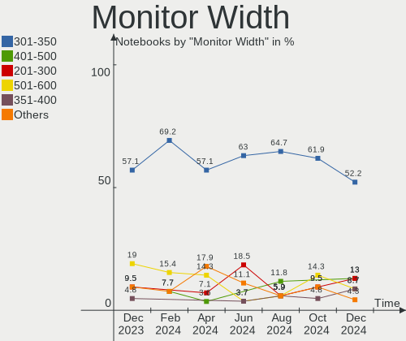
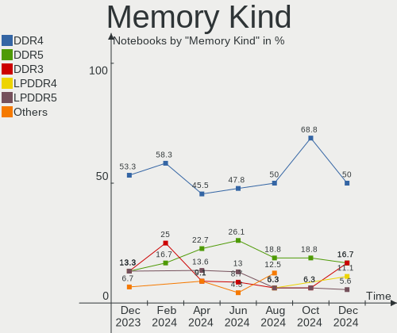
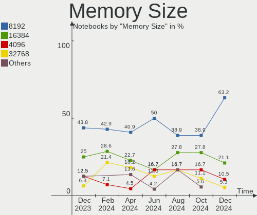

Gentoo - Hardware Trends (Notebooks)
------------------------------------

A project to identify most popular hardware characteristics and track their change
over time based on data collected by Linux users at https://Linux-Hardware.org.

Anyone can contribute to this report by the [hw-probe](https://github.com/linuxhw/hw-probe) tool:

    sudo -E hw-probe -all -upload

This report is for one last month. Overall report since the beginning of time: [TestCoverage](https://github.com/linuxhw/TestCoverage)

Period: May, 2022.

Contents
--------

* [ System ](#system)
  - [ OS                       ](#os)
  - [ OS Family                ](#os-family)
  - [ Kernel                   ](#kernel)
  - [ Kernel Family            ](#kernel-family)
  - [ Kernel Major Ver.        ](#kernel-major-ver)
  - [ Arch                     ](#arch)
  - [ DE                       ](#de)
  - [ Display Server           ](#display-server)
  - [ Display Manager          ](#display-manager)
  - [ OS Lang                  ](#os-lang)
  - [ Boot Mode                ](#boot-mode)
  - [ Filesystem               ](#filesystem)
  - [ Part. scheme             ](#part-scheme)
  - [ Dual Boot with Linux/BSD ](#dual-boot-with-linuxbsd)
  - [ Dual Boot (Win)          ](#dual-boot-win)

* [ Board ](#board)
  - [ Vendor                   ](#vendor)
  - [ Model                    ](#model)
  - [ Model Family             ](#model-family)
  - [ MFG Year                 ](#mfg-year)
  - [ Form Factor              ](#form-factor)
  - [ Secure Boot              ](#secure-boot)
  - [ Coreboot                 ](#coreboot)
  - [ RAM Size                 ](#ram-size)
  - [ RAM Used                 ](#ram-used)
  - [ Total Drives             ](#total-drives)
  - [ Has CD-ROM               ](#has-cd-rom)
  - [ Has Ethernet             ](#has-ethernet)
  - [ Has WiFi                 ](#has-wifi)
  - [ Has Bluetooth            ](#has-bluetooth)

* [ Location ](#location)
  - [ Country                  ](#country)
  - [ City                     ](#city)

* [ Drives ](#drives)
  - [ Drive Vendor             ](#drive-vendor)
  - [ Drive Model              ](#drive-model)
  - [ HDD Vendor               ](#hdd-vendor)
  - [ SSD Vendor               ](#ssd-vendor)
  - [ Drive Kind               ](#drive-kind)
  - [ Drive Connector          ](#drive-connector)
  - [ Drive Size               ](#drive-size)
  - [ Space Total              ](#space-total)
  - [ Space Used               ](#space-used)
  - [ Malfunc. Drives          ](#malfunc-drives)
  - [ Malfunc. Drive Vendor    ](#malfunc-drive-vendor)
  - [ Malfunc. HDD Vendor      ](#malfunc-hdd-vendor)
  - [ Malfunc. Drive Kind      ](#malfunc-drive-kind)
  - [ Failed Drives            ](#failed-drives)
  - [ Failed Drive Vendor      ](#failed-drive-vendor)
  - [ Drive Status             ](#drive-status)

* [ Storage controller ](#storage-controller)
  - [ Storage Vendor           ](#storage-vendor)
  - [ Storage Model            ](#storage-model)
  - [ Storage Kind             ](#storage-kind)

* [ Processor ](#processor)
  - [ CPU Vendor               ](#cpu-vendor)
  - [ CPU Model                ](#cpu-model)
  - [ CPU Model Family         ](#cpu-model-family)
  - [ CPU Cores                ](#cpu-cores)
  - [ CPU Sockets              ](#cpu-sockets)
  - [ CPU Threads              ](#cpu-threads)
  - [ CPU Op-Modes             ](#cpu-op-modes)
  - [ CPU Microcode            ](#cpu-microcode)
  - [ CPU Microarch            ](#cpu-microarch)

* [ Graphics ](#graphics)
  - [ GPU Vendor               ](#gpu-vendor)
  - [ GPU Model                ](#gpu-model)
  - [ GPU Combo                ](#gpu-combo)
  - [ GPU Driver               ](#gpu-driver)
  - [ GPU Memory               ](#gpu-memory)

* [ Monitor ](#monitor)
  - [ Monitor Vendor           ](#monitor-vendor)
  - [ Monitor Model            ](#monitor-model)
  - [ Monitor Resolution       ](#monitor-resolution)
  - [ Monitor Diagonal         ](#monitor-diagonal)
  - [ Monitor Width            ](#monitor-width)
  - [ Aspect Ratio             ](#aspect-ratio)
  - [ Monitor Area             ](#monitor-area)
  - [ Pixel Density            ](#pixel-density)
  - [ Multiple Monitors        ](#multiple-monitors)

* [ Network ](#network)
  - [ Net Controller Vendor    ](#net-controller-vendor)
  - [ Net Controller Model     ](#net-controller-model)
  - [ Wireless Vendor          ](#wireless-vendor)
  - [ Wireless Model           ](#wireless-model)
  - [ Ethernet Vendor          ](#ethernet-vendor)
  - [ Ethernet Model           ](#ethernet-model)
  - [ Net Controller Kind      ](#net-controller-kind)
  - [ Used Controller          ](#used-controller)
  - [ NICs                     ](#nics)
  - [ IPv6                     ](#ipv6)

* [ Bluetooth ](#bluetooth)
  - [ Bluetooth Vendor         ](#bluetooth-vendor)
  - [ Bluetooth Model          ](#bluetooth-model)

* [ Sound ](#sound)
  - [ Sound Vendor             ](#sound-vendor)
  - [ Sound Model              ](#sound-model)

* [ Memory ](#memory)
  - [ Memory Vendor            ](#memory-vendor)
  - [ Memory Model             ](#memory-model)
  - [ Memory Kind              ](#memory-kind)
  - [ Memory Form Factor       ](#memory-form-factor)
  - [ Memory Size              ](#memory-size)
  - [ Memory Speed             ](#memory-speed)

* [ Printers & scanners ](#printers--scanners)
  - [ Printer Vendor           ](#printer-vendor)
  - [ Printer Model            ](#printer-model)
  - [ Scanner Vendor           ](#scanner-vendor)
  - [ Scanner Model            ](#scanner-model)

* [ Camera ](#camera)
  - [ Camera Vendor            ](#camera-vendor)
  - [ Camera Model             ](#camera-model)

* [ Security ](#security)
  - [ Fingerprint Vendor       ](#fingerprint-vendor)
  - [ Fingerprint Model        ](#fingerprint-model)
  - [ Chipcard Vendor          ](#chipcard-vendor)
  - [ Chipcard Model           ](#chipcard-model)

* [ Unsupported ](#unsupported)
  - [ Unsupported Devices      ](#unsupported-devices)
  - [ Unsupported Device Types ](#unsupported-device-types)

System
------

OS
--

Installed operating systems

| Name       | Notebooks | Percent |
|------------|-----------|---------|
| Gentoo 2.6 | 15        | 51.72%  |
| Gentoo 2.8 | 8         | 27.59%  |
| Gentoo 2.7 | 6         | 20.69%  |

OS Family
---------

OS without a version

| Name   | Notebooks | Percent |
|--------|-----------|---------|
| Gentoo | 29        | 100%    |

Kernel
------

Version of the Linux kernel

| Version                                         | Notebooks | Percent |
|-------------------------------------------------|-----------|---------|
| 5.15.32-gentoo-r1                               | 7         | 24.14%  |
| 5.15.32-gentoo-r1-x86_64                        | 3         | 10.34%  |
| 5.18.0-rc7-x86_64-git-00119-gb015dcd62b86-dirty | 1         | 3.45%   |
| 5.17.9-gentoo-x86_64                            | 1         | 3.45%   |
| 5.17.9-gentoo-x86                               | 1         | 3.45%   |
| 5.17.9-gentoo                                   | 1         | 3.45%   |
| 5.17.8-gentoo-x86_64                            | 1         | 3.45%   |
| 5.17.7-gentoo-groovin                           | 1         | 3.45%   |
| 5.17.7-gentoo                                   | 1         | 3.45%   |
| 5.17.6-gentoo                                   | 1         | 3.45%   |
| 5.17.5-gentoo-dist                              | 1         | 3.45%   |
| 5.17.5-gentoo                                   | 1         | 3.45%   |
| 5.17.1-zen1-x86_64                              | 1         | 3.45%   |
| 5.17.1-xanmod1-8-may-2022                       | 1         | 3.45%   |
| 5.17.1-gentoo-r1                                | 1         | 3.45%   |
| 5.17.0-mainline-t14                             | 1         | 3.45%   |
| 5.15.41-gentoo                                  | 1         | 3.45%   |
| 5.15.36-gentoo-compact-0.1                      | 1         | 3.45%   |
| 5.15.32-1-lts                                   | 1         | 3.45%   |
| 5.15.26-gentoo                                  | 1         | 3.45%   |
| 5.15.10-gentoo                                  | 1         | 3.45%   |

Kernel Family
-------------

Linux kernel without a distro release

| Version | Notebooks | Percent |
|---------|-----------|---------|
| 5.15.32 | 11        | 37.93%  |
| 5.17.9  | 3         | 10.34%  |
| 5.17.1  | 3         | 10.34%  |
| 5.17.7  | 2         | 6.9%    |
| 5.17.5  | 2         | 6.9%    |
| 5.18.0  | 1         | 3.45%   |
| 5.17.8  | 1         | 3.45%   |
| 5.17.6  | 1         | 3.45%   |
| 5.17.0  | 1         | 3.45%   |
| 5.15.41 | 1         | 3.45%   |
| 5.15.36 | 1         | 3.45%   |
| 5.15.26 | 1         | 3.45%   |
| 5.15.10 | 1         | 3.45%   |

Kernel Major Ver.
-----------------

Linux kernel major version

| Version | Notebooks | Percent |
|---------|-----------|---------|
| 5.15    | 15        | 51.72%  |
| 5.17    | 13        | 44.83%  |
| 5.18    | 1         | 3.45%   |

Arch
----

OS architecture (x86_64, i586, etc.)

| Name   | Notebooks | Percent |
|--------|-----------|---------|
| x86_64 | 28        | 96.55%  |
| i686   | 1         | 3.45%   |

DE
--

Desktop Environment

| Name     | Notebooks | Percent |
|----------|-----------|---------|
| KDE5     | 11        | 37.93%  |
| GNOME    | 6         | 20.69%  |
| Unknown  | 6         | 20.69%  |
| XFCE     | 3         | 10.34%  |
| LXQt     | 1         | 3.45%   |
| LeftWM   | 1         | 3.45%   |
| Cinnamon | 1         | 3.45%   |

Display Server
--------------

X11 or Wayland

| Name    | Notebooks | Percent |
|---------|-----------|---------|
| X11     | 20        | 68.97%  |
| Unknown | 4         | 13.79%  |
| Wayland | 3         | 10.34%  |
| Tty     | 2         | 6.9%    |

Display Manager
---------------

SDDM, LightDM, etc.

| Name    | Notebooks | Percent |
|---------|-----------|---------|
| SDDM    | 13        | 44.83%  |
| Unknown | 9         | 31.03%  |
| LightDM | 5         | 17.24%  |
| GDM     | 2         | 6.9%    |

OS Lang
-------

Language

| Lang    | Notebooks | Percent |
|---------|-----------|---------|
| en_US   | 10        | 34.48%  |
| en_GB   | 5         | 17.24%  |
| C.UTF8  | 4         | 13.79%  |
| Unknown | 3         | 10.34%  |
| cs_CZ   | 2         | 6.9%    |
| ja_JP   | 1         | 3.45%   |
| it_IT   | 1         | 3.45%   |
| fr_FR   | 1         | 3.45%   |
| fr_CA   | 1         | 3.45%   |
| C       | 1         | 3.45%   |

Boot Mode
---------

EFI or BIOS

| Mode | Notebooks | Percent |
|------|-----------|---------|
| EFI  | 23        | 79.31%  |
| BIOS | 6         | 20.69%  |

Filesystem
----------

Type of filesystem

| Type    | Notebooks | Percent |
|---------|-----------|---------|
| Ext4    | 17        | 58.62%  |
| Btrfs   | 7         | 24.14%  |
| F2fs    | 2         | 6.9%    |
| Zfs     | 1         | 3.45%   |
| XXXXXXX | 1         | 3.45%   |
| Xfs     | 1         | 3.45%   |

Part. scheme
------------

Scheme of partitioning

| Type    | Notebooks | Percent |
|---------|-----------|---------|
| GPT     | 25        | 86.21%  |
| MBR     | 3         | 10.34%  |
| Unknown | 1         | 3.45%   |

Dual Boot with Linux/BSD
------------------------

Hosting more than one Linux/BSD

| Dual boot | Notebooks | Percent |
|-----------|-----------|---------|
| No        | 23        | 79.31%  |
| Yes       | 6         | 20.69%  |

Dual Boot (Win)
---------------

Hosting Linux and Windows

| Dual boot | Notebooks | Percent |
|-----------|-----------|---------|
| No        | 26        | 89.66%  |
| Yes       | 3         | 10.34%  |

Board
-----

Vendor
------

Motherboard manufacturer

| Name             | Notebooks | Percent |
|------------------|-----------|---------|
| Lenovo           | 8         | 27.59%  |
| Hewlett-Packard  | 8         | 27.59%  |
| Dell             | 4         | 13.79%  |
| TUXEDO           | 2         | 6.9%    |
| MSI              | 2         | 6.9%    |
| HUAWEI           | 2         | 6.9%    |
| ASUSTek Computer | 2         | 6.9%    |
| Acer             | 1         | 3.45%   |

Model
-----

Motherboard model

| Name                                     | Notebooks | Percent |
|------------------------------------------|-----------|---------|
| TUXEDO Polaris AMD Gen3 (CZN)            | 1         | 3.45%   |
| TUXEDO InfinityBook Pro 14 Gen6          | 1         | 3.45%   |
| MSI MS-7A34                              | 1         | 3.45%   |
| MSI GE66 Raider 11UE                     | 1         | 3.45%   |
| Lenovo Yoga 2 13 20344                   | 1         | 3.45%   |
| Lenovo ThinkPad Yoga 11e 20DAS05100      | 1         | 3.45%   |
| Lenovo ThinkPad X1 Carbon 7th 20QDCTO1WW | 1         | 3.45%   |
| Lenovo ThinkPad T460 20FMS421US          | 1         | 3.45%   |
| Lenovo ThinkPad T14 Gen 1 20UES06X00     | 1         | 3.45%   |
| Lenovo ThinkPad T14 Gen 1 20S1S35Y00     | 1         | 3.45%   |
| Lenovo ThinkPad P73 20QSS09S00           | 1         | 3.45%   |
| Lenovo Legion 5 Pro 16ACH6H 82JQ         | 1         | 3.45%   |
| HUAWEI NBLK-WAX9X                        | 1         | 3.45%   |
| HUAWEI HVY-WXX9                          | 1         | 3.45%   |
| HP ZBook 15 G3                           | 1         | 3.45%   |
| HP ProBook 430 G7                        | 1         | 3.45%   |
| HP Pavilion ZV6100 (EE984EA#ABZ)         | 1         | 3.45%   |
| HP Pavilion Notebook                     | 1         | 3.45%   |
| HP Pavilion Gaming Laptop 15-cx0xxx      | 1         | 3.45%   |
| HP Laptop 15s-eq0xxx                     | 1         | 3.45%   |
| HP Laptop 14-dk1xxx                      | 1         | 3.45%   |
| HP 255 G8 Notebook PC                    | 1         | 3.45%   |
| Dell Vostro 5568                         | 1         | 3.45%   |
| Dell Precision 3520                      | 1         | 3.45%   |
| Dell Inspiron 1525                       | 1         | 3.45%   |
| Dell Inspiron 15 5510                    | 1         | 3.45%   |
| ASUS ZenBook UX333FN_UX333FN             | 1         | 3.45%   |
| ASUS 1005HA                              | 1         | 3.45%   |
| Acer Aspire E5-571G                      | 1         | 3.45%   |

Model Family
------------

Motherboard model prefix

| Name                | Notebooks | Percent |
|---------------------|-----------|---------|
| Lenovo ThinkPad     | 6         | 20.69%  |
| HP Pavilion         | 3         | 10.34%  |
| HP Laptop           | 2         | 6.9%    |
| Dell Inspiron       | 2         | 6.9%    |
| TUXEDO Polaris      | 1         | 3.45%   |
| TUXEDO InfinityBook | 1         | 3.45%   |
| MSI MS-7A34         | 1         | 3.45%   |
| MSI GE66            | 1         | 3.45%   |
| Lenovo Yoga         | 1         | 3.45%   |
| Lenovo Legion       | 1         | 3.45%   |
| HUAWEI NBLK-WAX9X   | 1         | 3.45%   |
| HUAWEI HVY-WXX9     | 1         | 3.45%   |
| HP ZBook            | 1         | 3.45%   |
| HP ProBook          | 1         | 3.45%   |
| HP 255              | 1         | 3.45%   |
| Dell Vostro         | 1         | 3.45%   |
| Dell Precision      | 1         | 3.45%   |
| ASUS ZenBook        | 1         | 3.45%   |
| ASUS 1005HA         | 1         | 3.45%   |
| Acer Aspire         | 1         | 3.45%   |

MFG Year
--------

Motherboard manufacture year

| Year | Notebooks | Percent |
|------|-----------|---------|
| 2019 | 6         | 20.69%  |
| 2021 | 5         | 17.24%  |
| 2020 | 5         | 17.24%  |
| 2016 | 3         | 10.34%  |
| 2014 | 3         | 10.34%  |
| 2018 | 2         | 6.9%    |
| 2017 | 2         | 6.9%    |
| 2009 | 1         | 3.45%   |
| 2008 | 1         | 3.45%   |
| 2006 | 1         | 3.45%   |

Form Factor
-----------

Physical design of the computer

| Name     | Notebooks | Percent |
|----------|-----------|---------|
| Notebook | 29        | 100%    |

Secure Boot
-----------

Enabled or disabled

| State    | Notebooks | Percent |
|----------|-----------|---------|
| Disabled | 28        | 96.55%  |
| Enabled  | 1         | 3.45%   |

Coreboot
--------

Have coreboot on board

| Used | Notebooks | Percent |
|------|-----------|---------|
| No   | 29        | 100%    |

RAM Size
--------

Total RAM memory

| Size in GB  | Notebooks | Percent |
|-------------|-----------|---------|
| 16.01-24.0  | 8         | 27.59%  |
| 4.01-8.0    | 6         | 20.69%  |
| 8.01-16.0   | 6         | 20.69%  |
| 32.01-64.0  | 2         | 6.9%    |
| 64.01-256.0 | 2         | 6.9%    |
| 1.01-2.0    | 2         | 6.9%    |
| 3.01-4.0    | 1         | 3.45%   |
| 24.01-32.0  | 1         | 3.45%   |
| 0.51-1.0    | 1         | 3.45%   |

RAM Used
--------

Used RAM memory

| Used GB    | Notebooks | Percent |
|------------|-----------|---------|
| 1.01-2.0   | 7         | 24.14%  |
| 4.01-8.0   | 6         | 20.69%  |
| 3.01-4.0   | 5         | 17.24%  |
| 0.01-0.5   | 4         | 13.79%  |
| 2.01-3.0   | 3         | 10.34%  |
| 8.01-16.0  | 2         | 6.9%    |
| 16.01-24.0 | 1         | 3.45%   |
| 0.51-1.0   | 1         | 3.45%   |

Total Drives
------------

Number of drives on board

| Drives | Notebooks | Percent |
|--------|-----------|---------|
| 1      | 22        | 75.86%  |
| 2      | 6         | 20.69%  |
| 3      | 1         | 3.45%   |

Has CD-ROM
----------

Has CD-ROM on board

| Presented | Notebooks | Percent |
|-----------|-----------|---------|
| No        | 26        | 89.66%  |
| Yes       | 3         | 10.34%  |

Has Ethernet
------------

Has Ethernet on board

| Presented | Notebooks | Percent |
|-----------|-----------|---------|
| Yes       | 22        | 75.86%  |
| No        | 7         | 24.14%  |

Has WiFi
--------

Has WiFi module

| Presented | Notebooks | Percent |
|-----------|-----------|---------|
| Yes       | 29        | 100%    |

Has Bluetooth
-------------

Has Bluetooth module

| Presented | Notebooks | Percent |
|-----------|-----------|---------|
| Yes       | 26        | 89.66%  |
| No        | 3         | 10.34%  |

Location
--------

Country
-------

Geographic location (country)

| Country     | Notebooks | Percent |
|-------------|-----------|---------|
| USA         | 7         | 24.14%  |
| UK          | 2         | 6.9%    |
| Russia      | 2         | 6.9%    |
| Poland      | 2         | 6.9%    |
| France      | 2         | 6.9%    |
| Czechia     | 2         | 6.9%    |
| Canada      | 2         | 6.9%    |
| Turkey      | 1         | 3.45%   |
| Sweden      | 1         | 3.45%   |
| Singapore   | 1         | 3.45%   |
| Netherlands | 1         | 3.45%   |
| Japan       | 1         | 3.45%   |
| Italy       | 1         | 3.45%   |
| Germany     | 1         | 3.45%   |
| Finland     | 1         | 3.45%   |
| Belarus     | 1         | 3.45%   |
| Austria     | 1         | 3.45%   |

City
----

Geographic location (city)

| City          | Notebooks | Percent |
|---------------|-----------|---------|
| Sterling      | 2         | 6.9%    |
| St Petersburg | 2         | 6.9%    |
| Prague        | 2         | 6.9%    |
| Weatherford   | 1         | 3.45%   |
| Warsaw        | 1         | 3.45%   |
| Turku         | 1         | 3.45%   |
| Takarazuka    | 1         | 3.45%   |
| Stockholm     | 1         | 3.45%   |
| Singapore     | 1         | 3.45%   |
| Sacramento    | 1         | 3.45%   |
| Québec       | 1         | 3.45%   |
| Paris         | 1         | 3.45%   |
| Ocala         | 1         | 3.45%   |
| New York      | 1         | 3.45%   |
| Minsk         | 1         | 3.45%   |
| Milan         | 1         | 3.45%   |
| Marburg       | 1         | 3.45%   |
| Isparta       | 1         | 3.45%   |
| Innsbruck     | 1         | 3.45%   |
| Hengelo       | 1         | 3.45%   |
| Cieszyn       | 1         | 3.45%   |
| Cessy         | 1         | 3.45%   |
| Calgary       | 1         | 3.45%   |
| Bournemouth   | 1         | 3.45%   |
| Boise         | 1         | 3.45%   |
| Abingdon      | 1         | 3.45%   |

Drives
------

Drive Vendor
------------

Hard drive vendors

| Vendor              | Notebooks | Drives | Percent |
|---------------------|-----------|--------|---------|
| Samsung Electronics | 10        | 12     | 29.41%  |
| WDC                 | 6         | 6      | 17.65%  |
| SanDisk             | 3         | 3      | 8.82%   |
| Crucial             | 3         | 3      | 8.82%   |
| Toshiba             | 2         | 2      | 5.88%   |
| T-FORCE             | 1         | 1      | 2.94%   |
| OCZ                 | 1         | 1      | 2.94%   |
| Micron Technology   | 1         | 1      | 2.94%   |
| LITEON              | 1         | 1      | 2.94%   |
| KIOXIA              | 1         | 1      | 2.94%   |
| Kingston            | 1         | 1      | 2.94%   |
| Intel               | 1         | 1      | 2.94%   |
| Hitachi             | 1         | 1      | 2.94%   |
| HGST                | 1         | 1      | 2.94%   |
| China               | 1         | 2      | 2.94%   |

Drive Model
-----------

Hard drive models

| Model                                    | Notebooks | Percent |
|------------------------------------------|-----------|---------|
| Crucial CT500MX500SSD1 500GB             | 3         | 8.33%   |
| WDC WD10EZEX-08M2NA0 1TB                 | 1         | 2.78%   |
| WDC PC SN730 SDBQNTY-512G-1001 512GB     | 1         | 2.78%   |
| WDC PC SN730 SDBQNTY-256G-1001 256GB     | 1         | 2.78%   |
| WDC PC SN730 SDBPNTY-512G-1101 512GB     | 1         | 2.78%   |
| WDC PC SN730 SDBPNTY-512G-1027 512GB     | 1         | 2.78%   |
| WDC PC SN530 NVMe 512GB                  | 1         | 2.78%   |
| Toshiba KXG6AZNV512G 512GB               | 1         | 2.78%   |
| Toshiba KSG60ZMV256G M.2 2280 256GB SSD  | 1         | 2.78%   |
| T-FORCE TM8FP5001T 1TB                   | 1         | 2.78%   |
| SanDisk SDSSDH3500G 500GB                | 1         | 2.78%   |
| SanDisk SD9SN8W-128G-1006 128GB SSD      | 1         | 2.78%   |
| SanDisk SD8TB8U256G1001 256GB SSD        | 1         | 2.78%   |
| Samsung SSD PM871b M.2 2280 256GB        | 1         | 2.78%   |
| Samsung SSD 980 PRO 500GB                | 1         | 2.78%   |
| Samsung SSD 980 PRO 1TB                  | 1         | 2.78%   |
| Samsung SSD 970 EVO Plus 2TB             | 1         | 2.78%   |
| Samsung SSD 970 EVO Plus 1TB             | 1         | 2.78%   |
| Samsung SSD 860 QVO 1TB                  | 1         | 2.78%   |
| Samsung SSD 840 EVO 500GB                | 1         | 2.78%   |
| Samsung PSSD T7 1TB                      | 1         | 2.78%   |
| Samsung MZVLQ512HBLU-00BH1 512GB         | 1         | 2.78%   |
| Samsung MZVLB512HBJQ-000L7 512GB         | 1         | 2.78%   |
| Samsung MZVLB512HAJQ-00000 512GB         | 1         | 2.78%   |
| Samsung MZVL21T0HCLR-00B00 1TB           | 1         | 2.78%   |
| OCZ AGILITY3 64GB SSD                    | 1         | 2.78%   |
| Micron MTFDDAV256MBF-1AN15ABHA 256GB SSD | 1         | 2.78%   |
| LITEON CV8-8E128-HP 128GB SSD            | 1         | 2.78%   |
| KIOXIA KBG30ZMV256G 256GB                | 1         | 2.78%   |
| Kingston RBU-SNS8350DES3128GP 128GB SSD  | 1         | 2.78%   |
| Intel NVMe SSD Drive 512GB               | 1         | 2.78%   |
| Hitachi HTS543216L9SA00 160GB            | 1         | 2.78%   |
| HGST HTS721010A9E630 1TB                 | 1         | 2.78%   |
| China SSD 512GB                          | 1         | 2.78%   |

HDD Vendor
----------

Hard disk drive vendors

| Vendor  | Notebooks | Drives | Percent |
|---------|-----------|--------|---------|
| WDC     | 1         | 1      | 33.33%  |
| Hitachi | 1         | 1      | 33.33%  |
| HGST    | 1         | 1      | 33.33%  |

SSD Vendor
----------

Solid state drive vendors

| Vendor              | Notebooks | Drives | Percent |
|---------------------|-----------|--------|---------|
| Samsung Electronics | 4         | 4      | 25%     |
| SanDisk             | 3         | 3      | 18.75%  |
| Crucial             | 3         | 3      | 18.75%  |
| Toshiba             | 1         | 1      | 6.25%   |
| OCZ                 | 1         | 1      | 6.25%   |
| Micron Technology   | 1         | 1      | 6.25%   |
| LITEON              | 1         | 1      | 6.25%   |
| Kingston            | 1         | 1      | 6.25%   |
| China               | 1         | 2      | 6.25%   |

Drive Kind
----------

HDD or SSD

| Kind | Notebooks | Drives | Percent |
|------|-----------|--------|---------|
| NVMe | 15        | 17     | 46.88%  |
| SSD  | 14        | 17     | 43.75%  |
| HDD  | 3         | 3      | 9.38%   |

Drive Connector
---------------

SATA, SAS, NVMe, etc.

| Type | Notebooks | Drives | Percent |
|------|-----------|--------|---------|
| NVMe | 15        | 17     | 48.39%  |
| SATA | 15        | 19     | 48.39%  |
| SAS  | 1         | 1      | 3.23%   |

Drive Size
----------

Size of hard drive

| Size in TB | Notebooks | Drives | Percent |
|------------|-----------|--------|---------|
| 0.01-0.5   | 13        | 14     | 72.22%  |
| 0.51-1.0   | 5         | 6      | 27.78%  |

Space Total
-----------

Amount of disk space available on the file system

| Size in GB     | Notebooks | Percent |
|----------------|-----------|---------|
| 251-500        | 15        | 51.72%  |
| 101-250        | 6         | 20.69%  |
| 1001-2000      | 3         | 10.34%  |
| 501-1000       | 2         | 6.9%    |
| More than 3000 | 1         | 3.45%   |
| 21-50          | 1         | 3.45%   |
| Unknown        | 1         | 3.45%   |

Space Used
----------

Amount of used disk space

| Used GB   | Notebooks | Percent |
|-----------|-----------|---------|
| 1-20      | 8         | 27.59%  |
| 251-500   | 6         | 20.69%  |
| 101-250   | 5         | 17.24%  |
| 21-50     | 4         | 13.79%  |
| 501-1000  | 2         | 6.9%    |
| 51-100    | 2         | 6.9%    |
| 1001-2000 | 1         | 3.45%   |
| Unknown   | 1         | 3.45%   |

Malfunc. Drives
---------------

Drive models with a malfunction

| Model                                   | Notebooks | Drives | Percent |
|-----------------------------------------|-----------|--------|---------|
| WDC WD10EZEX-08M2NA0 1TB                | 1         | 1      | 25%     |
| LITEON CV8-8E128-HP 128GB SSD           | 1         | 1      | 25%     |
| Kingston RBU-SNS8350DES3128GP 128GB SSD | 1         | 1      | 25%     |
| HGST HTS721010A9E630 1TB                | 1         | 1      | 25%     |

Malfunc. Drive Vendor
---------------------

Vendors of faulty drives

| Vendor   | Notebooks | Drives | Percent |
|----------|-----------|--------|---------|
| WDC      | 1         | 1      | 25%     |
| LITEON   | 1         | 1      | 25%     |
| Kingston | 1         | 1      | 25%     |
| HGST     | 1         | 1      | 25%     |

Malfunc. HDD Vendor
-------------------

Vendors of faulty HDD drives

| Vendor | Notebooks | Drives | Percent |
|--------|-----------|--------|---------|
| WDC    | 1         | 1      | 50%     |
| HGST   | 1         | 1      | 50%     |

Malfunc. Drive Kind
-------------------

Kinds of faulty drives

| Kind | Notebooks | Drives | Percent |
|------|-----------|--------|---------|
| SSD  | 2         | 2      | 50%     |
| HDD  | 2         | 2      | 50%     |

Failed Drives
-------------

Failed drive models

Zero info for selected period =(

Failed Drive Vendor
-------------------

Failed drive vendors

Zero info for selected period =(

Drive Status
------------

Number of failed and malfunc. drives

| Status   | Notebooks | Drives | Percent |
|----------|-----------|--------|---------|
| Works    | 26        | 31     | 81.25%  |
| Malfunc  | 4         | 4      | 12.5%   |
| Detected | 2         | 2      | 6.25%   |

Storage controller
------------------

Storage Vendor
--------------

Storage controller vendors

| Vendor                       | Notebooks | Percent |
|------------------------------|-----------|---------|
| Intel                        | 13        | 38.24%  |
| Samsung Electronics          | 8         | 23.53%  |
| Sandisk                      | 5         | 14.71%  |
| AMD                          | 5         | 14.71%  |
| Toshiba America Info Systems | 2         | 5.88%   |
| Phison Electronics           | 1         | 2.94%   |

Storage Model
-------------

Storage controller models

| Model                                                                         | Notebooks | Percent |
|-------------------------------------------------------------------------------|-----------|---------|
| Sandisk WD Black SN750 / PC SN730 NVMe SSD                                    | 4         | 11.11%  |
| Samsung NVMe SSD Controller SM981/PM981/PM983                                 | 4         | 11.11%  |
| AMD FCH SATA Controller [AHCI mode]                                           | 4         | 11.11%  |
| Samsung NVMe SSD Controller PM9A1/PM9A3/980PRO                                | 3         | 8.33%   |
| Intel Sunrise Point-LP SATA Controller [AHCI mode]                            | 3         | 8.33%   |
| Intel Q170/Q150/B150/H170/H110/Z170/CM236 Chipset SATA Controller [AHCI Mode] | 2         | 5.56%   |
| Intel 8 Series SATA Controller 1 [AHCI mode]                                  | 2         | 5.56%   |
| Toshiba America Info Systems XG6 NVMe SSD Controller                          | 1         | 2.78%   |
| Toshiba America Info Systems BG3 NVMe SSD Controller                          | 1         | 2.78%   |
| Sandisk Non-Volatile memory controller                                        | 1         | 2.78%   |
| Samsung NVMe SSD Controller 980                                               | 1         | 2.78%   |
| Phison E12 NVMe Controller                                                    | 1         | 2.78%   |
| Intel SSD 660P Series                                                         | 1         | 2.78%   |
| Intel Comet Lake SATA AHCI Controller                                         | 1         | 2.78%   |
| Intel Cannon Lake Mobile PCH SATA AHCI Controller                             | 1         | 2.78%   |
| Intel Atom Processor E3800 Series SATA AHCI Controller                        | 1         | 2.78%   |
| Intel 82801HM/HEM (ICH8M/ICH8M-E) SATA Controller [AHCI mode]                 | 1         | 2.78%   |
| Intel 82801HM/HEM (ICH8M/ICH8M-E) IDE Controller                              | 1         | 2.78%   |
| Intel 82801GBM/GHM (ICH7-M Family) SATA Controller [AHCI mode]                | 1         | 2.78%   |
| AMD IXP SB4x0 IDE Controller                                                  | 1         | 2.78%   |
| AMD 300 Series Chipset SATA Controller                                        | 1         | 2.78%   |

Storage Kind
------------

Kind of storage controller (IDE, SATA, NVMe, SAS, ...)

| Kind | Notebooks | Percent |
|------|-----------|---------|
| SATA | 16        | 48.48%  |
| NVMe | 15        | 45.45%  |
| IDE  | 2         | 6.06%   |

Processor
---------

CPU Vendor
----------

Processor vendors

| Vendor | Notebooks | Percent |
|--------|-----------|---------|
| Intel  | 19        | 65.52%  |
| AMD    | 10        | 34.48%  |

CPU Model
---------

Processor models

| Model                                         | Notebooks | Percent |
|-----------------------------------------------|-----------|---------|
| AMD Ryzen 7 5800H with Radeon Graphics        | 2         | 6.9%    |
| Intel Core i9-9880H CPU @ 2.30GHz             | 1         | 3.45%   |
| Intel Core i7-8565U CPU @ 1.80GHz             | 1         | 3.45%   |
| Intel Core i7-6700HQ CPU @ 2.60GHz            | 1         | 3.45%   |
| Intel Core i7-6500U CPU @ 2.50GHz             | 1         | 3.45%   |
| Intel Core i7-10610U CPU @ 1.80GHz            | 1         | 3.45%   |
| Intel Core i5-8300H CPU @ 2.30GHz             | 1         | 3.45%   |
| Intel Core i5-8265U CPU @ 1.60GHz             | 1         | 3.45%   |
| Intel Core i5-7200U CPU @ 2.50GHz             | 1         | 3.45%   |
| Intel Core i5-6440HQ CPU @ 2.60GHz            | 1         | 3.45%   |
| Intel Core i5-6300U CPU @ 2.40GHz             | 1         | 3.45%   |
| Intel Core i5-4210U CPU @ 1.70GHz             | 1         | 3.45%   |
| Intel Core i5-4200U CPU @ 1.60GHz             | 1         | 3.45%   |
| Intel Core i5-10210U CPU @ 1.60GHz            | 1         | 3.45%   |
| Intel Core 2 Duo CPU T5550 @ 1.83GHz          | 1         | 3.45%   |
| Intel Celeron CPU N2940 @ 1.83GHz             | 1         | 3.45%   |
| Intel Atom CPU N280 @ 1.66GHz                 | 1         | 3.45%   |
| Intel 11th Gen Core i7-11800H @ 2.30GHz       | 1         | 3.45%   |
| Intel 11th Gen Core i7-11370H @ 3.30GHz       | 1         | 3.45%   |
| Intel 11th Gen Core i5-11320H @ 3.20GHz       | 1         | 3.45%   |
| AMD Ryzen 5 PRO 4650U with Radeon Graphics    | 1         | 3.45%   |
| AMD Ryzen 5 5500U with Radeon Graphics        | 1         | 3.45%   |
| AMD Ryzen 5 4600H with Radeon Graphics        | 1         | 3.45%   |
| AMD Ryzen 5 3500U with Radeon Vega Mobile Gfx | 1         | 3.45%   |
| AMD Ryzen 5 1500X Quad-Core Processor         | 1         | 3.45%   |
| AMD Ryzen 3 3250U with Radeon Graphics        | 1         | 3.45%   |
| AMD Ryzen 3 3200U with Radeon Vega Mobile Gfx | 1         | 3.45%   |
| AMD Athlon 64 Processor 3200+                 | 1         | 3.45%   |

CPU Model Family
----------------

Processor model prefix

| Model            | Notebooks | Percent |
|------------------|-----------|---------|
| Intel Core i5    | 8         | 27.59%  |
| Intel Core i7    | 4         | 13.79%  |
| AMD Ryzen 5      | 4         | 13.79%  |
| Other            | 3         | 10.34%  |
| AMD Ryzen 7      | 2         | 6.9%    |
| AMD Ryzen 3      | 2         | 6.9%    |
| Intel Core i9    | 1         | 3.45%   |
| Intel Core 2 Duo | 1         | 3.45%   |
| Intel Celeron    | 1         | 3.45%   |
| Intel Atom       | 1         | 3.45%   |
| AMD Ryzen 5 PRO  | 1         | 3.45%   |
| AMD Athlon 64    | 1         | 3.45%   |

CPU Cores
---------

Number of processor cores

| Number | Notebooks | Percent |
|--------|-----------|---------|
| 4      | 12        | 41.38%  |
| 2      | 8         | 27.59%  |
| 8      | 4         | 13.79%  |
| 6      | 3         | 10.34%  |
| 1      | 2         | 6.9%    |

CPU Sockets
-----------

Number of sockets

| Number | Notebooks | Percent |
|--------|-----------|---------|
| 1      | 29        | 100%    |

CPU Threads
-----------

Threads per core (Hyper-Threading)

| Number | Notebooks | Percent |
|--------|-----------|---------|
| 2      | 25        | 86.21%  |
| 1      | 4         | 13.79%  |

CPU Op-Modes
------------

CPU Operation Modes (32-bit, 64-bit)

| Op mode        | Notebooks | Percent |
|----------------|-----------|---------|
| 32-bit, 64-bit | 28        | 96.55%  |
| 32-bit         | 1         | 3.45%   |

CPU Microcode
-------------

Microcode number

| Number     | Notebooks | Percent |
|------------|-----------|---------|
| Unknown    | 4         | 13.79%  |
| 0x806ec    | 3         | 10.34%  |
| 0x506e3    | 2         | 6.9%    |
| 0x406e3    | 2         | 6.9%    |
| 0x40651    | 2         | 6.9%    |
| 0x0a50000c | 2         | 6.9%    |
| 0x08600106 | 2         | 6.9%    |
| 0x906ed    | 1         | 3.45%   |
| 0x906ea    | 1         | 3.45%   |
| 0x806eb    | 1         | 3.45%   |
| 0x806e9    | 1         | 3.45%   |
| 0x806d1    | 1         | 3.45%   |
| 0x806c2    | 1         | 3.45%   |
| 0x806c1    | 1         | 3.45%   |
| 0x6fd      | 1         | 3.45%   |
| 0x30678    | 1         | 3.45%   |
| 0x08608103 | 1         | 3.45%   |
| 0x08108109 | 1         | 3.45%   |
| 0x08001105 | 1         | 3.45%   |

CPU Microarch
-------------

Microarchitecture

| Name       | Notebooks | Percent |
|------------|-----------|---------|
| KabyLake   | 7         | 24.14%  |
| Skylake    | 4         | 13.79%  |
| Zen+       | 3         | 10.34%  |
| Zen 3      | 2         | 6.9%    |
| Zen 2      | 2         | 6.9%    |
| TigerLake  | 2         | 6.9%    |
| Haswell    | 2         | 6.9%    |
| Zen        | 1         | 3.45%   |
| Silvermont | 1         | 3.45%   |
| K8 Hammer  | 1         | 3.45%   |
| Icelake    | 1         | 3.45%   |
| Core       | 1         | 3.45%   |
| Bonnell    | 1         | 3.45%   |
| Unknown    | 1         | 3.45%   |

Graphics
--------

GPU Vendor
----------

Vendors of graphics cards

| Vendor | Notebooks | Percent |
|--------|-----------|---------|
| Intel  | 19        | 50%     |
| Nvidia | 12        | 31.58%  |
| AMD    | 7         | 18.42%  |

GPU Model
---------

Graphics card models

| Model                                                                         | Notebooks | Percent |
|-------------------------------------------------------------------------------|-----------|---------|
| Nvidia GA106M [GeForce RTX 3060 Mobile / Max-Q]                               | 3         | 7.5%    |
| AMD Picasso/Raven 2 [Radeon Vega Series / Radeon Vega Mobile Series]          | 3         | 7.5%    |
| Intel WhiskeyLake-U GT2 [UHD Graphics 620]                                    | 2         | 5%      |
| Intel TigerLake-LP GT2 [Iris Xe Graphics]                                     | 2         | 5%      |
| Intel Skylake GT2 [HD Graphics 520]                                           | 2         | 5%      |
| Intel HD Graphics 530                                                         | 2         | 5%      |
| Intel Haswell-ULT Integrated Graphics Controller                              | 2         | 5%      |
| Intel CometLake-U GT2 [UHD Graphics]                                          | 2         | 5%      |
| Intel CoffeeLake-H GT2 [UHD Graphics 630]                                     | 2         | 5%      |
| AMD Renoir                                                                    | 2         | 5%      |
| Nvidia TU104GLM [Quadro RTX 4000 Mobile / Max-Q]                              | 1         | 2.5%    |
| Nvidia GP108M [GeForce MX330]                                                 | 1         | 2.5%    |
| Nvidia GP108M [GeForce MX150]                                                 | 1         | 2.5%    |
| Nvidia GP107M [GeForce GTX 1050 Ti Mobile]                                    | 1         | 2.5%    |
| Nvidia GP106 [GeForce GTX 1060 3GB]                                           | 1         | 2.5%    |
| Nvidia GM108M [GeForce 940MX]                                                 | 1         | 2.5%    |
| Nvidia GM108M [GeForce 840M]                                                  | 1         | 2.5%    |
| Nvidia GM107GLM [Quadro M620 Mobile]                                          | 1         | 2.5%    |
| Nvidia GM107GLM [Quadro M2000M]                                               | 1         | 2.5%    |
| Intel TigerLake-H GT1 [UHD Graphics]                                          | 1         | 2.5%    |
| Intel Mobile GM965/GL960 Integrated Graphics Controller (secondary)           | 1         | 2.5%    |
| Intel Mobile GM965/GL960 Integrated Graphics Controller (primary)             | 1         | 2.5%    |
| Intel Mobile 945GSE Express Integrated Graphics Controller                    | 1         | 2.5%    |
| Intel Mobile 945GM/GMS/GME, 943/940GML Express Integrated Graphics Controller | 1         | 2.5%    |
| Intel HD Graphics 620                                                         | 1         | 2.5%    |
| Intel Atom Processor Z36xxx/Z37xxx Series Graphics & Display                  | 1         | 2.5%    |
| AMD RS480M [Mobility Radeon Xpress 200]                                       | 1         | 2.5%    |
| AMD Lucienne                                                                  | 1         | 2.5%    |

GPU Combo
---------

Combinations of graphics cards

| Name           | Notebooks | Percent |
|----------------|-----------|---------|
| Intel + Nvidia | 9         | 31.03%  |
| 1 x Intel      | 9         | 31.03%  |
| 1 x AMD        | 7         | 24.14%  |
| 1 x Nvidia     | 3         | 10.34%  |
| 2 x Intel      | 1         | 3.45%   |

GPU Driver
----------

Free vs proprietary

| Driver      | Notebooks | Percent |
|-------------|-----------|---------|
| Free        | 21        | 72.41%  |
| Proprietary | 7         | 24.14%  |
| Unknown     | 1         | 3.45%   |

GPU Memory
----------

Total video memory

| Size in GB | Notebooks | Percent |
|------------|-----------|---------|
| Unknown    | 16        | 55.17%  |
| 1.01-2.0   | 4         | 13.79%  |
| 0.01-0.5   | 4         | 13.79%  |
| 7.01-8.0   | 1         | 3.45%   |
| 5.01-6.0   | 1         | 3.45%   |
| 3.01-4.0   | 1         | 3.45%   |
| 2.01-3.0   | 1         | 3.45%   |
| 0.51-1.0   | 1         | 3.45%   |

Monitor
-------

Monitor Vendor
--------------

Monitor vendors

| Vendor              | Notebooks | Percent |
|---------------------|-----------|---------|
| AU Optronics        | 7         | 21.21%  |
| BOE                 | 6         | 18.18%  |
| Chimei Innolux      | 5         | 15.15%  |
| LG Display          | 3         | 9.09%   |
| CSO                 | 2         | 6.06%   |
| ViewSonic           | 1         | 3.03%   |
| Sony                | 1         | 3.03%   |
| Samsung Electronics | 1         | 3.03%   |
| LG Philips          | 1         | 3.03%   |
| Lenovo              | 1         | 3.03%   |
| Hewlett-Packard     | 1         | 3.03%   |
| HannStar            | 1         | 3.03%   |
| Eizo                | 1         | 3.03%   |
| ASUSTek Computer    | 1         | 3.03%   |
| AOC                 | 1         | 3.03%   |

Monitor Model
-------------

Monitor models

| Model                                                                 | Notebooks | Percent |
|-----------------------------------------------------------------------|-----------|---------|
| ViewSonic LCD Monitor VSC1B35 1920x1080 530x300mm 24.0-inch           | 1         | 3.03%   |
| Sony TV *30 SNYB105 3840x2160 1660x934mm 75.0-inch                    | 1         | 3.03%   |
| Samsung Electronics LCD Monitor SDC415F 3840x2160 344x194mm 15.5-inch | 1         | 3.03%   |
| LG Philips LCD Monitor LPL0301 1280x800 331x207mm 15.4-inch           | 1         | 3.03%   |
| LG Display LCD Monitor LGD06E0 1920x1080 344x194mm 15.5-inch          | 1         | 3.03%   |
| LG Display LCD Monitor LGD05BE 1920x1080 382x215mm 17.3-inch          | 1         | 3.03%   |
| LG Display LCD Monitor LGD0521 1920x1080 309x174mm 14.0-inch          | 1         | 3.03%   |
| Lenovo LEN T34w-20 LEN61F3 3440x1440 800x330mm 34.1-inch              | 1         | 3.03%   |
| Hewlett-Packard E232 HWP327A 1920x1080 509x286mm 23.0-inch            | 1         | 3.03%   |
| HannStar LCD Monitor HSD03E9 1024x600 220x129mm 10.0-inch             | 1         | 3.03%   |
| Eizo EV2450 ENC2531 1920x1080 528x297mm 23.9-inch                     | 1         | 3.03%   |
| CSO LCD Monitor CSO1600 2560x1600 340x220mm 15.9-inch                 | 1         | 3.03%   |
| CSO LCD Monitor CSO1402 2880x1800 302x188mm 14.0-inch                 | 1         | 3.03%   |
| Chimei Innolux LCD Monitor CMN1604 1920x1080 355x199mm 16.0-inch      | 1         | 3.03%   |
| Chimei Innolux LCD Monitor CMN15CC 1366x768 344x193mm 15.5-inch       | 1         | 3.03%   |
| Chimei Innolux LCD Monitor CMN15C4 1920x1080 344x193mm 15.5-inch      | 1         | 3.03%   |
| Chimei Innolux LCD Monitor CMN15C3 1920x1080 344x193mm 15.5-inch      | 1         | 3.03%   |
| Chimei Innolux LCD Monitor CMN14F5 1920x1080 309x173mm 13.9-inch      | 1         | 3.03%   |
| BOE LCD Monitor BOE0977 2560x1440 381x214mm 17.2-inch                 | 1         | 3.03%   |
| BOE LCD Monitor BOE0877 1920x1080 309x173mm 13.9-inch                 | 1         | 3.03%   |
| BOE LCD Monitor BOE082B 1920x1080 309x174mm 14.0-inch                 | 1         | 3.03%   |
| BOE LCD Monitor BOE07AD 1366x768 294x165mm 13.3-inch                  | 1         | 3.03%   |
| BOE LCD Monitor BOE0702 1366x768 344x194mm 15.5-inch                  | 1         | 3.03%   |
| BOE LCD Monitor BOE05E9 1366x768 256x144mm 11.6-inch                  | 1         | 3.03%   |
| AU Optronics LCD Monitor AUO61ED 1920x1080 344x194mm 15.5-inch        | 1         | 3.03%   |
| AU Optronics LCD Monitor AUO5C2D 1920x1080 293x165mm 13.2-inch        | 1         | 3.03%   |
| AU Optronics LCD Monitor AUO499F 1920x1080 344x194mm 15.5-inch        | 1         | 3.03%   |
| AU Optronics LCD Monitor AUO38ED 1920x1080 344x193mm 15.5-inch        | 1         | 3.03%   |
| AU Optronics LCD Monitor AUO323D 1920x1080 309x173mm 13.9-inch        | 1         | 3.03%   |
| AU Optronics LCD Monitor AUO23ED 1920x1080 344x193mm 15.5-inch        | 1         | 3.03%   |
| AU Optronics LCD Monitor AUO202D 1920x1080 293x165mm 13.2-inch        | 1         | 3.03%   |
| ASUSTek Computer VG248 AUS24AC 1920x1080 531x299mm 24.0-inch          | 1         | 3.03%   |
| AOC AG271QG4 AOC2710 2560x1440 597x336mm 27.0-inch                    | 1         | 3.03%   |

Monitor Resolution
------------------

Monitor screen resolution

| Resolution      | Notebooks | Percent |
|-----------------|-----------|---------|
| 1920x1080 (FHD) | 18        | 58.06%  |
| 1366x768 (WXGA) | 4         | 12.9%   |
| 3840x2160 (4K)  | 2         | 6.45%   |
| 2560x1440 (QHD) | 2         | 6.45%   |
| 3440x1440       | 1         | 3.23%   |
| 2880x1800       | 1         | 3.23%   |
| 2560x1600       | 1         | 3.23%   |
| 1280x800 (WXGA) | 1         | 3.23%   |
| 1024x600        | 1         | 3.23%   |

Monitor Diagonal
----------------

Diagonal size in inches

| Inches | Notebooks | Percent |
|--------|-----------|---------|
| 15     | 12        | 37.5%   |
| 13     | 5         | 15.63%  |
| 14     | 4         | 12.5%   |
| 24     | 2         | 6.25%   |
| 17     | 2         | 6.25%   |
| 75     | 1         | 3.13%   |
| 34     | 1         | 3.13%   |
| 27     | 1         | 3.13%   |
| 23     | 1         | 3.13%   |
| 16     | 1         | 3.13%   |
| 11     | 1         | 3.13%   |
| 10     | 1         | 3.13%   |

Monitor Width
-------------

Physical width

| Width in mm | Notebooks | Percent |
|-------------|-----------|---------|
| 301-350     | 18        | 56.25%  |
| 201-300     | 5         | 15.63%  |
| 501-600     | 4         | 12.5%   |
| 351-400     | 3         | 9.38%   |
| 701-800     | 1         | 3.13%   |
| 1501-2000   | 1         | 3.13%   |

Aspect Ratio
------------

Proportional relationship between the width and the height

| Ratio | Notebooks | Percent |
|-------|-----------|---------|
| 16/9  | 24        | 85.71%  |
| 16/10 | 2         | 7.14%   |
| 3/2   | 1         | 3.57%   |
| 21/9  | 1         | 3.57%   |

Monitor Area
------------

Area in inch²

| Area in inch² | Notebooks | Percent |
|----------------|-----------|---------|
| 101-110        | 12        | 37.5%   |
| 81-90          | 6         | 18.75%  |
| 71-80          | 3         | 9.38%   |
| 201-250        | 3         | 9.38%   |
| 121-130        | 2         | 6.25%   |
| More than 1000 | 1         | 3.13%   |
| 51-60          | 1         | 3.13%   |
| 351-500        | 1         | 3.13%   |
| 41-50          | 1         | 3.13%   |
| 301-350        | 1         | 3.13%   |
| 111-120        | 1         | 3.13%   |

Pixel Density
-------------

Pixels per inch

| Density       | Notebooks | Percent |
|---------------|-----------|---------|
| 121-160       | 15        | 46.88%  |
| 51-100        | 6         | 18.75%  |
| 101-120       | 5         | 15.63%  |
| 161-240       | 4         | 12.5%   |
| More than 240 | 2         | 6.25%   |

Multiple Monitors
-----------------

Total monitors connected

| Total | Notebooks | Percent |
|-------|-----------|---------|
| 1     | 23        | 79.31%  |
| 2     | 4         | 13.79%  |
| 3     | 1         | 3.45%   |
| 0     | 1         | 3.45%   |

Network
-------

Net Controller Vendor
---------------------

Controller vendors

| Vendor                     | Notebooks | Percent |
|----------------------------|-----------|---------|
| Intel                      | 20        | 41.67%  |
| Realtek Semiconductor      | 17        | 35.42%  |
| TP-Link                    | 2         | 4.17%   |
| Qualcomm Atheros           | 2         | 4.17%   |
| Lenovo                     | 2         | 4.17%   |
| Shenzhen Goodix Technology | 1         | 2.08%   |
| Marvell Technology Group   | 1         | 2.08%   |
| D-Link                     | 1         | 2.08%   |
| Broadcom                   | 1         | 2.08%   |
| AMD                        | 1         | 2.08%   |

Net Controller Model
--------------------

Controller models

| Model                                                               | Notebooks | Percent |
|---------------------------------------------------------------------|-----------|---------|
| Realtek RTL8111/8168/8411 PCI Express Gigabit Ethernet Controller   | 10        | 17.24%  |
| Intel Wi-Fi 6 AX200                                                 | 5         | 8.62%   |
| Realtek RTL8821CE 802.11ac PCIe Wireless Network Adapter            | 3         | 5.17%   |
| Intel Wireless 8260                                                 | 2         | 3.45%   |
| Intel Wireless 3165                                                 | 2         | 3.45%   |
| Intel Wi-Fi 6 AX201                                                 | 2         | 3.45%   |
| Intel Comet Lake PCH-LP CNVi WiFi                                   | 2         | 3.45%   |
| Intel Cannon Point-LP CNVi [Wireless-AC]                            | 2         | 3.45%   |
| TP-Link TL-WN8200ND [Realtek RTL8192CU]                             | 1         | 1.72%   |
| TP-Link Archer T2U PLUS [RTL8821AU]                                 | 1         | 1.72%   |
| Shenzhen Goodix Unknow device                                       | 1         | 1.72%   |
| Realtek RTL88x2bu [AC1200 Techkey]                                  | 1         | 1.72%   |
| Realtek RTL8822CE 802.11ac PCIe Wireless Network Adapter            | 1         | 1.72%   |
| Realtek RTL8723BE PCIe Wireless Network Adapter                     | 1         | 1.72%   |
| Realtek RTL8125 2.5GbE Controller                                   | 1         | 1.72%   |
| Realtek RTL810xE PCI Express Fast Ethernet controller               | 1         | 1.72%   |
| Realtek RTL-8100/8101L/8139 PCI Fast Ethernet Adapter               | 1         | 1.72%   |
| Realtek Killer E3000 2.5GbE Controller                              | 1         | 1.72%   |
| Qualcomm Atheros QCA9565 / AR9565 Wireless Network Adapter          | 1         | 1.72%   |
| Qualcomm Atheros AR9285 Wireless Network Adapter (PCI-Express)      | 1         | 1.72%   |
| Qualcomm Atheros AR8132 Fast Ethernet                               | 1         | 1.72%   |
| Marvell Group 88E8040 PCI-E Fast Ethernet Controller                | 1         | 1.72%   |
| Lenovo ThinkPad TBT 3 Dock                                          | 1         | 1.72%   |
| Lenovo Thinkpad LAN                                                 | 1         | 1.72%   |
| Intel Wireless 8265 / 8275                                          | 1         | 1.72%   |
| Intel Wireless 7260                                                 | 1         | 1.72%   |
| Intel Wi-Fi 6 AX210/AX211/AX411 160MHz                              | 1         | 1.72%   |
| Intel PRO/Wireless 3945ABG [Golan] Network Connection               | 1         | 1.72%   |
| Intel Ethernet Connection I219-LM                                   | 1         | 1.72%   |
| Intel Ethernet Connection (7) I219-LM                               | 1         | 1.72%   |
| Intel Ethernet Connection (6) I219-V                                | 1         | 1.72%   |
| Intel Ethernet Connection (5) I219-LM                               | 1         | 1.72%   |
| Intel Ethernet Connection (2) I219-LM                               | 1         | 1.72%   |
| Intel Ethernet Connection (10) I219-LM                              | 1         | 1.72%   |
| Intel Cannon Lake PCH CNVi WiFi                                     | 1         | 1.72%   |
| D-Link 802.11 n WLAN                                                | 1         | 1.72%   |
| Broadcom BCM4318 [AirForce One 54g] 802.11g Wireless LAN Controller | 1         | 1.72%   |
| AMD IXP SB400 AC'97 Modem Controller                                | 1         | 1.72%   |

Wireless Vendor
---------------

Wireless vendors

| Vendor                | Notebooks | Percent |
|-----------------------|-----------|---------|
| Intel                 | 20        | 62.5%   |
| Realtek Semiconductor | 6         | 18.75%  |
| TP-Link               | 2         | 6.25%   |
| Qualcomm Atheros      | 2         | 6.25%   |
| D-Link                | 1         | 3.13%   |
| Broadcom              | 1         | 3.13%   |

Wireless Model
--------------

Wireless models

| Model                                                               | Notebooks | Percent |
|---------------------------------------------------------------------|-----------|---------|
| Intel Wi-Fi 6 AX200                                                 | 5         | 15.63%  |
| Realtek RTL8821CE 802.11ac PCIe Wireless Network Adapter            | 3         | 9.38%   |
| Intel Wireless 8260                                                 | 2         | 6.25%   |
| Intel Wireless 3165                                                 | 2         | 6.25%   |
| Intel Wi-Fi 6 AX201                                                 | 2         | 6.25%   |
| Intel Comet Lake PCH-LP CNVi WiFi                                   | 2         | 6.25%   |
| Intel Cannon Point-LP CNVi [Wireless-AC]                            | 2         | 6.25%   |
| TP-Link TL-WN8200ND [Realtek RTL8192CU]                             | 1         | 3.13%   |
| TP-Link Archer T2U PLUS [RTL8821AU]                                 | 1         | 3.13%   |
| Realtek RTL88x2bu [AC1200 Techkey]                                  | 1         | 3.13%   |
| Realtek RTL8822CE 802.11ac PCIe Wireless Network Adapter            | 1         | 3.13%   |
| Realtek RTL8723BE PCIe Wireless Network Adapter                     | 1         | 3.13%   |
| Qualcomm Atheros QCA9565 / AR9565 Wireless Network Adapter          | 1         | 3.13%   |
| Qualcomm Atheros AR9285 Wireless Network Adapter (PCI-Express)      | 1         | 3.13%   |
| Intel Wireless 8265 / 8275                                          | 1         | 3.13%   |
| Intel Wireless 7260                                                 | 1         | 3.13%   |
| Intel Wi-Fi 6 AX210/AX211/AX411 160MHz                              | 1         | 3.13%   |
| Intel PRO/Wireless 3945ABG [Golan] Network Connection               | 1         | 3.13%   |
| Intel Cannon Lake PCH CNVi WiFi                                     | 1         | 3.13%   |
| D-Link 802.11 n WLAN                                                | 1         | 3.13%   |
| Broadcom BCM4318 [AirForce One 54g] 802.11g Wireless LAN Controller | 1         | 3.13%   |

Ethernet Vendor
---------------

Ethernet vendors

| Vendor                   | Notebooks | Percent |
|--------------------------|-----------|---------|
| Realtek Semiconductor    | 14        | 58.33%  |
| Intel                    | 6         | 25%     |
| Lenovo                   | 2         | 8.33%   |
| Qualcomm Atheros         | 1         | 4.17%   |
| Marvell Technology Group | 1         | 4.17%   |

Ethernet Model
--------------

Ethernet models

| Model                                                             | Notebooks | Percent |
|-------------------------------------------------------------------|-----------|---------|
| Realtek RTL8111/8168/8411 PCI Express Gigabit Ethernet Controller | 10        | 41.67%  |
| Realtek RTL8125 2.5GbE Controller                                 | 1         | 4.17%   |
| Realtek RTL810xE PCI Express Fast Ethernet controller             | 1         | 4.17%   |
| Realtek RTL-8100/8101L/8139 PCI Fast Ethernet Adapter             | 1         | 4.17%   |
| Realtek Killer E3000 2.5GbE Controller                            | 1         | 4.17%   |
| Qualcomm Atheros AR8132 Fast Ethernet                             | 1         | 4.17%   |
| Marvell Group 88E8040 PCI-E Fast Ethernet Controller              | 1         | 4.17%   |
| Lenovo ThinkPad TBT 3 Dock                                        | 1         | 4.17%   |
| Lenovo Thinkpad LAN                                               | 1         | 4.17%   |
| Intel Ethernet Connection I219-LM                                 | 1         | 4.17%   |
| Intel Ethernet Connection (7) I219-LM                             | 1         | 4.17%   |
| Intel Ethernet Connection (6) I219-V                              | 1         | 4.17%   |
| Intel Ethernet Connection (5) I219-LM                             | 1         | 4.17%   |
| Intel Ethernet Connection (2) I219-LM                             | 1         | 4.17%   |
| Intel Ethernet Connection (10) I219-LM                            | 1         | 4.17%   |

Net Controller Kind
-------------------

Ethernet, WiFi or modem

| Kind     | Notebooks | Percent |
|----------|-----------|---------|
| WiFi     | 29        | 54.72%  |
| Ethernet | 22        | 41.51%  |
| Modem    | 1         | 1.89%   |
| Unknown  | 1         | 1.89%   |

Used Controller
---------------

Currently used network controller

| Kind     | Notebooks | Percent |
|----------|-----------|---------|
| WiFi     | 27        | 87.1%   |
| Ethernet | 4         | 12.9%   |

NICs
----

Total network controllers on board

| Total | Notebooks | Percent |
|-------|-----------|---------|
| 2     | 20        | 68.97%  |
| 1     | 8         | 27.59%  |
| 3     | 1         | 3.45%   |

IPv6
----

IPv6 vs IPv4

| Used | Notebooks | Percent |
|------|-----------|---------|
| No   | 24        | 82.76%  |
| Yes  | 5         | 17.24%  |

Bluetooth
---------

Bluetooth Vendor
----------------

Controller vendors

| Vendor                | Notebooks | Percent |
|-----------------------|-----------|---------|
| Intel                 | 19        | 73.08%  |
| Realtek Semiconductor | 4         | 15.38%  |
| Realtek               | 1         | 3.85%   |
| Lite-On Technology    | 1         | 3.85%   |
| ASUSTek Computer      | 1         | 3.85%   |

Bluetooth Model
---------------

Controller models

| Model                                          | Notebooks | Percent |
|------------------------------------------------|-----------|---------|
| Intel Bluetooth wireless interface             | 6         | 23.08%  |
| Intel AX200 Bluetooth                          | 5         | 19.23%  |
| Intel Bluetooth 9460/9560 Jefferson Peak (JfP) | 4         | 15.38%  |
| Intel AX201 Bluetooth                          | 3         | 11.54%  |
| Realtek  Bluetooth 4.2 Adapter                 | 2         | 7.69%   |
| Realtek RTL8723B Bluetooth                     | 1         | 3.85%   |
| Realtek Bluetooth Radio                        | 1         | 3.85%   |
| Realtek Bluetooth Radio                        | 1         | 3.85%   |
| Lite-On Atheros AR3012 Bluetooth               | 1         | 3.85%   |
| Intel AX210 Bluetooth                          | 1         | 3.85%   |
| ASUS Broadcom Bluetooth 2.1                    | 1         | 3.85%   |

Sound
-----

Sound Vendor
------------

Sound card vendors

| Vendor              | Notebooks | Percent |
|---------------------|-----------|---------|
| Intel               | 19        | 46.34%  |
| AMD                 | 10        | 24.39%  |
| Nvidia              | 7         | 17.07%  |
| Kingston Technology | 2         | 4.88%   |
| SteelSeries ApS     | 1         | 2.44%   |
| Lenovo              | 1         | 2.44%   |
| Creative Technology | 1         | 2.44%   |

Sound Model
-----------

Sound card models

| Model                                                                      | Notebooks | Percent |
|----------------------------------------------------------------------------|-----------|---------|
| AMD Family 17h/19h HD Audio Controller                                     | 8         | 16.33%  |
| Nvidia Audio device                                                        | 3         | 6.12%   |
| Intel Sunrise Point-LP HD Audio                                            | 3         | 6.12%   |
| AMD Renoir Radeon High Definition Audio Controller                         | 3         | 6.12%   |
| AMD Raven/Raven2/Fenghuang HDMI/DP Audio Controller                        | 3         | 6.12%   |
| Kingston Technology HyperX 7.1 Audio                                       | 2         | 4.08%   |
| Intel Tiger Lake-LP Smart Sound Technology Audio Controller                | 2         | 4.08%   |
| Intel Haswell-ULT HD Audio Controller                                      | 2         | 4.08%   |
| Intel Comet Lake PCH-LP cAVS                                               | 2         | 4.08%   |
| Intel Cannon Point-LP High Definition Audio Controller                     | 2         | 4.08%   |
| Intel Cannon Lake PCH cAVS                                                 | 2         | 4.08%   |
| Intel 8 Series HD Audio Controller                                         | 2         | 4.08%   |
| SteelSeries ApS Arctis 7 wireless adapter                                  | 1         | 2.04%   |
| Nvidia TU104 HD Audio Controller                                           | 1         | 2.04%   |
| Nvidia GP107GL High Definition Audio Controller                            | 1         | 2.04%   |
| Nvidia GP106 High Definition Audio Controller                              | 1         | 2.04%   |
| Nvidia GM107 High Definition Audio Controller [GeForce 940MX]              | 1         | 2.04%   |
| Lenovo ThinkPad Thunderbolt 3 Dock USB Audio                               | 1         | 2.04%   |
| Intel Tiger Lake-H HD Audio Controller                                     | 1         | 2.04%   |
| Intel NM10/ICH7 Family High Definition Audio Controller                    | 1         | 2.04%   |
| Intel CM238 HD Audio Controller                                            | 1         | 2.04%   |
| Intel Atom Processor Z36xxx/Z37xxx Series High Definition Audio Controller | 1         | 2.04%   |
| Intel 82801H (ICH8 Family) HD Audio Controller                             | 1         | 2.04%   |
| Intel 100 Series/C230 Series Chipset Family HD Audio Controller            | 1         | 2.04%   |
| Creative Technology Sound Blaster Play! 3                                  | 1         | 2.04%   |
| AMD IXP SB400 AC'97 Audio Controller                                       | 1         | 2.04%   |
| AMD Family 17h (Models 00h-0fh) HD Audio Controller                        | 1         | 2.04%   |

Memory
------

Memory Vendor
-------------

Memory module vendors

| Vendor              | Notebooks | Percent |
|---------------------|-----------|---------|
| Samsung Electronics | 12        | 32.43%  |
| SK Hynix            | 8         | 21.62%  |
| Micron Technology   | 5         | 13.51%  |
| Unknown             | 4         | 10.81%  |
| Crucial             | 4         | 10.81%  |
| Kingston            | 1         | 2.7%    |
| GOODRAM             | 1         | 2.7%    |
| G.Skill             | 1         | 2.7%    |
| Corsair             | 1         | 2.7%    |

Memory Model
------------

Memory module models

| Model                                                         | Notebooks | Percent |
|---------------------------------------------------------------|-----------|---------|
| SK Hynix RAM HMA451S6AFR8N-TF 4GB SODIMM DDR4 2133MT/s        | 2         | 5.13%   |
| Unknown RAM Module 8GB SODIMM DDR3 1333MT/s                   | 1         | 2.56%   |
| Unknown RAM Module 256MB SODIMM DRAM                          | 1         | 2.56%   |
| Unknown RAM Module 1GB SODIMM SDRAM                           | 1         | 2.56%   |
| Unknown RAM Module 1GB SODIMM DRAM                            | 1         | 2.56%   |
| Unknown RAM Module 1GB SODIMM DDR                             | 1         | 2.56%   |
| SK Hynix RAM Module 8GB SODIMM DDR4 2667MT/s                  | 1         | 2.56%   |
| SK Hynix RAM Module 8GB Row Of Chips LPDDR3 2133MT/s          | 1         | 2.56%   |
| SK Hynix RAM HMAA1GS6CMR6N-XN 8GB SODIMM DDR4 3200MT/s        | 1         | 2.56%   |
| SK Hynix RAM HMA851S6CJR6N-VK 4GB Row Of Chips DDR4 2667MT/s  | 1         | 2.56%   |
| SK Hynix RAM HMA81GS6DJR8N-XN 8GB SODIMM DDR4 3200MT/s        | 1         | 2.56%   |
| SK Hynix RAM HMA81GS6CJR8N-VK 8192MB SODIMM DDR4 2667MT/s     | 1         | 2.56%   |
| Samsung RAM Module 8GB SODIMM DDR4 2133MT/s                   | 1         | 2.56%   |
| Samsung RAM Module 2048MB SODIMM DDR3 1600MT/s                | 1         | 2.56%   |
| Samsung RAM Module 16GB SODIMM DDR4 2133MT/s                  | 1         | 2.56%   |
| Samsung RAM M471B5173DB0-YK0 4GB SODIMM DDR3 1600MT/s         | 1         | 2.56%   |
| Samsung RAM M471B1G73EB0-YK0 8192MB SODIMM DDR3 1600MT/s      | 1         | 2.56%   |
| Samsung RAM M471A5244CB0-CWE 4GB SODIMM DDR4 3200MT/s         | 1         | 2.56%   |
| Samsung RAM M471A4G43AB1-CWE 32GB SODIMM DDR4 3200MT/s        | 1         | 2.56%   |
| Samsung RAM M471A2G44AM0-CWE 16GB SODIMM DDR4 3200MT/s        | 1         | 2.56%   |
| Samsung RAM M471A1K43DB1-CWE 8GB SODIMM DDR4 3200MT/s         | 1         | 2.56%   |
| Samsung RAM M471A1K43CB1-CTD 8GB SODIMM DDR4 2667MT/s         | 1         | 2.56%   |
| Samsung RAM M471A1K43BB1-CRC 8GB SODIMM DDR4 2667MT/s         | 1         | 2.56%   |
| Samsung RAM M471A1G44AB0-CWE 8GB SODIMM DDR4 3200MT/s         | 1         | 2.56%   |
| Samsung RAM M4 70T2864QZ3-CE6 1GB SODIMM DDR 1639MT/s         | 1         | 2.56%   |
| Micron RAM 8ATF1G64HZ-2G3H1R 8GB SODIMM DDR4 2400MT/s         | 1         | 2.56%   |
| Micron RAM 8ATF1G64HZ-2G3B1 8192MB SODIMM DDR4 2400MT/s       | 1         | 2.56%   |
| Micron RAM 4ATF51264HZ-3G2J1 4GB SODIMM DDR4 3200MT/s         | 1         | 2.56%   |
| Micron RAM 4ATF1G64HZ-3G2E1 8192MB Row Of Chips DDR4 3200MT/s | 1         | 2.56%   |
| Micron RAM 16ATF2G64HZ-3G2J1 16GB SODIMM DDR4 3200MT/s        | 1         | 2.56%   |
| Kingston RAM 99U5624-013.A00G 8GB SODIMM DDR4 2400MT/s        | 1         | 2.56%   |
| GOODRAM RAM GR1600S3V64L11S/4G 4GB SODIMM DDR3 1600MT/s       | 1         | 2.56%   |
| G.Skill RAM F4-3200C 8GB SODIMM DDR4 1067MT/s                 | 1         | 2.56%   |
| Crucial RAM CT8G4SFS824A.C8FDD1 8GB SODIMM DDR4 2400MT/s      | 1         | 2.56%   |
| Crucial RAM CT8G4S24AM.M8FJ 8GB SODIMM DDR4 2400MT/s          | 1         | 2.56%   |
| Crucial RAM CT16G4SFD832A.M16FJ 16GB SODIMM DDR4 3200MT/s     | 1         | 2.56%   |
| Crucial RAM CT16G4SFD8266.C16FD1 16GB SODIMM DDR4 2667MT/s    | 1         | 2.56%   |
| Corsair RAM CMSX64GX4M2A2933C19 32GB SODIMM DDR4 2933MT/s     | 1         | 2.56%   |

Memory Kind
-----------

Memory module kinds

| Kind   | Notebooks | Percent |
|--------|-----------|---------|
| DDR4   | 20        | 68.97%  |
| DDR3   | 4         | 13.79%  |
| SDRAM  | 2         | 6.9%    |
| LPDDR3 | 1         | 3.45%   |
| DRAM   | 1         | 3.45%   |
| DDR    | 1         | 3.45%   |

Memory Form Factor
------------------

Physical design of the memory module

| Name         | Notebooks | Percent |
|--------------|-----------|---------|
| SODIMM       | 25        | 89.29%  |
| Row Of Chips | 3         | 10.71%  |

Memory Size
-----------

Memory module size

| Size  | Notebooks | Percent |
|-------|-----------|---------|
| 8192  | 16        | 48.48%  |
| 16384 | 5         | 15.15%  |
| 4096  | 5         | 15.15%  |
| 1024  | 3         | 9.09%   |
| 32768 | 2         | 6.06%   |
| 2048  | 1         | 3.03%   |
| 256   | 1         | 3.03%   |

Memory Speed
------------

Memory module speed

| Speed   | Notebooks | Percent |
|---------|-----------|---------|
| 3200    | 10        | 30.3%   |
| 2667    | 5         | 15.15%  |
| 2400    | 4         | 12.12%  |
| 2133    | 4         | 12.12%  |
| 1600    | 3         | 9.09%   |
| Unknown | 3         | 9.09%   |
| 2933    | 1         | 3.03%   |
| 1639    | 1         | 3.03%   |
| 1333    | 1         | 3.03%   |
| 1067    | 1         | 3.03%   |

Printers & scanners
-------------------

Printer Vendor
--------------

Printer device vendors

| Vendor      | Notebooks | Percent |
|-------------|-----------|---------|
| Seiko Epson | 1         | 100%    |

Printer Model
-------------

Printer device models

| Model                 | Notebooks | Percent |
|-----------------------|-----------|---------|
| Seiko Epson AL-M310DN | 1         | 100%    |

Scanner Vendor
--------------

Scanner device vendors

Zero info for selected period =(

Scanner Model
-------------

Scanner device models

Zero info for selected period =(

Camera
------

Camera Vendor
-------------

Camera device vendors

| Vendor                                 | Notebooks | Percent |
|----------------------------------------|-----------|---------|
| Chicony Electronics                    | 8         | 30.77%  |
| IMC Networks                           | 4         | 15.38%  |
| Acer                                   | 3         | 11.54%  |
| Sunplus Innovation Technology          | 2         | 7.69%   |
| Samsung Electronics                    | 2         | 7.69%   |
| Cheng Uei Precision Industry (Foxlink) | 2         | 7.69%   |
| Realtek Semiconductor                  | 1         | 3.85%   |
| Microdia                               | 1         | 3.85%   |
| Luxvisions Innotech Limited            | 1         | 3.85%   |
| Logitech                               | 1         | 3.85%   |
| Lite-On Technology                     | 1         | 3.85%   |

Camera Model
------------

Camera device models

| Model                                                          | Notebooks | Percent |
|----------------------------------------------------------------|-----------|---------|
| Chicony Integrated Camera                                      | 4         | 15.38%  |
| Samsung Galaxy A5 (MTP)                                        | 2         | 7.69%   |
| Chicony HP HD Camera                                           | 2         | 7.69%   |
| Acer Integrated Camera                                         | 2         | 7.69%   |
| Sunplus Integrated_Webcam_HD                                   | 1         | 3.85%   |
| Sunplus HP Wide Vision HD                                      | 1         | 3.85%   |
| Realtek Integrated Webcam                                      | 1         | 3.85%   |
| Microdia Integrated_Webcam_HD                                  | 1         | 3.85%   |
| Luxvisions Innotech Limited HP TrueVision HD Camera            | 1         | 3.85%   |
| Logitech Webcam C310                                           | 1         | 3.85%   |
| Lite-On HP Wide Vision HD Camera                               | 1         | 3.85%   |
| IMC Networks USB2.0 UVC 1.3M WebCam                            | 1         | 3.85%   |
| IMC Networks USB2.0 HD IR UVC WebCam                           | 1         | 3.85%   |
| IMC Networks ov9734_azurewave_camera                           | 1         | 3.85%   |
| IMC Networks Integrated Camera                                 | 1         | 3.85%   |
| Chicony Lenovo EasyCamera                                      | 1         | 3.85%   |
| Chicony HP TrueVision HD Camera                                | 1         | 3.85%   |
| Cheng Uei Precision Industry (Foxlink) HP TrueVision HD Camera | 1         | 3.85%   |
| Cheng Uei Precision Industry (Foxlink) HD Camera               | 1         | 3.85%   |
| Acer HD Webcam                                                 | 1         | 3.85%   |

Security
--------

Fingerprint Vendor
------------------

Fingerprint sensor vendors

| Vendor                     | Notebooks | Percent |
|----------------------------|-----------|---------|
| Validity Sensors           | 2         | 33.33%  |
| Synaptics                  | 2         | 33.33%  |
| Shenzhen Goodix Technology | 1         | 16.67%  |
| Elan Microelectronics      | 1         | 16.67%  |

Fingerprint Model
-----------------

Fingerprint sensor models

| Model                                             | Notebooks | Percent |
|---------------------------------------------------|-----------|---------|
| Validity Sensors VFS5011 Fingerprint Reader       | 1         | 16.67%  |
| Validity Sensors VFS 5011 fingerprint sensor      | 1         | 16.67%  |
| Synaptics Prometheus MIS Touch Fingerprint Reader | 1         | 16.67%  |
| Synaptics Metallica MIS Touch Fingerprint Reader  | 1         | 16.67%  |
| Shenzhen Goodix  Fingerprint Device               | 1         | 16.67%  |
| Elan ELAN:ARM-M4                                  | 1         | 16.67%  |

Chipcard Vendor
---------------

Chipcard module vendors

| Vendor      | Notebooks | Percent |
|-------------|-----------|---------|
| Alcor Micro | 1         | 100%    |

Chipcard Model
--------------

Chipcard module models

| Model                               | Notebooks | Percent |
|-------------------------------------|-----------|---------|
| Alcor Micro AU9540 Smartcard Reader | 1         | 100%    |

Unsupported
-----------

Unsupported Devices
-------------------

Total unsupported devices on board

| Total | Notebooks | Percent |
|-------|-----------|---------|
| 0     | 15        | 51.72%  |
| 1     | 7         | 24.14%  |
| 2     | 3         | 10.34%  |
| 5     | 2         | 6.9%    |
| 4     | 1         | 3.45%   |
| 3     | 1         | 3.45%   |

Unsupported Device Types
------------------------

Types of unsupported devices

| Type                     | Notebooks | Percent |
|--------------------------|-----------|---------|
| Fingerprint reader       | 6         | 20%     |
| Camera                   | 5         | 16.67%  |
| Bluetooth                | 5         | 16.67%  |
| Graphics card            | 4         | 13.33%  |
| Communication controller | 4         | 13.33%  |
| Network                  | 2         | 6.67%   |
| Net/wireless             | 1         | 3.33%   |
| Modem                    | 1         | 3.33%   |
| Firewire controller      | 1         | 3.33%   |
| Card reader              | 1         | 3.33%   |

