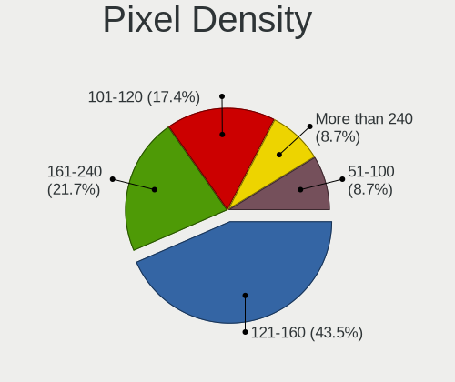
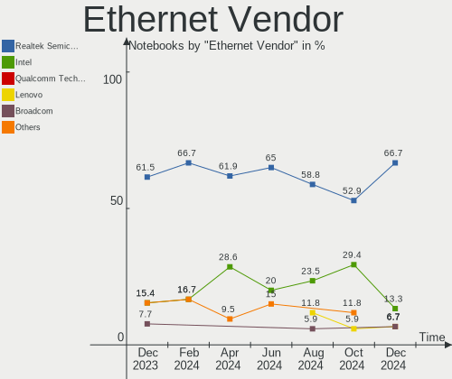
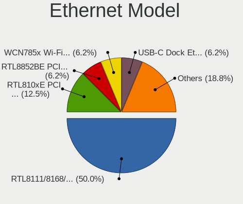
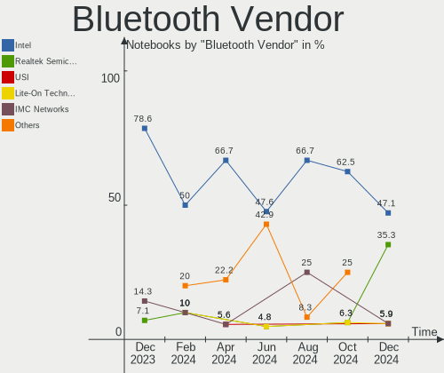
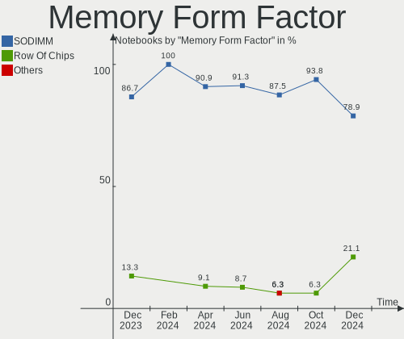

Gentoo - Hardware Trends (Notebooks)
------------------------------------

A project to identify most popular hardware characteristics and track their change
over time based on data collected by Linux users at https://Linux-Hardware.org.

Anyone can contribute to this report by the [hw-probe](https://github.com/linuxhw/hw-probe) tool:

    sudo -E hw-probe -all -upload

This report is for one last month. Overall report since the beginning of time: [TestCoverage](https://github.com/linuxhw/TestCoverage)

Period: Nov, 2022.

Contents
--------

* [ System ](#system)
  - [ OS                       ](#os)
  - [ OS Family                ](#os-family)
  - [ Kernel                   ](#kernel)
  - [ Kernel Family            ](#kernel-family)
  - [ Kernel Major Ver.        ](#kernel-major-ver)
  - [ Arch                     ](#arch)
  - [ DE                       ](#de)
  - [ Display Server           ](#display-server)
  - [ Display Manager          ](#display-manager)
  - [ OS Lang                  ](#os-lang)
  - [ Boot Mode                ](#boot-mode)
  - [ Filesystem               ](#filesystem)
  - [ Part. scheme             ](#part-scheme)
  - [ Dual Boot with Linux/BSD ](#dual-boot-with-linuxbsd)
  - [ Dual Boot (Win)          ](#dual-boot-win)

* [ Board ](#board)
  - [ Vendor                   ](#vendor)
  - [ Model                    ](#model)
  - [ Model Family             ](#model-family)
  - [ MFG Year                 ](#mfg-year)
  - [ Form Factor              ](#form-factor)
  - [ Secure Boot              ](#secure-boot)
  - [ Coreboot                 ](#coreboot)
  - [ RAM Size                 ](#ram-size)
  - [ RAM Used                 ](#ram-used)
  - [ Total Drives             ](#total-drives)
  - [ Has CD-ROM               ](#has-cd-rom)
  - [ Has Ethernet             ](#has-ethernet)
  - [ Has WiFi                 ](#has-wifi)
  - [ Has Bluetooth            ](#has-bluetooth)

* [ Location ](#location)
  - [ Country                  ](#country)
  - [ City                     ](#city)

* [ Drives ](#drives)
  - [ Drive Vendor             ](#drive-vendor)
  - [ Drive Model              ](#drive-model)
  - [ HDD Vendor               ](#hdd-vendor)
  - [ SSD Vendor               ](#ssd-vendor)
  - [ Drive Kind               ](#drive-kind)
  - [ Drive Connector          ](#drive-connector)
  - [ Drive Size               ](#drive-size)
  - [ Space Total              ](#space-total)
  - [ Space Used               ](#space-used)
  - [ Malfunc. Drives          ](#malfunc-drives)
  - [ Malfunc. Drive Vendor    ](#malfunc-drive-vendor)
  - [ Malfunc. HDD Vendor      ](#malfunc-hdd-vendor)
  - [ Malfunc. Drive Kind      ](#malfunc-drive-kind)
  - [ Failed Drives            ](#failed-drives)
  - [ Failed Drive Vendor      ](#failed-drive-vendor)
  - [ Drive Status             ](#drive-status)

* [ Storage controller ](#storage-controller)
  - [ Storage Vendor           ](#storage-vendor)
  - [ Storage Model            ](#storage-model)
  - [ Storage Kind             ](#storage-kind)

* [ Processor ](#processor)
  - [ CPU Vendor               ](#cpu-vendor)
  - [ CPU Model                ](#cpu-model)
  - [ CPU Model Family         ](#cpu-model-family)
  - [ CPU Cores                ](#cpu-cores)
  - [ CPU Sockets              ](#cpu-sockets)
  - [ CPU Threads              ](#cpu-threads)
  - [ CPU Op-Modes             ](#cpu-op-modes)
  - [ CPU Microcode            ](#cpu-microcode)
  - [ CPU Microarch            ](#cpu-microarch)

* [ Graphics ](#graphics)
  - [ GPU Vendor               ](#gpu-vendor)
  - [ GPU Model                ](#gpu-model)
  - [ GPU Combo                ](#gpu-combo)
  - [ GPU Driver               ](#gpu-driver)
  - [ GPU Memory               ](#gpu-memory)

* [ Monitor ](#monitor)
  - [ Monitor Vendor           ](#monitor-vendor)
  - [ Monitor Model            ](#monitor-model)
  - [ Monitor Resolution       ](#monitor-resolution)
  - [ Monitor Diagonal         ](#monitor-diagonal)
  - [ Monitor Width            ](#monitor-width)
  - [ Aspect Ratio             ](#aspect-ratio)
  - [ Monitor Area             ](#monitor-area)
  - [ Pixel Density            ](#pixel-density)
  - [ Multiple Monitors        ](#multiple-monitors)

* [ Network ](#network)
  - [ Net Controller Vendor    ](#net-controller-vendor)
  - [ Net Controller Model     ](#net-controller-model)
  - [ Wireless Vendor          ](#wireless-vendor)
  - [ Wireless Model           ](#wireless-model)
  - [ Ethernet Vendor          ](#ethernet-vendor)
  - [ Ethernet Model           ](#ethernet-model)
  - [ Net Controller Kind      ](#net-controller-kind)
  - [ Used Controller          ](#used-controller)
  - [ NICs                     ](#nics)
  - [ IPv6                     ](#ipv6)

* [ Bluetooth ](#bluetooth)
  - [ Bluetooth Vendor         ](#bluetooth-vendor)
  - [ Bluetooth Model          ](#bluetooth-model)

* [ Sound ](#sound)
  - [ Sound Vendor             ](#sound-vendor)
  - [ Sound Model              ](#sound-model)

* [ Memory ](#memory)
  - [ Memory Vendor            ](#memory-vendor)
  - [ Memory Model             ](#memory-model)
  - [ Memory Kind              ](#memory-kind)
  - [ Memory Form Factor       ](#memory-form-factor)
  - [ Memory Size              ](#memory-size)
  - [ Memory Speed             ](#memory-speed)

* [ Printers & scanners ](#printers--scanners)
  - [ Printer Vendor           ](#printer-vendor)
  - [ Printer Model            ](#printer-model)
  - [ Scanner Vendor           ](#scanner-vendor)
  - [ Scanner Model            ](#scanner-model)

* [ Camera ](#camera)
  - [ Camera Vendor            ](#camera-vendor)
  - [ Camera Model             ](#camera-model)

* [ Security ](#security)
  - [ Fingerprint Vendor       ](#fingerprint-vendor)
  - [ Fingerprint Model        ](#fingerprint-model)
  - [ Chipcard Vendor          ](#chipcard-vendor)
  - [ Chipcard Model           ](#chipcard-model)

* [ Unsupported ](#unsupported)
  - [ Unsupported Devices      ](#unsupported-devices)
  - [ Unsupported Device Types ](#unsupported-device-types)

System
------

OS
--

Installed operating systems

| Name        | Notebooks | Percent |
|-------------|-----------|---------|
| Gentoo 2.8  | 14        | 56%     |
| Gentoo 2.9  | 9         | 36%     |
| Gentoo 2022 | 1         | 4%      |
| Gentoo      | 1         | 4%      |

OS Family
---------

OS without a version

| Name   | Notebooks | Percent |
|--------|-----------|---------|
| Gentoo | 25        | 100%    |

Kernel
------

Version of the Linux kernel

| Version                     | Notebooks | Percent |
|-----------------------------|-----------|---------|
| 5.15.75-gentoo-x86_64       | 5         | 20%     |
| 6.0.6-gentoo                | 2         | 8%      |
| 6.0.9-gentoo-x86_64         | 1         | 4%      |
| 6.0.9-gentoo-wayland-x86_64 | 1         | 4%      |
| 6.0.9-gentoo-dist           | 1         | 4%      |
| 6.0.8-DZRK-xanmod1          | 1         | 4%      |
| 6.0.7-x86_64-rog0-xanmod1   | 1         | 4%      |
| 6.0.7-gentoo-strix          | 1         | 4%      |
| 6.0.7-gentoo-dist           | 1         | 4%      |
| 6.0.6-gentoo-x86_64         | 1         | 4%      |
| 6.0.2                       | 1         | 4%      |
| 6.0.10-gentoo-thinkbook     | 1         | 4%      |
| 6.0.0-pf3-pf-ycnz           | 1         | 4%      |
| 5.18.0-zourssiflette        | 1         | 4%      |
| 5.15.75-gentoo-221027       | 1         | 4%      |
| 5.15.75-gentoo              | 1         | 4%      |
| 5.15.72-gentoo-x86_64       | 1         | 4%      |
| 5.15.52-gentoo              | 1         | 4%      |
| 5.15.12-gentoo              | 1         | 4%      |
| 5.14.2-gentoo-x86_64        | 1         | 4%      |

Kernel Family
-------------

Linux kernel without a distro release

| Version | Notebooks | Percent |
|---------|-----------|---------|
| 5.15.75 | 7         | 28%     |
| 6.0.9   | 3         | 12%     |
| 6.0.7   | 3         | 12%     |
| 6.0.6   | 3         | 12%     |
| 6.0.8   | 1         | 4%      |
| 6.0.2   | 1         | 4%      |
| 6.0.10  | 1         | 4%      |
| 6.0.0   | 1         | 4%      |
| 5.18.0  | 1         | 4%      |
| 5.15.72 | 1         | 4%      |
| 5.15.52 | 1         | 4%      |
| 5.15.12 | 1         | 4%      |
| 5.14.2  | 1         | 4%      |

Kernel Major Ver.
-----------------

Linux kernel major version

| Version | Notebooks | Percent |
|---------|-----------|---------|
| 6.0     | 13        | 52%     |
| 5.15    | 10        | 40%     |
| 5.18    | 1         | 4%      |
| 5.14    | 1         | 4%      |

Arch
----

OS architecture (x86_64, i586, etc.)

| Name   | Notebooks | Percent |
|--------|-----------|---------|
| x86_64 | 25        | 100%    |

DE
--

Desktop Environment

| Name          | Notebooks | Percent |
|---------------|-----------|---------|
| KDE5          | 9         | 36%     |
| GNOME         | 4         | 16%     |
| XFCE          | 3         | 12%     |
| Unknown       | 3         | 12%     |
| Trinity       | 2         | 8%      |
| X-Cinnamon    | 1         | 4%      |
| sway          | 1         | 4%      |
| LXQt          | 1         | 4%      |
| Enlightenment | 1         | 4%      |

Display Server
--------------

X11 or Wayland

| Name    | Notebooks | Percent |
|---------|-----------|---------|
| X11     | 16        | 64%     |
| Unknown | 4         | 16%     |
| Wayland | 3         | 12%     |
| Tty     | 2         | 8%      |

Display Manager
---------------

SDDM, LightDM, etc.

| Name    | Notebooks | Percent |
|---------|-----------|---------|
| SDDM    | 13        | 52%     |
| LightDM | 4         | 16%     |
| Unknown | 3         | 12%     |
| TDM     | 2         | 8%      |
| XDM     | 1         | 4%      |
| GREETD  | 1         | 4%      |
| GDM     | 1         | 4%      |

OS Lang
-------

Language

| Lang    | Notebooks | Percent |
|---------|-----------|---------|
| en_US   | 10        | 40%     |
| ru_RU   | 3         | 12%     |
| it_IT   | 2         | 8%      |
| en_GB   | 2         | 8%      |
| C.UTF8  | 2         | 8%      |
| zh_CN   | 1         | 4%      |
| ru_UA   | 1         | 4%      |
| pl_PL   | 1         | 4%      |
| de_DE   | 1         | 4%      |
| C       | 1         | 4%      |
| Unknown | 1         | 4%      |

Boot Mode
---------

EFI or BIOS

| Mode | Notebooks | Percent |
|------|-----------|---------|
| EFI  | 20        | 80%     |
| BIOS | 5         | 20%     |

Filesystem
----------

Type of filesystem

| Type  | Notebooks | Percent |
|-------|-----------|---------|
| Ext4  | 13        | 52%     |
| Btrfs | 7         | 28%     |
| Zfs   | 2         | 8%      |
| Xfs   | 1         | 4%      |
| Jfs   | 1         | 4%      |
| F2fs  | 1         | 4%      |

Part. scheme
------------

Scheme of partitioning

| Type    | Notebooks | Percent |
|---------|-----------|---------|
| GPT     | 23        | 92%     |
| MBR     | 1         | 4%      |
| Unknown | 1         | 4%      |

Dual Boot with Linux/BSD
------------------------

Hosting more than one Linux/BSD

| Dual boot | Notebooks | Percent |
|-----------|-----------|---------|
| No        | 20        | 80%     |
| Yes       | 5         | 20%     |

Dual Boot (Win)
---------------

Hosting Linux and Windows

| Dual boot | Notebooks | Percent |
|-----------|-----------|---------|
| No        | 18        | 72%     |
| Yes       | 7         | 28%     |

Board
-----

Vendor
------

Motherboard manufacturer

| Name             | Notebooks | Percent |
|------------------|-----------|---------|
| Lenovo           | 7         | 28%     |
| ASUSTek Computer | 4         | 16%     |
| Dell             | 3         | 12%     |
| Acer             | 3         | 12%     |
| HUAWEI           | 2         | 8%      |
| Hewlett-Packard  | 2         | 8%      |
| Toshiba          | 1         | 4%      |
| Razer            | 1         | 4%      |
| MSI              | 1         | 4%      |
| Unknown          | 1         | 4%      |

Model
-----

Motherboard model

| Name                                     | Notebooks | Percent |
|------------------------------------------|-----------|---------|
| Toshiba Satellite L50-B                  | 1         | 4%      |
| Razer Blade Pro                          | 1         | 4%      |
| MSI GT72 2QD                             | 1         | 4%      |
| Lenovo Yoga Slim 7 Pro 14IAH7 82UT       | 1         | 4%      |
| Lenovo V15 G2 ALC 82KD                   | 1         | 4%      |
| Lenovo ThinkPad X1 Carbon 7th 20R1CTO1WW | 1         | 4%      |
| Lenovo ThinkPad S2 3rd Gen 20L1A00HCD    | 1         | 4%      |
| Lenovo ThinkPad L14 Gen 1 20U5003NRT     | 1         | 4%      |
| Lenovo ThinkPad E15 Gen 2 20T8000MPB     | 1         | 4%      |
| Lenovo ThinkBook 14s-IWL 20RM            | 1         | 4%      |
| HUAWEI KLVL-WXX9                         | 1         | 4%      |
| HUAWEI BOHB-WAX9                         | 1         | 4%      |
| HP Pavilion Gaming Laptop 15-ec1xxx      | 1         | 4%      |
| HP Pavilion Aero Laptop 13-be0xxx        | 1         | 4%      |
| Dell Precision 5540                      | 1         | 4%      |
| Dell Inspiron N5010                      | 1         | 4%      |
| Dell G3 3500                             | 1         | 4%      |
| ASUS X510UNR                             | 1         | 4%      |
| ASUS ROG Zephyrus M16 GU603ZM_GU603ZM    | 1         | 4%      |
| ASUS ROG Strix G513QY_G513QY             | 1         | 4%      |
| ASUS N55SF                               | 1         | 4%      |
| Acer Swift SF314-57                      | 1         | 4%      |
| Acer Nitro AN515-58                      | 1         | 4%      |
| Acer Nitro AN515-43                      | 1         | 4%      |
| Unknown                                  | 1         | 4%      |

Model Family
------------

Motherboard model prefix

| Name              | Notebooks | Percent |
|-------------------|-----------|---------|
| Lenovo ThinkPad   | 4         | 16%     |
| HP Pavilion       | 2         | 8%      |
| ASUS ROG          | 2         | 8%      |
| Acer Nitro        | 2         | 8%      |
| Toshiba Satellite | 1         | 4%      |
| Razer Blade       | 1         | 4%      |
| MSI GT72          | 1         | 4%      |
| Lenovo Yoga       | 1         | 4%      |
| Lenovo V15        | 1         | 4%      |
| Lenovo ThinkBook  | 1         | 4%      |
| HUAWEI KLVL-WXX9  | 1         | 4%      |
| HUAWEI BOHB-WAX9  | 1         | 4%      |
| Dell Precision    | 1         | 4%      |
| Dell Inspiron     | 1         | 4%      |
| Dell G3           | 1         | 4%      |
| ASUS X510UNR      | 1         | 4%      |
| ASUS N55SF        | 1         | 4%      |
| Acer Swift        | 1         | 4%      |
| Unknown           | 1         | 4%      |

MFG Year
--------

Motherboard manufacture year

| Year | Notebooks | Percent |
|------|-----------|---------|
| 2019 | 6         | 24%     |
| 2020 | 5         | 20%     |
| 2021 | 4         | 16%     |
| 2022 | 3         | 12%     |
| 2014 | 2         | 8%      |
| 2018 | 1         | 4%      |
| 2017 | 1         | 4%      |
| 2016 | 1         | 4%      |
| 2011 | 1         | 4%      |
| 2010 | 1         | 4%      |

Form Factor
-----------

Physical design of the computer

| Name     | Notebooks | Percent |
|----------|-----------|---------|
| Notebook | 25        | 100%    |

Secure Boot
-----------

Enabled or disabled

| State    | Notebooks | Percent |
|----------|-----------|---------|
| Disabled | 25        | 100%    |

Coreboot
--------

Have coreboot on board

| Used | Notebooks | Percent |
|------|-----------|---------|
| No   | 25        | 100%    |

RAM Size
--------

Total RAM memory

| Size in GB  | Notebooks | Percent |
|-------------|-----------|---------|
| 32.01-64.0  | 7         | 28%     |
| 8.01-16.0   | 7         | 28%     |
| 4.01-8.0    | 6         | 24%     |
| 16.01-24.0  | 3         | 12%     |
| 3.01-4.0    | 1         | 4%      |
| 64.01-256.0 | 1         | 4%      |

RAM Used
--------

Used RAM memory

| Used GB    | Notebooks | Percent |
|------------|-----------|---------|
| 8.01-16.0  | 6         | 24%     |
| 2.01-3.0   | 5         | 20%     |
| 1.01-2.0   | 5         | 20%     |
| 4.01-8.0   | 4         | 16%     |
| 3.01-4.0   | 2         | 8%      |
| 0.01-0.5   | 2         | 8%      |
| 16.01-24.0 | 1         | 4%      |

Total Drives
------------

Number of drives on board

| Drives | Notebooks | Percent |
|--------|-----------|---------|
| 1      | 15        | 60%     |
| 2      | 10        | 40%     |

Has CD-ROM
----------

Has CD-ROM on board

| Presented | Notebooks | Percent |
|-----------|-----------|---------|
| No        | 21        | 84%     |
| Yes       | 4         | 16%     |

Has Ethernet
------------

Has Ethernet on board

| Presented | Notebooks | Percent |
|-----------|-----------|---------|
| Yes       | 20        | 80%     |
| No        | 5         | 20%     |

Has WiFi
--------

Has WiFi module

| Presented | Notebooks | Percent |
|-----------|-----------|---------|
| Yes       | 25        | 100%    |

Has Bluetooth
-------------

Has Bluetooth module

| Presented | Notebooks | Percent |
|-----------|-----------|---------|
| Yes       | 23        | 92%     |
| No        | 2         | 8%      |

Location
--------

Country
-------

Geographic location (country)

| Country     | Notebooks | Percent |
|-------------|-----------|---------|
| Russia      | 4         | 16%     |
| France      | 3         | 12%     |
| China       | 3         | 12%     |
| USA         | 2         | 8%      |
| Poland      | 2         | 8%      |
| Italy       | 2         | 8%      |
| Sweden      | 1         | 4%      |
| Slovakia    | 1         | 4%      |
| Netherlands | 1         | 4%      |
| Japan       | 1         | 4%      |
| India       | 1         | 4%      |
| Germany     | 1         | 4%      |
| Denmark     | 1         | 4%      |
| Canada      | 1         | 4%      |
| Australia   | 1         | 4%      |

City
----

Geographic location (city)

| City               | Notebooks | Percent |
|--------------------|-----------|---------|
| Taganrog           | 2         | 8%      |
| Warsaw             | 1         | 4%      |
| Villejuif          | 1         | 4%      |
| Vendays-Montalivet | 1         | 4%      |
| Vaellingby         | 1         | 4%      |
| Sydney             | 1         | 4%      |
| Suffolk            | 1         | 4%      |
| Schmitten          | 1         | 4%      |
| Ravenna            | 1         | 4%      |
| Perm               | 1         | 4%      |
| Onna               | 1         | 4%      |
| Moscow             | 1         | 4%      |
| Milan              | 1         | 4%      |
| Lyon               | 1         | 4%      |
| Los Angeles        | 1         | 4%      |
| Laval              | 1         | 4%      |
| Kunming            | 1         | 4%      |
| Jinrongjie         | 1         | 4%      |
| Hørsholm          | 1         | 4%      |
| Guangzhou          | 1         | 4%      |
| Cieszyn            | 1         | 4%      |
| Bratislava         | 1         | 4%      |
| Bengaluru          | 1         | 4%      |
| Amsterdam          | 1         | 4%      |

Drives
------

Drive Vendor
------------

Hard drive vendors

| Vendor                      | Notebooks | Drives | Percent |
|-----------------------------|-----------|--------|---------|
| Samsung Electronics         | 10        | 11     | 31.25%  |
| Sandisk                     | 3         | 3      | 9.38%   |
| Phison Electronics          | 2         | 2      | 6.25%   |
| Micron Technology           | 2         | 2      | 6.25%   |
| Kingston Technology Company | 2         | 2      | 6.25%   |
| China                       | 2         | 2      | 6.25%   |
| Yangtze Memory Technologies | 1         | 1      | 3.13%   |
| WDC                         | 1         | 1      | 3.13%   |
| Union Memory                | 1         | 1      | 3.13%   |
| Toshiba                     | 1         | 1      | 3.13%   |
| SK hynix                    | 1         | 1      | 3.13%   |
| Seagate                     | 1         | 1      | 3.13%   |
| Realtek Semiconductor       | 1         | 2      | 3.13%   |
| Intel                       | 1         | 1      | 3.13%   |
| HGST                        | 1         | 2      | 3.13%   |
| Crucial                     | 1         | 1      | 3.13%   |
| Unknown                     | 1         | 1      | 3.13%   |

Drive Model
-----------

Hard drive models

| Model                                                | Notebooks | Percent |
|------------------------------------------------------|-----------|---------|
| Samsung NVMe SSD Controller SM981/PM981/PM983 1TB    | 3         | 9.09%   |
| Micron 3400_MTFDKBA512TFH 512GB                      | 2         | 6.06%   |
| China SSD 1TB                                        | 2         | 6.06%   |
| Yangtze Memory ZHITAI TiPlus5000 1TB                 | 1         | 3.03%   |
| WDC WDS120G2G0B-00EPW0 120GB SSD                     | 1         | 3.03%   |
| Union Memory UMIS RPJTJ512MEE1OWX 512GB              | 1         | 3.03%   |
| Toshiba MQ01ABF050 500GB                             | 1         | 3.03%   |
| SK hynix BC501 NVMe Solid State Drive 512GB          | 1         | 3.03%   |
| Seagate BarraCuda 120 SSD ZA500CM10003 500GB         | 1         | 3.03%   |
| Sandisk WD Blue SN550 NVMe SSD 1TB                   | 1         | 3.03%   |
| Sandisk WD Blue SN500 / PC SN520 NVMe SSD 512GB      | 1         | 3.03%   |
| Sandisk WD Black SN750 / PC SN730 NVMe SSD 1024GB    | 1         | 3.03%   |
| Samsung SSD 980 1TB                                  | 1         | 3.03%   |
| Samsung SSD 860 EVO M.2 500GB                        | 1         | 3.03%   |
| Samsung SSD 860 EVO 500GB                            | 1         | 3.03%   |
| Samsung SSD 850 PRO 256GB                            | 1         | 3.03%   |
| Samsung PM991 NVMe 512GB                             | 1         | 3.03%   |
| Samsung NVMe SSD Controller PM9A1/PM9A3/980PRO 250GB | 1         | 3.03%   |
| Samsung MZALQ256HBJD-00BL2 256GB                     | 1         | 3.03%   |
| Realtek RTS5763DL NVMe SSD Controller 1024GB         | 1         | 3.03%   |
| Phison PS5013 E13 NVMe Controller 256GB              | 1         | 3.03%   |
| Phison E16 PCIe4 NVMe Controller 1TB                 | 1         | 3.03%   |
| Kingston Company KC2000 NVMe SSD 2TB                 | 1         | 3.03%   |
| Kingston Company A2000 NVMe SSD 500GB                | 1         | 3.03%   |
| Intel SSDPEKNU512GZH 512GB                           | 1         | 3.03%   |
| HGST HTS721010A9E630 1TB                             | 1         | 3.03%   |
| HGST HTS541010A9E680 1TB                             | 1         | 3.03%   |
| Crucial CT2000MX500SSD1 2TB                          | 1         | 3.03%   |
| Unknown                                              | 1         | 3.03%   |

HDD Vendor
----------

Hard disk drive vendors

| Vendor  | Notebooks | Drives | Percent |
|---------|-----------|--------|---------|
| Toshiba | 1         | 1      | 50%     |
| HGST    | 1         | 2      | 50%     |

SSD Vendor
----------

Solid state drive vendors

| Vendor              | Notebooks | Drives | Percent |
|---------------------|-----------|--------|---------|
| Samsung Electronics | 3         | 3      | 33.33%  |
| China               | 2         | 2      | 22.22%  |
| WDC                 | 1         | 1      | 11.11%  |
| Seagate             | 1         | 1      | 11.11%  |
| Crucial             | 1         | 1      | 11.11%  |
| Unknown             | 1         | 1      | 11.11%  |

Drive Kind
----------

HDD or SSD

| Kind | Notebooks | Drives | Percent |
|------|-----------|--------|---------|
| NVMe | 19        | 23     | 67.86%  |
| SSD  | 7         | 9      | 25%     |
| HDD  | 2         | 3      | 7.14%   |

Drive Connector
---------------

SATA, SAS, NVMe, etc.

| Type | Notebooks | Drives | Percent |
|------|-----------|--------|---------|
| NVMe | 19        | 23     | 67.86%  |
| SATA | 9         | 12     | 32.14%  |

Drive Size
----------

Size of hard drive

| Size in TB | Notebooks | Drives | Percent |
|------------|-----------|--------|---------|
| 0.01-0.5   | 6         | 7      | 60%     |
| 0.51-1.0   | 3         | 4      | 30%     |
| 1.01-2.0   | 1         | 1      | 10%     |

Space Total
-----------

Amount of disk space available on the file system

| Size in GB     | Notebooks | Percent |
|----------------|-----------|---------|
| 251-500        | 9         | 36%     |
| 501-1000       | 5         | 20%     |
| 101-250        | 3         | 12%     |
| More than 3000 | 2         | 8%      |
| 1001-2000      | 2         | 8%      |
| Unknown        | 2         | 8%      |
| 2001-3000      | 1         | 4%      |
| 51-100         | 1         | 4%      |

Space Used
----------

Amount of used disk space

| Used GB   | Notebooks | Percent |
|-----------|-----------|---------|
| 251-500   | 7         | 28%     |
| 101-250   | 5         | 20%     |
| 501-1000  | 4         | 16%     |
| 21-50     | 3         | 12%     |
| 2001-3000 | 2         | 8%      |
| 1-20      | 2         | 8%      |
| Unknown   | 2         | 8%      |

Malfunc. Drives
---------------

Drive models with a malfunction

| Model                                                      | Notebooks | Drives | Percent |
|------------------------------------------------------------|-----------|--------|---------|
| WDC WDS120G2G0B-00EPW0 120GB SSD                           | 1         | 1      | 25%     |
| Realtek Semiconductor RTS5763DL NVMe SSD Controller 1024GB | 1         | 2      | 25%     |
| Kingston Technology Company KC2000 NVMe SSD 2TB            | 1         | 1      | 25%     |
| HGST HTS541010A9E680 1TB                                   | 1         | 1      | 25%     |

Malfunc. Drive Vendor
---------------------

Vendors of faulty drives

| Vendor                      | Notebooks | Drives | Percent |
|-----------------------------|-----------|--------|---------|
| WDC                         | 1         | 1      | 25%     |
| Realtek Semiconductor       | 1         | 2      | 25%     |
| Kingston Technology Company | 1         | 1      | 25%     |
| HGST                        | 1         | 1      | 25%     |

Malfunc. HDD Vendor
-------------------

Vendors of faulty HDD drives

| Vendor | Notebooks | Drives | Percent |
|--------|-----------|--------|---------|
| HGST   | 1         | 1      | 100%    |

Malfunc. Drive Kind
-------------------

Kinds of faulty drives

| Kind | Notebooks | Drives | Percent |
|------|-----------|--------|---------|
| NVMe | 2         | 3      | 50%     |
| SSD  | 1         | 1      | 25%     |
| HDD  | 1         | 1      | 25%     |

Failed Drives
-------------

Failed drive models

Zero info for selected period =(

Failed Drive Vendor
-------------------

Failed drive vendors

Zero info for selected period =(

Drive Status
------------

Number of failed and malfunc. drives

| Status  | Notebooks | Drives | Percent |
|---------|-----------|--------|---------|
| Works   | 23        | 30     | 85.19%  |
| Malfunc | 4         | 5      | 14.81%  |

Storage controller
------------------

Storage Vendor
--------------

Storage controller vendors

| Vendor                      | Notebooks | Percent |
|-----------------------------|-----------|---------|
| Intel                       | 12        | 34.29%  |
| Samsung Electronics         | 7         | 20%     |
| SanDisk                     | 3         | 8.57%   |
| AMD                         | 3         | 8.57%   |
| Phison Electronics          | 2         | 5.71%   |
| Micron Technology           | 2         | 5.71%   |
| Kingston Technology Company | 2         | 5.71%   |
| Yangtze Memory Technologies | 1         | 2.86%   |
| Union Memory (Shenzhen)     | 1         | 2.86%   |
| SK hynix                    | 1         | 2.86%   |
| Realtek Semiconductor       | 1         | 2.86%   |

Storage Model
-------------

Storage controller models

| Model                                                                          | Notebooks | Percent |
|--------------------------------------------------------------------------------|-----------|---------|
| Samsung NVMe SSD Controller SM981/PM981/PM983                                  | 3         | 8.33%   |
| Samsung NVMe SSD Controller 980                                                | 3         | 8.33%   |
| AMD FCH SATA Controller [AHCI mode]                                            | 3         | 8.33%   |
| Micron Non-Volatile memory controller                                          | 2         | 5.56%   |
| Intel Volume Management Device NVMe RAID Controller                            | 2         | 5.56%   |
| Yangtze Memory ZHITAI TiPro5000 NVMe SSD                                       | 1         | 2.78%   |
| Union Memory (Shenzhen) Non-Volatile memory controller                         | 1         | 2.78%   |
| SK hynix BC501 NVMe Solid State Drive                                          | 1         | 2.78%   |
| SanDisk WD Blue SN550 NVMe SSD                                                 | 1         | 2.78%   |
| SanDisk WD Blue SN500 / PC SN520 NVMe SSD                                      | 1         | 2.78%   |
| SanDisk WD Black SN750 / PC SN730 NVMe SSD                                     | 1         | 2.78%   |
| Samsung NVMe SSD Controller PM9A1/PM9A3/980PRO                                 | 1         | 2.78%   |
| Realtek RTS5763DL NVMe SSD Controller                                          | 1         | 2.78%   |
| Phison PS5013 E13 NVMe Controller                                              | 1         | 2.78%   |
| Phison E16 PCIe4 NVMe Controller                                               | 1         | 2.78%   |
| Kingston Company KC2000 NVMe SSD                                               | 1         | 2.78%   |
| Kingston Company A2000 NVMe SSD                                                | 1         | 2.78%   |
| Intel Wildcat Point-LP SATA Controller [AHCI Mode]                             | 1         | 2.78%   |
| Intel Sunrise Point-LP SATA Controller [AHCI mode]                             | 1         | 2.78%   |
| Intel Non-Volatile memory controller                                           | 1         | 2.78%   |
| Intel Comet Lake SATA AHCI Controller                                          | 1         | 2.78%   |
| Intel Cannon Lake Mobile PCH SATA AHCI Controller                              | 1         | 2.78%   |
| Intel Alder Lake-P SATA AHCI Controller                                        | 1         | 2.78%   |
| Intel 8 Series/C220 Series Chipset Family 6-port SATA Controller 1 [AHCI mode] | 1         | 2.78%   |
| Intel 7 Series Chipset Family 6-port SATA Controller [AHCI mode]               | 1         | 2.78%   |
| Intel 6 Series/C200 Series Chipset Family 6 port Mobile SATA AHCI Controller   | 1         | 2.78%   |
| Intel 5 Series/3400 Series Chipset 6 port SATA AHCI Controller                 | 1         | 2.78%   |
| Intel 400 Series Chipset Family SATA AHCI Controller                           | 1         | 2.78%   |

Storage Kind
------------

Kind of storage controller (IDE, SATA, NVMe, SAS, ...)

| Kind | Notebooks | Percent |
|------|-----------|---------|
| NVMe | 19        | 55.88%  |
| SATA | 13        | 38.24%  |
| RAID | 2         | 5.88%   |

Processor
---------

CPU Vendor
----------

Processor vendors

| Vendor | Notebooks | Percent |
|--------|-----------|---------|
| Intel  | 17        | 68%     |
| AMD    | 8         | 32%     |

CPU Model
---------

Processor models

| Model                                         | Notebooks | Percent |
|-----------------------------------------------|-----------|---------|
| Intel Core i5-8250U CPU @ 1.60GHz             | 2         | 8%      |
| Intel 12th Gen Core i7-12700H                 | 2         | 8%      |
| Intel Core i7-9850H CPU @ 2.60GHz             | 1         | 4%      |
| Intel Core i7-8565U CPU @ 1.80GHz             | 1         | 4%      |
| Intel Core i7-6700HQ CPU @ 2.60GHz            | 1         | 4%      |
| Intel Core i7-5700HQ CPU @ 2.70GHz            | 1         | 4%      |
| Intel Core i7-2670QM CPU @ 2.20GHz            | 1         | 4%      |
| Intel Core i7-2630QM CPU @ 2.00GHz            | 1         | 4%      |
| Intel Core i7-1065G7 CPU @ 1.30GHz            | 1         | 4%      |
| Intel Core i7-10510U CPU @ 1.80GHz            | 1         | 4%      |
| Intel Core i5-5200U CPU @ 2.20GHz             | 1         | 4%      |
| Intel Core i5-10300H CPU @ 2.50GHz            | 1         | 4%      |
| Intel Core i5-10210U CPU @ 1.60GHz            | 1         | 4%      |
| Intel Core i3 CPU M 380 @ 2.53GHz             | 1         | 4%      |
| Intel 12th Gen Core i5-12500H                 | 1         | 4%      |
| AMD Ryzen 9 5900HX with Radeon Graphics       | 1         | 4%      |
| AMD Ryzen 7 4800H with Radeon Graphics        | 1         | 4%      |
| AMD Ryzen 5 PRO 4650U with Radeon Graphics    | 1         | 4%      |
| AMD Ryzen 5 5600U with Radeon Graphics        | 1         | 4%      |
| AMD Ryzen 5 5500U with Radeon Graphics        | 1         | 4%      |
| AMD Ryzen 5 4600H with Radeon Graphics        | 1         | 4%      |
| AMD Ryzen 5 4500U with Radeon Graphics        | 1         | 4%      |
| AMD Ryzen 5 3550H with Radeon Vega Mobile Gfx | 1         | 4%      |

CPU Model Family
----------------

Processor model prefix

| Model           | Notebooks | Percent |
|-----------------|-----------|---------|
| Intel Core i7   | 8         | 32%     |
| Intel Core i5   | 5         | 20%     |
| AMD Ryzen 5     | 5         | 20%     |
| Other           | 3         | 12%     |
| Intel Core i3   | 1         | 4%      |
| AMD Ryzen 9     | 1         | 4%      |
| AMD Ryzen 7     | 1         | 4%      |
| AMD Ryzen 5 PRO | 1         | 4%      |

CPU Cores
---------

Number of processor cores

| Number | Notebooks | Percent |
|--------|-----------|---------|
| 4      | 12        | 48%     |
| 6      | 6         | 24%     |
| 14     | 2         | 8%      |
| 8      | 2         | 8%      |
| 2      | 2         | 8%      |
| 12     | 1         | 4%      |

CPU Sockets
-----------

Number of sockets

| Number | Notebooks | Percent |
|--------|-----------|---------|
| 1      | 25        | 100%    |

CPU Threads
-----------

Threads per core (Hyper-Threading)

| Number | Notebooks | Percent |
|--------|-----------|---------|
| 2      | 24        | 96%     |
| 1      | 1         | 4%      |

CPU Op-Modes
------------

CPU Operation Modes (32-bit, 64-bit)

| Op mode        | Notebooks | Percent |
|----------------|-----------|---------|
| 32-bit, 64-bit | 25        | 100%    |

CPU Microcode
-------------

Microcode number

| Number     | Notebooks | Percent |
|------------|-----------|---------|
| 0x906a3    | 3         | 12%     |
| 0x806ec    | 3         | 12%     |
| Unknown    | 3         | 12%     |
| 0x806ea    | 2         | 8%      |
| 0x206a7    | 2         | 8%      |
| 0x08600106 | 2         | 8%      |
| 0xa0652    | 1         | 4%      |
| 0x906ed    | 1         | 4%      |
| 0x706e5    | 1         | 4%      |
| 0x506e3    | 1         | 4%      |
| 0x40671    | 1         | 4%      |
| 0x20655    | 1         | 4%      |
| 0x0a50000c | 1         | 4%      |
| 0x08608103 | 1         | 4%      |
| 0x08600103 | 1         | 4%      |
| 0x08108109 | 1         | 4%      |

CPU Microarch
-------------

Microarchitecture

| Name             | Notebooks | Percent |
|------------------|-----------|---------|
| KabyLake         | 6         | 24%     |
| Zen 2            | 4         | 16%     |
| Alderlake Hybrid | 3         | 12%     |
| Zen 3            | 2         | 8%      |
| SandyBridge      | 2         | 8%      |
| Broadwell        | 2         | 8%      |
| Zen+             | 1         | 4%      |
| Westmere         | 1         | 4%      |
| Skylake          | 1         | 4%      |
| IceLake          | 1         | 4%      |
| CometLake        | 1         | 4%      |
| Unknown          | 1         | 4%      |

Graphics
--------

GPU Vendor
----------

Vendors of graphics cards

| Vendor | Notebooks | Percent |
|--------|-----------|---------|
| Intel  | 15        | 44.12%  |
| AMD    | 11        | 32.35%  |
| Nvidia | 8         | 23.53%  |

GPU Model
---------

Graphics card models

| Model                                                                     | Notebooks | Percent |
|---------------------------------------------------------------------------|-----------|---------|
| AMD Renoir                                                                | 4         | 11.43%  |
| Intel Alder Lake-P Integrated Graphics Controller                         | 3         | 8.57%   |
| Nvidia TU117M                                                             | 2         | 5.71%   |
| Intel UHD Graphics 620                                                    | 2         | 5.71%   |
| Intel CometLake-U GT2 [UHD Graphics]                                      | 2         | 5.71%   |
| Intel 2nd Generation Core Processor Family Integrated Graphics Controller | 2         | 5.71%   |
| AMD Cezanne [Radeon Vega Series / Radeon Vega Mobile Series]              | 2         | 5.71%   |
| Nvidia TU117GLM [Quadro T2000 Mobile / Max-Q]                             | 1         | 2.86%   |
| Nvidia GP108M [GeForce MX150]                                             | 1         | 2.86%   |
| Nvidia GP107M [GeForce GTX 1050 Ti Mobile]                                | 1         | 2.86%   |
| Nvidia GP104BM [GeForce GTX 1080 Mobile]                                  | 1         | 2.86%   |
| Nvidia GF116M [GeForce GT 555M/635M]                                      | 1         | 2.86%   |
| Nvidia GA106M [GeForce RTX 3060 Mobile / Max-Q]                           | 1         | 2.86%   |
| Intel WhiskeyLake-U GT2 [UHD Graphics 620]                                | 1         | 2.86%   |
| Intel Iris Plus Graphics G7                                               | 1         | 2.86%   |
| Intel HD Graphics 5600                                                    | 1         | 2.86%   |
| Intel HD Graphics 5500                                                    | 1         | 2.86%   |
| Intel CometLake-H GT2 [UHD Graphics]                                      | 1         | 2.86%   |
| Intel CoffeeLake-H GT2 [UHD Graphics 630]                                 | 1         | 2.86%   |
| AMD Picasso/Raven 2 [Radeon Vega Series / Radeon Vega Mobile Series]      | 1         | 2.86%   |
| AMD Park [Mobility Radeon HD 5430/5450/5470]                              | 1         | 2.86%   |
| AMD Navi 22 [Radeon RX 6700/6700 XT/6750 XT / 6800M]                      | 1         | 2.86%   |
| AMD Lucienne                                                              | 1         | 2.86%   |
| AMD Lexa [Radeon 540X/550X/630 / RX 640 / E9171 MCM]                      | 1         | 2.86%   |
| AMD Jet PRO [Radeon R5 M230 / R7 M260DX / Radeon 520 Mobile]              | 1         | 2.86%   |

GPU Combo
---------

Combinations of graphics cards

| Name           | Notebooks | Percent |
|----------------|-----------|---------|
| 1 x Intel      | 8         | 32%     |
| 1 x AMD        | 6         | 24%     |
| Intel + Nvidia | 5         | 20%     |
| Intel + AMD    | 2         | 8%      |
| AMD + Nvidia   | 2         | 8%      |
| 2 x AMD        | 1         | 4%      |
| 1 x Nvidia     | 1         | 4%      |

GPU Driver
----------

Free vs proprietary

| Driver      | Notebooks | Percent |
|-------------|-----------|---------|
| Free        | 18        | 72%     |
| Proprietary | 7         | 28%     |

GPU Memory
----------

Total video memory

| Size in GB | Notebooks | Percent |
|------------|-----------|---------|
| Unknown    | 14        | 56%     |
| 0.01-0.5   | 5         | 20%     |
| 1.01-2.0   | 3         | 12%     |
| 7.01-8.0   | 1         | 4%      |
| 8.01-16.0  | 1         | 4%      |
| 0.51-1.0   | 1         | 4%      |

Monitor
-------

Monitor Vendor
--------------

Monitor vendors

| Vendor              | Notebooks | Percent |
|---------------------|-----------|---------|
| BOE                 | 7         | 22.58%  |
| LG Display          | 5         | 16.13%  |
| Dell                | 4         | 12.9%   |
| AU Optronics        | 4         | 12.9%   |
| Sharp               | 2         | 6.45%   |
| TMX                 | 1         | 3.23%   |
| Samsung Electronics | 1         | 3.23%   |
| Philips             | 1         | 3.23%   |
| Lenovo              | 1         | 3.23%   |
| Goldstar            | 1         | 3.23%   |
| GDH                 | 1         | 3.23%   |
| CSO                 | 1         | 3.23%   |
| Chimei Innolux      | 1         | 3.23%   |
| Acer                | 1         | 3.23%   |

Monitor Model
-------------

Monitor models

| Model                                                                 | Notebooks | Percent |
|-----------------------------------------------------------------------|-----------|---------|
| TMX TL156VDXP01 TMX1560 1920x1080 344x194mm 15.5-inch                 | 1         | 3.23%   |
| Sharp LCD Monitor SHP14BA 1920x1080 344x194mm 15.5-inch               | 1         | 3.23%   |
| Sharp LCD Monitor SHP145A 3840x2160 380x210mm 17.1-inch               | 1         | 3.23%   |
| Samsung Electronics LCD Monitor SEC314C 1920x1080 344x194mm 15.5-inch | 1         | 3.23%   |
| Philips PHL19PFL3405 PHLD071 1360x768 477x268mm 21.5-inch             | 1         | 3.23%   |
| LG Display LCD Monitor LGD069A 1920x1080 344x194mm 15.5-inch          | 1         | 3.23%   |
| LG Display LCD Monitor LGD062C 1920x1080 309x174mm 14.0-inch          | 1         | 3.23%   |
| LG Display LCD Monitor LGD05EC 1920x1080 309x174mm 14.0-inch          | 1         | 3.23%   |
| LG Display LCD Monitor LGD0469 1920x1080 382x215mm 17.3-inch          | 1         | 3.23%   |
| LG Display LCD Monitor LGD045C 1366x768 344x194mm 15.5-inch           | 1         | 3.23%   |
| Lenovo LCD Monitor LEN40BA 1920x1080 344x194mm 15.5-inch              | 1         | 3.23%   |
| Goldstar IPS FULLHD GSM5AB8 1920x1080 480x270mm 21.7-inch             | 1         | 3.23%   |
| GDH PHILCO GDH0030 1920x540 708x398mm 32.0-inch                       | 1         | 3.23%   |
| Dell ST2220T DELD043 1920x1080 475x267mm 21.5-inch                    | 1         | 3.23%   |
| Dell SE2717H/HX DELD0A1 1920x1080 598x336mm 27.0-inch                 | 1         | 3.23%   |
| Dell S2721Q DELA193 3840x2160 600x340mm 27.2-inch                     | 1         | 3.23%   |
| Dell P2715Q DEL40BF 3840x2160 597x336mm 27.0-inch                     | 1         | 3.23%   |
| CSO LCD Monitor CSO140C 2880x1800 302x188mm 14.0-inch                 | 1         | 3.23%   |
| Chimei Innolux LCD Monitor CMN1540 2560x1440 344x193mm 15.5-inch      | 1         | 3.23%   |
| BOE LCD Monitor BOE0A0B 2560x1600 344x215mm 16.0-inch                 | 1         | 3.23%   |
| BOE LCD Monitor BOE0893 2160x1440 296x197mm 14.0-inch                 | 1         | 3.23%   |
| BOE LCD Monitor BOE0872 1920x1080 344x194mm 15.5-inch                 | 1         | 3.23%   |
| BOE LCD Monitor BOE0852 1920x1080 344x194mm 15.5-inch                 | 1         | 3.23%   |
| BOE LCD Monitor BOE0848 1920x1080 294x165mm 13.3-inch                 | 1         | 3.23%   |
| BOE LCD Monitor BOE0819 1920x1080 344x194mm 15.5-inch                 | 1         | 3.23%   |
| BOE LCD Monitor BOE07C8 3840x2160 309x174mm 14.0-inch                 | 1         | 3.23%   |
| AU Optronics LCD Monitor AUOD0ED 1920x1080 344x193mm 15.5-inch        | 1         | 3.23%   |
| AU Optronics LCD Monitor AUO6496 1920x1200 286x178mm 13.3-inch        | 1         | 3.23%   |
| AU Optronics LCD Monitor AUO403D 1920x1080 309x173mm 13.9-inch        | 1         | 3.23%   |
| AU Optronics LCD Monitor AUO21ED 1920x1080 344x193mm 15.5-inch        | 1         | 3.23%   |
| Acer B286HK ACR03FF 3840x2160 621x341mm 27.9-inch                     | 1         | 3.23%   |

Monitor Resolution
------------------

Monitor screen resolution

| Resolution        | Notebooks | Percent |
|-------------------|-----------|---------|
| 1920x1080 (FHD)   | 14        | 53.85%  |
| 3840x2160 (4K)    | 4         | 15.38%  |
| 3200x2000         | 1         | 3.85%   |
| 2880x1800         | 1         | 3.85%   |
| 2560x1600         | 1         | 3.85%   |
| 2560x1440 (QHD)   | 1         | 3.85%   |
| 2160x1440         | 1         | 3.85%   |
| 1920x1200 (WUXGA) | 1         | 3.85%   |
| 1366x768 (WXGA)   | 1         | 3.85%   |
| 1360x768          | 1         | 3.85%   |

Monitor Diagonal
----------------

Diagonal size in inches

| Inches | Notebooks | Percent |
|--------|-----------|---------|
| 15     | 12        | 38.71%  |
| 14     | 6         | 19.35%  |
| 27     | 4         | 12.9%   |
| 21     | 3         | 9.68%   |
| 17     | 2         | 6.45%   |
| 13     | 2         | 6.45%   |
| 52     | 1         | 3.23%   |
| 16     | 1         | 3.23%   |

Monitor Width
-------------

Physical width

| Width in mm | Notebooks | Percent |
|-------------|-----------|---------|
| 301-350     | 17        | 54.84%  |
| 501-600     | 3         | 9.68%   |
| 401-500     | 3         | 9.68%   |
| 351-400     | 3         | 9.68%   |
| 201-300     | 3         | 9.68%   |
| 601-700     | 1         | 3.23%   |
| 1001-1500   | 1         | 3.23%   |

Aspect Ratio
------------

Proportional relationship between the width and the height

| Ratio | Notebooks | Percent |
|-------|-----------|---------|
| 16/9  | 19        | 79.17%  |
| 16/10 | 4         | 16.67%  |
| 3/2   | 1         | 4.17%   |

Monitor Area
------------

Area in inch²

| Area in inch² | Notebooks | Percent |
|----------------|-----------|---------|
| 101-110        | 12        | 38.71%  |
| 81-90          | 6         | 19.35%  |
| 301-350        | 4         | 12.9%   |
| 71-80          | 2         | 6.45%   |
| 201-250        | 2         | 6.45%   |
| 121-130        | 2         | 6.45%   |
| More than 1000 | 1         | 3.23%   |
| 151-200        | 1         | 3.23%   |
| 111-120        | 1         | 3.23%   |

Pixel Density
-------------

Pixels per inch

| Density       | Notebooks | Percent |
|---------------|-----------|---------|
| 121-160       | 12        | 40%     |
| 161-240       | 7         | 23.33%  |
| More than 240 | 4         | 13.33%  |
| 51-100        | 4         | 13.33%  |
| 101-120       | 2         | 6.67%   |
| 1-50          | 1         | 3.33%   |

Multiple Monitors
-----------------

Total monitors connected

| Total | Notebooks | Percent |
|-------|-----------|---------|
| 1     | 20        | 80%     |
| 2     | 3         | 12%     |
| 3     | 2         | 8%      |

Network
-------

Net Controller Vendor
---------------------

Controller vendors

| Vendor                | Notebooks | Percent |
|-----------------------|-----------|---------|
| Realtek Semiconductor | 17        | 42.5%   |
| Intel                 | 17        | 42.5%   |
| Qualcomm Atheros      | 4         | 10%     |
| MediaTek              | 1         | 2.5%    |
| ASIX Electronics      | 1         | 2.5%    |

Net Controller Model
--------------------

Controller models

| Model                                                             | Notebooks | Percent |
|-------------------------------------------------------------------|-----------|---------|
| Realtek RTL8111/8168/8411 PCI Express Gigabit Ethernet Controller | 9         | 19.15%  |
| Realtek RTL8153 Gigabit Ethernet Adapter                          | 4         | 8.51%   |
| Realtek RTL8822CE 802.11ac PCIe Wireless Network Adapter          | 3         | 6.38%   |
| Qualcomm Atheros QCA6174 802.11ac Wireless Network Adapter        | 3         | 6.38%   |
| Intel Alder Lake-P PCH CNVi WiFi                                  | 3         | 6.38%   |
| Intel Wi-Fi 6 AX210/AX211/AX411 160MHz                            | 2         | 4.26%   |
| Intel Comet Lake PCH-LP CNVi WiFi                                 | 2         | 4.26%   |
| Intel Centrino Advanced-N 6235                                    | 2         | 4.26%   |
| Realtek RTL8852AE 802.11ax PCIe Wireless Network Adapter          | 1         | 2.13%   |
| Realtek RTL8125 2.5GbE Controller                                 | 1         | 2.13%   |
| Realtek RTL810xE PCI Express Fast Ethernet controller             | 1         | 2.13%   |
| Realtek Killer E2600 Gigabit Ethernet Controller                  | 1         | 2.13%   |
| Qualcomm Atheros Killer E2400 Gigabit Ethernet Controller         | 1         | 2.13%   |
| Qualcomm Atheros Killer E220x Gigabit Ethernet Controller         | 1         | 2.13%   |
| Qualcomm Atheros AR8151 v2.0 Gigabit Ethernet                     | 1         | 2.13%   |
| MediaTek MT7921 802.11ax PCI Express Wireless Network Adapter     | 1         | 2.13%   |
| Intel Wireless-AC 9260                                            | 1         | 2.13%   |
| Intel Wireless 8265 / 8275                                        | 1         | 2.13%   |
| Intel Wireless 7260                                               | 1         | 2.13%   |
| Intel Wireless 3160                                               | 1         | 2.13%   |
| Intel Wi-Fi 6 AX200                                               | 1         | 2.13%   |
| Intel Ice Lake-LP PCH CNVi WiFi                                   | 1         | 2.13%   |
| Intel Ethernet Connection (4) I219-V                              | 1         | 2.13%   |
| Intel Ethernet Connection (10) I219-V                             | 1         | 2.13%   |
| Intel Comet Lake PCH CNVi WiFi                                    | 1         | 2.13%   |
| Intel Cannon Point-LP CNVi [Wireless-AC]                          | 1         | 2.13%   |
| ASIX AX88179 Gigabit Ethernet                                     | 1         | 2.13%   |

Wireless Vendor
---------------

Wireless vendors

| Vendor                | Notebooks | Percent |
|-----------------------|-----------|---------|
| Intel                 | 17        | 68%     |
| Realtek Semiconductor | 4         | 16%     |
| Qualcomm Atheros      | 3         | 12%     |
| MediaTek              | 1         | 4%      |

Wireless Model
--------------

Wireless models

| Model                                                         | Notebooks | Percent |
|---------------------------------------------------------------|-----------|---------|
| Realtek RTL8822CE 802.11ac PCIe Wireless Network Adapter      | 3         | 12%     |
| Qualcomm Atheros QCA6174 802.11ac Wireless Network Adapter    | 3         | 12%     |
| Intel Alder Lake-P PCH CNVi WiFi                              | 3         | 12%     |
| Intel Wi-Fi 6 AX210/AX211/AX411 160MHz                        | 2         | 8%      |
| Intel Comet Lake PCH-LP CNVi WiFi                             | 2         | 8%      |
| Intel Centrino Advanced-N 6235                                | 2         | 8%      |
| Realtek RTL8852AE 802.11ax PCIe Wireless Network Adapter      | 1         | 4%      |
| MediaTek MT7921 802.11ax PCI Express Wireless Network Adapter | 1         | 4%      |
| Intel Wireless-AC 9260                                        | 1         | 4%      |
| Intel Wireless 8265 / 8275                                    | 1         | 4%      |
| Intel Wireless 7260                                           | 1         | 4%      |
| Intel Wireless 3160                                           | 1         | 4%      |
| Intel Wi-Fi 6 AX200                                           | 1         | 4%      |
| Intel Ice Lake-LP PCH CNVi WiFi                               | 1         | 4%      |
| Intel Comet Lake PCH CNVi WiFi                                | 1         | 4%      |
| Intel Cannon Point-LP CNVi [Wireless-AC]                      | 1         | 4%      |

Ethernet Vendor
---------------

Ethernet vendors

| Vendor                | Notebooks | Percent |
|-----------------------|-----------|---------|
| Realtek Semiconductor | 16        | 72.73%  |
| Qualcomm Atheros      | 3         | 13.64%  |
| Intel                 | 2         | 9.09%   |
| ASIX Electronics      | 1         | 4.55%   |

Ethernet Model
--------------

Ethernet models

| Model                                                             | Notebooks | Percent |
|-------------------------------------------------------------------|-----------|---------|
| Realtek RTL8111/8168/8411 PCI Express Gigabit Ethernet Controller | 9         | 40.91%  |
| Realtek RTL8153 Gigabit Ethernet Adapter                          | 4         | 18.18%  |
| Realtek RTL8125 2.5GbE Controller                                 | 1         | 4.55%   |
| Realtek RTL810xE PCI Express Fast Ethernet controller             | 1         | 4.55%   |
| Realtek Killer E2600 Gigabit Ethernet Controller                  | 1         | 4.55%   |
| Qualcomm Atheros Killer E2400 Gigabit Ethernet Controller         | 1         | 4.55%   |
| Qualcomm Atheros Killer E220x Gigabit Ethernet Controller         | 1         | 4.55%   |
| Qualcomm Atheros AR8151 v2.0 Gigabit Ethernet                     | 1         | 4.55%   |
| Intel Ethernet Connection (4) I219-V                              | 1         | 4.55%   |
| Intel Ethernet Connection (10) I219-V                             | 1         | 4.55%   |
| ASIX AX88179 Gigabit Ethernet                                     | 1         | 4.55%   |

Net Controller Kind
-------------------

Ethernet, WiFi or modem

| Kind     | Notebooks | Percent |
|----------|-----------|---------|
| WiFi     | 25        | 55.56%  |
| Ethernet | 20        | 44.44%  |

Used Controller
---------------

Currently used network controller

| Kind     | Notebooks | Percent |
|----------|-----------|---------|
| WiFi     | 21        | 75%     |
| Ethernet | 7         | 25%     |

NICs
----

Total network controllers on board

| Total | Notebooks | Percent |
|-------|-----------|---------|
| 2     | 17        | 68%     |
| 1     | 8         | 32%     |

IPv6
----

IPv6 vs IPv4

| Used | Notebooks | Percent |
|------|-----------|---------|
| No   | 18        | 72%     |
| Yes  | 7         | 28%     |

Bluetooth
---------

Bluetooth Vendor
----------------

Controller vendors

| Vendor                          | Notebooks | Percent |
|---------------------------------|-----------|---------|
| Intel                           | 15        | 62.5%   |
| Realtek Semiconductor           | 3         | 12.5%   |
| Qualcomm Atheros Communications | 2         | 8.33%   |
| Realtek                         | 1         | 4.17%   |
| Lite-On Technology              | 1         | 4.17%   |
| Foxconn / Hon Hai               | 1         | 4.17%   |
| Dell                            | 1         | 4.17%   |

Bluetooth Model
---------------

Controller models

| Model                                          | Notebooks | Percent |
|------------------------------------------------|-----------|---------|
| Realtek Bluetooth Radio                        | 3         | 12.5%   |
| Intel Bluetooth wireless interface             | 3         | 12.5%   |
| Intel Bluetooth 9460/9560 Jefferson Peak (JfP) | 3         | 12.5%   |
| Intel Centrino Bluetooth Wireless Transceiver  | 2         | 8.33%   |
| Intel Bluetooth Device                         | 2         | 8.33%   |
| Intel AX210 Bluetooth                          | 2         | 8.33%   |
| Intel AX201 Bluetooth                          | 2         | 8.33%   |
| Realtek Bluetooth Radio                        | 1         | 4.17%   |
| Qualcomm Atheros QCA61x4 Bluetooth 4.0         | 1         | 4.17%   |
| Qualcomm Atheros AR3012 Bluetooth 4.0          | 1         | 4.17%   |
| Lite-On Bluetooth Device                       | 1         | 4.17%   |
| Intel Wireless-AC 9260 Bluetooth Adapter       | 1         | 4.17%   |
| Foxconn / Hon Hai Wireless_Device              | 1         | 4.17%   |
| Dell Wireless 365 Bluetooth                    | 1         | 4.17%   |

Sound
-----

Sound Vendor
------------

Sound card vendors

| Vendor                | Notebooks | Percent |
|-----------------------|-----------|---------|
| Intel                 | 17        | 50%     |
| AMD                   | 9         | 26.47%  |
| Nvidia                | 5         | 14.71%  |
| Synaptics             | 1         | 2.94%   |
| Realtek Semiconductor | 1         | 2.94%   |
| GN Netcom             | 1         | 2.94%   |

Sound Model
-----------

Sound card models

| Model                                                                      | Notebooks | Percent |
|----------------------------------------------------------------------------|-----------|---------|
| AMD Family 17h/19h HD Audio Controller                                     | 7         | 16.28%  |
| AMD Renoir Radeon High Definition Audio Controller                         | 6         | 13.95%  |
| Intel Alder Lake PCH-P High Definition Audio Controller                    | 3         | 6.98%   |
| Nvidia TU107 GeForce GTX 1650 High Definition Audio Controller             | 2         | 4.65%   |
| Intel Sunrise Point-LP HD Audio                                            | 2         | 4.65%   |
| Intel Comet Lake PCH-LP cAVS                                               | 2         | 4.65%   |
| Intel Broadwell-U Audio Controller                                         | 2         | 4.65%   |
| Synaptics KM-HIFI-384KHZ                                                   | 1         | 2.33%   |
| Realtek Semiconductor USB Audio                                            | 1         | 2.33%   |
| Nvidia GP104 High Definition Audio Controller                              | 1         | 2.33%   |
| Nvidia GF116 High Definition Audio Controller                              | 1         | 2.33%   |
| Nvidia GA106 High Definition Audio Controller                              | 1         | 2.33%   |
| Intel Wildcat Point-LP High Definition Audio Controller                    | 1         | 2.33%   |
| Intel Ice Lake-LP Smart Sound Technology Audio Controller                  | 1         | 2.33%   |
| Intel Comet Lake PCH cAVS                                                  | 1         | 2.33%   |
| Intel Cannon Point-LP High Definition Audio Controller                     | 1         | 2.33%   |
| Intel Cannon Lake PCH cAVS                                                 | 1         | 2.33%   |
| Intel 8 Series/C220 Series Chipset High Definition Audio Controller        | 1         | 2.33%   |
| Intel 7 Series/C216 Chipset Family High Definition Audio Controller        | 1         | 2.33%   |
| Intel 6 Series/C200 Series Chipset Family High Definition Audio Controller | 1         | 2.33%   |
| Intel 5 Series/3400 Series Chipset High Definition Audio                   | 1         | 2.33%   |
| Intel 100 Series/C230 Series Chipset Family HD Audio Controller            | 1         | 2.33%   |
| GN Netcom Jabra Link 380                                                   | 1         | 2.33%   |
| AMD Raven/Raven2/Fenghuang HDMI/DP Audio Controller                        | 1         | 2.33%   |
| AMD Navi 21/23 HDMI/DP Audio Controller                                    | 1         | 2.33%   |
| AMD Cedar HDMI Audio [Radeon HD 5400/6300/7300 Series]                     | 1         | 2.33%   |

Memory
------

Memory Vendor
-------------

Memory module vendors

| Vendor              | Notebooks | Percent |
|---------------------|-----------|---------|
| SK hynix            | 6         | 22.22%  |
| Kingston            | 6         | 22.22%  |
| Samsung Electronics | 5         | 18.52%  |
| Micron Technology   | 4         | 14.81%  |
| Crucial             | 2         | 7.41%   |
| Team                | 1         | 3.7%    |
| Nanya Technology    | 1         | 3.7%    |
| KLEVV               | 1         | 3.7%    |
| Corsair             | 1         | 3.7%    |

Memory Model
------------

Memory module models

| Model                                                        | Notebooks | Percent |
|--------------------------------------------------------------|-----------|---------|
| Team RAM TEAMGROUP-SD4-3200 8GB SODIMM DDR4 3200MT/s         | 1         | 3.33%   |
| SK hynix RAM Module 8GB Row Of Chips LPDDR3 2133MT/s         | 1         | 3.33%   |
| SK hynix RAM Module 4GB Row Of Chips LPDDR4 3733MT/s         | 1         | 3.33%   |
| SK hynix RAM HMT351S6BFR8C-H9 4GB SODIMM DDR3 1333MT/s       | 1         | 3.33%   |
| SK hynix RAM HMA851S6CJR6N-VK 4GB Row Of Chips DDR4 2667MT/s | 1         | 3.33%   |
| SK hynix RAM HMA851S6AFR6N-UH 4GB SODIMM DDR4 2667MT/s       | 1         | 3.33%   |
| SK hynix RAM HMA82GS6CJR8N-VK 16GB SODIMM DDR4 2667MT/s      | 1         | 3.33%   |
| SK hynix RAM HMA81GS6AFR8N-UH 8GB SODIMM DDR4 2667MT/s       | 1         | 3.33%   |
| Samsung RAM M471A5244CB0-CWE 4096MB SODIMM DDR4 3200MT/s     | 1         | 3.33%   |
| Samsung RAM M471A2K43BB1-CPB 16GB SODIMM DDR4 2133MT/s       | 1         | 3.33%   |
| Samsung RAM M471A1K43EB1-CWE 8GB SODIMM DDR4 3200MT/s        | 1         | 3.33%   |
| Samsung RAM M471A1G44AB0-CWE 8GB SODIMM DDR4 3200MT/s        | 1         | 3.33%   |
| Samsung RAM K4A8G165WC-BCTD 4GB SODIMM DDR4 2667MT/s         | 1         | 3.33%   |
| Samsung RAM K3LKBKB0BM-MGCP 2GB Row Of Chips LPDDR5 6400MT/s | 1         | 3.33%   |
| Nanya RAM NT2GC64B88B0NS-CG 2GB SODIMM DDR3 1334MT/s         | 1         | 3.33%   |
| Micron RAM MTC4C10163S1SC48BA1 8GB SODIMM 4800MT/s           | 1         | 3.33%   |
| Micron RAM 4ATF1G64HZ-3G2E1 8GB SODIMM DDR4 3200MT/s         | 1         | 3.33%   |
| Micron RAM 4ATF1G64HZ-3G2E1 8GB Row Of Chips DDR4 3200MT/s   | 1         | 3.33%   |
| Micron RAM 16ATF2G64HZ-2G6E1 16GB SODIMM DDR4 2667MT/s       | 1         | 3.33%   |
| KLEVV RAM KD4AGS880-26N1900 16GB SODIMM DDR4 2667MT/s        | 1         | 3.33%   |
| Kingston RAM TSB16D3LS1KFG/4G 4GB SODIMM DDR3 1600MT/s       | 1         | 3.33%   |
| Kingston RAM MSI16D3LS1MNG/8G 8GB SODIMM DDR3 1600MT/s       | 1         | 3.33%   |
| Kingston RAM KF3200C20S4/8G 8GB SODIMM DDR4 3200MT/s         | 1         | 3.33%   |
| Kingston RAM KF3200C20S4/32GX 32GB SODIMM DDR4 3200MT/s      | 1         | 3.33%   |
| Kingston RAM CBD26D4S9S1ME-8 8GB SODIMM DDR4 2667MT/s        | 1         | 3.33%   |
| Kingston RAM ACR32D4S2S1MF-8 8GB SODIMM DDR4 3200MT/s        | 1         | 3.33%   |
| Kingston RAM ACR26D4S9S8ME-8 8GB SODIMM DDR4 2667MT/s        | 1         | 3.33%   |
| Crucial RAM CT32G48C40S5.M16A1 32GB SODIMM DDR5 4800MT/s     | 1         | 3.33%   |
| Crucial RAM CT16G4SFRA32A.C16FR 16GB SODIMM DDR4 3200MT/s    | 1         | 3.33%   |
| Corsair RAM CMSO4GX3M1A1333C9 4GB SODIMM DDR3 1334MT/s       | 1         | 3.33%   |

Memory Kind
-----------

Memory module kinds

| Kind   | Notebooks | Percent |
|--------|-----------|---------|
| DDR4   | 16        | 64%     |
| DDR3   | 4         | 16%     |
| LPDDR4 | 2         | 8%      |
| LPDDR5 | 1         | 4%      |
| LPDDR3 | 1         | 4%      |
| DDR5   | 1         | 4%      |

Memory Form Factor
------------------

Physical design of the memory module

| Name         | Notebooks | Percent |
|--------------|-----------|---------|
| SODIMM       | 20        | 80%     |
| Row Of Chips | 5         | 20%     |

Memory Size
-----------

Memory module size

| Size  | Notebooks | Percent |
|-------|-----------|---------|
| 8192  | 9         | 34.62%  |
| 4096  | 7         | 26.92%  |
| 16384 | 5         | 19.23%  |
| 32768 | 3         | 11.54%  |
| 2048  | 2         | 7.69%   |

Memory Speed
------------

Memory module speed

| Speed | Notebooks | Percent |
|-------|-----------|---------|
| 3200  | 8         | 33.33%  |
| 2667  | 7         | 29.17%  |
| 2133  | 2         | 8.33%   |
| 1600  | 2         | 8.33%   |
| 6400  | 1         | 4.17%   |
| 4800  | 1         | 4.17%   |
| 3733  | 1         | 4.17%   |
| 1334  | 1         | 4.17%   |
| 1333  | 1         | 4.17%   |

Printers & scanners
-------------------

Printer Vendor
--------------

Printer device vendors

Zero info for selected period =(

Printer Model
-------------

Printer device models

Zero info for selected period =(

Scanner Vendor
--------------

Scanner device vendors

Zero info for selected period =(

Scanner Model
-------------

Scanner device models

Zero info for selected period =(

Camera
------

Camera Vendor
-------------

Camera device vendors

| Vendor                                 | Notebooks | Percent |
|----------------------------------------|-----------|---------|
| IMC Networks                           | 7         | 35%     |
| Quanta                                 | 3         | 15%     |
| Acer                                   | 3         | 15%     |
| Realtek Semiconductor                  | 2         | 10%     |
| Sunplus Innovation Technology          | 1         | 5%      |
| Microdia                               | 1         | 5%      |
| Luxvisions Innotech Limited            | 1         | 5%      |
| Chicony Electronics                    | 1         | 5%      |
| Cheng Uei Precision Industry (Foxlink) | 1         | 5%      |

Camera Model
------------

Camera device models

| Model                                                           | Notebooks | Percent |
|-----------------------------------------------------------------|-----------|---------|
| IMC Networks Integrated Camera                                  | 2         | 10%     |
| Acer Integrated Camera                                          | 2         | 10%     |
| Sunplus Asus Webcam                                             | 1         | 5%      |
| Realtek USB Camera                                              | 1         | 5%      |
| Realtek Integrated_Webcam_HD                                    | 1         | 5%      |
| Quanta HD User Facing                                           | 1         | 5%      |
| Quanta HD Camera                                                | 1         | 5%      |
| Quanta ACER HD User Facing                                      | 1         | 5%      |
| Microdia Sonix 1.3 MP Laptop Integrated Webcam                  | 1         | 5%      |
| Luxvisions Innotech Limited HP TrueVision HD Camera             | 1         | 5%      |
| IMC Networks VGA UVC WebCam                                     | 1         | 5%      |
| IMC Networks USB2.0 HD UVC WebCam                               | 1         | 5%      |
| IMC Networks TOSHIBA Web Camera - HD                            | 1         | 5%      |
| IMC Networks Integrated RGB Camera                              | 1         | 5%      |
| IMC Networks HD Camera                                          | 1         | 5%      |
| Chicony HD WebCam                                               | 1         | 5%      |
| Cheng Uei Precision Industry (Foxlink) HP Wide Vision HD Camera | 1         | 5%      |
| Acer SunplusIT Integrated Camera                                | 1         | 5%      |

Security
--------

Fingerprint Vendor
------------------

Fingerprint sensor vendors

| Vendor                     | Notebooks | Percent |
|----------------------------|-----------|---------|
| Synaptics                  | 2         | 40%     |
| Shenzhen Goodix Technology | 1         | 20%     |
| LighTuning Technology      | 1         | 20%     |
| Elan Microelectronics      | 1         | 20%     |

Fingerprint Model
-----------------

Fingerprint sensor models

| Model                                             | Notebooks | Percent |
|---------------------------------------------------|-----------|---------|
| Synaptics Prometheus MIS Touch Fingerprint Reader | 1         | 20%     |
| Shenzhen Goodix  Fingerprint Device               | 1         | 20%     |
| LighTuning EgisTec Touch Fingerprint Sensor       | 1         | 20%     |
| Elan ELAN:ARM-M4                                  | 1         | 20%     |
| Unknown                                           | 1         | 20%     |

Chipcard Vendor
---------------

Chipcard module vendors

| Vendor      | Notebooks | Percent |
|-------------|-----------|---------|
| Alcor Micro | 1         | 100%    |

Chipcard Model
--------------

Chipcard module models

| Model                               | Notebooks | Percent |
|-------------------------------------|-----------|---------|
| Alcor Micro AU9540 Smartcard Reader | 1         | 100%    |

Unsupported
-----------

Unsupported Devices
-------------------

Total unsupported devices on board

| Total | Notebooks | Percent |
|-------|-----------|---------|
| 1     | 12        | 48%     |
| 0     | 6         | 24%     |
| 2     | 3         | 12%     |
| 3     | 2         | 8%      |
| 5     | 1         | 4%      |
| 4     | 1         | 4%      |

Unsupported Device Types
------------------------

Types of unsupported devices

| Type                     | Notebooks | Percent |
|--------------------------|-----------|---------|
| Communication controller | 7         | 18.92%  |
| Camera                   | 7         | 18.92%  |
| Bluetooth                | 6         | 16.22%  |
| Graphics card            | 5         | 13.51%  |
| Fingerprint reader       | 5         | 13.51%  |
| Net/wireless             | 3         | 8.11%   |
| Storage/ata              | 1         | 2.7%    |
| Multimedia controller    | 1         | 2.7%    |
| Modem                    | 1         | 2.7%    |
| Card reader              | 1         | 2.7%    |

