Gentoo - Hardware Trends (Notebooks)
------------------------------------

A project to identify most popular hardware characteristics and track their change
over time based on data collected by Linux users at https://Linux-Hardware.org.

Anyone can contribute to this report by the [hw-probe](https://github.com/linuxhw/hw-probe) tool:

    sudo -E hw-probe -all -upload

This report is for one last month. Overall report since the beginning of time: [TestDays](https://github.com/linuxhw/TestDays)

Period: Jun, 2023.

Contents
--------

* [ System ](#system)
  - [ OS                       ](#os)
  - [ OS Family                ](#os-family)
  - [ Kernel                   ](#kernel)
  - [ Kernel Family            ](#kernel-family)
  - [ Kernel Major Ver.        ](#kernel-major-ver)
  - [ Arch                     ](#arch)
  - [ DE                       ](#de)
  - [ Display Server           ](#display-server)
  - [ Display Manager          ](#display-manager)
  - [ OS Lang                  ](#os-lang)
  - [ Boot Mode                ](#boot-mode)
  - [ Filesystem               ](#filesystem)
  - [ Part. scheme             ](#part-scheme)
  - [ Dual Boot with Linux/BSD ](#dual-boot-with-linuxbsd)
  - [ Dual Boot (Win)          ](#dual-boot-win)

* [ Board ](#board)
  - [ Vendor                   ](#vendor)
  - [ Model                    ](#model)
  - [ Model Family             ](#model-family)
  - [ MFG Year                 ](#mfg-year)
  - [ Form Factor              ](#form-factor)
  - [ Secure Boot              ](#secure-boot)
  - [ Coreboot                 ](#coreboot)
  - [ RAM Size                 ](#ram-size)
  - [ RAM Used                 ](#ram-used)
  - [ Total Drives             ](#total-drives)
  - [ Has CD-ROM               ](#has-cd-rom)
  - [ Has Ethernet             ](#has-ethernet)
  - [ Has WiFi                 ](#has-wifi)
  - [ Has Bluetooth            ](#has-bluetooth)

* [ Location ](#location)
  - [ Country                  ](#country)
  - [ City                     ](#city)

* [ Drives ](#drives)
  - [ Drive Vendor             ](#drive-vendor)
  - [ Drive Model              ](#drive-model)
  - [ HDD Vendor               ](#hdd-vendor)
  - [ SSD Vendor               ](#ssd-vendor)
  - [ Drive Kind               ](#drive-kind)
  - [ Drive Connector          ](#drive-connector)
  - [ Drive Size               ](#drive-size)
  - [ Space Total              ](#space-total)
  - [ Space Used               ](#space-used)
  - [ Malfunc. Drives          ](#malfunc-drives)
  - [ Malfunc. Drive Vendor    ](#malfunc-drive-vendor)
  - [ Malfunc. HDD Vendor      ](#malfunc-hdd-vendor)
  - [ Malfunc. Drive Kind      ](#malfunc-drive-kind)
  - [ Failed Drives            ](#failed-drives)
  - [ Failed Drive Vendor      ](#failed-drive-vendor)
  - [ Drive Status             ](#drive-status)

* [ Storage controller ](#storage-controller)
  - [ Storage Vendor           ](#storage-vendor)
  - [ Storage Model            ](#storage-model)
  - [ Storage Kind             ](#storage-kind)

* [ Processor ](#processor)
  - [ CPU Vendor               ](#cpu-vendor)
  - [ CPU Model                ](#cpu-model)
  - [ CPU Model Family         ](#cpu-model-family)
  - [ CPU Cores                ](#cpu-cores)
  - [ CPU Sockets              ](#cpu-sockets)
  - [ CPU Threads              ](#cpu-threads)
  - [ CPU Op-Modes             ](#cpu-op-modes)
  - [ CPU Microcode            ](#cpu-microcode)
  - [ CPU Microarch            ](#cpu-microarch)

* [ Graphics ](#graphics)
  - [ GPU Vendor               ](#gpu-vendor)
  - [ GPU Model                ](#gpu-model)
  - [ GPU Combo                ](#gpu-combo)
  - [ GPU Driver               ](#gpu-driver)
  - [ GPU Memory               ](#gpu-memory)

* [ Monitor ](#monitor)
  - [ Monitor Vendor           ](#monitor-vendor)
  - [ Monitor Model            ](#monitor-model)
  - [ Monitor Resolution       ](#monitor-resolution)
  - [ Monitor Diagonal         ](#monitor-diagonal)
  - [ Monitor Width            ](#monitor-width)
  - [ Aspect Ratio             ](#aspect-ratio)
  - [ Monitor Area             ](#monitor-area)
  - [ Pixel Density            ](#pixel-density)
  - [ Multiple Monitors        ](#multiple-monitors)

* [ Network ](#network)
  - [ Net Controller Vendor    ](#net-controller-vendor)
  - [ Net Controller Model     ](#net-controller-model)
  - [ Wireless Vendor          ](#wireless-vendor)
  - [ Wireless Model           ](#wireless-model)
  - [ Ethernet Vendor          ](#ethernet-vendor)
  - [ Ethernet Model           ](#ethernet-model)
  - [ Net Controller Kind      ](#net-controller-kind)
  - [ Used Controller          ](#used-controller)
  - [ NICs                     ](#nics)
  - [ IPv6                     ](#ipv6)

* [ Bluetooth ](#bluetooth)
  - [ Bluetooth Vendor         ](#bluetooth-vendor)
  - [ Bluetooth Model          ](#bluetooth-model)

* [ Sound ](#sound)
  - [ Sound Vendor             ](#sound-vendor)
  - [ Sound Model              ](#sound-model)

* [ Memory ](#memory)
  - [ Memory Vendor            ](#memory-vendor)
  - [ Memory Model             ](#memory-model)
  - [ Memory Kind              ](#memory-kind)
  - [ Memory Form Factor       ](#memory-form-factor)
  - [ Memory Size              ](#memory-size)
  - [ Memory Speed             ](#memory-speed)

* [ Printers & scanners ](#printers--scanners)
  - [ Printer Vendor           ](#printer-vendor)
  - [ Printer Model            ](#printer-model)
  - [ Scanner Vendor           ](#scanner-vendor)
  - [ Scanner Model            ](#scanner-model)

* [ Camera ](#camera)
  - [ Camera Vendor            ](#camera-vendor)
  - [ Camera Model             ](#camera-model)

* [ Security ](#security)
  - [ Fingerprint Vendor       ](#fingerprint-vendor)
  - [ Fingerprint Model        ](#fingerprint-model)
  - [ Chipcard Vendor          ](#chipcard-vendor)
  - [ Chipcard Model           ](#chipcard-model)

* [ Unsupported ](#unsupported)
  - [ Unsupported Devices      ](#unsupported-devices)
  - [ Unsupported Device Types ](#unsupported-device-types)

System
------

OS
--

Installed operating systems

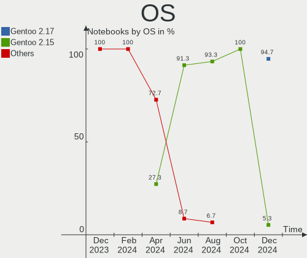

| Name        | Notebooks | Percent |
|-------------|-----------|---------|
| Gentoo 2.13 | 17        | 94.44%  |
| Gentoo 2.6  | 1         | 5.56%   |

OS Family
---------

OS without a version

| Name   | Notebooks | Percent |
|--------|-----------|---------|
| Gentoo | 18        | 100%    |

Kernel
------

Version of the Linux kernel

| Version                     | Notebooks | Percent |
|-----------------------------|-----------|---------|
| 6.1.31-gentoo-x86_64        | 3         | 16.67%  |
| 6.1.31-gentoo-dist          | 3         | 16.67%  |
| 6.3.8-gentoo-dist           | 2         | 11.11%  |
| 6.4.0-gentoo                | 1         | 5.56%   |
| 6.3.8-gentoo                | 1         | 5.56%   |
| 6.3.6-gentoo-dist           | 1         | 5.56%   |
| 6.3.5-ivybridge-xanmod1     | 1         | 5.56%   |
| 6.3.4-gentoo-r1             | 1         | 5.56%   |
| 6.2.8-gentoo                | 1         | 5.56%   |
| 6.1.31-gentoo-MAC_MIK.0     | 1         | 5.56%   |
| 6.1.31-gentoo-dist-hardened | 1         | 5.56%   |
| 6.1.31-gentoo               | 1         | 5.56%   |
| 5.15.36-gentoo-x86_64       | 1         | 5.56%   |

Kernel Family
-------------

Linux kernel without a distro release

| Version | Notebooks | Percent |
|---------|-----------|---------|
| 6.1.31  | 9         | 50%     |
| 6.3.8   | 3         | 16.67%  |
| 6.4.0   | 1         | 5.56%   |
| 6.3.6   | 1         | 5.56%   |
| 6.3.5   | 1         | 5.56%   |
| 6.3.4   | 1         | 5.56%   |
| 6.2.8   | 1         | 5.56%   |
| 5.15.36 | 1         | 5.56%   |

Kernel Major Ver.
-----------------

Linux kernel major version

| Version | Notebooks | Percent |
|---------|-----------|---------|
| 6.1     | 9         | 50%     |
| 6.3     | 6         | 33.33%  |
| 6.4     | 1         | 5.56%   |
| 6.2     | 1         | 5.56%   |
| 5.15    | 1         | 5.56%   |

Arch
----

OS architecture (x86_64, i586, etc.)

| Name   | Notebooks | Percent |
|--------|-----------|---------|
| x86_64 | 18        | 100%    |

DE
--

Desktop Environment

| Name    | Notebooks | Percent |
|---------|-----------|---------|
| Unknown | 8         | 44.44%  |
| KDE5    | 5         | 27.78%  |
| GNOME   | 3         | 16.67%  |
| XFCE    | 1         | 5.56%   |
| sway    | 1         | 5.56%   |

Display Server
--------------

X11 or Wayland

| Name    | Notebooks | Percent |
|---------|-----------|---------|
| Wayland | 8         | 44.44%  |
| X11     | 7         | 38.89%  |
| Unknown | 3         | 16.67%  |

Display Manager
---------------

SDDM, LightDM, etc.

| Name    | Notebooks | Percent |
|---------|-----------|---------|
| Unknown | 6         | 33.33%  |
| SDDM    | 5         | 27.78%  |
| GDM     | 3         | 16.67%  |
| LightDM | 2         | 11.11%  |
| GREETD  | 2         | 11.11%  |

OS Lang
-------

Language

| Lang    | Notebooks | Percent |
|---------|-----------|---------|
| en_US   | 7         | 38.89%  |
| Unknown | 3         | 16.67%  |
| ru_RU   | 2         | 11.11%  |
| en_GB   | 2         | 11.11%  |
| C.UTF8  | 2         | 11.11%  |
| pl_PL   | 1         | 5.56%   |
| fr_FR   | 1         | 5.56%   |

Boot Mode
---------

EFI or BIOS

| Mode | Notebooks | Percent |
|------|-----------|---------|
| EFI  | 12        | 66.67%  |
| BIOS | 6         | 33.33%  |

Filesystem
----------

Type of filesystem

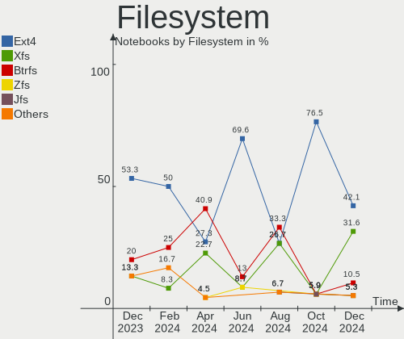

| Type  | Notebooks | Percent |
|-------|-----------|---------|
| Ext4  | 10        | 55.56%  |
| Btrfs | 7         | 38.89%  |
| F2fs  | 1         | 5.56%   |

Part. scheme
------------

Scheme of partitioning

| Type | Notebooks | Percent |
|------|-----------|---------|
| GPT  | 14        | 77.78%  |
| MBR  | 4         | 22.22%  |

Dual Boot with Linux/BSD
------------------------

Hosting more than one Linux/BSD

| Dual boot | Notebooks | Percent |
|-----------|-----------|---------|
| No        | 14        | 77.78%  |
| Yes       | 4         | 22.22%  |

Dual Boot (Win)
---------------

Hosting Linux and Windows

| Dual boot | Notebooks | Percent |
|-----------|-----------|---------|
| No        | 14        | 77.78%  |
| Yes       | 4         | 22.22%  |

Board
-----

Vendor
------

Motherboard manufacturer

| Name             | Notebooks | Percent |
|------------------|-----------|---------|
| Lenovo           | 5         | 27.78%  |
| Hewlett-Packard  | 4         | 22.22%  |
| ASUSTek Computer | 3         | 16.67%  |
| Dell             | 2         | 11.11%  |
| Panasonic        | 1         | 5.56%   |
| Google           | 1         | 5.56%   |
| Apple            | 1         | 5.56%   |
| Acer             | 1         | 5.56%   |

Model
-----

Motherboard model

| Name                                      | Notebooks | Percent |
|-------------------------------------------|-----------|---------|
| Panasonic CF-53ASCZGFG                    | 1         | 5.56%   |
| Lenovo Yoga 2 13 20344                    | 1         | 5.56%   |
| Lenovo ThinkPad X1 Extreme 2nd 20QVCTO1WW | 1         | 5.56%   |
| Lenovo ThinkPad P15 Gen 1 20SUS0S000      | 1         | 5.56%   |
| Lenovo ThinkPad P14s Gen 3 21J5001NUS     | 1         | 5.56%   |
| Lenovo Legion 5 15ACH6H 82JU              | 1         | 5.56%   |
| HP Victus by Laptop 16-e0xxx              | 1         | 5.56%   |
| HP Pavilion dv6                           | 1         | 5.56%   |
| HP ENVY m6                                | 1         | 5.56%   |
| HP EliteBook 8540w                        | 1         | 5.56%   |
| Google Nightfury                          | 1         | 5.56%   |
| Dell Precision 5530                       | 1         | 5.56%   |
| Dell Inspiron 16 5625                     | 1         | 5.56%   |
| ASUS X555LJ                               | 1         | 5.56%   |
| ASUS ROG G703GI_G7BI                      | 1         | 5.56%   |
| ASUS ASUS TUF Gaming F15 FX506HC_FX506HC  | 1         | 5.56%   |
| Apple MacBookPro11,1                      | 1         | 5.56%   |
| Acer Swift SF314-511                      | 1         | 5.56%   |

Model Family
------------

Motherboard model prefix

| Name                   | Notebooks | Percent |
|------------------------|-----------|---------|
| Lenovo ThinkPad        | 3         | 16.67%  |
| Panasonic CF-53ASCZGFG | 1         | 5.56%   |
| Lenovo Yoga            | 1         | 5.56%   |
| Lenovo Legion          | 1         | 5.56%   |
| HP Victus              | 1         | 5.56%   |
| HP Pavilion            | 1         | 5.56%   |
| HP ENVY                | 1         | 5.56%   |
| HP EliteBook           | 1         | 5.56%   |
| Google Nightfury       | 1         | 5.56%   |
| Dell Precision         | 1         | 5.56%   |
| Dell Inspiron          | 1         | 5.56%   |
| ASUS X555LJ            | 1         | 5.56%   |
| ASUS ROG               | 1         | 5.56%   |
| ASUS ASUS              | 1         | 5.56%   |
| Apple MacBookPro11     | 1         | 5.56%   |
| Acer Swift             | 1         | 5.56%   |

MFG Year
--------

Motherboard manufacture year

| Year | Notebooks | Percent |
|------|-----------|---------|
| 2021 | 6         | 33.33%  |
| 2014 | 2         | 11.11%  |
| 2023 | 1         | 5.56%   |
| 2022 | 1         | 5.56%   |
| 2020 | 1         | 5.56%   |
| 2019 | 1         | 5.56%   |
| 2018 | 1         | 5.56%   |
| 2015 | 1         | 5.56%   |
| 2012 | 1         | 5.56%   |
| 2011 | 1         | 5.56%   |
| 2010 | 1         | 5.56%   |
| 2008 | 1         | 5.56%   |

Form Factor
-----------

Physical design of the computer

| Name     | Notebooks | Percent |
|----------|-----------|---------|
| Notebook | 18        | 100%    |

Secure Boot
-----------

Enabled or disabled

| State    | Notebooks | Percent |
|----------|-----------|---------|
| Disabled | 18        | 100%    |

Coreboot
--------

Have coreboot on board

| Used | Notebooks | Percent |
|------|-----------|---------|
| No   | 17        | 94.44%  |
| Yes  | 1         | 5.56%   |

RAM Size
--------

Total RAM memory

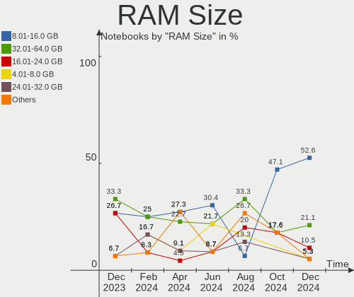

| Size in GB | Notebooks | Percent |
|------------|-----------|---------|
| 4.01-8.0   | 6         | 33.33%  |
| 32.01-64.0 | 4         | 22.22%  |
| 8.01-16.0  | 4         | 22.22%  |
| 3.01-4.0   | 2         | 11.11%  |
| 24.01-32.0 | 1         | 5.56%   |
| 16.01-24.0 | 1         | 5.56%   |

RAM Used
--------

Used RAM memory

| Used GB   | Notebooks | Percent |
|-----------|-----------|---------|
| 2.01-3.0  | 6         | 33.33%  |
| 0.51-1.0  | 4         | 22.22%  |
| 4.01-8.0  | 3         | 16.67%  |
| 3.01-4.0  | 3         | 16.67%  |
| 8.01-16.0 | 1         | 5.56%   |
| 0.01-0.5  | 1         | 5.56%   |

Total Drives
------------

Number of drives on board

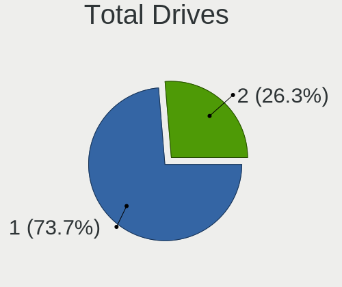

| Drives | Notebooks | Percent |
|--------|-----------|---------|
| 1      | 17        | 94.44%  |
| 3      | 1         | 5.56%   |

Has CD-ROM
----------

Has CD-ROM on board

| Presented | Notebooks | Percent |
|-----------|-----------|---------|
| No        | 14        | 77.78%  |
| Yes       | 4         | 22.22%  |

Has Ethernet
------------

Has Ethernet on board

| Presented | Notebooks | Percent |
|-----------|-----------|---------|
| Yes       | 12        | 66.67%  |
| No        | 6         | 33.33%  |

Has WiFi
--------

Has WiFi module

| Presented | Notebooks | Percent |
|-----------|-----------|---------|
| Yes       | 18        | 100%    |

Has Bluetooth
-------------

Has Bluetooth module

| Presented | Notebooks | Percent |
|-----------|-----------|---------|
| Yes       | 16        | 88.89%  |
| No        | 2         | 11.11%  |

Location
--------

Country
-------

Geographic location (country)

| Country   | Notebooks | Percent |
|-----------|-----------|---------|
| USA       | 5         | 27.78%  |
| Russia    | 3         | 16.67%  |
| France    | 2         | 11.11%  |
| UK        | 1         | 5.56%   |
| Portugal  | 1         | 5.56%   |
| Poland    | 1         | 5.56%   |
| Iran      | 1         | 5.56%   |
| Indonesia | 1         | 5.56%   |
| Finland   | 1         | 5.56%   |
| China     | 1         | 5.56%   |
| Belgium   | 1         | 5.56%   |

City
----

Geographic location (city)

| City          | Notebooks | Percent |
|---------------|-----------|---------|
| Wandsworth    | 1         | 5.56%   |
| Sun Prairie   | 1         | 5.56%   |
| St Petersburg | 1         | 5.56%   |
| Shenzhen      | 1         | 5.56%   |
| Seattle       | 1         | 5.56%   |
| Moscow        | 1         | 5.56%   |
| Madison       | 1         | 5.56%   |
| Lisbon        | 1         | 5.56%   |
| Kazan'        | 1         | 5.56%   |
| Jakarta       | 1         | 5.56%   |
| Isfahan       | 1         | 5.56%   |
| Huntsville    | 1         | 5.56%   |
| Helsinki      | 1         | 5.56%   |
| Étampes      | 1         | 5.56%   |
| Columbus      | 1         | 5.56%   |
| Chorzów      | 1         | 5.56%   |
| Bruges        | 1         | 5.56%   |
| Angres        | 1         | 5.56%   |

Drives
------

Drive Vendor
------------

Hard drive vendors

| Vendor                      | Notebooks | Drives | Percent |
|-----------------------------|-----------|--------|---------|
| Samsung Electronics         | 6         | 6      | 31.58%  |
| Sandisk                     | 2         | 2      | 10.53%  |
| Unknown                     | 1         | 1      | 5.26%   |
| Teleplan                    | 1         | 1      | 5.26%   |
| SK hynix                    | 1         | 1      | 5.26%   |
| Seagate                     | 1         | 1      | 5.26%   |
| OCZ                         | 1         | 1      | 5.26%   |
| Micron/Crucial Technology   | 1         | 1      | 5.26%   |
| KIOXIA                      | 1         | 1      | 5.26%   |
| Kingston Technology Company | 1         | 1      | 5.26%   |
| Kingston                    | 1         | 1      | 5.26%   |
| Intel                       | 1         | 2      | 5.26%   |
| GOODRAM                     | 1         | 1      | 5.26%   |

Drive Model
-----------

Hard drive models

| Model                                               | Notebooks | Percent |
|-----------------------------------------------------|-----------|---------|
| Samsung NVMe SSD Controller SM981/PM981/PM983 250GB | 3         | 15.79%  |
| Unknown MMC Card  128GB                             | 1         | 5.26%   |
| Teleplan TP1000G 1TB                                | 1         | 5.26%   |
| SK hynix PC711 HFS512GDE9X073N 512GB                | 1         | 5.26%   |
| Seagate ST2000LX001-1RG174 2TB                      | 1         | 5.26%   |
| Sandisk WD PC SN735 SDBPNHH-512G-1002 512GB         | 1         | 5.26%   |
| Sandisk WD Black SN750 / PC SN730 NVMe SSD 500GB    | 1         | 5.26%   |
| Samsung SSD 850 EVO 250GB                           | 1         | 5.26%   |
| Samsung SSD 840 EVO 250GB                           | 1         | 5.26%   |
| Samsung NVMe SSD Controller PM9A1/PM9A3/980PRO 2TB  | 1         | 5.26%   |
| OCZ AGILITY3 64GB SSD                               | 1         | 5.26%   |
| Micron/Crucial P1 NVMe PCIe SSD 1TB                 | 1         | 5.26%   |
| KIOXIA KBG50ZNS1T02 NVMe 1024GB                     | 1         | 5.26%   |
| Kingston Company OM3PDP3 NVMe SSD 256GB             | 1         | 5.26%   |
| Kingston SA400S37120G 120GB SSD                     | 1         | 5.26%   |
| Intel SSD Pro 7600p/760p/E 6100p Series 512GB       | 1         | 5.26%   |
| GOODRAM IRP-SSDPR-S25C-01T                          | 1         | 5.26%   |

HDD Vendor
----------

Hard disk drive vendors

| Vendor   | Notebooks | Drives | Percent |
|----------|-----------|--------|---------|
| Teleplan | 1         | 1      | 50%     |
| Seagate  | 1         | 1      | 50%     |

SSD Vendor
----------

Solid state drive vendors

| Vendor              | Notebooks | Drives | Percent |
|---------------------|-----------|--------|---------|
| Samsung Electronics | 2         | 2      | 40%     |
| OCZ                 | 1         | 1      | 20%     |
| Kingston            | 1         | 1      | 20%     |
| GOODRAM             | 1         | 1      | 20%     |

Drive Kind
----------

HDD or SSD

| Kind | Notebooks | Drives | Percent |
|------|-----------|--------|---------|
| NVMe | 11        | 12     | 57.89%  |
| SSD  | 5         | 5      | 26.32%  |
| HDD  | 2         | 2      | 10.53%  |
| MMC  | 1         | 1      | 5.26%   |

Drive Connector
---------------

SATA, SAS, NVMe, etc.

| Type | Notebooks | Drives | Percent |
|------|-----------|--------|---------|
| NVMe | 11        | 12     | 57.89%  |
| SATA | 7         | 7      | 36.84%  |
| MMC  | 1         | 1      | 5.26%   |

Drive Size
----------

Size of hard drive

| Size in TB | Notebooks | Drives | Percent |
|------------|-----------|--------|---------|
| 0.01-0.5   | 4         | 4      | 57.14%  |
| 0.51-1.0   | 2         | 2      | 28.57%  |
| 1.01-2.0   | 1         | 1      | 14.29%  |

Space Total
-----------

Amount of disk space available on the file system

| Size in GB     | Notebooks | Percent |
|----------------|-----------|---------|
| 501-1000       | 6         | 33.33%  |
| 101-250        | 5         | 27.78%  |
| 251-500        | 3         | 16.67%  |
| More than 3000 | 1         | 5.56%   |
| 21-50          | 1         | 5.56%   |
| 2001-3000      | 1         | 5.56%   |
| 51-100         | 1         | 5.56%   |

Space Used
----------

Amount of used disk space

| Used GB        | Notebooks | Percent |
|----------------|-----------|---------|
| 21-50          | 5         | 27.78%  |
| 1-20           | 5         | 27.78%  |
| 101-250        | 3         | 16.67%  |
| 251-500        | 2         | 11.11%  |
| More than 3000 | 1         | 5.56%   |
| 501-1000       | 1         | 5.56%   |
| 51-100         | 1         | 5.56%   |

Malfunc. Drives
---------------

Drive models with a malfunction

| Model                                | Notebooks | Drives | Percent |
|--------------------------------------|-----------|--------|---------|
| SK hynix PC711 HFS512GDE9X073N 512GB | 1         | 1      | 100%    |

Malfunc. Drive Vendor
---------------------

Vendors of faulty drives

| Vendor   | Notebooks | Drives | Percent |
|----------|-----------|--------|---------|
| SK hynix | 1         | 1      | 100%    |

Malfunc. HDD Vendor
-------------------

Vendors of faulty HDD drives

Zero info for selected period =(

Malfunc. Drive Kind
-------------------

Kinds of faulty drives

| Kind | Notebooks | Drives | Percent |
|------|-----------|--------|---------|
| NVMe | 1         | 1      | 100%    |

Failed Drives
-------------

Failed drive models

Zero info for selected period =(

Failed Drive Vendor
-------------------

Failed drive vendors

Zero info for selected period =(

Drive Status
------------

Number of failed and malfunc. drives

| Status   | Notebooks | Drives | Percent |
|----------|-----------|--------|---------|
| Works    | 16        | 18     | 88.89%  |
| Detected | 1         | 1      | 5.56%   |
| Malfunc  | 1         | 1      | 5.56%   |

Storage controller
------------------

Storage Vendor
--------------

Storage controller vendors

| Vendor                      | Notebooks | Percent |
|-----------------------------|-----------|---------|
| Intel                       | 11        | 47.83%  |
| Samsung Electronics         | 4         | 17.39%  |
| SanDisk                     | 2         | 8.7%    |
| AMD                         | 2         | 8.7%    |
| SK hynix                    | 1         | 4.35%   |
| Micron/Crucial Technology   | 1         | 4.35%   |
| KIOXIA                      | 1         | 4.35%   |
| Kingston Technology Company | 1         | 4.35%   |

Storage Model
-------------

Storage controller models

| Model                                                                        | Notebooks | Percent |
|------------------------------------------------------------------------------|-----------|---------|
| Samsung NVMe SSD Controller SM981/PM981/PM983                                | 3         | 12.5%   |
| Intel Volume Management Device NVMe RAID Controller                          | 2         | 8.33%   |
| Intel 82801 Mobile SATA Controller [RAID mode]                               | 2         | 8.33%   |
| Intel 6 Series/C200 Series Chipset Family 6 port Mobile SATA AHCI Controller | 2         | 8.33%   |
| AMD FCH SATA Controller [AHCI mode]                                          | 2         | 8.33%   |
| SK hynix Gold P31/BC711/PC711 NVMe Solid State Drive                         | 1         | 4.17%   |
| SanDisk WD Black SN750 / PC SN730 NVMe SSD                                   | 1         | 4.17%   |
| SanDisk Non-Volatile memory controller                                       | 1         | 4.17%   |
| Samsung NVMe SSD Controller PM9A1/PM9A3/980PRO                               | 1         | 4.17%   |
| Micron/Crucial P1 NVMe PCIe SSD                                              | 1         | 4.17%   |
| KIOXIA Non-Volatile memory controller                                        | 1         | 4.17%   |
| Kingston Company OM3PDP3 NVMe SSD                                            | 1         | 4.17%   |
| Intel Wildcat Point-LP SATA Controller [AHCI Mode]                           | 1         | 4.17%   |
| Intel SSD Pro 7600p/760p/E 6100p Series                                      | 1         | 4.17%   |
| Intel Comet Lake SATA AHCI Controller                                        | 1         | 4.17%   |
| Intel Cannon Lake Mobile PCH SATA AHCI Controller                            | 1         | 4.17%   |
| Intel 8 Series SATA Controller 1 [AHCI mode]                                 | 1         | 4.17%   |
| Intel 5 Series/3400 Series Chipset 6 port SATA AHCI Controller               | 1         | 4.17%   |

Storage Kind
------------

Kind of storage controller (IDE, SATA, NVMe, SAS, ...)

| Kind | Notebooks | Percent |
|------|-----------|---------|
| NVMe | 11        | 45.83%  |
| SATA | 9         | 37.5%   |
| RAID | 4         | 16.67%  |

Processor
---------

CPU Vendor
----------

Processor vendors

| Vendor | Notebooks | Percent |
|--------|-----------|---------|
| Intel  | 14        | 77.78%  |
| AMD    | 4         | 22.22%  |

CPU Model
---------

Processor models

| Model                                      | Notebooks | Percent |
|--------------------------------------------|-----------|---------|
| Intel Core i9-8950HK CPU @ 2.90GHz         | 1         | 5.56%   |
| Intel Core i7-9750H CPU @ 2.60GHz          | 1         | 5.56%   |
| Intel Core i7-8850H CPU @ 2.60GHz          | 1         | 5.56%   |
| Intel Core i7-5500U CPU @ 2.40GHz          | 1         | 5.56%   |
| Intel Core i7-10850H CPU @ 2.70GHz         | 1         | 5.56%   |
| Intel Core i7 CPU M 620 @ 2.67GHz          | 1         | 5.56%   |
| Intel Core i5-4258U CPU @ 2.40GHz          | 1         | 5.56%   |
| Intel Core i5-4200U CPU @ 1.60GHz          | 1         | 5.56%   |
| Intel Core i5-3230M CPU @ 2.60GHz          | 1         | 5.56%   |
| Intel Core i5-2520M CPU @ 2.50GHz          | 1         | 5.56%   |
| Intel Core i5-2430M CPU @ 2.40GHz          | 1         | 5.56%   |
| Intel Core i3-10110U CPU @ 2.10GHz         | 1         | 5.56%   |
| Intel 11th Gen Core i5-11400H @ 2.70GHz    | 1         | 5.56%   |
| Intel 11th Gen Core i3-1115G4 @ 3.00GHz    | 1         | 5.56%   |
| AMD Ryzen 7 PRO 6850U with Radeon Graphics | 1         | 5.56%   |
| AMD Ryzen 7 5825U with Radeon Graphics     | 1         | 5.56%   |
| AMD Ryzen 7 5800H with Radeon Graphics     | 1         | 5.56%   |
| AMD Ryzen 5 5600H with Radeon Graphics     | 1         | 5.56%   |

CPU Model Family
----------------

Processor model prefix

| Model           | Notebooks | Percent |
|-----------------|-----------|---------|
| Intel Core i7   | 5         | 27.78%  |
| Intel Core i5   | 5         | 27.78%  |
| Other           | 2         | 11.11%  |
| AMD Ryzen 7     | 2         | 11.11%  |
| Intel Core i9   | 1         | 5.56%   |
| Intel Core i3   | 1         | 5.56%   |
| AMD Ryzen 7 PRO | 1         | 5.56%   |
| AMD Ryzen 5     | 1         | 5.56%   |

CPU Cores
---------

Number of processor cores

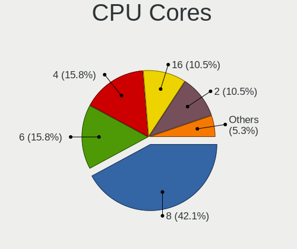

| Number | Notebooks | Percent |
|--------|-----------|---------|
| 2      | 9         | 50%     |
| 6      | 6         | 33.33%  |
| 8      | 3         | 16.67%  |

CPU Sockets
-----------

Number of sockets

| Number | Notebooks | Percent |
|--------|-----------|---------|
| 1      | 18        | 100%    |

CPU Threads
-----------

Threads per core (Hyper-Threading)

| Number | Notebooks | Percent |
|--------|-----------|---------|
| 2      | 18        | 100%    |

CPU Op-Modes
------------

CPU Operation Modes (32-bit, 64-bit)

| Op mode        | Notebooks | Percent |
|----------------|-----------|---------|
| 32-bit, 64-bit | 18        | 100%    |

CPU Microcode
-------------

Microcode number

| Number     | Notebooks | Percent |
|------------|-----------|---------|
| Unknown    | 5         | 27.78%  |
| 0x906ea    | 2         | 11.11%  |
| 0x40651    | 2         | 11.11%  |
| 0xa0652    | 1         | 5.56%   |
| 0x806ec    | 1         | 5.56%   |
| 0x806d1    | 1         | 5.56%   |
| 0x806c1    | 1         | 5.56%   |
| 0x206a7    | 1         | 5.56%   |
| 0x20655    | 1         | 5.56%   |
| 0x0a50000d | 1         | 5.56%   |
| 0x0a50000c | 1         | 5.56%   |
| 0x0a404102 | 1         | 5.56%   |

CPU Microarch
-------------

Microarchitecture

| Name        | Notebooks | Percent |
|-------------|-----------|---------|
| KabyLake    | 4         | 22.22%  |
| Zen 3       | 3         | 16.67%  |
| SandyBridge | 2         | 11.11%  |
| Haswell     | 2         | 11.11%  |
| Westmere    | 1         | 5.56%   |
| TigerLake   | 1         | 5.56%   |
| IvyBridge   | 1         | 5.56%   |
| Icelake     | 1         | 5.56%   |
| CometLake   | 1         | 5.56%   |
| Broadwell   | 1         | 5.56%   |
| Unknown     | 1         | 5.56%   |

Graphics
--------

GPU Vendor
----------

Vendors of graphics cards

| Vendor | Notebooks | Percent |
|--------|-----------|---------|
| Intel  | 11        | 45.83%  |
| Nvidia | 7         | 29.17%  |
| AMD    | 6         | 25%     |

GPU Model
---------

Graphics card models

| Model                                                                     | Notebooks | Percent |
|---------------------------------------------------------------------------|-----------|---------|
| Intel Haswell-ULT Integrated Graphics Controller                          | 2         | 8%      |
| Intel 2nd Generation Core Processor Family Integrated Graphics Controller | 2         | 8%      |
| AMD Cezanne [Radeon Vega Series / Radeon Vega Mobile Series]              | 2         | 8%      |
| Nvidia TU117M [GeForce GTX 1650 Mobile / Max-Q]                           | 1         | 4%      |
| Nvidia TU117GLM [Quadro T2000 Mobile / Max-Q]                             | 1         | 4%      |
| Nvidia GT216GLM [Quadro FX 880M]                                          | 1         | 4%      |
| Nvidia GP107GLM [Quadro P2000 Mobile]                                     | 1         | 4%      |
| Nvidia GP104BM [GeForce GTX 1080 Mobile]                                  | 1         | 4%      |
| Nvidia GK208BM [GeForce 920M]                                             | 1         | 4%      |
| Nvidia GA107M [GeForce RTX 3050 Mobile]                                   | 1         | 4%      |
| Intel TigerLake-H GT1 [UHD Graphics]                                      | 1         | 4%      |
| Intel Tiger Lake-LP GT2 [UHD Graphics G4]                                 | 1         | 4%      |
| Intel HD Graphics 5500                                                    | 1         | 4%      |
| Intel CometLake-U GT2 [UHD Graphics]                                      | 1         | 4%      |
| Intel CometLake-H GT2 [UHD Graphics]                                      | 1         | 4%      |
| Intel CoffeeLake-H GT2 [UHD Graphics 630]                                 | 1         | 4%      |
| Intel 3rd Gen Core processor Graphics Controller                          | 1         | 4%      |
| AMD Whistler [Radeon HD 6730M/6770M/7690M XT]                             | 1         | 4%      |
| AMD Thames [Radeon HD 7500M/7600M Series]                                 | 1         | 4%      |
| AMD Rembrandt [Radeon 680M]                                               | 1         | 4%      |
| AMD Navi 14 [Radeon RX 5500/5500M / Pro 5500M]                            | 1         | 4%      |
| AMD Barcelo                                                               | 1         | 4%      |

GPU Combo
---------

Combinations of graphics cards

| Name           | Notebooks | Percent |
|----------------|-----------|---------|
| 1 x Intel      | 5         | 27.78%  |
| Intel + Nvidia | 4         | 22.22%  |
| 1 x Nvidia     | 3         | 16.67%  |
| 1 x AMD        | 3         | 16.67%  |
| Intel + AMD    | 2         | 11.11%  |
| 2 x AMD        | 1         | 5.56%   |

GPU Driver
----------

Free vs proprietary

| Driver      | Notebooks | Percent |
|-------------|-----------|---------|
| Free        | 15        | 83.33%  |
| Proprietary | 3         | 16.67%  |

GPU Memory
----------

Total video memory

| Size in GB | Notebooks | Percent |
|------------|-----------|---------|
| Unknown    | 11        | 61.11%  |
| 3.01-4.0   | 3         | 16.67%  |
| 7.01-8.0   | 1         | 5.56%   |
| 1.01-2.0   | 1         | 5.56%   |
| 0.51-1.0   | 1         | 5.56%   |
| 0.01-0.5   | 1         | 5.56%   |

Monitor
-------

Monitor Vendor
--------------

Monitor vendors

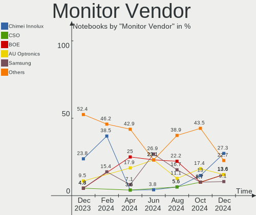

| Vendor                  | Notebooks | Percent |
|-------------------------|-----------|---------|
| Chimei Innolux          | 6         | 28.57%  |
| AU Optronics            | 5         | 23.81%  |
| Dell                    | 2         | 9.52%   |
| Sharp                   | 1         | 4.76%   |
| LG Display              | 1         | 4.76%   |
| Goldstar                | 1         | 4.76%   |
| CSO                     | 1         | 4.76%   |
| Chi Mei Optoelectronics | 1         | 4.76%   |
| BOE                     | 1         | 4.76%   |
| ASUSTek Computer        | 1         | 4.76%   |
| Apple                   | 1         | 4.76%   |

Monitor Model
-------------

Monitor models

| Model                                                                    | Notebooks | Percent |
|--------------------------------------------------------------------------|-----------|---------|
| Sharp LCD Monitor SHP148D 3840x2160 344x194mm 15.5-inch                  | 1         | 4.76%   |
| LG Display LCD Monitor LGD0259 1920x1080 345x194mm 15.6-inch             | 1         | 4.76%   |
| Goldstar E1942 GSM4C09 1366x768 410x230mm 18.5-inch                      | 1         | 4.76%   |
| Dell S2415H DELA0B5 1920x1080 527x296mm 23.8-inch                        | 1         | 4.76%   |
| Dell P2721Q DELF125 3840x2160 597x336mm 27.0-inch                        | 1         | 4.76%   |
| CSO LCD Monitor CSO1304 1920x1080 293x165mm 13.2-inch                    | 1         | 4.76%   |
| Chimei Innolux LCD Monitor CMN1613 1920x1200 344x215mm 16.0-inch         | 1         | 4.76%   |
| Chimei Innolux LCD Monitor CMN1606 1920x1080 355x199mm 16.0-inch         | 1         | 4.76%   |
| Chimei Innolux LCD Monitor CMN15B6 1366x768 344x193mm 15.5-inch          | 1         | 4.76%   |
| Chimei Innolux LCD Monitor CMN15AB 1366x768 344x193mm 15.5-inch          | 1         | 4.76%   |
| Chimei Innolux LCD Monitor CMN1521 1920x1080 344x193mm 15.5-inch         | 1         | 4.76%   |
| Chimei Innolux LCD Monitor CMN1520 1920x1080 344x193mm 15.5-inch         | 1         | 4.76%   |
| Chi Mei Optoelectronics LCD Monitor CMO15A2 1366x768 344x193mm 15.5-inch | 1         | 4.76%   |
| BOE LCD Monitor BOE0853 1920x1080 340x190mm 15.3-inch                    | 1         | 4.76%   |
| AU Optronics LCD Monitor AUOE3A0 3840x2400 301x188mm 14.0-inch           | 1         | 4.76%   |
| AU Optronics LCD Monitor AUOB69B 1920x1080 344x193mm 15.5-inch           | 1         | 4.76%   |
| AU Optronics LCD Monitor AUO403D 1920x1080 309x174mm 14.0-inch           | 1         | 4.76%   |
| AU Optronics LCD Monitor AUO329D 1920x1080 382x214mm 17.2-inch           | 1         | 4.76%   |
| AU Optronics LCD Monitor AUO202D 1920x1080 293x165mm 13.2-inch           | 1         | 4.76%   |
| ASUSTek Computer VG27A AUS2722 2560x1440 597x336mm 27.0-inch             | 1         | 4.76%   |
| Apple Color LCD APPA020 2560x1600 286x179mm 13.3-inch                    | 1         | 4.76%   |

Monitor Resolution
------------------

Monitor screen resolution

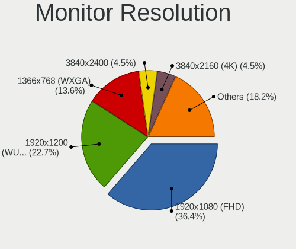

| Resolution        | Notebooks | Percent |
|-------------------|-----------|---------|
| 1920x1080 (FHD)   | 11        | 55%     |
| 1366x768 (WXGA)   | 3         | 15%     |
| 3840x2160 (4K)    | 2         | 10%     |
| 3840x2400         | 1         | 5%      |
| 2560x1600         | 1         | 5%      |
| 2560x1440 (QHD)   | 1         | 5%      |
| 1920x1200 (WUXGA) | 1         | 5%      |

Monitor Diagonal
----------------

Diagonal size in inches

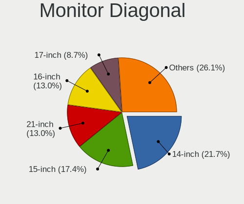

| Inches | Notebooks | Percent |
|--------|-----------|---------|
| 15     | 9         | 42.86%  |
| 13     | 3         | 14.29%  |
| 27     | 2         | 9.52%   |
| 16     | 2         | 9.52%   |
| 14     | 2         | 9.52%   |
| 24     | 1         | 4.76%   |
| 18     | 1         | 4.76%   |
| 17     | 1         | 4.76%   |

Monitor Width
-------------

Physical width

| Width in mm | Notebooks | Percent |
|-------------|-----------|---------|
| 301-350     | 12        | 60%     |
| 201-300     | 3         | 15%     |
| 501-600     | 2         | 10%     |
| 351-400     | 2         | 10%     |
| 401-500     | 1         | 5%      |

Aspect Ratio
------------

Proportional relationship between the width and the height

| Ratio | Notebooks | Percent |
|-------|-----------|---------|
| 16/9  | 15        | 83.33%  |
| 16/10 | 3         | 16.67%  |

Monitor Area
------------

Area in inch²

| Area in inch² | Notebooks | Percent |
|----------------|-----------|---------|
| 101-110        | 9         | 42.86%  |
| 71-80          | 3         | 14.29%  |
| 81-90          | 2         | 9.52%   |
| 301-350        | 2         | 9.52%   |
| 201-250        | 1         | 4.76%   |
| 141-150        | 1         | 4.76%   |
| 121-130        | 1         | 4.76%   |
| 111-120        | 1         | 4.76%   |
| 91-100         | 1         | 4.76%   |

Pixel Density
-------------

Pixels per inch

| Density       | Notebooks | Percent |
|---------------|-----------|---------|
| 121-160       | 9         | 45%     |
| 161-240       | 4         | 20%     |
| 51-100        | 3         | 15%     |
| More than 240 | 2         | 10%     |
| 101-120       | 2         | 10%     |

Multiple Monitors
-----------------

Total monitors connected

| Total | Notebooks | Percent |
|-------|-----------|---------|
| 1     | 16        | 88.89%  |
| 3     | 1         | 5.56%   |
| 2     | 1         | 5.56%   |

Network
-------

Net Controller Vendor
---------------------

Controller vendors

| Vendor                | Notebooks | Percent |
|-----------------------|-----------|---------|
| Realtek Semiconductor | 9         | 33.33%  |
| Intel                 | 9         | 33.33%  |
| MediaTek              | 2         | 7.41%   |
| TP-Link               | 1         | 3.7%    |
| Samsung Electronics   | 1         | 3.7%    |
| Qualcomm Atheros      | 1         | 3.7%    |
| Qualcomm              | 1         | 3.7%    |
| ICS Advent            | 1         | 3.7%    |
| Broadcom Limited      | 1         | 3.7%    |
| Broadcom              | 1         | 3.7%    |

Net Controller Model
--------------------

Controller models

| Model                                                             | Notebooks | Percent |
|-------------------------------------------------------------------|-----------|---------|
| Realtek RTL8111/8168/8411 PCI Express Gigabit Ethernet Controller | 8         | 25%     |
| Realtek RTL8852AE 802.11ax PCIe Wireless Network Adapter          | 2         | 6.25%   |
| MediaTek MT7921 802.11ax PCI Express Wireless Network Adapter     | 2         | 6.25%   |
| TP-Link Archer T2U PLUS [RTL8821AU]                               | 1         | 3.13%   |
| Samsung Galaxy series, misc. (tethering mode)                     | 1         | 3.13%   |
| Realtek RTL8723BE PCIe Wireless Network Adapter                   | 1         | 3.13%   |
| Qualcomm QCNFA765 Wireless Network Adapter                        | 1         | 3.13%   |
| Qualcomm Atheros AR9485 Wireless Network Adapter                  | 1         | 3.13%   |
| Intel Wireless-AC 9260                                            | 1         | 3.13%   |
| Intel Wi-Fi 6 AX201                                               | 1         | 3.13%   |
| Intel Wi-Fi 6 AX200                                               | 1         | 3.13%   |
| Intel Ethernet Connection (11) I219-LM                            | 1         | 3.13%   |
| Intel Comet Lake PCH-LP CNVi WiFi                                 | 1         | 3.13%   |
| Intel Comet Lake PCH CNVi WiFi                                    | 1         | 3.13%   |
| Intel Centrino Wireless-N 2230                                    | 1         | 3.13%   |
| Intel Centrino Ultimate-N 6300                                    | 1         | 3.13%   |
| Intel Centrino Advanced-N 6205 [Taylor Peak]                      | 1         | 3.13%   |
| Intel Cannon Lake PCH CNVi WiFi                                   | 1         | 3.13%   |
| Intel 82579LM Gigabit Network Connection (Lewisville)             | 1         | 3.13%   |
| Intel 82577LM Gigabit Network Connection                          | 1         | 3.13%   |
| ICS Advent 10/100M LAN                                            | 1         | 3.13%   |
| Broadcom Limited BCM4360 802.11ac Wireless Network Adapter        | 1         | 3.13%   |
| Broadcom BCM4313 802.11bgn Wireless Network Adapter               | 1         | 3.13%   |

Wireless Vendor
---------------

Wireless vendors

| Vendor                | Notebooks | Percent |
|-----------------------|-----------|---------|
| Intel                 | 9         | 47.37%  |
| Realtek Semiconductor | 3         | 15.79%  |
| MediaTek              | 2         | 10.53%  |
| TP-Link               | 1         | 5.26%   |
| Qualcomm Atheros      | 1         | 5.26%   |
| Qualcomm              | 1         | 5.26%   |
| Broadcom Limited      | 1         | 5.26%   |
| Broadcom              | 1         | 5.26%   |

Wireless Model
--------------

Wireless models

| Model                                                         | Notebooks | Percent |
|---------------------------------------------------------------|-----------|---------|
| Realtek RTL8852AE 802.11ax PCIe Wireless Network Adapter      | 2         | 10.53%  |
| MediaTek MT7921 802.11ax PCI Express Wireless Network Adapter | 2         | 10.53%  |
| TP-Link Archer T2U PLUS [RTL8821AU]                           | 1         | 5.26%   |
| Realtek RTL8723BE PCIe Wireless Network Adapter               | 1         | 5.26%   |
| Qualcomm QCNFA765 Wireless Network Adapter                    | 1         | 5.26%   |
| Qualcomm Atheros AR9485 Wireless Network Adapter              | 1         | 5.26%   |
| Intel Wireless-AC 9260                                        | 1         | 5.26%   |
| Intel Wi-Fi 6 AX201                                           | 1         | 5.26%   |
| Intel Wi-Fi 6 AX200                                           | 1         | 5.26%   |
| Intel Comet Lake PCH-LP CNVi WiFi                             | 1         | 5.26%   |
| Intel Comet Lake PCH CNVi WiFi                                | 1         | 5.26%   |
| Intel Centrino Wireless-N 2230                                | 1         | 5.26%   |
| Intel Centrino Ultimate-N 6300                                | 1         | 5.26%   |
| Intel Centrino Advanced-N 6205 [Taylor Peak]                  | 1         | 5.26%   |
| Intel Cannon Lake PCH CNVi WiFi                               | 1         | 5.26%   |
| Broadcom Limited BCM4360 802.11ac Wireless Network Adapter    | 1         | 5.26%   |
| Broadcom BCM4313 802.11bgn Wireless Network Adapter           | 1         | 5.26%   |

Ethernet Vendor
---------------

Ethernet vendors

| Vendor                | Notebooks | Percent |
|-----------------------|-----------|---------|
| Realtek Semiconductor | 8         | 61.54%  |
| Intel                 | 3         | 23.08%  |
| Samsung Electronics   | 1         | 7.69%   |
| ICS Advent            | 1         | 7.69%   |

Ethernet Model
--------------

Ethernet models

| Model                                                             | Notebooks | Percent |
|-------------------------------------------------------------------|-----------|---------|
| Realtek RTL8111/8168/8411 PCI Express Gigabit Ethernet Controller | 8         | 61.54%  |
| Samsung Galaxy series, misc. (tethering mode)                     | 1         | 7.69%   |
| Intel Ethernet Connection (11) I219-LM                            | 1         | 7.69%   |
| Intel 82579LM Gigabit Network Connection (Lewisville)             | 1         | 7.69%   |
| Intel 82577LM Gigabit Network Connection                          | 1         | 7.69%   |
| ICS Advent 10/100M LAN                                            | 1         | 7.69%   |

Net Controller Kind
-------------------

Ethernet, WiFi or modem

| Kind     | Notebooks | Percent |
|----------|-----------|---------|
| WiFi     | 18        | 60%     |
| Ethernet | 12        | 40%     |

Used Controller
---------------

Currently used network controller

| Kind     | Notebooks | Percent |
|----------|-----------|---------|
| WiFi     | 14        | 77.78%  |
| Ethernet | 4         | 22.22%  |

NICs
----

Total network controllers on board

| Total | Notebooks | Percent |
|-------|-----------|---------|
| 2     | 11        | 61.11%  |
| 1     | 7         | 38.89%  |

IPv6
----

IPv6 vs IPv4

| Used | Notebooks | Percent |
|------|-----------|---------|
| No   | 12        | 66.67%  |
| Yes  | 6         | 33.33%  |

Bluetooth
---------

Bluetooth Vendor
----------------

Controller vendors

| Vendor                | Notebooks | Percent |
|-----------------------|-----------|---------|
| Intel                 | 7         | 43.75%  |
| Realtek Semiconductor | 3         | 18.75%  |
| USI                   | 1         | 6.25%   |
| IMC Networks          | 1         | 6.25%   |
| Foxconn / Hon Hai     | 1         | 6.25%   |
| Broadcom              | 1         | 6.25%   |
| Apple                 | 1         | 6.25%   |
| Alps Electric         | 1         | 6.25%   |

Bluetooth Model
---------------

Controller models

| Model                                          | Notebooks | Percent |
|------------------------------------------------|-----------|---------|
| Intel AX201 Bluetooth                          | 3         | 18.75%  |
| Realtek Bluetooth Radio                        | 2         | 12.5%   |
| USI Bluetooth Device                           | 1         | 6.25%   |
| Realtek RTL8723B Bluetooth                     | 1         | 6.25%   |
| Intel Wireless-AC 9260 Bluetooth Adapter       | 1         | 6.25%   |
| Intel Centrino Bluetooth Wireless Transceiver  | 1         | 6.25%   |
| Intel Bluetooth 9460/9560 Jefferson Peak (JfP) | 1         | 6.25%   |
| Intel AX200 Bluetooth                          | 1         | 6.25%   |
| IMC Networks Wireless_Device                   | 1         | 6.25%   |
| Foxconn / Hon Hai MediaTek MT7921 Bluetooth    | 1         | 6.25%   |
| Broadcom BCM2070 Bluetooth 2.1 + EDR           | 1         | 6.25%   |
| Apple Bluetooth Host Controller                | 1         | 6.25%   |
| Alps Electric UGTZ4 Bluetooth                  | 1         | 6.25%   |

Sound
-----

Sound Vendor
------------

Sound card vendors

| Vendor    | Notebooks | Percent |
|-----------|-----------|---------|
| Intel     | 14        | 56%     |
| Nvidia    | 6         | 24%     |
| AMD       | 4         | 16%     |
| Razer USA | 1         | 4%      |

Sound Model
-----------

Sound card models

| Model                                                                      | Notebooks | Percent |
|----------------------------------------------------------------------------|-----------|---------|
| AMD Family 17h/19h HD Audio Controller                                     | 4         | 12.5%   |
| Intel Cannon Lake PCH cAVS                                                 | 3         | 9.38%   |
| Nvidia TU107 GeForce GTX 1650 High Definition Audio Controller             | 2         | 6.25%   |
| Intel Haswell-ULT HD Audio Controller                                      | 2         | 6.25%   |
| Intel 8 Series HD Audio Controller                                         | 2         | 6.25%   |
| Intel 6 Series/C200 Series Chipset Family High Definition Audio Controller | 2         | 6.25%   |
| AMD Renoir Radeon High Definition Audio Controller                         | 2         | 6.25%   |
| Razer USA Razer Kraken X USB                                               | 1         | 3.13%   |
| Nvidia GT216 HDMI Audio Controller                                         | 1         | 3.13%   |
| Nvidia GP104 High Definition Audio Controller                              | 1         | 3.13%   |
| Nvidia GK208 HDMI/DP Audio Controller                                      | 1         | 3.13%   |
| Nvidia Audio device                                                        | 1         | 3.13%   |
| Intel Wildcat Point-LP High Definition Audio Controller                    | 1         | 3.13%   |
| Intel Tiger Lake-LP Smart Sound Technology Audio Controller                | 1         | 3.13%   |
| Intel Tiger Lake-H HD Audio Controller                                     | 1         | 3.13%   |
| Intel Comet Lake PCH-LP cAVS                                               | 1         | 3.13%   |
| Intel Comet Lake PCH cAVS                                                  | 1         | 3.13%   |
| Intel Broadwell-U Audio Controller                                         | 1         | 3.13%   |
| Intel 7 Series/C216 Chipset Family High Definition Audio Controller        | 1         | 3.13%   |
| Intel 5 Series/3400 Series Chipset High Definition Audio                   | 1         | 3.13%   |
| AMD Rembrandt Radeon High Definition Audio Controller                      | 1         | 3.13%   |
| AMD Navi 10 HDMI Audio                                                     | 1         | 3.13%   |

Memory
------

Memory Vendor
-------------

Memory module vendors

| Vendor              | Notebooks | Percent |
|---------------------|-----------|---------|
| Samsung Electronics | 9         | 45%     |
| SK hynix            | 5         | 25%     |
| Micron Technology   | 2         | 10%     |
| Unknown             | 1         | 5%      |
| Nanya Technology    | 1         | 5%      |
| Elpida              | 1         | 5%      |
| Crucial             | 1         | 5%      |

Memory Model
------------

Memory module models

| Model                                                      | Notebooks | Percent |
|------------------------------------------------------------|-----------|---------|
| Unknown RAM Module 8GB SODIMM DDR3 1600MT/s                | 1         | 5%      |
| SK hynix RAM Module 4GB SODIMM DDR3 1600MT/s               | 1         | 5%      |
| SK hynix RAM HMT351S6BFR8C-H9 4GB SODIMM DDR3 1333MT/s     | 1         | 5%      |
| SK hynix RAM HMT325S6EFR8A-PB 2GB SODIMM DDR3 1600MT/s     | 1         | 5%      |
| SK hynix RAM HMAA1GS6CJR6N-XN 8GB SODIMM DDR4 3200MT/s     | 1         | 5%      |
| SK hynix RAM HMA81GS6DJR8N-XN 8GB SODIMM DDR4 3200MT/s     | 1         | 5%      |
| Samsung RAM U6E3S4AA-MGCR 1GB Row Of Chips LPDDR4 4267MT/s | 1         | 5%      |
| Samsung RAM Module 4GB Row Of Chips LPDDR3 2133MT/s        | 1         | 5%      |
| Samsung RAM Module 2048MB SODIMM DDR3 1600MT/s             | 1         | 5%      |
| Samsung RAM M471B5273DH0-CH9 4GB SODIMM DDR3 1334MT/s      | 1         | 5%      |
| Samsung RAM M471B5173DB0-YK0 4GB SODIMM DDR3 1600MT/s      | 1         | 5%      |
| Samsung RAM M471A4G43AB1-CWE 32GB SODIMM DDR4 3200MT/s     | 1         | 5%      |
| Samsung RAM M471A2K43DB1-CTD 16GB SODIMM DDR4 2667MT/s     | 1         | 5%      |
| Samsung RAM M471A2K43CB1-CTD 16GB SODIMM DDR4 8400MT/s     | 1         | 5%      |
| Samsung RAM M471A1G44AB0-CWE 8GB SODIMM DDR4 3200MT/s      | 1         | 5%      |
| Nanya RAM NT4GC64B8HG0NS-DI 4GB SODIMM DDR3 1600MT/s       | 1         | 5%      |
| Micron RAM MT62F2G32D8DR-031 WT 8GB SODIMM LPDDR5 6400MT/s | 1         | 5%      |
| Micron RAM 8ATF1G64HZ-3G2R1 8GB SODIMM DDR4 3200MT/s       | 1         | 5%      |
| Elpida RAM EBJ41UF8BCS0-DJ-F 4GB SODIMM DDR3 1334MT/s      | 1         | 5%      |
| Crucial RAM CT16G4SFD8266.M16FJ 16GB SODIMM DDR4 2667MT/s  | 1         | 5%      |

Memory Kind
-----------

Memory module kinds

| Kind   | Notebooks | Percent |
|--------|-----------|---------|
| DDR4   | 8         | 44.44%  |
| DDR3   | 7         | 38.89%  |
| LPDDR5 | 1         | 5.56%   |
| LPDDR4 | 1         | 5.56%   |
| LPDDR3 | 1         | 5.56%   |

Memory Form Factor
------------------

Physical design of the memory module

| Name         | Notebooks | Percent |
|--------------|-----------|---------|
| SODIMM       | 16        | 88.89%  |
| Row Of Chips | 2         | 11.11%  |

Memory Size
-----------

Memory module size

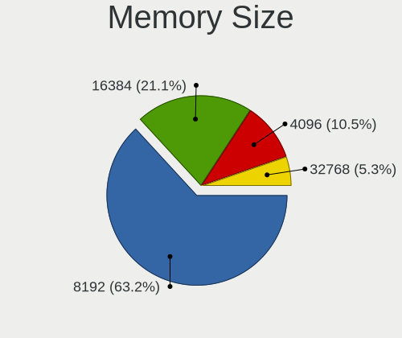

| Size  | Notebooks | Percent |
|-------|-----------|---------|
| 4096  | 7         | 36.84%  |
| 8192  | 6         | 31.58%  |
| 16384 | 3         | 15.79%  |
| 2048  | 2         | 10.53%  |
| 32768 | 1         | 5.26%   |

Memory Speed
------------

Memory module speed

| Speed | Notebooks | Percent |
|-------|-----------|---------|
| 3200  | 5         | 27.78%  |
| 1600  | 5         | 27.78%  |
| 2667  | 2         | 11.11%  |
| 8400  | 1         | 5.56%   |
| 6400  | 1         | 5.56%   |
| 4267  | 1         | 5.56%   |
| 2133  | 1         | 5.56%   |
| 1334  | 1         | 5.56%   |
| 1333  | 1         | 5.56%   |

Printers & scanners
-------------------

Printer Vendor
--------------

Printer device vendors

Zero info for selected period =(

Printer Model
-------------

Printer device models

Zero info for selected period =(

Scanner Vendor
--------------

Scanner device vendors

Zero info for selected period =(

Scanner Model
-------------

Scanner device models

Zero info for selected period =(

Camera
------

Camera Vendor
-------------

Camera device vendors

| Vendor                      | Notebooks | Percent |
|-----------------------------|-----------|---------|
| Realtek Semiconductor       | 2         | 12.5%   |
| Luxvisions Innotech Limited | 2         | 12.5%   |
| IMC Networks                | 2         | 12.5%   |
| Chicony Electronics         | 2         | 12.5%   |
| Suyin                       | 1         | 6.25%   |
| Silicon Motion              | 1         | 6.25%   |
| Quanta                      | 1         | 6.25%   |
| Microdia                    | 1         | 6.25%   |
| Logitech                    | 1         | 6.25%   |
| kingcome                    | 1         | 6.25%   |
| Apple                       | 1         | 6.25%   |
| Acer                        | 1         | 6.25%   |

Camera Model
------------

Camera device models

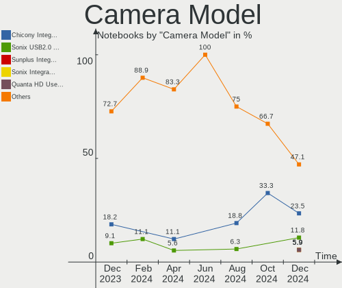

| Model                                                | Notebooks | Percent |
|------------------------------------------------------|-----------|---------|
| IMC Networks USB2.0 HD UVC WebCam                    | 2         | 12.5%   |
| Suyin HP Truevision HD                               | 1         | 6.25%   |
| Silicon Motion 300k Pixel Camera                     | 1         | 6.25%   |
| Realtek USB Camera                                   | 1         | 6.25%   |
| Realtek Integrated_Webcam_HD                         | 1         | 6.25%   |
| Quanta HD User Facing                                | 1         | 6.25%   |
| Microdia Integrated_Webcam_FHD                       | 1         | 6.25%   |
| Luxvisions Innotech Limited Integrated Camera        | 1         | 6.25%   |
| Luxvisions Innotech Limited HP Wide Vision HD Camera | 1         | 6.25%   |
| Logitech C922 Pro Stream Webcam                      | 1         | 6.25%   |
| kingcome 720p HD Camera                              | 1         | 6.25%   |
| Chicony Lenovo EasyCamera                            | 1         | 6.25%   |
| Chicony Integrated Camera                            | 1         | 6.25%   |
| Apple iPhone 5/5C/5S/6/SE/7/8/X                      | 1         | 6.25%   |
| Acer Integrated RGB Camera                           | 1         | 6.25%   |

Security
--------

Fingerprint Vendor
------------------

Fingerprint sensor vendors

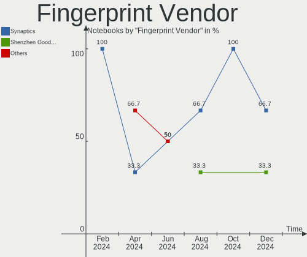

| Vendor           | Notebooks | Percent |
|------------------|-----------|---------|
| Validity Sensors | 2         | 66.67%  |
| Synaptics        | 1         | 33.33%  |

Fingerprint Model
-----------------

Fingerprint sensor models

| Model                                | Notebooks | Percent |
|--------------------------------------|-----------|---------|
| Validity Sensors Fingerprint scanner | 2         | 66.67%  |
| Synaptics UWP WBDI Device            | 1         | 33.33%  |

Chipcard Vendor
---------------

Chipcard module vendors

| Vendor      | Notebooks | Percent |
|-------------|-----------|---------|
| Clay Logic  | 1         | 50%     |
| Alcor Micro | 1         | 50%     |

Chipcard Model
--------------

Chipcard module models

| Model                               | Notebooks | Percent |
|-------------------------------------|-----------|---------|
| Clay Logic Nitrokey Pro             | 1         | 50%     |
| Alcor Micro AU9540 Smartcard Reader | 1         | 50%     |

Unsupported
-----------

Unsupported Devices
-------------------

Total unsupported devices on board

| Total | Notebooks | Percent |
|-------|-----------|---------|
| 1     | 8         | 44.44%  |
| 0     | 7         | 38.89%  |
| 5     | 1         | 5.56%   |
| 3     | 1         | 5.56%   |
| 2     | 1         | 5.56%   |

Unsupported Device Types
------------------------

Types of unsupported devices

| Type                     | Notebooks | Percent |
|--------------------------|-----------|---------|
| Net/wireless             | 3         | 16.67%  |
| Graphics card            | 3         | 16.67%  |
| Fingerprint reader       | 3         | 16.67%  |
| Multimedia controller    | 2         | 11.11%  |
| Communication controller | 2         | 11.11%  |
| Bluetooth                | 2         | 11.11%  |
| Sound                    | 1         | 5.56%   |
| Chipcard                 | 1         | 5.56%   |
| Camera                   | 1         | 5.56%   |

