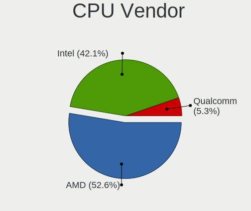
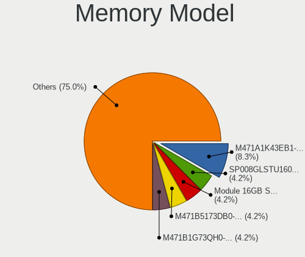
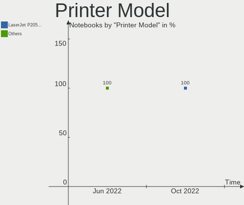

Gentoo - Hardware Trends (Notebooks)
------------------------------------

A project to identify most popular hardware characteristics and track their change
over time based on data collected by Linux users at https://Linux-Hardware.org.

Anyone can contribute to this report by the [hw-probe](https://github.com/linuxhw/hw-probe) tool:

    sudo -E hw-probe -all -upload

This report is for one last month. Overall report since the beginning of time: [TestCoverage](https://github.com/linuxhw/TestCoverage)

Period: Jun, 2022.

Contents
--------

* [ System ](#system)
  - [ OS                       ](#os)
  - [ OS Family                ](#os-family)
  - [ Kernel                   ](#kernel)
  - [ Kernel Family            ](#kernel-family)
  - [ Kernel Major Ver.        ](#kernel-major-ver)
  - [ Arch                     ](#arch)
  - [ DE                       ](#de)
  - [ Display Server           ](#display-server)
  - [ Display Manager          ](#display-manager)
  - [ OS Lang                  ](#os-lang)
  - [ Boot Mode                ](#boot-mode)
  - [ Filesystem               ](#filesystem)
  - [ Part. scheme             ](#part-scheme)
  - [ Dual Boot with Linux/BSD ](#dual-boot-with-linuxbsd)
  - [ Dual Boot (Win)          ](#dual-boot-win)

* [ Board ](#board)
  - [ Vendor                   ](#vendor)
  - [ Model                    ](#model)
  - [ Model Family             ](#model-family)
  - [ MFG Year                 ](#mfg-year)
  - [ Form Factor              ](#form-factor)
  - [ Secure Boot              ](#secure-boot)
  - [ Coreboot                 ](#coreboot)
  - [ RAM Size                 ](#ram-size)
  - [ RAM Used                 ](#ram-used)
  - [ Total Drives             ](#total-drives)
  - [ Has CD-ROM               ](#has-cd-rom)
  - [ Has Ethernet             ](#has-ethernet)
  - [ Has WiFi                 ](#has-wifi)
  - [ Has Bluetooth            ](#has-bluetooth)

* [ Location ](#location)
  - [ Country                  ](#country)
  - [ City                     ](#city)

* [ Drives ](#drives)
  - [ Drive Vendor             ](#drive-vendor)
  - [ Drive Model              ](#drive-model)
  - [ HDD Vendor               ](#hdd-vendor)
  - [ SSD Vendor               ](#ssd-vendor)
  - [ Drive Kind               ](#drive-kind)
  - [ Drive Connector          ](#drive-connector)
  - [ Drive Size               ](#drive-size)
  - [ Space Total              ](#space-total)
  - [ Space Used               ](#space-used)
  - [ Malfunc. Drives          ](#malfunc-drives)
  - [ Malfunc. Drive Vendor    ](#malfunc-drive-vendor)
  - [ Malfunc. HDD Vendor      ](#malfunc-hdd-vendor)
  - [ Malfunc. Drive Kind      ](#malfunc-drive-kind)
  - [ Failed Drives            ](#failed-drives)
  - [ Failed Drive Vendor      ](#failed-drive-vendor)
  - [ Drive Status             ](#drive-status)

* [ Storage controller ](#storage-controller)
  - [ Storage Vendor           ](#storage-vendor)
  - [ Storage Model            ](#storage-model)
  - [ Storage Kind             ](#storage-kind)

* [ Processor ](#processor)
  - [ CPU Vendor               ](#cpu-vendor)
  - [ CPU Model                ](#cpu-model)
  - [ CPU Model Family         ](#cpu-model-family)
  - [ CPU Cores                ](#cpu-cores)
  - [ CPU Sockets              ](#cpu-sockets)
  - [ CPU Threads              ](#cpu-threads)
  - [ CPU Op-Modes             ](#cpu-op-modes)
  - [ CPU Microcode            ](#cpu-microcode)
  - [ CPU Microarch            ](#cpu-microarch)

* [ Graphics ](#graphics)
  - [ GPU Vendor               ](#gpu-vendor)
  - [ GPU Model                ](#gpu-model)
  - [ GPU Combo                ](#gpu-combo)
  - [ GPU Driver               ](#gpu-driver)
  - [ GPU Memory               ](#gpu-memory)

* [ Monitor ](#monitor)
  - [ Monitor Vendor           ](#monitor-vendor)
  - [ Monitor Model            ](#monitor-model)
  - [ Monitor Resolution       ](#monitor-resolution)
  - [ Monitor Diagonal         ](#monitor-diagonal)
  - [ Monitor Width            ](#monitor-width)
  - [ Aspect Ratio             ](#aspect-ratio)
  - [ Monitor Area             ](#monitor-area)
  - [ Pixel Density            ](#pixel-density)
  - [ Multiple Monitors        ](#multiple-monitors)

* [ Network ](#network)
  - [ Net Controller Vendor    ](#net-controller-vendor)
  - [ Net Controller Model     ](#net-controller-model)
  - [ Wireless Vendor          ](#wireless-vendor)
  - [ Wireless Model           ](#wireless-model)
  - [ Ethernet Vendor          ](#ethernet-vendor)
  - [ Ethernet Model           ](#ethernet-model)
  - [ Net Controller Kind      ](#net-controller-kind)
  - [ Used Controller          ](#used-controller)
  - [ NICs                     ](#nics)
  - [ IPv6                     ](#ipv6)

* [ Bluetooth ](#bluetooth)
  - [ Bluetooth Vendor         ](#bluetooth-vendor)
  - [ Bluetooth Model          ](#bluetooth-model)

* [ Sound ](#sound)
  - [ Sound Vendor             ](#sound-vendor)
  - [ Sound Model              ](#sound-model)

* [ Memory ](#memory)
  - [ Memory Vendor            ](#memory-vendor)
  - [ Memory Model             ](#memory-model)
  - [ Memory Kind              ](#memory-kind)
  - [ Memory Form Factor       ](#memory-form-factor)
  - [ Memory Size              ](#memory-size)
  - [ Memory Speed             ](#memory-speed)

* [ Printers & scanners ](#printers--scanners)
  - [ Printer Vendor           ](#printer-vendor)
  - [ Printer Model            ](#printer-model)
  - [ Scanner Vendor           ](#scanner-vendor)
  - [ Scanner Model            ](#scanner-model)

* [ Camera ](#camera)
  - [ Camera Vendor            ](#camera-vendor)
  - [ Camera Model             ](#camera-model)

* [ Security ](#security)
  - [ Fingerprint Vendor       ](#fingerprint-vendor)
  - [ Fingerprint Model        ](#fingerprint-model)
  - [ Chipcard Vendor          ](#chipcard-vendor)
  - [ Chipcard Model           ](#chipcard-model)

* [ Unsupported ](#unsupported)
  - [ Unsupported Devices      ](#unsupported-devices)
  - [ Unsupported Device Types ](#unsupported-device-types)

System
------

OS
--

Installed operating systems

| Name       | Notebooks | Percent |
|------------|-----------|---------|
| Gentoo 2.8 | 15        | 83.33%  |
| Gentoo 2.6 | 3         | 16.67%  |

OS Family
---------

OS without a version

| Name   | Notebooks | Percent |
|--------|-----------|---------|
| Gentoo | 18        | 100%    |

Kernel
------

Version of the Linux kernel

| Version                 | Notebooks | Percent |
|-------------------------|-----------|---------|
| 5.18.4-gentoo           | 2         | 11.11%  |
| 5.18.1-gentoo-r2        | 2         | 11.11%  |
| 5.15.41-gentoo-dist     | 2         | 11.11%  |
| 5.18.8-gentoo           | 1         | 5.56%   |
| 5.18.5-gentoo           | 1         | 5.56%   |
| 5.18.2-gentoo           | 1         | 5.56%   |
| 5.18.1-gentoo-r1-x86_64 | 1         | 5.56%   |
| 5.18.1-gentoo-r1        | 1         | 5.56%   |
| 5.18.0-g95ff72a6c129    | 1         | 5.56%   |
| 5.17.8-gentoo           | 1         | 5.56%   |
| 5.17.6-zen1             | 1         | 5.56%   |
| 5.17.5-gentoo-x86_64    | 1         | 5.56%   |
| 5.17.13-gentoo          | 1         | 5.56%   |
| 5.17.12-gentoo-dist     | 1         | 5.56%   |
| 5.15.32-gentoo-r1       | 1         | 5.56%   |

Kernel Family
-------------

Linux kernel without a distro release

| Version | Notebooks | Percent |
|---------|-----------|---------|
| 5.18.1  | 4         | 22.22%  |
| 5.18.4  | 2         | 11.11%  |
| 5.15.41 | 2         | 11.11%  |
| 5.18.8  | 1         | 5.56%   |
| 5.18.5  | 1         | 5.56%   |
| 5.18.2  | 1         | 5.56%   |
| 5.18.0  | 1         | 5.56%   |
| 5.17.8  | 1         | 5.56%   |
| 5.17.6  | 1         | 5.56%   |
| 5.17.5  | 1         | 5.56%   |
| 5.17.13 | 1         | 5.56%   |
| 5.17.12 | 1         | 5.56%   |
| 5.15.32 | 1         | 5.56%   |

Kernel Major Ver.
-----------------

Linux kernel major version

| Version | Notebooks | Percent |
|---------|-----------|---------|
| 5.18    | 10        | 55.56%  |
| 5.17    | 5         | 27.78%  |
| 5.15    | 3         | 16.67%  |

Arch
----

OS architecture (x86_64, i586, etc.)

| Name   | Notebooks | Percent |
|--------|-----------|---------|
| x86_64 | 17        | 94.44%  |
| i686   | 1         | 5.56%   |

DE
--

Desktop Environment

| Name    | Notebooks | Percent |
|---------|-----------|---------|
| KDE5    | 7         | 38.89%  |
| Unknown | 6         | 33.33%  |
| GNOME   | 2         | 11.11%  |
| xmonad  | 1         | 5.56%   |
| XFCE    | 1         | 5.56%   |
| sway    | 1         | 5.56%   |

Display Server
--------------

X11 or Wayland

| Name    | Notebooks | Percent |
|---------|-----------|---------|
| X11     | 9         | 50%     |
| Wayland | 5         | 27.78%  |
| Tty     | 4         | 22.22%  |

Display Manager
---------------

SDDM, LightDM, etc.

| Name    | Notebooks | Percent |
|---------|-----------|---------|
| SDDM    | 9         | 50%     |
| Unknown | 6         | 33.33%  |
| LightDM | 2         | 11.11%  |
| GDM     | 1         | 5.56%   |

OS Lang
-------

Language

| Lang    | Notebooks | Percent |
|---------|-----------|---------|
| en_US   | 10        | 55.56%  |
| fr_FR   | 2         | 11.11%  |
| en_GB   | 2         | 11.11%  |
| C.UTF8  | 2         | 11.11%  |
| it_IT   | 1         | 5.56%   |
| Unknown | 1         | 5.56%   |

Boot Mode
---------

EFI or BIOS

| Mode | Notebooks | Percent |
|------|-----------|---------|
| EFI  | 17        | 94.44%  |
| BIOS | 1         | 5.56%   |

Filesystem
----------

Type of filesystem

| Type     | Notebooks | Percent |
|----------|-----------|---------|
| Ext4     | 13        | 72.22%  |
| Btrfs    | 4         | 22.22%  |
| Bcachefs | 1         | 5.56%   |

Part. scheme
------------

Scheme of partitioning

| Type | Notebooks | Percent |
|------|-----------|---------|
| GPT  | 17        | 94.44%  |
| MBR  | 1         | 5.56%   |

Dual Boot with Linux/BSD
------------------------

Hosting more than one Linux/BSD

| Dual boot | Notebooks | Percent |
|-----------|-----------|---------|
| No        | 12        | 66.67%  |
| Yes       | 6         | 33.33%  |

Dual Boot (Win)
---------------

Hosting Linux and Windows

| Dual boot | Notebooks | Percent |
|-----------|-----------|---------|
| No        | 12        | 66.67%  |
| Yes       | 6         | 33.33%  |

Board
-----

Vendor
------

Motherboard manufacturer

| Name             | Notebooks | Percent |
|------------------|-----------|---------|
| Lenovo           | 5         | 27.78%  |
| Dell             | 5         | 27.78%  |
| ASUSTek Computer | 3         | 16.67%  |
| Hewlett-Packard  | 2         | 11.11%  |
| Timi             | 1         | 5.56%   |
| HUAWEI           | 1         | 5.56%   |
| AVITA            | 1         | 5.56%   |

Model
-----

Motherboard model

| Name                                  | Notebooks | Percent |
|---------------------------------------|-----------|---------|
| Timi RedmiBook 13                     | 1         | 5.56%   |
| Lenovo ThinkPad T460 20FMS421US       | 1         | 5.56%   |
| Lenovo ThinkPad T14 Gen 2a 20XK002SCK | 1         | 5.56%   |
| Lenovo ThinkPad T14 Gen 1 20S1S35Y00  | 1         | 5.56%   |
| Lenovo ThinkPad A485 20MUCTO1WW       | 1         | 5.56%   |
| Lenovo Legion Y540-15IRH 81SX         | 1         | 5.56%   |
| HUAWEI BOHB-WAX9                      | 1         | 5.56%   |
| HP OMEN by Laptop 15-dc0xxx           | 1         | 5.56%   |
| HP OMEN by Laptop                     | 1         | 5.56%   |
| Dell XPS 17 9710                      | 1         | 5.56%   |
| Dell Precision 7550                   | 1         | 5.56%   |
| Dell Latitude D420                    | 1         | 5.56%   |
| Dell Inspiron 15 5510                 | 1         | 5.56%   |
| Dell G3 3500                          | 1         | 5.56%   |
| AVITA NS14A6                          | 1         | 5.56%   |
| ASUS X555LJ                           | 1         | 5.56%   |
| ASUS ROG Zephyrus G14 GA401QC_GA401QC | 1         | 5.56%   |
| ASUS ROG Strix G513QY_G513QY          | 1         | 5.56%   |

Model Family
------------

Motherboard model prefix

| Name             | Notebooks | Percent |
|------------------|-----------|---------|
| Lenovo ThinkPad  | 4         | 22.22%  |
| HP OMEN          | 2         | 11.11%  |
| ASUS ROG         | 2         | 11.11%  |
| Timi RedmiBook   | 1         | 5.56%   |
| Lenovo Legion    | 1         | 5.56%   |
| HUAWEI BOHB-WAX9 | 1         | 5.56%   |
| Dell XPS         | 1         | 5.56%   |
| Dell Precision   | 1         | 5.56%   |
| Dell Latitude    | 1         | 5.56%   |
| Dell Inspiron    | 1         | 5.56%   |
| Dell G3          | 1         | 5.56%   |
| AVITA NS14A6     | 1         | 5.56%   |
| ASUS X555LJ      | 1         | 5.56%   |

MFG Year
--------

Motherboard manufacture year

| Year | Notebooks | Percent |
|------|-----------|---------|
| 2021 | 6         | 33.33%  |
| 2020 | 5         | 27.78%  |
| 2019 | 2         | 11.11%  |
| 2018 | 2         | 11.11%  |
| 2016 | 1         | 5.56%   |
| 2015 | 1         | 5.56%   |
| 2006 | 1         | 5.56%   |

Form Factor
-----------

Physical design of the computer

| Name     | Notebooks | Percent |
|----------|-----------|---------|
| Notebook | 18        | 100%    |

Secure Boot
-----------

Enabled or disabled

| State    | Notebooks | Percent |
|----------|-----------|---------|
| Disabled | 18        | 100%    |

Coreboot
--------

Have coreboot on board

| Used | Notebooks | Percent |
|------|-----------|---------|
| No   | 18        | 100%    |

RAM Size
--------

Total RAM memory

| Size in GB  | Notebooks | Percent |
|-------------|-----------|---------|
| 4.01-8.0    | 4         | 22.22%  |
| 8.01-16.0   | 4         | 22.22%  |
| 32.01-64.0  | 3         | 16.67%  |
| 16.01-24.0  | 3         | 16.67%  |
| 3.01-4.0    | 1         | 5.56%   |
| 24.01-32.0  | 1         | 5.56%   |
| 2.01-3.0    | 1         | 5.56%   |
| 64.01-256.0 | 1         | 5.56%   |

RAM Used
--------

Used RAM memory

| Used GB   | Notebooks | Percent |
|-----------|-----------|---------|
| 4.01-8.0  | 4         | 22.22%  |
| 3.01-4.0  | 4         | 22.22%  |
| 2.01-3.0  | 4         | 22.22%  |
| 1.01-2.0  | 2         | 11.11%  |
| 8.01-16.0 | 2         | 11.11%  |
| 0.51-1.0  | 1         | 5.56%   |
| 0.01-0.5  | 1         | 5.56%   |

Total Drives
------------

Number of drives on board

| Drives | Notebooks | Percent |
|--------|-----------|---------|
| 1      | 12        | 66.67%  |
| 2      | 6         | 33.33%  |

Has CD-ROM
----------

Has CD-ROM on board

| Presented | Notebooks | Percent |
|-----------|-----------|---------|
| No        | 17        | 94.44%  |
| Yes       | 1         | 5.56%   |

Has Ethernet
------------

Has Ethernet on board

| Presented | Notebooks | Percent |
|-----------|-----------|---------|
| Yes       | 12        | 66.67%  |
| No        | 6         | 33.33%  |

Has WiFi
--------

Has WiFi module

| Presented | Notebooks | Percent |
|-----------|-----------|---------|
| Yes       | 18        | 100%    |

Has Bluetooth
-------------

Has Bluetooth module

| Presented | Notebooks | Percent |
|-----------|-----------|---------|
| Yes       | 14        | 77.78%  |
| No        | 4         | 22.22%  |

Location
--------

Country
-------

Geographic location (country)

| Country     | Notebooks | Percent |
|-------------|-----------|---------|
| USA         | 4         | 22.22%  |
| Netherlands | 2         | 11.11%  |
| France      | 2         | 11.11%  |
| Belarus     | 2         | 11.11%  |
| UK          | 1         | 5.56%   |
| Spain       | 1         | 5.56%   |
| Russia      | 1         | 5.56%   |
| Poland      | 1         | 5.56%   |
| Italy       | 1         | 5.56%   |
| Czechia     | 1         | 5.56%   |
| China       | 1         | 5.56%   |
| Belgium     | 1         | 5.56%   |

City
----

Geographic location (city)

| City        | Notebooks | Percent |
|-------------|-----------|---------|
| Paris       | 2         | 11.11%  |
| Minsk       | 2         | 11.11%  |
| Prague      | 1         | 5.56%   |
| Perm        | 1         | 5.56%   |
| Milan       | 1         | 5.56%   |
| London      | 1         | 5.56%   |
| Lochristi   | 1         | 5.56%   |
| Kailua-Kona | 1         | 5.56%   |
| Guangzhou   | 1         | 5.56%   |
| Cieszyn     | 1         | 5.56%   |
| Chattanooga | 1         | 5.56%   |
| Burke       | 1         | 5.56%   |
| Bertamirans | 1         | 5.56%   |
| Ann Arbor   | 1         | 5.56%   |
| Amsterdam   | 1         | 5.56%   |
| Amstelveen  | 1         | 5.56%   |

Drives
------

Drive Vendor
------------

Hard drive vendors

| Vendor              | Notebooks | Drives | Percent |
|---------------------|-----------|--------|---------|
| Samsung Electronics | 6         | 6      | 25%     |
| SK hynix            | 3         | 3      | 12.5%   |
| Toshiba             | 2         | 2      | 8.33%   |
| SanDisk             | 2         | 2      | 8.33%   |
| Intel               | 2         | 2      | 8.33%   |
| WDC                 | 1         | 1      | 4.17%   |
| Seagate             | 1         | 1      | 4.17%   |
| Plextor             | 1         | 1      | 4.17%   |
| Phison              | 1         | 1      | 4.17%   |
| Micron Technology   | 1         | 1      | 4.17%   |
| LITEON              | 1         | 1      | 4.17%   |
| KIOXIA-EXCERIA      | 1         | 1      | 4.17%   |
| Kingston            | 1         | 1      | 4.17%   |
| Hoodisk             | 1         | 1      | 4.17%   |

Drive Model
-----------

Hard drive models

| Model                                  | Notebooks | Percent |
|----------------------------------------|-----------|---------|
| WDC PC SN520 SDAPMUW-512G-1101 512GB   | 1         | 4.17%   |
| Toshiba MK6008GAH 64GB                 | 1         | 4.17%   |
| Toshiba KXG6AZNV512G 512GB             | 1         | 4.17%   |
| SK hynix SKHynix_HFS512GDE9X081N 512GB | 1         | 4.17%   |
| SK hynix PC711 NVMe 512GB              | 1         | 4.17%   |
| SK hynix PC611 NVMe 512GB              | 1         | 4.17%   |
| Seagate ST2000LM015-2E8174 2TB         | 1         | 4.17%   |
| SanDisk SDSSDH3 1T00 1TB               | 1         | 4.17%   |
| SanDisk SD8TB8U256G1001 256GB SSD      | 1         | 4.17%   |
| Samsung SSD 970 PRO 1TB                | 1         | 4.17%   |
| Samsung SSD 970 EVO Plus 1TB           | 1         | 4.17%   |
| Samsung SSD 870 EVO 1TB                | 1         | 4.17%   |
| Samsung SSD 850 EVO 250GB              | 1         | 4.17%   |
| Samsung PM991 NVMe 512GB               | 1         | 4.17%   |
| Samsung MZNLN512HAJQ-00000 512GB SSD   | 1         | 4.17%   |
| Plextor PX-512M8VC 512GB SSD           | 1         | 4.17%   |
| Phison 311CD0512GB                     | 1         | 4.17%   |
| Micron 2450 NVMe 1024GB                | 1         | 4.17%   |
| LITEON CA3-8D128-HP 128GB              | 1         | 4.17%   |
| KIOXIA-EXCERIA G2 SSD 1TB              | 1         | 4.17%   |
| Kingston SNVS1000G 1TB                 | 1         | 4.17%   |
| Intel SSDPEKNU512GZ 512GB              | 1         | 4.17%   |
| Intel SSDPEKKF256G8L 256GB             | 1         | 4.17%   |
| Hoodisk SSD 256GB                      | 1         | 4.17%   |

HDD Vendor
----------

Hard disk drive vendors

| Vendor  | Notebooks | Drives | Percent |
|---------|-----------|--------|---------|
| Toshiba | 1         | 1      | 50%     |
| Seagate | 1         | 1      | 50%     |

SSD Vendor
----------

Solid state drive vendors

| Vendor              | Notebooks | Drives | Percent |
|---------------------|-----------|--------|---------|
| Samsung Electronics | 3         | 3      | 42.86%  |
| SanDisk             | 2         | 2      | 28.57%  |
| Plextor             | 1         | 1      | 14.29%  |
| Hoodisk             | 1         | 1      | 14.29%  |

Drive Kind
----------

HDD or SSD

| Kind | Notebooks | Drives | Percent |
|------|-----------|--------|---------|
| NVMe | 13        | 15     | 59.09%  |
| SSD  | 7         | 7      | 31.82%  |
| HDD  | 2         | 2      | 9.09%   |

Drive Connector
---------------

SATA, SAS, NVMe, etc.

| Type | Notebooks | Drives | Percent |
|------|-----------|--------|---------|
| NVMe | 13        | 15     | 59.09%  |
| SATA | 9         | 9      | 40.91%  |

Drive Size
----------

Size of hard drive

| Size in TB | Notebooks | Drives | Percent |
|------------|-----------|--------|---------|
| 0.51-1.0   | 4         | 4      | 44.44%  |
| 0.01-0.5   | 4         | 4      | 44.44%  |
| 1.01-2.0   | 1         | 1      | 11.11%  |

Space Total
-----------

Amount of disk space available on the file system

| Size in GB | Notebooks | Percent |
|------------|-----------|---------|
| 251-500    | 6         | 33.33%  |
| 101-250    | 5         | 27.78%  |
| 501-1000   | 4         | 22.22%  |
| 21-50      | 1         | 5.56%   |
| 2001-3000  | 1         | 5.56%   |
| 1001-2000  | 1         | 5.56%   |

Space Used
----------

Amount of used disk space

| Used GB   | Notebooks | Percent |
|-----------|-----------|---------|
| 101-250   | 6         | 33.33%  |
| 1-20      | 4         | 22.22%  |
| 21-50     | 3         | 16.67%  |
| 51-100    | 2         | 11.11%  |
| 251-500   | 1         | 5.56%   |
| 1001-2000 | 1         | 5.56%   |
| 501-1000  | 1         | 5.56%   |

Malfunc. Drives
---------------

Drive models with a malfunction

| Model                  | Notebooks | Drives | Percent |
|------------------------|-----------|--------|---------|
| Toshiba MK6008GAH 64GB | 1         | 1      | 100%    |

Malfunc. Drive Vendor
---------------------

Vendors of faulty drives

| Vendor  | Notebooks | Drives | Percent |
|---------|-----------|--------|---------|
| Toshiba | 1         | 1      | 100%    |

Malfunc. HDD Vendor
-------------------

Vendors of faulty HDD drives

| Vendor  | Notebooks | Drives | Percent |
|---------|-----------|--------|---------|
| Toshiba | 1         | 1      | 100%    |

Malfunc. Drive Kind
-------------------

Kinds of faulty drives

| Kind | Notebooks | Drives | Percent |
|------|-----------|--------|---------|
| HDD  | 1         | 1      | 100%    |

Failed Drives
-------------

Failed drive models

Zero info for selected period =(

Failed Drive Vendor
-------------------

Failed drive vendors

Zero info for selected period =(

Drive Status
------------

Number of failed and malfunc. drives

| Status  | Notebooks | Drives | Percent |
|---------|-----------|--------|---------|
| Works   | 17        | 23     | 94.44%  |
| Malfunc | 1         | 1      | 5.56%   |

Storage controller
------------------

Storage Vendor
--------------

Storage controller vendors

| Vendor                       | Notebooks | Percent |
|------------------------------|-----------|---------|
| Intel                        | 12        | 44.44%  |
| SK hynix                     | 3         | 11.11%  |
| Samsung Electronics          | 3         | 11.11%  |
| AMD                          | 2         | 7.41%   |
| Toshiba America Info Systems | 1         | 3.7%    |
| SanDisk                      | 1         | 3.7%    |
| Phison Electronics           | 1         | 3.7%    |
| Micron Technology            | 1         | 3.7%    |
| Lite-On Technology           | 1         | 3.7%    |
| KIOXIA                       | 1         | 3.7%    |
| Kingston Technology Company  | 1         | 3.7%    |

Storage Model
-------------

Storage controller models

| Model                                                   | Notebooks | Percent |
|---------------------------------------------------------|-----------|---------|
| SK hynix Gold P31 SSD                                   | 2         | 7.41%   |
| Samsung NVMe SSD Controller SM981/PM981/PM983           | 2         | 7.41%   |
| Intel Comet Lake SATA AHCI Controller                   | 2         | 7.41%   |
| AMD FCH SATA Controller [AHCI mode]                     | 2         | 7.41%   |
| Toshiba America Info Systems XG6 NVMe SSD Controller    | 1         | 3.7%    |
| SK hynix Non-Volatile memory controller                 | 1         | 3.7%    |
| SanDisk PC SN520 NVMe SSD                               | 1         | 3.7%    |
| Samsung NVMe SSD Controller 980                         | 1         | 3.7%    |
| Phison PS5013 E13 NVMe Controller                       | 1         | 3.7%    |
| Micron Non-Volatile memory controller                   | 1         | 3.7%    |
| Lite-On Non-Volatile memory controller                  | 1         | 3.7%    |
| KIOXIA NVMe SSD                                         | 1         | 3.7%    |
| Kingston Company Company Non-Volatile memory controller | 1         | 3.7%    |
| Intel Wildcat Point-LP SATA Controller [AHCI Mode]      | 1         | 3.7%    |
| Intel Volume Management Device NVMe RAID Controller     | 1         | 3.7%    |
| Intel Sunrise Point-LP SATA Controller [AHCI mode]      | 1         | 3.7%    |
| Intel SSD Pro 7600p/760p/E 6100p Series                 | 1         | 3.7%    |
| Intel Non-Volatile memory controller                    | 1         | 3.7%    |
| Intel HM170/QM170 Chipset SATA Controller [AHCI Mode]   | 1         | 3.7%    |
| Intel Cannon Lake Mobile PCH SATA AHCI Controller       | 1         | 3.7%    |
| Intel 82801G (ICH7 Family) IDE Controller               | 1         | 3.7%    |
| Intel 82801 Mobile SATA Controller [RAID mode]          | 1         | 3.7%    |
| Intel 400 Series Chipset Family SATA AHCI Controller    | 1         | 3.7%    |

Storage Kind
------------

Kind of storage controller (IDE, SATA, NVMe, SAS, ...)

| Kind | Notebooks | Percent |
|------|-----------|---------|
| NVMe | 13        | 52%     |
| SATA | 9         | 36%     |
| RAID | 2         | 8%      |
| IDE  | 1         | 4%      |

Processor
---------

CPU Vendor
----------

Processor vendors

| Vendor | Notebooks | Percent |
|--------|-----------|---------|
| Intel  | 13        | 72.22%  |
| AMD    | 5         | 27.78%  |

CPU Model
---------

Processor models

| Model                                           | Notebooks | Percent |
|-------------------------------------------------|-----------|---------|
| Intel Core i5-10210U CPU @ 1.60GHz              | 2         | 11.11%  |
| Intel Core i7-9750H CPU @ 2.60GHz               | 1         | 5.56%   |
| Intel Core i7-7820HK CPU @ 2.90GHz              | 1         | 5.56%   |
| Intel Core i7-5500U CPU @ 2.40GHz               | 1         | 5.56%   |
| Intel Core i7-10850H CPU @ 2.70GHz              | 1         | 5.56%   |
| Intel Core i7-10610U CPU @ 1.80GHz              | 1         | 5.56%   |
| Intel Core i5-8300H CPU @ 2.30GHz               | 1         | 5.56%   |
| Intel Core i5-6300U CPU @ 2.40GHz               | 1         | 5.56%   |
| Intel Core i5-10300H CPU @ 2.50GHz              | 1         | 5.56%   |
| Intel Core Duo CPU U2500 @ 1.20GHz              | 1         | 5.56%   |
| Intel 11th Gen Core i7-11800H @ 2.30GHz         | 1         | 5.56%   |
| Intel 11th Gen Core i7-11390H @ 3.40GHz         | 1         | 5.56%   |
| AMD Ryzen 9 5900HX with Radeon Graphics         | 1         | 5.56%   |
| AMD Ryzen 7 PRO 5850U with Radeon Graphics      | 1         | 5.56%   |
| AMD Ryzen 7 PRO 2700U w/ Radeon Vega Mobile Gfx | 1         | 5.56%   |
| AMD Ryzen 7 5800HS with Radeon Graphics         | 1         | 5.56%   |
| AMD Ryzen 3 3200U with Radeon Vega Mobile Gfx   | 1         | 5.56%   |

CPU Model Family
----------------

Processor model prefix

| Model           | Notebooks | Percent |
|-----------------|-----------|---------|
| Intel Core i7   | 5         | 27.78%  |
| Intel Core i5   | 5         | 27.78%  |
| Other           | 2         | 11.11%  |
| AMD Ryzen 7 PRO | 2         | 11.11%  |
| Intel Core Duo  | 1         | 5.56%   |
| AMD Ryzen 9     | 1         | 5.56%   |
| AMD Ryzen 7     | 1         | 5.56%   |
| AMD Ryzen 3     | 1         | 5.56%   |

CPU Cores
---------

Number of processor cores

| Number | Notebooks | Percent |
|--------|-----------|---------|
| 4      | 8         | 44.44%  |
| 2      | 4         | 22.22%  |
| 8      | 3         | 16.67%  |
| 6      | 2         | 11.11%  |
| 1      | 1         | 5.56%   |

CPU Sockets
-----------

Number of sockets

| Number | Notebooks | Percent |
|--------|-----------|---------|
| 1      | 18        | 100%    |

CPU Threads
-----------

Threads per core (Hyper-Threading)

| Number | Notebooks | Percent |
|--------|-----------|---------|
| 2      | 16        | 88.89%  |
| 1      | 2         | 11.11%  |

CPU Op-Modes
------------

CPU Operation Modes (32-bit, 64-bit)

| Op mode        | Notebooks | Percent |
|----------------|-----------|---------|
| 32-bit, 64-bit | 17        | 94.44%  |
| 32-bit         | 1         | 5.56%   |

CPU Microcode
-------------

Microcode number

| Number     | Notebooks | Percent |
|------------|-----------|---------|
| 0x806ec    | 3         | 16.67%  |
| 0x0a50000c | 3         | 16.67%  |
| 0xa0652    | 2         | 11.11%  |
| 0x906ea    | 2         | 11.11%  |
| 0x806d1    | 1         | 5.56%   |
| 0x806c2    | 1         | 5.56%   |
| 0x6ec      | 1         | 5.56%   |
| 0x406e3    | 1         | 5.56%   |
| 0x306d4    | 1         | 5.56%   |
| 0x08108109 | 1         | 5.56%   |
| 0x0810100b | 1         | 5.56%   |
| Unknown    | 1         | 5.56%   |

CPU Microarch
-------------

Microarchitecture

| Name      | Notebooks | Percent |
|-----------|-----------|---------|
| KabyLake  | 6         | 33.33%  |
| Zen 3     | 3         | 16.67%  |
| CometLake | 2         | 11.11%  |
| Zen+      | 1         | 5.56%   |
| Zen       | 1         | 5.56%   |
| TigerLake | 1         | 5.56%   |
| Skylake   | 1         | 5.56%   |
| P6        | 1         | 5.56%   |
| Icelake   | 1         | 5.56%   |
| Broadwell | 1         | 5.56%   |

Graphics
--------

GPU Vendor
----------

Vendors of graphics cards

| Vendor | Notebooks | Percent |
|--------|-----------|---------|
| Intel  | 11        | 44%     |
| Nvidia | 9         | 36%     |
| AMD    | 5         | 20%     |

GPU Model
---------

Graphics card models

| Model                                                                         | Notebooks | Percent |
|-------------------------------------------------------------------------------|-----------|---------|
| Intel CometLake-U GT2 [UHD Graphics]                                          | 3         | 11.11%  |
| AMD Cezanne                                                                   | 3         | 11.11%  |
| Nvidia TU117M                                                                 | 1         | 3.7%    |
| Nvidia TU117GLM [Quadro T2000 Mobile / Max-Q]                                 | 1         | 3.7%    |
| Nvidia TU106M [GeForce RTX 2060 Mobile]                                       | 1         | 3.7%    |
| Nvidia GP108M [GeForce MX330]                                                 | 1         | 3.7%    |
| Nvidia GP108M [GeForce MX250]                                                 | 1         | 3.7%    |
| Nvidia GP107M [GeForce GTX 1050 Ti Mobile]                                    | 1         | 3.7%    |
| Nvidia GP106M [GeForce GTX 1060 Mobile]                                       | 1         | 3.7%    |
| Nvidia GK208BM [GeForce 920M]                                                 | 1         | 3.7%    |
| Nvidia GA107M [GeForce RTX 3050 Mobile]                                       | 1         | 3.7%    |
| Intel TigerLake-LP GT2 [Iris Xe Graphics]                                     | 1         | 3.7%    |
| Intel TigerLake-H GT1 [UHD Graphics]                                          | 1         | 3.7%    |
| Intel Skylake GT2 [HD Graphics 520]                                           | 1         | 3.7%    |
| Intel Mobile 945GM/GMS/GME, 943/940GML Express Integrated Graphics Controller | 1         | 3.7%    |
| Intel Mobile 945GM/GMS, 943/940GML Express Integrated Graphics Controller     | 1         | 3.7%    |
| Intel HD Graphics 630                                                         | 1         | 3.7%    |
| Intel HD Graphics 5500                                                        | 1         | 3.7%    |
| Intel CometLake-H GT2 [UHD Graphics]                                          | 1         | 3.7%    |
| Intel CoffeeLake-H GT2 [UHD Graphics 630]                                     | 1         | 3.7%    |
| AMD Raven Ridge [Radeon Vega Series / Radeon Vega Mobile Series]              | 1         | 3.7%    |
| AMD Picasso/Raven 2 [Radeon Vega Series / Radeon Vega Mobile Series]          | 1         | 3.7%    |
| AMD Navi 22 [Radeon RX 6700/6700 XT/6750 XT / 6800M]                          | 1         | 3.7%    |

GPU Combo
---------

Combinations of graphics cards

| Name           | Notebooks | Percent |
|----------------|-----------|---------|
| Intel + Nvidia | 7         | 38.89%  |
| 1 x AMD        | 4         | 22.22%  |
| 1 x Intel      | 3         | 16.67%  |
| 1 x Nvidia     | 2         | 11.11%  |
| 2 x Intel      | 1         | 5.56%   |
| 2 x AMD        | 1         | 5.56%   |

GPU Driver
----------

Free vs proprietary

| Driver      | Notebooks | Percent |
|-------------|-----------|---------|
| Free        | 14        | 77.78%  |
| Proprietary | 4         | 22.22%  |

GPU Memory
----------

Total video memory

| Size in GB | Notebooks | Percent |
|------------|-----------|---------|
| Unknown    | 9         | 50%     |
| 3.01-4.0   | 3         | 16.67%  |
| 0.51-1.0   | 2         | 11.11%  |
| 0.01-0.5   | 2         | 11.11%  |
| 2.01-3.0   | 1         | 5.56%   |
| 8.01-16.0  | 1         | 5.56%   |

Monitor
-------

Monitor Vendor
--------------

Monitor vendors

| Vendor              | Notebooks | Percent |
|---------------------|-----------|---------|
| BOE                 | 7         | 31.82%  |
| Chimei Innolux      | 4         | 18.18%  |
| Samsung Electronics | 3         | 13.64%  |
| Sharp               | 2         | 9.09%   |
| LG Display          | 2         | 9.09%   |
| AU Optronics        | 2         | 9.09%   |
| Hewlett-Packard     | 1         | 4.55%   |
| Goldstar            | 1         | 4.55%   |

Monitor Model
-------------

Monitor models

| Model                                                                  | Notebooks | Percent |
|------------------------------------------------------------------------|-----------|---------|
| BOE LCD Monitor BOE0819 1920x1080 344x194mm 15.5-inch                  | 2         | 9.09%   |
| Sharp LQ140M1JW49 SHP1523 1920x1080 309x174mm 14.0-inch                | 1         | 4.55%   |
| Sharp LCD Monitor SHP1517 3840x2400 366x229mm 17.0-inch                | 1         | 4.55%   |
| Samsung Electronics LCD Monitor SEC3157 1280x800 261x163mm 12.1-inch   | 1         | 4.55%   |
| Samsung Electronics LCD Monitor SAM07C5 1920x1080 1020x570mm 46.0-inch | 1         | 4.55%   |
| Samsung Electronics C27F591 SAM0D37 1920x1080 598x336mm 27.0-inch      | 1         | 4.55%   |
| LG Display LCD Monitor LGD0532 1920x1080 344x194mm 15.5-inch           | 1         | 4.55%   |
| LG Display LCD Monitor LGD0521 1920x1080 309x174mm 14.0-inch           | 1         | 4.55%   |
| Hewlett-Packard 24w HPN3431 1920x1080 527x296mm 23.8-inch              | 1         | 4.55%   |
| Goldstar E1942 GSM4C09 1366x768 410x230mm 18.5-inch                    | 1         | 4.55%   |
| Chimei Innolux LCD Monitor CMN15AB 1366x768 344x194mm 15.5-inch        | 1         | 4.55%   |
| Chimei Innolux LCD Monitor CMN152E 1920x1080 344x193mm 15.5-inch       | 1         | 4.55%   |
| Chimei Innolux LCD Monitor CMN14F5 1920x1080 309x173mm 13.9-inch       | 1         | 4.55%   |
| Chimei Innolux LCD Monitor CMN14D4 1920x1080 309x173mm 13.9-inch       | 1         | 4.55%   |
| BOE LCD Monitor BOE0973 2560x1440 344x194mm 15.5-inch                  | 1         | 4.55%   |
| BOE LCD Monitor BOE0898 1920x1080 294x165mm 13.3-inch                  | 1         | 4.55%   |
| BOE LCD Monitor BOE0872 1920x1080 344x194mm 15.5-inch                  | 1         | 4.55%   |
| BOE LCD Monitor BOE084D 1920x1080 344x193mm 15.5-inch                  | 1         | 4.55%   |
| BOE LCD Monitor BOE07DB 1920x1080 309x174mm 14.0-inch                  | 1         | 4.55%   |
| AU Optronics LCD Monitor AUO243D 1920x1080 309x173mm 13.9-inch         | 1         | 4.55%   |
| AU Optronics LCD Monitor AUO23ED 1920x1080 344x193mm 15.5-inch         | 1         | 4.55%   |

Monitor Resolution
------------------

Monitor screen resolution

| Resolution       | Notebooks | Percent |
|------------------|-----------|---------|
| 1920x1080 (FHD)  | 14        | 77.78%  |
| 3840x2400        | 1         | 5.56%   |
| 2560x1440 (QHD)  | 1         | 5.56%   |
| 1440x900 (WXGA+) | 1         | 5.56%   |
| 1366x768 (WXGA)  | 1         | 5.56%   |

Monitor Diagonal
----------------

Diagonal size in inches

| Inches | Notebooks | Percent |
|--------|-----------|---------|
| 15     | 9         | 40.91%  |
| 14     | 5         | 22.73%  |
| 13     | 3         | 13.64%  |
| 54     | 1         | 4.55%   |
| 27     | 1         | 4.55%   |
| 24     | 1         | 4.55%   |
| 18     | 1         | 4.55%   |
| 17     | 1         | 4.55%   |

Monitor Width
-------------

Physical width

| Width in mm | Notebooks | Percent |
|-------------|-----------|---------|
| 301-350     | 16        | 72.73%  |
| 501-600     | 2         | 9.09%   |
| 401-500     | 1         | 4.55%   |
| 351-400     | 1         | 4.55%   |
| 201-300     | 1         | 4.55%   |
| 1001-1500   | 1         | 4.55%   |

Aspect Ratio
------------

Proportional relationship between the width and the height

| Ratio | Notebooks | Percent |
|-------|-----------|---------|
| 16/9  | 16        | 88.89%  |
| 16/10 | 2         | 11.11%  |

Monitor Area
------------

Area in inch²

| Area in inch² | Notebooks | Percent |
|----------------|-----------|---------|
| 101-110        | 9         | 40.91%  |
| 81-90          | 7         | 31.82%  |
| More than 1000 | 1         | 4.55%   |
| 71-80          | 1         | 4.55%   |
| 301-350        | 1         | 4.55%   |
| 201-250        | 1         | 4.55%   |
| 141-150        | 1         | 4.55%   |
| 121-130        | 1         | 4.55%   |

Pixel Density
-------------

Pixels per inch

| Density       | Notebooks | Percent |
|---------------|-----------|---------|
| 121-160       | 13        | 61.9%   |
| 51-100        | 3         | 14.29%  |
| 161-240       | 2         | 9.52%   |
| More than 240 | 1         | 4.76%   |
| 1-50          | 1         | 4.76%   |
| 101-120       | 1         | 4.76%   |

Multiple Monitors
-----------------

Total monitors connected

| Total | Notebooks | Percent |
|-------|-----------|---------|
| 1     | 14        | 77.78%  |
| 2     | 4         | 22.22%  |

Network
-------

Net Controller Vendor
---------------------

Controller vendors

| Vendor                     | Notebooks | Percent |
|----------------------------|-----------|---------|
| Intel                      | 12        | 44.44%  |
| Realtek Semiconductor      | 8         | 29.63%  |
| Qualcomm Atheros           | 2         | 7.41%   |
| MediaTek                   | 2         | 7.41%   |
| ZTE WCDMA Technologies MSM | 1         | 3.7%    |
| Samsung Electronics        | 1         | 3.7%    |
| Broadcom                   | 1         | 3.7%    |

Net Controller Model
--------------------

Controller models

| Model                                                             | Notebooks | Percent |
|-------------------------------------------------------------------|-----------|---------|
| Realtek RTL8111/8168/8411 PCI Express Gigabit Ethernet Controller | 8         | 25%     |
| Intel Comet Lake PCH-LP CNVi WiFi                                 | 3         | 9.38%   |
| MediaTek MT7921 802.11ax PCI Express Wireless Network Adapter     | 2         | 6.25%   |
| Intel Comet Lake PCH CNVi WiFi                                    | 2         | 6.25%   |
| Intel Cannon Lake PCH CNVi WiFi                                   | 2         | 6.25%   |
| ZTE WCDMA MSM SCSI CD-ROM 2.31                                    | 1         | 3.13%   |
| Samsung GT-I9070 (network tethering, USB debugging enabled)       | 1         | 3.13%   |
| Realtek RTL8852AE 802.11ax PCIe Wireless Network Adapter          | 1         | 3.13%   |
| Realtek RTL8822BE 802.11a/b/g/n/ac WiFi adapter                   | 1         | 3.13%   |
| Qualcomm Atheros QCA9377 802.11ac Wireless Network Adapter        | 1         | 3.13%   |
| Qualcomm Atheros AR9485 Wireless Network Adapter                  | 1         | 3.13%   |
| Intel Wireless 8260                                               | 1         | 3.13%   |
| Intel Wireless 7265                                               | 1         | 3.13%   |
| Intel Wi-Fi 6 AX201                                               | 1         | 3.13%   |
| Intel Tiger Lake PCH CNVi WiFi                                    | 1         | 3.13%   |
| Intel PRO/Wireless 3945ABG [Golan] Network Connection             | 1         | 3.13%   |
| Intel Ethernet Connection I219-LM                                 | 1         | 3.13%   |
| Intel Ethernet Connection (11) I219-LM                            | 1         | 3.13%   |
| Intel Ethernet Connection (10) I219-LM                            | 1         | 3.13%   |
| Broadcom NetXtreme BCM5752 Gigabit Ethernet PCI Express           | 1         | 3.13%   |

Wireless Vendor
---------------

Wireless vendors

| Vendor                | Notebooks | Percent |
|-----------------------|-----------|---------|
| Intel                 | 12        | 66.67%  |
| Realtek Semiconductor | 2         | 11.11%  |
| Qualcomm Atheros      | 2         | 11.11%  |
| MediaTek              | 2         | 11.11%  |

Wireless Model
--------------

Wireless models

| Model                                                         | Notebooks | Percent |
|---------------------------------------------------------------|-----------|---------|
| Intel Comet Lake PCH-LP CNVi WiFi                             | 3         | 16.67%  |
| MediaTek MT7921 802.11ax PCI Express Wireless Network Adapter | 2         | 11.11%  |
| Intel Comet Lake PCH CNVi WiFi                                | 2         | 11.11%  |
| Intel Cannon Lake PCH CNVi WiFi                               | 2         | 11.11%  |
| Realtek RTL8852AE 802.11ax PCIe Wireless Network Adapter      | 1         | 5.56%   |
| Realtek RTL8822BE 802.11a/b/g/n/ac WiFi adapter               | 1         | 5.56%   |
| Qualcomm Atheros QCA9377 802.11ac Wireless Network Adapter    | 1         | 5.56%   |
| Qualcomm Atheros AR9485 Wireless Network Adapter              | 1         | 5.56%   |
| Intel Wireless 8260                                           | 1         | 5.56%   |
| Intel Wireless 7265                                           | 1         | 5.56%   |
| Intel Wi-Fi 6 AX201                                           | 1         | 5.56%   |
| Intel Tiger Lake PCH CNVi WiFi                                | 1         | 5.56%   |
| Intel PRO/Wireless 3945ABG [Golan] Network Connection         | 1         | 5.56%   |

Ethernet Vendor
---------------

Ethernet vendors

| Vendor                     | Notebooks | Percent |
|----------------------------|-----------|---------|
| Realtek Semiconductor      | 8         | 57.14%  |
| Intel                      | 3         | 21.43%  |
| ZTE WCDMA Technologies MSM | 1         | 7.14%   |
| Samsung Electronics        | 1         | 7.14%   |
| Broadcom                   | 1         | 7.14%   |

Ethernet Model
--------------

Ethernet models

| Model                                                             | Notebooks | Percent |
|-------------------------------------------------------------------|-----------|---------|
| Realtek RTL8111/8168/8411 PCI Express Gigabit Ethernet Controller | 8         | 57.14%  |
| ZTE WCDMA MSM SCSI CD-ROM 2.31                                    | 1         | 7.14%   |
| Samsung GT-I9070 (network tethering, USB debugging enabled)       | 1         | 7.14%   |
| Intel Ethernet Connection I219-LM                                 | 1         | 7.14%   |
| Intel Ethernet Connection (11) I219-LM                            | 1         | 7.14%   |
| Intel Ethernet Connection (10) I219-LM                            | 1         | 7.14%   |
| Broadcom NetXtreme BCM5752 Gigabit Ethernet PCI Express           | 1         | 7.14%   |

Net Controller Kind
-------------------

Ethernet, WiFi or modem

| Kind     | Notebooks | Percent |
|----------|-----------|---------|
| WiFi     | 18        | 60%     |
| Ethernet | 12        | 40%     |

Used Controller
---------------

Currently used network controller

| Kind     | Notebooks | Percent |
|----------|-----------|---------|
| WiFi     | 15        | 88.24%  |
| Ethernet | 2         | 11.76%  |

NICs
----

Total network controllers on board

| Total | Notebooks | Percent |
|-------|-----------|---------|
| 2     | 10        | 55.56%  |
| 1     | 6         | 33.33%  |
| 3     | 2         | 11.11%  |

IPv6
----

IPv6 vs IPv4

| Used | Notebooks | Percent |
|------|-----------|---------|
| No   | 16        | 88.89%  |
| Yes  | 2         | 11.11%  |

Bluetooth
---------

Bluetooth Vendor
----------------

Controller vendors

| Vendor                | Notebooks | Percent |
|-----------------------|-----------|---------|
| Intel                 | 10        | 71.43%  |
| Realtek Semiconductor | 2         | 14.29%  |
| IMC Networks          | 2         | 14.29%  |

Bluetooth Model
---------------

Controller models

| Model                                          | Notebooks | Percent |
|------------------------------------------------|-----------|---------|
| Intel Bluetooth 9460/9560 Jefferson Peak (JfP) | 5         | 35.71%  |
| Intel Bluetooth Device                         | 4         | 28.57%  |
| Realtek RTL8822BE Bluetooth 4.2 Adapter        | 1         | 7.14%   |
| Realtek Bluetooth Radio                        | 1         | 7.14%   |
| Intel Bluetooth wireless interface             | 1         | 7.14%   |
| IMC Networks Wireless_Device                   | 1         | 7.14%   |
| IMC Networks Bluetooth Device                  | 1         | 7.14%   |

Sound
-----

Sound Vendor
------------

Sound card vendors

| Vendor    | Notebooks | Percent |
|-----------|-----------|---------|
| Intel     | 13        | 52%     |
| Nvidia    | 6         | 24%     |
| AMD       | 5         | 20%     |
| Razer USA | 1         | 4%      |

Sound Model
-----------

Sound card models

| Model                                                          | Notebooks | Percent |
|----------------------------------------------------------------|-----------|---------|
| AMD Family 17h/19h HD Audio Controller                         | 5         | 15.63%  |
| Intel Comet Lake PCH-LP cAVS                                   | 3         | 9.38%   |
| AMD Renoir Radeon High Definition Audio Controller             | 3         | 9.38%   |
| Nvidia TU107 GeForce GTX 1650 High Definition Audio Controller | 2         | 6.25%   |
| Intel Comet Lake PCH cAVS                                      | 2         | 6.25%   |
| Intel Cannon Lake PCH cAVS                                     | 2         | 6.25%   |
| AMD Raven/Raven2/Fenghuang HDMI/DP Audio Controller            | 2         | 6.25%   |
| Razer USA Razer Kraken X USB                                   | 1         | 3.13%   |
| Nvidia TU106 High Definition Audio Controller                  | 1         | 3.13%   |
| Nvidia GP107GL High Definition Audio Controller                | 1         | 3.13%   |
| Nvidia GP106 High Definition Audio Controller                  | 1         | 3.13%   |
| Nvidia GK208 HDMI/DP Audio Controller                          | 1         | 3.13%   |
| Intel Wildcat Point-LP High Definition Audio Controller        | 1         | 3.13%   |
| Intel Tiger Lake-LP Smart Sound Technology Audio Controller    | 1         | 3.13%   |
| Intel Tiger Lake-H HD Audio Controller                         | 1         | 3.13%   |
| Intel Sunrise Point-LP HD Audio                                | 1         | 3.13%   |
| Intel NM10/ICH7 Family High Definition Audio Controller        | 1         | 3.13%   |
| Intel CM238 HD Audio Controller                                | 1         | 3.13%   |
| Intel Broadwell-U Audio Controller                             | 1         | 3.13%   |
| AMD Navi 21/23 HDMI/DP Audio Controller                        | 1         | 3.13%   |

Memory
------

Memory Vendor
-------------

Memory module vendors

| Vendor              | Notebooks | Percent |
|---------------------|-----------|---------|
| Samsung Electronics | 8         | 40%     |
| Micron Technology   | 4         | 20%     |
| SK hynix            | 2         | 10%     |
| Crucial             | 2         | 10%     |
| A-DATA Technology   | 2         | 10%     |
| Ramaxel Technology  | 1         | 5%      |
| Unknown             | 1         | 5%      |

Memory Model
------------

Memory module models

| Model                                                      | Notebooks | Percent |
|------------------------------------------------------------|-----------|---------|
| Samsung RAM M471A2G44AM0-CWE 16384MB SODIMM DDR4 3200MT/s  | 2         | 10%     |
| Micron RAM 8ATF1G64HZ-3G2J1 8GB SODIMM DDR4 3200MT/s       | 2         | 10%     |
| SK hynix RAM HMAA1GS6CJR6N-XN 8192MB SODIMM DDR4 3200MT/s  | 1         | 5%      |
| SK hynix RAM HMA851S6CJR6N-VK 4GB SODIMM DDR4 2667MT/s     | 1         | 5%      |
| Samsung RAM M471B5173DB0-YK0 4GB SODIMM DDR3 1600MT/s      | 1         | 5%      |
| Samsung RAM M471B1G73EB0-YK0 8GB SODIMM DDR3 1600MT/s      | 1         | 5%      |
| Samsung RAM M471A2K43DB1-CWE 16GB SODIMM DDR4 3200MT/s     | 1         | 5%      |
| Samsung RAM M471A1G44AB0-CWE 8192MB SODIMM DDR4 3200MT/s   | 1         | 5%      |
| Samsung RAM M471A1G44AB0-CTD 8GB SODIMM DDR4 2667MT/s      | 1         | 5%      |
| Samsung RAM K4A8G165WC-BCTD 4GB SODIMM DDR4 2667MT/s       | 1         | 5%      |
| Ramaxel RAM RMSA3300ME78HBF-2666 16GB SODIMM DDR4 2667MT/s | 1         | 5%      |
| Micron RAM 8ATF1G64HZ-2G6E1 8192MB SODIMM DDR4 2667MT/s    | 1         | 5%      |
| Micron RAM 4ATF1G64HZ-3G2F1 8GB SODIMM DDR4 3200MT/s       | 1         | 5%      |
| Crucial RAM CT8G4SFS8266.M8FE 8GB SODIMM DDR4 2667MT/s     | 1         | 5%      |
| Crucial RAM CT16G4SFRA32A.C16FR 16GB SODIMM DDR4 3200MT/s  | 1         | 5%      |
| A-DATA RAM Module 16GB SODIMM DDR4 2400MT/s                | 1         | 5%      |
| A-DATA RAM DOVF1B163GEG 2GB SODIMM DDR 667MT/s             | 1         | 5%      |
| Unknown                                                    | 1         | 5%      |

Memory Kind
-----------

Memory module kinds

| Kind | Notebooks | Percent |
|------|-----------|---------|
| DDR4 | 14        | 82.35%  |
| DDR3 | 2         | 11.76%  |
| DDR  | 1         | 5.88%   |

Memory Form Factor
------------------

Physical design of the memory module

| Name   | Notebooks | Percent |
|--------|-----------|---------|
| SODIMM | 17        | 94.44%  |
| Chip   | 1         | 5.56%   |

Memory Size
-----------

Memory module size

| Size  | Notebooks | Percent |
|-------|-----------|---------|
| 8192  | 7         | 38.89%  |
| 16384 | 6         | 33.33%  |
| 4096  | 3         | 16.67%  |
| 2048  | 1         | 5.56%   |
| 512   | 1         | 5.56%   |

Memory Speed
------------

Memory module speed

| Speed | Notebooks | Percent |
|-------|-----------|---------|
| 3200  | 8         | 44.44%  |
| 2667  | 5         | 27.78%  |
| 1600  | 2         | 11.11%  |
| 2400  | 1         | 5.56%   |
| 667   | 1         | 5.56%   |
| 533   | 1         | 5.56%   |

Printers & scanners
-------------------

Printer Vendor
--------------

Printer device vendors

| Vendor          | Notebooks | Percent |
|-----------------|-----------|---------|
| Hewlett-Packard | 1         | 100%    |

Printer Model
-------------

Printer device models

| Model                  | Notebooks | Percent |
|------------------------|-----------|---------|
| HP DeskJet 3630 series | 1         | 100%    |

Scanner Vendor
--------------

Scanner device vendors

Zero info for selected period =(

Scanner Model
-------------

Scanner device models

Zero info for selected period =(

Camera
------

Camera Vendor
-------------

Camera device vendors

| Vendor                        | Notebooks | Percent |
|-------------------------------|-----------|---------|
| Acer                          | 3         | 25%     |
| Realtek Semiconductor         | 2         | 16.67%  |
| Chicony Electronics           | 2         | 16.67%  |
| Sunplus Innovation Technology | 1         | 8.33%   |
| Quanta                        | 1         | 8.33%   |
| Microdia                      | 1         | 8.33%   |
| Lite-On Technology            | 1         | 8.33%   |
| Alcor Micro                   | 1         | 8.33%   |

Camera Model
------------

Camera device models

| Model                            | Notebooks | Percent |
|----------------------------------|-----------|---------|
| Chicony Integrated Camera        | 2         | 15.38%  |
| Acer Integrated Camera           | 2         | 15.38%  |
| Sunplus HP Wide Vision HD        | 1         | 7.69%   |
| Realtek USB Camera               | 1         | 7.69%   |
| Realtek Integrated_Webcam_HD     | 1         | 7.69%   |
| Quanta HD Camera                 | 1         | 7.69%   |
| Microdia Integrated_Webcam_HD    | 1         | 7.69%   |
| Lite-On HP Wide Vision HD Camera | 1         | 7.69%   |
| Alcor Micro 720P USB Webcam      | 1         | 7.69%   |
| Acer SunplusIT Integrated Camera | 1         | 7.69%   |
| Acer Integrated IR Camera        | 1         | 7.69%   |

Security
--------

Fingerprint Vendor
------------------

Fingerprint sensor vendors

| Vendor           | Notebooks | Percent |
|------------------|-----------|---------|
| Synaptics        | 2         | 66.67%  |
| Validity Sensors | 1         | 33.33%  |

Fingerprint Model
-----------------

Fingerprint sensor models

| Model                                             | Notebooks | Percent |
|---------------------------------------------------|-----------|---------|
| Validity Sensors VFS 5011 fingerprint sensor      | 1         | 33.33%  |
| Synaptics Prometheus MIS Touch Fingerprint Reader | 1         | 33.33%  |
| Synaptics Metallica MIS Touch Fingerprint Reader  | 1         | 33.33%  |

Chipcard Vendor
---------------

Chipcard module vendors

| Vendor                | Notebooks | Percent |
|-----------------------|-----------|---------|
| Alcor Micro           | 2         | 40%     |
| O2 Micro              | 1         | 20%     |
| Gemalto (was Gemplus) | 1         | 20%     |
| Broadcom              | 1         | 20%     |

Chipcard Model
--------------

Chipcard module models

| Model                                             | Notebooks | Percent |
|---------------------------------------------------|-----------|---------|
| Alcor Micro AU9540 Smartcard Reader               | 2         | 40%     |
| O2 Micro Oz776 SmartCard Reader                   | 1         | 20%     |
| Gemalto (was Gemplus) GemPC Twin SmartCard Reader | 1         | 20%     |
| Broadcom 58200                                    | 1         | 20%     |

Unsupported
-----------

Unsupported Devices
-------------------

Total unsupported devices on board

| Total | Notebooks | Percent |
|-------|-----------|---------|
| 0     | 6         | 33.33%  |
| 1     | 5         | 27.78%  |
| 4     | 3         | 16.67%  |
| 2     | 2         | 11.11%  |
| 6     | 1         | 5.56%   |
| 3     | 1         | 5.56%   |

Unsupported Device Types
------------------------

Types of unsupported devices

| Type                     | Notebooks | Percent |
|--------------------------|-----------|---------|
| Chipcard                 | 5         | 18.52%  |
| Communication controller | 4         | 14.81%  |
| Sound                    | 3         | 11.11%  |
| Graphics card            | 3         | 11.11%  |
| Fingerprint reader       | 3         | 11.11%  |
| Camera                   | 3         | 11.11%  |
| Bluetooth                | 2         | 7.41%   |
| Network                  | 1         | 3.7%    |
| Net/ethernet             | 1         | 3.7%    |
| Firewire controller      | 1         | 3.7%    |
| Card reader              | 1         | 3.7%    |

