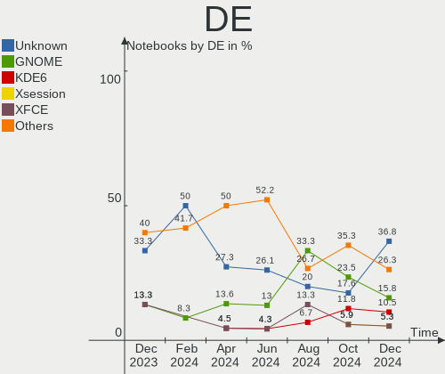
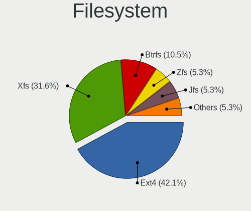

Gentoo Hardware Trends (Notebook)
---------------------------------

A project to identify most popular hardware characteristics and track their change
over time based on data collected by Gentoo users at https://Linux-Hardware.org.

Anyone can contribute to the study by uploading probes of their computers by
the [hw-probe](https://github.com/linuxhw/hw-probe) tool:

    sudo -E hw-probe -all -upload

Full-feature report is available here: https://linux-hardware.org/?view=trends&formfactor=notebook

Period: Jan, 2021.

Contents
--------

- [ OS                       ](#os)
- [ OS Family                ](#os-family)
- [ Kernel                   ](#kernel)
- [ Kernel Family            ](#kernel-family)
- [ Kernel Major Ver.        ](#kernel-major-ver)
- [ Arch                     ](#arch)
- [ DE                       ](#de)
- [ Display Server           ](#display-server)
- [ Display Manager          ](#display-manager)
- [ OS Lang                  ](#os-lang)
- [ Boot Mode                ](#boot-mode)
- [ Filesystem               ](#filesystem)
- [ Part. scheme             ](#part-scheme)
- [ Dual Boot with Linux/BSD ](#dual-boot-with-linux/bsd)
- [ Dual Boot (Win)          ](#dual-boot-win)
- [ Country                  ](#country)
- [ City                     ](#city)
- [ Vendor                   ](#vendor)
- [ Model                    ](#model)
- [ Model Family             ](#model-family)
- [ MFG Year                 ](#mfg-year)
- [ Form Factor              ](#form-factor)
- [ Secure Boot              ](#secure-boot)
- [ Coreboot                 ](#coreboot)
- [ RAM Size                 ](#ram-size)
- [ RAM Used                 ](#ram-used)
- [ Has CD-ROM               ](#has-cd-rom)
- [ Total Drives             ](#total-drives)
- [ Has Ethernet             ](#has-ethernet)
- [ Drive Vendor             ](#drive-vendor)
- [ Drive Model              ](#drive-model)
- [ HDD Vendor               ](#hdd-vendor)
- [ SSD Vendor               ](#ssd-vendor)
- [ Drive Kind               ](#drive-kind)
- [ Drive Connector          ](#drive-connector)
- [ Drive Size               ](#drive-size)
- [ Space Total              ](#space-total)
- [ Space Used               ](#space-used)
- [ Malfunc. Drives          ](#malfunc-drives)
- [ Malfunc. Drive Vendor    ](#malfunc-drive-vendor)
- [ Malfunc. HDD Vendor      ](#malfunc-hdd-vendor)
- [ Malfunc. Drive Kind      ](#malfunc-drive-kind)
- [ Failed Drives            ](#failed-drives)
- [ Failed Drive Vendor      ](#failed-drive-vendor)
- [ Drive Status             ](#drive-status)
- [ Storage Vendor           ](#storage-vendor)
- [ Storage Model            ](#storage-model)
- [ Storage Kind             ](#storage-kind)
- [ CPU Vendor               ](#cpu-vendor)
- [ CPU Model                ](#cpu-model)
- [ CPU Model Family         ](#cpu-model-family)
- [ CPU Cores                ](#cpu-cores)
- [ CPU Sockets              ](#cpu-sockets)
- [ CPU Threads              ](#cpu-threads)
- [ CPU Op-Modes             ](#cpu-op-modes)
- [ CPU Microcode            ](#cpu-microcode)
- [ CPU Microarch            ](#cpu-microarch)
- [ GPU Vendor               ](#gpu-vendor)
- [ GPU Model                ](#gpu-model)
- [ GPU Combo                ](#gpu-combo)
- [ GPU Driver               ](#gpu-driver)
- [ GPU Memory               ](#gpu-memory)
- [ Monitor Vendor           ](#monitor-vendor)
- [ Monitor Model            ](#monitor-model)
- [ Monitor Resolution       ](#monitor-resolution)
- [ Monitor Diagonal         ](#monitor-diagonal)
- [ Monitor Width            ](#monitor-width)
- [ Aspect Ratio             ](#aspect-ratio)
- [ Monitor Area             ](#monitor-area)
- [ Pixel Density            ](#pixel-density)
- [ Multiple Monitors        ](#multiple-monitors)
- [ Net Controller Vendor    ](#net-controller-vendor)
- [ Net Controller Model     ](#net-controller-model)
- [ Wireless Vendor          ](#wireless-vendor)
- [ Wireless Model           ](#wireless-model)
- [ Ethernet Vendor          ](#ethernet-vendor)
- [ Ethernet Model           ](#ethernet-model)
- [ Net Controller Kind      ](#net-controller-kind)
- [ Used Controller          ](#used-controller)
- [ NICs                     ](#nics)
- [ Memory Vendor            ](#memory-vendor)
- [ Memory Model             ](#memory-model)
- [ Memory Kind              ](#memory-kind)
- [ Memory Form Factor       ](#memory-form-factor)
- [ Memory Size              ](#memory-size)
- [ Memory Speed             ](#memory-speed)
- [ Sound Vendor             ](#sound-vendor)
- [ Sound Model              ](#sound-model)
- [ Camera Vendor            ](#camera-vendor)
- [ Camera Model             ](#camera-model)
- [ Fingerprint Vendor       ](#fingerprint-vendor)
- [ Fingerprint Model        ](#fingerprint-model)
- [ Chipcard Vendor          ](#chipcard-vendor)
- [ Chipcard Model           ](#chipcard-model)
- [ Printer Vendor           ](#printer-vendor)
- [ Printer Model            ](#printer-model)
- [ Scanner Vendor           ](#scanner-vendor)
- [ Scanner Model            ](#scanner-model)
- [ Bluetooth Vendor         ](#bluetooth-vendor)
- [ Bluetooth Model          ](#bluetooth-model)
- [ Unsupported Devices      ](#unsupported-devices)
- [ Unsupported Device Types ](#unsupported-device-types)

OS
--

Installed operating systems

| Name       | Notebooks | Percent |
|------------|-----------|---------|
| Gentoo     | 12        | 60%     |
| Gentoo 2.7 | 7         | 35%     |
| Gentoo 2.1 | 1         | 5%      |

OS Family
---------

OS without a version

| Name   | Notebooks | Percent |
|--------|-----------|---------|
| Gentoo | 20        | 100%    |

Kernel
------

Version of the Linux kernel

| Version                       | Notebooks | Percent |
|-------------------------------|-----------|---------|
| 5.4.80-gentoo-r1              | 2         | 10%     |
| 5.10.4-gentoo-x86_64          | 2         | 10%     |
| 5.9.16-gentoomultilib-nvidia  | 1         | 5%      |
| 5.9.16-gentoo                 | 1         | 5%      |
| 5.9.14-gentoo                 | 1         | 5%      |
| 5.4.80-gentoo-r1fomys         | 1         | 5%      |
| 5.4.80-gentoo-r1-x86          | 1         | 5%      |
| 5.4.66-gentoo-x86_64          | 1         | 5%      |
| 5.4.66-gentoo                 | 1         | 5%      |
| 5.4.48-gentoo-x86_64          | 1         | 5%      |
| 5.2.20-gentoo                 | 1         | 5%      |
| 5.10.9-169.current            | 1         | 5%      |
| 5.10.8                        | 1         | 5%      |
| 5.10.7-gentoo                 | 1         | 5%      |
| 5.10.6-gentoo                 | 1         | 5%      |
| 5.10.4-gentoo                 | 1         | 5%      |
| 5.10.2-gentoo                 | 1         | 5%      |
| 5.10.10-gentoo.98-no_firmware | 1         | 5%      |

Kernel Family
-------------

Linux kernel without a distro release

| Version | Notebooks | Percent |
|---------|-----------|---------|
| 5.4.80  | 4         | 20%     |
| 5.10.4  | 3         | 15%     |
| 5.9.16  | 2         | 10%     |
| 5.4.66  | 2         | 10%     |
| 5.9.14  | 1         | 5%      |
| 5.4.48  | 1         | 5%      |
| 5.2.20  | 1         | 5%      |
| 5.10.9  | 1         | 5%      |
| 5.10.8  | 1         | 5%      |
| 5.10.7  | 1         | 5%      |
| 5.10.6  | 1         | 5%      |
| 5.10.2  | 1         | 5%      |
| 5.10.10 | 1         | 5%      |

Kernel Major Ver.
-----------------

Linux kernel major version

| Version | Notebooks | Percent |
|---------|-----------|---------|
| 5.10    | 9         | 45%     |
| 5.4     | 7         | 35%     |
| 5.9     | 3         | 15%     |
| 5.2     | 1         | 5%      |

Arch
----

OS architecture (x86_64, i586, etc.)

| Name   | Notebooks | Percent |
|--------|-----------|---------|
| x86_64 | 19        | 95%     |
| i686   | 1         | 5%      |

DE
--

Desktop Environment

| Name           | Notebooks | Percent |
|----------------|-----------|---------|
| Unknown        | 9         | 45%     |
| GNOME          | 4         | 20%     |
| XFCE           | 3         | 15%     |
| KDE5           | 2         | 10%     |
| i3-with-shmlog | 1         | 5%      |
| DWM            | 1         | 5%      |

Display Server
--------------

X11 or Wayland

| Name    | Notebooks | Percent |
|---------|-----------|---------|
| X11     | 13        | 65%     |
| Unknown | 4         | 20%     |
| Tty     | 2         | 10%     |
| Wayland | 1         | 5%      |

Display Manager
---------------

SDDM, LightDM, etc.

| Name    | Notebooks | Percent |
|---------|-----------|---------|
| Unknown | 9         | 45%     |
| LightDM | 5         | 25%     |
| SDDM    | 3         | 15%     |
| XDM     | 1         | 5%      |
| SLiM    | 1         | 5%      |
| KDM     | 1         | 5%      |

OS Lang
-------

Language

| Lang    | Notebooks | Percent |
|---------|-----------|---------|
| en_US   | 11        | 55%     |
| en_CA   | 2         | 10%     |
| POSIX   | 1         | 5%      |
| fr_FR   | 1         | 5%      |
| fr_BE   | 1         | 5%      |
| en_FR   | 1         | 5%      |
| en_AU   | 1         | 5%      |
| C.UTF8  | 1         | 5%      |
| Unknown | 1         | 5%      |

Boot Mode
---------

EFI or BIOS

| Mode | Notebooks | Percent |
|------|-----------|---------|
| EFI  | 15        | 75%     |
| BIOS | 5         | 25%     |

Filesystem
----------

Type of filesystem

| Type  | Notebooks | Percent |
|-------|-----------|---------|
| Ext4  | 15        | 75%     |
| Btrfs | 5         | 25%     |

Part. scheme
------------

Scheme of partitioning

| Type    | Notebooks | Percent |
|---------|-----------|---------|
| GPT     | 16        | 80%     |
| MBR     | 3         | 15%     |
| Unknown | 1         | 5%      |

Dual Boot with Linux/BSD
------------------------

Hosting more than one Linux/BSD

| Dual boot | Notebooks | Percent |
|-----------|-----------|---------|
| No        | 16        | 80%     |
| Yes       | 4         | 20%     |

Dual Boot (Win)
---------------

Hosting Linux and Windows

| Dual boot | Notebooks | Percent |
|-----------|-----------|---------|
| No        | 14        | 70%     |
| Yes       | 6         | 30%     |

Country
-------

Geographic location (country)

| Country     | Notebooks | Percent |
|-------------|-----------|---------|
| Belgium     | 3         | 15%     |
| USA         | 2         | 10%     |
| Greece      | 2         | 10%     |
| France      | 2         | 10%     |
| Canada      | 2         | 10%     |
| Ukraine     | 1         | 5%      |
| Turkey      | 1         | 5%      |
| Spain       | 1         | 5%      |
| Slovakia    | 1         | 5%      |
| Netherlands | 1         | 5%      |
| Italy       | 1         | 5%      |
| Germany     | 1         | 5%      |
| China       | 1         | 5%      |
| Australia   | 1         | 5%      |

City
----

Geographic location (city)

| City              | Notebooks | Percent |
|-------------------|-----------|---------|
| Verona            | 1         | 5%      |
| Toulouse          | 1         | 5%      |
| Toronto           | 1         | 5%      |
| Thessaloniki      | 1         | 5%      |
| Sevastopol        | 1         | 5%      |
| Seattle           | 1         | 5%      |
| Neuenstein        | 1         | 5%      |
| Madrid            | 1         | 5%      |
| Leuven            | 1         | 5%      |
| Istanbul          | 1         | 5%      |
| Hamilton          | 1         | 5%      |
| Ghent             | 1         | 5%      |
| Geldermalsen      | 1         | 5%      |
| Colomiers         | 1         | 5%      |
| Brisbane          | 1         | 5%      |
| Bratislava        | 1         | 5%      |
| Beijing           | 1         | 5%      |
| Bainbridge Island | 1         | 5%      |
| Athens            | 1         | 5%      |
| Antwerp           | 1         | 5%      |

Vendor
------

Motherboard manufacturer

| Name             | Notebooks | Percent |
|------------------|-----------|---------|
| Lenovo           | 8         | 40%     |
| Hewlett-Packard  | 5         | 25%     |
| ASUSTek Computer | 2         | 10%     |
| IT Channel Pty   | 1         | 5%      |
| Google           | 1         | 5%      |
| Dell             | 1         | 5%      |
| Chuwi            | 1         | 5%      |
| Unknown          | 1         | 5%      |

Model
-----

Motherboard model

| Name                                 | Notebooks | Percent |
|--------------------------------------|-----------|---------|
| Unknown                              | 2         | 10%     |
| Lenovo XiaoXin-15ARE 2020 81YR       | 1         | 5%      |
| Lenovo ThinkPad T480 20L5CTO1WW      | 1         | 5%      |
| Lenovo ThinkPad T480 20L5000WUS      | 1         | 5%      |
| Lenovo ThinkPad T14 Gen 1 20UD0010RT | 1         | 5%      |
| Lenovo ThinkPad P73 20QRCTO1WW       | 1         | 5%      |
| Lenovo ThinkPad A485 20MUCTO1WW      | 1         | 5%      |
| Lenovo Legion Y530-15ICH-1060 81LB   | 1         | 5%      |
| Lenovo IdeaPad Gaming 3 15ARH05 82EY | 1         | 5%      |
| IT Channel Pty PA70ES                | 1         | 5%      |
| HP ZBook 15 G4                       | 1         | 5%      |
| HP Pavilion Notebook                 | 1         | 5%      |
| HP Pavilion Gaming Laptop 15-ec1xxx  | 1         | 5%      |
| HP Pavilion dm1                      | 1         | 5%      |
| Google Peppy                         | 1         | 5%      |
| Dell G3 3500                         | 1         | 5%      |
| Chuwi UBook Pro                      | 1         | 5%      |
| ASUS X555LJ                          | 1         | 5%      |
| ASUS A7V                             | 1         | 5%      |

Model Family
------------

Motherboard model prefix

| Name                  | Notebooks | Percent |
|-----------------------|-----------|---------|
| Lenovo ThinkPad       | 5         | 25%     |
| HP Pavilion           | 3         | 15%     |
| Unknown               | 2         | 10%     |
| Lenovo XiaoXin-15ARE  | 1         | 5%      |
| Lenovo Legion         | 1         | 5%      |
| Lenovo IdeaPad        | 1         | 5%      |
| IT Channel Pty PA70ES | 1         | 5%      |
| HP ZBook              | 1         | 5%      |
| Google Peppy          | 1         | 5%      |
| Dell G3               | 1         | 5%      |
| Chuwi UBook           | 1         | 5%      |
| ASUS X555LJ           | 1         | 5%      |
| ASUS A7V              | 1         | 5%      |

MFG Year
--------

Motherboard manufacture year

| Year | Notebooks | Percent |
|------|-----------|---------|
| 2020 | 9         | 45%     |
| 2019 | 6         | 30%     |
| 2011 | 2         | 10%     |
| 2018 | 1         | 5%      |
| 2015 | 1         | 5%      |
| 2005 | 1         | 5%      |

Form Factor
-----------

Physical design of the computer

| Name     | Notebooks | Percent |
|----------|-----------|---------|
| Notebook | 20        | 100%    |

Secure Boot
-----------

Enabled or disabled

| State    | Notebooks | Percent |
|----------|-----------|---------|
| Disabled | 20        | 100%    |

Coreboot
--------

Have coreboot on board

| Used | Notebooks | Percent |
|------|-----------|---------|
| No   | 19        | 95%     |
| Yes  | 1         | 5%      |

RAM Size
--------

Total RAM memory

| Size in GB  | Notebooks | Percent |
|-------------|-----------|---------|
| 4.01-8.0    | 5         | 25%     |
| 32.01-64.0  | 4         | 20%     |
| 8.01-16.0   | 4         | 20%     |
| 3.01-4.0    | 2         | 10%     |
| 16.01-24.0  | 2         | 10%     |
| 24.01-32.0  | 1         | 5%      |
| 64.01-256.0 | 1         | 5%      |
| 0.01-0.5    | 1         | 5%      |

RAM Used
--------

Used RAM memory

| Used GB   | Notebooks | Percent |
|-----------|-----------|---------|
| 1.01-2.0  | 7         | 35%     |
| 4.01-8.0  | 3         | 15%     |
| 2.01-3.0  | 3         | 15%     |
| 0.01-0.5  | 3         | 15%     |
| 3.01-4.0  | 2         | 10%     |
| 8.01-16.0 | 2         | 10%     |

Has CD-ROM
----------

Has CD-ROM on board

| Presented | Notebooks | Percent |
|-----------|-----------|---------|
| No        | 18        | 90%     |
| Yes       | 2         | 10%     |

Total Drives
------------

Number of drives on board

| Drives | Notebooks | Percent |
|--------|-----------|---------|
| 1      | 13        | 65%     |
| 2      | 6         | 30%     |
| 3      | 1         | 5%      |

Has Ethernet
------------

Has Ethernet on board

| Presented | Notebooks | Percent |
|-----------|-----------|---------|
| Yes       | 15        | 75%     |
| No        | 5         | 25%     |

Drive Vendor
------------

Hard drive vendors

| Vendor              | Notebooks | Drives | Percent |
|---------------------|-----------|--------|---------|
| Samsung Electronics | 9         | 11     | 34.62%  |
| Seagate             | 5         | 5      | 19.23%  |
| WDC                 | 3         | 3      | 11.54%  |
| Toshiba             | 2         | 2      | 7.69%   |
| Unknown             | 1         | 1      | 3.85%   |
| ShanDianZhe         | 1         | 1      | 3.85%   |
| Netac               | 1         | 1      | 3.85%   |
| MyDigitalSSD        | 1         | 1      | 3.85%   |
| KIOXIA              | 1         | 1      | 3.85%   |
| Kingston            | 1         | 1      | 3.85%   |
| Intel               | 1         | 1      | 3.85%   |

Drive Model
-----------

Hard drive models

| Model                              | Notebooks | Percent |
|------------------------------------|-----------|---------|
| WDC WDS480G2G0B-00EPW0 480GB SSD   | 1         | 3.57%   |
| WDC WDS240G2G0A-00JH30 240GB SSD   | 1         | 3.57%   |
| WDC WD5000LPLX-08ZNTT0 500GB       | 1         | 3.57%   |
| Unknown ED4QT  128GB               | 1         | 3.57%   |
| Toshiba THNSNX032GMCT 32GB SSD     | 1         | 3.57%   |
| Toshiba RC100 240GB                | 1         | 3.57%   |
| ShanDianZhe SSD 512GB              | 1         | 3.57%   |
| Seagate ST500LM030-2E717D 500GB    | 1         | 3.57%   |
| Seagate ST2000LX001-1RG174 2TB     | 1         | 3.57%   |
| Seagate ST2000LM007-1R8174 2TB     | 1         | 3.57%   |
| Seagate ST1000LM024 HN-M101MBB 1TB | 1         | 3.57%   |
| Seagate ST1000LM014-1EJ164 1TB     | 1         | 3.57%   |
| Samsung SSD 850 EVO 250GB          | 1         | 3.57%   |
| Samsung SSD 850 EVO 1TB            | 1         | 3.57%   |
| Samsung Portable SSD T5 500GB      | 1         | 3.57%   |
| Samsung PM991 NVMe 512GB           | 1         | 3.57%   |
| Samsung NVMe SSD Drive 512GB       | 1         | 3.57%   |
| Samsung MZVLW512HMJP-000H7 512GB   | 1         | 3.57%   |
| Samsung MZVLB512HBJQ-000L2 512GB   | 1         | 3.57%   |
| Samsung MZVLB2T0HALB-000L7 2TB     | 1         | 3.57%   |
| Samsung MZVLB256HBHQ-000L7 256GB   | 1         | 3.57%   |
| Samsung MZVLB256HAHQ-000L2 256GB   | 1         | 3.57%   |
| Samsung MZALQ512HALU-000L2 512GB   | 1         | 3.57%   |
| Netac SSD 256GB                    | 1         | 3.57%   |
| MyDigitalSSD SC2 M2 SSD 120GB      | 1         | 3.57%   |
| KIOXIA KBG40ZNV512G 512GB          | 1         | 3.57%   |
| Kingston SA400S37480G 480GB SSD    | 1         | 3.57%   |
| Intel SSDPEKKF256G8L 256GB         | 1         | 3.57%   |

HDD Vendor
----------

Hard disk drive vendors

| Vendor  | Notebooks | Drives | Percent |
|---------|-----------|--------|---------|
| Seagate | 5         | 5      | 83.33%  |
| WDC     | 1         | 1      | 16.67%  |

SSD Vendor
----------

Solid state drive vendors

| Vendor              | Notebooks | Drives | Percent |
|---------------------|-----------|--------|---------|
| WDC                 | 2         | 2      | 22.22%  |
| Samsung Electronics | 2         | 3      | 22.22%  |
| Toshiba             | 1         | 1      | 11.11%  |
| ShanDianZhe         | 1         | 1      | 11.11%  |
| Netac               | 1         | 1      | 11.11%  |
| MyDigitalSSD        | 1         | 1      | 11.11%  |
| Kingston            | 1         | 1      | 11.11%  |

Drive Kind
----------

HDD or SSD

| Kind | Notebooks | Drives | Percent |
|------|-----------|--------|---------|
| NVMe | 10        | 11     | 40%     |
| SSD  | 8         | 10     | 32%     |
| HDD  | 6         | 6      | 24%     |
| MMC  | 1         | 1      | 4%      |

Drive Connector
---------------

SATA, SAS, NVMe, etc.

| Type | Notebooks | Drives | Percent |
|------|-----------|--------|---------|
| SATA | 13        | 15     | 52%     |
| NVMe | 10        | 11     | 40%     |
| SAS  | 1         | 1      | 4%      |
| MMC  | 1         | 1      | 4%      |

Drive Size
----------

Size of hard drive

| Size in TB | Notebooks | Drives | Percent |
|------------|-----------|--------|---------|
| 0.01-0.5   | 9         | 10     | 60%     |
| 0.51-1.0   | 4         | 4      | 26.67%  |
| 1.01-2.0   | 2         | 2      | 13.33%  |

Space Total
-----------

Amount of disk space available on the file system

| Size in GB     | Notebooks | Percent |
|----------------|-----------|---------|
| 101-250        | 7         | 35%     |
| 251-500        | 4         | 20%     |
| 21-50          | 4         | 20%     |
| 1001-2000      | 3         | 15%     |
| More than 3000 | 1         | 5%      |
| 501-1000       | 1         | 5%      |

Space Used
----------

Amount of used disk space

| Used GB        | Notebooks | Percent |
|----------------|-----------|---------|
| 101-250        | 6         | 30%     |
| 1-20           | 5         | 25%     |
| 51-100         | 3         | 15%     |
| 251-500        | 2         | 10%     |
| More than 3000 | 1         | 5%      |
| 21-50          | 1         | 5%      |
| 1001-2000      | 1         | 5%      |
| 501-1000       | 1         | 5%      |

Malfunc. Drives
---------------

Drive models with a malfunction

| Model                               | Notebooks | Drives | Percent |
|-------------------------------------|-----------|--------|---------|
| Seagate ST1000LM024 HN-M101MBB 1TB  | 1         | 1      | 50%     |
| Samsung Electronics SSD 850 EVO 1TB | 1         | 1      | 50%     |

Malfunc. Drive Vendor
---------------------

Vendors of faulty drives

| Vendor              | Notebooks | Drives | Percent |
|---------------------|-----------|--------|---------|
| Seagate             | 1         | 1      | 50%     |
| Samsung Electronics | 1         | 1      | 50%     |

Malfunc. HDD Vendor
-------------------

Vendors of faulty HDD drives

| Vendor  | Notebooks | Drives | Percent |
|---------|-----------|--------|---------|
| Seagate | 1         | 1      | 100%    |

Malfunc. Drive Kind
-------------------

Kinds of faulty drives

| Kind | Notebooks | Drives | Percent |
|------|-----------|--------|---------|
| SSD  | 1         | 1      | 50%     |
| HDD  | 1         | 1      | 50%     |

Failed Drives
-------------

Failed drive models

Zero info for selected period =(

Failed Drive Vendor
-------------------

Failed drive vendors

Zero info for selected period =(

Drive Status
------------

Number of failed and malfunc. drives

| Status   | Notebooks | Drives | Percent |
|----------|-----------|--------|---------|
| Works    | 19        | 23     | 79.17%  |
| Detected | 3         | 3      | 12.5%   |
| Malfunc  | 2         | 2      | 8.33%   |

Storage Vendor
--------------

Storage controller vendors

| Vendor                       | Notebooks | Percent |
|------------------------------|-----------|---------|
| Intel                        | 14        | 50%     |
| Samsung Electronics          | 7         | 25%     |
| AMD                          | 5         | 17.86%  |
| Toshiba America Info Systems | 1         | 3.57%   |
| KIOXIA                       | 1         | 3.57%   |

Storage Model
-------------

Storage controller models

| Model                                                                         | Notebooks | Percent |
|-------------------------------------------------------------------------------|-----------|---------|
| Samsung NVMe SSD Controller SM981/PM981/PM983                                 | 4         | 13.79%  |
| AMD FCH SATA Controller [AHCI mode]                                           | 4         | 13.79%  |
| Intel Sunrise Point-LP SATA Controller [AHCI mode]                            | 3         | 10.34%  |
| Samsung Electronics Non-Volatile memory controller                            | 2         | 6.9%    |
| Intel Wildcat Point-LP SATA Controller [AHCI Mode]                            | 2         | 6.9%    |
| Intel Cannon Lake Mobile PCH SATA AHCI Controller                             | 2         | 6.9%    |
| Toshiba America Info Systems BG3 NVMe SSD Controller                          | 1         | 3.45%   |
| Samsung NVMe SSD Controller SM961/PM961/SM963                                 | 1         | 3.45%   |
| KIOXIA Non-Volatile memory controller                                         | 1         | 3.45%   |
| Intel SSD Pro 7600p/760p/E 6100p Series                                       | 1         | 3.45%   |
| Intel Q170/Q150/B150/H170/H110/Z170/CM236 Chipset SATA Controller [AHCI Mode] | 1         | 3.45%   |
| Intel Celeron/Pentium Silver Processor SATA Controller                        | 1         | 3.45%   |
| Intel 82801HM/HEM (ICH8M/ICH8M-E) SATA Controller [AHCI mode]                 | 1         | 3.45%   |
| Intel 82801HM/HEM (ICH8M/ICH8M-E) IDE Controller                              | 1         | 3.45%   |
| Intel 82801FB/FBM/FR/FW/FRW (ICH6 Family) IDE Controller                      | 1         | 3.45%   |
| Intel 8 Series SATA Controller 1 [AHCI mode]                                  | 1         | 3.45%   |
| Intel 400 Series Chipset Family SATA AHCI Controller                          | 1         | 3.45%   |
| AMD SB7x0/SB8x0/SB9x0 SATA Controller [AHCI mode]                             | 1         | 3.45%   |

Storage Kind
------------

Kind of storage controller (IDE, SATA, NVMe, SAS, ...)

| Kind | Notebooks | Percent |
|------|-----------|---------|
| SATA | 17        | 58.62%  |
| NVMe | 10        | 34.48%  |
| IDE  | 2         | 6.9%    |

CPU Vendor
----------

Processor vendors

| Vendor | Notebooks | Percent |
|--------|-----------|---------|
| Intel  | 14        | 70%     |
| AMD    | 6         | 30%     |

CPU Model
---------

Processor models

| Model                                           | Notebooks | Percent |
|-------------------------------------------------|-----------|---------|
| Intel Core i7-8750H CPU @ 2.20GHz               | 2         | 10%     |
| Intel Pentium M processor 1.73GHz               | 1         | 5%      |
| Intel Core m3-8100Y CPU @ 1.10GHz               | 1         | 5%      |
| Intel Core i9-9880H CPU @ 2.30GHz               | 1         | 5%      |
| Intel Core i7-8550U CPU @ 1.80GHz               | 1         | 5%      |
| Intel Core i7-7820HQ CPU @ 2.90GHz              | 1         | 5%      |
| Intel Core i7-5500U CPU @ 2.40GHz               | 1         | 5%      |
| Intel Core i5-8250U CPU @ 1.60GHz               | 1         | 5%      |
| Intel Core i5-5200U CPU @ 2.20GHz               | 1         | 5%      |
| Intel Core i5-10300H CPU @ 2.50GHz              | 1         | 5%      |
| Intel Core 2 Duo CPU T7500 @ 2.20GHz            | 1         | 5%      |
| Intel Celeron J4115 CPU @ 1.80GHz               | 1         | 5%      |
| Intel Celeron 2955U @ 1.40GHz                   | 1         | 5%      |
| AMD Ryzen 7 PRO 2700U w/ Radeon Vega Mobile Gfx | 1         | 5%      |
| AMD Ryzen 7 4800U with Radeon Graphics          | 1         | 5%      |
| AMD Ryzen 7 4800H with Radeon Graphics          | 1         | 5%      |
| AMD Ryzen 5 PRO 4650U with Radeon Graphics      | 1         | 5%      |
| AMD Ryzen 5 4600H with Radeon Graphics          | 1         | 5%      |
| AMD E-350 Processor                             | 1         | 5%      |

CPU Model Family
----------------

Processor model prefix

| Model            | Notebooks | Percent |
|------------------|-----------|---------|
| Intel Core i7    | 5         | 25%     |
| Intel Core i5    | 3         | 15%     |
| Intel Celeron    | 2         | 10%     |
| AMD Ryzen 7      | 2         | 10%     |
| Intel Pentium M  | 1         | 5%      |
| Intel Core m3    | 1         | 5%      |
| Intel Core i9    | 1         | 5%      |
| Intel Core 2 Duo | 1         | 5%      |
| AMD Ryzen 7 PRO  | 1         | 5%      |
| AMD Ryzen 5 PRO  | 1         | 5%      |
| AMD Ryzen 5      | 1         | 5%      |
| AMD E            | 1         | 5%      |

CPU Cores
---------

Number of processor cores

| Number | Notebooks | Percent |
|--------|-----------|---------|
| 4      | 6         | 30%     |
| 2      | 6         | 30%     |
| 6      | 4         | 20%     |
| 8      | 3         | 15%     |
| 1      | 1         | 5%      |

CPU Sockets
-----------

Number of sockets

| Number | Notebooks | Percent |
|--------|-----------|---------|
| 1      | 20        | 100%    |

CPU Threads
-----------

Threads per core (Hyper-Threading)

| Number | Notebooks | Percent |
|--------|-----------|---------|
| 2      | 15        | 75%     |
| 1      | 5         | 25%     |

CPU Op-Modes
------------

CPU Operation Modes (32-bit, 64-bit)

| Op mode        | Notebooks | Percent |
|----------------|-----------|---------|
| 32-bit, 64-bit | 19        | 95%     |
| 32-bit         | 1         | 5%      |

CPU Microcode
-------------

Microcode number

| Number     | Notebooks | Percent |
|------------|-----------|---------|
| 0x906ea    | 2         | 10%     |
| 0x806ea    | 2         | 10%     |
| 0x306d4    | 2         | 10%     |
| 0x08600106 | 2         | 10%     |
| 0xa0652    | 1         | 5%      |
| 0x906ed    | 1         | 5%      |
| 0x906e9    | 1         | 5%      |
| 0x806e9    | 1         | 5%      |
| 0x706a1    | 1         | 5%      |
| 0x6fb      | 1         | 5%      |
| 0x6d8      | 1         | 5%      |
| 0x40651    | 1         | 5%      |
| 0x08600104 | 1         | 5%      |
| 0x08600103 | 1         | 5%      |
| 0x0810100b | 1         | 5%      |
| 0x05000028 | 1         | 5%      |

CPU Microarch
-------------

Microarchitecture

| Name          | Notebooks | Percent |
|---------------|-----------|---------|
| KabyLake      | 7         | 35%     |
| Zen 2         | 4         | 20%     |
| Broadwell     | 2         | 10%     |
| Zen           | 1         | 5%      |
| P6            | 1         | 5%      |
| Haswell       | 1         | 5%      |
| Goldmont plus | 1         | 5%      |
| Core          | 1         | 5%      |
| CometLake     | 1         | 5%      |
| Bobcat        | 1         | 5%      |

GPU Vendor
----------

Vendors of graphics cards

| Vendor | Notebooks | Percent |
|--------|-----------|---------|
| Intel  | 11        | 39.29%  |
| Nvidia | 10        | 35.71%  |
| AMD    | 7         | 25%     |

GPU Model
---------

Graphics card models

| Model                                                               | Notebooks | Percent |
|---------------------------------------------------------------------|-----------|---------|
| AMD Renoir                                                          | 4         | 13.79%  |
| Nvidia TU117M                                                       | 2         | 6.9%    |
| Intel UHD Graphics 630 (Mobile)                                     | 2         | 6.9%    |
| Intel UHD Graphics 620                                              | 2         | 6.9%    |
| Intel HD Graphics 5500                                              | 2         | 6.9%    |
| Nvidia TU117M [GeForce GTX 1650 Ti Mobile]                          | 1         | 3.45%   |
| Nvidia TU104GLM [Quadro RTX 4000 Mobile / Max-Q]                    | 1         | 3.45%   |
| Nvidia GP108M [GeForce MX150]                                       | 1         | 3.45%   |
| Nvidia GP106M [GeForce GTX 1060 Mobile]                             | 1         | 3.45%   |
| Nvidia GP104BM [GeForce GTX 1070 Mobile]                            | 1         | 3.45%   |
| Nvidia GM206GLM [Quadro M2200 Mobile]                               | 1         | 3.45%   |
| Nvidia GM108M [GeForce 940M]                                        | 1         | 3.45%   |
| Nvidia GK208BM [GeForce 920M]                                       | 1         | 3.45%   |
| Intel UHD Graphics 615                                              | 1         | 3.45%   |
| Intel UHD Graphics 605                                              | 1         | 3.45%   |
| Intel Mobile GM965/GL960 Integrated Graphics Controller (secondary) | 1         | 3.45%   |
| Intel Mobile GM965/GL960 Integrated Graphics Controller (primary)   | 1         | 3.45%   |
| Intel Haswell-ULT Integrated Graphics Controller                    | 1         | 3.45%   |
| Intel CometLake-H GT2 [UHD Graphics]                                | 1         | 3.45%   |
| AMD Wrestler [Radeon HD 6310]                                       | 1         | 3.45%   |
| AMD RV410/M26 [Mobility Radeon X700]                                | 1         | 3.45%   |
| AMD Raven Ridge [Radeon Vega Series / Radeon Vega Mobile Series]    | 1         | 3.45%   |

GPU Combo
---------

Combinations of graphics cards

| Name           | Notebooks | Percent |
|----------------|-----------|---------|
| Intel + Nvidia | 6         | 30%     |
| 1 x Intel      | 5         | 25%     |
| 1 x AMD        | 5         | 25%     |
| 1 x Nvidia     | 2         | 10%     |
| AMD + Nvidia   | 2         | 10%     |

GPU Driver
----------

Free vs proprietary

| Driver      | Notebooks | Percent |
|-------------|-----------|---------|
| Free        | 12        | 60%     |
| Proprietary | 7         | 35%     |
| Unknown     | 1         | 5%      |

GPU Memory
----------

Total video memory

| Size in GB | Notebooks | Percent |
|------------|-----------|---------|
| Unknown    | 12        | 60%     |
| 7.01-8.0   | 2         | 10%     |
| 3.01-4.0   | 2         | 10%     |
| 0.01-0.5   | 2         | 10%     |
| 1.01-2.0   | 1         | 5%      |
| 0.51-1.0   | 1         | 5%      |

Monitor Vendor
--------------

Monitor vendors

| Vendor                  | Notebooks | Percent |
|-------------------------|-----------|---------|
| LG Display              | 6         | 25%     |
| AU Optronics            | 5         | 20.83%  |
| BOE                     | 4         | 16.67%  |
| Samsung Electronics     | 3         | 12.5%   |
| Chimei Innolux          | 3         | 12.5%   |
| Goldstar                | 1         | 4.17%   |
| Chi Mei Optoelectronics | 1         | 4.17%   |
| Apple                   | 1         | 4.17%   |

Monitor Model
-------------

Monitor models

| Model                                                                    | Notebooks | Percent |
|--------------------------------------------------------------------------|-----------|---------|
| Samsung Electronics S32F351 SAM0D24 1920x1080 698x393mm 31.5-inch        | 1         | 4.17%   |
| Samsung Electronics S27F350 SAM0D22 1920x1080 598x336mm 27.0-inch        | 1         | 4.17%   |
| Samsung Electronics LCD Monitor SDC4E51 1366x768 340x190mm 15.3-inch     | 1         | 4.17%   |
| LG Display LCD Monitor LGD40BA 1920x1080 344x194mm 15.5-inch             | 1         | 4.17%   |
| LG Display LCD Monitor LGD0608 1920x1080 309x174mm 14.0-inch             | 1         | 4.17%   |
| LG Display LCD Monitor LGD05CF 1920x1080 344x194mm 15.5-inch             | 1         | 4.17%   |
| LG Display LCD Monitor LGD057E 1920x1080 344x194mm 15.5-inch             | 1         | 4.17%   |
| LG Display LCD Monitor LGD056D 1920x1080 380x210mm 17.1-inch             | 1         | 4.17%   |
| LG Display LCD Monitor LGD0521 1920x1080 309x174mm 14.0-inch             | 1         | 4.17%   |
| Goldstar E1942 GSM4C09 1366x768 410x230mm 18.5-inch                      | 1         | 4.17%   |
| Chimei Innolux LCD Monitor CMN15F5 1920x1080 344x193mm 15.5-inch         | 1         | 4.17%   |
| Chimei Innolux LCD Monitor CMN15AB 1366x768 350x190mm 15.7-inch          | 1         | 4.17%   |
| Chimei Innolux LCD Monitor CMN1132 1366x768 260x140mm 11.6-inch          | 1         | 4.17%   |
| Chi Mei Optoelectronics LCD Monitor CMO1107 1366x768 256x144mm 11.6-inch | 1         | 4.17%   |
| BOE LCD Monitor BOE08E8 1920x1080 344x194mm 15.5-inch                    | 1         | 4.17%   |
| BOE LCD Monitor BOE0819 1920x1080 344x194mm 15.5-inch                    | 1         | 4.17%   |
| BOE LCD Monitor BOE07EC 1920x1080 309x174mm 14.0-inch                    | 1         | 4.17%   |
| BOE LCD Monitor BOE06DC 1920x1280 259x173mm 12.3-inch                    | 1         | 4.17%   |
| AU Optronics LCD Monitor AUO2E3C 1366x768 309x173mm 13.9-inch            | 1         | 4.17%   |
| AU Optronics LCD Monitor AUO243D 1920x1080 309x173mm 13.9-inch           | 1         | 4.17%   |
| AU Optronics LCD Monitor AUO2074 1280x800 331x207mm 15.4-inch            | 1         | 4.17%   |
| AU Optronics LCD Monitor AUO1101 1440x900 367x230mm 17.1-inch            | 1         | 4.17%   |
| AU Optronics LCD Monitor AUO109B 3840x2160 382x214mm 17.2-inch           | 1         | 4.17%   |
| Apple Cinema HD APP921C 1920x1200 490x310mm 22.8-inch                    | 1         | 4.17%   |

Monitor Resolution
------------------

Monitor screen resolution

| Resolution        | Notebooks | Percent |
|-------------------|-----------|---------|
| 1920x1080 (FHD)   | 12        | 54.55%  |
| 1366x768 (WXGA)   | 5         | 22.73%  |
| 3840x2160 (4K)    | 1         | 4.55%   |
| 1920x1280         | 1         | 4.55%   |
| 1920x1200 (WUXGA) | 1         | 4.55%   |
| 1440x900 (WXGA+)  | 1         | 4.55%   |
| 1280x800 (WXGA)   | 1         | 4.55%   |

Monitor Diagonal
----------------

Diagonal size in inches

| Inches | Notebooks | Percent |
|--------|-----------|---------|
| 15     | 9         | 37.5%   |
| 14     | 4         | 16.67%  |
| 17     | 3         | 12.5%   |
| 11     | 2         | 8.33%   |
| 31     | 1         | 4.17%   |
| 27     | 1         | 4.17%   |
| 23     | 1         | 4.17%   |
| 18     | 1         | 4.17%   |
| 13     | 1         | 4.17%   |
| 12     | 1         | 4.17%   |

Monitor Width
-------------

Physical width

| Width in mm | Notebooks | Percent |
|-------------|-----------|---------|
| 301-350     | 14        | 58.33%  |
| 351-400     | 3         | 12.5%   |
| 201-300     | 3         | 12.5%   |
| 401-500     | 2         | 8.33%   |
| 601-700     | 1         | 4.17%   |
| 501-600     | 1         | 4.17%   |

Aspect Ratio
------------

Proportional relationship between the width and the height

| Ratio | Notebooks | Percent |
|-------|-----------|---------|
| 16/9  | 18        | 81.82%  |
| 16/10 | 3         | 13.64%  |
| 3/2   | 1         | 4.55%   |

Monitor Area
------------

Area in inch²

| Area in inch² | Notebooks | Percent |
|----------------|-----------|---------|
| 101-110        | 9         | 37.5%   |
| 81-90          | 5         | 20.83%  |
| 51-60          | 2         | 8.33%   |
| 121-130        | 2         | 8.33%   |
| 61-70          | 1         | 4.17%   |
| 351-500        | 1         | 4.17%   |
| 301-350        | 1         | 4.17%   |
| 201-250        | 1         | 4.17%   |
| 141-150        | 1         | 4.17%   |
| 131-140        | 1         | 4.17%   |

Pixel Density
-------------

Pixels per inch

| Density       | Notebooks | Percent |
|---------------|-----------|---------|
| 121-160       | 13        | 56.52%  |
| 51-100        | 6         | 26.09%  |
| 101-120       | 2         | 8.7%    |
| More than 240 | 1         | 4.35%   |
| 161-240       | 1         | 4.35%   |

Multiple Monitors
-----------------

Total monitors connected

| Total | Notebooks | Percent |
|-------|-----------|---------|
| 1     | 16        | 80%     |
| 2     | 4         | 20%     |

Net Controller Vendor
---------------------

Controller vendors

| Vendor                | Notebooks | Percent |
|-----------------------|-----------|---------|
| Realtek Semiconductor | 13        | 46.43%  |
| Intel                 | 11        | 39.29%  |
| Qualcomm Atheros      | 3         | 10.71%  |
| Ralink                | 1         | 3.57%   |

Net Controller Model
--------------------

Controller models

| Model                                                             | Notebooks | Percent |
|-------------------------------------------------------------------|-----------|---------|
| Realtek RTL8111/8168/8411 PCI Express Gigabit Ethernet Controller | 9         | 25.71%  |
| Intel Wireless 8265 / 8275                                        | 3         | 8.57%   |
| Realtek RTL8822CE 802.11ac PCIe Wireless Network Adapter          | 2         | 5.71%   |
| Intel Wireless-AC 9560 [Jefferson Peak]                           | 2         | 5.71%   |
| Intel Wi-Fi 6 AX200                                               | 2         | 5.71%   |
| Intel Ethernet Connection (4) I219-V                              | 2         | 5.71%   |
| Realtek RTL8822BE 802.11a/b/g/n/ac WiFi adapter                   | 1         | 2.86%   |
| Realtek RTL8821CE 802.11ac PCIe Wireless Network Adapter          | 1         | 2.86%   |
| Realtek RTL8723BE PCIe Wireless Network Adapter                   | 1         | 2.86%   |
| Realtek RTL810xE PCI Express Fast Ethernet controller             | 1         | 2.86%   |
| Realtek RTL-8100/8101L/8139 PCI Fast Ethernet Adapter             | 1         | 2.86%   |
| Ralink RT5390 [802.11 b/g/n 1T1R G-band PCI Express Single Chip]  | 1         | 2.86%   |
| Qualcomm Atheros QCA6174 802.11ac Wireless Network Adapter        | 1         | 2.86%   |
| Qualcomm Atheros AR9485 Wireless Network Adapter                  | 1         | 2.86%   |
| Qualcomm Atheros AR9462 Wireless Network Adapter                  | 1         | 2.86%   |
| Intel Wireless 3165                                               | 1         | 2.86%   |
| Intel PRO/Wireless 3945ABG [Golan] Network Connection             | 1         | 2.86%   |
| Intel PRO/Wireless 2200BG [Calexico2] Network Connection          | 1         | 2.86%   |
| Intel Ethernet Connection (7) I219-LM                             | 1         | 2.86%   |
| Intel Ethernet Connection (2) I219-LM                             | 1         | 2.86%   |
| Intel Comet Lake PCH CNVi WiFi                                    | 1         | 2.86%   |

Wireless Vendor
---------------

Wireless vendors

| Vendor                | Notebooks | Percent |
|-----------------------|-----------|---------|
| Intel                 | 11        | 55%     |
| Realtek Semiconductor | 5         | 25%     |
| Qualcomm Atheros      | 3         | 15%     |
| Ralink                | 1         | 5%      |

Wireless Model
--------------

Wireless models

| Model                                                            | Notebooks | Percent |
|------------------------------------------------------------------|-----------|---------|
| Intel Wireless 8265 / 8275                                       | 3         | 15%     |
| Realtek RTL8822CE 802.11ac PCIe Wireless Network Adapter         | 2         | 10%     |
| Intel Wireless-AC 9560 [Jefferson Peak]                          | 2         | 10%     |
| Intel Wi-Fi 6 AX200                                              | 2         | 10%     |
| Realtek RTL8822BE 802.11a/b/g/n/ac WiFi adapter                  | 1         | 5%      |
| Realtek RTL8821CE 802.11ac PCIe Wireless Network Adapter         | 1         | 5%      |
| Realtek RTL8723BE PCIe Wireless Network Adapter                  | 1         | 5%      |
| Ralink RT5390 [802.11 b/g/n 1T1R G-band PCI Express Single Chip] | 1         | 5%      |
| Qualcomm Atheros QCA6174 802.11ac Wireless Network Adapter       | 1         | 5%      |
| Qualcomm Atheros AR9485 Wireless Network Adapter                 | 1         | 5%      |
| Qualcomm Atheros AR9462 Wireless Network Adapter                 | 1         | 5%      |
| Intel Wireless 3165                                              | 1         | 5%      |
| Intel PRO/Wireless 3945ABG [Golan] Network Connection            | 1         | 5%      |
| Intel PRO/Wireless 2200BG [Calexico2] Network Connection         | 1         | 5%      |
| Intel Comet Lake PCH CNVi WiFi                                   | 1         | 5%      |

Ethernet Vendor
---------------

Ethernet vendors

| Vendor                | Notebooks | Percent |
|-----------------------|-----------|---------|
| Realtek Semiconductor | 11        | 73.33%  |
| Intel                 | 4         | 26.67%  |

Ethernet Model
--------------

Ethernet models

| Model                                                             | Notebooks | Percent |
|-------------------------------------------------------------------|-----------|---------|
| Realtek RTL8111/8168/8411 PCI Express Gigabit Ethernet Controller | 9         | 60%     |
| Intel Ethernet Connection (4) I219-V                              | 2         | 13.33%  |
| Realtek RTL810xE PCI Express Fast Ethernet controller             | 1         | 6.67%   |
| Realtek RTL-8100/8101L/8139 PCI Fast Ethernet Adapter             | 1         | 6.67%   |
| Intel Ethernet Connection (7) I219-LM                             | 1         | 6.67%   |
| Intel Ethernet Connection (2) I219-LM                             | 1         | 6.67%   |

Net Controller Kind
-------------------

Ethernet, WiFi or modem

| Kind     | Notebooks | Percent |
|----------|-----------|---------|
| WiFi     | 20        | 57.14%  |
| Ethernet | 15        | 42.86%  |

Used Controller
---------------

Currently used network controller

| Kind     | Notebooks | Percent |
|----------|-----------|---------|
| WiFi     | 18        | 78.26%  |
| Ethernet | 5         | 21.74%  |

NICs
----

Total network controllers on board

| Total | Notebooks | Percent |
|-------|-----------|---------|
| 2     | 13        | 65%     |
| 1     | 5         | 25%     |
| 3     | 2         | 10%     |

Memory Vendor
-------------

Memory module vendors

| Vendor              | Notebooks | Percent |
|---------------------|-----------|---------|
| Samsung Electronics | 7         | 31.82%  |
| SK Hynix            | 4         | 18.18%  |
| G.Skill             | 2         | 9.09%   |
| Unknown (ABCD)      | 1         | 4.55%   |
| Unknown             | 1         | 4.55%   |
| Team                | 1         | 4.55%   |
| Ramaxel Technology  | 1         | 4.55%   |
| Nanya Technology    | 1         | 4.55%   |
| Micron Technology   | 1         | 4.55%   |
| Kingston            | 1         | 4.55%   |
| Elpida              | 1         | 4.55%   |
| Corsair             | 1         | 4.55%   |

Memory Model
------------

Memory module models

| Model                                                               | Notebooks | Percent |
|---------------------------------------------------------------------|-----------|---------|
| Samsung RAM M471B5173DB0-YK0 4GB SODIMM DDR3 1600MT/s               | 2         | 8.7%    |
| Unknown RAM Module 512MB SODIMM SDRAM                               | 1         | 4.35%   |
| Unknown (ABCD) RAM 123456789012345678 1024MB SODIMM LPDDR4 2400MT/s | 1         | 4.35%   |
| Team RAM TEAMGROUP-SD4-2400 16384MB SODIMM DDR4 2400MT/s            | 1         | 4.35%   |
| SK Hynix RAM Module 8192MB SODIMM DDR4 2400MT/s                     | 1         | 4.35%   |
| SK Hynix RAM Module 8192MB Row Of Chips LPDDR3 1867MT/s             | 1         | 4.35%   |
| SK Hynix RAM HYMP125S64CP8-Y5 2GB SODIMM DDR2 667MT/s               | 1         | 4.35%   |
| SK Hynix RAM HMA81GS6AFR8N-UH 8GB SODIMM DDR4 2667MT/s              | 1         | 4.35%   |
| Samsung RAM M471B1G73QH0-YK0 8GB SODIMM DDR3 1600MT/s               | 1         | 4.35%   |
| Samsung RAM M471A5244CB0-CWE 4GB SODIMM DDR4 3200MT/s               | 1         | 4.35%   |
| Samsung RAM M471A4G43MB1-CTD 32GB SODIMM DDR4 2667MT/s              | 1         | 4.35%   |
| Samsung RAM M471A2K43CB1-CTD 16384MB SODIMM DDR4 2667MT/s           | 1         | 4.35%   |
| Samsung RAM M471A2G44AM0-CWE 16GB SODIMM DDR4 3200MT/s              | 1         | 4.35%   |
| Samsung RAM M471A1G44AB0-CWE 8192MB Row Of Chips DDR4 3200MT/s      | 1         | 4.35%   |
| Ramaxel RAM RMSA3300ME78HBF-2666 16384MB SODIMM DDR4 2667MT/s       | 1         | 4.35%   |
| Nanya RAM NT2GT64U8HD0BN-3C 2GB SODIMM DDR2 667MT/s                 | 1         | 4.35%   |
| Micron RAM 4ATF51264HZ-3G2J1 4GB SODIMM DDR4 3200MT/s               | 1         | 4.35%   |
| Kingston RAM 9905744-066.A00G 32GB SODIMM DDR4 3200MT/s             | 1         | 4.35%   |
| G.Skill RAM F4-3000C16-16GRS 16GB SODIMM DDR4 2400MT/s              | 1         | 4.35%   |
| G.Skill RAM F3-12800CL9-4GBSQ 4096MB SODIMM DDR3 1066MT/s           | 1         | 4.35%   |
| Elpida RAM EDJ4216EFBG-GN-F 2048MB SODIMM DDR3 1600MT/s             | 1         | 4.35%   |
| Corsair RAM CMSO16GX4M1A2133C15 16GB SODIMM DDR4 2133MT/s           | 1         | 4.35%   |

Memory Kind
-----------

Memory module kinds

| Kind   | Notebooks | Percent |
|--------|-----------|---------|
| DDR4   | 12        | 60%     |
| DDR3   | 4         | 20%     |
| SDRAM  | 1         | 5%      |
| LPDDR4 | 1         | 5%      |
| LPDDR3 | 1         | 5%      |
| DDR2   | 1         | 5%      |

Memory Form Factor
------------------

Physical design of the memory module

| Name         | Notebooks | Percent |
|--------------|-----------|---------|
| SODIMM       | 18        | 90%     |
| Row Of Chips | 2         | 10%     |

Memory Size
-----------

Memory module size

| Size  | Notebooks | Percent |
|-------|-----------|---------|
| 4096  | 6         | 28.57%  |
| 16384 | 5         | 23.81%  |
| 8192  | 5         | 23.81%  |
| 32768 | 2         | 9.52%   |
| 2048  | 2         | 9.52%   |
| 512   | 1         | 4.76%   |

Memory Speed
------------

Memory module speed

| Speed   | Notebooks | Percent |
|---------|-----------|---------|
| 3200    | 5         | 23.81%  |
| 2667    | 4         | 19.05%  |
| 2400    | 4         | 19.05%  |
| 1600    | 3         | 14.29%  |
| 2133    | 1         | 4.76%   |
| 1867    | 1         | 4.76%   |
| 1066    | 1         | 4.76%   |
| 667     | 1         | 4.76%   |
| Unknown | 1         | 4.76%   |

Sound Vendor
------------

Sound card vendors

| Vendor              | Notebooks | Percent |
|---------------------|-----------|---------|
| Intel               | 14        | 48.28%  |
| Nvidia              | 8         | 27.59%  |
| AMD                 | 6         | 20.69%  |
| C-Media Electronics | 1         | 3.45%   |

Sound Model
-----------

Sound card models

| Model                                                                      | Notebooks | Percent |
|----------------------------------------------------------------------------|-----------|---------|
| AMD Family 17h (Models 10h-1fh) HD Audio Controller                        | 5         | 13.89%  |
| Nvidia TU107 GeForce GTX 1650 High Definition Audio Controller             | 3         | 8.33%   |
| Intel Sunrise Point-LP HD Audio                                            | 3         | 8.33%   |
| Intel Cannon Lake PCH cAVS                                                 | 3         | 8.33%   |
| Intel Wildcat Point-LP High Definition Audio Controller                    | 2         | 5.56%   |
| Intel Broadwell-U Audio Controller                                         | 2         | 5.56%   |
| AMD Renoir Radeon High Definition Audio Controller                         | 2         | 5.56%   |
| Nvidia TU104 HD Audio Controller                                           | 1         | 2.78%   |
| Nvidia GP106 High Definition Audio Controller                              | 1         | 2.78%   |
| Nvidia GP104 High Definition Audio Controller                              | 1         | 2.78%   |
| Nvidia GM206 High Definition Audio Controller                              | 1         | 2.78%   |
| Nvidia GK208 HDMI/DP Audio Controller                                      | 1         | 2.78%   |
| Intel Haswell-ULT HD Audio Controller                                      | 1         | 2.78%   |
| Intel Comet Lake PCH cAVS                                                  | 1         | 2.78%   |
| Intel CM238 HD Audio Controller                                            | 1         | 2.78%   |
| Intel Celeron/Pentium Silver Processor High Definition Audio               | 1         | 2.78%   |
| Intel 82801H (ICH8 Family) HD Audio Controller                             | 1         | 2.78%   |
| Intel 82801FB/FBM/FR/FW/FRW (ICH6 Family) High Definition Audio Controller | 1         | 2.78%   |
| Intel 8 Series HD Audio Controller                                         | 1         | 2.78%   |
| C-Media Electronics Audio Adapter                                          | 1         | 2.78%   |
| AMD Wrestler HDMI Audio                                                    | 1         | 2.78%   |
| AMD SBx00 Azalia (Intel HDA)                                               | 1         | 2.78%   |
| AMD Raven/Raven2/Fenghuang HDMI/DP Audio Controller                        | 1         | 2.78%   |

Camera Vendor
-------------

Camera device vendors

| Vendor                                 | Notebooks | Percent |
|----------------------------------------|-----------|---------|
| IMC Networks                           | 4         | 23.53%  |
| Chicony Electronics                    | 4         | 23.53%  |
| Realtek Semiconductor                  | 3         | 17.65%  |
| Acer                                   | 2         | 11.76%  |
| Syntek                                 | 1         | 5.88%   |
| Sunplus Innovation Technology          | 1         | 5.88%   |
| Quanta                                 | 1         | 5.88%   |
| Cheng Uei Precision Industry (Foxlink) | 1         | 5.88%   |

Camera Model
------------

Camera device models

| Model                                               | Notebooks | Percent |
|-----------------------------------------------------|-----------|---------|
| IMC Networks Integrated Camera                      | 4         | 22.22%  |
| Chicony Integrated Camera                           | 2         | 11.11%  |
| Syntek HP Webcam-101                                | 1         | 5.56%   |
| Sunplus HD WebCam                                   | 1         | 5.56%   |
| Realtek USB Camera                                  | 1         | 5.56%   |
| Realtek USB 2.0 Camera                              | 1         | 5.56%   |
| Realtek Integrated_Webcam_HD                        | 1         | 5.56%   |
| Quanta HP TrueVision HD Camera                      | 1         | 5.56%   |
| Chicony Integrated Camera (1280x720@30)             | 1         | 5.56%   |
| Chicony HP Truevision HD                            | 1         | 5.56%   |
| Cheng Uei Precision Industry (Foxlink) HP HD Camera | 1         | 5.56%   |
| Acer Integrated IR Camera                           | 1         | 5.56%   |
| Acer Integrated Camera                              | 1         | 5.56%   |
| Acer BisonCam, NB Pro                               | 1         | 5.56%   |

Fingerprint Vendor
------------------

Fingerprint sensor vendors

| Vendor                     | Notebooks | Percent |
|----------------------------|-----------|---------|
| Synaptics                  | 5         | 71.43%  |
| Validity Sensors           | 1         | 14.29%  |
| Shenzhen Goodix Technology | 1         | 14.29%  |

Fingerprint Model
-----------------

Fingerprint sensor models

| Model                                             | Notebooks | Percent |
|---------------------------------------------------|-----------|---------|
| Synaptics Metallica MIS Touch Fingerprint Reader  | 3         | 42.86%  |
| Validity Sensors VFS495 Fingerprint Reader        | 1         | 14.29%  |
| Synaptics WBDI Device                             | 1         | 14.29%  |
| Synaptics Prometheus MIS Touch Fingerprint Reader | 1         | 14.29%  |
| Shenzhen Goodix  FingerPrint Device               | 1         | 14.29%  |

Chipcard Vendor
---------------

Chipcard module vendors

| Vendor      | Notebooks | Percent |
|-------------|-----------|---------|
| Alcor Micro | 4         | 100%    |

Chipcard Model
--------------

Chipcard module models

| Model                               | Notebooks | Percent |
|-------------------------------------|-----------|---------|
| Alcor Micro AU9540 Smartcard Reader | 4         | 100%    |

Printer Vendor
--------------

Printer device vendors

| Vendor         | Notebooks | Percent |
|----------------|-----------|---------|
| Konica Minolta | 1         | 100%    |

Printer Model
-------------

Printer device models

| Model                                | Notebooks | Percent |
|--------------------------------------|-----------|---------|
| Konica Minolta magicolor 1680MF scan | 1         | 100%    |

Scanner Vendor
--------------

Scanner device vendors

Zero info for selected period =(

Scanner Model
-------------

Scanner device models

Zero info for selected period =(

Bluetooth Vendor
----------------

Controller vendors

| Vendor                          | Notebooks | Percent |
|---------------------------------|-----------|---------|
| Intel                           | 8         | 50%     |
| Realtek Semiconductor           | 5         | 31.25%  |
| Ralink Technology               | 1         | 6.25%   |
| Qualcomm Atheros Communications | 1         | 6.25%   |
| Foxconn / Hon Hai               | 1         | 6.25%   |

Bluetooth Model
---------------

Controller models

| Model                                          | Notebooks | Percent |
|------------------------------------------------|-----------|---------|
| Realtek Bluetooth Radio                        | 4         | 25%     |
| Intel Bluetooth wireless interface             | 3         | 18.75%  |
| Intel Bluetooth 9460/9560 Jefferson Peak (JfP) | 3         | 18.75%  |
| Intel AX200 Bluetooth                          | 2         | 12.5%   |
| Realtek RTL8822BE Bluetooth 4.2 Adapter        | 1         | 6.25%   |
| Ralink CSR BS8510                              | 1         | 6.25%   |
| Qualcomm Atheros QCA61x4 Bluetooth 4.0         | 1         | 6.25%   |
| Foxconn / Hon Hai Bluetooth Device             | 1         | 6.25%   |

Unsupported Devices
-------------------

Total unsupported devices on board

| Total | Notebooks | Percent |
|-------|-----------|---------|
| 0     | 7         | 35%     |
| 2     | 5         | 25%     |
| 1     | 4         | 20%     |
| 6     | 1         | 5%      |
| 5     | 1         | 5%      |
| 4     | 1         | 5%      |
| 3     | 1         | 5%      |

Unsupported Device Types
------------------------

Types of unsupported devices

| Type                     | Notebooks | Percent |
|--------------------------|-----------|---------|
| Fingerprint reader       | 7         | 23.33%  |
| Camera                   | 5         | 16.67%  |
| Multimedia controller    | 4         | 13.33%  |
| Bluetooth                | 4         | 13.33%  |
| Graphics card            | 3         | 10%     |
| Chipcard                 | 3         | 10%     |
| Communication controller | 2         | 6.67%   |
| Tv card                  | 1         | 3.33%   |
| Card reader              | 1         | 3.33%   |

