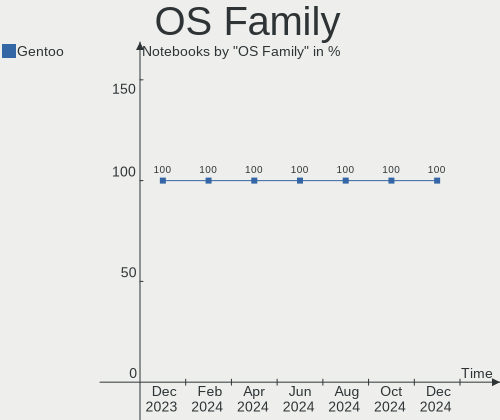
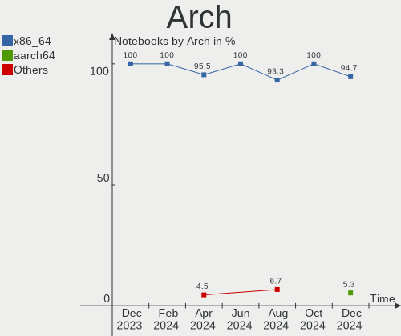
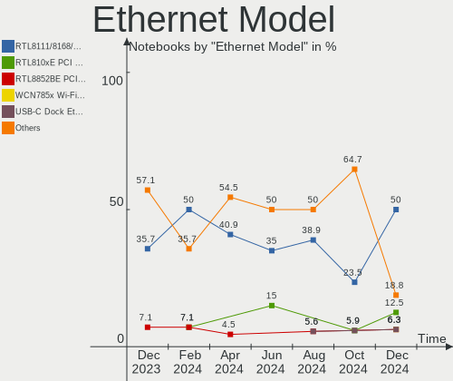

Gentoo Hardware Trends (Notebooks)
----------------------------------

A project to identify most popular hardware characteristics and track their change
over time based on data collected by Gentoo users at https://Linux-Hardware.org.

Anyone can contribute to this report by the [hw-probe](https://github.com/linuxhw/hw-probe) tool:

    sudo -E hw-probe -all -upload

Full-feature report is available here: https://linux-hardware.org/?view=trends

Period: Nov, 2021.

Contents
--------

* [ System ](#system)
  - [ OS                       ](#os)
  - [ OS Family                ](#os-family)
  - [ Kernel                   ](#kernel)
  - [ Kernel Family            ](#kernel-family)
  - [ Kernel Major Ver.        ](#kernel-major-ver)
  - [ Arch                     ](#arch)
  - [ DE                       ](#de)
  - [ Display Server           ](#display-server)
  - [ Display Manager          ](#display-manager)
  - [ OS Lang                  ](#os-lang)
  - [ Boot Mode                ](#boot-mode)
  - [ Filesystem               ](#filesystem)
  - [ Part. scheme             ](#part-scheme)
  - [ Dual Boot with Linux/BSD ](#dual-boot-with-linuxbsd)
  - [ Dual Boot (Win)          ](#dual-boot-win)

* [ Board ](#board)
  - [ Vendor                   ](#vendor)
  - [ Model                    ](#model)
  - [ Model Family             ](#model-family)
  - [ MFG Year                 ](#mfg-year)
  - [ Form Factor              ](#form-factor)
  - [ Secure Boot              ](#secure-boot)
  - [ Coreboot                 ](#coreboot)
  - [ RAM Size                 ](#ram-size)
  - [ RAM Used                 ](#ram-used)
  - [ Total Drives             ](#total-drives)
  - [ Has CD-ROM               ](#has-cd-rom)
  - [ Has Ethernet             ](#has-ethernet)
  - [ Has WiFi                 ](#has-wifi)
  - [ Has Bluetooth            ](#has-bluetooth)

* [ Location ](#location)
  - [ Country                  ](#country)
  - [ City                     ](#city)

* [ Drives ](#drives)
  - [ Drive Vendor             ](#drive-vendor)
  - [ Drive Model              ](#drive-model)
  - [ HDD Vendor               ](#hdd-vendor)
  - [ SSD Vendor               ](#ssd-vendor)
  - [ Drive Kind               ](#drive-kind)
  - [ Drive Connector          ](#drive-connector)
  - [ Drive Size               ](#drive-size)
  - [ Space Total              ](#space-total)
  - [ Space Used               ](#space-used)
  - [ Malfunc. Drives          ](#malfunc-drives)
  - [ Malfunc. Drive Vendor    ](#malfunc-drive-vendor)
  - [ Malfunc. HDD Vendor      ](#malfunc-hdd-vendor)
  - [ Malfunc. Drive Kind      ](#malfunc-drive-kind)
  - [ Failed Drives            ](#failed-drives)
  - [ Failed Drive Vendor      ](#failed-drive-vendor)
  - [ Drive Status             ](#drive-status)

* [ Storage controller ](#storage-controller)
  - [ Storage Vendor           ](#storage-vendor)
  - [ Storage Model            ](#storage-model)
  - [ Storage Kind             ](#storage-kind)

* [ Processor ](#processor)
  - [ CPU Vendor               ](#cpu-vendor)
  - [ CPU Model                ](#cpu-model)
  - [ CPU Model Family         ](#cpu-model-family)
  - [ CPU Cores                ](#cpu-cores)
  - [ CPU Sockets              ](#cpu-sockets)
  - [ CPU Threads              ](#cpu-threads)
  - [ CPU Op-Modes             ](#cpu-op-modes)
  - [ CPU Microcode            ](#cpu-microcode)
  - [ CPU Microarch            ](#cpu-microarch)

* [ Graphics ](#graphics)
  - [ GPU Vendor               ](#gpu-vendor)
  - [ GPU Model                ](#gpu-model)
  - [ GPU Combo                ](#gpu-combo)
  - [ GPU Driver               ](#gpu-driver)
  - [ GPU Memory               ](#gpu-memory)

* [ Monitor ](#monitor)
  - [ Monitor Vendor           ](#monitor-vendor)
  - [ Monitor Model            ](#monitor-model)
  - [ Monitor Resolution       ](#monitor-resolution)
  - [ Monitor Diagonal         ](#monitor-diagonal)
  - [ Monitor Width            ](#monitor-width)
  - [ Aspect Ratio             ](#aspect-ratio)
  - [ Monitor Area             ](#monitor-area)
  - [ Pixel Density            ](#pixel-density)
  - [ Multiple Monitors        ](#multiple-monitors)

* [ Network ](#network)
  - [ Net Controller Vendor    ](#net-controller-vendor)
  - [ Net Controller Model     ](#net-controller-model)
  - [ Wireless Vendor          ](#wireless-vendor)
  - [ Wireless Model           ](#wireless-model)
  - [ Ethernet Vendor          ](#ethernet-vendor)
  - [ Ethernet Model           ](#ethernet-model)
  - [ Net Controller Kind      ](#net-controller-kind)
  - [ Used Controller          ](#used-controller)
  - [ NICs                     ](#nics)
  - [ IPv6                     ](#ipv6)

* [ Bluetooth ](#bluetooth)
  - [ Bluetooth Vendor         ](#bluetooth-vendor)
  - [ Bluetooth Model          ](#bluetooth-model)

* [ Sound ](#sound)
  - [ Sound Vendor             ](#sound-vendor)
  - [ Sound Model              ](#sound-model)

* [ Memory ](#memory)
  - [ Memory Vendor            ](#memory-vendor)
  - [ Memory Model             ](#memory-model)
  - [ Memory Kind              ](#memory-kind)
  - [ Memory Form Factor       ](#memory-form-factor)
  - [ Memory Size              ](#memory-size)
  - [ Memory Speed             ](#memory-speed)

* [ Printers & scanners ](#printers--scanners)
  - [ Printer Vendor           ](#printer-vendor)
  - [ Printer Model            ](#printer-model)
  - [ Scanner Vendor           ](#scanner-vendor)
  - [ Scanner Model            ](#scanner-model)

* [ Camera ](#camera)
  - [ Camera Vendor            ](#camera-vendor)
  - [ Camera Model             ](#camera-model)

* [ Security ](#security)
  - [ Fingerprint Vendor       ](#fingerprint-vendor)
  - [ Fingerprint Model        ](#fingerprint-model)
  - [ Chipcard Vendor          ](#chipcard-vendor)
  - [ Chipcard Model           ](#chipcard-model)

* [ Unsupported ](#unsupported)
  - [ Unsupported Devices      ](#unsupported-devices)
  - [ Unsupported Device Types ](#unsupported-device-types)

System
------

OS
--

Installed operating systems

| Name       | Notebooks | Percent |
|------------|-----------|---------|
| Gentoo 2.7 | 18        | 62.07%  |
| Gentoo 2.8 | 7         | 24.14%  |
| Gentoo 2.6 | 4         | 13.79%  |

OS Family
---------

OS without a version

| Name   | Notebooks | Percent |
|--------|-----------|---------|
| Gentoo | 29        | 100%    |

Kernel
------

Version of the Linux kernel

| Version                     | Notebooks | Percent |
|-----------------------------|-----------|---------|
| 5.10.76-gentoo-r1           | 3         | 10.34%  |
| 5.15.1-gentoo-x86_64        | 2         | 6.9%    |
| 5.10.70-1-lts               | 2         | 6.9%    |
| 5.10.61-gentoo              | 2         | 6.9%    |
| 5.4.80-gentoo-r1            | 1         | 3.45%   |
| 5.15.5-gentoo-x86_64        | 1         | 3.45%   |
| 5.15.5-gentoo-dist          | 1         | 3.45%   |
| 5.15.5-gentoo               | 1         | 3.45%   |
| 5.15.4-gentoo-x86_64        | 1         | 3.45%   |
| 5.15.4-gentoo               | 1         | 3.45%   |
| 5.15.1                      | 1         | 3.45%   |
| 5.14.7-gentoo-x86_64        | 1         | 3.45%   |
| 5.14.15-xanmod1-gentoo-dist | 1         | 3.45%   |
| 5.14.15-gentoo-x86_64       | 1         | 3.45%   |
| 5.14.13-gentoo-x86_64       | 1         | 3.45%   |
| 5.10.81-gentoo-dist         | 1         | 3.45%   |
| 5.10.76-gentoo-r1-x86_64    | 1         | 3.45%   |
| 5.10.76-gentoo-r1-x86       | 1         | 3.45%   |
| 5.10.76-gentoo-r1-test2e    | 1         | 3.45%   |
| 5.10.76-gentoo-r1-n150      | 1         | 3.45%   |
| 5.10.76-gentoo-r1-6730b     | 1         | 3.45%   |
| 5.10.74-gentoo-x86_64       | 1         | 3.45%   |
| 5.10.74-gentoo              | 1         | 3.45%   |
| 4.19.214-gentoo             | 1         | 3.45%   |

Kernel Family
-------------

Linux kernel without a distro release

| Version  | Notebooks | Percent |
|----------|-----------|---------|
| 5.10.76  | 8         | 27.59%  |
| 5.15.5   | 3         | 10.34%  |
| 5.15.1   | 3         | 10.34%  |
| 5.15.4   | 2         | 6.9%    |
| 5.14.15  | 2         | 6.9%    |
| 5.10.74  | 2         | 6.9%    |
| 5.10.70  | 2         | 6.9%    |
| 5.10.61  | 2         | 6.9%    |
| 5.4.80   | 1         | 3.45%   |
| 5.14.7   | 1         | 3.45%   |
| 5.14.13  | 1         | 3.45%   |
| 5.10.81  | 1         | 3.45%   |
| 4.19.214 | 1         | 3.45%   |

Kernel Major Ver.
-----------------

Linux kernel major version

| Version | Notebooks | Percent |
|---------|-----------|---------|
| 5.10    | 15        | 51.72%  |
| 5.15    | 8         | 27.59%  |
| 5.14    | 4         | 13.79%  |
| 5.4     | 1         | 3.45%   |
| 4.19    | 1         | 3.45%   |

Arch
----

OS architecture (x86_64, i586, etc.)

| Name   | Notebooks | Percent |
|--------|-----------|---------|
| x86_64 | 28        | 96.55%  |
| i686   | 1         | 3.45%   |

DE
--

Desktop Environment

| Name    | Notebooks | Percent |
|---------|-----------|---------|
| Unknown | 13        | 44.83%  |
| KDE5    | 8         | 27.59%  |
| XFCE    | 2         | 6.9%    |
| awesome | 2         | 6.9%    |
| openbox | 1         | 3.45%   |
| MATE    | 1         | 3.45%   |
| GNOME   | 1         | 3.45%   |
| DWM     | 1         | 3.45%   |

Display Server
--------------

X11 or Wayland

| Name    | Notebooks | Percent |
|---------|-----------|---------|
| X11     | 16        | 55.17%  |
| Tty     | 5         | 17.24%  |
| Unknown | 5         | 17.24%  |
| Wayland | 3         | 10.34%  |

Display Manager
---------------

SDDM, LightDM, etc.

| Name    | Notebooks | Percent |
|---------|-----------|---------|
| Unknown | 11        | 37.93%  |
| SDDM    | 10        | 34.48%  |
| LightDM | 3         | 10.34%  |
| SLiM    | 2         | 6.9%    |
| GDM     | 2         | 6.9%    |
| XDM     | 1         | 3.45%   |

OS Lang
-------

Language

| Lang   | Notebooks | Percent |
|--------|-----------|---------|
| en_US  | 11        | 37.93%  |
| C.UTF8 | 4         | 13.79%  |
| ru_RU  | 3         | 10.34%  |
| nl_NL  | 2         | 6.9%    |
| it_IT  | 2         | 6.9%    |
| zh_CN  | 1         | 3.45%   |
| tr_TR  | 1         | 3.45%   |
| ru_UA  | 1         | 3.45%   |
| lt_LT  | 1         | 3.45%   |
| es_CL  | 1         | 3.45%   |
| el_GR  | 1         | 3.45%   |
| C      | 1         | 3.45%   |

Boot Mode
---------

EFI or BIOS

| Mode | Notebooks | Percent |
|------|-----------|---------|
| EFI  | 20        | 68.97%  |
| BIOS | 9         | 31.03%  |

Filesystem
----------

Type of filesystem

| Type  | Notebooks | Percent |
|-------|-----------|---------|
| Ext4  | 16        | 55.17%  |
| Btrfs | 12        | 41.38%  |
| F2fs  | 1         | 3.45%   |

Part. scheme
------------

Scheme of partitioning

| Type    | Notebooks | Percent |
|---------|-----------|---------|
| GPT     | 22        | 75.86%  |
| Unknown | 4         | 13.79%  |
| MBR     | 3         | 10.34%  |

Dual Boot with Linux/BSD
------------------------

Hosting more than one Linux/BSD

| Dual boot | Notebooks | Percent |
|-----------|-----------|---------|
| No        | 23        | 79.31%  |
| Yes       | 6         | 20.69%  |

Dual Boot (Win)
---------------

Hosting Linux and Windows

| Dual boot | Notebooks | Percent |
|-----------|-----------|---------|
| No        | 18        | 62.07%  |
| Yes       | 11        | 37.93%  |

Board
-----

Vendor
------

Motherboard manufacturer

| Name                | Notebooks | Percent |
|---------------------|-----------|---------|
| Lenovo              | 11        | 37.93%  |
| Hewlett-Packard     | 7         | 24.14%  |
| Samsung Electronics | 2         | 6.9%    |
| Dell                | 2         | 6.9%    |
| ASUSTek Computer    | 2         | 6.9%    |
| Toshiba             | 1         | 3.45%   |
| Timi                | 1         | 3.45%   |
| SIEMENS             | 1         | 3.45%   |
| MOTILE              | 1         | 3.45%   |
| Acer                | 1         | 3.45%   |

Model
-----

Motherboard model

| Name                                      | Notebooks | Percent |
|-------------------------------------------|-----------|---------|
| Lenovo Legion Y530-15ICH 81FV             | 2         | 6.9%    |
| HP Laptop 15s-eq0xxx                      | 2         | 6.9%    |
| Toshiba Satellite C850D-118               | 1         | 3.45%   |
| Timi A35                                  | 1         | 3.45%   |
| SIEMENS SIMATIC Field PG M6               | 1         | 3.45%   |
| Samsung RC530/RC730                       | 1         | 3.45%   |
| Samsung N150P/N210P/N220P                 | 1         | 3.45%   |
| MOTILE M142                               | 1         | 3.45%   |
| Lenovo Yoga Slim 7 13ACN5 82CY            | 1         | 3.45%   |
| Lenovo XiaoXin Chao7000-14IKBR 81GA       | 1         | 3.45%   |
| Lenovo ThinkPad T470p 20J7S06Q00          | 1         | 3.45%   |
| Lenovo ThinkPad T14 Gen 2i 20W0CTO1WW     | 1         | 3.45%   |
| Lenovo ThinkPad L14 Gen 1 20U50003GE      | 1         | 3.45%   |
| Lenovo ThinkPad E495 20NE000BGE           | 1         | 3.45%   |
| Lenovo Legion 7 15IMH05 81YT              | 1         | 3.45%   |
| Lenovo Legion 5 Pro 16ACH6H 82JQ          | 1         | 3.45%   |
| Lenovo IdeaPad 5 Pro 16ACH6 82L5          | 1         | 3.45%   |
| HP ProBook 430 G5                         | 1         | 3.45%   |
| HP Pavilion ZV6100 (EE984EA#ABZ)          | 1         | 3.45%   |
| HP Pavilion Gaming Laptop 15-ec1xxx       | 1         | 3.45%   |
| HP EliteBook 745 G6                       | 1         | 3.45%   |
| HP Compaq 6730b (KE717AV)                 | 1         | 3.45%   |
| Dell Latitude E7440                       | 1         | 3.45%   |
| Dell Latitude 7490                        | 1         | 3.45%   |
| ASUS ASUS TUF Gaming F17 FX706HE_TUF706HE | 1         | 3.45%   |
| ASUS 900                                  | 1         | 3.45%   |
| Acer Aspire A715-42G                      | 1         | 3.45%   |

Model Family
------------

Motherboard model prefix

| Name              | Notebooks | Percent |
|-------------------|-----------|---------|
| Lenovo ThinkPad   | 4         | 13.79%  |
| Lenovo Legion     | 4         | 13.79%  |
| HP Pavilion       | 2         | 6.9%    |
| HP Laptop         | 2         | 6.9%    |
| Dell Latitude     | 2         | 6.9%    |
| Toshiba Satellite | 1         | 3.45%   |
| Timi A35          | 1         | 3.45%   |
| SIEMENS SIMATIC   | 1         | 3.45%   |
| Samsung RC530     | 1         | 3.45%   |
| Samsung N150P     | 1         | 3.45%   |
| MOTILE M142       | 1         | 3.45%   |
| Lenovo Yoga       | 1         | 3.45%   |
| Lenovo XiaoXin    | 1         | 3.45%   |
| Lenovo IdeaPad    | 1         | 3.45%   |
| HP ProBook        | 1         | 3.45%   |
| HP EliteBook      | 1         | 3.45%   |
| HP Compaq         | 1         | 3.45%   |
| ASUS ASUS         | 1         | 3.45%   |
| ASUS 900          | 1         | 3.45%   |
| Acer Aspire       | 1         | 3.45%   |

MFG Year
--------

Motherboard manufacture year

| Year | Notebooks | Percent |
|------|-----------|---------|
| 2020 | 11        | 37.93%  |
| 2021 | 8         | 27.59%  |
| 2019 | 2         | 6.9%    |
| 2018 | 2         | 6.9%    |
| 2011 | 2         | 6.9%    |
| 2012 | 1         | 3.45%   |
| 2010 | 1         | 3.45%   |
| 2009 | 1         | 3.45%   |
| 2006 | 1         | 3.45%   |

Form Factor
-----------

Physical design of the computer

| Name     | Notebooks | Percent |
|----------|-----------|---------|
| Notebook | 29        | 100%    |

Secure Boot
-----------

Enabled or disabled

| State    | Notebooks | Percent |
|----------|-----------|---------|
| Disabled | 29        | 100%    |

Coreboot
--------

Have coreboot on board

| Used | Notebooks | Percent |
|------|-----------|---------|
| No   | 29        | 100%    |

RAM Size
--------

Total RAM memory

| Size in GB | Notebooks | Percent |
|------------|-----------|---------|
| 8.01-16.0  | 8         | 27.59%  |
| 32.01-64.0 | 5         | 17.24%  |
| 16.01-24.0 | 5         | 17.24%  |
| 4.01-8.0   | 4         | 13.79%  |
| 1.01-2.0   | 3         | 10.34%  |
| 24.01-32.0 | 2         | 6.9%    |
| 3.01-4.0   | 1         | 3.45%   |
| 2.01-3.0   | 1         | 3.45%   |

RAM Used
--------

Used RAM memory

| Used GB   | Notebooks | Percent |
|-----------|-----------|---------|
| 4.01-8.0  | 8         | 27.59%  |
| 0.51-1.0  | 7         | 24.14%  |
| 1.01-2.0  | 5         | 17.24%  |
| 0.01-0.5  | 4         | 13.79%  |
| 2.01-3.0  | 3         | 10.34%  |
| 3.01-4.0  | 1         | 3.45%   |
| 8.01-16.0 | 1         | 3.45%   |

Total Drives
------------

Number of drives on board

| Drives | Notebooks | Percent |
|--------|-----------|---------|
| 1      | 24        | 82.76%  |
| 2      | 4         | 13.79%  |
| 3      | 1         | 3.45%   |

Has CD-ROM
----------

Has CD-ROM on board

| Presented | Notebooks | Percent |
|-----------|-----------|---------|
| No        | 24        | 82.76%  |
| Yes       | 5         | 17.24%  |

Has Ethernet
------------

Has Ethernet on board

| Presented | Notebooks | Percent |
|-----------|-----------|---------|
| Yes       | 26        | 89.66%  |
| No        | 3         | 10.34%  |

Has WiFi
--------

Has WiFi module

| Presented | Notebooks | Percent |
|-----------|-----------|---------|
| Yes       | 29        | 100%    |

Has Bluetooth
-------------

Has Bluetooth module

| Presented | Notebooks | Percent |
|-----------|-----------|---------|
| Yes       | 25        | 86.21%  |
| No        | 4         | 13.79%  |

Location
--------

Country
-------

Geographic location (country)

| Country     | Notebooks | Percent |
|-------------|-----------|---------|
| USA         | 4         | 13.79%  |
| Italy       | 4         | 13.79%  |
| Germany     | 4         | 13.79%  |
| Russia      | 3         | 10.34%  |
| Ukraine     | 2         | 6.9%    |
| Netherlands | 2         | 6.9%    |
| Greece      | 2         | 6.9%    |
| UK          | 1         | 3.45%   |
| Singapore   | 1         | 3.45%   |
| Poland      | 1         | 3.45%   |
| Lithuania   | 1         | 3.45%   |
| Finland     | 1         | 3.45%   |
| China       | 1         | 3.45%   |
| Chile       | 1         | 3.45%   |
| Belarus     | 1         | 3.45%   |

City
----

Geographic location (city)

| City              | Notebooks | Percent |
|-------------------|-----------|---------|
| Milan             | 2         | 6.9%    |
| Athens            | 2         | 6.9%    |
| Almere Stad       | 2         | 6.9%    |
| Vilnius           | 1         | 3.45%   |
| Szczecin          | 1         | 3.45%   |
| St Petersburg     | 1         | 3.45%   |
| Singapore         | 1         | 3.45%   |
| Shenzhen          | 1         | 3.45%   |
| Santiago          | 1         | 3.45%   |
| Nuremberg         | 1         | 3.45%   |
| Nizhniy Novgorod  | 1         | 3.45%   |
| Moscow            | 1         | 3.45%   |
| Minsk             | 1         | 3.45%   |
| Liverpool         | 1         | 3.45%   |
| Littleton         | 1         | 3.45%   |
| Kyiv              | 1         | 3.45%   |
| Ithaca            | 1         | 3.45%   |
| Helsinki          | 1         | 3.45%   |
| Harsum            | 1         | 3.45%   |
| Hamburg           | 1         | 3.45%   |
| Garden Grove      | 1         | 3.45%   |
| Frankfurt am Main | 1         | 3.45%   |
| Dnipro            | 1         | 3.45%   |
| Brescia           | 1         | 3.45%   |
| Bologna           | 1         | 3.45%   |
| Baldwin           | 1         | 3.45%   |

Drives
------

Drive Vendor
------------

Hard drive vendors

| Vendor              | Notebooks | Drives | Percent |
|---------------------|-----------|--------|---------|
| Samsung Electronics | 8         | 11     | 25.81%  |
| WDC                 | 7         | 7      | 22.58%  |
| SK Hynix            | 4         | 4      | 12.9%   |
| Toshiba             | 2         | 2      | 6.45%   |
| Seagate             | 1         | 1      | 3.23%   |
| SanDisk             | 1         | 1      | 3.23%   |
| Linux               | 1         | 1      | 3.23%   |
| KIOXIA              | 1         | 1      | 3.23%   |
| Kingston            | 1         | 1      | 3.23%   |
| Intel               | 1         | 1      | 3.23%   |
| Hitachi             | 1         | 1      | 3.23%   |
| Fujitsu             | 1         | 1      | 3.23%   |
| BIWIN               | 1         | 1      | 3.23%   |
| ASUS-PHISON         | 1         | 1      | 3.23%   |

Drive Model
-----------

Hard drive models

| Model                                   | Notebooks | Percent |
|-----------------------------------------|-----------|---------|
| Samsung MZVLB512HBJQ-000L2 512GB        | 2         | 6.06%   |
| WDC WDS500G1B0B-00AS40 500GB SSD        | 1         | 3.03%   |
| WDC WDS100T2B0C-00PXH0 1TB              | 1         | 3.03%   |
| WDC WD2500BEVS-22UST0 250GB             | 1         | 3.03%   |
| WDC PC SN730 SDBQNTY-1T00-1001 1TB      | 1         | 3.03%   |
| WDC PC SN730 SDBPNTY-512G-1101 512GB    | 1         | 3.03%   |
| WDC PC SN730 SDBPNTY-512G-1006 512GB    | 1         | 3.03%   |
| WDC PC SN520 SDAPNUW-256G-1006 256GB    | 1         | 3.03%   |
| Toshiba MQ04ABF100 1TB                  | 1         | 3.03%   |
| Toshiba KSG60ZMV512G M.2 2280 512GB SSD | 1         | 3.03%   |
| SK Hynix SKHynix_HFS001TDE9X084N 1TB    | 1         | 3.03%   |
| SK Hynix PC401 HFS256GD9TNG-62A0A 256GB | 1         | 3.03%   |
| SK Hynix HFM512GDHTNG-8710B 512GB       | 1         | 3.03%   |
| SK Hynix HFM512GD3JX016N 512GB          | 1         | 3.03%   |
| Seagate ST1000LM049-2GH172 1TB          | 1         | 3.03%   |
| SanDisk SD9SN8W-128G-1006 128GB SSD     | 1         | 3.03%   |
| Samsung SSD 980 PRO 2TB                 | 1         | 3.03%   |
| Samsung SSD 870 EVO 2TB                 | 1         | 3.03%   |
| Samsung SSD 850 PRO 256GB               | 1         | 3.03%   |
| Samsung SSD 850 EVO 250GB               | 1         | 3.03%   |
| Samsung Portable SSD T5 500GB           | 1         | 3.03%   |
| Samsung MZVLW256HEHP-000L2 256GB        | 1         | 3.03%   |
| Samsung MZVLW1T0HMLH-000L7 1TB          | 1         | 3.03%   |
| Samsung MZVLB1T0HBLR-000L2 1TB          | 1         | 3.03%   |
| Linux scsi_debug 8.3MB                  | 1         | 3.03%   |
| KIOXIA KBG30ZMV256G 256GB               | 1         | 3.03%   |
| Kingston SA400S37480G 480GB SSD         | 1         | 3.03%   |
| Intel SSDPEKNW010T8 1TB                 | 1         | 3.03%   |
| Hitachi HTS542525K9A300 250GB           | 1         | 3.03%   |
| Fujitsu MHZ2160BJ G2 160GB              | 1         | 3.03%   |
| BIWIN SSD 256GB                         | 1         | 3.03%   |
| ASUS-PHISON SSD 16GB                    | 1         | 3.03%   |

HDD Vendor
----------

Hard disk drive vendors

| Vendor  | Notebooks | Drives | Percent |
|---------|-----------|--------|---------|
| WDC     | 1         | 1      | 20%     |
| Toshiba | 1         | 1      | 20%     |
| Seagate | 1         | 1      | 20%     |
| Hitachi | 1         | 1      | 20%     |
| Fujitsu | 1         | 1      | 20%     |

SSD Vendor
----------

Solid state drive vendors

| Vendor              | Notebooks | Drives | Percent |
|---------------------|-----------|--------|---------|
| Samsung Electronics | 4         | 4      | 36.36%  |
| WDC                 | 1         | 1      | 9.09%   |
| Toshiba             | 1         | 1      | 9.09%   |
| SanDisk             | 1         | 1      | 9.09%   |
| Linux               | 1         | 1      | 9.09%   |
| Kingston            | 1         | 1      | 9.09%   |
| BIWIN               | 1         | 1      | 9.09%   |
| ASUS-PHISON         | 1         | 1      | 9.09%   |

Drive Kind
----------

HDD or SSD

| Kind | Notebooks | Drives | Percent |
|------|-----------|--------|---------|
| NVMe | 16        | 18     | 50%     |
| SSD  | 11        | 11     | 34.38%  |
| HDD  | 5         | 5      | 15.63%  |

Drive Connector
---------------

SATA, SAS, NVMe, etc.

| Type | Notebooks | Drives | Percent |
|------|-----------|--------|---------|
| NVMe | 16        | 18     | 50%     |
| SATA | 15        | 15     | 46.88%  |
| SAS  | 1         | 1      | 3.13%   |

Drive Size
----------

Size of hard drive

| Size in TB | Notebooks | Drives | Percent |
|------------|-----------|--------|---------|
| 0.01-0.5   | 12        | 12     | 75%     |
| 0.51-1.0   | 3         | 3      | 18.75%  |
| 1.01-2.0   | 1         | 1      | 6.25%   |

Space Total
-----------

Amount of disk space available on the file system

| Size in GB | Notebooks | Percent |
|------------|-----------|---------|
| 101-250    | 9         | 31.03%  |
| 251-500    | 7         | 24.14%  |
| 1001-2000  | 3         | 10.34%  |
| 501-1000   | 3         | 10.34%  |
| 51-100     | 3         | 10.34%  |
| Unknown    | 2         | 6.9%    |
| 2001-3000  | 1         | 3.45%   |
| 1-20       | 1         | 3.45%   |

Space Used
----------

Amount of used disk space

| Used GB   | Notebooks | Percent |
|-----------|-----------|---------|
| 1-20      | 8         | 27.59%  |
| 21-50     | 5         | 17.24%  |
| 101-250   | 5         | 17.24%  |
| 51-100    | 4         | 13.79%  |
| 251-500   | 2         | 6.9%    |
| 1001-2000 | 2         | 6.9%    |
| Unknown   | 2         | 6.9%    |
| 501-1000  | 1         | 3.45%   |

Malfunc. Drives
---------------

Drive models with a malfunction

| Model                               | Notebooks | Drives | Percent |
|-------------------------------------|-----------|--------|---------|
| SanDisk SD9SN8W-128G-1006 128GB SSD | 1         | 1      | 25%     |
| Samsung Electronics SSD 870 EVO 2TB | 1         | 1      | 25%     |
| Hitachi HTS542525K9A300 250GB       | 1         | 1      | 25%     |
| Fujitsu MHZ2160BJ G2 160GB          | 1         | 1      | 25%     |

Malfunc. Drive Vendor
---------------------

Vendors of faulty drives

| Vendor              | Notebooks | Drives | Percent |
|---------------------|-----------|--------|---------|
| SanDisk             | 1         | 1      | 25%     |
| Samsung Electronics | 1         | 1      | 25%     |
| Hitachi             | 1         | 1      | 25%     |
| Fujitsu             | 1         | 1      | 25%     |

Malfunc. HDD Vendor
-------------------

Vendors of faulty HDD drives

| Vendor  | Notebooks | Drives | Percent |
|---------|-----------|--------|---------|
| Hitachi | 1         | 1      | 50%     |
| Fujitsu | 1         | 1      | 50%     |

Malfunc. Drive Kind
-------------------

Kinds of faulty drives

| Kind | Notebooks | Drives | Percent |
|------|-----------|--------|---------|
| SSD  | 2         | 2      | 50%     |
| HDD  | 2         | 2      | 50%     |

Failed Drives
-------------

Failed drive models

Zero info for selected period =(

Failed Drive Vendor
-------------------

Failed drive vendors

Zero info for selected period =(

Drive Status
------------

Number of failed and malfunc. drives

| Status   | Notebooks | Drives | Percent |
|----------|-----------|--------|---------|
| Works    | 23        | 28     | 79.31%  |
| Malfunc  | 4         | 4      | 13.79%  |
| Detected | 2         | 2      | 6.9%    |

Storage controller
------------------

Storage Vendor
--------------

Storage controller vendors

| Vendor                       | Notebooks | Percent |
|------------------------------|-----------|---------|
| Intel                        | 13        | 36.11%  |
| AMD                          | 8         | 22.22%  |
| Sandisk                      | 5         | 13.89%  |
| Samsung Electronics          | 5         | 13.89%  |
| SK Hynix                     | 4         | 11.11%  |
| Toshiba America Info Systems | 1         | 2.78%   |

Storage Model
-------------

Storage controller models

| Model                                                                        | Notebooks | Percent |
|------------------------------------------------------------------------------|-----------|---------|
| AMD FCH SATA Controller [AHCI mode]                                          | 7         | 19.44%  |
| Sandisk WD Black SN750 / PC SN730 NVMe SSD                                   | 3         | 8.33%   |
| Intel Sunrise Point-LP SATA Controller [AHCI mode]                           | 3         | 8.33%   |
| SK Hynix Gold P31 SSD                                                        | 2         | 5.56%   |
| Samsung NVMe SSD Controller SM981/PM981/PM983                                | 2         | 5.56%   |
| Samsung NVMe SSD Controller SM961/PM961/SM963                                | 2         | 5.56%   |
| Intel Cannon Lake Mobile PCH SATA AHCI Controller                            | 2         | 5.56%   |
| Toshiba America Info Systems BG3 NVMe SSD Controller                         | 1         | 2.78%   |
| SK Hynix PC401 NVMe Solid State Drive 256GB                                  | 1         | 2.78%   |
| SK Hynix BC501 NVMe Solid State Drive                                        | 1         | 2.78%   |
| Sandisk WD Blue SN550 NVMe SSD                                               | 1         | 2.78%   |
| Sandisk WD Blue SN500 / PC SN520 NVMe SSD                                    | 1         | 2.78%   |
| Samsung NVMe SSD Controller PM9A1/PM9A3/980PRO                               | 1         | 2.78%   |
| Intel Volume Management Device NVMe RAID Controller                          | 1         | 2.78%   |
| Intel SSD 660P Series                                                        | 1         | 2.78%   |
| Intel NM10/ICH7 Family SATA Controller [AHCI mode]                           | 1         | 2.78%   |
| Intel 82801IBM/IEM (ICH9M/ICH9M-E) 4 port SATA Controller [AHCI mode]        | 1         | 2.78%   |
| Intel 82801FBM (ICH6M) SATA Controller                                       | 1         | 2.78%   |
| Intel 82801 Mobile SATA Controller [RAID mode]                               | 1         | 2.78%   |
| Intel 8 Series SATA Controller 1 [AHCI mode]                                 | 1         | 2.78%   |
| Intel 6 Series/C200 Series Chipset Family 6 port Mobile SATA AHCI Controller | 1         | 2.78%   |
| AMD IXP SB4x0 IDE Controller                                                 | 1         | 2.78%   |

Storage Kind
------------

Kind of storage controller (IDE, SATA, NVMe, SAS, ...)

| Kind | Notebooks | Percent |
|------|-----------|---------|
| NVMe | 16        | 44.44%  |
| SATA | 16        | 44.44%  |
| RAID | 2         | 5.56%   |
| IDE  | 2         | 5.56%   |

Processor
---------

CPU Vendor
----------

Processor vendors

| Vendor | Notebooks | Percent |
|--------|-----------|---------|
| Intel  | 16        | 55.17%  |
| AMD    | 13        | 44.83%  |

CPU Model
---------

Processor models

| Model                                           | Notebooks | Percent |
|-------------------------------------------------|-----------|---------|
| Intel Core i5-8250U CPU @ 1.60GHz               | 2         | 6.9%    |
| AMD Ryzen 5 3500U with Radeon Vega Mobile Gfx   | 2         | 6.9%    |
| Intel Core i9-10980HK CPU @ 2.40GHz             | 1         | 3.45%   |
| Intel Core i7-8750H CPU @ 2.20GHz               | 1         | 3.45%   |
| Intel Core i7-8650U CPU @ 1.90GHz               | 1         | 3.45%   |
| Intel Core i7-7700HQ CPU @ 2.80GHz              | 1         | 3.45%   |
| Intel Core i7-2670QM CPU @ 2.20GHz              | 1         | 3.45%   |
| Intel Core i5-8400H CPU @ 2.50GHz               | 1         | 3.45%   |
| Intel Core i5-8300H CPU @ 2.30GHz               | 1         | 3.45%   |
| Intel Core i5-4310U CPU @ 2.00GHz               | 1         | 3.45%   |
| Intel Core 2 Duo CPU P8700 @ 2.53GHz            | 1         | 3.45%   |
| Intel Celeron M processor 900MHz                | 1         | 3.45%   |
| Intel Atom CPU N450 @ 1.66GHz                   | 1         | 3.45%   |
| Intel 11th Gen Core i7-1185G7 @ 3.00GHz         | 1         | 3.45%   |
| Intel 11th Gen Core i7-11800H @ 2.30GHz         | 1         | 3.45%   |
| Intel 11th Gen Core i5-11300H @ 3.10GHz         | 1         | 3.45%   |
| AMD Ryzen 7 PRO 3700U w/ Radeon Vega Mobile Gfx | 1         | 3.45%   |
| AMD Ryzen 7 5800U with Radeon Graphics          | 1         | 3.45%   |
| AMD Ryzen 7 5800H with Radeon Graphics          | 1         | 3.45%   |
| AMD Ryzen 7 5700U with Radeon Graphics          | 1         | 3.45%   |
| AMD Ryzen 7 3700U with Radeon Vega Mobile Gfx   | 1         | 3.45%   |
| AMD Ryzen 5 5600H with Radeon Graphics          | 1         | 3.45%   |
| AMD Ryzen 5 4600H with Radeon Graphics          | 1         | 3.45%   |
| AMD Ryzen 5 4500U with Radeon Graphics          | 1         | 3.45%   |
| AMD Ryzen 3 3200U with Radeon Vega Mobile Gfx   | 1         | 3.45%   |
| AMD E1-1200 APU with Radeon HD Graphics         | 1         | 3.45%   |
| AMD Athlon 64 Processor 3200+                   | 1         | 3.45%   |

CPU Model Family
----------------

Processor model prefix

| Model            | Notebooks | Percent |
|------------------|-----------|---------|
| Intel Core i5    | 5         | 17.24%  |
| AMD Ryzen 5      | 5         | 17.24%  |
| Intel Core i7    | 4         | 13.79%  |
| AMD Ryzen 7      | 4         | 13.79%  |
| Other            | 3         | 10.34%  |
| Intel Core i9    | 1         | 3.45%   |
| Intel Core 2 Duo | 1         | 3.45%   |
| Intel Celeron M  | 1         | 3.45%   |
| Intel Atom       | 1         | 3.45%   |
| AMD Ryzen 7 PRO  | 1         | 3.45%   |
| AMD Ryzen 3      | 1         | 3.45%   |
| AMD E1           | 1         | 3.45%   |
| AMD Athlon 64    | 1         | 3.45%   |

CPU Cores
---------

Number of processor cores

| Number | Notebooks | Percent |
|--------|-----------|---------|
| 4      | 13        | 44.83%  |
| 8      | 5         | 17.24%  |
| 6      | 4         | 13.79%  |
| 2      | 4         | 13.79%  |
| 1      | 3         | 10.34%  |

CPU Sockets
-----------

Number of sockets

| Number | Notebooks | Percent |
|--------|-----------|---------|
| 1      | 29        | 100%    |

CPU Threads
-----------

Threads per core (Hyper-Threading)

| Number | Notebooks | Percent |
|--------|-----------|---------|
| 2      | 24        | 82.76%  |
| 1      | 5         | 17.24%  |

CPU Op-Modes
------------

CPU Operation Modes (32-bit, 64-bit)

| Op mode        | Notebooks | Percent |
|----------------|-----------|---------|
| 32-bit, 64-bit | 28        | 96.55%  |
| 32-bit         | 1         | 3.45%   |

CPU Microcode
-------------

Microcode number

| Number     | Notebooks | Percent |
|------------|-----------|---------|
| Unknown    | 5         | 17.24%  |
| 0x0a50000c | 3         | 10.34%  |
| 0x08108109 | 3         | 10.34%  |
| 0x906ea    | 2         | 6.9%    |
| 0x806ea    | 2         | 6.9%    |
| 0x08108102 | 2         | 6.9%    |
| 0xa0652    | 1         | 3.45%   |
| 0x906e9    | 1         | 3.45%   |
| 0x806d1    | 1         | 3.45%   |
| 0x806c1    | 1         | 3.45%   |
| 0x6d8      | 1         | 3.45%   |
| 0x40651    | 1         | 3.45%   |
| 0x206a7    | 1         | 3.45%   |
| 0x106ca    | 1         | 3.45%   |
| 0x1067a    | 1         | 3.45%   |
| 0x08608102 | 1         | 3.45%   |
| 0x08600106 | 1         | 3.45%   |
| 0x05000119 | 1         | 3.45%   |

CPU Microarch
-------------

Microarchitecture

| Name        | Notebooks | Percent |
|-------------|-----------|---------|
| KabyLake    | 7         | 24.14%  |
| Zen+        | 5         | 17.24%  |
| Zen 3       | 3         | 10.34%  |
| Zen 2       | 2         | 6.9%    |
| TigerLake   | 2         | 6.9%    |
| SandyBridge | 1         | 3.45%   |
| Penryn      | 1         | 3.45%   |
| P6          | 1         | 3.45%   |
| K8 Hammer   | 1         | 3.45%   |
| Icelake     | 1         | 3.45%   |
| Haswell     | 1         | 3.45%   |
| CometLake   | 1         | 3.45%   |
| Bonnell     | 1         | 3.45%   |
| Bobcat      | 1         | 3.45%   |
| Unknown     | 1         | 3.45%   |

Graphics
--------

GPU Vendor
----------

Vendors of graphics cards

| Vendor | Notebooks | Percent |
|--------|-----------|---------|
| Intel  | 16        | 41.03%  |
| AMD    | 13        | 33.33%  |
| Nvidia | 10        | 25.64%  |

GPU Model
---------

Graphics card models

| Model                                                                                 | Notebooks | Percent |
|---------------------------------------------------------------------------------------|-----------|---------|
| AMD Picasso/Raven 2 [Radeon Vega Series / Radeon Vega Mobile Series]                  | 5         | 12.82%  |
| Intel UHD Graphics 620                                                                | 3         | 7.69%   |
| Intel CoffeeLake-H GT2 [UHD Graphics 630]                                             | 3         | 7.69%   |
| Intel TigerLake-LP GT2 [Iris Xe Graphics]                                             | 2         | 5.13%   |
| AMD Renoir                                                                            | 2         | 5.13%   |
| AMD Cezanne                                                                           | 2         | 5.13%   |
| Nvidia TU117M [GeForce MX450]                                                         | 1         | 2.56%   |
| Nvidia TU117M [GeForce GTX 1650 Mobile / Max-Q]                                       | 1         | 2.56%   |
| Nvidia TU117M                                                                         | 1         | 2.56%   |
| Nvidia TU104BM [GeForce RTX 2080 SUPER Mobile / Max-Q]                                | 1         | 2.56%   |
| Nvidia GP107M [GeForce GTX 1050 Ti Mobile]                                            | 1         | 2.56%   |
| Nvidia GP107M [GeForce GTX 1050 Mobile]                                               | 1         | 2.56%   |
| Nvidia GM108M [GeForce 940MX]                                                         | 1         | 2.56%   |
| Nvidia GF108M [GeForce GT 540M]                                                       | 1         | 2.56%   |
| Nvidia GA107M [GeForce RTX 3050 Ti Mobile]                                            | 1         | 2.56%   |
| Nvidia GA104M [GeForce RTX 3070 Mobile / Max-Q]                                       | 1         | 2.56%   |
| Intel TigerLake-H GT1 [UHD Graphics]                                                  | 1         | 2.56%   |
| Intel Mobile 915GM/GMS/910GML Express Graphics Controller                             | 1         | 2.56%   |
| Intel Mobile 4 Series Chipset Integrated Graphics Controller                          | 1         | 2.56%   |
| Intel HD Graphics 630                                                                 | 1         | 2.56%   |
| Intel Haswell-ULT Integrated Graphics Controller                                      | 1         | 2.56%   |
| Intel CometLake-H GT2 [UHD Graphics]                                                  | 1         | 2.56%   |
| Intel Atom Processor D4xx/D5xx/N4xx/N5xx Integrated Graphics Controller               | 1         | 2.56%   |
| Intel 2nd Generation Core Processor Family Integrated Graphics Controller             | 1         | 2.56%   |
| AMD Wrestler [Radeon HD 7310]                                                         | 1         | 2.56%   |
| AMD Topaz XT [Radeon R7 M260/M265 / M340/M360 / M440/M445 / 530/535 / 620/625 Mobile] | 1         | 2.56%   |
| AMD RS480M [Mobility Radeon Xpress 200]                                               | 1         | 2.56%   |
| AMD Lucienne                                                                          | 1         | 2.56%   |

GPU Combo
---------

Combinations of graphics cards

| Name           | Notebooks | Percent |
|----------------|-----------|---------|
| 1 x AMD        | 10        | 34.48%  |
| 1 x Intel      | 8         | 27.59%  |
| Intel + Nvidia | 7         | 24.14%  |
| AMD + Nvidia   | 2         | 6.9%    |
| 1 x Nvidia     | 1         | 3.45%   |
| Intel + AMD    | 1         | 3.45%   |

GPU Driver
----------

Free vs proprietary

| Driver      | Notebooks | Percent |
|-------------|-----------|---------|
| Free        | 21        | 72.41%  |
| Proprietary | 5         | 17.24%  |
| Unknown     | 3         | 10.34%  |

GPU Memory
----------

Total video memory

| Size in GB | Notebooks | Percent |
|------------|-----------|---------|
| Unknown    | 15        | 51.72%  |
| 1.01-2.0   | 9         | 31.03%  |
| 0.01-0.5   | 4         | 13.79%  |
| 3.01-4.0   | 1         | 3.45%   |

Monitor
-------

Monitor Vendor
--------------

Monitor vendors

| Vendor              | Notebooks | Percent |
|---------------------|-----------|---------|
| AU Optronics        | 6         | 20.69%  |
| Samsung Electronics | 4         | 13.79%  |
| LG Display          | 4         | 13.79%  |
| BOE                 | 4         | 13.79%  |
| Chimei Innolux      | 3         | 10.34%  |
| CSO                 | 2         | 6.9%    |
| Philips             | 1         | 3.45%   |
| PANDA               | 1         | 3.45%   |
| LG Philips          | 1         | 3.45%   |
| Lenovo              | 1         | 3.45%   |
| InfoVision          | 1         | 3.45%   |
| Dell                | 1         | 3.45%   |

Monitor Model
-------------

Monitor models

| Model                                                                 | Notebooks | Percent |
|-----------------------------------------------------------------------|-----------|---------|
| LG Display LCD Monitor LGD05E5 1920x1080 344x194mm 15.5-inch          | 2         | 6.9%    |
| Samsung Electronics U28E570 SAM0D71 3840x2160 608x345mm 27.5-inch     | 1         | 3.45%   |
| Samsung Electronics LCD Monitor SEC3245 1366x768 344x194mm 15.5-inch  | 1         | 3.45%   |
| Samsung Electronics LCD Monitor SEC3030 1024x600 223x125mm 10.1-inch  | 1         | 3.45%   |
| Samsung Electronics LCD Monitor SDC4150 3456x2160 336x210mm 15.6-inch | 1         | 3.45%   |
| Philips 200V4 PHLC0BF 1600x900 432x240mm 19.5-inch                    | 1         | 3.45%   |
| PANDA LCD Monitor NCP0040 1920x1080 344x194mm 15.5-inch               | 1         | 3.45%   |
| LG Philips LP154WX4-TLAB LPL3D01 1280x800 331x207mm 15.4-inch         | 1         | 3.45%   |
| LG Display LCD Monitor LGD062C 1920x1080 309x174mm 14.0-inch          | 1         | 3.45%   |
| LG Display LCD Monitor LGD03EA 1920x1080 309x174mm 14.0-inch          | 1         | 3.45%   |
| Lenovo Q24i-10 LEN65F3 1920x1080 527x296mm 23.8-inch                  | 1         | 3.45%   |
| InfoVision LCD Monitor IVO8C69 1920x1080 309x174mm 14.0-inch          | 1         | 3.45%   |
| Dell U3014 DEL4083 2560x1600 641x401mm 29.8-inch                      | 1         | 3.45%   |
| CSO LCD Monitor CSO1609 2560x1600 340x220mm 15.9-inch                 | 1         | 3.45%   |
| CSO LCD Monitor CSO1405 3840x2160 309x174mm 14.0-inch                 | 1         | 3.45%   |
| Chimei Innolux LCD Monitor CMN14D4 1920x1080 309x173mm 13.9-inch      | 1         | 3.45%   |
| Chimei Innolux LCD Monitor CMN14D3 1920x1080 309x173mm 13.9-inch      | 1         | 3.45%   |
| Chimei Innolux LCD Monitor CMN13B0 2560x1600 286x178mm 13.3-inch      | 1         | 3.45%   |
| BOE LCD Monitor BOE09B6 2560x1600 345x215mm 16.0-inch                 | 1         | 3.45%   |
| BOE LCD Monitor BOE0852 1920x1080 344x194mm 15.5-inch                 | 1         | 3.45%   |
| BOE LCD Monitor BOE06F8 1366x768 293x165mm 13.2-inch                  | 1         | 3.45%   |
| BOE LCD Monitor BOE06F2 1920x1080 309x173mm 13.9-inch                 | 1         | 3.45%   |
| AU Optronics LCD Monitor AUODF87 1920x1080 344x193mm 15.5-inch        | 1         | 3.45%   |
| AU Optronics LCD Monitor AUO8294 1920x1080 382x215mm 17.3-inch        | 1         | 3.45%   |
| AU Optronics LCD Monitor AUO61ED 1920x1080 340x190mm 15.3-inch        | 1         | 3.45%   |
| AU Optronics LCD Monitor AUO24ED 1920x1080 344x193mm 15.5-inch        | 1         | 3.45%   |
| AU Optronics LCD Monitor AUO243D 1920x1080 309x173mm 13.9-inch        | 1         | 3.45%   |
| AU Optronics LCD Monitor AUO048E 1920x1080 344x193mm 15.5-inch        | 1         | 3.45%   |

Monitor Resolution
------------------

Monitor screen resolution

| Resolution      | Notebooks | Percent |
|-----------------|-----------|---------|
| 1920x1080 (FHD) | 16        | 57.14%  |
| 2560x1600       | 4         | 14.29%  |
| 3840x2160 (4K)  | 2         | 7.14%   |
| 1600x900 (HD+)  | 2         | 7.14%   |
| 1366x768 (WXGA) | 2         | 7.14%   |
| 3456x2160       | 1         | 3.57%   |
| 1280x800 (WXGA) | 1         | 3.57%   |

Monitor Diagonal
----------------

Diagonal size in inches

| Inches | Notebooks | Percent |
|--------|-----------|---------|
| 15     | 13        | 44.83%  |
| 14     | 5         | 17.24%  |
| 13     | 5         | 17.24%  |
| 29     | 1         | 3.45%   |
| 27     | 1         | 3.45%   |
| 24     | 1         | 3.45%   |
| 19     | 1         | 3.45%   |
| 17     | 1         | 3.45%   |
| 16     | 1         | 3.45%   |

Monitor Width
-------------

Physical width

| Width in mm | Notebooks | Percent |
|-------------|-----------|---------|
| 301-350     | 22        | 75.86%  |
| 601-700     | 2         | 6.9%    |
| 201-300     | 2         | 6.9%    |
| 501-600     | 1         | 3.45%   |
| 401-500     | 1         | 3.45%   |
| 351-400     | 1         | 3.45%   |

Aspect Ratio
------------

Proportional relationship between the width and the height

| Ratio | Notebooks | Percent |
|-------|-----------|---------|
| 16/9  | 20        | 76.92%  |
| 16/10 | 5         | 19.23%  |
| 3/2   | 1         | 3.85%   |

Monitor Area
------------

Area in inch

| Area in inch | Notebooks | Percent |
|----------------|-----------|---------|
| 101-110        | 12        | 41.38%  |
| 81-90          | 8         | 27.59%  |
| 71-80          | 2         | 6.9%    |
| 111-120        | 2         | 6.9%    |
| 351-500        | 1         | 3.45%   |
| 301-350        | 1         | 3.45%   |
| 201-250        | 1         | 3.45%   |
| 151-200        | 1         | 3.45%   |
| 121-130        | 1         | 3.45%   |

Pixel Density
-------------

Pixels per inch

| Density       | Notebooks | Percent |
|---------------|-----------|---------|
| 121-160       | 16        | 55.17%  |
| 161-240       | 4         | 13.79%  |
| 101-120       | 4         | 13.79%  |
| 51-100        | 3         | 10.34%  |
| More than 240 | 2         | 6.9%    |

Multiple Monitors
-----------------

Total monitors connected

| Total | Notebooks | Percent |
|-------|-----------|---------|
| 1     | 21        | 72.41%  |
| 2     | 4         | 13.79%  |
| 0     | 4         | 13.79%  |

Network
-------

Net Controller Vendor
---------------------

Controller vendors

| Vendor                   | Notebooks | Percent |
|--------------------------|-----------|---------|
| Realtek Semiconductor    | 18        | 38.3%   |
| Intel                    | 16        | 34.04%  |
| Qualcomm Atheros         | 4         | 8.51%   |
| MEDIATEK                 | 2         | 4.26%   |
| Marvell Technology Group | 1         | 2.13%   |
| ICS Advent               | 1         | 2.13%   |
| Dell                     | 1         | 2.13%   |
| Broadcom Limited         | 1         | 2.13%   |
| Broadcom                 | 1         | 2.13%   |
| ASIX Electronics         | 1         | 2.13%   |
| AMD                      | 1         | 2.13%   |

Net Controller Model
--------------------

Controller models

| Model                                                                   | Notebooks | Percent |
|-------------------------------------------------------------------------|-----------|---------|
| Realtek RTL8111/8168/8411 PCI Express Gigabit Ethernet Controller       | 13        | 22.41%  |
| Intel Wi-Fi 6 AX200                                                     | 4         | 6.9%    |
| Intel Wireless 8265 / 8275                                              | 3         | 5.17%   |
| Realtek RTL8822CE 802.11ac PCIe Wireless Network Adapter                | 2         | 3.45%   |
| Realtek RTL8822BE 802.11a/b/g/n/ac WiFi adapter                         | 2         | 3.45%   |
| Qualcomm Atheros QCA9377 802.11ac Wireless Network Adapter              | 2         | 3.45%   |
| MEDIATEK Network controller                                             | 2         | 3.45%   |
| Intel Wi-Fi 6 AX201                                                     | 2         | 3.45%   |
| Realtek RTL8821CE 802.11ac PCIe Wireless Network Adapter                | 1         | 1.72%   |
| Realtek RTL8723AE PCIe Wireless Network Adapter                         | 1         | 1.72%   |
| Realtek RTL8153 Gigabit Ethernet Adapter                                | 1         | 1.72%   |
| Realtek RTL810xE PCI Express Fast Ethernet controller                   | 1         | 1.72%   |
| Realtek RTL-8100/8101L/8139 PCI Fast Ethernet Adapter                   | 1         | 1.72%   |
| Qualcomm Atheros Attansic L2 Fast Ethernet                              | 1         | 1.72%   |
| Qualcomm Atheros AR9285 Wireless Network Adapter (PCI-Express)          | 1         | 1.72%   |
| Qualcomm Atheros AR242x / AR542x Wireless Network Adapter (PCI-Express) | 1         | 1.72%   |
| Marvell Group 88E8040 PCI-E Fast Ethernet Controller                    | 1         | 1.72%   |
| Intel Wireless 7260                                                     | 1         | 1.72%   |
| Intel Tiger Lake PCH CNVi WiFi                                          | 1         | 1.72%   |
| Intel PRO/Wireless 5100 AGN [Shiloh] Network Connection                 | 1         | 1.72%   |
| Intel I210 Gigabit Network Connection                                   | 1         | 1.72%   |
| Intel Ethernet Connection I218-LM                                       | 1         | 1.72%   |
| Intel Ethernet Connection (5) I219-V                                    | 1         | 1.72%   |
| Intel Ethernet Connection (4) I219-LM                                   | 1         | 1.72%   |
| Intel Ethernet Connection (2) I219-LM                                   | 1         | 1.72%   |
| Intel Ethernet Connection (13) I219-LM                                  | 1         | 1.72%   |
| Intel Dual Band Wireless-AC 3168NGW [Stone Peak]                        | 1         | 1.72%   |
| Intel Comet Lake PCH CNVi WiFi                                          | 1         | 1.72%   |
| Intel Centrino Wireless-N 130                                           | 1         | 1.72%   |
| Intel Cannon Lake PCH CNVi WiFi                                         | 1         | 1.72%   |
| ICS Advent DM9601 Fast Ethernet Adapter                                 | 1         | 1.72%   |
| Dell Hub of E-Port Replicator                                           | 1         | 1.72%   |
| Broadcom Limited NetLink BCM5787M Gigabit Ethernet PCI Express          | 1         | 1.72%   |
| Broadcom BCM4318 [AirForce One 54g] 802.11g Wireless LAN Controller     | 1         | 1.72%   |
| ASIX AX88772B                                                           | 1         | 1.72%   |
| AMD IXP SB400 AC'97 Modem Controller                                    | 1         | 1.72%   |

Wireless Vendor
---------------

Wireless vendors

| Vendor                | Notebooks | Percent |
|-----------------------|-----------|---------|
| Intel                 | 16        | 53.33%  |
| Realtek Semiconductor | 6         | 20%     |
| Qualcomm Atheros      | 4         | 13.33%  |
| MEDIATEK              | 2         | 6.67%   |
| Dell                  | 1         | 3.33%   |
| Broadcom              | 1         | 3.33%   |

Wireless Model
--------------

Wireless models

| Model                                                                   | Notebooks | Percent |
|-------------------------------------------------------------------------|-----------|---------|
| Intel Wi-Fi 6 AX200                                                     | 4         | 13.33%  |
| Intel Wireless 8265 / 8275                                              | 3         | 10%     |
| Realtek RTL8822CE 802.11ac PCIe Wireless Network Adapter                | 2         | 6.67%   |
| Realtek RTL8822BE 802.11a/b/g/n/ac WiFi adapter                         | 2         | 6.67%   |
| Qualcomm Atheros QCA9377 802.11ac Wireless Network Adapter              | 2         | 6.67%   |
| MEDIATEK Network controller                                             | 2         | 6.67%   |
| Intel Wi-Fi 6 AX201                                                     | 2         | 6.67%   |
| Realtek RTL8821CE 802.11ac PCIe Wireless Network Adapter                | 1         | 3.33%   |
| Realtek RTL8723AE PCIe Wireless Network Adapter                         | 1         | 3.33%   |
| Qualcomm Atheros AR9285 Wireless Network Adapter (PCI-Express)          | 1         | 3.33%   |
| Qualcomm Atheros AR242x / AR542x Wireless Network Adapter (PCI-Express) | 1         | 3.33%   |
| Intel Wireless 7260                                                     | 1         | 3.33%   |
| Intel Tiger Lake PCH CNVi WiFi                                          | 1         | 3.33%   |
| Intel PRO/Wireless 5100 AGN [Shiloh] Network Connection                 | 1         | 3.33%   |
| Intel Dual Band Wireless-AC 3168NGW [Stone Peak]                        | 1         | 3.33%   |
| Intel Comet Lake PCH CNVi WiFi                                          | 1         | 3.33%   |
| Intel Centrino Wireless-N 130                                           | 1         | 3.33%   |
| Intel Cannon Lake PCH CNVi WiFi                                         | 1         | 3.33%   |
| Dell Hub of E-Port Replicator                                           | 1         | 3.33%   |
| Broadcom BCM4318 [AirForce One 54g] 802.11g Wireless LAN Controller     | 1         | 3.33%   |

Ethernet Vendor
---------------

Ethernet vendors

| Vendor                   | Notebooks | Percent |
|--------------------------|-----------|---------|
| Realtek Semiconductor    | 16        | 61.54%  |
| Intel                    | 5         | 19.23%  |
| Qualcomm Atheros         | 1         | 3.85%   |
| Marvell Technology Group | 1         | 3.85%   |
| ICS Advent               | 1         | 3.85%   |
| Broadcom Limited         | 1         | 3.85%   |
| ASIX Electronics         | 1         | 3.85%   |

Ethernet Model
--------------

Ethernet models

| Model                                                             | Notebooks | Percent |
|-------------------------------------------------------------------|-----------|---------|
| Realtek RTL8111/8168/8411 PCI Express Gigabit Ethernet Controller | 13        | 48.15%  |
| Realtek RTL8153 Gigabit Ethernet Adapter                          | 1         | 3.7%    |
| Realtek RTL810xE PCI Express Fast Ethernet controller             | 1         | 3.7%    |
| Realtek RTL-8100/8101L/8139 PCI Fast Ethernet Adapter             | 1         | 3.7%    |
| Qualcomm Atheros Attansic L2 Fast Ethernet                        | 1         | 3.7%    |
| Marvell Group 88E8040 PCI-E Fast Ethernet Controller              | 1         | 3.7%    |
| Intel I210 Gigabit Network Connection                             | 1         | 3.7%    |
| Intel Ethernet Connection I218-LM                                 | 1         | 3.7%    |
| Intel Ethernet Connection (5) I219-V                              | 1         | 3.7%    |
| Intel Ethernet Connection (4) I219-LM                             | 1         | 3.7%    |
| Intel Ethernet Connection (2) I219-LM                             | 1         | 3.7%    |
| Intel Ethernet Connection (13) I219-LM                            | 1         | 3.7%    |
| ICS Advent DM9601 Fast Ethernet Adapter                           | 1         | 3.7%    |
| Broadcom Limited NetLink BCM5787M Gigabit Ethernet PCI Express    | 1         | 3.7%    |
| ASIX AX88772B                                                     | 1         | 3.7%    |

Net Controller Kind
-------------------

Ethernet, WiFi or modem

| Kind     | Notebooks | Percent |
|----------|-----------|---------|
| WiFi     | 29        | 51.79%  |
| Ethernet | 26        | 46.43%  |
| Modem    | 1         | 1.79%   |

Used Controller
---------------

Currently used network controller

| Kind     | Notebooks | Percent |
|----------|-----------|---------|
| WiFi     | 22        | 59.46%  |
| Ethernet | 15        | 40.54%  |

NICs
----

Total network controllers on board

| Total | Notebooks | Percent |
|-------|-----------|---------|
| 2     | 22        | 75.86%  |
| 1     | 6         | 20.69%  |
| 3     | 1         | 3.45%   |

IPv6
----

IPv6 vs IPv4

| Used | Notebooks | Percent |
|------|-----------|---------|
| No   | 25        | 86.21%  |
| Yes  | 4         | 13.79%  |

Bluetooth
---------

Bluetooth Vendor
----------------

Controller vendors

| Vendor                          | Notebooks | Percent |
|---------------------------------|-----------|---------|
| Intel                           | 14        | 56%     |
| Realtek Semiconductor           | 4         | 16%     |
| Qualcomm Atheros Communications | 2         | 8%      |
| Foxconn / Hon Hai               | 2         | 8%      |
| Toshiba                         | 1         | 4%      |
| Hewlett-Packard                 | 1         | 4%      |
| Cambridge Silicon Radio         | 1         | 4%      |

Bluetooth Model
---------------

Controller models

| Model                                               | Notebooks | Percent |
|-----------------------------------------------------|-----------|---------|
| Intel Bluetooth Device                              | 4         | 16%     |
| Intel AX200 Bluetooth                               | 4         | 16%     |
| Intel Bluetooth wireless interface                  | 3         | 12%     |
| Realtek Bluetooth Radio                             | 2         | 8%      |
| Qualcomm Atheros  Bluetooth Device                  | 2         | 8%      |
| Foxconn / Hon Hai Wireless_Device                   | 2         | 8%      |
| Toshiba RT Bluetooth Radio                          | 1         | 4%      |
| Realtek RTL8822BE Bluetooth 4.2 Adapter             | 1         | 4%      |
| Realtek  Bluetooth 4.2 Adapter                      | 1         | 4%      |
| Intel Wireless-AC 3168 Bluetooth                    | 1         | 4%      |
| Intel Centrino Advanced-N 6230 Bluetooth adapter    | 1         | 4%      |
| Intel Bluetooth 9460/9560 Jefferson Peak (JfP)      | 1         | 4%      |
| HP Bluetooth 2.0 Interface [Broadcom BCM2045]       | 1         | 4%      |
| Cambridge Silicon Radio Bluetooth Dongle (HCI mode) | 1         | 4%      |

Sound
-----

Sound Vendor
------------

Sound card vendors

| Vendor               | Notebooks | Percent |
|----------------------|-----------|---------|
| Intel                | 16        | 41.03%  |
| AMD                  | 13        | 33.33%  |
| Nvidia               | 7         | 17.95%  |
| iCreate Technologies | 1         | 2.56%   |
| Creative Technology  | 1         | 2.56%   |
| Blue Microphones     | 1         | 2.56%   |

Sound Model
-----------

Sound card models

| Model                                                                      | Notebooks | Percent |
|----------------------------------------------------------------------------|-----------|---------|
| AMD Family 17h (Models 10h-1fh) HD Audio Controller                        | 11        | 22%     |
| AMD Raven/Raven2/Fenghuang HDMI/DP Audio Controller                        | 5         | 10%     |
| AMD Renoir Radeon High Definition Audio Controller                         | 4         | 8%      |
| Intel Sunrise Point-LP HD Audio                                            | 3         | 6%      |
| Intel Cannon Lake PCH cAVS                                                 | 3         | 6%      |
| Nvidia GP107GL High Definition Audio Controller                            | 2         | 4%      |
| Intel Tiger Lake-LP Smart Sound Technology Audio Controller                | 2         | 4%      |
| Nvidia TU107 GeForce GTX 1650 High Definition Audio Controller             | 1         | 2%      |
| Nvidia TU104 HD Audio Controller                                           | 1         | 2%      |
| Nvidia GF108 High Definition Audio Controller                              | 1         | 2%      |
| Nvidia GA104 High Definition Audio Controller                              | 1         | 2%      |
| Nvidia Audio device                                                        | 1         | 2%      |
| Intel Tiger Lake-H HD Audio Controller                                     | 1         | 2%      |
| Intel NM10/ICH7 Family High Definition Audio Controller                    | 1         | 2%      |
| Intel Haswell-ULT HD Audio Controller                                      | 1         | 2%      |
| Intel Comet Lake PCH cAVS                                                  | 1         | 2%      |
| Intel CM238 HD Audio Controller                                            | 1         | 2%      |
| Intel 82801I (ICH9 Family) HD Audio Controller                             | 1         | 2%      |
| Intel 82801FB/FBM/FR/FW/FRW (ICH6 Family) High Definition Audio Controller | 1         | 2%      |
| Intel 8 Series HD Audio Controller                                         | 1         | 2%      |
| Intel 6 Series/C200 Series Chipset Family High Definition Audio Controller | 1         | 2%      |
| iCreate Technologies Xonar U7 Echelon Ed.                                  | 1         | 2%      |
| Creative Technology Sound Blaster Play! 3                                  | 1         | 2%      |
| Blue Microphones Yeti Stereo Microphone                                    | 1         | 2%      |
| AMD Wrestler HDMI Audio                                                    | 1         | 2%      |
| AMD IXP SB400 AC'97 Audio Controller                                       | 1         | 2%      |
| AMD FCH Azalia Controller                                                  | 1         | 2%      |

Memory
------

Memory Vendor
-------------

Memory module vendors

| Vendor              | Notebooks | Percent |
|---------------------|-----------|---------|
| Samsung Electronics | 12        | 35.29%  |
| SK Hynix            | 7         | 20.59%  |
| Kingston            | 4         | 11.76%  |
| Micron Technology   | 3         | 8.82%   |
| Unknown             | 2         | 5.88%   |
| Transcend           | 2         | 5.88%   |
| Ramaxel Technology  | 1         | 2.94%   |
| Crucial             | 1         | 2.94%   |
| Corsair             | 1         | 2.94%   |
| 48spaces            | 1         | 2.94%   |

Memory Model
------------

Memory module models

| Model                                                                     | Notebooks | Percent |
|---------------------------------------------------------------------------|-----------|---------|
| Samsung RAM M471A2K43DB1-CWE 16GB SODIMM DDR4 3200MT/s                    | 2         | 5.56%   |
| Samsung RAM M471A1K43CB1-CTD 8192MB SODIMM DDR4 2667MT/s                  | 2         | 5.56%   |
| Samsung RAM M471A1G44AB0-CWE 8192MB Row Of Chips DDR4 3200MT/s            | 2         | 5.56%   |
| Unknown RAM Module 2GB SODIMM DDR2 400MT/s                                | 1         | 2.78%   |
| Unknown RAM Module 256MB SODIMM DRAM                                      | 1         | 2.78%   |
| Unknown RAM Module 1GB SODIMM DRAM                                        | 1         | 2.78%   |
| Transcend RAM JM3200HSE-16G 16GB SODIMM DDR4 3200MT/s                     | 1         | 2.78%   |
| Transcend RAM JM3200HSB-16G 16GB SODIMM DDR4 3200MT/s                     | 1         | 2.78%   |
| SK Hynix RAM Module 8GB SODIMM DDR4 2400MT/s                              | 1         | 2.78%   |
| SK Hynix RAM HYMP125S64CP8-S6 2GB SODIMM DDR2 800MT/s                     | 1         | 2.78%   |
| SK Hynix RAM HMT41GS6AFR8A-PB 8GB SODIMM DDR3 1600MT/s                    | 1         | 2.78%   |
| SK Hynix RAM HMA851S6CJR6N-VK 4096MB SODIMM DDR4 2667MT/s                 | 1         | 2.78%   |
| SK Hynix RAM HMA82GS6AFR8N-UH 16GB SODIMM DDR4 2667MT/s                   | 1         | 2.78%   |
| SK Hynix RAM HMA81GS6DJR8N-XN 8GB SODIMM DDR4 3200MT/s                    | 1         | 2.78%   |
| SK Hynix RAM H9HCNNNCPMMLXR-NEE 8GB Row Of Chips LPDDR4 4266MT/s          | 1         | 2.78%   |
| Samsung RAM M471B5773CHS-CK0 2048MB SODIMM DDR3 1600MT/s                  | 1         | 2.78%   |
| Samsung RAM M471A5244CB0-CWE 4GB SODIMM DDR4 3200MT/s                     | 1         | 2.78%   |
| Samsung RAM M471A5244CB0-CTD 4GB SODIMM DDR4 3266MT/s                     | 1         | 2.78%   |
| Samsung RAM M471A2K43DB1-CTD 16384MB SODIMM DDR4 2667MT/s                 | 1         | 2.78%   |
| Samsung RAM M471A2G43AB2-CWE 16384MB SODIMM DDR4 3200MT/s                 | 1         | 2.78%   |
| Samsung RAM M471A1K43BB1-CRC 8GB SODIMM DDR4 2667MT/s                     | 1         | 2.78%   |
| Ramaxel RAM RMSA3260MD78HAF-2666 8192MB SODIMM DDR4 2667MT/s              | 1         | 2.78%   |
| Micron RAM 8ATF2G64HZ-3G2E1 16GB SODIMM DDR4 3200MT/s                     | 1         | 2.78%   |
| Micron RAM 8ATF1G64HZ-3G2J1 8GB SODIMM DDR4 3200MT/s                      | 1         | 2.78%   |
| Micron RAM 4ATS2G64HZ-3G2B1 16GB SODIMM DDR4 3200MT/s                     | 1         | 2.78%   |
| Kingston RAM KN2M64-ETF 8GB SODIMM DDR3 1600MT/s                          | 1         | 2.78%   |
| Kingston RAM KF3200C20S4/16GX 16GB SODIMM DDR4 3200MT/s                   | 1         | 2.78%   |
| Kingston RAM HP26D4S9S8HJ-8 8GB SODIMM DDR4 2667MT/s                      | 1         | 2.78%   |
| Kingston RAM 99U5624-013.A00G 8GB SODIMM DDR4 2400MT/s                    | 1         | 2.78%   |
| Crucial RAM CT16G4SFD8266.C16FN 16GB SODIMM DDR4 2667MT/s                 | 1         | 2.78%   |
| Crucial RAM CT16G4SFD824A.C16FDD 16384MB SODIMM DDR4 2400MT/s             | 1         | 2.78%   |
| Corsair RAM CMSX16GX4M1A2400C16 16GB SODIMM DDR4 2400MT/s                 | 1         | 2.78%   |
| 48spaces RAM 012345678901234567890123456789012345 2GB SODIMM DDR2 667MT/s | 1         | 2.78%   |

Memory Kind
-----------

Memory module kinds

| Kind   | Notebooks | Percent |
|--------|-----------|---------|
| DDR4   | 21        | 75%     |
| DDR3   | 3         | 10.71%  |
| DDR2   | 2         | 7.14%   |
| LPDDR4 | 1         | 3.57%   |
| DRAM   | 1         | 3.57%   |

Memory Form Factor
------------------

Physical design of the memory module

| Name         | Notebooks | Percent |
|--------------|-----------|---------|
| SODIMM       | 25        | 89.29%  |
| Row Of Chips | 3         | 10.71%  |

Memory Size
-----------

Memory module size

| Size  | Notebooks | Percent |
|-------|-----------|---------|
| 8192  | 13        | 41.94%  |
| 16384 | 10        | 32.26%  |
| 2048  | 4         | 12.9%   |
| 4096  | 2         | 6.45%   |
| 1024  | 1         | 3.23%   |
| 256   | 1         | 3.23%   |

Memory Speed
------------

Memory module speed

| Speed   | Notebooks | Percent |
|---------|-----------|---------|
| 3200    | 10        | 32.26%  |
| 2667    | 9         | 29.03%  |
| 2400    | 4         | 12.9%   |
| 1600    | 2         | 6.45%   |
| 4266    | 1         | 3.23%   |
| 3266    | 1         | 3.23%   |
| 800     | 1         | 3.23%   |
| 667     | 1         | 3.23%   |
| 400     | 1         | 3.23%   |
| Unknown | 1         | 3.23%   |

Printers & scanners
-------------------

Printer Vendor
--------------

Printer device vendors

| Vendor      | Notebooks | Percent |
|-------------|-----------|---------|
| Xiaomi      | 1         | 50%     |
| Seiko Epson | 1         | 50%     |

Printer Model
-------------

Printer device models

| Model                 | Notebooks | Percent |
|-----------------------|-----------|---------|
| Xiaomi MiMouse 2      | 1         | 50%     |
| Seiko Epson AL-M310DN | 1         | 50%     |

Scanner Vendor
--------------

Scanner device vendors

Zero info for selected period =(

Scanner Model
-------------

Scanner device models

Zero info for selected period =(

Camera
------

Camera Vendor
-------------

Camera device vendors

| Vendor                      | Notebooks | Percent |
|-----------------------------|-----------|---------|
| Chicony Electronics         | 7         | 26.92%  |
| IMC Networks                | 6         | 23.08%  |
| Luxvisions Innotech Limited | 3         | 11.54%  |
| Realtek Semiconductor       | 2         | 7.69%   |
| Lite-On Technology          | 2         | 7.69%   |
| Z-Star Microelectronics     | 1         | 3.85%   |
| Syntek                      | 1         | 3.85%   |
| Logitech                    | 1         | 3.85%   |
| Genesys Logic               | 1         | 3.85%   |
| DigiTech                    | 1         | 3.85%   |
| Acer                        | 1         | 3.85%   |

Camera Model
------------

Camera device models

| Model                                               | Notebooks | Percent |
|-----------------------------------------------------|-----------|---------|
| IMC Networks Integrated Camera                      | 4         | 15.38%  |
| Luxvisions Innotech Limited HP TrueVision HD Camera | 3         | 11.54%  |
| Chicony Integrated Camera                           | 3         | 11.54%  |
| Z-Star Webcam                                       | 1         | 3.85%   |
| Syntek Integrated Camera                            | 1         | 3.85%   |
| Realtek Integrated Webcam HD                        | 1         | 3.85%   |
| Realtek Integrated Camera                           | 1         | 3.85%   |
| Logitech HD Pro Webcam C920                         | 1         | 3.85%   |
| Lite-On TOSHIBA Web Camera - HD                     | 1         | 3.85%   |
| Lite-On HP HD Camera                                | 1         | 3.85%   |
| IMC Networks XiaoMi Webcam                          | 1         | 3.85%   |
| IMC Networks USB2.0 HD UVC WebCam                   | 1         | 3.85%   |
| Genesys Logic USB 2.0 Camera                        | 1         | 3.85%   |
| DigiTech WebCam SCB-1110M                           | 1         | 3.85%   |
| Chicony HP HD Camera                                | 1         | 3.85%   |
| Chicony HD Webcam                                   | 1         | 3.85%   |
| Chicony HD User Facing                              | 1         | 3.85%   |
| Chicony CKF7037 HP webcam                           | 1         | 3.85%   |
| Acer Integrated Camera                              | 1         | 3.85%   |

Security
--------

Fingerprint Vendor
------------------

Fingerprint sensor vendors

| Vendor                     | Notebooks | Percent |
|----------------------------|-----------|---------|
| Validity Sensors           | 2         | 50%     |
| Synaptics                  | 1         | 25%     |
| Shenzhen Goodix Technology | 1         | 25%     |

Fingerprint Model
-----------------

Fingerprint sensor models

| Model                                                      | Notebooks | Percent |
|------------------------------------------------------------|-----------|---------|
| Validity Sensors VFS495 Fingerprint Reader                 | 1         | 25%     |
| Validity Sensors Synaptics WBDI                            | 1         | 25%     |
| Synaptics  VFS7552 Touch Fingerprint Sensor with PurePrint | 1         | 25%     |
| Shenzhen Goodix Fingerprint Reader                         | 1         | 25%     |

Chipcard Vendor
---------------

Chipcard module vendors

| Vendor               | Notebooks | Percent |
|----------------------|-----------|---------|
| Alcor Micro          | 3         | 60%     |
| Microchip Technology | 1         | 20%     |
| Broadcom             | 1         | 20%     |

Chipcard Model
--------------

Chipcard module models

| Model                                    | Notebooks | Percent |
|------------------------------------------|-----------|---------|
| Alcor Micro AU9540 Smartcard Reader      | 3         | 60%     |
| Microchip Technology SMSC USX101x Reader | 1         | 20%     |
| Broadcom 5880                            | 1         | 20%     |

Unsupported
-----------

Unsupported Devices
-------------------

Total unsupported devices on board

| Total | Notebooks | Percent |
|-------|-----------|---------|
| 0     | 11        | 37.93%  |
| 1     | 7         | 24.14%  |
| 3     | 4         | 13.79%  |
| 2     | 4         | 13.79%  |
| 6     | 1         | 3.45%   |
| 5     | 1         | 3.45%   |
| 4     | 1         | 3.45%   |

Unsupported Device Types
------------------------

Types of unsupported devices

| Type                     | Notebooks | Percent |
|--------------------------|-----------|---------|
| Camera                   | 9         | 21.43%  |
| Graphics card            | 6         | 14.29%  |
| Bluetooth                | 6         | 14.29%  |
| Chipcard                 | 5         | 11.9%   |
| Net/wireless             | 4         | 9.52%   |
| Fingerprint reader       | 4         | 9.52%   |
| Communication controller | 3         | 7.14%   |
| Multimedia controller    | 2         | 4.76%   |
| Sound                    | 1         | 2.38%   |
| Modem                    | 1         | 2.38%   |
| Card reader              | 1         | 2.38%   |

