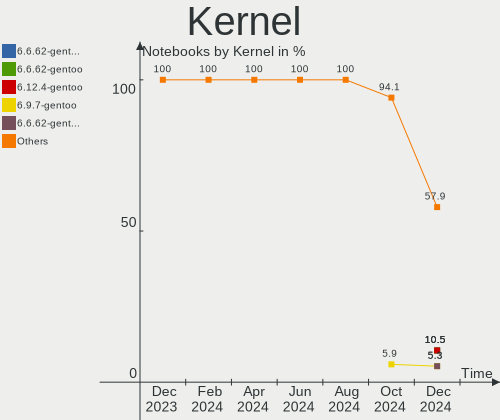
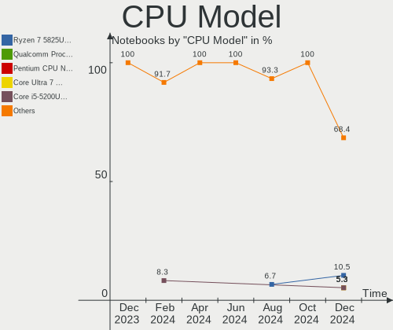
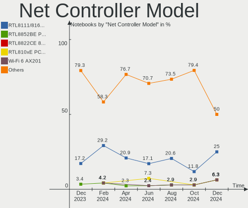

Gentoo - Hardware Trends (Notebooks)
------------------------------------

A project to identify most popular hardware characteristics and track their change
over time based on data collected by Linux users at https://Linux-Hardware.org.

Anyone can contribute to this report by the [hw-probe](https://github.com/linuxhw/hw-probe) tool:

    sudo -E hw-probe -all -upload

This report is for one last month. Overall report since the beginning of time: [TestCoverage](https://github.com/linuxhw/TestCoverage)

Period: Aug, 2022.

Contents
--------

* [ System ](#system)
  - [ OS                       ](#os)
  - [ OS Family                ](#os-family)
  - [ Kernel                   ](#kernel)
  - [ Kernel Family            ](#kernel-family)
  - [ Kernel Major Ver.        ](#kernel-major-ver)
  - [ Arch                     ](#arch)
  - [ DE                       ](#de)
  - [ Display Server           ](#display-server)
  - [ Display Manager          ](#display-manager)
  - [ OS Lang                  ](#os-lang)
  - [ Boot Mode                ](#boot-mode)
  - [ Filesystem               ](#filesystem)
  - [ Part. scheme             ](#part-scheme)
  - [ Dual Boot with Linux/BSD ](#dual-boot-with-linuxbsd)
  - [ Dual Boot (Win)          ](#dual-boot-win)

* [ Board ](#board)
  - [ Vendor                   ](#vendor)
  - [ Model                    ](#model)
  - [ Model Family             ](#model-family)
  - [ MFG Year                 ](#mfg-year)
  - [ Form Factor              ](#form-factor)
  - [ Secure Boot              ](#secure-boot)
  - [ Coreboot                 ](#coreboot)
  - [ RAM Size                 ](#ram-size)
  - [ RAM Used                 ](#ram-used)
  - [ Total Drives             ](#total-drives)
  - [ Has CD-ROM               ](#has-cd-rom)
  - [ Has Ethernet             ](#has-ethernet)
  - [ Has WiFi                 ](#has-wifi)
  - [ Has Bluetooth            ](#has-bluetooth)

* [ Location ](#location)
  - [ Country                  ](#country)
  - [ City                     ](#city)

* [ Drives ](#drives)
  - [ Drive Vendor             ](#drive-vendor)
  - [ Drive Model              ](#drive-model)
  - [ HDD Vendor               ](#hdd-vendor)
  - [ SSD Vendor               ](#ssd-vendor)
  - [ Drive Kind               ](#drive-kind)
  - [ Drive Connector          ](#drive-connector)
  - [ Drive Size               ](#drive-size)
  - [ Space Total              ](#space-total)
  - [ Space Used               ](#space-used)
  - [ Malfunc. Drives          ](#malfunc-drives)
  - [ Malfunc. Drive Vendor    ](#malfunc-drive-vendor)
  - [ Malfunc. HDD Vendor      ](#malfunc-hdd-vendor)
  - [ Malfunc. Drive Kind      ](#malfunc-drive-kind)
  - [ Failed Drives            ](#failed-drives)
  - [ Failed Drive Vendor      ](#failed-drive-vendor)
  - [ Drive Status             ](#drive-status)

* [ Storage controller ](#storage-controller)
  - [ Storage Vendor           ](#storage-vendor)
  - [ Storage Model            ](#storage-model)
  - [ Storage Kind             ](#storage-kind)

* [ Processor ](#processor)
  - [ CPU Vendor               ](#cpu-vendor)
  - [ CPU Model                ](#cpu-model)
  - [ CPU Model Family         ](#cpu-model-family)
  - [ CPU Cores                ](#cpu-cores)
  - [ CPU Sockets              ](#cpu-sockets)
  - [ CPU Threads              ](#cpu-threads)
  - [ CPU Op-Modes             ](#cpu-op-modes)
  - [ CPU Microcode            ](#cpu-microcode)
  - [ CPU Microarch            ](#cpu-microarch)

* [ Graphics ](#graphics)
  - [ GPU Vendor               ](#gpu-vendor)
  - [ GPU Model                ](#gpu-model)
  - [ GPU Combo                ](#gpu-combo)
  - [ GPU Driver               ](#gpu-driver)
  - [ GPU Memory               ](#gpu-memory)

* [ Monitor ](#monitor)
  - [ Monitor Vendor           ](#monitor-vendor)
  - [ Monitor Model            ](#monitor-model)
  - [ Monitor Resolution       ](#monitor-resolution)
  - [ Monitor Diagonal         ](#monitor-diagonal)
  - [ Monitor Width            ](#monitor-width)
  - [ Aspect Ratio             ](#aspect-ratio)
  - [ Monitor Area             ](#monitor-area)
  - [ Pixel Density            ](#pixel-density)
  - [ Multiple Monitors        ](#multiple-monitors)

* [ Network ](#network)
  - [ Net Controller Vendor    ](#net-controller-vendor)
  - [ Net Controller Model     ](#net-controller-model)
  - [ Wireless Vendor          ](#wireless-vendor)
  - [ Wireless Model           ](#wireless-model)
  - [ Ethernet Vendor          ](#ethernet-vendor)
  - [ Ethernet Model           ](#ethernet-model)
  - [ Net Controller Kind      ](#net-controller-kind)
  - [ Used Controller          ](#used-controller)
  - [ NICs                     ](#nics)
  - [ IPv6                     ](#ipv6)

* [ Bluetooth ](#bluetooth)
  - [ Bluetooth Vendor         ](#bluetooth-vendor)
  - [ Bluetooth Model          ](#bluetooth-model)

* [ Sound ](#sound)
  - [ Sound Vendor             ](#sound-vendor)
  - [ Sound Model              ](#sound-model)

* [ Memory ](#memory)
  - [ Memory Vendor            ](#memory-vendor)
  - [ Memory Model             ](#memory-model)
  - [ Memory Kind              ](#memory-kind)
  - [ Memory Form Factor       ](#memory-form-factor)
  - [ Memory Size              ](#memory-size)
  - [ Memory Speed             ](#memory-speed)

* [ Printers & scanners ](#printers--scanners)
  - [ Printer Vendor           ](#printer-vendor)
  - [ Printer Model            ](#printer-model)
  - [ Scanner Vendor           ](#scanner-vendor)
  - [ Scanner Model            ](#scanner-model)

* [ Camera ](#camera)
  - [ Camera Vendor            ](#camera-vendor)
  - [ Camera Model             ](#camera-model)

* [ Security ](#security)
  - [ Fingerprint Vendor       ](#fingerprint-vendor)
  - [ Fingerprint Model        ](#fingerprint-model)
  - [ Chipcard Vendor          ](#chipcard-vendor)
  - [ Chipcard Model           ](#chipcard-model)

* [ Unsupported ](#unsupported)
  - [ Unsupported Devices      ](#unsupported-devices)
  - [ Unsupported Device Types ](#unsupported-device-types)

System
------

OS
--

Installed operating systems

| Name       | Notebooks | Percent |
|------------|-----------|---------|
| Gentoo 2.8 | 23        | 95.83%  |
| Gentoo 2.6 | 1         | 4.17%   |

OS Family
---------

OS without a version

| Name   | Notebooks | Percent |
|--------|-----------|---------|
| Gentoo | 24        | 100%    |

Kernel
------

Version of the Linux kernel

| Version                         | Notebooks | Percent |
|---------------------------------|-----------|---------|
| 5.19.0-gentoo-x86_64            | 4         | 16.67%  |
| 5.15.59-gentoo-x86_64           | 3         | 12.5%   |
| 5.15.52-gentoo                  | 3         | 12.5%   |
| 5.15.59-gentoo                  | 2         | 8.33%   |
| 5.15.41-gentoo-x86_64           | 2         | 8.33%   |
| 5.19.3-gentoo-x86_64            | 1         | 4.17%   |
| 5.19.0-xanmod1-elitebook        | 1         | 4.17%   |
| 5.19.0-gentoo                   | 1         | 4.17%   |
| 5.18.15-gentoo-dist             | 1         | 4.17%   |
| 5.15.61-gentoo-dist             | 1         | 4.17%   |
| 5.15.59-gentoo-dist-hardened    | 1         | 4.17%   |
| 5.15.59-gentoo-dist             | 1         | 4.17%   |
| 5.15.55-gentoo-114-virtualbox3D | 1         | 4.17%   |
| 5.15.52-gentoo-x86_64           | 1         | 4.17%   |
| 5.15.19-gentoo-x86_64-k01       | 1         | 4.17%   |

Kernel Family
-------------

Linux kernel without a distro release

| Version | Notebooks | Percent |
|---------|-----------|---------|
| 5.15.59 | 7         | 29.17%  |
| 5.19.0  | 6         | 25%     |
| 5.15.52 | 4         | 16.67%  |
| 5.15.41 | 2         | 8.33%   |
| 5.19.3  | 1         | 4.17%   |
| 5.18.15 | 1         | 4.17%   |
| 5.15.61 | 1         | 4.17%   |
| 5.15.55 | 1         | 4.17%   |
| 5.15.19 | 1         | 4.17%   |

Kernel Major Ver.
-----------------

Linux kernel major version

| Version | Notebooks | Percent |
|---------|-----------|---------|
| 5.15    | 16        | 66.67%  |
| 5.19    | 7         | 29.17%  |
| 5.18    | 1         | 4.17%   |

Arch
----

OS architecture (x86_64, i586, etc.)

| Name   | Notebooks | Percent |
|--------|-----------|---------|
| x86_64 | 22        | 91.67%  |
| i686   | 2         | 8.33%   |

DE
--

Desktop Environment

| Name    | Notebooks | Percent |
|---------|-----------|---------|
| KDE5    | 12        | 50%     |
| Unknown | 8         | 33.33%  |
| XFCE    | 1         | 4.17%   |
| LXQt    | 1         | 4.17%   |
| GNOME   | 1         | 4.17%   |
| dwm     | 1         | 4.17%   |

Display Server
--------------

X11 or Wayland

| Name    | Notebooks | Percent |
|---------|-----------|---------|
| X11     | 16        | 66.67%  |
| Wayland | 3         | 12.5%   |
| Unknown | 3         | 12.5%   |
| Tty     | 2         | 8.33%   |

Display Manager
---------------

SDDM, LightDM, etc.

| Name    | Notebooks | Percent |
|---------|-----------|---------|
| SDDM    | 12        | 50%     |
| LightDM | 6         | 25%     |
| Unknown | 4         | 16.67%  |
| LXDM    | 1         | 4.17%   |
| GDM     | 1         | 4.17%   |

OS Lang
-------

Language

| Lang   | Notebooks | Percent |
|--------|-----------|---------|
| en_US  | 11        | 45.83%  |
| C.UTF8 | 6         | 25%     |
| de_DE  | 2         | 8.33%   |
| C      | 2         | 8.33%   |
| en_GB  | 1         | 4.17%   |
| en_AU  | 1         | 4.17%   |
| de_CH  | 1         | 4.17%   |

Boot Mode
---------

EFI or BIOS

| Mode | Notebooks | Percent |
|------|-----------|---------|
| EFI  | 20        | 83.33%  |
| BIOS | 4         | 16.67%  |

Filesystem
----------

Type of filesystem

| Type    | Notebooks | Percent |
|---------|-----------|---------|
| Ext4    | 12        | 50%     |
| Btrfs   | 7         | 29.17%  |
| XXXXXXX | 4         | 16.67%  |
| Zfs     | 1         | 4.17%   |

Part. scheme
------------

Scheme of partitioning

| Type | Notebooks | Percent |
|------|-----------|---------|
| GPT  | 22        | 91.67%  |
| MBR  | 2         | 8.33%   |

Dual Boot with Linux/BSD
------------------------

Hosting more than one Linux/BSD

| Dual boot | Notebooks | Percent |
|-----------|-----------|---------|
| No        | 21        | 87.5%   |
| Yes       | 3         | 12.5%   |

Dual Boot (Win)
---------------

Hosting Linux and Windows

| Dual boot | Notebooks | Percent |
|-----------|-----------|---------|
| No        | 17        | 70.83%  |
| Yes       | 7         | 29.17%  |

Board
-----

Vendor
------

Motherboard manufacturer

| Name                | Notebooks | Percent |
|---------------------|-----------|---------|
| Lenovo              | 7         | 29.17%  |
| Toshiba             | 2         | 8.33%   |
| Dell                | 2         | 8.33%   |
| ASUSTek Computer    | 2         | 8.33%   |
| win element         | 1         | 4.17%   |
| Timi                | 1         | 4.17%   |
| Samsung Electronics | 1         | 4.17%   |
| Purism              | 1         | 4.17%   |
| Notebook            | 1         | 4.17%   |
| IBM                 | 1         | 4.17%   |
| HUAWEI              | 1         | 4.17%   |
| Hewlett-Packard     | 1         | 4.17%   |
| Fujitsu             | 1         | 4.17%   |
| Eluktronics         | 1         | 4.17%   |
| Acer                | 1         | 4.17%   |

Model
-----

Motherboard model

| Name                                     | Notebooks | Percent |
|------------------------------------------|-----------|---------|
| win element MoreFine S500+               | 1         | 4.17%   |
| Toshiba Satellite C850D-118              | 1         | 4.17%   |
| Toshiba NB100                            | 1         | 4.17%   |
| Timi A35                                 | 1         | 4.17%   |
| Samsung 700G7C                           | 1         | 4.17%   |
| Purism Librem 15 v4                      | 1         | 4.17%   |
| Notebook N141CU                          | 1         | 4.17%   |
| Lenovo Yoga S940-14IWL 81Q7              | 1         | 4.17%   |
| Lenovo ThinkPad Z16 Gen 1 21D4002GGE     | 1         | 4.17%   |
| Lenovo ThinkPad T14 Gen 1 20S1S35Y00     | 1         | 4.17%   |
| Lenovo ThinkPad P50 20EQS33R0J           | 1         | 4.17%   |
| Lenovo ThinkPad L15 Gen 2a 20X7006PAU    | 1         | 4.17%   |
| Lenovo ThinkBook 13s G2 ITL 20V9         | 1         | 4.17%   |
| Lenovo Legion 5 Pro 16ACH6H 82JQ         | 1         | 4.17%   |
| IBM 2722BDG                              | 1         | 4.17%   |
| HUAWEI HVY-WXX9                          | 1         | 4.17%   |
| HP EliteBook 845 14 inch G9 Notebook PC  | 1         | 4.17%   |
| Fujitsu LIFEBOOK U758                    | 1         | 4.17%   |
| Eluktronics MAX-17                       | 1         | 4.17%   |
| Dell Precision 3570                      | 1         | 4.17%   |
| Dell G3 3500                             | 1         | 4.17%   |
| ASUS VivoBook_ASUSLaptop X421UAY_D413UA  | 1         | 4.17%   |
| ASUS ASUS TUF Gaming F17 FX706HC_FX706HC | 1         | 4.17%   |
| Acer Swift SF314-512                     | 1         | 4.17%   |

Model Family
------------

Motherboard model prefix

| Name                 | Notebooks | Percent |
|----------------------|-----------|---------|
| Lenovo ThinkPad      | 4         | 16.67%  |
| win element MoreFine | 1         | 4.17%   |
| Toshiba Satellite    | 1         | 4.17%   |
| Toshiba NB100        | 1         | 4.17%   |
| Timi A35             | 1         | 4.17%   |
| Samsung 700G7C       | 1         | 4.17%   |
| Purism Librem        | 1         | 4.17%   |
| Notebook N141CU      | 1         | 4.17%   |
| Lenovo Yoga          | 1         | 4.17%   |
| Lenovo ThinkBook     | 1         | 4.17%   |
| Lenovo Legion        | 1         | 4.17%   |
| IBM 2722BDG          | 1         | 4.17%   |
| HUAWEI HVY-WXX9      | 1         | 4.17%   |
| HP EliteBook         | 1         | 4.17%   |
| Fujitsu LIFEBOOK     | 1         | 4.17%   |
| Eluktronics MAX-17   | 1         | 4.17%   |
| Dell Precision       | 1         | 4.17%   |
| Dell G3              | 1         | 4.17%   |
| ASUS VivoBook        | 1         | 4.17%   |
| ASUS ASUS            | 1         | 4.17%   |
| Acer Swift           | 1         | 4.17%   |

MFG Year
--------

Motherboard manufacture year

| Year | Notebooks | Percent |
|------|-----------|---------|
| 2021 | 6         | 25%     |
| 2020 | 5         | 20.83%  |
| 2022 | 4         | 16.67%  |
| 2019 | 3         | 12.5%   |
| 2012 | 2         | 8.33%   |
| 2018 | 1         | 4.17%   |
| 2015 | 1         | 4.17%   |
| 2008 | 1         | 4.17%   |
| 2006 | 1         | 4.17%   |

Form Factor
-----------

Physical design of the computer

| Name     | Notebooks | Percent |
|----------|-----------|---------|
| Notebook | 24        | 100%    |

Secure Boot
-----------

Enabled or disabled

| State    | Notebooks | Percent |
|----------|-----------|---------|
| Disabled | 24        | 100%    |

Coreboot
--------

Have coreboot on board

| Used | Notebooks | Percent |
|------|-----------|---------|
| No   | 23        | 95.83%  |
| Yes  | 1         | 4.17%   |

RAM Size
--------

Total RAM memory

| Size in GB  | Notebooks | Percent |
|-------------|-----------|---------|
| 16.01-24.0  | 7         | 29.17%  |
| 8.01-16.0   | 5         | 20.83%  |
| 32.01-64.0  | 4         | 16.67%  |
| 64.01-256.0 | 3         | 12.5%   |
| 4.01-8.0    | 2         | 8.33%   |
| 2.01-3.0    | 2         | 8.33%   |
| 3.01-4.0    | 1         | 4.17%   |

RAM Used
--------

Used RAM memory

| Used GB   | Notebooks | Percent |
|-----------|-----------|---------|
| 3.01-4.0  | 6         | 25%     |
| 1.01-2.0  | 6         | 25%     |
| 4.01-8.0  | 5         | 20.83%  |
| 8.01-16.0 | 3         | 12.5%   |
| 0.51-1.0  | 2         | 8.33%   |
| 0.01-0.5  | 2         | 8.33%   |

Total Drives
------------

Number of drives on board

| Drives | Notebooks | Percent |
|--------|-----------|---------|
| 1      | 19        | 79.17%  |
| 2      | 4         | 16.67%  |
| 3      | 1         | 4.17%   |

Has CD-ROM
----------

Has CD-ROM on board

| Presented | Notebooks | Percent |
|-----------|-----------|---------|
| No        | 21        | 87.5%   |
| Yes       | 3         | 12.5%   |

Has Ethernet
------------

Has Ethernet on board

| Presented | Notebooks | Percent |
|-----------|-----------|---------|
| Yes       | 15        | 62.5%   |
| No        | 9         | 37.5%   |

Has WiFi
--------

Has WiFi module

| Presented | Notebooks | Percent |
|-----------|-----------|---------|
| Yes       | 23        | 95.83%  |
| No        | 1         | 4.17%   |

Has Bluetooth
-------------

Has Bluetooth module

| Presented | Notebooks | Percent |
|-----------|-----------|---------|
| Yes       | 21        | 87.5%   |
| No        | 3         | 12.5%   |

Location
--------

Country
-------

Geographic location (country)

| Country     | Notebooks | Percent |
|-------------|-----------|---------|
| Germany     | 4         | 16.67%  |
| France      | 3         | 12.5%   |
| USA         | 2         | 8.33%   |
| Greece      | 2         | 8.33%   |
| China       | 2         | 8.33%   |
| Australia   | 2         | 8.33%   |
| Ukraine     | 1         | 4.17%   |
| Turkey      | 1         | 4.17%   |
| Switzerland | 1         | 4.17%   |
| Sweden      | 1         | 4.17%   |
| Russia      | 1         | 4.17%   |
| Mexico      | 1         | 4.17%   |
| Hong Kong   | 1         | 4.17%   |
| Belarus     | 1         | 4.17%   |
| Austria     | 1         | 4.17%   |

City
----

Geographic location (city)

| City           | Notebooks | Percent |
|----------------|-----------|---------|
| Cherry Hill    | 2         | 8.33%   |
| Athens         | 2         | 8.33%   |
| Vienna         | 1         | 4.17%   |
| Sydney         | 1         | 4.17%   |
| Sundsvall      | 1         | 4.17%   |
| Rostock        | 1         | 4.17%   |
| Postbauer-Heng | 1         | 4.17%   |
| Noisy-le-Sec   | 1         | 4.17%   |
| Munich         | 1         | 4.17%   |
| Minsk          | 1         | 4.17%   |
| Mexico City    | 1         | 4.17%   |
| Marseille      | 1         | 4.17%   |
| Kyiv           | 1         | 4.17%   |
| Heerbrugg      | 1         | 4.17%   |
| Hangzhou       | 1         | 4.17%   |
| Grasse         | 1         | 4.17%   |
| Futian         | 1         | 4.17%   |
| Filderstadt    | 1         | 4.17%   |
| Central        | 1         | 4.17%   |
| Brisbane       | 1         | 4.17%   |
| Belgorod       | 1         | 4.17%   |
| Antalya        | 1         | 4.17%   |

Drives
------

Drive Vendor
------------

Hard drive vendors

| Vendor              | Notebooks | Drives | Percent |
|---------------------|-----------|--------|---------|
| WDC                 | 7         | 7      | 25%     |
| Samsung Electronics | 6         | 8      | 21.43%  |
| SanDisk             | 4         | 4      | 14.29%  |
| Intel               | 2         | 2      | 7.14%   |
| Crucial             | 2         | 2      | 7.14%   |
| Toshiba             | 1         | 1      | 3.57%   |
| T-FORCE             | 1         | 1      | 3.57%   |
| SK hynix            | 1         | 1      | 3.57%   |
| Seagate             | 1         | 1      | 3.57%   |
| Micron Technology   | 1         | 1      | 3.57%   |
| Fujitsu             | 1         | 1      | 3.57%   |
| AMD                 | 1         | 1      | 3.57%   |

Drive Model
-----------

Hard drive models

| Model                                | Notebooks | Percent |
|--------------------------------------|-----------|---------|
| WDC WDS500G2B0C-00PXH0 500GB         | 1         | 3.45%   |
| WDC WD2500BEVS-22UST0 250GB          | 1         | 3.45%   |
| WDC WD1600BEVS-22RST0 160GB          | 1         | 3.45%   |
| WDC PC SN730 SDBQNTY-512G-1001 512GB | 1         | 3.45%   |
| WDC PC SN730 SDBPNTY-512G-1101 512GB | 1         | 3.45%   |
| WDC PC SN730 SDBPNTY-512G-1027 512GB | 1         | 3.45%   |
| WDC PC SN530 SDBPNPZ-512G-1002 512GB | 1         | 3.45%   |
| Toshiba KXG6AZNV512G 512GB           | 1         | 3.45%   |
| T-FORCE TM8FP5001T 1TB               | 1         | 3.45%   |
| SK hynix HFM512GD3JX013N 512GB       | 1         | 3.45%   |
| Seagate ST2000LM015-2E8174 2TB       | 1         | 3.45%   |
| Sandisk WD Black SN850 500GB         | 1         | 3.45%   |
| SanDisk SD8TN8U512G1001 512GB SSD    | 1         | 3.45%   |
| SanDisk NVMe SSD Drive 500GB         | 1         | 3.45%   |
| SanDisk iSSD P4 8GB                  | 1         | 3.45%   |
| Samsung SSD 860 QVO 1TB              | 1         | 3.45%   |
| Samsung SSD 860 EVO M.2 1TB          | 1         | 3.45%   |
| Samsung SSD 830 Series 256GB         | 1         | 3.45%   |
| Samsung PM9A1 NVMe 512GB             | 1         | 3.45%   |
| Samsung PM991 NVMe 512GB             | 1         | 3.45%   |
| Samsung MZVL22T0HBLB-00BL7 2TB       | 1         | 3.45%   |
| Samsung MZALQ512HALU-000L2 512GB     | 1         | 3.45%   |
| Micron 2450_MTFDKBA512TFK 512GB      | 1         | 3.45%   |
| Intel SSDPEKNW020T8 2TB              | 1         | 3.45%   |
| Intel SSDPEKNW010T8 1TB              | 1         | 3.45%   |
| Fujitsu MHW2040AT 40GB               | 1         | 3.45%   |
| Crucial CT480BX500SSD1 480GB         | 1         | 3.45%   |
| Crucial CT2000P2SSD8 2TB             | 1         | 3.45%   |
| AMD Micron_3400_MTFDKBA1T0TFH 1TB    | 1         | 3.45%   |

HDD Vendor
----------

Hard disk drive vendors

| Vendor  | Notebooks | Drives | Percent |
|---------|-----------|--------|---------|
| WDC     | 2         | 2      | 50%     |
| Seagate | 1         | 1      | 25%     |
| Fujitsu | 1         | 1      | 25%     |

SSD Vendor
----------

Solid state drive vendors

| Vendor              | Notebooks | Drives | Percent |
|---------------------|-----------|--------|---------|
| SanDisk             | 2         | 2      | 40%     |
| Samsung Electronics | 2         | 3      | 40%     |
| Crucial             | 1         | 1      | 20%     |

Drive Kind
----------

HDD or SSD

| Kind | Notebooks | Drives | Percent |
|------|-----------|--------|---------|
| NVMe | 18        | 20     | 69.23%  |
| SSD  | 4         | 6      | 15.38%  |
| HDD  | 4         | 4      | 15.38%  |

Drive Connector
---------------

SATA, SAS, NVMe, etc.

| Type | Notebooks | Drives | Percent |
|------|-----------|--------|---------|
| NVMe | 18        | 20     | 69.23%  |
| SATA | 8         | 10     | 30.77%  |

Drive Size
----------

Size of hard drive

| Size in TB | Notebooks | Drives | Percent |
|------------|-----------|--------|---------|
| 0.01-0.5   | 5         | 6      | 55.56%  |
| 0.51-1.0   | 3         | 3      | 33.33%  |
| 1.01-2.0   | 1         | 1      | 11.11%  |

Space Total
-----------

Amount of disk space available on the file system

| Size in GB     | Notebooks | Percent |
|----------------|-----------|---------|
| 251-500        | 7         | 29.17%  |
| 101-250        | 4         | 16.67%  |
| 501-1000       | 4         | 16.67%  |
| 2001-3000      | 2         | 8.33%   |
| 1-20           | 2         | 8.33%   |
| Unknown        | 2         | 8.33%   |
| More than 3000 | 1         | 4.17%   |
| 21-50          | 1         | 4.17%   |
| 1001-2000      | 1         | 4.17%   |

Space Used
----------

Amount of used disk space

| Used GB   | Notebooks | Percent |
|-----------|-----------|---------|
| 1-20      | 7         | 29.17%  |
| 21-50     | 5         | 20.83%  |
| 101-250   | 4         | 16.67%  |
| 51-100    | 3         | 12.5%   |
| 1001-2000 | 2         | 8.33%   |
| Unknown   | 2         | 8.33%   |
| 251-500   | 1         | 4.17%   |

Malfunc. Drives
---------------

Drive models with a malfunction

| Model                       | Notebooks | Drives | Percent |
|-----------------------------|-----------|--------|---------|
| WDC WD1600BEVS-22RST0 160GB | 1         | 1      | 50%     |
| Fujitsu MHW2040AT 40GB      | 1         | 1      | 50%     |

Malfunc. Drive Vendor
---------------------

Vendors of faulty drives

| Vendor  | Notebooks | Drives | Percent |
|---------|-----------|--------|---------|
| WDC     | 1         | 1      | 50%     |
| Fujitsu | 1         | 1      | 50%     |

Malfunc. HDD Vendor
-------------------

Vendors of faulty HDD drives

| Vendor  | Notebooks | Drives | Percent |
|---------|-----------|--------|---------|
| WDC     | 1         | 1      | 50%     |
| Fujitsu | 1         | 1      | 50%     |

Malfunc. Drive Kind
-------------------

Kinds of faulty drives

| Kind | Notebooks | Drives | Percent |
|------|-----------|--------|---------|
| HDD  | 2         | 2      | 100%    |

Failed Drives
-------------

Failed drive models

Zero info for selected period =(

Failed Drive Vendor
-------------------

Failed drive vendors

Zero info for selected period =(

Drive Status
------------

Number of failed and malfunc. drives

| Status   | Notebooks | Drives | Percent |
|----------|-----------|--------|---------|
| Works    | 21        | 27     | 87.5%   |
| Malfunc  | 2         | 2      | 8.33%   |
| Detected | 1         | 1      | 4.17%   |

Storage controller
------------------

Storage Vendor
--------------

Storage controller vendors

| Vendor                       | Notebooks | Percent |
|------------------------------|-----------|---------|
| Intel                        | 12        | 36.36%  |
| SanDisk                      | 7         | 21.21%  |
| AMD                          | 5         | 15.15%  |
| Samsung Electronics          | 4         | 12.12%  |
| Toshiba America Info Systems | 1         | 3.03%   |
| SK hynix                     | 1         | 3.03%   |
| Phison Electronics           | 1         | 3.03%   |
| Micron/Crucial Technology    | 1         | 3.03%   |
| Micron Technology            | 1         | 3.03%   |

Storage Model
-------------

Storage controller models

| Model                                                                         | Notebooks | Percent |
|-------------------------------------------------------------------------------|-----------|---------|
| AMD FCH SATA Controller [AHCI mode]                                           | 4         | 11.76%  |
| SanDisk WD Black SN750 / PC SN730 NVMe SSD                                    | 3         | 8.82%   |
| SanDisk WD Blue SN550 NVMe SSD                                                | 2         | 5.88%   |
| Samsung NVMe SSD Controller PM9A1/PM9A3/980PRO                                | 2         | 5.88%   |
| Samsung NVMe SSD Controller 980                                               | 2         | 5.88%   |
| Intel Volume Management Device NVMe RAID Controller                           | 2         | 5.88%   |
| Intel Sunrise Point-LP SATA Controller [AHCI mode]                            | 2         | 5.88%   |
| Intel SSD 660P Series                                                         | 2         | 5.88%   |
| Toshiba America Info Systems XG6 NVMe SSD Controller                          | 1         | 2.94%   |
| SK hynix Gold P31 SSD                                                         | 1         | 2.94%   |
| SanDisk WD PC SN810 / Black SN850 NVMe SSD                                    | 1         | 2.94%   |
| SanDisk WD Blue SN570 NVMe SSD                                                | 1         | 2.94%   |
| Phison E12 NVMe Controller                                                    | 1         | 2.94%   |
| Micron/Crucial P2 NVMe PCIe SSD                                               | 1         | 2.94%   |
| Micron Non-Volatile memory controller                                         | 1         | 2.94%   |
| Intel Q170/Q150/B150/H170/H110/Z170/CM236 Chipset SATA Controller [AHCI Mode] | 1         | 2.94%   |
| Intel Comet Lake SATA AHCI Controller                                         | 1         | 2.94%   |
| Intel 82801GBM/GHM (ICH7-M Family) SATA Controller [AHCI mode]                | 1         | 2.94%   |
| Intel 82801G (ICH7 Family) IDE Controller                                     | 1         | 2.94%   |
| Intel 82801DBM (ICH4-M) IDE Controller                                        | 1         | 2.94%   |
| Intel 7 Series Chipset Family 6-port SATA Controller [AHCI mode]              | 1         | 2.94%   |
| Intel 400 Series Chipset Family SATA AHCI Controller                          | 1         | 2.94%   |
| AMD RAID Bottom Device                                                        | 1         | 2.94%   |

Storage Kind
------------

Kind of storage controller (IDE, SATA, NVMe, SAS, ...)

| Kind | Notebooks | Percent |
|------|-----------|---------|
| NVMe | 18        | 54.55%  |
| SATA | 11        | 33.33%  |
| RAID | 2         | 6.06%   |
| IDE  | 2         | 6.06%   |

Processor
---------

CPU Vendor
----------

Processor vendors

| Vendor | Notebooks | Percent |
|--------|-----------|---------|
| Intel  | 15        | 62.5%   |
| AMD    | 9         | 37.5%   |

CPU Model
---------

Processor models

| Model                                       | Notebooks | Percent |
|---------------------------------------------|-----------|---------|
| Intel Pentium M processor 1400MHz           | 1         | 4.17%   |
| Intel Core i7-8565U CPU @ 1.80GHz           | 1         | 4.17%   |
| Intel Core i7-7500U CPU @ 2.70GHz           | 1         | 4.17%   |
| Intel Core i7-6820HQ CPU @ 2.70GHz          | 1         | 4.17%   |
| Intel Core i7-3610QM CPU @ 2.30GHz          | 1         | 4.17%   |
| Intel Core i7-10610U CPU @ 1.80GHz          | 1         | 4.17%   |
| Intel Core i5-8250U CPU @ 1.60GHz           | 1         | 4.17%   |
| Intel Core i5-10300H CPU @ 2.50GHz          | 1         | 4.17%   |
| Intel Core i5-10210U CPU @ 1.60GHz          | 1         | 4.17%   |
| Intel Atom CPU N270 @ 1.60GHz               | 1         | 4.17%   |
| Intel 12th Gen Core i7-1280P                | 1         | 4.17%   |
| Intel 12th Gen Core i7-1260P                | 1         | 4.17%   |
| Intel 11th Gen Core i5-11400H @ 2.70GHz     | 1         | 4.17%   |
| Intel 11th Gen Core i5-1135G7 @ 2.40GHz     | 1         | 4.17%   |
| Intel 11th Gen Core i5-11300H @ 3.10GHz     | 1         | 4.17%   |
| AMD Ryzen 9 PRO 6950H with Radeon Graphics  | 1         | 4.17%   |
| AMD Ryzen 7 PRO 6850HS with Radeon Graphics | 1         | 4.17%   |
| AMD Ryzen 7 PRO 5850U with Radeon Graphics  | 1         | 4.17%   |
| AMD Ryzen 7 5800H with Radeon Graphics      | 1         | 4.17%   |
| AMD Ryzen 7 5700U with Radeon Graphics      | 1         | 4.17%   |
| AMD Ryzen 7 4800H with Radeon Graphics      | 1         | 4.17%   |
| AMD Ryzen 5 5600H with Radeon Graphics      | 1         | 4.17%   |
| AMD Ryzen 5 4600H with Radeon Graphics      | 1         | 4.17%   |
| AMD E1-1200 APU with Radeon HD Graphics     | 1         | 4.17%   |

CPU Model Family
----------------

Processor model prefix

| Model           | Notebooks | Percent |
|-----------------|-----------|---------|
| Other           | 5         | 20.83%  |
| Intel Core i7   | 5         | 20.83%  |
| Intel Core i5   | 3         | 12.5%   |
| AMD Ryzen 7     | 3         | 12.5%   |
| AMD Ryzen 7 PRO | 2         | 8.33%   |
| AMD Ryzen 5     | 2         | 8.33%   |
| Intel Pentium M | 1         | 4.17%   |
| Intel Atom      | 1         | 4.17%   |
| AMD Ryzen 9     | 1         | 4.17%   |
| AMD E1          | 1         | 4.17%   |

CPU Cores
---------

Number of processor cores

| Number | Notebooks | Percent |
|--------|-----------|---------|
| 4      | 9         | 37.5%   |
| 8      | 6         | 25%     |
| 6      | 3         | 12.5%   |
| 2      | 2         | 8.33%   |
| 1      | 2         | 8.33%   |
| 14     | 1         | 4.17%   |
| 12     | 1         | 4.17%   |

CPU Sockets
-----------

Number of sockets

| Number | Notebooks | Percent |
|--------|-----------|---------|
| 1      | 24        | 100%    |

CPU Threads
-----------

Threads per core (Hyper-Threading)

| Number | Notebooks | Percent |
|--------|-----------|---------|
| 2      | 21        | 87.5%   |
| 1      | 3         | 12.5%   |

CPU Op-Modes
------------

CPU Operation Modes (32-bit, 64-bit)

| Op mode        | Notebooks | Percent |
|----------------|-----------|---------|
| 32-bit, 64-bit | 22        | 91.67%  |
| 32-bit         | 2         | 8.33%   |

CPU Microcode
-------------

Microcode number

| Number     | Notebooks | Percent |
|------------|-----------|---------|
| 0x0a50000c | 3         | 12.5%   |
| 0x906a3    | 2         | 8.33%   |
| 0x806ec    | 2         | 8.33%   |
| 0x806c1    | 2         | 8.33%   |
| 0x0a404102 | 2         | 8.33%   |
| 0x08600106 | 2         | 8.33%   |
| Unknown    | 2         | 8.33%   |
| 0xa0652    | 1         | 4.17%   |
| 0x806eb    | 1         | 4.17%   |
| 0x806ea    | 1         | 4.17%   |
| 0x806e9    | 1         | 4.17%   |
| 0x806d1    | 1         | 4.17%   |
| 0x506e3    | 1         | 4.17%   |
| 0x306a9    | 1         | 4.17%   |
| 0x08608103 | 1         | 4.17%   |
| 0x05000119 | 1         | 4.17%   |

CPU Microarch
-------------

Microarchitecture

| Name             | Notebooks | Percent |
|------------------|-----------|---------|
| KabyLake         | 5         | 20.83%  |
| Zen 3            | 3         | 12.5%   |
| Unknown          | 3         | 12.5%   |
| Zen 2            | 2         | 8.33%   |
| TigerLake        | 2         | 8.33%   |
| Alderlake Hybrid | 2         | 8.33%   |
| Skylake          | 1         | 4.17%   |
| P6               | 1         | 4.17%   |
| IvyBridge        | 1         | 4.17%   |
| Icelake          | 1         | 4.17%   |
| CometLake        | 1         | 4.17%   |
| Bonnell          | 1         | 4.17%   |
| Bobcat           | 1         | 4.17%   |

Graphics
--------

GPU Vendor
----------

Vendors of graphics cards

| Vendor | Notebooks | Percent |
|--------|-----------|---------|
| Intel  | 12        | 42.86%  |
| AMD    | 9         | 32.14%  |
| Nvidia | 7         | 25%     |

GPU Model
---------

Graphics card models

| Model                                                                         | Notebooks | Percent |
|-------------------------------------------------------------------------------|-----------|---------|
| Nvidia GA106M [GeForce RTX 3060 Mobile / Max-Q]                               | 2         | 6.67%   |
| Intel TigerLake-LP GT2 [Iris Xe Graphics]                                     | 2         | 6.67%   |
| Intel CometLake-U GT2 [UHD Graphics]                                          | 2         | 6.67%   |
| Intel Alder Lake-P Integrated Graphics Controller                             | 2         | 6.67%   |
| AMD Renoir                                                                    | 2         | 6.67%   |
| AMD Rembrandt [Radeon 680M]                                                   | 2         | 6.67%   |
| AMD Cezanne                                                                   | 2         | 6.67%   |
| Nvidia TU117M                                                                 | 1         | 3.33%   |
| Nvidia GP108M [GeForce MX330]                                                 | 1         | 3.33%   |
| Nvidia GM107GLM [Quadro M2000M]                                               | 1         | 3.33%   |
| Nvidia GF114M [GeForce GTX 675M]                                              | 1         | 3.33%   |
| Nvidia GA107M [GeForce RTX 3050 Mobile]                                       | 1         | 3.33%   |
| Intel WhiskeyLake-U GT2 [UHD Graphics 620]                                    | 1         | 3.33%   |
| Intel UHD Graphics 620                                                        | 1         | 3.33%   |
| Intel TigerLake-H GT1 [UHD Graphics]                                          | 1         | 3.33%   |
| Intel Mobile 945GSE Express Integrated Graphics Controller                    | 1         | 3.33%   |
| Intel Mobile 945GM/GMS/GME, 943/940GML Express Integrated Graphics Controller | 1         | 3.33%   |
| Intel HD Graphics 620                                                         | 1         | 3.33%   |
| Intel CometLake-H GT2 [UHD Graphics]                                          | 1         | 3.33%   |
| AMD Wrestler [Radeon HD 7310]                                                 | 1         | 3.33%   |
| AMD RV200/M7 [Mobility Radeon 7500]                                           | 1         | 3.33%   |
| AMD Navi 24 [Radeon RX 6400 / 6500 XT]                                        | 1         | 3.33%   |
| AMD Lucienne                                                                  | 1         | 3.33%   |

GPU Combo
---------

Combinations of graphics cards

| Name           | Notebooks | Percent |
|----------------|-----------|---------|
| 1 x Intel      | 8         | 33.33%  |
| 1 x AMD        | 7         | 29.17%  |
| 1 x Nvidia     | 3         | 12.5%   |
| Intel + Nvidia | 3         | 12.5%   |
| 2 x Intel      | 1         | 4.17%   |
| 2 x AMD        | 1         | 4.17%   |
| AMD + Nvidia   | 1         | 4.17%   |

GPU Driver
----------

Free vs proprietary

| Driver      | Notebooks | Percent |
|-------------|-----------|---------|
| Free        | 20        | 83.33%  |
| Proprietary | 3         | 12.5%   |
| Unknown     | 1         | 4.17%   |

GPU Memory
----------

Total video memory

| Size in GB | Notebooks | Percent |
|------------|-----------|---------|
| Unknown    | 13        | 54.17%  |
| 0.01-0.5   | 5         | 20.83%  |
| 3.01-4.0   | 3         | 12.5%   |
| 5.01-6.0   | 1         | 4.17%   |
| 1.01-2.0   | 1         | 4.17%   |
| 0.51-1.0   | 1         | 4.17%   |

Monitor
-------

Monitor Vendor
--------------

Monitor vendors

| Vendor                  | Notebooks | Percent |
|-------------------------|-----------|---------|
| Samsung Electronics     | 5         | 20.83%  |
| AU Optronics            | 5         | 20.83%  |
| Chimei Innolux          | 3         | 12.5%   |
| LG Display              | 2         | 8.33%   |
| BOE                     | 2         | 8.33%   |
| Sharp                   | 1         | 4.17%   |
| PANDA                   | 1         | 4.17%   |
| Lenovo                  | 1         | 4.17%   |
| IOC                     | 1         | 4.17%   |
| Dell                    | 1         | 4.17%   |
| CSO                     | 1         | 4.17%   |
| Chi Mei Optoelectronics | 1         | 4.17%   |

Monitor Model
-------------

Monitor models

| Model                                                                   | Notebooks | Percent |
|-------------------------------------------------------------------------|-----------|---------|
| Sharp LCD Monitor SHP143B 3840x2160 346x194mm 15.6-inch                 | 1         | 4.17%   |
| Samsung Electronics LCD Monitor SEC3150 1366x768 344x193mm 15.5-inch    | 1         | 4.17%   |
| Samsung Electronics LCD Monitor SDC434B 3840x2160 344x194mm 15.5-inch   | 1         | 4.17%   |
| Samsung Electronics LCD Monitor SDC4165 3840x2400 344x215mm 16.0-inch   | 1         | 4.17%   |
| Samsung Electronics LCD Monitor SDC4150 3456x2160 336x210mm 15.6-inch   | 1         | 4.17%   |
| Samsung Electronics 173HT02-C01 SECD033 1920x1080 382x215mm 17.3-inch   | 1         | 4.17%   |
| PANDA LCD Monitor NCP0067 1920x1080 309x174mm 14.0-inch                 | 1         | 4.17%   |
| LG Display LCD Monitor LGD06DA 1920x1080 344x194mm 15.5-inch            | 1         | 4.17%   |
| LG Display LCD Monitor LGD046F 1920x1080 345x194mm 15.6-inch            | 1         | 4.17%   |
| Lenovo LEN T2254pC LEN60CC 1680x1050 474x296mm 22.0-inch                | 1         | 4.17%   |
| IOC 15A1F IOC1560 1920x1080 344x193mm 15.5-inch                         | 1         | 4.17%   |
| Dell U2412M DELA07A 1920x1200 518x324mm 24.1-inch                       | 1         | 4.17%   |
| CSO LCD Monitor CSO1600 2560x1600 345x215mm 16.0-inch                   | 1         | 4.17%   |
| Chimei Innolux LCD Monitor CMN1604 1920x1080 355x199mm 16.0-inch        | 1         | 4.17%   |
| Chimei Innolux LCD Monitor CMN14F5 1920x1080 309x173mm 13.9-inch        | 1         | 4.17%   |
| Chimei Innolux LCD Monitor CMN14D7 1920x1080 309x173mm 13.9-inch        | 1         | 4.17%   |
| Chi Mei Optoelectronics LCD Monitor CMO0209 1024x600 195x113mm 8.9-inch | 1         | 4.17%   |
| BOE LCD Monitor BOE0977 2560x1440 381x214mm 17.2-inch                   | 1         | 4.17%   |
| BOE LCD Monitor BOE0819 1920x1080 344x194mm 15.5-inch                   | 1         | 4.17%   |
| AU Optronics LCD Monitor AUOA49A 1920x1200 301x188mm 14.0-inch          | 1         | 4.17%   |
| AU Optronics LCD Monitor AUO8294 1920x1080 382x215mm 17.3-inch          | 1         | 4.17%   |
| AU Optronics LCD Monitor AUO1D8F 1920x1200 286x178mm 13.3-inch          | 1         | 4.17%   |
| AU Optronics LCD Monitor AUO133B 3840x2160 309x173mm 13.9-inch          | 1         | 4.17%   |
| AU Optronics LCD Monitor AUO0BA2 2560x1440 309x174mm 14.0-inch          | 1         | 4.17%   |

Monitor Resolution
------------------

Monitor screen resolution

| Resolution         | Notebooks | Percent |
|--------------------|-----------|---------|
| 1920x1080 (FHD)    | 9         | 39.13%  |
| 3840x2160 (4K)     | 3         | 13.04%  |
| 1920x1200 (WUXGA)  | 3         | 13.04%  |
| 2560x1440 (QHD)    | 2         | 8.7%    |
| 3840x2400          | 1         | 4.35%   |
| 3456x2160          | 1         | 4.35%   |
| 2560x1600          | 1         | 4.35%   |
| 1680x1050 (WSXGA+) | 1         | 4.35%   |
| 1366x768 (WXGA)    | 1         | 4.35%   |
| 1024x600           | 1         | 4.35%   |

Monitor Diagonal
----------------

Diagonal size in inches

| Inches | Notebooks | Percent |
|--------|-----------|---------|
| 15     | 8         | 33.33%  |
| 13     | 4         | 16.67%  |
| 17     | 3         | 12.5%   |
| 16     | 3         | 12.5%   |
| 14     | 3         | 12.5%   |
| 24     | 1         | 4.17%   |
| 22     | 1         | 4.17%   |
| 8      | 1         | 4.17%   |

Monitor Width
-------------

Physical width

| Width in mm | Notebooks | Percent |
|-------------|-----------|---------|
| 301-350     | 15        | 65.22%  |
| 351-400     | 4         | 17.39%  |
| 501-600     | 1         | 4.35%   |
| 401-500     | 1         | 4.35%   |
| 201-300     | 1         | 4.35%   |
| 101-200     | 1         | 4.35%   |

Aspect Ratio
------------

Proportional relationship between the width and the height

| Ratio | Notebooks | Percent |
|-------|-----------|---------|
| 16/9  | 16        | 69.57%  |
| 16/10 | 7         | 30.43%  |

Monitor Area
------------

Area in inch²

| Area in inch² | Notebooks | Percent |
|----------------|-----------|---------|
| 101-110        | 9         | 37.5%   |
| 81-90          | 6         | 25%     |
| 121-130        | 3         | 12.5%   |
| 111-120        | 2         | 8.33%   |
| 71-80          | 1         | 4.17%   |
| 1-40           | 1         | 4.17%   |
| 251-300        | 1         | 4.17%   |
| 201-250        | 1         | 4.17%   |

Pixel Density
-------------

Pixels per inch

| Density       | Notebooks | Percent |
|---------------|-----------|---------|
| 121-160       | 10        | 43.48%  |
| More than 240 | 5         | 21.74%  |
| 161-240       | 5         | 21.74%  |
| 51-100        | 2         | 8.7%    |
| 101-120       | 1         | 4.35%   |

Multiple Monitors
-----------------

Total monitors connected

| Total | Notebooks | Percent |
|-------|-----------|---------|
| 1     | 19        | 79.17%  |
| 2     | 3         | 12.5%   |
| 0     | 2         | 8.33%   |

Network
-------

Net Controller Vendor
---------------------

Controller vendors

| Vendor                     | Notebooks | Percent |
|----------------------------|-----------|---------|
| Intel                      | 16        | 42.11%  |
| Realtek Semiconductor      | 11        | 28.95%  |
| Sierra Wireless            | 2         | 5.26%   |
| Qualcomm Atheros           | 2         | 5.26%   |
| Qualcomm                   | 2         | 5.26%   |
| Shenzhen Goodix Technology | 1         | 2.63%   |
| MediaTek                   | 1         | 2.63%   |
| Dell                       | 1         | 2.63%   |
| Broadcom                   | 1         | 2.63%   |
| ASIX Electronics           | 1         | 2.63%   |

Net Controller Model
--------------------

Controller models

| Model                                                                   | Notebooks | Percent |
|-------------------------------------------------------------------------|-----------|---------|
| Realtek RTL8111/8168/8411 PCI Express Gigabit Ethernet Controller       | 7         | 15.91%  |
| Intel Wi-Fi 6 AX200                                                     | 3         | 6.82%   |
| Realtek RTL8125 2.5GbE Controller                                       | 2         | 4.55%   |
| Qualcomm QCNFA765 Wireless Network Adapter                              | 2         | 4.55%   |
| Intel Wi-Fi 6 AX201                                                     | 2         | 4.55%   |
| Intel Comet Lake PCH-LP CNVi WiFi                                       | 2         | 4.55%   |
| Intel Alder Lake-P PCH CNVi WiFi                                        | 2         | 4.55%   |
| Sierra Wireless EM7455                                                  | 1         | 2.27%   |
| Sierra Wireless EM7305 Modem                                            | 1         | 2.27%   |
| Shenzhen Goodix Unknow device                                           | 1         | 2.27%   |
| Realtek RTL8821CE 802.11ac PCIe Wireless Network Adapter                | 1         | 2.27%   |
| Realtek RTL8723AE PCIe Wireless Network Adapter                         | 1         | 2.27%   |
| Realtek RTL810xE PCI Express Fast Ethernet controller                   | 1         | 2.27%   |
| Qualcomm Atheros AR9462 Wireless Network Adapter                        | 1         | 2.27%   |
| Qualcomm Atheros AR242x / AR542x Wireless Network Adapter (PCI-Express) | 1         | 2.27%   |
| MediaTek MT7921 802.11ax PCI Express Wireless Network Adapter           | 1         | 2.27%   |
| Intel Wireless 8265 / 8275                                              | 1         | 2.27%   |
| Intel Wireless 8260                                                     | 1         | 2.27%   |
| Intel Tiger Lake PCH CNVi WiFi                                          | 1         | 2.27%   |
| Intel Ethernet Connection (4) I219-LM                                   | 1         | 2.27%   |
| Intel Ethernet Connection (2) I219-LM                                   | 1         | 2.27%   |
| Intel Ethernet Connection (16) I219-LM                                  | 1         | 2.27%   |
| Intel Ethernet Connection (10) I219-LM                                  | 1         | 2.27%   |
| Intel Comet Lake PCH CNVi WiFi                                          | 1         | 2.27%   |
| Intel Centrino Advanced-N 6235                                          | 1         | 2.27%   |
| Intel Cannon Point-LP CNVi [Wireless-AC]                                | 1         | 2.27%   |
| Intel 82801DB/DBL/DBM (ICH4/ICH4-L/ICH4-M) AC'97 Modem Controller       | 1         | 2.27%   |
| Intel 82801DB PRO/100 VE (MOB) Ethernet Controller                      | 1         | 2.27%   |
| Dell DW5811e Snapdragon™ X7 LTE                                    | 1         | 2.27%   |
| Broadcom BCM4306 802.11b/g Wireless LAN Controller                      | 1         | 2.27%   |
| ASIX AX88179 Gigabit Ethernet                                           | 1         | 2.27%   |

Wireless Vendor
---------------

Wireless vendors

| Vendor                | Notebooks | Percent |
|-----------------------|-----------|---------|
| Intel                 | 15        | 57.69%  |
| Sierra Wireless       | 2         | 7.69%   |
| Realtek Semiconductor | 2         | 7.69%   |
| Qualcomm Atheros      | 2         | 7.69%   |
| Qualcomm              | 2         | 7.69%   |
| MediaTek              | 1         | 3.85%   |
| Dell                  | 1         | 3.85%   |
| Broadcom              | 1         | 3.85%   |

Wireless Model
--------------

Wireless models

| Model                                                                   | Notebooks | Percent |
|-------------------------------------------------------------------------|-----------|---------|
| Intel Wi-Fi 6 AX200                                                     | 3         | 11.54%  |
| Qualcomm QCNFA765 Wireless Network Adapter                              | 2         | 7.69%   |
| Intel Wi-Fi 6 AX201                                                     | 2         | 7.69%   |
| Intel Comet Lake PCH-LP CNVi WiFi                                       | 2         | 7.69%   |
| Intel Alder Lake-P PCH CNVi WiFi                                        | 2         | 7.69%   |
| Sierra Wireless EM7455                                                  | 1         | 3.85%   |
| Sierra Wireless EM7305 Modem                                            | 1         | 3.85%   |
| Realtek RTL8821CE 802.11ac PCIe Wireless Network Adapter                | 1         | 3.85%   |
| Realtek RTL8723AE PCIe Wireless Network Adapter                         | 1         | 3.85%   |
| Qualcomm Atheros AR9462 Wireless Network Adapter                        | 1         | 3.85%   |
| Qualcomm Atheros AR242x / AR542x Wireless Network Adapter (PCI-Express) | 1         | 3.85%   |
| MediaTek MT7921 802.11ax PCI Express Wireless Network Adapter           | 1         | 3.85%   |
| Intel Wireless 8265 / 8275                                              | 1         | 3.85%   |
| Intel Wireless 8260                                                     | 1         | 3.85%   |
| Intel Tiger Lake PCH CNVi WiFi                                          | 1         | 3.85%   |
| Intel Comet Lake PCH CNVi WiFi                                          | 1         | 3.85%   |
| Intel Centrino Advanced-N 6235                                          | 1         | 3.85%   |
| Intel Cannon Point-LP CNVi [Wireless-AC]                                | 1         | 3.85%   |
| Dell DW5811e Snapdragon™ X7 LTE                                    | 1         | 3.85%   |
| Broadcom BCM4306 802.11b/g Wireless LAN Controller                      | 1         | 3.85%   |

Ethernet Vendor
---------------

Ethernet vendors

| Vendor                | Notebooks | Percent |
|-----------------------|-----------|---------|
| Realtek Semiconductor | 9         | 60%     |
| Intel                 | 5         | 33.33%  |
| ASIX Electronics      | 1         | 6.67%   |

Ethernet Model
--------------

Ethernet models

| Model                                                             | Notebooks | Percent |
|-------------------------------------------------------------------|-----------|---------|
| Realtek RTL8111/8168/8411 PCI Express Gigabit Ethernet Controller | 7         | 43.75%  |
| Realtek RTL8125 2.5GbE Controller                                 | 2         | 12.5%   |
| Realtek RTL810xE PCI Express Fast Ethernet controller             | 1         | 6.25%   |
| Intel Ethernet Connection (4) I219-LM                             | 1         | 6.25%   |
| Intel Ethernet Connection (2) I219-LM                             | 1         | 6.25%   |
| Intel Ethernet Connection (16) I219-LM                            | 1         | 6.25%   |
| Intel Ethernet Connection (10) I219-LM                            | 1         | 6.25%   |
| Intel 82801DB PRO/100 VE (MOB) Ethernet Controller                | 1         | 6.25%   |
| ASIX AX88179 Gigabit Ethernet                                     | 1         | 6.25%   |

Net Controller Kind
-------------------

Ethernet, WiFi or modem

| Kind     | Notebooks | Percent |
|----------|-----------|---------|
| WiFi     | 23        | 57.5%   |
| Ethernet | 15        | 37.5%   |
| Modem    | 1         | 2.5%    |
| Unknown  | 1         | 2.5%    |

Used Controller
---------------

Currently used network controller

| Kind     | Notebooks | Percent |
|----------|-----------|---------|
| WiFi     | 18        | 75%     |
| Ethernet | 6         | 25%     |

NICs
----

Total network controllers on board

| Total | Notebooks | Percent |
|-------|-----------|---------|
| 2     | 14        | 58.33%  |
| 1     | 10        | 41.67%  |

IPv6
----

IPv6 vs IPv4

| Used | Notebooks | Percent |
|------|-----------|---------|
| No   | 17        | 70.83%  |
| Yes  | 7         | 29.17%  |

Bluetooth
---------

Bluetooth Vendor
----------------

Controller vendors

| Vendor             | Notebooks | Percent |
|--------------------|-----------|---------|
| Intel              | 15        | 71.43%  |
| Foxconn / Hon Hai  | 2         | 9.52%   |
| USI                | 1         | 4.76%   |
| Toshiba            | 1         | 4.76%   |
| Lite-On Technology | 1         | 4.76%   |
| IMC Networks       | 1         | 4.76%   |

Bluetooth Model
---------------

Controller models

| Model                                          | Notebooks | Percent |
|------------------------------------------------|-----------|---------|
| Intel AX201 Bluetooth                          | 4         | 19.05%  |
| Intel Bluetooth wireless interface             | 3         | 14.29%  |
| Intel AX200 Bluetooth                          | 3         | 14.29%  |
| Intel Bluetooth Device                         | 2         | 9.52%   |
| Intel Bluetooth 9460/9560 Jefferson Peak (JfP) | 2         | 9.52%   |
| USI Bluetooth Device                           | 1         | 4.76%   |
| Toshiba RT Bluetooth Radio                     | 1         | 4.76%   |
| Lite-On Atheros AR3012 Bluetooth               | 1         | 4.76%   |
| Intel Centrino Bluetooth Wireless Transceiver  | 1         | 4.76%   |
| IMC Networks Bluetooth Radio                   | 1         | 4.76%   |
| Foxconn / Hon Hai Wireless_Device              | 1         | 4.76%   |
| Foxconn / Hon Hai Bluetooth Device             | 1         | 4.76%   |

Sound
-----

Sound Vendor
------------

Sound card vendors

| Vendor | Notebooks | Percent |
|--------|-----------|---------|
| Intel  | 15        | 50%     |
| AMD    | 9         | 30%     |
| Nvidia | 6         | 20%     |

Sound Model
-----------

Sound card models

| Model                                                               | Notebooks | Percent |
|---------------------------------------------------------------------|-----------|---------|
| AMD Family 17h/19h HD Audio Controller                              | 8         | 21.62%  |
| AMD Renoir Radeon High Definition Audio Controller                  | 4         | 10.81%  |
| Nvidia GA106 High Definition Audio Controller                       | 2         | 5.41%   |
| Intel Tiger Lake-LP Smart Sound Technology Audio Controller         | 2         | 5.41%   |
| Intel Sunrise Point-LP HD Audio                                     | 2         | 5.41%   |
| Intel Comet Lake PCH-LP cAVS                                        | 2         | 5.41%   |
| Intel Alder Lake PCH-P High Definition Audio Controller             | 2         | 5.41%   |
| AMD Rembrandt Radeon High Definition Audio Controller               | 2         | 5.41%   |
| Nvidia TU107 GeForce GTX 1650 High Definition Audio Controller      | 1         | 2.7%    |
| Nvidia GM107 High Definition Audio Controller [GeForce 940MX]       | 1         | 2.7%    |
| Nvidia GF114 HDMI Audio Controller                                  | 1         | 2.7%    |
| Nvidia Audio device                                                 | 1         | 2.7%    |
| Intel Tiger Lake-H HD Audio Controller                              | 1         | 2.7%    |
| Intel NM10/ICH7 Family High Definition Audio Controller             | 1         | 2.7%    |
| Intel Comet Lake PCH cAVS                                           | 1         | 2.7%    |
| Intel Cannon Point-LP High Definition Audio Controller              | 1         | 2.7%    |
| Intel 82801DB/DBL/DBM (ICH4/ICH4-L/ICH4-M) AC'97 Audio Controller   | 1         | 2.7%    |
| Intel 7 Series/C216 Chipset Family High Definition Audio Controller | 1         | 2.7%    |
| Intel 100 Series/C230 Series Chipset Family HD Audio Controller     | 1         | 2.7%    |
| AMD Wrestler HDMI Audio                                             | 1         | 2.7%    |
| AMD FCH Azalia Controller                                           | 1         | 2.7%    |

Memory
------

Memory Vendor
-------------

Memory module vendors

| Vendor              | Notebooks | Percent |
|---------------------|-----------|---------|
| Samsung Electronics | 10        | 40%     |
| SK hynix            | 7         | 28%     |
| Micron Technology   | 2         | 8%      |
| Unknown             | 1         | 4%      |
| Transcend           | 1         | 4%      |
| Timetec             | 1         | 4%      |
| Team                | 1         | 4%      |
| Kingston            | 1         | 4%      |
| Crucial             | 1         | 4%      |

Memory Model
------------

Memory module models

| Model                                                            | Notebooks | Percent |
|------------------------------------------------------------------|-----------|---------|
| Unknown RAM Module 1GB SODIMM DDR                                | 1         | 4%      |
| Transcend RAM Module 2GB SODIMM DDR2 533MT/s                     | 1         | 4%      |
| Timetec RAM SD4-3200 16GB SODIMM DDR4 3200MT/s                   | 1         | 4%      |
| Team RAM TEAMGROUP-SD4-2666 8GB SODIMM DDR4 2667MT/s             | 1         | 4%      |
| SK hynix RAM HMT425S6AFR6A-PB 2GB SODIMM DDR3 1600MT/s           | 1         | 4%      |
| SK hynix RAM HMCG88MEBSA095N 32GB SODIMM 4800MT/s                | 1         | 4%      |
| SK hynix RAM HMAA2GS6CJR8N-XN 16384MB SODIMM DDR4 3200MT/s       | 1         | 4%      |
| SK hynix RAM HMA851S6CJR6N-XN 4GB SODIMM DDR4 3200MT/s           | 1         | 4%      |
| SK hynix RAM HCNNNCPMBLHR-NEE 2GB Row Of Chips LPDDR4 4267MT/s   | 1         | 4%      |
| SK hynix RAM H9JCNNNFA5MLYR-N6E 8GB SODIMM 6400MT/s              | 1         | 4%      |
| SK hynix RAM H9CCNNNCLGALAR-NVD 8GB Row Of Chips LPDDR3 2133MT/s | 1         | 4%      |
| Samsung RAM Module 32GB SODIMM DDR5 4800MT/s                     | 1         | 4%      |
| Samsung RAM M471B5773CHS-CK0 2GB SODIMM DDR3 1600MT/s            | 1         | 4%      |
| Samsung RAM M471B5273DH0-CK0 4GB SODIMM DDR3 1600MT/s            | 1         | 4%      |
| Samsung RAM M471A2K43EB1-CWE 16GB SODIMM DDR4 3200MT/s           | 1         | 4%      |
| Samsung RAM M471A2K43CB1-CTD 16GB SODIMM DDR4 8400MT/s           | 1         | 4%      |
| Samsung RAM M471A2K43CB1-CRC 16GB SODIMM DDR4 2667MT/s           | 1         | 4%      |
| Samsung RAM M471A2G44AM0-CWE 16GB SODIMM DDR4 3200MT/s           | 1         | 4%      |
| Samsung RAM M471A1K43CB1-CRC 8GB SODIMM DDR4 2667MT/s            | 1         | 4%      |
| Samsung RAM M471A1G44AB0-CWE 8GB Row Of Chips DDR4 3200MT/s      | 1         | 4%      |
| Samsung RAM K4UBE3D4AA-MGCR 2GB Row Of Chips LPDDR4 4267MT/s     | 1         | 4%      |
| Micron RAM 4ATF1G64HZ-3G2E1 8GB Row Of Chips DDR4 3200MT/s       | 1         | 4%      |
| Micron RAM 16ATF4G64HZ-3G2F1 32GB SODIMM DDR4 3200MT/s           | 1         | 4%      |
| Kingston RAM KF3200C20S4/16GX 16GB SODIMM DDR4 3200MT/s          | 1         | 4%      |
| Crucial RAM CT16G4SFRA32A.C16FR 16GB SODIMM DDR4 3200MT/s        | 1         | 4%      |

Memory Kind
-----------

Memory module kinds

| Kind    | Notebooks | Percent |
|---------|-----------|---------|
| DDR4    | 14        | 58.33%  |
| LPDDR4  | 2         | 8.33%   |
| DDR3    | 2         | 8.33%   |
| Unknown | 2         | 8.33%   |
| LPDDR3  | 1         | 4.17%   |
| DDR5    | 1         | 4.17%   |
| DDR2    | 1         | 4.17%   |
| DDR     | 1         | 4.17%   |

Memory Form Factor
------------------

Physical design of the memory module

| Name         | Notebooks | Percent |
|--------------|-----------|---------|
| SODIMM       | 19        | 79.17%  |
| Row Of Chips | 5         | 20.83%  |

Memory Size
-----------

Memory module size

| Size  | Notebooks | Percent |
|-------|-----------|---------|
| 16384 | 8         | 33.33%  |
| 8192  | 7         | 29.17%  |
| 32768 | 4         | 16.67%  |
| 4096  | 2         | 8.33%   |
| 2048  | 2         | 8.33%   |
| 1024  | 1         | 4.17%   |

Memory Speed
------------

Memory module speed

| Speed   | Notebooks | Percent |
|---------|-----------|---------|
| 3200    | 10        | 41.67%  |
| 2667    | 3         | 12.5%   |
| 4800    | 2         | 8.33%   |
| 4267    | 2         | 8.33%   |
| 1600    | 2         | 8.33%   |
| 8400    | 1         | 4.17%   |
| 6400    | 1         | 4.17%   |
| 2133    | 1         | 4.17%   |
| 533     | 1         | 4.17%   |
| Unknown | 1         | 4.17%   |

Printers & scanners
-------------------

Printer Vendor
--------------

Printer device vendors

Zero info for selected period =(

Printer Model
-------------

Printer device models

Zero info for selected period =(

Scanner Vendor
--------------

Scanner device vendors

Zero info for selected period =(

Scanner Model
-------------

Scanner device models

Zero info for selected period =(

Camera
------

Camera Vendor
-------------

Camera device vendors

| Vendor                                 | Notebooks | Percent |
|----------------------------------------|-----------|---------|
| Chicony Electronics                    | 7         | 38.89%  |
| IMC Networks                           | 4         | 22.22%  |
| Sonix Technology                       | 1         | 5.56%   |
| Samsung Electronics                    | 1         | 5.56%   |
| Microdia                               | 1         | 5.56%   |
| Lite-On Technology                     | 1         | 5.56%   |
| DigiTech                               | 1         | 5.56%   |
| Cheng Uei Precision Industry (Foxlink) | 1         | 5.56%   |
| Acer                                   | 1         | 5.56%   |

Camera Model
------------

Camera device models

| Model                                            | Notebooks | Percent |
|--------------------------------------------------|-----------|---------|
| IMC Networks Integrated Camera                   | 2         | 10.53%  |
| Chicony Integrated Camera                        | 2         | 10.53%  |
| Sonix USB2.0 HD UVC WebCam                       | 1         | 5.26%   |
| Samsung Galaxy series, misc. (MTP mode)          | 1         | 5.26%   |
| Microdia Integrated_Webcam_HD                    | 1         | 5.26%   |
| Lite-On TOSHIBA Web Camera - HD                  | 1         | 5.26%   |
| IMC Networks XiaoMi Webcam                       | 1         | 5.26%   |
| IMC Networks USB2.0 HD UVC WebCam                | 1         | 5.26%   |
| IMC Networks Integrated IR Camera                | 1         | 5.26%   |
| DigiTech SC-20FHL11146M                          | 1         | 5.26%   |
| Chicony USB2.0 Camera                            | 1         | 5.26%   |
| Chicony HP 5MP Camera                            | 1         | 5.26%   |
| Chicony HD Webcam                                | 1         | 5.26%   |
| Chicony FJ Camera                                | 1         | 5.26%   |
| Chicony CNF8029                                  | 1         | 5.26%   |
| Cheng Uei Precision Industry (Foxlink) HD Camera | 1         | 5.26%   |
| Acer Integrated Camera                           | 1         | 5.26%   |

Security
--------

Fingerprint Vendor
------------------

Fingerprint sensor vendors

| Vendor           | Notebooks | Percent |
|------------------|-----------|---------|
| Synaptics        | 2         | 66.67%  |
| Validity Sensors | 1         | 33.33%  |

Fingerprint Model
-----------------

Fingerprint sensor models

| Model                                             | Notebooks | Percent |
|---------------------------------------------------|-----------|---------|
| Validity Sensors VFS7500 Touch Fingerprint Sensor | 1         | 33.33%  |
| Synaptics Prometheus MIS Touch Fingerprint Reader | 1         | 33.33%  |
| Unknown                                           | 1         | 33.33%  |

Chipcard Vendor
---------------

Chipcard module vendors

| Vendor      | Notebooks | Percent |
|-------------|-----------|---------|
| Broadcom    | 1         | 50%     |
| Alcor Micro | 1         | 50%     |

Chipcard Model
--------------

Chipcard module models

| Model                               | Notebooks | Percent |
|-------------------------------------|-----------|---------|
| Broadcom 58200                      | 1         | 50%     |
| Alcor Micro AU9540 Smartcard Reader | 1         | 50%     |

Unsupported
-----------

Unsupported Devices
-------------------

Total unsupported devices on board

| Total | Notebooks | Percent |
|-------|-----------|---------|
| 0     | 9         | 37.5%   |
| 2     | 7         | 29.17%  |
| 1     | 5         | 20.83%  |
| 3     | 2         | 8.33%   |
| 7     | 1         | 4.17%   |

Unsupported Device Types
------------------------

Types of unsupported devices

| Type                     | Notebooks | Percent |
|--------------------------|-----------|---------|
| Graphics card            | 5         | 16.13%  |
| Bluetooth                | 5         | 16.13%  |
| Net/wireless             | 4         | 12.9%   |
| Multimedia controller    | 3         | 9.68%   |
| Fingerprint reader       | 3         | 9.68%   |
| Communication controller | 3         | 9.68%   |
| Camera                   | 3         | 9.68%   |
| Chipcard                 | 2         | 6.45%   |
| Sound                    | 1         | 3.23%   |
| Network                  | 1         | 3.23%   |
| Card reader              | 1         | 3.23%   |

