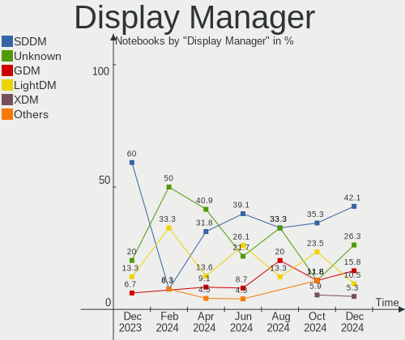
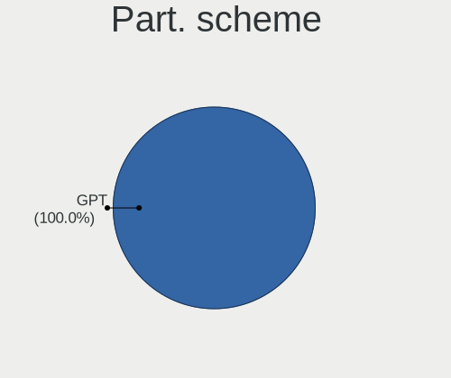
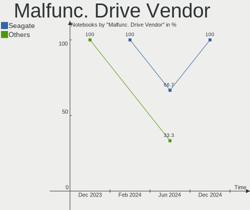
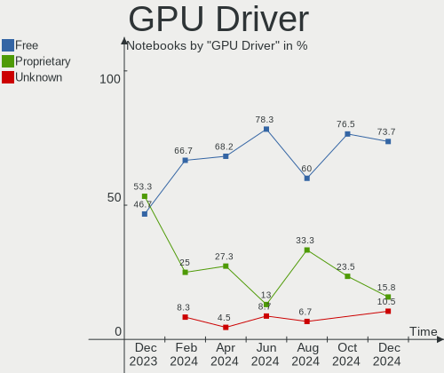
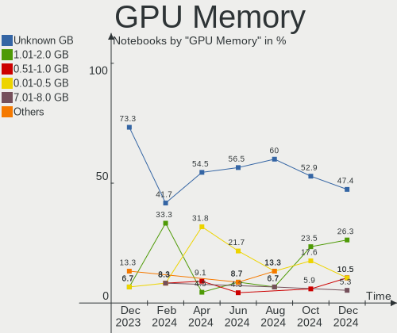
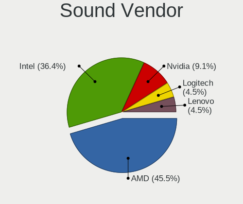

Gentoo - Hardware Trends (Notebooks)
------------------------------------

A project to identify most popular hardware characteristics and track their change
over time based on data collected by Linux users at https://Linux-Hardware.org.

Anyone can contribute to this report by the [hw-probe](https://github.com/linuxhw/hw-probe) tool:

    sudo -E hw-probe -all -upload

This report is for one last month. Overall report since the beginning of time: [TestDays](https://github.com/linuxhw/TestDays)

Period: Aug, 2023.

Contents
--------

* [ System ](#system)
  - [ OS                       ](#os)
  - [ OS Family                ](#os-family)
  - [ Kernel                   ](#kernel)
  - [ Kernel Family            ](#kernel-family)
  - [ Kernel Major Ver.        ](#kernel-major-ver)
  - [ Arch                     ](#arch)
  - [ DE                       ](#de)
  - [ Display Server           ](#display-server)
  - [ Display Manager          ](#display-manager)
  - [ OS Lang                  ](#os-lang)
  - [ Boot Mode                ](#boot-mode)
  - [ Filesystem               ](#filesystem)
  - [ Part. scheme             ](#part-scheme)
  - [ Dual Boot with Linux/BSD ](#dual-boot-with-linuxbsd)
  - [ Dual Boot (Win)          ](#dual-boot-win)

* [ Board ](#board)
  - [ Vendor                   ](#vendor)
  - [ Model                    ](#model)
  - [ Model Family             ](#model-family)
  - [ MFG Year                 ](#mfg-year)
  - [ Form Factor              ](#form-factor)
  - [ Secure Boot              ](#secure-boot)
  - [ Coreboot                 ](#coreboot)
  - [ RAM Size                 ](#ram-size)
  - [ RAM Used                 ](#ram-used)
  - [ Total Drives             ](#total-drives)
  - [ Has CD-ROM               ](#has-cd-rom)
  - [ Has Ethernet             ](#has-ethernet)
  - [ Has WiFi                 ](#has-wifi)
  - [ Has Bluetooth            ](#has-bluetooth)

* [ Location ](#location)
  - [ Country                  ](#country)
  - [ City                     ](#city)

* [ Drives ](#drives)
  - [ Drive Vendor             ](#drive-vendor)
  - [ Drive Model              ](#drive-model)
  - [ HDD Vendor               ](#hdd-vendor)
  - [ SSD Vendor               ](#ssd-vendor)
  - [ Drive Kind               ](#drive-kind)
  - [ Drive Connector          ](#drive-connector)
  - [ Drive Size               ](#drive-size)
  - [ Space Total              ](#space-total)
  - [ Space Used               ](#space-used)
  - [ Malfunc. Drives          ](#malfunc-drives)
  - [ Malfunc. Drive Vendor    ](#malfunc-drive-vendor)
  - [ Malfunc. HDD Vendor      ](#malfunc-hdd-vendor)
  - [ Malfunc. Drive Kind      ](#malfunc-drive-kind)
  - [ Failed Drives            ](#failed-drives)
  - [ Failed Drive Vendor      ](#failed-drive-vendor)
  - [ Drive Status             ](#drive-status)

* [ Storage controller ](#storage-controller)
  - [ Storage Vendor           ](#storage-vendor)
  - [ Storage Model            ](#storage-model)
  - [ Storage Kind             ](#storage-kind)

* [ Processor ](#processor)
  - [ CPU Vendor               ](#cpu-vendor)
  - [ CPU Model                ](#cpu-model)
  - [ CPU Model Family         ](#cpu-model-family)
  - [ CPU Cores                ](#cpu-cores)
  - [ CPU Sockets              ](#cpu-sockets)
  - [ CPU Threads              ](#cpu-threads)
  - [ CPU Op-Modes             ](#cpu-op-modes)
  - [ CPU Microcode            ](#cpu-microcode)
  - [ CPU Microarch            ](#cpu-microarch)

* [ Graphics ](#graphics)
  - [ GPU Vendor               ](#gpu-vendor)
  - [ GPU Model                ](#gpu-model)
  - [ GPU Combo                ](#gpu-combo)
  - [ GPU Driver               ](#gpu-driver)
  - [ GPU Memory               ](#gpu-memory)

* [ Monitor ](#monitor)
  - [ Monitor Vendor           ](#monitor-vendor)
  - [ Monitor Model            ](#monitor-model)
  - [ Monitor Resolution       ](#monitor-resolution)
  - [ Monitor Diagonal         ](#monitor-diagonal)
  - [ Monitor Width            ](#monitor-width)
  - [ Aspect Ratio             ](#aspect-ratio)
  - [ Monitor Area             ](#monitor-area)
  - [ Pixel Density            ](#pixel-density)
  - [ Multiple Monitors        ](#multiple-monitors)

* [ Network ](#network)
  - [ Net Controller Vendor    ](#net-controller-vendor)
  - [ Net Controller Model     ](#net-controller-model)
  - [ Wireless Vendor          ](#wireless-vendor)
  - [ Wireless Model           ](#wireless-model)
  - [ Ethernet Vendor          ](#ethernet-vendor)
  - [ Ethernet Model           ](#ethernet-model)
  - [ Net Controller Kind      ](#net-controller-kind)
  - [ Used Controller          ](#used-controller)
  - [ NICs                     ](#nics)
  - [ IPv6                     ](#ipv6)

* [ Bluetooth ](#bluetooth)
  - [ Bluetooth Vendor         ](#bluetooth-vendor)
  - [ Bluetooth Model          ](#bluetooth-model)

* [ Sound ](#sound)
  - [ Sound Vendor             ](#sound-vendor)
  - [ Sound Model              ](#sound-model)

* [ Memory ](#memory)
  - [ Memory Vendor            ](#memory-vendor)
  - [ Memory Model             ](#memory-model)
  - [ Memory Kind              ](#memory-kind)
  - [ Memory Form Factor       ](#memory-form-factor)
  - [ Memory Size              ](#memory-size)
  - [ Memory Speed             ](#memory-speed)

* [ Printers & scanners ](#printers--scanners)
  - [ Printer Vendor           ](#printer-vendor)
  - [ Printer Model            ](#printer-model)
  - [ Scanner Vendor           ](#scanner-vendor)
  - [ Scanner Model            ](#scanner-model)

* [ Camera ](#camera)
  - [ Camera Vendor            ](#camera-vendor)
  - [ Camera Model             ](#camera-model)

* [ Security ](#security)
  - [ Fingerprint Vendor       ](#fingerprint-vendor)
  - [ Fingerprint Model        ](#fingerprint-model)
  - [ Chipcard Vendor          ](#chipcard-vendor)
  - [ Chipcard Model           ](#chipcard-model)

* [ Unsupported ](#unsupported)
  - [ Unsupported Devices      ](#unsupported-devices)
  - [ Unsupported Device Types ](#unsupported-device-types)

System
------

OS
--

Installed operating systems

| Name        | Notebooks | Percent |
|-------------|-----------|---------|
| Gentoo 2.14 | 13        | 56.52%  |
| Gentoo 2.13 | 8         | 34.78%  |
| Gentoo 23   | 1         | 4.35%   |
| Gentoo 2.6  | 1         | 4.35%   |

OS Family
---------

OS without a version

| Name   | Notebooks | Percent |
|--------|-----------|---------|
| Gentoo | 23        | 100%    |

Kernel
------

Version of the Linux kernel

| Version                     | Notebooks | Percent |
|-----------------------------|-----------|---------|
| 6.1.41-gentoo-dist          | 5         | 21.74%  |
| 6.1.46-gentoo-x86_64        | 3         | 13.04%  |
| 6.4.9-gentoo                | 1         | 4.35%   |
| 6.4.9-calculate             | 1         | 4.35%   |
| 6.4.4-gentoo                | 1         | 4.35%   |
| 6.4.12-gentoo-dark          | 1         | 4.35%   |
| 6.4.11-gentoo-dist          | 1         | 4.35%   |
| 6.4.11-gentoo-ali           | 1         | 4.35%   |
| 6.4.10-gentoo-x86_64        | 1         | 4.35%   |
| 6.1.41-gentoo-x86_64        | 1         | 4.35%   |
| 6.1.41-gentoo               | 1         | 4.35%   |
| 6.1.38-gentoo-dist-hardened | 1         | 4.35%   |
| 6.1.31-gentoo-dist          | 1         | 4.35%   |
| 6.1.28-gentoo               | 1         | 4.35%   |
| 6.1.2-gentoo                | 1         | 4.35%   |
| 5.19.10-xanmod1             | 1         | 4.35%   |
| 5.15.36-gentoo-x86_64       | 1         | 4.35%   |

Kernel Family
-------------

Linux kernel without a distro release

| Version | Notebooks | Percent |
|---------|-----------|---------|
| 6.1.41  | 7         | 30.43%  |
| 6.1.46  | 3         | 13.04%  |
| 6.4.9   | 2         | 8.7%    |
| 6.4.11  | 2         | 8.7%    |
| 6.4.4   | 1         | 4.35%   |
| 6.4.12  | 1         | 4.35%   |
| 6.4.10  | 1         | 4.35%   |
| 6.1.38  | 1         | 4.35%   |
| 6.1.31  | 1         | 4.35%   |
| 6.1.28  | 1         | 4.35%   |
| 6.1.2   | 1         | 4.35%   |
| 5.19.10 | 1         | 4.35%   |
| 5.15.36 | 1         | 4.35%   |

Kernel Major Ver.
-----------------

Linux kernel major version

| Version | Notebooks | Percent |
|---------|-----------|---------|
| 6.1     | 14        | 60.87%  |
| 6.4     | 7         | 30.43%  |
| 5.19    | 1         | 4.35%   |
| 5.15    | 1         | 4.35%   |

Arch
----

OS architecture (x86_64, i586, etc.)

| Name   | Notebooks | Percent |
|--------|-----------|---------|
| x86_64 | 23        | 100%    |

DE
--

Desktop Environment

| Name     | Notebooks | Percent |
|----------|-----------|---------|
| Unknown  | 7         | 30.43%  |
| XFCE     | 4         | 17.39%  |
| KDE5     | 4         | 17.39%  |
| Hyprland | 2         | 8.7%    |
| GNOME    | 2         | 8.7%    |
| MATE     | 1         | 4.35%   |
| i3       | 1         | 4.35%   |
| DWM      | 1         | 4.35%   |
| bspwm    | 1         | 4.35%   |

Display Server
--------------

X11 or Wayland

| Name    | Notebooks | Percent |
|---------|-----------|---------|
| X11     | 7         | 30.43%  |
| Wayland | 6         | 26.09%  |
| Unknown | 6         | 26.09%  |
| Tty     | 4         | 17.39%  |

Display Manager
---------------

SDDM, LightDM, etc.

| Name    | Notebooks | Percent |
|---------|-----------|---------|
| Unknown | 10        | 43.48%  |
| SDDM    | 6         | 26.09%  |
| GDM     | 3         | 13.04%  |
| LightDM | 2         | 8.7%    |
| SLiM    | 1         | 4.35%   |
| GREETD  | 1         | 4.35%   |

OS Lang
-------

Language

| Lang    | Notebooks | Percent |
|---------|-----------|---------|
| en_US   | 8         | 34.78%  |
| Unknown | 4         | 17.39%  |
| C.UTF8  | 2         | 8.7%    |
| C       | 2         | 8.7%    |
| ru_RU   | 1         | 4.35%   |
| pt_BR   | 1         | 4.35%   |
| pl_PL   | 1         | 4.35%   |
| ja_JP   | 1         | 4.35%   |
| fr_FR   | 1         | 4.35%   |
| es_CL   | 1         | 4.35%   |
| cs_CZ   | 1         | 4.35%   |

Boot Mode
---------

EFI or BIOS

| Mode | Notebooks | Percent |
|------|-----------|---------|
| EFI  | 20        | 86.96%  |
| BIOS | 3         | 13.04%  |

Filesystem
----------

Type of filesystem

| Type  | Notebooks | Percent |
|-------|-----------|---------|
| Ext4  | 13        | 56.52%  |
| Btrfs | 7         | 30.43%  |
| Xfs   | 3         | 13.04%  |

Part. scheme
------------

Scheme of partitioning

| Type    | Notebooks | Percent |
|---------|-----------|---------|
| GPT     | 20        | 86.96%  |
| MBR     | 2         | 8.7%    |
| Unknown | 1         | 4.35%   |

Dual Boot with Linux/BSD
------------------------

Hosting more than one Linux/BSD

| Dual boot | Notebooks | Percent |
|-----------|-----------|---------|
| No        | 19        | 82.61%  |
| Yes       | 4         | 17.39%  |

Dual Boot (Win)
---------------

Hosting Linux and Windows

| Dual boot | Notebooks | Percent |
|-----------|-----------|---------|
| No        | 18        | 78.26%  |
| Yes       | 5         | 21.74%  |

Board
-----

Vendor
------

Motherboard manufacturer

| Name              | Notebooks | Percent |
|-------------------|-----------|---------|
| Hewlett-Packard   | 5         | 21.74%  |
| ASUSTek Computer  | 5         | 21.74%  |
| Dell              | 4         | 17.39%  |
| Lenovo            | 2         | 8.7%    |
| Apple             | 2         | 8.7%    |
| Timi              | 1         | 4.35%   |
| MSI               | 1         | 4.35%   |
| Framework         | 1         | 4.35%   |
| Alienware         | 1         | 4.35%   |
| A-DATA Technology | 1         | 4.35%   |

Model
-----

Motherboard model

| Name                                    | Notebooks | Percent |
|-----------------------------------------|-----------|---------|
| Timi RedmiBook Pro 15S                  | 1         | 4.35%   |
| MSI Modern 14 C12M                      | 1         | 4.35%   |
| Lenovo Yoga 2 13 20344                  | 1         | 4.35%   |
| Lenovo IdeaPad 5 15ABA7 82SG            | 1         | 4.35%   |
| HP ProBook 445 G8 Notebook PC           | 1         | 4.35%   |
| HP ProBook 430 G7                       | 1         | 4.35%   |
| HP Laptop 15-ra0xx                      | 1         | 4.35%   |
| HP Laptop 14-df0xxx                     | 1         | 4.35%   |
| HP EliteBook 8540w                      | 1         | 4.35%   |
| Framework Laptop (13th Gen Intel Core)  | 1         | 4.35%   |
| Dell Latitude E7450                     | 1         | 4.35%   |
| Dell Latitude E6510                     | 1         | 4.35%   |
| Dell Inspiron 15 3511                   | 1         | 4.35%   |
| Dell G5 5505                            | 1         | 4.35%   |
| ASUS VivoBook_ASUSLaptop X415EA_F1400EA | 1         | 4.35%   |
| ASUS ROG Zephyrus G14 GA401II_GA401II   | 1         | 4.35%   |
| ASUS ROG Strix G814JI_G814JI            | 1         | 4.35%   |
| ASUS ROG Strix G713PV_G713PV            | 1         | 4.35%   |
| ASUS ROG Strix G513QY_G513QY            | 1         | 4.35%   |
| Apple MacBookPro11,1                    | 1         | 4.35%   |
| Apple MacBookPro10,1                    | 1         | 4.35%   |
| Alienware x17 R1                        | 1         | 4.35%   |
| A-DATA XENIA 15                         | 1         | 4.35%   |

Model Family
------------

Motherboard model prefix

| Name               | Notebooks | Percent |
|--------------------|-----------|---------|
| ASUS ROG           | 4         | 17.39%  |
| HP ProBook         | 2         | 8.7%    |
| HP Laptop          | 2         | 8.7%    |
| Dell Latitude      | 2         | 8.7%    |
| Timi RedmiBook     | 1         | 4.35%   |
| MSI Modern         | 1         | 4.35%   |
| Lenovo Yoga        | 1         | 4.35%   |
| Lenovo IdeaPad     | 1         | 4.35%   |
| HP EliteBook       | 1         | 4.35%   |
| Framework Laptop   | 1         | 4.35%   |
| Dell Inspiron      | 1         | 4.35%   |
| Dell G5            | 1         | 4.35%   |
| ASUS VivoBook      | 1         | 4.35%   |
| Apple MacBookPro11 | 1         | 4.35%   |
| Apple MacBookPro10 | 1         | 4.35%   |
| Alienware x17      | 1         | 4.35%   |
| A-DATA XENIA       | 1         | 4.35%   |

MFG Year
--------

Motherboard manufacture year

| Year | Notebooks | Percent |
|------|-----------|---------|
| 2021 | 6         | 26.09%  |
| 2023 | 3         | 13.04%  |
| 2022 | 3         | 13.04%  |
| 2018 | 3         | 13.04%  |
| 2014 | 3         | 13.04%  |
| 2020 | 2         | 8.7%    |
| 2010 | 2         | 8.7%    |
| 2012 | 1         | 4.35%   |

Form Factor
-----------

Physical design of the computer

| Name     | Notebooks | Percent |
|----------|-----------|---------|
| Notebook | 23        | 100%    |

Secure Boot
-----------

Enabled or disabled

| State    | Notebooks | Percent |
|----------|-----------|---------|
| Disabled | 23        | 100%    |

Coreboot
--------

Have coreboot on board

| Used | Notebooks | Percent |
|------|-----------|---------|
| No   | 23        | 100%    |

RAM Size
--------

Total RAM memory

| Size in GB  | Notebooks | Percent |
|-------------|-----------|---------|
| 8.01-16.0   | 7         | 30.43%  |
| 4.01-8.0    | 5         | 21.74%  |
| 32.01-64.0  | 3         | 13.04%  |
| 16.01-24.0  | 3         | 13.04%  |
| 3.01-4.0    | 2         | 8.7%    |
| 24.01-32.0  | 2         | 8.7%    |
| 64.01-256.0 | 1         | 4.35%   |

RAM Used
--------

Used RAM memory

| Used GB   | Notebooks | Percent |
|-----------|-----------|---------|
| 1.01-2.0  | 10        | 43.48%  |
| 4.01-8.0  | 5         | 21.74%  |
| 2.01-3.0  | 2         | 8.7%    |
| 0.51-1.0  | 2         | 8.7%    |
| 0.01-0.5  | 2         | 8.7%    |
| 3.01-4.0  | 1         | 4.35%   |
| 8.01-16.0 | 1         | 4.35%   |

Total Drives
------------

Number of drives on board

| Drives | Notebooks | Percent |
|--------|-----------|---------|
| 1      | 16        | 69.57%  |
| 2      | 6         | 26.09%  |
| 3      | 1         | 4.35%   |

Has CD-ROM
----------

Has CD-ROM on board

| Presented | Notebooks | Percent |
|-----------|-----------|---------|
| No        | 21        | 91.3%   |
| Yes       | 2         | 8.7%    |

Has Ethernet
------------

Has Ethernet on board

| Presented | Notebooks | Percent |
|-----------|-----------|---------|
| Yes       | 19        | 82.61%  |
| No        | 4         | 17.39%  |

Has WiFi
--------

Has WiFi module

| Presented | Notebooks | Percent |
|-----------|-----------|---------|
| Yes       | 23        | 100%    |

Has Bluetooth
-------------

Has Bluetooth module

| Presented | Notebooks | Percent |
|-----------|-----------|---------|
| Yes       | 22        | 95.65%  |
| No        | 1         | 4.35%   |

Location
--------

Country
-------

Geographic location (country)

| Country   | Notebooks | Percent |
|-----------|-----------|---------|
| USA       | 3         | 13.04%  |
| Turkey    | 2         | 8.7%    |
| Spain     | 2         | 8.7%    |
| Russia    | 2         | 8.7%    |
| Slovakia  | 1         | 4.35%   |
| Poland    | 1         | 4.35%   |
| Malaysia  | 1         | 4.35%   |
| Japan     | 1         | 4.35%   |
| Iran      | 1         | 4.35%   |
| Germany   | 1         | 4.35%   |
| France    | 1         | 4.35%   |
| Finland   | 1         | 4.35%   |
| Czechia   | 1         | 4.35%   |
| China     | 1         | 4.35%   |
| Chile     | 1         | 4.35%   |
| Canada    | 1         | 4.35%   |
| Brazil    | 1         | 4.35%   |
| Argentina | 1         | 4.35%   |

City
----

Geographic location (city)

| City                | Notebooks | Percent |
|---------------------|-----------|---------|
| Vitkov              | 1         | 4.35%   |
| Toulouse            | 1         | 4.35%   |
| Sao Paulo           | 1         | 4.35%   |
| Ryazan              | 1         | 4.35%   |
| Quillota            | 1         | 4.35%   |
| Pickering           | 1         | 4.35%   |
| Pforzheim           | 1         | 4.35%   |
| Omaha               | 1         | 4.35%   |
| Mataró             | 1         | 4.35%   |
| Marki               | 1         | 4.35%   |
| Magnesia ad Sipylum | 1         | 4.35%   |
| Khabarovsk          | 1         | 4.35%   |
| Kawanishi           | 1         | 4.35%   |
| Istanbul            | 1         | 4.35%   |
| Isfahan             | 1         | 4.35%   |
| Ipoh                | 1         | 4.35%   |
| Helsinki            | 1         | 4.35%   |
| Fayetteville        | 1         | 4.35%   |
| Córdoba            | 1         | 4.35%   |
| Buena Vista         | 1         | 4.35%   |
| Beijing             | 1         | 4.35%   |
| Barcelona           | 1         | 4.35%   |
| Banská Bystrica    | 1         | 4.35%   |

Drives
------

Drive Vendor
------------

Hard drive vendors

| Vendor                      | Notebooks | Drives | Percent |
|-----------------------------|-----------|--------|---------|
| Samsung Electronics         | 4         | 4      | 13.33%  |
| Intel                       | 4         | 5      | 13.33%  |
| Sandisk                     | 3         | 3      | 10%     |
| Micron Technology           | 3         | 3      | 10%     |
| KIOXIA                      | 2         | 2      | 6.67%   |
| Apple                       | 2         | 2      | 6.67%   |
| XPG                         | 1         | 1      | 3.33%   |
| Toshiba                     | 1         | 1      | 3.33%   |
| Teleplan                    | 1         | 1      | 3.33%   |
| Solid State Storage         | 1         | 1      | 3.33%   |
| SK hynix                    | 1         | 1      | 3.33%   |
| OCZ                         | 1         | 1      | 3.33%   |
| LITEON                      | 1         | 1      | 3.33%   |
| Lexar                       | 1         | 1      | 3.33%   |
| Kingston Technology Company | 1         | 1      | 3.33%   |
| Fujitsu                     | 1         | 1      | 3.33%   |
| Crucial                     | 1         | 1      | 3.33%   |
| Corsair                     | 1         | 1      | 3.33%   |

Drive Model
-----------

Hard drive models

| Model                                                 | Notebooks | Percent |
|-------------------------------------------------------|-----------|---------|
| Micron 2400_MTFDKBA1T0QFM 1TB                         | 2         | 6.45%   |
| Intel SSD 660P Series 512GB                           | 2         | 6.45%   |
| XPG GAMMIX S70 1TB                                    | 1         | 3.23%   |
| Toshiba MQ01ABF050 500GB                              | 1         | 3.23%   |
| Teleplan TP1000G 1TB                                  | 1         | 3.23%   |
| Solid State Storage SSSTC CL1-8D256-HP 256GB          | 1         | 3.23%   |
| SK hynix PC711 NVMe 1TB                               | 1         | 3.23%   |
| Sandisk WD_BLACK SN850X 2000GB                        | 1         | 3.23%   |
| Sandisk WD Blue SN550 NVMe SSD 250GB                  | 1         | 3.23%   |
| SanDisk SDSSDH3500G 500GB                             | 1         | 3.23%   |
| Samsung PSSD T7 1TB                                   | 1         | 3.23%   |
| Samsung NVMe SSD Controller PM9A1/PM9A3/980PRO 1024GB | 1         | 3.23%   |
| Samsung MZVLQ512HBLU-00B00 512GB                      | 1         | 3.23%   |
| Samsung MZNLN128HAHQ-000H1 128GB SSD                  | 1         | 3.23%   |
| OCZ AGILITY3 64GB SSD                                 | 1         | 3.23%   |
| Micron MTFDKBA512TFH 512GB                            | 1         | 3.23%   |
| LITEON CV8-8E128-HP 128GB SSD                         | 1         | 3.23%   |
| Lexar 128GB SSD                                       | 1         | 3.23%   |
| KIOXIA KBG40ZNV512G 512GB                             | 1         | 3.23%   |
| KIOXIA KBG40ZNS512G NVMe 512GB                        | 1         | 3.23%   |
| Kingston Company SNV2S1000G 1TB                       | 1         | 3.23%   |
| Intel SSDPEKNU512GZ 512GB                             | 1         | 3.23%   |
| Intel HBRPEKNL0202AO 32GB                             | 1         | 3.23%   |
| Intel HBRPEKNL0202A 512GB                             | 1         | 3.23%   |
| Fujitsu MJA2500BH G2 500GB                            | 1         | 3.23%   |
| Crucial CT500MX500SSD1 500GB                          | 1         | 3.23%   |
| Corsair Voyager GTX 128GB SSD                         | 1         | 3.23%   |
| Apple SSD SM0512F 500GB                               | 1         | 3.23%   |
| Apple SSD SD256E 256GB                                | 1         | 3.23%   |

HDD Vendor
----------

Hard disk drive vendors

| Vendor   | Notebooks | Drives | Percent |
|----------|-----------|--------|---------|
| Toshiba  | 1         | 1      | 33.33%  |
| Teleplan | 1         | 1      | 33.33%  |
| Fujitsu  | 1         | 1      | 33.33%  |

SSD Vendor
----------

Solid state drive vendors

| Vendor              | Notebooks | Drives | Percent |
|---------------------|-----------|--------|---------|
| Samsung Electronics | 2         | 2      | 20%     |
| Apple               | 2         | 2      | 20%     |
| SanDisk             | 1         | 1      | 10%     |
| OCZ                 | 1         | 1      | 10%     |
| LITEON              | 1         | 1      | 10%     |
| Lexar               | 1         | 1      | 10%     |
| Crucial             | 1         | 1      | 10%     |
| Corsair             | 1         | 1      | 10%     |

Drive Kind
----------

HDD or SSD

| Kind | Notebooks | Drives | Percent |
|------|-----------|--------|---------|
| NVMe | 14        | 18     | 56%     |
| SSD  | 8         | 10     | 32%     |
| HDD  | 3         | 3      | 12%     |

Drive Connector
---------------

SATA, SAS, NVMe, etc.

| Type | Notebooks | Drives | Percent |
|------|-----------|--------|---------|
| NVMe | 14        | 18     | 53.85%  |
| SATA | 10        | 11     | 38.46%  |
| SAS  | 2         | 2      | 7.69%   |

Drive Size
----------

Size of hard drive

| Size in TB | Notebooks | Drives | Percent |
|------------|-----------|--------|---------|
| 0.01-0.5   | 9         | 11     | 81.82%  |
| 0.51-1.0   | 2         | 2      | 18.18%  |

Space Total
-----------

Amount of disk space available on the file system

| Size in GB     | Notebooks | Percent |
|----------------|-----------|---------|
| 251-500        | 9         | 39.13%  |
| 501-1000       | 4         | 17.39%  |
| 101-250        | 3         | 13.04%  |
| 1001-2000      | 2         | 8.7%    |
| More than 3000 | 1         | 4.35%   |
| 21-50          | 1         | 4.35%   |
| 1-20           | 1         | 4.35%   |
| 51-100         | 1         | 4.35%   |
| Unknown        | 1         | 4.35%   |

Space Used
----------

Amount of used disk space

| Used GB  | Notebooks | Percent |
|----------|-----------|---------|
| 101-250  | 6         | 26.09%  |
| 251-500  | 5         | 21.74%  |
| 21-50    | 5         | 21.74%  |
| 1-20     | 4         | 17.39%  |
| 501-1000 | 1         | 4.35%   |
| 51-100   | 1         | 4.35%   |
| Unknown  | 1         | 4.35%   |

Malfunc. Drives
---------------

Drive models with a malfunction

| Model                         | Notebooks | Drives | Percent |
|-------------------------------|-----------|--------|---------|
| LITEON CV8-8E128-HP 128GB SSD | 1         | 1      | 100%    |

Malfunc. Drive Vendor
---------------------

Vendors of faulty drives

| Vendor | Notebooks | Drives | Percent |
|--------|-----------|--------|---------|
| LITEON | 1         | 1      | 100%    |

Malfunc. HDD Vendor
-------------------

Vendors of faulty HDD drives

Zero info for selected period =(

Malfunc. Drive Kind
-------------------

Kinds of faulty drives

| Kind | Notebooks | Drives | Percent |
|------|-----------|--------|---------|
| SSD  | 1         | 1      | 100%    |

Failed Drives
-------------

Failed drive models

Zero info for selected period =(

Failed Drive Vendor
-------------------

Failed drive vendors

Zero info for selected period =(

Drive Status
------------

Number of failed and malfunc. drives

| Status   | Notebooks | Drives | Percent |
|----------|-----------|--------|---------|
| Works    | 21        | 26     | 84%     |
| Detected | 3         | 4      | 12%     |
| Malfunc  | 1         | 1      | 4%      |

Storage controller
------------------

Storage Vendor
--------------

Storage controller vendors

| Vendor                         | Notebooks | Percent |
|--------------------------------|-----------|---------|
| Intel                          | 12        | 41.38%  |
| Samsung Electronics            | 3         | 10.34%  |
| Micron Technology              | 3         | 10.34%  |
| AMD                            | 3         | 10.34%  |
| Sandisk                        | 2         | 6.9%    |
| KIOXIA                         | 2         | 6.9%    |
| Solid State Storage Technology | 1         | 3.45%   |
| SK hynix                       | 1         | 3.45%   |
| Kingston Technology Company    | 1         | 3.45%   |
| INNOGRIT                       | 1         | 3.45%   |

Storage Model
-------------

Storage controller models

| Model                                                                            | Notebooks | Percent |
|----------------------------------------------------------------------------------|-----------|---------|
| Intel 82801 Mobile SATA Controller [RAID mode]                                   | 3         | 8.82%   |
| AMD FCH SATA Controller [AHCI mode]                                              | 3         | 8.82%   |
| Micron 2400 NVMe SSD (DRAM-less)                                                 | 2         | 5.88%   |
| KIOXIA NVMe SSD Controller BG4 (DRAM-less)                                       | 2         | 5.88%   |
| Intel Volume Management Device NVMe RAID Controller                              | 2         | 5.88%   |
| Intel Tiger Lake-LP SATA Controller                                              | 2         | 5.88%   |
| Intel SSD 660P Series                                                            | 2         | 5.88%   |
| Solid State Storage CL1-3D256-Q11 NVMe SSD M.2                                   | 1         | 2.94%   |
| SK hynix Gold P31/BC711/PC711 NVMe Solid State Drive                             | 1         | 2.94%   |
| Sandisk Western Digital WD Black SN850X NVMe SSD                                 | 1         | 2.94%   |
| SanDisk WD Blue SN550 NVMe SSD                                                   | 1         | 2.94%   |
| Samsung S4LN053X01 AHCI SSD Controller(Apple slot)                               | 1         | 2.94%   |
| Samsung NVMe SSD Controller PM9A1/PM9A3/980PRO                                   | 1         | 2.94%   |
| Samsung NVMe SSD Controller 980                                                  | 1         | 2.94%   |
| Micron 3400 NVMe SSD [Hendrix]                                                   | 1         | 2.94%   |
| Kingston Company Company Non-Volatile memory controller                          | 1         | 2.94%   |
| Intel Volume Management Device NVMe RAID Controller Intel Corporation            | 1         | 2.94%   |
| Intel SSD 670p Series [Keystone Harbor]                                          | 1         | 2.94%   |
| Intel Optane NVME SSD H20 with Solid State Storage [Pyramid Glacier]             | 1         | 2.94%   |
| Intel Comet Lake SATA AHCI Controller                                            | 1         | 2.94%   |
| Intel Atom/Celeron/Pentium Processor x5-E8000/J3xxx/N3xxx Series SATA Controller | 1         | 2.94%   |
| Intel 8 Series SATA Controller 1 [AHCI mode]                                     | 1         | 2.94%   |
| Intel 7 Series Chipset Family 6-port SATA Controller [AHCI mode]                 | 1         | 2.94%   |
| Intel 5 Series/3400 Series Chipset 6 port SATA AHCI Controller                   | 1         | 2.94%   |
| INNOGRIT NVMe SSD Controller IG5236                                              | 1         | 2.94%   |

Storage Kind
------------

Kind of storage controller (IDE, SATA, NVMe, SAS, ...)

| Kind | Notebooks | Percent |
|------|-----------|---------|
| NVMe | 14        | 45.16%  |
| SATA | 11        | 35.48%  |
| RAID | 6         | 19.35%  |

Processor
---------

CPU Vendor
----------

Processor vendors

| Vendor | Notebooks | Percent |
|--------|-----------|---------|
| Intel  | 16        | 69.57%  |
| AMD    | 7         | 30.43%  |

CPU Model
---------

Processor models

| Model                                   | Notebooks | Percent |
|-----------------------------------------|-----------|---------|
| Intel 11th Gen Core i7-11800H @ 2.30GHz | 2         | 8.7%    |
| Intel 11th Gen Core i5-1135G7 @ 2.40GHz | 2         | 8.7%    |
| Intel Core i7-3615QM CPU @ 2.30GHz      | 1         | 4.35%   |
| Intel Core i7 CPU M 620 @ 2.67GHz       | 1         | 4.35%   |
| Intel Core i5-5300U CPU @ 2.30GHz       | 1         | 4.35%   |
| Intel Core i5-4288U CPU @ 2.60GHz       | 1         | 4.35%   |
| Intel Core i5-4200U CPU @ 1.60GHz       | 1         | 4.35%   |
| Intel Core i5-10210U CPU @ 1.60GHz      | 1         | 4.35%   |
| Intel Core i5 CPU M 540 @ 2.53GHz       | 1         | 4.35%   |
| Intel Core i3-8130U CPU @ 2.20GHz       | 1         | 4.35%   |
| Intel Celeron CPU N3060 @ 1.60GHz       | 1         | 4.35%   |
| Intel 13th Gen Core i9-13980HX          | 1         | 4.35%   |
| Intel 13th Gen Core i7-1370P            | 1         | 4.35%   |
| Intel 12th Gen Core i5-1235U            | 1         | 4.35%   |
| AMD Ryzen 9 7945HX with Radeon Graphics | 1         | 4.35%   |
| AMD Ryzen 9 5980HX with Radeon Graphics | 1         | 4.35%   |
| AMD Ryzen 7 5825U with Radeon Graphics  | 1         | 4.35%   |
| AMD Ryzen 7 5800H with Radeon Graphics  | 1         | 4.35%   |
| AMD Ryzen 7 4800HS with Radeon Graphics | 1         | 4.35%   |
| AMD Ryzen 7 4800H with Radeon Graphics  | 1         | 4.35%   |
| AMD Ryzen 5 5600U with Radeon Graphics  | 1         | 4.35%   |

CPU Model Family
----------------

Processor model prefix

| Model         | Notebooks | Percent |
|---------------|-----------|---------|
| Other         | 7         | 30.43%  |
| Intel Core i5 | 5         | 21.74%  |
| AMD Ryzen 7   | 4         | 17.39%  |
| Intel Core i7 | 2         | 8.7%    |
| AMD Ryzen 9   | 2         | 8.7%    |
| Intel Core i3 | 1         | 4.35%   |
| Intel Celeron | 1         | 4.35%   |
| AMD Ryzen 5   | 1         | 4.35%   |

CPU Cores
---------

Number of processor cores

| Number | Notebooks | Percent |
|--------|-----------|---------|
| 8      | 7         | 30.43%  |
| 2      | 7         | 30.43%  |
| 4      | 4         | 17.39%  |
| 24     | 1         | 4.35%   |
| 16     | 1         | 4.35%   |
| 14     | 1         | 4.35%   |
| 10     | 1         | 4.35%   |
| 6      | 1         | 4.35%   |

CPU Sockets
-----------

Number of sockets

| Number | Notebooks | Percent |
|--------|-----------|---------|
| 1      | 23        | 100%    |

CPU Threads
-----------

Threads per core (Hyper-Threading)

| Number | Notebooks | Percent |
|--------|-----------|---------|
| 2      | 21        | 91.3%   |
| 1      | 2         | 8.7%    |

CPU Op-Modes
------------

CPU Operation Modes (32-bit, 64-bit)

| Op mode        | Notebooks | Percent |
|----------------|-----------|---------|
| 32-bit, 64-bit | 23        | 100%    |

CPU Microcode
-------------

Microcode number

| Number     | Notebooks | Percent |
|------------|-----------|---------|
| 0x0a50000c | 4         | 17.39%  |
| Unknown    | 4         | 17.39%  |
| 0x40651    | 2         | 8.7%    |
| 0xb06a2    | 1         | 4.35%   |
| 0xb0671    | 1         | 4.35%   |
| 0x806ec    | 1         | 4.35%   |
| 0x806d1    | 1         | 4.35%   |
| 0x806c1    | 1         | 4.35%   |
| 0x406c4    | 1         | 4.35%   |
| 0x306d4    | 1         | 4.35%   |
| 0x306a9    | 1         | 4.35%   |
| 0x20655    | 1         | 4.35%   |
| 0x20652    | 1         | 4.35%   |
| 0x0a601203 | 1         | 4.35%   |
| 0x08600106 | 1         | 4.35%   |
| 0x08600104 | 1         | 4.35%   |

CPU Microarch
-------------

Microarchitecture

| Name             | Notebooks | Percent |
|------------------|-----------|---------|
| Zen 3            | 4         | 17.39%  |
| Alderlake Hybrid | 3         | 13.04%  |
| Zen 2            | 2         | 8.7%    |
| Westmere         | 2         | 8.7%    |
| TigerLake        | 2         | 8.7%    |
| KabyLake         | 2         | 8.7%    |
| Icelake          | 2         | 8.7%    |
| Haswell          | 2         | 8.7%    |
| Silvermont       | 1         | 4.35%   |
| IvyBridge        | 1         | 4.35%   |
| Broadwell        | 1         | 4.35%   |
| Unknown          | 1         | 4.35%   |

Graphics
--------

GPU Vendor
----------

Vendors of graphics cards

| Vendor | Notebooks | Percent |
|--------|-----------|---------|
| Intel  | 15        | 51.72%  |
| Nvidia | 7         | 24.14%  |
| AMD    | 7         | 24.14%  |

GPU Model
---------

Graphics card models

| Model                                                                                    | Notebooks | Percent |
|------------------------------------------------------------------------------------------|-----------|---------|
| AMD Cezanne [Radeon Vega Series / Radeon Vega Mobile Series]                             | 3         | 9.68%   |
| Nvidia GA104M [GeForce RTX 3070 Mobile / Max-Q]                                          | 2         | 6.45%   |
| Intel TigerLake-LP GT2 [Iris Xe Graphics]                                                | 2         | 6.45%   |
| Intel TigerLake-H GT1 [UHD Graphics]                                                     | 2         | 6.45%   |
| Intel Haswell-ULT Integrated Graphics Controller                                         | 2         | 6.45%   |
| AMD Renoir                                                                               | 2         | 6.45%   |
| Nvidia TU116M [GeForce GTX 1650 Ti Mobile]                                               | 1         | 3.23%   |
| Nvidia GT216GLM [Quadro FX 880M]                                                         | 1         | 3.23%   |
| Nvidia GK107M [GeForce GT 650M Mac Edition]                                              | 1         | 3.23%   |
| Nvidia AD107M [GeForce RTX 4060 Max-Q / Mobile]                                          | 1         | 3.23%   |
| Nvidia AD106M [GeForce RTX 4070 Max-Q / Mobile]                                          | 1         | 3.23%   |
| Intel UHD Graphics 620                                                                   | 1         | 3.23%   |
| Intel Raptor Lake-S UHD Graphics                                                         | 1         | 3.23%   |
| Intel Raptor Lake-P [Iris Xe Graphics]                                                   | 1         | 3.23%   |
| Intel HD Graphics 5500                                                                   | 1         | 3.23%   |
| Intel Core Processor Integrated Graphics Controller                                      | 1         | 3.23%   |
| Intel CometLake-U GT2 [UHD Graphics]                                                     | 1         | 3.23%   |
| Intel Atom/Celeron/Pentium Processor x5-E8000/J3xxx/N3xxx Integrated Graphics Controller | 1         | 3.23%   |
| Intel Alder Lake-UP3 GT2 [Iris Xe Graphics]                                              | 1         | 3.23%   |
| Intel 3rd Gen Core processor Graphics Controller                                         | 1         | 3.23%   |
| AMD Raphael                                                                              | 1         | 3.23%   |
| AMD Navi 22 [Radeon RX 6700/6700 XT/6750 XT / 6800M/6850M XT]                            | 1         | 3.23%   |
| AMD Navi 10 [Radeon RX 5600 OEM/5600 XT / 5700/5700 XT]                                  | 1         | 3.23%   |
| AMD Barcelo                                                                              | 1         | 3.23%   |

GPU Combo
---------

Combinations of graphics cards

| Name           | Notebooks | Percent |
|----------------|-----------|---------|
| 1 x Intel      | 11        | 47.83%  |
| Intel + Nvidia | 4         | 17.39%  |
| 1 x AMD        | 3         | 13.04%  |
| 2 x AMD        | 2         | 8.7%    |
| AMD + Nvidia   | 2         | 8.7%    |
| 1 x Nvidia     | 1         | 4.35%   |

GPU Driver
----------

Free vs proprietary

| Driver      | Notebooks | Percent |
|-------------|-----------|---------|
| Free        | 19        | 82.61%  |
| Proprietary | 3         | 13.04%  |
| Unknown     | 1         | 4.35%   |

GPU Memory
----------

Total video memory

| Size in GB | Notebooks | Percent |
|------------|-----------|---------|
| Unknown    | 13        | 56.52%  |
| 0.01-0.5   | 3         | 13.04%  |
| 1.01-2.0   | 2         | 8.7%    |
| 0.51-1.0   | 2         | 8.7%    |
| 7.01-8.0   | 1         | 4.35%   |
| 5.01-6.0   | 1         | 4.35%   |
| 8.01-16.0  | 1         | 4.35%   |

Monitor
-------

Monitor Vendor
--------------

Monitor vendors

| Vendor              | Notebooks | Percent |
|---------------------|-----------|---------|
| BOE                 | 6         | 23.08%  |
| LG Display          | 5         | 19.23%  |
| AU Optronics        | 4         | 15.38%  |
| Chimei Innolux      | 2         | 7.69%   |
| Apple               | 2         | 7.69%   |
| ViewSonic           | 1         | 3.85%   |
| TMX                 | 1         | 3.85%   |
| Samsung Electronics | 1         | 3.85%   |
| Philips             | 1         | 3.85%   |
| PANDA               | 1         | 3.85%   |
| Mi                  | 1         | 3.85%   |
| ASUSTek Computer    | 1         | 3.85%   |

Monitor Model
-------------

Monitor models

| Model                                                                | Notebooks | Percent |
|----------------------------------------------------------------------|-----------|---------|
| ViewSonic VX2458 Series VSC36AF 1920x1080 521x293mm 23.5-inch        | 1         | 3.85%   |
| TMX TL156MDMP01-1 TMX1560 3200x2000 336x210mm 15.6-inch              | 1         | 3.85%   |
| Samsung Electronics LCD Monitor SEC544B 1600x900 382x214mm 17.2-inch | 1         | 3.85%   |
| Philips PHL 246V5 PHLC0C5 1920x1080 531x299mm 24.0-inch              | 1         | 3.85%   |
| PANDA LCD Monitor NCP0050 1920x1080 309x174mm 14.0-inch              | 1         | 3.85%   |
| Mi Monitor XMI3444 3440x1440 797x334mm 34.0-inch                     | 1         | 3.85%   |
| LG Display LCD Monitor LGD06FF 1920x1080 344x194mm 15.5-inch         | 1         | 3.85%   |
| LG Display LCD Monitor LGD06CA 1920x1080 309x174mm 14.0-inch         | 1         | 3.85%   |
| LG Display LCD Monitor LGD05E4 1920x1080 344x194mm 15.5-inch         | 1         | 3.85%   |
| LG Display LCD Monitor LGD0486 1920x1080 309x174mm 14.0-inch         | 1         | 3.85%   |
| LG Display LCD Monitor LGD0259 1920x1080 345x194mm 15.6-inch         | 1         | 3.85%   |
| Chimei Innolux LCD Monitor CMN1540 2560x1440 344x193mm 15.5-inch     | 1         | 3.85%   |
| Chimei Innolux LCD Monitor CMN142B 1920x1080 309x173mm 13.9-inch     | 1         | 3.85%   |
| BOE NE173QHM-NZ2 BOE0B69 2560x1440 381x214mm 17.2-inch               | 1         | 3.85%   |
| BOE LCD Monitor BOE0BCA 2256x1504 285x190mm 13.5-inch                | 1         | 3.85%   |
| BOE LCD Monitor BOE0974 2560x1440 344x194mm 15.5-inch                | 1         | 3.85%   |
| BOE LCD Monitor BOE07F6 1920x1080 309x174mm 14.0-inch                | 1         | 3.85%   |
| BOE LCD Monitor BOE07AD 1366x768 294x165mm 13.3-inch                 | 1         | 3.85%   |
| BOE LCD Monitor BOE072B 1920x1080 309x173mm 13.9-inch                | 1         | 3.85%   |
| AU Optronics LCD Monitor AUOE48D 1920x1080 344x194mm 15.5-inch       | 1         | 3.85%   |
| AU Optronics LCD Monitor AUOBD90 1920x1080 382x215mm 17.3-inch       | 1         | 3.85%   |
| AU Optronics LCD Monitor AUO71EC 1366x768 344x193mm 15.5-inch        | 1         | 3.85%   |
| AU Optronics LCD Monitor AUO202D 1920x1080 293x165mm 13.2-inch       | 1         | 3.85%   |
| ASUSTek Computer VG27A AUS2722 2560x1440 600x340mm 27.2-inch         | 1         | 3.85%   |
| Apple Color LCD APPA018 2560x1600 286x179mm 13.3-inch                | 1         | 3.85%   |
| Apple Color LCD APPA00F 2880x1800 331x207mm 15.4-inch                | 1         | 3.85%   |

Monitor Resolution
------------------

Monitor screen resolution

| Resolution      | Notebooks | Percent |
|-----------------|-----------|---------|
| 1920x1080 (FHD) | 12        | 52.17%  |
| 2560x1440 (QHD) | 3         | 13.04%  |
| 1366x768 (WXGA) | 2         | 8.7%    |
| 3440x1440       | 1         | 4.35%   |
| 3200x2000       | 1         | 4.35%   |
| 2880x1800       | 1         | 4.35%   |
| 2560x1600       | 1         | 4.35%   |
| 2256x1504       | 1         | 4.35%   |
| 1600x900 (HD+)  | 1         | 4.35%   |

Monitor Diagonal
----------------

Diagonal size in inches

| Inches | Notebooks | Percent |
|--------|-----------|---------|
| 15     | 9         | 34.62%  |
| 13     | 6         | 23.08%  |
| 14     | 4         | 15.38%  |
| 17     | 3         | 11.54%  |
| 34     | 1         | 3.85%   |
| 27     | 1         | 3.85%   |
| 24     | 1         | 3.85%   |
| 23     | 1         | 3.85%   |

Monitor Width
-------------

Physical width

| Width in mm | Notebooks | Percent |
|-------------|-----------|---------|
| 301-350     | 15        | 57.69%  |
| 201-300     | 4         | 15.38%  |
| 501-600     | 3         | 11.54%  |
| 351-400     | 3         | 11.54%  |
| 701-800     | 1         | 3.85%   |

Aspect Ratio
------------

Proportional relationship between the width and the height

| Ratio | Notebooks | Percent |
|-------|-----------|---------|
| 16/9  | 18        | 78.26%  |
| 16/10 | 3         | 13.04%  |
| 3/2   | 1         | 4.35%   |
| 21/9  | 1         | 4.35%   |

Monitor Area
------------

Area in inch²

| Area in inch² | Notebooks | Percent |
|----------------|-----------|---------|
| 101-110        | 9         | 34.62%  |
| 81-90          | 7         | 26.92%  |
| 71-80          | 3         | 11.54%  |
| 121-130        | 3         | 11.54%  |
| 201-250        | 2         | 7.69%   |
| 351-500        | 1         | 3.85%   |
| 301-350        | 1         | 3.85%   |

Pixel Density
-------------

Pixels per inch

| Density       | Notebooks | Percent |
|---------------|-----------|---------|
| 121-160       | 11        | 42.31%  |
| 161-240       | 7         | 26.92%  |
| 101-120       | 5         | 19.23%  |
| 51-100        | 2         | 7.69%   |
| More than 240 | 1         | 3.85%   |

Multiple Monitors
-----------------

Total monitors connected

| Total | Notebooks | Percent |
|-------|-----------|---------|
| 1     | 19        | 82.61%  |
| 2     | 4         | 17.39%  |

Network
-------

Net Controller Vendor
---------------------

Controller vendors

| Vendor                | Notebooks | Percent |
|-----------------------|-----------|---------|
| Realtek Semiconductor | 13        | 37.14%  |
| Intel                 | 13        | 37.14%  |
| MediaTek              | 2         | 5.71%   |
| Broadcom Limited      | 2         | 5.71%   |
| Broadcom              | 2         | 5.71%   |
| TP-Link               | 1         | 2.86%   |
| Samsung Electronics   | 1         | 2.86%   |
| ASIX Electronics      | 1         | 2.86%   |

Net Controller Model
--------------------

Controller models

| Model                                                             | Notebooks | Percent |
|-------------------------------------------------------------------|-----------|---------|
| Realtek RTL8111/8168/8411 PCI Express Gigabit Ethernet Controller | 8         | 17.78%  |
| Realtek RTL8153 Gigabit Ethernet Adapter                          | 3         | 6.67%   |
| Intel Wi-Fi 6 AX210/AX211/AX411 160MHz                            | 3         | 6.67%   |
| Intel Wi-Fi 6 AX200                                               | 2         | 4.44%   |
| Intel 82577LM Gigabit Network Connection                          | 2         | 4.44%   |
| TP-Link Archer T2U PLUS [RTL8821AU]                               | 1         | 2.22%   |
| Samsung Galaxy series, misc. (tethering mode)                     | 1         | 2.22%   |
| Realtek USB 10/100/1G/2.5G LAN                                    | 1         | 2.22%   |
| Realtek RTL8852BE PCIe 802.11ax Wireless Network Controller       | 1         | 2.22%   |
| Realtek RTL8822CE 802.11ac PCIe Wireless Network Adapter          | 1         | 2.22%   |
| Realtek RTL8822BE 802.11a/b/g/n/ac WiFi adapter                   | 1         | 2.22%   |
| Realtek RTL8821CE 802.11ac PCIe Wireless Network Adapter          | 1         | 2.22%   |
| Realtek RTL8723DE Wireless Network Adapter                        | 1         | 2.22%   |
| Realtek RTL8723BE PCIe Wireless Network Adapter                   | 1         | 2.22%   |
| Realtek Killer E3000 2.5GbE Controller                            | 1         | 2.22%   |
| MediaTek MT7922 802.11ax PCI Express Wireless Network Adapter     | 1         | 2.22%   |
| MediaTek MT7921 802.11ax PCI Express Wireless Network Adapter     | 1         | 2.22%   |
| Intel Wireless 7265                                               | 1         | 2.22%   |
| Intel Wi-Fi 6 AX201                                               | 1         | 2.22%   |
| Intel Tiger Lake PCH CNVi WiFi                                    | 1         | 2.22%   |
| Intel Ethernet Controller I225-V                                  | 1         | 2.22%   |
| Intel Ethernet Connection (3) I218-LM                             | 1         | 2.22%   |
| Intel Comet Lake PCH-LP CNVi WiFi                                 | 1         | 2.22%   |
| Intel Centrino Ultimate-N 6300                                    | 1         | 2.22%   |
| Intel Centrino Advanced-N 6200                                    | 1         | 2.22%   |
| Intel Alder Lake-P PCH CNVi WiFi                                  | 1         | 2.22%   |
| Intel 700 Series Chipset Family Wi-Fi                             | 1         | 2.22%   |
| Broadcom NetXtreme BCM57786 Gigabit Ethernet PCIe                 | 1         | 2.22%   |
| Broadcom NetXtreme BCM57762 Gigabit Ethernet PCIe                 | 1         | 2.22%   |
| Broadcom Limited BCM4360 802.11ac Wireless Network Adapter        | 1         | 2.22%   |
| Broadcom Limited BCM4331 802.11a/b/g/n                            | 1         | 2.22%   |
| ASIX AX88179 Gigabit Ethernet                                     | 1         | 2.22%   |

Wireless Vendor
---------------

Wireless vendors

| Vendor                | Notebooks | Percent |
|-----------------------|-----------|---------|
| Intel                 | 13        | 54.17%  |
| Realtek Semiconductor | 6         | 25%     |
| MediaTek              | 2         | 8.33%   |
| Broadcom Limited      | 2         | 8.33%   |
| TP-Link               | 1         | 4.17%   |

Wireless Model
--------------

Wireless models

| Model                                                         | Notebooks | Percent |
|---------------------------------------------------------------|-----------|---------|
| Intel Wi-Fi 6 AX210/AX211/AX411 160MHz                        | 3         | 12.5%   |
| Intel Wi-Fi 6 AX200                                           | 2         | 8.33%   |
| TP-Link Archer T2U PLUS [RTL8821AU]                           | 1         | 4.17%   |
| Realtek RTL8852BE PCIe 802.11ax Wireless Network Controller   | 1         | 4.17%   |
| Realtek RTL8822CE 802.11ac PCIe Wireless Network Adapter      | 1         | 4.17%   |
| Realtek RTL8822BE 802.11a/b/g/n/ac WiFi adapter               | 1         | 4.17%   |
| Realtek RTL8821CE 802.11ac PCIe Wireless Network Adapter      | 1         | 4.17%   |
| Realtek RTL8723DE Wireless Network Adapter                    | 1         | 4.17%   |
| Realtek RTL8723BE PCIe Wireless Network Adapter               | 1         | 4.17%   |
| MediaTek MT7922 802.11ax PCI Express Wireless Network Adapter | 1         | 4.17%   |
| MediaTek MT7921 802.11ax PCI Express Wireless Network Adapter | 1         | 4.17%   |
| Intel Wireless 7265                                           | 1         | 4.17%   |
| Intel Wi-Fi 6 AX201                                           | 1         | 4.17%   |
| Intel Tiger Lake PCH CNVi WiFi                                | 1         | 4.17%   |
| Intel Comet Lake PCH-LP CNVi WiFi                             | 1         | 4.17%   |
| Intel Centrino Ultimate-N 6300                                | 1         | 4.17%   |
| Intel Centrino Advanced-N 6200                                | 1         | 4.17%   |
| Intel Alder Lake-P PCH CNVi WiFi                              | 1         | 4.17%   |
| Intel 700 Series Chipset Family Wi-Fi                         | 1         | 4.17%   |
| Broadcom Limited BCM4360 802.11ac Wireless Network Adapter    | 1         | 4.17%   |
| Broadcom Limited BCM4331 802.11a/b/g/n                        | 1         | 4.17%   |

Ethernet Vendor
---------------

Ethernet vendors

| Vendor                | Notebooks | Percent |
|-----------------------|-----------|---------|
| Realtek Semiconductor | 12        | 60%     |
| Intel                 | 4         | 20%     |
| Broadcom              | 2         | 10%     |
| Samsung Electronics   | 1         | 5%      |
| ASIX Electronics      | 1         | 5%      |

Ethernet Model
--------------

Ethernet models

| Model                                                             | Notebooks | Percent |
|-------------------------------------------------------------------|-----------|---------|
| Realtek RTL8111/8168/8411 PCI Express Gigabit Ethernet Controller | 8         | 38.1%   |
| Realtek RTL8153 Gigabit Ethernet Adapter                          | 3         | 14.29%  |
| Intel 82577LM Gigabit Network Connection                          | 2         | 9.52%   |
| Samsung Galaxy series, misc. (tethering mode)                     | 1         | 4.76%   |
| Realtek USB 10/100/1G/2.5G LAN                                    | 1         | 4.76%   |
| Realtek Killer E3000 2.5GbE Controller                            | 1         | 4.76%   |
| Intel Ethernet Controller I225-V                                  | 1         | 4.76%   |
| Intel Ethernet Connection (3) I218-LM                             | 1         | 4.76%   |
| Broadcom NetXtreme BCM57786 Gigabit Ethernet PCIe                 | 1         | 4.76%   |
| Broadcom NetXtreme BCM57762 Gigabit Ethernet PCIe                 | 1         | 4.76%   |
| ASIX AX88179 Gigabit Ethernet                                     | 1         | 4.76%   |

Net Controller Kind
-------------------

Ethernet, WiFi or modem

| Kind     | Notebooks | Percent |
|----------|-----------|---------|
| WiFi     | 23        | 54.76%  |
| Ethernet | 19        | 45.24%  |

Used Controller
---------------

Currently used network controller

| Kind     | Notebooks | Percent |
|----------|-----------|---------|
| WiFi     | 16        | 69.57%  |
| Ethernet | 7         | 30.43%  |

NICs
----

Total network controllers on board

| Total | Notebooks | Percent |
|-------|-----------|---------|
| 2     | 15        | 65.22%  |
| 1     | 8         | 34.78%  |

IPv6
----

IPv6 vs IPv4

| Used | Notebooks | Percent |
|------|-----------|---------|
| No   | 15        | 65.22%  |
| Yes  | 8         | 34.78%  |

Bluetooth
---------

Bluetooth Vendor
----------------

Controller vendors

| Vendor                | Notebooks | Percent |
|-----------------------|-----------|---------|
| Intel                 | 11        | 50%     |
| Realtek Semiconductor | 6         | 27.27%  |
| Apple                 | 2         | 9.09%   |
| IMC Networks          | 1         | 4.55%   |
| Foxconn / Hon Hai     | 1         | 4.55%   |
| Dell                  | 1         | 4.55%   |

Bluetooth Model
---------------

Controller models

| Model                                          | Notebooks | Percent |
|------------------------------------------------|-----------|---------|
| Realtek Bluetooth Radio                        | 4         | 18.18%  |
| Intel AX210 Bluetooth                          | 3         | 13.64%  |
| Realtek  Bluetooth 4.2 Adapter                 | 2         | 9.09%   |
| Intel Bluetooth 9460/9560 Jefferson Peak (JfP) | 2         | 9.09%   |
| Intel AX201 Bluetooth                          | 2         | 9.09%   |
| Intel AX200 Bluetooth                          | 2         | 9.09%   |
| Apple Bluetooth Host Controller                | 2         | 9.09%   |
| Intel Bluetooth wireless interface             | 1         | 4.55%   |
| Intel Bluetooth Device                         | 1         | 4.55%   |
| IMC Networks Wireless_Device                   | 1         | 4.55%   |
| Foxconn / Hon Hai Wireless_Device              | 1         | 4.55%   |
| Dell DW375 Bluetooth Module                    | 1         | 4.55%   |

Sound
-----

Sound Vendor
------------

Sound card vendors

| Vendor              | Notebooks | Percent |
|---------------------|-----------|---------|
| Intel               | 16        | 48.48%  |
| Nvidia              | 7         | 21.21%  |
| AMD                 | 7         | 21.21%  |
| Logitech            | 1         | 3.03%   |
| Kingston Technology | 1         | 3.03%   |
| Hewlett-Packard     | 1         | 3.03%   |

Sound Model
-----------

Sound card models

| Model                                                                                             | Notebooks | Percent |
|---------------------------------------------------------------------------------------------------|-----------|---------|
| AMD Family 17h/19h HD Audio Controller                                                            | 7         | 15.91%  |
| AMD Renoir Radeon High Definition Audio Controller                                                | 6         | 13.64%  |
| Nvidia GA104 High Definition Audio Controller                                                     | 2         | 4.55%   |
| Nvidia Audio device                                                                               | 2         | 4.55%   |
| Intel Tiger Lake-LP Smart Sound Technology Audio Controller                                       | 2         | 4.55%   |
| Intel Tiger Lake-H HD Audio Controller                                                            | 2         | 4.55%   |
| Intel Haswell-ULT HD Audio Controller                                                             | 2         | 4.55%   |
| Intel 8 Series HD Audio Controller                                                                | 2         | 4.55%   |
| Intel 5 Series/3400 Series Chipset High Definition Audio                                          | 2         | 4.55%   |
| Nvidia TU116 High Definition Audio Controller                                                     | 1         | 2.27%   |
| Nvidia GT216 HDMI Audio Controller                                                                | 1         | 2.27%   |
| Nvidia GK107 HDMI Audio Controller                                                                | 1         | 2.27%   |
| Logitech G432 Gaming Headset                                                                      | 1         | 2.27%   |
| Kingston Technology HyperX 7.1 Audio                                                              | 1         | 2.27%   |
| Intel Wildcat Point-LP High Definition Audio Controller                                           | 1         | 2.27%   |
| Intel Sunrise Point-LP HD Audio                                                                   | 1         | 2.27%   |
| Intel Raptor Lake-P/U/H cAVS                                                                      | 1         | 2.27%   |
| Intel Comet Lake PCH-LP cAVS                                                                      | 1         | 2.27%   |
| Intel Broadwell-U Audio Controller                                                                | 1         | 2.27%   |
| Intel Atom/Celeron/Pentium Processor x5-E8000/J3xxx/N3xxx Series High Definition Audio Controller | 1         | 2.27%   |
| Intel Alder Lake PCH-P High Definition Audio Controller                                           | 1         | 2.27%   |
| Intel 700 Series Chipset Family Precise Touch and Stylus Port #1                                  | 1         | 2.27%   |
| Intel 7 Series/C216 Chipset Family High Definition Audio Controller                               | 1         | 2.27%   |
| Hewlett-Packard USB Audio                                                                         | 1         | 2.27%   |
| AMD Navi 21/23 HDMI/DP Audio Controller                                                           | 1         | 2.27%   |
| AMD Navi 10 HDMI Audio                                                                            | 1         | 2.27%   |

Memory
------

Memory Vendor
-------------

Memory module vendors

| Vendor              | Notebooks | Percent |
|---------------------|-----------|---------|
| Samsung Electronics | 9         | 32.14%  |
| SK hynix            | 5         | 17.86%  |
| Micron Technology   | 4         | 14.29%  |
| Kingston            | 2         | 7.14%   |
| Crucial             | 2         | 7.14%   |
| Apacer              | 2         | 7.14%   |
| A-DATA Technology   | 2         | 7.14%   |
| Elpida              | 1         | 3.57%   |
| CSX                 | 1         | 3.57%   |

Memory Model
------------

Memory module models

| Model                                                        | Notebooks | Percent |
|--------------------------------------------------------------|-----------|---------|
| SK hynix RAM Module 4GB SODIMM DDR3 1600MT/s                 | 2         | 7.14%   |
| SK hynix RAM Module 8GB SODIMM DDR4 2667MT/s                 | 1         | 3.57%   |
| SK hynix RAM HMT351S6EFR8A-PB 4096MB SODIMM DDR3 1600MT/s    | 1         | 3.57%   |
| SK hynix RAM HMAA1GS6CJR6N-XN 8GB SODIMM DDR4 3200MT/s       | 1         | 3.57%   |
| Samsung RAM Module 8GB SODIMM DDR4 3200MT/s                  | 1         | 3.57%   |
| Samsung RAM Module 2048MB SODIMM DDR3 1600MT/s               | 1         | 3.57%   |
| Samsung RAM M471B5673FH0-CH9 2GB SODIMM DDR3 1334MT/s        | 1         | 3.57%   |
| Samsung RAM M471B5273DH0-CH9 4GB SODIMM DDR3 1334MT/s        | 1         | 3.57%   |
| Samsung RAM M471A2G44AM0-CWE 16GB Row Of Chips DDR4 3200MT/s | 1         | 3.57%   |
| Samsung RAM M471A1G44BB0-CWE 8GB SODIMM DDR4 3200MT/s        | 1         | 3.57%   |
| Samsung RAM M471A1G44BB0-CWE 8GB Row Of Chips DDR4 3200MT/s  | 1         | 3.57%   |
| Samsung RAM M471A1G44AB0-CWE 8GB SODIMM DDR4 3200MT/s        | 1         | 3.57%   |
| Samsung RAM M425R1GB4BB0-CQKOL 8GB SODIMM DDR5 4800MT/s      | 1         | 3.57%   |
| Micron RAM MTC8C1084S1SC48BA1 16GB SODIMM DDR5 4800MT/s      | 1         | 3.57%   |
| Micron RAM 8ATF1G64HZ-3G2J1 8GB SODIMM DDR4 3200MT/s         | 1         | 3.57%   |
| Micron RAM 4ATF1G64HZ-3G2E2 8GB SODIMM DDR4 3200MT/s         | 1         | 3.57%   |
| Micron RAM 16KTF1G64HZ-1G6P1 8GB SODIMM DDR3 1600MT/s        | 1         | 3.57%   |
| Kingston RAM KKRVFX-MIE 8GB SODIMM DDR4 3200MT/s             | 1         | 3.57%   |
| Kingston RAM 9905700-046.A00G 16GB SODIMM DDR4 3200MT/s      | 1         | 3.57%   |
| Elpida RAM EBJ41UF8BCS0-DJ-F 4GB SODIMM DDR3 1334MT/s        | 1         | 3.57%   |
| CSX RAM V01L3SF4GB26826813 4GB SODIMM DDR3 1333MT/s          | 1         | 3.57%   |
| Crucial RAM CT16G4SFRA32A.C8FE 16GB SODIMM DDR4 3200MT/s     | 1         | 3.57%   |
| Crucial RAM CT16G4SFD8266.C16FD1 16GB SODIMM DDR4 2667MT/s   | 1         | 3.57%   |
| Apacer RAM D22.2356BS.001 8GB SODIMM DDR4 2667MT/s           | 1         | 3.57%   |
| Apacer RAM 78.C2GCZ.AU30C 8GB SODIMM DDR3 1600MT/s           | 1         | 3.57%   |
| A-DATA RAM Module 32GB SODIMM DDR4 3200MT/s                  | 1         | 3.57%   |
| A-DATA RAM AO1E34RCSV1-BD7S 16GB SODIMM DDR4 3467MT/s        | 1         | 3.57%   |

Memory Kind
-----------

Memory module kinds

| Kind | Notebooks | Percent |
|------|-----------|---------|
| DDR4 | 13        | 59.09%  |
| DDR3 | 7         | 31.82%  |
| DDR5 | 2         | 9.09%   |

Memory Form Factor
------------------

Physical design of the memory module

| Name         | Notebooks | Percent |
|--------------|-----------|---------|
| SODIMM       | 20        | 90.91%  |
| Row Of Chips | 2         | 9.09%   |

Memory Size
-----------

Memory module size

| Size  | Notebooks | Percent |
|-------|-----------|---------|
| 8192  | 13        | 48.15%  |
| 16384 | 6         | 22.22%  |
| 4096  | 5         | 18.52%  |
| 2048  | 2         | 7.41%   |
| 32768 | 1         | 3.7%    |

Memory Speed
------------

Memory module speed

| Speed | Notebooks | Percent |
|-------|-----------|---------|
| 3200  | 11        | 45.83%  |
| 1600  | 5         | 20.83%  |
| 4800  | 2         | 8.33%   |
| 2667  | 2         | 8.33%   |
| 1334  | 2         | 8.33%   |
| 3467  | 1         | 4.17%   |
| 1333  | 1         | 4.17%   |

Printers & scanners
-------------------

Printer Vendor
--------------

Printer device vendors

Zero info for selected period =(

Printer Model
-------------

Printer device models

Zero info for selected period =(

Scanner Vendor
--------------

Scanner device vendors

Zero info for selected period =(

Scanner Model
-------------

Scanner device models

Zero info for selected period =(

Camera
------

Camera Vendor
-------------

Camera device vendors

| Vendor                        | Notebooks | Percent |
|-------------------------------|-----------|---------|
| Chicony Electronics           | 3         | 16.67%  |
| Sunplus Innovation Technology | 2         | 11.11%  |
| Sonix Technology              | 2         | 11.11%  |
| Realtek Semiconductor         | 2         | 11.11%  |
| Silicon Motion                | 1         | 5.56%   |
| Ricoh                         | 1         | 5.56%   |
| Quanta                        | 1         | 5.56%   |
| Microdia                      | 1         | 5.56%   |
| Luxvisions Innotech Limited   | 1         | 5.56%   |
| IMC Networks                  | 1         | 5.56%   |
| Bison Electronics             | 1         | 5.56%   |
| Apple                         | 1         | 5.56%   |
| Acer                          | 1         | 5.56%   |

Camera Model
------------

Camera device models

| Model                                    | Notebooks | Percent |
|------------------------------------------|-----------|---------|
| Sonix USB2.0 HD UVC WebCam               | 2         | 11.11%  |
| Sunplus XiaoMi USB 2.0 Webcam            | 1         | 5.56%   |
| Sunplus Integrated_Webcam_HD             | 1         | 5.56%   |
| Silicon Motion 300k Pixel Camera         | 1         | 5.56%   |
| Ricoh HD Webcam                          | 1         | 5.56%   |
| Realtek Laptop Camera                    | 1         | 5.56%   |
| Realtek HP Webcam                        | 1         | 5.56%   |
| Quanta HP TrueVision HD Camera           | 1         | 5.56%   |
| Microdia Integrated_Webcam_HD            | 1         | 5.56%   |
| Luxvisions Innotech Limited HP HD Camera | 1         | 5.56%   |
| IMC Networks USB2.0 HD UVC WebCam        | 1         | 5.56%   |
| Chicony Lenovo EasyCamera                | 1         | 5.56%   |
| Chicony Integrated IR Camera             | 1         | 5.56%   |
| Chicony HP HD Camera                     | 1         | 5.56%   |
| Bison HD Webcam                          | 1         | 5.56%   |
| Apple FaceTime HD Camera (Built-in)      | 1         | 5.56%   |
| Acer Integrated Camera                   | 1         | 5.56%   |

Security
--------

Fingerprint Vendor
------------------

Fingerprint sensor vendors

| Vendor                     | Notebooks | Percent |
|----------------------------|-----------|---------|
| Shenzhen Goodix Technology | 1         | 100%    |

Fingerprint Model
-----------------

Fingerprint sensor models

| Model                               | Notebooks | Percent |
|-------------------------------------|-----------|---------|
| Shenzhen Goodix  FingerPrint Device | 1         | 100%    |

Chipcard Vendor
---------------

Chipcard module vendors

| Vendor   | Notebooks | Percent |
|----------|-----------|---------|
| Broadcom | 2         | 100%    |

Chipcard Model
--------------

Chipcard module models

| Model                                                                        | Notebooks | Percent |
|------------------------------------------------------------------------------|-----------|---------|
| Broadcom BCM5880 Secure Applications Processor with fingerprint swipe sensor | 1         | 50%     |
| Broadcom BCM5880 Secure Applications Processor                               | 1         | 50%     |

Unsupported
-----------

Unsupported Devices
-------------------

Total unsupported devices on board

| Total | Notebooks | Percent |
|-------|-----------|---------|
| 0     | 12        | 52.17%  |
| 1     | 4         | 17.39%  |
| 2     | 3         | 13.04%  |
| 4     | 2         | 8.7%    |
| 5     | 1         | 4.35%   |
| 3     | 1         | 4.35%   |

Unsupported Device Types
------------------------

Types of unsupported devices

| Type                     | Notebooks | Percent |
|--------------------------|-----------|---------|
| Graphics card            | 4         | 16%     |
| Camera                   | 4         | 16%     |
| Net/wireless             | 3         | 12%     |
| Communication controller | 3         | 12%     |
| Bluetooth                | 3         | 12%     |
| Net/ethernet             | 2         | 8%      |
| Multimedia controller    | 2         | 8%      |
| Chipcard                 | 2         | 8%      |
| Network                  | 1         | 4%      |
| Fingerprint reader       | 1         | 4%      |

