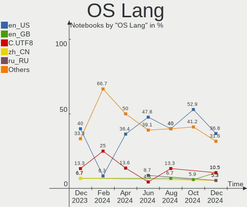
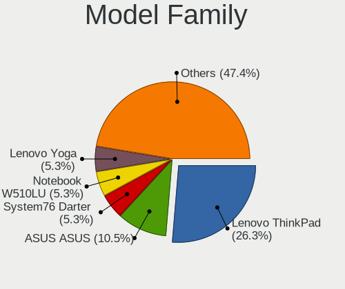
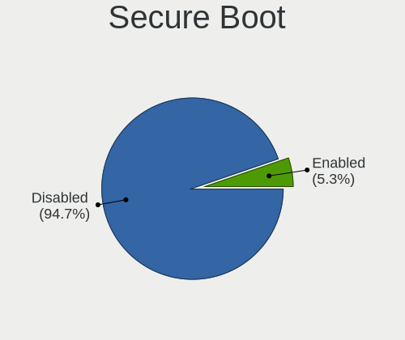
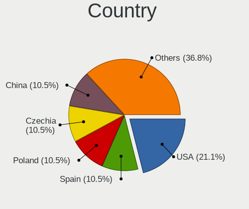
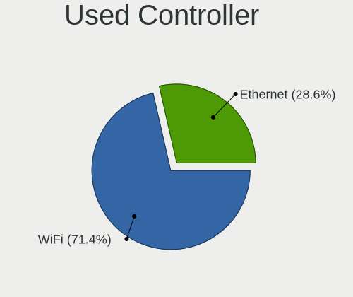
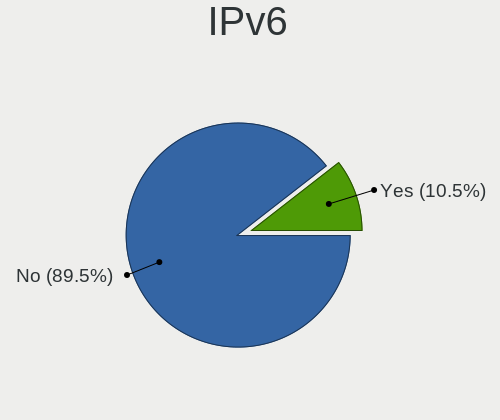

Gentoo - Hardware Trends (Notebooks)
------------------------------------

A project to identify most popular hardware characteristics and track their change
over time based on data collected by Linux users at https://Linux-Hardware.org.

Anyone can contribute to this report by the [hw-probe](https://github.com/linuxhw/hw-probe) tool:

    sudo -E hw-probe -all -upload

This report is for one last month. Overall report since the beginning of time: [TestDays](https://github.com/linuxhw/TestDays)

Period: Apr, 2023.

Contents
--------

* [ System ](#system)
  - [ OS                       ](#os)
  - [ OS Family                ](#os-family)
  - [ Kernel                   ](#kernel)
  - [ Kernel Family            ](#kernel-family)
  - [ Kernel Major Ver.        ](#kernel-major-ver)
  - [ Arch                     ](#arch)
  - [ DE                       ](#de)
  - [ Display Server           ](#display-server)
  - [ Display Manager          ](#display-manager)
  - [ OS Lang                  ](#os-lang)
  - [ Boot Mode                ](#boot-mode)
  - [ Filesystem               ](#filesystem)
  - [ Part. scheme             ](#part-scheme)
  - [ Dual Boot with Linux/BSD ](#dual-boot-with-linuxbsd)
  - [ Dual Boot (Win)          ](#dual-boot-win)

* [ Board ](#board)
  - [ Vendor                   ](#vendor)
  - [ Model                    ](#model)
  - [ Model Family             ](#model-family)
  - [ MFG Year                 ](#mfg-year)
  - [ Form Factor              ](#form-factor)
  - [ Secure Boot              ](#secure-boot)
  - [ Coreboot                 ](#coreboot)
  - [ RAM Size                 ](#ram-size)
  - [ RAM Used                 ](#ram-used)
  - [ Total Drives             ](#total-drives)
  - [ Has CD-ROM               ](#has-cd-rom)
  - [ Has Ethernet             ](#has-ethernet)
  - [ Has WiFi                 ](#has-wifi)
  - [ Has Bluetooth            ](#has-bluetooth)

* [ Location ](#location)
  - [ Country                  ](#country)
  - [ City                     ](#city)

* [ Drives ](#drives)
  - [ Drive Vendor             ](#drive-vendor)
  - [ Drive Model              ](#drive-model)
  - [ HDD Vendor               ](#hdd-vendor)
  - [ SSD Vendor               ](#ssd-vendor)
  - [ Drive Kind               ](#drive-kind)
  - [ Drive Connector          ](#drive-connector)
  - [ Drive Size               ](#drive-size)
  - [ Space Total              ](#space-total)
  - [ Space Used               ](#space-used)
  - [ Malfunc. Drives          ](#malfunc-drives)
  - [ Malfunc. Drive Vendor    ](#malfunc-drive-vendor)
  - [ Malfunc. HDD Vendor      ](#malfunc-hdd-vendor)
  - [ Malfunc. Drive Kind      ](#malfunc-drive-kind)
  - [ Failed Drives            ](#failed-drives)
  - [ Failed Drive Vendor      ](#failed-drive-vendor)
  - [ Drive Status             ](#drive-status)

* [ Storage controller ](#storage-controller)
  - [ Storage Vendor           ](#storage-vendor)
  - [ Storage Model            ](#storage-model)
  - [ Storage Kind             ](#storage-kind)

* [ Processor ](#processor)
  - [ CPU Vendor               ](#cpu-vendor)
  - [ CPU Model                ](#cpu-model)
  - [ CPU Model Family         ](#cpu-model-family)
  - [ CPU Cores                ](#cpu-cores)
  - [ CPU Sockets              ](#cpu-sockets)
  - [ CPU Threads              ](#cpu-threads)
  - [ CPU Op-Modes             ](#cpu-op-modes)
  - [ CPU Microcode            ](#cpu-microcode)
  - [ CPU Microarch            ](#cpu-microarch)

* [ Graphics ](#graphics)
  - [ GPU Vendor               ](#gpu-vendor)
  - [ GPU Model                ](#gpu-model)
  - [ GPU Combo                ](#gpu-combo)
  - [ GPU Driver               ](#gpu-driver)
  - [ GPU Memory               ](#gpu-memory)

* [ Monitor ](#monitor)
  - [ Monitor Vendor           ](#monitor-vendor)
  - [ Monitor Model            ](#monitor-model)
  - [ Monitor Resolution       ](#monitor-resolution)
  - [ Monitor Diagonal         ](#monitor-diagonal)
  - [ Monitor Width            ](#monitor-width)
  - [ Aspect Ratio             ](#aspect-ratio)
  - [ Monitor Area             ](#monitor-area)
  - [ Pixel Density            ](#pixel-density)
  - [ Multiple Monitors        ](#multiple-monitors)

* [ Network ](#network)
  - [ Net Controller Vendor    ](#net-controller-vendor)
  - [ Net Controller Model     ](#net-controller-model)
  - [ Wireless Vendor          ](#wireless-vendor)
  - [ Wireless Model           ](#wireless-model)
  - [ Ethernet Vendor          ](#ethernet-vendor)
  - [ Ethernet Model           ](#ethernet-model)
  - [ Net Controller Kind      ](#net-controller-kind)
  - [ Used Controller          ](#used-controller)
  - [ NICs                     ](#nics)
  - [ IPv6                     ](#ipv6)

* [ Bluetooth ](#bluetooth)
  - [ Bluetooth Vendor         ](#bluetooth-vendor)
  - [ Bluetooth Model          ](#bluetooth-model)

* [ Sound ](#sound)
  - [ Sound Vendor             ](#sound-vendor)
  - [ Sound Model              ](#sound-model)

* [ Memory ](#memory)
  - [ Memory Vendor            ](#memory-vendor)
  - [ Memory Model             ](#memory-model)
  - [ Memory Kind              ](#memory-kind)
  - [ Memory Form Factor       ](#memory-form-factor)
  - [ Memory Size              ](#memory-size)
  - [ Memory Speed             ](#memory-speed)

* [ Printers & scanners ](#printers--scanners)
  - [ Printer Vendor           ](#printer-vendor)
  - [ Printer Model            ](#printer-model)
  - [ Scanner Vendor           ](#scanner-vendor)
  - [ Scanner Model            ](#scanner-model)

* [ Camera ](#camera)
  - [ Camera Vendor            ](#camera-vendor)
  - [ Camera Model             ](#camera-model)

* [ Security ](#security)
  - [ Fingerprint Vendor       ](#fingerprint-vendor)
  - [ Fingerprint Model        ](#fingerprint-model)
  - [ Chipcard Vendor          ](#chipcard-vendor)
  - [ Chipcard Model           ](#chipcard-model)

* [ Unsupported ](#unsupported)
  - [ Unsupported Devices      ](#unsupported-devices)
  - [ Unsupported Device Types ](#unsupported-device-types)

System
------

OS
--

Installed operating systems

| Name        | Notebooks | Percent |
|-------------|-----------|---------|
| Gentoo 2.13 | 25        | 96.15%  |
| Gentoo 2.9  | 1         | 3.85%   |

OS Family
---------

OS without a version

| Name   | Notebooks | Percent |
|--------|-----------|---------|
| Gentoo | 26        | 100%    |

Kernel
------

Version of the Linux kernel

| Version                    | Notebooks | Percent |
|----------------------------|-----------|---------|
| 6.1.19-gentoo-x86_64       | 4         | 15.38%  |
| 6.2.8-gentoo-x86_64        | 2         | 7.69%   |
| 6.1.22-gentoo-dist         | 2         | 7.69%   |
| 6.1.19-gentoo              | 2         | 7.69%   |
| 6.3.0-gentoo               | 1         | 3.85%   |
| 6.2.9-gentoo               | 1         | 3.85%   |
| 6.2.2-gentoo               | 1         | 3.85%   |
| 6.2.11-zen1                | 1         | 3.85%   |
| 6.2.11-tkg-cfs             | 1         | 3.85%   |
| 6.2.11-gentoo-x86_64       | 1         | 3.85%   |
| 6.2.11-gentoo-dist         | 1         | 3.85%   |
| 6.2.11-gentoo              | 1         | 3.85%   |
| 6.2.10-gentoo-dist         | 1         | 3.85%   |
| 6.2.0-rc6-gentoo-p14       | 1         | 3.85%   |
| 6.1.19-gentoo.ae           | 1         | 3.85%   |
| 6.1.19-gentoo-x86_64.ver_1 | 1         | 3.85%   |
| 6.1.12-gentoo-dist         | 1         | 3.85%   |
| 5.15.94-gentoo             | 1         | 3.85%   |
| 5.15.80-gentoo-x86_64      | 1         | 3.85%   |
| 5.15.80-gentoo             | 1         | 3.85%   |

Kernel Family
-------------

Linux kernel without a distro release

| Version | Notebooks | Percent |
|---------|-----------|---------|
| 6.1.19  | 8         | 30.77%  |
| 6.2.11  | 5         | 19.23%  |
| 6.2.8   | 2         | 7.69%   |
| 6.1.22  | 2         | 7.69%   |
| 5.15.80 | 2         | 7.69%   |
| 6.3.0   | 1         | 3.85%   |
| 6.2.9   | 1         | 3.85%   |
| 6.2.2   | 1         | 3.85%   |
| 6.2.10  | 1         | 3.85%   |
| 6.2.0   | 1         | 3.85%   |
| 6.1.12  | 1         | 3.85%   |
| 5.15.94 | 1         | 3.85%   |

Kernel Major Ver.
-----------------

Linux kernel major version

| Version | Notebooks | Percent |
|---------|-----------|---------|
| 6.2     | 11        | 42.31%  |
| 6.1     | 11        | 42.31%  |
| 5.15    | 3         | 11.54%  |
| 6.3     | 1         | 3.85%   |

Arch
----

OS architecture (x86_64, i586, etc.)

| Name   | Notebooks | Percent |
|--------|-----------|---------|
| x86_64 | 24        | 92.31%  |
| i686   | 2         | 7.69%   |

DE
--

Desktop Environment

| Name    | Notebooks | Percent |
|---------|-----------|---------|
| Unknown | 10        | 38.46%  |
| KDE5    | 9         | 34.62%  |
| MATE    | 3         | 11.54%  |
| XFCE    | 1         | 3.85%   |
| Trinity | 1         | 3.85%   |
| KDE     | 1         | 3.85%   |
| GNOME   | 1         | 3.85%   |

Display Server
--------------

X11 or Wayland

| Name    | Notebooks | Percent |
|---------|-----------|---------|
| X11     | 12        | 46.15%  |
| Wayland | 7         | 26.92%  |
| Tty     | 5         | 19.23%  |
| Unknown | 2         | 7.69%   |

Display Manager
---------------

SDDM, LightDM, etc.

| Name    | Notebooks | Percent |
|---------|-----------|---------|
| SDDM    | 10        | 38.46%  |
| Unknown | 8         | 30.77%  |
| LightDM | 4         | 15.38%  |
| TDM     | 2         | 7.69%   |
| XDM     | 1         | 3.85%   |
| GDM     | 1         | 3.85%   |

OS Lang
-------

Language

| Lang    | Notebooks | Percent |
|---------|-----------|---------|
| en_US   | 9         | 34.62%  |
| Unknown | 4         | 15.38%  |
| C.UTF8  | 3         | 11.54%  |
| cs_CZ   | 2         | 7.69%   |
| ru_RU   | 1         | 3.85%   |
| ro_RO   | 1         | 3.85%   |
| it_IT   | 1         | 3.85%   |
| fr_FR   | 1         | 3.85%   |
| en_GB   | 1         | 3.85%   |
| en_AU   | 1         | 3.85%   |
| de_DE   | 1         | 3.85%   |
| C       | 1         | 3.85%   |

Boot Mode
---------

EFI or BIOS

| Mode | Notebooks | Percent |
|------|-----------|---------|
| EFI  | 19        | 73.08%  |
| BIOS | 7         | 26.92%  |

Filesystem
----------

Type of filesystem

| Type  | Notebooks | Percent |
|-------|-----------|---------|
| Ext4  | 15        | 57.69%  |
| Btrfs | 10        | 38.46%  |
| Xfs   | 1         | 3.85%   |

Part. scheme
------------

Scheme of partitioning

| Type    | Notebooks | Percent |
|---------|-----------|---------|
| GPT     | 21        | 80.77%  |
| MBR     | 4         | 15.38%  |
| Unknown | 1         | 3.85%   |

Dual Boot with Linux/BSD
------------------------

Hosting more than one Linux/BSD

| Dual boot | Notebooks | Percent |
|-----------|-----------|---------|
| No        | 21        | 80.77%  |
| Yes       | 5         | 19.23%  |

Dual Boot (Win)
---------------

Hosting Linux and Windows

| Dual boot | Notebooks | Percent |
|-----------|-----------|---------|
| No        | 18        | 69.23%  |
| Yes       | 8         | 30.77%  |

Board
-----

Vendor
------

Motherboard manufacturer

| Name             | Notebooks | Percent |
|------------------|-----------|---------|
| Dell             | 5         | 19.23%  |
| ASUSTek Computer | 5         | 19.23%  |
| Lenovo           | 4         | 15.38%  |
| Hewlett-Packard  | 4         | 15.38%  |
| HUAWEI           | 3         | 11.54%  |
| Acer             | 2         | 7.69%   |
| TUXEDO           | 1         | 3.85%   |
| Toshiba          | 1         | 3.85%   |
| MAXDATA          | 1         | 3.85%   |

Model
-----

Motherboard model

| Name                                     | Notebooks | Percent |
|------------------------------------------|-----------|---------|
| ASUS ROG Zephyrus G14 GA401II_GA401II    | 2         | 7.69%   |
| TUXEDO Polaris AMD Gen3 (CZN)            | 1         | 3.85%   |
| Toshiba Satellite L850                   | 1         | 3.85%   |
| MAXDATA o.max_5xs                        | 1         | 3.85%   |
| Lenovo ThinkPad X13 Gen 3 21CM0024US     | 1         | 3.85%   |
| Lenovo ThinkPad T470p 20J7S25C00         | 1         | 3.85%   |
| Lenovo ThinkPad P14s Gen 2a 21A0000JMH   | 1         | 3.85%   |
| Lenovo IdeaPad Yoga 13 20175             | 1         | 3.85%   |
| HUAWEI NBLK-WAX9X                        | 1         | 3.85%   |
| HUAWEI KPL-W0X                           | 1         | 3.85%   |
| HUAWEI CREM-WXX9                         | 1         | 3.85%   |
| HP OMEN by Laptop                        | 1         | 3.85%   |
| HP Laptop 17-cp0xxx                      | 1         | 3.85%   |
| HP G62                                   | 1         | 3.85%   |
| HP EliteBook 840 G3                      | 1         | 3.85%   |
| Dell XPS 15 9570                         | 1         | 3.85%   |
| Dell Precision 7770                      | 1         | 3.85%   |
| Dell Latitude 7420                       | 1         | 3.85%   |
| Dell Inspiron N5010                      | 1         | 3.85%   |
| Dell Inspiron 5415                       | 1         | 3.85%   |
| ASUS ROG Strix G513RM_G513RM             | 1         | 3.85%   |
| ASUS N550JX                              | 1         | 3.85%   |
| ASUS ASUS TUF Gaming F17 FX707ZM_FX707ZM | 1         | 3.85%   |
| Acer Aspire one                          | 1         | 3.85%   |
| Acer Aspire A315-35                      | 1         | 3.85%   |

Model Family
------------

Motherboard model prefix

| Name              | Notebooks | Percent |
|-------------------|-----------|---------|
| Lenovo ThinkPad   | 3         | 11.54%  |
| ASUS ROG          | 3         | 11.54%  |
| Dell Inspiron     | 2         | 7.69%   |
| Acer Aspire       | 2         | 7.69%   |
| TUXEDO Polaris    | 1         | 3.85%   |
| Toshiba Satellite | 1         | 3.85%   |
| MAXDATA o.max     | 1         | 3.85%   |
| Lenovo IdeaPad    | 1         | 3.85%   |
| HUAWEI NBLK-WAX9X | 1         | 3.85%   |
| HUAWEI KPL-W0X    | 1         | 3.85%   |
| HUAWEI CREM-WXX9  | 1         | 3.85%   |
| HP OMEN           | 1         | 3.85%   |
| HP Laptop         | 1         | 3.85%   |
| HP G62            | 1         | 3.85%   |
| HP EliteBook      | 1         | 3.85%   |
| Dell XPS          | 1         | 3.85%   |
| Dell Precision    | 1         | 3.85%   |
| Dell Latitude     | 1         | 3.85%   |
| ASUS N550JX       | 1         | 3.85%   |
| ASUS ASUS         | 1         | 3.85%   |

MFG Year
--------

Motherboard manufacture year

| Year | Notebooks | Percent |
|------|-----------|---------|
| 2021 | 5         | 19.23%  |
| 2022 | 4         | 15.38%  |
| 2018 | 4         | 15.38%  |
| 2020 | 3         | 11.54%  |
| 2010 | 3         | 11.54%  |
| 2012 | 2         | 7.69%   |
| 2019 | 1         | 3.85%   |
| 2017 | 1         | 3.85%   |
| 2016 | 1         | 3.85%   |
| 2015 | 1         | 3.85%   |
| 2007 | 1         | 3.85%   |

Form Factor
-----------

Physical design of the computer

| Name     | Notebooks | Percent |
|----------|-----------|---------|
| Notebook | 26        | 100%    |

Secure Boot
-----------

Enabled or disabled

| State    | Notebooks | Percent |
|----------|-----------|---------|
| Disabled | 26        | 100%    |

Coreboot
--------

Have coreboot on board

| Used | Notebooks | Percent |
|------|-----------|---------|
| No   | 26        | 100%    |

RAM Size
--------

Total RAM memory

| Size in GB  | Notebooks | Percent |
|-------------|-----------|---------|
| 4.01-8.0    | 7         | 26.92%  |
| 16.01-24.0  | 5         | 19.23%  |
| 8.01-16.0   | 5         | 19.23%  |
| 24.01-32.0  | 3         | 11.54%  |
| 32.01-64.0  | 2         | 7.69%   |
| 3.01-4.0    | 1         | 3.85%   |
| 2.01-3.0    | 1         | 3.85%   |
| 64.01-256.0 | 1         | 3.85%   |
| 0.51-1.0    | 1         | 3.85%   |

RAM Used
--------

Used RAM memory

| Used GB   | Notebooks | Percent |
|-----------|-----------|---------|
| 2.01-3.0  | 5         | 19.23%  |
| 0.51-1.0  | 5         | 19.23%  |
| 4.01-8.0  | 4         | 15.38%  |
| 1.01-2.0  | 4         | 15.38%  |
| 0.01-0.5  | 4         | 15.38%  |
| 3.01-4.0  | 2         | 7.69%   |
| 8.01-16.0 | 2         | 7.69%   |

Total Drives
------------

Number of drives on board

| Drives | Notebooks | Percent |
|--------|-----------|---------|
| 1      | 19        | 73.08%  |
| 2      | 7         | 26.92%  |

Has CD-ROM
----------

Has CD-ROM on board

| Presented | Notebooks | Percent |
|-----------|-----------|---------|
| No        | 21        | 80.77%  |
| Yes       | 5         | 19.23%  |

Has Ethernet
------------

Has Ethernet on board

| Presented | Notebooks | Percent |
|-----------|-----------|---------|
| Yes       | 20        | 76.92%  |
| No        | 6         | 23.08%  |

Has WiFi
--------

Has WiFi module

| Presented | Notebooks | Percent |
|-----------|-----------|---------|
| Yes       | 26        | 100%    |

Has Bluetooth
-------------

Has Bluetooth module

| Presented | Notebooks | Percent |
|-----------|-----------|---------|
| Yes       | 22        | 84.62%  |
| No        | 4         | 15.38%  |

Location
--------

Country
-------

Geographic location (country)

| Country     | Notebooks | Percent |
|-------------|-----------|---------|
| USA         | 7         | 26.92%  |
| Canada      | 4         | 15.38%  |
| Russia      | 3         | 11.54%  |
| Spain       | 2         | 7.69%   |
| France      | 2         | 7.69%   |
| Czechia     | 2         | 7.69%   |
| Romania     | 1         | 3.85%   |
| Norway      | 1         | 3.85%   |
| Netherlands | 1         | 3.85%   |
| Italy       | 1         | 3.85%   |
| Germany     | 1         | 3.85%   |
| Australia   | 1         | 3.85%   |

City
----

Geographic location (city)

| City                 | Notebooks | Percent |
|----------------------|-----------|---------|
| St Petersburg        | 2         | 7.69%   |
| Kippens              | 2         | 7.69%   |
| Wessington Springs   | 1         | 3.85%   |
| Verona               | 1         | 3.85%   |
| Taganrog             | 1         | 3.85%   |
| Rapid City           | 1         | 3.85%   |
| Prague               | 1         | 3.85%   |
| Ponetovice           | 1         | 3.85%   |
| Pittsburgh           | 1         | 3.85%   |
| Perth                | 1         | 3.85%   |
| Oviedo               | 1         | 3.85%   |
| Oslo                 | 1         | 3.85%   |
| Milan                | 1         | 3.85%   |
| Mangalia             | 1         | 3.85%   |
| Madrid               | 1         | 3.85%   |
| Lomme                | 1         | 3.85%   |
| Girona               | 1         | 3.85%   |
| Gatineau             | 1         | 3.85%   |
| Frankfurt am Main    | 1         | 3.85%   |
| Enschede             | 1         | 3.85%   |
| El Paso              | 1         | 3.85%   |
| Calgary              | 1         | 3.85%   |
| Boulogne-Billancourt | 1         | 3.85%   |
| Berlin               | 1         | 3.85%   |

Drives
------

Drive Vendor
------------

Hard drive vendors

| Vendor                      | Notebooks | Drives | Percent |
|-----------------------------|-----------|--------|---------|
| Samsung Electronics         | 9         | 10     | 29.03%  |
| SanDisk                     | 7         | 7      | 22.58%  |
| SK hynix                    | 2         | 2      | 6.45%   |
| Micron Technology           | 2         | 2      | 6.45%   |
| Toshiba                     | 1         | 1      | 3.23%   |
| Seagate                     | 1         | 1      | 3.23%   |
| Phison Electronics          | 1         | 2      | 3.23%   |
| Kingston Technology Company | 1         | 1      | 3.23%   |
| Intel                       | 1         | 1      | 3.23%   |
| Hitachi                     | 1         | 1      | 3.23%   |
| HGST                        | 1         | 1      | 3.23%   |
| Dogfish                     | 1         | 1      | 3.23%   |
| Crucial                     | 1         | 1      | 3.23%   |
| China                       | 1         | 1      | 3.23%   |
| A-DATA Technology           | 1         | 1      | 3.23%   |

Drive Model
-----------

Hard drive models

| Model                                              | Notebooks | Percent |
|----------------------------------------------------|-----------|---------|
| Samsung NVMe SSD Controller SM981/PM981/PM983 1TB  | 5         | 15.63%  |
| Sandisk WD Blue SN550 NVMe SSD 1024GB              | 3         | 9.38%   |
| Samsung NVMe SSD Controller PM9A1/PM9A3/980PRO 2TB | 2         | 6.25%   |
| Toshiba MK5056GSY 500GB                            | 1         | 3.13%   |
| SK hynix SKHynix_HFS001TDE9X081N 1024GB            | 1         | 3.13%   |
| SK hynix BC711 NVMe 512GB                          | 1         | 3.13%   |
| Seagate ST1000LM024 HN-M101MBB 1TB                 | 1         | 3.13%   |
| Sandisk WD Black SN750 / PC SN730 NVMe SSD 512GB   | 1         | 3.13%   |
| SanDisk SDSSDHII960G 960GB                         | 1         | 3.13%   |
| SanDisk SD9SN8W256G1027 256GB SSD                  | 1         | 3.13%   |
| SanDisk SD8SN8U-256G-1006 256GB SSD                | 1         | 3.13%   |
| Samsung MZVLQ1T0HBLB-00B00 1024GB                  | 1         | 3.13%   |
| Samsung MZMPC128HBFU-000L1 128GB SSD               | 1         | 3.13%   |
| Samsung MZ7TE256HMHP-000H1 256GB SSD               | 1         | 3.13%   |
| Phison E12 NVMe Controller 512GB                   | 1         | 3.13%   |
| Micron 2450_MTFDKBA1T0TFK 1TB                      | 1         | 3.13%   |
| Micron 2450 NVMe 512GB                             | 1         | 3.13%   |
| Kingston Company SFYRD4000G 4TB                    | 1         | 3.13%   |
| Intel SSDPEKNU512GZH 512GB                         | 1         | 3.13%   |
| Hitachi HTS547575A9E384 752GB                      | 1         | 3.13%   |
| HGST HTS721010A9E630 1TB                           | 1         | 3.13%   |
| Dogfish SSD 1TB                                    | 1         | 3.13%   |
| Crucial CT240BX500SSD1 240GB                       | 1         | 3.13%   |
| China SSD 1TB                                      | 1         | 3.13%   |
| A-DATA SU630 240GB SSD                             | 1         | 3.13%   |

HDD Vendor
----------

Hard disk drive vendors

| Vendor  | Notebooks | Drives | Percent |
|---------|-----------|--------|---------|
| Toshiba | 1         | 1      | 25%     |
| Seagate | 1         | 1      | 25%     |
| Hitachi | 1         | 1      | 25%     |
| HGST    | 1         | 1      | 25%     |

SSD Vendor
----------

Solid state drive vendors

| Vendor              | Notebooks | Drives | Percent |
|---------------------|-----------|--------|---------|
| SanDisk             | 3         | 3      | 33.33%  |
| Samsung Electronics | 2         | 2      | 22.22%  |
| Dogfish             | 1         | 1      | 11.11%  |
| Crucial             | 1         | 1      | 11.11%  |
| China               | 1         | 1      | 11.11%  |
| A-DATA Technology   | 1         | 1      | 11.11%  |

Drive Kind
----------

HDD or SSD

| Kind | Notebooks | Drives | Percent |
|------|-----------|--------|---------|
| NVMe | 16        | 20     | 57.14%  |
| SSD  | 8         | 9      | 28.57%  |
| HDD  | 4         | 4      | 14.29%  |

Drive Connector
---------------

SATA, SAS, NVMe, etc.

| Type | Notebooks | Drives | Percent |
|------|-----------|--------|---------|
| NVMe | 16        | 20     | 57.14%  |
| SATA | 12        | 13     | 42.86%  |

Drive Size
----------

Size of hard drive

| Size in TB | Notebooks | Drives | Percent |
|------------|-----------|--------|---------|
| 0.01-0.5   | 6         | 7      | 50%     |
| 0.51-1.0   | 5         | 5      | 41.67%  |
| 1.01-2.0   | 1         | 1      | 8.33%   |

Space Total
-----------

Amount of disk space available on the file system

| Size in GB     | Notebooks | Percent |
|----------------|-----------|---------|
| 251-500        | 9         | 34.62%  |
| 501-1000       | 8         | 30.77%  |
| 101-250        | 5         | 19.23%  |
| More than 3000 | 1         | 3.85%   |
| 21-50          | 1         | 3.85%   |
| 2001-3000      | 1         | 3.85%   |
| 1001-2000      | 1         | 3.85%   |

Space Used
----------

Amount of used disk space

| Used GB   | Notebooks | Percent |
|-----------|-----------|---------|
| 1-20      | 7         | 26.92%  |
| 251-500   | 5         | 19.23%  |
| 101-250   | 5         | 19.23%  |
| 51-100    | 5         | 19.23%  |
| 21-50     | 2         | 7.69%   |
| 1001-2000 | 1         | 3.85%   |
| 501-1000  | 1         | 3.85%   |

Malfunc. Drives
---------------

Drive models with a malfunction

| Model                              | Notebooks | Drives | Percent |
|------------------------------------|-----------|--------|---------|
| Toshiba MK5056GSY 500GB            | 1         | 1      | 33.33%  |
| Seagate ST1000LM024 HN-M101MBB 1TB | 1         | 1      | 33.33%  |
| HGST HTS721010A9E630 1TB           | 1         | 1      | 33.33%  |

Malfunc. Drive Vendor
---------------------

Vendors of faulty drives

| Vendor  | Notebooks | Drives | Percent |
|---------|-----------|--------|---------|
| Toshiba | 1         | 1      | 33.33%  |
| Seagate | 1         | 1      | 33.33%  |
| HGST    | 1         | 1      | 33.33%  |

Malfunc. HDD Vendor
-------------------

Vendors of faulty HDD drives

| Vendor  | Notebooks | Drives | Percent |
|---------|-----------|--------|---------|
| Toshiba | 1         | 1      | 33.33%  |
| Seagate | 1         | 1      | 33.33%  |
| HGST    | 1         | 1      | 33.33%  |

Malfunc. Drive Kind
-------------------

Kinds of faulty drives

| Kind | Notebooks | Drives | Percent |
|------|-----------|--------|---------|
| HDD  | 3         | 3      | 100%    |

Failed Drives
-------------

Failed drive models

Zero info for selected period =(

Failed Drive Vendor
-------------------

Failed drive vendors

Zero info for selected period =(

Drive Status
------------

Number of failed and malfunc. drives

| Status   | Notebooks | Drives | Percent |
|----------|-----------|--------|---------|
| Works    | 21        | 27     | 80.77%  |
| Malfunc  | 3         | 3      | 11.54%  |
| Detected | 2         | 3      | 7.69%   |

Storage controller
------------------

Storage Vendor
--------------

Storage controller vendors

| Vendor                      | Notebooks | Percent |
|-----------------------------|-----------|---------|
| Intel                       | 13        | 35.14%  |
| Samsung Electronics         | 7         | 18.92%  |
| AMD                         | 7         | 18.92%  |
| SanDisk                     | 4         | 10.81%  |
| SK hynix                    | 2         | 5.41%   |
| Micron Technology           | 2         | 5.41%   |
| Phison Electronics          | 1         | 2.7%    |
| Kingston Technology Company | 1         | 2.7%    |

Storage Model
-------------

Storage controller models

| Model                                                                          | Notebooks | Percent |
|--------------------------------------------------------------------------------|-----------|---------|
| AMD FCH SATA Controller [AHCI mode]                                            | 6         | 15%     |
| Samsung NVMe SSD Controller SM981/PM981/PM983                                  | 5         | 12.5%   |
| SanDisk WD Blue SN550 NVMe SSD                                                 | 3         | 7.5%    |
| SK hynix Gold P31/PC711 NVMe Solid State Drive                                 | 2         | 5%      |
| Samsung NVMe SSD Controller PM9A1/PM9A3/980PRO                                 | 2         | 5%      |
| Micron NVMe Storage Controller                                                 | 2         | 5%      |
| Intel HM170/QM170 Chipset SATA Controller [AHCI Mode]                          | 2         | 5%      |
| Intel 82801GBM/GHM (ICH7-M Family) SATA Controller [AHCI mode]                 | 2         | 5%      |
| Intel 7 Series Chipset Family 6-port SATA Controller [AHCI mode]               | 2         | 5%      |
| SanDisk WD Black SN750 / PC SN730 NVMe SSD                                     | 1         | 2.5%    |
| Samsung NVMe SSD Controller 980                                                | 1         | 2.5%    |
| Phison E12 NVMe Controller                                                     | 1         | 2.5%    |
| Kingston Company Company Non-Volatile memory controller                        | 1         | 2.5%    |
| Intel Volume Management Device NVMe RAID Controller                            | 1         | 2.5%    |
| Intel Sunrise Point-LP SATA Controller [AHCI mode]                             | 1         | 2.5%    |
| Intel Non-Volatile memory controller                                           | 1         | 2.5%    |
| Intel Jasper Lake SATA AHCI Controller                                         | 1         | 2.5%    |
| Intel Cannon Lake Mobile PCH SATA AHCI Controller                              | 1         | 2.5%    |
| Intel 82801G (ICH7 Family) IDE Controller                                      | 1         | 2.5%    |
| Intel 8 Series/C220 Series Chipset Family 6-port SATA Controller 1 [AHCI mode] | 1         | 2.5%    |
| Intel 5 Series/3400 Series Chipset 6 port SATA AHCI Controller                 | 1         | 2.5%    |
| AMD SB7x0/SB8x0/SB9x0 SATA Controller [AHCI mode]                              | 1         | 2.5%    |
| AMD 400 Series Chipset SATA Controller                                         | 1         | 2.5%    |

Storage Kind
------------

Kind of storage controller (IDE, SATA, NVMe, SAS, ...)

| Kind | Notebooks | Percent |
|------|-----------|---------|
| SATA | 18        | 50%     |
| NVMe | 16        | 44.44%  |
| RAID | 1         | 2.78%   |
| IDE  | 1         | 2.78%   |

Processor
---------

CPU Vendor
----------

Processor vendors

| Vendor | Notebooks | Percent |
|--------|-----------|---------|
| Intel  | 14        | 53.85%  |
| AMD    | 12        | 46.15%  |

CPU Model
---------

Processor models

| Model                                         | Notebooks | Percent |
|-----------------------------------------------|-----------|---------|
| AMD Ryzen 7 5800H with Radeon Graphics        | 2         | 7.69%   |
| Intel Pentium Silver N6000 @ 1.10GHz          | 1         | 3.85%   |
| Intel Core i7-8750H CPU @ 2.20GHz             | 1         | 3.85%   |
| Intel Core i7-7820HQ CPU @ 2.90GHz            | 1         | 3.85%   |
| Intel Core i7-7700HQ CPU @ 2.80GHz            | 1         | 3.85%   |
| Intel Core i7-4720HQ CPU @ 2.60GHz            | 1         | 3.85%   |
| Intel Core i5-6200U CPU @ 2.30GHz             | 1         | 3.85%   |
| Intel Core i5-3317U CPU @ 1.70GHz             | 1         | 3.85%   |
| Intel Core i3-2328M CPU @ 2.20GHz             | 1         | 3.85%   |
| Intel Core i3 CPU M 380 @ 2.53GHz             | 1         | 3.85%   |
| Intel Core Duo CPU T2450 @ 2.00GHz            | 1         | 3.85%   |
| Intel Atom CPU N270 @ 1.60GHz                 | 1         | 3.85%   |
| Intel 12th Gen Core i7-12850HX                | 1         | 3.85%   |
| Intel 12th Gen Core i7-12700H                 | 1         | 3.85%   |
| Intel 11th Gen Core i7-1185G7 @ 3.00GHz       | 1         | 3.85%   |
| AMD Ryzen 7 PRO 6850U with Radeon Graphics    | 1         | 3.85%   |
| AMD Ryzen 7 PRO 5850U with Radeon Graphics    | 1         | 3.85%   |
| AMD Ryzen 7 6800H with Radeon Graphics        | 1         | 3.85%   |
| AMD Ryzen 7 5700U with Radeon Graphics        | 1         | 3.85%   |
| AMD Ryzen 7 4800HS with Radeon Graphics       | 1         | 3.85%   |
| AMD Ryzen 7 3800X 8-Core Processor            | 1         | 3.85%   |
| AMD Ryzen 5 5500U with Radeon Graphics        | 1         | 3.85%   |
| AMD Ryzen 5 3500U with Radeon Vega Mobile Gfx | 1         | 3.85%   |
| AMD Ryzen 5 2500U with Radeon Vega Mobile Gfx | 1         | 3.85%   |
| AMD Athlon II P320 Dual-Core Processor        | 1         | 3.85%   |

CPU Model Family
----------------

Processor model prefix

| Model                | Notebooks | Percent |
|----------------------|-----------|---------|
| AMD Ryzen 7          | 6         | 23.08%  |
| Intel Core i7        | 4         | 15.38%  |
| Other                | 3         | 11.54%  |
| AMD Ryzen 5          | 3         | 11.54%  |
| Intel Core i5        | 2         | 7.69%   |
| Intel Core i3        | 2         | 7.69%   |
| AMD Ryzen 7 PRO      | 2         | 7.69%   |
| Intel Pentium Silver | 1         | 3.85%   |
| Intel Core Duo       | 1         | 3.85%   |
| Intel Atom           | 1         | 3.85%   |
| AMD Athlon II        | 1         | 3.85%   |

CPU Cores
---------

Number of processor cores

| Number | Notebooks | Percent |
|--------|-----------|---------|
| 8      | 8         | 30.77%  |
| 4      | 7         | 26.92%  |
| 2      | 6         | 23.08%  |
| 6      | 2         | 7.69%   |
| 16     | 1         | 3.85%   |
| 14     | 1         | 3.85%   |
| 1      | 1         | 3.85%   |

CPU Sockets
-----------

Number of sockets

| Number | Notebooks | Percent |
|--------|-----------|---------|
| 1      | 26        | 100%    |

CPU Threads
-----------

Threads per core (Hyper-Threading)

| Number | Notebooks | Percent |
|--------|-----------|---------|
| 2      | 23        | 88.46%  |
| 1      | 3         | 11.54%  |

CPU Op-Modes
------------

CPU Operation Modes (32-bit, 64-bit)

| Op mode        | Notebooks | Percent |
|----------------|-----------|---------|
| 32-bit, 64-bit | 24        | 92.31%  |
| 32-bit         | 2         | 7.69%   |

CPU Microcode
-------------

Microcode number

| Number     | Notebooks | Percent |
|------------|-----------|---------|
| Unknown    | 12        | 46.15%  |
| 0x0a50000c | 3         | 11.54%  |
| 0x906e9    | 2         | 7.69%   |
| 0x08608103 | 2         | 7.69%   |
| 0x806c1    | 1         | 3.85%   |
| 0x406e3    | 1         | 3.85%   |
| 0x20655    | 1         | 3.85%   |
| 0x0a404102 | 1         | 3.85%   |
| 0x08701021 | 1         | 3.85%   |
| 0x08600104 | 1         | 3.85%   |
| 0x08101007 | 1         | 3.85%   |

CPU Microarch
-------------

Microarchitecture

| Name             | Notebooks | Percent |
|------------------|-----------|---------|
| Unknown          | 5         | 19.23%  |
| Zen 3            | 3         | 11.54%  |
| KabyLake         | 3         | 11.54%  |
| Zen 2            | 2         | 7.69%   |
| Alderlake Hybrid | 2         | 7.69%   |
| Zen+             | 1         | 3.85%   |
| Zen              | 1         | 3.85%   |
| Westmere         | 1         | 3.85%   |
| TigerLake        | 1         | 3.85%   |
| Skylake          | 1         | 3.85%   |
| SandyBridge      | 1         | 3.85%   |
| P6               | 1         | 3.85%   |
| K10              | 1         | 3.85%   |
| IvyBridge        | 1         | 3.85%   |
| Haswell          | 1         | 3.85%   |
| Bonnell          | 1         | 3.85%   |

Graphics
--------

GPU Vendor
----------

Vendors of graphics cards

| Vendor | Notebooks | Percent |
|--------|-----------|---------|
| Intel  | 12        | 35.29%  |
| AMD    | 12        | 35.29%  |
| Nvidia | 10        | 29.41%  |

GPU Model
---------

Graphics card models

| Model                                                                         | Notebooks | Percent |
|-------------------------------------------------------------------------------|-----------|---------|
| Nvidia GA106M [GeForce RTX 3060 Mobile / Max-Q]                               | 3         | 8.11%   |
| Nvidia TU116M [GeForce GTX 1650 Ti Mobile]                                    | 2         | 5.41%   |
| Intel Mobile 945GM/GMS/GME, 943/940GML Express Integrated Graphics Controller | 2         | 5.41%   |
| Intel HD Graphics 630                                                         | 2         | 5.41%   |
| AMD Renoir                                                                    | 2         | 5.41%   |
| AMD Rembrandt [Radeon 680M]                                                   | 2         | 5.41%   |
| AMD Lucienne                                                                  | 2         | 5.41%   |
| AMD Cezanne [Radeon Vega Series / Radeon Vega Mobile Series]                  | 2         | 5.41%   |
| Nvidia GP107M [GeForce GTX 1050 Ti Mobile]                                    | 1         | 2.7%    |
| Nvidia GP107M [GeForce GTX 1050 Mobile]                                       | 1         | 2.7%    |
| Nvidia GM108M [GeForce 940MX]                                                 | 1         | 2.7%    |
| Nvidia GM107M [GeForce GTX 950M]                                              | 1         | 2.7%    |
| Nvidia GK106 [GeForce GTX 660]                                                | 1         | 2.7%    |
| Nvidia GA104GLM [RTX A3000 12GB Laptop GPU]                                   | 1         | 2.7%    |
| Intel TigerLake-LP GT2 [Iris Xe Graphics]                                     | 1         | 2.7%    |
| Intel Skylake GT2 [HD Graphics 520]                                           | 1         | 2.7%    |
| Intel Mobile 945GSE Express Integrated Graphics Controller                    | 1         | 2.7%    |
| Intel Mobile 945GM/GMS, 943/940GML Express Integrated Graphics Controller     | 1         | 2.7%    |
| Intel JasperLake [UHD Graphics]                                               | 1         | 2.7%    |
| Intel CoffeeLake-H GT2 [UHD Graphics 630]                                     | 1         | 2.7%    |
| Intel Alder Lake-P Integrated Graphics Controller                             | 1         | 2.7%    |
| Intel 4th Gen Core Processor Integrated Graphics Controller                   | 1         | 2.7%    |
| Intel 3rd Gen Core processor Graphics Controller                              | 1         | 2.7%    |
| Intel 2nd Generation Core Processor Family Integrated Graphics Controller     | 1         | 2.7%    |
| AMD RS880M [Mobility Radeon HD 4225/4250]                                     | 1         | 2.7%    |
| AMD Raven Ridge [Radeon Vega Series / Radeon Vega Mobile Series]              | 1         | 2.7%    |
| AMD Picasso/Raven 2 [Radeon Vega Series / Radeon Vega Mobile Series]          | 1         | 2.7%    |
| AMD Park [Mobility Radeon HD 5430/5450/5470]                                  | 1         | 2.7%    |

GPU Combo
---------

Combinations of graphics cards

| Name           | Notebooks | Percent |
|----------------|-----------|---------|
| 1 x AMD        | 9         | 34.62%  |
| Intel + Nvidia | 5         | 19.23%  |
| 1 x Intel      | 5         | 19.23%  |
| 1 x Nvidia     | 3         | 11.54%  |
| 2 x Intel      | 2         | 7.69%   |
| AMD + Nvidia   | 2         | 7.69%   |

GPU Driver
----------

Free vs proprietary

| Driver      | Notebooks | Percent |
|-------------|-----------|---------|
| Free        | 21        | 80.77%  |
| Proprietary | 4         | 15.38%  |
| Unknown     | 1         | 3.85%   |

GPU Memory
----------

Total video memory

| Size in GB | Notebooks | Percent |
|------------|-----------|---------|
| Unknown    | 13        | 50%     |
| 0.01-0.5   | 5         | 19.23%  |
| 0.51-1.0   | 3         | 11.54%  |
| 1.01-2.0   | 2         | 7.69%   |
| 7.01-8.0   | 1         | 3.85%   |
| 5.01-6.0   | 1         | 3.85%   |
| 8.01-16.0  | 1         | 3.85%   |

Monitor
-------

Monitor Vendor
--------------

Monitor vendors

| Vendor               | Notebooks | Percent |
|----------------------|-----------|---------|
| BOE                  | 5         | 17.86%  |
| LG Display           | 4         | 14.29%  |
| Chimei Innolux       | 4         | 14.29%  |
| AU Optronics         | 4         | 14.29%  |
| Dell                 | 2         | 7.14%   |
| Sharp                | 1         | 3.57%   |
| Samsung Electronics  | 1         | 3.57%   |
| PANDA                | 1         | 3.57%   |
| Hewlett-Packard      | 1         | 3.57%   |
| Eizo                 | 1         | 3.57%   |
| CTO                  | 1         | 3.57%   |
| BOE Technology Group | 1         | 3.57%   |
| ASUSTek Computer     | 1         | 3.57%   |
| AOC                  | 1         | 3.57%   |

Monitor Model
-------------

Monitor models

| Model                                                                 | Notebooks | Percent |
|-----------------------------------------------------------------------|-----------|---------|
| Sharp LCD Monitor SHP148D 3840x2160 344x194mm 15.5-inch               | 1         | 3.45%   |
| Samsung Electronics LCD Monitor SDC324C 1920x1080 344x194mm 15.5-inch | 1         | 3.45%   |
| PANDA LCD Monitor NCP0050 1920x1080 309x174mm 14.0-inch               | 1         | 3.45%   |
| LG Display LCD Monitor LGD06D6 1920x1080 309x174mm 14.0-inch          | 1         | 3.45%   |
| LG Display LCD Monitor LGD058C 1920x1080 344x194mm 15.5-inch          | 1         | 3.45%   |
| LG Display LCD Monitor LGD0360 1600x900 294x166mm 13.3-inch           | 1         | 3.45%   |
| LG Display LCD Monitor LGD033A 1366x768 344x194mm 15.5-inch           | 1         | 3.45%   |
| Hewlett-Packard vs17 HWP2647 1280x1024 337x270mm 17.0-inch            | 1         | 3.45%   |
| Eizo EV2450 ENC2531 1920x1080 528x297mm 23.9-inch                     | 1         | 3.45%   |
| Dell U2520D DELA150 2560x1440 553x311mm 25.0-inch                     | 1         | 3.45%   |
| Dell U2518D DEL413A 2560x1440 553x311mm 25.0-inch                     | 1         | 3.45%   |
| Dell S3422DW DELD104 3440x1440 797x334mm 34.0-inch                    | 1         | 3.45%   |
| CTO LCD Monitor CTO3391 1920x1200 286x179mm 13.3-inch                 | 1         | 3.45%   |
| Chimei Innolux LCD Monitor CMN1540 2560x1440 344x193mm 15.5-inch      | 1         | 3.45%   |
| Chimei Innolux LCD Monitor CMN14E7 1920x1080 309x173mm 13.9-inch      | 1         | 3.45%   |
| Chimei Innolux LCD Monitor CMN14D4 1920x1080 309x173mm 13.9-inch      | 1         | 3.45%   |
| Chimei Innolux LCD Monitor CMN14C0 1920x1080 308x173mm 13.9-inch      | 1         | 3.45%   |
| BOE Technology Group LCD Monitor 1920x1080                            | 1         | 3.45%   |
| BOE LCD Monitor BOE0977 2560x1440 381x214mm 17.2-inch                 | 1         | 3.45%   |
| BOE LCD Monitor BOE0953 1920x1080 382x215mm 17.3-inch                 | 1         | 3.45%   |
| BOE LCD Monitor BOE092F 2520x1680 338x226mm 16.0-inch                 | 1         | 3.45%   |
| BOE LCD Monitor BOE0877 1920x1080 309x173mm 13.9-inch                 | 1         | 3.45%   |
| BOE LCD Monitor BOE07CB 1920x1080 344x193mm 15.5-inch                 | 1         | 3.45%   |
| AU Optronics LCD Monitor AUO573D 1920x1080 309x174mm 14.0-inch        | 1         | 3.45%   |
| AU Optronics LCD Monitor AUO4B9D 1920x1080 382x215mm 17.3-inch        | 1         | 3.45%   |
| AU Optronics LCD Monitor AUO30D2 1024x600 223x125mm 10.1-inch         | 1         | 3.45%   |
| AU Optronics LCD Monitor AUO243D 1920x1080 309x173mm 13.9-inch        | 1         | 3.45%   |
| ASUSTek Computer VG27V AUS27C3 1920x1080 598x336mm 27.0-inch          | 1         | 3.45%   |
| AOC 24P2W1DG5 AOC2402 1920x1080 527x296mm 23.8-inch                   | 1         | 3.45%   |

Monitor Resolution
------------------

Monitor screen resolution

| Resolution        | Notebooks | Percent |
|-------------------|-----------|---------|
| 1920x1080 (FHD)   | 17        | 60.71%  |
| 2560x1440 (QHD)   | 3         | 10.71%  |
| 3840x2160 (4K)    | 1         | 3.57%   |
| 3440x1440         | 1         | 3.57%   |
| 2520x1680         | 1         | 3.57%   |
| 1920x1200 (WUXGA) | 1         | 3.57%   |
| 1600x900 (HD+)    | 1         | 3.57%   |
| 1366x768 (WXGA)   | 1         | 3.57%   |
| 1280x1024 (SXGA)  | 1         | 3.57%   |
| 1024x600          | 1         | 3.57%   |

Monitor Diagonal
----------------

Diagonal size in inches

| Inches  | Notebooks | Percent |
|---------|-----------|---------|
| 15      | 6         | 21.43%  |
| 13      | 6         | 21.43%  |
| 17      | 4         | 14.29%  |
| 14      | 4         | 14.29%  |
| 34      | 1         | 3.57%   |
| 27      | 1         | 3.57%   |
| 25      | 1         | 3.57%   |
| 24      | 1         | 3.57%   |
| 23      | 1         | 3.57%   |
| 16      | 1         | 3.57%   |
| 10      | 1         | 3.57%   |
| Unknown | 1         | 3.57%   |

Monitor Width
-------------

Physical width

| Width in mm | Notebooks | Percent |
|-------------|-----------|---------|
| 301-350     | 16        | 57.14%  |
| 501-600     | 4         | 14.29%  |
| 351-400     | 3         | 10.71%  |
| 201-300     | 3         | 10.71%  |
| 701-800     | 1         | 3.57%   |
| Unknown     | 1         | 3.57%   |

Aspect Ratio
------------

Proportional relationship between the width and the height

| Ratio   | Notebooks | Percent |
|---------|-----------|---------|
| 16/9    | 20        | 80%     |
| 5/4     | 1         | 4%      |
| 3/2     | 1         | 4%      |
| 21/9    | 1         | 4%      |
| 16/10   | 1         | 4%      |
| Unknown | 1         | 4%      |

Monitor Area
------------

Area in inch

| Area in inch | Notebooks | Percent |
|----------------|-----------|---------|
| 81-90          | 8         | 28.57%  |
| 101-110        | 6         | 21.43%  |
| 121-130        | 3         | 10.71%  |
| 71-80          | 2         | 7.14%   |
| 201-250        | 2         | 7.14%   |
| 351-500        | 1         | 3.57%   |
| 41-50          | 1         | 3.57%   |
| 301-350        | 1         | 3.57%   |
| 251-300        | 1         | 3.57%   |
| 141-150        | 1         | 3.57%   |
| 111-120        | 1         | 3.57%   |
| Unknown        | 1         | 3.57%   |

Pixel Density
-------------

Pixels per inch

| Density       | Notebooks | Percent |
|---------------|-----------|---------|
| 121-160       | 14        | 50%     |
| 161-240       | 4         | 14.29%  |
| 101-120       | 4         | 14.29%  |
| 51-100        | 4         | 14.29%  |
| More than 240 | 1         | 3.57%   |
| Unknown       | 1         | 3.57%   |

Multiple Monitors
-----------------

Total monitors connected

| Total | Notebooks | Percent |
|-------|-----------|---------|
| 1     | 22        | 84.62%  |
| 2     | 3         | 11.54%  |
| 3     | 1         | 3.85%   |

Network
-------

Net Controller Vendor
---------------------

Controller vendors

| Vendor                | Notebooks | Percent |
|-----------------------|-----------|---------|
| Realtek Semiconductor | 15        | 36.59%  |
| Intel                 | 15        | 36.59%  |
| Xiaomi                | 2         | 4.88%   |
| Qualcomm Atheros      | 2         | 4.88%   |
| Broadcom              | 2         | 4.88%   |
| Qualcomm              | 1         | 2.44%   |
| MediaTek              | 1         | 2.44%   |
| Broadcom Limited      | 1         | 2.44%   |
| ASIX Electronics      | 1         | 2.44%   |
| Arduino SA            | 1         | 2.44%   |

Net Controller Model
--------------------

Controller models

| Model                                                             | Notebooks | Percent |
|-------------------------------------------------------------------|-----------|---------|
| Realtek RTL8111/8168/8411 PCI Express Gigabit Ethernet Controller | 5         | 10.42%  |
| Intel Wi-Fi 6 AX200                                               | 5         | 10.42%  |
| Xiaomi Mi/Redmi series (RNDIS)                                    | 2         | 4.17%   |
| Realtek RTL8822CE 802.11ac PCIe Wireless Network Adapter          | 2         | 4.17%   |
| Realtek RTL8153 Gigabit Ethernet Adapter                          | 2         | 4.17%   |
| Realtek RTL8125 2.5GbE Controller                                 | 2         | 4.17%   |
| Realtek RTL810xE PCI Express Fast Ethernet controller             | 2         | 4.17%   |
| Intel Wireless 8265 / 8275                                        | 2         | 4.17%   |
| Realtek RTL8852AE 802.11ax PCIe Wireless Network Adapter          | 1         | 2.08%   |
| Realtek RTL8821CE 802.11ac PCIe Wireless Network Adapter          | 1         | 2.08%   |
| Realtek RTL8723AU 802.11n WLAN Adapter                            | 1         | 2.08%   |
| Realtek RTL8188CE 802.11b/g/n WiFi Adapter                        | 1         | 2.08%   |
| Qualcomm QCNFA765 Wireless Network Adapter                        | 1         | 2.08%   |
| Qualcomm Atheros QCA9377 802.11ac Wireless Network Adapter        | 1         | 2.08%   |
| Qualcomm Atheros AR8132 Fast Ethernet                             | 1         | 2.08%   |
| MediaTek MT7922 802.11ax PCI Express Wireless Network Adapter     | 1         | 2.08%   |
| Intel Wireless 8260                                               | 1         | 2.08%   |
| Intel Wireless 7265                                               | 1         | 2.08%   |
| Intel Wireless 7260                                               | 1         | 2.08%   |
| Intel Wi-Fi 6 AX201                                               | 1         | 2.08%   |
| Intel I211 Gigabit Network Connection                             | 1         | 2.08%   |
| Intel Ethernet Connection I219-V                                  | 1         | 2.08%   |
| Intel Ethernet Connection (5) I219-LM                             | 1         | 2.08%   |
| Intel Ethernet Connection (17) I219-LM                            | 1         | 2.08%   |
| Intel Ethernet Connection (16) I219-LM                            | 1         | 2.08%   |
| Intel Centrino Advanced-N 6235                                    | 1         | 2.08%   |
| Intel Alder Lake-S PCH CNVi WiFi                                  | 1         | 2.08%   |
| Intel Alder Lake-P PCH CNVi WiFi                                  | 1         | 2.08%   |
| Intel 82573E Gigabit Ethernet Controller (Copper)                 | 1         | 2.08%   |
| Broadcom Limited BCM4312 802.11b/g LP-PHY                         | 1         | 2.08%   |
| Broadcom BCM4313 802.11bgn Wireless Network Adapter               | 1         | 2.08%   |
| Broadcom BCM4312 802.11b/g LP-PHY                                 | 1         | 2.08%   |
| ASIX AX88179 Gigabit Ethernet                                     | 1         | 2.08%   |
| Arduino SA Uno R3 (CDC ACM)                                       | 1         | 2.08%   |

Wireless Vendor
---------------

Wireless vendors

| Vendor                | Notebooks | Percent |
|-----------------------|-----------|---------|
| Intel                 | 14        | 53.85%  |
| Realtek Semiconductor | 6         | 23.08%  |
| Broadcom              | 2         | 7.69%   |
| Qualcomm Atheros      | 1         | 3.85%   |
| Qualcomm              | 1         | 3.85%   |
| MediaTek              | 1         | 3.85%   |
| Broadcom Limited      | 1         | 3.85%   |

Wireless Model
--------------

Wireless models

| Model                                                         | Notebooks | Percent |
|---------------------------------------------------------------|-----------|---------|
| Intel Wi-Fi 6 AX200                                           | 5         | 19.23%  |
| Realtek RTL8822CE 802.11ac PCIe Wireless Network Adapter      | 2         | 7.69%   |
| Intel Wireless 8265 / 8275                                    | 2         | 7.69%   |
| Realtek RTL8852AE 802.11ax PCIe Wireless Network Adapter      | 1         | 3.85%   |
| Realtek RTL8821CE 802.11ac PCIe Wireless Network Adapter      | 1         | 3.85%   |
| Realtek RTL8723AU 802.11n WLAN Adapter                        | 1         | 3.85%   |
| Realtek RTL8188CE 802.11b/g/n WiFi Adapter                    | 1         | 3.85%   |
| Qualcomm QCNFA765 Wireless Network Adapter                    | 1         | 3.85%   |
| Qualcomm Atheros QCA9377 802.11ac Wireless Network Adapter    | 1         | 3.85%   |
| MediaTek MT7922 802.11ax PCI Express Wireless Network Adapter | 1         | 3.85%   |
| Intel Wireless 8260                                           | 1         | 3.85%   |
| Intel Wireless 7265                                           | 1         | 3.85%   |
| Intel Wireless 7260                                           | 1         | 3.85%   |
| Intel Wi-Fi 6 AX201                                           | 1         | 3.85%   |
| Intel Centrino Advanced-N 6235                                | 1         | 3.85%   |
| Intel Alder Lake-S PCH CNVi WiFi                              | 1         | 3.85%   |
| Intel Alder Lake-P PCH CNVi WiFi                              | 1         | 3.85%   |
| Broadcom Limited BCM4312 802.11b/g LP-PHY                     | 1         | 3.85%   |
| Broadcom BCM4313 802.11bgn Wireless Network Adapter           | 1         | 3.85%   |
| Broadcom BCM4312 802.11b/g LP-PHY                             | 1         | 3.85%   |

Ethernet Vendor
---------------

Ethernet vendors

| Vendor                | Notebooks | Percent |
|-----------------------|-----------|---------|
| Realtek Semiconductor | 11        | 52.38%  |
| Intel                 | 6         | 28.57%  |
| Xiaomi                | 2         | 9.52%   |
| Qualcomm Atheros      | 1         | 4.76%   |
| ASIX Electronics      | 1         | 4.76%   |

Ethernet Model
--------------

Ethernet models

| Model                                                             | Notebooks | Percent |
|-------------------------------------------------------------------|-----------|---------|
| Realtek RTL8111/8168/8411 PCI Express Gigabit Ethernet Controller | 5         | 23.81%  |
| Xiaomi Mi/Redmi series (RNDIS)                                    | 2         | 9.52%   |
| Realtek RTL8153 Gigabit Ethernet Adapter                          | 2         | 9.52%   |
| Realtek RTL8125 2.5GbE Controller                                 | 2         | 9.52%   |
| Realtek RTL810xE PCI Express Fast Ethernet controller             | 2         | 9.52%   |
| Qualcomm Atheros AR8132 Fast Ethernet                             | 1         | 4.76%   |
| Intel I211 Gigabit Network Connection                             | 1         | 4.76%   |
| Intel Ethernet Connection I219-V                                  | 1         | 4.76%   |
| Intel Ethernet Connection (5) I219-LM                             | 1         | 4.76%   |
| Intel Ethernet Connection (17) I219-LM                            | 1         | 4.76%   |
| Intel Ethernet Connection (16) I219-LM                            | 1         | 4.76%   |
| Intel 82573E Gigabit Ethernet Controller (Copper)                 | 1         | 4.76%   |
| ASIX AX88179 Gigabit Ethernet                                     | 1         | 4.76%   |

Net Controller Kind
-------------------

Ethernet, WiFi or modem

| Kind     | Notebooks | Percent |
|----------|-----------|---------|
| WiFi     | 26        | 55.32%  |
| Ethernet | 20        | 42.55%  |
| Modem    | 1         | 2.13%   |

Used Controller
---------------

Currently used network controller

| Kind     | Notebooks | Percent |
|----------|-----------|---------|
| WiFi     | 16        | 61.54%  |
| Ethernet | 10        | 38.46%  |

NICs
----

Total network controllers on board

| Total | Notebooks | Percent |
|-------|-----------|---------|
| 2     | 14        | 53.85%  |
| 1     | 10        | 38.46%  |
| 3     | 1         | 3.85%   |
| 0     | 1         | 3.85%   |

IPv6
----

IPv6 vs IPv4

| Used | Notebooks | Percent |
|------|-----------|---------|
| No   | 18        | 69.23%  |
| Yes  | 8         | 30.77%  |

Bluetooth
---------

Bluetooth Vendor
----------------

Controller vendors

| Vendor                  | Notebooks | Percent |
|-------------------------|-----------|---------|
| Intel                   | 14        | 60.87%  |
| Realtek Semiconductor   | 2         | 8.7%    |
| Realtek                 | 2         | 8.7%    |
| USI                     | 1         | 4.35%   |
| Lite-On Technology      | 1         | 4.35%   |
| Foxconn / Hon Hai       | 1         | 4.35%   |
| Dell                    | 1         | 4.35%   |
| Cambridge Silicon Radio | 1         | 4.35%   |

Bluetooth Model
---------------

Controller models

| Model                                               | Notebooks | Percent |
|-----------------------------------------------------|-----------|---------|
| Intel Bluetooth wireless interface                  | 5         | 21.74%  |
| Intel AX200 Bluetooth                               | 5         | 21.74%  |
| Realtek Bluetooth Radio                             | 2         | 8.7%    |
| Realtek 802.11ac WLAN Adapter                       | 2         | 8.7%    |
| Intel AX201 Bluetooth                               | 2         | 8.7%    |
| USI Bluetooth Device                                | 1         | 4.35%   |
| Lite-On Qualcomm Atheros QCA9377 Bluetooth          | 1         | 4.35%   |
| Intel Centrino Bluetooth Wireless Transceiver       | 1         | 4.35%   |
| Intel Bluetooth Device                              | 1         | 4.35%   |
| Foxconn / Hon Hai Wireless_Device                   | 1         | 4.35%   |
| Dell Wireless 365 Bluetooth                         | 1         | 4.35%   |
| Cambridge Silicon Radio Bluetooth Dongle (HCI mode) | 1         | 4.35%   |

Sound
-----

Sound Vendor
------------

Sound card vendors

| Vendor           | Notebooks | Percent |
|------------------|-----------|---------|
| Intel            | 14        | 40%     |
| AMD              | 13        | 37.14%  |
| Nvidia           | 7         | 20%     |
| ASUSTek Computer | 1         | 2.86%   |

Sound Model
-----------

Sound card models

| Model                                                               | Notebooks | Percent |
|---------------------------------------------------------------------|-----------|---------|
| AMD Family 17h/19h HD Audio Controller                              | 11        | 22.92%  |
| AMD Renoir Radeon High Definition Audio Controller                  | 6         | 12.5%   |
| Nvidia GA106 High Definition Audio Controller                       | 3         | 6.25%   |
| Nvidia TU116 High Definition Audio Controller                       | 2         | 4.17%   |
| Intel NM10/ICH7 Family High Definition Audio Controller             | 2         | 4.17%   |
| Intel CM238 HD Audio Controller                                     | 2         | 4.17%   |
| Intel 7 Series/C216 Chipset Family High Definition Audio Controller | 2         | 4.17%   |
| AMD Raven/Raven2/Fenghuang HDMI/DP Audio Controller                 | 2         | 4.17%   |
| Nvidia GP107GL High Definition Audio Controller                     | 1         | 2.08%   |
| Nvidia GK106 HDMI Audio Controller                                  | 1         | 2.08%   |
| Nvidia GA104 High Definition Audio Controller                       | 1         | 2.08%   |
| Intel Xeon E3-1200 v3/4th Gen Core Processor HD Audio Controller    | 1         | 2.08%   |
| Intel Tiger Lake-LP Smart Sound Technology Audio Controller         | 1         | 2.08%   |
| Intel Sunrise Point-LP HD Audio                                     | 1         | 2.08%   |
| Intel Jasper Lake HD Audio                                          | 1         | 2.08%   |
| Intel Cannon Lake PCH cAVS                                          | 1         | 2.08%   |
| Intel Alder Lake-S HD Audio Controller                              | 1         | 2.08%   |
| Intel Alder Lake PCH-P High Definition Audio Controller             | 1         | 2.08%   |
| Intel 8 Series/C220 Series Chipset High Definition Audio Controller | 1         | 2.08%   |
| Intel 5 Series/3400 Series Chipset High Definition Audio            | 1         | 2.08%   |
| ASUSTek Computer C-Media Audio                                      | 1         | 2.08%   |
| AMD Starship/Matisse HD Audio Controller                            | 1         | 2.08%   |
| AMD SBx00 Azalia (Intel HDA)                                        | 1         | 2.08%   |
| AMD RS880 HDMI Audio [Radeon HD 4200 Series]                        | 1         | 2.08%   |
| AMD Rembrandt Radeon High Definition Audio Controller               | 1         | 2.08%   |
| AMD Cedar HDMI Audio [Radeon HD 5400/6300/7300 Series]              | 1         | 2.08%   |

Memory
------

Memory Vendor
-------------

Memory module vendors

| Vendor              | Notebooks | Percent |
|---------------------|-----------|---------|
| Samsung Electronics | 8         | 26.67%  |
| Micron Technology   | 8         | 26.67%  |
| SK hynix            | 5         | 16.67%  |
| Crucial             | 3         | 10%     |
| Corsair             | 2         | 6.67%   |
| Unknown             | 1         | 3.33%   |
| Patriot             | 1         | 3.33%   |
| Nanya Technology    | 1         | 3.33%   |
| G.Skill             | 1         | 3.33%   |

Memory Model
------------

Memory module models

| Model                                                        | Notebooks | Percent |
|--------------------------------------------------------------|-----------|---------|
| Micron RAM 8ATF1G64HZ-3G2J1 8GB SODIMM DDR4 3200MT/s         | 2         | 6.67%   |
| Unknown RAM Module 1GB SODIMM DDR2                           | 1         | 3.33%   |
| SK hynix RAM HMCG78MEBSA092N 16GB SODIMM DDR5 4800MT/s       | 1         | 3.33%   |
| SK hynix RAM HMAA1GS6CJR6N-XN 8GB SODIMM DDR4 3200MT/s       | 1         | 3.33%   |
| SK hynix RAM HMA851S6CJR6N-VK 4GB Row Of Chips DDR4 2667MT/s | 1         | 3.33%   |
| SK hynix RAM HMA81GS6CJR8N-VK 8GB SODIMM DDR4 2667MT/s       | 1         | 3.33%   |
| SK hynix RAM H9JCNNNFA5MLYR-N6E 8GB SODIMM LPDDR5 6400MT/s   | 1         | 3.33%   |
| Samsung RAM M471B5673FH0-CH9 2GB SODIMM DDR3 1334MT/s        | 1         | 3.33%   |
| Samsung RAM M471B5173BH0-CK0 4GB SODIMM DDR3 1600MT/s        | 1         | 3.33%   |
| Samsung RAM M471A5244BB0-CRC 4GB Row Of Chips DDR4 2400MT/s  | 1         | 3.33%   |
| Samsung RAM M471A4G43AB1-CWE 32GB SODIMM DDR4 3200MT/s       | 1         | 3.33%   |
| Samsung RAM M471A2G44AM0-CWE 16GB SODIMM DDR4 3200MT/s       | 1         | 3.33%   |
| Samsung RAM M471A1K43BB1-CRC 8GB SODIMM DDR4 2667MT/s        | 1         | 3.33%   |
| Samsung RAM M425R2GA3BB0-CQKOL 16GB SODIMM DDR5 4800MT/s     | 1         | 3.33%   |
| Samsung RAM M425R1GB4BB0-CQKOL 8GB SODIMM DDR5 4800MT/s      | 1         | 3.33%   |
| Patriot RAM Module 2GB SODIMM DDR2 533MT/s                   | 1         | 3.33%   |
| Nanya RAM NT2GC64B88B0NS-CG 2GB SODIMM DDR3 1334MT/s         | 1         | 3.33%   |
| Micron RAM 8ATF1G64HZ-2G6D1 8GB SODIMM DDR4 2667MT/s         | 1         | 3.33%   |
| Micron RAM 53E1G32D2NP-046 2GB Row Of Chips LPDDR4 4267MT/s  | 1         | 3.33%   |
| Micron RAM 4ATF1G64HZ-3G2E2 8GB SODIMM DDR4 3200MT/s         | 1         | 3.33%   |
| Micron RAM 4ATF1G64HZ-3G2E1 8GB SODIMM DDR4 3200MT/s         | 1         | 3.33%   |
| Micron RAM 4ATF1G64HZ-3G2E1 8GB Row Of Chips DDR4 3200MT/s   | 1         | 3.33%   |
| Micron RAM 16ATF2G64HZ-2G6H1 16GB SODIMM DDR4 2667MT/s       | 1         | 3.33%   |
| G.Skill RAM F3-1600C9-8GRSL 8GB SODIMM DDR3 1600MT/s         | 1         | 3.33%   |
| Crucial RAM CT16G4SFRA32A.M8FF 16GB SODIMM DDR4 3200MT/s     | 1         | 3.33%   |
| Crucial RAM CT102464BF160B.M16 8GB SODIMM DDR3 1600MT/s      | 1         | 3.33%   |
| Crucial RAM BL16G32C16S4B.16FE 16GB SODIMM DDR4 3200MT/s     | 1         | 3.33%   |
| Corsair RAM CMSO4GX3M1A1333C9 4GB SODIMM DDR3 1334MT/s       | 1         | 3.33%   |
| Corsair RAM CMK16GX4M2B3200C16 8GB DIMM DDR4 3600MT/s        | 1         | 3.33%   |

Memory Kind
-----------

Memory module kinds

| Kind   | Notebooks | Percent |
|--------|-----------|---------|
| DDR4   | 13        | 52%     |
| DDR3   | 5         | 20%     |
| DDR5   | 3         | 12%     |
| DDR2   | 2         | 8%      |
| LPDDR5 | 1         | 4%      |
| LPDDR4 | 1         | 4%      |

Memory Form Factor
------------------

Physical design of the memory module

| Name         | Notebooks | Percent |
|--------------|-----------|---------|
| SODIMM       | 21        | 80.77%  |
| Row Of Chips | 4         | 15.38%  |
| DIMM         | 1         | 3.85%   |

Memory Size
-----------

Memory module size

| Size  | Notebooks | Percent |
|-------|-----------|---------|
| 8192  | 11        | 42.31%  |
| 16384 | 6         | 23.08%  |
| 4096  | 4         | 15.38%  |
| 2048  | 3         | 11.54%  |
| 32768 | 1         | 3.85%   |
| 1024  | 1         | 3.85%   |

Memory Speed
------------

Memory module speed

| Speed   | Notebooks | Percent |
|---------|-----------|---------|
| 3200    | 8         | 30.77%  |
| 2667    | 4         | 15.38%  |
| 4800    | 3         | 11.54%  |
| 1600    | 3         | 11.54%  |
| 1334    | 2         | 7.69%   |
| 6400    | 1         | 3.85%   |
| 4267    | 1         | 3.85%   |
| 3600    | 1         | 3.85%   |
| 2400    | 1         | 3.85%   |
| 533     | 1         | 3.85%   |
| Unknown | 1         | 3.85%   |

Printers & scanners
-------------------

Printer Vendor
--------------

Printer device vendors

Zero info for selected period =(

Printer Model
-------------

Printer device models

Zero info for selected period =(

Scanner Vendor
--------------

Scanner device vendors

Zero info for selected period =(

Scanner Model
-------------

Scanner device models

Zero info for selected period =(

Camera
------

Camera Vendor
-------------

Camera device vendors

| Vendor                        | Notebooks | Percent |
|-------------------------------|-----------|---------|
| Chicony Electronics           | 7         | 31.82%  |
| Microdia                      | 4         | 18.18%  |
| Sunplus Innovation Technology | 2         | 9.09%   |
| Quanta                        | 2         | 9.09%   |
| IMC Networks                  | 2         | 9.09%   |
| ShineTech                     | 1         | 4.55%   |
| Luxvisions Innotech Limited   | 1         | 4.55%   |
| Logitech                      | 1         | 4.55%   |
| Lite-On Technology            | 1         | 4.55%   |
| Bison Electronics             | 1         | 4.55%   |

Camera Model
------------

Camera device models

| Model                                             | Notebooks | Percent |
|---------------------------------------------------|-----------|---------|
| Chicony Integrated Camera                         | 2         | 9.09%   |
| Sunplus Integrated_Webcam_HD                      | 1         | 4.55%   |
| Sunplus Integrated_Webcam_FHD                     | 1         | 4.55%   |
| ShineTech HD Camera                               | 1         | 4.55%   |
| Quanta VGA WebCam                                 | 1         | 4.55%   |
| Quanta hm1091_techfront                           | 1         | 4.55%   |
| Microdia Sonix USB 2.0 Camera                     | 1         | 4.55%   |
| Microdia Sonix 1.3 MP Laptop Integrated Webcam    | 1         | 4.55%   |
| Microdia Integrated_Webcam_HD                     | 1         | 4.55%   |
| Microdia Integrated_Webcam_FHD                    | 1         | 4.55%   |
| Luxvisions Innotech Limited Integrated RGB Camera | 1         | 4.55%   |
| Logitech HD Pro Webcam C920                       | 1         | 4.55%   |
| Lite-On HP HD Camera                              | 1         | 4.55%   |
| IMC Networks USB2.0 HD UVC WebCam                 | 1         | 4.55%   |
| IMC Networks ov9734_azurewave_camera              | 1         | 4.55%   |
| Chicony Webcam-101                                | 1         | 4.55%   |
| Chicony TOSHIBA Web Camera - HD                   | 1         | 4.55%   |
| Chicony Lenovo EasyCamera                         | 1         | 4.55%   |
| Chicony HP Wide Vision HD                         | 1         | 4.55%   |
| Chicony HP TrueVision HD Camera                   | 1         | 4.55%   |
| Bison HD Webcam                                   | 1         | 4.55%   |

Security
--------

Fingerprint Vendor
------------------

Fingerprint sensor vendors

| Vendor                     | Notebooks | Percent |
|----------------------------|-----------|---------|
| Validity Sensors           | 2         | 33.33%  |
| Synaptics                  | 2         | 33.33%  |
| Shenzhen Goodix Technology | 2         | 33.33%  |

Fingerprint Model
-----------------

Fingerprint sensor models

| Model                                             | Notebooks | Percent |
|---------------------------------------------------|-----------|---------|
| Shenzhen Goodix  Fingerprint Device               | 2         | 33.33%  |
| Validity Sensors VFS495 Fingerprint Reader        | 1         | 16.67%  |
| Validity Sensors Synaptics WBDI                   | 1         | 16.67%  |
| Synaptics UWP WBDI Device                         | 1         | 16.67%  |
| Synaptics Prometheus MIS Touch Fingerprint Reader | 1         | 16.67%  |

Chipcard Vendor
---------------

Chipcard module vendors

| Vendor      | Notebooks | Percent |
|-------------|-----------|---------|
| Broadcom    | 2         | 66.67%  |
| Alcor Micro | 1         | 33.33%  |

Chipcard Model
--------------

Chipcard module models

| Model                               | Notebooks | Percent |
|-------------------------------------|-----------|---------|
| Broadcom 58200                      | 2         | 66.67%  |
| Alcor Micro AU9540 Smartcard Reader | 1         | 33.33%  |

Unsupported
-----------

Unsupported Devices
-------------------

Total unsupported devices on board

| Total | Notebooks | Percent |
|-------|-----------|---------|
| 0     | 10        | 38.46%  |
| 1     | 6         | 23.08%  |
| 4     | 4         | 15.38%  |
| 6     | 2         | 7.69%   |
| 3     | 2         | 7.69%   |
| 2     | 2         | 7.69%   |

Unsupported Device Types
------------------------

Types of unsupported devices

| Type                  | Notebooks | Percent |
|-----------------------|-----------|---------|
| Graphics card         | 8         | 19.51%  |
| Bluetooth             | 7         | 17.07%  |
| Fingerprint reader    | 6         | 14.63%  |
| Camera                | 6         | 14.63%  |
| Net/wireless          | 3         | 7.32%   |
| Multimedia controller | 3         | 7.32%   |
| Sound                 | 2         | 4.88%   |
| Chipcard              | 2         | 4.88%   |
| Card reader           | 2         | 4.88%   |
| Network               | 1         | 2.44%   |
| Modem                 | 1         | 2.44%   |

