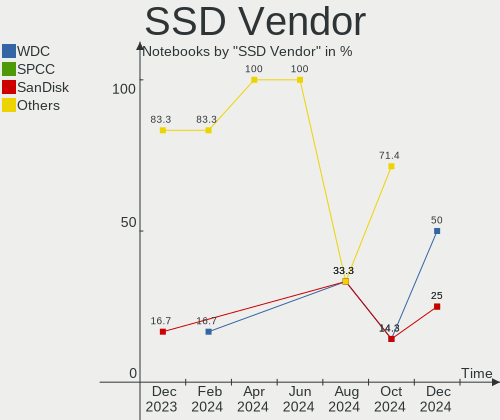
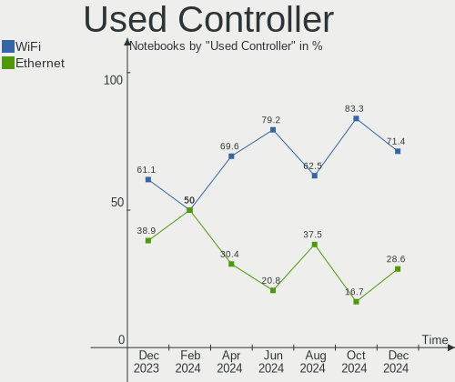

Gentoo - Hardware Trends (Notebooks)
------------------------------------

A project to identify most popular hardware characteristics and track their change
over time based on data collected by Linux users at https://Linux-Hardware.org.

Anyone can contribute to this report by the [hw-probe](https://github.com/linuxhw/hw-probe) tool:

    sudo -E hw-probe -all -upload

This report is for one last month. Overall report since the beginning of time: [TestDays](https://github.com/linuxhw/TestDays)

Period: Mar, 2023.

Contents
--------

* [ System ](#system)
  - [ OS                       ](#os)
  - [ OS Family                ](#os-family)
  - [ Kernel                   ](#kernel)
  - [ Kernel Family            ](#kernel-family)
  - [ Kernel Major Ver.        ](#kernel-major-ver)
  - [ Arch                     ](#arch)
  - [ DE                       ](#de)
  - [ Display Server           ](#display-server)
  - [ Display Manager          ](#display-manager)
  - [ OS Lang                  ](#os-lang)
  - [ Boot Mode                ](#boot-mode)
  - [ Filesystem               ](#filesystem)
  - [ Part. scheme             ](#part-scheme)
  - [ Dual Boot with Linux/BSD ](#dual-boot-with-linuxbsd)
  - [ Dual Boot (Win)          ](#dual-boot-win)

* [ Board ](#board)
  - [ Vendor                   ](#vendor)
  - [ Model                    ](#model)
  - [ Model Family             ](#model-family)
  - [ MFG Year                 ](#mfg-year)
  - [ Form Factor              ](#form-factor)
  - [ Secure Boot              ](#secure-boot)
  - [ Coreboot                 ](#coreboot)
  - [ RAM Size                 ](#ram-size)
  - [ RAM Used                 ](#ram-used)
  - [ Total Drives             ](#total-drives)
  - [ Has CD-ROM               ](#has-cd-rom)
  - [ Has Ethernet             ](#has-ethernet)
  - [ Has WiFi                 ](#has-wifi)
  - [ Has Bluetooth            ](#has-bluetooth)

* [ Location ](#location)
  - [ Country                  ](#country)
  - [ City                     ](#city)

* [ Drives ](#drives)
  - [ Drive Vendor             ](#drive-vendor)
  - [ Drive Model              ](#drive-model)
  - [ HDD Vendor               ](#hdd-vendor)
  - [ SSD Vendor               ](#ssd-vendor)
  - [ Drive Kind               ](#drive-kind)
  - [ Drive Connector          ](#drive-connector)
  - [ Drive Size               ](#drive-size)
  - [ Space Total              ](#space-total)
  - [ Space Used               ](#space-used)
  - [ Malfunc. Drives          ](#malfunc-drives)
  - [ Malfunc. Drive Vendor    ](#malfunc-drive-vendor)
  - [ Malfunc. HDD Vendor      ](#malfunc-hdd-vendor)
  - [ Malfunc. Drive Kind      ](#malfunc-drive-kind)
  - [ Failed Drives            ](#failed-drives)
  - [ Failed Drive Vendor      ](#failed-drive-vendor)
  - [ Drive Status             ](#drive-status)

* [ Storage controller ](#storage-controller)
  - [ Storage Vendor           ](#storage-vendor)
  - [ Storage Model            ](#storage-model)
  - [ Storage Kind             ](#storage-kind)

* [ Processor ](#processor)
  - [ CPU Vendor               ](#cpu-vendor)
  - [ CPU Model                ](#cpu-model)
  - [ CPU Model Family         ](#cpu-model-family)
  - [ CPU Cores                ](#cpu-cores)
  - [ CPU Sockets              ](#cpu-sockets)
  - [ CPU Threads              ](#cpu-threads)
  - [ CPU Op-Modes             ](#cpu-op-modes)
  - [ CPU Microcode            ](#cpu-microcode)
  - [ CPU Microarch            ](#cpu-microarch)

* [ Graphics ](#graphics)
  - [ GPU Vendor               ](#gpu-vendor)
  - [ GPU Model                ](#gpu-model)
  - [ GPU Combo                ](#gpu-combo)
  - [ GPU Driver               ](#gpu-driver)
  - [ GPU Memory               ](#gpu-memory)

* [ Monitor ](#monitor)
  - [ Monitor Vendor           ](#monitor-vendor)
  - [ Monitor Model            ](#monitor-model)
  - [ Monitor Resolution       ](#monitor-resolution)
  - [ Monitor Diagonal         ](#monitor-diagonal)
  - [ Monitor Width            ](#monitor-width)
  - [ Aspect Ratio             ](#aspect-ratio)
  - [ Monitor Area             ](#monitor-area)
  - [ Pixel Density            ](#pixel-density)
  - [ Multiple Monitors        ](#multiple-monitors)

* [ Network ](#network)
  - [ Net Controller Vendor    ](#net-controller-vendor)
  - [ Net Controller Model     ](#net-controller-model)
  - [ Wireless Vendor          ](#wireless-vendor)
  - [ Wireless Model           ](#wireless-model)
  - [ Ethernet Vendor          ](#ethernet-vendor)
  - [ Ethernet Model           ](#ethernet-model)
  - [ Net Controller Kind      ](#net-controller-kind)
  - [ Used Controller          ](#used-controller)
  - [ NICs                     ](#nics)
  - [ IPv6                     ](#ipv6)

* [ Bluetooth ](#bluetooth)
  - [ Bluetooth Vendor         ](#bluetooth-vendor)
  - [ Bluetooth Model          ](#bluetooth-model)

* [ Sound ](#sound)
  - [ Sound Vendor             ](#sound-vendor)
  - [ Sound Model              ](#sound-model)

* [ Memory ](#memory)
  - [ Memory Vendor            ](#memory-vendor)
  - [ Memory Model             ](#memory-model)
  - [ Memory Kind              ](#memory-kind)
  - [ Memory Form Factor       ](#memory-form-factor)
  - [ Memory Size              ](#memory-size)
  - [ Memory Speed             ](#memory-speed)

* [ Printers & scanners ](#printers--scanners)
  - [ Printer Vendor           ](#printer-vendor)
  - [ Printer Model            ](#printer-model)
  - [ Scanner Vendor           ](#scanner-vendor)
  - [ Scanner Model            ](#scanner-model)

* [ Camera ](#camera)
  - [ Camera Vendor            ](#camera-vendor)
  - [ Camera Model             ](#camera-model)

* [ Security ](#security)
  - [ Fingerprint Vendor       ](#fingerprint-vendor)
  - [ Fingerprint Model        ](#fingerprint-model)
  - [ Chipcard Vendor          ](#chipcard-vendor)
  - [ Chipcard Model           ](#chipcard-model)

* [ Unsupported ](#unsupported)
  - [ Unsupported Devices      ](#unsupported-devices)
  - [ Unsupported Device Types ](#unsupported-device-types)

System
------

OS
--

Installed operating systems

| Name        | Notebooks | Percent |
|-------------|-----------|---------|
| Gentoo 2.13 | 20        | 71.43%  |
| Gentoo 2.9  | 8         | 28.57%  |

OS Family
---------

OS without a version

| Name   | Notebooks | Percent |
|--------|-----------|---------|
| Gentoo | 28        | 100%    |

Kernel
------

Version of the Linux kernel

| Version                  | Notebooks | Percent |
|--------------------------|-----------|---------|
| 6.1.12-gentoo-x86_64     | 3         | 10.71%  |
| 6.2.7-gentoo-dist        | 2         | 7.14%   |
| 6.2.2-gentoo             | 2         | 7.14%   |
| 6.1.19-gentoo-x86_64     | 2         | 7.14%   |
| 6.1.19-gentoo-dist       | 2         | 7.14%   |
| 6.1.12-gentoo-dist       | 2         | 7.14%   |
| 6.1.12-gentoo            | 2         | 7.14%   |
| 5.15.88-gentoo           | 2         | 7.14%   |
| 6.2.6-gentoo-dist        | 1         | 3.57%   |
| 6.2.3-gentoo             | 1         | 3.57%   |
| 6.2.2-gentoo-x86_64      | 1         | 3.57%   |
| 6.2.2-dist               | 1         | 3.57%   |
| 6.2.1-gentoo-x86_64      | 1         | 3.57%   |
| 6.2.1-gentoo             | 1         | 3.57%   |
| 6.1.9-gentoo-x86_64      | 1         | 3.57%   |
| 6.1.19-gentoo            | 1         | 3.57%   |
| 6.1.13-pentoo            | 1         | 3.57%   |
| 6.1.11-gentoo-tir_na_nog | 1         | 3.57%   |
| 5.15.80-gentoo-x86_64    | 1         | 3.57%   |

Kernel Family
-------------

Linux kernel without a distro release

| Version | Notebooks | Percent |
|---------|-----------|---------|
| 6.1.12  | 7         | 25%     |
| 6.1.19  | 5         | 17.86%  |
| 6.2.2   | 4         | 14.29%  |
| 6.2.7   | 2         | 7.14%   |
| 6.2.1   | 2         | 7.14%   |
| 5.15.88 | 2         | 7.14%   |
| 6.2.6   | 1         | 3.57%   |
| 6.2.3   | 1         | 3.57%   |
| 6.1.9   | 1         | 3.57%   |
| 6.1.13  | 1         | 3.57%   |
| 6.1.11  | 1         | 3.57%   |
| 5.15.80 | 1         | 3.57%   |

Kernel Major Ver.
-----------------

Linux kernel major version

| Version | Notebooks | Percent |
|---------|-----------|---------|
| 6.1     | 15        | 53.57%  |
| 6.2     | 10        | 35.71%  |
| 5.15    | 3         | 10.71%  |

Arch
----

OS architecture (x86_64, i586, etc.)

| Name   | Notebooks | Percent |
|--------|-----------|---------|
| x86_64 | 27        | 96.43%  |
| i686   | 1         | 3.57%   |

DE
--

Desktop Environment

| Name      | Notebooks | Percent |
|-----------|-----------|---------|
| KDE5      | 8         | 28.57%  |
| Unknown   | 6         | 21.43%  |
| XFCE      | 3         | 10.71%  |
| LXQt      | 2         | 7.14%   |
| GNOME     | 2         | 7.14%   |
| DWM       | 2         | 7.14%   |
| Trinity   | 1         | 3.57%   |
| ratpoison | 1         | 3.57%   |
| MATE      | 1         | 3.57%   |
| i3        | 1         | 3.57%   |
| Hyprland  | 1         | 3.57%   |

Display Server
--------------

X11 or Wayland

| Name    | Notebooks | Percent |
|---------|-----------|---------|
| X11     | 15        | 53.57%  |
| Wayland | 7         | 25%     |
| Tty     | 5         | 17.86%  |
| Unknown | 1         | 3.57%   |

Display Manager
---------------

SDDM, LightDM, etc.

| Name    | Notebooks | Percent |
|---------|-----------|---------|
| Unknown | 12        | 42.86%  |
| SDDM    | 9         | 32.14%  |
| LightDM | 3         | 10.71%  |
| GDM     | 2         | 7.14%   |
| TDM     | 1         | 3.57%   |
| SLiM    | 1         | 3.57%   |

OS Lang
-------

Language

| Lang    | Notebooks | Percent |
|---------|-----------|---------|
| en_US   | 12        | 42.86%  |
| fr_FR   | 2         | 7.14%   |
| en_GB   | 2         | 7.14%   |
| cs_CZ   | 2         | 7.14%   |
| C.UTF8  | 2         | 7.14%   |
| Unknown | 2         | 7.14%   |
| ru_RU   | 1         | 3.57%   |
| mi_NZ   | 1         | 3.57%   |
| it_IT   | 1         | 3.57%   |
| en_AU   | 1         | 3.57%   |
| de_DE   | 1         | 3.57%   |
| C       | 1         | 3.57%   |

Boot Mode
---------

EFI or BIOS

| Mode | Notebooks | Percent |
|------|-----------|---------|
| EFI  | 21        | 75%     |
| BIOS | 7         | 25%     |

Filesystem
----------

Type of filesystem

| Type    | Notebooks | Percent |
|---------|-----------|---------|
| Btrfs   | 15        | 53.57%  |
| Ext4    | 12        | 42.86%  |
| XXXXXXX | 1         | 3.57%   |

Part. scheme
------------

Scheme of partitioning

| Type    | Notebooks | Percent |
|---------|-----------|---------|
| GPT     | 21        | 75%     |
| MBR     | 6         | 21.43%  |
| Unknown | 1         | 3.57%   |

Dual Boot with Linux/BSD
------------------------

Hosting more than one Linux/BSD

| Dual boot | Notebooks | Percent |
|-----------|-----------|---------|
| No        | 18        | 64.29%  |
| Yes       | 10        | 35.71%  |

Dual Boot (Win)
---------------

Hosting Linux and Windows

| Dual boot | Notebooks | Percent |
|-----------|-----------|---------|
| No        | 16        | 57.14%  |
| Yes       | 12        | 42.86%  |

Board
-----

Vendor
------

Motherboard manufacturer

| Name             | Notebooks | Percent |
|------------------|-----------|---------|
| Lenovo           | 7         | 25%     |
| Hewlett-Packard  | 5         | 17.86%  |
| Dell             | 5         | 17.86%  |
| MSI              | 3         | 10.71%  |
| ASUSTek Computer | 2         | 7.14%   |
| Acer             | 2         | 7.14%   |
| Star Labs        | 1         | 3.57%   |
| IBM              | 1         | 3.57%   |
| Apple            | 1         | 3.57%   |
| Unknown          | 1         | 3.57%   |

Model
-----

Motherboard model

| Name                                        | Notebooks | Percent |
|---------------------------------------------|-----------|---------|
| MSI GS65 Stealth Thin 8RF                   | 2         | 7.14%   |
| Star Labs StarBook                          | 1         | 3.57%   |
| MSI GS66 Stealth 10UE                       | 1         | 3.57%   |
| Lenovo ThinkPad X200 7459L61                | 1         | 3.57%   |
| Lenovo ThinkPad X1 Extreme Gen 3 20TK001JUS | 1         | 3.57%   |
| Lenovo ThinkPad X1 Extreme 2nd 20QVCTO1WW   | 1         | 3.57%   |
| Lenovo ThinkPad T14 Gen 1 20S1SFAD00        | 1         | 3.57%   |
| Lenovo ThinkPad P51 20HHCTO1WW              | 1         | 3.57%   |
| Lenovo ThinkPad Edge E330 3354AMG           | 1         | 3.57%   |
| Lenovo Legion 5 Pro 16IAH7H 82RF            | 1         | 3.57%   |
| IBM ThinkPad T41 23737JU                    | 1         | 3.57%   |
| HP ZBook 17 G3                              | 1         | 3.57%   |
| HP Victus by Gaming Laptop 15-fb0xxx        | 1         | 3.57%   |
| HP Pavilion Laptop 15-cs0xxx                | 1         | 3.57%   |
| HP EliteBook 8570p                          | 1         | 3.57%   |
| HP EliteBook 745 G6                         | 1         | 3.57%   |
| Dell XPS 15 9570                            | 1         | 3.57%   |
| Dell XPS 13 9305                            | 1         | 3.57%   |
| Dell Precision 7770                         | 1         | 3.57%   |
| Dell Latitude E6540                         | 1         | 3.57%   |
| Dell Latitude 7480                          | 1         | 3.57%   |
| ASUS VivoBook_ASUSLaptop X571GT_X571GT      | 1         | 3.57%   |
| ASUS 1016P                                  | 1         | 3.57%   |
| Apple MacBookPro9,1                         | 1         | 3.57%   |
| Acer Aspire A517-52G                        | 1         | 3.57%   |
| Acer Aspire 7750G                           | 1         | 3.57%   |
| Unknown                                     | 1         | 3.57%   |

Model Family
------------

Motherboard model prefix

| Name               | Notebooks | Percent |
|--------------------|-----------|---------|
| Lenovo ThinkPad    | 6         | 21.43%  |
| MSI GS65           | 2         | 7.14%   |
| HP EliteBook       | 2         | 7.14%   |
| Dell XPS           | 2         | 7.14%   |
| Dell Latitude      | 2         | 7.14%   |
| Acer Aspire        | 2         | 7.14%   |
| Star Labs StarBook | 1         | 3.57%   |
| MSI GS66           | 1         | 3.57%   |
| Lenovo Legion      | 1         | 3.57%   |
| IBM ThinkPad       | 1         | 3.57%   |
| HP ZBook           | 1         | 3.57%   |
| HP Victus          | 1         | 3.57%   |
| HP Pavilion        | 1         | 3.57%   |
| Dell Precision     | 1         | 3.57%   |
| ASUS VivoBook      | 1         | 3.57%   |
| ASUS 1016P         | 1         | 3.57%   |
| Apple MacBookPro9  | 1         | 3.57%   |
| Unknown            | 1         | 3.57%   |

MFG Year
--------

Motherboard manufacture year

| Year | Notebooks | Percent |
|------|-----------|---------|
| 2019 | 4         | 14.29%  |
| 2018 | 4         | 14.29%  |
| 2022 | 3         | 10.71%  |
| 2020 | 3         | 10.71%  |
| 2012 | 3         | 10.71%  |
| 2021 | 2         | 7.14%   |
| 2017 | 2         | 7.14%   |
| 2023 | 1         | 3.57%   |
| 2016 | 1         | 3.57%   |
| 2013 | 1         | 3.57%   |
| 2011 | 1         | 3.57%   |
| 2010 | 1         | 3.57%   |
| 2008 | 1         | 3.57%   |
| 2004 | 1         | 3.57%   |

Form Factor
-----------

Physical design of the computer

| Name     | Notebooks | Percent |
|----------|-----------|---------|
| Notebook | 28        | 100%    |

Secure Boot
-----------

Enabled or disabled

| State    | Notebooks | Percent |
|----------|-----------|---------|
| Disabled | 28        | 100%    |

Coreboot
--------

Have coreboot on board

| Used | Notebooks | Percent |
|------|-----------|---------|
| No   | 27        | 96.43%  |
| Yes  | 1         | 3.57%   |

RAM Size
--------

Total RAM memory

| Size in GB  | Notebooks | Percent |
|-------------|-----------|---------|
| 32.01-64.0  | 8         | 28.57%  |
| 16.01-24.0  | 8         | 28.57%  |
| 4.01-8.0    | 3         | 10.71%  |
| 8.01-16.0   | 3         | 10.71%  |
| 3.01-4.0    | 2         | 7.14%   |
| 24.01-32.0  | 1         | 3.57%   |
| 2.01-3.0    | 1         | 3.57%   |
| 64.01-256.0 | 1         | 3.57%   |
| 1.01-2.0    | 1         | 3.57%   |

RAM Used
--------

Used RAM memory

| Used GB   | Notebooks | Percent |
|-----------|-----------|---------|
| 1.01-2.0  | 9         | 32.14%  |
| 3.01-4.0  | 4         | 14.29%  |
| 2.01-3.0  | 4         | 14.29%  |
| 0.01-0.5  | 4         | 14.29%  |
| 4.01-8.0  | 3         | 10.71%  |
| 0.51-1.0  | 3         | 10.71%  |
| 8.01-16.0 | 1         | 3.57%   |

Total Drives
------------

Number of drives on board

| Drives | Notebooks | Percent |
|--------|-----------|---------|
| 1      | 19        | 67.86%  |
| 2      | 9         | 32.14%  |

Has CD-ROM
----------

Has CD-ROM on board

| Presented | Notebooks | Percent |
|-----------|-----------|---------|
| No        | 24        | 85.71%  |
| Yes       | 4         | 14.29%  |

Has Ethernet
------------

Has Ethernet on board

| Presented | Notebooks | Percent |
|-----------|-----------|---------|
| Yes       | 24        | 85.71%  |
| No        | 4         | 14.29%  |

Has WiFi
--------

Has WiFi module

| Presented | Notebooks | Percent |
|-----------|-----------|---------|
| Yes       | 28        | 100%    |

Has Bluetooth
-------------

Has Bluetooth module

| Presented | Notebooks | Percent |
|-----------|-----------|---------|
| Yes       | 24        | 85.71%  |
| No        | 4         | 14.29%  |

Location
--------

Country
-------

Geographic location (country)

| Country     | Notebooks | Percent |
|-------------|-----------|---------|
| USA         | 9         | 32.14%  |
| New Zealand | 2         | 7.14%   |
| Lithuania   | 2         | 7.14%   |
| France      | 2         | 7.14%   |
| Czechia     | 2         | 7.14%   |
| Canada      | 2         | 7.14%   |
| UK          | 1         | 3.57%   |
| Spain       | 1         | 3.57%   |
| Russia      | 1         | 3.57%   |
| Italy       | 1         | 3.57%   |
| Hungary     | 1         | 3.57%   |
| Germany     | 1         | 3.57%   |
| Brazil      | 1         | 3.57%   |
| Australia   | 1         | 3.57%   |
| Algeria     | 1         | 3.57%   |

City
----

Geographic location (city)

| City                  | Notebooks | Percent |
|-----------------------|-----------|---------|
| Vilnius               | 2         | 7.14%   |
| Vancouver             | 2         | 7.14%   |
| Ponetovice            | 2         | 7.14%   |
| Hamilton              | 2         | 7.14%   |
| Wesseling             | 1         | 3.57%   |
| Urbana                | 1         | 3.57%   |
| Taganrog              | 1         | 3.57%   |
| Sun Prairie           | 1         | 3.57%   |
| Royal Tunbridge Wells | 1         | 3.57%   |
| Reims                 | 1         | 3.57%   |
| Quakertown            | 1         | 3.57%   |
| Perth                 | 1         | 3.57%   |
| Paris                 | 1         | 3.57%   |
| Oviedo                | 1         | 3.57%   |
| Milan                 | 1         | 3.57%   |
| Miami                 | 1         | 3.57%   |
| Majadahonda           | 1         | 3.57%   |
| Kobrasol              | 1         | 3.57%   |
| Concord               | 1         | 3.57%   |
| Chicago               | 1         | 3.57%   |
| Budapest              | 1         | 3.57%   |
| Boise                 | 1         | 3.57%   |
| Beaverton             | 1         | 3.57%   |
| Algiers               | 1         | 3.57%   |

Drives
------

Drive Vendor
------------

Hard drive vendors

| Vendor                      | Notebooks | Drives | Percent |
|-----------------------------|-----------|--------|---------|
| Samsung Electronics         | 8         | 10     | 24.24%  |
| Seagate                     | 4         | 4      | 12.12%  |
| Sandisk                     | 4         | 4      | 12.12%  |
| WDC                         | 2         | 2      | 6.06%   |
| SK hynix                    | 2         | 2      | 6.06%   |
| Intenso                     | 2         | 2      | 6.06%   |
| HGST                        | 2         | 2      | 6.06%   |
| Unknown                     | 1         | 1      | 3.03%   |
| Toshiba                     | 1         | 1      | 3.03%   |
| OCZ                         | 1         | 1      | 3.03%   |
| Micron/Crucial Technology   | 1         | 1      | 3.03%   |
| Kingston Technology Company | 1         | 1      | 3.03%   |
| Intel                       | 1         | 1      | 3.03%   |
| China                       | 1         | 2      | 3.03%   |
| Apple                       | 1         | 1      | 3.03%   |
| A-DATA Technology           | 1         | 1      | 3.03%   |

Drive Model
-----------

Hard drive models

| Model                                               | Notebooks | Percent |
|-----------------------------------------------------|-----------|---------|
| Samsung NVMe SSD Controller SM981/PM981/PM983 250GB | 6         | 17.14%  |
| Samsung NVMe SSD Controller PM9A1/PM9A3/980PRO 1TB  | 3         | 8.57%   |
| Sandisk WD Black SN750 / PC SN730 NVMe SSD 1TB      | 2         | 5.71%   |
| HGST HTS725050A7E630 500GB                          | 2         | 5.71%   |
| WDC WDS500G1B0B-00AS40 500GB SSD                    | 1         | 2.86%   |
| WDC WD20 SPZX-22CRAT0 2TB                           | 1         | 2.86%   |
| Unknown NVMe SSD Drive 1TB                          | 1         | 2.86%   |
| Toshiba XG6 NVMe SSD Controller 512GB               | 1         | 2.86%   |
| SK hynix SC311 SATA 128GB SSD                       | 1         | 2.86%   |
| SK hynix BC501 NVMe Solid State Drive 512GB         | 1         | 2.86%   |
| Seagate ST9250315AS 250GB                           | 1         | 2.86%   |
| Seagate ST500LT012-1DG142 500GB                     | 1         | 2.86%   |
| Seagate ST2000LM015-2E8174 2TB                      | 1         | 2.86%   |
| Seagate ST1000LM035-1RK172 1TB                      | 1         | 2.86%   |
| Sandisk WD_BLACK SN850X 2000GB                      | 1         | 2.86%   |
| Sandisk WD_BLACK SN850X 1000GB                      | 1         | 2.86%   |
| Samsung SSD 980 1TB                                 | 1         | 2.86%   |
| OCZ VERTEX4 256GB SSD                               | 1         | 2.86%   |
| Micron/Crucial P1 NVMe PCIe SSD 1TB                 | 1         | 2.86%   |
| Kingston Company SNV2S2000G 2TB                     | 1         | 2.86%   |
| Intenso SSD Sata III 240GB                          | 1         | 2.86%   |
| Intenso JAJMS600M128G 128GB SSD                     | 1         | 2.86%   |
| Intel SSDPEKNU512GZ 512GB                           | 1         | 2.86%   |
| China SSD 1TB                                       | 1         | 2.86%   |
| Apple HDD HTS727575A9E362 752GB                     | 1         | 2.86%   |
| A-DATA SSD SP900 256GB-DL2                          | 1         | 2.86%   |

HDD Vendor
----------

Hard disk drive vendors

| Vendor  | Notebooks | Drives | Percent |
|---------|-----------|--------|---------|
| Seagate | 4         | 4      | 50%     |
| HGST    | 2         | 2      | 25%     |
| WDC     | 1         | 1      | 12.5%   |
| Apple   | 1         | 1      | 12.5%   |

SSD Vendor
----------

Solid state drive vendors

| Vendor            | Notebooks | Drives | Percent |
|-------------------|-----------|--------|---------|
| Intenso           | 2         | 2      | 28.57%  |
| WDC               | 1         | 1      | 14.29%  |
| SK hynix          | 1         | 1      | 14.29%  |
| OCZ               | 1         | 1      | 14.29%  |
| China             | 1         | 2      | 14.29%  |
| A-DATA Technology | 1         | 1      | 14.29%  |

Drive Kind
----------

HDD or SSD

| Kind | Notebooks | Drives | Percent |
|------|-----------|--------|---------|
| NVMe | 17        | 20     | 53.13%  |
| HDD  | 8         | 8      | 25%     |
| SSD  | 7         | 8      | 21.88%  |

Drive Connector
---------------

SATA, SAS, NVMe, etc.

| Type | Notebooks | Drives | Percent |
|------|-----------|--------|---------|
| NVMe | 17        | 20     | 54.84%  |
| SATA | 13        | 15     | 41.94%  |
| SAS  | 1         | 1      | 3.23%   |

Drive Size
----------

Size of hard drive

| Size in TB | Notebooks | Drives | Percent |
|------------|-----------|--------|---------|
| 0.01-0.5   | 10        | 10     | 66.67%  |
| 0.51-1.0   | 3         | 4      | 20%     |
| 1.01-2.0   | 2         | 2      | 13.33%  |

Space Total
-----------

Amount of disk space available on the file system

| Size in GB     | Notebooks | Percent |
|----------------|-----------|---------|
| 101-250        | 8         | 28.57%  |
| 1001-2000      | 6         | 21.43%  |
| 501-1000       | 5         | 17.86%  |
| 251-500        | 4         | 14.29%  |
| 51-100         | 2         | 7.14%   |
| More than 3000 | 1         | 3.57%   |
| 2001-3000      | 1         | 3.57%   |
| Unknown        | 1         | 3.57%   |

Space Used
----------

Amount of used disk space

| Used GB  | Notebooks | Percent |
|----------|-----------|---------|
| 21-50    | 7         | 25%     |
| 101-250  | 6         | 21.43%  |
| 1-20     | 5         | 17.86%  |
| 501-1000 | 5         | 17.86%  |
| 251-500  | 2         | 7.14%   |
| 51-100   | 2         | 7.14%   |
| Unknown  | 1         | 3.57%   |

Malfunc. Drives
---------------

Drive models with a malfunction

| Model                                       | Notebooks | Drives | Percent |
|---------------------------------------------|-----------|--------|---------|
| HGST HTS725050A7E630 500GB                  | 2         | 2      | 50%     |
| SK hynix BC501 NVMe Solid State Drive 512GB | 1         | 1      | 25%     |
| OCZ VERTEX4 256GB SSD                       | 1         | 1      | 25%     |

Malfunc. Drive Vendor
---------------------

Vendors of faulty drives

| Vendor   | Notebooks | Drives | Percent |
|----------|-----------|--------|---------|
| HGST     | 2         | 2      | 50%     |
| SK hynix | 1         | 1      | 25%     |
| OCZ      | 1         | 1      | 25%     |

Malfunc. HDD Vendor
-------------------

Vendors of faulty HDD drives

| Vendor | Notebooks | Drives | Percent |
|--------|-----------|--------|---------|
| HGST   | 2         | 2      | 100%    |

Malfunc. Drive Kind
-------------------

Kinds of faulty drives

| Kind | Notebooks | Drives | Percent |
|------|-----------|--------|---------|
| HDD  | 2         | 2      | 50%     |
| NVMe | 1         | 1      | 25%     |
| SSD  | 1         | 1      | 25%     |

Failed Drives
-------------

Failed drive models

Zero info for selected period =(

Failed Drive Vendor
-------------------

Failed drive vendors

Zero info for selected period =(

Drive Status
------------

Number of failed and malfunc. drives

| Status   | Notebooks | Drives | Percent |
|----------|-----------|--------|---------|
| Works    | 22        | 28     | 75.86%  |
| Malfunc  | 4         | 4      | 13.79%  |
| Detected | 3         | 4      | 10.34%  |

Storage controller
------------------

Storage Vendor
--------------

Storage controller vendors

| Vendor                       | Notebooks | Percent |
|------------------------------|-----------|---------|
| Intel                        | 16        | 47.06%  |
| Samsung Electronics          | 8         | 23.53%  |
| SanDisk                      | 4         | 11.76%  |
| Toshiba America Info Systems | 1         | 2.94%   |
| SK hynix                     | 1         | 2.94%   |
| Micron/Crucial Technology    | 1         | 2.94%   |
| Kingston Technology Company  | 1         | 2.94%   |
| INNOGRIT                     | 1         | 2.94%   |
| AMD                          | 1         | 2.94%   |

Storage Model
-------------

Storage controller models

| Model                                                                         | Notebooks | Percent |
|-------------------------------------------------------------------------------|-----------|---------|
| Samsung NVMe SSD Controller SM981/PM981/PM983                                 | 6         | 15.79%  |
| Intel 7 Series Chipset Family 6-port SATA Controller [AHCI mode]              | 4         | 10.53%  |
| Samsung NVMe SSD Controller PM9A1/PM9A3/980PRO                                | 3         | 7.89%   |
| Sandisk Western Digital WD Black SN850X NVMe SSD                              | 2         | 5.26%   |
| SanDisk WD Black SN750 / PC SN730 NVMe SSD                                    | 2         | 5.26%   |
| Intel Volume Management Device NVMe RAID Controller                           | 2         | 5.26%   |
| Intel Sunrise Point-LP SATA Controller [AHCI mode]                            | 2         | 5.26%   |
| Intel 82801 Mobile SATA Controller [RAID mode]                                | 2         | 5.26%   |
| Toshiba America Info Systems XG6 NVMe SSD Controller                          | 1         | 2.63%   |
| SK hynix BC501 NVMe Solid State Drive                                         | 1         | 2.63%   |
| Samsung NVMe SSD Controller 980                                               | 1         | 2.63%   |
| Micron/Crucial P1 NVMe PCIe SSD                                               | 1         | 2.63%   |
| Kingston Company Company Non-Volatile memory controller                       | 1         | 2.63%   |
| Intel Tiger Lake-LP SATA Controller                                           | 1         | 2.63%   |
| Intel Q170/Q150/B150/H170/H110/Z170/CM236 Chipset SATA Controller [AHCI Mode] | 1         | 2.63%   |
| Intel Non-Volatile memory controller                                          | 1         | 2.63%   |
| Intel NM10/ICH7 Family SATA Controller [AHCI mode]                            | 1         | 2.63%   |
| Intel Cannon Lake Mobile PCH SATA AHCI Controller                             | 1         | 2.63%   |
| Intel 82801IBM/IEM (ICH9M/ICH9M-E) 4 port SATA Controller [AHCI mode]         | 1         | 2.63%   |
| Intel 82801DBM (ICH4-M) IDE Controller                                        | 1         | 2.63%   |
| Intel 6 Series/C200 Series Chipset Family 6 port Mobile SATA AHCI Controller  | 1         | 2.63%   |
| INNOGRIT Non-Volatile memory controller                                       | 1         | 2.63%   |
| AMD FCH SATA Controller [AHCI mode]                                           | 1         | 2.63%   |

Storage Kind
------------

Kind of storage controller (IDE, SATA, NVMe, SAS, ...)

| Kind | Notebooks | Percent |
|------|-----------|---------|
| NVMe | 17        | 48.57%  |
| SATA | 13        | 37.14%  |
| RAID | 4         | 11.43%  |
| IDE  | 1         | 2.86%   |

Processor
---------

CPU Vendor
----------

Processor vendors

| Vendor | Notebooks | Percent |
|--------|-----------|---------|
| Intel  | 26        | 92.86%  |
| AMD    | 2         | 7.14%   |

CPU Model
---------

Processor models

| Model                                           | Notebooks | Percent |
|-------------------------------------------------|-----------|---------|
| Intel Core i7-8750H CPU @ 2.20GHz               | 3         | 10.71%  |
| Intel Core i7-2670QM CPU @ 2.20GHz              | 2         | 7.14%   |
| Intel 11th Gen Core i7-1165G7 @ 2.80GHz         | 2         | 7.14%   |
| Intel Xeon CPU E3-1505M v6 @ 3.00GHz            | 1         | 3.57%   |
| Intel Pentium M processor 1600MHz               | 1         | 3.57%   |
| Intel Pentium CPU B980 @ 2.40GHz                | 1         | 3.57%   |
| Intel Core i9-10885H CPU @ 2.40GHz              | 1         | 3.57%   |
| Intel Core i7-9750H CPU @ 2.60GHz               | 1         | 3.57%   |
| Intel Core i7-8550U CPU @ 1.80GHz               | 1         | 3.57%   |
| Intel Core i7-6820HQ CPU @ 2.70GHz              | 1         | 3.57%   |
| Intel Core i7-4800MQ CPU @ 2.70GHz              | 1         | 3.57%   |
| Intel Core i7-3820QM CPU @ 2.70GHz              | 1         | 3.57%   |
| Intel Core i7-10750H CPU @ 2.60GHz              | 1         | 3.57%   |
| Intel Core i7-10610U CPU @ 1.80GHz              | 1         | 3.57%   |
| Intel Core i5-9300H CPU @ 2.40GHz               | 1         | 3.57%   |
| Intel Core i5-7300U CPU @ 2.60GHz               | 1         | 3.57%   |
| Intel Core i5-3360M CPU @ 2.80GHz               | 1         | 3.57%   |
| Intel Core 2 Duo CPU P8400 @ 2.26GHz            | 1         | 3.57%   |
| Intel Atom CPU N455 @ 1.66GHz                   | 1         | 3.57%   |
| Intel 12th Gen Core i7-12850HX                  | 1         | 3.57%   |
| Intel 12th Gen Core i7-12700H                   | 1         | 3.57%   |
| Intel 12th Gen Core i7-1260P                    | 1         | 3.57%   |
| AMD Ryzen 7 PRO 3700U w/ Radeon Vega Mobile Gfx | 1         | 3.57%   |
| AMD Ryzen 7 5800H with Radeon Graphics          | 1         | 3.57%   |

CPU Model Family
----------------

Processor model prefix

| Model            | Notebooks | Percent |
|------------------|-----------|---------|
| Intel Core i7    | 12        | 42.86%  |
| Other            | 5         | 17.86%  |
| Intel Core i5    | 3         | 10.71%  |
| Intel Xeon       | 1         | 3.57%   |
| Intel Pentium M  | 1         | 3.57%   |
| Intel Pentium    | 1         | 3.57%   |
| Intel Core i9    | 1         | 3.57%   |
| Intel Core 2 Duo | 1         | 3.57%   |
| Intel Atom       | 1         | 3.57%   |
| AMD Ryzen 7 PRO  | 1         | 3.57%   |
| AMD Ryzen 7      | 1         | 3.57%   |

CPU Cores
---------

Number of processor cores

| Number | Notebooks | Percent |
|--------|-----------|---------|
| 4      | 12        | 42.86%  |
| 6      | 5         | 17.86%  |
| 2      | 4         | 14.29%  |
| 8      | 2         | 7.14%   |
| 1      | 2         | 7.14%   |
| 16     | 1         | 3.57%   |
| 14     | 1         | 3.57%   |
| 12     | 1         | 3.57%   |

CPU Sockets
-----------

Number of sockets

| Number | Notebooks | Percent |
|--------|-----------|---------|
| 1      | 28        | 100%    |

CPU Threads
-----------

Threads per core (Hyper-Threading)

| Number | Notebooks | Percent |
|--------|-----------|---------|
| 2      | 25        | 89.29%  |
| 1      | 3         | 10.71%  |

CPU Op-Modes
------------

CPU Operation Modes (32-bit, 64-bit)

| Op mode        | Notebooks | Percent |
|----------------|-----------|---------|
| 32-bit, 64-bit | 27        | 96.43%  |
| 32-bit         | 1         | 3.57%   |

CPU Microcode
-------------

Microcode number

| Number     | Notebooks | Percent |
|------------|-----------|---------|
| Unknown    | 10        | 35.71%  |
| 0x906ea    | 4         | 14.29%  |
| 0x806c1    | 2         | 7.14%   |
| 0x306a9    | 2         | 7.14%   |
| 0x206a7    | 2         | 7.14%   |
| 0xa0652    | 1         | 3.57%   |
| 0x906e9    | 1         | 3.57%   |
| 0x806ea    | 1         | 3.57%   |
| 0x806e9    | 1         | 3.57%   |
| 0x695      | 1         | 3.57%   |
| 0x506e3    | 1         | 3.57%   |
| 0x0a50000d | 1         | 3.57%   |
| 0x08108109 | 1         | 3.57%   |

CPU Microarch
-------------

Microarchitecture

| Name             | Notebooks | Percent |
|------------------|-----------|---------|
| KabyLake         | 9         | 32.14%  |
| SandyBridge      | 3         | 10.71%  |
| Alderlake Hybrid | 3         | 10.71%  |
| TigerLake        | 2         | 7.14%   |
| IvyBridge        | 2         | 7.14%   |
| CometLake        | 2         | 7.14%   |
| Zen+             | 1         | 3.57%   |
| Zen 3            | 1         | 3.57%   |
| Skylake          | 1         | 3.57%   |
| Penryn           | 1         | 3.57%   |
| P6               | 1         | 3.57%   |
| Haswell          | 1         | 3.57%   |
| Bonnell          | 1         | 3.57%   |

Graphics
--------

GPU Vendor
----------

Vendors of graphics cards

| Vendor | Notebooks | Percent |
|--------|-----------|---------|
| Intel  | 21        | 51.22%  |
| Nvidia | 14        | 34.15%  |
| AMD    | 6         | 14.63%  |

GPU Model
---------

Graphics card models

| Model                                                                     | Notebooks | Percent |
|---------------------------------------------------------------------------|-----------|---------|
| Intel CoffeeLake-H GT2 [UHD Graphics 630]                                 | 4         | 9.52%   |
| Intel 2nd Generation Core Processor Family Integrated Graphics Controller | 3         | 7.14%   |
| Nvidia TU117M [GeForce GTX 1650 Mobile / Max-Q]                           | 2         | 4.76%   |
| Nvidia GP104M [GeForce GTX 1070 Mobile]                                   | 2         | 4.76%   |
| Intel TigerLake-LP GT2 [Iris Xe Graphics]                                 | 2         | 4.76%   |
| Intel Alder Lake-P Integrated Graphics Controller                         | 2         | 4.76%   |
| Nvidia TU117M [GeForce MX450]                                             | 1         | 2.38%   |
| Nvidia TU117M [GeForce GTX 1650 Ti Mobile]                                | 1         | 2.38%   |
| Nvidia GP108M [GeForce MX330]                                             | 1         | 2.38%   |
| Nvidia GP108M [GeForce MX150]                                             | 1         | 2.38%   |
| Nvidia GP107M [GeForce GTX 1050 Ti Mobile]                                | 1         | 2.38%   |
| Nvidia GM206GLM [Quadro M2200 Mobile]                                     | 1         | 2.38%   |
| Nvidia GM204GLM [Quadro M3000M]                                           | 1         | 2.38%   |
| Nvidia GA106M [GeForce RTX 3060 Mobile / Max-Q]                           | 1         | 2.38%   |
| Nvidia GA104M [Geforce RTX 3070 Ti Laptop GPU]                            | 1         | 2.38%   |
| Nvidia GA104GLM [RTX A3000 12GB Laptop GPU]                               | 1         | 2.38%   |
| Intel UHD Graphics 620                                                    | 1         | 2.38%   |
| Intel Mobile 4 Series Chipset Integrated Graphics Controller              | 1         | 2.38%   |
| Intel HD Graphics P630                                                    | 1         | 2.38%   |
| Intel HD Graphics 620                                                     | 1         | 2.38%   |
| Intel HD Graphics 530                                                     | 1         | 2.38%   |
| Intel CometLake-U GT2 [UHD Graphics]                                      | 1         | 2.38%   |
| Intel CometLake-H GT2 [UHD Graphics]                                      | 1         | 2.38%   |
| Intel Atom Processor D4xx/D5xx/N4xx/N5xx Integrated Graphics Controller   | 1         | 2.38%   |
| Intel 4th Gen Core Processor Integrated Graphics Controller               | 1         | 2.38%   |
| Intel 3rd Gen Core processor Graphics Controller                          | 1         | 2.38%   |
| AMD Thames [Radeon HD 7550M/7570M/7650M]                                  | 1         | 2.38%   |
| AMD Thames [Radeon HD 7500M/7600M Series]                                 | 1         | 2.38%   |
| AMD RV200/M7 [Mobility Radeon 7500]                                       | 1         | 2.38%   |
| AMD Picasso/Raven 2 [Radeon Vega Series / Radeon Vega Mobile Series]      | 1         | 2.38%   |
| AMD Navi 24 [Radeon RX 6400/6500 XT/6500M]                                | 1         | 2.38%   |
| AMD Mars XTX [Radeon HD 8790M]                                            | 1         | 2.38%   |
| AMD Cezanne [Radeon Vega Series / Radeon Vega Mobile Series]              | 1         | 2.38%   |

GPU Combo
---------

Combinations of graphics cards

| Name           | Notebooks | Percent |
|----------------|-----------|---------|
| Intel + Nvidia | 11        | 39.29%  |
| 1 x Intel      | 6         | 21.43%  |
| 1 x Nvidia     | 3         | 10.71%  |
| 1 x AMD        | 3         | 10.71%  |
| 2 x Intel      | 2         | 7.14%   |
| Intel + AMD    | 2         | 7.14%   |
| 2 x AMD        | 1         | 3.57%   |

GPU Driver
----------

Free vs proprietary

| Driver      | Notebooks | Percent |
|-------------|-----------|---------|
| Free        | 21        | 75%     |
| Proprietary | 7         | 25%     |

GPU Memory
----------

Total video memory

| Size in GB | Notebooks | Percent |
|------------|-----------|---------|
| Unknown    | 13        | 46.43%  |
| 3.01-4.0   | 6         | 21.43%  |
| 1.01-2.0   | 3         | 10.71%  |
| 7.01-8.0   | 2         | 7.14%   |
| 5.01-6.0   | 1         | 3.57%   |
| 8.01-16.0  | 1         | 3.57%   |
| 0.51-1.0   | 1         | 3.57%   |
| 0.01-0.5   | 1         | 3.57%   |

Monitor
-------

Monitor Vendor
--------------

Monitor vendors

| Vendor                  | Notebooks | Percent |
|-------------------------|-----------|---------|
| AU Optronics            | 7         | 22.58%  |
| Chimei Innolux          | 4         | 12.9%   |
| BOE                     | 4         | 12.9%   |
| Sharp                   | 3         | 9.68%   |
| Samsung Electronics     | 2         | 6.45%   |
| LG Display              | 2         | 6.45%   |
| PANDA                   | 1         | 3.23%   |
| Lenovo                  | 1         | 3.23%   |
| InfoVision              | 1         | 3.23%   |
| HannStar                | 1         | 3.23%   |
| Goldstar                | 1         | 3.23%   |
| ELSA                    | 1         | 3.23%   |
| Chi Mei Optoelectronics | 1         | 3.23%   |
| Apple                   | 1         | 3.23%   |
| Unknown                 | 1         | 3.23%   |

Monitor Model
-------------

Monitor models

| Model                                                                    | Notebooks | Percent |
|--------------------------------------------------------------------------|-----------|---------|
| AU Optronics LCD Monitor AUO80ED 1920x1080 344x193mm 15.5-inch           | 2         | 6.45%   |
| Sharp LQ156M1JW03 SHP14C5 1920x1080 344x194mm 15.5-inch                  | 1         | 3.23%   |
| Sharp LCD Monitor SHP14AE 1920x1080 294x165mm 13.3-inch                  | 1         | 3.23%   |
| Sharp LCD Monitor SHP148D 3840x2160 344x194mm 15.5-inch                  | 1         | 3.23%   |
| Samsung Electronics S27B350 SAM08DC 1920x1080 598x336mm 27.0-inch        | 1         | 3.23%   |
| Samsung Electronics Odyssey G40B SAM727A 1920x1080 597x336mm 27.0-inch   | 1         | 3.23%   |
| PANDA LCD Monitor NCP004D 1920x1080 344x194mm 15.5-inch                  | 1         | 3.23%   |
| LG Display LCD Monitor LGD0609 1920x1080 309x174mm 14.0-inch             | 1         | 3.23%   |
| LG Display LCD Monitor LGD0354 1366x768 293x165mm 13.2-inch              | 1         | 3.23%   |
| Lenovo LCD Monitor LEN4010 1280x800 261x163mm 12.1-inch                  | 1         | 3.23%   |
| InfoVision LCD Monitor IVO8C69 1920x1080 309x174mm 14.0-inch             | 1         | 3.23%   |
| HannStar LCD Monitor HSD03E9 1024x600 220x129mm 10.0-inch                | 1         | 3.23%   |
| Goldstar L227W GSM566E 1680x1050 474x296mm 22.0-inch                     | 1         | 3.23%   |
| ELSA EL271Q ELS0270 1920x1080 597x336mm 27.0-inch                        | 1         | 3.23%   |
| Chimei Innolux LCD Monitor CMN15BA 1920x1080 344x194mm 15.5-inch         | 1         | 3.23%   |
| Chimei Innolux LCD Monitor CMN150C 1920x1080 344x193mm 15.5-inch         | 1         | 3.23%   |
| Chimei Innolux LCD Monitor CMN14F2 1920x1080 309x173mm 13.9-inch         | 1         | 3.23%   |
| Chimei Innolux LCD Monitor CMN14D1 1366x768 309x173mm 13.9-inch          | 1         | 3.23%   |
| Chi Mei Optoelectronics LCD Monitor CMO1721 1600x900 382x215mm 17.3-inch | 1         | 3.23%   |
| BOE LCD Monitor BOE0A5C 1920x1080 382x215mm 17.3-inch                    | 1         | 3.23%   |
| BOE LCD Monitor BOE0A1F 2560x1600 344x215mm 16.0-inch                    | 1         | 3.23%   |
| BOE LCD Monitor BOE0853 1920x1080 344x194mm 15.5-inch                    | 1         | 3.23%   |
| BOE LCD Monitor BOE084E 1920x1080 382x215mm 17.3-inch                    | 1         | 3.23%   |
| AU Optronics LCD Monitor AUO2992 1920x1080 344x193mm 15.5-inch           | 1         | 3.23%   |
| AU Optronics LCD Monitor AUO22ED 1920x1080 344x193mm 15.5-inch           | 1         | 3.23%   |
| AU Optronics LCD Monitor AUO21EB 3840x2160 345x194mm 15.6-inch           | 1         | 3.23%   |
| AU Optronics LCD Monitor AUO109D 1920x1080 381x214mm 17.2-inch           | 1         | 3.23%   |
| AU Optronics LCD Monitor AUO01EE 1600x900 344x193mm 15.5-inch            | 1         | 3.23%   |
| Apple Color LCD APPA004 1680x1050 331x207mm 15.4-inch                    | 1         | 3.23%   |
| Unknown                                                                  | 1         | 3.23%   |

Monitor Resolution
------------------

Monitor screen resolution

| Resolution         | Notebooks | Percent |
|--------------------|-----------|---------|
| 1920x1080 (FHD)    | 17        | 58.62%  |
| 3840x2160 (4K)     | 2         | 6.9%    |
| 1680x1050 (WSXGA+) | 2         | 6.9%    |
| 1600x900 (HD+)     | 2         | 6.9%    |
| 1366x768 (WXGA)    | 2         | 6.9%    |
| 2560x1600          | 1         | 3.45%   |
| 1920x540           | 1         | 3.45%   |
| 1280x800 (WXGA)    | 1         | 3.45%   |
| 1024x600           | 1         | 3.45%   |

Monitor Diagonal
----------------

Diagonal size in inches

| Inches  | Notebooks | Percent |
|---------|-----------|---------|
| 15      | 13        | 41.94%  |
| 17      | 4         | 12.9%   |
| 13      | 4         | 12.9%   |
| 27      | 3         | 9.68%   |
| 14      | 2         | 6.45%   |
| 22      | 1         | 3.23%   |
| 16      | 1         | 3.23%   |
| 12      | 1         | 3.23%   |
| 10      | 1         | 3.23%   |
| Unknown | 1         | 3.23%   |

Monitor Width
-------------

Physical width

| Width in mm | Notebooks | Percent |
|-------------|-----------|---------|
| 301-350     | 18        | 58.06%  |
| 351-400     | 4         | 12.9%   |
| 201-300     | 4         | 12.9%   |
| 501-600     | 3         | 9.68%   |
| 401-500     | 1         | 3.23%   |
| Unknown     | 1         | 3.23%   |

Aspect Ratio
------------

Proportional relationship between the width and the height

| Ratio | Notebooks | Percent |
|-------|-----------|---------|
| 16/9  | 24        | 82.76%  |
| 16/10 | 4         | 13.79%  |
| 32/9  | 1         | 3.45%   |

Monitor Area
------------

Area in inch

| Area in inch | Notebooks | Percent |
|----------------|-----------|---------|
| 101-110        | 13        | 41.94%  |
| 81-90          | 4         | 12.9%   |
| 121-130        | 4         | 12.9%   |
| 301-350        | 3         | 9.68%   |
| 71-80          | 2         | 6.45%   |
| 61-70          | 1         | 3.23%   |
| 41-50          | 1         | 3.23%   |
| 201-250        | 1         | 3.23%   |
| 111-120        | 1         | 3.23%   |
| Unknown        | 1         | 3.23%   |

Pixel Density
-------------

Pixels per inch

| Density       | Notebooks | Percent |
|---------------|-----------|---------|
| 121-160       | 17        | 54.84%  |
| 101-120       | 5         | 16.13%  |
| 51-100        | 4         | 12.9%   |
| More than 240 | 2         | 6.45%   |
| 161-240       | 2         | 6.45%   |
| Unknown       | 1         | 3.23%   |

Multiple Monitors
-----------------

Total monitors connected

| Total | Notebooks | Percent |
|-------|-----------|---------|
| 1     | 24        | 85.71%  |
| 2     | 4         | 14.29%  |

Network
-------

Net Controller Vendor
---------------------

Controller vendors

| Vendor                                | Notebooks | Percent |
|---------------------------------------|-----------|---------|
| Intel                                 | 23        | 51.11%  |
| Realtek Semiconductor                 | 8         | 17.78%  |
| Qualcomm Atheros                      | 5         | 11.11%  |
| Broadcom                              | 3         | 6.67%   |
| MediaTek                              | 2         | 4.44%   |
| Xiaomi                                | 1         | 2.22%   |
| ICS Advent                            | 1         | 2.22%   |
| Dell                                  | 1         | 2.22%   |
| Cisco Aironet Wireless Communications | 1         | 2.22%   |

Net Controller Model
--------------------

Controller models

| Model                                                                   | Notebooks | Percent |
|-------------------------------------------------------------------------|-----------|---------|
| Realtek RTL8111/8168/8411 PCI Express Gigabit Ethernet Controller       | 8         | 13.79%  |
| Intel Wi-Fi 6 AX200                                                     | 5         | 8.62%   |
| Qualcomm Atheros Killer E2500 Gigabit Ethernet Controller               | 2         | 3.45%   |
| MediaTek MT7921 802.11ax PCI Express Wireless Network Adapter           | 2         | 3.45%   |
| Intel Wireless 8265 / 8275                                              | 2         | 3.45%   |
| Intel Wi-Fi 6 AX210/AX211/AX411 160MHz                                  | 2         | 3.45%   |
| Intel Centrino Advanced-N 6235                                          | 2         | 3.45%   |
| Intel Cannon Lake PCH CNVi WiFi                                         | 2         | 3.45%   |
| Xiaomi Mi/Redmi series (RNDIS)                                          | 1         | 1.72%   |
| Realtek RTL8153 Gigabit Ethernet Adapter                                | 1         | 1.72%   |
| Qualcomm Atheros AR9287 Wireless Network Adapter (PCI-Express)          | 1         | 1.72%   |
| Qualcomm Atheros AR8151 v2.0 Gigabit Ethernet                           | 1         | 1.72%   |
| Qualcomm Atheros AR8131 Gigabit Ethernet                                | 1         | 1.72%   |
| Qualcomm Atheros AR242x / AR542x Wireless Network Adapter (PCI-Express) | 1         | 1.72%   |
| Intel Wireless 8260                                                     | 1         | 1.72%   |
| Intel Wireless 7265                                                     | 1         | 1.72%   |
| Intel Killer E3100X 2.5 Gigabit Ethernet Controller                     | 1         | 1.72%   |
| Intel I210 Gigabit Network Connection                                   | 1         | 1.72%   |
| Intel Ethernet Connection I217-LM                                       | 1         | 1.72%   |
| Intel Ethernet Connection (5) I219-LM                                   | 1         | 1.72%   |
| Intel Ethernet Connection (4) I219-LM                                   | 1         | 1.72%   |
| Intel Ethernet Connection (2) I219-LM                                   | 1         | 1.72%   |
| Intel Ethernet Connection (17) I219-LM                                  | 1         | 1.72%   |
| Intel Ethernet Connection (10) I219-LM                                  | 1         | 1.72%   |
| Intel Comet Lake PCH-LP CNVi WiFi                                       | 1         | 1.72%   |
| Intel Comet Lake PCH CNVi WiFi                                          | 1         | 1.72%   |
| Intel Centrino Wireless-N 2230                                          | 1         | 1.72%   |
| Intel Centrino Advanced-N 6205 [Taylor Peak]                            | 1         | 1.72%   |
| Intel Alder Lake-S PCH CNVi WiFi                                        | 1         | 1.72%   |
| Intel Alder Lake-P PCH CNVi WiFi                                        | 1         | 1.72%   |
| Intel 82801DB/DBL/DBM (ICH4/ICH4-L/ICH4-M) AC'97 Modem Controller       | 1         | 1.72%   |
| Intel 82579LM Gigabit Network Connection (Lewisville)                   | 1         | 1.72%   |
| Intel 82567LM Gigabit Network Connection                                | 1         | 1.72%   |
| Intel 82540EP Gigabit Ethernet Controller (Mobile)                      | 1         | 1.72%   |
| ICS Advent USB 10/100 LAN                                               | 1         | 1.72%   |
| Dell Hub of E-Port Replicator                                           | 1         | 1.72%   |
| Cisco Aironet Wireless Cisco Aironet Wireless 802.11b                   | 1         | 1.72%   |
| Broadcom NetXtreme BCM57765 Gigabit Ethernet PCIe                       | 1         | 1.72%   |
| Broadcom BCM4331 802.11a/b/g/n                                          | 1         | 1.72%   |
| Broadcom BCM4313 802.11bgn Wireless Network Adapter                     | 1         | 1.72%   |

Wireless Vendor
---------------

Wireless vendors

| Vendor                                | Notebooks | Percent |
|---------------------------------------|-----------|---------|
| Intel                                 | 21        | 70%     |
| Broadcom                              | 3         | 10%     |
| Qualcomm Atheros                      | 2         | 6.67%   |
| MediaTek                              | 2         | 6.67%   |
| Dell                                  | 1         | 3.33%   |
| Cisco Aironet Wireless Communications | 1         | 3.33%   |

Wireless Model
--------------

Wireless models

| Model                                                                   | Notebooks | Percent |
|-------------------------------------------------------------------------|-----------|---------|
| Intel Wi-Fi 6 AX200                                                     | 5         | 16.67%  |
| MediaTek MT7921 802.11ax PCI Express Wireless Network Adapter           | 2         | 6.67%   |
| Intel Wireless 8265 / 8275                                              | 2         | 6.67%   |
| Intel Wi-Fi 6 AX210/AX211/AX411 160MHz                                  | 2         | 6.67%   |
| Intel Centrino Advanced-N 6235                                          | 2         | 6.67%   |
| Intel Cannon Lake PCH CNVi WiFi                                         | 2         | 6.67%   |
| Qualcomm Atheros AR9287 Wireless Network Adapter (PCI-Express)          | 1         | 3.33%   |
| Qualcomm Atheros AR242x / AR542x Wireless Network Adapter (PCI-Express) | 1         | 3.33%   |
| Intel Wireless 8260                                                     | 1         | 3.33%   |
| Intel Wireless 7265                                                     | 1         | 3.33%   |
| Intel Comet Lake PCH-LP CNVi WiFi                                       | 1         | 3.33%   |
| Intel Comet Lake PCH CNVi WiFi                                          | 1         | 3.33%   |
| Intel Centrino Wireless-N 2230                                          | 1         | 3.33%   |
| Intel Centrino Advanced-N 6205 [Taylor Peak]                            | 1         | 3.33%   |
| Intel Alder Lake-S PCH CNVi WiFi                                        | 1         | 3.33%   |
| Intel Alder Lake-P PCH CNVi WiFi                                        | 1         | 3.33%   |
| Dell Hub of E-Port Replicator                                           | 1         | 3.33%   |
| Cisco Aironet Wireless Cisco Aironet Wireless 802.11b                   | 1         | 3.33%   |
| Broadcom BCM4331 802.11a/b/g/n                                          | 1         | 3.33%   |
| Broadcom BCM4313 802.11bgn Wireless Network Adapter                     | 1         | 3.33%   |
| Broadcom BCM4306 802.11bg Wireless Network Controller                   | 1         | 3.33%   |

Ethernet Vendor
---------------

Ethernet vendors

| Vendor                | Notebooks | Percent |
|-----------------------|-----------|---------|
| Intel                 | 11        | 42.31%  |
| Realtek Semiconductor | 8         | 30.77%  |
| Qualcomm Atheros      | 4         | 15.38%  |
| Xiaomi                | 1         | 3.85%   |
| ICS Advent            | 1         | 3.85%   |
| Broadcom              | 1         | 3.85%   |

Ethernet Model
--------------

Ethernet models

| Model                                                             | Notebooks | Percent |
|-------------------------------------------------------------------|-----------|---------|
| Realtek RTL8111/8168/8411 PCI Express Gigabit Ethernet Controller | 8         | 29.63%  |
| Qualcomm Atheros Killer E2500 Gigabit Ethernet Controller         | 2         | 7.41%   |
| Xiaomi Mi/Redmi series (RNDIS)                                    | 1         | 3.7%    |
| Realtek RTL8153 Gigabit Ethernet Adapter                          | 1         | 3.7%    |
| Qualcomm Atheros AR8151 v2.0 Gigabit Ethernet                     | 1         | 3.7%    |
| Qualcomm Atheros AR8131 Gigabit Ethernet                          | 1         | 3.7%    |
| Intel Killer E3100X 2.5 Gigabit Ethernet Controller               | 1         | 3.7%    |
| Intel I210 Gigabit Network Connection                             | 1         | 3.7%    |
| Intel Ethernet Connection I217-LM                                 | 1         | 3.7%    |
| Intel Ethernet Connection (5) I219-LM                             | 1         | 3.7%    |
| Intel Ethernet Connection (4) I219-LM                             | 1         | 3.7%    |
| Intel Ethernet Connection (2) I219-LM                             | 1         | 3.7%    |
| Intel Ethernet Connection (17) I219-LM                            | 1         | 3.7%    |
| Intel Ethernet Connection (10) I219-LM                            | 1         | 3.7%    |
| Intel 82579LM Gigabit Network Connection (Lewisville)             | 1         | 3.7%    |
| Intel 82567LM Gigabit Network Connection                          | 1         | 3.7%    |
| Intel 82540EP Gigabit Ethernet Controller (Mobile)                | 1         | 3.7%    |
| ICS Advent USB 10/100 LAN                                         | 1         | 3.7%    |
| Broadcom NetXtreme BCM57765 Gigabit Ethernet PCIe                 | 1         | 3.7%    |

Net Controller Kind
-------------------

Ethernet, WiFi or modem

| Kind     | Notebooks | Percent |
|----------|-----------|---------|
| WiFi     | 28        | 52.83%  |
| Ethernet | 24        | 45.28%  |
| Modem    | 1         | 1.89%   |

Used Controller
---------------

Currently used network controller

| Kind     | Notebooks | Percent |
|----------|-----------|---------|
| WiFi     | 22        | 73.33%  |
| Ethernet | 8         | 26.67%  |

NICs
----

Total network controllers on board

| Total | Notebooks | Percent |
|-------|-----------|---------|
| 2     | 21        | 75%     |
| 1     | 5         | 17.86%  |
| 3     | 2         | 7.14%   |

IPv6
----

IPv6 vs IPv4

| Used | Notebooks | Percent |
|------|-----------|---------|
| No   | 21        | 75%     |
| Yes  | 7         | 25%     |

Bluetooth
---------

Bluetooth Vendor
----------------

Controller vendors

| Vendor             | Notebooks | Percent |
|--------------------|-----------|---------|
| Intel              | 18        | 75%     |
| IMC Networks       | 2         | 8.33%   |
| Lite-On Technology | 1         | 4.17%   |
| Foxconn / Hon Hai  | 1         | 4.17%   |
| Broadcom           | 1         | 4.17%   |
| Apple              | 1         | 4.17%   |

Bluetooth Model
---------------

Controller models

| Model                                           | Notebooks | Percent |
|-------------------------------------------------|-----------|---------|
| Intel AX200 Bluetooth                           | 5         | 20.83%  |
| Intel Bluetooth wireless interface              | 4         | 16.67%  |
| Intel Centrino Bluetooth Wireless Transceiver   | 3         | 12.5%   |
| Intel Bluetooth Device                          | 2         | 8.33%   |
| Intel Bluetooth 9460/9560 Jefferson Peak (JfP)  | 2         | 8.33%   |
| Intel AX210 Bluetooth                           | 2         | 8.33%   |
| Lite-On Wireless_Device                         | 1         | 4.17%   |
| IMC Networks Wireless_Device                    | 1         | 4.17%   |
| IMC Networks Bluetooth module                   | 1         | 4.17%   |
| Foxconn / Hon Hai Bluetooth USB Host Controller | 1         | 4.17%   |
| Broadcom HP Portable SoftSailing                | 1         | 4.17%   |
| Apple Bluetooth USB Host Controller             | 1         | 4.17%   |

Sound
-----

Sound Vendor
------------

Sound card vendors

| Vendor         | Notebooks | Percent |
|----------------|-----------|---------|
| Intel          | 26        | 65%     |
| Nvidia         | 9         | 22.5%   |
| AMD            | 3         | 7.5%    |
| No brand       | 1         | 2.5%    |
| Audio-Technica | 1         | 2.5%    |

Sound Model
-----------

Sound card models

| Model                                                                      | Notebooks | Percent |
|----------------------------------------------------------------------------|-----------|---------|
| Intel Cannon Lake PCH cAVS                                                 | 5         | 11.36%  |
| Intel 7 Series/C216 Chipset Family High Definition Audio Controller        | 4         | 9.09%   |
| Nvidia TU107 GeForce GTX 1650 High Definition Audio Controller             | 2         | 4.55%   |
| Nvidia GP104 High Definition Audio Controller                              | 2         | 4.55%   |
| Nvidia GA104 High Definition Audio Controller                              | 2         | 4.55%   |
| Intel Tiger Lake-LP Smart Sound Technology Audio Controller                | 2         | 4.55%   |
| Intel Sunrise Point-LP HD Audio                                            | 2         | 4.55%   |
| Intel Comet Lake PCH cAVS                                                  | 2         | 4.55%   |
| Intel Alder Lake PCH-P High Definition Audio Controller                    | 2         | 4.55%   |
| AMD Family 17h/19h HD Audio Controller                                     | 2         | 4.55%   |
| Nvidia GM206 High Definition Audio Controller                              | 1         | 2.27%   |
| Nvidia GM204 High Definition Audio Controller                              | 1         | 2.27%   |
| Nvidia GA106 High Definition Audio Controller                              | 1         | 2.27%   |
| No brand Thunderbolt 3 Audio                                               | 1         | 2.27%   |
| Intel Xeon E3-1200 v3/4th Gen Core Processor HD Audio Controller           | 1         | 2.27%   |
| Intel NM10/ICH7 Family High Definition Audio Controller                    | 1         | 2.27%   |
| Intel Comet Lake PCH-LP cAVS                                               | 1         | 2.27%   |
| Intel CM238 HD Audio Controller                                            | 1         | 2.27%   |
| Intel Alder Lake-S HD Audio Controller                                     | 1         | 2.27%   |
| Intel 82801I (ICH9 Family) HD Audio Controller                             | 1         | 2.27%   |
| Intel 82801DB/DBL/DBM (ICH4/ICH4-L/ICH4-M) AC'97 Audio Controller          | 1         | 2.27%   |
| Intel 8 Series/C220 Series Chipset High Definition Audio Controller        | 1         | 2.27%   |
| Intel 6 Series/C200 Series Chipset Family High Definition Audio Controller | 1         | 2.27%   |
| Intel 100 Series/C230 Series Chipset Family HD Audio Controller            | 1         | 2.27%   |
| Audio-Technica ATR2100x-USB Microphone                                     | 1         | 2.27%   |
| AMD Turks HDMI Audio [Radeon HD 6500/6600 / 6700M Series]                  | 1         | 2.27%   |
| AMD Renoir Radeon High Definition Audio Controller                         | 1         | 2.27%   |
| AMD Raven/Raven2/Fenghuang HDMI/DP Audio Controller                        | 1         | 2.27%   |
| AMD Navi 21/23 HDMI/DP Audio Controller                                    | 1         | 2.27%   |

Memory
------

Memory Vendor
-------------

Memory module vendors

| Vendor              | Notebooks | Percent |
|---------------------|-----------|---------|
| SK hynix            | 8         | 26.67%  |
| Samsung Electronics | 6         | 20%     |
| Unknown             | 4         | 13.33%  |
| Micron Technology   | 3         | 10%     |
| Crucial             | 3         | 10%     |
| Kingston            | 1         | 3.33%   |
| GSkill              | 1         | 3.33%   |
| G.Skill             | 1         | 3.33%   |
| Elpida              | 1         | 3.33%   |
| Corsair             | 1         | 3.33%   |
| A-DATA Technology   | 1         | 3.33%   |

Memory Model
------------

Memory module models

| Model                                                      | Notebooks | Percent |
|------------------------------------------------------------|-----------|---------|
| Samsung RAM M471A2K43CB1-CTD 16GB SODIMM DDR4 8400MT/s     | 2         | 6.45%   |
| Unknown RAM Module 8GB SODIMM DDR4 2400MT/s                | 1         | 3.23%   |
| Unknown RAM Module 2GB SODIMM 667MT/s                      | 1         | 3.23%   |
| Unknown RAM Module 2GB Row Of Chips LPDDR4 4267MT/s        | 1         | 3.23%   |
| Unknown RAM Module 1GB SODIMM DDR                          | 1         | 3.23%   |
| SK hynix RAM Module 8GB SODIMM DDR4 2133MT/s               | 1         | 3.23%   |
| SK hynix RAM HMT41GS6BFR8A-PB 8GB SODIMM DDR3 1600MT/s     | 1         | 3.23%   |
| SK hynix RAM HMT351S6EFR8C-PB 4096MB SODIMM DDR3 1600MT/s  | 1         | 3.23%   |
| SK hynix RAM HMT125S6BFR8C-G7 2GB SODIMM DDR3 1067MT/s     | 1         | 3.23%   |
| SK hynix RAM HMCG78MEBSA092N 16GB SODIMM DDR5 4800MT/s     | 1         | 3.23%   |
| SK hynix RAM HMAA4GS6AJR8N-XN 32GB SODIMM DDR4 3200MT/s    | 1         | 3.23%   |
| SK hynix RAM HMA82GS7AFR8N-UH 16GB SODIMM DDR4 2400MT/s    | 1         | 3.23%   |
| SK hynix RAM HMA81GS6CJR8N-VK 8GB SODIMM DDR4 2667MT/s     | 1         | 3.23%   |
| Samsung RAM M471B1G73EB0-YK0 8GB SODIMM DDR3 1600MT/s      | 1         | 3.23%   |
| Samsung RAM M471A1K43BB1-CRC 8GB SODIMM DDR4 2667MT/s      | 1         | 3.23%   |
| Samsung RAM M471A1G44BB0-CWE 8GB SODIMM DDR4 3200MT/s      | 1         | 3.23%   |
| Samsung RAM M425R2GA3BB0-CQKOL 16GB SODIMM DDR5 4800MT/s   | 1         | 3.23%   |
| Micron RAM 8ATF1G64HZ-3G2R1 8GB SODIMM DDR4 3200MT/s       | 1         | 3.23%   |
| Micron RAM 8ATF1G64HZ-2G6D1 8GB SODIMM DDR4 2667MT/s       | 1         | 3.23%   |
| Micron RAM 4ATS2G64HZ-3G2B1 16GB SODIMM DDR4 3200MT/s      | 1         | 3.23%   |
| Kingston RAM ACR512X64D3S13C9G 4GB SODIMM DDR3 1333MT/s    | 1         | 3.23%   |
| GSkill RAM F4-3200C22-32GRS 32GB SODIMM DDR4 3200MT/s      | 1         | 3.23%   |
| G.Skill RAM F4-3200C22-32GRS 32GB SODIMM DDR4 3200MT/s     | 1         | 3.23%   |
| Elpida RAM EBJ40UG8EFU0-GN-F 4GB SODIMM DDR3 1600MT/s      | 1         | 3.23%   |
| Crucial RAM CT8G4SFS824A.C8FP 8GB SODIMM DDR4 2400MT/s     | 1         | 3.23%   |
| Crucial RAM CT16G4SFD8266.M16FJ 16GB SODIMM DDR4 2667MT/s  | 1         | 3.23%   |
| Crucial RAM CT16G4SFD8266.C16FN 16GB SODIMM DDR4 2667MT/s  | 1         | 3.23%   |
| Crucial RAM CT16G4SFD824A.C16FDD 16GB SODIMM DDR4 2400MT/s | 1         | 3.23%   |
| Corsair RAM Module 8GB SODIMM DDR3 1600MT/s                | 1         | 3.23%   |
| A-DATA RAM AO1P24HC8T1-BPGS 8GB SODIMM DDR4 2400MT/s       | 1         | 3.23%   |

Memory Kind
-----------

Memory module kinds

| Kind    | Notebooks | Percent |
|---------|-----------|---------|
| DDR4    | 15        | 57.69%  |
| DDR3    | 6         | 23.08%  |
| DDR5    | 2         | 7.69%   |
| LPDDR4  | 1         | 3.85%   |
| DDR     | 1         | 3.85%   |
| Unknown | 1         | 3.85%   |

Memory Form Factor
------------------

Physical design of the memory module

| Name         | Notebooks | Percent |
|--------------|-----------|---------|
| SODIMM       | 25        | 96.15%  |
| Row Of Chips | 1         | 3.85%   |

Memory Size
-----------

Memory module size

| Size  | Notebooks | Percent |
|-------|-----------|---------|
| 16384 | 9         | 33.33%  |
| 8192  | 8         | 29.63%  |
| 32768 | 3         | 11.11%  |
| 4096  | 3         | 11.11%  |
| 2048  | 3         | 11.11%  |
| 1024  | 1         | 3.7%    |

Memory Speed
------------

Memory module speed

| Speed   | Notebooks | Percent |
|---------|-----------|---------|
| 3200    | 5         | 18.52%  |
| 2667    | 4         | 14.81%  |
| 2400    | 4         | 14.81%  |
| 1600    | 4         | 14.81%  |
| 8400    | 2         | 7.41%   |
| 4800    | 2         | 7.41%   |
| 4267    | 1         | 3.7%    |
| 2133    | 1         | 3.7%    |
| 1333    | 1         | 3.7%    |
| 1067    | 1         | 3.7%    |
| 667     | 1         | 3.7%    |
| Unknown | 1         | 3.7%    |

Printers & scanners
-------------------

Printer Vendor
--------------

Printer device vendors

Zero info for selected period =(

Printer Model
-------------

Printer device models

Zero info for selected period =(

Scanner Vendor
--------------

Scanner device vendors

Zero info for selected period =(

Scanner Model
-------------

Scanner device models

Zero info for selected period =(

Camera
------

Camera Vendor
-------------

Camera device vendors

| Vendor                      | Notebooks | Percent |
|-----------------------------|-----------|---------|
| Chicony Electronics         | 6         | 28.57%  |
| Microdia                    | 5         | 23.81%  |
| IMC Networks                | 2         | 9.52%   |
| Apple                       | 2         | 9.52%   |
| Sunplus Technology          | 1         | 4.76%   |
| Quanta                      | 1         | 4.76%   |
| Luxvisions Innotech Limited | 1         | 4.76%   |
| Logitech                    | 1         | 4.76%   |
| Elgato Systems              | 1         | 4.76%   |
| Acer                        | 1         | 4.76%   |

Camera Model
------------

Camera device models

| Model                                                | Notebooks | Percent |
|------------------------------------------------------|-----------|---------|
| Microdia Integrated_Webcam_HD                        | 3         | 14.29%  |
| Chicony Integrated Camera                            | 2         | 9.52%   |
| Chicony HP HD Camera                                 | 2         | 9.52%   |
| Sunplus 1.3M HD WebCam                               | 1         | 4.76%   |
| Quanta HD User Facing                                | 1         | 4.76%   |
| Microdia Laptop_Integrated_Webcam_HD                 | 1         | 4.76%   |
| Microdia Integrated_Webcam_FHD                       | 1         | 4.76%   |
| Luxvisions Innotech Limited HP Wide Vision HD Camera | 1         | 4.76%   |
| Logitech HD Pro Webcam C920                          | 1         | 4.76%   |
| IMC Networks UVC VGA Webcam                          | 1         | 4.76%   |
| IMC Networks USB2.0 HD UVC WebCam                    | 1         | 4.76%   |
| Elgato Systems Game Capture HD60 X                   | 1         | 4.76%   |
| Chicony HP Wide Vision HD Camera                     | 1         | 4.76%   |
| Chicony HP HD Webcam [Fixed]                         | 1         | 4.76%   |
| Apple iPhone 5/5C/5S/6/SE/7/8/X                      | 1         | 4.76%   |
| Apple FaceTime HD Camera                             | 1         | 4.76%   |
| Acer Lenovo Integrated Webcam                        | 1         | 4.76%   |

Security
--------

Fingerprint Vendor
------------------

Fingerprint sensor vendors

| Vendor                     | Notebooks | Percent |
|----------------------------|-----------|---------|
| Validity Sensors           | 3         | 50%     |
| Synaptics                  | 2         | 33.33%  |
| Shenzhen Goodix Technology | 1         | 16.67%  |

Fingerprint Model
-----------------

Fingerprint sensor models

| Model                                                      | Notebooks | Percent |
|------------------------------------------------------------|-----------|---------|
| Validity Sensors VFS495 Fingerprint Reader                 | 1         | 16.67%  |
| Validity Sensors VFS491                                    | 1         | 16.67%  |
| Validity Sensors Synaptics WBDI                            | 1         | 16.67%  |
| Synaptics  VFS7552 Touch Fingerprint Sensor with PurePrint | 1         | 16.67%  |
| Synaptics Prometheus MIS Touch Fingerprint Reader          | 1         | 16.67%  |
| Shenzhen Goodix  Fingerprint Device                        | 1         | 16.67%  |

Chipcard Vendor
---------------

Chipcard module vendors

| Vendor   | Notebooks | Percent |
|----------|-----------|---------|
| Broadcom | 3         | 100%    |

Chipcard Model
--------------

Chipcard module models

| Model                                                                        | Notebooks | Percent |
|------------------------------------------------------------------------------|-----------|---------|
| Broadcom BCM5880 Secure Applications Processor with fingerprint touch sensor | 1         | 33.33%  |
| Broadcom 5880                                                                | 1         | 33.33%  |
| Broadcom 58200                                                               | 1         | 33.33%  |

Unsupported
-----------

Unsupported Devices
-------------------

Total unsupported devices on board

| Total | Notebooks | Percent |
|-------|-----------|---------|
| 0     | 11        | 39.29%  |
| 1     | 10        | 35.71%  |
| 2     | 4         | 14.29%  |
| 5     | 1         | 3.57%   |
| 4     | 1         | 3.57%   |
| 3     | 1         | 3.57%   |

Unsupported Device Types
------------------------

Types of unsupported devices

| Type                     | Notebooks | Percent |
|--------------------------|-----------|---------|
| Graphics card            | 5         | 16.67%  |
| Fingerprint reader       | 5         | 16.67%  |
| Communication controller | 4         | 13.33%  |
| Camera                   | 4         | 13.33%  |
| Bluetooth                | 4         | 13.33%  |
| Net/wireless             | 3         | 10%     |
| Chipcard                 | 3         | 10%     |
| Multimedia controller    | 1         | 3.33%   |
| Modem                    | 1         | 3.33%   |

