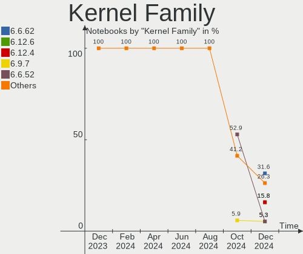
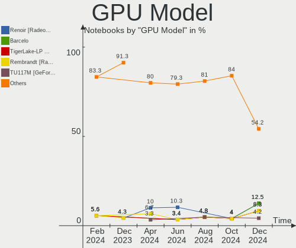
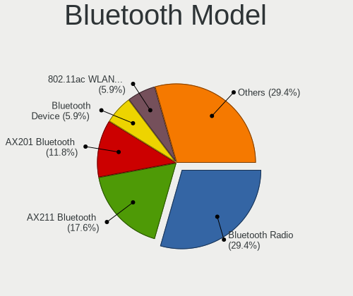

Gentoo Hardware Trends (Notebooks)
----------------------------------

A project to identify most popular hardware characteristics and track their change
over time based on data collected by Gentoo users at https://Linux-Hardware.org.

Anyone can contribute to this report by the [hw-probe](https://github.com/linuxhw/hw-probe) tool:

    sudo -E hw-probe -all -upload

Full-feature report is available here: https://linux-hardware.org/?view=trends

Period: Feb, 2022.

Contents
--------

* [ System ](#system)
  - [ OS                       ](#os)
  - [ OS Family                ](#os-family)
  - [ Kernel                   ](#kernel)
  - [ Kernel Family            ](#kernel-family)
  - [ Kernel Major Ver.        ](#kernel-major-ver)
  - [ Arch                     ](#arch)
  - [ DE                       ](#de)
  - [ Display Server           ](#display-server)
  - [ Display Manager          ](#display-manager)
  - [ OS Lang                  ](#os-lang)
  - [ Boot Mode                ](#boot-mode)
  - [ Filesystem               ](#filesystem)
  - [ Part. scheme             ](#part-scheme)
  - [ Dual Boot with Linux/BSD ](#dual-boot-with-linuxbsd)
  - [ Dual Boot (Win)          ](#dual-boot-win)

* [ Board ](#board)
  - [ Vendor                   ](#vendor)
  - [ Model                    ](#model)
  - [ Model Family             ](#model-family)
  - [ MFG Year                 ](#mfg-year)
  - [ Form Factor              ](#form-factor)
  - [ Secure Boot              ](#secure-boot)
  - [ Coreboot                 ](#coreboot)
  - [ RAM Size                 ](#ram-size)
  - [ RAM Used                 ](#ram-used)
  - [ Total Drives             ](#total-drives)
  - [ Has CD-ROM               ](#has-cd-rom)
  - [ Has Ethernet             ](#has-ethernet)
  - [ Has WiFi                 ](#has-wifi)
  - [ Has Bluetooth            ](#has-bluetooth)

* [ Location ](#location)
  - [ Country                  ](#country)
  - [ City                     ](#city)

* [ Drives ](#drives)
  - [ Drive Vendor             ](#drive-vendor)
  - [ Drive Model              ](#drive-model)
  - [ HDD Vendor               ](#hdd-vendor)
  - [ SSD Vendor               ](#ssd-vendor)
  - [ Drive Kind               ](#drive-kind)
  - [ Drive Connector          ](#drive-connector)
  - [ Drive Size               ](#drive-size)
  - [ Space Total              ](#space-total)
  - [ Space Used               ](#space-used)
  - [ Malfunc. Drives          ](#malfunc-drives)
  - [ Malfunc. Drive Vendor    ](#malfunc-drive-vendor)
  - [ Malfunc. HDD Vendor      ](#malfunc-hdd-vendor)
  - [ Malfunc. Drive Kind      ](#malfunc-drive-kind)
  - [ Failed Drives            ](#failed-drives)
  - [ Failed Drive Vendor      ](#failed-drive-vendor)
  - [ Drive Status             ](#drive-status)

* [ Storage controller ](#storage-controller)
  - [ Storage Vendor           ](#storage-vendor)
  - [ Storage Model            ](#storage-model)
  - [ Storage Kind             ](#storage-kind)

* [ Processor ](#processor)
  - [ CPU Vendor               ](#cpu-vendor)
  - [ CPU Model                ](#cpu-model)
  - [ CPU Model Family         ](#cpu-model-family)
  - [ CPU Cores                ](#cpu-cores)
  - [ CPU Sockets              ](#cpu-sockets)
  - [ CPU Threads              ](#cpu-threads)
  - [ CPU Op-Modes             ](#cpu-op-modes)
  - [ CPU Microcode            ](#cpu-microcode)
  - [ CPU Microarch            ](#cpu-microarch)

* [ Graphics ](#graphics)
  - [ GPU Vendor               ](#gpu-vendor)
  - [ GPU Model                ](#gpu-model)
  - [ GPU Combo                ](#gpu-combo)
  - [ GPU Driver               ](#gpu-driver)
  - [ GPU Memory               ](#gpu-memory)

* [ Monitor ](#monitor)
  - [ Monitor Vendor           ](#monitor-vendor)
  - [ Monitor Model            ](#monitor-model)
  - [ Monitor Resolution       ](#monitor-resolution)
  - [ Monitor Diagonal         ](#monitor-diagonal)
  - [ Monitor Width            ](#monitor-width)
  - [ Aspect Ratio             ](#aspect-ratio)
  - [ Monitor Area             ](#monitor-area)
  - [ Pixel Density            ](#pixel-density)
  - [ Multiple Monitors        ](#multiple-monitors)

* [ Network ](#network)
  - [ Net Controller Vendor    ](#net-controller-vendor)
  - [ Net Controller Model     ](#net-controller-model)
  - [ Wireless Vendor          ](#wireless-vendor)
  - [ Wireless Model           ](#wireless-model)
  - [ Ethernet Vendor          ](#ethernet-vendor)
  - [ Ethernet Model           ](#ethernet-model)
  - [ Net Controller Kind      ](#net-controller-kind)
  - [ Used Controller          ](#used-controller)
  - [ NICs                     ](#nics)
  - [ IPv6                     ](#ipv6)

* [ Bluetooth ](#bluetooth)
  - [ Bluetooth Vendor         ](#bluetooth-vendor)
  - [ Bluetooth Model          ](#bluetooth-model)

* [ Sound ](#sound)
  - [ Sound Vendor             ](#sound-vendor)
  - [ Sound Model              ](#sound-model)

* [ Memory ](#memory)
  - [ Memory Vendor            ](#memory-vendor)
  - [ Memory Model             ](#memory-model)
  - [ Memory Kind              ](#memory-kind)
  - [ Memory Form Factor       ](#memory-form-factor)
  - [ Memory Size              ](#memory-size)
  - [ Memory Speed             ](#memory-speed)

* [ Printers & scanners ](#printers--scanners)
  - [ Printer Vendor           ](#printer-vendor)
  - [ Printer Model            ](#printer-model)
  - [ Scanner Vendor           ](#scanner-vendor)
  - [ Scanner Model            ](#scanner-model)

* [ Camera ](#camera)
  - [ Camera Vendor            ](#camera-vendor)
  - [ Camera Model             ](#camera-model)

* [ Security ](#security)
  - [ Fingerprint Vendor       ](#fingerprint-vendor)
  - [ Fingerprint Model        ](#fingerprint-model)
  - [ Chipcard Vendor          ](#chipcard-vendor)
  - [ Chipcard Model           ](#chipcard-model)

* [ Unsupported ](#unsupported)
  - [ Unsupported Devices      ](#unsupported-devices)
  - [ Unsupported Device Types ](#unsupported-device-types)

System
------

OS
--

Installed operating systems

| Name       | Notebooks | Percent |
|------------|-----------|---------|
| Gentoo 2.6 | 10        | 52.63%  |
| Gentoo 2.8 | 5         | 26.32%  |
| Gentoo 2.7 | 4         | 21.05%  |

OS Family
---------

OS without a version

| Name   | Notebooks | Percent |
|--------|-----------|---------|
| Gentoo | 19        | 100%    |

Kernel
------

Version of the Linux kernel

| Version                       | Notebooks | Percent |
|-------------------------------|-----------|---------|
| 5.15.23-gentoo-x86_64         | 2         | 10.53%  |
| 5.15.19-gentoo-112-overlayfs  | 2         | 10.53%  |
| 5.16.9                        | 1         | 5.26%   |
| 5.16.8-gentoo-gentoo-dist     | 1         | 5.26%   |
| 5.16.5-gentoo-x86_64          | 1         | 5.26%   |
| 5.16.10-gentoo-x86_64         | 1         | 5.26%   |
| 5.16.10-gentoo--20-feb-2022   | 1         | 5.26%   |
| 5.16.10-gentoo                | 1         | 5.26%   |
| 5.15.23-gentoo-dist           | 1         | 5.26%   |
| 5.15.23-gentoo+               | 1         | 5.26%   |
| 5.15.23-gentoo                | 1         | 5.26%   |
| 5.15.21-gentoo                | 1         | 5.26%   |
| 5.15.16-gentoo                | 1         | 5.26%   |
| 5.15.13-gentoomultilib-nvidia | 1         | 5.26%   |
| 5.15.11-gentoo-rog            | 1         | 5.26%   |
| 5.15.11-gentoo                | 1         | 5.26%   |
| 5.10.27-gentoo                | 1         | 5.26%   |

Kernel Family
-------------

Linux kernel without a distro release

| Version | Notebooks | Percent |
|---------|-----------|---------|
| 5.15.23 | 5         | 26.32%  |
| 5.16.10 | 3         | 15.79%  |
| 5.15.19 | 2         | 10.53%  |
| 5.15.11 | 2         | 10.53%  |
| 5.16.9  | 1         | 5.26%   |
| 5.16.8  | 1         | 5.26%   |
| 5.16.5  | 1         | 5.26%   |
| 5.15.21 | 1         | 5.26%   |
| 5.15.16 | 1         | 5.26%   |
| 5.15.13 | 1         | 5.26%   |
| 5.10.27 | 1         | 5.26%   |

Kernel Major Ver.
-----------------

Linux kernel major version

| Version | Notebooks | Percent |
|---------|-----------|---------|
| 5.15    | 12        | 63.16%  |
| 5.16    | 6         | 31.58%  |
| 5.10    | 1         | 5.26%   |

Arch
----

OS architecture (x86_64, i586, etc.)

| Name   | Notebooks | Percent |
|--------|-----------|---------|
| x86_64 | 18        | 94.74%  |
| i686   | 1         | 5.26%   |

DE
--

Desktop Environment

| Name    | Notebooks | Percent |
|---------|-----------|---------|
| Unknown | 9         | 47.37%  |
| KDE5    | 6         | 31.58%  |
| XFCE    | 2         | 10.53%  |
| sway    | 1         | 5.26%   |
| LXQt    | 1         | 5.26%   |

Display Server
--------------

X11 or Wayland

| Name    | Notebooks | Percent |
|---------|-----------|---------|
| X11     | 12        | 63.16%  |
| Wayland | 3         | 15.79%  |
| Tty     | 2         | 10.53%  |
| Unknown | 2         | 10.53%  |

Display Manager
---------------

SDDM, LightDM, etc.

| Name    | Notebooks | Percent |
|---------|-----------|---------|
| SDDM    | 8         | 42.11%  |
| Unknown | 7         | 36.84%  |
| LightDM | 3         | 15.79%  |
| GREETD  | 1         | 5.26%   |

OS Lang
-------

Language

| Lang   | Notebooks | Percent |
|--------|-----------|---------|
| en_US  | 7         | 36.84%  |
| en_GB  | 4         | 21.05%  |
| C.UTF8 | 2         | 10.53%  |
| zh_CN  | 1         | 5.26%   |
| ru_RU  | 1         | 5.26%   |
| es_ES  | 1         | 5.26%   |
| es_AR  | 1         | 5.26%   |
| en_AU  | 1         | 5.26%   |
| el_GR  | 1         | 5.26%   |

Boot Mode
---------

EFI or BIOS

| Mode | Notebooks | Percent |
|------|-----------|---------|
| EFI  | 17        | 89.47%  |
| BIOS | 2         | 10.53%  |

Filesystem
----------

Type of filesystem

| Type  | Notebooks | Percent |
|-------|-----------|---------|
| Ext4  | 10        | 52.63%  |
| Btrfs | 5         | 26.32%  |
| Xfs   | 2         | 10.53%  |
| Zfs   | 1         | 5.26%   |
| F2fs  | 1         | 5.26%   |

Part. scheme
------------

Scheme of partitioning

| Type | Notebooks | Percent |
|------|-----------|---------|
| GPT  | 19        | 100%    |

Dual Boot with Linux/BSD
------------------------

Hosting more than one Linux/BSD

| Dual boot | Notebooks | Percent |
|-----------|-----------|---------|
| No        | 14        | 73.68%  |
| Yes       | 5         | 26.32%  |

Dual Boot (Win)
---------------

Hosting Linux and Windows

| Dual boot | Notebooks | Percent |
|-----------|-----------|---------|
| No        | 11        | 57.89%  |
| Yes       | 8         | 42.11%  |

Board
-----

Vendor
------

Motherboard manufacturer

| Name             | Notebooks | Percent |
|------------------|-----------|---------|
| Lenovo           | 5         | 26.32%  |
| ASUSTek Computer | 4         | 21.05%  |
| Hewlett-Packard  | 3         | 15.79%  |
| Dell             | 3         | 15.79%  |
| Timi             | 1         | 5.26%   |
| MSI              | 1         | 5.26%   |
| HUAWEI           | 1         | 5.26%   |
| Acer             | 1         | 5.26%   |

Model
-----

Motherboard model

| Name                                  | Notebooks | Percent |
|---------------------------------------|-----------|---------|
| Timi RedmiBook Pro 15S                | 1         | 5.26%   |
| MSI GS63VR 6RF                        | 1         | 5.26%   |
| Lenovo Yoga Slim 7 14IIL05 82A1       | 1         | 5.26%   |
| Lenovo Legion Y7000 2019 PG0 81T0     | 1         | 5.26%   |
| Lenovo Legion Y530-15ICH-1060 81LB    | 1         | 5.26%   |
| Lenovo Legion R9000P2021H 82JQ        | 1         | 5.26%   |
| Lenovo IdeaPad 100-15IBD 80QQ         | 1         | 5.26%   |
| HUAWEI NBLK-WAX9X                     | 1         | 5.26%   |
| HP ProBook 450 G6                     | 1         | 5.26%   |
| HP Pavilion ZV6100 (EE984EA#ABZ)      | 1         | 5.26%   |
| HP Pavilion Notebook                  | 1         | 5.26%   |
| Dell XPS 17 9710                      | 1         | 5.26%   |
| Dell XPS 13 9310                      | 1         | 5.26%   |
| Dell Inspiron 5515                    | 1         | 5.26%   |
| ASUS ZenBook UX450FDX_UX480FD         | 1         | 5.26%   |
| ASUS UX430UAR                         | 1         | 5.26%   |
| ASUS ROG Zephyrus G14 GA401II_GA401II | 1         | 5.26%   |
| ASUS 900                              | 1         | 5.26%   |
| Acer Aspire E5-571G                   | 1         | 5.26%   |

Model Family
------------

Motherboard model prefix

| Name              | Notebooks | Percent |
|-------------------|-----------|---------|
| Lenovo Legion     | 3         | 15.79%  |
| HP Pavilion       | 2         | 10.53%  |
| Dell XPS          | 2         | 10.53%  |
| Timi RedmiBook    | 1         | 5.26%   |
| MSI GS63VR        | 1         | 5.26%   |
| Lenovo Yoga       | 1         | 5.26%   |
| Lenovo IdeaPad    | 1         | 5.26%   |
| HUAWEI NBLK-WAX9X | 1         | 5.26%   |
| HP ProBook        | 1         | 5.26%   |
| Dell Inspiron     | 1         | 5.26%   |
| ASUS ZenBook      | 1         | 5.26%   |
| ASUS UX430UAR     | 1         | 5.26%   |
| ASUS ROG          | 1         | 5.26%   |
| ASUS 900          | 1         | 5.26%   |
| Acer Aspire       | 1         | 5.26%   |

MFG Year
--------

Motherboard manufacture year

| Year | Notebooks | Percent |
|------|-----------|---------|
| 2021 | 4         | 21.05%  |
| 2019 | 4         | 21.05%  |
| 2020 | 3         | 15.79%  |
| 2018 | 2         | 10.53%  |
| 2017 | 1         | 5.26%   |
| 2016 | 1         | 5.26%   |
| 2015 | 1         | 5.26%   |
| 2014 | 1         | 5.26%   |
| 2008 | 1         | 5.26%   |
| 2006 | 1         | 5.26%   |

Form Factor
-----------

Physical design of the computer

| Name     | Notebooks | Percent |
|----------|-----------|---------|
| Notebook | 19        | 100%    |

Secure Boot
-----------

Enabled or disabled

| State    | Notebooks | Percent |
|----------|-----------|---------|
| Disabled | 19        | 100%    |

Coreboot
--------

Have coreboot on board

| Used | Notebooks | Percent |
|------|-----------|---------|
| No   | 19        | 100%    |

RAM Size
--------

Total RAM memory

| Size in GB | Notebooks | Percent |
|------------|-----------|---------|
| 16.01-24.0 | 6         | 31.58%  |
| 8.01-16.0  | 5         | 26.32%  |
| 4.01-8.0   | 3         | 15.79%  |
| 32.01-64.0 | 2         | 10.53%  |
| 3.01-4.0   | 1         | 5.26%   |
| 2.01-3.0   | 1         | 5.26%   |
| 1.01-2.0   | 1         | 5.26%   |

RAM Used
--------

Used RAM memory

| Used GB   | Notebooks | Percent |
|-----------|-----------|---------|
| 4.01-8.0  | 5         | 26.32%  |
| 3.01-4.0  | 5         | 26.32%  |
| 1.01-2.0  | 4         | 21.05%  |
| 2.01-3.0  | 2         | 10.53%  |
| 8.01-16.0 | 1         | 5.26%   |
| 0.51-1.0  | 1         | 5.26%   |
| 0.01-0.5  | 1         | 5.26%   |

Total Drives
------------

Number of drives on board

| Drives | Notebooks | Percent |
|--------|-----------|---------|
| 1      | 13        | 68.42%  |
| 2      | 6         | 31.58%  |

Has CD-ROM
----------

Has CD-ROM on board

| Presented | Notebooks | Percent |
|-----------|-----------|---------|
| No        | 16        | 84.21%  |
| Yes       | 3         | 15.79%  |

Has Ethernet
------------

Has Ethernet on board

| Presented | Notebooks | Percent |
|-----------|-----------|---------|
| Yes       | 10        | 52.63%  |
| No        | 9         | 47.37%  |

Has WiFi
--------

Has WiFi module

| Presented | Notebooks | Percent |
|-----------|-----------|---------|
| Yes       | 19        | 100%    |

Has Bluetooth
-------------

Has Bluetooth module

| Presented | Notebooks | Percent |
|-----------|-----------|---------|
| Yes       | 16        | 84.21%  |
| No        | 3         | 15.79%  |

Location
--------

Country
-------

Geographic location (country)

| Country   | Notebooks | Percent |
|-----------|-----------|---------|
| Poland    | 3         | 15.79%  |
| UK        | 2         | 10.53%  |
| Russia    | 2         | 10.53%  |
| Greece    | 2         | 10.53%  |
| USA       | 1         | 5.26%   |
| Ukraine   | 1         | 5.26%   |
| Tunisia   | 1         | 5.26%   |
| Spain     | 1         | 5.26%   |
| Slovakia  | 1         | 5.26%   |
| Norway    | 1         | 5.26%   |
| India     | 1         | 5.26%   |
| China     | 1         | 5.26%   |
| Australia | 1         | 5.26%   |
| Argentina | 1         | 5.26%   |

City
----

Geographic location (city)

| City                          | Notebooks | Percent |
|-------------------------------|-----------|---------|
| St Petersburg                 | 2         | 10.53%  |
| Athens                        | 2         | 10.53%  |
| Warsaw                        | 1         | 5.26%   |
| Sydney                        | 1         | 5.26%   |
| Storsteinnes                  | 1         | 5.26%   |
| Monastir                      | 1         | 5.26%   |
| London                        | 1         | 5.26%   |
| Kyiv                          | 1         | 5.26%   |
| Hoboken                       | 1         | 5.26%   |
| Guangzhou                     | 1         | 5.26%   |
| Gmina Lwówek Śląski | 1         | 5.26%   |
| Girona                        | 1         | 5.26%   |
| Cieszyn                       | 1         | 5.26%   |
| Chesham                       | 1         | 5.26%   |
| Córdoba                    | 1         | 5.26%   |
| Bratislava                    | 1         | 5.26%   |
| Bhavnagar                     | 1         | 5.26%   |

Drives
------

Drive Vendor
------------

Hard drive vendors

| Vendor              | Notebooks | Drives | Percent |
|---------------------|-----------|--------|---------|
| Samsung Electronics | 5         | 5      | 21.74%  |
| WDC                 | 4         | 4      | 17.39%  |
| Seagate             | 3         | 3      | 13.04%  |
| SK Hynix            | 2         | 2      | 8.7%    |
| SanDisk             | 2         | 2      | 8.7%    |
| Micron Technology   | 2         | 2      | 8.7%    |
| KIOXIA              | 1         | 1      | 4.35%   |
| Kingston            | 1         | 1      | 4.35%   |
| Intel               | 1         | 1      | 4.35%   |
| China               | 1         | 2      | 4.35%   |
| ASUS-PHISON         | 1         | 1      | 4.35%   |

Drive Model
-----------

Hard drive models

| Model                                  | Notebooks | Percent |
|----------------------------------------|-----------|---------|
| WDC WDS250G2X0C-00L350 250GB           | 1         | 4.35%   |
| WDC WDS240G2G0A-00JH30 240GB SSD       | 1         | 4.35%   |
| WDC WD10SPSX-08A6W 1TB                 | 1         | 4.35%   |
| WDC PC SN530 NVMe 512GB                | 1         | 4.35%   |
| SK Hynix SKHynix_HFS512GDE9X084N 512GB | 1         | 4.35%   |
| SK Hynix PC711 NVMe 512GB              | 1         | 4.35%   |
| Seagate ST2000LM007-1R8174 2TB         | 1         | 4.35%   |
| Seagate ST1000LM035-1RK172 1TB         | 1         | 4.35%   |
| Seagate ST1000LM024 HN-M101MBB 1TB     | 1         | 4.35%   |
| SanDisk SD9SN8W256G1002 256GB SSD      | 1         | 4.35%   |
| SanDisk SD9SN8W-128G-1006 128GB SSD    | 1         | 4.35%   |
| Samsung SSD 970 EVO Plus 500GB         | 1         | 4.35%   |
| Samsung SSD 860 EVO 1TB                | 1         | 4.35%   |
| Samsung MZVLB512HAJQ-00000 512GB       | 1         | 4.35%   |
| Samsung MZVLB256HAHQ-000L2 256GB       | 1         | 4.35%   |
| Samsung MZVLB1T0HBLR-000L2 1TB         | 1         | 4.35%   |
| Micron MTFDHBA256TCK 256GB             | 1         | 4.35%   |
| Micron 2300 NVMe 1024GB                | 1         | 4.35%   |
| KIOXIA KBG40ZNV512G 512GB              | 1         | 4.35%   |
| Kingston RBUSNS8154P3512GJ2 512GB      | 1         | 4.35%   |
| Intel SSDPEKNW512G8 512GB              | 1         | 4.35%   |
| China SSD 512GB                        | 1         | 4.35%   |
| ASUS-PHISON SSD 16GB                   | 1         | 4.35%   |

HDD Vendor
----------

Hard disk drive vendors

| Vendor  | Notebooks | Drives | Percent |
|---------|-----------|--------|---------|
| Seagate | 3         | 3      | 75%     |
| WDC     | 1         | 1      | 25%     |

SSD Vendor
----------

Solid state drive vendors

| Vendor              | Notebooks | Drives | Percent |
|---------------------|-----------|--------|---------|
| SanDisk             | 2         | 2      | 33.33%  |
| WDC                 | 1         | 1      | 16.67%  |
| Samsung Electronics | 1         | 1      | 16.67%  |
| China               | 1         | 2      | 16.67%  |
| ASUS-PHISON         | 1         | 1      | 16.67%  |

Drive Kind
----------

HDD or SSD

| Kind | Notebooks | Drives | Percent |
|------|-----------|--------|---------|
| NVMe | 12        | 13     | 54.55%  |
| SSD  | 6         | 7      | 27.27%  |
| HDD  | 4         | 4      | 18.18%  |

Drive Connector
---------------

SATA, SAS, NVMe, etc.

| Type | Notebooks | Drives | Percent |
|------|-----------|--------|---------|
| NVMe | 12        | 13     | 54.55%  |
| SATA | 10        | 11     | 45.45%  |

Drive Size
----------

Size of hard drive

| Size in TB | Notebooks | Drives | Percent |
|------------|-----------|--------|---------|
| 0.51-1.0   | 5         | 6      | 50%     |
| 0.01-0.5   | 4         | 4      | 40%     |
| 1.01-2.0   | 1         | 1      | 10%     |

Space Total
-----------

Amount of disk space available on the file system

| Size in GB     | Notebooks | Percent |
|----------------|-----------|---------|
| 251-500        | 7         | 36.84%  |
| 101-250        | 4         | 21.05%  |
| 501-1000       | 4         | 21.05%  |
| Unknown        | 2         | 10.53%  |
| More than 3000 | 1         | 5.26%   |
| 1001-2000      | 1         | 5.26%   |

Space Used
----------

Amount of used disk space

| Used GB        | Notebooks | Percent |
|----------------|-----------|---------|
| 251-500        | 3         | 15.79%  |
| 21-50          | 3         | 15.79%  |
| 101-250        | 3         | 15.79%  |
| 501-1000       | 3         | 15.79%  |
| 1-20           | 2         | 10.53%  |
| 51-100         | 2         | 10.53%  |
| Unknown        | 2         | 10.53%  |
| More than 3000 | 1         | 5.26%   |

Malfunc. Drives
---------------

Drive models with a malfunction

| Model                               | Notebooks | Drives | Percent |
|-------------------------------------|-----------|--------|---------|
| Seagate ST1000LM035-1RK172 1TB      | 1         | 1      | 50%     |
| SanDisk SD9SN8W-128G-1006 128GB SSD | 1         | 1      | 50%     |

Malfunc. Drive Vendor
---------------------

Vendors of faulty drives

| Vendor  | Notebooks | Drives | Percent |
|---------|-----------|--------|---------|
| Seagate | 1         | 1      | 50%     |
| SanDisk | 1         | 1      | 50%     |

Malfunc. HDD Vendor
-------------------

Vendors of faulty HDD drives

| Vendor  | Notebooks | Drives | Percent |
|---------|-----------|--------|---------|
| Seagate | 1         | 1      | 100%    |

Malfunc. Drive Kind
-------------------

Kinds of faulty drives

| Kind | Notebooks | Drives | Percent |
|------|-----------|--------|---------|
| SSD  | 1         | 1      | 50%     |
| HDD  | 1         | 1      | 50%     |

Failed Drives
-------------

Failed drive models

Zero info for selected period =(

Failed Drive Vendor
-------------------

Failed drive vendors

Zero info for selected period =(

Drive Status
------------

Number of failed and malfunc. drives

| Status   | Notebooks | Drives | Percent |
|----------|-----------|--------|---------|
| Works    | 17        | 21     | 85%     |
| Malfunc  | 2         | 2      | 10%     |
| Detected | 1         | 1      | 5%      |

Storage controller
------------------

Storage Vendor
--------------

Storage controller vendors

| Vendor                      | Notebooks | Percent |
|-----------------------------|-----------|---------|
| Intel                       | 13        | 43.33%  |
| AMD                         | 5         | 16.67%  |
| Samsung Electronics         | 4         | 13.33%  |
| SK Hynix                    | 2         | 6.67%   |
| Sandisk                     | 2         | 6.67%   |
| Micron Technology           | 2         | 6.67%   |
| KIOXIA                      | 1         | 3.33%   |
| Kingston Technology Company | 1         | 3.33%   |

Storage Model
-------------

Storage controller models

| Model                                                 | Notebooks | Percent |
|-------------------------------------------------------|-----------|---------|
| Samsung NVMe SSD Controller SM981/PM981/PM983         | 4         | 13.33%  |
| AMD FCH SATA Controller [AHCI mode]                   | 4         | 13.33%  |
| SK Hynix Gold P31 SSD                                 | 2         | 6.67%   |
| Micron Non-Volatile memory controller                 | 2         | 6.67%   |
| Intel Wildcat Point-LP SATA Controller [AHCI Mode]    | 2         | 6.67%   |
| Intel Volume Management Device NVMe RAID Controller   | 2         | 6.67%   |
| Intel Cannon Point-LP SATA Controller [AHCI Mode]     | 2         | 6.67%   |
| Intel Cannon Lake Mobile PCH SATA AHCI Controller     | 2         | 6.67%   |
| Sandisk WD Black 2018/SN750 / PC SN720 NVMe SSD       | 1         | 3.33%   |
| Sandisk Non-Volatile memory controller                | 1         | 3.33%   |
| KIOXIA Non-Volatile memory controller                 | 1         | 3.33%   |
| Kingston Company U-SNS8154P3 NVMe SSD                 | 1         | 3.33%   |
| Intel Sunrise Point-LP SATA Controller [AHCI mode]    | 1         | 3.33%   |
| Intel SSD 660P Series                                 | 1         | 3.33%   |
| Intel HM170/QM170 Chipset SATA Controller [AHCI Mode] | 1         | 3.33%   |
| Intel 82801FBM (ICH6M) SATA Controller                | 1         | 3.33%   |
| Intel 8 Series SATA Controller 1 [AHCI mode]          | 1         | 3.33%   |
| AMD IXP SB4x0 IDE Controller                          | 1         | 3.33%   |

Storage Kind
------------

Kind of storage controller (IDE, SATA, NVMe, SAS, ...)

| Kind | Notebooks | Percent |
|------|-----------|---------|
| SATA | 13        | 44.83%  |
| NVMe | 12        | 41.38%  |
| RAID | 2         | 6.9%    |
| IDE  | 2         | 6.9%    |

Processor
---------

CPU Vendor
----------

Processor vendors

| Vendor | Notebooks | Percent |
|--------|-----------|---------|
| Intel  | 13        | 68.42%  |
| AMD    | 6         | 31.58%  |

CPU Model
---------

Processor models

| Model                                         | Notebooks | Percent |
|-----------------------------------------------|-----------|---------|
| Intel Core i7-8565U CPU @ 1.80GHz             | 2         | 10.53%  |
| AMD Ryzen 7 5800H with Radeon Graphics        | 2         | 10.53%  |
| Intel Core i7-8750H CPU @ 2.20GHz             | 1         | 5.26%   |
| Intel Core i7-6700HQ CPU @ 2.60GHz            | 1         | 5.26%   |
| Intel Core i7-1065G7 CPU @ 1.30GHz            | 1         | 5.26%   |
| Intel Core i5-9300H CPU @ 2.40GHz             | 1         | 5.26%   |
| Intel Core i5-8250U CPU @ 1.60GHz             | 1         | 5.26%   |
| Intel Core i5-5200U CPU @ 2.20GHz             | 1         | 5.26%   |
| Intel Core i5-4210U CPU @ 1.70GHz             | 1         | 5.26%   |
| Intel Core i3-5005U CPU @ 2.00GHz             | 1         | 5.26%   |
| Intel Celeron M processor 900MHz              | 1         | 5.26%   |
| Intel 11th Gen Core i7-1185G7 @ 3.00GHz       | 1         | 5.26%   |
| Intel 11th Gen Core i7-11800H @ 2.30GHz       | 1         | 5.26%   |
| AMD Ryzen 7 5700U with Radeon Graphics        | 1         | 5.26%   |
| AMD Ryzen 7 4800HS with Radeon Graphics       | 1         | 5.26%   |
| AMD Ryzen 5 3500U with Radeon Vega Mobile Gfx | 1         | 5.26%   |
| AMD Athlon 64 Processor 3200+                 | 1         | 5.26%   |

CPU Model Family
----------------

Processor model prefix

| Model           | Notebooks | Percent |
|-----------------|-----------|---------|
| Intel Core i7   | 5         | 26.32%  |
| Intel Core i5   | 4         | 21.05%  |
| AMD Ryzen 7     | 4         | 21.05%  |
| Other           | 2         | 10.53%  |
| Intel Core i3   | 1         | 5.26%   |
| Intel Celeron M | 1         | 5.26%   |
| AMD Ryzen 5     | 1         | 5.26%   |
| AMD Athlon 64   | 1         | 5.26%   |

CPU Cores
---------

Number of processor cores

| Number | Notebooks | Percent |
|--------|-----------|---------|
| 4      | 8         | 42.11%  |
| 8      | 5         | 26.32%  |
| 2      | 3         | 15.79%  |
| 1      | 2         | 10.53%  |
| 6      | 1         | 5.26%   |

CPU Sockets
-----------

Number of sockets

| Number | Notebooks | Percent |
|--------|-----------|---------|
| 1      | 19        | 100%    |

CPU Threads
-----------

Threads per core (Hyper-Threading)

| Number | Notebooks | Percent |
|--------|-----------|---------|
| 2      | 17        | 89.47%  |
| 1      | 2         | 10.53%  |

CPU Op-Modes
------------

CPU Operation Modes (32-bit, 64-bit)

| Op mode        | Notebooks | Percent |
|----------------|-----------|---------|
| 32-bit, 64-bit | 18        | 94.74%  |
| 32-bit         | 1         | 5.26%   |

CPU Microcode
-------------

Microcode number

| Number     | Notebooks | Percent |
|------------|-----------|---------|
| Unknown    | 5         | 26.32%  |
| 0x906ea    | 2         | 10.53%  |
| 0x0a50000c | 2         | 10.53%  |
| 0x806eb    | 1         | 5.26%   |
| 0x806ea    | 1         | 5.26%   |
| 0x806d1    | 1         | 5.26%   |
| 0x806c1    | 1         | 5.26%   |
| 0x506e3    | 1         | 5.26%   |
| 0x40651    | 1         | 5.26%   |
| 0x306d4    | 1         | 5.26%   |
| 0x08608103 | 1         | 5.26%   |
| 0x08600104 | 1         | 5.26%   |
| 0x08108109 | 1         | 5.26%   |

CPU Microarch
-------------

Microarchitecture

| Name      | Notebooks | Percent |
|-----------|-----------|---------|
| KabyLake  | 5         | 26.32%  |
| Zen 3     | 2         | 10.53%  |
| Broadwell | 2         | 10.53%  |
| Unknown   | 2         | 10.53%  |
| Zen+      | 1         | 5.26%   |
| Zen 2     | 1         | 5.26%   |
| TigerLake | 1         | 5.26%   |
| Skylake   | 1         | 5.26%   |
| P6        | 1         | 5.26%   |
| K8 Hammer | 1         | 5.26%   |
| IceLake   | 1         | 5.26%   |
| Haswell   | 1         | 5.26%   |

Graphics
--------

GPU Vendor
----------

Vendors of graphics cards

| Vendor | Notebooks | Percent |
|--------|-----------|---------|
| Intel  | 13        | 48.15%  |
| Nvidia | 9         | 33.33%  |
| AMD    | 5         | 18.52%  |

GPU Model
---------

Graphics card models

| Model                                                                | Notebooks | Percent |
|----------------------------------------------------------------------|-----------|---------|
| Nvidia GP106M [GeForce GTX 1060 Mobile]                              | 2         | 7.41%   |
| Intel WhiskeyLake-U GT2 [UHD Graphics 620]                           | 2         | 7.41%   |
| Intel HD Graphics 5500                                               | 2         | 7.41%   |
| Intel CoffeeLake-H GT2 [UHD Graphics 630]                            | 2         | 7.41%   |
| Nvidia TU117M [GeForce GTX 1650 Mobile / Max-Q]                      | 1         | 3.7%    |
| Nvidia TU116M [GeForce GTX 1650 Ti Mobile]                           | 1         | 3.7%    |
| Nvidia GP107M [GeForce GTX 1050 Mobile]                              | 1         | 3.7%    |
| Nvidia GM108M [GeForce 940M]                                         | 1         | 3.7%    |
| Nvidia GM108M [GeForce 840M]                                         | 1         | 3.7%    |
| Nvidia GA107M [GeForce RTX 3050 Mobile]                              | 1         | 3.7%    |
| Nvidia GA106M [GeForce RTX 3060 Mobile / Max-Q]                      | 1         | 3.7%    |
| Intel UHD Graphics 620                                               | 1         | 3.7%    |
| Intel TigerLake-LP GT2 [Iris Xe Graphics]                            | 1         | 3.7%    |
| Intel TigerLake-H GT1 [UHD Graphics]                                 | 1         | 3.7%    |
| Intel Mobile 915GM/GMS/910GML Express Graphics Controller            | 1         | 3.7%    |
| Intel Iris Plus Graphics G7                                          | 1         | 3.7%    |
| Intel HD Graphics 530                                                | 1         | 3.7%    |
| Intel Haswell-ULT Integrated Graphics Controller                     | 1         | 3.7%    |
| AMD RS480M [Mobility Radeon Xpress 200]                              | 1         | 3.7%    |
| AMD Renoir                                                           | 1         | 3.7%    |
| AMD Picasso/Raven 2 [Radeon Vega Series / Radeon Vega Mobile Series] | 1         | 3.7%    |
| AMD Lucienne                                                         | 1         | 3.7%    |
| AMD Cezanne                                                          | 1         | 3.7%    |

GPU Combo
---------

Combinations of graphics cards

| Name           | Notebooks | Percent |
|----------------|-----------|---------|
| Intel + Nvidia | 7         | 36.84%  |
| 1 x Intel      | 6         | 31.58%  |
| 1 x AMD        | 4         | 21.05%  |
| 1 x Nvidia     | 1         | 5.26%   |
| AMD + Nvidia   | 1         | 5.26%   |

GPU Driver
----------

Free vs proprietary

| Driver      | Notebooks | Percent |
|-------------|-----------|---------|
| Free        | 12        | 63.16%  |
| Proprietary | 7         | 36.84%  |

GPU Memory
----------

Total video memory

| Size in GB | Notebooks | Percent |
|------------|-----------|---------|
| Unknown    | 11        | 57.89%  |
| 0.01-0.5   | 4         | 21.05%  |
| 5.01-6.0   | 2         | 10.53%  |
| 3.01-4.0   | 1         | 5.26%   |
| 0.51-1.0   | 1         | 5.26%   |

Monitor
-------

Monitor Vendor
--------------

Monitor vendors

| Vendor              | Notebooks | Percent |
|---------------------|-----------|---------|
| LG Display          | 3         | 13.64%  |
| Chimei Innolux      | 3         | 13.64%  |
| BOE                 | 3         | 13.64%  |
| Sharp               | 2         | 9.09%   |
| Goldstar            | 2         | 9.09%   |
| AU Optronics        | 2         | 9.09%   |
| TMX                 | 1         | 4.55%   |
| Samsung Electronics | 1         | 4.55%   |
| PANDA               | 1         | 4.55%   |
| Hewlett-Packard     | 1         | 4.55%   |
| Dell                | 1         | 4.55%   |
| CSO                 | 1         | 4.55%   |
| Apple               | 1         | 4.55%   |

Monitor Model
-------------

Monitor models

| Model                                                                | Notebooks | Percent |
|----------------------------------------------------------------------|-----------|---------|
| TMX TL156MDMP01-0 TMX1560 3200x2000 336x210mm 15.6-inch              | 1         | 4.55%   |
| Sharp LCD Monitor SHP14FA 3840x2400 288x180mm 13.4-inch              | 1         | 4.55%   |
| Sharp LCD Monitor SHP14D6 3840x2400 366x229mm 17.0-inch              | 1         | 4.55%   |
| Samsung Electronics LCD Monitor SDC4E51 1366x768 344x194mm 15.5-inch | 1         | 4.55%   |
| PANDA LCD Monitor NCP0050 1920x1080 309x174mm 14.0-inch              | 1         | 4.55%   |
| LG Display LCD Monitor LGD06E0 1920x1080 344x194mm 15.5-inch         | 1         | 4.55%   |
| LG Display LCD Monitor LGD05CF 1920x1080 344x194mm 15.5-inch         | 1         | 4.55%   |
| LG Display LCD Monitor LGD04A7 1920x1080 344x194mm 15.5-inch         | 1         | 4.55%   |
| Hewlett-Packard E273q HPN3473 2560x1440 597x336mm 27.0-inch          | 1         | 4.55%   |
| Goldstar L2000C GSM4E39 1600x1200 408x306mm 20.1-inch                | 1         | 4.55%   |
| Goldstar 23EA53 GSM59A9 1920x1080 510x290mm 23.1-inch                | 1         | 4.55%   |
| Dell U2311H DELA05F 1920x1080 509x286mm 23.0-inch                    | 1         | 4.55%   |
| CSO LCD Monitor CSO1600 2560x1600 345x215mm 16.0-inch                | 1         | 4.55%   |
| Chimei Innolux LCD Monitor CMN15C6 1366x768 344x193mm 15.5-inch      | 1         | 4.55%   |
| Chimei Innolux LCD Monitor CMN15C4 1920x1080 344x193mm 15.5-inch     | 1         | 4.55%   |
| Chimei Innolux LCD Monitor CMN14D5 1920x1080 309x173mm 13.9-inch     | 1         | 4.55%   |
| BOE LCD Monitor BOE0877 1920x1080 309x173mm 13.9-inch                | 1         | 4.55%   |
| BOE LCD Monitor BOE0718 1920x1080 309x173mm 13.9-inch                | 1         | 4.55%   |
| BOE LCD Monitor BOE0700 1920x1080 344x194mm 15.5-inch                | 1         | 4.55%   |
| AU Optronics LCD Monitor AUO683D 1920x1080 309x174mm 14.0-inch       | 1         | 4.55%   |
| AU Optronics LCD Monitor AUO23ED 1920x1080 344x194mm 15.5-inch       | 1         | 4.55%   |
| Apple Cinema HD APP921C 1920x1200 490x310mm 22.8-inch                | 1         | 4.55%   |

Monitor Resolution
------------------

Monitor screen resolution

| Resolution        | Notebooks | Percent |
|-------------------|-----------|---------|
| 1920x1080 (FHD)   | 12        | 57.14%  |
| 3840x2400         | 2         | 9.52%   |
| 1366x768 (WXGA)   | 2         | 9.52%   |
| 3200x2000         | 1         | 4.76%   |
| 2560x1600         | 1         | 4.76%   |
| 2560x1440 (QHD)   | 1         | 4.76%   |
| 1920x1200 (WUXGA) | 1         | 4.76%   |
| 1600x1200         | 1         | 4.76%   |

Monitor Diagonal
----------------

Diagonal size in inches

| Inches | Notebooks | Percent |
|--------|-----------|---------|
| 15     | 9         | 40.91%  |
| 13     | 4         | 18.18%  |
| 23     | 3         | 13.64%  |
| 14     | 2         | 9.09%   |
| 27     | 1         | 4.55%   |
| 20     | 1         | 4.55%   |
| 17     | 1         | 4.55%   |
| 16     | 1         | 4.55%   |

Monitor Width
-------------

Physical width

| Width in mm | Notebooks | Percent |
|-------------|-----------|---------|
| 301-350     | 15        | 71.43%  |
| 501-600     | 2         | 9.52%   |
| 401-500     | 2         | 9.52%   |
| 351-400     | 1         | 4.76%   |
| 201-300     | 1         | 4.76%   |

Aspect Ratio
------------

Proportional relationship between the width and the height

| Ratio | Notebooks | Percent |
|-------|-----------|---------|
| 16/9  | 14        | 70%     |
| 16/10 | 5         | 25%     |
| 4/3   | 1         | 5%      |

Monitor Area
------------

Area in inch²

| Area in inch² | Notebooks | Percent |
|----------------|-----------|---------|
| 101-110        | 9         | 40.91%  |
| 81-90          | 5         | 22.73%  |
| 201-250        | 3         | 13.64%  |
| 71-80          | 1         | 4.55%   |
| 301-350        | 1         | 4.55%   |
| 151-200        | 1         | 4.55%   |
| 121-130        | 1         | 4.55%   |
| 111-120        | 1         | 4.55%   |

Pixel Density
-------------

Pixels per inch

| Density       | Notebooks | Percent |
|---------------|-----------|---------|
| 121-160       | 11        | 50%     |
| 51-100        | 4         | 18.18%  |
| More than 240 | 3         | 13.64%  |
| 101-120       | 3         | 13.64%  |
| 161-240       | 1         | 4.55%   |

Multiple Monitors
-----------------

Total monitors connected

| Total | Notebooks | Percent |
|-------|-----------|---------|
| 1     | 16        | 84.21%  |
| 2     | 2         | 10.53%  |
| 3     | 1         | 5.26%   |

Network
-------

Net Controller Vendor
---------------------

Controller vendors

| Vendor                | Notebooks | Percent |
|-----------------------|-----------|---------|
| Realtek Semiconductor | 10        | 35.71%  |
| Intel                 | 10        | 35.71%  |
| Qualcomm Atheros      | 4         | 14.29%  |
| Ralink Technology     | 1         | 3.57%   |
| Lenovo                | 1         | 3.57%   |
| Broadcom              | 1         | 3.57%   |
| AMD                   | 1         | 3.57%   |

Net Controller Model
--------------------

Controller models

| Model                                                                   | Notebooks | Percent |
|-------------------------------------------------------------------------|-----------|---------|
| Realtek RTL8111/8168/8411 PCI Express Gigabit Ethernet Controller       | 4         | 12.5%   |
| Realtek RTL8852AE 802.11ax PCIe Wireless Network Adapter                | 2         | 6.25%   |
| Realtek RTL8723BE PCIe Wireless Network Adapter                         | 2         | 6.25%   |
| Realtek RTL810xE PCI Express Fast Ethernet controller                   | 2         | 6.25%   |
| Intel Cannon Point-LP CNVi [Wireless-AC]                                | 2         | 6.25%   |
| Intel Cannon Lake PCH CNVi WiFi                                         | 2         | 6.25%   |
| Realtek RTL8822CE 802.11ac PCIe Wireless Network Adapter                | 1         | 3.13%   |
| Realtek RTL8153 Gigabit Ethernet Adapter                                | 1         | 3.13%   |
| Realtek RTL-8100/8101L/8139 PCI Fast Ethernet Adapter                   | 1         | 3.13%   |
| Ralink MT7601U Wireless Adapter                                         | 1         | 3.13%   |
| Qualcomm Atheros QCA9565 / AR9565 Wireless Network Adapter              | 1         | 3.13%   |
| Qualcomm Atheros QCA6174 802.11ac Wireless Network Adapter              | 1         | 3.13%   |
| Qualcomm Atheros Killer E2400 Gigabit Ethernet Controller               | 1         | 3.13%   |
| Qualcomm Atheros Attansic L2 Fast Ethernet                              | 1         | 3.13%   |
| Qualcomm Atheros AR242x / AR542x Wireless Network Adapter (PCI-Express) | 1         | 3.13%   |
| Lenovo USB-C Dock Ethernet                                              | 1         | 3.13%   |
| Intel Wireless 8265 / 8275                                              | 1         | 3.13%   |
| Intel Wireless 8260                                                     | 1         | 3.13%   |
| Intel Wi-Fi 6 AX201                                                     | 1         | 3.13%   |
| Intel Wi-Fi 6 AX200                                                     | 1         | 3.13%   |
| Intel Tiger Lake PCH CNVi WiFi                                          | 1         | 3.13%   |
| Intel Ice Lake-LP PCH CNVi WiFi                                         | 1         | 3.13%   |
| Broadcom BCM4318 [AirForce One 54g] 802.11g Wireless LAN Controller     | 1         | 3.13%   |
| AMD IXP SB400 AC'97 Modem Controller                                    | 1         | 3.13%   |

Wireless Vendor
---------------

Wireless vendors

| Vendor                | Notebooks | Percent |
|-----------------------|-----------|---------|
| Intel                 | 10        | 50%     |
| Realtek Semiconductor | 5         | 25%     |
| Qualcomm Atheros      | 3         | 15%     |
| Ralink Technology     | 1         | 5%      |
| Broadcom              | 1         | 5%      |

Wireless Model
--------------

Wireless models

| Model                                                                   | Notebooks | Percent |
|-------------------------------------------------------------------------|-----------|---------|
| Realtek RTL8852AE 802.11ax PCIe Wireless Network Adapter                | 2         | 10%     |
| Realtek RTL8723BE PCIe Wireless Network Adapter                         | 2         | 10%     |
| Intel Cannon Point-LP CNVi [Wireless-AC]                                | 2         | 10%     |
| Intel Cannon Lake PCH CNVi WiFi                                         | 2         | 10%     |
| Realtek RTL8822CE 802.11ac PCIe Wireless Network Adapter                | 1         | 5%      |
| Ralink MT7601U Wireless Adapter                                         | 1         | 5%      |
| Qualcomm Atheros QCA9565 / AR9565 Wireless Network Adapter              | 1         | 5%      |
| Qualcomm Atheros QCA6174 802.11ac Wireless Network Adapter              | 1         | 5%      |
| Qualcomm Atheros AR242x / AR542x Wireless Network Adapter (PCI-Express) | 1         | 5%      |
| Intel Wireless 8265 / 8275                                              | 1         | 5%      |
| Intel Wireless 8260                                                     | 1         | 5%      |
| Intel Wi-Fi 6 AX201                                                     | 1         | 5%      |
| Intel Wi-Fi 6 AX200                                                     | 1         | 5%      |
| Intel Tiger Lake PCH CNVi WiFi                                          | 1         | 5%      |
| Intel Ice Lake-LP PCH CNVi WiFi                                         | 1         | 5%      |
| Broadcom BCM4318 [AirForce One 54g] 802.11g Wireless LAN Controller     | 1         | 5%      |

Ethernet Vendor
---------------

Ethernet vendors

| Vendor                | Notebooks | Percent |
|-----------------------|-----------|---------|
| Realtek Semiconductor | 8         | 72.73%  |
| Qualcomm Atheros      | 2         | 18.18%  |
| Lenovo                | 1         | 9.09%   |

Ethernet Model
--------------

Ethernet models

| Model                                                             | Notebooks | Percent |
|-------------------------------------------------------------------|-----------|---------|
| Realtek RTL8111/8168/8411 PCI Express Gigabit Ethernet Controller | 4         | 36.36%  |
| Realtek RTL810xE PCI Express Fast Ethernet controller             | 2         | 18.18%  |
| Realtek RTL8153 Gigabit Ethernet Adapter                          | 1         | 9.09%   |
| Realtek RTL-8100/8101L/8139 PCI Fast Ethernet Adapter             | 1         | 9.09%   |
| Qualcomm Atheros Killer E2400 Gigabit Ethernet Controller         | 1         | 9.09%   |
| Qualcomm Atheros Attansic L2 Fast Ethernet                        | 1         | 9.09%   |
| Lenovo USB-C Dock Ethernet                                        | 1         | 9.09%   |

Net Controller Kind
-------------------

Ethernet, WiFi or modem

| Kind     | Notebooks | Percent |
|----------|-----------|---------|
| WiFi     | 19        | 63.33%  |
| Ethernet | 10        | 33.33%  |
| Modem    | 1         | 3.33%   |

Used Controller
---------------

Currently used network controller

| Kind     | Notebooks | Percent |
|----------|-----------|---------|
| WiFi     | 17        | 80.95%  |
| Ethernet | 4         | 19.05%  |

NICs
----

Total network controllers on board

| Total | Notebooks | Percent |
|-------|-----------|---------|
| 1     | 10        | 52.63%  |
| 2     | 9         | 47.37%  |

IPv6
----

IPv6 vs IPv4

| Used | Notebooks | Percent |
|------|-----------|---------|
| No   | 17        | 89.47%  |
| Yes  | 2         | 10.53%  |

Bluetooth
---------

Bluetooth Vendor
----------------

Controller vendors

| Vendor                          | Notebooks | Percent |
|---------------------------------|-----------|---------|
| Intel                           | 9         | 56.25%  |
| Realtek Semiconductor           | 3         | 18.75%  |
| Realtek                         | 1         | 6.25%   |
| Qualcomm Atheros Communications | 1         | 6.25%   |
| Opticis                         | 1         | 6.25%   |
| Lite-On Technology              | 1         | 6.25%   |

Bluetooth Model
---------------

Controller models

| Model                              | Notebooks | Percent |
|------------------------------------|-----------|---------|
| Intel Bluetooth Device             | 5         | 31.25%  |
| Realtek Bluetooth Radio            | 3         | 18.75%  |
| Intel AX201 Bluetooth              | 3         | 18.75%  |
| Realtek Bluetooth Radio            | 1         | 6.25%   |
| Qualcomm Atheros  Bluetooth Device | 1         | 6.25%   |
| Opticis Bluetooth Radio            | 1         | 6.25%   |
| Lite-On Atheros AR3012 Bluetooth   | 1         | 6.25%   |
| Intel AX200 Bluetooth              | 1         | 6.25%   |

Sound
-----

Sound Vendor
------------

Sound card vendors

| Vendor              | Notebooks | Percent |
|---------------------|-----------|---------|
| Intel               | 13        | 41.94%  |
| Nvidia              | 6         | 19.35%  |
| AMD                 | 6         | 19.35%  |
| Creative Technology | 2         | 6.45%   |
| Lenovo              | 1         | 3.23%   |
| Behringer.......    | 1         | 3.23%   |
| AudioQuest          | 1         | 3.23%   |
| A4Tech              | 1         | 3.23%   |

Sound Model
-----------

Sound card models

| Model                                                                      | Notebooks | Percent |
|----------------------------------------------------------------------------|-----------|---------|
| AMD Family 17h/19h HD Audio Controller                                     | 5         | 12.82%  |
| AMD Renoir Radeon High Definition Audio Controller                         | 3         | 7.69%   |
| Nvidia GP106 High Definition Audio Controller                              | 2         | 5.13%   |
| Intel Wildcat Point-LP High Definition Audio Controller                    | 2         | 5.13%   |
| Intel Cannon Point-LP High Definition Audio Controller                     | 2         | 5.13%   |
| Intel Cannon Lake PCH cAVS                                                 | 2         | 5.13%   |
| Intel Broadwell-U Audio Controller                                         | 2         | 5.13%   |
| Nvidia TU116 High Definition Audio Controller                              | 1         | 2.56%   |
| Nvidia TU107 GeForce GTX 1650 High Definition Audio Controller             | 1         | 2.56%   |
| Nvidia GP107GL High Definition Audio Controller                            | 1         | 2.56%   |
| Nvidia Audio device                                                        | 1         | 2.56%   |
| Lenovo ThinkPad USB-C Dock Gen2 USB Audio                                  | 1         | 2.56%   |
| Intel USB PnP Sound Device                                                 | 1         | 2.56%   |
| Intel Tiger Lake-LP Smart Sound Technology Audio Controller                | 1         | 2.56%   |
| Intel Tiger Lake-H HD Audio Controller                                     | 1         | 2.56%   |
| Intel Sunrise Point-LP HD Audio                                            | 1         | 2.56%   |
| Intel Ice Lake-LP Smart Sound Technology Audio Controller                  | 1         | 2.56%   |
| Intel Haswell-ULT HD Audio Controller                                      | 1         | 2.56%   |
| Intel 82801FB/FBM/FR/FW/FRW (ICH6 Family) High Definition Audio Controller | 1         | 2.56%   |
| Intel 8 Series HD Audio Controller                                         | 1         | 2.56%   |
| Intel 100 Series/C230 Series Chipset Family HD Audio Controller            | 1         | 2.56%   |
| Creative Technology Sound BlasterX G6                                      | 1         | 2.56%   |
| Creative Technology Sound Blaster Play! 3                                  | 1         | 2.56%   |
| Behringer....... BIGFOOT                                                   | 1         | 2.56%   |
| AudioQuest DragonFly Cobalt v1.0                                           | 1         | 2.56%   |
| AMD Raven/Raven2/Fenghuang HDMI/DP Audio Controller                        | 1         | 2.56%   |
| AMD IXP SB400 AC'97 Audio Controller                                       | 1         | 2.56%   |
| A4Tech Bloody Gaming Audio Device                                          | 1         | 2.56%   |

Memory
------

Memory Vendor
-------------

Memory module vendors

| Vendor              | Notebooks | Percent |
|---------------------|-----------|---------|
| Samsung Electronics | 8         | 38.1%   |
| SK Hynix            | 6         | 28.57%  |
| Unknown             | 3         | 14.29%  |
| Ramaxel Technology  | 1         | 4.76%   |
| Micron Technology   | 1         | 4.76%   |
| GOODRAM             | 1         | 4.76%   |
| Crucial             | 1         | 4.76%   |

Memory Model
------------

Memory module models

| Model                                                            | Notebooks | Percent |
|------------------------------------------------------------------|-----------|---------|
| Samsung RAM M471B5173DB0-YK0 4GB SODIMM DDR3 1600MT/s            | 2         | 8.7%    |
| Unknown RAM Module 2GB SODIMM DDR2 400MT/s                       | 1         | 4.35%   |
| Unknown RAM Module 2GB Row Of Chips LPDDR4 4267MT/s              | 1         | 4.35%   |
| Unknown RAM Module 256MB SODIMM DRAM                             | 1         | 4.35%   |
| Unknown RAM Module 1GB SODIMM DRAM                               | 1         | 4.35%   |
| SK Hynix RAM Module 8GB SODIMM DDR4 2667MT/s                     | 1         | 4.35%   |
| SK Hynix RAM HMAA2GS6CJR8N-XN 16384MB SODIMM DDR4 3200MT/s       | 1         | 4.35%   |
| SK Hynix RAM HMAA1GS6CJR6N-XN 8GB SODIMM DDR4 3200MT/s           | 1         | 4.35%   |
| SK Hynix RAM HMA851S6CJR6N-VK 4GB Row Of Chips DDR4 2667MT/s     | 1         | 4.35%   |
| SK Hynix RAM HMA81GS6JJR8N-VK 8GB SODIMM DDR4 2667MT/s           | 1         | 4.35%   |
| SK Hynix RAM H9HCNNNCPMALHR-NEE 8GB Row Of Chips LPDDR4 4267MT/s | 1         | 4.35%   |
| Samsung RAM M471B1G73QH0-YK0 8GB SODIMM DDR3 2667MT/s            | 1         | 4.35%   |
| Samsung RAM M471A2K43CB1-CTD 16GB SODIMM DDR4 2667MT/s           | 1         | 4.35%   |
| Samsung RAM M471A1K44BM0-CRC 8GB SODIMM DDR4 2400MT/s            | 1         | 4.35%   |
| Samsung RAM M471A1K43EB1-CWE 8GB SODIMM DDR4 3200MT/s            | 1         | 4.35%   |
| Samsung RAM M471A1K43BB1-CRC 8192MB SODIMM DDR4 2667MT/s         | 1         | 4.35%   |
| Samsung RAM M471A1G44AB0-CWE 8GB Row Of Chips DDR4 3200MT/s      | 1         | 4.35%   |
| Samsung RAM K4E6E304EB-EGCG 4GB Row Of Chips LPDDR3 2133MT/s     | 1         | 4.35%   |
| Ramaxel RAM RMT3170MN68F9F1600 4096MB SODIMM DDR3 1600MT/s       | 1         | 4.35%   |
| Micron RAM 8ATF1G64HZ-3G2J1 8192MB SODIMM DDR4 3200MT/s          | 1         | 4.35%   |
| GOODRAM RAM GR1600S3V64L11S/4G 4GB SODIMM DDR3 1600MT/s          | 1         | 4.35%   |
| Crucial RAM CT8G4SFS824A.M8FD 8GB SODIMM DDR4 2400MT/s           | 1         | 4.35%   |

Memory Kind
-----------

Memory module kinds

| Kind   | Notebooks | Percent |
|--------|-----------|---------|
| DDR4   | 11        | 57.89%  |
| DDR3   | 3         | 15.79%  |
| LPDDR4 | 2         | 10.53%  |
| LPDDR3 | 1         | 5.26%   |
| DRAM   | 1         | 5.26%   |
| DDR2   | 1         | 5.26%   |

Memory Form Factor
------------------

Physical design of the memory module

| Name         | Notebooks | Percent |
|--------------|-----------|---------|
| SODIMM       | 14        | 73.68%  |
| Row Of Chips | 5         | 26.32%  |

Memory Size
-----------

Memory module size

| Size  | Notebooks | Percent |
|-------|-----------|---------|
| 8192  | 10        | 47.62%  |
| 4096  | 5         | 23.81%  |
| 16384 | 2         | 9.52%   |
| 2048  | 2         | 9.52%   |
| 1024  | 1         | 4.76%   |
| 256   | 1         | 4.76%   |

Memory Speed
------------

Memory module speed

| Speed   | Notebooks | Percent |
|---------|-----------|---------|
| 2667    | 6         | 28.57%  |
| 3200    | 5         | 23.81%  |
| 1600    | 3         | 14.29%  |
| 4267    | 2         | 9.52%   |
| 2400    | 2         | 9.52%   |
| 2133    | 1         | 4.76%   |
| 400     | 1         | 4.76%   |
| Unknown | 1         | 4.76%   |

Printers & scanners
-------------------

Printer Vendor
--------------

Printer device vendors

| Vendor      | Notebooks | Percent |
|-------------|-----------|---------|
| Seiko Epson | 1         | 100%    |

Printer Model
-------------

Printer device models

| Model                 | Notebooks | Percent |
|-----------------------|-----------|---------|
| Seiko Epson AL-M310DN | 1         | 100%    |

Scanner Vendor
--------------

Scanner device vendors

Zero info for selected period =(

Scanner Model
-------------

Scanner device models

Zero info for selected period =(

Camera
------

Camera Vendor
-------------

Camera device vendors

| Vendor                        | Notebooks | Percent |
|-------------------------------|-----------|---------|
| IMC Networks                  | 5         | 33.33%  |
| Sunplus Innovation Technology | 2         | 13.33%  |
| Microdia                      | 2         | 13.33%  |
| Lite-On Technology            | 2         | 13.33%  |
| Chicony Electronics           | 2         | 13.33%  |
| Genesys Logic                 | 1         | 6.67%   |
| Acer                          | 1         | 6.67%   |

Camera Model
------------

Camera device models

| Model                                   | Notebooks | Percent |
|-----------------------------------------|-----------|---------|
| Microdia Integrated_Webcam_HD           | 2         | 13.33%  |
| Sunplus XiaoMi USB 2.0 Webcam           | 1         | 6.67%   |
| Sunplus Integrated_Webcam_HD            | 1         | 6.67%   |
| Lite-On Integrated Camera               | 1         | 6.67%   |
| Lite-On HP HD Camera                    | 1         | 6.67%   |
| IMC Networks USB2.0 HD UVC WebCam       | 1         | 6.67%   |
| IMC Networks USB2.0 HD IR UVC WebCam    | 1         | 6.67%   |
| IMC Networks ov9734_azurewave_camera    | 1         | 6.67%   |
| IMC Networks Lenovo EasyCamera          | 1         | 6.67%   |
| IMC Networks Integrated Camera          | 1         | 6.67%   |
| Genesys Logic USB 2.0 Camera            | 1         | 6.67%   |
| Chicony Integrated Camera (1280x720@30) | 1         | 6.67%   |
| Chicony HP Truevision HD                | 1         | 6.67%   |
| Acer NEC HD WebCam                      | 1         | 6.67%   |

Security
--------

Fingerprint Vendor
------------------

Fingerprint sensor vendors

| Vendor                     | Notebooks | Percent |
|----------------------------|-----------|---------|
| Shenzhen Goodix Technology | 2         | 66.67%  |
| Elan Microelectronics      | 1         | 33.33%  |

Fingerprint Model
-----------------

Fingerprint sensor models

| Model                               | Notebooks | Percent |
|-------------------------------------|-----------|---------|
| Shenzhen Goodix  Fingerprint Device | 1         | 33.33%  |
| Shenzhen Goodix FingerPrint         | 1         | 33.33%  |
| Elan ELAN:Fingerprint               | 1         | 33.33%  |

Chipcard Vendor
---------------

Chipcard module vendors

Zero info for selected period =(

Chipcard Model
--------------

Chipcard module models

Zero info for selected period =(

Unsupported
-----------

Unsupported Devices
-------------------

Total unsupported devices on board

| Total | Notebooks | Percent |
|-------|-----------|---------|
| 1     | 10        | 52.63%  |
| 0     | 6         | 31.58%  |
| 2     | 2         | 10.53%  |
| 4     | 1         | 5.26%   |

Unsupported Device Types
------------------------

Types of unsupported devices

| Type                     | Notebooks | Percent |
|--------------------------|-----------|---------|
| Fingerprint reader       | 3         | 16.67%  |
| Multimedia controller    | 2         | 11.11%  |
| Graphics card            | 2         | 11.11%  |
| Communication controller | 2         | 11.11%  |
| Card reader              | 2         | 11.11%  |
| Bluetooth                | 2         | 11.11%  |
| Storage/ata              | 1         | 5.56%   |
| Network                  | 1         | 5.56%   |
| Net/wireless             | 1         | 5.56%   |
| Modem                    | 1         | 5.56%   |
| Camera                   | 1         | 5.56%   |

