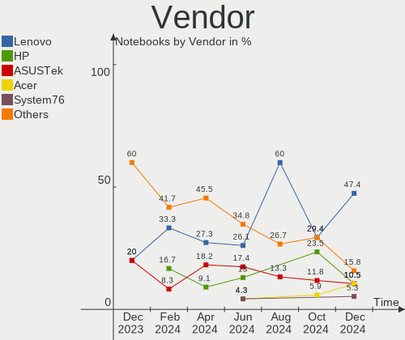
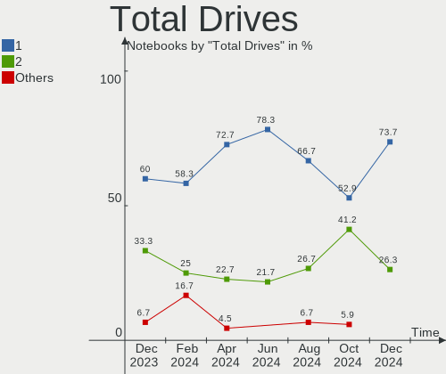
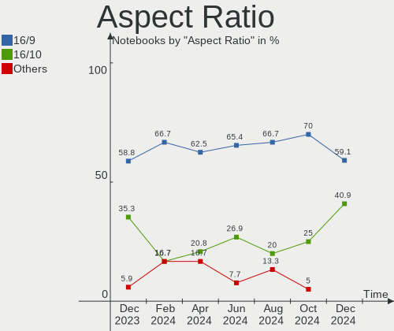

Gentoo - Hardware Trends (Notebooks)
------------------------------------

A project to identify most popular hardware characteristics and track their change
over time based on data collected by Linux users at https://Linux-Hardware.org.

Anyone can contribute to this report by the [hw-probe](https://github.com/linuxhw/hw-probe) tool:

    sudo -E hw-probe -all -upload

This report is for one last month. Overall report since the beginning of time: [TestDays](https://github.com/linuxhw/TestDays)

Period: Feb, 2023.

Contents
--------

* [ System ](#system)
  - [ OS                       ](#os)
  - [ OS Family                ](#os-family)
  - [ Kernel                   ](#kernel)
  - [ Kernel Family            ](#kernel-family)
  - [ Kernel Major Ver.        ](#kernel-major-ver)
  - [ Arch                     ](#arch)
  - [ DE                       ](#de)
  - [ Display Server           ](#display-server)
  - [ Display Manager          ](#display-manager)
  - [ OS Lang                  ](#os-lang)
  - [ Boot Mode                ](#boot-mode)
  - [ Filesystem               ](#filesystem)
  - [ Part. scheme             ](#part-scheme)
  - [ Dual Boot with Linux/BSD ](#dual-boot-with-linuxbsd)
  - [ Dual Boot (Win)          ](#dual-boot-win)

* [ Board ](#board)
  - [ Vendor                   ](#vendor)
  - [ Model                    ](#model)
  - [ Model Family             ](#model-family)
  - [ MFG Year                 ](#mfg-year)
  - [ Form Factor              ](#form-factor)
  - [ Secure Boot              ](#secure-boot)
  - [ Coreboot                 ](#coreboot)
  - [ RAM Size                 ](#ram-size)
  - [ RAM Used                 ](#ram-used)
  - [ Total Drives             ](#total-drives)
  - [ Has CD-ROM               ](#has-cd-rom)
  - [ Has Ethernet             ](#has-ethernet)
  - [ Has WiFi                 ](#has-wifi)
  - [ Has Bluetooth            ](#has-bluetooth)

* [ Location ](#location)
  - [ Country                  ](#country)
  - [ City                     ](#city)

* [ Drives ](#drives)
  - [ Drive Vendor             ](#drive-vendor)
  - [ Drive Model              ](#drive-model)
  - [ HDD Vendor               ](#hdd-vendor)
  - [ SSD Vendor               ](#ssd-vendor)
  - [ Drive Kind               ](#drive-kind)
  - [ Drive Connector          ](#drive-connector)
  - [ Drive Size               ](#drive-size)
  - [ Space Total              ](#space-total)
  - [ Space Used               ](#space-used)
  - [ Malfunc. Drives          ](#malfunc-drives)
  - [ Malfunc. Drive Vendor    ](#malfunc-drive-vendor)
  - [ Malfunc. HDD Vendor      ](#malfunc-hdd-vendor)
  - [ Malfunc. Drive Kind      ](#malfunc-drive-kind)
  - [ Failed Drives            ](#failed-drives)
  - [ Failed Drive Vendor      ](#failed-drive-vendor)
  - [ Drive Status             ](#drive-status)

* [ Storage controller ](#storage-controller)
  - [ Storage Vendor           ](#storage-vendor)
  - [ Storage Model            ](#storage-model)
  - [ Storage Kind             ](#storage-kind)

* [ Processor ](#processor)
  - [ CPU Vendor               ](#cpu-vendor)
  - [ CPU Model                ](#cpu-model)
  - [ CPU Model Family         ](#cpu-model-family)
  - [ CPU Cores                ](#cpu-cores)
  - [ CPU Sockets              ](#cpu-sockets)
  - [ CPU Threads              ](#cpu-threads)
  - [ CPU Op-Modes             ](#cpu-op-modes)
  - [ CPU Microcode            ](#cpu-microcode)
  - [ CPU Microarch            ](#cpu-microarch)

* [ Graphics ](#graphics)
  - [ GPU Vendor               ](#gpu-vendor)
  - [ GPU Model                ](#gpu-model)
  - [ GPU Combo                ](#gpu-combo)
  - [ GPU Driver               ](#gpu-driver)
  - [ GPU Memory               ](#gpu-memory)

* [ Monitor ](#monitor)
  - [ Monitor Vendor           ](#monitor-vendor)
  - [ Monitor Model            ](#monitor-model)
  - [ Monitor Resolution       ](#monitor-resolution)
  - [ Monitor Diagonal         ](#monitor-diagonal)
  - [ Monitor Width            ](#monitor-width)
  - [ Aspect Ratio             ](#aspect-ratio)
  - [ Monitor Area             ](#monitor-area)
  - [ Pixel Density            ](#pixel-density)
  - [ Multiple Monitors        ](#multiple-monitors)

* [ Network ](#network)
  - [ Net Controller Vendor    ](#net-controller-vendor)
  - [ Net Controller Model     ](#net-controller-model)
  - [ Wireless Vendor          ](#wireless-vendor)
  - [ Wireless Model           ](#wireless-model)
  - [ Ethernet Vendor          ](#ethernet-vendor)
  - [ Ethernet Model           ](#ethernet-model)
  - [ Net Controller Kind      ](#net-controller-kind)
  - [ Used Controller          ](#used-controller)
  - [ NICs                     ](#nics)
  - [ IPv6                     ](#ipv6)

* [ Bluetooth ](#bluetooth)
  - [ Bluetooth Vendor         ](#bluetooth-vendor)
  - [ Bluetooth Model          ](#bluetooth-model)

* [ Sound ](#sound)
  - [ Sound Vendor             ](#sound-vendor)
  - [ Sound Model              ](#sound-model)

* [ Memory ](#memory)
  - [ Memory Vendor            ](#memory-vendor)
  - [ Memory Model             ](#memory-model)
  - [ Memory Kind              ](#memory-kind)
  - [ Memory Form Factor       ](#memory-form-factor)
  - [ Memory Size              ](#memory-size)
  - [ Memory Speed             ](#memory-speed)

* [ Printers & scanners ](#printers--scanners)
  - [ Printer Vendor           ](#printer-vendor)
  - [ Printer Model            ](#printer-model)
  - [ Scanner Vendor           ](#scanner-vendor)
  - [ Scanner Model            ](#scanner-model)

* [ Camera ](#camera)
  - [ Camera Vendor            ](#camera-vendor)
  - [ Camera Model             ](#camera-model)

* [ Security ](#security)
  - [ Fingerprint Vendor       ](#fingerprint-vendor)
  - [ Fingerprint Model        ](#fingerprint-model)
  - [ Chipcard Vendor          ](#chipcard-vendor)
  - [ Chipcard Model           ](#chipcard-model)

* [ Unsupported ](#unsupported)
  - [ Unsupported Devices      ](#unsupported-devices)
  - [ Unsupported Device Types ](#unsupported-device-types)

System
------

OS
--

Installed operating systems

| Name        | Notebooks | Percent |
|-------------|-----------|---------|
| Gentoo 2.13 | 14        | 51.85%  |
| Gentoo 2.9  | 12        | 44.44%  |
| Gentoo 2.8  | 1         | 3.7%    |

OS Family
---------

OS without a version

| Name   | Notebooks | Percent |
|--------|-----------|---------|
| Gentoo | 27        | 100%    |

Kernel
------

Version of the Linux kernel

| Version               | Notebooks | Percent |
|-----------------------|-----------|---------|
| 6.1.9-gentoo-x86_64   | 2         | 7.41%   |
| 6.1.12-gentoo-dist    | 2         | 7.41%   |
| 6.1.12-gentoo         | 2         | 7.41%   |
| 6.1.10-gentoo-x86_64  | 2         | 7.41%   |
| 5.15.88-gentoo-x86_64 | 2         | 7.41%   |
| 5.15.80-gentoo        | 2         | 7.41%   |
| 6.2.1-gentoo-y        | 1         | 3.7%    |
| 6.2.1-calculate       | 1         | 3.7%    |
| 6.2.0-gentoo          | 1         | 3.7%    |
| 6.1.9-gentoo-dist     | 1         | 3.7%    |
| 6.1.8-gentoo          | 1         | 3.7%    |
| 6.1.4-gentoo-x86_64   | 1         | 3.7%    |
| 6.1.12-gentoo-x86_64  | 1         | 3.7%    |
| 6.1.12-gentoo-Vector  | 1         | 3.7%    |
| 6.1.11-gentoo-x86_64  | 1         | 3.7%    |
| 6.1.11-gentoo-dist    | 1         | 3.7%    |
| 6.1.10-gentoo         | 1         | 3.7%    |
| 6.1.1-arch1-1         | 1         | 3.7%    |
| 5.15.93-gentoo-117    | 1         | 3.7%    |
| 5.15.88-gentoo        | 1         | 3.7%    |
| 5.10.27-gentoo        | 1         | 3.7%    |

Kernel Family
-------------

Linux kernel without a distro release

| Version | Notebooks | Percent |
|---------|-----------|---------|
| 6.1.12  | 6         | 22.22%  |
| 6.1.9   | 3         | 11.11%  |
| 6.1.10  | 3         | 11.11%  |
| 5.15.88 | 3         | 11.11%  |
| 6.2.1   | 2         | 7.41%   |
| 6.1.11  | 2         | 7.41%   |
| 5.15.80 | 2         | 7.41%   |
| 6.2.0   | 1         | 3.7%    |
| 6.1.8   | 1         | 3.7%    |
| 6.1.4   | 1         | 3.7%    |
| 6.1.1   | 1         | 3.7%    |
| 5.15.93 | 1         | 3.7%    |
| 5.10.27 | 1         | 3.7%    |

Kernel Major Ver.
-----------------

Linux kernel major version

| Version | Notebooks | Percent |
|---------|-----------|---------|
| 6.1     | 17        | 62.96%  |
| 5.15    | 6         | 22.22%  |
| 6.2     | 3         | 11.11%  |
| 5.10    | 1         | 3.7%    |

Arch
----

OS architecture (x86_64, i586, etc.)

| Name   | Notebooks | Percent |
|--------|-----------|---------|
| x86_64 | 27        | 100%    |

DE
--

Desktop Environment

| Name     | Notebooks | Percent |
|----------|-----------|---------|
| KDE5     | 6         | 22.22%  |
| XFCE     | 5         | 18.52%  |
| Unknown  | 5         | 18.52%  |
| GNOME    | 3         | 11.11%  |
| DWM      | 3         | 11.11%  |
| MATE     | 2         | 7.41%   |
| Trinity  | 1         | 3.7%    |
| ICEWM    | 1         | 3.7%    |
| Hyprland | 1         | 3.7%    |

Display Server
--------------

X11 or Wayland

| Name    | Notebooks | Percent |
|---------|-----------|---------|
| X11     | 13        | 48.15%  |
| Wayland | 6         | 22.22%  |
| Unknown | 5         | 18.52%  |
| Tty     | 3         | 11.11%  |

Display Manager
---------------

SDDM, LightDM, etc.

| Name    | Notebooks | Percent |
|---------|-----------|---------|
| SDDM    | 10        | 37.04%  |
| Unknown | 9         | 33.33%  |
| LightDM | 3         | 11.11%  |
| SLiM    | 2         | 7.41%   |
| GDM     | 2         | 7.41%   |
| TDM     | 1         | 3.7%    |

OS Lang
-------

Language

| Lang    | Notebooks | Percent |
|---------|-----------|---------|
| en_US   | 10        | 37.04%  |
| ru_RU   | 2         | 7.41%   |
| fr_FR   | 2         | 7.41%   |
| en_GB   | 2         | 7.41%   |
| cs_CZ   | 2         | 7.41%   |
| C.UTF8  | 2         | 7.41%   |
| Unknown | 2         | 7.41%   |
| nl_BE   | 1         | 3.7%    |
| mi_NZ   | 1         | 3.7%    |
| en_AU   | 1         | 3.7%    |
| el_GR   | 1         | 3.7%    |
| de_DE   | 1         | 3.7%    |

Boot Mode
---------

EFI or BIOS

| Mode | Notebooks | Percent |
|------|-----------|---------|
| EFI  | 25        | 92.59%  |
| BIOS | 2         | 7.41%   |

Filesystem
----------

Type of filesystem

| Type  | Notebooks | Percent |
|-------|-----------|---------|
| Ext4  | 15        | 55.56%  |
| Btrfs | 11        | 40.74%  |
| Zfs   | 1         | 3.7%    |

Part. scheme
------------

Scheme of partitioning

| Type    | Notebooks | Percent |
|---------|-----------|---------|
| GPT     | 26        | 96.3%   |
| Unknown | 1         | 3.7%    |

Dual Boot with Linux/BSD
------------------------

Hosting more than one Linux/BSD

| Dual boot | Notebooks | Percent |
|-----------|-----------|---------|
| No        | 21        | 77.78%  |
| Yes       | 6         | 22.22%  |

Dual Boot (Win)
---------------

Hosting Linux and Windows

| Dual boot | Notebooks | Percent |
|-----------|-----------|---------|
| No        | 16        | 59.26%  |
| Yes       | 11        | 40.74%  |

Board
-----

Vendor
------

Motherboard manufacturer

| Name             | Notebooks | Percent |
|------------------|-----------|---------|
| Lenovo           | 5         | 18.52%  |
| Hewlett-Packard  | 4         | 14.81%  |
| ASUSTek Computer | 4         | 14.81%  |
| MSI              | 3         | 11.11%  |
| Dell             | 3         | 11.11%  |
| Unknown          | 2         | 7.41%   |
| Valve            | 1         | 3.7%    |
| Timi             | 1         | 3.7%    |
| realme           | 1         | 3.7%    |
| Apple            | 1         | 3.7%    |
| Alienware        | 1         | 3.7%    |
| Acer             | 1         | 3.7%    |

Model
-----

Motherboard model

| Name                                   | Notebooks | Percent |
|----------------------------------------|-----------|---------|
| Dell Precision 7770                    | 2         | 7.41%   |
| Unknown                                | 2         | 7.41%   |
| Valve Jupiter                          | 1         | 3.7%    |
| Timi RedmiBook Pro 15S                 | 1         | 3.7%    |
| realme RMNBXXXX                        | 1         | 3.7%    |
| MSI Vector GP66 12UEO                  | 1         | 3.7%    |
| MSI GS66 Stealth 10UE                  | 1         | 3.7%    |
| MSI GP60 2PE                           | 1         | 3.7%    |
| Lenovo ThinkPad T570 W10DG 20JXS08118  | 1         | 3.7%    |
| Lenovo ThinkPad T16 Gen 1 21CH000FUS   | 1         | 3.7%    |
| Lenovo ThinkPad E14 Gen 4 21EBCTO1WW   | 1         | 3.7%    |
| Lenovo Legion 5P 15IMH05 82AW          | 1         | 3.7%    |
| Lenovo IdeaPad 100-15IBD 80QQ          | 1         | 3.7%    |
| HP Victus by Laptop 16-e0xxx           | 1         | 3.7%    |
| HP Victus by Gaming Laptop 15-fb0xxx   | 1         | 3.7%    |
| HP Pavilion Notebook                   | 1         | 3.7%    |
| HP Laptop 17-ca1xxx                    | 1         | 3.7%    |
| Dell XPS 15 9520                       | 1         | 3.7%    |
| ASUS VivoBook_ASUSLaptop X509DA_M509DA | 1         | 3.7%    |
| ASUS Strix 17 GL703GE                  | 1         | 3.7%    |
| ASUS ROG Strix G732LXS_G732LXS         | 1         | 3.7%    |
| ASUS GL702VT                           | 1         | 3.7%    |
| Apple MacBookPro10,2                   | 1         | 3.7%    |
| Alienware 17                           | 1         | 3.7%    |
| Acer Aspire A515-45G                   | 1         | 3.7%    |

Model Family
------------

Motherboard model prefix

| Name               | Notebooks | Percent |
|--------------------|-----------|---------|
| Lenovo ThinkPad    | 3         | 11.11%  |
| HP Victus          | 2         | 7.41%   |
| Dell Precision     | 2         | 7.41%   |
| Unknown            | 2         | 7.41%   |
| Valve Jupiter      | 1         | 3.7%    |
| Timi RedmiBook     | 1         | 3.7%    |
| realme RMNBXXXX    | 1         | 3.7%    |
| MSI Vector         | 1         | 3.7%    |
| MSI GS66           | 1         | 3.7%    |
| MSI GP60           | 1         | 3.7%    |
| Lenovo Legion      | 1         | 3.7%    |
| Lenovo IdeaPad     | 1         | 3.7%    |
| HP Pavilion        | 1         | 3.7%    |
| HP Laptop          | 1         | 3.7%    |
| Dell XPS           | 1         | 3.7%    |
| ASUS VivoBook      | 1         | 3.7%    |
| ASUS Strix         | 1         | 3.7%    |
| ASUS ROG           | 1         | 3.7%    |
| ASUS GL702VT       | 1         | 3.7%    |
| Apple MacBookPro10 | 1         | 3.7%    |
| Alienware 17       | 1         | 3.7%    |
| Acer Aspire        | 1         | 3.7%    |

MFG Year
--------

Motherboard manufacture year

| Year | Notebooks | Percent |
|------|-----------|---------|
| 2022 | 9         | 33.33%  |
| 2021 | 7         | 25.93%  |
| 2019 | 5         | 18.52%  |
| 2015 | 2         | 7.41%   |
| 2018 | 1         | 3.7%    |
| 2017 | 1         | 3.7%    |
| 2014 | 1         | 3.7%    |
| 2013 | 1         | 3.7%    |

Form Factor
-----------

Physical design of the computer

| Name     | Notebooks | Percent |
|----------|-----------|---------|
| Notebook | 27        | 100%    |

Secure Boot
-----------

Enabled or disabled

| State    | Notebooks | Percent |
|----------|-----------|---------|
| Disabled | 27        | 100%    |

Coreboot
--------

Have coreboot on board

| Used | Notebooks | Percent |
|------|-----------|---------|
| No   | 27        | 100%    |

RAM Size
--------

Total RAM memory

| Size in GB | Notebooks | Percent |
|------------|-----------|---------|
| 16.01-24.0 | 8         | 29.63%  |
| 8.01-16.0  | 7         | 25.93%  |
| 32.01-64.0 | 6         | 22.22%  |
| 4.01-8.0   | 3         | 11.11%  |
| 3.01-4.0   | 2         | 7.41%   |
| 24.01-32.0 | 1         | 3.7%    |

RAM Used
--------

Used RAM memory

| Used GB   | Notebooks | Percent |
|-----------|-----------|---------|
| 1.01-2.0  | 7         | 25.93%  |
| 4.01-8.0  | 5         | 18.52%  |
| 2.01-3.0  | 5         | 18.52%  |
| 8.01-16.0 | 5         | 18.52%  |
| 3.01-4.0  | 2         | 7.41%   |
| 0.01-0.5  | 2         | 7.41%   |
| 0.51-1.0  | 1         | 3.7%    |

Total Drives
------------

Number of drives on board

| Drives | Notebooks | Percent |
|--------|-----------|---------|
| 1      | 14        | 51.85%  |
| 2      | 12        | 44.44%  |
| 3      | 1         | 3.7%    |

Has CD-ROM
----------

Has CD-ROM on board

| Presented | Notebooks | Percent |
|-----------|-----------|---------|
| No        | 24        | 88.89%  |
| Yes       | 3         | 11.11%  |

Has Ethernet
------------

Has Ethernet on board

| Presented | Notebooks | Percent |
|-----------|-----------|---------|
| Yes       | 24        | 88.89%  |
| No        | 3         | 11.11%  |

Has WiFi
--------

Has WiFi module

| Presented | Notebooks | Percent |
|-----------|-----------|---------|
| Yes       | 26        | 96.3%   |
| No        | 1         | 3.7%    |

Has Bluetooth
-------------

Has Bluetooth module

| Presented | Notebooks | Percent |
|-----------|-----------|---------|
| Yes       | 27        | 100%    |

Location
--------

Country
-------

Geographic location (country)

| Country     | Notebooks | Percent |
|-------------|-----------|---------|
| USA         | 4         | 14.81%  |
| Russia      | 4         | 14.81%  |
| Germany     | 2         | 7.41%   |
| France      | 2         | 7.41%   |
| UK          | 1         | 3.7%    |
| Tunisia     | 1         | 3.7%    |
| Poland      | 1         | 3.7%    |
| New Zealand | 1         | 3.7%    |
| Lithuania   | 1         | 3.7%    |
| Italy       | 1         | 3.7%    |
| Iceland     | 1         | 3.7%    |
| Hong Kong   | 1         | 3.7%    |
| Greece      | 1         | 3.7%    |
| Czechia     | 1         | 3.7%    |
| China       | 1         | 3.7%    |
| Canada      | 1         | 3.7%    |
| Bulgaria    | 1         | 3.7%    |
| Belgium     | 1         | 3.7%    |
| Australia   | 1         | 3.7%    |

City
----

Geographic location (city)

| City               | Notebooks | Percent |
|--------------------|-----------|---------|
| Oviedo             | 2         | 7.41%   |
| Welwyn Garden City | 1         | 3.7%    |
| Vilnius            | 1         | 3.7%    |
| Ufa                | 1         | 3.7%    |
| Tunis              | 1         | 3.7%    |
| Toronto            | 1         | 3.7%    |
| Taganrog           | 1         | 3.7%    |
| Sofia              | 1         | 3.7%    |
| Seattle            | 1         | 3.7%    |
| San Dimas          | 1         | 3.7%    |
| Ryazan             | 1         | 3.7%    |
| Reykjavik          | 1         | 3.7%    |
| Omsk               | 1         | 3.7%    |
| Nanterre           | 1         | 3.7%    |
| Nandlstadt         | 1         | 3.7%    |
| Milan              | 1         | 3.7%    |
| Melbourne          | 1         | 3.7%    |
| Mainz              | 1         | 3.7%    |
| Krakow             | 1         | 3.7%    |
| Hamilton           | 1         | 3.7%    |
| Ewirgol            | 1         | 3.7%    |
| Doksy              | 1         | 3.7%    |
| Dilsen-Stokkem     | 1         | 3.7%    |
| Cognac             | 1         | 3.7%    |
| Central            | 1         | 3.7%    |
| Aigaleo            | 1         | 3.7%    |

Drives
------

Drive Vendor
------------

Hard drive vendors

| Vendor                      | Notebooks | Drives | Percent |
|-----------------------------|-----------|--------|---------|
| Samsung Electronics         | 11        | 15     | 31.43%  |
| SanDisk                     | 5         | 5      | 14.29%  |
| Seagate                     | 3         | 3      | 8.57%   |
| WDC                         | 2         | 2      | 5.71%   |
| SK hynix                    | 2         | 2      | 5.71%   |
| Phison Electronics          | 2         | 2      | 5.71%   |
| Micron Technology           | 2         | 2      | 5.71%   |
| Unknown                     | 1         | 1      | 2.86%   |
| TrekStor                    | 1         | 1      | 2.86%   |
| KIOXIA                      | 1         | 1      | 2.86%   |
| Kingston Technology Company | 1         | 1      | 2.86%   |
| Intel                       | 1         | 2      | 2.86%   |
| HGST                        | 1         | 1      | 2.86%   |
| China                       | 1         | 2      | 2.86%   |
| Apple                       | 1         | 1      | 2.86%   |

Drive Model
-----------

Hard drive models

| Model                                                | Notebooks | Percent |
|------------------------------------------------------|-----------|---------|
| Samsung NVMe SSD Controller SM981/PM981/PM983 250GB  | 6         | 15.38%  |
| Samsung NVMe SSD Controller PM9A1/PM9A3/980PRO 960GB | 4         | 10.26%  |
| Seagate ST1000LM024 HN-M101MBB 1TB                   | 2         | 5.13%   |
| Samsung SSD 980 1TB                                  | 2         | 5.13%   |
| WDC WDS240G2G0A-00JH30 240GB SSD                     | 1         | 2.56%   |
| WDC WD10JPVX-75JC3T0 1TB                             | 1         | 2.56%   |
| Unknown MMC Card  128GB                              | 1         | 2.56%   |
| TrekStor I.GEAR 128GB                                | 1         | 2.56%   |
| SK hynix PC801 NVMe 1TB                              | 1         | 2.56%   |
| SK hynix PC711 HFS512GDE9X073N 512GB                 | 1         | 2.56%   |
| Seagate ST1000LM035-1RK172 1TB                       | 1         | 2.56%   |
| Sandisk WDC PC SN530 SDBPTPZ-512G-1002 512GB         | 1         | 2.56%   |
| SanDisk SSD PLUS 240GB                               | 1         | 2.56%   |
| SanDisk SD9SN8W-128G-1006 128GB SSD                  | 1         | 2.56%   |
| SanDisk SD8SNAT128G1002 128GB SSD                    | 1         | 2.56%   |
| SanDisk Extreme 55AE 500GB SSD                       | 1         | 2.56%   |
| Samsung SSD 870 EVO 1TB                              | 1         | 2.56%   |
| Samsung SSD 850 EVO mSATA 120GB                      | 1         | 2.56%   |
| Samsung MZVLQ512HBLU-00B00 512GB                     | 1         | 2.56%   |
| Phison PS5013 E13 NVMe Controller 500GB              | 1         | 2.56%   |
| Phison PCIe SSD 256GB                                | 1         | 2.56%   |
| Micron MTFDKCD512TFK 512GB                           | 1         | 2.56%   |
| Micron 2450_MTFDKBA1T0TFK 1TB                        | 1         | 2.56%   |
| KIOXIA KBG40ZNV512G 512GB                            | 1         | 2.56%   |
| Kingston Company SNV2S1000G 1TB                      | 1         | 2.56%   |
| Intel SSD 660P Series 1024GB                         | 1         | 2.56%   |
| HGST HTS721010A9E630 1TB                             | 1         | 2.56%   |
| China SSD 1TB                                        | 1         | 2.56%   |
| Apple SSD SM256E 256GB                               | 1         | 2.56%   |

HDD Vendor
----------

Hard disk drive vendors

| Vendor  | Notebooks | Drives | Percent |
|---------|-----------|--------|---------|
| Seagate | 3         | 3      | 60%     |
| WDC     | 1         | 1      | 20%     |
| HGST    | 1         | 1      | 20%     |

SSD Vendor
----------

Solid state drive vendors

| Vendor              | Notebooks | Drives | Percent |
|---------------------|-----------|--------|---------|
| SanDisk             | 4         | 4      | 44.44%  |
| Samsung Electronics | 2         | 2      | 22.22%  |
| WDC                 | 1         | 1      | 11.11%  |
| China               | 1         | 2      | 11.11%  |
| Apple               | 1         | 1      | 11.11%  |

Drive Kind
----------

HDD or SSD

| Kind    | Notebooks | Drives | Percent |
|---------|-----------|--------|---------|
| NVMe    | 18        | 24     | 56.25%  |
| SSD     | 7         | 10     | 21.88%  |
| HDD     | 5         | 5      | 15.63%  |
| MMC     | 1         | 1      | 3.13%   |
| Unknown | 1         | 1      | 3.13%   |

Drive Connector
---------------

SATA, SAS, NVMe, etc.

| Type | Notebooks | Drives | Percent |
|------|-----------|--------|---------|
| NVMe | 18        | 24     | 60%     |
| SATA | 9         | 14     | 30%     |
| SAS  | 2         | 2      | 6.67%   |
| MMC  | 1         | 1      | 3.33%   |

Drive Size
----------

Size of hard drive

| Size in TB | Notebooks | Drives | Percent |
|------------|-----------|--------|---------|
| 0.51-1.0   | 7         | 8      | 53.85%  |
| 0.01-0.5   | 6         | 7      | 46.15%  |

Space Total
-----------

Amount of disk space available on the file system

| Size in GB     | Notebooks | Percent |
|----------------|-----------|---------|
| 501-1000       | 7         | 25.93%  |
| 101-250        | 6         | 22.22%  |
| 251-500        | 5         | 18.52%  |
| 1001-2000      | 5         | 18.52%  |
| 1-20           | 2         | 7.41%   |
| More than 3000 | 1         | 3.7%    |
| Unknown        | 1         | 3.7%    |

Space Used
----------

Amount of used disk space

| Used GB  | Notebooks | Percent |
|----------|-----------|---------|
| 101-250  | 6         | 22.22%  |
| 1-20     | 6         | 22.22%  |
| 251-500  | 5         | 18.52%  |
| 501-1000 | 5         | 18.52%  |
| 21-50    | 4         | 14.81%  |
| Unknown  | 1         | 3.7%    |

Malfunc. Drives
---------------

Drive models with a malfunction

| Model                                | Notebooks | Drives | Percent |
|--------------------------------------|-----------|--------|---------|
| Seagate ST1000LM024 HN-M101MBB 1TB   | 2         | 2      | 50%     |
| WDC WD10JPVX-75JC3T0 1TB             | 1         | 1      | 25%     |
| SK hynix PC711 HFS512GDE9X073N 512GB | 1         | 1      | 25%     |

Malfunc. Drive Vendor
---------------------

Vendors of faulty drives

| Vendor   | Notebooks | Drives | Percent |
|----------|-----------|--------|---------|
| Seagate  | 2         | 2      | 50%     |
| WDC      | 1         | 1      | 25%     |
| SK hynix | 1         | 1      | 25%     |

Malfunc. HDD Vendor
-------------------

Vendors of faulty HDD drives

| Vendor  | Notebooks | Drives | Percent |
|---------|-----------|--------|---------|
| Seagate | 2         | 2      | 66.67%  |
| WDC     | 1         | 1      | 33.33%  |

Malfunc. Drive Kind
-------------------

Kinds of faulty drives

| Kind | Notebooks | Drives | Percent |
|------|-----------|--------|---------|
| HDD  | 3         | 3      | 75%     |
| NVMe | 1         | 1      | 25%     |

Failed Drives
-------------

Failed drive models

Zero info for selected period =(

Failed Drive Vendor
-------------------

Failed drive vendors

Zero info for selected period =(

Drive Status
------------

Number of failed and malfunc. drives

| Status   | Notebooks | Drives | Percent |
|----------|-----------|--------|---------|
| Works    | 23        | 32     | 74.19%  |
| Detected | 4         | 5      | 12.9%   |
| Malfunc  | 4         | 4      | 12.9%   |

Storage controller
------------------

Storage Vendor
--------------

Storage controller vendors

| Vendor                      | Notebooks | Percent |
|-----------------------------|-----------|---------|
| Intel                       | 12        | 34.29%  |
| Samsung Electronics         | 10        | 28.57%  |
| AMD                         | 4         | 11.43%  |
| SK hynix                    | 2         | 5.71%   |
| Phison Electronics          | 2         | 5.71%   |
| Micron Technology           | 2         | 5.71%   |
| SanDisk                     | 1         | 2.86%   |
| KIOXIA                      | 1         | 2.86%   |
| Kingston Technology Company | 1         | 2.86%   |

Storage Model
-------------

Storage controller models

| Model                                                                          | Notebooks | Percent |
|--------------------------------------------------------------------------------|-----------|---------|
| Samsung NVMe SSD Controller SM981/PM981/PM983                                  | 6         | 15.38%  |
| Samsung NVMe SSD Controller PM9A1/PM9A3/980PRO                                 | 4         | 10.26%  |
| AMD FCH SATA Controller [AHCI mode]                                            | 4         | 10.26%  |
| Samsung NVMe SSD Controller 980                                                | 3         | 7.69%   |
| Micron Non-Volatile memory controller                                          | 2         | 5.13%   |
| Intel Wildcat Point-LP SATA Controller [AHCI Mode]                             | 2         | 5.13%   |
| Intel Volume Management Device NVMe RAID Controller                            | 2         | 5.13%   |
| Intel 8 Series/C220 Series Chipset Family 6-port SATA Controller 1 [AHCI mode] | 2         | 5.13%   |
| Intel 7 Series Chipset Family 6-port SATA Controller [AHCI mode]               | 2         | 5.13%   |
| SK hynix Platinum P41 NVMe Solid State Drive 2TB                               | 1         | 2.56%   |
| SK hynix Gold P31/PC711 NVMe Solid State Drive                                 | 1         | 2.56%   |
| SanDisk Non-Volatile memory controller                                         | 1         | 2.56%   |
| Samsung NVMe SSD Controller SM961/PM961/SM963                                  | 1         | 2.56%   |
| Phison PS5013 E13 NVMe Controller                                              | 1         | 2.56%   |
| Phison NVMe Storage Controller                                                 | 1         | 2.56%   |
| KIOXIA NVMe SSD Controller BG4                                                 | 1         | 2.56%   |
| Kingston Company Company Non-Volatile memory controller                        | 1         | 2.56%   |
| Intel SSD 660P Series                                                          | 1         | 2.56%   |
| Intel HM170/QM170 Chipset SATA Controller [AHCI Mode]                          | 1         | 2.56%   |
| Intel Cannon Lake Mobile PCH SATA AHCI Controller                              | 1         | 2.56%   |
| Intel 400 Series Chipset Family SATA AHCI Controller                           | 1         | 2.56%   |

Storage Kind
------------

Kind of storage controller (IDE, SATA, NVMe, SAS, ...)

| Kind | Notebooks | Percent |
|------|-----------|---------|
| NVMe | 19        | 55.88%  |
| SATA | 13        | 38.24%  |
| RAID | 2         | 5.88%   |

Processor
---------

CPU Vendor
----------

Processor vendors

| Vendor | Notebooks | Percent |
|--------|-----------|---------|
| Intel  | 18        | 66.67%  |
| AMD    | 9         | 33.33%  |

CPU Model
---------

Processor models

| Model                                         | Notebooks | Percent |
|-----------------------------------------------|-----------|---------|
| Intel Core i7-10875H CPU @ 2.30GHz            | 2         | 7.41%   |
| Intel 12th Gen Core i7-12850HX                | 2         | 7.41%   |
| Intel 12th Gen Core i7-12700H                 | 2         | 7.41%   |
| AMD Ryzen 7 5800H with Radeon Graphics        | 2         | 7.41%   |
| AMD Ryzen 7 3700U with Radeon Vega Mobile Gfx | 2         | 7.41%   |
| Intel Core i7-8750H CPU @ 2.20GHz             | 1         | 3.7%    |
| Intel Core i7-6700HQ CPU @ 2.60GHz            | 1         | 3.7%    |
| Intel Core i7-4710MQ CPU @ 2.50GHz            | 1         | 3.7%    |
| Intel Core i7-2670QM CPU @ 2.20GHz            | 1         | 3.7%    |
| Intel Core i7-10750H CPU @ 2.60GHz            | 1         | 3.7%    |
| Intel Core i5-6300U CPU @ 2.40GHz             | 1         | 3.7%    |
| Intel Core i5-5200U CPU @ 2.20GHz             | 1         | 3.7%    |
| Intel Core i5-4210H CPU @ 2.90GHz             | 1         | 3.7%    |
| Intel Core i5-3230M CPU @ 2.60GHz             | 1         | 3.7%    |
| Intel Core i3-5005U CPU @ 2.00GHz             | 1         | 3.7%    |
| Intel 11th Gen Core i5-1135G7 @ 2.40GHz       | 1         | 3.7%    |
| Intel 11th Gen Core i5-1130G7 @ 1.10GHz       | 1         | 3.7%    |
| AMD Ryzen 7 5825U with Radeon Graphics        | 1         | 3.7%    |
| AMD Ryzen 7 5700U with Radeon Graphics        | 1         | 3.7%    |
| AMD Ryzen 5 PRO 6650U with Radeon Graphics    | 1         | 3.7%    |
| AMD Ryzen 5 5600H with Radeon Graphics        | 1         | 3.7%    |
| AMD Custom APU 0405                           | 1         | 3.7%    |

CPU Model Family
----------------

Processor model prefix

| Model           | Notebooks | Percent |
|-----------------|-----------|---------|
| Other           | 7         | 25.93%  |
| Intel Core i7   | 7         | 25.93%  |
| AMD Ryzen 7     | 6         | 22.22%  |
| Intel Core i5   | 4         | 14.81%  |
| Intel Core i3   | 1         | 3.7%    |
| AMD Ryzen 5 PRO | 1         | 3.7%    |
| AMD Ryzen 5     | 1         | 3.7%    |

CPU Cores
---------

Number of processor cores

| Number | Notebooks | Percent |
|--------|-----------|---------|
| 4      | 8         | 29.63%  |
| 8      | 6         | 22.22%  |
| 2      | 5         | 18.52%  |
| 6      | 4         | 14.81%  |
| 16     | 2         | 7.41%   |
| 14     | 2         | 7.41%   |

CPU Sockets
-----------

Number of sockets

| Number | Notebooks | Percent |
|--------|-----------|---------|
| 1      | 27        | 100%    |

CPU Threads
-----------

Threads per core (Hyper-Threading)

| Number | Notebooks | Percent |
|--------|-----------|---------|
| 2      | 27        | 100%    |

CPU Op-Modes
------------

CPU Operation Modes (32-bit, 64-bit)

| Op mode        | Notebooks | Percent |
|----------------|-----------|---------|
| 32-bit, 64-bit | 27        | 100%    |

CPU Microcode
-------------

Microcode number

| Number     | Notebooks | Percent |
|------------|-----------|---------|
| Unknown    | 3         | 11.11%  |
| 0xa0652    | 2         | 7.41%   |
| 0x906a3    | 2         | 7.41%   |
| 0x90672    | 2         | 7.41%   |
| 0x806c1    | 2         | 7.41%   |
| 0x306d4    | 2         | 7.41%   |
| 0x0a50000d | 2         | 7.41%   |
| 0x0a50000c | 2         | 7.41%   |
| 0x08108109 | 2         | 7.41%   |
| 0x906ea    | 1         | 3.7%    |
| 0x506e3    | 1         | 3.7%    |
| 0x406e3    | 1         | 3.7%    |
| 0x306c3    | 1         | 3.7%    |
| 0x306a9    | 1         | 3.7%    |
| 0x206a7    | 1         | 3.7%    |
| 0x08900201 | 1         | 3.7%    |
| 0x08608102 | 1         | 3.7%    |

CPU Microarch
-------------

Microarchitecture

| Name             | Notebooks | Percent |
|------------------|-----------|---------|
| Zen 3            | 4         | 14.81%  |
| Alderlake Hybrid | 4         | 14.81%  |
| CometLake        | 3         | 11.11%  |
| Unknown          | 3         | 11.11%  |
| Zen+             | 2         | 7.41%   |
| TigerLake        | 2         | 7.41%   |
| Skylake          | 2         | 7.41%   |
| Haswell          | 2         | 7.41%   |
| Broadwell        | 2         | 7.41%   |
| SandyBridge      | 1         | 3.7%    |
| KabyLake         | 1         | 3.7%    |
| IvyBridge        | 1         | 3.7%    |

Graphics
--------

GPU Vendor
----------

Vendors of graphics cards

| Vendor | Notebooks | Percent |
|--------|-----------|---------|
| Intel  | 14        | 41.18%  |
| Nvidia | 11        | 32.35%  |
| AMD    | 9         | 26.47%  |

GPU Model
---------

Graphics card models

| Model                                                                     | Notebooks | Percent |
|---------------------------------------------------------------------------|-----------|---------|
| AMD Cezanne [Radeon Vega Series / Radeon Vega Mobile Series]              | 3         | 8.11%   |
| Nvidia GA106M [GeForce RTX 3060 Mobile / Max-Q]                           | 2         | 5.41%   |
| Nvidia GA104GLM [RTX A3000 12GB Laptop GPU]                               | 2         | 5.41%   |
| Intel HD Graphics 5500                                                    | 2         | 5.41%   |
| Intel CometLake-H GT2 [UHD Graphics]                                      | 2         | 5.41%   |
| Intel Alder Lake-P Integrated Graphics Controller                         | 2         | 5.41%   |
| Intel 4th Gen Core Processor Integrated Graphics Controller               | 2         | 5.41%   |
| AMD Picasso/Raven 2 [Radeon Vega Series / Radeon Vega Mobile Series]      | 2         | 5.41%   |
| Nvidia TU116M [GeForce GTX 1660 Ti Mobile]                                | 1         | 2.7%    |
| Nvidia TU104M [GeForce RTX 2080 SUPER Mobile / Max-Q]                     | 1         | 2.7%    |
| Nvidia GP107M [GeForce GTX 1050 Ti Mobile]                                | 1         | 2.7%    |
| Nvidia GM204M [GeForce GTX 970M]                                          | 1         | 2.7%    |
| Nvidia GM108M [GeForce 940M]                                              | 1         | 2.7%    |
| Nvidia GM108M [GeForce 840M]                                              | 1         | 2.7%    |
| Nvidia GA107M [GeForce RTX 3050 Ti Mobile]                                | 1         | 2.7%    |
| Intel TigerLake-LP GT2 [Iris Xe Graphics]                                 | 1         | 2.7%    |
| Intel Tiger Lake-UP4 GT2 [Iris Xe Graphics]                               | 1         | 2.7%    |
| Intel Skylake GT2 [HD Graphics 520]                                       | 1         | 2.7%    |
| Intel CoffeeLake-H GT2 [UHD Graphics 630]                                 | 1         | 2.7%    |
| Intel 3rd Gen Core processor Graphics Controller                          | 1         | 2.7%    |
| Intel 2nd Generation Core Processor Family Integrated Graphics Controller | 1         | 2.7%    |
| AMD VanGogh [AMD Custom GPU 0405]                                         | 1         | 2.7%    |
| AMD Rembrandt [Radeon 680M]                                               | 1         | 2.7%    |
| AMD Navi 24 [Radeon RX 6400/6500 XT/6500M]                                | 1         | 2.7%    |
| AMD Navi 14 [Radeon RX 5500/5500M / Pro 5500M]                            | 1         | 2.7%    |
| AMD Lucienne                                                              | 1         | 2.7%    |
| AMD Lexa [Radeon 540X/550X/630 / RX 640 / E9171 MCM]                      | 1         | 2.7%    |
| AMD Barcelo                                                               | 1         | 2.7%    |

GPU Combo
---------

Combinations of graphics cards

| Name           | Notebooks | Percent |
|----------------|-----------|---------|
| Intel + Nvidia | 7         | 25.93%  |
| 1 x Intel      | 7         | 25.93%  |
| 1 x AMD        | 6         | 22.22%  |
| 1 x Nvidia     | 4         | 14.81%  |
| 2 x AMD        | 3         | 11.11%  |

GPU Driver
----------

Free vs proprietary

| Driver      | Notebooks | Percent |
|-------------|-----------|---------|
| Free        | 17        | 62.96%  |
| Proprietary | 9         | 33.33%  |
| Unknown     | 1         | 3.7%    |

GPU Memory
----------

Total video memory

| Size in GB | Notebooks | Percent |
|------------|-----------|---------|
| Unknown    | 14        | 51.85%  |
| 0.51-1.0   | 4         | 14.81%  |
| 1.01-2.0   | 3         | 11.11%  |
| 3.01-4.0   | 2         | 7.41%   |
| 8.01-16.0  | 2         | 7.41%   |
| 5.01-6.0   | 1         | 3.7%    |
| 2.01-3.0   | 1         | 3.7%    |

Monitor
-------

Monitor Vendor
--------------

Monitor vendors

| Vendor               | Notebooks | Percent |
|----------------------|-----------|---------|
| Samsung Electronics  | 4         | 13.79%  |
| Chimei Innolux       | 4         | 13.79%  |
| BOE                  | 3         | 10.34%  |
| AU Optronics         | 3         | 10.34%  |
| Sharp                | 2         | 6.9%    |
| LG Display           | 2         | 6.9%    |
| BOE Technology Group | 2         | 6.9%    |
| Valve                | 1         | 3.45%   |
| TMX                  | 1         | 3.45%   |
| Sony                 | 1         | 3.45%   |
| Philips              | 1         | 3.45%   |
| Goldstar             | 1         | 3.45%   |
| ELSA                 | 1         | 3.45%   |
| CSO                  | 1         | 3.45%   |
| Apple                | 1         | 3.45%   |
| Unknown              | 1         | 3.45%   |

Monitor Model
-------------

Monitor models

| Model                                                                 | Notebooks | Percent |
|-----------------------------------------------------------------------|-----------|---------|
| BOE Technology Group LCD Monitor 1920x1080                            | 2         | 6.9%    |
| Valve ANX7530 U VLV3001 800x1280 100x150mm 7.1-inch                   | 1         | 3.45%   |
| TMX TL156MDMP01-0 TMX1560 3200x2000 336x210mm 15.6-inch               | 1         | 3.45%   |
| Sony BW8 MS_9001 1600x2560 113x181mm 8.4-inch                         | 1         | 3.45%   |
| Sharp LQ173M1JW03 SHP14DC 1920x1080 382x215mm 17.3-inch               | 1         | 3.45%   |
| Sharp LQ156M1JW03 SHP14C5 1920x1080 344x194mm 15.5-inch               | 1         | 3.45%   |
| Samsung Electronics S27B350 SAM08DC 1920x1080 598x336mm 27.0-inch     | 1         | 3.45%   |
| Samsung Electronics LCD Monitor SDC4E51 1366x768 344x194mm 15.5-inch  | 1         | 3.45%   |
| Samsung Electronics LCD Monitor SDC4179 2560x1440 344x194mm 15.5-inch | 1         | 3.45%   |
| Samsung Electronics LCD Monitor SDC414D 3456x2160 336x210mm 15.6-inch | 1         | 3.45%   |
| Philips PHL 242M8 PHLC214 1920x1080 527x296mm 23.8-inch               | 1         | 3.45%   |
| LG Display LCD Monitor LGD0657 1920x1080 344x194mm 15.5-inch          | 1         | 3.45%   |
| LG Display LCD Monitor LGD02DA 1920x1080 382x215mm 17.3-inch          | 1         | 3.45%   |
| Goldstar ULTRAFINE GSM5BC2 3840x2160 600x340mm 27.2-inch              | 1         | 3.45%   |
| ELSA EL271Q ELS0270 1920x1080 597x336mm 27.0-inch                     | 1         | 3.45%   |
| CSO LCD Monitor CSO160E 2560x1600 344x215mm 16.0-inch                 | 1         | 3.45%   |
| Chimei Innolux LCD Monitor CMN1747 1920x1080 381x214mm 17.2-inch      | 1         | 3.45%   |
| Chimei Innolux LCD Monitor CMN1606 1920x1080 355x199mm 16.0-inch      | 1         | 3.45%   |
| Chimei Innolux LCD Monitor CMN15C6 1366x768 344x193mm 15.5-inch       | 1         | 3.45%   |
| Chimei Innolux HD140ZB-01A CMN8C04 2160x1440 296x197mm 14.0-inch      | 1         | 3.45%   |
| BOE LCD Monitor BOE0A56 1920x1080 344x194mm 15.5-inch                 | 1         | 3.45%   |
| BOE LCD Monitor BOE07F1 1920x1080 344x193mm 15.5-inch                 | 1         | 3.45%   |
| BOE LCD Monitor BOE06D2 1920x1080 344x194mm 15.5-inch                 | 1         | 3.45%   |
| AU Optronics LCD Monitor AUO408D 1920x1080 309x174mm 14.0-inch        | 1         | 3.45%   |
| AU Optronics LCD Monitor AUO2992 1920x1080 344x193mm 15.5-inch        | 1         | 3.45%   |
| AU Optronics LCD Monitor AUO109D 1920x1080 381x214mm 17.2-inch        | 1         | 3.45%   |
| Apple Color LCD APPA014 2560x1600 286x179mm 13.3-inch                 | 1         | 3.45%   |
| Unknown                                                               | 1         | 3.45%   |

Monitor Resolution
------------------

Monitor screen resolution

| Resolution      | Notebooks | Percent |
|-----------------|-----------|---------|
| 1920x1080 (FHD) | 17        | 60.71%  |
| 2560x1600       | 3         | 10.71%  |
| 1366x768 (WXGA) | 2         | 7.14%   |
| 800x1280        | 1         | 3.57%   |
| 3840x2160 (4K)  | 1         | 3.57%   |
| 3456x2160       | 1         | 3.57%   |
| 3200x2000       | 1         | 3.57%   |
| 2560x1440 (QHD) | 1         | 3.57%   |
| 2160x1440       | 1         | 3.57%   |

Monitor Diagonal
----------------

Diagonal size in inches

| Inches  | Notebooks | Percent |
|---------|-----------|---------|
| 15      | 11        | 37.93%  |
| 17      | 4         | 13.79%  |
| Unknown | 3         | 10.34%  |
| 27      | 2         | 6.9%    |
| 16      | 2         | 6.9%    |
| 14      | 2         | 6.9%    |
| 31      | 1         | 3.45%   |
| 23      | 1         | 3.45%   |
| 13      | 1         | 3.45%   |
| 8       | 1         | 3.45%   |
| 7       | 1         | 3.45%   |

Monitor Width
-------------

Physical width

| Width in mm | Notebooks | Percent |
|-------------|-----------|---------|
| 301-350     | 13        | 44.83%  |
| 351-400     | 5         | 17.24%  |
| 501-600     | 3         | 10.34%  |
| Unknown     | 3         | 10.34%  |
| 201-300     | 2         | 6.9%    |
| 601-700     | 1         | 3.45%   |
| 101-200     | 1         | 3.45%   |
| 1-100       | 1         | 3.45%   |

Aspect Ratio
------------

Proportional relationship between the width and the height

| Ratio   | Notebooks | Percent |
|---------|-----------|---------|
| 16/9    | 18        | 64.29%  |
| 16/10   | 4         | 14.29%  |
| Unknown | 3         | 10.71%  |
| 3/2     | 1         | 3.57%   |
| 0.67    | 1         | 3.57%   |
| 0.62    | 1         | 3.57%   |

Monitor Area
------------

Area in inch

| Area in inch | Notebooks | Percent |
|----------------|-----------|---------|
| 101-110        | 12        | 41.38%  |
| 121-130        | 4         | 13.79%  |
| Unknown        | 3         | 10.34%  |
| 81-90          | 2         | 6.9%    |
| 1-40           | 2         | 6.9%    |
| 301-350        | 2         | 6.9%    |
| 71-80          | 1         | 3.45%   |
| 351-500        | 1         | 3.45%   |
| 201-250        | 1         | 3.45%   |
| 111-120        | 1         | 3.45%   |

Pixel Density
-------------

Pixels per inch

| Density       | Notebooks | Percent |
|---------------|-----------|---------|
| 121-160       | 13        | 44.83%  |
| 161-240       | 5         | 17.24%  |
| More than 240 | 3         | 10.34%  |
| 51-100        | 3         | 10.34%  |
| Unknown       | 3         | 10.34%  |
| 101-120       | 2         | 6.9%    |

Multiple Monitors
-----------------

Total monitors connected

| Total | Notebooks | Percent |
|-------|-----------|---------|
| 1     | 23        | 85.19%  |
| 2     | 3         | 11.11%  |
| 0     | 1         | 3.7%    |

Network
-------

Net Controller Vendor
---------------------

Controller vendors

| Vendor                | Notebooks | Percent |
|-----------------------|-----------|---------|
| Realtek Semiconductor | 18        | 40.91%  |
| Intel                 | 17        | 38.64%  |
| MediaTek              | 3         | 6.82%   |
| Qualcomm Atheros      | 2         | 4.55%   |
| Qualcomm              | 1         | 2.27%   |
| Edimax Technology     | 1         | 2.27%   |
| Broadcom              | 1         | 2.27%   |
| AVM                   | 1         | 2.27%   |

Net Controller Model
--------------------

Controller models

| Model                                                             | Notebooks | Percent |
|-------------------------------------------------------------------|-----------|---------|
| Realtek RTL8111/8168/8411 PCI Express Gigabit Ethernet Controller | 12        | 22.64%  |
| MediaTek MT7921 802.11ax PCI Express Wireless Network Adapter     | 3         | 5.66%   |
| Realtek RTL8723BE PCIe Wireless Network Adapter                   | 2         | 3.77%   |
| Realtek RTL8153 Gigabit Ethernet Adapter                          | 2         | 3.77%   |
| Realtek RTL810xE PCI Express Fast Ethernet controller             | 2         | 3.77%   |
| Qualcomm Atheros Killer E220x Gigabit Ethernet Controller         | 2         | 3.77%   |
| Intel Wi-Fi 6 AX210/AX211/AX411 160MHz                            | 2         | 3.77%   |
| Intel Wi-Fi 6 AX201                                               | 2         | 3.77%   |
| Intel Wi-Fi 6 AX200                                               | 2         | 3.77%   |
| Intel Ethernet Connection (17) I219-LM                            | 2         | 3.77%   |
| Intel Comet Lake PCH CNVi WiFi                                    | 2         | 3.77%   |
| Intel Alder Lake-S PCH CNVi WiFi                                  | 2         | 3.77%   |
| Intel Alder Lake-P PCH CNVi WiFi                                  | 2         | 3.77%   |
| Realtek RTL8852AE 802.11ax PCIe Wireless Network Adapter          | 1         | 1.89%   |
| Realtek RTL8822CE 802.11ac PCIe Wireless Network Adapter          | 1         | 1.89%   |
| Realtek RTL8821CE 802.11ac PCIe Wireless Network Adapter          | 1         | 1.89%   |
| Realtek RTL8125 2.5GbE Controller                                 | 1         | 1.89%   |
| Qualcomm QCNFA765 Wireless Network Adapter                        | 1         | 1.89%   |
| Intel Wireless 8260                                               | 1         | 1.89%   |
| Intel Wireless 7265                                               | 1         | 1.89%   |
| Intel Wireless 7260                                               | 1         | 1.89%   |
| Intel Wireless 3160                                               | 1         | 1.89%   |
| Intel Ethernet controller                                         | 1         | 1.89%   |
| Intel Ethernet Connection I219-LM                                 | 1         | 1.89%   |
| Intel Centrino Advanced-N 6235                                    | 1         | 1.89%   |
| Edimax EW-7811Un 802.11n Wireless Adapter [Realtek RTL8188CUS]    | 1         | 1.89%   |
| Broadcom NetXtreme BCM57786 Gigabit Ethernet PCIe                 | 1         | 1.89%   |
| Broadcom BCM4331 802.11a/b/g/n                                    | 1         | 1.89%   |
| AVM Fritz!WLAN N [Atheros AR9001U]                                | 1         | 1.89%   |

Wireless Vendor
---------------

Wireless vendors

| Vendor                | Notebooks | Percent |
|-----------------------|-----------|---------|
| Intel                 | 17        | 60.71%  |
| Realtek Semiconductor | 5         | 17.86%  |
| MediaTek              | 2         | 7.14%   |
| Qualcomm              | 1         | 3.57%   |
| Edimax Technology     | 1         | 3.57%   |
| Broadcom              | 1         | 3.57%   |
| AVM                   | 1         | 3.57%   |

Wireless Model
--------------

Wireless models

| Model                                                          | Notebooks | Percent |
|----------------------------------------------------------------|-----------|---------|
| Realtek RTL8723BE PCIe Wireless Network Adapter                | 2         | 7.14%   |
| MediaTek MT7921 802.11ax PCI Express Wireless Network Adapter  | 2         | 7.14%   |
| Intel Wi-Fi 6 AX210/AX211/AX411 160MHz                         | 2         | 7.14%   |
| Intel Wi-Fi 6 AX201                                            | 2         | 7.14%   |
| Intel Wi-Fi 6 AX200                                            | 2         | 7.14%   |
| Intel Comet Lake PCH CNVi WiFi                                 | 2         | 7.14%   |
| Intel Alder Lake-S PCH CNVi WiFi                               | 2         | 7.14%   |
| Intel Alder Lake-P PCH CNVi WiFi                               | 2         | 7.14%   |
| Realtek RTL8852AE 802.11ax PCIe Wireless Network Adapter       | 1         | 3.57%   |
| Realtek RTL8822CE 802.11ac PCIe Wireless Network Adapter       | 1         | 3.57%   |
| Realtek RTL8821CE 802.11ac PCIe Wireless Network Adapter       | 1         | 3.57%   |
| Qualcomm QCNFA765 Wireless Network Adapter                     | 1         | 3.57%   |
| Intel Wireless 8260                                            | 1         | 3.57%   |
| Intel Wireless 7265                                            | 1         | 3.57%   |
| Intel Wireless 7260                                            | 1         | 3.57%   |
| Intel Wireless 3160                                            | 1         | 3.57%   |
| Intel Centrino Advanced-N 6235                                 | 1         | 3.57%   |
| Edimax EW-7811Un 802.11n Wireless Adapter [Realtek RTL8188CUS] | 1         | 3.57%   |
| Broadcom BCM4331 802.11a/b/g/n                                 | 1         | 3.57%   |
| AVM Fritz!WLAN N [Atheros AR9001U]                             | 1         | 3.57%   |

Ethernet Vendor
---------------

Ethernet vendors

| Vendor                | Notebooks | Percent |
|-----------------------|-----------|---------|
| Realtek Semiconductor | 17        | 68%     |
| Intel                 | 4         | 16%     |
| Qualcomm Atheros      | 2         | 8%      |
| MediaTek              | 1         | 4%      |
| Broadcom              | 1         | 4%      |

Ethernet Model
--------------

Ethernet models

| Model                                                             | Notebooks | Percent |
|-------------------------------------------------------------------|-----------|---------|
| Realtek RTL8111/8168/8411 PCI Express Gigabit Ethernet Controller | 12        | 48%     |
| Realtek RTL8153 Gigabit Ethernet Adapter                          | 2         | 8%      |
| Realtek RTL810xE PCI Express Fast Ethernet controller             | 2         | 8%      |
| Qualcomm Atheros Killer E220x Gigabit Ethernet Controller         | 2         | 8%      |
| Intel Ethernet Connection (17) I219-LM                            | 2         | 8%      |
| Realtek RTL8125 2.5GbE Controller                                 | 1         | 4%      |
| MediaTek MT7921 802.11ax PCI Express Wireless Network Adapter     | 1         | 4%      |
| Intel Ethernet controller                                         | 1         | 4%      |
| Intel Ethernet Connection I219-LM                                 | 1         | 4%      |
| Broadcom NetXtreme BCM57786 Gigabit Ethernet PCIe                 | 1         | 4%      |

Net Controller Kind
-------------------

Ethernet, WiFi or modem

| Kind     | Notebooks | Percent |
|----------|-----------|---------|
| WiFi     | 26        | 52%     |
| Ethernet | 24        | 48%     |

Used Controller
---------------

Currently used network controller

| Kind     | Notebooks | Percent |
|----------|-----------|---------|
| WiFi     | 24        | 85.71%  |
| Ethernet | 4         | 14.29%  |

NICs
----

Total network controllers on board

| Total | Notebooks | Percent |
|-------|-----------|---------|
| 2     | 22        | 81.48%  |
| 1     | 5         | 18.52%  |

IPv6
----

IPv6 vs IPv4

| Used | Notebooks | Percent |
|------|-----------|---------|
| No   | 18        | 66.67%  |
| Yes  | 9         | 33.33%  |

Bluetooth
---------

Bluetooth Vendor
----------------

Controller vendors

| Vendor                | Notebooks | Percent |
|-----------------------|-----------|---------|
| Intel                 | 17        | 62.96%  |
| Realtek Semiconductor | 3         | 11.11%  |
| IMC Networks          | 3         | 11.11%  |
| USI                   | 1         | 3.7%    |
| Lite-On Technology    | 1         | 3.7%    |
| Foxconn / Hon Hai     | 1         | 3.7%    |
| Apple                 | 1         | 3.7%    |

Bluetooth Model
---------------

Controller models

| Model                                         | Notebooks | Percent |
|-----------------------------------------------|-----------|---------|
| Intel Bluetooth wireless interface            | 4         | 14.81%  |
| Intel Bluetooth Device                        | 4         | 14.81%  |
| Intel AX201 Bluetooth                         | 4         | 14.81%  |
| Realtek Bluetooth Radio                       | 2         | 7.41%   |
| Intel AX210 Bluetooth                         | 2         | 7.41%   |
| Intel AX200 Bluetooth                         | 2         | 7.41%   |
| IMC Networks Bluetooth Radio                  | 2         | 7.41%   |
| USI Bluetooth Device                          | 1         | 3.7%    |
| Realtek RTL8723B Bluetooth                    | 1         | 3.7%    |
| Lite-On Wireless_Device                       | 1         | 3.7%    |
| Intel Centrino Bluetooth Wireless Transceiver | 1         | 3.7%    |
| IMC Networks Wireless_Device                  | 1         | 3.7%    |
| Foxconn / Hon Hai Wireless_Device             | 1         | 3.7%    |
| Apple Bluetooth Host Controller               | 1         | 3.7%    |

Sound
-----

Sound Vendor
------------

Sound card vendors

| Vendor              | Notebooks | Percent |
|---------------------|-----------|---------|
| Intel               | 18        | 48.65%  |
| AMD                 | 8         | 21.62%  |
| Nvidia              | 7         | 18.92%  |
| EGO SYStems         | 1         | 2.7%    |
| C-Media Electronics | 1         | 2.7%    |
| AudioQuest          | 1         | 2.7%    |
| ASUSTek Computer    | 1         | 2.7%    |

Sound Model
-----------

Sound card models

| Model                                                               | Notebooks | Percent |
|---------------------------------------------------------------------|-----------|---------|
| AMD Family 17h/19h HD Audio Controller                              | 7         | 14%     |
| AMD Renoir Radeon High Definition Audio Controller                  | 4         | 8%      |
| Intel Comet Lake PCH cAVS                                           | 3         | 6%      |
| Nvidia GA106 High Definition Audio Controller                       | 2         | 4%      |
| Nvidia GA104 High Definition Audio Controller                       | 2         | 4%      |
| Intel Xeon E3-1200 v3/4th Gen Core Processor HD Audio Controller    | 2         | 4%      |
| Intel Wildcat Point-LP High Definition Audio Controller             | 2         | 4%      |
| Intel Tiger Lake-LP Smart Sound Technology Audio Controller         | 2         | 4%      |
| Intel Broadwell-U Audio Controller                                  | 2         | 4%      |
| Intel Alder Lake-S HD Audio Controller                              | 2         | 4%      |
| Intel Alder Lake PCH-P High Definition Audio Controller             | 2         | 4%      |
| Intel 8 Series/C220 Series Chipset High Definition Audio Controller | 2         | 4%      |
| Intel 7 Series/C216 Chipset Family High Definition Audio Controller | 2         | 4%      |
| AMD Rembrandt Radeon High Definition Audio Controller               | 2         | 4%      |
| AMD Raven/Raven2/Fenghuang HDMI/DP Audio Controller                 | 2         | 4%      |
| Nvidia TU116 High Definition Audio Controller                       | 1         | 2%      |
| Nvidia TU104 HD Audio Controller                                    | 1         | 2%      |
| Nvidia GM204 High Definition Audio Controller                       | 1         | 2%      |
| Intel Sunrise Point-LP HD Audio                                     | 1         | 2%      |
| Intel Cannon Lake PCH cAVS                                          | 1         | 2%      |
| Intel 100 Series/C230 Series Chipset Family HD Audio Controller     | 1         | 2%      |
| EGO SYStems U24XL                                                   | 1         | 2%      |
| C-Media Electronics Audio Adapter (Unitek Y-247A)                   | 1         | 2%      |
| AudioQuest DragonFly Red                                            | 1         | 2%      |
| ASUSTek Computer TUF H3 Wireless                                    | 1         | 2%      |
| AMD Navi 21/23 HDMI/DP Audio Controller                             | 1         | 2%      |
| AMD Navi 10 HDMI Audio                                              | 1         | 2%      |

Memory
------

Memory Vendor
-------------

Memory module vendors

| Vendor              | Notebooks | Percent |
|---------------------|-----------|---------|
| Samsung Electronics | 12        | 42.86%  |
| SK hynix            | 6         | 21.43%  |
| Kingston            | 3         | 10.71%  |
| Micron Technology   | 2         | 7.14%   |
| Team                | 1         | 3.57%   |
| Ramaxel Technology  | 1         | 3.57%   |
| Elpida              | 1         | 3.57%   |
| A-DATA Technology   | 1         | 3.57%   |
| Unknown             | 1         | 3.57%   |

Memory Model
------------

Memory module models

| Model                                                       | Notebooks | Percent |
|-------------------------------------------------------------|-----------|---------|
| SK hynix RAM HMCG78MEBSA092N 16GB SODIMM DDR5 4800MT/s      | 2         | 6.9%    |
| Team RAM TEAMGROUP-SD4-2666 16GB SODIMM DDR4 2667MT/s       | 1         | 3.45%   |
| SK hynix RAM HMAA1GS6CJR6N-XN 8GB SODIMM DDR4 3200MT/s      | 1         | 3.45%   |
| SK hynix RAM HMA82GS6CJR8N-VK 16GB SODIMM DDR4 2667MT/s     | 1         | 3.45%   |
| SK hynix RAM HMA81GS6DJR8N-XN 8GB SODIMM DDR4 3200MT/s      | 1         | 3.45%   |
| SK hynix RAM H9JCNNNFA5MLYR-N6E 8GB SODIMM LPDDR5 6400MT/s  | 1         | 3.45%   |
| Samsung RAM U6E3S4AA-MGCR 1GB Row Of Chips LPDDR4 4267MT/s  | 1         | 3.45%   |
| Samsung RAM Module 4GB Row Of Chips LPDDR4 4267MT/s         | 1         | 3.45%   |
| Samsung RAM M471B5273DH0-CH9 4GB SODIMM DDR3 1334MT/s       | 1         | 3.45%   |
| Samsung RAM M471B5173QH0-YK0 4GB SODIMM DDR3 1600MT/s       | 1         | 3.45%   |
| Samsung RAM M471B5173DB0-YK0 4GB SODIMM DDR3 1600MT/s       | 1         | 3.45%   |
| Samsung RAM M471B1G73QH0-YK0 8GB SODIMM DDR3 1867MT/s       | 1         | 3.45%   |
| Samsung RAM M471A5244CB0-CTD 4GB SODIMM DDR4 3266MT/s       | 1         | 3.45%   |
| Samsung RAM M471A1K43DB1-CWE 8GB SODIMM DDR4 3200MT/s       | 1         | 3.45%   |
| Samsung RAM M471A1K43BB1-CRC 8GB SODIMM DDR4 2667MT/s       | 1         | 3.45%   |
| Samsung RAM M471A1G44BB0-CWE 8GB SODIMM DDR4 3200MT/s       | 1         | 3.45%   |
| Samsung RAM M471A1G44AB0-CWE 8GB Row Of Chips DDR4 3200MT/s | 1         | 3.45%   |
| Samsung RAM M425R2GA3BB0-CQKOL 16GB SODIMM DDR5 4800MT/s    | 1         | 3.45%   |
| Samsung RAM M425R1GB4BB0-CQKOL 8GB SODIMM DDR5 4800MT/s     | 1         | 3.45%   |
| Ramaxel RAM RMT3170MN68F9F1600 4GB SODIMM DDR3 1600MT/s     | 1         | 3.45%   |
| Micron RAM 8ATF1G64HZ-3G2R1 8GB SODIMM DDR4 3200MT/s        | 1         | 3.45%   |
| Micron RAM 16ATF2G64HZ-3G2J1 16GB SODIMM DDR4 3200MT/s      | 1         | 3.45%   |
| Kingston RAM KF2666C16S4/16G 16GB SODIMM DDR4 2667MT/s      | 1         | 3.45%   |
| Kingston RAM HP26D4S9S8ME-8 8GB SODIMM DDR4 2667MT/s        | 1         | 3.45%   |
| Kingston RAM 9905700-046.A00G 16GB SODIMM DDR4 3200MT/s     | 1         | 3.45%   |
| Elpida RAM Module 4GB SODIMM DDR3 1600MT/s                  | 1         | 3.45%   |
| A-DATA RAM Module 16GB SODIMM DDR4 3200MT/s                 | 1         | 3.45%   |
| Unknown                                                     | 1         | 3.45%   |

Memory Kind
-----------

Memory module kinds

| Kind   | Notebooks | Percent |
|--------|-----------|---------|
| DDR4   | 12        | 48%     |
| DDR3   | 5         | 20%     |
| DDR5   | 4         | 16%     |
| LPDDR5 | 2         | 8%      |
| LPDDR4 | 2         | 8%      |

Memory Form Factor
------------------

Physical design of the memory module

| Name         | Notebooks | Percent |
|--------------|-----------|---------|
| SODIMM       | 22        | 88%     |
| Row Of Chips | 3         | 12%     |

Memory Size
-----------

Memory module size

| Size  | Notebooks | Percent |
|-------|-----------|---------|
| 8192  | 10        | 34.48%  |
| 16384 | 9         | 31.03%  |
| 4096  | 9         | 31.03%  |
| 32768 | 1         | 3.45%   |

Memory Speed
------------

Memory module speed

| Speed | Notebooks | Percent |
|-------|-----------|---------|
| 3200  | 8         | 29.63%  |
| 2667  | 5         | 18.52%  |
| 4800  | 4         | 14.81%  |
| 1600  | 4         | 14.81%  |
| 4267  | 2         | 7.41%   |
| 6400  | 1         | 3.7%    |
| 4266  | 1         | 3.7%    |
| 3266  | 1         | 3.7%    |
| 1334  | 1         | 3.7%    |

Printers & scanners
-------------------

Printer Vendor
--------------

Printer device vendors

Zero info for selected period =(

Printer Model
-------------

Printer device models

Zero info for selected period =(

Scanner Vendor
--------------

Scanner device vendors

Zero info for selected period =(

Scanner Model
-------------

Scanner device models

Zero info for selected period =(

Camera
------

Camera Vendor
-------------

Camera device vendors

| Vendor                        | Notebooks | Percent |
|-------------------------------|-----------|---------|
| Microdia                      | 4         | 17.39%  |
| Luxvisions Innotech Limited   | 3         | 13.04%  |
| IMC Networks                  | 3         | 13.04%  |
| Chicony Electronics           | 3         | 13.04%  |
| Apple                         | 2         | 8.7%    |
| SunplusIT                     | 1         | 4.35%   |
| Sunplus Innovation Technology | 1         | 4.35%   |
| Quanta                        | 1         | 4.35%   |
| Microsoft                     | 1         | 4.35%   |
| Lite-On Technology            | 1         | 4.35%   |
| Holitech                      | 1         | 4.35%   |
| Genesys Logic                 | 1         | 4.35%   |
| Acer                          | 1         | 4.35%   |

Camera Model
------------

Camera device models

| Model                                                | Notebooks | Percent |
|------------------------------------------------------|-----------|---------|
| Microdia Integrated_Webcam_FHD                       | 2         | 8.7%    |
| Luxvisions Innotech Limited HP Wide Vision HD Camera | 2         | 8.7%    |
| SunplusIT 720p HD Camera                             | 1         | 4.35%   |
| Sunplus XiaoMi USB 2.0 Webcam                        | 1         | 4.35%   |
| Quanta HD User Facing                                | 1         | 4.35%   |
| Microsoft Microsoft LifeCam Cinema                 | 1         | 4.35%   |
| Microdia Laptop_Integrated_Webcam_FHD                | 1         | 4.35%   |
| Microdia Integrated_Webcam_HD                        | 1         | 4.35%   |
| Luxvisions Innotech Limited Integrated RGB Camera    | 1         | 4.35%   |
| Lite-On HP Webcam                                    | 1         | 4.35%   |
| IMC Networks USB2.0 VGA UVC WebCam                   | 1         | 4.35%   |
| IMC Networks USB2.0 HD UVC WebCam                    | 1         | 4.35%   |
| IMC Networks Lenovo EasyCamera                       | 1         | 4.35%   |
| Holitech USB2.0 HD UVC WebCam                        | 1         | 4.35%   |
| Genesys Logic Digital Microscope                     | 1         | 4.35%   |
| Chicony Integrated Camera                            | 1         | 4.35%   |
| Chicony HP Truevision HD                             | 1         | 4.35%   |
| Chicony HD Webcam                                    | 1         | 4.35%   |
| Apple iPhone 5/5C/5S/6/SE                            | 1         | 4.35%   |
| Apple FaceTime HD Camera (Built-in)                  | 1         | 4.35%   |
| Acer HD Camera                                       | 1         | 4.35%   |

Security
--------

Fingerprint Vendor
------------------

Fingerprint sensor vendors

| Vendor    | Notebooks | Percent |
|-----------|-----------|---------|
| Synaptics | 1         | 100%    |

Fingerprint Model
-----------------

Fingerprint sensor models

| Model   | Notebooks | Percent |
|---------|-----------|---------|
| Unknown | 1         | 100%    |

Chipcard Vendor
---------------

Chipcard module vendors

| Vendor      | Notebooks | Percent |
|-------------|-----------|---------|
| Broadcom    | 2         | 66.67%  |
| Alcor Micro | 1         | 33.33%  |

Chipcard Model
--------------

Chipcard module models

| Model                               | Notebooks | Percent |
|-------------------------------------|-----------|---------|
| Broadcom 58200                      | 2         | 66.67%  |
| Alcor Micro AU9540 Smartcard Reader | 1         | 33.33%  |

Unsupported
-----------

Unsupported Devices
-------------------

Total unsupported devices on board

| Total | Notebooks | Percent |
|-------|-----------|---------|
| 0     | 14        | 51.85%  |
| 1     | 5         | 18.52%  |
| 4     | 3         | 11.11%  |
| 3     | 3         | 11.11%  |
| 2     | 2         | 7.41%   |

Unsupported Device Types
------------------------

Types of unsupported devices

| Type                     | Notebooks | Percent |
|--------------------------|-----------|---------|
| Bluetooth                | 8         | 29.63%  |
| Communication controller | 6         | 22.22%  |
| Camera                   | 5         | 18.52%  |
| Graphics card            | 2         | 7.41%   |
| Chipcard                 | 2         | 7.41%   |
| Storage/nvme             | 1         | 3.7%    |
| Net/ethernet             | 1         | 3.7%    |
| Multimedia controller    | 1         | 3.7%    |
| Fingerprint reader       | 1         | 3.7%    |

