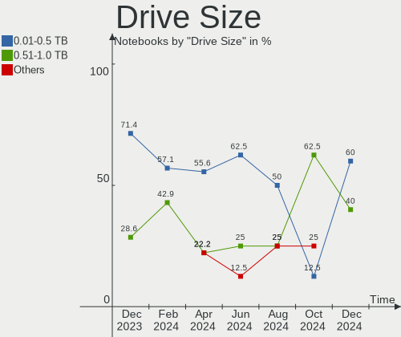
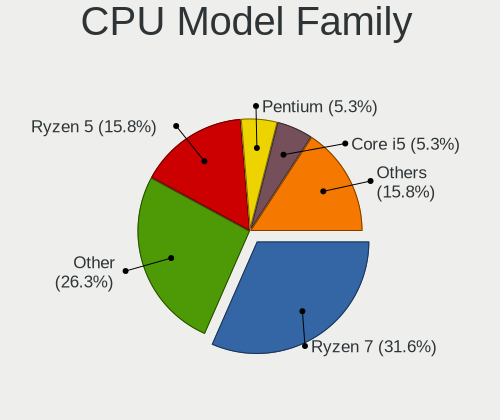
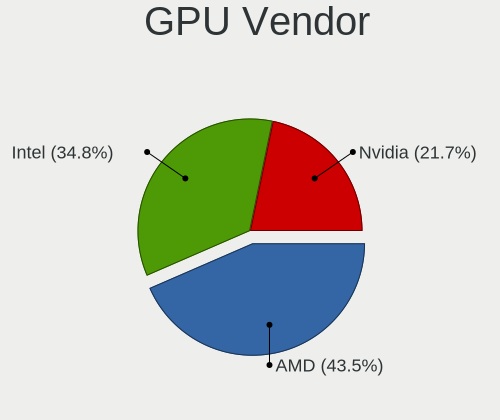
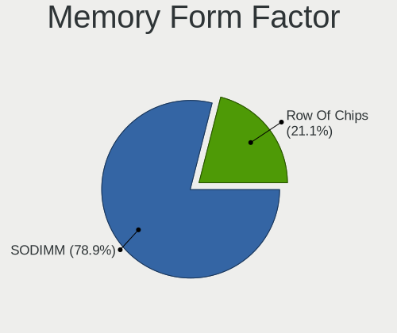

Gentoo - Hardware Trends (Notebooks)
------------------------------------

A project to identify most popular hardware characteristics and track their change
over time based on data collected by Linux users at https://Linux-Hardware.org.

Anyone can contribute to this report by the [hw-probe](https://github.com/linuxhw/hw-probe) tool:

    sudo -E hw-probe -all -upload

This report is for one last month. Overall report since the beginning of time: [TestDays](https://github.com/linuxhw/TestDays)

Period: Nov, 2023.

Contents
--------

* [ System ](#system)
  - [ OS                       ](#os)
  - [ OS Family                ](#os-family)
  - [ Kernel                   ](#kernel)
  - [ Kernel Family            ](#kernel-family)
  - [ Kernel Major Ver.        ](#kernel-major-ver)
  - [ Arch                     ](#arch)
  - [ DE                       ](#de)
  - [ Display Server           ](#display-server)
  - [ Display Manager          ](#display-manager)
  - [ OS Lang                  ](#os-lang)
  - [ Boot Mode                ](#boot-mode)
  - [ Filesystem               ](#filesystem)
  - [ Part. scheme             ](#part-scheme)
  - [ Dual Boot with Linux/BSD ](#dual-boot-with-linuxbsd)
  - [ Dual Boot (Win)          ](#dual-boot-win)

* [ Board ](#board)
  - [ Vendor                   ](#vendor)
  - [ Model                    ](#model)
  - [ Model Family             ](#model-family)
  - [ MFG Year                 ](#mfg-year)
  - [ Form Factor              ](#form-factor)
  - [ Secure Boot              ](#secure-boot)
  - [ Coreboot                 ](#coreboot)
  - [ RAM Size                 ](#ram-size)
  - [ RAM Used                 ](#ram-used)
  - [ Total Drives             ](#total-drives)
  - [ Has CD-ROM               ](#has-cd-rom)
  - [ Has Ethernet             ](#has-ethernet)
  - [ Has WiFi                 ](#has-wifi)
  - [ Has Bluetooth            ](#has-bluetooth)

* [ Location ](#location)
  - [ Country                  ](#country)
  - [ City                     ](#city)

* [ Drives ](#drives)
  - [ Drive Vendor             ](#drive-vendor)
  - [ Drive Model              ](#drive-model)
  - [ HDD Vendor               ](#hdd-vendor)
  - [ SSD Vendor               ](#ssd-vendor)
  - [ Drive Kind               ](#drive-kind)
  - [ Drive Connector          ](#drive-connector)
  - [ Drive Size               ](#drive-size)
  - [ Space Total              ](#space-total)
  - [ Space Used               ](#space-used)
  - [ Malfunc. Drives          ](#malfunc-drives)
  - [ Malfunc. Drive Vendor    ](#malfunc-drive-vendor)
  - [ Malfunc. HDD Vendor      ](#malfunc-hdd-vendor)
  - [ Malfunc. Drive Kind      ](#malfunc-drive-kind)
  - [ Failed Drives            ](#failed-drives)
  - [ Failed Drive Vendor      ](#failed-drive-vendor)
  - [ Drive Status             ](#drive-status)

* [ Storage controller ](#storage-controller)
  - [ Storage Vendor           ](#storage-vendor)
  - [ Storage Model            ](#storage-model)
  - [ Storage Kind             ](#storage-kind)

* [ Processor ](#processor)
  - [ CPU Vendor               ](#cpu-vendor)
  - [ CPU Model                ](#cpu-model)
  - [ CPU Model Family         ](#cpu-model-family)
  - [ CPU Cores                ](#cpu-cores)
  - [ CPU Sockets              ](#cpu-sockets)
  - [ CPU Threads              ](#cpu-threads)
  - [ CPU Op-Modes             ](#cpu-op-modes)
  - [ CPU Microcode            ](#cpu-microcode)
  - [ CPU Microarch            ](#cpu-microarch)

* [ Graphics ](#graphics)
  - [ GPU Vendor               ](#gpu-vendor)
  - [ GPU Model                ](#gpu-model)
  - [ GPU Combo                ](#gpu-combo)
  - [ GPU Driver               ](#gpu-driver)
  - [ GPU Memory               ](#gpu-memory)

* [ Monitor ](#monitor)
  - [ Monitor Vendor           ](#monitor-vendor)
  - [ Monitor Model            ](#monitor-model)
  - [ Monitor Resolution       ](#monitor-resolution)
  - [ Monitor Diagonal         ](#monitor-diagonal)
  - [ Monitor Width            ](#monitor-width)
  - [ Aspect Ratio             ](#aspect-ratio)
  - [ Monitor Area             ](#monitor-area)
  - [ Pixel Density            ](#pixel-density)
  - [ Multiple Monitors        ](#multiple-monitors)

* [ Network ](#network)
  - [ Net Controller Vendor    ](#net-controller-vendor)
  - [ Net Controller Model     ](#net-controller-model)
  - [ Wireless Vendor          ](#wireless-vendor)
  - [ Wireless Model           ](#wireless-model)
  - [ Ethernet Vendor          ](#ethernet-vendor)
  - [ Ethernet Model           ](#ethernet-model)
  - [ Net Controller Kind      ](#net-controller-kind)
  - [ Used Controller          ](#used-controller)
  - [ NICs                     ](#nics)
  - [ IPv6                     ](#ipv6)

* [ Bluetooth ](#bluetooth)
  - [ Bluetooth Vendor         ](#bluetooth-vendor)
  - [ Bluetooth Model          ](#bluetooth-model)

* [ Sound ](#sound)
  - [ Sound Vendor             ](#sound-vendor)
  - [ Sound Model              ](#sound-model)

* [ Memory ](#memory)
  - [ Memory Vendor            ](#memory-vendor)
  - [ Memory Model             ](#memory-model)
  - [ Memory Kind              ](#memory-kind)
  - [ Memory Form Factor       ](#memory-form-factor)
  - [ Memory Size              ](#memory-size)
  - [ Memory Speed             ](#memory-speed)

* [ Printers & scanners ](#printers--scanners)
  - [ Printer Vendor           ](#printer-vendor)
  - [ Printer Model            ](#printer-model)
  - [ Scanner Vendor           ](#scanner-vendor)
  - [ Scanner Model            ](#scanner-model)

* [ Camera ](#camera)
  - [ Camera Vendor            ](#camera-vendor)
  - [ Camera Model             ](#camera-model)

* [ Security ](#security)
  - [ Fingerprint Vendor       ](#fingerprint-vendor)
  - [ Fingerprint Model        ](#fingerprint-model)
  - [ Chipcard Vendor          ](#chipcard-vendor)
  - [ Chipcard Model           ](#chipcard-model)

* [ Unsupported ](#unsupported)
  - [ Unsupported Devices      ](#unsupported-devices)
  - [ Unsupported Device Types ](#unsupported-device-types)

System
------

OS
--

Installed operating systems

| Name         | Notebooks | Percent |
|--------------|-----------|---------|
| Gentoo 2.14  | 30        | 96.77%  |
| Gentoo 20.04 | 1         | 3.23%   |

OS Family
---------

OS without a version

| Name   | Notebooks | Percent |
|--------|-----------|---------|
| Gentoo | 31        | 100%    |

Kernel
------

Version of the Linux kernel

| Version                       | Notebooks | Percent |
|-------------------------------|-----------|---------|
| 6.1.57-gentoo-x86_64          | 5         | 16.13%  |
| 6.1.57-gentoo                 | 3         | 9.68%   |
| 6.6.0-gentoo-x86_64           | 2         | 6.45%   |
| 6.6.0-gentoo                  | 2         | 6.45%   |
| 6.1.60-gentoo-dist            | 2         | 6.45%   |
| 6.1.53-gentoo-r1-x86_64       | 2         | 6.45%   |
| 6.7.0-rc1                     | 1         | 3.23%   |
| 6.6.2-gentoo-#136             | 1         | 3.23%   |
| 6.6.2-gentoo                  | 1         | 3.23%   |
| 6.6.1-gentoo-dist             | 1         | 3.23%   |
| 6.6.1-gentoo-dark             | 1         | 3.23%   |
| 6.6.1-gentoo-122              | 1         | 3.23%   |
| 6.6.1-gentoo                  | 1         | 3.23%   |
| 6.5.9-perfection              | 1         | 3.23%   |
| 6.5.8-gentoo-r1               | 1         | 3.23%   |
| 6.5.10-gentoo-dist            | 1         | 3.23%   |
| 6.5.0-gentoo-elitebook-carbon | 1         | 3.23%   |
| 6.2.5-gentoo                  | 1         | 3.23%   |
| 6.1.57-gentoo-gentoo-dist     | 1         | 3.23%   |
| 6.1.57-gentoo-dist-hardened   | 1         | 3.23%   |
| 6.1.57-gentoo-dist            | 1         | 3.23%   |

Kernel Family
-------------

Linux kernel without a distro release

| Version | Notebooks | Percent |
|---------|-----------|---------|
| 6.1.57  | 11        | 35.48%  |
| 6.6.1   | 4         | 12.9%   |
| 6.6.0   | 4         | 12.9%   |
| 6.6.2   | 2         | 6.45%   |
| 6.1.60  | 2         | 6.45%   |
| 6.1.53  | 2         | 6.45%   |
| 6.7.0   | 1         | 3.23%   |
| 6.5.9   | 1         | 3.23%   |
| 6.5.8   | 1         | 3.23%   |
| 6.5.10  | 1         | 3.23%   |
| 6.5.0   | 1         | 3.23%   |
| 6.2.5   | 1         | 3.23%   |

Kernel Major Ver.
-----------------

Linux kernel major version

| Version | Notebooks | Percent |
|---------|-----------|---------|
| 6.1     | 15        | 48.39%  |
| 6.6     | 10        | 32.26%  |
| 6.5     | 4         | 12.9%   |
| 6.7     | 1         | 3.23%   |
| 6.2     | 1         | 3.23%   |

Arch
----

OS architecture (x86_64, i586, etc.)

| Name   | Notebooks | Percent |
|--------|-----------|---------|
| x86_64 | 31        | 100%    |

DE
--

Desktop Environment

| Name     | Notebooks | Percent |
|----------|-----------|---------|
| KDE5     | 8         | 25.81%  |
| Unknown  | 8         | 25.81%  |
| GNOME    | 5         | 16.13%  |
| MATE     | 2         | 6.45%   |
| LXQt     | 2         | 6.45%   |
| Hyprland | 2         | 6.45%   |
| DWM      | 2         | 6.45%   |
| ICEWM    | 1         | 3.23%   |
| i3       | 1         | 3.23%   |

Display Server
--------------

X11 or Wayland

| Name    | Notebooks | Percent |
|---------|-----------|---------|
| Wayland | 15        | 48.39%  |
| X11     | 12        | 38.71%  |
| Tty     | 2         | 6.45%   |
| Unknown | 2         | 6.45%   |

Display Manager
---------------

SDDM, LightDM, etc.

| Name    | Notebooks | Percent |
|---------|-----------|---------|
| Unknown | 16        | 51.61%  |
| SDDM    | 8         | 25.81%  |
| LightDM | 3         | 9.68%   |
| GDM     | 2         | 6.45%   |
| SLiM    | 1         | 3.23%   |
| Ly      | 1         | 3.23%   |

OS Lang
-------

Language

| Lang    | Notebooks | Percent |
|---------|-----------|---------|
| en_US   | 12        | 38.71%  |
| Unknown | 6         | 19.35%  |
| C.UTF8  | 4         | 12.9%   |
| cs_CZ   | 2         | 6.45%   |
| C       | 2         | 6.45%   |
| zh_CN   | 1         | 3.23%   |
| uk_UA   | 1         | 3.23%   |
| en_GB   | 1         | 3.23%   |
| el_GR   | 1         | 3.23%   |
| de_DE   | 1         | 3.23%   |

Boot Mode
---------

EFI or BIOS

| Mode | Notebooks | Percent |
|------|-----------|---------|
| EFI  | 28        | 90.32%  |
| BIOS | 3         | 9.68%   |

Filesystem
----------

Type of filesystem

| Type     | Notebooks | Percent |
|----------|-----------|---------|
| Ext4     | 13        | 41.94%  |
| Btrfs    | 9         | 29.03%  |
| Xfs      | 4         | 12.9%   |
| Zfs      | 2         | 6.45%   |
| XXXXXXX  | 1         | 3.23%   |
| F2fs     | 1         | 3.23%   |
| Bcachefs | 1         | 3.23%   |

Part. scheme
------------

Scheme of partitioning

| Type    | Notebooks | Percent |
|---------|-----------|---------|
| GPT     | 28        | 90.32%  |
| MBR     | 2         | 6.45%   |
| Unknown | 1         | 3.23%   |

Dual Boot with Linux/BSD
------------------------

Hosting more than one Linux/BSD

| Dual boot | Notebooks | Percent |
|-----------|-----------|---------|
| No        | 25        | 80.65%  |
| Yes       | 6         | 19.35%  |

Dual Boot (Win)
---------------

Hosting Linux and Windows

| Dual boot | Notebooks | Percent |
|-----------|-----------|---------|
| No        | 25        | 80.65%  |
| Yes       | 6         | 19.35%  |

Board
-----

Vendor
------

Motherboard manufacturer

| Name             | Notebooks | Percent |
|------------------|-----------|---------|
| Lenovo           | 10        | 32.26%  |
| Hewlett-Packard  | 5         | 16.13%  |
| Dell             | 5         | 16.13%  |
| ASUSTek Computer | 5         | 16.13%  |
| Framework        | 2         | 6.45%   |
| Notebook         | 1         | 3.23%   |
| HUAWEI           | 1         | 3.23%   |
| Acer             | 1         | 3.23%   |
| Unknown          | 1         | 3.23%   |

Model
-----

Motherboard model

| Name                                       | Notebooks | Percent |
|--------------------------------------------|-----------|---------|
| Notebook NS5x_NS7xPU                       | 1         | 3.23%   |
| Lenovo ThinkPad X13 Gen 3 21CMCTO1WW       | 1         | 3.23%   |
| Lenovo ThinkPad T420 4236QE0               | 1         | 3.23%   |
| Lenovo ThinkPad T410 2518C3U               | 1         | 3.23%   |
| Lenovo ThinkPad Edge E330 3354AMG          | 1         | 3.23%   |
| Lenovo ThinkPad E15 Gen 4 21EDCTO1WW       | 1         | 3.23%   |
| Lenovo ThinkPad E15 Gen 2 20TD00GSGE       | 1         | 3.23%   |
| Lenovo ThinkPad E14 Gen 4 21EBCTO1WW       | 1         | 3.23%   |
| Lenovo ThinkPad E14 Gen 2 20TA0028RT       | 1         | 3.23%   |
| Lenovo ThinkBook 16 G6 ABP 21KK            | 1         | 3.23%   |
| Lenovo G50-30 80G0                         | 1         | 3.23%   |
| HUAWEI NBLK-WAX9X                          | 1         | 3.23%   |
| HP Victus by Gaming Laptop 15-fb0xxx       | 1         | 3.23%   |
| HP Victus by Gaming Laptop 15-fa1xxx       | 1         | 3.23%   |
| HP Pavilion Notebook                       | 1         | 3.23%   |
| HP Pavilion Laptop 15-cs0xxx               | 1         | 3.23%   |
| HP EliteBook 840 G5                        | 1         | 3.23%   |
| Framework Laptop 13 (AMD Ryzen 7040Series) | 1         | 3.23%   |
| Framework Laptop (13th Gen Intel Core)     | 1         | 3.23%   |
| Dell XPS 15 7590                           | 1         | 3.23%   |
| Dell Precision 5480                        | 1         | 3.23%   |
| Dell Latitude E6540                        | 1         | 3.23%   |
| Dell Latitude D630                         | 1         | 3.23%   |
| Dell G5 5505                               | 1         | 3.23%   |
| ASUS ZenBook UX425UA_UM425UA               | 1         | 3.23%   |
| ASUS VivoBook_ASUSLaptop X571LI_X571LI     | 1         | 3.23%   |
| ASUS VivoBook_ASUSLaptop M1503QA_M1503QA   | 1         | 3.23%   |
| ASUS VivoBook 14_ASUS Laptop X441UBR       | 1         | 3.23%   |
| ASUS ROG G703GI_G7BI                       | 1         | 3.23%   |
| Acer Aspire A315-34                        | 1         | 3.23%   |
| Unknown                                    | 1         | 3.23%   |

Model Family
------------

Motherboard model prefix

| Name              | Notebooks | Percent |
|-------------------|-----------|---------|
| Lenovo ThinkPad   | 8         | 25.81%  |
| ASUS VivoBook     | 3         | 9.68%   |
| HP Victus         | 2         | 6.45%   |
| HP Pavilion       | 2         | 6.45%   |
| Framework Laptop  | 2         | 6.45%   |
| Dell Latitude     | 2         | 6.45%   |
| Notebook NS5x     | 1         | 3.23%   |
| Lenovo ThinkBook  | 1         | 3.23%   |
| Lenovo G50-30     | 1         | 3.23%   |
| HUAWEI NBLK-WAX9X | 1         | 3.23%   |
| HP EliteBook      | 1         | 3.23%   |
| Dell XPS          | 1         | 3.23%   |
| Dell Precision    | 1         | 3.23%   |
| Dell G5           | 1         | 3.23%   |
| ASUS ZenBook      | 1         | 3.23%   |
| ASUS ROG          | 1         | 3.23%   |
| Acer Aspire       | 1         | 3.23%   |
| Unknown           | 1         | 3.23%   |

MFG Year
--------

Motherboard manufacture year

| Year    | Notebooks | Percent |
|---------|-----------|---------|
| 2022    | 7         | 22.58%  |
| 2023    | 5         | 16.13%  |
| 2019    | 5         | 16.13%  |
| 2020    | 3         | 9.68%   |
| 2021    | 2         | 6.45%   |
| 2018    | 2         | 6.45%   |
| 2014    | 1         | 3.23%   |
| 2013    | 1         | 3.23%   |
| 2012    | 1         | 3.23%   |
| 2011    | 1         | 3.23%   |
| 2009    | 1         | 3.23%   |
| 2007    | 1         | 3.23%   |
| Unknown | 1         | 3.23%   |

Form Factor
-----------

Physical design of the computer

| Name     | Notebooks | Percent |
|----------|-----------|---------|
| Notebook | 31        | 100%    |

Secure Boot
-----------

Enabled or disabled

| State    | Notebooks | Percent |
|----------|-----------|---------|
| Disabled | 31        | 100%    |

Coreboot
--------

Have coreboot on board

| Used | Notebooks | Percent |
|------|-----------|---------|
| No   | 31        | 100%    |

RAM Size
--------

Total RAM memory

| Size in GB | Notebooks | Percent |
|------------|-----------|---------|
| 8.01-16.0  | 10        | 32.26%  |
| 32.01-64.0 | 8         | 25.81%  |
| 4.01-8.0   | 4         | 12.9%   |
| 16.01-24.0 | 4         | 12.9%   |
| 3.01-4.0   | 3         | 9.68%   |
| 24.01-32.0 | 2         | 6.45%   |

RAM Used
--------

Used RAM memory

| Used GB    | Notebooks | Percent |
|------------|-----------|---------|
| 1.01-2.0   | 10        | 32.26%  |
| 3.01-4.0   | 6         | 19.35%  |
| 4.01-8.0   | 4         | 12.9%   |
| 2.01-3.0   | 4         | 12.9%   |
| 8.01-16.0  | 2         | 6.45%   |
| 0.51-1.0   | 2         | 6.45%   |
| 0.01-0.5   | 2         | 6.45%   |
| 16.01-24.0 | 1         | 3.23%   |

Total Drives
------------

Number of drives on board

| Drives | Notebooks | Percent |
|--------|-----------|---------|
| 1      | 22        | 70.97%  |
| 2      | 8         | 25.81%  |
| 3      | 1         | 3.23%   |

Has CD-ROM
----------

Has CD-ROM on board

| Presented | Notebooks | Percent |
|-----------|-----------|---------|
| No        | 26        | 83.87%  |
| Yes       | 5         | 16.13%  |

Has Ethernet
------------

Has Ethernet on board

| Presented | Notebooks | Percent |
|-----------|-----------|---------|
| Yes       | 23        | 74.19%  |
| No        | 8         | 25.81%  |

Has WiFi
--------

Has WiFi module

| Presented | Notebooks | Percent |
|-----------|-----------|---------|
| Yes       | 31        | 100%    |

Has Bluetooth
-------------

Has Bluetooth module

| Presented | Notebooks | Percent |
|-----------|-----------|---------|
| Yes       | 28        | 90.32%  |
| No        | 3         | 9.68%   |

Location
--------

Country
-------

Geographic location (country)

| Country         | Notebooks | Percent |
|-----------------|-----------|---------|
| USA             | 6         | 19.35%  |
| Russia          | 5         | 16.13%  |
| Germany         | 4         | 12.9%   |
| Czechia         | 4         | 12.9%   |
| Spain           | 2         | 6.45%   |
| New Zealand     | 2         | 6.45%   |
| Ukraine         | 1         | 3.23%   |
| Turkey          | 1         | 3.23%   |
| The Netherlands | 1         | 3.23%   |
| Poland          | 1         | 3.23%   |
| Netherlands     | 1         | 3.23%   |
| Indonesia       | 1         | 3.23%   |
| Greece          | 1         | 3.23%   |
| Belgium         | 1         | 3.23%   |

City
----

Geographic location (city)

| City            | Notebooks | Percent |
|-----------------|-----------|---------|
| St Petersburg   | 2         | 6.45%   |
| Šlapanice      | 2         | 6.45%   |
| Madrid          | 2         | 6.45%   |
| Christchurch    | 2         | 6.45%   |
| Sun Prairie     | 1         | 3.23%   |
| Seattle         | 1         | 3.23%   |
| Samarinda       | 1         | 3.23%   |
| Rottweil        | 1         | 3.23%   |
| Rostov-on-Don   | 1         | 3.23%   |
| Riemerling      | 1         | 3.23%   |
| Ravenstein      | 1         | 3.23%   |
| Pelhrimov       | 1         | 3.23%   |
| Overijse        | 1         | 3.23%   |
| Novosibirsk     | 1         | 3.23%   |
| New York        | 1         | 3.23%   |
| Mühlhausen     | 1         | 3.23%   |
| Mnisek pod Brdy | 1         | 3.23%   |
| Madison         | 1         | 3.23%   |
| Los Angeles     | 1         | 3.23%   |
| Krasnodar       | 1         | 3.23%   |
| Knoxville       | 1         | 3.23%   |
| Kharkiv         | 1         | 3.23%   |
| Cieszyn         | 1         | 3.23%   |
| Berlin          | 1         | 3.23%   |
| Batman          | 1         | 3.23%   |
| Athens          | 1         | 3.23%   |
| Amsterdam       | 1         | 3.23%   |

Drives
------

Drive Vendor
------------

Hard drive vendors

| Vendor                      | Notebooks | Drives | Percent |
|-----------------------------|-----------|--------|---------|
| Sandisk                     | 6         | 6      | 15%     |
| Samsung Electronics         | 6         | 6      | 15%     |
| SK hynix                    | 3         | 3      | 7.5%    |
| Seagate                     | 3         | 3      | 7.5%    |
| KIOXIA                      | 3         | 3      | 7.5%    |
| Kingston                    | 3         | 4      | 7.5%    |
| Intel                       | 3         | 4      | 7.5%    |
| WDC                         | 2         | 2      | 5%      |
| Verbatim                    | 1         | 1      | 2.5%    |
| Unknown                     | 1         | 1      | 2.5%    |
| Transcend                   | 1         | 1      | 2.5%    |
| Toshiba                     | 1         | 1      | 2.5%    |
| StoreJet                    | 1         | 1      | 2.5%    |
| Phison Electronics          | 1         | 1      | 2.5%    |
| Lexar                       | 1         | 1      | 2.5%    |
| Kingston Technology Company | 1         | 1      | 2.5%    |
| HGST                        | 1         | 1      | 2.5%    |
| EYOTA                       | 1         | 1      | 2.5%    |
| China                       | 1         | 1      | 2.5%    |

Drive Model
-----------

Hard drive models

| Model                                               | Notebooks | Percent |
|-----------------------------------------------------|-----------|---------|
| Samsung NVMe SSD Controller PM9A1/PM9A3/980PRO 2TB  | 3         | 7.32%   |
| Sandisk WD Black SN750 / PC SN730 NVMe SSD 500GB    | 2         | 4.88%   |
| WDC WDS240G2G0A-00JH30 240GB SSD                    | 1         | 2.44%   |
| WDC WD Green 2.5 240GB SSD                          | 1         | 2.44%   |
| Verbatim Vi560 S3 512GB SSD                         | 1         | 2.44%   |
| Unknown MMC Card  128GB                             | 1         | 2.44%   |
| Transcend TS1TMTE400S 1TB                           | 1         | 2.44%   |
| Toshiba TR200 240GB SSD                             | 1         | 2.44%   |
| StoreJet Transcend 752GB                            | 1         | 2.44%   |
| SK hynix SKHynix_HFS001TDE9X081N 1024GB             | 1         | 2.44%   |
| SK hynix HFM512GD3JX013N 512GB                      | 1         | 2.44%   |
| SK hynix BC501 NVMe Solid State Drive 512GB         | 1         | 2.44%   |
| Seagate ST2000LX001-1RG174 2TB                      | 1         | 2.44%   |
| Seagate ST1000LM049-2GH172 1TB                      | 1         | 2.44%   |
| Seagate ST1000LM024 HN-M101MBB 1TB                  | 1         | 2.44%   |
| Sandisk WD_BLACK SN770 1TB                          | 1         | 2.44%   |
| Sandisk WD PC SN740 SDDQMQD-256G-1001 256GB         | 1         | 2.44%   |
| Sandisk WD PC SN740 SDDPMQD-512G-1101 512GB         | 1         | 2.44%   |
| Sandisk WD Black SN850 1024GB                       | 1         | 2.44%   |
| Samsung SSD 860 EVO 1TB                             | 1         | 2.44%   |
| Samsung NVMe SSD Controller SM981/PM981/PM983 250GB | 1         | 2.44%   |
| Samsung MZALQ512HALU-000L1 512GB                    | 1         | 2.44%   |
| Phison E12 NVMe Controller 512GB                    | 1         | 2.44%   |
| Lexar 128GB SSD                                     | 1         | 2.44%   |
| KIOXIA KXG80ZNV512G NVMe 512GB                      | 1         | 2.44%   |
| KIOXIA KBG5AZNV1T02 LA 1TB                          | 1         | 2.44%   |
| KIOXIA KBG40ZNS512G NVMe 512GB                      | 1         | 2.44%   |
| Kingston Company U-SNS8154P3 NVMe SSD 256GB         | 1         | 2.44%   |
| Kingston SHFS37A240G 240GB SSD                      | 1         | 2.44%   |
| Kingston SFYRS1000G 1TB                             | 1         | 2.44%   |
| Kingston SA400S37480G 480GB SSD                     | 1         | 2.44%   |
| Kingston OM8PCP3512F-AB 512GB                       | 1         | 2.44%   |
| Intel SSDSA2M080G2GC 80GB                           | 1         | 2.44%   |
| Intel SSDPEKNU512GZ 512GB                           | 1         | 2.44%   |
| Intel SSD Pro 7600p/760p/E 6100p Series 1TB         | 1         | 2.44%   |
| HGST HTS725050A7E630 500GB                          | 1         | 2.44%   |
| EYOTA SSD 256GB                                     | 1         | 2.44%   |
| China SSD 240GB                                     | 1         | 2.44%   |

HDD Vendor
----------

Hard disk drive vendors

| Vendor   | Notebooks | Drives | Percent |
|----------|-----------|--------|---------|
| Seagate  | 3         | 3      | 60%     |
| StoreJet | 1         | 1      | 20%     |
| HGST     | 1         | 1      | 20%     |

SSD Vendor
----------

Solid state drive vendors

| Vendor              | Notebooks | Drives | Percent |
|---------------------|-----------|--------|---------|
| WDC                 | 2         | 2      | 18.18%  |
| Kingston            | 2         | 2      | 18.18%  |
| Verbatim            | 1         | 1      | 9.09%   |
| Toshiba             | 1         | 1      | 9.09%   |
| Samsung Electronics | 1         | 1      | 9.09%   |
| Lexar               | 1         | 1      | 9.09%   |
| Intel               | 1         | 1      | 9.09%   |
| EYOTA               | 1         | 1      | 9.09%   |
| China               | 1         | 1      | 9.09%   |

Drive Kind
----------

HDD or SSD

| Kind | Notebooks | Drives | Percent |
|------|-----------|--------|---------|
| NVMe | 22        | 25     | 59.46%  |
| SSD  | 9         | 11     | 24.32%  |
| HDD  | 5         | 5      | 13.51%  |
| MMC  | 1         | 1      | 2.7%    |

Drive Connector
---------------

SATA, SAS, NVMe, etc.

| Type | Notebooks | Drives | Percent |
|------|-----------|--------|---------|
| NVMe | 22        | 25     | 61.11%  |
| SATA | 12        | 15     | 33.33%  |
| SAS  | 1         | 1      | 2.78%   |
| MMC  | 1         | 1      | 2.78%   |

Drive Size
----------

Size of hard drive

| Size in TB | Notebooks | Drives | Percent |
|------------|-----------|--------|---------|
| 0.01-0.5   | 8         | 10     | 57.14%  |
| 0.51-1.0   | 5         | 5      | 35.71%  |
| 1.01-2.0   | 1         | 1      | 7.14%   |

Space Total
-----------

Amount of disk space available on the file system

| Size in GB | Notebooks | Percent |
|------------|-----------|---------|
| 251-500    | 9         | 29.03%  |
| 101-250    | 6         | 19.35%  |
| 501-1000   | 5         | 16.13%  |
| 1-20       | 4         | 12.9%   |
| 1001-2000  | 3         | 9.68%   |
| Unknown    | 3         | 9.68%   |
| 2001-3000  | 1         | 3.23%   |

Space Used
----------

Amount of used disk space

| Used GB   | Notebooks | Percent |
|-----------|-----------|---------|
| 1-20      | 7         | 22.58%  |
| 251-500   | 5         | 16.13%  |
| 101-250   | 5         | 16.13%  |
| 51-100    | 4         | 12.9%   |
| 21-50     | 3         | 9.68%   |
| 501-1000  | 3         | 9.68%   |
| Unknown   | 3         | 9.68%   |
| 1001-2000 | 1         | 3.23%   |

Malfunc. Drives
---------------

Drive models with a malfunction

| Model                                       | Notebooks | Drives | Percent |
|---------------------------------------------|-----------|--------|---------|
| WDC WD Green 2.5 240GB SSD                  | 1         | 1      | 20%     |
| SK hynix BC501 NVMe Solid State Drive 512GB | 1         | 1      | 20%     |
| Seagate ST1000LM024 HN-M101MBB 1TB          | 1         | 1      | 20%     |
| Intel SSDSA2M080G2GC 80GB                   | 1         | 1      | 20%     |
| HGST HTS725050A7E630 500GB                  | 1         | 1      | 20%     |

Malfunc. Drive Vendor
---------------------

Vendors of faulty drives

| Vendor   | Notebooks | Drives | Percent |
|----------|-----------|--------|---------|
| WDC      | 1         | 1      | 20%     |
| SK hynix | 1         | 1      | 20%     |
| Seagate  | 1         | 1      | 20%     |
| Intel    | 1         | 1      | 20%     |
| HGST     | 1         | 1      | 20%     |

Malfunc. HDD Vendor
-------------------

Vendors of faulty HDD drives

| Vendor  | Notebooks | Drives | Percent |
|---------|-----------|--------|---------|
| Seagate | 1         | 1      | 50%     |
| HGST    | 1         | 1      | 50%     |

Malfunc. Drive Kind
-------------------

Kinds of faulty drives

| Kind | Notebooks | Drives | Percent |
|------|-----------|--------|---------|
| SSD  | 2         | 2      | 40%     |
| HDD  | 2         | 2      | 40%     |
| NVMe | 1         | 1      | 20%     |

Failed Drives
-------------

Failed drive models

Zero info for selected period =(

Failed Drive Vendor
-------------------

Failed drive vendors

Zero info for selected period =(

Drive Status
------------

Number of failed and malfunc. drives

| Status   | Notebooks | Drives | Percent |
|----------|-----------|--------|---------|
| Works    | 28        | 35     | 80%     |
| Malfunc  | 5         | 5      | 14.29%  |
| Detected | 2         | 2      | 5.71%   |

Storage controller
------------------

Storage Vendor
--------------

Storage controller vendors

| Vendor                      | Notebooks | Percent |
|-----------------------------|-----------|---------|
| Intel                       | 17        | 43.59%  |
| SanDisk                     | 6         | 15.38%  |
| Samsung Electronics         | 5         | 12.82%  |
| SK hynix                    | 3         | 7.69%   |
| KIOXIA                      | 3         | 7.69%   |
| Kingston Technology Company | 3         | 7.69%   |
| Transcend                   | 1         | 2.56%   |
| Phison Electronics          | 1         | 2.56%   |

Storage Model
-------------

Storage controller models

| Model                                                                          | Notebooks | Percent |
|--------------------------------------------------------------------------------|-----------|---------|
| Samsung NVMe SSD Controller PM9A1/PM9A3/980PRO                                 | 3         | 7.32%   |
| Intel Sunrise Point-LP SATA Controller [AHCI mode]                             | 3         | 7.32%   |
| Intel 82801 Mobile SATA Controller [RAID mode]                                 | 3         | 7.32%   |
| SK hynix Gold P31/BC711/PC711 NVMe Solid State Drive                           | 2         | 4.88%   |
| Sandisk WD PC SN740 NVMe SSD 512GB (DRAM-less)                                 | 2         | 4.88%   |
| SanDisk Extreme Pro / WD Black SN750 / PC SN730 / Red SN700 NVMe SSD           | 2         | 4.88%   |
| Transcend NVMe PCIe SSD 110S/112S/120S/MTE300S/MTE400S/MTE652T2 (DRAM-less)    | 1         | 2.44%   |
| SK hynix BC501 NVMe Solid State Drive                                          | 1         | 2.44%   |
| SanDisk WD PC SN810 / Black SN850 NVMe SSD                                     | 1         | 2.44%   |
| SanDisk WD Black SN770 / PC SN740 256GB / PC SN560 (DRAM-less) NVMe SSD        | 1         | 2.44%   |
| Samsung NVMe SSD Controller SM981/PM981/PM983                                  | 1         | 2.44%   |
| Samsung NVMe SSD Controller 980 (DRAM-less)                                    | 1         | 2.44%   |
| Phison E12 NVMe Controller                                                     | 1         | 2.44%   |
| KIOXIA NVMe SSD Controller XG8                                                 | 1         | 2.44%   |
| KIOXIA NVMe SSD Controller BG5 (DRAM-less)                                     | 1         | 2.44%   |
| KIOXIA NVMe SSD Controller BG4 (DRAM-less)                                     | 1         | 2.44%   |
| Kingston Company OM8PCP Design-In PCIe 3 NVMe SSD (DRAM-less)                  | 1         | 2.44%   |
| Kingston Company KC3000/FURY Renegade NVMe SSD E18                             | 1         | 2.44%   |
| Kingston Company A1000/U-SNS8154P3 x2 NVMe SSD                                 | 1         | 2.44%   |
| Intel Wildcat Point-LP SATA Controller [AHCI Mode]                             | 1         | 2.44%   |
| Intel Volume Management Device NVMe RAID Controller Intel Corporation          | 1         | 2.44%   |
| Intel SSD DC P4101/Pro 7600p/760p/E 6100p Series                               | 1         | 2.44%   |
| Intel SSD 670p Series [Keystone Harbor]                                        | 1         | 2.44%   |
| Intel Celeron/Pentium Silver Processor SATA Controller                         | 1         | 2.44%   |
| Intel Cannon Lake Mobile PCH SATA AHCI Controller                              | 1         | 2.44%   |
| Intel Atom Processor E3800 Series SATA AHCI Controller                         | 1         | 2.44%   |
| Intel 82801HM/HEM (ICH8M/ICH8M-E) SATA Controller [IDE mode]                   | 1         | 2.44%   |
| Intel 82801HM/HEM (ICH8M/ICH8M-E) IDE Controller                               | 1         | 2.44%   |
| Intel 8 Series/C220 Series Chipset Family 6-port SATA Controller 1 [AHCI mode] | 1         | 2.44%   |
| Intel 7 Series Chipset Family 6-port SATA Controller [AHCI mode]               | 1         | 2.44%   |
| Intel 6 Series/C200 Series Chipset Family 6 port Mobile SATA AHCI Controller   | 1         | 2.44%   |
| Intel 5 Series/3400 Series Chipset 6 port SATA AHCI Controller                 | 1         | 2.44%   |

Storage Kind
------------

Kind of storage controller (IDE, SATA, NVMe, SAS, ...)

| Kind | Notebooks | Percent |
|------|-----------|---------|
| NVMe | 22        | 57.89%  |
| SATA | 11        | 28.95%  |
| RAID | 4         | 10.53%  |
| IDE  | 1         | 2.63%   |

Processor
---------

CPU Vendor
----------

Processor vendors

| Vendor | Notebooks | Percent |
|--------|-----------|---------|
| Intel  | 21        | 67.74%  |
| AMD    | 10        | 32.26%  |

CPU Model
---------

Processor models

| Model                                         | Notebooks | Percent |
|-----------------------------------------------|-----------|---------|
| AMD Ryzen 7 5825U with Radeon Graphics        | 2         | 6.45%   |
| AMD Ryzen 7 5800H with Radeon Graphics        | 2         | 6.45%   |
| Intel Pentium CPU N3540 @ 2.16GHz             | 1         | 3.23%   |
| Intel Pentium CPU B980 @ 2.40GHz              | 1         | 3.23%   |
| Intel Core i9-8950HK CPU @ 2.90GHz            | 1         | 3.23%   |
| Intel Core i7-9750H CPU @ 2.60GHz             | 1         | 3.23%   |
| Intel Core i7-8550U CPU @ 1.80GHz             | 1         | 3.23%   |
| Intel Core i7-4810MQ CPU @ 2.80GHz            | 1         | 3.23%   |
| Intel Core i7-10750H CPU @ 2.60GHz            | 1         | 3.23%   |
| Intel Core i5-8350U CPU @ 1.70GHz             | 1         | 3.23%   |
| Intel Core i5-5200U CPU @ 2.20GHz             | 1         | 3.23%   |
| Intel Core i5-2520M CPU @ 2.50GHz             | 1         | 3.23%   |
| Intel Core i5-10300H CPU @ 2.50GHz            | 1         | 3.23%   |
| Intel Core i5 CPU M 540 @ 2.53GHz             | 1         | 3.23%   |
| Intel Core i3-8130U CPU @ 2.20GHz             | 1         | 3.23%   |
| Intel Core 2 Duo CPU T7250 @ 2.00GHz          | 1         | 3.23%   |
| Intel Celeron N4120 CPU @ 1.10GHz             | 1         | 3.23%   |
| Intel 13th Gen Core i7-13700H                 | 1         | 3.23%   |
| Intel 13th Gen Core i5-13420H                 | 1         | 3.23%   |
| Intel 13th Gen Core i5-1340P                  | 1         | 3.23%   |
| Intel 12th Gen Core i7-1260P                  | 1         | 3.23%   |
| Intel 11th Gen Core i7-1165G7 @ 2.80GHz       | 1         | 3.23%   |
| Intel 11th Gen Core i5-1135G7 @ 2.40GHz       | 1         | 3.23%   |
| AMD Ryzen 7 PRO 6850U with Radeon Graphics    | 1         | 3.23%   |
| AMD Ryzen 7 7840U w/ Radeon 780M Graphics     | 1         | 3.23%   |
| AMD Ryzen 7 5700U with Radeon Graphics        | 1         | 3.23%   |
| AMD Ryzen 7 4800H with Radeon Graphics        | 1         | 3.23%   |
| AMD Ryzen 5 7530U with Radeon Graphics        | 1         | 3.23%   |
| AMD Ryzen 5 3500U with Radeon Vega Mobile Gfx | 1         | 3.23%   |

CPU Model Family
----------------

Processor model prefix

| Model            | Notebooks | Percent |
|------------------|-----------|---------|
| AMD Ryzen 7      | 7         | 22.58%  |
| Other            | 6         | 19.35%  |
| Intel Core i5    | 5         | 16.13%  |
| Intel Core i7    | 4         | 12.9%   |
| Intel Pentium    | 2         | 6.45%   |
| AMD Ryzen 5      | 2         | 6.45%   |
| Intel Core i9    | 1         | 3.23%   |
| Intel Core i3    | 1         | 3.23%   |
| Intel Core 2 Duo | 1         | 3.23%   |
| Intel Celeron    | 1         | 3.23%   |
| AMD Ryzen 7 PRO  | 1         | 3.23%   |

CPU Cores
---------

Number of processor cores

| Number | Notebooks | Percent |
|--------|-----------|---------|
| 4      | 10        | 32.26%  |
| 8      | 8         | 25.81%  |
| 2      | 6         | 19.35%  |
| 6      | 4         | 12.9%   |
| 12     | 2         | 6.45%   |
| 14     | 1         | 3.23%   |

CPU Sockets
-----------

Number of sockets

| Number | Notebooks | Percent |
|--------|-----------|---------|
| 1      | 31        | 100%    |

CPU Threads
-----------

Threads per core (Hyper-Threading)

| Number | Notebooks | Percent |
|--------|-----------|---------|
| 2      | 27        | 87.1%   |
| 1      | 4         | 12.9%   |

CPU Op-Modes
------------

CPU Operation Modes (32-bit, 64-bit)

| Op mode        | Notebooks | Percent |
|----------------|-----------|---------|
| 32-bit, 64-bit | 31        | 100%    |

CPU Microcode
-------------

Microcode number

| Number     | Notebooks | Percent |
|------------|-----------|---------|
| Unknown    | 13        | 41.94%  |
| 0x0a50000d | 4         | 12.9%   |
| 0xb06a2    | 3         | 9.68%   |
| 0x806c1    | 2         | 6.45%   |
| 0xa0652    | 1         | 3.23%   |
| 0x806ea    | 1         | 3.23%   |
| 0x206a7    | 1         | 3.23%   |
| 0x20652    | 1         | 3.23%   |
| 0x0a704103 | 1         | 3.23%   |
| 0x0a50000c | 1         | 3.23%   |
| 0x0a404102 | 1         | 3.23%   |
| 0x08608103 | 1         | 3.23%   |
| 0x08600106 | 1         | 3.23%   |

CPU Microarch
-------------

Microarchitecture

| Name             | Notebooks | Percent |
|------------------|-----------|---------|
| Zen 3            | 5         | 16.13%  |
| KabyLake         | 5         | 16.13%  |
| Alderlake Hybrid | 4         | 12.9%   |
| Unknown          | 3         | 9.68%   |
| TigerLake        | 2         | 6.45%   |
| SandyBridge      | 2         | 6.45%   |
| CometLake        | 2         | 6.45%   |
| Zen+             | 1         | 3.23%   |
| Zen 2            | 1         | 3.23%   |
| Westmere         | 1         | 3.23%   |
| Silvermont       | 1         | 3.23%   |
| Haswell          | 1         | 3.23%   |
| Goldmont plus    | 1         | 3.23%   |
| Core             | 1         | 3.23%   |
| Broadwell        | 1         | 3.23%   |

Graphics
--------

GPU Vendor
----------

Vendors of graphics cards

| Vendor | Notebooks | Percent |
|--------|-----------|---------|
| Intel  | 19        | 47.5%   |
| AMD    | 11        | 27.5%   |
| Nvidia | 10        | 25%     |

GPU Model
---------

Graphics card models

| Model                                                                     | Notebooks | Percent |
|---------------------------------------------------------------------------|-----------|---------|
| Intel UHD Graphics 620                                                    | 3         | 6.98%   |
| AMD Barcelo                                                               | 3         | 6.98%   |
| Intel TigerLake-LP GT2 [Iris Xe Graphics]                                 | 2         | 4.65%   |
| Intel Raptor Lake-P [UHD Graphics]                                        | 2         | 4.65%   |
| Intel 2nd Generation Core Processor Family Integrated Graphics Controller | 2         | 4.65%   |
| AMD Cezanne [Radeon Vega Series / Radeon Vega Mobile Series]              | 2         | 4.65%   |
| Nvidia TU117M [GeForce GTX 1650 Ti Mobile]                                | 1         | 2.33%   |
| Nvidia TU117M [GeForce GTX 1650 Mobile / Max-Q]                           | 1         | 2.33%   |
| Nvidia TU106M [GeForce RTX 2070 Mobile / Max-Q Refresh]                   | 1         | 2.33%   |
| Nvidia GP108M [GeForce MX150]                                             | 1         | 2.33%   |
| Nvidia GP104BM [GeForce GTX 1080 Mobile]                                  | 1         | 2.33%   |
| Nvidia GN20-P0-R-K2 [GeForce RTX 3050 6GB Laptop GPU]                     | 1         | 2.33%   |
| Nvidia GM108M [GeForce MX110]                                             | 1         | 2.33%   |
| Nvidia GM108M [GeForce 940M]                                              | 1         | 2.33%   |
| Nvidia GF117M [GeForce 610M/710M/810M/820M / GT 620M/625M/630M/720M]      | 1         | 2.33%   |
| Nvidia GA107GLM [RTX A1000 6GB Laptop GPU]                                | 1         | 2.33%   |
| Intel Raptor Lake-P [Iris Xe Graphics]                                    | 1         | 2.33%   |
| Intel Mobile GM965/GL960 Integrated Graphics Controller (secondary)       | 1         | 2.33%   |
| Intel Mobile GM965/GL960 Integrated Graphics Controller (primary)         | 1         | 2.33%   |
| Intel HD Graphics 5500                                                    | 1         | 2.33%   |
| Intel GeminiLake [UHD Graphics 600]                                       | 1         | 2.33%   |
| Intel Core Processor Integrated Graphics Controller                       | 1         | 2.33%   |
| Intel CometLake-H GT2 [UHD Graphics]                                      | 1         | 2.33%   |
| Intel CoffeeLake-H GT2 [UHD Graphics 630]                                 | 1         | 2.33%   |
| Intel Atom Processor Z36xxx/Z37xxx Series Graphics & Display              | 1         | 2.33%   |
| Intel Alder Lake-P GT2 [Iris Xe Graphics]                                 | 1         | 2.33%   |
| Intel 4th Gen Core Processor Integrated Graphics Controller               | 1         | 2.33%   |
| AMD Renoir [Radeon RX Vega 6 (Ryzen 4000/5000 Mobile Series)]             | 1         | 2.33%   |
| AMD Rembrandt [Radeon 680M]                                               | 1         | 2.33%   |
| AMD Picasso/Raven 2 [Radeon Vega Series / Radeon Vega Mobile Series]      | 1         | 2.33%   |
| AMD Phoenix1                                                              | 1         | 2.33%   |
| AMD Navi 24 [Radeon RX 6400/6500 XT/6500M]                                | 1         | 2.33%   |
| AMD Navi 10 [Radeon RX 5600 OEM/5600 XT / 5700/5700 XT]                   | 1         | 2.33%   |
| AMD Mars XTX [Radeon HD 8790M]                                            | 1         | 2.33%   |
| AMD Lucienne                                                              | 1         | 2.33%   |

GPU Combo
---------

Combinations of graphics cards

| Name           | Notebooks | Percent |
|----------------|-----------|---------|
| 1 x Intel      | 9         | 29.03%  |
| Intel + Nvidia | 8         | 25.81%  |
| 1 x AMD        | 8         | 25.81%  |
| 2 x AMD        | 2         | 6.45%   |
| 1 x Nvidia     | 2         | 6.45%   |
| 2 x Intel      | 1         | 3.23%   |
| Intel + AMD    | 1         | 3.23%   |

GPU Driver
----------

Free vs proprietary

| Driver      | Notebooks | Percent |
|-------------|-----------|---------|
| Free        | 25        | 80.65%  |
| Proprietary | 5         | 16.13%  |
| Unknown     | 1         | 3.23%   |

GPU Memory
----------

Total video memory

| Size in GB | Notebooks | Percent |
|------------|-----------|---------|
| Unknown    | 17        | 54.84%  |
| 0.01-0.5   | 4         | 12.9%   |
| 0.51-1.0   | 3         | 9.68%   |
| 5.01-6.0   | 2         | 6.45%   |
| 3.01-4.0   | 2         | 6.45%   |
| 1.01-2.0   | 2         | 6.45%   |
| 7.01-8.0   | 1         | 3.23%   |

Monitor
-------

Monitor Vendor
--------------

Monitor vendors

| Vendor              | Notebooks | Percent |
|---------------------|-----------|---------|
| AU Optronics        | 8         | 21.05%  |
| BOE                 | 7         | 18.42%  |
| LG Display          | 6         | 15.79%  |
| Samsung Electronics | 5         | 13.16%  |
| Chimei Innolux      | 3         | 7.89%   |
| Toshiba             | 1         | 2.63%   |
| Philips             | 1         | 2.63%   |
| PANDA               | 1         | 2.63%   |
| Lenovo              | 1         | 2.63%   |
| HUAWEI              | 1         | 2.63%   |
| Goldstar            | 1         | 2.63%   |
| Dell                | 1         | 2.63%   |
| BenQ                | 1         | 2.63%   |
| AOC                 | 1         | 2.63%   |

Monitor Model
-------------

Monitor models

| Model                                                                 | Notebooks | Percent |
|-----------------------------------------------------------------------|-----------|---------|
| BOE LCD Monitor BOE0BCA 2256x1504 285x190mm 13.5-inch                 | 2         | 5.13%   |
| AU Optronics LCD Monitor AUO2992 1920x1080 344x193mm 15.5-inch        | 2         | 5.13%   |
| Toshiba TV TSB0206 1920x1080 890x500mm 40.2-inch                      | 1         | 2.56%   |
| Samsung Electronics SyncMaster SAM01D0 1600x1200 432x324mm 21.3-inch  | 1         | 2.56%   |
| Samsung Electronics LCD Monitor SEC3157 1280x800 303x190mm 14.1-inch  | 1         | 2.56%   |
| Samsung Electronics LCD Monitor SDCA029 3840x2160 344x194mm 15.5-inch | 1         | 2.56%   |
| Samsung Electronics LCD Monitor SDC4E51 1366x768 344x194mm 15.5-inch  | 1         | 2.56%   |
| Samsung Electronics LCD Monitor SDC4852 1366x768 344x194mm 15.5-inch  | 1         | 2.56%   |
| Samsung Electronics LCD Monitor SDC4161 1920x1080 344x194mm 15.5-inch | 1         | 2.56%   |
| Philips PHL 223V5 PHLC0CF 1920x1080 477x268mm 21.5-inch               | 1         | 2.56%   |
| PANDA LCD Monitor NCP0035 1920x1080 309x174mm 14.0-inch               | 1         | 2.56%   |
| LG Display LCD Monitor LGD40A0 1366x768 310x174mm 14.0-inch           | 1         | 2.56%   |
| LG Display LCD Monitor LGD0685 1920x1080 309x174mm 14.0-inch          | 1         | 2.56%   |
| LG Display LCD Monitor LGD05F1 1920x1080 309x174mm 14.0-inch          | 1         | 2.56%   |
| LG Display LCD Monitor LGD05E4 1920x1080 344x194mm 15.5-inch          | 1         | 2.56%   |
| LG Display LCD Monitor LGD0563 1920x1080 344x194mm 15.5-inch          | 1         | 2.56%   |
| LG Display LCD Monitor LGD0354 1366x768 293x165mm 13.2-inch           | 1         | 2.56%   |
| Lenovo LCD Monitor LEN4035 1280x800 303x189mm 14.1-inch               | 1         | 2.56%   |
| HUAWEI SSN-24 HWV6E4E 1920x1080 527x296mm 23.8-inch                   | 1         | 2.56%   |
| Goldstar E2211 GSM5838 1920x1080 477x268mm 21.5-inch                  | 1         | 2.56%   |
| Dell U2410 DELF016 1920x1200 518x324mm 24.1-inch                      | 1         | 2.56%   |
| Chimei Innolux LCD Monitor CMN162B 1920x1200 344x215mm 16.0-inch      | 1         | 2.56%   |
| Chimei Innolux LCD Monitor CMN15BA 1920x1080 344x194mm 15.5-inch      | 1         | 2.56%   |
| Chimei Innolux LCD Monitor CMN14C4 1366x768 309x173mm 13.9-inch       | 1         | 2.56%   |
| BOE LCD Monitor BOE08E2 1920x1080 344x194mm 15.5-inch                 | 1         | 2.56%   |
| BOE LCD Monitor BOE08D7 1920x1080 309x174mm 14.0-inch                 | 1         | 2.56%   |
| BOE LCD Monitor BOE08C6 1920x1080 344x194mm 15.5-inch                 | 1         | 2.56%   |
| BOE LCD Monitor BOE0877 1920x1080 309x173mm 13.9-inch                 | 1         | 2.56%   |
| BOE LCD Monitor BOE07D8 1920x1080 344x194mm 15.5-inch                 | 1         | 2.56%   |
| BenQ EL2870U BNQ7949 3840x2160 621x341mm 27.9-inch                    | 1         | 2.56%   |
| AU Optronics LCD Monitor AUOF99A 1920x1200 301x188mm 14.0-inch        | 1         | 2.56%   |
| AU Optronics LCD Monitor AUO82ED 1920x1080 344x193mm 15.5-inch        | 1         | 2.56%   |
| AU Optronics LCD Monitor AUO6693 1920x1200 286x178mm 13.3-inch        | 1         | 2.56%   |
| AU Optronics LCD Monitor AUO61ED 1920x1080 344x194mm 15.5-inch        | 1         | 2.56%   |
| AU Optronics LCD Monitor AUO329D 1920x1080 382x214mm 17.2-inch        | 1         | 2.56%   |
| AU Optronics LCD Monitor AUO22ED 1920x1080 344x193mm 15.5-inch        | 1         | 2.56%   |
| AOC 2490W1 AOC2490 1920x1080 527x296mm 23.8-inch                      | 1         | 2.56%   |

Monitor Resolution
------------------

Monitor screen resolution

| Resolution        | Notebooks | Percent |
|-------------------|-----------|---------|
| 1920x1080 (FHD)   | 18        | 52.94%  |
| 1920x1200 (WUXGA) | 4         | 11.76%  |
| 1366x768 (WXGA)   | 4         | 11.76%  |
| 3840x2160 (4K)    | 3         | 8.82%   |
| 2256x1504         | 2         | 5.88%   |
| 1600x1200         | 1         | 2.94%   |
| 1440x900 (WXGA+)  | 1         | 2.94%   |
| 1280x800 (WXGA)   | 1         | 2.94%   |

Monitor Diagonal
----------------

Diagonal size in inches

| Inches | Notebooks | Percent |
|--------|-----------|---------|
| 15     | 16        | 41.03%  |
| 14     | 7         | 17.95%  |
| 13     | 6         | 15.38%  |
| 21     | 3         | 7.69%   |
| 24     | 2         | 5.13%   |
| 74     | 1         | 2.56%   |
| 36     | 1         | 2.56%   |
| 23     | 1         | 2.56%   |
| 17     | 1         | 2.56%   |
| 16     | 1         | 2.56%   |

Monitor Width
-------------

Physical width

| Width in mm | Notebooks | Percent |
|-------------|-----------|---------|
| 301-350     | 26        | 66.67%  |
| 201-300     | 4         | 10.26%  |
| 501-600     | 3         | 7.69%   |
| 401-500     | 3         | 7.69%   |
| 701-800     | 1         | 2.56%   |
| 351-400     | 1         | 2.56%   |
| 1501-2000   | 1         | 2.56%   |

Aspect Ratio
------------

Proportional relationship between the width and the height

| Ratio | Notebooks | Percent |
|-------|-----------|---------|
| 16/9  | 24        | 72.73%  |
| 16/10 | 6         | 18.18%  |
| 3/2   | 2         | 6.06%   |
| 4/3   | 1         | 3.03%   |

Monitor Area
------------

Area in inch²

| Area in inch² | Notebooks | Percent |
|----------------|-----------|---------|
| 101-110        | 16        | 41.03%  |
| 81-90          | 11        | 28.21%  |
| 201-250        | 5         | 12.82%  |
| 71-80          | 2         | 5.13%   |
| More than 1000 | 1         | 2.56%   |
| 251-300        | 1         | 2.56%   |
| 121-130        | 1         | 2.56%   |
| 111-120        | 1         | 2.56%   |
| 501-1000       | 1         | 2.56%   |

Pixel Density
-------------

Pixels per inch

| Density       | Notebooks | Percent |
|---------------|-----------|---------|
| 121-160       | 19        | 50%     |
| 101-120       | 9         | 23.68%  |
| 161-240       | 4         | 10.53%  |
| 51-100        | 4         | 10.53%  |
| More than 240 | 1         | 2.63%   |
| 1-50          | 1         | 2.63%   |

Multiple Monitors
-----------------

Total monitors connected

| Total | Notebooks | Percent |
|-------|-----------|---------|
| 1     | 25        | 80.65%  |
| 2     | 4         | 12.9%   |
| 3     | 2         | 6.45%   |

Network
-------

Net Controller Vendor
---------------------

Controller vendors

| Vendor                | Notebooks | Percent |
|-----------------------|-----------|---------|
| Intel                 | 19        | 37.25%  |
| Realtek Semiconductor | 18        | 35.29%  |
| MediaTek              | 7         | 13.73%  |
| Broadcom              | 2         | 3.92%   |
| Ralink Technology     | 1         | 1.96%   |
| Qualcomm Atheros      | 1         | 1.96%   |
| Qualcomm              | 1         | 1.96%   |
| Lenovo                | 1         | 1.96%   |
| ASIX Electronics      | 1         | 1.96%   |

Net Controller Model
--------------------

Controller models

| Model                                                             | Notebooks | Percent |
|-------------------------------------------------------------------|-----------|---------|
| Realtek RTL8111/8168/8411 PCI Express Gigabit Ethernet Controller | 15        | 26.32%  |
| MediaTek MT7921 802.11ax PCI Express Wireless Network Adapter     | 6         | 10.53%  |
| Intel Wireless 8265 / 8275                                        | 3         | 5.26%   |
| Realtek RTL810xE PCI Express Fast Ethernet controller             | 2         | 3.51%   |
| Intel Wi-Fi 6 AX200                                               | 2         | 3.51%   |
| Intel Comet Lake PCH CNVi WiFi                                    | 2         | 3.51%   |
| Realtek RTL88x2bu [AC1200 Techkey]                                | 1         | 1.75%   |
| Realtek RTL8822CE 802.11ac PCIe Wireless Network Adapter          | 1         | 1.75%   |
| Realtek RTL8723BE PCIe Wireless Network Adapter                   | 1         | 1.75%   |
| Ralink RT5572 Wireless Adapter                                    | 1         | 1.75%   |
| Qualcomm QCNFA765 Wireless Network Adapter                        | 1         | 1.75%   |
| Qualcomm Atheros QCA9377 802.11ac Wireless Network Adapter        | 1         | 1.75%   |
| MediaTek MT7922 802.11ax PCI Express Wireless Network Adapter     | 1         | 1.75%   |
| Lenovo USB-C Dock Ethernet                                        | 1         | 1.75%   |
| Intel Wireless 7265                                               | 1         | 1.75%   |
| Intel Wi-Fi 6 AX210/AX211/AX411 160MHz                            | 1         | 1.75%   |
| Intel Wi-Fi 6 AX201                                               | 1         | 1.75%   |
| Intel Raptor Lake PCH CNVi WiFi                                   | 1         | 1.75%   |
| Intel PRO/Wireless 3945ABG [Golan] Network Connection             | 1         | 1.75%   |
| Intel Gemini Lake PCH CNVi WiFi                                   | 1         | 1.75%   |
| Intel Ethernet Connection I217-LM                                 | 1         | 1.75%   |
| Intel Ethernet Connection (4) I219-LM                             | 1         | 1.75%   |
| Intel Centrino Wireless-N 2230                                    | 1         | 1.75%   |
| Intel Centrino Ultimate-N 6300                                    | 1         | 1.75%   |
| Intel Centrino Advanced-N 6205 [Taylor Peak]                      | 1         | 1.75%   |
| Intel Centrino Advanced-N + WiMAX 6250 [Kilmer Peak]              | 1         | 1.75%   |
| Intel Cannon Lake PCH CNVi WiFi                                   | 1         | 1.75%   |
| Intel Alder Lake-P PCH CNVi WiFi                                  | 1         | 1.75%   |
| Intel 82579LM Gigabit Network Connection (Lewisville)             | 1         | 1.75%   |
| Intel 82577LM Gigabit Network Connection                          | 1         | 1.75%   |
| Broadcom NetXtreme BCM5755M Gigabit Ethernet PCI Express          | 1         | 1.75%   |
| Broadcom BCM43142 802.11b/g/n                                     | 1         | 1.75%   |
| ASIX AX88179 Gigabit Ethernet                                     | 1         | 1.75%   |

Wireless Vendor
---------------

Wireless vendors

| Vendor                | Notebooks | Percent |
|-----------------------|-----------|---------|
| Intel                 | 19        | 57.58%  |
| MediaTek              | 7         | 21.21%  |
| Realtek Semiconductor | 3         | 9.09%   |
| Ralink Technology     | 1         | 3.03%   |
| Qualcomm Atheros      | 1         | 3.03%   |
| Qualcomm              | 1         | 3.03%   |
| Broadcom              | 1         | 3.03%   |

Wireless Model
--------------

Wireless models

| Model                                                         | Notebooks | Percent |
|---------------------------------------------------------------|-----------|---------|
| MediaTek MT7921 802.11ax PCI Express Wireless Network Adapter | 6         | 18.18%  |
| Intel Wireless 8265 / 8275                                    | 3         | 9.09%   |
| Intel Wi-Fi 6 AX200                                           | 2         | 6.06%   |
| Intel Comet Lake PCH CNVi WiFi                                | 2         | 6.06%   |
| Realtek RTL88x2bu [AC1200 Techkey]                            | 1         | 3.03%   |
| Realtek RTL8822CE 802.11ac PCIe Wireless Network Adapter      | 1         | 3.03%   |
| Realtek RTL8723BE PCIe Wireless Network Adapter               | 1         | 3.03%   |
| Ralink RT5572 Wireless Adapter                                | 1         | 3.03%   |
| Qualcomm QCNFA765 Wireless Network Adapter                    | 1         | 3.03%   |
| Qualcomm Atheros QCA9377 802.11ac Wireless Network Adapter    | 1         | 3.03%   |
| MediaTek MT7922 802.11ax PCI Express Wireless Network Adapter | 1         | 3.03%   |
| Intel Wireless 7265                                           | 1         | 3.03%   |
| Intel Wi-Fi 6 AX210/AX211/AX411 160MHz                        | 1         | 3.03%   |
| Intel Wi-Fi 6 AX201                                           | 1         | 3.03%   |
| Intel Raptor Lake PCH CNVi WiFi                               | 1         | 3.03%   |
| Intel PRO/Wireless 3945ABG [Golan] Network Connection         | 1         | 3.03%   |
| Intel Gemini Lake PCH CNVi WiFi                               | 1         | 3.03%   |
| Intel Centrino Wireless-N 2230                                | 1         | 3.03%   |
| Intel Centrino Ultimate-N 6300                                | 1         | 3.03%   |
| Intel Centrino Advanced-N 6205 [Taylor Peak]                  | 1         | 3.03%   |
| Intel Centrino Advanced-N + WiMAX 6250 [Kilmer Peak]          | 1         | 3.03%   |
| Intel Cannon Lake PCH CNVi WiFi                               | 1         | 3.03%   |
| Intel Alder Lake-P PCH CNVi WiFi                              | 1         | 3.03%   |
| Broadcom BCM43142 802.11b/g/n                                 | 1         | 3.03%   |

Ethernet Vendor
---------------

Ethernet vendors

| Vendor                | Notebooks | Percent |
|-----------------------|-----------|---------|
| Realtek Semiconductor | 17        | 70.83%  |
| Intel                 | 4         | 16.67%  |
| Lenovo                | 1         | 4.17%   |
| Broadcom              | 1         | 4.17%   |
| ASIX Electronics      | 1         | 4.17%   |

Ethernet Model
--------------

Ethernet models

| Model                                                             | Notebooks | Percent |
|-------------------------------------------------------------------|-----------|---------|
| Realtek RTL8111/8168/8411 PCI Express Gigabit Ethernet Controller | 15        | 62.5%   |
| Realtek RTL810xE PCI Express Fast Ethernet controller             | 2         | 8.33%   |
| Lenovo USB-C Dock Ethernet                                        | 1         | 4.17%   |
| Intel Ethernet Connection I217-LM                                 | 1         | 4.17%   |
| Intel Ethernet Connection (4) I219-LM                             | 1         | 4.17%   |
| Intel 82579LM Gigabit Network Connection (Lewisville)             | 1         | 4.17%   |
| Intel 82577LM Gigabit Network Connection                          | 1         | 4.17%   |
| Broadcom NetXtreme BCM5755M Gigabit Ethernet PCI Express          | 1         | 4.17%   |
| ASIX AX88179 Gigabit Ethernet                                     | 1         | 4.17%   |

Net Controller Kind
-------------------

Ethernet, WiFi or modem

| Kind     | Notebooks | Percent |
|----------|-----------|---------|
| WiFi     | 31        | 57.41%  |
| Ethernet | 23        | 42.59%  |

Used Controller
---------------

Currently used network controller

| Kind     | Notebooks | Percent |
|----------|-----------|---------|
| WiFi     | 23        | 74.19%  |
| Ethernet | 8         | 25.81%  |

NICs
----

Total network controllers on board

| Total | Notebooks | Percent |
|-------|-----------|---------|
| 2     | 22        | 70.97%  |
| 1     | 9         | 29.03%  |

IPv6
----

IPv6 vs IPv4

| Used | Notebooks | Percent |
|------|-----------|---------|
| No   | 23        | 74.19%  |
| Yes  | 8         | 25.81%  |

Bluetooth
---------

Bluetooth Vendor
----------------

Controller vendors

| Vendor                | Notebooks | Percent |
|-----------------------|-----------|---------|
| Intel                 | 14        | 50%     |
| IMC Networks          | 4         | 14.29%  |
| Foxconn / Hon Hai     | 3         | 10.71%  |
| Broadcom              | 2         | 7.14%   |
| USI                   | 1         | 3.57%   |
| Realtek Semiconductor | 1         | 3.57%   |
| Realtek               | 1         | 3.57%   |
| MediaTek              | 1         | 3.57%   |
| Foxconn International | 1         | 3.57%   |

Bluetooth Model
---------------

Controller models

| Model                                             | Notebooks | Percent |
|---------------------------------------------------|-----------|---------|
| Intel Bluetooth wireless interface                | 3         | 10.71%  |
| Intel AX201 Bluetooth                             | 3         | 10.71%  |
| IMC Networks Wireless_Device                      | 3         | 10.71%  |
| Foxconn / Hon Hai MediaTek Bluetooth Adapter      | 3         | 10.71%  |
| Intel Bluetooth Device                            | 2         | 7.14%   |
| Intel Bluetooth 9460/9560 Jefferson Peak (JfP)    | 2         | 7.14%   |
| Intel AX200 Bluetooth                             | 2         | 7.14%   |
| Broadcom BCM2045B (BDC-2.1)                       | 2         | 7.14%   |
| USI Bluetooth Device                              | 1         | 3.57%   |
| Realtek Bluetooth Radio                           | 1         | 3.57%   |
| Realtek 802.11ac WLAN Adapter                     | 1         | 3.57%   |
| MediaTek Wireless_Device                          | 1         | 3.57%   |
| Intel Centrino Bluetooth Wireless Transceiver     | 1         | 3.57%   |
| Intel AX210 Bluetooth                             | 1         | 3.57%   |
| IMC Networks Bluetooth Device                     | 1         | 3.57%   |
| Foxconn International BCM43142A0 Bluetooth module | 1         | 3.57%   |

Sound
-----

Sound Vendor
------------

Sound card vendors

| Vendor              | Notebooks | Percent |
|---------------------|-----------|---------|
| Intel               | 21        | 53.85%  |
| AMD                 | 10        | 25.64%  |
| Nvidia              | 3         | 7.69%   |
| SteelSeries ApS     | 1         | 2.56%   |
| Logitech            | 1         | 2.56%   |
| Lenovo              | 1         | 2.56%   |
| Kingston Technology | 1         | 2.56%   |
| Creative Technology | 1         | 2.56%   |

Sound Model
-----------

Sound card models

| Model                                                                      | Notebooks | Percent |
|----------------------------------------------------------------------------|-----------|---------|
| AMD Family 17h/19h HD Audio Controller                                     | 10        | 18.87%  |
| AMD Renoir Radeon High Definition Audio Controller                         | 7         | 13.21%  |
| Intel Sunrise Point-LP HD Audio                                            | 3         | 5.66%   |
| Intel Raptor Lake-P/U/H cAVS                                               | 3         | 5.66%   |
| Intel Tiger Lake-LP Smart Sound Technology Audio Controller                | 2         | 3.77%   |
| Intel Comet Lake PCH cAVS                                                  | 2         | 3.77%   |
| Intel Cannon Lake PCH cAVS                                                 | 2         | 3.77%   |
| AMD Rembrandt Radeon High Definition Audio Controller                      | 2         | 3.77%   |
| SteelSeries ApS Arctis Nova Pro Wireless                                   | 1         | 1.89%   |
| Nvidia TU106 High Definition Audio Controller                              | 1         | 1.89%   |
| Nvidia GP104 High Definition Audio Controller                              | 1         | 1.89%   |
| Nvidia Audio device                                                        | 1         | 1.89%   |
| Logitech G435 Wireless Gaming Headset                                      | 1         | 1.89%   |
| Lenovo ThinkPad USB-C Dock Gen2 USB Audio                                  | 1         | 1.89%   |
| Kingston Technology HyperX 7.1 Audio                                       | 1         | 1.89%   |
| Intel Xeon E3-1200 v3/4th Gen Core Processor HD Audio Controller           | 1         | 1.89%   |
| Intel Wildcat Point-LP High Definition Audio Controller                    | 1         | 1.89%   |
| Intel Celeron/Pentium Silver Processor High Definition Audio               | 1         | 1.89%   |
| Intel Broadwell-U Audio Controller                                         | 1         | 1.89%   |
| Intel Atom Processor Z36xxx/Z37xxx Series High Definition Audio Controller | 1         | 1.89%   |
| Intel Alder Lake PCH-P High Definition Audio Controller                    | 1         | 1.89%   |
| Intel 82801H (ICH8 Family) HD Audio Controller                             | 1         | 1.89%   |
| Intel 8 Series/C220 Series Chipset High Definition Audio Controller        | 1         | 1.89%   |
| Intel 7 Series/C216 Chipset Family High Definition Audio Controller        | 1         | 1.89%   |
| Intel 6 Series/C200 Series Chipset Family High Definition Audio Controller | 1         | 1.89%   |
| Intel 5 Series/3400 Series Chipset High Definition Audio                   | 1         | 1.89%   |
| Creative Technology Sound Blaster Play! 3                                  | 1         | 1.89%   |
| AMD Raven/Raven2/Fenghuang HDMI/DP Audio Controller                        | 1         | 1.89%   |
| AMD Navi 21/23 HDMI/DP Audio Controller                                    | 1         | 1.89%   |
| AMD Navi 10 HDMI Audio                                                     | 1         | 1.89%   |

Memory
------

Memory Vendor
-------------

Memory module vendors

| Vendor              | Notebooks | Percent |
|---------------------|-----------|---------|
| SK hynix            | 8         | 24.24%  |
| Samsung Electronics | 8         | 24.24%  |
| Micron Technology   | 7         | 21.21%  |
| Kingston            | 3         | 9.09%   |
| A-DATA Technology   | 2         | 6.06%   |
| Unknown             | 1         | 3.03%   |
| Elpida              | 1         | 3.03%   |
| Crucial             | 1         | 3.03%   |
| Corsair             | 1         | 3.03%   |
| Unknown             | 1         | 3.03%   |

Memory Model
------------

Memory module models

| Model                                                        | Notebooks | Percent |
|--------------------------------------------------------------|-----------|---------|
| Samsung RAM M471A1G44BB0-CWE 8GB SODIMM DDR4 3200MT/s        | 2         | 5.56%   |
| Micron RAM 8ATF1G64HZ-3G2R1 8GB SODIMM DDR4 3200MT/s         | 2         | 5.56%   |
| Unknown RAM Module 8GB SODIMM DDR4 2667MT/s                  | 1         | 2.78%   |
| SK hynix RAM Module 4GB SODIMM DDR4 2400MT/s                 | 1         | 2.78%   |
| SK hynix RAM Module 16GB SODIMM DDR4 2400MT/s                | 1         | 2.78%   |
| SK hynix RAM HMT451S6AFR8A-PB 4GB SODIMM DDR3 1600MT/s       | 1         | 2.78%   |
| SK hynix RAM HMT351S6EFR8C-PB 4096MB SODIMM DDR3 1600MT/s    | 1         | 2.78%   |
| SK hynix RAM HMAA1GS6CJR6N-XN 8GB SODIMM DDR4 3200MT/s       | 1         | 2.78%   |
| SK hynix RAM HMA851S6CJR6N-VK 4GB Row Of Chips DDR4 2667MT/s | 1         | 2.78%   |
| SK hynix RAM HMA82GS6JJR8N-VK 16GB SODIMM DDR4 2667MT/s      | 1         | 2.78%   |
| SK hynix RAM H9HCNNNCPMMLXR-NEE 8GB SODIMM LPDDR4 4266MT/s   | 1         | 2.78%   |
| Samsung RAM M471B5273DH0-CH9 4GB SODIMM DDR3 1334MT/s        | 1         | 2.78%   |
| Samsung RAM M471B5173DB0-YK0 4GB SODIMM DDR3 1600MT/s        | 1         | 2.78%   |
| Samsung RAM M471B1G73QH0-YK0 8GB SODIMM DDR3 1867MT/s        | 1         | 2.78%   |
| Samsung RAM M471B1G73BD0-YK0 8GB SODIMM DDR3 1333MT/s        | 1         | 2.78%   |
| Samsung RAM M471A5244CB0-CTD 4GB SODIMM DDR4 3266MT/s        | 1         | 2.78%   |
| Samsung RAM M471A4G43BB1-CWE 32GB SODIMM DDR4 3200MT/s       | 1         | 2.78%   |
| Samsung RAM M471A2K43CB1-CTD 16GB SODIMM DDR4 8400MT/s       | 1         | 2.78%   |
| Samsung RAM M471A1G44BB0-CWE 8GB Row Of Chips DDR4 3200MT/s  | 1         | 2.78%   |
| Micron RAM MT8KTF51264HZ1G6E1 8GB SODIMM DDR3 1600MT/s       | 1         | 2.78%   |
| Micron RAM MT62F2G32D8DR-031 WT 8GB SODIMM LPDDR5 6400MT/s   | 1         | 2.78%   |
| Micron RAM 4ATF1G64HZ-3G2F1 8GB SODIMM DDR4 3200MT/s         | 1         | 2.78%   |
| Micron RAM 16ATF4G64HZ-3G2E1 32GB SODIMM DDR4 3200MT/s       | 1         | 2.78%   |
| Micron RAM 16ATF4G64HZ-3G2B4 32GB SODIMM DDR4 3200MT/s       | 1         | 2.78%   |
| Micron RAM 16ATF2G64HZ-3G2J1 16GB SODIMM DDR4 3200MT/s       | 1         | 2.78%   |
| Kingston RAM KF3200C20S4/16G 16GB SODIMM DDR4 3200MT/s       | 1         | 2.78%   |
| Kingston RAM 99U5295-011.A00LF 2GB SODIMM DDR 667MT/s        | 1         | 2.78%   |
| Kingston RAM 9905744-108.A00G 16GB SODIMM DDR4 3200MT/s      | 1         | 2.78%   |
| Elpida RAM EBJ41UF8BCS0-DJ-F 4GB SODIMM DDR3 1334MT/s        | 1         | 2.78%   |
| Crucial RAM CT102464BF160B.C16 8GB SODIMM DDR3 1600MT/s      | 1         | 2.78%   |
| Corsair RAM CMSX16GX4M1A2666C18 16GB SODIMM DDR4 2667MT/s    | 1         | 2.78%   |
| A-DATA RAM AO1P24HC8T1-BPGS 8GB SODIMM DDR4 2400MT/s         | 1         | 2.78%   |
| A-DATA RAM AD5S560016G-B 16GB SODIMM DDR5 5600MT/s           | 1         | 2.78%   |
| Unknown                                                      | 1         | 2.78%   |

Memory Kind
-----------

Memory module kinds

| Kind   | Notebooks | Percent |
|--------|-----------|---------|
| DDR4   | 18        | 62.07%  |
| DDR3   | 6         | 20.69%  |
| LPDDR5 | 2         | 6.9%    |
| LPDDR4 | 1         | 3.45%   |
| DDR5   | 1         | 3.45%   |
| DDR2   | 1         | 3.45%   |

Memory Form Factor
------------------

Physical design of the memory module

| Name         | Notebooks | Percent |
|--------------|-----------|---------|
| SODIMM       | 26        | 89.66%  |
| Row Of Chips | 3         | 10.34%  |

Memory Size
-----------

Memory module size

| Size  | Notebooks | Percent |
|-------|-----------|---------|
| 8192  | 15        | 42.86%  |
| 16384 | 8         | 22.86%  |
| 4096  | 7         | 20%     |
| 32768 | 3         | 8.57%   |
| 2048  | 2         | 5.71%   |

Memory Speed
------------

Memory module speed

| Speed | Notebooks | Percent |
|-------|-----------|---------|
| 3200  | 10        | 33.33%  |
| 2667  | 4         | 13.33%  |
| 1600  | 4         | 13.33%  |
| 2400  | 3         | 10%     |
| 6400  | 2         | 6.67%   |
| 8400  | 1         | 3.33%   |
| 5600  | 1         | 3.33%   |
| 4266  | 1         | 3.33%   |
| 3266  | 1         | 3.33%   |
| 1334  | 1         | 3.33%   |
| 1333  | 1         | 3.33%   |
| 667   | 1         | 3.33%   |

Printers & scanners
-------------------

Printer Vendor
--------------

Printer device vendors

Zero info for selected period =(

Printer Model
-------------

Printer device models

Zero info for selected period =(

Scanner Vendor
--------------

Scanner device vendors

Zero info for selected period =(

Scanner Model
-------------

Scanner device models

Zero info for selected period =(

Camera
------

Camera Vendor
-------------

Camera device vendors

| Vendor                      | Notebooks | Percent |
|-----------------------------|-----------|---------|
| Chicony Electronics         | 8         | 32%     |
| IMC Networks                | 5         | 20%     |
| Syntek                      | 2         | 8%      |
| Realtek Semiconductor       | 2         | 8%      |
| Quanta                      | 2         | 8%      |
| Luxvisions Innotech Limited | 2         | 8%      |
| Microdia                    | 1         | 4%      |
| Lite-On Technology          | 1         | 4%      |
| Lenovo                      | 1         | 4%      |
| Bison Electronics           | 1         | 4%      |

Camera Model
------------

Camera device models

| Model                                                | Notebooks | Percent |
|------------------------------------------------------|-----------|---------|
| Chicony Integrated Camera                            | 4         | 16%     |
| IMC Networks USB2.0 HD UVC WebCam                    | 3         | 12%     |
| Syntek Integrated Camera                             | 2         | 8%      |
| Luxvisions Innotech Limited HP Wide Vision HD Camera | 2         | 8%      |
| Chicony HP Wide Vision HD Camera                     | 2         | 8%      |
| Realtek Lenovo EasyCamera                            | 1         | 4%      |
| Realtek Laptop Camera                                | 1         | 4%      |
| Quanta USB2.0 HD UVC WebCam                          | 1         | 4%      |
| Quanta HD User Facing                                | 1         | 4%      |
| Microdia Integrated_Webcam_HD                        | 1         | 4%      |
| Lite-On HP HD Camera                                 | 1         | 4%      |
| Lenovo Integrated Webcam [R5U877]                    | 1         | 4%      |
| IMC Networks USB2.0 VGA UVC WebCam                   | 1         | 4%      |
| IMC Networks ov9734_azurewave_camera                 | 1         | 4%      |
| Chicony USB2.0 Camera                                | 1         | 4%      |
| Chicony HP Truevision HD                             | 1         | 4%      |
| Bison Lenovo Integrated Webcam                       | 1         | 4%      |

Security
--------

Fingerprint Vendor
------------------

Fingerprint sensor vendors

| Vendor                     | Notebooks | Percent |
|----------------------------|-----------|---------|
| Validity Sensors           | 1         | 33.33%  |
| Shenzhen Goodix Technology | 1         | 33.33%  |
| Elan Microelectronics      | 1         | 33.33%  |

Fingerprint Model
-----------------

Fingerprint sensor models

| Model                                                                      | Notebooks | Percent |
|----------------------------------------------------------------------------|-----------|---------|
| Validity Sensors Synaptics VFS7552 Touch Fingerprint Sensor with PurePrint | 1         | 33.33%  |
| Shenzhen Goodix  Fingerprint Device                                        | 1         | 33.33%  |
| Elan ELAN:Fingerprint                                                      | 1         | 33.33%  |

Chipcard Vendor
---------------

Chipcard module vendors

| Vendor   | Notebooks | Percent |
|----------|-----------|---------|
| O2 Micro | 1         | 33.33%  |
| Lenovo   | 1         | 33.33%  |
| Broadcom | 1         | 33.33%  |

Chipcard Model
--------------

Chipcard module models

| Model                                | Notebooks | Percent |
|--------------------------------------|-----------|---------|
| O2 Micro OZ776 CCID Smartcard Reader | 1         | 33.33%  |
| Lenovo Integrated Smart Card Reader  | 1         | 33.33%  |
| Broadcom 58200                       | 1         | 33.33%  |

Unsupported
-----------

Unsupported Devices
-------------------

Total unsupported devices on board

| Total | Notebooks | Percent |
|-------|-----------|---------|
| 0     | 15        | 48.39%  |
| 1     | 8         | 25.81%  |
| 6     | 2         | 6.45%   |
| 4     | 2         | 6.45%   |
| 3     | 2         | 6.45%   |
| 2     | 2         | 6.45%   |

Unsupported Device Types
------------------------

Types of unsupported devices

| Type                     | Notebooks | Percent |
|--------------------------|-----------|---------|
| Bluetooth                | 6         | 16.67%  |
| Net/wireless             | 5         | 13.89%  |
| Camera                   | 5         | 13.89%  |
| Multimedia controller    | 4         | 11.11%  |
| Fingerprint reader       | 3         | 8.33%   |
| Chipcard                 | 3         | 8.33%   |
| Sound                    | 2         | 5.56%   |
| Graphics card            | 2         | 5.56%   |
| Firewire controller      | 2         | 5.56%   |
| Communication controller | 2         | 5.56%   |
| Modem                    | 1         | 2.78%   |
| Card reader              | 1         | 2.78%   |

