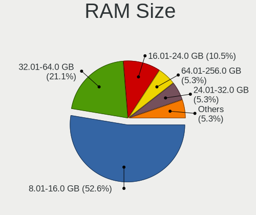
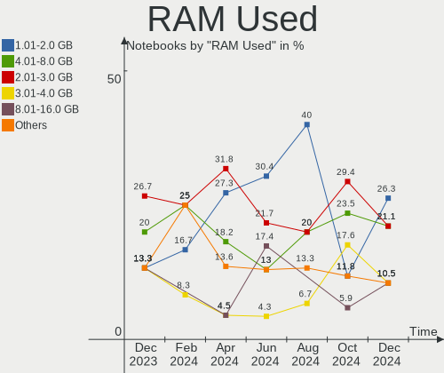
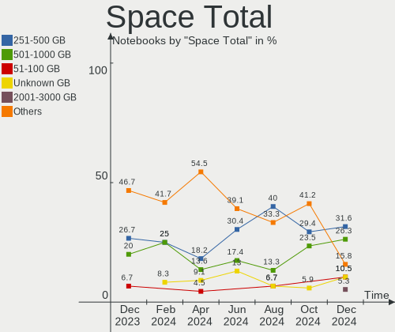

Gentoo Hardware Trends (Notebooks)
----------------------------------

A project to identify most popular hardware characteristics and track their change
over time based on data collected by Gentoo users at https://Linux-Hardware.org.

Anyone can contribute to this report by the [hw-probe](https://github.com/linuxhw/hw-probe) tool:

    sudo -E hw-probe -all -upload

Full-feature report is available here: https://linux-hardware.org/?view=trends&formfactor=notebook

Period: Oct, 2021.

Contents
--------

* [ System ](#system)
  - [ OS                       ](#os)
  - [ OS Family                ](#os-family)
  - [ Kernel                   ](#kernel)
  - [ Kernel Family            ](#kernel-family)
  - [ Kernel Major Ver.        ](#kernel-major-ver)
  - [ Arch                     ](#arch)
  - [ DE                       ](#de)
  - [ Display Server           ](#display-server)
  - [ Display Manager          ](#display-manager)
  - [ OS Lang                  ](#os-lang)
  - [ Boot Mode                ](#boot-mode)
  - [ Filesystem               ](#filesystem)
  - [ Part. scheme             ](#part-scheme)
  - [ Dual Boot with Linux/BSD ](#dual-boot-with-linuxbsd)
  - [ Dual Boot (Win)          ](#dual-boot-win)

* [ Board ](#board)
  - [ Vendor                   ](#vendor)
  - [ Model                    ](#model)
  - [ Model Family             ](#model-family)
  - [ MFG Year                 ](#mfg-year)
  - [ Form Factor              ](#form-factor)
  - [ Secure Boot              ](#secure-boot)
  - [ Coreboot                 ](#coreboot)
  - [ RAM Size                 ](#ram-size)
  - [ RAM Used                 ](#ram-used)
  - [ Total Drives             ](#total-drives)
  - [ Has CD-ROM               ](#has-cd-rom)
  - [ Has Ethernet             ](#has-ethernet)
  - [ Has WiFi                 ](#has-wifi)
  - [ Has Bluetooth            ](#has-bluetooth)

* [ Location ](#location)
  - [ Country                  ](#country)
  - [ City                     ](#city)

* [ Drives ](#drives)
  - [ Drive Vendor             ](#drive-vendor)
  - [ Drive Model              ](#drive-model)
  - [ HDD Vendor               ](#hdd-vendor)
  - [ SSD Vendor               ](#ssd-vendor)
  - [ Drive Kind               ](#drive-kind)
  - [ Drive Connector          ](#drive-connector)
  - [ Drive Size               ](#drive-size)
  - [ Space Total              ](#space-total)
  - [ Space Used               ](#space-used)
  - [ Malfunc. Drives          ](#malfunc-drives)
  - [ Malfunc. Drive Vendor    ](#malfunc-drive-vendor)
  - [ Malfunc. HDD Vendor      ](#malfunc-hdd-vendor)
  - [ Malfunc. Drive Kind      ](#malfunc-drive-kind)
  - [ Failed Drives            ](#failed-drives)
  - [ Failed Drive Vendor      ](#failed-drive-vendor)
  - [ Drive Status             ](#drive-status)

* [ Storage controller ](#storage-controller)
  - [ Storage Vendor           ](#storage-vendor)
  - [ Storage Model            ](#storage-model)
  - [ Storage Kind             ](#storage-kind)

* [ Processor ](#processor)
  - [ CPU Vendor               ](#cpu-vendor)
  - [ CPU Model                ](#cpu-model)
  - [ CPU Model Family         ](#cpu-model-family)
  - [ CPU Cores                ](#cpu-cores)
  - [ CPU Sockets              ](#cpu-sockets)
  - [ CPU Threads              ](#cpu-threads)
  - [ CPU Op-Modes             ](#cpu-op-modes)
  - [ CPU Microcode            ](#cpu-microcode)
  - [ CPU Microarch            ](#cpu-microarch)

* [ Graphics ](#graphics)
  - [ GPU Vendor               ](#gpu-vendor)
  - [ GPU Model                ](#gpu-model)
  - [ GPU Combo                ](#gpu-combo)
  - [ GPU Driver               ](#gpu-driver)
  - [ GPU Memory               ](#gpu-memory)

* [ Monitor ](#monitor)
  - [ Monitor Vendor           ](#monitor-vendor)
  - [ Monitor Model            ](#monitor-model)
  - [ Monitor Resolution       ](#monitor-resolution)
  - [ Monitor Diagonal         ](#monitor-diagonal)
  - [ Monitor Width            ](#monitor-width)
  - [ Aspect Ratio             ](#aspect-ratio)
  - [ Monitor Area             ](#monitor-area)
  - [ Pixel Density            ](#pixel-density)
  - [ Multiple Monitors        ](#multiple-monitors)

* [ Network ](#network)
  - [ Net Controller Vendor    ](#net-controller-vendor)
  - [ Net Controller Model     ](#net-controller-model)
  - [ Wireless Vendor          ](#wireless-vendor)
  - [ Wireless Model           ](#wireless-model)
  - [ Ethernet Vendor          ](#ethernet-vendor)
  - [ Ethernet Model           ](#ethernet-model)
  - [ Net Controller Kind      ](#net-controller-kind)
  - [ Used Controller          ](#used-controller)
  - [ NICs                     ](#nics)
  - [ IPv6                     ](#ipv6)

* [ Bluetooth ](#bluetooth)
  - [ Bluetooth Vendor         ](#bluetooth-vendor)
  - [ Bluetooth Model          ](#bluetooth-model)

* [ Sound ](#sound)
  - [ Sound Vendor             ](#sound-vendor)
  - [ Sound Model              ](#sound-model)

* [ Memory ](#memory)
  - [ Memory Vendor            ](#memory-vendor)
  - [ Memory Model             ](#memory-model)
  - [ Memory Kind              ](#memory-kind)
  - [ Memory Form Factor       ](#memory-form-factor)
  - [ Memory Size              ](#memory-size)
  - [ Memory Speed             ](#memory-speed)

* [ Printers & scanners ](#printers--scanners)
  - [ Printer Vendor           ](#printer-vendor)
  - [ Printer Model            ](#printer-model)
  - [ Scanner Vendor           ](#scanner-vendor)
  - [ Scanner Model            ](#scanner-model)

* [ Camera ](#camera)
  - [ Camera Vendor            ](#camera-vendor)
  - [ Camera Model             ](#camera-model)

* [ Security ](#security)
  - [ Fingerprint Vendor       ](#fingerprint-vendor)
  - [ Fingerprint Model        ](#fingerprint-model)
  - [ Chipcard Vendor          ](#chipcard-vendor)
  - [ Chipcard Model           ](#chipcard-model)

* [ Unsupported ](#unsupported)
  - [ Unsupported Devices      ](#unsupported-devices)
  - [ Unsupported Device Types ](#unsupported-device-types)

System
------

OS
--

Installed operating systems

| Name       | Notebooks | Percent |
|------------|-----------|---------|
| Gentoo 2.7 | 18        | 69.23%  |
| Gentoo 2.8 | 6         | 23.08%  |
| Gentoo 2.6 | 2         | 7.69%   |

OS Family
---------

OS without a version

| Name   | Notebooks | Percent |
|--------|-----------|---------|
| Gentoo | 26        | 100%    |

Kernel
------

Version of the Linux kernel

| Version                       | Notebooks | Percent |
|-------------------------------|-----------|---------|
| 5.10.61-gentoo                | 4         | 15.38%  |
| 5.14.9-gentoo-x86_64          | 3         | 11.54%  |
| 5.14.14-gentoo-x86_64         | 2         | 7.69%   |
| 5.10.61-gentoo-x86_64         | 2         | 7.69%   |
| 5.9.11-gentoo-compact-0.1     | 1         | 3.85%   |
| 5.4.80-gentoo-r1              | 1         | 3.85%   |
| 5.15.0-rc5test                | 1         | 3.85%   |
| 5.14.9-gentoo-dist            | 1         | 3.85%   |
| 5.14.9-gentoo                 | 1         | 3.85%   |
| 5.14.8-x86_64                 | 1         | 3.85%   |
| 5.14.8-gentoo                 | 1         | 3.85%   |
| 5.14.8-arch1-1                | 1         | 3.85%   |
| 5.14.14-gentoo-dist           | 1         | 3.85%   |
| 5.14.13-gentoo-yoshi-hp       | 1         | 3.85%   |
| 5.14.1-gentoo                 | 1         | 3.85%   |
| 5.14.0-pf6-x86_64             | 1         | 3.85%   |
| 5.10.76-gentoo-r1-x86_64-usir | 1         | 3.85%   |
| 5.10.74-gentoo-20211029       | 1         | 3.85%   |
| 5.10.61-gentoo-flopt          | 1         | 3.85%   |

Kernel Family
-------------

Linux kernel without a distro release

| Version | Notebooks | Percent |
|---------|-----------|---------|
| 5.10.61 | 7         | 26.92%  |
| 5.14.9  | 5         | 19.23%  |
| 5.14.8  | 3         | 11.54%  |
| 5.14.14 | 3         | 11.54%  |
| 5.9.11  | 1         | 3.85%   |
| 5.4.80  | 1         | 3.85%   |
| 5.15.0  | 1         | 3.85%   |
| 5.14.13 | 1         | 3.85%   |
| 5.14.1  | 1         | 3.85%   |
| 5.14.0  | 1         | 3.85%   |
| 5.10.76 | 1         | 3.85%   |
| 5.10.74 | 1         | 3.85%   |

Kernel Major Ver.
-----------------

Linux kernel major version

| Version | Notebooks | Percent |
|---------|-----------|---------|
| 5.14    | 14        | 53.85%  |
| 5.10    | 9         | 34.62%  |
| 5.9     | 1         | 3.85%   |
| 5.4     | 1         | 3.85%   |
| 5.15    | 1         | 3.85%   |

Arch
----

OS architecture (x86_64, i586, etc.)

| Name   | Notebooks | Percent |
|--------|-----------|---------|
| x86_64 | 25        | 96.15%  |
| i686   | 1         | 3.85%   |

DE
--

Desktop Environment

| Name       | Notebooks | Percent |
|------------|-----------|---------|
| Unknown    | 11        | 42.31%  |
| KDE5       | 6         | 23.08%  |
| MATE       | 2         | 7.69%   |
| KDE        | 2         | 7.69%   |
| XFCE       | 1         | 3.85%   |
| X-Cinnamon | 1         | 3.85%   |
| sway       | 1         | 3.85%   |
| GNOME      | 1         | 3.85%   |
| Cinnamon   | 1         | 3.85%   |

Display Server
--------------

X11 or Wayland

| Name    | Notebooks | Percent |
|---------|-----------|---------|
| X11     | 14        | 53.85%  |
| Tty     | 7         | 26.92%  |
| Wayland | 4         | 15.38%  |
| Unknown | 1         | 3.85%   |

Display Manager
---------------

SDDM, LightDM, etc.

| Name    | Notebooks | Percent |
|---------|-----------|---------|
| Unknown | 12        | 46.15%  |
| SDDM    | 8         | 30.77%  |
| LightDM | 5         | 19.23%  |
| GDM     | 1         | 3.85%   |

OS Lang
-------

Language

| Lang       | Notebooks | Percent |
|------------|-----------|---------|
| en_US      | 11        | 42.31%  |
| de_DE      | 2         | 7.69%   |
| C.UTF8     | 2         | 7.69%   |
| C          | 2         | 7.69%   |
| zh_TW      | 1         | 3.85%   |
| ru_UA      | 1         | 3.85%   |
| ru_RU      | 1         | 3.85%   |
| nl_BE      | 1         | 3.85%   |
| ko_KR      | 1         | 3.85%   |
| it_IT      | 1         | 3.85%   |
| es_ES      | 1         | 3.85%   |
| en_US.UTF8 | 1         | 3.85%   |
| Unknown    | 1         | 3.85%   |

Boot Mode
---------

EFI or BIOS

| Mode | Notebooks | Percent |
|------|-----------|---------|
| EFI  | 21        | 80.77%  |
| BIOS | 5         | 19.23%  |

Filesystem
----------

Type of filesystem

| Type  | Notebooks | Percent |
|-------|-----------|---------|
| Ext4  | 11        | 42.31%  |
| Btrfs | 11        | 42.31%  |
| Zfs   | 2         | 7.69%   |
| Xfs   | 1         | 3.85%   |
| F2fs  | 1         | 3.85%   |

Part. scheme
------------

Scheme of partitioning

| Type    | Notebooks | Percent |
|---------|-----------|---------|
| GPT     | 23        | 88.46%  |
| Unknown | 2         | 7.69%   |
| MBR     | 1         | 3.85%   |

Dual Boot with Linux/BSD
------------------------

Hosting more than one Linux/BSD

| Dual boot | Notebooks | Percent |
|-----------|-----------|---------|
| No        | 16        | 61.54%  |
| Yes       | 10        | 38.46%  |

Dual Boot (Win)
---------------

Hosting Linux and Windows

| Dual boot | Notebooks | Percent |
|-----------|-----------|---------|
| No        | 18        | 69.23%  |
| Yes       | 8         | 30.77%  |

Board
-----

Vendor
------

Motherboard manufacturer

| Name                | Notebooks | Percent |
|---------------------|-----------|---------|
| Lenovo              | 8         | 30.77%  |
| Hewlett-Packard     | 4         | 15.38%  |
| ASUSTek Computer    | 4         | 15.38%  |
| Timi                | 3         | 11.54%  |
| Dell                | 2         | 7.69%   |
| Acer                | 2         | 7.69%   |
| Samsung Electronics | 1         | 3.85%   |
| Purism              | 1         | 3.85%   |
| IBM                 | 1         | 3.85%   |

Model
-----

Motherboard model

| Name                                 | Notebooks | Percent |
|--------------------------------------|-----------|---------|
| Timi RedmiBook 13 R                  | 2         | 7.69%   |
| Timi Mi Laptop Pro 15                | 1         | 3.85%   |
| Samsung RC530/RC730                  | 1         | 3.85%   |
| Purism librem_15v4                   | 1         | 3.85%   |
| Lenovo Yoga 2 13 20344               | 1         | 3.85%   |
| Lenovo ThinkPad P1 Gen 3 20TJS2F437  | 1         | 3.85%   |
| Lenovo ThinkPad E15 Gen 2 20T8001STX | 1         | 3.85%   |
| Lenovo ThinkBook 14p Gen 2 20YN      | 1         | 3.85%   |
| Lenovo ThinkBook 14 G3 ACL 21A2      | 1         | 3.85%   |
| Lenovo Legion 5P 15IMH05 82AW        | 1         | 3.85%   |
| Lenovo IdeaPad 5 14ITL05 82FE        | 1         | 3.85%   |
| Lenovo IdeaPad 5 14ARE05 81YM        | 1         | 3.85%   |
| IBM ThinkPad T43 2668Z3S             | 1         | 3.85%   |
| HP ProBook 455 G7                    | 1         | 3.85%   |
| HP Pavilion ZV6100 (EE984EA#ABZ)     | 1         | 3.85%   |
| HP Pavilion Notebook                 | 1         | 3.85%   |
| HP Pavilion Gaming Laptop 15-ec1xxx  | 1         | 3.85%   |
| Dell Latitude E6530                  | 1         | 3.85%   |
| Dell Inspiron 5415                   | 1         | 3.85%   |
| ASUS X556URK                         | 1         | 3.85%   |
| ASUS X555LJ                          | 1         | 3.85%   |
| ASUS ROG Strix G513QM_G513QM         | 1         | 3.85%   |
| Acer TravelMate P648-M               | 1         | 3.85%   |
| Acer Aspire A515-55                  | 1         | 3.85%   |
| Unknown                              | 1         | 3.85%   |

Model Family
------------

Motherboard model prefix

| Name             | Notebooks | Percent |
|------------------|-----------|---------|
| HP Pavilion      | 3         | 11.54%  |
| Timi RedmiBook   | 2         | 7.69%   |
| Lenovo ThinkPad  | 2         | 7.69%   |
| Lenovo ThinkBook | 2         | 7.69%   |
| Lenovo IdeaPad   | 2         | 7.69%   |
| Timi Mi          | 1         | 3.85%   |
| Samsung RC530    | 1         | 3.85%   |
| Purism librem    | 1         | 3.85%   |
| Lenovo Yoga      | 1         | 3.85%   |
| Lenovo Legion    | 1         | 3.85%   |
| IBM ThinkPad     | 1         | 3.85%   |
| HP ProBook       | 1         | 3.85%   |
| Dell Latitude    | 1         | 3.85%   |
| Dell Inspiron    | 1         | 3.85%   |
| ASUS X556URK     | 1         | 3.85%   |
| ASUS X555LJ      | 1         | 3.85%   |
| ASUS ROG         | 1         | 3.85%   |
| Acer TravelMate  | 1         | 3.85%   |
| Acer Aspire      | 1         | 3.85%   |
| Unknown          | 1         | 3.85%   |

MFG Year
--------

Motherboard manufacture year

| Year | Notebooks | Percent |
|------|-----------|---------|
| 2021 | 9         | 34.62%  |
| 2020 | 7         | 26.92%  |
| 2019 | 2         | 7.69%   |
| 2006 | 2         | 7.69%   |
| 2018 | 1         | 3.85%   |
| 2016 | 1         | 3.85%   |
| 2015 | 1         | 3.85%   |
| 2014 | 1         | 3.85%   |
| 2011 | 1         | 3.85%   |
| 1970 | 1         | 3.85%   |

Form Factor
-----------

Physical design of the computer

| Name     | Notebooks | Percent |
|----------|-----------|---------|
| Notebook | 26        | 100%    |

Secure Boot
-----------

Enabled or disabled

| State    | Notebooks | Percent |
|----------|-----------|---------|
| Disabled | 25        | 96.15%  |
| Enabled  | 1         | 3.85%   |

Coreboot
--------

Have coreboot on board

| Used | Notebooks | Percent |
|------|-----------|---------|
| No   | 25        | 96.15%  |
| Yes  | 1         | 3.85%   |

RAM Size
--------

Total RAM memory

| Size in GB | Notebooks | Percent |
|------------|-----------|---------|
| 8.01-16.0  | 11        | 42.31%  |
| 4.01-8.0   | 6         | 23.08%  |
| 16.01-24.0 | 4         | 15.38%  |
| 32.01-64.0 | 2         | 7.69%   |
| 3.01-4.0   | 1         | 3.85%   |
| 2.01-3.0   | 1         | 3.85%   |
| 1.01-2.0   | 1         | 3.85%   |

RAM Used
--------

Used RAM memory

| Used GB   | Notebooks | Percent |
|-----------|-----------|---------|
| 1.01-2.0  | 8         | 30.77%  |
| 4.01-8.0  | 6         | 23.08%  |
| 3.01-4.0  | 4         | 15.38%  |
| 8.01-16.0 | 3         | 11.54%  |
| 0.51-1.0  | 2         | 7.69%   |
| 0.01-0.5  | 2         | 7.69%   |
| 2.01-3.0  | 1         | 3.85%   |

Total Drives
------------

Number of drives on board

| Drives | Notebooks | Percent |
|--------|-----------|---------|
| 1      | 18        | 69.23%  |
| 2      | 7         | 26.92%  |
| 3      | 1         | 3.85%   |

Has CD-ROM
----------

Has CD-ROM on board

| Presented | Notebooks | Percent |
|-----------|-----------|---------|
| No        | 22        | 84.62%  |
| Yes       | 4         | 15.38%  |

Has Ethernet
------------

Has Ethernet on board

| Presented | Notebooks | Percent |
|-----------|-----------|---------|
| Yes       | 19        | 73.08%  |
| No        | 7         | 26.92%  |

Has WiFi
--------

Has WiFi module

| Presented | Notebooks | Percent |
|-----------|-----------|---------|
| Yes       | 25        | 96.15%  |
| No        | 1         | 3.85%   |

Has Bluetooth
-------------

Has Bluetooth module

| Presented | Notebooks | Percent |
|-----------|-----------|---------|
| Yes       | 23        | 88.46%  |
| No        | 3         | 11.54%  |

Location
--------

Country
-------

Geographic location (country)

| Country     | Notebooks | Percent |
|-------------|-----------|---------|
| USA         | 4         | 15.38%  |
| Germany     | 3         | 11.54%  |
| Ukraine     | 2         | 7.69%   |
| Spain       | 2         | 7.69%   |
| Finland     | 2         | 7.69%   |
| Czechia     | 2         | 7.69%   |
| China       | 2         | 7.69%   |
| Belgium     | 2         | 7.69%   |
| Turkey      | 1         | 3.85%   |
| Taiwan      | 1         | 3.85%   |
| South Korea | 1         | 3.85%   |
| Russia      | 1         | 3.85%   |
| Poland      | 1         | 3.85%   |
| Italy       | 1         | 3.85%   |
| France      | 1         | 3.85%   |

City
----

Geographic location (city)

| City                | Notebooks | Percent |
|---------------------|-----------|---------|
| Zebulon             | 1         | 3.85%   |
| Warsaw              | 1         | 3.85%   |
| Turenki             | 1         | 3.85%   |
| Somo                | 1         | 3.85%   |
| Schonecken          | 1         | 3.85%   |
| Rho                 | 1         | 3.85%   |
| Ratingen            | 1         | 3.85%   |
| New Taipei          | 1         | 3.85%   |
| Moscow              | 1         | 3.85%   |
| Melilla             | 1         | 3.85%   |
| Mari??nsk?© L??zn?› | 1         | 3.85%   |
| Lokeren             | 1         | 3.85%   |
| Kyiv                | 1         | 3.85%   |
| Johnson City        | 1         | 3.85%   |
| Helsinki            | 1         | 3.85%   |
| Gwangju             | 1         | 3.85%   |
| Guangzhou           | 1         | 3.85%   |
| El Dorado Hills     | 1         | 3.85%   |
| Eisden              | 1         | 3.85%   |
| Dnipro              | 1         | 3.85%   |
| College Station     | 1         | 3.85%   |
| Clermont-Ferrand    | 1         | 3.85%   |
| Brno                | 1         | 3.85%   |
| Berlin              | 1         | 3.85%   |
| Beijing             | 1         | 3.85%   |
| Ankara              | 1         | 3.85%   |

Drives
------

Drive Vendor
------------

Hard drive vendors

| Vendor              | Notebooks | Drives | Percent |
|---------------------|-----------|--------|---------|
| Samsung Electronics | 11        | 14     | 35.48%  |
| WDC                 | 5         | 6      | 16.13%  |
| Intel               | 4         | 4      | 12.9%   |
| SK Hynix            | 3         | 3      | 9.68%   |
| Seagate             | 2         | 2      | 6.45%   |
| Toshiba             | 1         | 1      | 3.23%   |
| SanDisk             | 1         | 1      | 3.23%   |
| RevuAhn             | 1         | 1      | 3.23%   |
| OCZ                 | 1         | 1      | 3.23%   |
| KIOXIA-EXCERIA      | 1         | 1      | 3.23%   |
| HGST                | 1         | 1      | 3.23%   |

Drive Model
-----------

Hard drive models

| Model                                  | Notebooks | Percent |
|----------------------------------------|-----------|---------|
| Intel SSDPEKNW010T8 1TB                | 3         | 8.57%   |
| Samsung SSD 850 EVO 250GB              | 2         | 5.71%   |
| WDC WDS500G2B0B-00YS70 500GB SSD       | 1         | 2.86%   |
| WDC WDS100T2B0C-00PXH0 1TB             | 1         | 2.86%   |
| WDC PC SN530 SDBPMPZ-512G-1101 512GB   | 1         | 2.86%   |
| WDC PC SN530 SDBPMPZ-256G-1001 256GB   | 1         | 2.86%   |
| WDC PC SN520 SDAPNUW-512G-1014 512GB   | 1         | 2.86%   |
| WDC PC SN520 SDAPNUW-256G-1006 256GB   | 1         | 2.86%   |
| Toshiba KXG6AZNV512G 512GB             | 1         | 2.86%   |
| SK Hynix SKHynix_HFS512GDE9X084N 512GB | 1         | 2.86%   |
| SK Hynix HFS256G39TND-N210A 256GB SSD  | 1         | 2.86%   |
| SK Hynix BC711 NVMe 512GB              | 1         | 2.86%   |
| Seagate ST1000LX015-1U7172 1TB         | 1         | 2.86%   |
| Seagate Expansion 1TB                  | 1         | 2.86%   |
| SanDisk SD9SN8W-128G-1006 128GB SSD    | 1         | 2.86%   |
| Samsung SSD 980 1TB                    | 1         | 2.86%   |
| Samsung SSD 970 PRO 512GB              | 1         | 2.86%   |
| Samsung SSD 970 EVO Plus 500GB         | 1         | 2.86%   |
| Samsung SSD 970 EVO Plus 2TB           | 1         | 2.86%   |
| Samsung SSD 860 EVO 250GB              | 1         | 2.86%   |
| Samsung SSD 850 PRO 256GB              | 1         | 2.86%   |
| Samsung MZYLF128HCHP-000L2 128GB SSD   | 1         | 2.86%   |
| Samsung MZVLQ512HALU-000H1 512GB       | 1         | 2.86%   |
| Samsung MZVLB512HBJQ-000L2 512GB       | 1         | 2.86%   |
| Samsung MZALQ512HBLU-00BL2 512GB       | 1         | 2.86%   |
| Samsung MZALQ512HALU-000L2 512GB       | 1         | 2.86%   |
| Samsung HM160HC 160GB                  | 1         | 2.86%   |
| RevuAhn 900G Gaming 256GB SSD          | 1         | 2.86%   |
| OCZ AGILITY3 64GB SSD                  | 1         | 2.86%   |
| KIOXIA-EXCERIA SSD 500GB               | 1         | 2.86%   |
| Intel SSDPEKNU512GZ 512GB              | 1         | 2.86%   |
| HGST HTE721010A9E630 1TB               | 1         | 2.86%   |

HDD Vendor
----------

Hard disk drive vendors

| Vendor              | Notebooks | Drives | Percent |
|---------------------|-----------|--------|---------|
| Seagate             | 2         | 2      | 50%     |
| Samsung Electronics | 1         | 1      | 25%     |
| HGST                | 1         | 1      | 25%     |

SSD Vendor
----------

Solid state drive vendors

| Vendor              | Notebooks | Drives | Percent |
|---------------------|-----------|--------|---------|
| Samsung Electronics | 5         | 5      | 50%     |
| WDC                 | 1         | 1      | 10%     |
| SK Hynix            | 1         | 1      | 10%     |
| SanDisk             | 1         | 1      | 10%     |
| RevuAhn             | 1         | 1      | 10%     |
| OCZ                 | 1         | 1      | 10%     |

Drive Kind
----------

HDD or SSD

| Kind | Notebooks | Drives | Percent |
|------|-----------|--------|---------|
| NVMe | 17        | 21     | 54.84%  |
| SSD  | 10        | 10     | 32.26%  |
| HDD  | 4         | 4      | 12.9%   |

Drive Connector
---------------

SATA, SAS, NVMe, etc.

| Type | Notebooks | Drives | Percent |
|------|-----------|--------|---------|
| NVMe | 17        | 21     | 56.67%  |
| SATA | 12        | 13     | 40%     |
| SAS  | 1         | 1      | 3.33%   |

Drive Size
----------

Size of hard drive

| Size in TB | Notebooks | Drives | Percent |
|------------|-----------|--------|---------|
| 0.01-0.5   | 11        | 11     | 78.57%  |
| 0.51-1.0   | 3         | 3      | 21.43%  |

Space Total
-----------

Amount of disk space available on the file system

| Size in GB | Notebooks | Percent |
|------------|-----------|---------|
| 251-500    | 7         | 26.92%  |
| 101-250    | 5         | 19.23%  |
| 1-20       | 5         | 19.23%  |
| 501-1000   | 4         | 15.38%  |
| 51-100     | 2         | 7.69%   |
| 21-50      | 1         | 3.85%   |
| 1001-2000  | 1         | 3.85%   |
| Unknown    | 1         | 3.85%   |

Space Used
----------

Amount of used disk space

| Used GB  | Notebooks | Percent |
|----------|-----------|---------|
| 101-250  | 8         | 30.77%  |
| 1-20     | 8         | 30.77%  |
| 21-50    | 3         | 11.54%  |
| 501-1000 | 3         | 11.54%  |
| 251-500  | 2         | 7.69%   |
| 51-100   | 1         | 3.85%   |
| Unknown  | 1         | 3.85%   |

Malfunc. Drives
---------------

Drive models with a malfunction

| Model                                 | Notebooks | Drives | Percent |
|---------------------------------------|-----------|--------|---------|
| SK Hynix HFS256G39TND-N210A 256GB SSD | 1         | 1      | 50%     |
| SanDisk SD9SN8W-128G-1006 128GB SSD   | 1         | 1      | 50%     |

Malfunc. Drive Vendor
---------------------

Vendors of faulty drives

| Vendor   | Notebooks | Drives | Percent |
|----------|-----------|--------|---------|
| SK Hynix | 1         | 1      | 50%     |
| SanDisk  | 1         | 1      | 50%     |

Malfunc. HDD Vendor
-------------------

Vendors of faulty HDD drives

Zero info for selected period =(

Malfunc. Drive Kind
-------------------

Kinds of faulty drives

| Kind | Notebooks | Drives | Percent |
|------|-----------|--------|---------|
| SSD  | 2         | 2      | 100%    |

Failed Drives
-------------

Failed drive models

Zero info for selected period =(

Failed Drive Vendor
-------------------

Failed drive vendors

Zero info for selected period =(

Drive Status
------------

Number of failed and malfunc. drives

| Status   | Notebooks | Drives | Percent |
|----------|-----------|--------|---------|
| Works    | 23        | 31     | 85.19%  |
| Detected | 2         | 2      | 7.41%   |
| Malfunc  | 2         | 2      | 7.41%   |

Storage controller
------------------

Storage Vendor
--------------

Storage controller vendors

| Vendor                       | Notebooks | Percent |
|------------------------------|-----------|---------|
| Intel                        | 16        | 42.11%  |
| AMD                          | 7         | 18.42%  |
| Samsung Electronics          | 6         | 15.79%  |
| Sandisk                      | 5         | 13.16%  |
| SK Hynix                     | 2         | 5.26%   |
| Toshiba America Info Systems | 1         | 2.63%   |
| KIOXIA                       | 1         | 2.63%   |

Storage Model
-------------

Storage controller models

| Model                                                                        | Notebooks | Percent |
|------------------------------------------------------------------------------|-----------|---------|
| AMD FCH SATA Controller [AHCI mode]                                          | 6         | 15%     |
| Samsung NVMe SSD Controller SM981/PM981/PM983                                | 4         | 10%     |
| Samsung NVMe SSD Controller 980                                              | 4         | 10%     |
| Intel Sunrise Point-LP SATA Controller [AHCI mode]                           | 4         | 10%     |
| Intel SSD 660P Series                                                        | 3         | 7.5%    |
| SK Hynix Gold P31 SSD                                                        | 2         | 5%      |
| Sandisk WD Blue SN500 / PC SN520 NVMe SSD                                    | 2         | 5%      |
| Sandisk Non-Volatile memory controller                                       | 2         | 5%      |
| Toshiba America Info Systems XG6 NVMe SSD Controller                         | 1         | 2.5%    |
| Sandisk WD Blue SN550 NVMe SSD                                               | 1         | 2.5%    |
| KIOXIA NVMe SSD                                                              | 1         | 2.5%    |
| Intel Wildcat Point-LP SATA Controller [AHCI Mode]                           | 1         | 2.5%    |
| Intel Non-Volatile memory controller                                         | 1         | 2.5%    |
| Intel Ice Lake-LP SATA Controller [AHCI mode]                                | 1         | 2.5%    |
| Intel 82801FBM (ICH6M) SATA Controller                                       | 1         | 2.5%    |
| Intel 8 Series SATA Controller 1 [AHCI mode]                                 | 1         | 2.5%    |
| Intel 7 Series Chipset Family 6-port SATA Controller [AHCI mode]             | 1         | 2.5%    |
| Intel 6 Series/C200 Series Chipset Family 6 port Mobile SATA AHCI Controller | 1         | 2.5%    |
| Intel 500 Series Chipset Family SATA AHCI Controller                         | 1         | 2.5%    |
| Intel 400 Series Chipset Family SATA AHCI Controller                         | 1         | 2.5%    |
| AMD IXP SB4x0 IDE Controller                                                 | 1         | 2.5%    |

Storage Kind
------------

Kind of storage controller (IDE, SATA, NVMe, SAS, ...)

| Kind | Notebooks | Percent |
|------|-----------|---------|
| NVMe | 17        | 47.22%  |
| SATA | 17        | 47.22%  |
| IDE  | 2         | 5.56%   |

Processor
---------

CPU Vendor
----------

Processor vendors

| Vendor | Notebooks | Percent |
|--------|-----------|---------|
| Intel  | 15        | 57.69%  |
| AMD    | 11        | 42.31%  |

CPU Model
---------

Processor models

| Model                                   | Notebooks | Percent |
|-----------------------------------------|-----------|---------|
| AMD Ryzen 7 4700U with Radeon Graphics  | 5         | 19.23%  |
| Intel Core i7-7500U CPU @ 2.70GHz       | 3         | 11.54%  |
| Intel Pentium M processor 1.86GHz       | 1         | 3.85%   |
| Intel Core i7-5500U CPU @ 2.40GHz       | 1         | 3.85%   |
| Intel Core i7-3520M CPU @ 2.90GHz       | 1         | 3.85%   |
| Intel Core i7-2670QM CPU @ 2.20GHz      | 1         | 3.85%   |
| Intel Core i7-10875H CPU @ 2.30GHz      | 1         | 3.85%   |
| Intel Core i7-10850H CPU @ 2.70GHz      | 1         | 3.85%   |
| Intel Core i7-10510U CPU @ 1.80GHz      | 1         | 3.85%   |
| Intel Core i5-6200U CPU @ 2.30GHz       | 1         | 3.85%   |
| Intel Core i5-4200U CPU @ 1.60GHz       | 1         | 3.85%   |
| Intel Core i5-1035G1 CPU @ 1.00GHz      | 1         | 3.85%   |
| Intel 11th Gen Core i9-11900 @ 2.50GHz  | 1         | 3.85%   |
| Intel 11th Gen Core i5-1135G7 @ 2.40GHz | 1         | 3.85%   |
| AMD Ryzen 9 5900HX with Radeon Graphics | 1         | 3.85%   |
| AMD Ryzen 7 5800H with Radeon Graphics  | 1         | 3.85%   |
| AMD Ryzen 7 5700U with Radeon Graphics  | 1         | 3.85%   |
| AMD Ryzen 5 5500U with Radeon Graphics  | 1         | 3.85%   |
| AMD Ryzen 5 4600H with Radeon Graphics  | 1         | 3.85%   |
| AMD Athlon 64 Processor 3200+           | 1         | 3.85%   |

CPU Model Family
----------------

Processor model prefix

| Model           | Notebooks | Percent |
|-----------------|-----------|---------|
| Intel Core i7   | 9         | 34.62%  |
| AMD Ryzen 7     | 7         | 26.92%  |
| Intel Core i5   | 3         | 11.54%  |
| Other           | 2         | 7.69%   |
| AMD Ryzen 5     | 2         | 7.69%   |
| Intel Pentium M | 1         | 3.85%   |
| AMD Ryzen 9     | 1         | 3.85%   |
| AMD Athlon 64   | 1         | 3.85%   |

CPU Cores
---------

Number of processor cores

| Number | Notebooks | Percent |
|--------|-----------|---------|
| 8      | 10        | 38.46%  |
| 2      | 7         | 26.92%  |
| 4      | 4         | 15.38%  |
| 6      | 3         | 11.54%  |
| 1      | 2         | 7.69%   |

CPU Sockets
-----------

Number of sockets

| Number | Notebooks | Percent |
|--------|-----------|---------|
| 1      | 26        | 100%    |

CPU Threads
-----------

Threads per core (Hyper-Threading)

| Number | Notebooks | Percent |
|--------|-----------|---------|
| 2      | 19        | 73.08%  |
| 1      | 7         | 26.92%  |

CPU Op-Modes
------------

CPU Operation Modes (32-bit, 64-bit)

| Op mode        | Notebooks | Percent |
|----------------|-----------|---------|
| 32-bit, 64-bit | 25        | 96.15%  |
| 32-bit         | 1         | 3.85%   |

CPU Microcode
-------------

Microcode number

| Number     | Notebooks | Percent |
|------------|-----------|---------|
| 0x806e9    | 3         | 11.54%  |
| 0x08600106 | 3         | 11.54%  |
| 0x08600103 | 3         | 11.54%  |
| 0xa0652    | 2         | 7.69%   |
| 0x08608103 | 2         | 7.69%   |
| 0xa0671    | 1         | 3.85%   |
| 0x806ec    | 1         | 3.85%   |
| 0x806c1    | 1         | 3.85%   |
| 0x706e5    | 1         | 3.85%   |
| 0x6d8      | 1         | 3.85%   |
| 0x406e3    | 1         | 3.85%   |
| 0x40651    | 1         | 3.85%   |
| 0x306d4    | 1         | 3.85%   |
| 0x306a9    | 1         | 3.85%   |
| 0x206a7    | 1         | 3.85%   |
| 0x0a50000c | 1         | 3.85%   |
| 0x0a50000b | 1         | 3.85%   |
| Unknown    | 1         | 3.85%   |

CPU Microarch
-------------

Microarchitecture

| Name        | Notebooks | Percent |
|-------------|-----------|---------|
| Zen 2       | 6         | 23.08%  |
| KabyLake    | 4         | 15.38%  |
| Zen 3       | 2         | 7.69%   |
| IceLake     | 2         | 7.69%   |
| CometLake   | 2         | 7.69%   |
| Unknown     | 2         | 7.69%   |
| TigerLake   | 1         | 3.85%   |
| Skylake     | 1         | 3.85%   |
| SandyBridge | 1         | 3.85%   |
| P6          | 1         | 3.85%   |
| K8 Hammer   | 1         | 3.85%   |
| IvyBridge   | 1         | 3.85%   |
| Haswell     | 1         | 3.85%   |
| Broadwell   | 1         | 3.85%   |

Graphics
--------

GPU Vendor
----------

Vendors of graphics cards

| Vendor | Notebooks | Percent |
|--------|-----------|---------|
| Intel  | 12        | 35.29%  |
| AMD    | 12        | 35.29%  |
| Nvidia | 10        | 29.41%  |

GPU Model
---------

Graphics card models

| Model                                                                     | Notebooks | Percent |
|---------------------------------------------------------------------------|-----------|---------|
| AMD Renoir                                                                | 6         | 17.65%  |
| Intel HD Graphics 620                                                     | 3         | 8.82%   |
| AMD Lucienne                                                              | 2         | 5.88%   |
| AMD Cezanne                                                               | 2         | 5.88%   |
| Nvidia TU117M                                                             | 1         | 2.94%   |
| Nvidia TU116M [GeForce GTX 1660 Ti Mobile]                                | 1         | 2.94%   |
| Nvidia TU106 [GeForce RTX 2060 Rev. A]                                    | 1         | 2.94%   |
| Nvidia GP108M [GeForce MX250]                                             | 1         | 2.94%   |
| Nvidia GM108M [GeForce 940MX]                                             | 1         | 2.94%   |
| Nvidia GM108M [GeForce 930MX]                                             | 1         | 2.94%   |
| Nvidia GK208BM [GeForce 920M]                                             | 1         | 2.94%   |
| Nvidia GF108M [GeForce GT 540M]                                           | 1         | 2.94%   |
| Nvidia GF108GLM [NVS 5200M]                                               | 1         | 2.94%   |
| Nvidia GA106M [GeForce RTX 3060 Mobile / Max-Q]                           | 1         | 2.94%   |
| Intel TigerLake-LP GT2 [Iris Xe Graphics]                                 | 1         | 2.94%   |
| Intel Skylake GT2 [HD Graphics 520]                                       | 1         | 2.94%   |
| Intel Iris Plus Graphics G1 (Ice Lake)                                    | 1         | 2.94%   |
| Intel HD Graphics 5500                                                    | 1         | 2.94%   |
| Intel Haswell-ULT Integrated Graphics Controller                          | 1         | 2.94%   |
| Intel CometLake-U GT2 [UHD Graphics]                                      | 1         | 2.94%   |
| Intel CometLake-H GT2 [UHD Graphics]                                      | 1         | 2.94%   |
| Intel 3rd Gen Core processor Graphics Controller                          | 1         | 2.94%   |
| Intel 2nd Generation Core Processor Family Integrated Graphics Controller | 1         | 2.94%   |
| AMD RV370/M22 [Mobility Radeon X300]                                      | 1         | 2.94%   |
| AMD RS480M [Mobility Radeon Xpress 200]                                   | 1         | 2.94%   |

GPU Combo
---------

Combinations of graphics cards

| Name           | Notebooks | Percent |
|----------------|-----------|---------|
| 1 x AMD        | 10        | 38.46%  |
| Intel + Nvidia | 6         | 23.08%  |
| 1 x Intel      | 6         | 23.08%  |
| 1 x Nvidia     | 2         | 7.69%   |
| AMD + Nvidia   | 2         | 7.69%   |

GPU Driver
----------

Free vs proprietary

| Driver      | Notebooks | Percent |
|-------------|-----------|---------|
| Free        | 20        | 76.92%  |
| Proprietary | 6         | 23.08%  |

GPU Memory
----------

Total video memory

| Size in GB | Notebooks | Percent |
|------------|-----------|---------|
| Unknown    | 10        | 38.46%  |
| 0.01-0.5   | 7         | 26.92%  |
| 1.01-2.0   | 4         | 15.38%  |
| 5.01-6.0   | 2         | 7.69%   |
| 0.51-1.0   | 2         | 7.69%   |
| 3.01-4.0   | 1         | 3.85%   |

Monitor
-------

Monitor Vendor
--------------

Monitor vendors

| Vendor              | Notebooks | Percent |
|---------------------|-----------|---------|
| AU Optronics        | 9         | 31.03%  |
| Samsung Electronics | 4         | 13.79%  |
| Chimei Innolux      | 4         | 13.79%  |
| BOE                 | 4         | 13.79%  |
| Sharp               | 2         | 6.9%    |
| LG Display          | 2         | 6.9%    |
| Goldstar            | 2         | 6.9%    |
| MSI                 | 1         | 3.45%   |
| InfoVision          | 1         | 3.45%   |

Monitor Model
-------------

Monitor models

| Model                                                                 | Notebooks | Percent |
|-----------------------------------------------------------------------|-----------|---------|
| AU Optronics LCD Monitor AUO38ED 1920x1080 340x190mm 15.3-inch        | 3         | 10.34%  |
| Samsung Electronics LCD Monitor SAM0B7C 1920x1080 886x498mm 40.0-inch | 2         | 6.9%    |
| BOE LCD Monitor BOE0898 1920x1080 294x165mm 13.3-inch                 | 2         | 6.9%    |
| AU Optronics LCD Monitor AUO408D 1920x1080 309x174mm 14.0-inch        | 2         | 6.9%    |
| Sharp LQ156M1JW25 SHP152C 1920x1080 344x194mm 15.5-inch               | 1         | 3.45%   |
| Sharp LQ156M1JW01 SHP14C3 1920x1080 344x194mm 15.5-inch               | 1         | 3.45%   |
| Samsung Electronics LCD Monitor SEC3245 1366x768 344x194mm 15.5-inch  | 1         | 3.45%   |
| Samsung Electronics LCD Monitor SDC434B 3840x2160 340x190mm 15.3-inch | 1         | 3.45%   |
| MSI MAG271CQR MSI3FA7 2560x1440 597x336mm 27.0-inch                   | 1         | 3.45%   |
| LG Display LCD Monitor LGD0657 1920x1080 344x194mm 15.5-inch          | 1         | 3.45%   |
| LG Display LCD Monitor LGD062E 1920x1080 344x194mm 15.5-inch          | 1         | 3.45%   |
| InfoVision LCD Monitor IVO8C45 2240x1400 302x188mm 14.0-inch          | 1         | 3.45%   |
| Goldstar HDR 4K GSM7707 3840x2160 600x340mm 27.2-inch                 | 1         | 3.45%   |
| Goldstar E1942 GSM4C09 1366x768 410x230mm 18.5-inch                   | 1         | 3.45%   |
| Chimei Innolux LCD Monitor CMN15AB 1366x768 350x190mm 15.7-inch       | 1         | 3.45%   |
| Chimei Innolux LCD Monitor CMN15A9 1366x768 344x193mm 15.5-inch       | 1         | 3.45%   |
| Chimei Innolux LCD Monitor CMN14E7 1920x1080 309x173mm 13.9-inch      | 1         | 3.45%   |
| Chimei Innolux LCD Monitor CMN140A 1920x1080 309x173mm 13.9-inch      | 1         | 3.45%   |
| BOE LCD Monitor BOE086E 1920x1080 344x194mm 15.5-inch                 | 1         | 3.45%   |
| BOE LCD Monitor BOE0852 1920x1080 344x194mm 15.5-inch                 | 1         | 3.45%   |
| AU Optronics LCD Monitor AUO61ED 1920x1080 340x190mm 15.3-inch        | 1         | 3.45%   |
| AU Optronics LCD Monitor AUO2E8D 1920x1080 344x194mm 15.5-inch        | 1         | 3.45%   |
| AU Optronics LCD Monitor AUO2E3C 1366x768 309x173mm 13.9-inch         | 1         | 3.45%   |
| AU Optronics LCD Monitor AUO202D 1920x1080 293x165mm 13.2-inch        | 1         | 3.45%   |

Monitor Resolution
------------------

Monitor screen resolution

| Resolution      | Notebooks | Percent |
|-----------------|-----------|---------|
| 1920x1080 (FHD) | 17        | 68%     |
| 1366x768 (WXGA) | 3         | 12%     |
| 3840x2160 (4K)  | 2         | 8%      |
| 2560x1440 (QHD) | 1         | 4%      |
| 2240x1400       | 1         | 4%      |
| 1600x900 (HD+)  | 1         | 4%      |

Monitor Diagonal
----------------

Diagonal size in inches

| Inches | Notebooks | Percent |
|--------|-----------|---------|
| 15     | 14        | 50%     |
| 13     | 6         | 21.43%  |
| 14     | 3         | 10.71%  |
| 40     | 2         | 7.14%   |
| 27     | 2         | 7.14%   |
| 18     | 1         | 3.57%   |

Monitor Width
-------------

Physical width

| Width in mm | Notebooks | Percent |
|-------------|-----------|---------|
| 301-350     | 20        | 71.43%  |
| 201-300     | 3         | 10.71%  |
| 801-900     | 2         | 7.14%   |
| 501-600     | 2         | 7.14%   |
| 401-500     | 1         | 3.57%   |

Aspect Ratio
------------

Proportional relationship between the width and the height

| Ratio | Notebooks | Percent |
|-------|-----------|---------|
| 16/9  | 23        | 95.83%  |
| 16/10 | 1         | 4.17%   |

Monitor Area
------------

Area in inch²

| Area in inch² | Notebooks | Percent |
|----------------|-----------|---------|
| 101-110        | 14        | 50%     |
| 81-90          | 6         | 21.43%  |
| 71-80          | 3         | 10.71%  |
| 301-350        | 2         | 7.14%   |
| 501-1000       | 2         | 7.14%   |
| 141-150        | 1         | 3.57%   |

Pixel Density
-------------

Pixels per inch

| Density       | Notebooks | Percent |
|---------------|-----------|---------|
| 121-160       | 14        | 51.85%  |
| 161-240       | 5         | 18.52%  |
| 101-120       | 4         | 14.81%  |
| 51-100        | 3         | 11.11%  |
| More than 240 | 1         | 3.7%    |

Multiple Monitors
-----------------

Total monitors connected

| Total | Notebooks | Percent |
|-------|-----------|---------|
| 1     | 21        | 80.77%  |
| 2     | 5         | 19.23%  |

Network
-------

Net Controller Vendor
---------------------

Controller vendors

| Vendor                | Notebooks | Percent |
|-----------------------|-----------|---------|
| Intel                 | 16        | 40%     |
| Realtek Semiconductor | 13        | 32.5%   |
| Qualcomm Atheros      | 5         | 12.5%   |
| Broadcom              | 2         | 5%      |
| ASIX Electronics      | 2         | 5%      |
| MEDIATEK              | 1         | 2.5%    |
| AMD                   | 1         | 2.5%    |

Net Controller Model
--------------------

Controller models

| Model                                                               | Notebooks | Percent |
|---------------------------------------------------------------------|-----------|---------|
| Realtek RTL8111/8168/8411 PCI Express Gigabit Ethernet Controller   | 10        | 21.74%  |
| Intel Wi-Fi 6 AX200                                                 | 6         | 13.04%  |
| Realtek RTL8723BE PCIe Wireless Network Adapter                     | 2         | 4.35%   |
| Qualcomm Atheros QCA6174 802.11ac Wireless Network Adapter          | 2         | 4.35%   |
| Intel Comet Lake PCH CNVi WiFi                                      | 2         | 4.35%   |
| ASIX AX88772B Fast Ethernet Controller                              | 2         | 4.35%   |
| Realtek RTL8822CE 802.11ac PCIe Wireless Network Adapter            | 1         | 2.17%   |
| Realtek RTL8153 Gigabit Ethernet Adapter                            | 1         | 2.17%   |
| Realtek RTL810xE PCI Express Fast Ethernet controller               | 1         | 2.17%   |
| Realtek RTL-8100/8101L/8139 PCI Fast Ethernet Adapter               | 1         | 2.17%   |
| Qualcomm Atheros QCA9565 / AR9565 Wireless Network Adapter          | 1         | 2.17%   |
| Qualcomm Atheros AR9485 Wireless Network Adapter                    | 1         | 2.17%   |
| Qualcomm Atheros AR9462 Wireless Network Adapter                    | 1         | 2.17%   |
| MEDIATEK Network controller                                         | 1         | 2.17%   |
| Intel Wireless 7265                                                 | 1         | 2.17%   |
| Intel Wi-Fi 6 AX201                                                 | 1         | 2.17%   |
| Intel PRO/Wireless 2915ABG [Calexico2] Network Connection           | 1         | 2.17%   |
| Intel Ice Lake-LP PCH CNVi WiFi                                     | 1         | 2.17%   |
| Intel Ethernet Connection I219-V                                    | 1         | 2.17%   |
| Intel Ethernet Connection (14) I219-V                               | 1         | 2.17%   |
| Intel Comet Lake PCH-LP CNVi WiFi                                   | 1         | 2.17%   |
| Intel Centrino Wireless-N 130                                       | 1         | 2.17%   |
| Intel Centrino Advanced-N 6205 [Taylor Peak]                        | 1         | 2.17%   |
| Intel 82801FB/FBM/FR/FW/FRW (ICH6 Family) AC'97 Modem Controller    | 1         | 2.17%   |
| Intel 82579LM Gigabit Network Connection (Lewisville)               | 1         | 2.17%   |
| Broadcom NetXtreme BCM5751M Gigabit Ethernet PCI Express            | 1         | 2.17%   |
| Broadcom BCM4318 [AirForce One 54g] 802.11g Wireless LAN Controller | 1         | 2.17%   |
| AMD IXP SB400 AC'97 Modem Controller                                | 1         | 2.17%   |

Wireless Vendor
---------------

Wireless vendors

| Vendor                | Notebooks | Percent |
|-----------------------|-----------|---------|
| Intel                 | 15        | 60%     |
| Qualcomm Atheros      | 5         | 20%     |
| Realtek Semiconductor | 3         | 12%     |
| MEDIATEK              | 1         | 4%      |
| Broadcom              | 1         | 4%      |

Wireless Model
--------------

Wireless models

| Model                                                               | Notebooks | Percent |
|---------------------------------------------------------------------|-----------|---------|
| Intel Wi-Fi 6 AX200                                                 | 6         | 24%     |
| Realtek RTL8723BE PCIe Wireless Network Adapter                     | 2         | 8%      |
| Qualcomm Atheros QCA6174 802.11ac Wireless Network Adapter          | 2         | 8%      |
| Intel Comet Lake PCH CNVi WiFi                                      | 2         | 8%      |
| Realtek RTL8822CE 802.11ac PCIe Wireless Network Adapter            | 1         | 4%      |
| Qualcomm Atheros QCA9565 / AR9565 Wireless Network Adapter          | 1         | 4%      |
| Qualcomm Atheros AR9485 Wireless Network Adapter                    | 1         | 4%      |
| Qualcomm Atheros AR9462 Wireless Network Adapter                    | 1         | 4%      |
| MEDIATEK Network controller                                         | 1         | 4%      |
| Intel Wireless 7265                                                 | 1         | 4%      |
| Intel Wi-Fi 6 AX201                                                 | 1         | 4%      |
| Intel PRO/Wireless 2915ABG [Calexico2] Network Connection           | 1         | 4%      |
| Intel Ice Lake-LP PCH CNVi WiFi                                     | 1         | 4%      |
| Intel Comet Lake PCH-LP CNVi WiFi                                   | 1         | 4%      |
| Intel Centrino Wireless-N 130                                       | 1         | 4%      |
| Intel Centrino Advanced-N 6205 [Taylor Peak]                        | 1         | 4%      |
| Broadcom BCM4318 [AirForce One 54g] 802.11g Wireless LAN Controller | 1         | 4%      |

Ethernet Vendor
---------------

Ethernet vendors

| Vendor                | Notebooks | Percent |
|-----------------------|-----------|---------|
| Realtek Semiconductor | 13        | 68.42%  |
| Intel                 | 3         | 15.79%  |
| ASIX Electronics      | 2         | 10.53%  |
| Broadcom              | 1         | 5.26%   |

Ethernet Model
--------------

Ethernet models

| Model                                                             | Notebooks | Percent |
|-------------------------------------------------------------------|-----------|---------|
| Realtek RTL8111/8168/8411 PCI Express Gigabit Ethernet Controller | 10        | 52.63%  |
| ASIX AX88772B Fast Ethernet Controller                            | 2         | 10.53%  |
| Realtek RTL8153 Gigabit Ethernet Adapter                          | 1         | 5.26%   |
| Realtek RTL810xE PCI Express Fast Ethernet controller             | 1         | 5.26%   |
| Realtek RTL-8100/8101L/8139 PCI Fast Ethernet Adapter             | 1         | 5.26%   |
| Intel Ethernet Connection I219-V                                  | 1         | 5.26%   |
| Intel Ethernet Connection (14) I219-V                             | 1         | 5.26%   |
| Intel 82579LM Gigabit Network Connection (Lewisville)             | 1         | 5.26%   |
| Broadcom NetXtreme BCM5751M Gigabit Ethernet PCI Express          | 1         | 5.26%   |

Net Controller Kind
-------------------

Ethernet, WiFi or modem

| Kind     | Notebooks | Percent |
|----------|-----------|---------|
| WiFi     | 25        | 54.35%  |
| Ethernet | 19        | 41.3%   |
| Modem    | 2         | 4.35%   |

Used Controller
---------------

Currently used network controller

| Kind     | Notebooks | Percent |
|----------|-----------|---------|
| WiFi     | 23        | 76.67%  |
| Ethernet | 7         | 23.33%  |

NICs
----

Total network controllers on board

| Total | Notebooks | Percent |
|-------|-----------|---------|
| 2     | 15        | 57.69%  |
| 1     | 11        | 42.31%  |

IPv6
----

IPv6 vs IPv4

| Used | Notebooks | Percent |
|------|-----------|---------|
| No   | 16        | 61.54%  |
| Yes  | 10        | 38.46%  |

Bluetooth
---------

Bluetooth Vendor
----------------

Controller vendors

| Vendor                  | Notebooks | Percent |
|-------------------------|-----------|---------|
| Intel                   | 13        | 56.52%  |
| Lite-On Technology      | 4         | 17.39%  |
| Realtek Semiconductor   | 3         | 13.04%  |
| IMC Networks            | 1         | 4.35%   |
| Dell                    | 1         | 4.35%   |
| Cambridge Silicon Radio | 1         | 4.35%   |

Bluetooth Model
---------------

Controller models

| Model                                               | Notebooks | Percent |
|-----------------------------------------------------|-----------|---------|
| Intel AX200 Bluetooth                               | 6         | 26.09%  |
| Intel AX201 Bluetooth                               | 4         | 17.39%  |
| Lite-On Bluetooth Device                            | 3         | 13.04%  |
| Realtek Bluetooth Radio                             | 2         | 8.7%    |
| Realtek RTL8723B Bluetooth                          | 1         | 4.35%   |
| Lite-On Atheros AR3012 Bluetooth                    | 1         | 4.35%   |
| Intel Bluetooth wireless interface                  | 1         | 4.35%   |
| Intel Bluetooth Device                              | 1         | 4.35%   |
| Intel Bluetooth 9460/9560 Jefferson Peak (JfP)      | 1         | 4.35%   |
| IMC Networks Wireless_Device                        | 1         | 4.35%   |
| Dell BCM20702A0 Bluetooth Module                    | 1         | 4.35%   |
| Cambridge Silicon Radio Bluetooth Dongle (HCI mode) | 1         | 4.35%   |

Sound
-----

Sound Vendor
------------

Sound card vendors

| Vendor              | Notebooks | Percent |
|---------------------|-----------|---------|
| Intel               | 15        | 41.67%  |
| AMD                 | 11        | 30.56%  |
| Nvidia              | 7         | 19.44%  |
| Razer USA           | 1         | 2.78%   |
| Creative Technology | 1         | 2.78%   |
| ACTIONS             | 1         | 2.78%   |

Sound Model
-----------

Sound card models

| Model                                                                      | Notebooks | Percent |
|----------------------------------------------------------------------------|-----------|---------|
| AMD Family 17h (Models 10h-1fh) HD Audio Controller                        | 10        | 21.28%  |
| AMD Renoir Radeon High Definition Audio Controller                         | 9         | 19.15%  |
| Intel Sunrise Point-LP HD Audio                                            | 4         | 8.51%   |
| Nvidia GF108 High Definition Audio Controller                              | 2         | 4.26%   |
| Intel Comet Lake PCH cAVS                                                  | 2         | 4.26%   |
| Razer USA Razer Kraken X USB                                               | 1         | 2.13%   |
| Nvidia TU116 High Definition Audio Controller                              | 1         | 2.13%   |
| Nvidia TU107 GeForce GTX 1650 High Definition Audio Controller             | 1         | 2.13%   |
| Nvidia TU106 High Definition Audio Controller                              | 1         | 2.13%   |
| Nvidia GK208 HDMI/DP Audio Controller                                      | 1         | 2.13%   |
| Nvidia Audio device                                                        | 1         | 2.13%   |
| Intel Wildcat Point-LP High Definition Audio Controller                    | 1         | 2.13%   |
| Intel Tiger Lake-LP Smart Sound Technology Audio Controller                | 1         | 2.13%   |
| Intel Tiger Lake-H HD Audio Controller                                     | 1         | 2.13%   |
| Intel Ice Lake-LP Smart Sound Technology Audio Controller                  | 1         | 2.13%   |
| Intel Haswell-ULT HD Audio Controller                                      | 1         | 2.13%   |
| Intel Comet Lake PCH-LP cAVS                                               | 1         | 2.13%   |
| Intel Broadwell-U Audio Controller                                         | 1         | 2.13%   |
| Intel 82801FB/FBM/FR/FW/FRW (ICH6 Family) AC'97 Audio Controller           | 1         | 2.13%   |
| Intel 8 Series HD Audio Controller                                         | 1         | 2.13%   |
| Intel 7 Series/C216 Chipset Family High Definition Audio Controller        | 1         | 2.13%   |
| Intel 6 Series/C200 Series Chipset Family High Definition Audio Controller | 1         | 2.13%   |
| Creative Technology Sound Blaster Play! 3                                  | 1         | 2.13%   |
| AMD IXP SB400 AC'97 Audio Controller                                       | 1         | 2.13%   |
| ACTIONS EDIFIER M380                                                       | 1         | 2.13%   |

Memory
------

Memory Vendor
-------------

Memory module vendors

| Vendor              | Notebooks | Percent |
|---------------------|-----------|---------|
| Samsung Electronics | 15        | 50%     |
| SK Hynix            | 5         | 16.67%  |
| Micron Technology   | 4         | 13.33%  |
| Unknown             | 2         | 6.67%   |
| Team                | 1         | 3.33%   |
| Ramaxel Technology  | 1         | 3.33%   |
| Kingston            | 1         | 3.33%   |
| A-DATA Technology   | 1         | 3.33%   |

Memory Model
------------

Memory module models

| Model                                                          | Notebooks | Percent |
|----------------------------------------------------------------|-----------|---------|
| Samsung RAM M471A1G44AB0-CWE 8GB SODIMM DDR4 3200MT/s          | 3         | 9.68%   |
| Samsung RAM M471A1G44AB0-CTD 8GB SODIMM DDR4 2667MT/s          | 3         | 9.68%   |
| SK Hynix RAM HMAA1GS6CJR6N-XN 8GB SODIMM DDR4 3200MT/s         | 2         | 6.45%   |
| Unknown RAM Module 256MB SODIMM DRAM                           | 1         | 3.23%   |
| Unknown RAM Module 1GB SODIMM DRAM                             | 1         | 3.23%   |
| Unknown RAM Module 1GB SODIMM DDR                              | 1         | 3.23%   |
| Team RAM TEAMGROUP-UD4-3200 8192MB DIMM DDR4 3200MT/s          | 1         | 3.23%   |
| SK Hynix RAM HMAA4GS6AJR8N-XN 32GB SODIMM DDR4 3200MT/s        | 1         | 3.23%   |
| SK Hynix RAM HMA851S6CJR6N-VK 4GB SODIMM DDR4 2667MT/s         | 1         | 3.23%   |
| SK Hynix RAM HMA81GS6AFR8N-UH 8GB SODIMM DDR4 2667MT/s         | 1         | 3.23%   |
| Samsung RAM Module 8192MB SODIMM DDR4 3200MT/s                 | 1         | 3.23%   |
| Samsung RAM Module 2048MB SODIMM DDR3 1600MT/s                 | 1         | 3.23%   |
| Samsung RAM M471B5273CH0-CK0 4GB SODIMM DDR3 1600MT/s          | 1         | 3.23%   |
| Samsung RAM M471B5173DB0-YK0 4GB SODIMM DDR3 1600MT/s          | 1         | 3.23%   |
| Samsung RAM M471A5244CB0-CWE 4GB SODIMM DDR4 3200MT/s          | 1         | 3.23%   |
| Samsung RAM M471A5244BB0-CPB 4096MB SODIMM DDR4 2400MT/s       | 1         | 3.23%   |
| Samsung RAM M471A1K43CB1-CTD 8GB SODIMM DDR4 2667MT/s          | 1         | 3.23%   |
| Samsung RAM M471A1K43CB1-CRC 8GB SODIMM DDR4 2667MT/s          | 1         | 3.23%   |
| Samsung RAM M471A1G44AB0-CWE 8192MB Row Of Chips DDR4 3200MT/s | 1         | 3.23%   |
| Ramaxel RAM RMSA3320MJ78HAF-3200 8192MB SODIMM DDR4 3200MT/s   | 1         | 3.23%   |
| Micron RAM 8ATF1G64HZ-3G2J1 8GB SODIMM DDR4 3200MT/s           | 1         | 3.23%   |
| Micron RAM 8ATF1G64HZ-2G3B1 8GB SODIMM DDR4 2400MT/s           | 1         | 3.23%   |
| Micron RAM 4ATF1G64HZ-3G2E2 8GB SODIMM DDR4 3200MT/s           | 1         | 3.23%   |
| Micron RAM 4ATF1G64HZ-3G2E1 8192MB Row Of Chips DDR4 3200MT/s  | 1         | 3.23%   |
| Kingston RAM 9905700-053.A00G 8GB SODIMM DDR4 3200MT/s         | 1         | 3.23%   |
| A-DATA RAM Module 8192MB SODIMM DDR4 3200MT/s                  | 1         | 3.23%   |

Memory Kind
-----------

Memory module kinds

| Kind | Notebooks | Percent |
|------|-----------|---------|
| DDR4 | 19        | 79.17%  |
| DDR3 | 3         | 12.5%   |
| DRAM | 1         | 4.17%   |
| DDR  | 1         | 4.17%   |

Memory Form Factor
------------------

Physical design of the memory module

| Name         | Notebooks | Percent |
|--------------|-----------|---------|
| SODIMM       | 21        | 87.5%   |
| Row Of Chips | 2         | 8.33%   |
| DIMM         | 1         | 4.17%   |

Memory Size
-----------

Memory module size

| Size  | Notebooks | Percent |
|-------|-----------|---------|
| 8192  | 15        | 60%     |
| 4096  | 4         | 16%     |
| 32768 | 2         | 8%      |
| 1024  | 2         | 8%      |
| 2048  | 1         | 4%      |
| 256   | 1         | 4%      |

Memory Speed
------------

Memory module speed

| Speed   | Notebooks | Percent |
|---------|-----------|---------|
| 3200    | 12        | 50%     |
| 2667    | 6         | 25%     |
| 1600    | 3         | 12.5%   |
| Unknown | 2         | 8.33%   |
| 2400    | 1         | 4.17%   |

Printers & scanners
-------------------

Printer Vendor
--------------

Printer device vendors

| Vendor      | Notebooks | Percent |
|-------------|-----------|---------|
| Seiko Epson | 1         | 100%    |

Printer Model
-------------

Printer device models

| Model                 | Notebooks | Percent |
|-----------------------|-----------|---------|
| Seiko Epson AL-M310DN | 1         | 100%    |

Scanner Vendor
--------------

Scanner device vendors

Zero info for selected period =(

Scanner Model
-------------

Scanner device models

Zero info for selected period =(

Camera
------

Camera Vendor
-------------

Camera device vendors

| Vendor                                 | Notebooks | Percent |
|----------------------------------------|-----------|---------|
| Chicony Electronics                    | 4         | 25%     |
| IMC Networks                           | 3         | 18.75%  |
| Luxvisions Innotech Limited            | 2         | 12.5%   |
| Sunplus Innovation Technology          | 1         | 6.25%   |
| Realtek Semiconductor                  | 1         | 6.25%   |
| Quanta                                 | 1         | 6.25%   |
| Logitech                               | 1         | 6.25%   |
| DigiTech                               | 1         | 6.25%   |
| Cheng Uei Precision Industry (Foxlink) | 1         | 6.25%   |
| Acer                                   | 1         | 6.25%   |

Camera Model
------------

Camera device models

| Model                                                                      | Notebooks | Percent |
|----------------------------------------------------------------------------|-----------|---------|
| IMC Networks Integrated Camera                                             | 3         | 18.75%  |
| Sunplus Integrated_Webcam_HD                                               | 1         | 6.25%   |
| Realtek USB Camera                                                         | 1         | 6.25%   |
| Quanta HD Webcam                                                           | 1         | 6.25%   |
| Luxvisions Innotech Limited Integrated Camera                              | 1         | 6.25%   |
| Luxvisions Innotech Limited HP TrueVision HD Camera                        | 1         | 6.25%   |
| Logitech Webcam C120                                                       | 1         | 6.25%   |
| DigiTech WebCam SCB-1110M                                                  | 1         | 6.25%   |
| Chicony XiaoMi USB 2.0 Webcam                                              | 1         | 6.25%   |
| Chicony Lenovo EasyCamera                                                  | 1         | 6.25%   |
| Chicony HP HD Camera                                                       | 1         | 6.25%   |
| Chicony HD WebCam                                                          | 1         | 6.25%   |
| Cheng Uei Precision Industry (Foxlink) HP Wide Vision HD integrated webcam | 1         | 6.25%   |
| Acer Integrated Camera                                                     | 1         | 6.25%   |

Security
--------

Fingerprint Vendor
------------------

Fingerprint sensor vendors

| Vendor                | Notebooks | Percent |
|-----------------------|-----------|---------|
| Synaptics             | 2         | 40%     |
| STMicroelectronics    | 1         | 20%     |
| LighTuning Technology | 1         | 20%     |
| Elan Microelectronics | 1         | 20%     |

Fingerprint Model
-----------------

Fingerprint sensor models

| Model                                                     | Notebooks | Percent |
|-----------------------------------------------------------|-----------|---------|
| Synaptics  FS7604 Touch Fingerprint Sensor with PurePrint | 1         | 20%     |
| Synaptics Prometheus MIS Touch Fingerprint Reader         | 1         | 20%     |
| STMicroelectronics Fingerprint Reader                     | 1         | 20%     |
| LighTuning ES603 Swipe Fingerprint Sensor                 | 1         | 20%     |
| Elan ELAN:Fingerprint                                     | 1         | 20%     |

Chipcard Vendor
---------------

Chipcard module vendors

| Vendor      | Notebooks | Percent |
|-------------|-----------|---------|
| Purism, SPC | 1         | 100%    |

Chipcard Model
--------------

Chipcard module models

| Model                  | Notebooks | Percent |
|------------------------|-----------|---------|
| Purism, SPC Librem Key | 1         | 100%    |

Unsupported
-----------

Unsupported Devices
-------------------

Total unsupported devices on board

| Total | Notebooks | Percent |
|-------|-----------|---------|
| 0     | 11        | 42.31%  |
| 1     | 8         | 30.77%  |
| 3     | 4         | 15.38%  |
| 2     | 3         | 11.54%  |

Unsupported Device Types
------------------------

Types of unsupported devices

| Type                     | Notebooks | Percent |
|--------------------------|-----------|---------|
| Fingerprint reader       | 5         | 19.23%  |
| Bluetooth                | 5         | 19.23%  |
| Multimedia controller    | 4         | 15.38%  |
| Graphics card            | 3         | 11.54%  |
| Communication controller | 3         | 11.54%  |
| Card reader              | 2         | 7.69%   |
| Storage/ata              | 1         | 3.85%   |
| Sound                    | 1         | 3.85%   |
| Modem                    | 1         | 3.85%   |
| Camera                   | 1         | 3.85%   |

