Gentoo - Hardware Trends
------------------------

A project to identify most popular hardware characteristics and track their change
over time based on data collected by Linux users at https://Linux-Hardware.org.

Anyone can contribute to this report by the [hw-probe](https://github.com/linuxhw/hw-probe) tool:

    sudo -E hw-probe -all -upload

This is a report for all computer types. See also reports for [desktops](/Dist/Gentoo/Desktop/README.md) and [notebooks](/Dist/Gentoo/Notebook/README.md).

This report is for one last month. Overall report since the beginning of time: [TestDays](https://github.com/linuxhw/TestDays)

Period: Dec, 2025.

Contents
--------

* [ System ](#system)
  - [ OS                       ](#os)
  - [ OS Family                ](#os-family)
  - [ Kernel                   ](#kernel)
  - [ Kernel Family            ](#kernel-family)
  - [ Kernel Major Ver.        ](#kernel-major-ver)
  - [ Arch                     ](#arch)
  - [ DE                       ](#de)
  - [ Display Server           ](#display-server)
  - [ Display Manager          ](#display-manager)
  - [ OS Lang                  ](#os-lang)
  - [ Boot Mode                ](#boot-mode)
  - [ Filesystem               ](#filesystem)
  - [ Part. scheme             ](#part-scheme)
  - [ Dual Boot with Linux/BSD ](#dual-boot-with-linuxbsd)
  - [ Dual Boot (Win)          ](#dual-boot-win)

* [ Board ](#board)
  - [ Vendor                   ](#vendor)
  - [ Model                    ](#model)
  - [ Model Family             ](#model-family)
  - [ MFG Year                 ](#mfg-year)
  - [ Form Factor              ](#form-factor)
  - [ Secure Boot              ](#secure-boot)
  - [ Coreboot                 ](#coreboot)
  - [ RAM Size                 ](#ram-size)
  - [ RAM Used                 ](#ram-used)
  - [ Total Drives             ](#total-drives)
  - [ Has CD-ROM               ](#has-cd-rom)
  - [ Has Ethernet             ](#has-ethernet)
  - [ Has WiFi                 ](#has-wifi)
  - [ Has Bluetooth            ](#has-bluetooth)

* [ Location ](#location)
  - [ Country                  ](#country)
  - [ City                     ](#city)

* [ Drives ](#drives)
  - [ Drive Vendor             ](#drive-vendor)
  - [ Drive Model              ](#drive-model)
  - [ HDD Vendor               ](#hdd-vendor)
  - [ SSD Vendor               ](#ssd-vendor)
  - [ Drive Kind               ](#drive-kind)
  - [ Drive Connector          ](#drive-connector)
  - [ Drive Size               ](#drive-size)
  - [ Space Total              ](#space-total)
  - [ Space Used               ](#space-used)
  - [ Malfunc. Drives          ](#malfunc-drives)
  - [ Malfunc. Drive Vendor    ](#malfunc-drive-vendor)
  - [ Malfunc. HDD Vendor      ](#malfunc-hdd-vendor)
  - [ Malfunc. Drive Kind      ](#malfunc-drive-kind)
  - [ Failed Drives            ](#failed-drives)
  - [ Failed Drive Vendor      ](#failed-drive-vendor)
  - [ Drive Status             ](#drive-status)

* [ Storage controller ](#storage-controller)
  - [ Storage Vendor           ](#storage-vendor)
  - [ Storage Model            ](#storage-model)
  - [ Storage Kind             ](#storage-kind)

* [ Processor ](#processor)
  - [ CPU Vendor               ](#cpu-vendor)
  - [ CPU Model                ](#cpu-model)
  - [ CPU Model Family         ](#cpu-model-family)
  - [ CPU Cores                ](#cpu-cores)
  - [ CPU Sockets              ](#cpu-sockets)
  - [ CPU Threads              ](#cpu-threads)
  - [ CPU Op-Modes             ](#cpu-op-modes)
  - [ CPU Microcode            ](#cpu-microcode)
  - [ CPU Microarch            ](#cpu-microarch)

* [ Graphics ](#graphics)
  - [ GPU Vendor               ](#gpu-vendor)
  - [ GPU Model                ](#gpu-model)
  - [ GPU Combo                ](#gpu-combo)
  - [ GPU Driver               ](#gpu-driver)
  - [ GPU Memory               ](#gpu-memory)

* [ Monitor ](#monitor)
  - [ Monitor Vendor           ](#monitor-vendor)
  - [ Monitor Model            ](#monitor-model)
  - [ Monitor Resolution       ](#monitor-resolution)
  - [ Monitor Diagonal         ](#monitor-diagonal)
  - [ Monitor Width            ](#monitor-width)
  - [ Aspect Ratio             ](#aspect-ratio)
  - [ Monitor Area             ](#monitor-area)
  - [ Pixel Density            ](#pixel-density)
  - [ Multiple Monitors        ](#multiple-monitors)

* [ Network ](#network)
  - [ Net Controller Vendor    ](#net-controller-vendor)
  - [ Net Controller Model     ](#net-controller-model)
  - [ Wireless Vendor          ](#wireless-vendor)
  - [ Wireless Model           ](#wireless-model)
  - [ Ethernet Vendor          ](#ethernet-vendor)
  - [ Ethernet Model           ](#ethernet-model)
  - [ Net Controller Kind      ](#net-controller-kind)
  - [ Used Controller          ](#used-controller)
  - [ NICs                     ](#nics)
  - [ IPv6                     ](#ipv6)

* [ Bluetooth ](#bluetooth)
  - [ Bluetooth Vendor         ](#bluetooth-vendor)
  - [ Bluetooth Model          ](#bluetooth-model)

* [ Sound ](#sound)
  - [ Sound Vendor             ](#sound-vendor)
  - [ Sound Model              ](#sound-model)

* [ Memory ](#memory)
  - [ Memory Vendor            ](#memory-vendor)
  - [ Memory Model             ](#memory-model)
  - [ Memory Kind              ](#memory-kind)
  - [ Memory Form Factor       ](#memory-form-factor)
  - [ Memory Size              ](#memory-size)
  - [ Memory Speed             ](#memory-speed)

* [ Printers & scanners ](#printers--scanners)
  - [ Printer Vendor           ](#printer-vendor)
  - [ Printer Model            ](#printer-model)
  - [ Scanner Vendor           ](#scanner-vendor)
  - [ Scanner Model            ](#scanner-model)

* [ Camera ](#camera)
  - [ Camera Vendor            ](#camera-vendor)
  - [ Camera Model             ](#camera-model)

* [ Security ](#security)
  - [ Fingerprint Vendor       ](#fingerprint-vendor)
  - [ Fingerprint Model        ](#fingerprint-model)
  - [ Chipcard Vendor          ](#chipcard-vendor)
  - [ Chipcard Model           ](#chipcard-model)

* [ Unsupported ](#unsupported)
  - [ Unsupported Devices      ](#unsupported-devices)
  - [ Unsupported Device Types ](#unsupported-device-types)

System
------

OS
--

Installed operating systems

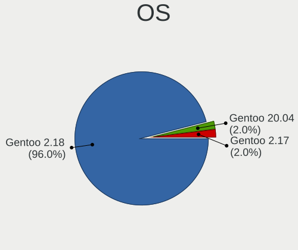

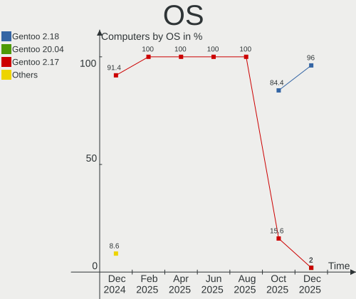

| Name         | Computers | Percent |
|--------------|-----------|---------|
| Gentoo 2.18  | 48        | 96%     |
| Gentoo 20.04 | 1         | 2%      |
| Gentoo 2.17  | 1         | 2%      |

OS Family
---------

OS without a version

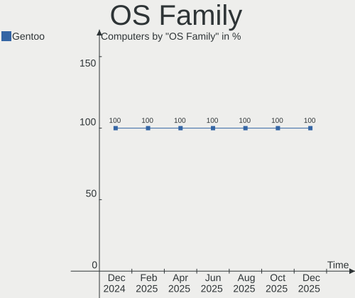

| Name   | Computers | Percent |
|--------|-----------|---------|
| Gentoo | 50        | 100%    |

Kernel
------

Version of the Linux kernel

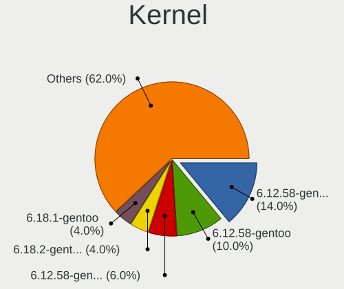

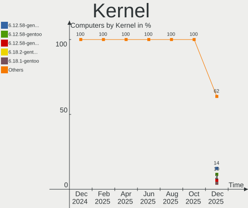

| Version                       | Computers | Percent |
|-------------------------------|-----------|---------|
| 6.12.58-gentoo-dist           | 7         | 14%     |
| 6.12.58-gentoo                | 5         | 10%     |
| 6.12.58-gentoo-x86_64         | 3         | 6%      |
| 6.18.2-gentoo-x86_64          | 2         | 4%      |
| 6.18.1-gentoo                 | 2         | 4%      |
| 6.18.0-gentoo-x86_64          | 2         | 4%      |
| 6.18.0-gentoo                 | 2         | 4%      |
| 6.17.9-gentoo-dist            | 2         | 4%      |
| 6.17.10-gentoo                | 2         | 4%      |
| 6.6.32-gentoo-dist            | 1         | 2%      |
| 6.18.2-gentoo-regg2           | 1         | 2%      |
| 6.18.2-gentoo-22-dec-2025     | 1         | 2%      |
| 6.18.1-gentoo-x86_64          | 1         | 2%      |
| 6.18.0-gentoo-nvme            | 1         | 2%      |
| 6.17.9-x86_64-xanmod1         | 1         | 2%      |
| 6.17.9-gentoo-firmware        | 1         | 2%      |
| 6.17.9-gentoo-dist-hardened   | 1         | 2%      |
| 6.17.9-gentoo                 | 1         | 2%      |
| 6.17.9-cachyos                | 1         | 2%      |
| 6.17.8-gentoo-x86_64          | 1         | 2%      |
| 6.17.8-gentoo-dist            | 1         | 2%      |
| 6.17.7-p2-asahi-dist          | 1         | 2%      |
| 6.17.6-gentoo-r1              | 1         | 2%      |
| 6.17.5-gentoo-x86_64          | 1         | 2%      |
| 6.17.11-gentoo                | 1         | 2%      |
| 6.17.10-gentoo-x86_64         | 1         | 2%      |
| 6.17.10-gentoo-dist           | 1         | 2%      |
| 6.12.58-gentoo-gentoo-dist    | 1         | 2%      |
| 6.12.54-gentoo-dist-hardened  | 1         | 2%      |
| 6.12.47_p20250916-raspberrypi | 1         | 2%      |
| 6.12.41-gentoo                | 1         | 2%      |
| 4.14.83-gentoo                | 1         | 2%      |

Kernel Family
-------------

Linux kernel without a distro release

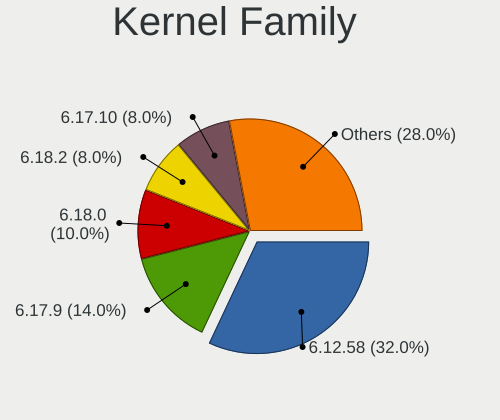

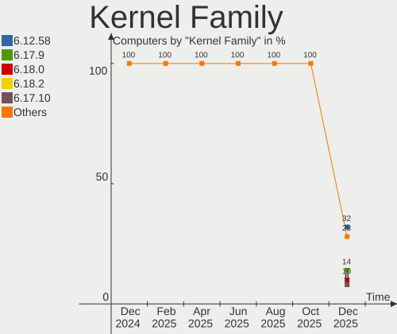

| Version | Computers | Percent |
|---------|-----------|---------|
| 6.12.58 | 16        | 32%     |
| 6.17.9  | 7         | 14%     |
| 6.18.0  | 5         | 10%     |
| 6.18.2  | 4         | 8%      |
| 6.17.10 | 4         | 8%      |
| 6.18.1  | 3         | 6%      |
| 6.17.8  | 2         | 4%      |
| 6.6.32  | 1         | 2%      |
| 6.17.7  | 1         | 2%      |
| 6.17.6  | 1         | 2%      |
| 6.17.5  | 1         | 2%      |
| 6.17.11 | 1         | 2%      |
| 6.12.54 | 1         | 2%      |
| 6.12.47 | 1         | 2%      |
| 6.12.41 | 1         | 2%      |
| 4.14.83 | 1         | 2%      |

Kernel Major Ver.
-----------------

Linux kernel major version

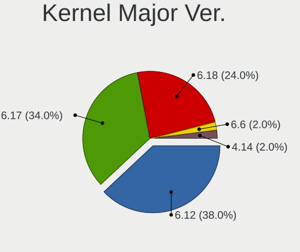

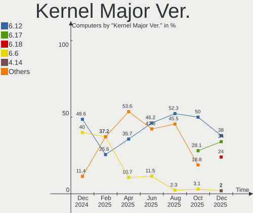

| Version | Computers | Percent |
|---------|-----------|---------|
| 6.12    | 19        | 38%     |
| 6.17    | 17        | 34%     |
| 6.18    | 12        | 24%     |
| 6.6     | 1         | 2%      |
| 4.14    | 1         | 2%      |

Arch
----

OS architecture (x86_64, i586, etc.)

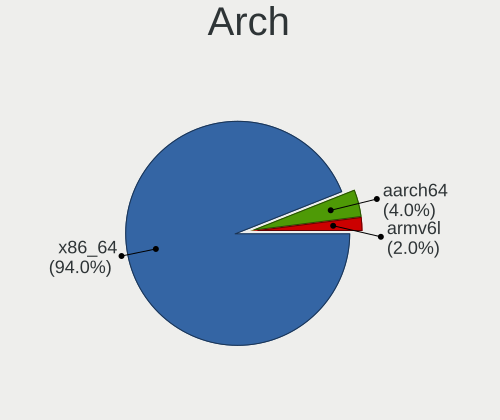

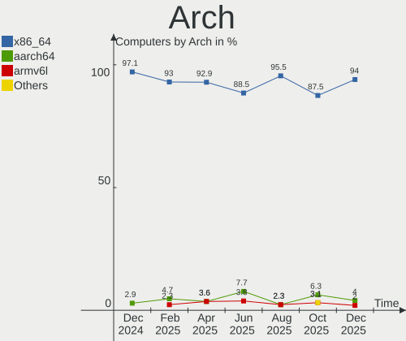

| Name    | Computers | Percent |
|---------|-----------|---------|
| x86_64  | 47        | 94%     |
| aarch64 | 2         | 4%      |
| armv6l  | 1         | 2%      |

DE
--

Desktop Environment

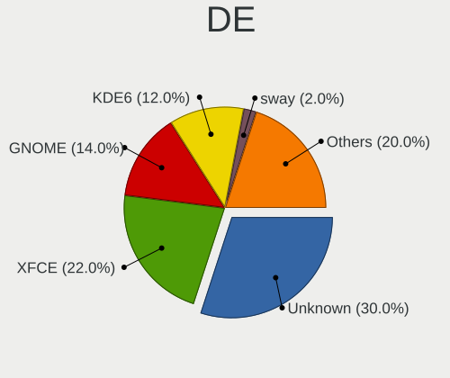

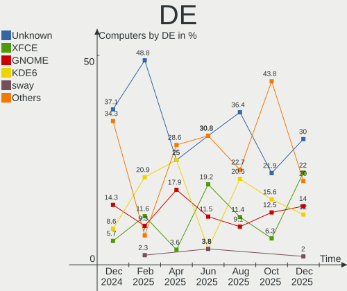

| Name          | Computers | Percent |
|---------------|-----------|---------|
| Unknown       | 15        | 30%     |
| XFCE          | 11        | 22%     |
| GNOME         | 7         | 14%     |
| KDE6          | 6         | 12%     |
| sway          | 1         | 2%      |
| niri          | 1         | 2%      |
| MATE          | 1         | 2%      |
| LXDE          | 1         | 2%      |
| KDE5          | 1         | 2%      |
| KDE           | 1         | 2%      |
| Hyprland      | 1         | 2%      |
| Enlightenment | 1         | 2%      |
| e16-session   | 1         | 2%      |
| DWM           | 1         | 2%      |
| Cinnamon      | 1         | 2%      |

Display Server
--------------

X11 or Wayland

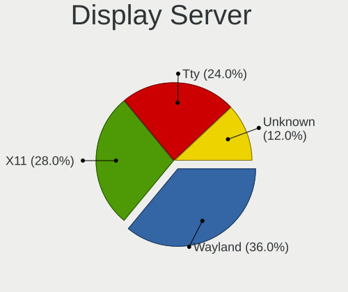

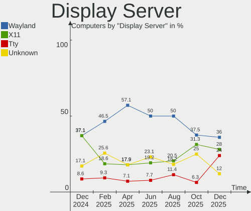

| Name    | Computers | Percent |
|---------|-----------|---------|
| Wayland | 18        | 36%     |
| X11     | 14        | 28%     |
| Tty     | 12        | 24%     |
| Unknown | 6         | 12%     |

Display Manager
---------------

SDDM, LightDM, etc.

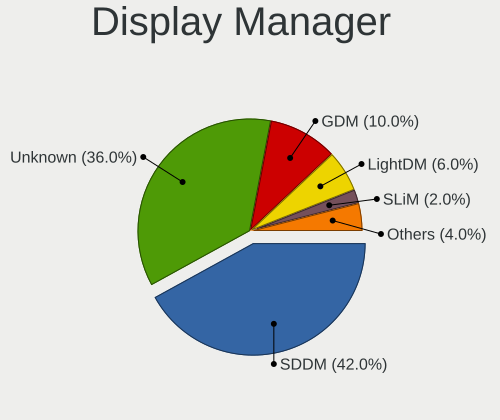

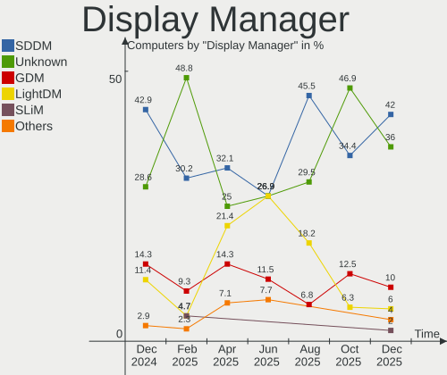

| Name    | Computers | Percent |
|---------|-----------|---------|
| SDDM    | 21        | 42%     |
| Unknown | 18        | 36%     |
| GDM     | 5         | 10%     |
| LightDM | 3         | 6%      |
| SLiM    | 1         | 2%      |
| Ly      | 1         | 2%      |
| GREETD  | 1         | 2%      |

OS Lang
-------

Language

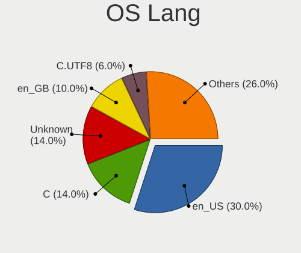

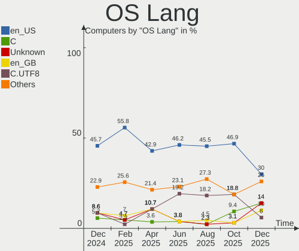

| Lang    | Computers | Percent |
|---------|-----------|---------|
| en_US   | 15        | 30%     |
| C       | 7         | 14%     |
| Unknown | 7         | 14%     |
| en_GB   | 5         | 10%     |
| C.UTF8  | 3         | 6%      |
| it_IT   | 2         | 4%      |
| en_DK   | 2         | 4%      |
| cs_CZ   | 2         | 4%      |
| tr_TR   | 1         | 2%      |
| ru_RU   | 1         | 2%      |
| pl_PL   | 1         | 2%      |
| hu_HU   | 1         | 2%      |
| de_DE   | 1         | 2%      |
| de_CH   | 1         | 2%      |
| ca_AD   | 1         | 2%      |

Boot Mode
---------

EFI or BIOS

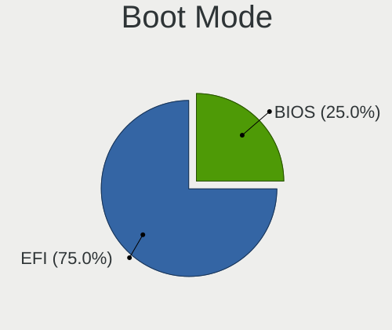

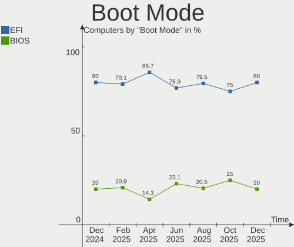

| Mode | Computers | Percent |
|------|-----------|---------|
| EFI  | 40        | 80%     |
| BIOS | 10        | 20%     |

Filesystem
----------

Type of filesystem

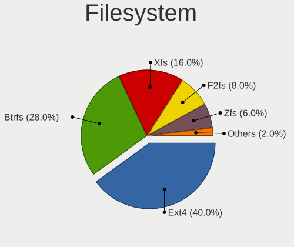

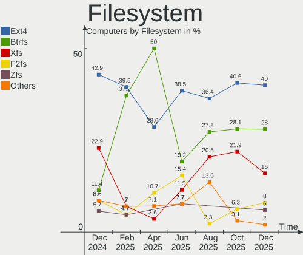

| Type  | Computers | Percent |
|-------|-----------|---------|
| Ext4  | 20        | 40%     |
| Btrfs | 14        | 28%     |
| Xfs   | 8         | 16%     |
| F2fs  | 4         | 8%      |
| Zfs   | 3         | 6%      |
| XXX4  | 1         | 2%      |

Part. scheme
------------

Scheme of partitioning

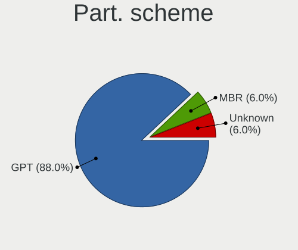

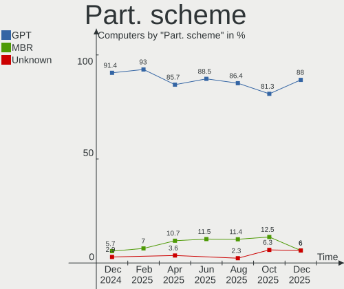

| Type    | Computers | Percent |
|---------|-----------|---------|
| GPT     | 44        | 88%     |
| MBR     | 3         | 6%      |
| Unknown | 3         | 6%      |

Dual Boot with Linux/BSD
------------------------

Hosting more than one Linux/BSD

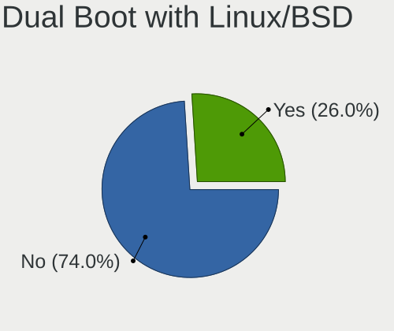

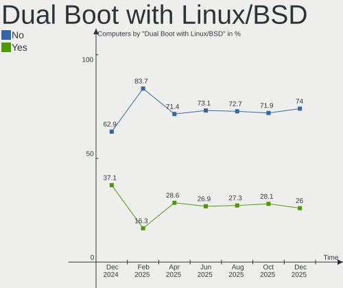

| Dual boot | Computers | Percent |
|-----------|-----------|---------|
| No        | 37        | 74%     |
| Yes       | 13        | 26%     |

Dual Boot (Win)
---------------

Hosting Linux and Windows

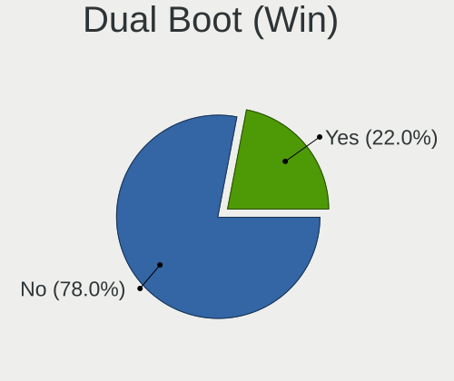

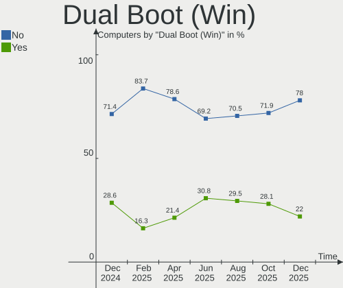

| Dual boot | Computers | Percent |
|-----------|-----------|---------|
| No        | 39        | 78%     |
| Yes       | 11        | 22%     |

Board
-----

Vendor
------

Motherboard manufacturer

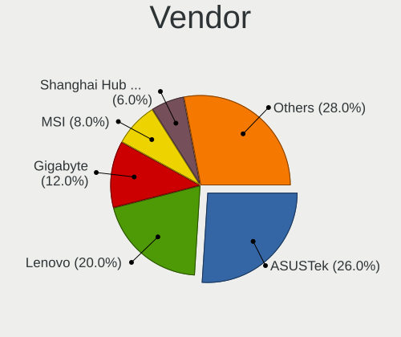

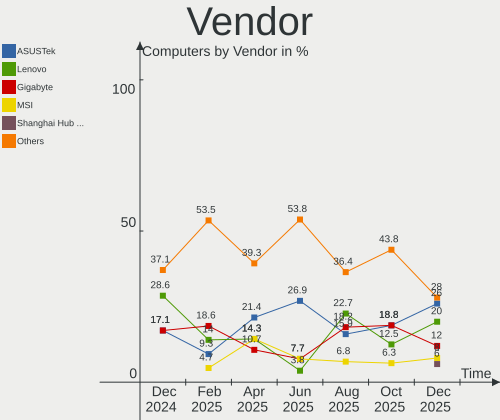

| Name                             | Computers | Percent |
|----------------------------------|-----------|---------|
| ASUSTek Computer                 | 13        | 26%     |
| Lenovo                           | 10        | 20%     |
| Gigabyte Technology              | 6         | 12%     |
| MSI                              | 4         | 8%      |
| Shanghai Hub Union Industural    | 3         | 6%      |
| Hewlett-Packard                  | 2         | 4%      |
| Dell                             | 2         | 4%      |
| Supermicro                       | 1         | 2%      |
| Star Labs                        | 1         | 2%      |
| SLIMBOOK                         | 1         | 2%      |
| Samsung Electronics              | 1         | 2%      |
| Raspberry Pi Foundation          | 1         | 2%      |
| Pegatron                         | 1         | 2%      |
| Micro Computer (HK) Tech Limited | 1         | 2%      |
| Framework                        | 1         | 2%      |
| Acer                             | 1         | 2%      |
| Unknown                          | 1         | 2%      |

Model
-----

Motherboard model

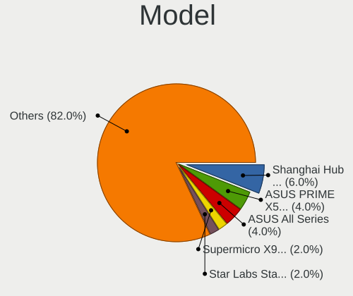

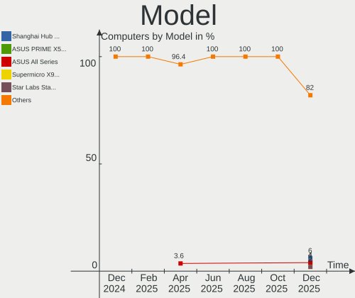

| Name                                          | Computers | Percent |
|-----------------------------------------------|-----------|---------|
| Shanghai Hub Union Industural P6              | 3         | 6%      |
| ASUS PRIME X570-P                             | 2         | 4%      |
| ASUS All Series                               | 2         | 4%      |
| Supermicro X9DR3-F                            | 1         | 2%      |
| Star Labs StarLite                            | 1         | 2%      |
| SLIMBOOK EVO15-A8                             | 1         | 2%      |
| Samsung 300E5EV/300E4EV/270E5EV/270E4EV       | 1         | 2%      |
| RPi Raspberry Pi Zero W Rev 1.1               | 1         | 2%      |
| Pegatron 810-170st                            | 1         | 2%      |
| MSI Summit 13 AI+ Evo A2VMTG                  | 1         | 2%      |
| MSI MS-7D91                                   | 1         | 2%      |
| MSI MS-7D85                                   | 1         | 2%      |
| MSI MS-7C84                                   | 1         | 2%      |
| Micro (HK) Tech Limited MS-R1                 | 1         | 2%      |
| Lenovo Yoga 7 16ARP8 83BS                     | 1         | 2%      |
| Lenovo V15 G5 IRL 83GW                        | 1         | 2%      |
| Lenovo V110-17IKB 80V2                        | 1         | 2%      |
| Lenovo ThinkPad X13 Gen 3 21CNS1M600          | 1         | 2%      |
| Lenovo ThinkPad P14s Gen 6 AMD 21RV0010GE     | 1         | 2%      |
| Lenovo ThinkPad P14s Gen 6 AMD 21QL0020US     | 1         | 2%      |
| Lenovo ThinkPad P14s Gen 2a 21A1S0J600        | 1         | 2%      |
| Lenovo ThinkPad E14 Gen 2 20TA009HID          | 1         | 2%      |
| Lenovo ThinkCentre Edge72 3492EHG             | 1         | 2%      |
| Lenovo IdeaPad 3 15ALC6 82KU                  | 1         | 2%      |
| HP ProBook 4 G1iR 16 inch Notebook PC         | 1         | 2%      |
| HP Laptop 15s-eq2xxx                          | 1         | 2%      |
| Gigabyte X870E AORUS PRO                      | 1         | 2%      |
| Gigabyte X570S AORUS ELITE AX                 | 1         | 2%      |
| Gigabyte Q370M D3H GSM PLUS                   | 1         | 2%      |
| Gigabyte B550 GAMING X V2                     | 1         | 2%      |
| Gigabyte AB350-Gaming                         | 1         | 2%      |
| Gigabyte A520 AORUS ELITE                     | 1         | 2%      |
| Framework Laptop 16 (AMD Ryzen AI 300 Series) | 1         | 2%      |
| Dell XPS 15 9530                              | 1         | 2%      |
| Dell Precision Tower 7810                     | 1         | 2%      |
| ASUS TUF Gaming X670E-PLUS WIFI               | 1         | 2%      |
| ASUS ROG ZENITH II EXTREME                    | 1         | 2%      |
| ASUS ROG STRIX X870E-E GAMING WIFI            | 1         | 2%      |
| ASUS ROG CROSSHAIR X670E HERO                 | 1         | 2%      |
| ASUS ROG CROSSHAIR VIII HERO                  | 1         | 2%      |

Model Family
------------

Motherboard model prefix

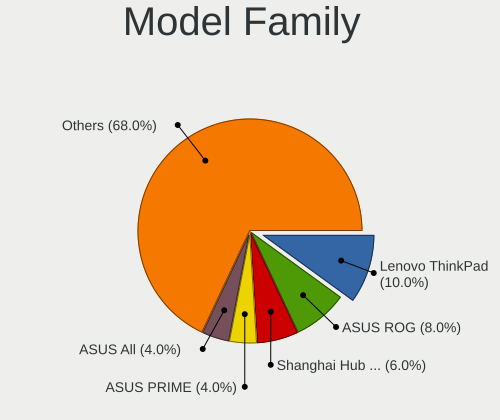

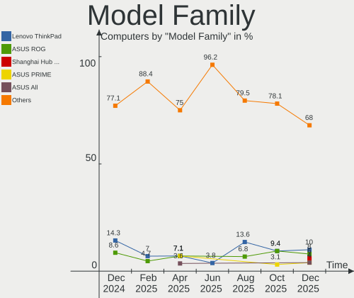

| Name                             | Computers | Percent |
|----------------------------------|-----------|---------|
| Lenovo ThinkPad                  | 5         | 10%     |
| ASUS ROG                         | 4         | 8%      |
| Shanghai Hub Union Industural P6 | 3         | 6%      |
| ASUS PRIME                       | 2         | 4%      |
| ASUS All                         | 2         | 4%      |
| Supermicro X9DR3-F               | 1         | 2%      |
| Star Labs StarLite               | 1         | 2%      |
| SLIMBOOK EVO15-A8                | 1         | 2%      |
| Samsung 300E5EV                  | 1         | 2%      |
| RPi Raspberry                    | 1         | 2%      |
| Pegatron 810-170st               | 1         | 2%      |
| MSI Summit                       | 1         | 2%      |
| MSI MS-7D91                      | 1         | 2%      |
| MSI MS-7D85                      | 1         | 2%      |
| MSI MS-7C84                      | 1         | 2%      |
| Micro (HK) Tech Limited MS-R1    | 1         | 2%      |
| Lenovo Yoga                      | 1         | 2%      |
| Lenovo V15                       | 1         | 2%      |
| Lenovo V110-17IKB                | 1         | 2%      |
| Lenovo ThinkCentre               | 1         | 2%      |
| Lenovo IdeaPad                   | 1         | 2%      |
| HP ProBook                       | 1         | 2%      |
| HP Laptop                        | 1         | 2%      |
| Gigabyte X870E                   | 1         | 2%      |
| Gigabyte X570S                   | 1         | 2%      |
| Gigabyte Q370M                   | 1         | 2%      |
| Gigabyte B550                    | 1         | 2%      |
| Gigabyte AB350-Gaming            | 1         | 2%      |
| Gigabyte A520                    | 1         | 2%      |
| Framework Laptop                 | 1         | 2%      |
| Dell XPS                         | 1         | 2%      |
| Dell Precision                   | 1         | 2%      |
| ASUS TUF                         | 1         | 2%      |
| ASUS ProArt                      | 1         | 2%      |
| ASUS Pro                         | 1         | 2%      |
| ASUS M3A78-CM                    | 1         | 2%      |
| ASUS ASUS                        | 1         | 2%      |
| Acer Iconia                      | 1         | 2%      |
| Unknown                          | 1         | 2%      |

MFG Year
--------

Motherboard manufacture year

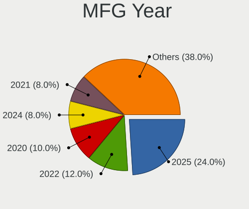

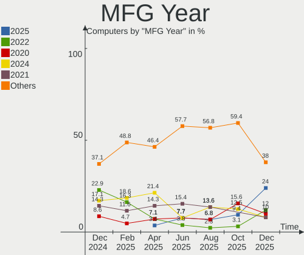

| Year    | Computers | Percent |
|---------|-----------|---------|
| 2025    | 12        | 24%     |
| 2022    | 6         | 12%     |
| 2020    | 5         | 10%     |
| 2024    | 4         | 8%      |
| 2021    | 4         | 8%      |
| 2014    | 4         | 8%      |
| 2023    | 3         | 6%      |
| 2013    | 3         | 6%      |
| 2019    | 2         | 4%      |
| 2017    | 2         | 4%      |
| Unknown | 2         | 4%      |
| 2016    | 1         | 2%      |
| 2012    | 1         | 2%      |
| 2008    | 1         | 2%      |

Form Factor
-----------

Physical design of the computer

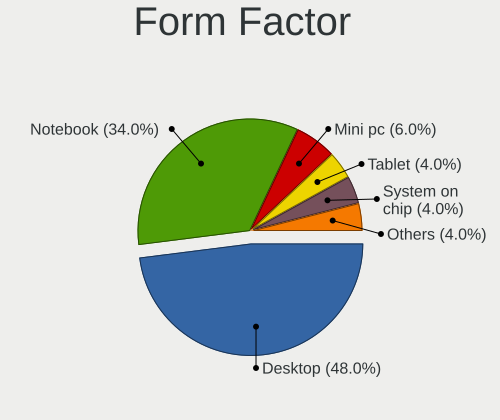

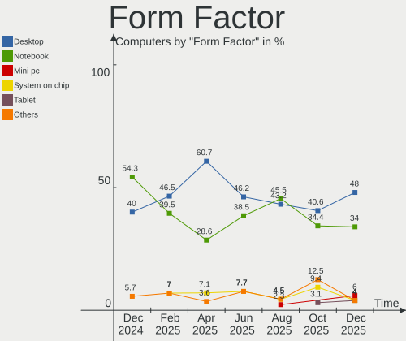

| Name           | Computers | Percent |
|----------------|-----------|---------|
| Desktop        | 24        | 48%     |
| Notebook       | 17        | 34%     |
| Mini pc        | 3         | 6%      |
| System on chip | 2         | 4%      |
| Tablet         | 2         | 4%      |
| Convertible    | 1         | 2%      |
| Server         | 1         | 2%      |

Secure Boot
-----------

Enabled or disabled

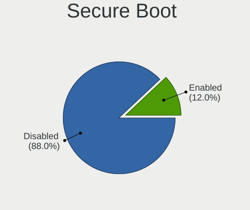

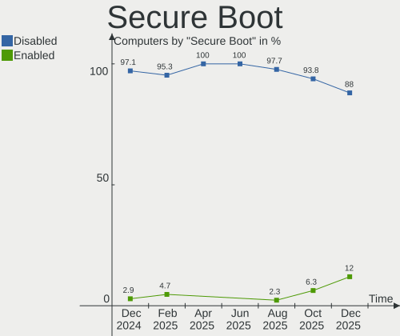

| State    | Computers | Percent |
|----------|-----------|---------|
| Disabled | 44        | 88%     |
| Enabled  | 6         | 12%     |

Coreboot
--------

Have coreboot on board

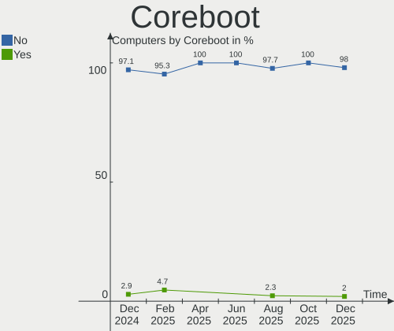

| Used | Computers | Percent |
|------|-----------|---------|
| No   | 49        | 98%     |
| Yes  | 1         | 2%      |

RAM Size
--------

Total RAM memory

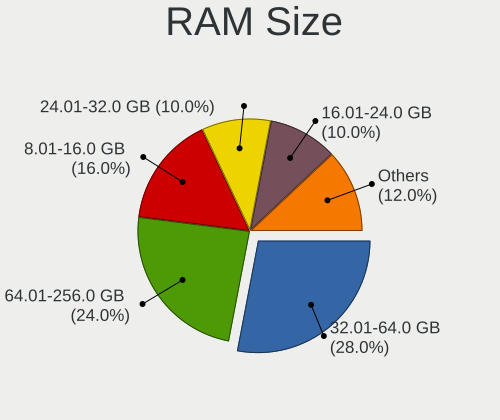

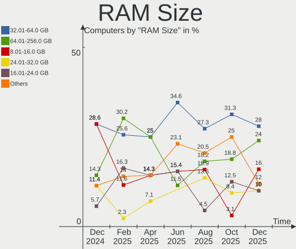

| Size in GB      | Computers | Percent |
|-----------------|-----------|---------|
| 32.01-64.0      | 14        | 28%     |
| 64.01-256.0     | 12        | 24%     |
| 8.01-16.0       | 8         | 16%     |
| 24.01-32.0      | 5         | 10%     |
| 16.01-24.0      | 5         | 10%     |
| 4.01-8.0        | 3         | 6%      |
| More than 256.0 | 1         | 2%      |
| 0.51-1.0        | 1         | 2%      |
| 0.01-0.5        | 1         | 2%      |

RAM Used
--------

Used RAM memory

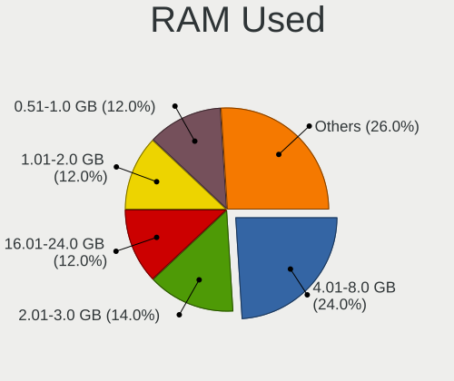

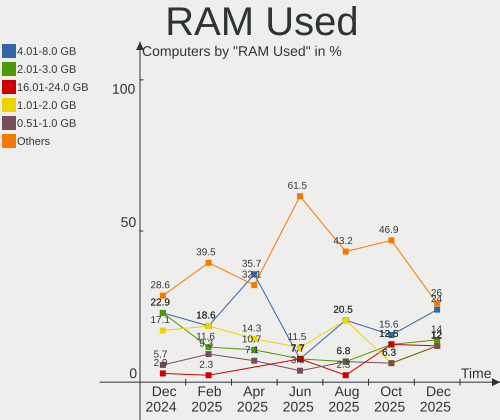

| Used GB    | Computers | Percent |
|------------|-----------|---------|
| 4.01-8.0   | 12        | 24%     |
| 2.01-3.0   | 7         | 14%     |
| 16.01-24.0 | 6         | 12%     |
| 1.01-2.0   | 6         | 12%     |
| 0.51-1.0   | 6         | 12%     |
| 8.01-16.0  | 5         | 10%     |
| 3.01-4.0   | 4         | 8%      |
| 32.01-64.0 | 2         | 4%      |
| 0.01-0.5   | 2         | 4%      |

Total Drives
------------

Number of drives on board

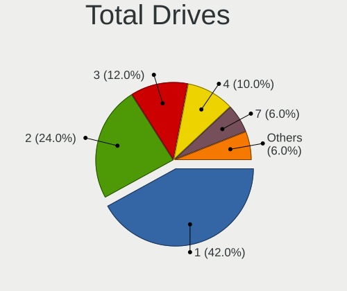

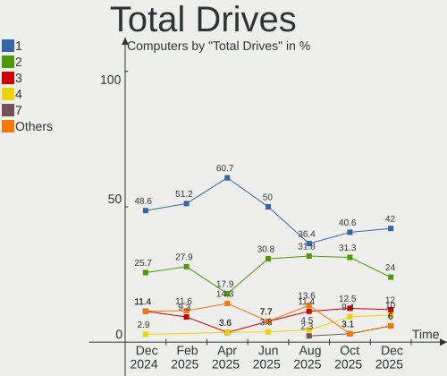

| Drives | Computers | Percent |
|--------|-----------|---------|
| 1      | 21        | 42%     |
| 2      | 12        | 24%     |
| 3      | 6         | 12%     |
| 4      | 5         | 10%     |
| 7      | 3         | 6%      |
| 6      | 2         | 4%      |
| 5      | 1         | 2%      |

Has CD-ROM
----------

Has CD-ROM on board

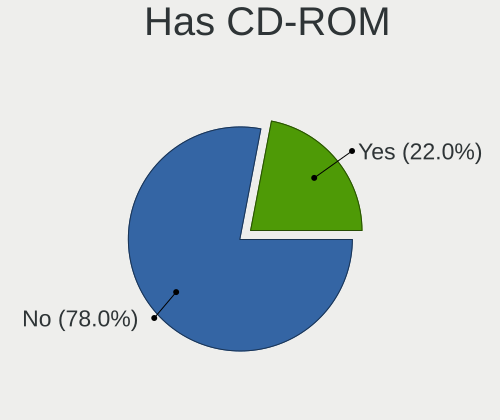

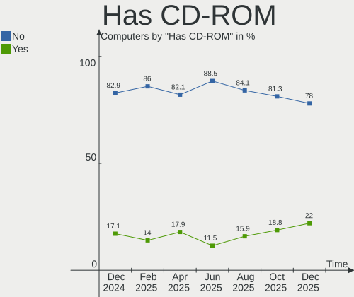

| Presented | Computers | Percent |
|-----------|-----------|---------|
| No        | 39        | 78%     |
| Yes       | 11        | 22%     |

Has Ethernet
------------

Has Ethernet on board

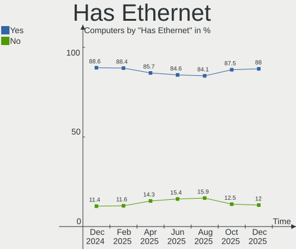

| Presented | Computers | Percent |
|-----------|-----------|---------|
| Yes       | 44        | 88%     |
| No        | 6         | 12%     |

Has WiFi
--------

Has WiFi module

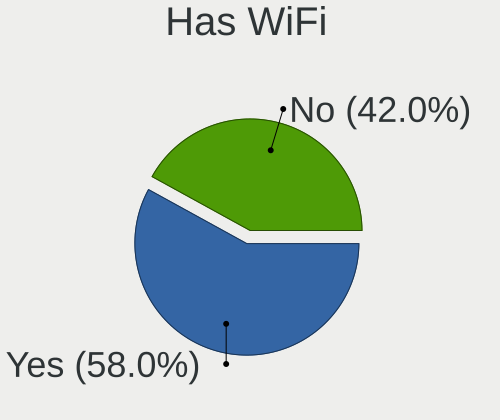

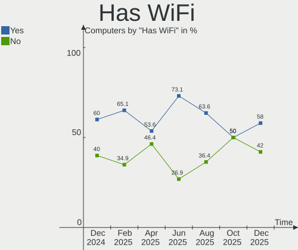

| Presented | Computers | Percent |
|-----------|-----------|---------|
| Yes       | 29        | 58%     |
| No        | 21        | 42%     |

Has Bluetooth
-------------

Has Bluetooth module

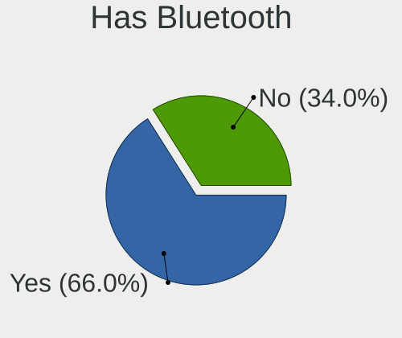

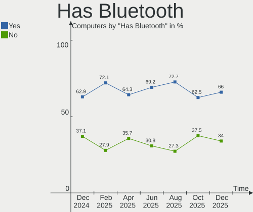

| Presented | Computers | Percent |
|-----------|-----------|---------|
| Yes       | 33        | 66%     |
| No        | 17        | 34%     |

Location
--------

Country
-------

Geographic location (country)

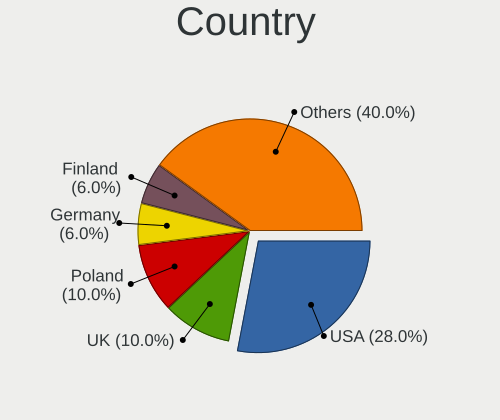

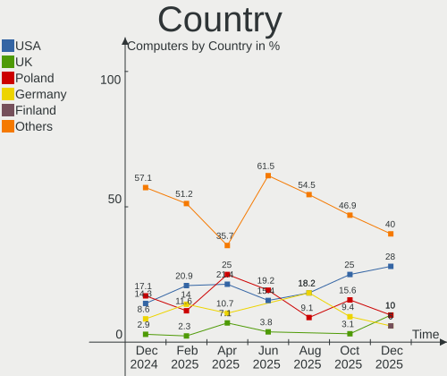

| Country     | Computers | Percent |
|-------------|-----------|---------|
| USA         | 14        | 28%     |
| UK          | 5         | 10%     |
| Poland      | 5         | 10%     |
| Germany     | 3         | 6%      |
| Finland     | 3         | 6%      |
| Canada      | 3         | 6%      |
| Switzerland | 2         | 4%      |
| Spain       | 2         | 4%      |
| Russia      | 2         | 4%      |
| Indonesia   | 2         | 4%      |
| Hungary     | 2         | 4%      |
| Czechia     | 2         | 4%      |
| Turkey      | 1         | 2%      |
| Réunion    | 1         | 2%      |
| Italy       | 1         | 2%      |
| India       | 1         | 2%      |
| China       | 1         | 2%      |

City
----

Geographic location (city)

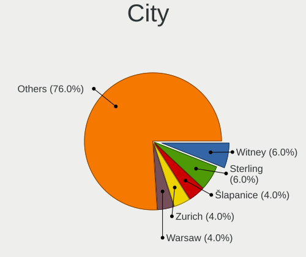

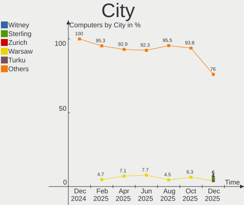

| City              | Computers | Percent |
|-------------------|-----------|---------|
| Witney            | 3         | 6%      |
| Sterling          | 3         | 6%      |
| Zurich            | 2         | 4%      |
| Warsaw            | 2         | 4%      |
| Turku             | 2         | 4%      |
| Šlapanice        | 2         | 4%      |
| Seattle           | 2         | 4%      |
| Kielce            | 2         | 4%      |
| Hatvan            | 2         | 4%      |
| Bothell           | 2         | 4%      |
| Vienna            | 1         | 2%      |
| Tychy             | 1         | 2%      |
| Trabzon           | 1         | 2%      |
| St Petersburg     | 1         | 2%      |
| Spokane           | 1         | 2%      |
| Shawnigan Lake    | 1         | 2%      |
| Saint-Denis       | 1         | 2%      |
| Pittsburgh        | 1         | 2%      |
| Olympia           | 1         | 2%      |
| North Adams       | 1         | 2%      |
| Nanjing           | 1         | 2%      |
| Moscow            | 1         | 2%      |
| Montreal          | 1         | 2%      |
| Markham           | 1         | 2%      |
| Mannheim          | 1         | 2%      |
| Madrid            | 1         | 2%      |
| London            | 1         | 2%      |
| Helsinki          | 1         | 2%      |
| Frankfurt am Main | 1         | 2%      |
| Cikini            | 1         | 2%      |
| Chennai           | 1         | 2%      |
| Cambridge         | 1         | 2%      |
| Cagliari          | 1         | 2%      |
| Berlin            | 1         | 2%      |
| Baton Rouge       | 1         | 2%      |
| Barcelona         | 1         | 2%      |
| Bandung           | 1         | 2%      |
| Ann Arbor         | 1         | 2%      |

Drives
------

Drive Vendor
------------

Hard drive vendors

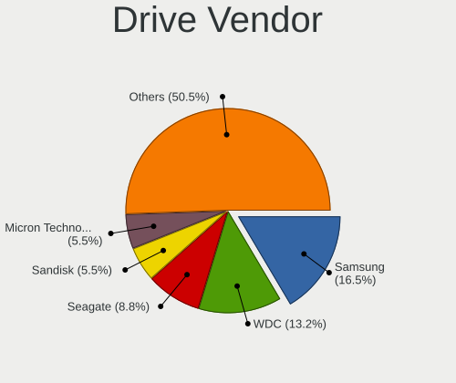

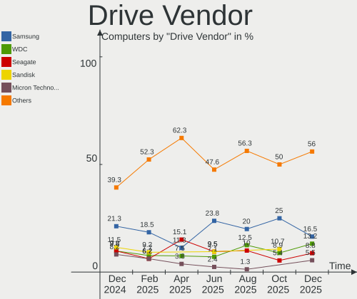

| Vendor                       | Computers | Drives | Percent |
|------------------------------|-----------|--------|---------|
| Samsung Electronics          | 15        | 27     | 16.48%  |
| WDC                          | 12        | 22     | 13.19%  |
| Seagate                      | 8         | 9      | 8.79%   |
| Sandisk                      | 5         | 5      | 5.49%   |
| Micron Technology            | 5         | 5      | 5.49%   |
| Kingston                     | 5         | 5      | 5.49%   |
| Crucial                      | 4         | 4      | 4.4%    |
| Unknown                      | 3         | 4      | 3.3%    |
| Toshiba                      | 3         | 3      | 3.3%    |
| SK hynix                     | 3         | 3      | 3.3%    |
| MAXIO Technology (Hangzhou)  | 3         | 4      | 3.3%    |
| Intel                        | 3         | 3      | 3.3%    |
| Phison Electronics           | 2         | 2      | 2.2%    |
| Micron/Crucial Technology    | 2         | 2      | 2.2%    |
| Kingston Technology Company  | 2         | 2      | 2.2%    |
| GOODRAM                      | 2         | 2      | 2.2%    |
| China                        | 2         | 3      | 2.2%    |
| Yangtze Memory Technologies  | 1         | 1      | 1.1%    |
| Western Digital              | 1         | 1      | 1.1%    |
| TEAM T25                     | 1         | 1      | 1.1%    |
| SOLIDIGM                     | 1         | 1      | 1.1%    |
| Shenzhen Longsys Electronics | 1         | 1      | 1.1%    |
| Seagate Technology           | 1         | 1      | 1.1%    |
| Realtek Semiconductor        | 1         | 1      | 1.1%    |
| Patriot                      | 1         | 1      | 1.1%    |
| KIOXIA                       | 1         | 1      | 1.1%    |
| Hitachi                      | 1         | 3      | 1.1%    |
| Hewlett-Packard              | 1         | 2      | 1.1%    |
| Apple                        | 1         | 3      | 1.1%    |

Drive Model
-----------

Hard drive models

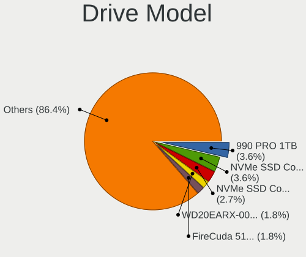

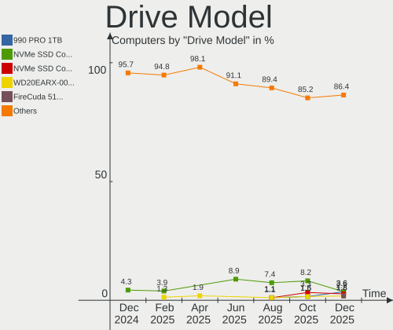

| Model                                              | Computers | Percent |
|----------------------------------------------------|-----------|---------|
| Samsung SSD 990 PRO 1TB                            | 4         | 3.64%   |
| Samsung NVMe SSD Controller SM981/PM981/PM983 1TB  | 4         | 3.64%   |
| MAXIO (Hangzhou) NVMe SSD Controller MAP1202 2TB   | 3         | 2.73%   |
| WDC WD20EARX-00PASB0 2TB                           | 2         | 1.82%   |
| Seagate FireCuda 510 SSD ZP1000GM30031 1TB         | 2         | 1.82%   |
| Samsung SSD 990 PRO 4TB                            | 2         | 1.82%   |
| Samsung SSD 990 PRO 2TB                            | 2         | 1.82%   |
| Samsung SSD 990 EVO Plus 1TB                       | 2         | 1.82%   |
| Samsung NVMe SSD Controller PM9A1/PM9A3/980PRO 1TB | 2         | 1.82%   |
| Kingston Company SNV2S2000G 2TB                    | 2         | 1.82%   |
| Kingston SNVS500G 500GB                            | 2         | 1.82%   |
| Yangtze Memory ZHITAI TiPlus5000 2TB               | 1         | 0.91%   |
| Western Digital Ultrastar DC SN640 NVMe SSD 8TB    | 1         | 0.91%   |
| WDC WUH721816ALE6L0 16TB                           | 1         | 0.91%   |
| WDC WDS100T2B0A-00SM50 1TB SSD                     | 1         | 0.91%   |
| WDC WD7502AAEX-00Y9A0 752GB                        | 1         | 0.91%   |
| WDC WD7500BPVT-35HXZT3 752GB                       | 1         | 0.91%   |
| WDC WD5000AZLX-60K2TA0 500GB                       | 1         | 0.91%   |
| WDC WD40EZRZ-00GXCB0 4TB                           | 1         | 0.91%   |
| WDC WD30 EFAX-68JH4N0 3TB                          | 1         | 0.91%   |
| WDC WD20PURZ-85GU6Y0 2TB                           | 1         | 0.91%   |
| WDC WD20EZBX-00AYRA0 2TB                           | 1         | 0.91%   |
| WDC WD20EFRX-68EUZN0 2TB                           | 1         | 0.91%   |
| WDC WD20EFRX-68AX9N0 2TB                           | 1         | 0.91%   |
| WDC WD20EARZ-00C5XB0 2TB                           | 1         | 0.91%   |
| WDC WD2003FZEX-00SRLA0 2TB                         | 1         | 0.91%   |
| WDC WD10EZEX-60WN4A0 1TB                           | 1         | 0.91%   |
| WDC WD10EZEX-08WN4A0 1TB                           | 1         | 0.91%   |
| WDC WD Blue SA510 2.5 4TB SSD                      | 1         | 0.91%   |
| Unknown MMC Card  64GB                             | 1         | 0.91%   |
| Unknown MMC Card  32GB                             | 1         | 0.91%   |
| Unknown MMC Card  1TB                              | 1         | 0.91%   |
| Unknown MMC Card  16GB                             | 1         | 0.91%   |
| Toshiba HDWR480UZSVB 8TB                           | 1         | 0.91%   |
| Toshiba HDWE150 5TB                                | 1         | 0.91%   |
| Toshiba HDWE140 4TB                                | 1         | 0.91%   |
| TEAM T25 SSD 3480GB                                | 1         | 0.91%   |
| SOLIDIGM SSDPFKNU020TZ 2TB                         | 1         | 0.91%   |
| SK hynix SKHynix_HFS001TEJ9X162N 1024GB            | 1         | 0.91%   |
| SK hynix SKHynix_HFS001TEJ4X112N 1024GB            | 1         | 0.91%   |

HDD Vendor
----------

Hard disk drive vendors

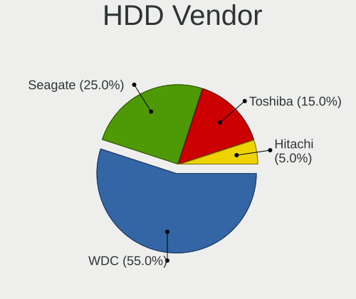

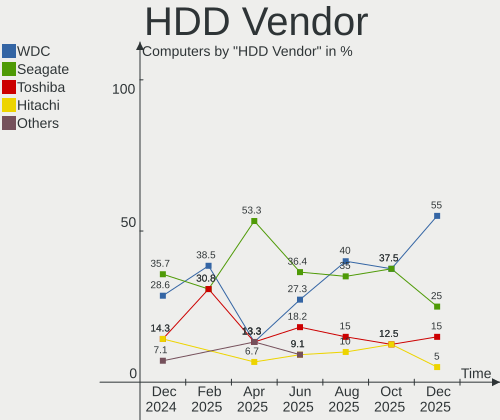

| Vendor  | Computers | Drives | Percent |
|---------|-----------|--------|---------|
| WDC     | 11        | 20     | 55%     |
| Seagate | 5         | 6      | 25%     |
| Toshiba | 3         | 3      | 15%     |
| Hitachi | 1         | 3      | 5%      |

SSD Vendor
----------

Solid state drive vendors

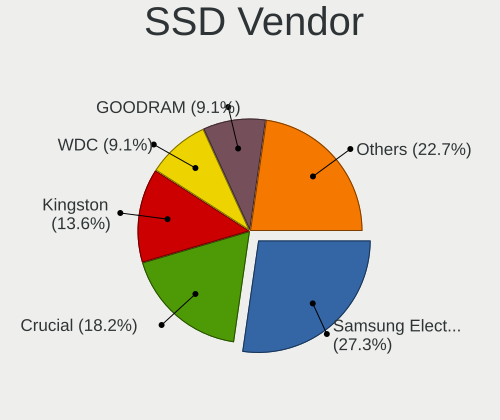

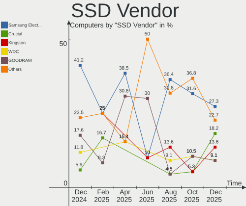

| Vendor              | Computers | Drives | Percent |
|---------------------|-----------|--------|---------|
| Samsung Electronics | 6         | 6      | 27.27%  |
| Crucial             | 4         | 4      | 18.18%  |
| Kingston            | 3         | 3      | 13.64%  |
| WDC                 | 2         | 2      | 9.09%   |
| GOODRAM             | 2         | 2      | 9.09%   |
| China               | 2         | 3      | 9.09%   |
| TEAM T25            | 1         | 1      | 4.55%   |
| SanDisk             | 1         | 1      | 4.55%   |
| Patriot             | 1         | 1      | 4.55%   |

Drive Kind
----------

HDD or SSD

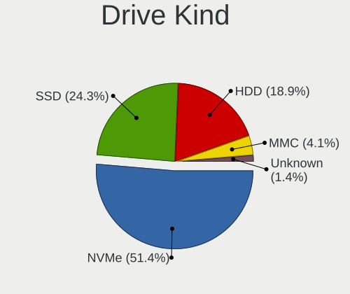

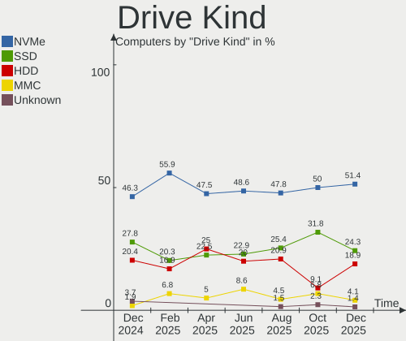

| Kind    | Computers | Drives | Percent |
|---------|-----------|--------|---------|
| NVMe    | 38        | 62     | 51.35%  |
| SSD     | 18        | 23     | 24.32%  |
| HDD     | 14        | 32     | 18.92%  |
| MMC     | 3         | 4      | 4.05%   |
| Unknown | 1         | 1      | 1.35%   |

Drive Connector
---------------

SATA, SAS, NVMe, etc.

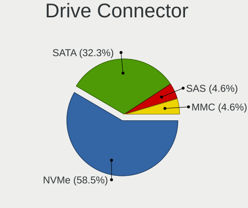

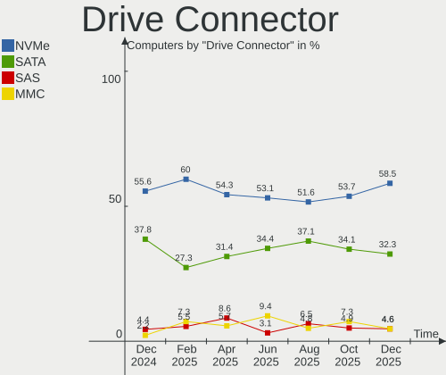

| Type | Computers | Drives | Percent |
|------|-----------|--------|---------|
| NVMe | 38        | 62     | 58.46%  |
| SATA | 21        | 53     | 32.31%  |
| SAS  | 3         | 3      | 4.62%   |
| MMC  | 3         | 4      | 4.62%   |

Drive Size
----------

Size of hard drive

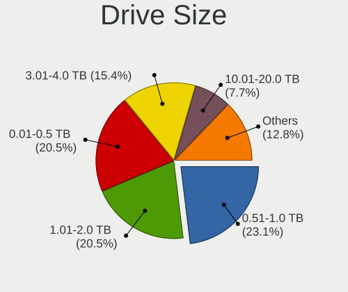

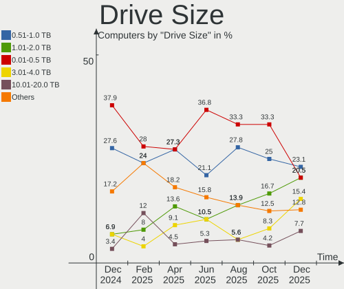

| Size in TB | Computers | Drives | Percent |
|------------|-----------|--------|---------|
| 0.51-1.0   | 9         | 15     | 23.08%  |
| 1.01-2.0   | 8         | 13     | 20.51%  |
| 0.01-0.5   | 8         | 10     | 20.51%  |
| 3.01-4.0   | 6         | 6      | 15.38%  |
| 10.01-20.0 | 3         | 4      | 7.69%   |
| 4.01-10.0  | 3         | 3      | 7.69%   |
| 2.01-3.0   | 2         | 4      | 5.13%   |

Space Total
-----------

Amount of disk space available on the file system

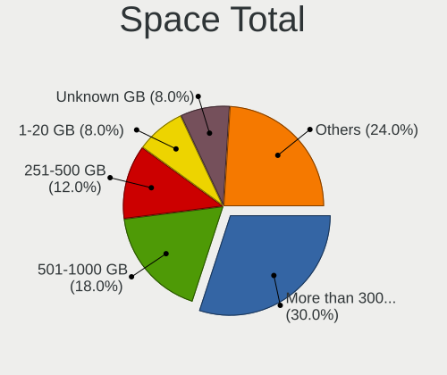

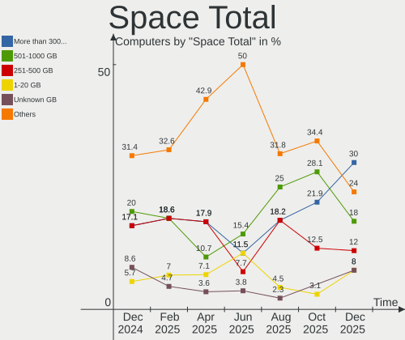

| Size in GB     | Computers | Percent |
|----------------|-----------|---------|
| More than 3000 | 15        | 30%     |
| 501-1000       | 9         | 18%     |
| 251-500        | 6         | 12%     |
| 1-20           | 4         | 8%      |
| Unknown        | 4         | 8%      |
| 101-250        | 3         | 6%      |
| 1001-2000      | 3         | 6%      |
| 51-100         | 3         | 6%      |
| 2001-3000      | 2         | 4%      |
| 21-50          | 1         | 2%      |

Space Used
----------

Amount of used disk space

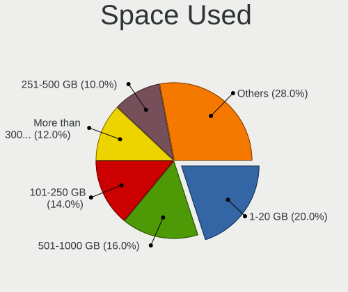

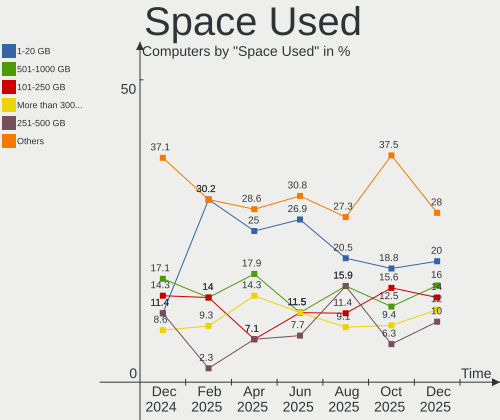

| Used GB        | Computers | Percent |
|----------------|-----------|---------|
| 1-20           | 10        | 20%     |
| 501-1000       | 8         | 16%     |
| 101-250        | 7         | 14%     |
| More than 3000 | 6         | 12%     |
| 251-500        | 5         | 10%     |
| 21-50          | 4         | 8%      |
| 1001-2000      | 4         | 8%      |
| Unknown        | 4         | 8%      |
| 2001-3000      | 2         | 4%      |

Malfunc. Drives
---------------

Drive models with a malfunction

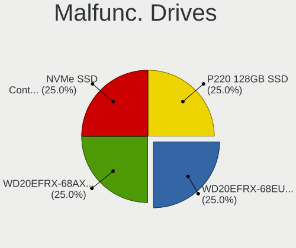

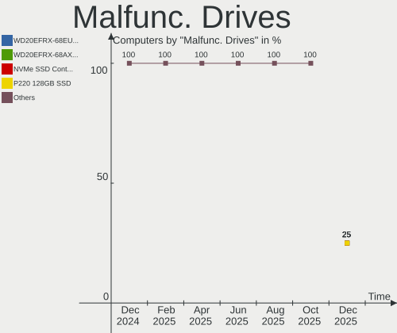

| Model                                                          | Computers | Drives | Percent |
|----------------------------------------------------------------|-----------|--------|---------|
| WDC WD20EFRX-68EUZN0 2TB                                       | 1         | 1      | 25%     |
| WDC WD20EFRX-68AX9N0 2TB                                       | 1         | 1      | 25%     |
| Samsung Electronics NVMe SSD Controller PM9A1/PM9A3/980PRO 1TB | 1         | 1      | 25%     |
| Patriot P220 128GB SSD                                         | 1         | 1      | 25%     |

Malfunc. Drive Vendor
---------------------

Vendors of faulty drives

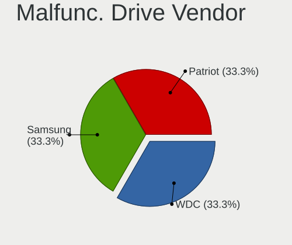

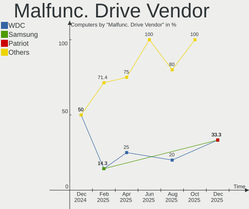

| Vendor              | Computers | Drives | Percent |
|---------------------|-----------|--------|---------|
| WDC                 | 1         | 2      | 33.33%  |
| Samsung Electronics | 1         | 1      | 33.33%  |
| Patriot             | 1         | 1      | 33.33%  |

Malfunc. HDD Vendor
-------------------

Vendors of faulty HDD drives

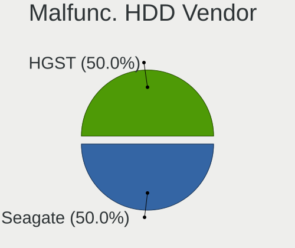

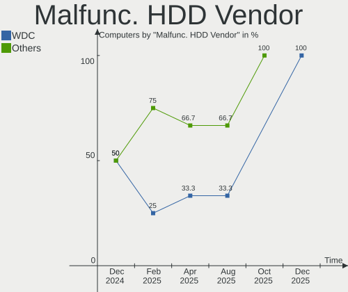

| Vendor | Computers | Drives | Percent |
|--------|-----------|--------|---------|
| WDC    | 1         | 2      | 100%    |

Malfunc. Drive Kind
-------------------

Kinds of faulty drives

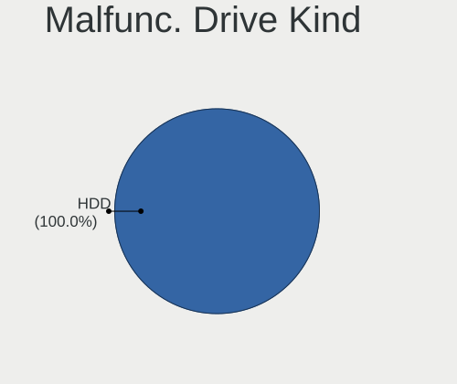

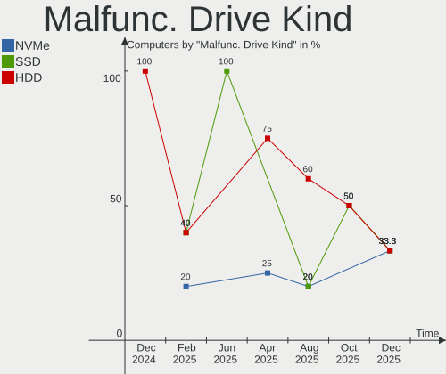

| Kind | Computers | Drives | Percent |
|------|-----------|--------|---------|
| NVMe | 1         | 1      | 33.33%  |
| SSD  | 1         | 1      | 33.33%  |
| HDD  | 1         | 2      | 33.33%  |

Failed Drives
-------------

Failed drive models

Zero info for selected period =(

Failed Drive Vendor
-------------------

Failed drive vendors

Zero info for selected period =(

Drive Status
------------

Number of failed and malfunc. drives

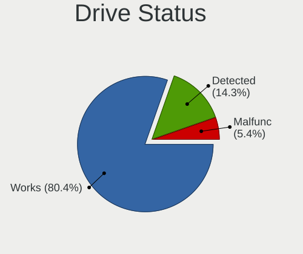

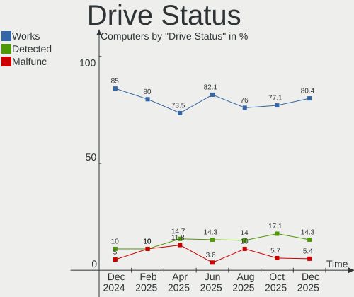

| Status   | Computers | Drives | Percent |
|----------|-----------|--------|---------|
| Works    | 45        | 109    | 80.36%  |
| Detected | 8         | 9      | 14.29%  |
| Malfunc  | 3         | 4      | 5.36%   |

Storage controller
------------------

Storage Vendor
--------------

Storage controller vendors

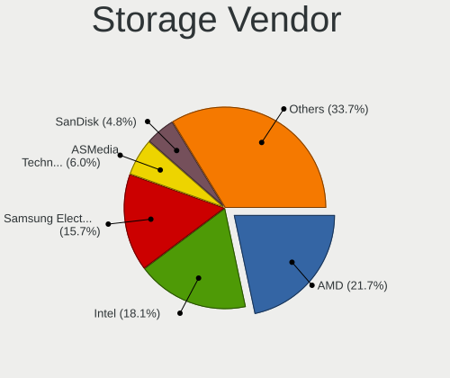

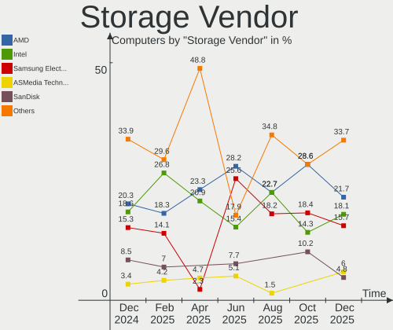

| Vendor                       | Computers | Percent |
|------------------------------|-----------|---------|
| AMD                          | 18        | 21.69%  |
| Intel                        | 15        | 18.07%  |
| Samsung Electronics          | 13        | 15.66%  |
| ASMedia Technology           | 5         | 6.02%   |
| SanDisk                      | 4         | 4.82%   |
| Micron Technology            | 4         | 4.82%   |
| MAXIO Technology (Hangzhou)  | 4         | 4.82%   |
| SK hynix                     | 3         | 3.61%   |
| Seagate Technology           | 3         | 3.61%   |
| Phison Electronics           | 2         | 2.41%   |
| Micron/Crucial Technology    | 2         | 2.41%   |
| Kingston Technology Company  | 2         | 2.41%   |
| Yangtze Memory Technologies  | 1         | 1.2%    |
| Western Digital              | 1         | 1.2%    |
| Solidigm                     | 1         | 1.2%    |
| Shenzhen Longsys Electronics | 1         | 1.2%    |
| Realtek Semiconductor        | 1         | 1.2%    |
| KIOXIA                       | 1         | 1.2%    |
| JMicron Technology           | 1         | 1.2%    |
| INNOGRIT                     | 1         | 1.2%    |

Storage Model
-------------

Storage controller models

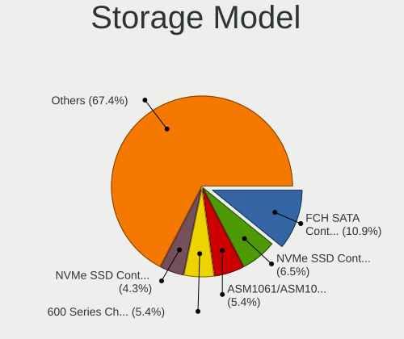

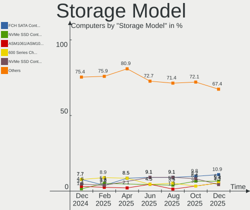

| Model                                                                          | Computers | Percent |
|--------------------------------------------------------------------------------|-----------|---------|
| AMD FCH SATA Controller [AHCI mode]                                            | 10        | 10.87%  |
| Samsung NVMe SSD Controller S4LV008[Pascal]                                    | 6         | 6.52%   |
| ASMedia ASM1061/ASM1062 Serial ATA Controller                                  | 5         | 5.43%   |
| AMD 600 Series Chipset SATA Controller                                         | 5         | 5.43%   |
| Samsung NVMe SSD Controller SM981/PM981/PM983                                  | 4         | 4.35%   |
| MAXIO (Hangzhou) NVMe SSD Controller MAP1202 (DRAM-less)                       | 4         | 4.35%   |
| Samsung NVMe SSD Controller PM9C1a (DRAM-less)                                 | 3         | 3.26%   |
| Seagate FireCuda/IronWolf 510 SSD                                              | 2         | 2.17%   |
| SanDisk WD SN560/SN740/SN770/SN5000 NVMe SSD                                   | 2         | 2.17%   |
| Samsung NVMe SSD Controller PM9A1/PM9A3/980PRO                                 | 2         | 2.17%   |
| Samsung NVMe SSD Controller 980 (DRAM-less)                                    | 2         | 2.17%   |
| Micron 2500 NVMe SSD (DRAM-less)                                               | 2         | 2.17%   |
| Kingston Company NV2 NVMe SSD [SM2267XT] (DRAM-less)                           | 2         | 2.17%   |
| Kingston Company NV1 NVMe SSD [SM2263XT] (DRAM-less)                           | 2         | 2.17%   |
| Intel Raptor Lake SATA AHCI Controller                                         | 2         | 2.17%   |
| Intel C600/X79 series chipset 6-Port SATA AHCI Controller                      | 2         | 2.17%   |
| Intel 8 Series/C220 Series Chipset Family 6-port SATA Controller 1 [AHCI mode] | 2         | 2.17%   |
| AMD 500 Series Chipset SATA Controller                                         | 2         | 2.17%   |
| Yangtze Memory ZHITAI TiPro5000 NVMe SSD                                       | 1         | 1.09%   |
| Western Digital Ultrastar DC SN640 NVMe SSD                                    | 1         | 1.09%   |
| Solidigm P41 Plus NVMe SSD (DRAM-less) [Echo Harbor]                           | 1         | 1.09%   |
| SK hynix Platinum P41/PC801 NVMe Solid State Drive                             | 1         | 1.09%   |
| SK hynix Gold P31/BC711/PC711 NVMe Solid State Drive                           | 1         | 1.09%   |
| SK hynix BC901 NVMe Solid State Drive (DRAM-less)                              | 1         | 1.09%   |
| Shenzhen Longsys Lexar NM790 / Patriot Viper VP4300 Lite NVMe SSD (DRAM-less)  | 1         | 1.09%   |
| Seagate FireCuda 540 SSD                                                       | 1         | 1.09%   |
| SanDisk WD Green SN350 240GB (DRAM-less) / SN560E NVMe SSD                     | 1         | 1.09%   |
| Sandisk WD Black SN850X NVMe SSD                                               | 1         | 1.09%   |
| Realtek RTS5765DL NVMe SSD Controller (DRAM-less)                              | 1         | 1.09%   |
| Phison PS5027-E27T PCIe4 NVMe Controller (DRAM-less)                           | 1         | 1.09%   |
| Phison E16 PCIe4 NVMe Controller                                               | 1         | 1.09%   |
| Micron/Crucial T700 NVMe PCIe SSD                                              | 1         | 1.09%   |
| Micron/Crucial P3 Plus NVMe PCIe SSD (DRAM-less)                               | 1         | 1.09%   |
| Micron 3500 NVMe SSD                                                           | 1         | 1.09%   |
| Micron 2450 NVMe SSD [HendrixV] (DRAM-less)                                    | 1         | 1.09%   |
| KIOXIA NVMe SSD Controller XG8                                                 | 1         | 1.09%   |
| JMicron JMB58x AHCI SATA controller                                            | 1         | 1.09%   |
| Intel Sunrise Point-LP SATA Controller [AHCI mode]                             | 1         | 1.09%   |
| Intel SSD 670p Series [Keystone Harbor]                                        | 1         | 1.09%   |
| Intel SSD 660P Series                                                          | 1         | 1.09%   |

Storage Kind
------------

Kind of storage controller (IDE, SATA, NVMe, SAS, ...)

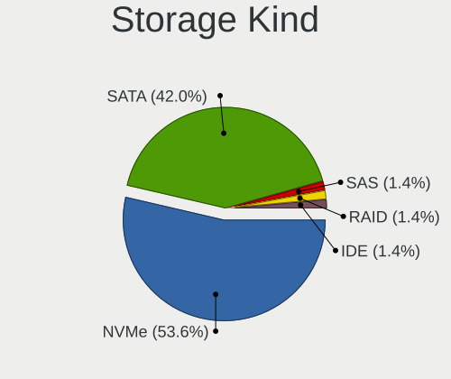

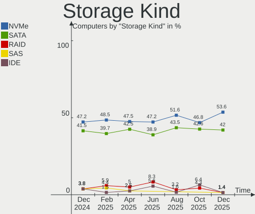

| Kind | Computers | Percent |
|------|-----------|---------|
| NVMe | 37        | 53.62%  |
| SATA | 29        | 42.03%  |
| RAID | 1         | 1.45%   |
| SAS  | 1         | 1.45%   |
| IDE  | 1         | 1.45%   |

Processor
---------

CPU Vendor
----------

Processor vendors

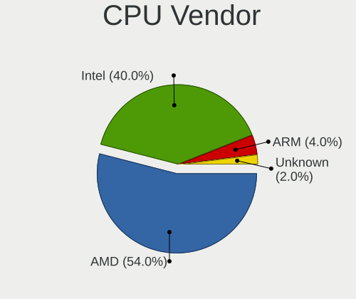

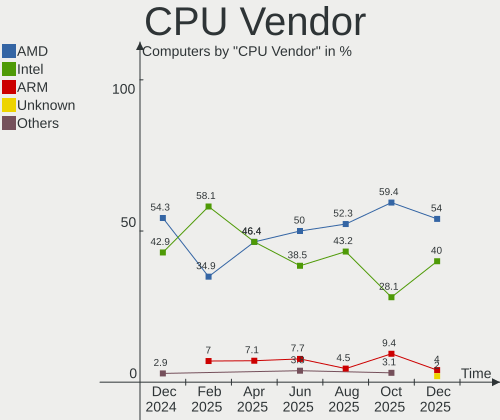

| Vendor  | Computers | Percent |
|---------|-----------|---------|
| AMD     | 27        | 54%     |
| Intel   | 20        | 40%     |
| ARM     | 2         | 4%      |
| Unknown | 1         | 2%      |

CPU Model
---------

Processor models

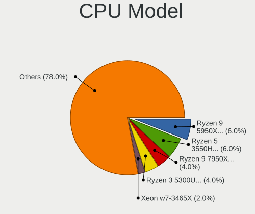

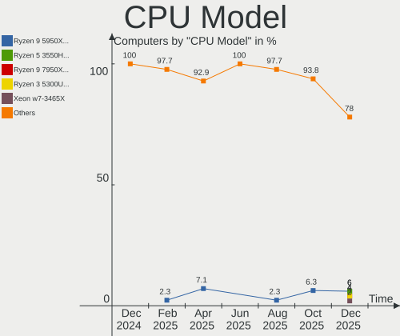

| Model                                          | Computers | Percent |
|------------------------------------------------|-----------|---------|
| AMD Ryzen 9 5950X 16-Core Processor            | 3         | 6%      |
| AMD Ryzen 5 3550H with Radeon Vega Mobile Gfx  | 3         | 6%      |
| AMD Ryzen 9 7950X 16-Core Processor            | 2         | 4%      |
| AMD Ryzen 3 5300U with Radeon Graphics         | 2         | 4%      |
| Intel Xeon w7-3465X                            | 1         | 2%      |
| Intel Xeon CPU E5-2699 v4 @ 2.20GHz            | 1         | 2%      |
| Intel Xeon CPU E5-2670 0 @ 2.60GHz             | 1         | 2%      |
| Intel N200                                     | 1         | 2%      |
| Intel Core Ultra 7 258V                        | 1         | 2%      |
| Intel Core i9-14900KS                          | 1         | 2%      |
| Intel Core i7-4930K CPU @ 3.40GHz              | 1         | 2%      |
| Intel Core i7-4790 CPU @ 3.60GHz               | 1         | 2%      |
| Intel Core i7-4770 CPU @ 3.40GHz               | 1         | 2%      |
| Intel Core i5-8500 CPU @ 3.00GHz               | 1         | 2%      |
| Intel Core i5-3470S CPU @ 2.90GHz              | 1         | 2%      |
| Intel Core i5-3230M CPU @ 2.60GHz              | 1         | 2%      |
| Intel Core i3-7100U CPU @ 2.40GHz              | 1         | 2%      |
| Intel Core 5 120U                              | 1         | 2%      |
| Intel Core 3 100U                              | 1         | 2%      |
| Intel Atom CPU Z3735G @ 1.33GHz                | 1         | 2%      |
| Intel 13th Gen Core i7-13700H                  | 1         | 2%      |
| Intel 13th Gen Core i7-13620H                  | 1         | 2%      |
| Intel 13th Gen Core i5-13600K                  | 1         | 2%      |
| Intel 11th Gen Core i7-1165G7 @ 2.80GHz        | 1         | 2%      |
| ARM Processor                                  | 1         | 2%      |
| ARM BCM2835 Processor                          | 1         | 2%      |
| AMD Ryzen Threadripper 3960X 24-Core Processor | 1         | 2%      |
| AMD Ryzen AI 9 HX PRO 370 w/ Radeon 890M       | 1         | 2%      |
| AMD Ryzen AI 9 HX 370 w/ Radeon 890M           | 1         | 2%      |
| AMD Ryzen AI 7 PRO 350 w/ Radeon 860M          | 1         | 2%      |
| AMD Ryzen 9 9950X3D 16-Core Processor          | 1         | 2%      |
| AMD Ryzen 9 5900X 12-Core Processor            | 1         | 2%      |
| AMD Ryzen 9 3900X 12-Core Processor            | 1         | 2%      |
| AMD Ryzen 7 PRO 5850U with Radeon Graphics     | 1         | 2%      |
| AMD Ryzen 7 8845HS w/ Radeon 780M Graphics     | 1         | 2%      |
| AMD Ryzen 7 7800X3D 8-Core Processor           | 1         | 2%      |
| AMD Ryzen 7 7735U with Radeon Graphics         | 1         | 2%      |
| AMD Ryzen 7 5700G with Radeon Graphics         | 1         | 2%      |
| AMD Ryzen 7 3800X 8-Core Processor             | 1         | 2%      |
| AMD Ryzen 5 PRO 6650U with Radeon Graphics     | 1         | 2%      |

CPU Model Family
----------------

Processor model prefix

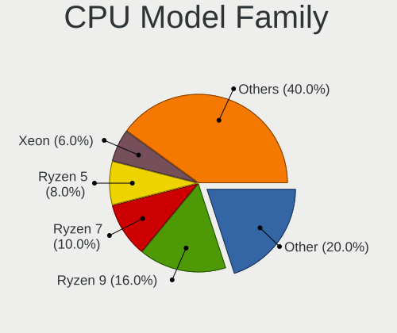

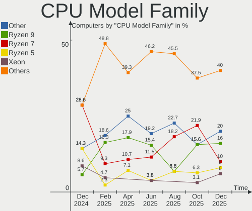

| Model                  | Computers | Percent |
|------------------------|-----------|---------|
| Other                  | 10        | 20%     |
| AMD Ryzen 9            | 8         | 16%     |
| AMD Ryzen 7            | 5         | 10%     |
| AMD Ryzen 5            | 4         | 8%      |
| Intel Xeon             | 3         | 6%      |
| Intel Core i7          | 3         | 6%      |
| Intel Core i5          | 3         | 6%      |
| Intel Core             | 3         | 6%      |
| AMD Ryzen 3            | 2         | 4%      |
| Intel Core i9          | 1         | 2%      |
| Intel Core i3          | 1         | 2%      |
| Intel Atom             | 1         | 2%      |
| ARM BCM                | 1         | 2%      |
| AMD Ryzen Threadripper | 1         | 2%      |
| AMD Ryzen 7 PRO        | 1         | 2%      |
| AMD Ryzen 5 PRO        | 1         | 2%      |
| AMD Phenom II X4       | 1         | 2%      |
| AMD EPYC               | 1         | 2%      |

CPU Cores
---------

Number of processor cores

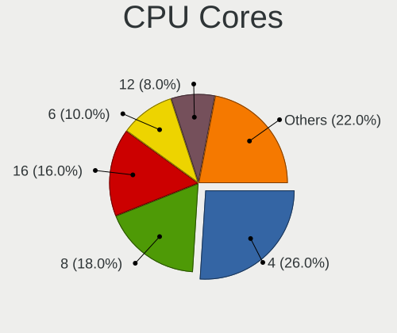

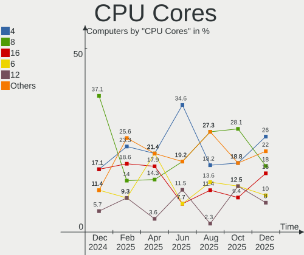

| Number | Computers | Percent |
|--------|-----------|---------|
| 4      | 13        | 26%     |
| 8      | 9         | 18%     |
| 16     | 8         | 16%     |
| 6      | 5         | 10%     |
| 12     | 4         | 8%      |
| 24     | 2         | 4%      |
| 14     | 2         | 4%      |
| 10     | 2         | 4%      |
| 2      | 2         | 4%      |
| 44     | 1         | 2%      |
| 28     | 1         | 2%      |
| 1      | 1         | 2%      |

CPU Sockets
-----------

Number of sockets

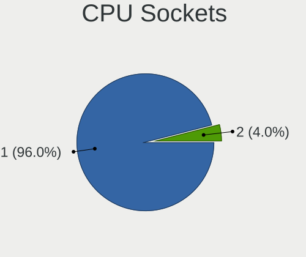

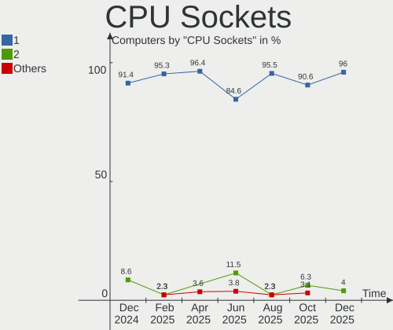

| Number | Computers | Percent |
|--------|-----------|---------|
| 1      | 48        | 96%     |
| 2      | 2         | 4%      |

CPU Threads
-----------

Threads per core (Hyper-Threading)

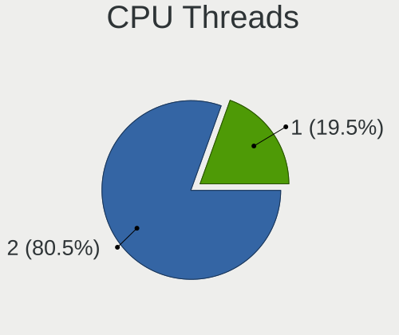

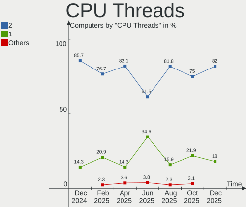

| Number | Computers | Percent |
|--------|-----------|---------|
| 2      | 41        | 82%     |
| 1      | 9         | 18%     |

CPU Op-Modes
------------

CPU Operation Modes (32-bit, 64-bit)

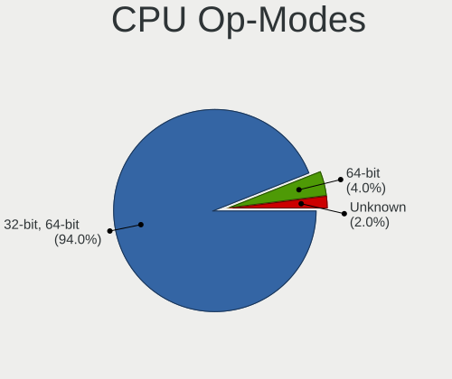

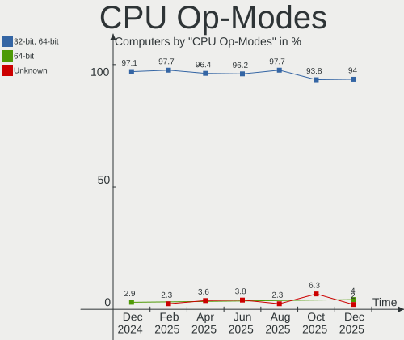

| Op mode        | Computers | Percent |
|----------------|-----------|---------|
| 32-bit, 64-bit | 47        | 94%     |
| 64-bit         | 2         | 4%      |
| Unknown        | 1         | 2%      |

CPU Microcode
-------------

Microcode number

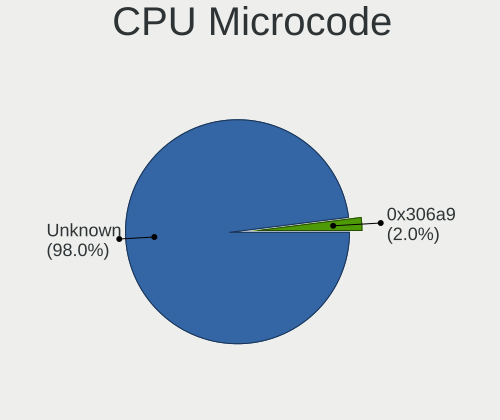

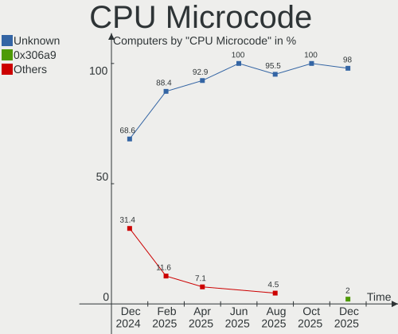

| Number  | Computers | Percent |
|---------|-----------|---------|
| Unknown | 49        | 98%     |
| 0x306a9 | 1         | 2%      |

CPU Microarch
-------------

Microarchitecture

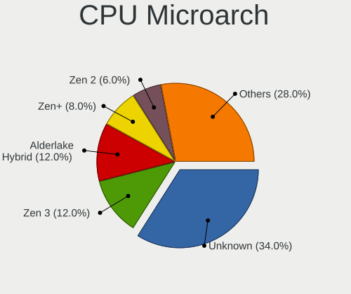

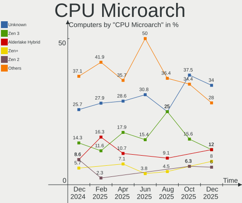

| Name             | Computers | Percent |
|------------------|-----------|---------|
| Unknown          | 17        | 34%     |
| Zen 3            | 6         | 12%     |
| Alderlake Hybrid | 6         | 12%     |
| Zen+             | 4         | 8%      |
| Zen 2            | 3         | 6%      |
| IvyBridge        | 3         | 6%      |
| KabyLake         | 2         | 4%      |
| Haswell          | 2         | 4%      |
| TigerLake        | 1         | 2%      |
| Silvermont       | 1         | 2%      |
| Sapphire Rapids  | 1         | 2%      |
| SandyBridge      | 1         | 2%      |
| Lunarlake Hybrid | 1         | 2%      |
| K10              | 1         | 2%      |
| Broadwell        | 1         | 2%      |

Graphics
--------

GPU Vendor
----------

Vendors of graphics cards

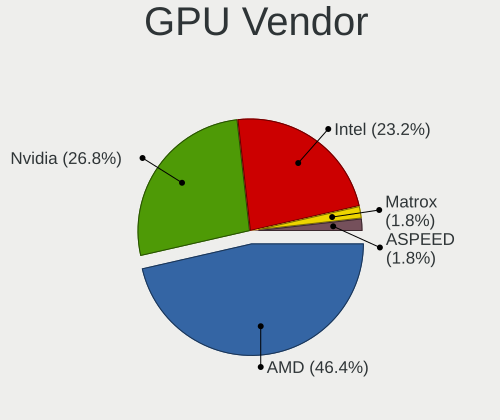

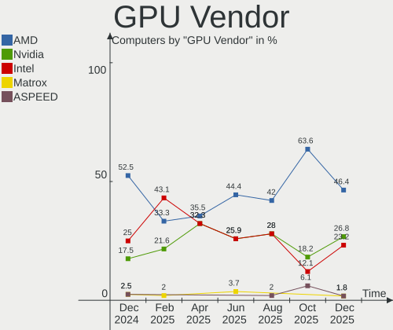

| Vendor                     | Computers | Percent |
|----------------------------|-----------|---------|
| AMD                        | 26        | 46.43%  |
| Nvidia                     | 15        | 26.79%  |
| Intel                      | 13        | 23.21%  |
| Matrox Electronics Systems | 1         | 1.79%   |
| ASPEED Technology          | 1         | 1.79%   |

GPU Model
---------

Graphics card models

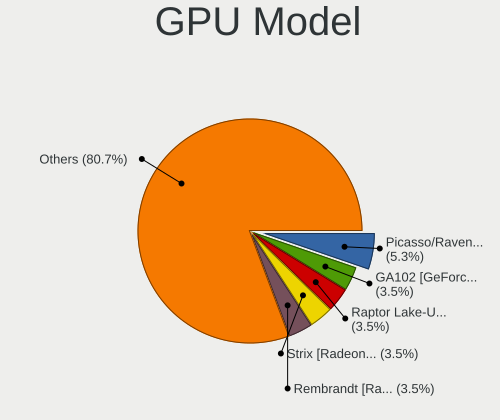

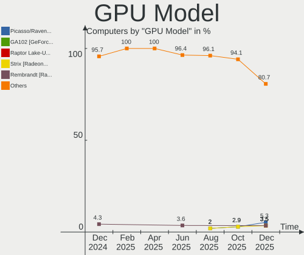

| Model                                                                         | Computers | Percent |
|-------------------------------------------------------------------------------|-----------|---------|
| AMD Picasso/Raven 2 [Radeon Vega Series / Radeon Vega Mobile Series]          | 3         | 5.26%   |
| Nvidia GA102 [GeForce RTX 3090]                                               | 2         | 3.51%   |
| Intel Raptor Lake-U [Intel Graphics]                                          | 2         | 3.51%   |
| AMD Strix [Radeon 880M / 890M]                                                | 2         | 3.51%   |
| AMD Rembrandt [Radeon 680M]                                                   | 2         | 3.51%   |
| AMD Lucienne                                                                  | 2         | 3.51%   |
| AMD Ellesmere [Radeon RX 470/480/570/570X/580/580X/590]                       | 2         | 3.51%   |
| AMD Cezanne [Radeon Vega Series / Radeon Vega Mobile Series]                  | 2         | 3.51%   |
| Nvidia TU117M [GeForce MX450]                                                 | 1         | 1.75%   |
| Nvidia TU106 [GeForce RTX 2070 Rev. A]                                        | 1         | 1.75%   |
| Nvidia GP107 [GeForce GTX 1050]                                               | 1         | 1.75%   |
| Nvidia GP106 [GeForce GTX 1060 6GB]                                           | 1         | 1.75%   |
| Nvidia GP104 [GeForce GTX 1060 6GB]                                           | 1         | 1.75%   |
| Nvidia GP102 [GeForce GTX 1080 Ti]                                            | 1         | 1.75%   |
| Nvidia GF117M [GeForce 610M/710M/810M/820M / GT 620M/625M/630M/720M]          | 1         | 1.75%   |
| Nvidia GB206M [GeForce RTX 5070 Max-Q / Mobile]                               | 1         | 1.75%   |
| Nvidia GB203 [GeForce RTX 5080]                                               | 1         | 1.75%   |
| Nvidia GA104 [GeForce RTX 3060]                                               | 1         | 1.75%   |
| Nvidia AD107M [GeForce RTX 4050 Max-Q / Mobile]                               | 1         | 1.75%   |
| Nvidia AD106 [GeForce RTX 4060 Ti]                                            | 1         | 1.75%   |
| Nvidia AD104 [GeForce RTX 4070 SUPER]                                         | 1         | 1.75%   |
| Matrox Electronics Systems MGA G200eW WPCM450                                 | 1         | 1.75%   |
| Intel Xeon E3-1200 v2/3rd Gen Core processor Graphics Controller              | 1         | 1.75%   |
| Intel TigerLake-LP GT2 [Iris Xe Graphics]                                     | 1         | 1.75%   |
| Intel Raptor Lake-P [UHD Graphics]                                            | 1         | 1.75%   |
| Intel Raptor Lake-P [Iris Xe Graphics]                                        | 1         | 1.75%   |
| Intel Lunar Lake [Intel Arc Graphics 130V / 140V]                             | 1         | 1.75%   |
| Intel Kaby Lake-U GT2 [HD Graphics 620]                                       | 1         | 1.75%   |
| Intel DG2 [Arc A770]                                                          | 1         | 1.75%   |
| Intel DG2 [Arc A380]                                                          | 1         | 1.75%   |
| Intel Atom Processor Z36xxx/Z37xxx Series Graphics & Display                  | 1         | 1.75%   |
| Intel Alder Lake-N [UHD Graphics]                                             | 1         | 1.75%   |
| Intel 3rd Gen Core processor Graphics Controller                              | 1         | 1.75%   |
| ASPEED Technology ASPEED Graphics Family                                      | 1         | 1.75%   |
| AMD Sun XT [Radeon HD 8670A/8670M/8690M / R5 M330 / M430 / Radeon 520 Mobile] | 1         | 1.75%   |
| AMD RS780C [Radeon 3100]                                                      | 1         | 1.75%   |
| AMD Raphael                                                                   | 1         | 1.75%   |
| AMD Navi 48 [Radeon RX 9070/9070 XT/9070 GRE]                                 | 1         | 1.75%   |
| AMD Navi 33 [Radeon RX 7600/7600 XT/7600M XT/7600S/7700S / PRO W7600]         | 1         | 1.75%   |
| AMD Navi 32 [Radeon RX 7700 XT / 7800 XT]                                     | 1         | 1.75%   |

GPU Combo
---------

Combinations of graphics cards

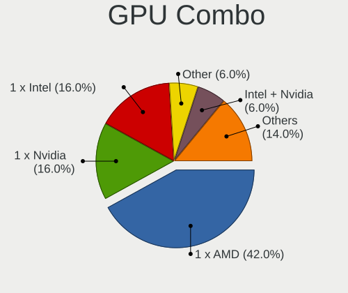

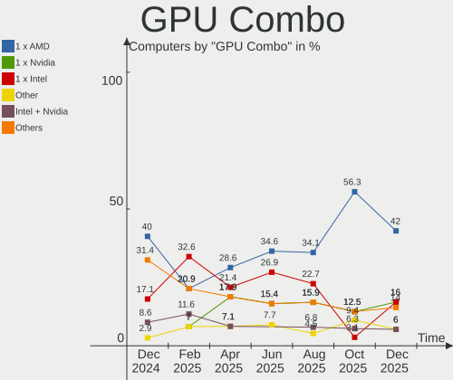

| Name                        | Computers | Percent |
|-----------------------------|-----------|---------|
| 1 x AMD                     | 21        | 42%     |
| 1 x Nvidia                  | 8         | 16%     |
| 1 x Intel                   | 8         | 16%     |
| Other                       | 3         | 6%      |
| Intel + Nvidia              | 3         | 6%      |
| AMD + Nvidia                | 3         | 6%      |
| 2 x AMD                     | 1         | 2%      |
| 1 x Matrox                  | 1         | 2%      |
| Intel + Nvidia + 1 x ASPEED | 1         | 2%      |
| Intel + AMD                 | 1         | 2%      |

GPU Driver
----------

Free vs proprietary

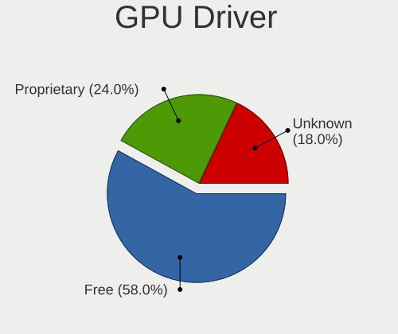

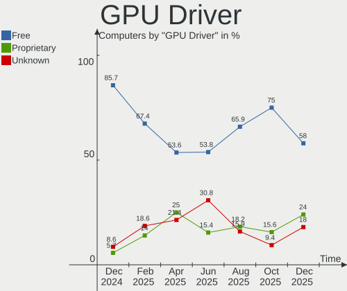

| Driver      | Computers | Percent |
|-------------|-----------|---------|
| Free        | 29        | 58%     |
| Proprietary | 12        | 24%     |
| Unknown     | 9         | 18%     |

GPU Memory
----------

Total video memory

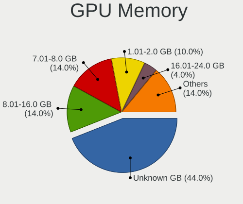

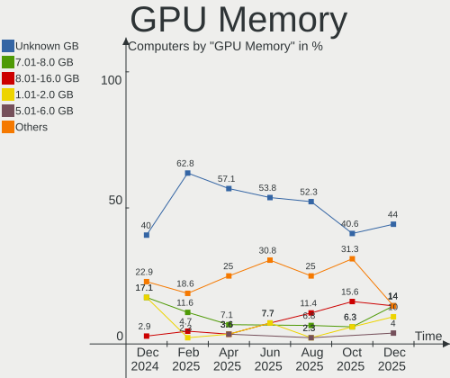

| Size in GB | Computers | Percent |
|------------|-----------|---------|
| Unknown    | 22        | 44%     |
| 7.01-8.0   | 7         | 14%     |
| 8.01-16.0  | 7         | 14%     |
| 1.01-2.0   | 5         | 10%     |
| 5.01-6.0   | 2         | 4%      |
| 16.01-24.0 | 2         | 4%      |
| 0.01-0.5   | 2         | 4%      |
| 3.01-4.0   | 1         | 2%      |
| 2.01-3.0   | 1         | 2%      |
| 0.51-1.0   | 1         | 2%      |

Monitor
-------

Monitor Vendor
--------------

Monitor vendors

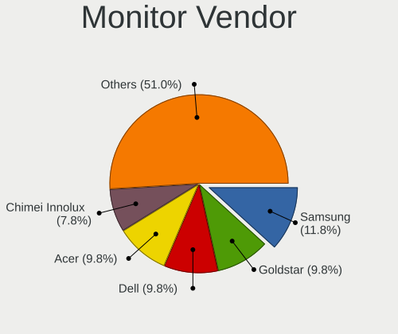

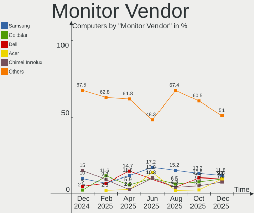

| Vendor                  | Computers | Percent |
|-------------------------|-----------|---------|
| Samsung Electronics     | 6         | 11.76%  |
| Goldstar                | 5         | 9.8%    |
| Dell                    | 5         | 9.8%    |
| Acer                    | 5         | 9.8%    |
| Chimei Innolux          | 4         | 7.84%   |
| AU Optronics            | 4         | 7.84%   |
| BOE                     | 3         | 5.88%   |
| Ancor Communications    | 3         | 5.88%   |
| ViewSonic               | 2         | 3.92%   |
| LG Display              | 2         | 3.92%   |
| AOC                     | 2         | 3.92%   |
| Toshiba                 | 1         | 1.96%   |
| Sceptre Tech            | 1         | 1.96%   |
| Lenovo                  | 1         | 1.96%   |
| InfoVision              | 1         | 1.96%   |
| HKC                     | 1         | 1.96%   |
| Gigabyte Technology     | 1         | 1.96%   |
| CSW                     | 1         | 1.96%   |
| CMT                     | 1         | 1.96%   |
| Chi Mei Optoelectronics | 1         | 1.96%   |
| ASUSTek Computer        | 1         | 1.96%   |

Monitor Model
-------------

Monitor models

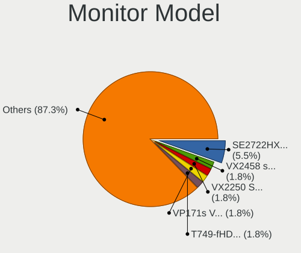

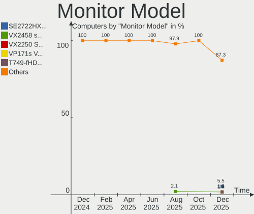

| Model                                                                    | Computers | Percent |
|--------------------------------------------------------------------------|-----------|---------|
| Dell SE2722HX DELD118 1920x1080 600x340mm 27.2-inch                      | 3         | 5.45%   |
| ViewSonic VX2458 series VSC0437 1920x1080 521x293mm 23.5-inch            | 1         | 1.82%   |
| ViewSonic VX2250 SERIES VSCCB25 1920x1080 477x268mm 21.5-inch            | 1         | 1.82%   |
| ViewSonic VP171s VSCB716 1280x1024 338x270mm 17.0-inch                   | 1         | 1.82%   |
| Toshiba T749-fHD720 TSB8801 1920x1080 708x398mm 32.0-inch                | 1         | 1.82%   |
| Sceptre Tech C305W-2560UN SPT0C0D 2560x1080 690x291mm 29.5-inch          | 1         | 1.82%   |
| Samsung Electronics SyncMaster SAM059A 1920x1080 477x268mm 21.5-inch     | 1         | 1.82%   |
| Samsung Electronics S22B300 SAM08C8 1920x1080 477x268mm 21.5-inch        | 1         | 1.82%   |
| Samsung Electronics Odyssey G95C SAM74AF 3840x1080 1193x336mm 48.8-inch  | 1         | 1.82%   |
| Samsung Electronics LS49AG95 SAM71AC 3840x1080 1190x340mm 48.7-inch      | 1         | 1.82%   |
| Samsung Electronics LCD Monitor SAM0E35 1920x1080 530x300mm 24.0-inch    | 1         | 1.82%   |
| Samsung Electronics LCD Monitor SAM0DF6 3840x2160 890x500mm 40.2-inch    | 1         | 1.82%   |
| LG Display LCD Monitor LGD07BD 1920x1200 345x215mm 16.0-inch             | 1         | 1.82%   |
| LG Display LCD Monitor LGD06B3 1920x1200 336x210mm 15.6-inch             | 1         | 1.82%   |
| Lenovo ATNA40HQ02-0  LEN414D                                             | 1         | 1.82%   |
| InfoVision LCD Monitor IVO854B 1920x1200 286x179mm 13.3-inch             | 1         | 1.82%   |
| HKC LCD Monitor HKC3CFC 1920x1080 344x194mm 15.5-inch                    | 1         | 1.82%   |
| Goldstar ULTRAGEAR+ GSM77BD 3840x2160 597x336mm 27.0-inch                | 1         | 1.82%   |
| Goldstar LG TV SSCR2 GSMC0C0 3840x2160                                   | 1         | 1.82%   |
| Goldstar HDR 4K GSM774F 3840x2160 697x392mm 31.5-inch                    | 1         | 1.82%   |
| Goldstar HDR 4K GSM7707 3840x2160 600x340mm 27.2-inch                    | 1         | 1.82%   |
| Goldstar FHD GSM5BE4 1920x1080 480x270mm 21.7-inch                       | 1         | 1.82%   |
| Goldstar 27GL850 GSM5B7F 2560x1440 597x336mm 27.0-inch                   | 1         | 1.82%   |
| Gigabyte Technology M28U GBT2800 3840x2160 697x392mm 31.5-inch           | 1         | 1.82%   |
| Dell U2412M DELA07B 1920x1200 518x324mm 24.1-inch                        | 1         | 1.82%   |
| Dell LCD Monitor SE2722HX 1920x1080                                      | 1         | 1.82%   |
| Dell AW2725DF DELA252 2560x1440 590x334mm 26.7-inch                      | 1         | 1.82%   |
| CSW MNE007ZA3-2 CSW1431 2880x1800 301x188mm 14.0-inch                    | 1         | 1.82%   |
| CMT GP27-FUS CMT2704 3840x2160 597x336mm 27.0-inch                       | 1         | 1.82%   |
| Chimei Innolux N156HMA-GA1 CMN1556 1920x1080 344x193mm 15.5-inch         | 1         | 1.82%   |
| Chimei Innolux LCD Monitor CMN1614 1920x1200 344x215mm 16.0-inch         | 1         | 1.82%   |
| Chimei Innolux LCD Monitor CMN14D4 1920x1080 309x173mm 13.9-inch         | 1         | 1.82%   |
| Chimei Innolux LCD Monitor CMN13C6 1920x1200 286x178mm 13.3-inch         | 1         | 1.82%   |
| Chi Mei Optoelectronics LCD Monitor CMO15A3 1366x768 344x193mm 15.5-inch | 1         | 1.82%   |
| BOE NE160QDM-NZ6 BOE0D79 2560x1600 345x215mm 16.0-inch                   | 1         | 1.82%   |
| BOE LCD Monitor BOE0B36 2160x1440 265x177mm 12.5-inch                    | 1         | 1.82%   |
| BOE LCD Monitor BOE0685 1600x900 382x215mm 17.3-inch                     | 1         | 1.82%   |
| AU Optronics LCD Monitor AUO499F 1920x1080 344x194mm 15.5-inch           | 1         | 1.82%   |
| AU Optronics LCD Monitor AUO408D 1920x1080 309x174mm 14.0-inch           | 1         | 1.82%   |
| AU Optronics LCD Monitor AUO323D 1920x1080 309x174mm 14.0-inch           | 1         | 1.82%   |

Monitor Resolution
------------------

Monitor screen resolution

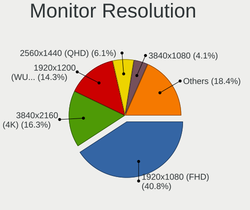

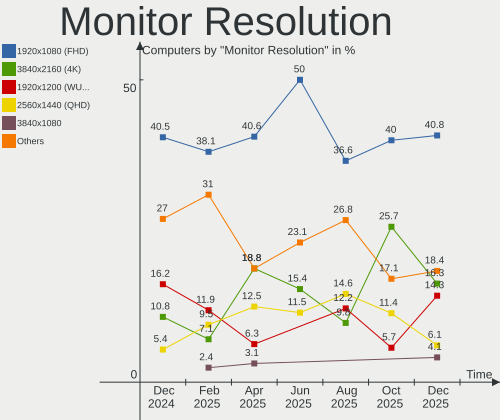

| Resolution        | Computers | Percent |
|-------------------|-----------|---------|
| 1920x1080 (FHD)   | 20        | 40.82%  |
| 3840x2160 (4K)    | 8         | 16.33%  |
| 1920x1200 (WUXGA) | 7         | 14.29%  |
| 2560x1440 (QHD)   | 3         | 6.12%   |
| 3840x1080         | 2         | 4.08%   |
| 3440x1440         | 1         | 2.04%   |
| 2880x1800         | 1         | 2.04%   |
| 2560x1600         | 1         | 2.04%   |
| 2560x1080         | 1         | 2.04%   |
| 2160x1440         | 1         | 2.04%   |
| 1600x900 (HD+)    | 1         | 2.04%   |
| 1366x768 (WXGA)   | 1         | 2.04%   |
| 1280x1024 (SXGA)  | 1         | 2.04%   |
| Unknown           | 1         | 2.04%   |

Monitor Diagonal
----------------

Diagonal size in inches

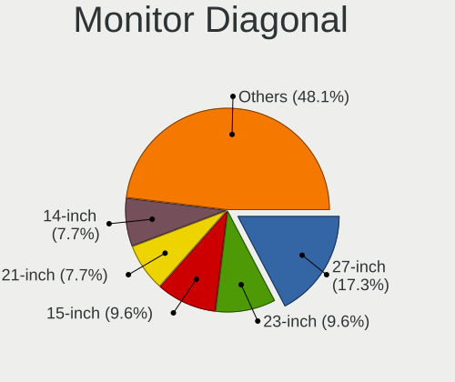

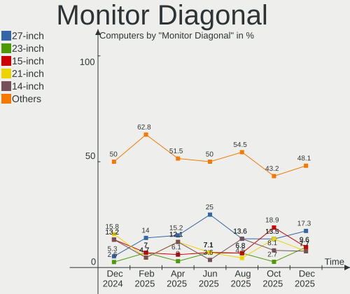

| Inches  | Computers | Percent |
|---------|-----------|---------|
| 27      | 9         | 17.31%  |
| 23      | 5         | 9.62%   |
| 15      | 5         | 9.62%   |
| 21      | 4         | 7.69%   |
| 14      | 4         | 7.69%   |
| 31      | 3         | 5.77%   |
| 16      | 3         | 5.77%   |
| 13      | 3         | 5.77%   |
| 48      | 2         | 3.85%   |
| 24      | 2         | 3.85%   |
| 17      | 2         | 3.85%   |
| Unknown | 2         | 3.85%   |
| 84      | 1         | 1.92%   |
| 72      | 1         | 1.92%   |
| 54      | 1         | 1.92%   |
| 34      | 1         | 1.92%   |
| 32      | 1         | 1.92%   |
| 29      | 1         | 1.92%   |
| 26      | 1         | 1.92%   |
| 12      | 1         | 1.92%   |

Monitor Width
-------------

Physical width

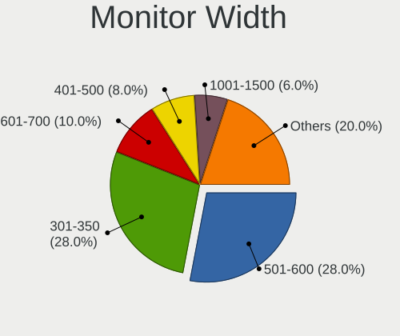

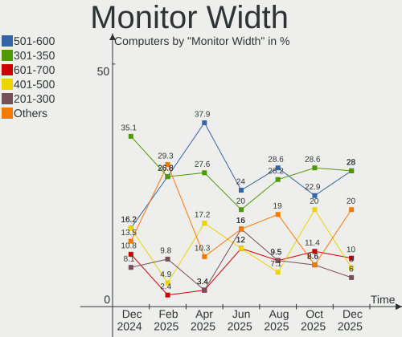

| Width in mm | Computers | Percent |
|-------------|-----------|---------|
| 501-600     | 14        | 28%     |
| 301-350     | 14        | 28%     |
| 601-700     | 5         | 10%     |
| 401-500     | 4         | 8%      |
| 201-300     | 3         | 6%      |
| 1001-1500   | 3         | 6%      |
| 701-800     | 2         | 4%      |
| 1501-2000   | 2         | 4%      |
| Unknown     | 2         | 4%      |
| 351-400     | 1         | 2%      |

Aspect Ratio
------------

Proportional relationship between the width and the height

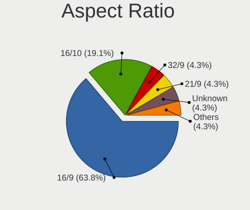

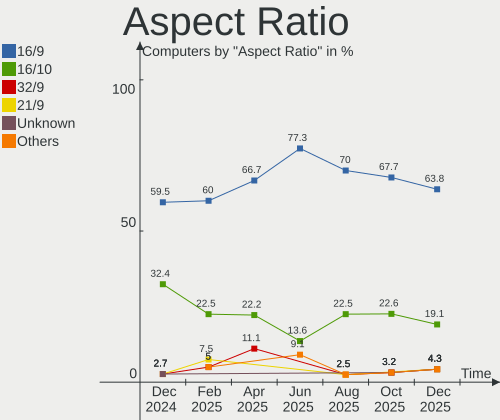

| Ratio   | Computers | Percent |
|---------|-----------|---------|
| 16/9    | 30        | 63.83%  |
| 16/10   | 9         | 19.15%  |
| 32/9    | 2         | 4.26%   |
| 21/9    | 2         | 4.26%   |
| Unknown | 2         | 4.26%   |
| 5/4     | 1         | 2.13%   |
| 3/2     | 1         | 2.13%   |

Monitor Area
------------

Area in inch²

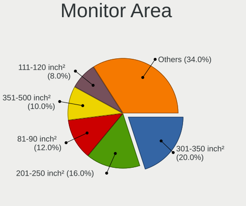

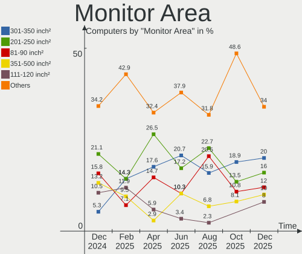

| Area in inch² | Computers | Percent |
|----------------|-----------|---------|
| 301-350        | 10        | 20%     |
| 201-250        | 8         | 16%     |
| 81-90          | 6         | 12%     |
| 351-500        | 5         | 10%     |
| 111-120        | 4         | 8%      |
| 101-110        | 4         | 8%      |
| More than 1000 | 3         | 6%      |
| 71-80          | 2         | 4%      |
| 501-1000       | 2         | 4%      |
| Unknown        | 2         | 4%      |
| 251-300        | 1         | 2%      |
| 151-200        | 1         | 2%      |
| 141-150        | 1         | 2%      |
| 121-130        | 1         | 2%      |

Pixel Density
-------------

Pixels per inch

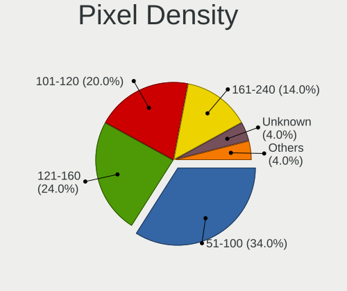

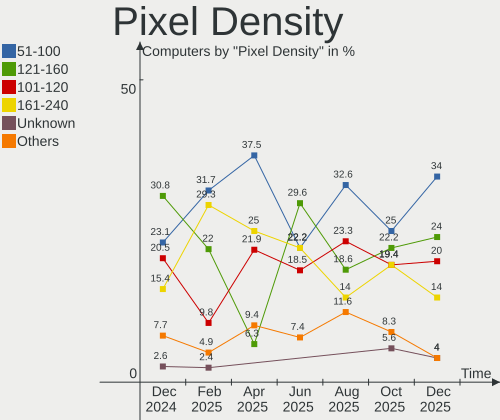

| Density       | Computers | Percent |
|---------------|-----------|---------|
| 51-100        | 17        | 34%     |
| 121-160       | 12        | 24%     |
| 101-120       | 10        | 20%     |
| 161-240       | 7         | 14%     |
| Unknown       | 2         | 4%      |
| More than 240 | 1         | 2%      |
| 1-50          | 1         | 2%      |

Multiple Monitors
-----------------

Total monitors connected

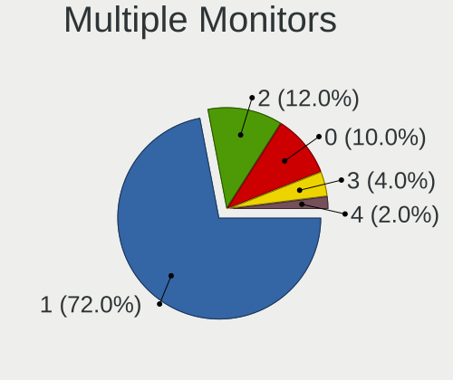

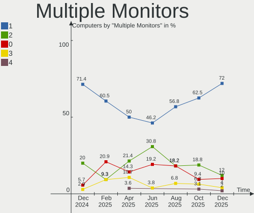

| Total | Computers | Percent |
|-------|-----------|---------|
| 1     | 36        | 72%     |
| 2     | 6         | 12%     |
| 0     | 5         | 10%     |
| 3     | 2         | 4%      |
| 4     | 1         | 2%      |

Network
-------

Net Controller Vendor
---------------------

Controller vendors

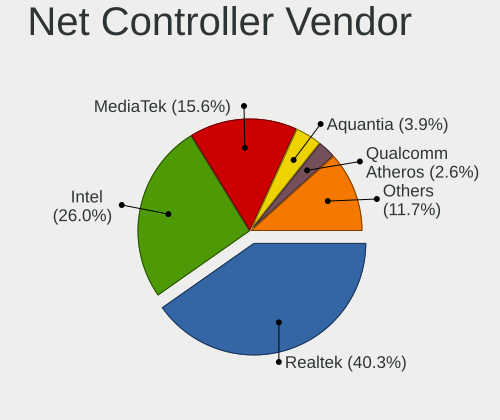

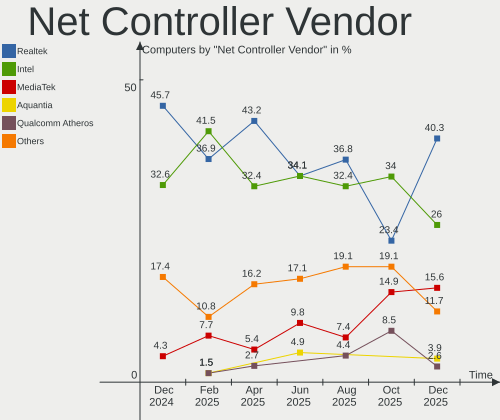

| Vendor                                 | Computers | Percent |
|----------------------------------------|-----------|---------|
| Realtek Semiconductor                  | 31        | 40.26%  |
| Intel                                  | 20        | 25.97%  |
| MediaTek                               | 12        | 15.58%  |
| Aquantia                               | 3         | 3.9%    |
| Qualcomm Atheros                       | 2         | 2.6%    |
| Suzhou Motorcomm Electronic Technology | 1         | 1.3%    |
| Qualcomm Technologies                  | 1         | 1.3%    |
| Qualcomm Atheros Communications        | 1         | 1.3%    |
| Qualcomm                               | 1         | 1.3%    |
| ICS Advent                             | 1         | 1.3%    |
| Broadcom Limited                       | 1         | 1.3%    |
| Broadcom                               | 1         | 1.3%    |
| ASIX Electronics                       | 1         | 1.3%    |
| American Megatrends                    | 1         | 1.3%    |

Net Controller Model
--------------------

Controller models

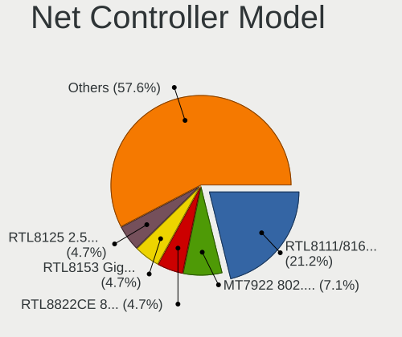

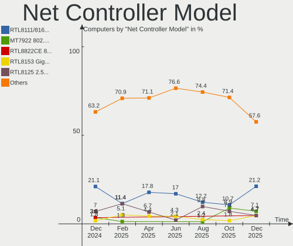

| Model                                                                           | Computers | Percent |
|---------------------------------------------------------------------------------|-----------|---------|
| Realtek RTL8111/8168/8211/8411 PCI Express Gigabit Ethernet Controller          | 18        | 21.18%  |
| MediaTek MT7922 802.11ax PCI Express Wireless Network Adapter                   | 6         | 7.06%   |
| Realtek RTL8822CE 802.11ac PCIe Wireless Network Adapter                        | 4         | 4.71%   |
| Realtek RTL8153 Gigabit Ethernet Adapter                                        | 4         | 4.71%   |
| Realtek RTL8125 2.5GbE Controller                                               | 4         | 4.71%   |
| Intel Raptor Lake PCH CNVi WiFi                                                 | 4         | 4.71%   |
| Intel Wi-Fi 6 AX200                                                             | 3         | 3.53%   |
| Intel I211 Gigabit Network Connection                                           | 3         | 3.53%   |
| Realtek RTL810xE PCI Express Fast Ethernet controller                           | 2         | 2.35%   |
| MediaTek MT7925 802.11be 160MHz 2x2 PCIe Wireless Network Adapter [Filogic 360] | 2         | 2.35%   |
| Intel Ethernet Controller I225-V                                                | 2         | 2.35%   |
| Intel Ethernet Connection I217-V                                                | 2         | 2.35%   |
| Aquantia AQtion AQC113CS NBase-T/IEEE 802.3an Ethernet Controller [Antigua 10G] | 2         | 2.35%   |
| Suzhou Motorcomm Electronic YT6801 Gigabit Ethernet Controller                  | 1         | 1.18%   |
| Realtek USB 10/100/1G/2.5 LAN                                                   | 1         | 1.18%   |
| Realtek RTL8821CE 802.11ac PCIe Wireless Network Adapter                        | 1         | 1.18%   |
| Realtek RTL8127 10GbE Controller                                                | 1         | 1.18%   |
| Realtek RTL8126 5GbE Controller                                                 | 1         | 1.18%   |
| Qualcomm WCN785x Wi-Fi 7(802.11be) 320MHz 2x2 [FastConnect 7800]                | 1         | 1.18%   |
| Qualcomm QCNFA765 Wireless Network Adapter                                      | 1         | 1.18%   |
| Qualcomm Atheros QCA9377 802.11ac Wireless Network Adapter                      | 1         | 1.18%   |
| Qualcomm Atheros AR9271 802.11n                                                 | 1         | 1.18%   |
| Qualcomm Atheros AR9485 Wireless Network Adapter                                | 1         | 1.18%   |
| MediaTek MT7927 802.11be 320MHz 2x2 PCIe Wireless Network Adapter [Filogic 380] | 1         | 1.18%   |
| MediaTek MT7925 (RZ717) Wi-Fi 7 160MHz                                          | 1         | 1.18%   |
| MediaTek MT7921K (RZ608) Wi-Fi 6E 80MHz                                         | 1         | 1.18%   |
| MediaTek MT7921 802.11ax PCIe Wireless Network Adapter [Filogic 330]            | 1         | 1.18%   |
| Intel Wi-Fi 6 AX201                                                             | 1         | 1.18%   |
| Intel I350 Gigabit Network Connection                                           | 1         | 1.18%   |
| Intel Ethernet Controller X710 for 10GBASE-T                                    | 1         | 1.18%   |
| Intel Ethernet Controller I226-V                                                | 1         | 1.18%   |
| Intel Ethernet Connection I217-LM                                               | 1         | 1.18%   |
| Intel Ethernet Connection (7) I219-LM                                           | 1         | 1.18%   |
| Intel BE201 320MHz                                                              | 1         | 1.18%   |
| Intel Alder Lake-N PCH CNVi WiFi                                                | 1         | 1.18%   |
| ICS Advent DM9601 Fast Ethernet Adapter                                         | 1         | 1.18%   |
| Broadcom Limited BCM4352 802.11ac Dual Band Wireless Network Adapter            | 1         | 1.18%   |
| Broadcom BRCM4387 Bluetooth Controller                                          | 1         | 1.18%   |
| Broadcom BCM4387 802.11ax Dual Band Wireless LAN Controller                     | 1         | 1.18%   |
| ASIX AX88772A Fast Ethernet                                                     | 1         | 1.18%   |

Wireless Vendor
---------------

Wireless vendors

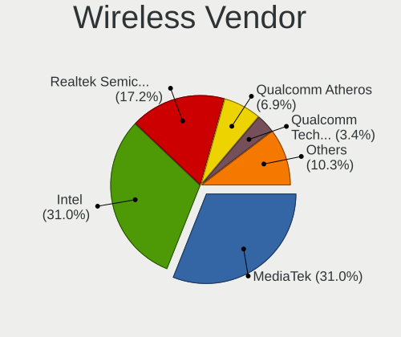

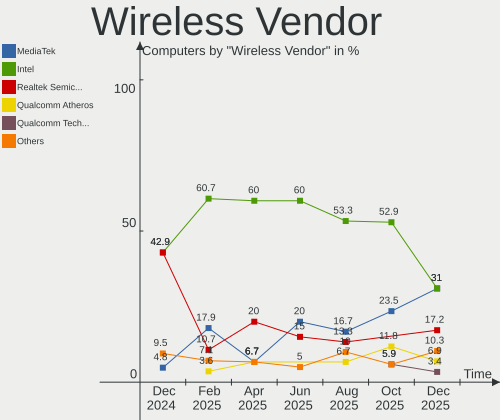

| Vendor                          | Computers | Percent |
|---------------------------------|-----------|---------|
| MediaTek                        | 9         | 31.03%  |
| Intel                           | 9         | 31.03%  |
| Realtek Semiconductor           | 5         | 17.24%  |
| Qualcomm Atheros                | 2         | 6.9%    |
| Qualcomm Technologies           | 1         | 3.45%   |
| Qualcomm Atheros Communications | 1         | 3.45%   |
| Qualcomm                        | 1         | 3.45%   |
| Broadcom Limited                | 1         | 3.45%   |

Wireless Model
--------------

Wireless models

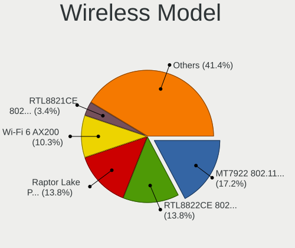

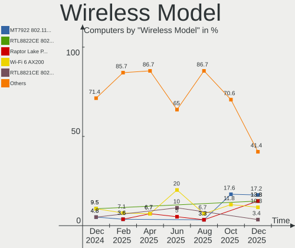

| Model                                                                           | Computers | Percent |
|---------------------------------------------------------------------------------|-----------|---------|
| MediaTek MT7922 802.11ax PCI Express Wireless Network Adapter                   | 5         | 17.24%  |
| Realtek RTL8822CE 802.11ac PCIe Wireless Network Adapter                        | 4         | 13.79%  |
| Intel Raptor Lake PCH CNVi WiFi                                                 | 4         | 13.79%  |
| Intel Wi-Fi 6 AX200                                                             | 3         | 10.34%  |
| Realtek RTL8821CE 802.11ac PCIe Wireless Network Adapter                        | 1         | 3.45%   |
| Qualcomm WCN785x Wi-Fi 7(802.11be) 320MHz 2x2 [FastConnect 7800]                | 1         | 3.45%   |
| Qualcomm QCNFA765 Wireless Network Adapter                                      | 1         | 3.45%   |
| Qualcomm Atheros QCA9377 802.11ac Wireless Network Adapter                      | 1         | 3.45%   |
| Qualcomm Atheros AR9271 802.11n                                                 | 1         | 3.45%   |
| Qualcomm Atheros AR9485 Wireless Network Adapter                                | 1         | 3.45%   |
| MediaTek MT7927 802.11be 320MHz 2x2 PCIe Wireless Network Adapter [Filogic 380] | 1         | 3.45%   |
| MediaTek MT7925 (RZ717) Wi-Fi 7 160MHz                                          | 1         | 3.45%   |
| MediaTek MT7921K (RZ608) Wi-Fi 6E 80MHz                                         | 1         | 3.45%   |
| MediaTek MT7921 802.11ax PCIe Wireless Network Adapter [Filogic 330]            | 1         | 3.45%   |
| Intel Wi-Fi 6 AX201                                                             | 1         | 3.45%   |
| Intel BE201 320MHz                                                              | 1         | 3.45%   |
| Broadcom Limited BCM4352 802.11ac Dual Band Wireless Network Adapter            | 1         | 3.45%   |

Ethernet Vendor
---------------

Ethernet vendors

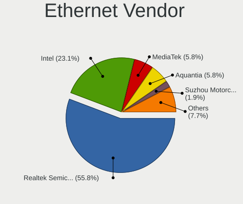

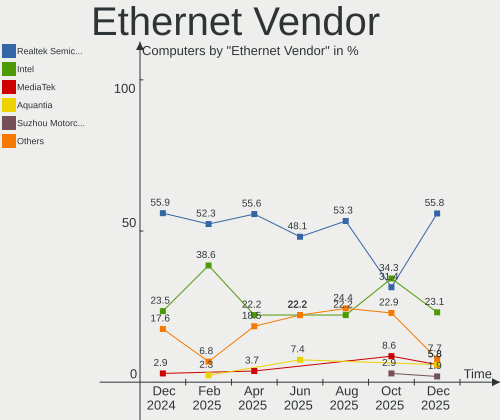

| Vendor                                 | Computers | Percent |
|----------------------------------------|-----------|---------|
| Realtek Semiconductor                  | 29        | 55.77%  |
| Intel                                  | 12        | 23.08%  |
| MediaTek                               | 3         | 5.77%   |
| Aquantia                               | 3         | 5.77%   |
| Suzhou Motorcomm Electronic Technology | 1         | 1.92%   |
| ICS Advent                             | 1         | 1.92%   |
| Broadcom                               | 1         | 1.92%   |
| ASIX Electronics                       | 1         | 1.92%   |
| American Megatrends                    | 1         | 1.92%   |

Ethernet Model
--------------

Ethernet models

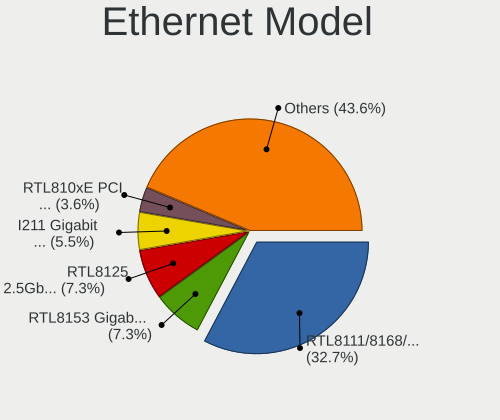

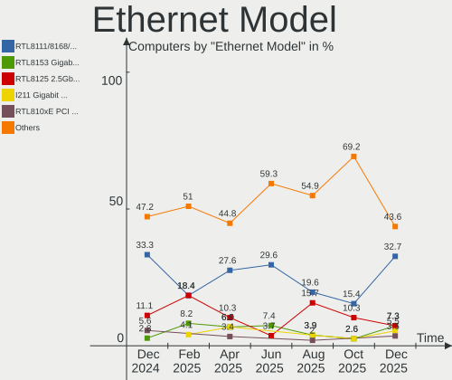

| Model                                                                           | Computers | Percent |
|---------------------------------------------------------------------------------|-----------|---------|
| Realtek RTL8111/8168/8211/8411 PCI Express Gigabit Ethernet Controller          | 18        | 32.73%  |
| Realtek RTL8153 Gigabit Ethernet Adapter                                        | 4         | 7.27%   |
| Realtek RTL8125 2.5GbE Controller                                               | 4         | 7.27%   |
| Intel I211 Gigabit Network Connection                                           | 3         | 5.45%   |
| Realtek RTL810xE PCI Express Fast Ethernet controller                           | 2         | 3.64%   |
| MediaTek MT7925 802.11be 160MHz 2x2 PCIe Wireless Network Adapter [Filogic 360] | 2         | 3.64%   |
| Intel Ethernet Controller I225-V                                                | 2         | 3.64%   |
| Intel Ethernet Connection I217-V                                                | 2         | 3.64%   |
| Aquantia AQtion AQC113CS NBase-T/IEEE 802.3an Ethernet Controller [Antigua 10G] | 2         | 3.64%   |
| Suzhou Motorcomm Electronic YT6801 Gigabit Ethernet Controller                  | 1         | 1.82%   |
| Realtek USB 10/100/1G/2.5 LAN                                                   | 1         | 1.82%   |
| Realtek RTL8127 10GbE Controller                                                | 1         | 1.82%   |
| Realtek RTL8126 5GbE Controller                                                 | 1         | 1.82%   |
| MediaTek MT7922 802.11ax PCI Express Wireless Network Adapter                   | 1         | 1.82%   |
| Intel I350 Gigabit Network Connection                                           | 1         | 1.82%   |
| Intel Ethernet Controller X710 for 10GBASE-T                                    | 1         | 1.82%   |
| Intel Ethernet Controller I226-V                                                | 1         | 1.82%   |
| Intel Ethernet Connection I217-LM                                               | 1         | 1.82%   |
| Intel Ethernet Connection (7) I219-LM                                           | 1         | 1.82%   |
| Intel Alder Lake-N PCH CNVi WiFi                                                | 1         | 1.82%   |
| ICS Advent DM9601 Fast Ethernet Adapter                                         | 1         | 1.82%   |
| Broadcom BCM4387 802.11ax Dual Band Wireless LAN Controller                     | 1         | 1.82%   |
| ASIX AX88772A Fast Ethernet                                                     | 1         | 1.82%   |
| Aquantia AQtion AQC107 NBase-T/IEEE 802.3an Ethernet Controller [Atlantic 10G]  | 1         | 1.82%   |
| American Megatrends Virtual Ethernet.                                           | 1         | 1.82%   |

Net Controller Kind
-------------------

Ethernet, WiFi or modem

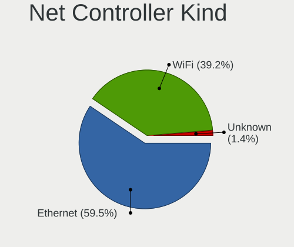

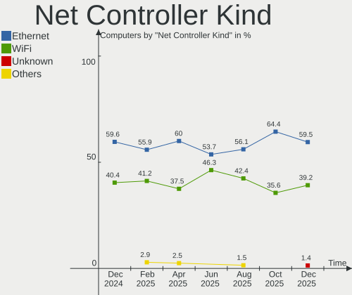

| Kind     | Computers | Percent |
|----------|-----------|---------|
| Ethernet | 44        | 59.46%  |
| WiFi     | 29        | 39.19%  |
| Unknown  | 1         | 1.35%   |

Used Controller
---------------

Currently used network controller

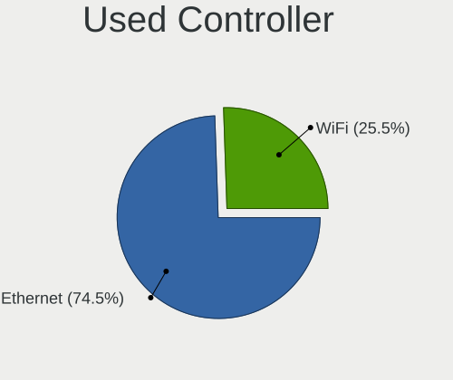

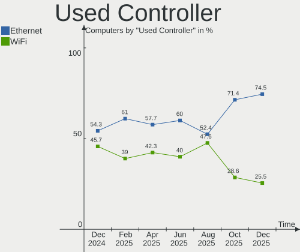

| Kind     | Computers | Percent |
|----------|-----------|---------|
| Ethernet | 35        | 74.47%  |
| WiFi     | 12        | 25.53%  |

NICs
----

Total network controllers on board

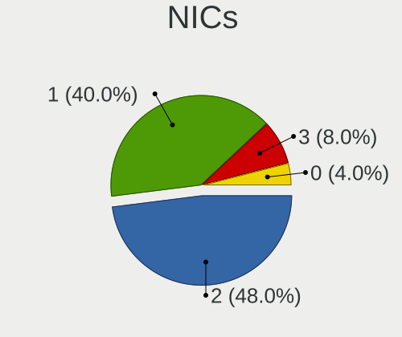

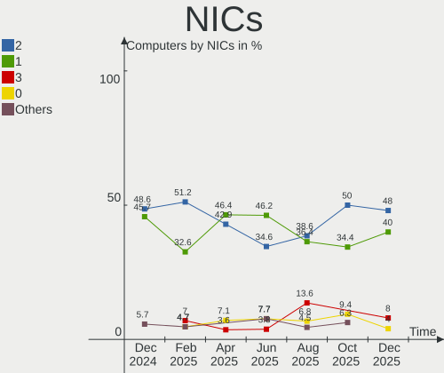

| Total | Computers | Percent |
|-------|-----------|---------|
| 2     | 24        | 48%     |
| 1     | 20        | 40%     |
| 3     | 4         | 8%      |
| 0     | 2         | 4%      |

IPv6
----

IPv6 vs IPv4

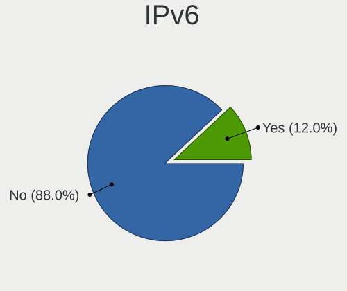

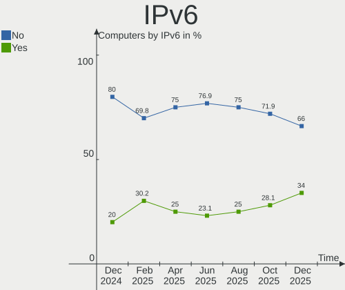

| Used | Computers | Percent |
|------|-----------|---------|
| No   | 33        | 66%     |
| Yes  | 17        | 34%     |

Bluetooth
---------

Bluetooth Vendor
----------------

Controller vendors

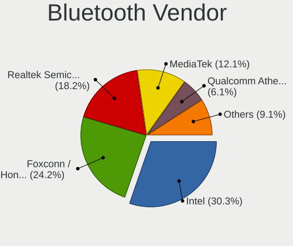

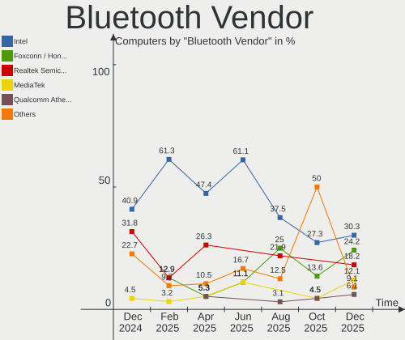

| Vendor                          | Computers | Percent |
|---------------------------------|-----------|---------|
| Intel                           | 10        | 30.3%   |
| Foxconn / Hon Hai               | 8         | 24.24%  |
| Realtek Semiconductor           | 6         | 18.18%  |
| MediaTek                        | 4         | 12.12%  |
| Qualcomm Atheros Communications | 2         | 6.06%   |
| USI                             | 1         | 3.03%   |
| IMC Networks                    | 1         | 3.03%   |
| Broadcom                        | 1         | 3.03%   |

Bluetooth Model
---------------

Controller models

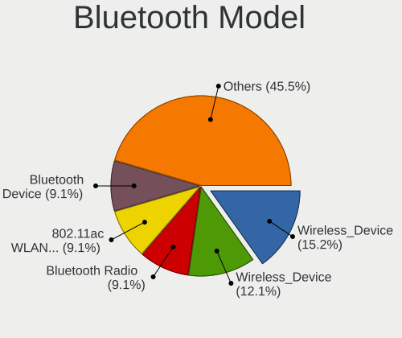

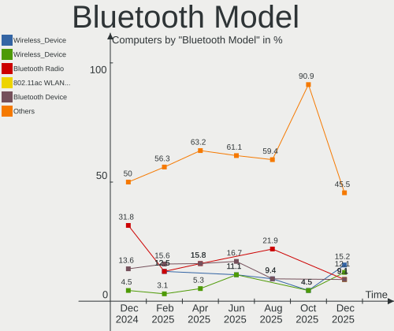

| Model                                          | Computers | Percent |
|------------------------------------------------|-----------|---------|
| Foxconn / Hon Hai Wireless_Device              | 5         | 15.15%  |
| MediaTek Wireless_Device                       | 4         | 12.12%  |
| Realtek Bluetooth Radio                        | 3         | 9.09%   |
| Realtek 802.11ac WLAN Adapter                  | 3         | 9.09%   |
| Intel Bluetooth Device                         | 3         | 9.09%   |
| Intel AX201 Bluetooth                          | 3         | 9.09%   |
| Intel AX200 Bluetooth                          | 2         | 6.06%   |
| Foxconn / Hon Hai Bluetooth Device             | 2         | 6.06%   |
| USI Bluetooth Device                           | 1         | 3.03%   |
| Qualcomm Atheros  Bluetooth Device             | 1         | 3.03%   |
| Qualcomm Atheros AR3012 Bluetooth 4.0          | 1         | 3.03%   |
| Intel Bluetooth 9460/9560 Jefferson Peak (JfP) | 1         | 3.03%   |
| Intel AX210 Bluetooth                          | 1         | 3.03%   |
| IMC Networks Wireless_Device                   | 1         | 3.03%   |
| Foxconn / Hon Hai MediaTek Bluetooth Adapter   | 1         | 3.03%   |
| Broadcom BCM20702A0                            | 1         | 3.03%   |

Sound
-----

Sound Vendor
------------

Sound card vendors

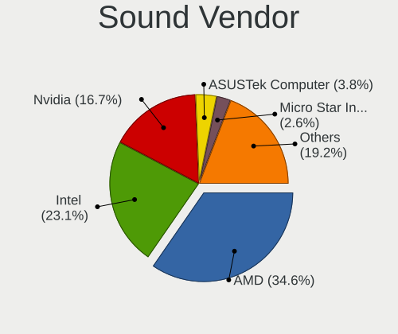

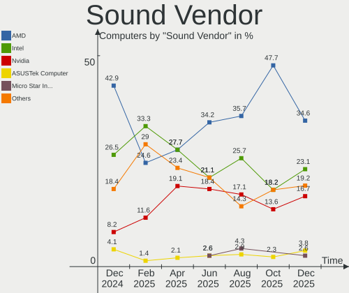

| Vendor                   | Computers | Percent |
|--------------------------|-----------|---------|
| AMD                      | 27        | 34.62%  |
| Intel                    | 18        | 23.08%  |
| Nvidia                   | 13        | 16.67%  |
| ASUSTek Computer         | 3         | 3.85%   |
| Micro Star International | 2         | 2.56%   |
| Creative Labs            | 2         | 2.56%   |
| Unknown                  | 1         | 1.28%   |
| SteelSeries ApS          | 1         | 1.28%   |
| Realtek Semiconductor    | 1         | 1.28%   |
| MV-SILICON               | 1         | 1.28%   |
| Kingston Technology      | 1         | 1.28%   |
| JOUNIVO                  | 1         | 1.28%   |
| Jieli Technology         | 1         | 1.28%   |
| Huawei Technologies      | 1         | 1.28%   |
| Focusrite-Novation       | 1         | 1.28%   |
| Comtrue                  | 1         | 1.28%   |
| C-Media Electronics      | 1         | 1.28%   |
| BEHRINGER International  | 1         | 1.28%   |
| Apple                    | 1         | 1.28%   |

Sound Model
-----------

Sound card models

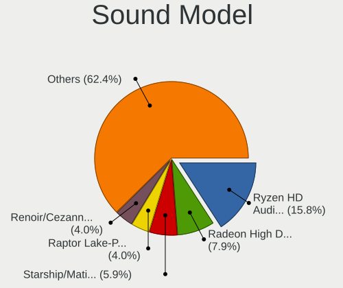

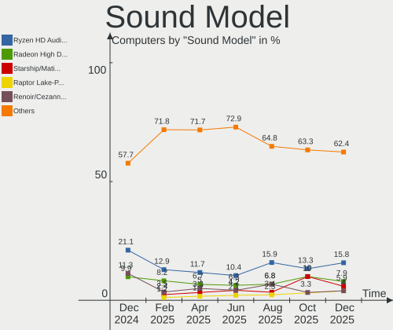

| Model                                                          | Computers | Percent |
|----------------------------------------------------------------|-----------|---------|
| AMD Ryzen HD Audio Controller                                  | 16        | 15.84%  |
| AMD Radeon High Definition Audio Controller                    | 8         | 7.92%   |
| AMD Starship/Matisse HD Audio Controller                       | 6         | 5.94%   |
| Intel Raptor Lake-P/U/H cAVS                                   | 4         | 3.96%   |
| AMD Renoir/Cezanne HDMI/DP Audio Controller                    | 4         | 3.96%   |
| ASUSTek Computer USB Audio                                     | 3         | 2.97%   |
| AMD Raven/Raven2/Fenghuang HDMI/DP Audio Controller            | 3         | 2.97%   |
| Nvidia GA102 High Definition Audio Controller                  | 2         | 1.98%   |
| Micro Star International USB Audio                             | 2         | 1.98%   |
| Intel Raptor Lake High Definition Audio Controller             | 2         | 1.98%   |
| Intel DG2 Audio Controller                                     | 2         | 1.98%   |
| AMD Navi 31 HDMI/DP Audio                                      | 2         | 1.98%   |
| AMD Navi 21/23 HDMI/DP Audio Controller                        | 2         | 1.98%   |
| AMD Ellesmere HDMI Audio [Radeon RX 470/480 / 570/580/590]     | 2         | 1.98%   |
| Unknown USB MIDI Interface                                     | 1         | 0.99%   |
| SteelSeries ApS SteelSeries Arctis 5                           | 1         | 0.99%   |
| Realtek Semiconductor LG Monitor HP MIC                        | 1         | 0.99%   |
| Nvidia TU106 High Definition Audio Controller                  | 1         | 0.99%   |
| Nvidia GP107GL High Definition Audio Controller                | 1         | 0.99%   |
| Nvidia GP106 High Definition Audio Controller                  | 1         | 0.99%   |
| Nvidia GP104 High Definition Audio Controller                  | 1         | 0.99%   |
| Nvidia GP102 HDMI Audio Controller                             | 1         | 0.99%   |
| Nvidia GB206 High Definition Audio Controller                  | 1         | 0.99%   |
| Nvidia GB203 High Definition Audio Controller                  | 1         | 0.99%   |
| Nvidia GA104 High Definition Audio Controller                  | 1         | 0.99%   |
| Nvidia AD107 High Definition Audio Controller                  | 1         | 0.99%   |
| Nvidia AD106M High Definition Audio Controller                 | 1         | 0.99%   |
| Nvidia AD104 High Definition Audio Controller                  | 1         | 0.99%   |
| MV-SILICON fifine Microphone                                   | 1         | 0.99%   |
| Kingston Technology HyperX Cloud II Wireless                   | 1         | 0.99%   |
| JOUNIVO JOUNIVO JV601                                          | 1         | 0.99%   |
| Jieli Technology UACDemoV1.0                                   | 1         | 0.99%   |
| Intel Tiger Lake-LP Smart Sound Technology Audio Controller    | 1         | 0.99%   |
| Intel Sunrise Point-LP HD Audio                                | 1         | 0.99%   |
| Intel Lunar Lake-M HD Audio Controller                         | 1         | 0.99%   |
| Intel Cannon Lake PCH cAVS                                     | 1         | 0.99%   |
| Intel C610/X99 series chipset HD Audio Controller              | 1         | 0.99%   |
| Intel C600/X79 series chipset High Definition Audio Controller | 1         | 0.99%   |
| Intel Alder Lake-S HD Audio Controller                         | 1         | 0.99%   |
| Intel Alder Lake-N PCH High Definition Audio Controller        | 1         | 0.99%   |

Memory
------

Memory Vendor
-------------

Memory module vendors

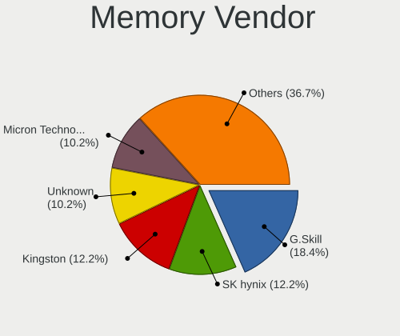

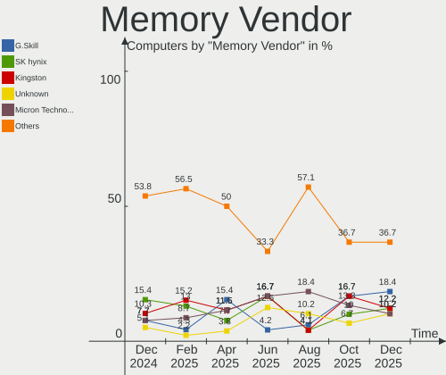

| Vendor              | Computers | Percent |
|---------------------|-----------|---------|
| G.Skill             | 9         | 18.37%  |
| SK hynix            | 6         | 12.24%  |
| Kingston            | 6         | 12.24%  |
| Unknown             | 5         | 10.2%   |
| Micron Technology   | 5         | 10.2%   |
| Corsair             | 5         | 10.2%   |
| Samsung Electronics | 3         | 6.12%   |
| Unknown             | 3         | 6.12%   |
| A-DATA Technology   | 2         | 4.08%   |
| Transcend           | 1         | 2.04%   |
| Team                | 1         | 2.04%   |
| Ramaxel Technology  | 1         | 2.04%   |
| KINGBANK            | 1         | 2.04%   |
| Crucial             | 1         | 2.04%   |

Memory Model
------------

Memory module models

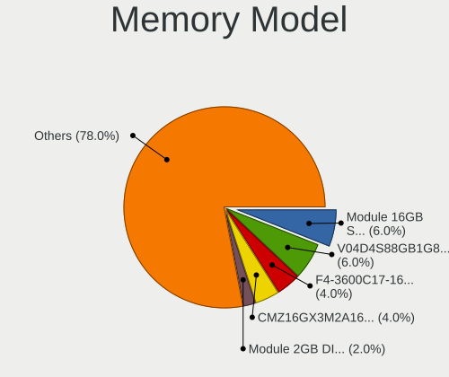

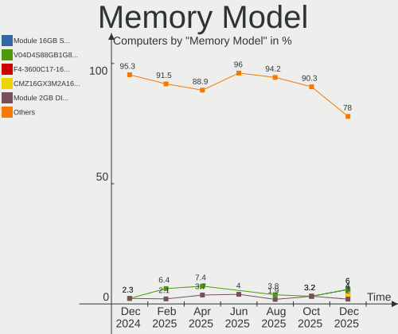

| Model                                                            | Computers | Percent |
|------------------------------------------------------------------|-----------|---------|
| Unknown RAM Module 16GB SODIMM DDR4 2667MT/s                     | 3         | 6%      |
| Unknown                                                          | 3         | 6%      |
| G.Skill RAM F4-3600C17-16GTZR 16GB DIMM DDR4 3666MT/s            | 2         | 4%      |
| Corsair RAM CMZ16GX3M2A1600C10 8GB DIMM DDR3 1600MT/s            | 2         | 4%      |
| Unknown RAM Module 2GB DIMM DDR2 667MT/s                         | 1         | 2%      |
| Unknown RAM Module 1GB SODIMM DDR3 1333MT/s                      | 1         | 2%      |
| Transcend RAM Module 16GB SODIMM DDR5 4800MT/s                   | 1         | 2%      |
| Team RAM TEAMGROUP-SD4-3200 16GB SODIMM DDR4 3200MT/s            | 1         | 2%      |
| SK hynix RAM HMT31GR7CFR4C 8GB DIMM DDR3 1600MT/s                | 1         | 2%      |
| SK hynix RAM HMCG78MEBSA092N 16GB SODIMM DDR5 4800MT/s           | 1         | 2%      |
| SK hynix RAM HMCG78AEBSA095N 16GB SODIMM DDR5 4800MT/s           | 1         | 2%      |
| SK hynix RAM HMA851S6AFR6N-UH 4GB SODIMM DDR4 2667MT/s           | 1         | 2%      |
| SK hynix RAM HMA84GL7MMR4N-TF 32GB RIMM DDR4 2133MT/s            | 1         | 2%      |
| SK hynix RAM H9JCNNNCP3MLYR-N6E 4GB SODIMM LPDDR5 6400MT/s       | 1         | 2%      |
| Samsung RAM M471B5273EB0-CK0 4GB SODIMM DDR3 4199MT/s            | 1         | 2%      |
| Samsung RAM M471A5244CB0-CWE 4GB Row Of Chips DDR4 3200MT/s      | 1         | 2%      |
| Samsung RAM M425R1GB4PB0-CWMOD 8GiB SODIMM DDR5 5600MT/s         | 1         | 2%      |
| Ramaxel RAM RMSB3420MD88ICF-5600 32GB SODIMM DDR5 5600MT/s       | 1         | 2%      |
| Micron RAM MT62F1G32D4DR-031 WT 4GB Row Of Chips LPDDR5 6400MT/s | 1         | 2%      |
| Micron RAM Module 4GB Row Of Chips LPDDR5 8533MT/s               | 1         | 2%      |
| Micron RAM Module 4GB Row Of Chips LPDDR5 5200MT/s               | 1         | 2%      |
| Micron RAM 4ATF51264HZ-2G3B1 4GB SODIMM DDR4 3200MT/s            | 1         | 2%      |
| Micron RAM 16JTF51264AZ-1G4D 4GB DIMM DDR3 1333MT/s              | 1         | 2%      |
| Kingston RAM KHX3200C16D4/32GX 32GB DIMM DDR4 3200MT/s           | 1         | 2%      |
| Kingston RAM KHX3200C16D4/16GX 16GB DIMM DDR4 3600MT/s           | 1         | 2%      |
| Kingston RAM KF556R36-32 32GiB DIMM DDR5 4800MT/s                | 1         | 2%      |
| Kingston RAM KF3600C16D4/16GX 16GB DIMM DDR4 3800MT/s            | 1         | 2%      |
| Kingston RAM KF1600C10D3/8G 8GB DIMM DDR3 1600MT/s               | 1         | 2%      |
| Kingston RAM HP698651-154-KEB 8GB DIMM DDR3 1333MT/s             | 1         | 2%      |
| Kingston RAM HP32D4S2S8MR-8 8GB SODIMM DDR4 3200MT/s             | 1         | 2%      |
| KINGBANK RAM Module 48GB DIMM DDR5 4800MT/s                      | 1         | 2%      |
| G.Skill RAM F5-6400J3239G32G 32GB DIMM DDR5 6400MT/s             | 1         | 2%      |
| G.Skill RAM F5-6000J3636F16G 16GB DIMM DDR5 6400MT/s             | 1         | 2%      |
| G.Skill RAM F5-6000J3238G32G 32GB DIMM DDR5 6000MT/s             | 1         | 2%      |
| G.Skill RAM F5-6000J3040G32G 32GB DIMM DDR5 6200MT/s             | 1         | 2%      |
| G.Skill RAM F4-4400C19-16GVK 16GB DIMM DDR4 4400MT/s             | 1         | 2%      |
| G.Skill RAM F4-3600C18-32GVK 32GiB DIMM DDR4 3600MT/s            | 1         | 2%      |
| G.Skill RAM F4-3600C16-16GTZNC 16GiB DIMM DDR4 3600MT/s          | 1         | 2%      |
| Crucial RAM CT32G4DFD832A.C16FF 32GB DIMM DDR4 3200MT/s          | 1         | 2%      |
| Corsair RAM CMP96GX5M2B7000C40 48GB DIMM DDR5 6400MT/s           | 1         | 2%      |

Memory Kind
-----------

Memory module kinds

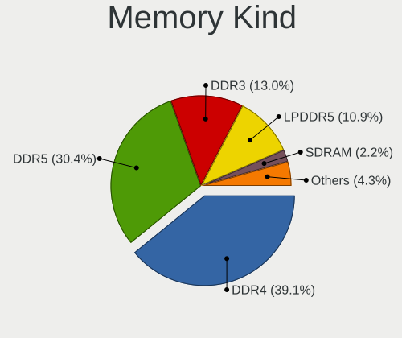

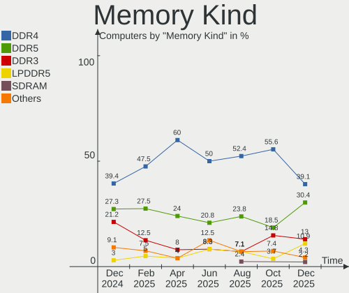

| Kind   | Computers | Percent |
|--------|-----------|---------|
| DDR4   | 18        | 39.13%  |
| DDR5   | 14        | 30.43%  |
| DDR3   | 6         | 13.04%  |
| LPDDR5 | 5         | 10.87%  |
| SDRAM  | 1         | 2.17%   |
| LPDDR4 | 1         | 2.17%   |
| DDR2   | 1         | 2.17%   |

Memory Form Factor
------------------

Physical design of the memory module

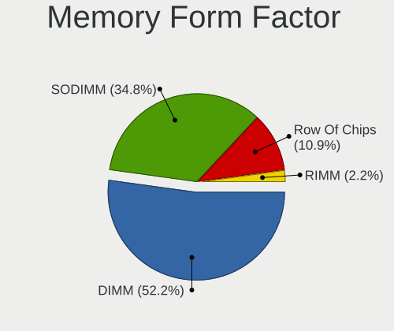

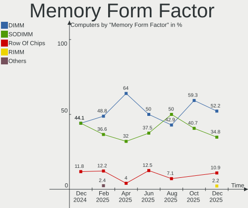

| Name         | Computers | Percent |
|--------------|-----------|---------|
| DIMM         | 24        | 52.17%  |
| SODIMM       | 16        | 34.78%  |
| Row Of Chips | 5         | 10.87%  |
| RIMM         | 1         | 2.17%   |

Memory Size
-----------

Memory module size

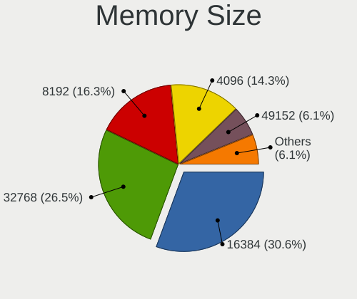

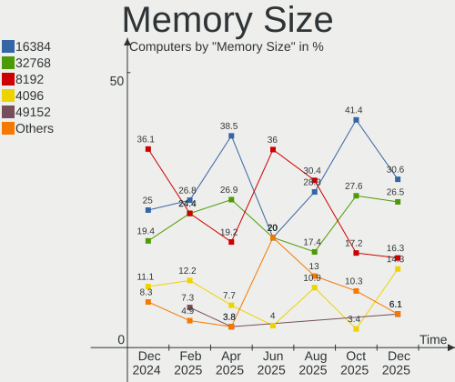

| Size  | Computers | Percent |
|-------|-----------|---------|
| 16384 | 15        | 30.61%  |
| 32768 | 13        | 26.53%  |
| 8192  | 8         | 16.33%  |
| 4096  | 7         | 14.29%  |
| 49152 | 3         | 6.12%   |
| 14336 | 1         | 2.04%   |
| 2048  | 1         | 2.04%   |
| 1024  | 1         | 2.04%   |

Memory Speed
------------

Memory module speed

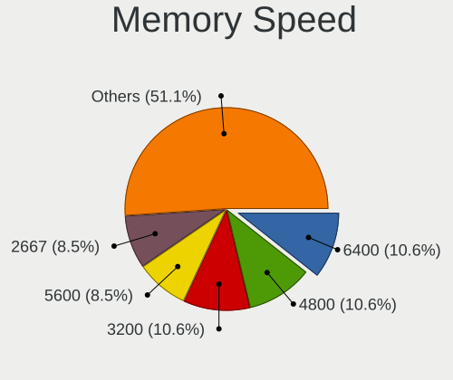

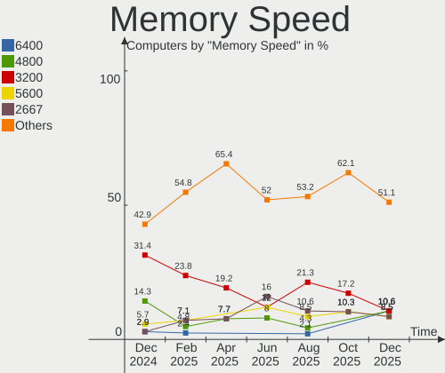

| Speed | Computers | Percent |
|-------|-----------|---------|
| 6400  | 5         | 10.64%  |
| 4800  | 5         | 10.64%  |
| 3200  | 5         | 10.64%  |
| 5600  | 4         | 8.51%   |
| 2667  | 4         | 8.51%   |
| 1600  | 4         | 8.51%   |
| 3800  | 3         | 6.38%   |
| 3600  | 3         | 6.38%   |
| 6000  | 2         | 4.26%   |
| 3666  | 2         | 4.26%   |
| 1333  | 2         | 4.26%   |
| 8533  | 1         | 2.13%   |
| 6200  | 1         | 2.13%   |
| 5200  | 1         | 2.13%   |
| 4400  | 1         | 2.13%   |
| 4199  | 1         | 2.13%   |
| 3866  | 1         | 2.13%   |
| 2133  | 1         | 2.13%   |
| 667   | 1         | 2.13%   |

Printers & scanners
-------------------

Printer Vendor
--------------

Printer device vendors

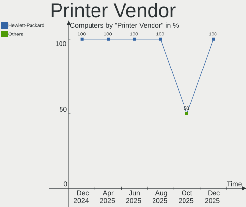

| Vendor          | Computers | Percent |
|-----------------|-----------|---------|
| Hewlett-Packard | 1         | 100%    |

Printer Model
-------------

Printer device models

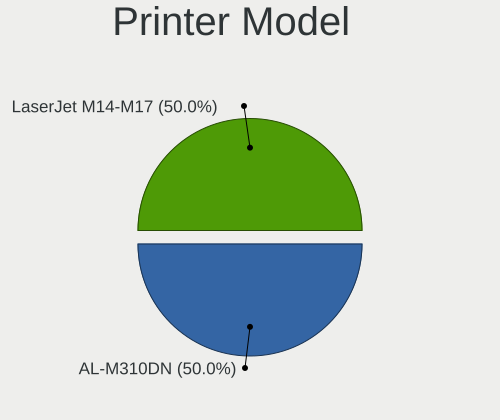

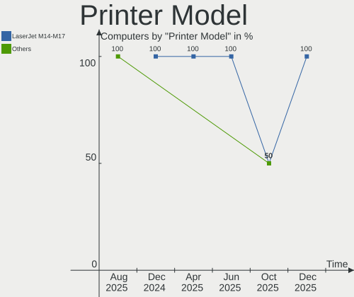

| Model               | Computers | Percent |
|---------------------|-----------|---------|
| HP LaserJet M14-M17 | 1         | 100%    |

Scanner Vendor
--------------

Scanner device vendors

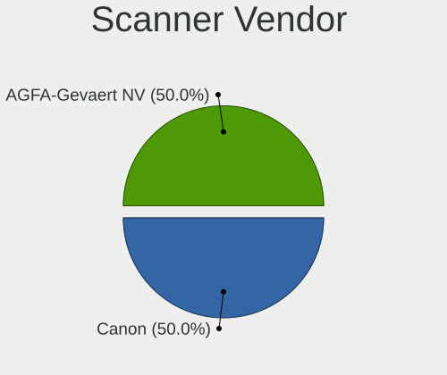

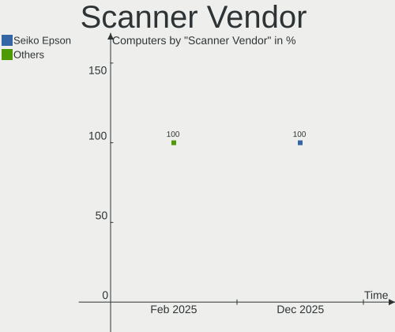

| Vendor      | Computers | Percent |
|-------------|-----------|---------|
| Seiko Epson | 1         | 100%    |

Scanner Model
-------------

Scanner device models

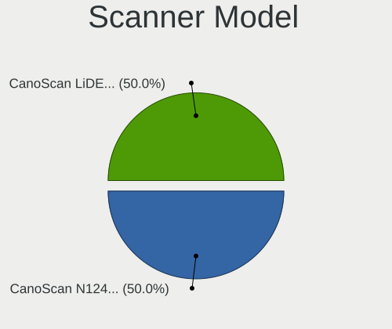

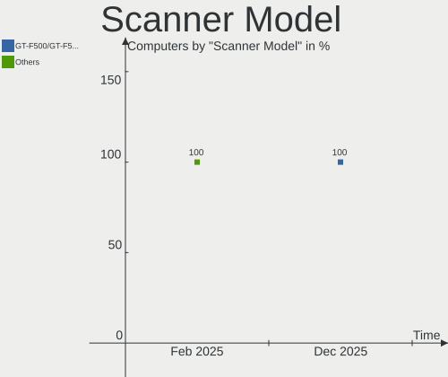

| Model                                                    | Computers | Percent |
|----------------------------------------------------------|-----------|---------|
| Seiko Epson GT-F500/GT-F550 [Perfection 2480/2580 PHOTO] | 1         | 100%    |

Camera
------

Camera Vendor
-------------

Camera device vendors

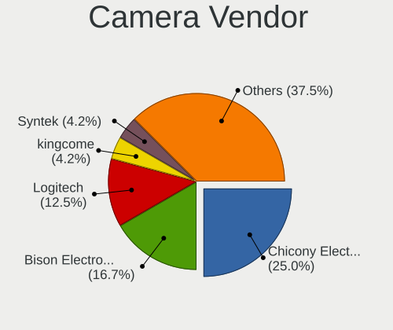

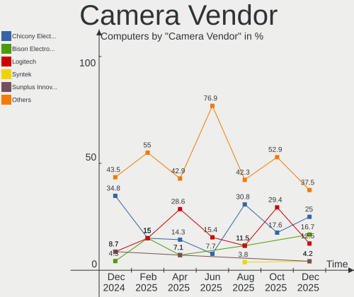

| Vendor                        | Computers | Percent |
|-------------------------------|-----------|---------|
| Chicony Electronics           | 6         | 25%     |
| Bison Electronics             | 4         | 16.67%  |
| Logitech                      | 3         | 12.5%   |
| Syntek                        | 1         | 4.17%   |
| Sunplus Innovation Technology | 1         | 4.17%   |
| Silicon Motion                | 1         | 4.17%   |
| Realtek Semiconductor         | 1         | 4.17%   |
| Microdia                      | 1         | 4.17%   |
| Luxvisions Innotech Limited   | 1         | 4.17%   |
| kingcome                      | 1         | 4.17%   |
| IMC Networks                  | 1         | 4.17%   |
| Generalplus Technology        | 1         | 4.17%   |
| Framework                     | 1         | 4.17%   |
| Elgato Systems                | 1         | 4.17%   |

Camera Model
------------

Camera device models

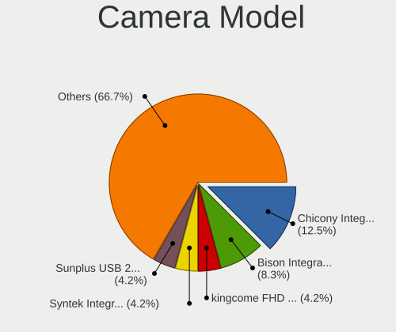

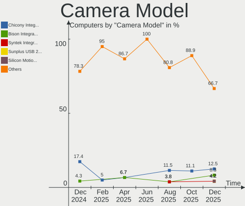

| Model                                             | Computers | Percent |
|---------------------------------------------------|-----------|---------|
| Chicony Integrated Camera                         | 3         | 12.5%   |
| Bison Integrated Camera                           | 2         | 8.33%   |
| Syntek Integrated Camera                          | 1         | 4.17%   |
| Sunplus USB 2.0 Camera                            | 1         | 4.17%   |
| Silicon Motion WebCam SC-10HDD12636N              | 1         | 4.17%   |
| Realtek USB2.0 camera                             | 1         | 4.17%   |
| Microdia Integrated_Webcam_HD                     | 1         | 4.17%   |
| Luxvisions Innotech Limited Integrated RGB Camera | 1         | 4.17%   |
| Logitech Webcam C270                              | 1         | 4.17%   |
| Logitech QuickCam Pro 9000                        | 1         | 4.17%   |
| Logitech HD Webcam C525                           | 1         | 4.17%   |
| kingcome FHD WebCam                               | 1         | 4.17%   |
| IMC Networks USB2.0 HD UVC WebCam                 | 1         | 4.17%   |
| Generalplus WEB CAM                               | 1         | 4.17%   |
| Framework Laptop Webcam Module (2nd Gen)          | 1         | 4.17%   |
| Elgato Systems Elgato Facecam Pro                 | 1         | 4.17%   |
| Chicony Integrated Camera (1920x1080)             | 1         | 4.17%   |
| Chicony HP TrueVision HD Camera                   | 1         | 4.17%   |
| Chicony HP FHD Camera                             | 1         | 4.17%   |
| Bison FHD Camera                                  | 1         | 4.17%   |
| Bison EasyCamera                                  | 1         | 4.17%   |

Security
--------

Fingerprint Vendor
------------------

Fingerprint sensor vendors

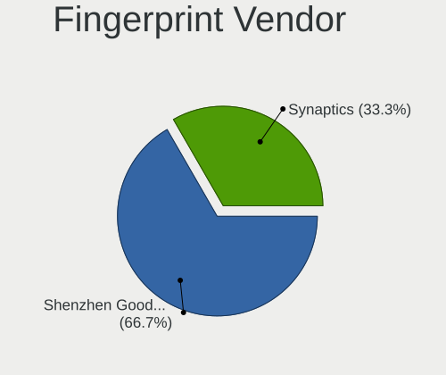

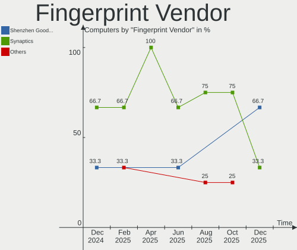

| Vendor                     | Computers | Percent |
|----------------------------|-----------|---------|
| Shenzhen Goodix Technology | 2         | 66.67%  |
| Synaptics                  | 1         | 33.33%  |

Fingerprint Model
-----------------

Fingerprint sensor models

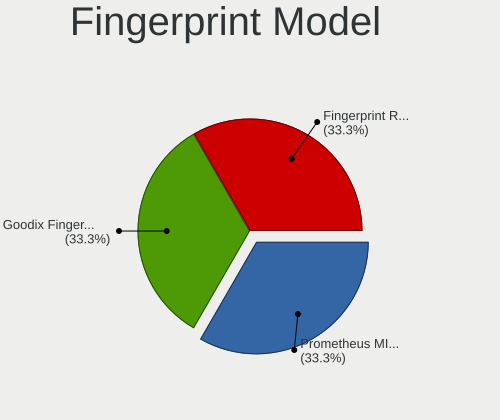

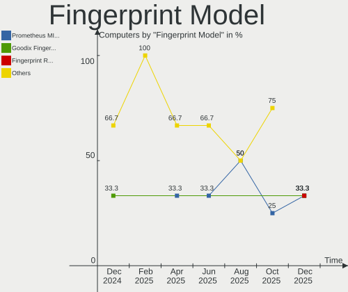

| Model                                             | Computers | Percent |
|---------------------------------------------------|-----------|---------|
| Synaptics Prometheus MIS Touch Fingerprint Reader | 1         | 33.33%  |
| Shenzhen Goodix  FingerPrint Device               | 1         | 33.33%  |
| Shenzhen Goodix Fingerprint Reader                | 1         | 33.33%  |

Chipcard Vendor
---------------

Chipcard module vendors

Zero info for selected period =(

Chipcard Model
--------------

Chipcard module models

Zero info for selected period =(

Unsupported
-----------

Unsupported Devices
-------------------

Total unsupported devices on board

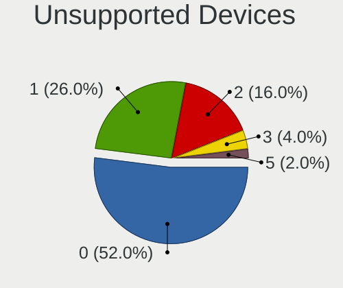

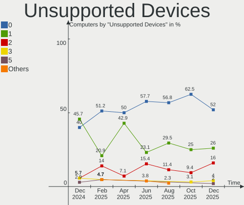

| Total | Computers | Percent |
|-------|-----------|---------|
| 0     | 26        | 52%     |
| 1     | 13        | 26%     |
| 2     | 8         | 16%     |
| 3     | 2         | 4%      |
| 5     | 1         | 2%      |

Unsupported Device Types
------------------------

Types of unsupported devices

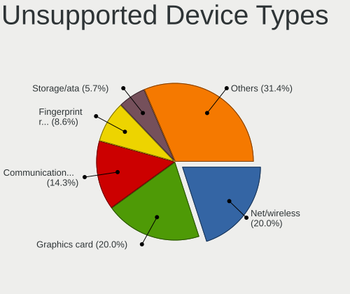

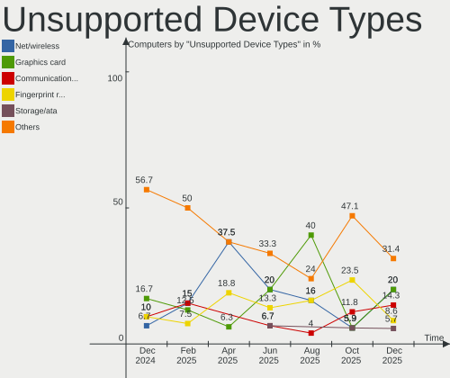

| Type                     | Computers | Percent |
|--------------------------|-----------|---------|
| Net/wireless             | 7         | 20%     |
| Graphics card            | 7         | 20%     |
| Communication controller | 5         | 14.29%  |
| Fingerprint reader       | 3         | 8.57%   |
| Storage/ata              | 2         | 5.71%   |
| Network                  | 2         | 5.71%   |
| Net/ethernet             | 2         | 5.71%   |
| Bluetooth                | 2         | 5.71%   |
| Unassigned class         | 1         | 2.86%   |
| Storage/nvme             | 1         | 2.86%   |
| Sound                    | 1         | 2.86%   |
| Multimedia controller    | 1         | 2.86%   |
| Card reader              | 1         | 2.86%   |

