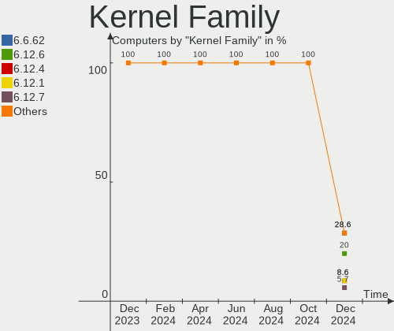
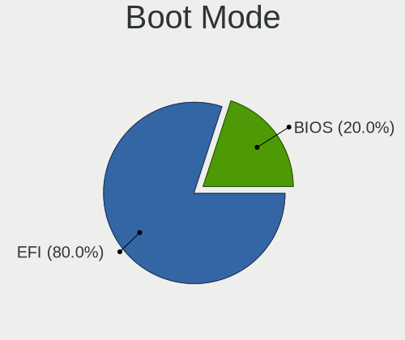
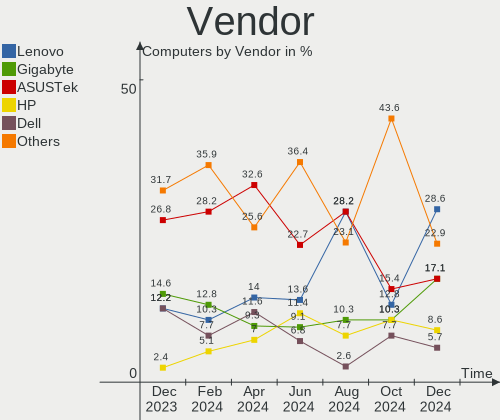
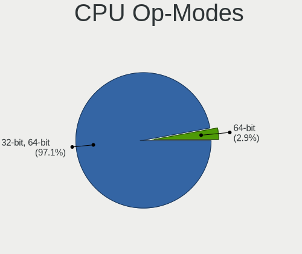
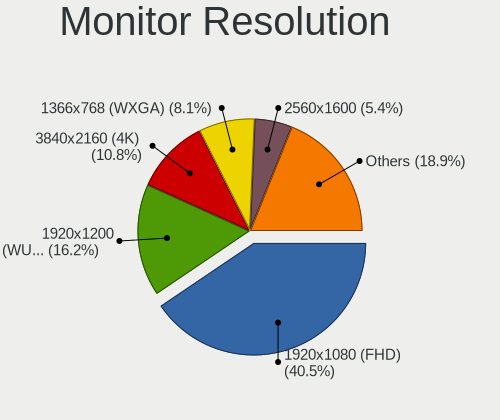
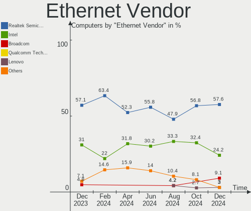
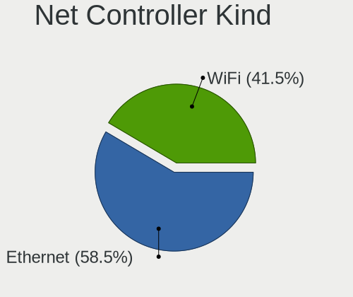

Gentoo - Hardware Trends
------------------------

A project to identify most popular hardware characteristics and track their change
over time based on data collected by Linux users at https://Linux-Hardware.org.

Anyone can contribute to this report by the [hw-probe](https://github.com/linuxhw/hw-probe) tool:

    sudo -E hw-probe -all -upload

This is a report for all computer types. See also reports for [desktops](/Dist/Gentoo/Desktop/README.md) and [notebooks](/Dist/Gentoo/Notebook/README.md).

This report is for one last month. Overall report since the beginning of time: [TestDays](https://github.com/linuxhw/TestDays)

Period: Nov, 2023.

Contents
--------

* [ System ](#system)
  - [ OS                       ](#os)
  - [ OS Family                ](#os-family)
  - [ Kernel                   ](#kernel)
  - [ Kernel Family            ](#kernel-family)
  - [ Kernel Major Ver.        ](#kernel-major-ver)
  - [ Arch                     ](#arch)
  - [ DE                       ](#de)
  - [ Display Server           ](#display-server)
  - [ Display Manager          ](#display-manager)
  - [ OS Lang                  ](#os-lang)
  - [ Boot Mode                ](#boot-mode)
  - [ Filesystem               ](#filesystem)
  - [ Part. scheme             ](#part-scheme)
  - [ Dual Boot with Linux/BSD ](#dual-boot-with-linuxbsd)
  - [ Dual Boot (Win)          ](#dual-boot-win)

* [ Board ](#board)
  - [ Vendor                   ](#vendor)
  - [ Model                    ](#model)
  - [ Model Family             ](#model-family)
  - [ MFG Year                 ](#mfg-year)
  - [ Form Factor              ](#form-factor)
  - [ Secure Boot              ](#secure-boot)
  - [ Coreboot                 ](#coreboot)
  - [ RAM Size                 ](#ram-size)
  - [ RAM Used                 ](#ram-used)
  - [ Total Drives             ](#total-drives)
  - [ Has CD-ROM               ](#has-cd-rom)
  - [ Has Ethernet             ](#has-ethernet)
  - [ Has WiFi                 ](#has-wifi)
  - [ Has Bluetooth            ](#has-bluetooth)

* [ Location ](#location)
  - [ Country                  ](#country)
  - [ City                     ](#city)

* [ Drives ](#drives)
  - [ Drive Vendor             ](#drive-vendor)
  - [ Drive Model              ](#drive-model)
  - [ HDD Vendor               ](#hdd-vendor)
  - [ SSD Vendor               ](#ssd-vendor)
  - [ Drive Kind               ](#drive-kind)
  - [ Drive Connector          ](#drive-connector)
  - [ Drive Size               ](#drive-size)
  - [ Space Total              ](#space-total)
  - [ Space Used               ](#space-used)
  - [ Malfunc. Drives          ](#malfunc-drives)
  - [ Malfunc. Drive Vendor    ](#malfunc-drive-vendor)
  - [ Malfunc. HDD Vendor      ](#malfunc-hdd-vendor)
  - [ Malfunc. Drive Kind      ](#malfunc-drive-kind)
  - [ Failed Drives            ](#failed-drives)
  - [ Failed Drive Vendor      ](#failed-drive-vendor)
  - [ Drive Status             ](#drive-status)

* [ Storage controller ](#storage-controller)
  - [ Storage Vendor           ](#storage-vendor)
  - [ Storage Model            ](#storage-model)
  - [ Storage Kind             ](#storage-kind)

* [ Processor ](#processor)
  - [ CPU Vendor               ](#cpu-vendor)
  - [ CPU Model                ](#cpu-model)
  - [ CPU Model Family         ](#cpu-model-family)
  - [ CPU Cores                ](#cpu-cores)
  - [ CPU Sockets              ](#cpu-sockets)
  - [ CPU Threads              ](#cpu-threads)
  - [ CPU Op-Modes             ](#cpu-op-modes)
  - [ CPU Microcode            ](#cpu-microcode)
  - [ CPU Microarch            ](#cpu-microarch)

* [ Graphics ](#graphics)
  - [ GPU Vendor               ](#gpu-vendor)
  - [ GPU Model                ](#gpu-model)
  - [ GPU Combo                ](#gpu-combo)
  - [ GPU Driver               ](#gpu-driver)
  - [ GPU Memory               ](#gpu-memory)

* [ Monitor ](#monitor)
  - [ Monitor Vendor           ](#monitor-vendor)
  - [ Monitor Model            ](#monitor-model)
  - [ Monitor Resolution       ](#monitor-resolution)
  - [ Monitor Diagonal         ](#monitor-diagonal)
  - [ Monitor Width            ](#monitor-width)
  - [ Aspect Ratio             ](#aspect-ratio)
  - [ Monitor Area             ](#monitor-area)
  - [ Pixel Density            ](#pixel-density)
  - [ Multiple Monitors        ](#multiple-monitors)

* [ Network ](#network)
  - [ Net Controller Vendor    ](#net-controller-vendor)
  - [ Net Controller Model     ](#net-controller-model)
  - [ Wireless Vendor          ](#wireless-vendor)
  - [ Wireless Model           ](#wireless-model)
  - [ Ethernet Vendor          ](#ethernet-vendor)
  - [ Ethernet Model           ](#ethernet-model)
  - [ Net Controller Kind      ](#net-controller-kind)
  - [ Used Controller          ](#used-controller)
  - [ NICs                     ](#nics)
  - [ IPv6                     ](#ipv6)

* [ Bluetooth ](#bluetooth)
  - [ Bluetooth Vendor         ](#bluetooth-vendor)
  - [ Bluetooth Model          ](#bluetooth-model)

* [ Sound ](#sound)
  - [ Sound Vendor             ](#sound-vendor)
  - [ Sound Model              ](#sound-model)

* [ Memory ](#memory)
  - [ Memory Vendor            ](#memory-vendor)
  - [ Memory Model             ](#memory-model)
  - [ Memory Kind              ](#memory-kind)
  - [ Memory Form Factor       ](#memory-form-factor)
  - [ Memory Size              ](#memory-size)
  - [ Memory Speed             ](#memory-speed)

* [ Printers & scanners ](#printers--scanners)
  - [ Printer Vendor           ](#printer-vendor)
  - [ Printer Model            ](#printer-model)
  - [ Scanner Vendor           ](#scanner-vendor)
  - [ Scanner Model            ](#scanner-model)

* [ Camera ](#camera)
  - [ Camera Vendor            ](#camera-vendor)
  - [ Camera Model             ](#camera-model)

* [ Security ](#security)
  - [ Fingerprint Vendor       ](#fingerprint-vendor)
  - [ Fingerprint Model        ](#fingerprint-model)
  - [ Chipcard Vendor          ](#chipcard-vendor)
  - [ Chipcard Model           ](#chipcard-model)

* [ Unsupported ](#unsupported)
  - [ Unsupported Devices      ](#unsupported-devices)
  - [ Unsupported Device Types ](#unsupported-device-types)

System
------

OS
--

Installed operating systems

| Name         | Computers | Percent |
|--------------|-----------|---------|
| Gentoo 2.14  | 59        | 96.72%  |
| Gentoo 20.04 | 1         | 1.64%   |
| Gentoo 2.13  | 1         | 1.64%   |

OS Family
---------

OS without a version

| Name   | Computers | Percent |
|--------|-----------|---------|
| Gentoo | 61        | 100%    |

Kernel
------

Version of the Linux kernel

| Version                       | Computers | Percent |
|-------------------------------|-----------|---------|
| 6.1.57-gentoo-x86_64          | 9         | 14.75%  |
| 6.1.57-gentoo                 | 9         | 14.75%  |
| 6.6.0-gentoo                  | 4         | 6.56%   |
| 6.6.0-gentoo-x86_64           | 3         | 4.92%   |
| 6.7.0-rc1                     | 2         | 3.28%   |
| 6.6.2-gentoo                  | 2         | 3.28%   |
| 6.5.9-gentoo-x86_64           | 2         | 3.28%   |
| 6.1.60-gentoo-dist            | 2         | 3.28%   |
| 6.1.57-gentoo-dist            | 2         | 3.28%   |
| 6.1.53-gentoo-r1-x86_64       | 2         | 3.28%   |
| 6.6.3-gentoo_ap               | 1         | 1.64%   |
| 6.6.3-gentoo                  | 1         | 1.64%   |
| 6.6.2-gentoo-x86_64           | 1         | 1.64%   |
| 6.6.2-gentoo-#136             | 1         | 1.64%   |
| 6.6.1-zen1                    | 1         | 1.64%   |
| 6.6.1-Prants                  | 1         | 1.64%   |
| 6.6.1-gentoo-dist             | 1         | 1.64%   |
| 6.6.1-gentoo-dark             | 1         | 1.64%   |
| 6.6.1-gentoo-122              | 1         | 1.64%   |
| 6.6.1-gentoo                  | 1         | 1.64%   |
| 6.6.0-gentoo-Ryzen            | 1         | 1.64%   |
| 6.5.9-perfection              | 1         | 1.64%   |
| 6.5.9-gentoo                  | 1         | 1.64%   |
| 6.5.8-gentoo-r1               | 1         | 1.64%   |
| 6.5.10-gentoo-dist            | 1         | 1.64%   |
| 6.5.0-gentoo-elitebook-carbon | 1         | 1.64%   |
| 6.3.8-gentoo                  | 1         | 1.64%   |
| 6.2.5-gentoo                  | 1         | 1.64%   |
| 6.1.57-gentoo-gentoo-dist     | 1         | 1.64%   |
| 6.1.57-gentoo-dist-hardened   | 1         | 1.64%   |
| 6.1.46-gentoo-dist            | 1         | 1.64%   |
| 6.1.41-gentoo-dist            | 1         | 1.64%   |
| 5.19.3-gentoo                 | 1         | 1.64%   |
| 5.16.0-rc6                    | 1         | 1.64%   |

Kernel Family
-------------

Linux kernel without a distro release

| Version | Computers | Percent |
|---------|-----------|---------|
| 6.1.57  | 22        | 36.07%  |
| 6.6.0   | 8         | 13.11%  |
| 6.6.1   | 6         | 9.84%   |
| 6.6.2   | 4         | 6.56%   |
| 6.5.9   | 4         | 6.56%   |
| 6.7.0   | 2         | 3.28%   |
| 6.6.3   | 2         | 3.28%   |
| 6.1.60  | 2         | 3.28%   |
| 6.1.53  | 2         | 3.28%   |
| 6.5.8   | 1         | 1.64%   |
| 6.5.10  | 1         | 1.64%   |
| 6.5.0   | 1         | 1.64%   |
| 6.3.8   | 1         | 1.64%   |
| 6.2.5   | 1         | 1.64%   |
| 6.1.46  | 1         | 1.64%   |
| 6.1.41  | 1         | 1.64%   |
| 5.19.3  | 1         | 1.64%   |
| 5.16.0  | 1         | 1.64%   |

Kernel Major Ver.
-----------------

Linux kernel major version

| Version | Computers | Percent |
|---------|-----------|---------|
| 6.1     | 28        | 45.9%   |
| 6.6     | 20        | 32.79%  |
| 6.5     | 7         | 11.48%  |
| 6.7     | 2         | 3.28%   |
| 6.3     | 1         | 1.64%   |
| 6.2     | 1         | 1.64%   |
| 5.19    | 1         | 1.64%   |
| 5.16    | 1         | 1.64%   |

Arch
----

OS architecture (x86_64, i586, etc.)

| Name        | Computers | Percent |
|-------------|-----------|---------|
| x86_64      | 59        | 96.72%  |
| loongarch64 | 1         | 1.64%   |
| aarch64     | 1         | 1.64%   |

DE
--

Desktop Environment

| Name       | Computers | Percent |
|------------|-----------|---------|
| Unknown    | 19        | 31.15%  |
| KDE5       | 15        | 24.59%  |
| GNOME      | 10        | 16.39%  |
| XFCE       | 3         | 4.92%   |
| MATE       | 3         | 4.92%   |
| DWM        | 3         | 4.92%   |
| LXQt       | 2         | 3.28%   |
| Hyprland   | 2         | 3.28%   |
| X-Cinnamon | 1         | 1.64%   |
| LXDE       | 1         | 1.64%   |
| ICEWM      | 1         | 1.64%   |
| i3         | 1         | 1.64%   |

Display Server
--------------

X11 or Wayland

| Name    | Computers | Percent |
|---------|-----------|---------|
| X11     | 24        | 39.34%  |
| Wayland | 21        | 34.43%  |
| Unknown | 9         | 14.75%  |
| Tty     | 7         | 11.48%  |

Display Manager
---------------

SDDM, LightDM, etc.

| Name    | Computers | Percent |
|---------|-----------|---------|
| Unknown | 26        | 42.62%  |
| SDDM    | 17        | 27.87%  |
| LightDM | 11        | 18.03%  |
| GDM     | 4         | 6.56%   |
| SLiM    | 1         | 1.64%   |
| Ly      | 1         | 1.64%   |
| LXDM    | 1         | 1.64%   |

OS Lang
-------

Language

| Lang       | Computers | Percent |
|------------|-----------|---------|
| en_US      | 28        | 45.9%   |
| Unknown    | 10        | 16.39%  |
| C.UTF8     | 6         | 9.84%   |
| zh_CN      | 2         | 3.28%   |
| cs_CZ      | 2         | 3.28%   |
| C          | 2         | 3.28%   |
| uk_UA      | 1         | 1.64%   |
| ru_RU.UTF8 | 1         | 1.64%   |
| ru_RU      | 1         | 1.64%   |
| POSIX      | 1         | 1.64%   |
| lt_LT      | 1         | 1.64%   |
| es_ES.UTF8 | 1         | 1.64%   |
| es_AR      | 1         | 1.64%   |
| eo         | 1         | 1.64%   |
| en_GB      | 1         | 1.64%   |
| el_GR      | 1         | 1.64%   |
| de_DE      | 1         | 1.64%   |

Boot Mode
---------

EFI or BIOS

| Mode | Computers | Percent |
|------|-----------|---------|
| EFI  | 53        | 86.89%  |
| BIOS | 8         | 13.11%  |

Filesystem
----------

Type of filesystem

| Type     | Computers | Percent |
|----------|-----------|---------|
| Ext4     | 27        | 44.26%  |
| Btrfs    | 17        | 27.87%  |
| Xfs      | 7         | 11.48%  |
| F2fs     | 6         | 9.84%   |
| Zfs      | 2         | 3.28%   |
| XXXXXXX  | 1         | 1.64%   |
| Bcachefs | 1         | 1.64%   |

Part. scheme
------------

Scheme of partitioning

| Type    | Computers | Percent |
|---------|-----------|---------|
| GPT     | 54        | 88.52%  |
| MBR     | 4         | 6.56%   |
| Unknown | 3         | 4.92%   |

Dual Boot with Linux/BSD
------------------------

Hosting more than one Linux/BSD

| Dual boot | Computers | Percent |
|-----------|-----------|---------|
| No        | 42        | 68.85%  |
| Yes       | 19        | 31.15%  |

Dual Boot (Win)
---------------

Hosting Linux and Windows

| Dual boot | Computers | Percent |
|-----------|-----------|---------|
| No        | 46        | 75.41%  |
| Yes       | 15        | 24.59%  |

Board
-----

Vendor
------

Motherboard manufacturer

| Name                | Computers | Percent |
|---------------------|-----------|---------|
| ASUSTek Computer    | 17        | 27.87%  |
| Lenovo              | 10        | 16.39%  |
| Hewlett-Packard     | 6         | 9.84%   |
| Gigabyte Technology | 6         | 9.84%   |
| Dell                | 5         | 8.2%    |
| MSI                 | 4         | 6.56%   |
| Framework           | 2         | 3.28%   |
| Unknown             | 2         | 3.28%   |
| UMAX                | 1         | 1.64%   |
| Supermicro          | 1         | 1.64%   |
| Notebook            | 1         | 1.64%   |
| Medion              | 1         | 1.64%   |
| Loongson            | 1         | 1.64%   |
| Intel               | 1         | 1.64%   |
| HUAWEI              | 1         | 1.64%   |
| ASRock              | 1         | 1.64%   |
| Acer                | 1         | 1.64%   |

Model
-----

Motherboard model

| Name                                       | Computers | Percent |
|--------------------------------------------|-----------|---------|
| Unknown                                    | 2         | 3.28%   |
| UMAX VisionBook 9Wi Pro                    | 1         | 1.64%   |
| Supermicro X8DT3                           | 1         | 1.64%   |
| Notebook NS5x_NS7xPU                       | 1         | 1.64%   |
| MSI MS-7C91                                | 1         | 1.64%   |
| MSI MS-7C56                                | 1         | 1.64%   |
| MSI MS-7C35                                | 1         | 1.64%   |
| MSI MS-7C09                                | 1         | 1.64%   |
| Medion MD34100/2543                        | 1         | 1.64%   |
| Loongson 3A6000-HV-7A2000-1w-V0.1-EVB      | 1         | 1.64%   |
| Lenovo ThinkPad X13 Gen 3 21CMCTO1WW       | 1         | 1.64%   |
| Lenovo ThinkPad T420 4236QE0               | 1         | 1.64%   |
| Lenovo ThinkPad T410 2518C3U               | 1         | 1.64%   |
| Lenovo ThinkPad Edge E330 3354AMG          | 1         | 1.64%   |
| Lenovo ThinkPad E15 Gen 4 21EDCTO1WW       | 1         | 1.64%   |
| Lenovo ThinkPad E15 Gen 2 20TD00GSGE       | 1         | 1.64%   |
| Lenovo ThinkPad E14 Gen 4 21EBCTO1WW       | 1         | 1.64%   |
| Lenovo ThinkPad E14 Gen 2 20TA0028RT       | 1         | 1.64%   |
| Lenovo ThinkBook 16 G6 ABP 21KK            | 1         | 1.64%   |
| Lenovo G50-30 80G0                         | 1         | 1.64%   |
| Intel DH77EB AAG39073-304                  | 1         | 1.64%   |
| HUAWEI NBLK-WAX9X                          | 1         | 1.64%   |
| HP Victus by Gaming Laptop 15-fb0xxx       | 1         | 1.64%   |
| HP Victus by Gaming Laptop 15-fa1xxx       | 1         | 1.64%   |
| HP ProLiant DL380e Gen8                    | 1         | 1.64%   |
| HP Pavilion Notebook                       | 1         | 1.64%   |
| HP Pavilion Laptop 15-cs0xxx               | 1         | 1.64%   |
| HP EliteBook 840 G5                        | 1         | 1.64%   |
| Gigabyte Z590 UD                           | 1         | 1.64%   |
| Gigabyte H110M-H                           | 1         | 1.64%   |
| Gigabyte B560M AORUS ELITE                 | 1         | 1.64%   |
| Gigabyte B450M DS3H                        | 1         | 1.64%   |
| Gigabyte AB350-Gaming                      | 1         | 1.64%   |
| Gigabyte A520 AORUS ELITE                  | 1         | 1.64%   |
| Framework Laptop 13 (AMD Ryzen 7040Series) | 1         | 1.64%   |
| Framework Laptop (13th Gen Intel Core)     | 1         | 1.64%   |
| Dell XPS 15 7590                           | 1         | 1.64%   |
| Dell Precision 5480                        | 1         | 1.64%   |
| Dell Latitude E6540                        | 1         | 1.64%   |
| Dell Latitude D630                         | 1         | 1.64%   |

Model Family
------------

Motherboard model prefix

| Name                                  | Computers | Percent |
|---------------------------------------|-----------|---------|
| Lenovo ThinkPad                       | 8         | 13.11%  |
| ASUS ROG                              | 5         | 8.2%    |
| ASUS VivoBook                         | 3         | 4.92%   |
| ASUS TUF                              | 3         | 4.92%   |
| HP Victus                             | 2         | 3.28%   |
| HP Pavilion                           | 2         | 3.28%   |
| Framework Laptop                      | 2         | 3.28%   |
| Dell Latitude                         | 2         | 3.28%   |
| Unknown                               | 2         | 3.28%   |
| UMAX VisionBook                       | 1         | 1.64%   |
| Supermicro X8DT3                      | 1         | 1.64%   |
| Notebook NS5x                         | 1         | 1.64%   |
| MSI MS-7C91                           | 1         | 1.64%   |
| MSI MS-7C56                           | 1         | 1.64%   |
| MSI MS-7C35                           | 1         | 1.64%   |
| MSI MS-7C09                           | 1         | 1.64%   |
| Medion MD34100                        | 1         | 1.64%   |
| Loongson 3A6000-HV-7A2000-1w-V0.1-EVB | 1         | 1.64%   |
| Lenovo ThinkBook                      | 1         | 1.64%   |
| Lenovo G50-30                         | 1         | 1.64%   |
| Intel DH77EB                          | 1         | 1.64%   |
| HUAWEI NBLK-WAX9X                     | 1         | 1.64%   |
| HP ProLiant                           | 1         | 1.64%   |
| HP EliteBook                          | 1         | 1.64%   |
| Gigabyte Z590                         | 1         | 1.64%   |
| Gigabyte H110M-H                      | 1         | 1.64%   |
| Gigabyte B560M                        | 1         | 1.64%   |
| Gigabyte B450M                        | 1         | 1.64%   |
| Gigabyte AB350-Gaming                 | 1         | 1.64%   |
| Gigabyte A520                         | 1         | 1.64%   |
| Dell XPS                              | 1         | 1.64%   |
| Dell Precision                        | 1         | 1.64%   |
| Dell G5                               | 1         | 1.64%   |
| ASUS ZenBook                          | 1         | 1.64%   |
| ASUS Z10PA-D8                         | 1         | 1.64%   |
| ASUS PRIME                            | 1         | 1.64%   |
| ASUS P10S-I                           | 1         | 1.64%   |
| ASUS M3A78-CM                         | 1         | 1.64%   |
| ASUS ASUS                             | 1         | 1.64%   |
| ASRock B550                           | 1         | 1.64%   |

MFG Year
--------

Motherboard manufacture year

| Year    | Computers | Percent |
|---------|-----------|---------|
| 2022    | 12        | 19.67%  |
| 2020    | 7         | 11.48%  |
| 2019    | 7         | 11.48%  |
| 2021    | 6         | 9.84%   |
| 2023    | 5         | 8.2%    |
| 2018    | 5         | 8.2%    |
| 2017    | 3         | 4.92%   |
| 2016    | 3         | 4.92%   |
| 2012    | 3         | 4.92%   |
| Unknown | 3         | 4.92%   |
| 2014    | 1         | 1.64%   |
| 2013    | 1         | 1.64%   |
| 2011    | 1         | 1.64%   |
| 2010    | 1         | 1.64%   |
| 2009    | 1         | 1.64%   |
| 2008    | 1         | 1.64%   |
| 2007    | 1         | 1.64%   |

Form Factor
-----------

Physical design of the computer

| Name           | Computers | Percent |
|----------------|-----------|---------|
| Notebook       | 31        | 50.82%  |
| Desktop        | 25        | 40.98%  |
| Server         | 2         | 3.28%   |
| System on chip | 1         | 1.64%   |
| Tablet         | 1         | 1.64%   |
| Convertible    | 1         | 1.64%   |

Secure Boot
-----------

Enabled or disabled

| State    | Computers | Percent |
|----------|-----------|---------|
| Disabled | 60        | 98.36%  |
| Enabled  | 1         | 1.64%   |

Coreboot
--------

Have coreboot on board

| Used | Computers | Percent |
|------|-----------|---------|
| No   | 61        | 100%    |

RAM Size
--------

Total RAM memory

| Size in GB  | Computers | Percent |
|-------------|-----------|---------|
| 32.01-64.0  | 20        | 32.79%  |
| 8.01-16.0   | 11        | 18.03%  |
| 16.01-24.0  | 10        | 16.39%  |
| 64.01-256.0 | 8         | 13.11%  |
| 4.01-8.0    | 6         | 9.84%   |
| 3.01-4.0    | 3         | 4.92%   |
| 24.01-32.0  | 2         | 3.28%   |
| 1.01-2.0    | 1         | 1.64%   |

RAM Used
--------

Used RAM memory

| Used GB    | Computers | Percent |
|------------|-----------|---------|
| 1.01-2.0   | 16        | 26.23%  |
| 3.01-4.0   | 11        | 18.03%  |
| 4.01-8.0   | 9         | 14.75%  |
| 2.01-3.0   | 8         | 13.11%  |
| 16.01-24.0 | 5         | 8.2%    |
| 0.51-1.0   | 5         | 8.2%    |
| 8.01-16.0  | 3         | 4.92%   |
| 32.01-64.0 | 2         | 3.28%   |
| 0.01-0.5   | 2         | 3.28%   |

Total Drives
------------

Number of drives on board

| Drives | Computers | Percent |
|--------|-----------|---------|
| 1      | 26        | 42.62%  |
| 2      | 15        | 24.59%  |
| 4      | 7         | 11.48%  |
| 6      | 5         | 8.2%    |
| 3      | 4         | 6.56%   |
| 5      | 2         | 3.28%   |
| 31     | 1         | 1.64%   |
| 7      | 1         | 1.64%   |

Has CD-ROM
----------

Has CD-ROM on board

| Presented | Computers | Percent |
|-----------|-----------|---------|
| No        | 47        | 77.05%  |
| Yes       | 14        | 22.95%  |

Has Ethernet
------------

Has Ethernet on board

| Presented | Computers | Percent |
|-----------|-----------|---------|
| Yes       | 50        | 81.97%  |
| No        | 11        | 18.03%  |

Has WiFi
--------

Has WiFi module

| Presented | Computers | Percent |
|-----------|-----------|---------|
| Yes       | 44        | 72.13%  |
| No        | 17        | 27.87%  |

Has Bluetooth
-------------

Has Bluetooth module

| Presented | Computers | Percent |
|-----------|-----------|---------|
| Yes       | 43        | 70.49%  |
| No        | 18        | 29.51%  |

Location
--------

Country
-------

Geographic location (country)

| Country         | Computers | Percent |
|-----------------|-----------|---------|
| USA             | 11        | 18.03%  |
| Russia          | 8         | 13.11%  |
| Germany         | 6         | 9.84%   |
| Czechia         | 6         | 9.84%   |
| Poland          | 5         | 8.2%    |
| Spain           | 3         | 4.92%   |
| China           | 3         | 4.92%   |
| Sweden          | 2         | 3.28%   |
| New Zealand     | 2         | 3.28%   |
| Austria         | 2         | 3.28%   |
| Ukraine         | 1         | 1.64%   |
| UK              | 1         | 1.64%   |
| Turkey          | 1         | 1.64%   |
| The Netherlands | 1         | 1.64%   |
| Slovakia        | 1         | 1.64%   |
| Netherlands     | 1         | 1.64%   |
| Ireland         | 1         | 1.64%   |
| Indonesia       | 1         | 1.64%   |
| Greece          | 1         | 1.64%   |
| Canada          | 1         | 1.64%   |
| Belgium         | 1         | 1.64%   |
| Belarus         | 1         | 1.64%   |
| Argentina       | 1         | 1.64%   |

City
----

Geographic location (city)

| City              | Computers | Percent |
|-------------------|-----------|---------|
| Warsaw            | 3         | 4.92%   |
| Rostov-on-Don     | 3         | 4.92%   |
| Stockholm         | 2         | 3.28%   |
| St Petersburg     | 2         | 3.28%   |
| Šlapanice        | 2         | 3.28%   |
| Prague            | 2         | 3.28%   |
| New York          | 2         | 3.28%   |
| Madrid            | 2         | 3.28%   |
| Christchurch      | 2         | 3.28%   |
| Beijing           | 2         | 3.28%   |
| Weifang           | 1         | 1.64%   |
| Vladivostok       | 1         | 1.64%   |
| Vienna            | 1         | 1.64%   |
| Sun Prairie       | 1         | 1.64%   |
| Sherwood Park     | 1         | 1.64%   |
| Seattle           | 1         | 1.64%   |
| Samarinda         | 1         | 1.64%   |
| Rottweil          | 1         | 1.64%   |
| Riemerling        | 1         | 1.64%   |
| Ravenstein        | 1         | 1.64%   |
| Pelhrimov         | 1         | 1.64%   |
| Pasadena          | 1         | 1.64%   |
| Partizánske      | 1         | 1.64%   |
| Overijse          | 1         | 1.64%   |
| Orange            | 1         | 1.64%   |
| Novosibirsk       | 1         | 1.64%   |
| Mühlhausen       | 1         | 1.64%   |
| Mnisek pod Brdy   | 1         | 1.64%   |
| Minsk             | 1         | 1.64%   |
| Madison           | 1         | 1.64%   |
| Los Angeles       | 1         | 1.64%   |
| Leeds             | 1         | 1.64%   |
| Krasnodar         | 1         | 1.64%   |
| Krakow            | 1         | 1.64%   |
| Knoxville         | 1         | 1.64%   |
| Kharkiv           | 1         | 1.64%   |
| Kansas City       | 1         | 1.64%   |
| Innsbruck         | 1         | 1.64%   |
| Igualada          | 1         | 1.64%   |
| Frankfurt am Main | 1         | 1.64%   |

Drives
------

Drive Vendor
------------

Hard drive vendors

| Vendor                      | Computers | Drives | Percent |
|-----------------------------|-----------|--------|---------|
| Samsung Electronics         | 18        | 30     | 15.65%  |
| WDC                         | 15        | 34     | 13.04%  |
| Seagate                     | 13        | 15     | 11.3%   |
| Sandisk                     | 10        | 10     | 8.7%    |
| Intel                       | 6         | 8      | 5.22%   |
| Toshiba                     | 5         | 20     | 4.35%   |
| Phison Electronics          | 4         | 4      | 3.48%   |
| Kingston                    | 4         | 5      | 3.48%   |
| Unknown                     | 3         | 3      | 2.61%   |
| SK hynix                    | 3         | 3      | 2.61%   |
| KIOXIA                      | 3         | 3      | 2.61%   |
| Hitachi                     | 3         | 5      | 2.61%   |
| HGST                        | 3         | 3      | 2.61%   |
| GOODRAM                     | 3         | 3      | 2.61%   |
| Yangtze Memory Technologies | 2         | 2      | 1.74%   |
| Crucial                     | 2         | 3      | 1.74%   |
| China                       | 2         | 2      | 1.74%   |
| Verbatim                    | 1         | 1      | 0.87%   |
| Transcend                   | 1         | 1      | 0.87%   |
| StoreJet                    | 1         | 1      | 0.87%   |
| Realtek Semiconductor       | 1         | 1      | 0.87%   |
| Phison                      | 1         | 1      | 0.87%   |
| Micron/Crucial Technology   | 1         | 1      | 0.87%   |
| Micron Technology           | 1         | 1      | 0.87%   |
| MAXIO Technology (Hangzhou) | 1         | 1      | 0.87%   |
| Lexar                       | 1         | 1      | 0.87%   |
| Lenovo                      | 1         | 1      | 0.87%   |
| Kingston Technology Company | 1         | 1      | 0.87%   |
| KingSpec                    | 1         | 1      | 0.87%   |
| Hewlett-Packard             | 1         | 7      | 0.87%   |
| EYOTA                       | 1         | 1      | 0.87%   |
| A-DATA Technology           | 1         | 1      | 0.87%   |
| Unknown                     | 1         | 1      | 0.87%   |

Drive Model
-----------

Hard drive models

| Model                                               | Computers | Percent |
|-----------------------------------------------------|-----------|---------|
| Samsung NVMe SSD Controller PM9A1/PM9A3/980PRO 2TB  | 6         | 4.41%   |
| Samsung SSD 980 1TB                                 | 5         | 3.68%   |
| Sandisk WD Black SN750 / PC SN730 NVMe SSD 500GB    | 3         | 2.21%   |
| Samsung NVMe SSD Controller SM981/PM981/PM983 250GB | 3         | 2.21%   |
| WDC WDS240G2G0A-00JH30 240GB SSD                    | 2         | 1.47%   |
| Seagate ST3000DM008-2DM166 3TB                      | 2         | 1.47%   |
| Samsung SSD 860 EVO 250GB                           | 2         | 1.47%   |
| Samsung SSD 850 EVO 500GB                           | 2         | 1.47%   |
| Phison E12 NVMe Controller 512GB                    | 2         | 1.47%   |
| Kingston SA400S37480G 480GB SSD                     | 2         | 1.47%   |
| Hitachi HUS724030ALE641 3TB                         | 2         | 1.47%   |
| GOODRAM SSDPR-CL100-480-G2 480GB                    | 2         | 1.47%   |
| Yangtze Memory ZHITAI TiPro7000 1TB                 | 1         | 0.74%   |
| Yangtze Memory ZHITAI TiPlus5000 1TB                | 1         | 0.74%   |
| WDC WUH721818ALE6L4 18TB                            | 1         | 0.74%   |
| WDC WDBNCE5000PNC 500GB SSD                         | 1         | 0.74%   |
| WDC WD8003FFBX-68B9AN0 8TB                          | 1         | 0.74%   |
| WDC WD7500BPVT-24HXZT1 752GB                        | 1         | 0.74%   |
| WDC WD40EFAX-68JH4N1 4TB                            | 1         | 0.74%   |
| WDC WD4001FAEX-00MJRA0 4TB                          | 1         | 0.74%   |
| WDC WD3200LPVX-22V0TT0 320GB                        | 1         | 0.74%   |
| WDC WD30EZRZ-22Z5HB0 3TB                            | 1         | 0.74%   |
| WDC WD30EFRX-68EUZN0 3TB                            | 1         | 0.74%   |
| WDC WD20EZRZ-00Z5HB0 2TB                            | 1         | 0.74%   |
| WDC WD20EZRX-00D8PB0 2TB                            | 1         | 0.74%   |
| WDC WD20EFRX-68EUZN0 2TB                            | 1         | 0.74%   |
| WDC WD20EARX-00MMMB0 2TB                            | 1         | 0.74%   |
| WDC WD20EARS-00MVWB0 2TB                            | 1         | 0.74%   |
| WDC WD120EFBX-68B0EN0 12TB                          | 1         | 0.74%   |
| WDC WD10EZRZ-00HTKB0 1TB                            | 1         | 0.74%   |
| WDC WD10EZEX-22MFCA0 1TB                            | 1         | 0.74%   |
| WDC WD10EZEX-00WN4A0 1TB                            | 1         | 0.74%   |
| WDC WD10EZEX-00RKKA0 1TB                            | 1         | 0.74%   |
| WDC WD10EZEX-00BBHA0 1TB                            | 1         | 0.74%   |
| WDC WD Green 2.5 240GB SSD                          | 1         | 0.74%   |
| Verbatim Vi560 S3 512GB SSD                         | 1         | 0.74%   |
| Unknown MMC Card  32GB                              | 1         | 0.74%   |
| Unknown MMC Card  16GB                              | 1         | 0.74%   |
| Unknown MMC Card  128GB                             | 1         | 0.74%   |
| Transcend TS1TMTE400S 1TB                           | 1         | 0.74%   |

HDD Vendor
----------

Hard disk drive vendors

| Vendor   | Computers | Drives | Percent |
|----------|-----------|--------|---------|
| Seagate  | 13        | 15     | 35.14%  |
| WDC      | 12        | 30     | 32.43%  |
| Toshiba  | 4         | 19     | 10.81%  |
| Hitachi  | 3         | 5      | 8.11%   |
| HGST     | 3         | 3      | 8.11%   |
| StoreJet | 1         | 1      | 2.7%    |
| Unknown  | 1         | 1      | 2.7%    |

SSD Vendor
----------

Solid state drive vendors

| Vendor              | Computers | Drives | Percent |
|---------------------|-----------|--------|---------|
| Samsung Electronics | 8         | 12     | 25%     |
| WDC                 | 4         | 4      | 12.5%   |
| Kingston            | 3         | 3      | 9.38%   |
| GOODRAM             | 3         | 3      | 9.38%   |
| Intel               | 2         | 2      | 6.25%   |
| Crucial             | 2         | 3      | 6.25%   |
| China               | 2         | 2      | 6.25%   |
| Verbatim            | 1         | 1      | 3.13%   |
| Toshiba             | 1         | 1      | 3.13%   |
| Lexar               | 1         | 1      | 3.13%   |
| Lenovo              | 1         | 1      | 3.13%   |
| KingSpec            | 1         | 1      | 3.13%   |
| Hewlett-Packard     | 1         | 1      | 3.13%   |
| EYOTA               | 1         | 1      | 3.13%   |
| A-DATA Technology   | 1         | 1      | 3.13%   |

Drive Kind
----------

HDD or SSD

| Kind    | Computers | Drives | Percent |
|---------|-----------|--------|---------|
| NVMe    | 41        | 55     | 42.27%  |
| SSD     | 27        | 37     | 27.84%  |
| HDD     | 25        | 74     | 25.77%  |
| MMC     | 3         | 3      | 3.09%   |
| Unknown | 1         | 6      | 1.03%   |

Drive Connector
---------------

SATA, SAS, NVMe, etc.

| Type | Computers | Drives | Percent |
|------|-----------|--------|---------|
| NVMe | 41        | 55     | 48.24%  |
| SATA | 37        | 108    | 43.53%  |
| SAS  | 4         | 9      | 4.71%   |
| MMC  | 3         | 3      | 3.53%   |

Drive Size
----------

Size of hard drive

| Size in TB | Computers | Drives | Percent |
|------------|-----------|--------|---------|
| 0.01-0.5   | 24        | 35     | 36.92%  |
| 0.51-1.0   | 16        | 17     | 24.62%  |
| 3.01-4.0   | 7         | 23     | 10.77%  |
| 1.01-2.0   | 7         | 19     | 10.77%  |
| 2.01-3.0   | 5         | 8      | 7.69%   |
| 10.01-20.0 | 3         | 5      | 4.62%   |
| 4.01-10.0  | 3         | 4      | 4.62%   |

Space Total
-----------

Amount of disk space available on the file system

| Size in GB     | Computers | Percent |
|----------------|-----------|---------|
| 501-1000       | 13        | 21.31%  |
| 251-500        | 10        | 16.39%  |
| 101-250        | 10        | 16.39%  |
| More than 3000 | 7         | 11.48%  |
| 1001-2000      | 6         | 9.84%   |
| 1-20           | 5         | 8.2%    |
| 2001-3000      | 4         | 6.56%   |
| Unknown        | 4         | 6.56%   |
| 21-50          | 2         | 3.28%   |

Space Used
----------

Amount of used disk space

| Used GB        | Computers | Percent |
|----------------|-----------|---------|
| 1-20           | 13        | 21.31%  |
| 101-250        | 10        | 16.39%  |
| 251-500        | 9         | 14.75%  |
| 1001-2000      | 6         | 9.84%   |
| 501-1000       | 5         | 8.2%    |
| 51-100         | 5         | 8.2%    |
| More than 3000 | 4         | 6.56%   |
| 21-50          | 4         | 6.56%   |
| Unknown        | 4         | 6.56%   |
| 2001-3000      | 1         | 1.64%   |

Malfunc. Drives
---------------

Drive models with a malfunction

| Model                                       | Computers | Drives | Percent |
|---------------------------------------------|-----------|--------|---------|
| WDC WD10EZEX-00RKKA0 1TB                    | 1         | 1      | 6.67%   |
| WDC WD Green 2.5 240GB SSD                  | 1         | 1      | 6.67%   |
| SK hynix BC501 NVMe Solid State Drive 512GB | 1         | 1      | 6.67%   |
| Seagate ST500DM002-1BC142 500GB             | 1         | 1      | 6.67%   |
| Seagate ST4000DM005-2DP166 4TB              | 1         | 1      | 6.67%   |
| Seagate ST31000524AS 1TB                    | 1         | 1      | 6.67%   |
| Seagate ST3000DM008-2DM166 3TB              | 1         | 1      | 6.67%   |
| Seagate ST1000LM024 HN-M101MBB 1TB          | 1         | 1      | 6.67%   |
| Intel SSDSCKKF180G8L 180GB                  | 1         | 1      | 6.67%   |
| Intel SSDSA2M080G2GC 80GB                   | 1         | 1      | 6.67%   |
| Hitachi HUS724030ALE641 3TB                 | 1         | 1      | 6.67%   |
| Hitachi HDS722020ALA330 2TB                 | 1         | 1      | 6.67%   |
| HGST HTS725050A7E630 500GB                  | 1         | 1      | 6.67%   |
| A-DATA Technology SP900 128GB SSD           | 1         | 1      | 6.67%   |
| Unknown                                     | 1         | 1      | 6.67%   |

Malfunc. Drive Vendor
---------------------

Vendors of faulty drives

| Vendor            | Computers | Drives | Percent |
|-------------------|-----------|--------|---------|
| Seagate           | 5         | 5      | 33.33%  |
| WDC               | 2         | 2      | 13.33%  |
| Intel             | 2         | 2      | 13.33%  |
| Hitachi           | 2         | 2      | 13.33%  |
| SK hynix          | 1         | 1      | 6.67%   |
| HGST              | 1         | 1      | 6.67%   |
| A-DATA Technology | 1         | 1      | 6.67%   |
| Unknown           | 1         | 1      | 6.67%   |

Malfunc. HDD Vendor
-------------------

Vendors of faulty HDD drives

| Vendor  | Computers | Drives | Percent |
|---------|-----------|--------|---------|
| Seagate | 5         | 5      | 50%     |
| Hitachi | 2         | 2      | 20%     |
| WDC     | 1         | 1      | 10%     |
| HGST    | 1         | 1      | 10%     |
| Unknown | 1         | 1      | 10%     |

Malfunc. Drive Kind
-------------------

Kinds of faulty drives

| Kind | Computers | Drives | Percent |
|------|-----------|--------|---------|
| HDD  | 10        | 10     | 66.67%  |
| SSD  | 4         | 4      | 26.67%  |
| NVMe | 1         | 1      | 6.67%   |

Failed Drives
-------------

Failed drive models

Zero info for selected period =(

Failed Drive Vendor
-------------------

Failed drive vendors

Zero info for selected period =(

Drive Status
------------

Number of failed and malfunc. drives

| Status   | Computers | Drives | Percent |
|----------|-----------|--------|---------|
| Works    | 56        | 145    | 71.79%  |
| Malfunc  | 14        | 15     | 17.95%  |
| Detected | 8         | 15     | 10.26%  |

Storage controller
------------------

Storage Vendor
--------------

Storage controller vendors

| Vendor                      | Computers | Percent |
|-----------------------------|-----------|---------|
| Intel                       | 33        | 35.48%  |
| Samsung Electronics         | 13        | 13.98%  |
| SanDisk                     | 10        | 10.75%  |
| AMD                         | 10        | 10.75%  |
| Phison Electronics          | 5         | 5.38%   |
| SK hynix                    | 3         | 3.23%   |
| KIOXIA                      | 3         | 3.23%   |
| Kingston Technology Company | 3         | 3.23%   |
| Yangtze Memory Technologies | 2         | 2.15%   |
| Broadcom / LSI              | 2         | 2.15%   |
| ASMedia Technology          | 2         | 2.15%   |
| Transcend                   | 1         | 1.08%   |
| Realtek Semiconductor       | 1         | 1.08%   |
| Micron/Crucial Technology   | 1         | 1.08%   |
| Micron Technology           | 1         | 1.08%   |
| MAXIO Technology (Hangzhou) | 1         | 1.08%   |
| LSI Logic / Symbios Logic   | 1         | 1.08%   |
| Loongson Technology         | 1         | 1.08%   |

Storage Model
-------------

Storage controller models

| Model                                                                         | Computers | Percent |
|-------------------------------------------------------------------------------|-----------|---------|
| Samsung NVMe SSD Controller PM9A1/PM9A3/980PRO                                | 6         | 5.5%    |
| Samsung NVMe SSD Controller 980 (DRAM-less)                                   | 6         | 5.5%    |
| AMD 500 Series Chipset SATA Controller                                        | 5         | 4.59%   |
| Intel 500 Series Chipset Family SATA AHCI Controller                          | 4         | 3.67%   |
| AMD FCH SATA Controller [AHCI mode]                                           | 4         | 3.67%   |
| SanDisk Extreme Pro / WD Black SN750 / PC SN730 / Red SN700 NVMe SSD          | 3         | 2.75%   |
| Samsung NVMe SSD Controller SM981/PM981/PM983                                 | 3         | 2.75%   |
| Intel Sunrise Point-LP SATA Controller [AHCI mode]                            | 3         | 2.75%   |
| Intel 82801 Mobile SATA Controller [RAID mode]                                | 3         | 2.75%   |
| SK hynix Gold P31/BC711/PC711 NVMe Solid State Drive                          | 2         | 1.83%   |
| Sandisk WD PC SN740 NVMe SSD 512GB (DRAM-less)                                | 2         | 1.83%   |
| SanDisk WD Black SN770 / PC SN740 256GB / PC SN560 (DRAM-less) NVMe SSD       | 2         | 1.83%   |
| Phison E18 PCIe4 NVMe Controller                                              | 2         | 1.83%   |
| Phison E12 NVMe Controller                                                    | 2         | 1.83%   |
| Intel Volume Management Device NVMe RAID Controller Intel Corporation         | 2         | 1.83%   |
| Intel Q170/Q150/B150/H170/H110/Z170/CM236 Chipset SATA Controller [AHCI Mode] | 2         | 1.83%   |
| Intel 200 Series PCH SATA controller [AHCI mode]                              | 2         | 1.83%   |
| Yangtze Memory ZHITAI TiPro7000                                               | 1         | 0.92%   |
| Yangtze Memory ZHITAI TiPro5000 NVMe SSD                                      | 1         | 0.92%   |
| Transcend NVMe PCIe SSD 110S/112S/120S/MTE300S/MTE400S/MTE652T2 (DRAM-less)   | 1         | 0.92%   |
| SK hynix BC501 NVMe Solid State Drive                                         | 1         | 0.92%   |
| SanDisk WD PC SN810 / Black SN850 NVMe SSD                                    | 1         | 0.92%   |
| SanDisk Ultra 3D / WD Blue SN550 NVMe SSD                                     | 1         | 0.92%   |
| SanDisk Extreme Pro / WD Black 2018/SN750/PC SN720 NVMe SSD                   | 1         | 0.92%   |
| Samsung NVMe SSD Controller SM961/PM961/SM963                                 | 1         | 0.92%   |
| Samsung NVMe SSD Controller S4LV008[Pascal]                                   | 1         | 0.92%   |
| Realtek RTS5765DL NVMe SSD Controller (DRAM-less)                             | 1         | 0.92%   |
| Phison PS5021-E21 PCIe4 NVMe Controller (DRAM-less)                           | 1         | 0.92%   |
| Micron/Crucial P2 [Nick P2] / P3 / P3 Plus NVMe PCIe SSD (DRAM-less)          | 1         | 0.92%   |
| Micron 2450 NVMe SSD [HendrixV] (DRAM-less)                                   | 1         | 0.92%   |
| MAXIO (Hangzhou) NVMe SSD Controller MAP1602                                  | 1         | 0.92%   |
| LSI Logic / Symbios Logic MegaRAID SAS 2008 [Falcon]                          | 1         | 0.92%   |
| Loongson SATA controller                                                      | 1         | 0.92%   |
| KIOXIA NVMe SSD Controller XG8                                                | 1         | 0.92%   |
| KIOXIA NVMe SSD Controller BG5 (DRAM-less)                                    | 1         | 0.92%   |
| KIOXIA NVMe SSD Controller BG4 (DRAM-less)                                    | 1         | 0.92%   |
| Kingston Company OM8PCP Design-In PCIe 3 NVMe SSD (DRAM-less)                 | 1         | 0.92%   |
| Kingston Company KC3000/FURY Renegade NVMe SSD E18                            | 1         | 0.92%   |
| Kingston Company A1000/U-SNS8154P3 x2 NVMe SSD                                | 1         | 0.92%   |
| Intel Wildcat Point-LP SATA Controller [AHCI Mode]                            | 1         | 0.92%   |

Storage Kind
------------

Kind of storage controller (IDE, SATA, NVMe, SAS, ...)

| Kind | Computers | Percent |
|------|-----------|---------|
| NVMe | 41        | 45.05%  |
| SATA | 37        | 40.66%  |
| RAID | 8         | 8.79%   |
| IDE  | 3         | 3.3%    |
| SAS  | 1         | 1.1%    |
| SCSI | 1         | 1.1%    |

Processor
---------

CPU Vendor
----------

Processor vendors

| Vendor   | Computers | Percent |
|----------|-----------|---------|
| Intel    | 39        | 63.93%  |
| AMD      | 20        | 32.79%  |
| Loongson | 1         | 1.64%   |
| ARM      | 1         | 1.64%   |

CPU Model
---------

Processor models

| Model                                   | Computers | Percent |
|-----------------------------------------|-----------|---------|
| AMD Ryzen 9 5900X 12-Core Processor     | 3         | 4.92%   |
| Intel Core i5-8400 CPU @ 2.80GHz        | 2         | 3.28%   |
| Intel 11th Gen Core i7-11700K @ 3.60GHz | 2         | 3.28%   |
| AMD Ryzen 7 5825U with Radeon Graphics  | 2         | 3.28%   |
| AMD Ryzen 7 5800H with Radeon Graphics  | 2         | 3.28%   |
| AMD Ryzen 5 2600 Six-Core Processor     | 2         | 3.28%   |
| Loongson 3A6000                         | 1         | 1.64%   |
| Intel Xeon CPU X5690 @ 3.47GHz          | 1         | 1.64%   |
| Intel Xeon CPU E5-2620 v4 @ 2.10GHz     | 1         | 1.64%   |
| Intel Xeon CPU E5-2430 0 @ 2.20GHz      | 1         | 1.64%   |
| Intel Xeon CPU E3-1240L v5 @ 2.10GHz    | 1         | 1.64%   |
| Intel Pentium CPU N3540 @ 2.16GHz       | 1         | 1.64%   |
| Intel Pentium CPU B980 @ 2.40GHz        | 1         | 1.64%   |
| Intel Core i9-8950HK CPU @ 2.90GHz      | 1         | 1.64%   |
| Intel Core i9-10850K CPU @ 3.60GHz      | 1         | 1.64%   |
| Intel Core i7-9750H CPU @ 2.60GHz       | 1         | 1.64%   |
| Intel Core i7-8550U CPU @ 1.80GHz       | 1         | 1.64%   |
| Intel Core i7-8086K CPU @ 4.00GHz       | 1         | 1.64%   |
| Intel Core i7-7700K CPU @ 4.20GHz       | 1         | 1.64%   |
| Intel Core i7-4810MQ CPU @ 2.80GHz      | 1         | 1.64%   |
| Intel Core i7-3770 CPU @ 3.40GHz        | 1         | 1.64%   |
| Intel Core i7-10750H CPU @ 2.60GHz      | 1         | 1.64%   |
| Intel Core i5-8350U CPU @ 1.70GHz       | 1         | 1.64%   |
| Intel Core i5-7500 CPU @ 3.40GHz        | 1         | 1.64%   |
| Intel Core i5-5200U CPU @ 2.20GHz       | 1         | 1.64%   |
| Intel Core i5-2520M CPU @ 2.50GHz       | 1         | 1.64%   |
| Intel Core i5-10300H CPU @ 2.50GHz      | 1         | 1.64%   |
| Intel Core i5 CPU M 540 @ 2.53GHz       | 1         | 1.64%   |
| Intel Core i3-8130U CPU @ 2.20GHz       | 1         | 1.64%   |
| Intel Core 2 Duo CPU T7250 @ 2.00GHz    | 1         | 1.64%   |
| Intel Celeron N4120 CPU @ 1.10GHz       | 1         | 1.64%   |
| Intel Atom x5-Z8350 CPU @ 1.44GHz       | 1         | 1.64%   |
| Intel 13th Gen Core i7-13700KF          | 1         | 1.64%   |
| Intel 13th Gen Core i7-13700H           | 1         | 1.64%   |
| Intel 13th Gen Core i5-13420H           | 1         | 1.64%   |
| Intel 13th Gen Core i5-1340P            | 1         | 1.64%   |
| Intel 12th Gen Core i7-1260P            | 1         | 1.64%   |
| Intel 12th Gen Core i7-1255U            | 1         | 1.64%   |
| Intel 12th Gen Core i5-12600K           | 1         | 1.64%   |
| Intel 11th Gen Core i7-1165G7 @ 2.80GHz | 1         | 1.64%   |

CPU Model Family
----------------

Processor model prefix

| Model            | Computers | Percent |
|------------------|-----------|---------|
| Other            | 14        | 22.95%  |
| AMD Ryzen 7      | 9         | 14.75%  |
| Intel Core i5    | 8         | 13.11%  |
| Intel Core i7    | 7         | 11.48%  |
| AMD Ryzen 5      | 6         | 9.84%   |
| Intel Xeon       | 4         | 6.56%   |
| AMD Ryzen 9      | 3         | 4.92%   |
| Intel Pentium    | 2         | 3.28%   |
| Intel Core i9    | 2         | 3.28%   |
| Intel Core i3    | 1         | 1.64%   |
| Intel Core 2 Duo | 1         | 1.64%   |
| Intel Celeron    | 1         | 1.64%   |
| Intel Atom       | 1         | 1.64%   |
| AMD Ryzen 7 PRO  | 1         | 1.64%   |
| AMD Phenom II X4 | 1         | 1.64%   |

CPU Cores
---------

Number of processor cores

| Number  | Computers | Percent |
|---------|-----------|---------|
| 4       | 17        | 27.87%  |
| 8       | 12        | 19.67%  |
| 6       | 12        | 19.67%  |
| 12      | 7         | 11.48%  |
| 2       | 6         | 9.84%   |
| 10      | 3         | 4.92%   |
| 16      | 2         | 3.28%   |
| 14      | 1         | 1.64%   |
| Unknown | 1         | 1.64%   |

CPU Sockets
-----------

Number of sockets

| Number  | Computers | Percent |
|---------|-----------|---------|
| 1       | 57        | 93.44%  |
| 2       | 3         | 4.92%   |
| Unknown | 1         | 1.64%   |

CPU Threads
-----------

Threads per core (Hyper-Threading)

| Number  | Computers | Percent |
|---------|-----------|---------|
| 2       | 51        | 83.61%  |
| 1       | 9         | 14.75%  |
| Unknown | 1         | 1.64%   |

CPU Op-Modes
------------

CPU Operation Modes (32-bit, 64-bit)

| Op mode        | Computers | Percent |
|----------------|-----------|---------|
| 32-bit, 64-bit | 61        | 100%    |

CPU Microcode
-------------

Microcode number

| Number     | Computers | Percent |
|------------|-----------|---------|
| Unknown    | 27        | 44.26%  |
| 0x0a50000d | 5         | 8.2%    |
| 0xb06a2    | 3         | 4.92%   |
| 0x0a20120a | 3         | 4.92%   |
| 0x806c1    | 2         | 3.28%   |
| 0xa0671    | 1         | 1.64%   |
| 0xa0652    | 1         | 1.64%   |
| 0x906ea    | 1         | 1.64%   |
| 0x906e9    | 1         | 1.64%   |
| 0x90672    | 1         | 1.64%   |
| 0x806ea    | 1         | 1.64%   |
| 0x506e3    | 1         | 1.64%   |
| 0x406c4    | 1         | 1.64%   |
| 0x206d7    | 1         | 1.64%   |
| 0x206a7    | 1         | 1.64%   |
| 0x20652    | 1         | 1.64%   |
| 0x0a704103 | 1         | 1.64%   |
| 0x0a601206 | 1         | 1.64%   |
| 0x0a50000f | 1         | 1.64%   |
| 0x0a50000c | 1         | 1.64%   |
| 0x0a404102 | 1         | 1.64%   |
| 0x0a201025 | 1         | 1.64%   |
| 0x08608103 | 1         | 1.64%   |
| 0x08600106 | 1         | 1.64%   |
| 0x0800820d | 1         | 1.64%   |
| 0x010000db | 1         | 1.64%   |

CPU Microarch
-------------

Microarchitecture

| Name             | Computers | Percent |
|------------------|-----------|---------|
| Zen 3            | 11        | 18.03%  |
| KabyLake         | 10        | 16.39%  |
| Alderlake Hybrid | 7         | 11.48%  |
| Unknown          | 6         | 9.84%   |
| Zen+             | 3         | 4.92%   |
| SandyBridge      | 3         | 4.92%   |
| Icelake          | 3         | 4.92%   |
| CometLake        | 3         | 4.92%   |
| Westmere         | 2         | 3.28%   |
| TigerLake        | 2         | 3.28%   |
| Silvermont       | 2         | 3.28%   |
| Broadwell        | 2         | 3.28%   |
| Zen 2            | 1         | 1.64%   |
| Skylake          | 1         | 1.64%   |
| K10              | 1         | 1.64%   |
| IvyBridge        | 1         | 1.64%   |
| Haswell          | 1         | 1.64%   |
| Goldmont plus    | 1         | 1.64%   |
| Core             | 1         | 1.64%   |

Graphics
--------

GPU Vendor
----------

Vendors of graphics cards

| Vendor                     | Computers | Percent |
|----------------------------|-----------|---------|
| Intel                      | 24        | 33.8%   |
| AMD                        | 23        | 32.39%  |
| Nvidia                     | 19        | 26.76%  |
| Matrox Electronics Systems | 2         | 2.82%   |
| ASPEED Technology          | 2         | 2.82%   |
| Loongson Technology        | 1         | 1.41%   |

GPU Model
---------

Graphics card models

| Model                                                                     | Computers | Percent |
|---------------------------------------------------------------------------|-----------|---------|
| AMD Ellesmere [Radeon RX 470/480/570/570X/580/580X/590]                   | 4         | 5.19%   |
| Intel UHD Graphics 620                                                    | 3         | 3.9%    |
| AMD Cezanne [Radeon Vega Series / Radeon Vega Mobile Series]              | 3         | 3.9%    |
| AMD Barcelo                                                               | 3         | 3.9%    |
| Nvidia GA102 [GeForce RTX 3080 Ti]                                        | 2         | 2.6%    |
| Intel TigerLake-LP GT2 [Iris Xe Graphics]                                 | 2         | 2.6%    |
| Intel Raptor Lake-P [UHD Graphics]                                        | 2         | 2.6%    |
| Intel CoffeeLake-S GT2 [UHD Graphics 630]                                 | 2         | 2.6%    |
| Intel 2nd Generation Core Processor Family Integrated Graphics Controller | 2         | 2.6%    |
| ASPEED Technology ASPEED Graphics Family                                  | 2         | 2.6%    |
| AMD Navi 24 [Radeon RX 6400/6500 XT/6500M]                                | 2         | 2.6%    |
| Nvidia TU117M [GeForce GTX 1650 Ti Mobile]                                | 1         | 1.3%    |
| Nvidia TU117M [GeForce GTX 1650 Mobile / Max-Q]                           | 1         | 1.3%    |
| Nvidia TU106M [GeForce RTX 2070 Mobile / Max-Q Refresh]                   | 1         | 1.3%    |
| Nvidia TU106 [GeForce RTX 2060 SUPER]                                     | 1         | 1.3%    |
| Nvidia GP108M [GeForce MX150]                                             | 1         | 1.3%    |
| Nvidia GP104BM [GeForce GTX 1080 Mobile]                                  | 1         | 1.3%    |
| Nvidia GN20-P0-R-K2 [GeForce RTX 3050 6GB Laptop GPU]                     | 1         | 1.3%    |
| Nvidia GM206 [GeForce GTX 960]                                            | 1         | 1.3%    |
| Nvidia GM108M [GeForce MX110]                                             | 1         | 1.3%    |
| Nvidia GM108M [GeForce 940M]                                              | 1         | 1.3%    |
| Nvidia GF117M [GeForce 610M/710M/810M/820M / GT 620M/625M/630M/720M]      | 1         | 1.3%    |
| Nvidia GA107GLM [RTX A1000 6GB Laptop GPU]                                | 1         | 1.3%    |
| Nvidia GA106 [GeForce RTX 3060]                                           | 1         | 1.3%    |
| Nvidia GA106 [GeForce RTX 3060 Lite Hash Rate]                            | 1         | 1.3%    |
| Nvidia GA106 [Geforce RTX 3050]                                           | 1         | 1.3%    |
| Nvidia GA104 [GeForce RTX 3070 Lite Hash Rate]                            | 1         | 1.3%    |
| Nvidia GA104 [GeForce RTX 3060 Ti Lite Hash Rate]                         | 1         | 1.3%    |
| Nvidia AD107 [GeForce RTX 4060]                                           | 1         | 1.3%    |
| Matrox Electronics Systems MGA G200eW WPCM450                             | 1         | 1.3%    |
| Matrox Electronics Systems MGA G200EH                                     | 1         | 1.3%    |
| Loongson Technology VGA compatible controller                             | 1         | 1.3%    |
| Intel Raptor Lake-P [Iris Xe Graphics]                                    | 1         | 1.3%    |
| Intel Mobile GM965/GL960 Integrated Graphics Controller (secondary)       | 1         | 1.3%    |
| Intel Mobile GM965/GL960 Integrated Graphics Controller (primary)         | 1         | 1.3%    |
| Intel IvyBridge GT2 [HD Graphics 4000]                                    | 1         | 1.3%    |
| Intel HD Graphics 5500                                                    | 1         | 1.3%    |
| Intel GeminiLake [UHD Graphics 600]                                       | 1         | 1.3%    |
| Intel Core Processor Integrated Graphics Controller                       | 1         | 1.3%    |
| Intel CometLake-H GT2 [UHD Graphics]                                      | 1         | 1.3%    |

GPU Combo
---------

Combinations of graphics cards

| Name           | Computers | Percent |
|----------------|-----------|---------|
| 1 x AMD        | 18        | 29.51%  |
| 1 x Intel      | 14        | 22.95%  |
| 1 x Nvidia     | 10        | 16.39%  |
| Intel + Nvidia | 8         | 13.11%  |
| 2 x AMD        | 3         | 4.92%   |
| 1 x ASPEED     | 2         | 3.28%   |
| Other          | 1         | 1.64%   |
| 2 x Nvidia     | 1         | 1.64%   |
| 2 x Intel      | 1         | 1.64%   |
| 1 x Matrox     | 1         | 1.64%   |
| Intel + AMD    | 1         | 1.64%   |
| AMD + Matrox   | 1         | 1.64%   |

GPU Driver
----------

Free vs proprietary

| Driver      | Computers | Percent |
|-------------|-----------|---------|
| Free        | 46        | 75.41%  |
| Proprietary | 10        | 16.39%  |
| Unknown     | 5         | 8.2%    |

GPU Memory
----------

Total video memory

| Size in GB | Computers | Percent |
|------------|-----------|---------|
| Unknown    | 32        | 52.46%  |
| 7.01-8.0   | 7         | 11.48%  |
| 0.01-0.5   | 5         | 8.2%    |
| 3.01-4.0   | 4         | 6.56%   |
| 8.01-16.0  | 4         | 6.56%   |
| 0.51-1.0   | 4         | 6.56%   |
| 5.01-6.0   | 2         | 3.28%   |
| 1.01-2.0   | 2         | 3.28%   |
| 16.01-24.0 | 1         | 1.64%   |

Monitor
-------

Monitor Vendor
--------------

Monitor vendors

| Vendor               | Computers | Percent |
|----------------------|-----------|---------|
| Samsung Electronics  | 11        | 16.67%  |
| AU Optronics         | 9         | 13.64%  |
| BOE                  | 7         | 10.61%  |
| LG Display           | 6         | 9.09%   |
| Goldstar             | 6         | 9.09%   |
| AOC                  | 4         | 6.06%   |
| Dell                 | 3         | 4.55%   |
| Chimei Innolux       | 3         | 4.55%   |
| BenQ                 | 3         | 4.55%   |
| HUAWEI               | 2         | 3.03%   |
| ViewSonic            | 1         | 1.52%   |
| VDO                  | 1         | 1.52%   |
| Unknown              | 1         | 1.52%   |
| Toshiba              | 1         | 1.52%   |
| Philips              | 1         | 1.52%   |
| PANDA                | 1         | 1.52%   |
| MSI                  | 1         | 1.52%   |
| Lenovo               | 1         | 1.52%   |
| HVR                  | 1         | 1.52%   |
| Element              | 1         | 1.52%   |
| ASUSTek Computer     | 1         | 1.52%   |
| Ancor Communications | 1         | 1.52%   |

Monitor Model
-------------

Monitor models

| Model                                                                   | Computers | Percent |
|-------------------------------------------------------------------------|-----------|---------|
| BOE LCD Monitor BOE0BCA 2256x1504 285x190mm 13.5-inch                   | 2         | 2.99%   |
| AU Optronics LCD Monitor AUO2992 1920x1080 344x193mm 15.5-inch          | 2         | 2.99%   |
| ViewSonic VX2458-mhd VSC0437 1920x1080 521x293mm 23.5-inch              | 1         | 1.49%   |
| VDO PATH.HDR VDO6666 2048x1152 600x340mm 27.2-inch                      | 1         | 1.49%   |
| Unknown LCD Monitor FFFF 2288x1287 2550x2550mm 142.0-inch               | 1         | 1.49%   |
| Toshiba TV TSB0206 1920x1080 890x500mm 40.2-inch                        | 1         | 1.49%   |
| Samsung Electronics SyncMaster SAM059A 1920x1080 477x268mm 21.5-inch    | 1         | 1.49%   |
| Samsung Electronics SyncMaster SAM01D0 1600x1200 432x324mm 21.3-inch    | 1         | 1.49%   |
| Samsung Electronics S22B300 SAM08C8 1920x1080 477x268mm 21.5-inch       | 1         | 1.49%   |
| Samsung Electronics S19B300 SAM08A6 1366x768 410x230mm 18.5-inch        | 1         | 1.49%   |
| Samsung Electronics LCD Monitor SEC3157 1280x800 303x190mm 14.1-inch    | 1         | 1.49%   |
| Samsung Electronics LCD Monitor SDCA029 3840x2160 344x194mm 15.5-inch   | 1         | 1.49%   |
| Samsung Electronics LCD Monitor SDC4E51 1366x768 344x194mm 15.5-inch    | 1         | 1.49%   |
| Samsung Electronics LCD Monitor SDC4852 1366x768 344x194mm 15.5-inch    | 1         | 1.49%   |
| Samsung Electronics LCD Monitor SDC4161 1920x1080 344x194mm 15.5-inch   | 1         | 1.49%   |
| Samsung Electronics LCD Monitor SAM7003 3840x2160 1872x1053mm 84.6-inch | 1         | 1.49%   |
| Samsung Electronics LC49G95T SAM7053 3840x1080 1193x336mm 48.8-inch     | 1         | 1.49%   |
| Samsung Electronics C49RG9x SAM0F9C 3840x1080 1190x340mm 48.7-inch      | 1         | 1.49%   |
| Philips PHL 223V5 PHLC0CF 1920x1080 477x268mm 21.5-inch                 | 1         | 1.49%   |
| PANDA LCD Monitor NCP0035 1920x1080 309x174mm 14.0-inch                 | 1         | 1.49%   |
| MSI G32C4 MSI3DA6 1920x1080 698x393mm 31.5-inch                         | 1         | 1.49%   |
| LG Display LCD Monitor LGD40A0 1366x768 310x174mm 14.0-inch             | 1         | 1.49%   |
| LG Display LCD Monitor LGD0685 1920x1080 309x174mm 14.0-inch            | 1         | 1.49%   |
| LG Display LCD Monitor LGD05F1 1920x1080 309x174mm 14.0-inch            | 1         | 1.49%   |
| LG Display LCD Monitor LGD05E4 1920x1080 344x194mm 15.5-inch            | 1         | 1.49%   |
| LG Display LCD Monitor LGD0563 1920x1080 344x194mm 15.5-inch            | 1         | 1.49%   |
| LG Display LCD Monitor LGD0354 1366x768 293x165mm 13.2-inch             | 1         | 1.49%   |
| Lenovo LCD Monitor LEN4035 1280x800 303x189mm 14.1-inch                 | 1         | 1.49%   |
| HVR HTC-VIVE HVRAA01 2160x1200                                          | 1         | 1.49%   |
| HUAWEI ZQE-CBA HWV6A25 3440x1440 797x334mm 34.0-inch                    | 1         | 1.49%   |
| HUAWEI SSN-24 HWV6E4E 1920x1080 527x296mm 23.8-inch                     | 1         | 1.49%   |
| Goldstar ULTRAWIDE GSM7794 2560x1080 800x335mm 34.1-inch                | 1         | 1.49%   |
| Goldstar Ultra HD GSM5B08 3840x2160 600x340mm 27.2-inch                 | 1         | 1.49%   |
| Goldstar SDQHD GSM5BF5 2560x2880 465x523mm 27.6-inch                    | 1         | 1.49%   |
| Goldstar HDR WFHD GSM7714 2560x1080 798x334mm 34.1-inch                 | 1         | 1.49%   |
| Goldstar HDR 4K GSM7707 3840x2160 600x340mm 27.2-inch                   | 1         | 1.49%   |
| Goldstar E2211 GSM5838 1920x1080 477x268mm 21.5-inch                    | 1         | 1.49%   |
| Element ElEFW248 ELE3393 1366x768 520x300mm 23.6-inch                   | 1         | 1.49%   |
| Dell U2410 DELF016 1920x1200 518x324mm 24.1-inch                        | 1         | 1.49%   |
| Dell P2721Q DELF125 3840x2160 597x336mm 27.0-inch                       | 1         | 1.49%   |

Monitor Resolution
------------------

Monitor screen resolution

| Resolution        | Computers | Percent |
|-------------------|-----------|---------|
| 1920x1080 (FHD)   | 26        | 43.33%  |
| 3840x2160 (4K)    | 8         | 13.33%  |
| 1366x768 (WXGA)   | 6         | 10%     |
| 1920x1200 (WUXGA) | 4         | 6.67%   |
| 3840x1080         | 2         | 3.33%   |
| 2560x1080         | 2         | 3.33%   |
| 2256x1504         | 2         | 3.33%   |
| 3440x1440         | 1         | 1.67%   |
| 2560x2880         | 1         | 1.67%   |
| 2560x1440 (QHD)   | 1         | 1.67%   |
| 2288x1287         | 1         | 1.67%   |
| 2160x1200         | 1         | 1.67%   |
| 2048x1152         | 1         | 1.67%   |
| 1600x1200         | 1         | 1.67%   |
| 1440x900 (WXGA+)  | 1         | 1.67%   |
| 1280x800 (WXGA)   | 1         | 1.67%   |
| 1280x1024 (SXGA)  | 1         | 1.67%   |

Monitor Diagonal
----------------

Diagonal size in inches

| Inches  | Computers | Percent |
|---------|-----------|---------|
| 15      | 16        | 24.62%  |
| 14      | 8         | 12.31%  |
| 27      | 6         | 9.23%   |
| 21      | 6         | 9.23%   |
| 13      | 6         | 9.23%   |
| 24      | 5         | 7.69%   |
| 34      | 3         | 4.62%   |
| 48      | 2         | 3.08%   |
| 23      | 2         | 3.08%   |
| 142     | 1         | 1.54%   |
| 84      | 1         | 1.54%   |
| 74      | 1         | 1.54%   |
| 38      | 1         | 1.54%   |
| 36      | 1         | 1.54%   |
| 31      | 1         | 1.54%   |
| 19      | 1         | 1.54%   |
| 18      | 1         | 1.54%   |
| 17      | 1         | 1.54%   |
| 16      | 1         | 1.54%   |
| Unknown | 1         | 1.54%   |

Monitor Width
-------------

Physical width

| Width in mm    | Computers | Percent |
|----------------|-----------|---------|
| 301-350        | 27        | 41.54%  |
| 501-600        | 11        | 16.92%  |
| 401-500        | 8         | 12.31%  |
| 701-800        | 4         | 6.15%   |
| 201-300        | 4         | 6.15%   |
| 601-700        | 2         | 3.08%   |
| 351-400        | 2         | 3.08%   |
| 1501-2000      | 2         | 3.08%   |
| 1001-1500      | 2         | 3.08%   |
| More than 2000 | 1         | 1.54%   |
| 801-900        | 1         | 1.54%   |
| Unknown        | 1         | 1.54%   |

Aspect Ratio
------------

Proportional relationship between the width and the height

| Ratio | Computers | Percent |
|-------|-----------|---------|
| 16/9  | 40        | 68.97%  |
| 16/10 | 7         | 12.07%  |
| 21/9  | 3         | 5.17%   |
| 32/9  | 2         | 3.45%   |
| 3/2   | 2         | 3.45%   |
| 5/4   | 1         | 1.72%   |
| 4/3   | 1         | 1.72%   |
| 1.00  | 1         | 1.72%   |
| 0.89  | 1         | 1.72%   |

Monitor Area
------------

Area in inch²

| Area in inch² | Computers | Percent |
|----------------|-----------|---------|
| 101-110        | 16        | 24.62%  |
| 81-90          | 12        | 18.46%  |
| 201-250        | 10        | 15.38%  |
| 301-350        | 5         | 7.69%   |
| 351-500        | 4         | 6.15%   |
| 501-1000       | 4         | 6.15%   |
| More than 1000 | 3         | 4.62%   |
| 251-300        | 3         | 4.62%   |
| 71-80          | 2         | 3.08%   |
| 151-200        | 2         | 3.08%   |
| 141-150        | 1         | 1.54%   |
| 121-130        | 1         | 1.54%   |
| 111-120        | 1         | 1.54%   |
| Unknown        | 1         | 1.54%   |

Pixel Density
-------------

Pixels per inch

| Density       | Computers | Percent |
|---------------|-----------|---------|
| 121-160       | 22        | 35.48%  |
| 51-100        | 15        | 24.19%  |
| 101-120       | 13        | 20.97%  |
| 161-240       | 7         | 11.29%  |
| 1-50          | 3         | 4.84%   |
| More than 240 | 1         | 1.61%   |
| Unknown       | 1         | 1.61%   |

Multiple Monitors
-----------------

Total monitors connected

| Total | Computers | Percent |
|-------|-----------|---------|
| 1     | 45        | 73.77%  |
| 0     | 7         | 11.48%  |
| 2     | 5         | 8.2%    |
| 3     | 3         | 4.92%   |
| 4     | 1         | 1.64%   |

Network
-------

Net Controller Vendor
---------------------

Controller vendors

| Vendor                          | Computers | Percent |
|---------------------------------|-----------|---------|
| Intel                           | 37        | 41.11%  |
| Realtek Semiconductor           | 34        | 37.78%  |
| MediaTek                        | 9         | 10%     |
| Qualcomm Atheros                | 2         | 2.22%   |
| Broadcom                        | 2         | 2.22%   |
| Ralink Technology               | 1         | 1.11%   |
| Qualcomm Atheros Communications | 1         | 1.11%   |
| Qualcomm                        | 1         | 1.11%   |
| QinHeng Electronics             | 1         | 1.11%   |
| Lenovo                          | 1         | 1.11%   |
| ASIX Electronics                | 1         | 1.11%   |

Net Controller Model
--------------------

Controller models

| Model                                                             | Computers | Percent |
|-------------------------------------------------------------------|-----------|---------|
| Realtek RTL8111/8168/8411 PCI Express Gigabit Ethernet Controller | 25        | 24.51%  |
| Realtek RTL8125 2.5GbE Controller                                 | 6         | 5.88%   |
| MediaTek MT7921 802.11ax PCI Express Wireless Network Adapter     | 6         | 5.88%   |
| Intel Wi-Fi 6 AX200                                               | 5         | 4.9%    |
| Intel Wi-Fi 6 AX210/AX211/AX411 160MHz                            | 4         | 3.92%   |
| Intel Wireless 8265 / 8275                                        | 3         | 2.94%   |
| Realtek RTL810xE PCI Express Fast Ethernet controller             | 2         | 1.96%   |
| MediaTek MT7922 802.11ax PCI Express Wireless Network Adapter     | 2         | 1.96%   |
| Intel Wireless 7265                                               | 2         | 1.96%   |
| Intel I210 Gigabit Network Connection                             | 2         | 1.96%   |
| Intel Ethernet Controller I225-V                                  | 2         | 1.96%   |
| Intel Comet Lake PCH CNVi WiFi                                    | 2         | 1.96%   |
| Intel Cannon Lake PCH CNVi WiFi                                   | 2         | 1.96%   |
| Realtek RTL88x2bu [AC1200 Techkey]                                | 1         | 0.98%   |
| Realtek RTL8852BE PCIe 802.11ax Wireless Network Controller       | 1         | 0.98%   |
| Realtek RTL8822CE 802.11ac PCIe Wireless Network Adapter          | 1         | 0.98%   |
| Realtek RTL8723BE PCIe Wireless Network Adapter                   | 1         | 0.98%   |
| Ralink RT5572 Wireless Adapter                                    | 1         | 0.98%   |
| Qualcomm QCNFA765 Wireless Network Adapter                        | 1         | 0.98%   |
| Qualcomm Atheros QCA9377 802.11ac Wireless Network Adapter        | 1         | 0.98%   |
| Qualcomm Atheros AR9271 802.11n                                   | 1         | 0.98%   |
| Qualcomm Atheros AR9287 Wireless Network Adapter (PCI-Express)    | 1         | 0.98%   |
| QinHeng USB Single Serial                                         | 1         | 0.98%   |
| MediaTek MT7921K (RZ608) Wi-Fi 6E 80MHz                           | 1         | 0.98%   |
| Lenovo USB-C Dock Ethernet                                        | 1         | 0.98%   |
| Intel Wi-Fi 6 AX201                                               | 1         | 0.98%   |
| Intel Tiger Lake PCH CNVi WiFi                                    | 1         | 0.98%   |
| Intel Raptor Lake PCH CNVi WiFi                                   | 1         | 0.98%   |
| Intel PRO/Wireless 3945ABG [Golan] Network Connection             | 1         | 0.98%   |
| Intel I350 Gigabit Network Connection                             | 1         | 0.98%   |
| Intel Gemini Lake PCH CNVi WiFi                                   | 1         | 0.98%   |
| Intel Ethernet Controller X550                                    | 1         | 0.98%   |
| Intel Ethernet Controller I226-V                                  | 1         | 0.98%   |
| Intel Ethernet Connection I217-LM                                 | 1         | 0.98%   |
| Intel Ethernet Connection (4) I219-LM                             | 1         | 0.98%   |
| Intel Ethernet Connection (2) I219-V                              | 1         | 0.98%   |
| Intel Ethernet Connection (16) I219-V                             | 1         | 0.98%   |
| Intel Centrino Wireless-N 2230                                    | 1         | 0.98%   |
| Intel Centrino Ultimate-N 6300                                    | 1         | 0.98%   |
| Intel Centrino Advanced-N 6205 [Taylor Peak]                      | 1         | 0.98%   |

Wireless Vendor
---------------

Wireless vendors

| Vendor                          | Computers | Percent |
|---------------------------------|-----------|---------|
| Intel                           | 28        | 60.87%  |
| MediaTek                        | 9         | 19.57%  |
| Realtek Semiconductor           | 3         | 6.52%   |
| Qualcomm Atheros                | 2         | 4.35%   |
| Ralink Technology               | 1         | 2.17%   |
| Qualcomm Atheros Communications | 1         | 2.17%   |
| Qualcomm                        | 1         | 2.17%   |
| Broadcom                        | 1         | 2.17%   |

Wireless Model
--------------

Wireless models

| Model                                                          | Computers | Percent |
|----------------------------------------------------------------|-----------|---------|
| MediaTek MT7921 802.11ax PCI Express Wireless Network Adapter  | 6         | 12.77%  |
| Intel Wi-Fi 6 AX200                                            | 5         | 10.64%  |
| Intel Wi-Fi 6 AX210/AX211/AX411 160MHz                         | 4         | 8.51%   |
| Intel Wireless 8265 / 8275                                     | 3         | 6.38%   |
| MediaTek MT7922 802.11ax PCI Express Wireless Network Adapter  | 2         | 4.26%   |
| Intel Wireless 7265                                            | 2         | 4.26%   |
| Intel Comet Lake PCH CNVi WiFi                                 | 2         | 4.26%   |
| Intel Cannon Lake PCH CNVi WiFi                                | 2         | 4.26%   |
| Realtek RTL88x2bu [AC1200 Techkey]                             | 1         | 2.13%   |
| Realtek RTL8822CE 802.11ac PCIe Wireless Network Adapter       | 1         | 2.13%   |
| Realtek RTL8723BE PCIe Wireless Network Adapter                | 1         | 2.13%   |
| Ralink RT5572 Wireless Adapter                                 | 1         | 2.13%   |
| Qualcomm QCNFA765 Wireless Network Adapter                     | 1         | 2.13%   |
| Qualcomm Atheros QCA9377 802.11ac Wireless Network Adapter     | 1         | 2.13%   |
| Qualcomm Atheros AR9271 802.11n                                | 1         | 2.13%   |
| Qualcomm Atheros AR9287 Wireless Network Adapter (PCI-Express) | 1         | 2.13%   |
| MediaTek MT7921K (RZ608) Wi-Fi 6E 80MHz                        | 1         | 2.13%   |
| Intel Wi-Fi 6 AX201                                            | 1         | 2.13%   |
| Intel Tiger Lake PCH CNVi WiFi                                 | 1         | 2.13%   |
| Intel Raptor Lake PCH CNVi WiFi                                | 1         | 2.13%   |
| Intel PRO/Wireless 3945ABG [Golan] Network Connection          | 1         | 2.13%   |
| Intel Gemini Lake PCH CNVi WiFi                                | 1         | 2.13%   |
| Intel Centrino Wireless-N 2230                                 | 1         | 2.13%   |
| Intel Centrino Ultimate-N 6300                                 | 1         | 2.13%   |
| Intel Centrino Advanced-N 6205 [Taylor Peak]                   | 1         | 2.13%   |
| Intel Centrino Advanced-N + WiMAX 6250 [Kilmer Peak]           | 1         | 2.13%   |
| Intel Alder Lake-P PCH CNVi WiFi                               | 1         | 2.13%   |
| Intel 700 Series Chipset Family Wi-Fi                          | 1         | 2.13%   |
| Broadcom BCM43142 802.11b/g/n                                  | 1         | 2.13%   |

Ethernet Vendor
---------------

Ethernet vendors

| Vendor                | Computers | Percent |
|-----------------------|-----------|---------|
| Realtek Semiconductor | 33        | 63.46%  |
| Intel                 | 16        | 30.77%  |
| Lenovo                | 1         | 1.92%   |
| Broadcom              | 1         | 1.92%   |
| ASIX Electronics      | 1         | 1.92%   |

Ethernet Model
--------------

Ethernet models

| Model                                                             | Computers | Percent |
|-------------------------------------------------------------------|-----------|---------|
| Realtek RTL8111/8168/8411 PCI Express Gigabit Ethernet Controller | 25        | 46.3%   |
| Realtek RTL8125 2.5GbE Controller                                 | 6         | 11.11%  |
| Realtek RTL810xE PCI Express Fast Ethernet controller             | 2         | 3.7%    |
| Intel I210 Gigabit Network Connection                             | 2         | 3.7%    |
| Intel Ethernet Controller I225-V                                  | 2         | 3.7%    |
| Realtek RTL8852BE PCIe 802.11ax Wireless Network Controller       | 1         | 1.85%   |
| Lenovo USB-C Dock Ethernet                                        | 1         | 1.85%   |
| Intel I350 Gigabit Network Connection                             | 1         | 1.85%   |
| Intel Ethernet Controller X550                                    | 1         | 1.85%   |
| Intel Ethernet Controller I226-V                                  | 1         | 1.85%   |
| Intel Ethernet Connection I217-LM                                 | 1         | 1.85%   |
| Intel Ethernet Connection (4) I219-LM                             | 1         | 1.85%   |
| Intel Ethernet Connection (2) I219-V                              | 1         | 1.85%   |
| Intel Ethernet Connection (16) I219-V                             | 1         | 1.85%   |
| Intel 82599ES 10-Gigabit SFI/SFP+ Network Connection              | 1         | 1.85%   |
| Intel 82579V Gigabit Network Connection                           | 1         | 1.85%   |
| Intel 82579LM Gigabit Network Connection (Lewisville)             | 1         | 1.85%   |
| Intel 82577LM Gigabit Network Connection                          | 1         | 1.85%   |
| Intel 82576 Gigabit Network Connection                            | 1         | 1.85%   |
| Intel 82575EB Gigabit Network Connection                          | 1         | 1.85%   |
| Broadcom NetXtreme BCM5755M Gigabit Ethernet PCI Express          | 1         | 1.85%   |
| ASIX AX88179 Gigabit Ethernet                                     | 1         | 1.85%   |

Net Controller Kind
-------------------

Ethernet, WiFi or modem

| Kind     | Computers | Percent |
|----------|-----------|---------|
| Ethernet | 50        | 52.63%  |
| WiFi     | 44        | 46.32%  |
| Modem    | 1         | 1.05%   |

Used Controller
---------------

Currently used network controller

| Kind     | Computers | Percent |
|----------|-----------|---------|
| WiFi     | 31        | 54.39%  |
| Ethernet | 26        | 45.61%  |

NICs
----

Total network controllers on board

| Total | Computers | Percent |
|-------|-----------|---------|
| 2     | 35        | 57.38%  |
| 1     | 20        | 32.79%  |
| 5     | 2         | 3.28%   |
| 0     | 2         | 3.28%   |
| 4     | 1         | 1.64%   |
| 3     | 1         | 1.64%   |

IPv6
----

IPv6 vs IPv4

| Used | Computers | Percent |
|------|-----------|---------|
| No   | 43        | 70.49%  |
| Yes  | 18        | 29.51%  |

Bluetooth
---------

Bluetooth Vendor
----------------

Controller vendors

| Vendor                   | Computers | Percent |
|--------------------------|-----------|---------|
| Intel                    | 22        | 50%     |
| IMC Networks             | 6         | 13.64%  |
| Foxconn / Hon Hai        | 3         | 6.82%   |
| Cambridge Silicon Radio  | 3         | 6.82%   |
| MediaTek                 | 2         | 4.55%   |
| Broadcom                 | 2         | 4.55%   |
| USI                      | 1         | 2.27%   |
| Realtek Semiconductor    | 1         | 2.27%   |
| Realtek                  | 1         | 2.27%   |
| HTC (High Tech Computer) | 1         | 2.27%   |
| Foxconn International    | 1         | 2.27%   |
| Actions                  | 1         | 2.27%   |

Bluetooth Model
---------------

Controller models

| Model                                                                | Computers | Percent |
|----------------------------------------------------------------------|-----------|---------|
| Intel AX201 Bluetooth                                                | 5         | 11.36%  |
| Intel Bluetooth wireless interface                                   | 4         | 9.09%   |
| Intel AX200 Bluetooth                                                | 4         | 9.09%   |
| IMC Networks Wireless_Device                                         | 4         | 9.09%   |
| Intel Bluetooth 9460/9560 Jefferson Peak (JfP)                       | 3         | 6.82%   |
| Intel AX210 Bluetooth                                                | 3         | 6.82%   |
| Foxconn / Hon Hai MediaTek Bluetooth Adapter                         | 3         | 6.82%   |
| Cambridge Silicon Radio Bluetooth Dongle (HCI mode)                  | 3         | 6.82%   |
| MediaTek Wireless_Device                                             | 2         | 4.55%   |
| Intel Bluetooth Device                                               | 2         | 4.55%   |
| Broadcom BCM2045B (BDC-2.1)                                          | 2         | 4.55%   |
| USI Bluetooth Device                                                 | 1         | 2.27%   |
| Realtek Bluetooth Radio                                              | 1         | 2.27%   |
| Realtek 802.11ac WLAN Adapter                                        | 1         | 2.27%   |
| Intel Centrino Bluetooth Wireless Transceiver                        | 1         | 2.27%   |
| IMC Networks Bluetooth Radio                                         | 1         | 2.27%   |
| IMC Networks Bluetooth Device                                        | 1         | 2.27%   |
| HTC (High Tech Computer) Vive Hub Bluetooth 4.1 (Broadcom BCM920703) | 1         | 2.27%   |
| Foxconn International BCM43142A0 Bluetooth module                    | 1         | 2.27%   |
| Actions general adapter                                              | 1         | 2.27%   |

Sound
-----

Sound Vendor
------------

Sound card vendors

| Vendor               | Computers | Percent |
|----------------------|-----------|---------|
| Intel                | 34        | 39.53%  |
| AMD                  | 24        | 27.91%  |
| Nvidia               | 12        | 13.95%  |
| Kingston Technology  | 4         | 4.65%   |
| ASUSTek Computer     | 2         | 2.33%   |
| SteelSeries ApS      | 1         | 1.16%   |
| Plantronics          | 1         | 1.16%   |
| Loongson Technology  | 1         | 1.16%   |
| Logitech             | 1         | 1.16%   |
| Lenovo               | 1         | 1.16%   |
| iCreate Technologies | 1         | 1.16%   |
| Hewlett-Packard      | 1         | 1.16%   |
| Creative Technology  | 1         | 1.16%   |
| C-Media Electronics  | 1         | 1.16%   |
| Unknown              | 1         | 1.16%   |

Sound Model
-----------

Sound card models

| Model                                                                        | Computers | Percent |
|------------------------------------------------------------------------------|-----------|---------|
| AMD Family 17h/19h HD Audio Controller                                       | 12        | 10.81%  |
| AMD Renoir Radeon High Definition Audio Controller                           | 9         | 8.11%   |
| AMD Ellesmere HDMI Audio [Radeon RX 470/480 / 570/580/590]                   | 5         | 4.5%    |
| AMD Starship/Matisse HD Audio Controller                                     | 4         | 3.6%    |
| Nvidia GA106 High Definition Audio Controller                                | 3         | 2.7%    |
| Intel Tiger Lake-H HD Audio Controller                                       | 3         | 2.7%    |
| Intel Sunrise Point-LP HD Audio                                              | 3         | 2.7%    |
| Intel Raptor Lake-P/U/H cAVS                                                 | 3         | 2.7%    |
| Intel Cannon Lake PCH cAVS                                                   | 3         | 2.7%    |
| Intel 200 Series PCH HD Audio                                                | 3         | 2.7%    |
| AMD Rembrandt Radeon High Definition Audio Controller                        | 3         | 2.7%    |
| AMD Navi 21/23 HDMI/DP Audio Controller                                      | 3         | 2.7%    |
| Nvidia TU106 High Definition Audio Controller                                | 2         | 1.8%    |
| Nvidia GA104 High Definition Audio Controller                                | 2         | 1.8%    |
| Nvidia GA102 High Definition Audio Controller                                | 2         | 1.8%    |
| Nvidia Audio device                                                          | 2         | 1.8%    |
| Kingston Technology HyperX 7.1 Audio                                         | 2         | 1.8%    |
| Intel Tiger Lake-LP Smart Sound Technology Audio Controller                  | 2         | 1.8%    |
| Intel Comet Lake PCH cAVS                                                    | 2         | 1.8%    |
| Intel Alder Lake PCH-P High Definition Audio Controller                      | 2         | 1.8%    |
| Intel 7 Series/C216 Chipset Family High Definition Audio Controller          | 2         | 1.8%    |
| ASUSTek Computer USB Audio                                                   | 2         | 1.8%    |
| AMD Family 17h (Models 00h-0fh) HD Audio Controller                          | 2         | 1.8%    |
| SteelSeries ApS Arctis Nova Pro Wireless                                     | 1         | 0.9%    |
| Plantronics Blackwire C5220 headset (remote control and 3.5mm audio adapter) | 1         | 0.9%    |
| Nvidia GP104 High Definition Audio Controller                                | 1         | 0.9%    |
| Nvidia GM206 High Definition Audio Controller                                | 1         | 0.9%    |
| Loongson Technology HDA (High Definition Audio) Controller                   | 1         | 0.9%    |
| Loongson Technology Audio device                                             | 1         | 0.9%    |
| Logitech G435 Wireless Gaming Headset                                        | 1         | 0.9%    |
| Lenovo ThinkPad USB-C Dock Gen2 USB Audio                                    | 1         | 0.9%    |
| Kingston Technology HyperX SoloCast                                          | 1         | 0.9%    |
| Kingston Technology HyperX QuadCast                                          | 1         | 0.9%    |
| Intel Xeon E3-1200 v3/4th Gen Core Processor HD Audio Controller             | 1         | 0.9%    |
| Intel Wildcat Point-LP High Definition Audio Controller                      | 1         | 0.9%    |
| Intel Smart Sound Technology (SST) Audio Controller                          | 1         | 0.9%    |
| Intel Celeron/Pentium Silver Processor High Definition Audio                 | 1         | 0.9%    |
| Intel Broadwell-U Audio Controller                                           | 1         | 0.9%    |
| Intel Atom Processor Z36xxx/Z37xxx Series High Definition Audio Controller   | 1         | 0.9%    |
| Intel Alder Lake-S HD Audio Controller                                       | 1         | 0.9%    |

Memory
------

Memory Vendor
-------------

Memory module vendors

| Vendor              | Computers | Percent |
|---------------------|-----------|---------|
| Samsung Electronics | 11        | 17.46%  |
| SK hynix            | 9         | 14.29%  |
| Micron Technology   | 8         | 12.7%   |
| Kingston            | 7         | 11.11%  |
| G.Skill             | 5         | 7.94%   |
| Crucial             | 5         | 7.94%   |
| Unknown             | 4         | 6.35%   |
| Corsair             | 4         | 6.35%   |
| A-DATA Technology   | 4         | 6.35%   |
| Unknown             | 2         | 3.17%   |
| Unknown (0x0B92)    | 1         | 1.59%   |
| Patriot             | 1         | 1.59%   |
| Foxline             | 1         | 1.59%   |
| Elpida              | 1         | 1.59%   |

Memory Model
------------

Memory module models

| Model                                                        | Computers | Percent |
|--------------------------------------------------------------|-----------|---------|
| Samsung RAM M471A1G44BB0-CWE 8GB SODIMM DDR4 3200MT/s        | 2         | 2.82%   |
| Micron RAM 8ATF1G64HZ-3G2R1 8GB SODIMM DDR4 3200MT/s         | 2         | 2.82%   |
| Unknown                                                      | 2         | 2.82%   |
| Unknown RAM Module 8GB SODIMM DDR4 2667MT/s                  | 1         | 1.41%   |
| Unknown RAM Module 4GB DIMM DDR3 1333MT/s                    | 1         | 1.41%   |
| Unknown RAM Module 2GB DIMM DDR2 667MT/s                     | 1         | 1.41%   |
| Unknown RAM Module 16GB DIMM DDR4 2400MT/s                   | 1         | 1.41%   |
| Unknown (0x0B92) RAM Module 8GB DIMM DDR4 3400MT/s           | 1         | 1.41%   |
| SK hynix RAM Module 4GB SODIMM DDR4 2400MT/s                 | 1         | 1.41%   |
| SK hynix RAM Module 16GB SODIMM DDR4 2400MT/s                | 1         | 1.41%   |
| SK hynix RAM HMT451S6AFR8A-PB 4GB SODIMM DDR3 1600MT/s       | 1         | 1.41%   |
| SK hynix RAM HMT351S6EFR8C-PB 4096MB SODIMM DDR3 1600MT/s    | 1         | 1.41%   |
| SK hynix RAM HMAA1GS6CJR6N-XN 8GB SODIMM DDR4 3200MT/s       | 1         | 1.41%   |
| SK hynix RAM HMA851S6CJR6N-VK 4GB Row Of Chips DDR4 2667MT/s | 1         | 1.41%   |
| SK hynix RAM HMA82GS6JJR8N-VK 16GB SODIMM DDR4 2667MT/s      | 1         | 1.41%   |
| SK hynix RAM HMA42GR7AFR4N-UH 16GB DIMM DDR4 2400MT/s        | 1         | 1.41%   |
| SK hynix RAM H9HCNNNCPMMLXR-NEE 8GB SODIMM LPDDR4 4266MT/s   | 1         | 1.41%   |
| Samsung RAM M471B5273DH0-CH9 4GB SODIMM DDR3 1334MT/s        | 1         | 1.41%   |
| Samsung RAM M471B5173DB0-YK0 4GB SODIMM DDR3 1600MT/s        | 1         | 1.41%   |
| Samsung RAM M471B1G73QH0-YK0 8GB SODIMM DDR3 1867MT/s        | 1         | 1.41%   |
| Samsung RAM M471B1G73BD0-YK0 8GB SODIMM DDR3 1333MT/s        | 1         | 1.41%   |
| Samsung RAM M471A5244CB0-CTD 4GB SODIMM DDR4 3266MT/s        | 1         | 1.41%   |
| Samsung RAM M471A4G43BB1-CWE 32GB SODIMM DDR4 3200MT/s       | 1         | 1.41%   |
| Samsung RAM M471A2K43CB1-CTD 16GB SODIMM DDR4 8400MT/s       | 1         | 1.41%   |
| Samsung RAM M471A1G44BB0-CWE 8GB Row Of Chips DDR4 3200MT/s  | 1         | 1.41%   |
| Samsung RAM M393B2G70BH0-YH9 16GB DIMM DDR3 1333MT/s         | 1         | 1.41%   |
| Samsung RAM M393B1K70CH0-CH9 8GB DIMM DDR3 1333MT/s          | 1         | 1.41%   |
| Samsung RAM M391A2K43BB1-CPB 16GB DIMM DDR4 2133MT/s         | 1         | 1.41%   |
| Samsung RAM M378A5244CB0-CRC 4GB DIMM DDR4 3066MT/s          | 1         | 1.41%   |
| Samsung RAM M378A1K43CB2-CRC 8GB DIMM DDR4 3500MT/s          | 1         | 1.41%   |
| Patriot RAM PSD432G32002 32GB DIMM DDR4 3200MT/s             | 1         | 1.41%   |
| Micron RAM MT8KTF51264HZ1G6E1 8GB SODIMM DDR3 1600MT/s       | 1         | 1.41%   |
| Micron RAM MT62F2G32D8DR-031 WT 8GB SODIMM LPDDR5 6400MT/s   | 1         | 1.41%   |
| Micron RAM Module 8GB SODIMM DDR4 3200MT/s                   | 1         | 1.41%   |
| Micron RAM 4ATF1G64HZ-3G2F1 8GB SODIMM DDR4 3200MT/s         | 1         | 1.41%   |
| Micron RAM 16ATF4G64HZ-3G2E1 32GB SODIMM DDR4 3200MT/s       | 1         | 1.41%   |
| Micron RAM 16ATF4G64HZ-3G2B4 32GB SODIMM DDR4 3200MT/s       | 1         | 1.41%   |
| Micron RAM 16ATF2G64HZ-3G2J1 16GB SODIMM DDR4 3200MT/s       | 1         | 1.41%   |
| Kingston RAM KHX2666C16/8G 8GB DIMM DDR4 3466MT/s            | 1         | 1.41%   |
| Kingston RAM KF560C32-32 32GB DIMM DDR5 5600MT/s             | 1         | 1.41%   |

Memory Kind
-----------

Memory module kinds

| Kind   | Computers | Percent |
|--------|-----------|---------|
| DDR4   | 40        | 71.43%  |
| DDR3   | 9         | 16.07%  |
| LPDDR5 | 2         | 3.57%   |
| DDR5   | 2         | 3.57%   |
| DDR2   | 2         | 3.57%   |
| LPDDR4 | 1         | 1.79%   |

Memory Form Factor
------------------

Physical design of the memory module

| Name         | Computers | Percent |
|--------------|-----------|---------|
| SODIMM       | 27        | 48.21%  |
| DIMM         | 26        | 46.43%  |
| Row Of Chips | 3         | 5.36%   |

Memory Size
-----------

Memory module size

| Size  | Computers | Percent |
|-------|-----------|---------|
| 8192  | 28        | 43.08%  |
| 16384 | 16        | 24.62%  |
| 32768 | 9         | 13.85%  |
| 4096  | 9         | 13.85%  |
| 2048  | 3         | 4.62%   |

Memory Speed
------------

Memory module speed

| Speed | Computers | Percent |
|-------|-----------|---------|
| 3200  | 16        | 25.81%  |
| 2400  | 7         | 11.29%  |
| 3600  | 6         | 9.68%   |
| 2667  | 5         | 8.06%   |
| 1600  | 4         | 6.45%   |
| 1333  | 3         | 4.84%   |
| 6400  | 2         | 3.23%   |
| 5600  | 2         | 3.23%   |
| 667   | 2         | 3.23%   |
| 8400  | 1         | 1.61%   |
| 4266  | 1         | 1.61%   |
| 4000  | 1         | 1.61%   |
| 3866  | 1         | 1.61%   |
| 3534  | 1         | 1.61%   |
| 3500  | 1         | 1.61%   |
| 3466  | 1         | 1.61%   |
| 3400  | 1         | 1.61%   |
| 3266  | 1         | 1.61%   |
| 3066  | 1         | 1.61%   |
| 2933  | 1         | 1.61%   |
| 2800  | 1         | 1.61%   |
| 2133  | 1         | 1.61%   |
| 1800  | 1         | 1.61%   |
| 1334  | 1         | 1.61%   |

Printers & scanners
-------------------

Printer Vendor
--------------

Printer device vendors

| Vendor          | Computers | Percent |
|-----------------|-----------|---------|
| Hewlett-Packard | 1         | 100%    |

Printer Model
-------------

Printer device models

| Model               | Computers | Percent |
|---------------------|-----------|---------|
| HP LaserJet M14-M17 | 1         | 100%    |

Scanner Vendor
--------------

Scanner device vendors

Zero info for selected period =(

Scanner Model
-------------

Scanner device models

Zero info for selected period =(

Camera
------

Camera Vendor
-------------

Camera device vendors

| Vendor                      | Computers | Percent |
|-----------------------------|-----------|---------|
| Chicony Electronics         | 8         | 28.57%  |
| IMC Networks                | 6         | 21.43%  |
| Syntek                      | 2         | 7.14%   |
| Realtek Semiconductor       | 2         | 7.14%   |
| Quanta                      | 2         | 7.14%   |
| Luxvisions Innotech Limited | 2         | 7.14%   |
| Microdia                    | 1         | 3.57%   |
| Lite-On Technology          | 1         | 3.57%   |
| Lenovo                      | 1         | 3.57%   |
| Bison Electronics           | 1         | 3.57%   |
| Arkmicro Technologies       | 1         | 3.57%   |
| ARC International           | 1         | 3.57%   |

Camera Model
------------

Camera device models

| Model                                                | Computers | Percent |
|------------------------------------------------------|-----------|---------|
| IMC Networks USB2.0 HD UVC WebCam                    | 4         | 14.29%  |
| Chicony Integrated Camera                            | 4         | 14.29%  |
| Syntek Integrated Camera                             | 2         | 7.14%   |
| Luxvisions Innotech Limited HP Wide Vision HD Camera | 2         | 7.14%   |
| Chicony HP Wide Vision HD Camera                     | 2         | 7.14%   |
| Realtek Lenovo EasyCamera                            | 1         | 3.57%   |
| Realtek Laptop Camera                                | 1         | 3.57%   |
| Quanta USB2.0 HD UVC WebCam                          | 1         | 3.57%   |
| Quanta HD User Facing                                | 1         | 3.57%   |
| Microdia Integrated_Webcam_HD                        | 1         | 3.57%   |
| Lite-On HP HD Camera                                 | 1         | 3.57%   |
| Lenovo Integrated Webcam [R5U877]                    | 1         | 3.57%   |
| IMC Networks USB2.0 VGA UVC WebCam                   | 1         | 3.57%   |
| IMC Networks ov9734_azurewave_camera                 | 1         | 3.57%   |
| Chicony USB2.0 Camera                                | 1         | 3.57%   |
| Chicony HP Truevision HD                             | 1         | 3.57%   |
| Bison Lenovo Integrated Webcam                       | 1         | 3.57%   |
| Arkmicro Acme CA04                                   | 1         | 3.57%   |
| ARC International Camera                             | 1         | 3.57%   |

Security
--------

Fingerprint Vendor
------------------

Fingerprint sensor vendors

| Vendor                     | Computers | Percent |
|----------------------------|-----------|---------|
| Validity Sensors           | 1         | 33.33%  |
| Shenzhen Goodix Technology | 1         | 33.33%  |
| Elan Microelectronics      | 1         | 33.33%  |

Fingerprint Model
-----------------

Fingerprint sensor models

| Model                                                                      | Computers | Percent |
|----------------------------------------------------------------------------|-----------|---------|
| Validity Sensors Synaptics VFS7552 Touch Fingerprint Sensor with PurePrint | 1         | 33.33%  |
| Shenzhen Goodix  Fingerprint Device                                        | 1         | 33.33%  |
| Elan ELAN:Fingerprint                                                      | 1         | 33.33%  |

Chipcard Vendor
---------------

Chipcard module vendors

| Vendor   | Computers | Percent |
|----------|-----------|---------|
| O2 Micro | 1         | 33.33%  |
| Lenovo   | 1         | 33.33%  |
| Broadcom | 1         | 33.33%  |

Chipcard Model
--------------

Chipcard module models

| Model                                | Computers | Percent |
|--------------------------------------|-----------|---------|
| O2 Micro OZ776 CCID Smartcard Reader | 1         | 33.33%  |
| Lenovo Integrated Smart Card Reader  | 1         | 33.33%  |
| Broadcom 58200                       | 1         | 33.33%  |

Unsupported
-----------

Unsupported Devices
-------------------

Total unsupported devices on board

| Total | Computers | Percent |
|-------|-----------|---------|
| 0     | 32        | 52.46%  |
| 1     | 16        | 26.23%  |
| 3     | 6         | 9.84%   |
| 2     | 3         | 4.92%   |
| 6     | 2         | 3.28%   |
| 4     | 2         | 3.28%   |

Unsupported Device Types
------------------------

Types of unsupported devices

| Type                     | Computers | Percent |
|--------------------------|-----------|---------|
| Communication controller | 10        | 17.54%  |
| Bluetooth                | 9         | 15.79%  |
| Graphics card            | 7         | 12.28%  |
| Net/wireless             | 6         | 10.53%  |
| Multimedia controller    | 5         | 8.77%   |
| Camera                   | 5         | 8.77%   |
| Fingerprint reader       | 3         | 5.26%   |
| Chipcard                 | 3         | 5.26%   |
| Sound                    | 2         | 3.51%   |
| Firewire controller      | 2         | 3.51%   |
| Unassigned class         | 1         | 1.75%   |
| Storage/raid             | 1         | 1.75%   |
| Network                  | 1         | 1.75%   |
| Modem                    | 1         | 1.75%   |
| Card reader              | 1         | 1.75%   |

