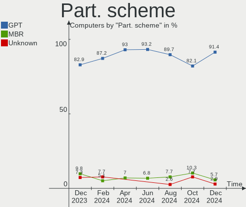
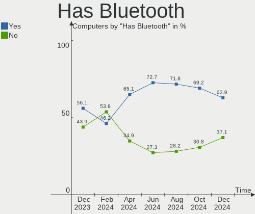
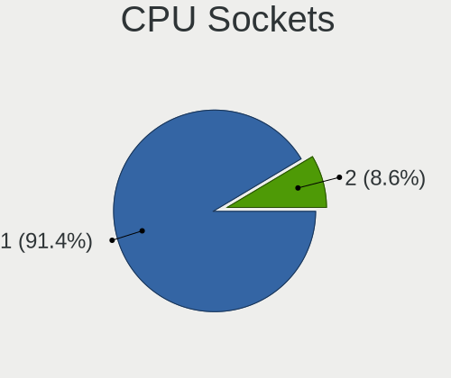
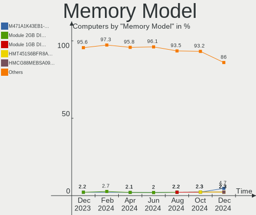
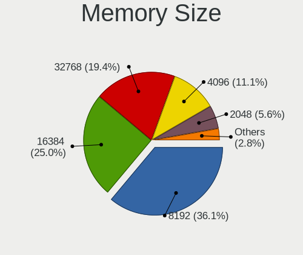

Gentoo Hardware Trends
----------------------

A project to identify most popular hardware characteristics and track their change
over time based on data collected by Gentoo users at https://Linux-Hardware.org.

Anyone can contribute to the study by uploading probes of their computers by
the [hw-probe](https://github.com/linuxhw/hw-probe) tool:

    sudo -E hw-probe -all -upload

This is a report for all computer types. See also reports for [desktops](/Dist/Gentoo/Desktop/README.md) and [notebooks](/Dist/Gentoo/Notebook/README.md).

Full-feature report is available here: https://linux-hardware.org/?view=trends

Period: Apr, 2021.

Contents
--------

- [ OS                       ](#os)
- [ OS Family                ](#os-family)
- [ Kernel                   ](#kernel)
- [ Kernel Family            ](#kernel-family)
- [ Kernel Major Ver.        ](#kernel-major-ver)
- [ Arch                     ](#arch)
- [ DE                       ](#de)
- [ Display Server           ](#display-server)
- [ Display Manager          ](#display-manager)
- [ OS Lang                  ](#os-lang)
- [ Boot Mode                ](#boot-mode)
- [ Filesystem               ](#filesystem)
- [ Part. scheme             ](#part-scheme)
- [ Dual Boot with Linux/BSD ](#dual-boot-with-linux/bsd)
- [ Dual Boot (Win)          ](#dual-boot-win)
- [ Country                  ](#country)
- [ City                     ](#city)
- [ Vendor                   ](#vendor)
- [ Model                    ](#model)
- [ Model Family             ](#model-family)
- [ MFG Year                 ](#mfg-year)
- [ Form Factor              ](#form-factor)
- [ Secure Boot              ](#secure-boot)
- [ Coreboot                 ](#coreboot)
- [ RAM Size                 ](#ram-size)
- [ RAM Used                 ](#ram-used)
- [ Has CD-ROM               ](#has-cd-rom)
- [ Total Drives             ](#total-drives)
- [ Has Ethernet             ](#has-ethernet)
- [ Has WiFi                 ](#has-wifi)
- [ Has Bluetooth            ](#has-bluetooth)
- [ Drive Vendor             ](#drive-vendor)
- [ Drive Model              ](#drive-model)
- [ HDD Vendor               ](#hdd-vendor)
- [ SSD Vendor               ](#ssd-vendor)
- [ Drive Kind               ](#drive-kind)
- [ Drive Connector          ](#drive-connector)
- [ Drive Size               ](#drive-size)
- [ Space Total              ](#space-total)
- [ Space Used               ](#space-used)
- [ Malfunc. Drives          ](#malfunc-drives)
- [ Malfunc. Drive Vendor    ](#malfunc-drive-vendor)
- [ Malfunc. HDD Vendor      ](#malfunc-hdd-vendor)
- [ Malfunc. Drive Kind      ](#malfunc-drive-kind)
- [ Failed Drives            ](#failed-drives)
- [ Failed Drive Vendor      ](#failed-drive-vendor)
- [ Drive Status             ](#drive-status)
- [ Storage Vendor           ](#storage-vendor)
- [ Storage Model            ](#storage-model)
- [ Storage Kind             ](#storage-kind)
- [ CPU Vendor               ](#cpu-vendor)
- [ CPU Model                ](#cpu-model)
- [ CPU Model Family         ](#cpu-model-family)
- [ CPU Cores                ](#cpu-cores)
- [ CPU Sockets              ](#cpu-sockets)
- [ CPU Threads              ](#cpu-threads)
- [ CPU Op-Modes             ](#cpu-op-modes)
- [ CPU Microcode            ](#cpu-microcode)
- [ CPU Microarch            ](#cpu-microarch)
- [ GPU Vendor               ](#gpu-vendor)
- [ GPU Model                ](#gpu-model)
- [ GPU Combo                ](#gpu-combo)
- [ GPU Driver               ](#gpu-driver)
- [ GPU Memory               ](#gpu-memory)
- [ Monitor Vendor           ](#monitor-vendor)
- [ Monitor Model            ](#monitor-model)
- [ Monitor Resolution       ](#monitor-resolution)
- [ Monitor Diagonal         ](#monitor-diagonal)
- [ Monitor Width            ](#monitor-width)
- [ Aspect Ratio             ](#aspect-ratio)
- [ Monitor Area             ](#monitor-area)
- [ Pixel Density            ](#pixel-density)
- [ Multiple Monitors        ](#multiple-monitors)
- [ Net Controller Vendor    ](#net-controller-vendor)
- [ Net Controller Model     ](#net-controller-model)
- [ Wireless Vendor          ](#wireless-vendor)
- [ Wireless Model           ](#wireless-model)
- [ Ethernet Vendor          ](#ethernet-vendor)
- [ Ethernet Model           ](#ethernet-model)
- [ Net Controller Kind      ](#net-controller-kind)
- [ Used Controller          ](#used-controller)
- [ NICs                     ](#nics)
- [ IPv6                     ](#ipv6)
- [ Memory Vendor            ](#memory-vendor)
- [ Memory Model             ](#memory-model)
- [ Memory Kind              ](#memory-kind)
- [ Memory Form Factor       ](#memory-form-factor)
- [ Memory Size              ](#memory-size)
- [ Memory Speed             ](#memory-speed)
- [ Sound Vendor             ](#sound-vendor)
- [ Sound Model              ](#sound-model)
- [ Camera Vendor            ](#camera-vendor)
- [ Camera Model             ](#camera-model)
- [ Fingerprint Vendor       ](#fingerprint-vendor)
- [ Fingerprint Model        ](#fingerprint-model)
- [ Chipcard Vendor          ](#chipcard-vendor)
- [ Chipcard Model           ](#chipcard-model)
- [ Printer Vendor           ](#printer-vendor)
- [ Printer Model            ](#printer-model)
- [ Scanner Vendor           ](#scanner-vendor)
- [ Scanner Model            ](#scanner-model)
- [ Bluetooth Vendor         ](#bluetooth-vendor)
- [ Bluetooth Model          ](#bluetooth-model)
- [ Unsupported Devices      ](#unsupported-devices)
- [ Unsupported Device Types ](#unsupported-device-types)

OS
--

Installed operating systems

| Name       | Computers | Percent |
|------------|-----------|---------|
| Gentoo     | 27        | 71.05%  |
| Gentoo 2.7 | 11        | 28.95%  |

OS Family
---------

OS without a version

| Name   | Computers | Percent |
|--------|-----------|---------|
| Gentoo | 38        | 100%    |

Kernel
------

Version of the Linux kernel

| Version                        | Computers | Percent |
|--------------------------------|-----------|---------|
| 5.10.27-gentoo-x86_64          | 4         | 10.53%  |
| 5.10.27-gentoo                 | 4         | 10.53%  |
| 5.4.97-gentoo-x86_64           | 3         | 7.89%   |
| 5.4.97-gentoo                  | 2         | 5.26%   |
| 5.4.92-gentoo-x86_64           | 2         | 5.26%   |
| 5.11.2-gentoo                  | 2         | 5.26%   |
| 5.11.11-gentoo                 | 2         | 5.26%   |
| 5.10.11-v8                     | 2         | 5.26%   |
| 5.8.18-gentoo-compact-0.3      | 1         | 2.63%   |
| 5.6.14-gentoo                  | 1         | 2.63%   |
| 5.4.97-gentoo_DELL-LATITUDE.X1 | 1         | 2.63%   |
| 5.4.86-gentoo                  | 1         | 2.63%   |
| 5.4.80-gentoo-r1-compact-0.1   | 1         | 2.63%   |
| 5.4.66-gentoo                  | 1         | 2.63%   |
| 5.4.105-gentoo-dist            | 1         | 2.63%   |
| 5.12.0-gentoo                  | 1         | 2.63%   |
| 5.11.11-gentoo-yoshi-hp        | 1         | 2.63%   |
| 5.11.10-gentoo-x86_64.00       | 1         | 2.63%   |
| 5.11.10-gentoo                 | 1         | 2.63%   |
| 5.10.28-gentoo-dist            | 1         | 2.63%   |
| 5.10.27-longterm               | 1         | 2.63%   |
| 5.10.27-gentoo-silverstore     | 1         | 2.63%   |
| 5.10.27-gentoo-fomys           | 1         | 2.63%   |
| 5.10.27-gentoo-dist            | 1         | 2.63%   |
| 4.9.230-mainline-rev1          | 1         | 2.63%   |

Kernel Family
-------------

Linux kernel without a distro release

| Version | Computers | Percent |
|---------|-----------|---------|
| 5.10.27 | 12        | 31.58%  |
| 5.4.97  | 6         | 15.79%  |
| 5.11.11 | 3         | 7.89%   |
| 5.4.92  | 2         | 5.26%   |
| 5.11.2  | 2         | 5.26%   |
| 5.11.10 | 2         | 5.26%   |
| 5.10.11 | 2         | 5.26%   |
| 5.8.18  | 1         | 2.63%   |
| 5.6.14  | 1         | 2.63%   |
| 5.4.86  | 1         | 2.63%   |
| 5.4.80  | 1         | 2.63%   |
| 5.4.66  | 1         | 2.63%   |
| 5.4.105 | 1         | 2.63%   |
| 5.12.0  | 1         | 2.63%   |
| 5.10.28 | 1         | 2.63%   |
| 4.9.230 | 1         | 2.63%   |

Kernel Major Ver.
-----------------

Linux kernel major version

| Version | Computers | Percent |
|---------|-----------|---------|
| 5.10    | 15        | 39.47%  |
| 5.4     | 12        | 31.58%  |
| 5.11    | 7         | 18.42%  |
| 5.8     | 1         | 2.63%   |
| 5.6     | 1         | 2.63%   |
| 5.12    | 1         | 2.63%   |
| 4.9     | 1         | 2.63%   |

Arch
----

OS architecture (x86_64, i586, etc.)

| Name     | Computers | Percent |
|----------|-----------|---------|
| x86_64   | 33        | 86.84%  |
| aarch64  | 2         | 5.26%   |
| i686     | 1         | 2.63%   |
| armv7l   | 1         | 2.63%   |
| armv5tel | 1         | 2.63%   |

DE
--

Desktop Environment

| Name           | Computers | Percent |
|----------------|-----------|---------|
| Unknown        | 14        | 36.84%  |
| KDE5           | 12        | 31.58%  |
| GNOME          | 4         | 10.53%  |
| XFCE           | 3         | 7.89%   |
| MATE           | 1         | 2.63%   |
| KDE            | 1         | 2.63%   |
| i3-with-shmlog | 1         | 2.63%   |
| Enlightenment  | 1         | 2.63%   |
| DWM            | 1         | 2.63%   |

Display Server
--------------

X11 or Wayland

| Name    | Computers | Percent |
|---------|-----------|---------|
| X11     | 21        | 55.26%  |
| Unknown | 14        | 36.84%  |
| Tty     | 2         | 5.26%   |
| Wayland | 1         | 2.63%   |

Display Manager
---------------

SDDM, LightDM, etc.

| Name    | Computers | Percent |
|---------|-----------|---------|
| Unknown | 15        | 39.47%  |
| SDDM    | 14        | 36.84%  |
| LightDM | 6         | 15.79%  |
| GDM     | 2         | 5.26%   |
| XDM     | 1         | 2.63%   |

OS Lang
-------

Language

| Lang       | Computers | Percent |
|------------|-----------|---------|
| en_US      | 14        | 36.84%  |
| C.UTF8     | 6         | 15.79%  |
| en_GB      | 3         | 7.89%   |
| Unknown    | 3         | 7.89%   |
| fr_FR      | 2         | 5.26%   |
| zh_CN      | 1         | 2.63%   |
| pl_PL      | 1         | 2.63%   |
| it_IT      | 1         | 2.63%   |
| es_ES      | 1         | 2.63%   |
| en_US.UTF8 | 1         | 2.63%   |
| en_IE      | 1         | 2.63%   |
| en_EN      | 1         | 2.63%   |
| en_AU      | 1         | 2.63%   |
| de_DE      | 1         | 2.63%   |
| de_CH      | 1         | 2.63%   |

Boot Mode
---------

EFI or BIOS

| Mode | Computers | Percent |
|------|-----------|---------|
| EFI  | 27        | 71.05%  |
| BIOS | 11        | 28.95%  |

Filesystem
----------

Type of filesystem

| Type     | Computers | Percent |
|----------|-----------|---------|
| Ext4     | 21        | 55.26%  |
| Btrfs    | 6         | 15.79%  |
| F2fs     | 4         | 10.53%  |
| Zfs      | 3         | 7.89%   |
| Xfs      | 1         | 2.63%   |
| Reiserfs | 1         | 2.63%   |
| Ext2     | 1         | 2.63%   |
| Unknown  | 1         | 2.63%   |

Part. scheme
------------

Scheme of partitioning

| Type    | Computers | Percent |
|---------|-----------|---------|
| GPT     | 32        | 84.21%  |
| MBR     | 4         | 10.53%  |
| Unknown | 2         | 5.26%   |

Dual Boot with Linux/BSD
------------------------

Hosting more than one Linux/BSD

| Dual boot | Computers | Percent |
|-----------|-----------|---------|
| No        | 23        | 60.53%  |
| Yes       | 15        | 39.47%  |

Dual Boot (Win)
---------------

Hosting Linux and Windows

| Dual boot | Computers | Percent |
|-----------|-----------|---------|
| No        | 27        | 71.05%  |
| Yes       | 11        | 28.95%  |

Country
-------

Geographic location (country)

| Country     | Computers | Percent |
|-------------|-----------|---------|
| Poland      | 7         | 18.42%  |
| France      | 6         | 15.79%  |
| USA         | 4         | 10.53%  |
| Germany     | 4         | 10.53%  |
| Ukraine     | 2         | 5.26%   |
| UK          | 2         | 5.26%   |
| Spain       | 2         | 5.26%   |
| Finland     | 2         | 5.26%   |
| Switzerland | 1         | 2.63%   |
| Sweden      | 1         | 2.63%   |
| Norway      | 1         | 2.63%   |
| Italy       | 1         | 2.63%   |
| Ireland     | 1         | 2.63%   |
| China       | 1         | 2.63%   |
| Canada      | 1         | 2.63%   |
| Brazil      | 1         | 2.63%   |
| Australia   | 1         | 2.63%   |

City
----

Geographic location (city)

| City                 | Computers | Percent |
|----------------------|-----------|---------|
| Warsaw               | 5         | 13.16%  |
| Pont-l'Abbé         | 3         | 7.89%   |
| Berlin               | 2         | 5.26%   |
| Wigan                | 1         | 2.63%   |
| Toulouse             | 1         | 2.63%   |
| Stockholm            | 1         | 2.63%   |
| Silver Spring        | 1         | 2.63%   |
| Sevastopol           | 1         | 2.63%   |
| Rome                 | 1         | 2.63%   |
| Rissa                | 1         | 2.63%   |
| Ribeirão Preto      | 1         | 2.63%   |
| O Milladoiro         | 1         | 2.63%   |
| Melbourne            | 1         | 2.63%   |
| Mason                | 1         | 2.63%   |
| Le Perreux-sur-Marne | 1         | 2.63%   |
| Kyiv                 | 1         | 2.63%   |
| Hyvinkaeae           | 1         | 2.63%   |
| Horgen               | 1         | 2.63%   |
| Helsinki             | 1         | 2.63%   |
| Great Yarmouth       | 1         | 2.63%   |
| Gliwice              | 1         | 2.63%   |
| Frankfurt am Main    | 1         | 2.63%   |
| Ferrol               | 1         | 2.63%   |
| Edmonton             | 1         | 2.63%   |
| Dublin               | 1         | 2.63%   |
| Dalian               | 1         | 2.63%   |
| Cologne              | 1         | 2.63%   |
| Cieszyn              | 1         | 2.63%   |
| Ceyrat               | 1         | 2.63%   |
| Bradenton            | 1         | 2.63%   |
| Baton Rouge          | 1         | 2.63%   |

Vendor
------

Motherboard manufacturer

| Name                    | Computers | Percent |
|-------------------------|-----------|---------|
| ASUSTek Computer        | 8         | 21.05%  |
| Dell                    | 6         | 15.79%  |
| MSI                     | 5         | 13.16%  |
| Hewlett-Packard         | 3         | 7.89%   |
| Gigabyte Technology     | 3         | 7.89%   |
| Raspberry Pi Foundation | 2         | 5.26%   |
| Lenovo                  | 2         | 5.26%   |
| Unknown                 | 2         | 5.26%   |
| ZOTAC                   | 1         | 2.63%   |
| TUXEDO                  | 1         | 2.63%   |
| Supermicro              | 1         | 2.63%   |
| Intel                   | 1         | 2.63%   |
| Fujitsu                 | 1         | 2.63%   |
| ASRockRack              | 1         | 2.63%   |
| ASRock                  | 1         | 2.63%   |

Model
-----

Motherboard model

| Name                                     | Computers | Percent |
|------------------------------------------|-----------|---------|
| MSI MS-7C35                              | 2         | 5.26%   |
| Dell G3 3500                             | 2         | 5.26%   |
| Unknown                                  | 2         | 5.26%   |
| ZOTAC ZBOX                               | 1         | 2.63%   |
| TUXEDO N24_25BU                          | 1         | 2.63%   |
| Supermicro A1SAi                         | 1         | 2.63%   |
| RPi Raspberry Pi 4 Model B Rev 1.1       | 1         | 2.63%   |
| RPi Raspberry Pi 4 Model B               | 1         | 2.63%   |
| MSI MS-7C13                              | 1         | 2.63%   |
| MSI MS-7A40                              | 1         | 2.63%   |
| MSI GE62 6QD                             | 1         | 2.63%   |
| Lenovo ThinkPad P53 20QN001JUS           | 1         | 2.63%   |
| Lenovo ThinkPad P50 20EN0006UK           | 1         | 2.63%   |
| Intel NUC11PAKi5                         | 1         | 2.63%   |
| HP Pavilion ZV6100 (EE984EA#ABZ)         | 1         | 2.63%   |
| HP Pavilion Notebook                     | 1         | 2.63%   |
| HP OMEN by HP Laptop 15-dc1xxx           | 1         | 2.63%   |
| Gigabyte X570 AORUS XTREME               | 1         | 2.63%   |
| Gigabyte B450M AORUS ELITE               | 1         | 2.63%   |
| Gigabyte AB350-Gaming                    | 1         | 2.63%   |
| Fujitsu LIFEBOOK T901                    | 1         | 2.63%   |
| Dell XPS 17 9700                         | 1         | 2.63%   |
| Dell Latitude X1                         | 1         | 2.63%   |
| Dell Latitude 5480                       | 1         | 2.63%   |
| Dell Inspiron 3542                       | 1         | 2.63%   |
| ASUS TUF B450-PRO GAMING                 | 1         | 2.63%   |
| ASUS ROG ZENITH II EXTREME               | 1         | 2.63%   |
| ASUS PRIME Z270-A                        | 1         | 2.63%   |
| ASUS PRIME X570-PRO                      | 1         | 2.63%   |
| ASUS PRIME X470-PRO                      | 1         | 2.63%   |
| ASUS PRIME H270M-PLUS                    | 1         | 2.63%   |
| ASUS M3A78-CM                            | 1         | 2.63%   |
| ASUS ASUS TUF Gaming A15 FA506IV_FA506IV | 1         | 2.63%   |
| ASRockRack E3C232D2I                     | 1         | 2.63%   |
| ASRock C2550D4I                          | 1         | 2.63%   |

Model Family
------------

Motherboard model prefix

| Name                  | Computers | Percent |
|-----------------------|-----------|---------|
| ASUS PRIME            | 4         | 10.53%  |
| RPi Raspberry         | 2         | 5.26%   |
| MSI MS-7C35           | 2         | 5.26%   |
| Lenovo ThinkPad       | 2         | 5.26%   |
| HP Pavilion           | 2         | 5.26%   |
| Dell Latitude         | 2         | 5.26%   |
| Dell G3               | 2         | 5.26%   |
| Unknown               | 2         | 5.26%   |
| ZOTAC ZBOX            | 1         | 2.63%   |
| TUXEDO N24            | 1         | 2.63%   |
| Supermicro A1SAi      | 1         | 2.63%   |
| MSI MS-7C13           | 1         | 2.63%   |
| MSI MS-7A40           | 1         | 2.63%   |
| MSI GE62              | 1         | 2.63%   |
| Intel NUC11PAKi5      | 1         | 2.63%   |
| HP OMEN               | 1         | 2.63%   |
| Gigabyte X570         | 1         | 2.63%   |
| Gigabyte B450M        | 1         | 2.63%   |
| Gigabyte AB350-Gaming | 1         | 2.63%   |
| Fujitsu LIFEBOOK      | 1         | 2.63%   |
| Dell XPS              | 1         | 2.63%   |
| Dell Inspiron         | 1         | 2.63%   |
| ASUS TUF              | 1         | 2.63%   |
| ASUS ROG              | 1         | 2.63%   |
| ASUS M3A78-CM         | 1         | 2.63%   |
| ASUS ASUS             | 1         | 2.63%   |
| ASRockRack E3C232D2I  | 1         | 2.63%   |
| ASRock C2550D4I       | 1         | 2.63%   |

MFG Year
--------

Motherboard manufacture year

| Year    | Computers | Percent |
|---------|-----------|---------|
| 2020    | 13        | 34.21%  |
| 2021    | 5         | 13.16%  |
| 2019    | 4         | 10.53%  |
| 2018    | 4         | 10.53%  |
| 2016    | 3         | 7.89%   |
| Unknown | 3         | 7.89%   |
| 2006    | 2         | 5.26%   |
| 2017    | 1         | 2.63%   |
| 2014    | 1         | 2.63%   |
| 2011    | 1         | 2.63%   |
| 2009    | 1         | 2.63%   |

Form Factor
-----------

Physical design of the computer

| Name           | Computers | Percent |
|----------------|-----------|---------|
| Desktop        | 19        | 50%     |
| Notebook       | 14        | 36.84%  |
| Mini pc        | 3         | 7.89%   |
| System on chip | 2         | 5.26%   |

Secure Boot
-----------

Enabled or disabled

| State    | Computers | Percent |
|----------|-----------|---------|
| Disabled | 37        | 97.37%  |
| Enabled  | 1         | 2.63%   |

Coreboot
--------

Have coreboot on board

| Used | Computers | Percent |
|------|-----------|---------|
| No   | 38        | 100%    |

RAM Size
--------

Total RAM memory

| Size in GB  | Computers | Percent |
|-------------|-----------|---------|
| 32.01-64.0  | 12        | 31.58%  |
| 4.01-8.0    | 8         | 21.05%  |
| 16.01-24.0  | 8         | 21.05%  |
| 64.01-256.0 | 4         | 10.53%  |
| 3.01-4.0    | 2         | 5.26%   |
| 1.01-2.0    | 2         | 5.26%   |
| 2.01-3.0    | 1         | 2.63%   |
| 0.01-0.5    | 1         | 2.63%   |

RAM Used
--------

Used RAM memory

| Used GB    | Computers | Percent |
|------------|-----------|---------|
| 0.01-0.5   | 9         | 23.68%  |
| 3.01-4.0   | 6         | 15.79%  |
| 1.01-2.0   | 6         | 15.79%  |
| 4.01-8.0   | 5         | 13.16%  |
| 2.01-3.0   | 5         | 13.16%  |
| 0.51-1.0   | 3         | 7.89%   |
| 16.01-24.0 | 2         | 5.26%   |
| 8.01-16.0  | 2         | 5.26%   |

Has CD-ROM
----------

Has CD-ROM on board

| Presented | Computers | Percent |
|-----------|-----------|---------|
| No        | 34        | 89.47%  |
| Yes       | 4         | 10.53%  |

Total Drives
------------

Number of drives on board

| Drives | Computers | Percent |
|--------|-----------|---------|
| 2      | 14        | 36.84%  |
| 1      | 13        | 34.21%  |
| 3      | 6         | 15.79%  |
| 6      | 2         | 5.26%   |
| 5      | 1         | 2.63%   |
| 4      | 1         | 2.63%   |
| 0      | 1         | 2.63%   |

Has Ethernet
------------

Has Ethernet on board

| Presented | Computers | Percent |
|-----------|-----------|---------|
| Yes       | 34        | 89.47%  |
| No        | 4         | 10.53%  |

Has WiFi
--------

Has WiFi module

| Presented | Computers | Percent |
|-----------|-----------|---------|
| Yes       | 22        | 57.89%  |
| No        | 16        | 42.11%  |

Has Bluetooth
-------------

Has Bluetooth module

| Presented | Computers | Percent |
|-----------|-----------|---------|
| Yes       | 23        | 60.53%  |
| No        | 15        | 39.47%  |

Drive Vendor
------------

Hard drive vendors

| Vendor              | Computers | Drives | Percent |
|---------------------|-----------|--------|---------|
| Samsung Electronics | 10        | 19     | 15.87%  |
| Seagate             | 9         | 9      | 14.29%  |
| WDC                 | 7         | 8      | 11.11%  |
| Toshiba             | 6         | 6      | 9.52%   |
| Unknown             | 4         | 4      | 6.35%   |
| SanDisk             | 4         | 4      | 6.35%   |
| Kingston            | 4         | 5      | 6.35%   |
| Intel               | 3         | 5      | 4.76%   |
| Hitachi             | 3         | 5      | 4.76%   |
| GOODRAM             | 2         | 2      | 3.17%   |
| Crucial             | 2         | 4      | 3.17%   |
| Corsair             | 2         | 2      | 3.17%   |
| Transcend           | 1         | 1      | 1.59%   |
| Patriot             | 1         | 1      | 1.59%   |
| KIOXIA              | 1         | 1      | 1.59%   |
| HGST                | 1         | 1      | 1.59%   |
| Apacer Z            | 1         | 1      | 1.59%   |
| AMD                 | 1         | 1      | 1.59%   |
| A-DATA Technology   | 1         | 1      | 1.59%   |

Drive Model
-----------

Hard drive models

| Model                                    | Computers | Percent |
|------------------------------------------|-----------|---------|
| WDC WD30EFRX-68EUZN0 3TB                 | 2         | 2.9%    |
| SanDisk SSD PLUS 120GB                   | 2         | 2.9%    |
| Samsung SSD 850 EVO 250GB                | 2         | 2.9%    |
| GOODRAM SSDPR-CL100-480-G2 480GB         | 2         | 2.9%    |
| WDC WDS200T2B0B-00YS70 2TB SSD           | 1         | 1.45%   |
| WDC WD10EZEX-00WN4A0 1TB                 | 1         | 1.45%   |
| WDC PC SN730 SDBQNTY-1T00-1001 1TB       | 1         | 1.45%   |
| WDC PC SN730 NVMe 1024GB                 | 1         | 1.45%   |
| WDC PC SN530 SDBPNPZ-256G-1002 256GB     | 1         | 1.45%   |
| Unknown MMC Card  8GB                    | 1         | 1.45%   |
| Unknown MMC Card  64GB                   | 1         | 1.45%   |
| Unknown MMC Card  32GB                   | 1         | 1.45%   |
| Unknown MMC Card  2GB                    | 1         | 1.45%   |
| Transcend TS8GCF133 8GB                  | 1         | 1.45%   |
| Toshiba THNSNK256GVN8 M.2 2280 256GB SSD | 1         | 1.45%   |
| Toshiba MQ04ABF100 1TB                   | 1         | 1.45%   |
| Toshiba MK6006GAH 64GB                   | 1         | 1.45%   |
| Toshiba KXG60ZNV512G 512GB               | 1         | 1.45%   |
| Toshiba HDWE150 5TB                      | 1         | 1.45%   |
| Toshiba DT01ACA300 3TB                   | 1         | 1.45%   |
| Seagate ST9500420ASG 500GB               | 1         | 1.45%   |
| Seagate ST6000DM003-2CY186 6TB           | 1         | 1.45%   |
| Seagate ST500LX012-SSHD-8GB              | 1         | 1.45%   |
| Seagate ST4000DM004-2CV104 4TB           | 1         | 1.45%   |
| Seagate ST3500413AS 500GB                | 1         | 1.45%   |
| Seagate ST2000LM015-2E8174 2TB           | 1         | 1.45%   |
| Seagate ST2000DX002-2DV164 2TB           | 1         | 1.45%   |
| Seagate ST12000NM0008-2H3101 12TB        | 1         | 1.45%   |
| Seagate ST1000LM048-2E7172 1TB           | 1         | 1.45%   |
| SanDisk SSD PLUS 240GB                   | 1         | 1.45%   |
| SanDisk SD9SN8W-128G-1006 128GB SSD      | 1         | 1.45%   |
| Samsung SSD 980 PRO 500GB                | 1         | 1.45%   |
| Samsung SSD 970 PRO 512GB                | 1         | 1.45%   |
| Samsung SSD 970 EVO Plus 1TB             | 1         | 1.45%   |
| Samsung SSD 970 EVO 500GB                | 1         | 1.45%   |
| Samsung SSD 860 QVO 4TB                  | 1         | 1.45%   |
| Samsung SSD 860 EVO 250GB                | 1         | 1.45%   |
| Samsung SSD 850 PRO 256GB                | 1         | 1.45%   |
| Samsung SSD 850 EVO M.2 1TB              | 1         | 1.45%   |
| Samsung SSD 850 EVO 500GB                | 1         | 1.45%   |
| Samsung SSD 850 EVO 1TB                  | 1         | 1.45%   |
| Samsung PM991 NVMe 512GB                 | 1         | 1.45%   |
| Samsung NVMe SSD Drive 256GB             | 1         | 1.45%   |
| Samsung HD502HI 500GB                    | 1         | 1.45%   |
| Patriot Ignite 480GB SSD                 | 1         | 1.45%   |
| KIOXIA KBG40ZNS256G NVMe 256GB           | 1         | 1.45%   |
| Kingston SV300S37A240G 240GB SSD         | 1         | 1.45%   |
| Kingston SUV400S37120G 120GB SSD         | 1         | 1.45%   |
| Kingston SA400S37240G 240GB SSD          | 1         | 1.45%   |
| Kingston SA400S37120G 120GB SSD          | 1         | 1.45%   |
| Kingston SA2000M81000G 1TB               | 1         | 1.45%   |
| Intel SSDSC2BA100G3 100GB                | 1         | 1.45%   |
| Intel SSDPEKNW512G8 512GB                | 1         | 1.45%   |
| Intel SSDPEKNW010T8 1TB                  | 1         | 1.45%   |
| Hitachi HUS724030ALE641 3TB              | 1         | 1.45%   |
| Hitachi HTS547575A9E384 752GB            | 1         | 1.45%   |
| Hitachi HDP725050GLA360 500GB            | 1         | 1.45%   |
| HGST HTS545050A7E380 500GB               | 1         | 1.45%   |
| Crucial CT525MX300SSD1 528GB             | 1         | 1.45%   |
| Crucial CT500P5SSD8 500GB                | 1         | 1.45%   |

HDD Vendor
----------

Hard disk drive vendors

| Vendor              | Computers | Drives | Percent |
|---------------------|-----------|--------|---------|
| Seagate             | 9         | 9      | 42.86%  |
| Toshiba             | 4         | 4      | 19.05%  |
| WDC                 | 3         | 4      | 14.29%  |
| Hitachi             | 3         | 5      | 14.29%  |
| Samsung Electronics | 1         | 3      | 4.76%   |
| HGST                | 1         | 1      | 4.76%   |

SSD Vendor
----------

Solid state drive vendors

| Vendor              | Computers | Drives | Percent |
|---------------------|-----------|--------|---------|
| Samsung Electronics | 6         | 9      | 27.27%  |
| SanDisk             | 4         | 4      | 18.18%  |
| Kingston            | 3         | 4      | 13.64%  |
| GOODRAM             | 2         | 2      | 9.09%   |
| WDC                 | 1         | 1      | 4.55%   |
| Transcend           | 1         | 1      | 4.55%   |
| Toshiba             | 1         | 1      | 4.55%   |
| Patriot             | 1         | 1      | 4.55%   |
| Intel               | 1         | 2      | 4.55%   |
| Crucial             | 1         | 1      | 4.55%   |
| AMD                 | 1         | 1      | 4.55%   |

Drive Kind
----------

HDD or SSD

| Kind | Computers | Drives | Percent |
|------|-----------|--------|---------|
| SSD  | 20        | 27     | 34.48%  |
| NVMe | 18        | 23     | 31.03%  |
| HDD  | 16        | 26     | 27.59%  |
| MMC  | 4         | 4      | 6.9%    |

Drive Connector
---------------

SATA, SAS, NVMe, etc.

| Type | Computers | Drives | Percent |
|------|-----------|--------|---------|
| SATA | 28        | 53     | 56%     |
| NVMe | 17        | 22     | 34%     |
| MMC  | 4         | 4      | 8%      |
| SAS  | 1         | 1      | 2%      |

Drive Size
----------

Size of hard drive

| Size in TB | Computers | Drives | Percent |
|------------|-----------|--------|---------|
| 0.01-0.5   | 19        | 31     | 50%     |
| 0.51-1.0   | 7         | 7      | 18.42%  |
| 2.01-3.0   | 4         | 7      | 10.53%  |
| 1.01-2.0   | 3         | 3      | 7.89%   |
| 3.01-4.0   | 2         | 2      | 5.26%   |
| 4.01-10.0  | 2         | 2      | 5.26%   |
| 10.01-20.0 | 1         | 1      | 2.63%   |

Space Total
-----------

Amount of disk space available on the file system

| Size in GB     | Computers | Percent |
|----------------|-----------|---------|
| 101-250        | 7         | 18.42%  |
| 501-1000       | 7         | 18.42%  |
| 251-500        | 5         | 13.16%  |
| Unknown        | 5         | 13.16%  |
| 1001-2000      | 4         | 10.53%  |
| 1-20           | 3         | 7.89%   |
| 51-100         | 3         | 7.89%   |
| More than 3000 | 2         | 5.26%   |
| 21-50          | 1         | 2.63%   |
| 2001-3000      | 1         | 2.63%   |

Space Used
----------

Amount of used disk space

| Used GB        | Computers | Percent |
|----------------|-----------|---------|
| 1-20           | 9         | 23.68%  |
| 21-50          | 8         | 21.05%  |
| Unknown        | 5         | 13.16%  |
| 251-500        | 4         | 10.53%  |
| 101-250        | 4         | 10.53%  |
| 51-100         | 3         | 7.89%   |
| 501-1000       | 2         | 5.26%   |
| More than 3000 | 1         | 2.63%   |
| 2001-3000      | 1         | 2.63%   |
| 1001-2000      | 1         | 2.63%   |

Malfunc. Drives
---------------

Drive models with a malfunction

| Model                                    | Computers | Drives | Percent |
|------------------------------------------|-----------|--------|---------|
| Toshiba THNSNK256GVN8 M.2 2280 256GB SSD | 1         | 1      | 25%     |
| Toshiba DT01ACA300 3TB                   | 1         | 1      | 25%     |
| Seagate ST2000DX002-2DV164 2TB           | 1         | 1      | 25%     |
| SanDisk SD9SN8W-128G-1006 128GB SSD      | 1         | 1      | 25%     |

Malfunc. Drive Vendor
---------------------

Vendors of faulty drives

| Vendor  | Computers | Drives | Percent |
|---------|-----------|--------|---------|
| Toshiba | 2         | 2      | 50%     |
| Seagate | 1         | 1      | 25%     |
| SanDisk | 1         | 1      | 25%     |

Malfunc. HDD Vendor
-------------------

Vendors of faulty HDD drives

| Vendor  | Computers | Drives | Percent |
|---------|-----------|--------|---------|
| Toshiba | 1         | 1      | 50%     |
| Seagate | 1         | 1      | 50%     |

Malfunc. Drive Kind
-------------------

Kinds of faulty drives

| Kind | Computers | Drives | Percent |
|------|-----------|--------|---------|
| SSD  | 2         | 2      | 50%     |
| HDD  | 2         | 2      | 50%     |

Failed Drives
-------------

Failed drive models

Zero info for selected period =(

Failed Drive Vendor
-------------------

Failed drive vendors

Zero info for selected period =(

Drive Status
------------

Number of failed and malfunc. drives

| Status   | Computers | Drives | Percent |
|----------|-----------|--------|---------|
| Works    | 32        | 62     | 74.42%  |
| Detected | 7         | 14     | 16.28%  |
| Malfunc  | 4         | 4      | 9.3%    |

Storage Vendor
--------------

Storage controller vendors

| Vendor                       | Computers | Percent |
|------------------------------|-----------|---------|
| Intel                        | 19        | 38%     |
| AMD                          | 13        | 26%     |
| Samsung Electronics          | 6         | 12%     |
| Sandisk                      | 3         | 6%      |
| Phison Electronics           | 2         | 4%      |
| Toshiba America Info Systems | 1         | 2%      |
| Micron/Crucial Technology    | 1         | 2%      |
| Marvell Technology Group     | 1         | 2%      |
| KIOXIA                       | 1         | 2%      |
| Kingston Technology Company  | 1         | 2%      |
| ASMedia Technology           | 1         | 2%      |
| ADATA Technology             | 1         | 2%      |

Storage Model
-------------

Storage controller models

| Model                                                                         | Computers | Percent |
|-------------------------------------------------------------------------------|-----------|---------|
| AMD FCH SATA Controller [AHCI mode]                                           | 11        | 18.33%  |
| AMD 400 Series Chipset SATA Controller                                        | 4         | 6.67%   |
| Samsung NVMe SSD Controller SM981/PM981/PM983                                 | 3         | 5%      |
| Intel 200 Series PCH SATA controller [AHCI mode]                              | 3         | 5%      |
| Sandisk WD Black SN750 / PC SN730 NVMe SSD                                    | 2         | 3.33%   |
| Phison E16 PCIe4 NVMe Controller                                              | 2         | 3.33%   |
| Intel Sunrise Point-LP SATA Controller [AHCI mode]                            | 2         | 3.33%   |
| Intel SSD 660P Series                                                         | 2         | 3.33%   |
| Intel Q170/Q150/B150/H170/H110/Z170/CM236 Chipset SATA Controller [AHCI Mode] | 2         | 3.33%   |
| Intel Atom processor C2000 AHCI SATA3 Controller                              | 2         | 3.33%   |
| Intel Atom processor C2000 AHCI SATA2 Controller                              | 2         | 3.33%   |
| Intel 82801 Mobile SATA Controller [RAID mode]                                | 2         | 3.33%   |
| Intel 400 Series Chipset Family SATA AHCI Controller                          | 2         | 3.33%   |
| Toshiba America Info Systems XG6 NVMe SSD Controller                          | 1         | 1.67%   |
| Sandisk WD Blue SN550 NVMe SSD                                                | 1         | 1.67%   |
| Samsung NVMe SSD Controller SM951/PM951                                       | 1         | 1.67%   |
| Samsung NVMe SSD Controller PM9A1/980PRO                                      | 1         | 1.67%   |
| Samsung NVMe Controller                                                       | 1         | 1.67%   |
| Micron/Crucial Non-Volatile memory controller                                 | 1         | 1.67%   |
| Marvell Group 88SE9230 PCIe 2.0 x2 4-port SATA 6 Gb/s RAID Controller         | 1         | 1.67%   |
| Marvell Group 88SE9172 SATA 6Gb/s Controller                                  | 1         | 1.67%   |
| KIOXIA Non-Volatile memory controller                                         | 1         | 1.67%   |
| Kingston Company A2000 NVMe SSD                                               | 1         | 1.67%   |
| Intel Wildcat Point-LP SATA Controller [AHCI Mode]                            | 1         | 1.67%   |
| Intel HM170/QM170 Chipset SATA Controller [AHCI Mode]                         | 1         | 1.67%   |
| Intel 82801FB/FBM/FR/FW/FRW (ICH6 Family) IDE Controller                      | 1         | 1.67%   |
| Intel 8 Series SATA Controller 1 [AHCI mode]                                  | 1         | 1.67%   |
| Intel 6 Series/C200 Series Chipset Family 6 port Mobile SATA AHCI Controller  | 1         | 1.67%   |
| ASMedia ASM1062 Serial ATA Controller                                         | 1         | 1.67%   |
| AMD SB7x0/SB8x0/SB9x0 SATA Controller [IDE mode]                              | 1         | 1.67%   |
| AMD SB7x0/SB8x0/SB9x0 IDE Controller                                          | 1         | 1.67%   |
| AMD IXP SB4x0 IDE Controller                                                  | 1         | 1.67%   |
| AMD 300 Series Chipset SATA Controller                                        | 1         | 1.67%   |
| ADATA XPG SX8200 Pro PCIe Gen3x4 M.2 2280 Solid State Drive                   | 1         | 1.67%   |

Storage Kind
------------

Kind of storage controller (IDE, SATA, NVMe, SAS, ...)

| Kind | Computers | Percent |
|------|-----------|---------|
| SATA | 27        | 55.1%   |
| NVMe | 17        | 34.69%  |
| IDE  | 3         | 6.12%   |
| RAID | 2         | 4.08%   |

CPU Vendor
----------

Processor vendors

| Vendor                | Computers | Percent |
|-----------------------|-----------|---------|
| Intel                 | 21        | 55.26%  |
| AMD                   | 13        | 34.21%  |
| Marvell Semiconductor | 2         | 5.26%   |
| ARM                   | 2         | 5.26%   |

CPU Model
---------

Processor models

| Model                                                                    | Computers | Percent |
|--------------------------------------------------------------------------|-----------|---------|
| Intel Core i7-9750H CPU @ 2.60GHz                                        | 2         | 5.26%   |
| Intel Core i7-7500U CPU @ 2.70GHz                                        | 2         | 5.26%   |
| ARM Processor                                                            | 2         | 5.26%   |
| AMD Ryzen 9 3950X 16-Core Processor                                      | 2         | 5.26%   |
| Marvell Semiconductor Marvell Kirkwood (Flattened Device Tree) Processor | 1         | 2.63%   |
| Marvell Semiconductor Marvell Armada 370/XP (Device Tree) Processor      | 1         | 2.63%   |
| Intel Xeon CPU E3-1220 v6 @ 3.00GHz                                      | 1         | 2.63%   |
| Intel Pentium M processor 1.10GHz                                        | 1         | 2.63%   |
| Intel Core i9-10885H CPU @ 2.40GHz                                       | 1         | 2.63%   |
| Intel Core i7-7700K CPU @ 4.20GHz                                        | 1         | 2.63%   |
| Intel Core i7-6820HQ CPU @ 2.70GHz                                       | 1         | 2.63%   |
| Intel Core i7-6700HQ CPU @ 2.60GHz                                       | 1         | 2.63%   |
| Intel Core i7-10750H CPU @ 2.60GHz                                       | 1         | 2.63%   |
| Intel Core i5-7600K CPU @ 3.80GHz                                        | 1         | 2.63%   |
| Intel Core i5-6300U CPU @ 2.40GHz                                        | 1         | 2.63%   |
| Intel Core i5-5200U CPU @ 2.20GHz                                        | 1         | 2.63%   |
| Intel Core i5-2520M CPU @ 2.50GHz                                        | 1         | 2.63%   |
| Intel Core i5-10300H CPU @ 2.50GHz                                       | 1         | 2.63%   |
| Intel Core i3-9100F CPU @ 3.60GHz                                        | 1         | 2.63%   |
| Intel Core i3-4030U CPU @ 1.90GHz                                        | 1         | 2.63%   |
| Intel Atom CPU C2758 @ 2.40GHz                                           | 1         | 2.63%   |
| Intel Atom CPU C2550 @ 2.40GHz                                           | 1         | 2.63%   |
| Intel 11th Gen Core i5-1135G7 @ 2.40GHz                                  | 1         | 2.63%   |
| AMD Ryzen Threadripper 3960X 24-Core Processor                           | 1         | 2.63%   |
| AMD Ryzen 9 5900X 12-Core Processor                                      | 1         | 2.63%   |
| AMD Ryzen 7 4800H with Radeon Graphics                                   | 1         | 2.63%   |
| AMD Ryzen 7 3800XT 8-Core Processor                                      | 1         | 2.63%   |
| AMD Ryzen 7 3700X 8-Core Processor                                       | 1         | 2.63%   |
| AMD Ryzen 7 2700X Eight-Core Processor                                   | 1         | 2.63%   |
| AMD Ryzen 5 3600 6-Core Processor                                        | 1         | 2.63%   |
| AMD Ryzen 5 2600 Six-Core Processor                                      | 1         | 2.63%   |
| AMD Ryzen 5 1600 Six-Core Processor                                      | 1         | 2.63%   |
| AMD Phenom II X4 955 Processor                                           | 1         | 2.63%   |
| AMD Athlon 64 Processor 3200+                                            | 1         | 2.63%   |

CPU Model Family
----------------

Processor model prefix

| Model                  | Computers | Percent |
|------------------------|-----------|---------|
| Intel Core i7          | 8         | 21.05%  |
| Other                  | 5         | 13.16%  |
| Intel Core i5          | 5         | 13.16%  |
| AMD Ryzen 7            | 4         | 10.53%  |
| AMD Ryzen 9            | 3         | 7.89%   |
| AMD Ryzen 5            | 3         | 7.89%   |
| Intel Core i3          | 2         | 5.26%   |
| Intel Atom             | 2         | 5.26%   |
| Intel Xeon             | 1         | 2.63%   |
| Intel Pentium M        | 1         | 2.63%   |
| Intel Core i9          | 1         | 2.63%   |
| AMD Ryzen Threadripper | 1         | 2.63%   |
| AMD Phenom II X4       | 1         | 2.63%   |
| AMD Athlon 64          | 1         | 2.63%   |

CPU Cores
---------

Number of processor cores

| Number | Computers | Percent |
|--------|-----------|---------|
| 4      | 13        | 34.21%  |
| 8      | 6         | 15.79%  |
| 6      | 6         | 15.79%  |
| 2      | 6         | 15.79%  |
| 1      | 3         | 7.89%   |
| 16     | 2         | 5.26%   |
| 24     | 1         | 2.63%   |
| 12     | 1         | 2.63%   |

CPU Sockets
-----------

Number of sockets

| Number | Computers | Percent |
|--------|-----------|---------|
| 1      | 38        | 100%    |

CPU Threads
-----------

Threads per core (Hyper-Threading)

| Number | Computers | Percent |
|--------|-----------|---------|
| 2      | 26        | 68.42%  |
| 1      | 12        | 31.58%  |

CPU Op-Modes
------------

CPU Operation Modes (32-bit, 64-bit)

| Op mode        | Computers | Percent |
|----------------|-----------|---------|
| 32-bit, 64-bit | 35        | 92.11%  |
| Unknown        | 2         | 5.26%   |
| 32-bit         | 1         | 2.63%   |

CPU Microcode
-------------

Microcode number

| Number     | Computers | Percent |
|------------|-----------|---------|
| Unknown    | 6         | 15.79%  |
| 0x08701021 | 4         | 10.53%  |
| 0xa0652    | 3         | 7.89%   |
| 0x906ea    | 3         | 7.89%   |
| 0x906e9    | 3         | 7.89%   |
| 0x806e9    | 2         | 5.26%   |
| 0x506e3    | 2         | 5.26%   |
| 0x0800820d | 2         | 5.26%   |
| 0x806c1    | 1         | 2.63%   |
| 0x6d8      | 1         | 2.63%   |
| 0x406e3    | 1         | 2.63%   |
| 0x406d8    | 1         | 2.63%   |
| 0x40651    | 1         | 2.63%   |
| 0x306d4    | 1         | 2.63%   |
| 0x206a7    | 1         | 2.63%   |
| 0x0a201009 | 1         | 2.63%   |
| 0x08701013 | 1         | 2.63%   |
| 0x08600104 | 1         | 2.63%   |
| 0x08301039 | 1         | 2.63%   |
| 0x08001138 | 1         | 2.63%   |
| 0x010000db | 1         | 2.63%   |

CPU Microarch
-------------

Microarchitecture

| Name        | Computers | Percent |
|-------------|-----------|---------|
| KabyLake    | 8         | 21.05%  |
| Zen 2       | 7         | 18.42%  |
| Unknown     | 4         | 10.53%  |
| Zen+        | 3         | 7.89%   |
| Skylake     | 3         | 7.89%   |
| CometLake   | 3         | 7.89%   |
| Silvermont  | 2         | 5.26%   |
| Zen 3       | 1         | 2.63%   |
| TigerLake   | 1         | 2.63%   |
| SandyBridge | 1         | 2.63%   |
| P6          | 1         | 2.63%   |
| K8 Hammer   | 1         | 2.63%   |
| K10         | 1         | 2.63%   |
| Haswell     | 1         | 2.63%   |
| Broadwell   | 1         | 2.63%   |

GPU Vendor
----------

Vendors of graphics cards

| Vendor            | Computers | Percent |
|-------------------|-----------|---------|
| Nvidia            | 18        | 41.86%  |
| Intel             | 13        | 30.23%  |
| AMD               | 9         | 20.93%  |
| ASPEED Technology | 3         | 6.98%   |

GPU Model
---------

Graphics card models

| Model                                                                     | Computers | Percent |
|---------------------------------------------------------------------------|-----------|---------|
| Intel CometLake-H GT2 [UHD Graphics]                                      | 3         | 6.82%   |
| ASPEED Technology ASPEED Graphics Family                                  | 3         | 6.82%   |
| Intel HD Graphics 620                                                     | 2         | 4.55%   |
| Intel HD Graphics 530                                                     | 2         | 4.55%   |
| AMD Vega 10 XL/XT [Radeon RX Vega 56/64]                                  | 2         | 4.55%   |
| AMD Navi 21 [Radeon RX 6800/6800 XT / 6900 XT]                            | 2         | 4.55%   |
| Nvidia TU117M [GeForce GTX 1650 Ti Mobile]                                | 1         | 2.27%   |
| Nvidia TU117M [GeForce GTX 1650 Mobile / Max-Q]                           | 1         | 2.27%   |
| Nvidia TU117M                                                             | 1         | 2.27%   |
| Nvidia TU117GLM [Quadro T1000 Mobile]                                     | 1         | 2.27%   |
| Nvidia TU106M [GeForce RTX 2060 Mobile]                                   | 1         | 2.27%   |
| Nvidia TU106M [GeForce RTX 2060 Max-Q]                                    | 1         | 2.27%   |
| Nvidia TU106 [GeForce RTX 2060 Rev. A]                                    | 1         | 2.27%   |
| Nvidia TU102 [GeForce RTX 2080 Ti Rev. A]                                 | 1         | 2.27%   |
| Nvidia GP104 [GeForce GTX 1060 3GB]                                       | 1         | 2.27%   |
| Nvidia GP102 [GeForce GTX 1080 Ti]                                        | 1         | 2.27%   |
| Nvidia GM206 [GeForce GTX 960]                                            | 1         | 2.27%   |
| Nvidia GM204M [GeForce GTX 970M]                                          | 1         | 2.27%   |
| Nvidia GM108M [GeForce 940MX]                                             | 1         | 2.27%   |
| Nvidia GM107M [GeForce GTX 960M]                                          | 1         | 2.27%   |
| Nvidia GM107GLM [Quadro M2000M]                                           | 1         | 2.27%   |
| Nvidia GK208B [GeForce GT 710]                                            | 1         | 2.27%   |
| Nvidia GA106 [GeForce RTX 3060]                                           | 1         | 2.27%   |
| Nvidia GA104 [GeForce RTX 3070]                                           | 1         | 2.27%   |
| Nvidia G73 [GeForce 7300 GT]                                              | 1         | 2.27%   |
| Intel TigerLake-LP GT2 [Iris Xe Graphics]                                 | 1         | 2.27%   |
| Intel Skylake GT2 [HD Graphics 520]                                       | 1         | 2.27%   |
| Intel Mobile 915GM/GMS/910GML Express Graphics Controller                 | 1         | 2.27%   |
| Intel Haswell-ULT Integrated Graphics Controller                          | 1         | 2.27%   |
| Intel CoffeeLake-H GT2 [UHD Graphics 630]                                 | 1         | 2.27%   |
| Intel 2nd Generation Core Processor Family Integrated Graphics Controller | 1         | 2.27%   |
| AMD RS780C [Radeon 3100]                                                  | 1         | 2.27%   |
| AMD RS480M [Mobility Radeon Xpress 200]                                   | 1         | 2.27%   |
| AMD Renoir                                                                | 1         | 2.27%   |
| AMD Ellesmere [Radeon RX 470/480/570/570X/580/580X/590]                   | 1         | 2.27%   |
| AMD Baffin [Radeon RX 550 640SP / RX 560/560X]                            | 1         | 2.27%   |

GPU Combo
---------

Combinations of graphics cards

| Name           | Computers | Percent |
|----------------|-----------|---------|
| 1 x Nvidia     | 8         | 21.05%  |
| Intel + Nvidia | 7         | 18.42%  |
| 1 x AMD        | 7         | 18.42%  |
| 1 x Intel      | 6         | 15.79%  |
| Other          | 4         | 10.53%  |
| 1 x ASPEED     | 3         | 7.89%   |
| AMD + Nvidia   | 2         | 5.26%   |
| 2 x Nvidia     | 1         | 2.63%   |

GPU Driver
----------

Free vs proprietary

| Driver      | Computers | Percent |
|-------------|-----------|---------|
| Free        | 21        | 55.26%  |
| Proprietary | 9         | 23.68%  |
| Unknown     | 8         | 21.05%  |

GPU Memory
----------

Total video memory

| Size in GB | Computers | Percent |
|------------|-----------|---------|
| Unknown    | 20        | 52.63%  |
| 3.01-4.0   | 4         | 10.53%  |
| 1.01-2.0   | 3         | 7.89%   |
| 8.01-16.0  | 3         | 7.89%   |
| 0.01-0.5   | 3         | 7.89%   |
| 7.01-8.0   | 2         | 5.26%   |
| 2.01-3.0   | 2         | 5.26%   |
| 5.01-6.0   | 1         | 2.63%   |

Monitor Vendor
--------------

Monitor vendors

| Vendor               | Computers | Percent |
|----------------------|-----------|---------|
| Samsung Electronics  | 4         | 12.12%  |
| LG Display           | 4         | 12.12%  |
| Philips              | 3         | 9.09%   |
| Ancor Communications | 3         | 9.09%   |
| Iiyama               | 2         | 6.06%   |
| Goldstar             | 2         | 6.06%   |
| Gigabyte Technology  | 2         | 6.06%   |
| Dell                 | 2         | 6.06%   |
| Chimei Innolux       | 2         | 6.06%   |
| BOE                  | 2         | 6.06%   |
| AU Optronics         | 2         | 6.06%   |
| Unknown              | 1         | 3.03%   |
| Toshiba              | 1         | 3.03%   |
| Sharp                | 1         | 3.03%   |
| Eizo                 | 1         | 3.03%   |
| AOC                  | 1         | 3.03%   |

Monitor Model
-------------

Monitor models

| Model                                                                 | Computers | Percent |
|-----------------------------------------------------------------------|-----------|---------|
| Goldstar 27GL850 GSM5B7F 2560x1440 597x336mm 27.0-inch                | 2         | 5.71%   |
| Chimei Innolux LCD Monitor CMN15E8 1920x1080 344x193mm 15.5-inch      | 2         | 5.71%   |
| Unknown LCD Monitor XMI Mi Monitor 3440x1440                          | 1         | 2.86%   |
| Toshiba LCD Monitor LCD5800 1280x800 264x159mm 12.1-inch              | 1         | 2.86%   |
| Sharp LCD Monitor SHP14D6 3840x2400 366x229mm 17.0-inch               | 1         | 2.86%   |
| Samsung Electronics SyncMaster SAM05FC 1920x1080                      | 1         | 2.86%   |
| Samsung Electronics S22B300 SAM08C8 1920x1080 480x270mm 21.7-inch     | 1         | 2.86%   |
| Samsung Electronics C49HG9x SAM0E5E 3840x1080 1196x336mm 48.9-inch    | 1         | 2.86%   |
| Samsung Electronics C32HG7x SAM0E14 2560x1440 700x390mm 31.5-inch     | 1         | 2.86%   |
| Philips PHL 288P6L PHL08F2 3840x2160 621x341mm 27.9-inch              | 1         | 2.86%   |
| Philips LCD Monitor PHL 275E1 3926x1440                               | 1         | 2.86%   |
| Philips LCD Monitor PHL 193V5                                         | 1         | 2.86%   |
| Philips 170X PHLC00F 1280x1024 338x270mm 17.0-inch                    | 1         | 2.86%   |
| LG Display LCD Monitor LGD05F2 1920x1080 344x194mm 15.5-inch          | 1         | 2.86%   |
| LG Display LCD Monitor LGD054F 1920x1080 344x194mm 15.5-inch          | 1         | 2.86%   |
| LG Display LCD Monitor LGD046F 1920x1080 344x194mm 15.5-inch          | 1         | 2.86%   |
| LG Display LCD Monitor LGD046D 1920x1080 309x174mm 14.0-inch          | 1         | 2.86%   |
| Iiyama PLX2483H IVM6114 1920x1080 531x299mm 24.0-inch                 | 1         | 2.86%   |
| Iiyama PL3288UH IVM7610 3840x2160 700x390mm 31.5-inch                 | 1         | 2.86%   |
| Gigabyte Technology G34WQC GBT3400 3440x1440 797x334mm 34.0-inch      | 1         | 2.86%   |
| Gigabyte Technology AORUS FI27Q GBT2706 2560x1440 610x350mm 27.7-inch | 1         | 2.86%   |
| Eizo S1901 ENC1837 1280x1024 376x301mm 19.0-inch                      | 1         | 2.86%   |
| Eizo EV2416W ENC2388 1920x1200 519x324mm 24.1-inch                    | 1         | 2.86%   |
| Dell U2715H DELD065 2560x1440 597x336mm 27.0-inch                     | 1         | 2.86%   |
| Dell 2209WA DELF011 1680x1050 474x296mm 22.0-inch                     | 1         | 2.86%   |
| BOE LCD Monitor BOE0A28 1280x800 286x179mm 13.3-inch                  | 1         | 2.86%   |
| BOE LCD Monitor BOE0819 1920x1080 344x194mm 15.5-inch                 | 1         | 2.86%   |
| AU Optronics LCD Monitor AUO38ED 1920x1080 340x190mm 15.3-inch        | 1         | 2.86%   |
| AU Optronics LCD Monitor AUO213D 1920x1080 309x173mm 13.9-inch        | 1         | 2.86%   |
| AOC LCD Monitor U2879G6 1920x1080                                     | 1         | 2.86%   |
| Ancor Communications VG248 ACI24A4 1920x1080 530x300mm 24.0-inch      | 1         | 2.86%   |
| Ancor Communications ROG PG279Q ACI27EC 2560x1440 598x336mm 27.0-inch | 1         | 2.86%   |
| Ancor Communications ASUS MX239 ACI23C2 1920x1080 530x310mm 24.2-inch | 1         | 2.86%   |

Monitor Resolution
------------------

Monitor screen resolution

| Resolution         | Computers | Percent |
|--------------------|-----------|---------|
| 1920x1080 (FHD)    | 15        | 42.86%  |
| 2560x1440 (QHD)    | 6         | 17.14%  |
| 3840x2160 (4K)     | 2         | 5.71%   |
| 3440x1440          | 2         | 5.71%   |
| 1280x1024 (SXGA)   | 2         | 5.71%   |
| 3926x1440          | 1         | 2.86%   |
| 3840x2400          | 1         | 2.86%   |
| 3840x1080          | 1         | 2.86%   |
| 1920x1200 (WUXGA)  | 1         | 2.86%   |
| 1680x1050 (WSXGA+) | 1         | 2.86%   |
| 1280x800 (WXGA)    | 1         | 2.86%   |
| 1280x768           | 1         | 2.86%   |
| Unknown            | 1         | 2.86%   |

Monitor Diagonal
----------------

Diagonal size in inches

| Inches  | Computers | Percent |
|---------|-----------|---------|
| 15      | 7         | 20.59%  |
| 27      | 6         | 17.65%  |
| 24      | 4         | 11.76%  |
| Unknown | 4         | 11.76%  |
| 31      | 2         | 5.88%   |
| 17      | 2         | 5.88%   |
| 14      | 2         | 5.88%   |
| 49      | 1         | 2.94%   |
| 34      | 1         | 2.94%   |
| 22      | 1         | 2.94%   |
| 21      | 1         | 2.94%   |
| 19      | 1         | 2.94%   |
| 13      | 1         | 2.94%   |
| 12      | 1         | 2.94%   |

Monitor Width
-------------

Physical width

| Width in mm | Computers | Percent |
|-------------|-----------|---------|
| 301-350     | 10        | 30.3%   |
| 501-600     | 7         | 21.21%  |
| 601-700     | 4         | 12.12%  |
| Unknown     | 4         | 12.12%  |
| 401-500     | 2         | 6.06%   |
| 351-400     | 2         | 6.06%   |
| 201-300     | 2         | 6.06%   |
| 701-800     | 1         | 3.03%   |
| 1001-1500   | 1         | 3.03%   |

Aspect Ratio
------------

Proportional relationship between the width and the height

| Ratio   | Computers | Percent |
|---------|-----------|---------|
| 16/9    | 19        | 63.33%  |
| 16/10   | 4         | 13.33%  |
| Unknown | 3         | 10%     |
| 5/4     | 2         | 6.67%   |
| 32/9    | 1         | 3.33%   |
| 21/9    | 1         | 3.33%   |

Monitor Area
------------

Area in inch²

| Area in inch² | Computers | Percent |
|----------------|-----------|---------|
| 101-110        | 7         | 20.59%  |
| 301-350        | 6         | 17.65%  |
| 201-250        | 4         | 11.76%  |
| Unknown        | 4         | 11.76%  |
| 351-500        | 3         | 8.82%   |
| 81-90          | 2         | 5.88%   |
| 251-300        | 2         | 5.88%   |
| 71-80          | 1         | 2.94%   |
| 61-70          | 1         | 2.94%   |
| 151-200        | 1         | 2.94%   |
| 141-150        | 1         | 2.94%   |
| 121-130        | 1         | 2.94%   |
| 501-1000       | 1         | 2.94%   |

Pixel Density
-------------

Pixels per inch

| Density       | Computers | Percent |
|---------------|-----------|---------|
| 121-160       | 11        | 36.67%  |
| 101-120       | 7         | 23.33%  |
| 51-100        | 6         | 20%     |
| Unknown       | 4         | 13.33%  |
| More than 240 | 1         | 3.33%   |
| 1-50          | 1         | 3.33%   |

Multiple Monitors
-----------------

Total monitors connected

| Total | Computers | Percent |
|-------|-----------|---------|
| 1     | 23        | 60.53%  |
| 0     | 8         | 21.05%  |
| 2     | 5         | 13.16%  |
| 3     | 2         | 5.26%   |

Net Controller Vendor
---------------------

Controller vendors

| Vendor                 | Computers | Percent |
|------------------------|-----------|---------|
| Intel                  | 25        | 47.17%  |
| Realtek Semiconductor  | 17        | 32.08%  |
| Qualcomm Atheros       | 2         | 3.77%   |
| Broadcom               | 2         | 3.77%   |
| Xiaomi                 | 1         | 1.89%   |
| Qualcomm               | 1         | 1.89%   |
| Metrologic Instruments | 1         | 1.89%   |
| Lenovo                 | 1         | 1.89%   |
| ASIX Electronics       | 1         | 1.89%   |
| Aquantia               | 1         | 1.89%   |
| AMD                    | 1         | 1.89%   |

Net Controller Model
--------------------

Controller models

| Model                                                               | Computers | Percent |
|---------------------------------------------------------------------|-----------|---------|
| Realtek RTL8111/8168/8411 PCI Express Gigabit Ethernet Controller   | 12        | 18.46%  |
| Intel Wi-Fi 6 AX200                                                 | 6         | 9.23%   |
| Intel I211 Gigabit Network Connection                               | 4         | 6.15%   |
| Realtek RTL8125 2.5GbE Controller                                   | 2         | 3.08%   |
| Realtek RTL810xE PCI Express Fast Ethernet controller               | 2         | 3.08%   |
| Intel Wireless 8265 / 8275                                          | 2         | 3.08%   |
| Intel I210 Gigabit Network Connection                               | 2         | 3.08%   |
| Intel Ethernet Connection (2) I219-V                                | 2         | 3.08%   |
| Intel Ethernet Connection (2) I219-LM                               | 2         | 3.08%   |
| Intel Comet Lake PCH CNVi WiFi                                      | 2         | 3.08%   |
| Xiaomi Mi/Redmi series (RNDIS)                                      | 1         | 1.54%   |
| Realtek RTL8822CE 802.11ac PCIe Wireless Network Adapter            | 1         | 1.54%   |
| Realtek RTL8723BE PCIe Wireless Network Adapter                     | 1         | 1.54%   |
| Realtek RTL-8100/8101L/8139 PCI Fast Ethernet Adapter               | 1         | 1.54%   |
| Qualcomm QCA6390 Wireless Network Adapter [AX500-DBS (2x2)]         | 1         | 1.54%   |
| Qualcomm Atheros QCA9565 / AR9565 Wireless Network Adapter          | 1         | 1.54%   |
| Qualcomm Atheros Killer E2400 Gigabit Ethernet Controller           | 1         | 1.54%   |
| Metrologic Instruments Voyager-1202                                 | 1         | 1.54%   |
| Lenovo ThinkPad TBT 3 Dock                                          | 1         | 1.54%   |
| Intel Wireless-AC 9560 [Jefferson Peak]                             | 1         | 1.54%   |
| Intel Wireless 8260                                                 | 1         | 1.54%   |
| Intel Wireless 3165                                                 | 1         | 1.54%   |
| Intel Wireless 3160                                                 | 1         | 1.54%   |
| Intel Wi-Fi 6 AX201                                                 | 1         | 1.54%   |
| Intel PRO/Wireless 2200BG [Calexico2] Network Connection            | 1         | 1.54%   |
| Intel I350 Gigabit Network Connection                               | 1         | 1.54%   |
| Intel Ethernet Controller I225-V                                    | 1         | 1.54%   |
| Intel Ethernet Connection I354                                      | 1         | 1.54%   |
| Intel Ethernet Connection (7) I219-V                                | 1         | 1.54%   |
| Intel Ethernet Connection (4) I219-LM                               | 1         | 1.54%   |
| Intel Dual Band Wireless-AC 3168NGW [Stone Peak]                    | 1         | 1.54%   |
| Intel Centrino Advanced-N 6205 [Taylor Peak]                        | 1         | 1.54%   |
| Intel 82801FB/FBM/FR/FW/FRW (ICH6 Family) AC'97 Modem Controller    | 1         | 1.54%   |
| Intel 82579LM Gigabit Network Connection (Lewisville)               | 1         | 1.54%   |
| Broadcom NetXtreme BCM5751 Gigabit Ethernet PCI Express             | 1         | 1.54%   |
| Broadcom BCM4318 [AirForce One 54g] 802.11g Wireless LAN Controller | 1         | 1.54%   |
| ASIX AX88179 Gigabit Ethernet                                       | 1         | 1.54%   |
| Aquantia AQC107 NBase-T/IEEE 802.3bz Ethernet Controller [AQtion]   | 1         | 1.54%   |
| AMD IXP SB400 AC'97 Modem Controller                                | 1         | 1.54%   |

Wireless Vendor
---------------

Wireless vendors

| Vendor                | Computers | Percent |
|-----------------------|-----------|---------|
| Intel                 | 18        | 81.82%  |
| Realtek Semiconductor | 2         | 9.09%   |
| Qualcomm Atheros      | 1         | 4.55%   |
| Broadcom              | 1         | 4.55%   |

Wireless Model
--------------

Wireless models

| Model                                                               | Computers | Percent |
|---------------------------------------------------------------------|-----------|---------|
| Intel Wi-Fi 6 AX200                                                 | 6         | 27.27%  |
| Intel Wireless 8265 / 8275                                          | 2         | 9.09%   |
| Intel Comet Lake PCH CNVi WiFi                                      | 2         | 9.09%   |
| Realtek RTL8822CE 802.11ac PCIe Wireless Network Adapter            | 1         | 4.55%   |
| Realtek RTL8723BE PCIe Wireless Network Adapter                     | 1         | 4.55%   |
| Qualcomm Atheros QCA9565 / AR9565 Wireless Network Adapter          | 1         | 4.55%   |
| Intel Wireless-AC 9560 [Jefferson Peak]                             | 1         | 4.55%   |
| Intel Wireless 8260                                                 | 1         | 4.55%   |
| Intel Wireless 3165                                                 | 1         | 4.55%   |
| Intel Wireless 3160                                                 | 1         | 4.55%   |
| Intel Wi-Fi 6 AX201                                                 | 1         | 4.55%   |
| Intel PRO/Wireless 2200BG [Calexico2] Network Connection            | 1         | 4.55%   |
| Intel Dual Band Wireless-AC 3168NGW [Stone Peak]                    | 1         | 4.55%   |
| Intel Centrino Advanced-N 6205 [Taylor Peak]                        | 1         | 4.55%   |
| Broadcom BCM4318 [AirForce One 54g] 802.11g Wireless LAN Controller | 1         | 4.55%   |

Ethernet Vendor
---------------

Ethernet vendors

| Vendor                | Computers | Percent |
|-----------------------|-----------|---------|
| Realtek Semiconductor | 17        | 43.59%  |
| Intel                 | 15        | 38.46%  |
| Xiaomi                | 1         | 2.56%   |
| Qualcomm Atheros      | 1         | 2.56%   |
| Qualcomm              | 1         | 2.56%   |
| Lenovo                | 1         | 2.56%   |
| Broadcom              | 1         | 2.56%   |
| ASIX Electronics      | 1         | 2.56%   |
| Aquantia              | 1         | 2.56%   |

Ethernet Model
--------------

Ethernet models

| Model                                                             | Computers | Percent |
|-------------------------------------------------------------------|-----------|---------|
| Realtek RTL8111/8168/8411 PCI Express Gigabit Ethernet Controller | 12        | 30%     |
| Intel I211 Gigabit Network Connection                             | 4         | 10%     |
| Realtek RTL8125 2.5GbE Controller                                 | 2         | 5%      |
| Realtek RTL810xE PCI Express Fast Ethernet controller             | 2         | 5%      |
| Intel I210 Gigabit Network Connection                             | 2         | 5%      |
| Intel Ethernet Connection (2) I219-V                              | 2         | 5%      |
| Intel Ethernet Connection (2) I219-LM                             | 2         | 5%      |
| Xiaomi Mi/Redmi series (RNDIS)                                    | 1         | 2.5%    |
| Realtek RTL-8100/8101L/8139 PCI Fast Ethernet Adapter             | 1         | 2.5%    |
| Qualcomm QCA6390 Wireless Network Adapter [AX500-DBS (2x2)]       | 1         | 2.5%    |
| Qualcomm Atheros Killer E2400 Gigabit Ethernet Controller         | 1         | 2.5%    |
| Lenovo ThinkPad TBT 3 Dock                                        | 1         | 2.5%    |
| Intel I350 Gigabit Network Connection                             | 1         | 2.5%    |
| Intel Ethernet Controller I225-V                                  | 1         | 2.5%    |
| Intel Ethernet Connection I354                                    | 1         | 2.5%    |
| Intel Ethernet Connection (7) I219-V                              | 1         | 2.5%    |
| Intel Ethernet Connection (4) I219-LM                             | 1         | 2.5%    |
| Intel 82579LM Gigabit Network Connection (Lewisville)             | 1         | 2.5%    |
| Broadcom NetXtreme BCM5751 Gigabit Ethernet PCI Express           | 1         | 2.5%    |
| ASIX AX88179 Gigabit Ethernet                                     | 1         | 2.5%    |
| Aquantia AQC107 NBase-T/IEEE 802.3bz Ethernet Controller [AQtion] | 1         | 2.5%    |

Net Controller Kind
-------------------

Ethernet, WiFi or modem

| Kind     | Computers | Percent |
|----------|-----------|---------|
| Ethernet | 34        | 57.63%  |
| WiFi     | 22        | 37.29%  |
| Modem    | 3         | 5.08%   |

Used Controller
---------------

Currently used network controller

| Kind     | Computers | Percent |
|----------|-----------|---------|
| Ethernet | 23        | 60.53%  |
| WiFi     | 15        | 39.47%  |

NICs
----

Total network controllers on board

| Total | Computers | Percent |
|-------|-----------|---------|
| 2     | 22        | 57.89%  |
| 1     | 8         | 21.05%  |
| 0     | 4         | 10.53%  |
| 3     | 2         | 5.26%   |
| 5     | 1         | 2.63%   |
| 4     | 1         | 2.63%   |

IPv6
----

IPv6 vs IPv4

| Used | Computers | Percent |
|------|-----------|---------|
| No   | 33        | 86.84%  |
| Yes  | 5         | 13.16%  |

Memory Vendor
-------------

Memory module vendors

| Vendor              | Computers | Percent |
|---------------------|-----------|---------|
| Samsung Electronics | 6         | 16.67%  |
| Crucial             | 6         | 16.67%  |
| Micron Technology   | 5         | 13.89%  |
| Kingston            | 4         | 11.11%  |
| G.Skill             | 4         | 11.11%  |
| Unknown             | 3         | 8.33%   |
| Corsair             | 3         | 8.33%   |
| SK Hynix            | 2         | 5.56%   |
| A-DATA Technology   | 2         | 5.56%   |
| Toshiba             | 1         | 2.78%   |

Memory Model
------------

Memory module models

| Model                                                       | Computers | Percent |
|-------------------------------------------------------------|-----------|---------|
| Unknown RAM Module 256MB SODIMM DRAM                        | 1         | 2.56%   |
| Unknown RAM Module 256MB Chip DDR 400MT/s                   | 1         | 2.56%   |
| Unknown RAM Module 2048MB DIMM DDR2 667MT/s                 | 1         | 2.56%   |
| Unknown RAM Module 1024MB SODIMM DRAM                       | 1         | 2.56%   |
| Toshiba RAM KHX1600C10D3/8G 4096MB DIMM DDR3 1600MT/s       | 1         | 2.56%   |
| SK Hynix RAM HMT451S6BFR8A-PB 4096MB SODIMM DDR3 1600MT/s   | 1         | 2.56%   |
| SK Hynix RAM HMA82GS6AFR8N-UH 16GB SODIMM DDR4 2400MT/s     | 1         | 2.56%   |
| Samsung RAM M471B5273CH0-CK0 4096MB SODIMM DDR3 1600MT/s    | 1         | 2.56%   |
| Samsung RAM M471A5244CB0-CWE 4096MB SODIMM DDR4 3200MT/s    | 1         | 2.56%   |
| Samsung RAM M471A4G43MB1-CTD 32GB SODIMM DDR4 2667MT/s      | 1         | 2.56%   |
| Samsung RAM M471A2K43DB1-CWE 16384MB SODIMM DDR4 3200MT/s   | 1         | 2.56%   |
| Samsung RAM M471A1K43CB1-CRC 8GB SODIMM DDR4 2667MT/s       | 1         | 2.56%   |
| Samsung RAM M471A1K43BB0-CPB 8GB SODIMM DDR4 2133MT/s       | 1         | 2.56%   |
| Micron RAM 8ATF1G64HZ-3G2J1 8GB SODIMM DDR4 3200MT/s        | 1         | 2.56%   |
| Micron RAM 8ATF1G64HZ-2G6E1 8GB SODIMM DDR4 2667MT/s        | 1         | 2.56%   |
| Micron RAM 4ATF1G64HZ-3G2E1 8192MB SODIMM DDR4 3200MT/s     | 1         | 2.56%   |
| Micron RAM 18KSF1G72HZ-1G6E2 8192MB SODIMM DDR3 1600MT/s    | 1         | 2.56%   |
| Micron RAM 16ATF1G64HZ-2G1B1 8192MB SODIMM DDR4 2133MT/s    | 1         | 2.56%   |
| Kingston RAM Module 1024MB SODIMM DDR 667MT/s               | 1         | 2.56%   |
| Kingston RAM KHX2666C16D4/16GX 16384MB DIMM DDR4 2667MT/s   | 1         | 2.56%   |
| Kingston RAM CL16-18-18 D4-3000 8GB DIMM DDR4 3000MT/s      | 1         | 2.56%   |
| Kingston RAM 99U5428-063.A00LF 8192MB SODIMM DDR3 1600MT/s  | 1         | 2.56%   |
| G.Skill RAM F4-3600C17-16GTZR 16GB DIMM DDR4 3666MT/s       | 1         | 2.56%   |
| G.Skill RAM F4-3600C16-16GTZN 16384MB DIMM DDR4 3733MT/s    | 1         | 2.56%   |
| G.Skill RAM F4-3200C16-8GTZB 8192MB DIMM DDR4 3200MT/s      | 1         | 2.56%   |
| G.Skill RAM F4-3200C14-16GTZKW 16384MB DIMM DDR4 3200MT/s   | 1         | 2.56%   |
| Crucial RAM CT32G4SFD832A.C16FB 32GB SODIMM DDR4 3200MT/s   | 1         | 2.56%   |
| Crucial RAM CT16G4SFRA266.C8FE 16GB SODIMM DDR4 2667MT/s    | 1         | 2.56%   |
| Crucial RAM CT16G4SFD824A.C16FDD 16GB SODIMM DDR4 2400MT/s  | 1         | 2.56%   |
| Crucial RAM BLS8G4S240FSD.16FBD 8192MB SODIMM DDR4 2400MT/s | 1         | 2.56%   |
| Crucial RAM BLS8G4D26BFSBK.8FD 8192MB DIMM DDR4 2933MT/s    | 1         | 2.56%   |
| Crucial RAM BLS16G4D32AESB.M16FE 16GB DIMM DDR4 3200MT/s    | 1         | 2.56%   |
| Crucial RAM BL16G36C16U4BL.M16FE 16384MB DIMM DDR4 3600MT/s | 1         | 2.56%   |
| Corsair RAM CMW32GX4M2C3200C16 16384MB DIMM DDR4 3200MT/s   | 1         | 2.56%   |
| Corsair RAM CMR16GX4M2C3200C16 8192MB DIMM DDR4 3000MT/s    | 1         | 2.56%   |
| Corsair RAM CMR16GX4M2C3000C15 8192MB DIMM DDR4 3066MT/s    | 1         | 2.56%   |
| Corsair RAM CMK32GX4M2A2400C16 16GB DIMM DDR4 2400MT/s      | 1         | 2.56%   |
| A-DATA RAM Module 8192MB SODIMM DDR4 2667MT/s               | 1         | 2.56%   |
| A-DATA RAM DDR4 3200 8192MB DIMM DDR4 3200MT/s              | 1         | 2.56%   |

Memory Kind
-----------

Memory module kinds

| Kind | Computers | Percent |
|------|-----------|---------|
| DDR4 | 25        | 75.76%  |
| DDR3 | 5         | 15.15%  |
| DRAM | 1         | 3.03%   |
| DDR2 | 1         | 3.03%   |
| DDR  | 1         | 3.03%   |

Memory Form Factor
------------------

Physical design of the memory module

| Name   | Computers | Percent |
|--------|-----------|---------|
| SODIMM | 18        | 52.94%  |
| DIMM   | 15        | 44.12%  |
| Chip   | 1         | 2.94%   |

Memory Size
-----------

Memory module size

| Size  | Computers | Percent |
|-------|-----------|---------|
| 8192  | 12        | 34.29%  |
| 16384 | 11        | 31.43%  |
| 4096  | 4         | 11.43%  |
| 32768 | 3         | 8.57%   |
| 1024  | 2         | 5.71%   |
| 256   | 2         | 5.71%   |
| 2048  | 1         | 2.86%   |

Memory Speed
------------

Memory module speed

| Speed   | Computers | Percent |
|---------|-----------|---------|
| 3200    | 10        | 27.78%  |
| 2667    | 5         | 13.89%  |
| 1600    | 5         | 13.89%  |
| 2400    | 3         | 8.33%   |
| 3000    | 2         | 5.56%   |
| 2133    | 2         | 5.56%   |
| 667     | 2         | 5.56%   |
| 3733    | 1         | 2.78%   |
| 3666    | 1         | 2.78%   |
| 3600    | 1         | 2.78%   |
| 3066    | 1         | 2.78%   |
| 2933    | 1         | 2.78%   |
| 400     | 1         | 2.78%   |
| Unknown | 1         | 2.78%   |

Sound Vendor
------------

Sound card vendors

| Vendor              | Computers | Percent |
|---------------------|-----------|---------|
| Intel               | 17        | 28.81%  |
| Nvidia              | 15        | 25.42%  |
| AMD                 | 13        | 22.03%  |
| Logitech            | 2         | 3.39%   |
| C-Media Electronics | 2         | 3.39%   |
| Texas Instruments   | 1         | 1.69%   |
| Syntek              | 1         | 1.69%   |
| SteelSeries ApS     | 1         | 1.69%   |
| SAVITECH            | 1         | 1.69%   |
| QinHeng Electronics | 1         | 1.69%   |
| Lenovo              | 1         | 1.69%   |
| Kingston Technology | 1         | 1.69%   |
| GN Netcom           | 1         | 1.69%   |
| Creative Technology | 1         | 1.69%   |
| ASUSTek Computer    | 1         | 1.69%   |

Sound Model
-----------

Sound card models

| Model                                                                      | Computers | Percent |
|----------------------------------------------------------------------------|-----------|---------|
| AMD Starship/Matisse HD Audio Controller                                   | 7         | 10.29%  |
| Nvidia TU107 GeForce GTX 1650 High Definition Audio Controller             | 4         | 5.88%   |
| Nvidia TU106 High Definition Audio Controller                              | 3         | 4.41%   |
| Intel Sunrise Point-LP HD Audio                                            | 3         | 4.41%   |
| Intel Comet Lake PCH cAVS                                                  | 3         | 4.41%   |
| AMD Family 17h (Models 00h-0fh) HD Audio Controller                        | 3         | 4.41%   |
| Intel Cannon Lake PCH cAVS                                                 | 2         | 2.94%   |
| Intel 200 Series PCH HD Audio                                              | 2         | 2.94%   |
| Intel 100 Series/C230 Series Chipset Family HD Audio Controller            | 2         | 2.94%   |
| AMD Vega 10 HDMI Audio [Radeon Vega 56/64]                                 | 2         | 2.94%   |
| AMD Navi 21 HDMI Audio [Radeon RX 6800/6800 XT / 6900 XT]                  | 2         | 2.94%   |
| Texas Instruments PCM2902 Audio Codec                                      | 1         | 1.47%   |
| Syntek STK1160 Video Capture Device                                        | 1         | 1.47%   |
| SteelSeries ApS SteelSeries Arctis 7                                       | 1         | 1.47%   |
| SAVITECH SA9023 audio controller                                           | 1         | 1.47%   |
| QinHeng Electronics CH345 MIDI adapter                                     | 1         | 1.47%   |
| Nvidia TU102 High Definition Audio Controller                              | 1         | 1.47%   |
| Nvidia GP104 High Definition Audio Controller                              | 1         | 1.47%   |
| Nvidia GP102 HDMI Audio Controller                                         | 1         | 1.47%   |
| Nvidia GM206 High Definition Audio Controller                              | 1         | 1.47%   |
| Nvidia GM204 High Definition Audio Controller                              | 1         | 1.47%   |
| Nvidia GM107 High Definition Audio Controller [GeForce 940MX]              | 1         | 1.47%   |
| Nvidia GK208 HDMI/DP Audio Controller                                      | 1         | 1.47%   |
| Nvidia GA104 High Definition Audio Controller                              | 1         | 1.47%   |
| Nvidia Audio device                                                        | 1         | 1.47%   |
| Logitech Z-5 Speakers                                                      | 1         | 1.47%   |
| Logitech G935 Gaming Headset                                               | 1         | 1.47%   |
| Lenovo ThinkPad Thunderbolt 3 Dock USB Audio                               | 1         | 1.47%   |
| Kingston Technology HyperX QuadCast                                        | 1         | 1.47%   |
| Intel Wildcat Point-LP High Definition Audio Controller                    | 1         | 1.47%   |
| Intel Tiger Lake-LP Smart Sound Technology Audio Controller                | 1         | 1.47%   |
| Intel Haswell-ULT HD Audio Controller                                      | 1         | 1.47%   |
| Intel 82801FB/FBM/FR/FW/FRW (ICH6 Family) AC'97 Audio Controller           | 1         | 1.47%   |
| Intel 8 Series HD Audio Controller                                         | 1         | 1.47%   |
| Intel 6 Series/C200 Series Chipset Family High Definition Audio Controller | 1         | 1.47%   |
| GN Netcom Jabra EVOLVE LINK                                                | 1         | 1.47%   |
| Creative Technology Sound Blaster Play! 3                                  | 1         | 1.47%   |
| C-Media Electronics USB Audio Device                                       | 1         | 1.47%   |
| C-Media Electronics USB Advanced Audio Device                              | 1         | 1.47%   |
| ASUSTek Computer USB Audio                                                 | 1         | 1.47%   |
| AMD SBx00 Azalia (Intel HDA)                                               | 1         | 1.47%   |
| AMD Renoir Radeon High Definition Audio Controller                         | 1         | 1.47%   |
| AMD IXP SB400 AC'97 Audio Controller                                       | 1         | 1.47%   |
| AMD Family 17h (Models 10h-1fh) HD Audio Controller                        | 1         | 1.47%   |
| AMD Ellesmere HDMI Audio [Radeon RX 470/480 / 570/580/590]                 | 1         | 1.47%   |
| AMD Baffin HDMI/DP Audio [Radeon RX 550 640SP / RX 560/560X]               | 1         | 1.47%   |

Camera Vendor
-------------

Camera device vendors

| Vendor                                 | Computers | Percent |
|----------------------------------------|-----------|---------|
| Logitech                               | 4         | 23.53%  |
| Realtek Semiconductor                  | 3         | 17.65%  |
| Microdia                               | 2         | 11.76%  |
| Acer                                   | 2         | 11.76%  |
| Sunplus Innovation Technology          | 1         | 5.88%   |
| Quanta                                 | 1         | 5.88%   |
| Lite-On Technology                     | 1         | 5.88%   |
| IMC Networks                           | 1         | 5.88%   |
| Chicony Electronics                    | 1         | 5.88%   |
| Cheng Uei Precision Industry (Foxlink) | 1         | 5.88%   |

Camera Model
------------

Camera device models

| Model                                                                      | Computers | Percent |
|----------------------------------------------------------------------------|-----------|---------|
| Realtek Integrated_Webcam_HD                                               | 3         | 17.65%  |
| Sunplus Integrated_Webcam_HD                                               | 1         | 5.88%   |
| Quanta HP Wide Vision HD Camera                                            | 1         | 5.88%   |
| Microdia Integrated_Webcam_HD                                              | 1         | 5.88%   |
| Microdia Defender G-Lens 2577 HD720p Camera                                | 1         | 5.88%   |
| Logitech Webcam C270                                                       | 1         | 5.88%   |
| Logitech HD Pro Webcam C920                                                | 1         | 5.88%   |
| Logitech C922 Pro Stream Webcam                                            | 1         | 5.88%   |
| Logitech BRIO                                                              | 1         | 5.88%   |
| Lite-On Integrated Camera                                                  | 1         | 5.88%   |
| IMC Networks USB2.0 HD UVC WebCam                                          | 1         | 5.88%   |
| Chicony FJ Camera                                                          | 1         | 5.88%   |
| Cheng Uei Precision Industry (Foxlink) HP Wide Vision HD integrated webcam | 1         | 5.88%   |
| Acer ThinkPad P50 Integrated Camera                                        | 1         | 5.88%   |
| Acer BisonCam,NB Pro                                                       | 1         | 5.88%   |

Fingerprint Vendor
------------------

Fingerprint sensor vendors

| Vendor                     | Computers | Percent |
|----------------------------|-----------|---------|
| Synaptics                  | 1         | 33.33%  |
| Shenzhen Goodix Technology | 1         | 33.33%  |
| AuthenTec                  | 1         | 33.33%  |

Fingerprint Model
-----------------

Fingerprint sensor models

| Model                                             | Computers | Percent |
|---------------------------------------------------|-----------|---------|
| Synaptics Prometheus MIS Touch Fingerprint Reader | 1         | 33.33%  |
| Shenzhen Goodix FingerPrint                       | 1         | 33.33%  |
| AuthenTec Fingerprint Sensor                      | 1         | 33.33%  |

Chipcard Vendor
---------------

Chipcard module vendors

| Vendor      | Computers | Percent |
|-------------|-----------|---------|
| O2 Micro    | 1         | 33.33%  |
| Broadcom    | 1         | 33.33%  |
| Alcor Micro | 1         | 33.33%  |

Chipcard Model
--------------

Chipcard module models

| Model                                | Computers | Percent |
|--------------------------------------|-----------|---------|
| O2 Micro OZ776 CCID Smartcard Reader | 1         | 33.33%  |
| Broadcom 5880                        | 1         | 33.33%  |
| Alcor Micro AU9540 Smartcard Reader  | 1         | 33.33%  |

Printer Vendor
--------------

Printer device vendors

| Vendor          | Computers | Percent |
|-----------------|-----------|---------|
| Seiko Epson     | 1         | 50%     |
| Hewlett-Packard | 1         | 50%     |

Printer Model
-------------

Printer device models

| Model                 | Computers | Percent |
|-----------------------|-----------|---------|
| Seiko Epson AL-M310DN | 1         | 50%     |
| HP LaserJet M14-M17   | 1         | 50%     |

Scanner Vendor
--------------

Scanner device vendors

Zero info for selected period =(

Scanner Model
-------------

Scanner device models

Zero info for selected period =(

Bluetooth Vendor
----------------

Controller vendors

| Vendor                          | Computers | Percent |
|---------------------------------|-----------|---------|
| Intel                           | 16        | 66.67%  |
| Cambridge Silicon Radio         | 2         | 8.33%   |
| Realtek Semiconductor           | 1         | 4.17%   |
| Qualcomm Atheros Communications | 1         | 4.17%   |
| Lite-On Technology              | 1         | 4.17%   |
| Foxconn / Hon Hai               | 1         | 4.17%   |
| Dell                            | 1         | 4.17%   |
| ASUSTek Computer                | 1         | 4.17%   |

Bluetooth Model
---------------

Controller models

| Model                                               | Computers | Percent |
|-----------------------------------------------------|-----------|---------|
| Intel Bluetooth Device                              | 11        | 45.83%  |
| Intel Bluetooth 9460/9560 Jefferson Peak (JfP)      | 3         | 12.5%   |
| Cambridge Silicon Radio Bluetooth Dongle (HCI mode) | 2         | 8.33%   |
| Realtek Bluetooth Radio                             | 1         | 4.17%   |
| Qualcomm Atheros  Bluetooth Device                  | 1         | 4.17%   |
| Lite-On Bluetooth Radio                             | 1         | 4.17%   |
| Intel Wireless-AC 3168 Bluetooth                    | 1         | 4.17%   |
| Intel Bluetooth wireless interface                  | 1         | 4.17%   |
| Foxconn / Hon Hai BCM20702A0                        | 1         | 4.17%   |
| Dell Wireless 350 Bluetooth                         | 1         | 4.17%   |
| ASUS Broadcom BCM20702A0 Bluetooth                  | 1         | 4.17%   |

Unsupported Devices
-------------------

Total unsupported devices on board

| Total | Computers | Percent |
|-------|-----------|---------|
| 0     | 19        | 50%     |
| 1     | 11        | 28.95%  |
| 4     | 3         | 7.89%   |
| 3     | 2         | 5.26%   |
| 2     | 2         | 5.26%   |
| 5     | 1         | 2.63%   |

Unsupported Device Types
------------------------

Types of unsupported devices

| Type                     | Computers | Percent |
|--------------------------|-----------|---------|
| Graphics card            | 7         | 20%     |
| Communication controller | 7         | 20%     |
| Bluetooth                | 5         | 14.29%  |
| Fingerprint reader       | 3         | 8.57%   |
| Chipcard                 | 3         | 8.57%   |
| Sound                    | 2         | 5.71%   |
| Net/wireless             | 2         | 5.71%   |
| Camera                   | 2         | 5.71%   |
| Storage                  | 1         | 2.86%   |
| Network                  | 1         | 2.86%   |
| Multimedia controller    | 1         | 2.86%   |
| Modem                    | 1         | 2.86%   |

