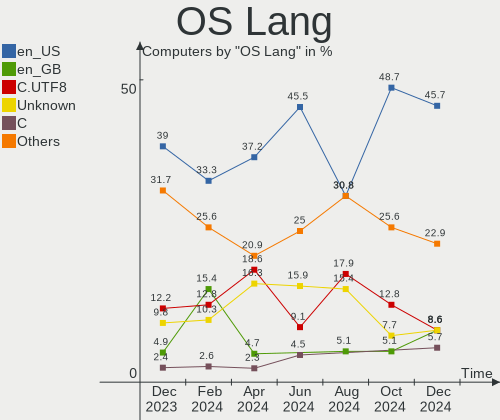
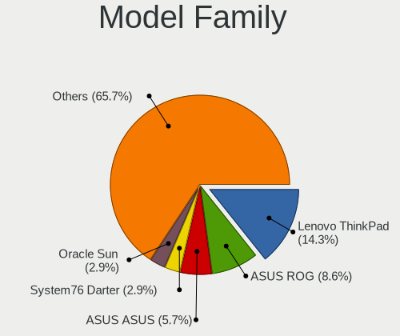
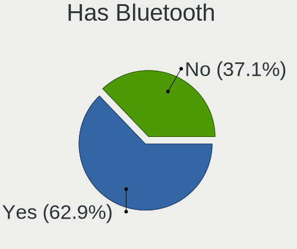
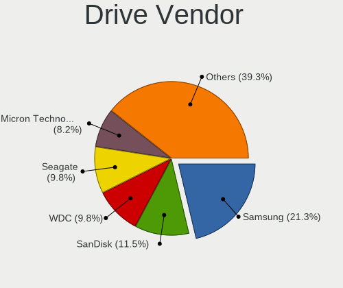
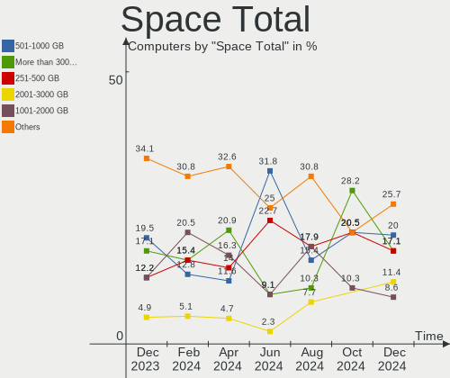
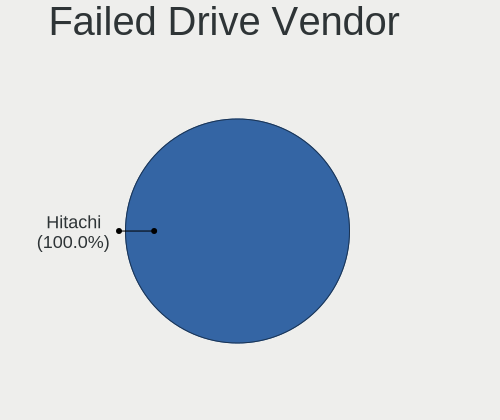
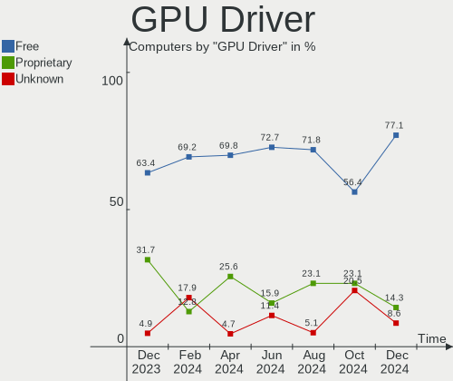
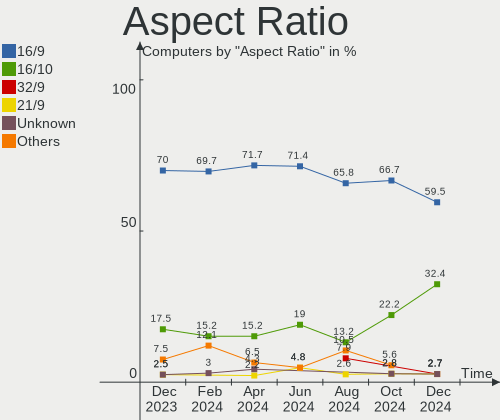
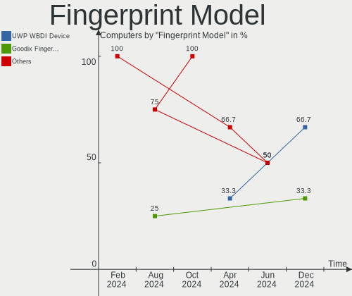

Gentoo Hardware Trends
----------------------

A project to identify most popular hardware characteristics and track their change
over time based on data collected by Gentoo users at https://Linux-Hardware.org.

Anyone can contribute to this report by the [hw-probe](https://github.com/linuxhw/hw-probe) tool:

    sudo -E hw-probe -all -upload

This is a report for all computer types. See also reports for [desktops](/Dist/Gentoo/Desktop/README.md) and [notebooks](/Dist/Gentoo/Notebook/README.md).

Full-feature report is available here: https://linux-hardware.org/?view=trends

Period: Sep, 2021.

Contents
--------

* [ System ](#system)
  - [ OS                       ](#os)
  - [ OS Family                ](#os-family)
  - [ Kernel                   ](#kernel)
  - [ Kernel Family            ](#kernel-family)
  - [ Kernel Major Ver.        ](#kernel-major-ver)
  - [ Arch                     ](#arch)
  - [ DE                       ](#de)
  - [ Display Server           ](#display-server)
  - [ Display Manager          ](#display-manager)
  - [ OS Lang                  ](#os-lang)
  - [ Boot Mode                ](#boot-mode)
  - [ Filesystem               ](#filesystem)
  - [ Part. scheme             ](#part-scheme)
  - [ Dual Boot with Linux/BSD ](#dual-boot-with-linuxbsd)
  - [ Dual Boot (Win)          ](#dual-boot-win)

* [ Board ](#board)
  - [ Vendor                   ](#vendor)
  - [ Model                    ](#model)
  - [ Model Family             ](#model-family)
  - [ MFG Year                 ](#mfg-year)
  - [ Form Factor              ](#form-factor)
  - [ Secure Boot              ](#secure-boot)
  - [ Coreboot                 ](#coreboot)
  - [ RAM Size                 ](#ram-size)
  - [ RAM Used                 ](#ram-used)
  - [ Total Drives             ](#total-drives)
  - [ Has CD-ROM               ](#has-cd-rom)
  - [ Has Ethernet             ](#has-ethernet)
  - [ Has WiFi                 ](#has-wifi)
  - [ Has Bluetooth            ](#has-bluetooth)

* [ Location ](#location)
  - [ Country                  ](#country)
  - [ City                     ](#city)

* [ Drives ](#drives)
  - [ Drive Vendor             ](#drive-vendor)
  - [ Drive Model              ](#drive-model)
  - [ HDD Vendor               ](#hdd-vendor)
  - [ SSD Vendor               ](#ssd-vendor)
  - [ Drive Kind               ](#drive-kind)
  - [ Drive Connector          ](#drive-connector)
  - [ Drive Size               ](#drive-size)
  - [ Space Total              ](#space-total)
  - [ Space Used               ](#space-used)
  - [ Malfunc. Drives          ](#malfunc-drives)
  - [ Malfunc. Drive Vendor    ](#malfunc-drive-vendor)
  - [ Malfunc. HDD Vendor      ](#malfunc-hdd-vendor)
  - [ Malfunc. Drive Kind      ](#malfunc-drive-kind)
  - [ Failed Drives            ](#failed-drives)
  - [ Failed Drive Vendor      ](#failed-drive-vendor)
  - [ Drive Status             ](#drive-status)

* [ Storage controller ](#storage-controller)
  - [ Storage Vendor           ](#storage-vendor)
  - [ Storage Model            ](#storage-model)
  - [ Storage Kind             ](#storage-kind)

* [ Processor ](#processor)
  - [ CPU Vendor               ](#cpu-vendor)
  - [ CPU Model                ](#cpu-model)
  - [ CPU Model Family         ](#cpu-model-family)
  - [ CPU Cores                ](#cpu-cores)
  - [ CPU Sockets              ](#cpu-sockets)
  - [ CPU Threads              ](#cpu-threads)
  - [ CPU Op-Modes             ](#cpu-op-modes)
  - [ CPU Microcode            ](#cpu-microcode)
  - [ CPU Microarch            ](#cpu-microarch)

* [ Graphics ](#graphics)
  - [ GPU Vendor               ](#gpu-vendor)
  - [ GPU Model                ](#gpu-model)
  - [ GPU Combo                ](#gpu-combo)
  - [ GPU Driver               ](#gpu-driver)
  - [ GPU Memory               ](#gpu-memory)

* [ Monitor ](#monitor)
  - [ Monitor Vendor           ](#monitor-vendor)
  - [ Monitor Model            ](#monitor-model)
  - [ Monitor Resolution       ](#monitor-resolution)
  - [ Monitor Diagonal         ](#monitor-diagonal)
  - [ Monitor Width            ](#monitor-width)
  - [ Aspect Ratio             ](#aspect-ratio)
  - [ Monitor Area             ](#monitor-area)
  - [ Pixel Density            ](#pixel-density)
  - [ Multiple Monitors        ](#multiple-monitors)

* [ Network ](#network)
  - [ Net Controller Vendor    ](#net-controller-vendor)
  - [ Net Controller Model     ](#net-controller-model)
  - [ Wireless Vendor          ](#wireless-vendor)
  - [ Wireless Model           ](#wireless-model)
  - [ Ethernet Vendor          ](#ethernet-vendor)
  - [ Ethernet Model           ](#ethernet-model)
  - [ Net Controller Kind      ](#net-controller-kind)
  - [ Used Controller          ](#used-controller)
  - [ NICs                     ](#nics)
  - [ IPv6                     ](#ipv6)

* [ Bluetooth ](#bluetooth)
  - [ Bluetooth Vendor         ](#bluetooth-vendor)
  - [ Bluetooth Model          ](#bluetooth-model)

* [ Sound ](#sound)
  - [ Sound Vendor             ](#sound-vendor)
  - [ Sound Model              ](#sound-model)

* [ Memory ](#memory)
  - [ Memory Vendor            ](#memory-vendor)
  - [ Memory Model             ](#memory-model)
  - [ Memory Kind              ](#memory-kind)
  - [ Memory Form Factor       ](#memory-form-factor)
  - [ Memory Size              ](#memory-size)
  - [ Memory Speed             ](#memory-speed)

* [ Printers & scanners ](#printers--scanners)
  - [ Printer Vendor           ](#printer-vendor)
  - [ Printer Model            ](#printer-model)
  - [ Scanner Vendor           ](#scanner-vendor)
  - [ Scanner Model            ](#scanner-model)

* [ Camera ](#camera)
  - [ Camera Vendor            ](#camera-vendor)
  - [ Camera Model             ](#camera-model)

* [ Security ](#security)
  - [ Fingerprint Vendor       ](#fingerprint-vendor)
  - [ Fingerprint Model        ](#fingerprint-model)
  - [ Chipcard Vendor          ](#chipcard-vendor)
  - [ Chipcard Model           ](#chipcard-model)

* [ Unsupported ](#unsupported)
  - [ Unsupported Devices      ](#unsupported-devices)
  - [ Unsupported Device Types ](#unsupported-device-types)

System
------

OS
--

Installed operating systems

| Name       | Computers | Percent |
|------------|-----------|---------|
| Gentoo 2.7 | 44        | 95.65%  |
| Gentoo 2.6 | 2         | 4.35%   |

OS Family
---------

OS without a version

| Name   | Computers | Percent |
|--------|-----------|---------|
| Gentoo | 46        | 100%    |

Kernel
------

Version of the Linux kernel

| Version                          | Computers | Percent |
|----------------------------------|-----------|---------|
| 5.10.61-gentoo                   | 15        | 32.61%  |
| 5.10.61-gentoo-x86_64            | 7         | 15.22%  |
| 5.10.52-gentoo                   | 3         | 6.52%   |
| 5.13.15-gentoo-dist              | 2         | 4.35%   |
| 5.13.13-gentoo                   | 2         | 4.35%   |
| 5.4.80-gentoo-r1                 | 1         | 2.17%   |
| 5.14.7-gentoo-x86_64             | 1         | 2.17%   |
| 5.14.7-gentoo-cobalt-0.08-x86_64 | 1         | 2.17%   |
| 5.14.7-g56c0ace445bd-dirty       | 1         | 2.17%   |
| 5.14.6-gentoo-dist               | 1         | 2.17%   |
| 5.14.2-gentoo                    | 1         | 2.17%   |
| 5.14.1-xanmod1-cacule            | 1         | 2.17%   |
| 5.14.1-gentoo20210226            | 1         | 2.17%   |
| 5.14.1-gentoo                    | 1         | 2.17%   |
| 5.14.0                           | 1         | 2.17%   |
| 5.13.12-xanmod1-mandrake-clang   | 1         | 2.17%   |
| 5.12.13-gentoo                   | 1         | 2.17%   |
| 5.10.68-gentoo-dist              | 1         | 2.17%   |
| 5.10.61-gentoo-P6B40-A4X         | 1         | 2.17%   |
| 5.10.27-gentoo-x86_64            | 1         | 2.17%   |
| 5.10.11-v8                       | 1         | 2.17%   |
| 4.19.86-gentoo                   | 1         | 2.17%   |

Kernel Family
-------------

Linux kernel without a distro release

| Version | Computers | Percent |
|---------|-----------|---------|
| 5.10.61 | 23        | 50%     |
| 5.14.7  | 3         | 6.52%   |
| 5.14.1  | 3         | 6.52%   |
| 5.10.52 | 3         | 6.52%   |
| 5.13.15 | 2         | 4.35%   |
| 5.13.13 | 2         | 4.35%   |
| 5.4.80  | 1         | 2.17%   |
| 5.14.6  | 1         | 2.17%   |
| 5.14.2  | 1         | 2.17%   |
| 5.14.0  | 1         | 2.17%   |
| 5.13.12 | 1         | 2.17%   |
| 5.12.13 | 1         | 2.17%   |
| 5.10.68 | 1         | 2.17%   |
| 5.10.27 | 1         | 2.17%   |
| 5.10.11 | 1         | 2.17%   |
| 4.19.86 | 1         | 2.17%   |

Kernel Major Ver.
-----------------

Linux kernel major version

| Version | Computers | Percent |
|---------|-----------|---------|
| 5.10    | 29        | 63.04%  |
| 5.14    | 9         | 19.57%  |
| 5.13    | 5         | 10.87%  |
| 5.4     | 1         | 2.17%   |
| 5.12    | 1         | 2.17%   |
| 4.19    | 1         | 2.17%   |

Arch
----

OS architecture (x86_64, i586, etc.)

| Name    | Computers | Percent |
|---------|-----------|---------|
| x86_64  | 44        | 95.65%  |
| i686    | 1         | 2.17%   |
| aarch64 | 1         | 2.17%   |

DE
--

Desktop Environment

| Name          | Computers | Percent |
|---------------|-----------|---------|
| KDE5          | 13        | 28.26%  |
| Unknown       | 11        | 23.91%  |
| GNOME         | 10        | 21.74%  |
| MATE          | 6         | 13.04%  |
| XFCE          | 2         | 4.35%   |
| sway          | 1         | 2.17%   |
| KDE           | 1         | 2.17%   |
| GNOME Classic | 1         | 2.17%   |
| DWM           | 1         | 2.17%   |

Display Server
--------------

X11 or Wayland

| Name    | Computers | Percent |
|---------|-----------|---------|
| X11     | 28        | 60.87%  |
| Tty     | 9         | 19.57%  |
| Unknown | 7         | 15.22%  |
| Wayland | 2         | 4.35%   |

Display Manager
---------------

SDDM, LightDM, etc.

| Name    | Computers | Percent |
|---------|-----------|---------|
| Unknown | 17        | 36.96%  |
| SDDM    | 13        | 28.26%  |
| LightDM | 9         | 19.57%  |
| GDM     | 6         | 13.04%  |
| LXDM    | 1         | 2.17%   |

OS Lang
-------

Language

| Lang    | Computers | Percent |
|---------|-----------|---------|
| en_US   | 22        | 47.83%  |
| ru_RU   | 3         | 6.52%   |
| de_DE   | 3         | 6.52%   |
| Unknown | 3         | 6.52%   |
| pt_BR   | 2         | 4.35%   |
| pl_PL   | 2         | 4.35%   |
| fr_FR   | 2         | 4.35%   |
| en_GB   | 2         | 4.35%   |
| C.UTF8  | 2         | 4.35%   |
| zh_CN   | 1         | 2.17%   |
| it_IT   | 1         | 2.17%   |
| fi_FI   | 1         | 2.17%   |
| cs_CZ   | 1         | 2.17%   |
| C       | 1         | 2.17%   |

Boot Mode
---------

EFI or BIOS

| Mode | Computers | Percent |
|------|-----------|---------|
| EFI  | 28        | 60.87%  |
| BIOS | 18        | 39.13%  |

Filesystem
----------

Type of filesystem

| Type     | Computers | Percent |
|----------|-----------|---------|
| Ext4     | 31        | 67.39%  |
| Btrfs    | 9         | 19.57%  |
| F2fs     | 3         | 6.52%   |
| Zfs      | 1         | 2.17%   |
| Xfs      | 1         | 2.17%   |
| Reiserfs | 1         | 2.17%   |

Part. scheme
------------

Scheme of partitioning

| Type    | Computers | Percent |
|---------|-----------|---------|
| GPT     | 38        | 82.61%  |
| MBR     | 4         | 8.7%    |
| Unknown | 4         | 8.7%    |

Dual Boot with Linux/BSD
------------------------

Hosting more than one Linux/BSD

| Dual boot | Computers | Percent |
|-----------|-----------|---------|
| No        | 29        | 63.04%  |
| Yes       | 17        | 36.96%  |

Dual Boot (Win)
---------------

Hosting Linux and Windows

| Dual boot | Computers | Percent |
|-----------|-----------|---------|
| No        | 34        | 73.91%  |
| Yes       | 12        | 26.09%  |

Board
-----

Vendor
------

Motherboard manufacturer

| Name                | Computers | Percent |
|---------------------|-----------|---------|
| ASUSTek Computer    | 10        | 21.74%  |
| Lenovo              | 9         | 19.57%  |
| Hewlett-Packard     | 6         | 13.04%  |
| Dell                | 6         | 13.04%  |
| Gigabyte Technology | 3         | 6.52%   |
| ASRock              | 3         | 6.52%   |
| Intel               | 2         | 4.35%   |
| TYAN Computer       | 1         | 2.17%   |
| Timi                | 1         | 2.17%   |
| Tekram Technology   | 1         | 2.17%   |
| Samsung Electronics | 1         | 2.17%   |
| Notebook            | 1         | 2.17%   |
| Fujitsu             | 1         | 2.17%   |
| Unknown             | 1         | 2.17%   |

Model
-----

Motherboard model

| Name                                        | Computers | Percent |
|---------------------------------------------|-----------|---------|
| TYAN S7025                                  | 1         | 2.17%   |
| Timi Mi Laptop Pro 15                       | 1         | 2.17%   |
| Tekram P6B40-A4X-i440BX Rev                 | 1         | 2.17%   |
| Samsung RC530/RC730                         | 1         | 2.17%   |
| Notebook P65xHP                             | 1         | 2.17%   |
| Lenovo Yoga Slim 7 Pro 14IHU5 O 82NH        | 1         | 2.17%   |
| Lenovo ThinkPad X240 20AMS1LN00             | 1         | 2.17%   |
| Lenovo ThinkPad X13 Yoga Gen 2 20W8002GCD   | 1         | 2.17%   |
| Lenovo ThinkPad X1 Extreme Gen 3 20TK001JUS | 1         | 2.17%   |
| Lenovo ThinkPad X1 Carbon Gen 9 20XXS0HW00  | 1         | 2.17%   |
| Lenovo ThinkPad P14s Gen 1 20Y10018US       | 1         | 2.17%   |
| Lenovo ThinkPad P1 Gen 4i 20Y3CTO1WW        | 1         | 2.17%   |
| Lenovo IdeaPad Flex 5 14ITL05 82LT          | 1         | 2.17%   |
| Lenovo B51-80 80LM                          | 1         | 2.17%   |
| Intel NUC11PHi7                             | 1         | 2.17%   |
| Intel DG31PR AAD97573-205                   | 1         | 2.17%   |
| HP ZBook 15 G3                              | 1         | 2.17%   |
| HP ProBook 430 G5                           | 1         | 2.17%   |
| HP Pavilion ZV6100 (EE984EA#ABZ)            | 1         | 2.17%   |
| HP Pavilion g6                              | 1         | 2.17%   |
| HP OMEN by HP Laptop 15-dc0xxx              | 1         | 2.17%   |
| HP 255 G6 Notebook PC                       | 1         | 2.17%   |
| Gigabyte B460HD3                            | 1         | 2.17%   |
| Gigabyte AB350-Gaming                       | 1         | 2.17%   |
| Gigabyte 990FXA-UD5                         | 1         | 2.17%   |
| Fujitsu ESPRIMO P7935                       | 1         | 2.17%   |
| Dell XPS 8500                               | 1         | 2.17%   |
| Dell Precision 7560                         | 1         | 2.17%   |
| Dell OptiPlex 790                           | 1         | 2.17%   |
| Dell Latitude E6510                         | 1         | 2.17%   |
| Dell Latitude 5410                          | 1         | 2.17%   |
| Dell Inspiron 5577                          | 1         | 2.17%   |
| ASUS ZenBook UX425IA_U4700IA                | 1         | 2.17%   |
| ASUS ZenBook UX333FN_UX333FN                | 1         | 2.17%   |
| ASUS X550ZA                                 | 1         | 2.17%   |
| ASUS TUF GAMING B450M-PLUS II               | 1         | 2.17%   |
| ASUS ROG Zephyrus G14 GA401II_GA401II       | 1         | 2.17%   |
| ASUS ROG STRIX Z390-F GAMING                | 1         | 2.17%   |
| ASUS ROG STRIX B550-F GAMING                | 1         | 2.17%   |
| ASUS P5P41C                                 | 1         | 2.17%   |
| ASUS M3A78-CM                               | 1         | 2.17%   |
| ASUS GX501VIK                               | 1         | 2.17%   |
| ASRock X370 Professional Gaming             | 1         | 2.17%   |
| ASRock H170 Pro4                            | 1         | 2.17%   |
| ASRock B450M-HDV R4.0                       | 1         | 2.17%   |
| Unknown                                     | 1         | 2.17%   |

Model Family
------------

Motherboard model prefix

| Name                    | Computers | Percent |
|-------------------------|-----------|---------|
| Lenovo ThinkPad         | 6         | 13.04%  |
| ASUS ROG                | 3         | 6.52%   |
| HP Pavilion             | 2         | 4.35%   |
| Dell Latitude           | 2         | 4.35%   |
| ASUS ZenBook            | 2         | 4.35%   |
| TYAN S7025              | 1         | 2.17%   |
| Timi Mi                 | 1         | 2.17%   |
| Tekram P6B40-A4X-i440BX | 1         | 2.17%   |
| Samsung RC530           | 1         | 2.17%   |
| Notebook P65xHP         | 1         | 2.17%   |
| Lenovo Yoga             | 1         | 2.17%   |
| Lenovo IdeaPad          | 1         | 2.17%   |
| Lenovo B51-80           | 1         | 2.17%   |
| Intel NUC11PHi7         | 1         | 2.17%   |
| Intel DG31PR            | 1         | 2.17%   |
| HP ZBook                | 1         | 2.17%   |
| HP ProBook              | 1         | 2.17%   |
| HP OMEN                 | 1         | 2.17%   |
| HP 255                  | 1         | 2.17%   |
| Gigabyte B460HD3        | 1         | 2.17%   |
| Gigabyte AB350-Gaming   | 1         | 2.17%   |
| Gigabyte 990FXA-UD5     | 1         | 2.17%   |
| Fujitsu ESPRIMO         | 1         | 2.17%   |
| Dell XPS                | 1         | 2.17%   |
| Dell Precision          | 1         | 2.17%   |
| Dell OptiPlex           | 1         | 2.17%   |
| Dell Inspiron           | 1         | 2.17%   |
| ASUS X550ZA             | 1         | 2.17%   |
| ASUS TUF                | 1         | 2.17%   |
| ASUS P5P41C             | 1         | 2.17%   |
| ASUS M3A78-CM           | 1         | 2.17%   |
| ASUS GX501VIK           | 1         | 2.17%   |
| ASRock X370             | 1         | 2.17%   |
| ASRock H170             | 1         | 2.17%   |
| ASRock B450M-HDV        | 1         | 2.17%   |
| Unknown                 | 1         | 2.17%   |

MFG Year
--------

Motherboard manufacture year

| Year    | Computers | Percent |
|---------|-----------|---------|
| 2021    | 14        | 30.43%  |
| 2020    | 6         | 13.04%  |
| 2012    | 4         | 8.7%    |
| 2019    | 3         | 6.52%   |
| 2018    | 3         | 6.52%   |
| 2016    | 3         | 6.52%   |
| 2017    | 2         | 4.35%   |
| 2010    | 2         | 4.35%   |
| 2015    | 1         | 2.17%   |
| 2014    | 1         | 2.17%   |
| 2013    | 1         | 2.17%   |
| 2011    | 1         | 2.17%   |
| 2009    | 1         | 2.17%   |
| 2007    | 1         | 2.17%   |
| 2006    | 1         | 2.17%   |
| 2000    | 1         | 2.17%   |
| Unknown | 1         | 2.17%   |

Form Factor
-----------

Physical design of the computer

| Name           | Computers | Percent |
|----------------|-----------|---------|
| Notebook       | 24        | 52.17%  |
| Desktop        | 17        | 36.96%  |
| Convertible    | 2         | 4.35%   |
| System on chip | 1         | 2.17%   |
| Mini pc        | 1         | 2.17%   |
| Server         | 1         | 2.17%   |

Secure Boot
-----------

Enabled or disabled

| State    | Computers | Percent |
|----------|-----------|---------|
| Disabled | 45        | 97.83%  |
| Enabled  | 1         | 2.17%   |

Coreboot
--------

Have coreboot on board

| Used | Computers | Percent |
|------|-----------|---------|
| No   | 46        | 100%    |

RAM Size
--------

Total RAM memory

| Size in GB  | Computers | Percent |
|-------------|-----------|---------|
| 16.01-24.0  | 14        | 30.43%  |
| 32.01-64.0  | 7         | 15.22%  |
| 4.01-8.0    | 6         | 13.04%  |
| 64.01-256.0 | 6         | 13.04%  |
| 8.01-16.0   | 6         | 13.04%  |
| 3.01-4.0    | 3         | 6.52%   |
| 1.01-2.0    | 2         | 4.35%   |
| 24.01-32.0  | 1         | 2.17%   |
| 0.51-1.0    | 1         | 2.17%   |

RAM Used
--------

Used RAM memory

| Used GB    | Computers | Percent |
|------------|-----------|---------|
| 1.01-2.0   | 11        | 23.91%  |
| 4.01-8.0   | 10        | 21.74%  |
| 0.01-0.5   | 8         | 17.39%  |
| 2.01-3.0   | 5         | 10.87%  |
| 3.01-4.0   | 4         | 8.7%    |
| 8.01-16.0  | 4         | 8.7%    |
| 16.01-24.0 | 3         | 6.52%   |
| 0.51-1.0   | 1         | 2.17%   |

Total Drives
------------

Number of drives on board

| Drives | Computers | Percent |
|--------|-----------|---------|
| 1      | 24        | 52.17%  |
| 2      | 11        | 23.91%  |
| 3      | 5         | 10.87%  |
| 4      | 3         | 6.52%   |
| 5      | 2         | 4.35%   |
| 6      | 1         | 2.17%   |

Has CD-ROM
----------

Has CD-ROM on board

| Presented | Computers | Percent |
|-----------|-----------|---------|
| No        | 27        | 58.7%   |
| Yes       | 19        | 41.3%   |

Has Ethernet
------------

Has Ethernet on board

| Presented | Computers | Percent |
|-----------|-----------|---------|
| Yes       | 36        | 78.26%  |
| No        | 10        | 21.74%  |

Has WiFi
--------

Has WiFi module

| Presented | Computers | Percent |
|-----------|-----------|---------|
| Yes       | 35        | 76.09%  |
| No        | 11        | 23.91%  |

Has Bluetooth
-------------

Has Bluetooth module

| Presented | Computers | Percent |
|-----------|-----------|---------|
| Yes       | 31        | 67.39%  |
| No        | 15        | 32.61%  |

Location
--------

Country
-------

Geographic location (country)

| Country     | Computers | Percent |
|-------------|-----------|---------|
| USA         | 8         | 17.39%  |
| Germany     | 7         | 15.22%  |
| Russia      | 5         | 10.87%  |
| Poland      | 5         | 10.87%  |
| France      | 3         | 6.52%   |
| China       | 3         | 6.52%   |
| UK          | 2         | 4.35%   |
| Japan       | 2         | 4.35%   |
| Czechia     | 2         | 4.35%   |
| Brazil      | 2         | 4.35%   |
| Switzerland | 1         | 2.17%   |
| Spain       | 1         | 2.17%   |
| Italy       | 1         | 2.17%   |
| Indonesia   | 1         | 2.17%   |
| Finland     | 1         | 2.17%   |
| Canada      | 1         | 2.17%   |
| Australia   | 1         | 2.17%   |

City
----

Geographic location (city)

| City            | Computers | Percent |
|-----------------|-----------|---------|
| Warsaw          | 2         | 4.35%   |
| St Petersburg   | 2         | 4.35%   |
| Beaverton       | 2         | 4.35%   |
| Zhengzhou       | 1         | 2.17%   |
| Yekaterinburg   | 1         | 2.17%   |
| Waterloo        | 1         | 2.17%   |
| Tokyo           | 1         | 2.17%   |
| Shelby          | 1         | 2.17%   |
| Santos          | 1         | 2.17%   |
| Rome            | 1         | 2.17%   |
| Rennes          | 1         | 2.17%   |
| Radom           | 1         | 2.17%   |
| Prague          | 1         | 2.17%   |
| Paris           | 1         | 2.17%   |
| Otwock          | 1         | 2.17%   |
| Osaka           | 1         | 2.17%   |
| Omsk            | 1         | 2.17%   |
| Moscow          | 1         | 2.17%   |
| Middletown      | 1         | 2.17%   |
| Melbourne       | 1         | 2.17%   |
| Marburg         | 1         | 2.17%   |
| Madrid          | 1         | 2.17%   |
| Leipzig         | 1         | 2.17%   |
| Le Chesnay      | 1         | 2.17%   |
| Laziska Gorne   | 1         | 2.17%   |
| Juquia          | 1         | 2.17%   |
| Jakarta         | 1         | 2.17%   |
| High Wycombe    | 1         | 2.17%   |
| Helsinki        | 1         | 2.17%   |
| Hattingen       | 1         | 2.17%   |
| Hamm            | 1         | 2.17%   |
| Halsenbach      | 1         | 2.17%   |
| Guangzhou       | 1         | 2.17%   |
| Glasgow         | 1         | 2.17%   |
| Gams            | 1         | 2.17%   |
| Friedrichsdorf  | 1         | 2.17%   |
| Everett         | 1         | 2.17%   |
| Dalian          | 1         | 2.17%   |
| College Station | 1         | 2.17%   |
| Chomutov        | 1         | 2.17%   |
| Berlin          | 1         | 2.17%   |
| Baton Rouge     | 1         | 2.17%   |
| Azle            | 1         | 2.17%   |

Drives
------

Drive Vendor
------------

Hard drive vendors

| Vendor              | Computers | Drives | Percent |
|---------------------|-----------|--------|---------|
| Samsung Electronics | 16        | 18     | 21.33%  |
| Seagate             | 13        | 15     | 17.33%  |
| WDC                 | 8         | 12     | 10.67%  |
| Intel               | 6         | 6      | 8%      |
| Toshiba             | 4         | 4      | 5.33%   |
| Unknown             | 3         | 3      | 4%      |
| SK Hynix            | 3         | 3      | 4%      |
| Kingston            | 3         | 3      | 4%      |
| SanDisk             | 2         | 2      | 2.67%   |
| HGST                | 2         | 2      | 2.67%   |
| GOODRAM             | 2         | 2      | 2.67%   |
| Crucial             | 2         | 4      | 2.67%   |
| Team                | 1         | 1      | 1.33%   |
| Phison              | 1         | 1      | 1.33%   |
| Micron Technology   | 1         | 1      | 1.33%   |
| LITEON              | 1         | 1      | 1.33%   |
| Lite-On             | 1         | 1      | 1.33%   |
| Lenovo              | 1         | 2      | 1.33%   |
| KIOXIA-EXCERIA      | 1         | 1      | 1.33%   |
| KIOXIA              | 1         | 1      | 1.33%   |
| IBM                 | 1         | 2      | 1.33%   |
| Hitachi             | 1         | 3      | 1.33%   |
| A-DATA Technology   | 1         | 1      | 1.33%   |

Drive Model
-----------

Hard drive models

| Model                                    | Computers | Percent |
|------------------------------------------|-----------|---------|
| Toshiba MQ01ABD100 1TB                   | 2         | 2.33%   |
| Samsung SSD 850 EVO 250GB                | 2         | 2.33%   |
| Intel SSDPEKNW010T8 1TB                  | 2         | 2.33%   |
| GOODRAM SSDPR-CL100-480-G2 480GB         | 2         | 2.33%   |
| WDC WDS500G3X0C-00SJG0 500GB             | 1         | 1.16%   |
| WDC WDS500G2B0B-00YS70 500GB SSD         | 1         | 1.16%   |
| WDC WD80EZAZ-11TDBA0 8TB                 | 1         | 1.16%   |
| WDC WD5000AADS-00S9B0 500GB              | 1         | 1.16%   |
| WDC WD30EZRX-00SPEB0 3TB                 | 1         | 1.16%   |
| WDC WD30EFRX-68EUZN0 3TB                 | 1         | 1.16%   |
| WDC WD20EZRX-00DC0B0 2TB                 | 1         | 1.16%   |
| WDC WD1600AAJS-75B4A0 160GB              | 1         | 1.16%   |
| WDC WD1200JS-00SGB0 120GB                | 1         | 1.16%   |
| WDC WD10EZEX-60M2NA0 1TB                 | 1         | 1.16%   |
| WDC WD100EJRX-89SYHY0 10TB               | 1         | 1.16%   |
| WDC PC SN730 SDBQNTY-1T00-1001 1TB       | 1         | 1.16%   |
| Unknown NVMe SSD Drive 256GB             | 1         | 1.16%   |
| Unknown MMC Card  4GB                    | 1         | 1.16%   |
| Unknown MMC Card  32GB                   | 1         | 1.16%   |
| Toshiba KXG6AZNV512G 512GB               | 1         | 1.16%   |
| Toshiba HDWE150 5TB                      | 1         | 1.16%   |
| Team TM8PS7256G 256GB SSD                | 1         | 1.16%   |
| SK Hynix SKHynix_HFS001TDE9X084N 1TB     | 1         | 1.16%   |
| SK Hynix PC711 NVMe 1TB                  | 1         | 1.16%   |
| SK Hynix PC401 HFS256GD9TNG-62A0A 256GB  | 1         | 1.16%   |
| Seagate ST9750420AS 752GB                | 1         | 1.16%   |
| Seagate ST8000DM004-2CX188 8TB           | 1         | 1.16%   |
| Seagate ST8000AS0002-1NA17Z 8TB          | 1         | 1.16%   |
| Seagate ST4000DM004-2CV104 4TB           | 1         | 1.16%   |
| Seagate ST3250318AS 250GB                | 1         | 1.16%   |
| Seagate ST320LT007-9ZV142 320GB          | 1         | 1.16%   |
| Seagate ST320413A 20GB                   | 1         | 1.16%   |
| Seagate ST31000524AS 1TB                 | 1         | 1.16%   |
| Seagate ST31000340NS 1TB                 | 1         | 1.16%   |
| Seagate ST250DM000-1BD141 250GB          | 1         | 1.16%   |
| Seagate ST2000DX002-2DV164 2TB           | 1         | 1.16%   |
| Seagate ST2000DM001-1ER164 2TB           | 1         | 1.16%   |
| Seagate ST12000NM0008-2H3101 12TB        | 1         | 1.16%   |
| Seagate ST1000LM014-SSHD-8GB             | 1         | 1.16%   |
| Seagate ST1000DM010-2EP102 1TB           | 1         | 1.16%   |
| SanDisk SDSSDH3 1T00 1TB                 | 1         | 1.16%   |
| SanDisk SD9SN8W-128G-1006 128GB SSD      | 1         | 1.16%   |
| Samsung SSD 980 PRO 500GB                | 1         | 1.16%   |
| Samsung SSD 980 PRO 2TB                  | 1         | 1.16%   |
| Samsung SSD 980 PRO 1TB                  | 1         | 1.16%   |
| Samsung SSD 970 EVO 500GB                | 1         | 1.16%   |
| Samsung SSD 970 EVO 250GB                | 1         | 1.16%   |
| Samsung SSD 960 EVO 500GB                | 1         | 1.16%   |
| Samsung SSD 960 EVO 250GB                | 1         | 1.16%   |
| Samsung MZVLB512HBJQ-000L7 512GB         | 1         | 1.16%   |
| Samsung MZVL21T0HCLR-00BL7 1TB           | 1         | 1.16%   |
| Samsung MZVKW512HMJP-00000 512GB         | 1         | 1.16%   |
| Samsung MZ7TE128HMGR-000L1 128GB SSD     | 1         | 1.16%   |
| Samsung MZ7TD256HAFV-000 256GB SSD       | 1         | 1.16%   |
| Samsung MZ7LN256HMJP-000H1 256GB SSD     | 1         | 1.16%   |
| Samsung MZ7LN256HCHP-00000 256GB SSD     | 1         | 1.16%   |
| Samsung HD250HJ 250GB                    | 1         | 1.16%   |
| Phison Sabrent 512GB                     | 1         | 1.16%   |
| Micron MTFDDAV256MBF-1AN15ABHA 256GB SSD | 1         | 1.16%   |
| LITEON CA3-8D128-HP 128GB                | 1         | 1.16%   |

HDD Vendor
----------

Hard disk drive vendors

| Vendor              | Computers | Drives | Percent |
|---------------------|-----------|--------|---------|
| Seagate             | 13        | 15     | 48.15%  |
| WDC                 | 6         | 9      | 22.22%  |
| Toshiba             | 3         | 3      | 11.11%  |
| HGST                | 2         | 2      | 7.41%   |
| Samsung Electronics | 1         | 1      | 3.7%    |
| IBM                 | 1         | 2      | 3.7%    |
| Hitachi             | 1         | 3      | 3.7%    |

SSD Vendor
----------

Solid state drive vendors

| Vendor              | Computers | Drives | Percent |
|---------------------|-----------|--------|---------|
| Samsung Electronics | 6         | 6      | 28.57%  |
| SanDisk             | 2         | 2      | 9.52%   |
| Kingston            | 2         | 2      | 9.52%   |
| Intel               | 2         | 2      | 9.52%   |
| GOODRAM             | 2         | 2      | 9.52%   |
| Crucial             | 2         | 4      | 9.52%   |
| WDC                 | 1         | 1      | 4.76%   |
| Team                | 1         | 1      | 4.76%   |
| Micron Technology   | 1         | 1      | 4.76%   |
| Lite-On             | 1         | 1      | 4.76%   |
| Lenovo              | 1         | 2      | 4.76%   |

Drive Kind
----------

HDD or SSD

| Kind | Computers | Drives | Percent |
|------|-----------|--------|---------|
| NVMe | 26        | 28     | 40.63%  |
| HDD  | 19        | 35     | 29.69%  |
| SSD  | 17        | 24     | 26.56%  |
| MMC  | 2         | 2      | 3.13%   |

Drive Connector
---------------

SATA, SAS, NVMe, etc.

| Type | Computers | Drives | Percent |
|------|-----------|--------|---------|
| SATA | 27        | 57     | 47.37%  |
| NVMe | 26        | 28     | 45.61%  |
| SAS  | 2         | 2      | 3.51%   |
| MMC  | 2         | 2      | 3.51%   |

Drive Size
----------

Size of hard drive

| Size in TB | Computers | Drives | Percent |
|------------|-----------|--------|---------|
| 0.01-0.5   | 20        | 32     | 46.51%  |
| 0.51-1.0   | 11        | 12     | 25.58%  |
| 4.01-10.0  | 5         | 5      | 11.63%  |
| 1.01-2.0   | 3         | 3      | 6.98%   |
| 2.01-3.0   | 2         | 5      | 4.65%   |
| 3.01-4.0   | 1         | 1      | 2.33%   |
| 10.01-20.0 | 1         | 1      | 2.33%   |

Space Total
-----------

Amount of disk space available on the file system

| Size in GB     | Computers | Percent |
|----------------|-----------|---------|
| 501-1000       | 13        | 28.26%  |
| 101-250        | 11        | 23.91%  |
| More than 3000 | 5         | 10.87%  |
| 251-500        | 5         | 10.87%  |
| 1001-2000      | 5         | 10.87%  |
| Unknown        | 4         | 8.7%    |
| 2001-3000      | 1         | 2.17%   |
| 1-20           | 1         | 2.17%   |
| 51-100         | 1         | 2.17%   |

Space Used
----------

Amount of used disk space

| Used GB        | Computers | Percent |
|----------------|-----------|---------|
| 251-500        | 8         | 17.39%  |
| 21-50          | 8         | 17.39%  |
| 1-20           | 7         | 15.22%  |
| 101-250        | 5         | 10.87%  |
| More than 3000 | 4         | 8.7%    |
| 501-1000       | 4         | 8.7%    |
| 51-100         | 4         | 8.7%    |
| Unknown        | 4         | 8.7%    |
| 1001-2000      | 2         | 4.35%   |

Malfunc. Drives
---------------

Drive models with a malfunction

| Model                                 | Computers | Drives | Percent |
|---------------------------------------|-----------|--------|---------|
| Seagate ST9750420AS 752GB             | 1         | 1      | 10%     |
| Seagate ST8000AS0002-1NA17Z 8TB       | 1         | 1      | 10%     |
| Seagate ST320LT007-9ZV142 320GB       | 1         | 1      | 10%     |
| Seagate ST320413A 20GB                | 1         | 1      | 10%     |
| Seagate ST31000340NS 1TB              | 1         | 1      | 10%     |
| SanDisk SD9SN8W-128G-1006 128GB SSD   | 1         | 1      | 10%     |
| Samsung Electronics SSD 960 EVO 250GB | 1         | 1      | 10%     |
| Kingston SV300S37A480G 480GB SSD      | 1         | 1      | 10%     |
| IBM DJSA-220 12GB                     | 1         | 1      | 10%     |
| HGST HTS721010A9E630 1TB              | 1         | 1      | 10%     |

Malfunc. Drive Vendor
---------------------

Vendors of faulty drives

| Vendor              | Computers | Drives | Percent |
|---------------------|-----------|--------|---------|
| Seagate             | 5         | 5      | 50%     |
| SanDisk             | 1         | 1      | 10%     |
| Samsung Electronics | 1         | 1      | 10%     |
| Kingston            | 1         | 1      | 10%     |
| IBM                 | 1         | 1      | 10%     |
| HGST                | 1         | 1      | 10%     |

Malfunc. HDD Vendor
-------------------

Vendors of faulty HDD drives

| Vendor  | Computers | Drives | Percent |
|---------|-----------|--------|---------|
| Seagate | 5         | 5      | 71.43%  |
| IBM     | 1         | 1      | 14.29%  |
| HGST    | 1         | 1      | 14.29%  |

Malfunc. Drive Kind
-------------------

Kinds of faulty drives

| Kind | Computers | Drives | Percent |
|------|-----------|--------|---------|
| HDD  | 6         | 7      | 66.67%  |
| SSD  | 2         | 2      | 22.22%  |
| NVMe | 1         | 1      | 11.11%  |

Failed Drives
-------------

Failed drive models

| Model                                            | Computers | Drives | Percent |
|--------------------------------------------------|-----------|--------|---------|
| Samsung Electronics MZ7LN256HCHP-00000 256GB SSD | 1         | 1      | 100%    |

Failed Drive Vendor
-------------------

Failed drive vendors

| Vendor              | Computers | Drives | Percent |
|---------------------|-----------|--------|---------|
| Samsung Electronics | 1         | 1      | 100%    |

Drive Status
------------

Number of failed and malfunc. drives

| Status   | Computers | Drives | Percent |
|----------|-----------|--------|---------|
| Works    | 38        | 69     | 70.37%  |
| Malfunc  | 8         | 10     | 14.81%  |
| Detected | 7         | 9      | 12.96%  |
| Failed   | 1         | 1      | 1.85%   |

Storage controller
------------------

Storage Vendor
--------------

Storage controller vendors

| Vendor                         | Computers | Percent |
|--------------------------------|-----------|---------|
| Intel                          | 23        | 37.1%   |
| AMD                            | 13        | 20.97%  |
| Samsung Electronics            | 10        | 16.13%  |
| SK Hynix                       | 3         | 4.84%   |
| Sandisk                        | 2         | 3.23%   |
| KIOXIA                         | 2         | 3.23%   |
| Toshiba America Info Systems   | 1         | 1.61%   |
| Solid State Storage Technology | 1         | 1.61%   |
| Phison Electronics             | 1         | 1.61%   |
| Marvell Technology Group       | 1         | 1.61%   |
| Lite-On Technology             | 1         | 1.61%   |
| Kingston Technology Company    | 1         | 1.61%   |
| ASMedia Technology             | 1         | 1.61%   |
| ADATA Technology               | 1         | 1.61%   |
| Adaptec                        | 1         | 1.61%   |

Storage Model
-------------

Storage controller models

| Model                                                                         | Computers | Percent |
|-------------------------------------------------------------------------------|-----------|---------|
| AMD FCH SATA Controller [AHCI mode]                                           | 7         | 9.72%   |
| Samsung NVMe SSD Controller PM9A1/PM9A3/980PRO                                | 4         | 5.56%   |
| Intel SSD 660P Series                                                         | 4         | 5.56%   |
| Samsung NVMe SSD Controller SM981/PM981/PM983                                 | 3         | 4.17%   |
| Samsung NVMe SSD Controller SM961/PM961/SM963                                 | 3         | 4.17%   |
| SK Hynix Gold P31 SSD                                                         | 2         | 2.78%   |
| Sandisk WD Black SN750 / PC SN730 NVMe SSD                                    | 2         | 2.78%   |
| Intel Sunrise Point-LP SATA Controller [AHCI mode]                            | 2         | 2.78%   |
| Intel SATA Controller [RAID mode]                                             | 2         | 2.78%   |
| Intel Q170/Q150/B150/H170/H110/Z170/CM236 Chipset SATA Controller [AHCI Mode] | 2         | 2.78%   |
| Intel NM10/ICH7 Family SATA Controller [IDE mode]                             | 2         | 2.78%   |
| Intel HM170/QM170 Chipset SATA Controller [AHCI Mode]                         | 2         | 2.78%   |
| Intel 82801G (ICH7 Family) IDE Controller                                     | 2         | 2.78%   |
| AMD SB7x0/SB8x0/SB9x0 IDE Controller                                          | 2         | 2.78%   |
| AMD 400 Series Chipset SATA Controller                                        | 2         | 2.78%   |
| Toshiba America Info Systems XG6 NVMe SSD Controller                          | 1         | 1.39%   |
| Solid State Storage Non-Volatile memory controller                            | 1         | 1.39%   |
| SK Hynix PC401 NVMe Solid State Drive 256GB                                   | 1         | 1.39%   |
| Phison E12 NVMe Controller                                                    | 1         | 1.39%   |
| Marvell Group 88SE9172 SATA 6Gb/s Controller                                  | 1         | 1.39%   |
| Lite-On Non-Volatile memory controller                                        | 1         | 1.39%   |
| KIOXIA NVMe SSD                                                               | 1         | 1.39%   |
| KIOXIA Non-Volatile memory controller                                         | 1         | 1.39%   |
| Kingston Company Company Non-Volatile memory controller                       | 1         | 1.39%   |
| Intel Comet Lake SATA AHCI Controller                                         | 1         | 1.39%   |
| Intel 82801JI (ICH10 Family) 4 port SATA IDE Controller #1                    | 1         | 1.39%   |
| Intel 82801JI (ICH10 Family) 2 port SATA IDE Controller #2                    | 1         | 1.39%   |
| Intel 82801 Mobile SATA Controller [RAID mode]                                | 1         | 1.39%   |
| Intel 82371AB/EB/MB PIIX4 IDE                                                 | 1         | 1.39%   |
| Intel 8 Series SATA Controller 1 [AHCI mode]                                  | 1         | 1.39%   |
| Intel 7 Series/C210 Series Chipset Family 6-port SATA Controller [AHCI mode]  | 1         | 1.39%   |
| Intel 6 Series/C200 Series Chipset Family 6 port Mobile SATA AHCI Controller  | 1         | 1.39%   |
| Intel 6 Series/C200 Series Chipset Family 6 port Desktop SATA AHCI Controller | 1         | 1.39%   |
| Intel 5 Series/3400 Series Chipset 6 port SATA AHCI Controller                | 1         | 1.39%   |
| Intel 400 Series Chipset Family SATA AHCI Controller                          | 1         | 1.39%   |
| Intel 4 Series Chipset PT IDER Controller                                     | 1         | 1.39%   |
| ASMedia ASM1062 Serial ATA Controller                                         | 1         | 1.39%   |
| AMD X370 Series Chipset SATA Controller                                       | 1         | 1.39%   |
| AMD Starship/Matisse Chipset SATA Controller [AHCI mode]                      | 1         | 1.39%   |
| AMD SB7x0/SB8x0/SB9x0 SATA Controller [IDE mode]                              | 1         | 1.39%   |
| AMD SB7x0/SB8x0/SB9x0 SATA Controller [AHCI mode]                             | 1         | 1.39%   |
| AMD IXP SB4x0 IDE Controller                                                  | 1         | 1.39%   |
| AMD FCH SATA Controller [IDE mode]                                            | 1         | 1.39%   |
| AMD 300 Series Chipset SATA Controller                                        | 1         | 1.39%   |
| ADATA XPG SX8200 Pro PCIe Gen3x4 M.2 2280 Solid State Drive                   | 1         | 1.39%   |
| Adaptec AHA-2930U2                                                            | 1         | 1.39%   |

Storage Kind
------------

Kind of storage controller (IDE, SATA, NVMe, SAS, ...)

| Kind | Computers | Percent |
|------|-----------|---------|
| NVMe | 26        | 41.27%  |
| SATA | 25        | 39.68%  |
| IDE  | 8         | 12.7%   |
| RAID | 3         | 4.76%   |
| SCSI | 1         | 1.59%   |

Processor
---------

CPU Vendor
----------

Processor vendors

| Vendor | Computers | Percent |
|--------|-----------|---------|
| Intel  | 31        | 67.39%  |
| AMD    | 14        | 30.43%  |
| ARM    | 1         | 2.17%   |

CPU Model
---------

Processor models

| Model                                         | Computers | Percent |
|-----------------------------------------------|-----------|---------|
| Intel 11th Gen Core i7-1165G7 @ 2.80GHz       | 4         | 8.7%    |
| Intel Core i5-7300HQ CPU @ 2.50GHz            | 2         | 4.35%   |
| Intel 11th Gen Core i9-11950H @ 2.60GHz       | 2         | 4.35%   |
| Intel Xeon CPU X5680 @ 3.33GHz                | 1         | 2.17%   |
| Intel Pentium III (Katmai)                    | 1         | 2.17%   |
| Intel Core i9-9900K CPU @ 3.60GHz             | 1         | 2.17%   |
| Intel Core i9-10885H CPU @ 2.40GHz            | 1         | 2.17%   |
| Intel Core i7-8565U CPU @ 1.80GHz             | 1         | 2.17%   |
| Intel Core i7-7700HQ CPU @ 2.80GHz            | 1         | 2.17%   |
| Intel Core i7-7700 CPU @ 3.60GHz              | 1         | 2.17%   |
| Intel Core i7-6700HQ CPU @ 2.60GHz            | 1         | 2.17%   |
| Intel Core i7-6500U CPU @ 2.50GHz             | 1         | 2.17%   |
| Intel Core i7-3770 CPU @ 3.40GHz              | 1         | 2.17%   |
| Intel Core i7-2670QM CPU @ 2.20GHz            | 1         | 2.17%   |
| Intel Core i7-10700K CPU @ 3.80GHz            | 1         | 2.17%   |
| Intel Core i7-10510U CPU @ 1.80GHz            | 1         | 2.17%   |
| Intel Core i5-8300H CPU @ 2.30GHz             | 1         | 2.17%   |
| Intel Core i5-8250U CPU @ 1.60GHz             | 1         | 2.17%   |
| Intel Core i5-4300U CPU @ 1.90GHz             | 1         | 2.17%   |
| Intel Core i5-2400 CPU @ 3.10GHz              | 1         | 2.17%   |
| Intel Core i5-10210U CPU @ 1.60GHz            | 1         | 2.17%   |
| Intel Core i5 CPU M 460 @ 2.53GHz             | 1         | 2.17%   |
| Intel Core 2 Quad CPU Q9650 @ 3.00GHz         | 1         | 2.17%   |
| Intel Core 2 Quad CPU Q8400 @ 2.66GHz         | 1         | 2.17%   |
| Intel Core 2 Duo CPU E4600 @ 2.40GHz          | 1         | 2.17%   |
| Intel 11th Gen Core i7-11370H @ 3.30GHz       | 1         | 2.17%   |
| ARM Processor                                 | 1         | 2.17%   |
| AMD Ryzen 9 3950X 16-Core Processor           | 1         | 2.17%   |
| AMD Ryzen 7 PRO 4750U with Radeon Graphics    | 1         | 2.17%   |
| AMD Ryzen 7 4800HS with Radeon Graphics       | 1         | 2.17%   |
| AMD Ryzen 7 4700U with Radeon Graphics        | 1         | 2.17%   |
| AMD Ryzen 7 2700 Eight-Core Processor         | 1         | 2.17%   |
| AMD Ryzen 5 3500X 6-Core Processor            | 1         | 2.17%   |
| AMD Ryzen 5 2600 Six-Core Processor           | 1         | 2.17%   |
| AMD Ryzen 3 2200G with Radeon Vega Graphics   | 1         | 2.17%   |
| AMD Phenom II X4 955 Processor                | 1         | 2.17%   |
| AMD FX-8350 Eight-Core Processor              | 1         | 2.17%   |
| AMD Athlon 64 Processor 3200+                 | 1         | 2.17%   |
| AMD A8-7200P Radeon R5, 8 Compute Cores 4C+4G | 1         | 2.17%   |
| AMD A6-9220 RADEON R4, 5 COMPUTE CORES 2C+3G  | 1         | 2.17%   |
| AMD A6-3420M APU with Radeon HD Graphics      | 1         | 2.17%   |

CPU Model Family
----------------

Processor model prefix

| Model             | Computers | Percent |
|-------------------|-----------|---------|
| Intel Core i7     | 9         | 19.57%  |
| Other             | 8         | 17.39%  |
| Intel Core i5     | 8         | 17.39%  |
| AMD Ryzen 7       | 3         | 6.52%   |
| Intel Core i9     | 2         | 4.35%   |
| Intel Core 2 Quad | 2         | 4.35%   |
| AMD Ryzen 5       | 2         | 4.35%   |
| AMD A6            | 2         | 4.35%   |
| Intel Xeon        | 1         | 2.17%   |
| Intel Pentium III | 1         | 2.17%   |
| Intel Core 2 Duo  | 1         | 2.17%   |
| AMD Ryzen 9       | 1         | 2.17%   |
| AMD Ryzen 7 PRO   | 1         | 2.17%   |
| AMD Ryzen 3       | 1         | 2.17%   |
| AMD Phenom II X4  | 1         | 2.17%   |
| AMD FX            | 1         | 2.17%   |
| AMD Athlon 64     | 1         | 2.17%   |
| AMD A8            | 1         | 2.17%   |

CPU Cores
---------

Number of processor cores

| Number  | Computers | Percent |
|---------|-----------|---------|
| 4       | 24        | 52.17%  |
| 8       | 9         | 19.57%  |
| 2       | 6         | 13.04%  |
| 6       | 2         | 4.35%   |
| 1       | 2         | 4.35%   |
| 16      | 1         | 2.17%   |
| 12      | 1         | 2.17%   |
| Unknown | 1         | 2.17%   |

CPU Sockets
-----------

Number of sockets

| Number  | Computers | Percent |
|---------|-----------|---------|
| 1       | 44        | 95.65%  |
| 2       | 1         | 2.17%   |
| Unknown | 1         | 2.17%   |

CPU Threads
-----------

Threads per core (Hyper-Threading)

| Number  | Computers | Percent |
|---------|-----------|---------|
| 2       | 30        | 65.22%  |
| 1       | 15        | 32.61%  |
| Unknown | 1         | 2.17%   |

CPU Op-Modes
------------

CPU Operation Modes (32-bit, 64-bit)

| Op mode        | Computers | Percent |
|----------------|-----------|---------|
| 32-bit, 64-bit | 45        | 97.83%  |
| 32-bit         | 1         | 2.17%   |

CPU Microcode
-------------

Microcode number

| Number     | Computers | Percent |
|------------|-----------|---------|
| 0x806c1    | 5         | 10.87%  |
| Unknown    | 5         | 10.87%  |
| 0x906e9    | 4         | 8.7%    |
| 0x806ec    | 2         | 4.35%   |
| 0x806d1    | 2         | 4.35%   |
| 0x206a7    | 2         | 4.35%   |
| 0x1067a    | 2         | 4.35%   |
| 0x0800820d | 2         | 4.35%   |
| 0xa0655    | 1         | 2.17%   |
| 0xa0652    | 1         | 2.17%   |
| 0x906ed    | 1         | 2.17%   |
| 0x906ea    | 1         | 2.17%   |
| 0x806eb    | 1         | 2.17%   |
| 0x6fd      | 1         | 2.17%   |
| 0x673      | 1         | 2.17%   |
| 0x506e3    | 1         | 2.17%   |
| 0x406e3    | 1         | 2.17%   |
| 0x40651    | 1         | 2.17%   |
| 0x306a9    | 1         | 2.17%   |
| 0x206c2    | 1         | 2.17%   |
| 0x20655    | 1         | 2.17%   |
| 0x08701021 | 1         | 2.17%   |
| 0x08600106 | 1         | 2.17%   |
| 0x08600104 | 1         | 2.17%   |
| 0x08101013 | 1         | 2.17%   |
| 0x06006705 | 1         | 2.17%   |
| 0x06003106 | 1         | 2.17%   |
| 0x06000803 | 1         | 2.17%   |
| 0x03000027 | 1         | 2.17%   |
| 0x010000db | 1         | 2.17%   |

CPU Microarch
-------------

Microarchitecture

| Name        | Computers | Percent |
|-------------|-----------|---------|
| KabyLake    | 10        | 21.74%  |
| Zen 2       | 5         | 10.87%  |
| TigerLake   | 5         | 10.87%  |
| Zen+        | 2         | 4.35%   |
| Westmere    | 2         | 4.35%   |
| Skylake     | 2         | 4.35%   |
| SandyBridge | 2         | 4.35%   |
| Penryn      | 2         | 4.35%   |
| CometLake   | 2         | 4.35%   |
| Unknown     | 2         | 4.35%   |
| Zen         | 1         | 2.17%   |
| Steamroller | 1         | 2.17%   |
| Piledriver  | 1         | 2.17%   |
| P6          | 1         | 2.17%   |
| K8 Hammer   | 1         | 2.17%   |
| K10 Llano   | 1         | 2.17%   |
| K10         | 1         | 2.17%   |
| IvyBridge   | 1         | 2.17%   |
| Icelake     | 1         | 2.17%   |
| Haswell     | 1         | 2.17%   |
| Excavator   | 1         | 2.17%   |
| Core        | 1         | 2.17%   |

Graphics
--------

GPU Vendor
----------

Vendors of graphics cards

| Vendor                     | Computers | Percent |
|----------------------------|-----------|---------|
| Nvidia                     | 24        | 42.11%  |
| Intel                      | 19        | 33.33%  |
| AMD                        | 13        | 22.81%  |
| Matrox Electronics Systems | 1         | 1.75%   |

GPU Model
---------

Graphics card models

| Model                                                                     | Computers | Percent |
|---------------------------------------------------------------------------|-----------|---------|
| Intel TigerLake-LP GT2 [Iris Xe Graphics]                                 | 5         | 8.77%   |
| AMD Renoir                                                                | 3         | 5.26%   |
| Nvidia GP106M [GeForce GTX 1060 Mobile]                                   | 2         | 3.51%   |
| Intel TigerLake-H GT1 [UHD Graphics]                                      | 2         | 3.51%   |
| Intel HD Graphics 630                                                     | 2         | 3.51%   |
| Intel CometLake-U GT2 [UHD Graphics]                                      | 2         | 3.51%   |
| Nvidia TU117M [GeForce MX450]                                             | 1         | 1.75%   |
| Nvidia TU117M [GeForce GTX 1650 Ti Mobile]                                | 1         | 1.75%   |
| Nvidia TU116M [GeForce GTX 1650 Ti Mobile]                                | 1         | 1.75%   |
| Nvidia TU116 [GeForce GTX 1660 SUPER]                                     | 1         | 1.75%   |
| Nvidia TU106M [GeForce RTX 2060 Mobile]                                   | 1         | 1.75%   |
| Nvidia NV5 [Riva TNT2 Model 64 / Model 64 Pro]                            | 1         | 1.75%   |
| Nvidia GT218M [NVS 3100M]                                                 | 1         | 1.75%   |
| Nvidia GP108M [GeForce MX250]                                             | 1         | 1.75%   |
| Nvidia GP108M [GeForce MX150]                                             | 1         | 1.75%   |
| Nvidia GP108 [GeForce GT 1030]                                            | 1         | 1.75%   |
| Nvidia GP107M [GeForce GTX 1050 Mobile]                                   | 1         | 1.75%   |
| Nvidia GP104BM [GeForce GTX 1080 Mobile]                                  | 1         | 1.75%   |
| Nvidia GM206 [GeForce GTX 960]                                            | 1         | 1.75%   |
| Nvidia GM107GLM [Quadro M2000M]                                           | 1         | 1.75%   |
| Nvidia GK208B [GeForce GT 730]                                            | 1         | 1.75%   |
| Nvidia GF108M [GeForce GT 540M]                                           | 1         | 1.75%   |
| Nvidia GF108 [GeForce GT 430]                                             | 1         | 1.75%   |
| Nvidia GA107GLM [RTX A2000 Mobile]                                        | 1         | 1.75%   |
| Nvidia GA104M [GeForce RTX 3080 Mobile / Max-Q 8GB/16GB]                  | 1         | 1.75%   |
| Nvidia GA102 [GeForce RTX 3090]                                           | 1         | 1.75%   |
| Nvidia G73 [GeForce 7300 GT]                                              | 1         | 1.75%   |
| Nvidia G72 [GeForce 7300 LE]                                              | 1         | 1.75%   |
| Matrox Electronics Systems MGA G200                                       | 1         | 1.75%   |
| Intel WhiskeyLake-U GT2 [UHD Graphics 620]                                | 1         | 1.75%   |
| Intel UHD Graphics 620                                                    | 1         | 1.75%   |
| Intel Skylake GT2 [HD Graphics 520]                                       | 1         | 1.75%   |
| Intel HD Graphics 530                                                     | 1         | 1.75%   |
| Intel Haswell-ULT Integrated Graphics Controller                          | 1         | 1.75%   |
| Intel CometLake-H GT2 [UHD Graphics]                                      | 1         | 1.75%   |
| Intel 82G33/G31 Express Integrated Graphics Controller                    | 1         | 1.75%   |
| Intel 2nd Generation Core Processor Family Integrated Graphics Controller | 1         | 1.75%   |
| AMD Vega 10 XL/XT [Radeon RX Vega 56/64]                                  | 1         | 1.75%   |
| AMD Turks PRO [Radeon HD 7570]                                            | 1         | 1.75%   |
| AMD Sumo [Radeon HD 6520G]                                                | 1         | 1.75%   |
| AMD Stoney [Radeon R2/R3/R4/R5 Graphics]                                  | 1         | 1.75%   |
| AMD RS780C [Radeon 3100]                                                  | 1         | 1.75%   |
| AMD RS480M [Mobility Radeon Xpress 200]                                   | 1         | 1.75%   |
| AMD Raven Ridge [Radeon Vega Series / Radeon Vega Mobile Series]          | 1         | 1.75%   |
| AMD Lexa PRO [Radeon 540/540X/550/550X / RX 540X/550/550X]                | 1         | 1.75%   |
| AMD Kaveri [Radeon R5 Graphics]                                           | 1         | 1.75%   |
| AMD Ellesmere [Radeon RX 470/480/570/570X/580/580X/590]                   | 1         | 1.75%   |

GPU Combo
---------

Combinations of graphics cards

| Name            | Computers | Percent |
|-----------------|-----------|---------|
| 1 x Nvidia      | 12        | 26.09%  |
| 1 x AMD         | 12        | 26.09%  |
| Intel + Nvidia  | 10        | 21.74%  |
| 1 x Intel       | 9         | 19.57%  |
| Other           | 1         | 2.17%   |
| Nvidia + Matrox | 1         | 2.17%   |
| AMD + Nvidia    | 1         | 2.17%   |

GPU Driver
----------

Free vs proprietary

| Driver      | Computers | Percent |
|-------------|-----------|---------|
| Free        | 30        | 65.22%  |
| Proprietary | 14        | 30.43%  |
| Unknown     | 2         | 4.35%   |

GPU Memory
----------

Total video memory

| Size in GB | Computers | Percent |
|------------|-----------|---------|
| Unknown    | 19        | 41.3%   |
| 0.01-0.5   | 10        | 21.74%  |
| 1.01-2.0   | 5         | 10.87%  |
| 3.01-4.0   | 3         | 6.52%   |
| 0.51-1.0   | 3         | 6.52%   |
| 7.01-8.0   | 2         | 4.35%   |
| 5.01-6.0   | 1         | 2.17%   |
| 2.01-3.0   | 1         | 2.17%   |
| 16.01-24.0 | 1         | 2.17%   |
| 8.01-16.0  | 1         | 2.17%   |

Monitor
-------

Monitor Vendor
--------------

Monitor vendors

| Vendor                  | Computers | Percent |
|-------------------------|-----------|---------|
| Dell                    | 8         | 13.79%  |
| LG Display              | 6         | 10.34%  |
| BOE                     | 5         | 8.62%   |
| AU Optronics            | 5         | 8.62%   |
| Samsung Electronics     | 4         | 6.9%    |
| Philips                 | 3         | 5.17%   |
| Hewlett-Packard         | 3         | 5.17%   |
| Chimei Innolux          | 3         | 5.17%   |
| PANDA                   | 2         | 3.45%   |
| Iiyama                  | 2         | 3.45%   |
| Goldstar                | 2         | 3.45%   |
| Acer                    | 2         | 3.45%   |
| Yamaha                  | 1         | 1.72%   |
| ViewSonic               | 1         | 1.72%   |
| Sharp                   | 1         | 1.72%   |
| Sceptre Tech            | 1         | 1.72%   |
| Gigabyte Technology     | 1         | 1.72%   |
| Fujitsu Siemens         | 1         | 1.72%   |
| CSO                     | 1         | 1.72%   |
| Chi Mei Optoelectronics | 1         | 1.72%   |
| BenQ                    | 1         | 1.72%   |
| AUS                     | 1         | 1.72%   |
| ASUSTek Computer        | 1         | 1.72%   |
| AOC                     | 1         | 1.72%   |
| Ancor Communications    | 1         | 1.72%   |

Monitor Model
-------------

Monitor models

| Model                                                                    | Computers | Percent |
|--------------------------------------------------------------------------|-----------|---------|
| Yamaha HTR-6064 YMH3169 1920x540                                         | 1         | 1.64%   |
| ViewSonic VX2250 SERIES VSCCB25 1920x1080 477x268mm 21.5-inch            | 1         | 1.64%   |
| Sharp LQ156M1JW01 SHP14C3 1920x1080 344x194mm 15.5-inch                  | 1         | 1.64%   |
| Sceptre Tech C305W-2560UN SPT0C0D 2560x1080 690x291mm 29.5-inch          | 1         | 1.64%   |
| Samsung Electronics S22B300 SAM08C8 1920x1080 480x270mm 21.7-inch        | 1         | 1.64%   |
| Samsung Electronics LCD Monitor SEC3245 1366x768 344x194mm 15.5-inch     | 1         | 1.64%   |
| Samsung Electronics LCD Monitor SDC4152 2880x1800 302x189mm 14.0-inch    | 1         | 1.64%   |
| Samsung Electronics LCD Monitor SAM0D74 1920x1080 410x230mm 18.5-inch    | 1         | 1.64%   |
| Philips PHL 246E9Q PHLC17C 1920x1080 527x296mm 23.8-inch                 | 1         | 1.64%   |
| Philips PHL 223V5 PHLC0CF 1920x1080 480x270mm 21.7-inch                  | 1         | 1.64%   |
| Philips 200V4 PHLC0BF 1600x900 432x240mm 19.5-inch                       | 1         | 1.64%   |
| PANDA LCD Monitor NCP0050 1920x1080 309x174mm 14.0-inch                  | 1         | 1.64%   |
| PANDA LCD Monitor NCP0035 1920x1080 309x174mm 14.0-inch                  | 1         | 1.64%   |
| LG Display LCD Monitor LGD06BA 2560x1600 286x179mm 13.3-inch             | 1         | 1.64%   |
| LG Display LCD Monitor LGD06AA 3840x2400 344x215mm 16.0-inch             | 1         | 1.64%   |
| LG Display LCD Monitor LGD0533 1920x1080 344x194mm 15.5-inch             | 1         | 1.64%   |
| LG Display LCD Monitor LGD045D 1366x768 345x194mm 15.6-inch              | 1         | 1.64%   |
| LG Display LCD Monitor LGD03CD 1366x768 277x156mm 12.5-inch              | 1         | 1.64%   |
| LG Display LCD Monitor LGD029E 1600x900 340x190mm 15.3-inch              | 1         | 1.64%   |
| Iiyama PL2792Q IVM6630 2560x1440 597x336mm 27.0-inch                     | 1         | 1.64%   |
| Iiyama PL2473HD IVM6107 1920x1080 521x293mm 23.5-inch                    | 1         | 1.64%   |
| Hewlett-Packard LP2475w HWP26F9 1920x1200 546x352mm 25.6-inch            | 1         | 1.64%   |
| Hewlett-Packard LCD Monitor w2007 3600x1080                              | 1         | 1.64%   |
| Hewlett-Packard E243i HPN3464 1920x1200 518x324mm 24.1-inch              | 1         | 1.64%   |
| Goldstar ULTRAWIDE GSM76FA 2560x1080 798x334mm 34.1-inch                 | 1         | 1.64%   |
| Goldstar LG ULTRAWIDE GSM59F1 1920x1080 580x240mm 24.7-inch              | 1         | 1.64%   |
| Goldstar HDR 4K GSM7707 3840x2160 600x340mm 27.2-inch                    | 1         | 1.64%   |
| Gigabyte Technology G34WQC GBT3400 3440x1440 797x334mm 34.0-inch         | 1         | 1.64%   |
| Fujitsu Siemens P24W-5 ECO FUS06A7 1920x1200 518x324mm 24.1-inch         | 1         | 1.64%   |
| Dell U3417W DELA0E0 3440x1440 800x335mm 34.1-inch                        | 1         | 1.64%   |
| Dell U3415W DELA0A7 3440x1440 798x335mm 34.1-inch                        | 1         | 1.64%   |
| Dell U3415W DELA0A6 1920x1080 800x330mm 34.1-inch                        | 1         | 1.64%   |
| Dell U2715H DELD065 2560x1440 597x336mm 27.0-inch                        | 1         | 1.64%   |
| Dell U2412M DELA07B 1920x1200 518x324mm 24.1-inch                        | 1         | 1.64%   |
| Dell P2312H DEL4077 1920x1080 510x287mm 23.0-inch                        | 1         | 1.64%   |
| Dell LCD Monitor SE2417HG                                                | 1         | 1.64%   |
| Dell LCD Monitor DELA0F8 2560x1080 800x340mm 34.2-inch                   | 1         | 1.64%   |
| Dell E2015HV DELF05E 1600x900 434x236mm 19.4-inch                        | 1         | 1.64%   |
| CSO LCD Monitor CSO1404 1920x1200 302x189mm 14.0-inch                    | 1         | 1.64%   |
| Chimei Innolux LCD Monitor CMN15C4 1920x1080 344x193mm 15.5-inch         | 1         | 1.64%   |
| Chimei Innolux LCD Monitor CMN15C3 1920x1080 340x190mm 15.3-inch         | 1         | 1.64%   |
| Chimei Innolux LCD Monitor CMN150C 1920x1080 344x193mm 15.5-inch         | 1         | 1.64%   |
| Chi Mei Optoelectronics LCD Monitor CMO15A2 1366x768 344x193mm 15.5-inch | 1         | 1.64%   |
| BOE LCD Monitor BOE097D 1920x1080 344x194mm 15.5-inch                    | 1         | 1.64%   |
| BOE LCD Monitor BOE097D 1920x1080 340x190mm 15.3-inch                    | 1         | 1.64%   |
| BOE LCD Monitor BOE08D6 1920x1080 309x174mm 14.0-inch                    | 1         | 1.64%   |
| BOE LCD Monitor BOE07BB 1920x1080 309x173mm 13.9-inch                    | 1         | 1.64%   |
| BOE LCD Monitor BOE06F8 1366x768 293x165mm 13.2-inch                     | 1         | 1.64%   |
| BOE LCD Monitor BOE0687 1920x1080 344x193mm 15.5-inch                    | 1         | 1.64%   |
| BenQ GW2265 BNQ78D1 1920x1080 477x268mm 21.5-inch                        | 1         | 1.64%   |
| AUS LCD Monitor VZ249HEG1R                                               | 1         | 1.64%   |
| AU Optronics LCD Monitor AUO5C2D 1920x1080 293x165mm 13.2-inch           | 1         | 1.64%   |
| AU Optronics LCD Monitor AUO573D 1920x1080 309x174mm 14.0-inch           | 1         | 1.64%   |
| AU Optronics LCD Monitor AUO38ED 1920x1080 340x190mm 15.3-inch           | 1         | 1.64%   |
| AU Optronics LCD Monitor AUO23ED 1920x1080 344x193mm 15.5-inch           | 1         | 1.64%   |
| AU Optronics LCD Monitor 1920x1080                                       | 1         | 1.64%   |
| ASUSTek Computer XG17A AUS17E0 1920x1080 382x215mm 17.3-inch             | 1         | 1.64%   |
| AOC F19 AOC1900 1366x768 410x230mm 18.5-inch                             | 1         | 1.64%   |
| Ancor Communications VW246 ACI24F2 1920x1080 530x300mm 24.0-inch         | 1         | 1.64%   |
| Acer SA230 ACR057E 1920x1080 509x286mm 23.0-inch                         | 1         | 1.64%   |

Monitor Resolution
------------------

Monitor screen resolution

| Resolution        | Computers | Percent |
|-------------------|-----------|---------|
| 1920x1080 (FHD)   | 28        | 49.12%  |
| 1366x768 (WXGA)   | 5         | 8.77%   |
| 1600x900 (HD+)    | 4         | 7.02%   |
| 3440x1440         | 3         | 5.26%   |
| 2560x1080         | 3         | 5.26%   |
| 1920x1200 (WUXGA) | 3         | 5.26%   |
| 2560x1440 (QHD)   | 2         | 3.51%   |
| Unknown           | 2         | 3.51%   |
| 3840x2400         | 1         | 1.75%   |
| 3840x2160 (4K)    | 1         | 1.75%   |
| 3840x1080         | 1         | 1.75%   |
| 3600x1080         | 1         | 1.75%   |
| 2880x1800         | 1         | 1.75%   |
| 2560x1600         | 1         | 1.75%   |
| 1920x540          | 1         | 1.75%   |

Monitor Diagonal
----------------

Diagonal size in inches

| Inches  | Computers | Percent |
|---------|-----------|---------|
| 15      | 14        | 25%     |
| 34      | 5         | 8.93%   |
| 24      | 5         | 8.93%   |
| 14      | 5         | 8.93%   |
| 27      | 4         | 7.14%   |
| 21      | 4         | 7.14%   |
| 13      | 4         | 7.14%   |
| Unknown | 4         | 7.14%   |
| 23      | 2         | 3.57%   |
| 19      | 2         | 3.57%   |
| 18      | 2         | 3.57%   |
| 29      | 1         | 1.79%   |
| 25      | 1         | 1.79%   |
| 17      | 1         | 1.79%   |
| 16      | 1         | 1.79%   |
| 12      | 1         | 1.79%   |

Monitor Width
-------------

Physical width

| Width in mm | Computers | Percent |
|-------------|-----------|---------|
| 301-350     | 21        | 39.62%  |
| 501-600     | 10        | 18.87%  |
| 401-500     | 7         | 13.21%  |
| 701-800     | 5         | 9.43%   |
| 201-300     | 4         | 7.55%   |
| Unknown     | 4         | 7.55%   |
| 601-700     | 1         | 1.89%   |
| 351-400     | 1         | 1.89%   |

Aspect Ratio
------------

Proportional relationship between the width and the height

| Ratio   | Computers | Percent |
|---------|-----------|---------|
| 16/9    | 33        | 64.71%  |
| 16/10   | 8         | 15.69%  |
| 21/9    | 6         | 11.76%  |
| Unknown | 3         | 5.88%   |
| 32/9    | 1         | 1.96%   |

Monitor Area
------------

Area in inch

| Area in inch | Computers | Percent |
|----------------|-----------|---------|
| 101-110        | 14        | 25%     |
| 201-250        | 8         | 14.29%  |
| 81-90          | 6         | 10.71%  |
| 351-500        | 5         | 8.93%   |
| 301-350        | 4         | 7.14%   |
| 251-300        | 4         | 7.14%   |
| Unknown        | 4         | 7.14%   |
| 71-80          | 3         | 5.36%   |
| 151-200        | 2         | 3.57%   |
| 141-150        | 2         | 3.57%   |
| 61-70          | 1         | 1.79%   |
| 121-130        | 1         | 1.79%   |
| 111-120        | 1         | 1.79%   |
| 91-100         | 1         | 1.79%   |

Pixel Density
-------------

Pixels per inch

| Density       | Computers | Percent |
|---------------|-----------|---------|
| 121-160       | 16        | 30.19%  |
| 51-100        | 15        | 28.3%   |
| 101-120       | 12        | 22.64%  |
| 161-240       | 4         | 7.55%   |
| Unknown       | 4         | 7.55%   |
| More than 240 | 2         | 3.77%   |

Multiple Monitors
-----------------

Total monitors connected

| Total | Computers | Percent |
|-------|-----------|---------|
| 1     | 32        | 69.57%  |
| 2     | 9         | 19.57%  |
| 3     | 4         | 8.7%    |
| 0     | 1         | 2.17%   |

Network
-------

Net Controller Vendor
---------------------

Controller vendors

| Vendor                     | Computers | Percent |
|----------------------------|-----------|---------|
| Intel                      | 34        | 47.22%  |
| Realtek Semiconductor      | 21        | 29.17%  |
| Qualcomm Atheros           | 3         | 4.17%   |
| Lenovo                     | 3         | 4.17%   |
| D-Link System              | 2         | 2.78%   |
| Broadcom                   | 2         | 2.78%   |
| Texas Instruments          | 1         | 1.39%   |
| Sierra Wireless            | 1         | 1.39%   |
| Quectel Wireless Solutions | 1         | 1.39%   |
| MediaTek                   | 1         | 1.39%   |
| Dell                       | 1         | 1.39%   |
| Aquantia                   | 1         | 1.39%   |
| AMD                        | 1         | 1.39%   |

Net Controller Model
--------------------

Controller models

| Model                                                                | Computers | Percent |
|----------------------------------------------------------------------|-----------|---------|
| Realtek RTL8111/8168/8411 PCI Express Gigabit Ethernet Controller    | 17        | 20.73%  |
| Intel Wi-Fi 6 AX201                                                  | 5         | 6.1%    |
| Intel Wi-Fi 6 AX200                                                  | 4         | 4.88%   |
| Intel 82574L Gigabit Network Connection                              | 3         | 3.66%   |
| Realtek RTL-8100/8101L/8139 PCI Fast Ethernet Adapter                | 2         | 2.44%   |
| Qualcomm Atheros AR93xx Wireless Network Adapter                     | 2         | 2.44%   |
| Lenovo USB-C Dock Ethernet                                           | 2         | 2.44%   |
| Intel Wireless 8265 / 8275                                           | 2         | 2.44%   |
| Intel Wireless 3165                                                  | 2         | 2.44%   |
| Intel Wi-Fi 6 AX210/AX211/AX411 160MHz                               | 2         | 2.44%   |
| Intel Dual Band Wireless-AC 3168NGW [Stone Peak]                     | 2         | 2.44%   |
| Intel Comet Lake PCH-LP CNVi WiFi                                    | 2         | 2.44%   |
| Texas Instruments ACX 100 22Mbps Wireless Interface                  | 1         | 1.22%   |
| Sierra Wireless EM7345 4G LTE                                        | 1         | 1.22%   |
| Realtek RTL8812AE 802.11ac PCIe Wireless Network Adapter             | 1         | 1.22%   |
| Realtek RTL8153 Gigabit Ethernet Adapter                             | 1         | 1.22%   |
| Realtek RTL810xE PCI Express Fast Ethernet controller                | 1         | 1.22%   |
| Quectel Wireless Solutions Quectel EM05-CE                           | 1         | 1.22%   |
| Qualcomm Atheros AR9485 Wireless Network Adapter                     | 1         | 1.22%   |
| MediaTek Titan                                                       | 1         | 1.22%   |
| Lenovo USB-C to LAN                                                  | 1         | 1.22%   |
| Intel Wireless Gigabit 17265                                         | 1         | 1.22%   |
| Intel Wireless 8260                                                  | 1         | 1.22%   |
| Intel Wireless 7260                                                  | 1         | 1.22%   |
| Intel I350 Gigabit Network Connection                                | 1         | 1.22%   |
| Intel I211 Gigabit Network Connection                                | 1         | 1.22%   |
| Intel Ethernet Controller I225-V                                     | 1         | 1.22%   |
| Intel Ethernet Controller I225-LM                                    | 1         | 1.22%   |
| Intel Ethernet Connection I218-LM                                    | 1         | 1.22%   |
| Intel Ethernet Connection (7) I219-V                                 | 1         | 1.22%   |
| Intel Ethernet Connection (2) I219-V                                 | 1         | 1.22%   |
| Intel Ethernet Connection (2) I219-LM                                | 1         | 1.22%   |
| Intel Ethernet Connection (14) I219-LM                               | 1         | 1.22%   |
| Intel Ethernet Connection (10) I219-V                                | 1         | 1.22%   |
| Intel Dual Band Wireless-AC 3165 Plus Bluetooth                      | 1         | 1.22%   |
| Intel Comet Lake PCH CNVi WiFi                                       | 1         | 1.22%   |
| Intel Centrino Wireless-N 130                                        | 1         | 1.22%   |
| Intel Cannon Point-LP CNVi [Wireless-AC]                             | 1         | 1.22%   |
| Intel Cannon Lake PCH CNVi WiFi                                      | 1         | 1.22%   |
| Intel 82579LM Gigabit Network Connection (Lewisville)                | 1         | 1.22%   |
| Intel 82577LM Gigabit Network Connection                             | 1         | 1.22%   |
| Intel 82567LM-3 Gigabit Network Connection                           | 1         | 1.22%   |
| Dell F3607gw v2 Mobile Broadband Module                              | 1         | 1.22%   |
| D-Link System RTL8139 Ethernet                                       | 1         | 1.22%   |
| D-Link System DWA-140 RangeBooster N Adapter(rev.B2) [Ralink RT3072] | 1         | 1.22%   |
| Broadcom BCM4318 [AirForce One 54g] 802.11g Wireless LAN Controller  | 1         | 1.22%   |
| Broadcom BCM4313 802.11bgn Wireless Network Adapter                  | 1         | 1.22%   |
| Aquantia AQC108 NBase-T/IEEE 802.3bz Ethernet Controller [AQtion]    | 1         | 1.22%   |
| AMD IXP SB400 AC'97 Modem Controller                                 | 1         | 1.22%   |

Wireless Vendor
---------------

Wireless vendors

| Vendor                     | Computers | Percent |
|----------------------------|-----------|---------|
| Intel                      | 26        | 72.22%  |
| Qualcomm Atheros           | 3         | 8.33%   |
| Broadcom                   | 2         | 5.56%   |
| Texas Instruments          | 1         | 2.78%   |
| Sierra Wireless            | 1         | 2.78%   |
| Realtek Semiconductor      | 1         | 2.78%   |
| Quectel Wireless Solutions | 1         | 2.78%   |
| D-Link System              | 1         | 2.78%   |

Wireless Model
--------------

Wireless models

| Model                                                                | Computers | Percent |
|----------------------------------------------------------------------|-----------|---------|
| Intel Wi-Fi 6 AX201                                                  | 5         | 13.89%  |
| Intel Wi-Fi 6 AX200                                                  | 4         | 11.11%  |
| Qualcomm Atheros AR93xx Wireless Network Adapter                     | 2         | 5.56%   |
| Intel Wireless 8265 / 8275                                           | 2         | 5.56%   |
| Intel Wireless 3165                                                  | 2         | 5.56%   |
| Intel Wi-Fi 6 AX210/AX211/AX411 160MHz                               | 2         | 5.56%   |
| Intel Dual Band Wireless-AC 3168NGW [Stone Peak]                     | 2         | 5.56%   |
| Intel Comet Lake PCH-LP CNVi WiFi                                    | 2         | 5.56%   |
| Texas Instruments ACX 100 22Mbps Wireless Interface                  | 1         | 2.78%   |
| Sierra Wireless EM7345 4G LTE                                        | 1         | 2.78%   |
| Realtek RTL8812AE 802.11ac PCIe Wireless Network Adapter             | 1         | 2.78%   |
| Quectel Wireless Solutions Quectel EM05-CE                           | 1         | 2.78%   |
| Qualcomm Atheros AR9485 Wireless Network Adapter                     | 1         | 2.78%   |
| Intel Wireless Gigabit 17265                                         | 1         | 2.78%   |
| Intel Wireless 8260                                                  | 1         | 2.78%   |
| Intel Wireless 7260                                                  | 1         | 2.78%   |
| Intel Dual Band Wireless-AC 3165 Plus Bluetooth                      | 1         | 2.78%   |
| Intel Centrino Wireless-N 130                                        | 1         | 2.78%   |
| Intel Cannon Point-LP CNVi [Wireless-AC]                             | 1         | 2.78%   |
| Intel Cannon Lake PCH CNVi WiFi                                      | 1         | 2.78%   |
| D-Link System DWA-140 RangeBooster N Adapter(rev.B2) [Ralink RT3072] | 1         | 2.78%   |
| Broadcom BCM4318 [AirForce One 54g] 802.11g Wireless LAN Controller  | 1         | 2.78%   |
| Broadcom BCM4313 802.11bgn Wireless Network Adapter                  | 1         | 2.78%   |

Ethernet Vendor
---------------

Ethernet vendors

| Vendor                | Computers | Percent |
|-----------------------|-----------|---------|
| Realtek Semiconductor | 21        | 48.84%  |
| Intel                 | 16        | 37.21%  |
| Lenovo                | 3         | 6.98%   |
| MediaTek              | 1         | 2.33%   |
| D-Link System         | 1         | 2.33%   |
| Aquantia              | 1         | 2.33%   |

Ethernet Model
--------------

Ethernet models

| Model                                                             | Computers | Percent |
|-------------------------------------------------------------------|-----------|---------|
| Realtek RTL8111/8168/8411 PCI Express Gigabit Ethernet Controller | 17        | 38.64%  |
| Intel 82574L Gigabit Network Connection                           | 3         | 6.82%   |
| Realtek RTL-8100/8101L/8139 PCI Fast Ethernet Adapter             | 2         | 4.55%   |
| Lenovo USB-C Dock Ethernet                                        | 2         | 4.55%   |
| Realtek RTL8153 Gigabit Ethernet Adapter                          | 1         | 2.27%   |
| Realtek RTL810xE PCI Express Fast Ethernet controller             | 1         | 2.27%   |
| MediaTek Titan                                                    | 1         | 2.27%   |
| Lenovo USB-C to LAN                                               | 1         | 2.27%   |
| Intel I350 Gigabit Network Connection                             | 1         | 2.27%   |
| Intel I211 Gigabit Network Connection                             | 1         | 2.27%   |
| Intel Ethernet Controller I225-V                                  | 1         | 2.27%   |
| Intel Ethernet Controller I225-LM                                 | 1         | 2.27%   |
| Intel Ethernet Connection I218-LM                                 | 1         | 2.27%   |
| Intel Ethernet Connection (7) I219-V                              | 1         | 2.27%   |
| Intel Ethernet Connection (2) I219-V                              | 1         | 2.27%   |
| Intel Ethernet Connection (2) I219-LM                             | 1         | 2.27%   |
| Intel Ethernet Connection (14) I219-LM                            | 1         | 2.27%   |
| Intel Ethernet Connection (10) I219-V                             | 1         | 2.27%   |
| Intel Comet Lake PCH CNVi WiFi                                    | 1         | 2.27%   |
| Intel 82579LM Gigabit Network Connection (Lewisville)             | 1         | 2.27%   |
| Intel 82577LM Gigabit Network Connection                          | 1         | 2.27%   |
| Intel 82567LM-3 Gigabit Network Connection                        | 1         | 2.27%   |
| D-Link System RTL8139 Ethernet                                    | 1         | 2.27%   |
| Aquantia AQC108 NBase-T/IEEE 802.3bz Ethernet Controller [AQtion] | 1         | 2.27%   |

Net Controller Kind
-------------------

Ethernet, WiFi or modem

| Kind     | Computers | Percent |
|----------|-----------|---------|
| Ethernet | 36        | 50%     |
| WiFi     | 34        | 47.22%  |
| Modem    | 2         | 2.78%   |

Used Controller
---------------

Currently used network controller

| Kind     | Computers | Percent |
|----------|-----------|---------|
| WiFi     | 27        | 54%     |
| Ethernet | 23        | 46%     |

NICs
----

Total network controllers on board

| Total | Computers | Percent |
|-------|-----------|---------|
| 1     | 21        | 45.65%  |
| 2     | 20        | 43.48%  |
| 3     | 3         | 6.52%   |
| 6     | 1         | 2.17%   |
| 0     | 1         | 2.17%   |

IPv6
----

IPv6 vs IPv4

| Used | Computers | Percent |
|------|-----------|---------|
| No   | 42        | 91.3%   |
| Yes  | 4         | 8.7%    |

Bluetooth
---------

Bluetooth Vendor
----------------

Controller vendors

| Vendor                          | Computers | Percent |
|---------------------------------|-----------|---------|
| Intel                           | 26        | 83.87%  |
| Realtek Semiconductor           | 1         | 3.23%   |
| Qualcomm Atheros Communications | 1         | 3.23%   |
| Dell                            | 1         | 3.23%   |
| Cambridge Silicon Radio         | 1         | 3.23%   |
| ASUSTek Computer                | 1         | 3.23%   |

Bluetooth Model
---------------

Controller models

| Model                                               | Computers | Percent |
|-----------------------------------------------------|-----------|---------|
| Intel AX201 Bluetooth                               | 6         | 19.35%  |
| Intel Bluetooth Device                              | 5         | 16.13%  |
| Intel Bluetooth wireless interface                  | 4         | 12.9%   |
| Intel Bluetooth 9460/9560 Jefferson Peak (JfP)      | 4         | 12.9%   |
| Intel AX200 Bluetooth                               | 4         | 12.9%   |
| Intel AX210 Bluetooth                               | 2         | 6.45%   |
| Realtek Bluetooth Radio                             | 1         | 3.23%   |
| Qualcomm Atheros Bluetooth USB Host Controller      | 1         | 3.23%   |
| Intel Centrino Advanced-N 6230 Bluetooth adapter    | 1         | 3.23%   |
| Dell DW375 Bluetooth Module                         | 1         | 3.23%   |
| Cambridge Silicon Radio Bluetooth Dongle (HCI mode) | 1         | 3.23%   |
| ASUS Broadcom BCM20702A0 Bluetooth                  | 1         | 3.23%   |

Sound
-----

Sound Vendor
------------

Sound card vendors

| Vendor              | Computers | Percent |
|---------------------|-----------|---------|
| Intel               | 29        | 40.85%  |
| Nvidia              | 17        | 23.94%  |
| AMD                 | 15        | 21.13%  |
| Lenovo              | 2         | 2.82%   |
| C-Media Electronics | 2         | 2.82%   |
| SteelSeries ApS     | 1         | 1.41%   |
| RODE Microphones    | 1         | 1.41%   |
| Logitech            | 1         | 1.41%   |
| JOUNIVO             | 1         | 1.41%   |
| Creative Technology | 1         | 1.41%   |
| ACTIONS             | 1         | 1.41%   |

Sound Model
-----------

Sound card models

| Model                                                                      | Computers | Percent |
|----------------------------------------------------------------------------|-----------|---------|
| Intel Tiger Lake-LP Smart Sound Technology Audio Controller                | 5         | 6.1%    |
| AMD Family 17h (Models 10h-1fh) HD Audio Controller                        | 4         | 4.88%   |
| Intel CM238 HD Audio Controller                                            | 3         | 3.66%   |
| AMD Renoir Radeon High Definition Audio Controller                         | 3         | 3.66%   |
| Nvidia TU116 High Definition Audio Controller                              | 2         | 2.44%   |
| Nvidia GP106 High Definition Audio Controller                              | 2         | 2.44%   |
| Nvidia GF108 High Definition Audio Controller                              | 2         | 2.44%   |
| Lenovo ThinkPad USB-C Dock Gen2 USB Audio                                  | 2         | 2.44%   |
| Intel Tiger Lake-H HD Audio Controller                                     | 2         | 2.44%   |
| Intel Sunrise Point-LP HD Audio                                            | 2         | 2.44%   |
| Intel Comet Lake PCH-LP cAVS                                               | 2         | 2.44%   |
| Intel Cannon Lake PCH cAVS                                                 | 2         | 2.44%   |
| Intel 6 Series/C200 Series Chipset Family High Definition Audio Controller | 2         | 2.44%   |
| Intel 100 Series/C230 Series Chipset Family HD Audio Controller            | 2         | 2.44%   |
| AMD Starship/Matisse HD Audio Controller                                   | 2         | 2.44%   |
| AMD SBx00 Azalia (Intel HDA)                                               | 2         | 2.44%   |
| AMD FCH Azalia Controller                                                  | 2         | 2.44%   |
| AMD Family 17h (Models 00h-0fh) HD Audio Controller                        | 2         | 2.44%   |
| SteelSeries ApS SteelSeries Arctis 5                                       | 1         | 1.22%   |
| RODE Microphones RODE NT-USB                                               | 1         | 1.22%   |
| Nvidia TU107 GeForce GTX 1650 High Definition Audio Controller             | 1         | 1.22%   |
| Nvidia TU106 High Definition Audio Controller                              | 1         | 1.22%   |
| Nvidia High Definition Audio Controller                                    | 1         | 1.22%   |
| Nvidia GP108 High Definition Audio Controller                              | 1         | 1.22%   |
| Nvidia GP104 High Definition Audio Controller                              | 1         | 1.22%   |
| Nvidia GM206 High Definition Audio Controller                              | 1         | 1.22%   |
| Nvidia GM107 High Definition Audio Controller [GeForce 940MX]              | 1         | 1.22%   |
| Nvidia GK208 HDMI/DP Audio Controller                                      | 1         | 1.22%   |
| Nvidia GA104 High Definition Audio Controller                              | 1         | 1.22%   |
| Nvidia GA102 High Definition Audio Controller                              | 1         | 1.22%   |
| Nvidia Audio device                                                        | 1         | 1.22%   |
| Logitech G935 Gaming Headset                                               | 1         | 1.22%   |
| JOUNIVO JV601                                                              | 1         | 1.22%   |
| Intel NM10/ICH7 Family High Definition Audio Controller                    | 1         | 1.22%   |
| Intel Haswell-ULT HD Audio Controller                                      | 1         | 1.22%   |
| Intel Comet Lake PCH-V Smart Sound Technology Audio Controller             | 1         | 1.22%   |
| Intel Comet Lake PCH cAVS                                                  | 1         | 1.22%   |
| Intel Cannon Point-LP High Definition Audio Controller                     | 1         | 1.22%   |
| Intel 82801JI (ICH10 Family) HD Audio Controller                           | 1         | 1.22%   |
| Intel 82801JD/DO (ICH10 Family) HD Audio Controller                        | 1         | 1.22%   |
| Intel 8 Series HD Audio Controller                                         | 1         | 1.22%   |
| Intel 7 Series/C216 Chipset Family High Definition Audio Controller        | 1         | 1.22%   |
| Intel 5 Series/3400 Series Chipset High Definition Audio                   | 1         | 1.22%   |
| Creative Technology Sound Blaster Play! 3                                  | 1         | 1.22%   |
| C-Media Electronics CM108 Audio Controller                                 | 1         | 1.22%   |
| C-Media Electronics Audio Adapter (Unitek Y-247A)                          | 1         | 1.22%   |
| AMD Vega 10 HDMI Audio [Radeon Vega 56/64]                                 | 1         | 1.22%   |
| AMD Turks HDMI Audio [Radeon HD 6500/6600 / 6700M Series]                  | 1         | 1.22%   |
| AMD Raven/Raven2/Fenghuang HDMI/DP Audio Controller                        | 1         | 1.22%   |
| AMD Kaveri HDMI/DP Audio Controller                                        | 1         | 1.22%   |
| AMD IXP SB400 AC'97 Audio Controller                                       | 1         | 1.22%   |
| AMD High Definition Audio Controller                                       | 1         | 1.22%   |
| AMD Family 15h (Models 60h-6fh) Audio Controller                           | 1         | 1.22%   |
| AMD Ellesmere HDMI Audio [Radeon RX 470/480 / 570/580/590]                 | 1         | 1.22%   |
| AMD BeaverCreek HDMI Audio [Radeon HD 6500D and 6400G-6600G series]        | 1         | 1.22%   |
| AMD Baffin HDMI/DP Audio [Radeon RX 550 640SP / RX 560/560X]               | 1         | 1.22%   |
| ACTIONS EDIFIER M380                                                       | 1         | 1.22%   |

Memory
------

Memory Vendor
-------------

Memory module vendors

| Vendor              | Computers | Percent |
|---------------------|-----------|---------|
| Samsung Electronics | 10        | 22.22%  |
| Kingston            | 8         | 17.78%  |
| Micron Technology   | 7         | 15.56%  |
| SK Hynix            | 6         | 13.33%  |
| Crucial             | 5         | 11.11%  |
| Unknown             | 3         | 6.67%   |
| Corsair             | 3         | 6.67%   |
| Ramaxel Technology  | 1         | 2.22%   |
| G.Skill             | 1         | 2.22%   |
| A-DATA Technology   | 1         | 2.22%   |

Memory Model
------------

Memory module models

| Model                                                                   | Computers | Percent |
|-------------------------------------------------------------------------|-----------|---------|
| Micron RAM 53E1G32D2NP-046 2048MB Row Of Chips LPDDR4 4267MT/s          | 3         | 6.25%   |
| SK Hynix RAM HMAA4GS6AJR8N-XN 32GB SODIMM DDR4 3200MT/s                 | 2         | 4.17%   |
| Unknown RAM Module 2GB DIMM DDR2 667MT/s                                | 1         | 2.08%   |
| Unknown RAM Module 256MB SODIMM DRAM                                    | 1         | 2.08%   |
| Unknown RAM Module 1GB SODIMM DRAM                                      | 1         | 2.08%   |
| Unknown RAM Module 1GB DIMM DDR 667MT/s                                 | 1         | 2.08%   |
| SK Hynix RAM Module 8GB SODIMM DDR4 2400MT/s                            | 1         | 2.08%   |
| SK Hynix RAM HMT351S6CFR8C-PB 4GB SODIMM DDR3 1600MT/s                  | 1         | 2.08%   |
| SK Hynix RAM HMA81GS6DJR8N-XN 8GB SODIMM DDR4 3200MT/s                  | 1         | 2.08%   |
| SK Hynix RAM HMA81GS6AFR8N-UH 8192MB SODIMM DDR4 2667MT/s               | 1         | 2.08%   |
| Samsung RAM Module 8GB SODIMM DDR4 2133MT/s                             | 1         | 2.08%   |
| Samsung RAM Module 16GB SODIMM DDR4 2133MT/s                            | 1         | 2.08%   |
| Samsung RAM M471B5273DH0-CH9 4096MB SODIMM DDR3 1334MT/s                | 1         | 2.08%   |
| Samsung RAM M471B1G73BH0-YK0 8GB SODIMM DDR3 1600MT/s                   | 1         | 2.08%   |
| Samsung RAM M471A2G44AM0-CWE 16GB SODIMM DDR4 3200MT/s                  | 1         | 2.08%   |
| Samsung RAM M471A1K43CB1-CRC 8192MB SODIMM DDR4 2667MT/s                | 1         | 2.08%   |
| Samsung RAM M471A1K43BB1-CRC 8GB SODIMM DDR4 2667MT/s                   | 1         | 2.08%   |
| Samsung RAM M471A1G44AB0-CTD 8GB SODIMM DDR4 2667MT/s                   | 1         | 2.08%   |
| Samsung RAM M378B5273DH0-CH9 4GB DIMM DDR3 2133MT/s                     | 1         | 2.08%   |
| Samsung RAM M378B5273CH0-CK0 4096MB DIMM DDR3 2000MT/s                  | 1         | 2.08%   |
| Samsung RAM M378B1G73DB0-CK0 8GB DIMM DDR3 2133MT/s                     | 1         | 2.08%   |
| Samsung RAM K4UBE3D4AA-MGCL 8GB SODIMM LPDDR4 4266MT/s                  | 1         | 2.08%   |
| Ramaxel RAM RMSA3330MJ78HBF-3200 16GB SODIMM DDR4 3200MT/s              | 1         | 2.08%   |
| Micron RAM MTA8ATF51264HZ-2G3A1 8GB SODIMM DDR4 2400MT/s                | 1         | 2.08%   |
| Micron RAM 8ATF1G64HZ-3G2J1 8GB SODIMM DDR4 3200MT/s                    | 1         | 2.08%   |
| Micron RAM 8ATF1G64HZ-2G6E1 8192MB SODIMM DDR4 2667MT/s                 | 1         | 2.08%   |
| Micron RAM 16ATF4G64HZ-3G2E1 32GB SODIMM DDR4 3200MT/s                  | 1         | 2.08%   |
| Kingston RAM KHX2666C16/16G 16384MB DIMM DDR4 3200MT/s                  | 1         | 2.08%   |
| Kingston RAM KHX1866C11S3L/8G 8GB SODIMM DDR3 1867MT/s                  | 1         | 2.08%   |
| Kingston RAM KHX1866C10D3/ 8GB DIMM DDR3 1866MT/s                       | 1         | 2.08%   |
| Kingston RAM 99U5428-018.A00LF 8GB SODIMM DDR3 1600MT/s                 | 1         | 2.08%   |
| Kingston RAM 9965487-004.A00LF 4GB DIMM 1066MT/s                        | 1         | 2.08%   |
| Kingston RAM 9905744-066.A00G 32GB SODIMM DDR4 3200MT/s                 | 1         | 2.08%   |
| Kingston RAM 9905625-066.A00G 16GB DIMM DDR4 2667MT/s                   | 1         | 2.08%   |
| Kingston RAM 393930353331362D3135332E4130304C4620 4GB DIMM DDR2 800MT/s | 1         | 2.08%   |
| G.Skill RAM F4-3600C16-16GVKC 16GB DIMM DDR4 3866MT/s                   | 1         | 2.08%   |
| Crucial RAM CT8G4SFS8266.M8FE 8192MB SODIMM DDR4 2667MT/s               | 1         | 2.08%   |
| Crucial RAM CT8G4SFS824A.M8FE 8GB SODIMM DDR4 2667MT/s                  | 1         | 2.08%   |
| Crucial RAM CT8G4SFD824A.C16FBD1 8GB SODIMM DDR4 2400MT/s               | 1         | 2.08%   |
| Crucial RAM CT102464BD160B.M16 8GB DIMM DDR3 1600MT/s                   | 1         | 2.08%   |
| Crucial RAM BLS8G4D26BFSCK.8FD 8GB DIMM DDR4                            | 1         | 2.08%   |
| Corsair RAM CMW32GX4M4C3000C15 8GB DIMM DDR4 3000MT/s                   | 1         | 2.08%   |
| Corsair RAM CMK32GX4M2Z2400C16 16384MB DIMM DDR4 2400MT/s               | 1         | 2.08%   |
| Corsair RAM CMK16GX4M2B3200C16 8192MB DIMM DDR4 3600MT/s                | 1         | 2.08%   |
| A-DATA RAM DDR4 3200 8GB DIMM DDR4 3200MT/s                             | 1         | 2.08%   |

Memory Kind
-----------

Memory module kinds

| Kind    | Computers | Percent |
|---------|-----------|---------|
| DDR4    | 23        | 57.5%   |
| DDR3    | 8         | 20%     |
| LPDDR4  | 4         | 10%     |
| DDR2    | 2         | 5%      |
| DRAM    | 1         | 2.5%    |
| DDR     | 1         | 2.5%    |
| Unknown | 1         | 2.5%    |

Memory Form Factor
------------------

Physical design of the memory module

| Name         | Computers | Percent |
|--------------|-----------|---------|
| SODIMM       | 22        | 55%     |
| DIMM         | 15        | 37.5%   |
| Row Of Chips | 3         | 7.5%    |

Memory Size
-----------

Memory module size

| Size  | Computers | Percent |
|-------|-----------|---------|
| 8192  | 19        | 45.24%  |
| 16384 | 6         | 14.29%  |
| 32768 | 5         | 11.9%   |
| 4096  | 5         | 11.9%   |
| 2048  | 4         | 9.52%   |
| 1024  | 2         | 4.76%   |
| 256   | 1         | 2.38%   |

Memory Speed
------------

Memory module speed

| Speed   | Computers | Percent |
|---------|-----------|---------|
| 3200    | 9         | 21.43%  |
| 2667    | 6         | 14.29%  |
| 1600    | 4         | 9.52%   |
| 4267    | 3         | 7.14%   |
| 2400    | 3         | 7.14%   |
| 2133    | 3         | 7.14%   |
| 3000    | 2         | 4.76%   |
| 667     | 2         | 4.76%   |
| 4266    | 1         | 2.38%   |
| 3866    | 1         | 2.38%   |
| 3600    | 1         | 2.38%   |
| 2000    | 1         | 2.38%   |
| 1867    | 1         | 2.38%   |
| 1866    | 1         | 2.38%   |
| 1334    | 1         | 2.38%   |
| 1066    | 1         | 2.38%   |
| 800     | 1         | 2.38%   |
| Unknown | 1         | 2.38%   |

Printers & scanners
-------------------

Printer Vendor
--------------

Printer device vendors

| Vendor          | Computers | Percent |
|-----------------|-----------|---------|
| Hewlett-Packard | 2         | 66.67%  |
| Seiko Epson     | 1         | 33.33%  |

Printer Model
-------------

Printer device models

| Model                 | Computers | Percent |
|-----------------------|-----------|---------|
| Seiko Epson AL-M310DN | 1         | 33.33%  |
| HP LaserJet M14-M17   | 1         | 33.33%  |
| HP LaserJet 1010      | 1         | 33.33%  |

Scanner Vendor
--------------

Scanner device vendors

| Vendor | Computers | Percent |
|--------|-----------|---------|
| Canon  | 1         | 100%    |

Scanner Model
-------------

Scanner device models

| Model                         | Computers | Percent |
|-------------------------------|-----------|---------|
| Canon CanoScan N1240U/LiDE 30 | 1         | 100%    |

Camera
------

Camera Vendor
-------------

Camera device vendors

| Vendor                                 | Computers | Percent |
|----------------------------------------|-----------|---------|
| Chicony Electronics                    | 8         | 28.57%  |
| Logitech                               | 5         | 17.86%  |
| IMC Networks                           | 3         | 10.71%  |
| Realtek Semiconductor                  | 2         | 7.14%   |
| Lite-On Technology                     | 2         | 7.14%   |
| Acer                                   | 2         | 7.14%   |
| Samsung Electronics                    | 1         | 3.57%   |
| Quanta                                 | 1         | 3.57%   |
| Microdia                               | 1         | 3.57%   |
| DigiTech                               | 1         | 3.57%   |
| Cheng Uei Precision Industry (Foxlink) | 1         | 3.57%   |
| Alcor Micro                            | 1         | 3.57%   |

Camera Model
------------

Camera device models

| Model                                               | Computers | Percent |
|-----------------------------------------------------|-----------|---------|
| Chicony Integrated Camera                           | 4         | 14.29%  |
| Acer Integrated Camera                              | 2         | 7.14%   |
| Samsung Galaxy A5 (MTP)                             | 1         | 3.57%   |
| Realtek USB2.0 HD UVC WebCam                        | 1         | 3.57%   |
| Realtek Integrated_Webcam_HD                        | 1         | 3.57%   |
| Quanta RGB-IR Camera                                | 1         | 3.57%   |
| Microdia Integrated_Webcam_HD                       | 1         | 3.57%   |
| Logitech Webcam C270                                | 1         | 3.57%   |
| Logitech Webcam C200                                | 1         | 3.57%   |
| Logitech StreamCam                                  | 1         | 3.57%   |
| Logitech HD Pro Webcam C920                         | 1         | 3.57%   |
| Logitech B525 HD Webcam                             | 1         | 3.57%   |
| Lite-On HP Wide Vision HD Camera                    | 1         | 3.57%   |
| Lite-On HP HD Camera                                | 1         | 3.57%   |
| IMC Networks USB2.0 HD IR UVC WebCam                | 1         | 3.57%   |
| IMC Networks Integrated RGB Camera                  | 1         | 3.57%   |
| IMC Networks Integrated Camera                      | 1         | 3.57%   |
| DigiTech WebCam SCB-1110M                           | 1         | 3.57%   |
| Chicony XiaoMi USB 2.0 Webcam                       | 1         | 3.57%   |
| Chicony USB 2.0 Camera                              | 1         | 3.57%   |
| Chicony Lenovo EasyCamera                           | 1         | 3.57%   |
| Chicony HP Webcam                                   | 1         | 3.57%   |
| Cheng Uei Precision Industry (Foxlink) HP HD Camera | 1         | 3.57%   |
| Alcor Micro HP Webcam-101                           | 1         | 3.57%   |

Security
--------

Fingerprint Vendor
------------------

Fingerprint sensor vendors

| Vendor                | Computers | Percent |
|-----------------------|-----------|---------|
| Synaptics             | 3         | 50%     |
| Validity Sensors      | 2         | 33.33%  |
| Elan Microelectronics | 1         | 16.67%  |

Fingerprint Model
-----------------

Fingerprint sensor models

| Model                                             | Computers | Percent |
|---------------------------------------------------|-----------|---------|
| Synaptics Prometheus MIS Touch Fingerprint Reader | 2         | 33.33%  |
| Validity Sensors VFS5011 Fingerprint Reader       | 1         | 16.67%  |
| Validity Sensors VFS495 Fingerprint Reader        | 1         | 16.67%  |
| Elan ELAN:Fingerprint                             | 1         | 16.67%  |
| Unknown                                           | 1         | 16.67%  |

Chipcard Vendor
---------------

Chipcard module vendors

| Vendor      | Computers | Percent |
|-------------|-----------|---------|
| Alcor Micro | 2         | 66.67%  |
| Broadcom    | 1         | 33.33%  |

Chipcard Model
--------------

Chipcard module models

| Model                                                                        | Computers | Percent |
|------------------------------------------------------------------------------|-----------|---------|
| Alcor Micro AU9540 Smartcard Reader                                          | 2         | 66.67%  |
| Broadcom BCM5880 Secure Applications Processor with fingerprint swipe sensor | 1         | 33.33%  |

Unsupported
-----------

Unsupported Devices
-------------------

Total unsupported devices on board

| Total | Computers | Percent |
|-------|-----------|---------|
| 0     | 19        | 41.3%   |
| 1     | 18        | 39.13%  |
| 3     | 4         | 8.7%    |
| 2     | 4         | 8.7%    |
| 6     | 1         | 2.17%   |

Unsupported Device Types
------------------------

Types of unsupported devices

| Type                     | Computers | Percent |
|--------------------------|-----------|---------|
| Communication controller | 9         | 20.93%  |
| Fingerprint reader       | 6         | 13.95%  |
| Bluetooth                | 6         | 13.95%  |
| Camera                   | 5         | 11.63%  |
| Graphics card            | 4         | 9.3%    |
| Chipcard                 | 3         | 6.98%   |
| Net/wireless             | 2         | 4.65%   |
| Net/ethernet             | 2         | 4.65%   |
| Modem                    | 2         | 4.65%   |
| Card reader              | 2         | 4.65%   |
| Sound                    | 1         | 2.33%   |
| Multimedia controller    | 1         | 2.33%   |

