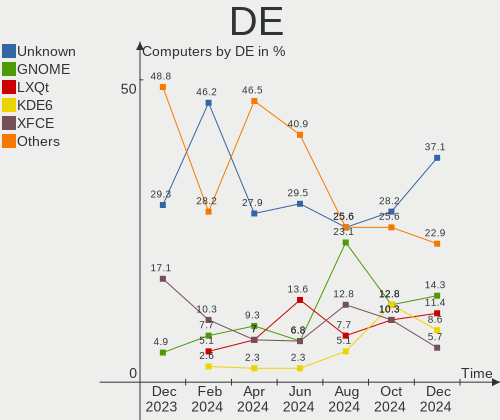
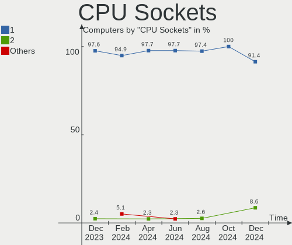
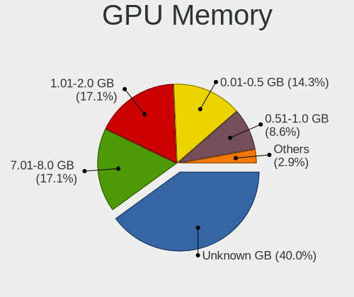

Gentoo Hardware Trends
----------------------

A project to identify most popular hardware characteristics and track their change
over time based on data collected by Gentoo users at https://Linux-Hardware.org.

Anyone can contribute to the study by uploading probes of their computers by
the [hw-probe](https://github.com/linuxhw/hw-probe) tool:

    sudo -E hw-probe -all -upload

This is a report for all computer types. See also reports for [desktops](/Dist/Gentoo/Desktop/README.md) and [notebooks](/Dist/Gentoo/Notebook/README.md).

Full-feature report is available here: https://linux-hardware.org/?view=trends

Period: May, 2020.

Contents
--------

- [ OS                       ](#os)
- [ OS Family                ](#os-family)
- [ Kernel                   ](#kernel)
- [ Kernel Family            ](#kernel-family)
- [ Kernel Major Ver.        ](#kernel-major-ver)
- [ Arch                     ](#arch)
- [ DE                       ](#de)
- [ Display Server           ](#display-server)
- [ Display Manager          ](#display-manager)
- [ OS Lang                  ](#os-lang)
- [ Boot Mode                ](#boot-mode)
- [ Filesystem               ](#filesystem)
- [ Part. scheme             ](#part-scheme)
- [ Dual Boot with Linux/BSD ](#dual-boot-with-linux/bsd)
- [ Dual Boot (Win)          ](#dual-boot-win)
- [ Country                  ](#country)
- [ City                     ](#city)
- [ Vendor                   ](#vendor)
- [ Model                    ](#model)
- [ Model Family             ](#model-family)
- [ MFG Year                 ](#mfg-year)
- [ Form Factor              ](#form-factor)
- [ Secure Boot              ](#secure-boot)
- [ Coreboot                 ](#coreboot)
- [ RAM Size                 ](#ram-size)
- [ RAM Used                 ](#ram-used)
- [ Drive Vendor             ](#drive-vendor)
- [ Drive Model              ](#drive-model)
- [ Drive Kind               ](#drive-kind)
- [ Drive Connector          ](#drive-connector)
- [ Drive Size               ](#drive-size)
- [ Space Total              ](#space-total)
- [ Space Used               ](#space-used)
- [ Malfunc. Drives          ](#malfunc-drives)
- [ Malfunc. Drive Vendor    ](#malfunc-drive-vendor)
- [ Malfunc. Drive Kind      ](#malfunc-drive-kind)
- [ Failed Drives            ](#failed-drives)
- [ Failed Drive Vendor      ](#failed-drive-vendor)
- [ Drive Status             ](#drive-status)
- [ Storage Vendor           ](#storage-vendor)
- [ Storage Model            ](#storage-model)
- [ Storage Kind             ](#storage-kind)
- [ CPU Vendor               ](#cpu-vendor)
- [ CPU Model                ](#cpu-model)
- [ CPU Model Family         ](#cpu-model-family)
- [ CPU Cores                ](#cpu-cores)
- [ CPU Sockets              ](#cpu-sockets)
- [ CPU Threads              ](#cpu-threads)
- [ CPU Op-Modes             ](#cpu-op-modes)
- [ CPU Microcode            ](#cpu-microcode)
- [ CPU Microarch            ](#cpu-microarch)
- [ GPU Vendor               ](#gpu-vendor)
- [ GPU Model                ](#gpu-model)
- [ GPU Combo                ](#gpu-combo)
- [ GPU Driver               ](#gpu-driver)
- [ GPU Memory               ](#gpu-memory)
- [ Monitor Vendor           ](#monitor-vendor)
- [ Monitor Model            ](#monitor-model)
- [ Monitor Resolution       ](#monitor-resolution)
- [ Monitor Diagonal         ](#monitor-diagonal)
- [ Monitor Width            ](#monitor-width)
- [ Aspect Ratio             ](#aspect-ratio)
- [ Monitor Area             ](#monitor-area)
- [ Pixel Density            ](#pixel-density)
- [ Multiple Monitors        ](#multiple-monitors)
- [ Net Controller Vendor    ](#net-controller-vendor)
- [ Net Controller Model     ](#net-controller-model)
- [ Net Controller Kind      ](#net-controller-kind)
- [ Used Controller          ](#used-controller)
- [ NICs                     ](#nics)
- [ Unsupported Devices      ](#unsupported-devices)
- [ Unsupported Device Types ](#unsupported-device-types)

OS
--

Installed operating systems

| Name       | Computers | Percent |
|------------|-----------|---------|
| Gentoo     | 46        | 59.74%  |
| Gentoo 2.6 | 18        | 23.38%  |
| Gentoo 2.7 | 12        | 15.58%  |
| Gentoo 1   | 1         | 1.3%    |

OS Family
---------

OS without a version

| Name   | Computers | Percent |
|--------|-----------|---------|
| Gentoo | 77        | 100%    |

Kernel
------

Version of the Linux kernel

| Version                                  | Computers | Percent |
|------------------------------------------|-----------|---------|
| 5.4.38-gentoo                            | 8         | 10.39%  |
| 5.4.28-gentoo                            | 5         | 6.49%   |
| 5.6.11-gentoo                            | 4         | 5.19%   |
| 5.4.38-gentoo-x86_64                     | 3         | 3.9%    |
| 5.6.7                                    | 2         | 2.6%    |
| 5.6.2-gentoo                             | 2         | 2.6%    |
| 5.6.13                                   | 2         | 2.6%    |
| 5.6.12-gentoo-x86_64                     | 2         | 2.6%    |
| 5.6.9-zen1                               | 1         | 1.3%    |
| 5.6.8-x86_64                             | 1         | 1.3%    |
| 5.6.8                                    | 1         | 1.3%    |
| 5.6.7-gentoo                             | 1         | 1.3%    |
| 5.6.6-gentoo                             | 1         | 1.3%    |
| 5.6.15-gentoo-x86_64                     | 1         | 1.3%    |
| 5.6.14-gentoo-x86_64                     | 1         | 1.3%    |
| 5.6.14-gentoo-limelight                  | 1         | 1.3%    |
| 5.6.14-gentoo                            | 1         | 1.3%    |
| 5.6.13-gentoo-x86_64                     | 1         | 1.3%    |
| 5.6.13-gentoo                            | 1         | 1.3%    |
| 5.6.11-gentoo.87-Bluetooth               | 1         | 1.3%    |
| 5.6.11-gentoo-nvidia                     | 1         | 1.3%    |
| 5.6.11-gentoo-namica                     | 1         | 1.3%    |
| 5.6.11-gentoo-ck1                        | 1         | 1.3%    |
| 5.6.10-gentoo-x86_64                     | 1         | 1.3%    |
| 5.6.10-gentoo                            | 1         | 1.3%    |
| 5.6.0-pf6                                | 1         | 1.3%    |
| 5.5.13-gentoo                            | 1         | 1.3%    |
| 5.4.7-gentoo                             | 1         | 1.3%    |
| 5.4.39-gentoo-58-crypt                   | 1         | 1.3%    |
| 5.4.39-gentoo                            | 1         | 1.3%    |
| 5.4.38-gentoo_zotac-ionitx-a-e_nvidia    | 1         | 1.3%    |
| 5.4.38-gentoo_zotac-ionitx-a-e           | 1         | 1.3%    |
| 5.4.38-gentoo_TARGA-NOW_NT9231           | 1         | 1.3%    |
| 5.4.38-gentoo_PowerBook5,4               | 1         | 1.3%    |
| 5.4.38-gentoo_PowerBook3,4               | 1         | 1.3%    |
| 5.4.38-gentoo_B75M-D3H                   | 1         | 1.3%    |
| 5.4.38-gentoo-silverstore                | 1         | 1.3%    |
| 5.4.37-gentoo.59-Bluetooth.              | 1         | 1.3%    |
| 5.4.32                                   | 1         | 1.3%    |
| 5.4.31-ck                                | 1         | 1.3%    |
| 5.4.30-gentoo-g7768687-dirty             | 1         | 1.3%    |
| 5.4.28-gentoo_PowerBook5,6               | 1         | 1.3%    |
| 5.4.28-gentoo_Mac-94245A3940C91C80       | 1         | 1.3%    |
| 5.4.28-gentoo-zen1                       | 1         | 1.3%    |
| 5.4.28-gentoo-x86_64                     | 1         | 1.3%    |
| 5.4.28-gentoo-Lenovo_L450                | 1         | 1.3%    |
| 5.4.25-gentoo-Spectre.I                  | 1         | 1.3%    |
| 5.4.18                                   | 1         | 1.3%    |
| 5.4.17-gentoo                            | 1         | 1.3%    |
| 5.4.0-rc1-beryllium4-00133-g4ea655343ce4 | 1         | 1.3%    |
| 5.4.0-31-generic                         | 1         | 1.3%    |
| 5.3.1                                    | 1         | 1.3%    |
| 5.2.0                                    | 1         | 1.3%    |
| 4.19.97-gentoo-x86_64                    | 1         | 1.3%    |
| 4.19.86-gentoo                           | 1         | 1.3%    |
| 4.19.72-gentoo                           | 1         | 1.3%    |
| 4.14.83-gentoo                           | 1         | 1.3%    |

Kernel Family
-------------

Linux kernel without a distro release

| Version | Computers | Percent |
|---------|-----------|---------|
| 5.4.38  | 18        | 23.38%  |
| 5.4.28  | 10        | 12.99%  |
| 5.6.11  | 8         | 10.39%  |
| 5.6.13  | 4         | 5.19%   |
| 5.6.7   | 3         | 3.9%    |
| 5.6.14  | 3         | 3.9%    |
| 5.6.8   | 2         | 2.6%    |
| 5.6.2   | 2         | 2.6%    |
| 5.6.12  | 2         | 2.6%    |
| 5.6.10  | 2         | 2.6%    |
| 5.4.39  | 2         | 2.6%    |
| 5.4.0   | 2         | 2.6%    |
| 5.6.9   | 1         | 1.3%    |
| 5.6.6   | 1         | 1.3%    |
| 5.6.15  | 1         | 1.3%    |
| 5.6.0   | 1         | 1.3%    |
| 5.5.13  | 1         | 1.3%    |
| 5.4.7   | 1         | 1.3%    |
| 5.4.37  | 1         | 1.3%    |
| 5.4.32  | 1         | 1.3%    |
| 5.4.31  | 1         | 1.3%    |
| 5.4.30  | 1         | 1.3%    |
| 5.4.25  | 1         | 1.3%    |
| 5.4.18  | 1         | 1.3%    |
| 5.4.17  | 1         | 1.3%    |
| 5.3.1   | 1         | 1.3%    |
| 5.2.0   | 1         | 1.3%    |
| 4.19.97 | 1         | 1.3%    |
| 4.19.86 | 1         | 1.3%    |
| 4.19.72 | 1         | 1.3%    |
| 4.14.83 | 1         | 1.3%    |

Kernel Major Ver.
-----------------

Linux kernel major version

| Version | Computers | Percent |
|---------|-----------|---------|
| 5.4     | 40        | 51.95%  |
| 5.6     | 30        | 38.96%  |
| 4.19    | 3         | 3.9%    |
| 5.5     | 1         | 1.3%    |
| 5.3     | 1         | 1.3%    |
| 5.2     | 1         | 1.3%    |
| 4.14    | 1         | 1.3%    |

Arch
----

OS architecture (x86_64, i586, etc.)

| Name     | Computers | Percent |
|----------|-----------|---------|
| x86_64   | 71        | 92.21%  |
| ppc      | 3         | 3.9%    |
| i686     | 2         | 2.6%    |
| armv5tel | 1         | 1.3%    |

DE
--

Desktop Environment

| Name    | Computers | Percent |
|---------|-----------|---------|
| Unknown | 58        | 75.32%  |
| XFCE    | 12        | 15.58%  |
| KDE     | 4         | 5.19%   |
| KDE5    | 2         | 2.6%    |
| GNOME   | 1         | 1.3%    |

Display Server
--------------

X11 or Wayland

| Name    | Computers | Percent |
|---------|-----------|---------|
| X11     | 49        | 63.64%  |
| Unknown | 16        | 20.78%  |
| Tty     | 12        | 15.58%  |

Display Manager
---------------

SDDM, LightDM, etc.

| Name    | Computers | Percent |
|---------|-----------|---------|
| Unknown | 54        | 70.13%  |
| SDDM    | 8         | 10.39%  |
| LightDM | 5         | 6.49%   |
| XDM     | 4         | 5.19%   |
| SLiM    | 4         | 5.19%   |
| GDM     | 2         | 2.6%    |

OS Lang
-------

Language

| Lang       | Computers | Percent |
|------------|-----------|---------|
| en_US.utf8 | 22        | 28.57%  |
| de_DE.utf8 | 9         | 11.69%  |
| Unknown    | 6         | 7.79%   |
| en_CA      | 5         | 6.49%   |
| en_GB.utf8 | 4         | 5.19%   |
| en_US      | 3         | 3.9%    |
| ru_RU.utf8 | 2         | 2.6%    |
| POSIX      | 2         | 2.6%    |
| en_MX      | 2         | 2.6%    |
| el_GR.utf8 | 2         | 2.6%    |
| de_DE      | 2         | 2.6%    |
| cs_CZ.utf8 | 2         | 2.6%    |
| C.UTF8     | 2         | 2.6%    |
| zh_CN      | 1         | 1.3%    |
| tr_TR.UTF8 | 1         | 1.3%    |
| ru_UA.utf8 | 1         | 1.3%    |
| ru_RU      | 1         | 1.3%    |
| pt_BR      | 1         | 1.3%    |
| it_IT.utf8 | 1         | 1.3%    |
| fr_FR.utf8 | 1         | 1.3%    |
| fr_FR      | 1         | 1.3%    |
| es_ES.utf8 | 1         | 1.3%    |
| en_GB      | 1         | 1.3%    |
| en_DK.utf8 | 1         | 1.3%    |
| en_DE      | 1         | 1.3%    |
| en_CA.utf8 | 1         | 1.3%    |
| cs_CZ      | 1         | 1.3%    |

Boot Mode
---------

EFI or BIOS

| Mode | Computers | Percent |
|------|-----------|---------|
| BIOS | 39        | 50.65%  |
| EFI  | 38        | 49.35%  |

Filesystem
----------

Type of filesystem

| Type     | Computers | Percent |
|----------|-----------|---------|
| Ext4     | 51        | 66.23%  |
| Btrfs    | 19        | 24.68%  |
| Zfs      | 3         | 3.9%    |
| F2fs     | 3         | 3.9%    |
| Reiserfs | 1         | 1.3%    |

Part. scheme
------------

Scheme of partitioning

| Type    | Computers | Percent |
|---------|-----------|---------|
| Unknown | 46        | 59.74%  |
| GPT     | 20        | 25.97%  |
| MBR     | 11        | 14.29%  |

Dual Boot with Linux/BSD
------------------------

Hosting more than one Linux/BSD

| Dual boot | Computers | Percent |
|-----------|-----------|---------|
| No        | 52        | 67.53%  |
| Yes       | 25        | 32.47%  |

Dual Boot (Win)
---------------

Hosting Linux and Windows

| Dual boot | Computers | Percent |
|-----------|-----------|---------|
| No        | 52        | 67.53%  |
| Yes       | 25        | 32.47%  |

Country
-------

Geographic location (country)

| Country        | Computers | Percent |
|----------------|-----------|---------|
| Germany        | 18        | 23.38%  |
| USA            | 14        | 18.18%  |
| Canada         | 6         | 7.79%   |
| Greece         | 5         | 6.49%   |
| Sweden         | 3         | 3.9%    |
| Russia         | 3         | 3.9%    |
| France         | 3         | 3.9%    |
| Czech Republic | 3         | 3.9%    |
| Spain          | 2         | 2.6%    |
| Slovenia       | 2         | 2.6%    |
| Mexico         | 2         | 2.6%    |
| Italy          | 2         | 2.6%    |
| Belarus        | 2         | 2.6%    |
| Ukraine        | 1         | 1.3%    |
| UK             | 1         | 1.3%    |
| Turkey         | 1         | 1.3%    |
| Portugal       | 1         | 1.3%    |
| Poland         | 1         | 1.3%    |
| New Zealand    | 1         | 1.3%    |
| Hong Kong      | 1         | 1.3%    |
| Estonia        | 1         | 1.3%    |
| Denmark        | 1         | 1.3%    |
| China          | 1         | 1.3%    |
| Brazil         | 1         | 1.3%    |
| Austria        | 1         | 1.3%    |

City
----

Geographic location (city)

| City                 | Computers | Percent |
|----------------------|-----------|---------|
| Berlin               | 10        | 12.99%  |
| Ottawa               | 6         | 7.79%   |
| Šlapanice           | 3         | 3.9%    |
| Athens               | 3         | 3.9%    |
| Saltillo             | 2         | 2.6%    |
| Sahuarita            | 2         | 2.6%    |
| Ljubljana            | 2         | 2.6%    |
| Clermont             | 2         | 2.6%    |
| Bromma               | 2         | 2.6%    |
| Zaragoza             | 1         | 1.3%    |
| Warsaw               | 1         | 1.3%    |
| Vienna               | 1         | 1.3%    |
| Tallinn              | 1         | 1.3%    |
| São Paulo           | 1         | 1.3%    |
| St Petersburg        | 1         | 1.3%    |
| Salvaterra de Magos  | 1         | 1.3%    |
| Roubaix              | 1         | 1.3%    |
| Potsdam              | 1         | 1.3%    |
| Pittsfield           | 1         | 1.3%    |
| Palmers Green        | 1         | 1.3%    |
| Odense               | 1         | 1.3%    |
| Nuremberg            | 1         | 1.3%    |
| Novokuznetsk         | 1         | 1.3%    |
| Moscow               | 1         | 1.3%    |
| Monterey             | 1         | 1.3%    |
| Missoula             | 1         | 1.3%    |
| Mirano               | 1         | 1.3%    |
| Minsk                | 1         | 1.3%    |
| Livingston           | 1         | 1.3%    |
| Lisichansk           | 1         | 1.3%    |
| Leipzig              | 1         | 1.3%    |
| Knob Noster          | 1         | 1.3%    |
| Istanbul             | 1         | 1.3%    |
| Hudson               | 1         | 1.3%    |
| Hanover              | 1         | 1.3%    |
| Hamburg              | 1         | 1.3%    |
| Guangzhou            | 1         | 1.3%    |
| Gretz-Armainvilliers | 1         | 1.3%    |
| Gallatin             | 1         | 1.3%    |
| Fredonia             | 1         | 1.3%    |
| Falun                | 1         | 1.3%    |
| Elefsina             | 1         | 1.3%    |
| Dunkirk              | 1         | 1.3%    |
| Cottbus              | 1         | 1.3%    |
| Colorado Springs     | 1         | 1.3%    |
| Cologne              | 1         | 1.3%    |
| Central              | 1         | 1.3%    |
| Cassano d'Adda       | 1         | 1.3%    |
| Brest                | 1         | 1.3%    |
| Brandon              | 1         | 1.3%    |
| Barcelona            | 1         | 1.3%    |
| Auckland             | 1         | 1.3%    |
| Ano Syros            | 1         | 1.3%    |
| Alperstedt           | 1         | 1.3%    |

Vendor
------

Motherboard manufacturer

| Name                | Computers | Percent |
|---------------------|-----------|---------|
| ASUSTek Computer    | 17        | 22.08%  |
| Lenovo              | 9         | 11.69%  |
| Gigabyte Technology | 9         | 11.69%  |
| Hewlett-Packard     | 7         | 9.09%   |
| Unknown             | 7         | 9.09%   |
| Dell                | 6         | 7.79%   |
| ASRock              | 6         | 7.79%   |
| MSI                 | 4         | 5.19%   |
| Acer                | 3         | 3.9%    |
| Toshiba             | 2         | 2.6%    |
| Timi                | 1         | 1.3%    |
| Sun Microsystems    | 1         | 1.3%    |
| SECO                | 1         | 1.3%    |
| Pegatron            | 1         | 1.3%    |
| Foxconn             | 1         | 1.3%    |
| ASRockRack          | 1         | 1.3%    |
| Apple               | 1         | 1.3%    |

Model
-----

Motherboard model

| Name                                      | Computers | Percent |
|-------------------------------------------|-----------|---------|
| Unknown                                   | 8         | 10.39%  |
| ASUS All Series                           | 2         | 2.6%    |
| Toshiba Satellite L50-A-16G               | 1         | 1.3%    |
| Toshiba NB100                             | 1         | 1.3%    |
| Timi Mi Laptop Air 12.5                   | 1         | 1.3%    |
| Sun Microsystems Ultra 24                 | 1         | 1.3%    |
| SECO UDOO x86                             | 1         | 1.3%    |
| Pegatron AY026AA-ABA CQ5300F              | 1         | 1.3%    |
| MSI MS-7C02                               | 1         | 1.3%    |
| MSI MS-7A33                               | 1         | 1.3%    |
| MSI MS-7978                               | 1         | 1.3%    |
| MSI GT63 Titan 8SG                        | 1         | 1.3%    |
| Lenovo ThinkPad X250 20CM004ESC           | 1         | 1.3%    |
| Lenovo ThinkPad X1 Extreme 2nd 20QV001GPB | 1         | 1.3%    |
| Lenovo ThinkPad T490s 20NXCTO1WW          | 1         | 1.3%    |
| Lenovo ThinkPad L450 20DTS01R00           | 1         | 1.3%    |
| Lenovo ThinkPad 20F6CTO1WW                | 1         | 1.3%    |
| Lenovo Legion Y540-15IRH-PG0 81SY         | 1         | 1.3%    |
| Lenovo IdeaPad Z370                       | 1         | 1.3%    |
| Lenovo IdeaPad L340-17IRH Gaming 81LL     | 1         | 1.3%    |
| Lenovo IdeaPad 100-15IBY 80MJ             | 1         | 1.3%    |
| HP Z600 Workstation                       | 1         | 1.3%    |
| HP Spectre x360 Convertible 15-ch0xx      | 1         | 1.3%    |
| HP Pavilion ZV6100 (EE984EA#ABZ)          | 1         | 1.3%    |
| HP Pavilion Notebook                      | 1         | 1.3%    |
| HP ENVY Desktop                           | 1         | 1.3%    |
| HP Compaq 8000 Elite USDT PC              | 1         | 1.3%    |
| Gigabyte Z97P-D3                          | 1         | 1.3%    |
| Gigabyte X570 AORUS ELITE                 | 1         | 1.3%    |
| Gigabyte M61SME-S2                        | 1         | 1.3%    |
| Gigabyte H370M-D3H                        | 1         | 1.3%    |
| Gigabyte GA-E350N-USB3                    | 1         | 1.3%    |
| Gigabyte G31M-ES2L                        | 1         | 1.3%    |
| Gigabyte B75M-D3H                         | 1         | 1.3%    |
| Gigabyte B450M S2H                        | 1         | 1.3%    |
| Gigabyte A320M-S2H                        | 1         | 1.3%    |
| Foxconn nT-330i                           | 1         | 1.3%    |
| Dell Precision 5820 Tower                 | 1         | 1.3%    |
| Dell OptiPlex 7010                        | 1         | 1.3%    |
| Dell Latitude E6520                       | 1         | 1.3%    |
| Dell Latitude E6440                       | 1         | 1.3%    |
| Dell Latitude E5540                       | 1         | 1.3%    |
| Dell Latitude 3400                        | 1         | 1.3%    |
| ASUS Zephyrus M GU502GV_GU502GV           | 1         | 1.3%    |
| ASUS WS-C621E-SAGE Series                 | 1         | 1.3%    |
| ASUS TUF X470-PLUS GAMING                 | 1         | 1.3%    |
| ASUS STRIX H270F GAMING                   | 1         | 1.3%    |
| ASUS ROG CROSSHAIR VIII HERO              | 1         | 1.3%    |
| ASUS PRIME X470-PRO                       | 1         | 1.3%    |
| ASUS P8Z77-V LE PLUS                      | 1         | 1.3%    |
| ASUS P8B75-V                              | 1         | 1.3%    |
| ASUS P6TD DELUXE                          | 1         | 1.3%    |
| ASUS Maximus VIII HERO                    | 1         | 1.3%    |
| ASUS M5A97                                | 1         | 1.3%    |
| ASUS M2N-CM DVI                           | 1         | 1.3%    |
| ASUS E45M1-I DELUXE                       | 1         | 1.3%    |
| ASUS E402NA                               | 1         | 1.3%    |
| ASUS CROSSHAIR VI HERO                    | 1         | 1.3%    |
| ASRockRack X470D4U                        | 1         | 1.3%    |
| ASRock Z77 Extreme3                       | 1         | 1.3%    |

Model Family
------------

Motherboard model prefix

| Name                   | Computers | Percent |
|------------------------|-----------|---------|
| Unknown                | 8         | 10.39%  |
| Lenovo ThinkPad        | 5         | 6.49%   |
| Dell Latitude          | 4         | 5.19%   |
| Lenovo IdeaPad         | 3         | 3.9%    |
| Acer Aspire            | 3         | 3.9%    |
| HP Pavilion            | 2         | 2.6%    |
| ASUS All               | 2         | 2.6%    |
| Toshiba Satellite      | 1         | 1.3%    |
| Toshiba NB100          | 1         | 1.3%    |
| Timi Mi                | 1         | 1.3%    |
| Sun Microsystems Ultra | 1         | 1.3%    |
| SECO UDOO              | 1         | 1.3%    |
| Pegatron AY026AA-ABA   | 1         | 1.3%    |
| MSI MS-7C02            | 1         | 1.3%    |
| MSI MS-7A33            | 1         | 1.3%    |
| MSI MS-7978            | 1         | 1.3%    |
| MSI GT63               | 1         | 1.3%    |
| Lenovo Legion          | 1         | 1.3%    |
| HP Z600                | 1         | 1.3%    |
| HP Spectre             | 1         | 1.3%    |
| HP ENVY                | 1         | 1.3%    |
| HP Compaq              | 1         | 1.3%    |
| Gigabyte Z97P-D3       | 1         | 1.3%    |
| Gigabyte X570          | 1         | 1.3%    |
| Gigabyte M61SME-S2     | 1         | 1.3%    |
| Gigabyte H370M-D3H     | 1         | 1.3%    |
| Gigabyte GA-E350N-USB3 | 1         | 1.3%    |
| Gigabyte G31M-ES2L     | 1         | 1.3%    |
| Gigabyte B75M-D3H      | 1         | 1.3%    |
| Gigabyte B450M         | 1         | 1.3%    |
| Gigabyte A320M-S2H     | 1         | 1.3%    |
| Foxconn nT-330i        | 1         | 1.3%    |
| Dell Precision         | 1         | 1.3%    |
| Dell OptiPlex          | 1         | 1.3%    |
| ASUS Zephyrus          | 1         | 1.3%    |
| ASUS WS-C621E-SAGE     | 1         | 1.3%    |
| ASUS TUF               | 1         | 1.3%    |
| ASUS STRIX             | 1         | 1.3%    |
| ASUS ROG               | 1         | 1.3%    |
| ASUS PRIME             | 1         | 1.3%    |
| ASUS P8Z77-V           | 1         | 1.3%    |
| ASUS P8B75-V           | 1         | 1.3%    |
| ASUS P6TD              | 1         | 1.3%    |
| ASUS Maximus           | 1         | 1.3%    |
| ASUS M5A97             | 1         | 1.3%    |
| ASUS M2N-CM            | 1         | 1.3%    |
| ASUS E45M1-I           | 1         | 1.3%    |
| ASUS E402NA            | 1         | 1.3%    |
| ASUS CROSSHAIR         | 1         | 1.3%    |
| ASRockRack X470D4U     | 1         | 1.3%    |
| ASRock Z77             | 1         | 1.3%    |
| ASRock X570            | 1         | 1.3%    |
| ASRock X470            | 1         | 1.3%    |
| ASRock X370            | 1         | 1.3%    |
| ASRock M3A785GXH       | 1         | 1.3%    |
| ASRock B450M-HDV       | 1         | 1.3%    |
| Apple MacBookPro8      | 1         | 1.3%    |

MFG Year
--------

Motherboard manufacture year

| Year    | Computers | Percent |
|---------|-----------|---------|
| 2019    | 20        | 25.97%  |
| 2018    | 9         | 11.69%  |
| 2020    | 7         | 9.09%   |
| 2009    | 6         | 7.79%   |
| 2014    | 5         | 6.49%   |
| 2017    | 4         | 5.19%   |
| 2016    | 4         | 5.19%   |
| 2015    | 4         | 5.19%   |
| Unknown | 4         | 5.19%   |
| 2013    | 3         | 3.9%    |
| 2010    | 3         | 3.9%    |
| 2008    | 3         | 3.9%    |
| 2012    | 2         | 2.6%    |
| 2011    | 2         | 2.6%    |
| 2006    | 1         | 1.3%    |

Form Factor
-----------

Physical design of the computer

| Name        | Computers | Percent |
|-------------|-----------|---------|
| Desktop     | 44        | 57.14%  |
| Notebook    | 29        | 37.66%  |
| Other       | 2         | 2.6%    |
| Convertible | 1         | 1.3%    |
| Server      | 1         | 1.3%    |

Secure Boot
-----------

Enabled or disabled

| State    | Computers | Percent |
|----------|-----------|---------|
| Disabled | 76        | 98.7%   |
| Enabled  | 1         | 1.3%    |

Coreboot
--------

Have coreboot on board

| Used | Computers | Percent |
|------|-----------|---------|
| No   | 77        | 100%    |

RAM Size
--------

Total RAM memory

| Size in GB  | Computers | Percent |
|-------------|-----------|---------|
| 16.01-24.0  | 20        | 25.97%  |
| 32.01-64.0  | 16        | 20.78%  |
| 8.01-16.0   | 10        | 12.99%  |
| 1.01-2.0    | 8         | 10.39%  |
| 3.01-4.0    | 7         | 9.09%   |
| 4.01-8.0    | 6         | 7.79%   |
| 0.01-1.0    | 5         | 6.49%   |
| 64.01-256.0 | 4         | 5.19%   |
| 24.01-32.0  | 1         | 1.3%    |

RAM Used
--------

Used RAM memory

| Used GB    | Computers | Percent |
|------------|-----------|---------|
| 0.01-1.0   | 24        | 31.17%  |
| 1.01-2.0   | 17        | 22.08%  |
| 4.01-8.0   | 13        | 16.88%  |
| 2.01-3.0   | 11        | 14.29%  |
| 3.01-4.0   | 6         | 7.79%   |
| 32.01-64.0 | 2         | 2.6%    |
| 16.01-24.0 | 2         | 2.6%    |
| 8.01-16.0  | 2         | 2.6%    |

Drive Vendor
------------

Hard drive vendors

| Vendor              | Computers | Drives | Percent |
|---------------------|-----------|--------|---------|
| WDC                 | 28        | 42     | 21.21%  |
| Samsung Electronics | 25        | 34     | 18.94%  |
| Seagate             | 18        | 21     | 13.64%  |
| Intel               | 9         | 10     | 6.82%   |
| Hitachi             | 8         | 8      | 6.06%   |
| SanDisk             | 7         | 8      | 5.3%    |
| Kingston            | 5         | 6      | 3.79%   |
| Crucial             | 4         | 4      | 3.03%   |
| WDC WD16            | 3         | 3      | 2.27%   |
| Unknown             | 3         | 3      | 2.27%   |
| Toshiba             | 3         | 3      | 2.27%   |
| HGST                | 3         | 3      | 2.27%   |
| Phison              | 2         | 2      | 1.52%   |
| OCZ                 | 2         | 2      | 1.52%   |
| Fujitsu             | 2         | 2      | 1.52%   |
| Union Memory        | 1         | 1      | 0.76%   |
| Transcend           | 1         | 1      | 0.76%   |
| Patriot             | 1         | 1      | 0.76%   |
| Netac               | 1         | 1      | 0.76%   |
| Linux               | 1         | 1      | 0.76%   |
| LaCie               | 1         | 1      | 0.76%   |
| KIOXIA              | 1         | 1      | 0.76%   |
| Hewlett-Packard     | 1         | 1      | 0.76%   |
| Generic             | 1         | 1      | 0.76%   |
| China               | 1         | 1      | 0.76%   |

Drive Model
-----------

Hard drive models

| Model                        | Computers | Percent |
|------------------------------|-----------|---------|
| WD30EFRX-68EUZN0 3TB         | 3         | 1.86%   |
| ST500DM002-1BD142 500GB      | 3         | 1.86%   |
| SSD 850 EVO 500GB            | 3         | 1.86%   |
| 00BB-55GUA0 160GB            | 3         | 1.86%   |
| WD40EFRX-68WT0N0 4TB         | 2         | 1.24%   |
| WD10EZEX-08WN4A0 1TB         | 2         | 1.24%   |
| ST3500418AS 500GB            | 2         | 1.24%   |
| SSDPEKNW010T8 1TB            | 2         | 1.24%   |
| SSD PLUS 480GB               | 2         | 1.24%   |
| SSD 970 PRO 1TB              | 2         | 1.24%   |
| SSD 970 EVO 1TB              | 2         | 1.24%   |
| SSD 860 EVO 1TB              | 2         | 1.24%   |
| SSD 840 EVO 250GB            | 2         | 1.24%   |
| SA400S37120G 120GB SSD       | 2         | 1.24%   |
| HTS725050A9A362 500GB        | 2         | 1.24%   |
| HTS721080G9SA00 80GB         | 2         | 1.24%   |
| WDS500G2B0B-00YS70 500GB SSD | 1         | 0.62%   |
| WDS240G2G0A-00JH30 240GB SSD | 1         | 0.62%   |
| WD82PURZ-85TEUY0 8TB         | 1         | 0.62%   |
| WD80EFZX-68UW8N0 8TB         | 1         | 0.62%   |
| WD80EFAX-68LHPN0 8TB         | 1         | 0.62%   |
| WD80EFAX-68KNBN0 8TB         | 1         | 0.62%   |
| WD8001FFWX-68J1UN0 8TB       | 1         | 0.62%   |
| WD7500BPKX-22HPJT0 752GB     | 1         | 0.62%   |
| WD7500BPKT-60PK4T0 752GB     | 1         | 0.62%   |
| WD740ADFD-00NLR1 74GB        | 1         | 0.62%   |
| WD60EZAZ-00ZGHB0 6TB         | 1         | 0.62%   |
| WD5000AAVS-22G9B1 500GB      | 1         | 0.62%   |
| WD40EZRX-00SPEB0 4TB         | 1         | 0.62%   |
| WD40EFRX-68N32N0 4TB         | 1         | 0.62%   |
| WD4004FZWX-00GBGB0 4TB       | 1         | 0.62%   |
| WD4003FFBX-68MU3N0 4TB       | 1         | 0.62%   |
| WD3200BEKX-75B7WT0 320GB     | 1         | 0.62%   |
| WD3200AAKS-75VYA0 320GB      | 1         | 0.62%   |
| WD3200AAJS-65M0A0 320GB      | 1         | 0.62%   |
| WD30PURZ-85GU6Y0 3TB         | 1         | 0.62%   |
| WD2500BEVS-22UST0 250GB      | 1         | 0.62%   |
| WD2500AAKX-753CA1 250GB      | 1         | 0.62%   |
| WD2500AAKS-00YGA0 250GB      | 1         | 0.62%   |
| WD20EZRX-00D8PB0 2TB         | 1         | 0.62%   |
| WD20EZAZ-00GGJB0 2TB         | 1         | 0.62%   |
| WD20EFRX-68EUZN0 2TB         | 1         | 0.62%   |
| WD20EFRX-68AX9N0 2TB         | 1         | 0.62%   |
| WD1600BEVT-22ZCT0 160GB      | 1         | 0.62%   |
| WD1600AAJS-75M0A0 160GB      | 1         | 0.62%   |
| WD10JPVX-22JC3T0 1TB         | 1         | 0.62%   |
| WD10EZEX-60WN4A0 1TB         | 1         | 0.62%   |
| WD10EZEX-00BN5A0 1TB         | 1         | 0.62%   |
| WD1003FZEX-00K3CA0 1TB       | 1         | 0.62%   |
| TS128GMTS400S 128GB SSD      | 1         | 0.62%   |
| ST500LM012 HN-M500MBB 500GB  | 1         | 0.62%   |
| ST4000VN008-2DR166 4TB       | 1         | 0.62%   |
| ST4000VN000-1H4168 4TB       | 1         | 0.62%   |
| ST4000DM000-1F2168 4TB       | 1         | 0.62%   |
| ST340016A 40GB               | 1         | 0.62%   |
| ST3320813AS 320GB            | 1         | 0.62%   |
| ST3000DM001-1ER166 3TB       | 1         | 0.62%   |
| ST3000DM001-1CH166 3TB       | 1         | 0.62%   |
| ST2000DM005-2CW102 2TB       | 1         | 0.62%   |
| ST2000DM001-1ER164 2TB       | 1         | 0.62%   |

Drive Kind
----------

HDD or SSD

| Kind    | Computers | Drives | Percent |
|---------|-----------|--------|---------|
| HDD     | 51        | 84     | 43.22%  |
| SSD     | 37        | 44     | 31.36%  |
| NVMe    | 25        | 28     | 21.19%  |
| MMC     | 4         | 4      | 3.39%   |
| Unknown | 1         | 1      | 0.85%   |

Drive Connector
---------------

SATA, SAS, NVMe, etc.

| Type | Computers | Drives | Percent |
|------|-----------|--------|---------|
| SATA | 65        | 124    | 65.66%  |
| NVMe | 25        | 28     | 25.25%  |
| SAS  | 5         | 5      | 5.05%   |
| MMC  | 4         | 4      | 4.04%   |

Drive Size
----------

Size of hard drive

| Size in TB | Computers | Drives | Percent |
|------------|-----------|--------|---------|
| 0.01-0.5   | 59        | 81     | 46.83%  |
| 0.51-1.0   | 33        | 40     | 26.19%  |
| 1.01-2.0   | 17        | 17     | 13.49%  |
| 2.01-3.0   | 7         | 7      | 5.56%   |
| 3.01-4.0   | 6         | 10     | 4.76%   |
| 4.01-10.0  | 4         | 6      | 3.17%   |

Space Total
-----------

Amount of disk space available on the file system

| Size in GB     | Computers | Percent |
|----------------|-----------|---------|
| 101-250        | 18        | 23.38%  |
| 251-500        | 13        | 16.88%  |
| 501-1000       | 12        | 15.58%  |
| More than 3000 | 11        | 14.29%  |
| 1001-2000      | 8         | 10.39%  |
| Unknown        | 6         | 7.79%   |
| 2001-3000      | 3         | 3.9%    |
| 51-100         | 3         | 3.9%    |
| 1-20           | 2         | 2.6%    |
| 21-50          | 1         | 1.3%    |

Space Used
----------

Amount of used disk space

| Used GB        | Computers | Percent |
|----------------|-----------|---------|
| 1-20           | 18        | 23.38%  |
| 101-250        | 13        | 16.88%  |
| 51-100         | 9         | 11.69%  |
| 501-1000       | 7         | 9.09%   |
| More than 3000 | 6         | 7.79%   |
| 21-50          | 6         | 7.79%   |
| Unknown        | 6         | 7.79%   |
| 251-500        | 5         | 6.49%   |
| 1001-2000      | 5         | 6.49%   |
| 2001-3000      | 2         | 2.6%    |

Malfunc. Drives
---------------

Drive models with a malfunction

| Model                     | Computers | Drives | Percent |
|---------------------------|-----------|--------|---------|
| WD40EFRX-68WT0N0 4TB      | 2         | 2      | 10.53%  |
| ST500DM002-1BD142 500GB   | 2         | 2      | 10.53%  |
| ST3500418AS 500GB         | 2         | 2      | 10.53%  |
| WD5000AAVS-22G9B1 500GB   | 1         | 1      | 5.26%   |
| WD4004FZWX-00GBGB0 4TB    | 1         | 1      | 5.26%   |
| ST3320813AS 320GB         | 1         | 1      | 5.26%   |
| ST1000NM0011 1TB          | 1         | 1      | 5.26%   |
| ST1000DM003-1CH162 1TB    | 1         | 1      | 5.26%   |
| SSDPEKKW128G7 128GB       | 1         | 1      | 5.26%   |
| SD7SB2Q512G1001 512GB SSD | 1         | 1      | 5.26%   |
| MQ01ABF050 500GB          | 1         | 1      | 5.26%   |
| MK4026GAX 40GB            | 1         | 1      | 5.26%   |
| MHT2080AH 80GB            | 1         | 1      | 5.26%   |
| HTS721080G9SA00 80GB      | 1         | 1      | 5.26%   |
| HTS421260H9AT00 64GB      | 1         | 1      | 5.26%   |
| HD103UJ 1TB               | 1         | 1      | 5.26%   |

Malfunc. Drive Vendor
---------------------

Vendors of faulty drives

| Vendor              | Computers | Drives | Percent |
|---------------------|-----------|--------|---------|
| Seagate             | 6         | 7      | 33.33%  |
| WDC                 | 4         | 4      | 22.22%  |
| Toshiba             | 2         | 2      | 11.11%  |
| Hitachi             | 2         | 2      | 11.11%  |
| SanDisk             | 1         | 1      | 5.56%   |
| Samsung Electronics | 1         | 1      | 5.56%   |
| Intel               | 1         | 1      | 5.56%   |
| Fujitsu             | 1         | 1      | 5.56%   |

Malfunc. Drive Kind
-------------------

Kinds of faulty drives

| Kind | Computers | Drives | Percent |
|------|-----------|--------|---------|
| HDD  | 15        | 17     | 88.24%  |
| NVMe | 1         | 1      | 5.88%   |
| SSD  | 1         | 1      | 5.88%   |

Failed Drives
-------------

Failed drive models

Zero info for selected period =(

Failed Drive Vendor
-------------------

Failed drive vendors

Zero info for selected period =(

Drive Status
------------

Number of failed and malfunc. drives

| Status   | Computers | Drives | Percent |
|----------|-----------|--------|---------|
| Works    | 67        | 132    | 71.28%  |
| Malfunc  | 17        | 19     | 18.09%  |
| Detected | 10        | 10     | 10.64%  |

Storage Vendor
--------------

Storage controller vendors

| Vendor                           | Computers | Percent |
|----------------------------------|-----------|---------|
| Intel                            | 47        | 44.76%  |
| AMD                              | 19        | 18.1%   |
| Samsung Electronics              | 11        | 10.48%  |
| Nvidia                           | 6         | 5.71%   |
| ASMedia Technology               | 5         | 4.76%   |
| Marvell Technology Group         | 3         | 2.86%   |
| Sandisk                          | 2         | 1.9%    |
| Phison Electronics               | 2         | 1.9%    |
| VIA Technologies                 | 1         | 0.95%   |
| Union Memory (Shenzhen)          | 1         | 0.95%   |
| Silicon Motion                   | 1         | 0.95%   |
| Silicon Integrated Systems [SiS] | 1         | 0.95%   |
| LSI Logic / Symbios Logic        | 1         | 0.95%   |
| KIOXIA                           | 1         | 0.95%   |
| Kingston Technology Company      | 1         | 0.95%   |
| JMicron Technology               | 1         | 0.95%   |
| Broadcom / LSI                   | 1         | 0.95%   |
| Adaptec                          | 1         | 0.95%   |

Storage Model
-------------

Storage controller models

| Model                                                                      | Computers | Percent |
|----------------------------------------------------------------------------|-----------|---------|
| FCH SATA Controller [AHCI mode]                                            | 14        | 10.85%  |
| NVMe SSD Controller SM981/PM981/PM983                                      | 7         | 5.43%   |
| 400 Series Chipset SATA Controller                                         | 7         | 5.43%   |
| Non-Volatile memory controller                                             | 5         | 3.88%   |
| 7 Series/C210 Series Chipset Family 6-port SATA Controller [AHCI mode]     | 5         | 3.88%   |
| SSD 660P Series                                                            | 4         | 3.1%    |
| SB7x0/SB8x0/SB9x0 SATA Controller [AHCI mode]                              | 4         | 3.1%    |
| ASM1062 Serial ATA Controller                                              | 4         | 3.1%    |
| X370 Series Chipset SATA Controller                                        | 3         | 2.33%   |
| Wildcat Point-LP SATA Controller [AHCI Mode]                               | 3         | 2.33%   |
| NVMe SSD Controller SM961/PM961                                            | 3         | 2.33%   |
| Cannon Lake Mobile PCH SATA AHCI Controller                                | 3         | 2.33%   |
| SSD Pro 7600p/760p/E 6100p Series                                          | 2         | 1.55%   |
| SB7x0/SB8x0/SB9x0 IDE Controller                                           | 2         | 1.55%   |
| SATA Controller [RAID mode]                                                | 2         | 1.55%   |
| Q170/Q150/B150/H170/H110/Z170/CM236 Chipset SATA Controller [AHCI Mode]    | 2         | 1.55%   |
| MCP61 SATA Controller                                                      | 2         | 1.55%   |
| HM170/QM170 Chipset SATA Controller [AHCI Mode]                            | 2         | 1.55%   |
| 9 Series Chipset Family SATA Controller [AHCI Mode]                        | 2         | 1.55%   |
| 82801 Mobile SATA Controller [RAID mode]                                   | 2         | 1.55%   |
| 7 Series Chipset Family 6-port SATA Controller [AHCI mode]                 | 2         | 1.55%   |
| 6 Series/C200 Series Chipset Family 6 port Mobile SATA AHCI Controller     | 2         | 1.55%   |
| WD Black 2018/PC SN720 NVMe SSD                                            | 1         | 0.78%   |
| VT6421 IDE/SATA Controller                                                 | 1         | 0.78%   |
| Sunrise Point-LP SATA Controller [AHCI mode]                               | 1         | 0.78%   |
| SSD 600P Series                                                            | 1         | 0.78%   |
| SATA Controller / IDE mode                                                 | 1         | 0.78%   |
| SATA controller                                                            | 1         | 0.78%   |
| SAS2308 PCI-Express Fusion-MPT SAS-2                                       | 1         | 0.78%   |
| SAS2008 PCI-Express Fusion-MPT SAS-2 [Falcon]                              | 1         | 0.78%   |
| NVMe SSD Controller SM951/PM951                                            | 1         | 0.78%   |
| NVMe Datacenter SSD [3DNAND, Beta Rock Controller]                         | 1         | 0.78%   |
| NM10/ICH7 Family SATA Controller [IDE mode]                                | 1         | 0.78%   |
| MCP79 SATA Controller                                                      | 1         | 0.78%   |
| MCP79 AHCI Controller                                                      | 1         | 0.78%   |
| MCP78S [GeForce 8200] IDE                                                  | 1         | 0.78%   |
| MCP78S [GeForce 8200] AHCI Controller                                      | 1         | 0.78%   |
| MCP67 IDE Controller                                                       | 1         | 0.78%   |
| MCP67 AHCI Controller                                                      | 1         | 0.78%   |
| MCP61 IDE                                                                  | 1         | 0.78%   |
| JMB363 SATA/IDE Controller                                                 | 1         | 0.78%   |
| IXP SB4x0 IDE Controller                                                   | 1         | 0.78%   |
| FCH SATA Controller D                                                      | 1         | 0.78%   |
| E16 PCIe4 NVMe Controller                                                  | 1         | 0.78%   |
| E12 NVMe Controller                                                        | 1         | 0.78%   |
| Celeron N3350/Pentium N4200/Atom E3900 Series SATA AHCI Controller         | 1         | 0.78%   |
| Cannon Point-LP SATA Controller [AHCI Mode]                                | 1         | 0.78%   |
| Cannon Lake PCH SATA AHCI Controller                                       | 1         | 0.78%   |
| C620 Series Chipset Family SATA Controller [AHCI mode]                     | 1         | 0.78%   |
| C610/X99 series chipset sSATA Controller [AHCI mode]                       | 1         | 0.78%   |
| C610/X99 series chipset 6-Port SATA Controller [AHCI mode]                 | 1         | 0.78%   |
| C600/X79 series chipset SATA RAID Controller                               | 1         | 0.78%   |
| Atom/Celeron/Pentium Processor x5-E8000/J3xxx/N3xxx Series SATA Controller | 1         | 0.78%   |
| Atom Processor E3800 Series SATA AHCI Controller                           | 1         | 0.78%   |
| AIC-7861                                                                   | 1         | 0.78%   |
| 92xx SATA 6G Controller                                                    | 1         | 0.78%   |
| 88SE9120 SATA 6Gb/s Controller                                             | 1         | 0.78%   |
| 88SE6111/6121 SATA II / PATA Controller                                    | 1         | 0.78%   |
| 82801JI (ICH10 Family) SATA AHCI Controller                                | 1         | 0.78%   |
| 82801JD/DO (ICH10 Family) SATA AHCI Controller                             | 1         | 0.78%   |

Storage Kind
------------

Kind of storage controller (IDE, SATA, NVMe, SAS, ...)

| Kind | Computers | Percent |
|------|-----------|---------|
| SATA | 58        | 54.72%  |
| NVMe | 25        | 23.58%  |
| IDE  | 14        | 13.21%  |
| RAID | 6         | 5.66%   |
| SAS  | 2         | 1.89%   |
| SCSI | 1         | 0.94%   |

CPU Vendor
----------

Processor vendors

| Vendor                | Computers | Percent |
|-----------------------|-----------|---------|
| Intel                 | 50        | 64.94%  |
| AMD                   | 23        | 29.87%  |
| PowerBook5,6          | 1         | 1.3%    |
| PowerBook5,4          | 1         | 1.3%    |
| PowerBook3,4          | 1         | 1.3%    |
| Marvell Semiconductor | 1         | 1.3%    |

CPU Model
---------

Processor models

| Model                                                                    | Computers | Percent |
|--------------------------------------------------------------------------|-----------|---------|
| Intel Core i7-9750H CPU @ 2.60GHz                                        | 3         | 3.9%    |
| Intel Core i5-8265U CPU @ 1.60GHz                                        | 2         | 2.6%    |
| Intel Core i5-5200U CPU @ 2.20GHz                                        | 2         | 2.6%    |
| Intel Atom CPU 330 @ 1.60GHz                                             | 2         | 2.6%    |
| AMD Ryzen 7 3800X 8-Core Processor                                       | 2         | 2.6%    |
| AMD Ryzen 7 3700X 8-Core Processor                                       | 2         | 2.6%    |
| AMD Ryzen 7 2700 Eight-Core Processor                                    | 2         | 2.6%    |
| AMD Ryzen 5 3600 6-Core Processor                                        | 2         | 2.6%    |
| PowerBook5,6 7447A, altivec supported                                    | 1         | 1.3%    |
| PowerBook5,4 7447A, altivec supported                                    | 1         | 1.3%    |
| PowerBook3,4 7455, altivec supported                                     | 1         | 1.3%    |
| Marvell Semiconductor Marvell Kirkwood (Flattened Device Tree) Processor | 1         | 1.3%    |
| Intel Xeon W-2104 CPU @ 3.20GHz                                          | 1         | 1.3%    |
| Intel Xeon Gold 6130 CPU @ 2.10GHz                                       | 1         | 1.3%    |
| Intel Xeon CPU X5675 @ 3.07GHz                                           | 1         | 1.3%    |
| Intel Xeon CPU E3-1230 v3 @ 3.30GHz                                      | 1         | 1.3%    |
| Intel Pentium CPU G2030 @ 3.00GHz                                        | 1         | 1.3%    |
| Intel Core m3-8100Y CPU @ 1.10GHz                                        | 1         | 1.3%    |
| Intel Core i7-9750HF CPU @ 2.60GHz                                       | 1         | 1.3%    |
| Intel Core i7-8750H CPU @ 2.20GHz                                        | 1         | 1.3%    |
| Intel Core i7-8705G CPU @ 3.10GHz                                        | 1         | 1.3%    |
| Intel Core i7-8700K CPU @ 3.70GHz                                        | 1         | 1.3%    |
| Intel Core i7-7700K CPU @ 4.20GHz                                        | 1         | 1.3%    |
| Intel Core i7-7700 CPU @ 3.60GHz                                         | 1         | 1.3%    |
| Intel Core i7-6700K CPU @ 4.00GHz                                        | 1         | 1.3%    |
| Intel Core i7-6700HQ CPU @ 2.60GHz                                       | 1         | 1.3%    |
| Intel Core i7-6600U CPU @ 2.60GHz                                        | 1         | 1.3%    |
| Intel Core i7-5930K CPU @ 3.50GHz                                        | 1         | 1.3%    |
| Intel Core i7-5600U CPU @ 2.60GHz                                        | 1         | 1.3%    |
| Intel Core i7-4900MQ CPU @ 2.80GHz                                       | 1         | 1.3%    |
| Intel Core i7-4770K CPU @ 3.50GHz                                        | 1         | 1.3%    |
| Intel Core i7-4600U CPU @ 2.10GHz                                        | 1         | 1.3%    |
| Intel Core i7-3770 CPU @ 3.40GHz                                         | 1         | 1.3%    |
| Intel Core i7-3610QM CPU @ 2.30GHz                                       | 1         | 1.3%    |
| Intel Core i7-2720QM CPU @ 2.20GHz                                       | 1         | 1.3%    |
| Intel Core i7-2675QM CPU @ 2.20GHz                                       | 1         | 1.3%    |
| Intel Core i7 CPU 950 @ 3.07GHz                                          | 1         | 1.3%    |
| Intel Core i5-7600K CPU @ 3.80GHz                                        | 1         | 1.3%    |
| Intel Core i5-3470 CPU @ 3.20GHz                                         | 1         | 1.3%    |
| Intel Core i5-3230M CPU @ 2.60GHz                                        | 1         | 1.3%    |
| Intel Core i5-2500K CPU @ 3.30GHz                                        | 1         | 1.3%    |
| Intel Core i5-2410M CPU @ 2.30GHz                                        | 1         | 1.3%    |
| Intel Core i5-2400 CPU @ 3.10GHz                                         | 1         | 1.3%    |
| Intel Core 2 Quad CPU Q9650 @ 3.00GHz                                    | 1         | 1.3%    |
| Intel Core 2 Duo CPU T7500 @ 2.20GHz                                     | 1         | 1.3%    |
| Intel Core 2 Duo CPU E8600 @ 3.33GHz                                     | 1         | 1.3%    |
| Intel Core 2 CPU 6400 @ 2.13GHz                                          | 1         | 1.3%    |
| Intel Celeron N4100 CPU @ 1.10GHz                                        | 1         | 1.3%    |
| Intel Celeron CPU N3350 @ 1.10GHz                                        | 1         | 1.3%    |
| Intel Celeron CPU N3160 @ 1.60GHz                                        | 1         | 1.3%    |
| Intel Celeron CPU N2840 @ 2.16GHz                                        | 1         | 1.3%    |
| Intel Atom CPU N270 @ 1.60GHz                                            | 1         | 1.3%    |
| Intel Atom CPU 230 @ 1.60GHz                                             | 1         | 1.3%    |
| AMD Sempron Processor LE-1300                                            | 1         | 1.3%    |
| AMD Sempron Processor 3000+                                              | 1         | 1.3%    |
| AMD Ryzen 9 3900X 12-Core Processor                                      | 1         | 1.3%    |
| AMD Ryzen 7 2700X Eight-Core Processor                                   | 1         | 1.3%    |
| AMD Ryzen 7 1700 Eight-Core Processor                                    | 1         | 1.3%    |
| AMD Ryzen 5 1600X Six-Core Processor                                     | 1         | 1.3%    |
| AMD Ryzen 5 1600 Six-Core Processor                                      | 1         | 1.3%    |

CPU Model Family
----------------

Processor model prefix

| Model             | Computers | Percent |
|-------------------|-----------|---------|
| Intel Core i7     | 22        | 28.57%  |
| Intel Core i5     | 10        | 12.99%  |
| AMD Ryzen 7       | 8         | 10.39%  |
| Other             | 4         | 5.19%   |
| Intel Celeron     | 4         | 5.19%   |
| Intel Atom        | 4         | 5.19%   |
| AMD Ryzen 5       | 4         | 5.19%   |
| Intel Xeon        | 3         | 3.9%    |
| Intel Core 2 Duo  | 2         | 2.6%    |
| AMD Sempron       | 2         | 2.6%    |
| AMD E             | 2         | 2.6%    |
| Intel Xeon Gold   | 1         | 1.3%    |
| Intel Pentium     | 1         | 1.3%    |
| Intel Core m3     | 1         | 1.3%    |
| Intel Core 2 Quad | 1         | 1.3%    |
| Intel Core 2      | 1         | 1.3%    |
| AMD Ryzen 9       | 1         | 1.3%    |
| AMD Ryzen 3       | 1         | 1.3%    |
| AMD Phenom II X4  | 1         | 1.3%    |
| AMD FX            | 1         | 1.3%    |
| AMD Athlon II X3  | 1         | 1.3%    |
| AMD Athlon 64     | 1         | 1.3%    |
| AMD Athlon        | 1         | 1.3%    |

CPU Cores
---------

Number of processor cores

| Number  | Computers | Percent |
|---------|-----------|---------|
| 4       | 26        | 33.77%  |
| 2       | 18        | 23.38%  |
| 6       | 11        | 14.29%  |
| 1       | 9         | 11.69%  |
| 8       | 8         | 10.39%  |
| 12      | 2         | 2.6%    |
| 32      | 1         | 1.3%    |
| 3       | 1         | 1.3%    |
| Unknown | 1         | 1.3%    |

CPU Sockets
-----------

Number of sockets

| Number  | Computers | Percent |
|---------|-----------|---------|
| 1       | 74        | 96.1%   |
| 2       | 2         | 2.6%    |
| Unknown | 1         | 1.3%    |

CPU Threads
-----------

Threads per core (Hyper-Threading)

| Number  | Computers | Percent |
|---------|-----------|---------|
| 2       | 49        | 63.64%  |
| 1       | 27        | 35.06%  |
| Unknown | 1         | 1.3%    |

CPU Op-Modes
------------

CPU Operation Modes (32-bit, 64-bit)

| Op mode        | Computers | Percent |
|----------------|-----------|---------|
| 32-bit, 64-bit | 72        | 93.51%  |
| 32-bit         | 3         | 3.9%    |
| Unknown        | 2         | 2.6%    |

CPU Microcode
-------------

Microcode number

| Number     | Computers | Percent |
|------------|-----------|---------|
| Unknown    | 17        | 22.08%  |
| 0x08701013 | 6         | 7.79%   |
| 0x206a7    | 5         | 6.49%   |
| 0x906ea    | 4         | 5.19%   |
| 0x906e9    | 4         | 5.19%   |
| 0x306a9    | 4         | 5.19%   |
| 0x106c2    | 3         | 3.9%    |
| 0x0800820d | 3         | 3.9%    |
| 0x08001138 | 3         | 3.9%    |
| 0x806ec    | 2         | 2.6%    |
| 0x506e3    | 2         | 2.6%    |
| 0x50654    | 2         | 2.6%    |
| 0x306d4    | 2         | 2.6%    |
| 0x306c3    | 2         | 2.6%    |
| 0x906ed    | 1         | 1.3%    |
| 0x706a1    | 1         | 1.3%    |
| 0x6fb      | 1         | 1.3%    |
| 0x6f6      | 1         | 1.3%    |
| 0x406e3    | 1         | 1.3%    |
| 0x406c4    | 1         | 1.3%    |
| 0x40651    | 1         | 1.3%    |
| 0x306f2    | 1         | 1.3%    |
| 0x30678    | 1         | 1.3%    |
| 0x206c2    | 1         | 1.3%    |
| 0x1067a    | 1         | 1.3%    |
| 0x08701021 | 1         | 1.3%    |
| 0x0810100b | 1         | 1.3%    |
| 0x0600063e | 1         | 1.3%    |
| 0x05000119 | 1         | 1.3%    |
| 0x05000028 | 1         | 1.3%    |
| 0x010000c8 | 1         | 1.3%    |
| 0x01000086 | 1         | 1.3%    |

CPU Microarch
-------------

Microarchitecture

| Name          | Computers | Percent |
|---------------|-----------|---------|
| Skylake       | 16        | 20.78%  |
| Zen 2         | 7         | 9.09%   |
| SandyBridge   | 5         | 6.49%   |
| IvyBridge     | 5         | 6.49%   |
| Haswell       | 5         | 6.49%   |
| Zen           | 4         | 5.19%   |
| K8 Hammer     | 4         | 5.19%   |
| Bonnell       | 4         | 5.19%   |
| Unknown       | 4         | 5.19%   |
| Zen+          | 3         | 3.9%    |
| Core          | 3         | 3.9%    |
| Broadwell     | 3         | 3.9%    |
| Silvermont    | 2         | 2.6%    |
| KabyLake      | 2         | 2.6%    |
| K10           | 2         | 2.6%    |
| Bobcat        | 2         | 2.6%    |
| Westmere      | 1         | 1.3%    |
| Penryn        | 1         | 1.3%    |
| Nehalem       | 1         | 1.3%    |
| Goldmont plus | 1         | 1.3%    |
| Goldmont      | 1         | 1.3%    |
| Bulldozer     | 1         | 1.3%    |

GPU Vendor
----------

Vendors of graphics cards

| Vendor                           | Computers | Percent |
|----------------------------------|-----------|---------|
| Nvidia                           | 35        | 40.23%  |
| Intel                            | 29        | 33.33%  |
| AMD                              | 21        | 24.14%  |
| Silicon Integrated Systems [SiS] | 1         | 1.15%   |
| ASPEED Technology                | 1         | 1.15%   |

GPU Model
---------

Graphics card models

| Model                                                                   | Computers | Percent |
|-------------------------------------------------------------------------|-----------|---------|
| TU117M [GeForce GTX 1650 Mobile / Max-Q]                                | 3         | 3.37%   |
| Navi 10 [Radeon RX 5600 OEM/5600 XT / 5700/5700 XT]                     | 3         | 3.37%   |
| HD Graphics 5500                                                        | 3         | 3.37%   |
| GT218 [GeForce 210]                                                     | 3         | 3.37%   |
| 2nd Generation Core Processor Family Integrated Graphics Controller     | 3         | 3.37%   |
| Xeon E3-1200 v2/3rd Gen Core processor Graphics Controller              | 2         | 2.25%   |
| UHD Graphics 630 (Mobile)                                               | 2         | 2.25%   |
| UHD Graphics 620 (Whiskey Lake)                                         | 2         | 2.25%   |
| RV350/M10 / RV360/M11 [Mobility Radeon 9600 (PRO) / 9700]               | 2         | 2.25%   |
| GP106 [GeForce GTX 1060 6GB]                                            | 2         | 2.25%   |
| GK208B [GeForce GT 710]                                                 | 2         | 2.25%   |
| Ellesmere [Radeon RX 470/480/570/570X/580/580X/590]                     | 2         | 2.25%   |
| C79 [ION]                                                               | 2         | 2.25%   |
| 3rd Gen Core processor Graphics Controller                              | 2         | 2.25%   |
| Xeon E3-1200 v3/4th Gen Core Processor Integrated Graphics Controller   | 1         | 1.12%   |
| Wrestler [Radeon HD 6320]                                               | 1         | 1.12%   |
| Wrestler [Radeon HD 6310]                                               | 1         | 1.12%   |
| Vega 20 [Radeon VII]                                                    | 1         | 1.12%   |
| Vega 10 XT [Radeon PRO WX 9100]                                         | 1         | 1.12%   |
| Vega 10 XL/XT [Radeon RX Vega 56/64]                                    | 1         | 1.12%   |
| UHD Graphics 630 (Desktop)                                              | 1         | 1.12%   |
| UHD Graphics 615                                                        | 1         | 1.12%   |
| UHD Graphics 605                                                        | 1         | 1.12%   |
| TU117 [GeForce GTX 1650]                                                | 1         | 1.12%   |
| TU106M [GeForce RTX 2060 Mobile]                                        | 1         | 1.12%   |
| TU104M [GeForce RTX 2080 Mobile]                                        | 1         | 1.12%   |
| Skylake GT2 [HD Graphics 520]                                           | 1         | 1.12%   |
| RV620 LE [Radeon HD 3450]                                               | 1         | 1.12%   |
| RV200/M7 [Mobility Radeon 7500]                                         | 1         | 1.12%   |
| RS480M [Mobility Radeon Xpress 200]                                     | 1         | 1.12%   |
| Raven Ridge [Radeon Vega Series / Radeon Vega Mobile Series]            | 1         | 1.12%   |
| Polaris 22 XL [Radeon RX Vega M GL]                                     | 1         | 1.12%   |
| Oland PRO [Radeon R7 240/340]                                           | 1         | 1.12%   |
| Mobile GM965/GL960 Integrated Graphics Controller (secondary)           | 1         | 1.12%   |
| Mobile GM965/GL960 Integrated Graphics Controller (primary)             | 1         | 1.12%   |
| Mobile 945GSE Express Integrated Graphics Controller                    | 1         | 1.12%   |
| Mobile 945GM/GMS/GME, 943/940GML Express Integrated Graphics Controller | 1         | 1.12%   |
| Jet XT [Radeon R5 M240]                                                 | 1         | 1.12%   |
| HD Graphics 630                                                         | 1         | 1.12%   |
| HD Graphics 530                                                         | 1         | 1.12%   |
| HD Graphics 500                                                         | 1         | 1.12%   |
| Haswell-ULT Integrated Graphics Controller                              | 1         | 1.12%   |
| GP108 [GeForce GT 1030]                                                 | 1         | 1.12%   |
| GP107GL [Quadro P400]                                                   | 1         | 1.12%   |
| GP106 [GeForce GTX 1060 3GB]                                            | 1         | 1.12%   |
| GP104 [GeForce GTX 1070]                                                | 1         | 1.12%   |
| GM204 [GeForce GTX 980]                                                 | 1         | 1.12%   |
| GM204 [GeForce GTX 970]                                                 | 1         | 1.12%   |
| GM108M [GeForce MX130]                                                  | 1         | 1.12%   |
| GM108M [GeForce 940M]                                                   | 1         | 1.12%   |
| GM107M [GeForce GTX 960M]                                               | 1         | 1.12%   |
| GM107 [GeForce GTX 750 Ti]                                              | 1         | 1.12%   |
| GK208M [GeForce GT 740M]                                                | 1         | 1.12%   |
| GK208B [GeForce GT 730]                                                 | 1         | 1.12%   |
| GK107M [GeForce GT 650M]                                                | 1         | 1.12%   |
| GK107 [GeForce GT 740]                                                  | 1         | 1.12%   |
| GK104 [GeForce GTX 770]                                                 | 1         | 1.12%   |
| GF119M [NVS 4200M]                                                      | 1         | 1.12%   |
| GF117M [GeForce 610M/710M/810M/820M / GT 620M/625M/630M/720M]           | 1         | 1.12%   |
| Cedar [Radeon HD 5000/6000/7350/8350 Series]                            | 1         | 1.12%   |

GPU Combo
---------

Combinations of graphics cards

| Name           | Computers | Percent |
|----------------|-----------|---------|
| 1 x Nvidia     | 26        | 33.77%  |
| 1 x AMD        | 19        | 24.68%  |
| 1 x Intel      | 18        | 23.38%  |
| Intel + Nvidia | 9         | 11.69%  |
| Intel + AMD    | 2         | 2.6%    |
| Other          | 1         | 1.3%    |
| 1 x SiS        | 1         | 1.3%    |
| 1 x ASPEED     | 1         | 1.3%    |

GPU Driver
----------

Free vs proprietary

| Driver      | Computers | Percent |
|-------------|-----------|---------|
| Free        | 48        | 62.34%  |
| Proprietary | 22        | 28.57%  |
| Unknown     | 7         | 9.09%   |

GPU Memory
----------

Total video memory

| Size in GB | Computers | Percent |
|------------|-----------|---------|
| Unknown    | 34        | 44.16%  |
| 1.01-2.0   | 10        | 12.99%  |
| 0.01-0.5   | 10        | 12.99%  |
| 7.01-8.0   | 8         | 10.39%  |
| 3.01-4.0   | 6         | 7.79%   |
| 0.51-1.0   | 4         | 5.19%   |
| 5.01-6.0   | 2         | 2.6%    |
| 8.01-16.0  | 2         | 2.6%    |
| 2.01-3.0   | 1         | 1.3%    |

Monitor Vendor
--------------

Monitor vendors

| Vendor                  | Computers | Percent |
|-------------------------|-----------|---------|
| Samsung Electronics     | 10        | 13.7%   |
| Goldstar                | 10        | 13.7%   |
| BOE                     | 6         | 8.22%   |
| LG Display              | 5         | 6.85%   |
| Dell                    | 5         | 6.85%   |
| AU Optronics            | 4         | 5.48%   |
| Apple                   | 4         | 5.48%   |
| Eizo                    | 3         | 4.11%   |
| Chimei Innolux          | 3         | 4.11%   |
| AOC                     | 3         | 4.11%   |
| Ancor Communications    | 3         | 4.11%   |
| LG Electronics          | 2         | 2.74%   |
| Chi Mei Optoelectronics | 2         | 2.74%   |
| BenQ                    | 2         | 2.74%   |
| Unknown                 | 1         | 1.37%   |
| Sony                    | 1         | 1.37%   |
| Sharp                   | 1         | 1.37%   |
| Philips                 | 1         | 1.37%   |
| MSI                     | 1         | 1.37%   |
| LGD                     | 1         | 1.37%   |
| Lenovo Group Limited    | 1         | 1.37%   |
| Lenovo                  | 1         | 1.37%   |
| Iiyama                  | 1         | 1.37%   |
| Idek Iiyama             | 1         | 1.37%   |
| ASUSTek Computer        | 1         | 1.37%   |

Monitor Model
-------------

Monitor models

| Model                                              | Computers | Percent |
|----------------------------------------------------|-----------|---------|
| Color LCD APP9C20 1280x854 321x214mm 15.2-inch     | 3         | 3.95%   |
| LCD Monitor SDC4E51 1366x768 340x190mm 15.3-inch   | 2         | 2.63%   |
| LCD Monitor AUO21ED 1920x1080 344x194mm 15.5-inch  | 2         | 2.63%   |
| IPS FULLHD GSM5AB8 1920x1080 480x270mm 21.7-inch   | 2         | 2.63%   |
| XG32V AUS32B1 2560x1440 697x393mm 31.5-inch        | 1         | 1.32%   |
| VE247 ACI2493 1920x1080 531x299mm 24.0-inch        | 1         | 1.32%   |
| U28E590 SAM0C4C 3840x2160 608x345mm 27.5-inch      | 1         | 1.32%   |
| U28D590 SAM0B80 3840x2160 607x345mm 27.5-inch      | 1         | 1.32%   |
| TV *00 SNYA204 3840x2160 1218x685mm 55.0-inch      | 1         | 1.32%   |
| SyncMaster SAM056A 1440x900 470x300mm 22.0-inch    | 1         | 1.32%   |
| SyncMaster SAM016C 1280x1024 376x301mm 19.0-inch   | 1         | 1.32%   |
| SyncMaster SAM011F 1280x1024 376x301mm 19.0-inch   | 1         | 1.32%   |
| S1910 ENC1787 1280x1024 380x300mm 19.1-inch        | 1         | 1.32%   |
| PL2473HD IVM6107 1920x1080 521x293mm 23.5-inch     | 1         | 1.32%   |
| PD271F AOC2710 1920x1080 598x336mm 27.0-inch       | 1         | 1.32%   |
| P2314H DEL409A 1920x1080 509x286mm 23.0-inch       | 1         | 1.32%   |
| P2214H DELA098 1920x1080 480x270mm 21.7-inch       | 1         | 1.32%   |
| MAG272QR MSI3CA8 2560x1440 597x336mm 27.0-inch     | 1         | 1.32%   |
| LQ156M1JW09 SHP14D3 1920x1080 344x194mm 15.5-inch  | 1         | 1.32%   |
| LG ULTRAWIDE GSM59F1 1920x1080 580x240mm 24.7-inch | 1         | 1.32%   |
| LEN T22i-10 LEN61A9 1920x1080 476x268mm 21.5-inch  | 1         | 1.32%   |
| LCD Monitor U3219Q 3840x2160                       | 1         | 1.32%   |
| LCD Monitor SDC4147 1366x768 344x194mm 15.5-inch   | 1         | 1.32%   |
| LCD Monitor SAMSUNG 1920x1080                      | 1         | 1.32%   |
| LCD Monitor SAM0C39 1920x1080 1050x590mm 47.4-inch | 1         | 1.32%   |
| LCD Monitor PL2473HD 1920x1080                     | 1         | 1.32%   |
| LCD Monitor LGD05E5 1920x1080 344x194mm 15.5-inch  | 1         | 1.32%   |
| LCD Monitor LGD04D4 3840x2160 344x194mm 15.5-inch  | 1         | 1.32%   |
| LCD Monitor LGD046F 1920x1080 344x194mm 15.5-inch  | 1         | 1.32%   |
| LCD Monitor LGD0468 1366x768 340x190mm 15.3-inch   | 1         | 1.32%   |
| LCD Monitor LGD0437 1920x1080 276x156mm 12.5-inch  | 1         | 1.32%   |
| LCD Monitor LG HDR WFHD 2560x1080                  | 1         | 1.32%   |
| LCD Monitor LG HDR 4K                              | 1         | 1.32%   |
| LCD Monitor LEN L1700pC 1280x1024                  | 1         | 1.32%   |
| LCD Monitor CMO1720 1920x1080 382x215mm 17.3-inch  | 1         | 1.32%   |
| LCD Monitor CMO1333 1366x768 293x164mm 13.2-inch   | 1         | 1.32%   |
| LCD Monitor CMN14E4 1920x1080 309x173mm 13.9-inch  | 1         | 1.32%   |
| LCD Monitor CMN14B1 1920x1080 308x173mm 13.9-inch  | 1         | 1.32%   |
| LCD Monitor CMN1239 1920x1080 276x155mm 12.5-inch  | 1         | 1.32%   |
| LCD Monitor BOE082E 1920x1080 309x174mm 14.0-inch  | 1         | 1.32%   |
| LCD Monitor BOE07EC 1920x1080 309x174mm 14.0-inch  | 1         | 1.32%   |
| LCD Monitor BOE0730 3840x2160 345x194mm 15.6-inch  | 1         | 1.32%   |
| LCD Monitor BOE0696 1366x768 309x173mm 13.9-inch   | 1         | 1.32%   |
| LCD Monitor BOE0691 1920x1080 280x165mm 12.8-inch  | 1         | 1.32%   |
| LCD Monitor BOE05C8 1366x768 309x173mm 13.9-inch   | 1         | 1.32%   |
| LCD Monitor AUO2074 1280x800 331x207mm 15.4-inch   | 1         | 1.32%   |
| LCD Monitor AUO11C2 1024x600 195x113mm 8.9-inch    | 1         | 1.32%   |
| LCD Monitor 1920x1080                              | 1         | 1.32%   |
| L227W GSM566E 1680x1050 474x296mm 22.0-inch        | 1         | 1.32%   |
| L1781Q GSM43DD 1280x1024 338x270mm 17.0-inch       | 1         | 1.32%   |
| IPS277 GSM5903 1920x1080 600x340mm 27.2-inch       | 1         | 1.32%   |
| IPS FULLHD GSM5AB7 1920x1080 480x270mm 21.7-inch   | 1         | 1.32%   |
| HDR 4K GSM7707 3840x2160 600x340mm 27.2-inch       | 1         | 1.32%   |
| GW2406Z BNQ78E1 1920x1080 530x300mm 24.0-inch      | 1         | 1.32%   |
| FX2431 ENC2081 1920x1200 519x324mm 24.1-inch       | 1         | 1.32%   |
| EW2440L BNQ7938 1920x1080 531x298mm 24.0-inch      | 1         | 1.32%   |
| EV2455 ENC2533 1920x1200 519x324mm 24.1-inch       | 1         | 1.32%   |
| E2216HV DELF06F 1920x1080 476x268mm 21.5-inch      | 1         | 1.32%   |
| E1910 GSM4BEA 1280x1024 376x301mm 19.0-inch        | 1         | 1.32%   |
| CS2731 ENC3074 2560x1440 597x336mm 27.0-inch       | 1         | 1.32%   |

Monitor Resolution
------------------

Monitor screen resolution

| Resolution         | Computers | Percent |
|--------------------|-----------|---------|
| 1920x1080 (FHD)    | 32        | 44.44%  |
| 3840x2160 (4K)     | 8         | 11.11%  |
| 1366x768 (WXGA)    | 7         | 9.72%   |
| 1280x1024 (SXGA)   | 6         | 8.33%   |
| 2560x1440 (QHD)    | 5         | 6.94%   |
| 1280x854           | 3         | 4.17%   |
| 2560x1080          | 2         | 2.78%   |
| 1920x1200 (WUXGA)  | 2         | 2.78%   |
| 1680x1050 (WSXGA+) | 2         | 2.78%   |
| 3440x1440          | 1         | 1.39%   |
| 1440x900 (WXGA+)   | 1         | 1.39%   |
| 1280x800 (WXGA)    | 1         | 1.39%   |
| 1024x600           | 1         | 1.39%   |
| Unknown            | 1         | 1.39%   |

Monitor Diagonal
----------------

Diagonal size in inches

| Inches  | Computers | Percent |
|---------|-----------|---------|
| 15      | 15        | 20.27%  |
| 27      | 9         | 12.16%  |
| 24      | 7         | 9.46%   |
| 21      | 7         | 9.46%   |
| Unknown | 7         | 9.46%   |
| 23      | 5         | 6.76%   |
| 13      | 5         | 6.76%   |
| 19      | 4         | 5.41%   |
| 12      | 3         | 4.05%   |
| 34      | 2         | 2.7%    |
| 31      | 2         | 2.7%    |
| 17      | 2         | 2.7%    |
| 14      | 2         | 2.7%    |
| 55      | 1         | 1.35%   |
| 40      | 1         | 1.35%   |
| 22      | 1         | 1.35%   |
| 8       | 1         | 1.35%   |

Monitor Width
-------------

Physical width

| Width in mm | Computers | Percent |
|-------------|-----------|---------|
| 301-350     | 22        | 30.14%  |
| 501-600     | 18        | 24.66%  |
| 401-500     | 8         | 10.96%  |
| Unknown     | 7         | 9.59%   |
| 351-400     | 5         | 6.85%   |
| 601-700     | 4         | 5.48%   |
| 201-300     | 4         | 5.48%   |
| 701-800     | 2         | 2.74%   |
| 801-900     | 1         | 1.37%   |
| 101-200     | 1         | 1.37%   |
| 1001-1500   | 1         | 1.37%   |

Aspect Ratio
------------

Proportional relationship between the width and the height

| Ratio   | Computers | Percent |
|---------|-----------|---------|
| 16/9    | 47        | 66.2%   |
| 16/10   | 7         | 9.86%   |
| Unknown | 7         | 9.86%   |
| 5/4     | 5         | 7.04%   |
| 3/2     | 3         | 4.23%   |
| 21/9    | 2         | 2.82%   |

Monitor Area
------------

Area in inch²

| Area in inch² | Computers | Percent |
|----------------|-----------|---------|
| 101-110        | 14        | 19.18%  |
| 201-250        | 13        | 17.81%  |
| 301-350        | 9         | 12.33%  |
| 151-200        | 7         | 9.59%   |
| Unknown        | 7         | 9.59%   |
| 81-90          | 6         | 8.22%   |
| 351-500        | 4         | 5.48%   |
| 251-300        | 3         | 4.11%   |
| 71-80          | 2         | 2.74%   |
| 61-70          | 2         | 2.74%   |
| More than 1000 | 1         | 1.37%   |
| 1-40           | 1         | 1.37%   |
| 141-150        | 1         | 1.37%   |
| 121-130        | 1         | 1.37%   |
| 501-1000       | 1         | 1.37%   |
| 91-100         | 1         | 1.37%   |

Pixel Density
-------------

Pixels per inch

| Density       | Computers | Percent |
|---------------|-----------|---------|
| 51-100        | 23        | 31.94%  |
| 101-120       | 22        | 30.56%  |
| 121-160       | 12        | 16.67%  |
| Unknown       | 7         | 9.72%   |
| 161-240       | 6         | 8.33%   |
| More than 240 | 2         | 2.78%   |

Multiple Monitors
-----------------

Total monitors connected

| Total | Computers | Percent |
|-------|-----------|---------|
| 1     | 56        | 72.73%  |
| 0     | 10        | 12.99%  |
| 2     | 8         | 10.39%  |
| 3     | 3         | 3.9%    |

Net Controller Vendor
---------------------

Controller vendors

| Vendor                         | Computers | Percent |
|--------------------------------|-----------|---------|
| Intel                          | 18        | 60%     |
| Apple                          | 3         | 10%     |
| Sierra Wireless                | 2         | 6.67%   |
| Nvidia                         | 2         | 6.67%   |
| Netchip Technology             | 2         | 6.67%   |
| Realtek Semiconductor          | 1         | 3.33%   |
| Broadcom Inc. and subsidiaries | 1         | 3.33%   |
| AMD                            | 1         | 3.33%   |

Net Controller Model
--------------------

Controller models

| Model                                           | Computers | Percent |
|-------------------------------------------------|-----------|---------|
| I211 Gigabit Network Connection                 | 7         | 21.21%  |
| Wi-Fi 6 AX200                                   | 4         | 12.12%  |
| UniNorth 2 GMAC (Sun GEM)                       | 2         | 6.06%   |
| MCP61 Ethernet                                  | 2         | 6.06%   |
| Linux-USB Serial Gadget (CDC ACM mode)          | 2         | 6.06%   |
| I210 Gigabit Network Connection                 | 2         | 6.06%   |
| 82579LM Gigabit Network Connection (Lewisville) | 2         | 6.06%   |
| UniNorth GMAC (Sun GEM)                         | 1         | 3.03%   |
| UDOO X86                                        | 1         | 3.03%   |
| RTL8153 Gigabit Ethernet Adapter                | 1         | 3.03%   |
| IXP SB400 AC'97 Modem Controller                | 1         | 3.03%   |
| EM7455 Qualcomm Snapdragon X7 LTE-A             | 1         | 3.03%   |
| EM7345 4G LTE                                   | 1         | 3.03%   |
| Centrino Advanced-N 6235                        | 1         | 3.03%   |
| Centrino Advanced-N 6205 [Taylor Peak]          | 1         | 3.03%   |
| BCM4331 802.11a/b/g/n                           | 1         | 3.03%   |
| 82576 Gigabit Network Connection                | 1         | 3.03%   |
| 82567LM-3 Gigabit Network Connection            | 1         | 3.03%   |
| 82566DM-2 Gigabit Network Connection            | 1         | 3.03%   |

Net Controller Kind
-------------------

Ethernet, WiFi or modem

| Kind     | Computers | Percent |
|----------|-----------|---------|
| Ethernet | 19        | 59.38%  |
| WiFi     | 9         | 28.13%  |
| Modem    | 4         | 12.5%   |

Used Controller
---------------

Currently used network controller

| Kind     | Computers | Percent |
|----------|-----------|---------|
| Ethernet | 12        | 63.16%  |
| WiFi     | 7         | 36.84%  |

NICs
----

Total network controllers on board

| Total | Computers | Percent |
|-------|-----------|---------|
| 2     | 39        | 50.65%  |
| 1     | 33        | 42.86%  |
| 3     | 3         | 3.9%    |
| 4     | 1         | 1.3%    |
| 0     | 1         | 1.3%    |

Unsupported Devices
-------------------

Total unsupported devices on board

| Total | Computers | Percent |
|-------|-----------|---------|
| 0     | 37        | 48.05%  |
| 1     | 21        | 27.27%  |
| 2     | 14        | 18.18%  |
| 3     | 3         | 3.9%    |
| 7     | 1         | 1.3%    |
| 6     | 1         | 1.3%    |

Unsupported Device Types
------------------------

Types of unsupported devices

| Type                     | Computers | Percent |
|--------------------------|-----------|---------|
| Communication controller | 13        | 19.12%  |
| Graphics card            | 9         | 13.24%  |
| Fingerprint reader       | 8         | 11.76%  |
| Chipcard                 | 8         | 11.76%  |
| Bluetooth                | 6         | 8.82%   |
| Sound                    | 5         | 7.35%   |
| Camera                   | 4         | 5.88%   |
| Unassigned class         | 2         | 2.94%   |
| Net/wireless             | 2         | 2.94%   |
| Net/ethernet             | 2         | 2.94%   |
| Card reader              | 2         | 2.94%   |
| Storage/ide              | 1         | 1.47%   |
| Storage/ata              | 1         | 1.47%   |
| Storage                  | 1         | 1.47%   |
| Network                  | 1         | 1.47%   |
| Multimedia controller    | 1         | 1.47%   |
| Modem                    | 1         | 1.47%   |
| Firewire controller      | 1         | 1.47%   |

