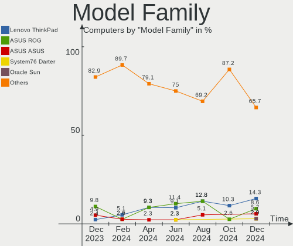
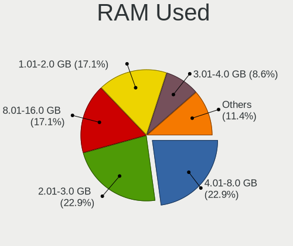
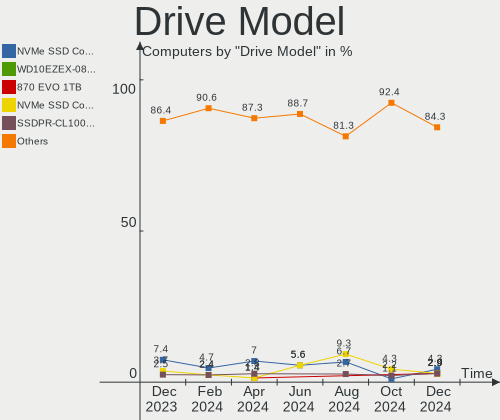
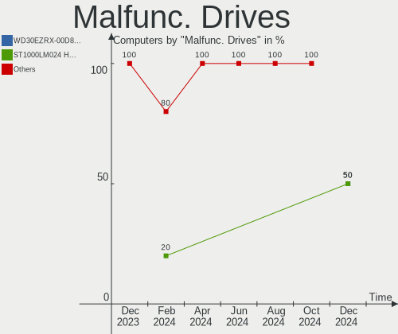
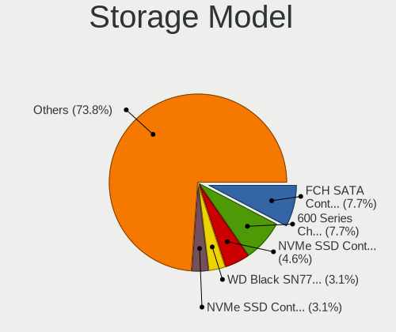
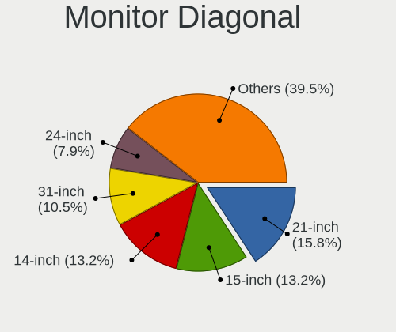
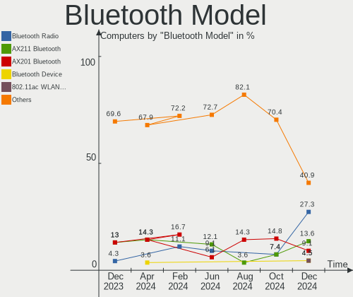
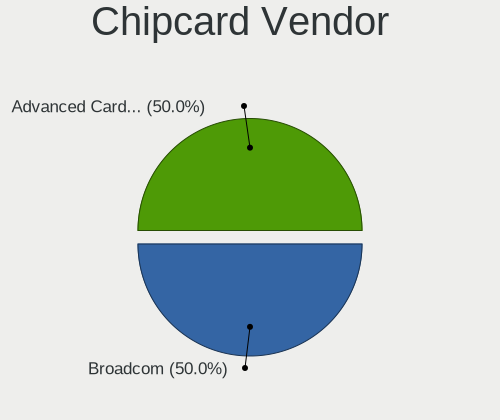

Gentoo - Hardware Trends
------------------------

A project to identify most popular hardware characteristics and track their change
over time based on data collected by Linux users at https://Linux-Hardware.org.

Anyone can contribute to this report by the [hw-probe](https://github.com/linuxhw/hw-probe) tool:

    sudo -E hw-probe -all -upload

This is a report for all computer types. See also reports for [desktops](/Dist/Gentoo/Desktop/README.md) and [notebooks](/Dist/Gentoo/Notebook/README.md).

This report is for one last month. Overall report since the beginning of time: [TestCoverage](https://github.com/linuxhw/TestCoverage)

Period: Jul, 2022.

Contents
--------

* [ System ](#system)
  - [ OS                       ](#os)
  - [ OS Family                ](#os-family)
  - [ Kernel                   ](#kernel)
  - [ Kernel Family            ](#kernel-family)
  - [ Kernel Major Ver.        ](#kernel-major-ver)
  - [ Arch                     ](#arch)
  - [ DE                       ](#de)
  - [ Display Server           ](#display-server)
  - [ Display Manager          ](#display-manager)
  - [ OS Lang                  ](#os-lang)
  - [ Boot Mode                ](#boot-mode)
  - [ Filesystem               ](#filesystem)
  - [ Part. scheme             ](#part-scheme)
  - [ Dual Boot with Linux/BSD ](#dual-boot-with-linuxbsd)
  - [ Dual Boot (Win)          ](#dual-boot-win)

* [ Board ](#board)
  - [ Vendor                   ](#vendor)
  - [ Model                    ](#model)
  - [ Model Family             ](#model-family)
  - [ MFG Year                 ](#mfg-year)
  - [ Form Factor              ](#form-factor)
  - [ Secure Boot              ](#secure-boot)
  - [ Coreboot                 ](#coreboot)
  - [ RAM Size                 ](#ram-size)
  - [ RAM Used                 ](#ram-used)
  - [ Total Drives             ](#total-drives)
  - [ Has CD-ROM               ](#has-cd-rom)
  - [ Has Ethernet             ](#has-ethernet)
  - [ Has WiFi                 ](#has-wifi)
  - [ Has Bluetooth            ](#has-bluetooth)

* [ Location ](#location)
  - [ Country                  ](#country)
  - [ City                     ](#city)

* [ Drives ](#drives)
  - [ Drive Vendor             ](#drive-vendor)
  - [ Drive Model              ](#drive-model)
  - [ HDD Vendor               ](#hdd-vendor)
  - [ SSD Vendor               ](#ssd-vendor)
  - [ Drive Kind               ](#drive-kind)
  - [ Drive Connector          ](#drive-connector)
  - [ Drive Size               ](#drive-size)
  - [ Space Total              ](#space-total)
  - [ Space Used               ](#space-used)
  - [ Malfunc. Drives          ](#malfunc-drives)
  - [ Malfunc. Drive Vendor    ](#malfunc-drive-vendor)
  - [ Malfunc. HDD Vendor      ](#malfunc-hdd-vendor)
  - [ Malfunc. Drive Kind      ](#malfunc-drive-kind)
  - [ Failed Drives            ](#failed-drives)
  - [ Failed Drive Vendor      ](#failed-drive-vendor)
  - [ Drive Status             ](#drive-status)

* [ Storage controller ](#storage-controller)
  - [ Storage Vendor           ](#storage-vendor)
  - [ Storage Model            ](#storage-model)
  - [ Storage Kind             ](#storage-kind)

* [ Processor ](#processor)
  - [ CPU Vendor               ](#cpu-vendor)
  - [ CPU Model                ](#cpu-model)
  - [ CPU Model Family         ](#cpu-model-family)
  - [ CPU Cores                ](#cpu-cores)
  - [ CPU Sockets              ](#cpu-sockets)
  - [ CPU Threads              ](#cpu-threads)
  - [ CPU Op-Modes             ](#cpu-op-modes)
  - [ CPU Microcode            ](#cpu-microcode)
  - [ CPU Microarch            ](#cpu-microarch)

* [ Graphics ](#graphics)
  - [ GPU Vendor               ](#gpu-vendor)
  - [ GPU Model                ](#gpu-model)
  - [ GPU Combo                ](#gpu-combo)
  - [ GPU Driver               ](#gpu-driver)
  - [ GPU Memory               ](#gpu-memory)

* [ Monitor ](#monitor)
  - [ Monitor Vendor           ](#monitor-vendor)
  - [ Monitor Model            ](#monitor-model)
  - [ Monitor Resolution       ](#monitor-resolution)
  - [ Monitor Diagonal         ](#monitor-diagonal)
  - [ Monitor Width            ](#monitor-width)
  - [ Aspect Ratio             ](#aspect-ratio)
  - [ Monitor Area             ](#monitor-area)
  - [ Pixel Density            ](#pixel-density)
  - [ Multiple Monitors        ](#multiple-monitors)

* [ Network ](#network)
  - [ Net Controller Vendor    ](#net-controller-vendor)
  - [ Net Controller Model     ](#net-controller-model)
  - [ Wireless Vendor          ](#wireless-vendor)
  - [ Wireless Model           ](#wireless-model)
  - [ Ethernet Vendor          ](#ethernet-vendor)
  - [ Ethernet Model           ](#ethernet-model)
  - [ Net Controller Kind      ](#net-controller-kind)
  - [ Used Controller          ](#used-controller)
  - [ NICs                     ](#nics)
  - [ IPv6                     ](#ipv6)

* [ Bluetooth ](#bluetooth)
  - [ Bluetooth Vendor         ](#bluetooth-vendor)
  - [ Bluetooth Model          ](#bluetooth-model)

* [ Sound ](#sound)
  - [ Sound Vendor             ](#sound-vendor)
  - [ Sound Model              ](#sound-model)

* [ Memory ](#memory)
  - [ Memory Vendor            ](#memory-vendor)
  - [ Memory Model             ](#memory-model)
  - [ Memory Kind              ](#memory-kind)
  - [ Memory Form Factor       ](#memory-form-factor)
  - [ Memory Size              ](#memory-size)
  - [ Memory Speed             ](#memory-speed)

* [ Printers & scanners ](#printers--scanners)
  - [ Printer Vendor           ](#printer-vendor)
  - [ Printer Model            ](#printer-model)
  - [ Scanner Vendor           ](#scanner-vendor)
  - [ Scanner Model            ](#scanner-model)

* [ Camera ](#camera)
  - [ Camera Vendor            ](#camera-vendor)
  - [ Camera Model             ](#camera-model)

* [ Security ](#security)
  - [ Fingerprint Vendor       ](#fingerprint-vendor)
  - [ Fingerprint Model        ](#fingerprint-model)
  - [ Chipcard Vendor          ](#chipcard-vendor)
  - [ Chipcard Model           ](#chipcard-model)

* [ Unsupported ](#unsupported)
  - [ Unsupported Devices      ](#unsupported-devices)
  - [ Unsupported Device Types ](#unsupported-device-types)

System
------

OS
--

Installed operating systems

| Name       | Computers | Percent |
|------------|-----------|---------|
| Gentoo 2.8 | 47        | 97.92%  |
| Gentoo 2.7 | 1         | 2.08%   |

OS Family
---------

OS without a version

| Name   | Computers | Percent |
|--------|-----------|---------|
| Gentoo | 48        | 100%    |

Kernel
------

Version of the Linux kernel

| Version                     | Computers | Percent |
|-----------------------------|-----------|---------|
| 5.15.52-gentoo              | 5         | 10.42%  |
| 5.15.52-gentoo-x86_64       | 4         | 8.33%   |
| 5.18.7-gentoo               | 3         | 6.25%   |
| 5.15.41-gentoo-x86_64       | 3         | 6.25%   |
| 5.15.41-gentoo              | 3         | 6.25%   |
| 5.18.9-gentoo               | 2         | 4.17%   |
| 5.18.14-gentoo-x86_64       | 2         | 4.17%   |
| 5.18.10-k08                 | 2         | 4.17%   |
| 5.18.10-gentoo              | 2         | 4.17%   |
| 5.15.52-gentoo-dist         | 2         | 4.17%   |
| 5.19.0-rc2-p+               | 1         | 2.08%   |
| 5.18.9-gentoo-x86_64        | 1         | 2.08%   |
| 5.18.8-gentoo-dist          | 1         | 2.08%   |
| 5.18.6-gentoo-venus         | 1         | 2.08%   |
| 5.18.15-gentoo-x86_64       | 1         | 2.08%   |
| 5.18.14-gentoo              | 1         | 2.08%   |
| 5.18.12-gentoo-x86_64       | 1         | 2.08%   |
| 5.18.11                     | 1         | 2.08%   |
| 5.18.10-gentoo-x86_64       | 1         | 2.08%   |
| 5.18.0-gbfc780ef1ca0        | 1         | 2.08%   |
| 5.17.7-gentoo-x86_64        | 1         | 2.08%   |
| 5.16.0-kali7-amd64          | 1         | 2.08%   |
| 5.15.55-gentoo              | 1         | 2.08%   |
| 5.15.52-gentoo-XXX          | 1         | 2.08%   |
| 5.15.52-gentoo-ts221        | 1         | 2.08%   |
| 5.15.46-gentoo-dist         | 1         | 2.08%   |
| 5.15.41-gentoo-dist         | 1         | 2.08%   |
| 5.10.69-gentoo-111-powertop | 1         | 2.08%   |
| 5.10.27-gentoo              | 1         | 2.08%   |
| 4.14.280-gentoo             | 1         | 2.08%   |

Kernel Family
-------------

Linux kernel without a distro release

| Version  | Computers | Percent |
|----------|-----------|---------|
| 5.15.52  | 13        | 27.08%  |
| 5.15.41  | 7         | 14.58%  |
| 5.18.10  | 5         | 10.42%  |
| 5.18.9   | 3         | 6.25%   |
| 5.18.7   | 3         | 6.25%   |
| 5.18.14  | 3         | 6.25%   |
| 5.19.0   | 1         | 2.08%   |
| 5.18.8   | 1         | 2.08%   |
| 5.18.6   | 1         | 2.08%   |
| 5.18.15  | 1         | 2.08%   |
| 5.18.12  | 1         | 2.08%   |
| 5.18.11  | 1         | 2.08%   |
| 5.18.0   | 1         | 2.08%   |
| 5.17.7   | 1         | 2.08%   |
| 5.16.0   | 1         | 2.08%   |
| 5.15.55  | 1         | 2.08%   |
| 5.15.46  | 1         | 2.08%   |
| 5.10.69  | 1         | 2.08%   |
| 5.10.27  | 1         | 2.08%   |
| 4.14.280 | 1         | 2.08%   |

Kernel Major Ver.
-----------------

Linux kernel major version

| Version | Computers | Percent |
|---------|-----------|---------|
| 5.15    | 22        | 45.83%  |
| 5.18    | 20        | 41.67%  |
| 5.10    | 2         | 4.17%   |
| 5.19    | 1         | 2.08%   |
| 5.17    | 1         | 2.08%   |
| 5.16    | 1         | 2.08%   |
| 4.14    | 1         | 2.08%   |

Arch
----

OS architecture (x86_64, i586, etc.)

| Name     | Computers | Percent |
|----------|-----------|---------|
| x86_64   | 46        | 95.83%  |
| i686     | 1         | 2.08%   |
| armv5tel | 1         | 2.08%   |

DE
--

Desktop Environment

| Name     | Computers | Percent |
|----------|-----------|---------|
| Unknown  | 18        | 37.5%   |
| KDE5     | 14        | 29.17%  |
| GNOME    | 8         | 16.67%  |
| XFCE     | 4         | 8.33%   |
| Unity    | 1         | 2.08%   |
| MATE     | 1         | 2.08%   |
| i3       | 1         | 2.08%   |
| Cinnamon | 1         | 2.08%   |

Display Server
--------------

X11 or Wayland

| Name    | Computers | Percent |
|---------|-----------|---------|
| X11     | 25        | 52.08%  |
| Unknown | 11        | 22.92%  |
| Tty     | 7         | 14.58%  |
| Wayland | 5         | 10.42%  |

Display Manager
---------------

SDDM, LightDM, etc.

| Name    | Computers | Percent |
|---------|-----------|---------|
| SDDM    | 18        | 37.5%   |
| Unknown | 15        | 31.25%  |
| LightDM | 6         | 12.5%   |
| GDM     | 5         | 10.42%  |
| LXDM    | 3         | 6.25%   |
| SLiM    | 1         | 2.08%   |

OS Lang
-------

Language

| Lang    | Computers | Percent |
|---------|-----------|---------|
| en_US   | 24        | 50%     |
| C.UTF8  | 5         | 10.42%  |
| Unknown | 5         | 10.42%  |
| en_GB   | 3         | 6.25%   |
| de_DE   | 3         | 6.25%   |
| zh_CN   | 2         | 4.17%   |
| ru_RU   | 1         | 2.08%   |
| pl_PL   | 1         | 2.08%   |
| ja_JP   | 1         | 2.08%   |
| es_MX   | 1         | 2.08%   |
| el_GR   | 1         | 2.08%   |
| C       | 1         | 2.08%   |

Boot Mode
---------

EFI or BIOS

| Mode | Computers | Percent |
|------|-----------|---------|
| EFI  | 42        | 87.5%   |
| BIOS | 6         | 12.5%   |

Filesystem
----------

Type of filesystem

| Type     | Computers | Percent |
|----------|-----------|---------|
| Ext4     | 27        | 56.25%  |
| Btrfs    | 10        | 20.83%  |
| Zfs      | 4         | 8.33%   |
| F2fs     | 4         | 8.33%   |
| XXXXXXX  | 1         | 2.08%   |
| Overlay  | 1         | 2.08%   |
| Bcachefs | 1         | 2.08%   |

Part. scheme
------------

Scheme of partitioning

| Type    | Computers | Percent |
|---------|-----------|---------|
| GPT     | 44        | 91.67%  |
| MBR     | 3         | 6.25%   |
| Unknown | 1         | 2.08%   |

Dual Boot with Linux/BSD
------------------------

Hosting more than one Linux/BSD

| Dual boot | Computers | Percent |
|-----------|-----------|---------|
| No        | 28        | 58.33%  |
| Yes       | 20        | 41.67%  |

Dual Boot (Win)
---------------

Hosting Linux and Windows

| Dual boot | Computers | Percent |
|-----------|-----------|---------|
| No        | 33        | 68.75%  |
| Yes       | 15        | 31.25%  |

Board
-----

Vendor
------

Motherboard manufacturer

| Name                | Computers | Percent |
|---------------------|-----------|---------|
| ASUSTek Computer    | 11        | 22.92%  |
| Lenovo              | 6         | 12.5%   |
| MSI                 | 5         | 10.42%  |
| Gigabyte Technology | 5         | 10.42%  |
| Dell                | 5         | 10.42%  |
| Hewlett-Packard     | 4         | 8.33%   |
| ASRock              | 4         | 8.33%   |
| TYAN Computer       | 1         | 2.08%   |
| TUXEDO              | 1         | 2.08%   |
| Toshiba             | 1         | 2.08%   |
| Timi                | 1         | 2.08%   |
| Supermicro          | 1         | 2.08%   |
| Razer               | 1         | 2.08%   |
| Intel               | 1         | 2.08%   |
| Unknown             | 1         | 2.08%   |

Model
-----

Motherboard model

| Name                                      | Computers | Percent |
|-------------------------------------------|-----------|---------|
| TYAN S7025                                | 1         | 2.08%   |
| TUXEDO InfinityBook Pro 14 Gen6           | 1         | 2.08%   |
| Toshiba Satellite A200                    | 1         | 2.08%   |
| Timi Mi Laptop Pro 15 2020                | 1         | 2.08%   |
| Supermicro Super Server                   | 1         | 2.08%   |
| Razer Blade 15 Studio Edition - Late 2019 | 1         | 2.08%   |
| MSI MS-7C35                               | 1         | 2.08%   |
| MSI MS-7B89                               | 1         | 2.08%   |
| MSI MS-7B17                               | 1         | 2.08%   |
| MSI MS-7821                               | 1         | 2.08%   |
| MSI GS63VR 6RF                            | 1         | 2.08%   |
| Lenovo ThinkStation P620 30E0001TGE       | 1         | 2.08%   |
| Lenovo ThinkPad X13 Yoga Gen 2 20W8002GCD | 1         | 2.08%   |
| Lenovo ThinkPad T14 Gen 2a 20XK000YRI     | 1         | 2.08%   |
| Lenovo IdeaPad 3 15ALC6 82KU              | 1         | 2.08%   |
| Lenovo IdeaPad 100-15IBD 80QQ             | 1         | 2.08%   |
| Lenovo G510 20238                         | 1         | 2.08%   |
| Intel D54250WYK H13922-303                | 1         | 2.08%   |
| HP OMEN by Laptop 16-c0xxx                | 1         | 2.08%   |
| HP Laptop 17-ca1xxx                       | 1         | 2.08%   |
| HP EliteBook 845 G7 Notebook PC           | 1         | 2.08%   |
| HP EliteBook 2560p                        | 1         | 2.08%   |
| Gigabyte Z690 AORUS MASTER                | 1         | 2.08%   |
| Gigabyte Z590 UD                          | 1         | 2.08%   |
| Gigabyte B450 AORUS M                     | 1         | 2.08%   |
| Gigabyte AB350-Gaming                     | 1         | 2.08%   |
| Gigabyte 970A-DS3                         | 1         | 2.08%   |
| Dell XPS 15 9570                          | 1         | 2.08%   |
| Dell PowerEdge T150                       | 1         | 2.08%   |
| Dell OptiPlex 790                         | 1         | 2.08%   |
| Dell Latitude D420                        | 1         | 2.08%   |
| Dell Latitude 5289                        | 1         | 2.08%   |
| ASUS VivoBook_ASUSLaptop M7600QE_M7600QE  | 1         | 2.08%   |
| ASUS TUF Gaming X570-PLUS                 | 1         | 2.08%   |
| ASUS ROG Zephyrus G14 GA402RJ_GA402RJ     | 1         | 2.08%   |
| ASUS ROG STRIX B560-I GAMING WIFI         | 1         | 2.08%   |
| ASUS ROG STRIX B550-F GAMING              | 1         | 2.08%   |
| ASUS ROG Maximus Z690 EXTREME             | 1         | 2.08%   |
| ASUS ROG Maximus XI HERO                  | 1         | 2.08%   |
| ASUS ROG G703GI_G7BI                      | 1         | 2.08%   |
| ASUS ROG CROSSHAIR VIII DARK HERO         | 1         | 2.08%   |
| ASUS PRIME Z390-A                         | 1         | 2.08%   |
| ASUS M3A78-CM                             | 1         | 2.08%   |
| ASRock X570 Taichi                        | 1         | 2.08%   |
| ASRock X399 Taichi                        | 1         | 2.08%   |
| ASRock B550M Steel Legend                 | 1         | 2.08%   |
| ASRock AM1H-ITX                           | 1         | 2.08%   |
| Unknown                                   | 1         | 2.08%   |

Model Family
------------

Motherboard model prefix

| Name                  | Computers | Percent |
|-----------------------|-----------|---------|
| ASUS ROG              | 7         | 14.58%  |
| Lenovo ThinkPad       | 2         | 4.17%   |
| Lenovo IdeaPad        | 2         | 4.17%   |
| HP EliteBook          | 2         | 4.17%   |
| Dell Latitude         | 2         | 4.17%   |
| TYAN S7025            | 1         | 2.08%   |
| TUXEDO InfinityBook   | 1         | 2.08%   |
| Toshiba Satellite     | 1         | 2.08%   |
| Timi Mi               | 1         | 2.08%   |
| Supermicro Super      | 1         | 2.08%   |
| Razer Blade           | 1         | 2.08%   |
| MSI MS-7C35           | 1         | 2.08%   |
| MSI MS-7B89           | 1         | 2.08%   |
| MSI MS-7B17           | 1         | 2.08%   |
| MSI MS-7821           | 1         | 2.08%   |
| MSI GS63VR            | 1         | 2.08%   |
| Lenovo ThinkStation   | 1         | 2.08%   |
| Lenovo G510           | 1         | 2.08%   |
| Intel D54250WYK       | 1         | 2.08%   |
| HP OMEN               | 1         | 2.08%   |
| HP Laptop             | 1         | 2.08%   |
| Gigabyte Z690         | 1         | 2.08%   |
| Gigabyte Z590         | 1         | 2.08%   |
| Gigabyte B450         | 1         | 2.08%   |
| Gigabyte AB350-Gaming | 1         | 2.08%   |
| Gigabyte 970A-DS3     | 1         | 2.08%   |
| Dell XPS              | 1         | 2.08%   |
| Dell PowerEdge        | 1         | 2.08%   |
| Dell OptiPlex         | 1         | 2.08%   |
| ASUS VivoBook         | 1         | 2.08%   |
| ASUS TUF              | 1         | 2.08%   |
| ASUS PRIME            | 1         | 2.08%   |
| ASUS M3A78-CM         | 1         | 2.08%   |
| ASRock X570           | 1         | 2.08%   |
| ASRock X399           | 1         | 2.08%   |
| ASRock B550M          | 1         | 2.08%   |
| ASRock AM1H-ITX       | 1         | 2.08%   |
| Unknown               | 1         | 2.08%   |

MFG Year
--------

Motherboard manufacture year

| Year    | Computers | Percent |
|---------|-----------|---------|
| 2021    | 12        | 25%     |
| 2018    | 7         | 14.58%  |
| 2020    | 5         | 10.42%  |
| 2019    | 5         | 10.42%  |
| 2013    | 4         | 8.33%   |
| 2022    | 2         | 4.17%   |
| 2017    | 2         | 4.17%   |
| 2015    | 2         | 4.17%   |
| 2011    | 2         | 4.17%   |
| 2016    | 1         | 2.08%   |
| 2014    | 1         | 2.08%   |
| 2012    | 1         | 2.08%   |
| 2008    | 1         | 2.08%   |
| 2007    | 1         | 2.08%   |
| 2006    | 1         | 2.08%   |
| Unknown | 1         | 2.08%   |

Form Factor
-----------

Physical design of the computer

| Name        | Computers | Percent |
|-------------|-----------|---------|
| Desktop     | 25        | 52.08%  |
| Notebook    | 18        | 37.5%   |
| Server      | 3         | 6.25%   |
| Convertible | 2         | 4.17%   |

Secure Boot
-----------

Enabled or disabled

| State    | Computers | Percent |
|----------|-----------|---------|
| Disabled | 48        | 100%    |

Coreboot
--------

Have coreboot on board

| Used | Computers | Percent |
|------|-----------|---------|
| No   | 48        | 100%    |

RAM Size
--------

Total RAM memory

| Size in GB  | Computers | Percent |
|-------------|-----------|---------|
| 32.01-64.0  | 18        | 37.5%   |
| 16.01-24.0  | 9         | 18.75%  |
| 64.01-256.0 | 7         | 14.58%  |
| 8.01-16.0   | 6         | 12.5%   |
| 4.01-8.0    | 4         | 8.33%   |
| 3.01-4.0    | 2         | 4.17%   |
| 2.01-3.0    | 1         | 2.08%   |
| 0.51-1.0    | 1         | 2.08%   |

RAM Used
--------

Used RAM memory

| Used GB    | Computers | Percent |
|------------|-----------|---------|
| 4.01-8.0   | 10        | 20.83%  |
| 3.01-4.0   | 8         | 16.67%  |
| 1.01-2.0   | 7         | 14.58%  |
| 2.01-3.0   | 6         | 12.5%   |
| 8.01-16.0  | 5         | 10.42%  |
| 0.51-1.0   | 4         | 8.33%   |
| 16.01-24.0 | 3         | 6.25%   |
| 0.01-0.5   | 3         | 6.25%   |
| 32.01-64.0 | 1         | 2.08%   |
| 0          | 1         | 2.08%   |

Total Drives
------------

Number of drives on board

| Drives | Computers | Percent |
|--------|-----------|---------|
| 1      | 16        | 33.33%  |
| 2      | 15        | 31.25%  |
| 3      | 6         | 12.5%   |
| 4      | 4         | 8.33%   |
| 6      | 3         | 6.25%   |
| 7      | 2         | 4.17%   |
| 5      | 2         | 4.17%   |

Has CD-ROM
----------

Has CD-ROM on board

| Presented | Computers | Percent |
|-----------|-----------|---------|
| No        | 37        | 77.08%  |
| Yes       | 11        | 22.92%  |

Has Ethernet
------------

Has Ethernet on board

| Presented | Computers | Percent |
|-----------|-----------|---------|
| Yes       | 40        | 83.33%  |
| No        | 8         | 16.67%  |

Has WiFi
--------

Has WiFi module

| Presented | Computers | Percent |
|-----------|-----------|---------|
| Yes       | 33        | 68.75%  |
| No        | 15        | 31.25%  |

Has Bluetooth
-------------

Has Bluetooth module

| Presented | Computers | Percent |
|-----------|-----------|---------|
| Yes       | 29        | 60.42%  |
| No        | 19        | 39.58%  |

Location
--------

Country
-------

Geographic location (country)

| Country     | Computers | Percent |
|-------------|-----------|---------|
| USA         | 12        | 25%     |
| Germany     | 11        | 22.92%  |
| China       | 5         | 10.42%  |
| Poland      | 4         | 8.33%   |
| UK          | 2         | 4.17%   |
| Slovakia    | 2         | 4.17%   |
| Russia      | 2         | 4.17%   |
| Romania     | 2         | 4.17%   |
| Tunisia     | 1         | 2.08%   |
| Switzerland | 1         | 2.08%   |
| Sweden      | 1         | 2.08%   |
| Mexico      | 1         | 2.08%   |
| Japan       | 1         | 2.08%   |
| Greece      | 1         | 2.08%   |
| France      | 1         | 2.08%   |
| Finland     | 1         | 2.08%   |

City
----

Geographic location (city)

| City              | Computers | Percent |
|-------------------|-----------|---------|
| Foshan            | 3         | 6.25%   |
| Troisdorf         | 2         | 4.17%   |
| Trnava            | 2         | 4.17%   |
| Croydon           | 2         | 4.17%   |
| Cluj-Napoca       | 2         | 4.17%   |
| Cieszyn           | 2         | 4.17%   |
| Zacapu            | 1         | 2.08%   |
| Wrentham          | 1         | 2.08%   |
| Warsaw            | 1         | 2.08%   |
| Warren            | 1         | 2.08%   |
| Tunis             | 1         | 2.08%   |
| Texas City        | 1         | 2.08%   |
| Taby              | 1         | 2.08%   |
| Stasi Las         | 1         | 2.08%   |
| Shenzhen          | 1         | 2.08%   |
| Seattle           | 1         | 2.08%   |
| Sankt Wendel      | 1         | 2.08%   |
| Rostock           | 1         | 2.08%   |
| Oulu              | 1         | 2.08%   |
| Orlando           | 1         | 2.08%   |
| Orange            | 1         | 2.08%   |
| Nizhny Tagil      | 1         | 2.08%   |
| Munich            | 1         | 2.08%   |
| Moscow            | 1         | 2.08%   |
| Minden            | 1         | 2.08%   |
| Mildstedt         | 1         | 2.08%   |
| Meguro-ku         | 1         | 2.08%   |
| Marcoussis        | 1         | 2.08%   |
| Los Angeles       | 1         | 2.08%   |
| Lincoln           | 1         | 2.08%   |
| Huangpu           | 1         | 2.08%   |
| Houston           | 1         | 2.08%   |
| Frick             | 1         | 2.08%   |
| Frankfurt am Main | 1         | 2.08%   |
| Düsseldorf       | 1         | 2.08%   |
| Denver            | 1         | 2.08%   |
| Cologne           | 1         | 2.08%   |
| Bothell           | 1         | 2.08%   |
| Berlin            | 1         | 2.08%   |
| Baton Rouge       | 1         | 2.08%   |
| Athens            | 1         | 2.08%   |

Drives
------

Drive Vendor
------------

Hard drive vendors

| Vendor              | Computers | Drives | Percent |
|---------------------|-----------|--------|---------|
| Samsung Electronics | 23        | 37     | 27.38%  |
| WDC                 | 15        | 20     | 17.86%  |
| Seagate             | 13        | 18     | 15.48%  |
| Toshiba             | 4         | 5      | 4.76%   |
| Intel               | 4         | 5      | 4.76%   |
| SK hynix            | 3         | 3      | 3.57%   |
| SanDisk             | 3         | 4      | 3.57%   |
| Kingston            | 3         | 4      | 3.57%   |
| Hitachi             | 3         | 6      | 3.57%   |
| Phison              | 2         | 4      | 2.38%   |
| HGST                | 2         | 3      | 2.38%   |
| GOODRAM             | 2         | 2      | 2.38%   |
| Team                | 1         | 1      | 1.19%   |
| Super Talent        | 1         | 1      | 1.19%   |
| Micron Technology   | 1         | 1      | 1.19%   |
| Kingchuxing         | 1         | 2      | 1.19%   |
| Fujitsu             | 1         | 1      | 1.19%   |
| Crucial             | 1         | 3      | 1.19%   |
| A-DATA Technology   | 1         | 1      | 1.19%   |

Drive Model
-----------

Hard drive models

| Model                                      | Computers | Percent |
|--------------------------------------------|-----------|---------|
| Seagate ST2000DM006-2DM164 2TB             | 3         | 2.73%   |
| Samsung SSD 980 PRO 500GB                  | 3         | 2.73%   |
| Samsung SSD 970 EVO 250GB                  | 3         | 2.73%   |
| Samsung SSD 860 PRO 4TB                    | 3         | 2.73%   |
| WDC WDS100T2B0A-00SM50 1TB SSD             | 2         | 1.82%   |
| Seagate ST4000DM004-2CV104 4TB             | 2         | 1.82%   |
| Samsung SSD 970 PRO 1TB                    | 2         | 1.82%   |
| Samsung SSD 970 EVO Plus 500GB             | 2         | 1.82%   |
| Samsung SSD 970 EVO 500GB                  | 2         | 1.82%   |
| GOODRAM SSDPR-CL100-480-G2 480GB           | 2         | 1.82%   |
| WDC WDS500G3X0C-00SJG0 500GB               | 1         | 0.91%   |
| WDC WDS500G2B0C-00PXH0 500GB               | 1         | 0.91%   |
| WDC WDS100T2B0A 1TB SSD                    | 1         | 0.91%   |
| WDC WDS100T1X0E-00AFY0 1TB                 | 1         | 0.91%   |
| WDC WD80EDAZ-11TA3A0 8TB                   | 1         | 0.91%   |
| WDC WD8003FFBX-68B9AN0 8TB                 | 1         | 0.91%   |
| WDC WD60EZRX-00MVLB1 6TB                   | 1         | 0.91%   |
| WDC WD5000AVDS-63U7B1 500GB                | 1         | 0.91%   |
| WDC WD40EZRZ-00GXCB0 4TB                   | 1         | 0.91%   |
| WDC WD40EFRX-68N32N0 4TB                   | 1         | 0.91%   |
| WDC WD30EFRX-68AX9N0 3TB                   | 1         | 0.91%   |
| WDC WD20EFRX-68AX9N0 2TB                   | 1         | 0.91%   |
| WDC WD20EARS-00J2GB0 2TB                   | 1         | 0.91%   |
| WDC WD10SPZX-60Z10T0 1TB                   | 1         | 0.91%   |
| WDC WD10EZEX-75WN4A1 1TB                   | 1         | 0.91%   |
| WDC WD10EZEX-60M2NA0 1TB                   | 1         | 0.91%   |
| WDC PC SN730 SDBQNTY-512G-1001 512GB       | 1         | 0.91%   |
| WDC PC SN530 SDBPMPZ-512G-1101 512GB       | 1         | 0.91%   |
| Toshiba MK6008GAH 64GB                     | 1         | 0.91%   |
| Toshiba KXG6AZNV512G 512GB                 | 1         | 0.91%   |
| Toshiba KXG60ZNV256G 256GB                 | 1         | 0.91%   |
| Toshiba HDWE150 5TB                        | 1         | 0.91%   |
| Toshiba HDWA120 2TB                        | 1         | 0.91%   |
| Team TM8PS7256G 256GB SSD                  | 1         | 0.91%   |
| Super Talent FNX256MORM 256GB SSD          | 1         | 0.91%   |
| SK hynix SKHynix_HFS512GDE9X081N 512GB     | 1         | 0.91%   |
| SK hynix HFS128G39MNC-3510A 128GB SSD      | 1         | 0.91%   |
| SK hynix HFM001TD3JX013N 1TB               | 1         | 0.91%   |
| Seagate ST8000DM004-2CX188 8TB             | 1         | 0.91%   |
| Seagate ST4000NE001-2MA101 4TB             | 1         | 0.91%   |
| Seagate ST2000LX001-1RG174 2TB             | 1         | 0.91%   |
| Seagate ST2000DM001-1CH164 2TB             | 1         | 0.91%   |
| Seagate ST12000NM0008-2H3101 12TB          | 1         | 0.91%   |
| Seagate ST1000LM048-2E7172 1TB             | 1         | 0.91%   |
| Seagate ST1000LM024 HN-M101MBB 1TB         | 1         | 0.91%   |
| Seagate ST10000NE0004-1ZF101 10TB          | 1         | 0.91%   |
| Seagate FireCuda 520 SSD ZP1000GM30002 1TB | 1         | 0.91%   |
| Seagate Desktop 8TB                        | 1         | 0.91%   |
| Seagate Backup+ Desk 3TB                   | 1         | 0.91%   |
| SanDisk SSD i110 32GB                      | 1         | 0.91%   |
| SanDisk SSD G5 BICS4 500GB                 | 1         | 0.91%   |
| SanDisk SDSSDH3 2T00 2TB                   | 1         | 0.91%   |
| SanDisk SD9SN8W-128G-1006 128GB SSD        | 1         | 0.91%   |
| Samsung SSD 980 PRO 2TB                    | 1         | 0.91%   |
| Samsung SSD 980 PRO 1TB                    | 1         | 0.91%   |
| Samsung SSD 980 1TB                        | 1         | 0.91%   |
| Samsung SSD 970 EVO Plus 1TB               | 1         | 0.91%   |
| Samsung SSD 970 EVO 1TB                    | 1         | 0.91%   |
| Samsung SSD 960 EVO 250GB                  | 1         | 0.91%   |
| Samsung SSD 870 QVO 4TB                    | 1         | 0.91%   |

HDD Vendor
----------

Hard disk drive vendors

| Vendor  | Computers | Drives | Percent |
|---------|-----------|--------|---------|
| Seagate | 12        | 16     | 38.71%  |
| WDC     | 10        | 12     | 32.26%  |
| Toshiba | 3         | 3      | 9.68%   |
| Hitachi | 3         | 6      | 9.68%   |
| HGST    | 2         | 3      | 6.45%   |
| Fujitsu | 1         | 1      | 3.23%   |

SSD Vendor
----------

Solid state drive vendors

| Vendor              | Computers | Drives | Percent |
|---------------------|-----------|--------|---------|
| Samsung Electronics | 9         | 11     | 34.62%  |
| SanDisk             | 3         | 4      | 11.54%  |
| WDC                 | 2         | 3      | 7.69%   |
| Kingston            | 2         | 3      | 7.69%   |
| Intel               | 2         | 2      | 7.69%   |
| GOODRAM             | 2         | 2      | 7.69%   |
| Team                | 1         | 1      | 3.85%   |
| Super Talent        | 1         | 1      | 3.85%   |
| SK hynix            | 1         | 1      | 3.85%   |
| Kingchuxing         | 1         | 1      | 3.85%   |
| Crucial             | 1         | 3      | 3.85%   |
| A-DATA Technology   | 1         | 1      | 3.85%   |

Drive Kind
----------

HDD or SSD

| Kind    | Computers | Drives | Percent |
|---------|-----------|--------|---------|
| NVMe    | 31        | 46     | 39.74%  |
| HDD     | 26        | 41     | 33.33%  |
| SSD     | 20        | 33     | 25.64%  |
| Unknown | 1         | 1      | 1.28%   |

Drive Connector
---------------

SATA, SAS, NVMe, etc.

| Type | Computers | Drives | Percent |
|------|-----------|--------|---------|
| SATA | 35        | 72     | 52.24%  |
| NVMe | 31        | 46     | 46.27%  |
| SAS  | 1         | 3      | 1.49%   |

Drive Size
----------

Size of hard drive

| Size in TB | Computers | Drives | Percent |
|------------|-----------|--------|---------|
| 0.01-0.5   | 19        | 25     | 32.76%  |
| 0.51-1.0   | 12        | 14     | 20.69%  |
| 3.01-4.0   | 9         | 9      | 15.52%  |
| 1.01-2.0   | 8         | 10     | 13.79%  |
| 4.01-10.0  | 5         | 8      | 8.62%   |
| 2.01-3.0   | 4         | 7      | 6.9%    |
| 10.01-20.0 | 1         | 1      | 1.72%   |

Space Total
-----------

Amount of disk space available on the file system

| Size in GB     | Computers | Percent |
|----------------|-----------|---------|
| 101-250        | 9         | 18.75%  |
| More than 3000 | 8         | 16.67%  |
| 251-500        | 6         | 12.5%   |
| 2001-3000      | 6         | 12.5%   |
| 1001-2000      | 5         | 10.42%  |
| 501-1000       | 5         | 10.42%  |
| Unknown        | 4         | 8.33%   |
| 21-50          | 2         | 4.17%   |
| 1-20           | 2         | 4.17%   |
| 51-100         | 1         | 2.08%   |

Space Used
----------

Amount of used disk space

| Used GB        | Computers | Percent |
|----------------|-----------|---------|
| 1-20           | 12        | 25%     |
| More than 3000 | 6         | 12.5%   |
| 101-250        | 5         | 10.42%  |
| 1001-2000      | 5         | 10.42%  |
| 501-1000       | 5         | 10.42%  |
| 21-50          | 4         | 8.33%   |
| 51-100         | 4         | 8.33%   |
| Unknown        | 4         | 8.33%   |
| 251-500        | 3         | 6.25%   |

Malfunc. Drives
---------------

Drive models with a malfunction

| Model                                 | Computers | Drives | Percent |
|---------------------------------------|-----------|--------|---------|
| WDC WD40EFRX-68N32N0 4TB              | 1         | 1      | 11.11%  |
| WDC WD20EFRX-68AX9N0 2TB              | 1         | 1      | 11.11%  |
| WDC WD20EARS-00J2GB0 2TB              | 1         | 1      | 11.11%  |
| Toshiba MK6008GAH 64GB                | 1         | 1      | 11.11%  |
| Toshiba HDWA120 2TB                   | 1         | 1      | 11.11%  |
| Seagate ST1000LM024 HN-M101MBB 1TB    | 1         | 1      | 11.11%  |
| Samsung Electronics SSD 980 PRO 2TB   | 1         | 1      | 11.11%  |
| Samsung Electronics SSD 870 EVO 500GB | 1         | 1      | 11.11%  |
| Hitachi HTS541680J9SA00 80GB          | 1         | 1      | 11.11%  |

Malfunc. Drive Vendor
---------------------

Vendors of faulty drives

| Vendor              | Computers | Drives | Percent |
|---------------------|-----------|--------|---------|
| WDC                 | 3         | 3      | 33.33%  |
| Toshiba             | 2         | 2      | 22.22%  |
| Samsung Electronics | 2         | 2      | 22.22%  |
| Seagate             | 1         | 1      | 11.11%  |
| Hitachi             | 1         | 1      | 11.11%  |

Malfunc. HDD Vendor
-------------------

Vendors of faulty HDD drives

| Vendor  | Computers | Drives | Percent |
|---------|-----------|--------|---------|
| WDC     | 3         | 3      | 42.86%  |
| Toshiba | 2         | 2      | 28.57%  |
| Seagate | 1         | 1      | 14.29%  |
| Hitachi | 1         | 1      | 14.29%  |

Malfunc. Drive Kind
-------------------

Kinds of faulty drives

| Kind | Computers | Drives | Percent |
|------|-----------|--------|---------|
| HDD  | 7         | 7      | 77.78%  |
| NVMe | 1         | 1      | 11.11%  |
| SSD  | 1         | 1      | 11.11%  |

Failed Drives
-------------

Failed drive models

Zero info for selected period =(

Failed Drive Vendor
-------------------

Failed drive vendors

Zero info for selected period =(

Drive Status
------------

Number of failed and malfunc. drives

| Status   | Computers | Drives | Percent |
|----------|-----------|--------|---------|
| Works    | 45        | 103    | 80.36%  |
| Malfunc  | 9         | 9      | 16.07%  |
| Detected | 2         | 9      | 3.57%   |

Storage controller
------------------

Storage Vendor
--------------

Storage controller vendors

| Vendor                       | Computers | Percent |
|------------------------------|-----------|---------|
| Intel                        | 22        | 28.95%  |
| Samsung Electronics          | 19        | 25%     |
| AMD                          | 17        | 22.37%  |
| SanDisk                      | 4         | 5.26%   |
| Toshiba America Info Systems | 2         | 2.63%   |
| SK hynix                     | 2         | 2.63%   |
| Phison Electronics           | 2         | 2.63%   |
| ASMedia Technology           | 2         | 2.63%   |
| Silicon Motion               | 1         | 1.32%   |
| Seagate Technology           | 1         | 1.32%   |
| Micron Technology            | 1         | 1.32%   |
| Kingston Technology Company  | 1         | 1.32%   |
| JMicron Technology           | 1         | 1.32%   |
| Broadcom / LSI               | 1         | 1.32%   |

Storage Model
-------------

Storage controller models

| Model                                                                          | Computers | Percent |
|--------------------------------------------------------------------------------|-----------|---------|
| Samsung NVMe SSD Controller SM981/PM981/PM983                                  | 13        | 14.94%  |
| AMD FCH SATA Controller [AHCI mode]                                            | 12        | 13.79%  |
| Samsung NVMe SSD Controller PM9A1/PM9A3/980PRO                                 | 5         | 5.75%   |
| Intel Cannon Lake PCH SATA AHCI Controller                                     | 3         | 3.45%   |
| Intel 500 Series Chipset Family SATA AHCI Controller                           | 3         | 3.45%   |
| Toshiba America Info Systems XG6 NVMe SSD Controller                           | 2         | 2.3%    |
| SK hynix Gold P31 SSD                                                          | 2         | 2.3%    |
| SanDisk WD Black SN750 / PC SN730 NVMe SSD                                     | 2         | 2.3%    |
| Intel 82801 Mobile SATA Controller [RAID mode]                                 | 2         | 2.3%    |
| Intel 8 Series/C220 Series Chipset Family 6-port SATA Controller 1 [AHCI mode] | 2         | 2.3%    |
| ASMedia ASM1062 Serial ATA Controller                                          | 2         | 2.3%    |
| AMD 500 Series Chipset SATA Controller                                         | 2         | 2.3%    |
| AMD 400 Series Chipset SATA Controller                                         | 2         | 2.3%    |
| Silicon Motion SM2263EN/SM2263XT SSD Controller                                | 1         | 1.15%   |
| Seagate FireCuda 520 SSD                                                       | 1         | 1.15%   |
| SanDisk WD PC SN810 / Black SN850 NVMe SSD                                     | 1         | 1.15%   |
| SanDisk WD Blue SN550 NVMe SSD                                                 | 1         | 1.15%   |
| SanDisk Non-Volatile memory controller                                         | 1         | 1.15%   |
| Samsung NVMe SSD Controller SM961/PM961/SM963                                  | 1         | 1.15%   |
| Samsung NVMe SSD Controller 980                                                | 1         | 1.15%   |
| Phison E16 PCIe4 NVMe Controller                                               | 1         | 1.15%   |
| Phison E12 NVMe Controller                                                     | 1         | 1.15%   |
| Micron Non-Volatile memory controller                                          | 1         | 1.15%   |
| Kingston Company U-SNS8154P3 NVMe SSD                                          | 1         | 1.15%   |
| JMicron JMB363 SATA/IDE Controller                                             | 1         | 1.15%   |
| Intel Wildcat Point-LP SATA Controller [AHCI Mode]                             | 1         | 1.15%   |
| Intel Volume Management Device NVMe RAID Controller                            | 1         | 1.15%   |
| Intel SSD Pro 7600p/760p/E 6100p Series                                        | 1         | 1.15%   |
| Intel SSD 660P Series                                                          | 1         | 1.15%   |
| Intel HM170/QM170 Chipset SATA Controller [AHCI Mode]                          | 1         | 1.15%   |
| Intel Cannon Lake Mobile PCH SATA AHCI Controller                              | 1         | 1.15%   |
| Intel C610/X99 series chipset sSATA Controller [AHCI mode]                     | 1         | 1.15%   |
| Intel C610/X99 series chipset 4-port SATA Controller [IDE mode]                | 1         | 1.15%   |
| Intel C610/X99 series chipset 2-port SATA Controller [IDE mode]                | 1         | 1.15%   |
| Intel Alder Lake-S PCH SATA Controller [AHCI Mode]                             | 1         | 1.15%   |
| Intel 82801JI (ICH10 Family) 4 port SATA IDE Controller #1                     | 1         | 1.15%   |
| Intel 82801JI (ICH10 Family) 2 port SATA IDE Controller #2                     | 1         | 1.15%   |
| Intel 82801GBM/GHM (ICH7-M Family) SATA Controller [IDE mode]                  | 1         | 1.15%   |
| Intel 82801G (ICH7 Family) IDE Controller                                      | 1         | 1.15%   |
| Intel 8 Series SATA Controller 1 [AHCI mode]                                   | 1         | 1.15%   |
| Intel 6 Series/C200 Series Chipset Family 6 port Mobile SATA AHCI Controller   | 1         | 1.15%   |
| Intel 6 Series/C200 Series Chipset Family 6 port Desktop SATA AHCI Controller  | 1         | 1.15%   |
| Broadcom / LSI SAS2308 PCI-Express Fusion-MPT SAS-2                            | 1         | 1.15%   |
| AMD X399 Series Chipset SATA Controller                                        | 1         | 1.15%   |
| AMD SB7x0/SB8x0/SB9x0 SATA Controller [IDE mode]                               | 1         | 1.15%   |
| AMD SB7x0/SB8x0/SB9x0 SATA Controller [AHCI mode]                              | 1         | 1.15%   |
| AMD SB7x0/SB8x0/SB9x0 IDE Controller                                           | 1         | 1.15%   |
| AMD 300 Series Chipset SATA Controller                                         | 1         | 1.15%   |

Storage Kind
------------

Kind of storage controller (IDE, SATA, NVMe, SAS, ...)

| Kind | Computers | Percent |
|------|-----------|---------|
| SATA | 33        | 44.59%  |
| NVMe | 31        | 41.89%  |
| IDE  | 6         | 8.11%   |
| RAID | 3         | 4.05%   |
| SAS  | 1         | 1.35%   |

Processor
---------

CPU Vendor
----------

Processor vendors

| Vendor                | Computers | Percent |
|-----------------------|-----------|---------|
| Intel                 | 26        | 54.17%  |
| AMD                   | 21        | 43.75%  |
| Marvell Semiconductor | 1         | 2.08%   |

CPU Model
---------

Processor models

| Model                                                                    | Computers | Percent |
|--------------------------------------------------------------------------|-----------|---------|
| Intel 12th Gen Core i9-12900K                                            | 2         | 4.17%   |
| Marvell Semiconductor Marvell Kirkwood (Flattened Device Tree) Processor | 1         | 2.08%   |
| Intel Xeon E-2314 CPU @ 2.80GHz                                          | 1         | 2.08%   |
| Intel Xeon CPU X5680 @ 3.33GHz                                           | 1         | 2.08%   |
| Intel Xeon CPU E5-2620 v3 @ 2.40GHz                                      | 1         | 2.08%   |
| Intel Core i9-8950HK CPU @ 2.90GHz                                       | 1         | 2.08%   |
| Intel Core i7-9750H CPU @ 2.60GHz                                        | 1         | 2.08%   |
| Intel Core i7-8750H CPU @ 2.20GHz                                        | 1         | 2.08%   |
| Intel Core i7-8700K CPU @ 3.70GHz                                        | 1         | 2.08%   |
| Intel Core i7-8086K CPU @ 4.00GHz                                        | 1         | 2.08%   |
| Intel Core i7-6700HQ CPU @ 2.60GHz                                       | 1         | 2.08%   |
| Intel Core i7-4790K CPU @ 4.00GHz                                        | 1         | 2.08%   |
| Intel Core i7-10510U CPU @ 1.80GHz                                       | 1         | 2.08%   |
| Intel Core i5-9600K CPU @ 3.70GHz                                        | 1         | 2.08%   |
| Intel Core i5-7300U CPU @ 2.60GHz                                        | 1         | 2.08%   |
| Intel Core i5-4250U CPU @ 1.30GHz                                        | 1         | 2.08%   |
| Intel Core i5-4210M CPU @ 2.60GHz                                        | 1         | 2.08%   |
| Intel Core i5-2430M CPU @ 2.40GHz                                        | 1         | 2.08%   |
| Intel Core i5-2400 CPU @ 3.10GHz                                         | 1         | 2.08%   |
| Intel Core i3-5005U CPU @ 2.00GHz                                        | 1         | 2.08%   |
| Intel Core Duo CPU U2500 @ 1.20GHz                                       | 1         | 2.08%   |
| Intel Core 2 CPU T7400 @ 2.16GHz                                         | 1         | 2.08%   |
| Intel 11th Gen Core i7-11700K @ 3.60GHz                                  | 1         | 2.08%   |
| Intel 11th Gen Core i7-1165G7 @ 2.80GHz                                  | 1         | 2.08%   |
| Intel 11th Gen Core i7-11370H @ 3.30GHz                                  | 1         | 2.08%   |
| Intel 11th Gen Core i5-11500 @ 2.70GHz                                   | 1         | 2.08%   |
| AMD Sempron 3850 APU with Radeon R3                                      | 1         | 2.08%   |
| AMD Ryzen Threadripper PRO 3955WX 16-Cores                               | 1         | 2.08%   |
| AMD Ryzen Threadripper 1920X 12-Core Processor                           | 1         | 2.08%   |
| AMD Ryzen 9 6900HS with Radeon Graphics                                  | 1         | 2.08%   |
| AMD Ryzen 9 5950X 16-Core Processor                                      | 1         | 2.08%   |
| AMD Ryzen 9 5900X 12-Core Processor                                      | 1         | 2.08%   |
| AMD Ryzen 9 5900HX with Radeon Graphics                                  | 1         | 2.08%   |
| AMD Ryzen 9 3950X 16-Core Processor                                      | 1         | 2.08%   |
| AMD Ryzen 7 PRO 5850U with Radeon Graphics                               | 1         | 2.08%   |
| AMD Ryzen 7 PRO 4750U with Radeon Graphics                               | 1         | 2.08%   |
| AMD Ryzen 7 5800X 8-Core Processor                                       | 1         | 2.08%   |
| AMD Ryzen 7 5800H with Radeon Graphics                                   | 1         | 2.08%   |
| AMD Ryzen 7 5700U with Radeon Graphics                                   | 1         | 2.08%   |
| AMD Ryzen 7 3800X 8-Core Processor                                       | 1         | 2.08%   |
| AMD Ryzen 7 3700X 8-Core Processor                                       | 1         | 2.08%   |
| AMD Ryzen 7 3700U with Radeon Vega Mobile Gfx                            | 1         | 2.08%   |
| AMD Ryzen 7 2700X Eight-Core Processor                                   | 1         | 2.08%   |
| AMD Ryzen 5 5600X 6-Core Processor                                       | 1         | 2.08%   |
| AMD Ryzen 5 2600 Six-Core Processor                                      | 1         | 2.08%   |
| AMD Phenom II X4 955 Processor                                           | 1         | 2.08%   |
| AMD FX-4300 Quad-Core Processor                                          | 1         | 2.08%   |

CPU Model Family
----------------

Processor model prefix

| Model                  | Computers | Percent |
|------------------------|-----------|---------|
| Other                  | 7         | 14.58%  |
| Intel Core i7          | 7         | 14.58%  |
| AMD Ryzen 7            | 7         | 14.58%  |
| Intel Core i5          | 6         | 12.5%   |
| AMD Ryzen 9            | 5         | 10.42%  |
| Intel Xeon             | 3         | 6.25%   |
| AMD Ryzen Threadripper | 2         | 4.17%   |
| AMD Ryzen 7 PRO        | 2         | 4.17%   |
| AMD Ryzen 5            | 2         | 4.17%   |
| Intel Core i9          | 1         | 2.08%   |
| Intel Core i3          | 1         | 2.08%   |
| Intel Core Duo         | 1         | 2.08%   |
| Intel Core 2           | 1         | 2.08%   |
| AMD Sempron            | 1         | 2.08%   |
| AMD Phenom II X4       | 1         | 2.08%   |
| AMD FX                 | 1         | 2.08%   |

CPU Cores
---------

Number of processor cores

| Number | Computers | Percent |
|--------|-----------|---------|
| 8      | 11        | 22.92%  |
| 6      | 10        | 20.83%  |
| 4      | 10        | 20.83%  |
| 2      | 8         | 16.67%  |
| 16     | 5         | 10.42%  |
| 12     | 3         | 6.25%   |
| 1      | 1         | 2.08%   |

CPU Sockets
-----------

Number of sockets

| Number | Computers | Percent |
|--------|-----------|---------|
| 1      | 47        | 97.92%  |
| 2      | 1         | 2.08%   |

CPU Threads
-----------

Threads per core (Hyper-Threading)

| Number | Computers | Percent |
|--------|-----------|---------|
| 2      | 40        | 83.33%  |
| 1      | 8         | 16.67%  |

CPU Op-Modes
------------

CPU Operation Modes (32-bit, 64-bit)

| Op mode        | Computers | Percent |
|----------------|-----------|---------|
| 32-bit, 64-bit | 46        | 95.83%  |
| 32-bit         | 1         | 2.08%   |
| Unknown        | 1         | 2.08%   |

CPU Microcode
-------------

Microcode number

| Number     | Computers | Percent |
|------------|-----------|---------|
| 0x906ea    | 5         | 10.42%  |
| Unknown    | 4         | 8.33%   |
| 0xa0671    | 3         | 6.25%   |
| 0x0a50000c | 3         | 6.25%   |
| 0x0a201016 | 3         | 6.25%   |
| 0x90672    | 2         | 4.17%   |
| 0x806c1    | 2         | 4.17%   |
| 0x306c3    | 2         | 4.17%   |
| 0x206a7    | 2         | 4.17%   |
| 0x08701021 | 2         | 4.17%   |
| 0x906ec    | 1         | 2.08%   |
| 0x806ec    | 1         | 2.08%   |
| 0x806e9    | 1         | 2.08%   |
| 0x6f6      | 1         | 2.08%   |
| 0x6ec      | 1         | 2.08%   |
| 0x506e3    | 1         | 2.08%   |
| 0x40651    | 1         | 2.08%   |
| 0x306f2    | 1         | 2.08%   |
| 0x306d4    | 1         | 2.08%   |
| 0x206c2    | 1         | 2.08%   |
| 0x0a404101 | 1         | 2.08%   |
| 0x0a201204 | 1         | 2.08%   |
| 0x08608103 | 1         | 2.08%   |
| 0x08600106 | 1         | 2.08%   |
| 0x08301039 | 1         | 2.08%   |
| 0x08108109 | 1         | 2.08%   |
| 0x0800820d | 1         | 2.08%   |
| 0x08001137 | 1         | 2.08%   |
| 0x0700010f | 1         | 2.08%   |
| 0x010000db | 1         | 2.08%   |

CPU Microarch
-------------

Microarchitecture

| Name             | Computers | Percent |
|------------------|-----------|---------|
| KabyLake         | 8         | 16.67%  |
| Zen 3            | 7         | 14.58%  |
| Zen 2            | 5         | 10.42%  |
| Haswell          | 4         | 8.33%   |
| Zen+             | 3         | 6.25%   |
| Icelake          | 3         | 6.25%   |
| Unknown          | 3         | 6.25%   |
| TigerLake        | 2         | 4.17%   |
| SandyBridge      | 2         | 4.17%   |
| Alderlake Hybrid | 2         | 4.17%   |
| Zen              | 1         | 2.08%   |
| Westmere         | 1         | 2.08%   |
| Skylake          | 1         | 2.08%   |
| Piledriver       | 1         | 2.08%   |
| P6               | 1         | 2.08%   |
| K10              | 1         | 2.08%   |
| Jaguar           | 1         | 2.08%   |
| Core             | 1         | 2.08%   |
| Broadwell        | 1         | 2.08%   |

Graphics
--------

GPU Vendor
----------

Vendors of graphics cards

| Vendor                     | Computers | Percent |
|----------------------------|-----------|---------|
| AMD                        | 24        | 44.44%  |
| Nvidia                     | 15        | 27.78%  |
| Intel                      | 13        | 24.07%  |
| Matrox Electronics Systems | 1         | 1.85%   |
| ASPEED Technology          | 1         | 1.85%   |

GPU Model
---------

Graphics card models

| Model                                                                         | Computers | Percent |
|-------------------------------------------------------------------------------|-----------|---------|
| AMD Ellesmere [Radeon RX 470/480/570/570X/580/580X/590]                       | 5         | 8.62%   |
| AMD Cezanne                                                                   | 3         | 5.17%   |
| Nvidia TU106 [GeForce RTX 2070 Rev. A]                                        | 2         | 3.45%   |
| Intel TigerLake-LP GT2 [Iris Xe Graphics]                                     | 2         | 3.45%   |
| Intel CoffeeLake-H GT2 [UHD Graphics 630]                                     | 2         | 3.45%   |
| AMD Navi 23 [Radeon RX 6650 XT]                                               | 2         | 3.45%   |
| AMD Cedar [Radeon HD 5000/6000/7350/8350 Series]                              | 2         | 3.45%   |
| Nvidia TU104GLM [Quadro RTX 5000 Mobile / Max-Q]                              | 1         | 1.72%   |
| Nvidia TU104 [GeForce RTX 2080 Rev. A]                                        | 1         | 1.72%   |
| Nvidia TU104 [GeForce RTX 2070 SUPER]                                         | 1         | 1.72%   |
| Nvidia GP107M [GeForce MX350]                                                 | 1         | 1.72%   |
| Nvidia GP107M [GeForce GTX 1050 Ti Mobile]                                    | 1         | 1.72%   |
| Nvidia GP106M [GeForce GTX 1060 Mobile]                                       | 1         | 1.72%   |
| Nvidia GP104BM [GeForce GTX 1080 Mobile]                                      | 1         | 1.72%   |
| Nvidia GM206 [GeForce GTX 960]                                                | 1         | 1.72%   |
| Nvidia GA107M [GeForce RTX 3050 Ti Mobile]                                    | 1         | 1.72%   |
| Nvidia GA106 [Geforce RTX 3050]                                               | 1         | 1.72%   |
| Nvidia GA102 [GeForce RTX 3090]                                               | 1         | 1.72%   |
| Nvidia GA102 [GeForce RTX 3080 Ti]                                            | 1         | 1.72%   |
| Nvidia G72M [Quadro NVS 110M/GeForce Go 7300]                                 | 1         | 1.72%   |
| Matrox Electronics Systems Integrated Matrox G200eW3 Graphics Controller      | 1         | 1.72%   |
| Intel RocketLake-S GT1 [UHD Graphics 750]                                     | 1         | 1.72%   |
| Intel Mobile 945GM/GMS/GME, 943/940GML Express Integrated Graphics Controller | 1         | 1.72%   |
| Intel Mobile 945GM/GMS, 943/940GML Express Integrated Graphics Controller     | 1         | 1.72%   |
| Intel HD Graphics 620                                                         | 1         | 1.72%   |
| Intel HD Graphics 5500                                                        | 1         | 1.72%   |
| Intel HD Graphics 530                                                         | 1         | 1.72%   |
| Intel Haswell-ULT Integrated Graphics Controller                              | 1         | 1.72%   |
| Intel CometLake-U GT2 [UHD Graphics]                                          | 1         | 1.72%   |
| Intel 4th Gen Core Processor Integrated Graphics Controller                   | 1         | 1.72%   |
| Intel 2nd Generation Core Processor Family Integrated Graphics Controller     | 1         | 1.72%   |
| ASPEED Technology ASPEED Graphics Family                                      | 1         | 1.72%   |
| AMD Vega 20 [Radeon VII]                                                      | 1         | 1.72%   |
| AMD RV710 [Radeon HD 4350/4550]                                               | 1         | 1.72%   |
| AMD RS780C [Radeon 3100]                                                      | 1         | 1.72%   |
| AMD Renoir                                                                    | 1         | 1.72%   |
| AMD Rembrandt [Radeon 680M]                                                   | 1         | 1.72%   |
| AMD Picasso/Raven 2 [Radeon Vega Series / Radeon Vega Mobile Series]          | 1         | 1.72%   |
| AMD Oland [Radeon HD 8570 / R5 430 OEM / R7 240/340 / Radeon 520 OEM]         | 1         | 1.72%   |
| AMD Navi 23 [Radeon RX 6600/6600 XT/6600M]                                    | 1         | 1.72%   |
| AMD Navi 10 [Radeon RX 5600 OEM/5600 XT / 5700/5700 XT]                       | 1         | 1.72%   |
| AMD Lucienne                                                                  | 1         | 1.72%   |
| AMD Lexa XT [Radeon PRO WX 3200]                                              | 1         | 1.72%   |
| AMD Kabini [Radeon HD 8280 / R3 Series]                                       | 1         | 1.72%   |
| AMD Jet PRO [Radeon R5 M230 / R7 M260DX / Radeon 520 Mobile]                  | 1         | 1.72%   |
| AMD Fiji [Radeon R9 FURY / NANO Series]                                       | 1         | 1.72%   |
| AMD Baffin [Radeon RX 460/560D / Pro 450/455/460/555/555X/560/560X]           | 1         | 1.72%   |

GPU Combo
---------

Combinations of graphics cards

| Name           | Computers | Percent |
|----------------|-----------|---------|
| 1 x AMD        | 18        | 37.5%   |
| 1 x Nvidia     | 10        | 20.83%  |
| 1 x Intel      | 7         | 14.58%  |
| Intel + Nvidia | 4         | 8.33%   |
| 2 x AMD        | 3         | 6.25%   |
| Other          | 1         | 2.08%   |
| 2 x Intel      | 1         | 2.08%   |
| 1 x Matrox     | 1         | 2.08%   |
| Intel + AMD    | 1         | 2.08%   |
| AMD + Nvidia   | 1         | 2.08%   |
| AMD + ASPEED   | 1         | 2.08%   |

GPU Driver
----------

Free vs proprietary

| Driver      | Computers | Percent |
|-------------|-----------|---------|
| Free        | 34        | 70.83%  |
| Proprietary | 10        | 20.83%  |
| Unknown     | 4         | 8.33%   |

GPU Memory
----------

Total video memory

| Size in GB | Computers | Percent |
|------------|-----------|---------|
| Unknown    | 19        | 39.58%  |
| 7.01-8.0   | 9         | 18.75%  |
| 0.01-0.5   | 5         | 10.42%  |
| 1.01-2.0   | 4         | 8.33%   |
| 3.01-4.0   | 3         | 6.25%   |
| 8.01-16.0  | 3         | 6.25%   |
| 0.51-1.0   | 3         | 6.25%   |
| 5.01-6.0   | 2         | 4.17%   |

Monitor
-------

Monitor Vendor
--------------

Monitor vendors

| Vendor               | Computers | Percent |
|----------------------|-----------|---------|
| Samsung Electronics  | 13        | 23.64%  |
| Goldstar             | 7         | 12.73%  |
| Eizo                 | 4         | 7.27%   |
| ViewSonic            | 3         | 5.45%   |
| Dell                 | 3         | 5.45%   |
| BOE                  | 3         | 5.45%   |
| AU Optronics         | 3         | 5.45%   |
| Sharp                | 2         | 3.64%   |
| MSI                  | 2         | 3.64%   |
| LG Display           | 2         | 3.64%   |
| Chimei Innolux       | 2         | 3.64%   |
| Xiaomi               | 1         | 1.82%   |
| Unknown              | 1         | 1.82%   |
| Sony                 | 1         | 1.82%   |
| Sceptre Tech         | 1         | 1.82%   |
| LG Electronics       | 1         | 1.82%   |
| Lenovo               | 1         | 1.82%   |
| InfoVision           | 1         | 1.82%   |
| Hewlett-Packard      | 1         | 1.82%   |
| CSO                  | 1         | 1.82%   |
| AOC                  | 1         | 1.82%   |
| Ancor Communications | 1         | 1.82%   |

Monitor Model
-------------

Monitor models

| Model                                                                   | Computers | Percent |
|-------------------------------------------------------------------------|-----------|---------|
| Goldstar HDR 4K GSM7707 3840x2160 600x340mm 27.2-inch                   | 2         | 3.51%   |
| Eizo CS2731 ENC3069 2560x1440 597x336mm 27.0-inch                       | 2         | 3.51%   |
| Xiaomi Mi TV XMD0002 1920x1080 708x398mm 32.0-inch                      | 1         | 1.75%   |
| ViewSonic VX2370 SERIES VSC342C 1920x1080 509x286mm 23.0-inch           | 1         | 1.75%   |
| ViewSonic VX2250 SERIES VSCCB25 1920x1080 477x268mm 21.5-inch           | 1         | 1.75%   |
| ViewSonic VG1655 VSCD239 1920x1080 340x190mm 15.3-inch                  | 1         | 1.75%   |
| Unknown LCD Monitor FFFF 2288x1287 2550x2550mm 142.0-inch               | 1         | 1.75%   |
| Sony SDMU27M90*30 SNY075A 3840x2160 596x335mm 26.9-inch                 | 1         | 1.75%   |
| Sharp LQ156M1JW01 SHP14C3 1920x1080 344x194mm 15.5-inch                 | 1         | 1.75%   |
| Sharp LCD Monitor SHP149A 1920x1080 344x194mm 15.5-inch                 | 1         | 1.75%   |
| Sceptre Tech C305W-2560UN SPT0C0D 2560x1080 690x291mm 29.5-inch         | 1         | 1.75%   |
| Samsung Electronics U28E590 SAM0C4D 3840x2160 607x345mm 27.5-inch       | 1         | 1.75%   |
| Samsung Electronics SyncMaster SAM0194 1280x1024 376x301mm 19.0-inch    | 1         | 1.75%   |
| Samsung Electronics SMS27A850 SAM083D 2560x1440 518x324mm 24.1-inch     | 1         | 1.75%   |
| Samsung Electronics S22B300 SAM08C8 1920x1080 477x268mm 21.5-inch       | 1         | 1.75%   |
| Samsung Electronics LCD Monitor SEC4149 1366x768 292x174mm 13.4-inch    | 1         | 1.75%   |
| Samsung Electronics LCD Monitor SEC3645 1280x800 331x207mm 15.4-inch    | 1         | 1.75%   |
| Samsung Electronics LCD Monitor SEC3157 1280x800 303x190mm 14.1-inch    | 1         | 1.75%   |
| Samsung Electronics LCD Monitor SDCA029 3840x2160 344x194mm 15.5-inch   | 1         | 1.75%   |
| Samsung Electronics LCD Monitor SDC4752 1366x768 344x194mm 15.5-inch    | 1         | 1.75%   |
| Samsung Electronics LCD Monitor SDC415D 3840x2400 344x215mm 16.0-inch   | 1         | 1.75%   |
| Samsung Electronics LCD Monitor SAM7002 3840x2160 1872x1053mm 84.6-inch | 1         | 1.75%   |
| Samsung Electronics LCD Monitor SAM0357 1920x1080                       | 1         | 1.75%   |
| Samsung Electronics LC24RG50 SAM0F90 1920x1080 530x300mm 24.0-inch      | 1         | 1.75%   |
| MSI MAG272QP MSI3CA8 2560x1440 597x336mm 27.0-inch                      | 1         | 1.75%   |
| MSI MAG241C MSI3EA2 1920x1080 521x293mm 23.5-inch                       | 1         | 1.75%   |
| LG Electronics LCD Monitor LG HDR 4K 7680x2160                          | 1         | 1.75%   |
| LG Electronics LCD Monitor LG HDR 4K                                    | 1         | 1.75%   |
| LG Display LCD Monitor LGD06BA 2560x1600 286x179mm 13.3-inch            | 1         | 1.75%   |
| LG Display LCD Monitor LGD04A7 1920x1080 344x194mm 15.5-inch            | 1         | 1.75%   |
| Lenovo LEN T22i-10 LEN61A9 1920x1080 476x268mm 21.5-inch                | 1         | 1.75%   |
| InfoVision LCD Monitor IVO8C78 1920x1080 309x174mm 14.0-inch            | 1         | 1.75%   |
| Hewlett-Packard LP2475w HWP26F8 1920x1200 540x350mm 25.3-inch           | 1         | 1.75%   |
| Goldstar ULTRAGEAR GSM5B7F 2560x1440 597x336mm 27.0-inch                | 1         | 1.75%   |
| Goldstar TV SSCR2 GSM8080 3840x2160                                     | 1         | 1.75%   |
| Goldstar LG ULTRAGEAR GSM774B 3440x1440 800x330mm 34.1-inch             | 1         | 1.75%   |
| Goldstar 27EA33 GSM59BD 1920x1080 598x337mm 27.0-inch                   | 1         | 1.75%   |
| Goldstar 27EA33 GSM59BC 1920x1080 598x337mm 27.0-inch                   | 1         | 1.75%   |
| Goldstar 24MB35 GSM5A49 1920x1080 510x290mm 23.1-inch                   | 1         | 1.75%   |
| Eizo EV2450 ENC2532 1920x1080 528x297mm 23.9-inch                       | 1         | 1.75%   |
| Eizo CX240 ENC2354 1920x1200 519x324mm 24.1-inch                        | 1         | 1.75%   |
| Dell U2715H DELD067 2560x1440 597x336mm 27.0-inch                       | 1         | 1.75%   |
| Dell S2417DG DELA0E7 2560x1440 527x296mm 23.8-inch                      | 1         | 1.75%   |
| Dell E2015HV DELF05E 1600x900 434x236mm 19.4-inch                       | 1         | 1.75%   |
| CSO LCD Monitor CSO1402 2880x1800 302x188mm 14.0-inch                   | 1         | 1.75%   |
| Chimei Innolux LCD Monitor CMN15C6 1366x768 344x193mm 15.5-inch         | 1         | 1.75%   |
| Chimei Innolux LCD Monitor CMN1244 1920x1080 276x155mm 12.5-inch        | 1         | 1.75%   |
| BOE LCD Monitor BOE0A1D 2560x1600 302x189mm 14.0-inch                   | 1         | 1.75%   |
| BOE LCD Monitor BOE09E5 2560x1440 355x200mm 16.0-inch                   | 1         | 1.75%   |
| BOE LCD Monitor BOE09DE 1920x1080 309x174mm 14.0-inch                   | 1         | 1.75%   |
| AU Optronics LCD Monitor AUO369F 1920x1080 344x194mm 15.5-inch          | 1         | 1.75%   |
| AU Optronics LCD Monitor AUO329D 1920x1080 380x210mm 17.1-inch          | 1         | 1.75%   |
| AU Optronics LCD Monitor AUO109D 1920x1080 381x214mm 17.2-inch          | 1         | 1.75%   |
| AOC U2777B AOC2777 3840x2160 597x336mm 27.0-inch                        | 1         | 1.75%   |
| Ancor Communications ASUS PB278 ACI27A3 2560x1440 597x336mm 27.0-inch   | 1         | 1.75%   |

Monitor Resolution
------------------

Monitor screen resolution

| Resolution        | Computers | Percent |
|-------------------|-----------|---------|
| 1920x1080 (FHD)   | 21        | 39.62%  |
| 2560x1440 (QHD)   | 9         | 16.98%  |
| 3840x2160 (4K)    | 6         | 11.32%  |
| 1366x768 (WXGA)   | 3         | 5.66%   |
| 2560x1600         | 2         | 3.77%   |
| 7680x2160         | 1         | 1.89%   |
| 3840x2400         | 1         | 1.89%   |
| 3440x1440         | 1         | 1.89%   |
| 2880x1800         | 1         | 1.89%   |
| 2560x1080         | 1         | 1.89%   |
| 2288x1287         | 1         | 1.89%   |
| 1920x1200 (WUXGA) | 1         | 1.89%   |
| 1600x900 (HD+)    | 1         | 1.89%   |
| 1440x900 (WXGA+)  | 1         | 1.89%   |
| 1280x800 (WXGA)   | 1         | 1.89%   |
| 1280x1024 (SXGA)  | 1         | 1.89%   |
| Unknown           | 1         | 1.89%   |

Monitor Diagonal
----------------

Diagonal size in inches

| Inches  | Computers | Percent |
|---------|-----------|---------|
| 27      | 12        | 21.43%  |
| 15      | 9         | 16.07%  |
| 14      | 5         | 8.93%   |
| 24      | 4         | 7.14%   |
| 23      | 4         | 7.14%   |
| 21      | 3         | 5.36%   |
| 19      | 2         | 3.57%   |
| 17      | 2         | 3.57%   |
| 16      | 2         | 3.57%   |
| 13      | 2         | 3.57%   |
| Unknown | 2         | 3.57%   |
| 142     | 1         | 1.79%   |
| 84      | 1         | 1.79%   |
| 72      | 1         | 1.79%   |
| 65      | 1         | 1.79%   |
| 34      | 1         | 1.79%   |
| 29      | 1         | 1.79%   |
| 26      | 1         | 1.79%   |
| 25      | 1         | 1.79%   |
| 12      | 1         | 1.79%   |

Monitor Width
-------------

Physical width

| Width in mm    | Computers | Percent |
|----------------|-----------|---------|
| 501-600        | 18        | 34.62%  |
| 301-350        | 15        | 28.85%  |
| 351-400        | 4         | 7.69%   |
| 401-500        | 3         | 5.77%   |
| 201-300        | 3         | 5.77%   |
| 601-700        | 2         | 3.85%   |
| 1501-2000      | 2         | 3.85%   |
| Unknown        | 2         | 3.85%   |
| More than 2000 | 1         | 1.92%   |
| 701-800        | 1         | 1.92%   |
| 1001-1500      | 1         | 1.92%   |

Aspect Ratio
------------

Proportional relationship between the width and the height

| Ratio   | Computers | Percent |
|---------|-----------|---------|
| 16/9    | 33        | 70.21%  |
| 16/10   | 9         | 19.15%  |
| 21/9    | 2         | 4.26%   |
| 5/4     | 1         | 2.13%   |
| 1.00    | 1         | 2.13%   |
| Unknown | 1         | 2.13%   |

Monitor Area
------------

Area in inch²

| Area in inch² | Computers | Percent |
|----------------|-----------|---------|
| 301-350        | 13        | 24.07%  |
| 101-110        | 10        | 18.52%  |
| 201-250        | 7         | 12.96%  |
| 81-90          | 5         | 9.26%   |
| More than 1000 | 4         | 7.41%   |
| 251-300        | 4         | 7.41%   |
| 71-80          | 2         | 3.7%    |
| 151-200        | 2         | 3.7%    |
| 121-130        | 2         | 3.7%    |
| Unknown        | 2         | 3.7%    |
| 61-70          | 1         | 1.85%   |
| 351-500        | 1         | 1.85%   |
| 111-120        | 1         | 1.85%   |

Pixel Density
-------------

Pixels per inch

| Density       | Computers | Percent |
|---------------|-----------|---------|
| 101-120       | 14        | 26.42%  |
| 51-100        | 14        | 26.42%  |
| 121-160       | 11        | 20.75%  |
| 161-240       | 7         | 13.21%  |
| More than 240 | 3         | 5.66%   |
| 1-50          | 2         | 3.77%   |
| Unknown       | 2         | 3.77%   |

Multiple Monitors
-----------------

Total monitors connected

| Total | Computers | Percent |
|-------|-----------|---------|
| 1     | 33        | 68.75%  |
| 2     | 11        | 22.92%  |
| 0     | 3         | 6.25%   |
| 3     | 1         | 2.08%   |

Network
-------

Net Controller Vendor
---------------------

Controller vendors

| Vendor                     | Computers | Percent |
|----------------------------|-----------|---------|
| Intel                      | 29        | 42.65%  |
| Realtek Semiconductor      | 21        | 30.88%  |
| Aquantia                   | 5         | 7.35%   |
| Qualcomm Atheros           | 4         | 5.88%   |
| Broadcom                   | 3         | 4.41%   |
| MediaTek                   | 2         | 2.94%   |
| Quectel Wireless Solutions | 1         | 1.47%   |
| Microsoft                  | 1         | 1.47%   |
| DisplayLink                | 1         | 1.47%   |
| Broadcom Limited           | 1         | 1.47%   |

Net Controller Model
--------------------

Controller models

| Model                                                               | Computers | Percent |
|---------------------------------------------------------------------|-----------|---------|
| Realtek RTL8111/8168/8411 PCI Express Gigabit Ethernet Controller   | 11        | 13.25%  |
| Intel Wi-Fi 6 AX200                                                 | 6         | 7.23%   |
| Realtek RTL8125 2.5GbE Controller                                   | 5         | 6.02%   |
| Intel I211 Gigabit Network Connection                               | 3         | 3.61%   |
| Intel Ethernet Connection (7) I219-V                                | 3         | 3.61%   |
| Realtek RTL8852AE 802.11ax PCIe Wireless Network Adapter            | 2         | 2.41%   |
| Realtek RTL8153 Gigabit Ethernet Adapter                            | 2         | 2.41%   |
| Realtek RTL810xE PCI Express Fast Ethernet controller               | 2         | 2.41%   |
| Intel Wi-Fi 6 AX210/AX211/AX411 160MHz                              | 2         | 2.41%   |
| Intel Wi-Fi 6 AX201                                                 | 2         | 2.41%   |
| Intel Ethernet Controller I225-V                                    | 2         | 2.41%   |
| Intel Cannon Lake PCH CNVi WiFi                                     | 2         | 2.41%   |
| Intel 82599ES 10-Gigabit SFI/SFP+ Network Connection                | 2         | 2.41%   |
| Intel 82579LM Gigabit Network Connection (Lewisville)               | 2         | 2.41%   |
| Aquantia AQC113CS NBase-T/IEEE 802.3bz Ethernet Controller [AQtion] | 2         | 2.41%   |
| Realtek RTL8822CE 802.11ac PCIe Wireless Network Adapter            | 1         | 1.2%    |
| Realtek RTL8723DE Wireless Network Adapter                          | 1         | 1.2%    |
| Realtek RTL8723BE PCIe Wireless Network Adapter                     | 1         | 1.2%    |
| Quectel Wireless Solutions Quectel EM05-CE                          | 1         | 1.2%    |
| Qualcomm Atheros QCA8172 Fast Ethernet                              | 1         | 1.2%    |
| Qualcomm Atheros Killer E2400 Gigabit Ethernet Controller           | 1         | 1.2%    |
| Qualcomm Atheros Killer E220x Gigabit Ethernet Controller           | 1         | 1.2%    |
| Qualcomm Atheros AR9485 Wireless Network Adapter                    | 1         | 1.2%    |
| Qualcomm Atheros AR93xx Wireless Network Adapter                    | 1         | 1.2%    |
| Microsoft XBOX ACC                                                  | 1         | 1.2%    |
| MediaTek WLAN controller                                            | 1         | 1.2%    |
| MediaTek MT7921 802.11ax PCI Express Wireless Network Adapter       | 1         | 1.2%    |
| Intel Wireless-AC 9260                                              | 1         | 1.2%    |
| Intel Wireless 8265 / 8275                                          | 1         | 1.2%    |
| Intel Wireless 8260                                                 | 1         | 1.2%    |
| Intel Tiger Lake PCH CNVi WiFi                                      | 1         | 1.2%    |
| Intel PRO/Wireless 4965 AG or AGN [Kedron] Network Connection       | 1         | 1.2%    |
| Intel PRO/Wireless 3945ABG [Golan] Network Connection               | 1         | 1.2%    |
| Intel I210 Gigabit Network Connection                               | 1         | 1.2%    |
| Intel Ethernet Connection I218-V                                    | 1         | 1.2%    |
| Intel Dual Band Wireless-AC 3168NGW [Stone Peak]                    | 1         | 1.2%    |
| Intel Comet Lake PCH-LP CNVi WiFi                                   | 1         | 1.2%    |
| Intel Centrino Ultimate-N 6300                                      | 1         | 1.2%    |
| Intel Alder Lake-S PCH CNVi WiFi                                    | 1         | 1.2%    |
| Intel 82576 Gigabit Network Connection                              | 1         | 1.2%    |
| Intel 82574L Gigabit Network Connection                             | 1         | 1.2%    |
| DisplayLink Dell D3100 Docking Station                              | 1         | 1.2%    |
| Broadcom NetXtreme BCM5752 Gigabit Ethernet PCI Express             | 1         | 1.2%    |
| Broadcom NetXtreme BCM5720 Gigabit Ethernet PCIe                    | 1         | 1.2%    |
| Broadcom NetXtreme BCM5719 Gigabit Ethernet PCIe                    | 1         | 1.2%    |
| Broadcom Limited BCM4360 802.11ac Wireless Network Adapter          | 1         | 1.2%    |
| Broadcom BCM43142 802.11b/g/n                                       | 1         | 1.2%    |
| Aquantia Ethernet controller                                        | 1         | 1.2%    |
| Aquantia AQC107 NBase-T/IEEE 802.3bz Ethernet Controller [AQtion]   | 1         | 1.2%    |
| Aquantia 5G USB Ethernet Adapter                                    | 1         | 1.2%    |

Wireless Vendor
---------------

Wireless vendors

| Vendor                     | Computers | Percent |
|----------------------------|-----------|---------|
| Intel                      | 22        | 62.86%  |
| Realtek Semiconductor      | 5         | 14.29%  |
| Qualcomm Atheros           | 2         | 5.71%   |
| MediaTek                   | 2         | 5.71%   |
| Quectel Wireless Solutions | 1         | 2.86%   |
| Microsoft                  | 1         | 2.86%   |
| Broadcom Limited           | 1         | 2.86%   |
| Broadcom                   | 1         | 2.86%   |

Wireless Model
--------------

Wireless models

| Model                                                         | Computers | Percent |
|---------------------------------------------------------------|-----------|---------|
| Intel Wi-Fi 6 AX200                                           | 6         | 17.14%  |
| Realtek RTL8852AE 802.11ax PCIe Wireless Network Adapter      | 2         | 5.71%   |
| Intel Wi-Fi 6 AX210/AX211/AX411 160MHz                        | 2         | 5.71%   |
| Intel Wi-Fi 6 AX201                                           | 2         | 5.71%   |
| Intel Cannon Lake PCH CNVi WiFi                               | 2         | 5.71%   |
| Realtek RTL8822CE 802.11ac PCIe Wireless Network Adapter      | 1         | 2.86%   |
| Realtek RTL8723DE Wireless Network Adapter                    | 1         | 2.86%   |
| Realtek RTL8723BE PCIe Wireless Network Adapter               | 1         | 2.86%   |
| Quectel Wireless Solutions Quectel EM05-CE                    | 1         | 2.86%   |
| Qualcomm Atheros AR9485 Wireless Network Adapter              | 1         | 2.86%   |
| Qualcomm Atheros AR93xx Wireless Network Adapter              | 1         | 2.86%   |
| Microsoft XBOX ACC                                            | 1         | 2.86%   |
| MediaTek WLAN controller                                      | 1         | 2.86%   |
| MediaTek MT7921 802.11ax PCI Express Wireless Network Adapter | 1         | 2.86%   |
| Intel Wireless-AC 9260                                        | 1         | 2.86%   |
| Intel Wireless 8265 / 8275                                    | 1         | 2.86%   |
| Intel Wireless 8260                                           | 1         | 2.86%   |
| Intel Tiger Lake PCH CNVi WiFi                                | 1         | 2.86%   |
| Intel PRO/Wireless 4965 AG or AGN [Kedron] Network Connection | 1         | 2.86%   |
| Intel PRO/Wireless 3945ABG [Golan] Network Connection         | 1         | 2.86%   |
| Intel Dual Band Wireless-AC 3168NGW [Stone Peak]              | 1         | 2.86%   |
| Intel Comet Lake PCH-LP CNVi WiFi                             | 1         | 2.86%   |
| Intel Centrino Ultimate-N 6300                                | 1         | 2.86%   |
| Intel Alder Lake-S PCH CNVi WiFi                              | 1         | 2.86%   |
| Broadcom Limited BCM4360 802.11ac Wireless Network Adapter    | 1         | 2.86%   |
| Broadcom BCM43142 802.11b/g/n                                 | 1         | 2.86%   |

Ethernet Vendor
---------------

Ethernet vendors

| Vendor                | Computers | Percent |
|-----------------------|-----------|---------|
| Realtek Semiconductor | 20        | 44.44%  |
| Intel                 | 14        | 31.11%  |
| Aquantia              | 5         | 11.11%  |
| Qualcomm Atheros      | 3         | 6.67%   |
| Broadcom              | 2         | 4.44%   |
| DisplayLink           | 1         | 2.22%   |

Ethernet Model
--------------

Ethernet models

| Model                                                               | Computers | Percent |
|---------------------------------------------------------------------|-----------|---------|
| Realtek RTL8111/8168/8411 PCI Express Gigabit Ethernet Controller   | 11        | 22.92%  |
| Realtek RTL8125 2.5GbE Controller                                   | 5         | 10.42%  |
| Intel I211 Gigabit Network Connection                               | 3         | 6.25%   |
| Intel Ethernet Connection (7) I219-V                                | 3         | 6.25%   |
| Realtek RTL8153 Gigabit Ethernet Adapter                            | 2         | 4.17%   |
| Realtek RTL810xE PCI Express Fast Ethernet controller               | 2         | 4.17%   |
| Intel Ethernet Controller I225-V                                    | 2         | 4.17%   |
| Intel 82599ES 10-Gigabit SFI/SFP+ Network Connection                | 2         | 4.17%   |
| Intel 82579LM Gigabit Network Connection (Lewisville)               | 2         | 4.17%   |
| Aquantia AQC113CS NBase-T/IEEE 802.3bz Ethernet Controller [AQtion] | 2         | 4.17%   |
| Qualcomm Atheros QCA8172 Fast Ethernet                              | 1         | 2.08%   |
| Qualcomm Atheros Killer E2400 Gigabit Ethernet Controller           | 1         | 2.08%   |
| Qualcomm Atheros Killer E220x Gigabit Ethernet Controller           | 1         | 2.08%   |
| Intel I210 Gigabit Network Connection                               | 1         | 2.08%   |
| Intel Ethernet Connection I218-V                                    | 1         | 2.08%   |
| Intel 82576 Gigabit Network Connection                              | 1         | 2.08%   |
| Intel 82574L Gigabit Network Connection                             | 1         | 2.08%   |
| DisplayLink Dell D3100 Docking Station                              | 1         | 2.08%   |
| Broadcom NetXtreme BCM5752 Gigabit Ethernet PCI Express             | 1         | 2.08%   |
| Broadcom NetXtreme BCM5720 Gigabit Ethernet PCIe                    | 1         | 2.08%   |
| Broadcom NetXtreme BCM5719 Gigabit Ethernet PCIe                    | 1         | 2.08%   |
| Aquantia Ethernet controller                                        | 1         | 2.08%   |
| Aquantia AQC107 NBase-T/IEEE 802.3bz Ethernet Controller [AQtion]   | 1         | 2.08%   |
| Aquantia 5G USB Ethernet Adapter                                    | 1         | 2.08%   |

Net Controller Kind
-------------------

Ethernet, WiFi or modem

| Kind     | Computers | Percent |
|----------|-----------|---------|
| Ethernet | 40        | 54.79%  |
| WiFi     | 33        | 45.21%  |

Used Controller
---------------

Currently used network controller

| Kind     | Computers | Percent |
|----------|-----------|---------|
| Ethernet | 28        | 60.87%  |
| WiFi     | 18        | 39.13%  |

NICs
----

Total network controllers on board

| Total | Computers | Percent |
|-------|-----------|---------|
| 2     | 20        | 41.67%  |
| 1     | 20        | 41.67%  |
| 4     | 3         | 6.25%   |
| 3     | 3         | 6.25%   |
| 6     | 1         | 2.08%   |
| 0     | 1         | 2.08%   |

IPv6
----

IPv6 vs IPv4

| Used | Computers | Percent |
|------|-----------|---------|
| No   | 33        | 68.75%  |
| Yes  | 15        | 31.25%  |

Bluetooth
---------

Bluetooth Vendor
----------------

Controller vendors

| Vendor                  | Computers | Percent |
|-------------------------|-----------|---------|
| Intel                   | 17        | 58.62%  |
| Realtek Semiconductor   | 5         | 17.24%  |
| IMC Networks            | 2         | 6.9%    |
| Hewlett-Packard         | 1         | 3.45%   |
| Foxconn International   | 1         | 3.45%   |
| Foxconn / Hon Hai       | 1         | 3.45%   |
| Cambridge Silicon Radio | 1         | 3.45%   |
| Apple                   | 1         | 3.45%   |

Bluetooth Model
---------------

Controller models

| Model                                               | Computers | Percent |
|-----------------------------------------------------|-----------|---------|
| Intel AX200 Bluetooth                               | 5         | 17.24%  |
| Realtek Bluetooth Radio                             | 3         | 10.34%  |
| Intel Bluetooth 9460/9560 Jefferson Peak (JfP)      | 3         | 10.34%  |
| Intel AX201 Bluetooth                               | 3         | 10.34%  |
| Intel Bluetooth wireless interface                  | 2         | 6.9%    |
| Intel Bluetooth Device                              | 2         | 6.9%    |
| Intel AX210 Bluetooth                               | 2         | 6.9%    |
| IMC Networks Wireless_Device                        | 2         | 6.9%    |
| Realtek RTL8723B Bluetooth                          | 1         | 3.45%   |
| Realtek  Bluetooth 4.2 Adapter                      | 1         | 3.45%   |
| HP Broadcom 2070 Bluetooth Combo                    | 1         | 3.45%   |
| Foxconn International BCM43142A0 Bluetooth module   | 1         | 3.45%   |
| Foxconn / Hon Hai Bluetooth USB Host Controller     | 1         | 3.45%   |
| Cambridge Silicon Radio Bluetooth Dongle (HCI mode) | 1         | 3.45%   |
| Apple Bluetooth USB Host Controller                 | 1         | 3.45%   |

Sound
-----

Sound Vendor
------------

Sound card vendors

| Vendor                               | Computers | Percent |
|--------------------------------------|-----------|---------|
| AMD                                  | 25        | 30.49%  |
| Intel                                | 24        | 29.27%  |
| Nvidia                               | 11        | 13.41%  |
| Thesycon Systemsoftware & Consulting | 2         | 2.44%   |
| C-Media Electronics                  | 2         | 2.44%   |
| Unknown                              | 1         | 1.22%   |
| TEAC                                 | 1         | 1.22%   |
| SteelSeries ApS                      | 1         | 1.22%   |
| SAVITECH                             | 1         | 1.22%   |
| RODE Microphones                     | 1         | 1.22%   |
| Razer USA                            | 1         | 1.22%   |
| MAG Technology                       | 1         | 1.22%   |
| JOUNIVO                              | 1         | 1.22%   |
| JMTek                                | 1         | 1.22%   |
| Huawei Technologies                  | 1         | 1.22%   |
| Hewlett-Packard                      | 1         | 1.22%   |
| GN Netcom                            | 1         | 1.22%   |
| Focusrite-Novation                   | 1         | 1.22%   |
| FIFINE Microphones                   | 1         | 1.22%   |
| Blue Microphones                     | 1         | 1.22%   |
| BEHRINGER International              | 1         | 1.22%   |
| Audio-Technica                       | 1         | 1.22%   |
| ASUSTek Computer                     | 1         | 1.22%   |

Sound Model
-----------

Sound card models

| Model                                                                      | Computers | Percent |
|----------------------------------------------------------------------------|-----------|---------|
| AMD Family 17h/19h HD Audio Controller                                     | 7         | 6.8%    |
| Intel Cannon Lake PCH cAVS                                                 | 6         | 5.83%   |
| AMD Starship/Matisse HD Audio Controller                                   | 6         | 5.83%   |
| AMD Renoir Radeon High Definition Audio Controller                         | 5         | 4.85%   |
| AMD Ellesmere HDMI Audio [Radeon RX 470/480 / 570/580/590]                 | 5         | 4.85%   |
| Nvidia TU104 HD Audio Controller                                           | 3         | 2.91%   |
| AMD Navi 21/23 HDMI/DP Audio Controller                                    | 3         | 2.91%   |
| Thesycon Systemsoftware & Consulting DX3 Pro                               | 2         | 1.94%   |
| Nvidia TU106 High Definition Audio Controller                              | 2         | 1.94%   |
| Nvidia GA102 High Definition Audio Controller                              | 2         | 1.94%   |
| Intel Tiger Lake-LP Smart Sound Technology Audio Controller                | 2         | 1.94%   |
| Intel Tiger Lake-H HD Audio Controller                                     | 2         | 1.94%   |
| Intel NM10/ICH7 Family High Definition Audio Controller                    | 2         | 1.94%   |
| Intel Alder Lake-S HD Audio Controller                                     | 2         | 1.94%   |
| Intel 8 Series/C220 Series Chipset High Definition Audio Controller        | 2         | 1.94%   |
| Intel 6 Series/C200 Series Chipset Family High Definition Audio Controller | 2         | 1.94%   |
| AMD Family 17h (Models 00h-0fh) HD Audio Controller                        | 2         | 1.94%   |
| AMD Cedar HDMI Audio [Radeon HD 5400/6300/7300 Series]                     | 2         | 1.94%   |
| AMD Baffin HDMI/DP Audio [Radeon RX 550 640SP / RX 560/560X]               | 2         | 1.94%   |
| Unknown Realtek USB Audio Rear                                             | 1         | 0.97%   |
| Unknown Realtek USB Audio Front                                            | 1         | 0.97%   |
| TEAC UD-503                                                                | 1         | 0.97%   |
| SteelSeries ApS SteelSeries Arctis 9                                       | 1         | 0.97%   |
| SAVITECH SA9123 USB Audio                                                  | 1         | 0.97%   |
| RODE Microphones RODE NT-USB                                               | 1         | 0.97%   |
| Razer USA Kraken Tournament Edition                                        | 1         | 0.97%   |
| Nvidia GP106 High Definition Audio Controller                              | 1         | 0.97%   |
| Nvidia GP104 High Definition Audio Controller                              | 1         | 0.97%   |
| Nvidia GM206 High Definition Audio Controller                              | 1         | 0.97%   |
| Nvidia GA106 High Definition Audio Controller                              | 1         | 0.97%   |
| MAG Technology ARC AMP DAC                                                 | 1         | 0.97%   |
| JOUNIVO JV601                                                              | 1         | 0.97%   |
| JMTek LCS USB Audio                                                        | 1         | 0.97%   |
| Intel Xeon E3-1200 v3/4th Gen Core Processor HD Audio Controller           | 1         | 0.97%   |
| Intel Wildcat Point-LP High Definition Audio Controller                    | 1         | 0.97%   |
| Intel Sunrise Point-LP HD Audio                                            | 1         | 0.97%   |
| Intel Haswell-ULT HD Audio Controller                                      | 1         | 0.97%   |
| Intel Comet Lake PCH-LP cAVS                                               | 1         | 0.97%   |
| Intel Broadwell-U Audio Controller                                         | 1         | 0.97%   |
| Intel 82801JI (ICH10 Family) HD Audio Controller                           | 1         | 0.97%   |
| Intel 8 Series HD Audio Controller                                         | 1         | 0.97%   |
| Intel 100 Series/C230 Series Chipset Family HD Audio Controller            | 1         | 0.97%   |
| Huawei Technologies USB-C HEADSET                                          | 1         | 0.97%   |
| Hewlett-Packard USB Audio                                                  | 1         | 0.97%   |
| GN Netcom Jabra Link 380                                                   | 1         | 0.97%   |
| Focusrite-Novation Scarlett 2i2 Camera                                     | 1         | 0.97%   |
| FIFINE Microphones FIFINE K670 Microphone                                  | 1         | 0.97%   |
| C-Media Electronics CMI8788 [Oxygen HD Audio]                              | 1         | 0.97%   |
| C-Media Electronics Blue Snowball                                          | 1         | 0.97%   |
| Blue Microphones Yeti Stereo Microphone                                    | 1         | 0.97%   |
| BEHRINGER International UMC202HD 192k                                      | 1         | 0.97%   |
| Audio-Technica AT2020USB+                                                  | 1         | 0.97%   |
| ASUSTek Computer USB Audio                                                 | 1         | 0.97%   |
| AMD Vega 20 HDMI Audio [Radeon VII]                                        | 1         | 0.97%   |
| AMD SBx00 Azalia (Intel HDA)                                               | 1         | 0.97%   |
| AMD RV710/730 HDMI Audio [Radeon HD 4000 series]                           | 1         | 0.97%   |
| AMD Rembrandt Radeon High Definition Audio Controller                      | 1         | 0.97%   |
| AMD Raven/Raven2/Fenghuang HDMI/DP Audio Controller                        | 1         | 0.97%   |
| AMD Oland/Hainan/Cape Verde/Pitcairn HDMI Audio [Radeon HD 7000 Series]    | 1         | 0.97%   |
| AMD Navi 10 HDMI Audio                                                     | 1         | 0.97%   |

Memory
------

Memory Vendor
-------------

Memory module vendors

| Vendor              | Computers | Percent |
|---------------------|-----------|---------|
| Samsung Electronics | 14        | 26.92%  |
| Crucial             | 8         | 15.38%  |
| Kingston            | 5         | 9.62%   |
| G.Skill             | 5         | 9.62%   |
| Micron Technology   | 4         | 7.69%   |
| Corsair             | 4         | 7.69%   |
| Unknown             | 3         | 5.77%   |
| SK hynix            | 2         | 3.85%   |
| A-DATA Technology   | 2         | 3.85%   |
| Team                | 1         | 1.92%   |
| Ramaxel Technology  | 1         | 1.92%   |
| Nanya Technology    | 1         | 1.92%   |
| GOODRAM             | 1         | 1.92%   |
| Unknown             | 1         | 1.92%   |

Memory Model
------------

Memory module models

| Model                                                       | Computers | Percent |
|-------------------------------------------------------------|-----------|---------|
| Unknown RAM Module 4GB Row Of Chips LPDDR3 1867MT/s         | 1         | 1.82%   |
| Unknown RAM Module 2GB SODIMM DDR                           | 1         | 1.82%   |
| Unknown RAM Module 2GB DIMM DDR2 667MT/s                    | 1         | 1.82%   |
| Unknown RAM Module 1GB SODIMM DDR                           | 1         | 1.82%   |
| Team RAM TEAMGROUP-UD4-3200 16GB DIMM DDR4 3200MT/s         | 1         | 1.82%   |
| SK hynix RAM HMA84GR7CJR4N-XN 32GB DIMM DDR4 3200MT/s       | 1         | 1.82%   |
| SK hynix RAM HMA81GU7DJR8N-VK 8GB DIMM DDR4 2666MT/s        | 1         | 1.82%   |
| Samsung RAM Module 16GB SODIMM DDR4 3200MT/s                | 1         | 1.82%   |
| Samsung RAM M471B1G73QH0-YK0 8GB SODIMM DDR3 1600MT/s       | 1         | 1.82%   |
| Samsung RAM M471A2K43DB1-CTD 16GB SODIMM DDR4 2667MT/s      | 1         | 1.82%   |
| Samsung RAM M471A2K43CB1-CTD 16GB SODIMM DDR4 8400MT/s      | 1         | 1.82%   |
| Samsung RAM M471A2G44AM0-CWE 16GB SODIMM DDR4 3200MT/s      | 1         | 1.82%   |
| Samsung RAM M471A1K43EB1-CWE 8192MB SODIMM DDR4 3200MT/s    | 1         | 1.82%   |
| Samsung RAM M471A1K43DB1-CWE 8GB SODIMM DDR4 3200MT/s       | 1         | 1.82%   |
| Samsung RAM M471A1G44AB0-CWE 8GB Row Of Chips DDR4 3200MT/s | 1         | 1.82%   |
| Samsung RAM M471A1G44AB0-CWE 8192MB SODIMM DDR4 3200MT/s    | 1         | 1.82%   |
| Samsung RAM M471A1G44AB0-CTD 8GB SODIMM DDR4 2667MT/s       | 1         | 1.82%   |
| Samsung RAM M425R1GB4BB0-CQKOL 8GB SODIMM 4800MT/s          | 1         | 1.82%   |
| Samsung RAM M425R1GB4BB0-CQKOD 8GB SODIMM 4800MT/s          | 1         | 1.82%   |
| Samsung RAM M393A4K40DB3-CWE 32GB DIMM DDR4 3200MT/s        | 1         | 1.82%   |
| Samsung RAM M393A2G40DB0-CPB 16GB DIMM DDR4 2133MT/s        | 1         | 1.82%   |
| Samsung RAM M391A1K43DB2-CWE 8GB DIMM DDR4 3200MT/s         | 1         | 1.82%   |
| Samsung RAM M378B1G73DB0-CK0 8GB DIMM DDR3 2133MT/s         | 1         | 1.82%   |
| Ramaxel RAM RMT3170MN68F9F1600 4GB SODIMM DDR3 1600MT/s     | 1         | 1.82%   |
| Nanya RAM M2F4G64CB88B7N-DI 4GB DIMM DDR3 1600MT/s          | 1         | 1.82%   |
| Micron RAM Module 16GB SODIMM DDR4 3200MT/s                 | 1         | 1.82%   |
| Micron RAM 53E1G32D2NP-046 2GB Row Of Chips LPDDR4 4267MT/s | 1         | 1.82%   |
| Micron RAM 4ATS2G64HZ-3G2B1 16384MB SODIMM DDR4 3200MT/s    | 1         | 1.82%   |
| Micron RAM 16ATF2G64HZ-2G6E1 16GB SODIMM DDR4 2667MT/s      | 1         | 1.82%   |
| Kingston RAM KHX2666C15S4/16G 16GB SODIMM DDR4 2667MT/s     | 1         | 1.82%   |
| Kingston RAM HP26D4S9S8ME-8 8GB SODIMM DDR4 2667MT/s        | 1         | 1.82%   |
| Kingston RAM 99U5471-039.A 8GB DIMM DDR3 800MT/s            | 1         | 1.82%   |
| Kingston RAM 99U5428-063.A00LF 8GB SODIMM DDR3 1600MT/s     | 1         | 1.82%   |
| Kingston RAM 9965487-004.A00LF 4GB DIMM 1066MT/s            | 1         | 1.82%   |
| GOODRAM RAM GR1600D364L11/2G 2GB DIMM DDR3 1333MT/s         | 1         | 1.82%   |
| G.Skill RAM F4-3200C16-8GVKB 8GB DIMM DDR4 3200MT/s         | 1         | 1.82%   |
| G.Skill RAM F4-3200C16-16GVK 16GB DIMM DDR4 3600MT/s        | 1         | 1.82%   |
| G.Skill RAM F4-3200C14-8GTZR 8GB DIMM DDR4 3200MT/s         | 1         | 1.82%   |
| G.Skill RAM F4-3200C14-8GFX 8GB DIMM DDR4 3733MT/s          | 1         | 1.82%   |
| G.Skill RAM F4-3000C16-8GTZR 8GB DIMM DDR4 3000MT/s         | 1         | 1.82%   |
| Crucial RAM CT16G4DFD832A.M16FJ 16GB DIMM DDR4 3200MT/s     | 1         | 1.82%   |
| Crucial RAM CT16G48C40U5.M8A1 16GB DIMM DDR5 4800MT/s       | 1         | 1.82%   |
| Crucial RAM CT102464BD160B.M16 8GB DIMM DDR3 1600MT/s       | 1         | 1.82%   |
| Crucial RAM BLS16G4D30CEST.16FD 16GB DIMM DDR4 3000MT/s     | 1         | 1.82%   |
| Crucial RAM BLS16G4D30AESB.M16FE 16GB DIMM DDR4 3200MT/s    | 1         | 1.82%   |
| Crucial RAM BL32G32C16U4B.M16FB1 32GB DIMM DDR4 3200MT/s    | 1         | 1.82%   |
| Crucial RAM BL16G36C16U4RL.M8FB1 16GB DIMM DDR4 4000MT/s    | 1         | 1.82%   |
| Crucial RAM BL16G32C16U4B.M16FE1 16GB DIMM DDR4 3200MT/s    | 1         | 1.82%   |
| Corsair RAM CMY32GX3M4A1600C9 8GB DIMM DDR3 1600MT/s        | 1         | 1.82%   |
| Corsair RAM CMW64GX4M2D3600C18 32GB DIMM DDR4 3600MT/s      | 1         | 1.82%   |
| Corsair RAM CMK64GX4M2E3200C16 32GB DIMM DDR4 3200MT/s      | 1         | 1.82%   |
| Corsair RAM CMK32GX4M2E3200C16 16GB DIMM DDR4 3200MT/s      | 1         | 1.82%   |
| A-DATA RAM DOVF1B163GEG 2GB SODIMM DDR 667MT/s              | 1         | 1.82%   |
| A-DATA RAM DDR4 3200 8GB DIMM DDR4 3400MT/s                 | 1         | 1.82%   |
| Unknown                                                     | 1         | 1.82%   |

Memory Kind
-----------

Memory module kinds

| Kind    | Computers | Percent |
|---------|-----------|---------|
| DDR4    | 30        | 66.67%  |
| DDR3    | 7         | 15.56%  |
| DDR     | 2         | 4.44%   |
| Unknown | 2         | 4.44%   |
| LPDDR4  | 1         | 2.22%   |
| LPDDR3  | 1         | 2.22%   |
| DDR5    | 1         | 2.22%   |
| DDR2    | 1         | 2.22%   |

Memory Form Factor
------------------

Physical design of the memory module

| Name         | Computers | Percent |
|--------------|-----------|---------|
| DIMM         | 25        | 53.19%  |
| SODIMM       | 18        | 38.3%   |
| Row Of Chips | 3         | 6.38%   |
| Chip         | 1         | 2.13%   |

Memory Size
-----------

Memory module size

| Size  | Computers | Percent |
|-------|-----------|---------|
| 8192  | 17        | 34.69%  |
| 16384 | 16        | 32.65%  |
| 32768 | 6         | 12.24%  |
| 4096  | 4         | 8.16%   |
| 2048  | 4         | 8.16%   |
| 1024  | 1         | 2.04%   |
| 512   | 1         | 2.04%   |

Memory Speed
------------

Memory module speed

| Speed   | Computers | Percent |
|---------|-----------|---------|
| 3200    | 16        | 32%     |
| 2667    | 6         | 12%     |
| 1600    | 5         | 10%     |
| 4800    | 2         | 4%      |
| 3600    | 2         | 4%      |
| 3000    | 2         | 4%      |
| 2133    | 2         | 4%      |
| 667     | 2         | 4%      |
| 8400    | 1         | 2%      |
| 4267    | 1         | 2%      |
| 4000    | 1         | 2%      |
| 3733    | 1         | 2%      |
| 3466    | 1         | 2%      |
| 3400    | 1         | 2%      |
| 2666    | 1         | 2%      |
| 1867    | 1         | 2%      |
| 1333    | 1         | 2%      |
| 1066    | 1         | 2%      |
| 800     | 1         | 2%      |
| 533     | 1         | 2%      |
| Unknown | 1         | 2%      |

Printers & scanners
-------------------

Printer Vendor
--------------

Printer device vendors

| Vendor          | Computers | Percent |
|-----------------|-----------|---------|
| Hewlett-Packard | 1         | 50%     |
| Canon           | 1         | 50%     |

Printer Model
-------------

Printer device models

| Model               | Computers | Percent |
|---------------------|-----------|---------|
| HP LaserJet M14-M17 | 1         | 50%     |
| Canon LiDE 400      | 1         | 50%     |

Scanner Vendor
--------------

Scanner device vendors

Zero info for selected period =(

Scanner Model
-------------

Scanner device models

Zero info for selected period =(

Camera
------

Camera Vendor
-------------

Camera device vendors

| Vendor                                 | Computers | Percent |
|----------------------------------------|-----------|---------|
| IMC Networks                           | 5         | 20%     |
| Chicony Electronics                    | 5         | 20%     |
| Logitech                               | 3         | 12%     |
| Syntek                                 | 2         | 8%      |
| Quanta                                 | 2         | 8%      |
| Microdia                               | 2         | 8%      |
| Acer                                   | 2         | 8%      |
| Sunplus Innovation Technology          | 1         | 4%      |
| Realtek Semiconductor                  | 1         | 4%      |
| Lite-On Technology                     | 1         | 4%      |
| Cheng Uei Precision Industry (Foxlink) | 1         | 4%      |

Camera Model
------------

Camera device models

| Model                                                        | Computers | Percent |
|--------------------------------------------------------------|-----------|---------|
| IMC Networks USB2.0 HD UVC WebCam                            | 3         | 12%     |
| Syntek Lenovo EasyCamera                                     | 1         | 4%      |
| Syntek Integrated Camera                                     | 1         | 4%      |
| Sunplus NexiGo N940 2K Webcam                                | 1         | 4%      |
| Realtek Integrated Webcam HD                                 | 1         | 4%      |
| Quanta RGB-IR Camera                                         | 1         | 4%      |
| Quanta HP Wide Vision HD Camera                              | 1         | 4%      |
| Microdia Integrated_Webcam_HD                                | 1         | 4%      |
| Microdia HDP Webcam USB                                      | 1         | 4%      |
| Logitech Webcam C110                                         | 1         | 4%      |
| Logitech Logi 4K Stream Edition                              | 1         | 4%      |
| Logitech HD Pro Webcam C920                                  | 1         | 4%      |
| Lite-On HP Webcam                                            | 1         | 4%      |
| IMC Networks Lenovo EasyCamera                               | 1         | 4%      |
| IMC Networks Integrated Camera                               | 1         | 4%      |
| Chicony USB 2.0 Camera                                       | 1         | 4%      |
| Chicony Integrated HP HD Webcam                              | 1         | 4%      |
| Chicony Integrated Camera                                    | 1         | 4%      |
| Chicony HP HD Camera                                         | 1         | 4%      |
| Chicony Gateway Webcam                                       | 1         | 4%      |
| Cheng Uei Precision Industry (Foxlink) XiaoMi USB 2.0 Webcam | 1         | 4%      |
| Acer NEC HD WebCam                                           | 1         | 4%      |
| Acer Integrated Camera                                       | 1         | 4%      |

Security
--------

Fingerprint Vendor
------------------

Fingerprint sensor vendors

| Vendor                | Computers | Percent |
|-----------------------|-----------|---------|
| Validity Sensors      | 1         | 50%     |
| Elan Microelectronics | 1         | 50%     |

Fingerprint Model
-----------------

Fingerprint sensor models

| Model                                      | Computers | Percent |
|--------------------------------------------|-----------|---------|
| Validity Sensors VFS471 Fingerprint Reader | 1         | 50%     |
| Elan ELAN:Fingerprint                      | 1         | 50%     |

Chipcard Vendor
---------------

Chipcard module vendors

| Vendor      | Computers | Percent |
|-------------|-----------|---------|
| Yubico.com  | 1         | 33.33%  |
| O2 Micro    | 1         | 33.33%  |
| Alcor Micro | 1         | 33.33%  |

Chipcard Model
--------------

Chipcard module models

| Model                               | Computers | Percent |
|-------------------------------------|-----------|---------|
| Yubico.com Yubikey 4/5 U2F+CCID     | 1         | 33.33%  |
| O2 Micro Oz776 SmartCard Reader     | 1         | 33.33%  |
| Alcor Micro AU9540 Smartcard Reader | 1         | 33.33%  |

Unsupported
-----------

Unsupported Devices
-------------------

Total unsupported devices on board

| Total | Computers | Percent |
|-------|-----------|---------|
| 0     | 24        | 50%     |
| 1     | 13        | 27.08%  |
| 2     | 6         | 12.5%   |
| 4     | 2         | 4.17%   |
| 3     | 2         | 4.17%   |
| 5     | 1         | 2.08%   |

Unsupported Device Types
------------------------

Types of unsupported devices

| Type                     | Computers | Percent |
|--------------------------|-----------|---------|
| Net/wireless             | 8         | 19.05%  |
| Graphics card            | 6         | 14.29%  |
| Communication controller | 6         | 14.29%  |
| Sound                    | 5         | 11.9%   |
| Bluetooth                | 4         | 9.52%   |
| Multimedia controller    | 2         | 4.76%   |
| Fingerprint reader       | 2         | 4.76%   |
| Card reader              | 2         | 4.76%   |
| Unassigned class         | 1         | 2.38%   |
| Storage/ide              | 1         | 2.38%   |
| Network                  | 1         | 2.38%   |
| Modem                    | 1         | 2.38%   |
| Firewire controller      | 1         | 2.38%   |
| Chipcard                 | 1         | 2.38%   |
| Camera                   | 1         | 2.38%   |

