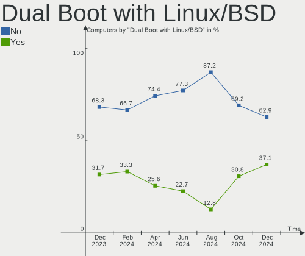
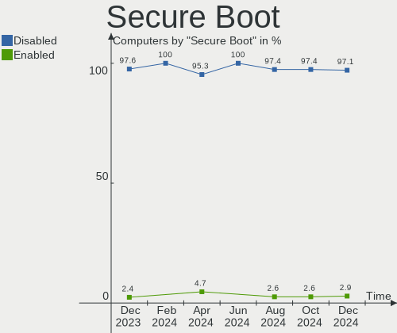
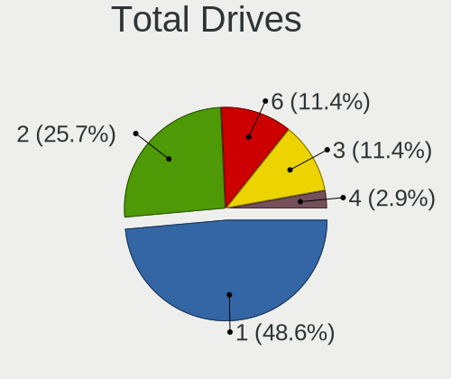
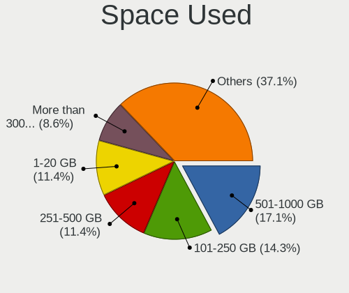
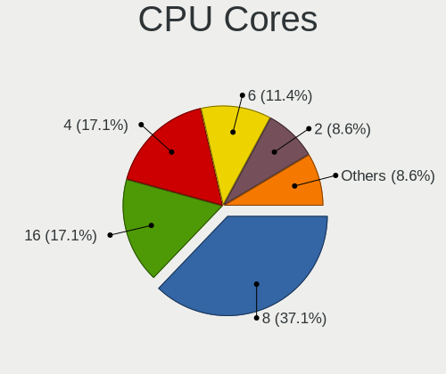
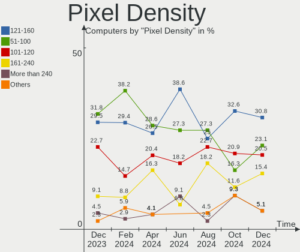
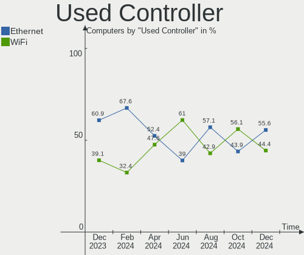
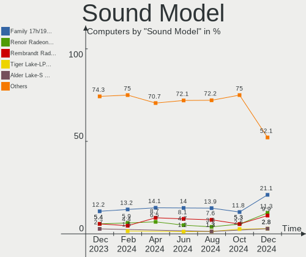
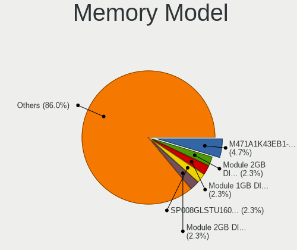

Gentoo Hardware Trends
----------------------

A project to identify most popular hardware characteristics and track their change
over time based on data collected by Gentoo users at https://Linux-Hardware.org.

Anyone can contribute to this report by the [hw-probe](https://github.com/linuxhw/hw-probe) tool:

    sudo -E hw-probe -all -upload

This is a report for all computer types. See also reports for [desktops](/Dist/Gentoo/Desktop/README.md) and [notebooks](/Dist/Gentoo/Notebook/README.md).

Full-feature report is available here: https://linux-hardware.org/?view=trends

Period: Dec, 2021.

Contents
--------

* [ System ](#system)
  - [ OS                       ](#os)
  - [ OS Family                ](#os-family)
  - [ Kernel                   ](#kernel)
  - [ Kernel Family            ](#kernel-family)
  - [ Kernel Major Ver.        ](#kernel-major-ver)
  - [ Arch                     ](#arch)
  - [ DE                       ](#de)
  - [ Display Server           ](#display-server)
  - [ Display Manager          ](#display-manager)
  - [ OS Lang                  ](#os-lang)
  - [ Boot Mode                ](#boot-mode)
  - [ Filesystem               ](#filesystem)
  - [ Part. scheme             ](#part-scheme)
  - [ Dual Boot with Linux/BSD ](#dual-boot-with-linuxbsd)
  - [ Dual Boot (Win)          ](#dual-boot-win)

* [ Board ](#board)
  - [ Vendor                   ](#vendor)
  - [ Model                    ](#model)
  - [ Model Family             ](#model-family)
  - [ MFG Year                 ](#mfg-year)
  - [ Form Factor              ](#form-factor)
  - [ Secure Boot              ](#secure-boot)
  - [ Coreboot                 ](#coreboot)
  - [ RAM Size                 ](#ram-size)
  - [ RAM Used                 ](#ram-used)
  - [ Total Drives             ](#total-drives)
  - [ Has CD-ROM               ](#has-cd-rom)
  - [ Has Ethernet             ](#has-ethernet)
  - [ Has WiFi                 ](#has-wifi)
  - [ Has Bluetooth            ](#has-bluetooth)

* [ Location ](#location)
  - [ Country                  ](#country)
  - [ City                     ](#city)

* [ Drives ](#drives)
  - [ Drive Vendor             ](#drive-vendor)
  - [ Drive Model              ](#drive-model)
  - [ HDD Vendor               ](#hdd-vendor)
  - [ SSD Vendor               ](#ssd-vendor)
  - [ Drive Kind               ](#drive-kind)
  - [ Drive Connector          ](#drive-connector)
  - [ Drive Size               ](#drive-size)
  - [ Space Total              ](#space-total)
  - [ Space Used               ](#space-used)
  - [ Malfunc. Drives          ](#malfunc-drives)
  - [ Malfunc. Drive Vendor    ](#malfunc-drive-vendor)
  - [ Malfunc. HDD Vendor      ](#malfunc-hdd-vendor)
  - [ Malfunc. Drive Kind      ](#malfunc-drive-kind)
  - [ Failed Drives            ](#failed-drives)
  - [ Failed Drive Vendor      ](#failed-drive-vendor)
  - [ Drive Status             ](#drive-status)

* [ Storage controller ](#storage-controller)
  - [ Storage Vendor           ](#storage-vendor)
  - [ Storage Model            ](#storage-model)
  - [ Storage Kind             ](#storage-kind)

* [ Processor ](#processor)
  - [ CPU Vendor               ](#cpu-vendor)
  - [ CPU Model                ](#cpu-model)
  - [ CPU Model Family         ](#cpu-model-family)
  - [ CPU Cores                ](#cpu-cores)
  - [ CPU Sockets              ](#cpu-sockets)
  - [ CPU Threads              ](#cpu-threads)
  - [ CPU Op-Modes             ](#cpu-op-modes)
  - [ CPU Microcode            ](#cpu-microcode)
  - [ CPU Microarch            ](#cpu-microarch)

* [ Graphics ](#graphics)
  - [ GPU Vendor               ](#gpu-vendor)
  - [ GPU Model                ](#gpu-model)
  - [ GPU Combo                ](#gpu-combo)
  - [ GPU Driver               ](#gpu-driver)
  - [ GPU Memory               ](#gpu-memory)

* [ Monitor ](#monitor)
  - [ Monitor Vendor           ](#monitor-vendor)
  - [ Monitor Model            ](#monitor-model)
  - [ Monitor Resolution       ](#monitor-resolution)
  - [ Monitor Diagonal         ](#monitor-diagonal)
  - [ Monitor Width            ](#monitor-width)
  - [ Aspect Ratio             ](#aspect-ratio)
  - [ Monitor Area             ](#monitor-area)
  - [ Pixel Density            ](#pixel-density)
  - [ Multiple Monitors        ](#multiple-monitors)

* [ Network ](#network)
  - [ Net Controller Vendor    ](#net-controller-vendor)
  - [ Net Controller Model     ](#net-controller-model)
  - [ Wireless Vendor          ](#wireless-vendor)
  - [ Wireless Model           ](#wireless-model)
  - [ Ethernet Vendor          ](#ethernet-vendor)
  - [ Ethernet Model           ](#ethernet-model)
  - [ Net Controller Kind      ](#net-controller-kind)
  - [ Used Controller          ](#used-controller)
  - [ NICs                     ](#nics)
  - [ IPv6                     ](#ipv6)

* [ Bluetooth ](#bluetooth)
  - [ Bluetooth Vendor         ](#bluetooth-vendor)
  - [ Bluetooth Model          ](#bluetooth-model)

* [ Sound ](#sound)
  - [ Sound Vendor             ](#sound-vendor)
  - [ Sound Model              ](#sound-model)

* [ Memory ](#memory)
  - [ Memory Vendor            ](#memory-vendor)
  - [ Memory Model             ](#memory-model)
  - [ Memory Kind              ](#memory-kind)
  - [ Memory Form Factor       ](#memory-form-factor)
  - [ Memory Size              ](#memory-size)
  - [ Memory Speed             ](#memory-speed)

* [ Printers & scanners ](#printers--scanners)
  - [ Printer Vendor           ](#printer-vendor)
  - [ Printer Model            ](#printer-model)
  - [ Scanner Vendor           ](#scanner-vendor)
  - [ Scanner Model            ](#scanner-model)

* [ Camera ](#camera)
  - [ Camera Vendor            ](#camera-vendor)
  - [ Camera Model             ](#camera-model)

* [ Security ](#security)
  - [ Fingerprint Vendor       ](#fingerprint-vendor)
  - [ Fingerprint Model        ](#fingerprint-model)
  - [ Chipcard Vendor          ](#chipcard-vendor)
  - [ Chipcard Model           ](#chipcard-model)

* [ Unsupported ](#unsupported)
  - [ Unsupported Devices      ](#unsupported-devices)
  - [ Unsupported Device Types ](#unsupported-device-types)

System
------

OS
--

Installed operating systems

| Name       | Computers | Percent |
|------------|-----------|---------|
| Gentoo 2.7 | 25        | 50%     |
| Gentoo 2.8 | 14        | 28%     |
| Gentoo 2.6 | 10        | 20%     |
| Gentoo 1   | 1         | 2%      |

OS Family
---------

OS without a version

| Name   | Computers | Percent |
|--------|-----------|---------|
| Gentoo | 50        | 100%    |

Kernel
------

Version of the Linux kernel

| Version                               | Computers | Percent |
|---------------------------------------|-----------|---------|
| 5.10.76-gentoo-r1                     | 9         | 18%     |
| 5.10.76-gentoo-r1-x86_64              | 7         | 14%     |
| 5.15.6-gentoo                         | 5         | 10%     |
| 5.15.10-gentoo-x86_64                 | 4         | 8%      |
| 5.15.10-gentoo                        | 3         | 6%      |
| 5.15.7-gentoo                         | 2         | 4%      |
| 5.15.5-gentoo                         | 2         | 4%      |
| 5.10.11-v8                            | 2         | 4%      |
| 6.0.0-Phaco-g8f10ff49057f             | 1         | 2%      |
| 5.15.9-gentoo-x86_64                  | 1         | 2%      |
| 5.15.4-gentoo.8i7HVK                  | 1         | 2%      |
| 5.15.4-gentoo-deimos                  | 1         | 2%      |
| 5.15.3-gentoo.4650G                   | 1         | 2%      |
| 5.15.11-gentoo-x86_64                 | 1         | 2%      |
| 5.15.10-zen1_pulankured               | 1         | 2%      |
| 5.15.10-gentoo-x86_64-20211221_224447 | 1         | 2%      |
| 5.15.10-gentoo-limelight              | 1         | 2%      |
| 5.15.0-gentoofullmaster               | 1         | 2%      |
| 5.10.84-gentoo-112-overlayfs          | 1         | 2%      |
| 5.10.83-gentoo-dist                   | 1         | 2%      |
| 5.10.78-gentoo-dist                   | 1         | 2%      |
| 5.10.76-gentoo-r1-kris                | 1         | 2%      |
| 5.10.61-gentoo-x86_64                 | 1         | 2%      |
| 5.10.61-gentoo                        | 1         | 2%      |

Kernel Family
-------------

Linux kernel without a distro release

| Version | Computers | Percent |
|---------|-----------|---------|
| 5.10.76 | 17        | 34%     |
| 5.15.10 | 10        | 20%     |
| 5.15.6  | 5         | 10%     |
| 5.15.7  | 2         | 4%      |
| 5.15.5  | 2         | 4%      |
| 5.15.4  | 2         | 4%      |
| 5.10.61 | 2         | 4%      |
| 5.10.11 | 2         | 4%      |
| 6.0.0   | 1         | 2%      |
| 5.15.9  | 1         | 2%      |
| 5.15.3  | 1         | 2%      |
| 5.15.11 | 1         | 2%      |
| 5.15.0  | 1         | 2%      |
| 5.10.84 | 1         | 2%      |
| 5.10.83 | 1         | 2%      |
| 5.10.78 | 1         | 2%      |

Kernel Major Ver.
-----------------

Linux kernel major version

| Version | Computers | Percent |
|---------|-----------|---------|
| 5.15    | 25        | 50%     |
| 5.10    | 24        | 48%     |
| 6.0     | 1         | 2%      |

Arch
----

OS architecture (x86_64, i586, etc.)

| Name    | Computers | Percent |
|---------|-----------|---------|
| x86_64  | 48        | 96%     |
| aarch64 | 2         | 4%      |

DE
--

Desktop Environment

| Name          | Computers | Percent |
|---------------|-----------|---------|
| Unknown       | 21        | 42%     |
| KDE5          | 11        | 22%     |
| GNOME         | 7         | 14%     |
| XFCE          | 4         | 8%      |
| Enlightenment | 2         | 4%      |
| X-Cinnamon    | 1         | 2%      |
| MATE          | 1         | 2%      |
| LXQt          | 1         | 2%      |
| KDE           | 1         | 2%      |
| DWM           | 1         | 2%      |

Display Server
--------------

X11 or Wayland

| Name    | Computers | Percent |
|---------|-----------|---------|
| X11     | 28        | 56%     |
| Unknown | 10        | 20%     |
| Wayland | 7         | 14%     |
| Tty     | 5         | 10%     |

Display Manager
---------------

SDDM, LightDM, etc.

| Name    | Computers | Percent |
|---------|-----------|---------|
| Unknown | 24        | 48%     |
| SDDM    | 12        | 24%     |
| LightDM | 8         | 16%     |
| GDM     | 5         | 10%     |
| SLiM    | 1         | 2%      |

OS Lang
-------

Language

| Lang    | Computers | Percent |
|---------|-----------|---------|
| en_US   | 26        | 52%     |
| en_GB   | 5         | 10%     |
| pl_PL   | 3         | 6%      |
| C.UTF8  | 3         | 6%      |
| it_IT   | 2         | 4%      |
| sl_SI   | 1         | 2%      |
| ru_UA   | 1         | 2%      |
| ru_RU   | 1         | 2%      |
| pt_BR   | 1         | 2%      |
| fr_FR   | 1         | 2%      |
| es_ES   | 1         | 2%      |
| en_NZ   | 1         | 2%      |
| en_CA   | 1         | 2%      |
| el_GR   | 1         | 2%      |
| de_DE   | 1         | 2%      |
| Unknown | 1         | 2%      |

Boot Mode
---------

EFI or BIOS

| Mode | Computers | Percent |
|------|-----------|---------|
| EFI  | 37        | 74%     |
| BIOS | 13        | 26%     |

Filesystem
----------

Type of filesystem

| Type     | Computers | Percent |
|----------|-----------|---------|
| Ext4     | 35        | 70%     |
| Btrfs    | 9         | 18%     |
| F2fs     | 3         | 6%      |
| Xtrfs    | 1         | 2%      |
| Reiserfs | 1         | 2%      |
| Ext3     | 1         | 2%      |

Part. scheme
------------

Scheme of partitioning

| Type    | Computers | Percent |
|---------|-----------|---------|
| GPT     | 44        | 88%     |
| MBR     | 4         | 8%      |
| Unknown | 2         | 4%      |

Dual Boot with Linux/BSD
------------------------

Hosting more than one Linux/BSD

| Dual boot | Computers | Percent |
|-----------|-----------|---------|
| No        | 39        | 78%     |
| Yes       | 11        | 22%     |

Dual Boot (Win)
---------------

Hosting Linux and Windows

| Dual boot | Computers | Percent |
|-----------|-----------|---------|
| No        | 32        | 64%     |
| Yes       | 18        | 36%     |

Board
-----

Vendor
------

Motherboard manufacturer

| Name                    | Computers | Percent |
|-------------------------|-----------|---------|
| ASUSTek Computer        | 10        | 20%     |
| Dell                    | 8         | 16%     |
| Lenovo                  | 5         | 10%     |
| Samsung Electronics     | 4         | 8%      |
| MSI                     | 4         | 8%      |
| Hewlett-Packard         | 4         | 8%      |
| Raspberry Pi Foundation | 2         | 4%      |
| Intel                   | 2         | 4%      |
| Gigabyte Technology     | 2         | 4%      |
| TYAN Computer           | 1         | 2%      |
| Toshiba                 | 1         | 2%      |
| Timi                    | 1         | 2%      |
| Framework               | 1         | 2%      |
| EVGA                    | 1         | 2%      |
| BESSTAR Tech            | 1         | 2%      |
| ASRock                  | 1         | 2%      |
| Apple                   | 1         | 2%      |
| Acer                    | 1         | 2%      |

Model
-----

Motherboard model

| Name                                   | Computers | Percent |
|----------------------------------------|-----------|---------|
| RPi Raspberry Pi                       | 2         | 4%      |
| Dell XPS 17 9710                       | 2         | 4%      |
| TYAN S7025                             | 1         | 2%      |
| Toshiba Satellite C850D-118            | 1         | 2%      |
| Timi A35                               | 1         | 2%      |
| Samsung RC530/RC730                    | 1         | 2%      |
| Samsung 950QDB                         | 1         | 2%      |
| Samsung 950QCG                         | 1         | 2%      |
| Samsung 700T1C                         | 1         | 2%      |
| MSI MS-7D31                            | 1         | 2%      |
| MSI MS-7C02                            | 1         | 2%      |
| MSI MS-7821                            | 1         | 2%      |
| MSI Delta 15 A5EFK                     | 1         | 2%      |
| Lenovo ThinkPad T480s 20L7001MRT       | 1         | 2%      |
| Lenovo ThinkPad E15 Gen 2 20T8005CUS   | 1         | 2%      |
| Lenovo Legion Y740-17IRHg 81UJ         | 1         | 2%      |
| Lenovo Legion 5 15ACH6 82JW            | 1         | 2%      |
| Lenovo IdeaPad S145-15IWL 81S9         | 1         | 2%      |
| Intel S1200RP                          | 1         | 2%      |
| Intel NUC8i7HVK                        | 1         | 2%      |
| HP Pavilion ZV6100 (EE984EA#ABZ)       | 1         | 2%      |
| HP Pavilion Gaming Laptop 15-ec1xxx    | 1         | 2%      |
| HP Pavilion Gaming Laptop 15-dk0xxx    | 1         | 2%      |
| HP EliteBook 830 G5                    | 1         | 2%      |
| Gigabyte B450 AORUS PRO WIFI           | 1         | 2%      |
| Gigabyte AB350-Gaming                  | 1         | 2%      |
| Framework Laptop                       | 1         | 2%      |
| EVGA Z390 DARK                         | 1         | 2%      |
| Dell XPS 15 9570                       | 1         | 2%      |
| Dell Vostro 410                        | 1         | 2%      |
| Dell Vostro 3500                       | 1         | 2%      |
| Dell OptiPlex 790                      | 1         | 2%      |
| Dell Latitude 5420                     | 1         | 2%      |
| Dell Inspiron 15 5510                  | 1         | 2%      |
| BESSTAR Tech X400                      | 1         | 2%      |
| ASUS ZenBook UX425QA_UM425QA           | 1         | 2%      |
| ASUS X200MA                            | 1         | 2%      |
| ASUS VivoBook_ASUSLaptop X509DA_M509DA | 1         | 2%      |
| ASUS TUF B450-PLUS GAMING              | 1         | 2%      |
| ASUS SABERTOOTH 990FX                  | 1         | 2%      |
| ASUS ROG Strix G513QY_G513QY           | 1         | 2%      |
| ASUS ROG Maximus XIII APEX             | 1         | 2%      |
| ASUS P5LD2-Deluxe                      | 1         | 2%      |
| ASUS M3N78-EM                          | 1         | 2%      |
| ASUS M3A78-CM                          | 1         | 2%      |
| ASRock H110M-HDV R3.0                  | 1         | 2%      |
| Apple MacBook10,1                      | 1         | 2%      |
| Acer Aspire E5-571G                    | 1         | 2%      |

Model Family
------------

Motherboard model prefix

| Name                  | Computers | Percent |
|-----------------------|-----------|---------|
| HP Pavilion           | 3         | 6%      |
| Dell XPS              | 3         | 6%      |
| RPi Raspberry         | 2         | 4%      |
| Lenovo ThinkPad       | 2         | 4%      |
| Lenovo Legion         | 2         | 4%      |
| Dell Vostro           | 2         | 4%      |
| ASUS ROG              | 2         | 4%      |
| TYAN S7025            | 1         | 2%      |
| Toshiba Satellite     | 1         | 2%      |
| Timi A35              | 1         | 2%      |
| Samsung RC530         | 1         | 2%      |
| Samsung 950QDB        | 1         | 2%      |
| Samsung 950QCG        | 1         | 2%      |
| Samsung 700T1C        | 1         | 2%      |
| MSI MS-7D31           | 1         | 2%      |
| MSI MS-7C02           | 1         | 2%      |
| MSI MS-7821           | 1         | 2%      |
| MSI Delta             | 1         | 2%      |
| Lenovo IdeaPad        | 1         | 2%      |
| Intel S1200RP         | 1         | 2%      |
| Intel NUC8i7HVK       | 1         | 2%      |
| HP EliteBook          | 1         | 2%      |
| Gigabyte B450         | 1         | 2%      |
| Gigabyte AB350-Gaming | 1         | 2%      |
| Framework Laptop      | 1         | 2%      |
| EVGA Z390             | 1         | 2%      |
| Dell OptiPlex         | 1         | 2%      |
| Dell Latitude         | 1         | 2%      |
| Dell Inspiron         | 1         | 2%      |
| BESSTAR Tech X400     | 1         | 2%      |
| ASUS ZenBook          | 1         | 2%      |
| ASUS X200MA           | 1         | 2%      |
| ASUS VivoBook         | 1         | 2%      |
| ASUS TUF              | 1         | 2%      |
| ASUS SABERTOOTH       | 1         | 2%      |
| ASUS P5LD2-Deluxe     | 1         | 2%      |
| ASUS M3N78-EM         | 1         | 2%      |
| ASUS M3A78-CM         | 1         | 2%      |
| ASRock H110M-HDV      | 1         | 2%      |
| Apple MacBook10       | 1         | 2%      |
| Acer Aspire           | 1         | 2%      |

MFG Year
--------

Motherboard manufacture year

| Year    | Computers | Percent |
|---------|-----------|---------|
| 2021    | 22        | 44%     |
| 2019    | 7         | 14%     |
| 2012    | 4         | 8%      |
| 2020    | 3         | 6%      |
| 2014    | 3         | 6%      |
| 2018    | 2         | 4%      |
| 2006    | 2         | 4%      |
| Unknown | 2         | 4%      |
| 2015    | 1         | 2%      |
| 2011    | 1         | 2%      |
| 2010    | 1         | 2%      |
| 2009    | 1         | 2%      |
| 2008    | 1         | 2%      |

Form Factor
-----------

Physical design of the computer

| Name           | Computers | Percent |
|----------------|-----------|---------|
| Notebook       | 27        | 54%     |
| Desktop        | 15        | 30%     |
| Server         | 3         | 6%      |
| System on chip | 2         | 4%      |
| Convertible    | 2         | 4%      |
| Mini pc        | 1         | 2%      |

Secure Boot
-----------

Enabled or disabled

| State    | Computers | Percent |
|----------|-----------|---------|
| Disabled | 49        | 98%     |
| Enabled  | 1         | 2%      |

Coreboot
--------

Have coreboot on board

| Used | Computers | Percent |
|------|-----------|---------|
| No   | 50        | 100%    |

RAM Size
--------

Total RAM memory

| Size in GB  | Computers | Percent |
|-------------|-----------|---------|
| 16.01-24.0  | 11        | 22%     |
| 32.01-64.0  | 10        | 20%     |
| 4.01-8.0    | 9         | 18%     |
| 64.01-256.0 | 5         | 10%     |
| 8.01-16.0   | 5         | 10%     |
| 3.01-4.0    | 4         | 8%      |
| 1.01-2.0    | 3         | 6%      |
| 24.01-32.0  | 2         | 4%      |
| 2.01-3.0    | 1         | 2%      |

RAM Used
--------

Used RAM memory

| Used GB    | Computers | Percent |
|------------|-----------|---------|
| 2.01-3.0   | 11        | 22%     |
| 4.01-8.0   | 9         | 18%     |
| 1.01-2.0   | 8         | 16%     |
| 0.51-1.0   | 7         | 14%     |
| 0.01-0.5   | 6         | 12%     |
| 3.01-4.0   | 5         | 10%     |
| 8.01-16.0  | 3         | 6%      |
| 16.01-24.0 | 1         | 2%      |

Total Drives
------------

Number of drives on board

| Drives | Computers | Percent |
|--------|-----------|---------|
| 1      | 22        | 44%     |
| 2      | 14        | 28%     |
| 4      | 7         | 14%     |
| 3      | 3         | 6%      |
| 5      | 2         | 4%      |
| 6      | 1         | 2%      |
| 0      | 1         | 2%      |

Has CD-ROM
----------

Has CD-ROM on board

| Presented | Computers | Percent |
|-----------|-----------|---------|
| No        | 41        | 82%     |
| Yes       | 9         | 18%     |

Has Ethernet
------------

Has Ethernet on board

| Presented | Computers | Percent |
|-----------|-----------|---------|
| Yes       | 35        | 70%     |
| No        | 15        | 30%     |

Has WiFi
--------

Has WiFi module

| Presented | Computers | Percent |
|-----------|-----------|---------|
| Yes       | 38        | 76%     |
| No        | 12        | 24%     |

Has Bluetooth
-------------

Has Bluetooth module

| Presented | Computers | Percent |
|-----------|-----------|---------|
| Yes       | 31        | 62%     |
| No        | 19        | 38%     |

Location
--------

Country
-------

Geographic location (country)

| Country     | Computers | Percent |
|-------------|-----------|---------|
| USA         | 12        | 24%     |
| Poland      | 7         | 14%     |
| Ukraine     | 3         | 6%      |
| Spain       | 3         | 6%      |
| Italy       | 3         | 6%      |
| Germany     | 3         | 6%      |
| Canada      | 3         | 6%      |
| Hong Kong   | 2         | 4%      |
| Greece      | 2         | 4%      |
| Vietnam     | 1         | 2%      |
| Turkey      | 1         | 2%      |
| Slovenia    | 1         | 2%      |
| Russia      | 1         | 2%      |
| Romania     | 1         | 2%      |
| New Zealand | 1         | 2%      |
| Indonesia   | 1         | 2%      |
| India       | 1         | 2%      |
| France      | 1         | 2%      |
| Bulgaria    | 1         | 2%      |
| Brazil      | 1         | 2%      |
| Bangladesh  | 1         | 2%      |

City
----

Geographic location (city)

| City             | Computers | Percent |
|------------------|-----------|---------|
| Warsaw           | 4         | 8%      |
| Redmond          | 2         | 4%      |
| Kowloon          | 2         | 4%      |
| Barcelona        | 2         | 4%      |
| Athens           | 2         | 4%      |
| Vernon           | 1         | 2%      |
| Vancouver        | 1         | 2%      |
| Tomarovka        | 1         | 2%      |
| Tacoma           | 1         | 2%      |
| Surabaya         | 1         | 2%      |
| Sofia            | 1         | 2%      |
| Senise           | 1         | 2%      |
| Seattle          | 1         | 2%      |
| Savonera         | 1         | 2%      |
| San Francisco    | 1         | 2%      |
| Rzesz??w         | 1         | 2%      |
| Reghin           | 1         | 2%      |
| Regesbostel      | 1         | 2%      |
| Noida            | 1         | 2%      |
| Niederdorla      | 1         | 2%      |
| Markham          | 1         | 2%      |
| Lviv             | 1         | 2%      |
| Lakeland         | 1         | 2%      |
| Kyiv             | 1         | 2%      |
| Ivan??na Gorica  | 1         | 2%      |
| Istanbul         | 1         | 2%      |
| Igualada         | 1         | 2%      |
| Hoboken          | 1         | 2%      |
| Ho Chi Minh City | 1         | 2%      |
| Glendale         | 1         | 2%      |
| Geesthacht       | 1         | 2%      |
| Everett          | 1         | 2%      |
| Dorval           | 1         | 2%      |
| Dnipro           | 1         | 2%      |
| Divin??polis     | 1         | 2%      |
| Dhaka            | 1         | 2%      |
| Cieszyn          | 1         | 2%      |
| Chicago          | 1         | 2%      |
| Cerritos         | 1         | 2%      |
| Brescia          | 1         | 2%      |
| Bogucice         | 1         | 2%      |
| Baton Rouge      | 1         | 2%      |
| Auckland         | 1         | 2%      |

Drives
------

Drive Vendor
------------

Hard drive vendors

| Vendor              | Computers | Drives | Percent |
|---------------------|-----------|--------|---------|
| WDC                 | 17        | 21     | 20.24%  |
| Samsung Electronics | 17        | 22     | 20.24%  |
| Unknown             | 5         | 7      | 5.95%   |
| Toshiba             | 5         | 5      | 5.95%   |
| Seagate             | 5         | 8      | 5.95%   |
| Crucial             | 5         | 7      | 5.95%   |
| SK Hynix            | 4         | 4      | 4.76%   |
| GOODRAM             | 4         | 4      | 4.76%   |
| A-DATA Technology   | 4         | 4      | 4.76%   |
| Kingston            | 3         | 3      | 3.57%   |
| Intel               | 3         | 3      | 3.57%   |
| SanDisk             | 2         | 2      | 2.38%   |
| Hitachi             | 2         | 6      | 2.38%   |
| Team                | 1         | 1      | 1.19%   |
| OSCOO               | 1         | 1      | 1.19%   |
| Micron Technology   | 1         | 1      | 1.19%   |
| LITEONIT            | 1         | 1      | 1.19%   |
| LITEON              | 1         | 1      | 1.19%   |
| LaCie               | 1         | 1      | 1.19%   |
| CT2000MX            | 1         | 1      | 1.19%   |
| Apple               | 1         | 2      | 1.19%   |

Drive Model
-----------

Hard drive models

| Model                                      | Computers | Percent |
|--------------------------------------------|-----------|---------|
| Unknown MMC Card  32GB                     | 2         | 2.13%   |
| SK Hynix PC711 NVMe 1TB                    | 2         | 2.13%   |
| SanDisk SD9SN8W-128G-1006 128GB SSD        | 2         | 2.13%   |
| Samsung SSD 980 PRO 2TB                    | 2         | 2.13%   |
| Samsung MZVLQ512HALU-00000 512GB           | 2         | 2.13%   |
| GOODRAM SSDPR-CL100-480-G2 480GB           | 2         | 2.13%   |
| WDC WDS240G2G0A 240GB SSD                  | 1         | 1.06%   |
| WDC WDS100T2B0C 1TB                        | 1         | 1.06%   |
| WDC WD5000LPVX-80V0TT0 500GB               | 1         | 1.06%   |
| WDC WD5000LPVX-22V0TT0 500GB               | 1         | 1.06%   |
| WDC WD5000BEVT-22ZAT0 500GB                | 1         | 1.06%   |
| WDC WD40EZRZ-00GXCB0 4TB                   | 1         | 1.06%   |
| WDC WD30EZRZ-00GXCB0 3TB                   | 1         | 1.06%   |
| WDC WD30EFRX-68EUZN0 3TB                   | 1         | 1.06%   |
| WDC WD30EFRX-68AX9N0 3TB                   | 1         | 1.06%   |
| WDC WD2500BEVS-22UST0 250GB                | 1         | 1.06%   |
| WDC WD10SPZX-24Z10 1TB                     | 1         | 1.06%   |
| WDC WD10EZEX-60M2NA0 1TB                   | 1         | 1.06%   |
| WDC WD10EZEX-22M                           | 1         | 1.06%   |
| WDC WD10EZEX-08M2NA0 1TB                   | 1         | 1.06%   |
| WDC WD10EARS-00MVWB0 1TB                   | 1         | 1.06%   |
| WDC WD1002FAEX-00Y9A0 1TB                  | 1         | 1.06%   |
| WDC WD My Passport 264F 1TB                | 1         | 1.06%   |
| WDC PC SN530 NVMe 512GB                    | 1         | 1.06%   |
| WDC PC SN520 SDAPNUW-256G-1006 256GB       | 1         | 1.06%   |
| WDC PC SN520 SDAPNUW-128G-1006 128GB       | 1         | 1.06%   |
| Unknown USB DISK 3.2 1TB                   | 1         | 1.06%   |
| Unknown MMC Card  256GB                    | 1         | 1.06%   |
| Unknown MMC Card  16GB                     | 1         | 1.06%   |
| Toshiba MQ04ABF100 1TB                     | 1         | 1.06%   |
| Toshiba HDWE150 5TB                        | 1         | 1.06%   |
| Toshiba DT01ACA300 3TB                     | 1         | 1.06%   |
| Toshiba DT01ACA100 1TB                     | 1         | 1.06%   |
| Toshiba DT01ABA100V 1TB                    | 1         | 1.06%   |
| Team TM8PS7256G 256GB SSD                  | 1         | 1.06%   |
| SK Hynix SKHynix_HFS512GDE9X084N 512GB     | 1         | 1.06%   |
| SK Hynix SHGP31-1000GM-2 1TB               | 1         | 1.06%   |
| Seagate ST4000DM004-2CV104 4TB             | 1         | 1.06%   |
| Seagate ST12000NM0008-2H3101 12TB          | 1         | 1.06%   |
| Seagate ST10000NM0568-2H5110 10TB          | 1         | 1.06%   |
| Seagate FireCuda 530 ZP4000GM30013 4TB     | 1         | 1.06%   |
| Seagate FireCuda 520 SSD ZP2000GM30002 2TB | 1         | 1.06%   |
| Samsung SSD 970 PRO 512GB                  | 1         | 1.06%   |
| Samsung SSD 970 EVO Plus 500GB             | 1         | 1.06%   |
| Samsung SSD 970 EVO Plus 2TB               | 1         | 1.06%   |
| Samsung SSD 970 EVO Plus 1TB               | 1         | 1.06%   |
| Samsung SSD 970 EVO 250GB                  | 1         | 1.06%   |
| Samsung SSD 950 PRO 512GB                  | 1         | 1.06%   |
| Samsung SSD 870 QVO 2TB                    | 1         | 1.06%   |
| Samsung SSD 870 EVO 500GB                  | 1         | 1.06%   |
| Samsung SSD 870 EVO 1TB                    | 1         | 1.06%   |
| Samsung SSD 860 PRO 1TB                    | 1         | 1.06%   |
| Samsung SSD 860 EVO M.2 250GB              | 1         | 1.06%   |
| Samsung SSD 860 EVO 250GB                  | 1         | 1.06%   |
| Samsung SSD 850 PRO 256GB                  | 1         | 1.06%   |
| Samsung SSD 850 EVO M.2 1TB                | 1         | 1.06%   |
| Samsung SSD 850 EVO 250GB                  | 1         | 1.06%   |
| Samsung MZVLQ1T0HBLB-00B 1TB               | 1         | 1.06%   |
| Samsung MZVLB512HBJQ-000 512GB             | 1         | 1.06%   |
| OSCOO OSC PCIe 256GB                       | 1         | 1.06%   |

HDD Vendor
----------

Hard disk drive vendors

| Vendor  | Computers | Drives | Percent |
|---------|-----------|--------|---------|
| WDC     | 13        | 15     | 54.17%  |
| Toshiba | 5         | 5      | 20.83%  |
| Seagate | 3         | 6      | 12.5%   |
| Hitachi | 2         | 6      | 8.33%   |
| LaCie   | 1         | 1      | 4.17%   |

SSD Vendor
----------

Solid state drive vendors

| Vendor              | Computers | Drives | Percent |
|---------------------|-----------|--------|---------|
| Samsung Electronics | 9         | 10     | 34.62%  |
| GOODRAM             | 4         | 4      | 15.38%  |
| SanDisk             | 2         | 2      | 7.69%   |
| Kingston            | 2         | 2      | 7.69%   |
| Crucial             | 2         | 4      | 7.69%   |
| A-DATA Technology   | 2         | 2      | 7.69%   |
| WDC                 | 1         | 1      | 3.85%   |
| Team                | 1         | 1      | 3.85%   |
| LITEONIT            | 1         | 1      | 3.85%   |
| Intel               | 1         | 1      | 3.85%   |
| CT2000MX            | 1         | 1      | 3.85%   |

Drive Kind
----------

HDD or SSD

| Kind    | Computers | Drives | Percent |
|---------|-----------|--------|---------|
| NVMe    | 30        | 35     | 41.1%   |
| SSD     | 19        | 29     | 26.03%  |
| HDD     | 18        | 33     | 24.66%  |
| MMC     | 4         | 4      | 5.48%   |
| Unknown | 2         | 4      | 2.74%   |

Drive Connector
---------------

SATA, SAS, NVMe, etc.

| Type | Computers | Drives | Percent |
|------|-----------|--------|---------|
| NVMe | 30        | 35     | 46.15%  |
| SATA | 28        | 60     | 43.08%  |
| MMC  | 4         | 4      | 6.15%   |
| SAS  | 3         | 6      | 4.62%   |

Drive Size
----------

Size of hard drive

| Size in TB | Computers | Drives | Percent |
|------------|-----------|--------|---------|
| 0.01-0.5   | 18        | 26     | 43.9%   |
| 0.51-1.0   | 12        | 16     | 29.27%  |
| 2.01-3.0   | 5         | 8      | 12.2%   |
| 3.01-4.0   | 2         | 2      | 4.88%   |
| 4.01-10.0  | 2         | 5      | 4.88%   |
| 10.01-20.0 | 1         | 1      | 2.44%   |
| 1.01-2.0   | 1         | 4      | 2.44%   |

Space Total
-----------

Amount of disk space available on the file system

| Size in GB     | Computers | Percent |
|----------------|-----------|---------|
| 251-500        | 11        | 22%     |
| 101-250        | 10        | 20%     |
| 501-1000       | 9         | 18%     |
| More than 3000 | 6         | 12%     |
| 1001-2000      | 4         | 8%      |
| Unknown        | 4         | 8%      |
| 21-50          | 2         | 4%      |
| 1-20           | 2         | 4%      |
| 2001-3000      | 1         | 2%      |
| 51-100         | 1         | 2%      |

Space Used
----------

Amount of used disk space

| Used GB        | Computers | Percent |
|----------------|-----------|---------|
| 1-20           | 15        | 30%     |
| 101-250        | 9         | 18%     |
| 251-500        | 7         | 14%     |
| More than 3000 | 4         | 8%      |
| 21-50          | 4         | 8%      |
| 51-100         | 4         | 8%      |
| Unknown        | 4         | 8%      |
| 501-1000       | 2         | 4%      |
| 2001-3000      | 1         | 2%      |

Malfunc. Drives
---------------

Drive models with a malfunction

| Model                                 | Computers | Drives | Percent |
|---------------------------------------|-----------|--------|---------|
| SanDisk SD9SN8W-128G-1006 128GB SSD   | 2         | 2      | 28.57%  |
| WDC WD5000BEVT-22ZAT0 500GB           | 1         | 1      | 14.29%  |
| Toshiba DT01ABA100V 1TB               | 1         | 1      | 14.29%  |
| Samsung Electronics SSD 870 EVO 500GB | 1         | 1      | 14.29%  |
| Kingston SV300S37A120G 120GB SSD      | 1         | 1      | 14.29%  |
| Crucial CT1000P1SSD8 1TB              | 1         | 1      | 14.29%  |

Malfunc. Drive Vendor
---------------------

Vendors of faulty drives

| Vendor              | Computers | Drives | Percent |
|---------------------|-----------|--------|---------|
| SanDisk             | 2         | 2      | 28.57%  |
| WDC                 | 1         | 1      | 14.29%  |
| Toshiba             | 1         | 1      | 14.29%  |
| Samsung Electronics | 1         | 1      | 14.29%  |
| Kingston            | 1         | 1      | 14.29%  |
| Crucial             | 1         | 1      | 14.29%  |

Malfunc. HDD Vendor
-------------------

Vendors of faulty HDD drives

| Vendor  | Computers | Drives | Percent |
|---------|-----------|--------|---------|
| WDC     | 1         | 1      | 50%     |
| Toshiba | 1         | 1      | 50%     |

Malfunc. Drive Kind
-------------------

Kinds of faulty drives

| Kind | Computers | Drives | Percent |
|------|-----------|--------|---------|
| SSD  | 4         | 4      | 57.14%  |
| HDD  | 2         | 2      | 28.57%  |
| NVMe | 1         | 1      | 14.29%  |

Failed Drives
-------------

Failed drive models

Zero info for selected period =(

Failed Drive Vendor
-------------------

Failed drive vendors

Zero info for selected period =(

Drive Status
------------

Number of failed and malfunc. drives

| Status   | Computers | Drives | Percent |
|----------|-----------|--------|---------|
| Works    | 42        | 83     | 72.41%  |
| Detected | 9         | 15     | 15.52%  |
| Malfunc  | 7         | 7      | 12.07%  |

Storage controller
------------------

Storage Vendor
--------------

Storage controller vendors

| Vendor                      | Computers | Percent |
|-----------------------------|-----------|---------|
| Intel                       | 24        | 32.88%  |
| Samsung Electronics         | 12        | 16.44%  |
| AMD                         | 11        | 15.07%  |
| SK Hynix                    | 4         | 5.48%   |
| Sandisk                     | 4         | 5.48%   |
| ASMedia Technology          | 4         | 5.48%   |
| Seagate Technology          | 2         | 2.74%   |
| Micron/Crucial Technology   | 2         | 2.74%   |
| Micron Technology           | 2         | 2.74%   |
| ADATA Technology            | 2         | 2.74%   |
| Silicon Motion              | 1         | 1.37%   |
| Silicon Image               | 1         | 1.37%   |
| Nvidia                      | 1         | 1.37%   |
| Lite-On Technology          | 1         | 1.37%   |
| Kingston Technology Company | 1         | 1.37%   |
| Apple                       | 1         | 1.37%   |

Storage Model
-------------

Storage controller models

| Model                                                                          | Computers | Percent |
|--------------------------------------------------------------------------------|-----------|---------|
| AMD FCH SATA Controller [AHCI mode]                                            | 7         | 8.64%   |
| Samsung NVMe SSD Controller SM981/PM981/PM983                                  | 6         | 7.41%   |
| SK Hynix Gold P31 SSD                                                          | 4         | 4.94%   |
| ASMedia ASM1062 Serial ATA Controller                                          | 4         | 4.94%   |
| Samsung NVMe SSD Controller 980                                                | 3         | 3.7%    |
| AMD 400 Series Chipset SATA Controller                                         | 3         | 3.7%    |
| Sandisk WD Blue SN500 / PC SN520 NVMe SSD                                      | 2         | 2.47%   |
| Samsung NVMe SSD Controller PM9A1/PM9A3/980PRO                                 | 2         | 2.47%   |
| Micron Non-Volatile memory controller                                          | 2         | 2.47%   |
| Intel Cannon Lake Mobile PCH SATA AHCI Controller                              | 2         | 2.47%   |
| Intel 8 Series/C220 Series Chipset Family 6-port SATA Controller 1 [AHCI mode] | 2         | 2.47%   |
| ADATA XPG SX8200 Pro PCIe Gen3x4 M.2 2280 Solid State Drive                    | 2         | 2.47%   |
| Silicon Motion SM2263EN/SM2263XT SSD Controller                                | 1         | 1.23%   |
| Silicon Image SiI 3132 Serial ATA Raid II Controller                           | 1         | 1.23%   |
| Seagate Non-Volatile memory controller                                         | 1         | 1.23%   |
| Seagate FireCuda 520 SSD                                                       | 1         | 1.23%   |
| Sandisk WD Blue SN550 NVMe SSD                                                 | 1         | 1.23%   |
| Sandisk Non-Volatile memory controller                                         | 1         | 1.23%   |
| Samsung NVMe SSD Controller SM951/PM951                                        | 1         | 1.23%   |
| Nvidia MCP78S [GeForce 8200] IDE                                               | 1         | 1.23%   |
| Nvidia MCP78S [GeForce 8200] AHCI Controller                                   | 1         | 1.23%   |
| Micron/Crucial P2 NVMe PCIe SSD                                                | 1         | 1.23%   |
| Micron/Crucial P1 NVMe PCIe SSD                                                | 1         | 1.23%   |
| Lite-On Non-Volatile memory controller                                         | 1         | 1.23%   |
| Kingston Company OM3PDP3 NVMe SSD                                              | 1         | 1.23%   |
| Intel Volume Management Device NVMe RAID Controller                            | 1         | 1.23%   |
| Intel Tiger Lake-LP SATA Controller [AHCI mode]                                | 1         | 1.23%   |
| Intel Sunrise Point-LP SATA Controller [AHCI mode]                             | 1         | 1.23%   |
| Intel SSD 660P Series                                                          | 1         | 1.23%   |
| Intel Q170/Q150/B150/H170/H110/Z170/CM236 Chipset SATA Controller [AHCI Mode]  | 1         | 1.23%   |
| Intel Non-Volatile memory controller                                           | 1         | 1.23%   |
| Intel NM10/ICH7 Family SATA Controller [IDE mode]                              | 1         | 1.23%   |
| Intel HM170/QM170 Chipset SATA Controller [AHCI Mode]                          | 1         | 1.23%   |
| Intel Cannon Point-LP SATA Controller [AHCI Mode]                              | 1         | 1.23%   |
| Intel Cannon Lake PCH SATA AHCI Controller                                     | 1         | 1.23%   |
| Intel Atom Processor E3800 Series SATA AHCI Controller                         | 1         | 1.23%   |
| Intel 82801JI (ICH10 Family) 4 port SATA IDE Controller #1                     | 1         | 1.23%   |
| Intel 82801JI (ICH10 Family) 2 port SATA IDE Controller #2                     | 1         | 1.23%   |
| Intel 82801IR/IO/IH (ICH9R/DO/DH) 4 port SATA Controller [IDE mode]            | 1         | 1.23%   |
| Intel 82801I (ICH9 Family) 2 port SATA Controller [IDE mode]                   | 1         | 1.23%   |
| Intel 82801 Mobile SATA Controller [RAID mode]                                 | 1         | 1.23%   |
| Intel 8 Series SATA Controller 1 [AHCI mode]                                   | 1         | 1.23%   |
| Intel 7 Series Chipset Family 4-port SATA Controller [IDE mode]                | 1         | 1.23%   |
| Intel 7 Series Chipset Family 2-port SATA Controller [IDE mode]                | 1         | 1.23%   |
| Intel 600 Series Chipset Family SATA AHCI Controller                           | 1         | 1.23%   |
| Intel 6 Series/C200 Series Chipset Family 6 port Mobile SATA AHCI Controller   | 1         | 1.23%   |
| Intel 6 Series/C200 Series Chipset Family 6 port Desktop SATA AHCI Controller  | 1         | 1.23%   |
| Intel 500 Series Chipset Family SATA AHCI Controller                           | 1         | 1.23%   |
| Apple S3X NVMe Controller                                                      | 1         | 1.23%   |
| AMD SB7x0/SB8x0/SB9x0 SATA Controller [IDE mode]                               | 1         | 1.23%   |
| AMD SB7x0/SB8x0/SB9x0 SATA Controller [AHCI mode]                              | 1         | 1.23%   |
| AMD SB7x0/SB8x0/SB9x0 IDE Controller                                           | 1         | 1.23%   |
| AMD IXP SB4x0 IDE Controller                                                   | 1         | 1.23%   |
| AMD 300 Series Chipset SATA Controller                                         | 1         | 1.23%   |

Storage Kind
------------

Kind of storage controller (IDE, SATA, NVMe, SAS, ...)

| Kind | Computers | Percent |
|------|-----------|---------|
| NVMe | 30        | 44.78%  |
| SATA | 27        | 40.3%   |
| IDE  | 7         | 10.45%  |
| RAID | 3         | 4.48%   |

Processor
---------

CPU Vendor
----------

Processor vendors

| Vendor | Computers | Percent |
|--------|-----------|---------|
| Intel  | 31        | 62%     |
| AMD    | 17        | 34%     |
| ARM    | 2         | 4%      |

CPU Model
---------

Processor models

| Model                                         | Computers | Percent |
|-----------------------------------------------|-----------|---------|
| Intel Core i7-9750H CPU @ 2.60GHz             | 2         | 4%      |
| Intel 11th Gen Core i7-1185G7 @ 3.00GHz       | 2         | 4%      |
| ARM Processor                                 | 2         | 4%      |
| AMD Ryzen 7 5800H with Radeon Graphics        | 2         | 4%      |
| AMD Ryzen 5 2600 Six-Core Processor           | 2         | 4%      |
| Intel Xeon CPU X5680 @ 3.33GHz                | 1         | 2%      |
| Intel Xeon CPU E3-1270 v3 @ 3.50GHz           | 1         | 2%      |
| Intel Pentium 4 CPU 3.20GHz                   | 1         | 2%      |
| Intel Core m3-7Y32 CPU @ 1.10GHz              | 1         | 2%      |
| Intel Core i9-9900K CPU @ 3.60GHz             | 1         | 2%      |
| Intel Core i7-8809G CPU @ 3.10GHz             | 1         | 2%      |
| Intel Core i7-8750H CPU @ 2.20GHz             | 1         | 2%      |
| Intel Core i7-8565U CPU @ 1.80GHz             | 1         | 2%      |
| Intel Core i7-8550U CPU @ 1.80GHz             | 1         | 2%      |
| Intel Core i7-4790K CPU @ 4.00GHz             | 1         | 2%      |
| Intel Core i7-2670QM CPU @ 2.20GHz            | 1         | 2%      |
| Intel Core i7-1065G7 CPU @ 1.30GHz            | 1         | 2%      |
| Intel Core i5-8250U CPU @ 1.60GHz             | 1         | 2%      |
| Intel Core i5-7400 CPU @ 3.00GHz              | 1         | 2%      |
| Intel Core i5-4210U CPU @ 1.70GHz             | 1         | 2%      |
| Intel Core i5-3317U CPU @ 1.70GHz             | 1         | 2%      |
| Intel Core i5-2400 CPU @ 3.10GHz              | 1         | 2%      |
| Intel Core 2 Quad CPU Q6600 @ 2.40GHz         | 1         | 2%      |
| Intel Celeron CPU N2830 @ 2.16GHz             | 1         | 2%      |
| Intel 12th Gen Core i7-12700K                 | 1         | 2%      |
| Intel 11th Gen Core i9-11900K @ 3.50GHz       | 1         | 2%      |
| Intel 11th Gen Core i9-11900H @ 2.50GHz       | 1         | 2%      |
| Intel 11th Gen Core i7-11800H @ 2.30GHz       | 1         | 2%      |
| Intel 11th Gen Core i7-1165G7 @ 2.80GHz       | 1         | 2%      |
| Intel 11th Gen Core i5-1135G7 @ 2.40GHz       | 1         | 2%      |
| Intel 11th Gen Core i5-11320H @ 3.20GHz       | 1         | 2%      |
| Intel 11th Gen Core i5-11300H @ 3.10GHz       | 1         | 2%      |
| AMD Ryzen 9 5900HX with Radeon Graphics       | 1         | 2%      |
| AMD Ryzen 7 4700U with Radeon Graphics        | 1         | 2%      |
| AMD Ryzen 7 3700U with Radeon Vega Mobile Gfx | 1         | 2%      |
| AMD Ryzen 5 PRO 4650G with Radeon Graphics    | 1         | 2%      |
| AMD Ryzen 5 5600H with Radeon Graphics        | 1         | 2%      |
| AMD Ryzen 5 4600H with Radeon Graphics        | 1         | 2%      |
| AMD Ryzen 5 3600 6-Core Processor             | 1         | 2%      |
| AMD Ryzen 5 1600 Six-Core Processor           | 1         | 2%      |
| AMD Phenom II X4 955 Processor                | 1         | 2%      |
| AMD FX-8120 Eight-Core Processor              | 1         | 2%      |
| AMD E1-1200 APU with Radeon HD Graphics       | 1         | 2%      |
| AMD Athlon 64 X2 Dual Core Processor 5400+    | 1         | 2%      |
| AMD Athlon 64 Processor 3200+                 | 1         | 2%      |

CPU Model Family
----------------

Processor model prefix

| Model             | Computers | Percent |
|-------------------|-----------|---------|
| Other             | 12        | 24%     |
| Intel Core i7     | 9         | 18%     |
| AMD Ryzen 5       | 6         | 12%     |
| Intel Core i5     | 5         | 10%     |
| AMD Ryzen 7       | 4         | 8%      |
| Intel Xeon        | 2         | 4%      |
| Intel Pentium 4   | 1         | 2%      |
| Intel Core m3     | 1         | 2%      |
| Intel Core i9     | 1         | 2%      |
| Intel Core 2 Quad | 1         | 2%      |
| Intel Celeron     | 1         | 2%      |
| AMD Ryzen 9       | 1         | 2%      |
| AMD Ryzen 5 PRO   | 1         | 2%      |
| AMD Phenom II X4  | 1         | 2%      |
| AMD FX            | 1         | 2%      |
| AMD E1            | 1         | 2%      |
| AMD Athlon 64 X2  | 1         | 2%      |
| AMD Athlon 64     | 1         | 2%      |

CPU Cores
---------

Number of processor cores

| Number  | Computers | Percent |
|---------|-----------|---------|
| 4       | 20        | 40%     |
| 6       | 10        | 20%     |
| 8       | 8         | 16%     |
| 2       | 6         | 12%     |
| 12      | 2         | 4%      |
| 1       | 2         | 4%      |
| Unknown | 2         | 4%      |

CPU Sockets
-----------

Number of sockets

| Number  | Computers | Percent |
|---------|-----------|---------|
| 1       | 47        | 94%     |
| Unknown | 2         | 4%      |
| 2       | 1         | 2%      |

CPU Threads
-----------

Threads per core (Hyper-Threading)

| Number  | Computers | Percent |
|---------|-----------|---------|
| 2       | 38        | 76%     |
| 1       | 10        | 20%     |
| Unknown | 2         | 4%      |

CPU Op-Modes
------------

CPU Operation Modes (32-bit, 64-bit)

| Op mode        | Computers | Percent |
|----------------|-----------|---------|
| 32-bit, 64-bit | 50        | 100%    |

CPU Microcode
-------------

Microcode number

| Number     | Computers | Percent |
|------------|-----------|---------|
| Unknown    | 8         | 16%     |
| 0x806c1    | 4         | 8%      |
| 0x0a50000c | 4         | 8%      |
| 0x906ea    | 2         | 4%      |
| 0x906e9    | 2         | 4%      |
| 0x806d1    | 2         | 4%      |
| 0x306c3    | 2         | 4%      |
| 0x206a7    | 2         | 4%      |
| 0x08600106 | 2         | 4%      |
| 0xf43      | 1         | 2%      |
| 0x906ed    | 1         | 2%      |
| 0x90672    | 1         | 2%      |
| 0x806ec    | 1         | 2%      |
| 0x806ea    | 1         | 2%      |
| 0x806e9    | 1         | 2%      |
| 0x806c2    | 1         | 2%      |
| 0x706e5    | 1         | 2%      |
| 0x6fb      | 1         | 2%      |
| 0x40651    | 1         | 2%      |
| 0x306a9    | 1         | 2%      |
| 0x30678    | 1         | 2%      |
| 0x206c2    | 1         | 2%      |
| 0x08701013 | 1         | 2%      |
| 0x08600103 | 1         | 2%      |
| 0x08108109 | 1         | 2%      |
| 0x0800820d | 1         | 2%      |
| 0x0800820b | 1         | 2%      |
| 0x08001138 | 1         | 2%      |
| 0x0600063e | 1         | 2%      |
| 0x05000119 | 1         | 2%      |
| 0x010000db | 1         | 2%      |

CPU Microarch
-------------

Microarchitecture

| Name             | Computers | Percent |
|------------------|-----------|---------|
| KabyLake         | 10        | 20%     |
| TigerLake        | 6         | 12%     |
| Zen 3            | 4         | 8%      |
| Zen 2            | 4         | 8%      |
| Zen+             | 3         | 6%      |
| IceLake          | 3         | 6%      |
| Haswell          | 3         | 6%      |
| Unknown          | 3         | 6%      |
| SandyBridge      | 2         | 4%      |
| K8 Hammer        | 2         | 4%      |
| Zen              | 1         | 2%      |
| Westmere         | 1         | 2%      |
| Silvermont       | 1         | 2%      |
| NetBurst         | 1         | 2%      |
| K10              | 1         | 2%      |
| IvyBridge        | 1         | 2%      |
| Core             | 1         | 2%      |
| Bulldozer        | 1         | 2%      |
| Bobcat           | 1         | 2%      |
| Alderlake Hybrid | 1         | 2%      |

Graphics
--------

GPU Vendor
----------

Vendors of graphics cards

| Vendor                     | Computers | Percent |
|----------------------------|-----------|---------|
| Intel                      | 24        | 40%     |
| Nvidia                     | 20        | 33.33%  |
| AMD                        | 15        | 25%     |
| Matrox Electronics Systems | 1         | 1.67%   |

GPU Model
---------

Graphics card models

| Model                                                                     | Computers | Percent |
|---------------------------------------------------------------------------|-----------|---------|
| Intel TigerLake-LP GT2 [Iris Xe Graphics]                                 | 6         | 9.68%   |
| Intel CoffeeLake-H GT2 [UHD Graphics 630]                                 | 3         | 4.84%   |
| AMD Renoir                                                                | 3         | 4.84%   |
| AMD Cezanne                                                               | 3         | 4.84%   |
| Nvidia GA106M [GeForce RTX 3060 Mobile / Max-Q]                           | 2         | 3.23%   |
| Intel UHD Graphics 620                                                    | 2         | 3.23%   |
| Intel TigerLake-H GT1 [UHD Graphics]                                      | 2         | 3.23%   |
| Intel HD Graphics 630                                                     | 2         | 3.23%   |
| AMD Navi 22 [Radeon RX 6700/6700 XT / 6800M]                              | 2         | 3.23%   |
| AMD Ellesmere [Radeon RX 470/480/570/570X/580/580X/590]                   | 2         | 3.23%   |
| Nvidia TU117M [GeForce GTX 1650 Mobile / Max-Q]                           | 1         | 1.61%   |
| Nvidia TU117M                                                             | 1         | 1.61%   |
| Nvidia TU117BM [GeForce GTX 1650 Mobile Refresh]                          | 1         | 1.61%   |
| Nvidia TU106BM [GeForce RTX 2070 Mobile / Max-Q]                          | 1         | 1.61%   |
| Nvidia TU106 [GeForce RTX 2060 SUPER]                                     | 1         | 1.61%   |
| Nvidia TU102 [GeForce RTX 2080 Ti Rev. A]                                 | 1         | 1.61%   |
| Nvidia GP108M [GeForce MX250]                                             | 1         | 1.61%   |
| Nvidia GP107M [GeForce GTX 1050 Ti Mobile]                                | 1         | 1.61%   |
| Nvidia GP106 [GeForce GTX 1060 6GB]                                       | 1         | 1.61%   |
| Nvidia GM206 [GeForce GTX 960]                                            | 1         | 1.61%   |
| Nvidia GM204 [GeForce GTX 970]                                            | 1         | 1.61%   |
| Nvidia GM108M [GeForce 840M]                                              | 1         | 1.61%   |
| Nvidia GK208B [GeForce GT 730]                                            | 1         | 1.61%   |
| Nvidia GK104 [GeForce GTX 770]                                            | 1         | 1.61%   |
| Nvidia GF108M [GeForce GT 540M]                                           | 1         | 1.61%   |
| Nvidia GA102 [GeForce RTX 3080 Ti]                                        | 1         | 1.61%   |
| Nvidia G98 [GeForce 8400 GS Rev. 2]                                       | 1         | 1.61%   |
| Nvidia G73 [GeForce 7300 GT]                                              | 1         | 1.61%   |
| Matrox Electronics Systems MGA G200e [Pilot] ServerEngines (SEP1)         | 1         | 1.61%   |
| Intel WhiskeyLake-U GT2 [UHD Graphics 620]                                | 1         | 1.61%   |
| Intel Iris Plus Graphics G7                                               | 1         | 1.61%   |
| Intel HD Graphics 615                                                     | 1         | 1.61%   |
| Intel Haswell-ULT Integrated Graphics Controller                          | 1         | 1.61%   |
| Intel CoffeeLake-S GT2 [UHD Graphics 630]                                 | 1         | 1.61%   |
| Intel Atom Processor Z36xxx/Z37xxx Series Graphics & Display              | 1         | 1.61%   |
| Intel AlderLake-S GT1                                                     | 1         | 1.61%   |
| Intel 3rd Gen Core processor Graphics Controller                          | 1         | 1.61%   |
| Intel 2nd Generation Core Processor Family Integrated Graphics Controller | 1         | 1.61%   |
| AMD Wrestler [Radeon HD 7310]                                             | 1         | 1.61%   |
| AMD RV635 [Radeon HD 3650/3750/4570/4580]                                 | 1         | 1.61%   |
| AMD RS780C [Radeon 3100]                                                  | 1         | 1.61%   |
| AMD RS480M [Mobility Radeon Xpress 200]                                   | 1         | 1.61%   |
| AMD Polaris 22 XT [Radeon RX Vega M GH]                                   | 1         | 1.61%   |
| AMD Picasso/Raven 2 [Radeon Vega Series / Radeon Vega Mobile Series]      | 1         | 1.61%   |
| AMD Baffin [Radeon RX 460/560D / Pro 450/455/460/555/555X/560/560X]       | 1         | 1.61%   |

GPU Combo
---------

Combinations of graphics cards

| Name           | Computers | Percent |
|----------------|-----------|---------|
| 1 x Intel      | 13        | 26%     |
| 1 x AMD        | 11        | 22%     |
| 1 x Nvidia     | 9         | 18%     |
| Intel + Nvidia | 9         | 18%     |
| Other          | 3         | 6%      |
| 2 x AMD        | 2         | 4%      |
| AMD + Nvidia   | 2         | 4%      |
| 1 x Matrox     | 1         | 2%      |

GPU Driver
----------

Free vs proprietary

| Driver      | Computers | Percent |
|-------------|-----------|---------|
| Free        | 34        | 68%     |
| Proprietary | 11        | 22%     |
| Unknown     | 5         | 10%     |

GPU Memory
----------

Total video memory

| Size in GB | Computers | Percent |
|------------|-----------|---------|
| Unknown    | 28        | 56%     |
| 0.01-0.5   | 9         | 18%     |
| 1.01-2.0   | 5         | 10%     |
| 3.01-4.0   | 3         | 6%      |
| 8.01-16.0  | 3         | 6%      |
| 7.01-8.0   | 1         | 2%      |
| 5.01-6.0   | 1         | 2%      |

Monitor
-------

Monitor Vendor
--------------

Monitor vendors

| Vendor               | Computers | Percent |
|----------------------|-----------|---------|
| Samsung Electronics  | 7         | 12.73%  |
| Dell                 | 6         | 10.91%  |
| Chimei Innolux       | 6         | 10.91%  |
| BOE                  | 6         | 10.91%  |
| AU Optronics         | 6         | 10.91%  |
| Sharp                | 4         | 7.27%   |
| Lenovo               | 4         | 7.27%   |
| Goldstar             | 3         | 5.45%   |
| AOC                  | 2         | 3.64%   |
| ViewSonic            | 1         | 1.82%   |
| Sceptre              | 1         | 1.82%   |
| Philips              | 1         | 1.82%   |
| MXX                  | 1         | 1.82%   |
| LG Display           | 1         | 1.82%   |
| Iiyama               | 1         | 1.82%   |
| Hewlett-Packard      | 1         | 1.82%   |
| Eizo                 | 1         | 1.82%   |
| Apple                | 1         | 1.82%   |
| Ancor Communications | 1         | 1.82%   |
| Acer                 | 1         | 1.82%   |

Monitor Model
-------------

Monitor models

| Model                                                                 | Computers | Percent |
|-----------------------------------------------------------------------|-----------|---------|
| Sharp LCD Monitor SHP1517 3840x2400 366x229mm 17.0-inch               | 2         | 3.45%   |
| ViewSonic VX2250 SERIES VSCCB25 1920x1080 477x268mm 21.5-inch         | 1         | 1.72%   |
| Sharp LQ156M1JW03 SHP155D 1920x1080 344x194mm 15.5-inch               | 1         | 1.72%   |
| Sharp LCD Monitor SHP148D 3840x2160 344x194mm 15.5-inch               | 1         | 1.72%   |
| Sceptre LCD Monitor C305W-2560UN                                      | 1         | 1.72%   |
| Samsung Electronics U28E570 SAM0D71 3840x2160 608x345mm 27.5-inch     | 1         | 1.72%   |
| Samsung Electronics SyncMaster SAM0584 2048x1152 510x287mm 23.0-inch  | 1         | 1.72%   |
| Samsung Electronics SyncMaster SAM011E 1280x1024 338x270mm 17.0-inch  | 1         | 1.72%   |
| Samsung Electronics S22B300 SAM08C8 1920x1080 480x270mm 21.7-inch     | 1         | 1.72%   |
| Samsung Electronics LCD Monitor SEC3245 1366x768 344x194mm 15.5-inch  | 1         | 1.72%   |
| Samsung Electronics LCD Monitor SEC3150 1366x768 344x193mm 15.5-inch  | 1         | 1.72%   |
| Samsung Electronics LCD Monitor SDC4159 1920x1080 344x194mm 15.5-inch | 1         | 1.72%   |
| Samsung Electronics LCD Monitor SDC4150 3456x2160 336x210mm 15.6-inch | 1         | 1.72%   |
| Philips PHL 223V5 PHLC0CF 1920x1080 480x270mm 21.7-inch               | 1         | 1.72%   |
| MXX O-3-H MXX0001 3840x2160 1872x1053mm 84.6-inch                     | 1         | 1.72%   |
| LG Display LCD Monitor LGD06E0 1920x1080 344x194mm 15.5-inch          | 1         | 1.72%   |
| Lenovo P24h-10 LEN61AE 2560x1440 527x296mm 23.8-inch                  | 1         | 1.72%   |
| Lenovo LEN S24q-10 LEN61E7 2560x1440 527x296mm 23.8-inch              | 1         | 1.72%   |
| Lenovo LEN P27h-10 LEN61AF 2560x1440 597x336mm 27.0-inch              | 1         | 1.72%   |
| Lenovo LCD Monitor LEN40BA 1920x1080 344x194mm 15.5-inch              | 1         | 1.72%   |
| Iiyama PL2792Q IVM6637 2560x1440 597x336mm 27.0-inch                  | 1         | 1.72%   |
| Hewlett-Packard LV1561w HWP2837 1366x768 344x194mm 15.5-inch          | 1         | 1.72%   |
| Hewlett-Packard 22f HPN3541 1920x1080 500x300mm 23.0-inch             | 1         | 1.72%   |
| Goldstar UltraFine GSM5B74 3840x2160 600x340mm 27.2-inch              | 1         | 1.72%   |
| Goldstar HDR WFHD GSM7714 2560x1080 798x334mm 34.1-inch               | 1         | 1.72%   |
| Goldstar HDR 4K GSM7707 3840x2160 600x340mm 27.2-inch                 | 1         | 1.72%   |
| Eizo FS2331 ENC2211 1920x1080 510x287mm 23.0-inch                     | 1         | 1.72%   |
| Dell U2717D DEL40EB 2560x1440 597x336mm 27.0-inch                     | 1         | 1.72%   |
| Dell U2515H DELD070 2560x1440 553x311mm 25.0-inch                     | 1         | 1.72%   |
| Dell U2212HM DELD047 1920x1080 475x267mm 21.5-inch                    | 1         | 1.72%   |
| Dell S3221QS DELD107 3840x2160 697x392mm 31.5-inch                    | 1         | 1.72%   |
| Dell P2219HC DELA11A 1920x1080 476x267mm 21.5-inch                    | 1         | 1.72%   |
| Dell E2015HV DELF05E 1600x900 434x236mm 19.4-inch                     | 1         | 1.72%   |
| Dell 2208WFP DEL403C 1680x1050 473x296mm 22.0-inch                    | 1         | 1.72%   |
| Chimei Innolux LCD Monitor CMN15C4 1920x1080 344x193mm 15.5-inch      | 1         | 1.72%   |
| Chimei Innolux LCD Monitor CMN150D 1920x1080 344x193mm 15.5-inch      | 1         | 1.72%   |
| Chimei Innolux LCD Monitor CMN14D5 1920x1080 309x173mm 13.9-inch      | 1         | 1.72%   |
| Chimei Innolux LCD Monitor CMN1416 1920x1080 309x173mm 13.9-inch      | 1         | 1.72%   |
| Chimei Innolux LCD Monitor CMN1375 1920x1080 293x165mm 13.2-inch      | 1         | 1.72%   |
| Chimei Innolux LCD Monitor CMN1132 1366x768 260x140mm 11.6-inch       | 1         | 1.72%   |
| BOE LCD Monitor BOE0973 2560x1440 344x194mm 15.5-inch                 | 1         | 1.72%   |
| BOE LCD Monitor BOE095F 2256x1504 285x190mm 13.5-inch                 | 1         | 1.72%   |
| BOE LCD Monitor BOE0889 1920x1080 344x194mm 15.5-inch                 | 1         | 1.72%   |
| BOE LCD Monitor BOE0852 1920x1080 344x194mm 15.5-inch                 | 1         | 1.72%   |
| BOE LCD Monitor BOE0812 1920x1080 344x194mm 15.5-inch                 | 1         | 1.72%   |
| BOE LCD Monitor BOE07F1 1920x1080 344x193mm 15.5-inch                 | 1         | 1.72%   |
| AU Optronics LCD Monitor AUO4199 1920x1080 344x193mm 15.5-inch        | 1         | 1.72%   |
| AU Optronics LCD Monitor AUO329D 1920x1080 382x214mm 17.2-inch        | 1         | 1.72%   |
| AU Optronics LCD Monitor AUO315D 1920x1080 256x144mm 11.6-inch        | 1         | 1.72%   |
| AU Optronics LCD Monitor AUO305C 1366x768 256x144mm 11.6-inch         | 1         | 1.72%   |
| AU Optronics LCD Monitor AUO243D 1920x1080 309x173mm 13.9-inch        | 1         | 1.72%   |
| AU Optronics LCD Monitor 1920x1080                                    | 1         | 1.72%   |
| Apple Color LCD APPA027 2304x1440 259x162mm 12.0-inch                 | 1         | 1.72%   |
| AOC LCD Monitor Q27G1WG4 2560x1440                                    | 1         | 1.72%   |
| AOC 2437 AOC2437 1920x1080 521x293mm 23.5-inch                        | 1         | 1.72%   |
| Ancor Communications LCD Monitor VW246                                | 1         | 1.72%   |
| Acer LCD Monitor SA230 6400x1080                                      | 1         | 1.72%   |

Monitor Resolution
------------------

Monitor screen resolution

| Resolution         | Computers | Percent |
|--------------------|-----------|---------|
| 1920x1080 (FHD)    | 26        | 46.43%  |
| 3840x2160 (4K)     | 7         | 12.5%   |
| 2560x1440 (QHD)    | 6         | 10.71%  |
| 1366x768 (WXGA)    | 4         | 7.14%   |
| 3840x2400          | 2         | 3.57%   |
| 1600x900 (HD+)     | 2         | 3.57%   |
| 6400x1080          | 1         | 1.79%   |
| 3456x2160          | 1         | 1.79%   |
| 2560x1080          | 1         | 1.79%   |
| 2304x1440          | 1         | 1.79%   |
| 2256x1504          | 1         | 1.79%   |
| 2048x1152          | 1         | 1.79%   |
| 1680x1050 (WSXGA+) | 1         | 1.79%   |
| 1280x1024 (SXGA)   | 1         | 1.79%   |
| Unknown            | 1         | 1.79%   |

Monitor Diagonal
----------------

Diagonal size in inches

| Inches  | Computers | Percent |
|---------|-----------|---------|
| 15      | 17        | 30.36%  |
| 27      | 7         | 12.5%   |
| 23      | 5         | 8.93%   |
| 21      | 5         | 8.93%   |
| 17      | 4         | 7.14%   |
| 13      | 4         | 7.14%   |
| 11      | 3         | 5.36%   |
| Unknown | 3         | 5.36%   |
| 84      | 1         | 1.79%   |
| 34      | 1         | 1.79%   |
| 31      | 1         | 1.79%   |
| 25      | 1         | 1.79%   |
| 22      | 1         | 1.79%   |
| 19      | 1         | 1.79%   |
| 14      | 1         | 1.79%   |
| 12      | 1         | 1.79%   |

Monitor Width
-------------

Physical width

| Width in mm | Computers | Percent |
|-------------|-----------|---------|
| 301-350     | 21        | 38.89%  |
| 501-600     | 9         | 16.67%  |
| 401-500     | 7         | 12.96%  |
| 201-300     | 6         | 11.11%  |
| 601-700     | 3         | 5.56%   |
| 351-400     | 3         | 5.56%   |
| Unknown     | 3         | 5.56%   |
| 701-800     | 1         | 1.85%   |
| 1501-2000   | 1         | 1.85%   |

Aspect Ratio
------------

Proportional relationship between the width and the height

| Ratio   | Computers | Percent |
|---------|-----------|---------|
| 16/9    | 38        | 77.55%  |
| 16/10   | 5         | 10.2%   |
| Unknown | 3         | 6.12%   |
| 5/4     | 1         | 2.04%   |
| 3/2     | 1         | 2.04%   |
| 21/9    | 1         | 2.04%   |

Monitor Area
------------

Area in inch

| Area in inch | Computers | Percent |
|----------------|-----------|---------|
| 101-110        | 17        | 30.36%  |
| 201-250        | 10        | 17.86%  |
| 301-350        | 7         | 12.5%   |
| 81-90          | 4         | 7.14%   |
| 51-60          | 3         | 5.36%   |
| 121-130        | 3         | 5.36%   |
| Unknown        | 3         | 5.36%   |
| 351-500        | 2         | 3.57%   |
| 151-200        | 2         | 3.57%   |
| More than 1000 | 1         | 1.79%   |
| 71-80          | 1         | 1.79%   |
| 61-70          | 1         | 1.79%   |
| 251-300        | 1         | 1.79%   |
| 141-150        | 1         | 1.79%   |

Pixel Density
-------------

Pixels per inch

| Density       | Computers | Percent |
|---------------|-----------|---------|
| 121-160       | 19        | 35.19%  |
| 101-120       | 12        | 22.22%  |
| 161-240       | 8         | 14.81%  |
| 51-100        | 8         | 14.81%  |
| More than 240 | 4         | 7.41%   |
| Unknown       | 3         | 5.56%   |

Multiple Monitors
-----------------

Total monitors connected

| Total | Computers | Percent |
|-------|-----------|---------|
| 1     | 37        | 74%     |
| 2     | 10        | 20%     |
| 0     | 2         | 4%      |
| 3     | 1         | 2%      |

Network
-------

Net Controller Vendor
---------------------

Controller vendors

| Vendor                          | Computers | Percent |
|---------------------------------|-----------|---------|
| Intel                           | 27        | 42.19%  |
| Realtek Semiconductor           | 23        | 35.94%  |
| Qualcomm Atheros                | 4         | 6.25%   |
| Broadcom                        | 2         | 3.13%   |
| Samsung Electronics             | 1         | 1.56%   |
| Ralink Technology               | 1         | 1.56%   |
| Qualcomm Atheros Communications | 1         | 1.56%   |
| Nvidia                          | 1         | 1.56%   |
| Microsoft                       | 1         | 1.56%   |
| MEDIATEK                        | 1         | 1.56%   |
| Marvell Technology Group        | 1         | 1.56%   |
| AMD                             | 1         | 1.56%   |

Net Controller Model
--------------------

Controller models

| Model                                                               | Computers | Percent |
|---------------------------------------------------------------------|-----------|---------|
| Realtek RTL8111/8168/8411 PCI Express Gigabit Ethernet Controller   | 16        | 19.75%  |
| Intel Wireless 8265 / 8275                                          | 4         | 4.94%   |
| Intel Wi-Fi 6 AX201                                                 | 4         | 4.94%   |
| Realtek RTL8822CE 802.11ac PCIe Wireless Network Adapter            | 3         | 3.7%    |
| Realtek RTL8153 Gigabit Ethernet Adapter                            | 3         | 3.7%    |
| Intel Wi-Fi 6 AX210/AX211/AX411 160MHz                              | 3         | 3.7%    |
| Intel I210 Gigabit Network Connection                               | 3         | 3.7%    |
| Realtek RTL810xE PCI Express Fast Ethernet controller               | 2         | 2.47%   |
| Intel Tiger Lake PCH CNVi WiFi                                      | 2         | 2.47%   |
| Intel Ethernet Controller I225-V                                    | 2         | 2.47%   |
| Intel Ethernet Connection (4) I219-V                                | 2         | 2.47%   |
| Intel Cannon Lake PCH CNVi WiFi                                     | 2         | 2.47%   |
| Samsung Galaxy series, misc. (tethering mode)                       | 1         | 1.23%   |
| Realtek RTL8822BE 802.11a/b/g/n/ac WiFi adapter                     | 1         | 1.23%   |
| Realtek RTL8821CE 802.11ac PCIe Wireless Network Adapter            | 1         | 1.23%   |
| Realtek RTL8723AE PCIe Wireless Network Adapter                     | 1         | 1.23%   |
| Realtek RTL-8100/8101L/8139 PCI Fast Ethernet Adapter               | 1         | 1.23%   |
| Ralink RT2870/RT3070 Wireless Adapter                               | 1         | 1.23%   |
| Qualcomm Atheros QCA9565 / AR9565 Wireless Network Adapter          | 1         | 1.23%   |
| Qualcomm Atheros Killer E220x Gigabit Ethernet Controller           | 1         | 1.23%   |
| Qualcomm Atheros AR9271 802.11n                                     | 1         | 1.23%   |
| Qualcomm Atheros AR9485 Wireless Network Adapter                    | 1         | 1.23%   |
| Qualcomm Atheros AR93xx Wireless Network Adapter                    | 1         | 1.23%   |
| Qualcomm Atheros AR9227 Wireless Network Adapter                    | 1         | 1.23%   |
| Qualcomm Atheros AR5212/5213/2414 Wireless Network Adapter          | 1         | 1.23%   |
| Nvidia MCP77 Ethernet                                               | 1         | 1.23%   |
| Microsoft XBOX ACC                                                  | 1         | 1.23%   |
| MEDIATEK Network controller                                         | 1         | 1.23%   |
| Marvell Group 88E8053 PCI-E Gigabit Ethernet Controller             | 1         | 1.23%   |
| Intel Wireless-AC 9260                                              | 1         | 1.23%   |
| Intel Wi-Fi 6 AX200                                                 | 1         | 1.23%   |
| Intel Ice Lake-LP PCH CNVi WiFi                                     | 1         | 1.23%   |
| Intel I350 Gigabit Network Connection                               | 1         | 1.23%   |
| Intel I211 Gigabit Network Connection                               | 1         | 1.23%   |
| Intel Ethernet Connection (7) I219-V                                | 1         | 1.23%   |
| Intel Ethernet Connection (2) I219-LM                               | 1         | 1.23%   |
| Intel Ethernet Connection (13) I219-LM                              | 1         | 1.23%   |
| Intel Dual Band Wireless-AC 3168NGW [Stone Peak]                    | 1         | 1.23%   |
| Intel Dual Band Wireless-AC 3165 Plus Bluetooth                     | 1         | 1.23%   |
| Intel Centrino Wireless-N 130                                       | 1         | 1.23%   |
| Intel Centrino Advanced-N 6235                                      | 1         | 1.23%   |
| Intel 82579LM Gigabit Network Connection (Lewisville)               | 1         | 1.23%   |
| Intel 82574L Gigabit Network Connection                             | 1         | 1.23%   |
| Intel 600 Series Chipset Family Wireless-AC 9560                    | 1         | 1.23%   |
| Broadcom BCM4350 802.11ac Wireless Network Adapter                  | 1         | 1.23%   |
| Broadcom BCM4318 [AirForce One 54g] 802.11g Wireless LAN Controller | 1         | 1.23%   |
| AMD IXP SB400 AC'97 Modem Controller                                | 1         | 1.23%   |

Wireless Vendor
---------------

Wireless vendors

| Vendor                          | Computers | Percent |
|---------------------------------|-----------|---------|
| Intel                           | 23        | 58.97%  |
| Realtek Semiconductor           | 6         | 15.38%  |
| Qualcomm Atheros                | 4         | 10.26%  |
| Broadcom                        | 2         | 5.13%   |
| Ralink Technology               | 1         | 2.56%   |
| Qualcomm Atheros Communications | 1         | 2.56%   |
| Microsoft                       | 1         | 2.56%   |
| MEDIATEK                        | 1         | 2.56%   |

Wireless Model
--------------

Wireless models

| Model                                                               | Computers | Percent |
|---------------------------------------------------------------------|-----------|---------|
| Intel Wireless 8265 / 8275                                          | 4         | 10%     |
| Intel Wi-Fi 6 AX201                                                 | 4         | 10%     |
| Realtek RTL8822CE 802.11ac PCIe Wireless Network Adapter            | 3         | 7.5%    |
| Intel Wi-Fi 6 AX210/AX211/AX411 160MHz                              | 3         | 7.5%    |
| Intel Tiger Lake PCH CNVi WiFi                                      | 2         | 5%      |
| Intel Cannon Lake PCH CNVi WiFi                                     | 2         | 5%      |
| Realtek RTL8822BE 802.11a/b/g/n/ac WiFi adapter                     | 1         | 2.5%    |
| Realtek RTL8821CE 802.11ac PCIe Wireless Network Adapter            | 1         | 2.5%    |
| Realtek RTL8723AE PCIe Wireless Network Adapter                     | 1         | 2.5%    |
| Ralink RT2870/RT3070 Wireless Adapter                               | 1         | 2.5%    |
| Qualcomm Atheros QCA9565 / AR9565 Wireless Network Adapter          | 1         | 2.5%    |
| Qualcomm Atheros AR9271 802.11n                                     | 1         | 2.5%    |
| Qualcomm Atheros AR9485 Wireless Network Adapter                    | 1         | 2.5%    |
| Qualcomm Atheros AR93xx Wireless Network Adapter                    | 1         | 2.5%    |
| Qualcomm Atheros AR9227 Wireless Network Adapter                    | 1         | 2.5%    |
| Qualcomm Atheros AR5212/5213/2414 Wireless Network Adapter          | 1         | 2.5%    |
| Microsoft XBOX ACC                                                  | 1         | 2.5%    |
| MEDIATEK Network controller                                         | 1         | 2.5%    |
| Intel Wireless-AC 9260                                              | 1         | 2.5%    |
| Intel Wi-Fi 6 AX200                                                 | 1         | 2.5%    |
| Intel Ice Lake-LP PCH CNVi WiFi                                     | 1         | 2.5%    |
| Intel Dual Band Wireless-AC 3168NGW [Stone Peak]                    | 1         | 2.5%    |
| Intel Dual Band Wireless-AC 3165 Plus Bluetooth                     | 1         | 2.5%    |
| Intel Centrino Wireless-N 130                                       | 1         | 2.5%    |
| Intel Centrino Advanced-N 6235                                      | 1         | 2.5%    |
| Intel 600 Series Chipset Family Wireless-AC 9560                    | 1         | 2.5%    |
| Broadcom BCM4350 802.11ac Wireless Network Adapter                  | 1         | 2.5%    |
| Broadcom BCM4318 [AirForce One 54g] 802.11g Wireless LAN Controller | 1         | 2.5%    |

Ethernet Vendor
---------------

Ethernet vendors

| Vendor                   | Computers | Percent |
|--------------------------|-----------|---------|
| Realtek Semiconductor    | 22        | 59.46%  |
| Intel                    | 11        | 29.73%  |
| Samsung Electronics      | 1         | 2.7%    |
| Qualcomm Atheros         | 1         | 2.7%    |
| Nvidia                   | 1         | 2.7%    |
| Marvell Technology Group | 1         | 2.7%    |

Ethernet Model
--------------

Ethernet models

| Model                                                             | Computers | Percent |
|-------------------------------------------------------------------|-----------|---------|
| Realtek RTL8111/8168/8411 PCI Express Gigabit Ethernet Controller | 16        | 40%     |
| Realtek RTL8153 Gigabit Ethernet Adapter                          | 3         | 7.5%    |
| Intel I210 Gigabit Network Connection                             | 3         | 7.5%    |
| Realtek RTL810xE PCI Express Fast Ethernet controller             | 2         | 5%      |
| Intel Ethernet Controller I225-V                                  | 2         | 5%      |
| Intel Ethernet Connection (4) I219-V                              | 2         | 5%      |
| Samsung Galaxy series, misc. (tethering mode)                     | 1         | 2.5%    |
| Realtek RTL-8100/8101L/8139 PCI Fast Ethernet Adapter             | 1         | 2.5%    |
| Qualcomm Atheros Killer E220x Gigabit Ethernet Controller         | 1         | 2.5%    |
| Nvidia MCP77 Ethernet                                             | 1         | 2.5%    |
| Marvell Group 88E8053 PCI-E Gigabit Ethernet Controller           | 1         | 2.5%    |
| Intel I350 Gigabit Network Connection                             | 1         | 2.5%    |
| Intel I211 Gigabit Network Connection                             | 1         | 2.5%    |
| Intel Ethernet Connection (7) I219-V                              | 1         | 2.5%    |
| Intel Ethernet Connection (2) I219-LM                             | 1         | 2.5%    |
| Intel Ethernet Connection (13) I219-LM                            | 1         | 2.5%    |
| Intel 82579LM Gigabit Network Connection (Lewisville)             | 1         | 2.5%    |
| Intel 82574L Gigabit Network Connection                           | 1         | 2.5%    |

Net Controller Kind
-------------------

Ethernet, WiFi or modem

| Kind     | Computers | Percent |
|----------|-----------|---------|
| WiFi     | 38        | 51.35%  |
| Ethernet | 35        | 47.3%   |
| Modem    | 1         | 1.35%   |

Used Controller
---------------

Currently used network controller

| Kind     | Computers | Percent |
|----------|-----------|---------|
| WiFi     | 30        | 53.57%  |
| Ethernet | 26        | 46.43%  |

NICs
----

Total network controllers on board

| Total | Computers | Percent |
|-------|-----------|---------|
| 1     | 24        | 48%     |
| 2     | 18        | 36%     |
| 3     | 3         | 6%      |
| 0     | 3         | 6%      |
| 6     | 1         | 2%      |
| 4     | 1         | 2%      |

IPv6
----

IPv6 vs IPv4

| Used | Computers | Percent |
|------|-----------|---------|
| No   | 44        | 88%     |
| Yes  | 6         | 12%     |

Bluetooth
---------

Bluetooth Vendor
----------------

Controller vendors

| Vendor                  | Computers | Percent |
|-------------------------|-----------|---------|
| Intel                   | 21        | 67.74%  |
| Realtek Semiconductor   | 4         | 12.9%   |
| IMC Networks            | 2         | 6.45%   |
| Cambridge Silicon Radio | 2         | 6.45%   |
| Toshiba                 | 1         | 3.23%   |
| Lite-On Technology      | 1         | 3.23%   |

Bluetooth Model
---------------

Controller models

| Model                                               | Computers | Percent |
|-----------------------------------------------------|-----------|---------|
| Intel Bluetooth Device                              | 16        | 51.61%  |
| Realtek Bluetooth Radio                             | 3         | 9.68%   |
| Cambridge Silicon Radio Bluetooth Dongle (HCI mode) | 2         | 6.45%   |
| Toshiba RT Bluetooth Radio                          | 1         | 3.23%   |
| Realtek  Bluetooth 4.2 Adapter                      | 1         | 3.23%   |
| Lite-On Atheros AR3012 Bluetooth                    | 1         | 3.23%   |
| Intel Wireless-AC 9260 Bluetooth Adapter            | 1         | 3.23%   |
| Intel Wireless-AC 3168 Bluetooth                    | 1         | 3.23%   |
| Intel Centrino Bluetooth Wireless Transceiver       | 1         | 3.23%   |
| Intel Centrino Advanced-N 6230 Bluetooth adapter    | 1         | 3.23%   |
| Intel Bluetooth wireless interface                  | 1         | 3.23%   |
| IMC Networks Wireless_Device                        | 1         | 3.23%   |
| IMC Networks Bluetooth Radio                        | 1         | 3.23%   |

Sound
-----

Sound Vendor
------------

Sound card vendors

| Vendor                | Computers | Percent |
|-----------------------|-----------|---------|
| Intel                 | 27        | 36%     |
| AMD                   | 18        | 24%     |
| Nvidia                | 16        | 21.33%  |
| SteelSeries ApS       | 2         | 2.67%   |
| Creative Labs         | 2         | 2.67%   |
| Texas Instruments     | 1         | 1.33%   |
| Realtek Semiconductor | 1         | 1.33%   |
| Plantronics           | 1         | 1.33%   |
| Logitech              | 1         | 1.33%   |
| LG Electronics        | 1         | 1.33%   |
| JOUNIVO               | 1         | 1.33%   |
| JMTek                 | 1         | 1.33%   |
| Creative Technology   | 1         | 1.33%   |
| AudioQuest            | 1         | 1.33%   |
| ASUSTek Computer      | 1         | 1.33%   |

Sound Model
-----------

Sound card models

| Model                                                                      | Computers | Percent |
|----------------------------------------------------------------------------|-----------|---------|
| AMD Family 17h (Models 10h-1fh) HD Audio Controller                        | 8         | 9.2%    |
| Intel Tiger Lake-LP Smart Sound Technology Audio Controller                | 6         | 6.9%    |
| AMD Renoir Radeon High Definition Audio Controller                         | 5         | 5.75%   |
| Intel Cannon Lake PCH cAVS                                                 | 4         | 4.6%    |
| Nvidia TU107 GeForce GTX 1650 High Definition Audio Controller             | 3         | 3.45%   |
| Intel Sunrise Point-LP HD Audio                                            | 3         | 3.45%   |
| AMD Family 17h (Models 00h-0fh) HD Audio Controller                        | 3         | 3.45%   |
| Nvidia TU106 High Definition Audio Controller                              | 2         | 2.3%    |
| Nvidia Audio device                                                        | 2         | 2.3%    |
| Intel Tiger Lake-H HD Audio Controller                                     | 2         | 2.3%    |
| Intel 6 Series/C200 Series Chipset Family High Definition Audio Controller | 2         | 2.3%    |
| AMD Navi 21 HDMI Audio [Radeon RX 6800/6800 XT / 6900 XT]                  | 2         | 2.3%    |
| AMD Ellesmere HDMI Audio [Radeon RX 470/480 / 570/580/590]                 | 2         | 2.3%    |
| Texas Instruments PCM2912A Audio Codec                                     | 1         | 1.15%   |
| SteelSeries ApS SteelSeries Arctis 5                                       | 1         | 1.15%   |
| SteelSeries ApS Arctis 7 wireless adapter                                  | 1         | 1.15%   |
| Realtek Semiconductor USB Audio                                            | 1         | 1.15%   |
| Plantronics BT600                                                          | 1         | 1.15%   |
| Nvidia TU102 High Definition Audio Controller                              | 1         | 1.15%   |
| Nvidia MCP72XE/MCP72P/MCP78U/MCP78S High Definition Audio                  | 1         | 1.15%   |
| Nvidia GP106 High Definition Audio Controller                              | 1         | 1.15%   |
| Nvidia GM206 High Definition Audio Controller                              | 1         | 1.15%   |
| Nvidia GM204 High Definition Audio Controller                              | 1         | 1.15%   |
| Nvidia GK208 HDMI/DP Audio Controller                                      | 1         | 1.15%   |
| Nvidia GK104 HDMI Audio Controller                                         | 1         | 1.15%   |
| Nvidia GF108 High Definition Audio Controller                              | 1         | 1.15%   |
| Nvidia GA102 High Definition Audio Controller                              | 1         | 1.15%   |
| Logitech Yeti X                                                            | 1         | 1.15%   |
| LG Electronics LG UltraFine Display Audio                                  | 1         | 1.15%   |
| JOUNIVO JV601                                                              | 1         | 1.15%   |
| JMTek USB PnP Audio Device                                                 | 1         | 1.15%   |
| Intel NM10/ICH7 Family High Definition Audio Controller                    | 1         | 1.15%   |
| Intel Ice Lake-LP Smart Sound Technology Audio Controller                  | 1         | 1.15%   |
| Intel Haswell-ULT HD Audio Controller                                      | 1         | 1.15%   |
| Intel CM238 HD Audio Controller                                            | 1         | 1.15%   |
| Intel Cannon Point-LP High Definition Audio Controller                     | 1         | 1.15%   |
| Intel Atom Processor Z36xxx/Z37xxx Series High Definition Audio Controller | 1         | 1.15%   |
| Intel 82801JI (ICH10 Family) HD Audio Controller                           | 1         | 1.15%   |
| Intel 8 Series/C220 Series Chipset High Definition Audio Controller        | 1         | 1.15%   |
| Intel 8 Series HD Audio Controller                                         | 1         | 1.15%   |
| Intel 7 Series/C216 Chipset Family High Definition Audio Controller        | 1         | 1.15%   |
| Intel 100 Series/C230 Series Chipset Family HD Audio Controller            | 1         | 1.15%   |
| Creative Technology Sound Blaster Play! 3                                  | 1         | 1.15%   |
| Creative Labs Sound Core3D [Sound Blaster Recon3D / Z-Series]              | 1         | 1.15%   |
| Creative Labs EMU10k1 [Sound Blaster Live! Series]                         | 1         | 1.15%   |
| AudioQuest SDAC                                                            | 1         | 1.15%   |
| ASUSTek Computer USB Audio                                                 | 1         | 1.15%   |
| AMD Wrestler HDMI Audio                                                    | 1         | 1.15%   |
| AMD Starship/Matisse HD Audio Controller                                   | 1         | 1.15%   |
| AMD SBx00 Azalia (Intel HDA)                                               | 1         | 1.15%   |
| AMD RV635 HDMI Audio [Radeon HD 3650/3730/3750]                            | 1         | 1.15%   |
| AMD Raven/Raven2/Fenghuang HDMI/DP Audio Controller                        | 1         | 1.15%   |
| AMD Polaris 22 HDMI Audio                                                  | 1         | 1.15%   |
| AMD IXP SB400 AC'97 Audio Controller                                       | 1         | 1.15%   |
| AMD FCH Azalia Controller                                                  | 1         | 1.15%   |
| AMD Baffin HDMI/DP Audio [Radeon RX 550 640SP / RX 560/560X]               | 1         | 1.15%   |

Memory
------

Memory Vendor
-------------

Memory module vendors

| Vendor              | Computers | Percent |
|---------------------|-----------|---------|
| Samsung Electronics | 16        | 30.19%  |
| Micron Technology   | 7         | 13.21%  |
| SK Hynix            | 6         | 11.32%  |
| Unknown             | 5         | 9.43%   |
| Kingston            | 5         | 9.43%   |
| Crucial             | 4         | 7.55%   |
| G.Skill             | 2         | 3.77%   |
| Corsair             | 2         | 3.77%   |
| A-DATA Technology   | 2         | 3.77%   |
| Transcend           | 1         | 1.89%   |
| Patriot             | 1         | 1.89%   |
| GOODRAM             | 1         | 1.89%   |
| AMD                 | 1         | 1.89%   |

Memory Model
------------

Memory module models

| Model                                                           | Computers | Percent |
|-----------------------------------------------------------------|-----------|---------|
| Samsung RAM M471A5244CB0-CWE 4GB SODIMM DDR4 3200MT/s           | 2         | 3.64%   |
| Samsung RAM M471A5244CB0-CTD 4GB SODIMM DDR4 3266MT/s           | 2         | 3.64%   |
| Unknown RAM Module 512MB DIMM SDRAM                             | 1         | 1.82%   |
| Unknown RAM Module 4GB DIMM DDR3 1600MT/s                       | 1         | 1.82%   |
| Unknown RAM Module 2GB DIMM DDR2 667MT/s                        | 1         | 1.82%   |
| Unknown RAM Module 256MB SODIMM DRAM                            | 1         | 1.82%   |
| Unknown RAM Module 1GB SODIMM DRAM                              | 1         | 1.82%   |
| Unknown RAM Module 1GB DIMM SDRAM                               | 1         | 1.82%   |
| Unknown RAM Module 1GB DIMM DDR2 667MT/s                        | 1         | 1.82%   |
| Transcend RAM JM3200HSE-32G 32GB SODIMM DDR4 3200MT/s           | 1         | 1.82%   |
| SK Hynix RAM Module 4GB SODIMM DDR4 2400MT/s                    | 1         | 1.82%   |
| SK Hynix RAM HMT425S2AFR6R-PB 2GB SODIMM DDR3 1333MT/s          | 1         | 1.82%   |
| SK Hynix RAM HMAA2GS6CJR8N-XN 16384MB SODIMM DDR4 3200MT/s      | 1         | 1.82%   |
| SK Hynix RAM HMAA1GS6CJR6N-XN 8GB SODIMM DDR4 3200MT/s          | 1         | 1.82%   |
| SK Hynix RAM HMAA1GS6CJR6N-XN 8192MB SODIMM DDR4 3200MT/s       | 1         | 1.82%   |
| SK Hynix RAM H9HCNNNCPMMLXR-NEE 8GB SODIMM LPDDR4 4266MT/s      | 1         | 1.82%   |
| Samsung RAM UBE3D4AA-MGCR 2GB Row Of Chips LPDDR4 4267MT/s      | 1         | 1.82%   |
| Samsung RAM M471B5773CHS-CK0 2GB SODIMM DDR3 1600MT/s           | 1         | 1.82%   |
| Samsung RAM M471B5173DB0-YK0 4096MB SODIMM DDR3 1600MT/s        | 1         | 1.82%   |
| Samsung RAM M471A2K43CB1-CTD 16GB SODIMM DDR4 2667MT/s          | 1         | 1.82%   |
| Samsung RAM M471A2G43AB2-CWE 16GB SODIMM DDR4 3200MT/s          | 1         | 1.82%   |
| Samsung RAM M471A1K43EB1-CWE 8GB SODIMM DDR4 3200MT/s           | 1         | 1.82%   |
| Samsung RAM M471A1K43CB1-CTD 8192MB SODIMM DDR4 2667MT/s        | 1         | 1.82%   |
| Samsung RAM M471A1G44AB0-CWE 8GB SODIMM DDR4 3200MT/s           | 1         | 1.82%   |
| Samsung RAM M471A1G44AB0-CWE 8GB Row Of Chips DDR4 3200MT/s     | 1         | 1.82%   |
| Samsung RAM M378B1G73DB0-CK0 8GB DIMM DDR3 2133MT/s             | 1         | 1.82%   |
| Samsung RAM M3 78T2863RZS-CF7 1GB DIMM DDR2 800MT/s             | 1         | 1.82%   |
| Samsung RAM K4UBE3D4AA-MGCL 8192MB Row Of Chips LPDDR4 4267MT/s | 1         | 1.82%   |
| Patriot RAM PSD416G24002S 16GB SODIMM DDR4 2667MT/s             | 1         | 1.82%   |
| Micron RAM Module 4GB SODIMM LPDDR3 1867MT/s                    | 1         | 1.82%   |
| Micron RAM 8ATF2G64HZ-3G2E2 16GB SODIMM DDR4 3200MT/s           | 1         | 1.82%   |
| Micron RAM 8ATF1G64HZ-3G2J1 8GB SODIMM DDR4 3200MT/s            | 1         | 1.82%   |
| Micron RAM 4ATS1G64HZ-2G3A1 8GB SODIMM DDR4 2400MT/s            | 1         | 1.82%   |
| Micron RAM 4ATF51264HZ-2G6E1 4GB SODIMM DDR4 2667MT/s           | 1         | 1.82%   |
| Micron RAM 18KSF1G72AZ-1G6E1 8GB DIMM DDR3 1600MT/s             | 1         | 1.82%   |
| Micron RAM 16KTF1G64HZ-1G6E1 8GB SODIMM DDR3 1600MT/s           | 1         | 1.82%   |
| Kingston RAM Module 2GB DIMM DDR2 800MT/s                       | 1         | 1.82%   |
| Kingston RAM KHX3000C15/16GX 16GB DIMM DDR4 3333MT/s            | 1         | 1.82%   |
| Kingston RAM KHX2666C15S4/16G 16384MB SODIMM DDR4 2667MT/s      | 1         | 1.82%   |
| Kingston RAM KF3200C20S4/32GX 32GB SODIMM DDR4 3200MT/s         | 1         | 1.82%   |
| Kingston RAM 9965487-004.A00LF 4GB DIMM 1066MT/s                | 1         | 1.82%   |
| GOODRAM RAM GR1600S3V64L11S/4G 4GB SODIMM DDR3 1600MT/s         | 1         | 1.82%   |
| G.Skill RAM F4-4400C19-32GTRS 32GB DIMM DDR4 2667MT/s           | 1         | 1.82%   |
| G.Skill RAM F4-3600C17-16GTZKW 16GB DIMM DDR4 3600MT/s          | 1         | 1.82%   |
| Crucial RAM CT32G4SFD8266.C16FB 32GB SODIMM DDR4 2667MT/s       | 1         | 1.82%   |
| Crucial RAM CT102464BD160B.M16 8GB DIMM DDR3 1600MT/s           | 1         | 1.82%   |
| Crucial RAM BLS4G4D26BFSE.8FE 4GB DIMM DDR4 2667MT/s            | 1         | 1.82%   |
| Crucial RAM BL32G36C16U4B.M16FB1 32GB DIMM DDR4                 | 1         | 1.82%   |
| Corsair RAM CMY32GX3M4A1600C9 8GB DIMM DDR3 1600MT/s            | 1         | 1.82%   |
| Corsair RAM CMK16GX4M2E3200C16 8GB DIMM DDR4 3200MT/s           | 1         | 1.82%   |
| AMD RAM R7416G2400S2S 16GB SODIMM DDR4 2400MT/s                 | 1         | 1.82%   |
| A-DATA RAM Module 16384MB SODIMM DDR4 3200MT/s                  | 1         | 1.82%   |
| A-DATA RAM DDR4 3200 8GB DIMM DDR4 3200MT/s                     | 1         | 1.82%   |

Memory Kind
-----------

Memory module kinds

| Kind    | Computers | Percent |
|---------|-----------|---------|
| DDR4    | 28        | 60.87%  |
| DDR3    | 8         | 17.39%  |
| LPDDR4  | 3         | 6.52%   |
| DDR2    | 3         | 6.52%   |
| SDRAM   | 1         | 2.17%   |
| LPDDR3  | 1         | 2.17%   |
| DRAM    | 1         | 2.17%   |
| Unknown | 1         | 2.17%   |

Memory Form Factor
------------------

Physical design of the memory module

| Name         | Computers | Percent |
|--------------|-----------|---------|
| SODIMM       | 27        | 58.7%   |
| DIMM         | 16        | 34.78%  |
| Row Of Chips | 3         | 6.52%   |

Memory Size
-----------

Memory module size

| Size  | Computers | Percent |
|-------|-----------|---------|
| 8192  | 16        | 30.77%  |
| 16384 | 10        | 19.23%  |
| 4096  | 10        | 19.23%  |
| 32768 | 6         | 11.54%  |
| 2048  | 4         | 7.69%   |
| 1024  | 4         | 7.69%   |
| 512   | 1         | 1.92%   |
| 256   | 1         | 1.92%   |

Memory Speed
------------

Memory module speed

| Speed   | Computers | Percent |
|---------|-----------|---------|
| 3200    | 16        | 32%     |
| 2667    | 8         | 16%     |
| 1600    | 7         | 14%     |
| 4267    | 2         | 4%      |
| 3600    | 2         | 4%      |
| 3266    | 2         | 4%      |
| 2400    | 2         | 4%      |
| 667     | 2         | 4%      |
| Unknown | 2         | 4%      |
| 4266    | 1         | 2%      |
| 3333    | 1         | 2%      |
| 2133    | 1         | 2%      |
| 1867    | 1         | 2%      |
| 1333    | 1         | 2%      |
| 1066    | 1         | 2%      |
| 800     | 1         | 2%      |

Printers & scanners
-------------------

Printer Vendor
--------------

Printer device vendors

| Vendor          | Computers | Percent |
|-----------------|-----------|---------|
| Hewlett-Packard | 2         | 66.67%  |
| Seiko Epson     | 1         | 33.33%  |

Printer Model
-------------

Printer device models

| Model                 | Computers | Percent |
|-----------------------|-----------|---------|
| Seiko Epson AL-M310DN | 1         | 33.33%  |
| HP LaserJet M14-M17   | 1         | 33.33%  |
| HP LaserJet 1018      | 1         | 33.33%  |

Scanner Vendor
--------------

Scanner device vendors

Zero info for selected period =(

Scanner Model
-------------

Scanner device models

Zero info for selected period =(

Camera
------

Camera Vendor
-------------

Camera device vendors

| Vendor                                 | Computers | Percent |
|----------------------------------------|-----------|---------|
| Microdia                               | 5         | 15.15%  |
| Chicony Electronics                    | 4         | 12.12%  |
| Logitech                               | 3         | 9.09%   |
| IMC Networks                           | 3         | 9.09%   |
| Unknown                                | 2         | 6.06%   |
| Lite-On Technology                     | 2         | 6.06%   |
| Acer                                   | 2         | 6.06%   |
| Syntek                                 | 1         | 3.03%   |
| SunplusIT                              | 1         | 3.03%   |
| Sunplus Innovation Technology          | 1         | 3.03%   |
| Silicon Motion                         | 1         | 3.03%   |
| Quanta                                 | 1         | 3.03%   |
| Omnivision                             | 1         | 3.03%   |
| Luxvisions Innotech Limited            | 1         | 3.03%   |
| LG Electronics                         | 1         | 3.03%   |
| KYE Systems (Mouse Systems)            | 1         | 3.03%   |
| Generalplus Technology                 | 1         | 3.03%   |
| DigiTech                               | 1         | 3.03%   |
| Cheng Uei Precision Industry (Foxlink) | 1         | 3.03%   |

Camera Model
------------

Camera device models

| Model                                               | Computers | Percent |
|-----------------------------------------------------|-----------|---------|
| Microdia Integrated_Webcam_HD                       | 5         | 14.71%  |
| Unknown 720p HD Camera                              | 2         | 5.88%   |
| Chicony Integrated Camera                           | 2         | 5.88%   |
| Syntek Integrated Camera                            | 1         | 2.94%   |
| SunplusIT AUKEY PC????LM4                         | 1         | 2.94%   |
| Sunplus Integrated_Webcam_FHD                       | 1         | 2.94%   |
| Silicon Motion WebCam SC-50AFL11C54N                | 1         | 2.94%   |
| Silicon Motion WebCam SC-20HDM12347N                | 1         | 2.94%   |
| Quanta RGB-IR Camera                                | 1         | 2.94%   |
| Omnivision Scanner Mouse                            | 1         | 2.94%   |
| Luxvisions Innotech Limited HP TrueVision HD Camera | 1         | 2.94%   |
| Logitech StreamCam                                  | 1         | 2.94%   |
| Logitech HD Pro Webcam C920                         | 1         | 2.94%   |
| Logitech B525 HD Webcam                             | 1         | 2.94%   |
| Lite-On TOSHIBA Web Camera - HD                     | 1         | 2.94%   |
| Lite-On HP Wide Vision HD Camera                    | 1         | 2.94%   |
| LG LG UltraFine Display Camera                      | 1         | 2.94%   |
| KYE Systems (Mouse Systems) Genius Webcam           | 1         | 2.94%   |
| IMC Networks XiaoMi Webcam                          | 1         | 2.94%   |
| IMC Networks USB2.0 VGA UVC WebCam                  | 1         | 2.94%   |
| IMC Networks USB2.0 HD UVC WebCam                   | 1         | 2.94%   |
| Generalplus GENERAL WEBCAM                          | 1         | 2.94%   |
| DigiTech WebCam SCB-1110M                           | 1         | 2.94%   |
| Chicony USB2.0 HD UVC WebCam                        | 1         | 2.94%   |
| Chicony Integrated Camera (1280x720@30)             | 1         | 2.94%   |
| Cheng Uei Precision Industry (Foxlink) HP HD Camera | 1         | 2.94%   |
| Acer SunplusIT Integrated Camera                    | 1         | 2.94%   |
| Acer HD Webcam                                      | 1         | 2.94%   |

Security
--------

Fingerprint Vendor
------------------

Fingerprint sensor vendors

| Vendor              | Computers | Percent |
|---------------------|-----------|---------|
| Synaptics           | 1         | 33.33%  |
| Samsung Electronics | 1         | 33.33%  |
| DigitalPersona      | 1         | 33.33%  |

Fingerprint Model
-----------------

Fingerprint sensor models

| Model                                            | Computers | Percent |
|--------------------------------------------------|-----------|---------|
| Synaptics Metallica MIS Touch Fingerprint Reader | 1         | 33.33%  |
| Samsung Fingerprint Sensor Device - 730B         | 1         | 33.33%  |
| DigitalPersona Fingerprint Reader                | 1         | 33.33%  |

Chipcard Vendor
---------------

Chipcard module vendors

| Vendor      | Computers | Percent |
|-------------|-----------|---------|
| Broadcom    | 1         | 50%     |
| Alcor Micro | 1         | 50%     |

Chipcard Model
--------------

Chipcard module models

| Model                               | Computers | Percent |
|-------------------------------------|-----------|---------|
| Broadcom 58200                      | 1         | 50%     |
| Alcor Micro AU9540 Smartcard Reader | 1         | 50%     |

Unsupported
-----------

Unsupported Devices
-------------------

Total unsupported devices on board

| Total | Computers | Percent |
|-------|-----------|---------|
| 0     | 23        | 46%     |
| 1     | 12        | 24%     |
| 3     | 5         | 10%     |
| 2     | 5         | 10%     |
| 4     | 4         | 8%      |
| 5     | 1         | 2%      |

Unsupported Device Types
------------------------

Types of unsupported devices

| Type                     | Computers | Percent |
|--------------------------|-----------|---------|
| Camera                   | 12        | 22.22%  |
| Communication controller | 9         | 16.67%  |
| Graphics card            | 8         | 14.81%  |
| Bluetooth                | 7         | 12.96%  |
| Net/wireless             | 5         | 9.26%   |
| Multimedia controller    | 4         | 7.41%   |
| Fingerprint reader       | 3         | 5.56%   |
| Sound                    | 2         | 3.7%    |
| Chipcard                 | 2         | 3.7%    |
| Modem                    | 1         | 1.85%   |
| Dvb card                 | 1         | 1.85%   |

