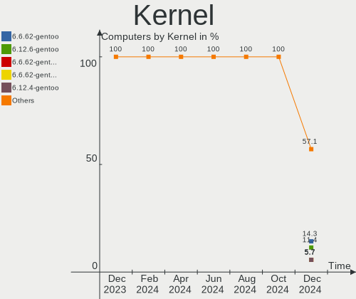
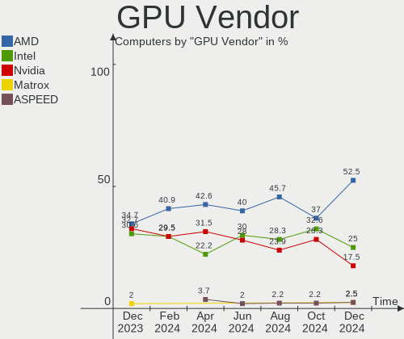

Gentoo - Hardware Trends
------------------------

A project to identify most popular hardware characteristics and track their change
over time based on data collected by Linux users at https://Linux-Hardware.org.

Anyone can contribute to this report by the [hw-probe](https://github.com/linuxhw/hw-probe) tool:

    sudo -E hw-probe -all -upload

This is a report for all computer types. See also reports for [desktops](/Dist/Gentoo/Desktop/README.md) and [notebooks](/Dist/Gentoo/Notebook/README.md).

This report is for one last month. Overall report since the beginning of time: [TestDays](https://github.com/linuxhw/TestDays)

Period: Dec, 2023.

Contents
--------

* [ System ](#system)
  - [ OS                       ](#os)
  - [ OS Family                ](#os-family)
  - [ Kernel                   ](#kernel)
  - [ Kernel Family            ](#kernel-family)
  - [ Kernel Major Ver.        ](#kernel-major-ver)
  - [ Arch                     ](#arch)
  - [ DE                       ](#de)
  - [ Display Server           ](#display-server)
  - [ Display Manager          ](#display-manager)
  - [ OS Lang                  ](#os-lang)
  - [ Boot Mode                ](#boot-mode)
  - [ Filesystem               ](#filesystem)
  - [ Part. scheme             ](#part-scheme)
  - [ Dual Boot with Linux/BSD ](#dual-boot-with-linuxbsd)
  - [ Dual Boot (Win)          ](#dual-boot-win)

* [ Board ](#board)
  - [ Vendor                   ](#vendor)
  - [ Model                    ](#model)
  - [ Model Family             ](#model-family)
  - [ MFG Year                 ](#mfg-year)
  - [ Form Factor              ](#form-factor)
  - [ Secure Boot              ](#secure-boot)
  - [ Coreboot                 ](#coreboot)
  - [ RAM Size                 ](#ram-size)
  - [ RAM Used                 ](#ram-used)
  - [ Total Drives             ](#total-drives)
  - [ Has CD-ROM               ](#has-cd-rom)
  - [ Has Ethernet             ](#has-ethernet)
  - [ Has WiFi                 ](#has-wifi)
  - [ Has Bluetooth            ](#has-bluetooth)

* [ Location ](#location)
  - [ Country                  ](#country)
  - [ City                     ](#city)

* [ Drives ](#drives)
  - [ Drive Vendor             ](#drive-vendor)
  - [ Drive Model              ](#drive-model)
  - [ HDD Vendor               ](#hdd-vendor)
  - [ SSD Vendor               ](#ssd-vendor)
  - [ Drive Kind               ](#drive-kind)
  - [ Drive Connector          ](#drive-connector)
  - [ Drive Size               ](#drive-size)
  - [ Space Total              ](#space-total)
  - [ Space Used               ](#space-used)
  - [ Malfunc. Drives          ](#malfunc-drives)
  - [ Malfunc. Drive Vendor    ](#malfunc-drive-vendor)
  - [ Malfunc. HDD Vendor      ](#malfunc-hdd-vendor)
  - [ Malfunc. Drive Kind      ](#malfunc-drive-kind)
  - [ Failed Drives            ](#failed-drives)
  - [ Failed Drive Vendor      ](#failed-drive-vendor)
  - [ Drive Status             ](#drive-status)

* [ Storage controller ](#storage-controller)
  - [ Storage Vendor           ](#storage-vendor)
  - [ Storage Model            ](#storage-model)
  - [ Storage Kind             ](#storage-kind)

* [ Processor ](#processor)
  - [ CPU Vendor               ](#cpu-vendor)
  - [ CPU Model                ](#cpu-model)
  - [ CPU Model Family         ](#cpu-model-family)
  - [ CPU Cores                ](#cpu-cores)
  - [ CPU Sockets              ](#cpu-sockets)
  - [ CPU Threads              ](#cpu-threads)
  - [ CPU Op-Modes             ](#cpu-op-modes)
  - [ CPU Microcode            ](#cpu-microcode)
  - [ CPU Microarch            ](#cpu-microarch)

* [ Graphics ](#graphics)
  - [ GPU Vendor               ](#gpu-vendor)
  - [ GPU Model                ](#gpu-model)
  - [ GPU Combo                ](#gpu-combo)
  - [ GPU Driver               ](#gpu-driver)
  - [ GPU Memory               ](#gpu-memory)

* [ Monitor ](#monitor)
  - [ Monitor Vendor           ](#monitor-vendor)
  - [ Monitor Model            ](#monitor-model)
  - [ Monitor Resolution       ](#monitor-resolution)
  - [ Monitor Diagonal         ](#monitor-diagonal)
  - [ Monitor Width            ](#monitor-width)
  - [ Aspect Ratio             ](#aspect-ratio)
  - [ Monitor Area             ](#monitor-area)
  - [ Pixel Density            ](#pixel-density)
  - [ Multiple Monitors        ](#multiple-monitors)

* [ Network ](#network)
  - [ Net Controller Vendor    ](#net-controller-vendor)
  - [ Net Controller Model     ](#net-controller-model)
  - [ Wireless Vendor          ](#wireless-vendor)
  - [ Wireless Model           ](#wireless-model)
  - [ Ethernet Vendor          ](#ethernet-vendor)
  - [ Ethernet Model           ](#ethernet-model)
  - [ Net Controller Kind      ](#net-controller-kind)
  - [ Used Controller          ](#used-controller)
  - [ NICs                     ](#nics)
  - [ IPv6                     ](#ipv6)

* [ Bluetooth ](#bluetooth)
  - [ Bluetooth Vendor         ](#bluetooth-vendor)
  - [ Bluetooth Model          ](#bluetooth-model)

* [ Sound ](#sound)
  - [ Sound Vendor             ](#sound-vendor)
  - [ Sound Model              ](#sound-model)

* [ Memory ](#memory)
  - [ Memory Vendor            ](#memory-vendor)
  - [ Memory Model             ](#memory-model)
  - [ Memory Kind              ](#memory-kind)
  - [ Memory Form Factor       ](#memory-form-factor)
  - [ Memory Size              ](#memory-size)
  - [ Memory Speed             ](#memory-speed)

* [ Printers & scanners ](#printers--scanners)
  - [ Printer Vendor           ](#printer-vendor)
  - [ Printer Model            ](#printer-model)
  - [ Scanner Vendor           ](#scanner-vendor)
  - [ Scanner Model            ](#scanner-model)

* [ Camera ](#camera)
  - [ Camera Vendor            ](#camera-vendor)
  - [ Camera Model             ](#camera-model)

* [ Security ](#security)
  - [ Fingerprint Vendor       ](#fingerprint-vendor)
  - [ Fingerprint Model        ](#fingerprint-model)
  - [ Chipcard Vendor          ](#chipcard-vendor)
  - [ Chipcard Model           ](#chipcard-model)

* [ Unsupported ](#unsupported)
  - [ Unsupported Devices      ](#unsupported-devices)
  - [ Unsupported Device Types ](#unsupported-device-types)

System
------

OS
--

Installed operating systems

| Name        | Computers | Percent |
|-------------|-----------|---------|
| Gentoo 2.14 | 41        | 100%    |

OS Family
---------

OS without a version

| Name   | Computers | Percent |
|--------|-----------|---------|
| Gentoo | 41        | 100%    |

Kernel
------

Version of the Linux kernel

| Version                                | Computers | Percent |
|----------------------------------------|-----------|---------|
| 6.1.57-gentoo                          | 6         | 14.63%  |
| 6.6.8-gentoo                           | 3         | 7.32%   |
| 6.1.67-gentoo-dist                     | 3         | 7.32%   |
| 6.1.57-gentoo-x86_64                   | 3         | 7.32%   |
| 6.6.7-gentoo-dist                      | 2         | 4.88%   |
| 6.7.0-rc6                              | 1         | 2.44%   |
| 6.7.0-rc5                              | 1         | 2.44%   |
| 6.6.8-gentoo-x86_64                    | 1         | 2.44%   |
| 6.6.6-x86_64                           | 1         | 2.44%   |
| 6.6.6-gentoo-dist                      | 1         | 2.44%   |
| 6.6.4-gentoo-x86_64                    | 1         | 2.44%   |
| 6.6.3-gentoo-r1                        | 1         | 2.44%   |
| 6.6.3-gentoo                           | 1         | 2.44%   |
| 6.6.2-x86_64-xanmod1                   | 1         | 2.44%   |
| 6.6.2-gentoo                           | 1         | 2.44%   |
| 6.6.0-waltercool                       | 1         | 2.44%   |
| 6.5.7-gentoo_minimal_2023-12-06-234521 | 1         | 2.44%   |
| 6.1.67-gentoo-x86_64                   | 1         | 2.44%   |
| 6.1.67-gentoo-risutech                 | 1         | 2.44%   |
| 6.1.67-gentoo-fomys-work               | 1         | 2.44%   |
| 6.1.66-gentoo-x86_64                   | 1         | 2.44%   |
| 6.1.66-gentoo-md-flat                  | 1         | 2.44%   |
| 6.1.66-gentoo-dist                     | 1         | 2.44%   |
| 6.1.66-gentoo                          | 1         | 2.44%   |
| 6.1.60-gentoo-dist                     | 1         | 2.44%   |
| 6.1.57-gentoovolka                     | 1         | 2.44%   |
| 6.1.57-gentoo-custom5                  | 1         | 2.44%   |
| 6.1.19-rt-rt8                          | 1         | 2.44%   |
| 5.15.32-gentoo-r1-x86_64               | 1         | 2.44%   |

Kernel Family
-------------

Linux kernel without a distro release

| Version | Computers | Percent |
|---------|-----------|---------|
| 6.1.57  | 11        | 26.83%  |
| 6.1.67  | 6         | 14.63%  |
| 6.6.8   | 4         | 9.76%   |
| 6.1.66  | 4         | 9.76%   |
| 6.7.0   | 2         | 4.88%   |
| 6.6.7   | 2         | 4.88%   |
| 6.6.6   | 2         | 4.88%   |
| 6.6.3   | 2         | 4.88%   |
| 6.6.2   | 2         | 4.88%   |
| 6.6.4   | 1         | 2.44%   |
| 6.6.0   | 1         | 2.44%   |
| 6.5.7   | 1         | 2.44%   |
| 6.1.60  | 1         | 2.44%   |
| 6.1.19  | 1         | 2.44%   |
| 5.15.32 | 1         | 2.44%   |

Kernel Major Ver.
-----------------

Linux kernel major version

| Version | Computers | Percent |
|---------|-----------|---------|
| 6.1     | 23        | 56.1%   |
| 6.6     | 14        | 34.15%  |
| 6.7     | 2         | 4.88%   |
| 6.5     | 1         | 2.44%   |
| 5.15    | 1         | 2.44%   |

Arch
----

OS architecture (x86_64, i586, etc.)

| Name   | Computers | Percent |
|--------|-----------|---------|
| x86_64 | 41        | 100%    |

DE
--

Desktop Environment

| Name    | Computers | Percent |
|---------|-----------|---------|
| KDE5    | 17        | 41.46%  |
| Unknown | 12        | 29.27%  |
| XFCE    | 7         | 17.07%  |
| MATE    | 2         | 4.88%   |
| GNOME   | 2         | 4.88%   |
| i3      | 1         | 2.44%   |

Display Server
--------------

X11 or Wayland

| Name    | Computers | Percent |
|---------|-----------|---------|
| X11     | 20        | 48.78%  |
| Wayland | 10        | 24.39%  |
| Unknown | 9         | 21.95%  |
| Tty     | 2         | 4.88%   |

Display Manager
---------------

SDDM, LightDM, etc.

| Name    | Computers | Percent |
|---------|-----------|---------|
| SDDM    | 17        | 41.46%  |
| Unknown | 14        | 34.15%  |
| LightDM | 9         | 21.95%  |
| GDM     | 1         | 2.44%   |

OS Lang
-------

Language

| Lang    | Computers | Percent |
|---------|-----------|---------|
| en_US   | 16        | 39.02%  |
| de_DE   | 5         | 12.2%   |
| C.UTF8  | 5         | 12.2%   |
| Unknown | 4         | 9.76%   |
| fr_FR   | 2         | 4.88%   |
| en_GB   | 2         | 4.88%   |
| zh_TW   | 1         | 2.44%   |
| zh_CN   | 1         | 2.44%   |
| pt_BR   | 1         | 2.44%   |
| es_ES   | 1         | 2.44%   |
| es_AR   | 1         | 2.44%   |
| de_CH   | 1         | 2.44%   |
| C       | 1         | 2.44%   |

Boot Mode
---------

EFI or BIOS

| Mode | Computers | Percent |
|------|-----------|---------|
| EFI  | 35        | 85.37%  |
| BIOS | 6         | 14.63%  |

Filesystem
----------

Type of filesystem

| Type     | Computers | Percent |
|----------|-----------|---------|
| Ext4     | 22        | 53.66%  |
| Btrfs    | 7         | 17.07%  |
| F2fs     | 5         | 12.2%   |
| Xfs      | 4         | 9.76%   |
| Zfs      | 1         | 2.44%   |
| XXXXXXX  | 1         | 2.44%   |
| Bcachefs | 1         | 2.44%   |

Part. scheme
------------

Scheme of partitioning

| Type    | Computers | Percent |
|---------|-----------|---------|
| GPT     | 34        | 82.93%  |
| MBR     | 4         | 9.76%   |
| Unknown | 3         | 7.32%   |

Dual Boot with Linux/BSD
------------------------

Hosting more than one Linux/BSD

| Dual boot | Computers | Percent |
|-----------|-----------|---------|
| No        | 29        | 70.73%  |
| Yes       | 12        | 29.27%  |

Dual Boot (Win)
---------------

Hosting Linux and Windows

| Dual boot | Computers | Percent |
|-----------|-----------|---------|
| No        | 28        | 68.29%  |
| Yes       | 13        | 31.71%  |

Board
-----

Vendor
------

Motherboard manufacturer

| Name                | Computers | Percent |
|---------------------|-----------|---------|
| ASUSTek Computer    | 11        | 26.83%  |
| Gigabyte Technology | 6         | 14.63%  |
| Lenovo              | 5         | 12.2%   |
| Dell                | 5         | 12.2%   |
| MSI                 | 4         | 9.76%   |
| ASRock              | 3         | 7.32%   |
| TULPAR              | 1         | 2.44%   |
| Hewlett-Packard     | 1         | 2.44%   |
| Fujitsu             | 1         | 2.44%   |
| Framework           | 1         | 2.44%   |
| Foxconn             | 1         | 2.44%   |
| Fanless Mini PC     | 1         | 2.44%   |
| BANGHO              | 1         | 2.44%   |

Model
-----

Motherboard model

| Name                                     | Computers | Percent |
|------------------------------------------|-----------|---------|
| TULPAR A5 V20.3                          | 1         | 2.44%   |
| MSI Stealth 16Studio A13VF               | 1         | 2.44%   |
| MSI MS-7E10                              | 1         | 2.44%   |
| MSI MS-7C02                              | 1         | 2.44%   |
| MSI Delta 15 A5EFK                       | 1         | 2.44%   |
| Lenovo ThinkStation S30 4351B20          | 1         | 2.44%   |
| Lenovo ThinkPad T460 20FNCTO1WW          | 1         | 2.44%   |
| Lenovo ThinkCentre M73 10AY008JGE        | 1         | 2.44%   |
| Lenovo Legion R9000P2021H 82JQ           | 1         | 2.44%   |
| Lenovo IdeaPad 5 14ARE05 81YM            | 1         | 2.44%   |
| HP EliteDesk 800 G5 SFF                  | 1         | 2.44%   |
| Gigabyte X79-UP4                         | 1         | 2.44%   |
| Gigabyte B450 AORUS ELITE                | 1         | 2.44%   |
| Gigabyte B150M-D2V DDR3                  | 1         | 2.44%   |
| Gigabyte AB350-Gaming                    | 1         | 2.44%   |
| Gigabyte A520 AORUS ELITE                | 1         | 2.44%   |
| Gigabyte 970A-DS3P FX                    | 1         | 2.44%   |
| Fujitsu ESPRIMO E700                     | 1         | 2.44%   |
| Framework Laptop (13th Gen Intel Core)   | 1         | 2.44%   |
| Foxconn TPS01                            | 1         | 2.44%   |
| Fanless Mini PC PCG02 GLE                | 1         | 2.44%   |
| Dell XPS 9320                            | 1         | 2.44%   |
| Dell Precision 5560                      | 1         | 2.44%   |
| Dell Precision 5480                      | 1         | 2.44%   |
| Dell PowerEdge R630                      | 1         | 2.44%   |
| Dell Latitude D630                       | 1         | 2.44%   |
| BANGHO MAX L4                            | 1         | 2.44%   |
| ASUS VivoBook_ASUSLaptop X571LI_X571LI   | 1         | 2.44%   |
| ASUS ROG Zephyrus G14 GA401II_GA401II    | 1         | 2.44%   |
| ASUS ROG STRIX X570-E GAMING             | 1         | 2.44%   |
| ASUS ROG Maximus XI HERO                 | 1         | 2.44%   |
| ASUS ROG Ally RC71L_RC71L                | 1         | 2.44%   |
| ASUS PRIME B660-PLUS D4                  | 1         | 2.44%   |
| ASUS PRIME B550-PLUS                     | 1         | 2.44%   |
| ASUS M3A78-CM                            | 1         | 2.44%   |
| ASUS G750JX                              | 1         | 2.44%   |
| ASUS ASUS TUF Gaming A15 FA507NU_FA507NU | 1         | 2.44%   |
| ASUS ASUS EXPERTCENTER D500MD_D500SD     | 1         | 2.44%   |
| ASRock X399 Taichi                       | 1         | 2.44%   |
| ASRock B650M PG Riptide                  | 1         | 2.44%   |

Model Family
------------

Motherboard model prefix

| Name                  | Computers | Percent |
|-----------------------|-----------|---------|
| ASUS ROG              | 4         | 9.76%   |
| Dell Precision        | 2         | 4.88%   |
| ASUS PRIME            | 2         | 4.88%   |
| ASUS ASUS             | 2         | 4.88%   |
| TULPAR A5             | 1         | 2.44%   |
| MSI Stealth           | 1         | 2.44%   |
| MSI MS-7E10           | 1         | 2.44%   |
| MSI MS-7C02           | 1         | 2.44%   |
| MSI Delta             | 1         | 2.44%   |
| Lenovo ThinkStation   | 1         | 2.44%   |
| Lenovo ThinkPad       | 1         | 2.44%   |
| Lenovo ThinkCentre    | 1         | 2.44%   |
| Lenovo Legion         | 1         | 2.44%   |
| Lenovo IdeaPad        | 1         | 2.44%   |
| HP EliteDesk          | 1         | 2.44%   |
| Gigabyte X79-UP4      | 1         | 2.44%   |
| Gigabyte B450         | 1         | 2.44%   |
| Gigabyte B150M-D2V    | 1         | 2.44%   |
| Gigabyte AB350-Gaming | 1         | 2.44%   |
| Gigabyte A520         | 1         | 2.44%   |
| Gigabyte 970A-DS3P    | 1         | 2.44%   |
| Fujitsu ESPRIMO       | 1         | 2.44%   |
| Framework Laptop      | 1         | 2.44%   |
| Foxconn TPS01         | 1         | 2.44%   |
| Fanless Mini PC PCG02 | 1         | 2.44%   |
| Dell XPS              | 1         | 2.44%   |
| Dell PowerEdge        | 1         | 2.44%   |
| Dell Latitude         | 1         | 2.44%   |
| BANGHO MAX            | 1         | 2.44%   |
| ASUS VivoBook         | 1         | 2.44%   |
| ASUS M3A78-CM         | 1         | 2.44%   |
| ASUS G750JX           | 1         | 2.44%   |
| ASRock X399           | 1         | 2.44%   |
| ASRock B650M          | 1         | 2.44%   |
| ASRock A300M-STX      | 1         | 2.44%   |

MFG Year
--------

Motherboard manufacture year

| Year | Computers | Percent |
|------|-----------|---------|
| 2023 | 9         | 21.95%  |
| 2021 | 6         | 14.63%  |
| 2018 | 5         | 12.2%   |
| 2020 | 4         | 9.76%   |
| 2022 | 3         | 7.32%   |
| 2017 | 3         | 7.32%   |
| 2014 | 2         | 4.88%   |
| 2019 | 1         | 2.44%   |
| 2016 | 1         | 2.44%   |
| 2015 | 1         | 2.44%   |
| 2013 | 1         | 2.44%   |
| 2012 | 1         | 2.44%   |
| 2011 | 1         | 2.44%   |
| 2009 | 1         | 2.44%   |
| 2008 | 1         | 2.44%   |
| 2007 | 1         | 2.44%   |

Form Factor
-----------

Physical design of the computer

| Name     | Computers | Percent |
|----------|-----------|---------|
| Desktop  | 22        | 53.66%  |
| Notebook | 16        | 39.02%  |
| Stick pc | 1         | 2.44%   |
| Tablet   | 1         | 2.44%   |
| Server   | 1         | 2.44%   |

Secure Boot
-----------

Enabled or disabled

| State    | Computers | Percent |
|----------|-----------|---------|
| Disabled | 40        | 97.56%  |
| Enabled  | 1         | 2.44%   |

Coreboot
--------

Have coreboot on board

| Used | Computers | Percent |
|------|-----------|---------|
| No   | 41        | 100%    |

RAM Size
--------

Total RAM memory

| Size in GB  | Computers | Percent |
|-------------|-----------|---------|
| 32.01-64.0  | 12        | 29.27%  |
| 16.01-24.0  | 9         | 21.95%  |
| 8.01-16.0   | 6         | 14.63%  |
| 64.01-256.0 | 5         | 12.2%   |
| 4.01-8.0    | 4         | 9.76%   |
| 3.01-4.0    | 3         | 7.32%   |
| 24.01-32.0  | 2         | 4.88%   |

RAM Used
--------

Used RAM memory

| Used GB    | Computers | Percent |
|------------|-----------|---------|
| 4.01-8.0   | 12        | 29.27%  |
| 1.01-2.0   | 6         | 14.63%  |
| 2.01-3.0   | 5         | 12.2%   |
| 0.01-0.5   | 5         | 12.2%   |
| 3.01-4.0   | 4         | 9.76%   |
| 0.51-1.0   | 4         | 9.76%   |
| 8.01-16.0  | 3         | 7.32%   |
| 32.01-64.0 | 1         | 2.44%   |
| 16.01-24.0 | 1         | 2.44%   |

Total Drives
------------

Number of drives on board

| Drives | Computers | Percent |
|--------|-----------|---------|
| 1      | 18        | 43.9%   |
| 2      | 12        | 29.27%  |
| 3      | 5         | 12.2%   |
| 6      | 3         | 7.32%   |
| 4      | 2         | 4.88%   |
| 8      | 1         | 2.44%   |

Has CD-ROM
----------

Has CD-ROM on board

| Presented | Computers | Percent |
|-----------|-----------|---------|
| No        | 31        | 75.61%  |
| Yes       | 10        | 24.39%  |

Has Ethernet
------------

Has Ethernet on board

| Presented | Computers | Percent |
|-----------|-----------|---------|
| Yes       | 37        | 90.24%  |
| No        | 4         | 9.76%   |

Has WiFi
--------

Has WiFi module

| Presented | Computers | Percent |
|-----------|-----------|---------|
| Yes       | 30        | 73.17%  |
| No        | 11        | 26.83%  |

Has Bluetooth
-------------

Has Bluetooth module

| Presented | Computers | Percent |
|-----------|-----------|---------|
| Yes       | 23        | 56.1%   |
| No        | 18        | 43.9%   |

Location
--------

Country
-------

Geographic location (country)

| Country     | Computers | Percent |
|-------------|-----------|---------|
| USA         | 14        | 34.15%  |
| Germany     | 6         | 14.63%  |
| Poland      | 5         | 12.2%   |
| France      | 3         | 7.32%   |
| Spain       | 2         | 4.88%   |
| UK          | 1         | 2.44%   |
| Taiwan      | 1         | 2.44%   |
| Switzerland | 1         | 2.44%   |
| Sweden      | 1         | 2.44%   |
| Paraguay    | 1         | 2.44%   |
| Italy       | 1         | 2.44%   |
| Hungary     | 1         | 2.44%   |
| China       | 1         | 2.44%   |
| Canada      | 1         | 2.44%   |
| Bulgaria    | 1         | 2.44%   |
| Brazil      | 1         | 2.44%   |

City
----

Geographic location (city)

| City             | Computers | Percent |
|------------------|-----------|---------|
| Warsaw           | 3         | 7.32%   |
| San Antonio      | 2         | 4.88%   |
| Mönchengladbach | 2         | 4.88%   |
| Cieszyn          | 2         | 4.88%   |
| Wrentham         | 1         | 2.44%   |
| Troy             | 1         | 2.44%   |
| St. John's       | 1         | 2.44%   |
| Sofia            | 1         | 2.44%   |
| Oklahoma City    | 1         | 2.44%   |
| New York         | 1         | 2.44%   |
| Munich           | 1         | 2.44%   |
| Milan            | 1         | 2.44%   |
| Lund             | 1         | 2.44%   |
| Lucerne          | 1         | 2.44%   |
| Lincoln          | 1         | 2.44%   |
| Le Boulou        | 1         | 2.44%   |
| La Grange        | 1         | 2.44%   |
| L'Union          | 1         | 2.44%   |
| Kropp            | 1         | 2.44%   |
| Itapevi          | 1         | 2.44%   |
| Iowa City        | 1         | 2.44%   |
| Hsinchu          | 1         | 2.44%   |
| Hamburg          | 1         | 2.44%   |
| Győr            | 1         | 2.44%   |
| Girona           | 1         | 2.44%   |
| Fort Morgan      | 1         | 2.44%   |
| Epone            | 1         | 2.44%   |
| Edinburgh        | 1         | 2.44%   |
| Duyun            | 1         | 2.44%   |
| Cohoes           | 1         | 2.44%   |
| Clifton          | 1         | 2.44%   |
| Berlin           | 1         | 2.44%   |
| Augusta          | 1         | 2.44%   |
| Asunción        | 1         | 2.44%   |
| Ashburn          | 1         | 2.44%   |
| Arona            | 1         | 2.44%   |

Drives
------

Drive Vendor
------------

Hard drive vendors

| Vendor                      | Computers | Drives | Percent |
|-----------------------------|-----------|--------|---------|
| Samsung Electronics         | 12        | 19     | 17.14%  |
| Seagate                     | 10        | 14     | 14.29%  |
| Sandisk                     | 6         | 7      | 8.57%   |
| SK hynix                    | 4         | 4      | 5.71%   |
| Kingston                    | 4         | 5      | 5.71%   |
| Crucial                     | 4         | 4      | 5.71%   |
| WDC                         | 3         | 5      | 4.29%   |
| Unknown                     | 3         | 5      | 4.29%   |
| GOODRAM                     | 3         | 3      | 4.29%   |
| Toshiba                     | 2         | 2      | 2.86%   |
| Micron Technology           | 2         | 2      | 2.86%   |
| Intel                       | 2         | 2      | 2.86%   |
| Hitachi                     | 2         | 4      | 2.86%   |
| China                       | 2         | 2      | 2.86%   |
| Verbatim                    | 1         | 1      | 1.43%   |
| Team                        | 1         | 1      | 1.43%   |
| SPCC                        | 1         | 1      | 1.43%   |
| SABRENT                     | 1         | 1      | 1.43%   |
| PNY                         | 1         | 1      | 1.43%   |
| Phison Electronics          | 1         | 1      | 1.43%   |
| Micron/Crucial Technology   | 1         | 1      | 1.43%   |
| MAXIO Technology (Hangzhou) | 1         | 1      | 1.43%   |
| LITEONIT                    | 1         | 1      | 1.43%   |
| Kingston Technology Company | 1         | 1      | 1.43%   |
| HGST                        | 1         | 1      | 1.43%   |

Drive Model
-----------

Hard drive models

| Model                                               | Computers | Percent |
|-----------------------------------------------------|-----------|---------|
| Samsung NVMe SSD Controller SM981/PM981/PM983 512GB | 6         | 7.5%    |
| Samsung NVMe SSD Controller PM9A1/PM9A3/980PRO 2TB  | 3         | 3.75%   |
| Samsung SSD 860 EVO 1TB                             | 2         | 2.5%    |
| GOODRAM SSDPR-CL100-480-G2 480GB                    | 2         | 2.5%    |
| Crucial CT1000MX500SSD1 1TB                         | 2         | 2.5%    |
| WDC WDS500G2B0A-00SM50 500GB SSD                    | 1         | 1.25%   |
| WDC WD20EZRZ-00Z5HB0 2TB                            | 1         | 1.25%   |
| WDC WD2001FASS-00W2B0 2TB                           | 1         | 1.25%   |
| WDC WD10EZEX-00BN5A0 1TB                            | 1         | 1.25%   |
| WDC WD102KRYZ-01A5AB0 10TB                          | 1         | 1.25%   |
| Verbatim Vi550 S3 512GB                             | 1         | 1.25%   |
| Unknown SD/MMC/M.S.PRO 32GB                         | 1         | 1.25%   |
| Unknown SD/MMC 2GB                                  | 1         | 1.25%   |
| Unknown NVMe SSD Drive 2TB                          | 1         | 1.25%   |
| Unknown MMC Card  128GB                             | 1         | 1.25%   |
| Unknown M.S./M.S.Pro/HG 16GB                        | 1         | 1.25%   |
| Toshiba HDWE150 5TB                                 | 1         | 1.25%   |
| Toshiba DT01ACA100 1TB                              | 1         | 1.25%   |
| Team T253E2512G 512GB SSD                           | 1         | 1.25%   |
| SPCC Solid State Disk 1TB                           | 1         | 1.25%   |
| SK hynix SKHynix_HFS512GDE9X084N 512GB              | 1         | 1.25%   |
| SK hynix PC801 NVMe 2TB                             | 1         | 1.25%   |
| SK hynix PC801 NVMe 1TB                             | 1         | 1.25%   |
| SK hynix PC601 SED NVMe 1TB                         | 1         | 1.25%   |
| Seagate ST8000VN004-3CP101 8TB                      | 1         | 1.25%   |
| Seagate ST8000DM004-2U9188 8TB                      | 1         | 1.25%   |
| Seagate ST500DM002-1BD142 500GB                     | 1         | 1.25%   |
| Seagate ST4000DM004-2CV104 4TB                      | 1         | 1.25%   |
| Seagate ST2000DM008-2UB102 2TB                      | 1         | 1.25%   |
| Seagate ST2000DM006-2DM164 2TB                      | 1         | 1.25%   |
| Seagate ST12000NM0008-2H3101 12TB                   | 1         | 1.25%   |
| Seagate ST1000NX0443 1TB                            | 1         | 1.25%   |
| Seagate ST1000LM024 HN-M101MBB 1TB                  | 1         | 1.25%   |
| Seagate ST1000DM010-2EP102 1TB                      | 1         | 1.25%   |
| Sandisk WD_BLACK SN850X 4000GB                      | 1         | 1.25%   |
| Sandisk WD_BLACK SN850X 2000GB                      | 1         | 1.25%   |
| Sandisk WD Blue SN550 NVMe SSD 1TB                  | 1         | 1.25%   |
| Sandisk WD Blue SN500 / PC SN520 NVMe SSD 128GB     | 1         | 1.25%   |
| Sandisk WD Black SN850 1024GB                       | 1         | 1.25%   |
| SanDisk Extreme SSD 500GB                           | 1         | 1.25%   |

HDD Vendor
----------

Hard disk drive vendors

| Vendor  | Computers | Drives | Percent |
|---------|-----------|--------|---------|
| Seagate | 10        | 14     | 52.63%  |
| WDC     | 3         | 4      | 15.79%  |
| Toshiba | 2         | 2      | 10.53%  |
| Hitachi | 2         | 4      | 10.53%  |
| SABRENT | 1         | 1      | 5.26%   |
| HGST    | 1         | 1      | 5.26%   |

SSD Vendor
----------

Solid state drive vendors

| Vendor              | Computers | Drives | Percent |
|---------------------|-----------|--------|---------|
| Samsung Electronics | 4         | 5      | 16.67%  |
| Crucial             | 4         | 4      | 16.67%  |
| Kingston            | 3         | 3      | 12.5%   |
| GOODRAM             | 3         | 3      | 12.5%   |
| China               | 2         | 2      | 8.33%   |
| WDC                 | 1         | 1      | 4.17%   |
| Verbatim            | 1         | 1      | 4.17%   |
| Team                | 1         | 1      | 4.17%   |
| SPCC                | 1         | 1      | 4.17%   |
| SanDisk             | 1         | 1      | 4.17%   |
| PNY                 | 1         | 1      | 4.17%   |
| LITEONIT            | 1         | 1      | 4.17%   |
| Intel               | 1         | 1      | 4.17%   |

Drive Kind
----------

HDD or SSD

| Kind    | Computers | Drives | Percent |
|---------|-----------|--------|---------|
| NVMe    | 26        | 34     | 40%     |
| SSD     | 21        | 25     | 32.31%  |
| HDD     | 16        | 26     | 24.62%  |
| MMC     | 1         | 1      | 1.54%   |
| Unknown | 1         | 3      | 1.54%   |

Drive Connector
---------------

SATA, SAS, NVMe, etc.

| Type | Computers | Drives | Percent |
|------|-----------|--------|---------|
| NVMe | 26        | 34     | 46.43%  |
| SATA | 26        | 49     | 46.43%  |
| SAS  | 3         | 5      | 5.36%   |
| MMC  | 1         | 1      | 1.79%   |

Drive Size
----------

Size of hard drive

| Size in TB | Computers | Drives | Percent |
|------------|-----------|--------|---------|
| 0.01-0.5   | 15        | 16     | 36.59%  |
| 0.51-1.0   | 14        | 18     | 34.15%  |
| 1.01-2.0   | 5         | 6      | 12.2%   |
| 4.01-10.0  | 4         | 6      | 9.76%   |
| 3.01-4.0   | 1         | 1      | 2.44%   |
| 2.01-3.0   | 1         | 3      | 2.44%   |
| 10.01-20.0 | 1         | 1      | 2.44%   |

Space Total
-----------

Amount of disk space available on the file system

| Size in GB     | Computers | Percent |
|----------------|-----------|---------|
| 501-1000       | 8         | 19.51%  |
| More than 3000 | 7         | 17.07%  |
| 101-250        | 6         | 14.63%  |
| 251-500        | 5         | 12.2%   |
| 1001-2000      | 5         | 12.2%   |
| 1-20           | 4         | 9.76%   |
| 51-100         | 3         | 7.32%   |
| 2001-3000      | 2         | 4.88%   |
| Unknown        | 1         | 2.44%   |

Space Used
----------

Amount of used disk space

| Used GB        | Computers | Percent |
|----------------|-----------|---------|
| 1-20           | 9         | 21.95%  |
| 21-50          | 6         | 14.63%  |
| 51-100         | 6         | 14.63%  |
| 101-250        | 5         | 12.2%   |
| 501-1000       | 5         | 12.2%   |
| More than 3000 | 4         | 9.76%   |
| 1001-2000      | 3         | 7.32%   |
| 251-500        | 2         | 4.88%   |
| Unknown        | 1         | 2.44%   |

Malfunc. Drives
---------------

Drive models with a malfunction

| Model                                                          | Computers | Drives | Percent |
|----------------------------------------------------------------|-----------|--------|---------|
| Seagate ST1000DM010-2EP102 1TB                                 | 1         | 1      | 25%     |
| Samsung Electronics NVMe SSD Controller PM9A1/PM9A3/980PRO 2TB | 1         | 1      | 25%     |
| PNY SSD2SC120G1LC763C121S459P 120GB                            | 1         | 1      | 25%     |
| HGST HTS721010A9E630 1TB                                       | 1         | 1      | 25%     |

Malfunc. Drive Vendor
---------------------

Vendors of faulty drives

| Vendor              | Computers | Drives | Percent |
|---------------------|-----------|--------|---------|
| Seagate             | 1         | 1      | 25%     |
| Samsung Electronics | 1         | 1      | 25%     |
| PNY                 | 1         | 1      | 25%     |
| HGST                | 1         | 1      | 25%     |

Malfunc. HDD Vendor
-------------------

Vendors of faulty HDD drives

| Vendor  | Computers | Drives | Percent |
|---------|-----------|--------|---------|
| Seagate | 1         | 1      | 50%     |
| HGST    | 1         | 1      | 50%     |

Malfunc. Drive Kind
-------------------

Kinds of faulty drives

| Kind | Computers | Drives | Percent |
|------|-----------|--------|---------|
| HDD  | 2         | 2      | 50%     |
| NVMe | 1         | 1      | 25%     |
| SSD  | 1         | 1      | 25%     |

Failed Drives
-------------

Failed drive models

Zero info for selected period =(

Failed Drive Vendor
-------------------

Failed drive vendors

Zero info for selected period =(

Drive Status
------------

Number of failed and malfunc. drives

| Status   | Computers | Drives | Percent |
|----------|-----------|--------|---------|
| Works    | 36        | 69     | 76.6%   |
| Detected | 7         | 16     | 14.89%  |
| Malfunc  | 4         | 4      | 8.51%   |

Storage controller
------------------

Storage Vendor
--------------

Storage controller vendors

| Vendor                      | Computers | Percent |
|-----------------------------|-----------|---------|
| Intel                       | 19        | 30.65%  |
| AMD                         | 14        | 22.58%  |
| Samsung Electronics         | 9         | 14.52%  |
| Sandisk                     | 5         | 8.06%   |
| SK hynix                    | 4         | 6.45%   |
| Kingston Technology Company | 3         | 4.84%   |
| Micron Technology           | 2         | 3.23%   |
| Solidigm                    | 1         | 1.61%   |
| Phison Electronics          | 1         | 1.61%   |
| Micron/Crucial Technology   | 1         | 1.61%   |
| MAXIO Technology (Hangzhou) | 1         | 1.61%   |
| Marvell Technology Group    | 1         | 1.61%   |
| ASMedia Technology          | 1         | 1.61%   |

Storage Model
-------------

Storage controller models

| Model                                                                          | Computers | Percent |
|--------------------------------------------------------------------------------|-----------|---------|
| AMD FCH SATA Controller [AHCI mode]                                            | 8         | 10.81%  |
| Samsung NVMe SSD Controller SM981/PM981/PM983                                  | 6         | 8.11%   |
| Samsung NVMe SSD Controller PM9A1/PM9A3/980PRO                                 | 3         | 4.05%   |
| SK hynix Platinum P41/PC801 NVMe Solid State Drive                             | 2         | 2.7%    |
| Sandisk WD Black SN850X NVMe SSD                                               | 2         | 2.7%    |
| Samsung NVMe SSD Controller 980 (DRAM-less)                                    | 2         | 2.7%    |
| Intel Volume Management Device NVMe RAID Controller Intel Corporation          | 2         | 2.7%    |
| Intel Cannon Lake PCH SATA AHCI Controller                                     | 2         | 2.7%    |
| Intel C600/X79 series chipset 6-Port SATA AHCI Controller                      | 2         | 2.7%    |
| Intel Alder Lake-S PCH SATA Controller [AHCI Mode]                             | 2         | 2.7%    |
| Intel 8 Series/C220 Series Chipset Family 6-port SATA Controller 1 [AHCI mode] | 2         | 2.7%    |
| AMD 500 Series Chipset SATA Controller                                         | 2         | 2.7%    |
| AMD 400 Series Chipset SATA Controller                                         | 2         | 2.7%    |
| Solidigm P41 Plus NVMe SSD (DRAM-less) [Echo Harbor]                           | 1         | 1.35%   |
| SK hynix PC601 NVMe Solid State Drive                                          | 1         | 1.35%   |
| SK hynix Gold P31/BC711/PC711 NVMe Solid State Drive                           | 1         | 1.35%   |
| SanDisk WD PC SN810 / Black SN850 NVMe SSD                                     | 1         | 1.35%   |
| SanDisk WD Blue SN500 / PC SN520 x2 M.2 2280 NVMe SSD                          | 1         | 1.35%   |
| SanDisk Ultra 3D / WD Blue SN550 NVMe SSD                                      | 1         | 1.35%   |
| Samsung NVMe SSD Controller PM9B1 (DRAM-less)                                  | 1         | 1.35%   |
| Phison E12 NVMe Controller                                                     | 1         | 1.35%   |
| Micron/Crucial P5 Plus NVMe PCIe SSD                                           | 1         | 1.35%   |
| Micron 2550 NVMe SSD (DRAM-less)                                               | 1         | 1.35%   |
| Micron 2400 NVMe SSD (DRAM-less)                                               | 1         | 1.35%   |
| MAXIO (Hangzhou) NVMe SSD Controller MAP1202                                   | 1         | 1.35%   |
| Marvell Group 88SE9172 SATA 6Gb/s Controller                                   | 1         | 1.35%   |
| Kingston Company OM8PCP Design-In PCIe 3 NVMe SSD (DRAM-less)                  | 1         | 1.35%   |
| Kingston Company KC3000/FURY Renegade NVMe SSD E18                             | 1         | 1.35%   |
| Kingston Company A2000 NVMe SSD SM2263EN                                       | 1         | 1.35%   |
| Intel Volume Management Device NVMe RAID Controller                            | 1         | 1.35%   |
| Intel Sunrise Point-LP SATA Controller [AHCI mode]                             | 1         | 1.35%   |
| Intel SSD 670p Series [Keystone Harbor]                                        | 1         | 1.35%   |
| Intel Q170/Q150/B150/H170/H110/Z170/CM236 Chipset SATA Controller [AHCI Mode]  | 1         | 1.35%   |
| Intel NM10/ICH7 Family SATA Controller [AHCI mode]                             | 1         | 1.35%   |
| Intel Comet Lake SATA AHCI Controller                                          | 1         | 1.35%   |
| Intel Celeron/Pentium Silver Processor SATA Controller                         | 1         | 1.35%   |
| Intel C610/X99 series chipset sSATA Controller [AHCI mode]                     | 1         | 1.35%   |
| Intel C610/X99 series chipset 6-Port SATA Controller [AHCI mode]               | 1         | 1.35%   |
| Intel C602 chipset 4-Port SATA Storage Control Unit                            | 1         | 1.35%   |
| Intel C600/X79 series chipset IDE-r Controller                                 | 1         | 1.35%   |

Storage Kind
------------

Kind of storage controller (IDE, SATA, NVMe, SAS, ...)

| Kind | Computers | Percent |
|------|-----------|---------|
| SATA | 29        | 46.03%  |
| NVMe | 26        | 41.27%  |
| RAID | 4         | 6.35%   |
| IDE  | 3         | 4.76%   |
| SAS  | 1         | 1.59%   |

Processor
---------

CPU Vendor
----------

Processor vendors

| Vendor | Computers | Percent |
|--------|-----------|---------|
| Intel  | 23        | 56.1%   |
| AMD    | 18        | 43.9%   |

CPU Model
---------

Processor models

| Model                                          | Computers | Percent |
|------------------------------------------------|-----------|---------|
| Intel 13th Gen Core i9-13900H                  | 2         | 4.88%   |
| AMD Ryzen 7 5800H with Radeon Graphics         | 2         | 4.88%   |
| Intel Xeon CPU E5-2620 v4 @ 2.10GHz            | 1         | 2.44%   |
| Intel Xeon CPU E5-1620 v2 @ 3.70GHz            | 1         | 2.44%   |
| Intel Pentium CPU G3240T @ 2.70GHz             | 1         | 2.44%   |
| Intel Core i7-9700 CPU @ 3.00GHz               | 1         | 2.44%   |
| Intel Core i7-8700K CPU @ 3.70GHz              | 1         | 2.44%   |
| Intel Core i7-4820K CPU @ 3.70GHz              | 1         | 2.44%   |
| Intel Core i7-4700HQ CPU @ 2.40GHz             | 1         | 2.44%   |
| Intel Core i5-6200U CPU @ 2.30GHz              | 1         | 2.44%   |
| Intel Core i5-2400 CPU @ 3.10GHz               | 1         | 2.44%   |
| Intel Core i5-10300H CPU @ 2.50GHz             | 1         | 2.44%   |
| Intel Core i5-10210U CPU @ 1.60GHz             | 1         | 2.44%   |
| Intel Core i3-6100 CPU @ 3.70GHz               | 1         | 2.44%   |
| Intel Core 2 Duo CPU T7250 @ 2.00GHz           | 1         | 2.44%   |
| Intel Celeron J4125 CPU @ 2.00GHz              | 1         | 2.44%   |
| Intel Atom CPU D510 @ 1.66GHz                  | 1         | 2.44%   |
| Intel 13th Gen Core i7-1370P                   | 1         | 2.44%   |
| Intel 13th Gen Core i7-13700H                  | 1         | 2.44%   |
| Intel 12th Gen Core i7-1260P                   | 1         | 2.44%   |
| Intel 12th Gen Core i5-12500                   | 1         | 2.44%   |
| Intel 12th Gen Core i5-12400                   | 1         | 2.44%   |
| Intel 11th Gen Core i7-11850H @ 2.50GHz        | 1         | 2.44%   |
| AMD Ryzen Z1 Extreme                           | 1         | 2.44%   |
| AMD Ryzen Threadripper 2950X 16-Core Processor | 1         | 2.44%   |
| AMD Ryzen 9 7950X 16-Core Processor            | 1         | 2.44%   |
| AMD Ryzen 9 3900X 12-Core Processor            | 1         | 2.44%   |
| AMD Ryzen 7 7735HS with Radeon Graphics        | 1         | 2.44%   |
| AMD Ryzen 7 5800X3D 8-Core Processor           | 1         | 2.44%   |
| AMD Ryzen 7 5700G with Radeon Graphics         | 1         | 2.44%   |
| AMD Ryzen 7 4800HS with Radeon Graphics        | 1         | 2.44%   |
| AMD Ryzen 7 4700U with Radeon Graphics         | 1         | 2.44%   |
| AMD Ryzen 7 3700X 8-Core Processor             | 1         | 2.44%   |
| AMD Ryzen 5 7600 6-Core Processor              | 1         | 2.44%   |
| AMD Ryzen 5 5600X 6-Core Processor             | 1         | 2.44%   |
| AMD Ryzen 5 2600 Six-Core Processor            | 1         | 2.44%   |
| AMD Ryzen 3 3200G with Radeon Vega Graphics    | 1         | 2.44%   |
| AMD Phenom II X4 955 Processor                 | 1         | 2.44%   |
| AMD FX-8300 Eight-Core Processor               | 1         | 2.44%   |

CPU Model Family
----------------

Processor model prefix

| Model                  | Computers | Percent |
|------------------------|-----------|---------|
| Other                  | 9         | 21.95%  |
| AMD Ryzen 7            | 8         | 19.51%  |
| Intel Core i7          | 4         | 9.76%   |
| Intel Core i5          | 4         | 9.76%   |
| AMD Ryzen 5            | 3         | 7.32%   |
| Intel Xeon             | 2         | 4.88%   |
| AMD Ryzen 9            | 2         | 4.88%   |
| Intel Pentium          | 1         | 2.44%   |
| Intel Core i3          | 1         | 2.44%   |
| Intel Core 2 Duo       | 1         | 2.44%   |
| Intel Celeron          | 1         | 2.44%   |
| Intel Atom             | 1         | 2.44%   |
| AMD Ryzen Threadripper | 1         | 2.44%   |
| AMD Ryzen 3            | 1         | 2.44%   |
| AMD Phenom II X4       | 1         | 2.44%   |
| AMD FX                 | 1         | 2.44%   |

CPU Cores
---------

Number of processor cores

| Number | Computers | Percent |
|--------|-----------|---------|
| 8      | 11        | 26.83%  |
| 4      | 10        | 24.39%  |
| 6      | 6         | 14.63%  |
| 2      | 5         | 12.2%   |
| 14     | 4         | 9.76%   |
| 16     | 3         | 7.32%   |
| 12     | 2         | 4.88%   |

CPU Sockets
-----------

Number of sockets

| Number | Computers | Percent |
|--------|-----------|---------|
| 1      | 40        | 97.56%  |
| 2      | 1         | 2.44%   |

CPU Threads
-----------

Threads per core (Hyper-Threading)

| Number | Computers | Percent |
|--------|-----------|---------|
| 2      | 33        | 80.49%  |
| 1      | 8         | 19.51%  |

CPU Op-Modes
------------

CPU Operation Modes (32-bit, 64-bit)

| Op mode        | Computers | Percent |
|----------------|-----------|---------|
| 32-bit, 64-bit | 41        | 100%    |

CPU Microcode
-------------

Microcode number

| Number     | Computers | Percent |
|------------|-----------|---------|
| Unknown    | 11        | 26.83%  |
| 0xb06a2    | 2         | 4.88%   |
| 0x306e4    | 2         | 4.88%   |
| 0x0a50000c | 2         | 4.88%   |
| 0x0800820d | 2         | 4.88%   |
| 0xa0652    | 1         | 2.44%   |
| 0x906ed    | 1         | 2.44%   |
| 0x90675    | 1         | 2.44%   |
| 0x806ec    | 1         | 2.44%   |
| 0x706a8    | 1         | 2.44%   |
| 0x506e3    | 1         | 2.44%   |
| 0x406f1    | 1         | 2.44%   |
| 0x406e3    | 1         | 2.44%   |
| 0x306c3    | 1         | 2.44%   |
| 0x0a704104 | 1         | 2.44%   |
| 0x0a601206 | 1         | 2.44%   |
| 0x0a601203 | 1         | 2.44%   |
| 0x0a50000d | 1         | 2.44%   |
| 0x0a404102 | 1         | 2.44%   |
| 0x0a20120a | 1         | 2.44%   |
| 0x0a201016 | 1         | 2.44%   |
| 0x08701030 | 1         | 2.44%   |
| 0x08600106 | 1         | 2.44%   |
| 0x08600104 | 1         | 2.44%   |
| 0x08108102 | 1         | 2.44%   |
| 0x06000822 | 1         | 2.44%   |
| 0x010000db | 1         | 2.44%   |

CPU Microarch
-------------

Microarchitecture

| Name             | Computers | Percent |
|------------------|-----------|---------|
| Alderlake Hybrid | 7         | 17.07%  |
| Zen 3            | 5         | 12.2%   |
| Zen 2            | 4         | 9.76%   |
| Unknown          | 4         | 9.76%   |
| Zen+             | 3         | 7.32%   |
| KabyLake         | 3         | 7.32%   |
| Skylake          | 2         | 4.88%   |
| IvyBridge        | 2         | 4.88%   |
| Haswell          | 2         | 4.88%   |
| SandyBridge      | 1         | 2.44%   |
| Piledriver       | 1         | 2.44%   |
| K10              | 1         | 2.44%   |
| Icelake          | 1         | 2.44%   |
| Goldmont plus    | 1         | 2.44%   |
| Core             | 1         | 2.44%   |
| CometLake        | 1         | 2.44%   |
| Broadwell        | 1         | 2.44%   |
| Bonnell          | 1         | 2.44%   |

Graphics
--------

GPU Vendor
----------

Vendors of graphics cards

| Vendor                     | Computers | Percent |
|----------------------------|-----------|---------|
| AMD                        | 17        | 34.69%  |
| Nvidia                     | 16        | 32.65%  |
| Intel                      | 15        | 30.61%  |
| Matrox Electronics Systems | 1         | 2.04%   |

GPU Model
---------

Graphics card models

| Model                                                                       | Computers | Percent |
|-----------------------------------------------------------------------------|-----------|---------|
| Intel Raptor Lake-P [Iris Xe Graphics]                                      | 3         | 5.77%   |
| AMD Cezanne [Radeon Vega Series / Radeon Vega Mobile Series]                | 3         | 5.77%   |
| Nvidia GF119 [GeForce GT 610]                                               | 2         | 3.85%   |
| Nvidia GA104 [GeForce RTX 3070 Ti]                                          | 2         | 3.85%   |
| Nvidia AD107M [GeForce RTX 4050 Max-Q / Mobile]                             | 2         | 3.85%   |
| AMD Renoir [Radeon RX Vega 6 (Ryzen 4000/5000 Mobile Series)]               | 2         | 3.85%   |
| AMD Raphael                                                                 | 2         | 3.85%   |
| AMD Navi 22 [Radeon RX 6700/6700 XT/6750 XT / 6800M/6850M XT]               | 2         | 3.85%   |
| AMD Navi 10 [Radeon RX 5600 OEM/5600 XT / 5700/5700 XT]                     | 2         | 3.85%   |
| AMD Ellesmere [Radeon RX 470/480/570/570X/580/580X/590]                     | 2         | 3.85%   |
| Nvidia TU117M [GeForce GTX 1650 Ti Mobile]                                  | 1         | 1.92%   |
| Nvidia TU117GLM [T1200 Laptop GPU]                                          | 1         | 1.92%   |
| Nvidia TU116M [GeForce GTX 1650 Ti Mobile]                                  | 1         | 1.92%   |
| Nvidia GP108 [GeForce GT 1030]                                              | 1         | 1.92%   |
| Nvidia GP107GL [Quadro P620]                                                | 1         | 1.92%   |
| Nvidia GK106M [GeForce GTX 770M]                                            | 1         | 1.92%   |
| Nvidia GA107GLM [RTX A1000 6GB Laptop GPU]                                  | 1         | 1.92%   |
| Nvidia GA106M [GeForce RTX 3060 Mobile / Max-Q]                             | 1         | 1.92%   |
| Nvidia GA104 [GeForce RTX 3070 Lite Hash Rate]                              | 1         | 1.92%   |
| Nvidia AD107M [GeForce RTX 4060 Max-Q / Mobile]                             | 1         | 1.92%   |
| Matrox Electronics Systems G200eR2                                          | 1         | 1.92%   |
| Intel Xeon E3-1200 v3/4th Gen Core Processor Integrated Graphics Controller | 1         | 1.92%   |
| Intel TigerLake-H GT1 [UHD Graphics]                                        | 1         | 1.92%   |
| Intel Skylake GT2 [HD Graphics 520]                                         | 1         | 1.92%   |
| Intel Mobile GM965/GL960 Integrated Graphics Controller (secondary)         | 1         | 1.92%   |
| Intel Mobile GM965/GL960 Integrated Graphics Controller (primary)           | 1         | 1.92%   |
| Intel HD Graphics 530                                                       | 1         | 1.92%   |
| Intel GeminiLake [UHD Graphics 600]                                         | 1         | 1.92%   |
| Intel CometLake-U GT2 [UHD Graphics]                                        | 1         | 1.92%   |
| Intel CometLake-H GT2 [UHD Graphics]                                        | 1         | 1.92%   |
| Intel CoffeeLake-S GT2 [UHD Graphics 630]                                   | 1         | 1.92%   |
| Intel Atom Processor D4xx/D5xx/N4xx/N5xx Integrated Graphics Controller     | 1         | 1.92%   |
| Intel Alder Lake-S GT1 [UHD Graphics 770]                                   | 1         | 1.92%   |
| Intel Alder Lake-P GT2 [Iris Xe Graphics]                                   | 1         | 1.92%   |
| AMD RS780C [Radeon 3100]                                                    | 1         | 1.92%   |
| AMD Rembrandt [Radeon 680M]                                                 | 1         | 1.92%   |
| AMD Picasso/Raven 2 [Radeon Vega Series / Radeon Vega Mobile Series]        | 1         | 1.92%   |
| AMD Phoenix1                                                                | 1         | 1.92%   |
| AMD Navi 21 [Radeon RX 6800/6800 XT / 6900 XT]                              | 1         | 1.92%   |
| AMD Cedar [Radeon HD 5000/6000/7350/8350 Series]                            | 1         | 1.92%   |

GPU Combo
---------

Combinations of graphics cards

| Name           | Computers | Percent |
|----------------|-----------|---------|
| 1 x AMD        | 12        | 29.27%  |
| 1 x Intel      | 9         | 21.95%  |
| 1 x Nvidia     | 8         | 19.51%  |
| Intel + Nvidia | 5         | 12.2%   |
| AMD + Nvidia   | 3         | 7.32%   |
| 2 x AMD        | 2         | 4.88%   |
| 2 x Intel      | 1         | 2.44%   |
| 1 x Matrox     | 1         | 2.44%   |

GPU Driver
----------

Free vs proprietary

| Driver      | Computers | Percent |
|-------------|-----------|---------|
| Free        | 26        | 63.41%  |
| Proprietary | 13        | 31.71%  |
| Unknown     | 2         | 4.88%   |

GPU Memory
----------

Total video memory

| Size in GB | Computers | Percent |
|------------|-----------|---------|
| Unknown    | 20        | 48.78%  |
| 7.01-8.0   | 6         | 14.63%  |
| 0.01-0.5   | 5         | 12.2%   |
| 1.01-2.0   | 4         | 9.76%   |
| 8.01-16.0  | 3         | 7.32%   |
| 5.01-6.0   | 1         | 2.44%   |
| 3.01-4.0   | 1         | 2.44%   |
| 0.51-1.0   | 1         | 2.44%   |

Monitor
-------

Monitor Vendor
--------------

Monitor vendors

| Vendor                  | Computers | Percent |
|-------------------------|-----------|---------|
| Samsung Electronics     | 6         | 12.77%  |
| Goldstar                | 5         | 10.64%  |
| Dell                    | 5         | 10.64%  |
| Chimei Innolux          | 5         | 10.64%  |
| Sharp                   | 3         | 6.38%   |
| Philips                 | 2         | 4.26%   |
| Hewlett-Packard         | 2         | 4.26%   |
| AU Optronics            | 2         | 4.26%   |
| ASUSTek Computer        | 2         | 4.26%   |
| TMX                     | 1         | 2.13%   |
| PANDA                   | 1         | 2.13%   |
| Microstep               | 1         | 2.13%   |
| LG Display              | 1         | 2.13%   |
| Iiyama                  | 1         | 2.13%   |
| IBM                     | 1         | 2.13%   |
| HKC                     | 1         | 2.13%   |
| HJW                     | 1         | 2.13%   |
| Gigabyte Technology     | 1         | 2.13%   |
| EDI                     | 1         | 2.13%   |
| CSO                     | 1         | 2.13%   |
| Chi Mei Optoelectronics | 1         | 2.13%   |
| BOE                     | 1         | 2.13%   |
| AOC                     | 1         | 2.13%   |
| Acer                    | 1         | 2.13%   |

Monitor Model
-------------

Monitor models

| Model                                                                     | Computers | Percent |
|---------------------------------------------------------------------------|-----------|---------|
| Samsung Electronics SyncMaster SAM059A 1920x1080 477x268mm 21.5-inch      | 2         | 4.17%   |
| Dell P2418D DELD0C2 2560x1440 526x296mm 23.8-inch                         | 2         | 4.17%   |
| TMX TL070FVXS01-0 TMX0002 1920x1080 160x100mm 7.4-inch                    | 1         | 2.08%   |
| Sharp LQ156M1JW03 SHP14C5 1920x1080 344x194mm 15.5-inch                   | 1         | 2.08%   |
| Sharp LCD Monitor SHP1548 1920x1200 288x180mm 13.4-inch                   | 1         | 2.08%   |
| Sharp LCD Monitor SHP1516 3840x2400 336x210mm 15.6-inch                   | 1         | 2.08%   |
| Samsung Electronics U28E590 SAM0C4D 3840x2160 610x350mm 27.7-inch         | 1         | 2.08%   |
| Samsung Electronics S22B300 SAM08C8 1920x1080 477x268mm 21.5-inch         | 1         | 2.08%   |
| Samsung Electronics LCD Monitor SEC3157 1280x800 303x190mm 14.1-inch      | 1         | 2.08%   |
| Samsung Electronics C24F390 SAM0D2C 1920x1080 521x293mm 23.5-inch         | 1         | 2.08%   |
| Philips 273ELH PHLC07D 1920x1080 598x336mm 27.0-inch                      | 1         | 2.08%   |
| Philips 17S PHL0877 1280x1024 337x270mm 17.0-inch                         | 1         | 2.08%   |
| PANDA LCD Monitor NCP0050 1920x1080 309x174mm 14.0-inch                   | 1         | 2.08%   |
| Microstep LCD Monitor Optix MAG27CQ 2560x1440                             | 1         | 2.08%   |
| LG Display LCD Monitor LGD0563 1920x1080 344x194mm 15.5-inch              | 1         | 2.08%   |
| Iiyama PL2450H IVM618A 1920x1080 527x296mm 23.8-inch                      | 1         | 2.08%   |
| IBM L170 IBM1A4E 1280x1024 338x270mm 17.0-inch                            | 1         | 2.08%   |
| HKC 24E6C HKC2401 1920x1080 522x294mm 23.6-inch                           | 1         | 2.08%   |
| HJW MACROSILICON HJW1836 1680x1050 530x290mm 23.8-inch                    | 1         | 2.08%   |
| Hewlett-Packard S230tm HWP3115 1920x1080 509x286mm 23.0-inch              | 1         | 2.08%   |
| Hewlett-Packard LA2206 HWP2946 1920x1080 476x268mm 21.5-inch              | 1         | 2.08%   |
| Hewlett-Packard 22es HWP331B 1920x1080 476x268mm 21.5-inch                | 1         | 2.08%   |
| Goldstar ULTRAWIDE GSM59F1 2560x1080 673x284mm 28.8-inch                  | 1         | 2.08%   |
| Goldstar ULTRAGEAR GSM5B7F 2560x1440 597x336mm 27.0-inch                  | 1         | 2.08%   |
| Goldstar HDR 4K GSM7750 3840x2160 697x392mm 31.5-inch                     | 1         | 2.08%   |
| Goldstar HDR 4K GSM774F 3840x2160 697x392mm 31.5-inch                     | 1         | 2.08%   |
| Goldstar 24GM77 GSM5A91 1920x1080 531x298mm 24.0-inch                     | 1         | 2.08%   |
| Gigabyte Technology G24F 2 GBT2403 1920x1080 527x296mm 23.8-inch          | 1         | 2.08%   |
| EDI EDIIG0216 EDI0216 1920x1080 521x293mm 23.5-inch                       | 1         | 2.08%   |
| Dell U2515H DELD06E 2560x1440 553x311mm 25.0-inch                         | 1         | 2.08%   |
| Dell U2415 DELA0BA 1920x1200 518x324mm 24.1-inch                          | 1         | 2.08%   |
| Dell S2422HG DELA1BF 1920x1080 521x293mm 23.5-inch                        | 1         | 2.08%   |
| CSO LCD Monitor CSO1600 2560x1600 345x215mm 16.0-inch                     | 1         | 2.08%   |
| Chimei Innolux N156HMA-GA1 CMN1556 1920x1080 344x193mm 15.5-inch          | 1         | 2.08%   |
| Chimei Innolux LCD Monitor CMN1621 1920x1200 344x215mm 16.0-inch          | 1         | 2.08%   |
| Chimei Innolux LCD Monitor CMN1521 1920x1080 344x193mm 15.5-inch          | 1         | 2.08%   |
| Chimei Innolux LCD Monitor CMN14E5 1920x1080 309x173mm 13.9-inch          | 1         | 2.08%   |
| Chimei Innolux LCD Monitor CMN14C3 1366x768 309x173mm 13.9-inch           | 1         | 2.08%   |
| Chi Mei Optoelectronics LCD Monitor CMO1720 1920x1080 380x210mm 17.1-inch | 1         | 2.08%   |
| BOE LCD Monitor BOE0BCA 2256x1504 285x190mm 13.5-inch                     | 1         | 2.08%   |

Monitor Resolution
------------------

Monitor screen resolution

| Resolution        | Computers | Percent |
|-------------------|-----------|---------|
| 1920x1080 (FHD)   | 22        | 52.38%  |
| 3840x2160 (4K)    | 4         | 9.52%   |
| 2560x1440 (QHD)   | 4         | 9.52%   |
| 1920x1200 (WUXGA) | 3         | 7.14%   |
| 1280x1024 (SXGA)  | 2         | 4.76%   |
| 3840x2400         | 1         | 2.38%   |
| 2560x1600         | 1         | 2.38%   |
| 2560x1080         | 1         | 2.38%   |
| 2256x1504         | 1         | 2.38%   |
| 1440x900 (WXGA+)  | 1         | 2.38%   |
| 1400x1050         | 1         | 2.38%   |
| 1366x768 (WXGA)   | 1         | 2.38%   |

Monitor Diagonal
----------------

Diagonal size in inches

| Inches  | Computers | Percent |
|---------|-----------|---------|
| 23      | 9         | 19.15%  |
| 24      | 5         | 10.64%  |
| 21      | 5         | 10.64%  |
| 15      | 5         | 10.64%  |
| 27      | 4         | 8.51%   |
| 14      | 4         | 8.51%   |
| 13      | 4         | 8.51%   |
| 17      | 3         | 6.38%   |
| 31      | 2         | 4.26%   |
| 16      | 2         | 4.26%   |
| 34      | 1         | 2.13%   |
| 25      | 1         | 2.13%   |
| 7       | 1         | 2.13%   |
| Unknown | 1         | 2.13%   |

Monitor Width
-------------

Physical width

| Width in mm | Computers | Percent |
|-------------|-----------|---------|
| 301-350     | 15        | 33.33%  |
| 501-600     | 14        | 31.11%  |
| 401-500     | 6         | 13.33%  |
| 601-700     | 4         | 8.89%   |
| 201-300     | 2         | 4.44%   |
| 701-800     | 1         | 2.22%   |
| 351-400     | 1         | 2.22%   |
| 101-200     | 1         | 2.22%   |
| Unknown     | 1         | 2.22%   |

Aspect Ratio
------------

Proportional relationship between the width and the height

| Ratio   | Computers | Percent |
|---------|-----------|---------|
| 16/9    | 28        | 70%     |
| 16/10   | 7         | 17.5%   |
| 5/4     | 2         | 5%      |
| 3/2     | 1         | 2.5%    |
| 21/9    | 1         | 2.5%    |
| Unknown | 1         | 2.5%    |

Monitor Area
------------

Area in inch²

| Area in inch² | Computers | Percent |
|----------------|-----------|---------|
| 201-250        | 15        | 32.61%  |
| 81-90          | 7         | 15.22%  |
| 301-350        | 4         | 8.7%    |
| 101-110        | 4         | 8.7%    |
| 351-500        | 3         | 6.52%   |
| 111-120        | 3         | 6.52%   |
| 251-300        | 2         | 4.35%   |
| 151-200        | 2         | 4.35%   |
| 141-150        | 2         | 4.35%   |
| 71-80          | 1         | 2.17%   |
| 1-40           | 1         | 2.17%   |
| 121-130        | 1         | 2.17%   |
| Unknown        | 1         | 2.17%   |

Pixel Density
-------------

Pixels per inch

| Density       | Computers | Percent |
|---------------|-----------|---------|
| 121-160       | 14        | 32.56%  |
| 51-100        | 14        | 32.56%  |
| 101-120       | 8         | 18.6%   |
| 161-240       | 4         | 9.3%    |
| More than 240 | 2         | 4.65%   |
| Unknown       | 1         | 2.33%   |

Multiple Monitors
-----------------

Total monitors connected

| Total | Computers | Percent |
|-------|-----------|---------|
| 1     | 27        | 65.85%  |
| 2     | 9         | 21.95%  |
| 0     | 4         | 9.76%   |
| 4     | 1         | 2.44%   |

Network
-------

Net Controller Vendor
---------------------

Controller vendors

| Vendor                | Computers | Percent |
|-----------------------|-----------|---------|
| Intel                 | 28        | 43.08%  |
| Realtek Semiconductor | 24        | 36.92%  |
| Qualcomm Atheros      | 3         | 4.62%   |
| MediaTek              | 3         | 4.62%   |
| Broadcom              | 3         | 4.62%   |
| ASIX Electronics      | 2         | 3.08%   |
| Ralink Technology     | 1         | 1.54%   |
| Microsoft             | 1         | 1.54%   |

Net Controller Model
--------------------

Controller models

| Model                                                             | Computers | Percent |
|-------------------------------------------------------------------|-----------|---------|
| Realtek RTL8111/8168/8411 PCI Express Gigabit Ethernet Controller | 16        | 21.33%  |
| Realtek RTL8125 2.5GbE Controller                                 | 4         | 5.33%   |
| Intel Wi-Fi 6 AX210/AX211/AX411 160MHz                            | 3         | 4%      |
| Intel Wi-Fi 6 AX200                                               | 3         | 4%      |
| Intel Raptor Lake PCH CNVi WiFi                                   | 3         | 4%      |
| Realtek USB 10/100/1G/2.5G LAN                                    | 2         | 2.67%   |
| MediaTek MT7922 802.11ax PCI Express Wireless Network Adapter     | 2         | 2.67%   |
| Intel I211 Gigabit Network Connection                             | 2         | 2.67%   |
| Intel Dual Band Wireless-AC 3168NGW [Stone Peak]                  | 2         | 2.67%   |
| Intel 82579LM Gigabit Network Connection (Lewisville)             | 2         | 2.67%   |
| ASIX AX88179 Gigabit Ethernet                                     | 2         | 2.67%   |
| Realtek RTL88x2bu [AC1200 Techkey]                                | 1         | 1.33%   |
| Realtek RTL8852BE PCIe 802.11ax Wireless Network Controller       | 1         | 1.33%   |
| Realtek RTL8852AE 802.11ax PCIe Wireless Network Adapter          | 1         | 1.33%   |
| Realtek RTL8188EUS 802.11n Wireless Network Adapter               | 1         | 1.33%   |
| Realtek RTL8169 PCI Gigabit Ethernet Controller                   | 1         | 1.33%   |
| Realtek RTL8153 Gigabit Ethernet Adapter                          | 1         | 1.33%   |
| Realtek Killer E3000 2.5GbE Controller                            | 1         | 1.33%   |
| Ralink RT5370 Wireless Adapter                                    | 1         | 1.33%   |
| Qualcomm Atheros QCA8171 Gigabit Ethernet                         | 1         | 1.33%   |
| Qualcomm Atheros AR9287 Wireless Network Adapter (PCI-Express)    | 1         | 1.33%   |
| Qualcomm Atheros AR9285 Wireless Network Adapter (PCI-Express)    | 1         | 1.33%   |
| Microsoft Xbox Wireless Adapter for Windows                       | 1         | 1.33%   |
| MediaTek WiFi                                                     | 1         | 1.33%   |
| Intel Wireless 8260                                               | 1         | 1.33%   |
| Intel Wireless 3165                                               | 1         | 1.33%   |
| Intel Tiger Lake PCH CNVi WiFi                                    | 1         | 1.33%   |
| Intel PRO/Wireless 3945ABG [Golan] Network Connection             | 1         | 1.33%   |
| Intel I210 Gigabit Network Connection                             | 1         | 1.33%   |
| Intel Ethernet Controller X710 for 10GbE SFP+                     | 1         | 1.33%   |
| Intel Ethernet Connection I219-V                                  | 1         | 1.33%   |
| Intel Ethernet Connection I217-V                                  | 1         | 1.33%   |
| Intel Ethernet Connection (7) I219-V                              | 1         | 1.33%   |
| Intel Ethernet Connection (7) I219-LM                             | 1         | 1.33%   |
| Intel Ethernet Connection (17) I219-V                             | 1         | 1.33%   |
| Intel Comet Lake PCH-LP CNVi WiFi                                 | 1         | 1.33%   |
| Intel Comet Lake PCH CNVi WiFi                                    | 1         | 1.33%   |
| Intel Cannon Lake PCH CNVi WiFi                                   | 1         | 1.33%   |
| Intel Alder Lake-S PCH CNVi WiFi                                  | 1         | 1.33%   |
| Intel Alder Lake-P PCH CNVi WiFi                                  | 1         | 1.33%   |

Wireless Vendor
---------------

Wireless vendors

| Vendor                | Computers | Percent |
|-----------------------|-----------|---------|
| Intel                 | 20        | 62.5%   |
| Realtek Semiconductor | 4         | 12.5%   |
| MediaTek              | 3         | 9.38%   |
| Qualcomm Atheros      | 2         | 6.25%   |
| Ralink Technology     | 1         | 3.13%   |
| Microsoft             | 1         | 3.13%   |
| Broadcom              | 1         | 3.13%   |

Wireless Model
--------------

Wireless models

| Model                                                          | Computers | Percent |
|----------------------------------------------------------------|-----------|---------|
| Intel Wi-Fi 6 AX210/AX211/AX411 160MHz                         | 3         | 9.38%   |
| Intel Wi-Fi 6 AX200                                            | 3         | 9.38%   |
| Intel Raptor Lake PCH CNVi WiFi                                | 3         | 9.38%   |
| MediaTek MT7922 802.11ax PCI Express Wireless Network Adapter  | 2         | 6.25%   |
| Intel Dual Band Wireless-AC 3168NGW [Stone Peak]               | 2         | 6.25%   |
| Realtek RTL88x2bu [AC1200 Techkey]                             | 1         | 3.13%   |
| Realtek RTL8852BE PCIe 802.11ax Wireless Network Controller    | 1         | 3.13%   |
| Realtek RTL8852AE 802.11ax PCIe Wireless Network Adapter       | 1         | 3.13%   |
| Realtek RTL8188EUS 802.11n Wireless Network Adapter            | 1         | 3.13%   |
| Ralink RT5370 Wireless Adapter                                 | 1         | 3.13%   |
| Qualcomm Atheros AR9287 Wireless Network Adapter (PCI-Express) | 1         | 3.13%   |
| Qualcomm Atheros AR9285 Wireless Network Adapter (PCI-Express) | 1         | 3.13%   |
| Microsoft Xbox Wireless Adapter for Windows                    | 1         | 3.13%   |
| MediaTek WiFi                                                  | 1         | 3.13%   |
| Intel Wireless 8260                                            | 1         | 3.13%   |
| Intel Wireless 3165                                            | 1         | 3.13%   |
| Intel Tiger Lake PCH CNVi WiFi                                 | 1         | 3.13%   |
| Intel PRO/Wireless 3945ABG [Golan] Network Connection          | 1         | 3.13%   |
| Intel Comet Lake PCH-LP CNVi WiFi                              | 1         | 3.13%   |
| Intel Comet Lake PCH CNVi WiFi                                 | 1         | 3.13%   |
| Intel Cannon Lake PCH CNVi WiFi                                | 1         | 3.13%   |
| Intel Alder Lake-S PCH CNVi WiFi                               | 1         | 3.13%   |
| Intel Alder Lake-P PCH CNVi WiFi                               | 1         | 3.13%   |
| Broadcom BCM4352 802.11ac Dual Band Wireless Network Adapter   | 1         | 3.13%   |

Ethernet Vendor
---------------

Ethernet vendors

| Vendor                | Computers | Percent |
|-----------------------|-----------|---------|
| Realtek Semiconductor | 24        | 57.14%  |
| Intel                 | 13        | 30.95%  |
| Broadcom              | 2         | 4.76%   |
| ASIX Electronics      | 2         | 4.76%   |
| Qualcomm Atheros      | 1         | 2.38%   |

Ethernet Model
--------------

Ethernet models

| Model                                                                         | Computers | Percent |
|-------------------------------------------------------------------------------|-----------|---------|
| Realtek RTL8111/8168/8411 PCI Express Gigabit Ethernet Controller             | 16        | 37.21%  |
| Realtek RTL8125 2.5GbE Controller                                             | 4         | 9.3%    |
| Realtek USB 10/100/1G/2.5G LAN                                                | 2         | 4.65%   |
| Intel I211 Gigabit Network Connection                                         | 2         | 4.65%   |
| Intel 82579LM Gigabit Network Connection (Lewisville)                         | 2         | 4.65%   |
| ASIX AX88179 Gigabit Ethernet                                                 | 2         | 4.65%   |
| Realtek RTL8169 PCI Gigabit Ethernet Controller                               | 1         | 2.33%   |
| Realtek RTL8153 Gigabit Ethernet Adapter                                      | 1         | 2.33%   |
| Realtek Killer E3000 2.5GbE Controller                                        | 1         | 2.33%   |
| Qualcomm Atheros QCA8171 Gigabit Ethernet                                     | 1         | 2.33%   |
| Intel I210 Gigabit Network Connection                                         | 1         | 2.33%   |
| Intel Ethernet Controller X710 for 10GbE SFP+                                 | 1         | 2.33%   |
| Intel Ethernet Connection I219-V                                              | 1         | 2.33%   |
| Intel Ethernet Connection I217-V                                              | 1         | 2.33%   |
| Intel Ethernet Connection (7) I219-V                                          | 1         | 2.33%   |
| Intel Ethernet Connection (7) I219-LM                                         | 1         | 2.33%   |
| Intel Ethernet Connection (17) I219-V                                         | 1         | 2.33%   |
| Intel 82579V Gigabit Network Connection                                       | 1         | 2.33%   |
| Intel 82571EB/82571GB Gigabit Ethernet Controller D0/D1 (copper applications) | 1         | 2.33%   |
| Broadcom NetXtreme II BCM57810 10 Gigabit Ethernet                            | 1         | 2.33%   |
| Broadcom NetXtreme BCM5755M Gigabit Ethernet PCI Express                      | 1         | 2.33%   |

Net Controller Kind
-------------------

Ethernet, WiFi or modem

| Kind     | Computers | Percent |
|----------|-----------|---------|
| Ethernet | 37        | 55.22%  |
| WiFi     | 30        | 44.78%  |

Used Controller
---------------

Currently used network controller

| Kind     | Computers | Percent |
|----------|-----------|---------|
| Ethernet | 28        | 60.87%  |
| WiFi     | 18        | 39.13%  |

NICs
----

Total network controllers on board

| Total | Computers | Percent |
|-------|-----------|---------|
| 2     | 20        | 48.78%  |
| 1     | 17        | 41.46%  |
| 4     | 2         | 4.88%   |
| 3     | 2         | 4.88%   |

IPv6
----

IPv6 vs IPv4

| Used | Computers | Percent |
|------|-----------|---------|
| No   | 29        | 70.73%  |
| Yes  | 12        | 29.27%  |

Bluetooth
---------

Bluetooth Vendor
----------------

Controller vendors

| Vendor                | Computers | Percent |
|-----------------------|-----------|---------|
| Intel                 | 17        | 73.91%  |
| IMC Networks          | 2         | 8.7%    |
| Realtek Semiconductor | 1         | 4.35%   |
| MediaTek              | 1         | 4.35%   |
| Foxconn / Hon Hai     | 1         | 4.35%   |
| Broadcom              | 1         | 4.35%   |

Bluetooth Model
---------------

Controller models

| Model                                          | Computers | Percent |
|------------------------------------------------|-----------|---------|
| Intel Bluetooth Device                         | 6         | 26.09%  |
| Intel AX210 Bluetooth                          | 3         | 13.04%  |
| Intel AX200 Bluetooth                          | 3         | 13.04%  |
| Intel Bluetooth wireless interface             | 2         | 8.7%    |
| Intel Bluetooth 9460/9560 Jefferson Peak (JfP) | 2         | 8.7%    |
| Realtek Bluetooth Radio                        | 1         | 4.35%   |
| MediaTek Wireless_Device                       | 1         | 4.35%   |
| Intel Wireless-AC 3168 Bluetooth               | 1         | 4.35%   |
| IMC Networks Bluetooth Radio                   | 1         | 4.35%   |
| IMC Networks BCM20702A0                        | 1         | 4.35%   |
| Foxconn / Hon Hai Wireless_Device              | 1         | 4.35%   |
| Broadcom BCM20702A0 Bluetooth 4.0              | 1         | 4.35%   |

Sound
-----

Sound Vendor
------------

Sound card vendors

| Vendor                   | Computers | Percent |
|--------------------------|-----------|---------|
| AMD                      | 20        | 33.33%  |
| Intel                    | 19        | 31.67%  |
| Nvidia                   | 12        | 20%     |
| SteelSeries ApS          | 1         | 1.67%   |
| No brand                 | 1         | 1.67%   |
| Microsoft                | 1         | 1.67%   |
| Micro Star International | 1         | 1.67%   |
| M-Audio                  | 1         | 1.67%   |
| JBL                      | 1         | 1.67%   |
| Huawei Technologies      | 1         | 1.67%   |
| Creative Technology      | 1         | 1.67%   |
| C-Media Electronics      | 1         | 1.67%   |

Sound Model
-----------

Sound card models

| Model                                                                      | Computers | Percent |
|----------------------------------------------------------------------------|-----------|---------|
| AMD Family 17h/19h HD Audio Controller                                     | 9         | 12.16%  |
| Intel Raptor Lake-P/U/H cAVS                                               | 4         | 5.41%   |
| AMD Starship/Matisse HD Audio Controller                                   | 4         | 5.41%   |
| AMD Renoir Radeon High Definition Audio Controller                         | 4         | 5.41%   |
| AMD Rembrandt Radeon High Definition Audio Controller                      | 4         | 5.41%   |
| Nvidia GA104 High Definition Audio Controller                              | 3         | 4.05%   |
| Nvidia Audio device                                                        | 3         | 4.05%   |
| AMD Navi 21/23 HDMI/DP Audio Controller                                    | 3         | 4.05%   |
| Nvidia GF119 HDMI Audio Controller                                         | 2         | 2.7%    |
| Intel Cannon Lake PCH cAVS                                                 | 2         | 2.7%    |
| Intel Alder Lake-S HD Audio Controller                                     | 2         | 2.7%    |
| Intel 8 Series/C220 Series Chipset High Definition Audio Controller        | 2         | 2.7%    |
| AMD Navi 10 HDMI Audio                                                     | 2         | 2.7%    |
| AMD Family 17h (Models 00h-0fh) HD Audio Controller                        | 2         | 2.7%    |
| AMD Ellesmere HDMI Audio [Radeon RX 470/480 / 570/580/590]                 | 2         | 2.7%    |
| SteelSeries ApS Arctis Nova 3                                              | 1         | 1.35%   |
| Nvidia TU116 High Definition Audio Controller                              | 1         | 1.35%   |
| Nvidia GP108 High Definition Audio Controller                              | 1         | 1.35%   |
| Nvidia GP107GL High Definition Audio Controller                            | 1         | 1.35%   |
| Nvidia GK106 HDMI Audio Controller                                         | 1         | 1.35%   |
| No brand CalDigit Thunderbolt 3 Audio                                      | 1         | 1.35%   |
| Microsoft LifeChat LX-3000 Headset                                         | 1         | 1.35%   |
| Micro Star International USB Audio                                         | 1         | 1.35%   |
| M-Audio M-Track                                                            | 1         | 1.35%   |
| JBL Quantum 400                                                            | 1         | 1.35%   |
| Intel Xeon E3-1200 v3/4th Gen Core Processor HD Audio Controller           | 1         | 1.35%   |
| Intel Tiger Lake-H HD Audio Controller                                     | 1         | 1.35%   |
| Intel Sunrise Point-LP HD Audio                                            | 1         | 1.35%   |
| Intel Comet Lake PCH-LP cAVS                                               | 1         | 1.35%   |
| Intel Comet Lake PCH cAVS                                                  | 1         | 1.35%   |
| Intel Celeron/Pentium Silver Processor High Definition Audio               | 1         | 1.35%   |
| Intel C600/X79 series chipset High Definition Audio Controller             | 1         | 1.35%   |
| Intel Alder Lake PCH-P High Definition Audio Controller                    | 1         | 1.35%   |
| Intel 82801H (ICH8 Family) HD Audio Controller                             | 1         | 1.35%   |
| Intel 6 Series/C200 Series Chipset Family High Definition Audio Controller | 1         | 1.35%   |
| Huawei Technologies KT USB Audio                                           | 1         | 1.35%   |
| Creative Technology SB X-Fi Surround 5.1 Pro                               | 1         | 1.35%   |
| C-Media Electronics USB Advanced Audio Device                              | 1         | 1.35%   |
| AMD SBx00 Azalia (Intel HDA)                                               | 1         | 1.35%   |
| AMD Raven/Raven2/Fenghuang HDMI/DP Audio Controller                        | 1         | 1.35%   |

Memory
------

Memory Vendor
-------------

Memory module vendors

| Vendor              | Computers | Percent |
|---------------------|-----------|---------|
| Micron Technology   | 6         | 13.95%  |
| Kingston            | 6         | 13.95%  |
| SK hynix            | 5         | 11.63%  |
| G.Skill             | 5         | 11.63%  |
| Crucial             | 5         | 11.63%  |
| Samsung Electronics | 4         | 9.3%    |
| Unknown             | 3         | 6.98%   |
| Corsair             | 3         | 6.98%   |
| Unknown             | 3         | 6.98%   |
| Unknown (ABCD)      | 1         | 2.33%   |
| Team                | 1         | 2.33%   |
| A-DATA Technology   | 1         | 2.33%   |

Memory Model
------------

Memory module models

| Model                                                            | Computers | Percent |
|------------------------------------------------------------------|-----------|---------|
| Unknown                                                          | 3         | 6.67%   |
| G.Skill RAM F4-3200C16-16GVK 16GB DIMM DDR4 3600MT/s             | 2         | 4.44%   |
| Unknown RAM Module 8GB SODIMM DDR4 2667MT/s                      | 1         | 2.22%   |
| Unknown RAM Module 2GB SODIMM DDR2 800MT/s                       | 1         | 2.22%   |
| Unknown RAM Module 2GB DIMM DDR2 667MT/s                         | 1         | 2.22%   |
| Unknown (ABCD) RAM 123456789012345678 2GB SODIMM LPDDR4 2400MT/s | 1         | 2.22%   |
| Team RAM TEAMGROUP-SD4-3200 16GB SODIMM DDR4 3200MT/s            | 1         | 2.22%   |
| SK hynix RAM HMT451S6AFR8A-PB 4096MB SODIMM DDR3 1600MT/s        | 1         | 2.22%   |
| SK hynix RAM HMT351U6EFR8A-PB 8GB DIMM DDR3 1600MT/s             | 1         | 2.22%   |
| SK hynix RAM HMCG78AGBSA095N 16GB SODIMM DDR5 5600MT/s           | 1         | 2.22%   |
| SK hynix RAM HMAG68EXNUA076N 8GB DIMM DDR4 3200MT/s              | 1         | 2.22%   |
| SK hynix RAM HMAA2GS6CJR8N-XN 16GB SODIMM DDR4 3200MT/s          | 1         | 2.22%   |
| Samsung RAM M471B1G73EB0-YK0 8192MB SODIMM DDR3 1600MT/s         | 1         | 2.22%   |
| Samsung RAM M471A1K43EB1-CWE 8GB SODIMM DDR4 3200MT/s            | 1         | 2.22%   |
| Samsung RAM M393B1G70BH0 8GB DIMM DDR3 1600MT/s                  | 1         | 2.22%   |
| Samsung RAM K4UCE3Q4AB-MGCL 16GB Row Of Chips LPDDR4 4267MT/s    | 1         | 2.22%   |
| Micron RAM MTC4C10163S1SC48BA1 8GB SODIMM DDR5 4800MT/s          | 1         | 2.22%   |
| Micron RAM MT62F1G32D4DR-031 WT 4GB SODIMM LPDDR5 6400MT/s       | 1         | 2.22%   |
| Micron RAM Module 4GB DIMM DDR4 2667MT/s                         | 1         | 2.22%   |
| Micron RAM 8ATF1G64HZ-3G2J1 8GB SODIMM DDR4 3200MT/s             | 1         | 2.22%   |
| Micron RAM 4ATF1G64HZ-3G2E1 8GB SODIMM DDR4 3200MT/s             | 1         | 2.22%   |
| Micron RAM 36ASF2G72PZ-2G1B1 16GB DIMM DDR4 2133MT/s             | 1         | 2.22%   |
| Kingston RAM KHX3200C16D4/32GX 32GB DIMM DDR4 3200MT/s           | 1         | 2.22%   |
| Kingston RAM KHX1866C10D3/ 8GB DIMM DDR3 1866MT/s                | 1         | 2.22%   |
| Kingston RAM 99U5702-114.A00G 8GB DIMM DDR4 3200MT/s             | 1         | 2.22%   |
| Kingston RAM 99U5700-027.A00G 8GB SODIMM DDR4 2667MT/s           | 1         | 2.22%   |
| Kingston RAM 99U5471-012.A00LF 4GB DIMM DDR3 1600MT/s            | 1         | 2.22%   |
| Kingston RAM 99U5403-159.A 8GB DIMM DDR3 800MT/s                 | 1         | 2.22%   |
| Kingston RAM 99U5295-011.A00LF 2GB SODIMM DDR 667MT/s            | 1         | 2.22%   |
| G.Skill RAM F4-4400C19-16GVK 16GB DIMM DDR4 4000MT/s             | 1         | 2.22%   |
| G.Skill RAM F4-3600C17-16GTZSW 16GB DIMM DDR4 3600MT/s           | 1         | 2.22%   |
| G.Skill RAM F4-3200C16-8GVKB 8GB DIMM DDR4 3866MT/s              | 1         | 2.22%   |
| G.Skill RAM F4-2666C18-8GRS 8GB SODIMM DDR4 2667MT/s             | 1         | 2.22%   |
| Crucial RAM CT8G4SFS832A.M8FR 8GB SODIMM DDR4 3200MT/s           | 1         | 2.22%   |
| Crucial RAM CT16G4SFRA32A.C8FE 16GB SODIMM DDR4 3200MT/s         | 1         | 2.22%   |
| Crucial RAM CT102464BF160B.C16 8GB SODIMM DDR3 1600MT/s          | 1         | 2.22%   |
| Crucial RAM CB8GS2666.C8RT 8GB SODIMM DDR4 2667MT/s              | 1         | 2.22%   |
| Crucial RAM BL8G32C16U4B.8FE 8GB DIMM DDR4 3666MT/s              | 1         | 2.22%   |
| Corsair RAM CMSX16GX4M1A2666C18 16GB SODIMM DDR4 2667MT/s        | 1         | 2.22%   |
| Corsair RAM CMK64GX4M4B3200C16 16GB DIMM DDR4 3200MT/s           | 1         | 2.22%   |

Memory Kind
-----------

Memory module kinds

| Kind   | Computers | Percent |
|--------|-----------|---------|
| DDR4   | 21        | 53.85%  |
| DDR3   | 6         | 15.38%  |
| DDR5   | 4         | 10.26%  |
| LPDDR5 | 3         | 7.69%   |
| DDR2   | 3         | 7.69%   |
| LPDDR4 | 2         | 5.13%   |

Memory Form Factor
------------------

Physical design of the memory module

| Name         | Computers | Percent |
|--------------|-----------|---------|
| SODIMM       | 18        | 46.15%  |
| DIMM         | 18        | 46.15%  |
| Row Of Chips | 3         | 7.69%   |

Memory Size
-----------

Memory module size

| Size  | Computers | Percent |
|-------|-----------|---------|
| 8192  | 16        | 39.02%  |
| 16384 | 12        | 29.27%  |
| 4096  | 5         | 12.2%   |
| 32768 | 4         | 9.76%   |
| 2048  | 4         | 9.76%   |

Memory Speed
------------

Memory module speed

| Speed | Computers | Percent |
|-------|-----------|---------|
| 3200  | 10        | 24.39%  |
| 1600  | 5         | 12.2%   |
| 3600  | 4         | 9.76%   |
| 2667  | 4         | 9.76%   |
| 6400  | 3         | 7.32%   |
| 5600  | 2         | 4.88%   |
| 800   | 2         | 4.88%   |
| 667   | 2         | 4.88%   |
| 6000  | 1         | 2.44%   |
| 4800  | 1         | 2.44%   |
| 4267  | 1         | 2.44%   |
| 4000  | 1         | 2.44%   |
| 3866  | 1         | 2.44%   |
| 3666  | 1         | 2.44%   |
| 2400  | 1         | 2.44%   |
| 2133  | 1         | 2.44%   |
| 1866  | 1         | 2.44%   |

Printers & scanners
-------------------

Printer Vendor
--------------

Printer device vendors

| Vendor          | Computers | Percent |
|-----------------|-----------|---------|
| Hewlett-Packard | 1         | 100%    |

Printer Model
-------------

Printer device models

| Model               | Computers | Percent |
|---------------------|-----------|---------|
| HP LaserJet M14-M17 | 1         | 100%    |

Scanner Vendor
--------------

Scanner device vendors

Zero info for selected period =(

Scanner Model
-------------

Scanner device models

Zero info for selected period =(

Camera
------

Camera Vendor
-------------

Camera device vendors

| Vendor                | Computers | Percent |
|-----------------------|-----------|---------|
| Logitech              | 3         | 20%     |
| IMC Networks          | 3         | 20%     |
| Chicony Electronics   | 3         | 20%     |
| Sonix Technology      | 1         | 6.67%   |
| Realtek Semiconductor | 1         | 6.67%   |
| Microsoft             | 1         | 6.67%   |
| kingcome              | 1         | 6.67%   |
| Bison Electronics     | 1         | 6.67%   |
| Acer                  | 1         | 6.67%   |

Camera Model
------------

Camera device models

| Model                             | Computers | Percent |
|-----------------------------------|-----------|---------|
| Logitech Webcam C270              | 2         | 13.33%  |
| Chicony Integrated Camera         | 2         | 13.33%  |
| Sonix USB2.0 HD UVC WebCam        | 1         | 6.67%   |
| Realtek Laptop Camera             | 1         | 6.67%   |
| Microsoft LifeCam Cinema          | 1         | 6.67%   |
| Logitech BRIO Ultra HD Webcam     | 1         | 6.67%   |
| kingcome HD Webcam                | 1         | 6.67%   |
| IMC Networks USB2.0 UVC HD Webcam | 1         | 6.67%   |
| IMC Networks USB2.0 HD UVC WebCam | 1         | 6.67%   |
| IMC Networks Integrated Camera    | 1         | 6.67%   |
| Chicony HP 720p HD Monitor Webcam | 1         | 6.67%   |
| Bison FHD Camera                  | 1         | 6.67%   |
| Acer BisonCam,NB Pro              | 1         | 6.67%   |

Security
--------

Fingerprint Vendor
------------------

Fingerprint sensor vendors

Zero info for selected period =(

Fingerprint Model
-----------------

Fingerprint sensor models

Zero info for selected period =(

Chipcard Vendor
---------------

Chipcard module vendors

| Vendor   | Computers | Percent |
|----------|-----------|---------|
| O2 Micro | 1         | 100%    |

Chipcard Model
--------------

Chipcard module models

| Model                                | Computers | Percent |
|--------------------------------------|-----------|---------|
| O2 Micro OZ776 CCID Smartcard Reader | 1         | 100%    |

Unsupported
-----------

Unsupported Devices
-------------------

Total unsupported devices on board

| Total | Computers | Percent |
|-------|-----------|---------|
| 0     | 24        | 58.54%  |
| 1     | 7         | 17.07%  |
| 2     | 4         | 9.76%   |
| 3     | 3         | 7.32%   |
| 4     | 2         | 4.88%   |
| 5     | 1         | 2.44%   |

Unsupported Device Types
------------------------

Types of unsupported devices

| Type                     | Computers | Percent |
|--------------------------|-----------|---------|
| Graphics card            | 8         | 22.86%  |
| Multimedia controller    | 4         | 11.43%  |
| Communication controller | 4         | 11.43%  |
| Bluetooth                | 4         | 11.43%  |
| Net/wireless             | 3         | 8.57%   |
| Camera                   | 3         | 8.57%   |
| Sound                    | 2         | 5.71%   |
| Net/ethernet             | 2         | 5.71%   |
| Unassigned class         | 1         | 2.86%   |
| Storage/ide              | 1         | 2.86%   |
| Network                  | 1         | 2.86%   |
| Firewire controller      | 1         | 2.86%   |
| Chipcard                 | 1         | 2.86%   |

